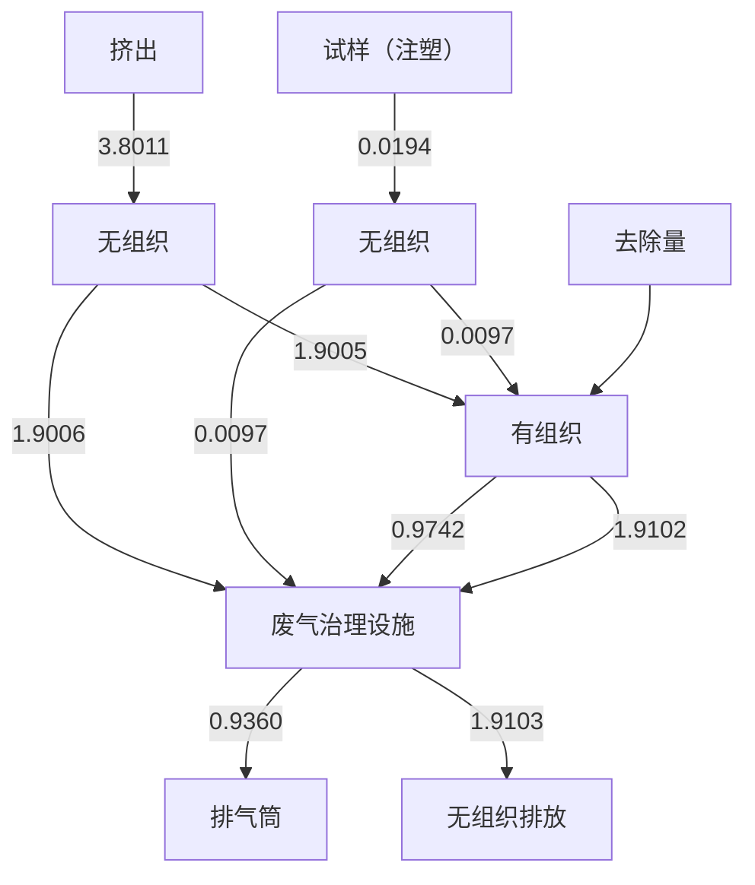
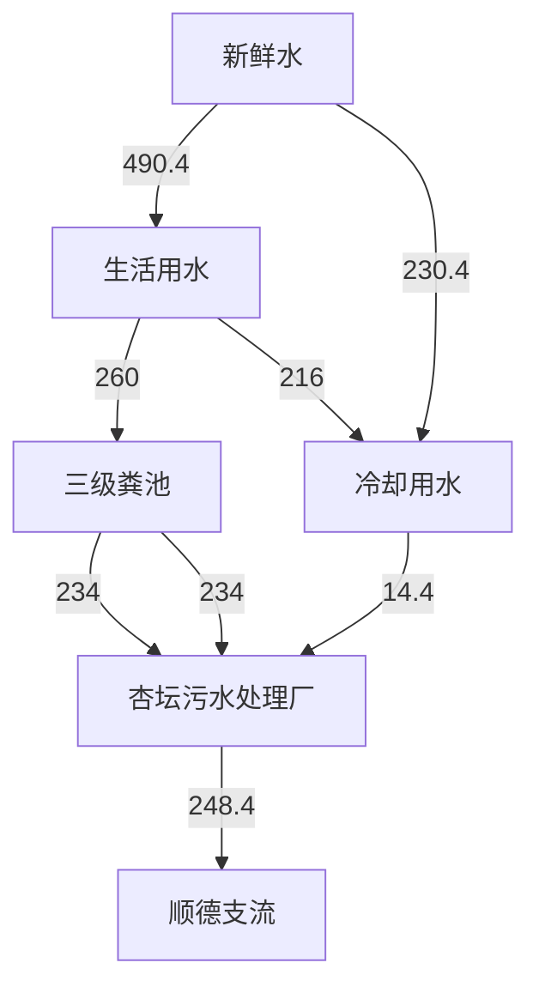
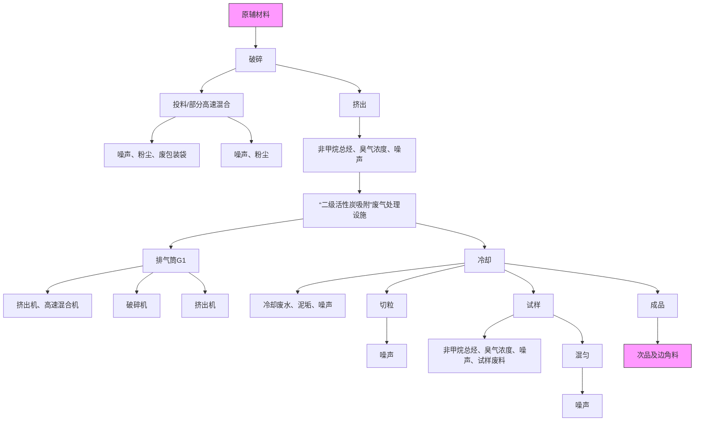
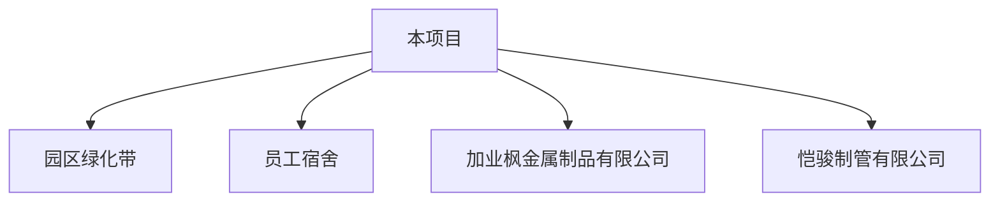

# 建设项目环境影响报告表

（污染影响类）

（公示版）

项目名称： 佛山市塑裕新材料科技有限公司新建项目

建设单位（盖章）：佛山市塑裕新材料科技有限公司

编制日期：2023 年09 月

中华人民共和国生态环境部制

# 目 录

一、建设项目基本情况...  
二、建设项目工程分析. .18  
三、区域环境质量现状、环境保护目标及评价标准. .27  
四、主要环境影响和保护措施.. .36  
五、环境保护措施监督检查清单. .64  
六、结论... ..67

# 附表

附图1 项目地理位置图

附图2 项目环境四至图和工程师勘查现场照

附图3 项目平面布置图

附图4 项目周边环境敏感点分布图

附图5 项目所在地表水环境功能区划图

附图6 项目所在地大气功能区划图

附图7 项目所在地声环境功能区划图

附图8 佛山市环境管控单元图

附图9 佛山市顺德区环境管控单元图

# 一、建设项目基本情况

<table><tr><td>建设项目名称</td><td colspan="4">佛山市塑裕新材料科技有限公司新建项目</td></tr><tr><td>项目代码</td><td colspan="4">无</td></tr><tr><td>建设单位联系人</td><td colspan="4"></td></tr><tr><td>建设地点</td><td colspan="4">广</td></tr><tr><td>地理坐标</td><td colspan="4"></td></tr><tr><td>国民经济行业类别</td><td>C2929塑料零件及其他塑料制品制造</td><td>建设项目行业类别</td><td colspan="2">二十六、橡胶和塑料制品业29-53、塑料制品业292-其他(年用非溶剂型低VOCs含量涂料10吨以下的除外)</td></tr><tr><td>建设性质</td><td>√新建(迁建)□改建□扩建□技术改造</td><td>建设项目申报情形</td><td colspan="2">√首次申报项目□不予批准后再次申报项目□超五年重新审核项目□重大变动重新报批项目</td></tr><tr><td>项目审批(核准/备案)部门(选填)</td><td>无</td><td>项目审批(核准/备案)文号(选填)</td><td colspan="2">无</td></tr><tr><td>总投资(万元)</td><td>200</td><td>环保投资(万元)</td><td colspan="2">20</td></tr><tr><td>环保投资占比(%)</td><td>10</td><td>施工工期</td><td colspan="2">1个月</td></tr><tr><td>是否开工建设</td><td>√否□是</td><td>用地(用海)面积( $m^{2}$ )</td><td colspan="2">2000</td></tr><tr><td>专项评价设置情况</td><td colspan="4">无</td></tr><tr><td>规划情况</td><td colspan="4">无</td></tr><tr><td rowspan="3">规划环境影响评价情况</td><td colspan="4">本项目位于佛山市顺德高新技术产业开发区扩区,与《佛山市顺德高新技术产业开发区扩区规划环境影响报告书审查意见》相符性分析如下。表1-1 项目与规划环评相符性分析</td></tr><tr><td>清单类型</td><td>总体准入要求</td><td>项目情况</td><td>符合型</td></tr><tr><td>空间布局约束</td><td>1、引入产业应符合现行有效的《产业结构调整指导目录》、《市场准入负面清单》等相关产业政策的要求。2、禁止引入新增排放重点防控重金属污染物(铅(Pb)、汞(Hg)、镉(Cd)、铬(Cr)和类金属砷(As))、持久性有机污染物的项目。3、饮用水源准保护区内不得新建、扩建对水体污染严重、排放一类水污染物和持久性有机污染物的项目,改扩建项目不得新增水污染物。4、禁止引入达不到清洁生产国际先进水平的企业。5、在污水管网建设滞后或所依托的污水处理厂处理能力不能满足废水处理需求的区域,不应引入废水排放量较大的项目。扩区应控制废水排放量较大企业的引入,引入涉水排放企业的规模应与区域污水处理厂处理能力相匹配,严格控制废水排放量较大的项目及新增一类水污染物排放项目的引入,避免对下游饮用水源保护区产生不良影响。6、禁止新建、扩建燃煤燃油火电机组和企业自备电站,逐步淘汰生物质锅炉、集中供热管网覆盖区域内的分散供热锅炉,集中供热管网覆盖地区禁止新建、扩建分散供热锅炉,规划区应全部按高污染燃料禁燃区进行管理;禁止新建、扩建水泥、平板玻璃、化学制浆、炼化、炼钢炼铁、电解铝、焦炭、金属冶炼、制浆造纸、鞣、铅酸蓄电池、专业电镀、木质家具涂装、印染项目;不再新建陶瓷厂(新型特种陶瓷项目除外)。化工项目按照“入园管理”原则合理布局,提高准入门槛,不得新建、扩建纳入国家“高污染、高环境风险”产品名录的生产项目。7、严格控制日用玻璃制造、家具制造、废塑料回收加工再生(列入国家“城市矿产”示范基地项目除外)、专业金属表面处理(铝及铝合金的阳极氧化、铝的表面铬酸盐转化、锌的铬酸盐钝化和金属酸洗、磷化、喷漆、喷涂)等项目建设;严格限制新建生产和使用高挥发性有机物原辅材料的项目,鼓励建设挥发性有机物共性工厂。8、工业企业禁止选址城镇生活空间,生产空间禁止建设居民住宅等敏感建筑;园区工业用地或企业与村庄、学校等环境敏感点之间应设置合理的防护距离,并通过绿化带进行有效隔离,该距离内不得规划新建居民点、办公楼和学校等环境敏感目标。9、现有及规划居住区、学校、医院等敏感用地周边50米范围内禁止新建、扩建高噪声排放生产项目;现有及规划居住区、学校、医院等敏感用地周边100米范围内禁止新建、扩建纳入国家“高污染、高环境风险”产品名录的生产项目,不引入酸洗、涂装、注塑、排放恶臭气味的生产工艺和生产设施。10、结合《顺德区高质量推动村级工业园升级改造总体规划》,推进区域村级工业园改造工作,禁止重复低水平建设。</td><td>1、本项目C2929塑料零件及其他塑料制品制造不属于《市场准入负面清单(2022年版)》(发改体改[2022]397号)中禁止和许可事项。2、本项目不涉及重金属污染物和持久性有机污染物排放。3、本项目不涉及饮用水源保护区。4、项目不涉及。5、项目冷却水经沉淀处理后回用,冷却废水定期通过市政管网排入杏坛污水处理厂处理。生活污水处理达标后排放至杏坛污水处理厂处理。6、本项目不属于“高污染、高环境风险”行业。7、本项目属于C2929塑料零件及其他塑料制品制造,不使用高挥发性有机物原辅材料。8、距离项目最近的大气敏感点为项目西面110m处的光辉居民群,距离较远。园区自带绿化带。9、距离项目最近的大气敏感点为项目西面110m处的光辉居民群,距离较远。园区自带绿化带。10、项目不涉及。</td><td>符合</td></tr><tr><td></td><td>污染物排放管控</td><td>1、污染物排放总量不得突破“污染物排放总量管控限值清单”的总量管控要求;重点对重点污染物(重点污染物包括化学需氧量、氨氮、氮氧化物及挥发性有机物等)实施总量控制;上年度重点河涌水质未达到水环境质量目标的管控分区所在镇(街道),须组织编制、系统实施、向社会公开区域重点水污染物减排计划并明确“替代量”,本年度新建、改建、扩建项目新增水环境重点污染物实行区域“减二增一”替代(废水集中处理设施、民生项目除外);在可核查、可监管的基础上,全区新建、改建、扩建项目新增大气重点污染物实</td><td>1、项目冷却水经沉淀处理后回用,冷却废水定期通过市政管网排入杏坛污水处理厂处理。生活污水经三级化粪池处理后排入杏坛污水处理厂,根据《佛山市排污权有偿使用和交易管理试行办法》(佛府办[2020]第19号)生活污水的CODcr、氨氮不分</td><td>符合</td></tr><tr><td></td><td></td><td>行“减二增一”替代。2、未完成环境质量改善目标的区域,新改扩建项目重点污染物实施减量替代。3、未接入污水管网的新建建筑小区或公共建筑,不得交付使用。新建城区生活污水收集处理设施要与城市发展同步规划、同步建设。4、规划区内建设项目废污水原则上应接入各片区集中式污水处理厂进行集中处理、达标排放;受纳水体或监控断面不达标的,不得新建、扩建向河涌直接排放废水的项目;对于暂时无法接入市政污水管网、且废水量较少的项目,生活污水处理后立足回用,不能回用的,应处理达到《城镇污水处理厂污染物排放标准》(GB18918-2002)后排入政策法规允许排放且有环境容量的水域;生产废水应立足于回用,不能回用的,可考虑委外处置,确需要外排的,应处理达到行业直接排放标准或广东省《水污染物排放限值》(DB44/26-2001)后排入政策法规允许排放且有环境容量的水域。5、向工业集聚区污水集中处理设施或者城镇污水集中处理设施排放工业废水的,应当按照有关规定进行预处理,达到集中处理设施处理工艺要求后方可以排入市政管网进入各片区污水处理厂。企业生活污水达到广东省《水污染物排放限值》(DB44/26-2001)第二时段三级标准后通过污水管线进入各片区所依托的城镇污水处理厂。6、规划区依托的集中式污水处理设施排放标准应达到或优于《城镇污水处理厂污染物排放标准》(GB18918-2002)一级标准的A标准和广东省《水污染物排放限值》(DB44/26-2001)第二时段一级标准的较严者。7、挤出等合成树脂加工生产环节和生产设备其执行《合成树脂工业污染物排放标准》(GB31572-2015)表5规定的大气污染物特别排放限值(涉及PVC树脂的不执行)、合成树脂工业污染物排放标准及其</td><td>配总量,其总量纳入杏坛污水处理厂。2、有机废气(VOCs)排放总量为2.8463t/a,在镇总量中分配。3、项目所在地已接通污水管网,生活污水经预处理后排入杏坛污水处理厂处理。4、项目冷却水经沉淀处理后回用,冷却废水定期通过市政管网排入杏坛污水处理厂处理。产生的生活污水经三级化粪池处理后排入杏坛污水处理厂。5、项目冷却水经沉淀处理后回用,冷却废水定期通过市政管网排入杏坛污水处理厂处理。生活污水经三级化粪池处理后排入杏坛污水处理厂。6、杏坛污水处理厂尾水排放执行《水污染物排放限值》(DB44/26-2001)中的第二时段一级标准和《城镇污水处理厂污染物排放标准》(GB18918-2002)中一级标准的A标准中的较严值。7、本项目涉及挤出等合成树脂加工。执行《合成树脂工业污染物</td></tr></table>

<table><tr><td rowspan="3"></td><td></td><td>他污染控制要求;厂区内VOCs无组织排放监控点浓度应符合GB37822-2019中表A.1规定的特别排放限值。8、重点加强涉VOCs排放的工业项目的挥发性有机物的源头替代和无组织排放管控,大力推进低VOCs含量原辅材料替代。</td><td>排放标准》(GB31572-2015)表5规定的大气污染物特别排放限值(涉及PVC树脂的不执行)、合成树脂工业污染物排放标准及其他污染控制要求;厂区内VOCs无组织排放监控点浓度应符合GB37822-2019中表A.1规定的特别排放限值。8、本项目不涉及VOCs含量原辅材料。</td><td></td></tr><tr><td>环境风险防控</td><td>生产性废水较多的企业需配套有效措施,防止事故废水和第一类污染物直排污染地表水体,防止因渗漏污染地下水。</td><td>项目冷却水经沉淀处理后回用,冷却废水定期通过市政管网排入杏坛污水处理厂处理。</td><td>符合</td></tr><tr><td>资源开发利用要求</td><td>禁止使用高污染燃料。</td><td>本项目仅使用电能,不属于高污染燃料。</td><td>符合</td></tr><tr><td>规划及规划环境影响评价符合性分析</td><td colspan="4">本项目符合《佛山市顺德高新技术产业开发区扩区规划环境影响报告书审查意见》。</td></tr><tr><td>其他符合性分析</td><td colspan="4">1、选址合理性分析佛山市塑裕新材料科技有限公司位于广东省佛山市顺德区杏坛镇齐杏社区杏坛工业区科技区七路1号之十,根据《房地产权证书》(详见附件5)可知,本项目所在地用地性质属于工业用地,故本项目的选址符合用地规划。2、与产业政策相符性分析根据国家发展和改革委员会发布的《产业结构调整指导目录(2019年本)》,本项目不属于上述目录所列的鼓励类、限制和禁止(淘汰)项目;根据《促进产业结构调整暂行规定》</td></tr></table>

第十三条，项目属于允许类；根据国家《市场准入负面清单》（2022版）和《与市场准入相关的禁止性规定》，本项目不属于上述文件禁止项目；根据《广东省禁止、限制生产、销售和使用的塑料制品目录》（2020年版），本项目不属于上述文件禁止、限制的塑料制品。因此，项目符合相关的产业政策要求。

# 3、与地区涉水排放政策相符性分析

根据《佛山市顺德区环境保护委员会办公室关于对涉水排放的建设项目加强环境管理的通知》（顺环委办〔2020〕44号），项目生活污水统一通过市政管道排至杏坛污水处理厂，不向河涌直接排放废水，具备排水条件。项目所属 C2929 塑料零件及其他塑料制品制造，不涉及含酸洗、喷涂、拉丝、表面抛光等工艺的不锈钢型材加工。项目的排水系统满足“雨污分流、清污分流”的要求。

# 4、“三线一单”符合性分析

（1）与《广东省人民政府关于印发广东省“三线一单”生态环境分区管控方案的通知》（粤府[2020]71 号）的符合性分析

根据《广东省人民政府关于印发广东省“三线一单”生态环境分区管控方案的通知》（粤府[2020]71号），广东省将以环境管控单元为基础，实施生态环境分区管控，精细化管理、保护生态环境。本项目与广东省“三线一单”生态环境分区管控方案相符性分析如下：

表 1-2 与广东省“三线一单”相符性分析

<table><tr><td>管控纬度</td><td>管控要求</td><td>工程内容</td><td>符合性</td></tr><tr><td>区域布局管控</td><td>禁止新建、扩建燃煤燃油火电机组和企业自备电站,推进现有服役期满及落后老旧的燃煤火电机组有序退出;原则上不再新建燃煤锅炉,逐步淘汰生物质锅炉、集中供热管网覆盖区域内的分散供热锅炉,逐</td><td>项目使用电能均来源于市政电网,不设锅炉,不设备用发电机,经营过程不使用燃料;项目不属于水泥、平板玻璃、化学制浆、生皮制革、钢铁、原油</td><td>符合</td></tr></table>

<table><tr><td rowspan="4"></td><td rowspan="4"></td><td></td><td>步推动高污染燃料禁燃区全覆盖;禁止新建、扩建水泥、平板玻璃、化学制浆、生皮制革以及国家规划外的钢铁、原油加工等项目。推广应用低挥发性有机物原辅材料,严格限制新建生产和使用高挥发性有机物原辅材料的项目,鼓励建设挥发性有机物共性工厂。</td><td>加工等行业;项目不使用高VOCs含量原辅材料。</td><td></td></tr><tr><td>能源资源利用</td><td>科学实施能源消费总量和强度“双控”,新建高能耗项目单位产品(产值)能耗达到国际国内先进水平,实现煤炭消费总量负增长。推进工业节水减排,重点在高耗水行业开展节水改造,提高工业用水效率。加强江河湖库水量调度,保障生态流量。盘活存量建设用地,控制新增建设用地规模。</td><td>项目不属于高能耗行业,项目全部生产设备使用电能,生产用水由市政供水,不直接取用江河湖库或地下水水量,不会对项目所在地生态流量造成影响,符合能源利用要求。项目租用已建成厂房,不涉及新增城市建设用地。</td><td>符合</td></tr><tr><td>污染物排放管控</td><td>实行水污染物排放的行业标杆管理,严格执行茅洲河、淡水河、石马河、汾江河等重点流域水污染物排放标准。重点水污染物未达到环境质量改善目标的区域内,新建、改建、扩建项目实施减量替代。大力推进固体废物源头减量化、资源化利用和无害化处置,稳步推进“无废城市”试点建设。</td><td>项目属于新建项目,生活污水经预处理达标后排至杏坛污水处理厂,尾水达到《城镇污水处理厂污染物排放标准(GB18918-2002)一级A标准及广东省地方标准《水污染物排放限值》(DB44/26-2001)第二时段一级标准的较严值,排入顺德支流,符合污染物排放管控要求。项目经营过程产生的固体废弃物分类收集,次品及边角料破碎后回用于生产,一般工业固体废物由物资回收公司回收,危险废物交由有资质单位进行处理。固体废物分类减量化、资源化利用和无害化处置。</td><td>符合</td></tr><tr><td>环境风险防控</td><td>加强惠州大亚湾石化区、广州石化、珠海高栏港、珠西新材料集聚区等石化、化工重点园区环境风险防控,建立完善污染源在线监控系统,开展有毒有害气体监测,落实环境风险</td><td>项目所在地不属于石化、化工重点园区环境风险防控区域。项目产生的危险废物将定期委托有资质的处置公司进行收集处理,并</td><td>符合</td></tr></table>

<table><tr><td rowspan="7"></td><td></td><td>应急预案。提升危险废物监管能力,利用信息化手段,推进全过程跟踪管理。</td><td>通过信息系统登记转移计划和电子转移联单,符合危险废物全过程跟踪管理的防控要求。</td><td></td></tr><tr><td colspan="4">(2)与《佛山市人民政府关于印发佛山市“三线一单”生态环境分区管控方案的通知》(佛府[2021]11号)的符合性分析根据《佛山市人民政府关于印发佛山市“三线一单”生态环境分区管控方案的通知》(佛府[2021]11号)的附件1佛山市环境管控单元图(见附图8),项目所在地属于顺德高新技术产业开发区(编码:ZH44060620011)。相关管控要求的相符性分析如下:表1-3与佛山市“三线一单”的相符性分析</td></tr><tr><td>管控纬度</td><td>管控要求</td><td>工程内容</td><td>符合性</td></tr><tr><td rowspan="4">区域布局管控</td><td>【产业/禁止类】新入园项目不得引入专业电镀、印染等污染物排放量大或排放一类水污染物、持久性有机污染物的项目,不得引进园区规划环评及批复(审查意见)禁止引进项目。</td><td>本项目不含电镀、印染等污染物排放量大的工序。</td><td>符合</td></tr><tr><td>【产业/禁止类】严格生产空间和生活空间管控,工业企业原则上禁止选址生活空间,生产空间原则上禁止建设居民住宅等敏感建筑。</td><td>项目生产空间和生活空间无敏感建筑。</td><td>符合</td></tr><tr><td>【产业/综合类】园区工业用地或企业与村庄、学校等环境敏感点之间的区域应合理设置控制开发区域(产业控制带),产业控制带内优先引进无污染的生产性服务业,或可适当布置废气排放量小、工业噪声影响小的产业。</td><td>项目所在园区与村庄、学校等环境敏感点之间设置了大气环境防护距离。</td><td>符合</td></tr><tr><td>【产业/限制类】受纳水体或监控断面不达标的,不得新建、扩建向河涌直接排放废水的项目。新建、扩建含蚀刻工序的线路板生产项目和化工项目应在配套污水集中处置的工业园区或生活污水管网覆盖区域内建设;纯</td><td>项目冷却水经沉淀处理后回用,冷却废水定期通过市政管网排入杏坛污水处理厂处理。项目生活污水</td><td>符合</td></tr></table>

<table><tr><td rowspan="8"></td><td rowspan="5"></td><td></td><td colspan="3">加工型印花项目,含酸洗、磷化的金属表面处理、金属制品项目(与自身高新技术企业配套的除外),含酸洗、喷涂、拉丝、表面抛光等工艺的不锈钢型材加工项目,应进入以此类项目为主导产业、有相应废水集中治理设施的工业园区,实现集中治污。</td><td>经三级化粪池预处理后引至杏坛污水处理厂深度处理。项目已取得城镇污水排入排水管网许可证。</td><td colspan="2"></td></tr><tr><td>能源资源利用</td><td colspan="3">【能源/综合类】科学实施能源消费总量和强度“双控”,新建高能耗项目单位产品(产值)能耗达到国际国内先进水平。</td><td>本项目不属于高能耗项目。</td><td colspan="2">符合</td></tr><tr><td rowspan="2">污染物排放管控</td><td colspan="3">【水/综合类】完善污水管网建设,有条件的区域实施雨污分流改造。</td><td>项目已做好“雨污分流、清污分流”。</td><td colspan="2">符合</td></tr><tr><td colspan="3">【其他/综合类】园区各项污染物排放总量不得突破规划环评核定的污染物排放总量管控要求。</td><td>项目不涉及。</td><td colspan="2">符合</td></tr><tr><td>环境风险防控</td><td colspan="3">【风险/综合类】园区应建立企业、园区、区域三级环境风险防控体系,加强园区及入园企业环境应急设施整合共享,建立有效的拦截、降污、导流、暂存等工程措施,防止泄漏物、消防废水等进入园区外环境。建立园区环境应急监测机制,强化园区风险防控。</td><td>项目将严格采取切实可行环境风险防范措施,可有效防止进入产生的污染物进入环境,有效降低了对周围环境存在的风险影响。</td><td colspan="2">符合</td></tr><tr><td colspan="8">(3)与《佛山市顺德区人民政府关于印发佛山市顺德区“三线一单”生态环境分区管控方案的通知》(顺府发[2021]11号)的相符性分析对照《佛山市顺德区人民政府关于印发佛山市顺德区“三线一单”生态环境分区管控方案的通知》(顺府发[2021]11号)的附件2佛山市顺德区环境管控单元图(见附图9),项目所在地属于顺德高新技术产业开发区(编码:ZH44060620011)。相关管控要求的相符性分析如下:表1-4项目与顺德区“三线一单”的相符性分析</td></tr><tr><td rowspan="2">环境管控单元编码</td><td rowspan="2">环境管控单元名称</td><td colspan="3">行政区划</td><td rowspan="2">管控单元分类</td><td colspan="2" rowspan="2">要素细类</td></tr><tr><td>省</td><td>市</td><td colspan="2">区</td></tr><tr><td rowspan="8"></td><td>ZH44060620011</td><td>顺德高新技术产业开发区</td><td>广东省</td><td>佛山市</td><td>顺德区</td><td>园区型重点管控单元1</td><td colspan="2">水环境工业—城镇生活污染重点管控区、大气环境高排放重点管控区</td></tr><tr><td>管控维度</td><td colspan="5">管控要求</td><td>工程内容</td><td>符合性</td></tr><tr><td rowspan="6">区域布局管控</td><td colspan="5">【产业/鼓励引导类】园区重点发展家用电器具制造、装备制造等产业。</td><td>项目不涉及。</td><td>/</td></tr><tr><td colspan="5">【产业/禁止类】新入园项目不得引入专业电镀、印染等污染物排放量大或排放一类水污染物、持久性有机污染物的项目,不得引进园区规划环评及批复(审查意见)禁止引进项目。</td><td>本项目属于C2929塑料零件及其他塑料制品制造。污染物排放量不大。</td><td>符合</td></tr><tr><td colspan="5">【产业/禁止类】严格生产空间和生活空间管控,工业企业原则上禁止选址生活空间,生产空间原则上禁止建设居民住宅等敏感建筑。</td><td>项目不涉及。</td><td>/</td></tr><tr><td colspan="5">【产业/综合类】园区工业用地或企业与村庄、学校等环境敏感点之间的区域应合理设置控制开发区域(产业控制带),产业控制带内优先引进无污染的生产性服务业,或可适当布置废气排放量小、工业噪声影响小的产业。</td><td>项目所在园区与村庄、学校等环境敏感点之间设置了大气环境防护距离。</td><td>符合</td></tr><tr><td colspan="5">【产业/限制类】严格限制不符合园区发展定位的项目入驻。</td><td>项目不涉及。</td><td>/</td></tr><tr><td colspan="5">【产业/限制类】受纳水体或监控断面不达标的,不得新建、扩建向河涌直接排放废水的项目。新建、扩建含蚀刻工序的线路板生产项目和化工项目应在配套污水集中处置的工业园区或生活污水管网覆盖区域内建设;纯加工型印花项目,含酸洗、磷化的金属表面处理、金属制品项目(与自身高新技术企业配套的除外),含酸洗、喷涂、化学抛光、电解等涉及废水排放工艺的不锈钢型材加工项目(与自身高新技术企业配套的除外),应进入以此类项目为主导产业、有相应废水集中治理设施的工业园区,实现集中治污。</td><td>项目不涉及。</td><td>/</td></tr></table>

<table><tr><td rowspan="9"></td><td rowspan="9"></td><td rowspan="2"></td><td>【产业/综合类】划定家具生产优先发展区域,优先发展区外不再新建涉及涂装工艺的木质家具制造项目。</td><td>本项目不属于木质家具制造项目。</td><td>/</td></tr><tr><td>【产业/综合类】系统推进村级工业园升级改造,腾出连片空间,布局产业集聚区和主题产业园,推动工业项目入园集聚发展。新增工业制造业用地原则上安排在产业集聚区内,产业集聚区外原则上不鼓励工业及物流仓储用地的新建与改造。</td><td>项目位于高新技术产业开发区,不属于村级改造范围。</td><td>符合</td></tr><tr><td rowspan="4">能源资源利用</td><td>【能源/综合类】科学实施能源消费总量和强度“双控”,新建高能耗项目单位产品(产值)能耗达到国际国内先进水平。</td><td>本项目不属于高能耗项目。</td><td>/</td></tr><tr><td>【水资源/综合类】提高园区水资源利用效率,提升污水回用比例。</td><td>本项目用水主要为生活用水和生产用水,用水量少。</td><td>/</td></tr><tr><td>【土地资源/综合类】落实单位土地面积投资强度、土地利用强度等建设用地控制性指标要求,提高土地利用效率。</td><td>项目不涉及。</td><td>/</td></tr><tr><td>【其他/综合类】有行业清洁生产标准的新引进项目清洁生产水平须达到本行业国际先进水平。</td><td>项目不涉及。</td><td>/</td></tr><tr><td rowspan="2">污染物排放管控</td><td>【其他/综合类】园区各项污染物排放总量不得突破规划环评核定的污染物排放总量管控要求。</td><td>项目不涉及。</td><td>符合</td></tr><tr><td>【水/综合类】完善污水管网建设,有条件的区域实施雨污分流改造。</td><td>本项目厂房已采取雨污分流,雨水经雨水管道排入雨水管网,生活污水经三级化粪池预处理后通过市政管网排入杏坛污水处理厂进一步处理。项目已取得城镇污水排入排水管网许可证。</td><td>符合</td></tr><tr><td>环境风险防控</td><td>【风险/综合类】园区应建立企业、园区、区域三级环境风险防控体系,加强园区及入园企业环境应急设施整合共享,建立有效的拦截、降污、导流、暂存等工程措施,防止泄漏物、消防废水等进入园区外环境。</td><td>项目将严格采取切实可行环境风险防范措施,可有效防止进入产生的污染物进入环境,</td><td>符合</td></tr></table>

<table><tr><td></td><td>建立园区环境应急监测机制,强化园区风险防控。</td><td>有效降低了对周围环境存在的风险影响。</td><td></td></tr></table>

5、挥发性有机物（VOCs）排放符合性分析

表 1-5 项目与挥发性有机物（VOCs）排放规定相符性分析

<table><tr><td>序号</td><td>政策要求</td><td>工程内容</td><td>符合性</td></tr><tr><td colspan="4">1.《广东省生态环境保护“十四五”规划》</td></tr><tr><td>1.1</td><td>大力推进低VOCs含量原辅材料源头替代,严格落实国家和地方产品VOCs含量限值质量标准,禁止建设生产和使用高VOCs含量的溶剂型涂料、油墨、胶粘剂等项目。</td><td>项目不使用高VOCs含量原辅材料。</td><td>符合</td></tr><tr><td>1.2</td><td>严格实施VOCs排放企业分级管控,全面推进涉VOCs排放企业深度治理。开展中小型企业废气收集和治理设施建设、运行情况的评估,强化对企业涉VOCs生产车间/工序废气的收集管理,推动企业开展治理设施升级改造。</td><td>挤出、注塑工序产生的有机废气经包围型集气罩收集采用“二级活性炭吸附”设施处理后通过25m排气筒DA001排放。</td><td>符合</td></tr><tr><td colspan="4">2.佛山市生态环境局关于印发《佛山市生态环境保护“十四五”规划》的通知(佛环〔2022〕3号)</td></tr><tr><td>2.1</td><td>大力推进低VOCs含量原辅材料替代,将全面使用低VOCs含量原辅材料的企业纳入正面清单和政府绿色采购清单。鼓励重点行业企业开展生产工艺和设备水性化改造,推广使用水性、高固体分、无溶剂、粉末等低VOCs含量涂料。严格落实《挥发性有机物无组织排放控制标准》,开展厂区内无组织排放浓度监测。加强对含VOCs物料储存、转移和运输、设备与管线组件泄漏、敞开页面逸散以及工艺过程等五类排放源的管控。</td><td>项目不使用高VOCs含量原辅材料。</td><td>符合</td></tr><tr><td>2.2</td><td>推进VOCs高排放企业治理设施提升改造,淘汰光催化、光氧化、低温等离子等现有低效治理设施。分期分批推广涉VOCs企业安装产污环节、治污</td><td>挤出、注塑工序产生的有机废气经包围型集气罩收集采用“二级活性炭吸附”设施</td><td>符合</td></tr></table>

<table><tr><td rowspan="9"></td><td></td><td>环节过程监控设备。以汽车维修等行业为重点,推广建设区域共享涂装中心、活性炭集中再生中心,推动VOCs集中高效治理。</td><td>处理后通过25m排气筒DA001排放。</td><td></td><td></td></tr><tr><td colspan="5">3.《佛山市顺德区生态环境保护“十四五”规划(2021-2025)》(顺府办发〔2022〕16号)</td></tr><tr><td>3.1</td><td>大力推进低VOCs含量、低反应活性的原辅材料替代,将全面使用低VOCs含量原辅材料的企业纳入正面清单和政府绿色采购清单。鼓励重点行业企业开展生产工艺和设备水性化改造,推广使用水性、高固体分、无溶剂、粉末等低VOCs含量涂料。</td><td>项目不使用高VOCs含量原辅材料。</td><td colspan="2">符合</td></tr><tr><td colspan="5">4.关于印发《重点行业挥发性有机物综合治理方案》的通知(环大气[2019]53号)</td></tr><tr><td>4.1</td><td>通过使用水性、粉末、高固体分、无溶剂、辐射固化等低VOCs含量的涂料,水性、辐射固化、改性、生物降解等低VOCs含量的粘胶剂,以及低VOCs含量、低反应活性的清洗剂等,替代溶剂型涂料、油墨、胶黏剂、清洗剂等,从源头减少VOCs产生。</td><td>项目不使用高VOCs含量原辅材料。</td><td colspan="2">符合</td></tr><tr><td>4.2</td><td>含VOCs物料生产和使用过程,应采取有效收集措施或在密闭空间中操作。</td><td>挤出、注塑工序产生的有机废气经包围型集气罩收集采用“二级活性炭吸附”设施处理后通过25m排气筒DA001排放。</td><td colspan="2">符合</td></tr><tr><td colspan="5">5.《佛山市生态环境局顺德分局关于做好重点行业建设项目挥发性有机物总量指标管理工作的通知》(佛顺环函〔2019〕56号)</td></tr><tr><td>5.1</td><td>涉VOCs排放项目,实现本行政区域内污染源“点对点”2倍量削减替代。</td><td>项目挥发性有机物控制总量指标为2.8463t/a由区镇两级环保主管部门核查总量指标。</td><td colspan="2">符合</td></tr><tr><td colspan="5">6.《广东省人民政府办公厅关于引发广东省2021年大气、水、土壤污染防治方案的通知》(粤办函[2021]58号)</td></tr><tr><td rowspan="7"></td><td>6.1</td><td>严格落实国家产品VOCs含量限值标准要求,除现阶段确无法实施替代的工序外,禁止新建生产和使用高VOCs含量原辅材料项目。鼓励在生产和流通消费环节推广使用低VOCs含量原辅材料。</td><td>项目不使用高VOCs含量原辅材料。</td><td colspan="2">符合</td></tr><tr><td colspan="5">7.《挥发性有机物无组织排放控制标准》(GB37822-2019)</td></tr><tr><td>7.1</td><td>VOCs物料应储存于密闭的容器、包装袋、储罐、储库、料仓中。</td><td rowspan="3">项目不使用高VOCs含量原辅材料。均密封储存,存放于室内,非取用时封口保持密闭。</td><td colspan="2">符合</td></tr><tr><td>7.2</td><td>盛装VOCs物料的容器或包装袋应存放于室内,或存放于设置有雨棚、遮阳和防渗设施的专用场地。盛装VOCs物料的容器或包装袋在非取用状态时应加盖、封口,保持密闭。</td><td colspan="2">符合</td></tr><tr><td>7.3</td><td>VOCs物料储库、料仓应利用完整的围护结构将污染物质、作业场所等与周围空间阻隔所形成的封闭区域或封闭式建筑物。该封闭区域或封闭式建筑物除人员、车辆、设备、物料进出时,以及依法设立的排气筒、通风口外,门窗及其他开口(孔)部位应随时保持关闭状态。</td><td colspan="2">符合</td></tr><tr><td>7.4</td><td>VOCs废气收集处理系统应与生产工艺设备同步运行。VOCs废气收集处理系统发生故障或检修时,对应的生产工艺设备应停止运行,待检修完毕后同步投入使用;生产工艺设备不能停止运行或不能及时停止运行的,应设置废气应急处理设施或采取其他替代措施。</td><td>挤出、注塑工序产生的有机废气经包围型集气罩收集采用“二级活性炭吸附”设施处理后通过25m排气筒DA001排放。</td><td colspan="2">符合</td></tr><tr><td>7.5</td><td>企业应建立台账,记录废气收集系统、VOCs处理设施的主要运行和维护信息,如运行时间、废气处理量、操作温度、停留时间、吸附剂再生/更换周期和更换量、催化剂更换周期和更换量、吸收液pH值等关键运行参数。台账保存期限不少于3年。</td><td>项目建设后,建立台账,记录废气收集系统。台账保存期限不少于3年。</td><td colspan="2">符合</td></tr><tr><td rowspan="7"></td><td>7.6</td><td colspan="2">VOCs质量占比大于等于10%的含VOCs产品,其使用过程应采用密闭设备或在密闭空间内操作,废气应排至VOCs废气收集处理系统;无法密闭的,应采取局部气体收集设施,废气应排至VOCs废气收集处理系统。</td><td>挤出、注塑工序产生的有机废气经包围型集气罩收集采用“二级活性炭吸附”设施处理后通过25m排气筒DA001排放。</td><td>符合</td></tr><tr><td colspan="5">8.《关于印发&lt;2020年挥发性有机物治理攻坚方案&gt;的通知》(环大气[2020]33号)</td></tr><tr><td>8.1</td><td colspan="2">大力推进低(无)VOCs含量原辅材料替代。将全面使用符合国家要求的低VOCs含量原辅材料的企业纳入正面清单和政府绿色采购清单。企业应建立原辅材料台账,记录VOCs原辅材料名称、成分、VOCs含量、采购量、使用量、库存量、回收方式、回收量等信息,并保存相关证明材料。采用符合国家有关低VOCs含量产品规定的涂料、油墨、胶粘剂等,排放浓度稳定达标且排放速率满足相关规定的,相应生产工序可不要求建设末端治理设施。</td><td>项目不使用高VOCs含量原辅材料。</td><td>符合</td></tr><tr><td colspan="5">9.关于印发《广东省涉挥发性有机物(VOCs)重点行业治理指引》的通知(粤环办[2021]43号)</td></tr><tr><td>9.1</td><td rowspan="2">VOCs物料</td><td>使用低(无)VOCs含量、低反应活性的原辅材料,对芳香烃、含卤素有机化合物的绿色替代。</td><td>项目不使用高VOCs含量原辅材料。</td><td>符合</td></tr><tr><td>9.2</td><td>液态VOCs物料采用密闭管道输送方式或采用高位槽(罐)、桶泵等给料方式密闭投加;无法密闭投加的,在密闭空间内操作,或进行局部气体收集,废气排至VOCs废气收集处理系统。</td><td>挤出、注塑工序产生的有机废气经包围型集气罩收集采用“二级活性炭吸附”设施处理后通过25m排气筒DA001排放。</td><td>符合</td></tr><tr><td>9.3</td><td>工艺过程</td><td>在混合/混炼、塑炼/塑化/熔化、加工成型(挤出、注射、压制、压延、发泡、纺丝等)、硫化等作用中应采用密闭设备或在密闭空间中操作,废气应排至VOCs废气收集处理系统;无法密闭的,应采取局部气体收集措施,废气排至VOCs废气收集处理系统。</td><td>挤出、注塑工序产生的有机废气经包围型集气罩收集采用“二级活性炭吸附”设施处理后通过25m排气筒DA001排放。</td><td>符合</td></tr><tr><td rowspan="5"></td><td>9.4</td><td rowspan="3">废气收集</td><td>采用外部集气罩的,距集气罩开口面最远处的VOCs无组织排放位置,控制风速不低于0.3m/s。</td><td>项目有机废气采用包围型集气罩(四周设置垂帘)收集,收集效率为50%,收集风速为0.6m/s大于0.3m/s。</td><td>符合</td></tr><tr><td>9.5</td><td>废气收集系统的输送管道应密闭。废气收集系统应在负压下运行,若处于正压状态,应对管道组件的密封垫进行泄漏检测,泄漏检测值不应超过500μmol/mol,亦不应有感官可察觉泄漏。</td><td>项目废气收集系统的输送管道均密闭,废气收集系统在负压下运行。</td><td>符合</td></tr><tr><td>9.6</td><td>VOCs治理设施应与生产工艺设备同步运行,VOCs治理设施发生故障或检修时,对应的生产工艺设备应停止运行,待检修完毕后同步投入使用;生产工艺设备不能停止运行或不能及时停止运行的,应设置废气应急处理设施或采取其他替代措施</td><td>项目运营期间必须开启风机,有效减少无组织排放废气。废气收集处理系统发生故障或检修时,所有产生废气的工序停止运行,待检修完毕后再投入生产。</td><td>符合</td></tr><tr><td>9.7</td><td>排放水平</td><td>(1)车间或生产设施排气中NMHC初始排放速率≥3kg/h时,建设末端治污设施且处理效率≥80%(2)厂区内无组织排放监控点NMHC的小时平均浓度值不超过6mg/m3,任意一次浓度值不超过20mg/m3。</td><td>项目生产过程NMHC达到《挥发性有机物无组织排放控制标准》(GB37822-2019)中表A.1厂区内VOCs无组织特别排放限值和《固定污染源挥发性有机物综合排放标准》(DB44/2367-2022)中表3厂区内VOCs无组织排放限值;NMHC厂区内无组织排放满足平均浓度值不超过6mg/m3,任意一次浓度值不超过20mg/m3。</td><td>符合</td></tr><tr><td>9.8</td><td>管理台账</td><td>建立废气收集处理设施台账,记录废气处理设施进出口的监测数据(废气量、浓度、温度、含氧量等)、废气收集与处理设施关键参数、废气处理设施相关</td><td>项目废气治理设施安排专人维护并定期建立台账,记录相关废气数据。</td><td>符合</td></tr></table>

<table><tr><td rowspan="2"></td><td></td><td rowspan="2"></td><td>耗材(吸收剂、吸附剂、催化剂等)购买和处理记录。</td><td></td><td></td><td rowspan="2"></td></tr><tr><td>9.9</td><td>建立危废台账,整理危废处置合同、转移联单及危废处理方式资质佐证材料。</td><td>项目建立危险废物台账,定期将危险废物交给有资质的单位处理,整理危废处理合同、转移联单等资料。</td><td>符合</td></tr><tr><td colspan="7">综上,本项目符合国家产业政策的要求,同时符合广东省、佛山市以及顺德区产业政策和相关规范的要求。</td></tr></table>

# 二、建设项目工程分析

# 1、项目由来

佛山市塑裕新材料科技有限公司位于广东省佛山市顺德区杏坛镇齐杏社区杏坛工业区科技区七路 1号之十，中心地坐标东经113度11分15.91872秒，北纬 22 度 46 分 34.61289 秒，占地约 2000m2，总建筑面积为 3200m2，主要从事改性塑料的生产与销售，建设规模为年产 PVC改性塑料800吨、PP改性塑料800吨、试样塑料成品 7.2吨。

根据《中华人民共和国环境影响评价法》（2018年12月29日修正版）和《建设项目环境保护管理条例》（中华人民共和国国务院令第 682号，2017年10月01日起施行）的有关规定，一切可能对环境造成影响的新建、扩建或改建项目必须实行环境影响评价审批制度，以便能有效的控制新的污染和生态破坏，保护环境、利国利民。根据生态环境部部令第 16 号《建设项目环境影响评价分类管理名录（2021 年版）》，本项目属于“二十六、橡胶和塑料制品业 29”中“53 塑料制品业 292”类别中的“其他（年用非溶剂型低 VOCs含量涂料 10 吨以下的除外）”类别，故该项目应编制环境影响报告表。

受佛山市塑裕新材料科技有限公司的委托，佛山市叶绿体环保科技有限公司承担了本项目的环境影响评价工作。评价单位接受该任务后，随即组织人员进行现场勘察、区域环境现状调查和资料收集，并对拟建项目的建设内容和排污状况进行了资料调研和深入分析，在此基础上，按照国家相关环保法律、法规、污染防治技术政策的有关规定及环境影响评价技术导则要求，编制了《佛山市塑裕新材料科技有限公司新建项目环境影响报告表》。

# 2、工程内容及规模

根据建设单位提供的资料，项目的主要产品见下表2-1。

表 2-1 项目主要产品种类及规模

<table><tr><td>产品名称</td><td>计量单位</td><td>产量</td><td>最大储存量</td><td>备注</td></tr><tr><td>PVC 改性塑料</td><td>吨/年</td><td>800</td><td>200</td><td>新料,25kg/袋</td></tr><tr><td>PP 改性塑料</td><td>吨/年</td><td>800</td><td>200</td><td>新料,25kg/袋</td></tr><tr><td>试样塑料成品</td><td>吨/年</td><td>7.2</td><td>3</td><td>/</td></tr></table>

项目租用1栋4层已建成的厂房中的第 1层、夹层和3层部分车间进行生产，该栋厂房 1层高10m，2-4层高4.5m，厂房总高23.5m。项目占地面积为2000m2，总建筑面积为 3200m2。项目工程内容见2-2。

表 2-2 项目工程内容

<table><tr><td>类别</td><td colspan="2">工程名称</td><td>建设内容</td></tr><tr><td>主体工程</td><td colspan="2">生产车间</td><td>面积约3135m2,主要功能为挤出区、切粒区、混料区、试样区、破碎区、原料堆放区、成品仓、危废房、治理设施区等。</td></tr><tr><td rowspan="2">辅助工程</td><td colspan="2">危废房</td><td>面积约10m2,主要功能为危险废物的储存。</td></tr><tr><td colspan="2">办公室</td><td>面积约55m2,主要功能为员工的日常办公。</td></tr><tr><td rowspan="3">公用工程</td><td colspan="2">供水</td><td>由市政管网供应。</td></tr><tr><td colspan="2">排水</td><td>1生活污水经三级化粪池预处理后经市政管网引至杏坛污水处理厂;2冷却水经沉淀处理后回用,冷却废水定期通过市政管网排入杏坛污水处理厂处理。</td></tr><tr><td colspan="2">供电</td><td>由市政电网供应。</td></tr><tr><td rowspan="8">环保工程</td><td rowspan="2">废水</td><td>生活污水</td><td>生活污水经三级化粪池预处理后经市政管网引至杏坛污水处理厂。</td></tr><tr><td>冷却废水</td><td>冷却水经沉淀处理后回用,冷却废水定期通过市政管网排入杏坛污水处理厂处理。</td></tr><tr><td rowspan="2">废气</td><td>挤出、试样废气</td><td>有机废气经包围型集气罩收集采用“二级活性炭吸附”设施处理后通过25m排气筒DA001排放。</td></tr><tr><td>投料、破碎粉尘</td><td>投料工序产生的粉尘经上部伞型罩引至分散式布袋除尘器集中收集;部分未被收集的粉尘经加强车间通风排气后进行无组织排放。破碎工序产生的粉尘经加强车间通风排气后无组织排放。</td></tr><tr><td colspan="2">噪声</td><td>对噪声源采取选用低噪声设备、隔声减震等措施</td></tr><tr><td rowspan="3">固废</td><td>生活垃圾</td><td>由环卫部门统一收集处理。</td></tr><tr><td>一般工业固废</td><td>废包装袋经收集后交由资源公司处理;试样废料经收集后交由资源公司处理。投料粉尘部分经收集后交由资源公司处理。</td></tr><tr><td>危险废物</td><td>统一交由有资质单位收集处理。</td></tr></table>

# 3、主要生产设备及原辅材料

根据建设单位提供的资料，项目主要生产设备见表2-3。

表 2-3 项目主要生产设备一览表

<table><tr><td>序号</td><td>设备名称</td><td>数量</td><td>型号</td><td>工序</td><td>设施参数</td><td>位置</td></tr><tr><td>1</td><td>挤出机1</td><td>6台</td><td>WL-60</td><td>挤出</td><td>85kg/h</td><td>1层、3层</td></tr><tr><td>2</td><td>挤出机2</td><td>1台</td><td>SHJ-65</td><td>挤出</td><td>100kg/h</td><td>1层</td></tr><tr><td>3</td><td>挤出机3</td><td>1台</td><td>SHJ-75</td><td>挤出</td><td>140kg/h</td><td>1层</td></tr><tr><td>4</td><td>切粒机</td><td>8台</td><td>WL-65</td><td>切粒</td><td>85kg/h-140kg/h</td><td>1层、3层</td></tr><tr><td>5</td><td>注塑机</td><td>2台</td><td>CJ80M3V</td><td>试样</td><td>153g</td><td>3层</td></tr><tr><td>6</td><td>混料机</td><td>6台</td><td>/</td><td>混匀</td><td>5t</td><td>1层、3层</td></tr><tr><td>7</td><td>高速混合机</td><td>2台</td><td>SHR-300</td><td>高速混合</td><td>功率15kw</td><td>1层夹层</td></tr><tr><td>8</td><td>循环冷却水系统</td><td>2套</td><td>/</td><td>工件降温</td><td>循环水量 $4m^{3}/h$ 、 $2m^{3}/h$ </td><td>1层、3层</td></tr><tr><td>9</td><td>空压机</td><td>2台</td><td>/</td><td>辅助设备</td><td>功率11kw</td><td>1层、3层</td></tr><tr><td>10</td><td>破碎机</td><td>1台</td><td>/</td><td>破碎</td><td>功率22kw</td><td>1层</td></tr><tr><td>11</td><td>投料漏斗</td><td>5台</td><td>WL-65</td><td>投料</td><td>/</td><td>1层夹层</td></tr></table>

根据建设单位提供的资料，本项目主要原辅材料及用量见表 2-4。

表 2-4 项目主要原辅材料一览表

<table><tr><td>序号</td><td>名称</td><td>年用量</td><td>最大储存量</td><td>性质</td><td>包装规格</td></tr><tr><td>1</td><td>PVC(新料)</td><td>800吨</td><td>100吨</td><td>固态</td><td>25kg/袋</td></tr><tr><td>2</td><td>PP(新料)</td><td>800吨</td><td>100吨</td><td>固态</td><td>25kg/袋</td></tr><tr><td>3</td><td>色母</td><td>0.2吨</td><td>0.1吨</td><td>固态</td><td>10kg/袋</td></tr><tr><td>4</td><td>抗氧剂</td><td>2吨</td><td>0.2吨</td><td>粉状</td><td>25kg/袋</td></tr><tr><td>5</td><td>润滑剂</td><td>2吨</td><td>0.2吨</td><td>粉状</td><td>25kg/袋</td></tr><tr><td>6</td><td>滑石粉</td><td>1吨</td><td>0.2吨</td><td>粉状</td><td>25kg/袋</td></tr><tr><td>7</td><td>阻燃剂</td><td>1吨</td><td>0.2吨</td><td>粉状</td><td>25kg/袋</td></tr><tr><td>8</td><td>白矿油</td><td>2吨</td><td>1吨</td><td>液态</td><td>1t/桶</td></tr><tr><td>9</td><td>机油</td><td>1吨</td><td>0.2吨</td><td>液态</td><td>10kg/桶</td></tr></table>

主要生产设施产能核算：

表 2-5 主要生产设施设计产能与原辅料用量、产品产能相符性分析一览表

<table><tr><td>主要生产设施</td><td colspan="2">设计产能</td><td>原辅材料用量</td><td>产品产能</td><td>相符性</td></tr><tr><td>挤出机1WL-60</td><td>设计产能为85kg/h,6台,年工作2400h,设计最大产能为1224t/a。</td><td rowspan="3">总设计最大产能为1800t/a</td><td rowspan="3">PVC(新料)、PP(新料)、色母、抗氧剂、润滑剂、滑石粉、阻燃剂、白矿油,合计用量1608.2t/a</td><td rowspan="3">PVC改性塑料、PP改性塑料,合计产量1600t/a</td><td rowspan="3">相符</td></tr><tr><td>挤出机2SHJ-65</td><td>设计产能为100kg/h,1台,年工作2400h,设计最大产能为240t/a。</td></tr><tr><td>挤出机3SHJ-75</td><td>设计产能为140kg/h,1台,年工作2400h,设计最大产能为336t/a。</td></tr></table>

<table><tr><td>备注:1、项目挤出机均属双螺杆型挤出机,其设计产能由建设单位提供。双螺杆型挤出机的设计产能约为单螺杆型挤出机(型号常为“SJ+螺杆半径mm”)的2倍,本环评参照《佛山市塑胶行业建设项目环评文件编制技术参考指南(试行)》表9中“挤出机SJ65,最大生产能力50kg/h”和“挤出机SJ95,最大生产能力100kg/h”进行分析,认为本项目挤出机的设计产能数值合理。2、项目改性塑料为分批次生产,为方便生产调度,减少设备磨损,项目8台挤出机不会同时生产,故产品产能和设计产能存在的偏差在合理范围内。</td></tr></table>

根据建设单位提供的资料，项目主要原辅材料理化性质详见表 2-5。

表 2-6 主要原辅材料一览表

<table><tr><td>名称</td><td>理化性质</td></tr><tr><td>PVC</td><td>聚氯乙烯(Polyvinyl chloride),英文简称PVC,是氯乙烯单体(VCM)在过氧化物、偶氮化合物等引发剂或在光、热作用下按自由基聚合反应机理聚合而成的聚合物。为无定形结构的白色粉末,支化度较小,玻璃化温度77~90°C,热分解170°C在左右,对光和热的稳定性差,在100°C以上或经长时间阳光曝晒就会分解变色。</td></tr><tr><td>PP</td><td>化学名为聚丙烯,由丙烯均聚或与少量其他烯烃共二制得的一类热塑性树脂,在80°C以下能耐酸、碱、盐液及多种有机溶剂的腐蚀,能在高温和氧化作用下分解。聚丙烯广泛应用于服装、毛毯等纤维制品、医疗器械、汽车、自行车、零件、输送管道、化工容器等生产,也用于食品、药品包装。熔融温度约为164~170°C,热分解温度约为350°C。</td></tr><tr><td>色母</td><td>色母是由树脂和大量颜料(达50%)或染料配制成高浓度颜色的混合物。色母又名色种,是一种把超常量的颜料或染料均匀载附于树脂之中而制得的聚集体。加工时用少量色母料和未着色树脂掺混,就可达到设计颜料浓度的着色树脂或制品。</td></tr><tr><td>滑石粉</td><td>为白色或类白色、微细、无砂性的粉末,手摸有油腻感。无臭,无味。本品在水、稀矿酸或稀氢氧化碱溶液中均不溶解。主要成分是滑石含水的硅酸镁,分子式:Mg[SO(OH)2,分子量:260.8617。可作药用。滑石具有润滑性、抗黏、助流、耐火性、抗酸性、绝缘性、熔点高、化学性不活泼、遮盖力良好、柔软、光泽好、吸附力强等优良的物理、化学特性。常用于塑料类、纸类产品的填料。</td></tr><tr><td>抗氧剂</td><td>抗氧剂中主要为四[β-(3,5-二叔丁基-4-羟基苯基)丙酸]季戊四醇酯,为白色结晶粉末,化学性状稳定。CAS号为6683-19-8。分子式:C73H108O12。相对分子质量1177.65。熔点:110.0~125.0°C。挥发份:≤0.5%。</td></tr><tr><td>润滑剂</td><td>润滑剂中主要为季戊四醇四硬脂酸酯,简称PETS,分子量1201.99,分子式为C77H148O8,:它的内外润滑性均好,能提高制品热稳定性,无毒。产品通常为白色硬质高熔点蜡状物。溶于乙醇、苯和氯仿等溶剂中。</td></tr><tr><td>阻燃剂</td><td>阻燃剂主要为十溴二苯乙烷和三氧化二锑。CAS号:84852-53-9,分子式:C14H4Br10,分子量:971.22,粉末状,熔融温度约为345°C,热分解温度约为676.2°C,是一种使用范围广泛的广谱添加型阻燃剂,其溴含量高,热稳定性好,抗紫外线性能佳,较其他溴系阻燃剂的渗出性低:十溴二苯乙烷热裂解或燃烧时不产生有毒的多溴代二苯并二恶烷(PBDO)及多溴代二苯并呋喃(PBDF),无毒性。</td></tr><tr><td>白矿油</td><td>白矿油,又称白油、石蜡油、轻质矿物油,是经过特殊的深度精制后的矿物油,无色半透明状液体,无味无臭,相对密度:0.831~0.863,闪点164~228°C,不易燃。可溶于乙醚、石油醚、挥发油,可与多数非挥发性油混溶(不包括蓖麻油),不溶于水和乙醇,对光、热、酸均稳定。项目在物料搅拌中加入白矿油,能够让粉状的助剂可以均匀的沾在原料的表面,以防止在混料中助剂结团。具有良好的氧化安定性、化学稳定性、光安定性,基本组成为饱和烃结构,芳香烃、含氮、氧、硫等物质近似于零。</td></tr></table>

# 4、劳动定员及工作制度车布

根据建设单位提供的资料，项目的员工人数及工作制度情况详见表 2-7。

表 2-7 工作制度一览表

<table><tr><td>序号</td><td>名称</td><td>食宿情况</td></tr><tr><td>1</td><td>劳动定额</td><td>共26人。</td></tr><tr><td>2</td><td>工作制度</td><td>全年工作300天,每天一班,每班8小时(工作时段为8:00-12:00,14:00-18:00),夜间无运营。</td></tr><tr><td>3</td><td>食宿情况</td><td>均在厂外食宿。</td></tr></table>

# 5、公用工程

根据建设单位提供的资料，项目的能耗水耗详见表2-8。

表 2-8 能耗水耗一览表

<table><tr><td>名称</td><td>单位</td><td>年用量</td><td>用途</td><td>备注</td></tr><tr><td rowspan="3">水</td><td>t/a</td><td>260</td><td>办公、生活</td><td rowspan="3">市政供水</td></tr><tr><td>t/a</td><td>230.4</td><td>循环冷却水系统</td></tr><tr><td>t/a</td><td>490.4</td><td>合计</td></tr><tr><td>电</td><td>万千瓦时/a</td><td>15</td><td>生产、生活</td><td>市政供电</td></tr></table>

项目平衡图如下图所示：

flowchart

图2-1 项目非甲烷总烃平衡图（t/a）

flowchart

图 2-2 项目水平衡图（m3/a）

# 6、项目平面布局合理性

根据项目提供的平面布置图（附图 3），本项目租用已建成厂房进行生产，总建筑面积约 3200m2，设有挤出区、切粒区、混料区、试样区、破碎区、原料堆放区、成品仓、危废房、治理设施区、办公室等。 项目废气处理设施位于项目 1层，排气筒 DA001位于项目顶楼，危废房位于项目生产车间内。

# 7、周边四至情况

项目西北面隔园区路为园区绿化带；东北面隔园区路为员工宿舍，西南面紧邻加业枫金属制品有限公司，东南面隔园区路为恺骏制管有限公司。项目四至环境见附图2。项目所在区域为工业区，周围主要为规模较小、污染较轻的中小型工业企业，无重污染的大型企业。存在主要污染物为这些企业在生产运营过程中产生的废气、噪声、废水及固废等，污染物经处理后达标排放，对环境影响不大。

# 1、 施工期

本项目位于广东省佛山市顺德区杏坛镇齐杏社区杏坛工业区科技区七路1号之十。其厂房为租赁已有厂房，生产设备购买后安装调试，置于厂房内后可直接生产，故不涉及施工期建设。施工过程主要是内部装修和设备安装，没有基建工程，因此施工期基本不存在大型土建工程，施工期间产生的影响主要是由于设备运输、安装时产生的噪声等。

# 2、营运期

项目主要从事 PVC、PP改性塑料的生产制造，具体生产工艺及产污流程如下图所示：

flowchart

图2-3 项目 PVC、PP 改性塑料的生产工艺流程图

PVC、PP改性塑料的生产工艺流程说明：

（1）投料/部分高速混合：将PVC新料、PP新料、滑石粉、抗氧剂、润滑剂、阻燃剂、白矿油和色母按照不同产品的配比比例投入挤出机。按照产品的要求，项目需利用高速混合机对部分原料进行高速混合。  
（2）挤出：物料通过密闭管道输送到挤出机中，通过高温(约165℃)使其受热熔融，挤出成型。  
（3）冷却：挤出成型后的物料经由冷却槽内的循环冷却水进行直接冷却。冷却水经沉淀池处理后回用于循环冷却水系统，定期对沉淀池进行清垢排污，沉淀池排空得出的冷却废水通过市政管网排入杏坛污水处理厂处理，泥垢交由专业回收公司回收。  
（4）切粒：冷却后的物料通过切粒机进行规则切割。将长条状塑料切割成颗粒状塑料。  
（5）混匀：将不同批次生产得到的塑料粒料进入罐体并混合均匀。  
（6）试样：项目的塑料粒成品需定期经注塑机进行检测，如检测的塑料制

品性不能符合要求，则需对原材料的配比进行调整。检测合格的样品交付客户使用，试样废料定期交由资源回收商。

（7）破碎：将项目挤出过程中产生的次品及边角料进行破碎后，与原辅材料混合均匀后投料回用到生产中。  
（8）成品出货：上述工序完成后对成品进行出货。

# 2、项目主要产污环节

表 2-9 项目废水产污情况一览表

<table><tr><td>生产工序</td><td>污染物排放特征</td><td>特征污染物</td></tr><tr><td>员工生活、办公</td><td>生活污水</td><td> $COD_{Cr}$ 、 $BOD_{5}$ 、 $NH_{3}-N$ 、SS等</td></tr><tr><td>循环冷却水系统</td><td>冷却废水</td><td> $COD_{Cr}$ 、SS、石油类、pH值</td></tr></table>

表 2-10 项目废气产污情况一览表

<table><tr><td colspan="2">生产工序</td><td>废气主要污染物</td></tr><tr><td>投料、破碎</td><td>原辅材料、边角料及次品</td><td>颗粒物</td></tr><tr><td>挤出、试样</td><td>PP改性塑料、塑料样品</td><td>非甲烷总烃、臭气浓度</td></tr><tr><td>挤出、试样</td><td>PVC改性塑料、塑料样品</td><td>非甲烷总烃、臭气浓度、氯化氢、氯乙烯</td></tr></table>

表 2-11 项目固废产污情况一览表

<table><tr><td>产污环节</td><td>主要污染物</td><td>污染物类型</td></tr><tr><td>办公、生活</td><td>生活垃圾</td><td>一般固废</td></tr><tr><td>生产过程</td><td>边角料及次品</td><td>一般固废</td></tr><tr><td>生产过程</td><td>废包装袋</td><td>一般固废</td></tr><tr><td>生产过程</td><td>粉尘</td><td>一般固废</td></tr><tr><td>生产过程</td><td>泥垢</td><td>一般固废</td></tr><tr><td>设备维护、清洗</td><td>含油抹布</td><td>危险废物</td></tr><tr><td>生产过程</td><td>废油桶</td><td>危险废物</td></tr><tr><td>废气处理系统</td><td>废活性炭</td><td>危险废物</td></tr><tr><td>设备维护</td><td>废机油</td><td>危险废物</td></tr></table>

表 2-12 项目噪声产污情况一览表

<table><tr><td>产污环节</td><td>污染来源</td></tr><tr><td>各生产设备</td><td>混料机、破碎机等</td></tr><tr><td>辅助设备</td><td>空压机等</td></tr><tr><td>与项目有关的原有环境污染问题</td><td>本项目属于新建项目,租用已有的空置厂房,不存在原有污染情况。项目所在区域主要环境问题为附近企业生产过程中排放的少量废气、废水、固体废物及机械设备噪声,对周围环境有一定的影响。</td></tr></table>

# 三、区域环境质量现状、环境保护目标及评价标准

<table><tr><td>区域环境质量现状</td><td>1、大气环境质量现状(1)空气质量达标区判断根据《佛山市生态环境局顺德分局关于发布2022年度佛山市顺德区生态环境状况公报的通知》(佛环顺函[2023]26号)中的数据和结论。2022年顺德区空气质量综合指数为3.27,比2021年下降6.0%,在全市五区中排名第二。按照《环境空气质量标准》评价,2022年顺德区二氧化硫( $SO_2$ )、二氧化氮( $NO_2$ )、可吸入颗粒物( $PM_{10}$ )、细颗粒物( $PM_{2.5}$ )、一氧化碳(CO)五项污染物年评价浓度均达到二级标准,臭氧( $O_3$ )超标。2022年顺德区AQI达标率为78.8%,较2021年减少5.9个百分点。首要污染物主要为臭氧(占首要污染物天数比例为71.4%),其次为二氧化氮(占26.0%)。2022年全区 $SO_2$ 年平均浓度为5微克/立方米,较2021年下降16.7%。 $NO_2$ 年平均浓度为29微克/立方米,较2021年下降12.1%。 $PM_{10}$ 年平均浓度为32微克/立方米,较2021年下降23.8%。 $PM_{2.5}$ 年平均浓度为19微克/立方米,较2021年下降13.6%。 $O_3$ 年评价浓度为190微克/立方米,较2021年上升9.8%。CO年评价浓度为1.1毫克/立方米,较2021年上升10.0%。综上,项目所在区域环境空气为不达标区。图3-1顺德区首要污染物占比</td></tr></table>

bar

| Category | 2021年 | 2022年 |
|---|---|---|
| SO2 | 6 | 5 |
| NO2 | 33 | 29 |
| PM10 | 42 | 32 |
| PM2.5 | 22 | 19 |
| O3 | 173 | 190 |
| CO | 1.0 | 1.1 |

图 3-2 顺德区城市空气各项污染物年评价浓度  
（CO 单位为毫克/立方米，其余为微克/立方米）

# （2）特征因子补充监测

本项目产生的污染物主要是TSP、非甲烷总烃和臭气浓度。为了解评价区域内 TSP、非甲烷总烃和臭气浓度的现状，本报告项目引用《广东康宝电器股份有限公司改扩建项目环境影响报告书》在项目所在地附近（G2-广东康宝电器股份有限公司）的监测数据（2020 年12 月4 日\~12月10日）。监测单位为广东顺德环境科学研究院有限公司，检测报告编号为（顺）研测字（2020）第W061502号，监测点G2距离本项目边界最近距离约 2000m，符合《建设项目环境影响报告 表编制技术指南（污染影响类）（试行）中“引用建设项目周围 5 千米范围内近三年的现有监测数据”。

表 3-1 项目特征污染物引用监测点基本信息表

<table><tr><td>监测点名称</td><td>监测因子</td><td>监测时段</td><td>监测日期</td><td>相对厂址方位</td><td>相对厂址距离m</td></tr><tr><td>G2 广东康宝电器股份有限公司</td><td>TSP、非甲烷总烃、臭气浓度</td><td>24 小时、1 小时、一次值</td><td>2020 年 12 月 4 日—12 月 10 日</td><td>西北面</td><td>2000</td></tr></table>

表 3-2 项目特征污染物引用监测结果表

<table><tr><td>监测点位</td><td>污染物</td><td>监测点坐标</td><td>评价标准 mg/m3</td><td>监测浓度范围 mg/m3</td><td>最大占标率%</td><td>超标率%</td><td>达标情况</td></tr><tr><td rowspan="3">G2 广东康宝电器股份有限公司</td><td>TSP</td><td rowspan="3">经度:113.17702700°纬度:22.79210400°</td><td>0.3</td><td>0.085-0.141</td><td>47</td><td>0</td><td>达标</td></tr><tr><td>非甲烷总烃</td><td>2.0</td><td>0.73-0.78</td><td>39</td><td>0</td><td>达标</td></tr><tr><td>臭气浓度</td><td>20</td><td>11-12</td><td>60</td><td>0</td><td>达标</td></tr></table>

从上述环境空气质量现状评价结果可见，项目所在区域特征污染物TSP的日平均浓度达到《环境空气质量标准》（GB3095-2012）及其修改单二级标准；非甲烷总烃达到了《大气污染物综合排放标准详解》中的推荐值；臭气浓度的瞬时质量浓度达到《恶臭污染物排放标准》（GB14554-93）的厂界标准值。

# 2、水环境质量现状

本项目生活污水经三级化粪池预处理后通过市政管网排入杏坛污水处理厂，尾水排入顺德支流。根据《广东省地表水环境功能区划》（粤环[2011]14号）和《佛山市顺德区生态环境保护“十四五”规划（2021-2025）》（顺府办发〔2022〕16号）的有关规定，顺德支流为地表水Ⅲ类功能区，其水质执行《地表水环境质量标准》（GB3838－2002）之Ⅲ类标准。

为评价顺德支流水质，本报告引用《佛山市生态环境局顺德分局关于发布 2022年度佛山市顺德区生态环境状况公报的通知》数据，如下表：

表 3-3 2022 年顺德区主河道质量评价及年度对比

<table><tr><td rowspan="2">序号</td><td rowspan="2">河流名称</td><td rowspan="2">断面</td><td colspan="2">断面定类</td><td rowspan="2">水质评价标准</td><td colspan="2">河流定类</td></tr><tr><td>2022年</td><td>2021年</td><td>2022年</td><td>2021年</td></tr><tr><td>1</td><td>吉利涌</td><td>平步</td><td>II</td><td>II</td><td>III</td><td>II</td><td>II</td></tr><tr><td>2</td><td>潭洲水道上游</td><td>潭村</td><td>II</td><td>II</td><td>II</td><td>II</td><td>II</td></tr><tr><td>3</td><td>潭洲水道下游</td><td>西海</td><td>II</td><td>II</td><td>III</td><td>II</td><td>II</td></tr><tr><td>4</td><td>陈村水道</td><td>江口</td><td>III</td><td>III</td><td>III</td><td>III</td><td>III</td></tr><tr><td>5</td><td>陈村涌</td><td>四方磨</td><td>III</td><td>III</td><td>III</td><td>III</td><td>III</td></tr><tr><td>6</td><td rowspan="4">顺德水道</td><td>杨滘</td><td>II</td><td>II</td><td>II</td><td rowspan="4">II</td><td rowspan="4">II</td></tr><tr><td>7</td><td>大闸</td><td>II</td><td>II</td><td>II</td></tr><tr><td>8</td><td>羊额</td><td>II</td><td>II</td><td>II</td></tr><tr><td>9</td><td>乌洲</td><td>II</td><td>II</td><td>II</td></tr><tr><td>10</td><td>李家沙水道</td><td>五沙</td><td>II</td><td>III</td><td>III</td><td>II</td><td>III</td></tr><tr><td>11</td><td>西江干流</td><td>甘竹滩</td><td>II</td><td>II</td><td>III</td><td>II</td><td>II</td></tr><tr><td>12</td><td rowspan="2">顺德支流</td><td>新涌</td><td>III</td><td>III</td><td>III</td><td rowspan="2">III</td><td rowspan="2">III</td></tr><tr><td>13</td><td>飞鹅山</td><td>III</td><td>III</td><td>III</td></tr><tr><td>14</td><td rowspan="2">容桂水道</td><td>穗香围</td><td>II</td><td>II</td><td>III</td><td rowspan="2">II</td><td rowspan="2">II</td></tr><tr><td>15</td><td>顺德港</td><td>II</td><td>II</td><td>III</td></tr><tr><td>16</td><td rowspan="3">东海水道</td><td>天连</td><td>II</td><td>II</td><td>III</td><td rowspan="3">II</td><td rowspan="3">II</td></tr><tr><td>17</td><td>海凌</td><td>II</td><td>II</td><td>II</td></tr><tr><td>18</td><td>星槎</td><td>II</td><td>II</td><td>III</td></tr><tr><td>19</td><td>鸡鸦水道</td><td>细滘大桥</td><td>II</td><td>II</td><td>II</td><td>II</td><td>II</td></tr><tr><td>20</td><td>桂州水道</td><td>南头大桥</td><td>II</td><td>II</td><td>III</td><td>II</td><td>II</td></tr><tr><td>21</td><td>洪奇沥</td><td>高黎</td><td>II</td><td>III</td><td>III</td><td>II</td><td>III</td></tr><tr><td>22</td><td>古镇水道</td><td>鹅洋沙</td><td>II</td><td>II</td><td>III</td><td>II</td><td>II</td></tr><tr><td>23</td><td>凫洲河</td><td>均安大桥</td><td>III</td><td>II</td><td>IV</td><td>III</td><td>II</td></tr><tr><td rowspan="4">统计</td><td colspan="2">II类(个)</td><td>18</td><td>17</td><td rowspan="4">-</td><td>12</td><td>11</td></tr><tr><td colspan="2">II类占比</td><td>78%</td><td>74%</td><td>75%</td><td>69%</td></tr><tr><td colspan="2">III类(个)</td><td>5</td><td>6</td><td>4</td><td>5</td></tr><tr><td colspan="2">III类占比</td><td>22%</td><td>26%</td><td>25%</td><td>31%</td></tr></table>

根据《2022年佛山市顺德区环境质量状况公报》评价结果，顺德支流水质均满足《地表水环境质量标准》（GB3838-2002）之Ⅲ类水功能要求，水环境质量良好。

# 3、声环境质量现状

本项目位于广东省佛山市顺德区杏坛镇齐杏社区杏坛工业区科技区

<table><tr><td></td><td colspan="7">七路1号之十,根据《佛山市声环境功能区划分方案》(佛府函[2015]72号),项目所在区域为3类标准适用区,执行《声环境质量标准》(GB3096-2008)中3类标准(即昼间≤65dB(A),夜间≤55dB(A))。项目所在地噪声功能区划详见附图7。项目厂界外周边50米范围内不存在声环境保护目标。4、生态环境本项目地块处于人类活动频繁区,无原始植被生长和珍贵野生动物活动,区域生态系统敏感程度较低。5、电磁辐射项目不涉及电磁辐射,无需开展电磁辐射现状调查。6、土壤、地下水环境本项目租用现有厂房作为生产场所,厂房和周围环境地面已做好水泥面硬化防渗措施,就本项目而言,不存在土壤、地下水环境污染途径,无需开展土壤、地下水环境环境质量现状调查。</td></tr><tr><td rowspan="7">环境保护目标</td><td colspan="7">1、大气环境保护目标项目厂界外500米范围内主要环境保护目标为居民区,无自然保护区、风景名胜区、文化区等保护目标。大气环境保护目标见表3-4。表3-4建设项目周围环境敏感点一览表</td></tr><tr><td rowspan="2">名称</td><td colspan="2">坐标/m</td><td rowspan="2">保护对象</td><td rowspan="2">环境功能区</td><td rowspan="2">相对厂址方向</td><td rowspan="2">相对厂界距离/m</td></tr><tr><td>X</td><td>Y</td></tr><tr><td>光辉居民群</td><td>-100</td><td>20</td><td>居民群</td><td>空气二类区</td><td>西面</td><td>110</td></tr><tr><td>上地居民群</td><td>-10</td><td>-280</td><td>居民群</td><td>空气二类区</td><td>南面</td><td>290</td></tr><tr><td colspan="7">注:环境保护目标坐标以厂址中心为原点(0,0),正北方向为Y正向,正东方向为X正向。</td></tr><tr><td colspan="7">2、地下环境保护目标项目厂界外500米范围内无地下水集中式饮用水水源和热水、矿泉水、温泉等特殊地下水资源。3、声环境保护目标</td></tr><tr><td></td><td colspan="7">项目厂界外50米范围内无声环境保护目标。4、生态环境保护目标本项目租用产业园区内现有厂房作为生产场所,不涉及生态环境保护目标。</td></tr><tr><td rowspan="6">污染物排放控制标准</td><td colspan="7">1、废气排放标准项目投料工序产生的粉尘经集气罩收集后通过布袋除尘设施进行处理,被收集的粉尘大部分存于布袋中,少量粉尘经车间通风后无组织排放。破碎工序产生的少量粉尘经车间通风后无组织排放。上述颗粒物执行《合成树脂工业污染物排放标准》(GB31572-2015)表9企业边界大气污染物浓度限值:颗粒物≤ $1.0mg/m^{3}$ 。挤出、注塑工序产生的有机废气(以非甲烷总烃计)经包围型集气罩收集采用“二级活性炭吸附”设施处理后通过25m排气筒DA001排放。非甲烷总烃有组织排放执行广东省地方标准《固定污染源挥发性有机物综合排放标准》(DB44/2367-2022)表1挥发性有机物排放限值和《合成树脂工业污染物排放标准》(GB31572-2015)表5大气污染物特别排放限值的较严值;非甲烷总烃无组织排放执行《合成树脂工业污染物排放标准》(GB31572-2015)表9企业边界大气污染物浓度限值。见表3-5。表3-5非甲烷总烃排放执行标准摘录</td></tr><tr><td>污染因子</td><td>排气筒高度</td><td>有组织最高允许排放浓度 $mg/m^{3}$ </td><td>无组织排放监控点浓度限值 $mg/m^{3}$ </td><td colspan="3">执行标准</td></tr><tr><td rowspan="2">非甲烷总烃</td><td rowspan="2">25m</td><td>60</td><td>4.0</td><td colspan="3">《合成树脂工业污染物排放标准》(GB31572-2015)</td></tr><tr><td>80</td><td>/</td><td colspan="3">广东省地方标准《固定污染源挥发性有机物综合排放标准》(DB44/2367-2022)</td></tr><tr><td colspan="7">注塑过程伴随有异味产生,以臭气浓度为表征,执行《恶臭污染物排放标准》(GB14554-93)的表1厂界标准值及表2排放标准值,具体见表3-6。表3-6《恶臭污染物排放标准》(GB14554-93)摘录</td></tr><tr><td colspan="2">污染因子</td><td>排气筒高度</td><td>最高允许排放浓度</td><td colspan="3">无组织排放监控点浓度限值</td></tr></table>

<table><tr><td></td><td></td><td>(无量纲)</td><td>(无量纲)</td></tr><tr><td>臭气浓度</td><td>25m</td><td>6000</td><td>20</td></tr></table>

项目有PVC 塑料加热工序，挤出和注塑过程伴随有其他污染物产生，污染因子主要为氯化氢和氯乙烯，执行广东省地方标准《大气污染排放限值》（DB44/27-2001）的表 2 第二时段二级标准和无组织排监控浓度限值，具体见表 3-7。

表 3-7 广东省地方标准《大气污染排放限值》（DB44/27-2001）摘录

<table><tr><td rowspan="2">污染因子</td><td rowspan="2">排气筒高度</td><td colspan="2">有组织</td><td rowspan="2">无组织排放监控点浓度限值 $mg/m^3$ </td></tr><tr><td>最高允许排放浓度 $mg/m^3$ </td><td>排放速率kg/h</td></tr><tr><td>氯化氢</td><td rowspan="2">25m</td><td>100</td><td>2.25(折半后1.125)</td><td>0.2</td></tr><tr><td>氯乙烯</td><td>36</td><td>0.78(折半后0.39)</td><td>0.6</td></tr><tr><td colspan="5">备注:排气筒高度未能高出周围200m半径范围的建筑5m以上,速率限值故折半执行。</td></tr></table>

厂区内VOCs无组织排放监控点浓度应符合《挥发性有机物无组织排放控制标准》（GB37822-2019）中表 A.1 厂区内 VOCs 无组织特别排放限值和广东省地方标准《固定污染源挥发性有机物综合排放标准》（DB44/2367-2022）中表 3厂区内VOCs无组织排放限值。具体见表3-8。

表 3-8 厂区内 VOCs无组织排放限值

<table><tr><td>污染物项目</td><td>排放限值(mg/m3)</td><td>限值含义</td><td>无组织排放监控位置</td></tr><tr><td rowspan="2">NMHC</td><td>6</td><td>监控点处1h平均浓度值</td><td rowspan="2">在厂房外设置监控点</td></tr><tr><td>20</td><td>监控点处任意一次浓度值</td></tr><tr><td colspan="4">备注:《挥发性有机物无组织排放控制标准》(GB37822-2019)中表A.1厂区内VOCs无组织特别排放限值和广东省地方标准《固定污染源挥发性有机物综合排放标准》(DB44/2367-2022)中表3厂区内VOCs无组织排放限值的执行标准相同。</td></tr></table>

# 2、废水排放标准

项目生活污水、冷却废水均执行广东省地方标准《水污染物排放限值》（DB44/26-2001）第二时段三级标准，排入杏坛污水处理厂处理。杏坛污水处理厂尾水排放标准执行《城镇污水处理厂污染物排放标准》（GB18918-2002）一级 A 标准及《水污染物排放限值》（DB44/26-2001）第二时段一级标准的较严值，具体排放浓度限值详见见表3-9。

表 3-9 废水排放标准摘录 (单位：mg/L)

<table><tr><td>项目</td><td>pH(无量纲)</td><td> $COD_{Cr}$ </td><td> $BOD_5$ </td><td> $NH_3-N$ </td><td>SS</td><td>石油类</td></tr><tr><td>广东省地方标准《水污染物排放限值》(DB44/26-2001)中第二时段三级标准</td><td>6-9</td><td>≤500</td><td>≤300</td><td>—</td><td>≤400</td><td>≤20</td></tr><tr><td>《城镇污水处理厂污染物排放标准》(GB18918-2002)一级A标准及广东省地方标准《水污染物排放限值》(DB44/26-2001)第二时段一级标准的较严值</td><td>6-9</td><td>≤40</td><td>≤10</td><td>≤5</td><td>≤10</td><td>≤1</td></tr></table>

# 3、噪声排放标准

营运期噪声执行《工业企业厂界环境噪声排放标准》（GB12348-2008）中表 1工业企业厂界环境噪声排放限值3类区限值。

表 3-10 《工业企业厂界环境噪声排放标准》（GB12348-2008）

<table><tr><td>类别</td><td>昼间(6:00~22:00)</td><td>夜间(22:00~6:00)</td></tr><tr><td>3类</td><td>65dB(A)</td><td>55dB(A)</td></tr></table>

# 4、固体废物排放标准

固体废物管理应遵照《中华人民共和国固体废物污染环境防治法》、《广东省固体废物污染环境防治条例》以及关于发布《一般工业固体废物贮存和填埋污染控制标准》（GB18599-2020）等 3项国家污染物控制标准修改单的公告的有关规定。

危险废物执行《危险废物贮存污染控制标准》（GB18597-2023）、《国家危险废物名录》（2021年）。

# 总量控制指标

# 1、水污染物排放总量控制指标：

根据《佛山市排污权有偿使用和交易管理试行办法》（佛府办 2020 第19 号），生活污水 CODcr、 $\mathrm { N H _ { 3 } } ^ { - }$ -N不分配总量。

冷却废水定期通过市政管网排入杏坛污水处理厂处理，经杏坛污水处理厂处理达标后，尾水排入顺德支流。项目冷却废水排放量为 14.4m3/a，采用定额达标法核算： $\mathrm { C O D } _ { \mathrm { c r } }$ 排放量为 0.0007t/a，根据杏坛污水处理厂出水标准核算： $\mathrm { C O D } _ { \mathrm { c r } }$ 排放量为 0.0006t/a。从严执行，建议 $\mathrm { C O D } _ { \mathrm { c r } }$ 总量控制指标为$0 . 0 0 0 6 \mathrm { t } / \mathrm { a }$ 。

# 2、废气污染物排放总量控制指标：

表 3-11 项目总量控制指标一览表

<table><tr><td colspan="3">要素</td><td>排放量</td></tr><tr><td rowspan="3">废气</td><td rowspan="3">挥发性有机物(以非甲烷总烃计)</td><td>有组织</td><td>0.9360t/a</td></tr><tr><td>无组织</td><td>1.9103t/a</td></tr><tr><td>合计</td><td>2.8463t/a</td></tr></table>

建议本项目 VOCs 总量分配指标为≤2.8463t/a。根据《关于做好建设项目挥发性有机物（VOCs）排放削减替代工作的补充通知》（粤环函[2021]537号）文件要求，待项目审批时由生态环境部门核定VOCs总量来源。

# 四、主要环境影响和保护措施

本项目厂区为租用已建厂房，项目只是需要在车间内进行机械设备的安装和调试，主要是人工作业，无大型机械入内，施工期无废水、废气、固废产生，机械噪音也较小，可忽略，所以期间无污染工序。

# 一、废气

# 1、废气污染源信息

项目生产过程中主要的大气污染物为投料、破碎过程中产生的颗粒物；挤出、试样（注塑）过程中产生的有机废气（以非甲烷总烃计），具体内容如下表所示。

表 4-1废气产排污染物信息一览表

<table><tr><td rowspan="2">产排污环节</td><td rowspan="2">污染物种类</td><td colspan="2">污染物产生情况</td><td rowspan="2">排放形式</td><td colspan="5">治理措施</td><td colspan="4">污染物排放情况</td></tr><tr><td>产生量t/a</td><td>产生速率kg/h</td><td>处理能力 $m^3/h$ </td><td>收集率</td><td>处理工艺</td><td>去除率</td><td>是否可行技术</td><td>排放浓度 $mg/m^3$ </td><td>排放速率kg/h</td><td>排放量t/a</td><td>排放时间</td></tr><tr><td>投料</td><td rowspan="2">颗粒物</td><td>0.0240</td><td>0.0133</td><td rowspan="2">无组织</td><td rowspan="2">/</td><td>50%</td><td>袋式除尘</td><td>99%</td><td>是</td><td>/</td><td>0.0067</td><td>0.0121</td><td>1800</td></tr><tr><td>破碎</td><td>0.0121</td><td>0.0168</td><td>/</td><td>/</td><td>/</td><td>/</td><td>/</td><td>0.0168</td><td>0.0121</td><td>720</td></tr><tr><td rowspan="2">挤出、试样</td><td rowspan="2">非甲烷总烃</td><td rowspan="2">3.8205</td><td rowspan="2">1.5919</td><td>有组织</td><td>20000</td><td>50%</td><td>二级活性炭</td><td>51%</td><td>是</td><td>19.5005</td><td>0.3900</td><td>0.9360</td><td rowspan="2">2400</td></tr><tr><td>无组织</td><td>/</td><td>/</td><td>/</td><td>/</td><td>/</td><td>/</td><td>0.7959</td><td>1.9103</td></tr><tr><td colspan="14">备注:项目使用的废气治理设施及工艺参考《排污许可证申请与核发技术规范 橡胶和塑料制品工业》(HJ1122-2020)中的可行性技术,本项目有机废气采用二级活性炭吸附,属于可行性技术。</td></tr></table>

表 4-2 废气排放口信息一览表

<table><tr><td rowspan="2">排放口编号及名称</td><td colspan="4">排放口基本情况</td><td rowspan="2">地理坐标</td></tr><tr><td>高度</td><td>内径</td><td>温度</td><td>类型</td></tr><tr><td>DA001</td><td>25m</td><td>0.8m</td><td>25°C</td><td>一般排放口</td><td>东经113° 11′ 15.02′′北纬22° 46′ 34.38′′</td></tr></table>

表 4-3 废气监测计划一览表

<table><tr><td rowspan="2">监测点位</td><td rowspan="2">监测因子</td><td rowspan="2">监测频次</td><td colspan="3">排放标准</td></tr><tr><td>名称</td><td>浓度限值 $mg/m^3$ </td><td>速率限值kg/h</td></tr><tr><td rowspan="4">排气筒DA001</td><td>非甲烷总烃</td><td>1次/年</td><td>广东省地方标准《固定污染源挥发性有机物综合排放标准》(DB44/2367-2022)表1挥发性有机物排放限值以及《合成树脂工业污染物排放标准》(GB31572-2015)表5大气污染物特别排放限值的较严值</td><td>60</td><td>/</td></tr><tr><td>臭气浓度</td><td>1次/年</td><td>《恶臭污染物排放标准》(GB14554-93)表2排放标准值</td><td>6000</td><td>/</td></tr><tr><td>氯化氢</td><td>1次/年</td><td>广东省地方标准《大气污染排放限值》(DB44/27-2001)表2第二时段二级标准</td><td>100</td><td>1.125</td></tr><tr><td>氯乙烯</td><td>1次/年</td><td>广东省地方标准《大气污染排放限值》(DB44/27-2001)表2第二时段二级标准</td><td>36</td><td>0.39</td></tr><tr><td rowspan="5">厂界上下风向</td><td>非甲烷总烃</td><td>1次/年</td><td>《合成树脂工业污染物排放标准》(GB31572-2015)表9企业边界大气污染物浓度限值</td><td>4.0</td><td>/</td></tr><tr><td>颗粒物</td><td>1次/年</td><td>《合成树脂工业污染物排放标准》(GB31572-2015)表9企业边界大气污染物浓度限值</td><td>1.0</td><td>/</td></tr><tr><td>臭气浓度</td><td>1次/年</td><td>《恶臭污染物排放标准》(GB14554-93)表1厂界标准值</td><td>20</td><td>/</td></tr><tr><td>氯化氢</td><td>1次/年</td><td>广东省地方标准《大气污染排放限值》(DB44/27-2001)无组织排监控浓度限值</td><td>0.2</td><td>/</td></tr><tr><td>氯乙烯</td><td>1次/年</td><td>广东省地方标准《大气污染排放限值》(DB44/27-2001)无组织排监控浓度限值</td><td>0.6</td><td>/</td></tr><tr><td>厂区</td><td>非甲烷总烃</td><td>1次/年</td><td>《挥发性有机物无组织排放控制标准》(GB37822-2019)中表A.1厂区内VOCs无组织特别排放限值和广东省地方标准《固定污染源挥发性有机物综合排放标准》(DB44/2367-2022)中表3厂区内VOCs无组织排放限值</td><td>6</td><td>/</td></tr><tr><td colspan="6">备注:项目属于新建项目,所属行业为C2929塑料零件及其他塑料制品制造,不涉及通用工序重点、简化管理,根据《固定污染源排污许可分类管理名录(2019版)》、《排污许可证申请与核发技术规范橡胶和塑料制品工业》(HJ1122-2020))和《环境影响评价技术导则大气环境》(HJ2.2-2018),本项目废气排放口属于一般排放口,运营期环境自行监测计划参照简化管理制定</td></tr></table>

# 2、废气污染源核算情况

# ①颗粒物

a、投料工序产生的颗粒物：项目原辅材料中滑石粉、抗氧剂、润滑剂、阻燃剂为粉料,在投料过程（包括挤出前和高速混合前的投料作业）中产生少量粉尘。根据《环境影响评价实用技术指南》（李爱贞等编著）：“四、无组织排放源强的确定（一）估算法：投料粉尘产生量按粉状原料用量 0.1%\~0.4%计算”，本项目逸散的粉尘以投料量的 0.4%计算。项目粉状物料（抗氧剂、润滑剂、滑石粉、阻燃剂）年用量为 6t/a，则粉尘产生量约为 0.024t/a。粉尘经上部伞型罩引至分散式布袋除尘器集中收集后，通过车间通风进行无组织排放。按年运行 300 天，每次6 小时计，则粉尘产生速率为0.0133kg/h。

本项目拟在投料工位上方安装上部伞型罩（四边设置垂帘，偶有部分敞开）收集粉尘。根据《佛山市生态环境局关于印发涉 VOCs重点行业建设项目环评文件编制技术参考指南的通知》中附件 6《佛山市塑胶行业建设项目环评文件编制技术参考指南（试行）》中的表 23，包围型集气设备中通过软质垂帘四周围挡（偶有部分敞开）中敞开面控制风速不小于 0.5m/s 的集气效率取 60%，控制风速取0.6m/s。项目设置的集气罩方式与技术指南相符，且根据实际运行情况环评报告收集集气效率应当预留（10%以上）余量，不宜取理论最高值。因此本项目投料工序废气收集效率核算按50%。根据《排放源统计调查产排污核算方法和系数手册》中2922塑料板、管、型材制造行业系数表，“袋式除尘”末端治理技术平均去除效率为 99%，粉尘经上部伞型罩引至分散式布袋除尘器集中收集后定期交由物资回收公司处理。未被收集的粉尘自然沉降于地面，通过车间通风扩散到厂界外。故投料过程中收集的粉尘量为 0.0119t/a，通过车间通风扩散到厂界外的粉尘量为 0.0121t/a。

b、破碎工序产生的颗粒物：挤出过程中产生的次品及边角料经破碎机破碎后重新投入生产，破碎过程中会产生一定量的粉尘，主要污染因子为颗粒物。根据建设单位提供资料，本项目次品及边角料产生量为原料使用量（1608.2t）的2%，次品及边角料产生量约为 32.164t/a。根据《排放源统计调查产排污核算方法和系数手册》中“42废弃资源综合利用行业系数手册”，废PE/PP干法破碎工艺产生颗粒物的系数为 375g/t-原料，则粉尘产生量为0.0121t/a，按年运行300天，每次2.4小时计则粉尘产生速率为0.0168kg/h。破碎粉尘经加强通风后进行无组织排放。

由于项目破碎产生的粉尘容易因惯性或自然沉降在设备周围，且投料产生的未被收集的粉尘量较少，故该部分粉尘拟通过车间通风扩散进行无组织排放。项目粉尘产排情况见表 4-4。

表 4-4 项目粉尘产排情况

<table><tr><td rowspan="2">产物工序</td><td rowspan="2">污染物</td><td colspan="2">产生情况</td><td colspan="3">无组织排放情况</td></tr><tr><td>产生量(t/a)</td><td>产生速率(kg/h)</td><td>排放量(t/a)</td><td>排放速率(kg/h)</td><td>委外处理量(t/a)</td></tr><tr><td>投料</td><td rowspan="2">粉尘</td><td>0.0240</td><td>0.0133</td><td>0.0121</td><td>0.0067</td><td>0.0119</td></tr><tr><td>破碎</td><td>0.0121</td><td>0.0168</td><td>0.0121</td><td>0.0168</td><td>/</td></tr><tr><td colspan="7">注:本项投料全年为1800小时。破碎时间全年为720小时。</td></tr></table>

# ②非甲烷总烃

a、本项目挤出过程使用的原材料主要为PVC、PP新料、色母、抗氧剂、润滑剂、阻燃剂、白矿油，挤出工艺温度约165℃。过程中产生有机废气挥发（以非甲烷总烃计）。参考《广东省塑料制品与制造业、人造石制造业、电子元件制造业挥发性有机化合物排放系数使用指南》，塑料制品与制造业成型工序 VOCs排放系数为 2.368kg/t 塑胶原料用量。参照表 2-4 可知，原料（不计机油）用量为1608.2t/a。根据滑石粉、白矿油的理化性质分析可知，滑石粉为无机物，白矿油的基本组成为饱和烃结构，芳香烃、含氮、氧、硫等物质近似于零，故不参与塑料改性助剂间的反应，使用过程中产生的污染物极少，可忽略不计。由此可知，项目使用涉及 VOCs 的原料用量为 1605.2t/a，则项目挤出部分非甲烷总烃的产生量为 3.8011t/a。

b、本项目试样（注塑）过程使用的原料为上述挤出成型后的产品，注塑成型工艺温度约160℃，过程中会产生少量的有机废气挥发（以非甲烷总烃计）。根据建设单位提供资料，有 0.5%的产品（年产量 1600t）需要进行试样，其中损耗率约 10%，为塑料废料不回用，则项目试样成品部分为 7.2t/a。参考《排放源统计调查产排污核算方法和系数手册》中 2929 塑料零件及其他塑料制品制造行业系数表中，注塑工艺的产污系数为 2.70kg/t-产品。则项目试样部分的非甲烷总烃产生量为 0.0194t/a。

因此本项目非甲烷总烃产生量为 3.8205t/a。

# ③废气治理设施

为减少污染物的产生及提高处理效率，项目挤出、试样（注塑）工序产生的有机废气经收集后进入“二级活性炭吸附”系统，处理后通过 25m 排气筒 DA001排放。

# 风量核算：

项目拟在挤出机的两处产污口上方各设置1 个集气罩，在注塑机的一处产污口上方设置1个集气罩，即6台挤出机①共设置12个集气罩，1台挤出机②共设置2个集气罩，1台挤出机③共设置2个集气罩，2台注塑机共设置2个集气罩。项目总设置18个集气罩，并根据设备产污口的大小设计集气罩的尺寸。

项目集气罩均采用上部伞型罩，并在罩口四周设置垂帘。废气产生源位于上部伞型罩内，废气产生源与集气罩的距离 50cm，且敞开面控制风速不小于0.5m/s，设计风量较大，可减少废气扩散。根据《佛山市生态环境局关于印发涉 VOCs重点行业建设项目环评文件编制技术参考指南的通知》中附件 6《佛山市塑胶行业建设项目环评文件编制技术参考指南（试行）》中的表23，包围型集气设备中通过软质垂帘四周围挡（偶有部分敞开）中敞开面控制风速不小于0.5m/s的集气效率取 60%，控制风速取 0.6m/s。项目设置的集气罩方式与技术指南相符，且根据实际运行情况环评报告收集集气效率应当预留（10%以上）余量，不宜取理论最高值。因此本项目注塑工序废气收集效率核算按 50%。

根据《废气处理工程技术手册》(王纯、张殿印主编，化学工业出版社，2013版) 中各种集气罩的排气量计算公式摘录如下，上部伞型罩三侧有围挡时的排风量计算公式为：

$$
\mathrm{Q} = \mathrm{WHV} _ {\mathrm{x}}
$$

其中：Q—风量，m3/s；

W—罩口长度（集气罩单边长度，取最大值），m；

H—污染源至罩口的距离，m（取0.5m）；

Vx—断面平均风速（取0.6m/s）。

本项目废气风量核算情况见表4-5。

表 4-5废气风量核算表

<table><tr><td>名称</td><td>设备数(台)</td><td>集气罩尺寸长(长*宽)(m)</td><td>污染源至罩口的距离(m)</td><td>控制风速(m/s)</td><td>单个罩的设计风量(m3/h)</td><td>同尺寸的集气罩数(个)</td><td>设计风量(m3/h)</td></tr><tr><td rowspan="2">挤出机1</td><td rowspan="2">6</td><td>0.6(0.6×0.6)</td><td>0.5</td><td>0.6</td><td>648</td><td>6</td><td>3888</td></tr><tr><td>0.35(0.35×0.35)</td><td>0.5</td><td>0.6</td><td>378</td><td>6</td><td>2268</td></tr><tr><td rowspan="2">挤出机2</td><td rowspan="2">1</td><td>1.6(1.6×1.3)</td><td>0.5</td><td>0.6</td><td>1728</td><td>1</td><td>1728</td></tr><tr><td>0.7(0.7×0.7)</td><td>0.5</td><td>0.6</td><td>756</td><td>1</td><td>756</td></tr><tr><td rowspan="2">挤出机3</td><td rowspan="2">1</td><td>2.5(2.5×1.5)</td><td>0.5</td><td>0.6</td><td>2700</td><td>1</td><td>2700</td></tr><tr><td>0.7(0.7×0.7)</td><td>0.5</td><td>0.6</td><td>756</td><td>1</td><td>756</td></tr><tr><td>注塑机</td><td>2</td><td>0.6(0.6×0.6)</td><td>0.5</td><td>0.6</td><td>648</td><td>2</td><td>1296</td></tr><tr><td colspan="7">合计</td><td>13392</td></tr><tr><td colspan="8">由上表可知,项目总需风量为 $13392m^{3}/h$ ,考虑项目风管弯头、设备布局等原因造成的风量损失,建议设置处理设施的处理能力为 $20000m^{3}/h$ 。根据《主要污染物总量减排核算技术指南》(2022年修订)及顺德区环评审批意见,普通活性炭(不含再生的)去除率一级取30%。则“二级活性炭吸附”处理效率为 $1-(1-30\%) \times (1-30\%) = 51\%$ 。项目拟设置一套“二级活性炭吸附”系统,因此本项目注塑工序废气处理效率核算按51%。处理后废气经厂房楼顶25m高排气筒排放。项目挤出、注塑工序生产时间按每天8小时(300天)计算。本项目废气污染物处理前后的产排情况见表4-6。</td></tr><tr><td rowspan="2">污染物</td><td colspan="2">产生情况</td><td colspan="3">有组织排放</td><td colspan="2">无组织排放</td></tr><tr><td>产生量t/a</td><td>产生速率kg/h</td><td>排放量t/a</td><td>排放速率kg/h</td><td>排放浓度mg/m3</td><td>排放量t/a</td><td>排放速率kg/h</td></tr><tr><td>非甲烷总烃</td><td>3.8205</td><td>1.5919</td><td>0.9360</td><td>0.3900</td><td>19.5005</td><td>1.9103</td><td>0.7959</td></tr></table>

表 4-6 废气污染物产排情况

# ④恶臭

项目挤出、注塑工序会伴随产生轻微恶臭气味，以臭气浓度表征。由于恶臭的产生比例与操作温度、原料性能等诸多因素有关，较难进行准确定量计算。塑料的热分解温度为 250-380℃，在注塑过程中未达到分解温度，本次评价不对恶臭的产生做定量分析。恶臭随有机废气收集后，通过“二级活性炭吸附”处理后由25m排气筒排放，未收集的在车间内以无组织形式排放。预计满足《恶臭污染物排放标准》（GB14554-93）臭气浓度排放限值标准要求，不会对周围环境空气和敏感目标产生明显影响。

# ⑤氯化氢和氯乙烯

项目使用聚氯乙烯树脂（PVC）生产塑料制品 ，项目 PVC塑料的加热温度最高约165℃，参考《气相色谱-质谱法分析聚氯乙烯加热分解产物》（中国卫生检验杂志 2008 年 4 月第 18 卷第 4 期，林华影、林瑶、张伟、张琼编）研究结果可知，聚氯乙烯在 90℃的条件下可热解产生氯化氢和氯乙烯，在 170℃即可热解产生苯环类有机物，这些有机组分较复杂，有机废气以非甲烷总烃计。根据《排污许可证申请与核发技术规范 橡胶和塑料制品工业》（HJ1122—2020），使用聚氯乙烯树脂生产塑料制品的排污单位大气污染物种类依据 GB16297、GB37822确定，即项目 PVC塑料挤出、注塑过程中除产生非甲烷总烃外，还热解产生污染因子氯化氢和氯乙烯。参考研究结果，氯化氢和氯乙烯的产生比例与操作温度、原料性能等诸多因素有关，较难进行准确定量计算。故本次评价不做定量分析。

氯化氢和氯乙烯随有机废气收集后，通过“二级活性炭吸附”处理后由 25m排气筒排放，未收集的在车间内以无组织形式排放。预计满足执行广东省地方标准《大气污染排放限值》（DB44/27-2001）的表 2 第二时段二级标准和无组织排监控浓度限值标准要求，不会对周围环境空气和敏感目标产生明显影响。

# 3、废气治理设施可行性分析

根据《排污许可证申请与核发技术规范橡胶和塑料制品工业（HJ1122—2020）》中的“表 A.2 塑料制品工业排污单位废气污染防治可行技术参考表”，项目采用的活性炭吸附工艺处理有机废气，符合采用排污许可技术规范中的可行技术。

活性炭吸附的基本原理如下：吸附法是用固体吸附剂吸附处理废气中有害气体的一种方法。选择吸附剂的原则是比表面积大，容易吸附和脱附再生，来源容易，价格较低。有机废气适宜采用活性炭作吸附剂。活性炭是一种由含碳材料制成的外观呈黑色，内部孔隙结构发达、比表面积大、吸附能力强的一类微晶质碳素材料。活性炭材料中有大量肉眼看不见的微孔，1g 活性炭材料中微孔的总内表面积可高达700～2300m2。正是这些微孔使得活性炭能“捕捉”各种有毒有害气体和杂质。由于气相分子和吸附剂表面分子之间的吸引力，使气相分子吸附在吸附剂表面。吸附剂表面积愈大、单位质量吸附剂吸附物质愈多。

从活性炭的吸附原理和特点可以看出，活性炭吸附较适合处理有机废气，对有机废气净化效率较高，适合作为本迁扩建项目的有机废气处理措施。

# 4、废气排放环境影响分析

# ①正常工况下废气达标分析

项目拟将注塑废气经包围型集气罩收集引至“二级活性炭吸附”设施处理后通过25m高DA001排气筒可达标排放。

表 4-7 项目排气筒污染物排放达标情况一览表

<table><tr><td>污染源</td><td>污染物</td><td>排放浓度 $mg/m^3$ </td><td>排放速率kg/h</td><td>执行标准</td><td>最高允许排放浓度 $mg/m^3$ </td><td>最高允许排放速率kg/h</td><td>达标情况</td></tr><tr><td>排气筒DA001</td><td>非甲烷总烃</td><td>19.5005</td><td>0.3900</td><td>GB31572-2015</td><td>60</td><td>/</td><td>达标</td></tr></table>

由上表可知，排气筒 DA001 排放的非甲烷总烃排放浓度可达到广东省地方标准《固定污染源挥发性有机物综合排放标准》（DB44/2367-2022）表 1 挥发性有机物排放限值以及《合成树脂工业污染物排放标准》（GB31572-2015）表 5 大气污染物特别排放限值的较严值。

# ②非正常工况下废气达标分析

在非正常排放情况下，即废气未经处理直接排放（废气处理设施出现故障或完全失效），项目各污染源大气污染物排放情况见表 4-8所示。

表 4-8 大气污染物非正常排放量核算表

<table><tr><td>污染源</td><td>非正常排放原因</td><td>污染物</td><td>非正常排放浓度/(mg/m3)</td><td>非正常排放速率/(kg/h)</td><td>单次持续时间/h</td><td>年发生频次/次</td><td>应对措施</td></tr><tr><td>DA001排气筒</td><td>废气处理设施出现故障</td><td>非甲烷总烃</td><td>39.7969</td><td>0.7959</td><td>0.1</td><td>10</td><td>停止生产,及时抢修废气处理设施</td></tr><tr><td colspan="8">注:项目非正常排放按收集效率50%,处理效率为0%计算。</td></tr></table>

由上表可知，排气筒 DA001 非正常工况下排放的非甲烷总烃排放浓度可达到广东省地方标准《固定污染源挥发性有机物综合排放标准》（DB44/2367-2022）表1挥发性有机物排放限值以及《合成树脂工业污染物排放标准》（GB31572-2015）表5大气污染物特别排放限值的较严值。

# ③车间内 VOCs 达标分析

经上述工程分析，项目VOCs（以非甲烷总烃计）无组织排放量为1.9103t/a，无组织排放速率为 0.7959kg/h，无组织排放量和无组织排放速率较小。根据《挥发性有机物无组织排放控制标准》（GB37822-2019）和广东省地方标准《固定污染源挥发性有机物综合排放标准》（DB44/2367-2022）要求：①项目挤出、试样（注塑）工序运作过程中必须开启风机，有效减少无组织排放废气。②合理设计通风系统，加强各生产车间通风换气。厂区非甲烷总烃无组织排放监控点浓度应满足《挥发性有机物无组织排放控制标准》（GB37822-2019）中表A.1厂区内VOCs无组织特别排放限值和广东省地方标准《固定污染源挥发性有机物综合排放标准》（DB44/2367-2022）中表 3 厂区内 VOCs 无组织排放限值，监控点处 1h 平均浓度限值 ${ \leqslant } 6 \mathrm { m g } / \mathrm { m } ^ { 3 }$ 。

# ④厂界废气达标分析

根据《环境影响评价技术导则 大气环境》（HJ2.2-2018）中推荐的AERSCREEN（不考虑地形）模型模拟正常工况下各大气污染物的环境影响计算结果，本项目

厂界浓度见下表。

表 4-9 项目厂界污染物排放达标情况一览表

<table><tr><td>污染物</td><td>最大浓度 $mg/m^3$ </td><td>占标率%</td><td>最大浓度出现距离m</td><td>厂界监控浓度限值 $mg/m^3$ </td><td>执行标准</td><td>达标情况</td></tr><tr><td>颗粒物</td><td>0.003384</td><td>0.38</td><td>36</td><td>1.0</td><td>GB31572-2015</td><td>达标</td></tr><tr><td>非甲烷总烃</td><td>0.114593</td><td>5.73</td><td>36</td><td>4.0</td><td>GB31572-2015</td><td>达标</td></tr></table>

由上表可知，颗粒物无组织厂界浓度可达到《合成树脂工业污染物排放标准》（GB31572-2015）表9企业边界大气污染物浓度限值。NMHC无组织厂界浓度可达到《合成树脂工业污染物排放标准》（GB31572-2015）表9企业边界大气污染物浓度限值。

综上所述，项目大气污染物排放可满足相应标准限值要求，对周边环境影响不大，其大气环境影响是可以接受的。

# 二、废水

# 1、废水污染源信息

表4-10 废水污染物排放情况一览表

<table><tr><td rowspan="3">产排污环节</td><td rowspan="3">污染源</td><td rowspan="3">污染物</td><td colspan="3">污染物产生</td><td colspan="8">污染物排放情况</td></tr><tr><td rowspan="2">废水产生量t/a</td><td>产生</td><td rowspan="2">产生量t/a</td><td rowspan="2">各级治理工艺</td><td rowspan="2">总治理工艺</td><td rowspan="2">总治理效率</td><td rowspan="2">是否可行性技术</td><td rowspan="2">废水排放量t/a</td><td>排放</td><td rowspan="2">排放量t/a</td><td rowspan="2">排放形式</td></tr><tr><td>浓度mg/L</td><td>浓度 $mg/m^3$ </td></tr><tr><td rowspan="4">办公、生活</td><td rowspan="4">生活废水</td><td> $COD_{Cr}$ </td><td rowspan="4">234</td><td>250</td><td>0.0585</td><td rowspan="4">三级化粪池</td><td rowspan="8">杏坛污水处理厂</td><td rowspan="8">/</td><td rowspan="8">是</td><td rowspan="4">234</td><td>40</td><td>0.0094</td><td rowspan="8">排放口</td></tr><tr><td> $BOD_5$ </td><td>150</td><td>0.0351</td><td>10</td><td>0.0023</td></tr><tr><td>SS</td><td>150</td><td>0.0351</td><td>10</td><td>0.0023</td></tr><tr><td> $NH_3-N$ </td><td>40</td><td>0.0094</td><td>5</td><td>0.0012</td></tr><tr><td rowspan="4">循环冷却系统</td><td rowspan="4">冷却废水</td><td> $COD_{Cr}$ </td><td rowspan="4">14.4</td><td>50</td><td>0.0007</td><td rowspan="4">沉淀</td><td rowspan="4">14.4</td><td>40</td><td>0.0006</td></tr><tr><td>SS</td><td>60</td><td>0.0009</td><td>10</td><td>0.0001</td></tr><tr><td>石油类</td><td>5</td><td>0.0001</td><td>1</td><td>0.00001</td></tr><tr><td>pH值</td><td>7~8</td><td>/</td><td>6~9</td><td>/</td></tr></table>

表4-11 废水排放口基本情况一览表

<table><tr><td>排放口</td><td>排</td><td>排放口地理坐标</td><td>废水</td><td>排放去</td><td>排放</td><td>受纳污水处理厂信息</td></tr></table>

<table><tr><td rowspan="2">编号</td><td rowspan="2">放口类型</td><td colspan="2"></td><td rowspan="2">排放量/t/a</td><td rowspan="2">向</td><td rowspan="2">规律</td><td rowspan="2">名称</td><td rowspan="2">污染物种类</td><td rowspan="2">国家或地方污染物排放标准浓度限值/mg/L</td></tr><tr><td>东经</td><td>北纬</td></tr><tr><td>DW001</td><td>一般排放口</td><td>113° 11′ 16.55′′</td><td>22° 46′ 34.93′′</td><td>234</td><td rowspan="2">经市政管网排入杏坛污水处理厂</td><td>间断排放</td><td rowspan="2">杏坛处理厂</td><td> $COD_{Cr}$ 、 $BOD_5$ 、SS、 $NH_3-N$ </td><td>40、10、10、5</td></tr><tr><td>DW002</td><td>一般排放口</td><td>113° 11′ 15.72′′</td><td>22° 46′ 35.18′′</td><td>14.4</td><td>定期排放</td><td> $COD_{Cr}$ 、SS、石油类、pH值</td><td>40、10、1、6~9</td></tr></table>

表4-12 废水监测点位、监测指标、监测方式及监测频次一览表

<table><tr><td>监测点位</td><td>监测指标</td><td>监测频次</td><td>执行标准</td></tr><tr><td>DW002排放口</td><td>pH值、化学需氧量、悬浮物、石油类</td><td>1次/年</td><td>《水污染物排放限值》(DB44/26-2001)第二时段三级标准</td></tr><tr><td colspan="4">备注:1、根据《排污许可证申请核发技术规范总则》(HJ942-2018)、《排污单位自行监测技术指南 橡胶和塑料制品》(HJ 1207-2021)表2中非重点排污单位生活污水间接排放无需进行监测。2、根据本项目工程特点、厂址区域环境特点,并结合《排污单位自行监测技术指南 总则》(HJ 819-2017)等文件的要求,对冷却废水排放口制定监测计划。</td></tr></table>

# 2、废水污染源核算情况

# ①生活污水

参考《广东省用水定额》（DB44/T1461.3-2021），国家行政机构办公楼（无食堂和浴室）中的先进值，即 10m3/（人.a）计，则员工生活用水量为 260m3/a。项目生活污水排污系数按 0.9计算，则生活污水排放量约为234m3/a。

项目生活污水经三级化粪池预处理后通过杏坛污水处理厂，尾水排入顺德支流。参考环境保护部环境工程技术评估中心编制《环境影响评价（社会区域类）》教材（表 5-18），结合项目实际，污染物产排放浓度计算见表4-13。

表4-13 污水处理厂废水污染源源强核算结果及相关参数一览表

<table><tr><td>污</td><td>污染</td><td>污染物产生</td><td>进入污水处理厂</td><td>污水处理厂出水</td><td>排</td></tr></table>

<table><tr><td>染源</td><td>物</td><td>核算方法</td><td>废水总量 $m^3/a$ </td><td>产生浓度 mg/L</td><td>产生量t/a</td><td>排放浓度 mg/L</td><td>排放量 t/a</td><td>排放浓度 mg/L</td><td>排放量 t/a</td><td>放时间/d</td></tr><tr><td rowspan="4">办公生活</td><td> $COD_{Cr}$ </td><td rowspan="4">类比法</td><td rowspan="4">234</td><td>250</td><td>0.0585</td><td>100</td><td>0.0234</td><td>40</td><td>0.0094</td><td rowspan="4">300</td></tr><tr><td> $BOD_5$ </td><td>150</td><td>0.0351</td><td>30</td><td>0.0070</td><td>10</td><td>0.0023</td></tr><tr><td>SS</td><td>150</td><td>0.0351</td><td>30</td><td>0.0070</td><td>10</td><td>0.0023</td></tr><tr><td> $NH_3-N$ </td><td>40</td><td>0.0094</td><td>25</td><td>0.0025</td><td>5</td><td>0.0012</td></tr></table>

# ②冷却废水

本项目配有 2套循环冷却水系统（含冷却塔、冷却槽、沉淀池）作为辅助设备。项目使用自来水作为冷却用水，挤出过程中冷却槽内的水通过冷却塔下的沉淀池冷却后循环使用，建设单位每 2 个月对沉淀池内的沉淀水进行整体更换，对池底的泥垢进行清理，并加入新鲜水补充水分。

项目使用 1 套循环水量为 4m3/h 和1 套循环水量为 2m3/h 的循环冷却水系统，总循环水量为 6m 3/h。根据《工业循环冷却水处理设计规范》（GB/T50050-2017），蒸发水量计算公式如下：

$$
Q _ {\mathrm{e}} = k \cdot \Delta t \cdot Q _ {r}
$$

式中：

K—蒸发损失系数（1/℃）（按表 5.0.6，进塔大气取 30℃，k取值 0.0015）；

△t—循环冷却水进出冷却塔温度差（取 10℃）；

Qr—循环冷却水量（m3/h）。

则项目项目蒸发水量为 0.09m3/h。

本项目挤出机、注塑机生产使用约 8小时/天，年工作日300天，因此项目蒸发水量为 216m3/a。

由于循环水在冷却塔的冷却过程中，与空气不断进行充分的接触，使水中的溶解氧饱和，水中的溶解氧会对冷却水循环系统中的金属造成化学腐蚀，并且在与空气接触的过程中，空气中的微生物、颗粒物等会溶入水中，在重力作用下在沉淀池中沉淀，并在沉淀池底附着后形成泥垢，而泥垢会污染循环系统，进而影响冷却水质。考虑以上情况，建议建设单位每2 个月对沉淀池进行一次清垢排污，同时补充沉淀池的冷却水。详细情况见表4-14

表4-14 冷却废水产排情况表

<table><tr><td rowspan="2">储水设施</td><td colspan="4">沉淀池规格</td><td rowspan="2">储水量 $m^3$ (负载量80%)</td><td rowspan="2">排放周期</td></tr><tr><td>长m</td><td>宽m</td><td>高m</td><td>容积 $m^3$ </td></tr><tr><td>沉淀池</td><td>2</td><td>1.5</td><td>1</td><td>3</td><td>2.4</td><td>每2个月一次</td></tr><tr><td colspan="5">每次排放废水量 $m^3$ </td><td>2.4</td><td>每2个月一次</td></tr><tr><td colspan="5">年排放废水量 $m^3$ </td><td>14.4</td><td>/</td></tr></table>

综上所述，项目每年冷却水补充量为 216m3/a+14.4m3/a=230.4m3/a，每年冷却废水排放量为 14.4m3/a。

冷却废水成分分析：本项目的冷却废水污染物种类及浓度情况类比同类型项目《云浮市新信塑料有限公司年产塑料制品750吨、改性树脂颗粒750吨建设项目（批复文号：云环（云城）审[2022]39 号）》，该项目的主要产品为塑料制品，其物料、生产工艺及冷却废水情况与本项目相似，具有可比性；该项目冷却废水的污染物种类及浓度为 pH 值：7\~8（无量纲）、CODcr：50mg/m3、SS：60mg/m3、石油类：5mg/m3。并无其他重金属、有机污染物、药物残留等物质。

则本项目的冷却废水的污染物种类及浓度的排放情况见下表 4-15。

表4-15 冷却废水的污染物种类及浓度的排放情况表

<table><tr><td rowspan="2">污染源</td><td rowspan="2">污染物</td><td rowspan="2">核算方法</td><td rowspan="2">废水总量 $m^3/a$ </td><td>同类项目(云环(云城)审[2022]39号)的冷却废水污染物种类及浓度</td><td colspan="2">本项目冷却废水排放量、污染物种类及浓度、污染物排放量情况</td><td>杏坛污水处理厂进水要求《水污染物排放限值》(DB44/26-2001)第二时段三级标准</td><td rowspan="2">排放时间/d</td></tr><tr><td>产生浓度mg/L</td><td>排放浓度mg/L</td><td>排放量t/a</td><td>排放浓度(mg/L)</td></tr><tr><td rowspan="4">冷却废水</td><td> $\mathrm{COD}_{\mathrm{Cr}}$ </td><td rowspan="4">类比法</td><td rowspan="4">14.4</td><td>50</td><td>50</td><td>0.0007</td><td>500</td><td rowspan="4">300</td></tr><tr><td>SS</td><td>60</td><td>60</td><td>0.0009</td><td>400</td></tr><tr><td>石油类</td><td>5</td><td>5</td><td>0.0001</td><td>20</td></tr><tr><td>pH值</td><td>7~8</td><td>7~8</td><td>/</td><td>6~9</td></tr></table>

# 3、废水治理设施可行性分析

（1）水污染控制和水环境影响减缓措施有效性评价

# ① 生活污水

本项目生活污水经三级化粪池预处理达标后由市政污水管网引至杏坛污水处理厂处理，参考《排污许可证申请与核发技术规范 橡胶和塑料制品工业》 （HJ1122-2020），采用化粪池处理生活污水，属于废水污染防治可行技术。生活污水经处理后达到广东省地方标准《水污染物排放限值》（DB44/26-2001）第二时段三级标准，后排入杏坛污水处理厂处理。杏坛污水处理厂尾水排放标准达到《城镇污水处理厂污染物排放标准》（GB18918-2002）一级 A 标准及《水污染物排放限值》（DB44/26-2001）第二时段一级标准的较严值，对周围水环境影响不大。

# ② 冷却废水

项目冷却废水主要污染因子包括 CODCr、SS、石油类、pH值，不包括重金属、有机污染物、药物残留等物质。冷却废水的外排污染物及其浓度为pH值：7\~8（无量纲）、CODcr50mg/m 3、SS：60mg/m 3、石油类：5mg/m 3，均小于广东省地方标准《水污染物排放限值》（DB44/26-2001）第二时段三级标准中的要求（pH 值6\~9无量纲、CODcr≤500mg/m 3、SS≤400mg/m 3、石油类≤20mg/m 3）。冷却废水经市政污水管网引至杏坛污水处理厂处理。杏坛污水处理厂尾水排放标准达到《城镇污水处理厂污染物排放标准》（GB18918-2002）一级 A 标准及《水污染物排放限值》（DB44/26-2001）第二时段一级标准的较严值，对周围水环境影响不大。

# （2）生活污水、冷却废水依托污水处理厂可行性分析

杏坛生活污水处理厂一期服务范围为杏坛镇区，包括齐杏、雁园、马齐、杏坛、吕地、罗水六个居委会的全部用地和桑麻、西北、龙潭三个村的部分用地；二期改扩建完成后污水收集范围为以下几大区域的生活污水及经过预处理的工业废水：①顺德浦项钢板有限公司片区；②美的工业园片区；③大型村居片区，包括高赞村、上地村、昌教村、光辉村、西登村和河北路以北河涌收纳的村庄；④杏坛工业园二期片区；⑤大型楼盘片区，包括金海岸、佳兆业、中博兆业、银座、海俊达上苑和敬老院东侧地块等。污水厂处理纳污范围内的生活污水水质要求为满足广东省地方标准《水污染物排放限值》（DB44/26-2001）第二时段三级标准。

本项目位于广东省佛山市顺德区杏坛镇齐杏社区杏坛工业区科技区七路1号之十，属于杏坛污水处理厂的服务范围，且已接通市政管网。

杏坛生活污水处理厂污水处理工艺为“改良A2/O处理工艺”，该工艺是近年来国际公认的处理生活污水及工业废水的先进工艺，污水能够稳定达标排放。杏坛生活污水处理厂一期工程日处理规模2万吨/日，二期工程日处理规模为4万吨/日，合计6万吨/日，尚有余量，项目废水排放量为248.4t/a（约0.828t/d），约占该污水站日处理量 0.00138%，远远低于杏坛污水处理厂现有的处理规模，不会对杏坛污水处理厂的处理规模造成冲击。能够满足本项目废水处理量的要求。项目生活污水经处理后可满足污水厂的纳污要求，不会对污水厂造成冲击负荷，也不会影响其正常运行；冷却废水污染物种类简单，其浓度均低于广东省地方标准《水污染物排放限值》（DB44/26-2001）第二时段三级标准中的要求，满足杏坛生活污水处理厂进水要求。本项目已取得《城镇污水排入排水管网许可证》（粤（ FS）顺杏字第 P023008 号）。

因此本项目生活污水、冷却废水依托杏坛生活污水处理厂处理是可行的。

# 4、水环境影响评价结论

项目主要外排废水为生活污水和冷却废水。项目不设置员工宿舍和饭堂；项目的从业人员在工作过程中产生生活污水，主要为洗手废水、冲便废水。其主要污染物为CODCr、BOD5、SS、NH3-N 等。冷却废水主要污染物为 $\mathrm { C O D } _ { \mathrm { c r } }$ 、SS、石油类、pH值。

本项目生活污水经三级化粪池处理，处理后的生活污水可达到广东省标准《水污染物排放限值》（DB44/26-2001）第二时段三级标准；冷却废水水质简单，浓度排放满足广东省标准《水污染物排放限值》（DB44/26-2001）第二时段三级标准，也可满足杏坛污水处理厂设计进水要求。因此，生活污水和冷却废水一同排入杏坛污水处理厂进一步处理达到《城镇污水处理厂污染物排放标准》（GB18918-2002）一级 A 标准及广东省地方标准《水污染物排放限值》（DB44/26-2001）第二时段一级标准的较严值后，尾水排至顺德支流。在污染物达标排放的前提下，污染物经自然扩散、稀释、降解后，对纳污水体影响较小，不会对周围水环境造成影响。因此本项目排放的生活污水和冷却废水定期排水对纳污水体的影响是可以接受的。

# 三、噪声

# 1、噪声污染源信息

本项目噪声主要是挤出机、切粒机、注塑机、破碎机、混料机等设备运行时产生的噪声。项目产生的噪声声级约70-80dB（A）。

表 4-16 设备噪声产生情况

<table><tr><td rowspan="2">声源</td><td colspan="4">噪声产生情况</td></tr><tr><td>单台设备外1m处声源产生强度dB(A)</td><td>数量</td><td>设备叠加声源值dB(A)</td><td>车间叠加声源值dB(A)</td></tr><tr><td>挤出机1</td><td>80</td><td>6台</td><td>87.78</td><td rowspan="11">92.51</td></tr><tr><td>挤出机2</td><td>80</td><td>1台</td><td>80.00</td></tr><tr><td>挤出机3</td><td>80</td><td>1台</td><td>80.00</td></tr><tr><td>切粒机</td><td>75</td><td>8台</td><td>84.03</td></tr><tr><td>注塑机</td><td>75</td><td>2台</td><td>78.01</td></tr><tr><td>混料机</td><td>75</td><td>6台</td><td>82.78</td></tr><tr><td>高速混合机</td><td>80</td><td>2台</td><td>83.01</td></tr><tr><td>循环冷却水系统</td><td>75</td><td>2套</td><td>78.01</td></tr><tr><td>空压机</td><td>75</td><td>2台</td><td>78.01</td></tr><tr><td>破碎机</td><td>80</td><td>1台</td><td>80.00</td></tr><tr><td>投料漏斗</td><td>70</td><td>5台</td><td>76.99</td></tr></table>

表 4-17 噪声源强一览表

<table><tr><td rowspan="2">噪声源所在车间</td><td rowspan="2">噪声源</td><td rowspan="2">声源类型(偶发、频发等)</td><td rowspan="2">预测点</td><td rowspan="2">设备与厂界的最近距离m</td><td rowspan="2">车间叠加声源值dB(A)</td><td colspan="3">降噪措施</td><td>噪声排放量</td><td rowspan="2">持续时间h</td></tr><tr><td>降噪措施</td><td>墙体声源衰减值dB(A)</td><td>距离声源衰减值dB(A)</td><td>声源值dB(A)</td></tr><tr><td rowspan="4">厂房</td><td rowspan="4">挤出机、注塑机、破碎机、混料机等设备</td><td rowspan="4">频发</td><td>东北厂界</td><td>2.0</td><td rowspan="4">92.51</td><td rowspan="4">车间墙体隔声、设备与厂界距离衰减</td><td rowspan="4">30</td><td>6.02</td><td>56.49</td><td rowspan="4">2400</td></tr><tr><td>东南厂界</td><td>1.5</td><td>3.52</td><td>58.99</td></tr><tr><td>西北厂界</td><td>1.5</td><td>3.52</td><td>58.99</td></tr><tr><td>西南厂界</td><td>2</td><td>6.02</td><td>56.49</td></tr></table>

表 4-18 噪声监测计划表

<table><tr><td>监测点位</td><td>监测指标</td><td>监测频次</td><td>执行标准</td></tr><tr><td>厂界(东南、西南、西北、东北)</td><td>等效连续A声级</td><td>每季度一次</td><td>《工业企业厂界环境噪声排放标准》(GB12348-2008)中表1工业企业厂界环境噪声排放限值3类区限值</td></tr></table>

表 4-19 噪声污染防治可行技术一览表

<table><tr><td>噪声源</td><td>可行技术</td><td>降噪水平 dB(A)</td></tr><tr><td rowspan="2">设备噪声</td><td>车间墙体隔声</td><td>30</td></tr><tr><td>设备与厂界距离衰减</td><td>3.52 ~6.02</td></tr></table>

# 2、噪声环境影响分析

将项目各设备噪声作点源处理，本环评采用噪声叠加公式和点源噪声距离衰减公式预测各主要设备噪声对环境的影响。

噪声叠加公式：

$$
L _ {e q s} = 1 0 \lg \left(\sum_ {i = 1} ^ {n} 1 0 ^ {0. 1 L e q i}\right)
$$

点源衰减公式：

$$
L _ {2} = L _ {1} - 2 0 \lg \left(\frac {r _ {2}}{r _ {1}}\right) - \Delta L
$$

式中： $\mathrm { L } _ { \mathrm { 1 } } \boldsymbol { \cdot }$ 、 $\mathrm { L } _ { 2 } { \mathrm { - } } \mathrm { r } _ { 1 } .$ 、 $\mathrm { { r } _ { 2 } }$ 处的噪声值，dB（A）；

$\mathrm { { r } _ { 1 } }$ 、 $\mathrm { r _ { 2 } } ^ { - }$ —距噪声源的距离，m；

△L—房屋对噪声的衰减值，dB（A）；

$\mathrm { L _ { e q s } } ^ { }$ —预测点处的等效声级，dB（A）；

$\mathrm { L _ { e q i } }$ —第 i 个点声源对预测点的等效声级，dB（A）。

本项目墙体主要为单层墙，根据《噪声污染控制工程》（高等教育出版社，洪宗辉）中资料，单层墙实测的隔声量为 49dB（A），考虑到门窗面积和开门开窗对隔声的负面影响，项目每面墙壁实际隔声量取30dB（A）。

根据以上计算可知，各类噪声源采取上述噪声防治措施治理，再通过距离衰减，项目噪声在厂界噪声排放符合《工业企业厂界环境噪声排放标准》（GB12348-2008）3 类标准（昼间≤65dB(A)、夜间≤55dB(A)）。本项目噪声经各种隔音、消声、减振措施治理后，能够实现达标排放，对周围环境无明显影响。

# 四、固体废物

# 1、固体废物污染源信息

本项目产生的固体废物主要有生活垃圾、一般工业固体废物和危险废物。

表 4-20 一般固体废物一览表

<table><tr><td>产生环节</td><td>废物名称</td><td>固废属性</td><td>固废代码</td><td>物理性质</td><td>产生量 t/a</td><td>贮存处置方式</td></tr><tr><td>员工办公生活</td><td>生活垃圾</td><td>生活垃圾</td><td>/</td><td>固态</td><td>3.9</td><td>交由环卫部门处理</td></tr><tr><td rowspan="5">生产过程</td><td>收集的粉尘</td><td>一般固体废物</td><td>292-002-66</td><td>固态</td><td>0.0119</td><td>外卖回收商回收利用</td></tr><tr><td>废包装袋</td><td>一般固体废物</td><td>292-002-06</td><td>固态</td><td>6.426</td><td>外卖回收商回收利用</td></tr><tr><td>试样废料</td><td>一般固体废物</td><td>292-002-06</td><td>固态</td><td>0.8</td><td>外卖回收商回收利用</td></tr><tr><td>次品及边角料</td><td>一般固体废物</td><td>292-002-06</td><td>固态</td><td>32.164</td><td>回用于生产</td></tr><tr><td>泥垢</td><td>一般固体废物</td><td>900-999-61</td><td>固态</td><td>0.144</td><td>交由专业回收公司回收</td></tr></table>

表 4-21 危险废物产生情况

<table><tr><td>序号</td><td>危险废物名称</td><td>危险废物类别</td><td>危险废物代码</td><td>产生量t/a</td><td>产生工序及装置</td><td>物理性状</td><td>主要成分</td><td>有害成分</td><td>产废周期</td><td>危险特性</td><td>污染防治措施</td></tr><tr><td>1</td><td>废机油</td><td>HW08</td><td>900-249-08</td><td>0.5</td><td>更换机油、</td><td>液态</td><td>机油</td><td>机油</td><td>每年</td><td>T</td><td rowspan="4">交有危废处置资质的公司回收处理</td></tr><tr><td>2</td><td>含油抹布</td><td>HW49</td><td>900-041-49</td><td>0.015</td><td>设备维修</td><td>固态</td><td>棉、麻、机油、液压油</td><td>机油、液压油</td><td>每年</td><td>T</td></tr><tr><td>3</td><td>废油桶</td><td>HW49</td><td>900-041-49</td><td>0.05</td><td>机油、液压油</td><td>固态</td><td>油类、包装材料</td><td>油类</td><td>每年</td><td>T</td></tr><tr><td>4</td><td>废活性炭</td><td>HW49</td><td>900-039-49</td><td>8.1742</td><td>废气处理装置</td><td>固态</td><td>活性炭、有机废气</td><td>有机废气</td><td>每年</td><td>T,I</td></tr><tr><td colspan="2">危险废物合计</td><td>—</td><td>—</td><td>8.7392</td><td>—</td><td>—</td><td>—</td><td>—</td><td>—</td><td>—</td><td></td></tr><tr><td colspan="12">注:危险特性中T:毒性、I易燃性。</td></tr></table>

# 2、固体废物污染源核算情况

项目固体废物主要员工的生活垃圾、一般工业废物固体废物和危险废物。

# ① 生活垃圾

项目员工人数为 26人，生活垃圾按 0.5kg/人·d估算，年工作日按300天计算，则项目的生活垃圾产生量为3.9t/a，将由环卫部门清运处理。

# ② 一般固体废物

收集的粉尘：本项目投料粉尘经集气罩收集后通过布袋除尘设施进行处理，被收集的粉尘经袋式除尘收集后大部分存于布袋中，少量粉尘通过生产车间的门窗排放到厂界外。根据前面计算可知，粉尘收集量为 0.0119t/a。收集的粉尘定期外卖给废品回收商。

废包装袋：根据表 2-4 中原辅材料年用量和包装规格核算废包装袋产生量，详见下表：

表 4-22 废包装袋产生情况一览表

<table><tr><td>序号</td><td>原辅材料名称</td><td>年用量</td><td>包装规格</td><td>废包装袋产生数量(个)</td><td>单个包装袋重量</td><td>年产生废包装袋总重量</td></tr><tr><td>1</td><td>PVC(新料)</td><td>800吨</td><td>25kg/袋</td><td>32000</td><td rowspan="7">约0.1kg</td><td rowspan="7">6.426t/a</td></tr><tr><td>2</td><td>PP(新料)</td><td>800吨</td><td>25kg/袋</td><td>32000</td></tr><tr><td>3</td><td>色母</td><td>0.2吨</td><td>10kg/袋</td><td>20</td></tr><tr><td>4</td><td>抗氧剂</td><td>2吨</td><td>25kg/袋</td><td>80</td></tr><tr><td>5</td><td>润滑剂</td><td>2吨</td><td>25kg/袋</td><td>80</td></tr><tr><td>6</td><td>滑石粉</td><td>1吨</td><td>25kg/袋</td><td>40</td></tr><tr><td>7</td><td>阻燃剂</td><td>1吨</td><td>25kg/袋</td><td>40</td></tr></table>

根据上述分析，本项目废包装材料的产生量为 6.426t/a。收集后交由资源回收单位处理。

试样废料：项目试样过程会产生一定量的塑料废料，根据建设单位提供资料，试样废料的产生量约占试样总量的 10%，根据前文分析，项目试样品最大量约为8t/a，则试样成品为7.2t/a，交付客户使用；则试样废料为0.8t/a，试样废料不回用于生产，收集后定期外卖给废品回收商。

次品及边角料：项目挤出过程会产生一定量的次品及边角料。次品及边角料产生量占原料用量（1608.2t/a）的 2%，次品及边角料产生量约为32.164t/a。次品及边角料回用于生产。

泥垢：项目冷却水沉淀池会产生一定量的泥垢，属于《一般固体废物分类与代码》（GB/T 39198-2020）中类别为 SW61 无机废水污泥，代码 900-999-61。根据建设单位提供资料，泥垢产生量约占冷却废水产生量的 1%，则泥垢产生量为0.144t/a。泥垢收集后定期交由专业回收公司回收。

# ③危险废物

本项目运营过程会产生的危险废物有废机油、含油抹布、废油桶和废活性炭。

废机油：项目设备维修会产生一定量的废机油，按照机油损耗量为 50%，项目机油使用量为 1t/a，则废机油产生量约为 0.5t/a。项目废机油用铁桶储存，定期转移并交给资质单位进行处理。

含油抹布：项目机械设备维修操作时会产生含油废抹布，产生量约0.015t/a。因含油废抹布表面残留废油，具有一定危险性，建议企业在前期做好分类，与生活垃圾分开收集，应按照危险废物进行管理，集中收集后定期交资质单位进行处理处置。

废油桶：项目使用的机油的年使用量为 1t/，生产中会产生废油桶；包装规格为 10kg/桶，则废油桶数量为 100 个/年，机油每个桶重约 0.5kg，则产生量约为 0.05t/a。按照危险废物进行管理，集中收集后定期交资质单位进行处理处置。

项目使用的白矿油包装方式为罐装，使用到一定量后及时通知供应商运来油罐车并进行灌装，项目生产过程中油罐不置换，故无白矿油空罐产生。

废活性炭：项目采用“活性炭处理工艺”处理产生的有机废气。根据《关于指导大气污染治理项目入库工作的通知》（粤环办〔2021〕92 号）附件 1.《广东省工业源挥发性有机物减排量核算方法（试行）》中表 4.5-2，蜂窝状活性炭吸附比例取值20%。

根据工程分析，本项目有机废气（非甲烷总烃）的产生量为 3.8205t/a，二级活性炭吸附设施的收集效率为50%，处理效率为51%，则需要处理的有机废气量为0.9742t/a，则所需理论活性炭量为 4.8711t/a。则二级活性炭吸附装置设计参数及废活性炭计算情况见下表。

表 4-23 废活性炭产生情况一览表

<table><tr><td>设施名称</td><td>参数指标</td><td colspan="2">参数指标</td><td>主要参数</td></tr><tr><td rowspan="20"></td><td rowspan="17">二级活性炭吸附装置</td><td colspan="2">设计风量</td><td>20000m3/h</td></tr><tr><td rowspan="8">一级</td><td>装置尺寸</td><td>2600mm*1600mm*1450mm</td></tr><tr><td>活性炭尺寸</td><td>2500mm*1500mm*300mm</td></tr><tr><td>活性炭类型</td><td>蜂窝</td></tr><tr><td>填充的活性炭密度</td><td>400kg/m3</td></tr><tr><td>炭层数量</td><td>2层</td></tr><tr><td>过滤风速</td><td>0.74m/s</td></tr><tr><td>停留时间</td><td>0.405s</td></tr><tr><td>活性炭数量</td><td>0.9t</td></tr><tr><td rowspan="8">二级</td><td>装置尺寸</td><td>2600mm*1600mm*1450mm</td></tr><tr><td>活性炭尺寸</td><td>2500mm*1500mm*300mm</td></tr><tr><td>活性炭类型</td><td>蜂窝</td></tr><tr><td>填充的活性炭密度</td><td>400kg/m3</td></tr><tr><td>炭层数量</td><td>2层</td></tr><tr><td>过滤风速</td><td>0. 74m/s</td></tr><tr><td>停留时间</td><td>0.405s</td></tr><tr><td>活性炭数量</td><td>0.9t</td></tr><tr><td colspan="3">二级活性炭箱装碳量</td><td>1.8t</td></tr><tr><td colspan="3">更换频次</td><td>建议每季度换1次,4次/年</td></tr><tr><td colspan="3">废活性炭产生量</td><td>7.2t</td></tr><tr><td colspan="5">过滤风速=设计风量÷3600÷炭层面积÷炭层数量=20000÷3600÷(2.5×1.5)÷2=0.74(m/s),满足蜂窝状吸附剂气流低于1.2m/s。单套吸附装置活性炭装载量=炭层宽度×炭层长度×炭层厚度×堆积密度×炭层数=2.5×1.5×0.3×400×2÷1000=0.9(t)参考《广东省工业源挥发性有机物减排量核算方法(试行)》中表4.5-2以及《佛山市塑胶行业建设项目环评文件编制技术参考指南(试行)》中表24废气去除效率参考值一览表,将“活性炭年更换量×活性炭吸附比例”(颗粒炭取值10%,纤维状活性炭取值15%;蜂窝状活性炭取值20%)作为废气处理设施VOCs削减量。根据上表4-20,对废气治理设施VOCs削减量进行复核。表4-24项目废气治理设施挥发性有机物削减量复核情况一览表</td></tr></table>

<table><tr><td>废气治理设施编号</td><td>设计风量 $m^3/h$ </td><td>活性炭总装载量/t</td><td>更换周期/次/年</td><td>活性炭总使用量/t/a</td><td>活性炭吸附比例</td><td>理论废气削减量/t/a</td><td>废气收集量/t/a</td><td>是否满足处理要求</td></tr><tr><td>DA001</td><td>20000</td><td>1.8</td><td>4</td><td>7.2</td><td>20%</td><td>1.44</td><td>0.9742</td><td>是(理论处理量&gt;削减量)</td></tr></table>

则项目所需活性炭量为二级活性炭箱年用量 7.2t 加上需要处理的有机废气量 0.9742t/a，活性炭年用量共计 8.1742t/a。

# 3、固体废物环境管理要求

项目固体废物主要员工的生活垃圾、一般工业固体废物和危险废物。

①生活垃圾：项目产生的生活垃圾集中放置，由环卫部门定期清运处理。  
②一般固体废物：项目生产过程中产生的不合格品经破碎后重新回用于生产；废包装袋和塑料废料均为一般工业固体废物，可由资源回收单位回收进行综合利用，不对外排放。

③危险废物：

建设单位须根据废物特性设置符合《危险废物贮存污染控制标准》（GB18597-2023）要求的危险废物暂存场所，且在暂存场所上空设有防雨淋设施，地面采取防渗措施；根据生产需要合理设置贮存量，尽量减少厂区内的物料贮存量；严禁将危险废物混入生活垃圾；堆放危险废物的地方要有明显的标志，堆放点要防雨、防渗、防漏，按要求进行包装贮存。项目的危险废物贮存场所设置于厂房内，面积约5m2，可满足项目危险废物暂存的要求，基本情况见下表。

表 4-25 项目危险废物贮存场所（设施）基本情况

<table><tr><td>贮存场所</td><td>危险废物名称</td><td>类别</td><td>代码</td><td>位置</td><td>占地面积</td><td>贮存方式</td><td>贮存能力</td><td>贮存周期</td></tr><tr><td rowspan="4">危废暂存间</td><td>废机油</td><td>HW08</td><td>900-249-08</td><td rowspan="4">危废暂存间,位于厂房内</td><td rowspan="4"> $5m^{2}$ </td><td>桶装</td><td>0.5t</td><td>12个月</td></tr><tr><td>含油抹布</td><td>HW49</td><td>900-041-49</td><td>桶装</td><td>0.1t</td><td>12个月</td></tr><tr><td>废油桶</td><td>HW49</td><td>900-041-49</td><td>—</td><td>0.1t</td><td>12个月</td></tr><tr><td>废活性炭</td><td>HW49</td><td>900-039-49</td><td>袋装</td><td>8.2t</td><td>12个月</td></tr></table>

贮存：从上表可知，项目危险废物贮存场选址可行，场所贮存能力满足要求。项目危险废物通过各项污染防治措施，贮存符合相关要求，不会对周围环境空气、地表水、地下水、土壤以及环境敏感保护目标造成影响。

运输：对危险废物的运输要求安全可靠，要严格按照危险废物运输的管理规定进行危险废物的运输，减少运输过程中的二次污染和可能造成的环境风险，运输车辆需有特殊标志。

处置：建设单位拟对危险废物交由有危废处置资质单位处理。类比分析可知，本项目危险废物防治措施在技术经济上是可行的。

根据《广东省危险废物产生单位危险废物规范化管理工作实施方案》，企业须根据管理台账和近年产生计划，制订危险废物管理计划，并报当地环保部门备案。台账应如实记载产生危险废物的种类、数量、利用、贮存、处置、流向等信息，以此作为向当地环保部门申报危险废物管理计划的编制依据。产生的危险废物实行分类收集后置于贮存设施内，贮存时限一般不得超过一年，并设专人管理。盛装危险废物的容器和包装物以及产生、收集、贮存、运输、处置危险废物的场所，必须依法设置相应标识，警示标志和标签，标签上应注明贮存的废物类别、危害性以及开始贮存时间等内容。企业必须严格执行危险废物转移计划报批和依法运行危险废物转移联单，并通过信息系统登记转移计划和电子转移联单。企业还需健全产生单位内部管理制度，包括落实危险废物产生信息公开制度，建立员工培训和固体废物管理员制度，完善危险废物相关档案管理制度。

# 五、地下水和土壤

本项目租用现有厂房作为生产场所，厂房和周边环境地面已做好水泥面硬化防渗措施，不存在地下水、土壤污染途径。

# 六、生态

本项目租用产业园区内现有厂房作为生产场所，不涉及生态环境保护目标。

# 七、电磁辐射

项目无电磁辐射源。

# 八、环境风险

# 1、环境风险分析

根据《建设项目环境风险评价技术导则》（HJ169-2018）附录B，本项目使用、

转运或储存的危险物质主要为原材料中的机油、白矿油和危险废物中的废机油。

表4-26 建设项目环境风险简单分析内容表

<table><tr><td colspan="2">建设项目名称</td><td colspan="5">佛山市塑裕新材料科技有限公司新建项目</td></tr><tr><td colspan="2">建设地点</td><td rowspan="2" colspan="5"></td></tr><tr><td colspan="2">地理坐标</td></tr><tr><td colspan="2">主要危险物质及分析</td><td colspan="5">1机油、白矿油储存在生产车间内原材料仓中,如包装桶破裂或倾倒导致其油泄漏。2废机油储存在生产车间的危废间,因危废机油储存不当导致泄漏。</td></tr><tr><td colspan="2">环境影响途径及危害后果(大气、地表水、地下水等)</td><td colspan="5">1机油、白矿油、废机油泄漏通过雨水管进入水体,影响内河涌水质,影响水生环境;2废气治理设施失效导致废气泄漏污染周围大气环境,对周围大气环境造成短时污染;3发生火灾爆炸时燃烧烟尘及污染物污染周围大气环境,对周围大气环境造成短时污染;4消防废水通过雨水管进入附近水体,对附近内河涌水质造成影响。</td></tr><tr><td colspan="2">风险防范措施要求</td><td colspan="5">1加强防火安全管理,采取防静电防爆措施,保证防火防爆安全装置完好,生产区域设置可燃气体监测报警仪及火灾报警仪;保证灭火降温装置(消防系统)完好。2定期对废气处理设施进行检测和维修,降低因设备故障造成的事故排放的概率。一旦发生设备故障,生产线立即停机,直到故障点完成维修为止。3液态化学品的储存需远离火种和热源,避免阳光直射;原料仓库设置“危险”、“禁止烟火”等警示标志,定期检查液态化学品储罐是否损坏或泄漏,及时通知相关人员进行维修;设置液态化学品的进出台账及管理制度,做好处理液态化学品泄漏的应急物资等储备。4危险废物按照规范设置专门收集容器和储存场所,储存场所采取硬底化处理,刷地坪漆,设置围堰以及遮雨措施,并按照规范设置有围堰和标志牌。收集的危险废物均委托有资质单位专门收运和处置。5建立环境风险应急预案,开展环境应急预案的培训、宣传和必要的应急演练。</td></tr><tr><td colspan="7">填表说明(列出项目相关信息及评价说明)根据《建设项目环境风险评价技术导则》(HJ169-2018)附录B,本项目使用、转运或储存的危险物质主要为机油和废机油,经计算Q值小于1,详见下表:</td></tr><tr><td>序号</td><td>名称</td><td>危险类别</td><td>使用/产生量(t/a)</td><td>最大贮存量qn(t)</td><td>临界量Qn(t)</td><td>危险物质数量与临界量比值qn/Qn</td></tr><tr><td>1</td><td>机油</td><td rowspan="3">油类物质</td><td>1</td><td>1</td><td>2500</td><td>0.0004</td></tr><tr><td>2</td><td>废机油</td><td>0.5</td><td>0.5</td><td>2500</td><td>0.0002</td></tr><tr><td>3</td><td>白矿油</td><td>2</td><td>1</td><td>2500</td><td>0.0004</td></tr><tr><td colspan="6">合计Q</td><td>0.0010</td></tr></table>

# 2、环境风险应急预案

根据关于发布《突发环境事件应急预案备案行业名录（指导性意见）》的通知（粤环[2018]44 号），项目属于塑料零件及其他塑料制品制造，项目内不涉及电镀和喷漆工艺，不使用有毒原材料和再生塑料，故不属于需要突发环境事件应急预案备案的行业；本项目为新建项目，不存在近三年内发生过突发环境事件或因违法排放污染物、非法转移处置危险废物等行为受到生态环境部门处罚的情况，故根据《佛山市生态环境局关于印发危险废物产生单位突发环境事件应急预案备案的指导意见（试行）的通知》（佛环〔2020〕54 号），企业进行突发环境事件应急预案简化备案即可，提交相关文件至相应生态环境部门备案。

①组织机构及职责：建立各级风险控制机构，各成员应有明确的分工与职责范围，各级成员的电话 24小时开通过。  
②应急设备、材料：仓库和现场应配备必要的应急设备、材料，如砂土、铲、消防水枪等。  
③应急培训及演练：制定培训计划，对各岗位员工进行应急培训及演练，熟悉各自的职责和职能，熟悉应急设施的使用方法，事故处理方式，以及事故发生时的应急处理技能。  
④记录和报告：设置应急事故专门记录，建立档案的报告制度，并由专门部门负责管理，以便总结经验，改善应急计划和提高处理应急的综合能力。

# 九、项目竣工环境保护“三同时”验收要求

根据“三同时”制度的管理要求，在项目竣工环境保护验收中，应首先对环境保护设施进行验收，包括环境保护相关的工程、设备、装置、监测手段等。但在实际的环境管理中，除了这些环境保护设施之外，更重要的是环境管理的软件，即保证环境设施的正常运转、工作和运行的措施，也要同时进行验收和检查。

项目竣工环境保护“三同时”验收一览表详见下表。

表4-27 项目竣工环境保护“三同时”验收一览表

<table><tr><td>项目</td><td>污染源</td><td>处理设施</td><td>监测项目</td><td>监测位置</td><td>执行标准</td></tr><tr><td>废气</td><td>有组织DA001排气筒</td><td>经包围型集气罩收集后采用“二级活性炭吸附”设施处理由风管引至DA001排气筒排放(包围型集气罩</td><td>非甲烷总烃</td><td>DA001排放口</td><td>广东省地方标准《固定污染源挥发性有机物综合排放标准》(DB44/2367-2022)表1挥发性有机物排放限值以及《合成树脂工业污染物排放标准》(GB31572-2015)表5</td></tr></table>

<table><tr><td rowspan="13"></td><td rowspan="10"></td><td rowspan="4"></td><td rowspan="4">(四周设置垂帘)收集,收集效率为50%,收集风速为0.6m/s)</td><td></td><td rowspan="4"></td><td>大气污染物特别排放限值的较严值</td></tr><tr><td>臭气浓度</td><td>《恶臭污染物排放标准》(GB14554-93)表2排放标准值</td></tr><tr><td>氯化氢</td><td>广东省地方标准《大气污染排放限值》(DB44/27-2001)表2第二时段二级标准</td></tr><tr><td>氯乙烯</td><td>广东省地方标准《大气污染排放限值》(DB44/27-2001)表2第二时段二级标准</td></tr><tr><td rowspan="5">无组织</td><td rowspan="5">加强车间通风换气</td><td>颗粒物</td><td rowspan="5">厂界</td><td>《合成树脂工业污染物排放标准》(GB31572-2015)表9企业边界大气污染物浓度限值</td></tr><tr><td>非甲烷总烃</td><td>《合成树脂工业污染物排放标准》(GB31572-2015)表9企业边界大气污染物浓度限值</td></tr><tr><td>臭气浓度</td><td>《恶臭污染物排放标准》(GB14554-93)表1厂界标准值</td></tr><tr><td>氯化氢</td><td>广东省地方标准《大气污染排放限值》(DB44/27-2001)无组织排监控浓度限值</td></tr><tr><td>氯乙烯</td><td>广东省地方标准《大气污染排放限值》(DB44/27-2001)无组织排监控浓度限值</td></tr><tr><td colspan="2">生产车间</td><td>非甲烷总烃(以NMHC表示)</td><td>厂区内外</td><td>《挥发性有机物无组织排放控制标准》(GB37822-2019)中表A.1厂区内VOCs无组织特别排放限值和广东省地方标准《固定污染源挥发性有机物综合排放标准》(DB44/2367-2022)中表3厂区内VOCs无组织排放限值</td></tr><tr><td rowspan="2">废水</td><td colspan="2">员工生活</td><td>CODcr、BOD5、SS、氨氮</td><td>—</td><td>广东省地方标准《水污染物排放限值》(DB44/26-2001)第二时段三级标准</td></tr><tr><td colspan="2">循环冷却水</td><td>CODcr、SS、石油类、pH值</td><td>DW002</td><td>广东省地方标准《水污染物排放限值》(DB44/26-2001)中第二时段三级标准</td></tr><tr><td>噪声</td><td colspan="2">减震、降噪等噪声治理措</td><td>Leq(A)</td><td>厂界外1m</td><td>《工业企业厂界环境噪声排放标准》(GB12348-2008)中表1工业企业厂界环境噪声排放限值3类区限值</td></tr><tr><td rowspan="4"></td><td rowspan="4">固废</td><td>次品及边角料</td><td>重新破碎后回用于生产</td><td>—</td><td>—</td><td rowspan="4">《一般工业固体废物贮存和填埋污染控制标准》(GB18599-2020)等3项国家污染物控制标准修改单的公告的有关规定;《危险废物贮存污染控制标准》(GB 18597-2023)、《国家危险废物名录》(2021年)。</td></tr><tr><td>废包装袋、试样废料、收集的粉尘</td><td>交由资源公司处理</td><td>—</td><td>—</td></tr><tr><td>危险废物</td><td>在项目危废间暂存到一定量时交由相应处理类别的资质单位外运处理</td><td>—</td><td>—</td></tr><tr><td>生活垃圾</td><td>环卫部门处理</td><td>—</td><td>—</td></tr></table>

五、环境保护措施监督检查清单

<table><tr><td>要素\内容</td><td>排放口(编号、名称)/污染源</td><td>污染物项目</td><td>环境保护措施</td><td>执行标准</td></tr><tr><td rowspan="10">大气环境</td><td rowspan="4">有组织DA001排气筒</td><td>非甲烷总烃</td><td rowspan="4">经包围型集气罩收集后采用“二级活性炭吸附”设施处理由风管引至DA001排气筒排放</td><td>广东省地方标准《固定污染源挥发性有机物综合排放标准》(DB44/2367-2022)表1挥发性有机物排放限值以及《合成树脂工业污染物排放标准》(GB31572-2015)表5大气污染物特别排放限值的较严值</td></tr><tr><td>臭气浓度</td><td>《恶臭污染物排放标准》(GB14554-93)表2排放标准值</td></tr><tr><td>氯化氢</td><td>广东省地方标准《大气污染排放限值》(DB44/27-2001)表2第二时段二级标准</td></tr><tr><td>氯乙烯</td><td>广东省地方标准《大气污染排放限值》(DB44/27-2001)表2第二时段二级标准</td></tr><tr><td rowspan="5">无组织</td><td>颗粒物</td><td rowspan="5">加强车间通风换气</td><td>《合成树脂工业污染物排放标准》(GB31572-2015)表9企业边界大气污染物浓度限值</td></tr><tr><td>非甲烷总烃</td><td>《合成树脂工业污染物排放标准》(GB31572-2015)表9企业边界大气污染物浓度限值</td></tr><tr><td>臭气浓度</td><td>《恶臭污染物排放标准》(GB14554-93)表1厂界标准值</td></tr><tr><td>氯化氢</td><td>广东省地方标准《大气污染排放限值》(DB44/27-2001)无组织排监控浓度限值</td></tr><tr><td>氯乙烯</td><td>广东省地方标准《大气污染排放限值》(DB44/27-2001)无组织排监控浓度限值</td></tr><tr><td>厂区内外</td><td>非甲烷总烃(以NMHC表示)</td><td>/</td><td>《挥发性有机物无组织排放控制标准》(GB37822-2019)中表A.1厂区内VOCs无组织特别排放限值和广东省地方标准《固定污染源挥发性有机物综合排放标准》(DB44/2367-2022)中表3厂区内VOCs无组织排放限值</td></tr><tr><td rowspan="2">地表水环境</td><td>生活污水</td><td> $CODcr、BOD_{5}、NH_{3}-N、SS$ </td><td>经三级化粪预处理达标后通过市政管网引至杏坛污水处理厂进一步处理</td><td>广东省地方标准《水污染物排放限值》(DB44/26-2001)第二时段三级标准</td></tr><tr><td>冷却废水</td><td> $CODcr、SS、石油类、pH值$ </td><td>定期通过市政管网引至杏坛污水处理厂处理</td><td>广东省地方标准《水污染物排放限值》(DB44/26-2001)中第二时段三级标准</td></tr><tr><td>声环境</td><td>运营期生产活动</td><td>设备噪声</td><td>厂房墙体隔声、距离衰减</td><td>《工业企业厂界环境噪声排放标准(GB12348-2008)中表1工业企业厂界环境噪声排放限值3类区限值</td></tr><tr><td>电磁辐射</td><td>/</td><td>/</td><td>/</td><td>/</td></tr><tr><td>固体废物</td><td colspan="4">1生活垃圾交由环卫部门统一清运;2一般固体废物分类收集、暂存,定期外卖给回收商;3建设单位须根据废物特性设置符合《危险废物贮存污染控制标准》(GB18597-2023)要求的危险废物暂存场所,且在暂存场所上空设有防雨淋设施,地面采取防渗措施,危险废物收集后分别临时贮存于废物储罐内;根据生产需要合理设置贮存量,尽量减少厂区内的物料贮存量;严禁将危险废物混入生活垃圾;堆放危险废物的地方要有明显的标志,堆放点要防雨、防渗、防漏,按要求进行包装贮存。</td></tr><tr><td>土壤及地下水污染防治措施</td><td colspan="4">不涉及</td></tr><tr><td>生态保护措施</td><td colspan="4">不涉及</td></tr><tr><td>环境风险防范措施</td><td colspan="4">1加强防火安全管理,采取防静电防爆措施,保证防火防爆安全装置完好,生产区域设置可燃气体监测报警仪及火灾报警仪;保证灭火降温装置(消防系统)完好。2定期对废气处理设施进行检测和维修,降低因设备故障造成的事故排放的概率。一旦发生设备故障,生产线立即停机,直到故障点完成维修为止。3液态化学品的储存需远离火种和热源,避免阳光直射;原料仓库设置“危险”、“禁止烟火”等警示标志,定期检查液态化学品储罐是否损坏或泄漏,及时通知相关人员进行维修;设置液态化学品的进出台账及管理制度,做好处理液态化学品泄漏的应急物资等储备。4危险废物按照规范设置专门收集容器和储存场所,储存场所采取硬底化处理,刷地坪漆,设置围堰以及遮雨措施,并按照规范设置有围堰和标志牌。收集的危险废物均委托有资质单位专门收运和处置。5建立环境风险应急预案,开展环境应急预案的培训、宣传和必要的应急演练。</td></tr><tr><td>其他环境管理要求</td><td colspan="4">1项目竣工后,建设单位按验收暂行办法和验收技术规范自主开展环保验收,验收过程中发现存在问题应在整改完成后再通过验收,验收完成后,继续做好日常经营的环保管理,保持各项环保设施正常使用,达标排放。2企业应依据《排污许可管理办法(试行)》(2018年,环境保护部令第48号)及其2019年修改单,并对照《固定污染源排污许可分类管理名录》(2019年版),</td></tr><tr><td></td><td colspan="4">本项目属于登记管理,投产前应当在全国排污许可证管理信息平台填报排污登记表,登记基本信息、污染物排放去向、执行的污染物排放标准以及采取的污染防治措施等信息。3 项目应做好防范措施,建立健全的公司突发环境事故应急组织机构,以便采取更有效的措施来监测灾情及防止污染事故的进一步扩散。在采取有效措施的情况下,项目风险事故发生概率很低,本项目环境风险在可接受范围内。</td></tr></table>

# 六、结论

佛山市塑裕新材料科技有限公司新建项目与周边环境功能区划相符，符合相关产业政策，选址合理可行。本项目所在区域水、气、声环境质量现状良好，营运期采取的废水、废气、噪声及固废污染防治措施及各种生态环境保护措施技术可靠、经济可行，项目产生的污染物通过生产工艺替代或污染防治措施得到有效削减，达到排放标准要求，不会对周围环境质量造成明显影响。

因此建设单位应切实落实本评价提出的各项有关环保措施，保证污染治理工程与主体工程执行“三同时”制度，并确保各种治理设施正常运转的前提下，确保污染物达标排放、固体废弃物安全处置，项目在正常运营状况下不会对周边环境产生大的污染影响。

从环保角度分析，项目的建设是合理可行的。

附表  
建设项目污染物排放量汇总表

<table><tr><td>项目分类</td><td>污染物名称</td><td>现有工程排放量(固体废物产生量)1</td><td>现有工程许可排放量2</td><td>在建工程排放量(固体废物产生量)3</td><td>本项目排放量(固体废物产生量)4</td><td>以新带老削减量(新建项目不填)5</td><td>本项目建成后全厂排放量(固体废物产生量)6</td><td>变化量7</td></tr><tr><td rowspan="3">废气</td><td>非甲烷总烃(有组织)</td><td>0 t/a</td><td>0 t/a</td><td>0 t/a</td><td>0.9360t/a</td><td>0 t/a</td><td>0.9360t/a</td><td>+0.9360t/a</td></tr><tr><td>非甲烷总烃(无组织)</td><td>0 t/a</td><td>0 t/a</td><td>0 t/a</td><td>1.9103t/a</td><td>0 t/a</td><td>1.9103t/a</td><td>+1.9103t/a</td></tr><tr><td>颗粒物(无组织)</td><td>0 t/a</td><td>0 t/a</td><td>0 t/a</td><td>0.0242t/a</td><td>0 t/a</td><td>0.0242t/a</td><td>+0.0242t/a</td></tr><tr><td rowspan="5">废水</td><td> $COD_{Cr}$ </td><td>0 t/a</td><td>0 t/a</td><td>0 t/a</td><td>0.0100t/a</td><td>0 t/a</td><td>0.0100t/a</td><td>+0.0100t/a</td></tr><tr><td> $BOD_5$ </td><td>0 t/a</td><td>0 t/a</td><td>0 t/a</td><td>0.0023t/a</td><td>0 t/a</td><td>0.0023t/a</td><td>+0.0023t/a</td></tr><tr><td>SS</td><td>0 t/a</td><td>0 t/a</td><td>0 t/a</td><td>0.0024t/a</td><td>0 t/a</td><td>0.0024t/a</td><td>+0.0024t/a</td></tr><tr><td> $NH_3-N$ </td><td>0 t/a</td><td>0 t/a</td><td>0 t/a</td><td>0.0012t/a</td><td>0 t/a</td><td>0.0012t/a</td><td>+0.0012t/a</td></tr><tr><td>石油类</td><td>0 t/a</td><td>0 t/a</td><td>0 t/a</td><td>0.00001t/a</td><td>0 t/a</td><td>0.00001t/a</td><td>+0.00001t/a</td></tr><tr><td rowspan="4">一般工业固体废物</td><td>收集的粉尘</td><td>0 t/a</td><td>0 t/a</td><td>0 t/a</td><td>0.0119t/a</td><td>0 t/a</td><td>0.0119t/a</td><td>+0.0119t/a</td></tr><tr><td>废包装袋</td><td>0 t/a</td><td>0 t/a</td><td>0 t/a</td><td>6.426t/a</td><td>0 t/a</td><td>6.426t/a</td><td>+6.426t/a</td></tr><tr><td>试样废料</td><td>0 t/a</td><td>0 t/a</td><td>0 t/a</td><td>0.8t/a</td><td>0 t/a</td><td>0.8t/a</td><td>+0.8t/a</td></tr><tr><td>泥垢</td><td>0 t/a</td><td>0 t/a</td><td>0 t/a</td><td>0.144t/a</td><td>0 t/a</td><td>0.144t/a</td><td>0.144t/a</td></tr><tr><td rowspan="4">危险废物</td><td>废机油</td><td>0 t/a</td><td>0 t/a</td><td>0 t/a</td><td>0.5t/a</td><td>0 t/a</td><td>0.5t/a</td><td>+0.5t/a</td></tr><tr><td>废抹布</td><td>0 t/a</td><td>0 t/a</td><td>0 t/a</td><td>0.015t/a</td><td>0 t/a</td><td>0.015t/a</td><td>+0.015t/a</td></tr><tr><td>废油桶</td><td>0 t/a</td><td>0 t/a</td><td>0 t/a</td><td>0.05t/a</td><td>0 t/a</td><td>0.05t/a</td><td>+0.05t/a</td></tr><tr><td>废活性炭</td><td>0 t/a</td><td>0 t/a</td><td>0 t/a</td><td>8.1742t/a</td><td>0 t/a</td><td>8.1742t/a</td><td>+8.1742t/a</td></tr></table>

注：⑥=①+③+④-⑤；⑦=⑥-①

text_image

佛江珠高速
大凤岗公园
通社大道
永久墓园
济源工业区
顺德光电产业园
威民朗科技园
南国西路
512
桑麻工业区
雁园工业区
冲鹤小学
水口坊
G105
南方医科大学
(顺德校区)
道腾工业园
南国西路
天光墟创意广场
麦村第二工业村
杏坛水乡大道
翠汇科技产业园
西湖
顺德一中
(西南学校)
高赞工业区
顺德快速
顺德快速
高赞大桥
西登村
顺德快速
顺德快速
广佛江珠高速
龙涌口海景公园
顺德高新区
体育公园
申菱环境高新区
智造基地
容桂水道
500米
新联村
祥兴农业科技

附图 1 项目地理位置图

radar

20年风向频率统计图 (1999-2018) (随机概率: 4.9 %)
| Direction | Value |
|---|---|
| N | 10 |
| NE | 8 |
| E | 6 |
| ESE | 5 |
| SE | 4 |
| SSE | 3 |
| SSW | 2 |
| SW | 1 |
| WSW | 0.5 |
| W | 0.5 |
| NW | 1.5 |
| NWW | 2.5 |
| NW | 3.5 |
| NWN | 4.5 |
| ENE | 5.5 |
| E | 6.5 |
| SE | 7.5 |
| SESE | 8.5 |
The chart displays a radar chart with 12 angular axes representing different wind direction categories. The values are normalized to a maximum of 10 and minimum of 0 respectively. The legend is implicit in the label 'N (频率率: 4.9%)'.

flowchart

20米

# 图例

本项目厂界  
□本项目四周

text_image

佛山市加
FOSHANJIAI
地点: 佛山市·欧和照明度
经纬度: 22,778323°N,113
今日水印
相机一

西南面紧邻加业枫金属制品有限公司

text_image

地点: 佛山市·欧和照明
经纬度: 22.779441°N,1

西北面隔园区路为园区绿化带

text_image

特来
水印有不带人声
地点: 佛山市·欧
经纬度: 22.77915
今日水印
一相机 -

东南面隔园区路恺骏制管制品有限公司

text_image

地点: 佛山市·欧和照明毛
经纬度: 22.779208°N,113.
今日永和
一相机一

东北面隔园区路为员工宿舍

text_image

地点:佛山市+欧
经纬度:22.779158
今日水印
报电

本项目门口

natural_image

Interior view of an unfinished warehouse or storage space with exposed ceiling and concrete floor (no visible text or signage)

项目空厂房  
附图2 项目环境四至图和工程师勘查现场照

text_image

DW002
DW001
排气筒
DA001
治理设施
水塔
混料区
切粒区
挤出区
破碎区
给废房
原料堆放区
原料堆放区
厕所
公共梯间
办公室
原料堆放区
高速混合区(夹层)
排气筒
DA001
其他厂
公共梯间
成品仓
试样区
试样区
试样区
试样区
试样区
试样区
试样区
试样区
试样区
试样区
试样区
试样区
试样区
试样区
试样区
试样区
试样区
试样区
试样区
试样区
试样区
试样区
试样区
试样区
试样区
试样区域
试样区域
试样区域
试样区域
试样区域
试样区域
试样区域
试样区域
试样区域
试样区域
试样区域
试样区域
试样区域
试样区域
试样区域
试样区域
试样区域
试样区域
试样区域
试样区域
试样区域
试样区域
试样区域
试样区域
试样区域
试样领域

项目一楼平面图  
项目三楼平面图  
附图 3 项目平面布置图

radar

20年风向频谱统计图 (1999-2018) (静风率: 4.9 %)
| Direction | Value |
|---|---|
| N | 8 |
| NE | 6 |
| ENE | 5 |
| E | 7 |
| ESE | 6 |
| SE | 5 |
| SSE | 4 |
| S | 3 |
| SSW | 2 |
| SW | 1 |
| WSW | 0 |
| W | 0 |
| VWW | 0 |
| NW | 0 |
| NNW | 0 |
N | 0 |

# 图例

□ 项目位置  
■ 敏感点  
○ 防护距离

附图 4 项目周边环境敏感点分布图  

text_image

佛山市顺德区生态环境保护“十四五”规划（2021-2025）
顺德区地表水环境功能区划及水质监控断面分布图
0.51 2 3 4 千米
图例
镇街边界	Ⅰ类水环境质量功能区
国控断面	Ⅲ类水环境质量功能区
省控断面	Ⅳ类（内河涌）
市控断面

附图 5 项目所在地表水环境功能区划图

佛山市顺德区生态环境保护“十四五”规划（2021-2025）

顺德区环境空气质量功能区划及环境空气监测点分布图  

text_image

0.51 2 3 4
千米
陈村镇
乐从镇
北滘镇
龙江镇
勒流街道
伦教街道
大良街道
本项目
杏坛镇
容桂街道
均安镇
图例
● 国控监测点
● 省控监测点
◇ 粤港联网监测点
◆ 市控监测点
△ 镇街监测点（待核）
◆ 优化对照监测点
环境空气质量2类功能区

附图 6 项目所在地大气功能区划图

佛山市声环境功能区划分（2012-2020）顺德区  

text_image

图例
1类
2类
3类
4a类 航道
4a类 道路
4b类
建成区
本项目
3304
0 2 4 千米

附图 7项目所在地声环境功能区划图

佛山市环境管控单元图  

text_image

112°40'0"东
113°0'0"东
113°20'0"东
图例
优先保护单元
重点管控单元
一般管控单元
区县界
镇界
地市界
清远市
23°20'0"北
肇庆市
广
05
ZH144060620011
ZH144060620011
ZH144060620011
ZH144060620011
ZH144060620011
ZH144060620011
ZH144060620011
ZH14406073008
ZH14406073008
ZH14406073008
ZH14406073008
ZH14406073008
ZH14406073008
ZH14406073008
ZH14406073008
W N E S
23°20'0"北
云浮市
江门市
中山市
22°40'0"北
112°40'0"东
113°0'0"东
113°20'0"东
高明区
ZH14406829084
ZH14406829084
ZH14406829084
ZH14406829084
ZH14406829084
ZH14406829084
ZH14406829084
ZH14406829084
YI14406829084
YI14406829084
YI14406829084
YI14406829084
YI14406829084
YI14406829084
YI14406829084
YI15 5 1 5 1 1 5 5 5 5 5 5 5 5 5 5 5 5 5 5 5 5 5 5 5 5 5 5 5 5 5 5 5 5 5 5 5 5 5 5 5 5 5 5 5 5 5 5 5 5 5 5 5 5 5 5 23°23'23'23'23'23'23'23'23'23'23'23'23'23'23'23'23'23'23'23'23'23'23'23'23'23'23'23'23'23'23'23'23'23'23'<nl>

附图8 佛山市环境管控单元图

佛山市顺德区环境管控单元图  

text_image

图例
地市界
区县界
镇界
优先保护单元
重点管理单元
一般管控单元
南海区
ZH44060620010
ZH44060610002
陈村镇
ZH44060620007
乐从镇
ZH44060620004
北滘镇
ZH44060610001
伦教街道
ZH44060620003
ZH44060630001
龙江镇
ZH44060620006
勒流街道
ZH44060620009
ZH44060610005
ZH44060610009
ZH44060610008
大良街道
ZH44060620002
杏坛镇
ZH44060620005
ZH44060620011
容桂街道
ZH44060620001
均安镇 ZH44060620008
ZH44060610006
ZH44060630002
中山市
Jiangmen
Zhongshan City
23° 5' 5' 5' 5' 5' 5' 5' 5' 5' 5' 5' 5' 5' 5' 5' 5' 5' 5' 5' 5' 5' 5' 5' 5' 5' 5' 5' 5' 5' 5' 5' 5' 5' 5' N
W E S
N
S
23° 5' 5' 5' 5' 5' 5' 5' 5' 5' 5' 5' 5' 5' 5' 5' 5' 5' 5' 5' 5' 5' 5' 5' 5' 5' 5' 5' 5' 5' 5' 5'
22° 4' 4' 4' 4' 4' 4' 4' 4' 4' 4' 4' 4' 4' 4' 4' 4' 4' 4'
22° 4' 4' 4' 4' 4' 4' 4' 4' 4' 4' 4' 4' 4'
22° 4' 4' 4' 4' 4' 4' 4' 4' 4' 4' 4'
22° 12" N
113° 13" N
113° 113° N
113° 113° N
113° 113° N
113° 113° N
113° 113° N
113° 113° N
113° 113° N
113° 113° N
113° 113° N
113° 113° M
22° -12" N
22° -12" N
22° -12" N
22° -12" N
22° -12" N
22° -12" N
22° -12" N
22° -12" N
22° -12" N
22° -12" N
22° -12" N
22° -12" N

附图9 佛山市顺德区环境管控单元图

# 六、厂房转租和归还

1、乙方在租赁期间，如将该厂房转租，需事先征得甲方的书面同意，如果擅自中途转租转让，则甲方不再退还租金和保证金。

2、租赁期满后，该厂房归还时，应当符合正常使用状态。

# 七、租赁期间其他有关约定

1、厂房租赁期间，甲、乙双方都应遵守国家的法律法规，不得利用厂房租赁进行非法活动。

2、厂房租赁期间，甲方有权督促并协助乙方做好消防、安全、卫生工作。

3、厂房租赁期间，厂房因不可抗拒的原因和市政动迁造成本合同无法履行，双方互不承担责任。

4、厂房租赁期间，乙方可根据自己的经营特点进行装修，但原则上不得破坏原房结构，装修费用由乙方自负，租赁期满后如乙方不再承担，甲方也不作任何补偿。

5、厂房租赁期满后，甲方如继续出租该房时，乙方享有优先权；如期满后不再出租，乙方应如期搬迁，否则由此造成一切损失和后果，都由乙方承担。

6、可由乙方办理营业执照等有关手续，其费用由乙方承担。甲方有义务协助办理。

7、租赁合同签订后，如企业名称变更，可由甲乙双方盖章签字确认，原租赁合同条款不变，继续执行到合同期满。

九、本合同未尽事宜，甲、乙双方必须依法共同协商解决。

十、本合同一式二份，双方各执一份，合同经盖章签字后生效。

出租方

授权

电话：

签约地点：

text_image

本合同一式二份，双方各执
方：
代表人：
中国电业集团公司
4406067123664

签约日期：年月日

承租方

授权代

电话：

text_image

方：
松新材料科技有限公司
406C64348255

