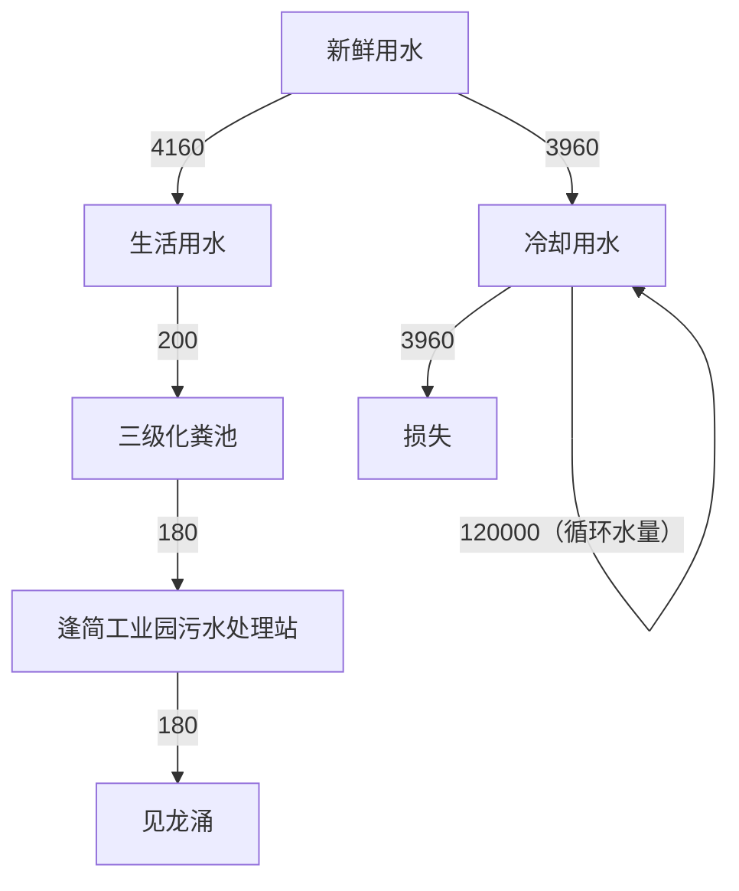
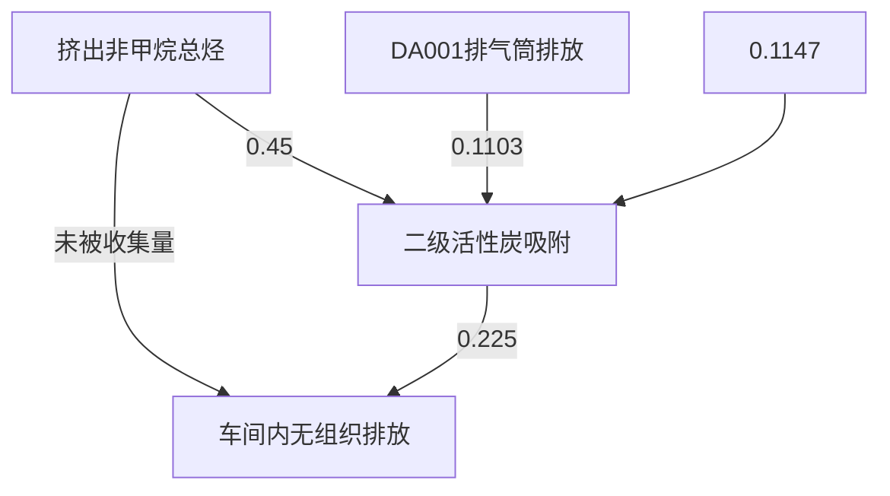
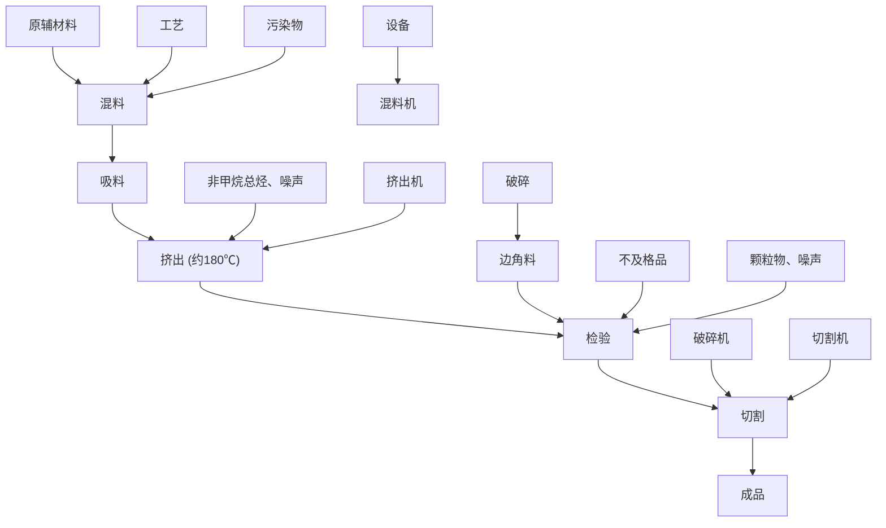

# 建设项目环境影响报告表

（污染影响类）

项目名称：佛山市顺德顺盈达塑金厂新建项目

建设单位（盖章）：佛山市顺德区顺达塑料五金厂

编制日期：2023年月

中华人民共和国生态

text_image

环保工程有限公司
(1)
环境部制

# 目录

一、建设项目基本情况..  
二、建设项目工程分析... 17  
三、区域环境质量现状、环境保护目标及评价标准.. 23  
四、主要环境影响和保护措施. .29  
五、环境保护措施监督检查清单. .55  
六、结论... . 58

# 建设项目污染物排放量汇总表.. .59

附图 1 项目地理位置图.. .. 60  
附图 2 项目水环境功能区划图. .61  
附图 3 项目大气环境功能区划图.. ..62  
附图 4 项目声环境功能区划.. ..63  
附图 5 佛山市顺德区环境管控单元图.. ..64  
附图 6 产业发展保护区规划图.. ..65  
附图 7 广东省环境管控单元图. ..66  
附图 8 项目四至分布图.... . 67  
附图 9 项目敏感点分布图... .. 68  
附图 10 平面布置图... . 69  
附图 11 三线一单平台截图.. . 70  
附图 12 项目四周现状图.. .71  
附件 1 营业执照.. . 72  
附件 2 法人身份证... . 72  
附件 3 租赁合同.. .. 74  
附件 4 引用的监测报告（节选）. .75

# 一、建设项目基本情况

<table><tr><td colspan="2">建设项目名称</td><td colspan="3">佛山市顺德区顺盈达塑料五金厂新建项目</td></tr><tr><td colspan="2">项目代码</td><td colspan="3">无</td></tr><tr><td colspan="2">建设单位联系人</td><td>余*</td><td>联系方式</td><td>137**********</td></tr><tr><td colspan="2">建设地点</td><td colspan="3">佛山市顺德区杏坛镇逢简工业区117049-001厂房之十二</td></tr><tr><td colspan="2">地理坐标</td><td colspan="3">(113度8分40.891秒,22度48分27.633秒)</td></tr><tr><td colspan="2">国民经济行业类别</td><td>C2922塑料板、管、型材制造</td><td>建设项目行业类别</td><td>二十六、橡胶和塑料制品业29,53、塑料制品业292</td></tr><tr><td colspan="2">建设性质</td><td>☑新建(迁建)□改建□扩建□技术改造</td><td>建设项目申报情形</td><td>☑首次申报项目□不予批准后再次申报项目□超五年重新审核项目□重大变动重新报批项目</td></tr><tr><td colspan="2">项目审批(核准/备案)部门(选填)</td><td>无</td><td>项目审批(核准/备案)文号(选填)</td><td>无</td></tr><tr><td colspan="2">总投资(万元)</td><td>100</td><td>环保投资(万元)</td><td>10</td></tr><tr><td colspan="2">环保投资占比(%)</td><td>10%</td><td>施工工期</td><td>1个月</td></tr><tr><td colspan="2">是否开工建设</td><td>☑否□是:____</td><td>用地(用海)面积(m2)</td><td>建筑面积2000m2</td></tr><tr><td colspan="2">专项评价设置情况</td><td colspan="3">无</td></tr><tr><td colspan="2">规划情况</td><td colspan="3">无</td></tr><tr><td colspan="2">规划环境影响评价情况</td><td colspan="3">无</td></tr><tr><td colspan="2">规划及规划环境影响评价符合性分析</td><td colspan="3">无</td></tr><tr><td>其他符合性分析</td><td colspan="4">(1)产业政策相符性本项目主要从事塑料板材的生产和销售,属于C2922塑料板、管、型材制造。根据生态环境部办公室发布的《环境保护综合名录(2021年版)》,</td></tr></table>

项目产品不属于上述目录所列出的“高污染、高环境风险”产品。项目生产产品、生产工艺和生产设备均不属于《产业结构调整指导目录（2019年本）》（国家发展和改革委员会令第 29 号，2020年 1 月 1 日起施行）中的限制或禁止类别，也不属于国家发展改革委商务部《关于印发＜市场准入负面清单（2022年版）的通知＞》（发改体改规〔2022〕397号）和《与市场准入相关的禁止性规定》，本项目不属于上述文件禁止项目；根据《广东省禁止、限制生产、销售和使用的塑料制品目录》（2020 年版），本项目不属于上述文件禁止、限制的塑料制品。因此，项目符合相关的产业政策要求。

# （2）与地区涉水排放政策相符性分析

根据《佛山市顺德区环境保护委员会办公室关于对涉水排放的建设项目加强环境管理的通知》（顺环委办〔2020〕44号），项目生活污水统一通过市政管道排至逢简工业园污水处理站，不向河涌直接排放废水，具备排水条件。项目所属 C2922 塑料板、管、型材制造，不涉及含酸洗、喷涂、拉丝、表面抛光等工艺的不锈钢型材加工。项目的排水系统满足“雨污分流、清污分流”的要求。

# （3）选址合理性分析

根据项目所在地用地规划，《顺德区产业发展保护区划定方案》，项目属于，项目位于产业发展保护区 XT5逢简产业发展保护区内（详见附图6）。因此项目用地符合当地规划。

# （4）项目与“三线一单”生态环境分区管控方案相符性分析

# 1）与广东省“三线一单”相符性分析

根据《广东省人民政府关于印发广东省“三线一单”生态环境分区管控方案的通知》（粤府〔2020〕71号）发布的广东省环境管控单元图，项目位于佛山市顺德区杏坛镇逢简工业区横五路 2 号厂房 3A 为珠三角核心区的一般管控单元。

表 1-1 与广东省“三线一单”相符性分析

<table><tr><td>管控要求</td><td>与本项目有关的相关要求(摘录)</td><td>相符性分析</td><td>是否符合</td></tr><tr><td>区域布局管控</td><td>禁止新建、扩建水泥、平板玻璃、化学制浆、生皮制革以及国家规划外的钢铁、原油加工等项目。推广应用低挥发性有机物原辅材料,严格限制新建生产和使用高挥发性有机物原辅材料的项目,鼓励建设挥发性有机</td><td>项目不属于水泥、平板玻璃、化学制浆、生皮制革、钢铁、原油加工等行业,本项目不使用涂料、粘胶剂等原辅材料。</td><td>符合</td></tr></table>

<table><tr><td rowspan="4"></td><td></td><td>物共性工厂</td><td></td><td></td></tr><tr><td>能源资源利用</td><td>科学实施能源消费总量和强度“双控”,新建高能耗项目单位产品(产值)能耗达到国际国内先进水平,实现煤炭消费总量负增长。推进工业节水减排,重点在高耗水行业开展节水改造,提高工业用水效率。加强江河湖库水量调度,保障生态流量。盘活存量建设用地,控制新增建设用地规模。</td><td>项目所属塑料制品业,不属于高能耗行业,项目生产设备使用电能,生产用水由市政供水,不直接取用江河湖库或地下水水量,不会对项目所在地生态流量造成影响,符合能源利用要求。项目租用新建厂房,已控制建设用地规模。</td><td>符合</td></tr><tr><td>污染物排放管控</td><td>重点水污染物未达到环境质量改善目标的区域内,新建、改建、扩建项目实施减量替代。大力推进固体废物源头减量化、资源化利用和无害化处置,稳步推进“无废城市”试点建设。</td><td>项目经营过程产生的固体废弃物分类收集,一般包装废弃物由物资回收公司回收,危险废物交有危险废物处理资质公司进行处理。固体废物分类减量化、资源化利用和无害化处置。</td><td>符合</td></tr><tr><td>环境风险管控</td><td>加强惠州大亚湾石化区、广州石化、珠海高栏港、珠西新材料集聚区等石化、化工重点园区环境风险防控,建立完善污染源在线监控系统,开展有毒有害气体监测,落实环境风险应急预案。提升危险废物监管能力,利用信息化手段,推进全过程跟踪管理。</td><td>项目所在地不属于石化、化工重点园区环境风险防控区域。项目产生的危险废物将定期委托有资质的处置公司进行收集处理,并通过信息系统登记转移计划和电子转移联单,符合危险废物全过程跟踪管理的防控要求。</td><td>符合</td></tr></table>

# 2）与佛山市“三线一单”相符性分析

根据《佛山市人民政府关于印发佛山市“三线一单”生态环境分区管控方案的通知》（佛府〔2021〕11号）发布的佛山市环境管控单元图，项目所在地佛山市顺德区杏坛镇逢简工业区横五路2号厂房3A为杏坛镇重点管控区。

表 1-2 与佛山市“三线一单”相符性分析

<table><tr><td>管控要求</td><td>与本项目有关的相关要求(摘录)</td><td>相符性分析</td><td>是否符合</td></tr><tr><td>区域布局管控</td><td>禁止新建、扩建水泥、平板玻璃、化学制浆、生皮制革以及国家规划外的钢铁、原油加工等项目。专业电镀、印染等项目进入定点园区集中管理。推广应用低挥发性有机物原辅材料,严格限制新建生产和使用高挥发性有机物原辅材料的项目,鼓励建设共性工厂、活性炭</td><td>项目不属于水泥、平板玻璃、化学制浆、生皮制革、钢铁、原油加工等行业;本项目不使用涂料、粘胶剂等原辅材料。</td><td>符合</td></tr></table>

<table><tr><td rowspan="4"></td><td></td><td>集中再生中心等挥发性有机物第三方治理项目,推动挥发性有机物集中高效处理。</td><td></td><td></td></tr><tr><td>能源资源利用</td><td>科学实施能源消费总量和强度“双控”,新建高能耗项目单位产品(产值)能耗达到国际国内先进水平,实现煤炭消费总量负增长。贯彻落实“节水优先”方针,实行最严格水资源管理制度,提高工业用水效率,加强江河湖库水量调度,保障生态流量。强化自然岸线保护,优化岸线开发利用格局,严格水域岸线用途管制,新建项目一律不得违规占用水域。</td><td>项目所属塑料制品业,不属于高能耗行业,项目生产设备使用电能,生产用水由市政供水,不直接取用江河湖库或地下水水量,不会对项目所在地生态流量造成影响,符合能源利用要求</td><td>符合</td></tr><tr><td>污染物排放管控</td><td>上年度重点河涌水质未达到水环境质量目标的管控分区所在镇(街道),须组织编制、系统实施、向社会公开区域重点水污染物减排计划并明确“替代量”,本年度新建、改建、扩建项目新增水环境重点污染物实行区域“减二一”替代(废水集中处理设施、民生项目除外)。推进挥发性有机物源头替代,全面加强无组织排放控制,深入实施精细化治理。推进石化化工溶剂使用及挥发性有机液体储运销的挥发性有机物减排,全过程实施反应活性物质、有毒有害物质、恶臭物质的协同控制。将全面使用低VOCs含量原辅材料的企业纳入正面清单和政府绿色采购清单。开展“无废城市”建设,推动固体废物源头减量、资源化利用和安全处置。</td><td>项目所属塑料制品业,本项目不使用涂料、粘胶剂等原辅材料。项目经营过程产生的固体废弃物分类收集,一般包装废弃物由物资回收公司回收,危险废物交有危险废物处理资质公司进行处理。固体废物分类减量化、资源化利用和无害化处置。</td><td>符合</td></tr><tr><td>环境风险管控</td><td>强化地表水、地下水和土壤污染风险协同防控,建立完善突发环境事件应急管理体系。重点加强环境风险分级分类管理,应用全省环境</td><td>项目所在地不属于石化、化工重点园区环境风险防控区域。项目产生的危险废物将定期委托有危险废物处理资</td><td>符合</td></tr></table>

<table><tr><td></td><td>风险源在线监控预警系统,强化化工企业、涉重金属行业、工业园区等重点环境风险源的环境风险防控。提升危险废物监管能力,利用信息化手段,推动全过程跟踪管理。健全危险废物收集体系,推进危险废物利用处置能力优化提升。全力避免因各类安全事故(事件)引发的次生环境风险事故(事件)。</td><td>质公司进行收集处理,并通过信息系统登记转移计划和电子转移联单。</td><td></td></tr></table>

# 3）与顺德区“三线一单”相符性分析

根据《佛山市顺德区人民政府关于印发佛山市“三线一单”生态环境分区管控方案的通知》（顺府发〔2021〕11号）发布的佛山市顺德区环境管控单元图（见附图 5），项目所在地属于杏坛镇重点管控区（编码为ZH44060620005）。

表 1-3 与顺德区“三线一单”相符性分析

<table><tr><td rowspan="2">环境管控单元编码</td><td rowspan="2">环境管控单元名称</td><td colspan="3">行政区划</td><td rowspan="2">管控单元分类</td><td rowspan="2" colspan="2">要素细类</td></tr><tr><td>省</td><td>市</td><td>区</td></tr><tr><td>ZH44060620005</td><td>杏坛镇重点管控区</td><td>广东省</td><td>佛山市</td><td>顺德区</td><td>园区型重点管控单元1</td><td colspan="2">水环境工业—城镇生活污染重点管控区、大气环境高排放重点管控区</td></tr><tr><td>管控维度</td><td colspan="5">管控要求</td><td>工程内容</td><td>符合性</td></tr><tr><td rowspan="3">区域布局管控</td><td colspan="5">【生态/禁止类】单元内的一般生态空间,主导生态功能为水土保持,禁止在25度以上的陡坡地开垦种植农作物,禁止在崩塌、滑坡危险区、泥石流易发区从事采石、取土、采砂等可能造成水土流失的活动</td><td>项目不涉及。</td><td>符合</td></tr><tr><td colspan="5">【产业/鼓励引导类】重点发展新材料、智能家居、先进装备制造业、汽车配件等产业以及军民融合产业,提升发展塑料专业市场,培育智能家居创新创业产业链,依托顺德新港发展临港加工和物流产业,发展现代农业</td><td>本项目属于C2929塑料零件及其他塑料制品制造业</td><td>符合</td></tr><tr><td colspan="5">【产业/综合类】系统推进村级工业园升级改造,腾出连片空间,布局产业集聚区和主题产业园,推动工业项目入园集聚发展。新增工业制造业用地原则上安排在产业集聚区内,产业集聚区外原则上不鼓励</td><td>本项目选址在产业集聚区。</td><td>符合</td></tr></table>

<table><tr><td rowspan="5"></td><td rowspan="5"></td><td>工业及物流仓储用地的新建与改造。</td><td></td><td></td></tr><tr><td>【产业/综合类】产业聚集区所属地块内的工业用地或企业与村庄、学校等环境敏感点之间应设置合理的大气环境防护距离,并通过绿化带进行有效隔离;聚集区规划布局应注重大气污染排放企业应尽量避免布局在居住用地的常年主导风向的上风向</td><td>本项目所在位置100m内无村庄、学校等环境敏感点。</td><td>符合</td></tr><tr><td>【产业/限制类】受纳水体或监控断面不达标的,不得新建、扩建向河涌直接排放废水的项目。新建、扩建含蚀刻工序的线路板生产项目和化工项目应在配套污水集中处置的工业园区或生活污水管网覆盖区域内建设;纯加工型印花项目,含酸洗、磷化的金属表面处理、金属制品项目(与自身高新技术企业配套的除外),含酸洗、喷涂、化学抛光、电解等涉及废水排放工艺的不锈钢型材加工项目(与自身高新技术企业配套的除外),应进入以此类项目为主导产业、有相应废水集中治理设施的工业园区,实现集中治污。</td><td>本项目的生产工艺不含蚀刻工序,不属于纯加工型印花项目,含酸洗、磷化的金属表面处理、金属制品项目,不属于含酸洗、喷涂、化学抛光、电解等涉及废水排放工艺的不锈钢型材加工项目。</td><td>符合</td></tr><tr><td>【产业/综合类】划定家具生产优先发展区域,优先发展区外不再新建涉及涂装工艺的木质家具制造项目。</td><td>本项目不属于涂装工艺的木质家具制造项目。</td><td>符合</td></tr><tr><td>【水/限制类】严格限制在右滩水厂、均安水厂饮用水水源保护区上游和周边区域建设列入“高污染、高环境风险”产品名录等可能影响水环境安全的项目</td><td>本项目不属于列入“高污染、高环境风险”产品名录等可能影响水环境安全的项目。</td><td>符合</td></tr><tr><td rowspan="8"></td><td></td><td>【土壤/禁止类】禁止新建、扩建增加重点防控的重金属污染物排放的建设项目。</td><td>本项目不属于重点防控的重金属污染物排放的建设项目。</td><td>符合</td></tr><tr><td rowspan="6">能源资源利用</td><td>【能源/鼓励引导类】推广节能技术,加快发展绿色货运与现代物流。</td><td>本项目不涉及。</td><td>符合</td></tr><tr><td>【能源/鼓励引导类】推广新能源汽车应用和充电基础设施建设,积极推动重卡LNG加气站、充电基础设施、加氢站建设。</td><td>本项目用水主要为生活用水和生产用水,用水量少。</td><td>符合</td></tr><tr><td>【能源/综合类】科学实施能源消费总量和强度“双控”,新建高能耗项目单位产品(产值)能耗达到国际国内先进水平。</td><td rowspan="2">本项目能耗较小。</td><td>符合</td></tr><tr><td>【水资源/综合类】贯彻落实“节水优先”方针,实行最严格水资源管理制度,杏坛镇万元国内生产总值用水量、万元工业增加值用水量、用水总量、农田灌溉水有效利用系数等用水总量和效率指标达到区下达要求。</td><td>符合</td></tr><tr><td>【土地资源/限制类】落实单位土地面积投资强度、土地利用强度等建设用地控制性指标要求,提高土地利用效率。</td><td>本项目租赁已建成的厂房进行生产。</td><td>符合</td></tr><tr><td>【岸线/禁止类】严格水域岸线用途管制,新建项目一律不得违规占用水域。严禁破坏生态的岸线利用行为和不符合其功能定位的开发建设活动,严禁以各种名义侵占河道、围垦湖泊、非法采砂等。</td><td>本项目没有违规占用水域的行为,没有破坏生态的岸线利用行为和不符合其功能定位的开发建设活动,没有以各种名义侵占河道、围垦湖泊、非法采砂等行为。</td><td>符合</td></tr><tr><td>污染物排放管控</td><td>【水/限制类】城镇新区建设实行雨污分流,逐步推进初期雨水收集、处理和资源化利用。住宅、商业体、学校、市场等城镇开发建设项目应当配套或者同步计划建设公共排水设施,公共排水设施或自建排污水设施未能投产运行的,以上涉水项目不得投入使用。新建小区严格实施雨污分流,阳台、露台等污水接入污水收集系统,将生活污水“应截尽截”。做好大型楼盘、集贸市场、餐饮以及学校等4大类排水户污水接入市政管网工作。【水/综合类】杏坛镇重点河涌水质上年度未达到水环境环境质量目标的,需组织编制、系统实施、向社会公开区域重点水污染物减排计划并明确“替代量”,本年度新建、改建、扩建项目新增水环境重点污染物实行区域“减二增一”替代(工业、生活或综合集中废水处理设施、民生项目除外)。</td><td>本项目不涉及。本项目无生产废水外排,项目的生活污水经三级化粪池预处理后通过市政污水管网排入到逢简工业园污水处理站进行深度处理。</td><td>符合符合</td></tr><tr><td rowspan="4"></td><td rowspan="4"></td><td>【水/综合类】区域内应合理规划建设工业或综合集中废水处理设施。逐步推进工业集聚区“污水零直排区”建设,开展排水单元工业废水、生活污水、雨水分类收集、分质处理,确保园区“管网全覆盖雨污全分流、污水全收集、处理全达标”。</td><td></td><td>符合</td></tr><tr><td>【水/综合类】结合村级工业园改造,全面提升产业层次与集聚度,促进污染集中整治。</td><td>本项目所在区域为工业集聚区。</td><td>符合</td></tr><tr><td>【水/综合类】稳步推进排水设施“三个一体化”管理模式,补齐城乡污水收集和处理短板,推动逢简工业园污水处理站提质增效,加快消除城中村、老旧城区、城乡结合部等污水收集管网空白区,逐步实现城乡污水收集处理全覆盖。2025年前完成逢简工业园污水处理站扩建,尾水应执行《城镇污水处理厂污染物排放标准》(GB18918-2002)一级B标准及《广东省水污染物排放限值》(DB44/26-2001)的较严值。</td><td>本项目无生产废水外排,项目的生活污水经三级化粪池预处理后通过市政污水管网排入到逢简工业园污水处理站进行深度处理,尾水达到《城镇污水处理厂污染物排放标准》(GB18918-2002)一级B标准及《广东省水污染物排放限值》(DB44/26-2001)的较严值排入见龙涌。</td><td>符合</td></tr><tr><td>【水/综合类】近期保留桑麻村、逢简村、吉祐村、安富村等现状农村污水分散式处理设施,继续完善污水支管网建设,提高污水收集处理率,新建龙潭村、吉祐村、右滩村、南朗村、光华村、东村、北水村等农村分散式生活污水处理设施,其余行政村(社区)继续完善污水管网建设,收集农村污水进入市政污水系统,有条件的区域实施雨污分流改造,到2030年全面雨污分流,污水纳入杏坛城镇污水处理系统。</td><td>本项目不涉及。</td><td>符合</td></tr></table>

<table><tr><td rowspan="3"></td><td>【水/综合类】产业集聚区和主题园区内做好污水管网和污水集中处理设施的配套保障,确保废水收集到城镇污水处理厂、园区污水处理厂或分散式污水处理设施集中处置。</td><td>本项目的生活污水经三级化粪池预处理后通过市政污水管网排入到逢简工业园污水处理站进行深度处理</td><td>符合</td></tr><tr><td>【大气/综合类】大力推进低VOCs含量原辅材料替代,加快涉VOCs重点行业的生产工艺升级改造,推行自动化生产工艺,对达不到要求的VOCs收集及治理设施进行整治提升,逐步淘汰低效VOCs治理设施。</td><td>本项目使用低VOCs含量原辅材料进行生产,项目挤出废气经过包围型集气罩收集后统一引至一套“二级活性炭吸附”装置处理后再通过15米高排气筒DA001排放。</td><td>符合</td></tr><tr><td>【土壤/限制类】作为重金属污染重点防控区,区域内重点重金属排放总量只减不增。</td><td>本项目不涉及重金属排放。</td><td>符合</td></tr><tr><td rowspan="3">环境风险防控</td><td>【水/综合类】加强单元内右滩水厂、均安水厂饮用水水源保护区周边环境风险源管控,完善突发环境事件应急管理体系</td><td>本项目不涉及</td><td rowspan="2">符合</td></tr><tr><td>【水/综合类】逢简工业园污水处理站、工业污水集中处理设施应采取有效措施,防止事故废水直接排入水体。完善污水处理厂在线监控系统联网,实现污水处理厂的实时、动态监管</td><td>本项目不涉及</td></tr><tr><td>【风险/综合类】加强环境风险分级分类管理,强化金属制品、有色金属和压延加工、化学原料和化学品制造业等涉重金属、化工行业企业及工业园区等重点环境风险源的环境风险防控</td><td>本项目运营后日常加强环境风险分级分类管理,并与园区实现联动</td><td>符合</td></tr></table>

# （4）与 VOCs 控制政策文件相符性分析

项目与国家、广东省、佛山市、顺德区政府有关 VOCs 污染控制政策文件的相符性分析如下表所示。

表 1-4 项目与有机污染物治理政策的相符性

<table><tr><td>序号</td><td>政策要求</td><td>工程内容</td><td>符合性</td></tr><tr><td colspan="4">1、《中华人民共和国大气污染防治法》(2018年10月26日修正)</td></tr><tr><td>1.1</td><td>第四十四条 生产、进口、销售和使用含挥发性有机物的原材料和产品的,其挥发性有机物含量应当符合质量标准或者要求。国家鼓励生产、进</td><td>项目使用物料为低VOCs含量原辅材料。</td><td>符合</td></tr></table>

<table><tr><td rowspan="7"></td><td></td><td>口、销售和使用低毒、低挥发性有机溶剂。</td><td></td><td></td></tr><tr><td>1.2</td><td>第四十五条 产生含挥发性有机物废气的生产和服务活动,应当在密闭空间或者设备中进行,并按照规定安装、使用污染防治设施;无法密闭的,应当采取措施减少废气排放。</td><td>有机废气经集气罩收集,通过“二级活性炭吸附”装置处理后引至15m排气筒DA001高空排放,可有效减少废气排放。</td><td>符合</td></tr><tr><td colspan="4">2、《广东省大气污染防治条例》(2019年3月1日起施行)</td></tr><tr><td>2.1</td><td>第十七条 珠江三角洲区域禁止新建、扩建燃煤燃油火电机组或者企业燃煤燃油自备电站。珠江三角洲区域禁止新建、扩建国家规划外的钢铁、原油加工、乙烯生产、造纸、水泥、平板玻璃、除特种陶瓷以外的陶瓷、有色金属冶炼等大气重污染项目。</td><td>本项目属于塑料制品制造,不属于禁止建设的大气重污染项目。</td><td>符合</td></tr><tr><td>2.2</td><td>第二十六条 新建、改建、扩建排放挥发性有机物的建设项目,应当使用污染防治先进可行技术。下列产生含挥发性有机物废气的生产和服务活动,应当优先使用低挥发性有机物含量的原材料和低排放环保工艺,在确保安全条件下,按照规定在密闭空间或者设备中进行,安装、使用满足防爆、防静电要求的治理效率高的污染防治设施;无法密闭或者不适宜密闭的,应当采取有效措施减少废气排放:(一)石油、化工、煤炭加工与转化等含挥发性有机物原料的生产;(二)燃油、溶剂的储存、运输和销售;(三)涂料、油墨、胶粘剂、农药等以挥发性有机物为原料的生产;(四)涂装、印刷、粘合、工业清洗等使用含挥发性有机物产品的生产活动;(五)其他产生挥发性有机物的生产和服务活动。</td><td>有机废气经集气罩收集,通过“二级活性炭吸附”装置处理后引至15m排气筒DA001高空排放,可有效减少有机废气排放,减少异味影响。</td><td>符合</td></tr><tr><td colspan="4">3、《广东省生态环境厅关于做好重点行业建设项目挥发性有机物总量指标管理工作的通知》(粤环发〔2019〕2号)</td></tr><tr><td>3.1</td><td>新、改、扩建排放VOCs的重点行业建设项目应当执行总量替代制度,重点行业包括炼油与石化、化学原料和化学制品制造、化学药品原料药制造、合成纤维制造、表面涂装、印刷、制鞋、家具制造、人造板制造、电子元件制造、纺织印、塑料制造及塑料制品等12个行业。</td><td>项目属于塑料制品制造,属于重点管理行业。项目挥发性有机物总量指标为0.3353t/a</td><td>符合</td></tr><tr><td rowspan="10"></td><td colspan="4">4、关于印发《广东省涉挥发性有机物(VOCs)重点行业治理指引》的通知(粤环办〔2021〕43号)</td></tr><tr><td>4.1</td><td>粉状、粒状VOCs物料采用气力输送设备、管状带式输送机、螺旋输送机等密闭输送方式,或者采用密闭的包装袋、容器或罐车进行物料转移。</td><td>原辅材料采用密封包装袋进行运输与储存。</td><td>符合</td></tr><tr><td>4.2</td><td>VOCs治理设施应与生产工艺设备同步运行,VOCs治理设施发生故障或检修时,对应的生产工艺设备应停止运行,待检修完毕后同步投入使用;生产工艺设备不能停止运行或不能及时停止运行的,应设置废气应急处理设施或采取其他替代措施。</td><td>已要求企业VOCs治理设施应与生产工艺设备同步运行,日常安排专门人员对治理设备进行定期巡查和检修,避免故障情况的出现。</td><td>符合</td></tr><tr><td>4.3</td><td>建立废气收集处理设施台账,记录废气处理设施进出口的监测数据(废气量、浓度、温度、含氧量等)、废气收集与处理设施关键参数、废气处理设施相关耗材(吸收剂、吸附剂、催化剂等)购买和处理记录。</td><td>项目废气治理设施安排专人维护并定期建立台账,记录相关废气数据。</td><td>符合</td></tr><tr><td>4.4</td><td>建立危废台账,整理危废处置合同、转移联单及危废处理方资质佐证材料。</td><td>企业严格执行危险废物转移计划报批、依法建立危险废物转移联单,并通过信息系统登记转移计划和电子转移联单。</td><td>符合</td></tr><tr><td>4.5</td><td>要求建设单位需对有机废气有组织和无组织废气、噪声每年监测1次。</td><td>已要求企业对项目废气、噪声进行自行检查。</td><td>符合</td></tr><tr><td colspan="4">5、《广东省人民政府办公厅关于印发广东省2021年大气、水、土壤污染防治工作方案的通知》(粤办函〔2021〕58号)</td></tr><tr><td>5.1</td><td>严格落实国家产品VOCs含量限值标准要求,除现阶段确无法实施替代的工序外,禁止新建生产和使用高VOCs含量原辅材料项目。鼓励在生产和流通消费环节推广使用低VOCs含量原辅材料。</td><td>本项目使用的物料不属于禁止使用的高VOCs含量原辅材料,符合政策要求。</td><td>符合</td></tr><tr><td>5.2</td><td>指导企业使用适宜高效的治理技术,涉VOCs重点行业新建、改建和扩建项目不推荐使用光氧化、光催化、低温等离子等低效治理设施,已建项目逐步淘汰光氧化、光催化、低温等离子治理设施。</td><td>有机废气经集气罩收集,通过“二级活性炭吸附”装置处理后引至15m排气筒DA001高空排放。</td><td>符合</td></tr><tr><td colspan="4">6、关于印发《重点行业挥发性有机物综合治理方案》的通知(环大气[2019]53号)</td></tr></table>

<table><tr><td rowspan="10"></td><td>6.1</td><td>通过使用水性、粉末、高固体分、无溶剂、辐射固化等低VOCs含量的涂料,水性、辐射固化、改性、生物降解等低VOCs含量的粘胶剂,以及低VOCs含量、低反应活性的清洗剂等,替代溶剂型涂料、油墨、胶黏剂、清洗剂等,从源头减少VOCs产生。</td><td>项目不使用高VOCs含量原辅材料。</td><td colspan="2">符合</td></tr><tr><td>6.2</td><td>含VOCs物料生产和使用过程,应采取有效收集措施或在密闭空间中操作。</td><td>挤出工序产生的有机废气经包围型集气罩收集采用“二级活性炭吸附”设施处理后通过15m排气筒DA001排放。</td><td colspan="2">符合</td></tr><tr><td colspan="5">7、《佛山市生态环境局顺德分局关于做好重点行业建设项目挥发性有机物总量指标管理工作的通知》(佛顺环函〔2019〕56号)</td></tr><tr><td>7.1</td><td>涉VOCs排放项目,实现本行政区域内污染源“点对点”2倍量削减替代。</td><td>项目挥发性有机物控制总量指标为0.3353t/a由区镇两级环保主管部门核查总量指标。</td><td colspan="2">符合</td></tr><tr><td colspan="5">8、《挥发性有机物无组织排放控制标准》(GB37822-2019)</td></tr><tr><td>8.1</td><td>VOCs物料应储存于密闭的容器、包装袋、储罐、储库、料仓中。</td><td rowspan="3">项目不使用高VOCs含量原辅材料。均密封储存,存放于室内,非取用时封口保持密闭。</td><td colspan="2">符合</td></tr><tr><td>8.2</td><td>盛装VOCs物料的容器或包装袋应存放于室内,或存放于设置有雨棚、遮阳和防渗设施的专用场地。盛装VOCs物料的容器或包装袋在非取用状态时应加盖、封口,保持密闭。</td><td colspan="2">符合</td></tr><tr><td>8.3</td><td>VOCs物料储库、料仓应利用完整的围护结构将污染物质、作业场所等与周围空间阻隔所形成的封闭区域或封闭式建筑物。该封闭区域或封闭式建筑物除人员、车辆、设备、物料进出时,以及依法设立的排气筒、通风口外,门窗及其他开口(孔)部位应随时保持关闭状态。</td><td colspan="2">符合</td></tr><tr><td>8.4</td><td>VOCs废气收集处理系统应与生产工艺设备同步运行。VOCs废气收集处理系统发生故障或检修时,对应的生产工艺设备应停止运行,待检修完毕后同步投入使用;生产工艺设备不能停止运行或不能及时停止运行的,应设置废气应急处理设施或采取其他替代措施。</td><td>挤出工序产生的有机废气经包围型集气罩收集采用“二级活性炭吸附”设施处理后通过15m排气筒DA001排放。</td><td colspan="2">符合</td></tr><tr><td>8.5</td><td>企业应建立台账,记录废气收集系统、VOCs处理设施的主要运行和维护信息,如运行时间、废气处理量、</td><td>项目建设后,建立台账,记录废气收集系统。台账保存期限不</td><td colspan="2">符合</td></tr><tr><td rowspan="7"></td><td></td><td colspan="2">操作温度、停留时间、吸附剂再生/更换周期和更换量、催化剂更换周期和更换量、吸收液pH值等关键运行参数。台账保存期限不少于3年。</td><td>少于3年。</td><td></td></tr><tr><td>8.6</td><td colspan="2">VOCs质量占比大于等于10%的含VOCs产品,其使用过程应采用密闭设备或在密闭空间内操作,废气应排至VOCs废气收集处理系统;无法密闭的,应采取局部气体收集设施,废气应排至VOCs废气收集处理系统。</td><td>挤出工序产生的有机废气经包围型集气罩收集采用“二级活性炭吸附”设施处理后通过15m排气筒DA001排放。</td><td>符合</td></tr><tr><td colspan="5">9、《关于印发&lt;2020年挥发性有机物治理攻坚方案&gt;的通知》(环大气[2020]33号)</td></tr><tr><td>9.1</td><td colspan="2">大力推进低(无)VOCs含量原辅材料替代。将全面使用符合国家要求的低VOCs含量原辅材料的企业纳入正面清单和政府绿色采购清单。企业应建立原辅材料台账,记录VOCs原辅材料名称、成分、VOCs含量、采购量、使用量、库存量、回收方式、回收量等信息,并保存相关证明材料。采用符合国家有关低VOCs含量产品规定的涂料、油墨、胶粘剂等,排放浓度稳定达标且排放速率满足相关规定的,相应生产工序可不要求建设末端治理设施。</td><td>项目不使用高VOCs含量原辅材料。</td><td>符合</td></tr><tr><td colspan="5">10、关于印发《广东省涉挥发性有机物(VOCs)重点行业治理指引》的通知(粤环办〔2021〕43号)</td></tr><tr><td>10.1</td><td rowspan="2">VOCs物料</td><td>使用低(无)VOCs含量、低反应活性的原辅材料,对芳香烃、含卤素有机化合物的绿色替代。</td><td>项目不使用高VOCs含量原辅材料。</td><td>符合</td></tr><tr><td>10.2</td><td>液态VOCs物料采用密闭管道输送方式或采用高位槽(罐)、桶泵等给料方式密闭投加;无法密闭投加的,在密闭空间内操作,或进行局部气体收集,废气排至VOCs废气收集处理系统。</td><td>挤出工序产生的有机废气经包围型集气罩收集采用“二级活性炭吸附”设施处理后通过15m排气筒DA001排放。</td><td>符合</td></tr><tr><td rowspan="5"></td><td>10.3</td><td>工艺过程</td><td>在混合/混炼、塑炼/塑化/熔化、加工成型(挤出、注射、压制、压延、发泡、纺丝等)、硫化等作用中应采用密闭设备或在密闭空间中操作,废气应排至VOCs废气收集处理系统;无法密闭的,应采取局部气体收集措施,废气排至VOCs废气收集处理系统。</td><td>挤出工序产生的有机废气经包围型集气罩收集采用“二级活性炭吸附”设施处理后通过15m排气筒DA001排放。</td><td>符合</td></tr><tr><td>10.4</td><td rowspan="3">废气收集</td><td>采用外部集气罩的,距集气罩开口面最远处的VOCs无组织排放位置,控制风速不低于0.3m/s。</td><td>项目有机废气采用包围型集气罩(四周设置垂帘)收集,收集效率为50%,收集风速为0.502m/s大于0.3m/s。</td><td>符合</td></tr><tr><td>10.5</td><td>废气收集系统的输送管道应密闭。废气收集系统应在负压下运行,若处于正压状态,应对管道组件的密封垫进行泄漏检测,泄漏检测值不应超过500μmol/mol,亦不应有感官可察觉泄漏。</td><td>项目废气收集系统的输送管道均密闭,废气收集系统在负压下运行。</td><td>符合</td></tr><tr><td>10.6</td><td>VOCs治理设施应与生产工艺设备同步运行,VOCs治理设施发生故障或检修时,对应的生产工艺设备应停止运行,待检修完毕后同步投入使用;生产工艺设备不能停止运行或不能及时停止运行的,应设置废气应急处理设施或采取其他替代措施</td><td>项目运营期间必须开启风机,有效减少无组织排放废气。废气收集处理系统发生故障或检修时,所有产生废气的工序停止运行,待检修完毕后再投入生产。</td><td>符合</td></tr><tr><td>10.7</td><td>排放水平</td><td>(1)车间或生产设施排气中NMHC初始排放速率≥3kg/h时,建设末端治污设施且处理效率≥80%(2)厂区内无组织排放监控点NMHC的小时平均浓度值不超过6mg/m3任意一次浓度值不超过20mg/m3。</td><td>项目生产过程NMHC达到《挥发性有机物无组织排放控制标准》(GB37822-2019)中表A.1厂区内VOCs无组织特别排放限值和《固定污染源挥发性有机物综合排放标准》(DB44/2367-2022)中表3厂区内VOCs无组织排放限值;NMHC厂区内无组织排放满足平均浓度值不超过6mg/m3,任意一次浓度值不超过20mg/m3。</td><td>符合</td></tr></table>

<table><tr><td>10.8</td><td rowspan="2">管理台账</td><td>建立废气收集处理设施台账,记录废气处理设施进出口的监测数据(废气量、浓度、温度、含氧量等)、废气收集与处理设施关键参数、废气处理设施相关耗材(吸收剂、吸附剂、催化剂等)购买和处理记录。</td><td>项目废气治理设施安排专人维护并定期建立台账,记录相关废气数据。</td><td>符合</td></tr><tr><td>10.9</td><td>建立危废台账,整理危废处置合同、转移联单及危废处理方式资质佐证材料。</td><td>项目建立危险废物台账,定期将危险废物交给有资质的单位处理,整理危废处理合同、转移联单等资料。</td><td></td></tr></table>

（5）项目与省、市、区生态环境保护“十四五”规划相符性分析

表 1-5 与省、市、区生态环境保护“十四五”规划相符性分析表

<table><tr><td>序号</td><td>政策要求</td><td>工程内容</td><td>符合性</td></tr><tr><td colspan="4">1.《广东省生态环境保护“十四五”规划》</td></tr><tr><td>1.1</td><td>珠三角地区禁止新建、扩建水泥、平板玻璃、化学制浆、生皮制革以及国家规划外的钢铁、原油加工等项目</td><td>项目属于C2922塑料板、管、型材制造,不属于水泥、平板玻璃、化学制浆、生皮制革以及国家规划外的钢铁、原油加工等项目</td><td>符合</td></tr><tr><td>1.2</td><td>大力推进低VOCs含量原辅材料源头替代,严格落实国家和地方产品VOCs含量限值质量标准,禁止建设生产和使用高VOCs含量的溶剂型涂料、油墨、胶粘剂等项目</td><td>项目使用的原辅材料均为低VOCs含量原辅材料</td><td>符合</td></tr><tr><td>1.3</td><td>强化对企业涉VOCs生产车间/工序废气的收集管理,推动企业开展治理设施升级改造</td><td>挤出废气经集气罩收集后经一套“二级活性炭吸附”处理后排气筒排放</td><td>符合</td></tr><tr><td colspan="4">2.《佛山市生态环境保护“十四五”规划》</td></tr><tr><td>2.1</td><td>新建、扩建项目需符合环境质量改善要求。严格控制“高耗能、高排放”项目盲目发展,禁止新建、扩建水泥、平板玻璃、化学制浆、生皮制革以及国家规划外的钢铁、原油加工等项目</td><td>项目属于C2922塑料板、管、型材制造,不属于水泥、平板玻璃、化学制浆、生皮制革以及国家规划外的钢铁、原油加工等项目</td><td>符合</td></tr><tr><td>2.2</td><td>严格限制新建生产和使用高挥发性有机物原辅材料的项目</td><td>项目使用的原辅材料均为低VOCs含量原辅材料</td><td>符合</td></tr><tr><td>2.3</td><td>严格执行相关行业企业布局选址要求,在重金属镉累积</td><td>项目无重金属产生</td><td>符合</td></tr></table>

<table><tr><td rowspan="3"></td><td></td><td>性较高的区域禁止新建、扩建排放重金属污染物的建设项目。</td><td></td><td></td></tr><tr><td colspan="4">3.《佛山市顺德区生态环境保护》“十四五”规划(2021-2025)</td></tr><tr><td>3.1</td><td>禁止新建、扩建水泥、平板玻璃、化学制浆、生皮制革以及国家规划外的钢铁、原油加工等项目;专业电镀、印染等项目进入定点园区集中管理</td><td>项目属于C2922塑料板、管、型材制造,不属于水泥、平板玻璃、化学制浆、生皮制革以及国家规划外的钢铁、原油加工等项目</td><td>符合</td></tr></table>

# 二、建设项目工程分析

<table><tr><td rowspan="14">建设内容</td><td colspan="7">1、项目组成佛山市顺德区顺盈达塑料五金厂选址于佛山市顺德区杏坛镇逢简工业区117049-001厂房之十二:北纬22°48′27.633′′,东经113°8′40.891′′,项目租赁所在厂房为生产,建筑面积共2000m2,主要设挤出生产区、破碎区、检验区和仓库等,项目地理位置图见附图1。项目东北面为空置厂房、东南面为佛山海进纳材料实业有限公司,西南面为佛山市翔盈家具制造有限公司,西北面为佛山市新鸿利电子科技有限公司。项目最近敏感点西南面400m处的霍村。本项目主要为经营范围为从事PE塑料板的生产,年产PE塑料板300吨。项目组成详见下表2-1。表2-1 主要建设内容表</td></tr><tr><td>类别</td><td colspan="2">工程名称</td><td colspan="4">备注</td></tr><tr><td>主体工程</td><td colspan="2">生产厂房</td><td colspan="4">占地面积约2000m2,设有挤出区、破碎区、检验区和仓库等;</td></tr><tr><td>辅助工程</td><td colspan="2">办公室</td><td colspan="4">办公室一个,面积约20m2,主要用于人员办公</td></tr><tr><td>仓储工程</td><td colspan="2">仓库</td><td colspan="4">主要设原辅材料仓库及成品仓库,位于生产车间内</td></tr><tr><td rowspan="3">公共工程</td><td colspan="2">供水</td><td colspan="4">由市政供水管网供给,主要为生活用水。</td></tr><tr><td colspan="2">排水</td><td colspan="4">生活污水经三级化粪池处理后排放至逢简工业园污水处理站进行处理</td></tr><tr><td colspan="2">供电</td><td colspan="4">由市政供电管网供给,项目内不设备用发电机。</td></tr><tr><td rowspan="4">环保工程</td><td colspan="2">污水治理工程</td><td colspan="4">生活污水经三级化粪池处理后排放至逢简工业园污水处理站进行处理;冷却水循环使用,不外排。</td></tr><tr><td colspan="2">废气治理工程</td><td colspan="4">有机废气:委托有工程资质单位落实有机废气治理,有机废气经过包围型集气罩收集后,采用“二级活性炭吸附”处理后经15m排气筒DA001排放;</td></tr><tr><td colspan="2">噪声治理工程</td><td colspan="4">置于车间内,利用车间墙壁的阻隔作用降噪;严格管理工作时间;调整设备布局;加强设备日常维护与保养;</td></tr><tr><td colspan="2">固废处理工程</td><td colspan="4">生活垃圾统一收集后交由环卫部门处理;废包装材和废原料袋料分类收集后外售给资源回收商处理,边角料、不及格品破碎后回用于生产;设有危险废物暂存点、固体废物暂存点。</td></tr><tr><td colspan="7">2、生产规模及主要原辅材料本项目的主要生产原辅材料和产品方案详见下表2-2和表2-3;表2-2 本项目主要原辅材料及其用量</td></tr><tr><td>序号</td><td>原辅材料名称</td><td>年用量</td><td>最大存储量</td><td>性状</td><td>包装规格</td><td>备注</td></tr></table>

<table><tr><td>1</td><td>PE粒料</td><td>298.45吨</td><td>10吨</td><td>固态</td><td>25kg/包</td><td>新料,主要原料</td></tr><tr><td>2</td><td>色母</td><td>2吨</td><td>1吨</td><td>固态</td><td>25kg/包</td><td>新料,主要原料</td></tr><tr><td>3</td><td>机油</td><td>0.05吨</td><td>0.05吨</td><td>液态</td><td>10kg/桶</td><td>用于设备维护保养</td></tr><tr><td>4</td><td>模具</td><td>5吨</td><td>1吨</td><td>固态</td><td>/</td><td>塑料模具</td></tr></table>

原辅材料理化性质：

PE 粒料：PE 塑料即聚乙烯塑料，具有耐腐蚀性，电绝缘性(尤其高频绝缘性），低压聚乙烯适于制作耐腐蚀零件和绝缘零件；高压聚乙烯适于制作薄膜等；超高分子量聚乙烯适于制作减震，耐磨及传动零件。比重：0.94—0.96 克/立方厘米成型收缩率：1.5-3.6%成型温度：140-220℃ 干燥条件：吸水率低，加工前可不用干燥处理。

色母：全称叫色母粒，也叫色种，是一种新型高分子材料专用着色剂，亦称颜料制备物。色母主要用在塑料上。色母由颜料或染料、载体和添加剂三种基本要素所组成，是把超常量的颜料均匀载附于树脂之中而制得的聚集体，可称颜料浓缩物，所以它的着色力高于颜料本身。加工时用少量色母料和未着色树脂掺混，就可达到设计颜料浓度的着色树脂或制品。

机油：机油一般由基础油和添加剂两部分组成。基础油是机油的主要成分，决定着机油的基本性质，添加剂则可弥补和改善基础油性能方面的不足，赋予某些 新的性能，是机油的重要组成部分。

表 2-3 本项目主要产品年产量

<table><tr><td>序号</td><td>产品名称</td><td>年产量</td><td>备注</td></tr><tr><td>1</td><td>PE 塑料板</td><td>300 吨</td><td>每片 PE 塑料板厚度为 3mm,长约 50cm,宽约 30cm,每米板重量约为 3kg</td></tr></table>

# 3、主要生产设备

项目主要生产设备见表 2-4；

表 2-4 本项目主要设备或设施

<table><tr><td>序号</td><td>设备名称</td><td>设备参数</td><td>设备数量</td><td>备注</td></tr><tr><td>1</td><td>挤出生产线</td><td>SJ-65</td><td>5条</td><td>挤出制版生产线</td></tr><tr><td>2</td><td>破碎机</td><td>7.5kw</td><td>2台</td><td>破碎设备</td></tr><tr><td>3</td><td>混料机</td><td>1.5kw</td><td>2台</td><td>原料混合设备</td></tr><tr><td>4</td><td>空压机</td><td>22kw</td><td>1台</td><td>辅助设备</td></tr><tr><td>5</td><td>切割机</td><td>20kw</td><td>2台</td><td>裁板设备</td></tr><tr><td>6</td><td>冷却塔</td><td> $50m^{3}/h$ </td><td>1台</td><td>冷却设备</td></tr><tr><td colspan="5">注:冷却塔用于降低挤出生产线温度,冷却过程为间接冷却,非直接冷却</td></tr></table>

表 2-5 项目关键设备产能匹配性分析表

<table><tr><td rowspan="2">序号</td><td colspan="2">设备</td><td rowspan="2">对应本项目产品产能</td><td rowspan="2">《佛山市塑胶行业建设项目环评文件编制技术参考指南(试行)》</td><td rowspan="2">匹配性</td></tr><tr><td>名称</td><td>产能、规格</td></tr><tr><td>1</td><td>挤出生产线</td><td>设计最大产能合计为133.33kg/h,按本设备年最大工作时间2400h折算,设备产能为320t/a</td><td>年产PE塑料板300吨</td><td>成型设备,挤出生产线型号为SJ65,生产能力为16-50kg/h,本项目设计最大产能合计为133.33kg/h,共有5条挤出生产线,则每条生产线产能约为26.6kg/h</td><td>设备产能/规格与产品产能/产品规格、技术参考指南均匹配</td></tr></table>

根据表2-5可知，项目关键设备产能为：挤出生产线320t/a，本项目申报产能为300t/a，项目设备产能与产品规模相匹配

# 4、劳动定员和生产天数

（1）工作制度：项目年生产时间 300天，每天工作 8 小时，工作制为一班制。  
（2）劳动定员：项目拟定员工 20人，均不在项目内食宿。

# 5、公用工程

# （1）给排水

本项目的用水均全部由市政自来水公司供给，具体给排水情况如下：

根据建设单位提供的资料，项目用水主要为员工生活用水，生活用水量约为 200/a，排放系数按 0.9 计算，生活污水排放量约为 180t/a，项目生活污水三级化粪池预处理后由市政管网排放至逢简工业园污水处理站进行处理；项目冷却过程中需要补充冷却用水，补充量为 115.2t/a。

flowchart

图 2-1 项目水平衡图（t/a）

# （2）供电

本项目用电由当地市政电网供应，根据建设单位提供资料，本项目年用电量约为10万千瓦时，项目内不设备用发电机。

flowchart

图 2-2 项目非甲烷总烃平衡图

# 6、厂区平面布置

项目已租用佛山市顺德区杏坛镇逢简工业区 117049-001厂房之十二为生产厂房，项目占地面积 2000㎡，生产车间设有 PE 板挤出区（位于厂区面），混料区（位于厂区西南面），破碎区（位于厂区北面），办公室（位于厂区东北面）等，具体厂区平面布置图见附图。

本项目主要从塑料板的加工生产，具体生产工艺及产污流程如下图所示。

flowchart

图 2-3 生产工艺流程图

# 生产工艺流程说明

（1）混料：将 PE 塑料颗粒和色母送至混料机进行混料，以便于后续工序，项目使用原料为塑料颗粒，混料过程中不会产生粉尘。  
（2）吸料：利用真空吸料的方式将混料完成的塑料粒送至挤出生产线料斗中，该过程无粉尘产生。  
（3）挤出：通过电加热将模具内的塑料粒融化，并挤出，（挤出生产线温度约为180℃塑料原料分解温度约为 260\~310℃之间，不会导致这些分子的分解，一般情况下不会产生焦炭链焦化气体、有刺激性和腐蚀性气体发生）。  
（4）冷却：挤出过程需要利用冷却水对产品进行间接冷却（利用冷却水对五金模具进行冷却，降低模具温度，从而对产品起到冷却作用）。  
（5）检验：挤出得到的成品经检验合格即可进行下一步工序，不及格品则经破碎后回用此过程中会产生不及格品及噪声。  
（6）切割：挤出检验及格的板材根据订单的需求，切割成所需要的大小和长短。  
（7）破碎：挤出工序产生的塑料边角料和检验过程中产生的不及格品，经破碎机破碎后，回用于生产工序，该工序会产粉尘（颗粒物）及噪声。

<table><tr><td rowspan="20"></td><td colspan="5">主要污染源表2-6 废气产污情况一览表</td></tr><tr><td>序号</td><td colspan="2">类别</td><td>污染源</td><td>主要污染物</td></tr><tr><td>1</td><td rowspan="2">废气</td><td>有机废气</td><td>挤出工序</td><td>非甲烷总烃、臭气浓度</td></tr><tr><td>2</td><td>颗粒物</td><td>破碎、切割工序</td><td>颗粒物</td></tr><tr><td colspan="5">表2-7 废水产污情况一览表</td></tr><tr><td>1</td><td rowspan="2">废水</td><td>生活污水</td><td>员工办公</td><td> $COD_{cr}$ 、 $BOD_5$ 、 $NH_3-N$ 、SS</td></tr><tr><td>2</td><td>冷却循环水</td><td>冷却</td><td>/</td></tr><tr><td colspan="5">表2-8 噪声污染情况一览表</td></tr><tr><td colspan="3">产污环节</td><td colspan="2">污染来源</td></tr><tr><td colspan="3">各生产设备</td><td colspan="2">挤出生产线、破碎机、混料机、切割机等</td></tr><tr><td colspan="3">辅助设备</td><td colspan="2">空压机、冷却塔</td></tr><tr><td colspan="5">表2-9 固废产污情况一览表</td></tr><tr><td>1</td><td rowspan="3">一般固体废物</td><td>废包装材料</td><td>原料拆除</td><td>废包装材料</td></tr><tr><td>2</td><td>不及格品</td><td>检验</td><td>不及格品</td></tr><tr><td>3</td><td>边角料</td><td>挤出</td><td>边角料</td></tr><tr><td>4</td><td>生活垃圾</td><td>生活垃圾</td><td>员工办公</td><td>生活垃圾</td></tr><tr><td>5</td><td rowspan="4">危险废物</td><td>含油废抹布</td><td>设备保养</td><td>含油废抹布</td></tr><tr><td>6</td><td>废机油</td><td>设备保养</td><td>废机油</td></tr><tr><td>7</td><td>废机油桶</td><td>设备保养</td><td>废机油桶</td></tr><tr><td>8</td><td>废活性炭</td><td>废气治理设备</td><td>废活性炭</td></tr><tr><td>与项目有关的原有环境污染问题</td><td colspan="5">本项目为新建项目,无与本项目有关的原有污染问题。项目所在区域存在主要污染物为附近企业在生产运营过程中产生的废气、噪声、废水、固废。</td></tr></table>

# 三、区域环境质量现状、环境保护目标及评价标准

区域 环境 质量 现状

# 1、环境空气质量现状

根据《佛山市人民政府办公室关于调整顺德区环境空气质量功能区划的功能》（佛府办函〔2014〕494号）和《顺德区生态环境规划（2011～2020年）》（顺府办函〔201341号），顺德区全境为大气环境二类区，因此本项目所在区域属二类环境空气质量功能区，执行《环境空气质量标准》（GB3095-2012）二级标准及其2018年修改单的要求。

根据《佛山市生态环境局顺德分局关于发布2022年度佛山市顺德区生态环境状况公报的通知》（佛环顺函〔2023〕26号），2022年全区空气质量综合指数为3.27，比2021年下降6.0%。2022年全区二氧化硫 $( \mathrm { S O } _ { 2 } )$ 、二氧化氮 $\left( \mathrm { N O } _ { 2 } \right)$ 、可吸入颗粒物 $\left( \mathrm { P M } _ { 1 0 } \right) .$ 、细颗粒物 $\left( \mathbf { P M } _ { 2 . 5 } \right)$ 平均浓度分别为5、29、32、19微克/立方米，臭氧日最大8小时滑动平均（O3-8h）浓度的第90百分位数为190微克/立方米，一氧化碳（CO）日浓度的第95百分位数为1.1毫克/立方米，六项污染物除 $\mathrm { \Phi } \mathrm { \Phi } \mathrm { O } _ { 3 } { - } 8 \mathrm { h } .$ 外指标浓度均达到《环境空气质量标准》（GB3095-2012）二级标准限值。2022年顺德区（国控测点）环境空气污染物浓度及达标评价情况见下表。

表 3-1 2022 年顺德区（国控测点）环境空气污染物浓度及达标评价情况

<table><tr><td rowspan="2">污染物</td><td>浓度均质</td><td rowspan="2">评价标准</td><td rowspan="2">占标率</td><td rowspan="2">达标情况</td></tr><tr><td>2022年</td></tr><tr><td> $SO_{2}$ (μg/m3)</td><td>5</td><td>60</td><td>-16.7%</td><td>达标</td></tr><tr><td> $NO_{2}$ (μg/m3)</td><td>29</td><td>40</td><td>-12.1%</td><td>达标</td></tr><tr><td> $PM_{10}$ (μg/m3)</td><td>32</td><td>70</td><td>-23.8%</td><td>达标</td></tr><tr><td> $PM_{2.5}$ (μg/m3)</td><td>19</td><td>35</td><td>-13.6%</td><td>达标</td></tr><tr><td> $CO^{*}$ (μg/m3)</td><td>1.1</td><td>4</td><td>+10.0%</td><td>达标</td></tr><tr><td> $O_{3}-8H$ (μg/m3)</td><td>190</td><td>160</td><td>+9.8%</td><td>不达标</td></tr><tr><td colspan="5">*注:(1)表中C0为年内日平均浓度第95百分位数, $O_{3}$ 为年内日最大8小时滑动平均浓度第90百分位数</td></tr></table>

根据表3-1可知，2022年顺德区空气污染物浓度除臭氧超标外，其余均达标，根据《环境影响评价技术导则－大气环境》（HJ2.2-2018）的规定，判定本项目所在地顺德区为不达标区。

# （2）其他污染物环境质量现状评价

为了解评价区域内 TSP、非甲烷总烃、臭气浓度的现状情况，本报告项目引用《广东康宝电器股份有限公司改扩建项目环境影响报告书》在项目所在地附近（G2-广东康宝电器股份有限公司）的监测数据（2020 年 12 月 4 日\~12 月 10 日）。监测单位为广东顺德环境科学研究院有限公司，检测报告编号为（顺）研测字（2021）第 W011809号，详见附件 3。监测点 G2 距离本项目边界最近距离约 3.16km，符合《建设项目环境影响报告表编制技术指南（污染影响类）（试行）》中“引用建设项目周围 5千米范围内近三年的现有监测数据”，详见附件。

表 3-2 其他污染物补充监测点基本信息

<table><tr><td rowspan="2">监测点名称</td><td colspan="2">监测点坐标/m</td><td rowspan="2">监测因子</td><td rowspan="2">监测时段</td><td rowspan="2">相对位置</td><td rowspan="2">相对厂界距离/m</td></tr><tr><td>X</td><td>Y</td></tr><tr><td>G2广东康宝电器股份有限公司</td><td>2766</td><td>-1417</td><td>TSP、非甲烷总烃、臭气浓度</td><td>2020年12月4日~12月10日</td><td>东南面</td><td>3158</td></tr></table>

表 3-3 特征污染物监测结果

<table><tr><td>监测点名称</td><td>监测因子</td><td>监测时段</td><td>评价标准(mg/m3)</td><td>监测浓度(mg/m3)</td><td>最大浓度占标率</td><td>超标率%</td><td>达标情况</td></tr><tr><td rowspan="3">G2广东康宝电器股份有限公司</td><td>TSP</td><td>24小时</td><td>0.3</td><td>0.085-0.141</td><td>0.47</td><td>0</td><td>达标</td></tr><tr><td>臭气浓度</td><td>1小时</td><td>20(无量纲)</td><td>11-12(无量纲)</td><td>/</td><td>0</td><td>达标</td></tr><tr><td>非甲烷总烃</td><td>1小时</td><td>2.0</td><td>0.73-0.78</td><td>0.39</td><td>0</td><td>达标</td></tr></table>

从监测数据结果分析，监测点 G2 的 TSP 监测结果均达到了《环境空气质量标准》（GB3095-2012）及其 2018 年修改单的二级标准要求，臭气浓度达到了《恶臭污染物排放标准》（GB14554-93）中二级新扩改建厂界标准值，非甲烷总烃达到《大气污染物综合排放标准详解》中的推荐值。

# 2、地表水环境质量现状

本项目生活污水经三级化粪池预处理后，通过工业区管网排至逢简工业园废水处理站，处理达标后排入见龙涌，根据《佛山市“十四五”水环境治理排名办法（附件）》，杏坛内河涌 2022 年水质目标为Ⅴ类，水质执行《地表水环境质量标准》(GB3838-2002)Ⅴ类标准。

根据《佛山市生态环境局顺德分局关于发布 2022 年度佛山市顺德区生态环境状况公报的通知》（佛环顺函〔2023〕26 号），2022 年佛山市生态环境局通过第三方检测机构对我区 76 条重点河涌的水质进行月度监测，共监测 8 个项目（水温、pH值、化学需氧量、氨氮、总磷、高锰酸盐指数、溶解氧、五日生化需氧量），按照《地表水环境质量标准》评价，顺德区重点河涌水质年均值达到Ⅴ类标准比例为 76.32%，较 2021 年下降 2.9 个百分点。

<table><tr><td></td><td colspan="9">3、声环境现状项目厂界外周边50米范围内不存在声环境保护目标,无需监测声环境质量现状并评价达标情况,无需测厂界噪声。4、生态环境现状该项目地块处于人类活动频繁区,无原始植被生长和珍贵野生动物活动,区域生态系统敏感程度较低。5、地下水、土壤本项目不存在土壤、地下水环境污染途径。根据《建设项目环境影响报告表编制技术指南(污染影响类)》,原则上不开展环境质量现状调查。</td></tr><tr><td rowspan="7">环境保护目标</td><td colspan="9">1、大气环境项目厂界外500米范围内存在自然保护区、风景名胜区、居住区、文化区和农村地区中人群较集中的区域等保护目标。表3-4 主要大气环境保护目标</td></tr><tr><td rowspan="2">名称</td><td colspan="2">坐标/m</td><td rowspan="2">保护对象</td><td rowspan="2">保护内容</td><td rowspan="2">环境功能区</td><td rowspan="2">影响规模/人</td><td rowspan="2">相对厂址方位</td><td rowspan="2">相对厂界距离(m)</td></tr><tr><td>x</td><td>y</td></tr><tr><td>霍村</td><td>-406</td><td>-134</td><td rowspan="2">居住区</td><td>人群</td><td>大气二类</td><td>200</td><td>西南</td><td>400</td></tr><tr><td>福田村</td><td>-433</td><td>-152</td><td>人群</td><td>大气二类</td><td>200</td><td>西南</td><td>560</td></tr><tr><td colspan="9">备注:环境保护目标坐标以厂址中心为原点(0,0),正北方向为Y正向,正东方向为X正向。</td></tr><tr><td colspan="9">2、地表水项目生活污水经三级化粪池处理后,排入逢简工业园污水处理站进行处理,尾水处理达标后排入见龙涌。故项目影响河流为见龙涌,保护目标为见龙涌,保护级别为《地表水环境质量标准》(GB3838-2002)中的III类。3、声环境项目厂界外50米范围内不存在声环境保护目标。4、生态环境本项目用地范围内无生态环境保护目标。5、电磁辐射项目不涉及电磁辐射,无需开展电磁辐射现状调查6、土壤、地下水环境</td></tr><tr><td></td><td colspan="9">本项目租用现有厂房作为生产场所,厂房和周围环境地面已做好水泥面硬化防渗措施,就本项目而言,不存在土壤、地下水环境污染途径,无需开展土壤、地下水环境环境质量现状调查。</td></tr><tr><td rowspan="6">污染物排放控制标准</td><td colspan="9">1、水污染物排放标准项目所在片区属于逢简工业园污水处理站的纳污范围。项目外排废水主要为员工生活污水,经相应预处理达标后排入工业区污水管网。生活污水执行广东省《水污染物排放限值》(DB44/26-2001)第二时段三级标准。本项目排放标准见表3-5。项目达标处理废水由工业区污水管网汇入逢简工业园污水处理站集中处理。污水站尾水水质执行《顺德区人民政府办公室关于印发顺德区污水治理工程和运营管理暂行办法的通知》(顺府办〔2013〕19号文)中规定的顺德区农村分散生活污水治理工程出水水质标准《城镇污水处理厂污染物排放标准》(GB18918-2002)一级B标准及广东省地方标准《水污染物排放限值》(DB44/26-2001)第二时段一级标准的较严值。有关污染物及其浓度限值见表3-5。表3-5 废水排放标准(单位:mg/L)</td></tr><tr><td>项目</td><td>pH值</td><td>CODcr</td><td>BOD5</td><td>NH3-N</td><td colspan="4">SS</td></tr><tr><td>广东省地方标准《水污染物排放限值》(DB44/26-2001)第二时段三级标准</td><td>6-9</td><td>500</td><td>300</td><td>—</td><td colspan="4">400</td></tr><tr><td>《城镇污水处理厂污染物排放标准》(GB18918-2002)中的一级B标准及广东省地方标准《水污染物排放限值》(DB44/26-2001)第二时段一级标准的较严值</td><td>6-9</td><td>40</td><td>10</td><td>5</td><td colspan="4">10</td></tr><tr><td colspan="9">注:括号外数值为水温&gt;12°C时的控制指标,括号内数值为水温≤12°C时的控制值。</td></tr><tr><td colspan="9">2、大气污染物排放标准(1)项目挤出工序产生的有机废气污染因子为非甲烷总烃,非甲烷总烃经过包围型集气罩收集后,经一套二级活性炭吸附装置处理,处理后经一支15米排气筒DA001排放。非甲烷总烃参照执行《合成树脂工业污染物排放标准》(GB31572-2015)表4大气污染物排放限值:非甲烷总烃最高允许排放浓度100mg/m3,无组织排放执行《合成树脂工业污染物排放标准》(GB31572-2015)表9企业边界大气污染物浓度限值,非甲烷总</td></tr></table>

烃无组织排放监控浓度限值为 4.0mg/m3。

表 3-6 项目废气执行标准

<table><tr><td>污染源</td><td>污染物</td><td>排放方式</td><td>最高允许排放浓度</td><td>执行标准</td></tr><tr><td rowspan="2">生产废气</td><td rowspan="2">非甲烷总烃</td><td>有组织</td><td> $\leq 100mg/m^{3}$ </td><td rowspan="2">《合成树脂工业污染物排放标准》(GB 31572-2015)</td></tr><tr><td>无组织</td><td> $\leq 4.0mg/m^{3}$ </td></tr></table>

（2）项目破碎、切割工序产生的颗粒物于车间内无组织排放，执行《合成树脂工业污染物排放标准》（GB31572-2015）中表9企业边界大气污染物浓度限值。

表 3- 7 项目粉尘污染物排放标准

<table><tr><td rowspan="2">污染源</td><td rowspan="2">污染物</td><td colspan="2">无组织排放监控浓度</td></tr><tr><td>监控点</td><td>mg/m3</td></tr><tr><td>破碎、切割</td><td>颗粒物</td><td>周界外浓度最高点</td><td>1.0</td></tr></table>

（3）厂区内非甲烷总烃无组织排放监控点浓度应符合《挥发性有机物无组织排放控制标准》（GB37822-2019）表 A.1 规定的特别排放限值和广东省地方标准《固定污染源挥发性有机物综合排放标准》（DB44/2367-2022）中表 3 厂区内 VOCs 无组织排放限值。

表 3-8 厂区内无组织排放限值

<table><tr><td>标准名称</td><td>污染物项目</td><td>限值含义</td><td>特别排放限值</td><td>无组织排放监控位置</td></tr><tr><td rowspan="2">《挥发性有机物无组织排放控制标准》(GB37822-2019)和广东省地方标准《固定污染源挥发性有机物综合排放标准》(DB44/2367-2022)</td><td rowspan="2">NMHC</td><td>监控点处1h平均浓度值</td><td>6</td><td rowspan="2">厂房外设置监控点浓度限值</td></tr><tr><td>监控点处任意一次浓度值1h</td><td>20</td></tr><tr><td colspan="5">备注:《挥发性有机物无组织排放控制标准》(GB37822-2019)中表A.1厂区内VOCs无组织特别排放限值和广东省地方标准《固定污染源挥发性有机物综合排放标准》(DB44/2367-2022)中表3厂区内VOCs无组织排放限值的执行标准相同。</td></tr></table>

（4）项目挤出生产过程中产生的恶臭污染物经过包围型集气罩收集后，经一套二级活性炭吸附装置处理，处理后经一支 15 米排气筒 DA001 排放，恶臭执行《恶臭污染物排放标准》（GB14554-93）中表 1 恶臭污染物厂界标准值的二级新扩改建标准和表 2恶臭污染物排放标准值。

表 3-9 项目恶臭污染物排放标准

<table><tr><td>污染源</td><td>污染物</td><td>排放方式</td><td>最高允许排放浓度</td><td>执行标准</td></tr></table>

<table><tr><td rowspan="6"></td><td rowspan="2">生产废气</td><td rowspan="2">臭气浓度</td><td>有组织</td><td colspan="2">2000无量纲</td><td rowspan="2" colspan="2">《恶臭污染物排放标准》(GB14554-93)</td></tr><tr><td>无组织</td><td colspan="2">20无量纲</td></tr><tr><td colspan="7">3、噪声排放标准本项目边界噪声执行《工业企业厂界环境噪声排放标准》(GB12348-2008)中的2类标准。表3-10 《工业企业厂界环境噪声排放标准》(GB12348-2008)</td></tr><tr><td colspan="2">执行方位</td><td>类别</td><td colspan="2">昼间(6:00~22:00)</td><td colspan="2">夜间(22:00~6:00)</td></tr><tr><td colspan="2">厂界噪声</td><td>2类</td><td colspan="2">60dB(A)</td><td colspan="2">50dB(A)</td></tr><tr><td colspan="7">4、固体废物污染控制固体废物管理应遵照《中华人民共和国固体废物污染环境防治法》、《广东省固体废物污染环境防治条例》、《一般固体废物贮存和填埋污染物控制标准》(GB18599-2020),《国家危险废物名录》(2021版)、《危险废物贮存污染控制标准》(GB18597-2023)及其2013年修改单。</td></tr><tr><td>总量控制指标</td><td colspan="7">(1)水污染物总量控制指标本项目生活污水排放量为 $180m^{3}/a$ , $COD_{Cr}$ 总量约为0.0383t/a, $NH_{3}-N$ 总量约为0.0018t/a,经三级化粪池处理后排入逢简工业园污水处理站,根据《佛山市排污权有偿使用和交易管理试行办法》(佛府办2016第63号),生活污水 $COD_{Cr}$ 、 $NH_{3}-N$ 不单独分配总量。(2)大气污染物总量控制指标根据《佛山市排污权有偿使用和交易管理试行办法》(佛府办【2020】第19号),按照非甲烷总烃和VOCs以1:1比例等量换算,项目挥发性有机物(非甲烷总烃)有组织排放为0.1103t/a,无组织排放量为0.225t/a,共0.3353t/a。根据《佛山市生态环境局顺德分局关于做好重点行业建设项目挥发性有机物总量指标管理工作的通知》及佛山市生态环境局挥发性有机物排污总量指标精细化管理的要求,建议项目VOCs总量控制指标为0.3353t/a。</td></tr></table>

# 四、主要环境影响和保护措施

<table><tr><td>施工期环境保护措施</td><td colspan="7">本项目租用已建成厂房进行生产,简单装修后进行设备安装和调试,故施工期无环境影响问题。</td></tr><tr><td rowspan="13">运营期环境影响和保护措施</td><td colspan="7">1、废水1)生活污水本项目不设饭堂和宿舍,根据《用水定额 第3部分:生活》(DB44/T 1461.3-2021)表A.1国家行政机构中办公楼(无食堂和浴室)的先进值用水定额为 $10m^{3}/a$ ,本项目生活用水定额按 $10m^{3}/a$ 计,本项目共有员20人,生活用水量约为200t/a,年工作日以300天计,生活污水产生系数按90%计,生活污水产生量为 $180m^{3}/a$ 。生活污水的主要污染物因子为 $COD_{cr}$ 、 $BOD_{5}$ 、SS、氨氮等。本项目生活污水经三级化粪池处理后经市政管网排至逢简工业园污水处理站处理。生活污水污染物浓度取值依据描述:参考环境保护部环境工程技术评估中心编制《环境影响评价(社会区域类)》教材,结合项目实际,污染物产排放浓度计算如下表:表4-1项目生活污水的产生及排放情况</td></tr><tr><td>废水量</td><td>阶段</td><td>污染物</td><td> $COD_{Cr}$ </td><td> $BOD_{5}$ </td><td>SS</td><td> $NH_{3}-N$ </td></tr><tr><td rowspan="4"> $180m^{3}/a$ </td><td rowspan="2">处理前</td><td>产生浓度(mg/L)</td><td>250</td><td>150</td><td>150</td><td>25</td></tr><tr><td>年产生量(t/a)</td><td>0.045</td><td>0.018</td><td>0.018</td><td>0.0054</td></tr><tr><td rowspan="2">三级化粪池处理后</td><td>产生浓度(mg/L)</td><td>212.5</td><td>145.5</td><td>75</td><td>24.25</td></tr><tr><td>年产生量(t/a)</td><td>0.0383</td><td>0.0309</td><td>0.0109</td><td>0.0018</td></tr><tr><td colspan="7">表4-2项目废水污染物排放情况一览表</td></tr><tr><td colspan="2">产排污环节</td><td colspan="5">员工生活、办公</td></tr><tr><td colspan="2">类别</td><td colspan="5">生活污水</td></tr><tr><td colspan="2" rowspan="4">污染物种类及其产生情况</td><td>污染物</td><td colspan="2">产生浓度</td><td colspan="2">产生量</td></tr><tr><td>CODcr</td><td colspan="2">250 mg/L</td><td colspan="2">0.0450t/a</td></tr><tr><td>BOD5</td><td colspan="2">100 mg/L</td><td colspan="2">0.0180 t/a</td></tr><tr><td>SS</td><td colspan="2">100 mg/L</td><td colspan="2">0.0180 t/a</td></tr><tr><td rowspan="27"></td><td colspan="2"></td><td>氨氮</td><td>30mg/L</td><td colspan="3">0.0054t/a</td></tr><tr><td rowspan="5">处理设施基本情况</td><td>名称</td><td colspan="5">本项目生活污水经三级化粪池处理后依托封逢简工业园污水处理站进行处理</td></tr><tr><td>处理能力</td><td colspan="5">1t/d</td></tr><tr><td>处理工艺</td><td colspan="5">三级化粪池</td></tr><tr><td>处理效率</td><td colspan="5">CODcr: &gt;84.0%; BOD5: &gt;86.7%;SS: &gt;86.7%; 氨氮: &gt;73.3%</td></tr><tr><td>技术是否可行</td><td colspan="5">可行</td></tr><tr><td colspan="2">废水排放量</td><td colspan="5">180t/a</td></tr><tr><td colspan="2" rowspan="5">污染物种类及其排放情况</td><td>污染物</td><td>产生浓度</td><td colspan="3">产生量</td></tr><tr><td>CODcr</td><td>212.5mg/L</td><td colspan="3">0.0383 t/a</td></tr><tr><td>BOD5</td><td>145.5mg/L</td><td colspan="3">0.0309t/a</td></tr><tr><td>SS</td><td>75mg/L</td><td colspan="3">0.0109 t/a</td></tr><tr><td>氨氮</td><td>24.25mg/L</td><td colspan="3">0.0018 t/a</td></tr><tr><td colspan="2">排放方式</td><td colspan="5">间接排放</td></tr><tr><td colspan="2">排放去向</td><td colspan="5">进入逢简工业园污水处理站</td></tr><tr><td colspan="2">排放规律</td><td colspan="5">无固定时段间断排放,排放期间流量不稳定且无规律,但不属于冲击型排放</td></tr><tr><td rowspan="4">排放口基本情况</td><td>编号</td><td colspan="5">DW001</td></tr><tr><td>名称</td><td colspan="5">生活污水预处理排放口</td></tr><tr><td>类型</td><td colspan="5">生活污水单独排放口,一般排放口</td></tr><tr><td>地理坐标</td><td colspan="5">113.144758°; 22.807781°</td></tr><tr><td colspan="2" rowspan="5">排放标准</td><td>污染物</td><td>排放限值</td><td colspan="3">执行标准</td></tr><tr><td>CODcr</td><td>500 mg/L</td><td colspan="3" rowspan="4">广东省地方标准《水污染物排放限值》(DB44/26-2001)第二时段三级标准</td></tr><tr><td>BOD5</td><td colspan="3">300mg/L</td></tr><tr><td>SS</td><td colspan="3">400mg/L</td></tr><tr><td>氨氮</td><td colspan="3">—</td></tr><tr><td rowspan="3">监测要求</td><td>监测点位</td><td colspan="5" rowspan="3">生活污水经预处理达标后经市政污水管网引入逢简工业园污水处理站处理,尾监测因子水排入见龙涌,无需进行自行监测</td></tr><tr><td colspan="3">监测因子</td></tr><tr><td colspan="3">监测频次</td></tr></table>

表 4-3 废水排放口基本情况一览表

<table><tr><td rowspan="2">排放口编号</td><td rowspan="2">排放口类型</td><td colspan="2">排放口地理坐标</td><td rowspan="2">废水排放量/t/a</td><td rowspan="2">排放去向</td><td rowspan="2">排放规律</td><td colspan="3">受纳污水处理厂信息</td></tr><tr><td>东经</td><td>北纬</td><td>名称</td><td>污染物种类</td><td>国家或地方污染物排放标准</td></tr><tr><td>DW001</td><td>一般排放口</td><td> $113^{\circ}8'$  $41.535''$ </td><td> $22^{\circ}48'$  $27.637''$ </td><td>180</td><td>经市政管网排入逢简工业园污水处理站</td><td>间断排放</td><td>逢简工业园污水处理站</td><td> $COD_{Cr}$ 、 $BOD_{5}$ 、SS、 $NH_{3}-N$ </td><td>40、10、10、5</td></tr></table>

# 2）冷却用水

冷却循环水

本项目设置1台冷却塔为注塑机模具提供冷却水，冷却水对模具进行冷却，属于间接冷却塑料产品，配置的水泵流量约50m3 /h，项目冷却塔年运行时间约2400h，则年循环水量约120000m3 /a。冷却水循环使用。根据《工业循环冷却水处理设计规范》（GB/T50050-2017）开式系统的补充水量公式：

$$
Q m = Q e + Q b + Q w \text {(式1.1)}
$$

$$
Q m = \frac {Q e \bullet N}{N - 1} (\text {式} 1. 2)
$$

$$
Q e = k \bullet \Delta t \bullet Q r \text {(式1.3)}
$$

$$
Q b = \frac {Q e}{N - 1} - Q w (\text {式} 1. 4)
$$

式中：

Qm——补充水量（m3/h）；

Qb— 排污水量（m3/h）；

Qw——风吹损失水量（m3 /h），风吹损失量占进冷却塔循环水量的百分数取0.3%；

N ——浓缩倍数；

Qe— —蒸发水量（m3/h）；

Qr——循环冷却水量（m3/h）；

Δt——循环冷却水进、出冷却塔温差（℃），项目设计循环冷却水进塔温度为60℃，出塔温度为40℃，则Δt=20；

k——蒸发损失系数（1/℃），进塔大气温度取30℃，则k=0.0015。

其参数及计算结果如下：

<table><tr><td>参数</td><td>k</td><td>Δt</td><td>Qr</td><td>N</td><td>Qe</td><td>Qw</td><td>Qb</td><td>Qm</td></tr><tr><td>取值</td><td>0.0015</td><td>20</td><td>50</td><td>3</td><td>1.5</td><td>0.15</td><td>0</td><td>2.25</td></tr></table>

根据公式核算可知，冷却塔补充水量 Qm 为 2.25m3 /h（即 3960m3 /a），蒸发水量Qe 为 1.5m3 /h（即 3600m3 /a），排污水量 Qb 为 0，风吹损失水量 Qw 为 0.15m3/h（即360m3 /a）。循环水中无添加除垢剂或其他药剂，冷却循环水系统循环使用，不外排。

# 3）环境监测

根据《排污许可证申请核发技术规范总则》 (HJ942-2018) 、《排污单位自行监测技术指南 橡胶和塑料制品》 (HJ 1207-2021）表 2 中非重点排污单位生活污水间接排放无需进行监测。

# 4）依托污水处理设施环境可行性分析

杏坛镇逢简水乡河涌治理项目于 2012 年建成 4 个小型的污水处理站（逢简工业区污水处理站为其中一个，还有三个分别在居民区内），分片铺设截污管网，将生活污水收集后集中处理。逢简工业区污水处理站纳污范围为逢简工业区内各工业企业，处理能力为 1000 吨/日。逢简工业区污水处理站主体工艺采用水解酸化+接触氧化（A/O法），能有效地去除污水中的 CODcr、BOD、SS、NH -N等。污水经过逢简工业区污水处理站处理后可达到《城镇污水处理厂污染物排放标准》（GB18918-2002）一级 B 标准，尾水排入见龙涌。本项目位于逢简工业区污水处理站的服务范围，且已接驳市政污水管网。本项目生活污水经独立生活污水处理设施处理后可达到广东省地方标准《水污染物排放限值》第二时段三级标准，满足逢简工业区污水处理站的进水水质要求，本扩建项目不新增废水排放，不会对逢简工业区污水处理站造成冲击，因此本项目生活污水纳入逢简工业区污水处理站处理是可行的。

项目生活污水经三级化粪处理达到广东省地方标准《水污染物排放限值》（DB44/26-2001）第二时段三级标准后再排至逢简工业区污水处理站处理，满足污水处理厂的纳管要求，不会对污水处理厂造成冲击负荷，也不会影响其正常运行，因此本项目生活污水依托逢简工业区污水处理站处理是可行的。

# 5）地表水环境影响分析

本项目外排废水主要为员工生活污水，生活污水经三级化粪池预处理后达到《水污染物排放限值》(DB44/26-2001）第二时段三级标准后排入逢简工业园污水处理站，污水处理厂处理后尾水达到《城镇污水处理厂污染物排放标准》（GB18918-2002）一级 B标准及广东省地方标准《水污染物排放限值》（DB44/26-2001）第二时段一级标准的较严值后排入见龙涌，则本项目水污染物经上述水污染控制措施后，可将废水排放对周围环境产生的影响减少到最低限度，不会对周围环境产生明显的影响。

# 6）地表水环境影响评价结论

本项目外排废水为员工生活污水，排放量为 180t/a，生活污水经三级化粪池处理后达到广东省地方标准《水污染物排放限值》(DB44/26-2001）第二时段三级标准后，排入逢简工业园污水处理站处理，尾水排入见龙涌。综合以上分析，项目由于排放生活污水量不大，生活污水达标排放，通过区域水污染防治计划和方案实施后，对纳污水体的水质影响很小。

# 2、废气

# （1）大气污染源强分析

有机废气（非甲烷总烃）

项目在进行挤出工序会产生有机废气，项目挤出生产线工作温度约为 180℃，不会产生苯乙烯、丙烯腈、1,3-丁二烯、酚类等污染物，塑料颗粒分解温度约为 260\~310℃之间，不会导致这些塑料粒子的分解，一般情况下不会产生塑料粒子焦炭链焦化气体、有刺激性和腐蚀性气体发生，参考《排污源统计调查产排污核算方法和污系数手册》中的 292塑料制品行业系数手册—2922塑料板、管、型材制造行业系数表，挥发性有机物的产污系数为：1.5 千克/吨－产品，项目年产 PE 塑料板 300 吨，则非甲烷总烃产生量为 0.45 吨/年，生产工序年工作 300 天，每日生产时间约为 8h，产生速率为 0.1875kg/h。

破碎粉尘

本项目检验工序产生的不及格品和塑料边角料全部经过破碎机破碎并与塑料粒新料混合后重新回用于挤出工序，不外排。项目破碎工序会产生少量的塑料粉尘，参考《排放源统计调查产排污核算方法和系数手册》42 废弃资源综合利用行业系数手册中，废PE/PP 干法破碎颗粒物产污系数为：375 克/吨-原料。项目原材料主要为 PE 塑料粒、色母，不及格品的产生量为原辅材料使用量的 5%，边角料的产生量为原辅材料使用量的5%，项目原辅材料总用量为 300t/a，因此不及格品和塑料边角料总产生量为 30t/a。项目破碎工序的粉尘产污系数取 375 克/吨-原料计算。则项目破碎工序粉尘的产生量为：30.045t/a×375 克/吨×10-3=11.27kg/a，呈无组织排放。根据建设单位提供的资料，项目年工作日 300天，破碎机每天约工作 2小时，则项目破碎工序塑料粉尘排放量为0.0113t/a，排放速率为 0.0188kg/h。

切割粉尘

本项目塑料板材需要切割，产生的粉尘以颗粒物核算，参考《排放源统计调查产排污核算方法和系数手册》-《292 塑料制品行业系数手册》中 2.3 系数表中未涉及的产污系数及污染治理效率，生产过程存在塑料零件切割工艺，其产生的颗粒物产污核算可参考 34 通用设备制造行业核算环节为下料，产品为下料件，原料为钢板、铝板、铝合金板、其他金属材料、玻璃纤维、其他非金属材料，工艺为锯床、砂轮切割机切割，规模为所有规模的系数手册，则颗粒物产生系数为 5.3 千克/吨-原料，项目需要切割的塑料板材约占产品的 20%，则需要切割的板材为 60t/a，则粉尘产生量约为 0.318t/a，项目切割工序年工作时间累计约为 2400h，则切割工序粉尘产生速率约为 0.1325kg/h，以无组织形式排放。

# 臭气浓度

本项目生产过程产生少量的异味，其污染因子为臭气浓度。原辅材料挥发产生的异味浓度因用量、生产规模、设备参数等而有较大差异，难以定量确定，本报告仅作定性分析。类比同类型项目，项目产生臭气浓度产生量较小，与非甲烷总烃一起经收集后通过15m的（DA001）排气筒引至高空排放，未收集的在车间内以无组织形式排放，预计项目臭气浓度有组织排放值≤2000（无量纲），厂界臭气浓度≤20（无量纲）。

# 治理措施

项目应委托有资质的环境工程单位落实产气产生的有机废气治理，本项目对废气采用“二级活性炭吸附”的工艺方式对其进行治理，在风机的作用下，废气经引风管进入净化设备进行处理，经过处理达标后的气体通过引风机由 15米排气筒引至高空排放。

活性炭吸附对有机废气的处理效率约为 30%，存在两种或两种以上治理设施联合治理时，治理效率可按以下公式进行计算：

$$
\begin{array}{l} \eta = 1 - (1 - \eta 1) * (1 - \eta 2) * (1 - \eta 3) * (1 - \eta 4) \\ = 1 - (1 - 30\%) * (1 - 30\%) = 51 \% \\ \end{array}
$$

式中i——某种治理设施的治理效率。

因此，本项目采用的“二级活性炭吸附”废气处理设备对有机废气的净化效率按 51%计算，活性炭过滤风速为 0.502m/s，停留时间约 1.19s。

本项目有5条挤出生产线，项目拟在挤出设备对废气进行收集处理，有机废气经收集后，统一收集到废气治理设施处理。

根据现场勘察可知，拟在每台设备和工位上部设置一个包围型吸风罩，有机废气经包围型集气罩收集至废气治理设施统一处理。由于有机废气排放形式主要是逸散式以及设备放置在车间内。按照《环境工程设计手册》中的有关公式，根据类似项目实际治理情况以及结合本项目的设备规模，有机废气收集系统的控制风速为0.5m/s，集气罩采用包围型吸风罩，每个集气罩口面积设为0.25m2（长0.5m×宽0.5m），集气罩距离污染产生源的距离取0.2m，则按照以下经验公式计算得出各设备所需的风量L。

风量计算公式：

$$
\mathrm{L} = 3 6 0 0 \times (5 \mathrm{X} 2 + \mathrm{F}) \mathrm{VX}
$$

式中：X—集气罩至污染源的距离（取0.25m）；

F—集气罩口面积（取0.25m2）；

VX—控制风速（取0.5m/s）。

单个集气罩的风量：L=3600×（5×0.252+0.25）×0.5=1012.5m3/h

总集气风量：L 总=5×L=5062.5m3/h。

收集效率：因考虑漏风等损失因素，设计总集气风量为6500m3 /h，主要污染物总量减排核算技术指南（2022 年修订），中表2-3VOCs废气收集率和治理措施去除率通用系数表中，包围型集气罩（含软帘）的集气效率和包围型集气罩的收集效率，如下表。

表 4-4 VOCs 废气收集率和治理措施去除率通用系数表

<table><tr><td rowspan="2">废气收集方式</td><td rowspan="2">密闭管道</td><td colspan="2">密闭空间(含密闭式集气罩)</td><td rowspan="2">半密闭集气罩(含排气柜)</td><td rowspan="2">包围型集气罩(含软帘)</td><td rowspan="2">符合标准要求的外部集气罩</td><td rowspan="2">其他收集方式</td></tr><tr><td>负压</td><td>正压</td></tr><tr><td>废气收集率</td><td>95%</td><td>90%</td><td>80%</td><td>65%</td><td>50%</td><td>30%</td><td>10%</td></tr></table>

挤出工序产集气方式采用包围型集气罩收集，则本项目收集效率对照“包围型集气罩，敞开面控制风速不小于 0.5m/s”对应的集气效率，即 50%。

项目有机废气产生及排放情况如下表所示。

表 4-5 有机废气产生及排放情况

<table><tr><td rowspan="2">污染物</td><td colspan="2">总产生量</td><td colspan="5">有组织</td><td colspan="2">无组织</td></tr><tr><td>产生量 t/a</td><td>产生速率 kg/h</td><td>收集量 t/a</td><td>处理效率</td><td>排放量 t/a</td><td>排放速率 kg/h</td><td>排放浓度 mg/m3</td><td>排放量 t/a</td><td>排放速率 kg/h</td></tr><tr><td>挤出</td><td>0.45</td><td>0.1875</td><td>0.225</td><td>51%</td><td>0.1103</td><td>0.0459</td><td>7.07</td><td>0.225</td><td>0.0937</td></tr></table>

表 4-6 项目废气污染源强核算结果及相关参数一览表

<table><tr><td>产排污环节</td><td>污染物种类</td><td>污染物产生情况</td><td>排放形</td><td>治理措施</td><td>污染物排放情况</td></tr></table>

<table><tr><td></td><td></td><td>产生量t/a</td><td>产生速率kg/h</td><td>式</td><td>处理能力 $m^3$ /h</td><td>收集率</td><td>处理工艺</td><td>去除率</td><td>是否可行技术</td><td>排放浓度 $mg/m^3$ </td><td>排放速率kg/h</td><td>排放量t/a</td><td>排放时间</td></tr><tr><td>破碎</td><td>颗粒物</td><td>0.0113</td><td>0.0188</td><td>无组织</td><td>/</td><td>/</td><td>/</td><td>/</td><td>/</td><td>/</td><td>0.0188</td><td>0.0113</td><td>600</td></tr><tr><td>切割</td><td>颗粒物</td><td>0.318</td><td>0.1325</td><td>无组织</td><td>/</td><td>/</td><td>/</td><td>/</td><td>/</td><td>/</td><td>0.1325</td><td>0.318</td><td>2400</td></tr><tr><td rowspan="2">挤出</td><td rowspan="2">非甲烷总烃</td><td rowspan="2">0.45</td><td rowspan="2">0.1875</td><td>有组织</td><td>6500</td><td>50%</td><td>二级活性炭</td><td>51%</td><td>是</td><td>7.07</td><td>0.0459</td><td>0.1103</td><td rowspan="2">2400</td></tr><tr><td>无组织</td><td>/</td><td>/</td><td>/</td><td>/</td><td>/</td><td>/</td><td>0.0937</td><td>0.225</td></tr><tr><td colspan="14">备注:项目使用的废气治理设施及工艺参考《排污许可证申请与核发技术规范 橡胶和塑料制品工业》(HJ1122-2020)中的可行性技术,本项目有机废气采用二级活性炭吸附,属于可行性技术。</td></tr></table>

# （2）正常工况下废气达标分析

# 1）排气筒废气达标分析

本项目共设置 1 个排气筒 DA001，高度约 15m，排气筒污染物排放情况见表 4-7。

表 4-7 项目排气筒污染物排放达标情况一览表

<table><tr><td rowspan="2">污染源</td><td rowspan="2">污染物</td><td>排放浓度</td><td>排放速率</td><td rowspan="2">执行标准</td><td>浓度限值</td><td>速率限值</td><td rowspan="2">达标情况</td></tr><tr><td>mg/m3</td><td>kg/h</td><td>mg/m3</td><td>kg/h</td></tr><tr><td>DA001</td><td>非甲烷总烃</td><td>7.07</td><td>0.0459</td><td>GB31572-2015</td><td>100</td><td>/</td><td>达标</td></tr></table>

由上表可知，项目 DA001 排气筒排放的非甲烷总烃可达到《合成树脂工业污染物排放标准》（GB 31572-2015）表 4 大气污染物排放限值要求。

# （3）非正常工况下废气达标分析

项目在非正常排放情况下，即废气未经处理直接排放（二级活性炭吸附处理设施出现故障或完全失效），项目大气污染物有组织排放量核算情况详见下表 4-8。

表4-8 污染源非正常排放量核算表

<table><tr><td>序号</td><td>污染源</td><td>非正常排放原因</td><td>污染物</td><td>非正常排放浓度(mg/m3)</td><td>非正常排放速率(kg/h)</td><td>单次持续时间/h</td><td>年发生频次/次</td><td>应对措施</td></tr><tr><td>1</td><td>DA001 排气筒</td><td>废气处理设施出现故障或完全失效</td><td>非甲烷总烃</td><td>14.42</td><td>0.0937</td><td>1</td><td>1</td><td>马上停止生产作业</td></tr></table>

# （4）车间内 VOCs 达标分析

经上述工程分析，项目 VOCs (以非甲烷总烃计） 无组织排放量为 0.225t/a，无组织排放速率为 0.7990kg/h，无组织排放量和无组织排放速率较小。根据《挥发性有机物无组织排放控制标准》 (GB37822-2019) 和广东省地方标准《固定污染源挥发性有机物综合排放标准》 (DB44/2367-2022) 要求：①项目挤出工序运作过程中必须开启风机，有效减少无组织排放废气。②合理设计通风系统，加强各生产车间通风换气。厂区非甲烷总 烃 无 组 织 排 放 监 控 点 浓 度 应 满 足 《挥发性有机物无组织排放控制标准》(GB37822-2019) 中表 A.1 厂区内 VOCs 无组织特别排放限值和广东省地方标准《固定污染源挥发性有机物综合排放标准》(DB44/2367-2022）中表 3 厂区内 VOCs 无组织排放限值，监控点处 1h 平均浓度限值≤6mg/m3。

# （5）废气治理设施可行性分析

# A.有机废气治理措施多方案比选

现有常用有机废气处理措施主要有等离子净化法、UV 光解净化法、吸附法、燃烧法、生物法等。虽然催化燃烧法和生物法处理效果优，但其投资较大，且催化燃烧法催化剂价格高，需考虑催化剂中毒和催化剂寿命，生物法反应条件不易控制，对进气浓度波动适应能力差，占地大，或剩余污泥需处理，启动过程复杂等缺点。经过方案比选，本环评推荐使用以两级活性炭吸附法的组合工艺来处理本项目产生的有机废气。

活性炭吸附有机废气的工作原理：当气体分子运动到固体表面时，由于气体分子与固体表面分子之间相互作用，使气体分子暂时停留在固体表面，形成气体分子在固体表面浓度增大，这种现象称为气体在固体表面上的吸附。被吸附物质称为吸附质，吸附质的固体物质称为吸附剂。而活性炭吸附法是以活性炭作为吸附剂，把废气中有机物溶剂的蒸汽吸附到固相表面进行吸附浓缩，从而达到净化废气的方法。

活性炭是一种具有非极性表面、疏水性、亲有机物的吸附剂。所以活性炭常常被用来吸附回收空气中的有机溶剂和恶臭物质，它可以根据需要制成不同性状和粒度，如粉末活性炭、颗粒活性炭及柱状活性炭。活性炭是由各种含碳物质（如木材、泥煤、果核、椰壳等原料）在高温下炭化后，再用水蒸气或化学药品（如氯化锌、氯化锰、氯化钙和磷酸等）进行活化处理，然后制成的孔隙十分丰富的吸附剂，其孔径平均为（10～40）×10—8cm，比表面积一般在 600～1500m2/g 范围内，具有优良的吸附能力。

# B. 本项目有机废气治理措施可行性分析

根据《排污许可证申请与核发技术规范橡胶和塑料制品工业(HJ1122—2020)》中的“表 A.2 塑料制品工业排污单位废气污染防治可行技术参考表”，项目采用的活性炭吸附工艺处理有机废气，符合采用排污许可技术规范中的可行技术。

根据《排污许可证申请与核发技术规范橡胶和塑料制品工业(HJ1122—2020)》中的“表 A.2 塑料制品工业排污单位废气污染防治可行技术参考表”，项目采用的活性炭吸附工艺处理有机废气，符合采用排污许可技术规范中的可行技术。

# （6）环境监测

根据《排污单位自行监测技术指南 总则》（HJ819-2017）及《排污单位自行监测技术指南 橡胶和塑料制品》HJ1207-2021），本项目所有废气排放口均属于一般排放口，并及时了解和掌握建设项目主要污染源的污染物排放状况，建设单位必须定期委托有资质的环境监测部门对所在区域质量及各污染源主要污染物的排放源强进行监测。其监测计划详见下表。

表4-9 项目大气排放口基本情况表

<table><tr><td rowspan="2">序号</td><td rowspan="2">排放口编号</td><td rowspan="2">排放口名称</td><td rowspan="2">污染物种类</td><td colspan="2">排放口地理坐标</td><td rowspan="2">排气筒高度/m</td><td rowspan="2">排气筒出口内径/m</td><td rowspan="2">排气筒温度/°C</td><td rowspan="2">其他信息</td></tr><tr><td>经度</td><td>纬度</td></tr><tr><td>1</td><td>DA001</td><td>有机废气排放口DA001</td><td>非甲烷总烃、臭气浓度</td><td>113.144538°</td><td>22.807457°</td><td>15</td><td>0.6</td><td>常温25</td><td>一般排放口</td></tr></table>

表4-10 运营期大气环境自行监测计划一览表

<table><tr><td rowspan="3">序号</td><td rowspan="3">监测点位</td><td rowspan="3">监测因子</td><td rowspan="3">监测频次</td><td colspan="3">排放标准</td></tr><tr><td rowspan="2">名称</td><td>浓度限值</td><td>速率限值</td></tr><tr><td>mg/m3</td><td>kg/h</td></tr><tr><td>1</td><td rowspan="2">DA001</td><td>非甲烷总烃</td><td>1次/年</td><td>《合成树脂工业污染物排放标准》(GB31572-2015)表4大气污染物排放限值</td><td>100</td><td>/</td></tr><tr><td>2</td><td>臭气浓度</td><td>1次/年</td><td>恶臭达到《恶臭污染物排放标准》(GB14554-93)相应标准</td><td>2000无量纲</td><td>/</td></tr><tr><td>3</td><td rowspan="3">厂界上下风向</td><td>非甲烷总烃</td><td>1次/年</td><td rowspan="2">《合成树脂工业污染物排放标准》(GB31572-2015)表9企业边界大气污染物浓度限值</td><td>4.0</td><td>/</td></tr><tr><td>4</td><td>颗粒物</td><td>1次/年</td><td>1.0</td><td>/</td></tr><tr><td>5</td><td>臭气浓度</td><td>1次/年</td><td>恶臭达到《恶臭污染物排放标准》(GB14554-93)相应标准</td><td>20无量纲</td><td>/</td></tr><tr><td>6</td><td rowspan="2">厂区内</td><td rowspan="2">NMHC</td><td rowspan="2">1次/年</td><td rowspan="2">《挥发性有机物无组织控制标准》(GB37822-2019)</td><td>6,监控点处1h平均浓度值</td><td>/</td></tr><tr><td>7</td><td>20,监控点处任意一次浓度值</td><td>/</td></tr></table>

# 3、噪声

# （1）噪声源强及降噪措施

项目噪声源主要为生产设备以及废气处理设施运行时产生的机械噪声，其噪声的强度值为 65\~80dB(A)。项目生产设备均合理布置在生产车间内，厂房为钢混结构，同时企业加强生产区域门窗的隔声性能，废气处理设施风机外安装隔声罩，下方加装减震垫等，隔声量可达 25dB（A）。

表 4-11 噪声污染源源强核算结果及相关参数一览表

<table><tr><td rowspan="2">噪声源</td><td rowspan="2">数量(台)</td><td rowspan="2">声源类型(偶发、频发等)</td><td colspan="2">噪声源强</td><td colspan="2">降噪措施</td><td colspan="2">噪声排放量</td><td rowspan="2">持续时间(h)</td></tr><tr><td>核算方法</td><td>单台声源值(dB(A))</td><td>工艺</td><td>降噪效果(dB(A))</td><td>核算方法</td><td>声源值(dB(A))</td></tr><tr><td>冷却塔</td><td>1</td><td>频发</td><td>类比</td><td>80</td><td>隔声窗隔声</td><td>25</td><td>类比</td><td>60</td><td>8h/d</td></tr><tr><td>空压机</td><td>1</td><td>频发</td><td>类比</td><td>80</td><td>隔声窗隔声</td><td>25</td><td>类比</td><td>60</td><td>8h/d</td></tr><tr><td>混料机</td><td>2</td><td>偶发</td><td>类比</td><td>70</td><td>隔声窗隔声</td><td>25</td><td>类比</td><td>50</td><td>8h/d</td></tr><tr><td>破碎机</td><td>2</td><td>偶发</td><td>类比</td><td>70</td><td>隔声窗隔声</td><td>25</td><td>类比</td><td>50</td><td>2h/d</td></tr><tr><td>切割机</td><td>2</td><td>偶发</td><td>类比</td><td>70</td><td>隔声窗隔声</td><td>25</td><td>类比</td><td>50</td><td>8h/d</td></tr><tr><td>挤出生产线</td><td>5</td><td>频发</td><td>类比</td><td>65</td><td>隔声窗隔声</td><td>25</td><td>类比</td><td>45</td><td>8h/d</td></tr></table>

# （2）噪声影响及达标分析

噪声预测采用 HJ2.4-2021 附录 B.1 工业噪声预测模式，本项目设备声源均为室内声源，本次预测将室内声源等效成室外声源（即声源等效为生产车间），然后按室外声源方法计算预测点处的 A 声级。声环境影响预测模式如下：

①室内声源等效室外声源声功率级计算方法

如下图所示，声源位于室内，室内声源可采用等效室外声源声功率级法进行计算。

设靠近开口处（或窗户）室内、室外某倍频带的声压级分别为 $L _ { p 1 }$ 、 $L _ { p 2 }$ 。若声源所在室内声场为近似扩散声场，则室外的倍频带声压级可按下式近似求出：

$$
L _ {P 2} = L _ {p 1} - (T L + 6)
$$

式中：TL ——隔墙（或窗户）倍频带的隔声量，dB。

text_image

声源
r
Lp1
Lp2

# 室内声源等效为室外声源图例

也可按下式计算某一室内声源靠近围护结构处产生的倍频带声压级：

$$
L _ {P 1} = L _ {W} + 1 0 \lg \left(\frac {Q}{4 \pi r ^ {2}} + \frac {4}{R}\right)
$$

式中：Q ——指向性因素；通常对无指向性声源，当声源放在房间中心时，Q=1；当放在一面墙的中心时， $Q { = } 2 { \mathrm { ; } }$ ；当放在两面墙夹角处时， $Q { = } 4 ;$ ；当放在三面墙夹角处时，Q=8。

R ——房间常数； $R = S \alpha / ( 1 - \alpha )$ ，S 为房间内表面面积， $\mathrm { m } ^ { 2 } ;$ ； 为平均吸声系数。

r 声源到靠近维护结构某点处距离，m。

然后按下式计算出所有室内声源在围护结构处产生的 i 倍频带叠加声压级：

$$
L _ {P 1 i} (T) = 1 0 \lg \left(\sum_ {j = 1} ^ {N} 1 0 ^ {0. 1 L _ {P 1 i j}}\right)
$$

式中： $L _ { p 1 i } ( T )$ ——靠近围护结构处室内 N 个声源 i 倍频带的叠加声压级， $\mathrm { d B } ( \boldsymbol { \mathrm { A } } )$ ；$L _ { p 1 i j }$ — 室内 j 声源 i 倍频带的声压级， $\mathrm { d B } ( \boldsymbol { \mathrm { A } } )$ ；

N ——室内声源总数。

在室内近似为扩散声场时，按下式计算出靠近室外围护结构处的声压级：

$$
L _ {P 2 i} (T) = L _ {P 1 i} (T) - \left(T L _ {i} + 6\right)
$$

式中： $L _ { p 2 i } ( T )$ ——靠近围护结构处室外 N 个声源 i 倍频带的叠加声压级， $\mathrm { d B } ( \boldsymbol { \mathrm { A } } ) ;$ ；$T L _ { i }$ ——围护结构 i 倍频带的隔声量，dB(A)。

然后按下式将室外声源的声压级和透过面积换算成等效的室外声源，计算出中心位

置位于透声面积（S）处的等效声源的倍频带声功率级：

$$
L _ {W} = L _ {P 2} (T) + 1 0 \lg s
$$

然后按室外声源预测方法计算预测点处的 A 声级。

（3）对两个以上多个声源同时存在时，多点源叠加计算总源强，采用如下公式：

$$
L _ {e q} = 1 0 \log \sum 1 0 ^ {0. 1 l i}
$$

式中：Leq—预测点的总等效声级，dB(A)；

Li—第 i 个声源对预测点的声级影响，dB(A)；

项目最大噪声源是生产设备和风机运行时产生的噪声，且噪声源均处于生产车间内。因此，本报告将车间内的声源通过叠加后进行预测。在未采取治理措施并同时运行所有设备的情况下，经叠加后生产车间噪声约为 83.49dB(A)，根据点声源距离衰减公式：L2=L1-20lg(r2/r1)，并根据《隔声窗》（HJ/T17-1996），设备降噪及墙体隔声等综合隔声量取 25dB(A)，则噪声源在不同距离处噪声值如下表所示：

表 4-12 噪声源在不同距离处的噪声值 单位：dB(A)

<table><tr><td rowspan="2">叠加后噪声值</td><td colspan="4">距声源不同距离处的噪声值</td></tr><tr><td>18m</td><td>19m</td><td>25m</td><td>20m</td></tr><tr><td>83.49</td><td>67.83</td><td>61.81</td><td>58.29</td><td>55.79</td></tr><tr><td colspan="5">采取设备降噪及墙体隔声等措施后噪声值</td></tr><tr><td>贡献值</td><td>28</td><td>32</td><td>32.6</td><td>28.2</td></tr></table>

根据等效噪声源到四周厂界的距离、并考虑采取隔声降噪措施后，项目夜间不生产，故预测项目运营期昼间噪声贡献值见下表。

表 4-13 等效噪声源对四周厂界噪声贡献值

<table><tr><td>噪声源到厂界距离(m)</td><td>预测点位</td><td>预测时段</td><td>贡献值/dB(A)</td><td>标准限值/dB(A)</td><td>达标情况</td></tr><tr><td>18</td><td>厂界东</td><td>昼间</td><td>28</td><td rowspan="4">60</td><td>达标</td></tr><tr><td>19</td><td>厂界南</td><td>昼间</td><td>32</td><td>达标</td></tr><tr><td>25</td><td>厂界西</td><td>昼间</td><td>32.6</td><td>达标</td></tr><tr><td>20</td><td>厂界北</td><td>昼间</td><td>28.2</td><td>达标</td></tr></table>

# （3）噪声污染防治措施可行性分析

①生产设备噪声源合理布置在生产车间内，对产生噪声较大的设备尽量布置于远敏感点的一侧，同时企业加强生产区域门窗的隔声性能，考虑到车间建筑门窗基本关闭情况，该车间的整体降噪能力可达 25dB(A）以上。

②选用低噪声设备，从源头控制噪声。

以上噪声治理措施容易实施，技术成熟可靠，投资费用较少，在经济上是可行的。项目夜间不生产，预测结果表明，项目产生噪声经过墙体隔声、设备采取减震措施后，项目厂界噪声达到《工业企业厂界环境噪声排放标准》（GB12348—2008）中 2 类区标准，即昼间≤60dB(A)。最近敏感点为西南面 400m 处的霍村，几乎不对其周边声环境产生影响。

为了进一步减少本项目产生的噪声对周围环境的影响，建设单位可对本项目的噪声源采取以下措施：采用低噪声设备，并加强设备日常维护与保养；合理布局噪声源，尽量不要将噪声源设于本项目边界附近；合理安排生产时间，避免在午间（12:00\~14:00）和夜间（22:00\~06:00）休息的时候进行生产。

# （5）环境监测

运营期项目可布设 4 个环境噪声监测点，监测边界昼、夜间噪声。项目生产设备每天运行 8 小时，夜间不生产，故不作监测，噪声自行监测计划如表 4-15。

表4-14 项目噪声自行监测计划一览表

<table><tr><td rowspan="2">监测点位</td><td rowspan="2">监测时段</td><td rowspan="2">监测频次</td><td rowspan="2">执行排放标准名称</td><td>厂界噪声排放限值</td></tr><tr><td>昼间 dB(A)</td></tr><tr><td>厂界东北面N1</td><td rowspan="4">昼</td><td rowspan="4">1次/季度</td><td rowspan="4">《工业企业厂界环境噪声排放标准》(GB12348-2008)中的2类标准</td><td rowspan="4">60</td></tr><tr><td>厂界东南面N2</td></tr><tr><td>厂界西南面N3</td></tr><tr><td>厂界西北面N4</td></tr></table>

# 4、固体废物

项目运营期主要固体废物为员工生活垃圾、一般固体废物和危险废物。

# （1）生活垃圾

本项目定员 20 人，员工均不在厂内住宿。根据《社会区域类环境影响评价》（中国环境科学出版社），我国目前城市人均生活垃圾为 0.8～1.5kg/人·d，办公垃圾为 0.5～1.0kg/人·d，项目员工每人每天生活垃圾产生量按 0.5kg 计算，年工作 300 天，则项目内产生的生活垃圾约为 3t/a，统一由环卫部门清运处理。

# （2）一般固体废物

边角料：项目在挤出过程中会产生边角料，项目原材料主要为PE塑料粒、色母，边角料的产生量为原辅材料使用量的5%，项目原辅材料总用量为300t/a，则边角料产生量为15t/a，边角料收集破碎后回用于生产工序。

不及格品：项目在检验过程中会产生不及格品，项目原材料主要为 PE 塑料粒、色母，不及格品的产生量为原辅材料使用量的 5%，项目原辅材料总用量为 300t/a，则不及格品产生量为 15t/a，不及格品收集破碎后回用于生产工序。

废包装材料：项目使用原辅材料PE298吨/年，色母2吨/年，其包装规格均为25kg/袋，则使用量为12000袋，带个包装袋总量约为0.1kg/个，则废包装材料其产生量为1.2t/a。

# （3）危险废物

本项目产生的危险废物主要为含油废抹布、废机油、废机油桶、废活性炭。

# 1 废机油

根据《国家危险废物名录》（2021年）中相关规定，项目机械维修过程产生的废机油属于危险废物，废机油类别均为HW08类危险废物，代码为900-217-08，废机油的产生量按照损耗量50%计算，项目机油使用量为0.05t/a，则废机油产生量为0.025t/a；分类收集后定期交由具有危废处置资质的公司处理。

# 2 含油废抹布

含油废抹布类别为 HW49，代码为 900-041-49，根据建设单位提供的资料，含油废抹布的产生量为 0.01t/a。

# 3 废机油桶

根据《国家危险废物名录》（2021年）中相关规定，废机油桶属于危险废物，类别为HW08其他废物，代码为900-249-08。根据上述工艺分析，废机油桶机械日常维护过程产生的废机油桶。项目使用的机油的年使用量分别为0.05t/a，均会产生废油桶；包装规格分别为10kg/桶；废油桶数量分别为5个/年，机油每个桶重约0.5kg，产生量约为0.0025t/a，分类收集后定期交由具有危废处置资质的公司处理。

# 4 废活性炭

根据工程分析可知，项目有机废气有组织收集总量为0.225t/a，废气处理后有机废气的有组织排放总量为0.1103t/a，活性炭吸附去除效率按51%计，则活性炭吸附的有机废气的量约为0.1147t/a。项目废气处理设施装填的活性炭采用蜂窝状、碘值不低于800mg/g的活性炭，比表面积900～1500m2 /g，堆积密度0.5g/cm3，《关于指导大气污染治理项目入库工作的通知》（粤环办〔2021〕92 号）中附件1《广东省工业源挥发性有机物减排量核算方法（试行）》，蜂窝状活性炭吸附比例取值20%。本项目“二级活性炭吸附”装置拟吸附去除非甲烷总烃的量为0.1147t/a，即项目活性炭使用量的理论值应不小于：0.1147t/a÷0.2=0.5735t/a。

表4-15 活性炭箱设置情况一览表

<table><tr><td rowspan="2">设施名称</td><td>参数指标</td><td>主要参数</td></tr><tr><td>设计风量</td><td> $6500m^{3}/h$ </td></tr></table>

<table><tr><td rowspan="21"></td><td rowspan="18">二级活性炭吸附</td><td rowspan="9">一级</td><td>装置尺寸(m)</td><td>2.0×2.0×1.0</td></tr><tr><td>活性炭填充尺寸(m)</td><td>1.5×1.2×0.3</td></tr><tr><td>活性炭种类</td><td>蜂窝</td></tr><tr><td>活性炭密度(g/cm3)</td><td>0.5</td></tr><tr><td>单层活性炭厚度(m)</td><td>0.3</td></tr><tr><td>碳层数量(层)</td><td>2</td></tr><tr><td>过滤风速(m/s)</td><td>0.502</td></tr><tr><td>停留时间(s)</td><td>0.597</td></tr><tr><td>活性炭装载量(t)</td><td>0.54</td></tr><tr><td rowspan="9">二级</td><td>装置尺寸(mm)</td><td>2.0×2.0×1.0</td></tr><tr><td>活性炭填充尺寸(m)</td><td>1.5×1.2×0.3</td></tr><tr><td>活性炭种类</td><td>蜂窝</td></tr><tr><td>活性炭密度(g/cm3)</td><td>0.5</td></tr><tr><td>单层活性炭厚度(m)</td><td>0.3</td></tr><tr><td rowspan="2">碳层数量(层)</td><td>2</td></tr><tr><td>0.502</td></tr><tr><td>停留时间(s)</td><td>0.597</td></tr><tr><td>活性炭装载量(t)</td><td>0.54</td></tr><tr><td colspan="3">二级活性炭装载量(t)</td><td>1.08</td></tr><tr><td colspan="3">更换频次(次/年)</td><td>4</td></tr><tr><td colspan="3">活性炭更换量(t/a)</td><td>4.32</td></tr><tr><td colspan="5">本项目有机废气处理风量为6500m3/h,项目拟设置2个活性炭箱,每个活性炭箱尺寸为:2.0m×2.0m×1.0m,内置2层活性炭层(单层厚度为0.3m),活性炭层尺寸约为1.5m×1.2m×0.3m,活性炭填充密度取值为0.5g/cm3,则每个活性炭箱的装炭量为0.54t,项目共设2个活性炭箱,则活性炭填装量共计为1.08t,填充蜂窝状活性炭。项目有机废气治理设施处理风量为6500m3/h(折算为1.81m3/s),建议项目废气治理设施每级活性炭吸附规格为1.5m*1.2m*0.1m,有机废气进入每个活性炭箱后分成2股尺寸废气,有机废气每股废气通过过滤面积约1.8m2,厚度约0.3m的活性炭层,每个活性炭箱2层活性炭,则每个有机废气治理设施活性炭箱过滤面积约3.9m2,有机废气治理设施过滤风速=1.81m3/s÷3.9m2≈0.502m/s,活性炭停留时间=炭层厚度÷设计吸附速率</td></tr></table>

=0.3m÷0.502m/s=0.597s，则两级活性炭可达到 1.19s，达到设计要求。根据《吸附法工业有机废气治理工程 技术规范》6.3.3.3 可知，采取蜂窝状活性炭吸附剂时，气体流速低于 1.2m/s，项目气体流速为 0.502m/s，低于 1.2m/s，故是符合技术规范要求的。在运行过程中，为保证活性炭的稳定吸附效果，需定期对活性炭进行更换。项目拟每年进行4 次更换（每季度 1 次），每次更换量为 1.08t，年更换 4.32t 大于理论需求量，故该措施可行。废活性炭=更换的活性炭量+吸附的有机废气=4.32t/a+0.1147t/a=4.4347t/a。项目更换出来的废活性炭属于《国家危险废物名录》（2021 年版）中的“HW49 其他废物”，废物代码为 900-039-49 的危险废物，应委托有危险废物处置资质的单位进行处理。

表4-16 一般固体废物产生情况表

<table><tr><td>废物来源</td><td>固体废物名称</td><td>一般固体废物代码</td><td>单位</td><td>产生量</td></tr><tr><td rowspan="3">一般固废</td><td>废包装材料</td><td>900-999-99(非特定行业生产过程中产生的其他废物)</td><td>t/a</td><td>1.2</td></tr><tr><td>边角料</td><td>292-001-06(塑料制品业产生的废塑料制品)</td><td>t/a</td><td>15</td></tr><tr><td>不及格品</td><td>292-001-06(塑料制品业产生的废塑料制品)</td><td>t/a</td><td>15</td></tr></table>

表4-17 项目危险废物产生情况表

<table><tr><td>序号</td><td>危险废物名称</td><td>危险废物类别</td><td>危险废物代码</td><td>产生量(t/a)</td><td>产生工序</td><td>形态</td><td>主要成分</td><td>有害成分</td><td>产废周期</td><td>危险特性</td><td>污染防治措施</td></tr><tr><td>1</td><td>废机油</td><td>HW08</td><td>900-217-08</td><td>0.025</td><td>设备维修</td><td>液态</td><td>机油</td><td>机油</td><td>12个月</td><td>T,I</td><td rowspan="3">交由有相应危废处理资质的单位</td></tr><tr><td>2</td><td>废含油废抹布</td><td>HW49</td><td>900-041-49</td><td>0.01</td><td>设备维修</td><td>固态</td><td>机油、布</td><td>机油</td><td>12个月</td><td>T,In</td></tr><tr><td>3</td><td>废机油桶</td><td>HW08</td><td>900-249-08</td><td>0.0025</td><td>包装物</td><td>固态</td><td>机油</td><td>机油</td><td>12个月</td><td>T,In</td></tr><tr><td>4</td><td>废活性炭</td><td>HW49</td><td>900-039-49</td><td>4.4347</td><td>废气治理</td><td>固体</td><td>有机物</td><td>有机物</td><td>4个月</td><td>T,I</td><td rowspan="2">处置</td></tr><tr><td colspan="2">危险废物量合计</td><td>--</td><td>--</td><td>4.4722</td><td>--</td><td>--</td><td>--</td><td>--</td><td>--</td><td>--</td></tr></table>

# 危险废物影响分析

根据工程分析，项目产生的危险废物主要是废机油、含油废抹布、废活性炭、废机油桶，产生总量为4.4727t/a，危险废物从产生、收集、贮运、转运、处置等各个环节都可能因管理不善而进入环境，因此在各个环节中，抛落、渗漏、丢弃等不完善问题都可能存在，为了使各种危险废物能更好地达到合理合法处置的目的，本评价拟按照《危险废物贮存污染控制标准》（GB18597-2023）提出相应的治理措施，以进一步规范项目在收集、贮运、处置方式等操作过程。

# （1）危险废物的收集、贮存

建议建设单位根据废物特性设置符合《危险废物贮存污染控制标准》（GB18597-2023）要求的危险废物暂存场所，且在暂存场所上空设有防雨淋设施，地面采取防渗措施；根据生产需要设置贮存量，尽量减少厂内的物料贮存量；严禁将危险废物混入生活垃圾；堆放废物的地方要有明显的标志，堆放点要防风、防雨、防渗、防漏，按要求进行包装贮存。

本项目应根据需要，建设一个危险废物暂存场所，位于车间南边，占地面积为 10m2，堆放场地基础防渗。设计建造径流疏导系统，堆场内设计雨水收集池。暂存场所的危险废物的贮存必须按照《危险废物贮存污染控制标准》（GB18579-2001）的设计要求建设，具体要求如下：

①禁止将相互反应的危险废物在同一容器内混装；装载液体、半固体危险废物的容器内需留有足够的空间，容器顶部距页面之间的距离不得小于 100mm。  
②应当使用符合标准的容器盛装危险废物，其材质强度应满足贮存要求，同时，选用的材质必须不能与危险废物产生化学反应。

③危险废物贮存场所的建设要求：

a.地面与墙角应采用坚固、防渗材料建造，同时材料不能与废物产生化学反应；  
b.贮存场所四周应设置废液收集池，以便收集贮存过程中泄漏的液体，防止其污染周边的环境和地下水源，该泄漏液体须作危险废物处理；  
c.贮存库上方应设有排气系统，以保证贮存间内的空气质量；  
d.设施内要有安全照明设施和观察窗口；

e.用于存放装载液体、半固体危险废物容器的地方，必须有耐腐蚀的硬化地面，且表面无裂隙。

f.应设计堵截泄漏的裙脚，地面与裙脚所围建的容积不低于堵截最大容器的最大储量或总储量的 1/5。

g.不相容的危险废物必须分开存放，并设有隔离间隔段。

④应加强危险废物贮存设施的运行管理，做好危险废物的出入库管理记录和标识，定期检查危险废物包装容器的完好性，发现破损，应及时采取措施。

只要建设单位认真按《危险废物贮存污染控制标准》（GB18579-2001）的要求。进行危险废物贮存场所及贮存措施的建设、运行管理，本项目危险废物的贮存对环境的影响可得到有效的控制。

本项目危险废物贮存场所（设施）基本情况见下表4-18。

表4-18 项目危险废物贮存场所（设施）基本情况一览表

<table><tr><td>序号</td><td>贮存场所(设施)名称</td><td>危险废物名称</td><td>危险废物类别</td><td>危险废物代码</td><td>位置</td><td>占地面积</td><td>贮存方式</td><td>贮存能力</td><td>贮存周期</td></tr><tr><td>1</td><td>危废暂存间</td><td>废机油</td><td>HW08</td><td>900-217-08</td><td rowspan="4">车间东南边</td><td rowspan="4"> $10m^2$ </td><td rowspan="4">桶装</td><td>0.025t</td><td>12个月</td></tr><tr><td>2</td><td>危废暂存间</td><td>含油废抹布</td><td>HW49</td><td>900-041-49</td><td>0.01t</td><td>12个月</td></tr><tr><td>3</td><td>危废暂存间</td><td>废机油桶</td><td>HW08</td><td>900-249-08</td><td>0.0025</td><td>12个月</td></tr><tr><td>4</td><td>危废暂存间</td><td>废活性炭</td><td>HW49</td><td>900-039-49</td><td>4.4347</td><td>3个月</td></tr></table>

# （2）危险废物的运输

对危险废物的运输要求安全可靠，要严格按照危险废物运输的管理规定进行危险废物的运输，减少运输过程中的二次污染和可能造成的环境风险，运输车辆需有特殊标志。

# （3）危险废物的处置

建设单位拟将危险废物委托具有危险废物处理资质的单位处理。类比同类型项目情况可知，本项目危险废物防治措施在技术经济上是可行的。

根据《广东省危险废物产生单位危险废物规范化管理工作实施方案》，企业需根据管理台账和近年生产计划，制订危险废物管理计划，并报当地环保部门备案。台账应如实记载产生危险废物的种类、数量、利用、贮存、处置、流向等信息，以此作为向当地环保部门申报危险废物管理计划的编制依据。产生的危险废物实行分类收集后置于贮存设施内，贮存时限一般不得超过一年，并设专人管理。盛装危险废物的容器和包装物以及产生、收集、贮存、运输、处置危险废物的场所，必须依法设置相应标识、警示标志和标签，标签上应注明贮存的废物类别、危害性已经开始贮存时间等内容。企业必须严格执行危险废物转移计划报批和依法进行危险废物转移联单，并通过信息系统登记转移计划和电子转移联单。企业还需健全生产单位内部管理制度，包括落实危险废物产生信息公开制度，建立员工培训和固体废物管理员制度，完善危险废物相关档案管理制度。因此本项目产生的危险废物经以上措施妥善处理后，对环境的影响不明显。综上所述，经过上述措施处理后，本项目产生的固体废物不会对周围环境造成影响。

表 4-19 项目固体废物产生及处置情况一览表

<table><tr><td>序号</td><td colspan="2">种类</td><td>产生环节</td><td>数量(t/a)</td><td>废物类别</td><td>废物代码</td><td>形态</td><td>危废成分</td><td>危废特性</td><td>贮存方式</td><td>利用处置方式及去向</td><td>利用或处置量(t/a)</td><td>环境管理要求</td></tr><tr><td>1</td><td rowspan="4">一般固废</td><td>生活垃圾</td><td>员工办公</td><td>3</td><td>非特定行业生产过程中产生的其他废物</td><td>900-999-99</td><td>固体</td><td>——</td><td>——</td><td>垃圾桶</td><td>由环卫部门回收处置</td><td>3</td><td>定期由环卫部门清运</td></tr><tr><td>2</td><td>废包装材料</td><td>原辅材料</td><td>1.2</td><td>非特定行业生产过程中产生的其他废物</td><td>900-999-99</td><td>固体</td><td>——</td><td>——</td><td>分类集中堆放</td><td>交由相关回收单位回收处理</td><td>1.2</td><td>分类收集储存在一般工业固体废物暂存间</td></tr><tr><td>3</td><td>边角料</td><td>挤出</td><td>15</td><td>塑料制品业产生的废塑料制品</td><td>292-001-06</td><td>固体</td><td>——</td><td>——</td><td>分类集中堆放</td><td>回用于生产</td><td>15</td><td>回用于生产</td></tr><tr><td>4</td><td>不及格品</td><td>检验</td><td>15</td><td>塑料制品业产生的废塑料制品</td><td>292-001-06</td><td>固体</td><td>——</td><td>——</td><td>分类集中堆放</td><td>回用于生产</td><td>15</td><td>回用于生产</td></tr><tr><td colspan="3">一般固废合计</td><td>——</td><td>34.2</td><td>——</td><td>——</td><td>——</td><td>——</td><td>——</td><td>——</td><td>——</td><td>34.2</td><td>——</td></tr><tr><td>5</td><td rowspan="4">危险废物</td><td>废机油</td><td>设备维修</td><td>0.025</td><td>HW08 废矿物油与含矿物油废物</td><td>900-214-08</td><td>液体</td><td>基础油及添加剂</td><td>T, I</td><td>桶装</td><td rowspan="4">分类收集,交由有资质危废单位处理</td><td>0.025</td><td rowspan="4">设置规范的危险废物暂存场所,委托有危废处理资质的单位处理</td></tr><tr><td>6</td><td>废机油桶</td><td>机油使用过程</td><td>0.0025</td><td>HW08 废矿物油与含矿物油废物</td><td>900-249-08</td><td>固体</td><td>机油、装桶</td><td>T, I</td><td>密封储存</td><td>0.0025</td></tr><tr><td>7</td><td>废含油抹布</td><td>设备维修</td><td>0.01</td><td>HW49 其他废物</td><td>900-041-49</td><td>固体</td><td>机油、布料</td><td>T/In</td><td>袋装</td><td>0.01</td></tr><tr><td>8</td><td>废活性炭</td><td>活性炭吸附装置</td><td>4.4347</td><td>HW49 其他废物</td><td>900-039-49</td><td>固体</td><td>有机废气活性炭</td><td>T</td><td>袋装</td><td>4.4347</td></tr><tr><td colspan="3">危险废物合计</td><td>——</td><td>4.4722</td><td>——</td><td>——</td><td>——</td><td>——</td><td>——</td><td>——</td><td>——</td><td>4.4722</td><td>——</td></tr><tr><td colspan="14">危险特性:T:毒性、I:易燃性、In:感染性</td></tr></table>

# 5、环境风险影响分析

# （1）评价依据

# 1）风险调查

根据《建设项目环境风险评价技术导则》（HJ169-2018）附录B，本项目原辅材料机油、危废中的废机油属于HJ169中附录B所列突发环境事件风险物质。

表4-20 突发环境事件风险物质识别表

<table><tr><td>序号</td><td>危险物质名称</td><td>储存方式</td><td>储存位置</td><td>最大存在总量qn/t</td><td>临界值Qn/t</td><td>该种危险物质Q值</td></tr><tr><td>1</td><td>废机油</td><td>20kg/桶</td><td>危险废物暂存间</td><td>0.025</td><td>2500</td><td>0.00001</td></tr><tr><td>2</td><td>机油</td><td>20kg/桶</td><td>原辅材料仓库</td><td>0.05</td><td>2500</td><td>0.00002</td></tr><tr><td colspan="6">项目Q值Σ</td><td>0.00003</td></tr></table>

# 2）风险潜势初判

根据《建设项目环境风险评价技术导则》（HJ169-2018）附录C危险物质数量与临界量比值（Q）计算方法进行计算。

当只涉及一种危险物质时，计算该物质的总量与其临界量比值，即为 Q；

当存在多种危险物质时，则按式（C.1）计算物质总量与其临界量比值（Q）；

$$
Q = \frac {q _ {1}}{Q _ {1}} + \frac {q _ {2}}{Q _ {2}} + \dots \frac {q _ {n}}{Q _ {n}} \tag {C.1}
$$

式中：q1，q2，…，qn——每种危险物质的最大存在总量，t；

Q1，Q2，…，Qn——每种危险物质的临界量，t。

当Q＜1时，该项目环境风险潜势为Ⅰ。

当 Q≥1 时，将 Q 值划分为：（1）1≤Q＜10；（2）10≤Q＜100；（3）Q≥100。

根据《建设项目环境风险评价技术导则》（HJ169-2018）附录A和《危险化学品重大危险源辨识》（GB18218-2018）中所规定的危险化学品物质，本项目原辅材料的主要成分不涉及危险化学品，不构成重大危险源。此外，项目所在区域不属于环境敏感区。本项目不存在重大危险源，所以Q=0.00003＜1，本项目风险潜势为Ⅰ。

# 3）评价等级

根据《建设项目环境风险评价技术导则》（HJ/T169-2018），环境风险评价工作等级划分见下表。

表4-21 评价工作等级划分表

<table><tr><td>环境风险潜势</td><td>IV、IV+</td><td>III</td><td>II</td><td>I</td></tr><tr><td>评价工作等级</td><td>一</td><td>二</td><td>三</td><td>简单分析a</td></tr><tr><td colspan="5">a是相对于详细评价工作内容而言,在描述危险物质、环境影响途径、环境危害后果、风险防范措施等方面给出定性的说明,见附录A。</td></tr></table>

该项目风险潜势为Ⅰ，因此本次评价只需进行简单分析。根据《建设项目环境风险评价技术导则》（HJ/T169-2018）中的有关规定，确定本项目风险评价工作等级为简单分析，大气环境不需风险设置评价范围。

# （2）环境敏感目标概况

该项目所在地周围主要环境敏感点为西南面400米处的霍村，环境敏感目标主要为居民区。

# （3）生产过程风险识别

本项目环境风险识别如下表所示。

表4-22 生产过程环境风险源识别

<table><tr><td>危险目标</td><td>事故类型</td><td>事故引发可能原因</td><td>环境污染及后果</td></tr><tr><td>生产车间</td><td>火灾、爆炸、泄漏</td><td>1、原材料包装不密,泄漏或溶剂蒸发挥发空间在爆炸极限遇到明火或者高热引起爆炸,木材遇到明火;2、不注意用电安全引起的短路</td><td>1、燃烧产生的烟气逸散到大气对环境造成影响;2、当泄漏未发生火灾或爆炸时,燃烧废气挥发到大气环境</td></tr><tr><td>危险废物暂存间</td><td>泄漏</td><td>装卸或存储过程中某些危险废物可能会发生泄漏可能污染地下水,或可能由于恶劣天气影响,导致雨水渗入等</td><td>可能污染地下水、土壤环境</td></tr><tr><td>原料仓库</td><td>火灾</td><td>外界火灾或爆炸引起</td><td>1、燃烧产生的烟气逸散到大气对环境造成影响;2、消防废水未能收集后可能污染地表水和地下水</td></tr><tr><td colspan="4">(4)环境风险分析火灾引发次生灾害,主要为燃烧产生的烟气散逸到大气中,对环境造成影响。公司火灾时产生消防废水,可以在车间设置漫坡、围堰,事故时可采取封闭厂区与市政雨水井或关闭雨水管阀,消防废水完全可控制在厂内,不会对周围水体造成明显污染。公司产生的危险废物必须按规范设置专门废包装容器和专门的储存场所,储存场所采取硬底化处理,存放场设置围堰。收集的危险废物定期交有资质危废单位处置。参照同类企业危险废物储存场所的运营调查,在采取以上措施后很难发生危险废物泄漏和污染事故。(5)环境风险防范措施及应急要求</td></tr></table>

<table><tr><td></td><td>A.风险事故发生对地表水环境的影响及应急处理措施项目一旦发生火灾事故时,在火灾、爆炸的灭火过程中,消防喷水、泡沫喷淋等均会产生废水,以上消防废水含有大量的废渣,若直接经过市政雨水或污水管网进入纳污水体或市政污水处理厂,含高浓度污染物的消防排水势必对地面水体造成极为不利的影响,进入污水厂则可能因冲击负荷过大,造成污水厂处理设施的瘫痪,导致严重的危害后果。因此,建设单位必须对消防废水设计合理的处置方案。建议风险事故发生时的废水应急处理措施如下:1 设立相关突发环境事故应急处理组织机构,人员的组成和职责从公司的现状出发,建立健全的公司突发环境事故应急组织机构。2 建议建设单位在雨水管网、污水管网的厂区出口处设置一个闸门,发生事故时及时关闭闸门,防止消防废水流出厂区,将其可能产生的环境影响控制在厂区之内。3 发生火灾事故时,在事故发生位置四周用装满沙土的袋子围成围堰拦截消防废液,并在厂内采取导流方式将消防废液、泡沫等统一收集,集中处理,消除安全隐患后交由有资质单位处理。4 车间地面必须作水泥硬底化防渗处理,发生泄漏时,泄漏液体不会通过地面渗入地下而污染地下水。5 事故发生后,相关部门要制定污染监测计划,对可能污染进行监测,根据现场监测结果,直至无异常方可停止监测工作。B.风险事故发生对大气环境的影响及应急处理措施项目一旦发生火灾事故时,火灾会伴随释放大量的一氧化碳、二氧化碳等大气污染物。当在一定的气象条件如无风、逆温现象情况下,污染物不能在大气中及时扩散、稀释时,大气污染物的浓度会积累甚至超过一定的伤害阈值,会对火灾发生区域或项目周围的工业企业员工及村庄村民的人体健康产生较大危害。风险事故发生时的废气应急处理措施如下:1 项目生产车间、办公室及宿舍等各建筑物均应严格按照消防要求进行规划设计,配置相应的灭火器、消防栓等设施。发生火灾时,应及时采取相应的灭火措施,应及时采取相应的灭火措施并疏散厂内员工,必要时启动突发事故应急预案,及时疏散最近环境敏感点周围的居民。2 事故发生后,相关部门要制定污染监测计划,对可能污染进行监测,根据现场监测结果,直至无异常方可停止监测工作。</td></tr></table>

由于本项目环境风险主要是人为事件，通过制定严格的管理规定和岗位责任制、加强职工的安全生产教育、提高风险意识，能最大限度减少可能发生的环境风险。通过实施严格的防范措施并制定完善的应急方案，本项目的环境风险可接受。

# （6）评价小结

项目产品不属于危险化学品；原辅材料无危险化学品。通过风险分析，项目发生事故后外排污染物和消防废水的可能性极小，通过采取风险控制措施和应急响应，其环境风险是可控的。

项目通过落实本报告提出的控制措施，项目总体环境风险可接受。

# 6、地下水、土壤环境影响保护措施

# （1）源头控制

实施清洁生产及各类废物循环利用的具体方案，减少污染物的排放量，对工艺、管道、设备、污水储存及处理构筑物做好发控制措施，防止污染物的跑冒滴漏，将污染物泄漏的环境风险降到最低限度。

# （2）分区防治措施

表4-23 地下水、土壤分区防护措施一览表

<table><tr><td>序号</td><td colspan="2">区域</td><td>潜在污染源</td><td>设施</td><td>要求措施</td></tr><tr><td>1</td><td>重点防渗区</td><td>危废仓</td><td>危险废物</td><td>危险废物暂存间</td><td>符合《危险废物贮存污染控制标准》(GB18597-2001)及其2013年修改单的要求</td></tr><tr><td rowspan="4">2</td><td rowspan="4">一般防渗区</td><td rowspan="2">生活区</td><td>生活污水</td><td>三级化粪池</td><td>无裂缝、无渗漏,每年清淤一次,避免堵塞漫流</td></tr><tr><td>生活垃圾</td><td>生活垃圾桶及生活垃圾暂存区</td><td>设置在车间;生活垃圾暂存区满足相应防渗漏、防雨淋、防扬尘等环境保护要求</td></tr><tr><td>一般固废仓库</td><td>一般工业固体废物</td><td>一般固废仓</td><td>应满足相应防渗漏、防雨淋、防扬尘等环境保护要求、</td></tr><tr><td>生产区域</td><td>挤出成型工序产生的有机废气</td><td>生产车间</td><td>加强车间管理,地面做好防渗措施,确保设备正常运行</td></tr></table>

针对防渗分区的划分，主要采取以下措施：

# 1）化学品仓库、危险废物暂存间以及废水收集池

①化学品仓库、危险废物暂存间、废水收集池进行地面进行防渗处理，防渗层采用2mm 厚高密度聚乙烯，或至 2mm 厚的其他人工材料，渗透系数≤10-10cm/s，可避免泄漏液态危险废物下渗，避免对地下水的影响。

<table><tr><td></td><td>2选用符合标准的容器盛装化学物料和危险废物,有效减少渗滤液及物料泄漏。3化学品仓库、危险废物暂存间内设置毛毡、木屑、抹布等应急吸收材料,及时清理泄漏的液态化学品或危险废物。4化学品仓库、危险废物暂存间内设置泄漏液收集渠或围堰,收集泄漏的液态化学品和危险废物。5化学品仓库、危险废物暂存间设置漫坡,高20cm,防止化学品仓库内泄漏物料外流。6加强厂区检查维护,防止化学品、危险废物或生产废水泄漏渗漏引起地下水污染。据调查,一般情况下一旦发现物料泄漏时及时进行处理,污染源的存在只是短时的间断存在,只要及时发现,及时处理,污染物作用时间短,很难穿透基础防渗层,因此,其对地下水影响较小。2)生产车间1在各生产车间的地面进行防渗处理,防渗层渗透系数建议≤10-7cm/s,同时设置漫坡。2定期对生产线员工进行应急泄漏培训,建立各级风险控制机构,各成员应有明确的分工与职责范围。3)一般原辅材料仓库、办公室项目成品及一般原辅材料仓库分布于整栋厂房,厂房所在地已做硬底化处理,因此无需再做其他防渗措施。4)对于生活垃圾,建设单位应做到日产日清,同时对堆放点做防腐、防渗措施,则生活垃圾不会对地下水产生污染。由污染途径及对应措施分析可知,项目对可能产生地下水、土壤影响的各项途径均进行有效预防,在做好各项防渗措施,并加强维护和厂区环境管理的基础上,可有效控制厂区内的液态危险废物等污染物下渗现象,不会出现污染地下水、土壤的情况。(3)跟踪监测经上述土壤及地下水环境影响途径分析,项目运行期间对地下水和土壤无污染影响途径,不再布设跟踪监测点。</td></tr></table>

# 五、环境保护措施监督检查清单

<table><tr><td>要素\内容</td><td colspan="2">排放口(编号、名称)/污染源</td><td>污染物项目</td><td>环境保护措施</td><td>执行标准</td></tr><tr><td rowspan="6">大气环境</td><td rowspan="2">有组织</td><td rowspan="2">DA001(排气筒)</td><td>非甲烷总烃</td><td rowspan="2">挤出工序采用包围型集气罩对进出口废气进行收集后经过一套“二级活性炭吸附设施”处理后经15m排气筒DA001排放</td><td>达到《合成树脂工业污染物排放标准》(GB31572-2015)表4大气污染物排放限值(即非甲烷总烃最高允许排放浓度 $100mg/m^{3}$ )</td></tr><tr><td>臭气浓度</td><td>《恶臭污染物排放标准》(GB14554-93)中表2恶臭污染物排放标准值</td></tr><tr><td>无组织</td><td>厂界</td><td>非甲烷总烃</td><td>加强车间通风</td><td>无组织排放执行《合成树脂工业污染物排放标准》(GB31572-2015)表9企业边界大气污染物浓度限值(即非甲烷总烃无组织排放监控浓度限值 $4.0mg/m^{3}$ )</td></tr><tr><td>无组织</td><td>厂界</td><td>颗粒物</td><td>加强车间通风,及时清理车间内的粉尘</td><td>无组织排放执行《合成树脂工业污染物排放标准》(GB31572-2015)表9企业边界大气污染物浓度限值</td></tr><tr><td>无组织</td><td>厂界</td><td>恶臭</td><td>加强车间通风</td><td>《恶臭污染物排放标准》(GB14554-93)中限值要求</td></tr><tr><td colspan="2">厂区内</td><td>NMHC</td><td>/</td><td>《挥发性有机物无组织排放控制标准》(GB37822-2019)表A.1规定的特别排放限值</td></tr><tr><td rowspan="5">地表水环境</td><td colspan="2" rowspan="4">生活污水</td><td> $COD_{Cr}$ </td><td rowspan="4">经三级化粪处理后由园区污水管网排至逢简工业园污水处理站集中处理</td><td rowspan="4">广东省地方标准《水污染物排放限值》(DB44/26-2001)第二时段三级标准</td></tr><tr><td> $BOD_{5}$ </td></tr><tr><td> $NH_{3}-N$ </td></tr><tr><td>SS</td></tr><tr><td colspan="2">冷却废水</td><td>CODcr、SS、石油类、pH值</td><td>/</td><td>/</td></tr><tr><td>声环境</td><td colspan="2">生产设备</td><td>噪声</td><td>隔声、减震、消音、距离衰减等综合措施</td><td>项目厂界噪声达到《工业企业厂界环境噪声排放标准》(GB12348-2008)中的2标准</td></tr><tr><td>电磁辐射</td><td colspan="2">/</td><td>/</td><td>/</td><td>/</td></tr><tr><td>固体废物</td><td colspan="5">员工生产过程中产生的生活垃圾定期由环卫部门清运处理;废包装材和废原料袋料分类收集后外售给资源回收商处理,边角料和不及格品破碎后回用于生产,危险废物于厂内危险废物暂存点暂存后定期交有处理资质的单位回收外运处理。</td></tr><tr><td>土壤及地下水污染防治措施</td><td colspan="5">1)液态原料储存区及危废间1选用符合标准的容器盛装液态原辅材料,有效减少物料的泄漏。2液态原料储存区及危废间设有地下水重点防治区,地面进行防渗处理,防渗层采用2mm厚高密度聚乙烯,或至少2mm厚的其他人工材料,渗透系数≤10—10cm/s,可避免泄漏液态危险废物下渗,避免对地下水的影响。2)办公区域等对于办公等区域,按简单防渗区要求进行管理,采取粘土铺底,再在上层铺水泥进行硬化。3)对于生活垃圾,建设单位日产日清,同时对堆放点做防腐、防渗措施,则生活垃圾不会对地下水产生污染。4)加强厂区危险废物的检查和维护,防止危险废物泄漏渗漏引起地下水污染。由污染途径及对应措施分析可知,项目对可能产生地下水影响的各项途径均进行有效预防,在做好各项防渗措施,并加强维护和厂区环境管理的基础上,可有效控制厂区内的废水污染物下渗现象,避免污染地下水,因此本项目不会对区域地下水产生明显的影响。</td></tr><tr><td>生态保护措施</td><td colspan="5">建设项目新增用地范围不含有生态环境保护目标</td></tr><tr><td>环境风险防范措施</td><td colspan="5">项目严格落实安监、消防部门对原料贮存的相关要求、生产过程风险防范与管理的要求,同时自觉接受安监、消防部门的监督管理;置雨水外排口截断阀,在火灾、泄漏等事故情况下关闭截断阀门,防止消防废水通过雨水管道排入外环境;制定切实可行的风险事故应急预案,以便事故发生时,通过事故鉴别,能及时分别采取针对性措施。</td></tr><tr><td>其他环境管理要求</td><td colspan="5">建设项目发生实际排污行为之前,排污单位应当按照国家环境保护相关法律法规以及排污许可证申请与核发技术规范要求申请排污许可证,不得无证排污或不按证排污。排污许可证执行报告、台账记录以及自行监测执行情况等应作为开展建设项目环境影响后评价的重要依据。项目竣工后,建设单位按验收暂行办法和验收技术规范自主开展环保</td></tr><tr><td></td><td colspan="5">验收,验收过程中发现存在问题应在整改完成后再通过验收,验收完成后,继续做好日常经营的环保管理,保持各项环保设施正常使用,达标排放。</td></tr></table>

# 六、结论

建设单位应严格执行环保法规，按本报告表中所述，对可能影响环境的污染因素采取合理、有效的治理措施，确保污染物的达标排放。在项目运营时，建设单位要负责维持环保设施的正常运行，确保防范措施的落实，保证废水的正常处理，把项目对环境的影响控制在最低的限度。则项目将不会对周围环境产生明显的不良影响，从环境保护角度而言，本项目环境影响是可行的。

建设项目污染物排放量汇总表

<table><tr><td>项目分类\项目</td><td colspan="2">污染物名称</td><td>现有工程排放量(固体废物产生量)1</td><td>现有工程许可排放量2</td><td>在建工程排放量(固体废物产生量)3</td><td>本项目排放量(固体废物产生量)4</td><td>以新带老削减量(新建项目不填)5</td><td>本项目建成后全厂排放量(固体废物产生量)6</td><td>变化量7</td></tr><tr><td rowspan="3">废气</td><td rowspan="2">非甲烷总烃</td><td>有组织</td><td>0</td><td>0</td><td>0</td><td>0.1003t/a</td><td>0</td><td>0.1003t/a</td><td>+0.1003t/a</td></tr><tr><td>无组织</td><td>0</td><td>0</td><td>0</td><td>0.225t/a</td><td>0</td><td>0.225t/a</td><td>+0.225t/a</td></tr><tr><td>颗粒物</td><td>无组织</td><td>0</td><td>0</td><td>0</td><td>0.3293t/a</td><td>0</td><td>0.3293t/a</td><td>+0.329.t/a</td></tr><tr><td rowspan="4">废水</td><td rowspan="4">生活污水</td><td> $COD_{Cr}$ </td><td>0</td><td>0</td><td>0</td><td>0.0383t/a</td><td>0</td><td>0.0383t/a</td><td>+0.0383t/a</td></tr><tr><td> $BOD_5$ </td><td>0</td><td>0</td><td>0</td><td>0.0309t/a</td><td>0</td><td>0.0309t/a</td><td>+0.0309t/a</td></tr><tr><td> $NH_3-N$ </td><td>0</td><td>0</td><td>0</td><td>0.0109t/a</td><td>0</td><td>0.0109t/a</td><td>+0.0109t/a</td></tr><tr><td>SS</td><td>0</td><td>0</td><td>0</td><td>0.0018t/a</td><td>0</td><td>0.0018t/a</td><td>+0.0018t/a</td></tr><tr><td rowspan="4">一般工业固体废物</td><td colspan="2">生活垃圾</td><td>0</td><td>0</td><td>0</td><td>3t/a</td><td>0</td><td>3t/a</td><td>+3t/a</td></tr><tr><td colspan="2">边角料</td><td>0</td><td>0</td><td>0</td><td>15t/a</td><td>0</td><td>15t/a</td><td>+15t/a</td></tr><tr><td colspan="2">不及格品</td><td>0</td><td>0</td><td>0</td><td>15t/a</td><td>0</td><td>15t/a</td><td>+15t/a</td></tr><tr><td colspan="2">废包装材料</td><td>0</td><td>0</td><td>0</td><td>1.2t/a</td><td>0</td><td>1.2t/a</td><td>+1.2t/a</td></tr><tr><td rowspan="4">危险废物</td><td colspan="2">废机油</td><td>0</td><td>0</td><td>0</td><td>0.025 t/a</td><td>0</td><td>0.025 t/a</td><td>+0.025 t/a</td></tr><tr><td colspan="2">废机油桶</td><td>0</td><td>0</td><td>0</td><td>0.0025t/a</td><td>0</td><td>0.0025t/a</td><td>+0.0025t/a</td></tr><tr><td colspan="2">含油废抹布</td><td>0</td><td>0</td><td>0</td><td>0.01 t/a</td><td>0</td><td>0.01 t/a</td><td>+0.01 t/a</td></tr><tr><td colspan="2">废活性炭</td><td>0</td><td>0</td><td>0</td><td>4.4347t/a</td><td>0</td><td>4.4347t/a</td><td>+4.4347t/a</td></tr></table>

注：⑥=①+③+④-⑤；⑦=⑥-①

text_image

项目所在位置
项目所在位置
影像级别：14级 分前率：8.81米/像素 当前图层类型：天地图 地图(无偏移 经纬度投影)
当前坐标：经度 113.155413919 纬度 22.780939436

附图1 项目地理位置图

顺德生态环境保护规划（2011\~2020年）  
水环境功能区划图  

text_image

1050601
1050602
吉利浦
1039301
海河
文
1050603
潭
洲
陈村
陈村
1054203
水道
1054201
1037801
1037802
1037803
1037804
1037901
1037501
1037502
1051004
1054101
1037804
1037803
龙江大涌
顺
竹
新
新
大浦
仁
鱼塘
鸡洲大涌
桂畔
大良
河
流
1054202
1054203
1054204
1054205
1054206
1054207
1054208
1054209
1054210
1054211
1054212
1054213
1054214
1054215
987022
987023
东海
西
江
海洲
1054201
1054202
987024
987025
项目所在位置
支
容
水道
河流
1054203
1054204
1054205
1054206
1054207
1054208
1054209
1054210
1054211
1054212
1054213
1054214
10.38802
10.39401
10.39302
10.39301
海河
陈村
陈村
水道
1054203
1054204
1054205
1054206
1054207
1054208
1054209
1054210
1054211
1054212
1054213
1054214
10:37801
10:37802

附图 2 项目水环境功能区划图

佛山市环境空气质量功能区划分图  

text_image

项目所在位置

图 1类区  
2类区   
例 1、2类区缓冲带  
佛山市环境保护局  
2007.12

附图 3 项目大气环境功能区划图

附图 4 项目声环境功能区划  
佛山市声环境功能区划分（2012-2020）顺德区  

text_image

3308 郑北工业区
3310 万通工业区
3309 福州工业区
3307 邓源工业区
3306 伦敦西部工业片区
3305 伦敦西顺工业片区
3314 郑阳工业区
3312 钢江新区工业片区
3304 郑州西部工业片区
3316 郑州西部国家开发园区
3302 大良街东部工业片区
3301 大良街东部工业片区
3302 郑州东部工业片区
3318 郑州西部工业片区
3304 郑州西部国家开发园区
3302 吉海西部东海协调区
3317 杨兴工业园和平路产业片区
项目所在位置
图例
1类
2类
3类
4a类 航道
4a类 道路
4b类
建成区
0 2 4 千米

text_image

图例
地市界
区县界
镇界
优先保护单元
重点管理单元
一般管控单元
南海区
陈村镇 ZH44060620010
ZH44060610002
ZH44060620007
乐从镇
ZH44060620004
北滘镇
ZH44060620001
ZH44060610001
伦敦街道
ZH44060630001
项目所在位置 03
ZH44060610011
龙江镇 ZH44060620006
勒流街道
ZH44060620009
ZH44060610005
ZH44060610009
ZH44060610008
大良街道
ZH44060620002
ZH44060610007
容桂街道 ZH44060620011
ZH44060620001
ZH44060610003
均安镇 ZH44060620008
ZH44060610006
ZH44060630002
中山市
佛山市
Jiangmen City
南海区
广州市
22° 5' 0"E
113° 5' 0"E
113° 15' 0"E
113° 25' 0"E
N
W E S
22° 5' 0"N
22° 5' 5"N
22° 5' 5"N
22° 5' 5"N
22° 5' 5"N
22° 5' 5"N
22° 5' 5"N
22° 5' 5"N
22° 5' 5"N
22° 5' 5"N
22° 5' 5"N
22° 5' 113° 0' 0"E
113° 5' 0"E
113° 15' 0"E
113° 25' 0"E
22° 4' 5' 113° 1' 2" 4" 6" km

附图 5 佛山市顺德区环境管控单元图

附图 6 产业发展保护区规划图  

text_image

顺德区产业保护区规划
顺德区产业发展保护区划定方案
项目所在位置
项目所在位置
图例
镇街行政边界
顺德区行政边界
道路用地
产业发展保护区
产业发展集聚区
佛山市顺德区人民政府 中国科学院地理科学与资源研究所 2017.12 06

text_image

图例
● 广州市 省级行政中心
○ 东莞市 地级行政中心
● 黄浦区 县级行政中心
● 机场
□ 山峰及高程
—— 省级行政区界线
—— 特别行政区界线
—— 地级行政区界线
● 县级行政区界线
● 愿端港
①河池②水库
陆域管控单元
绿色 优先保护单元
红色 重点管控单元
黄色 一般管控单元
海域管控单元
绿色 优先保护单元
红色 重点管控单元
蓝色 一般管控单元
注：本图层级不作为权属争议的依据。
广西壮族自治区
黄冈市
福建省
福建省壮族自治区
福建省壮族自治区
福建省壮族自治区
福建省壮族自治区
福建省壮族自治区
福建省壮族自治区
福建省壮族自治区
福建省壮族自治区
福建省壮族自治区
福建省壮族自治区
福建省壮族自治区
福建省壮族自治区
福建省壮族自治区
福建省壮族自治区
福建省壮族自治区
福建省壮族自治区
福建省壮族自治区
福建省壮族自治区
福建省壮族自治区
福建省壮族自治区
福建省壮族自治化省
福建省壮族自治化省
福建省壮族自治化省
福建省壮族自治化省
福建省壮族自治化省
福建省壮族自治化省
福建省壮族自治化省
福建省壮族自治化省
福建省壮族自治化省
福建省壮族自治化省
福建省壮族自治化省
福建省壮族自治化省
福建省壮族自治化省
福建省壮族自治化省
福建省壮族自治化省
福建省壮族自治化省
福建省壮族自治化省
福建省壮族自治县
福建省壮族自治区
福建省壮族自治区
福建省壮族自治区
福建省壮族自治区
福建省壮族自治区
福建省壮族自治区
福建省壮族自治区
福建省壮族自治区
福建省壮族自治区
福建省壮族自治区
福建省壮族自治区
福建省壮族自治区
福建省壮族自治区
福建省壮族自治区
福建省壮族自治区
福建省壮族自治区
福建省壮族自治区
福建省壮族自治区
福建省壮族自治区
福建省壮族自治性省
福建省壮族自治性省
福建省壮族自治性省
福建省壮族自治性省
福建省壮族自治性省
福建省壮族自治性省
福建省壮族自治性省
福建省壮族自治性省
福建省壮族自治性省
福建省壮族自治性省
福建省壮族自治性省
福建省壮族自治性省
福建省壮族自治性省
福建省壮族自治性省
福建省壮族自治性省
福建省壮族自治性省
福建省壮族自治性省
福建省壮族苗族自治县
福建省壮族苗族自治县
福建省壮族苗族自治县
福建省壮族苗族自治县
福建省壮族苗族自治县
福建省壮族苗族自治县
福建省壮族苗族自治县
福建省壮族苗族自治县
福建省壮族苗族自治县
福建省壮族苗族自治县
福建省壮族苗族自治县
福建省壮族苗族自治县
福建省壮族苗族自治县
福建省壮族苗族自治县
福建省壮族苗族自治县
福建省壮族苗族自治县
福建省壮族苗族自治县
福建省壮族自治县<fcel>项目所在位置<nl>

附图7 广东省环境管控单元图

附图8 项目四至分布图  

text_image

图例
□ 本项目边界
□ 敏感点分布

无名注塑厂

空置厂房

空置厂房

text_image

项目所在位置
无名五金厂

附图 9 项目敏感点分布图  

text_image

项目所在位置
福田村 560 米
霍村 400 米

radar

年风向玫瑰图 (C: 8.6%)
| Direction | Value |
| :--- | :--- |
| N | 15 |
| NE | 10 |
| ENE | 10 |
| IE | 10 |
| ESE | 10 |
| SE | 10 |
| SSE | 10 |
| S | 10 |
| SSW | 10 |
| SW | 10 |
| WSW | 10 |
| NW | 10 |
| NWW | 10 |
NWW | 10 |
NNE | 10 |

<table><tr><td>图例</td></tr><tr><td>□ 本项目边界</td></tr><tr><td>□ 敏感点</td></tr><tr><td>□ 厂界外50米</td></tr><tr><td>□ 厂界外500米</td></tr></table>

text_image

附图 10 平面布置图
破碎区
成品堆放区
办公室
混料区
挤出区
原辅材料堆放区
固废仓 危废仓
生活污水排放口
DW001
废气排放口 DA001
1:50
年风向玫瑰图(C:8.6%)

附图 11 三线一单平台截图  

text_image

广东省"三线一单"应用平台
成果数据查询
自定义选址分析
陆域环境管控单元统计
优先保护单元 11个 85.27km² 10.57%
重点管控单元 12个 664.95km² 82.44%
一般管控单元 2个 56.34km² 6.99%
水环境管控分区统计
优先保护区 7个 73.48km² 9.11%
重点管控区 15个 617.42km² 76.55%
一般管控区 4个 115.67km² 14.34%
大气环境管控分区统计
优先保护区 0个 0km² 0%
重点管控区 14个 688.52km² 85.36%
一般管控区 1个 118.05km² 14.64%
资源利用上线统计
生态用水补给区管控分区 0个 0km² 0%
地下水开采重点管控分区 0个 0km² 0%
土地环境重点管控分区 0个 0km² 0%
高污染燃料禁燃区 1个 806.57km² 100%
海域环境管控单元统计
优先保护单元 11个 85.27km² 10.57%
重点管控单元 12个 664.95km² 82.44%
一般管控单元 2个 56.34km² 6.99%
图层管理
底图
环境管控单元
广东省
佛山市
顺德区
项目所在位置
项目所在位置
环管管控单元编码
ZH44060620005
环境管控单元名称
吉坛镇重点管控区
行政区划
广东省佛山市顺德区
管控单元分类
重点管控单元
1-1【生态/禁止类】单元内的一般生态空间，主导生态功能为水土保持，禁止在25度以上的陡坡地开垦种植农作物，禁止在滑塌、滑坡危险区、泥石流易发区从事采石、取土、采砂等可能造成水土流失的活动。
1-2。【产业/鼓励引导类】重点发展新材料、智能家居、先进装备制造业、汽车配件等产业以及军民融合产业，提升发展塑料专业市场，培育智能家居创新创业产业链，依托顺德新港发展临港加工和物流产业，发展现代农业。
1-3。【产业/综合类】系统推进村级工业园升级改造，退出选片空间，布局产业集聚区和主题产业园，推动工业项目入园集聚发展。新建工业制造业用地原则上安排在产业集聚区内，产业集聚区外原则上不破励工业及物流仓储用地的新建与改造。
区域布局管控
1-4。【产业/限制类】受纳水体或监控断面不达标的，不得新建、扩建向河流直接排放废水的项目。新建、扩建含蚀工序的线路板生产项目和化工项目应在配套污水集中处置的工业园区或生活污水管网覆盖区域内建设；纯加工型印花项目，含酸洗、磷化的金属表面处理、金属制品项目（与自身高新技术企业配套的除外），含酸洗、晒涂、拉丝、表面抛光等工艺的不锈钢型材加工项目，应进入以此类项目为主导产业。有相应废水集中治理设施的工业园区，实现集中治污。
1-5。【水/限制类】严格限制在右滩水厂、均安水厂饮用水水源保护区上游和周边区域建设列入“高污染、高环境风险”产品名录等可能影响水环境安全的项目。
1-6。【土壤/禁止类】禁止新建、扩建增加重点防控重金属污染物排放的建设项目。
2-1【能源/鼓励引导类】推广节能技术，加快发展绿色
准入要求
目标
©广东省
业务咨询热线：020-83624139，按技术服务线：020-85557970

附图 12 项目四周现状图  

附件 2 法人身份证  

text_image

姓名
住址
公民身

附件 3 租赁合同  

附件4引用大气监测点监测报告（节选）

# 顺德环境科学研究院有限公司

# 检测 报 告

有限公司

text_image

德环境科学研究院
境科学研究院
检验检测专用章

