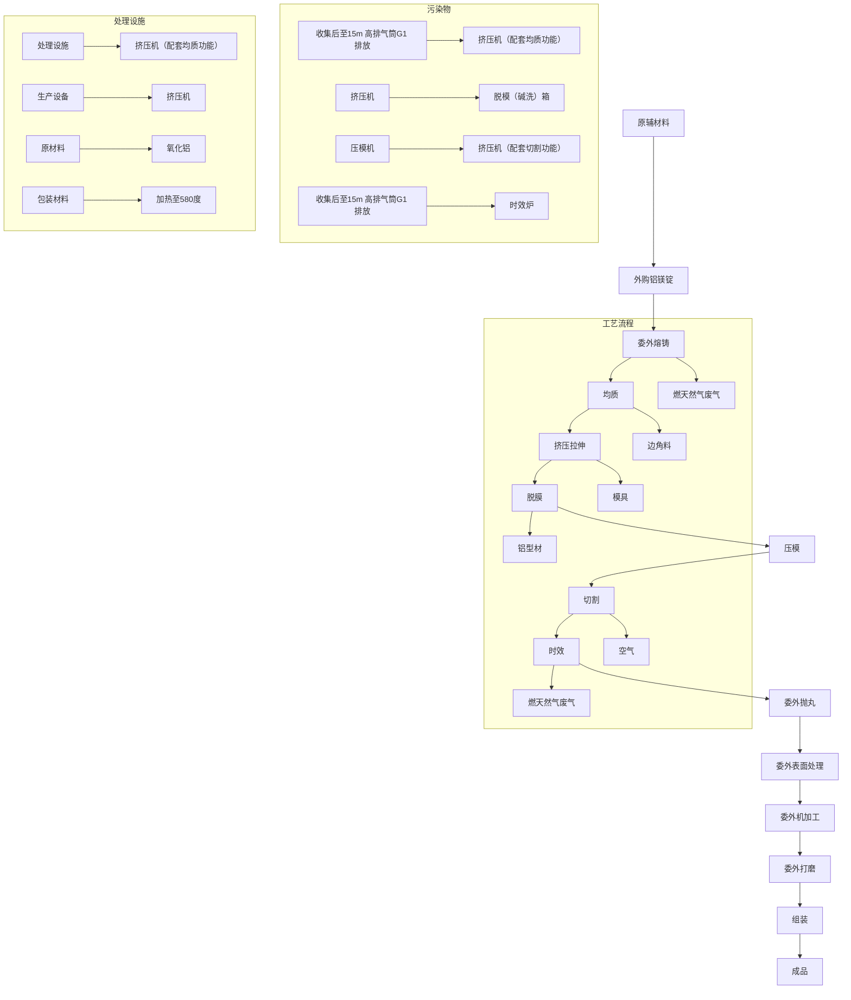
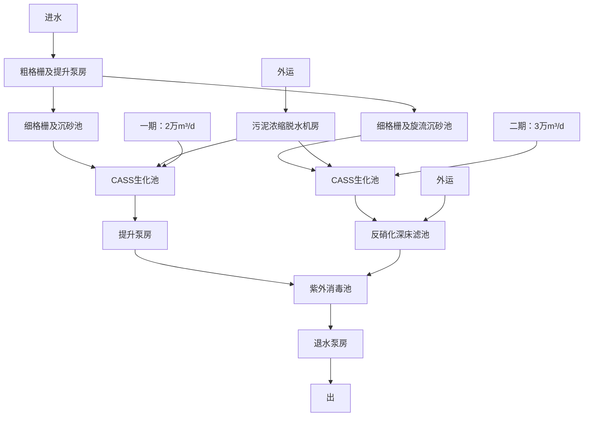

# 建设项目环境影响报告表

# （污染影响类）

项目名称：广东思创达铝业科有限公司改扩建项目

目名称： 广东思创达铝业科技有限公司

设单位（ ）：广东

境部制

text_image

生态环境科学研究院
民共和国生态环

编制单位和编制人员情况表

<table><tr><td colspan="2">项目编号</td><td colspan="3">0q97t1</td></tr><tr><td colspan="2">建设项目名称</td><td colspan="3">广东思创达铝业科技有限公司改扩建项目</td></tr><tr><td colspan="2">建设项目类别</td><td colspan="3">29-065有色金属压延加工</td></tr><tr><td colspan="2">环境影响评价文件类型</td><td colspan="3">报告表</td></tr><tr><td colspan="3">一、建设单位情况</td><td rowspan="4"></td><td></td></tr><tr><td colspan="2">单位名称(盖章)</td><td rowspan="3">广东思创达铝业科</td><td></td></tr><tr><td colspan="2">统一社会信用代码</td><td></td></tr><tr><td colspan="2">法定代表人(签章)</td><td></td></tr><tr><td colspan="3">主要负责人(签字)</td><td colspan="2"></td></tr><tr><td colspan="3">直接负责的主管人员(签字)</td><td colspan="2"></td></tr><tr><td colspan="3">二、编制单位情况</td><td colspan="2"></td></tr><tr><td colspan="2">单位名称(盖章)</td><td>广东顺德</td><td rowspan="2" colspan="2"></td></tr><tr><td colspan="2">统一社会信用代码</td><td>914406067</td></tr><tr><td colspan="3">三、编制人员情况</td><td colspan="2"></td></tr><tr><td colspan="5">1.编制主持人</td></tr><tr><td>姓名</td><td colspan="2">职业资格证书管理号</td><td colspan="2">信用编号</td></tr><tr><td>廖宝芝</td><td colspan="2">2013035440350000003508440185</td><td colspan="2">BH004387</td></tr><tr><td colspan="5">2.主要编制人员</td></tr><tr><td>姓名</td><td colspan="2">主要编写内容</td><td colspan="2">信用编号</td></tr><tr><td>廖宝芝</td><td colspan="2">评价适用标准、工程分析、拟采取的防治措施及预期治理效果、环境影响分析、结论与建议</td><td colspan="2">BH004387</td></tr><tr><td>刘东秀</td><td colspan="2">基本情况、自然环境简况、环境质量状况、主要污染物产生及预计排放情况</td><td colspan="2">BH004379</td></tr></table>

# 目录

建设项目环境影响报告表..

一、建设项目基本情况.. 4

二、建设项目工程分析.. . 11

三、区域环境质量现状、环境保护目标及评价标准. .29

四、主要环境影响和保护措施. .. 34

五、环境保护措施监督检查清单. .. 51

六、结论... .. 54

附表.... .. 55

建设项目污染物排放量汇总表. .. 55

# 一、建设项目基本情况

<table><tr><td>建设项目名称</td><td colspan="3">广东思创达铝业科技有限公司改扩建项目</td></tr><tr><td>项目代码</td><td colspan="3">无</td></tr><tr><td>建设单位联系人</td><td>谭**</td><td>联系方式</td><td>132******</td></tr><tr><td>建设地点</td><td colspan="3">广东省佛山市顺德区陈村镇永兴社区广隆工业园环镇西路8号之三</td></tr><tr><td>地理坐标</td><td colspan="3">(22度58分32.106秒,113度15分46.494秒)</td></tr><tr><td>国民经济行业类别</td><td>C3252铝压延加工</td><td>建设项目行业类别</td><td>二十九、有色金属冶炼和压延加工业,65、有色金属压延加工325,全部</td></tr><tr><td>建设性质</td><td>□新建(迁建)◇改建◇扩建□技术改造</td><td>建设项目申报情形</td><td>首次申报项目不予批准后再次申报项目超五年重新审核项目重大变动重新报批项目</td></tr><tr><td>项目审批(核准/备案)部门(选填)</td><td>/</td><td>项目审批(核准/备案)文号(选填)</td><td>/</td></tr><tr><td>总投资(万元)</td><td>100</td><td>环保投资(万元)</td><td>20</td></tr><tr><td>环保投资占比(%)</td><td>20%</td><td>施工工期</td><td>1个月</td></tr><tr><td>是否开工建设</td><td>否是:</td><td>用地(用海)面积(m2)</td><td>5500</td></tr><tr><td>专项评价设置情况</td><td colspan="3">无</td></tr><tr><td>规划情况</td><td colspan="3">无</td></tr><tr><td>规划环境影响评价情况</td><td colspan="3">无</td></tr><tr><td>规划及规划环境影响评价符合性分析</td><td colspan="3">无</td></tr><tr><td>其他符合性分析</td><td colspan="3">1、建设项目与所在地“三线一单”符合性分析生态保护红线:根据《广东省人民政府关于印发广东省“三线一单”生态环境分区管控方案的通知》(粤府(2020)71号)、《佛山市人民政府关于印发佛山市“三线一单”生态环境分区管控方案的通知》(佛府〔2021〕11号)和《佛山市顺德区人民政府关于印发佛山市顺德区“三线一单”生态环境分区管控方案的通知》(顺府发〔2021〕11号),本项目选址位于省</td></tr></table>

管控单元中的“重点管控单元”，属陈村镇重点管控区（编号：ZH44060620010）。项目选址单元不属于“涵盖生态保护红线、一般生态空间、饮用水水源保护区、环境空气质量一类功能区等区域的优先保护区”。

因此，项目不涉及生态保护红线。

环境质量底线：根据 2022 年全区的大气环境质量状况公报，除 O3年均浓度超过《环境空气质量标准》（GB3095-2012）及 2018 年修改单二级标准限值外，其余五项基本污染物指标浓度均能达到《环境空气质量标准》（GB3095-2012）及 2018 年修改单二级标准限值；根据补充监测数据，项目所在地 TSP 满足《环境空气质量标准》（GB3095-2012）及2018 年修改单的二级标准；纳污水体陈村水道各项水质指标均达到《地表水环境质量标准》（GB3838-2002）Ⅲ类标准。

本项目生活污水经三级化粪池预处理达到广东省《水污染物排放限值》（DB44/26-2001）第二时段三级标准后排入陈村污水处理厂处理，不直接向地表水体排放。时效炉循环冷却水循环使用，定期补充蒸发量，定期排入雨水管网。然天然气废气通过管道密闭收集后引至 15 米高的G1\~G1 排气筒达标排放；饭堂油烟经油烟净化装置处理后通过 15m 高排气筒 G7 高空达标排放。因此本项目的建设不会突破当地环境质量底线。

综合分析，本项目的建设不会突破当地环境质量底线。

资源利用上线：本项目运营期所用的资源主要为水资源、电能、天然气。

本项目给水由市政供水接入，电能由区域电网供应，天然气为清洁能源，符合《佛山市顺德区人民政府关于印发佛山市顺德区“三线一单”生态环境分区管控方案的通知》（顺府发〔2021〕11号）文件中的能源资源利用要求，同时本项目所用以上资源占比极少，不会突破当地的资源利用上线。项目所在地用途为工业用途，符合当地土地规划要求。

生态环境准入清单：本项目不在《产业结构调整指导目录（2019 年本》及 2021年修改单限制类、淘汰类之列，不属于《市场准入负面清单（2022 年版）》中规定的禁止和许可准入的行业类别。项目产品不属于《环境保护综合名录》（2021 年版）中“高污染、高环境风险”产品，符合规定要求。项目不属于《顺德区村级工业园升级改造项目产业准入负面清单》（2019年本）中限制类和禁止类。

因此项目符合相关产业政策、规划的要求。

根据《佛山市顺德区人民政府关于印发佛山市顺德区“三线一单”生态环境分区管控方案的通知》（顺府发〔2021〕11号），项目所在地属陈村镇重点管控区（编号：ZH44060620010），与顺德区三线一单相符性分析如下。

表1-1 与顺德区三线一单相符性分析

<table><tr><td>管控单元编码及名称</td><td>管控维度</td><td>管控要求</td><td>本项目概况</td><td>相符性</td></tr><tr><td>陈村镇重点管控区,编号:ZH44060620010(重点管控单元10)</td><td>空间布局约束</td><td>1-1.【产业/鼓励引导类】重点发展智能装备制造、新一代电子信息、新材料等新兴产业;结合TOD片区开发,对接广深港资源,大力发展生产性服务业、高端商务服务业和中小企业总部集群;培育以花卉产业为特色,向电商、会展、文创旅游等延伸的现代农业产业链。1-2.【产业/综合类】系统推进村级工业园升级改造,腾出连片空间,布局产业集聚区和主题产业园,推动工业项目入园集聚发展。新增工业制造业用地原则上安排在产业集聚区内,产业集聚区外原则上不鼓励工业及物流仓储用地的新建与改造。1-3.【产业/综合类】产业聚集区所属地块内的工业用地或企业与村庄、学校等环境敏感点之间应设置合理的大气环境防护距离,并通过绿化带进行有效隔离;聚集区规划布局应注重大气污染排放企业应尽量避免布局在居住用地的常年主导风向的上风向。1-4.【产业/限制类】受纳水体或监控断面不达标的,不得新建、扩建向河涌直接排放废水的项目。新建、扩建含蚀刻工序的线路板生产项目和化工项目应在配套污水集中处置的工业园区或生活污水管网覆盖区域内建设;纯加工型印花项目,含酸洗、磷化的金属表面处理、金属制品项目(与自身高新技术企业配套的除外),含酸洗、喷涂、化学抛光、电解等涉及废水排放工艺的不锈钢型材加工项目(与自身高新技术企业配套的除外),应进入以此类项目为主导产业、有相应废水集中治理设施的工业园区,实现集中治污。</td><td>1-1 本项目不属于。1-2 本项目所在地属于村级工业园升级改造,不属于重点改造范围。1-3 与最近敏感点距离为337m,挤压机、时效炉燃用天然气烟气直接达标高空排放,饭堂油烟经静电油烟处理后引至楼顶排放,对周围大气环境影响不大。1-4 项目改扩建后无生产废水产生,生活污水经三级化粪处理后排入陈村污水处理厂处理;冷却水循环使用,定期补充损耗量,定期排入雨水管网,不属于上述限制类项目。</td><td>符合</td></tr></table>

<table><tr><td rowspan="3"></td><td></td><td></td><td>1-5.【产业/综合类】划定家具生产优先发展区域,优先发展区外不再新建涉及涂装工艺的木质家具制造项目。1-6.【大气/限制类】大气环境受体敏感重点管控区内,应严格限制新建储油库项目、产生和排放有毒有害大气污染物的建设项目以及使用溶剂型油墨、涂料、清洗剂、胶黏剂等高挥发性有机物原辅材料项目,鼓励现有该类项目搬迁退出。1-7.【大气/限制类】大气环境布局敏感区重点管控区内,应严格限制新建生产和使用高挥发性有机物原辅材料项目,优先开展低VOCs含量原辅材料替代,强化无组织排放控制。原则上不再新建、扩建新增氮氧化物、烟(粉)尘排放量较大的建设项目。</td><td>1-5本项目不涉及。1-6项目不涉及。1-7项目无新增氮氧化物排放,无使用高挥发性有机物原辅材料。</td><td></td></tr><tr><td>陈村镇重点管控区,编号:ZH44060620010(重点管控单元10)</td><td>能源资源利用</td><td>2-1.【能源/鼓励引导类】推广节能技术,加快发展绿色货运与现代物流。2-2.【能源/鼓励引导类】推广新能源汽车应用和充电基础设施建设,积极推动重卡LNG加气站、充电基础设施、加氢站建设。2-3.【能源/综合类】科学实施能源消费总量和强度“双控”,新建高能耗项目单位产品(产值)能耗达到国际国内先进水平。2-4.【水资源/综合类】贯彻落实“节水优先”方针,实行最严格水资源管理制度,陈村镇万元国内生产总值用水量、万元工业增加值用水量、用水总量、农田灌溉水有效利用系数等用水总量和效率指标达到区下达要求。2-5.【土地资源/限制类】落实单位土地面积投资强度、土地利用强度等建设用地控制性指标要求,提高土地利用效率。2-6.【岸线/禁止类】严格水域岸线用途管制,新建项目一律不得违规占用水域。严禁破坏生态的岸线利用行为和不符合其功能定位的开发建设活动,严禁以各种名义侵占河道、围垦湖泊、非法采砂等。</td><td>2-1本项目不适用。2-2本项目不适用。2-3本项目不属于高能耗项目。2-4本项目冷却水循环使用,补充损耗量,定期排入雨水管网。项目总体用水量较少,符合要求。2-5本项目满足政府提出的投资强度、利用强度等指标要求。2-6本项目不适用。</td><td>符合</td></tr><tr><td>陈村镇重点管控区,编号:ZH44060620010(重点管控单元10)</td><td>污染物排放管控</td><td>3-1.【水/限制类】城镇新区建设实行雨污分流。住宅、商业体、学校、市场等城镇开发建设项目应当配套或者同步计划建设公共排水设施,公共排水设施或自建排污水设施未能投产运行的,以上涉水项目不得投入使用。新建小区严格实施雨污分流,阳台、露台等污水接入污水收集系统,将生活污水“应截尽截”。做好大型楼盘、集贸市场、餐饮以及学校等4大类排水户污水接入市政管网工作。3-2.【水/综合类】陈村镇重点河涌水质上年度未达到水环境质量目标的,需组织编制、系统实施、向社会公开区域重点水污染物减排计划并明确“替代量”,本年度新建、改建、扩建项目新增水环境重点污染物实行区域“减二增一”替代(工业、生活或综合集中废水处理设施、民生项目除外)。3-3.【水/综合类】结合村级工业园改造,全面提升产业层次与集聚度,促进污染集中整治。3-4.【水/综合类】稳步推进排水设施“三个一体化”管理模式,补齐城乡污水收集和处理短板,推动陈村污水处理厂提质增效,加快消除城中村、老旧城区、城乡结合部等污水收集管网空白区,逐步实现城乡污水收集处理全覆盖。2025年前完成陈村污水处理厂扩建,尾水应执行《城镇污水处理厂污染物排放标准》(GB18918-2002)一级A标准及《广东省水污染物排放限值》(DB44/26-2001)的较严值。3-5.【水/综合类】完善污水管网建设,逐步取消现状农村污水处理站点,有条件的区域实施雨污分流改造;至2030年全面雨污分流,农村生活污水纳入陈村城镇污水处理系统。3-6.【水/综合类】产业集聚区和主题园区内做好污水管网和污水集中处理设施的配套保障,确保废水收集到城镇污水处理厂、园区污水处理厂或分散式污水处理设施集中处置。</td><td>3-1本项目实行雨污分流,生活污水经三级化粪池处理达标后经厂区生活污水排放口通过市政管网排入陈村污水处理厂,冷却水循环使用,补充损耗量,定期排入雨水管网。3-2本项目冷却水循环使用,定期补充新鲜水,用于冷却塔风吹蒸发水量和外排水量,外排水为清净下水,可直接排入雨水管。3-3本项目所在地属于村级工业园升级改造,不属于重点改造范围。3-4本项目不适用。3-5本项目实行雨污分流,生活污水经三级化粪池处理达标后经厂区生活污水排放口通过市政管网排入陈村污水处理厂;冷却水循环使用,补充损耗量,定期排入雨水管网。3-6本项目不适用。</td><td>相符</td></tr><tr><td></td><td>陈村镇重点管控区,编号:ZH44060620010(重点管控单元10)</td><td>环境风险防控</td><td>4-1.【水/综合类】陈村污水处理厂、工业污水集中处理设施应采取有效措施,防止事故废水直接排入水体。完善污水处理厂在线监控系统联网,实现污水处理厂的实时、动态监管。4-2.【风险/综合类】加强环境风险分级分类管理,强化金属制品、有色金属和压延加工、化学原料和化学品制造业等涉重金属、化工行业</td><td>4-1本项目不适用。4-2本项目风险防控措施具备可行性,整体风险可控。</td><td>相符</td></tr></table>

<table><tr><td></td><td>企业及工业园区等重点环境风险源的环境风险防控。</td><td></td><td></td></tr></table>

本项目所在区域属于顺德区三线一单中“广东省佛山市顺德区陈村镇重点管控区”，编号：ZH44060620010。根据项目生产产品、原材料、工艺等分析，本项目不属于单元“空间布局约束”中产业/限制类、大气/限制类、大气/限制类，不属于单元“能源资源利用”中土地资源/限制类、岸线/禁止类，不属于单元“污染物排放管控”中的水/限制类。

综上，本项目符合“三线一单”要求。

# 2、选址合理性分析

项目位于广东省佛山市顺德区陈村镇永兴社区广隆工业园环镇西路8 号之三，根据项目所在地土地租赁合同、房产证（见附件 4、5），项目所在地现状用途为工业用地，土地功能符合要求。

根据《陈村镇广隆集约工业园区控制性详细规划土地利用规划图》，项目所在地土地利用规划为工业用地（详见附图 4）。

# 3、产业政策相符性分析

根据《市场准入负面清单（2022年版）》，项目不属于禁止和许可准入的行业类别。根据《产业结构调整指导目录（2019年本）》及 2021年修改单，项目不属于鼓励类、限制类和淘汰类中的行业；按照《促进产业结构调整暂行规定》，属于允许类。因此项目符合相关产业政策的要求。

# 4、环境功能区划相符性分析

本项目拟选址环境功能属性如下表。

表 1-2 建设项目所在地环境功能属性

<table><tr><td>编号</td><td>功能区名称</td><td>功能区确定依据</td><td>功能区类别及属性</td></tr><tr><td>1</td><td>水环境功能区</td><td>《关于同意实施&lt;广东省地表水环境功能区划&gt;的批复》(粤府函[2011]29号)</td><td>纳污水体陈村水道属于III类水体功能区,执行《地表水环境质量标准》(GB3838—2002)中的III类标准</td></tr><tr><td>2</td><td>环境空气质量功能区</td><td>《印发佛山市环境空气质量功能区划的通知》(佛府〔2007〕154号</td><td>大气环境二类功能区,详见附图5</td></tr><tr><td>3</td><td>声环境功能区</td><td>《关于印发佛山市声环境功能区划分方案的通知》(佛府函〔2015〕72号)</td><td>项目所在地属于2类声环境功能区,详见附图6</td></tr><tr><td>4</td><td>永久基本农田</td><td>《顺德区土地利用总体规划(2010-2020)》(粤府函[2011]37号)</td><td>否</td></tr><tr><td>5</td><td>风景名胜区、自然保护区、森林公园、重点生态功能区</td><td>《广东省主体功能区划》(粤府〔2012〕120号)</td><td>否</td></tr><tr><td>6</td><td>重点文物保护单位</td><td>---</td><td>否</td></tr><tr><td>7</td><td>是否水源保护区</td><td>---</td><td>否</td></tr><tr><td>8</td><td>是否污水处理厂纳污范围</td><td>--</td><td>陈村污水处理厂</td></tr></table>

# 二、建设项目工程分析

# 1、项目工程组成

# （1）项目由来

广东巨大铝业有限公司位于佛山市顺德区陈村镇广隆工业区环镇西路8号，所在中心地理位置坐标为北纬22.975585°，东经113.212915°，主要生产销售日用铝制品，年产铝合金型材12000吨。该项目于2016年7月29日取得《顺德区环境运输和城市管理局陈村分局关于广东巨大铝业有限公司扩建项目环境影响报告表的批复》（顺管陈环审【2016】第045号），于2017年7月18日完成竣工环保验收，于2020年8月14日取得国家排污许可证（排污证编号：91440606MA55WQF87W001V）。

2021年 7 月，企业增加了碱洗箱、压模机、将 1 台 3t 时效炉改为 12t 时效炉，建设单位由广东巨大铝业有限公司变更为广东思创达铝业科技有限公司，故委托广东顺德环境科学研究院有限公司编制了《广东思创达铝业科技有限公司改建项目环境影响报告表》，并于 2021年 9 月 16 日取得《佛山市生态环境局关于广东思创达铝业科技有限公司改建项目环境影响报告表的批复》（佛环 0305环审【2021】第 0017号）。2023年 2月 15 日建设单位就 21 年改建环评内容对排污许可证

进行变更。

由于目前项目现场已取消了熔铸、氧化、喷涂、机加工工序，仅保留了挤压、时效、碱洗压模工序，产品产能由年产铝合金型材12000吨/年扩至16000吨/年，目前现场取消的工序对应设备已全部拆除，整个厂区平面布置进行了调整，已无法按原环评进行验收。因此，本次以改扩建项目重新申报环评。

# （2）项目组成

本项目改扩建前占地面积为 24885m2，建筑面积为 14189m2，本次改扩建利用原生产车间进行，不另外新增用地，且改扩建后原部分用地外租给其它企业使用，故改扩建后占地面积为 5500m2，建筑面积为 5300m2（见附图 2、附图 3）。项目改扩建前员工人数为 200人，改扩建后员工降至 55人，改扩建前后项目工作制度不变，每天工作时间 8 小时（工作时间为8：00-12:00，14:00-18:00），工作天数为 300 天，改扩建前后项目内均不设置员工宿舍，设置饭堂。项目工程组成如表 2-1 所示：

表 2-1项目改扩建前后建设内容规模

<table><tr><td rowspan="2">工程类别</td><td colspan="3">工程内容和规模</td></tr><tr><td>改扩建前</td><td>改扩建部分</td><td>改扩建后</td></tr><tr><td rowspan="5">主体工程</td><td>厂房一,钢结构厂房1层,面积 $3514m^{2}$ ,主要为仓库和装配车间,喷粉和前处理生产线车间,机加工车间,其余部分外租给其它企业使用</td><td>外租给其它企业使用其它企业使用</td><td>---</td></tr><tr><td>厂房二,钢结构1层,面积 $4800m^{2}$ ,为压铸、时效、抛丸车间,安装挤压机6台,时效炉2台,抛丸机1台;</td><td>依托该车间建设,取消压铸、抛丸工序</td><td>厂房二,钢结构1层,面积 $4800m^{2}$ ,为压铸、时效、碱洗压模车间,含挤压机6台,时效炉2台,脱模(碱洗)箱,压模机1台</td></tr><tr><td>厂房三,钢结构1层,主要为氧化车间,面积 $3000m^{2}$ ,安装阳极氧化线1条;</td><td>外租给其它企业使用其它企业使用</td><td>---</td></tr><tr><td>厂房四,钢结构1层,面积约 $1500m^{2}$ ,主要为熔炼车间,安装熔铝炉1台;</td><td>外租给其它企业使用其它企业使用</td><td>---</td></tr><tr><td>厂房五,共4层,面积约 $11000m^{2}$ ,1层为饭堂,2-4层出租。</td><td>厂房五保留1层饭堂部分,其余外租给其它企业使用其它企业使用</td><td>饭堂,位于厂房五一层</td></tr><tr><td>辅助工程</td><td>原料仓库利用厂房一和厂房二空置地周转,配电房1座。饭堂设置在厂房五,不设宿舍。</td><td>依托厂房二空置地周转,其余外租给其它企业使用,厂房五保留1层饭堂部分</td><td>依托厂房二空置地周转;饭堂位于厂房五一层</td></tr><tr><td>贮运工程</td><td>原项目原材料铝镁锭由供应商直接运送至厂区,氧化用硫酸用槽车运至厂区装卸在储罐内。其它辅助材料由供应商直接运输。产品由客户到厂提货。</td><td>产品规模有所增加,改扩建后工程贮运依托现有工程,改扩建后已不设置氧化工序,不需要运送硫酸</td><td>产品规模不变,改扩建后工程贮运依托现有工程,改扩建后已不设置氧化工序,不需要运送硫酸</td></tr><tr><td>供热工程</td><td>采用市政管道天然气供铸铝炉直接加热熔化、固化炉、挤压机、时效炉加热和员工饭堂煮食。</td><td>改扩建后已不设置熔铸车间、喷粉车间,员工伙食由外企业配送,故天然气仅用于挤压机、时效炉加热和饭堂煮食,故天然气用量有所减少</td><td>采用市政管道天然气供挤压机、时效炉加热和饭堂煮食。</td></tr><tr><td>给水系统</td><td>生活和生产用水由市政管网供应,生产用水主要为阳极氧化清洗水和喷粉前处理废水,经厂内处理后循环使用,2009年项目申请部分外排。挤压机和时效炉冷却循环水系统设有循环水池、循环泵、冷却塔等设施。</td><td>生活用水由市政管网供应,项目改扩建后已不设氧化工序,无生产用水产生。改扩建后时效炉对应的冷却循环水规模依托原有冷却水循环设施。</td><td>用水由市政管网供应,项目改扩建后无生产用水产生。挤压机和时效炉冷却循环水系统设有循环水池、循环泵、冷却塔等设施。</td></tr><tr><td>排水系统</td><td>生活污水进入陈村污水处理厂处理。生产废水主要为阳极氧化清洗废水和喷粉前处理废水,经厂内生产废水处理站处理后循环使用,2009年经区环保局批准部分达标排放,年排放总量控制 $3.6万m^{3}/a$ </td><td>生活污水处理方式与改扩建前一致;项目改扩建后已不设氧化工序,无对应的生产废水产生。</td><td>生活污水进入陈村污水处理厂处理。</td></tr></table>

<table><tr><td></td><td>环保工程</td><td>(1) 废气治理:熔铝炉烟气采用水喷淋除尘方法进行处理,阳极氧化酸洗池酸雾收集后通过碱液喷淋塔处理后高空排放,固化炉有机废气直接达标排放,粉尘经旋风和滤芯过滤后达标排放,抛丸机产生的粉尘经旋风+水喷淋处理后达标排放,挤压机、时效炉、固化炉燃用天然气烟气直接达标高空排放,打磨颗粒物产生的粉尘经旋风处理后达标经15m高度的排气筒高空排放;食堂油烟经油烟净化后在楼顶排放。(2) 废水处理:生产废水经厂内废水处理站pH调整+混凝+沉淀过滤后循环使用,设计处理能力60m3/h。2009年,因工艺变化,企业申请,区环保局批准部分达标排放,年排放总量控制3.6万m3/a,CODcr总量3.6吨/年。(3) 固体废物处理处置:生活垃圾收集站,危险废物中转储存场地(废水处理污泥);熔铝炉渣临时堆放场等。</td><td>(1) 废气治理:项目改扩建后不设熔铸、氧化、喷涂、机加工工序,无熔铝炉烟气、酸雾、固化炉有机废气、喷粉粉尘、打磨粉尘、抛丸粉尘产生;挤压机、时效炉燃用天然气烟气直接达标高空排放;食堂油烟经油烟净化后在楼顶排放。(2) 废水处理:项目改扩建后已不设氧化工序,无对应的生产废水产生。(3)固体废物处理处置:依托现有工程处置。</td><td>(1) 废气治理:挤压机、时效炉燃用天然气烟气直接达标高空排放;食堂油烟经油烟净化后在楼顶排放。(2) 废水处理:项目改扩建后无对应的生产废水产生。(3)固体废物处理处置:生活垃圾收集站,危险废物中转储存场地等。</td></tr></table>

# 2、项目改扩建前后主要产品产量

表 2-2 项目改扩建前后主要产品产量一览表

<table><tr><td>名称</td><td>单位</td><td>改扩建前数量</td><td>改扩建后数量</td><td>增减量</td><td>备注</td></tr><tr><td>铝合金型材</td><td>吨/年</td><td>12000</td><td>16000</td><td>+4000</td><td>---</td></tr></table>

# 3、项目改扩建前后主要生产设备情况

备注：原环评审批预计挤压机8台，实际生产需要为6台，现环评更正过来。  
表 2-3 项目改扩建前后生产设备情况一览表

<table><tr><td colspan="2">名称</td><td>单位</td><td>改扩建前数量</td><td>改扩建后数量</td><td>增减量</td><td>备注</td></tr><tr><td colspan="2">熔铝炉</td><td>台</td><td>1</td><td>0</td><td>-1</td><td>项目改扩建后取消熔铸工序</td></tr><tr><td colspan="2">挤压机</td><td>台</td><td>6</td><td>6</td><td>0</td><td>6台700-3600T</td></tr><tr><td colspan="2">时效炉</td><td>台</td><td>2</td><td>2</td><td>0</td><td>2台12T</td></tr><tr><td colspan="2">阳极氧化生产线</td><td>台</td><td>1</td><td>0</td><td>-1</td><td>项目改扩建后取消阳极氧化工序</td></tr><tr><td colspan="2">喷粉生产线</td><td>条</td><td>1</td><td>0</td><td>-1</td><td>项目改扩建后取消喷粉工序</td></tr><tr><td rowspan="2">其中</td><td>喷粉房</td><td>个</td><td>1</td><td>0</td><td>-1</td><td></td></tr><tr><td>固化炉</td><td>台</td><td>1</td><td>0</td><td>-1</td><td></td></tr><tr><td colspan="2">表面不锈钢抛丸机</td><td>条</td><td>1</td><td>0</td><td>-1</td><td></td></tr><tr><td colspan="2">硫酸储罐</td><td>台</td><td>1</td><td>0</td><td>-1</td><td>项目改扩建后取消阳极氧化工序</td></tr><tr><td colspan="2">整流变压器</td><td>台</td><td>8</td><td>8</td><td>0</td><td></td></tr><tr><td colspan="2">脉冲变压器</td><td>台</td><td>2</td><td>2</td><td>0</td><td></td></tr><tr><td colspan="2">打磨机</td><td>台</td><td>5</td><td>0</td><td>-5</td><td rowspan="6">项目改扩建后取消机加工工序</td></tr><tr><td colspan="2">铣床</td><td>台</td><td>7</td><td>0</td><td>-7</td></tr><tr><td colspan="2">锯床</td><td>台</td><td>9</td><td>0</td><td>-9</td></tr><tr><td colspan="2">冲床</td><td>台</td><td>28</td><td>0</td><td>-28</td></tr><tr><td colspan="2">数控加工中心</td><td>台</td><td>5</td><td>0</td><td>-5</td></tr><tr><td colspan="2">锣机</td><td>台</td><td>3</td><td>0</td><td>-3</td></tr><tr><td>脱模(碱洗)箱</td><td>个</td><td>2</td><td>2</td><td>0</td><td colspan="2" rowspan="2">用于碱洗、压模工序</td></tr><tr><td>压模机</td><td>台</td><td>1</td><td>1</td><td colspan="2">0</td></tr></table>

# 3、项目改扩建前后原辅材料使用情况

表 2-4 项目改扩建后原辅材料使用情况一览表

<table><tr><td>名称</td><td>单位</td><td>改扩建前数量</td><td>改扩建后数量</td><td>增减量</td><td>备注</td></tr><tr><td>铝锭</td><td>吨/年</td><td>11700</td><td>15600</td><td>3900</td><td>铝棒原料</td></tr><tr><td>工业硫酸(储罐)</td><td>吨/年</td><td>300</td><td>0</td><td>-300</td><td rowspan="6">项目改扩建后取消阳极氧化,保留的20吨/年氢氧化钠用量用于碱洗工序</td></tr><tr><td>氢氧化钠(50kg塑料袋)</td><td>吨/年</td><td>100</td><td>20</td><td>-80</td></tr><tr><td>三合一脱脂剂(25kg塑料桶)</td><td>吨/年</td><td>17.5</td><td>0</td><td>-17.5</td></tr><tr><td>无铬表面处理剂(25kg塑料桶)</td><td>吨/年</td><td>5</td><td>0</td><td>-5</td></tr><tr><td>LW-99环保型无镍无氟中温封闭剂</td><td>吨/年</td><td>7</td><td>0</td><td>-7</td></tr><tr><td>LW-03着色剂</td><td>吨/年</td><td>1</td><td>0</td><td>-1</td></tr><tr><td>不锈钢钢砂</td><td>吨/年</td><td>3</td><td>0</td><td>-3</td><td>项目改扩建后取消表面抛丸工序</td></tr><tr><td>粉末涂料</td><td>吨/年</td><td>250</td><td>0</td><td>-250</td><td>项目改扩建后取消喷粉工序</td></tr><tr><td>氧化钙</td><td>吨/年</td><td>100</td><td>0</td><td>-100</td><td rowspan="2">项目改扩建后无生产废水产生,无使用废水处理剂</td></tr><tr><td>聚丙烯酰胺</td><td>吨/年</td><td>3</td><td>0</td><td>-3</td></tr></table>

# 3、项目改扩建前后能源消耗情况

表 2-5 项目改扩建前后能源消耗情况一览表

<table><tr><td>类别</td><td>名称</td><td>单位</td><td>改扩建前数量</td><td>改扩建后数量</td><td>增减量</td><td>备注</td></tr><tr><td rowspan="3">能耗</td><td>电</td><td>万Kwh/a</td><td>635</td><td>190</td><td>-445</td><td>改扩建后设备有所减少</td></tr><tr><td>天然气</td><td>万Nm3/a</td><td>160.8</td><td>80</td><td>-80.8</td><td>改扩建取消了熔铸、固化工序,天然气用量有所减少</td></tr><tr><td>柴油</td><td>吨/年</td><td>30</td><td>30</td><td>0</td><td>叉车使用</td></tr><tr><td rowspan="2">水耗</td><td>生产用水</td><td>立方米/年</td><td>35000</td><td>364.8</td><td>-34635.2</td><td>改扩建后无阳极氧化等生产用水,仅保留时效、挤压冷却用和碱洗补充损耗用水</td></tr><tr><td>生活用水</td><td>立方米/年</td><td>6000</td><td>825</td><td>-5175</td><td>员工人数由200人缩减至55人</td></tr></table>

# 4、劳动定员及工作制度

项目改扩建前员工人数为 200人，改扩建后员工人数 55人，不设住宿，年工作 300天，

每天工作 8h。

# 5、厂区平面布置图

项目改扩建前的平面布置图见下图 2-1，改扩建后平面布置图见附图 3。

text_image

图例
◆ 并气筒
FO-0218 烧焰烟气
FO-02164 氨化硫酸雾
FO-02165 铀化平均机废气
FO-02166 打融粉尘
■ 院洗箱、压缩机设置
□ 项目范围
□ 广区设置

生产废水排放口
生活污水排放口
应海池
熔铸车间
30 米
废气处理回体
生物收集区
污水处理车间
污水收集池
储水池
甲醇间
FO-02166
FO-02164
一氧化碳、硝化氢、二氧化硫、甲醛、硝化氢、氯化氢、氟化氢、氯化氢、氯化氢、氯化氢、氯化氢、氯化氢、氯化氢、氯化氢、氯化氢、氯化氢、氯化氢、氯化氢、氯化氢、氯化氢、氯化氢、氯化氢、氯化氢、氯化氢、氯化氢、氯化氢、氯化氢、氯化氢、氯化氢、氯化氢、氯化氢、氯化氢、氟化氢、氟化氢、氟化氢、氟化氢、氟化氢、氟化氢、氟化氢、氟化氢、氟化氢、氟化氢、氟化氢、氟化氢、氟化氢、氟化氢、氟化氢、氟化氢、氟化氢、氟化氢、氟化氢、氟化氢、氟化氢、氟化氢、氟化氢、氟化氢、氟化氢、氰酸钠装置
废气处理回体
生物收集区
污水处理车间
污水收集池
储水池
甲醇间
FO-02166
FO-02164
一氧化碳、硝化氢、二氧化硫、甲醛、硝化氢、氯化氢、氟化氢、氯化氢、氟化氢、氟化氢、氟化氢、氟化氢、氟化氢、氟化氢、氟化氢、氟化氢、氟化氢、氟化氢、氟化氢、氟化氢、氟化氢、氟化氢、氟化氢、氟化氢、氟化氢、氟化氢、氟化氢、氟化氢、氟化氢、氟化氢、氟化氢、氰酸钠装置

废气处理回体
生物收集区
污水处理车间
污水收集池
储水池
甲醇间
FO-02166
FO-02164
一氧化碳、硝化氢、二氧化硫、甲醛、硝化氢、氯化氢、氟化氢、氯化氢、氟化氢、氟化氢、氟化氢、氟化氢、氟化氢、氟化氢、氟化氢、氟化氮装置
废气处理回体
废气处理回体
废气处理回体
废气处理回体
废气处理回体
废气处理回体
废气处理回体
废气处理回体
废气处理回体
废气处理回体
废气处理回体
废气处理回体
废气处理回体
废气处理回体
废气处理回体
废气处理回体
废气处理回体
废气处理回体
废气处理回体
废气处理回体
废气处理回体内质液的沉淀管和滤膜管，用于过滤气体，用于过滤气体，用于过滤气体，用于过滤气体，用于过滤气体，用于过滤气体，用于过滤气体，用于过滤气体，用于过滤气体，用于过滤气体，用于过滤气体，用于过滤气体，用于过滤气体，用于过滤气体，用于过滤气体，用于过滤气体，用于过滤气体，用于过滤气体，用于过滤气体，用于过滤气体，用于过滤气体，用于过滤气体，用于过滤气体，用于过滤气体，用于过滤气体，用于过滤固体废物的存放与使用，用于过滤固体废物的存放与使用，用于过滤固体废物的存放与使用，用于过滤固体废物的存放与使用，用于过滤固体废物的存放与使用，用于过滤固体废物的存放与使用，用于过滤固体废物的存放与使用，用于过滤固体废物的存放与使用，用于过滤固体废物的存放与使用，用于过滤固体废物的存放与使用，用于过滤固体废物的存放与使用，用于过滤固体废物的存放与使用

图2-1 改扩建前全厂平面图

本次改扩建变化内容主要为：①取消熔铸、氧化、喷涂、机加工工序，相应的设备也拆除掉，车间待出租，仅保留了挤压、时效、碱洗压模工序和相应的挤压车间 1 座；②产品产能由年产铝合金型材 12000 吨/年扩至 16000 吨/年。

本项目改扩建后整体生产工艺流程图。

flowchart

图 2-2 项目生产工艺流程图

工艺流程简述：

委外熔铸、均质：项目主要从事铝合金部件加工。首先，将外购进入委外熔铸加热到800℃，使其融化。然后将工件返回厂内进行均质使工件均匀混合一段时间，均质过程也需使用天然

气进行加热（加热温度约 200℃）。

挤压：均质完成后，使用挤压机通过不同的模具挤压成不同的形状（圆形或方形的条状产品），挤压过程不使用脱模剂。挤压过程需要保持铝棒温度为 400℃左右，通过冷却水进行间接冷却。

脱模、压模：挤压完成后，部分残留于模具中的铝型材需要进行脱模、压模工序将其与模具脱离出来，该两道工序属于挤压配套工序。脱模使用氢氧化钠溶液将残留于模具中的铝型材与模具分离，由于脱模时铝型材的温度约100℃，故该工序使用的氢氧化钠溶液中的水遇热会产生水蒸气，，由于氢氧化钠不会挥发,无氢氧化钠等其他物质，故该配套工序无大气污染物产生。

切割、时效：成型后的铝型材按照不同产品要求切割成一定的尺寸。切割完成后进行时效处理，时效处理即在较高的温度环境中放置，保持其性能，形状，尺寸随时间而变化的热处理工艺。一般地讲，经过时效，硬度和强度有所增加，塑性韧性和内应力则有所降低,时效处理时使用天然气。

委外表面处理、机加工：时效完成后，工件按需求委外进行表面处理（阳极氧化、喷粉等）、机加工处理。完成后工件返回厂内进行组装即得成品。

# 主要化学品理化性质如下：

# 氢氧化钠：

项目脱模（碱洗）工序使用硫酸对工件进行碱蚀，其英文名称：sodiunhydroxide；分子式：NaOH，分子量：40.01；CAS 号：1310-73-2；危险化学品分类第 8 类，腐蚀性物品，危险货物编号：82001；职业接触限值：MAC=0.5mg/m3。

NaOH俗名烧碱、火碱、苛性纳。纯品是无色透明的晶体。密度2.130。熔点318.4℃。沸点1390℃。工业品含有少量的氯化钠和碳酸钠，是白色不透明的固体。有块状、片状、粒状和棒状等。成浓溶液的产品俗名液碱。固碱吸湿性很强，易溶于水，同时强烈放热。并溶于乙醇和甘油。露放在空气中，最后会完全溶解成溶液。在强碱性，对皮肤、织物、纸张等有强腐蚀性。储存于阴凉、干燥、通风良好的库房。远离火种、热源。库内湿度最好不大于85％。包装必须密封，切勿受潮。应与易（可）燃物、酸类等分开存放，切忌混储。储区应备有合适的材料收容泄漏物。

# 1、原项目情况

根据建设单位提供的《广东思创达铝业科技有限公司改建项目环境影响报告表》并结合实际情况，对改扩建前项目进行分析。

# 1、原项目生产情况

原项目年产铝合金型材 12000吨，工艺流程如下：

```mermaid
graph TD
    A["原料输入"] --> B["预处理"]
    B --> C{预处理条件}
    C -->|是| D["废气处理"]
    C -->|否| E["返工"]
    D --> F["预处理"]
    F --> G{预处理条件}
    G -->|是| H["废气处理"]
    G -->|否| I["返工"]
    H --> J["废气排放"]
    J --> K["废气排放"]
    K --> L["废气排放"]
    L --> M["废气排放"]
    M --> N["废气排放"]
    N --> O["废气排放"]
    O --> P["废气排放"]
    P --> Q["废气排放"]
    Q --> R["废气排放"]
    R --> S["废气排放"]
    S --> T["废气排放"]
    T --> U["废气排放"]
    U --> V["废气排放"]
    V --> W["废气排放"]
    W --> X["废气排放"]
    X --> Y["废气排放"]
    Y --> Z["废气排放"]
    Z --> AA["废气排放"]
    AA --> AB["废气排放"]
    AB --> AC["废气排放"]
    AC --> AD["废气排放"]
    AD --> AE["废气排放"]
    AE --> AF["废气排放"]
    AF --> AG["废气排放"]
    AG --> AH["废气排放"]
    AH --> AI["废气排放"]
    AI --> AJ["废气排放"]
    AJ --> AK["废气排放"]
    AK --> AL["废气排放"]
    AL --> AM["废气排放"]
    AM --> AN["废气排放"]
    AN --> AO["废气排放"]
    AO --> AP["废气排放"]
    AP --> AQ["废气排放"]
    AQ --> AR["废气排放"]
    AR --> AS["废气排放"]
    AS --> AT["废气排放"]
    AT --> AU["废气排放"]
    AU --> AV["废气排放"]
    AV --> AW["废气排放"]
    AW --> AX["废气排放"]
    AX --> AY["废气排放"]
    AY --> AZ["废气排放"]
    AZ --> BA["废气排放"]
    BA --> BB["废气排放"]
    BB --> BC["废气排放"]
    BC --> BD["废气排放"]
    BD --> BE["废气排放"]
    BE --> BF["废气排放"]
    BF --> BG["废气排放"]
    BG --> BH["废气排放"]
    BH --> BI["废气排放"]
    BI --> BJ["废气排放"]
    BJ --> BK["废气排放"]
    BK --> BL["废气排放"]
    BL --> BM["废气排放"]
    BM --> BN["废气排放"]
    BN --> BO["废气排放"]
    BO --> BP["废气排放"]
    BP --> BQ["废气排放"]
    BQ --> BR["废气排放"]
    BR --> BS["废气排放"]
    BS --> BT["废气排放"]
    BT --> BU["废气排放"]
    BU --> BV["废气排放"]
    BV --> BW["废气排放"]
    BW --> BX["废气排放"]
    BX --> BY["废气排放"]
    BY --> BZ["废气排放"]
    BZ --> CA["废气排放"]
    CA --> CB["废气排放"]
    CB --> CC["废气排放"]
    CC --> CD["废气排放"]
    CD --> CE["废气排放"]
    CE --> CF["废气排放"]
    CF --> CG["废气排放"]
    CG --> CH["废气排放"]
    CH --> CI["废气排放"]
    CI --> CJ["废气排放"]
    CJ --> CK["废气排放"]
```

flowchart

图 2-3 原项目生产工艺流程图

现有项目工艺流程简述：

熔铸、均质：现有项目主要从事铝合金部件加工。首先，将外购进入熔铸炉内的铝镁锭使用管道天然气直接加热到 800℃，使其融化。然后进行均质使工件均匀混合一段时间，均质过程也需使用天然气进行加热。

挤压：均质完成后，使用挤压机通过不同的模具挤压成不同的形状（圆形或方形的条状产品），挤压过程不使用脱模剂。挤压过程需要保持铝棒温度为 400℃左右，通过冷却水进行间接冷却。

脱模、压模：脱模使用氢氧化钠溶液将残留于模具中的铝型材与模具分离，由于脱模时铝型材的温度约100℃，故该工序使用的氢氧化钠溶液中的水遇热会产生水蒸气，由于氢氧化钠不会挥发，这部分水蒸气仅含水（H 0）,无氢氧化钠等其他物质，故该配套工序无水、大气污染物产生。

切割、时效：成型后的铝型材按照不同产品要求切割成一定的尺寸。切割完成后进行时效处理，时效处理即在较高的温度环境中放置，保持其性能，形状，尺寸随时间而变化的热处理工艺。一般地讲，经过时效，硬度和强度有所增加，塑性韧性和内应力则有所降低,时效处理时使用天然气。其中，本次改建将 1 台 3t 时效炉改为 12t 时效炉，改建后单次时效工序对应的工件数量由两框增加至九框，提高时效生产效率，但总产能不变。

表面处理、机加工：时效完成后，工件一部分进入喷粉生产线进行喷粉前处理、喷粉、固化工艺；另一部分工件经过表面抛丸（使用不锈钢丸）进入阳极氧化生产线进行阳极氧化。产品经过喷粉生产线和阳极氧化生产线后进行切割，并使用冲床、铣床、锣机和打磨机等机加工设备进行一系列机加工。机加工完成后对工件表面进行打磨，打磨完成后进行组装即得成品。

①阳极氧化：原项目使用的阳极氧化生产线各槽主要包括抛光槽、脱脂槽、水洗槽、酸蚀槽、碱蚀槽、氧化槽、着色槽、封闭槽等，按照各槽子的功能，需分别使用脱脂剂、硫酸、氢氧化钠、着色剂和封闭剂等原料。  
②喷粉：项目使用全自动喷粉生产线，主要分为喷粉前处理、喷粉和固化工序，主要工序为预洗→脱脂→水洗→钝化，需分别使用脱脂剂、无铬钝化剂等原料。

# 主要化学品的性质如下：

（1）硫酸：英文名称：sulfuric acid；分子式：H2SO4，分子量：98.08；CAS 号：7664-93-9；危险化学品分类第 8类，腐蚀性物品，危险货物编号：81007；职业接触限值：MAC=2mg/m3。

性质：纯品为无色油状液体。工业品因含杂质而呈黄、棕等色。98.3％的硫酸密度(液态)1.831g/cm3。凝固点 10.36。沸点(330±0.5)℃。一种活泼的二元无机强酸。

危险特性：遇水大量放热, 可发生沸溅。与易燃物（如苯）和可燃物（如糖、纤维素等）接触会发生剧烈反应，甚至引起燃烧。遇电石、高氯酸盐、雷酸盐、硝酸盐、苦味酸盐、金属粉末等猛烈反应，发生爆炸或燃烧。有强烈的腐蚀性和吸水性。

储存注意事项：储存于阴凉、通风的库房。库温不超过 35℃，相对湿度不超过 85％。保持容器密封。应与易（可）燃物、还原剂、碱类、碱金属、食用化学品分开存放，切忌混储。储区应备有泄漏应急处理设备和合适的收容材料。

（2）氢氧化钠：项目阳极氧化、碱洗（脱模）工序使用氢氧化钠对工件进行碱蚀，其英文名称：sodiun hydroxide；分子式：NaOH，分子量：40.01；CAS 号：1310-73-2；危险化学品分类第 8 类，腐蚀性物品，危险货物编号：82001；职业接触限值：MAC=0.5mg/m3。

NaOH 俗名烧碱、火碱、苛性纳。纯品是无色透明的晶体。密度 2.130。熔点 318.4℃。沸点 1390℃。工业品含有少量的氯化钠和碳酸钠，是白色不透明的固体。有块状、片状、粒状和棒状等。成浓溶液的产品俗名液碱。固碱吸湿性很强，易溶于水，同时强烈放热。并溶于乙醇和甘油。露放在空气中，最后会完全溶解成溶液。在强碱性，对皮肤、织物、纸张等有强腐蚀性。储存于阴凉、干燥、通风良好的库房。远离火种、热源。库内湿度最好不大于85％。包装必须密封，切勿受潮。应与易（可）燃物、酸类等分开存放，切忌混储。储区应备有合适的材料收容泄漏物。

（3）脱脂剂：德国汉高三合一脱脂剂，主要成份为聚丙烯酸。聚丙烯酸简称 PAA，结构式为[－CH2－CH(COOH)]n－。无色或淡黄色液体．易溶于水、有腐蚀性,低毒。贮存于阴凉、通风的库房内。  
（4）无铬钝化剂：由重金属、氧化剂、催化剂等多种成份复配而成，是不含铬的环保产品，目前广泛应用于现代化金属制品表面钝化处理工艺中。经相关部门检测，其产品中重金属含量镉≤0.001mg/L，铅≤0.05mg/L，汞≤0.001mg/L，六价铬≤0.01mg/L。  
（5）封闭剂：LW-99环保型无镍无氟中温封闭剂，成分为表面活性剂、硼酸、水化促进剂等。  
（6）着色剂：LW-03 着色剂；成分为酒石酸、硼酸。  
（7）喷粉粉末：该产品为聚酯粉末，软化点较高，性能优良，与固化剂混合后形成体型结构的热固性树脂，具有良好的附着力，耐化学腐蚀性，耐热性及优异的电绝缘性。

# 2、原有项目污染物产排污情况

# （1）水污染源

# ①生活污水

项目改扩建前员工有 200人，厂内不设置员工宿舍，但设置饭堂，年工作 300天。生活污水主要为员工办公及饭堂产生的生活污水。根据建设单位提供的资料，改扩建前项目员工生活用水量为 6000m3 /a，废水排放量按用水量的 90%计算，则生活污水排放量为 5400m3/a。生活污水污染物产排情况见表 2-6。

表 2-6 生活污水污染物产排情况

<table><tr><td rowspan="2">污染物</td><td colspan="2">产生情况</td><td colspan="2">排放情况</td></tr><tr><td>产生浓度(mg/m3)</td><td>年产生量(t/a)</td><td>排放浓度(mg/m3)</td><td>年排放量(t/a)</td></tr><tr><td> $COD_{cr}$ </td><td>250</td><td>1.3500</td><td>40</td><td>0.2160</td></tr><tr><td> $BOD_5$ </td><td>100</td><td>0.5400</td><td>20</td><td>0.1080</td></tr><tr><td> $NH_3-N$ </td><td>30</td><td>0.1620</td><td>8</td><td>0.0432</td></tr><tr><td>SS</td><td>200</td><td>1.0800</td><td>20</td><td>0.1080</td></tr></table>

②阳极氧化及喷粉前处理废水

原项目生产废水产生量为 57600m3 /a，循环量为 25200m3 /a，回用损耗量为 960m3/a，排放量为 31440m3 /a（见表 2-14）。根据项目近期常规检测数据（附件 10，引用自佛山市沃特测试技术服务有限公司对原项目的常规监测报告，报告编号为 WTF23F02018677K，监测时间为 2023年 3 月 10 日），项目外排废水均能达标排放，具体监测数据见表 2-7。

表2-7 原项目废水常规监测数据

<table><tr><td>检测位置</td><td colspan="2">WS-00538排放口</td><td>采样方法</td><td>瞬时</td></tr><tr><td>检测项目</td><td>检测结果</td><td>最高允许排放浓度</td><td>单位</td><td>结论</td></tr><tr><td>pH</td><td>7.8(25°C)</td><td>6-9</td><td>无量纲</td><td>达标</td></tr><tr><td>悬浮物</td><td>7</td><td>60</td><td>mg/L</td><td>达标</td></tr><tr><td>CODcr</td><td>22</td><td>160</td><td>mg/L</td><td>达标</td></tr><tr><td>总磷</td><td>0.02</td><td>2</td><td>mg/L</td><td>达标</td></tr><tr><td>流量</td><td>0.4</td><td>---</td><td>m3/h</td><td>---</td></tr><tr><td>石油类</td><td>0.06L</td><td>2</td><td>mg/L</td><td>达标</td></tr><tr><td>总镍</td><td>0.02L</td><td>0.5</td><td>mg/L</td><td>达标</td></tr><tr><td>氨氮</td><td>0.278</td><td>30</td><td>mg/L</td><td>达标</td></tr><tr><td>总氮</td><td>2.14</td><td>40</td><td>mg/L</td><td>达标</td></tr><tr><td>氟化物</td><td>6.84</td><td>20</td><td>mg/L</td><td>达标</td></tr><tr><td>总铝</td><td>0.47</td><td>4</td><td>mg/L</td><td>达标</td></tr><tr><td colspan="5">备注:外排废水执行《电镀水污染物排放标准》(DB44/1597-2015)(其中总铬、六价铬、总镍、总镉、总银、总铅、总汞执行表1现有排放限值,pH排放限值为6~9,其他污染物的排放不超过本标准现有项目相应排放限值的200%。</td></tr></table>

# ③冷却循环水

原项目挤压机和时效炉冷却采用循环冷却水，循环量约 10m3 /h，计 24000m3/a，需补充蒸发损失的水量约 1m3 /h（即 2400m3/a）。

# ④熔铝炉烟尘、抛丸喷尘循环废水

原项目熔铝炉、抛丸机含铝烟尘和粉尘采用水喷淋处理方法，喷淋废水循环使用，补充水使用污水处理站处理后的中水。循环量约 2m3/h（即 4800m3/a），补充水量约 0.4m3/h（即960m3/a）。

# ⑤酸雾碱液喷淋循环废水

原项目酸雾由原来的直接排放改进为经过碱液喷淋后排放，项目碱液喷淋水循环量约2m3 /h，每天有效工作 8 小时，年工作 300 天，即 4800m3 /a，补充水量约 0.04m3 /h（即 96m3/a）。

# （2）废气

# ①熔铝炉含铝烟尘

熔铝炉采用天然气直接加热，加热过程产生含铝的烟尘，每天工作 6h，工作日 300天，每年产生量为 10.81t/a，收集率为 90%，经水喷淋（处理效果约 70%）处理后排放量为 2.92t/a。

# ②天然气燃烧的废气

原项目采用市政管道天然气供熔铝炉直接加热熔化、固化炉、挤压机、时效炉加热和员工饭堂煮食。生产设备使用天然气量为 160 万 Nm3 /a，NO 排放量 2.816t/a，SO 排放量 0.29t/a。

项目熔铝炉烟尘和天然气燃烧废气一起收集后通过水喷淋后至 FQ-00218 排气筒高空排放，根据项目近期常规检测数据（附件 11，引用自佛山市顺德区信雄检测有限公司对原项目的常规监测报告，报告编号为 R20A03028，监测时间为 2020 年 3 月 19 日（由于项目已取消熔铸工序，该 2020 年为最新的监测报告），项目 FQ-00218 废气能达标排放，具体监测数据见表 2-8。

表 2-8 FQ-00218 废气监测结果

<table><tr><td>检测位置</td><td colspan="2">FQ-00218排放口</td><td>采样方法</td><td colspan="2">间隔</td></tr><tr><td>排风量</td><td colspan="2"> $20893m^{3}/h$ </td><td>治理方式</td><td colspan="2">水喷淋处理</td></tr><tr><td rowspan="2">检测项目</td><td colspan="2">检测结果</td><td rowspan="2">排放限值</td><td rowspan="2">单位</td><td rowspan="2">结论</td></tr><tr><td>实测浓度</td><td>折算浓度</td></tr><tr><td>二氧化硫</td><td>3L</td><td>3L</td><td>50</td><td> $mg/m^{3}$ </td><td>达标</td></tr><tr><td>氮氧化物</td><td>22</td><td>96</td><td>150</td><td> $mg/m^{3}$ </td><td>达标</td></tr><tr><td>烟尘</td><td>&lt;20</td><td>&lt;20</td><td>200</td><td> $mg/m^{3}$ </td><td>达标</td></tr><tr><td>烟气黑度</td><td colspan="2">0</td><td>1</td><td> $mg/m^{3}$ </td><td>达标</td></tr><tr><td colspan="6">备注:烟尘、烟气黑度达到《工业炉窑大气污染物排放标准》(GB9078-1996)标准, $SO_{2}$ 、 $NO_{x}$ 执行广东省地方标准《锅炉大气污染物排放标准》(DB44/765-2019)标准中表1在用锅炉大气污染物燃气锅炉排放浓度限值。</td></tr></table>

# ③阳极氧化硫酸雾

原项目硫酸雾经收集后通过碱液喷淋塔处理后通过 FQ-02164排气筒高空排放。项目阳极氧化每天工作 8h，工作日 300天，硫酸雾每年产生量为 0.298t/a，收集率为 90%，碱液喷淋塔处理效率达到 70%，故硫酸雾年排放量为 0.0807t/a。根据项目近期常规检测数据（附件11，引用自佛山市顺德区振延环境检测有限公司对原项目的常规监测报告，报告编号为R2207A198，监测时间为 2022年 7 月 21 日，项目 FQ-02164 废气能达标排放，具体监测数据见表 2-9。

表 2-9 FQ-02164 废气监测结果

<table><tr><td colspan="2">检测位置</td><td>FQ-02164排放口</td><td>采样方法</td><td colspan="3">连续</td></tr><tr><td colspan="2">排风量</td><td> $2015m^{3}/h$ </td><td>治理方式</td><td colspan="3">碱液喷淋处理</td></tr><tr><td colspan="2">检测项目</td><td>检测结果</td><td>排放限值</td><td>单位</td><td>排放口高度</td><td>结论</td></tr><tr><td rowspan="2">硫酸雾</td><td>排放浓度</td><td>ND</td><td>35</td><td> $mg/m^{3}$ </td><td rowspan="2">15m</td><td>达标</td></tr><tr><td>排放速率</td><td> $1.01*10^{-3}$ </td><td>0.65</td><td>kg/h</td><td>达标</td></tr><tr><td colspan="7">注:执行广东省地方标准《大气污染物排放限值》(DB44/27-2001)中第二时段的二级标准。</td></tr></table>

# ④喷粉固化炉有机废气

原项目喷粉工序采用热风烘干，温度约 180-200℃，固化工序会有少量助剂和聚酯挥发、分解，产生有机废气（VOCs），有机废气经收集后通过 FQ-02165 排气筒高空排放。喷粉工序每天工作 8h，工作日 300天，每年排放量为 0.422t/a。根据项目近期常规检测数据（附件10，引用自佛山市顺德区振延环境检测有限公司对原项目的常规监测报告，报告编号为R2207A198，监测时间为 2022年 7 月 21 日，项目 FQ-02165 废气能达标排放，具体监测数据见表 2-10。

表 2-10 FQ-02165 废气监测结果

<table><tr><td colspan="2">检测位置</td><td>FQ-02165 排放口</td><td>采样方法</td><td colspan="2">间隔</td></tr><tr><td colspan="2">排风量</td><td>19126m3/h</td><td>治理方式</td><td colspan="2"></td></tr><tr><td colspan="2" rowspan="3">检测项目</td><td>检测结果</td><td>排放限值</td><td rowspan="3">排放口高度</td><td rowspan="3">结论</td></tr><tr><td>排放浓度mg/m3</td><td rowspan="2">最高允许排放浓度mg/m3</td></tr><tr><td>第一次</td></tr><tr><td rowspan="2">非甲烷总烃</td><td>排放浓度</td><td>1.48</td><td>50</td><td rowspan="2"></td><td>达标</td></tr><tr><td>排放速率</td><td>2.19*10-2</td><td>1.4</td><td>达标</td></tr><tr><td colspan="6">注:执行广东省地方标准《表面涂装(汽车制造业)挥发性有机化合物排放标准》(DB44/816-2010)烘干室排气筒浓度限值标准。</td></tr></table>

⑤喷粉产生粉尘

原项目喷粉工序使用粉末涂料，采用自动喷粉设备，粉尘经回收（旋风+过滤装置）后全部无组织排放，回收装置处理效率 99%以上。每天喷粉工作 8h，工作日 300天，每年产生量12t/a，经回收处理后的排放量为 0.12t/a。

⑥抛丸粉尘

园项目产品表面抛丸过程产生的粉尘，经配套旋风+喷淋除尘处理后后全部无组织排放，每天抛丸工作 8h，工作日 300天，每年产生量 1.8t/a，收集率为 90%，处理效率为 90%，经处理后的排放量为 0.162t/a。

⑦打磨粉尘

原项目产品边角打磨过程产生含铝粉尘，每天打磨工作 8h，工作日 300 天，含铝粉尘年产生量 1.3t/a，收集率为 90%，经布袋风除尘处理后（处理效果 90%）排放量为 0.12t/a，处理风量为 12000m3 /h。根据项目近期常规检测数据（附件 10，引用自佛山市顺德区信雄检测有限公司对原项目的常规监测报告，报告编号为 R20A03028，监测时间为 2020 年 3 月 19 日（由于项目已取消打磨工序，该 2020 年为最新的监测报告），项目 FQ-02166 废气能达标排放，具体监测数据见表 2-11。

表 2-11 FQ-02166 废气监测结果

<table><tr><td colspan="2">检测位置</td><td>FQ-02166排放口</td><td>采样方法</td><td colspan="3">连续</td></tr><tr><td colspan="2">排风量</td><td> $2015m^{3}/h$ </td><td>治理方式</td><td colspan="3">布袋除尘处理</td></tr><tr><td colspan="2">检测项目</td><td>检测结果</td><td>排放限值</td><td>单位</td><td>排放口高度</td><td>结论</td></tr><tr><td rowspan="2">颗粒物</td><td>排放浓度</td><td>&lt;20</td><td>120</td><td> $mg/m^{3}$ </td><td rowspan="2">15m</td><td>达标</td></tr><tr><td>排放速率</td><td>---</td><td>2.9</td><td>kg/h</td><td>达标</td></tr><tr><td colspan="7">注:广东省地方标准《大气污染物排放限值》(DB44/27-2001)中第二时段的二级标准。</td></tr></table>

⑧饭堂油烟

原项目饭堂油烟安装静电除油烟装置处理后至楼顶排气筒（编号 1#）排放，处理效果约75%，每年油烟产生量 0.036t/a，经处理后的排放量为 0.009t/a。

（3）噪声

原项目主要噪声源为生产设备产生的噪声，主要噪声源强为 75～95dB(A)。根据项目近期常规检测数据（附件 10，引用自佛山市沃特测试技术服务有限公司对原项目的常规监测报告，报告编号为 WTF23F02018677K，监测时间为 2023 年 3 月 10 日），原项目噪声能达标排放，具体监测数据见表 2-12。

表 2-12 原项目噪声监测结果

<table><tr><td>测点编号</td><td>检测位置</td><td>检测时间</td><td>检测结果dB(A)</td><td>标准值</td><td>结果评价</td><td>主要噪声来源</td></tr><tr><td rowspan="2">N1</td><td rowspan="2">厂界北侧外1m处检测点</td><td>昼间</td><td>64</td><td>≤65</td><td>达标</td><td>界内机械</td></tr><tr><td>夜间</td><td>54</td><td>≤55</td><td>达标</td><td>界外噪声</td></tr><tr><td rowspan="2">N2</td><td rowspan="2">厂界东侧外1m处检测点</td><td>昼间</td><td>63</td><td>≤70</td><td>达标</td><td>界内机械</td></tr><tr><td>夜间</td><td>54</td><td>≤55</td><td>达标</td><td>界外噪声</td></tr><tr><td rowspan="2">N3</td><td rowspan="2">厂界南侧外1m处检测点</td><td>昼间</td><td>63</td><td>≤65</td><td>达标</td><td>界内机械</td></tr><tr><td>夜间</td><td>52</td><td>≤55</td><td>达标</td><td>界外噪声</td></tr></table>

# （4）固体废物

# ①生活垃圾

改扩建前项目共有员工 200 人，改扩建前项目生活垃圾的产生量为 24t/a。

# ②抛丸、打磨工序收集粉尘

改扩建前，打磨粉尘经旋风除尘处理后收集的粉尘约 1.08t/a。全部回熔铝炉熔化的。

# ③边角废料

改扩建前，边角废料的总产生量为 1800t/a，全部回熔铝炉熔化。

# ④喷粉收集的粉尘

改扩建前，喷粉工序收集的粉尘约 11.88t/a，回用到喷粉工序中。

# ⑤熔铝炉炉渣

改扩建前，熔铝炉产生炉渣约 140t/a，外卖给专用回收商。

# （5）危险废物

原项目主要危险废物包括工原料（脱脂剂、钝化剂、氢氧化钠等）包装储存罐和袋，生产废水处理产生的污泥，设备维修产生的废机油等。其产生和特性如下表 2-13。

表 2-13 项目改扩建前各种危险废物种类、产生量、废物类别、代码

<table><tr><td>名称</td><td>产生工序</td><td>产生量(t/a)</td><td>类别</td><td>代码</td><td>危害特性</td></tr><tr><td>化工原料包装罐</td><td rowspan="2">阳极氧化、喷粉前处理</td><td>1.8</td><td>HW49</td><td>900-041-49</td><td>T</td></tr><tr><td>化工原料包装袋</td><td>0.8</td><td>HW49</td><td>900-041-49</td><td>T</td></tr><tr><td>废水处理污泥</td><td>废水站</td><td>55</td><td>HW17</td><td>346-064-17</td><td>T</td></tr><tr><td>阳极氧化,喷粉前处理废液</td><td>阳极氧化、喷粉前处理</td><td>10</td><td>HW17</td><td>346-064-17</td><td>T</td></tr><tr><td>废机油</td><td>维修</td><td>0.35</td><td>HW08</td><td>900-294-08</td><td>T</td></tr><tr><td>含油废抹布和废手套</td><td>含油废抹布和废手套</td><td>0.15</td><td>HW49</td><td>900-041-49</td><td>T</td></tr><tr><td>废碱液</td><td>碱洗脱模</td><td>0.1</td><td>HW35</td><td>900-352-35</td><td>C,T</td></tr><tr><td>合计</td><td>--</td><td>68.2</td><td>---</td><td>---</td><td>---</td></tr></table>

表 2-14 原有项目排污情况汇总表

<table><tr><td>类型</td><td>排放源</td><td>污染物名称</td><td>污染物排放量(t/a)</td><td>现在排放状况及相关防治措施</td></tr><tr><td rowspan="11">水污染物</td><td rowspan="4">生活污水 $5400m^{3}/a$ </td><td> $COD_{cr}$ </td><td>0.2160</td><td rowspan="4">经预处理达标后通过市政管网排至陈村水厂处理,尾水排至陈村水道</td></tr><tr><td> $BOD_5$ </td><td>0.1080</td></tr><tr><td> $NH_4$ </td><td>0.0432</td></tr><tr><td>SS</td><td>0.1080</td></tr><tr><td rowspan="5">生产废水(产生 $57600m^{3}/a$ ,循环 $25200m^{3}/a$ ,回用损耗 $960m^{3}/a$ ,排放 $31440m^{3}/a$ )</td><td> $COD_{Cr}$ </td><td>3.458</td><td rowspan="5">生产废水经“两级化学混凝+沉淀+过滤”处理达标后部分回用,部分排入附近内河涌</td></tr><tr><td>氨氮</td><td>0.472</td></tr><tr><td>SS</td><td>3.144</td></tr><tr><td>石油类</td><td>0.252</td></tr><tr><td>总磷</td><td>0.03</td></tr><tr><td>冷却循环水</td><td colspan="3">排入雨水管网</td></tr><tr><td>酸雾碱液喷淋循环废水</td><td colspan="3">循环回用,不对外排放</td></tr><tr><td rowspan="10">大气污染物</td><td rowspan="3">熔铝炉含铝烟尘、天然气燃烧的废气(FQ-00218)</td><td>烟尘</td><td>2.92</td><td>经水喷淋处理后由15米高的FQ-00218排气筒排放,达《工业炉窑大气污染物排放标准》(GB9078-1996)表2加热炉金属压延、锻造加热炉二级标准</td></tr><tr><td> $NO_x$ </td><td>2.825</td><td rowspan="2"> $SO_2$ 、 $NO_x$ 参照执行广东省地方标准《锅炉大气污染物排放标准》(DB44/765-2019)中燃气锅炉在用锅炉的排放标准</td></tr><tr><td> $SO_2$ </td><td>0.291</td></tr><tr><td>阳极氧化硫酸雾(FQ-02164)</td><td>硫酸雾</td><td>0.0807</td><td>经碱液喷淋塔处理后通过15米高的FQ-02164排气筒排放,达广东省地方标准《大气污染物排放限值》(DB44/27-2001)中第二时段的二级标准</td></tr><tr><td>喷粉固化炉有机废气(FQ-02165)</td><td>VOCs</td><td>0.422</td><td>通过15米高的FQ-02165排气筒排放,达广东省《表面涂装(汽车制造业)挥发性有机化合物排放标准》(DB44/816-2010)中II时段</td></tr><tr><td>喷粉产生粉尘(无组织排放)</td><td>颗粒物</td><td>0.12</td><td>经“旋风+滤芯回收装置”回收后无组织排放,达广东省地方标准《大气污染物排放限值》(DB44/27-2001)中第二时段的二级标准</td></tr><tr><td>抛丸粉尘(无组织排放)</td><td>颗粒物</td><td>0.162</td><td>经“旋风+喷淋除尘装置”回收后无组织排放,达广东省地方标准《大气污染物排放限值》(DB44/27-2001)中第二时段的二级标准</td></tr><tr><td>熔铸烟尘、打磨粉尘(无组织排放)</td><td>颗粒物</td><td>---</td><td>广东省地方标准《大气污染物排放限值》(DB44/27-2001)中第二时段的二级标准</td></tr><tr><td>打磨粉尘(FQ-02166)</td><td>颗粒物</td><td>0.12</td><td>经“旋风除尘”回收后通过15米高的FQ-02166排气筒排放,达广东省地方标准《大气污染物排放限值》(DB44/27-2001)中第二时段的二级标准</td></tr><tr><td>饭堂油烟(1#)</td><td>油烟</td><td>0.009</td><td>经静电油烟净化装置后高空排放,达“饮食业油烟排放标准(试行)”(GB18483-2001)标准(净化效率≥75%,中型3个灶头)</td></tr><tr><td>噪声</td><td colspan="2">设备噪声</td><td>东面:昼间≤70dB(A),夜间≤55dB(A);其余:昼间≤65dB(A),夜间≤55dB(A)</td><td>通过距离衰减,墙体隔声厂界南面、西面和北面达到(GB12348-2008)中的3类标准:昼间≤65dB(A)、夜间≤55dB(A);东面达到4a类标准:昼间≤70dB(A)、夜间≤55dB(A)。</td></tr><tr><td>固</td><td>员工</td><td>生活垃圾</td><td>0</td><td>交由环卫部门处理</td></tr><tr><td rowspan="6">体废物</td><td colspan="2">抛丸、打磨工序收集粉尘</td><td>0</td><td>全部回熔铝炉熔化</td></tr><tr><td colspan="2">边角废料</td><td>0</td><td>全部回熔铝炉熔化</td></tr><tr><td colspan="2">喷粉收集的粉尘</td><td>0</td><td>回用到喷粉工序中</td></tr><tr><td colspan="2">熔铝炉炉渣</td><td>0</td><td>外卖给专用回收商</td></tr><tr><td colspan="2">餐余垃圾</td><td>0</td><td>交由环卫部门处理</td></tr><tr><td>危险废物</td><td>原料废包装袋和桶、废水处理污泥、阳极氧化,喷粉前处理废液、废机油、含油废抹布和废手套、碱洗废液</td><td>0</td><td>暂存于危废场中,存至一定量后交交有相应类别危险废物处理资质单位处理</td></tr></table>

# 3、项目原有环保手续履行情况

广东思创达铝业科技有限公司位于广东省佛山市顺德区陈村镇永兴社区广隆工业园环镇西路 8号之三，根据调查，改扩建前项目正常运营，未收到过周边居民的投诉。

# （1）现有工程所有履行环境影响评价

根据《顺德区环境运输和城市管理局陈村分局关于广东巨大铝业有限公司扩建项目环境影响报告表的批复》（顺管陈环审【2016】第 045号）、《佛山市生态环境局关于广东思创达铝业科技有限公司改建项目环境影响报告表的批复》，佛山市生态环境局，佛环 0305环审【2021】第 0017号，2021年 9 月 16 日。现有工程与环评批复相符性分析见下表 2-15。

表 2-15 项目与环评批复相符性分析表

<table><tr><td colspan="2">项目</td><td>环评审批情况顺管陈环审(2016)045号、佛环0305环审【2021】第0017号</td><td>实际建设情况</td><td>相符性</td></tr><tr><td colspan="2">建设内容</td><td>广东巨大铝业有限公司位于佛山市顺德区陈村镇广隆工业区环镇西路8号,主要从事生产销售日用铝制品,年产铝合金型材12000吨。规模及工艺见报告表内容。由于企业发展需要,现项目生产和经营状况进行以下改建:(一)项目建设单位广东巨大铝业有限公司变更为广东思创达铝业科技有限公司;(二)新增脱模、压模工序,对应新增生产设备;(三)原1台3t时效炉改为12t时效炉;(四)生产废水由原来的排入内河涌改为通过市政管网排入陈村污水处理厂。</td><td>项目建设单位已变更为广东思创达铝业科技有限公司,地址为广东省佛山市顺德区陈村镇永兴社区广隆工业园环镇西路8号之三(原部分用地租给其它工厂使用),主要从事生产销售日用铝制品,年产铝合金型材12000吨。已按改建环评增设脱模、压模和时效炉等生产设备。</td><td>符合</td></tr><tr><td rowspan="2">废水</td><td>生活污水</td><td>项目生活污水经三级化粪池预处理达到广东省《水污染物排放限值》(DB44/26-2001)中的第二时段三级标准输送至陈村污水处理厂集中处理。</td><td>项目生活污水经三级化粪池预处理达到广东省《水污染物排放限值》(DB44/26-2001)中的第二时段三级标准输送</td><td>符合</td></tr><tr><td>生产废水</td><td>生产废水经“两级化学混凝+沉淀+过滤”处理达到《电镀水污染物排放标准》(DB44/1597-2015)表1珠三角最高允许排放浓度后部分回用,部分通过市政管网排至陈村水厂处理,尾水排至陈村水道。改建项目新增的生产废水(脱膜废水(碱洗工序))经现有的厂内配套</td><td>项目所有生产废水经“两级化学混凝+沉淀+过滤”处理达到《电镀水污染物排放标准》(DB44/1597-2015)表1珠三角最高允许排放浓度后部分回用,部分通过市政管网排至陈村水厂处理,尾水排至陈村水道。</td><td>符合</td></tr></table>

<table><tr><td rowspan="11"></td><td rowspan="4"></td><td></td><td>污水处理系统处理达到广东省《电镀水污染物排放标准》(DB44/1597-2015)相关限值(其中总铬、六价铬、总镍、总镉、总银、总铅、总汞执行表1现有排放限值,pH排放限值为6~9,其他污染物的排放不超过本标准现有项目相应排放限值的200%)后排入陈村污水处理厂进一步处理。</td><td></td><td></td></tr><tr><td>冷却循环水</td><td>循环回用,不对外排放</td><td>循环回用,不对外排放</td><td>符合</td></tr><tr><td>熔铝炉烟尘、抛丸喷尘循环废水</td><td>循环回用,不对外排放</td><td>循环回用,不对外排放</td><td>符合</td></tr><tr><td>酸雾碱液喷淋循环废水</td><td>循环回用,不对外排放</td><td>循环回用,不对外排放</td><td>符合</td></tr><tr><td rowspan="7">废气</td><td>熔铝炉含铝烟尘</td><td>经水喷淋处理后由15米高1#排气筒排放,达《工业炉窑大气污染物排放标准》(GB9078-1996)表2加热炉金属压延、锻造加热炉二级标准</td><td>经水喷淋处理后由15米高的FQ-00218排气筒排放,达《工业炉窑大气污染物排放标准》(GB9078-1996)表2加热炉金属压延、锻造加热炉二级标准</td><td>符合</td></tr><tr><td>天然气燃烧的废气</td><td>分别通过15米高的1#、3#、6#、8#、9#排气筒高空排放, $SO_2$ 、 $NO_x$ 参照执行广东省地方标准《锅炉大气污染物排放标准》(DB44/765-2010)中燃气锅炉在用锅炉的排放标准</td><td>经收集后与熔铝炉含铝烟尘一起排放,其中烟尘、烟气黑度达到《工业炉窑大气污染物排放标准》(GB9078-1996)标准, $SO_2$ 、 $NO_x$ 执行广东省地方标准《锅炉大气污染物排放标准》(DB44/765-2019)标准中表1在用锅炉大气污染物燃气锅炉排放浓度限值</td><td>已通过验收</td></tr><tr><td>阳极氧化硫酸雾</td><td>经碱液喷淋塔处理后通过15米高的2#排气筒排放,达广东省地方标准《大气污染物排放限值》(DB44/27-2001)中第二时段的二级标准</td><td>经碱液喷淋塔处理后通过15米高的FQ-02164排气筒排放,达广东省地方标准《大气污染物排放限值》(DB44/27-2001)中第二时段的二级标准</td><td>符合</td></tr><tr><td>喷粉固化炉有机废气</td><td>通过15米高的5#排气筒排放,达广东省《表面涂装(汽车制造业)挥发性有机化合物排放标准》(DB44/816-2010)中II时段</td><td>通过15米高的FQ-02165排气筒排放,达广东省《表面涂装(汽车制造业)挥发性有机化合物排放标准》(DB44/816-2010)中II时段</td><td>符合</td></tr><tr><td>喷粉产生粉尘</td><td>经“旋风+滤芯回收装置”回收后通过15米高的4#排气筒排放,达广东省地方标准《大气污染物排放限值》(DB44/27-2001)中第二时段的二级标准</td><td>经“旋风+滤芯回收装置”回收后无组织排放,达广东省地方标准《大气污染物排放限值》(DB44/27-2001)中第二时段的二级标准</td><td>已通过验收</td></tr><tr><td>抛丸粉尘</td><td>经“旋风+喷淋除尘装置”回收后通过15米高的7#排气筒排放,达广东省地方标准《大气污染物排放限值》(DB44/27-2001)中第二时段的二级标准</td><td>经“旋风+喷淋除尘装置”回收后无组织排放,达广东省地方标准《大气污染物排放限值》(DB44/27-2001)中第二时段的二级标准</td><td>已通过验收</td></tr><tr><td>打磨粉尘</td><td>经“旋风除尘”回收后通过15米高的11#排气筒排放,达广东省地方标准《大气污染物排放限值》(DB44/27-2001)中第二时段的二级标准</td><td>经“旋风除尘”回收后通过15米高的FQ-02166排气筒排放,达广东省地方标准《大气污染物排放限值》(DB44/27-2001)中第二时段的二级标准</td><td>符合</td></tr><tr><td rowspan="4"></td><td></td><td>饭堂油烟</td><td>经静电油烟净化装置后高空排放,达“饮食业油烟排放标准(试行)”(GB18483-2001)标准(净化效率≥75%,中型3个灶头)</td><td>经静电油烟净化装置后高空排放,达“饮食业油烟排放标准(试行)”(GB18483-2001)标准(净化效率≥75%,中型3个灶头)</td><td>符合</td></tr><tr><td colspan="2">噪声</td><td>项目营运期厂界噪声南面、西面和北面执行《工业企业厂界环境噪声排放标准》(GB12348-2008)中工业企业厂界环境噪声排放限值的3类区限值,东面执行(GB12348-2008)4a类限值</td><td>项目营运期厂界噪声南面、西面和北面达到(GB12348-2008)中的3类标准:昼间≤65dB(A)、夜间≤55dB(A);东面达到4a类标准:昼间≤70dB(A)、夜间≤55dB(A)。</td><td>符合</td></tr><tr><td colspan="2">固废</td><td>一般固体废物执行《一般工业固体废物贮存、处置场污染控制标准》(GB18599-2001),危险废物执行《危险废物贮存污染控制标准》(GB18597-2023)标准,同时执行《关于发布&lt;一般工业固体废物贮存、处置场污染控制标准&gt;(GB18599-2001)等3项国家污染物控制标准修改单的公告》(2013年第36号)</td><td>项目一般固废场所和危废场所均按照规定建设,危废场所编号为GF-01421。</td><td>符合</td></tr><tr><td colspan="2">风险</td><td>设置事故池;加强危险化学品的使用、储存、运输和装卸管理;制定应急预案并根据应急预案定期演练</td><td>已在项目西侧设有事故池(容积为 $60m^{3}$ ),设有污水截止阀,硫酸储罐区设有围堰,制定危险化学品使用、储存、运输和装卸管理制度;制定了应急预案并通过备案,定期进行应急演练。</td><td>符合</td></tr><tr><td colspan="6">(2)竣工环境保护验收项目于2017年7月18日通过顺德区环境运输和城市管理局陈村分局的环保验收(环验〔陈2017〕T121号)。(3)排污许可手续现有工程于2020年8月14日取得国家排污许可证(排污证主码:91440606MA55WQF87W001V),于2023年2月15日就21年改建环评内容对排污证进行变更,现提交环保部门进行注销,待本环评审批通过后按照改扩建后的建设内容进行排污登记申报。(4)现场调查环境整改问题经调查,现有项目无需要整改的问题。</td></tr></table>

# 三、区域环境质量现状、环境保护目标及评价标准

# 1、大气

根据《佛山市生态环境局顺德分局关于发布 2022年度佛山市顺德区生态环境状况公报的通知》（佛环顺函〔2023〕26 号），2022 年顺德区空气质量综合指数为 3.27，比 2021 年下降 6.0%，在全市五区中排名第二。

2022 年顺德区二氧化硫 $( \mathsf { S O } _ { 2 } )$ 、二氧化氮（NO2）、可吸入颗粒物 $\left( \mathrm { P M } _ { 1 0 } \right)$ 、细颗粒物 $\left( \mathbf { P } \mathbf { M } _ { 2 . 5 } \right)$ ）、一氧化碳（CO）五项污染物年评价浓度均达到《环境空气质量标准》（GB3095-2012）及 2018 年修改单二级标准限值，臭氧 $\left( \mathbf { O } _ { 3 } \right)$ 超标。详见下表。

表3-1 2022年顺德区（国控测点）环境空气污染物达标判定情况

<table><tr><td rowspan="2">污染物</td><td>浓度均值</td><td rowspan="2">评价标准</td><td rowspan="2">占标率</td><td rowspan="2">达标情况</td></tr><tr><td>2022年</td></tr><tr><td> $SO_2$ (μg/m3)</td><td>5</td><td>60</td><td>8%</td><td>达标</td></tr><tr><td> $NO_2$ (μg/m3)</td><td>29</td><td>40</td><td>73%</td><td>达标</td></tr><tr><td> $PM_{10}$ (μg/m3)</td><td>32</td><td>70</td><td>46%</td><td>达标</td></tr><tr><td> $PM_{2.5}$ (μg/m3)</td><td>19</td><td>35</td><td>54%</td><td>达标</td></tr><tr><td> $CO^*$ (mg/m3)(年评价浓度)</td><td>1.1</td><td>4</td><td>28%</td><td>达标</td></tr><tr><td> $O_3-8H^*(μg/m^3)$ (年评价浓度)</td><td>190</td><td>160</td><td>119%</td><td>超标</td></tr></table>

根据 2022 年全区的大气环境质量状况公报，除 $\mathrm { O } _ { 3 }$ 年均浓度超过《环境空气质量标准》（GB3095-2012）及 2018年修改单二级标准限值外，其余五项污染物指标浓度均能达到《环境空气质量标准》（GB3095-2012）及 2018年修改单二级标准限值，顺德区大气环境质量属不达标区。

顺德区设置了环境空气质量达标规划的目标，并通过优化产业结构和布局，推进能源结构调整，不断巩固火电行业超低排放和工业锅炉整治成果，深化机动车船等移动污染源污染控制，加快推进挥发性有机物综合整治，提高扬尘、餐饮业管理水平，促进多污染物协同控制及区域联防联控，提升大气污染精细化防控能力。届时，佛山市顺德区的环境空气质量将得到较大改善。

# 2、地表水

根据《广东省地表水功能区划》（粤环[2011]14 号），陈村水道属于 III 类水环境功能区，水环境质量执行《地表水环境质量标准》（GB3838-2002）中的 III 类水质标准。

为评价陈村水道水环境质量现状，引用《佛山市生态环境局顺德分局关于发布 2022 年度佛山市顺德区生态环境状况公报的通知》（佛环顺函〔2023〕26 号）中地表水环境内容进

行评价，监测结果见下图。

表22022年顺德区主河道质量评价及年度对比

<table><tr><td rowspan="2">序号</td><td rowspan="2">河流名称</td><td rowspan="2">断面</td><td colspan="2">断面定类</td><td rowspan="2">水质评价标准</td><td colspan="2">河流定类</td></tr><tr><td>2022年</td><td>2021年</td><td>2022年</td><td>2021年</td></tr><tr><td>1</td><td>吉利涌</td><td>平步</td><td>II</td><td>II</td><td>III</td><td>II</td><td>II</td></tr><tr><td>2</td><td>潭洲水道上游</td><td>潭村</td><td>II</td><td>II</td><td>II</td><td>II</td><td>II</td></tr><tr><td>3</td><td>潭洲水道下游</td><td>西海</td><td>II</td><td>II</td><td>III</td><td>II</td><td>II</td></tr><tr><td>4</td><td>陈村水道</td><td>江口</td><td>III</td><td>III</td><td>III</td><td>III</td><td>III</td></tr><tr><td>5</td><td>陈村涌</td><td>四方磨</td><td>III</td><td>III</td><td>III</td><td>III</td><td>III</td></tr><tr><td>6</td><td rowspan="2">顺德水道</td><td>杨滘</td><td>II</td><td>II</td><td>II</td><td rowspan="2">II</td><td rowspan="2">II</td></tr><tr><td>7</td><td>大闸</td><td>II</td><td>II</td><td>II</td></tr></table>

图 3-1 2022 年顺德区主河道质量评价及年度对比

从质量评价可知，陈村水道江口断面水质指标满足《地表水环境质量标准》（GB3838-2002）之Ⅲ类水功能要求。陈村水道水质现状良好。

2022年顺德区 2 个国控断面（乌洲、顺德港）、3个省控断面（杨滘、海凌、飞鹅山）均达到相应的水质目标，水质优良率（Ⅰ～Ⅲ类）为 100%，与 2021年持平。流经我区及周边城市交界水域 16 条主要河流的 23 个功能区监测断面水质均为优良，全年平均值达标率为100%。23 个断面中，Ⅱ类和Ⅲ类分别占比为 78%、22%。与 2021 年相比，Ⅱ类比例上升了 4个百分点，Ⅲ类比例下降了 4 个百分点。

# 3、声环境

根据《关于印发佛山市声环境功能区划分方案的通知》（佛府函〔2015〕72 号），项目所在地属于 2 类声功能区，执行 2 类标准（昼间≤60dB(A)，夜间≤50dB(A)）。

项目厂界外 50米范围内无声环境保护目标，可以不进行声环境现状调查。

# 4、生态环境

项目用地范围内无生态环境保护目标，无需开展生态现状调查。

# 5、土壤、地下水环境

项目所在厂房已进行硬底化处理，不存在地下水环境、土壤环境污染途径，不开展地下水环境、土壤环境质量现状调查。

# 1、大气环境

本项目所在地为大气环境二类功能区，大气环境保护目标为确保项目所在区域的空气质量不因本项目的建设造成明显不利的影响，不因本项目的建设改变现在的质量等级状况。项目厂界外 500m范围内环境保护目标与厂界位置关系如下表所示。

表 3-2 主要环境保护目标

<table><tr><td>序号</td><td>名称</td><td>环境功能区</td><td>相对厂址方位</td><td>相对厂界距离/m</td></tr><tr><td>1</td><td>弼教村</td><td>大气环境二类区</td><td>西南面</td><td>337</td></tr><tr><td>2</td><td>旧圩社区</td><td>大气环境二类区</td><td>东南面</td><td>357</td></tr><tr><td>3</td><td>宇宙围</td><td>大气环境二类区</td><td>北面</td><td>489</td></tr></table>

# 2、声环境

本项目所在地属于 2 类声环境功能区，不因本项目的建设改变现在的质量等级状况。项目厂界外 50m 范围内无声环境保护目标。

# 3、地表水环境

项目纳污水体陈村水道为Ⅲ类水体功能，地表水环境保护目标为保证纳污水体不因本项目的建设而改变其水环境功能区类别。

# 4、地下水环境

本项目厂界外 500米范围内无地下水集中式饮用水水源和热水、矿泉水、温泉等特殊地下水资源。

# 5、生态环境

项目用地范围内无生态环境保护目标。

# 1、水污染物：

改扩建后，项目无生产废水排放。生活污水经三级化粪预处理达到广东省《水污染物排放限值》（DB44/26-2001）中的三级标准（第二时段），即 CODcr≤500mg/L，BOD5≤300mg/L，SS≤400mg/L 后，输送至陈村污水处理厂处理，尾水排入陈村水道，污水处理厂尾水执行《城镇污水处理厂污染物排放标准》（GB18918-2002）一级 A 标准和广东省地方标准《水污排染物放限值》（DB44/26-2001）第二时段一级标准的较严者。

污水外排和污水处理厂尾水水质见表 3-3。

表 3-3 项目排水标准

<table><tr><td>类别</td><td>污染物标准</td><td>pH</td><td> $COD_{Cr}$ </td><td> $BOD_5$ </td><td>SS</td><td> $NH_3-N$ </td><td>石油类</td><td>单位</td></tr><tr><td rowspan="2">生活污水</td><td>(DB44/26-2001)第二时段三级标准</td><td>6~9</td><td>500</td><td>300</td><td>400</td><td>/</td><td>20</td><td>mg/L</td></tr><tr><td>陈村污水处理厂尾水</td><td>6~9</td><td>40</td><td>10</td><td>10</td><td>5</td><td>5</td><td>mg/L</td></tr></table>

# 2、大气污染物：

项目改扩建后大气污染物主要是时效炉、挤压机天然气燃烧的废气和饭堂油烟，执行标准具体如下。

表 3-2 项目大气污染物有组织排放标准

<table><tr><td rowspan="2">污染源</td><td rowspan="2">产污工序</td><td rowspan="2">污染物</td><td colspan="2">有组织排放执行标准</td><td rowspan="2">具体标准</td></tr><tr><td>最高允许排放浓度(mg/m3)</td><td>最高允许排放速率(kg/h)</td></tr><tr><td rowspan="4">G1~G6(15m)</td><td rowspan="4">时效、挤压天然气燃烧的废气</td><td>林格曼黑度</td><td>1级</td><td>/</td><td>《工业炉窑大气污染物排放标准》(GB9078-1996)</td></tr><tr><td>颗粒物</td><td>30</td><td>/</td><td rowspan="3">根据《关于印发&lt;工业炉窑大气污染综合治理方案&gt;的通知》(环大气〔2019〕56号),颗粒物、二氧化硫、氮氧化物排放限值分别不高于30、200、300毫克/立方米</td></tr><tr><td>SO2</td><td>200</td><td>/</td></tr><tr><td>NOx</td><td>300</td><td>/</td></tr><tr><td>G7(15m)</td><td>饭堂油烟</td><td>油烟</td><td>2.0</td><td>最低去除效率60%</td><td>《饮食业油烟排放标准(试行)》(GB18483-2001)中表2小型规模的标准要求</td></tr></table>

3、噪声：项目边界执行《工业企业厂界环境噪声排放标准》(GB12348-2008)中的 2 类标准：昼间≤60dB（A）、夜间≤50dB（A）。  
4、一般工业固体废物与危险废物控制标准：危险废物、一般工业固废在厂内暂存应分别符合《危险废物贮存污染控制标准》（GB18597-2023）、《中华人民共和国固体废物污染环境防治法》、《广东省固体废物污染环境防治条例》的要求。

改扩建前，根据顺德区环保局《关于佛山市巨大铝业有限公司申请的复函》（顺环复[2009]34 号），要求生产废水排放总量控制在 36000m3/a，COD 总量控制在 3.6t/a，根据项目原环评报告，氨氮排放量为 0.472t/a；改扩建后项目无生产废水产生。

改扩建前项目生活污水排放量为 $5 4 0 0 \mathrm { m } ^ { 3 } / \mathrm { a }$ ， $\mathrm { C O D c r }$ 排放量为 $0 . 2 1 6 \mathrm { t } / \mathrm { a }$ ， $\mathrm { N H _ { 3 } - N }$ 排放量为0.0432t/a；改扩建后项目生活污水排放量减少至 $7 4 2 . 5 \mathrm { { m } ^ { 3 } / a , C O D _ { C r } }$ 排放量为 0.0297t/a，NH3-N排放量为 0.0037t/a。根据《佛山市人民政府办公室关于印发佛山市排污权有偿使用和交易管理办法的通知》（佛府办 2020 第 19 号），生活污水 CODcr、 $\mathrm { N H _ { 3 } }$ -N不分配总量。

改扩建前天然气燃烧废气中 $\mathrm { S 0 _ { 2 } }$ 排放量为 $0 . 2 9 1 \mathrm { t } / \mathrm { a } , \ \mathrm { N O _ { x } }$ 排放量为 2.825t/a，原环评文件未设总量指标（无进行排污权交易取得）；改扩建后 $\mathrm { S 0 } _ { 2 }$ 排放量为 0.3200t/a， $\mathrm { N O } _ { \mathrm { x } }$ 排放量为0.4308t/a，故改扩建 $\mathrm { S 0 } _ { 2 }$ 排放总量指标为 0.3200t/a， $\mathrm { N O } _ { \mathrm { x } }$ 排放总量指标为 0.4308t/a。

# 四、主要环境影响和保护措施

<table><tr><td>施工期环境保护措施</td><td>本项目依托已建成厂房,不涉及厂房建设,不涉及内部装修和设备安装等施工过程,没有基建工程,因此本项目无施工期。</td></tr><tr><td>运营期环境影响和保护措施</td><td>1、废气项目改扩建后仍保留有脱模(碱洗)、压模工序,脱膜过程中氢氧化钠溶液遇热工件会有水蒸气挥发,但氢氧化钠不会挥发,故挥发的气体中仅含水蒸气( $H_2O$ ),不含大气污染物,故脱模(碱洗)、压模工序无新增大气污染物。本项目改扩建后只有燃天然气废气和饭堂油烟。(1)废气排放源强1)燃天然气废气本改扩建项目在现有挤压机、时效炉燃天然气废气处增设6个15米高的排气筒(原来未设排气筒)。天然气为清洁能源,燃天然气烟气可直接排放,烟气污染物主要为 $SO_2$ 、 $NO_X$ 和烟尘。根据《排放源统计调查产排污核算方法和系数手册》(公告2021年第24号)中3252铝压延加工行业的排污系数:排污系数仅针对熔铸+挤压,其产污系数颗粒物较大(主要为熔铸烟尘),但本项目无熔铸工序,故不适用以上系数;本项目单纯使用天然气加热,故参照《排放源统计调查产排污核算方法和系数手册》(公告2021年第24号)中的4430工业锅炉(热力供应)行业排污系数:烟气量为 $10.77Nm^3/m^3$ 燃气, $SO_2$ 为 $0.02Skg/万m^3$ (含硫量S是指天然气中的硫含量,单位为 $mg/m^3$ ),根据《天然气》(GB GB17820-2018),项目所用天然气(二类)含硫率不高于 $100mg/m^3$ ,本项目按 $100mg/m^3$ 进行核算。本项目时效炉、挤压机燃天然气为间接加热,,可参考燃气锅炉同类项目核算氮氧化物产生量,氮氧化物的产生浓度采用类比同类项目定额达标法核算,按最不利情况取标准限值 $50mg/m^3$ 。由于《排放源统计调查产排污核算方法和系数手册》(公告2021年第24号)和《第二次工业源普查系数手册》均没有燃气锅炉烟尘产污系数,本项目时效炉、挤压机燃天然气为间接加热,可参考燃气锅炉同类项目核算烟尘产生量,本项目根据实际在运行的燃气锅炉烟尘监测结果,目前工业锅炉烟尘产生浓度普遍在 $10-15mg/m^3$ ,产生浓度 $\leq 20mg/Nm^3$ ,均可达标排放,故本报告按照最不利情况取烟尘产生排放量(排放浓度为</td></tr></table>

20mg/Nm3）核算。

改扩建部分燃天然气废气排放情况如下表 4-1：

表4-1 燃天然气烟气排放情况

<table><tr><td rowspan="2">对应生产设备及排气筒</td><td rowspan="2">污染物</td><td colspan="2">天然气消耗量</td><td rowspan="2">烟气量 $m^3/h$ </td><td colspan="3">产生与排放情况</td></tr><tr><td> $m^3/h$ </td><td>万  $m^3/a$ </td><td>排放浓度 $mg/m^3$ </td><td>排放速率 kg/h</td><td>排放量 t/a</td></tr><tr><td rowspan="3">挤压机 1#(G1)</td><td> $SO_2$ </td><td rowspan="3">80.428</td><td rowspan="3">19.30</td><td rowspan="3">866.206</td><td>37.14</td><td>0.0322</td><td>0.0772</td></tr><tr><td> $NO_X$ </td><td>50.00</td><td>0.0433</td><td>0.1039</td></tr><tr><td>颗粒物</td><td>20.00</td><td>0.0173</td><td>0.0416</td></tr><tr><td rowspan="3">挤压机 2#(G2)</td><td> $SO_2$ </td><td rowspan="3">57.133</td><td rowspan="3">13.71</td><td rowspan="3">615.323</td><td>37.14</td><td>0.0229</td><td>0.0548</td></tr><tr><td> $NO_X$ </td><td>50.00</td><td>0.0308</td><td>0.0738</td></tr><tr><td>颗粒物</td><td>20.00</td><td>0.0123</td><td>0.0295</td></tr><tr><td rowspan="3">挤压机 3#(G3)</td><td> $SO_2$ </td><td rowspan="3">17.655</td><td rowspan="3">4.24</td><td rowspan="3">190.143</td><td>37.14</td><td>0.0071</td><td>0.0169</td></tr><tr><td> $NO_X$ </td><td>50.00</td><td>0.0095</td><td>0.0228</td></tr><tr><td>颗粒物</td><td>20.00</td><td>0.0038</td><td>0.0091</td></tr><tr><td rowspan="3">挤压机 4#、5#(G4)</td><td> $SO_2$ </td><td rowspan="3">91.217</td><td rowspan="3">21.89</td><td rowspan="3">982.404</td><td>37.14</td><td>0.0365</td><td>0.0876</td></tr><tr><td> $NO_X$ </td><td>50.00</td><td>0.0491</td><td>0.1179</td></tr><tr><td>颗粒物</td><td>20.00</td><td>0.0196</td><td>0.0472</td></tr><tr><td rowspan="3">挤压机 6#(G5)</td><td> $SO_2$ </td><td rowspan="3">32.956</td><td rowspan="3">7.91</td><td rowspan="3">354.933</td><td>37.14</td><td>0.0132</td><td>0.0316</td></tr><tr><td> $NO_X$ </td><td>50.00</td><td>0.0177</td><td>0.0426</td></tr><tr><td>颗粒物</td><td>20.00</td><td>0.0071</td><td>0.0170</td></tr><tr><td rowspan="3">时效炉 1#、2#(G6)</td><td> $SO_2$ </td><td rowspan="3">53.945</td><td rowspan="3">12.95</td><td rowspan="3">580.992</td><td>37.14</td><td>0.0216</td><td>0.0518</td></tr><tr><td> $NO_X$ </td><td>50.00</td><td>0.0290</td><td>0.0697</td></tr><tr><td>颗粒物</td><td>20.00</td><td>0.0116</td><td>0.0279</td></tr><tr><td rowspan="3">合计</td><td> $SO_2$ </td><td rowspan="3">333.33</td><td rowspan="3">80</td><td rowspan="3">3590.00</td><td>37.14</td><td>0.1333</td><td>0.3200</td></tr><tr><td> $NO_X$ </td><td>50.00</td><td>0.1795</td><td>0.4308</td></tr><tr><td>颗粒物</td><td>20.00</td><td>0.0718</td><td>0.1723</td></tr><tr><td colspan="8">注:项目运行时间均为 8h/d,年运行 300 天,G1 排气筒高度均为 15m。</td></tr></table>

表 4-2 本项目排气筒参数

<table><tr><td rowspan="2">编号</td><td rowspan="2">名称</td><td rowspan="2">类型</td><td colspan="2">地理坐标</td><td rowspan="2">排气筒高度(m)</td><td rowspan="2">排气筒内径(m)</td><td rowspan="2">排气筒出口温度(°C)</td></tr><tr><td>经度</td><td>纬度</td></tr><tr><td>G1</td><td>燃天然气废气</td><td>一般排放口</td><td>113.211980°</td><td>22.976045°</td><td>15</td><td>0.2</td><td>110</td></tr><tr><td>G2</td><td>燃天然气废气</td><td>一般排放口</td><td>113.212186°</td><td>22.976048°</td><td>15</td><td>0.2</td><td>110</td></tr><tr><td>G3</td><td>燃天然气废气</td><td>一般排放口</td><td>113.211977°</td><td>22.975165°</td><td>15</td><td>0.2</td><td>110</td></tr><tr><td>G4</td><td>燃天然气废气</td><td>一般排放口</td><td>113.212199°</td><td>22.975164°</td><td>15</td><td>0.2</td><td>110</td></tr><tr><td>G5</td><td>燃天然气废气</td><td>一般排放口</td><td>113.212400°</td><td>22.975172°</td><td>15</td><td>0.2</td><td>110</td></tr><tr><td>G6</td><td>燃天然气废气</td><td>一般排放口</td><td>113.212389°</td><td>22.975607°</td><td>15</td><td>0.2</td><td>110</td></tr></table>

# 2）饭堂油烟

项目设员工食堂，为员工提供一日三餐。食堂年工作 300 天，炒炉平均每餐工作 1h。根据《中国居民膳食指南》，我国人均每日食用油的摄入量为 30 至 40 克，广东取 30克/人，则现有项目食用油消耗量按人均 30g/人计，项目有 55 名员工，则食用油用量约0.495t/a。根据《环境影响评价工程师职业资格登记培训系列教材（社会区域）》推荐的参数，每吨食用油产生油烟为 1.035kg，则食堂厨房油烟产生量为 0.512kg/a，产生速率为 0.0006kg/h，产生的油烟经油烟净化装置处理后通过 15m高排气筒 G7高空排放。项目食堂为“小型”（2 个基准灶头），根据《饮食业油烟排放标准（试行）》（GB18483-2001）“小型”油烟净化处理效率≥60%，每个灶头设计风量为 2000m3 /h，则油烟净化装置风机风量约为 4000m3 /h，油烟排放量为 0.00020t/a。

# （2）正常工况下废气达标分析

燃天然气废气管道收集后分别通过 15m高排气筒 G1\~ G6 排放，其中烟尘排放浓度、林格曼黑度符合《工业炉窑大气污染物排放标准》（GB9078-1996）标准，SO2、NOx排放浓度符合《关于印发<工业炉窑大气污染综合治理方案>的通知》（环大气〔201956 号）中颗粒物、二氧化硫、氮氧化物排放限值分别不高于 30、200、300毫克/立方米的要求。

食堂厨房产生的油烟经油烟净化处理后通过 15m 高排气筒 G7排放，油烟可达到《饮食业油烟排放标准（试行）》（GB18483-2001）中表 2 小型规模的标准要求。

综上，项目各污染物均达标排放。

# （3）废气治理设施可行性分析

项目的食堂厨房产生的油烟经油烟净化处理。油烟净化器工作原理采用机械分离和静电净化的双重作用。含油烟废气在风机的作用下吸入管道，进入油烟净化器的一级净化分离均衡装置，采用重力惯性净化技术，对大粒径油雾粒子进行物理分离并均衡整流。根据《饮食业油烟排放标准（试行）》（GB18483-2001）“小型”油烟净化处理效率可达到 60%以上。

# （4）废气环境监测计划

根据《排污许可证申请与核发技术规范 总则》（HJ942-2018）、《排污单位自行监测技术指南 总则》（HJ 819-2017），本项目制定了废气污染源环境自行监测计划，详见下表。

表 4-3 废气污染源环境监测计划一览表

<table><tr><td>序号</td><td>监测点位</td><td>监测指标</td><td>最低监测频次</td><td>执行排放标准</td></tr><tr><td colspan="5">有组织</td></tr><tr><td rowspan="4">1</td><td rowspan="4">G1-G6</td><td>林格曼黑度</td><td>1次/年</td><td>《工业炉窑大气污染物排放标准》(GB9078-1996)</td></tr><tr><td>烟尘</td><td>1次/年</td><td rowspan="3">根据《关于印发&lt;工业炉窑大气污染综合治理方案&gt;的通知》(环大气〔2019〕56号),颗粒物、二氧化硫、氮氧化物排放限值分别不高于30、200、300毫克/立方米</td></tr><tr><td> $SO_2$ </td><td>1次/年</td></tr><tr><td> $NO_x$ </td><td>1次/年</td></tr><tr><td colspan="5">2、废水</td></tr></table>

# （1）废水污染源强核算

# 1）生活污水

项目改扩建前后员工人数 200人，改扩建后减至 55人，生活污水量减少，具体产排情况如下：

根据《广东省用水定额》（DB44/T 1461.3-2021）用水系数，生活用水量按 10m3/人·年计，则生活用水水量为 825m3 /a；生活污水产生系数按 90%计，则生活污水产生量约为 742.5m3 /a。生活污水的主要污染物因子为 CODCr、BOD5、氨氮、SS、动植物油等。食堂废水经隔油隔渣处理，其他生活污水经三级化粪池预处理后，达到广东省《水污染排放限值》（DB44/26-2001）第二时段三级标准后排入陈村污水处理厂。

生活污水污染物浓度取值依据描述：参考环境保护部环境工程技术评估中心编制《环境影响评价（社会区域类）》教材（表 5-18），结合项目实际，污染物产生及排放情况如下：

表 4-4 项目生活污水污染物产生及排放情况

<table><tr><td rowspan="2">项目</td><td rowspan="2">污染物</td><td colspan="2">产生情况</td><td colspan="2">排放情况</td><td rowspan="2">削减量(t/a)</td></tr><tr><td>产生浓度(mg/L)</td><td>产生量(t/a)</td><td>排放浓度(mg/L)</td><td>排放量(t/a)</td></tr><tr><td rowspan="5">食堂废水和其他生活污水 $742.5m^{3}/a$ </td><td> $COD_{Cr}$ </td><td>400</td><td>0.2970</td><td>40</td><td>0.0297</td><td>0.2673</td></tr><tr><td> $BOD_5$ </td><td>200</td><td>0.1485</td><td>10</td><td>0.0074</td><td>0.1411</td></tr><tr><td>SS</td><td>200</td><td>0.1485</td><td>10</td><td>0.0074</td><td>0.1411</td></tr><tr><td> $NH_3-N$ </td><td>30</td><td>0.0223</td><td>5</td><td>0.0037</td><td>0.0186</td></tr><tr><td>动植物油</td><td>100</td><td>0.0743</td><td>1</td><td>0.0007</td><td>0.0735</td></tr></table>

# 2）生产废水

本项目无生产废水产生。

# 3）循环冷却水

项目改扩建前挤压机和时效炉冷却采用循环冷却水，循环量约10m3 /h，计24000m3/a，需补充蒸发损失的水量约 1m3 /h（即 2400m3/a）。

项目改扩建后挤压、时效规模增加约 30%，循环量约 13m3 /h，计 31200m3/a。冷却水对设备进行间接冷却，不与产品有直接接触，定期补充蒸发损耗，冷却水循环使用，定期排入雨水管网。参考同类型项目运行生产实际情况（佛山市鑫振声金属科技有限公司新建工程于 2017 年以环境影响报告表形式取得《顺德区环境运输和城市管理局关于佛山市鑫振声金属科技有限公司新建工程环境影响报告表的批复》（批复号：顺管陈环审［2017］116 号），该项目于 2020 年完成验收（批复号：佛环 0305 环验［2020］第

A038 号），运行情况正常。该项目蒸发水量按 2%计算，类比本项目蒸发水量按 2%计算，则冷却水塔新鲜水补充量约为 624m3 /a。根据《工业循环冷却水处理设计规范》（GB/T50050-2017），循环冷却水系统排水量约占循环水量的 0.4%，则排水量约为124.8m3 /a，定期排入雨水管网。

表 4-5 项目废水污染防治设施一览表

<table><tr><td rowspan="2">排放口序号</td><td rowspan="2">污染源</td><td rowspan="2">污染物种类</td><td rowspan="2">流向/排放去向</td><td colspan="2">污染防治设施</td><td rowspan="2">排放口类型</td></tr><tr><td>污染防治设施名称及工艺</td><td>是否为可行性技术</td></tr><tr><td>水-01</td><td>生活污水和食堂废水</td><td> $COD_{Cr}$ 、 $BOD_5$ 、 $NH_3-N$ 、SS、动植物油类</td><td>陈村污水处理厂</td><td>隔油隔渣、三级化粪池</td><td>是</td><td>一般排放口</td></tr><tr><td>水-02</td><td>冷却水</td><td> $COD_{Cr}$ 、 $BOD_5$ 、 $NH_3-N$ 、SS</td><td>雨水管网</td><td>/</td><td>/</td><td>一般排放口</td></tr></table>

# （2）废水排放达标分析

# 1）生活污水和饭堂废水

生活污水和食堂废水成分简单、排放量小，类比顺德区工业企业生活污水和食堂废水的处理经验，项目食堂废水隔油隔渣，其它废水经三级化粪处理，生活污水可达到广东省《水污染物排放限值》（DB44/26-2001）中的三级标准（第二时段）。结合陈村污水处理厂的处理工艺及实际运行情况，陈村污水处理厂出水可达到《城镇污水处理厂污染物排放标准》（GB18918-2002）一级 A 标准和广东省地方标准《水污染物排放限值》（DB44/26-2001）第二时段一级标准的较严者，尾水排入陈村水道。

# 2）冷却水

冷却水排放量为 124.8m³/a，主要污染物是 CODCr、BOD5、NH3-N、SS 等。冷却水循环使用，定期排入雨水管网。

# （3）废水处理设施的可行性

# 依托陈村污水处理厂的可行性分析：

顺德区陈村镇污水处理厂建设于 2012年，位于佛山市顺德区陈村镇广隆工业区东北侧，中心地理坐标为东经 113.242191°，北纬 22.979769°。建设总投资为 4997.24 万元，其中一期项目于 2007 年 1 月试运行，2007年 11月通过环境保护验收，其处理规模为 2万 m3 /d。二期项目于 2012年通过环保部门的审批，在 2014 年年底建成，于 2015年 10月通过环境保护验收(编号：环验陈[2015]A019），处理规模为 3 万 m3 /d。提标改造工程于 2018 年通过环保部门的审批，在 2018 年 11月建成，于 2018 年 12 月通过环保自主验收，处理规模为 5万 m3 /d，提标改造工艺为“化学除磷+反硝化深床滤+紫外线消毒”。扩容工程于 2022 年通过环保部门的审批，本次扩容工程设计增加 5 万 m3 /d 的处理规模，并新增一套污水处理设施（采用 AAO 生化处理工艺），增建加药间、污泥脱水间、危废暂存间、细格栅及旋流沉砂池、AAO 池、二沉池、高效沉淀池、组合池（纤维转盘滤池、紫外消毒池、再生水池）、储泥池等。项目建成后，预计处理规模合计为 10万 m3/d。目前总体处理规模为 5万 m3 /d，使用 CASS 工艺作为生物处理工艺，反硝化深床滤池工艺作为深度处理工艺，紫外线消毒作为消毒工艺。陈村污水处理厂的出水水质按照国家标准《城镇污水处理厂污染物排放标准》（GB18918-2002）一级 A 标准和广东省地方标《水污染排放限值》（DB44/26-2001）第二时段一级标准的较严者执行，经处理达标后的尾水排入陈村水道。

陈村污水处理厂工艺流程见下图。

flowchart

图4-1 陈村污水处理厂废水处理工艺流程图

项目生活污水（食堂废水和其他废水）外排量为 742.5m3 /a，产生量较少，污染物成分简单，浓度较低，满足污水厂的纳管要求，不会对污水厂造成冲击负荷，也不会影响其正常运行，因此本项目生活污水（食堂废水和其他废水）依托陈村污水处理厂处理是可行的。

# （4）废水监测计划

本项目生活污水经三级化粪池预处理、食堂废水经隔油隔渣达标后经厂区生活污水排放口通过市政管网排入陈村污水处理厂，冷却水定期排入市政管网，项目改扩建后无生产废水产生。根据《排污许可证申请与核发技术规范 总则》（HJ942-2018）和《排污单位自行监测技术指南 总则》（HJ819-2017），本项目只外排单独排入公共污水处理系统的生活污水，无需开展自行监测。

# 3、噪声

# （1）噪声源强

表 4-6 项目主要声源及噪声源强一览表

<table><tr><td>序号</td><td>噪声源</td><td>源强(dB(A))</td><td>持续时间(h)</td></tr><tr><td>1</td><td>挤压机</td><td>75-85</td><td>8</td></tr><tr><td>2</td><td>时效炉</td><td>75-85</td><td>8</td></tr><tr><td>3</td><td>压模机</td><td>75-85</td><td>8</td></tr></table>

# （2）噪声排放环境影响结论

为准确评价本项目生产噪声对周围环境的影响，本环评对项目生产噪声影响进行预测。

# 噪声影响预测：

根据项目噪声污染源的特征，采用多声源叠加综合预测模式对项目产生噪声的发散衰减进行模拟预测。

（1）点声源在预测点的噪声强度采用几何发散衰减计算式：

$$
L _ {p} = L _ {p 0} - 2 0 \lg \frac {\ddots}{\ddots} - \Delta L
$$

式中： $L _ { p } ^ { - }$ ——距声源 r 米处的噪声预测值，dB（A）；

$L _ { p \bar { \rho } }$ ——参考位置 r0处的声级，dB（A）；

——预测点位置与点声源之间的距离，m；

$r _ { 0 } -$ ——参考位置处与点声源之间的距离；

——预测点至参考点之间的各种附加衰减修正量

（2）多点声源理论总等效声压级[Leq(总)]的估算方法：

多个设备同时运行时在预测点产生的总等声级贡献值 $( L _ { e q g } )$ 的计算公式为：

$$
\dot {z} _ {i j} = (1 2 1 \sum_ {j} \dot {z} _ {i j}) ^ {(2)}
$$

式中： $L _ { e q g } -$ ——建设项目声源在预测点的等效声级贡献值，dB(A)；

—— 声源在预测点产生的 A声级，dB(A)；

——预测计算的时间段，s；

$t _ { i }$ —— 声源在 T 时段内的运行时间，s。

# （3）预测点等效声级计算方法：

在预测某处的噪声值时，应先预测计算建设项目声源在该处产生的等效声级贡献值，然后叠加该处的声背景值，最后得到该点的预测等效声级 $( L _ { e q } )$ ，具体计算公式如下：

$$
\xi_ {y} - 1) \times (1) ^ {y} + 1) ^ {y},
$$

式中： $L _ { e q g } -$ ——建设项目声源在预测点的等效声级贡献值，dB(A)；

— —预测点的背景值，dB(A)。

根据无指向性点声源几何发散衰减公式，在不考虑车间厂房墙体隔声的前提下，计算项目主要设备噪声的衰减情况，见下表。

表 4-7 项目主要机械设备噪声衰减规律 （单位：dB(A)）

<table><tr><td rowspan="2">序号</td><td rowspan="2">设备名称</td><td colspan="5">预测距离(m)</td></tr><tr><td>1</td><td>10</td><td>20</td><td>30</td><td>40</td></tr><tr><td>1</td><td>挤压机</td><td>85</td><td>65.0</td><td>59.0</td><td>55.5</td><td>53.0</td></tr><tr><td>2</td><td>时效炉</td><td>85</td><td>65.0</td><td>59.0</td><td>55.5</td><td>53.0</td></tr><tr><td>3</td><td>压模机</td><td>85</td><td>65.0</td><td>59.0</td><td>55.5</td><td>53.0</td></tr></table>

上表的预测结果为在不考虑障碍物阻挡情况下的理想值，下面结合本项目设备的分布情况，由于生产设备均设置在厂房内部，车间必然使上述设备的噪声产生衰减。为此，我们在预测计算中首先赋予厂房一定的隔声量，然后据此将室内源转化为室外源。根据距离厂界距离以及多声源叠加公式，以及采取的减振降噪措施和墙体隔声措施，厂房边界墙体隔声量取 30dB(A)，噪声预测结果见下表。

表 4-8 项目营运期在各厂界、敏感点噪声影响预测 （单位：dB(A)）

<table><tr><td>厂界和敏感点</td><td>影响设备</td><td>距离m</td><td>厂界值</td><td>叠加后贡献值</td><td>现状值(昼间)</td><td>预测值(昼间)</td><td>标准值(昼间)</td></tr><tr><td>北面厂界</td><td>挤压机</td><td>10</td><td>35.0</td><td>35</td><td>56.5</td><td>56.53</td><td>60</td></tr><tr><td rowspan="2">西面厂界</td><td>时效炉</td><td>10</td><td>35.0</td><td rowspan="2">38</td><td rowspan="2">56.5</td><td rowspan="2">56.56</td><td rowspan="2">60</td></tr><tr><td>压模机</td><td>10</td><td>35.0</td></tr></table>

注：1、由于本项目挤压机距离北面最近，时效炉、压模机距离西面最近，本次预测只预测到设备距离最近的东面、西面厂界的噪声叠加值；2、本项目夜间不生产，故只预测昼间值。

表 4-9 各厂界和敏感点噪声影响预测结果

<table><tr><td>测点名称</td><td>昼间预测值</td><td>标准值</td><td>结论</td></tr><tr><td>西面厂界</td><td>56.53</td><td>60</td><td>达标</td></tr><tr><td>北面厂界</td><td>56.56</td><td>60</td><td>达标</td></tr></table>

从上表可以看到，项目运营期间夜间不生产，设备经减振后及墙体阻隔后，设备噪声对厂界贡献值均能达到《工业企业厂界环境噪声排放标准》（GB12348-2008）2类昼间标准要求)。

建议项目采用低噪声设备，做好厂房隔声及设备基础减震，加强管理，金属件轻拿轻放。声音通过距离的衰减和厂房的声屏障效应，其厂界噪声排放达标，项目对厂界噪声的贡献值较少，其噪声经距离衰减后不会对周围环境造成大的影响。

# （3）降噪措施

项目选址位于工业园区内，周围主要以工业企业厂房为主，距离西南面弼教村337m，距东南面旧圩社区 357m，项目距离敏感点保护目标较远。建议项目采用低噪声设备，所有设备安装时进行恰当的减振降噪处理，运行过程加强对设备的维护保养，加强车间的密闭性，通过车间墙体间隔降低噪声向厂房外的传播。

# （4）噪声监测计划

根据《排污许可证申请与核发技术规范 总则》（HJ942-2018）、《排污单位自行监测技术指南 总则》（HJ819-2017），本项目制定了噪声污染源环境自行监测计划，详见下表。

表 4-10 噪声污染源环境监测计划一览表

<table><tr><td>序号</td><td>监测点位</td><td>监测指标</td><td>最低监测频次</td><td>执行排放标准</td></tr><tr><td colspan="5">噪声</td></tr><tr><td>1</td><td>厂界四周</td><td>噪声</td><td>1次/季度</td><td>达到《工业企业厂界环境噪声排放标准》(GB12348-2008)中的2类标准</td></tr></table>

# 4、固体废物

# （1）一般固废

项目改扩建后的一般固体废物为生活垃圾、挤压切割产生的边角料。

# 1）生活垃圾

项目有员工 55 人，厂内不设食宿。根据《社会区域类环境影响评价》（中国环境出版社）中固体废物污染源推荐数据，办公垃圾产生量按 0.5kg/（人•d）计算，生活垃圾产生量 8.25t/a，交环卫部门处理。

# 2）边角料

改扩建前，边角废料的总产生量为 1800t/a，全部回熔铝炉熔化；改扩建后，由于挤压规模增加约 30%，产生边角废料未 2340t/a，全部回熔铝炉熔化。

# （2）危险废物

# 1）废机油

项目生产设备挤压机等需要定期维护保养，保养过程中会产生少量的废机油，设备预计每年维修 2 次，废机油每年产生量 0.1t。根据《国家危险废物名录》（2021 年版），废机油的危险废物类别代码为 900-214-08。

# 2）含油废抹布和废手套

项目进行维修操作时会产生含油废抹布和废手套，产生量约 0.05t/a。因含油废抹布和废手套表面残留废油，具有一定危险性，建议企业在前期做好分类，与生活垃圾分开收集，应按照危险废物进行管理，集中收集后定期交资质单位进行处理处置。根据《国家危险废物名录》（2021 年版），含油废抹布和废手套的危险废物类别代码为 900-041-49。

# 3）废碱液

本项目改扩建前脱膜（碱洗）箱产生的废碱液每年更换一次，每次换出约0.1t/a。本项目废碱液属于HW35类其它废物。项目改扩建后脱膜（碱洗）规模不变，故废碱液产生量与改扩建前相同。

运营期间危险废物的具体产生情况如表 4-11所示。

表 4-11 危险废物产生情况

<table><tr><td>序号</td><td>危险废物名称</td><td>危险废物类别</td><td>危险废物代码</td><td>产生量(吨年)</td><td>产生工序及置</td><td>形态</td><td>主要成分</td><td>有害成分</td><td>产废周期</td><td>危险特性</td><td>污染防治措施</td></tr><tr><td>1</td><td>废机油</td><td>HW08</td><td>900-214-08</td><td>0.1</td><td>设备维修</td><td>液体</td><td>机油</td><td>机油</td><td>半年</td><td>T</td><td rowspan="3">暂存在规范的危险废物场所,定期交由有危废处置资质单位处理</td></tr><tr><td>2</td><td>含油废抹布和废手套</td><td>HW49其他废物</td><td>900-041-49</td><td>0.05</td><td>设备维修</td><td>固体</td><td>机油、布</td><td>机油</td><td>半年</td><td>T</td></tr><tr><td>3</td><td>废碱液</td><td>HW35</td><td>900-352-35</td><td>0.1</td><td>脱模(碱洗)</td><td>液体</td><td>氢氧化钠、水</td><td>氢氧化钠</td><td>1a</td><td>C,T</td></tr></table>

注：危险特性中 T表示毒性，C 表示腐蚀性。

# 3）危险废物管理要求

危险废物从产生、收集、贮运、转运、处置等各个环节都可能因管理不善而进入环境，因此在各个环节中，抛落、渗漏、丢弃等不完善问题都可能存在，为了使各种危险废物能更好的达到合法合理处置的目的，本评价拟按照《危险废物贮存污染控制标准》（GB18597-2023）等国家相关法律，提出相应的治理措施，以进一步规范项目在收集、贮运、处置方式等操作过程。

# ①收集、贮存

根据上述分析，项目的危险废物主要为废机油、含油废抹布和废手套。因此，建设单位应根据废物特性设置符合《危险废物贮存污染控制标准》（GB18597-2023）要求的危险废物暂存场所，且在暂存场所上空设有防雨淋设施，地面采取防渗措施，危险废物收集后分别临时贮存于废物储罐内；根据生产需要合理设置贮存量，尽量减少厂内的物料贮存量；严禁将危险废物混入生活垃圾；堆放危险废物的地方要有明显的标志，堆放点要防雨、防渗、防漏，应按要求进行包装贮存。项目危险废物贮存场所基本情况见表4-12。

表 4-12 项目危险废物贮存场所（设施）基本情况

<table><tr><td>贮存场所</td><td>危险废物名称</td><td>类别</td><td>代码</td><td>位置</td><td>占地面积</td><td>贮存方式</td><td>贮存量</td><td>贮存周期</td></tr><tr><td rowspan="3">危险废物暂存点</td><td>废机油</td><td>HW08</td><td>900-214-08</td><td rowspan="3">危废暂存场</td><td rowspan="3"> $5m^{2}$ </td><td>200L/桶</td><td>0.1t</td><td>1年</td></tr><tr><td>含油废抹布和废手套</td><td>HW49</td><td>900-041-49</td><td>200L/桶</td><td>0.05t</td><td>1年</td></tr><tr><td>废碱液</td><td>HW35</td><td>900-352-35</td><td>1500L/桶</td><td>0.1t</td><td>1年</td></tr></table>

# ②运输

对危险废物的运输要求安全可靠，要严格按照危险废物运输的管理规定进行危险废物的运输，减少运输过程中的二次污染和可能造成的环境风险，运输车辆需有特殊标志。

# ③处置

建设单位拟将危险废物拟交由有危废处置资质单位处理。

根据《“十四五”全国危险废物规范化环境管理评估工作方案》（环办固体[2021]20号）、《危险废物贮存污染控制标准》（GB18597-2023），建设单位对危险废物的管理应做到：

A、建立责任制度，明确负责人及具体管理人员。

B、依托现有危废间贮存危险废物，贮存点已采取防风、防雨、防晒和防止危险废物流失、扬散等措施。贮存点贮存的危险废物应置于容器或包装物中，不应直接散堆。贮存点应根据危险废物的形态、物理化学性质、包装形式等，采取防渗、防漏等污染防治措施或采用具有相应功能的装置。贮存点应及时清运贮存的危险废物，实时贮存量不

应超过 3 吨。

C、制定危险废物管理计划，清晰描述危险废物的产生环节、种类、危害特性、产生量、利用处置方式等。

D、按要求如实申报登记危险废物的种类、产生量、贮存、处置等有关情况。

E、按照《危险废物转移管理办法》（2022）的要求，转移危险废物的，应当执行危险废物转移联单制度。禁止将危险废物以副产品等名义提供或者委托给无危险废物经营许可证的单位或者其他生产经营者从事收集、贮存、利用、处置活动。

建设单位应建立环境管理台账，危险废物环境管理台账记录应符合《危险废物产生单位管理计划制定指南》等标准及管理文件的相关要求。

④危险废物转移联单环境管理要求

A、危险废物转移联单应当根据危险废物管理计划中填报的危险废物转移等备案信息填写、运行。

B、危险废物转移联单实行全国统一编号，编号由十四位阿拉伯数字组成。第一至四位数字为年份代码；第五、六位数字为移出地省级行政区划代码；第七、八位数字为移出地设区的市级行政区划代码；其余六位数字以移出地设区的市级行政区域为单位进行流水编号。

C、移出人每转移一车（船或者其他运输工具）次同类危险废物，应当填写、运行一份危险废物转移联单；每车（船或者其他运输工具）次转移多类危险废物的，可以填写、运行一份危险废物转移联单，也可以每一类危险废物填写、运行一份危险废物转移联单。使用同一车（船或者其他运输工具）一次为多个移出人转移危险废物的，每个移出人应当分别填写、运行危险废物转移联单。

D、采用联运方式转移危险废物的，前一承运人和后一承运人应当明确运输交接的时间和地点。后一承运人应当核实危险废物转移联单确定的移出人信息、前一承运人信息及危险废物相关信息。

E、接受人应当对运抵的危险废物进行核实验收，并在接受之日起五个工作日内通过信息系统确认接受。运抵的危险废物的名称、数量、特性、形态、包装方式与危险废物转移联单填写内容不符的，接受人应当及时告知移出人，视情况决定是否接受，同时向接受地生态环境主管部门报告。

F、对不通过车（船或者其他运输工具），且无法按次对危险废物计量的其他方式转移危险废物的，移出人和接受人应当分别配备计量记录设备，将每天危险废物转移的种类、重量（数量）、形态和危险特性等信息纳入相关台账记录，并根据所在地设区的市级以上地方生态环境主管部门的要求填写、运行危险废物转移联单。

G、危险废物电子转移联单数据应当在信息系统中至少保存十年。因特殊原因无法运行危险废物电子转移联单的，可以先使用纸质转移联单，并于转移活动完成后十个工作日内在信息系统中补录电子转移联单。

# 5、地下水、土壤

项目场地内均做好硬底化、防渗防漏等措施。无污染土壤和地下水的途径。

# 6、环境风险

# （1）是否开展环境风险专项评价判别

项目风险物质识别范围包括：主要原辅材料、燃料、中间产品、最终产品以及生产过程排放的“三废”污染物等。本项目在维修过程中会产生少量废机油，对照《建设项目环境风险评价技术导则》（HJ169-2018）中附录 B 和《危险化学品分类信息表》（2015版），本项目涉及的风险物质及其临界量见下表，项目使用的天然气为管道天然气，不在厂内储存（碱洗所用的氢氧化钠不属于《建设项目环境风险评价技术导则》（HJ169-2018）中附录 B 中的危险物质）。经计算，项目危险物质存在量及其临界量比值 Q=0.00004＜1，不需开展环境风险专项评价。

表 4-13 项目危险物质风险识别表

<table><tr><td>序号</td><td>名称</td><td>有害成分</td><td>危险性类别</td><td>CAS号</td><td>储存地/储存方式</td><td>使用量(t/a)</td><td>储存量(t)</td><td>临界量(t)</td></tr><tr><td>1</td><td>废机油</td><td>机油</td><td>/</td><td>/</td><td>危废场所</td><td>/</td><td>0.1</td><td>2500</td></tr><tr><td>2</td><td>天然气</td><td>甲烷</td><td>/</td><td>/</td><td>管道输送</td><td>80万 $m^3$ </td><td>/</td><td>10</td></tr><tr><td colspan="7">Q值</td><td colspan="2">0.00004</td></tr></table>

# （2）环境敏感目标概况

建设项目周围主要环境敏感目标分布情况，详见表 3-2。

# （3）环境风险识别及环境风险分析

风险识别主要分为物质危险性识别、 生产系统危险性识别和危险物质向环境转移的途径识别。 本项目环境风险识别具体如下：

表4-14 风险分析内容表

<table><tr><td>事故起因</td><td>环境风险描述</td><td>涉及化学品(污染物)</td><td>风险类别</td><td>途径及后果</td><td>工序</td><td>风险防范措施</td></tr><tr><td rowspan="2">火灾</td><td>燃烧烟尘及污染物污染周围大气环境</td><td>CO、VOCs</td><td>大气环境</td><td>通过燃烧烟气扩散,对周围大气环境造成短时污染</td><td>生产车间</td><td rowspan="2">落实防止火灾措施,发生火灾时可封堵雨水井。</td></tr><tr><td>消防废水进入附近水体</td><td>COD等</td><td>水环境</td><td>通过雨水管对附近内河涌水质造成影响。</td><td>生产车间</td></tr></table>

<table><tr><td rowspan="2"></td><td>危险废物泄漏</td><td>泄漏危险废物污染地表水及地下水</td><td>废机油、废碱液</td><td>水环境、地下水环境、土壤</td><td>通过雨水管排放到附近水体,影响内河涌水质,影响水生环境及土壤环境。</td><td>危废间</td><td>危险废物暂存间设置曼坡,做好防渗措施</td></tr><tr><td colspan="7">(4)环境风险分析1)危险废物泄漏引起风险分析危险废物暂存处废液出现大量泄漏时,可能进入水体,对环境造成危害。为避免废机油等泄漏后进入水体,要求在危废暂存区设置曼坡,将泄漏物控制在危废暂存区范围内,不会对周围水体造成威胁。类比顺德同类型的企业环境风险管理,在加强管理和采取措施情况下是风险是可控的。综合以上分析,项目危险废物泄漏风险通过采取措施后完全可控,不会对周围大气和水体造成威胁。2)火灾、爆炸等引发的伴生/次生污染物排放风险分析灾爆炸事故处理过程中引发的污染主要包括燃烧时产生的烟气、扑灭火灾产生的消防水。由于发生火灾或爆炸后,燃料的急剧燃烧所需的供氧量不足,属于典型的不完全燃烧,因此燃烧过程中产生的CO量相对较大,且CO有一定的毒性,而 $SO_{2}$ 、烟尘产生量很少。因此,火灾过程中产生的污染物主要为CO。CO中毒常见于通风差的情况下,如室内煤气中毒、矿井中的CO吸入而致中毒。项目周边没有高大建筑物遮挡,通风条件良好。因此,火灾爆炸事故情况下产生的CO不会对周边环境和人群健康产生明显的影响。(5)环境风险防范措施及应急要求1危险废物泄漏的防范防范泄漏事故是生产过程中最重要的环节,发生泄漏事故可能引起火灾和爆炸等一系列重大事故,由此会带来环境风险问题。项目必须严格落实防渗及危废泄漏收纳措施,同时在火灾、泄漏等事故情况下关闭截断阀门,防止消防废水、泄漏的废水通过雨水管道排入外环境。2火灾事故后果及消防废水控制措施分析当项目用电设施漏电、短路可能引发火灾事故。火灾事故散发的烟气对周围大气直接造成影响。原材料现场火灾扑救主要采用干粉,大的火灾扑救产生消防水可能进入附近水体造成危害。在厂房发生火灾事故时将产生的消防废水收集在厂房内,并通过手持移动潜水泵收</td></tr></table>

集进厂区的应急池或废水罐中。收集的消防废水应进行水质检测，按突发环境事件进行处理。委托有资质的专业处理公司，用槽车将废水运外处理。同时，企业在厂区雨水管出口设置截止阀，防止消防废水、生产废水泄漏进入下水道。

因此项目在采取以上消防废水控制措施后，其消防废水对外环境的威胁较小，其风险是可控的。

# （6）分析结论

项目环境风险物质为废机油、天然气，Q 值小于 1。通过简单风险分析，项目主要风险为物料及危险废物泄漏，火灾事故，项目周围环境敏感程度一般，通过采取设置曼坡、分区防渗等环境风险防范措施，不会对周边大气和水环境造成明显威胁，环境风险总体可控。

# 7、生态环境

本项目属于广隆工业园内，且用地范围内含没有生态环境保护目标，对周围物种多样性影响程度小，不涉及特殊生态敏感区及重要生态敏感区。

# 8、电磁辐射

本项目不涉及电磁辐射。

# 9、三本帐

表4-15 建设项目三本帐

<table><tr><td>项目分类</td><td>污染物名称</td><td>现有工程排放量(固体废物产生量)</td><td>在建工程排放量(固体废物产生量)</td><td>本项目排放量(固体废物产生量)</td><td>以新带老削减量(新建项目不填)</td><td>本项目建成后全厂排放量(固体废物产生量)</td><td>变化量</td></tr><tr><td rowspan="5">生产废水</td><td>CODcr</td><td>1.2617</td><td>0</td><td>0</td><td>1.2617</td><td>0</td><td>-1.2617</td></tr><tr><td>氨氮</td><td>0.1577</td><td>0</td><td>0</td><td>0.1577</td><td>0</td><td>-0.1577</td></tr><tr><td>SS</td><td>0.3154</td><td>0</td><td>0</td><td>0.3154</td><td>0</td><td>-0.3154</td></tr><tr><td>总磷</td><td>0.0315</td><td>0</td><td>0</td><td>0.0315</td><td>0</td><td>-0.0315</td></tr><tr><td>石油类</td><td>0.0158</td><td>0</td><td>0</td><td>0.0158</td><td>0</td><td>-0.0158</td></tr><tr><td rowspan="4">生活污水</td><td> $COD_{cr}$ </td><td>0.216</td><td>0</td><td>0</td><td>0.1863</td><td>0.0297</td><td>-0.1863</td></tr><tr><td> $BOD_5$ </td><td>0.108</td><td>0</td><td>0</td><td>0.1006</td><td>0.0074</td><td>-0.1006</td></tr><tr><td> $NH_3-N$ </td><td>0.0432</td><td>0</td><td>0</td><td>0.0395</td><td>0.0037</td><td>-0.0395</td></tr><tr><td>SS</td><td>0.108</td><td>0</td><td>0</td><td>0.1006</td><td>0.0074</td><td>-0.1006</td></tr><tr><td>熔铝炉含铝烟尘(FQ-00218排气</td><td>烟尘</td><td>2.92</td><td>0</td><td>0</td><td>2.92</td><td>0</td><td>-2.92</td></tr></table>

<table><tr><td rowspan="19"></td><td>筒)</td><td></td><td></td><td></td><td></td><td></td><td></td><td></td></tr><tr><td rowspan="3">天然气燃烧的废气(无组织)</td><td>NOx</td><td>2.8250</td><td>0.0000</td><td>0.0000</td><td>2.8250</td><td>0.0000</td><td>-2.8250</td></tr><tr><td>SO2</td><td>0.2910</td><td>0.0000</td><td>0.0000</td><td>0.2910</td><td>0.0000</td><td>-0.2910</td></tr><tr><td>颗粒物</td><td>---</td><td>0.0000</td><td>0.0000</td><td>---</td><td>0.0000</td><td>---</td></tr><tr><td rowspan="3">天然气燃烧的废气(G1~G6)</td><td>NOx</td><td>0.0000</td><td>0.0000</td><td>0.4308</td><td>0.0000</td><td>0.4308</td><td>0.4308</td></tr><tr><td>SO2</td><td>0.0000</td><td>0.0000</td><td>0.32</td><td>0.0000</td><td>0.32</td><td>0.32</td></tr><tr><td>颗粒物</td><td>0.0000</td><td>0.0000</td><td>0.1723</td><td>0.0000</td><td>0.1723</td><td>0.1723</td></tr><tr><td>阳极氧化硫酸雾(FQ-02164排气筒)</td><td>硫酸雾</td><td>0.0807</td><td>0</td><td>0</td><td>0</td><td>0.291</td><td>0</td></tr><tr><td>喷粉固化炉有机废气(FQ-02165排气筒)</td><td>VOCs</td><td>0.422</td><td>0</td><td>0</td><td>0.422</td><td>0</td><td>-0.422</td></tr><tr><td>打磨粉尘(FQ-02166排气筒)</td><td>颗粒物</td><td>0.12</td><td>0</td><td>0</td><td>0.12</td><td>0</td><td>-0.12</td></tr><tr><td>喷粉粉尘</td><td>颗粒物</td><td>0.12</td><td>0</td><td>0</td><td>0.12</td><td>0</td><td>-0.12</td></tr><tr><td>抛丸粉尘</td><td>颗粒物</td><td>0.162</td><td>0</td><td>0</td><td>0.162</td><td>0</td><td>-0.162</td></tr><tr><td rowspan="5">一般固废</td><td>生活垃圾</td><td>18</td><td>0</td><td>0</td><td>9.7500</td><td>8.25</td><td>-9.75</td></tr><tr><td>抛丸、打磨工序收集粉尘</td><td>1.08</td><td>0</td><td>0</td><td>1.08</td><td>0</td><td>-1.08</td></tr><tr><td>边角废料</td><td>1800</td><td>0</td><td>540</td><td>0</td><td>2340</td><td>540</td></tr><tr><td>喷粉收集的粉尘</td><td>11.88</td><td>0</td><td>0</td><td>11.88</td><td>0</td><td>-11.88</td></tr><tr><td>熔铝炉炉渣</td><td>140</td><td>0</td><td>0</td><td>140</td><td>0</td><td>-140</td></tr><tr><td rowspan="2">危险废物</td><td>化工原料包装罐</td><td>1.8</td><td>0</td><td>0</td><td>1.8</td><td>0</td><td>-1.8</td></tr><tr><td>化工原料包装袋</td><td>0.8</td><td>0</td><td>0</td><td>0.8</td><td>0</td><td>-0.8</td></tr><tr><td rowspan="5"></td><td rowspan="5"></td><td>废水处理污泥</td><td>55</td><td>0</td><td>0</td><td>55</td><td>0</td><td>-55</td></tr><tr><td>阳极氧化,喷粉前处理废液</td><td>10</td><td>0</td><td>0</td><td>10</td><td>0</td><td>-10</td></tr><tr><td>废机油</td><td>0.35</td><td>0</td><td>0</td><td>0.25</td><td>0.1</td><td>-0.25</td></tr><tr><td>含油废抹布和废手套</td><td>0</td><td>0</td><td>0.05</td><td>0</td><td>0.05</td><td>0.05</td></tr><tr><td>废碱液</td><td>0.1</td><td>0</td><td>0</td><td>0</td><td>0.1</td><td>0</td></tr></table>

# 五、环境保护措施监督检查清单

<table><tr><td>要素\内容</td><td>排放口(编号、名称)/污染源</td><td>污染物项目</td><td>环境保护措施</td><td>执行标准</td></tr><tr><td rowspan="2">水环境</td><td>生活污水、食堂废水</td><td>pH、 $COD_{Cr}$ 、 $BOD_{5}$ 、 $NH_{3}-N$ 、SS、动植物油、石油类</td><td>生活污水经三级化粪池预处理、食堂废水经隔油隔渣处理达标后经厂区生活污水排放口通过市政管网排入陈村污水处理厂</td><td>生活污水经三级化粪池处理、食堂废水经隔油隔渣处理后达到广东省《水污染物排放限值》(DB44/26-2001)中的三级标准(第二时段)输送至陈村污水处理厂处理,尾水排入陈村水道,污水处理厂尾水执行《城镇污水处理厂污染物排放标准》(GB18918-2002)一级A标准和广东省地方标准《水污染物排放限值》(DB44/26-2001)第二时段一级标准的较严者</td></tr><tr><td>冷却循环水</td><td colspan="2">冷却水循环使用,补充损耗量,定期排入雨水管网</td><td>冷却水循环使用,补充损耗量,定期排入雨水管网</td></tr><tr><td rowspan="5">大气环境</td><td>燃天然气废气(G1)</td><td>颗粒物、林格曼黑度、 $SO_{2}$ 、 $NO_{x}$ </td><td>通过管道密闭收集后引至15米高的G1排气筒排放</td><td rowspan="5">林格曼黑度执行《工业炉窑大气污染物排放标准》(GB9078-1996);根据《关于印发&lt;工业炉窑大气污染综合治理方案&gt;的通知》(环大气[2019]56号),颗粒物、二氧化硫、氮氧化物排放限值分别不高于30、200、300毫克/立方米</td></tr><tr><td>燃天然气废气(G2)</td><td>烟尘、林格曼黑度、 $SO_{2}$ 、 $NO_{x}$ </td><td>通过管道密闭收集后引至15米高的G2排气筒排放</td></tr><tr><td>燃天然气废气(G3)</td><td>烟尘、林格曼黑度、 $SO_{2}$ 、 $NO_{x}$ </td><td>通过管道密闭收集后引至15米高的G3排气筒排放</td></tr><tr><td>燃天然气废气(G4)</td><td>烟尘、林格曼黑度、 $SO_{2}$ 、 $NO_{x}$ </td><td>通过管道密闭收集后引至15米高的G4排气筒排放</td></tr><tr><td>燃天然气废气(G5)</td><td>烟尘、林格曼黑度、 $SO_{2}$ 、 $NO_{x}$ </td><td>通过管道密闭收集后引至15米高的G5排气筒排放</td></tr><tr><td rowspan="2"></td><td>燃天然气废气(G6)</td><td>烟尘、林格曼黑度、 $SO_2$ 、 $NO_x$ </td><td>通过管道密闭收集后引至15米高的G6排气筒排放</td><td></td></tr><tr><td>饭堂油烟(G7)</td><td>油烟</td><td>油烟经油烟净化装置处理后通过15m高排气筒G7高空排放</td><td>《饮食业油烟排放标准(试行)》(GB18483-2001)中表2小型规模的标准要求</td></tr><tr><td>声环境</td><td>生产过程</td><td>噪声</td><td>墙体隔声,距离衰减,文明作业</td><td>执行《工业企业厂界环境噪声排放标准》(GB12348-2008)中2类标准</td></tr><tr><td>电磁辐射</td><td>/</td><td>/</td><td>/</td><td>/</td></tr><tr><td>固体废物</td><td colspan="4">项目的危险废物主要为废机油、含油废抹布和废手套、废碱液。建设单位应设置危险废物暂存场所进行暂存,并及时交由有资质的危险废物处置单位处置。</td></tr><tr><td>土壤及地下水污染防治措施</td><td colspan="4">项目场地内均做好硬底化、防渗防漏等措施。无污染土壤和地下水的途径。</td></tr><tr><td>生态保护措施</td><td colspan="4">/</td></tr><tr><td>环境风险防范措施</td><td colspan="4">车间场地内均做好硬底化、防渗防漏等措施。建设单位已在项目西侧设有事故池(容积为 $60m^3$ ),设有污水截止阀;制定了应急预案并通过备案,定期进行应急演练。</td></tr><tr><td>其他环境管理要求</td><td colspan="4">现有工程已取得国家排污许可证(排污证主码:91440606MA55WQF87W001V),排污证已有自行监测计划。项目改扩建后仅仅保留挤压、碱洗脱模工艺,按照《固定污染源排污许可分类管理名录(2019年版)》要求,项目改扩建后不属于重点管理,也不满足简化管理,属于登记管理,故项目改扩建后改为申请排污登记管理。项目竣工后,申请竣工环保验收时,按《建设项目竣工环境保护验收技术指南 污染影响类》(生态环境部令第9号)要求进行监测。企业应根据监测计划,定期对污染源进行监测,监测结果按排污许可相关管理要求进行公示公开。企业应将监测数据和报告存档,作为编制排污许可执行报告基础材料。监测数据应长期保存,并定期接受当地环保主管部门的考核。</td></tr></table>

# 六、结论

总体而言，项目符合产业政策，土地功能符合规划要求，所在区域环境容量许可。如项目在建设和运行期间能够按照本报告的要求落实各项污染控制措施，所产生的污染物能达标排放，则该项目建成及投入运行后对周围环境影响不大，从环境保护角度分析该项目是可行的。

建设项目污染物排放量汇总表  
注：⑥=①+③+④-⑤；⑦=⑥-① 

<table><tr><td>项目分类</td><td>污染物名称</td><td>现有工程排放量(固体废物产生量)1</td><td>现有工程许可排放量2</td><td>在建工程排放量(固体废物产生量)3</td><td>本项目排放量(固体废物产生量)4</td><td>以新带老削减量(新建项目不填)5</td><td>本项目建成后全厂排放量(固体废物产生量)6</td><td>变化量7</td></tr><tr><td rowspan="4">生活污水</td><td> $COD_{cr}$ </td><td>0.2160</td><td>0.2160</td><td>0</td><td>0</td><td>0.1863</td><td>0.0297</td><td>-0.1863</td></tr><tr><td> $BOD_5$ </td><td>0.1080</td><td>0.1080</td><td>0</td><td>0</td><td>0.1006</td><td>0.0074</td><td>-0.1006</td></tr><tr><td> $NH_3-N$ </td><td>0.0432</td><td>0.0432</td><td>0</td><td>0</td><td>0.0395</td><td>0.0037</td><td>-0.0395</td></tr><tr><td>SS</td><td>0.1080</td><td>0.1080</td><td>0</td><td>0</td><td>0.1006</td><td>0.0074</td><td>-0.1006</td></tr><tr><td rowspan="5">生产废水</td><td>CODcr</td><td>1.2617</td><td>1.2617</td><td>0</td><td>0</td><td>1.2617</td><td>0</td><td>-1.2617</td></tr><tr><td>氨氮</td><td>0.1577</td><td>0.1577</td><td>0</td><td>0</td><td>0.1577</td><td>0</td><td>-0.1577</td></tr><tr><td>SS</td><td>0.3154</td><td>0.3154</td><td>0</td><td>0</td><td>0.3154</td><td>0</td><td>-0.3154</td></tr><tr><td>总磷</td><td>0.0315</td><td>0.0315</td><td>0</td><td>0</td><td>0.0315</td><td>0</td><td>-0.0315</td></tr><tr><td>石油类</td><td>0.0158</td><td>0.0158</td><td>0</td><td>0</td><td>0.0158</td><td>0</td><td>-0.0158</td></tr><tr><td rowspan="2">天然气燃烧的废气(无组织)</td><td> $NO_x$ </td><td>2.825</td><td>2.825</td><td>0</td><td>0</td><td>2.825</td><td>0</td><td>-2.825</td></tr><tr><td> $SO_2$ </td><td>0.291</td><td>0.291</td><td>0</td><td>0</td><td>0.291</td><td>0</td><td>-0.291</td></tr><tr><td></td><td>颗粒物</td><td>2.92</td><td></td><td>0</td><td>0</td><td>2.92</td><td>0</td><td>-2.92</td></tr><tr><td rowspan="3">天然气燃烧的废气(G1~G6)</td><td> $NO_X$ </td><td>0</td><td>0</td><td>0</td><td>0.4308</td><td>0</td><td>0.4308</td><td>0.4308</td></tr><tr><td> $SO_2$ </td><td>0</td><td>0</td><td>0</td><td>0.32</td><td>0</td><td>0.32</td><td>0.32</td></tr><tr><td>颗粒物</td><td>0</td><td>0</td><td>0</td><td>0.1723</td><td>0</td><td>0.1723</td><td>0.1723</td></tr><tr><td rowspan="2">一般固废</td><td>生活垃圾</td><td>18</td><td>0</td><td>0</td><td>0</td><td>9.7500</td><td>8.25</td><td>-9.75</td></tr><tr><td>边角废料</td><td>1800</td><td>0</td><td>0</td><td>540</td><td>0</td><td>2340</td><td>540</td></tr><tr><td rowspan="7">危险废物</td><td>化工原料包装罐</td><td>1.8</td><td>0</td><td>0</td><td>0</td><td>0</td><td>1.8</td><td>0</td></tr><tr><td>化工原料包装袋</td><td>0.8</td><td>0</td><td>0</td><td>0</td><td>0</td><td>0.8</td><td>0</td></tr><tr><td>废水处理污泥</td><td>55</td><td>0</td><td>0</td><td>0</td><td>0</td><td>55</td><td>0</td></tr><tr><td>阳极氧化,喷粉前处理废液</td><td>10</td><td>0</td><td>0</td><td>0</td><td>0</td><td>10</td><td>0</td></tr><tr><td>废机油</td><td>0.35</td><td>0</td><td>0</td><td>0</td><td>0</td><td>0.35</td><td>0</td></tr><tr><td>含油废抹布和废手套</td><td>0</td><td>0</td><td>0</td><td>0.05</td><td>0</td><td>0.05</td><td>0.05</td></tr><tr><td>废碱液</td><td>0.1</td><td>0</td><td>0</td><td>0</td><td>0</td><td>0.1</td><td>0</td></tr></table>