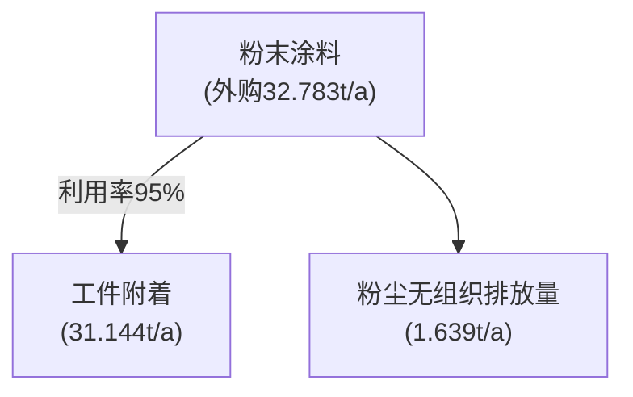
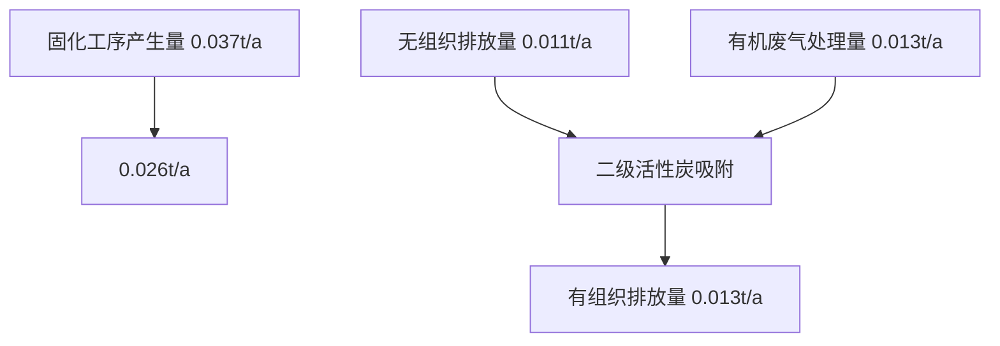
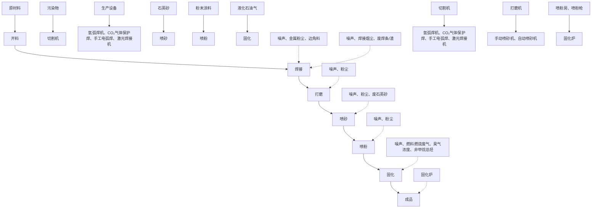
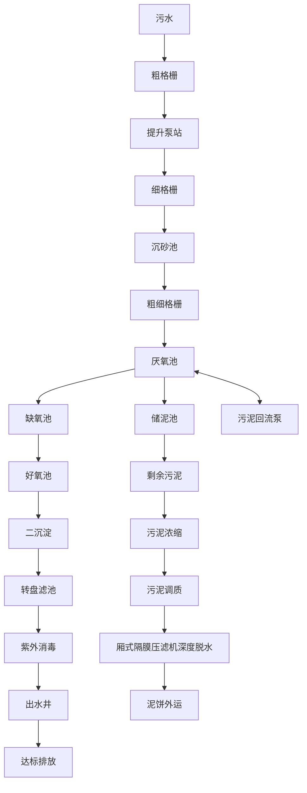
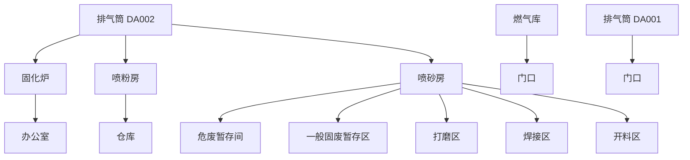

# 建设项目环境影响报告表

（污染影响类）

text_image

德高德区佳佳之铭金属制品有限公司
440608450346

项目名称：佛山市顺德区佳佳之铭金属制品有限公司建设项目建设单位（盖章）：佛山市顺德区佳佳之铭金属制品有限公司

编制日期： 2023年10月

中华人民共禾

text_image

和国生态环境部制
德国生态环境部

# 目 录

一、 建设项目基本情况..  
二、建设项目工程分析.. 14  
三、区域环境质量现状、环境保护目标及评价标准 . 25  
四、主要环境影响和保护措施.. . 32  
五、 环境保护措施监督检查清单. . 63  
六、结论... .. 66

# 建设项目污染物排放量汇总表（单位：吨/年）

附图1 项目地理位置图

附图2 项目四至图

附图3 项目周边环境敏感点分布图

附图4 项目四至实景图

附图5 项目平面布置图

附图6 顺德区环境空气质量功能区划分图

附图7 顺德区水环境功能区划分图

附图8 声环境功能区划分图

附图9 北滘镇群力围北片区控制性详细规划图

附图10 顺德区环境管控单元图

附图11 佛山市环境管控单元图

附图12 广东省“三线一单”数据管理及应用平台位置截图

附件1 营业执照

附件2 法人代表身份证

附件3 租赁合同

附件4 房产证

附件5 粉末涂料MSDS

附件6 环评文件同意公示声明

附件7 环评咨询技术合同

# 一、建设项目基本情况

<table><tr><td>建设项目名称</td><td colspan="4">佛山市顺德区佳佳之铭金属制品有限公司建设项目</td></tr><tr><td>项目代码</td><td colspan="4">无</td></tr><tr><td>建设单位联系人</td><td></td><td>联系方式</td><td colspan="2"></td></tr><tr><td>建设地点</td><td colspan="4">佛山市顺德区北滘镇碧江社区坤洲工业区北区8号之四</td></tr><tr><td>地理坐标</td><td colspan="4">东经113°15′0.319′′,北纬22°56′32.756′′</td></tr><tr><td>国民经济行业类别</td><td>C3311结构性金属制品制造</td><td>建设项目行业类别</td><td colspan="2">三十、金属制品业33,66、结构性金属制品制造331,其他(仅分割、焊接、组装的除外;年用非溶剂型低VOCs含量涂料10吨以下的除外)。</td></tr><tr><td>建设性质</td><td>☑新建(迁建)□改建□扩建□技术改造</td><td>建设项目申报情形</td><td colspan="2">☑首次申报项目□不予批准后再次申报项目□超五年重新审核项目□重大变动重新报批项目</td></tr><tr><td>项目审批(核准/备案)部门(选填)</td><td>无</td><td>项目审批(核准/备案)文号(选填)</td><td colspan="2">无</td></tr><tr><td>总投资(万元)</td><td>100</td><td>环保投资(万元)</td><td colspan="2">20</td></tr><tr><td>环保投资占比(%)</td><td>20</td><td>施工工期</td><td colspan="2">/</td></tr><tr><td>是否开工建设</td><td>☑否□是: _</td><td>用地(用海)面积(m2)</td><td colspan="2">1250</td></tr><tr><td>专项评价设置情况</td><td colspan="4">无</td></tr><tr><td>规划情况</td><td colspan="4">无</td></tr><tr><td>规划环境影响评价情况</td><td colspan="4">无</td></tr><tr><td>规划及规划环境影响评价符合性分析</td><td colspan="4">无</td></tr><tr><td rowspan="4">其他符合性分析</td><td colspan="4">1、选址合理性分析本项目选址于佛山市顺德区北滘镇碧江社区坤洲工业区北区8号之四,根据本项目的房地产权证:粤房地权证 佛字第0313097481号(详见附件4)和广珠城际轨道碧江站及周边地区控制性详细规划批后通告及规划(详情见附图9),本项目所在地属于工业用地,本项目未改变用地性质。因此,项目用地符合当地规划。2、产业政策相符性分析本项目主要从事帐篷金属配件加工,项目生产产品、生产工艺和生产设备均不属于《产业结构调整指导目录(2019年本)》(国家发展和改革委员会令第29号,2020年1月1日起施行)中的限制或禁止类别,也不属于国家发展改革委商务部《关于印发&lt;市场准入负面清单(2022年版)的通知&gt;》(发改体改规[2022]397号)“禁止准入类”。3、相关生态环境保护法律法规政策、生态环境保护规划的相符性(1)项目与《环境保护综合名录》(2021年版)相符性分析项目不涉及《环境保护综合名录(2021年版)》中的“高污染、高环境风险”产品名录中的产品,符合《环境保护综合名录》(2021年版)的相关规定。(2)项目与《佛山市顺德区人民政府关于印发佛山市顺德区“三线一单”生态环境分区管控方案的通知》(顺府发〔2021〕11号)相符性分析根据《佛山市顺德区人民政府关于印发佛山市顺德区“三线一单”生态环境分区管控方案的通知》(顺府发〔2021〕11号),项目位于北滘镇重点管控区(管控单元编码:ZH44060620004),详情见附图10。项目与管控要求相符性分析如下:表1-1 项目与北滘镇重点管控区管控要求相符性分析</td></tr><tr><td>管控维度</td><td>管控要求</td><td>本项目情况</td><td>相符性</td></tr><tr><td rowspan="2">区域布局管控</td><td>1-1.【生态/禁止类】单元内的一般生态空间,主导生态功能为水土保持,禁止在25度以上的陡坡地开垦种植农作物,禁止在崩塌、滑坡危险区、泥石流易发区从事采石、取土、采砂等可能造成水土流失的活动。</td><td>本项目不涉及生态禁止类活动。</td><td>符合</td></tr><tr><td>1-2.【产业/鼓励引导类】重点发展机器人及配套产业、智能家用电器、高端新型电子信息、新材料等制造业和总部经济、电子商务、工业设计与文化创意、科技金融等现代服务业,打造智能制造和智慧家电示范区。</td><td>本项目不属于产业/鼓励引导类。</td><td>符合</td></tr><tr><td rowspan="5"></td><td rowspan="5"></td><td>1-3.【产业/综合类】产业聚集区所属地块内的工业用地或企业与村庄、学校等环境敏感点之间应设置合理的大气环境防护距离,并通过绿化带进行有效隔离;聚集区规划布局应注重大气污染排放企业应尽量避免布局在居住用地的常年主导风向的上风向。</td><td>本项目与最近敏感点距离为190m,项目对周围环境和敏感点的影响较小。</td><td>符合</td></tr><tr><td>1-4.【产业/综合类】系统推进村级工业园升级改造,腾出连片空间,布局产业集聚区和主题产业园,推动工业项目入园集聚发展。新增工业制造业用地原则上安排在产业集聚区内,产业集聚区外原则上不鼓励工业及物流仓储用地的新建与改造。</td><td>本项目所在地不属于村级工业园升级改造。本项目位于佛山市顺德区北滘镇碧江社区坤洲工业区北区8号之四厂房,位于产业聚集区。</td><td>符合</td></tr><tr><td>1-5.【产业/限制类】受纳水体或监控断面不达标的,不得新建、扩建向河涌直接排放废水的项目。新建、扩建含蚀刻工序的线路板生产项目和化工项目应在配套污水集中处置的工业园区或生活污水管网覆盖区域内建设;纯加工型印花项目,含酸洗、磷化的金属表面处理、金属制品项目(与自身高新技术企业配套的除外),含酸洗、喷涂、化学抛光、电解等涉及废水排放工艺的不锈钢型材加工项目(与自身高新技术企业配套的除外),应进入以此类项目为主导产业、有相应废水集中治理设施的工业园区,实现集中治污。</td><td>本项目主要从事帐篷金属配件加工,属于结构性金属制品制造行业,项目生活污水经三级化粪池预处理后由市政污水管网引入群力围污水处理厂处理。</td><td>符合</td></tr><tr><td>1-6.【产业/综合类】划定家具生产优先发展区域,优先发展区外不再新建涉及涂装工艺的木质家具制造项目。</td><td>本项目主要从事帐篷金属配件加工,属于结构性金属制品制造行业,项目不属于木质家具制造项目。</td><td>符合</td></tr><tr><td>1-7.【水/限制类】严格限制在佛山市禅城南庄紫洞水厂、佛山市禅城沙口(石湾)水厂、羊额—北滘水厂、广州市南洲水厂顺德水道取水口饮用水水源保护区上游和周边区域建设列入“高污染、高环境风险”产品名录等可能影响水环境安全的项目。</td><td>项目生活污水经三级化粪池预处理后由市政污水管网引入群力围污水处理厂处理。</td><td>符合</td></tr><tr><td rowspan="9"></td><td rowspan="2"></td><td>1-8.【大气/限制类】大气环境受体敏感重点管控区内,应严格限制新建储油库项目、产生和排放有毒有害大气污染物的建设项目以及使用溶剂型油墨、涂料、清洗剂、胶黏剂等高挥发性有机物原辅材料项目,鼓励现有该类项目搬迁退出。</td><td>本项目不在大气环境受体敏感重点管控区内;本项目不属于储油库项目、也不属于产生和排放《有毒有害大气污染物名录》中有毒有害大气污染物的建设项目。</td><td>符合</td></tr><tr><td>1-9.【大气/鼓励引导类】大气环境高排放重点管控区内,应强化达标监管,引导工业项目落地集聚发展,有序推进区域内行业企业提标改造。</td><td>本项目不属于大气环境高排放重点管控区内项目。</td><td>符合</td></tr><tr><td rowspan="6">能源资源利用</td><td>2-1【能源/鼓励引导类】推广节能技术,加快发展绿色货运与现代物流。</td><td>本项目不属于能源/鼓励引导类。</td><td>符合</td></tr><tr><td>2-2【能源/鼓励引导类】推广新能源汽车应用和充电基础设施建设,积极推动重卡LNG加气站、充电基础设施、加氢站建设。</td><td>本项目不属于能源/鼓励引导类。</td><td>符合</td></tr><tr><td>2-3.【能源/综合类】科学实施能源消费总量和强度“双控”,新建高能耗项目单位产品(产值)能耗达到国际国内先进水平。</td><td>本项目不属于高能耗项目。</td><td>符合</td></tr><tr><td>2-4.【水资源/综合类】贯彻落实“节水优先”方针,实行最严格水资源管理制度,北滘镇万元国内生产总值用水量、万元工业增加值用水量、用水总量、农田灌溉水有效利用系数等用水总量和效率指标达到区下达要求。</td><td>本项目用水量较少,符合要求。</td><td>符合</td></tr><tr><td>2-5.【土地资源/限制类】落实单位土地面积投资强度、土地利用强度等建设用地控制性指标要求,提高土地利用效率。</td><td>本项目租用已建成厂房作为经营场所,与本项目实际用途相符合。</td><td>符合</td></tr><tr><td>2-6.【岸线/禁止类】严格水域岸线用途管制,新建项目一律不得违规占用水域。严禁破坏生态的岸线利用行为和不符合其功能定位的开发建设活动,严禁以各种名义侵占河道、围垦湖泊、非法采砂等。</td><td>项目位于工业区内,不在水域岸线范围内。</td><td>符合</td></tr><tr><td>污染物排放管控</td><td>3-1.【水/限制类】城镇新区建设实行雨污分流,逐步推进初期雨水收集、处理和资源化利用。住宅、商业体、学校、市场等城镇开发建设项目应当配套或者同步计划建设公共排水设施,公共排水设施或自建排污水设施未能投产运行的,以上涉水项目不得投入使用。新建小区严格实施雨污分流,阳台、露台等污水接入污水收集系统,将生活污水“应截尽截”。做好大型楼盘、集贸市场、餐饮以及学校等4大类排水户污水接入市政管网工作。</td><td>项目生活污水经三级化粪池预处理后由市政污水管网引入群力围污水处理厂处理。</td><td>符合</td></tr><tr><td rowspan="5"></td><td rowspan="5"></td><td>3-2.【水/综合类】结合村级工业园改造,全面提升产业层次与集聚度,促进污染集中整治。</td><td>本项目所在地不属于村级工业园。</td><td>符合</td></tr><tr><td>3-3.【水/综合类】稳步推进排水设施“三个一体化”管理模式,补齐城乡污水收集和处理短板,推动群力围污水处理厂提质增效,加快消除城中村、老旧城区、城乡结合部等污水收集管网空白区,逐步实现城乡污水收集处理全覆盖。2025年前完成群力围污水处理厂扩建,尾水应执行《城镇污水处理厂污染物排放标准》(GB18918-2002)一级A标准及《广东省水污染物排放限值》(DB44/26-2001)的较严 值。</td><td>本项目不适用。</td><td>符合</td></tr><tr><td>3-4.【水/综合类】近期保留并完善水口村、三桂村、西滘村、马龙村等现状农村污水分散式处理设施,新建莘村、马龙村等分散式污水处理站建设,继续完善污水支管网建设,提高污水收集处理率,其余行政村(社区)继续完善污水管网建设,实现农村污水100%收集进入市政污水系统,有条件的区域实施雨污分流改造,到2030年全面雨污分流,污水纳入北滘城镇污水处理系统。</td><td>本项目不适用。</td><td>符合</td></tr><tr><td>3-5.【水/综合类】产业集聚区和主题园区内做好污水管网和污水集中处理设施的配套保障,确保废水收集到城镇污水处理厂、园区污水处理厂或分散式污水处理设施集中处置。</td><td>本项目实行雨污分流。生活污水纳入群力围污水处理厂处理系统。</td><td>符合</td></tr><tr><td>3-6.【大气/综合类】大力推进低VOCs含量原辅材料替代,加快涉VOCs重点行业的生产工艺升级改造,推行自动化生产工艺,对达不到要求的VOCs收集及治理设施进行整治提升,逐步淘汰低效VOCs治理设施。</td><td>项目不涉及使用高挥发性有机物原辅材料,生产过程产生的有机废气产生量较少。项目固化工序废气经收集后统一引至一套“二级活性炭吸附”装置处理后再通过15米高排气筒DA001排放。本项目使用“二级活性炭”吸附有机废气,不属于《广东省2021年大气污染防治工作方案》中的光氧化、光催化、低温等离子等低效治理设施。</td><td>符合</td></tr><tr><td rowspan="3"></td><td rowspan="3">环境风险防控</td><td>4-1.【水/综合类】加强单元内佛山市禅城南庄紫洞水厂、佛山市禅城沙口(石湾)水厂、羊额—北滘水厂、广州市南洲水厂顺德水道取水口饮用水水源保护区周边环境风险源管控,完善突发环境事件应急管理体系。</td><td>项目环境风险事故发生概率较低,在落实相关防范措施后,运营过程中的环境风险是可控的。</td><td>符合</td></tr><tr><td>4-2.【水/综合类】群力围污水处理厂、群力围污水处理厂、工业污水集中处理设施应采取有效措施,防止事故废水直接排入水体。完善污水处理厂在线监控系统联网,实现污水处理厂的实时、动态监管。</td><td>本项目不适用</td><td>符合</td></tr><tr><td>4-3.【风险/综合类】加强环境风险分级分类管理,强化金属制品、有色金属和压延加工、化学原料和化学品制造业等涉重金属、化工行业企业及工业园区等重点环境风险源的环境风险防控。</td><td>本项目主要从事帐篷金属配件加工,属于结构性金属制品制造行业,但不涉及重金属。</td><td>符合</td></tr><tr><td colspan="5">(3)项目与《佛山市人民政府关于印发佛山市“三线一单”生态环境分区管控方案的通知》(佛府〔2021〕11号)相符性分析1)生态保护红线本项目位于佛山市顺德区北滘镇碧江社区坤洲工业区北区8号之四,根据《佛山市人民政府关于印发佛山市“三线一单”生态环境分区管控方案的通知》(佛府〔2021〕11号),项目所在地不属于生态优先保护区、水环境优先保护区、大气环境优先保护区等优先保护单元,因此项目不涉及生态保护红线。2)环境质量底线根据《佛山市人民政府关于印发佛山市“三线一单”生态环境分区管控方案的通知》(佛府〔2021〕11号),水环境质量持续改善,国考、省考、水功能区断面达到国家和省下达的水质目标要求;市控断面全面消除劣V类,力争达到我市确定的水质目标要求;乡镇级及以上集中式饮用水水源地水质稳定达标。空气质量持续改善,细颗粒物( $PM_{2.5}$ )年均浓度、空气质量优良天数比例(AQI)主要指标达到省下达的目标要求,臭氧污染得到有效遏制。土壤环境质量稳中向好,土壤环境风险得到管控。</td></tr></table>

本项目所在区域顺德区 2022 年度的二氧化硫（SO2）、二氧化氮 $\left( \mathbf { N O } _ { 2 } \right)$ 、可吸入颗粒物 $\left( \mathrm { P M } _ { 1 0 } \right)$ 、细颗粒物 $\left( \mathbf { P M } _ { 2 . 5 } \right)$ 、一氧化碳（CO）五项污染物年评价浓度均达到二级标准，臭氧 $\left( \mathbf { O } _ { 3 } \right)$ ）超标，本项目无 ${ { \mathrm O } _ { 3 } }$ 污染物排放。本项目所在区域现状地表水水质符合相应质量标准要求。项目固化工序废气经集气罩收集后引至一套“二级活性炭吸附”装置处理后再通过 15 米高排气筒 DA001 排放，对周边环境影响较小；生活污水经三级化粪池预处理达标后排入群力围污水处理厂，对周围环境影响较小，本项目排放的污染物不会导致区域环境质量超标，符合环境质量底线要求。

# 3）资源利用上线

本项目营运过程中消耗一定量的电能、水资源，项目资源消耗量相对区域资源利用总量较少，符合资源利用上限的要求。

# 4）环保准入清单

根据《佛山市人民政府关于印发佛山市“三线一单”生态环境分区管控方案的通知》（佛府〔2021〕11 号），从区域布局管控、能源资源利用、污染物排放管控和环境风险防控等方面明确准入要求，建立“1+3+96+N”生态环境准入清单体系。“1”为全市总体管控要求，“3”为优先保护单元、重点管控单元、一般管控单元总体管控要求，“96” 为各个环境管控单元的差异性准入清单，“N”为对应生态、水、大气、土壤等生态环境要素及自然资源管控分区的具体管控要求清单。

本项目不属于区域布局管控、能源资源利用、污染物排放管控和环境风险防控等方面明确禁止准入项目。

# 5）环境管控单元总体管控要求

根据《佛山市人民政府关于印发佛山市“三线一单”生态环境分区管控方案的通知》（佛府〔2021〕11号），项目所在区域为重点管控单元 5，环境管控单元编码：ZH44060620005，要素细类为一般生态空间、水环境城镇生活污染重点管控区、水环境工业—城镇污染重点管控区、水环境其他重点管控区、大气环境一般管控区、江河湖库岸线重点管控区。

①受纳水体或监控断面不达标的，不得新建、扩建向河涌直接排放废水的项目。新建、扩建含蚀刻工序的线路板生产项目和化工项目应在配套污水集中处置的工业园区或生活污水管网覆盖区域内建设；纯加工型印花项目，含酸洗、磷化的金属表面处理、金属制品项目（与自身高新技术企业配套的除外），含酸洗、喷涂、化学抛光、电解等涉及废水排放工艺的不锈钢型材加工项目（与自身高新技术企业配套的除外），应进入以此类项目为主导产业、有相应废水集中治理设

施的工业园区，实现集中治污。

②严格水域岸线用途管制，新建项目一律不得违规占用水域。严禁破坏生态的岸线利用行为和不符合其功能定位的开发建设活动，严禁以各种名义侵占河道、围垦湖泊、非法采砂等。

本项目不属于文件中提及的严格限制类项目，符合《佛山市人民政府关于印发佛山市“三线一单”生态环境分区管控方案的通知》（佛府〔2021〕11 号）的管控要求。

# 6）与“一核一带一区”区域管控要求的相符性

# ①区域布局管控要求

项目位于珠三角核心，本项目主要从事帐篷金属配件加工，属于结构性金属制品制造行业，不属于区域布局管控要求中的禁止新建、扩建水泥、平板玻璃、化学制浆、生皮制革以及国家规划外的钢铁、原油加工等项目。项目使用的原辅材料不属于生产和使用高挥发性有机物原辅材料的项目，符合区域布局管控要求。

# ②能源资源利用要求

本项目主要从事帐篷金属配件加工，属于结构性金属制品制造行业，不属于高能耗行业。项目生产设备均使用电能，生产用水由市政供水，不直接取用江河湖库水量，不会对项目所在地生态流量造成影响，符合能源利用要求。

# ③污染物排放管控要求

本项目属于新建项目，总量指标由镇街分配；项目生活污水经三级化粪池处理设施处理达标后排入群力围污水处理厂。

# ④环境风险防控要求

项目位于佛山市顺德区北滘镇碧江社区坤洲工业区北区 8 号之四，不属于石化、化工重点园区环境风险防控区域。项目产生的危险废物拟定期委托有资质的处置公司进行收集处理，并通过信息系统登记转移计划和电子转移联单，符合危险废物全过程跟踪管理的防控要求。

# （4）关于《广东省人民政府关于印发广东省“三线一单”生态环境分区管控方案的通知》（粤府[2020]71号）符合性分析

# 1）生态保护红线

本项目位于佛山市顺德区北滘镇碧江社区坤洲工业区北区8号之四，根据《广东省人民政府关于印发广东省“三线一单”生态环境分区管控方案的通知》（粤府[2020]71号），项目所在地不属于生态优先保护区、水环境优先保护区、大气环境优先保护区等优先保护单元，因此项目不涉及生态保护红线。

# 2）环境质量底线

根据《广东省人民政府关于印发广东省“三线一单”生态环境分区管控方案的通知》（粤府[2020]71 号），全省水环境质量持续改善，国考、省考断面优良水质比例稳步提升，全面消除劣Ⅴ类水体。大气环境质量继续领跑先行， $\mathrm { P M } _ { 2 . 5 }$ 年均浓度率先达到世界卫生组织过渡期二阶段目标值（25 微克/立方米），臭氧污染得到有效遏制。土壤环境质量稳中向好，土壤环境风险得到管控。近岸海域水体质量稳步提升。

本项目所在区域顺德区 2022年度的二氧化硫 $( \mathsf { S O } _ { 2 } )$ 、二氧化氮 $\left( \mathbf { N O } _ { 2 } \right)$ 、可吸入颗粒物 $\left( \mathrm { P M } _ { 1 0 } \right)$ 、细颗粒物 $\left( \mathbf { P M } _ { 2 . 5 } \right)$ 、一氧化碳（CO）五项污染物年评价浓度均达到二级标准，臭氧 $\left( \mathbf { O } _ { 3 } \right)$ 超标，本项目无 ${ { \mathrm O } _ { 3 } }$ 污染物排放。本项目所在区域现状地表水水质符合相应质量标准要求。

项目固化工序废气经集气罩收集后引至一套“二级活性炭吸附”装置处理后再通过 15 米高排气筒 DA001 排放，对周边环境影响较小；项目生活污水经三级化粪池预处理达标后排入群力围污水处理厂，对周围环境影响较小，本项目排放的污染物不会导致区域环境质量超标，符合环境质量底线要求。

# 3）资源利用上线

强化节约集约利用，持续提升资源能源利用效率，水资源、土地资源、岸线资源、能源消耗等达到或优于国家下达的总量和强度符合控制目标。本项目不属于高耗能、污染资源型企业，用水来自市政管网，用电来自市政供电。本项目建成后通过内部管理、设备选择、原辅材料的选用和管理、废物回收利用、污染治理等方面采取可行的防治措施，以“节能、降耗、减污”为目标，有效的控制污染。项目的水、电等资源利用不会突破区域上线。

# 4）环保准入清单

根据《广东省人民政府关于印发广东省“三线一单”生态环境分区管控方案的通知》（粤府[2020]71 号），从区域布局管控、能源资源利用、污染物排放管控和环境风险防控等方面明确准入要求，建 $\vec { \mathrm { 1 } L } ^ { \cdots } 1 + 3 + \mathrm { N } ^ { \prime \prime }$ 三级生态环境准入清单体系。“1”为全省总体管控要求，“3”为“一核一带一区”区域管控要求，“N”为 1912个陆域环境管控单元和 471个海域环境管控单元的管控要求。本项目不属于区域布局管控、能源资源利用、污染物排放管控和环境风险防控等方面明确禁止准入项目。

# 5）与“一核一带一区”区域管控要求的相符性

项目位于珠三角核心区，主要从事金属的表面处理加工，为金属件的喷粉加工，不属于区域布局管控要求中的禁止新建、扩建燃煤燃油火电机组和企业自备电站和禁止新建、扩建水泥、平板玻璃、化学制浆、生皮制革以及国家规划外的钢铁、原油加工等项目。项目不涉及使用高挥发性原辅材料，不属于新建生产和使用高挥发性有机物原辅材料的项目，符合区域布局管控要求。

# 6）与环境管控单元总体管控要求的相符性

根据《广东省人民政府关于印发广东省“三线一单”生态环境分区管控方案的通知》（粤府[2020]）71号）发布的广东省环境管控单元图，项目所在区域为重点管控单元，执行区域生态环境保护的基本要求。

# 4、项目挥发性有机物污染物治理政策的相符性分析

本项目与挥发性有机污染物治理政策的相符性分析详见下表：

表 1-2 项目与有机污染物治理政策的相符性

<table><tr><td>序号</td><td colspan="2">政策要求</td><td>工程内容</td><td>符合性</td></tr><tr><td colspan="5">1.《广东省涉挥发性有机物(VOCs)重点行业治理指引》的通知(粤环办[2021]43号)</td></tr><tr><td>1.1</td><td rowspan="2">废气收集</td><td>采用外部集气罩的,距集气罩开口面最远处的VOCs无组织排放位置,控制风速不低于0.3m/s,有行业要求的按相关规定执行。</td><td>项目固化工序废气经集气罩点对点局部密闭收集至一套“二级活性炭吸附”装置处理后再通过15m高排气筒排放,且控制风速为0.7m/s。</td><td>符合</td></tr><tr><td>1.2</td><td>废气收集系统应与生产工艺设备同步运行。废气处理系统发生故障或检修时,对应的生产工艺设备应停止运行,待检修完毕后同步投入使用;生产工艺设备不能停止运行或不能及时停止运行的,应设置废气应急处理设施或采取其他代替措施。</td><td>项目生产必须开启风机,有效减少无组织排放废气。废气收集处理系统发生故障或检修时,所有产生废气的工序停止运行,待检修完毕后再投入生产。</td><td>符合</td></tr><tr><td>1.3</td><td>工艺过程</td><td>调配、电泳、电泳烘干、喷涂(低、中、面、清)、喷涂烘干、修补漆、修补漆烘干等使用VOCs质量占比大于等于10%物料的工艺过程应采用密闭设备或在密闭空间内操作,废气应排至VOCs废气收集处理系统;无法密闭的,应采取局部气体收集措施,废气排至VOCs废气收集处理系统。</td><td>项目固化工序废气经集气罩收集后引至一套“二级活性炭吸附”装置处理后再通过15米高排气筒DA001排放。</td><td>符合</td></tr></table>

<table><tr><td rowspan="8"></td><td>1.4</td><td rowspan="2">治理设施</td><td>VOCs 治理设施应与生产工艺设备同步运行,VOCs 治理设施发生故障或检修时,对应的生产工艺设备应停止运行,待检修完毕后同步投入使用;生产工艺设备不能停止运行或不能及时停止运行的,应设置废气应急处理设施或采取其他替代措施。</td><td>项目生产必须开启风机,有效减少无组织排放废气。废气收集处理系统发生故障或检修时,所有产生废气的工序停止运行,待检修完毕后再投入生产。</td><td>符合</td></tr><tr><td>1.5</td><td>喷涂废气应设置有效的漆雾预处理装置,如采用干式过滤等高效除漆雾技术,涂密封胶、密封胶烘干、电泳平流、调配、喷涂和烘干工序废气宜采用吸附浓缩+燃烧等工艺进行处理。</td><td>项目固化工序废气经集气罩点对点局部密闭收集至一套“二级活性炭吸附”装置处理后再通过 15m 高排气筒排放。</td><td>符合</td></tr><tr><td>1.6</td><td rowspan="2">管理台账</td><td>建立废气收集处理设施台账,记录废气处理设施进出口的监测数据(废气量、浓度、温度、含氧量等)、废气收集与处理设施关键参数、废气处理设施相关耗材(吸收剂、吸附剂、催化剂等)购买和处理记录。</td><td>企业拟建立废气收集处理设施台账,根据《排污单位自行监测技术指南 涂装》(HJ1086-2020)等相关要求定期自行监测,并且记录相关监测数据和废气处理设施中活性炭的购买量和处理记录。</td><td>符合</td></tr><tr><td>1.7</td><td>建立危废台账,整理危废处置合同、转移联单及危废处理方式资质佐证材料。</td><td>企业拟建立危险废物台账,定期将危险废物交给有资质的单位处理,整理危废处理合同、转移联单等资料。</td><td>符合</td></tr><tr><td colspan="5">2.《广东省人民政府办公厅关于印发广东省 2021 年大气、水、土壤污染防治工作方案的通知》(粤办函〔2021〕58 号)</td></tr><tr><td>2.1</td><td colspan="2">严格落实国家产品 VOCs 含量限值标准要求,除现阶段确无法实施替代的工序外,禁止新建生产和使用高 VOCs 含量原辅材料项目。鼓励在生产和流通消费环节推广使用低 VOCs 含量原辅材料。</td><td>项目不使用高 VOCs 含量原辅材料。</td><td>符合</td></tr><tr><td>2.2</td><td colspan="2">涉 VOCs 重点行业新建、改建和扩建项目不推荐使用光氧化、光催化、低温等离子等低效治理设施,已建项目逐步淘汰光氧化、光催化、低温等离子治理设施。指导采用一次性活性炭吸附治理技术的企业,明确活性炭装载量和更换频次,记录更换时间和使用量。</td><td>项目固化工序废气经集气罩点对点局部密闭收集至一套“二级活性炭吸附”装置处理后再通过 15m 高排气筒排放。活性炭装载量和更换频次已在本报告内容中明确。</td><td>符合</td></tr><tr><td colspan="5">3.《挥发性有机物无组织排放控制标准》(GB37822-2019)</td></tr><tr><td rowspan="8"></td><td>3.1</td><td>VOCs物料应储存于密闭的容器、包装袋、储罐、储库、料仓中。</td><td>项目外购的涂料密封储存于包装袋内。且粉末涂料常规储存下不产生VOC。</td><td colspan="2">符合</td></tr><tr><td>3.2</td><td>盛装VOCs物料的容器或包装袋应存放于室内,或存放于设置有雨棚、遮阳和防渗设施的专用场地。盛装VOCs物料的容器或包装袋在非取用状态时应加盖、封口,保持密闭。</td><td>项目使用外购的涂料以密封袋装形式进行物料转移。</td><td colspan="2">符合</td></tr><tr><td>3.3</td><td>VOCs物料储库、料仓应利用完整的围护结构将污染物质、作业场所等与周围空间阻隔所形成的封闭区域或封闭式建筑物。该封闭区域或封闭式建筑物除人员、车辆、设备、物料进出时,以及依法设立的排气筒、通风口外,门窗及其他开口(孔)部位应随时保持关闭状态。</td><td>项目固化工序废气经集气罩点对点局部密闭收集至一套“二级活性炭吸附”装置处理后再通过15m高排气筒排放。</td><td colspan="2">符合</td></tr><tr><td>3.4</td><td>液态VOCs物料应采用密闭管道输送。采用非管道输送方式转移液态VOCs物料是,应采用密闭容器、罐车。</td><td>项目外购的涂料密封储存于密封包装袋内。</td><td colspan="2">符合</td></tr><tr><td colspan="5">4.关于印发《重点行业挥发性有机物综合治理方案》的通知(环大气[2019]53号)</td></tr><tr><td>4.1</td><td>通过使用水性、粉末、高固体分、无溶剂、辐射固化等低VOCs含量的涂料,水性、辐射固化、植物等低VOCs含量的油墨,水基、热熔、无溶剂、辐射固化、改性、生物降解等低VOCs含量的胶粘剂,以及低VOCs含量、低反应活性的清洗剂等,替代溶剂型涂料、油墨、胶粘剂、清洗剂等,从源头减少VOCs产生。</td><td>本项目使用的涂料属于低VOCs含量原辅材料。</td><td colspan="2">符合</td></tr><tr><td>4.2</td><td>重点对含VOCs物料(包括含VOCs原辅材料、含VOCs产品、含VOCs废料以及有机聚合物材料等)储存、转移和输送、设备与管线组件泄漏、敞开液面逸散以及工艺过程等五类排放源实施管控,通过采取设备与场所密闭、工艺改进、废气有效收集等措施,削减VOCs无组织排放。</td><td>项目使用外购的涂料以密封袋装形式进行物料转移。项目固化工序废气经集气罩点对点局部密闭收集至一套“二级活性炭吸附”装置处理后再通过15m高排气筒排放。</td><td colspan="2">符合</td></tr><tr><td>4.3</td><td>提高废气收集率,遵循“应收尽收、分质收集”的原则,科学设计废气收集系统,将无组织排放转变为有组织排放进行控制。采用全密闭集气罩或密闭空间的,除行业</td><td>项目固化工序废气经集气罩点对点局部密闭收集至一套“二级活性炭吸附”装置处理后再通过15m高排气筒排放,且控制风速为</td><td colspan="2">符合</td></tr><tr><td></td><td>有特殊要求外,应保持微负压状态,并根据相关规范合理设置通风量。采用局部集气罩的,距集气罩开口面最远处的VOCs无组织排放位置,控制风速应不低于0.3米/秒,有行业要求的按相关规定执行。</td><td>0.7m/s。</td><td colspan="3"></td></tr><tr><td colspan="6">5.《佛山市生态环境局顺德分局关于做好重点行业建设项目挥发性有机物总量指标管理工作的通知》(佛顺环函[2019]56号)</td></tr><tr><td>5.1</td><td>涉VOCs排放项目,实现本行政区域内污染源“点对点”2倍量削减替代,由项目所在镇街分局出具VOCs总量指标来源及替代削减方案的意见,开展总量替代。</td><td>项目VOCs排放总量指标为0.024t/a,由顺德区出具VOCs总量指标来源及替代削减方案的意见。</td><td colspan="3">符合</td></tr><tr><td colspan="6">综上分析,项目总体符合相关挥发性有机废气文件要求。5、项目与《佛山市人民政府关于调整扩大高污染燃料禁燃区的通告》(佛府〔2021〕13号)的相符性分析佛山市全市行政区域均划定为高污染燃料禁燃区,在禁燃区内禁止新建、扩建燃用高污染燃料的燃烧设施。本项目不设置锅炉,项目固化炉采用液化石油气作为燃料,其余设备均使用电。项目使用的液化石油气属于清洁能源。因此,本项目的建设符合佛府〔2021〕13号文的相关要求。</td></tr></table>

# 二、建设项目工程分析

<table><tr><td rowspan="10">建设内容</td><td colspan="3">1、项目概况佛山市顺德区佳佳之铭金属制品有限公司建设项目(以下简称本项目)选址于佛山市顺德区北滘镇碧江社区坤洲工业区北区8号之四(中心地理坐标:东经 $113^{\circ}15'0.319''$ ,北纬 $22^{\circ}56'32.756''$ )。项目占地面积约 $1250m^{2}$ ,建筑面积约 $1250m^{2}$ ,总投资100万元,其中拟用于污染防治资金20万元。主要从事帐篷金属配件加工,预计年产帐篷金属配件38万件。根据《中华人民共和国环境影响评价法》(2018年12月29日修订)、《建设项目环境影响评价分类管理名录》(2021年1月1日起实施行)和《建设项目环境保护管理条例》(2017年10月1日施行)等有关建设项目环境保护管理的规定,本项目属于三十、金属制品业33,66、结构性金属制品制造331,其他(仅分割、焊接、组装的除外;年用非溶剂型低VOCs含量涂料10吨以下的除外)”类别,则应编制环境影响报告表。受佛山市顺德区佳佳之铭金属制品有限公司的委托,我司组织环评工作人员勘查项目拟建场地,考察项目周边地区情况,并收集相关资料,根据环境影响评价技术导则及其他有关文件要求,编制完成该项目的环境影响报告表。2、项目组成本项目的主要建设组成见下表:表2-1 项目工程组成一览表</td></tr><tr><td>工程</td><td>工程名称</td><td>备注</td></tr><tr><td rowspan="3">主体工程</td><td>建设地点</td><td>本项目选址于佛山市顺德区北滘镇碧江社区坤洲工业区北区8号之四(中心地理坐标:东经 $113^{\circ}15'0.319''$ ,北纬 $22^{\circ}56'32.756''$ ),项目所在车间为一层式工业厂房,生产车间占地面积约 $1250m^{2}$ ,建筑面积约 $1250m^{2}$ 。</td></tr><tr><td>生产工艺</td><td>主要设有开料、焊接、打磨和喷砂、喷粉和固化工序。</td></tr><tr><td>产品产能</td><td>预计年产帐篷金属配件38万件。</td></tr><tr><td>辅助工程</td><td>办公室</td><td>位于车间内,约 $15m^{2}$ ,用于日常办公和业务洽谈。</td></tr><tr><td rowspan="3">公用工程</td><td>供水</td><td>主要为员工生活用水,由市政自来水公司提供。</td></tr><tr><td>排水</td><td>生活污水经三级化粪池预处理后再通过市政污水管网排入群力围污水处理厂处理。</td></tr><tr><td>供电</td><td>由当地变电所供电,不设备用发电机。</td></tr><tr><td>环保工程</td><td>废水处理废气处理</td><td>项目生活污水经三级化粪池预处理后由市政污水管网排入群力围污水处理厂处理。项目固化工序废气经收集后引至一套“二级活性炭吸附”装置处理后再通过15米高排气筒DA001排放。项目液化石油气燃烧废气引至15米高排气筒DA002高空排放。项目喷粉粉尘经“二级滤芯除尘装置”处理后在车间无组织排放。项目喷砂粉尘经“滤芯除尘装置”处理后在车间无组织排放。项目开料、打磨工序粉尘和焊接烟尘在车间呈无组织排放。</td></tr><tr><td rowspan="4"></td><td rowspan="4"></td><td>噪声控制</td><td>合理生产布局,隔音、距离衰减等。</td></tr><tr><td rowspan="3">固废处理</td><td>生活垃圾定期委托环卫部门统一收集处理。</td></tr><tr><td>一般工业固废暂存于一般固废暂存场所(约 $5m^{2}$ ),定期交由物资单位回收。</td></tr><tr><td>设立危废暂存间(约 $5m^{2}$ ),危险废物暂存于危废暂存间后定期交由有资质单位收集处理。</td></tr></table>

# 3、主要产品及产能

本项目产品方案详见下表：

表 2-2 项目产品产能一览表

<table><tr><td>序号</td><td colspan="2">产品名称</td><td>年产量(件)</td><td>主要产品照片示例</td></tr><tr><td>1</td><td rowspan="3">帐篷金属配件</td><td>立柱</td><td>100000</td><td></td></tr><tr><td>2</td><td>屏风</td><td>130000</td><td></td></tr><tr><td>3</td><td>顶骨</td><td>150000</td><td></td></tr></table>

根据建设单位提供的资料，本项目单位产品表面喷涂参数如下表所示：

表 2-3 项目表面喷涂参数一览表

<table><tr><td>序号</td><td>产品名称</td><td>年产量</td><td>单件产品喷涂面积</td><td>涂层厚度(μm)</td></tr></table>

<table><tr><td rowspan="5"></td><td></td><td colspan="2"></td><td>(件)</td><td>(m2)</td><td></td></tr><tr><td>1</td><td rowspan="3">帐篷金属配件</td><td>立柱</td><td>100000</td><td>0.704</td><td>100</td></tr><tr><td>2</td><td>屏风</td><td>130000</td><td>0.786</td><td>100</td></tr><tr><td>3</td><td>顶骨</td><td>150000</td><td>0.189</td><td>100</td></tr><tr><td>备注</td><td colspan="5">1立柱:外形尺寸为长2.2m*宽0.08m*高0.08m,每件立柱喷涂面积约为0.704m2;2屏风:外形尺寸为长2.8m*宽0.25m*高0.03m,主要由一条铝合金方管(总长约6.55m、宽约0.03m、高约0.03m)组成,每件屏风喷涂面积约为0.786m2;3顶骨:外形尺寸为长2.145m*宽0.23m*高0.013m,主要由一条铝合金方管(总长约3.63m、宽约0.013m、高约0.013m)组成,每件顶骨喷涂面积约为0.189m2。</td></tr></table>

# 4、主要原辅材料

项目原辅材料表详见下表：

表 2-4 主要原辅材料一览表

<table><tr><td>序号</td><td>名称</td><td>年用量</td><td>最大储存量</td><td>包装规格</td><td>所用工序</td></tr><tr><td>1</td><td>铝合金</td><td>1900吨</td><td>30吨</td><td>散装</td><td>全程</td></tr><tr><td>2</td><td>粉末涂料</td><td>32.783吨</td><td>0.6吨</td><td>25kg/袋</td><td>喷粉、固化</td></tr><tr><td>3</td><td>液化石油气</td><td>65.6吨</td><td>10瓶</td><td>100kg/瓶</td><td>固化</td></tr><tr><td>4</td><td>无铅焊条</td><td>1吨</td><td>0.2吨</td><td>20kg/箱</td><td rowspan="4">焊接</td></tr><tr><td>5</td><td>无铅焊丝</td><td>1吨</td><td>0.2吨</td><td>5kg/盒</td></tr><tr><td>6</td><td>氩气</td><td>5000升</td><td>100升</td><td>10升/瓶</td></tr><tr><td>7</td><td>二氧化碳</td><td>2000升</td><td>120升</td><td>40升/瓶</td></tr><tr><td>8</td><td>石英砂</td><td>2吨</td><td>0.5吨</td><td>100kg/袋</td><td>喷砂工序</td></tr><tr><td>9</td><td>机油</td><td>0.1吨</td><td>0.1吨</td><td>20kg/桶</td><td>设备保养、维护</td></tr></table>

项目主要原辅材料理化性质详见下表：

表 2-5 原辅材料理化性质

<table><tr><td>序号</td><td>名称</td><td>理化性质</td></tr><tr><td>1</td><td>粉末涂料</td><td>外观为粉末状,根据建设单位提供的粉末涂料MSDS报告(详情见附件5)可知其主要成分为:二氧化钛4-8%、硫酸钡6-8%、聚酯树脂75-85%、固化剂5-7%、铝粉0.5%。密度 $1.2-1.9g/cm^{3}$ 。</td></tr><tr><td>2</td><td>液化石油气</td><td>液化石油气是炼油厂在进行原油催化裂解与热裂解时所得到的副产品。是由碳氢化合物所组成,主要成分为丙烷、丁烷以及其他烷系或烯类等。外观与性状:无色气体或黄棕色油状液体有特殊臭味。密度:</td></tr></table>

<table><tr><td rowspan="4"></td><td></td><td></td><td>液态液化石油气580kg/立方米,气态密度为:2.35kg每立方米,闪点(°C):-74,引燃温度(°C):426~537,爆炸上限%(V/V):9.5,爆炸下限%(V/V):1.5,燃烧值:10650kJ/m3,主要用途:用作石油化工的原料,也可用作燃料。</td></tr><tr><td>3</td><td>氩气</td><td>国标编号22011,CAS号7440-37-1,分子式Ar,分子量39.95,无色无臭的惰性气体;蒸汽压202.64kPa(-179°C);熔点-189.2°C;沸点-185.7°C溶解性:微溶于水;密度:相对密度(水=1)1.40(-186°C);相对密度(空气=1)1.38;稳定性:稳定;危险标记5(不燃气体);主要用途:用于灯泡充气和对不锈钢、镁、铝等的电弧焊接,即&quot;氩弧焊&quot;。</td></tr><tr><td>4</td><td>二氧化碳</td><td>二氧化碳(carbondioxide),一种碳氧化合物,化学式为 $CO_2$ ,化学式量为44.0095,常温常压下是一种无色无味或无色无嗅(嗅不出味道)而略有酸味的气体,也是一种常见的温室气体,还是空气的组分之一(占大气总体积的0.03%-0.04%)。在物理性质方面,二氧化碳的熔点为-78.5°C,沸点为-56.6°C,密度比空气密度大(标准条件下),微溶于水。在化学性质方面,二氧化碳的化学性质不活泼,热稳定性很高(2000°C时仅有1.8%分解),不能燃烧,通常也不支持燃烧,属于酸性氧化物,具有酸性氧化物的通性,因与水反应生成的是碳酸,所以是碳酸的酸酐。</td></tr><tr><td>5</td><td>机油</td><td>即发动机润滑油,密度约为 $0.91\times 10^{3}$ (kg/m3),能对发动机起到润滑减磨、辅助冷却降温、密封防漏、防锈防蚀、减震缓冲等作用。</td></tr></table>

本项目粉末涂料使用量核算详见下表：

表 2-6 本项目粉末涂料使用量核算一览表

<table><tr><td>产品名称</td><td>年产量(件)</td><td>单件产品喷涂面积(m2)</td><td>干膜厚度(μm)</td><td>涂料利用率(%)</td><td>固份占比(%)</td><td>干膜密度(t/m3)</td><td>产品附着量(t/a)</td><td>涂料用量(t/a)</td></tr><tr><td>立柱</td><td>100000</td><td>0.704</td><td>100</td><td>95</td><td>100</td><td>1.55</td><td>10.912</td><td>11.486</td></tr><tr><td>屏风</td><td>130000</td><td>0.786</td><td>100</td><td>95</td><td>100</td><td>1.55</td><td>15.8379</td><td>16.671</td></tr><tr><td>顶骨</td><td>150000</td><td>0.189</td><td>100</td><td>95</td><td>100</td><td>1.55</td><td>4.39425</td><td>4.626</td></tr><tr><td colspan="7">粉末涂料(合计)</td><td>31.144</td><td>32.783</td></tr><tr><td colspan="9">备注:1、根据《铝合金型材表面处理技术》(冶金工业出版社)及《现代涂装手册》(化学工业出版社),静电粉末喷涂过程中一次上粉率(工业表面附粉量与喷粉量之比)为60~80%,本次环评取工件表面粉末附着率按70%进行计算;2、根据《现代涂装手册》(陈治良主编,化学工业出版社),粉末静电喷涂法中的粉末利用率高达95%以上,结合本项目的粉尘收集效率和处理效率,经计算,本项目粉末涂料的利用率为95%,如表2-7所示;3、粉末涂料使用量的计算方法:粉末涂料用量=干膜厚度×喷涂面积×干膜密度÷涂料利用率÷固份占比(涂料的固份百分比)。</td></tr></table>

表 2-7 粉末涂料利用率核算

<table><tr><td>喷粉次数</td><td>粉末涂料用量(t/a)</td><td>附着率</td><td>工件附着量(t)</td><td>粉尘收集效率</td><td>未被收集量(t)</td><td>治理设施收集量(t)</td><td>粉尘处理效率</td><td>治理设施排放量(t)</td><td>粉末回用量(t)</td></tr><tr><td>第1次</td><td>1</td><td>70%</td><td>0.7</td><td>0.95</td><td>0.015</td><td>0.285</td><td>0.95</td><td>0.0143</td><td>0.2708</td></tr><tr><td>第2次</td><td>0.2708</td><td>70%</td><td>0.1895</td><td>0.95</td><td>0.0041</td><td>0.0772</td><td>0.95</td><td>0.0039</td><td>0.0733</td></tr><tr><td>第3次</td><td>0.0733</td><td>70%</td><td>0.0513</td><td>0.95</td><td>0.0011</td><td>0.0209</td><td>0.95</td><td>0.0010</td><td>0.0198</td></tr><tr><td>第4次</td><td>0.0198</td><td>70%</td><td>0.0139</td><td>0.95</td><td>0.0003</td><td>0.0057</td><td>0.95</td><td>0.0003</td><td>0.0054</td></tr><tr><td>第5次</td><td>0.0054</td><td>70%</td><td>0.0038</td><td>0.95</td><td>0.0001</td><td>0.0015</td><td>0.95</td><td>0.0001</td><td>0.0015</td></tr><tr><td>合计</td><td>/</td><td>/</td><td>约95%</td><td>/</td><td>约3%</td><td>约39%</td><td>/</td><td>约2%</td><td>/</td></tr></table>

备注：①、本项目喷粉粉尘收集效率约 95%、二级滤芯除尘效率约 95%，二级滤芯过滤的粉尘全部回用于生产；②、本项目粉末涂料涉及多次回收利用，一般回用 5 次左右可达到最佳回用效果，本环评拟 1 吨粉末涂料的利用情况作为示例，因此，本项目的粉末涂料利用率为 95.85%，为保守起见取值 95%计算。

本液化石油气使用量核算详见下表：

表 2-8 液化石油气用量核算表

<table><tr><td>设备名称及型号</td><td>数量</td><td>单位设备热值(大卡/小时)</td><td>液化石油气平均低位发热量(kJ/kg)</td><td>热效率(%)</td><td>液化石油气用量(kg/a)</td></tr><tr><td>固化炉</td><td>1台</td><td>30万</td><td>50179</td><td>80</td><td>65600</td></tr><tr><td>备注</td><td colspan="5">1、根据《综合能耗计算通则》(GBT2589-2008)附录A及折算,液化石油气平均低位发热量为50179kJ/kg。1大卡=1000卡=1000×4.18焦耳=4180焦耳,则液化石油气用量为:30×10000×4180÷1000×2100÷50179÷80%≈65600kg;2、根据热量平衡,固化炉热效率取80%;3、液化石油气用量=设备热值/液化石油气平均低位发热量/热效率;4、固化炉年有效运行2400小时,其中燃料燃烧加热时间约2100小时,保温时间约300小时。</td></tr></table>

# 4、主要生产工艺、生产设施及设施参数

表 2-9 主要生产设备一览表

<table><tr><td>序号</td><td>名称</td><td>规格(型号)</td><td>数量</td><td>所用工序</td></tr><tr><td>1</td><td>切割机</td><td>/</td><td>5台</td><td>开料工序</td></tr><tr><td>2</td><td> $CO_2$ 气体保护焊</td><td>/</td><td>2台</td><td rowspan="4">焊接工序</td></tr><tr><td>3</td><td>手工电弧焊</td><td>/</td><td>5台</td></tr><tr><td>4</td><td>氩弧焊机</td><td>/</td><td>5台</td></tr><tr><td>5</td><td>激光焊接机</td><td>/</td><td>1台</td></tr><tr><td>6</td><td>打磨机</td><td>/</td><td>10台</td><td>打磨工序</td></tr><tr><td>7</td><td>自动喷砂机</td><td>/</td><td>1台</td><td>喷砂工序</td></tr><tr><td>8</td><td>手动喷砂机</td><td>/</td><td>1台</td><td rowspan="2"></td></tr><tr><td>9</td><td>喷砂房</td><td>6m*6m*3m</td><td>1个</td></tr><tr><td>10</td><td>喷粉房</td><td>7m*4m*3.5m</td><td>1个</td><td rowspan="2">喷粉工序,手动</td></tr><tr><td>11</td><td>喷粉枪</td><td>流量180g/min</td><td>2支</td></tr><tr><td>12</td><td>固化炉</td><td>7m*4m*3.5m</td><td>1个</td><td>固化工序</td></tr><tr><td>13</td><td>空压机</td><td>/</td><td>2台</td><td>辅助设备</td></tr></table>

表 2-10 项目喷粉枪产能匹配性核算表

<table><tr><td>设备名称</td><td>数量</td><td>每支流量</td><td>设计最大喷涂量</td></tr><tr><td>喷粉枪</td><td>2支</td><td>180g/min</td><td>51.84t/a</td></tr><tr><td colspan="4">备注:1、项目年工作300天,喷粉枪约每天工作8小时,考虑到手动喷粉线的生产流转等间隙时间,项目实际的喷粉产能会稍微比喷粉枪最大产能小,但总体能符合生产要求。2、项目粉末涂料用量约32.783t/a,工件表面粉末附着率按70%进行计算,则项目喷粉枪需要输出的粉末涂料量约46.833t/a,约占喷粉枪最大产能51.84t/a的90.3%,符合生产要求。</td></tr></table>

# 6、劳动定员及工作制度

本项目员工总数为15人，均不在厂内食宿，项目年工作日300天，每天工作8小时（8:00-12:00，14:00-18:00）。

# 7、公用工程

# （1）给排水

给水：项目用水主要为员工生活用水，由市政自来水公司提供。

排水：项目生活污水经三级化粪池预处理后再通过市政污水管网排入群力围污水处理厂处理。

# （2）能耗

本项目供电由市政电网统一供给，预计年用电量 10 万 kw•h。

# 8、厂区平面布置

本项目所在车间为一层式工业厂房，项目占地面积约 1250m2，建筑面积约 1250m2。项目车间内主要设有开料、焊接、打磨和喷砂、喷粉和固化工序，项目总体布置较为简单，功能分区明确，平面布置基本合理，项目厂区平面布置图见附图 5。

# 9、物料平衡图

flowchart

图2-1 粉末涂料物料平衡图

flowchart

图 2-2 项目非甲烷总烃物料平衡图

# 1、工艺流程及产污环节（图示）：

flowchart

图 2-3 项目帐篷金属配件生产工艺流程及产污环节图

# 2、生产工艺流程简述

开料：项目利用切割机将外购已处理过的铝合金进行开料，此工序会产生噪声、金属粉尘和边角料。

焊接：项目利用氩弧焊机、 $\mathrm { C O } _ { 2 }$ 气体保护焊、电焊机和激光焊接机对开料的部分工件进行焊接，此工序会产生噪声、焊接烟尘和废焊条/渣。

打磨：项目利用打磨机将焊接后工件的焊缝打磨光滑，此工序会产生噪声和少量的粉尘。

喷砂：项目利用手动和自动喷砂机将工件进行喷砂处理，喷砂工序是采用压缩空气为动力，以形成高速喷射束将喷料（沙子）高速喷射到被需处理工件表面上，使工件表面或形状发生变化，由于喷料对工件的表面冲击和切削作用，使工件的表面获得一定的清洁度和不同的粗糙度，使工件表面机械性能得到改善。此工序会产生噪声、粉尘和废石英砂。

喷粉：项目以粉末涂料为材料，通过静电使粉末粒子附着在工件表面。利用高压静电电晕电场的原理，在喷枪头部金属喷杯和极针上接上高压负极，被喷工件接地形成正极，喷枪和工件之间形成一个较强的静电电场。当做为运载气体的压缩空气将粉末从供粉桶经粉管送到喷枪的喷杯和极针时，由于它接上高压负极产生的电晕放电，在其附近产生量密集的负电荷，从而使粉末带上负电荷。粉末进入电场强度很高的静电场，在静电力和运载气体推动力的双重作用下，粉末均匀地飞向接地工件表面形成厚薄均匀的粉层，经加热固化转化为耐久的膜层。项目喷粉工序会产生噪声、少量粉尘。

固化：项目工件送入固化炉内烘烤，使粉末加热固化转化为耐久的膜层。金属件烘烤温度约为 180℃\~220℃。固化炉的燃烧机使用液化石油气为燃料，固化工序属于间接加热方式。固化的主要工作原理：利用金属网、不锈钢加热管为热源，通过热气与物料的热量传递，空气通过进风口不断补充，湿空气排出箱外，使炉内的温度不断提高，工件逐渐预热，该工序会产生固化有机废气、液化石油气燃烧废气。

根据工程分析，项目主要生产工艺为喷粉、固化，主要污染源产污环节情况分析如下表所示。

表 2-11 项目主要产污环节一览表

<table><tr><td>序号</td><td colspan="2">类别</td><td>污染源</td><td>主要污染物</td></tr><tr><td>1</td><td>废水</td><td>生活污水</td><td>职工生活</td><td> $COD_{Cr}$ 、 $NH_3-N$ 、SS、 $BOD_5$ 等</td></tr><tr><td>2</td><td rowspan="6">废气</td><td>金属粉尘</td><td>开料工序</td><td>颗粒物</td></tr><tr><td>3</td><td>焊接烟尘</td><td>焊接工序</td><td>颗粒物</td></tr><tr><td>4</td><td>打磨粉尘</td><td>打磨工序</td><td>颗粒物</td></tr><tr><td>5</td><td>喷砂粉尘</td><td>喷砂工序</td><td>颗粒物</td></tr><tr><td>6</td><td>喷粉粉尘</td><td>喷粉工序</td><td>颗粒物</td></tr><tr><td>7</td><td>固化炉废气</td><td>固化工序</td><td>非甲烷总烃、臭气浓度、烟尘、 $SO_2$ 、 $NO_x$ </td></tr><tr><td>8</td><td>噪声</td><td>设备噪声</td><td>机械设备运行</td><td>Leq(A)</td></tr><tr><td>9</td><td rowspan="5">固废</td><td>生活垃圾</td><td>职工生活</td><td>/</td></tr><tr><td>10</td><td>铝合金边角料</td><td>开料工序</td><td>/</td></tr><tr><td>11</td><td>废包装物</td><td>原料包装袋/箱/盒</td><td>/</td></tr><tr><td>12</td><td>废焊条/渣</td><td>焊接工序</td><td>/</td></tr><tr><td>13</td><td>废石英砂</td><td>喷砂工序</td><td>/</td></tr></table>

<table><tr><td rowspan="7"></td><td>14</td><td rowspan="7"></td><td>收集的喷砂粉尘</td><td>喷砂工序</td><td>/</td></tr><tr><td>15</td><td>沉降的金属粉尘</td><td>开料工序</td><td>/</td></tr><tr><td>16</td><td>废滤芯</td><td>除尘装置</td><td>/</td></tr><tr><td>17</td><td>废机油</td><td rowspan="3">用于设备维护、保养</td><td>/</td></tr><tr><td>18</td><td>废机油桶</td><td>/</td></tr><tr><td>19</td><td>废含油抹布</td><td>/</td></tr><tr><td>20</td><td>废活性炭</td><td>有机废气处理</td><td>/</td></tr></table>

<table><tr><td>与项目有关的原有环境污染问题</td><td>本项目为新建项目,无与本项目有关的原有污染问题。项目所在区域存在主要污染物为附近企业在生产运营过程中产生的废气、噪声、废水、固废。</td></tr></table>

# 三、区域环境质量现状、环境保护目标及评价标准

<table><tr><td rowspan="9">区域环境质量现状</td><td colspan="5">1、环境空气质量现状本项目位于佛山市顺德区北滘镇碧江社区坤洲工业区北区8号之四,根据《佛山市人民政府办公室关于调整顺德区环境空气质量功能区划的复函》(佛府办函[2014]494号,2014年8月)和佛山市顺德区人民政府办公室关于印发《佛山市顺德区生态环境保护“十四五”规划(2021-2025)》的通知,顺德区全境为大气环境二类区,因此本项目所在区域属二类环境空气质量功能区,执行《环境空气质量标准》(GB3095-2012)二级标准及其2018年修改单的要求。根据佛山市生态环境局顺德分局发布的《2022年佛山市顺德区环境质量状况公报》中的数据和结论,2022年顺德区空气质量综合指数为3.27,比2021年下降6.0%,在全市五区中排名第二。2022年,按照《环境空气质量标准》评价,顺德区二氧化硫( $SO_2$ )、二氧化氮( $NO_2$ )、可吸入颗粒物( $PM_{10}$ )、细颗粒物( $PM_{2.5}$ )、一氧化碳(CO)五项污染物年评价浓度均达到二级标准,臭氧( $O_3$ )超标。项目所在区域环境空气为不达标区。2022年顺德区AQI达标率为78.8%,较2021年减少5.9个百分点。首要污染物主要为臭氧(占首要污染物天数比例为71.4%),其次为二氧化氮(占26.0%)。2022年全区 $SO_2$ 年平均浓度为5微克/立方米,较2021年下降16.7%。 $NO_2$ 年平均浓度为29微克/立方米,较2021年下降12.1%。 $PM_{10}$ 年平均浓度为32微克/立方米,较2021年下降23.8%。 $PM_{2.5}$ 年平均浓度为19微克/立方米,较2021年下降13.6%。 $O_3$ 年评价浓度为190微克/立方米,较2021年上升9.8%。CO年评价浓度为1.1毫克/立方米,较2021年上升10.0%。表3-1 2022年顺德区(国控测点)环境空气污染物浓度水平年度比较一览表</td></tr><tr><td rowspan="2">污染物</td><td colspan="2">浓度均值</td><td rowspan="2">评价标准</td><td rowspan="2">变化</td></tr><tr><td>2021年</td><td>2022年</td></tr><tr><td> $SO_2$ (μg/m3)</td><td>6</td><td>5</td><td>60</td><td>16.7%</td></tr><tr><td> $NO_2$ (μg/m3)</td><td>33</td><td>29</td><td>40</td><td>12.1%</td></tr><tr><td> $PM_{10}$ (μg/m3)</td><td>42</td><td>32</td><td>70</td><td>23.8%</td></tr><tr><td> $PM_{2.5}$ (μg/m3)</td><td>22</td><td>19</td><td>35</td><td>13.6%</td></tr><tr><td> $CO^*$ (mg/m3)</td><td>1.0</td><td>1.1</td><td>4</td><td>10.0%</td></tr><tr><td> $O_3$ -8H*(μg/m3)</td><td>173(超标)</td><td>190</td><td>160</td><td>9.8%</td></tr></table>

bar

| Category | 2021年 | 2022年 |
|---|---|---|
| SO2 | 6 | 5 |
| NO2 | 33 | 29 |
| PM10 | 42 | 32 |
| PM2.5 | 22 | 19 |
| O3 | 173 | 190 |
| CO | 1.0 | 1.1 |

图3-1 2022 年顺德区（国控测点） 环境空气污染物浓度水平年度比较图

佛山市将通过优化产业结构和布局，推进能源结构调整，不断巩固火电行业超低排放和工业锅炉整治成果，深化机动车船等移动污染源污染控制，加快推进挥发性有机物综合整治，提高扬尘、餐饮业管理水平，促进多污染物协同控制及区域联 防联控，提升大气污染精细化防控能力。届时，佛山市顺德区的环境空气质量将得到极大的改善。

# 2、地表水环境质量现状

项目生活污水经三级化粪处理后排入市政管道，经市政管道排入群力围污水处理厂处理，污水厂尾水排入潭洲水道。本项目纳污水体为潭洲水道（林头桥至西海段），根据《佛山市顺德区人民政府办公室关于印发<佛山市顺德区生态环境保护“十四五”规划（2021-2025）>的通知》（顺府办发〔2022〕16 号），潭洲水道（林头桥至西海段）为Ⅲ类水体功能，水质执行《地表水环境质量标准》（GB3838-2002）中的Ⅲ类标准。

为评价潭洲水道水质，参照《佛山市生态环境局顺德分局关于发布 2022年度佛山市顺德区环境质量状况公报的通知》（佛环顺函〔2023〕26 号），2022 年顺德区 2 个国控断面（乌洲、顺德港）、3 个省控断面（杨滘、海凌、飞鹅山）均达到相应的水质目标，水质优良率（Ⅰ～Ⅲ类）为 100%，与 2021 年持平。

表3-2 2022年度佛山市顺德区环境质量状况公报（节选）

<table><tr><td rowspan="2">序号</td><td rowspan="2">河流名称</td><td rowspan="2">断面</td><td colspan="2">断面定类</td><td rowspan="2">水质评价标准</td><td colspan="2">河流定类</td></tr><tr><td>2022年</td><td>2021年</td><td>2022年</td><td>2021年</td></tr><tr><td>1</td><td>潭洲水道上游</td><td>潭村</td><td>II</td><td>II</td><td>II</td><td>II</td><td>II</td></tr><tr><td>2</td><td>潭洲水道下游</td><td>西海</td><td>II</td><td>II</td><td>III</td><td>II</td><td>II</td></tr></table>

根据上表可知，潭洲水道（林头桥至西海段）2022年的水质符合《地表水环境质量标准》（GB3838-2002）Ⅲ类标准的要求，则本项目地表水环境属于达标区，水环境质量良好。

# 3、声环境质量现状

根据《佛山市人民政府关于印发佛山市声环境功能区划分方案的通知》(佛府函[2015]72 号)，项目所在地属于 2 类声环境功能区，声环境质量执行《声环境质量标准》（GB3096-2008）中的 2类标准：昼间≤60dB（A）、夜间≤50dB（A）。本项目为新建，项目厂界外 50m 范围内无环境敏感目标可不进行保护目标的声环境质量现状监测。

# 4、生态环境

项目用地范围内无生态环境保护目标，无需开展生态现状调查。

# 5、电磁辐射

项目不涉及电磁辐射，无需开展电磁辐射现状调查。

# 6、土壤、地下水环境

根据《建设项目环境影响报告表编制技术指南（污染影响类）（试行）》，原则上不开展环境质量现状调查。项目不存在土壤、地下水环境污染途径，不开展土壤、地下水环境质量现状调查。

<table><tr><td rowspan="6">环境保护目标</td><td colspan="8">1、大气环境本项目位于佛山市顺德区北滘镇碧江社区坤洲工业区北区8号之四,项目厂界外500米范围内无自然保护区、风景名胜区,项目厂界外500米范围内的环境保护目标如下表所示:表3-3 主要环境保护目标分布情况</td></tr><tr><td rowspan="2">名称</td><td colspan="2">坐标/m</td><td rowspan="2">保护对象</td><td rowspan="2">保护内容</td><td rowspan="2">环境功能区</td><td rowspan="2">相对厂址方向</td><td rowspan="2">相对厂界距离/m</td></tr><tr><td>X</td><td>Y</td></tr><tr><td>碧江社区</td><td>203</td><td>89</td><td>居民</td><td>大气环境</td><td>二类区</td><td>东</td><td>190</td></tr><tr><td colspan="8">备注:环境保护目标以本项目选址中心为坐标系原点,正东方向为X轴正方向,正北方向为Y轴正方向建立坐标系,敏感点的坐标为距离厂址最近点位位置。</td></tr><tr><td colspan="8">2、声环境本项目厂界外50米范围内无声环境保护目标。3、地下水环境本项目厂界外500米范围内无地下水集中式饮用水水源和热水、矿泉水、温泉等特殊地下水资源。4、生态环境项目位于工业区内,无生态环境保护目标,无需开展生态现状调查。</td></tr><tr><td rowspan="5">污染物排放控制标准</td><td colspan="8">1、水污染物排放标准(1)生活污水项目生活污水经三级化粪池处理达到广东省地方标准《水污染物排放限值》(DB44/26-2001)第二时段三级标准后通过市政管网汇入群力围污水处理厂,群力围污水处理厂出水执行广东省地方标准《水污染物排放限值》(DB44/26-2001)“城镇二级污水处理厂”第二时段一级标准和《城镇污水处理厂污染物排放标准》(GB18918-2002)一级A标准这两者中的较严值,尾水排入潭洲水道,具体指标详见下表:表3-4 水污染物排放标准限值摘录(单位:mg/L)</td></tr><tr><td>污染物类别</td><td>pH</td><td> $COD_{Cr}$ </td><td> $BOD_5$ </td><td> $NH_3-N$ </td><td>SS</td><td></td><td></td></tr><tr><td>DB44/26-2001第二时段三级标准</td><td>6-9</td><td>≤500</td><td>≤300</td><td>--</td><td>≤400</td><td></td><td></td></tr><tr><td>污水处理厂尾水执行标准</td><td>6-9</td><td>≤40</td><td>≤10</td><td>≤5(8)</td><td>≤10</td><td></td><td></td></tr><tr><td colspan="8">备注:括号外数值为水温&gt;12°C时的控制指标,括号内数值为水温≤12°C时的控制指标。</td></tr></table>

# 2、大气污染物排放标准

本项目开料、打磨和喷砂工序粉尘、焊接烟尘和喷粉粉尘排放执行广东省地方标准《大气污染物排放限值》（DB44/27-2001）第二时段无组织排放监控浓度限值。

本项目固化工序有组织排放的有机废气执行《固定污染源挥发性有机物综合排放标准》（DB44/2367-2022）表 1 挥发性有机物排放限值；厂界排放的非甲烷总烃执行广东省地方标准《大气污染物排放限值》（DB44/27-2001）第二时段无组织排放监控浓度限值。厂区内挥发性有机物无组织排放监控点浓度应满足《固定污染源挥发性有机物综合排放标准》（DB44/2367-2022）表 3 厂区内 VOCs 无组织排放限值。本项目排放的恶臭执行国家《恶臭污染物排放标准》（GB14554-93）表 1新改扩建二级及表 2 中的臭气浓度排放标准。

本项目液化石油气燃烧产生的颗粒物、 ${ \mathrm { S O } } _ { 2 } .$ 、NOx，根据广东省生态环境厅、广东省发展和改革委员会、广东省工业和信息化厅、广东省财政厅联合发布的《关于贯彻落实<工业炉窑大气污染综合治理方案>的实施意见》（粤环函[2019]1112 号），珠江三角洲地区原则上按照（环大气[2019]56 号）文国家重点区域工业炉窑治理要求执行，原则上颗粒物、二氧化硫、氮氧化物排放限值分别不高于 30、200、300mg/m3；液化石油气燃烧的执行《工业炉窑大气污染物排放标准》（GB9078-1996）的其他炉窑排放限值。

综上所述，本项目废气具体排放限值见下表 3-5 及表 3-6。

表 3-5 项目废气有组织排放标准

<table><tr><td colspan="2">污染源</td><td>污染因子</td><td>排气筒编号</td><td>排气筒高度(米)</td><td>最高允许排放浓度</td><td>执行标准</td></tr><tr><td rowspan="2" colspan="2">固化工序</td><td>非甲烷总烃</td><td rowspan="2">DA001</td><td rowspan="5">15</td><td> $80mg/m^3$ </td><td>DB44/2367-2022</td></tr><tr><td>臭气浓度</td><td>2000(无量纲)</td><td>GB14554-93</td></tr><tr><td rowspan="3">固化工序</td><td rowspan="3">液化石油气燃烧</td><td>烟尘</td><td rowspan="3">DA002</td><td> $30mg/m^3$ </td><td rowspan="3">(粤环函[2019]1112号)和(环大气[2019]56号)</td></tr><tr><td> $SO_2$ </td><td> $200mg/m^3$ </td></tr><tr><td>NOx</td><td> $300mg/m^3$ </td></tr></table>

表 3-6 项目废气无组织排放标准

<table><tr><td>污染物项目</td><td>排放限值</td><td>限值含义</td><td>无组织排放监控位置</td><td>执行标准</td></tr><tr><td>NMHC</td><td>6mg/m320mg/m3</td><td>监控点处1h平均浓度值监控点处任意一次浓度值</td><td>在厂房外设置监控点</td><td>DB44/2367-2022</td></tr><tr><td>颗粒物</td><td>1mg/m3</td><td>/</td><td rowspan="3">厂界</td><td rowspan="2">DB44/27-2001</td></tr><tr><td>非甲烷总烃</td><td>4mg/m3</td><td>/</td></tr><tr><td>臭气浓度</td><td>20(无量纲)</td><td>/</td><td>GB14554-93</td></tr></table>

# 3、噪声排放标准

本项目噪声执行《工业企业厂界环境噪声排放标准》（GB12348-2008）2 类标准（昼间≤60dB(A)，夜间≤50dB(A)）。

# 4、固体废物控制标准

本项目固体废物管理应遵照《中华人民共和国固体废物污染环境防治法》（2020年修订版）、《广东省固体废物污染环境防治条例》的要求；一般固体废物暂存于一般固体废物仓库，仓库应满足防渗漏、防雨淋、防扬尘等要求。危险废物执行《国家危险废物名录》（2021 版）以及《危险废物贮存污染控制标准》（GB18597-2023）。

# 1、水污染物排放总量控制：

本项目外排废水主要为生活污水，年排水量为 135t/a，水污染物总量控制指标： $\mathrm { C O D } _ { \mathrm { C r } }$ 排放量为 0.0054t/a；氨氮排放量为 0.0007t/a。根据《佛山市人民政府办公室关于印发佛山市排污权有偿使用和交易管理办法的通知》（佛府办〔2020〕19号），生活污水 $\mathrm { C O D } _ { \mathrm { C r } }$ 、NH -N 不分配总量，不纳入建设项目主要污染物排放总量指标管理范围。

# 2、大气污染物排放总量控制：

根据《广东省生态环境厅关于做好重点行业建设项目挥发性有机物总量指标管理工作的通知》（粤环发〔2019〕2 号）和结合《佛山市生态环境局顺德分局关于做好重点行业建设项目挥发性有机物总量指标管理工作的通知》（佛顺环函〔2019〕56号）的要求，新、改、扩建排放 VOCs 的重点行业建设项目应当执行总量替代制度。

项目非甲烷总烃有组织排放量 0.013t/a，无组织排放量 0.011 t/a，总计 0.024t/a。 $\mathrm { S O } _ { 2 }$ 有组织排放量为 0.0096 t/a， $\mathrm { N O } _ { \mathrm { x } }$ 有组织排放量为 0.1664t/a，建议项目 $\mathrm { V O C } _ { \mathrm { S } }$ 总量控制指标为 0.024t/a， $\mathrm { S O } _ { 2 }$ 总量控制指标为 0.0096 t/a， $\mathrm { N O } _ { \mathrm { x } }$ 总量控制指标为 0.1664t/a。

综上所述，本项目总量控制指标如下表所示：

表 3-7 总量控制指标一览表（ 单位：吨/年）

<table><tr><td colspan="3">要素</td><td>排放量</td><td>需分配的总量</td></tr><tr><td rowspan="3">废水</td><td colspan="2">废水排放量</td><td>0</td><td>0</td></tr><tr><td colspan="2">CODcr</td><td>0</td><td>0</td></tr><tr><td colspan="2">氨氮</td><td>0</td><td>0</td></tr><tr><td rowspan="5">废气</td><td colspan="2">二氧化硫</td><td>0.0096</td><td>0.0096</td></tr><tr><td colspan="2">氮氧化物</td><td>0.1664</td><td>0.1664</td></tr><tr><td rowspan="3">挥发性有机物(VOCs)</td><td>有组织</td><td>0.013</td><td>0.013</td></tr><tr><td>无组织</td><td>0.011</td><td>0.011</td></tr><tr><td>合计</td><td>0.024</td><td>0.024</td></tr></table>

# 四、主要环境影响和保护措施

<table><tr><td>施工期环境保护措施</td><td colspan="6">本项目依托已建成厂房,不涉及厂房建设,施工过程主要是内部装修和设备安装,无基建工程,因此施工期间基本不存在大型土建工程,施工期间产生的污染源主要是由于设备运输、安装时产生的噪声等,建议建设单位应加强安装调试工作管理,设备搬运尽量轻放,夜间禁止搬运和调试设备。</td></tr><tr><td rowspan="19">运营期环境影响和保护措施</td><td colspan="6">1、废水本项目废水类别、污染物种类及污染防治设施见下表。表4-1 项目废水类别、污染物种类、排放形式及污染防治设施一览表</td></tr><tr><td colspan="2">产排污环节</td><td colspan="4">职工生活</td></tr><tr><td colspan="2">装置</td><td colspan="4">—</td></tr><tr><td colspan="2">类别</td><td colspan="4">生活污水</td></tr><tr><td colspan="2">污染物种类</td><td> $COD_{Cr}$ </td><td> $BOD_5$ </td><td>SS</td><td> $NH_3-N$ </td></tr><tr><td rowspan="4">污染物产生情况</td><td>核算方法</td><td colspan="4">类比法</td></tr><tr><td>产生废水量 $m^3/a$ </td><td colspan="4">135</td></tr><tr><td>产生浓度mg/L</td><td>250</td><td>100</td><td>200</td><td>30</td></tr><tr><td>产生量t/a</td><td>0.0338</td><td>0.0135</td><td>0.0270</td><td>0.0041</td></tr><tr><td rowspan="2">收集措施</td><td>方式</td><td colspan="4">管道</td></tr><tr><td>效率</td><td colspan="4">100%</td></tr><tr><td rowspan="3">治理措施</td><td>处理能力</td><td colspan="4">/</td></tr><tr><td>工艺</td><td colspan="4">三级化粪池</td></tr><tr><td>效率</td><td>20%</td><td>21%</td><td>50%</td><td>3%</td></tr><tr><td colspan="2">是否为可行技术</td><td colspan="4">是</td></tr><tr><td rowspan="4">污染物排放</td><td>核算方法</td><td colspan="4">类比法</td></tr><tr><td>排放废水量 $m^3/a$ </td><td colspan="4">135</td></tr><tr><td>排放浓度mg/L</td><td>200</td><td>79</td><td>100</td><td>29</td></tr><tr><td>排放量t/a</td><td>0.0270</td><td>0.0107</td><td>0.0135</td><td>0.0039</td></tr><tr><td rowspan="12"></td><td colspan="2">排放时间/h</td><td>2400</td><td>2400</td><td>2400</td><td>2400</td></tr><tr><td colspan="2">排放方式</td><td colspan="4">间接排放</td></tr><tr><td colspan="2">排放去向</td><td colspan="4">群力围污水处理厂</td></tr><tr><td colspan="2">排放规律</td><td colspan="4">间断排放,排放期间流量不稳定且无规律,但不属于冲击型排放</td></tr><tr><td rowspan="4">排放口基本情况</td><td>编号</td><td colspan="4">DW001</td></tr><tr><td>名称</td><td colspan="4">生活污水排放口</td></tr><tr><td>类型</td><td colspan="4">企业总排</td></tr><tr><td>地理坐标</td><td colspan="4">东经113°15′0.317′′,北纬22°56′32.753′′</td></tr><tr><td rowspan="2">排放标准</td><td>纳管标准</td><td colspan="4">广东省地方标准《水污染物排放限值》(DB44/26-2001)的第二时段三级标准</td></tr><tr><td>最终标准</td><td colspan="4">广东省地方标准《水污染物排放限值》(DB44/26-2001)第二时段一级标准及《城镇污水处理厂污染物排放标准》(GB18918-2002)一级A类标准中较严者</td></tr><tr><td colspan="6">备注:参考《排污许可证申请与核发技术规范 橡胶及塑料制品工业》(HJ1122-2020)附录A表A.4塑料制品工业排污单位废水污染防治可行技术参考表可知,生活污水处理设施可行技术有隔油池、化粪池、调节池、厌氧-好氧、兼性-好氧、好氧生物处理。因此,本项目生活污水采用三级化粪池进行预处理属于可行技术。2、项目三级化粪池对各污染物去除效率参照《第一次全国污染源普查城镇生活源产排污系数手册》中“二区一类城市”: $COD_{Cr}$ 为20%、 $BOD_{5}$ 为21%、氨氮为3%。SS去除效率参考《从污水处理探讨化粪池存在必要性》(程宏伟等),污水经化粪池12h~24h沉淀后,可去除50%~60%的悬浮物,本项目SS去除率取50%。</td></tr><tr><td colspan="6">(1)废水源强分析1)生活污水根据建设单位提供的资料,本项目共有员工为15人,均不在厂内食宿。因此,本项目员工生活用水参考广东省地方标准《用水定额 第3部分:生活》(DB44/T 1461.3-2021)国家行政机构(办公楼且无食堂和浴室)的用水量(先进值)取 $10m^{3}/人·a$ 计算,则项目生活用水量为150t/a。项目生活用水排污系数以0.9计,则项目生活污水排放量约为135t/a。此类污水主要污染物为 $COD_{Cr}$ 、 $BOD_{5}$ 、SS、 $NH_{3}-N$ 等。参考《建设项目环境影响评价培训教材》我国城市生活污水水质统计数据和对同类水质类比调查测算,本项目生活污水产排情况见表4-2。</td></tr></table>

表4-2 生活污水产排情况一览表

<table><tr><td rowspan="2">污染物</td><td colspan="2">生活污水处理前(污水量135t/a)</td><td colspan="2">三级化粪池处理后(污水量135t/a)</td><td colspan="2">入群力围污水处理厂处理后(污水量135t/a)</td></tr><tr><td>产生浓度(mg/L)</td><td>产生量(t/a)</td><td>排放浓度(mg/L)</td><td>排放量(t/a)</td><td>排放浓度(mg/L)</td><td>排放量(t/a)</td></tr><tr><td> $COD_{Cr}$ </td><td>250</td><td>0.0338</td><td>200</td><td>0.0270</td><td>≤40</td><td>≤0.0054</td></tr><tr><td> $BOD_5$ </td><td>100</td><td>0.0135</td><td>79</td><td>0.0107</td><td>≤10</td><td>≤0.0014</td></tr><tr><td>SS</td><td>200</td><td>0.0270</td><td>100</td><td>0.0135</td><td>≤10</td><td>≤0.0014</td></tr><tr><td>氨氮</td><td>30</td><td>0.0041</td><td>29</td><td>0.0039</td><td>≤5</td><td>≤0.0007</td></tr></table>

本项目生活污水经三级化粪池预处理达到广东省《水污染物排放限值》（DB44/26-2001）第二时段三级标准后由市政污水管网排入群力围污水处理厂深化处理，群力围污水处理厂出水执行广东省《水污染物排放限值》（DB44/26-2001）第二时段一级标准及《城镇污水处理厂污染物排放标准》（GB18918-2002）一级A标准较严值，尾水排入潭洲水道。

# （2）生活污水依托入群力围污水处理厂进行处理的可行性分析

群力围污水处理厂一期服务范围为服务范围为包括南起顺德水道、陈村水道，北至陈村涌，西临潭州水道，东接市桥水道，包括西海、桃村、碧江（含都宁、坤州）、碧桂园、三桂等五个村（社区）等北滘镇群力围片区，总面积约 28.5平方公里；本项目位于群力围污水处理厂的服务范围，且已接通市政管网。

根据《顺德区北滘镇群力围片区污水处理厂一期工程环境影响报告表》（广东省环境保护工程研究设计院有限公司，2018年 4月），群力围污水处理厂一期工程日处理规模 3万吨/日，根据《顺德区北滘镇群力围片区污水处理厂一期工程项目竣工环境保护验收监测报告》（广东顺控水务投资建设有限公司，2020 年 5 月），群力围污水处理厂一期工程验收监测期间（5月 13日、5 月 14 日），平均日处理污水 2.65万吨，污水厂一期工程尚有余量，本项目排水能满足群力围污水处理厂水量纳污要求。群力围污水处理厂采用的污水处理工艺为“A/A/O 微曝氧化沟+纤维转盘滤池”工艺，具体见下图：

flowchart

图 4-1 群力围污水处理厂工艺流程简图

项目生活污水经三级化粪处理后达到广东省地方标准《水污染物排放限值》（DB44/26-2001）第二时段三级标准后可排入群力围污水处理厂处理，满足污水厂的纳污要求，不会对污水厂造成冲击负荷，也不会影响其正常运行，因此本项目生活污水依托群力围污水处理厂处理是可行的。

# （3）废水监测计划

本项目生活污水经三级化粪池预处理达到广东省《水污染物排放限值》（DB44/26-2001）第二时段三级标准后由市政污水管网引至入群力围污水处理厂处理，根据《排污单位自行监测技术指南 涂装》（HJ1086-2020）表 1 非重点排污单位间接排放的相关规定，生活污水无需开展自行监测。

# 2、废气

# （1）项目废气产排污环节、污染物种类、污染物产排情况及污染防治设施一览表

备注：参考《排污许可证申请与核发技术规范 橡胶和塑料制品工业（HJ1122—2020）》 中的“表 A.2 塑料制品工业排污单位废气污染防治可行技术参考表”，项目采用的活性炭吸附工艺处理有机废气，符合采用排污许可技术规范中的可行技术。  
表 4-3 废气产污排环节、污染物种类、污染物产排情况及污染防治设施一览表  
运营期环境影响和保护措施

<table><tr><td rowspan="2">产排污环节</td><td rowspan="2">污染物种类</td><td rowspan="2">总产生量(t/a)</td><td rowspan="2">收集效率%</td><td rowspan="2">排放方式</td><td colspan="3">污染物产生</td><td colspan="4">治理措施</td><td colspan="3">污染物排放</td></tr><tr><td>产生浓度(mg/m3)</td><td>产生速率(kg/h)</td><td>产生量(t/a)</td><td>工艺</td><td>处理能力(m3/h)</td><td>去除效率%</td><td>是否为可行技术</td><td>排放浓度(mg/m3)</td><td>排放速率(kg/h)</td><td>排放量(t/a)</td></tr><tr><td rowspan="7">固化工序</td><td rowspan="2">非甲烷总烃</td><td rowspan="2">0.037</td><td rowspan="2">70</td><td>无组织</td><td>/</td><td>0.005</td><td>0.011</td><td rowspan="2">二级活性炭吸附装置</td><td rowspan="2">12000</td><td rowspan="2">51</td><td rowspan="2">是</td><td>/</td><td>0.005</td><td>0.011</td></tr><tr><td>有组织DA001</td><td>0.899</td><td>0.011</td><td>0.026</td><td>0.441</td><td>0.005</td><td>0.013</td></tr><tr><td>烟尘</td><td>0.0061</td><td rowspan="3">100</td><td rowspan="3">有组织DA002</td><td>4.1</td><td>0.0029</td><td>0.0061</td><td>/</td><td>/</td><td>/</td><td>/</td><td>4.1</td><td>0.0029</td><td>0.0061</td></tr><tr><td>SO2</td><td>0.0096</td><td>6.5</td><td>0.0046</td><td>0.0096</td><td>/</td><td>/</td><td>/</td><td>/</td><td>6.5</td><td>0.0046</td><td>0.0096</td></tr><tr><td>NOx</td><td>0.1664</td><td>112.1</td><td>0.0792</td><td>0.1664</td><td>/</td><td>/</td><td>/</td><td>/</td><td>112.1</td><td>0.0792</td><td>0.1664</td></tr><tr><td rowspan="2">臭气浓度</td><td rowspan="2">/</td><td>/</td><td>有组织DA001</td><td>&lt;2000(无量纲)</td><td>/</td><td>/</td><td rowspan="2">二级活性炭吸附装置</td><td>/</td><td>/</td><td>/</td><td>&lt;2000(无量纲)</td><td>/</td><td>/</td></tr><tr><td>/</td><td>无组织</td><td>&lt;20(无量纲)</td><td>/</td><td>/</td><td>/</td><td>/</td><td>/</td><td>&lt;20(无量纲)</td><td>/</td><td>/</td></tr><tr><td>开料工序</td><td>颗粒物</td><td>1.007</td><td>/</td><td>无组织</td><td>/</td><td>0.420</td><td>1.007</td><td>/</td><td>/</td><td>/</td><td>/</td><td>/</td><td>0.420</td><td>1.007</td></tr><tr><td>焊接工序</td><td>颗粒物</td><td>0.029</td><td>/</td><td>无组织</td><td>/</td><td>0.012</td><td>0.029</td><td>/</td><td>/</td><td>/</td><td>/</td><td>/</td><td>0.012</td><td>0.029</td></tr><tr><td>打磨工序</td><td>颗粒物</td><td>0.416</td><td>/</td><td>无组织</td><td>/</td><td>0.173</td><td>0.416</td><td>/</td><td>/</td><td>/</td><td>/</td><td>/</td><td>0.173</td><td>0.416</td></tr><tr><td>喷砂工序</td><td>颗粒物</td><td>0.603</td><td>95</td><td>无组织</td><td>/</td><td>0.251</td><td>0.603</td><td>滤芯除尘装置</td><td>6500</td><td>95</td><td>是</td><td>/</td><td>0.251</td><td>0.603</td></tr><tr><td>喷粉工序</td><td>颗粒物</td><td>1.639</td><td>95</td><td>无组织</td><td>/</td><td>0.683</td><td>1.639</td><td>二级滤芯除尘装置</td><td>6000</td><td>90</td><td>是</td><td>/</td><td>0.683</td><td>1.639</td></tr></table>

# （2）废气排放口基本情况

本项目废气排放口基本情况见下表：

表 4-4 项目废气排放口基本情况表

<table><tr><td rowspan="2">排放口编号</td><td rowspan="2">工序</td><td rowspan="2">污染物种类</td><td rowspan="2">排放口地理坐标</td><td rowspan="2">排放浓度(mg/m3)</td><td rowspan="2">排放速率(kg/h)</td><td rowspan="2">排放量(t/a)</td><td rowspan="2">排气筒高度/m</td><td rowspan="2">排气筒出口内径/m</td><td rowspan="2">烟气温度/°C</td><td rowspan="2">排放口类型</td><td colspan="3">排放标准</td></tr><tr><td>名称</td><td>排放浓度(mg/m3)</td><td>排放速率(kg/h)</td></tr><tr><td rowspan="2">DA001</td><td rowspan="5">固化工序</td><td>非甲烷总烃</td><td rowspan="2">东经113°15&#x27;0.315&quot;,北纬22°56&#x27;32.752&quot;</td><td>0.441</td><td>0.005</td><td>0.013</td><td rowspan="2">15</td><td rowspan="2">0.6</td><td rowspan="2">25</td><td rowspan="2">一般排放口</td><td>《固定污染源挥发性有机物综合排放标准》(DB44/2367-2022)表1挥发性有机物排放值。</td><td>80</td><td>/</td></tr><tr><td>臭气浓度</td><td>&lt;2000(无量纲)</td><td>/</td><td>/</td><td>国家《恶臭污染物排放标准》(GB14554-93)表2中的臭气浓度排放标准。</td><td>&lt;2000(无量纲)</td><td>/</td></tr><tr><td rowspan="3">DA002</td><td>烟尘</td><td rowspan="3">东经113°15&#x27;0.316&quot;,北纬22°56&#x27;32.760&quot;</td><td>4.1</td><td>0.0029</td><td>0.0061</td><td rowspan="3">15</td><td rowspan="3">0.3</td><td rowspan="3">45</td><td rowspan="3">一般排放口</td><td rowspan="3">《关于印发&lt;工业炉窑大气污染综合治理方案&gt;的通知》(环大气[2019]56号)中重点区域排放限值</td><td>30</td><td>/</td></tr><tr><td>SO2</td><td>6.5</td><td>0.0046</td><td>0.0096</td><td>200</td><td>/</td></tr><tr><td>NOx</td><td>112.1</td><td>0.0792</td><td>0.1664</td><td>300</td><td>/</td></tr></table>

# （3）废气监测计划

项目废气自行监测因子及频次参考《排污单位自行监测技术指南 涂装》（HJ1086-2020）表 2中“非重点排污单位”及表 3 的相关规定。项目废气污染源自行监测计划见下表。

表 4-5 大气污染物自行监测计划

<table><tr><td>项目</td><td>监测点位</td><td>监测指标</td><td>监测频次</td><td>排放标准</td></tr><tr><td rowspan="9">废气</td><td rowspan="2">废气排放口 DA001</td><td>非甲烷总烃</td><td rowspan="9">半年一次</td><td>《固定污染源挥发性有机物综合排放标准》(DB44/2367-2022)表1挥发性有机物排放限值。</td></tr><tr><td>臭气浓度</td><td>国家《恶臭污染物排放标准》(GB14554-93)表2中的臭气浓度排放标准。</td></tr><tr><td rowspan="3">废气排放口 DA002</td><td>颗粒物</td><td rowspan="3">《关于印发&lt;工业炉窑大气污染综合治理方案&gt;的通知》(环大气[2019]56号)中重点区域排放限值。</td></tr><tr><td> $SO_2$ </td></tr><tr><td> $NO_X$ </td></tr><tr><td rowspan="3">厂界外上风向1个点下风向3个点</td><td>颗粒物</td><td rowspan="2">广东省地方标准《大气污染物排放限值》(DB44/27-2001)第二时段无组织排放监控浓度限值。</td></tr><tr><td>非甲烷总烃</td></tr><tr><td>臭气浓度</td><td>《恶臭污染物排放标准》(GB14554-93)表1标准[厂界臭气浓度≤20(无量纲)]。</td></tr><tr><td>厂区内厂房外</td><td>NMHC</td><td>《固定污染源挥发性有机物综合排放标准》(DB44/2367-2022)表3厂区内VOCs无组织排放限值。</td></tr></table>

# （4）废气源强核算过程

# 1）固化工序

# ①污染物产生量计算

本项目喷粉后的工件需进行加热固化，固化会使工件上的涂层挥发产生有机气体，固化炉内温度约为220℃，粉末涂料的分解温度在300℃以上，因此固化过程不会产生树脂的分解，主要为粉末中分子量较小、短链的树脂受热而挥发，主要污染因子以非甲烷总烃计。根据《排放源统计调查产排污核算方法和系数手册（环境部公告2021年第24号）》中《33金属制品业、34通用设备制造业、35专用设备制造业、36汽车制造业、37铁路、船舶、航空航天和其他运输设备制造业、431金属制品修理、432通用设备修理、433专用设备修理、434铁路、船舶、航空航天等运输设备修理（不包括电镀工艺）行业系数手册》中的粉末涂料喷塑后烘干的产污系数，粉末粉料挥发性有机物产污系数为1.20kg/t-原材料。根据前文分析，本项目喷粉工件的粉末附着量约为31.144t/a，因此，项目固化工序VOCS产生量为：31.144t/a×1.2kg/t≈0.037t/a。

# ②废气收集风量设计

项目设置 1台固化炉（规格：7m×4m×3.5m）对喷粉工件进行固化，项目喷粉线属于手动线，固化炉的工件进出口为同一个，即需在工件进口和输出口上方各设置 1 个集气罩点对点局部密闭收集处理，集气罩尺寸均约为：4m（长）\*0.5m（宽），废气产生点位离集气罩的距离约为 0.15m。

根据《通风设计手册》，集气罩口排风量确定计算公式：

$$
\mathrm{L} = 1. 4 ^ {*} \mathrm{p} ^ {*} \mathrm{h} ^ {*} \mathrm{V} _ {\mathrm{k}} ^ {*} 3 6 0 0
$$

式中：L----集气罩排风量，m/s；

p----集气罩周长，m，（集气罩取值 9m）；

h----污染物产生点至罩口的距离，m，本项目拟设 0.15m；

Vk---集气罩截面风速，m/s，因项目集气罩比较多，为确保距离风机最远处罩口风速，本项目截面风速取 0.7m/s。经计算，1台固化炉的集气罩总风量 9525.6m3/h。

参考《吸附法工业有机废气治理工程技术规范》(HJ2026—2013)，治理工程的处理能力应根据废气的处理量确定，设计风量宜按最大废气排放量的120%进行设计，即9525.6m3/h×120%≈11430m3 /h，为保守起见，设计的总风量大约为12000m3/h。

# ③、收集效率分析

参考《佛山市铝型材涉表面处理建设项目环评文件编制技术参考指南（试行）》中表26 废气收集集气效率参考值一览表，如下表所示。

表 4-6 废气收集集气效率参考值

<table><tr><td>废气收集类型</td><td>废气收集方式</td><td>情况说明</td><td>集气效率(%)</td></tr><tr><td rowspan="4">全密封设备/空间</td><td>单层密闭负压</td><td>VOCs产生源设置在密闭车间、密闭设备(含反应釜)、密闭管道内,所有开口处,包括人员或物料进出口处呈负压。</td><td>95</td></tr><tr><td>单层密闭正压</td><td>VOCs产生源设置在密闭车间内,所有开口处,包括人员或物料进出口处呈正压,且无明显泄漏点。</td><td>85</td></tr><tr><td>双层密闭空间</td><td>内层空间密闭正压,外层空间密闭负压</td><td>99</td></tr><tr><td>设备废气排口直连</td><td>设备有固定排放管(或口)直接与风管连接,设备整体密闭只留产品进出口,且进出口处有废气收集措施,收集系统运行时周边基本无VOCs散发。</td><td>95</td></tr><tr><td rowspan="6">包围型集气设备</td><td rowspan="6">污染物产生点(或生产设施)四周及上下有围挡设施,符合以下三种情况:1、仅保留1个操作工位面;2、仅保留物料进出通道,通道敞开面小于1个操作工位面。3、通过软质垂帘四周围挡(偶有部分敞开)</td><td>敞开面控制风速不小于0.5m/s</td><td>80</td></tr><tr><td>敞开面控制风速在0.3-0.5m/s之间</td><td>60</td></tr><tr><td>敞开面控制风速小于0.3m/s</td><td>0</td></tr><tr><td>敞开面控制风速不小于0.5m/s</td><td>60</td></tr><tr><td>敞开面控制风速在0.3-0.5m/s之间</td><td>40</td></tr><tr><td>敞开面控制风速小于0.3m/s</td><td>0</td></tr><tr><td rowspan="3">外部型集气设备</td><td rowspan="3">顶式集气罩、槽边抽风、侧式集气罩等</td><td>相应工位所有VOCs逸散点控制风速不小于0.5m/s</td><td>40</td></tr><tr><td>相应工位所有VOCs逸散点控制风速在0.3-0.5m/s之间</td><td>20-40</td></tr><tr><td>相应工位所有VOCs逸散点控制风速小于0.3m/s,或存在强对流干扰</td><td>0</td></tr><tr><td>无集气设施</td><td>/</td><td>1、无集气设施;2、集气设施运行不正常</td><td>0</td></tr></table>

注：①摘自《广东省工业源挥发性有机物减排量核算方法（试行）》。根据实际运行情况，环评报告收集集气效率应当预留（10%以上）余量，不宜取理论最高值。②如果采用多种方式对同一工艺实施废气收集，则取值按最好的集气方式；企业在确保安全生产的情况下，选择规范、适用的废气收集和治理措施。  
本项目固化炉工作时为密闭状态，炉体设有泄压阀排气，且排气口与集气罩为点对点局部密闭收集，当工件固化完成时等待废气抽完后再开门取件。项目废气收集效率可达 80%。结合实际运行情况，本环评报告收集集气效率应当预留 10%余量，因此，本项目固化工序废气收集效率约为：80%-10%=70%。

# ④、废气治理设施可行性分析

本项目产生的有机废气主要来源于粉末涂料中的聚酯树脂等成分在固化工序因受热而产生的非甲烷总烃。参考《排污许可证申请与核发技术规范 橡胶和塑料制品工业（HJ1122—2020）》 中的“表 A.2 塑料制品工业排污单位废气污染防治可行技术参考表”，项目采用的活性炭吸附工艺处理有机废气，符合采用排污许可技术规范中的可行技术。

活性炭吸附的基本原理如下：吸附法是用固体吸附剂吸附处理废气中有害气体的一种方法。选择吸附剂的原则是比表面积大，容易吸附和脱附再生，来源容易，价格较低。有机废气适宜采用活性炭作吸附剂。活性炭是一种由含碳材料制成的外观呈黑色，内部孔隙结构发达、比表面积大、吸附能力强的一类微晶质碳素材料。活性炭材料中有大量肉眼看不见的微孔，1g 活性炭材料中微孔的总内表面积可高达 700～2300m2。正是这些微孔使得活性炭能“捕捉”各种有毒有害气体和杂质。由于气相分子和吸附剂表面分子之间的吸引力，使气相分子吸附在吸附剂表面。吸附剂表面积愈大、单位质量吸附剂吸附物质愈多。本项目采用蜂窝状活性炭，具有巨大的比表面积和发达的孔结构，以及机械强度高、耐酸耐碱、性质稳定等优势特征，吸附容量为 0.2g/g。选用的蜂窝状活性炭碘值不低于 800mg/g。

参考《2021年主要污染物总量减排核算技术指南》，一级活性炭吸附对有机废气的处理效率约为30%，项目使用二级活性炭吸附装置对有机废气净化处理，则“二级活性炭吸附”装置处理有机废气的处理效率约为1-（1-30%）×（1-30%）=51%。

# ⑤、有机废气排放情况

本项目拟将固化工序废气经收集后统一引至一套“二级活性炭吸附”装置处理后再通过 15米高排气筒 DA001排放。项目年工作 300天，每天工作 8 小时。则废气产生与排放情况详见下表：

表 4-7 有机废气污染物产排情况

<table><tr><td rowspan="2">污染物种类</td><td rowspan="2">总产生量(t/a)</td><td rowspan="2">收集效率%</td><td rowspan="2">排放方式</td><td rowspan="2">收集风量(m3/h)</td><td colspan="3">产生情况</td><td rowspan="2">处理效率%</td><td colspan="4">排放情况</td></tr><tr><td>产生浓度(mg/m3)</td><td>产生速率(kg/h)</td><td>产生量(t/a)</td><td>排气筒高度(m)</td><td>排放浓度(mg/m3)</td><td>排放速率(kg/h)</td><td>排放量(t/a)</td></tr><tr><td rowspan="2">非甲烷总烃</td><td rowspan="2">0.037</td><td rowspan="2">70</td><td>有组织</td><td rowspan="2">12000</td><td>0.899</td><td>0.011</td><td>0.026</td><td>51</td><td>15</td><td>0.441</td><td>0.005</td><td>0.013</td></tr><tr><td>无组织</td><td>/</td><td>0.005</td><td>0.011</td><td>/</td><td>/</td><td>/</td><td>0.005</td><td>0.011</td></tr></table>

# 2）喷粉工序

# ①废气收集风量设计

本项目喷粉工序会产生少量的粉尘，以颗粒物计。项目设置1个喷粉房（长 7m×宽 4m×高 3.5m）用于喷粉工序，为手动线。项目喷粉时喷粉房处于相对密闭状态，且有废气收集措施，喷粉房采用密闭负压收集方式进行收集粉尘废气。

参照《广东省家具制造行业挥发性有机废气治理技术指南》（粤环〔2014〕116号），换气风量根据车间大小确定。

车间所需新风量可按下式计算：车间所需新风量=60×车间面积×车间高度

则喷粉房收集风量为 5880m3 /h，考虑到少量风损等情况，设计的风量约为 6000m3/h。

# ②收集效率分析

本项目喷粉柜配套有“二级滤芯过滤”装置对粉尘进行收集并回用。项目产生的粉尘通过喷粉柜废气排口直连收集后经喷粉设备配套回收系统处理后在车间呈无组织。喷粉过程中喷粉柜处于相对密闭状态，设备整体密闭只留产品进出口，且进出口处有废气收集措施，产品进出口处呈负压，能有效收集废气。

参考《关于指导大气污染治理项目入库工作的通知》（粤环办〔2021〕92 号）中的附件 1 广东省工业源挥发性有机物减排量核算方法（试行）的表 4.5-1，如下表所示：

表 4-8 废气收集集气效率参考值

<table><tr><td>废气收集类型</td><td>废气收集方式</td><td>情况说明</td><td>集气效率(%)</td></tr><tr><td rowspan="4">全密封设备/空间</td><td>单层密闭负压</td><td>VOCs产生源设置在密闭车间、密闭设备(含反应釜)、密闭管道内,所有开口处,包括人员或物料进出口处呈负压。</td><td>95</td></tr><tr><td>单层密闭正压</td><td>VOCs产生源设置在密闭车间内,所有开口处,包括人员或物料进出口处呈正压,且无明显泄漏点。</td><td>85</td></tr><tr><td>双层密闭空间</td><td>内层空间密闭正压,外层空间密闭负压。</td><td>99</td></tr><tr><td>设备废气排口直连</td><td>设备有固定排放管(或口)直接与风管连接,设备整体密闭只留产品进出口,且进出口处有废气收集措施,收集系统运行时周边基本无VOCs散发。</td><td>95</td></tr><tr><td rowspan="2">包围型集气设备</td><td rowspan="2">污染物产生点(或生产设施)四周及上下有围挡设施,符合以下两种情况:</td><td>敞开面控制风速不小于0.5m/s;</td><td>80</td></tr><tr><td>敞开面控制风速在0.3~0.5m/s之间</td><td>60</td></tr><tr><td rowspan="4"></td><td>1、仅保留1个操作工位面;2、仅保留物料进出通道,通道敞开面小于1个操作工位面。</td><td>敞开面控制风速小于0.3m/s</td><td>0</td></tr><tr><td rowspan="3">污染物产生点(或生产设施)四周及上下有围挡设施,符合以下情况:通过软质垂帘四周围挡(偶有部分敞开)。</td><td>敞开面控制风速不小于0.5m/s</td><td>60</td></tr><tr><td>敞开面控制风速在0.3~0.5m/s之间</td><td>40</td></tr><tr><td>敞开面控制风速小于0.3m/s</td><td>0</td></tr><tr><td rowspan="3">外部型集气设备</td><td rowspan="3">顶式集气罩、槽边抽风、侧式集气罩等</td><td>相应工位所有VOCs逸散点控制风速不小于0.5m/s</td><td>40</td></tr><tr><td>相应工位所有VOCs逸散点控制风速在0.3~0.5m/s之间</td><td>20~40</td></tr><tr><td>相应工位所有VOCs逸散点控制风速小于0.3m/s,或存在强对流干扰。</td><td>0</td></tr><tr><td>无集气设施</td><td>/</td><td>1、无集气设施;2、集气设施运行不正常</td><td>0</td></tr><tr><td colspan="4">项目喷粉房废气收集效率对照“全密封设备/空间”,收集方式为“设备废气排口直连”,“设备有固定排放管(或口)直接与风管连接,设备整体密闭只留产品进出口,且进出口处有废气收集措施,对应的集气效率可达95%。3处理效率项目回收系统设置一套“二级滤芯过滤”装置对粉尘进行治理,根据《三废处理工程技术手册》(化工出版社)第二篇第五章第四节中对过滤除尘器的除尘效率分析可知,其除尘效率一般在90%~99%,本环评以95%计算。4喷粉粉尘排放情况本项目喷粉柜废气排口直连喷粉设备配套的回收系统,项目喷粉粉尘经“二级滤芯除尘装置”处理后在车间无组织排放。根据前文分析,本项目粉末涂料使用量为32.783t/a,项目粉末涂料涉及多次回收利用,一般回用5次左右可达到最佳回用效果,粉末涂料利用率约95%,即工件附着的粉末涂料量约31.144t/a。最终未被治理设施收集的粉尘量约占粉末涂料用量的3%,即约0.983t/a。治理设施收集的粉尘经“二级滤芯除尘装置”处理后,排放的粉尘量约占粉末涂料用量的2%,即约0.656t/a,呈无组织排放。因此,项目喷粉粉尘无组织排放量约为1.639t/a,项目年工作300天,每天喷粉8小时,则喷粉粉尘产排情况详见下表:</td></tr></table>

表 4-9 喷粉粉尘排放情况

<table><tr><td>污染工序</td><td>污染物</td><td>排放形式</td><td>排放速率(kg/h)</td><td>排放量(t/a)</td></tr><tr><td>喷粉</td><td>粉尘</td><td>无组织</td><td>0.683</td><td>1.639</td></tr></table>

# 3）恶臭

本项目固化工序由于粉末涂料的树脂受热会产生轻微异味，主要污染因子为臭气浓度。由于恶臭的产生比例与操作温度、原料性能等诸多因素有关，较难进行准确定量计算，本次评价不对恶臭的产生做定量分析。项目产生的恶臭与非甲烷总烃一同被收集、处理排放。未收集到的臭气浓度在车间无组织排放。建议建设单位加强车间通风，在采取上述控制措施情况下，项目产生的恶臭气体量不大，恶臭排放可达到国家《恶臭污染物排放标准》（GB14554-93）表 1新改扩建二级及表 2 中的臭气浓度排放标准。即排气筒 DA001 的臭气浓度排放标准值≤2000（无量纲），无组织排放厂界臭气浓度≤20（无量纲）。

# 4）液化石油气燃烧废气

本项目固化炉使用液化石油气作为燃料，液化石油气在燃烧过程会产生烟气，主要成份为 $\mathrm { S O } _ { 2 } , \ \mathrm { N O } _ { \mathrm { X } }$ 和烟尘。本项目年用瓶装液化石油气约 65.6t/a，根据《液化石油气》（GB11174-2011）中液化石油气气态密度按照 $2 . 3 5 \mathrm { k g } / \mathrm { m } ^ { 3 }$ 折算，所以 65.6t 液化石油气的体积约为 27$9 1 4 . 8 9 4 \mathrm { m } ^ { 3 }$ 。

参照《第一次全国污染源普查工业污染源产排污系数手册》（第十分册）中“4430工业锅炉（热力生产和供应行业）产排污系数表-燃气工业锅炉”工业废气量为375170.58标立方米/万立方米-原料。根据广东省地方标准《大气污染物排放限值》（DB44/27-2001），燃气锅炉的过量空气系数为1.2，根据《工业窑炉大气污染物排放标准》(GB9078-1996），窑炉的过量空气系数为1.7，烟气量由以下公式计算：

$$
V _ {\mathrm{窑炉}} = V _ {\mathrm{锅炉}} * \frac {\alpha_ {\mathrm{窑炉}}}{\alpha_ {\mathrm{锅炉}}}
$$

注：V为烟气量，a为过量空气系数

经折算，本项目液化石油气燃烧产生的烟气量约为 1483653.301Nm3/a。

参照《排放源统计调查产排污核算方法和系数手册（环境部公告 2021年第 24号）》中《33 金属制品业、34通用设备制造业、35专用设备制造业、36 汽车制造业、37铁路、船舶、航空航天和其他运输设备制造业、431金属制品修理、432通用设备修理、433专用设备修理、434铁路、船舶、航空航天等运输设备修理（不包括电镀工艺）行业系数手册》中的“液化石油气工业炉窑”的产污系数，具体见下表：

表 4-10 液化石油气产污系数表

<table><tr><td>原料名称</td><td>产品名称</td><td>规模等级</td><td colspan="2">污染物指标项</td><td>单位</td><td>产污系数</td></tr><tr><td rowspan="4">液化石油气</td><td rowspan="4">液化石油气工业炉窑</td><td rowspan="4">所有规模</td><td rowspan="4">废气</td><td>工业废气量</td><td>立方米/立方米-原料</td><td>33.4</td></tr><tr><td>颗粒物</td><td>千克/立方米-原料</td><td>0.000220</td></tr><tr><td> $SO_2$ </td><td>千克/立方米-原料</td><td> $0.000002S^{1}$ </td></tr><tr><td> $NO_X$ </td><td>千克/立方米-原料</td><td>0.00596</td></tr></table>

\*注：S① -收到基硫分（取值范围 0-100，燃料为气体时，取值范围>=0）。液化石油气的含硫率参照《液化石油气》（GB11174-2011）中总硫含量(S)≤343mg/m3），含硫量按 343mg/m3进行计算。

本项目拟将液化石油气燃烧废气引至 15米高排气筒 DA002 排放， 项目年工作 300天，每天工作 8小时，其中燃料燃烧加热时间约每天 7 小时，保温时间约每天 1 小时。则项目液化石油气燃烧废气各污染物产排情况如下表所示：

表 4-11 燃料废气污染物产排情况

<table><tr><td rowspan="2">燃料种类及用量</td><td colspan="6">污染产生情况</td></tr><tr><td>废气量</td><td>主要污染因子</td><td>排污系数</td><td>产排浓度(mg/m3)</td><td>产排速率(kg/h)</td><td>产排量(t/a)</td></tr><tr><td rowspan="3">液化石油(27914.894m3)</td><td rowspan="3">1483653.301Nm3/a</td><td>烟尘</td><td>0.00022kg/m3</td><td>4.1</td><td>0.0029</td><td>0.0061</td></tr><tr><td>SO2</td><td>343mg/m3</td><td>6.5</td><td>0.0046</td><td>0.0096</td></tr><tr><td>NOx</td><td>0.00596kg/m3</td><td>112.1</td><td>0.0792</td><td>0.1664</td></tr></table>

# 5）开料工序金属粉尘

本项目开料工序会产生少量的金属粉尘，其主要成分为颗粒物。项目开料工序为机切割，参考《排放源统计调查产排污核算方法和系数手册》（公告 2021 年第 24 号）33 机械行业系数手册，金属粉尘产污系数按 5.30kg/t-原料计。根据建设单位提供的资料，项目铝合金使用量约 1900t/a，则金属粉尘的产生量为：1900t/a×5.30 千克/吨=10.07t/a。

根据《大气污染物综合排放标准》（GB16297-1996）复核调研和国家环保总局《大气污染物排放达标技术指南》课题调查资料表明，金属粉尘等质量较大的颗粒物，沉降较快，即使较细小的金属粉尘随机械运动，在空气中停留暂短时间后也将沉降于地面。项目预计 90%的金属粉尘直接沉降至工位附近，其余 10%飘逸至车间外环境中，则金属粉尘的排放量约为

1.007t/a。项目年工作 300天，每天工作 8 小时，则项目金属粉尘排放情况见下表：

表4-12 开料粉尘排放情况

<table><tr><td>类型\内容</td><td>产生量(t/a)</td><td>自然沉降量(t/a)</td><td>粉尘排放速率(kg/h)</td><td>粉尘排放量(t/a)</td></tr><tr><td>开料工序</td><td>10.07</td><td>9.063</td><td>0.420</td><td>1.007</td></tr></table>

# 6）焊接烟尘

项目使用 CO2气体保护焊、电焊机、氩弧焊机、激光焊接机将工件进行焊接，焊接过程会产生焊接烟尘，其主要成分为颗粒物。参考《排放源统计调查产排污核算方法和系数手册》（公告 2021 年第 24 号）中 33 机械行业系数手册可知，手工电弧焊使用焊条施工过程焊接烟尘产生量约为 20.2 千克/吨-原料，二氧化碳保护焊、埋弧焊、氩弧焊使用实芯焊丝施工过程焊接烟尘产生量约为 9.19千克/吨-原料。本项目无铅焊条使用量约 1t/a，无铅焊丝使用量约 1t/a，则，项目焊接烟尘产生量约 0.029t/a，以无组织形式排放。项目年工作 300 天，每天工作 8 小时，则项目焊接烟尘排放情况见下表：

表4-13 焊接烟尘排放情况

<table><tr><td>类型\内容</td><td>粉尘排放速率(kg/h)</td><td>粉尘排放量(t/a)</td></tr><tr><td>焊接工序</td><td>0.012</td><td>0.029</td></tr></table>

# 7）打磨粉尘

项目利用打磨机将焊接后工件的焊缝打磨光滑，打磨工序会产生少量的粉尘，其主要成分为颗粒物。

参考《排放源统计调查产排污核算方法和系数手册》（公告 2021 年第 24 号）中 33 机械行业系数手册可知，打磨工艺颗粒物产污系数为 2.19kg/t-原料，项目铝合金使用量约1900t/a，其中焊缝打磨量约占铝合金用量的 10%，则项目打磨粉尘产生量为 0.416t/a。项目年工作 300天，每天工作 8 小时，则打磨粉尘排放情况见下表：

表4-14 打磨粉尘排放情况

<table><tr><td>类型\内容</td><td>粉尘排放速率(kg/h)</td><td>粉尘排放量(t/a)</td></tr><tr><td>打磨工序</td><td>0.173</td><td>0.416</td></tr></table>

# 8）喷砂粉尘

# ①污染物产生量计算

本项目喷砂工序会产生少量的粉尘，其主要成分为颗粒物。参考《排放源统计调查产排污核算方法和系数手册》（公告 2021 年第 24 号）中 33 机械行业系数手册可知，喷砂工艺颗粒物产污系数为 2.19kg/t-原料，项目铝合金使用量约 1900t/a，则粉尘的产生量为：1900t/a×2.19 千克/吨=4.161t/a。

# ②废气收集风量设计

本项目喷砂工序会产生少量的粉尘，以颗粒物计。项目设置1 个喷砂房（长 6m×宽 6m×高 3m）用于喷砂工序，为手动线。项目喷砂时喷砂房处于相对密闭状态，且有废气收集措施，喷砂房采用密闭负压收集方式进行收集粉尘废气。

参照《广东省家具制造行业挥发性有机废气治理技术指南》（粤环〔2014〕116号），换气风量根据车间大小确定。

车间所需新风量可按下式计算：车间所需新风量=60×车间面积×车间高度

则喷砂房收集风量为 6480m3 /h，考虑到少量风损等情况，设计的风量约为 6500m3/h。

# ②收集效率分析

本项目喷砂粉尘经“滤芯除尘装置”处理后在车间无组织排放。喷砂房为密闭车间，采用负压密闭方式进行收集粉尘废气。

参考《关于指导大气污染治理项目入库工作的通知》（粤环办〔2021〕92 号）中的附件 1 广东省工业源挥发性有机物减排量核算方法（试行）的表 4.5-1，如下表所示：

表 4-15 废气收集集气效率参考值

<table><tr><td>废气收集类型</td><td>废气收集方式</td><td>情况说明</td><td>集气效率(%)</td></tr><tr><td rowspan="4">全密封设备/空间</td><td>单层密闭负压</td><td>VOCs产生源设置在密闭车间、密闭设备(含反应釜)、密闭管道内,所有开口处,包括人员或物料进出口处呈负压。</td><td>95</td></tr><tr><td>单层密闭正压</td><td>VOCs产生源设置在密闭车间内,所有开口处,包括人员或物料进出口处呈正压,且无明显泄漏点。</td><td>85</td></tr><tr><td>双层密闭空间</td><td>内层空间密闭正压,外层空间密闭负压。</td><td>99</td></tr><tr><td>设备废气排口直连</td><td>设备有固定排放管(或口)直接与风管连接,设备整体密闭只留产品进出口,且进出口处有废气收集措施,收集系统运行时周边基本无VOCs散发。</td><td>95</td></tr><tr><td rowspan="2">包围型集气设备</td><td rowspan="2">污染物产生点(或生产设施)四周及上下有围挡设施,符合以下两种情况:</td><td>敞开面控制风速不小于0.5m/s;</td><td>80</td></tr><tr><td>敞开面控制风速在0.3~0.5m/s之间</td><td>60</td></tr><tr><td rowspan="4"></td><td>1、仅保留1个操作工位面;2、仅保留物料进出通道,通道敞开面小于1个操作工位面。</td><td>敞开面控制风速小于0.3m/s</td><td>0</td></tr><tr><td rowspan="3">污染物产生点(或生产设施)四周及上下有围挡设施,符合以下情况:通过软质垂帘四周围挡(偶有部分敞开)。</td><td>敞开面控制风速不小于0.5m/s</td><td>60</td></tr><tr><td>敞开面控制风速在0.3~0.5m/s之间</td><td>40</td></tr><tr><td>敞开面控制风速小于0.3m/s</td><td>0</td></tr><tr><td rowspan="3">外部型集气设备</td><td rowspan="3">顶式集气罩、槽边抽风、侧式集气罩等</td><td>相应工位所有VOCs逸散点控制风速不小于0.5m/s</td><td>40</td></tr><tr><td>相应工位所有VOCs逸散点控制风速在0.3~0.5m/s之间</td><td>20~40</td></tr><tr><td>相应工位所有VOCs逸散点控制风速小于0.3m/s,或存在强对流干扰。</td><td>0</td></tr><tr><td>无集气设施</td><td>/</td><td>1、无集气设施;2、集气设施运行不正常</td><td>0</td></tr></table>

项目喷砂房废气收集效率对照“全密封设备/空间”，收集方式为“密闭负压”，“对应的集气效率可达95%。

# ③处理效率

项目回收系统设置一套“滤芯除尘”装置对粉尘进行治理，根据《三废处理工程技术手册》（化工出版社）第二篇第五章第四节中对过滤除尘器的除尘效率分析可知，其除尘效率一般在 90%\~99%，本环评以 90%计算。

# ④喷砂粉尘排放情况

项目年工作 300天，每天喷粉 8 小时，则喷粉粉尘产排情况详见下表：

表 4-16 喷砂粉尘排放情况

<table><tr><td>污染工序</td><td>污染物</td><td>排放形式</td><td>产生量(t/a)</td><td>排放速率(kg/h)</td><td>排放量(t/a)</td></tr><tr><td>喷砂工序</td><td>粉尘</td><td>无组织</td><td>4.161</td><td>0.251</td><td>0.603</td></tr></table>

项目滤芯过滤的粉尘主要成分为石英砂和金属表面的氧化层等碎屑，为一般工业固废。

# （5）非正常排放情况下废气影响分析

非正常排放情况主要包括非正常工况和污染控制措施达不到应有效率，本项目不涉及开停车（工、炉）、主要生产设备检修或工艺设备运转异常排放废气污染物。项目的非正常排放主要考虑到环保处理设备出现故障完全失效，但废气收集系统可以正常运行，废气通过排气筒排放等情况，废气处理设施出现故障不能正常运行时，应立即停产进行维修，避免对周围环境造成污染。

表4-17 污染源非正常排放核算表

<table><tr><td>序号</td><td>污染源</td><td>非正常排放原因</td><td>污染物</td><td>非正常排放浓度(mg/m3)</td><td>非正常排放速率(kg/h)</td><td>单次持续时间(h)</td><td>年发生频次(次)</td><td>应对措施</td></tr><tr><td>1</td><td>DA001</td><td>废气处理设备故障</td><td>非甲烷总烃</td><td>0.899</td><td>0.011</td><td>0.5</td><td>1</td><td>停止生产并修复废气处理设备</td></tr></table>

备注：本环评非正常排放按处理效率为 0%计算。

非正常排放情况，由于有机废气和粉尘未经有效收集、处理直接排放至大气环境，可能对区域大气环境有一定的影响，由上表可知，非正常排放情况下，排气筒排放的污染物排放浓度和排放速率均可达标，因此，当周边有机废气、颗粒物浓度短时间内明显增加时，企业应立即停产并检修，短时间内对区域大气环境影响是可接受的。

# （6）大气环境影响分析

本项目各排气筒排放的各污染物均达标，对周围大气环境影响较小，如下表所示：

表4-18 项目废气排放情况

<table><tr><td rowspan="2">排放口编号</td><td rowspan="2">工序</td><td rowspan="2">污染物种类</td><td rowspan="2">排放浓度(mg/m3)</td><td rowspan="2">排放速率(kg/h)</td><td rowspan="2">排放量(t/a)</td><td colspan="2">排放标准</td></tr><tr><td>名称</td><td>排放浓度(mg/m3)</td></tr><tr><td rowspan="2">DA001</td><td rowspan="2">固化工序</td><td>非甲烷总烃</td><td>0.441</td><td>0.005</td><td>0.013</td><td>《固定污染源挥发性有机物综合排放标准》(DB44/2367-2022)表1挥发性有机物排放限值。</td><td>80</td></tr><tr><td>臭气浓度</td><td>&lt;2000(无量纲)</td><td>/</td><td>/</td><td>国家《恶臭污染物排放标准》(GB14554-93)表2中的臭气浓度排放标准。</td><td>&lt;2000(无量纲)</td></tr><tr><td rowspan="3">DA002</td><td rowspan="3">固化工序</td><td>烟尘</td><td>4.1</td><td>0.0029</td><td>0.0061</td><td rowspan="3">《关于贯彻落实&lt;工业炉窑大气污染综合治理方案&gt;的实施意见》(粤环函[2019]1112号)及(环大气[2019]56号)。</td><td>30</td></tr><tr><td>SO2</td><td>6.5</td><td>0.0046</td><td>0.0096</td><td>200</td></tr><tr><td>NOx</td><td>112.1</td><td>0.0792</td><td>0.1664</td><td>300</td></tr></table>

本项目废气排放量较少，固化工序的非甲烷总烃无组织排放量为 0.011t/a、排放速率为0.005kg/h；喷粉工序粉尘无组织排放量为 1.639t/a、排放速率为 0.683kg/h；开料工序粉尘无组织排放量为 1.007t/a、排放速率为 0.420kg/h；焊接烟尘无组织排放量为 0.029t/a、排放速率为 0.012kg/h；打磨工序粉尘无组织排放量为 0.416t/a、排放速率为 0.173kg/h；喷砂工序粉尘无组织排放量为 0.603t/a、排放速率为 0.251kg/h。距离本项目最近的居民区为项目东面的碧江社区，距离大约为 190米，项目所在地冬季风向为西北风、夏季风向为东南风，项目废气采用环保防治措施后，满足相应标准要求，对周围大气环境影响较小。

# 2、噪声

# （1）源强分析

本项目噪声主要来自生产设备，生产过程叠加噪声平均声级为 70-85dB(A)。将项目各设备噪声作点源处理，本报告评价采用点源噪声距离衰减公式和噪声叠加公式预测各主要设备噪声对环境的影响。

点源衰减公式：

$$
L _ {2} = L _ {1} - 2 0 \lg \left(\frac {r _ {2}}{r _ {1}}\right) - \Delta L
$$

噪声叠加公式：

$$
L _ {e q s} = 1 0 \lg \left(\sum_ {i = 1} ^ {n} 1 0 ^ {0. 1 L e q i}\right)
$$

式中：L1、L2—— r1、 r2处的噪声值，dB(A)；

r1、r2— 距噪声源的距离，m；

L ——房屋、树木等对噪声的衰减值，dB(A)； Leqs——预测点处的等效声级，dB(A)；

Leqi— —第 i 个点声源对预测点的等效声级，dB(A)。

建设单位拟划分生产区，同种设备置于同一生产区内生产，因此本环评拟将各生产区内的设备叠加后作为源强进行估算。项目各生产区噪声源强噪声值见下表：

表 4-19 项目噪声污染源源强核算结果及相关参数一览表

<table><tr><td rowspan="2">工序/生产线</td><td rowspan="2">装置</td><td rowspan="2">噪声源</td><td rowspan="2">声源类型(频发、偶发等)</td><td colspan="2">噪声源强</td><td colspan="2">降噪措施</td><td colspan="2">噪声排放值</td><td rowspan="2">持续时间/h</td></tr><tr><td>核算方法</td><td>噪声值</td><td>工艺</td><td>降噪效果</td><td>核算方法</td><td>噪声值</td></tr></table>

<table><tr><td rowspan="12"></td><td rowspan="12">生产车间</td><td>开料工序</td><td>切割机</td><td>频发</td><td>类比法</td><td>75~80</td><td>开料工序</td><td>5</td><td>类比法</td><td>75</td><td>2400</td></tr><tr><td rowspan="4">焊接工序</td><td> $CO_2$ 气体保护焊</td><td>频发</td><td>类比法</td><td>70~75</td><td rowspan="4">焊接工序</td><td>5</td><td>类比法</td><td>70</td><td>2400</td></tr><tr><td>手工电弧焊</td><td>频发</td><td>类比法</td><td>70~75</td><td>5</td><td>类比法</td><td>70</td><td>2400</td></tr><tr><td>氩弧焊机</td><td>频发</td><td>类比法</td><td>70~75</td><td>5</td><td>类比法</td><td>70</td><td>2400</td></tr><tr><td>激光焊接机</td><td>频发</td><td>类比法</td><td>70~75</td><td>5</td><td>类比法</td><td>70</td><td>2400</td></tr><tr><td>打磨工序</td><td>打磨机</td><td>频发</td><td>类比法</td><td>75~80</td><td>打磨工序</td><td>5</td><td>类比法</td><td>75</td><td>2400</td></tr><tr><td rowspan="2">喷砂工序</td><td>自动喷砂机</td><td>频发</td><td>类比法</td><td>75~80</td><td rowspan="2">喷砂工序</td><td>5</td><td>类比法</td><td>75</td><td>2400</td></tr><tr><td>手动喷砂机</td><td>频发</td><td>类比法</td><td>75~80</td><td>5</td><td>类比法</td><td>75</td><td>2400</td></tr><tr><td>喷粉工序</td><td>喷粉枪</td><td>频发</td><td>类比法</td><td>70~75</td><td>喷粉工序</td><td>5</td><td>类比法</td><td>70</td><td>2400</td></tr><tr><td>固化工序</td><td>固化炉</td><td>频发</td><td>类比法</td><td>70~75</td><td>固化工序</td><td>5</td><td>类比法</td><td>70</td><td>2400</td></tr><tr><td>辅助设备</td><td>空压机</td><td>频发</td><td>类比法</td><td>80~85</td><td>组装工序</td><td>5</td><td>类比法</td><td>80</td><td>2400</td></tr><tr><td>车间通风</td><td>风机</td><td>频发</td><td>类比法</td><td>70~80</td><td>辅助设备</td><td>5</td><td>类比法</td><td>75</td><td>2400</td></tr></table>

表4-20 生产区域拟采取的降噪措施及降噪后噪声强

<table><tr><td>生产区域</td><td>设备/工序名称</td><td>距声源1m处声级值dB(A)</td><td>拟采用的降噪措施</td><td>降噪效果dB(A)</td><td>采取降噪措施后距声源1m处声级值dB(A)</td><td>设备数量</td><td>采取降噪措施后分区设备叠加噪声源强dB(A)</td></tr><tr><td rowspan="7">生产车间</td><td>切割机</td><td>75~80</td><td rowspan="7">选用低噪声设备,设备基础减震,厂房墙体隔声、合理布局</td><td>5</td><td>75</td><td>5台</td><td rowspan="7">89.7</td></tr><tr><td>CO2气体保护焊</td><td>70~75</td><td>5</td><td>70</td><td>2台</td></tr><tr><td>手工电弧焊</td><td>70~75</td><td>5</td><td>70</td><td>5台</td></tr><tr><td>氩弧焊机</td><td>70~75</td><td>5</td><td>70</td><td>5台</td></tr><tr><td>激光焊接机</td><td>70~75</td><td>5</td><td>70</td><td>1台</td></tr><tr><td>打磨机</td><td>75~80</td><td>5</td><td>75</td><td>10台</td></tr><tr><td>自动喷砂机</td><td>75~80</td><td>5</td><td>75</td><td>1台</td></tr></table>

<table><tr><td>手动喷砂机</td><td>75~80</td><td rowspan="5"></td><td>5</td><td>75</td><td>1台</td></tr><tr><td>喷粉枪</td><td>70~75</td><td>5</td><td>70</td><td>2支</td></tr><tr><td>固化炉</td><td>70~75</td><td>5</td><td>70</td><td>1个</td></tr><tr><td>空压机</td><td>80~85</td><td>5</td><td>80</td><td>2台</td></tr><tr><td>风机</td><td>70~80</td><td>5</td><td>75</td><td>1台</td></tr></table>

# （2）降噪措施

项目选址周围主要以工业企业厂房为主，距离本项目最近的居民区为项目东面的碧江社区，距离大约为 190米，建议项目选用低噪声设备、对高噪音设备采取隔声消声、防振措施、合理生产布局。

# （3）噪声达标情况分析

表4-21 采取降噪措施及考虑墙体隔声情况下厂界噪声预测贡献值

<table><tr><td rowspan="2">生产区域</td><td rowspan="2">采取降噪措施后设备叠加噪声源强dB(A)</td><td colspan="4">与项目边界最近距离(m)</td><td colspan="4">距离衰减至厂界室内噪声预测贡献值 dB(A)</td><td colspan="4">考虑墙体隔声后厂界室外噪声预测贡献值dB(A)</td></tr><tr><td>东</td><td>南</td><td>西</td><td>北</td><td>东</td><td>南</td><td>西</td><td>北</td><td>东</td><td>南</td><td>西</td><td>北</td></tr><tr><td>生产厂房</td><td>89.7</td><td>3</td><td>3</td><td>2</td><td>2</td><td>80.1</td><td>80.1</td><td>83.7</td><td>83.7</td><td>55.1</td><td>55.1</td><td>58.7</td><td>58.7</td></tr></table>

备注：本项目墙体主要为单层墙，根据《噪声污染控制工程》（高等教育出版社，洪宗辉）中资料，单层墙实测的隔声量为 49dB（A），考虑到门窗面积和开门开窗对隔声的负面影响，实际隔声量为25dB左右。

项目夜间不生产，从预测结果可知，项目昼间的厂边界外噪声贡献值均能够达到《工业企业厂界环境噪声排放标准》（GB12348-2008）中 2 类排放标准。对项目内员工、周围声环境及敏感点影响较小。

# （4）噪声监测计划

本项目正常投产后，在营运期应根据《排污单位自行监测技术指南 涂装》（HJ1086-2020）来组织开展厂区内污染源监测，具体要求参考下表：

表 4-22 营运期污染源监测要求一览表

<table><tr><td>类别</td><td>监测点位</td><td>监测指标</td><td>监测频次</td><td>执行排放标准</td></tr><tr><td>噪声</td><td>东、南、西侧厂界外1米处</td><td>厂界环境噪声</td><td>每季度1次</td><td>《工业企业厂界环境噪声排放标准》(GB12348-2008)2类标准要求</td></tr><tr><td colspan="5">备注:项目北侧与邻厂共墙,不满足监测条件,故不设监测点。</td></tr></table>

# 4、固体废物

本项目产生的固体废物主要为员工生活垃圾、一般工业固废和危险废物。

# （1）生活垃圾

根据建设单位提供的资料，项目共有员工 15 人，均不在厂内食宿。根据《社会区域类环境影响评价》（中国环境科学出版社），我国目前城市人均生活垃圾为 0.8\~1.5kg/人•d，本项目员工每人每天生活垃圾产生量按 1kg 计，项目年工作 300 天，则预计该部分生活垃圾产生量约为 15kg/d，合 4.5t/a。生活垃圾分类收集后由环卫部门运走处理。

# （2）一般工业固废

本项目的一般工业固废主要为铝合金边角料、废包装物、废焊条/渣、废石英砂、沉降的金属粉尘、收集的喷砂粉尘和废滤芯。

1）铝合金边角料：本项目使用铝合金边角料约 1900t/a，边角料的产生量约为铝合金用量的 1%，即约 19t/a。  
2）废包装物：项目粉末涂料的包装袋规格为 25kg/袋，每个包装袋重量约 0.03kg，根据核算共产生 1311 个包装袋，石英砂包装袋规格为 100kg/袋，每个包装袋重量约 0.1kg，根据核算共产生 20 个包装袋，无铅焊条包装规格为 20kg/箱，每个箱重量约 0.2kg，根据核算共产生 50个包装箱，无铅焊丝包装规格为 5kg/盒，每个盒重量约 0.08kg，根据核算共产生 200个包装盒，因此，项目产生的废包装物约 0.067t/a。  
3）废焊条/渣：本项目废焊条/渣的产生量约为焊材用量（2t/a）的 50%，即废焊条/渣产生量为 1t/a。  
4）废石英砂：本项目喷砂工序会产生少量的废石英砂，产生量约为石英砂的用量（2t/a）80%，即废石英砂的产生量约 1.6t/a。

# 5）收集的喷砂粉尘

根据前文分析，收集的喷砂粉尘量约 3.558t/a。

6）沉降的金属粉尘：根据前文分析，项目沉降的金属粉尘量约 9.063t/a。

根据《一般固体废物分类与代码》（GB/T 39198-2020），项目一般固废类汇总情况见下表：

7）废滤芯：项目每年更换一次喷粉和喷砂除尘装置的滤芯，每次更换量约 0.03t，即项目滤芯产生量约 0.03t/a。

表 4-23 固体废物污染源源强核算结果及相关参数一览表

<table><tr><td>序号</td><td colspan="2">种类</td><td>产生环节</td><td>数量(t/a)</td><td>废物类别</td><td>废物代码</td><td>形态</td><td>危险成分</td><td>危险特性</td><td>贮存方式</td><td>利用处置方式及去向</td><td>利用或处置量(t/a)</td><td>环节管理要求</td></tr><tr><td>1</td><td colspan="2">生活垃圾</td><td>员工生活</td><td>4.5</td><td>/</td><td>/</td><td>固态</td><td>/</td><td>/</td><td>垃圾桶</td><td>由环卫部门处置</td><td>4.5</td><td>分类收集</td></tr><tr><td>2</td><td rowspan="7">一般工业固体废物</td><td>铝合金边角料</td><td>开料、机加工工序</td><td>19</td><td>其他废物99</td><td>331-001-99</td><td>固态</td><td>/</td><td>/</td><td>袋装</td><td rowspan="7">定期交专业公司回收处理</td><td>19</td><td rowspan="7">储存在一般工业固体废物暂存间内</td></tr><tr><td>3</td><td>废包装物</td><td>原料包装</td><td>0.067</td><td>其他废物99</td><td>331-002-99</td><td>固态</td><td>/</td><td>/</td><td>袋装</td><td>0.067</td></tr><tr><td>4</td><td>废焊条/渣</td><td>焊接</td><td>1</td><td>其他废物99</td><td>331-003-99</td><td>固态</td><td>/</td><td>/</td><td>袋装</td><td>1</td></tr><tr><td>5</td><td>废石英砂</td><td>喷砂</td><td>1.6</td><td>其他废物99</td><td>331-004-99</td><td>固态</td><td>/</td><td>/</td><td>袋装</td><td>1.6</td></tr><tr><td>6</td><td>收集的喷砂粉尘</td><td>喷砂</td><td>3.558</td><td>其他废物99</td><td>331-005-99</td><td>固态</td><td>/</td><td>/</td><td>袋装</td><td>3.558</td></tr><tr><td>7</td><td>沉降的金属粉尘</td><td>开料工序</td><td>9.063</td><td>其他废物99</td><td>331-006-99</td><td>固态</td><td>/</td><td>/</td><td>袋装</td><td>9.063</td></tr><tr><td>8</td><td>废滤芯</td><td>除尘装置</td><td>0.03</td><td>其他废物99</td><td>331-007-99</td><td>固态</td><td>/</td><td>/</td><td>袋装</td><td>0.03</td></tr></table>

# （3）危险废物

本项目的危险废物主要为废机油、废机油桶、废含油抹布和废气治理设施更换的废活性炭。

# 1）废活性炭

本项目“二级活性炭吸附”装置拟去除有机废气的量为 0.013t/a。根据《关于指导大气污染治理项目入库工作的通知》（粤环办[2021]92 号）附件 1.广东省工业源挥发性有机物减排量核算方法（试行）中活性炭（蜂窝状）的吸附比例为 20%，则项目活性炭使用量至少为0.065t/a。参考活性炭吸附装置基本参数要求，活性炭碘值＞800mg/g，蜂窝状活性炭过滤风速＜1.2m/s，活性炭填装厚度≥300mm，活性炭箱外形体积＞2.8m3/万 m3风量。

本项目拟使用碘值不低于 800mg/g 的活性炭（蜂窝状），蜂窝活性炭密度取 $0 . 4 \mathrm { t } / \mathrm { m } ^ { 3 } \circ$ 。项目有机废气治理设施处理风量为 12000m3 /h，即项目活性炭箱外形体积应大于 $3 . 3 6 \mathrm { m } ^ { 3 } ;$ ，建议项目废气治理设施每级活性炭箱体积为 3.46m3（规格均为 $1 . 8 \mathrm { m } ^ { * } 1 . 6 \mathrm { m } ^ { * } 1 . 2 \mathrm { m } )$ ，每个活性炭炭箱均设置 2 层活性炭吸附层（规格均为： $1 . 7 \mathrm { m } ^ { * } 1 . 5 5 \mathrm { m } ^ { * } 0 . 3 \mathrm { m } )$ ，则每级活性炭的过滤风速均为：12000÷3600÷（1.7×1.55×2）≈0.6m/s，有机废气治理设施每级活性炭的停留时间约为：0.3m÷0.6≈0.5s，达到设计要求。

表 4-24 项目废气治理设施活性炭箱情况一览表

<table><tr><td>废气治理设施</td><td>处理风量( $m^3/h$ )</td><td>参数指标</td><td>主要参数</td></tr><tr><td rowspan="17">二级活性炭吸附装置</td><td colspan="2">设计风量</td><td> $12000m^3/h$ </td></tr><tr><td rowspan="8">一级</td><td>装置尺寸</td><td> $1.8m*1.6m*1.2m$ </td></tr><tr><td>活性炭尺寸</td><td> $1.7m*1.55m*0.3m$ </td></tr><tr><td>活性炭类型</td><td>蜂窝活性炭</td></tr><tr><td>活性炭密度</td><td> $0.4g/cm^3$ </td></tr><tr><td>炭层数量</td><td>2层</td></tr><tr><td>过滤风速</td><td>0.6m/s</td></tr><tr><td>停留时间</td><td>0.5s</td></tr><tr><td>活性炭数量</td><td>0.632t</td></tr><tr><td rowspan="8">二级</td><td>装置尺寸</td><td> $1.8m*1.6m*1.2m$ </td></tr><tr><td>活性炭尺寸</td><td> $1.7m*1.55m*0.3m$ </td></tr><tr><td>活性炭类型</td><td>蜂窝活性炭</td></tr><tr><td>活性炭密度</td><td> $0.4g/cm^3$ </td></tr><tr><td>炭层数量</td><td>2层</td></tr><tr><td>过滤风速</td><td></td></tr><tr><td>停留时间</td><td>0.5s</td></tr><tr><td>活性炭数量</td><td>0.632t</td></tr><tr><td colspan="3">二级活性炭箱装炭量</td><td>1.264t</td></tr><tr><td colspan="3">更换频次</td><td>每个季度换一次</td></tr><tr><td colspan="3">年使用活性炭的量</td><td>5.056t</td></tr></table>

综上所述，本项目活性炭年使用量约 5.056t/a＞0.065t/a（理论值），项目的活性炭使用量充足、且活性炭箱设计符合停留时间和过滤风速（蜂窝活性炭过滤风速要求少于 1.2m/s）等设计规范的要求。加上被吸附的有机废气量 0.013t/a，则本项目废活性炭产生量为 5.069t/a，项目废活性炭经收集后交由有危废资质的单位回收处理。

# 2）废机油

根据建设单位提供的资料，项目在设备保养维修时更换产生的废机油约为机油使用量

（0.1t/a）的 95%，即约 0.095t/a。

# 3）废机油桶

根据建设单位提供的资料，项目废机油桶总产生量约为 0.01t/a。

# 4）废含油抹布

项目营运过程需对机加工等机械设备进行维护保养，该过程产生少量废含油抹布，含油废抹布产生量约为 0.003t/a。

建设方必须严格按照《危险废物转移联单管理办法》的规定对危险废物进行转移，至少每年转移一次给危废公司处理，并对危险废物的产生与转移做好台账登记。

根据《国家危险废物名录》（2021 年 1 月 1 日起施行），项目产生的危险废物类别及代码如下表所示：

表 4-25 工程分析中危险废物汇总表

<table><tr><td>序号</td><td>危险废物名称</td><td>危险废物类别</td><td>危险废物代码</td><td>产生量(吨/年)</td><td>产生工序及装置</td><td>形态</td><td>主要成分</td><td>有害成分</td><td>贮存方式</td><td>产废周期</td><td>危险特性</td><td>污染防治措施</td></tr><tr><td>1</td><td>废活性炭</td><td rowspan="2">HW49其他废物</td><td>900-039-49</td><td>5.069</td><td>有机废气治理设施</td><td>固体</td><td>活性炭、有机化合物</td><td>有机化合物</td><td>密封袋装</td><td>每月</td><td>T</td><td rowspan="4">交由有相应危险废物处理资质单位回收处理</td></tr><tr><td>2</td><td>废含油抹布</td><td>900-041-49</td><td>0.003</td><td>设备维修、保养</td><td>固体</td><td>抹布、矿物油</td><td>矿物油</td><td>密封袋装</td><td>每年</td><td></td></tr><tr><td>3</td><td>废机油</td><td rowspan="2">HW08废矿物油与含矿物油废物</td><td>900-214-08</td><td>0.095</td><td rowspan="2">设备维修、保养</td><td>液态</td><td>矿物油</td><td>矿物油</td><td>密封桶装</td><td rowspan="2">每年</td><td rowspan="2">T, I</td></tr><tr><td>4</td><td>废机油桶</td><td>900-249-08</td><td>0.01</td><td>固体</td><td>矿物油、桶</td><td>矿物油</td><td>密封袋装</td></tr></table>

# （4）项目固体废物在厂区暂存管理要求

# 1）项目一般工业固体废物的贮存注意事项如下：

①企业需自觉履行固体废物申报登记制度。一般工业固体申报管理应认真落实《中华人民共和国固体废物污染环境防治法》第三十二条规定；国家实行工业固体废物申报登记制度。产生工业固体废物的单位必须按照国务院保护行政主管部门的规定，向所在地县级以上人民政府环境保护行政主管部门提供工业固体废物的种类、产生量、流向、贮存、处置等有关资料。

②一般固体废物分类集中收集暂存于厂房内，采用包装袋、包装桶包装，储存场所地面采取水泥面硬化防渗措施等，固废定期清运。  
③一般工业固体废物产生单位必须如实申报正常作业条件下工业固体废物的种类、产生量、流向、贮存、利用、处置状况等有关资料，以及执行有关法律、法规的真实情况，不得隐瞒不报或者虚报、谎报。一般工业固体废物产生单位应于网上申报登记上一年度的信息，通过省固体废物管理信息平台依法申报固体废物的种类、产生量、流向、交接、贮存、利用、处置情况；申报企业要签署承诺书，依法向县级环保部门申报登记信息，确保申报数据的真实性、准确性和完整性。  
④一般工业固体废物在厂区采用库房或包装工具贮存，包装工具贮存设施或库房必须采取防渗漏、防雨淋、防扬尘或者其他防止污染环境的措施，必须符合国家环境保护标准， 并对未处理的固体废物做出妥善处理，安全存放。对暂时不利用或者不能回收利用的一般工业固体废物，必须配套建设防渗漏、防雨淋、防扬尘、易识别等符合环境保护标准和管理要求的贮存设施或场所，以及足够的流转空间，按国家环境保护的技术和管理要求，有专人看管，建立便于核查的进、出物料的台账记录和固体废物明细表。

# 2）项目危险废物暂存注意事项如下：

建设单位在车间东南侧设 1 个危废暂存间，危废暂存间必须按照《危险废物贮存污染控制标准》（GB18597-2023）中贮存库的相关要求进行建设：

①贮存场所必须有符合《危险废物识别标志设置技术规范》（HJ 1276—2022）的专用标志。  
②危废库表面防渗材料应与所接触的物料或污染物相容，可采用抗渗混凝土、高密度聚乙烯膜、钠基膨润土防水毯或其他防渗性能等效的材料。  
③在常温常压下不易水解、不易挥发的固态危险废物可分类堆放贮存，地面应采取基础防渗，防渗层为至少 1m 厚黏土层（渗透系数不大于 10-7cm/s），或至少 2mm 厚高密度聚乙烯膜等人工防渗材料（渗透系数不大于 10-10cm/s），或其他防渗性能等效的材料。  
④贮存库内应根据危险废物的类别设置分区，不同贮存分区之间应采取隔离措施，隔离措施可根据危险废物特性采用过道、隔板或隔墙等方式。  
⑤贮存液态危险废物的，应具有液体泄漏堵截设施，堵截设施最小容积不应低于对应贮

存区域最大液态废物容器容积或液态废物总储量 1/10（较大值）。

⑥用于贮存可能产生渗滤液的危险废物时，需要设计渗滤液收集设施，并非所有贮存液态危险废物的设施都需要设计液体收集设施。  
⑦贮存易产生粉尘、VOCs、酸雾、有毒有害大气污染物和刺激性气味气体的危险废物贮存库，应设置气体收集装置和气体净化设施。  
⑧在常温常压下不易水解、不易挥发的固态危险废物可分类堆放贮存，其他固态危险废物应装入容器或包装物内贮存。液态危险废物应装入容器内贮存，或直接采用贮存池、贮存罐区贮存。半固态危险废物应装入容器或包装袋内贮存，或直接采用贮存池贮存。具有热塑性的危险废物应装入容器或包装袋内进行贮存。易产生粉尘、VOCs、酸雾、有毒有害大气污染物和刺激性气味气体的危险废物应装入闭口容器或包装物内贮存。

# 3）项目危险废物贮存场所（设施）基本情况表

本项目危险废物贮存场所（设施）基本情况如下表所示：

表 4-26 建设项目危险废物贮存场所（设施）基本情况表

<table><tr><td>序号</td><td>贮存场所名称</td><td>危险废物名称</td><td>危险废物类别</td><td>危险废物代码</td><td>位置</td><td>占地面积</td><td>贮存方式</td><td>贮存能力</td><td>贮存周期</td></tr><tr><td>1</td><td rowspan="4">危废暂存间</td><td>废活性炭</td><td rowspan="2">HW49其他废物</td><td>900-039-49</td><td rowspan="4">车间西南侧</td><td rowspan="4"> $5m^{2}$ </td><td>密封袋装</td><td>4</td><td>半年</td></tr><tr><td>2</td><td>废含油抹布</td><td>900-041-49</td><td>密封袋装</td><td>0.1</td><td rowspan="3">一年</td></tr><tr><td>3</td><td>废机油</td><td rowspan="2">HW08废矿物油与含矿物油废物</td><td>900-214-08</td><td>密封桶装</td><td>0.5</td></tr><tr><td>4</td><td>废机油桶</td><td>900-249-08</td><td>密封袋装</td><td>0.5</td></tr></table>

# 5、地下水、土壤

# （1）污染源分析

本项目无生产废水外排。项目生活污水经三级化粪池预处理后排入入群力围污水处理厂处理。项目厂区内的生活污水管网和三级化粪池均已经做好底部硬底化措施，污水在管道中流动，不与场地土壤接触，可有效防止污水下渗到土壤和地下水。项目产生的废气经过有效处理后可达标排放，且排放量不大，不属于重金属等有毒有害物质。

本项目所在厂房建筑物已建成，项目用地范围内的厂区地面已全部采用水泥硬化地面，并做好各类防腐防渗措施，因此，项目用地范围内基本不存在地下水、土壤环境污染途径污染源，不会对地下水、土壤环境造成明显影响。

# （2）防控措施

根据建设项目可能泄漏至地面区域污染物的性质和生产单元的构筑方式，将建设场地划分为一般污染防治区和简单防渗区。按照一般污染防治区和简单防渗区对建设场地采取防渗措施，应切实加强对项目的危险废物的管理，按照有关的规范要求对场址采取防渗、防漏、防雨等安全措施，可以避免项目对周边土壤和地下水产生明显影响。

本项目具体划分详见下表：

表 4-27 项目防渗区划分一览表

<table><tr><td>序号</td><td>分区类别</td><td>名称</td><td>防渗区域</td><td>措施要求</td></tr><tr><td rowspan="3">1</td><td rowspan="3">一般污染防治区</td><td>危废暂存间</td><td>地面</td><td rowspan="3">等效黏土防渗层 Mb≥1.5m, K≤1.0×10-7 cm/s;或参照 GB 16889 执行</td></tr><tr><td>化学品存放区</td><td>地面</td></tr><tr><td>生产车间</td><td>地面</td></tr><tr><td rowspan="2">2</td><td rowspan="2">简单防渗区</td><td>一般固废房</td><td>地面</td><td rowspan="2">一般地面硬化</td></tr><tr><td>生活区</td><td>化粪池</td></tr></table>

# （3）监测要求

项目所在厂房建筑物已建成，用地范围内的厂区地面已全部采用水泥硬化地面，并且按照以上规范要求对场址采取防渗、防漏、防雨等安全措施的前提下，可以避免项目对周边土壤和地下水产生明显影响，则项目用地范围内基本不存在地下水、土壤环境污染途径、污染源，因此可不进行地下水、土壤环境污染排放跟踪监测。

# 6、环境风险

# （1）项目与环境风险专项评价设置原则相关性分析

根据《建设项目环境风险评价技术导则》（HJ169-2018）附录 B，本项目使用的机油和生产设备保养和维修产生的废机油属于《建设项目环境风险评价技术导则》（HJ169-2018）、《危险化学品重大危险源辨识》（GB18218-2018）和《危险化学品名录（2018 版）》中的危险物质或危险化学品，项目机油、废机油列入《建设项目环境风险评价技术导则》(HJ169-2018) 中附录 B.1 中的突发环境事件风险物质油类物质（矿物油类，如石油、汽油、柴油等；生物柴油等），其临界量为 2500t；项目废活性炭、废机油桶和废含油抹布列入《建设项目环境风险评价技术导则》(HJ169-2018) 中附录 B.2 中的健康危险急性毒性物质（类别 2，类别 3），其临界量为 50t；项目瓶装液化石油气列入《建设项目环境风险评价技术导则》(HJ169-2018) 中附录 B.1 中的突发环境事件风险物质，其临界量均为 10t；

根据《建设项目环境风险评价技术导则》（HJ169-2018），建设项目环境风险潜势划分为Ⅰ、Ⅱ、Ⅲ、Ⅳ/Ⅳ+级。根据建设项目涉及的物质和工艺系统的危险性（P）及其所在地的环境敏感程度（E），结合事故情形下环境影响途径，对建设项目潜在环境危害程度进行概化分析，并确定环境风险潜势。其中危险物质及工艺系统危险性（P）等级由危险物质数量与临界量的比值（Q）和所属行业及生产工艺特点（M）。

根据导则附录 C 规定，当存在多种危险物质时，则按式（1）计算物质总量与其临界量比值（Q）：

$$
\mathrm{q} 1 / \mathrm{Q} 1 + \mathrm{q} 2 / \mathrm{Q} 2 + \dots + \mathrm{qn} / \mathrm{Qn} \geq 1 \tag {1}
$$

式中：q1，q2，…，qn——每种危险化学品实际存在量，单位为吨（t）；

Q1，Q2，…，Qn——与各危险化学品相对应的临界量，单位为吨（t）。

表4-28 贮存量占临界量比值Q

<table><tr><td>序号</td><td>危险物质称</td><td>最大储存量</td><td>临界量(t)</td><td>临界量依据1</td><td>该种危险物质Q值</td></tr><tr><td>1</td><td>机油</td><td>0.1t</td><td rowspan="2">2500</td><td rowspan="2">油类物质(矿物油类,如石油、汽油、柴油等;生物柴油等)</td><td>0.00004</td></tr><tr><td>2</td><td>废机油</td><td>0.095t</td><td>0.000038</td></tr><tr><td>3</td><td>废活性炭</td><td>5.069t</td><td rowspan="3">50</td><td rowspan="3">健康危害急性毒性物质(类别2,类别3)。</td><td>0.10138</td></tr><tr><td>4</td><td>废机油桶</td><td>0.01t</td><td>0.0002</td></tr><tr><td>5</td><td>废含油抹布</td><td>0.003t</td><td>0.00006</td></tr><tr><td>6</td><td>液化石油气</td><td>10瓶(100kg/瓶)</td><td>10</td><td>表B.1突发环境事件风险物质及临界量</td><td>0.1</td></tr><tr><td colspan="5">合计</td><td>0.201718</td></tr></table>

根据建设项目环境影响报告表编制技术指南（污染影响类）（试行），有毒有害和易燃易爆危险物质存储量不超过临界量的建设项目不需要设置环境风险专项评价，因此，本项目不需要设置环境风险专项评价。

# （2）环境风险识别

项目风险物质可能影响的途径主要是机油、废机油因泄漏通过垂直入渗和地表漫流污染土壤环境以及水环境；泄漏的易燃液化石油气、机油遇到明火而产生火灾进而影响大气环境和地表水环境。

表 4-29 风险物质可能影响途径及防范措施

<table><tr><td>可能影响途径</td><td>环境风险描述</td><td>涉及的风险物质(污染物)</td><td>风险类型</td><td>途径及后果</td><td>发生位置</td><td>风险防范措施</td></tr><tr><td>发生泄漏,通过漫流和垂直下渗,影响地下水、土壤和地表水</td><td>装卸或存储过程中废机油和机油等因容器倾倒、破裂等发生物料泄漏,通过垂直下渗或者厂区雨水排放口污染土壤、地下水和地表水等</td><td>机油、废机油</td><td>水环境、土壤环境和土壤环境</td><td>影响内河涌和地下水水质,影响水生环境和土壤环境</td><td>危废暂存间、化学品仓库</td><td>危险废物暂存间和化学品仓库设置围堰,做好防渗措施</td></tr><tr><td rowspan="2">泄漏的液化石油气、机油遇到明火发生火灾,影响</td><td>燃烧烟尘及污染物污染周围大气环境</td><td>CO、烟尘</td><td>大气环境</td><td>对周围大气环境造成短时污染</td><td>生产车间</td><td rowspan="2">落实防止火灾措施,设置雨水闸,发生火灾时可封堵雨水井,同时配备足够的干粉灭火器</td></tr><tr><td>消防废水通过雨水管进入附近水体</td><td>COD等</td><td>水环境</td><td>对附近内河涌水质造成影响</td><td>生产车间</td></tr></table>

# （2）环境风险防范措施

为预防和减少突发环境事件的发生，控制、减轻和消除突发环境事件引起的危害，规范突发环境事件应急管理工作，保障公众生命、环境和财产的安全。针对上述风险源，建设单位应该采取以下防范措施：

①制定严格的生产操作规程，加强作业工人的安全教育，杜绝工作失误造成泄漏、火灾事故。

②存放液体原料的仓库应以混凝土硬化地面作为基础，并做好防腐防渗等措施。

③存放液体原料的仓库或存放废危废的危废间应设置围堰、漫坡、托盘或导流沟等，同时危废间以及化学品仓库附近，应放置吸收棉、应急泵、吨桶等应急救援物资，确保发生泄漏事故后能将泄漏液体拦截在危废间或化学品仓内，并能及时通过吸收棉、应急泵转移至吨桶内，减少机油等风险物质下渗的时间。

④车间内应设置足量的移动式干粉灭火器，并设置消防沙箱，厂区出入口可设置10cm-15cm 高的漫坡，拦截消防废水流出厂区。同时，厂区雨水井设置截止阀，当发生火灾时，通过及时关闭雨水截止阀，避免消防废水通过雨水井流出厂区外，对周边的水环境造成影响。

⑤厂房内粘贴告示：禁止吸烟、禁用明火，物料储存区域附近应注意防火等。

⑥车间应安排专人管理，做好入库记录，并定期检查材料存储的安全状态，定期检查其包装有无破损，以防止泄漏。

⑦储存辅助材料的桶上应注明物质的名称、危险特性、安全使用说明以及事故应对措施

等内容。

# （3）分析结论

对照风险导则附录 B 中的危险物名称及临界量，项目有毒有害和易燃易爆危险物质存储量没有超过临界量 ，因此不需要进行环境风险专项评价。危废仓库内应设置围堰或托盘，事故情况下泄漏的物料经围堰/托盘收集至桶内，送至有资质单位处置，企业不得自行处理。公司实施环境风险事故值班制度，建议在公司设置仓库值班室。经采取提出的风险防范措施后，该项目风险可以得到有效控制。

# 五、环境保护措施监督检查清单

<table><tr><td>要素\内容</td><td>排放口(编号、名称)/污染源</td><td colspan="2">污染物项目</td><td>环境保护措施</td><td>执行标准</td></tr><tr><td rowspan="10">大气环境</td><td rowspan="2">固化工序</td><td rowspan="2">排气筒DA001</td><td>非甲烷总烃</td><td rowspan="2">经集气罩点对点局部密闭收集至一套“二级活性炭吸附”装置处理后再通过15m高排气筒排放。</td><td>《固定污染源挥发性有机物综合排放标准》(DB44/2367-2022)表1挥发性有机物排放限值。</td></tr><tr><td>臭气浓度</td><td>国家《恶臭污染物排放标准》(GB14554-93)表2中的臭气浓度排放标准。</td></tr><tr><td rowspan="3">液化石油气燃烧废气</td><td rowspan="3">排气筒DA002</td><td>烟尘</td><td rowspan="3">经15米高排气筒高空排放。</td><td rowspan="3">烟尘、 $SO_{2}$ 、 $NO_{x}$ 执行《关于贯彻落实&lt;工业炉窑大气污染综合治理方案&gt;的实施意见》(粤环函[2019]1112号)及(环大气[2019]56号)。</td></tr><tr><td> $SO_{2}$ </td></tr><tr><td> $NO_{x}$ </td></tr><tr><td>喷粉工序</td><td rowspan="5">无组织(厂界)</td><td>颗粒物</td><td>经“二级滤芯除尘”装置处理后在车间无组织排放,同时加强车间通风。</td><td rowspan="4">广东省地方标准《大气污染物排放限值》(DB44/27-2001)第二时段无组织排放监控浓度限值。</td></tr><tr><td>开料、打磨和焊接工序</td><td>颗粒物</td><td>加强车间通风</td></tr><tr><td>喷砂工序</td><td>颗粒物</td><td>经“滤芯除尘装置”处理后在车间无组织排放,同时加强车间通风。</td></tr><tr><td rowspan="2">固化工序</td><td>非甲烷总烃</td><td>加强车间通风</td></tr><tr><td>臭气浓度</td><td>加强车间通风</td><td>《恶臭污染物排放标准》(GB14554-93)表1标准[厂界臭气浓度≤20(无量纲)]。</td></tr><tr><td></td><td></td><td>无组织(厂区内厂房外)</td><td>VOCs</td><td>加强车间通风</td><td>《固定污染源挥发性有机物综合排放标准》(DB44/2367-2022)表3厂区内VOCs无组织排放限值。</td></tr><tr><td>地表水环境</td><td>生活污水</td><td colspan="2"> $COD_{Cr}$ 、 $BOD_5$ 、SS、 $NH_3-N$ </td><td>经三级化粪池预处理后由市政污水管网引入群力围污水处理厂处理。</td><td>广东省地方标准《水污染物排放限值》(DB44/26-2001)第二时段三级标准。</td></tr><tr><td>声环境</td><td>生产设备</td><td colspan="2">噪声</td><td>选用低噪声设备、基础减震、合理布局。</td><td>《工业企业厂界环境噪声排放标准》(GB12348—2008)3类标准。</td></tr><tr><td>电磁辐射</td><td>无</td><td colspan="2">无</td><td>无</td><td>无</td></tr><tr><td>固体废物</td><td colspan="5">项目生活垃圾交环卫部门运走处理;铝合金边角料、废包装物、废焊条/渣、废石英砂、收集的喷砂粉尘和沉降的金属粉尘定期交由资源回收公司回收处理;废机油、废机油桶、废含油抹布和废气治理设施更换的废活性炭交由持有相应危险废物处理资质的单位处理。建设单位必须严格按照《危险废物转移联单管理办法》的规定对危险废物进行转移,每年转移一次给危废公司处理,并对危险废物的产生与转移做好台账登记。</td></tr><tr><td>土壤及地下水污染防治措施</td><td colspan="5">本项目废机油暂存场所需进行防腐、防渗漏处理,并设置相应的围堰,确保废机油在暂存过程中不会对周围地下水和土壤造成不良影响。</td></tr><tr><td>生态保护措施</td><td colspan="5">无</td></tr><tr><td>环境风险防范措施</td><td colspan="5">1废机油储存场所设置漫坡围堰;2废机油储存区附近严禁修建下水道;3配备应急器材;4建议建设单位在雨水管网、污水管网的厂区出口处设置一个闸门,发生事故时及时关闭闸门,防止消防废水流出厂区,将其可能产生的环境影响控制在厂区之内;5项目生产车间、办公室等各建筑物均应严格按照消防要求进行规划设计,配置相应的灭火器、消防栓等设施;6设立相关突发环境事故应急处理组织机构,同时加强员工相关知识培训、提高安全意识;制定具体的事故应急预案;定期组织应急演练,确保事故万一发生时无人员伤亡。7加强废气、废水收集、处理、排放系统的监管,以便及时发现和处理可能出现的风险事故。</td></tr><tr><td>其他环境管理要求</td><td colspan="5">1企业应依据《排污许可管理办法(试行)》(2018年,环境保护部令第48号)及其2019年修改单,并对照《固定污染源排污许可分类管理名录》(2019年版),本项目属于登记管理,投产前应当在全国排污许可证管理信息平台填报排污登记表,登记基本信息、污染物排放去向、执行的污染物排放标准以及采取的污染防治措施</td></tr><tr><td></td><td colspan="5">等信息。2项目竣工后,建设单位按验收暂行办法和验收技术规范自主开展环保验收,验收过程中发现存在问题应在整改完成后再通过验收,验收完成后,继续做好日常经营的环保管理,保持各项环保设施正常使用,达标排放3项目废气处理设施管理要求:项目安排专人定期检查维修保养废气处理设施;当发现废气处理设施有破损时,应当立即停止生产并维修;4固废处理要求:项目需建立工业固体废物管理台账,如实记录产生工业固体废物的种类、数量、流向、贮存、利用、处置等信息。</td></tr></table>

# 六、结论

本项目符合国家及地方的产业政策以及所在区域相关规划的要求。本项目在严格遵守国家及地方相关法律、法规的要求，认真落实报告表中所提出的各项环境保护措施和风险防范措施，并遵循“三同时”的前提下，本项目达标排放的各种污染物对周围环境影响较小，环境风险水平可接受。因此，从环保角度分析，佛山市顺德区佳佳之铭金属制品有限公司建设项目的建设是可行的。

建设项目污染物排放量汇总表（单位：吨/年）

<table><tr><td colspan="2">分类\项目</td><td>污染物名称</td><td>现有工程排放量(固体废物产生量)1</td><td>现有工程许可排放量2</td><td>在建工程排放量(固体废物产生量)3</td><td>本项目排放量(固体废物产生量)4</td><td>以新带老削减量(新建项目不填)5</td><td>本项目建成后全厂排放量(固体废物产生量)6</td><td>变化量7</td></tr><tr><td rowspan="6">废气</td><td>排气筒DA001</td><td>非甲烷总烃</td><td>0</td><td>0</td><td>0</td><td>0.013</td><td>0</td><td>0.013</td><td>0.013</td></tr><tr><td rowspan="3">排气筒DA002</td><td>烟尘</td><td>0</td><td>0</td><td>0</td><td>0.0061</td><td>0</td><td>0.0061</td><td>0.0061</td></tr><tr><td> $SO_2$ </td><td>0</td><td>0</td><td>0</td><td>0.0096</td><td>0</td><td>0.0096</td><td>0.0096</td></tr><tr><td> $NO_x$ </td><td>0</td><td>0</td><td>0</td><td>0.1664</td><td>0</td><td>0.1664</td><td>0.1664</td></tr><tr><td rowspan="2">无组织</td><td>非甲烷总烃</td><td>0</td><td>0</td><td>0</td><td>0.011</td><td>0</td><td>0.011</td><td>0.011</td></tr><tr><td>颗粒物</td><td>0</td><td>0</td><td>0</td><td>3.694</td><td>0</td><td>3.694</td><td>3.694</td></tr><tr><td rowspan="4">废水</td><td rowspan="4">生活污水</td><td> $COD_{Cr}$ </td><td>0</td><td>0</td><td>0</td><td>0.0054</td><td>0</td><td>0.0054</td><td>0.0054</td></tr><tr><td> $BOD_5$ </td><td>0</td><td>0</td><td>0</td><td>0.0014</td><td>0</td><td>0.0014</td><td>0.0014</td></tr><tr><td>SS</td><td>0</td><td>0</td><td>0</td><td>0.0014</td><td>0</td><td>0.0014</td><td>0.0014</td></tr><tr><td>氨氮</td><td>0</td><td>0</td><td>0</td><td>0.0007</td><td>0</td><td>0.0007</td><td>0.0007</td></tr><tr><td colspan="2" rowspan="6">一般工业固体废物</td><td>生活垃圾</td><td>0</td><td>0</td><td>0</td><td>4.5</td><td>0</td><td>4.5</td><td>4.5</td></tr><tr><td>铝合金边角料</td><td>0</td><td>0</td><td>0</td><td>19</td><td>0</td><td>19</td><td>19</td></tr><tr><td>废包装物</td><td>0</td><td>0</td><td>0</td><td>0.039</td><td>0</td><td>0.039</td><td>0.039</td></tr><tr><td>废焊条/渣</td><td>0</td><td>0</td><td>0</td><td>1</td><td>0</td><td>1</td><td>1</td></tr><tr><td>废石英砂</td><td>0</td><td>0</td><td>0</td><td>1.6</td><td>0</td><td>1.6</td><td>1.6</td></tr><tr><td>收集的喷砂粉尘</td><td>0</td><td>0</td><td>0</td><td>3.558</td><td>0</td><td>3.558</td><td>3.558</td></tr><tr><td rowspan="2"></td><td>沉降的金属粉尘</td><td>0</td><td>0</td><td>0</td><td>9.063</td><td>0</td><td>9.063</td><td colspan="2">9.063</td></tr><tr><td>废滤芯</td><td>0</td><td>0</td><td>0</td><td>0.03</td><td>0</td><td>0.03</td><td colspan="2">0.03</td></tr><tr><td rowspan="4">危险废物</td><td>废活性炭</td><td>0</td><td>0</td><td>0</td><td>5.069</td><td>0</td><td>5.069</td><td colspan="2">5.069</td></tr><tr><td>废含油抹布</td><td>0</td><td>0</td><td>0</td><td>0.003</td><td>0</td><td>0.003</td><td colspan="2">0.003</td></tr><tr><td>废机油</td><td>0</td><td>0</td><td>0</td><td>0.095</td><td>0</td><td>0.095</td><td colspan="2">0.095</td></tr><tr><td>废机油桶</td><td>0</td><td>0</td><td>0</td><td>0.01</td><td>0</td><td>0.01</td><td colspan="2">0.01</td></tr></table>

注：⑥=①+③+④-⑤；⑦=⑥-①

text_image

纬度: 113.250425
纬度: 22.942553
地址: 广东省佛山市顺德区
S43广珠西线高速11号顺发产业园
时间: 2023-09-20 15:18:02
备注: 长按水印编辑备注

东面：其它工厂

text_image

经度: 113.250125
纬度: 22.942299
地址: 广东省佛山市顺德区
S43广珠西线高速11号顺发产
业园
时间: 2023-09-20 15:17:22
备注: 长按水印编辑备注

南面：其它工厂和空地

text_image

经度: 113.249272
纬度: 22.941745
地址: 广东省佛山市顺德区红
门楼路11号红门楼
时间: 2023-09-20 15:32:54
备注: 长按水印编辑备注

西面：空地

text_image

经度: 113.250363
纬度: 22.942651
地址: 广东省佛山市顺德区
S43广珠西线高速11号顺发产
业园
时间: 2023-09-20 15:18:23
备注: 长按水印编辑备注

北面：其它工厂

text_image

经度: 113.250347
纬度: 22.942544
地址: 广东省佛山市顺德区
S43广珠西线高速11号顺发产业园
时间: 2023-09-20 15:19:10
备注: 长按水印编辑备注

本项目正门  
附图4 项目四至实景图

flowchart

比例尺： 5m

text_image

备注：□：本项目
图例

附图5 项目平面布置图

#

根据《中华人民共和国环境影响评价法》、《中华人民共和国行政许可法》、《建设项目环境影响评价政府信息公开指南（试行）》（环办（2013）103号）、《环境影响评价公众参与办法》（生态环境部令第4号），特对环境影响评价文件（公开版）做出如下声明：

我单位提供的佛山市顺德区佳佳之铭金属制品有限公司建设项目环境影响报告表\_（公开版）不含国家秘密、商业秘密和个人隐私。同意按照相关规定予以公开。