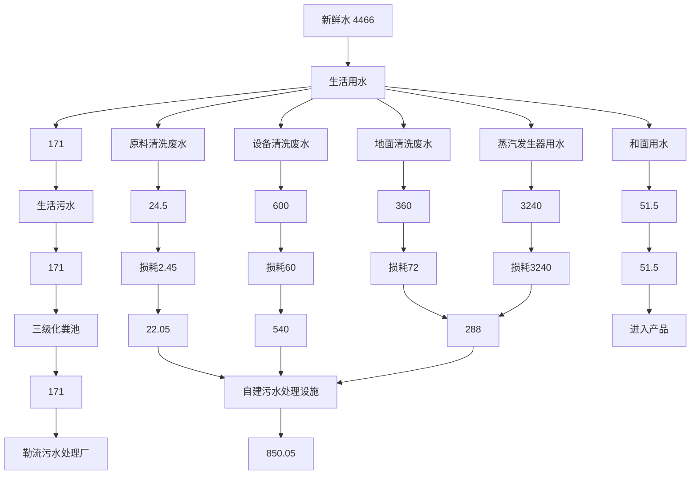
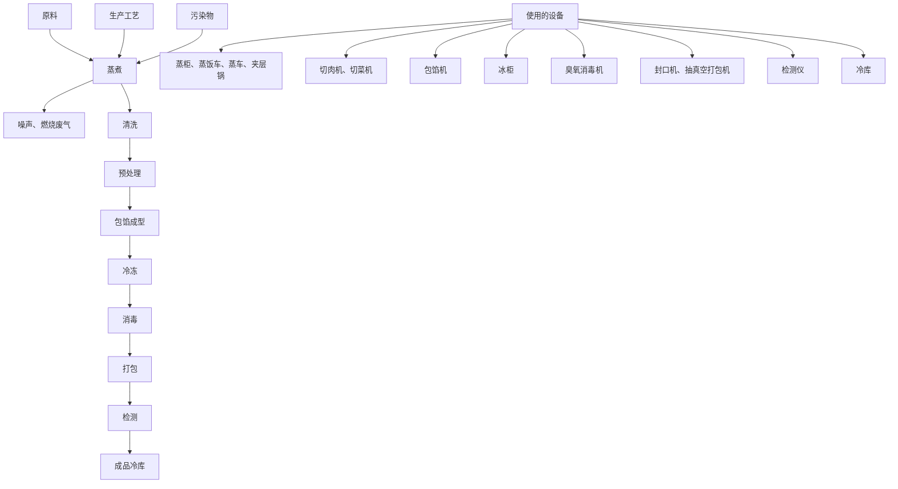
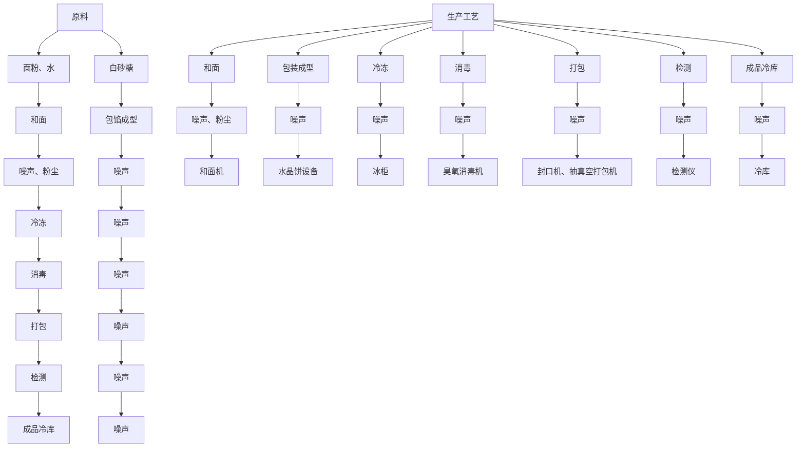
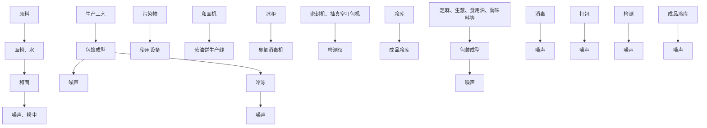
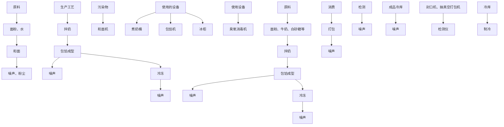
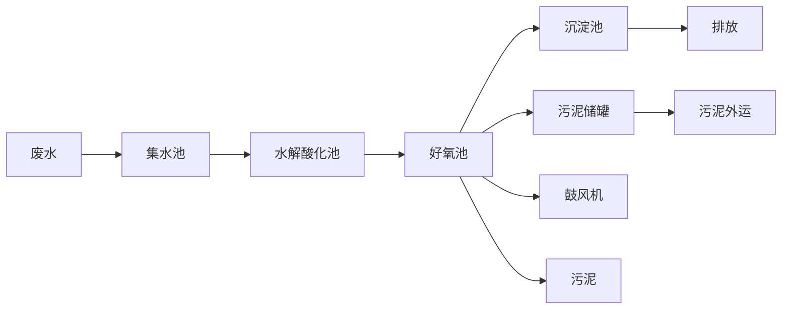

# 建设项目环境影响报告表

（污染影响类）

项目名称：佛山市味极爽食品有限公司新建项目

建设单位（盖章）：佛山市味极爽食品有限公司

编制日期：2023年9月

中华人民共和国生态环境部制

编制单位和编制人员情况表

<table><tr><td colspan="2">项目编号</td><td colspan="3">33wun8</td></tr><tr><td colspan="2">建设项目名称</td><td colspan="3">佛山市味极爽食品有限公司新建项目</td></tr><tr><td colspan="2">建设项目类别</td><td colspan="3">11-021糖果、巧克力及蜜饯制造;方便食品制造;罐头食品制造</td></tr><tr><td colspan="2">环境影响评价文件类型</td><td colspan="3">报告表</td></tr><tr><td colspan="3">一、建设单位情况</td><td colspan="2"></td></tr><tr><td colspan="2">单位名称(盖章)</td><td colspan="2">佛山市味机</td><td></td></tr><tr><td colspan="2">统一社会信用代码</td><td rowspan="4" colspan="2"></td><td></td></tr><tr><td colspan="2">法定代表人(签章)</td><td></td></tr><tr><td colspan="2">主要负责人(签字)</td><td></td></tr><tr><td colspan="2">直接负责的主管人员(签字)</td><td></td></tr><tr><td colspan="3">二、编制单位情况</td><td colspan="2"></td></tr><tr><td colspan="2">单位名称(盖章)</td><td colspan="2">广州环业环境服务有限公司</td><td></td></tr><tr><td colspan="2">统一社会信用代码</td><td colspan="2"></td><td></td></tr><tr><td colspan="4">三、编制人员情况</td><td></td></tr><tr><td colspan="4">二、编制主持人</td><td></td></tr><tr><td>姓名</td><td colspan="2">职业资格证书管理号</td><td>信用编号</td><td>签字</td></tr><tr><td colspan="5"></td></tr><tr><td colspan="5">三、主编编制人员</td></tr><tr><td>姓名</td><td colspan="2">主要编写内容</td><td>信用编号</td><td>签字</td></tr><tr><td colspan="5"></td></tr></table>

ment departmentsandhasobtained

text_image

人民共和国
中华人民共和国
by
Ministry of Personnel

text_image

家环境保护
国证
APRVICE & AUTHORIZED

StateEnxironmental Protection Admnistration The People's Republic China

# 目录

一、建设项目基本情况.

二、建设项目工程分析. 9

三、区域环境质量现状、环境保护目标及评价标准. .20

四、主要环境影响和保护措施. .25

五、环境保护措施监督检查清单. .45

六、结论.. .. 47

附表.. .. 48

建设项目污染物排放量汇总表.. .48

附图1 本项目地理位置图

附图2 本项目四至图

附图3 本项目周围环境示意图

附图4 本项目所在区域的地表水环境功能区划图

附图5 本项目所在区域的大气环境功能区划图

附图6 本项目所在区域的声环境功能区划图

附图7 佛山市顺德区环境管控单元图

附图8 本项目空置厂房图

附件1 营业执照及法人身份证

附件2 租赁合同

附件3 房地产权证

附件4 环评合同及同意公示声明

# 一、建设项目基本情况

<table><tr><td>建设项目名称</td><td colspan="4">佛山市味极爽食品有限公司新建项目</td></tr><tr><td>项目代码</td><td colspan="4">无</td></tr><tr><td>建设单位联系人</td><td></td><td>联系方式</td><td></td><td></td></tr><tr><td>建设地点</td><td colspan="4">佛山市顺德区勒流街道办事处富裕村委会龙冲路33号B栋二楼之一</td></tr><tr><td>地理坐标</td><td colspan="4">(113度12分27.22秒,22度48分22.25秒)</td></tr><tr><td>国民经济行业类别</td><td>C1432速冻食品制造</td><td>建设项目行业类别</td><td colspan="2">十一、食品制造业中“143方便食品制造”类别中的“除单纯分装外”</td></tr><tr><td>建设性质</td><td>☑新建(迁建)□改建□扩建□技术改造</td><td>建设项目申报情形</td><td colspan="2">☑首次申报项目□不予批准后再次申报项目□超五年重新审核项目□重大变动重新报批项目</td></tr><tr><td>项目审批(核准/备案)部门(选填)</td><td>/</td><td>项目审批(核准/备案)文号(选填)</td><td colspan="2">/</td></tr><tr><td>总投资(万元)</td><td>500</td><td>环保投资(万元)</td><td colspan="2">10</td></tr><tr><td>环保投资占比(%)</td><td>5</td><td>施工工期</td><td colspan="2">1.0</td></tr><tr><td>是否开工建设</td><td>☑否□是: _</td><td>用地(用海)面积(m2)</td><td colspan="2">2482</td></tr><tr><td>专项评价设置情况</td><td colspan="4">无</td></tr><tr><td>规划情况</td><td colspan="4">无</td></tr><tr><td>规划环境影响评价情况</td><td colspan="4">无</td></tr><tr><td>规划及规划环境影响评价符合性分析</td><td colspan="4">无</td></tr><tr><td>其他符合性分析</td><td colspan="4">1、建设项目所在地与“三线一单”符合性分析(1)根据《广东省人民政府关于印发广东省“三线一单”生态环境分区管控方案的通知》(粤府〔2020〕71号),广东省将以环境管控单元为基础,实施生态环境分区管控,精细化管理、保护生态环境。本项目与广东省“三线一单”生态环境分区管控方案相符性分析如下:1与“一核一带一区”区域管控要求的相符性</td></tr></table>

# ◇区域布局管控要求

项目位于珠三角核心区，主要进行速冻食品制造，不属于区域布局管控要求中的禁止新建、扩建水泥、平板玻璃、化学制浆、生皮制革以及国家规划外的钢铁、原油加工等项目。项目不涉及使用具有的高挥发性原辅材料，不属于新建生产和使用高挥发性有机物原辅材料的项目，符合区域布局管控要求。

# ◇能源资源利用要求

项目所属速冻食品制造不属于高能耗行业。项目大部分生产设备使用电能，生产用水由市政供水，不直接取用江河湖库水量，不会对项目所在地生态流量造成影响，符合能源利用要求。

# ◇污染物排放管控要求

项目属于新建项目，挥发性有机物实行区域内两倍削减量替代，总量指标由镇街分配；本项目燃烧废气收集后高空排放引至20米排气筒DA001高空排放。生活污水和生产废水分别经预处理后排至勒流污水处理厂处理达标后，尾水排入顺德支流。根据《2021年1-12月市控考核断面水质情况》和《佛山市生态环境局顺德分局关于发布2021年度佛山市顺德区环境质量状况公报的通知》（佛顺环函[2022]13 号），顺德支流水质标准执行《地表水环境质量标准》（GB3838-2002）之Ⅲ类标准，水质较好。目前顺德支流水质中重点水污染物 $\mathrm { C O D } _ { \mathrm { C r } }$ 、NH3-N达到Ⅲ类水体的要求， $\mathrm { C O D } _ { \mathrm { C r } }$ 、 $\mathrm { N H } _ { 3 ^ { - } } \mathrm { N }$ 无需实施本行政区域内减量替代，总量指标由镇街分配，符合污染物排放管控要求。

# ◇环境风险防控要求

项目位于佛山市顺德区勒流街道办事处富裕村委会龙冲路33号B栋二楼之一，不属于石化、化工重点园区环境风险防控区域。项目产生的危险废物拟定期委托有资质的处置公司进行收集处理，并通过信息系统登记转移计划和电子转移联单，符合危险废物全过程跟踪管理的防控要求。

# ②环境管控单元总体管控要求

<table><tr><td></td><td>根据《广东省人民政府关于印发广东省“三线一单”生态环境分区管控方案的通知》(粤府〔2020〕71号)发布的广东省环境管控单元图,项目所在区域为一般管控单元,执行区域生态环境保护的基本要求。3 “三线一单”符合性分析◇生态保护红线本项目位于佛山市顺德区勒流街道办事处富裕村委会龙冲路33号B栋二楼之一,根据《广东省“三线一单”生态环境分区管控方案(粤府[2020])71号》,项目所在地不属于生态优先保护区、水环境优先保护区、大气环境优先保护区等优先保护单元,因此项目不涉及生态保护红线。◇环境质量底线根据《广东省“三线一单”生态环境分区管控方案(粤府[2020])71号》,全省水环境质量持续改善,国考、省考断面优良水质比例稳步提升,全面消除劣V类水体。大气环境质量继续领跑先行, $PM_{2.5}$ 年均浓度率先达到世界卫生组织过渡期二阶段目标值(25微克/立方米),臭氧污染得到有效遏制。土壤环境质量稳中向好,土壤环境风险得到管控。近岸海域水体质量稳步提升。本项目生活污水经三级化粪池预处理后达到广东省《水污染物排放限值》(DB44/26-2001)中第二时段三级标准后排入勒流污水处理厂,对水环境影响不大。本项目废气经收集处理后可达标排放,大气污染物对周围环境影响较小。本项目位于3类声环境功能区,根据声环境影响预测,项目正常生产时厂界噪声值很小,噪声对周围环境和环境敏感标影响不明显。本项目排放的污染物不会导致区域环境质量超标,符合环境质量底线要求。◇资源利用上线强化节约集约利用,持续提升资源能源利用效率,水资源、土地资源、岸线资源、能源消耗等达到或优于国家下达的总量和强度符合</td></tr></table>

控制目标。本项目不属于高耗能、污染资源型型企业，用水来自市政管网，用电来自市政供电。本项目建成后通过内部管理、设备选择、原辅材料的选用和管理、废物回收利用、污染治理等方面采取可行的防治措施，以“节能、降耗、减污”为目标，有效的控制污染。项目的水、电等资源利用不会突破区域上线。

# ◇环保准入负面清单

根据《广东省“三线一单”生态环境分区管控方案（粤府[2020]）71 号》，从区域布局管控、能源资源利用、污染物排放管控和环境风险防控等方面明确准入要求，建立“1+3+N”三级生态环境准入清单体系。“1”为全省总体管控要求，“3”为“一核一带一区”区域管控要求，“N”为 1912个陆域环境管控单元和 471个海域环境管控单元的管控要求。本项目不属于区域布局管控、能源资源利用、污染物排放管控和环境风险防控等方面明确禁止准入项目。

根据国家《产业结构调整指导目录（2019年本）》，项目不属于上述目录所列的限制类和淘汰类项目；根据《市场准入负面清单（2020年版）》（发改体改规〔2020〕1880号），本项目不属于负面清单项目。因此，项目符合相关的产业政策要求。

（2）与《佛山市人民政府关于印发佛山市“三线一单”生态环境分区管控 方案的通知》（佛府〔2021〕11 号）的相符性分析。

# ①全市总体管控要求

◇区域布局管控要求：“禁止新建、扩建列入国家和省限制类建设项目。环境质量不达标区域，新建、扩建项目需符合环境质量改善要求。全市域为高污染燃料禁燃区，禁止新建、扩建燃用高污染燃料的燃烧设施。加快推进天然 气产供储销体系建设，逐步淘次生物质锅炉、集中供热管网覆盖区域内的分散供热锅炉，促进用热企业向园区集聚。禁止新建、扩建水泥、平板玻璃、化学制浆、生皮制革以及国家规划外的钢铁、原油加工等项目。专业电镀、印染等项目进入定点园区集中管理。推广应用低挥发性有机物原辅材料，严格限制新建生产和使用高挥发性有机物原辅材料的项目，鼓励建设共性工厂、活性炭集中再生中心等挥发性有机物第三方治理项目，推动挥发性有机物集中高效处理。”

本项目不属于列入国家和省限制类建设项目；使用的能源为电能和液化石油气，均属于清洁能源；本项目属于速冻食品制造，不属于水泥、平板玻璃、化学制浆、生皮制革以及国家规划外的钢铁、原油加工等项目，不属于限制行业；本项目项目原辅料不含挥发性有机物，符合要求。

◇能源资源利用要求：“积极发展氢能源、天然气发电等清洁能源，逐步 提高可再生能源与低碳清洁能源比例，建立现代化能源体系。贯彻落实“节 水优先”方针，实行最严格水资源管理制度，提高工业用水效率，加强江河湖库水量调度，保障生态流量。强化自然岸线保护，优化岸线开发利用格局，严格水域岸线用途管制，新建项目一律不得违规占用水域。”

本项目使用电能，属于清洁能源；生活污水和生产废水分别经预处理后排放，不占用水域，符合要求。

◇污染物排放管控要求：“禁止在地表水Ⅰ、Ⅱ类水域新建排污口，已建排污口不得增加污染物排放量。深化炉窑分级管控，实施工业炉大气污染综合治理。推进挥发性有机物源头替代，全面加强无组织排放控制，深入实施精细化治理。推进石化化工、溶剂使用及挥发性有机液体储运销的挥发性有机物减排，全过程实施反应活性物质、有毒有害物质、恶臭物质的协同控制。将全面使用低 VOCs 含量原辅材料的企业纳入正面清单和政府绿色采购清单。”

本项目位于佛山市顺德区勒流街道办事处富裕村委会龙冲路33号B 栋二楼之一，排污口不在地表水Ⅰ、Ⅱ类水域排放；本项目不涉及VOC挥发原料，符合要求。

◇环境风险防控要求：“重点加强环境风险分級分类管理，应用全省环境风险源在监控预警系，强化化工企业、涉重金属行业、工业园区等重点环境风 险源的环境风险防控。推动企业将低温等离子、UV光解、RTO燃烧炉等有机 废气治理设施纳入全厂安全风险辨识范围，加强安全管理。”

本项目不属于化工企业、涉重金属行业、工业园区等重点环境风险源的项目，不采用低温等离子、UV光解、RTO燃烧炉等有机废气治理设施，风险较低，符合要求。

# ②环境管控单元总体管控要求（重点管控单元）

本项目属于佛山市环境管控单元中“重点管控单元”区域。

◇水环境重点管控单元：“以工业污染为主的单元，大力推进涉水重点行业清洁化改造，降低单位工业增加值新鲜水耗，提高工业用水重复利用率和中水回用率；推行废水重点排污单位厂区废水输送明管化，实行水质和视频双监控，加强企业雨污分流、清污分流”。

本项目外排废水为生活废水和生产废水，根据项目水平衡图，项目年使用新鲜水 4466t，不属于高耗水行业，符合要求。

◇大气环境重点管控单元：“以建筑陶瓷、有色金属等行业为重点，加快推动企业工业炉窑分级管理及废气治理设施升级改造。加快涉VOCs 重点行业的生产工艺升级改造，推行自动化生产工艺，逐步淘低效VOCs治理设施。人口较集中的单元，严格限制新、扩建储油库、产生和排放有毒有害大气污染物以及使用高挥发性有机物原辅材料的项目，鼓励现有该类项目迁退出。布局敏感的单元，严格限制新建扩建生产和使用高挥发性有机物原辅材料的项目，优先开展低VOCs含量原辅材料替代，强化无组织排放控制；限制建设新建、扩建新增氮氧化物、烟（粉）尘排放量较大的建设项目。扩散条件较差的单元，加大区域内大气污染物减排力度，限制引入大气污染物排放量大的建设项目。污染排放高的单元，强化达标监管，引导工业项目落地集聚发展，有序推进区域内行业企业提标改造”

项目不产生挥发性有机物，外排大气污染物为少量二氧化硫、氮氧化合物、颗粒物，符合大气环境重点管控单元要求。

（3）与《佛山市顺德区人民政府关于印发佛山市顺德区“三线一单”生态环境分区管控方案的通知》（顺府发〔2021〕11号）的相符性分析。

本项目位于广东省佛山市顺德区于重点管控单元勒流街道重点管控区（ZH44060620009）内，本项目与佛山市顺德区环境管控单元准入清单相符性分析如下表1-1所示。

表 1-1 本项目与佛山市顺德区环境管控单元准入清单相符性分析

<table><tr><td>管控维度</td><td>管控要求</td><td>本项目内容</td><td>符合性</td></tr><tr><td rowspan="3">区域布局管控</td><td>产业聚集区所属地块内的工业用地或企业与村庄、学校等环境敏感点之间应设置合理的大气环境防护距离,并通过绿化带进行有效隔离;聚集区规划布局应注重大气污染排放企业应尽量避免布局在居住用地的常年主导风向的上风向。</td><td>项目与周边环境敏感点距离较远,中间有其他工业厂房、绿化带隔离。</td><td>符合</td></tr><tr><td>受纳水体或监控断面不达标的,不得新建、扩建向河涌直接排放废水的项目。新建、扩建含蚀刻工序的线路板生产项目和化工项目应在配套污水集中处置的工业园区或生活污水管网覆盖区域内建设;纯加工型印花项目,含酸洗、磷化的金属表面处理、金属制品项目(与自身高新技术企业配套的除外),含酸洗、喷涂、化学抛光、电解等涉及废水排放工艺的不锈钢型材加工项目(与自身高新技术企业配套的除外),应进入以此类项目为主导产业、有相应废水集中治理设施的工业园区,实现集中治污。</td><td>项目属于C1432速冻食品制造,生活污水和生产废水经处理达标后排至勒流污水处理厂,处理达标后,尾水排入顺德支流。</td><td>符合</td></tr><tr><td>系统推进村级工业园升级改造,腾出连片空间,布局产业集聚区和主题产业园,推动工业项目入园集聚发展。新增工业制造业用地原则上安排在产业集聚区内,产业集聚区外原则上不鼓励工业及物流仓储用地的新建与改造。</td><td>本项目属于产业集聚区,不属于村改范围。</td><td>符合</td></tr><tr><td>能源资源利用</td><td>严格水域岸线用途管制,新建项目一律不得违规占用水域。严禁破坏生态的岸线利用行为和不符合其功能定位的开发建设活动,严禁以各种名义侵占河道、围垦湖泊、非法采砂等。</td><td>项目建设在陆域上,不属于占用水域和破坏生态的岸线利用行为。</td><td>符合</td></tr></table>

<table><tr><td rowspan="4"></td><td rowspan="2">污染物排放管控</td><td>产业集聚区和主题园区内做好污水管网和污水集中处理设施的配套保障,确保废水收集到城镇污水处理厂、园区污水处理厂或分散式污水处理设施集中处置。</td><td>本项目外排废水为生活污水和生产废水经处理达标后排至勒流污水处理厂,处理达标后,尾水排入顺德支流。</td><td>符合</td></tr><tr><td>大力推进低VOCs含量原辅材料替代,加快涉VOCs重点行业的生产工艺升级改造,推行自动化生产工艺,对达不到要求的VOCs收集及治理设施进行整治提升,逐步淘汰低效VOCs治理设施。</td><td>本项目不涉及高VOCs含量原辅材料,不使用低效VOCs治理设施。</td><td>符合</td></tr><tr><td>环境风险防控</td><td>加强环境风险分级分类管理,强化金属制品、有色金属和压延加工、化学原料和化学品制造业等涉重金属、化工行业企业及工业园区等重点环境风险源的环境风险防控。</td><td>本项目所属行业为C1432速冻食品制造,不属于重点环境风险源。</td><td>符合</td></tr><tr><td colspan="4">2、选址可行性分析佛山市味极爽食品有限公司新建项目位于佛山市顺德区勒流街道办事处富裕村委会龙冲路33号B栋二楼之一,根据《不动产权证书》(详见附件3)可知,本项目所在地用地性质属于工业用地,故本项目的选址符合用地规划。</td></tr></table>

# 二、建设项目工程分析

<table><tr><td rowspan="19">建设内容</td><td colspan="5">1.工程组成项目主要工程组成见下表:表2-1 项目工程组成表</td></tr><tr><td>工程类型</td><td>工程内容</td><td colspan="2">规模</td><td>用途</td></tr><tr><td>主体工程</td><td>生产车间</td><td colspan="2">单层,约 $1700m^{2}$ </td><td>设有配料间、预处理间、制作间、成型间、加热间、冷却间等</td></tr><tr><td>储运工程</td><td>仓库</td><td colspan="2">单层,约 $1042m^{2}$ </td><td>原料、成品暂存于仓库</td></tr><tr><td>辅助工程</td><td>办公室</td><td colspan="2">单层,约 $100m^{2}$ </td><td>供日常办公使用</td></tr><tr><td rowspan="2">公用工程</td><td>配电系统</td><td colspan="2">一套</td><td>供应生产用电和办公生活用电</td></tr><tr><td>给排水工程</td><td colspan="2">一套</td><td>供水来源为市政自来水,生活污水经三级化粪池预处理,生产废水经自建污水处理设施处理,后一起排入勒流污水处理厂,尾水排入顺德支流。</td></tr><tr><td rowspan="4">环保工程</td><td>三级化粪池</td><td colspan="2">一套</td><td>用于处理生活污水</td></tr><tr><td>自建污水处理设施</td><td colspan="2">一套</td><td>气浮+水解酸化+接触氧化+沉淀;用于生产废水处理</td></tr><tr><td>集气管+20m排气筒</td><td colspan="2">一套</td><td>用于燃烧废气的收集和排放</td></tr><tr><td>危险废物贮存场所</td><td colspan="2"> $10m^{2}$ </td><td>用于存放危险废物</td></tr><tr><td colspan="5">2.产品及产能本项目主要从事开关插座的生产,主要产品及产能见下表:表2-2 产品及产能</td></tr><tr><td>序号</td><td>主要产品名称</td><td colspan="2">年产量</td><td>备注</td></tr><tr><td>1</td><td>牛奶卷</td><td colspan="2">25000件/年</td><td>/</td></tr><tr><td>2</td><td>葱油饼</td><td colspan="2">3000件/年</td><td>/</td></tr><tr><td>3</td><td>水晶饼</td><td colspan="2">15000件/年</td><td>/</td></tr><tr><td>4</td><td>糯米鸡</td><td colspan="2">60000件/年</td><td>/</td></tr><tr><td colspan="5">3.主要原辅材料及燃料项目主要原辅材料及用量见下表:表2-3 项目主要原材料年用量一览表</td></tr><tr><td>类别</td><td>名称</td><td>年耗量/吨</td><td>性状</td><td>备注</td></tr></table>

<table><tr><td rowspan="28"></td><td rowspan="28">原辅材料</td><td rowspan="6">牛奶卷</td><td>牛奶</td><td>32</td><td>液态</td><td>外购</td></tr><tr><td>面粉</td><td>25</td><td>固态</td><td>外购</td></tr><tr><td>发酵粉</td><td>0.22</td><td>固态</td><td>外购</td></tr><tr><td>盐</td><td>0.024</td><td>固态</td><td>外购</td></tr><tr><td>糖</td><td>10</td><td>固态</td><td>外购</td></tr><tr><td>水</td><td>12.5</td><td>液态</td><td>自来水</td></tr><tr><td rowspan="7">葱油饼</td><td>面粉</td><td>36</td><td>固态</td><td>外购</td></tr><tr><td>发酵粉</td><td>0.22</td><td>固态</td><td>外购</td></tr><tr><td>葱</td><td>1.1</td><td>固态</td><td>外购</td></tr><tr><td>食用油</td><td>0.36</td><td>液态</td><td>外购</td></tr><tr><td>芝麻</td><td>0.015</td><td>固态</td><td>外购</td></tr><tr><td>盐</td><td>0.5</td><td>固态</td><td>外购</td></tr><tr><td>水</td><td>18</td><td>液态</td><td>自来水</td></tr><tr><td rowspan="3">水晶饼</td><td>面粉</td><td>42</td><td>固态</td><td>外购</td></tr><tr><td>糖</td><td>16</td><td>固态</td><td>外购</td></tr><tr><td>水</td><td>21</td><td>液态</td><td>自来水</td></tr><tr><td rowspan="12">糯米鸡</td><td>糯米</td><td>130</td><td>固态</td><td>外购</td></tr><tr><td>鸡肉</td><td>19</td><td>固态</td><td>外购</td></tr><tr><td>猪肉</td><td>3.25</td><td>固态</td><td>外购</td></tr><tr><td>冬菇</td><td>2.2</td><td>固态</td><td>外购</td></tr><tr><td>木耳</td><td>1.2</td><td>固态</td><td>外购</td></tr><tr><td>生抽</td><td>0.5</td><td>液态</td><td>外购</td></tr><tr><td>老抽</td><td>0.36</td><td>液态</td><td>外购</td></tr><tr><td>蚝油</td><td>0.6</td><td>液态</td><td>外购</td></tr><tr><td>木薯粉</td><td>2</td><td>固态</td><td>外购</td></tr><tr><td>味精</td><td>0.45</td><td>固态</td><td>外购</td></tr><tr><td>鸡粉</td><td>0.04</td><td>固态</td><td>外购</td></tr><tr><td>食用油</td><td>13</td><td>液态</td><td>外购</td></tr><tr><td rowspan="8"></td><td rowspan="4"></td><td rowspan="3"></td><td>盐</td><td>0.3</td><td>固态</td><td>外购</td></tr><tr><td>糖</td><td>2</td><td>固态</td><td>外购</td></tr><tr><td>水</td><td>195</td><td>液态</td><td>自来水</td></tr><tr><td colspan="2">机油</td><td>0.2</td><td>液态</td><td>外购、液态,用于设备维护</td></tr><tr><td rowspan="4">能源</td><td colspan="2">电</td><td>10万kw·h</td><td>——</td><td>市政供电</td></tr><tr><td colspan="2">液化石油气</td><td>15万立方米</td><td>——</td><td>市政供气,管道输送</td></tr><tr><td colspan="2">生活用水</td><td>190</td><td>——</td><td>市政供水,生活办公用</td></tr><tr><td colspan="2">生产用水</td><td>4276</td><td>——</td><td>市政供水,生产用水</td></tr></table>

# 4.主要设备

项目主要设备见下表：

表 2-4 项目主要生产设备一览表

<table><tr><td>序号</td><td>名称</td><td>数量</td><td>备注</td></tr><tr><td>1</td><td>切片机切糕机</td><td>1</td><td>/</td></tr><tr><td>2</td><td>制冰机</td><td>2</td><td>/</td></tr><tr><td>3</td><td>封口机</td><td>4</td><td>型号:YJ200221015</td></tr><tr><td>4</td><td>和面机</td><td>6</td><td>/</td></tr><tr><td>5</td><td>蒸饭车</td><td>22</td><td>/</td></tr><tr><td>6</td><td>切菜机</td><td>2</td><td>/</td></tr><tr><td>7</td><td>葱油饼切片机</td><td>2</td><td>/</td></tr><tr><td>8</td><td>高速压面机</td><td>1</td><td>型号:YQ-130</td></tr><tr><td>9</td><td>电热炉</td><td>2</td><td>/</td></tr><tr><td>10</td><td>检测仪</td><td>1</td><td>/</td></tr><tr><td>11</td><td>蒸车</td><td>6</td><td>/</td></tr><tr><td>12</td><td>水晶饼设备</td><td>1</td><td>/</td></tr><tr><td>13</td><td>蒸柜</td><td>5</td><td>/</td></tr><tr><td>14</td><td>包馅机</td><td>2</td><td>型号:YF-180</td></tr><tr><td>15</td><td>切包机</td><td>1</td><td>型号:ZB1809159LPC</td></tr><tr><td>16</td><td>水晶饼排盘机款</td><td>1</td><td>型号:LP</td></tr><tr><td>17</td><td>煮奶桶</td><td>1</td><td>/</td></tr><tr><td>18</td><td>切片机</td><td>2</td><td>型号:TZ-2</td></tr><tr><td>19</td><td>冰柜</td><td>3</td><td>/</td></tr><tr><td>20</td><td>叉车</td><td>2</td><td>/</td></tr><tr><td>21</td><td>切肉机</td><td>1</td><td>型号:YCQS-100</td></tr><tr><td>22</td><td>净水机</td><td>5</td><td>/</td></tr><tr><td>23</td><td>葱油饼生产线</td><td>1</td><td>型号:JSQ-698</td></tr><tr><td>24</td><td>半自动压面机</td><td>1</td><td>/</td></tr><tr><td>25</td><td>400L隔层锅</td><td>1</td><td>型号:CT6J4C</td></tr><tr><td>26</td><td>面包发酵房</td><td>1</td><td>/</td></tr><tr><td>27</td><td>抽真空打包机</td><td>1</td><td>/</td></tr><tr><td>28</td><td>真空滚柔机</td><td>1</td><td>/</td></tr><tr><td>29</td><td>蒸汽发生器</td><td>6</td><td>型号:Z8TD-Z036、J-2Q150G-Y</td></tr></table>

# 5、公用、配套工程

（1）供水：本项目用水全部由市政自来水厂供给，主要是生活用水 190t/a，生产用水 4276t/a。  
（2）排水：生活污水经三级化粪池处理，生产废水经自建污水处理厂处理，后一起排入勒流污水处理厂处理，尾水排入顺德支流，排水量为1021.05t/a。  
（3）排水情况分析

# ①生活污水

项目从业人数为19人，项目不设食堂和宿舍，年工作300天，参照《广东省用水定额》（DB44/T1461.3-2021），无食堂和浴室的办公楼职工生活用水量先进值定额按10m3 /(人·a)计，则项目职工生活用水量为190t/a，排放系数按0.9计，本项目产生的生活污水量为171t/a。

# ②生产废水

# ◇和面用水

项目牛奶卷、葱油饼、水晶饼生产过程和面工序项目使用面粉 103t/a，按照系

数0.5t/t（原料）计算，需加入水约51.5t/a，全部进入产品，无废水排放。

# ◇原料清洗用水

本项目猪肉、鸡肉用量为22.25t/a，清洗用水按照系数 1t/t（原料）计算，肉类清洗用水量为22.25t/a，废水排放系数取 0.9，则肉类清洗废水排放量为 20.025t/a。主要污染物浓度为：CODcr800mg/L、SS400mg/L、NH3-N30mg/L、动植物油 200mg/L。

本项目葱、蔬菜等用量为4.5t/a，按照系数 0.5t/t（原料）计算，姜葱清洗用水量为2.25t/a，废水排放系数取 0.9，则蔬菜清洗废水排放量为 2.025t/a。蔬菜清洗废水污染物以 CODcr 和 SS 为主，浓度分别为 150mg/L、500mg/L。

# ◇蒸汽发生器用水

本项目蒸煮等工序用蒸汽加热，项目共有6台蒸汽发生器，每台蒸汽发生器蒸汽产生量为0.3t/h，则项目蒸汽最大产生量为 1.8t/h，项目蒸汽发生器日平均工作时间为6小时，年工作300日，则蒸汽发生器用水量为 3240t/a，全部蒸发至空气中。

# ◇设备清洗废水

每天生产结束，均会对部分人工设备清洗一次，主要采用钢丝球+水清洗+抹布擦干方式清洗，根据建设单位提供资料，设备清洗水约为2t/d，项目年工作300日，则设备清洗用水量为 600t/a；污水排放量按照用水的 90%计算，设备清洗废水产生量为 540t/d。主要污染物浓度为：CODcr800mg/L、SS600mg/L、NH3-N20mg/L、动植物油 50mg/L。

# ◇车间地面清洗用水

为了保证车间卫生以及食品安全，每天下班后需对生产车间地面进行清洗，清洗过程以使用拖把拖洗为主，项目需清洗面积约为 600m2，地面清洗频率为每天 1次。每次冲洗水用量按2L/m2计算，项目年工作300 天，则地面清洗用水为 360t/d。地面拖洗废水产生系数按0.8 计，则废水产生量为288t/d，项目管理制度比较完善，原料或半成品极少掉落地面，车间地面每天清洗一次，地面比较干净，废水水质简单水质为 CODcr350mg/L，SS250mg/L，NH3-N20mg/L，动植物油 20mg/L。

综上，项目生产用水产生和排放情况见下表。

表2-5 项目生产用水产排明细表

<table><tr><td>序号</td><td>工序</td><td>用水量</td><td>污水产生量</td></tr><tr><td>1</td><td>和面</td><td>51.5</td><td>0</td></tr><tr><td>2</td><td>肉类清洗</td><td>22.25</td><td>20.025</td></tr><tr><td>3</td><td>蔬菜清洗</td><td>2.25</td><td>2.025</td></tr><tr><td>4</td><td>蒸汽发生器</td><td>3240</td><td>0</td></tr><tr><td>5</td><td>设备清洗</td><td>600</td><td>540</td></tr><tr><td>6</td><td>地面清洗</td><td>360</td><td>288</td></tr><tr><td>8</td><td>合计</td><td>4276</td><td>850.05</td></tr></table>

生产经自建污水处理设施处理后，经市政污水管网排入勒流污水处理厂处理，尾水排入顺德支流。

项目全厂水平衡情况如下图所示：

flowchart

图2-1 项目水平衡图（t/a）

# （3）供电

本项目用电由当地市政电网供应，根据建设单位提供资料，本项目总用电量约为 10 万 kw·h/a。

# 6、工作制度和劳动员

职工人数：本项目职工19 人，均不在厂区内食宿。

工作制度：每天工作时间为上午 8：00—12：00；下午2：00—6：00，共8小

时，夜间不生产，年工作300天。

# 7、厂区平面布置

项目租用佛山市顺德区勒流街道办事处富裕村委会龙冲路 33 号 B 栋二楼之一的厂房，项目所在厂房共4层，首层高6米，2\~4 层高4米，项目所在楼层为2层。建筑面积为2482m2，项目厂区具体平面布置图见下图。

text_image

DW001
排气筒
加热间
仓库
危险废物
储存间
制作间
配料间
仓库
成型间
配料间
预处理
间
制作间
冷却间
加热间
仓库
办公室

图 2-2 项目平面布置图

# 1、工艺流程及产污节点图见下图：

flowchart

图 2-3 糯米鸡生产工艺流程图

# 工艺流程简述：

1.蒸煮：将糯米放入蒸柜、蒸饭车、蒸车或夹层锅里蒸熟，该工序会产生燃烧废气、噪声。  
2.清洗：将外购的猪肉、鸡肉、蔬菜等在水槽内进行人工清洗，该工序会产生清洗废水、固废、噪声。  
2.预处理：将清洗好的猪肉、鸡肉、蔬菜等放入切肉机、切菜机切碎，该工序会产生噪声。  
3.包馅成型:将肉馅、蔬菜、盐、调料按比例加入拌馅机内进行拌馅；拌好的馅和蒸好的糯米一起放到包陷机进行包馅成型，该工序会产生噪声。  
6.冷冻：将包好的糯米鸡放入冰柜进行冷冻，该工序会产生噪声。  
7.消毒：用臭氧消毒机对蒸好的糯米鸡消毒，该工序会产生噪声。  
8.打包：消毒后的糯米鸡用封口机、抽真空打包机进行打包，该工序会产生噪声。  
9.检测：用检测仪检测成品是否有金属，该工序会产生噪声。  
10.冷藏：将糯米鸡放入冷库冷冻，该工序会产生噪声。

flowchart

图 2-4 水晶饼生产工艺流程图

# 工艺流程简述：

1.和面：人工投料进入和面机，将面粉及水按照一定质量比配比，进行和面备用。  
3.包馅成型:将经白砂糖调味后的面皮和馅料放进水晶饼设备进行包馅成型，该工序会产生噪声。  
6.冷冻：将包好的水晶饼放入冰柜进行冷冻，该工序会产生噪声。  
7.消毒：用臭氧消毒机对水晶饼消毒，该工序会产生噪声。  
8.打包：消毒后的水晶饼用封口机、抽真空打包机进行打包，该工序会产生噪声。  
9.检测：用检测仪检测成品是否有金属，该工序会产生噪声。  
10.冷藏：将水晶饼放入冷库冷冻，该工序会产生噪声。

flowchart

图 2-5 葱油饼生产工艺流程图

1.和面：人工投料进入和面机，将面粉及水按照一定质量比配比，进行和面备用。  
2.包馅成型:将芝麻、生葱、食用油、调味料等进行调味后的葱油饼面皮放进葱油饼生产线进行包馅成型，该工序会产生噪声。  
3.冷冻：将包好的葱油饼放入冰柜进行冷冻，该工序会产生噪声。  
4.消毒：用臭氧消毒机对葱油饼消毒，该工序会产生噪声。

5.打包：消毒后的葱油饼用封口机、抽真空打包机进行打包，该工序会产生噪声。  
6.检测：用检测仪检测成品是否有金属，该工序会产生噪声。  
7.冷藏：将葱油饼放入冷库冷冻，该工序会产生噪声。

flowchart

图 2-6 牛奶卷生产工艺流程图

1.和面：人工投料进入和面机，将面粉及水按照一定质量比配比，进行和面备用。  
2.拌奶：将面粉、白砂糖等倒入牛奶中，利用煮奶桶进行拌奶。  
3.包馅成型:将牛奶卷面皮和牛奶馅料放进包陷机进行包馅成型，该工序会产生噪声。  
4.冷冻：将包好的牛奶卷放入冰柜进行冷冻，该工序会产生噪声。  
5.消毒：用臭氧消毒机对牛奶卷消毒，该工序会产生噪声。  
6.打包：消毒后的牛奶卷用封口机、抽真空打包机进行打包，该工序会产生噪声。  
7.检测：用检测仪检测成品是否有金属，该工序会产生噪声。  
8.冷藏：将牛奶卷放入冷库冷冻，该工序会产生噪声。

# 本项目产污一览表见下表：

<table><tr><td rowspan="10"></td><td colspan="4">表2-6 本项目产污一览表</td></tr><tr><td>项目</td><td>产污工序</td><td>污染物</td><td>主要污染因子</td></tr><tr><td rowspan="2">废气</td><td>投料</td><td>粉尘</td><td>颗粒物</td></tr><tr><td>蒸煮</td><td>燃烧废气</td><td>二氧化硫、氮氧化物、烟尘</td></tr><tr><td rowspan="2">废水</td><td>员工生活</td><td>生活污水</td><td> $COD_{cr}$ 、 $BOD_5$ 、 $NH_3-N$ 、SS</td></tr><tr><td>生产废水</td><td>清洗废水</td><td> $COD_{cr}$ 、 $NH_3-N$ 、SS、动植物油</td></tr><tr><td rowspan="3">固废</td><td>员工生活</td><td colspan="2">生活垃圾</td></tr><tr><td>生产过程</td><td colspan="2">包装材料、食物残渣、次品等</td></tr><tr><td>危险废物</td><td colspan="2">污泥、废机油、废含油抹布手套、废含油桶罐等</td></tr><tr><td>噪声</td><td colspan="3">生产设备</td></tr><tr><td>与项目有关的原有环境污染问题</td><td colspan="4">本项目为新建,租赁已建的工业厂房简单装修后进行生产,没有与项目有关的原有环境污染问题。</td></tr></table>

# 三、区域环境质量现状、环境保护目标及评价标准

<table><tr><td rowspan="6">区域环境质量现状</td><td colspan="7">1、地表水环境质量现状本项目生活污水经三级化粪池预处理达标后通过市政污水管网排至勒流污水处理厂处理,尾水排入顺德支流。按《关于同意实施广东省地表水环境功能区划的批复》(粤府函[2011]29号)及《顺德区生态环境保护规划(2011-2020年)》(顺府办函[2013]41号),顺德支流水质目标为III类,水质执行《地表水环境质量标准》(GB3838-2002)中的III类水质标准。根据《佛山市生态环境局顺德分局关于发布2021年度佛山市顺德区环境质量状况公报的通知》(佛顺环函[2022]13号),顺德支流环境质量达标情况如下表所示。表3-1 2021年顺德区顺德支流质量评价及年度对比(节选)</td></tr><tr><td rowspan="2">序号</td><td rowspan="2">河流名称</td><td rowspan="2">断面</td><td colspan="2">断面定类</td><td rowspan="2">水质评价标准</td><td>河流定类</td></tr><tr><td>2021年</td><td>2020年</td><td>2021年</td></tr><tr><td>1</td><td rowspan="2">顺德支流</td><td>新涌</td><td>III</td><td>III</td><td>III</td><td>III</td></tr><tr><td>2</td><td>飞蛾山</td><td>III</td><td>III</td><td>III</td><td>III</td></tr><tr><td colspan="7">根据2021年顺德区顺德支流飞鹅山断面质量评价及年度对比可知,顺德支流水质现状可达到《地表水环境质量标准》(GB3838-2002)中的III类标准要求,水质良好。2、空气环境质量现状根据《佛山市人民政府办公室关于调整顺德区环境空气质量功能区划的功能》(佛府办函〔2014〕494号)和《顺德区生态环境规划(2011~2020年)》(顺府办函〔2013〕41号),顺德区全境为大气环境二类区,因此本项目所在区域属二类环境空气质量功能区,执行《环境空气质量标准》(GB3095-2012)二级标准及其2018年修改单的要求。根据《佛山市生态环境局顺德分局关于发布2022年度佛山市顺德区环境质量状况公报的通知》(佛环顺函〔2023〕26号),2022年全区空气质量综合指数为3.27,比2021年下降6.0%。2022年全区二氧化硫( $SO_2$ )、二氧化氮( $NO_2$ )、可吸入颗粒物( $PM_{10}$ )、细颗粒物( $PM_{2.5}$ )平均浓度分别为5、29、32、19微克/立方米,臭氧日最大8小时滑动平均( $O_3$ -8h)浓度的第90百分位数为190微克</td></tr><tr><td rowspan="9"></td><td colspan="7">/立方米,一氧化碳(CO)日浓度的第95百分位数为1.1毫克/立方米,六项污染物除 $O_{3}$ -8h外指标浓度均达到《环境空气质量标准》(GB3095-2012)二级标准限值。2022年顺德区(国控测点)环境空气污染物浓度及达标评价情况见下表。表3-2 2022年顺德区(国控测点)环境空气质量现状评价表</td></tr><tr><td>污染物</td><td>年评价指标</td><td>现状浓度</td><td>标准值</td><td colspan="3">达标情况</td></tr><tr><td> $SO_{2}$ (ug/m3)</td><td>年平均质量浓度</td><td>5</td><td>60</td><td colspan="3">达标</td></tr><tr><td> $NO_{2}$ (ug/m3)</td><td>年平均质量浓度</td><td>29</td><td>40</td><td colspan="3">达标</td></tr><tr><td> $PM_{10}$ (ug/m3)</td><td>年平均质量浓度</td><td>32</td><td>70</td><td colspan="3">达标</td></tr><tr><td> $PM_{2.5}$ (ug/m3)</td><td>年平均质量浓度</td><td>18</td><td>35</td><td colspan="3">达标</td></tr><tr><td> $CO$ (mg/m3)</td><td>95百分位数日平均质量浓度</td><td>1.1</td><td>4</td><td colspan="3">达标</td></tr><tr><td> $O_{3}$ (ug/m3)</td><td>90百分位数最大8小时平均质量浓度</td><td>193</td><td>160</td><td colspan="3">不达标</td></tr><tr><td colspan="7">根据2022年全区的大气环境质量状况公报,除臭氧( $O_{3}$ )外,其余污染物指标浓度达到《环境空气质量标准》(GB3095-2012)二级标准限值及2018年修改单中的二级标准限值,故顺德区大气环境质量属不达标区。4、声环境质量现状本项目为新建,根据《关于印发佛山市声环境功能区划分方案的通知》(佛府函〔2015〕72号),项目位于声环境3类功能区,项目厂界外50m范围内无环境敏感目标,无需开展声环境质量现状调查。4、生态环境项目用地范围内无生态环境保护目标,无需开展生态现状调查。5、电磁辐射项目不涉及电磁辐射,无需开展电磁辐射现状调查。6、土壤、地下水环境现状本项目租用现有厂房作为生产场所,厂房和周边环境地面已做好水泥面硬化防渗措施,基本不会发生泄漏液下渗污染地下水或土壤的情况,因此项目不存在土壤、地下水环境污染途径,不存在地下水、土壤污染途径。不开展土壤、地下水环境质量现状调查。</td></tr><tr><td>环境保护目标</td><td colspan="7">1、大气环境项目厂界外500米范围内无自然保护区、风景名胜区、居住区、文化区和农</td></tr><tr><td></td><td colspan="7">村地区中人群较集中的区域等保护目标。2、声环境厂界外50米范围内无声环境保护目标。3、地下水环境厂界外500米范围内无地下水集中式饮用水水源和热水、矿泉水、温泉等特殊地下水资源。4、生态环境位于产业园区内,无生态环境保护目标。</td></tr><tr><td rowspan="6">污染物排放控制标准</td><td colspan="7">1、水污染物排放标准项目生活污水经三级化粪池处理后,达到广东省《水污染物排放限值》(DB44/26-2001)中第二时段三级标准后,经市政污水管网排入勒流污水处理厂处理,尾水排入顺德支流。项目生产废水经自建污水处理设施处理后,达到《肉类加工工业水污染物排放标准》(GB13457-92)的表3中肉制品加工类三级标准和广东省地方标准《水污染物排放限值》(DB44/26-2001)中第二时段二级标准的较严值,排入勒流污水处理厂处理。勒流污水处理厂已完成提标改造,尾水执行《城镇污水处理厂污染物排放标准》(GB18918-2002)一级A标准及广东省地方标准《水污染物排放限值》(DB44/26-2001)第二时段一级标准的较严值,具体见表3-3。表3-3 水污染物排放执行标准(单位:mg/L)</td></tr><tr><td>标准</td><td>CODcr</td><td>BOD5</td><td>SS</td><td>NH3-N</td><td colspan="2">动植物油</td></tr><tr><td>广东省地方标准《水污染物排放限值》(DB44/26-2001)中第二时段三级标准</td><td>500</td><td>300</td><td>400</td><td>---</td><td colspan="2">---</td></tr><tr><td>《肉类加工工业水污染物排放标准》(GB13457-92)的表3中肉制品加工类三级标准和广东省地方标准《水污染物排放限值》(DB44/26-2001)中第二时段二级标准的较严值</td><td>110</td><td>30</td><td>100</td><td>15</td><td colspan="2">15</td></tr><tr><td>《城镇污水处理厂污染物排放标准》(GB18918-2002)中的一级A标准及《水污染物排放限值》(DB44/26-2001)第二时段一级标准的较严值</td><td>40</td><td>10</td><td>10</td><td>5</td><td colspan="2">1</td></tr><tr><td colspan="7">2、大气污染物排放标准(1)项目投料产生的粉尘排放执行广东省地方标准《大气污染物排放限值》</td></tr></table>

（DB44/27-2001）第二时段无组织排放监控浓度限值：颗粒物≤1.0mg/m3。

（2）本项目液化石油气燃烧废气执行广东省地方标准《锅炉大气污染物排放标准》（DB44/765-2019）表2新建锅炉大气污染物排放浓度限值。

表 3-4 项目废气排放标准

<table><tr><td>执行标准</td><td>污染物</td><td>排气筒高度m</td><td>最高允许排放浓度mg/m3</td><td>有组织最高允许排放速率kg/h</td><td>无组织排放浓度限值mg/m3</td></tr><tr><td>广东省地方标准《大气污染物排放限值》(DB44/27-2001)</td><td>颗粒物</td><td>/</td><td>/</td><td>/</td><td>1.0</td></tr><tr><td rowspan="3">广东省地方标准《大气污染物排放限值》(DB44/27-2001)</td><td>SO2</td><td rowspan="3">20</td><td>50</td><td>/</td><td>/</td></tr><tr><td>NOx</td><td>150</td><td>/</td><td>/</td></tr><tr><td>颗粒物</td><td>20</td><td>/</td><td>/</td></tr></table>

# 3、噪声排放标准

项目厂界噪声执行《工业企业厂界环境噪声排放标准》（GB12348-2008）中的 3 类标准：昼间等效声级≤65dB(A)、夜间等效声级≤55dB(A)。

# 4、固体废物排放标准

本项目产生的一般工业固体废物的贮存、处置过程应满足《一般工业固体废物贮存和填埋污染控制标准》（GB 18599-2020）以及《关于发布<一般工业固体废物贮存、处置场污染控制标准>（GB18599-2001）等 3 项国家污染物控制标准修改单的公告》（环境保护部公告 2013年第36号）的要求的相应防渗漏、防雨淋、防扬尘等环境保护要求。危险废物的贮存、处置执行《危险废物贮存污染控制标准》（GB 18597-2023）。

<table><tr><td>总量控制指标</td><td>废水:项目的生活污水经三级化粪池预处理后排入勒流污水处理厂处理,尾水排入顺德支流。生活污水排放量为171t/a,CODcr总量为0.00684t/a,NH3-N总量为0.000855t/a。根据《佛山市排污权有偿使用和交易管理试行办法》(佛府办2020年第19号),生活污水 $COD_{Cr}$ 、 $NH_{3}-N$ 不单独分配总量。项目生产废水的排放量为850.05t/a,经自建污水处理设施处理后排入勒流污水处理厂,尾水排入顺德支流。按定额达标法核算,项目 $COD_{Cr}$ 排放量为0.034t/a, $NH_{3}-N$ 排放量约为0.00425t/a。建议按定额达标法,分配 $COD_{Cr}$ 和 $NH_{3}-N$ 指标。废气:项目 $SO_{2}$ 有组织排放量为0.03t/a, $NOx$ 的有组织排放量为0.898t/a。根据《佛山市排污权有偿使用和交易管理试行办法》(佛府办2020年第19号),建议改扩建后项目分配总量为 $SO_{2}$ :0.03t/a, $NOx$ :0.898t/a。</td></tr></table>

# 四、主要环境影响和保护措施

<table><tr><td>施工期环境保护措施</td><td>本项目租赁已建厂房进行加工,简单装修后进行设备的安装和调试,无施工期的环境影响问题。</td></tr><tr><td>运营期环境影响和保护措施</td><td>1、废气项目不需设废气治理设施。项目和面工序产生的投料粉尘在车间内无组织排放,蒸汽发生器化石油气燃烧的燃烧废气管道引至20米排气筒DA001排放,项目不需设废气治理设施。1.1、源强核算说明(1)和面投料粉尘项目投加面粉、发酵粉、淀粉等粉料时会逸出少量粉尘,主要污染因子为颗粒物。由于本项目产生的工艺粉尘主要受人为因素影响,通过规范投料、和面、等工序的操作,在粉料投加使用时先加水再缓慢投加粉料,粉料湿润充分后再进行揉合,可以减少投料时的粉尘产生。参照《逸散性工业粉尘控制技术》(中国环境科学出版社),粉尘物料装卸过程中逸散性粉尘产生量为0.01kg/吨(物料)。项目面粉、发酵粉总用量为103.44t/a,则投料粉尘产生量为0.001t/a,项目年工作300天,日投料平均时间4小时,粉尘产生速率为0.00083kg/h,在车间内无组织排放。(2)液化石油气燃烧废气项目使用液化石油气进行燃烧加热,根据《排放源统计调查排污核算方法和系数手册》中4430工业锅炉(热力生产和供应行业)产污系数表-燃气工业锅炉给出液化石油气燃烧时污染物的计算参数:二氧化硫排放系数为0.02S千克/万立方米(产污系数表中气体燃料的二氧化硫的产污系数是以含硫量(S)的形式表示的,其中含硫量(S)是指气体燃料中的硫含量,单位为毫克/立方米。例如燃料中含硫量(S)为200毫克/立方米,则S=200。项目所用天然气总硫含量不大于 $100mg/m^{3}$ ,则0.02S即为2);氮氧化物排放系数为59.85千克/万立方米(低氮燃烧-国内一般),另外,烟尘产生量参考《社会区域类环境影响评价》(中国环境科学出版社)有关燃料的污染物排放因子,液化石油气烟尘的产污系数为0.22</td></tr></table>

千克/千立方米-原料（即2.2kg/万m3-原料）。

液化石油气在蒸汽发生器的燃烧室里燃烧，产生的燃烧废气由管道直接引至20 米排气筒 DA001 排放（排气风量为 6000m3 /h），燃烧废气收集效率可达 100%。项目液化石油气的使用量约为15 万m3 /a，项目蒸汽发生器年平均工作时间为1800小时，则项目燃烧废气产生及排放情况见下表。

表 4-1 项目燃烧废气产生及排放情况

<table><tr><td>污染源</td><td>燃气量(万 $m^3/a$ )</td><td>污染物名称</td><td>产生量(t/a)</td><td>有组织排放量(t/a)</td><td>有组织排放速率(kg/h)</td><td>有组织排放浓度(mg/ $m^3$ )</td></tr><tr><td rowspan="3">蒸汽发生器</td><td rowspan="3">15</td><td> $SO_2$ </td><td>0.03</td><td>0.03</td><td>0.017</td><td>2.778</td></tr><tr><td> $NO_x$ </td><td>0.898</td><td>0.898</td><td>0.499</td><td>83.125</td></tr><tr><td>烟尘</td><td>0.033</td><td>0.033</td><td>0.018</td><td>3.056</td></tr></table>

# 1.2、废气治理措施

本项目无废气治理设施。

本项目废气产生、排放情况详见下表：

表4-2 项目废气产生、排放情况一览表

<table><tr><td rowspan="2">产排污环节</td><td rowspan="2">污染物种类</td><td rowspan="2">排放形式</td><td colspan="2">污染物产生</td><td colspan="5">治理设施</td><td colspan="3">污染物排放</td></tr><tr><td>产生量(t/a)</td><td>产生浓度(mg/m3)</td><td>名称</td><td>处理能力(m3/h)</td><td>收集效率(%)</td><td>治理工艺去除率(%)</td><td>是否为可行技术</td><td>排放量(t/a)</td><td>排放速率(kg/h)</td><td>排放浓度(mg/m3)</td></tr><tr><td>和面</td><td>颗粒物</td><td>无组织</td><td>0.001</td><td>/</td><td>/</td><td>/</td><td>/</td><td>/</td><td>/</td><td>0.001</td><td>0.00083</td><td>/</td></tr><tr><td rowspan="3">燃烧废气</td><td>SO2</td><td>有组织</td><td>0.03</td><td>0.017</td><td>/</td><td>/</td><td>/</td><td>/</td><td>/</td><td>0.03</td><td>0.017</td><td>2.778</td></tr><tr><td>NOx</td><td>有组织</td><td>0.898</td><td>0.499</td><td>/</td><td>/</td><td>/</td><td>/</td><td>/</td><td>0.898</td><td>0.499</td><td>83.125</td></tr><tr><td>烟尘</td><td>有组织</td><td>0.033</td><td>0.018</td><td>/</td><td>/</td><td>/</td><td>/</td><td>/</td><td>0.033</td><td>0.018</td><td>3.056</td></tr></table>

表 4-3 项目排放口相关参数一览表

<table><tr><td colspan="8">排放口</td></tr><tr><td>产排污环节</td><td>编号及名称</td><td>高度(m)</td><td>排气筒内径(m)</td><td>温度(°C)</td><td>类型</td><td>地理坐标</td><td>排放标准</td></tr><tr><td>燃烧废气</td><td>DA001</td><td>20</td><td>0.6</td><td>40</td><td>一般排放口</td><td>113.207561°22.806181°</td><td>广东省地方标准《锅炉大气污染物排放标准》(DB44/765-2019)表2 新建锅炉大气污染物排放浓度限值</td></tr></table>

# 1.3正常工况下达标分析

# （1）废气有组织排放达标分析

本项目废气排放达标分析见表4-4

表 4-4 项目污染物排放达标情况一览表表

<table><tr><td>污染物</td><td>排气筒编号</td><td>排放量(t/a)</td><td>排放速率(kg/h)</td><td>排放浓度(mg/m3)</td><td>标准值(mg/m3)</td><td>达标情况</td></tr><tr><td>SO2</td><td rowspan="3">DA001</td><td>0.03</td><td>0.017</td><td>2.778</td><td>50</td><td>达标</td></tr><tr><td>NOx</td><td>0.898</td><td>0.499</td><td>83.125</td><td>150</td><td>达标</td></tr><tr><td>烟尘</td><td>0.033</td><td>0.018</td><td>3.056</td><td>20</td><td>达标</td></tr></table>

燃烧产生的 SO2、NOX、烟尘达到广东省地方标准《锅炉大气污染物排放标准》（DB44/765-2019）表2 新建锅炉大气污染物排放浓度限值。

# （2）废气无组织排放达标分析

本项目所在位置属于环境空气二类区，根据2021年全区的大气环境质量状况公报，顺德区大气环境质量属不达标区。项目无组织排放的大气污染物为面粉、发酵粉等粉料投加时产生的颗粒物。根据工程分析可知，颗粒物无组织排放量很小，可满足广东省地方标准《大气污染物排放限值》（DB44/27-2001）第二时段无组织排放监控浓度限值：颗粒物≤1.0mg/m3的要求。

# 1.4 非正常工况下废气达标分析

根据本项目生产特点，生产设施在开停炉（机）等非正常情况，项目不产生废气污染物，故不考虑非正常情况下废气达标情况。

# 1.5、监测计划

参考《排污单位自行监测技术指南 食品制造》（HJ1084-2020），本项目运营期大气环境自行监测计划如下表所示。

表 4-5 监测计划一览表

<table><tr><td colspan="2">污染源</td><td>监测位置</td><td>主要监测项目</td><td>监测频率</td></tr><tr><td rowspan="2">废气</td><td>无组织废气</td><td>监控点布设在无组织排放源下风向2~10m范围内的浓度最高点,参照点设在排放源上风向2~52m范围内,只设1个</td><td>颗粒物</td><td>每年一次</td></tr><tr><td>有组织废气</td><td>排气筒DA001</td><td> $SO_{2}$ 、 $NO_{x}$ 、颗粒物</td><td>每年一次</td></tr></table>

# 2、废水

本项目生产过程中废水主要为生活污水、生产废水。项目废水类别、污染物

项目及污染防治设施见下表。

表 4-6 项目废水类别、污染物项目及污染防治设施一览表

<table><tr><td rowspan="2">废水类别</td><td rowspan="2">污染物项目</td><td colspan="2">污染物防治设施</td><td rowspan="2">流向/排放去向</td><td rowspan="2">对应排放口</td><td rowspan="2">排放口类型</td></tr><tr><td>污染防治设施名称及工艺</td><td>是否可行性技术</td></tr><tr><td>生活污水</td><td> $COD_{cr}$ SS $BOD_5$ 氨氮</td><td>三级化粪池</td><td>☑是☐否</td><td>勒流污水处理厂</td><td rowspan="2">DW001</td><td rowspan="2">√企业总排☐雨水排放☐清净下水排放☐温排水排放☐车间或车间处理设施排放</td></tr><tr><td>生产废水</td><td> $COD_{cr}$ SS氨氮动植物油</td><td>气浮+水解酸化+接触氧化+沉淀</td><td>☑是☐否</td><td>勒流污水处理厂</td></tr></table>

表 4-7 废水间接排放口基本情况表

<table><tr><td rowspan="2">序号</td><td rowspan="2">排放口编号</td><td colspan="2">排放口地理坐标</td><td rowspan="2">废水排放量(万t/a)</td><td rowspan="2">排放去向</td><td rowspan="2">排放规律</td><td rowspan="2">间歇排放时段</td><td colspan="3">受纳污水处理厂信息</td></tr><tr><td>经度</td><td>纬度</td><td>名称</td><td>污染物种类</td><td>国家或地方污染物排放标准限值(mg/L)</td></tr><tr><td rowspan="3">1</td><td rowspan="3">生活污水排放口</td><td rowspan="5">113.207561°</td><td rowspan="5">22.806181°</td><td rowspan="3">0.0171</td><td rowspan="5">进入勒流污水处理厂</td><td rowspan="3">间断排放,排放期间流量不稳定且无规律,但不属于冲击型排放</td><td rowspan="3">7:00-19:00</td><td rowspan="5">勒流污水处理厂</td><td>COD</td><td>40</td></tr><tr><td> $BOD_5$ </td><td>10</td></tr><tr><td>SS</td><td>10</td></tr><tr><td rowspan="2">2</td><td rowspan="2">DW001</td><td rowspan="2">0.08505</td><td rowspan="2">连续排放,流量稳定,有规律</td><td rowspan="2">8:00-24:00</td><td>氨氮</td><td>5</td></tr><tr><td>动植物油</td><td>1</td></tr></table>

表 4-8 废水污染物排放信息表（新建、迁建项目）

<table><tr><td>序号</td><td>排放口编号</td><td>污染物种类</td><td>排放浓度(mg/L)</td><td>日排放量(kg/d)</td><td>年排放量(kg/a)</td></tr><tr><td rowspan="4">1</td><td rowspan="4">生活污水排放口</td><td> $COD_{cr}$ </td><td>40</td><td>0.023</td><td>6.84</td></tr><tr><td> $BOD_5$ </td><td>10</td><td>0.006</td><td>1.71</td></tr><tr><td>SS</td><td>10</td><td>0.006</td><td>1.71</td></tr><tr><td>氨氮</td><td>5</td><td>0.003</td><td>0.855</td></tr><tr><td>2</td><td>DW001</td><td> $COD_{cr}$ SS</td><td>4010</td><td>0.1130.028</td><td>34.0028.501</td></tr><tr><td rowspan="2"></td><td rowspan="2"></td><td>氨氮</td><td>5</td><td>0.014</td><td>4.250</td></tr><tr><td>动植物油</td><td>1</td><td>0.003</td><td>0.850</td></tr></table>

# 2.1、废水产生和排放情况

# （1）生活污水

本项目职工19人，年工作 300天，均不在厂区内食宿。根据广东省地方标准《用水定额 生活》（DB44/T 1461.3-2021），生活用水按 10m3 /人·a 计，则职工生活用水量为 190t/a。排放系数为 0.9，本项目产生的生活污水量为 171t/a。项目生活污水主要为职工的洗手、冲厕废水，主要水污染物为 $\mathrm { C O D } _ { \mathrm { c r } } , \ \mathrm { B O D } _ { 5 } .$ 、SS 和NH3-N。项目所排办公生活污水是较典型的城市生活污水，具有典型的城市污水特征，参考环境保护部环境工程技术评估中心编制《环境影响评价（社会区域类）》教材（表5-18）。生活污水经三级化粪池处理达标后，排入勒流污水处理厂处理，尾水排入顺德支流，项目的生活污水及其污染物产生及其排放情况见下表。

表 4-9 处理前后废水水质一览表

<table><tr><td colspan="2">项目</td><td> $COD_{cr}$ </td><td> $BOD_5$ </td><td>SS</td><td> $NH_3-N$ </td></tr><tr><td rowspan="6">项目生活污水(171t/a)</td><td>进水浓度(mg/L)</td><td>250</td><td>150</td><td>150</td><td>40</td></tr><tr><td>年产生量(kg/a)</td><td>42.75</td><td>25.65</td><td>25.65</td><td>6.84</td></tr><tr><td>企业排放口排放浓度(mg/L)</td><td>200</td><td>125</td><td>100</td><td>20</td></tr><tr><td>企业排放口排放量(t/a)</td><td>34.2</td><td>21.375</td><td>17.1</td><td>3.42</td></tr><tr><td>尾水排放浓度(mg/L)</td><td>40</td><td>10</td><td>10</td><td>5</td></tr><tr><td>尾水排放量(kg/a)</td><td>6.84</td><td>1.71</td><td>1.71</td><td>0.855</td></tr></table>

# （2）生产废水

项目生产废水主要为原料清洗废水、设备清洗废水、地面清洗废水，生产废水经自建污水处理设施处理后，达到《肉类加工工业水污染物排放标准》（GB13457-92）的表3中肉制品加工类三级标准和广东省地方标准《水污染物排放限值》（DB44/26-2001）中第二时段二级标准的较严值，排入勒流污水处理厂处理，尾水排入顺德支流。污水厂尾水排放执行《城镇污水处理厂污染物排放标准》（GB18918-2002）中的一级A标准及《水污染物排放限值》（DB44/26-2001）第二时段一级标准的较严值。

根据第二章水平衡分析，计得项目生产废水污染物产生及排放情况见下表。

表 4-10 项目生产废水污染物产生及排放情况表

<table><tr><td colspan="2">污染源</td><td>CODcr</td><td>SS</td><td>氨氮</td><td>动植物油</td></tr><tr><td rowspan="2">肉类清洗废水20.025t/a</td><td>产生浓度 mg/L</td><td>800</td><td>400</td><td>30</td><td>200</td></tr><tr><td>产生量 kg/a</td><td>16.020</td><td>8.010</td><td>0.601</td><td>4.005</td></tr><tr><td rowspan="2">蔬菜清洗废水 2.025t/a</td><td>产生浓度 mg/L</td><td>150</td><td>500</td><td>/</td><td>/</td></tr><tr><td>产生量 kg/a</td><td>0.304</td><td>1.013</td><td>/</td><td>/</td></tr><tr><td rowspan="2">设备清洗废水 540t/a</td><td>产生浓度 mg/L</td><td>600</td><td>600</td><td>20</td><td>50</td></tr><tr><td>产生量 kg/a</td><td>324</td><td>324</td><td>10.8</td><td>27</td></tr><tr><td rowspan="2">地面清洗废水 288t/a</td><td>产生浓度 mg/L</td><td>350</td><td>250</td><td>20</td><td>20</td></tr><tr><td>产生量 kg/a</td><td>100.8</td><td>72</td><td>5.76</td><td>5.76</td></tr><tr><td rowspan="2">综合废水浓度850.05t/a</td><td>产生浓度 mg/L</td><td>518.94</td><td>476.47</td><td>20.19</td><td>43.25</td></tr><tr><td>产生量 kg/a</td><td>441.124</td><td>405.023</td><td>17.161</td><td>36.765</td></tr><tr><td rowspan="3">厂内废水站处理后排放情况850.05t/a</td><td>排放浓度 mg/L</td><td>110</td><td>100</td><td>15</td><td>15</td></tr><tr><td>排放量 kg/a</td><td>93.506</td><td>85.005</td><td>12.751</td><td>12.751</td></tr><tr><td>平均去除效率%</td><td>78.80%</td><td>79.01%</td><td>25.70%</td><td>65.32%</td></tr><tr><td rowspan="2">污水处理厂排放850.05t/a</td><td>排放浓度 mg/L</td><td>40</td><td>10</td><td>5</td><td>1</td></tr><tr><td>排放量 kg/a</td><td>34.002</td><td>8.501</td><td>4.250</td><td>0.850</td></tr></table>

# 2.2、废水依托污水处理站处理达标的可行性分析

# （1）生活污水依托勒流污水处理厂可行性分析

项目不设食堂和宿舍，生活污水处理设施为三级化粪池，生活污水经处理后排入勒流污水处理厂，属间接排放。由于生活污水水质较为简单，污染物产生浓度不高。项目采用的三级化粪池为常用的间接排放的生活污水预处理设施，是多个行业《排污许可证申请与核发技术规范》推荐的生活污水治理技术，因此项目生活污水采用的处理设施三级化粪池属于可行技术。

本项目用地位于勒流污水处理厂污水集污范围，佛山市顺德区勒流镇污水处理厂位于佛山市顺德区勒流镇工业园科技区五路5号，中心位置地理坐标为北纬22.785074°，东经113.181020°，由佛山市顺德区环建水务环保有限公司投资建设，纳污范围北至杏龙路，南至高富路，西至罗水村，东至勒流镇界，纳污范围 17km2，管网建设长度 13km。勒流镇污水处理厂一期设计处理规模为 2 万 m3 /d，即 730万m3 /a。其核心处理工艺为 A2/O 鼓风曝气工艺，采用“高密度澄清池+滤布滤池”工艺进一步去除 SS 和 TP。佛山市顺德区勒流镇污水处理厂（一期）提标改造工程于 2019 年 3 月 8 日通过固废竣工验收（顺管杏环验[2019]第 A019 号）。勒流镇污水处理厂出水达到《城镇污水处理厂污染物排放标准》（GB18918-2002）一级A 标准及广东省地方标准《水污染物排放限值》（DB44/26-2001）第二时段一级标准的较严值，排入顺德支流。

项目生活污水经三级化粪池处理后，达到广东省地方标准《水污染物排放限值》（DB44/26-2001）第二时段三级标准，通过市政污水管网进入勒流污水处理厂集中处理。项目生活污水排放量为 0.57t/d，远远低于勒流镇污水处理厂现有的处理规模，不会对污水处理厂造成较大的冲击，不会额外增加其处理负荷。因此，项目生活污水进入勒流污水处理厂集中处理是可行的。

# （2）生产废水依托自建废水治理设施可行性分析

项目生产废水主要为原料清洗废水、设备清洗废水、地面清洗废水，水质比较简单稳定。项目拟设置一套1t/h的“气浮+水解酸化+接触氧化+沉淀”的废水治理设施，具体的工艺流程见下图。

flowchart

图4-1 废水系统工艺流程图

工艺流程说明：生产废水经管道收集到收集后，在收集池均衡水质水量后进入水解酸化池，为提高处理效率，水解酸化池设计成升流式接触厌氧池，污水首先与水解酸化池底部的污泥层混合，污泥层中的菌群与污水接触，有机物被菌群消化吸收降解，污水在上升过程中由于水流缓慢的原因，污泥层下落，达到与泥水分离的效果，确保池底污泥浓度保持较高的负荷状态下。为进一步提高有机物与厌氧菌群的接触，特在第二段设置生物接触填料，该填料比表面积高，在培菌的条件下，表面产生较厚的生物膜，大量微生物栖息在生物膜上，废水与生物膜接触的话，有机物得到降解，同时，该生物膜组成了一座过滤截流作用，可有效降低污泥的外溢。

厌氧处理后的污水自流进入接触氧化池内，在那里，好氧生物菌群的作用下，有机物得以降解，微生物本身也在不断的新陈代谢，繁殖、生长、老化死亡在不断交替进行，确保系统内高效，老化死亡的微生物（生物膜）在水力作用下脱落进入废水中，这样悬浮物指标将有所提高，而COD等指标大为降低。

老化死亡的生物膜随水流进入后续沉淀池处理阶段，本工艺采用沉淀的方法进行处理，沉淀后的废水进入排放水池排放。

由于制作食品的污水和厨房餐饮生活污水，而且采用水解酸化和接触氧化工艺，污泥产生量较少，污泥均储存在储罐内，然后定期交给有资质单位进行外运处理。

项目所用废水处理工艺属于《排污许可证申请与核发技术规范-方便面食品、食品及饲料添加剂制造工业》（HJ1030.3-2019）推荐的预处理技术。

# （3）地表水环境影响评价结论

水污染控制和水环境影响减缓措施有效，依托勒流污水处理厂集中处理具备可行性，对纳污水体顺德支流水质影响较小，因此地表水环境影响可以接受。

# 2.3、监测计划

根据《排污许可证申请与核发技术规范 总则》（HJ942-2018）、《排污单位自行监测技术指南 食品制造》（HJ1084-2020）要求，本项目废水自行监测计划如下表所示。

表 4-11 废水监测点位、监测指标、监测方式及监测频次一览表

<table><tr><td>污染源</td><td>监测位置</td><td>主要监测项目</td><td>监测频率</td><td>执行标准</td></tr><tr><td>生产废水</td><td>生产废水排放口DW001</td><td>pH、CODcr、BOD5、SS、氨氮、动植物油</td><td>半年</td><td>GB18918-2002 及DB44/26-2001 的较 产值</td></tr></table>

# 3、噪声

# 3.1、噪声源强及降噪措施

本项目营运期产生的噪声主要来源于生产设备，源强为70\~90dB(A)。

根据现场调查及所在区域规划资料可知，项目四周均为工业厂房，厂界外50m

范围内均无居民点、学校等声环境敏感点。

表 4-12 噪声污染源源强核算结果及相关参数一览表

<table><tr><td rowspan="2">噪声源</td><td rowspan="2">数量(台)</td><td rowspan="2">声源类型(频发、偶发等)</td><td colspan="2">噪声源强</td><td colspan="2">降噪措施</td><td colspan="2">噪声排放值</td></tr><tr><td>核算方法</td><td>噪声值dB(A)</td><td>工艺</td><td>降噪效果 dB(A)</td><td>核算方法</td><td>噪声值dB(A)</td></tr><tr><td>切片机切糕机</td><td>1</td><td>频发</td><td rowspan="26">类比法</td><td>80</td><td rowspan="26">墙体隔声/隔声窗隔声</td><td>25</td><td rowspan="26">类比法</td><td>55</td></tr><tr><td>制冰机</td><td>2</td><td>频发</td><td>80</td><td>25</td><td>58.01</td></tr><tr><td>封口机</td><td>4</td><td>频发</td><td>80</td><td>25</td><td>61.02</td></tr><tr><td>和面机</td><td>6</td><td>频发</td><td>80</td><td>25</td><td>62.78</td></tr><tr><td>蒸饭车</td><td>22</td><td>频发</td><td>70</td><td>25</td><td>58.42</td></tr><tr><td>切菜机</td><td>2</td><td>频发</td><td>80</td><td>25</td><td>58.01</td></tr><tr><td>葱油饼切片机</td><td>2</td><td>频发</td><td>80</td><td>25</td><td>58.01</td></tr><tr><td>高速压面机</td><td>1</td><td>频发</td><td>85</td><td>25</td><td>60</td></tr><tr><td>电热炉</td><td>2</td><td>频发</td><td>80</td><td>25</td><td>58.01</td></tr><tr><td>检测仪</td><td>1</td><td>频发</td><td>90</td><td>25</td><td>65</td></tr><tr><td>蒸车</td><td>6</td><td>频发</td><td>70</td><td>25</td><td>52.78</td></tr><tr><td>水晶饼设备</td><td>1</td><td>频发</td><td>80</td><td>25</td><td>55</td></tr><tr><td>蒸柜</td><td>5</td><td>频发</td><td>80</td><td>25</td><td>61.98</td></tr><tr><td>包馅机</td><td>2</td><td>频发</td><td>80</td><td>25</td><td>58.01</td></tr><tr><td>切包机</td><td>1</td><td>频发</td><td>80</td><td>25</td><td>55</td></tr><tr><td>水晶饼排盘机款</td><td>1</td><td>频发</td><td>85</td><td>25</td><td>60</td></tr><tr><td>煮奶桶</td><td>1</td><td>频发</td><td>80</td><td>25</td><td>55</td></tr><tr><td>切片机</td><td>2</td><td>频发</td><td>80</td><td>25</td><td>58.01</td></tr><tr><td>冰柜</td><td>3</td><td>频发</td><td>85</td><td>25</td><td>64.77</td></tr><tr><td>叉车</td><td>2</td><td>频发</td><td>85</td><td>25</td><td>63.01</td></tr><tr><td>切肉机</td><td>1</td><td>频发</td><td>80</td><td>25</td><td>55</td></tr><tr><td>葱油饼生产线</td><td>1</td><td>频发</td><td>85</td><td>25</td><td>60</td></tr><tr><td>半自动压面机</td><td>1</td><td>频发</td><td>80</td><td>25</td><td>55</td></tr><tr><td>隔层锅</td><td>1</td><td>频发</td><td>85</td><td>25</td><td>60</td></tr><tr><td>抽真空打包机</td><td>1</td><td>频发</td><td>85</td><td>25</td><td>60</td></tr><tr><td>真空滚柔机</td><td>1</td><td>频发</td><td>80</td><td>25</td><td>55</td></tr><tr><td>蒸汽发生器</td><td>6</td><td>频发</td><td></td><td>80</td><td></td><td>25</td><td></td><td>62.78</td></tr><tr><td colspan="8">叠加合计</td><td>74.3</td></tr><tr><td colspan="9">注:根据《环境工程设计手册》(主编:魏先勋),工业灰渣混凝土空心隔墙条板的隔声量大于等于35dB(A),本次评价取35dB(A)。根据《隔声窗》(HJ/T17-1996),隔声窗的隔声量大于等于25dB(A),本次评价取25dB(A)。本次评价以最不利情况进行预测分析,隔声量取25dB(A)。</td></tr></table>

# 3.2、达标分析

# （1）声环境影响预测模式

根据项目噪声污染源的特征，按照《环境影响评价技术导则》（声环境）（HJ2.4-2009）要求，本项目噪声源可简化为若干个室外点声源，再采用多声源叠加综合预测模式对项目产生噪声的发散衰减进行模拟预测。

①单个室外的点声源在预测点产生的声级计算基本公式：

$$
\begin{array}{l} \mathrm{L} (\mathrm{r}) = \mathrm{L} (r _ {0}) - \mathrm{A} \\ \mathrm{A} = A _ {d i v} + A _ {a t m} + A _ {g r} + A _ {b a r} + A _ {m i s c} \\ \end{array}
$$

式中：

L（r）—预测点的A声级，dB；

L（r0）—距声源r0处的 A声级，dB；

A—倍频带衰减，dB；

$\mathbf { A } _ { \mathrm { d i v } }$ —几何发散引起的倍频带衰减，dB；

$\mathbf { A } _ { \mathrm { a t m } ^ { - } }$ —大气吸收引起的倍频带衰减，dB；

$\mathbf { A } _ { \mathrm { g r } }$ —地面效应引起的倍频带衰减，dB；

$\mathbf { A } \mathrm { b a r }$ —声屏障引起的倍频带衰减，dB；

$\mathrm { A } _ { \mathrm { m i s c } ^ { - } }$ —其他多方面效应引起的倍频带衰减，dB。

衰减项计算按 HJ2.4-2009 正文 8.3.3—8.3.7 相关模式计算。

②多点声源理论总等效声压级的叠加

多个设备同时运行时在预测点产生的总等声级贡献值（Leqg）的计算公式为：

$$
L _ {\mathrm{eqg}} = 1 0 \lg \left(\frac {1}{T} \sum_ {i} t _ {i} 1 0 ^ {0. 1 L _ {\mathrm{Ai}}}\right)
$$

式中： $\operatorname { L } _ { \mathrm { e q g } }$ — 建设项目声源在预测点的等效声级贡献值，dB(A)；

$\mathrm { L } _ { \mathrm { A i } }$ ——i 声源在预测点产生的A声级，dB(A)；

T——预测计算的时间段，s；

ti——i 声源在T时段内的运行时间，s。

③模式中参数的确定

预测中重点考虑几何衰减、建筑物阻挡隔声，忽略大气衰减、地面效应等。

# （2）声环境预测结果

根据无指向性点声源几何发散衰减公式，核算各厂界噪声贡献值叠加后如下表。

表 4-13 项目各厂界噪声贡献值

<table><tr><td>位置</td><td>声源中心距东面厂界距离(m)</td><td>声源中心距南面厂界距离(m)</td><td>声源中心距西面厂界距离(m)</td><td>声源中心距北面厂界距离(m)</td><td>距离衰减至东面噪声贡献值(dB(A))</td><td>距离衰减至南面噪声贡献值(dB(A))</td><td>距离衰减至西面噪声贡献值(dB(A))</td><td>距离衰减至北面噪声贡献值(dB(A))</td></tr><tr><td>生产车间</td><td>12</td><td>28</td><td>13</td><td>27</td><td>57</td><td>55</td><td>57</td><td>55</td></tr></table>

项目拟选用低噪声设备、厂房隔声等降噪措施，项目运营期东面、南面、西面、北面厂界噪声达到《工业企业厂界环境噪声排放标准》（GB12348-2008）中的 3 类标准：昼间≤65dB(A)，对周边声环境影响不大。

# 3.3、监测计划

表 4-14 监测计划一览表

<table><tr><td>监测点位</td><td>监测因子</td><td>监测频次</td></tr><tr><td>项目厂界外1m、高度1.2m、距任一反射面距离不少于1m的位置</td><td>噪声</td><td>每季度1次</td></tr></table>

# 4、固体废物

# 4.1固体废物产排情况

本项目运营期固体废物主要来源于员工办公生活过程中产生的生活垃圾、边角料和次品、废包装材料等一般工业固废以及危险废物。

# （1）职工生活垃圾

本项目有职工19人，均不在厂区内食宿。根据我国生活污染物排放系数，不住厂职工生活垃圾系数按 0.5kg/人·日计，则本项目职工生活垃圾产生量为9.5kg/d（2.85t/a）。

# （2）一般工业固体废物

# ①食品残渣

主要为猪肉、鸡肉、蔬菜等边角料，食品残渣产生量为猪肉、鸡肉、蔬菜等总用量的10%，项目猪肉和姜葱总用量为 26.75t/a，则食物残渣产生量为2.675t/a，收集后交由专业的回收单位回收处理。

# ②不合格产品

质检时，根据其外观、质量、细菌数等，会有部分不合格产品产生，不合格产品产生比例约为0.05%，项目产品产能约584t/a，则项目不合格产品产生量约为0.292t/a。收集后交由餐厨废弃物处理单位回收处理。

# ③废包装材料

项目生产过程会产生一定量的废包装材料，主要为各种原料包装袋等附带的纸张和塑料等，根据建设单位提供资料，废包装材料产生量为 1t/a，收集后外卖给回收商。

# ④污水处理污泥

项目污水处理产生的污泥不属于《国家危险废物名录》（2021年版）中危险废物清单内，属于一般固体废物，生产废水治理设施运行过程中产生的污泥量按经验估算：处理 1 万吨废水污泥产生量约 6t 干污泥，本项目污泥产生量约为 0.5吨，污泥产生量约为0.5t/a，收集储存在危废暂存点后运送至花木场作肥料。

# （3）危险废物

①废含油抹布和手套：机械设备维修等操作时会产生废抹布和手套，根据《国家危险废物名录》（2021 年版），废抹布和手套混入生活垃圾后全过程豁免，不按照危险废物进行管理。结合顺德区环境保护管理部门要求，企业应做好分类收集与处理处置，不得随意混入生活垃圾，独立分类收集应按照危险废物进行管理，集中收集后定期交给有该类处理能力的单位进行处理。对照《国家危险废物名录》，废抹布和手套属于危险废物，编号为HW49 其他废物，代码为 900-041-49，预计产生量为 0.01t/a。

②废机油：项目生产设备需要定期维修，维修时会产生少量的废机油。对照《国家危险废物名录》（2021年版），废机油属于危险废物，编号为HW08 废机油与含矿物油废物，代码为900-214-08，废机油产生量约为0.02t/a。

③废含油桶：项目矿物油的包装桶在机油使用完后会沾有少量的机油、火花油，对照《国家危险废物名录》（2021年版），废含油桶因含有机油，属于危险废物，编号为 HW49 其他废物，代码为 900-041-49，年产生量约为 0.008t/a。

表 4-15 项目固体废物的产生量

<table><tr><td>产生位置/工序</td><td>固废名称</td><td>属性</td><td>固废代码</td><td>产生量t/a</td><td>危害特性</td><td>去向</td></tr><tr><td>车间、办公地点等</td><td>生活垃圾</td><td>生活垃圾</td><td>-</td><td>2.85</td><td>-</td><td>交环卫部门处理</td></tr><tr><td>生产车间</td><td>食品残渣</td><td>一般固废</td><td>-</td><td>2.675</td><td>-</td><td>交由专业的回收单位回收处理</td></tr><tr><td>生产车间</td><td>不合格产品</td><td>一般固废</td><td>-</td><td>0.292</td><td>-</td><td>交由专业的回收单位回收处理</td></tr><tr><td>生产车间</td><td>废包装材料</td><td>一般固废</td><td>-</td><td>1</td><td>-</td><td>交资源回收公司回收</td></tr><tr><td>废水处理设施</td><td>污泥</td><td>一般固废</td><td>-</td><td>0.5</td><td>-</td><td>运送至花木场作肥料</td></tr><tr><td>维修设备</td><td>废机油</td><td>HW08 废矿物油与含矿物油废物</td><td>900-214-08</td><td>0.02</td><td>T, I</td><td rowspan="4">交由有危险废物处置资质单位处理</td></tr><tr><td>生产过程</td><td>废含油桶</td><td rowspan="2">HW49 其他废物</td><td rowspan="2">900-041-49</td><td>0.008</td><td>T/In</td></tr><tr><td>生产过程</td><td>废含油抹布、手套</td><td>0.01</td><td>T/In</td></tr><tr><td colspan="2">合计</td><td>——</td><td>——</td><td>7.355</td><td>——</td></tr></table>

注：危险特征中 T（毒性）、I（易燃性）、In 感染性。

# 4.2环境管理要求

# （1）生活垃圾

员工生活垃圾应按指定地点堆放，并每天由环卫部门清理运走。

# （2）一般工业固体废物

根据《中华人民共和国固体废物污染环境防治法》（2020年4月29日修订），产生工业固体废物的单位应当建立健全工业固体废物产生、收集、贮存、运输、利用、处置全过程的污染环境防治责任制度，建立工业固体废物管理台账，如实记录产生工业固体废物的种类、数量、流向、贮存、利用、处置等信息，实现工业固体废物可追溯、可查询，并采取防治工业固体废物污染环境的措施。

项目产生的一般工业固废分类收集，存储于一般固废暂存间内，一般固废暂存间的建设应满足《一般工业固体废物贮存和填埋污染控制标准》（GB18599-2020）相关要求，加盖雨棚，地面采取水泥面硬化防渗措施等。生活垃圾交由环卫部门处理，边角料、次品、废包装材料交由回收单位回收利用；项目建设一个面积约为 10m2的危险废物暂存间，各类危险废物的产生，视情况3-6个月委外处置1次，暂存间贮存能力可满足危险废物的存储需求。

# （3）危险废物

危险废物从产生、收集、贮运、转运、处置等各个环节都可能因管理不善而进入环境，因此在各个环节中抛落、渗漏、丢弃等不完善问题都可能存在。为使各种危险废物能够得到合法合理处置，本评价拟按照《危险废物贮存污染控制标准》（GB 18597-2023）提出相应的治理措施，以进一步规范收集、贮运、处置方式等操作过程。

# ①收集、贮存

危险废物暂存场所符合《危险废物贮存污染控制标准》（GB18597-2023）标准，已设置防风、防雨、防晒、防渗透等防泄漏措施，地面采取防渗措施。

危险废物收集后分别临时贮存于收集容器内。根据生产需要合理设置贮存量，尽量减少厂内的物料贮存量；严禁将危险废物混入生活垃圾；堆放危险废物的地方要有明显的标志，按要求进行包装贮存，符合危险废物的暂存要求。

表 4-16 项目危险废物贮存场所（设施）基本情况

<table><tr><td>序号</td><td>贮存场所(设施)名称</td><td>危险废物名称</td><td>危险废物类别</td><td>危险废物代码</td><td>位置</td><td>占地面积</td><td>贮存方式</td><td>贮存能力</td><td>贮存周期</td></tr><tr><td>1</td><td rowspan="3">危险废物存放点</td><td>废机油</td><td>HW08 废矿物油与含矿物油废物</td><td>900-214-08</td><td rowspan="3">仓库</td><td rowspan="3"> $10m^{2}$ </td><td rowspan="3">桶装</td><td>0.1t</td><td>1年</td></tr><tr><td>2</td><td>废含油桶</td><td>HW49 其他废物</td><td>900-041-49</td><td>0.1t</td><td>1年</td></tr><tr><td>3</td><td>废含油废抹布、手套</td><td>HW49 其他废物</td><td>900-041-49</td><td>0.1t</td><td>1年</td></tr></table>

从上表可知，项目危险废物暂存间选址可行，场所贮存能力满足要求。

# ②运输

危险废物的运输要严格按照危险废物运输的管理规定进行，减少运输过程中的二次污染和可能造成的环境风险，运输车辆需有特殊标志。

# ③处置

建设单位拟将危险废物交有危废处置资质单位处理。根据《广东省危险废物产生单位危险废物规范化管理工作实施方案》，企业须根据管理台账和近年生产计划制订危险废物管理计划，并报当地环保部门备案。台帐应如实记载产生危险废物的种类、数量、利用、贮存、处置、流向等信息，以此作为向当地环保部门申报危险废物管理计划的编制依据。危险废物分类收集后置于贮存设施内，贮存时限一般不得超过一年，并设专人管理。盛装危险废物的容器和包装物以及产生、收集、贮存、运输、处置危险废物的场所必须依法设置相应标识、警示标志和标签，标签上应注明贮存的废物类别、危害性以及开始贮存时间等内容。企业必须严格执行危险废物转移计划报批、依法运行危险废物转移联单，并通过信息系统登记转移计划和电子转移联单。企业还需健全产生单位内部管理制度，包括落实危险废物产生信息公开制度、建立员工培训和固体废物管理员制度、完善危险废物相关档案管理制度、建立和完善突发危险废物环境应急预案并报当地环保部门备案。根据《中华人民共和国固体废物污染环境防治法》2020 年 4 月 29 日，产生危险废物的单位，应当按照国家有关规定制定危险废物管理计划；建立危险废物管理台账，如实记录有关信息，并通过国家危险废物信息管理系统向所在地生态环境主管部门申报危险废物的种类、产生量、流向、贮存、处置等有关资料。

综上所述，危险废物按要求妥善处理后，不会对周围环境大气、地表水、土壤以及环境敏感保护目标产生影响。

# 5、土壤、地下水

# （1）影响分析

本项目大气污染物为颗粒物、SO2、NOx，其中燃烧废气高空排放，经扩散、降解等作用后，沉降到周边土壤环境的污染物较小，项目位于已建成工业园区内，园区和周边环境已做好水泥面硬化防渗措施，不会发生因污染物下渗影响地下水和土壤的情形。而且根据关于印发《农用地土壤污染状况详查点位布设技术规定》的通知（环办土壤函[2017]1021号），需考虑大气沉降影响的行业包括08黑色金属矿采选业、09有色金属矿采选业、25石油加工、炼焦和核燃料加工业、26化学原料和化学制品制造业、27医药制造业、31黑色金属冶炼和压延加工业、32有色金属冶炼和压延加工业、38电气机械和器材制造业(电池制造)、77生态保护和环境治理业(危废、医废处置)、78公共设施管理业(生活垃圾处置)。本项目属于C1432速冻食品制造，不在上述10个行业之类，因此不考虑大气沉降造成的土壤影响。

一般情况下，废水渗漏主要考虑水池容纳构筑物（如废水处理设施、化粪池等）底部破损渗漏和排水管道渗漏两个方面。本项目水池构筑物（池体）为钢制，并设计了防渗防腐功能。建设时严格按照相应规范要求施工并在竣工验收时严把质量关，水池容纳构筑物底部无破损，不会对地下水及土壤环境产生影响。建设单位认真做好管道外观监测和通水试验，检查排水管设计，根据管径尺寸、设置固定垂直、水平支架，避免管道偏心、变形而渗水；地下埋管应设砖墩支撑，回填土时应两侧同时回填避免管道侧向变形，回填土前必须先做通水试验。只要采用优良品质的管道，在实际生产过程中及时做好排查工作，不会存在排水管道渗漏污染土壤、地下水的情况。

项目生产车间租用的厂房的地面已经全部混凝土硬化（硬化层厚度大于0.5m），另外，要求项目对仓库、危废暂存点区域进行围闭，防止液体原辅料泄和液体危险废物漏到外围，定期检查，定期巡检仓库、确保盛放物品的容器完好，做好泄漏防范措施。如有发生泄漏，切断污染源，隔离污染区，马上采用沙土、蛭石等吸附，并收集交由有资质单位处理。项目周边为工业厂房、道路，均为硬化地面。因此，项目不会发生化学品和固废泄漏污染土壤、地下水的情况。

本项目运营期产生的生活垃圾和一般固废交由环卫部门清理运走处理或交由供应商回收利用；危险废物分类堆放于危险废物暂存间，交由有资质单位处理，危废储存间位于室内，已做好了防渗措施。因此，本项目固废不会产生滤液渗入地下对土壤环境和地下水环境造成污染。

综上所述，建设单位在落实相关污染防控措施的前提下，对周围土壤环境影响不明显。

# （2）分区防控措施

建议项目对各区域分别采取防控措施，以水平防渗为主，对地面硬化，根据《环境影 响评价技术导则 地下水环境》（HJ610-2016）中“表7地下水污染防渗分区参照表”，项目防渗分区见下表。

表 4-17 项目分区防控情况表

<table><tr><td>项目区域</td><td>天然包气带防污性能</td><td>污染控制难易程度</td><td>污染物类型</td><td>防渗分区</td><td>防渗要求</td></tr><tr><td>危废暂存间、生产车间</td><td>中-强</td><td>难</td><td>持久性污染物</td><td>重点防渗区</td><td>等效黏土防渗层Mb≥6m,K≤1×10-7cm/s;或参照GB16889执行</td></tr><tr><td>仓库、办公室</td><td>中-强</td><td>易</td><td>其他类型</td><td>简单防渗区</td><td>一般地面硬化</td></tr></table>

针对防渗分区的划分，主要采取以下措施：

# 危废暂存点、生产车间

①危废暂存点、生产车间进行地面进行防渗处理，防渗层采用2mm厚高密度聚乙烯，或至少2mm厚的其它人工材料，渗透系数≤10-10cm/s，可避免泄漏液态危险废物下渗，避免对地下水的影响。  
②选用符合标准的容器盛装危险废物，有效减少渗滤液及物料的泄漏。  
③危险废物暂存点设置毛毡、木屑、抹布等应急吸收材料，及时清理泄漏的危险废物。  
④车间出入口配置活动挡板，危险废物暂存间内设置泄漏液收集渠，收集泄漏的液态危险废物。自建污水处理设施四周设置围堰或漫坡，泄露废水外漏。  
⑤加强厂区检查维护，防止污水处理设施泄露或危险废物泄漏渗漏引起地下水污染。据调查，一般情况下一旦发现物料泄漏时及时进行处理，污染源的存在只是短时的间断存在，只要及时发现，及时处理，污染物作用时间短，很难穿透基础防渗层，因此，其对地下水影响较小。

# 办公室

项目厂房已做硬底化处理，因此无需再做其他防渗措施。

# （3）跟踪监测

经上述土壤及地下水环境影响途径分析，项目运行期间对地下水和土壤无污染影响途径，不再布设跟踪监测点。

# 6、生态

本项目选址位于工业园区内，租用现有厂房作为生产场所，对周边生态环境无明显影响。

# 7、环境风险

# （1）风险调查

本项目涉及的危险物质主要为含油废抹布、手套、废机油、废含油桶等危险废物。经查阅《建设项目环境风险评价技术导则》（HJ169-2018）附录B 可知，机油属于油类物质，临界量为2500t。项目涉部分危险废物没有对应的临界量，根据理化性质中急性毒性质，判断为危险急性毒性物质《化学品分类和标签规范 第18 部分：急性毒性》（GB30000.18-2013）的类别 4 物质，本报告参考《建设项目环境风险评价技术导则》（HJ169-2018）附录B表 B.2“健康危险急性毒性物质（类别1，类别2，类别3）”的临界量进行判定。

危险物质数量和分布情况详见下表：

表4-18 项目危险物质一览表

<table><tr><td>序号</td><td>名称</td><td>主要成分</td><td>临界量/t</td><td>最大存在总量/t</td><td>储存位置</td></tr><tr><td>1</td><td>含油废抹布、手套、废机油、废含油桶</td><td>危险废物</td><td>50</td><td>0.038</td><td>危险废物暂存区</td></tr><tr><td>2</td><td>机油</td><td>石油烃</td><td>2500</td><td>0.2</td><td>原料暂存区</td></tr></table>

上表计算结果可知，Q=0.00084，根据导则附录 C.1.1 规定，当 Q＜1 时，该项目环境风险潜势为Ⅰ，因此本项目的环境风险潜势为Ⅰ。

# （2）环境风险识别

本项目生产过程中主要环境风险为危险废物、机油的泄漏、原料着火。危险废物暂存处废机油发生泄漏、车间内原料物质发生泄漏，泄漏后进入土壤，扩散到空气中，遇雨水冲刷等进入地表水和地下水体等污染环境，污染所在区域的水环境质量。机油使用不当泄漏较多遇火源容易引起燃烧爆炸，造成人员伤亡和财物损失，存在一定的火灾及爆炸风险。

# （3）环境风险分析

风险事故类型分为火灾、爆炸和泄漏三种。结合本项目的工程特征，潜在的风险事故可以分为四大类：一是有化学品的泄漏，造成环境污染；二是危险废物贮存不当引起的污染；三是因废机油泄漏引起火灾，随消防废水进入市政管网或周边水体。

# （4）环境风险防范措施及应急要求

# 防范措施

①公司应当定期对废气收集排放系统定期进行检修维护；仓库内储存液体危险废物和液体化合物必须严密包装，且场地需硬底化，设置漫坡围堰；仓库内需处于良好通风状态，仓库禁用明火且各种用电设施应符合相应的规范，在贮存期

内，对化学品进行定期检查，加强管理。

②根据《佛山市企业事业单位突发环境事件应急预案备案管理实施办法》编制环境应急预案并备案。  
③按照《危险废物贮存污染控制标准》（（GB18597-2001）及2013年修改单）对危险废物暂存场进行设计和建设，同时将危险废物交有相关资质单位处理，做好供应商的管理。同时严格按《危险废物转移联单管理办法》做好转移记录。

# 应急措施

①一旦发生泄漏、火灾等事故，应立即启动事故应急预案，并向有关环境管理部门汇报情况，协助环境管理部门进行应急监测等工作；  
②一旦发生泄漏事故时，对原料仓等喷施泡沫覆盖泄漏物，立即切断一切火源，降低火灾危害，并尽快封堵泄漏源；  
③一旦发生泄漏事故或者引发火灾时，应立即关闭雨水外排阀和废水外排阀，防止泄露废液或消防废水混入外流。将污染控制在厂区内。发生事故及时采用防爆泵将泄漏液、消防废水转移至槽车或专用的收集容器内，再做进一步处置。

# 8、电磁辐射

无。

# 五、环境保护措施监督检查清单

<table><tr><td>要素\内容</td><td>排放口(编号、名称)/污染源</td><td>污染物项目</td><td>环境保护措施</td><td>执行标准</td></tr><tr><td rowspan="4">大气环境</td><td rowspan="3">DA001(排气筒)</td><td> $SO_2$ </td><td rowspan="3">收集后引至20m排气筒排放</td><td rowspan="3">达到《广东省地方标准《锅炉大气污染物排放标准》(DB44/765-2019)表2新建锅炉大气污染物排放浓度限值</td></tr><tr><td> $NO_x$ </td></tr><tr><td>烟尘</td></tr><tr><td>生产车间</td><td>颗粒物</td><td>加强车间通风</td><td>达到广东省地方标准《大气污染物排放限值》(DB44/27-2001)第二时段无组织排放监控浓度限值</td></tr><tr><td rowspan="2">地表水环境</td><td>生活污水</td><td> $COD_{Cr}$ 、SS、 $NH_3-N$ 、 $BOD_5$ </td><td>经三级化粪池预处理后排入勒流污水处理厂处理</td><td>达到广东省地方标准《水污染排放限值》(DB44/26-2001)三级标准(第二时段)</td></tr><tr><td>生产废水</td><td> $COD_{Cr}$ 、SS、 $NH_3-N$ 、动植物油</td><td>经自建污水处理设施处理后经市政污水管网排入勒流污水处理厂处理</td><td>达到《肉类加工工业水污染物排放标准》(GB13457-92)的表3中肉制品加工类三级标准和广东省地方标准《水污染物排放限值》(DB44/26-2001)中第二时段二级标准的较严值</td></tr><tr><td>声环境</td><td>厂界</td><td>等效A声级</td><td>采用低噪声设备,对噪声大的设备采取隔声、减振措施,加强设备日常维护与保养、合理布置车间等</td><td>《工业企业厂界环境噪声排放标准》(GB12348-2008)中的3类标准</td></tr><tr><td rowspan="3">电磁辐射</td><td>/</td><td>/</td><td>/</td><td>/</td></tr><tr><td>/</td><td>/</td><td>/</td><td>/</td></tr><tr><td>/</td><td>/</td><td>/</td><td>/</td></tr><tr><td>固体废物</td><td colspan="4">生活垃圾交由环卫部门统一清运处理,一般工业固废暂存于一般工业固废暂存间,食物残渣、次品、废包装材料定期交由专业回收商回收利用,污泥运至花木场作肥料,危险废物做好前期分类,在危险废物暂存间内暂存后定期交由具有相应危险废物处理资质的单位进行处理</td></tr><tr><td>土壤及地下水污染防治措施</td><td colspan="4">无</td></tr><tr><td>生态保护措施</td><td colspan="4">不涉及</td></tr><tr><td>环境风险防范措施</td><td colspan="4">1仓库内储存液体危险废物和液体化合物必须严密包装,且场地需硬底化,设置漫坡围堰;仓库内需处于良好通风状态,仓库禁用明火且各种用电设施应符合相应的规范,在贮存期内,对化学品进行定期检查,加强管理。2根据《佛山市企业事业单位突发环境事件应急预案备案管理实施办法》编制环境应急预案并备案。3按照《危险废物贮存污染控制标准》(GB 18597-2023)对危险废物暂存场进行设计和建设,同时将危险废物交有相关资质单位处理,做好供应商的管理。同时严格按《危险废物转移联单管理办法》做好转移记录。</td></tr><tr><td>其他环境管理要求</td><td colspan="4">无</td></tr></table>

# 六、结论

本项目建设合法且符合佛山市和国家的相关产业政策。本项目产生的污染物（源），可以通过污染防治措施进行削减，达到排放标准的要求，对环境可能产生不良的影响较小。只要加强环境管理，严格执行“三同时”制度，落实好相关的环境保护和治理措施，确保污染物达标排放，则本项目在正常运营状况下不会对周边环境产生大的污染影响。从环保角度分析，本项目的建设是合理可行的。

# 附表

建设项目污染物排放量汇总表  
注：⑥=①+③+④-⑤；⑦=⑥-① 

<table><tr><td colspan="3">项目分类\项目名称</td><td>现有工程排放量(固体废物产生量)1</td><td>现有工程许可排放量2</td><td>在建工程排放量(固体废物产生量)3</td><td>本项目排放量(固体废物产生量)4</td><td>以新带老削减量(新建项目不填)5</td><td>本项目建成后全厂排放量(固体废物产生量)6</td><td>变化量7</td></tr><tr><td rowspan="4">废气</td><td>投料</td><td>颗粒物(无组织)(t/a)</td><td>/</td><td>/</td><td>/</td><td>0.001</td><td>/</td><td>0.001</td><td>+0.001</td></tr><tr><td rowspan="3">燃烧废气</td><td> $SO_2$ (有组织)(t/a)</td><td>/</td><td>/</td><td>/</td><td>0.03</td><td>/</td><td>0.03</td><td>+0.03</td></tr><tr><td> $NO_X$ (有组织)(t/a)</td><td>/</td><td>/</td><td>/</td><td>0.898</td><td>/</td><td>0.898</td><td>+0.898</td></tr><tr><td>烟尘(有组织)(t/a)</td><td>/</td><td>/</td><td>/</td><td>0.033</td><td>/</td><td>0.033</td><td>+0.033</td></tr><tr><td rowspan="5">废水</td><td rowspan="4">生活污水(171t/a)</td><td> $COD_{Cr}$ (kg/a)</td><td>/</td><td>/</td><td>/</td><td>6.84</td><td>/</td><td>6.84</td><td>+6.84</td></tr><tr><td> $BOD_5(kg/a)$ </td><td>/</td><td>/</td><td>/</td><td>1.71</td><td>/</td><td>1.71</td><td>+1.71</td></tr><tr><td>SS(kg/a)</td><td>/</td><td>/</td><td>/</td><td>1.71</td><td>/</td><td>1.71</td><td>+1.71</td></tr><tr><td>氨氮(kg/a)</td><td>/</td><td>/</td><td>/</td><td>0.855</td><td>/</td><td>0.855</td><td>+0.855</td></tr><tr><td>生产废水</td><td> $COD_{Cr}$ (kg/a)</td><td>/</td><td>/</td><td>/</td><td>34.002</td><td>/</td><td>34.002</td><td>+34.002</td></tr><tr><td rowspan="3"></td><td rowspan="3">(850.05t/a)</td><td>SS(kg/a)</td><td>/</td><td>/</td><td>/</td><td>8.501</td><td>/</td><td>8.501</td><td>+8.501</td></tr><tr><td>氨氮(kg/a)</td><td>/</td><td>/</td><td>/</td><td>4.250</td><td>/</td><td>4.250</td><td>+4.250</td></tr><tr><td>动植物油(kg/a)</td><td>/</td><td>/</td><td>/</td><td>0.850</td><td>/</td><td>0.850</td><td>+0.850</td></tr><tr><td rowspan="4">一般工业固体废物</td><td rowspan="3">生产过程</td><td>食品残渣(t/a)</td><td>/</td><td>/</td><td>/</td><td>2.675</td><td>/</td><td>2.675</td><td>+2.675</td></tr><tr><td>不合格产品(t/a)</td><td>/</td><td>/</td><td>/</td><td>0.292</td><td>/</td><td>0.292</td><td>+0.292</td></tr><tr><td>废包装材料(t/a)</td><td>/</td><td>/</td><td>/</td><td>1</td><td>/</td><td>1</td><td>+1</td></tr><tr><td>废水处理设施</td><td>污泥(t/a)</td><td>/</td><td>/</td><td>/</td><td>0.5</td><td>/</td><td>0.5</td><td>+0.5</td></tr><tr><td rowspan="3">危险废物</td><td rowspan="3">设备维护</td><td>废机油(t/a)</td><td>/</td><td>/</td><td>/</td><td>0.02</td><td>/</td><td>0.02</td><td>+0.02</td></tr><tr><td>废含油桶(t/a)</td><td>/</td><td>/</td><td>/</td><td>0.008</td><td>/</td><td>0.008</td><td>+0.008</td></tr><tr><td>废含油抹布、手套(t/a)</td><td>/</td><td>/</td><td>/</td><td>0.01</td><td>/</td><td>0.01</td><td>+0.01</td></tr></table>

text_image

众涌工业区
西华工业区
西华小学
龙眼市场
龙眼小学
梁妹琨职业教育中心
G105
金域湾花园
佛山顺德区扬威电器有限公司
金妇康卫生用品公司
金斗工业区
红岗公园
临铁桥
天利沙
安富恒智能门窗制造有限公司
清源市场
大凤岗公园
天任工业园区
读社大道
大门工业区
顺德汽车客运总站
安富恒智能门窗制造有限公司
清源大楼
广东顺德震缘五金电热制品有限公司
新龙学校
顺德大良科目二小型机动车考场
顺德飞腾久墓园
顺德飞腾永久墓医
安利工业区
顺德保障房
顺德大良科目二小型机动车考场
顺德杏坛诚誉塑料厂
顺德杏坛诚誉塑料厂
顺德杏坛诚誉塑料厂
顺德杏坛诚誉塑料厂
顺德杏坛诚誉塑料厂
顺德杏坛诚誉塑料厂
顺德杏坛诚誉塑料厂
顺德杏坛诚誉塑料厂
顺德杏坛诚誉塑料厂
顺德杏坛诚誉塑料厂
顺德杏坛诚誉塑料厂
顺德杏坛诚誉塑料厂
顺德杏坛诚誉塑料厂
顺德吉隆科技有限公司
顺德吉隆科技有限公司
顺德吉隆科技有限公司
顺德吉隆科技有限公司
顺德吉隆科技有限公司
顺德吉隆科技有限公司
顺德吉隆科技有限公司
顺德吉隆科技有限公司
顺德吉隆科技有限公司
顺德吉隆科技有限公司
顺德吉隆科技有限公司
顺德吉隆科技有限公司
顺德吉隆科技有限公司
顺德吉隆科技有限公司
顺德吉隆科技有限公司
南国西路
朝光大厦
文阳文具制造有限公司
新龙学校
龙光玖龙府
启泰楼
冲鹤市场
冲鹤大桥
冲鹤大桥
南国西路
朝光大厦
朝光大厦
南国西路
朝光大厦
南国西路
朝光大厦
南国西路
朝光大厦
南国西路
朝光大厦
南国西路
朝光大厦
南国西路
朝光大厦
南国西路
朝光大厦
南国西路
朝光大厦
南国西路
朝光大厦
南国西路
朝光大厦
南国西路
朝光大厦
南国西路
朝光大厦
南国西路
朝光殿城
东奥印染有限公司
东奥印染有限公司
东奥印染有限公司
东奥印染有限公司
东奥印染有限公司
东奥印染有限公司
东奥印染有限公司
东奥印染有限公司
东奥印染有限公司
东奥印染有限公司
东奥印染有限公司
东奥印染有限公司
东奥印染有限公司
东奥印染有限公司
东奥印染有限公司
东奥印染有限公司
东奥印染有限公司
东奥印刷品有限公司
东奥印刷品有限公司
东奥印刷品有限公司
东奥印刷品有限公司
东奥印刷品有限公司
东奥印刷品有限公司
东奥印刷品有限公司
东奥印刷品有限公司
东奥印刷品有限公司
东奥印刷品有限公司
东奥印刷品有限公司

附图 1 本项目地理位置图

text_image

海王医药
幸花儿童用品
凯尔盛电器
本项目
味极爽
五金厂
本项目
项目周边情况
50米
Bai 地图
百度卫星图

附图 2 本项目四至图

  
附图3 本项目周围环境示意图

text_image

顺德区地表水环境功能区划及水质监控断面分布图
0.51 2 3 4 千米
陈村镇
乐从镇
北滘镇
龙江镇
勒流街道
伦教街道
大良街道
容桂街道
杏坛镇
均安镇
项目所在地
图例
Ⅰ类水环境质量功能区
国控新面
Ⅱ类水环境质量功能区
省控新血
Ⅳ类（内河涌）
市控新面

附图4 本项目所在区域的地表水环境功能区划图

顺德区环境空气质量功能区划及环境空气监测点分布图

text_image

陈村镇
乐从镇
北滘镇
龙江镇
勒流街道
伦教街道
大良街道
杏坛镇
容桂街道
均安镇
建设项目
地区

# 图例

粤港联网监测点  
  
镇街监测点（待核）  
优化对照监测点

环境空气质量2类功能

附图5 本项目所在区域的大气环境功能区划图

佛山市声环境功能区划分（2012-2020）顺德区  

text_image

图例
1类
2类
3类
4a类 航道
4a类 道路
4b类
建成区
本项目
316 城市南郊安德镇工业区
3305 伦敦西郊工业区
3308 北京工业园区
3311 大良街道工业区
3312 湘州北郊工业区
3314 福州北郊工业区
3316 临东南部工业区
3318 临东南部工业区
3320 合桂东部工业区
3321 南京北郊工业区
3322 海南地区工业区
3323 八都西郊工业区
3324 东郊北郊工业区
3325 东郊北郊工业区
3326 东郊北郊工业区
3327 东郊北郊工业区
3328 东郊北郊工业区
3329 东郊北郊工业区
3330 东郊北郊工业区
3331 东郊北郊工业区
3332 东郊北郊工业区
3333 东郊北郊工业区
3334 东郊北郊工业区
3335 东郊北郊工业区
3336 东郊北郊工业区
3337 东郊北郊工业区
3338 东郊北郊工业区
3339 东郊北郊工业区
3340 东郊北郊工业区
0 2 4 千米

附图6 本项目所在区域的声环境功能区划图

text_image

图例
地市界
区县界
镇界
优先保护单元
重点管理单元
一般管控单元
本项目
江门市
中山市
南海区
津城区
陈村镇 ZH44060620010
ZH44060610002
乐从镇
北滘镇 ZH44060620004
ZH44060610001
ZH44060620003
ZH44060630001
龙江镇 ZH44060620006
勒波街道 ZH44060620009
ZH44060610009
ZH44060610008
大良街道 ZH44060620002
ZH44060610005
ZH44060610004
杏坛镇 ZH44060620005
ZH44060620011
容桂街道 ZH44060620001
ZH44060610003
均安镇 ZH44060620008
ZH44060610006
ZH44060630002
南山区
广州市
23° 5' 0"N
W E S
N
S
22° 5' 0"N
22° 5' 5"N
22° 5' 5"N
22° 5' 5"N
22° 5' 5"N
22° 5' 5"N
22° 5' 5"N
22° 5' 5"N
22° 5' 5"N
22° 5' 5"N
22° 5' 5"N
22° 5' 15" 0"N
22° 5' 15" 15" 15" 15" 15" 15" 15" 15" 15" 15" 15" 15" 15" 15" 15" 15" 15" 15" 15" 15" 15" 15" 15" 15" 15" 15"
113° 0' 0"E    113° 5' 0"E    113° 10' 0"E    113° 15' 0"E    113° 20' 0"E    113° 25' 0"E    N
江南市

附图7 佛山市顺德区环境管控单元图

natural_image

Interior hallway with tiled floor, metal doors, and a bunk bed near a doorway (no visible text or symbols)

natural_image

Interior view of a food processing facility with conveyor belt, storage racks, and metal carts (no visible text or symbols)

natural_image

Interior view of a modern kitchen with tiled flooring and white walls, no visible text or symbols

natural_image

Interior view of a tiled kitchen with white walls, red stools, and a small storage unit (no visible text or symbols)

text_image

佛山市
吐极蔬食品有限公司
经度：113.202019
纬度：22.809249
地址：广东省佛山市顺德区龙江
富裕高新科技产业园
时间：2023-09-10 15:33:44
海拔：10.3米
天气：25℃ 东南风 小雨
备注：长按水印编辑备注

项目门口

# 附图8 本项目空置厂房图

附件1 营业执照及法人身份证  

# 营业执照

text_image

山市顺德区市场监督管理局
2022年11月10日

分有

中

# 厂房租赁合同书

甲、乙双方为明确各自责任、权利和义务，经友好协商，自愿签订本合同书。

# 一、租赁物及租金约定：

1、甲方将位于佛山市顺德区勒流街道办事处富裕村委会龙冲路33号B栋二楼

的厂房，面积约2482平方（包含公摊）有偿租赁给乙方经营使用，使用期限为11年，即从

月。另按实际租赁面积（公摊面积除外）开票金额结算（双方约定开票的单价为7元/m）另按上述金额向甲方支付的租赁税（具体金额按税所核定收取）。

8、乙方所交租金、费用不含税费（包括但不限于租赁税），全部由乙负责缴纳。  
9、甲方给予乙方60天为免租装修期（免租期之内除房租以外，水、电、物业管理等一

# 二、双方责任：

1、甲方协助乙方办理企业工商登记及地址租用等相关手续，但办理所需相关费用均：乙方支付，因乙方不配合办理所产生的任何责任及损失由乙方自行承担，与甲方无关。

算实际用电量。（如果甲方因变压器或线路检修需停电，甲方将提前通知乙方，如果因检修停电超过5小时，甲方负责从另一台变压器为乙方冷库牵临时用电线路并通电，如因供电所停电或自然灾难等不可抗拒因素引起停电，与甲方无关）

3、合同期满后，如乙方不再续约，乙方需在合同期限搬迁并交回厂房。

4、乙方租金费用及相关费用按月缴纳，于每月05日前缴清。当月租金及费用如未能缴纳，按每日拖欠租金数额按每日5%0支付违约金。超过10日则视为乙方违约，甲方，乙方的厂区物进行停水停电处理，对乙方所造成的损失由乙方全部承担。乙方必须缴清租金和违约金并赔偿甲方损失，甲方有权单方面解除合同，并没收保证金及押金，要求乙方按本合同第三条之规定承担违约责任。

5、乙方负责工厂内生产、生活用水用电设施安装维护和保养。

6、乙方生产车间自行安排保安人员，负责车间的安全工作和清洁卫生工作，厂区内乙方如果发生人员人身伤害等事故或者财产被抢被盗等事件，由乙方自己负责，与甲方无关。

7、乙方负责租赁物和相关配备设施的正常维护与购买相关保险，因乙方不正当使用所致损坏的由乙方负责维修，因房屋老化导致不能正常使用的由甲方负责维修。合同期满后，租赁物内乙方经甲方书面同意的改搭建之不动产及设施归甲方所有（乙方设备动力线除外）不能自行拆除，同时也不得要求乙方恢复租赁初期之原状，只按当时现状返还租赁物。另乙方未经甲方书面同意，不得进行加建或改建，否则，甲方有权要求乙方恢复原状，并赔偿甲方损

8、乙方需对甲方的租赁物进行装修或者改造，须提前出具方案，经过甲方的书面同意，双方签订备忘录后才能进行，如因施工导致相关部门查处的，责任承租方自行承担责任。若乙方未经甲方同意进行装修或者改造视为乙方违约并承担全部责任，甲方有权解除本合同，没收乙方保证金及押金，并要求乙方恢复原状，并赔偿损失。

9、乙方不能将承租物转租及分租，乙方在租赁期内必须购买厂房财产保险，必须严格遵守国家的法律法规，期间产生的一切消防安全事故和其他安全事故都由乙方负责，乙方给甲方造成的全部财产损失由乙方负责，保险公司赔偿不够部分由乙方赔偿。本厂房租赁的功能为产品生产和存放，乙方不得擅自变更或超出上述功能使用。如乙方需转变使用功能，须经甲方书面同意，因转变功能所需办理的全部手续由乙方按政府的有关规定申报，因改变使用功应交纳的全部费用由乙方自行承担。

10、乙方应合法合理地使用该厂房，的经营期间生产设备的振动、气体、声音的污染，不得超出租赁物主体结构的负载。如发生与租赁物有关的侵权纠纷或责任（包括但不限于相邻权纠纷、人身侵权纠纷、地役权纠纷、环境污染责任、物件损害责任）均由乙方自行承担，如导致甲方被投诉、提起诉讼或被有关部门调查、行政处罚等，所造成的责任均由乙方承担，甲方可以向乙方追偿，甲方为维权支出的所有费用（包括但不限于诉讼费、律师费、差旅费等）均由乙方承担。

11、合同届满如需继续承租本合同约定租赁物，乙方应提前3个月与甲方协商，双方协商一致后可另行签订续约合同，同等条件下乙方优先。

12、本合同终止时，乙方必须付清工人的工资、应缴纳的税金、应缴纳的社保福利、水电费、厂房租赁税等全部费用、租赁物及其设施设备处以正常状态，乙方应在合同期满前清理并搬走相关物品。具备以上条件时甲方15天内无息退还乙方押金。合同结束乙方仍未离场，甲方有权继续按最后一个月的租金标准，收取租金和场地占用费，占用不足一个月的按一个月计算，水电费按原标准计算：合同结束后30天乙方仍未搬离相关物品，甲方有权强制收回租赁物业，所有物品视垃圾处理，收取搬运处理费，并没收保证金及押金。

13、从租赁移交之日起2年内，因厂房自身结构、顶楼渗水或者厂房外部水电设施问题需要维修时，乙方应及时告知甲方，甲方应及时进行维修并承担相应费用，如甲方未能及时维修，乙方有权自行维修，由此产生的费用由甲方承担，但移交2年以后，由乙方自行负并承担相应的费用。

14、电梯的维护保养及故障处理由甲方负责协调，如因电梯故障导致乙方不能使用的，甲方应第一时间协助维修，如甲方拖延维修时间，乙方有权拒绝支付电梯维护费并直至正常使

用为止。

# 三、违约责任：

1、本合同书自生效之日起双方均应严格遵守履行自己的责任，如一方发生违约使守约方遗受损失的，违约方需赔偿守约方的实际经济损失，守约方有权向违约方提出索赔。  
2、在承租期内，乙方若提前终止合同，需要提前3个月书面通知甲方，乙方所交纳的保证金甲方不予退还，另乙方须支付两个月租金作为违约金，但电费押金应无息返还给乙方。如乙方拖欠租金、水电费超过15天的，除缴纳滞纳金外，甲方有权停止乙方对租赁有关设施采取相关措施（包括中断水、电的使用，及限制车辆、货物出去）直至欠费结清：拖欠金额超过20天以上甲方有权单方终止合同，保证金及押金不子退还，且须在付清甲方款项后3迁离，如拖欠租金超过一个月的，甲方可以留置并变卖乙方物质和设备，以物抵款。如甲方中逢无故终止合同，无条件退还保证金外另补偿给乙方相当于3个月的租金作为违约金。  
3、如因乙方拖欠租全或其他违约行为导致甲方须主张权利的，因此产生的一切费用（包括但不限于诉讼费、律师费、差旅费、调查费用等）由乙方负担。  
4、本合同书发生争议，应本着友好协商原则解决，如协商不能解决，提交佛山市顺德区人民法院管辖处处理。

# 四、不可抗力：

如地震、水灾、战争及其它不能预见并对其发生及后果不能防止或避免的不可抗事故，致使直接影响本协作合同的履行或不能按约定条件履行时，遇到有不可抗力事故的一方，即将事故情况以最迅速的电讯方式通知对方，并应在30天内，按事故对履行合同的影响程度，由双方协商决定是否解除合同，或部分免除履行合同的责任，或延期履行合同。

# 五、免责条款：

1、因政府有关租赁行为的法律法规修改，征收征用租赁物时，双方无条件终止本合同，互不违约，政府相关赔偿给乙方的赔偿款归乙方所有，赔偿给甲方相关的款项为甲方所有。  
2、不可抗力的原因导致乙方物品财产损失，免除甲方赔偿责任。

# 六、合同生效及其他条款：

1、本合同书一式两份，甲、乙双方各执一份，具有同等法律效力，经甲、乙双方签字盖章后生效。  
2、企业经营权在乙方，由乙方自主经营、自负盈亏，甲方不参与企业管理及不承担任何风险或债务。由此对甲方造成的一切损失（包括但不限于甲方的直接及间接经营损失、赔偿第三方的损失、行政罚款、律师费、诉讼费、差旅费等），甲方有权向乙方追偿。  
3、合同书如有任何补充、修改或延长期限应由原签约双方签署补充合同书，具有同等法

律效力。

# 七、备注：

1、本合同签订之日乙方须把所有款项打入甲方指定账号，甲乙双方签字后本合同生效，具有法律效力，从签订之日起，甲乙双方须按照本合同执行。  
2、甲方向乙方保证该物业所拥有的证件符合国家法律法规的规定，导致乙方不能申领营业执照、环保证等相关合法证件的事项，按照甲方违约方式处理。由于乙方自身原因不成功办理证照的情况除外。

法定代

text_image

株式会社
公司
法人：田路

法定代表人：

签订日期：

2019年7月16日

附件3 房地产权证 

<table><tr><td colspan="4"></td></tr><tr><td>状况</td><td></td><td></td><td>已审核复印件原件相符
经办人：潘新刚</td></tr></table>

#

宗地图  

text_image

房地产号:118071-003
房产户号:
房屋地址:20681.72平方米
总用地:杨浦城区鲁特村委会龙冲路23号
土地利用类别:21
发证情况
总高度:27.50米
第二级高度:19.40米
产权人
用地面积:20681.72平方米
建筑面积:12214.83平方米
建设总面积:36002.24平方米
使用总面积:36002.24平方米
使用面积:37365.95平方米
外地因素高度:0.00米
第10页 共10页
宗地房产测绘成果专用章
单位:佛山市顺德区科学天地有限公司
证书编号:丁洲紫光学馆214
佛山市顺德区测绘地理信息中心室
2010年 09月
附录号:丁颜林
附录日期:2018-09-20
结图号:丁颜林
结图日期:2018-09-23
审核日期
审核员
杨宝英李兴禹

# 环境影响报告表协议书

甲方：佛山市味极爽食品有限公司

乙方：广州环业环境服务有限公司

甲方因需要办理佛山市味极爽食品有限公司新建项目环评相关手续，现委托乙方代为办理，甲乙双方协商如下：

#

在现场勘察，并研究核准甲方提供的项目资料后，乙方按照环境技术导则要求，客观、公开、公正地编制《佛山市味极爽食品有限公司新建项目环境影响报告表》。

# 二、费用及付款方式：

# 三、双方责任：

1、甲方应积极配合和提供工作所需要的相关资料；  
2、在甲方提交资料齐全的情况下，乙方20个工作日内完成环评报告表的编写工作，乙方负责对环评报告按环境保护部门的意见进行修改，直至通过环保部门的审核。  
3、本协议一式贰份，甲、乙双方各执一份，代表签字后即为生效。  
4、以上协议未尽食另行商定。

日期2023.6.15

# 声明

根据《中华人民共和国环境影响评价法》、《中华人民共和国行政许可法》、《建设项目环境影响评价政府信息公开指南（试行）》（环办[2013]103号）、《环境影响评价公众参与办法》（生态环境部令第4号），特对环境影响评价文件（公开版）作出如下声明：

我单位提供的佛山市味极爽食品有限公司新建项目（公开版）不含国家秘密、商业秘密和个人隐私，同意按照相关规定予以公开。

建设单位（盖

text_image

盖章）：
川味板凳食品有限公司
川味板凳食品有限公司

评价单位（盖章）

text_image

兴业环境服务有限公司
140236586

2023年9月21日

本声明书原件交环保审批部门，声明单位可保留复印件