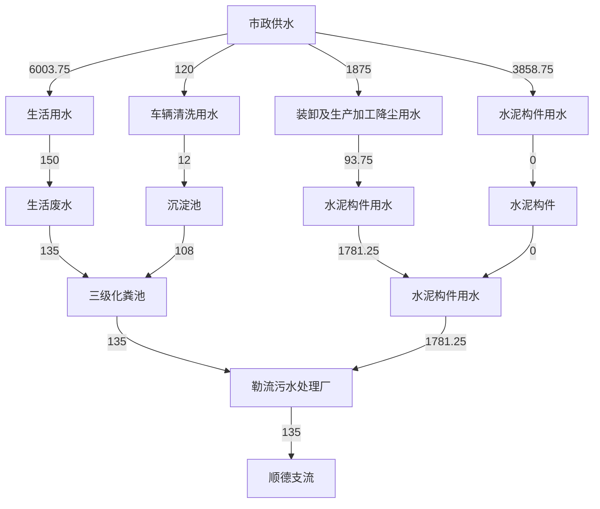

# 建设项目环境影响报告表

（污染影响类）

项目名称：广东美绿环保科技有限公司新建项目

建设单位（盖章）：广东美绿环保科技有限公司

编制日期：2023年 10月

中华人民共和国生态环境部制

编制单位和编制人员情况表

<table><tr><td colspan="2">项目编号</td><td colspan="3">550abd</td></tr><tr><td colspan="2">建设项目名称</td><td colspan="3">广东美绿环保科技有限公司新建项目</td></tr><tr><td colspan="2">建设项目类别</td><td colspan="3">27-055石膏、水泥制品及类似制品制造</td></tr><tr><td colspan="2">环境影响评价文件类型</td><td colspan="3">报告表</td></tr><tr><td colspan="5">一、建设单位情况</td></tr><tr><td colspan="2">单位名称(盖章)</td><td colspan="3">广东美绿环保科技有限公司</td></tr><tr><td colspan="2">统一社会信用代码</td><td rowspan="4" colspan="3"></td></tr><tr><td colspan="2">法定代表人(签章)</td></tr><tr><td colspan="2">主要负责人(签字)</td></tr><tr><td colspan="2">直接负责的主管人员(签字)</td></tr><tr><td colspan="5">二、编制单位情况</td></tr><tr><td colspan="2">单位名称(盖章)</td><td colspan="3">广州顾景环保科技有限公司</td></tr><tr><td colspan="2">统一社会信用代码</td><td colspan="3"></td></tr><tr><td colspan="5">三、编制人员情况</td></tr><tr><td colspan="5">1.编制主持人</td></tr><tr><td>姓名</td><td colspan="2">职业资格证书管理号</td><td>信用编号</td><td>签字</td></tr><tr><td colspan="5"></td></tr><tr><td colspan="5">2.主要编制人员</td></tr><tr><td>姓名</td><td colspan="2">主要编写内容</td><td>信用编号</td><td>签字</td></tr></table>

natural_image

Official emblem of the People's Republic of China featuring a national emblem with stars and architectural elements (no text or symbols visible)

环境影响评价工程师

Professional Qualification Certificate

Environmental Impact Assessment Engincer

# 目 录

一、建设项目基本情况..  
二、建设项目工程分析..  
三、区域环境质量现状、环境保护目标及评价标准.. .21  
四、主要环境影响和保护措施... .32  
五、环境保护措施监督检查清单. .56  
六、结论.... .58

建设项目污染物排放量汇总表

附件1 企业营业执照

附件2 法人代表身份证

附件3 被委托人身份证

附件4 租赁合同

附件5 环评技术服务合同

附件6 公示声明

附图1 项目地理位置图

附图2 项目四至卫星图

附图3 项目四至现场图

附图4 项目平面布置图

附图5 项目厂界50米及500米范围敏感点分布图

附图6 项目所在地大气环境功能区划图

附图7 项目所在地地表水环境功能区划图

附图8 项目所在地声环境功能区划图

附图9 项目所在地控制性规划图

附图10 顺德区环境管控单元图

# 一、建设项目基本情况

<table><tr><td>建设项目名称</td><td colspan="5">广东美绿环保科技有限公司新建项目</td></tr><tr><td>项目代码</td><td colspan="5">无</td></tr><tr><td>建设单位联系人</td><td></td><td>联系方式</td><td colspan="3"></td></tr><tr><td>建设地点</td><td colspan="5">广东省佛山市顺德区勒流街道冲鹤村富安工业区13-1-1号地块厂房3栋B区</td></tr><tr><td>地理坐标</td><td colspan="5">东经:113度11分59.913秒,北纬:22度48分23.018秒</td></tr><tr><td>国民经济行业类别</td><td>C3029其他水泥类似制品制造;N7723固体废物治理</td><td>建设项目行业类别</td><td colspan="3">二十七、非金属矿物制品业30-55、石膏、水泥制品及类似制品制造302-水泥制品制造;四十七、生态保护和环境治理业—103一般工业固体废物(含污水处理污泥)、建筑施工废弃物处置及综合利用中的其他</td></tr><tr><td>建设性质</td><td>☑新建(迁建)□改建□扩建□技术改造</td><td>建设项目申报情形</td><td colspan="3">☑首次申报项目□不予批准后再次申报项目□超五年重新审核项目□重大变动重新报批项目</td></tr><tr><td>项目审批(核准/备案)部门(选填)</td><td>无</td><td>项目审批(核准/备案)文号(选填)</td><td colspan="3">无</td></tr><tr><td>总投资(万元)</td><td>500</td><td>环保投资(万元)</td><td colspan="3">10</td></tr><tr><td>环保投资占比(%)</td><td>2</td><td>施工工期</td><td colspan="3">1个月</td></tr><tr><td>是否开工建设</td><td>☑否□是:____</td><td>用地(用海)面积(m2)</td><td colspan="3">5000</td></tr><tr><td rowspan="4">专项评价设置情况</td><td colspan="5">根据《建设项目环境影响报告表编制技术指南(污染影响类)(试行)》,项目无需设置专项评价,具体分析如下:表1-1 专项评价设置原则表</td></tr><tr><td>专项评价类别</td><td colspan="2">设置原则</td><td>本项目相关情况</td><td>判定结果</td></tr><tr><td>大气</td><td colspan="2">排放废气含有毒有害污染物、二噁英、苯并芘、氰化物、氯气且厂界外500米范围内有环境空气保护目标的建设项目。</td><td>本项目排放不涉及技术指南规定的有毒有害废气污染物。</td><td>不需要设置</td></tr><tr><td>地表水</td><td colspan="2">新增工业废水直排建设项目(槽罐车外送污水处理厂的除外);新增废水</td><td>本项目不涉及工业废水直接排放。</td><td>不需要设置</td></tr><tr><td rowspan="4"></td><td></td><td>直排的污水集中处理厂。</td><td></td><td colspan="2"></td></tr><tr><td>环境风险</td><td>有毒有害和易燃易爆危险物质存储量超过临界量的建设项目。</td><td>经分析,本项目危险物质存储量总计未超过临界量。</td><td colspan="2">不需要设置</td></tr><tr><td>生态</td><td>取水口下游500米范围内有重要水生生物的自然产卵场、索饵场、越冬场和洄游通道的新增河道取水的污染类建设项目。</td><td>本项目不涉及直接从河道取水。</td><td colspan="2">不需要设置</td></tr><tr><td>海洋</td><td>直接向海排放污染物的海洋工程建设项目。</td><td>本项目污水排放不涉及海洋。</td><td colspan="2">不需要设置</td></tr><tr><td>规划情况</td><td colspan="5">规划名称:《顺德西部生态产业新区顺德支流北岸片区(SD-H-04-01、SD-H-04-02)控制性详细规划》审批单位:佛山市人民政府批复文号:佛府办函〔2020〕167号</td></tr><tr><td>规划环境影响评价情况</td><td colspan="5">无</td></tr><tr><td>规划及规划环境影响评价符合性分析</td><td colspan="5">无</td></tr><tr><td>其他符合性分析</td><td colspan="5">1、建设项目与所在地“三线一单”符合性分析本项目位于广东省佛山市顺德区勒流街道冲鹤村富安工业区13-1-1号地块厂房3栋B区。根据《广东省人民政府关于印发广东省“三线一单”生态环境分区管控方案的通知》(粤府〔2020〕71号)发布的广东省环境管控单元图,项目所在地属于重点管控单元。根据《佛山市人民政府关于印发佛山市“三线一单”生态环境分区管控方案的通知》(佛府〔2021〕11号)发布的佛山市环境管控单元图和《佛山市顺德区人民政府关于印发佛山市顺德区“三线一单”生态环境分区管控方案的通知》(顺府发〔2021〕11号)发布的顺德区环境管控单元图,项目所在地属于广东省佛山市顺德区重点管控单元9,环境管控单元编码为ZH44060620009,名称为勒流街道重点管控区,要素细类为水环境工业-城镇生活重点管控区、大气环境布局敏感重点管控区、江河湖库岸线重点管控区。项目与顺德区重点管控单元9准入清单的相符性分析如下表所示。</td></tr></table>

表1-2 项目与顺德区“三线一单”生态环境分区管控符合性分析表

<table><tr><td colspan="2">管控要求</td><td>本项目</td><td>符合性</td></tr><tr><td rowspan="5">区域布局管控</td><td>1-1.【产业/鼓励引导类】重点发展智能家电、家具五金、环保装备、光电照明、装备制造及交通机械产业,引入智能制造服务、电子商务、现代商贸流通产业,重点建设环保产业基地、小家电产业基地和五金产业创业基地。</td><td>本项目从事建筑垃圾的处置和综合利用,不属于产业/鼓励引导类。根据国家发展改革委商务部关于印发《市场准入负面清单(2022年版)》的通知(发改体改规〔2022〕397号),本项目不属于市场准入负面清单项目。</td><td>符合</td></tr><tr><td>1-2.【产业/综合类】系统推进村级工业园升级改造,腾出连片空间,布局产业集聚区和主题产业园,推动工业项目入园集聚发展。新增工业制造业用地原则上安排在产业集聚区内,产业集聚区外原则上不鼓励工业及物流仓储用地的新建与改造。</td><td>本项目租用已建工业厂房,项目所在地符合规划要求,不属于新建工业及物流仓储用地。</td><td>符合</td></tr><tr><td>1-3.【产业/综合类】产业聚集区所属地块内的工业用地或企业与村庄、学校等环境敏感点之间应设置合理的大气环境防护距离,并通过绿化带进行有效隔离;聚集区规划布局应注重大气污染排放企业应尽量避免布局在居住用地的常年主导风向的上风向。</td><td>本项目与敏感点之间有道路、绿化带隔离,项目产生的废气通过车间通风换气可无组织达标排放,对周围环境影响较小。</td><td>符合</td></tr><tr><td>1-4.【产业/限制类】受纳水体或监控断面不达标的,不得新建、扩建向河涌直接排放废水的项目。新建、扩建含蚀刻工序的线路板生产项目和化工项目应在配套污水集中处置的工业园区或生活污水管网覆盖区域内建设;纯加工型印花项目,含酸洗、磷化的金属表面处理、金属制品项目(与自身高新技术企业配套的除外),含酸洗、喷涂、化学抛光、电解等涉及废水排放工艺的不锈钢型材加工项目(与自身高新技术企业配套的除外),应进入以此类项目为主导产业、有相应废水集中治理设施的工业园区,实现集中治污。</td><td>项目生活污水属于间接排放,生活污水经三级化粪处理达标后排至勒流污水处理厂处理,尾水排入顺德支流。参考《佛山市生态环境局顺德分局关于发布2022年度佛山市顺德区生态环境状况公报的通知》(佛环顺函〔2023〕26号),顺德支流新涌断面及飞鹅山断面监测的水质达到了III类标准要求,项目不属于含蚀刻工序的线路板生产项目和化工项目;不属于含酸洗、磷化的金属表面处理、金属制品项目;不属于含酸洗、喷涂、化学抛光、电解等涉及废水排放工艺的不锈钢型材加工项目。</td><td>符合</td></tr><tr><td>1-5.【产业/综合类】划定家具生产优先发展区域,优先发展区外不再新建</td><td>本项目不属于木质家具制造项目。</td><td>符合</td></tr></table>

<table><tr><td rowspan="11"></td><td rowspan="4"></td><td>涉及涂装工艺的木质家具制造项目。</td><td></td><td></td></tr><tr><td>1-6.【水/限制类】严格限制在羊额—北滘水厂饮用水水源保护区上游和周边区域建设列入“高污染、高环境风险”产品名录等可能影响水环境安全的项目。</td><td>本项目不属于“高污染、高环境风险”产品名录,项目位置不在羊额—北滘水厂饮用水水源保护区上游和周边区域。</td><td>符合</td></tr><tr><td>1-7.【大气/限制类】大气环境布局敏感区重点管控区内,应严格限制新建生产和使用高挥发性有机物原辅材料项目,优先开展低VOCs含量原辅材料替代,强化无组织排放控制。原则上不再新建、扩建新增氮氧化物、烟(粉)尘排放量较大的建设项目。</td><td>本项目不属于新建生产和使用高挥发性有机物原辅材料项目,不属于新建、扩建新增氮氧化物、烟(粉)尘排放量较大的建设项目。</td><td>符合</td></tr><tr><td>1-8.【土壤/禁止类】禁止新建、扩建增加重点防控的重金属污染物排放的建设项目。</td><td>本项目不属于重金属污染排放项目。</td><td>符合</td></tr><tr><td rowspan="6">能源资源利用</td><td>2-1.【能源/鼓励引导类】推广节能技术,加快发展绿色货运与现代物流。</td><td>本项目不属于货运和现代物流行业。</td><td>符合</td></tr><tr><td>2-2.【能源/鼓励引导类】推广新能源汽车应用和充电基础设施建设,积极推动重卡LNG加气站、充电基础设施、加氢站建设。</td><td>本项目不涉及能源汽车应用和充电基础设施建设,生产过程中所用的资源主要为水资源、电能,不包括LNG和氢能,电能由市政供电。</td><td>符合</td></tr><tr><td>2-3.【能源/综合类】科学实施能源消费总量和强度“双控”,新建高能耗项目单位产品(产值)能耗达到国际国内先进水平。</td><td>本项目不属于高耗能项目。</td><td>符合</td></tr><tr><td>2-4.【水资源/综合类】贯彻落实“节水优先”方针,实行最严格水资源管理制度,勒流街道万元国内生产总值用水量、万元工业增加值用水量、用水总量、农田灌溉水有效利用系数等用水总量和效率指标达到区下达要求。</td><td>要求项目节约用水。</td><td>符合</td></tr><tr><td>2-5.【土地资源/限制类】落实单位土地面积投资强度、土地利用强度等建设用地控制性指标要求,提高土地利用效率。</td><td>项目使用已建成工业厂房,不涉及土地开发建设。</td><td>符合</td></tr><tr><td>2-6.【岸线/禁止类】严格水域岸线用途管制,新建项目一律不得违规占用水域。严禁破坏生态的岸线利用行为和不符合其功能定位的开发建设活动,严禁以各种名义侵占河道、围垦湖泊、非法采砂等。</td><td>项目使用已建成工业厂房,不占用水域、无破坏生态岸线利用行为和不符合其功能定位的开发建设活动。</td><td>符合</td></tr><tr><td>污染物排放管控</td><td>3-1.【水/限制类】城镇新区建设实行雨污分流,逐步推进初期雨水收集、处理和资源化利用。住宅、商业体、学校、市场等城镇开发建设项目应当配套或者同步计划建设公共排水设施,公共排水设施或自建排污水设施未能投产运行的,以上涉水项目不得投入使用。新建小区严格实施雨污分流,阳台、露台等污水接入污水收集系统,将生活污水“应截尽截”。做好大型楼盘、集贸市场、餐饮以及学校等4大类排水户污水接入市政管网工作。</td><td>本项目不属于住宅、商业体、学校、市场等城镇开发建设项目。</td><td>符合</td></tr><tr><td rowspan="7"></td><td rowspan="5"></td><td>3-2.【水/综合类】结合村级工业园改造,全面提升产业层次与集聚度,促进污染集中整治。</td><td>本项目不属于村级工业园改造区。</td><td>符合</td></tr><tr><td>3-3.【水/综合类】稳步推进排水设施“三个一体化”管理模式,补齐城乡污水收集和处理短板,推动勒流污水处理厂提质增效,加快消除城中村、老旧城区、城乡结合部等污水收集管网空白区,逐步实现城乡污水收集处理全覆盖。2025年前完成勒流污水处理厂扩建,尾水应执行《城镇污水处理厂污染物排放标准》(GB18918-2002)一级A标准及《广东省水污染物排放限值》(DB44/26-2001)的较严值。</td><td>本项目不属于污水管网、污水处理设施等建设项目。</td><td>符合</td></tr><tr><td>3-4.【水/综合类】保留勒流社区百丈片区分散式农村污水处理设施,其余行政村(社区)通过市政污水管网,配合农村支管网建设,有条件的区域实施雨污分流改造,到2030年实现农村生活污水100%收集进入勒流污水处理系统。</td><td>本项目不属于污水管网、污水处理设施等建设项目。</td><td>符合</td></tr><tr><td>3-5.【水/综合类】产业集聚区和主题园区内做好污水管网和污水集中处理设施的配套保障,确保废水收集到城镇污水处理厂、园区污水处理厂或分散式污水处理设施集中处置。</td><td>本项目不属于产业集聚区和主题园区建设项目。</td><td>符合</td></tr><tr><td>3-6.【土壤/限制类】作为重金属污染重点防控区,区域内重点重金属排放总量只减不增。</td><td>本项目不属于重金属污染排放项目。</td><td>符合</td></tr><tr><td rowspan="2">环境风险防控</td><td>4-1.【水/综合类】加强单元内羊额—北滘水厂饮用水水源保护区周边环境风险源管控,完善突发环境事件应急管理体系。</td><td>本项目不属于水源保护区范围。</td><td>符合</td></tr><tr><td>4-2.【水/综合类】勒流污水处理厂、工业污水集中处理设施应采临取有效措施,防止事故废水直接排入水体。完善污水处理厂在线监控系统联网,</td><td>本项目不设工业污水处理设施,不会产生事故废水。</td><td>符合</td></tr></table>

<table><tr><td rowspan="2"></td><td>实现污水处理厂的实时、动态监管。</td><td></td><td></td></tr><tr><td>4-3.【风险/综合类】加强环境风险分级分类管理,强化金属制品、有色金属和压延加工、化学原料和化学品制造业等涉重金属、化工行业企业及工业园区等重点环境风险源的环境风险防控。</td><td>本项目不属于金属制品、有色金属和压延加工、化学原料和化学品制造业等涉重金属、化工行业企业及工业园区等重点环境风险源。</td><td>符合</td></tr></table>

# 2、项目与固体废物污染防治的相符性分析

本项目与固体废物污染防治相符性分析见下表。

表 1-3 本项目与固体废物污染防治相符性分析

<table><tr><td>序号</td><td>政策要求</td><td>工程内容</td><td>符合性</td></tr><tr><td colspan="4">1、《中华人民共和国固体废物污染环境防治法》(2020年修订)</td></tr><tr><td>1.1</td><td>第十七条 建设产生、贮存、利用、处置固体废物的项目,应当依法进行环境影响评价,并遵守国家有关建设项目环境保护管理的规定。</td><td>本项目环境影响评价正在报批中</td><td>符合</td></tr><tr><td>1.2</td><td>第十八条 建设项目的环境影响评价文件确定需要配套建设的固体废物污染环境防治设施,应当与主体工程同时设计、同时施工、同时投入使用。</td><td>本项目严格执行三同时制度。</td><td>符合</td></tr><tr><td>1.3</td><td>第十九条 收集、贮存、运输、利用、处置固体废物的单位和其他生产经营者,应当加强对相关设施、设备和场所的管理和维护,保证其正常运行和使用。</td><td>企业加强管理和维护贮存场所,保证场所正常运行和使用。</td><td>符合</td></tr><tr><td>1.4</td><td>第二十条 产生、收集、贮存、运输、利用、处置固体废物的单位和其他生产经营者,应当采取防扬散、防流失、防渗漏或者其他防止污染环境的措施,不得擅自倾倒、堆放、丢弃、遗撒固体废物。</td><td>项目厂房车间地面硬化处理;仓库满足防渗漏、防雨淋等要求,且项目收纳的建筑垃圾在室内存放,雨水径流不流入贮存场内,车间门口存在漫坡,不存在地面漫流、垂直下渗和受到雨水冲刷等情况;不擅自倾倒、堆放、丢弃、遗撒固体废物。</td><td>符合</td></tr><tr><td>1.5</td><td>第二十一条 在生态保护红线区域、永久基本农田集中区域和其他需要特别保护的区域内,禁止建设工业固体废物、危险废物集中贮存、利用、处置的设施、场所和生活垃圾填埋场。</td><td>项目不在生态保护红线区域、久基本农田集中区域和其他需要特别保护的区域内。</td><td>符合</td></tr><tr><td>1.6</td><td>第三十六条 产生工业固体废物的单位应当建立健全工业固体废物产生、收集、贮存、运输、利用、处</td><td>本项目运营期建立完善的环境管理制度和污染物管理台账。</td><td>符合</td></tr></table>

<table><tr><td rowspan="7"></td><td></td><td>置全过程的污染环境防治责任制度,建立工业固体废物管理台账。</td><td></td><td></td></tr><tr><td>1.7</td><td>第三十七条 产生工业固体废物的单位委托他人运输、利用、处置工业固体废物的,应当对受托方的主体资格和技术能力进行核实,依法签订书面合同,在合同中约定污染防治要求。</td><td>项目产生的固体废物验收阶段将交由专业公司回收利用,并签订回收协议。</td><td>符合</td></tr><tr><td>1.8</td><td>第三十八条 产生工业固体废物的单位应当依法实施清洁生产审核,合理选择和利用原材料、能源和其他资源,采用先进的生产工艺和设备,减少工业固体废物的产生量,降低工业固体废物的危害性。</td><td>项目利用固体废物生产RDF燃料、水泥构件。</td><td>符合</td></tr><tr><td colspan="4">2、《广东省固体废物污染环境防治条例》(2018年修订)</td></tr><tr><td>2.1</td><td>第二十一条 建设工业固体废物集中贮存、处置以及生活垃圾卫生填埋、焚烧等设施、场所,应当遵守国家和省相关环境保护标准,其选址不得位于自然保护区、风景名胜区、饮用水水源保护区、基本农田保护区和其他需要特别保护的区域,与学校、医院、集中居住区等环境敏感目标应当保持防护距离。</td><td>项目选址不位于自然保护区、风景名胜区、饮用水水源保护区、基本农田保护区和其他需要特别保护的区域,与附近敏感点最近距离为302m。</td><td>符合</td></tr><tr><td colspan="4">3、《一般工业固体废物贮存和填埋污染控制标准》(GB18599-2020)</td></tr><tr><td>3.1</td><td>场址选择的环境保护要求:第4.1条:一般工业固体废物贮存场、填埋场的选址应符合环境保护法律法规及相关法定规划要求。第4.2条:贮存场、填埋场的位置与周围居民区的距离应依据环境影响评价文件及审批意见确定。第4.3条:贮存场、填埋场不得选在生态保护红线区域、永久基本农田集中区域和其他需要特别保护的区域内。第4.4条:贮存场、填埋场应避开活动断层、溶洞区、天然滑坡或泥石流影响区以及湿地等区域。第4.5条:贮存场、填埋场不得选在江河、湖泊、运河、渠道、水库最高水位线以下的滩地和岸坡,以及国家和地方长远规划中的水库等人工蓄水设施的淹没区和保护区之内。</td><td>第4.1条:本项目所选场址符合环境保护法律法规及相关法定规划要求。第4.2条:项目贮存的一般工业固体废物无渗滤液产生,不涉及危险废物、医疗废物、生活垃圾等有毒、有害物质收集。项目产生的颗粒物和恶臭通过车间通排风系统可达标排放,对周围环境、居住人群的健康影响较小,且与附近敏感点最近距离为302m。第4.3条:项目不在生态保护红线区域、永久基本农田集中区域和其他需要特别保护的区域内。第4.4条:项目不在断层、溶洞区、天然滑坡或泥石流影响区以及湿地等区域。第4.5条:项目不在江河、湖泊、运河、渠道、水库最高水位线以下的滩地和岸坡,以及国家和地方长远规划中的水库等人工蓄水设施的淹没区和保护区之内。</td><td>符合</td></tr><tr><td rowspan="3"></td><td>3.2</td><td>贮存场和填埋场技术要求:第5.1.3条:贮存场和填埋场一般应包括以下单元:a)防渗系统、渗滤液收集和导排系统;b)雨污分流系统;c)分析化验与环境监测系统;d)公用工程和配套设施;e)地下水导排系统和废水处理系统(根据具体情况选择设置)。第5.1.6条:贮存场及填埋场渗滤液收集池的防渗要求应不低于对应贮存场、填埋场的防渗要求。第5.1.7条:贮存场除应符合本标准规定污染控制技术要求之外,其设计、施工、运行、封场等还应符合相关行政法规规定、国家及行业标准要求。</td><td>第5.1.3条:本项目无渗滤液产生,项目收纳的建筑垃圾不存在流失情况,对地下水没有影响;且项目收纳的建筑垃圾在室内存放,雨水径流不流入贮存场内,无需建设文件第5.1.3条所列单元。第5.1.6条:本项目无渗滤液产生,不需建设渗滤液收集池。5.1.7条:本项目符合本标准规定污染控制技术要求之外,其设计、施工、运行、封场等还应符合相关行政法规规定、国家及行业标准要求。</td><td>符合</td></tr><tr><td>3.3</td><td>入场要求:第6.4条:不相容的一般工业固体废物应设置不同的分区进行贮存和填埋作业。第6.5条:危险废物和生活垃圾不得进入一般工业固体废物贮存场及填埋场。</td><td>第6.4条:项目主要从事建筑垃圾的再生利用生产,一般工业固体废物在厂区内分区贮存。第6.5条:项目仅收纳建筑垃圾,不包括危险废物和生活垃圾。</td><td>符合</td></tr><tr><td>3.4</td><td>贮存场和填埋场运行要求:第7.1条:贮存场、填埋场投入运行之前,企业应制定突发环境事件应急预案或在突发事件应急预案中制定环境应急预案专章,说明各种可能发生的突发环境事件情景及应急处置措施。第7.2条:贮存场、填埋场应制定运行计划,运行管理人员应定期参加企业的岗位培训。第7.5条:易产生扬尘的贮存或填埋场应采取分区作业、覆盖、洒水等有效抑尘措施防止扬尘污染。尾矿库应采取均匀放矿、洒水抑尘等措施防止干滩扬尘污染。</td><td>第7.1条:项目最大可信事故为:厂内运营过程产生的危险废物泄漏,项目投入运行之前,企业应制定危险废物环境应急预案。第7.2条:项目建成后,企业制定运行计划,运行管理人员定期参加企业的岗位培训。第7.5条:项目设置密闭堆场及车间、采取喷雾降尘等措施。项目产生的颗粒物和恶臭通过车间通排风系统可达标排放,对周围环境、居住人群的健康影响较小。</td><td>符合</td></tr><tr><td colspan="5">3、项目与产业政策相符性分析本项目属于《国民经济行业分类》(GB/T4754-2017)及第1号修改单中的N7723固体废物治理及C3029其他水泥类似制品制造,根据</td></tr></table>

<table><tr><td></td><td>2020年1月1日起施行的发展改革委修订发布《产业结构调整指导目录(2019年本)》,本项目不属于上述目录所列的限制类和禁止(淘汰)类项目;根据国家发展改革委商务部关于印发《市场准入负面清单(2022年版)》的通知(发改体改规〔2022〕397号),不属于市场准入负面清单禁止准入类项目;根据广东省发展改革委关于印发《广东省“两高”项目管理目录(2022年版)》的通知(粤发改能源函〔2022〕1363号),项目不属于“高污染、高环境风险”产品名录。4、选址合理性分析本项目位于广东省佛山市顺德区勒流街道冲鹤村富安工业区13-1-1号地块厂房3栋B区,根据《顺德西部生态产业新区顺德支流北岸片区(SD-H-04-01、SD-H-04-02)控制性详细规划》修编批后公布,项目所在地为工业用地。因此,项目选址符合功能规划要求。</td></tr></table>

# 二、建设项目工程分析

# 1、项目组成

广东美绿环保科技有限公司新建项目位于广东省佛山市顺德区勒流街道冲鹤村富安工业区13-1-1 号地块厂房 3栋 B 区。项目主要从事建筑垃圾的再生利用生产，预计年处理建筑垃圾45万吨，经加工处理后可得 RDF燃料棒 5万吨、年筛分、分拣废砖块20万吨、废塑料 4.5 万吨、废木块 2.5万吨、废金属 3万吨、其他废杂质材料 2.5 万吨，经筛分出来的合格砂石物料通过与水泥、水搅拌混合后可制得水泥构件7.5万吨。

根据《中华人民共和国环境影响评价法》（2018年12月29日修订）、《国务院关于修改〈建设项目环境保护管理条例〉的决定》（国务院令第682号）等法律法规的规定，建设对环境有影响的项目必须进行环境影响评价。参照《建设项目环境影响评价分类管理名录》（2021年版）（生态环境部令第16号），本项目属于“四十七、生态保护和环境治理业—103一般工业固体废物（含污水处理污泥）、建筑施工废弃物处置及综合利用中的其他”以及“二十七、非金属矿物制品业30—55石膏、水泥制品及类似制品制造302中的水泥制品制造”，需编制建设项目环境影响报告表。受建设单位委托，广州颐景环保科技有限公司承担了该项目的环境影响评价工作，在组织相关技术人员现场踏勘、调查收集和研究与项目有关的技术资料的基础上，根据《建设项目环境影响报告表编制技术指南（污染影响类）（试行）》，编制了《广东美绿环保科技有限公司新建项目环境影响报告表》。

项目经营场所为已建标准单层厂房，厂房高度约10米，项目建筑面积为5000m2，主体工程包括生产车间，并在车间内配有原料区、成品区以及办公室等辅助工程，并建设生活污水预处理设施、喷雾洒水降尘设施、危险废物暂存间等环保工程，项目内部不设置员工饭堂和宿舍，具体工程组成见下表。

表 2-1 项目工程组成

<table><tr><td>类别</td><td>工程名称</td><td>工程内容</td><td colspan="2">备注</td></tr><tr><td rowspan="2">主体工程</td><td>主体生产车间</td><td>面积:3500m2,1层,层高10m,主要功能包括RDF成型区、撕碎区、打包区、人工分拣区、搅拌区、浇注区、筛分区、打砂区</td><td colspan="2" rowspan="4">整个厂区均为租赁,依托已建成的建筑</td></tr><tr><td>洗车区</td><td colspan="2">面积:20m2,厂区内露天洗车区</td></tr><tr><td>辅助工程</td><td>办公室</td><td colspan="2">面积:30m2,1层,层高10m,用于员工办公</td></tr><tr><td>储运工程</td><td>成品、原料仓</td><td colspan="2">面积:1000m2,1层,层高10m,用于存放成</td></tr><tr><td rowspan="3"></td><td colspan="2"></td><td>品、原材料</td><td rowspan="3"></td></tr><tr><td colspan="2">危废仓</td><td>占地面积约为 $5m^{2}$ ,暂存危险废物</td></tr><tr><td colspan="2">厂区内运输通道</td><td>物料采用货车、叉车运输,厂区内运输通道面积约为 $445m^{2}$ </td></tr><tr><td rowspan="2">公用工程</td><td colspan="2">给排水</td><td>依托所在厂房已有设施:供水系统一套、雨水排水系统一套、生活污水排水系统一套</td><td>市政供水;采用雨污分流,雨水进入市政雨水管网;生活污水经三级化粪池处理设施处理后排入勒流污水处理厂</td></tr><tr><td colspan="2">供能</td><td>依托所在厂房已有设施:配电系统一套</td><td>供应生产及办公用电</td></tr><tr><td rowspan="7">环保工程</td><td colspan="2">废气</td><td>设置密闭堆场及车间、采取喷雾洒水降尘等措施</td><td>/</td></tr><tr><td colspan="2" rowspan="2">废水</td><td>生活污水经三级化粪池处理达标后排入勒流污水处理厂</td><td>/</td></tr><tr><td>车辆清洗废水经洗车区四周的导流渠排入沉淀池沉淀处理后循环使用不外排</td><td>/</td></tr><tr><td colspan="2">噪声</td><td>采用低噪声设备、做好设备隔音、减振处理、合理布局车间</td><td>/</td></tr><tr><td rowspan="3">固体废物</td><td>危险废物</td><td>设置危废储存场所,面积约为 $5m^{2}$ ,危险废物分类收集后储存在危险废物暂存区,交由有危废资质的单位回收处置</td><td>/</td></tr><tr><td>一般固体废物</td><td>设置一般固废暂存间,面积约为 $5m^{2}$ ,分类收集储存在一般工业固体废物暂存间内、妥善处置</td><td>/</td></tr><tr><td>生活垃圾</td><td>设置生活垃圾桶,生活垃圾分类收集后交由环卫部门回收处置</td><td>/</td></tr></table>

# 2、生产规模

项目主要从事建筑垃圾的回收处理，预计年处理建筑垃圾45万吨。项目通过回收建筑垃圾，在处理过程中，经筛分等可分拣出废砖块、废塑料、废木块、废金属和其他废杂质材料（废纺织材料、纸皮等），其中废砖块可外售给砖厂使用，废金属可交由废旧资源回收单位回收利用，部分废塑料、废木块和其他废杂质材料可直接交由废旧资源回收单位回收利用，其余部分的废塑料、废木块、和其他废杂质材料等可燃物质经撕碎、RDF 成型工序可制得RDF 燃料棒，主要外售给发电厂作为燃料使用。项目经筛分出来合格的砂石物料通过与水泥、水搅拌混合后可制得水泥构件，主要外售给相关建筑材料公司使用。项目建筑垃圾主要处理规模及处理后可得的产物见下表。

表 2-2 项目主要生产规模及建筑垃圾处理后可得的产物一览表

<table><tr><td>类别</td><td>名称</td><td>单位</td><td>数量</td><td>最大贮存量</td><td>贮存位置</td><td>备注</td></tr><tr><td>处理规模</td><td>建筑垃圾</td><td>万吨/年</td><td>45</td><td>0.03</td><td>原料仓</td><td>不涉及危险废物、医疗废物等有毒、有害物质</td></tr><tr><td rowspan="7">处理后可得的产物</td><td>水泥构件</td><td>万吨/年</td><td>7.5</td><td>0.026</td><td>成品仓</td><td>水泥构件是钢筋混凝土预制结构件的简称,钢筋混凝土预制结构件一般用于市政公路施工、给排水施工、或民工建建筑施工,主要外售给相关建筑材料公司使用</td></tr><tr><td>RDF燃料棒</td><td>万吨/年</td><td>5</td><td>0.017</td><td>成品仓</td><td>RDF燃料棒是指固体废弃物经过分选,将固体废弃物的可燃部分与不可燃部分分离后得到的可燃部分物质,一般为废塑料、废木块、废纺织材料、纸皮等,RDF燃料棒具有热值高,燃料稳定,易存储,运输方便等特征,广泛应用于干燥工程,供热工程,发电等行业,主要外售给发电厂作为燃料使用</td></tr><tr><td>废砖块</td><td>万吨/年</td><td>20</td><td>0.073</td><td>成品仓</td><td>主要外售给砖厂使用</td></tr><tr><td>废塑料</td><td>万吨/年</td><td>4.5</td><td>0.017</td><td>成品仓</td><td>可交由废旧资源回收单位回收利用</td></tr><tr><td>废木块</td><td>万吨/年</td><td>2.5</td><td>0.009</td><td>成品仓</td><td>可交由废旧资源回收单位回收利用</td></tr><tr><td>废金属</td><td>万吨/年</td><td>3</td><td>0.012</td><td>成品仓</td><td>可交由废旧资源回收单位回收利用</td></tr><tr><td>其他废杂质材料</td><td>万吨/年</td><td>2.483</td><td>0.009</td><td>成品仓</td><td>由建筑垃圾经筛分、分拣出来的其它废杂质材料,主要为废纺织材料、纸皮等,可交由废旧资源回收单位回收利用</td></tr></table>

项目仓库内设置分区贮存，不同种类的一般工业固废进行分区集中堆放，车间需做好地面硬化，仓库满足防渗漏、防雨淋等要求，且项目收集的建筑垃圾在室内存放，雨水径流不流入贮存场内，车间门口存在漫坡，不存在地面漫流、垂直下渗和受到雨水冲刷等情况。项目固体废物性状、储存方式等情况如下表所示。

表2-3 项目固体废物性状、储存方式等情况表

<table><tr><td>序号</td><td>固体废物名称</td><td>性状</td><td>打包/储存方式</td></tr><tr><td>1</td><td>水泥构件</td><td>干固体,性状不定</td><td>袋装暂存于成品区</td></tr><tr><td>2</td><td>RDF 燃料棒</td><td>干固体,粒状</td><td>袋装暂存于成品区</td></tr><tr><td>3</td><td>废砖块</td><td>干固体,块状</td><td>分拣后打包暂存于成品区</td></tr><tr><td>4</td><td>废塑料</td><td>干固体,粒、块或条状</td><td>分拣后经压缩打包后暂存于成品区</td></tr><tr><td>5</td><td>废木块</td><td>干固体,条,片或块状</td><td>分拣后经压缩打包后暂存于成品区</td></tr></table>

根据建设单位提供的资料，项目主要生产设备详见下表。

表 2-4 项目主要生产设备一览表

<table><tr><td>序号</td><td>设备</td><td>规格/型号</td><td>数量</td><td>单位</td><td>使用工序</td><td>位置</td></tr><tr><td>1</td><td>3D 跳动筛分机</td><td>功率 35KW</td><td>2</td><td>台</td><td>跳动筛分</td><td>筛分区</td></tr><tr><td>2</td><td>圆筒筛沙机</td><td>功率 37KW</td><td>2</td><td>台</td><td>圆筒筛分</td><td>筛分区</td></tr><tr><td>3</td><td>脱砂机</td><td>功率 45KW</td><td>2</td><td>台</td><td>打砂</td><td>打砂区</td></tr><tr><td>4</td><td>打包机</td><td>功率 30KW</td><td>1</td><td>台</td><td>打包</td><td>打包区</td></tr><tr><td>5</td><td>搅拌机</td><td>搅拌容量  $2m^{3}$ </td><td>2</td><td>台</td><td>水泥、砂石搅拌</td><td>搅拌区</td></tr><tr><td>6</td><td>模具</td><td>/</td><td>100</td><td>套</td><td>浇注</td><td>浇注区</td></tr><tr><td>7</td><td>撕碎机</td><td>双轴 1700</td><td>2</td><td>台</td><td>撕碎</td><td>撕碎区</td></tr><tr><td>8</td><td>RDF 成型机</td><td>176 孔型,处理能力 30t/h</td><td>4</td><td>台</td><td>RDF 成型</td><td>RDF 成型区</td></tr><tr><td>9</td><td>钩机</td><td>/</td><td>2</td><td>台</td><td>挖掘</td><td>车间运输通道</td></tr><tr><td>10</td><td>叉车</td><td>/</td><td>2</td><td>台</td><td rowspan="2">物料运输,以电能作为能源</td><td>车间运输通道</td></tr><tr><td>11</td><td>铲车</td><td>/</td><td>1</td><td>台</td><td>车间运输通道</td></tr><tr><td>12</td><td>空压机</td><td>/</td><td>1</td><td>台</td><td>辅助设备</td><td>生产车间</td></tr></table>

# 4、主要原辅材料

项目原料主要来源于本地及附近地市的建筑垃圾，建设单位要求供货方保证原材料的质量，不得涉及有危险废物、医疗废物等有毒、有害物质入场，严格控制原料来源。根据建设单位提供的资料，项目主要原辅材料及用量见下表。

表 2-5 项目主要原辅材料用量一览表

<table><tr><td>序号</td><td>名称</td><td>单位</td><td>年用量</td><td>日常最大储存量</td><td>贮存位置</td><td>性状</td><td>包装规格</td></tr><tr><td>1</td><td>建筑垃圾</td><td>万吨/年</td><td>45</td><td>0.75</td><td>原料仓</td><td>固态</td><td>室内堆放</td></tr><tr><td>2</td><td>水泥</td><td>万吨/年</td><td>1.5</td><td>0.005</td><td>原料仓</td><td>粉状</td><td>25kg/袋</td></tr><tr><td>3</td><td>机油</td><td>吨/年</td><td>0.1</td><td>0.02</td><td>原料仓</td><td>液态</td><td>10kg/桶</td></tr><tr><td>4</td><td>车辆清洗用水</td><td>吨/年</td><td>120</td><td>/</td><td>市政供水</td><td>/</td><td>/</td></tr><tr><td>5</td><td>装卸及生产加工降尘用水</td><td>吨/年</td><td>1875</td><td>/</td><td>市政供水</td><td>/</td><td>/</td></tr><tr><td>6</td><td>水泥构件用水量</td><td>吨/年</td><td>3858.75</td><td>/</td><td>市政供水</td><td>/</td><td>/</td></tr></table>

项目主要原辅材料性质见下表。

表 2-6 项目主要原辅材料性质一览表

<table><tr><td>序号</td><td>名称</td><td>原料性质</td></tr><tr><td>1</td><td>建筑垃圾</td><td>本项目回收加工利用的建筑垃圾不包括废沥青及含有毒有害组分的危险废物,全部为一般工业固体废物。进厂建筑垃圾以废塑料、废砖瓦为主,进厂物料粒径小于1m。</td></tr><tr><td>2</td><td>水泥</td><td>粉状水硬性无机胶凝材料,加水搅拌后成浆体,能在空气中硬化或者在水中硬化,并能把砂、石等材料牢固地胶结在一起。</td></tr><tr><td>3</td><td>机油</td><td>外观为油状液体,淡黄色至褐色,无气味或略带异味,用于机械的摩擦部分,起润滑、冷却和密封作用,机油为可燃液体,遇明火、高热可燃。</td></tr></table>

# 5、物料平衡

项目主要回收处理建筑垃圾，其物料平衡见下表。

表 2-7 项目物料平衡表

<table><tr><td>序号</td><td colspan="2">投入(吨/年)</td><td colspan="2">产出(吨/年)</td></tr><tr><td>1</td><td>建筑垃圾</td><td>450000</td><td>水泥构件</td><td>75000</td></tr><tr><td>2</td><td>装卸及生产加工降尘用水量</td><td>1875</td><td>RDF 燃料棒</td><td>50000</td></tr><tr><td>3</td><td>水泥构件用水量</td><td>3858.75</td><td>废砖块</td><td>200000</td></tr><tr><td>4</td><td>/</td><td>/</td><td>废塑料</td><td>45000</td></tr><tr><td>5</td><td>/</td><td>/</td><td>废木块</td><td>25000</td></tr><tr><td>6</td><td>/</td><td>/</td><td>废金属</td><td>30000</td></tr><tr><td>7</td><td>/</td><td>/</td><td>其他废杂质材料</td><td>24829.78</td></tr><tr><td>8</td><td>/</td><td>/</td><td>装卸、投料粉尘</td><td>14.25</td></tr><tr><td>9</td><td>/</td><td>/</td><td>筛分、打砂粉尘</td><td>113.4</td></tr><tr><td>10</td><td>/</td><td>/</td><td>搅拌粉尘</td><td>39.225</td></tr><tr><td>11</td><td>/</td><td>/</td><td>撕碎粉尘</td><td>3.345</td></tr><tr><td>12</td><td>/</td><td>/</td><td>装卸及生产加工损耗水量</td><td>93.75</td></tr><tr><td>13</td><td>/</td><td>/</td><td>水泥构件挥发水量</td><td>5640</td></tr><tr><td>/</td><td>合计</td><td>455733.75</td><td>合计</td><td>455733.75</td></tr></table>

# 6、关键设备产能匹配性分析

# （1）建筑垃圾

项目建筑垃圾处理与关键设备匹配情况见下表。

表 2-8 项目建筑垃圾处理与关键设备匹配性分析表

<table><tr><td>处理类别</td><td>设备名称</td><td>数量</td><td>每台处理能力(t/h)</td><td>工作时间(h)</td><td>设计处理规模(万吨)</td></tr><tr><td>建筑垃圾</td><td>3D 跳动筛分机</td><td>2</td><td>300</td><td>800</td><td>48</td></tr><tr><td colspan="6">备注:项目 3D 跳动筛分机的设计处理能力按满负荷运行时核算。</td></tr></table>

根据上表可知，项目 3D 跳动筛分机设计处理能力为 48 万吨/年，实际处理能力为45万吨/年，项目设备设计处理能力可满足企业实际生产需求。

# （2）水泥构件

项目成品水泥构件与关键设备产能匹配情况见下表。

表 2-9 项目成品水泥构件与关键设备产能匹配性分析表

<table><tr><td>产品</td><td>设备名称</td><td>数量</td><td>搅拌容量( $m^3$ )</td><td>每台每批次出料重量(kg)</td><td>每批次搅拌时间(min)</td><td>工作时间(h)</td><td>设计产能(万吨)</td><td>实际产能(万吨)</td></tr><tr><td>水泥构件</td><td>搅拌机</td><td>2</td><td>2</td><td>2800</td><td>10</td><td>2400</td><td>8.064</td><td>7.5</td></tr><tr><td colspan="9">备注:1项目搅拌机的设计产能按满负荷运行时核算;2根据建设单位提供,搅拌机出料量约 $1400kg/m^3$ 。3因为水泥构件成型过程中的水分通过自然风干挥发到空气中,故最终实际产能为设计产能-用水量。</td></tr></table>

根据上表可知，项目搅拌机设计出料产能为8.064万吨/年，由于水泥构件中的水通过自然风干挥发到空气中，故最终水泥构件产能重量为 7.5万吨/年。

# （3）RDF 燃料棒

项目成品RDF 燃料棒与关键设备产能匹配情况见下表。

表 2-10 项目成品 RDF 燃料棒与关键设备产能匹配性分析表

<table><tr><td>产品</td><td>设备名称</td><td>数量</td><td>每台生产能力(t/h)</td><td>工作时间(h)</td><td>设计产能(万吨)</td><td>实际产能(万吨)</td></tr><tr><td>RDF燃料棒</td><td>RDF成型机</td><td>4</td><td>30</td><td>450</td><td>5.4</td><td>5</td></tr><tr><td colspan="7">备注:项目RDF成型机的设计产能按满负荷运行时核算。</td></tr></table>

根据上表可知，项目 RDF 成型机设计产能为 5.4 万吨/年，实际生产产能约为 5 万吨/年，项目设备设计产能均满足企业实际产能需求。

# 7、项目一般工业固废、成品贮存、周转匹配性分析

项目回收的建筑垃圾经筛分、分拣可得废砖块、废塑料、废木块、废金属等其他废杂质材料，经筛分出来的合格砂石物料通过与水泥、水搅拌混合后可制得水泥构件，经筛分出来轻物质经加工处理后可得RDF 燃料棒。项目建筑垃圾经处理后得到的一般固废及水泥构件、RDF 燃料棒经打包后储存在成品仓内贮存，定期转运，项目成品仓贮存区面积约为 800m2，项目一般工业固废、成品贮存、周转如下表所示。

表2-11 项目一般工业固废、成品贮存、周转情况表

<table><tr><td>序号</td><td>一般工业固体废物/成品名称</td><td>贮存区面积(m2)</td><td>打包后一般工业固体废物/成品密度(t/m3)</td><td>堆积高度(m)</td><td>最大贮存量(t)</td><td>中转周期(d/次)</td><td>日均可贮存量(t/d)</td><td>年贮存量(t/a)</td><td>预计周转规模(t/a)</td></tr><tr><td>1</td><td>废砖块</td><td>195</td><td>1.5</td><td>2.5</td><td>731.25</td><td>1</td><td>731.3</td><td>219375</td><td>200000</td></tr><tr><td>2</td><td>废塑料</td><td>75</td><td>1.5</td><td>1.5</td><td>168.75</td><td>1</td><td>168.8</td><td>50625</td><td>45000</td></tr><tr><td>3</td><td>废木块</td><td>58</td><td>1.5</td><td>1</td><td>87</td><td>1</td><td>87.0</td><td>26100</td><td>25000</td></tr><tr><td>4</td><td>废金属</td><td>15</td><td>5.5</td><td>1.5</td><td>123.75</td><td>1</td><td>123.8</td><td>37125</td><td>30000</td></tr><tr><td>5</td><td>其他废杂质材料</td><td>50</td><td>1.2</td><td>1.5</td><td>90</td><td>1</td><td>90.0</td><td>27000</td><td>24830</td></tr><tr><td>6</td><td>水泥构件</td><td>350</td><td>0.5</td><td>1.5</td><td>262.5</td><td>1</td><td>262.5</td><td>78750</td><td>75000</td></tr><tr><td>7</td><td>RDF燃料棒</td><td>57</td><td>2</td><td>1.5</td><td>171</td><td>1</td><td>171.0</td><td>51300</td><td>50000</td></tr></table>

根据上表核算，项目一般工业固体废物、成品预计年周转规模小于项目年可贮存量，只要项目一般工业固废、成品不超过年可贮存量，定期按时转运，项目贮存区贮存能力可满足项目建筑垃圾回收能力的要求。

# 8、给水与排水

# （1）给水及排水系统

项目用水由市政供水系统提供，用水主要为员工生活用水及生产用水。

# ①生活污水

项目内不设置员工饭堂和宿舍，项目办公生活用水根据《广东省地方标准用水定额第三部分：生活》（DB44/T1461.3-2021）规定，机关事业单位无食堂和浴室用水定额先进值按10m3 /人·a计。项目员工人数为15人，生活用水量为 150m3 /a。项目生活污水排污系数取 0.9，则生活污水排放量为 135m3 /a，项目生活污水经三级化粪池处理设施预处理达标后排入勒流污水处理厂，尾水排入顺德支流。

# ②生产用水

# 1）车辆清洗用水

项目需对进出运输车辆进行清洗，运输车辆清洗用水量为 0.4t/d（120t/a），清洗废水产污系数取 0.9，则运输车辆清洗废水产生量为 0.36t/d，（108t/a），产生的车辆清洗废水经洗车区四周的导流渠排入沉淀池沉淀处理后循环使用不外排，

# 2）装卸及生产加工降尘用水

项目产品对湿度有一定的要求，因此水泥构件生产线中装卸、筛分、打砂、投料、搅拌工艺中采用喷雾式湿式除尘，项目装卸及生产加工降尘用水量为6.25t/d（1875t/a），该部分用水其中约 5%每天被蒸发损耗，则损耗量为 93.75t/a，其余部分在生产过程中被材料带走，即进入材料水量约为1781.25t/a。

# 3）水泥构件用水

项目水泥构件生产线中装卸、筛分、打砂、投料、搅拌工艺中采用喷雾式湿式除尘，部分喷雾水会进入到材料中，进入材料中的水量约为1781.25t/a，则水泥搅拌时，需另外添加新鲜水量为3858.75t/a。水泥构件中的水通过自然风干挥发到空气中，不外排。

项目水平衡图如下所示：

flowchart

图2-1 项目水平衡图（单位：t/a）

# 9、工作制度与能耗水耗

表 2-12 项目工作制度一览表

<table><tr><td>序号</td><td>名称</td><td>内容</td></tr><tr><td>1</td><td>劳动定员</td><td>员工人数为 15 人</td></tr><tr><td>2</td><td>工作制度</td><td>年工作日 300 天,每天工作 8 小时(8:00-12:00、14:00-18:00)</td></tr><tr><td>3</td><td>食宿情况</td><td>不设员工宿舍与饭堂</td></tr></table>

表 2-13 项目能耗水耗一览表

<table><tr><td>序号</td><td>名称</td><td>单位</td><td>年用量</td><td>用途</td><td>备注</td></tr><tr><td rowspan="2">1</td><td rowspan="2">水</td><td rowspan="2">吨/年</td><td>150</td><td>办公生活</td><td rowspan="2">市政供水</td></tr><tr><td>5853.75</td><td>生产用水</td></tr><tr><td>2</td><td>电</td><td>万度/年</td><td>100</td><td>生产、办公生活</td><td>市政供电</td></tr></table>

# 10、厂区平面布置及四至情况

项目经营场所为已建1栋单层的标准厂房，建设内容主要包括主体生产车间、办公室、原料区、成品区、危废仓等。项目各生产区相对独立，互不干扰，每个生产区按照工艺流程布置设备，因此，项目平面布置做到了生产、办公分开，车间内布置流畅，总体来说项目平面布置紧凑有序，布局合理。项目厂区具体平面布置见附图4。

本项目位于广东省佛山市顺德区勒流街道冲鹤村富安工业区13-1-1号地块厂房3栋B区，项目北面紧邻五金加工厂、项目东面为广东东泰五金精密制造有限公司三厂区、南面为空置工业楼，西面紧邻佛山市顺元塑胶制品有限公司，详见附图2，项目四至现场照片详见附图3。

# 11、环境保护工程措施投资估算

项目总投资500万元，根据《建设项目环境保护设计规定》中的有关条款和有关环境保护法规，结合环境保护和污染防治工作拟采用一些必要的工程措施，对本环境保护投资进行估算，具体见下表。

表 2-14 建设项目环保投资情况一览表

```mermaid
graph TD
    A["原辅材料"] --> B["进场卸货"]
    B --> C["跳动筛分"]
    C --> D["重物质"]
    C --> E["轻物质"]
    C --> F["砂石"]
    D --> G["人工分拣"]
    G --> H["废金属、废砖块"]
    E --> I["部分废塑料、废木块、废纺织材料、废纸皮等杂质材料"]
    F --> J["圆筒筛分"]
    J --> K["打砂"]
    J --> L["搅拌"]
    K --> M["打包"]
    K --> N["外售"]
    L --> O["撕碎"]
    O --> P["RDF成型"]
    P --> Q["RDF燃料棒"]
    L --> R["砂石"]
    R --> S["大颗粒"]
    R --> T["小颗粒"]
    S --> U["水泥、水"]
    T --> V["搅拌"]
    V --> W["粉尘、恶臭、噪声"]
    V --> X["恶臭、噪声"]
    V --> Y["粉尘、恶臭、噪声"]
    V --> Z["粉尘、恶臭、噪声"]
    V --> AA["粉尘、恶臭、噪声"]
    V --> AB["粉尘、恶臭、噪声"]
    V --> AC["粉尘、恶臭、噪声"]
    V --> AD["粉尘、恶臭、噪声"]
    V --> AE["粉尘、恶臭、噪声"]
    V --> AF["粉尘、恶臭、噪声"]
    V --> AG["粉尘、恶臭、噪声"]
    V --> AH["粉尘、恶臭、噪声"]
    V --> AI["粉尘、恶臭、噪声"]
    V --> AJ["粉尘、恶臭、噪声"]
    V --> AK["粉尘、恶臭、噪声"]
    V --> AL["粉尘、恶臭、噪声"]
    V --> AM["粉尘、恶臭、噪声"]
    V --> AN["粉尘、恶臭、噪声"]
    V --> AO["粉尘、恶臭、噪声"]
    V --> AP["粉尘、恶臭、噪声"]
    V --> AQ["粉尘、恶臭、噪声"]
    V --> AR["粉尘、恶臭、噪声"]
    V --> AS["粉尘、恶臭、噪声"]
    V --> AT["粉尘、恶臭、噪声"]
    V --> AU["粉尘、恶臭、噪声"]
    V --> AV["粉尘、恶臭、噪声"]
    V --> AW["粉尘、恶臭、噪声"]
    V --> AX["粉尘、恶臭、噪声"]
    V --> AY["粉尘、恶臭、噪声"]
    V --> AZ["粉尘、恶臭、噪声"]
    V --> BA["粉尘、恶臭、噪声"]
    V --> BB["粉尘、恶臭、噪声"]
    V --> BC["粉尘、恶臭、噪声"]
    V --> BD["粉尘、恶臭、噪声"]
    V --> BE["粉尘、恶臭、噪声"]
    V --> BF["粉尘、恶臭、噪声"]
    V --> BG["粉尘、恶臭、噪声"]
    V --> BH["粉尘、恶臭、噪声"]
    V --> BI["粉尘、恶臭、噪声"]
    V --> BJ["粉尘、恶臭、噪声"]
    V --> BK["粉尘、恶臭、噪声"]
    V --> BL["粉尘、恶臭、噪声"]
    V --> BM["粉尘、恶臭、噪声"]
    V --> BN["粉尘、恶臭、噪声"]
    V --> BO["粉尘、恶臭、噪声"]
    V --> BP["粉尘、恶臭、噪声"]
    V --> BQ["粉尘、恶臭、噪声"]
    V --> BR["粉尘、恶臭、噪声"]
    V --> BS["粉尘、恶臭、噪声"]
    V --> BT["粉尘、恶臭、噪声"]
    V --> BU["粉尘、恶臭、噪声"]
    V --> BV["粉尘、恶臭、噪声"]
    V --> BW["粉尘、恶臭、噪声"]
    V --> BX["粉尘、恶臭、噪声"]
    V --> BY["粉尘、恶臭、噪声"]
    V --> BZ["粉尘、恶臭、噪声"]
    V --> CA["粉尘、恶臭、噪声"]
    V --> CB["粉尘、恶臭、噪声"]
    V --> CC["粉尘、恶臭、噪声"]
    V --> CD["粉尘、恶臭、噪声"]
    V --> CE["粉尘、恶臭、噪声"]
    V --> CF["粉尘、恶臭、噪声"]
    V --> CG["粉尘、恶臭、噪声"]
    V --> CH["粉尘、恶臭、噪声"]
    V --> CI["粉尘、恶臭、噪声"]
    V --> CJ["粉尘、恶臭、噪声"]
    V --> CK["粉尘、恶臭、噪声"]
    V --> CL["粉尘、恶臭、噪声"]
    V --> CM["粉尘、恶臭、噪声"]
    V --> CN["粉尘、恶臭、噪声"]
    V --> CO["粉尘、恶臭、噪声"]
    V --> CP["粉尘、恶臭、噪声"]
    V --> CQ["粉尘/恶臭/噪声"]
```

<table><tr><td colspan="2">项目</td><td>环保设施名称</td><td>资金(万元)</td></tr><tr><td colspan="3">环保投资总概算</td><td>10</td></tr><tr><td rowspan="5">实际总投资</td><td>生活污水</td><td>生活污水三级化粪池预处理设施1套</td><td>0.5</td></tr><tr><td>生产废水</td><td>沉淀池1个</td><td>0.5</td></tr><tr><td>废气</td><td>喷雾降尘、设置密闭堆场、车间</td><td>7.5</td></tr><tr><td>噪声</td><td>采用低噪声设备、做好设备隔声、减振处理、合理布局车间</td><td>1</td></tr><tr><td>固废</td><td>设置危险废物贮存场所、一般固废暂存间</td><td>0.5</td></tr><tr><td colspan="3">环保投资占总投资的比例(%)</td><td>2</td></tr><tr><td colspan="3">工艺流程和产排污环节</td><td>1、生产工艺流程项目通过回收处理建筑垃圾,可制得RDF燃料棒,经筛分出来合格的砂石物料通过与水泥、水搅拌混合后可制得水泥构件,并经筛分可以分拣出废砖块、废塑料、废木块、废金属等废杂质材料,具体工艺流程见下图。</td></tr></table>

flowchart

图2-2 项目产品生产工艺流程及产污环节示意图

# 生产工艺说明：

进场卸货：建筑垃圾通过运输车运送至厂区，经卸货后堆放于原料仓内，项目通过钩机、叉车、铲车在厂区内进行装卸货。项目收纳的建筑垃圾含水率低，运输过程不会出现渗滤水滴漏现象，建筑垃圾在室内存放，车间地面进行防渗防漏处理，车间门口存在漫坡，不存在地面漫流、垂直下渗和受到雨水冲刷等情况。

跳动筛分：建筑垃圾通过传送带输送到 3D跳动筛分机进行筛分，即将颗粒大小不同的碎散物料群，多次通过均匀布孔的单层或多层筛面，分成若干不同级别的过程成为筛分，大于筛孔的颗粒留在筛面上，小于筛孔的颗粒透过筛孔。跳动筛分机可根据建筑垃圾类型筛分出重物质（废金属、废砖块）、轻物质（废塑料、废木块、废纺织材料、废纸皮等）及砂石。

人工分拣：经过3D 跳动筛分机筛分出来的重物质，由人工分拣出废金属和废砖块进行分类，可交由废旧资源回收单位回收利用。

打包：经过3D跳动筛分机筛分出来的废塑料、废木块、废纺织材料、废纸皮等轻物质部分经打包后可交由废旧资源回收单位回收利用，其余轻物质可作为RDF燃料棒的生产物料。

撕碎：根据尺寸要求将部分轻物质物料放进撕碎机进行撕碎。

RDF 成型：破碎后的物料送入 RDF成型机进料口，把物料均匀地分散到压轮与平模之间的工作区，通过主轴转动，带动压轮转动，物料被强制从平模中成块状挤出，挤压成 RDF高密度颗粒，并从出料口落下。RDF 燃料棒主要外售给发电厂作为燃料使用。

圆筒筛分：经过跳动筛分后的砂石进入圆筒筛沙机进一步筛分，物料在滚筒中因滚筒的转动以及筛网网孔的大小将合格砂石筛选出来。

打砂：经圆筒筛分出来未达到要求的大颗粒砂石经过脱砂机进一步打砂破碎，直至符合筛分条件的砂石。

搅拌、浇注、晾干：将符合条件的砂石与水、水泥按一定比例通过搅拌机搅拌混合，混合后浇注于模具中，通过自然晾干成型后得到水泥构件，主要外售给相关建筑材料公司使用。项目水泥构件中的水通过自然风干挥发到空气中，不外排。

# 2、本项目产污环节分析

表 2-15 项目产污环节一览表

<table><tr><td>序号</td><td>污染类别</td><td>产污环节</td><td>污染物名称</td><td>主要污染因子</td><td>处理排放方式</td></tr><tr><td rowspan="2">1</td><td rowspan="2">废气</td><td>堆场、装卸、投料、筛分、打砂、搅拌、撕碎、RDF成型</td><td>粉尘</td><td>颗粒物</td><td>在装卸区、生产车间上方设置喷雾降尘装置,对投料、筛分、打砂、搅拌等产生的粉尘进行喷雾降尘,加强车间通风以无组织排放</td></tr><tr><td>堆场、装卸、投料、筛分、打砂、搅拌、撕碎、RDF成型、分拣、打包</td><td>恶臭</td><td>臭气浓度</td><td>通过车间通排风系统无组织排放</td></tr><tr><td rowspan="2">2</td><td rowspan="2">废水</td><td>员工办公生活</td><td>生活污水</td><td> $COD_{Cr}$ 、 $BOD_5$ 、 $NH_3-N$ 、SS等</td><td>经三级化粪池处理后通过市政污水管网排入勒流污水处理厂</td></tr><tr><td>车辆清洗</td><td>车辆清洗废水</td><td>pH、SS等</td><td>经洗车区四周的导流渠排入沉淀池沉淀处理后循环使用,不外排</td></tr><tr><td>3</td><td>噪声</td><td>机械设备运行</td><td colspan="2">生产噪声</td><td>使用低噪声设备,通过距离的衰减和厂房的声屏障效应</td></tr><tr><td rowspan="2">4</td><td rowspan="2">一般工业固废</td><td>员工办公生活</td><td colspan="2">生活垃圾</td><td>收集交环卫部门处理</td></tr><tr><td>沉淀池</td><td colspan="2">沉渣</td><td>定期交由废品回收商处理</td></tr><tr><td>5</td><td>危险废物</td><td>设备维修</td><td colspan="2">废机油、含油废包装桶、废含油抹布</td><td>交由有危险废物处理资质单位处理</td></tr></table>

本项目为新建，租赁已建的工业厂房简单装修后进行生产，没有与项目有关的原有环境污染问题。

# 三、区域环境质量现状、环境保护目标及评价标准

# 1、大气环境

根据佛山市顺德区人民政府办公室关于印发《佛山市顺德区生态环境保护“十四五” 规划（2021-2025）》的通知（顺府办发〔2022〕16号），顺德区全境为大气环境二类区，因此本项目所在区域属二类环境空气质量功能区，执行《环境空气质量标准》（GB3095-2012）及 2018 年修改单二级标准。

# （1）基本污染物环境质量现状及达标区判定

根据《环境影响评价技术导则 大气环境》（HJ2.2-2018）第6.4.1.2条规定，国家或地方生态环境主管部门公开发布的城市环境空气质量达标情况，判断项目所在区域是否属于达标区，因此本报告采用佛山市生态环境局顺德分局关于发布2022年度佛山市顺德区生态环境状况公报的数据，基本污染物环境质量现状评价见表3-1。

表 3-1 基本污染物环境质量现状

<table><tr><td>所在区域</td><td>污染物</td><td>年评价指标</td><td>现状浓度</td><td>标准值</td><td>占标率/%</td><td>达标情况</td></tr><tr><td rowspan="6">顺德区</td><td> $SO_{2}$ (ug/m3)</td><td>年平均质量浓度</td><td>5</td><td>60</td><td>8.33</td><td>达标</td></tr><tr><td> $NO_{2}$ (ug/m3)</td><td>年平均质量浓度</td><td>29</td><td>40</td><td>72.50</td><td>达标</td></tr><tr><td> $PM_{10}$ (ug/m3)</td><td>年平均质量浓度</td><td>32</td><td>70</td><td>45.71</td><td>达标</td></tr><tr><td> $PM_{2.5}$ (ug/m3)</td><td>年平均质量浓度</td><td>19</td><td>35</td><td>54.29</td><td>达标</td></tr><tr><td>CO(mg/m3)</td><td>95百分位数日平均质量浓度</td><td>1.1</td><td>4</td><td>27.50</td><td>达标</td></tr><tr><td> $O_{3}$ (ug/m3)</td><td>90百分位数最大8小时平均质量浓度</td><td>190</td><td>160</td><td>118.75</td><td>不达标</td></tr></table>

由表 3-1 可知，2022 年顺德区二氧化硫 $( \mathrm { S O } _ { 2 } )$ 、二氧化氮 $\left( \mathrm { N O } _ { 2 } \right)$ 、可吸入颗粒物 $\left( \mathrm { P M } _ { 1 0 } \right)$ 、细颗粒物 $\left( \mathbf { P } \mathbf { M } _ { 2 . 5 } \right)$ 、一氧化碳（CO）五项污染物年评价浓度均达到《环境空气质量标准》（GB3095-2012）及2018年修改单中的二级标准，臭氧 $\left( \mathbf { O } _ { 3 } \right)$ 超标。

\*注：表中 CO 为年内日平均浓度第 95 百分位数， $\mathrm { O } _ { 3 }$ 为年内日最大 8 小时平均浓度第 90 百分位数；2021年公报与 2022年公报中的环境空气质量统计分析数据均采用实况数据。  
$\begin{array} { r l } { \frac { \ddagger \phi } { \ddagger } 3 - 2 } & { { } 2 0 2 2 \ \ddagger \boxed { | \mathbb { I } | \hat { \ddagger } _ { 1 \infty } ^ { \prime } } \ \big [ \big [ \boxed { \pm | \pm 3 \atop \pm 1 } \frac { \neq } { \sqrt { 1 + 3 } } \mathbb { M } \big ] \ \underset {  } { \Sigma } \big ) \ \frac { \ddagger } { \sqrt { 1 + \frac { 3 } { 2 } } \times 2 } \ \xrightarrow { \vartriangle } \mathbb { 3 } \ \frac { \ddagger } { \sqrt { 1 + \frac { 3 } { 2 } } \times 2 } \ \hat { \ddagger } _ { 1 } \frac { \ddagger } { \sqrt { 1 + \frac { 3 } { 2 } } \times 2 } \big > \ \frac { \sqrt { 1 + 3 } } { \sqrt { 1 + \frac { 3 } { 2 } } } \big > \big < \mathbf { x } \ \big > \hat { \ddagger } _ { 1 } \frac { \dag } { \sqrt { 1 + \frac { 3 } { 2 } } } \big > } \end{array}$ 

<table><tr><td rowspan="2">污染物</td><td colspan="2">浓度均值</td><td rowspan="2">评价标准</td><td rowspan="2">变化</td></tr><tr><td>2021年</td><td>2022年</td></tr><tr><td> $SO_{2}$ (ug/ $m^{3}$ )</td><td>6</td><td>5</td><td>60</td><td>-16.7%</td></tr><tr><td> $NO_{2}$ (ug/ $m^{3}$ )</td><td>33</td><td>29</td><td>40</td><td>-12.1%</td></tr><tr><td> $PM_{10}$ (ug/ $m^{3}$ )</td><td>42</td><td>32</td><td>70</td><td>-23.8%</td></tr><tr><td> $PM_{2.5}$ (ug/ $m^{3}$ )</td><td>22</td><td>19</td><td>35</td><td>-13.6%</td></tr><tr><td>CO* (mg/m3)</td><td>1.0</td><td>1.1</td><td>4</td><td>+10.0%</td></tr><tr><td>O3* (ug/m3)</td><td>173</td><td>190</td><td>160</td><td>+9.8%</td></tr></table>

2022 年顺德区AQI 达标率为78.8%，较2021年减少5.9个百分点。首要污染物主要为臭氧（占首要污染物天数比例为71.4%），其次为 $\mathrm { N O } _ { 2 }$ （占 26.0%）。2022 年全区 $\mathrm { S O } _ { 2 }$ 年平均浓度较2021年下降16.7%， $\mathrm { N O } _ { 2 }$ 年平均浓度较2021年下降12.1%，$\mathrm { P M } _ { 1 0 }$ 年平均浓度较 2021 年下降 23.8%， $\mathrm { P M } _ { 2 . 5 }$ 年平均浓度较2021年下降13.6%， $\mathrm { O } _ { 3 }$ 年评价浓度较 2021 年上升 9.8%，CO 年评价浓度较 2021 年上升 10.0%。

根据《环境影响评价技术导则 大气环境》（HJ2.2-2018）的规定，判定本项目所在的顺德区为大气环境质量不达标区。

# （2）达标规划

$\mathrm { O } _ { 3 }$ 的主要来源分为天然来源（平流层 $\mathrm { O } _ { 3 }$ 的注入）和人为来源（机动车尾气、天然气燃烧等排放的 $\mathrm { N O x }$ 与 VOCs 等污染物反应产生）， $\mathrm { O } _ { 3 }$ 的浓度是逐年升高的，每年大约升高 1.6%， $\mathrm { O } _ { 3 }$ 环境浓度升高的原因是 $_ { \mathrm { N O x } }$ 与VOCs 等污染物的浓度增加。为实现佛山市区域内 $\mathrm { O } _ { 3 }$ 达到《环境空气质量标准》（GB3095-2012）2018年修改单二级标准限值，佛山市近年有序推进环境敏感区和城市中心城区的工业企业搬迁和环保改造；大力推进天然气、电等清洁能源及可再生能源发展，加快气源工程和天然气管网项目建设，扩大我市天然气供应范围、规模和供应高保障能力；深化挥发性有机物治理。鼓励重点行业企业开展生产工艺和设备水性化改造，加大水性涂料、粉末涂料等绿色、低挥发性涂料产品使用，加快涂料水性化进程，将挥发性有机物重点行业企业纳入清洁生产审核行动工作重点。

# （3）其他污染物环境质量现状

为了解本项目所在区域 TSP、臭气浓度的环境质量现状，本报告引用《广东成德电子科技股份有限公司高端电子电路研发制造项目重新报批环境影响报告书》中对该区域范围内的 TSP、臭气浓度环境空气质量现状调查数据作为补充监测资料。补充监测点位基本信息见表 3-2、污染物环境质量现状监测结果表 3-3。

表 3-2 污染物补充监测点位基本信息

<table><tr><td>监测点位</td><td>监测因子</td><td>监测时段</td><td>相对厂址方位</td><td>相对厂址距离 m</td></tr><tr><td rowspan="2">G1 成德公司</td><td>TSP</td><td rowspan="2">2022年8月29日-9月4日</td><td rowspan="2">东北</td><td rowspan="2">2700</td></tr><tr><td>臭气浓度</td></tr></table>

表 3-3 污染物环境质量现状监测结果表

<table><tr><td rowspan="2">监测点位</td><td colspan="2">监测点坐标</td><td rowspan="2">监测因子</td><td rowspan="2">平均时间</td><td rowspan="2">评价标准(mg/m3)</td><td rowspan="2">监测浓度范围(mg/m3)</td><td rowspan="2">最大浓度占标率/%</td><td rowspan="2">超标率/%</td><td rowspan="2">达标情况</td></tr><tr><td>经度</td><td>纬度</td></tr><tr><td rowspan="2">G1成德公司</td><td rowspan="2">113.230978</td><td rowspan="2">22.811946</td><td>TSP</td><td>24小时</td><td>0.30</td><td>0.053~0.137</td><td>45.7</td><td>0</td><td>达标</td></tr><tr><td>臭气浓度</td><td>1小时</td><td>20(无量纲)</td><td>&lt;10</td><td>50</td><td>0</td><td>达标</td></tr></table>

根据上表可知，项目所在区域 TSP达到《环境空气质量标准》（GB3095-2012）及2018 年修改单二级标准；臭气浓度监测点位的监测结果满足《恶臭污染物排放标准》 （GB14554-93）中限值的要求。

# 2、声环境质量现状

根据《佛山市人民政府关于印发佛山市声环境功能区划分方案的通知》（佛府函〔2015〕72号），项目所在地属于3类声环境功能区，声环境质量执行《声环境质量标准》（GB3096-2008）3类标准。根据《2022年度佛山市顺德区环境质量状况公报》对于顺德区声环境质量的总结，2022年顺德区功能区噪声昼间达标率为 96.4%，较2021 年提高 7.1 个百分点；夜间达标率为 64.3%，较 2021 年提高了 10.7 个百分点。根据《建设项目环境影响报告表编制技术指南（污染影响类）（试行）》的规定：“声环境。厂界外周边50米范围内存在声环境保护目标的建设项目，应监测保护目标声环境质量现状并评价达标情况。各点位应监测昼夜间噪声，监测时间不少于1天，项目夜间不生产则仅监测昼间噪声。”经现场勘查，项目厂界外50m范围不存在声环境保护目标。

# 3、生态环境

根据《建设项目环境影响报告表编制技术指南（污染影响类）（试行）》的规定：“生态环境。产业园区外建设项目新增用地且用地范围内含有生态环境保护目标时，应进行生态现状调查。”

本项目选址用地范围不涉及《环境影响评价技术导则 生态影响（HJ 19-2022）》规定的重要生态敏感区和特殊生态敏感区，也没有涉及生态保护红线确定的其它生态环境保护目标，因此，本项目环境影响报告不需要进行生态环境现状调查。

# 4、电磁辐射

根据《建设项目环境影响报告表编制技术指南（污染影响类）（试行）》的规定：“新建或改建、扩建广播电台、差转台、电视塔台、卫星地球上行站、雷达等电磁辐射类项目，应根据相关技术导则对项目电磁辐射现状开展监测与评价。”

本项目不属于电磁辐射类项目，因此，本项目环境影响报告不需要进行电磁辐射现状调查。

# 5、土壤、地下水环境现状

根据《建设项目环境影响报告表编制技术指南（污染影响类）（试行）》的规定：“原则上不开展环境质量现状调查。建设项目存在土壤、地下水环境污染途径的，应结合污染源、保护目标分布情况开展现状调查以留作背景值。”

本项目厂房的地面已硬化，且建设时不涉及地下工程，正常运营情况下也不存在明显的土壤、地下水环境污染途径，因此，本项目环境影响报告不需要进行地下水、土壤环境质量现状调查。

# 6、地表水环境质量现状

本项目属于勒流污水处理厂纳污范围。项目生活污水经三级化粪池预处理后排入勒流污水处理厂处理，尾水排入顺德支流。根据佛山市生态环境局顺德分局关于发布2022年度佛山市顺德区生态环境状况公报的通知，顺德支流-新涌断面及飞鹅山断面2022年河流定类均为 III 类，均符合《地表水环境质量标准》（GB3838-2002）III 类标准，故顺德支流水质较好。

表 3-4 2022年度佛山市顺德区环境质量状况公报（节选）

<table><tr><td rowspan="2">序号</td><td rowspan="2">河流名称</td><td rowspan="2">断面</td><td colspan="2">断面定类</td><td rowspan="2">水质评价标准</td><td colspan="2">河流定类</td></tr><tr><td>2022年</td><td>2021年</td><td>2022年</td><td>2021年</td></tr><tr><td>12</td><td rowspan="2">顺德支流</td><td>新涌</td><td>III</td><td>III</td><td>III</td><td rowspan="2">III</td><td rowspan="2">III</td></tr><tr><td>13</td><td>飞鹅山</td><td>III</td><td>III</td><td>III</td></tr></table>

<table><tr><td rowspan="8">环境保护目标</td><td colspan="6">1、地表水环境本项目生活污水经三级化粪池预处理后排入勒流污水处理厂,尾水排入顺德支流。严格控制本项目外排污水中主要污染物 $COD_{Cr}$ 、 $NH_{3}-N$ 、 $BOD_{5}$ 等的排放,确保项目所有污水排放使评价区内的地面水环境质量不因本项目的建设而变差。保护项目纳污水体顺德支流,保护级别为《地表水环境质量标准》(GB3838-2002)中的III类标准。2、大气环境本项目所在地为大气环境二类功能区,厂界外500米范围内大气环境保护目标见下表。表3-5 大气环境保护目标一览表</td></tr><tr><td>名称</td><td>保护对象</td><td>保护内容</td><td>环境功能区</td><td>相对厂址方位</td><td>相对厂址距离(m)</td></tr><tr><td>番村</td><td>居住区,5500人</td><td>环境空气</td><td>大气环境功能二类区</td><td>西南</td><td>325</td></tr><tr><td>冲鹤村</td><td>居住区,6800人</td><td>环境空气</td><td>大气环境功能二类区</td><td>西南</td><td>335</td></tr><tr><td>龙光玖龙府</td><td>居住区,7200人</td><td>环境空气</td><td>大气环境功能二类区</td><td>南</td><td>315</td></tr><tr><td>新安村</td><td>居住区,4700人</td><td>环境空气</td><td>大气环境功能二类区</td><td>东南</td><td>302</td></tr><tr><td>冲鹤小学</td><td>教育区,800人</td><td>环境空气</td><td>大气环境功能二类区</td><td>西南</td><td>520</td></tr><tr><td colspan="6">3、声环境本项目所在地为声环境3类功能区,厂界外50m范围内无声环境保护目标。4、地下水环境本项目厂界外500米范围内无地下水集中式饮用水水源和热水、矿泉水、温泉等特殊地下水资源。5、生态环境本项目用地范围内无生态环境保护目标。</td></tr></table>

# 1、水污染物排放标准

项目所在区域属于勒流污水处理厂纳污范围，生活污水经三级化粪池预处理达到广东省地方标准《水污染物排放限值》（DB44/26-2001）第二时段三级标准后排入勒流污水处理厂，尾水执行《城镇污水处理厂污染物排放标准》（GB18918-2002）一级 A 标准及广东省地方标准《水污染物排放限值》（DB44/26-2001）第二时段一级标准的较严值。

表 3-6 水污染物排放标准  
（单位：pH 无量纲，其余 mg/L）

<table><tr><td>污染物标准</td><td>pH</td><td> $COD_{Cr}$ </td><td> $BOD_5$ </td><td>SS</td><td>氨氮</td></tr><tr><td>广东省地方标准《水污染物排放限值》(DB44/26-2001)第二时段三级标准</td><td>6~9</td><td>500</td><td>300</td><td>400</td><td>——</td></tr><tr><td>《城镇污水处理厂污染物排放标准》(GB18918-2002)中的一级A标准及广东省地方标准《水污染物排放限值》(DB44/26-2001)第二时段一级标准的较严值</td><td>6~9</td><td>40</td><td>10</td><td>10</td><td>5</td></tr></table>

# 2、大气污染物排放标准

（1）项目收纳的建筑垃圾上会附着少量的扬尘，会在堆场、装卸、筛分、打砂、投料、搅拌、撕碎、RDF 成型等过程逸散，主要污染因子均为颗粒物，均以无组织的形式排放，执行广东省地方标准《大气污染物排放限值》（DB44/27-2001）第二时段无组织排放监控浓度限值。  
（2）项目建筑垃圾在堆场、装卸、筛分、打砂、投料、搅拌、撕碎、RDF成型、分拣、打包等过程会散发出少量的恶臭气体，主要污染因子以臭气浓度来表征。恶臭气体以无组织的形式排放，执行《恶臭污染物排放标准》（GB14554-93）中表1恶臭污染物厂界标准值的二级新扩改建标准。

项目各大气污染物排放执行标准如下表。

表 3-7 大气污染物排放标准

<table><tr><td>工序</td><td>污染因子</td><td>无组织排放监控浓度限值</td></tr><tr><td>堆场、装卸、筛分、打砂、投料、搅拌、撕碎、RDF成型</td><td>颗粒物</td><td>1.0 mg/m3</td></tr><tr><td>堆场、装卸、筛分、打砂、投料、搅拌、撕碎、RDF成型、分拣、打包</td><td>臭气浓度</td><td>20(无量纲)</td></tr></table>

# 3、噪声排放标准

营运期项目边界噪声执行《工业企业厂界环境噪声排放标准》（GB12348-2008）中的 3 类标准，详见下表。

表 3-8 噪声排放标准单位：dB（A）

<table><tr><td>类别</td><td>昼间</td><td>夜间</td></tr><tr><td>3类</td><td>65</td><td>55</td></tr></table>

# 4、固体废物

固体废物管理应遵照《中华人民共和国固体废物污染环境防治法》（2020年修订版）、《广东省固体废物污染环境防治条例》的要求；一般固体废物暂存于一般固体废物仓库，仓库应满足防渗漏、防雨淋、防扬尘等要求。危险废物执行《国家危险废物名录》（2021 版）、危险废物收集 贮存 运输技术规范（HJ2025-2012）、《危险废物贮存污染控制标准》（GB 18597-2023）。

<table><tr><td>总量控制指标</td><td>(1)废水项目生活污水排放量为135t/a, $COD_{Cr}$ 的排放量为0.0054 t/a,氨氮的排放量为0.0007 t/a。生活污水经三级化粪池处理后通过市政污水管网排入勒流污水处理厂处理,尾水排入顺德支流,总量纳入污水处理厂总量指标。根据《佛山市排污权有偿使用和交易管理办法》(佛府办〔2020〕第19号),生活污水的 $COD_{Cr}$ 、氨氮不分配总量。(2)废气项目无需申请废气污染物总量控制指标。</td></tr></table>

# 四、主要环境影响和保护措施

#

项目租用已经建设完毕的工业厂房，不涉及厂房建设，仅需要对生产设备进行安装即可。因此施工期间基本不存在大型土建工程，施工期间产生的影响主要是设备运输、安装时产生的噪声。

由于本项目施工期比较运营期而言是短期行为，如果项目建设方加强施工管理，那么项目施工时不会对周围环境造成较大的影响。

# 1、大气污染源

表 4-1 项目废气产污环节、污染物种类、排放形式及污染防治设施一览表

<table><tr><td rowspan="2">主要生产单元</td><td rowspan="2">生产工艺</td><td rowspan="2">产排污环节</td><td rowspan="2">污染物种类</td><td rowspan="2">排放形式</td><td colspan="2">污染防治设施</td><td rowspan="2">排放口类型</td></tr><tr><td>名称及工艺</td><td>是否为可行性技术</td></tr><tr><td rowspan="2">生产车间、原料、成品堆放区</td><td colspan="2">堆场、装卸、投料、筛分、打砂、搅拌、撕碎、RDF成型</td><td>颗粒物</td><td>无组织</td><td>设置密闭堆场及车间、采取喷雾降尘措施</td><td>☑是□否</td><td>/</td></tr><tr><td colspan="2">堆场、装卸、投料、筛分、打砂、搅拌、撕碎、RDF成型、分拣、打包</td><td>臭气浓度</td><td>无组织</td><td>/</td><td>/</td><td>/</td></tr></table>

# （1）废气源强核算

# ①堆场粉尘

项目原料、产品堆放于密闭的仓库内，防止露天堆放，堆放过程基本无扬尘产生，可忽略不计，本项目仅对堆场粉尘进行定性分析。

# ②装卸、投料粉尘

项目回收的建筑垃圾原料粒径主要在0.03m～1m 之间，原料在装卸过程中不易起尘，原料运输至本项目生产车间时采用运输车缓慢直接倾倒的方式卸货，因此，项目建筑垃圾原料装卸粉尘产生量很小，可忽略不计，本次评价不对建筑垃圾原料装卸粉尘进行定量分析。

项目通过回收建筑垃圾筛分出来的砂石粒径较小，则砂石、水泥在装卸、投料过程会产生一定的粉尘，主要污染因子为颗粒物，参考《排放源统计调查产排污核算方法和系数手册》—3021 水泥制品制造行业系数表”中各种水泥制品的物料输送的颗粒物产生系数为0.19千克/吨-产品。项目水泥构件产量为75000t/a，则项目装卸、投料粉尘产生量约为14.25t/a，项目年工作 300 天，每天装卸、投料工作2 小时，则产生速率为23.75kg/h。

评价要求建设单位在物料装卸区、投料口上方设置雾化喷头进行喷淋除尘，项目卸料在堆场区内进行，为独立密闭区域，搅拌机设置在独立密闭车间内运行，装卸、投料上方通过采取喷淋除尘后经车间通排风系统以无组织的形式排放。

参考《排放源统计调查产排污核算方法和系数手册》附表 2-固体物料堆存颗粒物产排污核算系数手册，工业企业固体物料堆场颗粒物排放量核算公式如下：

$$
U _ {c} = P \times (1 - C _ {m}) \times (1 - T _ {m})
$$

式中：P 指颗粒物产生量（单位：吨）；

Uc指颗粒物排放量（单位：吨）；

Cm 指颗粒物控制措施控制效率（单位：%），见附录4；

Tm 指堆场类型控制效率（单位：%），见附录5。

根据附录4，粉尘控制措施控制效率如下表所示。

表4-2 粉尘控制措施控制效率

<table><tr><td>序号</td><td>控制措施</td><td>控制效率</td></tr><tr><td>1</td><td>洒水</td><td>74%</td></tr><tr><td>2</td><td>围挡</td><td>60%</td></tr><tr><td>3</td><td>化学剂</td><td>88%</td></tr><tr><td>4</td><td>编织覆盖</td><td>86%</td></tr><tr><td>5</td><td>出入车辆冲洗</td><td>78%</td></tr></table>

根据附录5，堆场类型控制效率如下表所示。

表4-3 堆场类型控制效率

<table><tr><td>序号</td><td>控制措施</td><td>控制效率</td></tr><tr><td>1</td><td>敞开式</td><td>0%</td></tr><tr><td>2</td><td>密闭式</td><td>99%</td></tr><tr><td>3</td><td>半敞开式</td><td>60%</td></tr></table>

项目装卸、投料为独立密闭区域，密闭式车间控制效率为99%，同时采取洒水降尘措施，洒水控制效率为 74%，则粉尘综合控制效率为 1-（1-99%）×（1-74%）≈99.7%，则项目装卸、投料粉尘排放量为0.0428t/a，通过车间通排风系统以无组织的形式排放。

③筛分、打砂粉尘

项目筛分、打砂过程会有粉尘逸散，主要污染因子为颗粒物。参考《排放源统计调查产排污核算方法和系数手册》-303砖瓦、石材等建筑材料制造行业系数手册-3039其他建筑材料制造行业-颗粒物的产污系数为 1.89 千克/吨-产品。项目年筛分、打砂的砂石材料约为6万吨/年，则粉尘产生量为113.4t/a。项目筛分、打砂年工作时间为 300天，每天工作4小时，则产生速率为94.5kg/h。项目筛分、打砂设备设置独立密闭车间，物料均采用密闭皮带自动输送加工，同时在投料口、筛沙机、筛分机、脱砂机上方安装洒水喷淋装置，做到湿式作业。参考《排放源统计调查产排污核算方法和系数手册》中粉尘及堆场类型的控制效率，密闭式车间控制效率为 99%，洒水控制效率为 74%，则粉尘综合控制效率为1-（1-99%）×（1-74%）≈99.7%，排放量为 0.3402t/a，通过车间通排风系统以无组织的形式排放。

# ④搅拌粉尘

项目沙石、水泥在混合搅拌过程中会产生一定的粉尘，主要污染因子为颗粒物。参考《排放源统计调查产排污核算方法和系数手册》—3021 水泥制品制造行业系数表”中各种水泥制品的物料搅拌的颗粒物产生系数为 5.23\*10-1千克/吨-产品。项目水泥构件产量为75000t/a，则项目搅拌粉尘产生量为 39.225t/a，项目年工作300天，每天搅拌工作8 小时，则产生速率为 16.34kg/h。项目搅拌机设置在独立密闭车间内运行，并在搅拌区上方设置雾化喷头进行喷淋除尘。参考《排放源统计调查产排污核算方法和系数手册》中粉尘及堆场类型的控制效率，密闭式车间控制效率为 99%，洒水控制效率为 74%，则粉尘综合控制效率为 1-（1-99%）×（1-74%）≈99.7%，排放量为 0.1177t/a，通过车间通排风系统以无组织的形式排放。

# ⑤撕碎粉尘

项目撕碎过程会产生少量的粉尘，主要污染因子为颗粒物。项目需要撕碎的物料主要为废塑料、废木块、废纺织材料、废纸皮等。根据《排放源统计调查产排污核算方法和系数手册》—2542 生物质致密成型燃料加工行业系数手册-2542 生物质致密成型燃料加工行业系数表中颗粒物产污系数为 $6 . 6 9 \times 1 0 ^ { - 4 }$ 吨/吨-产品。根据建设单位提供的资料，一般较大块的废塑料、废木块、废纺织材料、废纸皮需要进行撕碎，撕碎量约为物料量的10%，项目 RDF 燃料棒产量为 5 万吨/年，则需要撕碎的物料量约为 5000t/a，撕碎粉尘量为3.345t/a。

由于撕碎产生的粉尘属于质量较大的颗粒物，沉降较快，故未收集的粉尘在空气中停留短暂时间后会沉降于地面。在较密闭的车间内进行撕碎，达到一定的阻拦作用，故未收集的粉尘颗粒物可沉降在操作区域附近，散落范围多在5m 以内，沉降地面的粉尘经清扫收集后回用于生产。参考《排放源统计调查产排污核算方法和系数手册》中堆场类型的控制效率，半敞开式区域控制效率为 60%。因此，约 60%的撕碎粉尘在车间沉降，约 40%粉尘通过车间通排风系统排放到厂界外，排放量约为 1.338t/a。项目撕碎工序年工作时间

为 600h，则排放速率为 2.23kg/h。

⑥RDF成型粉尘

项目RDF 成型机为密闭设备，成型过程中基本不会有粉尘产生，进入RDF 成型的物料为碎片、粒或小块状干固体，不涉及粉末状态废物，附着在物料表面的扬尘极少，其投料过程产生的粉尘可忽略不计，本次评价不对RDF成型粉尘进行定量分析。

⑦恶臭

项目收纳的建筑垃圾自身带有一定的令人不愉悦的恶臭气体，会在堆场、装卸、筛分、打砂、搅拌、撕碎、RDF成型、分拣、打包等过程逸散出来，恶臭气体以臭气浓度进行表征。此类异味量较小且按收集频率间断产生，经车间通风仅稍微能感觉出极微弱臭味，本环评不做定量分析，通过加强车间通风等措施，对周边环境影响不大。

项目各废气污染物产排情况具体见下表。

表4-4 项目大气各污染物产生及排放情况表

<table><tr><td rowspan="2">产污工序</td><td rowspan="2">生产设备</td><td rowspan="2">污染物</td><td rowspan="2">核算方法</td><td rowspan="2">产生总量t/a</td><td rowspan="2">污染源</td><td colspan="3">污染物产生情况</td><td colspan="2">治理设施</td><td colspan="3">污染物排放情况</td><td rowspan="2">排放时间h/a</td></tr><tr><td>产生量 t/a</td><td>产生速率 kg/h</td><td>产生浓度 mg/m3</td><td>治理工艺</td><td>处理效率</td><td>排放量 t/a</td><td>排放速率 kg/h</td><td>排放浓度 mg/m3</td></tr><tr><td>装卸、投料</td><td>叉车、铲车</td><td>颗粒物</td><td>产污系数法</td><td>14.25</td><td>无组织</td><td>14.25</td><td>23.7500</td><td>/</td><td>设置密闭仓库、车间+喷雾降尘</td><td>99.70%</td><td>0.0428</td><td>0.0713</td><td>&lt;1.0</td><td>600</td></tr><tr><td>筛分、打砂</td><td>3D 跳动筛分机、圆筒筛沙机、脱砂机</td><td>颗粒物</td><td>产污系数法</td><td>113.4</td><td>无组织</td><td>113.4</td><td>94.5000</td><td>/</td><td>设置密闭车间+喷雾降尘</td><td>99.70%</td><td>0.3402</td><td>0.2835</td><td>&lt;1.0</td><td>1200</td></tr><tr><td>搅拌</td><td>搅拌机</td><td>颗粒物</td><td>产污系数法</td><td>39.225</td><td>无组织</td><td>39.225</td><td>16.34</td><td>/</td><td>设置密闭车间+喷雾降尘</td><td>99.70%</td><td>0.1177</td><td>0.0490</td><td>&lt;1.0</td><td>2400</td></tr><tr><td>撕碎</td><td>撕碎机</td><td>颗粒物</td><td>产污系数法</td><td>3.345</td><td>无组织</td><td>3.345</td><td>5.5750</td><td>/</td><td>重力沉降</td><td>60%</td><td>1.3380</td><td>2.2300</td><td>&lt;1.0</td><td>600</td></tr><tr><td rowspan="2">合计</td><td rowspan="2">厂界无组织</td><td>颗粒物</td><td>/</td><td>/</td><td>/</td><td>170.2200</td><td>140.1688</td><td>/</td><td>/</td><td>/</td><td>1.8386</td><td>2.6338</td><td>&lt;1.0</td><td>/</td></tr><tr><td>臭气浓度</td><td>/</td><td>/</td><td>/</td><td>/</td><td>/</td><td>/</td><td>/</td><td>/</td><td colspan="3">&lt;20(无量纲)</td><td>/</td></tr></table>

# （2）厂界废气达标分析

项目产生的颗粒物、臭气浓度以无组织的形式排放。项目废气污染物无组织排放情况见下表。

表4-5 项目废气污染物无组织排放情况表

<table><tr><td rowspan="2">污染物</td><td rowspan="2">无组织排放浓度 mg/m3</td><td colspan="2">执行标准</td></tr><tr><td>标准</td><td>厂界监控浓度限值 mg/m3</td></tr><tr><td>颗粒物</td><td>&lt;1.0</td><td>广东省地方标准《大气污染物排放限值》(DB44/27-2001)第二时段无组织排放监控浓度限值的较严值</td><td>1.0</td></tr><tr><td>臭气浓度</td><td>&lt;20(无量纲)</td><td>《恶臭污染物排放标准》(GB14554-93)中表1 恶臭污染物厂界标准值的二级新扩改建标准</td><td>20(无量纲)</td></tr></table>

项目产生的颗粒物及臭气浓度以无组织的形式排放，项目需加强厂房内通风，加速无组织废气的扩散，预计颗粒物无组织排放浓度可达到广东省地方标准《大气污染物排放限值》（DB44/27-2001）第二时段无组织排放监控浓度限值；恶臭无组织排放可达到《恶臭污染物排放标准》（GB14554-93）中表1恶臭污染物厂界标准值的二级新扩改建标准，对周围环境影响不大。

# （3）非正常工况下废气达标分析

非正常排放是指生产过程中如开停车（工、炉），设备检修，工艺设备运转异常等非正常工况下的污染物排放，以及污染物排放控制措施达不到应有效率等情况下的排放。结合本项目特点，本项目非正常工况下的废气排放主要考虑喷雾设施故障等导致产生粉尘未经处理直接外排情况，具体结果见下表。

表4-6 项目废气污染源非正常排放量核算表

<table><tr><td>非正常排放源</td><td>非正常排放原因</td><td>污染物</td><td>单次排放量(t)</td><td>单次持续时间</td><td>年发生频率</td><td>应对措施</td></tr><tr><td>装卸、投料</td><td rowspan="3">喷雾设施故障或完全失效</td><td>颗粒物</td><td>0.0238</td><td>1h</td><td>1-2次</td><td rowspan="3">立即停止生产,并进行设备检修</td></tr><tr><td>筛分、打砂</td><td>颗粒物</td><td>0.0945</td><td>1h</td><td>1-2次</td></tr><tr><td>搅拌</td><td>颗粒物</td><td>0.0163</td><td>1h</td><td>1-2次</td></tr></table>

防范措施：

①由公司委派专人负责每日巡检环保设施，做好巡检记录。  
②定期对环保设施进行保养、维护。  
③当发现喷雾设施故障并导致废气非正常排放时，可对原料进行适当洒水，增加

原料含水率，以减小堆放、投料等过程粉尘产生量，并加大厂区洒水频率。

# （4）废气治理设施可行性分析

项目设置密闭堆场及车间、采取喷雾降尘等措施，均为《排放源统计调查产排污核算方法和系数手册》附表2-固体物料堆存颗粒物产排污核算系数手册中推荐粉尘控制措施，故项目采取粉尘治理措施具有可行性。

# （5）环境监测

为了及时了解和掌握建设项目营运期主要污染源污染物的排放状况，建设单位应定期委托有资质的环境监测部门对本项目主要污染源排放的污染物进行监测。参照《排污单位自行监测技术指南总则》（HJ819-2017），本项目制定了废气污染源环境自行监测计划，详见下表。

表 4-7 废气监测要求一览表

<table><tr><td>监测点位</td><td>监测指标</td><td>监测频次</td><td>执行排放标准</td></tr><tr><td rowspan="2">厂界主导风向上风向一个监测点、下风向三个监测点</td><td>臭气浓度</td><td rowspan="2">1次/年</td><td>《恶臭污染物排放标准》(GB14554-93)中表1恶臭污染物厂界标准值的二级新扩改建标准</td></tr><tr><td>颗粒物</td><td>广东省地方标准《大气污染物排放限值》(DB44/27-2001)第二时段无组织排放监控浓度限值</td></tr></table>

# （6）大气环境影响分析

项目堆场扬尘、装卸、投料粉尘通过设置密闭堆场及车间，降低装卸料高度、喷洒水等措施后无组织排放；生产过程产生筛分、打砂、搅拌粉尘通过采取湿法作业、设置密闭生产车间、喷雾降尘等措施后无组织排放；项目撕碎粉尘通过车间通排风系统排放到厂界外，项目无组织排放颗粒物可满足广东省地方标准《大气污染物排放限值》（DB44/27-2001）第二时段无组织排放监控浓度限值。项目产生的恶臭气体通过加强车间通风等措施，可达到《恶臭污染物排放标准》（GB14554-93）中表1恶臭污染物厂界标准值的二级新扩改建标准对周围大气环境和敏感点的影响较小。

综上，本项目在严格落实各项废气污染治理措施、制定完善的环境管理制度并有效执行的前提下，项目废气排放对周边环境影响可接受。

# 2、水污染源

项目外排废水主要为员工办公生活产生的生活污水。项目废水类别、污染物项目及污染防治设施见下表。

表 4-8 项目废水类别、污染物项目及污染防治设施一览表

<table><tr><td rowspan="2">序号</td><td rowspan="2">废水类别</td><td rowspan="2">污染物种类</td><td rowspan="2">排放去向</td><td rowspan="2">排放规律</td><td colspan="3">污染物治理设施</td><td rowspan="2">排放口编号</td><td rowspan="2">排放口设置是否符合要求</td><td rowspan="2">排放口类型</td></tr><tr><td>污染治理设施编号</td><td>污染治理设施名称</td><td>污染治理设施工艺</td></tr><tr><td>1</td><td>生活污水</td><td> $COD_{cr}$ 、 $BOD_5$ 、SS、氨氮</td><td>进入城市污水处理厂</td><td>间断排放,排放期间流量不稳定且无规律,但不属于冲击型排放</td><td>TW001</td><td>三级化粪池</td><td>厌氧+沉淀</td><td>WS-01</td><td>☑是□否</td><td>☑企业总排□雨水排放□清净下水排放□温排水排放□车间或车间处理设施排放口</td></tr></table>

# （1）废水源强核算

# ①生活污水

项目从业人数为15人，不设员工饭堂和宿舍，生活用水量参照广东省地方标准《用水定额 第3部分：生活》（DB44/T1461.3-2021），国家行政机构办公楼（无食堂和浴室）中的先进值计算，即10m3 /人·a，则项目员工生活用水量为150m3 /a，排污系数取0.9，则生活废水排放量为135m3 /a。生活污水中的污染物主要为CODCr、BOD5、SS、NH3-N等，项目生活污水经三级化粪池预处理达标后排入勒流污水处理厂。参考环境保护部环境工程技术评估中心编制《环境影响评价（社会区域类）》教材，结合项目实际，项目生活污水产生和排放情况见下表。

表 4-9 项目废水产生情况一览表

<table><tr><td colspan="2">污染物产生量</td><td> $COD_{Cr}$ </td><td> $BOD_5$ </td><td>SS</td><td> $NH_3-N$ </td></tr><tr><td rowspan="6">生活污水(135m3/a)</td><td>产生浓度(mg/L)</td><td>250</td><td>150</td><td>150</td><td>40</td></tr><tr><td>产生量(t/a)</td><td>0.0338</td><td>0.0203</td><td>0.0203</td><td>0.0054</td></tr><tr><td>企业排放口排放浓度(mg/L)</td><td>200</td><td>125</td><td>100</td><td>20</td></tr><tr><td>企业排放口排放量(t/a)</td><td>0.0270</td><td>0.0169</td><td>0.0135</td><td>0.0027</td></tr><tr><td>污水厂排放浓度(mg/L)</td><td>40</td><td>10</td><td>10</td><td>5</td></tr><tr><td>污水厂排放量(t/a)</td><td>0.0054</td><td>0.0014</td><td>0.0014</td><td>0.0007</td></tr></table>

# ②车辆清洗废水

为减少车辆运输扬尘，拟对进出厂车辆两侧、底盘、轮胎进行冲洗，减少扬尘。车 辆 清 洗 用 水 量 参 考 广 东 省 地 方 标 准 《 用 水 定 额 第 3 部 分 ： 生 活 》（DB44/T1461.3-2021），汽车修理与维护-大型车（手工洗车）中的先进值计算，即20L/车次。项目厂区每天出入车辆约20辆次，年工作300天，则运输车辆清洗用水量为0.4t/d（120t/a）。清洗废水产污系数取0.9，则运输车辆清洗废水产生量为0.36t/d，（108t/a），产生的车辆清洗废水经洗车区四周的导流渠排入沉淀池沉淀处理后循环使用不外排。

③装卸及生产加工降尘用水

本项目水泥构件生产线中装卸、筛分、打砂、投料、搅拌工艺中采用喷雾式湿式除尘，一方面可满足产品湿度的要求，另一方面也可以起到加湿物料、捕捉粉尘、抑制扬尘的作用。参考《逸散性工业粉尘控制技术》第十八章粒料加工控制技术：“一般一台成套的湿仰制系统用水及润湿剂量约为每吨生产粒料0.00626m3，单用水则用量增加3\~4倍。”项目湿抑制系统为单用水，则用水量取为0.00626m3的4倍，即为0.025m3/t。项目水泥构件产量为75000t/a，则装卸及生产加工抑尘用水量为6.25t/d（1875t/a），该部分用水其中约5%每天被蒸发损耗，则损耗量为93.75t/a，其余部分在生产过程中被材料带走，即进入材料水量约为1781.25t/a。

表4-10 项目生产加工抑尘用水情况表

<table><tr><td>工序</td><td>物料生产量(t/a)</td><td>用水量(t/a)</td><td>用水量(t/d)</td><td>损耗量(t/a)</td><td>进入物料水量(t/a)</td></tr><tr><td>装卸、筛分、打砂、投料、搅拌</td><td>75000</td><td>1875</td><td>6.25</td><td>93.75</td><td>1781.25</td></tr></table>

④水泥构件用水

根据建设单位提供的资料，本项目水泥构件用水量为水泥：水=1:0.376，项目水泥用量为1.5万吨/年，则水泥构件需用水量为5640t/a，项目水泥构件生产线中装卸、筛分、打砂、投料、搅拌工艺中采用喷雾式湿式除尘，部分喷雾水会进入到材料中，通过上文计算，进入材料中的水量约为1781.25t/a，则水泥搅拌时，需另外添加新鲜水量为3858.75t/a。水泥构件中的水通过自然风干挥发到空气中，不外排。

# （2）废水处理可行性分析

①生活污水治理设施可行性分析

项目主要外排废水为员工生活污水，经三级化粪池预处理后，通过厂区的排水设施排入市政污水管网，进入勒流污水处理厂进行深度处理。项目生活污水预处理工艺主要为“厌氧+沉淀”，为《排污许可证申请与核发技术规范 废弃资源加工工业》（HJ1034-2019）中的可行技术，故项目生活污水治理设施具有可行性。

②生活污水依托勒流污水处理厂的可行性分析

顺德区勒流污水处理厂由佛山市顺德区南和环保水务有限公司投资建设，其纳污范围为勒流街道，本项目位于勒流污水处理厂的纳污范围内，且已接通市政污水管网。勒流污水处理厂共分为一期、二期和三期，均已建成并投入使用，已建成处理规模为9.0万 m3 /d，污水处理厂处理工艺为“粗格栅+一级反应沉淀池+氧化沟+二沉池+高效混凝沉淀池+滤布滤池+紫外消毒”，该工艺是近年来国际公认的处理生活污水的先进工艺，出水水质可满足《城镇污水处理厂污染物排放标准》（GB18918-2002）一级A标准和广东省地标《水污染物排放限值》（DB44/26-2001）第二时段一级标准的较严值要求。本项目生活污水排放量为 135m³/a（日均 0.45m3 /d），占勒流污水处理厂处理能力的 0.0005%，本项目的污水排放量占设计流量的比例较少，不会对污水处理厂运行造成明显影响。因此本项目生活污水经三级化粪池处理后排入勒流污水处理厂处理是可行的。

综上，从勒流污水处理厂的服务范围、处理规模、处理工艺和水质要求来说，项目生活污水排入勒流污水处理厂处理是可行的。

③生产废水回用可行性分析

本项目拟在车辆清洗区四周设置污水沟/管，将车辆清洗废水经过导流渠汇入沉淀池进行沉淀处理后上清液回用于洗车工序。项目车辆清洗废水产生量为0.36t/d，项目沉淀池设计有效容积为 11.2m3，可满足项目废水收集要求。项目车辆清洗废水具有悬浮物沉降性好、污染物成分较单一等特点，清洗废水经沉淀处理后可直接回用，不外排。项目沉淀池要做好防渗处理，并定期打捞沉渣。

# （3）废水排放达标分析

项目生活污水经三级化粪池预处理达到广东省地方标准《水污染物排放限值》（DB44/26-2001）第二时段三级标准后，排至勒流污水处理厂处理，尾水排入顺德支流，对周围水环境影响不大。

表4-12 废水间接排放口基本情况表

<table><tr><td rowspan="2">序号</td><td rowspan="2">排放口编号</td><td rowspan="2">废水排放量/(万t/a)</td><td rowspan="2">排放去向</td><td rowspan="2">排放规律</td><td rowspan="2">间歇排放时段</td><td colspan="3">受纳污水处理厂信息</td></tr><tr><td>名称</td><td>污染物种类</td><td>国家或地方污染物排放标准浓度限值</td></tr><tr><td rowspan="4">1</td><td rowspan="4">DW001</td><td rowspan="4">0.0135</td><td rowspan="4">进入城市污水处理厂</td><td rowspan="4">间断排放,排放期间流量不稳定且无规律,但不属于冲击型排放</td><td rowspan="4">8:00-12:00、14:00-18:00</td><td rowspan="4">勒流污水处理厂</td><td> $COD_{Cr}$ </td><td>40</td></tr><tr><td> $BOD_5$ </td><td>10</td></tr><tr><td> $NH_3-N$ </td><td>5</td></tr><tr><td>SS</td><td>10</td></tr></table>

# （4）环境监测

参考《排污许可证申请与核发技术规范 废弃资源加工工业》（HJ1034-2019）中规定：单独排向市政污水处理厂的生活污水不要求开展自行监测。

# （5）水环境影响评价结论

本项目产生的车辆清洗废水经洗车区四周的导流渠排入沉淀池沉淀处理后循环使用不外排；水泥构件中的水通过自然风干挥发到空气中，不外排。

项目外排废水主要为员工生活污水，生活污水经三级化粪池预处理达到广东省地方标准《水污染物排放限值》（DB44/26-2001）第二时段三级标准后排入大门污水处理厂处理，尾水排入顺德支流。生活污水水质简单，在污染物达标排放的前提下，污染物经自然扩散、稀释、降解后，对纳污水体影响较小，本项目排放的生活污水对纳污水体的影响是可以接受的。

# 3、噪声污染源

# （1）噪声源强及降噪措施

项目噪声主要由生产设备以及废气处理设施运行时产生，噪声源强约为70\~90dB（A）。噪声特征以连续性噪声为主，间歇性噪声为辅，项目生产设备均合理布置在生产车间内，厂房为钢混结构，同时企业加强生产区域门窗的隔声性能，废气处理设施风机外安装隔声罩，下方加装减震垫等，综合隔声量可达 22 dB(A) 以上，项目主要设备噪声源强如下表。

表 4-13 项目主要设备噪声源强一览表

<table><tr><td>序号</td><td>噪声源</td><td>设备名称</td><td>数量(台)</td><td>核算方法</td><td>单台噪声源强[dB(A)]</td><td>降噪措施</td><td>降噪效果</td><td>持续时间(h/a)</td></tr><tr><td>1</td><td rowspan="2">生产车间</td><td>3D跳动筛分机</td><td>2</td><td rowspan="2">类比法</td><td>85~90</td><td rowspan="2">车间设备合理布局,厂房建筑</td><td rowspan="2">通过采取相应的降噪措施,营运产生</td><td>2400</td></tr><tr><td>2</td><td>圆筒筛沙机</td><td>2</td><td>85~90</td><td>2400</td></tr><tr><td>3</td><td rowspan="6"></td><td>脱砂机</td><td>2</td><td rowspan="6"></td><td>85~90</td><td rowspan="6">隔声,使用低噪声设备,对产生机械噪声的生产设备应采用减振、隔音等措施进行降噪。</td><td rowspan="6">的噪声对评价区声环境质量影响不大,实际隔声量为22dB(A)</td><td>2400</td></tr><tr><td>4</td><td>打包机</td><td>1</td><td>70-75</td><td>2400</td></tr><tr><td>5</td><td>搅拌机</td><td>2</td><td>80~90</td><td>2400</td></tr><tr><td>6</td><td>撕碎机</td><td>2</td><td>75~85</td><td>2400</td></tr><tr><td>7</td><td>RDF成型机</td><td>4</td><td>70~75</td><td>2400</td></tr><tr><td>8</td><td>空压机</td><td>1</td><td>75~80</td><td>2400</td></tr></table>

# （2）噪声排放定量预测

根据《环境影响评价技术导则（声环境）》（HJ 2.4-2021）推荐的方法，在用倍频带声压级计算噪声传播衰减有困难时，可用A声级计算噪声影响，分析如下：

# ①车间内噪声源靠近围护结构处的噪声值预测

计算某一室内声源靠近围护结构处产生的A声压级Lp1：

$$
L _ {p 1} = L _ {w} + 1 0 \lg \left(\frac {Q}{4 \pi r ^ {2}} + \frac {4}{R}\right)
$$

式中：Q－指向性因数：通常对无指向性声源，当声源放在房间中心时，Q=1；当放在一面墙的中心时，Q=2；当放在两面墙夹角时， $\scriptstyle { \mathrm { Q } } = 4 ;$ ；当放在三面墙夹角处时，Q=8。

R－房间常数： $\scriptstyle { \mathrm { R = S a } } / ( 1 - { \mathrm { a } } ) ,$ ，S 为房间内表面面积， $\mathrm { m } ^ { 2 } ;$ ；a 为平均吸声系数。

r－声源到靠近围护结构某点处的距离，m。

Lw 为设备的A 声功率级。

计算出所有室内声源在围护结构处产生的叠加A声压级：

$$
L _ {p 1} (T) = 1 0 \lg (\sum_ {j = 1} ^ {N} 1 0 ^ {0. 1 L _ {A _ {f}}})
$$

式中： $\mathrm { { L } _ { p l } ( T ) . }$ --靠近围护结构处室内N个声源叠加A声压级，dB(A)；

$\mathrm { L _ { p 1 j } = - } \sharp \sharp \sharp \ j \ \sharp \sharp \sharp \sharp \ j \ A \ \sharp \ j \sharp \ \xi \sharp , \ \ \mathrm { d B } ( \mathrm { A } ) ; $

根据上述公式，对本项目车间内生产设备产生噪声在各侧围护结构处噪声值进行预测：

$\begin{array} { r l } { \ddagger { 4 - 4 4 } } & { { } \ddagger { ( | \overrightarrow { \sf H } | \ne | \overrightarrow { \sf H } | \ne | \ddagger { ( | \overrightarrow { \sf A } | \nearrow + / { \Delta } | \nearrow | \langle { \bf A } | \nearrow | \overrightarrow { \sf H } | \nearrow | \overrightarrow { \sf H } | \ g a \rangle | ) | } { - | \overrightarrow { \sf A } | \nearrow } \quad [ \boxed { \sharp \notin \langle \overrightarrow { \sf A } | \widehat { \sf A } \bot \cdot \ d { \bf B } \mathrm { ~ ( \ A ) ~ } } ] } } \end{array}$ 

<table><tr><td>车间名称</td><td>车间内东侧</td><td>车间内南侧</td><td>车间内西侧</td><td>车间内北侧</td></tr><tr><td>生产车间</td><td>80.56</td><td>81.23</td><td>82.42</td><td>81.68</td></tr></table>

# ②车间边界处的噪声值预测

在室内近似为扩散声场地，按下式计算出靠近室外围护结构处的声压级：

$$
L _ {p 2} = L _ {p 1} - (T L + 6)
$$

式中： $\mathrm { { L } _ { p l } }$ －声源室内声压级，dB(A)；

$\mathrm { L } _ { \mathfrak { p } 2 } .$ －等效室外声压级，dB(A)；

TL－隔墙（或窗户）倍频带的隔声量，dB(A)。

text_image

声源
r
Lp1
Lp2

图A.1室内声源等效为室外声源图例

根据《噪声污染控制工程》（高等教育出版社，洪宗辉）中资料，本项目砖墙为双面粉刷的墙体，实测的隔声量为 49dB（A），考虑到门窗面积和开门开窗对隔声的负面影响，实际隔声量（TL+6）为22dB（A）左右。

根据上述公式，结合各车间内围护结构处噪声值预测结果，对本项目各车间边界处噪声值进行预测：

表 4-15 各车间边界噪声值预测一览表 [单位：dB（A）]

<table><tr><td>车间名称</td><td>东边界</td><td>南边界</td><td>西边界</td><td>北边界</td></tr><tr><td>生产车间</td><td>58.56</td><td>59.23</td><td>60.42</td><td>59.68</td></tr></table>

# ③项目厂界处的噪声值预测

项目厂房每一面墙可以当成一个面源,当预测点和面声源中心距离 r 处于以下条件时，可按下述方法近似计算：

r<a/π时（a为车间这一侧墙面的高度），几乎不衰减（Adiv≈0），即是车间边界与厂界非常接近时，不考虑衰减，直接以该侧车间边界值作为项目厂界预测值。

当 a/π<r<b/π（a 为车间这一侧墙面的高度，b 为车间这一侧墙面的长度），距离加倍衰减 3dB(A)左右，类似线声源衰减特性（Adiv≈10lg（r/r0）），即是按照线声源计算公式，计算衰减值。

当 r>b/π时（b 为车间这一侧墙面的长度），距离加倍衰减趋近于 6dB(A)，类似点声源衰减特性（Adiv≈20lg（r/r0）），即是按照点声源计算公式，计算衰减值。

根据上述公式，结合本项目各车间边界处噪声值预测结果，对本项目厂界处噪声值进行预测（本项目夜间不进行生产），详见下表。

表 4-16 本项目厂界处噪声值预测一览表 [单位：dB（A）]

<table><tr><td colspan="2">项目</td><td>厂界东边界</td><td>厂界南边界</td><td>厂界西边界</td><td>厂界北边界</td></tr><tr><td colspan="2">车间噪声贡献</td><td>58.56</td><td>59.23</td><td>60.42</td><td>58.67</td></tr><tr><td>3类标准</td><td>昼间</td><td>65</td><td>65</td><td>65</td><td>65</td></tr></table>

根据上述预测结果，本项目运营期产生的噪声在厂界处预测可达到《工业企业厂界环境噪声排放标准》（GB12348-2008）中3类标准要求。

# （3）噪声防治措施及达标分析

鉴于噪声受障碍物及随距离衰减明显，应对高噪声设备采取有效的防振隔声措施，优化厂区平面布置，建议该项目采取从声源上控制、从传播途径上控制以及从总平面布置上控制等综合措施对设备运行噪声加以控制。防治措施有：

1）在设备选型上，优先选择先进的、高效节能、低噪声设备以及加强对设备的维护管理，从源头上控制噪声的产生。  
2）生产期间尽可能关闭门窗，加强人员管理，禁止员工大声喧哗。在生产过程中加强设备的维修和保养，降低噪声源的发生量。  
3）对噪声较大的生产设备进行减振、消声、隔音、密闭等综合治理措施。合理布局并进行必要的减振、消声、隔声等治理，经过治理后的生产设备噪声减少对周围环境造成影响。  
4）加强对作业人员的个体防护，如佩戴耳塞或减少作业时间等最大限度地降低噪声危害。  
5）采用“闹静分开”和“合理布局”的设计原则，在厂区内布局设计时，应将噪声大的车间设置在厂中心，这样可阻挡主产噪区域的噪声传播，把车间的噪声影响限制在厂区范围内，降低噪声对外界的影响，确保厂界噪声符合标准要求。  
项目选址位于工业区内，周围主要以工业企业厂房为主，50m 范围内没有环境敏感点，预计项目厂界噪声能达到《工业企业厂界环境噪声排放标准》（GB12348-2008）中的3类标准，对周围环境影响不大。

# （4）噪声环境监测

根据《排污单位自行监测技术指南总则》（HJ819-2017），项目运营期在厂房边界可布设环境噪声监测点，监测边界昼间噪声，项目噪声自行监测计划如下表。

表4-17 噪声监测计划表

<table><tr><td>监测位置</td><td>主要监测项目</td><td>监测频率</td><td>执行排放标准名称</td><td>厂界噪声排放限值</td></tr><tr><td>厂界</td><td>等效连续A声级</td><td>每季度一次,昼间检测</td><td>工业企业厂界环境噪声排放标准》(GB12348-2008)3类标准</td><td>昼间≤65dB(A)</td></tr></table>

# 4、固体废物

# （1）员工生活垃圾

项目员工人数为 15 人，均不在厂区内食宿。根据《社会区域类环境影响评价》（中国环境出版社）中固体废物污染源推荐数据，生活垃圾产生量按 0.5kg/人天计，年工作 300天，则项目生活垃圾产生量为2.25t/a，交由环卫部门回收处置。

# （2）一般工业固体废物

项目一般固废主要为沉淀池沉淀处理后产生的沉渣，该部分沉渣主要成分为残留细砂及少量的泥土等。根据同类项目类比，项目沉淀池沉渣产生量约占废水量的10%，即产生量为 10.8t/a，经收集后交由专业回收单位回收处理。

# （3）危险废物

# ①废机油

项目生产设备需要定期维修，维修时会产生少量的废机油。对照《国家危险废物名录》（2021年版），废机油属于危险废物，废物类别为HW08 废矿物油与含矿物油废物，废物代码为900-214-08，预计项目机油损耗量为 50%，则项目废机油产生量约为0.05t/a，收集后定期交有相应危险废物处理资质的单位处理。

# ②含油废包装桶

项目机油桶在使用完后会沾有少量的原材料，产生含油废包装桶，对照《国家危险废物名录》（2021年版），含油废包装桶属于危险废物，废物类别为HW08 废矿物油与含矿物油废物，废物代码为900-249-08。项目机油包装规格为10kg/桶，包装空桶重约0.25kg/个，则含油废包装桶产生量约为0.0025t/a，收集后定期交有相应危险废物处理资质的单位处理。

# ③废含油抹布

项目机械设备维修等操作时会产生废含油抹布，根据《国家危险废物名录》（2021年版），废含油抹布混入生活垃圾后全过程豁免，不按照危险废物进行管理。结合顺德区环境保护管理部门要求，企业应做好分类收集与处理处置，不得随意混入生活垃圾，独立分类收集应按照危险废物进行管理，集中收集后定期交给有该类处理能力的单位进行处理。对照《国家危险废物名录》（2021年版），废含油抹布属于危险废物，废物类别为 HW49 其他废物，废物代码为 900-041-49，项目废含油抹布产生量约为0.001t/a。

项目各类固体废物产生、利用处置方式等情况见下表。

表4-18 项目固体废物产生及处置情况一览表

<table><tr><td>序号</td><td colspan="2">种类</td><td>产生环节</td><td>数量(t/a)</td><td>废物类别</td><td>废物代码</td><td>形态</td><td>危废成分</td><td>危废特性</td><td>贮存方式</td><td>利用处置方式及去向</td><td>利用或处置量</td><td>环境管理要求</td></tr><tr><td>1</td><td rowspan="2">一般固废</td><td>生活垃圾</td><td>员工办公</td><td>2.25</td><td>——</td><td>——</td><td>固体</td><td>——</td><td>——</td><td>垃圾桶</td><td>由环卫部门回收处置</td><td>2.25</td><td>定期由环卫部门清运</td></tr><tr><td>2</td><td>沉渣</td><td>沉淀池</td><td>10.8</td><td>99其他废物</td><td>772-003-99</td><td>固体</td><td>——</td><td>——</td><td>分类集中堆放</td><td>交由专业回收单位回收处理</td><td>10.8</td><td>分类收集储存在一般工业固体废物暂存间</td></tr><tr><td colspan="3">一般固废合计</td><td>——</td><td>13.05</td><td>——</td><td>——</td><td>——</td><td>——</td><td>——</td><td>——</td><td>——</td><td>13.05</td><td>——</td></tr><tr><td>4</td><td rowspan="3">危险废物</td><td>废机油</td><td>设备维修</td><td>0.05</td><td>HW08 废矿物油与含矿物油废物</td><td>900-214-08</td><td>液体</td><td>基础油及添加剂</td><td>T, I</td><td>桶装</td><td rowspan="3">分类收集,交由有资质危废单位处理</td><td>0.05</td><td rowspan="3">设置规范的危险废物暂存场所,委托有危废处理资质的单位处理</td></tr><tr><td>5</td><td>含油废包装桶</td><td>设备维修</td><td>0.0025</td><td>HW08 废矿物油与含矿物油废物</td><td>900-249-08</td><td>固体</td><td>机油、包装桶</td><td>T, I</td><td>密封储存</td><td>0.0025</td></tr><tr><td>6</td><td>废含油抹布</td><td>设备维修</td><td>0.001</td><td>HW49 其他废物</td><td>900-041-49</td><td>固体</td><td>机油、布料</td><td>T/In</td><td>袋装</td><td>0.001</td></tr><tr><td colspan="3">危险废物合计</td><td>——</td><td>0.0535</td><td>——</td><td>——</td><td>——</td><td>——</td><td>——</td><td>——</td><td>——</td><td>0.0535</td><td>——</td></tr><tr><td colspan="14">危险特性:T:毒性、I:易燃性、In:感染性</td></tr></table>

项目产生的固体废物管理应遵照《中华人民共和国固体废物污染环境防治法》、《广东省固体废物污染环境防治条例》和《固体废物鉴别标准 通则》（GB34330-2017）执行，一般固体废物按照《广东省固体废物污染环境防治条例》的要求；一般固体废物暂存于一般固体废物仓库，仓库应满足防渗漏、防雨淋、防扬尘等要求，加盖雨棚，地面采取水泥面硬化防渗措施等。项目一般固废收集后定期交给废品回收商进行回收处理；生活垃圾集中堆放，并由环卫部门及时清运。

项目危险废物产生总量约为0.0535t/a。项目建设一个面积约为5m2的危险废物暂存间，暂存间贮存能力可满足危险废物的存储需求。

根据《关于发布《危险废物规范化管理指标体系》的通知》（环办〔2015〕99号）、《危险废物贮存污染控制标准》（GB 18597-2023），危险废物收集 贮存 运输技术规范（HJ2025-2012），建设单位对危险废物的管理应做到：

①建立责任制度，明确负责人及具体管理人员。  
②按照《危险废物贮存污染控制标准》（GB18597-2023）要求如下：  
1）贮存设施应根据危险废物的形态、物理化学性质、包装形式和污染物迁移途径，采取必要的防风、防晒、防雨、防漏、防渗、防腐以及其他环境污染防治措施，不应露天堆放危险废物。  
2）贮存设施应根据危险废物的类别、数量、形态、物理化学性质和污染防治等要求设置必要的贮存分区，避免不相容的危险废物接触、混合。  
3）贮存设施或贮存分区内地面、墙面裙脚、堵截泄漏的围堰、接触危险废物的隔板和墙体等应采用坚固的材料建造，表面无裂缝。  
4）应定期检查危险废物的贮存状况，及时清理贮存设施地面，更换破损泄漏的危险废物贮存容器和包装物，保证堆存危险废物的防雨、防风、防扬尘等设施功能完好。  
5）贮存设施运行期间，应按国家有关标准和规定建立危险废物管理台账并保存。  
6）贮存设施所有者或运营者应建立贮存设施环境管理制度、管理人员岗位职责制度、设施运行操作制度、人员岗位培训制度等。  
③制定危险废物管理计划，清晰描述危险废物的产生环节、种类、危害特性、产生量、利用处置方式等。  
④按要求如实申报登记危险废物的种类、产生量、贮存、处置等有关情况。

建设单位作为危险废物移出人，根据《危险废物转移管理办法》（生态环境部、公安部、交通运输部令第 23 号），应当按照国家有关要求开展危险废物鉴别，禁止将危险废物以副产品等名义提供或者委托给无危险废物经营许可证的单位或者其他生产经营者从事收集、贮存、利用、处置活动，应当履行以下义务：

①对承运人或者接受人的主体资格和技术能力进行核实，依法签订书面合同，并在合同中约定运输、贮存、利用、处置危险废物的污染防治要求及相关责任；  
②制定危险废物管理计划，明确拟转移危险废物的种类、重量（数量）和流向等信息；  
③建立危险废物管理台账，对转移的危险废物进行计量称重，如实记录、妥善保管转移危险废物的种类、重量（数量）和接受人等相关信息；  
④填写、运行危险废物转移联单，在危险废物转移联单中如实填写移出人、承运人、接受人信息，转移危险废物的种类、重量（数量）、危险特性等信息，以及突发环境事件的防范措施等；  
⑤及时核实接受人贮存、利用或者处置相关危险废物情况；  
⑥法律法规规定的其他义务。

项目各类固体废物经分类收集储存、妥善处置，对区域环境和周围敏感点影响不大。

表 4-19 项目危险废物贮存场所基本情况表

<table><tr><td>贮存场所名称</td><td>危险废物名称</td><td>危险废物类别</td><td>危险废物代码</td><td>位置</td><td>占地面积</td><td>贮存方式</td><td>贮存能力</td><td>贮存周期</td></tr><tr><td rowspan="3">危险废物暂存区</td><td>废机油</td><td>HW08 废矿物油与含矿物油废物</td><td>900-214-08</td><td rowspan="3">车间</td><td rowspan="3"> $5m^{2}$ </td><td>桶装</td><td>0.08t</td><td>&lt;1 年</td></tr><tr><td>含油废包装桶</td><td>HW08 废矿物油与含矿物油废物</td><td>900-249-08</td><td>密封储存</td><td>0.005t</td><td>&lt;1 年</td></tr><tr><td>废含油抹布</td><td>HW49 其他废物</td><td>900-041-49</td><td>袋装</td><td>0.02t</td><td>&lt;1 年</td></tr></table>

# 5、地下水、土壤

项目厂房为已建标准厂房，厂房和周边环境地面已做好水泥面硬化防渗措施，生产设备进行简单安装后可直接生产，大气污染物无法通过大气沉降渗透入土壤环境，且不会对周边土壤环境造成盐化、酸化、碱化等生态影响，不存在地下水、土壤污染途径。

项目生活污水经三级化粪池处理达标后通过市政污水管网排入勒流污水处理厂；车辆清洗废水经洗车区四周的导流渠排入沉淀池沉淀处理后循环使用不外排。项目厂房用地范围内已铺设好污水收集管道，三级化粪池、沉淀池已做好防渗、防漏措施，则正常运行时不会发生污水下渗；项目产生的废气经过有效处理后排放量不大，且不属于重金属等有毒有害物质，对土壤和地下水影响不大；项目车间做好防渗措施，危废间、成品仓等做好防风挡雨、防渗漏等措施，因此可防止污染物泄漏下渗到土壤和地下水。综上项目污染物对地下水和土壤均无污染途径，因此项目不需对地下水、土壤进行进一步评价。

# 6、生态

本项目用地范围内不涉及生态环境保护目标。

# 7、环境风险

# （1）风险调查

对照《建设项目环境风险评价技术导则》（HJ 169-2018）附录B，项目使用、贮存过程涉及的原辅材料以及危险废物中，机油、废机油属于《建设项目环境风险评价技术导则》（HJ169-2018）附录 B油类物质。

根据导则附录 C 规定，当存在多种危险物质时，则按下式计算物质总量与其临界量比值。项目使用的风险物质如下表所示。

$$
Q = \frac {q _ {1}}{Q _ {1}} + \frac {q _ {2}}{Q _ {2}} + \dots \frac {q _ {n}}{Q _ {n}}
$$

式中：q1，q2，....，qn——每种危险物质的最大存在总量，t；

Q1，Q2，....，Qn——每种危险物质的临界量，t。

表4-20 危险物质风险识别表

<table><tr><td>序号</td><td>名称</td><td>最大存储量q(t)</td><td>临界量Q(t)</td><td>q/Q</td></tr><tr><td>1</td><td>机油</td><td>0.02</td><td>2500</td><td>0.000008</td></tr><tr><td>2</td><td>废机油</td><td>0.05</td><td>2500</td><td>0.00002</td></tr><tr><td colspan="4">总计</td><td>0.00003</td></tr></table>

根据上表可知，本项目危险物质数量与临界量比值Q=0.00003＜1，风险潜势为Ⅰ。根据《建设项目环境影响报告表编制技术指南（污染影响类）》规定，可不进行专项分析。

# （2）环境风险识别

本项目风险源及泄漏途径、后果分析见下表。

表4-21 生产过程环境风险源识别表

<table><tr><td>危险目标</td><td>事故类型</td><td>事故引发可能原因及后果</td></tr><tr><td>危险废物暂存间</td><td>泄漏</td><td>装卸或存储过程中某些危险废物可能会发生泄漏,或可能由于恶劣天气影响,导致雨水渗入等。</td></tr><tr><td>原材料仓库</td><td>泄漏、火灾</td><td>化学品原材料等包装物破损造成水体和土壤环境的污染;当化学品原辅料贮运过程和生产操作过程不规范导致发生火灾时,其燃烧产生的二次污染物会对大气环境造成一定的影响。</td></tr><tr><td>废气事故排放</td><td>故障</td><td>设备操作不当、损坏或失效,污染周围大气环境,并造成敏感点污染物超标。</td></tr><tr><td>生产车间</td><td>火灾</td><td>设备电路老化、短路、超负荷、接触不良等发生电气火灾,导致设备故障、发生火灾。</td></tr></table>

# （3）环境风险分析

①原材料仓库储存点泄漏环境危害后果分析

化学品原材料泄漏有事故泄漏和非事故泄漏两种。事故泄漏主要指自然灾害造成的化学品原材料泄漏对环境的影响，如地震、洪水等非人为因素。这种由于自然因素引起的环境污染，最坏的设想是项目暂存的所有化工原料全部进入环境，对河流、土壤、生物造成明显的污染。

非事故渗漏往往最常见，根据分析，项目化学品原材料的非事故渗漏主要是在装卸或存储过程中破损及作业人员违反操作规程等原因造成的，其渗漏量很小，在采取相关应急措施的情况下其风险是可控的。

②危险废物暂存点事故风险分析

危险废物暂存间雨水渗漏，随意堆放、盛装容器破裂或人为操作失误导致装卸或储存过程发生泄漏。废机油出现大量泄漏时，可能进入水体，对水环境造成危害。考虑到本项目危险废物储存量较少，危险废物分类暂存，危险废物暂存间设置有围堰，且危险废物暂存间做好硬底化处理及遮雨、防渗、防漏措施，收集的危险废物必须委托有资质单位专门收运和处置。发生泄漏对环境产生污染的可能性不大，其风险可控。项目的危险废物泄漏风险可控。

③废气处理设施事故故障排放风险分析

喷雾降尘设施故障或停电导致废气超标排放。建设单位应加强废气处理设备的检修维护，并加强车间的通风换气。在采取以上措施后可以有效防止出现废气事故排放的可能。因此发生废气故障排放对环境产生污染的可能性低，其风险可控。

④生产车间火灾事故性风险分析

当化学品发生时泄漏，遇明火可能引发火灾甚至爆炸。火灾事故散发的烟气对周围大气直接造成影响。大的火灾扑救产生消防水可能进入内河涌对水体造成危害。消防废水中含有各种化工原材料，但考虑到本项目使用及储存的化工原料量较少，其进入水体后经稀释后，不会造成较大的危害。项目的火灾事故风险可控。其次项目可能会因生产设备电路老化、短路、超负荷等，造成设备电路烧坏，发生火灾，对周围的环境和人群身体造成伤害。建议生产车间内严禁携带火种、定期检查生产设备，避免火灾事故的发生。因此生产车间发生火灾事故的可能性不大，其风险是可控的。

# （4）环境风险防范措施及应急要求

为预防和减少突发环境事件的发生，控制、减轻和消除突发环境事件引起的危害，规范突发环境事件应急管理工作，保障公众生命、环境和财产的安全。针对上述风险，建设单位应该采取以下防范措施：

①公司应严格按照《危险废物贮存污染控制标准》（GB 18597-2023）对危险废物暂存场进行设计和建设，需符合防风、防雨、防晒、防渗透的要求，按相关法律法规将危险废物交有资质单位处理，做好供应商的管理。同时严格按《危险废物转移联单管理办法》做好转移记录。

②危险废物暂存区处贴有危险废物图片警告标识；包装容器密封、有盖。

③强化安全生产及环境保护意识的教育，提高职工的素质，加强操作人员的上岗前的培训，进行安全生产、消防、环保、工业卫生等方面的技术培训教育。

④建立健全环境管理制度，落实安全生产责任制，防止类似事故发生。运营过程中加强监督检查，做到及时发现，立即处理，避免污染。

⑤必须经常检查安全消防设施的完好性，使其处于即用状态，以备在事故发生时，能及时、高效率的发挥作用。

⑥存放液体原料的仓库应以混凝土硬化地面作为基础，并做好防渗措施。

⑦可燃原辅料需设置专用场地进行保管，并设置专人管理，原辅料进出厂必须进行核查登记，并定期检查库存；配备消防栓和消防灭火器材等灭火装置，预留安全疏散通道，严禁在车间内吸烟，对电路定期检查，严格控制用电负荷，并严格监督执行，以杜绝火灾隐患。发生安全事故时有相应安全应急措施，企业内部制定严格的管理条例和岗位责任制，加强职工的安全生产教育，提高风险意识。

⑧根据广东省环境保护厅发布《突发环境事件应急预案备案行业名录（指导性意见）》（粤环〔2018〕44 号），本项目不属于名录所列的行业。但根据《佛山市生态环境局关于危险废物产生单位突发环境事件应急预案备案的指导意见（试行）》的通知，项目应按要求实施简化备案程序，向相应生态环境部门备案。建议企业根据项目情况，做好风险防范措施，制定相应的突发环境事件应急工作方案，健全应急组织，落实应急器材，并对应急预案进行演练。

# （5）分析结论

本项目环境风险水平较低，在落实相应风险防范和控制措施的情况下，总体环境风险可控。

# 8.电磁辐射

无。

# 五、环境保护措施监督检查清单

<table><tr><td>要素\内容</td><td>排放口(编号、名称)/污染源</td><td>污染物项目</td><td>环境保护措施</td><td>执行标准</td></tr><tr><td rowspan="2">大气环境</td><td>堆场、装卸、筛分、打砂、投料、搅拌、撕碎、RDF成型</td><td>颗粒物(无组织)</td><td>设置密闭堆场及车间、采取喷雾降尘等措施</td><td>广东省地方标准《大气污染物排放限值》(DB44/27-2001)第二时段无组织排放监控浓度限值</td></tr><tr><td>堆场、装卸、筛分、打砂、投料、搅拌、撕碎、RDF成型、分拣、打包</td><td>臭气浓度(无组织)</td><td>加强车间机械通风</td><td>《恶臭污染物排放标准》(GB14554-93)中表1恶臭污染物厂界标准值的二级新扩改建标准</td></tr><tr><td rowspan="2">地表水环境</td><td>生活污水</td><td> $COD_{Cr}$ 、 $BOD_5$ 、SS、氨氮</td><td>经三级化粪池处理后通过市政污水管网排入勒流污水处理厂处理</td><td>广东省地方标准《水污染物排放限值》(DB44/26-2001)第二时段三级标准</td></tr><tr><td>车辆清洗废水</td><td>pH、SS</td><td>经洗车区四周的导流渠排入沉淀池沉淀处理后循环使用不外排</td><td>/</td></tr><tr><td>声环境</td><td>生产设备</td><td>等效连续A声级</td><td>选采用低噪声设备、并进行隔声、减振处理、车间墙体隔声、距离衰减、合理平面布局</td><td>《工业企业厂界环境噪声排放标准》(GB12348-2008)3类标准</td></tr><tr><td>电磁辐射</td><td>/</td><td>/</td><td>/</td><td>/</td></tr><tr><td>固体废物</td><td colspan="4">生活垃圾交由环卫部门统一清运处理;沉渣暂存于一般工业固废暂存间,定期交由相关回收单位回收处理;废机油、含油废包装桶、废含油抹布做好前期分类,在危险废物暂存间内暂存后定期交由具有相应危险废物处理资质的单位进行处理。</td></tr><tr><td>土壤及地下水污染防治措施</td><td colspan="4">由于各建筑、设施均已进行混凝土地面硬化,项目不会造成地下水及土壤污染。</td></tr><tr><td>生态保护措施</td><td colspan="4">1、项目建设过程中无土建工程,不会对植被造成破坏或造成水土流失。2、项目运行过程中所排放的污染物量较少,而且厂区已进行硬底化处理,不存在对土壤、植被等造成危害的污染物,因此项目正常运营对生态基本没有影响。</td></tr><tr><td>环境风险防范措施</td><td colspan="4">1、加强原辅料管理制度,设置专用场地、专人管理,并做好出入库记录;配备齐全的消防装置,并定期检查电路,加强职工安全生产教育;2、危险废物暂存间设置在生产车间内、地面硬化处理、并在周围设置围堰,做到防淋、防渗、防泄漏,防止泄漏下渗污染地下水;3、存放液体原料的仓库应以混凝土硬化地面作为基础,并做好防渗措施;4、定期对喷雾降尘设施进行检修维护,降低因设备故障造成的事故排放的概率,制定事故应急处置方案,一旦发生设备故障,生产线立即停机,直到故障点完成维修为止;5、建立环境风险应急预案,开展环境应急预案的培训、宣传和必要的应急演练。</td></tr><tr><td>其他环境管理要求</td><td colspan="4">1、建设单位应严格按照国家“三同时”政策及时做好有关工作,保证环保工程与主体工程同时设计、同时施工、同时投入使用,切实履行本评价所提出的各项污染防治对策与建议,保证做到各污染物达标排放。2、项目需根据《竣工环境保护验收暂行办法》(国环规环评[2017]4号、《竣工环境保护验收管理办法》(第13号令,2002年2月1日)以及《关于印发&lt;佛山市过渡期间建设单位自主开展项目竣工环境保护验收工作指引(暂行)&gt;通知》(佛环函[2017]1321号)落实竣工自主验收工作;根据《排污许可证申请与核发技术规范 总则》和《固定污染源排污许可分类管理名录(2019版)》落实排污许可证申报手续,并进行环境监测。</td></tr></table>

# 六、结论

总体而言，项目符合产业政策，土地功能符合规划要求，所在区域环境容量许可。

如项目在建设和运行期间能够按照本报告的要求落实各项污染控制措施，所产生的污染物能达标排放，则该项目建成及投入运行后对周围环境影响不大，从环境保护角度分析该项目是可行的。

# 附表

建设项目污染物排放量汇总表

<table><tr><td>分类\项目</td><td colspan="2">污染物名称</td><td>现有工程排放量(固体废物产生量)1</td><td>现有工程许可排放量2</td><td>在建工程排放量(固体废物产生量)3</td><td>本项目排放量(固体废物产生量)4</td><td>以新带老削减量(新建项目不填)5</td><td>本项目建成后全厂排放量(固体废物产生量)6</td><td>变化量7</td></tr><tr><td>废气</td><td colspan="2">颗粒物(无组织)</td><td>0</td><td>0</td><td>/</td><td>1.8386</td><td>0</td><td>1.8386</td><td>+1.8386</td></tr><tr><td rowspan="4">废水</td><td rowspan="4">生活污水</td><td>CODcr</td><td>0</td><td>0</td><td>/</td><td>0.0054</td><td>0</td><td>0.0054</td><td>+0.0054</td></tr><tr><td>BOD5</td><td>0</td><td>0</td><td>/</td><td>0.0014</td><td>0</td><td>0.0014</td><td>+0.0014</td></tr><tr><td>SS</td><td>0</td><td>0</td><td>/</td><td>0.0014</td><td>0</td><td>0.0014</td><td>+0.0014</td></tr><tr><td>氨氮</td><td>0</td><td>0</td><td>/</td><td>0.0007</td><td>0</td><td>0.0007</td><td>+0.0007</td></tr><tr><td rowspan="2">一般工业固体废物</td><td colspan="2">生活垃圾</td><td>0</td><td>0</td><td>/</td><td>2.25</td><td>0</td><td>3</td><td>+3</td></tr><tr><td colspan="2">沉渣</td><td>0</td><td>0</td><td>/</td><td>10.8</td><td>0</td><td>10.8</td><td>+10.8</td></tr><tr><td rowspan="3">危险废物</td><td colspan="2">废机油</td><td>0</td><td>0</td><td>/</td><td>0.05</td><td>0</td><td>0.05</td><td>+0.05</td></tr><tr><td colspan="2">含油废包装桶</td><td>0</td><td>0</td><td>/</td><td>0.0025</td><td>0</td><td>0.0025</td><td>+0.0025</td></tr><tr><td colspan="2">废含油抹布</td><td>0</td><td>0</td><td>/</td><td>0.001</td><td>0</td><td>0.001</td><td>+0.001</td></tr></table>

注：⑥=①+③+④-⑤；⑦=⑥-① 单位：t/a

统一社会信用代码

# 营业执照

（副本）

（副本号：1-1）

text_image

QR code image containing encoded data, no visible human-readable text

扫描二维码登录“国家企业信用信息公示系统了解更多登记、备、许司、监管信惠：

名 称广东美绿环保科技有限公司

类 型有限责任公司（自然人投资或控段）

法定代表人

经营范围一般项目：资源再生利用技术研发：新材料技术研发：生环境材料制：生态环境材销售；机城设备销售；再生资源回收（除生产性废旧金属），生产性废旧金属回收；再生资源加工：再生资源销售：生物质燃料加工；生物质成型燃料销售；非金属废料和碎加工处理；固体废物治理；工程和技术研究和试验发展；工程管理服务；市政设施管理：城市绿化管理：建筑物清洁服务：水污染治理，环保咨询服务：技术进出口：货物进出口。（除依法经批准的项目外，凭营业执照依法自主开震经营活动）许可项目：建设工程施工：公路管理与养护：水利工程建设监理：城市生活垃圾经营性服务：城市建筑垃圾处置（清运），（依法须经批准的项目，经相关部门批准后方可开展经营活动，真体经营项目以相关部门批准文件或许可证件为准）

注册资本伍佰万元人民币

成立日期2023年04月27日

住

所广东省佛山市顺德区勒流街道冲鹤村富安工业区13-1-1号地块厂房3栋B区（住所申报）

登记机关

2023

text_image

北京市海淀区市场监督管理委员会
年04月27日

附件2 法人代表身份证  

natural_image

Blank white image with no visible content, text, or symbols

附件3 被委托人身份证

<table><tr><td></td><td></td><td></td></tr><tr><td></td><td></td><td></td></tr><tr><td></td><td></td><td></td></tr><tr><td></td><td></td><td></td></tr><tr><td></td><td></td><td></td></tr><tr><td></td><td></td><td></td></tr><tr><td></td><td></td><td></td></tr><tr><td></td><td></td><td></td></tr><tr><td></td><td></td><td></td></tr><tr><td></td><td></td><td></td></tr><tr><td></td><td></td><td></td></tr><tr><td></td><td></td><td></td></tr><tr><td></td><td></td><td></td></tr><tr><td></td><td></td><td></td></tr><tr><td></td><td></td><td></td></tr><tr><td></td><td></td><td></td></tr><tr><td></td><td></td><td></td></tr><tr><td></td><td></td><td></td></tr><tr><td></td><td></td><td></td></tr><tr><td></td><td></td><td></td></tr><tr><td></td><td></td><td></td></tr></table>

#

五、租赁期内，乙方必须遵守国家和地方的有关法律法规进行合法经营，不得从事违反国家的法规的活动，并接受甲方和上级有关部门的监督。

六、本合同只限于办理环评、工商营业执照税务登记使用，不作其他

七、本合同自甲、乙双方签字盖章之日起生效。本合同一式两份，甲

乙方（签广东美绿环保科技有限公司

# 环保服务合同

甲方：广东美绿环保科技有限公司

乙方：广州颐景环保科技有限公司

根据《中华人民共和国环境

为保证工作保质保量完成，双美绿环保

# 一、服务范围：

环保报批及过程技术沟通，最终取得环作结果提交环均 二、履行期限

# 三、承诺

环评报告满足环境保护相关法律法规、技术规范性和完整性，乙方保证所提交的 批要求。

# 四、保密职责

合同双方在未经对方同意的情况下，不得以任何方式泄露双方情报和数据给任何第三方，但公司发放的资料及国家法律另有要求方式平服务

环评服务费用

六

# （一）甲方责任：

1.甲方应为乙方提供相关技术资料并对所提供资料的可靠性负责；

2.甲方应积极配合乙方开展相关工作及提供公司有的资源。

# （二）乙方责任：

1、积极与甲方配合，在合同期内协助甲方取得环境影响报告表及环评批复。

八、本合同一式四份，甲、乙双方各执二份，具同等法律效力。

九、本合同如有未尽事宜，由双方协商解决，所达成之条款作本合同的附件，与本合同具

同等法律

力。

甲方：广东美（盖章）

代表人（签字）

text_image

绿环保科技有限公司
406064640572

乙方

广州颐景环保科技有限公司

（盖章

代表

签字

签定日期：年 一

# 声明

text_image

环保科技有限公司
（盖章）

text_image

G1501
G1501
龙眼村
项昌所在地
番村立交湿地公园
顺德
康顿商务大厦
顺德
嘉誉国际
石大岗村
龙兴坊
大闸
通
涌
顺德
创富大厦
杏坛镇
吉联中学
信合大厦
仁和
西湖
高赞村
东联大厦
文河
龙涌口村
永兴社
永龙村
马岗森林公园
南方医科大学
顺德校区
顺德中医院
顺德嘉信花园酒店
顺德伍仲佩纪念医院
顺德区
顺德绿地中心
上涌
下涌
南水村
江村
勒流街道
简家国
龙海路
黄浦路
新旺力商厦
金粤宏泰大厦
金粤宏泰大厦
金粤宏泰大厦
金粤宏泰大厦
金粤宏泰大厦
金粤宏泰大厦
金粤宏泰大厦
金粤宏泰大厦
金粤宏泰大厦
金粤宏泰大厦
金粤宏泰大厦
金粤宏泰大厦
金粤宏泰大厦
金粤宏泰大厦
金粤宏泰大厦
金粤宏泰大厦
金粤宏泰大厦
金粤安城大厦
金粤安城大厦
金粤安城大厦
金粤安城大厦
金粤安城大厦
金粤安城大厦
金粤安城大厦
金粤安城大厦
金粤安城大厦
金粤安城大厦
金粤安城大厦
金粤安城大厦
金粤安城大厦
金粤安城大厦
金粤安城大厦
金粤安城大厦
金粤安城大厦
金粵宏城大厦
金粵宏城大厦
金粵宏城大厦
金粵宏城大厦
金粵宏城大厦
金粵宏城大厦
金粵宏城大厦
金粵宏城大厦
金粵宏城大厦
金粵宏城大厦
金粵宏城大厦
金粵宏城大厦
金粵宏城大厦
金粵宏城大厦
金粵宏城<nl>

附图 1 项目地理位置图

text_image

五金加工厂
东泰五金
三厂区
顺元塑胶公司
空置工业楼
图例
项目所在地
项目四至范围
100米
图通过二十年风险预测进行图
(2001-2020)
(静见频率: 1.5%)

附图 2 项目四至卫星图

  
附图 3 项目四至现场图

北

text_image

危废房
一般固废房
沉淀池
RDF 成型区
东门
北门
5m
南门
办公室
撕碎区 打包区
人工分拣区
搅拌区
浇注区
筛分区 打砂区
人工分拣区 筛分区
原料仓 成品仓

附图 4 项目平面布置图

text_image

香村
冲鹤小学
龙光玖龙府
新安村
图例
项目位置
项目敏感点范围
项目 500 米范围
项目 50 米范围

附图5 项目厂界 50米及 500米范围敏感点分布图

顺德区环境空气质量功能区划及环境空气监测点分布图  

text_image

N
W E
S
0.51 2 3 4
千米
陈村镇
乐从镇
北滘镇
伦教街道
龙江镇
勒流街道
大良街道
项目所在地
杏坛镇
容桂街道
均安镇
图例
● 国控监测点
● 省控监测点
● 粤港联网监测点
◆ 市控监测点
△ 镇街监测点（待核）
◆ 优化对照监测点
环境空气质量2类功能区

附图6 项目所在地大气环境功能区划图

#

text_image

顺德区地表水环境功能区划及水质监控断面分布图
0.51 2 3 4 千米
陈村镇
乐从镇
北滘镇
龙江镇
勒流街道
伦教街道
大良街道
杏坛镇
容桂街道
项目所在地
均安镇
镇街边界
Ⅰ类水环境质量功能区
国控断面
Ⅲ类水环境质量功能区
省控断面
Ⅳ类（内河涌）
市控断面
图例

附图 7 项目所在地地表水环境功能区划图

佛山市声环境功能区划分（2012-2020）顺德区  

text_image

项目所在地
图例
1类
2类
3类
4a类 航道
4a类 道路
4b类
建成区
0 2 4 千米

附图 8 项目所在地声环功能区划图

# 《顺德西部生态产业新区顺德支流北岸片区

# （SD-H-04-01、SD-H-04-02）控制性详细规划》修编批后公布

批复文号：佛府办函〔2020〕167号

审批单位：佛山市人民政府

批准日期：2020年12月25日

规划范围：

规划区由佛山市顺德区SD-H-04功能区中的SD-H-04-01、SD-H-04-02编制单元组成，规划范围北至富连路、扶安河一线，东至金陡涌，西至顺德支流，南至勒流镇街行政边界（含容桂马岗农用地面积0.26平方公里），总用地面积约16.95平方公里。

发展目标：

规划区的发展目标：根据上位规划指引及规划区自身发展需求，谋划产业空间布局，建立城市优质空间，打造环境优美、设施齐全、满足片区生产、生活需求的产城人融合发展片区。

功能定位：

规划区的功能定位：现代综合产业创新高地、“三生”融合示范片。

人口规模预测：

规划总用地面积1695.06公顷，其中，城市建设用地面积920.59公顷，村庄建设用地152.77公顷，公路用地10.16公顷。经预测本次规划区内人口为3.97万人，其中村庄人口1.32万人，新增居住人口2.65万人（新增二类居住用地），规划区住宅建筑规模1217534.24平方米。

用地布局规划：

<table><tr><td>序号</td><td colspan="2">地块代码</td><td>用地名称</td><td>面积(m2)</td><td>占地面积比例(%)</td><td>占地面积(m2)</td><td>面积(m2)</td></tr><tr><td rowspan="20">1</td><td rowspan="10">B</td><td rowspan="2">A</td><td>部分用地</td><td>10.39</td><td>5.11</td><td>3.37</td><td>55099.90</td></tr><tr><td>B2二类居住用地</td><td>29.10</td><td>2.69</td><td>1.75</td><td>29189.64</td></tr><tr><td>B/8</td><td>常住商业用房及商业用房</td><td>28.20</td><td>2.42</td><td>1.55</td><td>28288.04</td></tr><tr><td>B</td><td>办公用房位于流量区建筑物</td><td>23.28</td><td>2.15</td><td>1.37</td><td>330776.34</td></tr><tr><td>B2</td><td>文化交通用地</td><td>0.54</td><td>0.40</td><td>0.40</td><td>5553.21</td></tr><tr><td>B/13</td><td>村庄开发用地</td><td>19.81</td><td>1.85</td><td>1.00</td><td>196188.80</td></tr><tr><td>B</td><td>体育用地</td><td>2.37</td><td>0.22</td><td>0.14</td><td>23861.80</td></tr><tr><td>B</td><td>医疗卫生用地</td><td>0.37</td><td>0.40</td><td>0.40</td><td>3082.10</td></tr><tr><td>B</td><td>社会治理用地</td><td>0.37</td><td>0.40</td><td>0.40</td><td>3721.00</td></tr><tr><td>B</td><td>商业配套及商业用房</td><td>16.73</td><td>1.18</td><td>0.97</td><td>155720.02</td></tr><tr><td rowspan="2">2</td><td>B1</td><td>教育用地</td><td>11.53</td><td>1.31</td><td>0.98</td><td>155221.10</td></tr><tr><td>B</td><td>公用设施商业用房和土地</td><td>1.24</td><td>0.11</td><td>0.07</td><td>12377.82</td></tr><tr><td rowspan="3">M</td><td>B</td><td>三类用地</td><td>616.90</td><td>26.00</td><td>24.60</td><td>6168080.00</td></tr><tr><td>B</td><td>一、五类工业用地</td><td>12.34</td><td>1.24</td><td>1.00</td><td>21597.00</td></tr><tr><td>B</td><td>二类工业用地</td><td>132.10</td><td>12.10</td><td>7.90</td><td>1321200.17</td></tr><tr><td rowspan="5">S</td><td>B/8</td><td>工业用地商业用房</td><td>42.70</td><td>3.90</td><td>2.52</td><td>427612.00</td></tr><tr><td>B</td><td>商业与交通便捷用地</td><td>239.35</td><td>22.00</td><td>16.12</td><td>2392050.71</td></tr><tr><td>S1</td><td>居住商业用房</td><td>14.96</td><td>12.47</td><td>14.87</td><td>238451.51</td></tr><tr><td>S1</td><td>公共设施商业用房</td><td>0.84</td><td>0.90</td><td>0.85</td><td>9657.00</td></tr><tr><td>S1</td><td>公园及附属用地</td><td>9.89</td><td>0.91</td><td>0.58</td><td>98851.59</td></tr><tr><td rowspan="15">6</td><td rowspan="5">C</td><td>L12</td><td>教育用地</td><td>2.49</td><td>0.25</td><td>0.15</td><td>2499.30</td></tr><tr><td>L13</td><td>旅游大道用地</td><td>1.28</td><td>0.32</td><td>0.07</td><td>12008.00</td></tr><tr><td>L23</td><td>停车场用地</td><td>0.77</td><td>0.41</td><td>0.29</td><td>4560.02</td></tr><tr><td>L22</td><td>环力用地</td><td>0.84</td><td>0.41</td><td>0.01</td><td>804.18</td></tr><tr><td>L31</td><td>游泳用地</td><td>1.38</td><td>0.31</td><td>0.47</td><td>12571.37</td></tr><tr><td rowspan="7">C</td><td>G</td><td>场地与厂房用地</td><td>140.10</td><td>14.78</td><td>9.55</td><td>147599.00</td></tr><tr><td>G1</td><td>仓储用地</td><td>60.80</td><td>5.85</td><td>3.75</td><td>638810.00</td></tr><tr><td>G2</td><td>防护用地</td><td>96.70</td><td>8.80</td><td>5.75</td><td>967827.00</td></tr><tr><td>G3</td><td>建设用地</td><td>1083.12</td><td>100.00</td><td>63.50</td><td>1083239.93</td></tr><tr><td>G11</td><td>建设用地</td><td>503.59</td><td>54.00</td><td>51.31</td><td>583966.00</td></tr><tr><td>G14</td><td>村道用途用地</td><td>152.77</td><td>14.00</td><td>10.00</td><td>152755.00</td></tr><tr><td>G22</td><td>绿地用地</td><td>18.10</td><td>0.90</td><td>0.48</td><td>101848.92</td></tr><tr><td rowspan="3">F</td><td>G4</td><td>非营利用地</td><td>611.53</td><td></td><td>36.00</td><td>6115591.13</td></tr><tr><td>G1</td><td>仓储</td><td>156.15</td><td></td><td>3.00</td><td>154188.48</td></tr><tr><td>G2</td><td>商务用地</td><td>24.74</td><td></td><td>28.58</td><td>247699.95</td></tr><tr><td>10</td><td colspan="3">小计</td><td>1695.86</td><td></td><td>100.00</td><td>16910341.00</td></tr></table>

text_image

项目所在地
SD-H-01-02
SD-H-01-03
SD-H-01-04
SD-H-01-05
SD-H-01-06
SD-H-01-07
SD-H-01-08
SD-H-01-09
SD-H-01-10
SD-H-01-11
大渡街道
北侧道路
南侧道路
东侧道路
西侧道路
0 200 500 1000m

附图 9 项目所在地控制性规划图

区位图  

text_image

渝江
渝江

指北针  

图例  

text_image

二零星用地
三零星用地
四零星用地
五零星用地
六零星用地
七零星用地
八零星用地
九零星用地
十零星用地
十一零星用地
十二零星用地
十三零星用地
十四零星用地
十五零星用地
十六零星用地
十七零星用地
十八零星用地
十九零星用地
二十零星用地
二十一零星用地
二十二零星用地
二十三零星用地
二十四零星用地
二十五零星用地
二十六零星用地
二十七零星用地
二十八零星用地
二十九零星用地
三十零星用地
三十一零星用地
三十二零星用地
三十三零星用地
三十四零星用地
三十五零星用地
三十六零星用地
三十七零星用地
三十八零星用地
三十九零星用地
四十零星用地
四十一零星用地
四十二零星用地
四十三零星用地
四十四零星用地
四十五零星用地
四十六零星用地
四十七零星用地
四十八零星用地
四十九零星用地
五十零星用地
五十一零星用地
五十二零星用地
五十三零星用地
五十四零星用地
五十五零星用地
五十六零星用地
五十七零星用地
五十八零星用地
五十九零星用地
六十零星用地
六十一零星用地
六十二零星用地
六十三零星用地
六十四零星用地
六十五零星用地
六十六零星用地
六十七零星用地
六十八零星用地
六十九零星用地
七十零零地
七十一零零地
七十二零零地
七十三零零地
七十四零零地
七十五零零地
七十六零零地
七十七零零地
七十八零零地
七十九零零地
八十零零零地
八十一零零零地
八十二零零零地
八十三零零零地
八十四零零零地
八十五零零零地
八十六零零零地
八十七零零零地
八十八零零零地
八十九零零零地

text_image

图例
地市界
区县界
镇界
优先保护单元
重点管理单元
一般管控单元
南海区
ZH44060620010
ZH44060610002
ZH44060610010
北滘镇
ZH44060620004
ZH44060610001
ZH44060620003
ZH44060630001
伦敦街道
ZH44060620009
ZH44060610005
ZH44060620005
ZH44060610007
ZH44060620011
容桂街道
ZH44060620001
ZH44060610003
ZH44060620008
ZH44060610006
ZH44060630002
项目所在地
龙江镇
ZH44060620006
ZH44060610004
ZH44060610011
ZH44060620005
ZH44060610012
中山市
江门市
Jiangmen City

附图 10 顺德区环境管控单元图