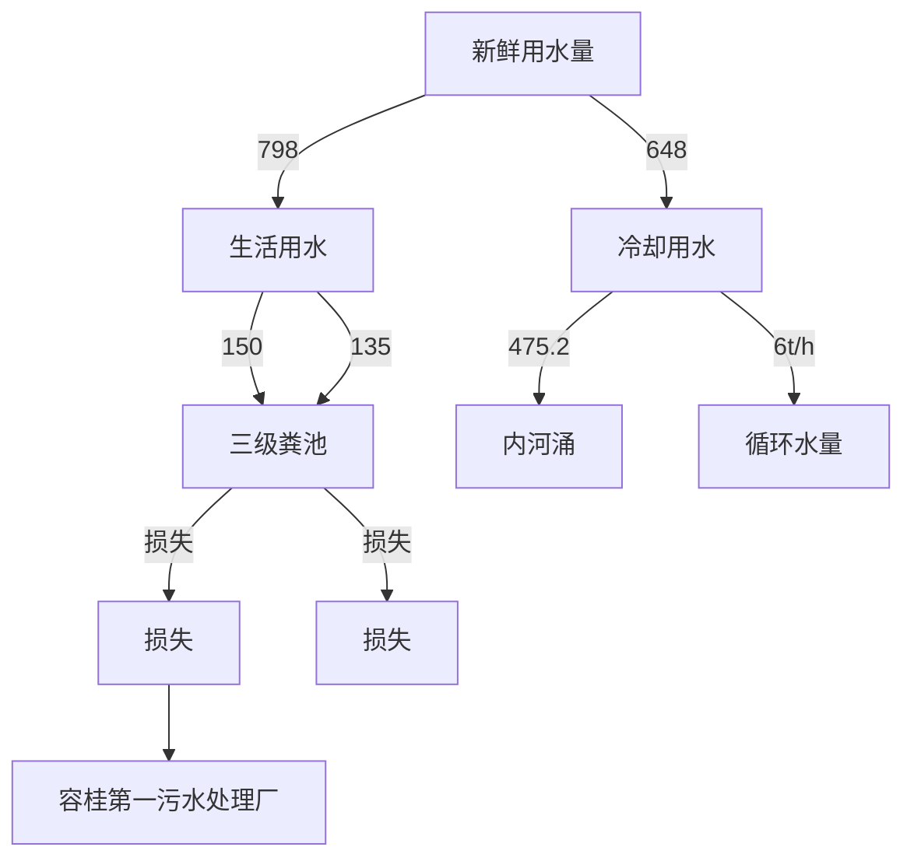
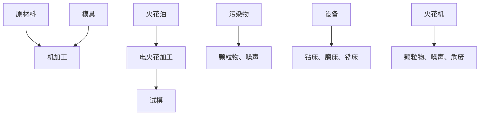

# 建设项目环境影响报告表

# （污染影响类）

项目名称：佛山达意旺科技有限公司新建项目

建设单位（盖章）：佛山达意旺科技有限公司

编制日期： 2023年7月

text_image

乐保服务有限公司
银山市南德区
部制

中华人民共和国生态环境部

编制单位和编制人员情况表

<table><tr><td>项目编号</td><td colspan="2">79ihal</td></tr><tr><td>建设项目名称</td><td colspan="2">佛山达意旺科技有限公司新建项目</td></tr><tr><td>建设项目类别</td><td colspan="2">26-053塑料制品业</td></tr><tr><td>环境影响评价文件类型</td><td colspan="2">报告表</td></tr><tr><td colspan="3">一、建设单位情况</td></tr><tr><td>单位名称(盖章)</td><td colspan="2">佛山达意旺科技有限公司</td></tr><tr><td>统一社会信用代码</td><td rowspan="4"></td><td></td></tr><tr><td>法定代表人(签章)</td><td></td></tr><tr><td>主要负责人(签字)</td><td></td></tr><tr><td>直接负责的主管人员(签字)</td><td></td></tr><tr><td colspan="3">二、编制单位情况</td></tr><tr><td>单位名称(盖章)</td><td colspan="2">佛山市顺德区汇绩环保服务有限公司</td></tr><tr><td>统一社会信用代码</td><td colspan="2">91440606MA7K6YQY78</td></tr><tr><td colspan="3">三、编制人员情况</td></tr></table>

1编制主持人

natural_image

Empty white rectangle with two horizontal lines at the bottom (no text or symbols)

# 一、建设项目基本情况

<table><tr><td>建设项目名称</td><td colspan="3">佛山达意旺科技有限公司新建项目</td></tr><tr><td>项目代码</td><td colspan="3">无</td></tr><tr><td>建设单位联系人</td><td></td><td></td><td></td></tr><tr><td>建设地点</td><td colspan="3">佛山市顺德区容桂街道四基社区华基路5号锦腾集成电路制造中心2栋303号</td></tr><tr><td>地理坐标</td><td colspan="3">(113度 14 分13.95785秒,22 度 46 分 22.4834 秒)</td></tr><tr><td>国民经济行业类别</td><td>C2929塑料零件及其塑料制品制造</td><td>建设项目行业类别</td><td>二十六、橡胶和塑料制品业29-53塑料制品业292-其他(年用非溶剂型低VOCs含量涂料10吨以下的除外)</td></tr><tr><td>建设性质</td><td>√新建(迁建)□改建□扩建□技术改造</td><td>建设项目申报情形</td><td>√首次申报项目□不予批准后再次申报项目□超五年重新审核项目□重大变动重新报批项目</td></tr><tr><td>项目审批(核准/备案)部门(选填)</td><td>—</td><td>项目审批(核准/备案)文号(选填)</td><td>—</td></tr><tr><td>总投资(万元)</td><td>100</td><td>环保投资(万元)</td><td>10</td></tr><tr><td>环保投资占比(%)</td><td>10</td><td>施工工期</td><td>1个月</td></tr><tr><td>是否开工建设</td><td>√否□是: _</td><td>用地(用海)面积(m2)</td><td>1022(建筑面积)</td></tr><tr><td>专项评价设置情况</td><td colspan="3">无</td></tr><tr><td>规划情况</td><td colspan="3">无</td></tr><tr><td>规划环境影响评价情况</td><td colspan="3">无</td></tr><tr><td>规划及规划环境影响评价符合性分析</td><td colspan="3">无</td></tr><tr><td>其他符合性分析</td><td colspan="3">1、与产业政策符合性分析本项目属于“C2929塑料零件及其塑料制品制造”行业,主要从事生产塑料制品。项目不属于国家《产业结构调整指导目录(2019年本)》及2021年修改单、《广东省禁止、限制生产、销售和使用的塑料制品目录(2020年版)》中的限制或淘汰类别,也不属于《市场准入负面清单(2022年版)》中所列行业,则根据《促进产业结构调整暂行规定》(国发[2005]40号)第十三条,项目属于允许类,项目符合相关的产业政策要求。2、与《环境保护综合名录(2021年版)》的相符性分析:本项目主要经营塑料制品生产,生产的产品及使用的原辅材料均不属于《环境保护综合名录(2021年版)》中“高污染、高环境风险”产品名录,符合要求。3、与《广东省人民政府关于印发广东省“三线一单”生态环境分区管控方案的通知》(粤府〔2020〕71号)相符性分析(1)与“一核一带一区”区域管控要求的相符性项目位于珠三角核心区,主要从事塑料制品的产销,不属于区域布局管控要求中的禁止新建、扩建水泥、平板玻璃、化学制浆、生皮制革以及国家规划外的钢铁、原油加工等项目。项目不涉及使用高挥发性原辅材料,不属于新建生产和使用高挥发性有机物原辅材料的项目,符合区域布局管控要求。项目所属塑料零件及其塑料制品制造,不属于高能耗行业,项目生产设备使用电能,生产用水由市政供水,不直接取用江河湖库水量,不会对项目所在地生态流量造成影响,符合能源利用要求。项目生活污水经三级化粪池预处理后由市政管网排入容桂第一污水处理厂,尾水排至鸡鸦水道;冷却水循环使用,定期通过市政雨水管网排入内河涌。根据《佛山市生态环境局顺德分局关于发布2022年度佛山市顺德区环境质量状况公报的通知》附件《2022年佛山市顺德区环境质量状况公报》中“鸡鸦水道细滘大桥断面”的评价结果,纳污水体水质较好。项目位于佛山市顺德区容桂街道四基社区华基路5号锦腾集成电路制造中心2栋303号,不属于石化、化工重点园区环境风险防控区域。项目产生的危险废物拟定期委托有资质的处置公司进行收集处理,并通过信息系统登记转移计划和电子转移联单,符合危险废物全过程跟踪管理的防控要求。(2)与环境管控单元总体管控要求的相符性根据《广东省人民政府关于印发广东省“三线一单”生态环境分区管控方案的通知》(粤府〔2020〕71号)发布的广东省环境管控单元图,项目所在区域为重点管控单元,重点管控单元以推动产业转型升级、强化污染减排、提升资源利用效率为</td></tr></table>

重点，加快解决资源环境负荷大、局部区域生态环境质量差、生态环境风险高等问题。并且严格限制新建钢铁、燃煤燃油火电、石化、储油库等项目，产生和排放有毒有害大气污染物项目，以及使用溶剂型油墨、涂料、清洗剂、胶粘剂等高挥发性有机物原辅材料的项目；鼓励现有该类项目逐步搬迁退出。项目不属于上述限制类项目，符合重点管控单元要求。

# （3）“三线一单”的相符性

# ①生态保护红线

项目地址位于佛山市顺德区容桂街道四基社区华基路5号锦腾集成电路制造中心2 栋303 号，据佛山市顺德区人民政府办公室关于印发《佛山市顺德区生态环境保护“十四五”规划（2021-2025）》的通知，项目所在区域不处于生态红线内。因此，本项目建设满足生态保护红线管理要求。

# ②环境质量底线

本项目所在地区属于大气环境不达标区；项目纳污水体为鸡鸦水道，水质满足水环境功能区划要求。

本项目废气污染物产生量较小，经过有效收集后达标排放，对周边环境影响很小，不会加剧空气环境质量影响；生活污水经三级化粪池预处理后由市政管网排入容桂第一污水处理厂，尾水排至鸡鸦水道；冷却水循环使用，定期通过市政雨水管网排入内河涌；不会导致纳污水体水质超标。因此，本项目建设满足环境质量底线要求。

# ③资源利用上线

本项目生产过程中会消耗一定量的电源、水资源等资源消耗，资源消耗量相对区域资源利用总量较少，符合资源利用上限要求。

# ④环保准入负面清单

本项目所属行业为塑料零件及其塑料制品制造，根据国家发展改革委商务部关于印发《市场准入负面清单（2022年版）》的通知（发改体改规﹝2022﹞397号），项目不属于上述目录所列的限制类、禁止（淘汰）类严控类项目，也不属于《市场准入负面清单（2022年版）》所列的禁止准入及需许可准入事项。根据《产业结构调整指导目录（2019 年本， 2021 年修订本）》，项目符合国家有关法律、法规和政策规定，项目属于允许类。因此，本项目的建设符合国家和地方的相关产业政策。

# 4、与《佛山市人民政府关于印发佛山市“三线一单”生态环境分区管控方案的通知》（佛府〔2021〕11 号）相符性分析

根据《佛山市人民政府关于印发佛山市“三线一单”生态环境分区管控方案的通知》（佛府〔2021〕11号）的附件1佛山市环境管控单元图，项目所在地属于重点管控单元（环境管控单元编码：ZH44060620001，环境管控单元名称：容桂街道重点管控区，详见附图3）。相关管控要求的相符性分析如下：

表 1项目与佛山市“三线一单”的相符性分析

<table><tr><td>管控维度</td><td>管控要求</td><td>工程内容</td><td>符合性</td></tr><tr><td rowspan="6">区域布局管控</td><td>【产业/综合类】系统推进村级工业园升级改造,腾出连片空间,布局产业集聚区和主题产业园,推动工业项目入园集聚发展。新增工业制造业用地原则上安排在产业集聚区内,产业集聚区外原则上不鼓励工业及物流仓储用地的新建与改造。</td><td>项目选址位于佛山市顺德区容桂街道四基社区华基路5号锦腾集成电路制造中心2栋303号,属于产业集聚区。</td><td>符合</td></tr><tr><td>【产业/综合类】产业聚集区所属地块内的工业用地或企业与村庄、学校等环境敏感点之间应设置合理的大气环境防护距离,并通过绿化带进行有效隔离;聚集区规划布局应注重大气污染排放企业应尽量避免布局在居住用地的常年主导风向的上风向。</td><td>项目500米范围内大气环境保护目标为119米的大福基居民、330米的四基居民、372米城西小学、464米的四基中学、473米的穗香居民,大气污染物经有效收集处理后达标排放,对周围环境影响不大。</td><td>符合</td></tr><tr><td>【产业/限制类】受纳水体或监控断面不达标的,不得新建、扩建向河涌直接排放废水的项目。新建、扩建含蚀刻工序的线路板生产项目和化工项目应在配套污水集中处置的工业园区或生活污水管网覆盖区域内建设;纯加工型印花项目,含酸洗、磷化的金属表面处理、金属制品项目(与自身高新技术企业配套的除外),含酸洗、喷涂、化学抛光、电解等涉及废水排放工艺的不锈钢型材加工项目(与自身高新技术企业配套的除外),应进入以此类项目为主导产业、有相应废水集中治理设施的工业园区,实现集中治污。</td><td>项目生活污水经三级化粪池预处理后引至容桂第一污水处理厂深度处理;项目属于C2929塑料零件及其塑料制品制造,不涉及使用不锈钢原材料,不属于线路板生产项目和化工项目,不属于含酸洗、喷涂、拉丝、表面抛光等工艺的不锈钢型材加工项目。</td><td>符合</td></tr><tr><td>【产业/综合类】划定家具生产优先发展区域,优先发展区外不再新建涉及涂装工艺的木质家具制造项目。</td><td>项目属于塑料零件及其塑料制品制造业,不属于涉及涂装工艺的木质家具制造项目。</td><td>符合</td></tr><tr><td>【大气/限制类】大气环境受体敏感重点管控区内,应严格限制新建储油库项目、产生和排放有毒有害大气污染物的建设项目以及使用溶剂型油墨、涂料、清洗剂、胶粘剂等高挥发性有机物原辅材料项目,鼓励现有该类项目搬迁退出。</td><td>项目原料不使用高VOCs含量原辅材料。</td><td>符合</td></tr><tr><td>【土壤/禁止类】禁止新建、扩建增加重点防控的重金属污染物排放的建设项目。</td><td>不属于重点防控的重金属污染物排放类建设项目。</td><td>符合</td></tr><tr><td>能源资</td><td>【水资源/综合类】贯彻落实“节水优先”方</td><td>项目用水主要为员工</td><td>符合</td></tr></table>

<table><tr><td rowspan="8"></td><td rowspan="3">源利用</td><td>针,实行最严格水资源管理制度,容桂街道万元国内生产总值用水量、万元工业增加值用水量、用水总量、农田灌溉水有效利用系数等用水总量和效率指标达到区下达要求。</td><td>生活用水和冷却塔用水,内部实行节约用水,合理使用水资源。</td><td></td></tr><tr><td>【土地资源/限制类】落实单位土地面积投资强度、土地利用强度等建设用地控制性指标要求,提高土地利用效率。</td><td>项目建设用地属于工业用地。</td><td>符合</td></tr><tr><td>【岸线/禁止类】严格水域岸线用途管制,新建项目一律不得违规占用水域。严禁破坏生态的岸线利用行为和不符合其功能定位的开发建设活动,严禁以各种名义侵占河道、围垦湖泊、非法采砂等。</td><td>项目建设在陆域上,不属于占用水域和破坏生态的岸线利用行为。</td><td>符合</td></tr><tr><td rowspan="5">污染物排放管控</td><td>【水/限制类】城镇新区建设实行雨污分流,逐步推进初期雨水收集、处理和资源化利用。住宅、商业体、学校、市场等城镇开发建设项目应当配套或者同步计划建设公共排水设施,公共排水设施或自建排污水设施未能投产运行的,以上涉水项目不得投入使用。新建小区严格实施雨污分流,阳台、露台等污水接入污水收集系统,将生活污水“应截尽截”。做好大型楼盘、集贸市场、餐饮以及学校等4大类排水户污水接入市政管网工作。</td><td>建设单位实行雨污分流,且生产车间位于厂房内,不存在露天作业。</td><td>符合</td></tr><tr><td>【水/综合类】容桂街道重点河涌水质上年度未达到水环境环境质量目标的,需组织编制、系统实施、向社会公开区域重点水污染物减排计划并明确“替代量”,本年度新建、改建、扩建项目新增水环境重点污染物实行区域“减二增一”替代(工业、生活或综合集中废水处理设施、民生项目除外)。</td><td>项目已接驳市政管网。不排放水环境重点污染物。</td><td>符合</td></tr><tr><td>【水/综合类】区域内应合理规划建设工业或综合集中废水处理设施。逐步推进工业集聚区“污水零直排区”建设,开展排水单元工业废水、生活污水、雨水分类收集、分质处理,确保园区“管网全覆盖、雨污全分流、污水全收集、处理全达标”</td><td>项目已接驳市政管网。生活污水经三级化粪池预处理后引至容桂第一污水处理厂深度处理,尾水达标排放;冷却水循环使用,定期通过市政雨水管网排入内河涌。</td><td>符合</td></tr><tr><td>【水/综合类】结合村级工业园改造,全面提升产业层次与集聚度,促进污染集中整治。</td><td>项目选址位于佛山市顺德区容桂街道四基社区华基路5号锦腾集成电路制造中心2栋303号,属于产业集聚区。</td><td>符合</td></tr><tr><td>【水/综合类】稳步推进排水设施“三个一体化”管理模式,补齐城乡污水收集和处理短板,推动容桂第二、第二污水处理厂提质增效,加快消除城中村、老旧城区、城乡结合部等污水收集管网空白区,逐步实现城乡污水收集处理全覆盖。2025年前完成容桂第</td><td>项目已接驳市政管网。生活污水经三级化粪池预处理后引至容桂第一污水处理厂深度处理;冷却水循环使</td><td>符合</td></tr></table>

<table><tr><td rowspan="5"></td><td>二、第二污水处理厂扩建,尾水应执行《城镇污水处理厂污染物排放标准》(GB18918-2002)一级A标准及《广东省水污染物排放限值》(DB44/26-2001)的较严值。</td><td rowspan="3">用,定期通过市政雨水管网排入内河涌。</td><td></td></tr><tr><td>【水/综合类】近期保留马东、马南两处污水处理站,到2030年将马冈村居污水接入市政污水管网,纳入杏坛城镇污水处理系统;其余行政村(社区)污水均通过市政管网和农村支管纳入容桂城镇污水处理处理系统。</td><td>符合</td></tr><tr><td>【水/综合类】产业集聚区和主题园区内做好污水管网和污水集中处理设施的配套保障,确保废水收集到城镇污水处理厂、园区污水处理厂或分散式污水处理设施集中处置。</td><td>符合</td></tr><tr><td>【大气/综合类】大力推进低VOCs含量原辅材料替代,加快涉VOCs重点行业的生产工艺升级改造,推行自动化生产工艺,对达不到要求的VOCs收集及治理设施进行整治提升,逐步淘汰低效VOCs治理设施</td><td>项目不使用高VOCs含量原辅材料,有机废气经有效收集处理后达标排放。</td><td>符合</td></tr><tr><td>【土壤气/综合类】作为重金属污染重点防控区,区域内重点重金属排放总量只减不增。</td><td>不属于重点防控的重金属污染物排放类建设项目。</td><td>符合</td></tr><tr><td rowspan="2">环境风险防控</td><td>【水/综合类】容桂第二、第二污水处理厂、工业污水集中处理设施应采取有效措施,防止事故废水直接排入水体。完善污水处理厂在线监控系统联网,实现污水处理厂的实时、动态监管。</td><td rowspan="2">建设单位加强环境风险分级分类管理,强化环境风险管控。</td><td>符合</td></tr><tr><td>【风险/综合类】加强环境风险分级分类管理,强化金属制品、有色金属和压延加工、化学原料和化学品制造业等涉重金属、化工行业企业及工业园区等重点环境风险源的环境风险防控。</td><td>符合</td></tr></table>

# 5、与《佛山市顺德区人民政府关于印发佛山市顺德区“三线一单”生态环境分区管控方案的通知》（顺府发[2021]11号）相符性分析

本项目所在区域属于容桂街道重点管控区，编号：ZH44060620001。根据项目生产产品、原材料、工艺等分析，本项目不属于单元“区域布局管控”中生态/禁止类、产业/限制类、水/限制类等。项目生活污水、雨水分类收集，生活污水经三级化粪池预处理后排至容桂第一污水处理厂，满足水/综合类管控要求。本项目对照分析《佛山市顺德区人民政府关于印发佛山市顺德区“三线一单”生态环境分区管控方案的通知》（顺府发〔2021〕11号）的相符性，详见下表，所在环境管控单元见附图10。

表 2项目与佛山市顺德区“三线一单”的相符性分析

<table><tr><td>管控维度</td><td>管控要求</td><td>工程内容</td><td>符合性</td></tr><tr><td>区域布</td><td>【产业/综合类】系统推进村级工业园升级改造,腾出连片空间,布局产业集聚区和主题</td><td>项目选址位于佛山市顺德区容桂街道四基社区</td><td>符合</td></tr></table>

<table><tr><td rowspan="9"></td><td rowspan="6">局管控</td><td>产业园,推动工业项目入园集聚发展。新增工业制造业用地原则上安排在产业集聚区内,产业集聚区外原则上不鼓励工业及物流仓储用地的新建与改造。</td><td>华基路5号锦腾集成电路制造中心2栋303号,属于产业集聚区。</td><td></td></tr><tr><td>【产业/综合类】产业聚集区所属地块内的工业用地或企业与村庄、学校等环境敏感点之间应设置合理的大气环境防护距离,并通过绿化带进行有效隔离;聚集区规划布局应注重大气污染排放企业应尽量避免布局在居住用地的常年主导风向的上风向。</td><td>项目500米范围内大气环境保护目标为119米的大福基居民、330米的四基居民、372米城西小学、464米的四基中学、473米的穗香居民,大气污染物经有效收集处理后达标排放,对周围环境影响不大。</td><td>符合</td></tr><tr><td>【产业/限制类】受纳水体或监控断面不达标的,不得新建、扩建向河涌直接排放废水的项目。新建、扩建含蚀刻工序的线路板生产项目和化工项目应在配套污水集中处置的工业园区或生活污水管网覆盖区域内建设;纯加工型印花项目,含酸洗、磷化的金属表面处理、金属制品项目(与自身高新技术企业配套的除外),含酸洗、喷涂、化学抛光、电解等涉及废水排放工艺的不锈钢型材加工项目(与自身高新技术企业配套的除外),应进入以此类项目为主导产业、有相应废水集中治理设施的工业园区,实现集中治污。</td><td>项目生活污水经三级化粪池预处理后引至容桂第一污水处理厂深度处理;冷却水循环使用,定期通过市政雨水管网排入内河涌;项目属于C2929塑料零件及其塑料制品制造,不涉及使用不锈钢原材料,不属于线路板生产项目和化工项目,不属于含酸洗、喷涂、拉丝、表面抛光等工艺的不锈钢型材加工项目。</td><td>符合</td></tr><tr><td>【产业/综合类】划定家具生产优先发展区域,优先发展区外不再新建涉及涂装工艺的木质家具制造项目。</td><td>项目属于塑料零件及其塑料制品制造业,不属于涉及涂装工艺的木质家具制造项目。</td><td>符合</td></tr><tr><td>【大气/限制类】大气环境受体敏感重点管控区内,应严格限制新建储油库项目、产生和排放有毒有害大气污染物的建设项目以及使用溶剂型油墨、涂料、清洗剂、胶粘剂等高挥发性有机物原辅材料项目,鼓励现有该类项目搬迁退出。</td><td>项目不使用高VOCs含量原辅材料。</td><td>符合</td></tr><tr><td>【土壤/禁止类】禁止新建、扩建增加重点防控的重金属污染物排放的建设项目。</td><td>不属于重点防控的重金属污染物排放类建设项目。</td><td>符合</td></tr><tr><td rowspan="3">能源资源利用</td><td>【水资源/综合类】贯彻落实“节水优先”方针,实行最严格水资源管理制度,容桂街道万元国内生产总值用水量、万元工业增加值用水量、用水总量、农田灌溉水有效利用系数等用水总量和效率指标达到区下达要求。</td><td>项目用水主要为员工生活用水和冷却塔用水,内部实行节约用水,合理使用水资源。</td><td>符合</td></tr><tr><td>【土地资源/限制类】落实单位土地面积投资强度、土地利用强度等建设用地控制性指标要求,提高土地利用效率。</td><td>项目建设用地属于工业用地。</td><td>符合</td></tr><tr><td>【岸线/禁止类】严格水域岸线用途管制,新建项目一律不得违规占用水域。严禁破坏生</td><td>项目建设在陆域上,不属于占用水域和破坏生</td><td>符合</td></tr><tr><td rowspan="8"></td><td></td><td>态的岸线利用行为和不符合其功能定位的开发建设活动,严禁以各种名义侵占河道、围垦湖泊、非法采砂等。</td><td>态的岸线利用行为。</td><td></td></tr><tr><td rowspan="7">污染物排放管控</td><td>【水/限制类】城镇新区建设实行雨污分流,逐步推进初期雨水收集、处理和资源化利用。住宅、商业体、学校、市场等城镇开发建设项目应当配套或者同步计划建设公共排水设施,公共排水设施或自建排污水设施未能投产运行的,以上涉水项目不得投入使用。新建小区严格实施雨污分流,阳台、露台等污水接入污水收集系统,将生活污水“应截尽截”。做好大型楼盘、集贸市场、餐饮以及学校等4大类排水户污水接入市政管网工作。</td><td>建设单位实行雨污分流,且生产车间位于厂房内,不存在露天作业。</td><td>符合</td></tr><tr><td>【水/综合类】容桂街道重点河涌水质上年度未达到水环境环境质量目标的,需组织编制、系统实施、向社会公开区域重点水污染物减排计划并明确“替代量”,本年度新建、改建、扩建项目新增水环境重点污染物实行区域“减二增一”替代(工业、生活或综合集中废水处理设施、民生项目除外)。</td><td>项目已接驳市政管网。不排放水环境重点污染物。</td><td>符合</td></tr><tr><td>【水/综合类】区域内应合理规划建设工业或综合集中废水处理设施。逐步推进工业集聚区“污水零直排区”建设,开展排水单元工业废水、生活污水、雨水分类收集、分质处理,确保园区“管网全覆盖、雨污全分流、污水全收集、处理全达标”。</td><td>项目已接驳市政管网。生活污水经三级化粪池预处理后引至容桂第一污水处理厂深度处理,尾水达标排放;冷却水循环使用,定期通过市政雨水管网排入内河涌。</td><td>符合</td></tr><tr><td>【水/综合类】结合村级工业园改造,全面提升产业层次与集聚度,促进污染集中整治。</td><td>项目选址位于佛山市顺德区容桂街道四基社区华基路5号锦腾集成电路制造中心2栋303号,属于产业集聚区。</td><td>符合</td></tr><tr><td>【水/综合类】稳步推进排水设施“三个一体化”管理模式,补齐城乡污水收集和处理短板,推动容桂第二、第二污水处理厂提质增效,加快消除城中村、老旧城区、城乡结合部等污水收集管网空白区,逐步实现城乡污水收集处理全覆盖。2025年前完成容桂第二、第二污水处理厂扩建,尾水应执行《城镇污水处理厂污染物排放标准》(GB18918-2002)一级A标准及《广东省水污染物排放限值》(DB44/26-2001)的较严值。</td><td rowspan="3">项目已接驳市政管网。生活污水经三级化粪池预处理后引至容桂第一污水处理厂深度处理;冷却水循环使用,定期通过市政雨水管网排入内河涌。</td><td>符合</td></tr><tr><td>【水/综合类】近期保留马东、马南两处污水处理站,到2030年将马冈村居污水接入市政污水管网,纳入杏坛城镇污水处理系统;其余行政村(社区)污水均通过市政管网和农村支管纳入容桂城镇污水处理处理系统。</td><td>符合</td></tr><tr><td>【水/综合类】产业集聚区和主题园区内做好</td><td>符合</td></tr></table>

<table><tr><td rowspan="3"></td><td>污水管网和污水集中处理设施的配套保障,确保废水收集到城镇污水处理厂、园区污水处理厂或分散式污水处理设施集中处置。</td><td></td><td></td></tr><tr><td>【大气/综合类】大力推进低VOCs含量原辅材料替代,加快涉VOCs重点行业的生产工艺升级改造,推行自动化生产工艺,对达不到要求的VOCs收集及治理设施进行整治提升,逐步淘汰低效VOCs治理设施。</td><td>项目不使用高VOCs含量原辅材料,有机废气经有效收集处理后达标排放。</td><td>符合</td></tr><tr><td>【土壤/限制类】作为重金属污染重点防控区,区域内重点重金属排放总量只减不增。</td><td>项目不排放重金属污染物。</td><td>符合</td></tr><tr><td rowspan="2">环境风险防控</td><td>【水/综合类】容桂第二、第二污水处理厂、工业污水集中处理设施应采取有效措施,防止事故废水直接排入水体。完善污水处理厂在线监控系统联网,实现污水处理厂的实时、动态监管。</td><td rowspan="2">建设单位加强环境风险分级分类管理,强化环境风险管控。</td><td>符合</td></tr><tr><td>【风险/综合类】加强环境风险分级分类管理,强化金属制品、有色金属和压延加工、化学原料和化学品制造业等涉重金属、化工行业企业及工业园区等重点环境风险源的环境风险防控。</td><td>符合</td></tr></table>

# 6、用地规划相符性分析

根据《佛山市顺德区容桂西部片区控制性详细规划》，项目所在地属于M1类工业用地（详见附图9），因此本项目的选址符合佛山市顺德区总体规划的要求，符合所在地块的土地利用性质。

# 7、项目与佛山市发展和改革局佛山市生态环境局关于印发《佛山市关于进一步加强塑料污染治理的实施方案》的通知（2020 年 11 月 09 日发布）的相符性分析

表 3 项目与《佛山市关于进一步加强塑料污染治理的实施方案》的通知相符性分析

<table><tr><td>政策要求</td><td>工程内容</td><td>符合性</td></tr><tr><td>禁止生产、销售的塑料制品。全市范围内禁止生产和销售厚度小于0.025毫米的超薄塑料购物袋、厚度小于0.01毫米的聚乙烯农用地膜。禁止以医疗废物为原料制造塑料制品;禁止将回收利用的废塑料输液袋(瓶)用于原用途或用于制造餐饮容器以及玩具等儿童用品。到2020年底,禁止生产和销售一次性发泡塑料餐具、一次性塑料棉签;禁止生产含塑料微珠的日化产品。到2022年底,禁止销售含塑料微珠的日化产品。</td><td>项目主要生产塑料瓶和塑料盖,不属于方案中禁止生产的塑料制品。项目使用的塑料均为新料,不使用废旧塑料。</td><td>符合</td></tr><tr><td>国家《产业结构调整指导目录》和《市场准入负面清单》明确的属于淘汰类的塑料制品项目,禁止投资;属于限制类项目,禁止新建。</td><td>根据国家发展和改革委员会发布的《产业结构调整指导目录(2019年本)》,项目不属于上述目录所列的鼓励类、限制和禁止(淘汰)项目;根据《促进产业结构调整暂行规定》第十三条,属于允许建设项目。同时,根据国家发展改革委商务部《关于印发&lt;市场准入负面清单(2022年版)的通知&gt;》(发改体改规[2022]397号)可知,项目不在市场准入负面清单禁止和许可两类项目范围内。</td><td>符合</td></tr><tr><td>增加绿色产品供给。塑料制品生产企业要严格执行有关法律法规,生产符合相关标准的塑料制品,不得使用未经风险评估及技术验证的塑料回收料生产食品接触材料及制品,不得违规添加对人体、环境有害的化学添加剂</td><td>项目使用的塑料为新料,不使用塑料回收料,不会添加对人体、环境有害的化学添加剂</td><td>符合</td></tr></table>

# 7、挥发性有机物（VOCs）排放符合性分析

表 4 项目与挥发性有机物（VOCs）排放规定相符性分析

<table><tr><td>序号</td><td>政策要求</td><td>工程内容</td><td>符合性</td></tr><tr><td colspan="4">1.佛山市生态环境局顺德分局关于做好重点行业建设项目挥发性有机物总量指标管理工作的通知》(佛顺环函[2019]56号)</td></tr><tr><td>1.1</td><td>涉VOCs排放项目,实现本行政区域内污染源“点对点”2倍量削减替代,由项目所在镇街分局出具VOCs总量指标来源及替代削减方案的意见,开展总量替代。</td><td>项目VOCs排放总量指标(VOCs:0.34722t/a)由容桂街道出具VOCs总量指标来源及替代削减方案的意见。</td><td>符合</td></tr><tr><td colspan="4">2.《广东省人民政府办公厅关于印发广东省2021年大气、水、土壤污染防治工作方案的通知》(粤办函〔2021〕58号)</td></tr><tr><td>2.1</td><td>严格落实国家产品VOCs含量限值标准要求,除现阶段确无法实施替代的工序外禁止新建生产和使用高VOCs含量原辅材料项目;指导企业使用适宜高效的治理技术,涉VOCs重点行业新建、改建和扩建项目不推荐使用光氧化、光催化、低温等离子等低效治理设施,已建项目逐步淘汰光氧化、光催化、低温等离子治理设施。指导采用一次性活性炭吸附治理技术的企业,明确活性炭装载量和更换频次,记录更换时间和使用量</td><td>本项目只使用低VOCs含量、低反应活性的原辅材料和产品。有机废气采取“二级活性炭”吸附处理,不使用光氧化、光催化、低温等离子等低效治理设施</td><td>符合</td></tr><tr><td colspan="4">3.《关于印发《广东省涉挥发性有机物(VOCs)重点行业治理指引》的通知》(粤环办〔2021〕43号)</td></tr><tr><td>3.1</td><td>VOCs物料转移和输送:粉状、粒状VOCs物料采用气力输送设备、管状带式输送机、螺旋输送机等密闭输送方式,或者采用密闭的包装袋、容器或罐车进行物料转移。</td><td>项目原料均为固态,在转移过程中均使用密闭的包装袋封装</td><td>符合</td></tr></table>

<table><tr><td rowspan="8"></td><td>3.2</td><td>工艺过程:在混合/混炼、塑炼/塑化/熔化、加工成型(注塑、注射、压制、压延、发泡、纺丝等)、硫化等作用中应采用密闭设备或在密闭空间中操作,废气应排至VOCs废气收集处理系统;无法密闭的,应采取局部气体收集措施,废气排至VOCs废气收集处理系统。</td><td>项目废气经集气措施收集后通过二级活性炭处理后引至52m排气筒排放。</td><td>符合</td></tr><tr><td>3.3</td><td>废气收集:采用外部集气罩的,距集气罩开口面最远处的VOCs无组织排放位置,控制风速不低于0.3m/s。</td><td>项目集气罩置于废气产生点的合理位置,保证罩口截面风速为0.7m/s。</td><td>符合</td></tr><tr><td>3.4</td><td>废气收集:废气收集系统的输送管道应密闭。废气收集系统应在负压下运行,若处于正压状态,应对管道组件的密封垫进行泄漏检测,泄漏检测值不应超过500μmol/mol,亦不应有感官可察觉泄漏。</td><td>项目废气收集系统的输送管均密闭,废气收集系统在负压下运行。</td><td>符合</td></tr><tr><td>3.5</td><td>排放水平:塑料制品行业:a)有机废气排气筒排放浓度不高于广东省《大气污染物排放限值》(DB4427-2001)第II时段排放限值,合成革和人造革企业排放浓度不高于《合成革与人造革工业污染物排放标准》(GB21902-2008)排放限值,若国家和我省出台并实施适用于塑料制品制造业的大气污染物排放标准,则有机废气排气筒排放浓度不高于相应的排放限值;车间或生产设施排气中NMHC初始排放速率≥3kg/h时,建设VOCs处理设施且处理效率≥80%;b)厂区内无组织排放监控点NMHC的小时平均浓度值不超过6mg/m3,任意一次浓度值不超过20mg/m3。</td><td>项目所属行业为塑料制品业,生产过程有机废气达到《合成树脂工业污染物排放标准》(GB31572-2015)相关标准限值;有机废气厂区内无组织排放满足平均浓度值不超过6mg/m3,任意一次浓度值不超过20mg/m3。</td><td>符合</td></tr><tr><td>3.6</td><td>管理台账:建立废气收集处理设施台账,记录废气处理设施进出口的监测数据(废气量、浓度、温度、含氧量等)、废气收集与处理设施关键参数、废气处理设施相关耗材(吸收剂、吸附剂、催化剂等)购买和处理记录。</td><td>项目建立废气收集处理设施台账,根据《排污单位自行监测技术指南总则》(HJ819-2017)等相关要求定期自行监测,并且记录相关监测数据</td><td>符合</td></tr><tr><td>3.7</td><td>管理台账:建立危废台账,整理危废处置合同、转移联单及危废处理方式资质佐证材料。</td><td>项目建立危险废物台账,定期将废机油、废活性炭等危险废物交给有资质的单位处理,整理危废处理合同、转移联单等资料。</td><td>符合</td></tr><tr><td colspan="4">4.佛山市发展和改革局 佛山市生态环境局关于印发《佛山市关于进一步加强塑料污染治理的实施方案》的通知(佛发改资环〔2021〕3号)</td></tr><tr><td>4.1</td><td>全市范围内禁止生产和销售厚度小于0.025毫米的超薄塑料购物袋、厚度小于0.01毫米的聚乙烯农用地膜。禁止以医疗废物为原料制造塑料制品;禁止将回收利用的废塑料输液袋(瓶)用于原用途或用于制造餐饮容器以及玩具等儿童用品。加大禁止“洋垃圾”进口监管和打私力度,确保“全面禁止废塑料进口”落实到位。到2020年底,禁止生产和销售一次性发泡塑料餐具、一次性塑料棉签;禁止生产含塑料微珠的日化产品。到2022年底,禁止销售含塑料微珠的日化产品。国家《产业结构调整指导目录》和《市场准入负面清单》明确的属于淘汰类的塑料制品项目,禁止投资;属于限制类项目,禁止新建。</td><td>本项目属于C2929塑料零件及其他塑料制品制造,外购的塑料粒为新料,不属于医疗废物、回收利用的废塑料输液袋(瓶),也不属于“洋垃圾”,产品也不属于文件中禁止生产项目及限制类项目。</td><td>符合</td></tr><tr><td rowspan="8"></td><td colspan="4">5.《固定污染源挥发性有机物综合排放标准》(DB44/2367-2022)</td></tr><tr><td>5.1</td><td>排气筒高度不低于15m(因安全考虑或者有特殊工艺要求的除外),具体高度以及与周围建筑物的相对高度关系应当根据环境影响评价文件确定。</td><td>建设单位在每台注塑机上方设置集气罩收集废气。注塑工序产生的有机废气经有效收集后,通过“二级活性炭吸附”装置处理后引至位于楼顶离地52m高的排气筒排放。</td><td>符合</td></tr><tr><td>5.2</td><td>企业应当建立台账,记录废气收集系统、VOCs处理设施的主要运行和维护信息,如运行时间、废气处理量、操作温度、停留时间、吸附剂再生/更换周期和更换量、催化剂更换周期和更换量、吸收液pH值等关键运行参数。台账保存期限不少于3年。</td><td>项目废气治理设施安排专人维护并定期建立台账,记录相关废气数据。</td><td></td></tr><tr><td>5.3</td><td>VOCs物料应当储存于密闭的容器、储罐、储库、料仓中;盛装VOCs物料的容器应当存放于室内,或者存放于设置有雨棚、遮阳和防渗设施的专用场地。盛装VOCs物料的容器或者包装袋在非取用状态时应当加盖、封口,保持密闭。</td><td>本项目使用的物料采用密封容器存放在厂房内的仓库;厂房为已建成工业厂房,拥有完整的维护结构,地面已经全部混凝土硬化处理。</td><td>符合</td></tr><tr><td>5.4</td><td>废气收集系统排风罩(集气罩)的设置应当符合GB/T16758的规定。采用外部排风罩的,应当按GB/T 16758、WS/T 757—2016规定的方法测量控制风速,测量点应当选取在距排风罩开口面最远处的VOCs无组织排放位置,控制风速不应当低于0.3m/s(行业相关规范有具体规定的,按相关规定执行)。</td><td>建设单位在每台注塑机上方设置集气罩收集废气。注塑工序产生的有机废气经有效收集后,通过“二级活性炭吸附”装置处理后引至位于楼顶离地52m高的排气筒排放。控制风速大于0.3m/s。</td><td>符合</td></tr><tr><td colspan="4">6.关于印发《重点行业挥发性有机物综合治理方案》的通知(环大气[2019]53号)</td></tr><tr><td>6.1</td><td>通过使用水性、粉末、高固体分、无溶剂、辐射固化等低VOCs含量的涂料,水性、辐射固化、植物等低VOCs含量的油墨,水基、热熔、无溶剂、辐射固化、改性、生物降解等低VOCs含量的胶粘剂,以及低VOCs含量、低反应活性的清洗剂等,替代溶剂型涂料、油墨、胶粘剂、清洗剂等,从源头减少VOCs产生。</td><td>本项目使用的原材料无自然状态下可挥发性的物料,满足相关标准要求。</td><td>符合</td></tr><tr><td>6.2</td><td>重点对含VOCs物料(包括含VOCs原辅材料、含VOCs产品、含VOCs废料以及有机聚合物材料等)储存、转移和输送、设备与管线组件泄漏、敞开液面逸散以及工艺过程等五类排放源实施管控,通过采取设备与场所密闭、工艺改进、废气有效收集等措施,削减VOCs无组织排放。</td><td>项目注塑过程产生的废气,已设置集气措施收集。集气罩置于废气产生点的合理位置,保证罩口截面风速为0.7m/s。</td><td>符合</td></tr><tr><td rowspan="6"></td><td>6.3</td><td>提高废气收集率,遵循“应收尽收、分质收集”的原则,科学设计废气收集系统,将无组织排放转变为有组织排放进行控制。采用全密闭集气罩或密闭空间的,除行业有特殊要求外,应保持微负压状态,并根据相关规范合理设置通风量。采用局部集气罩的,距集气罩开口面最远处的VOCs无组织排放位置,控制风速应不低于0.3米/秒,有行业要求的按相关规定执行。</td><td>项目注塑过程产生的废气,已设置集气措施收集。集气罩置于废气产生点的合理位置,保证罩口截面风速为0.7m/s。</td><td>符合</td></tr><tr><td colspan="4">7.《广东省生态环境厅关于印发&lt;广东省生态环境保护“十四五”规划&gt;的通知(粤环〔2021〕10号)</td></tr><tr><td>7.1</td><td>大力推进低VOCs含量原辅材料源头替代,严格落实国家和地方产品VOCs含量限值质量标准,禁止建设生产和使用高VOCs含量的溶剂型涂料、油墨、胶粘剂等项目。</td><td>项目不涉及高挥发性有机物原辅材料。</td><td></td></tr><tr><td colspan="4">8.《佛山市生态环境局关于印发《佛山市生态环境保护“十四五”规划》的通知》佛环〔2022〕3号</td></tr><tr><td>8.1</td><td>严格限制新建生产和使用高挥发性有机物原辅材料的项目。</td><td>项目不涉及高挥发性有机物原辅材料。</td><td></td></tr><tr><td>8.2</td><td>推进VOCs高排放企业治理设施提升改造,淘汰光催化、光氧化、低温等离子等现有低效治理设施。</td><td>注塑废气经密闭集气罩收集后通过“两级活性炭吸附”进行处理后引至位于楼顶离地52m高的排气筒排放。</td><td></td></tr></table>

# 二、建设项目工程分析

<table><tr><td rowspan="19">建设内容</td><td colspan="4">佛山达意旺科技有限公司新建项目(下称“本项目”)拟选址于佛山市顺德区容桂街道四基社区华基路5号锦腾集成电路制造中心2栋303号,项目位于一栋10层高建筑第3层,该建筑高度为50m(该建筑首层高度为6.7米,二层和三层高度为5.9m,其余楼层高度均为4.5米)。项目总用地面积约1022平方米,总建筑面积约1022平方米,项目总投资100万元,其中环保投资10万元。项目完成后,预计年产塑料配件100万件。从业人员为15人,年工作300天,每天工作8小时(一班制),厂区内不设员工饭堂和宿舍。项目工程组成如下表所示。1.项目组成表5项目建设内容一览表</td><td></td></tr><tr><td>类别</td><td colspan="2">工程名称</td><td>面积及内容</td><td>备注</td></tr><tr><td colspan="3">占地面积</td><td> $1022m^{2}$ </td><td rowspan="2">项目所在厂房位于一栋10层建筑物,首层高度为6.7米,二层和三层高度为5.9m,其余楼层高度均为4.5米;项目位于三层。</td></tr><tr><td colspan="3">建筑面积</td><td> $1022m^{2}$ </td></tr><tr><td rowspan="3">主体工程</td><td rowspan="3">生产车间</td><td>注塑区</td><td> $270m^{2}$ </td><td>用于注塑工序</td></tr><tr><td>破碎混料区</td><td> $37m^{2}$ </td><td>用于破碎、混料工序</td></tr><tr><td>模具区</td><td> $70m^{2}$ </td><td>用于模具维修加工工序</td></tr><tr><td>储运工程</td><td colspan="2">仓库</td><td> $500m^{2}$ </td><td>用于原辅材料、成品的贮存</td></tr><tr><td rowspan="3">辅助工程</td><td colspan="2">通道</td><td> $85m^{2}$ </td><td>用于物料运输及人行通道</td></tr><tr><td colspan="2">卫生间</td><td> $10m^{2}$ </td><td>/</td></tr><tr><td colspan="2">办公室</td><td> $50m^{2}$ </td><td>用于员工办公</td></tr><tr><td rowspan="2">依托工程</td><td colspan="2">生活污水治理</td><td>生活污水经三级化粪池处理后排入容桂第一污水处理厂,尾水排入鸡鸦水道</td><td>依托所在厂房已有设施</td></tr><tr><td colspan="2">冷却废水治理</td><td>冷却水循环使用,定期通过市政雨水管网排入内河涌</td><td>依托所在厂房已有设施</td></tr><tr><td rowspan="3">公用工程</td><td colspan="2">供电</td><td>由市政供电系统提供</td><td>依托所在厂房已有设施</td></tr><tr><td colspan="2">供水</td><td>由市政自来水供给</td><td>依托所在厂房已有设施</td></tr><tr><td colspan="2">排水</td><td>生活污水经三级化粪池处理后排入容桂第一污水处理厂,尾水排入鸡鸦水道;冷却水循环使用,定期通过市政雨水管网排入内河涌</td><td>依托所在厂房已有排水系统</td></tr><tr><td rowspan="3">环保工程</td><td colspan="2">生活污水治理</td><td colspan="2">生活污水经三级化粪池处理后排入容桂第一污水处理厂,尾水排入鸡鸦水道</td></tr><tr><td colspan="2">冷却废水治理</td><td colspan="2">冷却水循环使用,定期通过市政雨水管网排入内河涌</td></tr><tr><td colspan="2">噪声治理</td><td colspan="2">选用低噪声设备,并采取减振、隔声、消声、降噪措施</td></tr><tr><td rowspan="4"></td><td>废气处理</td><td colspan="4">建设单位在每台注塑机上方设置集气罩收集废气。注塑工序产生的有机废气经有效收集后,通过二级活性炭吸附装置处理后引至位于楼顶离地52m高的排气筒排放</td></tr><tr><td>固体废物治理</td><td colspan="4">生活垃圾委托环卫部门清运处理;一般工业固体废物分类收集外卖给废品回收单位回收利用;危险废物单独收集后放置于厂区危废暂存间,定期交由有资质单位外运处理</td></tr><tr><td>危险废物暂存间</td><td>约 $5m^{2}$ </td><td colspan="3">位于厂房内</td></tr><tr><td>一般固废暂存间</td><td>约 $10m^{2}$ </td><td colspan="3">位于厂房内</td></tr></table>

# 2. 项目产品和产能

表 6 产品产能一览表

<table><tr><td>产品名称</td><td>单位</td><td>年产量</td></tr><tr><td>塑料配件</td><td>万件/年</td><td>100</td></tr><tr><td colspan="3">注:项目塑料配件主营为手柄等,重量约为200g/个。</td></tr></table>

# 3. 项目生产设备

表 7 生产设备一览表

<table><tr><td rowspan="2">生产设施名称</td><td rowspan="2">数量</td><td rowspan="2">单位</td><td colspan="3">设施参数</td><td rowspan="2">主要工艺</td></tr><tr><td>参数名称</td><td>设计值</td><td>单位</td></tr><tr><td rowspan="3">注塑机</td><td rowspan="3">15</td><td rowspan="3">台</td><td>处理能力</td><td>6.456</td><td>Kg/h</td><td rowspan="3">注塑</td></tr><tr><td>锁模力</td><td>100</td><td>T</td></tr><tr><td>螺杆直径</td><td>36</td><td>mm</td></tr><tr><td>烘料机</td><td>17(15配套+2单独)</td><td>台</td><td>温度</td><td>80-90</td><td>摄氏度</td><td>烘料</td></tr><tr><td>混料机</td><td>5</td><td>台</td><td>处理能力</td><td>125</td><td>t/a</td><td>混料</td></tr><tr><td>破碎机</td><td>5</td><td>台</td><td>处理能力</td><td>0.75</td><td>t/a</td><td>破碎</td></tr><tr><td>铣床</td><td>1</td><td>台</td><td>公称力</td><td>10</td><td>T</td><td>成型</td></tr><tr><td>磨床</td><td>1</td><td>台</td><td>功率</td><td>1.5</td><td>kW</td><td>机加工</td></tr><tr><td>钻床</td><td>1</td><td>台</td><td>功率</td><td>2.2</td><td>kW</td><td>机加工</td></tr><tr><td>火花机</td><td>1</td><td>台</td><td>功率</td><td>1.5</td><td>kW</td><td>机加工</td></tr><tr><td>冷却塔</td><td>1</td><td>台</td><td>循环水量</td><td>6</td><td> $m^3/h$ </td><td>冷却</td></tr><tr><td>空压机</td><td>1</td><td>台</td><td>容量</td><td>1.6</td><td> $m^3/min$ </td><td>压缩空气</td></tr><tr><td colspan="7">以上设备均使用电能</td></tr></table>

# 4. 原辅材料及能源消耗

表 8项目原辅材料及能源消耗一览表

<table><tr><td>名称</td><td>单位</td><td>数量</td><td>最大存储量</td><td>包装规格</td><td>备注</td></tr><tr><td>PP 塑料粒</td><td>吨/年</td><td>50</td><td>1</td><td>25kg/袋</td><td>新料、粒状</td></tr><tr><td>PA 塑料粒</td><td>吨/年</td><td>15</td><td>1</td><td>25kg/袋</td><td>新料、粒状</td></tr><tr><td>PBT 塑料粒</td><td>吨/年</td><td>10</td><td>1</td><td>25kg/袋</td><td>新料、粒状</td></tr><tr><td>PC 塑料粒</td><td>吨/年</td><td>20</td><td>5</td><td>25kg/袋</td><td>新料、粒状</td></tr><tr><td>ABS 塑料粒</td><td>吨/年</td><td>100</td><td>10</td><td>25kg/袋</td><td>新料、粒状</td></tr><tr><td>色母</td><td>吨/年</td><td>5</td><td>1</td><td>25kg/袋</td><td>新料、粒状</td></tr><tr><td>模具钢</td><td>套/年</td><td>80</td><td>15</td><td>100kg/套</td><td>固体</td></tr><tr><td>火花油</td><td>吨/年</td><td>0.12</td><td>0.045</td><td>15kg/桶(18L)</td><td>液体</td></tr><tr><td>液压油</td><td>吨/年</td><td>0.12</td><td>0.045</td><td>15kg/桶(18L)</td><td>液体</td></tr><tr><td>机油</td><td>吨/年</td><td>0.16</td><td>0.032</td><td>16kg/桶(18L)</td><td>液体</td></tr></table>

表 9项目生产设施设计产能与原辅料用量、产品产能相符性分析一览表

<table><tr><td>设备名称</td><td>设备参数(kg/h)</td><td>设备数量(台)</td><td>单个模具容量(g)</td><td>单件产品生产时间(min)</td><td>产能(g)</td><td>作业时间(min)</td><td>理论年产量(t)</td><td>预计年产量(t)</td></tr><tr><td>注塑机</td><td>6.456</td><td>15</td><td>100</td><td>1</td><td>1500</td><td>144000</td><td>216</td><td>200</td></tr><tr><td colspan="9">注:设备年产量较申报产能偏大主要受生产过程中设备调试、维护、维修等情况影响,用量偏差在可接受范围内。</td></tr></table>

表 10项目 VOCs物料平衡一览表

<table><tr><td colspan="4">投入 t/a</td><td rowspan="2" colspan="2">产出 t/a</td></tr><tr><td>原材料</td><td>使用量</td><td>VOCs产污系数</td><td>VOCs产生量</td></tr><tr><td>PP塑料粒</td><td>50</td><td rowspan="6">2.7kg-t产品</td><td rowspan="6">0.54</td><td>废气有组织排放</td><td>0.18522</td></tr><tr><td>PA塑料粒</td><td>15</td><td>废气无组织排放</td><td>0.162</td></tr><tr><td>PBT塑料粒</td><td>10</td><td>二级活性炭吸附</td><td>0.19278</td></tr><tr><td>PC塑料粒</td><td>20</td><td>/</td><td>/</td></tr><tr><td>ABS塑料粒</td><td>100</td><td>/</td><td>/</td></tr><tr><td>色母</td><td>5</td><td>/</td><td>/</td></tr><tr><td>合计</td><td>200</td><td>/</td><td>0.54</td><td>合计</td><td>0.54</td></tr></table>

ABS：丙烯腈－丁二烯－苯乙烯共聚物是一种强度高、韧性好、易于加工成型的热塑型高分子材料结构。 ABS树脂是丙烯腈、1，3－丁二烯、苯乙烯的三元共聚物。可以在－25℃\~60℃的环境下表现正常，而且有很好的成型性，加工出的产品表面光洁，易于染色和电镀。

PP：聚丙烯，是丙烯加聚反应而成的聚合物。系白色蜡状材料，外观透明而轻。相对密度为0.89～0.91g/cm3，易燃，熔点165℃，在155℃左右软化，使用温度范围为-30～140℃，热分解温度在328℃以上。

PBT：聚对苯二甲酸丁二醇酯，属于聚酯系列，是由 1.4-pbt 丁二醇(1.4-Butyleneglycol)与对苯二甲酸(PTA)或者对苯二甲酸酯(DMT)聚缩合而成，并经由混炼程序制成的乳白色半透明到不透明、结晶型热塑性聚酯树脂（或称饱和聚酯）。PBT 是最坚韧的工程热塑材料之一，有良好的化学稳定性、机械强度、电绝缘特性和热稳定性。常规密度 1.3-.173g/cm3，洛氏硬度（R 计秤）：118，材料收缩率在1.5%\~2.8%之间，熔点：220\~235℃，分解温度在 280℃左右。

PA：聚酰胺 6 或尼龙 6（PA6），半透明或不透明乳白色结晶形聚合物，密度：1.13g/cm3，熔点215-225℃，热分解温度>300℃，拉伸强度>60.0MPa，，伸长率>30%，弯曲强度 90.0Mpa，缺口冲击强度(KJ/m2)>5，热塑性、轻质、韧性好、耐化学品和耐久性好。

PC：聚碳酸酯，无色透明，耐热，抗冲击，助燃 BI 级，在普通使用温度内都有良好的机械性能。产品的熔化温度 230℃，热分解温度 360℃，热变形温度 132\~143℃。同性能接近聚甲基丙烯酸甲酯相比，聚碳酸酯的耐冲击性能好，折射率高，加工性能好，不需要添加剂就具有 UL94V-0 级助燃性能。项目在注塑过程中会产生非甲烷总烃。

色母：颗粒状，一种新型高分子材料专用着色剂，主要用在塑料上。色母由颜料或染料、载体和添加剂三种基本要素所组成，是把超常量的颜料均匀载附于树脂之中而制得的聚集体。常用的有机颜料有：酞菁红、酞菁蓝、酞菁绿、耐晒大红、大分子红、大分子黄、永固黄、永固紫、偶氮红等；常用的无机颜料有：镉红、镉黄、钛白粉、炭黑、氧化铁红、氧化铁黄等。载体即是色母粒的基体，专用色母一般选择与制品树脂相同的树脂作为载体，两者的相容性最好，但同时也要考虑载体的流动性。添加剂主要为分散剂，是促使颜料均匀分散并不再凝聚，分散剂的熔点应比树脂低，与树脂有良好的相容性，和颜料有较好的亲和力。最常用的分散剂为：聚乙烯低分子蜡、硬脂酸盐。

机油：密度约为0.91×103kg/m3，闪点约为180℃，能对机械设备到润滑减磨、辅助冷却降温、密封防漏、防锈防蚀、减震缓冲等作用。机油由基础油和添加剂两部分组成。基础油是机油的主要成分，决定着机油的基本性质，添加剂则可弥补和改善基础油性能方面的不足，赋予某些新的性能，是机油的重要组成部分。

液压油：淡黄色液体，相对密度（水=1g/cm3）0.87，闪点 224℃，无爆炸危险，遇明火、高热 可燃，燃烧产物为 CO、CO2等有毒有害气体，燃烧时使用泡沫、干粉、二氧化碳、砂土进行灭火； 常温环境下储存不分解，禁配物为酸、碱及强氧化剂。

# 5. 公用配套工程

# （1）给水

# ①冷却水

本项目设置 1 台冷却塔为注塑机模具提供冷却水，冷却水对模具进行冷却，属于间接冷却塑料产品，配置的水泵流量约 6m3 /h，冷却塔采用开式系统，年运行时间约 2400h，则年循环水量约 14400m3/a。冷却水循环使用，定期排水，根据第四章废水排放源强可知，新鲜补充水量为 648t/a。

# ②生活用水

本项目劳动定员 15 人，员工年工作日为 300天，员工不在厂区内食宿。根据广东省《用水定额 第三部分：生活》（DB44/T 1461.3-2021）表 A.1 中国家机构办公楼无食堂和浴室，生活用水按先进值

10 m3 /（人·a）计，则项目生活用水量为 0.5m³/d（150m³/a）。

# （2）排水

根据第四章 1.4废水排放源强可知，项目冷却排水定期排放，排放水量为 172.8m3 /a，冷却水定期排水经市政雨水管网排至内河涌。

生活污水的排放系数按 90%计，排放量为 0.52m³/d（135m³/a）。生活污水经三级化粪池处理后由市政污水管网排入容桂第一污水处理厂处理。

flowchart

图 1 水平衡图（t/a）

# （3）供电工程

项目不设置备用发电机，用电由市政供电系统提供。根据企业提供资料，年用电量约 30 万 kW·h。

# 6. 劳动动员及工作制度

（1）劳动定员：项目从业人数为 15 人，员工不在厂内就餐和住宿。  
（2）工作制度：年工作日 300天，每天工作 8 小时，每天工时为 8:00-12:00，14:00-18:00。

# 7. 总图布置及四至情况

佛山达意旺科技有限公司新建项目位于佛山市顺德区容桂街道四基社区华基路5号锦腾集成电路制造中心 2 栋 303 号，项目东面为 13 栋厂房，南面为 1 栋其他厂房，西面为 9 栋其他厂房，北面为西滘路。

项目所在厂房位于一栋 10 层建筑物，首层高度为 6.7米，二层和三层高度为 5.9m，其余楼层高度均为 4.5米；项目位于三层，主体工程设有注塑区、仓库、模具维修区、破碎混料区，办公室。DA001排气筒设置于车间厂房楼顶，危废间设置于东侧。各生产区相对独立，互不干扰，每个生产区按照工艺流程布置设备，因此，项目平面布置做到了生产、办公分开，车间内布置流畅，总体来说项目平面布置紧凑有序，布局合理。项目平面布置图详见附图 2。

# 8. 环境影响经济损益分析

针对本项目情况，提出如下环保项目和投资：

表 11建设项目环保投资一览表

<table><tr><td>污染源</td><td>主要环保措施</td><td>投资金额</td></tr></table>

<table><tr><td rowspan="7"></td><td colspan="2">废水</td><td>三级化粪池</td><td>0.5万元</td></tr><tr><td colspan="2">废气</td><td>注塑工序产生的废气经集气措施收集后引至二级活性炭处理后通过52m排气筒(DA001)排放</td><td>5.5万元</td></tr><tr><td rowspan="3">固体废物</td><td>生活垃圾</td><td>垃圾桶,环卫部门处理</td><td>0.5万元</td></tr><tr><td>一般工业固废</td><td>固废临时摆放场所,定期交由具有相应处理能力的固废处理单位处理。</td><td>0.5万元</td></tr><tr><td>危险废物</td><td>由专门容器收集后暂存于危废贮存池(5m2)内,统一交由取得相应《危险废物经营许可证》或《危险废物收集中转贮存试点备案证》的单位。</td><td>2.5万元</td></tr><tr><td colspan="2">噪声</td><td>采取墙体隔音、距离衰减,对高噪声设备进行机械阻尼隔振(如在底部安装减震垫座)</td><td>0.5万元</td></tr><tr><td colspan="3">合计</td><td>10万元</td></tr><tr><td>工艺流程和产排污环节</td><td colspan="4">1. 工艺流程图2项目塑料制品生产工艺流程及产污环节示意图(1)塑料制品生产工艺:混料:项目将外购的塑料粒等按比例混合后投入混料机进行混料均匀。项目利用空压机为辅助设备,塑料投料采用气力输送方式密闭投加,且混料过程为加盖密闭搅拌。次品和边角料破碎后的塑料粒带有可逸散粉尘,因此回用的投料、混料过程会有少量粉尘产生。此过程会产生粉尘和噪声。烘干:项目利用烘料机将混料后的原材料进行烘干,使用电加热,加热温度约80~90°C,此过程会产生噪声。项目ABS热分解温度为250°C以上,PP热分解温度为328°C以上,PBT热分解温度为280°C以上,PA热分解温度为300°C以上、PC热分解温度为360°C以上,烘干工序加热的温度还达不到塑料原料的分解温度,因此烘料过程无废气排放。</td></tr></table>

注塑成型：将混合均匀后的原辅材料注塑成型。注塑温度控制在160℃范围，使用电能，不涉及其他能源消耗。然后控制注射的压力和速度将塑料注入模具，产品成型需用水进行间接冷却。项目使用的原料具有良好的化学稳定性和耐热性能。项目生产中塑料粒子的熔融温度不会导致这些塑料粒子的分解，一般情况下不会产生塑料粒子焦炭链焦化气体。注塑成型产生的边角料经破碎后重新回用到生产中，注塑过程会产生噪声、少量非甲烷总烃和臭气浓度。

循环冷却水：本项目设置冷却塔为注塑机模具提供冷却水，冷却水对模具进行冷却，属于间接冷却塑料产品，冷却水循环使用。

破碎：次品和塑料边角料全部经过破碎机破碎并与塑料粒新料混合后重新回用于注塑成型工序，不外排，此过程会产生噪声、少量塑料粉尘、次品碎块和边角料碎块。

检验：经人工检验合格后包装后出货。

（2）模具加工维修工艺：  

flowchart

图 3项目模具加工维修工艺流程及产污环节示意图

利用钻床、磨床、铣床对外购的半成品模具进行进一步加工成型，接着使用电火花加工，工具电极与工件并不接触，依靠工具电极与工件间不断产生的脉冲性火花放电，利用放电时产生的局部、瞬时高温把金属材料逐步蚀除下来。电火花加工过程使用火花油作为放电介质，同时还具有冷却作用。火花油在火花机内循环使用并适当补充，经多次循环使用后更换。模具加工完成通过组装即得所需模具，全部用于本项目注塑机。模具使用一段时间后会产生磨损，使用钻床、磨床、铣床对其进行维修，根据实际生产情况，模具大约一个月集中加工和维修一次。

表 12 项目产污环节

<table><tr><td>名称</td><td>产污环节</td><td>污染源名称</td><td>主要污染物</td></tr><tr><td rowspan="2">废水</td><td>办公生活过程</td><td>办公生活污水</td><td>COD、氨氮、SS、BOD5</td></tr><tr><td>注塑机冷却</td><td>冷却水</td><td>盐度</td></tr><tr><td rowspan="4">废气</td><td>模具加工和维修</td><td>金属粉尘</td><td>颗粒物</td></tr><tr><td>电火花加工</td><td>油雾</td><td>颗粒物</td></tr><tr><td>混料、投料、破碎</td><td>塑料粉尘</td><td>颗粒物</td></tr><tr><td>注塑工序</td><td>有机废气、恶臭</td><td>非甲烷总烃、恶臭</td></tr><tr><td rowspan="2">固体废物</td><td>检验</td><td rowspan="2">一般工业固体废物</td><td>次品</td></tr><tr><td>生产过程</td><td>塑料边角料</td></tr></table>

<table><tr><td rowspan="10"></td><td rowspan="9"></td><td>模具加工维修</td><td rowspan="2"></td><td>金属边角料</td></tr><tr><td>原料使用</td><td>废包装物</td></tr><tr><td>设备维修</td><td rowspan="6">危险废物</td><td>废机油</td></tr><tr><td>模具加工</td><td>废火花油</td></tr><tr><td>设备生产</td><td>废液压油</td></tr><tr><td>模具加工</td><td>含油废金属渣</td></tr><tr><td>设备维修</td><td>废油桶</td></tr><tr><td>设备维修</td><td>含油废抹布</td></tr><tr><td>办公生活过程</td><td>生活垃圾</td><td>生活垃圾</td></tr><tr><td>噪声</td><td colspan="2">混料机、破碎机、冷却塔、注塑机等设备</td><td>Leq(dB(A))</td></tr><tr><td>与项目有关的原有环境污染问题</td><td colspan="4">本项目为新建项目,租用厂房为新建厂房,故不存在与本项目有关的主要环境问题。</td></tr></table>

# 三、区域环境质量现状、环境保护目标及评价标准

# 1. 环境空气现状调查与评价

根据《关于调整顺德区环境空气质量功能区划的复函》(佛府办函〔2014〕494号)，本项目所在地区域属二类空气环境功能区，执行《环境空气质量标准》(GB3095-2012)及其修改单二级标准。

为评价本项目所在区域的环境空气质量现状，评价引用《佛山市生态环境局顺德分局关于发布 2022 年度佛山市顺德区生态环境状况公报的通知》附件《2022年度佛山市顺德区环境质量状况公报》中的监测数据，监测项目分别为 $\mathrm { S O _ { 2 } \cdot \ N O _ { 2 } \cdot \ P M _ { 1 0 } \cdot \ P M _ { 2 . 5 \setminus } \ C O _ { \sqrt { 3 } } } ,$ 、臭氧，监测结果及评价见下表。

表 132022 年顺德区环境空气质量现状统计表

<table><tr><td>所在区域</td><td>污染物</td><td>年评价指标</td><td>现状浓度(ug/m3)</td><td>标准值(ug/m3)</td><td>占标率/%</td><td>达标情况</td></tr><tr><td rowspan="6">顺德区</td><td>SO2</td><td>年平均质量浓度</td><td>5</td><td>60</td><td>8.3</td><td>达标</td></tr><tr><td>NO2</td><td>年平均质量浓度</td><td>29</td><td>40</td><td>72.5</td><td>达标</td></tr><tr><td>PM10</td><td>年平均质量浓度</td><td>32</td><td>70</td><td>45.7</td><td>达标</td></tr><tr><td>PM2.5</td><td>年平均质量浓度</td><td>19</td><td>35</td><td>52.3</td><td>达标</td></tr><tr><td>CO</td><td>95百分位数日平均质量浓度</td><td>1100</td><td>4000</td><td>27.5</td><td>达标</td></tr><tr><td>O3</td><td>90百分位数最大8小时平均质量浓度</td><td>190</td><td>160</td><td>118.7</td><td>不达标</td></tr></table>

监测结果表明，顺德区 2022 年全区 SO2、NO2、PM10、PM2.5年平均质量浓度、CO 95 百分位数年内日平均质量浓度未超出《环境空气质量标准》（GB3095-2012）及 2018修改单二级标准，O3-8h 浓度水平超出日最大 8 小时平均二级浓度限值，则项目所在区域判定为不达标区。

# 2. 地表水环境质量现状

本项目属于容桂第一污水处理厂纳污范围，生活污水经三级化粪池预处理后排入容桂第一污水处理厂处理后尾水排入鸡鸦水道。鸡鸦水道水质执行《地表水环境质量标准》（GB3838-2002）中的Ⅱ类标准。

为评价鸡鸦水道水质，评价引用《佛山市生态环境局顺德分局关于发布 2022 年度佛山市顺德区生态环境状况公报的通知》附件《2022 年度佛山市顺德区环境质量状况公报》对鸡鸦水道细滘大桥水质情况，详见下表。

表 142022 年度佛山市顺德区环境质量状况公报（节选）

<table><tr><td rowspan="2">河流名称</td><td rowspan="2">断面</td><td colspan="2">断面定类</td><td rowspan="2">水质评价标准</td><td colspan="2">河流定类</td></tr><tr><td>2022</td><td>2021</td><td>2022</td><td>2021</td></tr><tr><td>鸡鸦水道</td><td>细滘大桥</td><td>II</td><td>II</td><td>II</td><td>II</td><td>II</td></tr></table>

<table><tr><td></td><td colspan="7">根据《2022年度佛山市顺德区环境质量状况公报》可知,鸡鸦水道细滘大桥断面满足《地表水环境质量标准》(GB3838-2002)之II类水功能要求,水质优良。3.声环境质量现状根据《佛山市人民政府关于印发&lt;佛山市声环境功能区划分方案&gt;的通知》(佛府函〔2015〕72号),项目所在地属于2类声环境功能区,声环境质量执行《声环境质量标准》(GB3096-2008)中的2类标准:昼间≤60dB(A)、夜间≤50dB(A)。项目厂界外50m范围内无环境敏感目标。4.生态环境项目用地范围内无生态环境保护目标,无需开展生态现状调查。5.电磁辐射项目不涉及电磁辐射,无需开展电磁辐射现状调查。6.土壤、地下水环境现状本项目厂房和周边环境地面已做好水泥面硬化防渗措施,基本不会发生泄漏液下渗污染地下水或土壤的情况,因此项目不存在土壤、地下水环境污染途径,不存在地下水、土壤污染,故不开展土壤、地下水环境质量现状调查。</td></tr><tr><td rowspan="8">环境保护目标</td><td colspan="7">1.环境空气保护目标为建设区域周围空气环境质量,本项目所在地的环境空气质量标准保护级别为《环境空气质量标准》(GB3095-2012)及其修改单二级标准。根据调查,项目厂界外500米范围内的环境空气保护目标如下表所示:表15项目厂界外500米范围内主要环境空气保护目标</td></tr><tr><td>名称</td><td>保护对象</td><td>保护内容</td><td>环境功能区</td><td>相对厂址方位</td><td colspan="2">相对厂界距离</td></tr><tr><td>穗香居民</td><td>居民区</td><td>人群(约5000人)</td><td>大气二类</td><td>西北</td><td colspan="2">473m</td></tr><tr><td>城西小学</td><td>学校</td><td>人群(约1000人)</td><td>大气二类</td><td>西南</td><td colspan="2">372m</td></tr><tr><td>大福基居民</td><td>居民区</td><td>人群(约10000人)</td><td>大气二类</td><td>东南</td><td colspan="2">119m</td></tr><tr><td>四基中学</td><td>学校</td><td>人群(约3000人)</td><td>大气二类</td><td>东面</td><td colspan="2">464m</td></tr><tr><td>四基居民</td><td>居民区</td><td>人群(约20000人)</td><td>大气二类</td><td>东南</td><td colspan="2">330m</td></tr><tr><td colspan="7">2.声环境本项目厂界外50米范围内无声环境保护目标。本项目声环境保护目标为该区域的声环境质量,本项目所在区域保护级别为《声环境质量标准》(GB3096-2008)2类。3.地下水环境本项目厂界外500米范围内无地下水集中式饮用水水源和热水、矿泉水、温泉等特殊地下水资源。4.生态环境项目用地范围内无生态环境保护目标。</td></tr><tr><td rowspan="9">污染物排放控制标准</td><td colspan="7">1.大气污染物排放标准(1)项目注塑会产生有机废气和恶臭,主要污染因子为非甲烷总烃(NMHC)和臭气浓度。非甲烷总烃的排放浓度执行《合成树脂工业污染物排放标准》(GB31572-2015)表4、表9规定的大气污染物排放限值。臭气浓度执行《恶臭污染物排放标准》(GB14554-1993)表1二级新扩改建恶臭污染物厂界标准值及表2恶臭污染物排放标准值。(2)模具机加工、破碎、投料和混料过程会产生粉尘,主要污染因子为颗粒物。塑料粉尘执行《合成树脂工业污染物排放标准》(GB31572-2015)表9规定的大气污染物排放限值。金属粉尘执行广东省地方标准《大气污染物排放限值》(DB44/27-2001)表2工艺废气大气污染物排放限值第二时段无组织排放监控浓度限值,综上,项目颗粒物执行《合成树脂工业污染物排放标准》(GB31572-2015)表9规定的大气污染物排放限值与广东省地方标准《大气污染物排放限值》(DB44/27-2001)表2工艺废气大气污染物排放限值第二时段无组织排放监控浓度限值之间的较严值。(3)根据《广东省地方标准批准发布公告(《固定污染源挥发性有机物综合排放标准》强制性地方标准)》(2022第4号(总第222号)),新建项目自2022年9月1日起,企业厂区内无组织排放监控点浓度执行表3规定的限值。故本项目厂区内VOCs无组织排放监控点浓度执行《固定污染源挥发性有机物综合排放标准》(DB44/2367-2022)中表3厂区内VOCs无组织排放限值。表16 项目大气污染物排放标准</td></tr><tr><td rowspan="2">污染物名称</td><td rowspan="2">排气筒高度</td><td colspan="2">有组织</td><td rowspan="2">无组织排放监测浓度限值(mg/m3)</td><td colspan="2" rowspan="2">执行标准</td></tr><tr><td>最高允许排放浓度(mg/m3)</td><td colspan="2">排放速率(kg/h)</td></tr><tr><td>颗粒物</td><td>/</td><td>/</td><td>/</td><td>1.0</td><td colspan="2">GB31572-2015及DB44/27-2001两者间较严值</td></tr><tr><td>非甲烷总烃</td><td>52m</td><td>100</td><td>/</td><td>4.0</td><td colspan="2">GB31572-2015</td></tr><tr><td>臭气浓度</td><td>52m</td><td>40000*(无量纲)</td><td>/</td><td>20(无量纲)</td><td colspan="2">GB14554-93</td></tr><tr><td colspan="7">备注:*凡在《恶臭污染物排放标准》(GB14554-93)表2所列两种高度之间的排气筒,采用四舍五入方法计算其排气筒的高度,因此本项目执行排气筒高度为52m时的臭气浓度排放标准值为40000(无量纲)。</td></tr><tr><td colspan="7">表17《固定污染源挥发性有机物综合排放标准》(DB44/2367-2022)</td></tr><tr><td>污染物项目</td><td colspan="2">排放限值(mg/m3)</td><td colspan="2">限值含义</td><td colspan="2">无组织排放监控位置</td></tr><tr><td rowspan="6"></td><td rowspan="2">NMHC</td><td colspan="2">6</td><td colspan="2">监控点处1h平均浓度值</td><td colspan="2" rowspan="2">在厂房外设置监控点</td></tr><tr><td colspan="2">20</td><td colspan="2">监控点处任意一次浓度值</td></tr><tr><td colspan="7">2.水污染物排放标准项目生活污水经三级化粪预处理后达到广东省地方标准《水污染物排放限值》(DB44/26-2001)第二时段三级标准后排入容桂第一污水处理厂,尾水排入鸡鸦水道。根据2013年7月11日颁布的《顺德区环境运输和城市管理局关于全区城镇污水处理厂尾水排放标准执行标准的通知》规定:新、扩和改建城镇污水处理厂尾水应符合《城镇污水处理厂污染物排放标准》(GB18918-2002)一级A标准及广东省地方标准《水污染物排放标准》(DB44/26-2001)第二时段一级标准的较严值,具体排放限值见该文件的附件2《新扩改和已建城镇污水处理厂尾水限值》。具体排放标准如下表。表18 水污染物排放标准(单位mg/L)</td></tr><tr><td colspan="2">污染物</td><td colspan="2">BOD5</td><td>CODcr</td><td>SS</td><td>氨氮</td></tr><tr><td colspan="2">项目排污口排放标准</td><td colspan="2">300</td><td>500</td><td>400</td><td>--</td></tr><tr><td colspan="2">容桂第一污水处理厂排放标准</td><td colspan="2">10</td><td>40</td><td>10</td><td>5.0</td></tr><tr><td colspan="8">3.噪声排放标准厂界噪声排放执行《工业企业厂界环境噪声排放标准》(GB12348-2008)中的2类标准。表19 《工业企业厂界环境噪声排放标准》(GB12348-2008)(摘录)</td></tr><tr><td colspan="2">类别</td><td colspan="2">昼间</td><td colspan="2">夜间</td><td colspan="2">单位</td></tr><tr><td colspan="2">2类区</td><td colspan="2">60</td><td colspan="2">50</td><td colspan="2">dB(A)</td></tr><tr><td colspan="8">4.固体废物排放标准固体废物管理应遵照《中华人民共和国固体废物污染环境防治法》、《广东省固体废物污染环境防治条例》中的有关规定,一般工业固体废物在厂内贮存过程应满足相应防渗漏、防雨淋、防扬尘等环境保护要求,自2023年7月1日起,危险废物执行《国家危险废物名录》(2021版)以及《危险废物贮存污染控制标准》(GB18597-2023),同时执行《关于发布&lt;一般工业固体废物贮存、处置场污染控制标准&gt;(GB18599-2001)等3项国家污染物控制标准修改单的公告》(2013年第36号)。</td></tr><tr><td rowspan="5">总量控制指标</td><td colspan="7">表20 总量控制指标一览表单位:t/a</td></tr><tr><td colspan="2">要素</td><td colspan="2">本项目排放量</td><td colspan="2">本项目建议分配量</td><td>新增总量指标来源</td></tr><tr><td rowspan="3">废水</td><td>排放量</td><td colspan="2">135</td><td colspan="3" rowspan="3">无需分配总量</td></tr><tr><td>CODcr</td><td colspan="2">0.0054</td></tr><tr><td>NH3-N</td><td colspan="2">0.000675</td></tr></table>

<table><tr><td rowspan="3"></td><td rowspan="3">废气</td><td rowspan="3">挥发性有机物(VOCs与非甲烷总烃)</td><td>有组织</td><td>0.18522</td><td>0.18522</td><td rowspan="3">由生态环境部门核定</td></tr><tr><td>无组织</td><td>0.162</td><td>0.162</td></tr><tr><td>合计</td><td>0.34722</td><td>0.34722</td></tr></table>

# 四、主要环境影响和保护措施

<table><tr><td>施工期环境保护措施</td><td colspan="13">本项目依托已建成厂房,不涉及厂房建设,施工过程主要是内部装修和设备安装,无基建工程,因此施工期间基本不存在大型土建工程,施工期间产生的污染源主要是由于设备运输、安装时产生的噪声等,建议建设单位应加强安装调试工作管理,设备搬运尽量轻放,夜间禁止搬运和调试设备。</td></tr><tr><td rowspan="7">运营期环境影响和保护措施</td><td colspan="13">1、废水1.1 废水产排污环节、污染物种类、污染物产排情况及污染防治设施一览表表21 项目废水产排污环节、污染物种类、污染物产排情况及污染防治设施一览表</td></tr><tr><td rowspan="2">产排污环节</td><td rowspan="2">污染源</td><td rowspan="2">污染物种类</td><td colspan="3">产生情况</td><td colspan="4">污染防治设施</td><td colspan="2">排放情况</td><td rowspan="2">排放形式</td></tr><tr><td>废水产生量 $m^3/a$ </td><td>产生浓度 $mg/m^3$ </td><td>产生量t/a</td><td>处理能力 $m^3/a$ </td><td>各级治理工艺</td><td>各级治理工艺治理效率%</td><td>是否可行性技术</td><td>废水排放量 $m^3/a$ </td><td>排放浓度 $mg/m^3$ </td></tr><tr><td rowspan="4">员工生活</td><td rowspan="4">生活污水</td><td>CODcr</td><td rowspan="4">135</td><td>250</td><td>0.03375</td><td rowspan="4">135</td><td rowspan="4">三级化粪池</td><td>20</td><td rowspan="4">是</td><td rowspan="4">135</td><td>200</td><td>0.027</td></tr><tr><td> $BOD_5$ </td><td>100</td><td>0.0135</td><td>21</td><td>79</td><td>0.010665</td></tr><tr><td>SS</td><td>200</td><td>0.027</td><td>50</td><td>100</td><td>0.0135</td></tr><tr><td> $NH_3-N$ </td><td>30</td><td>0.00405</td><td>3</td><td>29</td><td>0.003915</td></tr></table>

注：根据《排污许可证申请与核发技术规范橡胶及塑料制品工业》（HJ1122-2020）附录 A 表 A.4 塑料制品工业排污单位废水污染防治可行技术参考表可知，生活污水处理设施可行技术有隔油池、化粪池、调节池、厌氧-好氧、兼性-好氧、好氧生物处理，因此，本项目生活污水采用三级化粪池进行预处理属于可行技术。

# 1.2废水排放口基本情况表

表 22 项目废水排放口基本情况表

<table><tr><td rowspan="2">排放口编号</td><td rowspan="2">排放口名称</td><td colspan="2">排放口地理坐标</td><td rowspan="2">排放去向</td><td rowspan="2">排放规律</td><td rowspan="2">间接排放时段</td><td colspan="3">受纳污水处理厂信息</td></tr><tr><td>经度</td><td>纬度</td><td>名称</td><td>污染物种类</td><td>排放浓度限值mg/L</td></tr><tr><td rowspan="5">DW001</td><td rowspan="5">生活污水排放口</td><td rowspan="5">113.346861°</td><td rowspan="5">22.767535°</td><td rowspan="5">进入容桂第一污水处理厂</td><td rowspan="5">间断排放,排放期间流量不稳定且无规律,但不属于冲击型排放</td><td rowspan="5">8:00-12:00,14:00-18:00</td><td rowspan="5">容桂第一污水处理厂</td><td>COD</td><td>40</td></tr><tr><td>BOD5</td><td>10</td></tr><tr><td>SS</td><td>10</td></tr><tr><td>氨氮</td><td>5</td></tr><tr><td>总磷</td><td>0.5</td></tr></table>

# 1.3废水监测计划

项目生活污水经市政污水管道排入容桂第一污水处理厂处理，项目属于非重点排污单位，根据《排污单位自行监测技术指南 橡胶和塑料制品》（HJ 1207-2021）表 2 非重点排污单位间接排放的相关规定，单独排污公共污水处理系统的生活污水无需开展自行监测。

# 1.4废水排放源强

# （1）冷却循环水

本项目设置1台冷却塔为注塑机模具提供冷却水，冷却水对模具进行冷却，属于间接冷却塑料产品，配置的水泵流量约6m3 /h，项目冷却塔年运行时间约2400h，则年循环水量约14400m3 /a。根据《工业循环冷却水处理设计规范》（GB/T50050-2017）开式系统的补充水量公式：

$$
Q m = Q e + Q b + Q w \text {(式1.1)}
$$

$$
Q m = \frac {Q e \bullet N}{N - 1} (\text {式} 1. 2)
$$

$$
Q e = k \bullet \Delta t \bullet Q r \text {(式1.3)}
$$

$$
Q b = \frac {Q e}{N - 1} - Q w (\text {式} 1. 4)
$$

式中：

Qm——补充水量（m3/h）；

Qb— —排污水量（m3/h）；

Qw——风吹损失水量（m3 /h），风吹损失量占进冷却塔循环数量的百分数取0.3%；

N——浓缩倍数；

Qe— 蒸发水量（m3/h）；

Qr——循环冷却水量（m3/h）；

Δt——循环冷却水进、出冷却塔温差（℃），项目设计循环冷却水进塔温度为60℃，出塔温度为40℃，则Δt=20；

k——蒸发损失系数（1/℃），进塔大气温度取30℃，则k=0.0015。

其参数及计算结果如下：

<table><tr><td>参数</td><td>k</td><td>Δt</td><td>Qr</td><td>N</td><td>Qe</td><td>Qw</td><td>Qb</td><td>Qm</td></tr><tr><td>取值</td><td>0.0015</td><td>20</td><td>6</td><td>3</td><td>0.18</td><td>0.018</td><td>0.072</td><td>0.27</td></tr></table>

根据公式核算可知，冷却塔补充水量Qm为0.27m3 /h（即648m3 /a），蒸发水量Qe为0.18m3/h（即432m3 /a），排污水量Qb为0.072m3 /h（即172.8m3 /a），风吹损失水量Qw为0.018m3/h（即43.2m3 /a）。循环水中无添加除垢剂或其他药剂，冷却循环水系统定期排水污染物较少，作为清净下水排放。根据《环境影响评价导则地表水环境》（HJ2.3-2018）的表1注2可知，冷却定期排水不计入污水量。冷却水定期排水经市政雨水管网排至内河涌。

# （2）生活污水

本项目劳动定员 15 人，根据广东省《用水定额 第三部分：生活》（DB44/T1461.3-2021）表 A.1 中国家机构办公楼无食堂和浴室，生活用水按先进值 10m3 /（人·a）计，则项目生活用水量为 150m³/a。

生活污水排放量按用水量的 90%计算，则项目生活污水排放量为 135m³/a，此类污水主要污染物为 CODCr、BOD5、SS、NH3-N 等。参考《建设项目环境影响评价培训教材》我国城市生活污水水质统计数据和对同类水质类比调查测算，项目生活污水主要污染物产排情况见下表。

表 23 项目生活污水污染物产生及排放情况

<table><tr><td rowspan="2">废水量</td><td rowspan="2">污染物名称</td><td colspan="2">产生情况</td><td colspan="2">三级化粪池预处理后</td><td colspan="2">污水厂处理后</td></tr><tr><td>产生浓度(mg/L)</td><td>产生量(t/a)</td><td>排放浓度(mg/L)</td><td>排放量(t/a)</td><td>排放浓度(mg/L)</td><td>排放量(t/a)</td></tr><tr><td rowspan="4">生活污水 $135m^3/a$ </td><td> $COD_{Cr}$ </td><td>250</td><td>0.03375</td><td>200</td><td>0.027</td><td>40</td><td>0.0054</td></tr><tr><td> $BOD_5$ </td><td>100</td><td>0.0135</td><td>79</td><td>0.010665</td><td>10</td><td>0.00135</td></tr><tr><td>SS</td><td>200</td><td>0.027</td><td>100</td><td>0.0135</td><td>10</td><td>0.00135</td></tr><tr><td> $NH_3-N$ </td><td>30</td><td>0.00405</td><td>29</td><td>0.003915</td><td>5</td><td>0.000675</td></tr></table>

# 1.5生活污水依托容桂第一污水处理厂的可行性分析：

容桂第一污水处理厂主要纳污范围包括穗香-大福基片区、龙涌口片区、幸福-桂洲片区、红旗片区、卫红-德胜片区、振华-容新片区、红星-海尾片区、细滘片区、容里-工业园片区、南区-容边片区等，纳污范围 42.7km2，用于处理纳污范围内的生活污水和工业园区的生产废水。

本项目位于容桂第一污水处理厂的服务范围，并已接驳市政污水管网。根据容桂第一污水处理厂设计进水水质要求和所处理的水质要求，本项目生活污水经过化粪池预处理后达到广东省地方标准《水污染物排放限值》（DB44/26-2001）第二时段三级标准，符合容桂第一污水处理厂的进水水质要求；项目年排放生活污水 135m3 /a（0.45t/d），污水处理厂尚有余量，能够满足本项目废水处理量的要求。因此，从市政管网接驳条件、水质、水量等来看，本项目生活污水排入容桂第一污水处理厂处理完全可行，且不会对该污水厂及其纳污水体造成明显不良影响。

采取上述处理措施后，项目运营期产生的水污染物对附近地表水环境影响较小。

表 24容桂第一污水处理厂设计进水水质及项目外排废水水质一览表

<table><tr><td>污染物</td><td>CODcr</td><td>BOD5</td><td>SS</td><td>NH3-N</td></tr><tr><td>本项目出水水质(mg/L)</td><td>230</td><td>130</td><td>130</td><td>25</td></tr><tr><td>容桂第一污水处理厂设计进水水质(mg/L)</td><td>250</td><td>150</td><td>180</td><td>25</td></tr></table>

# 2、废气

# 2.1废气产排污环节、污染物种类、污染物产排情况及污染防治设施一览表

表 25 项目废气产排污环节、污染物种类、污染物产排情况及污染防治设施一览表

<table><tr><td rowspan="2">产排污环节</td><td rowspan="2">排放形式</td><td rowspan="2">污染物种类</td><td rowspan="2">收集效率%</td><td colspan="3">产生情况</td><td colspan="4">污染防治设施</td><td colspan="3">排放情况</td><td rowspan="2">排放时间h</td></tr><tr><td>产生浓度 $mg/m^3$ </td><td>产生速率kg/h</td><td>产生量t/a</td><td>工艺</td><td>处理能力 $m^3/h$ </td><td>去除效率%</td><td>是否可行性技术</td><td>排放浓度 $mg/m^3$ </td><td>排放速率kg/h</td><td>排放量t/a</td></tr><tr><td rowspan="4">注塑</td><td rowspan="2">有组织DA001</td><td>非甲烷总烃</td><td>70</td><td>19.207</td><td>0.1575</td><td>0.378</td><td rowspan="2">二级活性炭吸附</td><td rowspan="2">8200</td><td>51</td><td>是</td><td>9.4116</td><td>0.07718</td><td>0.18522</td><td>2400</td></tr><tr><td>臭气浓度</td><td>70</td><td colspan="3">&lt;40000(无量纲)</td><td>/</td><td>/</td><td colspan="3">&lt;40000(无量纲)</td><td>2400</td></tr><tr><td rowspan="2">无组织</td><td>非甲烷总烃</td><td>/</td><td>/</td><td>0.0675</td><td>0.162</td><td>/</td><td>/</td><td>/</td><td>/</td><td>/</td><td>0.0675</td><td>0.162</td><td>2400</td></tr><tr><td>臭气浓度</td><td>/</td><td colspan="3">&lt;20(无量纲)</td><td>/</td><td>/</td><td>/</td><td>/</td><td colspan="3">&lt;20(无量纲)</td><td>2400</td></tr><tr><td>破碎投料混料</td><td>无组织</td><td>颗粒物</td><td>/</td><td>/</td><td>0.00725</td><td>0.00435</td><td>/</td><td>/</td><td>/</td><td>/</td><td>/</td><td>0.00725</td><td>0.00435</td><td>600</td></tr><tr><td>模具加工维修</td><td>无组织</td><td>颗粒物</td><td></td><td>/</td><td>0.7067</td><td>0.0424</td><td>/</td><td>/</td><td>/</td><td>/</td><td>/</td><td>0.7067</td><td>0.0424</td><td>60</td></tr><tr><td>模具维修</td><td>无组织</td><td>颗粒物</td><td></td><td>/</td><td>0.8833</td><td>0.0318</td><td>/</td><td>/</td><td>/</td><td>/</td><td>/</td><td>0.8833</td><td>0.0318</td><td>36</td></tr></table>

# 2.2废气排放口基本情况表

表 26 项目废气排放口基本情况表

<table><tr><td rowspan="2">排放口编号</td><td rowspan="2">工序</td><td rowspan="2">污染物种类</td><td rowspan="2">排放口地理坐标</td><td rowspan="2">排放浓度 $mg/m^3$ </td><td rowspan="2">排放速率kg/h</td><td rowspan="2">排放量t/a</td><td rowspan="2">排气筒高度m</td><td rowspan="2">排气筒出口内径m</td><td rowspan="2">烟气温度°C</td><td rowspan="2">排放口类型</td><td colspan="2">排放标准</td></tr><tr><td>名称</td><td>排放浓度 $mg/m^3$ </td></tr><tr><td rowspan="2">DA001</td><td rowspan="2">注塑</td><td>非甲烷总烃</td><td rowspan="2">E113.23713541°N22.77284283°</td><td>9.4116</td><td>0.07718</td><td>0.18522</td><td>52</td><td>0.4</td><td>25</td><td rowspan="2">一般排放口</td><td>《合成树脂工业污染物排放限值》(GB31572-2015)表4排放限值</td><td>100</td></tr><tr><td>臭气浓度</td><td colspan="3">&lt;40000(无量纲)</td><td>52</td><td>0.4</td><td>25</td><td>《恶臭污染物排放标准》(GB14554-93)表2标准</td><td>&lt;40000(无量纲)</td></tr></table>

# 2.3废气监测计划

项目废气自行监测因子及频次根据《排污单位自行监测技术指南 橡胶和塑料制品》（HJ1207-2021）表 4 对照“非重点排污单位使用除聚氯乙烯以外的树脂生产的塑料零件及其他塑料制品制造”及表 6 的相关规定。项目废气污染源自行监测计划见下表。

表 27 大气污染物自行监测计划

<table><tr><td>监测点位</td><td>监测指标</td><td>监测频次</td><td>排放标准</td></tr><tr><td rowspan="2">废气排放口 DA001</td><td>非甲烷总烃</td><td>半年一次</td><td>《合成树脂工业污染物排放限值》(GB31572-2015)表4排放限值</td></tr><tr><td>臭气浓度</td><td>每年一次</td><td>《恶臭污染物排放标准》(GB14554-93)表2标准</td></tr><tr><td rowspan="3">厂界外上风向1个点下风向3个点</td><td>颗粒物</td><td>每年一次</td><td>《合成树脂工业污染物排放标准》(GB31572-2015)表9规定的大气污染物排放限值及广东省地方标准《大气污染物排放限值》(DB44/27-2001)表2工艺废气大气污染物排放限值第二时段无组织排放监控浓度限值之间的较严值</td></tr><tr><td>非甲烷总烃</td><td>每年一次</td><td>《合成树脂工业污染物排放限值》(GB31572-2015)表9企业边界排放限值</td></tr><tr><td>臭气浓度</td><td>每年一次</td><td>《恶臭污染物排放标准》(GB14554-93)表1标准</td></tr><tr><td>厂房外</td><td>NMHC</td><td>每年一次</td><td>《固定污染源挥发性有机物综合排放标准》(DB44/2367-2022)中表3厂区内VOCs无组织排放限值</td></tr></table>

# 2.4废气源强核算

# （1）破碎工序

本项目检验工序产生的次品和塑料边角料全部经过破碎机破碎并与塑料粒新料混合后重新回用于注塑成型工序，不外排。项目破碎工序会产生少量的塑料粉尘，参考《排放源统计调查产排污核算方法和系数手册》42 废弃资源综合利用行业系数手册中，见下表：

表 28C4220 非金属废料和碎屑加工处理行业系数表（摘录）

<table><tr><td>原料名称</td><td>工艺名称</td><td>规模等级</td><td>污染物指标</td><td>系数单位</td><td>产污系数</td></tr><tr><td>废 PET</td><td>干法破碎</td><td>所有规模</td><td>颗粒物</td><td>克/吨-原料</td><td>375</td></tr><tr><td>废 PVC</td><td>干法破碎</td><td>所有规模</td><td>颗粒物</td><td>克/吨-原料</td><td>450</td></tr><tr><td>废 PE/PP</td><td>干法破碎</td><td>所有规模</td><td>颗粒物</td><td>克/吨-原料</td><td>375</td></tr><tr><td>废 PS/ABS</td><td>干法破碎</td><td>所有规模</td><td>颗粒物</td><td>克/吨-原料</td><td>425</td></tr></table>

项目原材料主要为 PP 塑料粒、PA塑料粒、PBT 塑料粒、PC 塑料粒、ABS 塑料粒、色母，次品的产生量为原辅材料使用量的 1%，边角料的产生量为原辅材料使用量的 0.5%，项目原辅材料总用量为 200t/a，因此次品和塑料边角料总产生量为 3t，按最不利因素分析，项目破碎工序的粉尘产污系数取 450 克/吨-原料计算。则项目破碎工序粉尘的产生量为：3t/a×450 克/吨=1.35kg/a，呈无组织排放。根据建设单位提供的资料，项目年工作日 300天，每天工作 8 小时，其中破碎机每天约工作 2 小时，则项目塑料粉尘排放情况见下表。

表 29破碎工序塑料粉尘排放情况

<table><tr><td>工序</td><td>粉尘排放速率(kg/h)</td><td>粉尘排放量(t/a)</td></tr><tr><td>破碎工序</td><td>0.00225</td><td>0.00135</td></tr></table>

# （2）投料、混料粉尘

项目 PP 塑料粒、PA塑料粒、PBT 塑料粒、PC 塑料粒、ABS 塑料粒、色母的新料为颗粒状，新料的投料及混料过程机不会有粉尘产生。次品和边角料破碎后部分会形成可逸散粉尘，部分粉尘在破碎机打开后逸散到外界，其余粉尘随破碎的塑料粒进入投料、混料工序。因此破碎的塑料粒在投料、混料过程会产生粉尘，粉尘产生系数约为物料回用量的 0.1%，由上文可知，破碎后回用的物料量约 3t/a，则投料、混料粉尘产生量为：3×0.1%=0.003t/a，呈无组织排放。根据建设单位提供的资料，项目年工作日 300天，每天工作 8 小时，其中投料/混料间歇工作，工作时间每天按 2 小时计，则粉尘的排放速率为 0.005kg/h。

# （3）电火花加工油雾

项目使用火花油作为电火花加工过程中的辅助介质油。由于工件在加工过程中会产生短时间的高温，在这种高温状态下，使得介质油温度升高，表面介质油挥发产生油雾。由于本项目使用的介质油为高沸点油，不易挥发，因此电火花加工过程产生的油雾很少，本环评不作定量

分析，要求企业注意卫生，加强车间通风。

# （4）模具加工和维修

本项目利用冲床、钻床、磨床和车床对模具钢进行机加工和对旧模具进行维修，项目模具加工和维修过程会产生少量的金属粉尘。根据建设单位提供的资料，项目年使用加工模具的模具钢为 8吨，项目持续生产情况下，大约一个月需对注塑机模具进行维修一次，每次更换维修量约 500kg（5 套），则项目年维修模具的总量为：12×500kg/a=6t/a。

参考《排放源统计调查产排污核算方法和系数手册》的公告（公告2021年第24号）中《33-37，431-434 机械行业系数手册》04 下料表中在锯床、砂轮切割机切割工艺的颗粒物产污系数5.30kg/t-原料，则项目模具加工时金属粉尘产生量为：8t/a×5.30kg/t=0.0424t/a，模具维修时金属粉尘产生量为：6t/a×5.30kg/t=0.0318t/a，粉尘在车间呈无组织排放。项目年工作 300 天，其中模具加工和维修每个月进行维修一次，加工一次 5 小时，维修一次 3 小时，则项目金属粉尘排放情况见下表：

表 30模具加工和维修工序金属粉尘排放情况

<table><tr><td>工序</td><td>粉尘排放速率(kg/h)</td><td>粉尘排放量(t/a)</td></tr><tr><td>模具加工</td><td>0.7067</td><td>0.0424</td></tr><tr><td>模具维修</td><td>0.8833</td><td>0.0318</td></tr></table>

# （5）注塑工序有机废气

本项目注塑成型工序会产生少量的有机废气，以非甲烷总烃计。参考《排放源统计调查产排污核算方法和系数手册》中附表 1 工业行业产排污系数手册“292 塑料制品业系数手册”的挥发性有机物排放系数，本项目按 2.7kg/t 产品用量进行计算，本项目塑胶产品重量近似于原料用量，因此项目非甲烷总烃产生量为：200t×2.7kg/t=0.54t/a。

# （6）恶臭

本项目注塑过程会产生少量的异味，其污染因子为臭气浓度。原辅材料挥发产生的异味浓度因用量、生产规模、设备参数等而有较大差异，废气量产生较少，难以定量确定，本报告仅作定性分析。项目产生臭气浓度产生量较小，与废气一起收集后通过二级活性炭处理后引至 52m高的排气筒高空排放，未收集的在车间内以无组织形式排放，预计项目臭气浓度有组织排放值≤40000（无量纲），厂界臭气浓度≤20（无量纲）。

# （7）废气治理

# ①废气收集风量设计

由于生产车间空间较大，整室密闭负压收集废气所需风量较大，负压收集效果不佳，因此项目不采用整室密闭负压收集废气。项目拟在注塑机上方安装密闭集气罩进行点对点收集废气，共设 15 个点对点密闭集气罩，尺寸为：0.6m\*0.3m。参考《佛山市塑胶行业建设项目环评文件编制技术参考指南（试行）》中附表 5 的计算公式：

$$
\mathrm{Q} = \mathrm{W} \times \mathrm{H} \times \mathrm{Vx} \times 3 6 0 0
$$

其中：Q—集气罩排风量，m3/h

W—罩口长度，m，取0.6m

H—污染源至罩口距离，m，取 0.3m

Vx——截面风速，0.25\~2.5m/s，取 0.7m/s

按操作要求

（1）侧面无围挡时

$$
Q = 1. 4 \mathrm{pHv} _ {\mathrm{x}}
$$

（2）两侧有围挡时

$$
Q = (W + B) H v _ {\mathrm{x}}
$$

(3）三侧有围挡时

$$
Q = W H \mathrm{v} _ {\mathrm{x}} \text {或} Q = B H \mathrm{v} _ {\mathrm{x}}
$$

p为罩口周长，m；

W为罩口长度，m；

B为罩口宽度，m；

H为污染源至罩口距离，m；

$$
\mathrm{v} _ {\mathrm{x}} = 0. 2 5 \sim 2. 5 \mathrm{m} / \mathrm{s};
$$

$$
\zeta = 0. 2 5
$$

图 4《佛山市塑胶行业建设项目环评文件编制技术参考指南（试行）》-附表 5

由此可以计算 Q=0.6×0.3×0.7×3600=453.6m3 /h，得出单台设备所需风量为 453.6m3/h，15 个集气罩的总风量为 6804m3 /h。根据《吸附法工业有机废气治理工程技术规范》（HJ2026-2013），设计风量宜按照最大废气排放量的 120%进行设计，按《吸附法工业有机废气治理工程技术规范》（HJ2026-2013）要求的风量为 8164.8m3 /h，取整后建议设计 8200m3/h。

②收集效率分析

根据《佛山市塑胶行业建设项目环评文件编制技术参考指南（试行）》中表 23废气收集集气效率参考值一览表，如下表。

表 31废气收集集气效率参考值一览表

<table><tr><td>废气收集类型</td><td>废气收集方式</td><td>情况说明</td><td>集气效率%</td></tr><tr><td rowspan="4">全密封设备/空间</td><td>单层密闭负压</td><td>VOCs产生源设置在密闭车间、密闭设备(含反应釜)、密闭管道内,所有开口处,包括人员或物料进出口处呈负压。</td><td>95</td></tr><tr><td>单层密闭正压</td><td>VOCs产生源设置在密闭车间内,所有开口处,包括人员或物料进出口处呈正压,且无明显泄漏点。</td><td>85</td></tr><tr><td>双层密闭空间</td><td>内层空间密闭正压,外层空间密闭负压</td><td>99</td></tr><tr><td>设备废气排口直连</td><td>设备有固定排放管(或口)直接与风管连接,设备整体密闭只留产品进出口,且进出口处有废气收集措施,收集系统运行时周边基本无VOCs散发。</td><td>95</td></tr><tr><td rowspan="3">包围型集气设备</td><td rowspan="3">污染物产生点(或生产设施)四周及上下有围挡设施,符合以下三种情况:1、仅保留1个操作工位面;2、仅保留物料进出通道,通道敞开面小于1个操作工位面。3、通过软质垂帘四周围挡(偶有部分敞开)</td><td>敞开面控制风速不小于0.5m/s</td><td>80</td></tr><tr><td>敞开面控制风速在0.3-0.5m/s之间</td><td>60</td></tr><tr><td>敞开面控制风速小于0.3m/s</td><td>0</td></tr><tr><td rowspan="3"></td><td rowspan="3">污染物产生点(或生产设施)四周及上下有围挡设施,符合以下情况:通过软质垂帘四周围挡(偶有部分敞开)</td><td>敞开面控制风速不小于0.5m/s</td><td>60</td></tr><tr><td>敞开面控制风速在0.3-0.5m/s之间</td><td>40</td></tr><tr><td>敞开面控制风速小于0.3m/s</td><td>0</td></tr><tr><td rowspan="3">外部型集气设备</td><td rowspan="3">顶式集气罩、槽边抽风、侧式集气罩等</td><td>相应工位所有VOCs逸散点控制风速不小于0.5m/s</td><td>40</td></tr><tr><td>相应工位所有VOCs逸散点控制风速在0.3-0.5m/s之间</td><td>20-40</td></tr><tr><td>相应工位所有VOCs逸散点控制风速小于0.3m/s,或存在强对流干扰</td><td>0</td></tr><tr><td>无集气设施</td><td>/</td><td>1、无集气设施;2、集气设施运行不正常</td><td>0</td></tr><tr><td colspan="4">注:1、摘自《广东省工业源挥发性有机物减排量核算方法(试行)》。根据实际运行情况,环评报告收集集气效率应该预留(10%以上)余量,不宜取理论最高值。2、如果采用多种方式对同一工艺实施废气收集,则取值按最好的集气方式。</td></tr></table>

本项目注塑机集气罩采用顶式集气罩，同时在集气罩的四周设置围挡设施并于集气罩形成一体式，每台注塑机进料口进料后为密闭操作，出料口工位仅保留 1 个操作工位面，且敞开面控制风速为 0.7m/s，大于 0.5m/s，则本项目注塑机集气罩收集效率为 70%。

# ③废气治理设施可行性分析

根据《排污许可证申请与核发技术规范橡胶和塑料制品工业（HJ1122—2020）》中的“表A.2 塑料制品工业排污单位废气污染防治可行技术参考表”，项目采用的活性炭吸附工艺处理有机废气，符合采用排污许可技术规范中的可行技术。

活性炭吸附的基本原理如下：吸附法是用固体吸附剂吸附处理废气中有害气体的一种方法。选择吸附剂的原则是比表面积大，容易吸附和脱附再生，来源容易，价格较低。有机废气适宜采用活性炭作吸附剂。活性炭是一种由含碳材料制成的外观呈黑色，内部孔隙结构发达、比表面积大、吸附能力强的一类微晶质碳素材料。活性炭材料中有大量肉眼看不见的微孔，1g活性炭材料中微孔的总内表面积可高达 700～2300m2。正是这些微孔使得活性炭能“捕捉”各种有毒有害气体和杂质。由于气相分子和吸附剂表面分子之间的吸引力，使气相分子吸附在吸附剂表面。吸附剂表面积愈大、单位质量吸附剂吸附物质愈多。

项目有机废气治理设施处理风量为 8200m3 /h（折算为 2.277m3 /s），建议项目废气治理设施每级活性炭吸附装置规格为 1.2m\*1.2m\*1.0m（其中每层活性炭箱尺寸为 1.0m\*1.0m\*0.1m），使用碘值不低于 800mg/g 的蜂窝炭，单个活性炭碳箱均设置 4 层活性炭层。有机废气进入活性炭箱后分成 4 股尺寸废气，有机废气每股废气通过过滤面积 1.0m2厚度 0.1m的活性炭层，每个活性炭箱 4 层活性炭，则每个有机废气治理设施活性炭箱过滤面积约为 4m2，有机废气治理设施过滤风速=2.277m3 /s÷4m2≈0.569m/s。

表 32项目废气治理设施活性炭箱情况一览表

<table><tr><td>废气治理设施</td><td>处理风量( $m^{3}/h$ )</td><td colspan="2">参数指标</td><td>主要参数</td></tr><tr><td rowspan="20"></td><td rowspan="17">二级活性炭吸附装置</td><td colspan="2">设计风量</td><td>8200m3/h</td></tr><tr><td rowspan="8">一级</td><td>装置尺寸</td><td>1.2m*1.2m*1.0m</td></tr><tr><td>活性炭尺寸</td><td>1.0m*1.0m*0.1m</td></tr><tr><td>活性炭类型</td><td>蜂窝炭</td></tr><tr><td>活性炭密度</td><td>0.45g/cm3</td></tr><tr><td>炭层数量</td><td>4层</td></tr><tr><td>过滤风速</td><td>0.569m/s</td></tr><tr><td>停留时间</td><td>0.1756s</td></tr><tr><td>活性炭数量</td><td>0.18t</td></tr><tr><td rowspan="8">二级</td><td>装置尺寸</td><td>1.2m*1.2m*1.0m</td></tr><tr><td>活性炭尺寸</td><td>1.0m*1.0m*0.1m</td></tr><tr><td>活性炭类型</td><td>蜂窝炭</td></tr><tr><td>活性炭密度</td><td>0.45g/cm3</td></tr><tr><td>炭层数量</td><td>4层</td></tr><tr><td>过滤风速</td><td>0.569m/s)</td></tr><tr><td>停留时间</td><td>0.1756s</td></tr><tr><td>活性炭数量</td><td>0.18t</td></tr><tr><td colspan="3">二级活性炭箱装炭量</td><td>0.36t</td></tr><tr><td colspan="3">更换频次</td><td>两月一换</td></tr><tr><td colspan="3">废活性炭产生量</td><td>2.16t/a</td></tr><tr><td colspan="5">根据《附件1:广东省工业源挥发性有机物减排量核算方法(试行)》要求,“活性炭年更换量”ד活性炭吸附比例”=VOCs削减量,项目蜂窝炭取值20%作为废气处理设施VOCs削减量,并进行复核。因此,本项目活性炭年更换量(2.16t)可削减VOCs的量为0.432t/a,根据注塑集气罩收集效率70%计算可知,注塑废气中非甲烷总烃收集量为0.378t/a,则项目拟设置的二级活性炭吸附处理效率可达到114%(0.432/0.378*100%≈114%)。根据《主要污染物总量减排核算技术指南》(2022年修订),采用一次性活性炭吸附处理有机废气的处理效率约为30%。因此,二级活性炭吸附处理效率约为:1-(1-30%)×(1-30%)×100%=51%。2.5正常工况下废气达标分析(1)排气筒废气达标分析</td></tr></table>

本项目共设置 1 个排气筒，排气筒污染物排放情况见下表。

表 33 项目排气筒污染物达标情况表

<table><tr><td>排放口编号</td><td>污染物</td><td>排放浓度/(mg/m3)</td><td>核算排放速率/(kg/h)</td><td>年排放量/(t/a)</td><td>执行标准</td><td>浓度限值(mg/m3)</td><td>达标情况</td></tr><tr><td colspan="8">一般排放口</td></tr><tr><td rowspan="2">DA001</td><td>非甲烷总烃</td><td>9.4116</td><td>0.07718</td><td>0.18522</td><td>GB31572-2015</td><td>100</td><td rowspan="2">达标</td></tr><tr><td>臭气浓度</td><td>/</td><td colspan="2">40000(无量纲)</td><td>GB14554-93</td><td>40000(无量纲)</td></tr></table>

从上表可知，非甲烷总烃达到《合成树脂工业污染物排放标准》（GB31572-2015）中表 4大气污染物排放限值；臭气浓度达到《恶臭污染物排放标准》（GB14554-1993）表 2恶臭污染物排放标准值。

# （2）厂界废气达标分析

本项目所在位置属于环境空气二类区，根据 2022年全区的大气环境质量状况公报，顺德区大气环境质量属不达标区。本项目无组织排放各污染物产生量较少，非甲烷总烃无组织排放浓度可达到《合成树脂工业污染物排放标准》（GB31572-2015）中表 9 企业边界大气污染物浓度限值要求。臭气浓度无组织排放浓度可达到《恶臭污染物排放标准》（GB14554-1993）表 1 二级新扩改建恶臭污染物厂界标准值。颗粒物无组织排放浓度可达到《合成树脂工业污染物排放标准》（GB31572-2015）表 9 规定的大气污染物排放限值及广东省地方标准《大气污染物排放限值》（DB44/27-2001）表 2 工艺废气大气污染物排放限值第二时段无组织排放监控浓度限值之间的较严值。

根据《固定污染源挥发性有机物综合排放标准》(DB44/ 2367-2022)中“对于重点地区，收集的废气 NMHC 初始排放速率≥2kg/h 的，应配置 VOCs 处理设施，处理效率不应低于 80%”、“排风罩开口面控制风速不应低于 0.3m/s”的规定，项目产生的有机废气初始排放速率低于 2kg/h，同时通过集气罩（控制风速为 0.7m/s）收集并配套有二级活性炭对有机废气进行处理，处理效率为 51%，综上，本项目采取的措施均符合《固定污染源挥发性有机物综合排放标准》(DB44/2367-2022)相应要求，因此本评价认为厂区内 NMHC 无组织排放可符合《固定污染源挥发性有机物综合排放标准》(DB44/ 2367-2022)中表 3 厂区内 VOCs 无组织排放限值规定。

# 2.6非正常工况下废气达标分析

表 34非正常排放参数表

<table><tr><td>非正常排放源</td><td>非正常排放原因</td><td>污染物</td><td>非正常排放浓度/(mg/m3)</td><td>非正常排放速率/(kg/h)</td><td>单次持续时间/h</td><td>年发生频次/次</td><td>应对措施</td></tr><tr><td>注塑</td><td>治理设施故障</td><td>非甲烷总烃</td><td>19.207</td><td>0.1575</td><td>0.5</td><td>1</td><td>定期检查设备,发现问题立即停止生产</td></tr><tr><td colspan="8">注:非正常排放按非甲烷总烃治理效率为0%。</td></tr></table>

根据工程分析，企业需要做好废气设施的巡检，定期更换活性炭，按照管理要求定期监测废气，确保处理设施能正常运行，发生异常时，应及时停止生产，待处理设备运行稳定正常后，才恢复生产，预计废气污染物排放对区域大气环境和环境敏感目标影响不大。

# 3、噪声

# 3.1噪声源强及降噪措施

项目噪声源主要为生产设备以及废气处理设施运行时产生的机械噪声，其噪声的强度值为65\~75dB(A)。项目生产设备均合理布置在生产车间内，厂房为钢混结构，同时企业加强生产区域门窗的隔声性能，废气处理设施风机外安装隔声罩，下方加装减震垫等，隔声量可达 25dB（A）。

表 35噪声污染源源强核算结果及相关参数一览表

<table><tr><td rowspan="2">噪声源</td><td rowspan="2">数量(台)</td><td rowspan="2">声源类型(偶发、频发等)</td><td colspan="2">噪声源强</td><td colspan="2">降噪措施</td><td colspan="2">噪声排放量</td><td rowspan="2">持续时间(h)</td></tr><tr><td>核算方法</td><td>单台声源值(dB(A))</td><td>工艺</td><td>降噪效果(dB(A))</td><td>核算方法</td><td>声源值(dB(A))</td></tr><tr><td>注塑机</td><td>15</td><td>频发</td><td>类比</td><td>75</td><td>窗户隔声</td><td>25</td><td>类比</td><td>50</td><td>8h/d</td></tr><tr><td>烘料机</td><td>17</td><td>频发</td><td>类比</td><td>65</td><td>窗户隔声</td><td>25</td><td>类比</td><td>40</td><td>8h/d</td></tr><tr><td>混料机</td><td>5</td><td>偶发</td><td>类比</td><td>70</td><td>窗户隔声</td><td>25</td><td>类比</td><td>45</td><td>2h/d</td></tr><tr><td>破碎机</td><td>5</td><td>偶发</td><td>类比</td><td>75</td><td>窗户隔声</td><td>25</td><td>类比</td><td>50</td><td>2h/d</td></tr><tr><td>铣床</td><td>1</td><td>偶发</td><td>类比</td><td>80</td><td>窗户隔声</td><td>25</td><td>类比</td><td>55</td><td>96h/a</td></tr><tr><td>磨床</td><td>1</td><td>偶发</td><td>类比</td><td>85</td><td>窗户隔声</td><td>25</td><td>类比</td><td>60</td><td>96h/a</td></tr><tr><td>钻床</td><td>1</td><td>偶发</td><td>类比</td><td>85</td><td>窗户隔声</td><td>25</td><td>类比</td><td>60</td><td>96h/a</td></tr><tr><td>火花机</td><td>1</td><td>偶发</td><td>类比</td><td>85</td><td>窗户隔声</td><td>25</td><td>类比</td><td>60</td><td>96h/a</td></tr><tr><td>冷却塔</td><td>1</td><td>偶发</td><td>类比</td><td>85</td><td>窗户隔声</td><td>25</td><td>类比</td><td>60</td><td>96h/a</td></tr><tr><td>空压机</td><td>1</td><td>频发</td><td>类比</td><td>85</td><td>窗户隔声</td><td>25</td><td>类比</td><td>60</td><td>8h/d</td></tr><tr><td>废气治理设施风机</td><td>1</td><td>频发</td><td>类比</td><td>85</td><td>风机外安装隔声罩,下方加装减震垫</td><td>25</td><td>类比</td><td>60</td><td>8h/d</td></tr></table>

# 3.2噪声影响及达标分析

噪声预测采用 HJ2.4-2021 附录 B.1工业噪声预测模式，本项目设备声源均为室内声源，本次预测将室内声源等效成室外声源（即声源等效为生产车间），然后按室外声源方法计算预测点处的 A 声级。声环境影响预测模式如下：

①室内声源等效室外声源声功率级计算方法

如下图所示，声源位于室内，室内声源可采用等效室外声源声功率级法进行计算。设靠近开口处（或窗户）室内、室外某倍频带的声压级分别为 $L _ { p 1 } \setminus \ L _ { p 2 }$ 。若声源所在室内声场为近似扩散声场，则室外的倍频带声压级可按下式近似求出：

$$
L _ {P 2} = L _ {p 1} - (T L + 6)
$$

式中：TL——隔墙（或窗户）倍频带的隔声量，dB。

text_image

声源
r
Lp1
Lp2

# 室内声源等效为室外声源图例

也可按下式计算某一室内声源靠近围护结构处产生的倍频带声压级：

$$
L _ {P 1} = L _ {W} + 1 0 \lg \left(\frac {Q}{4 \pi r ^ {2}} + \frac {4}{R}\right)
$$

式中：Q ——指向性因素；通常对无指向性声源，当声源放在房间中心时，Q=1；当放在一面墙的中心时，Q=2；当放在两面墙夹角处时， $\mathrm { Q } { = } 4 ;$ ；当放在三面墙夹角处时，Q=8。

R——房间常数； $R = S \alpha / ( 1 - \alpha )$ ，S 为房间内表面面积， $\mathrm { m } ^ { 2 } ;$ ； 为平均吸声系数。

r 声源到靠近维护结构某点处距离，m。

然后按下式计算出所有室内声源在围护结构处产生的 i 倍频带叠加声压级：

$$
L _ {P 1 i} (T) = 1 0 \lg \left(\sum_ {j = 1} ^ {N} 1 0 ^ {0. 1 L _ {P 1 i j}}\right)
$$

式中： $L _ { p 1 i } ( T )$ ——靠近围护结构处室内 N 个声源 i 倍频带的叠加声压级， $\mathrm { d B } ( \boldsymbol { \mathrm { A } } )$ ；

$L _ { p 1 i j }$ — 室内 j 声源 i 倍频带的声压级， $\mathrm { d B } ( \mathrm { A } ) { \mathrm { : } }$ ；

N ——室内声源总数。

在室内近似为扩散声场时，按下式计算出靠近室外围护结构处的声压级：

$$
L _ {P 2 i} (T) = L _ {P 1 i} (T) - \left(T L _ {i} + 6\right)
$$

式中： $L _ { p 2 i } ( T )$ ——靠近围护结构处室外 N 个声源 i 倍频带的叠加声压级， $\mathrm { d B } ( \mathrm { A } ) { \mathrm { ; } }$

$T L _ { i }$ ——围护结构 i 倍频带的隔声量， $\mathrm { d B } ( \boldsymbol { \mathrm { A } } )$ 。

然后按下式将室外声源的声压级和透过面积换算成等效的室外声源，计算出中心位置位于透声面积（S）处的等效声源的倍频带声功率级：

$$
L _ {W} = L _ {P 2} (T) + 1 0 \lg s
$$

然后按室外声源预测方法计算预测点处的 A 声级。

（3）对两个以上多个声源同时存在时，多点源叠加计算总源强，采用如下公式：

$$
L _ {e q} = 1 0 \log \sum 1 0 ^ {0. 1 l i}
$$

式中：Leq—预测点的总等效声级， $\mathrm { d B } ( \mathrm { A } ) ;$ ；

Li—第 i 个声源对预测点的声级影响， $\mathrm { d B } ( \mathrm { A } ) { \mathrm { ; } }$ ；

项目最大噪声源是生产设备和风机运行时产生的噪声，且噪声源均处于生产车间内。因此，本报告将车间内的声源通过叠加后进行预测。在未采取治理措施并同时运行所有设备的情况下，经叠加后生产车间噪声约为 83dB(A)，根据点声源距离衰减公式：L2=L1-20lg(r2/r1)，并根据《隔声窗》（HJ/T17-1996），设备降噪及墙体隔声等综合隔声量取 25dB(A)，则噪声源在不同距离处噪声值如下表所示：

表 36噪声源在不同距离处的噪声值 单位：dB(A)

<table><tr><td rowspan="2">叠加后噪声值</td><td colspan="5">距声源不同距离处的噪声值</td></tr><tr><td>5m</td><td>10m</td><td>15m</td><td>20m</td><td>30m</td></tr><tr><td>83</td><td>69.02</td><td>63.00</td><td>59.48</td><td>56.98</td><td>53.46</td></tr><tr><td colspan="6">采取设备降噪及墙体隔声等措施后噪声值</td></tr><tr><td>贡献值</td><td>44.02</td><td>38.00</td><td>34.48</td><td>31.98</td><td>28.46</td></tr></table>

根据等效噪声源到四周厂界的距离、并考虑采取隔声降噪措施后，项目夜间不生产，故预测项目运营期昼间噪声贡献值见下表。

表 37等效噪声源对四周厂界噪声贡献值

<table><tr><td>噪声源到厂界距离(m)</td><td>预测点位</td><td>预测时段</td><td>贡献值 /dB(A)</td><td>标准限值 /dB(A)</td><td>达标情况</td></tr><tr><td>28</td><td>厂界东</td><td>昼间</td><td>29.06</td><td rowspan="4">65</td><td>达标</td></tr><tr><td>23</td><td>厂界南</td><td>昼间</td><td>30.77</td><td>达标</td></tr><tr><td>21</td><td>厂界西</td><td>昼间</td><td>31.56</td><td>达标</td></tr><tr><td>22</td><td>厂界北</td><td>昼间</td><td>31.16</td><td>达标</td></tr></table>

# 3.3噪声影响及达标分析

项目选址位于工业区内，周围主要以工业企业厂房为主，50m 范围内没有环境敏感点。建议项目采用低噪声设备，所有设备安装时进行恰当的减振降噪处理，运行过程加强对设备的维护保养，加强车间的密闭性，做好墙体隔声，降低噪声向厂房外的传播。通过采取以上降噪措施，以及建筑物的阻隔作用和距离的衰减，边界噪声可以达到《工业企业厂界环境噪声排放标准》（GB12348-2008）中的 2 类区标准（昼间等效声级≤60dB（A）），项目噪声对周围环境影响不大。

# 3.4噪声污染防治措施可行性分析

①生产设备噪声源合理布置在生产车间内，同时企业加强生产区域门窗的隔声性能，考虑到车间建筑门窗基本关闭情况，车间的整体降噪能力可到 25dB（A）以上。

②选用低噪声设备，从源头控制噪声。

以上噪声治理措施容易实施，技术成熟可靠，投资费用较少，在经济技术上市可行的。

# 3.5噪声监测计划

项目生产设备每天运行 8 小时，夜间不生产，根据《排污单位自行监测技术指南 橡胶和塑料制品》（HJ1207-2021），项目边界噪声自行监测计划如下表所示。

表 38厂界环境噪声监测计划

<table><tr><td>监测点位</td><td>监测指标</td><td>监测时段</td><td>监测频次</td><td>执行排放标准</td></tr><tr><td>厂界</td><td>Leq(A)</td><td>昼间</td><td>1次/季度</td><td>《工业企业厂界环境噪声排放标准》(GB12348-2008)中的2类标准</td></tr></table>

# 4、固体废物

# （1）生活垃圾

项目共有员工 15人，不在项目内食宿。根据《社会区域类环境影响评价》（中国环境出版社）中固体服务污染源推荐数据，员工生活垃圾产生量按 0.5kg/（人·d）计算。年工作 300天，则项目生活垃圾产生量为 2.25t/a，生活垃圾定点收集，交由环卫部门处理。

# （2）其他废物

◇次品和塑料边角料

项目生产过程中会产生少量塑料边角料和次品，根据“废气源强分析”小节内容可知，次品的产生量为原辅材料使用量的1%，边角料的产生量为原辅材料使用量的0.5%，因此次品和塑料边角料总产生量为3t。次品和塑料边角料经破碎机处理后回用于生产，不计入固体废物。

# （3）一般固体废物

◇金属边角料

金属边角料主要来源于模具钢机加工过程，产生量约为原料用量的1%，模具钢使用量为8t/a，则金属边角料的产生量约为0.08t/a，收集后交由物资单位回收处理。

◇废包装物

项目原料使用过程中会产生一定量的废包装物。根据下表，废包装物的总产生量为0.8t/a。

表 39 包装固废产生量一览表

<table><tr><td>名称</td><td>单位</td><td>数量</td><td>包装规格</td><td>空袋重量</td><td>个数</td><td>总重量(t)</td></tr><tr><td>PP 塑料粒</td><td>吨/年</td><td>50</td><td>25kg/袋</td><td>100g</td><td>2000</td><td>0.2</td></tr><tr><td>PA 塑料粒</td><td>吨/年</td><td>15</td><td>25kg/袋</td><td>100g</td><td>600</td><td>0.06</td></tr><tr><td>PBT 塑料粒</td><td>吨/年</td><td>10</td><td>25kg/袋</td><td>100g</td><td>400</td><td>0.04</td></tr><tr><td>PC 塑料粒</td><td>吨/年</td><td>20</td><td>25kg/袋</td><td>100g</td><td>800</td><td>0.08</td></tr><tr><td>ABS 塑料粒</td><td>吨/年</td><td>100</td><td>25kg/袋</td><td>100g</td><td>4000</td><td>0.4</td></tr><tr><td>色母</td><td>吨/年</td><td>5</td><td>25kg/袋</td><td>100g</td><td>200</td><td>0.02</td></tr></table>

# （4）危险废物

◇废机油

项目设备维修会产生一定量的废机油，按照机油损耗量为 50%，项目机油年使用量为0.16t/a，则废机油产生量约为 0.08t/a，属于危险废物，编号为 HW08 废矿物油与含矿物油废物，代码为 900-249-08。

◇废液压油

注塑机运行过程使用液压油维护，定期补充消耗量，会产生一定量的废液压油，产生量约使用量（0.12t/a）的 10%，废液压油产生量约 0.012t/a，属于危险废物，编号为 HW08 废矿物油与含矿物油废物，代码为 900-218-08。

◇废火花油

火花机运行过程使用火花油作为火放电介质，定期补充消耗量，会产生一定量的废火花油，产生量约使用量（0.12t/a）的 30%，废火花油产生量约 0.036t/a；属于危险废物，编号为“HW09油/水、烃/水混合物或乳化液，代码为 900-249-08。

◇含油废金属渣

火花放电加工中会产生的含油废金属渣。火花放电加工过程中产生的废金属渣混在废火花油内，预计产生量为 0.02t/a；属于危险废物，属于危险废物，编号为 HW49 其他废物，代码为900-041-49。

◇废油桶

项目使用机油、液压油、火花油后会产生一定量的废油桶，本项目机油桶规格为 16kg/桶，液压油和火花油桶规格为 15kg/桶，空桶重均为 0.5kg/个，因此项目废油桶产生量为 0.013t/a，属于危险废物，编号为 HW08 废矿物油与含矿物油废物，代码为 900-249-08。

◇含油废抹布

因含油废抹布表面残留废油，具有一定危险性，建议企业在前期做好分类，与生活垃圾分开收集，应按照危险废物进行管理，集中收集后定期交有相应危险废物处理资质单位进行处理处置，根据企业提供资料，项目生产设备半年维护清理一次，每次含油废抹布产生量为 0.01t，故含油废抹布产生量为 0.02t/a，属于危险废物，编号为 HW49 其他废物，代码为 900-041-49。

◇废活性炭

根据《吸附法工业有机废气治理工程技术规范》(HJ2026-2013)规定，采用活性炭吸附方法处理项目有机废气，废气必须经降温至 40℃后再进入废气处理设施；进入吸附装置的有机物浓度低于 25%，颗粒物含量低于 1mg/m3，本项目有机废气处理设施中活性炭吸附装置在吸附有机废气时，待活性炭吸附饱和，需更换，产生废活性炭。根据废气源强分析表可知，被活性炭吸附装置吸附的有机废气量约为 0.19278t/a，活性炭的年更换量为 2.16t/a，则废活性炭产生量约为2.35278t/a。属于《国家危险废物名录》中的 HW49 其他废物，废物代码为 900-039-49，需委托资质单位处置。

表 40危险废物贮存场所（设施）基本情况一览表

<table><tr><td>贮存场所(设施)名称</td><td>名称</td><td>类别</td><td>代码</td><td>位置</td><td>占地面积</td><td>贮存方式</td><td>贮存能力</td><td>贮存周期</td></tr><tr><td rowspan="7">危废房</td><td>废机油</td><td>HW08</td><td>900-249-08</td><td rowspan="7">厂内西侧</td><td rowspan="7"> $5m^{2}$ </td><td>18L铁桶</td><td>0.05</td><td>半年</td></tr><tr><td>废油桶</td><td>HW08</td><td>900-249-08</td><td>室内堆放</td><td>0.02</td><td>半年</td></tr><tr><td>废火花油</td><td>HW09</td><td>900-249-08</td><td>18L铁桶</td><td>0.05</td><td>半年</td></tr><tr><td>含油废金属渣</td><td>HW49</td><td>900-041-49</td><td>防渗袋</td><td>0.05</td><td>半年</td></tr><tr><td>废活性炭</td><td>HW49</td><td>900-039-49</td><td>防渗袋</td><td>0.6</td><td>2个月</td></tr><tr><td>废含油抹布</td><td>HW49</td><td>900-041-49</td><td>防渗袋</td><td>0.01</td><td>半年</td></tr><tr><td>废液压油</td><td>HW08</td><td>900-218-08</td><td>18L铁桶</td><td>0.09</td><td>半年</td></tr></table>

表 41固废产生与处理处置情况一览表

<table><tr><td>名称</td><td>类别</td><td>代码</td><td>产生量t/a</td><td>产生环节</td><td>形态</td><td>主要成分</td><td>有害成分</td><td>危险特性</td><td>污染防治措施</td><td>贮存方式</td><td>自行贮存量t/a</td><td>自行利用t/a</td><td>自行处置t/a</td><td>委外利用t/a</td><td>委外处置t/a</td></tr><tr><td>废机油</td><td>HW08</td><td>900-249-08</td><td>0.08</td><td>机械维修</td><td>液态</td><td>机油</td><td>机油</td><td>T, I</td><td rowspan="7">设专门容器收集后暂存于厂内危废贮存池内,定期交由有相应资质的单位处理处置</td><td>18L铁桶</td><td>0</td><td>0</td><td>0</td><td>0</td><td>0.08</td></tr><tr><td>废油桶</td><td>HW08</td><td>900-249-08</td><td>0.013</td><td>生产维修</td><td>固态</td><td>机油、液压油、火花油</td><td>机油、液压油、火花油</td><td>T/In</td><td>/</td><td>0</td><td>0</td><td>0</td><td>0</td><td>0.013</td></tr><tr><td>废活性炭</td><td>HW49</td><td>900-039-49</td><td>2.35278</td><td>废气治理</td><td>固态</td><td>活性炭</td><td>有机化合物</td><td>T</td><td>防渗袋</td><td>0</td><td>0</td><td>0</td><td>0</td><td>2.35278</td></tr><tr><td>废含油抹布</td><td>HW49</td><td>900-041-49</td><td>0.01</td><td>机械维修</td><td>液态</td><td>机油</td><td>机油</td><td>T, I</td><td>防渗袋</td><td>0</td><td>0</td><td>0</td><td>0</td><td>0.01</td></tr><tr><td>废液压油</td><td>HW08</td><td>900-218-08</td><td>0.012</td><td>生产维修</td><td>液态</td><td>液压油</td><td>液压油</td><td>T</td><td>18L铁桶</td><td>0</td><td>0</td><td>0</td><td>0</td><td>0.012</td></tr><tr><td>废火花油</td><td>HW09</td><td>900-249-08</td><td>0.036</td><td>生产加工</td><td>液态</td><td>火花油</td><td>火花油</td><td>T</td><td>18L铁桶</td><td>0</td><td>0</td><td>0</td><td>0</td><td>0.036</td></tr><tr><td>含油废金属渣</td><td>HW49</td><td>900-041-49</td><td>0.02</td><td>模具维修</td><td>固态</td><td>火花油</td><td>火花油</td><td>T</td><td>防渗袋</td><td>0</td><td>0</td><td>0</td><td>0</td><td>0.02</td></tr><tr><td>次品和边角料</td><td>/</td><td>/</td><td>3</td><td>生产过程</td><td>固态</td><td>塑料</td><td>/</td><td>/</td><td>回用</td><td>/</td><td>0</td><td>3</td><td>0</td><td>0</td><td>0</td></tr><tr><td>废包装袋</td><td>/</td><td>292-009-07</td><td>0.8</td><td>生产过程</td><td>固态</td><td>塑料</td><td>/</td><td>/</td><td rowspan="2">交给一般固废收集公司外运处置</td><td>捆绑打包</td><td>0</td><td>0</td><td>0</td><td>0</td><td>0.8</td></tr><tr><td>金属边角料</td><td>/</td><td>352-005-09</td><td>0.08</td><td>生产过程</td><td>固态</td><td>金属</td><td>/</td><td>/</td><td>/</td><td>0</td><td>0</td><td>0</td><td>0</td><td>0.08</td></tr></table>

# 5、固体废物环境管理要求

# （1）生活垃圾

员工生活垃圾应按指定地点堆放，每天由环卫部门清理运走。

# （2）一般工业固废

边角料及次品经破碎后回用，金属边角料和废包装材料交由相关处理能力的单位处理。对周围环境影响不大。根据《中华人民共和国固体废物污染环境防治法》（2020 年 4 月 29 日修订），产生工业固体废物的单位应当建立健全工业固体废物产生、收集、贮存、运输、利用、处置全过程的污染环境防治责任制度，建立工业固体废物管理台账，如实记录产生工业固体废物的种类、数量、流向、贮存、利用、处置等信息，实现工业固体废物可追溯、可查询，并采

取防治工业固体废物污染环境的措施。

# （3）危险废物

危险废物从产生、收集、贮存、转运、处置等各个环节都可能因管理不善而进入环境，因此在各个环节中抛落、渗漏、丢弃等不完善问题都可能存在。为使各种危险废物能够得到合法合理处置，本评价拟按照《危险废物贮存污染控制标准》（GB 18597—2023）提出相应的治理措施，以进一步规范收集、贮运、处置方式等操作过程。

# ①收集、贮存

危险废物暂存场所设置防风、防雨、防晒、防渗透等防渗漏措施，地面采取防渗措施。危险废物收集后分别临时贮存于收集容器内。根据生产需要合理设置贮存量，尽量减少厂区内的物料贮存量；严禁将危险废物混入生活垃圾；堆放危险废物的地方要有明显的标志，按要求进行包装贮存，符合危险废物的暂存要求。

# ②转移

危险废物的运输要严格按照危险废物运输的管理规定进行，减少运输过程中的二次污染和可能造成的环境风险，运输车辆需有特殊标志。根据《危险废物转移管理办法》，转移危险废物的，应当通过国家危险废物信息管理系统（以下简称信息系统）填写、运行危险废物电子转移联单，并依照国家有关规定公开危险废物转移相关污染环境防治信息。对承运人或者接受人的主体资格和技术能力进行核实，依法签订书面合同，并在合同中约定运输、贮存、利用、处置危险废物的污染防治要求及相关责任；制定危险废物管理计划，明确拟转移危险废物的种类、重量（数量）和流向等信息；建立危险废物管理台账，对转移的危险废物进行计量称重，如实记录、妥善保管转移危险废物的种类、重量（数量）和接受人等相关信息；填写、运行危险废物转移联单，在危险废物转移联单中如实填写移出人、承运人、接受人信息，转移危险废物的种类、重量（数量）、危险特性等信息，以及突发环境事件的防范措施等；及时核实接受人贮存、利用或者处置相关危险废物情况；移出人应当按照国家有关要求开展危险废物鉴别。禁止将危险废物以副产品等名义提供或者委托给无危险废物经营许可证的单位或者其他生产经营者从事收集、贮存、利用、处置活动。

# ③处置

建设单位拟将危险废物交有危废处置资质单位处理。根据《广东省危险废物产生单位危险废物规范化管理工作实施方案》，企业须根据管理台账和近年生产计划制订危险废物管理计划，并报当地环保部门备案。台帐应如实记载产生危险废物的种类、数量、利用、贮存、处置、流向等信息，以此作为向当地环保部门申报危险废物管理计划的编制依据。危险废物分类收集后置于贮存设施内，贮存时限一般不得超过一年，并设专人管理。盛装危险废物的容器和包装物以及产生、收集、贮存、运输、处置危险废物的场所必须依法设置相应标识、警示标志和标签，标签上应注明贮存的废物类别、危害性以及开始贮存时间等内容。企业必须严格执行危险废物转移计划报批、依法运行危险废物转移联单，并通过信息系统登记转移计划和电子转移联单。

企业还需健全产生单位内部管理制度，包括落实危险废物产生信息公开制度、建立员工培训和固体废物管理员制度、完善危险废物相关档案管理制度、建立和完善突发危险废物环境应急预案并报当地环保部门备案。根据《中华人民共和国固体废物污染环境防治法》（2020年 4 月 29日修订）和《广东省固体废物污染环境防治条例》，产生危险废物的单位，应当按照国家有关规定制定危险废物管理计划；建立危险废物管理台账，如实记录有关信息，并通过国家危险废物信息管理系统向所在地生态环境主管部门申报危险废物的种类、产生量、流向、贮存、处置等有关资料。

# 6、环境风险

# （1）风险物质

经对照《建设项目环境风险评价技术导则》（HJ169-2018）附录 B 中的表 B.1 突发环境事件风险物质及临界量，项目涉及的主要危险化学品最大储存量与临界量见下表所示。

表 42 危险物质风险识别表

<table><tr><td>化学品</td><td>类别</td><td>最大贮存量(t)</td><td>临界量(t)</td><td>q/Q值</td></tr><tr><td>机油</td><td rowspan="6">油类物质(矿物油美,如石油、汽油、柴油等;生物柴油等)</td><td>0.032</td><td>2500</td><td>0.0000128</td></tr><tr><td>废机油</td><td>0.08</td><td>2500</td><td>0.000032</td></tr><tr><td>液压油</td><td>0.045</td><td>2500</td><td>0.000018</td></tr><tr><td>废液压油</td><td>0.012</td><td>2500</td><td>0.0000048</td></tr><tr><td>火花油</td><td>0.045</td><td>2500</td><td>0.000018</td></tr><tr><td>废火花油</td><td>0.036</td><td>2500</td><td>0.0000144</td></tr><tr><td colspan="5"> $\sum q/Q=0.0001$ </td></tr></table>

综上所述，Q＜1，因此判定环境风险潜势为Ⅰ，根据《建设项目环境影响报告表编制技术指南（污染影响类）》可知，本项目仅需作简单分析即可。根据《建设项目环境影响报告表编制技术指南（污染影响类）》规定，项目可不开展环境风险专项分析。

# （2）影响途径

本项目风险源及泄漏途径见下表。

表 43 风险分析内容表

<table><tr><td>事故起因</td><td>环境风险描述</td><td>涉及化学品(污染物)</td><td>风险类别</td><td>途径及后果</td><td>位置</td></tr><tr><td>原料泄漏、危险废物泄漏</td><td>泄漏化学品进入水体</td><td>机油、废机油、液压油、废液压油、火花油、废火花油</td><td>水环境、地下水环境</td><td>通过雨水管排放到附近水体,影响内河涌水质,影响水生环境</td><td>原料仓库</td></tr><tr><td rowspan="2">火灾、爆炸</td><td>燃烧烟尘及污染物污染周围大气环境</td><td>烟尘、CO、NOx、非甲烷总烃</td><td>大气环境</td><td>通过燃烧烟气扩散,对周围大气环境造成短时污染</td><td>生产车间</td></tr><tr><td>消防废水进入附近水体</td><td> $COD_{Cr}$ 等</td><td>水环境</td><td>通过雨水管对附近内河涌水质造成影响</td><td>生产车间</td></tr><tr><td>环境保护设施失效事故排放</td><td>废气直接进入大气</td><td>非甲烷总烃、臭气浓度、TSP</td><td>大气环境</td><td>通过无组织直接排入大气,对周围大气环境造成短时污染</td><td>废气处理设施</td></tr></table>

# （3）环境风险防范措施及应急要求

①根据关于发布《突发环境事件应急预案备行业名录（指导性意见）》的通知（粤环〔202044号）及佛山市生态环境局顺德分局关于转发《佛山市生态环境局关于危险废物产生单位突发环境事件应急预案备案的指导意见（试行）》的通知，本项目不属于《突发环境事件应急预案备行业名录（指导性意见）》的通知（粤环〔2018〕44号）中编制突发环境事件应急预案并备案的建设项目，属于简化备案项目，向相应生态环境部门备案。

企业需按照《佛山市企业事业单位突发环境事件应急预案备案管理实施办法》（佛环〔2019140号）编制突发环境事件应急预案，健全应急组织，落实应急器材，并对预案进行演练。

组织机构及职责：建立各级风险控制机构，各成员应有明确的分工与职责范围，各级成员的电话 24 小时开通过。

应急设备、材料：仓库和现场应配备必要的应急设备、材料，如砂土、铲、消防水枪等。

应急培训及演练：制定培训计划，对各岗位员工进行应急培训及演练，熟悉各自的职责和职能，熟悉应急设施的使用方法，事故处理方式，以及事故发生时的应急处理技能。

记录和报告：设置应急事故专门记录，建立档案的报告制度，并由专门部门负责管理，以便总结经验，改善应急计划和提高处理应急的综合能力。

②风险防范措施

表 44 主要预防措施

<table><tr><td colspan="2">危险源类型</td><td>主要防范措施</td></tr><tr><td rowspan="2">泄漏</td><td>仓库</td><td>1、化学品存放区具有防雷、防静电设施,化学品储存区下方设有防渗漏托盘。</td></tr><tr><td>危险废物暂存间</td><td>危险废物暂存间暂存有废机油、废机油桶、含油废抹布、废活性炭等危险废物,危险废物暂存间储存区下方设有防渗涂层;设置围堰,墙面地面做好防渗,可防止外逸。</td></tr><tr><td>事故排放</td><td>废气事故排放</td><td>定期检修废气处理设施,专人维护。</td></tr><tr><td colspan="2">消防废水</td><td>企业总出入口处设施漫坡,发生事故时形成一个临时废水暂存池,消防废水可有效收集在临时废水暂存池。</td></tr><tr><td colspan="2">火灾</td><td>1、车间配备各种消防器材;2、加强车间的通风、换气;3、做好生产装置、报警装置等的定期检查和保养维修。</td></tr></table>

# 7、地下水、土壤

本项目，厂房地面已进行硬底化处理，对土壤、地下水无直接影响，故本项目对土壤、地下水不存在地面漫流、垂直入渗的污染途径；本项目产生的大气污染物为颗粒物、非甲烷总烃、臭气浓度，颗粒物、非甲烷总烃、臭气浓度不属于《重金属及有毒害化学物质污染防治“十三五”规划》、《最高人民法院最高人民检察院关于办理环境污染刑事案件适用法律若干问题的解释》(法释(2016)29 号)、《有毒有害大气污染物名录(2018年)》的公告(生环部公告 2019年：第 4号)、《土壤环境质量建设用地士壤污染风险管控标准(试行)》(GB36600-2018)文件标准所述的土壤污染物质，因此，本项目没有地下水、土壤污染源。

# 8、电磁辐射

项目无电磁辐射源。

# 9、生态

本项目在已建成的工业厂房进行建设，无需进行土建施工，厂区占地范围内及管线周边无生态环境保护目标，因此，项目建成投产后对周围生态环境的影响可以满足环境功能要求。

# 五、环境保护措施监督检查清单

<table><tr><td>要素\内容</td><td>排放口(编号、名称)/污染源</td><td>污染物项目</td><td>环境保护措施</td><td>执行标准</td></tr><tr><td rowspan="3">大气环境</td><td>DA001</td><td>非甲烷总烃、臭气浓度</td><td>注塑工序产生的废气经集气措施收集后通过二级活性炭处理后引至52m排气筒排放</td><td>非甲烷总烃执行《合成树脂工业污染物排放标准》(GB31572-2015)中表4大气污染物排放限值;臭气浓度执行《恶臭污染物排放标准》(GB14554-93)中表2中52m高排气筒排放标准值</td></tr><tr><td>厂界</td><td>非甲烷总烃、臭气浓度、颗粒物</td><td>加强车间通风换气</td><td>非甲烷总烃执行广东省《合成树脂工业污染物排放标准》(GB31572-2015)中表9企业边界大气污染物浓度限值要求;颗粒物排放执行《合成树脂工业污染物排放标准》(GB31572-2015)表9规定的大气污染物排放限值及广东省地方标准《大气污染物排放限值》(DB44/27-2001)表2工艺废气大气污染物排放限值第二时段无组织排放监控浓度限值;臭气浓度执行《恶臭污染物排放标准》(GB14554-93)中表1恶臭污染物厂界标准值</td></tr><tr><td>厂区内</td><td>非甲烷总烃</td><td>加强车间通风换气</td><td>《固定污染源挥发性有机物综合排放标准》(DB44/2367-2022)中表3厂区内VOCs无组织排放限值</td></tr><tr><td rowspan="2">地表水环境</td><td>生活污水DW001</td><td> $COD_{Cr}$ 、 $BOD_5$ 、SS、氨氮</td><td>经三级化粪池处理后排入容桂第一污水处理厂处理</td><td>广东省《水污染物排放限值标准》(DB4426-2001)第二时段三级标准</td></tr><tr><td>冷却水</td><td> $COD_{Cr}$ 、SS</td><td colspan="2">定期排水,可作为清净下水经市政雨水管网排至内河涌</td></tr><tr><td>声环境</td><td>生产过程</td><td>噪声</td><td>加强设备维护、保养;产噪设备安装隔振垫等;高噪声设备远离敏感目标;墙体衰减、距离衰减。</td><td>《工业企业厂界环境噪声排放标准》(GB12348-2008)2类标准</td></tr><tr><td>电磁辐射</td><td>/</td><td>/</td><td>/</td><td>/</td></tr><tr><td>固体废物</td><td colspan="4">生活垃圾交由环卫部门统一清运处理,一般工业固废暂存于一般工业固废暂存间,金属边角料及原材料废包装物交由回收商回收利用;危险废物做好前期分类,在危险废物暂存间内暂存后定期交由具有相应危险废物处理资质的单位进行处理。</td></tr><tr><td>土壤及地下水污染防治措施</td><td colspan="4">危废暂存间做好防风挡雨、防渗漏、围堰等措施;油类暂存处做好防渗漏、围堰等措施。并配备毛毡、木屑、抹布等吸收材料,液态危险废物少量泄漏采用吸收材料处置。生产运营期间,做好各项防渗措施,并加强维护和厂区环境管理。</td></tr><tr><td>生态保护措施</td><td colspan="4">本项目地块内无珍稀名贵物种,该建设项目的实施不会对生物栖息环境造成敏感影响。建设完毕后产生的各污染物种类废气、噪声经处理后均能达排放,固废交由环卫部门和回收商处理,危险废物交由有资质的危废处理单位处理、生活污水达标排放,项目的建设实施不会对生态环境造成明显影响,周围生态环境基本可维持现状,不会造成区域内生态环境的明显改变,对整个区域生态环境影响不大。</td></tr><tr><td>环境风险防范措施</td><td colspan="4">1泄漏预防措施1)定期检查原料包装桶是否完整,避免包装桶破裂引起易燃液体泄漏。2)严格执行安全和消防规范。车间内合理布置各生产装置,预留足够的安全距离,以利于消防和疏散。3)加强车间通风,避免造成有害物质的聚集。2环境风险应急措施:1)明确泄漏点位和具体泄漏物质,切断污染源;2)立即封堵雨水和污水管道,以防止泄漏的泄漏油品进入外部环境;3)采取有效措施妥善收集,规范各项操作要求;4)穿戴必要的防护设备,制定防止发生次生环境污染事件的处置措施;5)明确可能受影响区域及区域环境状况;6)制定监测方案,开展应急监测;7)做好现场的清洗工作。</td></tr><tr><td>其他环境管理要求</td><td colspan="4">1、环境管理要求1企业应做好环境教育和技术培训,提高员工的环保意识和技术水平,对员工定期进行环保培训,提高全员的安全和环境保护意识。2建设污染治理设施的管理、运行环境管理记录制度。建立健全岗位责任制,制定</td></tr><tr><td></td><td colspan="4">正确的操作规程、建立管理台帐,制定环境保护工作的长期规划。3必须确保污染治理设施长期、稳定、有效地运行,不得擅自拆除或者闲置污染治理设施,不得故意不正常使用污染治理设施。定期对污染物处理排放设备进行维修、保养,严格控制污染物的排放。2、排污口及环保图形标识规范设置各污染排放口应按规范实施,遵守《国家环境保护总局办公厅关于印发排放口标志牌技术规格的通知》(环办[2003]第95号)相关规定。明确采样口位置,设立环保图形标志、废气污染治理设施进出口均设置采样孔及采样平台;废水处理设施出口应设置采样点;一般工业固体废物暂存区及危废暂存区设置环保图形标志;设置噪声相关环保图形标志。3、排污许可证制度执行要求本项目属于C2929塑料零件及其塑料制品制造,根据《固定污染源排污许可分类管理名录(2019年版)》(部令第11号),项目属于登记管理;建设单位应在全国排污许可证管理信息平台申请排污许可证,填写基本信息、污染物排放去向、执行的污染物排放标准以及采取的污染防治措施等信息。4、竣工验收项目竣工后,建设单位应按环保部规定的标准和程序验收环保设施,自行委托有资质的环境监测单位进行验收监测,编写自主验收监测报告,并向社会公开,验收合格后方可投产使用,同时项目环保措施落实情况受环保主管部门监督检查。5、管理文件记录废气运行设施台账、危废及一般工业固废台账,相关台账保存5年;制定环境管理制度,提高员工环保意识,加强日常维护,落实污染物达标排放监督与考核。</td></tr></table>

# 六、结论

综上所述，佛山达意旺科技有限公司新建项目建设合法且符合佛山市和国家的相关产业政策。项目产生的污染物可以通过污染防治措施进行削减，达到排放标准的要求，对环境可能产生不良的影响较小。只要加强环境管理，严格执行“三同时”制度，落实好相关的环境保护和治理措施，确保污染物达标排放，则项目在正常运营状况下不会对周边环境产生大的污染影响。从环保角度分析，项目的建设是合理可行的。

附表  
建设项目污染物排放量汇总表

<table><tr><td>分类\项目</td><td colspan="2">污染物名称</td><td>现有工程排放量(固体废物产生量)1</td><td>现有工程许可排放量2</td><td>在建工程排放量(固体废物产生量)3</td><td>本项目排放量(固体废物产生量)4</td><td>以新带老削减量(新建项目不填)5</td><td>本项目建成后全厂排放量(固体废物产生量)6</td><td>变化量7</td></tr><tr><td rowspan="5">废气</td><td rowspan="2">非甲烷总烃</td><td>有组织</td><td>0</td><td>0</td><td>0</td><td>0.18522</td><td>0</td><td>0.18522</td><td>+0.18522</td></tr><tr><td>无组织</td><td>0</td><td>0</td><td>0</td><td>0.162</td><td>0</td><td>0.162</td><td>+0.162</td></tr><tr><td rowspan="2">臭气浓度</td><td>有组织</td><td>0</td><td>0</td><td>0</td><td>少量</td><td>0</td><td>少量</td><td>少量</td></tr><tr><td>无组织</td><td>0</td><td>0</td><td>0</td><td>少量</td><td>0</td><td>少量</td><td>少量</td></tr><tr><td>颗粒物</td><td>无组织</td><td>0</td><td>0</td><td>0</td><td>0.07855</td><td>0</td><td>0.07855</td><td>+0.07855</td></tr><tr><td rowspan="4">废水</td><td colspan="2"> $COD_{Cr}$ </td><td>0</td><td>0</td><td>0</td><td>0.0054</td><td>0</td><td>0.0054</td><td>+0.0054</td></tr><tr><td colspan="2"> $BOD_5$ </td><td>0</td><td>0</td><td>0</td><td>0.00135</td><td>0</td><td>0.00135</td><td>+0.00135</td></tr><tr><td colspan="2">SS</td><td>0</td><td>0</td><td>0</td><td>0.00135</td><td>0</td><td>0.00135</td><td>+0.00135</td></tr><tr><td colspan="2"> $NH_3-N$ </td><td>0</td><td>0</td><td>0</td><td>0.000675</td><td>0</td><td>0.000675</td><td>+0.000675</td></tr><tr><td rowspan="4">一般工业固体废物</td><td colspan="2">生活垃圾</td><td>0</td><td>0</td><td>0</td><td>2.25</td><td>0</td><td>2.25</td><td>+2.25</td></tr><tr><td colspan="2">废包装袋</td><td>0</td><td>0</td><td>0</td><td>0.8</td><td>0</td><td>0.8</td><td>0.8</td></tr><tr><td colspan="2">次品和塑料边角料</td><td>0</td><td>0</td><td>0</td><td>3</td><td>0</td><td>3</td><td>+3</td></tr><tr><td colspan="2">金属边角料</td><td>0</td><td>0</td><td>0</td><td>0.08</td><td>0</td><td>0.08</td><td>+0.08</td></tr><tr><td rowspan="7">危险废物</td><td colspan="2">废机油</td><td>0</td><td>0</td><td>0</td><td>0.08</td><td>0</td><td>0.08</td><td>+0.08</td></tr><tr><td colspan="2">废液压油</td><td>0</td><td>0</td><td>0</td><td>0.012</td><td>0</td><td>0.012</td><td>+0.012</td></tr><tr><td colspan="2">废火花油</td><td>0</td><td>0</td><td>0</td><td>0.036</td><td>0</td><td>0.036</td><td>+0.036</td></tr><tr><td colspan="2">含油废金属渣</td><td>0</td><td>0</td><td>0</td><td>0.02</td><td>0</td><td>0.02</td><td>+0.02</td></tr><tr><td colspan="2">废油桶</td><td>0</td><td>0</td><td>0</td><td>0.013</td><td>0</td><td>0.013</td><td>+0.013</td></tr><tr><td colspan="2">废活性炭</td><td>0</td><td>0</td><td>0</td><td>2.35278</td><td>0</td><td>2.35278</td><td>+2.35278</td></tr><tr><td colspan="2">废含油抹布</td><td>0</td><td>0</td><td>0</td><td>0.01</td><td>0</td><td>0.01</td><td>+0.01</td></tr></table>

注：⑥=①+③+④-⑤；⑦=⑥-①

附图 1 项目地理位置图  

text_image

项目所在地
深圳市福田区新阳
实业有限公司
佛山市顺德区新阳
实业有限公司
佛山市顺德区
星汇科技产业园
佛山市顺德区
新阳科技产业园
佛山市顺德区
新阳科技产业园
佛山市顺德区
新阳科技产业园
佛山市顺德区
新阳科技产业园
佛山市顺德区
新阳科技产业园
佛山市顺德区
新阳科技产业园
佛山市顺德区
新阳科技产业园
佛山市顺德区
新阳科技产业园
佛山市顺德区
新阳科技产业园
佛山市顺德区
新阳科技产业园
佛山市顺德区
新阳科技产业园
佛山市顺德区
新阳技术中心
佛山市顺德区
新阳技术中心
佛山市顺德区
新阳技术中心
佛山市顺德区
新阳技术中心
佛山市顺德区
新阳技术中心
佛山市顺德区
新阳技术中心
佛山市顺德区
新阳技术中心
佛山市顺德区
新阳技术中心
佛山市顺德区
新阳技术中心
佛山市顺德区
新阳技术中心
佛山市顺德区
新阳技术中心
佛山市顺德区
新阳技术中心

附图 2 项目平面布置图  

text_image

门口
注塑区
模具区
办公室
仓库
空压机房、冷却塔
DA001
危废暂存
场所
固废暂存
场所
原料仓
混料破碎
北

附图 3 佛山市环境管控单元图  

text_image

112°40'0"东
113°0'0"东
113°20'0"东
图例
优先保护单元
重点管控单元
一般管控单元
区县界
镇界
地市界
清远市
23°20'0"北
肇庆市
广州市
23°0'0"北
项目所在地
云浮市
江门市
中山市
112°40'0"东
113°0'0"东
113°20'0"东
ZH14406730001
ZH14406730002
ZH14406730003
ZH14406730004
ZH14406730005
ZH14406730006
ZH14406730007
ZH14406730008
ZH14406730009
ZH14406730010
ZH14406730011
ZH14406730012
ZH14406730013
ZH14406730014
ZH14406730015
ZH14406730016
ZH14406730017
ZH14406730018
ZH14406730019
ZH14406730020
ZH14406730021
ZH14406730022
ZH14406730023
ZH14406730024
ZH14406730025
ZH14406730026
ZH14406730027
ZH14406730028
ZH14406730029
ZH14406730030
ZH14406730031
ZH14406730032
ZH14406730033
ZH14406730034
ZH14406730035
ZH14406730036
ZH14406730037
ZH14406730038
ZH14406730039
ZH14406730040
ZH14406730041
ZH14406730042
ZH14406730043
ZH14406730044
ZH14406730045
ZH14406730046
ZH14406730047
ZH14406730048
ZH14406730049
ZH14406730050
ZH14406730051
ZH14406730052
ZH14406730053
ZH14406730054
ZH14406730055
ZH14406730056
ZH14406730057
ZH14406730058
ZH14406730059
ZH14406730060
ZH14406730061
ZH14406730062
ZH14406730063
ZH14406730064
ZH14406730065
ZH14406730066
ZH14406730067
ZH14406730068
ZH14406730069
ZH14406730070
ZH14406730071
ZH14406730072
ZH14406730073
ZH144O82B8B8B8B8B8B8B8B8B8B8B8B8B8B8B8B8B8B8B8B8B8B8B8B8B8B8B8B8B8B8B8B8B8B8B8B8B8B8B8B8B8B8B8B8B8B8B8B8B8B8B<nl>

附图 4 项目四至现状图  

text_image

西滘路
13栋
其他厂房
项目所在地
1栋
图例
□ 公司所在地
□ 四至情况
道路
比例：1:2081

附图 5 项目环境保护目标分布图  

text_image

卫星
地形
容桂水道
选择行政区域
微信交谈 QQ交谈 淘宝账
穗香居民
(473m)
容桂水道
(670m)
项目所在地
四基中学
(464m)
大福基居民
(119m)
四基居民
(330m)
城西小学
(372m)
顺德农商银行
创佳石苑
佛山市顺德区四基中学
福安花苑
顺德农村商业银行
荣桂园支行
新幸福
宜楼寺与流动人员
和出租室管理服务站
中国工商银行佛山顺德支行
新幸福·家园 新幸福领汇门
图例
内河涌
村庄
项目所在地
比例：1:8162
星图地球 卫星 审图号：GS（2022）3995号 级别：16 经纬度：113.241127.2

附图 6 项目四至及周围环境示意图

<table><tr><td colspan="2">经度: 纬度: 地址: 德华馆 时间: 备注:</td></tr><tr><td colspan="2">经度: 纬度: 地址: 德华馆 时间: 备注:</td></tr><tr><td>车间内部1</td><td>车间内部2</td></tr></table>

附图 7 项目所在地地表水环境功能区划图  

text_image

顺德区地表水环境功能区划及水质监控断面分布图
0.51 2 3 4 千米
陈村镇
乐从镇
北滘镇
伦敦街道
龙江镇
勒流街道
大良街道
杏坛镇
容桂街道
项目所在地
镇街边界
Ⅰ类水环境质量功能区
国控断面
TTT类水环境质量功能区
省控断面
Ⅳ类（内河涌）
市控断面
图例

附图 8 项目所在地大气环境功能区划图  
顺德区环境空气质量功能区划及环境空气监测点分布图  

text_image

陈村镇
乐从镇
北滘镇
龙江镇
勒流街道
化教街道
大良街道
项目所在地
容桂街道
杏坛镇
均安镇
图例
国控监测点
省控监测点
粤港联网监测点
市控监测点
镇街监测点（待核）
优化对照监测点
环境空气质量2类功能区
0.51 2 3 4 千米

#

附图 9 佛山市顺德区容桂西部片区控制性详细规划修编  

text_image

佛山市顺德区容桂西部片区控制性详细规划修编
FOSHANSHISHUNDEQURONGGUIXIBUPIANQUKONGZHIXINGXIANGXIGUIHUAXIUBIAN
项目所在地
中小河东关镇
图例
一、建筑用地
二、市政绿地用地
三、村区道路用地
四、绿化用地
五、行政办公用地
六、文化设施用地
七、中小学用地
体育设施用地
建筑卫生用地
环境卫生用地
环卫用地
商业服务设施用地
公共设施场地用地
城市道路用地
城市交通用地
道路网络用地
道路宽度（米）
保护绿地
人口用地
图纸名称
土地利用规划图
图纸编号
3-2

附图 10 佛山市顺德区环境管控单元图  

text_image

图例
地市界
区县界
镇界
优先保护单元
重点管理单元
一般管控单元
南海区
陈村镇 ZH44060620010
ZH44060610002
ZH44060620007
乐从镇
北碚镇 ZH44060620004
ZH44060610001
ZH44060630001
论教街道
ZH44060620003
ZH44060610009
ZH44060610008
ZH44060620002
ZH44060610011
龙江镇 ZH44060620006
勒浦街道
ZH44060620009
ZH44060610005
ZH44060610004
ZH44060620005
ZH44060620011
容桂街道 ZH44060620001
ZH44060610003
均安镇 ZH44060620008
ZH44060610006
ZH44060630002
项目所在地
中山市
江门市
113° 0' 0"E  113° 5' 0"E  113° 10' 0"E  113° 15' 0"E  113° 20' 0"E
N
W E S
S
N
Y
X
Y
Z
P
Q
R
S
N
E
S
P
Q
R
Y
Z
P
Q
R
Y
Z
P
Q
R
Y
Z
P
Q
R
Y
Z
P
Q
R
Y
Z
P
Q
R
Y
Z
P
Q
R
Y
Z
P
Q
R

附图 11 佛山市顺德区声环境功能区划图  
佛山市声环境功能区划分（2012-2020）顺德区  

text_image

图例
1类
2类
3类
4a类 航道
4a类 道路
4b类
建成区
项目所在地
0 2 4 千米
图例
★ 项目所在地

# 附件 1 营业执照

统一社会信用代码

91440606MAC8UX5NX6

# 营业执照

（副本）

（副本号：1-1）

扫描二维码登录

“国家企业信用

信息公示系统

了解更多登记

备案、许可、

监管信息。

称佛山达意旺科技有限公司

类型有限责任公司（自然人投资或控股）

法定代表人

经营范围

般项目：五金产品研发；塑料制品制造塑料制品销售：五金产品制造：模具制造模具销售：技术服务、技术开发、技术咨询、技术交流、技术转让、技术推广。除依法须经批准的项目外，凭营业执照依法自主开展经营活动）

注册资本人民币伍拾万元

成立日期2023年02月22日

住 所 山德区街四基社303号（住所申报）

登记机关

text_image

市顺德区市场监督
2023年2月
2023年2月

日

littp://www.gsxl.gov.cn

市场主体应当于每年1月1日至6月30日通过

国家企业信用信息公示系统报送公示年度报告

国家市场监督管理总局监制

# 附件 2 法人身份证

# 附件 3 用地证明

佛山市维中物业管理有限公司

锦腾集成电路制造中心项目

锦腾集成电路制造中心物业租赁合同

编号：JT2021-048

出租方：佛山市维中物业管理有限公司(以下简称：甲方）

传真：

承租方：佛山达意旺科技有限公司（以下简称：乙方）

依据《中华人民共和国民法典》及有关法律、法规的规定，在平等、自愿的基础上，经过甲乙双方协商一致，就物业租赁事宜达成如下协议，以资信守。

# 第一条词语释义

1.1租赁物业：指本合同第2.1款所述的，甲方同意出租并乙方同意承租之物业。

1.2租赁期限：指甲方按照本合同约定同意乙方承租租赁物业的期限。

1.3租金：指乙方按照本合同约定使用租赁物业应向甲方支付的有偿使用费。

1.4物业管理费：即物业费，指建筑物之物业管理单位根据包括但不限于法律法规、本合同、物业管理制度、物业管理合同约定，为建筑物提供物业管理服务并向租赁物业使用人收取的服务费。

1.5公共水电费用及电梯费：按园区每月实际产生量计算并向向全体业主或使用人分摊。

text_image

Scanned image of two red Chinese banknote seals with handwritten text and serial numbers below them.

1.6租赁押金：即押金，指按本合同约定乙方承租租赁物业向甲方支付的租赁押金，用以担保乙方按本合同约定履行承租方义务。  
1.7租赁物业交付：自甲方通知乙方接收租赁物业之日起3日内将租赁物业交付给乙方（物业交付时间最终以甲乙双方确定为准）。乙方应自甲方通知乙方接收租赁物业之日起第4日起交缴纳租金（交付时间有变动的，则起租时间作相应调整）。  
1.8装修期：即免租期，指甲方按照本合同约定，在租赁期限内给予乙方装修租赁物业的期限，甲方免除乙方装修期内租赁物业的租金，但装修期内除租金以外的物业管理费、水电费、公共水电费用及电梯费、代垫综合服务费、入园保证金及其他费用均由乙方自行承担。

# 第二条租赁物业介绍

2.1租赁物业位置：佛山市顺德区容桂街道四基社区华基路5号锦腾集成电路制造中心【2】栋【303】号共1个单元（具体位置详见附件一：租赁位置图）。

2.2租赁面积：建筑面积为【1022.43】m，该建筑面积作为本合同租金、押金和物业管理费、公共水电费用及电梯费、代垫综合服务费、入园保证金等相关费用收取时的计算依据。

2.3租赁物业的用途（经营业态）：工业使用，所从事的产业应属于《国民经济行业分类（GBT4754-2017）》中的计算机、通信和其他电子设备制造业（C-39）范围内的集成电路制造或基于集成电路的产业（芯片生产除外）。而且乙方所从事的产业不得是《产业结构调整指导目录（2011年本）》（2013年修正）中的限制类及淘汰类项目、《外商投资准入特别管理措施（负面清单）（2018年版）中禁止类项目，以及《限制用地项目目录（2012年本）》和《禁止用地项目目录（2012年本）》所列项目。

乙方应严格遵守国家、广东省及佛山市的法律、法规及政策，除甲方书面同意外，乙方不得擅自变更租赁物业的用途，不得私自改变物业的内部结构及各种配套设施，并随时接受甲方、物业公司及政府机关的检查。甲方同意乙方入园。

2.4租赁物业法律状态：本合同签订前，租赁物业已抵押给第三方。

# 第三条租赁期限、装修期

3.1租赁期限：【60】个月【0】天，自2023年03月1日起至2028年2月28日止。

3.2装修期（开始计租但免租金，实际交付时间有变动的，则作相应调整）：

<table><tr><td>序号</td><td>天数</td><td>开始日期</td><td>结束日期</td></tr><tr><td>1</td><td>61</td><td>2023年3月1日</td><td>2023年4月30日</td></tr></table>

# 第四条租金及其他费用

4.1租金（含税）

<table><tr><td>序号</td><td>单元名称</td><td>租赁面积( $m^{2}$ )</td><td>交付首2年单价(元/ $m^{2}$ )</td><td>交付首2年月租金(元/ $m^{2}$ )</td><td>交付第3年单价(元/ $m^{2}$ )</td><td>交付第3年月租金(元/ $m^{2}$ )</td><td>交付第4年单价(元/ $m^{2}$ )</td><td>交付第4年月租金(元/ $m^{2}$ )</td><td>交付第5年单价(元/ $m^{2}$ )</td><td>交付第5年月租金(元/ $m^{2}$ )</td></tr><tr><td></td><td>2栋303</td><td>1022.43</td><td>16</td><td>16358.88</td><td>16.80</td><td>17176.82</td><td>17.64</td><td>18035.67</td><td>18.52</td><td>18937.45</td></tr><tr><td>合计</td><td></td><td>1022.43</td><td></td><td>16358.88</td><td></td><td>17176.82</td><td></td><td>18035.67</td><td></td><td>18937.45</td></tr></table>

4.2租金已包含税费、管理费以及代垫综合服务费。

# 第五条租赁押金

5.1租赁押金：【3】个月租金，即￥49076.64元（大写：肆万玖仟零佰柒拾陆元陆角肆分）。

5.2如乙方未能按期支付租金、物业管理费、水电费、公共水电费用及电梯费、代垫综合服务费等其他费用，甲方有权部分或全部扣除租赁押金充抵乙方欠付费用。

5.3如乙方违反本合同5.2条以外其他条款的，给甲方造成损失或应向甲方赔偿违约金的，甲方有权扣留全部或部分租赁押金以弥补甲方损失，租赁押金无法弥补损失的，乙方应当继续赔偿。

5.4甲方按本合同规定扣除租赁押金后，押金不足时，乙方须在接到甲方书面通知后十五日内补足，否则按逾期付款处理。

5.5因乙方原因致使本合同解除的，甲方有权没收乙方的全部租赁押金。本款所述的甲方有权没收的租赁押金应相当于本合同所约定的数额，否则，甲方仍有权向乙方追偿不足部分。全部租赁押金不足以赔偿甲方损失的，乙方应当继续赔偿。

5.6租期届满或合同解除的，在乙方依照本合同规定交还租赁物业，缴清租金等各类费用(包括但不限于应向甲方或其他第三方支付的违约金、赔偿金等费用)，完成工商注册地址的迁出或变更手续，且无其他问题后30日内，甲方将租赁押金无息退还乙方。

如乙方在租赁期限届满或合同解除后15日内未办理完毕工商注册地址迁出或变更手续的，每逾期一日，乙方向甲方支付承租面积的双倍日租金作为使用费，甲方有权从乙方押金中扣除，同时由此给甲方造成的损失由乙方承担。

# 第六条物业管理公司及其他费用

6.1甲方依法选聘的物业管理公司为：佛山市顺德区华图物业管理有限公司（以下简称：物业公司），乙方同意并接受该物业公司为园区物业管理、公共区域等管理服务，并遵守业主临时管理规约、业主/租户手册等各项规定，并且按时缴纳物业管理或公共区域服务等其他费用。

6.2物业相关费用明细：

<table><tr><td>序号</td><td>名称</td><td>单价</td><td>备注</td></tr><tr><td>1</td><td>物业管理费</td><td>1.5元/ $m^{2}$ /月</td><td>租金已包含,不用另外再交。</td></tr><tr><td>2</td><td>水费</td><td>水费+二次供水电费分摊费</td><td>按“月用水量(吨)×市水价+二次供水电费分摊费”的标准</td></tr><tr><td>3</td><td>电费</td><td>基本电价费+实际用电电费</td><td>按“(80+)KVA/单元”标准配置电源,电费标准则按中国南方电网大工业用电市价执行。</td></tr><tr><td>4</td><td>公共水电费用及电梯费</td><td>按月按实分摊</td><td>按建筑面积每月分摊</td></tr><tr><td>5</td><td>电损费</td><td>按月按实分摊</td><td>按建筑面积每月分摊</td></tr><tr><td>6</td><td>代垫综合服务费</td><td>0.5元/ $m^{2}$ /月</td><td>租金已包含,不用另外再交。</td></tr><tr><td>7</td><td>水电押金</td><td>7000元/单元</td><td>租金已包含,不用另外再交。</td></tr><tr><td>8</td><td>装修押金</td><td>5000元/单元</td><td></td></tr><tr><td>9</td><td>其他费用</td><td></td><td>按政府相关规定收取的费用</td></tr></table>

上述收费标准遇甲方、政府相关部门、物业公司等依法需要调整的，则按最新标准执行。

6.3物业公司收到乙方交纳的物业管理费、水费、电费后为乙方开具相应的发票；物业公司收到乙方交纳的公共水电费用及电梯费、代垫综合服务费、入园保证金、装修押金等款项后为乙方开具相应的收据。

# 第七条租金、物业管理费等费用及支付方式

7.1乙方应于本合同签订当天一次性支付：

①租赁押金，￥49076.64元（大写：肆万玖仟零佰柒拾陆元陆角肆分），乙方应当在本合同签订当天一次性向甲方支付；

②首期租金，￥16358.88元（大写：壹万陆仟叁佰伍拾捌元捌角捌分），乙方应当在本合同签订当天一次性向甲方支付；

③首期代垫综合服务费，即／年／月／日至／年月日的代垫综

合服务费，￥/元（大写：/万/仟/佰/拾/元整）；

④首期物业管理费，即年月日至年月日的物业管理费，￥元（大写：万仟/佰/拾元整）；  
③入园保证金，即￥元（大写：万仟佰拾元整）。

如乙方未按照约定时间支付上述费用且逾期超过15天，则甲方有权直接解除本合同，并不承担任何责任。

7.2除首期外，租金支付方式为按月支付，乙方应于每月5号前按本合同约定期限及标准支付当月租金。

7.3水电费以乙方实际发生量按月计费：乙方应于每月15号前向物业公司支付上月的水电费。

7.4除首期外，物业管理费支付方式为季度支付（每连续三个月为一季度），乙方应于每季首月5号前按本合同约定期限及标准支付当季物业管理费。

7.5除首期外，代垫综合服务费支付方式为月度支付，乙方应于每月5号前按本合同约定期限及标准支付当月季代垫综合服务费。

7.6公共水电费用及电梯费：公共水电费用及电梯费支付方式为月度支付，乙方应于每月15号前按实际产生分摊额支付上一月的公共水电费用及电梯费。

7.7电损费：电损费支付方式为月度支付，乙方应于每月15号前按实际产生分摊额支付上一月的电损费。

7.8水电押金：乙方应于办理用电时一次性按7000元/单元的标准向物业公司支付。（租金已包含，不用另外再交）

7.9装修押金：标准为【￥5000.00】元。装修施工单位在办理施工手续时，由乙方向物业公司支付。如装饰装修工程完工后经物业公司查验装修工程未造成物业共用部位、共用设施设备和承重结构等损坏，乙方或装修施工单位装修期间未发生管理处罚情形且装修工程经验收合格后30个工作日内，装修押金全额无息退还乙方。

7.10乙方可选择以银行贷扣、银行转账、现金、微信、支付宝等方式向甲方或物业公司支付上述费用。

7.11租金、租赁押金缴费账号：

开户名称：佛山市维中物业管理有限公司

开户银行：广东顺德农村商业银行股份有限公司容桂支行

银行账户：801101001193292136

7.12物业管理费、水电费、电损费、公共水电费用及电梯费、代垫综合服务费、入园保证金、装修押金等缴费账号：

开户名称：佛山市顺德区华图物业管理有限公司

开户银行：顺德农村商业银行容桂支行

银行账户：801101001124653224

7.13甲方有权变更本合同约定的甲方和物业公司收款账户并自甲方通知乙方后生效，乙方应按变更后的收款账户付款，否则视为付款迟延。

7.14乙方开票信息

开户名称：

开户银行：

银行账号：

纳税人识别号：

地址及电话：

# 第八条租赁物业交付及返还

8.1交付：

8.1.1该租赁物业的交付标准为毛坏\_交房，具体详见附件二：物业交付现状。

8.1.2在本合同签订并且乙方向甲方或物业公司付清本合同约定的首期租金、物业费、能源费及租赁押金等费用后3日内，双方办理交房手续并在交房当日签订租赁物业交接单。乙方迟延付款或迟延办理交房手续并签署租赁物业交接单的，交房时间顺延，甲方无须因此承担违约责任。

8.2返还：

8.2.1租赁期限届满或合同解除的，乙方应于合同解除或租赁期限届满之日迁离租赁物业，搬离其自有物品，清除垃圾。

8.2.2租赁期满或合同解除的，乙方应保证交还物业内部完好、墙面及地面清洁。甲方对乙方添置的包括但不限于设备、装饰、装修无须进行补偿或赔偿。

8.2.3租赁期届满或合同解除的，乙方应无条件返还该租赁物业，并配合甲方的验收工作，经甲方发出书面腾房通知后乙方拒不搬离的，甲方有权：

8.2.3.1停止对租赁物业的能源供应，所造成的损失由乙方自行承担；

8.2.3.2采取一切措施进入租赁物业，乙方遗留在租赁物业内的物品，视为乙方自动放弃，甲方有权进行处置，由此产生的费用以及造成的损失均由乙方自行承担。

# 第九条租赁物业的装修

9.1乙方自行负责所租赁物业内的环保、消防、设备布置及安装、装修设计及施工、排气设施等，并自行承担相应费用。

9.2乙方对租赁物业的环保、消防、设备布置及安装、装修设计及施工、排气设施等设计及施工方案应报甲方、物业公司或政府主管机关进行审批并取得书面同意，相关费用由乙方自行承担。乙方保证聘请的装修或设备安装施工单位须具有合格资质并应经由甲方或物业公司审批。

9.3乙方事先未取得甲方、物业公司、政府有关主管机关的批准或未获得政府有关部门颁发的必需的执照、许可证等证照前：  
9.3.1乙方不得对租赁物业的建筑任何结构等作任何改动。  
9.3.2乙方不得破坏租赁物业的结构和外观。  
9.3.3乙方不得在租赁物业的顶部和侧面玻璃幕墙上展示或树立任何文字、标记或广告。  
9.3.4乙方不得安装凉棚或其他突出物。  
9.3.5乙方不得穿凿、切断、或者连接租赁物业的任何管道。   
9.3.7乙方不得从事未经甲方、物业公司、政府机关批准的其他行为。

如乙方违反上述约定，应在甲方发出书面通知后三日内恢复原状。乙方拒绝执行的，甲方有权无需通知乙方自行拆除，所引起的一切风险、损失、索赔、诉讼等费用均由乙方承担。

9.4装修期间甲方及物业公司有权对乙方装修工作（包括设备安装及调试等）进行检查，如乙方未能按照经甲方、物业公司、政府部门审批同意后的图纸施工或违反本合同规定的，甲方有权要求乙方整改、停工，如乙方不予整改，甲方有权停水、停电，给甲方及其他第三方造成损失的，乙方应承担赔偿责任。  
9.5装修设计及施工方案包括但不限于：  
9.5.1租赁物业的装修设计图、施工图、平面图、设备设施规格、装修材料、装修效果图。  
9.5.2所有间隔和地板覆盖物的施工图纸、平面图和规格。  
9.5.3一切有关电力系统、环保系统、消防系统等的施工图纸、平面图、规格。  
9.5.4任何修改和增设电器、机械设备或其它设施的细节。  
9.5.5乙方的独立机电设备及用房的施工图、平面图、规格。  
9.6乙方在装修结束前，应报甲方及物业公司进行内部工程验收，并报政府消防部门进行消防二次验收。经内部工程验收通过及消防二次验收合格后，乙方可投入使用。上述验收合格并不能免除乙方对装修工程所承担的安全、质量等相关责任。  
9.7乙方在装修期间，应保护好园区内共用部位、共用设备设施的完好，如有因施工而损坏的，乙方必须负责及时修复并承担经济责任。  
9.8乙方施工期间产生的装修垃圾、工业废物等由乙方或施工方负责清理处置，且做到文明施工，甲方也不另外收取装修垃圾清运费。  
9.9安全保证：租赁物业交给乙方之后，其安全保障的全部责任由乙方负责，甲方将不对租赁物业内施工材料、工具及任何物品的丢失等其他安全承担责任。  
9.10在租赁物业内，若因乙方或其聘请的施工单位改建、加固、装修、设备安装或其它原因造成乙方及/或第三方人身伤害及/或财产损失的或其他安全事故的，应由乙方承担全部责任。

9.11乙方应遵守甲方或物业公司的《锦腾集成电路制造中心装修规定》等关于装修管理的规定，并缴纳装修押金等相关费用，经物业公司审批并颁发“施工许可证”后方可进场施工。  
9.12租赁物业的其他装修规定详见《锦腾集成电路制造中心前期物业服务协议书》及其附件、《锦腾集成电路制造中心装修规定》等的约定。

# 第十条租赁物业的转让与转租

10.1在租赁期限内，若租赁物业产权部分或全部转让的，乙方在此不可撤销的确认放弃优先购买权。  
10.2未经甲方书面同意，乙方不得在租赁期内将租赁物业部分或全部转租给他人，一经发现，甲方有权解除本合同，乙方应当承担违约责任。  
10.3在租赁期限内，若租赁物业产权部分或全部转让的，导致本合同不能继续执行且对乙方造成损失的，甲方应当承担相应的责任。

# 第十一条甲方的权利义务

11.1有权按时收取乙方租金及有关费用。当乙方未按照本合同的约定按时、足额地缴纳租金、物业管理费、水电费、电损费、公共水电费用及电梯费、代垫综合服务费、入园保证金、装修押金及其他费用时，甲方有权采用发函催收、停水停电、限制乙方成品/半成品及设备离开租赁物、起诉等方式、方法进行维权。  
11.2甲方有权监督乙方合法使用租赁物业，有权根据国家法律规定的有关规定督促乙方做好环保、消防、安全、卫生、外立面、广告等方面的工作，乙方应全力配合。  
11.3甲方有权对水电表进行核查以保障乙方用水、用电通畅，乙方对此必须给予配合。  
11.4甲方有权要求乙方在本合同到期终止、提前终止或解除之日起15日内将营业执照的地址迁离甲方租赁物的地址。  
11.5经事先通知并乙方同意后，甲方及其授权人员可以在合理的时间内进入乙方的租赁物业，进行必要的检查、维护和修理。但在进行上述工作时，应避免干扰乙方的正常经营。如遇有危及租赁物业或人员安全等紧急情况下，甲方或其授权人员可以在不事先通知乙方的情况下立即进入租赁物业，乙方不得要求甲方进行补偿或赔偿。  
11.6双方按照租赁物业交付时的状况（包括工程现状、权属现状等）进行交付。甲方已进行真实、准确的介绍，乙方已经完全了解并表示接受。  
11.7租赁期限内，甲方有权将物业设置抵押等其他权利负担，无须另行通知乙

# 第十二条乙方的权利义务

12.1乙方应依照本合同的相关规定按时缴付租金、物业管理费、水电费、电损费、公共水电费用及电梯费、代垫综合服务费、入园保证金、装修押金及其他费

用。

12.2乙方必须遵守本合同的各项条款及租赁物业的物业管理规定，配合甲方及物业公司的物业管理工作；并应遵守甲方及物业公司的《锦腾集成电路制造中心前期物业服务协议书》、《锦腾集成电路制造中心装修规定》等规定，以及甲方或物业公司不定时制定并修改的相关管理制度。

12.3租赁期限内，乙方的经营活动应遵守法律、法规的规定，符合国家相关政策要求，遵守社会公德，遵守物业公司的规章制度，并接受政府部门、甲方、物业公司的监督检查。如发现乙方存在违法违规行为，甲方有权要求乙方立即停止、限期拆除、消除影响或视情况解除本合同，给甲方及任何第三方造成损失的，乙方应承担赔偿责任。

12.4乙方在租赁期内未征得甲方书面同意以及按规定经有关部门审核批准前，不得擅自进行其他经营活动或改变租赁物业的用途。乙方应负责申领其开展经营活动所必需的营业执照及其他证照、批准并在租赁期间维持其合法有效。在租期内如有变化，应当立即通知甲方。

12.5乙方应在签署本租赁合同前，应向甲方提供包括但不限于下列有效资格证明文件（详见附件）：

a.营业执照正、副本复印件；

b.身份证复印件；

c.甲方或政府主管部门要求具备的证明、文件。

12.6租赁期限届满或合同解除时，若乙方在租赁物业内的经营活动有尚未了结的纠纷的，则应由乙方自行处理解决。若乙方未能妥善解决该纠纷的，甲方有权扣留乙方的租赁押金作为可能赔偿第三方之用。若乙方存在逾期支付租金及其他费用时，甲方有权将该押金优先用于抵扣该欠付费用。租赁押金不足以赔偿的，乙方应当继续赔偿。

12.7租赁期间，在乙方承租物业内发生的包括但不限于人员伤亡、财产损失、其他纠纷等事件的，均应由乙方承担全部责任。如遇第三方直接向甲方进行追索时（包括但不限于行政调解、仲裁、诉讼），导致甲方承担责任或为此付出费用或遭受损失（包括但不限于赔偿金、诉讼费、律师费、交通费、罚金、滞纳金等）均由乙方承担。

12.8乙方不得利用租赁物业对外借贷，不得以租赁物业或承租权为其债务进行抵押或其他任何形式的权利负担。如乙方违反本规定，甲方有权解除本合同，乙方租赁押金不予退还，给甲方造成损失的乙方还应予以赔偿。

12.9乙方不得在承租区域内存放、使用液化石油气或其他罐装气体，不得存放武器、弹药、硝石、火药、汽油或其它易燃易爆危险品、违禁品，不得制造或存放散发具有刺激气味的物品，不得在租赁物业内制造或渗漏任何具有强烈异味或对环境造成污染的气体或液体等物品。

12.10乙方不得在租赁物业内饲养家禽、动物或将任何动物带入。

12.11乙方不得利用或允许他人利用租赁物业从事任何非法的、不道德的活动及可能对甲方或其他第三方造成损害或妨碍的活动。

12.12乙方应对许可使用或进入租赁物业或其他公共区域的人员的行为负责，包括但不限于乙方的雇员、代理人、合作伙伴、承包商、顾客、访客。上述人员行为导致甲方、乙方、其他任意第三方包括但不限于人员伤亡、财产损失等，乙方须承担连带责任，因此给甲方造成损失的，乙方应当承担赔偿责任。

12.13乙方不得损坏甲方提供的租赁物业内部设施、设备、经营场所，如有损坏，乙方应负责赔偿。

12.14乙方必须安全经营，如因安全因素给甲方或相邻方造成损害，由乙方承担全部责任。乙方工作人员必须遵守甲方的管理规定，不得在园区或租赁区域内过夜留宿。

12.15乙方必须按国家法律的有关规定做好环保、消防、安全、卫生、外立面、广告等方面的工作，如受到行政处罚由乙方承担。

12.16未经甲方书面同意，乙方不得将租赁物业擅自转租或许可第三方使用，亦不得与第三方共享或互换任何部分。若乙方未按本合同约定的用途使用租赁物业，甲方有权解除本合同，乙方须承担违约责任。

12.17甲方或物业公司维修或保养租赁物业及其设备、设施，应提前1个工作日书面通知乙方，乙方应提供必要的协助和配合。因乙方阻挠甲方进行维修、保养而产生的后果，应由乙方承担，甲方可根据所造成后果没收乙方租赁押金以赔偿所造成的相关损失。甲方在进行维修、保养工作时，应尽量减少对乙方正常经营造成的影响。

12.18乙方除严格遵守物业公司制定的相关规定外，还需遵守下列规定：

12.18.1在暴风雨及其他恶劣气候来临之前采取一切适当措施，保证租赁物业的内部不受损害。

12.18.2不得在租赁物业的地面放置超过设计荷载的物品。甲方和物业公司保留规定所有安全荷载重量标准和限度及所放位置的权利，以便使荷载分布均衡。

12.18.3其他在本合同中未详尽而根据法律、法规及物业公司提供的相关物业管理规定，应由乙方遵守。

12.19乙方正式进驻本园区时必须取得甲方、以及佛山市顺德区容桂街道办事处或其指定单位出具书面同意进驻的正式书面函件，方可办理工商登记等相关手续，甲方应配合乙方办理，否则乙方应自行承担由此造成的相关法律责任。

12.20乙方正式进驻本园区后且在2024年-2026年期间的年度纳税额不得少于450元/平方米/年（按建筑面积计），否则乙方应按实际年度纳税额的差额向甲方补交，逾期支付的，甲方有权按年度纳税差额的万分之二/日的标准向乙方收取逾期滞纳金。若国家税收政策调整且经得佛山市顺德区容桂街道办事处书面同意的，则乙方应纳税的标准做相应调整。

# 第十三条 合同的变更、终止、解除

13.1对本合同及所有附件的修改，必须经过甲、乙双方一致同意，并签署书面协议。  
13.2本合同租赁期限届满，双方未就续租事宜达成一致的，本合同自动终止。  
13.3出现下列情形甲方有权解除本合同，合同的解除以甲方向乙方送达书面解除通知书的当日解除：  
13.3.1乙方逾期支付租金等其他应付款项连续超过10日或累计超过（含）3次的。  
13.3.2乙方违反法律规定从事国家许可以外的经营活动或改变租赁物业用途的。  
13.3.3乙方擅自拆改、变动或损坏租赁物业主体结构的。  
13.3.4乙方未经甲方及物业公司同意即擅自对租赁物业进行装修施工的。  
13.3.5乙方擅自将租赁物业转租第三方、许可第三方使用或与第三方共享或互换任何部分。  
13.3.6乙方的经营活动对他人的合法权益产生不利影响的，诸如欺诈、非法集会等可能导致甲方或第三方的财产、人身权、人格权等损失的。  
13.3.7乙方逾期支付物业管理费、水电费、电损费、公共水电费用及电梯费、代垫综合服务费、入园保证金、装修押金等其它任何费用连续超过10日或累计超过（含）3次的。  
13.3.8乙方利用或者允许他人利用租赁物业进行违反法律、法规的活动，或损害公共利益和他人合法权益的。  
13.3.9违反本合同第12条及其他严重违反本合同的行为，经甲方书面要求整改后，乙方仍未纠正的。  
13.4出现下列情形乙方有权解除本合同，合同的解除以乙方向甲方送达书面解除通知书的当日解除：  
13.4.1甲方交付的租赁物业建筑主体结构存在严重的质量安全隐患，经修复后仍无法正常使用的。  
13.5租赁期限届满或合同解除的，乙方应于合同解除或租赁期限届满之日迁离租赁物业，搬离其自有物品，清除垃圾。

经甲乙双方经协商一致并经甲方验收合格的，双方可按合同解除或租赁期限届满之日的租赁物业现状交还物业，双方同意现状交还的，乙方不得要求甲方支付任何补偿或赔偿。

协商不成的，乙方应将租赁物业恢复至不影响甲方使用或再次出租之状态，租赁物业的交还应经甲方验收合格，未经甲方验收合格的，视为乙方未交还租赁物业。

乙方未按前述时限和条件交还租赁物业的，每逾期一日，乙方应按租赁期限届满或合同解除当日的日租金的两倍标准向甲方支付使用费（租金），物业管理费等其他费用计算至租赁物业实际交还之日。并且甲方有权停止对租赁物业的能源供应，所造成的损失由乙方自行承担。

13.6乙方未按照13.5规定交还租赁物业，甲方有权强制收回租赁物业，由此所发生的费用由乙方全部承担。届时租赁物业内的包括但不限于商品、存货、装修、办公用品、物料、设备设施或其它任何财产、物品将均被视为乙方已放弃所有权，甲方有权任意处置，相关处置费用由乙方承担，乙方不得异议，并且乙方在此承诺不追究甲方责任和要求甲方赔偿。

# 第十四条违约责任

# 14.1甲方违约责任

14.1.1因甲方自身原因未交付租赁物业时间超过60天，乙方可以解除合同，乙方解除合同的，甲方应在收到乙方解除合同通知书的15个工作日内退回乙方已缴纳的租赁押金和租金等费用（不计利息），甲方还须向乙方支付相当于一个月的租金的违约金（以合同解除当月的标准计算，以下相同）。

14.1.2除本条13.3款约定情形外，未经乙方书面同意甲方不得提前终止本合同。如甲方确需提前解约，须提前三个月书面通知乙方，且履行完毕以下手续，方可提前解约：

a.结清租金及其他费用后，退还乙方预付的剩余款项；

b.向乙方支付相当于一个月的租金的款项作为违约金。

# 14.2乙方违约责任

14.2.1乙方未按本合同约定支付租金、租赁押金、物业管理费、水电费、电损费、公共水电费用及电梯费、代垫综合服务费、入园保证金、装修押金等其他费用的，每逾期一日应按未付款项千分之一向甲方支付违约金。

14.2.2如乙方违反本合同第8.1条的约定，拒绝收房，视为乙方已经收房，乙方应按照本合同第七条的约定支付相应的费用。

14.2.3因乙方原因导致本合同解除的，乙方已交租金及租赁押金等费用不予退还，并补交装修期的全部租金。给甲方造成损失的（包括但不限于赔偿金、诉讼费、律师费、罚金、滞纳金等），乙方应当继续赔偿。

14.2.4租赁期限届满或本合同解除的，乙方如未按本合同约定返还租赁物业的，每逾期一日应按照终止或解除当日的双倍日租金的标准向甲方支付租赁物业的使用费（租金）。甲方发出腾房通知后乙方仍未返还租赁物业的，甲方有权：

a.停止对租赁物业的能源供应，所造成乙方损失由乙方自行承担。

b.采取一切措施进入租赁物业，并对乙方遗留在租赁物业内的物品进行处置，由此产生的费用以及造成的乙方损失均由乙方承担。

14.2.5未经甲方书面同意乙方不得提前终止或解除本合同。如因乙方自身原因确需提前终止或解除本合同，须提前三个月书面通知甲方并经甲方同意，且乙方履行完毕以下手续，方可提前终止或解除本合同：

a.向甲方交回租赁物业并经甲方验收合格；  
b.结清承租期内的租金及其它因本合同所产生的费用；  
c.向甲方支付相当于一个月的租金作为违约金；  
d.乙方向甲方补交已享受的装修期内的全部租金；  
e.向甲方赔偿因乙方解约给甲方造成的其他损失。

14.2.6发生本合同约定或者法律规定以及其他情况解除合同的，且甲方需要退还乙方已交纳租金情形时，甲方已开具增值税发票并交付乙方的，乙方应协助甲方办理开具红字增值税专用发票等事宜，因乙方原因未及时或者不能办理，造成甲方不能冲减销项税额等损失的，乙方应予以赔偿。该损失部分，甲方有权直接在乙方已付租金或押金中扣除或者向乙方追偿。

14.2.7除本协议另有约定外，任何一方违反本协议约定的均视为违约，违约方应赔偿守约方由此造成的损失。

# 第十五条不可抗力

15.1不可抗力的确认

不可抗力是指合同当事人在签订合同时不可预见，在合同履行过程中不可避免且不能克服的自然灾害和社会性突发事件，如地震、海啸、瘟疫、骚乱、戒严、暴动、战争、罢工、法律法规及政策变化、政府行政行为等其他情形。

不可抗力发生后，甲乙双方应收集证明不可抗力发生及不可抗力造成损失的证据，并及时认真统计所造成的损失。

15.2不可抗力的通知

合同一方当事人遇到不可抗力事件，使其履行合同义务受到阻碍时，应立即通知合同另一方当事人，书面说明不可抗力和受阻碍的详细情况，并在合理期限内提供必要的证明。

不可抗力持续发生的，合同一方当事人应及时向合同另一方当事人提交中间报告，说明不可抗力和履行合同受阻的情况，并于不可抗力事件结束后28天内提交最终报告及有关资料。

15.3不可抗力后果的承担

15.3.1不可抗力引起的后果及造成的损失由合同当事人按照法律规定及合同约定各自承担。不可抗力发生前已发生的费用应当按照合同约定进行支付。  
15.3.2不可抗力发生后，合同当事人均应采取措施尽量避免和减少损失的扩大，任何一方当事人没有采取有效措施导致损失扩大的，应对扩大的损失承担责任。  
15.3.3不可抗力发生后，任何一方在取得有关机构证明以后，允许延期履行、部分履行或者不履行合同，并根据情况可部分或全部免予承担违约责任。

15.3.4因合同一方迟延履行合同义务，在迟延履行期间遭遇不可抗力的，不免除其违约责任。

# 第十六条保密

16.1在租赁期限内，双方应对与本合同及任何一方的有关事宜保密，并不得将另一方在本合同谈判期间任何时候或为该等目的向其透露的任何保密资料泄露给任何第三方，除非该等资料因非合同一方的原因而为公众所知悉。

16.2双方应促使其本身和其附属公司或关联公司的董事、职员和其他雇员遵守上述规定的保密义务。

# 第十七条法律适用和争议解决

17.1本合同的签订、履行、解释、争议解决等均适用中华人民共和国法律、法规、规章等。

17.2甲、乙双方因本合同而产生的争议应首先通过协商解决，不能解决的，任何一方均应向租赁物业所在地即佛山市顺德区人民法院起诉。

17.3因本合同纠纷所发生的诉讼费及律师费由败诉方承担。

# 第十八条通知

18.1本合同任何一方发出的通知或其他文件应以中文书写，可经专人递交，或以(预付邮资的)航空挂号信件，或以公认的快递服务(EMS)，或传真应发到双方于本合同中预留之有效通讯地址。

18.2如通讯地址发生变更，任何一方应及时通知另一方，因通讯地址无效导致不能送达，责任完全由预留地址无效一方承担。

18.3通知被视为送达的日期应按如下方法决定：

18.3.1专人递交的通知在专人递交之日视为有效送达；

18.3.2以(预付邮资的)航空挂号信件发出的通知，应在寄出日(以邮戳为凭)后第七(7）日视为有效送达；

18.3.3以快递发送的通知应于交予公认的快递服务发送后第三(3)日视为有效送达；

18.3.4以图文传真发出的通知，在传送日后第一(1)个营业日视为有效送达。

# 第十九条租赁物业续租

19.1本合同租期届满前，乙方可书面向甲方申请续租，续租期间的租金及有关费用根据当时租赁市场的价格，由双方另行协商确定。乙方应在本合同租期届满前两个月，向甲方书面提出续租请求，并与甲方完成续租的相关手续。

19.2若乙方未能于租期届满前不少于两个月向甲方提出书面续租要求并完成续租手续的，甲方有权在提前通知乙方的情况下，在租赁期限届满前两个月内带领潜在承租人参观租赁物业，乙方应当予以配合。

# 第二十条税费承担

20.1因本合同所指租金为含税租金，甲乙双方依据国家法律法规的相关规定各自承担相应的税费。

# 第二十一条甲方免责事由

21.1对下列原因而给乙方或其它人员的财产或人身造成伤害，甲方不承担任何责任：  
21.1.1为进行必要的建筑物的维护保养工程，以及非甲方的原因（含突发性设施故障，包括但不限于电梯、电力、供水等）致使公用设施停止使用的。  
21.1.2由于乙方或其它承租方的原因造成任何公共设施、服务管道受损、毁坏而中断使用或需要中断使用进行维修时。  
21.1.3由于乙方或其它承租方的原因导致供电的电流变化。  
21.1.4由于乙方或其它承租方的原因导致火灾、漏水、漏电造成的损失。  
21.1.5因失窃或其它违法犯罪行为造成乙方财产的损失。  
21.1.6由于乙方或其它承租人及相关任何第三方人员的原因所造成乙方或第三者人身伤害或财产损失。  
21.1.7由于燃料、材料、水等的供应缺乏而使公共设施中断。  
21.1.8因政府及其它组织实施的包括但不限于施工等造成的影响。  
21.2租赁期限内，如甲方取得了该租赁物业所在地块的拆迁许可/通知的，或租赁物业/土地被政府征收/征用，甲方应向乙方发送书面的解除合同通知书，乙方在接到书面通知书后，应无条件配合甲方在规定的时间内，腾退该租赁物业，并配合政府的拆迁、征收、征用等工作。乙方已预付的房租按实际 使用期间计算，多退少补。如有上述情况发生，租赁合同自上述书面通知送达之日解除。

# 第二十二条其他

22.1本合同未尽事宜，甲、乙双方另行签订补充条款或补充协议，补充协议是本合同不可分割的一部分，与本合同具有同等法律效力。  
22.2本合同自双方签字盖章之日起生效。本合同一式贰份，甲方执壹份，乙方执壹份，具有同等法律效力。

# 第二十三条补充条款

（以下无正文）

附件1：租赁位置平面图

附件2：物业交付现状（附图片）

附件3：锦腾集成电路制造中心前期物业服务协议书

# 建 设 项 目

#

方对佛山达意旺科技有限公司新建项目环评进行技术咨询事宜，经双方协商一致，签订本合同。

# 一、咨询内容、形式和要求

佛山达意旺科技有限公司（甲方）委托佛山市顺德区汇绩环保服务有限公司（乙方）承担该项目环境影响报告表编制。

# 二、双方责任

# 1、甲方责任

（1）甲方负责提供对该项目环境影响报告表编制有关的资料（“资料清单”由乙方向甲方列出）。  
（2）向乙方提供有关该工程技术资料、数据等和必要的工作条件以及审批部门所需其他必要条件。  
（3）对评价过程中，需要整改的地方，需及时完成实施。

# 2、乙方责任

（1）完成该项目环境影响报告表的编制。  
（2）在甲方提供资料齐全后，按相关环评技术导则要求，完成项目环境影响报告表编制。  
（3）对甲方提供的资料负保密责任。  
（4）如乙方环境影响报告表编制因技术原因，需要变更修改，由乙方负责完成，确保评价报告符合环保标准。

# 三、履行期限、地点

本合同有效期为：合同签订之日起至合同费用全部付清时止。履行地点为佛山市顺德区。

# 四、技术情报和资料的保密

双方均对对方提供的技术情报、资料等承担保密义务，不论本合同是否变更、解除、终止，本条款长期有效。

# 五、合同费用及其支付方式

（1）本合同费用为人民币壹万元整（￥10000.00元）。

（2）支付方式：一次性支付

提交生态环境局后5日内，甲方向乙方支付合同金额人民币壹万元整（￥10000.00元）。

# 六、违约责任

违反本合同约定，违约方应当按照《中华人民共和国合同法》有关条款的规定承担违约责任。违约金额上限于合同金额的10%。

七、对本合同任何条款的修改、补充或变更，双方必须签订书面协议并签字盖章后方可生效。

八、其它未尽事宜，双方协商解决。

九、本合同一式贰份，甲方壹份，乙方壹份，均具同等法律效力。

甲方：佛旺有

乙方：佛市顺德区汇保服

# 声明

根据《中华人民共和国环境影响评价法》、《中华人民共和国行政许可法》、《建设项目环境影响评价政府信息公开指南（试行）》（环办（2013）103号）、《环境影响评价公众参与办法》（生态环境部令第4号），特对环境影响评价文件（公开版）作出如下声明：

我单位提供的佛山达意旺科技有限公司新建项目环境影响报告表（公开版）不含国家秘密、商业秘密和个人隐私，同意按照相关规定予以公开。

建设单位

佛山达意

text_image

(盖章)
三达医疗科技有限公司
三达科技有限公司

评价

有限公司佛山

text_image

市顺德区汇绩环保服务有限公司
价单位(盖章)
市顺德区汇绩环保服务有

本声明书原件交环保审批部门，声明单位可保留复印件