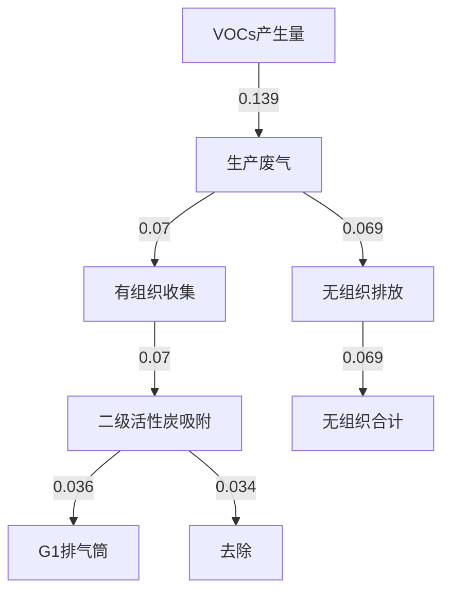
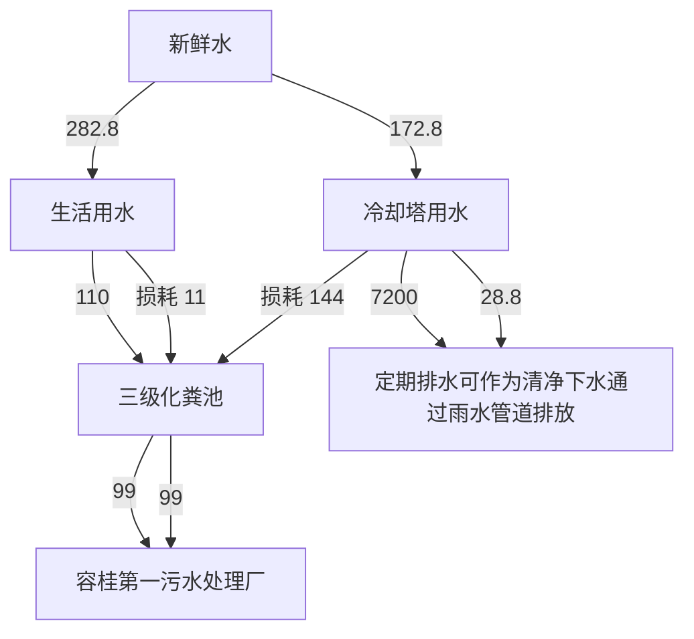
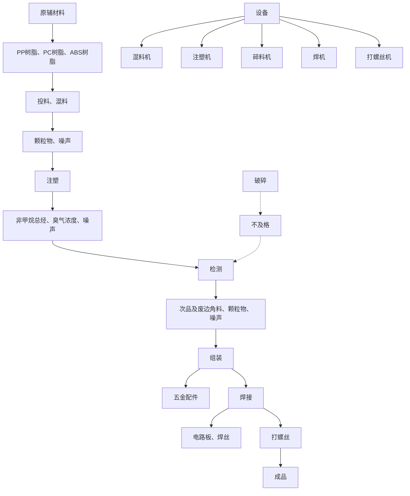
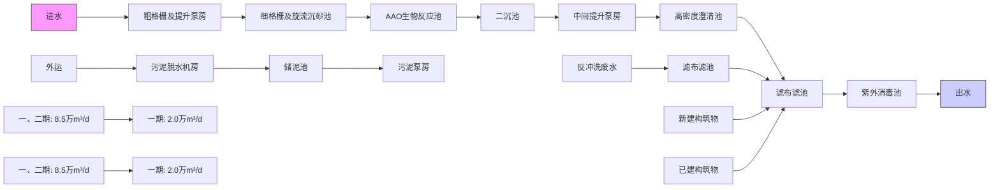

# 建设项目环境影响报告表

（污染影响类）

text_image

科技有限公司
技有限公司新建历
市银惠科技有限公

项目名称：佛山市银惠科

建设单位（盖章：佛山市

编制日期2023年11月

中华人民共和

text_image

农有公司
生态环境部制
长岭市

# 目录

一、建设项目基本情况 .

二、建设项目工程分析 . 17

三、区域环境质量现状、环境保护目标及评价标准. 25

四、主要环境影响和护措施 32

五、环境保护措施监督检查清单 55

六、结论. .58

附图1 项目地理位置图

附图2 项目环境四至图

附图3 项目四至及周围环境示意图

附图4 项目平面布置图

附图5 项目空厂房照片

附图6 项目周边主要环境敏感点分布图

附图7 地表水环境功能区划

附图8 大气环境功能区划

附图9 声环境功能区划图

附图10 佛山市环境管控单元图

附图11 佛山市顺德区环境管控单元图

附图12 关于《佛山市顺德容桂西部片区控制性详细规划》批后通告

附件1 营业执照

附件2 法人身份证

附件3 房产证

附件4 租赁合同

附件5 环评编写协议书

# 一、建设项目基本情况

<table><tr><td>建设项目名称</td><td colspan="5">佛山市银惠科技有限公司新建项目</td></tr><tr><td>项目代码</td><td colspan="5">无</td></tr><tr><td>建设单位联系人</td><td></td><td></td><td>联系方式</td><td></td><td></td></tr><tr><td>建设地点</td><td colspan="5">广东省佛山市顺德区容桂街道四基社区华基路5号锦腾集成电路制造中心7栋1001、1002、1003、1004号</td></tr><tr><td>地理坐标</td><td colspan="5">(东经:113度14分19.198秒,北纬:22度46分26.572秒)</td></tr><tr><td>国民经济行业类别</td><td colspan="2">C3856家用美容、保健护理电器具制造</td><td>建设项目行业类别</td><td colspan="2">三十五、电气机械和器材制造业-77家用电力器具制造385-其他(仅分割、焊接、组装的除外;年用非溶剂型低VOCs含量涂料10吨以下的除外)</td></tr><tr><td>建设性质</td><td colspan="2">☑新建(迁建)□改建□扩建□技术改造</td><td>建设项目申报情形</td><td colspan="2">☑首次申报项目□不予批准后再次申报项目□超五年重新审核项目□重大变动重新报批项目</td></tr><tr><td>项目审批(核准/备案)部门(选填)</td><td colspan="2">无</td><td>项目审批(核准/备案)文号(选填)</td><td colspan="2">无</td></tr><tr><td>总投资(万元)</td><td colspan="2">50</td><td>环保投资(万元)</td><td colspan="2">10</td></tr><tr><td>环保投资占比(%)</td><td colspan="2">20</td><td>施工工期</td><td colspan="2">2个月</td></tr><tr><td>是否开工建设</td><td colspan="2">☑否□是:</td><td>用地面积(m2)</td><td colspan="2">2138</td></tr><tr><td>专项评价设置情况</td><td colspan="5">无</td></tr><tr><td>规划情况</td><td colspan="5">《佛山市顺德区容桂西部片区控制性详细规划》</td></tr><tr><td>规划环境影响评价情况</td><td colspan="5">无</td></tr><tr><td colspan="2">规划及规划环境影响评价符合性分析</td><td colspan="5">根据《佛山市顺德区容桂西部片区控制性详细规划》可知,该场址用地性质为工业用地。因此,本项目建设符合规划。</td></tr><tr><td rowspan="4">其他符合性分析</td><td colspan="5">(1)与产业政策相符性分析本项目所属行业为C3856家用美容、保健护理电器具制造,根据国家发展改革委商务部关于印发《市场准入负面清单(2022年版)》的通知(发改体改规(2022)397号),项目不属于上述目录所列的限制类和禁止准入类严控类项目,也不属于《市场准入负面清单(2022年版)》所列的需许可准入事项。根据《产业结构调整指导目录(2021年修订版)》,项目符合国家有关法律、法规和政策规定,项目属于允许类。根据《广东省禁止、限制生产、销售和使用的塑料制品目录》(2020年版),项目产品不属于上述目录所列的禁止、限制生产、销售和使用类的塑料制品。根据《促进产业结构调整暂行规定》(国发(2005)40号)第十三条,项目符合国家有关法律、法规和政策规定,项目属于允许类。因此,本项目的建设符合国家和地方的相关产业政策。项目产品不涉及《环境保护综合名录》(2021年版)中“高污染、高环境风险”产品,符合《环境保护综合名录》(2021年版)的相关规定。(2)用地相符性分析项目选址位于广东省佛山市顺德区容桂街道四基社区华基路5号锦腾集成电路制造中心7栋1001、1002、1003、1004号,租用已建厂房进行生产。根据《佛山市顺德区容桂西部片区控制性详细规划》可知,该场址用地性质为工业用地。因此,本项目建设符合当地城市规划。(3)与挥发性有机污染物相关政策的相符性分析表1-1项目与挥发性有机污染物排放规定相符性分析</td></tr><tr><td>序号</td><td>政策要求</td><td>项目情况</td><td colspan="2">符合性</td></tr><tr><td colspan="5">1、《中华人民共和国大气污染防治法》(2018年10月26日修正)</td></tr><tr><td>1.1</td><td>第四十四条 生产、进口、销售和使用含挥发性有机物的原材料和产品的,其挥发性有机物含量应当符合质量标准或者要求。国家鼓励生产、进口、销售和使用低毒、低挥发性有机溶剂。</td><td>项目使用塑料原料均为新料,符合政策要求。</td><td colspan="2">符合</td></tr><tr><td rowspan="7"></td><td>1.2</td><td>第四十五条 产生含挥发性有机物废气的生产和服务活动,应当在密闭空间或者设备中进行,并按照规定安装、使用污染防治设施;无法密闭的,应当采取措施减少废气排放。</td><td>建设单位在每台注塑机上方设置集气罩收集废气,集气罩外围安装软帘形成局部围闭。注塑过程产生的有机废气经有效收集,通过“二级活性炭吸附”装置处理达标后,引至52m排气筒G1高空排放。</td><td colspan="2">符合</td></tr><tr><td colspan="5">2、《广东省大气污染防治条例》(2019年3月1日起施行)</td></tr><tr><td>2.1</td><td>第十七条 珠江三角洲区域禁止新建、扩建燃煤燃油火电机组或者企业燃煤燃油自备电站。珠江三角洲区域禁止新建、扩建国家规划外的钢铁、原油加工、乙烯生产、造纸、水泥、平板玻璃、除特种陶瓷以外的陶瓷、有色金属冶炼等大气重污染项目。</td><td>项目属于电气机械和器材制造业,不属于禁止建设的大气重污染项目。</td><td colspan="2">符合</td></tr><tr><td>2.2</td><td>第二十六条 新建、扩建、扩建排放挥发性有机物的建设项目,应当使用污染防治先进可行技术。下列产生含挥发性有机物废气的生产和服务活动,应当优先使用低挥发性有机物含量的原材料和低排放环保工艺,在确保安全条件下,按照规定在密闭空间或者设备中进行,安装、使用满足防爆、防静电要求的治理效率高的污染防治设施;无法密闭或者不适宜密闭的,应当采取有效措施减少废气排放:(一)石油、化工、煤炭加工与转化等含挥发性有机物原料的生产;(二)燃油、溶剂的储存、运输和销售;(三)涂料、油墨、粘合剂、农药等以挥发性有机物为原料的生产;(四)涂装、印刷、粘合、工业清洗等使用含挥发性有机物产品的生产活动;(五)其他产生挥发性有机物的生产和服务活动。</td><td>建设单位在每台注塑机上方设置集气罩收集废气,集气罩外围安装软帘形成局部围闭。注塑过程产生的有机废气经有效收集,通过“二级活性炭吸附”装置处理达标后,引至52m排气筒G1高空排放。可有效减少有机废气排放,减少异味影响。</td><td colspan="2">符合</td></tr><tr><td>2.3</td><td>第三十条 产生恶臭污染物的化工、石化、制药、制革、骨胶炼制、生物发酵、饲料加工、家具制造等行业应当科学选址,设置合理的防护距离,并安装净化装置或者采取其他措施,防止排放恶臭污染物。</td><td>本项目属于电气机械和器材制造业,选址位于工业区内,产生恶臭主要来源于注塑工序使用的PC树脂、ABS树脂、PP树脂。项目500米范围内大气环境保护目标为四基社区、四基中学,恶臭污染物经集气罩收集,通过“二级活性炭吸附”装置处理后,引至52m排气筒高空排放。恶臭污染物对附近大气环境影响较小。</td><td colspan="2">符合</td></tr><tr><td colspan="5">3、关于印发《重点行业挥发性有机物综合治理方案》的通知(环大气[2019]53号)</td></tr><tr><td>3.1</td><td>含VOCs物料应储存于密闭容器、包装袋,高效密封储罐,封闭式储库、料仓等。含VOCs物料转移和输送,应采用密闭管道或密闭容器、罐车等。</td><td>项目含VOCs的物料为固体颗粒状,常温状态下不挥发VOCs。</td><td colspan="2">符合</td></tr><tr><td rowspan="9"></td><td>3.2</td><td>含VOCs物料生产和使用过程,应采取有效收集措施或在密闭空间中操作。</td><td>项目注塑工序设置于生产车间内,建设单位在每台注塑机上方设置集气罩负压收集废气,集气罩外围安装软帘形成局部围闭,收集效率可达50%。</td><td colspan="2">符合</td></tr><tr><td>3.3</td><td>提高废气收集率。遵循“应收尽收、分质收集”的原则,科学设计废气收集系统,将无组织排放转变为有组织排放进行控制。采用全密闭集气罩或密闭空间的,除行业有特殊要求外,应保持微负压状态,并根据相关规范合理设置通风量。</td><td>项目产生的有机废气采用集气罩收集,集气罩外围安装软帘形成局部围闭,无组织排放量较少。</td><td colspan="2">符合</td></tr><tr><td>3.4</td><td>鼓励企业采用多种技术的组合工艺,提高VOCs治理效率。低浓度、大风量废气,宜采用沸石转轮吸附、活性炭吸附、减风增浓等浓缩技术,提高VOCs浓度后净化处理;高浓度废气,优先进行溶剂回收,难以回收的,宜采用高温焚烧、催化燃烧等技术。</td><td>项目采用活性炭吸附装置处理,尾气可稳定达标排放。</td><td colspan="2">符合</td></tr><tr><td>3.5</td><td>车间或生产设施收集排放的废气,VOCs初始排放速率大于等于3千克/小时、重点区域大于等于2千克/小时的,应加大控制力度,除确保排放浓度稳定达标外,还应实行去除效率控制,去除效率不低于80%。</td><td>项目采用活性炭吸附装置处理,尾气可稳定达标排放。</td><td colspan="2">符合</td></tr><tr><td>3.6</td><td>采用的原辅材料符合国家有关低VOCs含量产品规定的除外,有行业排放标准的按其相关规定执行。</td><td>项目含VOCs的物料为固体颗粒状,常温状态下不挥发VOCs。</td><td colspan="2">符合</td></tr><tr><td>3.7</td><td>企业采用符合国家有关低VOCs含量产品规定的涂料、油墨、胶粘剂等,排放浓度稳定达标且排放速率、排放绩效等满足相关规定的,相应生产工序可不要求建设末端治理设施。使用的原辅材料VOCs含量(质量比)低于10%的工序,可不要求采取无组织排放收集措施。</td><td>建设单位在每台注塑机上方设置集气罩收集废气,集气罩外围安装软帘形成局部围闭。注塑过程产生的有机废气经有效收集,通过“二级活性炭吸附”装置处理达标后,引至52m排气筒G1高空排放。</td><td colspan="2">符合</td></tr><tr><td colspan="5">4、关于印发《广东省涉挥发性有机物(VOCs)重点行业治理指引》的通知(粤环办〔2021〕43号)中橡胶和电气机械和器材制造业VOCs治理指引</td></tr><tr><td>4.1</td><td>粉状、粒状VOCs物料采用气力输送设备、管状带式输送机、螺旋输送机等密闭输送方式,或者采用密闭的包装袋、容器或罐车进行物料转移。</td><td>项目含VOCs的物料为固体颗粒状,主要使用PC树脂、ABS树脂、PP树脂,常温状态下不挥发VOCs。项目原辅料采用密封包装容器进行运输与储存。</td><td colspan="2">符合</td></tr><tr><td>4.2</td><td>在混合/混炼、塑炼/塑化/熔化、加工成型(注塑、注射、压制、压延、发泡、纺丝等)、硫化等作业中应采用密闭设备或在密闭空间中操作,废气应排至VOCs废气收集处理系统;无法密闭的,应采取局部气体收集措施,废气应排至VOCs废气收集处理系统。</td><td>建设单位在每台注塑机上方设置集气罩收集废气,集气罩外围安装软帘形成局部围闭。注塑过程产生的有机废气经有效收集,通过“二级活性炭吸附”装置处理达标后,引至52m排气筒G1高空排放</td><td colspan="2">符合</td></tr><tr><td rowspan="8"></td><td>4.3</td><td>载有VOCs物料的设备及其管道在开停工(车)、检维修和清洗时,应在退料阶段将残存物料退净,并用密闭容器盛装,退料过程废气应排至VOCs废气收集处理系统;清洗及吹扫过程排气应排至VOCs废气收集处理系统。</td><td>企业做好废气设施的巡检,定期更换活性炭,按照管理要求定期监测废气,确保处理设施能正常运行,发生异常时,应及时停止生产,待处理设备运行稳定正常后,才恢复生产。</td><td colspan="2">符合</td></tr><tr><td>4.4</td><td>采用外部集气罩的,距集气罩开口面最远处的VOCs无组织排放位置,控制风速不低于0.3m/s。</td><td>项目采用“集气罩+帘幕”的收集方式,距集气罩开口面最远处的VOCs无组织排放位置,控制风速不低于0.3m/s。</td><td colspan="2">符合</td></tr><tr><td>4.5</td><td>塑料制品行业:a)有机废气排气筒排放浓度不高于广东省《大气污染物排放限值》(DB4427-2001)第II时段排放限值,合成革和人造革制造企业排放浓度不高于《合成革与人造革工业污染物排放标准》(GB21902-2008)排放限值,若国家和我省出台并实施适用于塑料制品制造业的大气污染物排放标准,则有机废气排气筒排放浓度不高于相应的排放限值;车间或生产设施排气中NMHC初始排放速率≥3kg/h时,建设VOCs处理设施且处理效率≥80%;b)厂区内无组织排放监控点NMHC的小时平均浓度值不超过6mg/m3,任意一次浓度值不超过20mg/m3。</td><td>项目电气机械和器材制造业,非甲烷总烃执行合成树脂工业污染物排放标准》(GB31572-2015)表4大气污染物排放限值和表9企业边界大气污染物浓度限值,厂区内有机废气无组织排放执行广东省地方标准《固定污染源挥发性有机物综合排放标准》(DB44/2367-2022)中表3厂区内VOCs无组织排放限值。</td><td colspan="2">符合</td></tr><tr><td>4.6</td><td>VOCs治理设施应与生产工艺设备同步运行,VOCs治理设施发生故障或检修时,对应的生产工艺设备应停止运行,待检修完毕后同步投入使用;生产工艺设备不能停止运行或不能及时停止运行的,应设置废气应急处理设施或采取其他替代措施。</td><td>已要求企业VOCs治理设施应与生产工艺设备同步运行,日常安排专门人员对治理设备进行定期巡查和检修,避免故障情况的出现。</td><td colspan="2">符合</td></tr><tr><td>4.7</td><td>建立危废台账,整理危废处置合同、转移联单及危废处理方资质佐证材料。</td><td>企业严格执行危险废物转移计划报批、依法建立危险废物转移联单,并通过信息系统登记转移计划和电子转移联单。</td><td colspan="2">符合</td></tr><tr><td>4.8</td><td>建立废气收集处理设施台账,记录废气处理设施进出口的监测数据(废气量、浓度、温度、含氧量等)、废气收集与处理设施关键参数、废气处理设施相关耗材(吸收剂、吸附剂、催化剂等)购买和处理记录。</td><td>项目废气治理设施安排专人维护并定期建立台账,记录相关废气数据。</td><td colspan="2">符合</td></tr><tr><td>4.9</td><td>要求建设单位需对有机废气有组织和无组织废气、噪声每年监测1次</td><td>企业应根据监测计划,定期对废气、噪声开展相应频次的监测。</td><td colspan="2">符合</td></tr><tr><td colspan="5">5、《佛山市顺德区生态环境保护“十四五”规划(2021—2025)》</td></tr><tr><td rowspan="8"></td><td>5.1</td><td>严格控制“高耗能、高排放”项目盲目发展,禁止新建、扩建水泥、平板玻璃、化学制浆、生皮制革以及国家规划外的钢铁、原油加工等项目;专业电镀、印染等项目进入定点园区集中管理</td><td>项目属于电气机械和器材制造业,不属于水泥、平板玻璃、化学制浆、生皮制革以及国家规划外的钢铁、原油加工等项目。</td><td colspan="2">符合</td></tr><tr><td>5.2</td><td>大力推进低VOCs含量、低反应活性的原辅材料替代,将全面使用低VOCs含量原辅材料的企业纳入正面清单和政府绿色采购清单。鼓励重点行业企业开展生产工艺和设备水性化改造,推广使用水性、高固体分、无溶剂、粉末等低VOCs含量涂料。严格落实《挥发性有机物无组织排放控制标准》,开展厂区内无组织排放浓度监测,加强对含VOCs物料储存、转移和运输、设备与管线组件泄漏、敞开页面逸散以及工艺过程等五类排放源的管控。加强储油库、加油站等VOCs排放治理,推动油品储运销体系安装油气回收自动监控系统。</td><td>本项目使用的物料不属于禁止使用的高VOCs含量原辅材料,符合政策要求。建设单位严格落实《挥发性有机物无组织排放控制标准》,开展厂区内无组织排放浓度监测。</td><td colspan="2">符合</td></tr><tr><td>5.3</td><td>持续推进重点行业VOCs整治。持续开展挥发性有机物专项整治,继续推进重点行业企业开展销号式综合整治,建立VOC重点监管企业名单并动态更新,督促企业建立VOCs管控台账清单;持续探寻高效节能的VOCs治理技术,对采用低温等离子、光氧化、光催化等低效治理工艺的企业在臭氧污染天气应对期间实施停限产或错峰生产,并推动企业逐步淘汰低效治理工艺。</td><td>项目采用活性炭吸附装置处理,尾气可稳定达标排放。</td><td colspan="2">符合</td></tr><tr><td>5.4</td><td>加强VOCs源头替代和无组织排放管控。大力推进低VOCs含量、低反应活性的原辅材料替代,将全面使用低VOCs含量原辅材料的企业纳入正面清单和政府绿色采购清单。鼓励重点行业企业开展生产工艺和设备水性化改造,推广使用水性、高固体分、无溶剂、粉末等低VOCs含量涂料。严格落实《挥发性有机物无组织排放控制标准》,开展厂区内无组织排放浓度监测,加强对含VOCs 物料储存、转移和运输、设备与管线组件泄漏、敞开页面逸散以及工艺过程等五类排放源的管控。加强储油库、加油站等VOCs排放治理,推动油品储运销体系安装油气回收自动监控系统</td><td>项目含VOCs的物料为固体颗粒状,主要使用PC树脂、ABS树脂、PP树脂,常温状态下不挥发VOCs。建设单位严格落实《挥发性有机物无组织排放控制标准》,开展厂区内无组织排放浓度监测。</td><td colspan="2">符合</td></tr><tr><td colspan="5">6、《挥发性有机物无组织排放控制标准》(GB37822-2019)</td></tr><tr><td rowspan="3">6.1</td><td>VOCs物料应储存于密闭的容器、包装袋、储罐、储库、料仓中。</td><td rowspan="3">本项目使用的物料采用密封容器存放在厂房内的仓库;厂房为已建成工业厂房,拥有完整的维护结构,地面已经全部混凝土硬化处理。</td><td colspan="2" rowspan="3">符合</td></tr><tr><td colspan="2">盛装VOCs物料的容器或包装袋应存放于室内,或存放与设置雨棚、遮阳和防渗设施的专用场地。盛装VOCs物料的容器或包装袋在非取用状态时应加盖、封口,保持密闭。</td></tr><tr><td colspan="2">VOCs物料储存、料仓应满足3.6条对密闭空间的要求。</td></tr><tr><td rowspan="8"></td><td>6.2</td><td>粉状、粒状VOCs物料应采用气力输送设备、管状带式输送机、螺旋输送机等密闭输送方式,或采用密闭的包装袋、容器或罐车进行物料转移。</td><td>本项目VOCs物料使用时采用密闭包装容器进行转移。</td><td colspan="2">符合</td></tr><tr><td>6.3</td><td>VOCs物料卸(出、放)料过程密闭,卸料废气应排至VOCs废气收集处理系统;无法密闭的,应采取局部气体收集措施,废气应排至VOCs废气收集处理系统。</td><td>建设单位在每台注塑机上方设置集气罩收集废气,集气罩外围安装软帘形成局部围闭。注塑过程产生的有机废气经有效收集,通过“二级活性炭吸附”装置处理达标后,引至52m排气筒G1高空排放。</td><td colspan="2">符合</td></tr><tr><td colspan="5">7、《固定污染源挥发性有机物综合排放标准(DB44/2367-2022)》</td></tr><tr><td>7.1</td><td>排气筒高度不低于15m(因安全考虑或者有特殊工艺要求的除外),具体高度以及与周围建筑物的相对高度关系应当根据环境影响评价文件确定。</td><td>建设单位在每台注塑机上方设置集气罩收集废气,集气罩外围安装软帘形成局部围闭。注塑过程产生的有机废气经有效收集,通过“二级活性炭吸附”装置处理达标后,引至52m排气筒G1高空排放。</td><td colspan="2">符合</td></tr><tr><td>7.2</td><td>企业应当建立台账,记录废气收集系统、VOCs处理设施的主要运行和维护信息,如运行时间、废气处理量、操作温度、停留时间、吸附剂再生/更换周期和更换量、催化剂更换周期和更换量、吸收液pH值等关键运行参数。台账保存期限不少于3年。</td><td>项目废气治理设施安排专人维护并定期建立台账,记录相关废气数据。</td><td colspan="2">符合</td></tr><tr><td>7.3</td><td>VOCs物料应当储存于密闭的容器、储罐、储库、料仓中;盛装VOCs物料的容器应当存放于室内,或者存放于设置有雨棚、遮阳和防渗设施的专用场地。盛装VOCs物料的容器或者包装袋在非取用状态时应当加盖、封口,保持密闭。</td><td>本项目使用的物料采用密封容器存放在厂房内的仓库;厂房为已建成工业厂房,拥有完整的维护结构,地面已经全部混凝土硬化处理。</td><td colspan="2">符合</td></tr><tr><td>7.4</td><td>废气收集系统排风罩(集气罩)的设置应当符合GB/T16758的规定。采用外部排风罩的,应当按GB/T 16758、WS/T 757—2016规定的方法测量控制风速,测量点应当选取在距排风罩开口面最远处的VOCs无组织排放位置,控制风速不应当低于0.3m/s(行业相关规范有具体规定的,按相关规定执行)。</td><td>建设单位在每台注塑机上方设置集气罩收集废气,集气罩外围安装软帘形成局部围闭。注塑过程产生的有机废气经有效收集,通过“二级活性炭吸附”装置处理达标后,引至52m排气筒G1高空排放。控制风速大于0.3m/s。</td><td colspan="2">符合</td></tr><tr><td colspan="5">8、《广东省生态环境厅关于做好重点行业建设项目挥发性有机物总量指标管理工作的通知》(粤环发〔2019〕2号)</td></tr><tr><td rowspan="2"></td><td>8.1</td><td>建设项目VOCs排放总量指标审核及管理与总量减排目标完成情况挂钩,对总量减排目标进度滞后于时序进度的地区,不得审批新增VOCs污染物排放建设项目的环评。省生态环境主管部门负责审批的新、改、扩建涉VOCs排放项目,由项目所在地地级以上市生态环境主管部门出具VOCs总量指标来源及替代削减方案的意见。其它各级生态环境主管部门负责审批的涉VOCs排放项目参照省生态环境厅审批项目的做法,开展总量替代。</td><td>项目VOCs排放总量指标为0.103t/a,由容桂街道出具VOCs总量指标来源及替代削减方案的意见。</td><td colspan="2">符合</td></tr><tr><td colspan="5">(4)《关于印发〈广东省禁止、限制生产、销售和使用的塑料制品目录〉(2020年版)的通知》(粤发改资环函〔2020〕1747号)相符性分析根据《关于印发〈广东省禁止、限制生产、销售和使用的塑料制品目录〉(2020年版)的通知》(粤发改资环函〔2020〕1747号)文件要求:“一、禁止生产、销售的塑料制品--厚度小于0.025毫米的超薄塑料购物袋、厚度小于0.01毫米的聚乙烯农用地膜、以医疗废物为原料制造塑料制品、一次性发泡塑料餐具、一次性塑料棉签、含塑料微珠的日化产品。”本项目主要生产理发器,不属于上述禁止生产、销售的塑料制品,符合文件要求。(5)“三线一单”符合性分析1、《广东省人民政府关于印发广东省“三线一单”生态环境分区管控方案的通知》(粤府〔2020〕71号)根据《广东省人民政府关于印发广东省“三线一单”生态环境分区管控方案的通知》(粤府〔2020〕71号),广东省将以环境管控单元为基础,实施生态环境分区管控,精细化管理、保护生态环境。本项目与广东省“三线一单”生态环境分区管控方案相符性分析如下:与“一核一带一区”区域管控要求的相符性项目位于珠三角核心区,主要从事理发器的生产,不属于区域布局管控要求中的禁止新建、扩建水泥、平板玻璃、化学制浆、生皮制革以及国家规划外的钢铁、原油加工等项目。项目不涉及使用高挥发性原辅材料,不属于新建生产和使用高挥发性有机物原辅材料的项目,符合区域布局管控要求。项目所属C3856家用美容、保健护理电器具制造,不属于高能耗行业,项目生产设备使用电能,生产用水由市政供水,不直接取用江河湖库水量,不会对项目所在地生态流量造成影响,符合能源利用要求。</td></tr><tr><td></td><td colspan="5">项目生活污水经三级化粪池预处理后由市政管网排入容桂第一污水处理厂,尾水排至鸡鸦水道;冷却水循环使用,定期排水可作为清净下水通过雨水管道排放。根据《佛山市生态环境局顺德分局关于发布2022年度佛山市顺德区环境质量状况公报的通知》附件《2022年佛山市顺德区环境质量状况公报》中“表2 2022年顺德区主河道质量评价及年度对比”的评价结果,纳污水体水质较好。项目位于广东省佛山市顺德区容桂街道四基社区华基路5号锦腾集成电路制造中心7栋1001、1002、1003、1004号,不属于石化、化工重点园区环境风险防控区域。项目产生的危险废物拟定期委托有资质的处置公司进行收集处理,并通过信息系统登记转移计划和电子转移联单,符合危险废物全过程跟踪管理的防控要求。与环境管控单元总体管控要求的相符性根据《广东省人民政府关于印发广东省“三线一单”生态环境分区管控方案的通知》(粤府〔2020〕71号)发布的广东省环境管控单元图,项目所在区域为重点管控单元,重点管控单元以推动产业转型升级、强化污染减排、提升资源利用效率为重点,加快解决资源环境负荷大、局部区域生态环境质量差、生态环境风险高等问题。并且严格限制新建钢铁、燃煤燃油火电、石化、储油库等项目,产生和排放有毒有害大气污染物项目,以及使用溶剂型油墨、涂料、清洗剂、胶黏剂等高挥发性有机物原辅材料的项目;鼓励现有该类项目逐步搬迁退出。项目不属于上述限制类项目,符合重点管控单元要求。“三线一单”的相符性1生态保护红线项目地址位于广东省佛山市顺德区容桂街道四基社区华基路5号锦腾集成电路制造中心7栋1001、1002、1003、1004号,项目所在区域不处于生态红线内。因此,本项目建设满足生态保护红线管理要求。2环境质量底线本项目所在地区属于大气环境不达标区;项目纳污水体为鸡鸦水道,水质满足水环境功能区划要求。</td></tr></table>

本项目废气污染物产生量较小，经过有效收集处理后达标排放，对周边环境影响很小，不会导致环境空气质量超标；项目生活污水经三级化粪池预处理后由市政管网排入容桂第一污水处理厂，尾水排至鸡鸦水道；冷却水循环使用，定期排水可作为清净下水通过雨水管道排放；不会导致纳污水体水质超标。因此，本项目建设满足环境质量底线要求。

③资源利用上线

本项目生产过程中会消耗一定量的电源、水资源等资源消耗，资源消耗量相对区域资源利用总量较少，符合资源利用上限要求。

④环保准入负面清单

本项目所属行业为 C3856 家用美容、保健护理电器具制造，根据国家发展改革委商务部关于印发《市场准入负面清单（2022年版）》的通知（发改体改规﹝2022﹞397 号），项目不属于上述目录所列的鼓励类、限制类、禁止（淘汰）类严控类项目，也不属于《市场准入负面清单（2022年版）》所列的禁止准入及需许可准入事项。根据《广东省禁止、限制生产、销售和使用的塑料制品目录》（2020 年版），项目产品不属于上述目录所列的禁止、限制生产、销售和使用类的塑料制品。本项目符合国家有关法律、法规和政策规定，项目属于允许类。因此，本项目的建设符合国家和地方的相关产业政策。

项目产品不涉及《环境保护综合名录》（2021 年版）中“高污染、高环境风险”产品，符合《环境保护综合名录》（2021年版）的相关规定。

# 2、《佛山市人民政府关于印发佛山市“三线一单”生态环境分区管控方案的通知》（佛府〔2021〕11号）

根据《佛山市人民政府关于印发佛山市“三线一单”生态环境分区管控方案的通知》（佛府〔2021〕11 号）的附件 1 佛山市环境管控单元图，项目所在地属于重点管控单元（环境管控单元编码：ZH44060620001，环境管控单元名称：容桂街道重点管控区，详见附图 11）。相关管控要求的相符性分析如下：

表 1-2 项目与佛山市“三线一单”的相符性分析

<table><tr><td>管控维度</td><td>管控要求</td><td>工程内容</td><td>符合性</td></tr><tr><td>区域布</td><td>【产业/综合类】系统推进村级工业园升级</td><td>项目选址位于广东省佛</td><td>符合</td></tr></table>

<table><tr><td rowspan="9"></td><td rowspan="6">局管控</td><td>改造,腾出连片空间,布局产业集聚区和主题产业园,推动工业项目入园集聚发展。新增工业制造业用地原则上安排在产业集聚区内,产业集聚区外原则上不鼓励工业及物流仓储用地的新建与改造。</td><td>山市顺德区容桂街道四基社区华基路5号锦腾集成电路制造中心7栋1001、1002、1003、1004号,属于产业集聚区。</td><td></td></tr><tr><td>【产业/综合类】产业聚集区所属地块内的工业用地或企业与村庄、学校等环境敏感点之间应设置合理的大气环境防护距离,并通过绿化带进行有效隔离;聚集区规划布局应注重大气污染排放企业应尽量避免布局在居住用地的常年主导风向的上风向。</td><td>项目500米范围内大气环境保护目标为四基社区、四基中学,大气污染物经有效收集处理后达标排放,对周围环境影响不大</td><td>符合</td></tr><tr><td>【产业/限制类】受纳水体或监控断面不达标的,不得新建、扩建向河涌直接排放废水的项目。新建、扩建含蚀刻工序的线路板生产项目和化工项目应在配套污水集中处置的工业园区或生活污水管网覆盖区域内建设;纯加工型印花项目,含酸洗、磷化的金属表面处理、金属制品项目(与自身高新技术企业配套的除外),含酸洗、喷涂、化学抛光、电解等涉及废水排放工艺的不锈钢型材加工项目(与自身高新技术企业配套的除外),应进入以此类项目为主导产业、有相应废水集中治理设施的工业园区,实现集中治污。</td><td>项目属C3856家用美容、保健护理电器具制造,属于电气机械和器材制造业,项目生活污水经三级化粪池预处理后由市政管网排入容桂第一污水处理厂,尾水排至鸡鸦水道;冷却水循环使用,定期排水可作为清净下水通过雨水管道排放,不涉及使用不锈钢原材料,不属于线路板生产项目,不属于含酸洗、喷涂、拉丝、表面抛光等工艺的不锈钢型材加工项目。</td><td>符合</td></tr><tr><td>【产业/综合类】划定家具生产优先发展区域,优先发展区外不再新建涉及涂装工艺的木质家具制造项目。</td><td>项目属于电气机械和器材制造业,不属于涉及涂装工艺的木质家具制造项目。</td><td>符合</td></tr><tr><td>【大气/限制类】大气环境受体敏感重点管控区内,应严格限制新建储油库项目、产生和排放有毒有害大气污染物的建设项目以及使用溶剂型油墨、涂料、清洗剂、胶粘剂等高挥发性有机物原辅材料项目,鼓励现有该类项目搬迁退出。</td><td>项目原料不使用高VOCs含量原辅材料。</td><td>符合</td></tr><tr><td>【土壤/禁止类】禁止新建、扩建增加重点防控的重金属污染物排放的建设项目。</td><td>不属于重点防控的重金属污染物排放类建设项目。</td><td>符合</td></tr><tr><td rowspan="3">能源资源利用</td><td>【水资源/综合类】贯彻落实“节水优先”方针,实行最严格水资源管理制度,容桂街道万元国内生产总值用水量、万元工业增加值用水量、用水总量、农田灌溉水有效利用系数等用水总量和效率指标达到区下达要求。</td><td>项目用水主要为员工生活用水、冷却塔用水,内部实行节约用水,合理使用水资源。</td><td>符合</td></tr><tr><td>【土地资源/限制类】落实单位土地面积投资强度、土地利用强度等建设用地控制性指标要求,提高土地利用效率。</td><td>项目建设用地属于工业用地。</td><td>符合</td></tr><tr><td>【岸线/禁止类】严格水域岸线用途管制,</td><td>项目建设在陆域上,不属</td><td>符合</td></tr><tr><td rowspan="7"></td><td></td><td>新建项目一律不得违规占用水域。严禁破坏生态的岸线利用行为和不符合其功能定位的开发建设活动,严禁以各种名义侵占河道、围垦湖泊、非法采砂等。</td><td>于占用水域和破坏生态的岸线利用行为。</td><td></td></tr><tr><td rowspan="6">污染物排放管控</td><td>【水/限制类】城镇新区建设实行雨污分流,逐步推进初期雨水收集、处理和资源化利用。住宅、商业体、学校、市场等城镇开发建设项目应当配套或者同步计划建设公共排水设施,公共排水设施或自建排污水设施未能投产运行的,以上涉水项目不得投入使用。新建小区严格实施雨污分流,阳台、露台等污水接入污水收集系统,将生活污水“应截尽截”。做好大型楼盘、集贸市场、餐饮以及学校等4大类排水户污水接入市政管网工作。</td><td>建设单位实行雨污分流,且生产车间位于厂房内,不存在露天作业。项目生活污水经三级化粪池预处理后引至容桂第一污水处理厂深度处理,尾水达标排放。</td><td>符合</td></tr><tr><td>【水/综合类】容桂街道重点河涌水质上年度未达到水环境环境质量目标的,需组织编制、系统实施、向社会公开区域重点水污染物减排计划并明确“替代量”,本年度新建、改建、扩建项目新增水环境重点污染物实行区域“减二增一”替代(工业、生活或综合集中废水处理设施、民生项目除外)。</td><td>项目已接驳市政管网。不排放水环境重点污染物。</td><td>符合</td></tr><tr><td>【水/综合类】区域内应合理规划建设工业或综合集中废水处理设施。逐步推进工业集聚区“污水零直排区”建设,开展排水单元工业废水、生活污水、雨水分类收集、分质处理,确保园区“管网全覆盖、雨污全分流、污水全收集、处理全达标”</td><td>项目已接驳市政管网。项目生活污水经三级化粪池预处理后由市政管网排入容桂第一污水处理厂,尾水排至鸡鸦水道;冷却水循环使用,定期排水可作为清净下水通过雨水管道排放。</td><td>符合</td></tr><tr><td>【水/综合类】结合村级工业园改造,全面提升产业层次与集聚度,促进污染集中整治。</td><td>项目选址位于广东省佛山市顺德区容桂街道四基社区华基路5号锦腾集成电路制造中心7栋1001、1002、1003、1004号,属于产业集聚区。</td><td>符合</td></tr><tr><td>【水/综合类】稳步推进排水设施“三个一体化”管理模式,补齐城乡污水收集和处理短板,推动容桂第二、第二污水处理厂提质增效,加快消除城中村、老旧城区、城乡结合部等污水收集管网空白区,逐步实现城乡污水收集处理全覆盖。2025年前完成容桂第二、第二污水处理厂扩建,尾水应执行《城镇污水处理厂污染物排放标准》(GB18918-2002)一级A标准及《广东省水污染物排放限值》(DB44/26-2001)的较严值。</td><td rowspan="2">项目已接驳市政管网。项目生活污水经三级化粪池预处理后由市政管网排入容桂第一污水处理厂,尾水排至鸡鸦水道;冷却水循环使用,定期排水可作为清净下水通过雨水管道排放。</td><td>符合</td></tr><tr><td>【水/综合类】近期保留马东、马南两处污水处理站,到2030年将马冈村居污水接入</td><td>符合</td></tr></table>

<table><tr><td rowspan="4"></td><td>市政污水管网,纳入杏坛城镇污水处理系统;其余行政村(社区)污水均通过市政管网和农村支管纳入容桂城镇污水处理处理系统。</td><td rowspan="2"></td><td></td></tr><tr><td>【水/综合类】产业集聚区和主题园区内做好污水管网和污水集中处理设施的配套保障,确保废水收集到城镇污水处理厂、园区污水处理厂或分散式污水处理设施集中处置。</td><td>符合</td></tr><tr><td>【大气/综合类】大力推进低VOCs含量原辅材料替代,加快涉VOCs重点行业的生产工艺升级改造,推行自动化生产工艺,对达不到要求的VOCs收集及治理设施进行整治提升,逐步淘汰低效VOCs治理设施</td><td>项目不使用高VOCs含量原辅材料,有机废气经有效收集处理后达标排放。</td><td>符合</td></tr><tr><td>【土壤气/综合类】作为重金属污染重点防控区,区域内重点重金属排放总量只减不增。</td><td>不属于重点防控的重金属污染物排放类建设项目。</td><td>符合</td></tr><tr><td rowspan="2">环境风险防控</td><td>【水/综合类】容桂第二、第二污水处理厂、工业污水集中处理设施应采取有效措施,防止事故废水直接排入水体。完善污水处理厂在线监控系统联网,实现污水处理厂的实时、动态监管。</td><td rowspan="2">建设单位加强环境风险分级分类管理,强化环境风险管控。</td><td>符合</td></tr><tr><td>【风险/综合类】加强环境风险分级分类管理,强化金属制品、有色金属和压延加工、化学原料和化学品制造业等涉重金属、化工行业企业及工业园区等重点环境风险源的环境风险防控。</td><td>符合</td></tr></table>

# 3、《佛山市顺德区人民政府关于印发佛山市顺德区“三线一单”生态环境分区管控方案的通知》（顺府发〔2021〕11号）

对照《佛山市顺德区人民政府关于印发佛山市顺德区“三线一单”生态环境分区管控方案的通知》（顺府发〔2021〕11号）的附件 2佛山市顺德区环境管控单元图，项目所在地属于重点管控单元（环境管控单元编码：ZH44060620001，环境管控单元名称：容桂街道重点管控区，详见附图12）。相关管控要求的相符性分析如下：

表 1-3 项目与顺德区“三线一单”的相符性分析

<table><tr><td>管控维度</td><td>管控要求</td><td>工程内容</td><td>符合性</td></tr><tr><td rowspan="2">区域布局管控</td><td>【产业/综合类】系统推进村级工业园升级改造,腾出连片空间,布局产业集聚区和主题产业园,推动工业项目入园集聚发展。新增工业制造业用地原则上安排在产业集聚区内,产业集聚区外原则上不鼓励工业及物流仓储用地的新建与改造。</td><td>项目选址位于广东省佛山市顺德区容桂街道四基社区华基路5号锦腾集成电路制造中心7栋1001、1002、1003、1004号,属于产业集聚区。</td><td>符合</td></tr><tr><td>【产业/综合类】产业聚集区所属地块内的</td><td>项目500米范围内大气环</td><td>符合</td></tr></table>

<table><tr><td rowspan="9"></td><td rowspan="5"></td><td>工业用地或企业与村庄、学校等环境敏感点之间应设置合理的大气环境防护距离,并通过绿化带进行有效隔离;聚集区规划布局应注重大气污染排放企业应尽量避免布局在居住用地的常年主导风向的上风向。</td><td>境保护目标为四基社区、四基中学,项目大气污染物经有效的收集处理后可达标排放,对周围大气环境影响较小。</td><td></td></tr><tr><td>【产业/限制类】受纳水体或监控断面不达标的,不得新建、扩建向河涌直接排放废水的项目。新建、扩建含蚀刻工序的线路板生产项目和化工项目应在配套污水集中处置的工业园区或生活污水管网覆盖区域内建设;纯加工型印花项目,含酸洗、磷化的金属表面处理、金属制品项目(与自身高新技术企业配套的除外),含酸洗、喷涂、化学抛光、电解等涉及废水排放工艺的不锈钢型材加工项目(与自身高新技术企业配套的除外),应进入以此类项目为主导产业、有相应废水集中治理设施的工业园区,实现集中治污。</td><td>项目属C3856家用美容、保健护理电器具制造,属于电气机械和器材制造业,项目生活污水经三级化粪池预处理后由市政管网排入容桂第一污水处理厂,尾水排至鸡鸦水道;冷却水循环使用,定期排水可作为清净下水通过雨水管道排放,不涉及使用不锈钢原材料,不属于线路板生产项目,不属于含酸洗、喷涂、拉丝、表面抛光等工艺的不锈钢型材加工项目。</td><td>符合</td></tr><tr><td>【产业/综合类】划定家具生产优先发展区域,优先发展区外不再新建涉及涂装工艺的木质家具制造项目。</td><td>项目属于电气机械和器材制造业,不属于涉及涂装工艺的木质家具制造项目。</td><td>符合</td></tr><tr><td>【大气/限制类】大气环境受体敏感重点管控区内,应严格限制新建储油库项目、产生和排放有毒有害大气污染物的建设项目以及使用溶剂型油墨、涂料、清洗剂、胶粘剂等高挥发性有机物原辅材料项目,鼓励现有该类项目搬迁退出。</td><td>项目不使用高VOCs含量原辅材料。</td><td>符合</td></tr><tr><td>【土壤/禁止类】禁止新建、扩建增加重点防控的重金属污染物排放的建设项目。</td><td>不属于重点防控的重金属污染物排放类建设项目。</td><td>符合</td></tr><tr><td rowspan="3">能源资源利用</td><td>【水资源/综合类】贯彻落实“节水优先”方针,实行最严格水资源管理制度,容桂街道万元国内生产总值用水量、万元工业增加值用水量、用水总量、农田灌溉水有效利用系数等用水总量和效率指标达到区下达要求。</td><td>项目用水主要为员工生活用水、冷却塔用水,内部实行节约用水,合理使用水资源。</td><td>符合</td></tr><tr><td>【土地资源/限制类】落实单位土地面积投资强度、土地利用强度等建设用地控制性指标要求,提高土地利用效率。</td><td>项目建设用地属于工业用地。</td><td>符合</td></tr><tr><td>【岸线/禁止类】严格水域岸线用途管制,新建项目一律不得违规占用水域。严禁破坏生态的岸线利用行为和不符合其功能定位的开发建设活动,严禁以各种名义侵占河道、围垦湖泊、非法采砂等。</td><td>项目建设在陆域上,不属于占用水域和破坏生态的岸线利用行为。</td><td>符合</td></tr><tr><td>污染物排放管控</td><td>【水/限制类】城镇新区建设实行雨污分流,逐步推进初期雨水收集、处理和资源化利用。住宅、商业体、学校、市场等城镇开发建设项目应当配套或者同步计划建设公共排水设施,公共排水设施或自建排污水设施未能投产运行的,以上涉水项目不得投入使用。新建小区严格实施雨污分流,阳台、露台等污水接入污水收集系统,将生活污水“应截尽截”。做好大型楼盘、集贸市场、餐饮以及学校等4大类排水户污水接入市政管网工作。</td><td>建设单位实行雨污分流,且生产车间位于厂房内,不存在露天作业。项目生活污水经三级化粪池预处理后由市政管网排入容桂第一污水处理厂,尾水排至鸡鸦水道,尾水达标排放。</td><td>符合</td></tr><tr><td rowspan="6"></td><td rowspan="6"></td><td>【水/综合类】容桂街道重点河涌水质上年度未达到水环境质量目标的,需组织编制、系统实施、向社会公开区域重点水污染物减排计划并明确“替代量”,本年度新建、改建、扩建项目新增水环境重点污染物实行区域“减二增一”替代(工业、生活或综合集中废水处理设施、民生项目除外)。</td><td>项目已接驳市政管网。不排放水环境重点污染物。</td><td>符合</td></tr><tr><td>【水/综合类】区域内应合理规划建设工业或综合集中废水处理设施。逐步推进工业集聚区“污水零直排区”建设,开展排水单元工业废水、生活污水、雨水分类收集、分质处理,确保园区“管网全覆盖、雨污全分流、污水全收集、处理全达标”。</td><td>项目已接驳市政管网。项目生活污水经三级化粪池预处理后由市政管网排入容桂第一污水处理厂,尾水排至鸡鸦水道;冷却水循环使用,定期排水可作为清净下水通过雨水管道排放。</td><td>符合</td></tr><tr><td>【水/综合类】结合村级工业园改造,全面提升产业层次与集聚度,促进污染集中整治。</td><td>项目选址位于广东省佛山市顺德区容桂街道四基社区华基路5号锦腾集成电路制造中心7栋1001、1002、1003、1004号,属于产业集聚区。</td><td>符合</td></tr><tr><td>【水/综合类】稳步推进排水设施“三个一体化”管理模式,补齐城乡污水收集和处理短板,推动容桂第二、第二污水处理厂提质增效,加快消除城中村、老旧城区、城乡结合部等污水收集管网空白区,逐步实现城乡污水收集处理全覆盖。2025年前完成容桂第二、第二污水处理厂扩建,尾水应执行《城镇污水处理厂污染物排放标准》(GB18918-2002)一级A标准及《广东省水污染物排放限值》(DB44/26-2001)的较严值。</td><td rowspan="3">项目已接驳市政管网。项目生活污水经三级化粪池预处理后由市政管网排入容桂第一污水处理厂,尾水排至鸡鸦水道;冷却水循环使用,定期排水可作为清净下水通过雨水管道排放。</td><td>符合</td></tr><tr><td>【水/综合类】近期保留马东、马南两处污水处理站,到2030年将马冈村居污水接入市政污水管网,纳入杏坛城镇污水处理系统;其余行政村(社区)污水均通过市政管网和农村支管纳入容桂城镇污水处理处理系统。</td><td>符合</td></tr><tr><td>【水/综合类】产业集聚区和主题园区内做好污水管网和污水集中处理设施的配套保障,确保废水收集到城镇污水处理厂、园区污水处理厂或分散式污水处理设施集中处置。</td><td>符合</td></tr><tr><td rowspan="4"></td><td rowspan="2"></td><td>【大气/综合类】大力推进低VOCs含量原辅材料替代,加快涉VOCs重点行业的生产工艺升级改造,推行自动化生产工艺,对达不到要求的VOCs收集及治理设施进行整治提升,逐步淘汰低效VOCs治理设施。</td><td>项目不使用高VOCs含量原辅材料,有机废气经有效收集处理后达标排放。</td><td>符合</td></tr><tr><td>【土壤/限制类】作为重金属污染重点防控区,区域内重点重金属排放总量只减不增。</td><td>项目不排放重金属污染物。</td><td>符合</td></tr><tr><td rowspan="2">环境风险防控</td><td>【水/综合类】容桂第二、第二污水处理厂、工业污水集中处理设施应采取有效措施,防止事故废水直接排入水体。完善污水处理厂在线监控系统联网,实现污水处理厂的实时、动态监管。</td><td rowspan="2">建设单位加强环境风险分级分类管理,强化环境风险管控。</td><td>符合</td></tr><tr><td>【风险/综合类】加强环境风险分级分类管理,强化金属制品、有色金属和压延加工、化学原料和化学品制造业等涉重金属、化工行业企业及工业园区等重点环境风险源的环境风险防控。</td><td>符合</td></tr></table>

# 二、建设项目工程分析

# 1、工程组成及平面布置

项目建设工程组成见下表2-1：

表 2-1 项目主要工程组成情况

<table><tr><td>类别</td><td colspan="2">工程名称</td><td>面积及内容</td><td>备注</td></tr><tr><td colspan="3">占地面积</td><td> $2138m^{2}$ </td><td rowspan="2">项目所在厂房位于一栋10层建筑物,首层高度为6.7m,二、三楼层高度为5.9m,其余楼层高4.5m,楼层总高50m,项目位于第十层。</td></tr><tr><td colspan="3">建筑面积</td><td> $2138m^{2}$ </td></tr><tr><td rowspan="6">主体工程</td><td rowspan="6">生产车间</td><td>投料、混料区</td><td> $130m^{2}$ </td><td>用于投料、混料工序</td></tr><tr><td>注塑区</td><td> $730m^{2}$ </td><td>用于注塑工序</td></tr><tr><td>破碎区</td><td> $100m^{2}$ </td><td>用于破碎工序</td></tr><tr><td>打螺丝区</td><td> $360m^{2}$ </td><td>用于打螺丝工序</td></tr><tr><td>焊接区</td><td> $240m^{2}$ </td><td>用于焊接工序</td></tr><tr><td>组装区</td><td> $150m^{2}$ </td><td>用于组装工序</td></tr><tr><td>储运工程</td><td colspan="2">仓库(成品区、原料区)</td><td> $180m^{2}$ </td><td>用于原辅材料、成品的贮存</td></tr><tr><td rowspan="2">辅助工程</td><td colspan="2">通道</td><td> $198m^{2}$ </td><td>用于物料运输及人行通道</td></tr><tr><td colspan="2">办公室</td><td> $50m^{2}$ </td><td>用于员工生活办公</td></tr><tr><td rowspan="2">依托工程</td><td colspan="2">生活污水治理</td><td>项目生活污水经三级化粪池预处理后由市政管网排入容桂第一污水处理厂,尾水排至鸡鸦水道</td><td>依托所在厂房已有设施</td></tr><tr><td colspan="2">冷却废水治理</td><td>冷却水循环使用,定期排水可作为清净下水通过雨水管道排放</td><td>依托所在厂房已有设施</td></tr><tr><td rowspan="4">公用工程</td><td colspan="2">供电</td><td>由市政供电系统提供</td><td>依托所在厂房已有设施</td></tr><tr><td colspan="2">供水</td><td>由市政自来水供给</td><td>依托所在厂房已有设施</td></tr><tr><td colspan="2" rowspan="2">排水</td><td>项目生活污水经三级化粪池预处理后由市政管网排入容桂第一污水处理厂,尾水排至鸡鸦水道</td><td rowspan="2">依托所在厂房已有排水系统</td></tr><tr><td>冷却水循环使用,定期排水可作为清净下水通过雨水管道排放</td></tr><tr><td rowspan="4">环保工程</td><td colspan="2">生活污水处理</td><td>项目生活污水经三级化粪池预处理后由市政管网排入容桂第一污水处理厂,尾水排至鸡鸦水道</td><td>依托所在厂房已有设施</td></tr><tr><td colspan="2">冷却废水处理</td><td>冷却水循环使用,定期排水可作为清净下水通过雨水管道排放</td><td>依托所在厂房已有设施</td></tr><tr><td colspan="2">噪声治理</td><td>选用低噪声设备,并采取减振、隔声、消声、降噪措施</td><td>/</td></tr><tr><td colspan="2">废气处理</td><td>建设单位在每台注塑机上方设置集气罩收集废气,集气罩外围安装软帘形成局部围闭。注塑过程产生的有机废气经有效收集,通过“二级活性炭吸附”装置处理达</td><td>位于厂房内</td></tr><tr><td rowspan="4"></td><td></td><td>标后,引至52m排气筒G1高空排放;加强车间通风换气,投料、混料、破碎工序产生的塑料粉尘以无组织形式排放;加强车间通风换气,焊接烟尘以无组织形式排放。</td><td colspan="2"></td></tr><tr><td>固体废物治理</td><td>生活垃圾委托环卫部门清运处理;一般工业固体废物分类收集外卖给废品回收单位回收利用;危险废物单独收集后放置于厂区危废暂存间,定期交由有资质单位外运处理</td><td colspan="2">/</td></tr><tr><td>危险废物暂存间</td><td>约 $10m^{2}$ </td><td colspan="2">位于厂房内</td></tr><tr><td>一般固废暂存间</td><td>约 $10m^{2}$ </td><td colspan="2">位于厂房内</td></tr></table>

# 2、主要产品及产能

项目主要产品年产量见下表：

表 2-2 产品及产量一览表

<table><tr><td>序号</td><td>名称</td><td>单位</td><td>数量</td><td>单位产品尺寸规格</td></tr><tr><td>1</td><td>理发器</td><td>万个/年</td><td>20</td><td>18cm*8cm*5cm</td></tr></table>

# 3、原辅材料及能源消耗

项目主要原辅材料及能源消耗见下表：

表 2-3 主要原辅材料消耗一览表

<table><tr><td>类别</td><td>原辅材料名称</td><td>单位</td><td>数量</td><td>厂区最大暂存量</td><td>备注</td></tr><tr><td rowspan="9">原辅材料</td><td>PC树脂</td><td>吨/年</td><td>1</td><td>0.5</td><td>聚碳酸酯,固体颗粒状,新料粒料,25kg/包</td></tr><tr><td>ABS树脂</td><td>吨/年</td><td>50</td><td>2</td><td>丙烯腈-丁二烯-苯乙烯,固体颗粒状,新料粒料,25kg/包</td></tr><tr><td>PP树脂</td><td>吨/年</td><td>1</td><td>0.5</td><td>聚丙烯,固体颗粒状,新料粒料,25kg/包</td></tr><tr><td>五金配件</td><td>万套/年</td><td>20</td><td>2</td><td>外购,用于组装工序</td></tr><tr><td>电路板</td><td>万套/年</td><td>20</td><td>2</td><td>外购,用于焊接工序</td></tr><tr><td>焊丝</td><td>吨/年</td><td>0.1</td><td>0.1</td><td>外购,用于焊接工序</td></tr><tr><td>螺丝</td><td>吨/年</td><td>2</td><td>0.5</td><td>外购,用于打螺丝工序</td></tr><tr><td>机油</td><td>吨/年</td><td>0.1</td><td>0.1</td><td>规格为10kg/桶,用于设备维修保养</td></tr><tr><td>液压油</td><td>吨/年</td><td>0.2</td><td>0.1</td><td>规格为10kg/桶,用于设备维修保养</td></tr><tr><td rowspan="3">其他能源消耗</td><td>电能</td><td>万千瓦时/年</td><td>12</td><td>/</td><td>市政供电</td></tr><tr><td>生活用水</td><td>立方米/年</td><td>110</td><td>/</td><td rowspan="2">市政供水</td></tr><tr><td>冷却用水</td><td>立方米/年</td><td>172.8</td><td>/</td></tr><tr><td colspan="6">部分原辅材料主要理化性质:机油:分子量:230-500,为油状液体,淡黄色至褐色,无气味或略带异味,不溶于水,闪点:76°C,引燃温度:248°C,遇明火、高热可燃,燃烧产物为一氧化碳、二氧化碳,具有稳定性,不聚合。液压油:淡黄色液体,相对密度(水=1g/cm3)0.87,闪点224°C,无爆炸危险,遇明火、高热可燃,燃烧产物为CO、CO2等有毒有害气体,燃烧时使用泡沫、干粉、二氧化碳、砂土进行灭火;常温环境下储存不分解,禁配物为酸、碱及强氧化剂。</td></tr><tr><td>序号</td><td>名称</td><td>理化性质</td><td>VOCs含量</td><td>国家标准限值</td><td>是否属于低VOCs原辅料</td></tr><tr><td>1</td><td>PP树脂</td><td>成分为聚丙烯,是由丙烯聚合而制得的一种热塑性树脂,无毒、无味,密度小,强度、刚度、硬度耐热性均优于低压聚乙烯,可在100°C左右使用。具有良好的介电性能和高频绝缘性且不受湿度影响,但低温时变脆,不耐磨、易老化。适用于制作一般机械零件、耐腐蚀零件和绝缘零件。常见的酸、碱等有机溶剂对它几乎不起作用,可用于食具。</td><td>/</td><td>/</td><td>是</td></tr><tr><td>2</td><td>ABS树脂</td><td>聚碳酸酯,英文名Polycarbonate,是分子链中含有碳酸酯基的高分子聚合物,根据酯基的结构可分为脂肪族、芳香族、脂肪族-芳香族等多种类型,是一种无定型、无臭、无毒、高度透明的无色或微黄色热塑性工程塑料,具有高强度及弹性系数、高冲击强度、使用温度范围广、电气特性优、无味无臭等优点。密度为1.18-1.22g/cm3,线膨胀率3.8×10-5cm/°C,耐热温度范围是-45°C-135°C,无明显熔点,在220-230°C呈熔融状态,在正常加工温度范围内热稳定性较好,300°C长时停留基本不分解,超过340°C开始分解;由于分子链刚性大,树脂熔体粘度大;属自熄性材料;对光稳定,但不耐紫外光,耐候性好;耐油、耐酸、不耐强碱、氧化性酸及胺、酮类,溶于氯化烃类和芳香族溶剂</td><td>/</td><td>/</td><td>是</td></tr><tr><td>3</td><td>PC树脂</td><td>即聚碳酸酯,英文名Polycarbonate,是分子链中含有碳酸酯基的高分子聚合物,根据酯基的结构可分为脂肪族、芳香族、脂肪族-芳香族等多种类型,是一种无定型、无臭、无毒、高度透明的无色或微黄色热塑性工程塑料,具有高强度及弹性系数、高冲击强度、使用温度范围广、电气特性优、无味无臭等优点。密度为1.16-1.22g/cm3,线膨胀率3.8×10-5cm/°C,耐热温度范围是-45°C-135°C,无明显熔点,在220-230°C呈熔融状态,在正常加工温度范围内热稳定性较好,300°C长时停留基本不分解,超过340°C开始分解;由于分子链刚性大,树脂熔体粘度大于;属自熄性材料;对光稳定,但不耐紫外光,耐候性好;耐油、耐酸、不耐强碱、氧化性酸及胺、酮类,溶于氯化烃类和芳香族溶剂。</td><td>/</td><td>/</td><td>是</td></tr></table>

表 2-4 主要涉 VOCs原辅材料一览表

项目VOCs 的物料平衡如下：

表 2-5 项目 VOCs 物料平衡一览表

<table><tr><td colspan="4">投入 t/a</td><td rowspan="2" colspan="2">产出 t/a</td></tr><tr><td>原材料</td><td>使用量</td><td>VOCs 产污系数</td><td>VOCs 产生量</td></tr><tr><td>PC 树脂</td><td>1</td><td rowspan="4">2.7kg-t 产品</td><td rowspan="4">0.139</td><td>废气有组织排放</td><td>0.034</td></tr><tr><td>ABS 树脂</td><td>50</td><td>废气无组织排放</td><td>0.069</td></tr><tr><td>PP 树脂</td><td>1</td><td>活性炭吸附</td><td>0.036</td></tr><tr><td>/</td><td>/</td><td>/</td><td>/</td></tr><tr><td>合计</td><td>/</td><td>/</td><td>0.139</td><td>合计</td><td>0.139</td></tr><tr><td colspan="6">备注:参考《佛山市塑胶行业建设项目环评文件编制技术参考指南(试行)》中表22塑胶制品工业污染物产污系数表系数表可知,项目注塑工序挥发性有机物产污系数为2.7kg/t-产品。项目年产理发器20万个(单个理发器注塑重量为0.2575kg,总重量为51.5t),则项目注塑工序非甲烷总烃产生量</td></tr></table>

为 0.139t/a。

项目VOCs 平衡如下图所示：

flowchart

图 2-1 项目 VOCs 平衡图（单位 t/a）

# 4、主要设备清单

项目主要设备及设施详见下表：

表 2-6 项目主要生产设备情况

<table><tr><td>序号</td><td>设备名称</td><td>单位</td><td>数量</td><td>工艺</td><td>位置</td><td>规格参数</td><td>设计值</td><td>计量单位</td></tr><tr><td>1</td><td>空压机</td><td>台</td><td>1</td><td>辅助设备</td><td>生产厂房内</td><td>功率</td><td>25</td><td>kW</td></tr><tr><td>2</td><td>打螺丝机</td><td>台</td><td>3</td><td>打螺丝</td><td>打螺丝区</td><td>功率</td><td>18</td><td>kW</td></tr><tr><td>3</td><td>焊机</td><td>台</td><td>1</td><td>焊接</td><td>焊接区</td><td>功率</td><td>12</td><td>kW</td></tr><tr><td>4</td><td>注塑机</td><td>台</td><td>6</td><td>注塑</td><td>注塑区</td><td>加工量</td><td>4</td><td>kg/h</td></tr><tr><td>5</td><td>混料机</td><td>台</td><td>2</td><td>投料、混料</td><td>投料、混料区</td><td>加工量</td><td>11</td><td>kg/h</td></tr><tr><td>6</td><td>碎料机</td><td>台</td><td>3</td><td>破碎</td><td>破碎区</td><td>功率</td><td>15</td><td>kW</td></tr><tr><td>7</td><td>冷却塔</td><td>台</td><td>1</td><td>辅助设备</td><td>生产厂房内</td><td>循环水量</td><td>3</td><td>m3/h</td></tr></table>

原料用量与设备产能的匹配性分析：

表 2-7 项目原辅材料使用量合理性分析一览表

<table><tr><td>生产工序</td><td>生产设备</td><td>数量(台)</td><td>使用原料</td><td>单台设备设计参数</td><td>生产周期(h)</td><td>物料设计使用量(t)</td><td>物料实际使用量(t)</td><td>设计最大年产量(万套/年)</td><td>申报产能(万个/年)</td></tr><tr><td>注塑</td><td>注塑机</td><td>6</td><td rowspan="2">PP树脂、PC树脂、ABS树脂</td><td>加工量4kg/h</td><td rowspan="2">2400</td><td rowspan="2">57</td><td rowspan="2">52</td><td rowspan="2">22</td><td rowspan="2">20</td></tr><tr><td>混料</td><td>混料机</td><td>2</td><td>加工量11kg/h</td></tr><tr><td colspan="10">备注:单个理发器的重量为0.2575kg,根据正文分析,项目生产理发器时,投料量为52吨,损耗量约0.139吨+0.309吨+0.003吨=0.451吨,产品量约51.549t(20万个),因此物料用量和产能匹配。</td></tr></table>

# 5、劳动定员及工作制度

项目劳动定员 11 人，实行 1 班制，年工作 300 天，每天工作 8 小时，每天工时为8:00-12:00，14:00-18:00。项目厂区内不设员工宿舍和饭堂。

# 6、公用工程

# （1）给水系统

项目用水由市政供水系统提供，用水主要为员工生活用水以及冷却塔用水。

项目员工人数为11人，根据《广东省用水定额》（DB 44/T1461.3-2021）中国家行政机构办公楼“无食堂和浴室”的生活用水定额，员工办公生活用水定额取 10m3/人·a，项目全年用水量为110m3/a。

项目配备1台冷却塔，循环水量为3m3 /h，按年工作300天，每天工作8小时计算，项目冷却塔循环水量为7200m3 /a，循环冷却水补充量约占总循环水量的2.0%（144m3/a），排水量约占循环水量的0.4%，因此新鲜水补充量约占总循环水量的2.4%，项目新鲜水补充量为 172.8m3/a。

# （2）排水系统

生活污水经三级化粪池处理后由市政管网排入容桂第一污水处理厂，尾水排入鸡鸦水道，生活污水排放系数按0.9 计，生活污水排放量为99m3/a。

根据《工业循环冷却水处理设计规范》（GB50050-2017）说明，冷却水排水量约占循环水量的0.4%，因此项目冷却水排放量为28.8m3/a

# （3）供电工程

项目不设置备用发电机，用电由市政供电系统提供。根据企业提供资料，年用电量约 12 万 kW·h。

flowchart

图 2-2 项目水平衡图（单位 m3/a）

# 7、项目四至情况及平面布置情况

项目所在厂房东面为工业厂房，南面为工业厂房，西面为工业厂房，北面为空置地。项目四至情况详见附图2。

厂房内设置投料、混料区、注塑区、破碎区、打螺丝区、焊接区、组装区、仓库、办公室、一般固废暂存间和危险废物暂存间，具体平面布置图见附图 4。

# 一、工艺流程简述（图示）：

# 1、项目生产工艺流程及产污环节

①理发器生产工艺流程  

flowchart

图 2-3 项目理发器生产工艺流程及产污环节示意图

# 生产工艺流程说明：

投料、混料：根据产品规格要求，工人将外购的PC树脂、ABS 树脂、PP树脂（均为新料）等原料人工投放到混料机中中充分搅拌均匀待后续工序使用。投料过程、混料设备进出口会产生少量粉尘。

注塑：使用注塑机（电加热）于 200℃高温下对物料进行热熔注塑成型。此过程会产生有机废气（非甲烷总烃）、臭气浓度、噪声。

热熔温度范围均低于原料的热分解温度，加工过程不会发生合成树脂分解产生大量挥发性有机物质，仅释放少量有机废气。

检测、破碎：经检测合格的工件留待后续工序使用，次品经破碎后回用于生产。破碎过程会产生少量颗粒物、噪声。

组装：工人将五金件和塑料半成品进行组装成型，此过程会产生少量噪声。

焊接：使用焊机对电路板进行焊接加工，焊接过程需要使用焊丝，焊接工序产生少量焊接烟尘、噪声。

打螺丝：工人使用打螺丝机将完成焊接工序的电路板与塑料件进行组装后即为成品，此过程会产生少量设备噪声。

项目生产过程中冷却塔用于降低注塑机的温度，冷却过程为间接冷却，冷却水循环使用，由于冷却水在高温下蒸发，需要定期补充新鲜水。项目生产过程中使用新料，不使用废旧塑料。

# 二、主要产污工序

表 2-8 项目主要产污环节一览表

<table><tr><td>序号</td><td colspan="2">类别</td><td>污染源</td><td>主要污染物</td></tr><tr><td rowspan="2">1</td><td rowspan="2">废水</td><td>生活污水</td><td>职工办公生活</td><td> $COD_{Cr}$ 、 $BOD_5$ 、 $NH_3-N$ 、SS、TP</td></tr><tr><td>冷却废水</td><td>冷却塔</td><td>SS</td></tr><tr><td rowspan="3">2</td><td rowspan="3">废气</td><td>注塑废气</td><td>注塑</td><td>非甲烷总烃、臭气浓度</td></tr><tr><td>焊接废气</td><td>焊接</td><td>颗粒物</td></tr><tr><td>投料、混料、破碎粉尘</td><td>投料、混料、破碎</td><td>颗粒物</td></tr><tr><td>3</td><td colspan="2">噪声</td><td>机械设备运行</td><td>设备噪声</td></tr><tr><td>4</td><td colspan="2">生活垃圾</td><td>职工生活</td><td>/</td></tr><tr><td rowspan="2">5</td><td colspan="2" rowspan="2">一般工业固体废物</td><td>废包装材料</td><td>/</td></tr><tr><td>次品、边角料</td><td>/</td></tr><tr><td rowspan="5">6</td><td colspan="2" rowspan="5">危险废物</td><td>废含油抹布</td><td>/</td></tr><tr><td>废油桶</td><td>/</td></tr><tr><td>废饱和活性炭</td><td>/</td></tr><tr><td>废机油</td><td>/</td></tr><tr><td>废液压油</td><td>/</td></tr><tr><td>与项目有关的原有环境污染问题</td><td>本项目为新建项目,租用已建成的空置厂房作为生产场所,无原有环境污染问题。</td></tr></table>

# 三、区域环境质量现状、环境保护目标及评价标准

# 1、大气环境质量现状

根据《佛山市顺德区生态环境保护“十四五”规划（2021-2025）》，本项目所在区域（顺德区）属二类环境空气质量功能区，执行《环境空气质量标准》（GB3095-2012）二级标准及其2018年修改单的要求。

# （1）空气质量达标区判定

根据《佛山市生态环境局顺德分局关于发布2022年度佛山市顺德区环境质量状况公报的通知》附件《2022 年佛山市顺德区生态环境状况公报》中的大气环境数据，按照《环境空气质量标准》评价，2022年顺德区二氧化硫 $( \mathsf { S O } _ { 2 } )$ 、二氧化氮 $\left( \mathbf { N O } _ { 2 } \right)$ ）、可吸入颗粒物 $\left( \mathrm { P M } _ { 1 0 } \right)$ 、细颗粒物 $\left( \mathbf { P M } _ { 2 . 5 } \right)$ ）、一氧化碳（CO）五项污染物年评价浓度均达到二级标准，臭氧 $( \mathbf { O } _ { 3 } )$ 超标，具体数据见下表3-1。

表 3-1 区域空气质量现状评价表（2022 年）

<table><tr><td>所在区域</td><td>污染物</td><td>年评价指标</td><td>现状浓度(ug/m3)</td><td>标准值(ug/m3)</td><td>占标率/%</td><td>达标情况</td></tr><tr><td rowspan="6">顺德区</td><td>SO2</td><td>年平均质量浓度</td><td>5</td><td>60</td><td>8.33</td><td>达标</td></tr><tr><td>NO2</td><td>年平均质量浓度</td><td>29</td><td>40</td><td>72.5</td><td>达标</td></tr><tr><td>PM10</td><td>年平均质量浓度</td><td>32</td><td>70</td><td>45.71</td><td>达标</td></tr><tr><td>PM2.5</td><td>年平均质量浓度</td><td>19</td><td>35</td><td>54.28</td><td>达标</td></tr><tr><td>CO</td><td>第95百分位数日平均质量浓度</td><td>1100</td><td>4000</td><td>27.5</td><td>达标</td></tr><tr><td>O3</td><td>第90百分位数最大8小时平均值</td><td>190</td><td>160</td><td>118.75</td><td>不达标</td></tr></table>

bar

| Category | 2021年 | 2022年 |
|---|---|---|
| S02 | 6 | 5 |
| NO2 | 33 | 29 |
| PM10 | 42 | 32 |
| PM2.5 | 22 | 19 |
| O3 | 173 | 190 |
| O0 | 1.0 | 1.1 |

图 3-1 2022 年顺德区（国控测点）环境空气污染物浓度水平年度比较图

根据上表可知，2022 年顺德区环境空气中除 $\mathrm { O } _ { 3 }$ 年评价指标出现超标外，其余污染物年评价指标均符合《环境空气质量标准》（GB3095-2012）及2018年修改单的二级标准。因此，判定项目所在区域 2022 年环境空气质量为不达标区。佛山市生态环境局关于印发《佛山市生态环境保护“十四五”规划》的通知（佛环〔2022〕3号）提出：①建立空气质量目标导向的精准防控体系，深化大气污染联防联控，强化大气防治基础支撑；②持续推动结构优化调整，提高清洁能源供给能力，严格控制煤炭消费总量，坚决遏制“两高”项目盲目发展，推进“一镇一业”集聚发展，大力发展多式联运，推进绿色货运配送，建设绿色物流片区，加快新能源汽车推广应用；③深化 VOCs 和 NOx 协同减排，持续开展清洁成品油专项行动，大力发展绿色智慧交通，以柴油货车为重点强化机动车尾气治理，强化非道路移动机械污染控制，加强船舶排放控制，加强 VOCs 源头替代和无组织排放管控，实施 VOCs 分级和清单化管控，深化工业炉窑和锅炉污染治理，健全扬尘精细化管控体系，强化餐饮、农业等面源污染防控。从而实现环境空气质量全面达标。

# 2、水环境质量现状

项目外排废水主要为员工生活污水。生活污水经三级化粪池预处理后由市政管网排入容桂第一污水处理厂，尾水排至鸡鸦水道。

为了解项目所在区域地表水环境质量现状，本报告引用《佛山市生态环境局顺德分局关于发布2022年度佛山市顺德区环境质量状况公报的通知》附件《2022年佛山市顺德区生态环境状况公报》中“表22022年顺德区主河道质量评价及年度对比”的评价结果，见下表：

表3-2 2022年顺德区主河道质量评价及年度对比  
单位：水温：℃，pH 值无量纲，粪大肠菌群：个/L，其余 mg/L

<table><tr><td rowspan="2">序号</td><td rowspan="2">河流名称</td><td rowspan="2">断面</td><td colspan="2">断面定类</td><td rowspan="2">水质评价</td><td colspan="2">河流定类</td></tr><tr><td>2022年</td><td>2021年</td><td>2022年</td><td>2021年</td></tr><tr><td>1</td><td>吉利涌</td><td>平步</td><td>II</td><td>II</td><td>III</td><td>II</td><td>II</td></tr><tr><td>2</td><td>潭洲水道上游</td><td>潭村</td><td>II</td><td>II</td><td>II</td><td>II</td><td>II</td></tr><tr><td>3</td><td>潭洲水道下游</td><td>西海</td><td>II</td><td>II</td><td>III</td><td>II</td><td>II</td></tr><tr><td>4</td><td>陈村水道</td><td>江口</td><td>III</td><td>III</td><td>III</td><td>III</td><td>III</td></tr><tr><td>5</td><td>陈村涌</td><td>四方磨</td><td>III</td><td>III</td><td>III</td><td>III</td><td>III</td></tr><tr><td>6</td><td rowspan="4">顺德水道</td><td>杨滘</td><td>II</td><td>II</td><td>II</td><td rowspan="4">II</td><td rowspan="4">II</td></tr><tr><td>7</td><td>大闸</td><td>II</td><td>II</td><td>II</td></tr><tr><td>8</td><td>羊额</td><td>II</td><td>II</td><td>II</td></tr><tr><td>9</td><td>乌洲</td><td>II</td><td>II</td><td>II</td></tr><tr><td>10</td><td>李家沙水道</td><td>五沙</td><td>II</td><td>III</td><td>III</td><td>II</td><td>III</td></tr><tr><td>11</td><td>西江干流</td><td>甘竹滩</td><td>II</td><td>II</td><td>III</td><td>II</td><td>II</td></tr><tr><td>12</td><td rowspan="2">顺德支流</td><td>新涌</td><td>III</td><td>III</td><td>III</td><td rowspan="2">III</td><td rowspan="2">III</td></tr><tr><td>13</td><td>飞鹅山</td><td>III</td><td>III</td><td>III</td></tr><tr><td>14</td><td rowspan="2">容桂水道</td><td>穗香围</td><td>II</td><td>II</td><td>III</td><td rowspan="2">II</td><td rowspan="2">II</td></tr><tr><td>15</td><td>顺德港</td><td>II</td><td>II</td><td>III</td></tr><tr><td>16</td><td rowspan="3">东海水道</td><td>天连</td><td>II</td><td>II</td><td>III</td><td rowspan="3">II</td><td rowspan="3">II</td></tr><tr><td>17</td><td>海凌</td><td>II</td><td>II</td><td>II</td></tr><tr><td>18</td><td>星槎</td><td>II</td><td>II</td><td>III</td></tr><tr><td>19</td><td>鸡鸦水道</td><td>细滘大桥</td><td>II</td><td>II</td><td>II</td><td>II</td><td>II</td></tr><tr><td>20</td><td>桂州水道</td><td>南头大桥</td><td>II</td><td>II</td><td>III</td><td>II</td><td>II</td></tr><tr><td>21</td><td>洪奇沥</td><td>高黎</td><td>II</td><td>III</td><td>III</td><td>II</td><td>III</td></tr><tr><td>22</td><td>古镇水道</td><td>鹅洋沙</td><td>II</td><td>II</td><td>III</td><td>II</td><td>II</td></tr><tr><td>23</td><td>凫洲河</td><td>均安大桥</td><td>III</td><td>II</td><td>IV</td><td>III</td><td>II</td></tr><tr><td rowspan="4">统计</td><td colspan="2">II类(个)</td><td>18</td><td>17</td><td rowspan="4">—</td><td>12</td><td>11</td></tr><tr><td colspan="2">II类占比</td><td>78%</td><td>74%</td><td>75%</td><td>69%</td></tr><tr><td colspan="2">III类(个)</td><td>5</td><td>6</td><td>4</td><td>5</td></tr><tr><td colspan="2">III类占比</td><td>22%</td><td>26%</td><td>25%</td><td>31%</td></tr></table>

根据表3-2评价结果，2022年鸡鸦水道水质指标均满足《地表水环境质量标准》（GB3838-2002）的 II 类水质标准，水质良好。

# 3、声环境质量现状

根据《佛山市人民政府关于印发佛山市声环境功能区划分方案的通知》（佛府函[2015]72号），环境噪声功能区划，项目为2类声环境功能区，（声环境执行《声环境质量标准》（GB3096-2008）2类标准，即昼间≤60dB（A），夜间≤50dB（A）。

项目厂界外50m内无环境敏感目标，无需开展声环境质量现状调查。

# 4、生态环境

项目用地范围内无生态环境保护目标，无需开展生态现状调查。

# 5、电磁辐射

项目属于电气机械和器材制造业，不属于电磁辐射类项目，无需开展电磁辐射现状监测与评价。

# 6、地下水、土壤环境

本项目厂房和周边环境地面已做好水泥面硬化防渗措施，项目做好生产车间防渗防漏，危废暂存间防渗、防风、防雨等措施，并设置局部围堰，可认为项目没有土壤及地下水污染途径，可不开展环境质量现状调查。

<table><tr><td rowspan="5">环境保护目标</td><td colspan="8">1、大气环境保护目标本项目厂界外500米范围内的大气环境保护目标分布情况详见下表所示:表3-3项目周围主要环境敏感点</td></tr><tr><td>名称</td><td>保护对象</td><td>保护内容</td><td>环境功能区</td><td>相对厂址方位</td><td colspan="3">相对厂界距离/m</td></tr><tr><td>四基社区</td><td>住宅</td><td>人群健康</td><td>大气二类</td><td>东南面</td><td colspan="3">约150m</td></tr><tr><td>四基中学</td><td>学校</td><td>人群健康</td><td>大气二类</td><td>东南面</td><td colspan="3">约300m</td></tr><tr><td colspan="8">2、声环境保护目标项目厂界外50米内无声环境保护目标。本项目所在地属2类声环境功能区,营运期应注意控制噪声的排放,确保项目边界噪声符合《声环境质量标准》(GB3096-2008)2类标准。3、地表水环境保护目标本项目最终纳污水体为鸡鸦水道,厂界附近无饮用水水源保护区、饮用水取水口,涉水的自然保护区、风景名胜区,重要湿地、重点保护与珍稀水生生物的栖息地、重要水生生物的自然产卵场及索饵场、越冬场和洄游通道,天然渔场等渔业水体及水产种质资源保护区等地表水环境保护目标。4、地下水环境保护目标本项目厂界外500米范围内无地下水集中式饮用水水源和热水、矿泉水、温泉等特殊地下水资源保护目标。5、生态环境保护目标本项目使用现有厂房进行建设,不属于产业园外新增用地,无原始植被生长和珍贵野生动物活动,用地范围内无生态环境保护目标。</td></tr><tr><td rowspan="3">污染物排放控制标准</td><td colspan="8">1、水污染物排放标准:生活污水经三级化粪池处理后,达到广东省《水污染物排放限值》(DB44/26-2001)中第二时段三级标准后通过市政污水管网排入容桂第一污水处理厂,尾水排入鸡鸦水道。容桂第一污水处理厂尾水排放执行《城镇污水处理厂污染物排放标准》(GB18918-2002)中的一级A标准及《水污染物排放限值》(DB44/26-2001)第二时段一级标准的较严者。表3-4水污染物排放限值(单位:mg/L,pH除外)</td></tr><tr><td>项目</td><td>执行标准</td><td>pH</td><td> $COD_{Cr}$ </td><td> $BOD_5$ </td><td>氨氮</td><td>SS</td><td>总磷</td></tr><tr><td>生活污水厂区</td><td>广东省《水污染物排放限值》(DB44/26-2001)第二时段三级</td><td>6~9</td><td>≤500</td><td>≤300</td><td>--</td><td>≤400</td><td>--</td></tr><tr><td>出水标准</td><td>标准</td><td></td><td></td><td></td><td></td><td></td><td></td></tr><tr><td>容桂第一污水处理厂出水标准</td><td>《城镇污水处理厂污染物排放标准》(GB18918-2002)已建污水厂一级A标准及《水污染物排放限值》(DB44/26-2001)第二时段一级标准的较严值</td><td>6~9</td><td>≤40</td><td>≤10</td><td>≤5</td><td>≤10</td><td>0.5</td></tr></table>

# 2、大气污染物排放标准：

# （1）注塑废气

注塑工序产生的非甲烷总烃执行《合成树脂工业污染物排放标准》（GB31572-2015）中表4规定的大气污染物排放限值及表9企业边界大气污染物浓度限值。

厂区内有机废气无组织排放执行广东省地方标准《固定污染源挥发性有机物综合排放标准》（DB44/2367-2022）中表 3 厂区内 VOCs 无组织排放限值。

注塑过程有异味产生，以臭气浓度为表征，执行《恶臭污染物排放标准》（GB14554-1993）表1恶臭污染物厂界标准值二级新改扩建项目标准限值及表 2恶臭污染物排放标准值。

# （2）塑料粉尘

塑料投料、混料、破碎过程会产生少量粉尘以无组织形式排放，污染因子为颗粒物，执行《合成树脂工业污染物排放标准》（GB31572-2015）表9企业边界大气污染物浓度限值。

焊接过程会产生少量焊接烟尘，污染因子为颗粒物，执行广东省地方标准《大气污染物排放限值》（DB44/27-2001）第二时段无组织排放监控点浓度限值。

因此颗粒物执行《合成树脂工业污染物排放标准》（GB31572-2015）表9企业边界大气污染物浓度限值与广东省地方标准《大气污染物排放限值》（DB44/27-2001）第二时段无组织排放监控点浓度限值的较严值。

项目污染物排放标准具体见表 3-5。

表 3-5 大气污染物排放执行标准

<table><tr><td rowspan="2">排气筒编号</td><td rowspan="2">废气来源</td><td rowspan="2">污染物</td><td colspan="2">有组织</td><td rowspan="2">排放筒高度(m)</td><td rowspan="2">无组织排放监控浓度限值(mg/m3)</td><td rowspan="2">执行标准</td></tr><tr><td>最高允许排放浓度(mg/m3)</td><td>最高允许排放速率(kg/h)</td></tr><tr><td>G1</td><td>注塑工序</td><td>非甲烷总烃</td><td>100</td><td>--</td><td>52</td><td>4.0</td><td>《合成树脂工业污染物排放标准》(GB31572-2015)表4大气污染物排放限值及表9企业边界大气污染物浓度限值</td></tr><tr><td></td><td></td><td>臭气浓度</td><td>40000(无量纲)</td><td></td><td></td><td>20(无量纲)</td><td>《恶臭污染物排放标准》(GB14554-1993)表1恶臭污染物厂界标准值二级新改扩建项目标准限值及表2恶臭污染物排放标准值</td></tr><tr><td>--</td><td>投料、混料、破碎、焊接工序</td><td>颗粒物</td><td>--</td><td>--</td><td>--</td><td>1.0</td><td>《合成树脂工业污染物排放标准》(GB31572-2015)表9企业边界大气污染物浓度限值与广东省地方标准《大气污染物排放限值》(DB44/27-2001)第二时段无组织排放监控点浓度限值的较严值</td></tr></table>

表 3-6 厂区内 VOCs 无组织排放限值（浓度单位：mg/m3）

<table><tr><td>污染物项目</td><td>排放限值</td><td>限值含义</td><td>无组织排放监控位置</td></tr><tr><td rowspan="2">NMHC</td><td>6</td><td>监控点处1h平均浓度值</td><td rowspan="2">在厂房外设置监控点</td></tr><tr><td>20</td><td>监控点处任意一次浓度值</td></tr></table>

# 3、环境噪声排放标准:

项目厂界噪声排放执行《工业企业厂界环境噪声排放标准》（GB12348-2008）中的 2 类标准，昼间≤60dB（A），夜间≤50dB（A）。

# 4、固体废物：

（1）固体废物管理应遵照《中华人民共和国固体废物污染环境防治法》、《广东省固体废物污染环境防治条例》、《一般固体废物分类与代码》（GB/T39198-2020），固体废物暂存于一般固体废物仓库，仓库应满足防渗漏、防雨淋、防扬尘等要求。  
（2）危险废物执行《国家危险废物名录》（2021 年版）、《危险废物贮存污染物控制标准》（GB18597-2023）。

#

# 1、废水

项目生活污水排放量为 99m3 /a，生活污水经三级化粪池处理后经市政管网排入容桂第一污水处理厂处理。 $\mathrm { C O D } _ { \mathrm { C r } }$ 排放量为 0.004t/a，NH3-N 排放量为 0.0005t/a。根据《佛山市排污权有偿使用和交易管理试行办法》（佛府办 2020年第19 号），生活污水 $\mathrm { C O D } _ { \mathrm { C r } } \setminus \mathrm { N H } _ { 3 ^ { - } } \mathrm { N }$ 不分配总量指标。

# 2、废气

项目无二氧化硫、氮氧化物排放。项目非甲烷总烃有组织排放量为 0.034t/a，无组织排放量为 0.069t/a。

根据《佛山市生态环境局顺德分局关于做好重点行业建设项目挥发性有机物总量指标管理工作的通知》（佛顺环函〔2019〕56号），建议挥发性有机物排放总量控制指标为0.103t/a，由区镇两级环保主管部门核查总量指标。

# 四、主要环境影响和护措施

<table><tr><td>施工期环境保护措施</td><td colspan="14">本项目建设场所使用已建成厂房,生产设备购买后进行简单安装后可直接生产,施工期间环境保护措施如下:废水:施工人员生活污水依托附近的公共设施处理。噪声:尽量白天装修作业,采用低噪声设备,通过隔声减振减少噪声对周边环境影响。固体废物:施工人员生活垃圾定期交由环卫部分清运,废包装材料收集后交由回收单位回收处理。</td></tr><tr><td rowspan="15">运营期环境影响和保护措施</td><td colspan="14">一、废气1、废气污染物排放源表4-1废气污染物排放情况一览表</td></tr><tr><td rowspan="2">产污环节</td><td rowspan="2">排放形式</td><td rowspan="2">污染物种类</td><td colspan="3">污染物产生情况</td><td colspan="5">污染防治设施</td><td colspan="3">污染物排放情况</td></tr><tr><td>产生浓度 $mg/m^3$ </td><td>产生速率kg/h</td><td>产生量t/a</td><td>收集设施</td><td>污染防治设施名称及工艺</td><td>收集效率</td><td>处理效率</td><td>是否为可行性技术</td><td>排放浓度 $mg/m^3$ </td><td>排放速率kg/h</td><td>排放量t/a</td></tr><tr><td rowspan="4">注塑工序</td><td rowspan="2">有组织</td><td>非甲烷总烃</td><td>9.67</td><td>0.058</td><td>0.139</td><td rowspan="4">集气罩+软帘</td><td rowspan="4">二级活性炭吸附</td><td rowspan="4">50%</td><td rowspan="4">51%</td><td rowspan="4">☑是☐否</td><td>2.33</td><td>0.014</td><td>0.034</td></tr><tr><td>臭气浓度</td><td>&lt;40000(无量纲)</td><td>/</td><td>/</td><td>&lt;40000(无量纲)</td><td>/</td><td>/</td></tr><tr><td rowspan="2">无组织</td><td>非甲烷总烃</td><td>/</td><td>0.029</td><td>0.069</td><td>/</td><td>0.029</td><td>0.069</td></tr><tr><td>臭气浓度</td><td>&lt;20(无量纲)</td><td>/</td><td>/</td><td>&lt;20(无量纲)</td><td>/</td><td>/</td></tr><tr><td>投料、混料工序</td><td>无组织</td><td>颗粒物</td><td>/</td><td>0.309</td><td>0.129</td><td>/</td><td>/</td><td>/</td><td>/</td><td>/</td><td>/</td><td>0.309</td><td>0.129</td></tr><tr><td>破碎工序</td><td>无组织</td><td>颗粒物</td><td>/</td><td>0.003</td><td>0.001</td><td>/</td><td>/</td><td>/</td><td>/</td><td>/</td><td>/</td><td>0.003</td><td>0.001</td></tr><tr><td>焊接工序</td><td>无组织</td><td>颗粒物</td><td>/</td><td>0.0009</td><td>0.0004</td><td>/</td><td>/</td><td>/</td><td>/</td><td>/</td><td>/</td><td>0.0009</td><td>0.0004</td></tr><tr><td colspan="14">备注:参考《排污许可证申请与核发技术规范橡胶和塑料制品工业》(HJ1122-2020),本项目使用“二级活性炭吸附”处理有机废气(非甲烷总烃)属于可行技术。</td></tr><tr><td colspan="14">表4-2项目废气排放口基本情况汇总</td></tr><tr><td colspan="2">排放口名称</td><td>废气量</td><td>排放口编号</td><td colspan="3">排放口地理坐标</td><td>排气筒高度/m</td><td>排气筒内径/m</td><td colspan="2">烟气流速/(m/s)</td><td>烟气温度/°C</td><td>排放口类型</td><td>达标情况</td></tr><tr><td colspan="2">有机废气排放口</td><td>6000 $m^3/h$ </td><td>G1</td><td colspan="3">北纬:22°46&#x27;26.900&quot;东经:113°14&#x27;18.310&quot;</td><td>52</td><td>0.4</td><td colspan="2">13.27</td><td>30</td><td>一般排放口</td><td>达标</td></tr><tr><td colspan="14">参考《排污单位自行监测技术指南 橡胶和塑料制品》(HJ1207-2021)等相关要求,本项目运营期废气污染源自行监测计划如下表4-3所示。表4-3运营期废气污染源监测计划一览表</td></tr></table>

<table><tr><td>序号</td><td>监测点位</td><td>监测指标</td><td>监测频次</td><td>执行排放标准</td></tr><tr><td colspan="5">有组织废气</td></tr><tr><td rowspan="2">1</td><td rowspan="2">排气筒G1</td><td>非甲烷总烃</td><td>1次/半年</td><td>《合成树脂工业污染物排放标准》(GB31572-2015)表4大气污染物排放限值</td></tr><tr><td>臭气浓度</td><td>1次/年</td><td>《恶臭污染物排放标准》(GB14554-1993)表2恶臭污染物排放标准值</td></tr><tr><td colspan="5">无组织废气</td></tr><tr><td rowspan="3">2</td><td rowspan="3">厂界上下风向</td><td>非甲烷总烃</td><td>1次/年</td><td>《合成树脂工业污染物排放标准》(GB31572-2015)表9企业边界大气污染物浓度限值</td></tr><tr><td>颗粒物</td><td>1次/年</td><td>《合成树脂工业污染物排放标准》(GB31572-2015)表9企业边界大气污染物浓度限值与广东省地方标准《大气污染物排放限值》(DB44/27-2001)第二时段无组织排放监控点浓度限值的较严值</td></tr><tr><td>臭气浓度</td><td>1次/年</td><td>《恶臭污染物排放标准》(GB14554-1993)表1恶臭污染物厂界标准值二级新改扩建项目标准限值</td></tr><tr><td>3</td><td>厂区内</td><td>NMHC</td><td>1次/年</td><td>《固定污染源挥发性有机物综合排放标准》(DB44/2367-2022)表3厂区内VOCs无组织排放限值</td></tr></table>

# 2、废气污染物产排污情况：

# （1）有机废气

项目生产过程中使用注塑机，利用其高温熔融的工作原理作用于外购的 PC 树脂、ABS 树脂、PP 树脂等新塑料粒，期间会产生有机废气，污染因子为非甲烷总烃（注塑工序温度未达到塑料的分解温度，因此生产过程中不会产生其他特征污染物），参考《佛山市塑胶行业建设项目环评文件编制技术参考指南（试行）》中表 22 塑胶制品工业污染物产污系数表系数表可知，项目注塑工序挥发性有机物产污系数为2.7kg/t-产品。项目年产理发器 20 万个（单个理发器注塑重量为 0.2575kg，总重量为 51.5t），则项目注塑工序非甲烷总烃产生量为 0.139t/a，项目年工作 300 天，每天工作 8 小时，则非甲烷总烃产生速率为 0.058kg/h。

# 集气风量计算：

建设单位在每台注塑机上方设置集气罩收集废气，集气罩外围安装软帘形成局部围闭。注塑过程产生的有机废气经有效收集，通过“二级活性炭吸附”装置处理达标后，引至52m排气筒G1 高空排放。

根据《佛山市塑胶行业建设项目环评文件编制技术参考指南（试行）》中附表5的计算公式，项目采用上吸伞型罩，排气量公式如下：

$$
\mathrm{L} = 3 6 0 0 \mathrm{KPHVx}
$$

L—集气罩风量，m3/h；

K—风险系数1.4；

P—罩口周长，m；

H—污染源至罩口距离，m；

Vx—控制风速，0.5m/s\~1.0m/s。本项目风速取 0.5m/s；

根据前文排气量计算公式，估算作业区的集风量见表4-4。

表 4-4 项目工位集气罩设置一览表

<table><tr><td rowspan="2">使用设备</td><td>设备数量</td><td>集气罩数量</td><td>集气罩长</td><td>集气罩宽</td><td>单个集气罩周长</td><td>污染源至罩口距离</td><td>单个集气罩风量</td><td>设计风量</td></tr><tr><td>台</td><td>个</td><td>m</td><td>m</td><td>m</td><td>m</td><td> $m^3/h$ </td><td> $m^3/h$ </td></tr><tr><td>注塑机</td><td>6</td><td>6</td><td>0.4</td><td>0.4</td><td>1.6</td><td>0.2</td><td>806.4</td><td>4838.4</td></tr><tr><td colspan="8">设计总排风量</td><td>6000</td></tr><tr><td colspan="9">备注:根据《吸附法工业有机废气治理工程技术规范》(HJ2026-2013),设计风量为最大废气排放量的120%。</td></tr></table>

根据《佛山市生态环境局关于印发涉VOCs 重点行业建设项目环评文件编制技术参考指南的通知》，VOCs 效率见下表。

表 4-5 VOCs 认定收集效率表

<table><tr><td>废气收集类型</td><td>废气收集方式</td><td>情况说明</td><td>集气效率%</td></tr><tr><td rowspan="4">全密封设备/空间</td><td>单层密闭负压</td><td>VOCs产生源设置在密闭车间、密闭设备(含反应釜)、密闭管道内,所有开口处,包括人员或物料进出口处呈负压</td><td>95</td></tr><tr><td>单层密闭正压</td><td>VOCs产生源设置在密闭车间内,所有开口处,包括人员或物料进出口处呈正压,且无明显泄漏点</td><td>85</td></tr><tr><td>双层密闭空间</td><td>内层空间密闭正压,外层空间密闭负压</td><td>99</td></tr><tr><td>设备废气排口直连</td><td>设备有固定排放管(或口)直接与风管连接,设备整体密闭只留产品进出口,且进出口处有废气收集措施,收集系统运行时周边基本无VOCs散发。</td><td>95</td></tr><tr><td rowspan="6">包围型集气设备</td><td rowspan="3">污染物产生点(或生产设施)四周及上下有围挡设施,符合以下情况:1、仅保留1个操作工位面;2、仅保留物料进出通道,通道敞开面小于1个操作工位面。</td><td>敞开面控制风速不小于0.5m/s;</td><td>80</td></tr><tr><td>敞开面控制风速在0.3~0.5m/s之间;</td><td>60</td></tr><tr><td>敞开面控制风速小于0.3m/s</td><td>0</td></tr><tr><td rowspan="3">污染物产生点(或生产设施)四周及上下有围挡设施,符合以下情况:通过软质垂帘四周围挡(偶有部分敞开)</td><td>敞开面控制风速不小于0.5m/s;</td><td>60</td></tr><tr><td>敞开面控制风速在0.3~0.5m/s之间;</td><td>40</td></tr><tr><td>敞开面控制风速小于0.3m/s</td><td>0</td></tr><tr><td rowspan="3">外部型集气设备</td><td rowspan="3">顶式集气罩、槽边抽风、侧式集气罩等</td><td>相应工位所有VOCs逸散点控制风速不小于0.5m/s</td><td>40</td></tr><tr><td>相应工位所有VOCs逸散点控制风速在0.3~0.5m/s之间</td><td>20-40</td></tr><tr><td>相应工位所有VOCs逸散点控制风速小于0.3m/s,或存在强对流干扰</td><td>0</td></tr><tr><td>无集气设施</td><td>/</td><td>1、无集气设施;2、集气设施运行不正常</td><td>0</td></tr><tr><td>备注</td><td colspan="3">1、摘自《佛山市生态环境局关于印发涉VOCs重点行业建设项目环评档编制技术参考指南的通知》。根据实际运行情况,环评报告收集集气效率应该预留(10%以上)余量,不宜取理论最高值。2、如果采用多种方式对同一工艺实施废气收集,则取值按最好的集气方式;</td></tr></table>

项目在注塑机上方设置集气罩收集废气，集气罩外围安装软帘形成局部围闭，加强收集效率。因此可认为本项目废气得到有效收集，根据实际运行情况，环评报告收集集气效率应该预留（10%以上）余量，不宜取理论最高值，“包围型集气设施，通过软质垂帘四周围挡，敞开面控制风速不小于0.5m/s”的收集效率按50%计算。

参考《2021 年主要污染物总量减排核算技术指南》，一次性活性炭吸附去除率取30%，二级活性炭吸附取 51%，项目拟采用的“二级活性炭吸附”设施对有机废气的处理效率取51%。

项目废气污染物产生及排放情况见下表。

表 4-6 项目 G1 排气筒废气污染物产生及排放量情况表

<table><tr><td rowspan="2">排气量 $m^3/h$ </td><td rowspan="2">污染物</td><td colspan="2">产生情况</td><td colspan="6">有组织</td><td colspan="2">无组织</td></tr><tr><td>产生量t/a</td><td>最大产生速率kg/h</td><td>产生量t/a</td><td>产生速率kg/h</td><td>产生浓度 $mg/m^3$ </td><td>排放量t/a</td><td>排放速率kg/h</td><td>排放浓度 $mg/m^3$ </td><td>排放量t/a</td><td>排放速率kg/h</td></tr><tr><td>6000</td><td>非甲烷总烃</td><td>0.139</td><td>0.058</td><td>0.07</td><td>0.029</td><td>4.83</td><td>0.034</td><td>0.014</td><td>2.33</td><td>0.069</td><td>0.029</td></tr></table>

# （2）臭气浓度

项目在注塑工序中会产生轻微异味，以臭气浓度表征，生产过程产生的废气经收集后通过“二级活性炭吸附”装置处理，引至排气筒高空排放。

恶臭为人们对恶臭物质所感知的一种污染指标。其主要物质种类达上万种之多。由于其各种物质之间的相互作用（相加、协同、抵消及掩饰作用等），加之人类的嗅觉功能和恶臭物质取样分析等因素，迄今还难以对大多数恶臭物质作出浓度标准，目前我国只规定了8 种恶臭污染物的一次最大排放限值、复合恶臭物质的臭气浓度限值及无组织排放源的厂界浓度限值，即《恶臭污染物排放标准》（GB14554-1993）。

类比同类项目，其排气筒臭气排放浓度可低于 40000（无量纲），厂界排放浓度≤20（无量纲），满足《恶臭污染物排放标准》（GB14554-1993）臭气浓度排放限值标准要求，不会对周围环境空气和敏感目标产生明显影响。

# （3）颗粒物

# ①投料、混料粉尘

项目在投料过程和混料设备进出口会产生少量粉尘，主要污染因子为颗粒物，根据《佛山市塑胶行业建设项目环评文件编制技术参考指南（试行）》中表 22 塑胶制品工业污染物产污系数表系数表可知，投料、混料工序颗粒物产污系数为 6kg/t-产品，项目年产理发器 20 万个（单个理发器注塑重量为0.2575kg，总重量为51.5t）。则项目投料、混料粉尘产生量约0.309t/a，按年生产2400h（每天8小时，年工作300天）计算，投料、混料粉尘产生速率为 0.129kg/h，加强车间通风换气，投料、混料粉尘以无组织形式排放。

# ②破碎粉尘

项目在注塑过程产生的次品及废边角料经碎料机破碎后重新投入生产，项目破碎塑料占产品总量的 1%，破碎过程中会产生一定量的粉尘，主要污染因子为颗粒物，根据《排放源统计调查产排污核算方法和系数手册》中“292 塑料制品行业系数手册”可知，项目颗粒物产污系数为 6kg/t-产品，项目次品和边角料年破碎量为 0.52t/a，破碎粉尘产生量为0.003t/a，按年生产2400h（每天8小时，年工作300天）计算，破碎粉尘产生速率为0.001kg/h，加强车间通风换气，破碎粉尘以无组织形式排放。

# ③焊接烟尘

焊接过程会产生少量焊接烟尘，污染因子为颗粒物，参考《排放源统计调查产排污核算方法和系数手册》“33-37，431-434 机械行业系数手册”焊接的产污系数，（二氧化碳焊丝）颗粒物的产污系数为 9.19kg/t-原料，项目年使用焊丝 0.1 吨，则项目焊接工序颗粒物产生量为 0.0009t/a，按年生产 2400h（每天 8 小时，年工作 300 天）计算，则项目焊接工序颗粒物产生速率为 0.0004kg/h，加强车间通风换气，焊接烟尘以无组织形式排放。

# 3、废气措施可行性分析

有机废气治理设施可行性分析：活性炭是一种含碳材料制成的外观呈黑色，内部孔隙结构发达、比表面积大、吸附能力强的一类微晶质碳素材料。活性炭材料中有大量肉眼看不到的微孔，1 克活性炭材料中微孔的总内表面积可高达 700-2300m2。正是这些微孔使得活性炭能“捕捉”各种有毒有害气体和杂质。由于气相分子和吸附剂表面分子之间的吸引力，使气相分子吸附在吸附剂表面。吸附剂表面面积愈大、单位质量吸附剂所能吸附的物质愈多。活性炭是一种具有非极性表面、疏水性、亲有机物的吸附剂，所以活性炭常常被用来吸附回收空气中的有机溶剂和恶臭物质。它可以根据需要制成不同性状和粒度，如粉末活性炭、颗粒活性炭及柱状活性炭。活性炭是由各种含碳物质（如木材、泥煤、果核、椰壳等原料）在高温下炭化后，再用水蒸气或化学药品（如氯化锌、氯化锰、氯化钙和磷酸等）进行活化处理，然后制成的孔隙十分丰富的吸附剂，其孔径平均为 $( 1 0 { \sim } 4 0 ) \times 1 0 ^ { - 8 } \mathrm { c m }$ ，比表面积一般在600～1500m2 /g 范围内，具有优良的吸附能力，吸附容量为 20wt%。气体经管道进入吸收塔后，在两个不同相界面之间产生扩散过程，扩散结束，气体被风机吸出并排放出去，从而达到净化废气的目的。当吸附载体吸附饱和时，可考虑更换。采用活性炭进行有机废气的净化，其去除效率会因活性炭吸附废气的饱和程度而不同。项目采用碘值不低于800mg/g 的蜂窝状活性炭。

表 4-7 二级活性炭装置工艺参数一览表

<table><tr><td colspan="2">设施名称</td><td>参数指标</td><td>主要参数</td></tr><tr><td rowspan="15">二级活性炭装置</td><td colspan="2">设计风量</td><td> $6000m^{3}/h$ </td></tr><tr><td rowspan="8">一级</td><td>装置尺寸</td><td>1300*1300*1000mm</td></tr><tr><td>活性炭尺寸</td><td>1200*1200*300mm</td></tr><tr><td>活性炭类型</td><td>蜂窝</td></tr><tr><td>活性炭密度</td><td> $500kg/m^{3}$ </td></tr><tr><td>炭层数量</td><td>2层</td></tr><tr><td>过滤风速</td><td>1.16m/s</td></tr><tr><td>停留时间</td><td>0.26s</td></tr><tr><td>活性炭数量</td><td>0.432t</td></tr><tr><td rowspan="6">二级</td><td>装置尺寸</td><td>1300*1300*1000mm</td></tr><tr><td>活性炭尺寸</td><td>1200*1200*300mm</td></tr><tr><td>活性炭类型</td><td>蜂窝</td></tr><tr><td>活性炭密度</td><td> $500kg/m^{3}$ </td></tr><tr><td>炭层数量</td><td>2层</td></tr><tr><td>过滤风速</td><td>1.16m/s</td></tr><tr><td rowspan="3"></td><td rowspan="3"></td><td></td><td></td></tr><tr><td></td><td></td></tr><tr><td></td><td></td></tr><tr><td colspan="3"></td><td></td></tr></table>

参考《排污许可证申请与核发技术规范橡胶和塑料制品工业》（HJ1122-2020），本项目使用“二级活性炭吸附”处理有机废气（非甲烷总烃）属于可行技术。

# 4、大气环境影响分析

根据2022年全区的大气环境质量状况公报，二氧化硫 $\left( \mathsf { S O } _ { 2 } \right)$ 、二氧化氮 $\left( \mathbf { N O } _ { 2 } \right)$ 、可吸入颗粒物 $\left( \mathrm { P M } _ { 1 0 } \right)$ 、细颗粒物 $\left( \mathbf { P M } _ { 2 . 5 } \right)$ 、一氧化碳（CO）五项污染物年评价浓度均达到《环境空气质量标准》（GB3095-2012）及2018 年修改单二级标准，臭氧 $( \mathbf { O } _ { 3 } )$ ）超标，故顺德区大气环境质量属不达标区。项目500米范围内大气环境保护目标为四基社区、四基中学。

建设单位在每台注塑机上方设置集气罩收集废气，集气罩外围安装软帘形成局部围闭。注塑过程产生的有机废气经有效收集，通过“二级活性炭吸附”装置处理达标后，引至 52m 排气筒 G1 高空排放。设计废气收集效率取50%，总风量为 $6 0 0 0 \mathrm { m } ^ { 3 } / \mathrm { h }$ 。

加强车间通风换气，投料、混料、破碎工序产生的塑料粉尘以无组织形式排放。

加强车间通风换气，焊接工序产生的焊接烟尘以无组织形式排放。

# 正常工况下废气达标分析

# （1）有组织废气达标分析

项目有组织排放污染物达标情况如表4-8 所示：

表 4-8 项目有组织废气污染物达标情况一览表

<table><tr><td>污染源</td><td>污染物</td><td>排放浓度 $mg/m^3$ </td><td>排放速率kg/h</td><td>执行标准</td><td>浓度限值  $mg/m^3$ </td><td>达标情况</td></tr><tr><td rowspan="2">排气筒 G1</td><td>非甲烷总烃</td><td>2.33</td><td>0.014</td><td>GB31572-2015</td><td>100</td><td>达标</td></tr><tr><td>臭气浓度</td><td>/</td><td>/</td><td>GB14554-1993</td><td>40000(无量纲)</td><td>达标</td></tr></table>

由上表可知，非甲烷总烃排放浓度可达到《合成树脂工业污染物排放标准》（GB31572-2015）表 4 大气污染物排放限值；臭气浓度可达到《恶臭污染物排放标准》（GB14554-1993）表2恶臭污染物排放标准值。对周围大气环境和附近敏感点影响不大。

# （2）厂界废气达标分析

根据上述分析，项目各废气污染物均得到有效收集处理，无组织排放量不大，非甲烷总烃无组织排放量为 0.069t/a；颗粒物无组织排放量为 0.3129t/a，对周围大气环境影响不大；非甲烷总烃无组织厂界浓度可达到《合成树脂工业污染物排放标准》（GB31572-2015）中表 9 企业边界大气污染物浓度限值；颗粒物无组织厂界浓度可达到《合成树脂工业污染物排放标准》（GB31572-2015）表9企业边界大气污染物浓度限值与广东省地方标准《大气污染物排放限值》（DB44/27-2001）第二时段无组织排放监控点浓度限值的较严值；厂区内挥发性有机物无组织排放监控点浓度可达到广东省地方标准《固定污染源挥发性有机物综合排放标准》（DB44/2367-2022）表3厂区内VOCs 无组织排放限值。

# 非正常情况下废气排放情况

表4-9 非正常排放参数表

<table><tr><td>非正常排放源</td><td>非正常排放原因</td><td>污染物</td><td>非正常排放浓度/(mg/m3)</td><td>非正常排放速率/(kg/h)</td><td>单次持续时间/h</td><td>年发生频次/次</td><td>应对措施</td></tr><tr><td>注塑</td><td>治理设施故障</td><td>非甲烷总烃</td><td>4.83</td><td>0.029</td><td>0.5</td><td>1</td><td>定期检查设备,发现问题立即停止生产</td></tr><tr><td colspan="8">注:非正常排放按非甲烷总烃治理效率为0%。</td></tr></table>

根据分析，企业需要做好废气设施的巡检，定期更换活性炭，按照管理要求定期监测有机废气，确保处理设施能正常运行，发生异常时，应及时停止生产，待处理设备运行稳定正常后，才恢复生产，通过上述措施，项目运营过程非正常工况下对大气环境影

响是可以接受。

# （3）结论

综上所述，本项目产生的废气采取相应污染防治措施后，能达到相应的排放标准要求，对周边大气环境影响较小。

# 二、废水

项目外排废水主要为生活污水，不产生地面清洗废水。项目生活污水排放口基本情况如下表所示：

表 4-10 废水间接排放口基本情况表

<table><tr><td rowspan="2">排放口编号</td><td rowspan="2">排放口名称</td><td colspan="2">排放口地理坐标</td><td rowspan="2">排放去向</td><td rowspan="2">排放规律</td><td rowspan="2">间接排放时段</td><td colspan="3">受纳污水处理厂信息</td></tr><tr><td>经度</td><td>纬度</td><td>名称</td><td>污染物种类</td><td>排放浓度限值mg/L</td></tr><tr><td rowspan="5">DW001</td><td rowspan="5">生活污水排放口</td><td rowspan="5">113°14&#x27;18.136&quot;</td><td rowspan="5">22°46&#x27;26.185&quot;</td><td rowspan="5">进入容桂第一污水处理厂</td><td rowspan="5">间断排放,排放期间流量不稳定且无规律,但不属于冲击型排放</td><td rowspan="5">8:00-12:00,14:00-18:00</td><td rowspan="5">容桂第一污水处理厂</td><td>COD</td><td>40</td></tr><tr><td>BOD $_{5}$ </td><td>10</td></tr><tr><td>SS</td><td>10</td></tr><tr><td>氨氮</td><td>5</td></tr><tr><td>总磷</td><td>0.5</td></tr></table>

参考《排污单位自行监测技术指南 橡胶和塑料制品》（HJ1207-2021），间接排放的生活污水排放口无需开展自行监测。

表 4-11 废水类别、污染物项目、排放去向及污染防治设施等信息一览表

<table><tr><td rowspan="2">废水类别</td><td rowspan="2">污染物项目</td><td colspan="2">污染防治设施</td><td rowspan="2">排放去向</td><td rowspan="2">排放方式</td><td rowspan="2">排放规律</td><td rowspan="2">排放口名称</td><td rowspan="2">排放口类型</td></tr><tr><td>污染防治设施名称及工艺</td><td>是否为可行技术</td></tr><tr><td>生活污水</td><td>pH值、化学需氧量、五日生化需氧量、氨氮、悬浮物、总磷</td><td>三级化粪池</td><td>☑是□否</td><td>容桂第一污水处理厂</td><td>间接排放</td><td>间歇</td><td>DW001</td><td>一般排放口</td></tr></table>

# （1）污染源强分析

# ①生活污水

项目生活污水经三级化粪池处理后由市政管网排入容桂第一污水处理厂集中处理，容桂第一污水处理厂尾水执行《城镇污水处理厂污染物排放标准》（GB18918-2002）一级 A 标准及广东省地方标准《水污染物排放限值》（DB44/26-2001）第二时段一级标准的较严值，尾水排入鸡鸦水道。

员工人数为11人，均不在厂内食宿，年工作时间为300天。根据《广东省用水定额》（DB 44/ T 1461.3-2021）中国家行政机构综合楼“无食堂和浴室”的生活用水定额，员工办公生活用水定额取 10m3 /人·a，则项目员工办公生活用水量为 110m3 /a，排放系数取

0.9，则污水产生量为 99m3 /a，生活污水主要污染物为 CODCr、BOD5、NH3-N、SS、TP。

参考环境保护部环境工程技术评估中心编制《社会区域类环境影响评价》教材（表5-18 居民生活污水、生活垃圾产生和排放系数）的生活污水排放系数，结合项目实际，并类比同类项目，生活污水产排情况见表4-11。

表 4-11 项目生活污水产生及排放情况一览表

<table><tr><td>水量</td><td colspan="2">项目</td><td> $COD_{Cr}$ </td><td> $BOD_5$ </td><td>SS</td><td> $NH_3-N$ </td><td>总磷</td></tr><tr><td rowspan="6">排放量99 $m^3/a$ </td><td colspan="2">产生浓度(mg/L)</td><td>250</td><td>100</td><td>150</td><td>30</td><td>3.5</td></tr><tr><td colspan="2">产生量(t/a)</td><td>0.025</td><td>0.009</td><td>0.015</td><td>0.003</td><td>0.0003</td></tr><tr><td rowspan="2">经三级化粪池预处理后</td><td>排放浓度(mg/L)</td><td>210</td><td>90</td><td>70</td><td>29</td><td>3</td></tr><tr><td>排放量(t/a)</td><td>0.021</td><td>0.009</td><td>0.007</td><td>0.003</td><td>0.0003</td></tr><tr><td rowspan="2">经容桂第一污水处理厂处理后</td><td>排放浓度(mg/L)</td><td>40</td><td>10</td><td>10</td><td>5</td><td>0.5</td></tr><tr><td>排放量(t/a)</td><td>0.004</td><td>0.001</td><td>0.001</td><td>0.0005</td><td>0.00005</td></tr></table>

# ②冷却废水

项目生产过程中需要自来水对设备进行间接冷却，冷却用水通过冷却塔冷却后循环使用，需适当地加入新鲜水补充因蒸发而损失的水分。项目配备1台冷却塔，循环水量为 3m3 /h，年工作 300 天，每天工作 8 小时，因此冷却塔年循环水量为 7200m3/a。根据《工业循环冷却水处理设计规范》（GB50050-2007）说明，循环冷却水系统蒸发水量约占循环水量的 2.0%，排水量约占循环水量的 0.4%，因此新鲜水补充量约占总循环水量的2.4%。通过计算得，项目新鲜水补充量为172.8m3 /a，定期排水量为28.8m3/a。

根据《污水综合排放标准》（GB8978-1996）、《环境影响评价导则 地表水环境》（HJ/T 2.3-2018）和《广东省水污染物排放限值》（DB44/26-2001）中的规定：“污水排放量中不包括间接冷却水”。因此，项目冷却循环水系统定期排水可作为清净下水通过雨水管道排放，不计入污水排放量。

# （2）生活污水依托容桂第一污水处理厂的可行性分析

容桂第一污水处理厂服务范围为容桂第一污水处理厂纳污范围内可划分穗香-大福基片、龙涌口片、幸福-桂洲片、红旗片、卫红-德胜片、振华-容新片、红星-海尾片、细滘片、容里-工业园片、南区-容边片共10个片区，本项目位于容桂第一污水处理厂的服务范围，且已接通市政管网。

容桂第一污水处理厂现已建成规模 8 万t/d，远期为11 万t/d。目前该污水处理厂8万t/d 已投入运行并完成提标改造工程验收，污水处理工艺为粗格栅+细格栅+旋流沉砂池+A2/O 微曝氧化沟+精细格栅+连续流砂滤池+紫外消毒工艺，该工艺是近年来国际公认的处理生活污水及工业废水的先进工艺，污水能够稳定达标排放。

容桂第一污水处理厂选用 A2 /O 鼓风曝气工艺+高密度澄清池+滤布滤池工艺，具体

处理工艺见下图：

flowchart

图 4-1 容桂第一污水处理厂污水处理工艺。

项目位于容桂第一污水厂的服务范围，所在厂房已接驳市政污水管网，根据前文分析，生活污水经三级化粪池处理达到广东省《水污染物排放限值》（DB44/26-2001）第二时段三级标准，排放水质符合容桂第一污水厂接纳要求，不会对污水处理厂运行造成明显影响。因此，从水质、水量、接驳条件等来看，项目经处理后的生活污水排入容桂第一污水厂处理是可行的。

# （3）废水排放达标分析

项目不设员工饭堂和宿舍，生活污水主要为员工洗手和冲便废水，生活污水排放量为 99m3 /a，主要污染因子为 CODCr、BOD5、NH3-N、SS、TP 等。生活污水经三级化粪池预处理后达到广东省地方标准《水污染物排放限值》（DB44/26-2001）第二时段三级标准后通过市政污水管网排入容桂第一污水处理厂处理，尾水排入鸡鸦水道，对周围水环境影响不大。

# （4）地表水环境影响评价结论

综上，本项目生活污水经三级化粪池处理达到广东省《水污染物排放限值》（DB44/26-2001）第二时段三级标准排至容桂第一污水处理厂处理，满足污水厂的纳污要求，不会对污水厂造成冲击负荷，经处理后的尾水达到《城镇污水处理厂污染物排放标准》（GB18918-2002）一级 A 标准及广东省《水污染物排放限值》（DB44/26-2001）第二时段一级标准的较严值，尾水排入鸡鸦水道，因此项目废水排放最终对地表水体造成的环境影响不大，其地表水环境影响是可接受的。

# 三、噪声

# （1）噪声源强及降噪措施

项目噪声源主要为生产设备以及废气处理设施运行时产生的机械噪声，其噪声的强度值为 65\~75dB(A)。项目生产设备均合理布置在生产车间内，厂房为钢混结构，同时企业加强生产区域门窗的隔声性能，废气处理设施风机外安装隔声罩，下方加装减震垫等，隔声量可达25dB（A）。

表 4-12 噪声污染源源强核算结果及相关参数一览表

<table><tr><td rowspan="2">工序</td><td rowspan="2">噪声源</td><td rowspan="2">数量(台)</td><td rowspan="2">声源类型(偶发、频发等)</td><td colspan="2">噪声源强</td><td colspan="2">降噪措施</td><td colspan="2">噪声排放量</td><td rowspan="2">持续时间</td></tr><tr><td>核算方法</td><td>单台声源值(dB(A))</td><td>工艺</td><td>降噪效果(dB(A))</td><td>核算方法</td><td>声源值(dB(A))</td></tr><tr><td>辅助设备</td><td>空压机</td><td>1</td><td rowspan="8">频发</td><td rowspan="8">类比</td><td>70</td><td rowspan="7">隔声窗隔声</td><td>25</td><td rowspan="8">类比</td><td>45</td><td rowspan="8">8:00-12:00,14:00-18:00</td></tr><tr><td>打螺丝</td><td>打螺丝机</td><td>3</td><td>70</td><td>25</td><td>45</td></tr><tr><td>焊接</td><td>焊机</td><td>1</td><td>65</td><td>25</td><td>40</td></tr><tr><td>注塑</td><td>注塑机</td><td>6</td><td>65</td><td>25</td><td>40</td></tr><tr><td>投料、混料</td><td>混料机</td><td>2</td><td>70</td><td>25</td><td>45</td></tr><tr><td>破碎</td><td>碎料机</td><td>3</td><td>70</td><td>25</td><td>45</td></tr><tr><td>辅助设备</td><td>冷却塔</td><td>1</td><td>65</td><td>25</td><td>40</td></tr><tr><td>废气处理设施</td><td>废气治理设施风机</td><td>1</td><td>75</td><td>风机外安装隔声罩,下方加装减震垫</td><td>25</td><td>50</td></tr></table>

# （2）噪声影响及达标分析

噪声预测采用HJ2.4-2021附录 B.1工业噪声预测模式，本项目设备声源均为室内声源，本次预测将室内声源等效成室外声源（即声源等效为生产车间），然后按室外声源方法计算预测点处的 A声级。声环境影响预测模式如下：

①室内声源等效室外声源声功率级计算方法

如下图所示，声源位于室内，室内声源可采用等效室外声源声功率级法进行计算。设靠近开口处（或窗户）室内、室外某倍频带的声压级分别为 $L _ { p 1 } \setminus \ L _ { p 2 }$ 。若声源所在室内声场为近似扩散声场，则室外的倍频带声压级可按下式近似求出：

$$
L _ {P 2} = L _ {p 1} - (T L + 6)
$$

式中：TL— 隔墙（或窗户）倍频带的隔声量，dB。

text_image

声源
r
Lp1
Lp2

# 室内声源等效为室外声源图例

也可按下式计算某一室内声源靠近围护结构处产生的倍频带声压级：

$$
L _ {P 1} = L _ {W} + 1 0 \lg \left(\frac {Q}{4 \pi r ^ {2}} + \frac {4}{R}\right)
$$

式中：Q——指向性因素；通常对无指向性声源，当声源放在房间中心时，Q=1；当放在一面墙的中心时，Q=2；当放在两面墙夹角处时，Q=4；当放在三面墙夹角处时，Q=8。

R——房间常数； $R = S \alpha / ( 1 - \alpha )$ ，S为房间内表面面积， $\mathrm { m } ^ { 2 } ; \mathbf { \Omega } \alpha$ 为平均吸声系数。

T 声源到靠近维护结构某点处距离，m。

然后按下式计算出所有室内声源在围护结构处产生的i倍频带叠加声压级：

$$
L _ {P 1 i} (T) = 1 0 \lg \left(\sum_ {j = 1} ^ {N} 1 0 ^ {0. 1 L _ {P 1 i j}}\right)
$$

式中： $L _ { p 1 i } ( T )$ ——靠近围护结构处室内N 个声源i 倍频带的叠加声压级，dB(A)；

$L _ { p 1 i j }$ — 室内 j 声源 i 倍频带的声压级，dB(A)；

N — 室内声源总数。

在室内近似为扩散声场时，按下式计算出靠近室外围护结构处的声压级：

$$
L _ {P 2 i} (T) = L _ {P 1 i} (T) - \left(T L _ {i} + 6\right)
$$

式中： $L _ { p 2 i } ( T )$ — 靠近围护结构处室外N个声源i 倍频带的叠加声压级， $\mathrm { d B } ( \mathrm { A } )$ ；

$T L _ { _ i }$ — 围护结构i 倍频带的隔声量， $\mathrm { d B } ( \mathrm { A } )$ 。

然后按下式将室外声源的声压级和透过面积换算成等效的室外声源，计算出中心位置位于透声面积（S）处的等效声源的倍频带声功率级：

$$
L _ {W} = L _ {P 2} (T) + 1 0 \lg s
$$

然后按室外声源预测方法计算预测点处的A声级。

（3）对两个以上多个声源同时存在时，多点源叠加计算总源强，采用如下公式：

$$
L _ {e q} = 1 0 \log \sum 1 0 ^ {0. 1 l i}
$$

式中：Leq—预测点的总等效声级， $\mathrm { d B } ( \mathrm { A } )$ ；

Li—第i 个声源对预测点的声级影响， $\mathrm { d B } ( \mathrm { A } ) { \mathrm { : } }$ ；

项目最大噪声源是生产设备和风机运行时产生的噪声，且噪声源均处于生产车间内。因此，本报告将车间内的声源通过叠加后进行预测。在未采取治理措施并同时运行所有设备的情况下，经叠加后生产车间噪声约为 80.18dB(A)，根据点声源距离衰减公式：L2=L1-20lg(r2/r1)，并根据《隔声窗》（HJ/T17-1996），设备降噪及墙体隔声等综合隔声量取 25dB(A)，则噪声源在不同距离处噪声值如下表4-13所示：

表 4-13 噪声源在不同距离处的噪声值 单位：dB(A)

<table><tr><td rowspan="2">叠加后噪声值</td><td colspan="5">距声源不同距离处的噪声值</td></tr><tr><td>5m</td><td>10m</td><td>15m</td><td>20m</td><td>30m</td></tr><tr><td>80.18</td><td>66.18</td><td>60.18</td><td>56.68</td><td>54.18</td><td>50.68</td></tr><tr><td colspan="6">采取设备降噪及墙体隔声等措施后噪声值</td></tr><tr><td>贡献值</td><td>41.18</td><td>35.18</td><td>31.68</td><td>29.18</td><td>25.68</td></tr></table>

根据等效噪声源到四周厂界的距离、并考虑采取隔声降噪措施后，故预测项目运营期昼间噪声贡献值见表 4-14。

表 4-14 等效噪声源对四周厂界噪声贡献值

<table><tr><td>序号</td><td>噪声源到厂界距离(m)</td><td>预测点位</td><td>预测时段</td><td>贡献值/dB(A)</td><td>标准限值/dB(A)</td><td>达标情况</td></tr><tr><td>1</td><td>43</td><td>厂界东</td><td>昼间</td><td>22.51</td><td rowspan="4">60</td><td>达标</td></tr><tr><td>2</td><td>12</td><td>厂界南</td><td>昼间</td><td>33.59</td><td>达标</td></tr><tr><td>3</td><td>38</td><td>厂界西</td><td>昼间</td><td>23.58</td><td>达标</td></tr><tr><td>4</td><td>10</td><td>厂界北</td><td>昼间</td><td>35.18</td><td>达标</td></tr></table>

# （2）噪声影响及达标分析

项目选址位于工业区内，周围主要以工业企业厂房为主，50m 范围内没有环境敏感点。建议项目采用低噪声设备，所有设备安装时进行恰当的减振降噪处理，运行过程加强对设备的维护保养，加强车间的密闭性，做好墙体隔声，降低噪声向厂房外的船舶。通过采取以上降噪措施，以及建筑物的阻隔作用和距离的衰减，边界噪声可以达到《工业企业厂界环境噪声排放标准》（GB12348-2008）中的2类区标准（昼间等效声级≤60dB（A）），项目噪声对周围环境影响不大。

# （3）噪声污染防治措施可行性分析

①生产设备噪声源合理布置在生产车间内，同时企业加强生产区域门窗的隔声性能，考虑到车间建筑门窗基本关闭情况，车间的整体降噪能力可到25dB（A）以上。  
②选用低噪声设备，从源头控制噪声。

以上噪声治理措施容易实施，技术成熟可靠，投资费用较少，在经济技术上市可行的。

# （4）噪声监测计划

项目生产设备每天运行 8小时，每天工时为8:00-12:00，14:00-18:00，夜间不生产，参考《排污单位自行监测技术指南 橡胶和塑料制品》（HJ1207-2021），项目边界噪声自行监测计划如下表所示。

表 4-15 厂界环境噪声监测计划

<table><tr><td>监测点位</td><td>监测指标</td><td>监测时段</td><td>监测频次</td><td>执行排放标准</td></tr><tr><td>东侧、南侧、西侧、北侧厂界</td><td>Leq(A)</td><td>昼间</td><td>1次/季度</td><td>《工业企业厂界环境噪声排放标准》(GB12348-2008)中的2类标准</td></tr></table>

# 四、固体废物

# ①员工生活垃圾

根据《社会区域类环境影响评价》（中国环境出版社）中固体废物污染源推荐数据，非住宿人员办公垃圾产生量按每人每天0.5kg计。项目有员工11人，不在项目内食宿，年工作日300天，则项目的生活垃圾产生量约1.65t/a。办公生活垃圾收集后交由地方环卫部门清运处理。

# ②一般工业废物

废包装材料：外购原辅材料（PC树脂、ABS 树脂、PP树脂）使用后会产生废包装物，主要为废塑料袋等可回收物资，属于《一般固体废物分类与代码》（GB/T39198-2020）中的06类别中的385-006-06 废塑料制品。本项目物料的包装规格为25kg/袋，项目外购用量为52 吨/年，25kg 规格的废包装袋产生量为 2080 个/年，按25kg规格的包装袋重量约 0.05kg/个，则项目废包装材料产生量为0.104t/a。收集后交废品回收单位处理。

次品：本项目注塑工序会产生少量次品。项目原材料总用量为52t/a，类比同类型项目，次品的产生量按原材料总用量的 1%计，则次品产生量约为 0.52t/a，经破碎后回用到生产过程，不纳入固体废物中。

# ③危险废物

项目产生危险废物包括废机油、废液压油、废含油抹布、废油桶、废饱和活性炭。

废液压油：项目注塑机使用液压油，根据设备保养说明，液压油1\~2年需更换一次，则项目废液压油产生量为0.2t/a。属于《国家危险废物名录（2021年版）》中的HW08废矿物油与含矿物油废物，代码为900-218-08。收集后定期交有相应危险废物处理资质单位进行处理。

废含油抹布：因机械设备维护及生产操作会产生的含油废抹布，废含油抹布属于《国家危险废物名录》（2021年版）中的HW49其他废物，代码为900-041-49。按照抹布重0.1kg/条，一年使用抹布约200条，则含油废抹布的产生量为0.02t/a，收集后定期交有相应危险废物处理资质单位进行处理。

废机油：项目各机械设备维修和拆解过程中产生的废机油，属于《国家危险废物名录（2021年版）》中的HW08废矿物油与含矿物油废物，代码为900-214-08。按照机油损耗量为50%，生产设备一般一年检修一次，机油年使用量为0.1t，废机油产生量约为0.05t/a，收集后定期交有相应危险废物处理资质单位进行处理。

废油桶：项目使用的液压油、机油会产生废油桶，属于《国家危险废物名录（2021年版）》中的 HW08 废矿物油与含矿物油废物，代码为900-249-08。项目包装规格为 10kg/桶，按照10kg包装空桶重0.3kg/个，液压油、机油一年共使用30桶，则产生包装桶约0.009t/a，收集后定期交有相应危险废物处理资质单位进行处理。

废饱和活性炭：项目有机废气采用“二级活性炭吸附”废气处理设施，处理效率为51%，有机废气收集量为 0.07t/a，削减量为 0.07t×51%=0.036t。项目废气处理设施装填的活性炭采用蜂窝状、碘值不低于 800mg/g 的活性炭，比表面积 900\~1500m2g，堆积密度 500kg/m3。根据《关于指导大气污染治理项目入库工作的通知》（粤环办[2021]92 号）附件 1.广东省工业源挥发性有机物减排量核算方法（试行）中活性炭（蜂窝状）的吸附比例为20%，则项目活性炭使用量至少为 0.18t。由于长时间运行活性炭的吸附性能容易受到影响，为保证活性炭吸附装置的运行效果，建议建设单位每3个月每级活性炭吸附装置均更换一次新鲜活性炭，废活性炭产生量=活性炭负载量×一年活性炭更换次数+活性炭削减废气量，项目两个活性炭吸附箱装载量合共 0.864t，则废饱和活性炭产生量=0.864t/次×4 次/年+0.036t/a=3.492t/a。

# 活性炭更换周期要求：

$$
\mathrm{T} (\mathrm{d}) = \mathrm{M} ^ {*} \mathrm{S} / \mathrm{C} / 1 0 ^ {- 6} / \mathrm{Q} / \mathrm{t}
$$

式中：T—更换周期，d；

M—活性炭的用量，kg；

S—动态吸附量，%；（一般取值10%）

C—活性炭削减的VOCs 浓度，mg/m3；

Q—风量，单位 m3/h；

t—运行时间，单位 h/d。

表 4-16 活性炭更换周期计算表

<table><tr><td>风量(Q)万Nm3/h</td><td>动态吸附量(%)</td><td>活性炭削减VOCs浓度(mg/m3)</td><td>活性炭用量(kg)</td><td>运行时间(h/d)</td><td>更换周期(天)</td></tr><tr><td>0.6</td><td>0.1</td><td>2.5</td><td>180</td><td>8</td><td>150</td></tr><tr><td colspan="6">备注:根据公式得出,项目活性炭理论更换周期约半年更换一次,按最不利情况考虑,更换周期按每3个月每级活性炭吸附装置均更换一次新鲜活性炭。</td></tr></table>

# 1、固体废物污染物排放源

表 4-17 固体废物污染源源强核算结果及相关参数一览表

<table><tr><td rowspan="2">工序</td><td rowspan="2">产生源</td><td rowspan="2">固体废物名称</td><td rowspan="2">固废属性</td><td colspan="2">产生量</td><td rowspan="2">处置措施</td><td rowspan="2">最终去向</td><td rowspan="2">贮存方式</td><td rowspan="2">环境管理要求</td></tr><tr><td>核算方法</td><td>产生量(t/a)</td></tr><tr><td>办公</td><td>工作人员</td><td>生活垃圾</td><td>生活垃圾</td><td>系数法</td><td>1.65</td><td rowspan="7">分类分区收集贮存</td><td>交环卫部门处置</td><td>垃圾桶</td><td>交环卫部门处置</td></tr><tr><td>原材料包装</td><td>原材料包装</td><td>废包装材料</td><td>第I类一般工业固体废物</td><td>类比法</td><td>0.104</td><td>交废品回收单位处理</td><td>整齐堆放</td><td>分类收集储存在一般工业固体废物暂存间内、妥善处置</td></tr><tr><td rowspan="4">设备维保</td><td rowspan="4">设备维保</td><td>废含油抹布</td><td>危险废物</td><td>类比法</td><td>0.02</td><td rowspan="5">交由有危废资质单位处置</td><td>塑料桶装(200L/桶)</td><td rowspan="5">根据生产需要合理设施贮存量,尽量减少厂内的物料贮存量;严禁将危险废物混入生活垃圾;堆放危险废物的地方要有明显的标志,堆放点要防雨、防渗、防漏,应按要求进行包装贮存</td></tr><tr><td>废液压油</td><td>危险废物</td><td>类比法</td><td>0.2</td><td>塑料桶装(200L/桶)</td></tr><tr><td>废机油</td><td>危险废物</td><td>类比法</td><td>0.05</td><td>塑料桶装(200L/桶)</td></tr><tr><td>废油桶</td><td>危险废物</td><td>类比法</td><td>0.009</td><td>整齐堆放</td></tr><tr><td>废气治理设施</td><td>废气治理设施</td><td>废饱和活性炭</td><td>危险废物</td><td>系数法</td><td>3.492</td><td>塑料袋装(1t/袋)</td></tr><tr><td colspan="5">危险废物合计</td><td>3.771</td><td colspan="4">/</td></tr></table>

表 4-18 危险废物产生情况

<table><tr><td>废物名称</td><td>废物类别</td><td>废物代码</td><td>产生量(吨/年)</td><td>产生工序及装置</td><td>形态</td><td>主要成分</td><td>有害成分</td><td>产废周期</td><td>危险特性</td><td>污染防治措施</td></tr><tr><td>废液压油</td><td rowspan="3">HW08废矿物油与含矿物油废物</td><td>900-218-08</td><td>0.2</td><td rowspan="4">生产过程、设备维护</td><td>液态</td><td colspan="2">液压油</td><td>1年</td><td>T, I</td><td rowspan="5">分类分区收集,交由有资质危废单位处理</td></tr><tr><td>废机油</td><td>900-214-08</td><td>0.05</td><td></td><td colspan="2">机油</td><td>1年</td><td>T, I</td></tr><tr><td>废油桶</td><td>900-249-08</td><td>0.009</td><td>固态</td><td colspan="2">机油、液压油</td><td>1年</td><td>T, I</td></tr><tr><td>废含油抹布</td><td rowspan="2">HW49其他废物</td><td>900-041-49</td><td>0.02</td><td>固态</td><td colspan="2">矿物油</td><td>1年</td><td>T/In</td></tr><tr><td>废饱和活性炭</td><td>900-039-49</td><td>3.492</td><td>废气处理</td><td>固态</td><td colspan="2">有机物</td><td>3个月</td><td>T</td></tr><tr><td colspan="11">注:危险特性中 T:毒性、I:易燃性、In:感染性、C:腐蚀性</td></tr></table>

表 4-19 建设项目危险废物贮存场所（设施）基本情况表

<table><tr><td>序号</td><td>贮存场所名称</td><td>危险废物名称</td><td>危险废物类别</td><td>危险废物代码</td><td>位置</td><td>占地面积</td><td>贮存方式</td><td>贮存能力</td><td>贮存周期</td></tr><tr><td rowspan="3">1</td><td rowspan="3">危险废物暂存区</td><td>废油桶</td><td>HW08 废矿物油与含矿物油废物</td><td>900-249-08</td><td rowspan="3">厂区内</td><td rowspan="3"> $10m^{2}$ </td><td>整齐堆放</td><td>0.1t</td><td>一年</td></tr><tr><td>废液压油</td><td>HW08 废矿物油与含矿物油废物</td><td>900-218-08</td><td>塑料桶装(200L/桶)</td><td>0.5t</td><td>一年</td></tr><tr><td>废机油</td><td>HW08 废矿物油与含矿物油废物</td><td>900-214-08</td><td>塑料桶装(200L/桶)</td><td>0.1t</td><td>一年</td></tr><tr><td rowspan="2"></td><td rowspan="2"></td><td>废含油抹布</td><td>HW49 其他废物</td><td>900-041-49</td><td rowspan="2"></td><td rowspan="2"></td><td>塑料桶装(200L/桶)</td><td>0.1t</td><td>一年</td></tr><tr><td>废饱和活性炭</td><td>HW49 其他废物</td><td>900-039-49</td><td>塑料袋装(1t/袋)</td><td>2t</td><td>3 个月</td></tr></table>

# 2、固体废物管理要求

# （1）一般工业固体废物

根据《中华人民共和国固体废物污染环境防治法》（2020年4月29日修订）和《广东省固体废物污染环境防治条例》，产生工业固体废物的单位应当建立健全工业固体废物产生、收集、贮存、运输、利用、处置全过程的污染环境防治责任制度，建立工业固体废物管理台账，如实记录产生工业固体废物的种类、数量、流向、贮存、利用、处置等信息，实现工业固体废物可追溯、可查询，并采取防治工业固体废物污染环境的措施。

# （2）危险废物

危险废物从产生、收集、贮存、转运、处置等各个环节都可能因管理不善而进入环境，因此在各个环节中抛落、渗漏、丢弃等不完善问题都可能存在。为使各种危险废物能够得到合法合理处置，本评价拟按照《危险废物贮存污染控制标准》（GB18597-2023）提出相应的治理措施，以进一步规范收集、贮运、处置方式等操作过程。

# ①收集、贮存

危险废物暂存场所设置防风、防雨、防晒、防渗透等防渗漏措施，地面采取防渗措施。危险废物收集后分别临时贮存于收集容器内。根据生产需要合理设置贮存量，尽量减少厂区内的物料贮存量；严禁将危险废物混入生活垃圾；堆放危险废物的地方要有明显的标志，按要求进行包装贮存，符合危险废物的暂存要求。

# ②运输

危险废物的运输要严格按照危险废物运输的管理规定进行，减少运输过程中的二次污染和可能造成的环境风险，运输车辆需有特殊标志。

# ③处置

建设单位拟将危险废物交有危废处置资质单位处理。根据《广东省危险废物产生单位危险废物规范化管理工作实施方案》、《危险废物转移管理办法》，建设单位拟将危险废物拟交由有危废处置资质单位处理。类比分析可知，本项目危险废物防治措施在技术经济上是可行的。根据《危险废物转移管理办法》（部令第 23 号），转移危险废物的，应当通过国家危险废物信息管理系统（以下简称信息系统）填写、运行危险废物电子转移联单，并依照国家有关规定公开危险废物转移相关污染环境防治信息。

移出人应当履行以下义务：①对承运人或者接受人的主体资格和技术能力进行核实，依法签订书面合同，并在合同中约定运输、贮存、利用、处置危险废物的污染防治要求及相关责任；②制定危险废物管理计划，明确拟转移危险废物的种类、重量（数量）和流向等信息；③建立危险废物管理台账，对转移的危险废物进行计量称重，如实记录、妥善保管转移危险废物的种类、重量（数量）和接受人等相关信息；④填写、运行危险废物转移联单，在危险废物转移联单中如实填写移出人、承运人、接受人信息，转移危险废物的种类、重量（数量）、危险特性等信息，以及突发环境事件的防范措施等；⑤及时核实接受人贮存、利用或者处置相关危险废物情况；⑥法律法规规定的其他义务。⑦移出人应当按照国家有关要求开展危险废物鉴别。禁止将危险废物以副产品等名义提供或者委托给无危险废物经营许可证的单位或者其他生产经营者从事收集、贮存、利用、处置活动。

企业还需健全产生单位内部管理制度，包括落实危险废物产生信息公开制度，建立员工培训和固体废物管理员制度，完善危险废物相关档案管理制度；建立和完善突发危险废物环境应急预案（简易），并报当地环保部门备案。

# 3、固体废物环境影响分析结论

综上所述，本项目固体废物经上述“减量化、资源化、无害化”处置后，可将固废对周围环境产生的影响减少到最低限度，不会对周围环境产生明显的影响。

# 五、地下水、土壤

# （1）影响途径

# ①大气沉降

大气沉降是指大气中的污染物通过一定的途径被沉降至地面或水体的过程，分为干沉降和湿沉降，是土壤污染的重要途径之一，本项目主要从事理发器的产销，行业类别为C3856家用美容、保健护理电器具制造，根据《农用地土壤污染状况详查点位布设技术规定》附件 1 土壤污染重点行业分类及企业筛选原则，本项目不在土壤污染重点行业范围内，本项目大气污染因子主要是TSP、非甲烷总烃、臭气浓度等。项目产生的大气污染物不涉及《农用地土壤污染状况详查 点位布设技术规定》附件 3 中“附表 3-1 农用地土壤和农产品样品必测项目”中无机及有机污染物，因此不考虑大气沉降的影响。

# ②液态物质泄漏

A.废水渗漏分析和影响

般情况下，废水渗漏主要考虑水池容纳构筑物（如化粪池）底部破损渗漏和排水管渗漏两个方面。

本项目不涉及生产废水的贮存。建设单位应认真做好管道外观监测和通水试验，检查排水管设计，根据管径尺寸、设定固定垂直、水平支架，避免管道偏心、变形而渗水；地下埋管应设置砖墩支撑，回填土时应两侧同时回填避免管道侧向变形，回填土前必须先做通水试验。只要采用优良品质的管道，在实际生产过程中及时做好排查工作，不会存在排水管道泄漏污染土壤、地下水的情况。

# B.液体原料泄漏

项目液体物料采用密封包装容器储存在专用化学品仓库中，同时设置防渗墙裙、门口设漫坡，对化学品仓库地面进行涂地坪漆处理，并且液态物料容器底部设置托盘，运营期间控制厂区储存量，现场配置泄漏吸附收集等应急器材，防止泄露物挥发以及泄漏范围扩大。原料入库时，严格检验物品质量、数量、包装情况、有无泄漏。入库后采取适当的保护措施，在贮存期内，定期检查，发现其品质变化、包装破损、渗漏等，及时进行处理，采用堵漏或转移等方式，切断泄漏源。项目做好巡查工作，制定防止发生次生环境污染事件的处置措施，做好巡查工作，不会存在液体原料泄漏情况。

# ③固体废物泄漏

项目一般工业固体均不属于存在泄漏风险的物质。项目建设单位地面采取水泥面硬化防渗措施，一般固体废物及时交由供应商回收，控制厂区储存量；项目危险废物暂存间做好防风、防雨、防渗漏等措施。项目危险废物产生量较少，运营期间需做好巡查工作。且项目车间地面已进行防渗处理，不会存在危险废物泄漏污染土壤、地下水的情况。

# （2）分区防控措施

建议项目对各区域分别采用防控措施，以水平防渗为主，对地面进行硬化，根据《环境影响评价技术导则 地下水环境》（HJ610-2016）中“表 7 地下水污染防渗分区参照表”，项目防渗分区见下表。

表 4-20 建设项目危险废物贮存场所（设施）基本情况表

<table><tr><td>项目区域</td><td>天然包气带防污性能</td><td>污染控制难易程度</td><td>污染物类型</td><td>防渗分区</td><td>防渗技术要求</td></tr><tr><td>危险废物暂存间</td><td>中-强</td><td>难</td><td>持久性有机物</td><td>重点防渗区</td><td>等效黏土防渗层 $Mb \geq 6.0m, K \leq 1 \times 10^{-7}cm/s$ ;或参照 GB18598 执行</td></tr><tr><td>生产车间、仓库</td><td>中-强</td><td>难</td><td>其他类型</td><td>一般防渗区</td><td>等效黏土防渗层 $Mb \geq 1.5m, K \leq 1 \times 10^{-7}cm/s$ ;或参照 GB16889 执行</td></tr><tr><td>办公室</td><td>中-强</td><td>易</td><td>其他类型</td><td>简单防渗区</td><td>一般地面硬化</td></tr></table>

针对防渗分区的划分，主要采取以下措施：

# 1）危废暂存间

a.选用符合标准的容器盛装危险废物，有效减少物料渗漏。  
b.危险废物暂存间内设置毛毡、木屑、抹布等应急吸收材料，及时清理泄漏的危险废物。  
c.危险废物暂存间内设收集渠或围堰，收集泄漏的危险废物。  
d.危险废物暂存间设置漫坡，高20cm，防止仓库内泄漏物料外流，同时防止雨水流入仓库内。  
e.定期对污水管道、阀门等进行检查维修；定期检查排水管的情况，若发现墙体或管道出现裂痕等问题，应立即进行抢修或翻新。

据调查，一般情况下一旦发现物料泄漏时及时进行处理，污染源的存在只是短时的间断存在，只要及时发现，及时处理，污染物作用时间短，很难穿透基础防渗层，因此，其对地下水影响较小。

# 2）生产车间、仓库

a.生产车间、仓库地面进行防渗处理，防渗层渗透系数建议≤10-7cm/s，同时设置防渗墙裙、门口设漫坡。  
b.定期对生产线员工进行应急泄漏培训，建立各级风险控制机构，各成员应有明确的分工与职责范围。

由污染途径及对应措施分析可知，项目对可能产生地下水、土壤影响的各项途径均进行有效预防，在做好各项防渗措施，并加强维护和厂区环境管理的基础上，可有效控制厂区内的液态危险废物等污染物下渗现象，不会出现污染地下水、土壤的情况。

# （3）跟踪监测

经上述土壤及地下水环境影响途径分析，项目运行期间对地下水和土壤无污染影响途径，不再布设跟踪监测点。

# 六、生态

本项目选址位于工业园区内，用地范围内无生态环境保护目标，对周边生态环境无明显影响。

# 七、环境风险

# （1）风险调查

项目运营过程产生的机油、废机油、液压油、废液压油为矿物油类，属于《建设项目环境风险评价技术导则》（HJ 169-2018）附录B 中的危险物质，临界量Qn为2500t；

根据导则附录C规定，当存在多种危险废物时，则按下式计算物质总量与其临界量比值。

$$
Q = \frac {q _ {1}}{Q _ {1}} + \frac {q _ {2}}{Q _ {2}} + \dots \frac {q _ {n}}{Q _ {n}}
$$

式中：q1，q2，....，qn— 每种危险物质的最大存在总量，t；

Q1，Q2，....，Qn— 每种危险物质的临界量，t。

表 4-21 建设项目危险物质识别情况

<table><tr><td>序号</td><td>危险品名称</td><td>CAS号</td><td>临界量(吨)</td><td>最大储存量(吨)</td><td>贮存量占临界量比值Q</td></tr><tr><td>1</td><td>液压油</td><td>/</td><td>2500</td><td>0.1</td><td>0.00004</td></tr><tr><td>2</td><td>废液压油</td><td>/</td><td>2500</td><td>0.5</td><td>0.0002</td></tr><tr><td>3</td><td>机油</td><td>/</td><td>2500</td><td>0.1</td><td>0.00004</td></tr><tr><td>4</td><td>废机油</td><td>/</td><td>2500</td><td>0.1</td><td>0.00004</td></tr><tr><td colspan="5">合计</td><td>0.00032</td></tr></table>

经识别计算，本项目的危险物质数量与临界量比值（Q=0.00032）<1。根据《建设项目环境风险评价技术导则》（HJ169-2018），本项目环境风险潜势为Ⅰ级，评价工作等级为“简单分析”，即只需对危险物质、环境影响途径、环境危害后果、风险防范措施等方面给出定性的说明。

# （2）环境影响途径

表 4-22 本项目风险源分布、可能影响的途径一览表

<table><tr><td>事故起因</td><td>环境风险描述</td><td>涉及化学品(污染物)</td><td>风险类别</td><td>途径及后果</td><td>位置</td><td>风险防范措施</td></tr><tr><td>原料泄露、危险废物泄漏</td><td>泄露化学品进入水体</td><td>液压油、废液压油、机油、废机油</td><td>水环境、地下水环境</td><td>通过雨水管排放到附近水体,影响内河涌水质,影响水生环境</td><td>原料仓库</td><td>储存在专用仓库,控制储存量。现场配置泄露吸附收集等应急器材,防止泄露范围扩大</td></tr><tr><td rowspan="2">火灾、爆炸</td><td>燃烧烟尘及污染物污染周围大气环境</td><td>烟尘、CO、NOx、非甲烷总烃</td><td>大气环境</td><td>通过燃烧烟气扩散,对周围大气环境造成短时污染</td><td>生产车间</td><td rowspan="2">落实防止火灾措施,发生火灾时可封堵雨水井</td></tr><tr><td>消防废水进入附近水体</td><td> $COD_{Cr}$ 等</td><td>水环境</td><td>通过雨水管对附近内河涌水质造成影响</td><td>生产车间</td></tr><tr><td>环境保护设施失效事故排放</td><td>废气直接进入大气</td><td>非甲烷总烃、臭气浓度、TSP</td><td>大气环境</td><td>通过无组织直接排入大气,对周围大气环境造成短时污染</td><td>废气处理设施</td><td>定期维护风机和治理设施</td></tr></table>

# （3）环境风险分析

# ①化学品泄漏风险分析

仓库、生产区出现化学品泄漏时，泄漏的化学品可能进入可能进入水体，对环境造成危害。建议建设单位按规范将液态原料储存在专用仓库，控制储存量，现场配置泄漏吸附收集等应急器材，防止泄漏范围扩大，预计泄漏对水环境产生污染可能性不大，其风险可控。

# ②危险废物泄漏风险分析

危险废物暂存处废液压油、废机油出现大量泄漏时，可能进入水体，对水环境造成危害。考虑到本项目危险废物储存量较少，危险废物分类暂存，危险废物暂存间设置有围堰，且危险废物暂存间做好防渗和硬底化处理，项目的危险废物泄漏风险可控。

# ③火灾事故后果分析

当液压油、机油等泄漏，遇明火可能引发火灾甚至爆炸。火灾事故散发的烟气对周围大气直接造成影响。大的火灾扑救产生消防水可能进入内河涌对水体造成危害。消防废水中含有各种化工原材料，但考虑到本项目使用及储存的化工原料量较少，其进入水体后经稀释后，不会造成较大的危害。项目的火灾事故风险可控。

# ④废气处理设施故障风险分析

项目运营期间，废气处理设施发生故障导致废气污染物通过无组织直接排入大气，对周边居民、大气环境造成污染影响。建设单位定期对废气治理设施进行检测和维修，降低因设备故障造成的事故排放的概率。一旦发生设备故障，生产线立即停机，直到故障点完成维修为止，项目的环境保护设施失效事故风险可控。

# （4）风险控制措施及应急要求

①项目属于电气机械和器材制造业，根据关于发布《突发环境事件应急预案备案行业名录（指导性意见）》的通知（粤环〔2018〕44号），项目属于需要突发环境事件应急预案备案的行业，企业突发环境事件应急预案需提交生态环境部门备案。

②企业需按照《佛山市企业事业单位突发环境事件应急预案备案管理实施办法》（佛环〔2019〕140 号）编制突发环境事件应急预案，健全应急组织，落实应急器材，并对预案进行演练。

③组织机构及职责：建立各级风险控制机构，各成员应有明确的分工与职责范围，各级成员的电话 24小时开通过。

④应急设备、材料：仓库和现场应配备必要的应急设备、材料，如砂土、铲、消防水枪等。  
⑤应急培训及演练：制定培训计划，对各岗位员工进行应急培训及演练，熟悉各自的职责和职能，熟悉应急设施的使用方法，事故处理方式，以及事故发生时的应急处理技能。  
⑥记录和报告：设置应急事故专门记录，建立档案的报告制度，并由专门部门负责管理，以便总结经验，改善应急计划和提高处理应急的综合能力。

# （5）分析结论

项目环境风险类型为泄漏、废气处理设施故障、火灾引起的伴生/次生污染物排放。影响途径主要是泄漏化学品和危险废物发生火灾时的消防废水通过车间排水系统进入周边水体。在采取有效的防泄漏、防火措施后，项目的环境风险可控。

# 八、电磁辐射

无。

# 五、环境保护措施监督检查清单

<table><tr><td>要素\内容</td><td colspan="2">排放口(编号、名称)/污染源</td><td>污染物项目</td><td>环境保护措施</td><td>执行标准</td></tr><tr><td rowspan="6">大气环境</td><td colspan="2" rowspan="2">G1废气排放口/注塑工序</td><td>非甲烷总烃</td><td rowspan="2">建设单位在每台注塑机上方设置集气罩收集废气,集气罩外围安装软帘形成局部围闭。注塑过程产生的有机废气经有效收集,通过“二级活性炭吸附”装置处理达标后,引至52m排气筒G1高空排放</td><td>《合成树脂工业污染物排放标准》(GB31572-2015)表4大气污染物排放限值</td></tr><tr><td>臭气浓度</td><td>《恶臭污染物排放标准》(GB14554-1993)表2恶臭污染物排放标准值</td></tr><tr><td rowspan="4">无组织</td><td>投料、混料、破碎、焊接工序</td><td>颗粒物</td><td rowspan="4">加强车间通风换气</td><td>《合成树脂工业污染物排放标准》(GB31572-2015)表9企业边界大气污染物浓度限值与广东省地方标准《大气污染物排放限值》(DB44/27-2001)第二时段无组织排放监控点浓度限值的较严值</td></tr><tr><td rowspan="2">有机废气</td><td>厂界非甲烷总烃</td><td>《合成树脂工业污染物排放标准》(GB31572-2015)表9企业边界大气污染物浓度限值</td></tr><tr><td>厂区内VOCs</td><td>广东省地方标准《固定污染源挥发性有机物综合排放标准》(DB44/2367-2022)中表3厂区内VOCs无组织排放限值</td></tr><tr><td>臭气浓度</td><td>臭气浓度</td><td>《恶臭污染物排放标准》(GB14554-1993)表1恶臭污染物厂界标准值二级新扩建项目标准限值</td></tr><tr><td rowspan="2">地表水环境</td><td>DW001</td><td>生活污水</td><td>pH值、化学需氧量、五日生化需氧量、氨氮、悬浮物、总磷</td><td>生活污水处理设施:三级化粪池</td><td>广东省地方标准《水污染物排放限值》(DB44/26-2001)第二时段三级标准</td></tr><tr><td colspan="2">冷却废水</td><td>SS</td><td>冷却水循环使用,定期排水可作为清净下</td><td>/</td></tr><tr><td></td><td></td><td></td><td>水通过雨水管道排放</td><td colspan="2"></td></tr><tr><td>声环境</td><td>生产设备噪声</td><td>等效连续A声级</td><td>厂房隔声、风机消声、设备减振</td><td colspan="2">《工业企业厂界环境噪声排放限值》(GB3096-2008)2类标准</td></tr><tr><td>电磁辐射</td><td>/</td><td>/</td><td>/</td><td colspan="2">/</td></tr><tr><td>固体废物</td><td colspan="5">(1)职工生活垃圾定期交由环卫部门清理;(2)项目产生的废包装材料参照《一般工业固体废物贮存和填埋污染控制标准》(GB18599-2020)规范收集后交废品回收单位处理;(3)建设单位须根据废物特性设置符合《危险废物贮存污染控制标准》(GB18597-2023)要求的废液压油、废含油抹布、废油桶、废饱和活性炭、废机油等危险废物暂存场所,且在暂存场所上空设有防雨淋设施,地面采取防渗措施,危险废物收集后分别临时贮存于废物储罐内;根据生产需要合理设置贮存量,尽量减少厂区内的物料贮存量;严禁将危险废物混入生活垃圾;堆放危险废物的地方要有明显的标志,堆放点要防雨、防渗、防漏,按要求进行包装贮存。</td></tr><tr><td>土壤及地下水污染防治措施</td><td colspan="5">项目租用现有生产厂房作为生产场所,厂房和周边环境地面已做好水泥面硬化防渗措施,项目做好生产车间防渗防漏,危废暂存间防渗、防风、防雨等措施,并设置局部围堰等措施。</td></tr><tr><td>生态保护措施</td><td colspan="5">无</td></tr><tr><td>环境风险防范措施</td><td colspan="5">1加强防火安全管理,采取防静电防爆措施,保证防火防爆安全装置完好,生产区域设置可燃气体监测报警仪及火灾报警仪;保证灭火降温装置(消防系统)完好。2定期对废气治理设施进行检测和维修,降低因设备故障造成的事故排放的概率。一旦发生设备故障,生产线立即停机,直到故障点完成维修为止。3危险废物按照规范设置专门收集容器和储存场所,储存场所采取硬底化处理,刷地坪漆,设置围堰以及遮雨措施,并按照规范设置标志牌。收集的危险废物均委托有资质单位专门收运和处置。4建立环境风险应急预案,开展环境应急预案的培训、宣传和必要的应急演练。5建立液态化学品的储存需远离火种和热源,避免阳光直射;原料仓库设置“危险”、“禁止烟火”等警示标志,定期检查液态化学品储罐是否损坏或泄漏,及时通知相关人员进行维修;设置液态化学品的进出台账及管理制度,做好处理液态化学品泄漏的应急物资等储备。6按照《企业事业单位突发环境事件应急预案备案管理办法(试行)》(环发【2015】4号)和《企业突发环境事件风险评估指南》,根据存在的风险源项,编制突发环境事件应急预案及风险评估。</td></tr><tr><td>其他环境管理要求</td><td colspan="5">建立环境保护管理组织和机构,指定专人或兼职环保管理人员,落实各级环保责任;制定各环保设施操作规程,定期维修制度,使各项环保设施特别是危险废物收集储存设备,使其处于良好的状态;建立污染事故报告制度;建立相关记录台账。项目竣工后,申请竣工环保验收时,按《建设项目竣工环境保护验收技术指南污染影响类》(生态环境部令第9号)要求进行监测。根据《固定污染源排污许可分类管理名录》(2019年版),项目属于“三十三、电气机械和器材制造业38-87家用电力器具制造中的‘其他’”,须进行固定污染源排污登记;根据《排污许可管理条例》(中华人民共和国国务院令第736号),项目应当在全国排污许可证管理信息平台上填报基本信息、污染物排放去向、执行的污染物排放标准以及采取的污染防治措施等信息;填报的信息发生变动的,应当自发生变动之日起20日内进行变更填报。项目竣工环保验收合格后,企业应根据监测计划,定期对污染源进行监测,监测结果按排放许可相关管理要求进行公示公开。</td></tr><tr><td></td><td colspan="5">企业应将监测数据和报告存档,作为编制排污许可执行报告基础材料。监测数据应长期保存,并定期接受当地环保主管部门的考核。</td></tr></table>

# 六、结论

本项目建设合法且符合佛山市和国家的相关产业政策。本项目产生的污染物（源），可以通过污染防治措施进行削减，达到排放标准的要求，对环境可能产生不良的影响较小。只要加强环境管理，严格执行“三同时”制度，落实好相关的环境保护和治理措施，确保污染物达标排放，则本项目在正常运营状况下不会对周边环境产生大的污染影响。从环保角度分析，本项目的建设是合理可行的。

# 附表

建设项目污染物排放量汇总表

<table><tr><td>项目分类</td><td colspan="2">污染物名称</td><td>现有工程排放量(固体废物产生量)1</td><td>现有工程许可排放量2</td><td>在建工程排放量(固体废物产生量)3</td><td>本项目排放量(固体废物产生量)4</td><td>以新带老削减量(新建项目不填)5</td><td>本项目建成后全厂排放量(固体废物产生量)6</td><td>变化量7</td></tr><tr><td rowspan="3">废气</td><td>颗粒物</td><td>无组织</td><td>0</td><td>0</td><td>0</td><td>0.3129</td><td>0</td><td>0.3129</td><td>+0.3129</td></tr><tr><td rowspan="2">非甲烷总烃</td><td>有组织</td><td>0</td><td>0</td><td>0</td><td>0.034</td><td>0</td><td>0.034</td><td>+0.034</td></tr><tr><td>无组织</td><td>0</td><td>0</td><td>0</td><td>0.069</td><td>0</td><td>0.069</td><td>+0.069</td></tr><tr><td rowspan="5">废水</td><td rowspan="5">生活污水</td><td> $COD_{Cr}$ </td><td>0</td><td>0</td><td>0</td><td>0.004</td><td>0</td><td>0.004</td><td>+0.004</td></tr><tr><td> $BOD_5$ </td><td>0</td><td>0</td><td>0</td><td>0.001</td><td>0</td><td>0.001</td><td>+0.001</td></tr><tr><td>SS</td><td>0</td><td>0</td><td>0</td><td>0.001</td><td>0</td><td>0.001</td><td>+0.001</td></tr><tr><td>氨氮</td><td>0</td><td>0</td><td>0</td><td>0.0005</td><td>0</td><td>0.0005</td><td>+0.0005</td></tr><tr><td>总磷</td><td>0</td><td>0</td><td>0</td><td>0.00005</td><td>0</td><td>0.00005</td><td>+0.00005</td></tr><tr><td>生活垃圾</td><td colspan="2">生活垃圾</td><td>0</td><td>0</td><td>0</td><td>1.65</td><td>0</td><td>1.65</td><td>+1.65</td></tr><tr><td>一般工业固体废物</td><td colspan="2">废包装材料</td><td>0</td><td>0</td><td>0</td><td>0.104</td><td>0</td><td>0.104</td><td>+0.104</td></tr><tr><td rowspan="5">危险废物</td><td colspan="2">废含油抹布</td><td>0</td><td>0</td><td>0</td><td>0.02</td><td>0</td><td>0.02</td><td>+0.02</td></tr><tr><td colspan="2">废油桶</td><td>0</td><td>0</td><td>0</td><td>0.009</td><td>0</td><td>0.009</td><td>+0.009</td></tr><tr><td colspan="2">废机油</td><td>0</td><td>0</td><td>0</td><td>0.05</td><td>0</td><td>0.05</td><td>+0.05</td></tr><tr><td colspan="2">废饱和活性炭</td><td>0</td><td>0</td><td>0</td><td>3.492</td><td>0</td><td>3.492</td><td>+3.492</td></tr><tr><td colspan="2">废液压油</td><td>0</td><td>0</td><td>0</td><td>0.2</td><td>0</td><td>0.2</td><td>+0.2</td></tr></table>

注：⑥=①+③+④-⑤；⑦=⑥-①；单位：t/a

本证书由中华人民共和国人事部和四家环境保护总局批准发，它表明持证人通过国家统一组织的考试合格，取得环境影响评价工程师的职业资格。

This is tocertifythat thebeareroftheCertificate has passed national examination organized by the Chinese government departments and bas obtained gualificationsfor Envirogmental Impact Assessment

Engine

text_image

中华人民共和国
by
My Ministry of Personnel

The People's Republie of China

text_image

国家环境保护
Applicable Authorized
State Environmental Protection Administration
The People's Republic of China

No

0003560

  
持证人签名：

Sienature of the Bearer

text_image

姓名：
Full N
性别：
Sex
出生年
Date of
专业类

环境评价四科

Professional Type

批准日期：

200605

Approval Date

签发单位盖章

Issued by

签发日期：

Issuedon

编制单位和编制人员情况表

<table><tr><td colspan="2">项目编号</td><td colspan="3">743r5e</td></tr><tr><td colspan="2">建设项目名称</td><td colspan="3">佛山市银惠科技有限公司新建项目</td></tr><tr><td colspan="2">建设项目类别</td><td colspan="3">35--077电机制造;输配电及控制设备制造;电线、电缆、光缆及电工器材制造;电池制造;家用电力器具制造;非电力家用器具制造;照明器具制造;其他电气机械及器材制造</td></tr><tr><td colspan="2">环境影响评价文件类型</td><td colspan="3">报告表</td></tr><tr><td colspan="5">一、建设单位情况</td></tr><tr><td colspan="2">单位名称(盖章)</td><td colspan="3">佛山市银惠科技有限公司</td></tr><tr><td colspan="2">统一社会信用代码</td><td rowspan="8" colspan="3"></td></tr><tr><td colspan="2">法定代表人(签章)</td></tr><tr><td colspan="2">主要负责人(签字)</td></tr><tr><td colspan="2">直接负责的主管人员(签字)</td></tr><tr><td colspan="2">二、编制单位情况</td></tr><tr><td colspan="2">单位名称(盖章)</td></tr><tr><td colspan="2">统一社会信用代码</td></tr><tr><td colspan="2">三、编制人员情况</td></tr><tr><td colspan="5">1.编制主持人</td></tr><tr><td>姓名</td><td colspan="2">职业资格证书管理号</td><td>信用编号</td><td>签字</td></tr><tr><td colspan="2"></td><td></td><td colspan="2"></td></tr><tr><td colspan="2">2.</td><td colspan="3"></td></tr><tr><td colspan="2"></td><td></td><td colspan="2"></td></tr><tr><td colspan="2"></td><td>目标及</td><td colspan="2"></td></tr><tr><td colspan="2"></td><td>工程分环境</td><td colspan="2"></td></tr></table>

text_image

佛山市顺德区新阳
初荣实业有限公司
南方医科大学
(顺德校区)
马岗书阁
广东沿海旅游
实业有限公司
南关公园
进入码头
柴油机1959
项目所在地
华龙包装装饰
材料有限公司
第一电器配件
有限公司
上地文化广场
智慧园
高德工业区
顺德一中
(西单学校)
安松
DXC群芯城
佛山睿仕线工球建
科技产业第一期
竹山小区
广东松下环境系统有
限公司(第一分厂)
宝山公园
花溪公园
佛山公园
文塔公园
明城超职业
技术学校
东湖公园
3D
2023 Baidu - OS(2021)6026号 - 华新化学11111342 - 克ICP证030173号 版权信息 自度首页 服务条款 稳权政策 建功合作 地图开站平台 品牌/用户认证 宏见建设 下封网团客户端 就爱站点 自觉营销

附图1 项目地理位置图

text_image

空置地
工业厂房
工业厂房
工业厂房
图例
本项目位置
项目四至情况
20米
天地网
数据来自天地图 05(3022)8124号
天地图影像

附图2 项目环境四至图

text_image

8栋西①客梯入口
8栋西②货梯入口
经度：113.244409
纬度：22.771167
地址：广东省佛山市顺德区西滘路51号顺德华
律芯城
时间：2023-08-16 13:52:23
备注：长按水印编辑备注

东面：工业厂房

natural_image

Exterior view of a residential area with a person standing nearby, parked cars, bicycles, and a truck (no visible text or symbols)

南面：工业厂房

text_image

经度: 113.243190
纬度: 22.771093
地址: 广东省佛山市顺德区西滘路57号h顺德
华康芯城
时间: 2023-08-16 13:50:43
备注: 长渡水印编辑备注

西面：工业厂房

text_image

经度: 113.244305
纬度: 22.771431
地址: 广东省佛山市顺德区西滘路51号顺德华
谦芯城
时间: 2023-08-16 13:52:51
备注: 长按水印编辑备注

北面：空置地  
附图 3 项目四至及周围环境示意图

G1排气筒

<table><tr><td rowspan="2">投料、混料区</td><td>一般固废暂存间</td><td colspan="2">危废暂存间</td><td colspan="4">注塑区</td><td rowspan="2">破碎区</td></tr><tr><td colspan="7">注塑区</td></tr><tr><td colspan="3">打螺丝区</td><td>焊接区</td><td>组装区</td><td>仓库</td><td colspan="2"></td><td>办公室</td></tr></table>

  
附图4 项目平面布置图

natural_image

Empty industrial space with exposed ceiling beams and exposed electrical equipment (no visible text or symbols)

natural_image

Empty industrial space with exposed ceiling pipes and red wiring, no visible text or symbols

附图5 项目空厂房照片

text_image

500m
300m
150m
四基中学
四基社区
100米
天地网
数据来自天地图 63(2022)3124号
图例
□ 本项目位置
○ 500 米范围

附图6 项目周边主要环境敏感点分布图

text_image

顺德区地表水环境功能区划及水质监控断面分布图
0.51 2 3 4 千米
陈村镇
乐从镇
北滘镇
龙江镇
勒流街道
伦敦街道
杏坛镇
容桂街道
项目所在地
图例
镇街边界	Ⅰ类水环境质量功能区
国控断面	Ⅱ类水环境质量功能区
省控断面	Ⅲ类（内河涌）
市控断面

附图 7 地表水环境功能区划

顺德区环境空气质量功能区划及环境空气监测点分布图  

text_image

陈村镇
乐从镇
北滘镇
伦教街道
龙江镇
勒流街道
杏坛镇
容桂街道
均安镇
项目所在地
图例
● 国控监测点
○ 省控监测点
● 粤港联网监测点
◆ 市控监测点
▲ 镇街监测点（待核）
◆ 优化对照监测点
环境空气质量2类功能区
0.51 2 3 4 千米

附图8 大气环境功能区划

佛山市声环境功能区划分（2012-2020）顺德区  

text_image

项目所在地
图例
1类
2类
3类
4a类 航道
4a类 道路
4b类
建成区
0 2 4 千米

附图 9 声环境功能区划图

text_image

图例
优先保护单元
重点管控单元
一般管控单元
区县界
镇界
地市界
清远市
23°20'0"北
肇庆市
广州市
23°00'0"北
云浮市
江门市
中山市
本项目
112°40'0"东
113°00'东
113°20'0"东
22°40'0"北
0 5 10 20 30 40 50 千米

附图10 佛山市环境管控单元图

text_image

图例
地市界
区县界
镇界
优先保护单元
重点管理单元
一般管控单元
南海区
ZH44060620010
ZH44060610002
ZH44060610010
北碚镇
ZH44060620004
乐从镇
ZH44060610001
伦敦街道
ZH44060620003
ZH44060630001
ZH44060610009.
ZH44060610005
龙江镇
ZH44060620006
新流街道
ZH44060620009
ZH44060610009.
ZH44060620002
ZH44060610004
香坛镇
ZH44060620005
容桂街道
ZH44060620011
ZH44060620012
ZH44060618003
均安镇 ZH44060620008
ZH44060610006
ZH44060630002
中山市
Jiangmen
113° 5' 0"E 113° 15' 0"E 113° 15' 0"E 113° 25' 0"E 113° 25' 0"E 113° 25' 0"E 1km

附图11 佛山市顺德区环境管控单元图

五、规划控制  

text_image

项目所在
大鹏单元位置示意图
细划单元分区示意图
图例
A
B
C
D
E
F
G
H
I
J
K
L
M
N
O
P
Q
R
S
T
U
V
W
X
Y
Z
A
B
C
D
E
F
G
H
I
J
K
L
M
N
O
P
Q
R
S
T
U
V
W
X
Y
Z

  
【法定图则】  
附图 12 关于《佛山市顺德容桂西部片区控制性详细规划》批后通告

附件 1 营业执照  

text_image

统一社会信用代码
营业执照
(副本)
(副本号:1-1)
名 称 佛山银惠科技有限公司
类 型 有限责任公司(自然人投资或控股)
法定代表人
经营范围
一般项目:技术服务、技术开发、技术咨询、技术交流、技术转让、技术推广;五金产品研发;家用电器研发;五金产品制造;家用电器制造;塑料制品制造;橡胶制品制造;电力电子元器件制造;电子元器件制造;模具制造;日用杂品制造;集成电路制造;集成电路芯片及产品制造;金属工具制造;五金产品零售;五金产品批发;家用电器销售;塑料制品销售;橡胶制品销售;模具销售;电子元器件批发;电力电子元器件销售;电子元器件零售;计算机软硬件及辅助设备零售;计算机软硬件及辅助设备批发;日用杂品销售;电子产品销售;集成电路销售;集成电路芯片及产品销售;金属工具销售;国内贸易代理;货物进出口;技术进出口。(除依法须经批准的项目外,凭营业执照依法自主开展经营活动)
注册资本 壹佰万元人民币
成立日期 2022年03月18日
经营期限 长期
住 所 广东省佛山市顺德区容桂街道四基社区华基路5号锦腾集成电路制造中心7栋1002号(住所申报)
登记机关
2022 年 03 月 18 日

附件 2 法人身份证  

text_image

姓
性别 女 民族汉
出生 1985 年 6 月 10 日
住址 湖南省邵阳县塘田市镇下
一村2组23号
公民身份号码

text_image

中华人民共和国
居民身份证
签发机关 邵阳县公安局
有效期限 2016.04.22-2036.04.22

附件 3 房产证  

text_image

不财产权证书
1987年10月第2期
BUDOUZ

text_image

根据《中华人民共和国民法典》等法律法规,为保护不动产权利人合法权益,对不动产权利人申请登记的本证所列不动产权利,经审查核实,准予登记,颁发此证。
深圳市自然资源部
登记机构 (章)
不动产登记专用章
2022 年 08 月 01 日
扫码查看登
中华人
编
同

粤 

<table><tr><td>权利人</td></tr><tr><td>共有情况</td></tr><tr><td>坐落</td></tr><tr><td>不动产单元</td></tr><tr><td>权利类型</td></tr><tr><td>权利性质</td></tr><tr><td>用途</td></tr><tr><td>面积</td></tr><tr><td>使用期限</td></tr></table>

<table><tr><td rowspan="2"></td><td>2017</td><td>2016</td></tr><tr><td colspan="2">(€ million)</td></tr><tr><td>Sales</td><td>$ 3,548</td><td>$ 3,495</td></tr><tr><td>R&amp;D</td><td>1,000</td><td>1,000</td></tr><tr><td>Operating expenses</td><td>1,000</td><td>1,000</td></tr><tr><td>Other</td><td>1,000</td><td>1,000</td></tr></table>

<table><tr><td colspan="2"></td></tr><tr><td>项目</td><td>金额</td></tr></table>

text_image

附图页
上海市自然资源局
测绘审批号
自然编号
户号
单元名称
座落
位置示意图
2021年05月11日
法治空间技术（有限责任公司）
注册会计师费《佛山市建筑工程质量评定标准》89.5
其中机械吊装水注尾属内，卸出围护为吊梁，需定其为原煤
铺胶，单位为天城、南墙。住宅等其他功能为自建。
陈州松

text_image

Architectural site plan with labeled buildings, roads, and official seals in Chinese

text_image

Scanned page with Chinese text and a decorative floral border design

#

text_image

市自然资
登记机构（章）
2022 08 01 日
不动产登记专用章
(3-10)

natural_image

Blank white image with no visible content, text, or symbols

text_image

不财产权证书
1980年1月2日
中国银行股份有限公司
BIDCOZ

text_image

根据《中华人民共和国民法典》等法律法规,为保护不动产权利人合法权益,对不动产权利人申请登记的本证所列不动产权利,经审查核实,准予登记,颁发此证。
扫码查看登记
中华人
编
登记机构 (章)
不动产登记专用章
2022 年 08 月 01 日

text_image

山市自然资源
登记机构（章）
不动产登记专用章
2022年08月01日

粤（202 

<table><tr><td>权利人</td><td>佛</td></tr><tr><td>共有情况</td><td>单</td></tr><tr><td>坐落</td><td>广路</td></tr><tr><td>不动产单元号</td><td>44</td></tr><tr><td>权利类型</td><td>国</td></tr><tr><td>权利性质</td><td>出</td></tr><tr><td>用途</td><td>工</td></tr><tr><td>面积</td><td>共</td></tr><tr><td>使用期限</td><td>20</td></tr><tr><td>权利其他状况</td><td>房独共分专总房证</td></tr></table>

号

预售证号

房屋唯一

text_image

测校实
自然
户
单元
座
位置示意图
2021年05月11日
温州市瓯海区测绘地质信息中心
测定成果审核专用章
温州市瓯海区测绘地质信息中心
测定成果审核专用章
温州市瓯海区测绘地质信息中心
1:300
温县局-张雪波
检测处-张雪波
检测处-张雪波
检定日期：2021-04-13
检定日期：2021-04-13
检定日期：2021-04-13
2021年05月11日
温州市瓯海区测绘地质信息中心
测定成果审核专用章
温州市瓯海区测绘地质信息中心
测定成果审核专用章
温州市瓯海区测绘地质信息中心
测定成果审核专用章
温州市瓯海区测绘地质信息中心
测定成果审核专用章
温州市瓯海区测绘地质信息中心
测定成果审核专用章
温州市瓯海区测绘地质信息中心
测定成果审核专用章
温州市瓯海区测绘地质信息中心
测定成果审核专用章
温州市瓯海区测绘地质信息中心
测定成果审核专用章
温州市瓯海区测绘地质信息中心
测定成果审核专用章
温州市瓯海区测绘地质信息中心
测定成果审核专用章
温州市瓯海区测绘地质信息中心
测定成果审核专用章
温州市瓯海区测绘地质信息中心
测定成果审核专用章
温州市瓯海区测绘地质信息中心
测 定成 2021年05月11日

text_image

Architectural site plan with labeled buildings, roads, and marked locations including a red star and a circular seal.

text_image

Scanned image of a decorative floral pattern with Chinese text above, likely a template or artistic design.

text_image

Scanned text of Chinese characters in a light-colored paper or document, possibly from a historical or literary manuscript.

# 不动产登记证明

text_image

山市自然资
登记机构（章）
年 08月10日
(2-10)

制

证明权利或事

义务人

<table><tr><td></td></tr></table>

禁止或限制转让抵押不动产：是

text_image

不动产权证书
B0CQZ

text_image

根据《中华人民共和国民法典》等法律法规，为保护不动产权利人合法权益，对不动产权利人申请登记的本证所列不动产权利，经审查核实，准予登记，颁发此证。

扫码查看登记信息
中华人民
编号

登记机构（章）
2022年08月01日

<table><tr><td>权利人</td><td>佛山</td></tr><tr><td>共有情况</td><td>单独</td></tr><tr><td>坐落</td><td>广东路制</td></tr><tr><td>不动产单元号</td><td>4406</td></tr><tr><td>权利类型</td><td>国有</td></tr><tr><td>权利性质</td><td>出让</td></tr><tr><td>用途</td><td>工业</td></tr><tr><td>面积</td><td>共有</td></tr><tr><td>使用期限</td><td>国有2020</td></tr><tr><td>权利其他状况</td><td>房屋独用共有分摊专有总房屋证件</td></tr></table>

预售证号：

房屋唯一码

text_image

附图页
自然页
户号
单元名
推荐
测绘室
自然馆
户口
单元名
推荐
位置示意图
2021年05月11日
中铁中建建筑集团已全部采用地内招标
2. 面积计算表《佛山市建筑工程建筑面图计算标准》执行。
其中按需的排水比墙面积、仰角保护为基座，具体主体为管桩。
属性。车较为关键，高值，住宅等其他功能为山地。
陈州松
测量日期 2021-04-11
检测日期 2021-04-23
检查日期:

text_image

Architectural site plan with labeled buildings, roads, and marked locations including '综合楼' (comprehensive building)

text_image

Scanned image of a decorative emblem with Chinese characters and a floral border, likely from a historical or literary manuscript.

# 不动产登记证明

text_image

山市自然资源
登记机构（章）
2022年08月01日
不动产登记专用章
(3-10)

<table><tr><td></td></tr><tr><td></td></tr></table>

text_image

不动产产权证书
1980年1月第1版
BDCQ7

text_image

根据《中华人民共和国民法典》等法律法规，为保护不动产权利人合法权益，对不动产权利人申请登记的本证所列不动产权利，经审查核实，准予登记，颁发此证。

深圳市自然资源部
登记机构（章）
不动产登记专用章
2022年08月01日

扫码查看
中华人

text_image

佛山市自然资源局
登记机构
不动产登记专用章
2022年10月08日

text_image

扫码查看
中华
红

粤（20 

<table><tr><td>权利人</td><td></td></tr><tr><td>共有情况</td><td></td></tr><tr><td>坐落</td><td></td></tr><tr><td>不动产单元号</td><td></td></tr><tr><td>权利类型</td><td></td></tr><tr><td>权利性质</td><td></td></tr><tr><td>用途</td><td></td></tr><tr><td>面积</td><td></td></tr><tr><td>使用期限</td><td></td></tr></table>

<table><tr><td></td><td>1</td><td>2</td><td>3</td><td>4</td><td>5</td><td>6</td></tr><tr><td></td><td></td><td></td><td></td><td></td><td></td><td></td></tr><tr><td></td><td></td><td></td><td></td><td></td><td></td><td></td></tr><tr><td></td><td></td><td></td><td></td><td></td><td></td><td></td></tr><tr><td></td><td></td><td></td><td></td><td></td><td></td><td></td></tr><tr><td></td><td></td><td></td><td></td><td></td><td></td><td></td></tr><tr><td></td><td></td><td></td><td></td><td></td><td></td><td></td></tr><tr><td></td><td></td><td></td><td></td><td></td><td></td><td></td></tr><tr><td></td><td></td><td></td><td></td><td></td><td></td><td></td></tr><tr><td></td><td></td><td></td><td></td><td></td><td></td><td></td></tr><tr><td></td><td></td><td></td><td></td><td></td><td></td><td></td></tr><tr><td></td><td></td><td></td><td></td><td></td><td></td><td></td></tr><tr><td></td><td></td><td></td><td></td><td></td><td></td><td></td></tr><tr><td></td><td></td><td></td><td></td><td></td><td></td><td></td></tr><tr><td></td><td></td><td></td><td></td><td></td><td></td><td></td></tr></table>

<table><tr><td>预售证号:顺</td></tr><tr><td>房屋唯一码:</td></tr></table>

地号自号单元名称

text_image

1#
2#
3#
4#
5#
6#
7#
8#
9#
10#
11#
12#
13#
14#
15#
16#
17#
18#
19#
20#
21#
22#
23#
24#
25#
26#
27#
28#
29#
30#
31#
32#
33#
34#
35#
36#
37#
38#
39#
40#
41#
42#
43#
44#
45#
46#
47#
48#
49#
50#
51#
52#
53#
54#
55#
56#
57#
58#
59#
60#
61#
62#
63#
64#
65#
66#
67#
68#
69#
70#
71#
72#
73#
74#
75#
76#
77#
78#
79#
80#
81#
82#
83#
84#
85#
86#
87#
88#
89#
90#
91#
92#
93#
94#
95#
96#
97#
98#
99#
100#

山工建护为，安，位为无，，等共动能

日

text_image

Architectural site plan with labeled buildings, roads, and annotations in Chinese

text_image

Scanned image of a decorative floral border with Chinese characters and a beige background, likely a decorative or symbolic design.

#

text_image

佛山市自然资源
登记机构
2022年(3-10)月日
08月01日

<table><tr><td>2022</td></tr><tr><td>证明权利或</td></tr><tr><td>权利人(申</td></tr><tr><td>义务</td></tr><tr><td>坐</td></tr><tr><td>不动产单</td></tr><tr><td>其</td></tr><tr><td>附</td></tr></table>

<table><tr><td colspan="2"></td></tr><tr><td>记</td><td></td></tr></table>

# 附件 4 租赁合同

# 租赁合同

出租方（下称承租方（下称乙方经甲方同意5号锦腾集成电路制赁期限由2022年2金5000元/月。

（1）乙方先付不得拖欠，如有拖久

（2）甲方安装好水电表及电表供乙方使用，物业内电路水喉材料安排则由乙方负责，甲方收回乙方每月水电费按水表，电表电站开户扣除。

（3）乙方在租期内必须按公安，消防，卫生，工商，税务等部门的要求做好治安，防火，卫生等工作合法经营，如有违反由此而产生的经济损失及法律责任均由乙方负责。

（4）甲方不得在租期内以任何借口加租或收物业为难乙方，乙方在协议期内未经甲方同意不得转让给他人。如有违反上述协议，则按照按金赔偿给对方（由于不可抗拒的原因除外）

（5）租赁期满，乙方应将整个商铺完整交还甲方，甲方按协定要求退回按金给乙方。

（6）乙方在租赁期间，由于人为灾害造成物业结构及附属设施损坏，乙方负责赔偿。

（7）本合同一式两份，双方各执一份，签名后立即生效，并具有法律效力。

甲方

# 附件 5 环评编写协议书

# 建设项目环境影响评价委托合同

一、遵照《中华人民共和国环境影响评价法》及有关法律，法规要求，佛山市银惠科技有限公司委托佛山市怡景环境科技有限公司对佛山市银惠科技有限公司新建项目进行环境影响评价。环评文件编制造价根据国家《有关规范环境影响咨询费有关问题的通知》（计价格（2002）125号）标准规定拟定为10000（壹万）元（不含税）。  
二、委托方应积极配合受委托方开展环境影响评价工作，并提供工作所需的有关资料文件和项目位置周围的环境情况。委托方应对所提供的资料文件，说明的真实性、合法性负责，因委托方配合不当、弄虚作假导致受委托方出具的环境影响评价报告表有偏差的，委托方应承担相关法律责任。  
三、委托方应安排专人负责现场调查的组织协调和准备工作，协助受委托方做好现场环境影响评价调查。  
四、受委托方应充分征询委托方的意见，严格遵循国家有关环境影响评价的有关规定，严谨、正确、客观、真实、科学地展开环境评价工作，并于本协议签订之日起30日内完成报批稿，向委托方提供合法有效的环境影响评价报告表。  
五、正式的环境影响评价报告表编写完成后，委托方须确认环境影响评

价扩

委托

受委

协议

首款后生效。

# 声明

根据《中华人民共和国环境影响评价法》、《中华人民共和国行政许可法》、《建设项目环境影响评价政府信息公开指南（试行）》（环办（2013）103号）、《环境影响评价公众参与办法》（生态环境部令第4号），特对环境影响评价文件（公开版）作出如下声明：我单位提供的佛山市银惠科技有限公司新建项目环境影响报告表（公开版）不含国家秘密、商业秘密和个人隐私，同意按照相关规定予以公开。

text_image

建设单位（
法定代表人）
2023年9月5日

本声明书原件交环保审批部门，声明单位可保留复印件