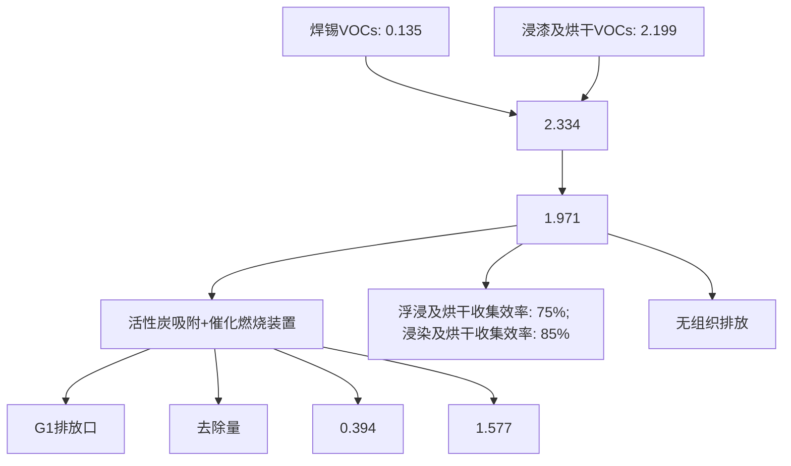
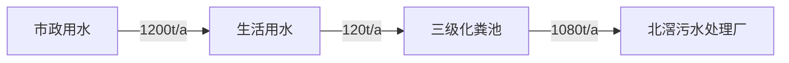

# 建设项目环境影响报告表

（污染影响类）

项目名称：佛山市顺德区奥格威电子科技有限公司新建项目

建设单位（盖章）：佛山市顺德区奥格威电子科技有限公司

编制日期： 2023 年 8 月

编制单位和编制人员情况表

<table><tr><td colspan="2">项目编号</td><td colspan="3">i31w07</td></tr><tr><td colspan="2">建设项目名称</td><td colspan="3">佛山市顺德区奥格威电子科技有限公司新建项目</td></tr><tr><td colspan="2">建设项目类别</td><td colspan="3">35-077电机制造;输配电及控制设备制造;电线、电缆、光缆及电工器材制造;电池制造;家用电力器具制造;非电力家用器具制造;照明器具制造;其他电气机械及器材制造</td></tr><tr><td colspan="2">环境影响评价文件类型</td><td colspan="3">报告表</td></tr><tr><td colspan="4">一、建设单位情况</td><td></td></tr><tr><td colspan="2">单位名称(盖章)</td><td colspan="2">佛山市顺德区奥</td><td></td></tr><tr><td colspan="2">统一社会信用代码</td><td colspan="2">91440606MACP</td><td></td></tr><tr><td colspan="2">法定代表人(签章)</td><td rowspan="3" colspan="2"></td><td></td></tr><tr><td colspan="2">主要负责人(签字)</td><td></td></tr><tr><td colspan="2">直接负责的主管人员(签字)</td><td></td></tr><tr><td colspan="4">二、编制单位情况</td><td></td></tr><tr><td colspan="2">单位名称(盖章)</td><td colspan="2">广州颐景环</td><td></td></tr><tr><td colspan="2">统一社会信用代码</td><td colspan="2">91440101MA</td><td></td></tr><tr><td colspan="4">三、编制人员情况</td><td></td></tr><tr><td colspan="5">1.编制主持人</td></tr></table>

text_image

中华人民共和国
环境影响评价工程师
职业资格证书
Professional Organization Certification
Environmental Assessment Engineer
The People's Republic of China

natural_image

Blank white image with no visible content, text, or symbols

# 目 录

一、建设项目基本情况..

二、建设项目工程分析...

三、区域环境质量现状、环境保护目标及评价标准. 23

四、主要环境影响和保护措施. 30

五、环境保护措施监督检查清单 57

六、结论.... 59

建设项目污染物排放量汇总表.. . 60

附件1 企业营业执照

附件2 房产证

附件3 租赁合同

附件4 法人代表身份证及被委托人身份证

附件5 原辅材料MSDS和VOC 含量检测报告

附件6 环评技术服务合同

附件7 公示声明

附图1 项目地理位置图

附图2 项目四至卫星图

附图3 项目四至现场图

附图4 项目平面布置图

附图5 项目500米及50米范围内敏感点分布图

附图6 项目所在地大气环境功能区划图

附图7 项目所在地地表水环境功能区划图

附图8 项目所在地声环境功能区划图

附图9 佛山市顺德区环境管控单元图

附图10 北滘镇工业园（潭洲水道西）控制性详细规划图

附图11 佛山市顺德高新技术产业开发区北滘工业区示意图

附图12 项目所在地距离水源保护区距离区示意图

# 一、建设项目基本情况

<table><tr><td>建设项目名称</td><td colspan="4">佛山市顺德区奥格威电子科技有限公司新建项目</td></tr><tr><td>项目代码</td><td colspan="4">无</td></tr><tr><td>建设单位联系人</td><td colspan="4"></td></tr><tr><td>建设地点</td><td colspan="4">广东省佛山市顺德区北滘镇顺江社区三乐东路21号二楼</td></tr><tr><td>地理坐标</td><td colspan="4">(113度13分30.795秒,22度54分37.483秒)</td></tr><tr><td>国民经济行业类别</td><td>C3821变压器、整流器和电感器制造</td><td>建设项目行业类别</td><td colspan="2">三十五、电气机械和器材制造业38-77输配电及控制设备制造382中的其他(仅分割、焊接、组装的除外;年用非溶剂型低VOCs含量涂料10吨以下的除外)</td></tr><tr><td>建设性质</td><td>☑新建(迁建)□改建□扩建□技术改造</td><td>建设项目申报情形</td><td colspan="2">☑首次申报项目□不予批准后再次申报项目□超五年重新审核项目□重大变动重新报批项目</td></tr><tr><td>项目审批(核准/备案)部门(选填)</td><td>无</td><td>项目审批(核准/备案)文号(选填)</td><td colspan="2">无</td></tr><tr><td>总投资(万元)</td><td>200.00</td><td>环保投资(万元)</td><td colspan="2">50.00</td></tr><tr><td>环保投资占比(%)</td><td>25.0</td><td>施工工期</td><td colspan="2">1个月</td></tr><tr><td>是否开工建设</td><td>☑否□是: _</td><td>用地(用海)面积(m2)</td><td colspan="2">6800</td></tr><tr><td rowspan="6">专项评价设置情况</td><td colspan="4">表1-1专项评价设置原则表</td></tr><tr><td>专项评价类别</td><td>设置原则</td><td>本项目相关情况</td><td>判定结果</td></tr><tr><td>大气</td><td>排放废气含有毒有害污染物、二噁英、苯并芘、氰化物、氯气且厂界外500米范围内有环境空气保护目标的建设项目</td><td>本项目排放的大气污染物不涉及技术指南规定的有毒有害废气污染物</td><td>不需要设置</td></tr><tr><td>地表水</td><td>新增工业废水直排建设项目(槽罐车外送污水处理厂的除外);新增废水直排的污水集中处理厂</td><td>本项目不涉及工业废水直接排放</td><td>不需要设置</td></tr><tr><td>环境风险</td><td>有毒有害和易燃易爆危险物质存储量超过临界量的建设项目</td><td>经分析,本项目危险物质存储量总计未超过临界量</td><td>不需要设置</td></tr><tr><td>生态</td><td>取水口下游500米范围内有重要水生生物的自然产卵场、索饵场、越冬场和洄游通道的新增河道取水的污染类建设项目</td><td>本项目不涉及直接从河道取水</td><td>不需要设置</td></tr><tr><td></td><td>海洋</td><td>直接向海排放污染物的海洋工程建设项目</td><td>本项目污水排放不涉及海洋</td><td>不需要设置</td></tr><tr><td>规划情况</td><td colspan="4">无</td></tr><tr><td>规划环境影响评价情况</td><td colspan="4">规划环境影响评价文件名称:佛山市顺德高新技术产业开发区扩区规划环境影响报告书审批机关:佛山市生态环境局顺德分局</td></tr><tr><td>规划及规划环境影响评价符合性分析</td><td colspan="4">本项目位于广东省佛山市顺德区北滘镇顺江社区三乐东路21号二楼,属于佛山市顺德高新技术产业开发区东北组团——北滘工业园(详见附图11)。本项目属于C3821变压器、整流器和电感器制造,主要从事电抗器、变压器的加工生产。根据表1-2与佛山市顺德高新技术产业开发区扩区规划环境影响报告书有关准入的条件相符性分析,项目符合《佛山市顺德高新技术产业开发区扩区规划环境影响报告书》(广东智环创新环境科技有限公司,2022年2月)准入要求。</td></tr></table>

表 1-2 与佛山市顺德高新技术产业开发区扩区规划环境影响报告书有关准入的条件相符性分析

<table><tr><td>清单类型</td><td>准入要求</td><td>项目情况</td><td>相符性</td></tr><tr><td rowspan="8">空间布局约束</td><td>引入产业应符合现行有效的《产业结构调整指导目录》、《市场准入负面清单》等相关产业政策的要求。</td><td>本项目属于C3821变压器、整流器和电感器制造,主要从事家用电抗器、变压器的加工生产,不属于淘汰类。符合《产业结构调整指导目录》、《市场准入负面清单》等相关产业政策的要求。</td><td>符合</td></tr><tr><td>禁止引入新增排放重点防控重金属污染物(铅(Pb)、汞(Hg)、镉(Cd)、铬(Cr)和类金属砷(As))、持久性有机污染物的项目。</td><td>本项目不排放重金属污染物。</td><td>符合</td></tr><tr><td>饮用水源准保护区内不得新建、扩建对水体污染严重、排放一类水污染物和持久性有机污染物的项目,改扩建项目不得新增水污染物。</td><td>本项目不在饮用水源准保护区内。</td><td>符合</td></tr><tr><td>禁止引入达不到清洁生产国际先进水平的企业。</td><td>本项目能达到清洁生产国际先进水平。</td><td>符合</td></tr><tr><td>在污水管网建设滞后或所依托的污水处理厂处理能力不能满足废水处理需求的区域,不应引入废水排放量较大的项目。扩区南片区在纳污水体水质稳定达标前,应合理控制涉水排放企业规模,优先引入无生产废水或生产废水排放量较小的项目;扩区东北组团应控制废水排放量较大企业的引入,引入涉水排放企业的规模应与区域污水处理厂处理能力相匹配,严格控制废水排放量较大的项目及新增一类水污染物排放项目的引入,避免对下游饮用水源保护区产生不良影响;扩区西北组团在乐从污水处理厂扩容前,应合理控制涉水排放企业引入规模和时序,尤其严格控制废水排放量较大的企业,确保区域污水得到有效收集和处理。</td><td>本项目属于扩区东北组团,不排放生产废水,生活污水经市政管网排入北滘污水处理厂处理。</td><td>符合</td></tr><tr><td>禁止新建、扩建燃煤燃油火电机组和企业自备电站,逐步淘汰生物质锅炉、集中供热管网覆盖区域内的分散供热锅炉,集中供热管网覆盖地区禁止新建、扩建分散供热锅炉,规划区应全部按高污染燃料禁燃区进行管理;禁止新建、扩建水泥、平板玻璃、化学制浆、炼化、炼钢炼铁、电解铝、焦炭、金属冶炼、制浆造纸、鞣革、铅酸蓄电池、专业电镀、木质家具涂装、印染项目;不再新建陶瓷厂(新型特种陶瓷项目除外)。化工项目按照“入园管理”原则合理布局,提高准入门槛,不得新建、扩建纳入国家“高污染、高环境风险”产品名录的生产项目。</td><td>本项目属于C3821变压器、整流器和电感器制造,无燃煤燃油火电机组和企业自备电站、供热锅炉。</td><td>符合</td></tr><tr><td>严格控制日用玻璃制造、家具制造、废塑料回收加工再生(列入国家“城市矿产”示范基地项目除外)、专业金属表面处理(铝及铝合金的阳极氧化、铝的表面铬酸盐转化、锌的铬酸盐钝化和金属酸洗、磷化、喷漆、喷涂)等项目建设;严格限制新建生产和使用高挥发性有机物原辅材料的项目,鼓励建设挥发性有机物共性工厂。</td><td>本项目为C3821变压器、整流器和电感器制造,不属于玻璃制造、家具制造、废塑料回收加工再生、专业金属表面处理等项目,本项目使用调配状态下的绝缘漆,不属于高挥发性有机物原辅材料。</td><td>符合</td></tr><tr><td>工业企业禁止选址城镇生活空间,生产空间禁止建设居民住宅等敏感建筑;园区工业用地或企业与村庄、学校等环境敏感点之间应设置合理的防护距离,并通过绿化带进行有效隔离,该距离内不得规划新建居民点、办公楼和学校等环境敏感目标。</td><td>根据《北滘镇工业园(潭洲水道西)控制性详细规划(修编)》的批后通告,项目所在地用地性质为工业用地。项目500m以内的没有环</td><td>符合</td></tr></table>

<table><tr><td rowspan="9"></td><td rowspan="6"></td><td></td><td>境敏感点。项目做好环保措施后,对环境敏感点影响不大。</td><td></td></tr><tr><td>9.现有及规划居住区、学校、医院等敏感用地周边50米范围内禁止新建、扩建高噪声排放生产项目;现有及规划居住区、学校、医院等敏感用地周边100米范围内禁止新建、扩建纳入国家“高污染、高环境风险”产品名录的生产项目,不引入酸洗、涂装、注塑、排放恶臭气味的生产工艺和生产设施。</td><td>本项目100米范围内没有敏感点,项目产品不属于“高污染、高环境风险”产品名录的产品。</td><td>符合</td></tr><tr><td>10.结合《顺德区高质量推动村级工业园升级改造总体规划》,推进区域村级工业园改造工作,禁止重复低水平建设。</td><td>本项目不属于村级工业园改造范围。</td><td>符合</td></tr><tr><td>11.南片区按照《广东省重金属污染综合防治“十三五”规划》、《佛山市重金属污染综合防治“十三五”规划》的要求,禁止新建、扩建增加重点防控的重金属污染物排放的建设项目,现有技术改造项目应通过实施“区域削减”,实现增产减污;其它区域新、改扩建重金属排放项目,应严格落实重金属总量替代与削减要求,严格控制重点行业发展规模。</td><td>本项目属于东北组团。</td><td>符合</td></tr><tr><td>12.按规划用地布局未来退出的工业企业用地,应严格按照《中华人民共和国土壤污染防治法》开展必要的调查、评估和修复工作,符合要求后,方可用于居住、教育教研、办公等第三产业类用地。</td><td>根据《北滘镇工业园(潭洲水道西)控制性详细规划(修编)》的批后通告,项目所在地用地性质为工业用地。</td><td>符合</td></tr><tr><td>13.其它:符合《佛山市人民政府关于印发佛山市“三线一单”生态环境分区管控方案的通知》(佛府〔2020〕11号)相关管控要求。</td><td>根据表1-3可知,本项目符合《佛山市人民政府关于印发佛山市“三线一单”生态环境分区管控方案的通知》(佛府〔2020〕11号)相关管控要求。</td><td>符合</td></tr><tr><td rowspan="3">污染物排放管控</td><td>1.污染物排放总量不得突破“污染物排放总量管控限值清单”的总量管控要求;重点对重点污染物(重点污染物包括化学需氧量、氨氮、氮氧化物及挥发性有机物等)实施总量控制;上年度重点河涌水质未达到水环境质量目标的管控分区所在镇(街道),须组织编制、系统实施、向社会公开区域重点水污染物减排计划并明确“替代量”,本年度新建、改建、扩建项目新增水环境重点污染物实行区域“减二增一”替代(废水集中处理设施、民生项目除外);在可核查、可监管的基础上,全区新建、改建、扩建项目新增大气重点污染物实行“减二增一”替代。</td><td>本项目挥发性有机物排放量由生态环境主管部门划拨,无需实施等量替代或两倍削减量替代,总量由佛山市生态环境局顺德分局调剂。</td><td>符合</td></tr><tr><td>2.未完成环境质量改善目标的区域,新改扩建项目重点污染物实施减量替代。</td><td>本项目所在区域大气环境质量除臭氧浓度不达标外,其余污染物指标浓度均达到《环境空气质量标准》(GB3095-2012)二级标准限值,项目有机废气有组织总排放量0.394t/a,无组织排放量为0.364t/a,需申请总量0.758t/a,无需实施等量替代或两倍削减量替代,总量由佛山市生态环境局顺德分局调剂;本项目地表水环境属于达标区,项目不外排生产废水。</td><td>符合</td></tr><tr><td>3.未接入污水管网的新建建筑小区或公共建筑,不得交付使用。新建城区生活污水收集处理设施要与城市发展同步规划、同步建设。</td><td>本项目位于北滘污水处理厂纳污范围。</td><td>符合</td></tr><tr><td rowspan="4"></td><td rowspan="4"></td><td>4.规划区内建设项目废污水原则上应接入各片区集中式污水处理厂进行集中处理、达标排放;受纳水体或监控断面不达标的,不得新建、扩建向河涌直接排放废水的项目;对于暂时无法接入市政污水管网、且废水量较少的项目,生活污水处理后立足回用,不能回用的,应处理达到《城镇污水处理厂污染物排放标准》(GB18918-2002)后排入政策法规允许排放且有环境容量的水域;生产废水应立足于回用,不能回用的,可考虑委外处置,确需要外排的,应处理达到行业直接排放标准或广东省《水污染物排放限值》(DB44/26-2001)后排入政策法规允许排放且有环境容量的水域。</td><td>本项目位于北滘污水处理厂纳污范围。生活污水经市政管网排入北滘污水处理厂处理。项目不外排生产废水。</td><td>符合</td></tr><tr><td>5.向工业集聚区污水集中处理设施或者城镇污水集中处理设施排放工业废水的,应当按照有关规定进行预处理,达到集中处理设施处理工艺要求后方可以排入市政管网进入各片区污水处理厂。企业生活污水达到广东省《水污染物排放限值》(DB44/26-2001)第二时段三级标准后通过污水管线进入各片区所依托的城镇污水处理厂;扩区南片区企业生产废水预处理达到广东省《水污染物排放限值》(DB44/26-2001)第二时段二级标准、行业间接排放要求(有行业间接排放标准要求的)、杏坛污水处理厂接管要求后通过污水管线排入杏坛污水处理厂处理;扩区西北组团企业生产废水预处理达到广东省《水污染物排放限值》(DB44/26-2001)第二时段二级标准、行业间接排放要求(有行业间接排放标准要求的)、乐从污水处理厂接管要求后通过污水管线排入乐从污水处理厂处理;扩区西北组团企业生产废水预处理达到广东省《水污染物排放限值》(DB44/26-2001)第二时段三级标准、行业间接排放要求(有行业间接排放标准要求的)、北滘污水处理厂接管要求后通过污水管线排入北滘污水处理厂处理。</td><td>本项目属于扩区东北组团,不外排生产废水,生活污水经三级化粪池处理达到广东省地方标准《水污染物排放限值》(DB44/26-2001)中的第二时段三级标准后通过污水管网排至北滘污水处理厂处理,北滘污水处理厂的尾水执行《城镇污水处理厂污染物排放标准》(GB18918-2002)一级A标准及《水污染物排放限值》(DB44/26-2001)第二时段一级标准的较严值。</td><td>符合</td></tr><tr><td>6.规划区依托的集中式污水处理设施排放标准应达到或优于《城镇污水处理厂污染物排放标准》(GB18918-2002)一级标准的A标准和广东省《水污染物排放限值》(DB44/26-2001)第二时段一级标准的较严者。</td><td>本项目生活污水经三级化粪池处理达到广东省地方标准《水污染物排放限值》(DB44/26-2001)中的第二时段三级标准后通过污水管网排至北滘污水处理厂处理,北滘污水处理厂的尾水执行《城镇污水处理厂污染物排放标准》(GB18918-2002)一级A标准及《水污染物排放限值》(DB44/26-201)第二时段一级标准的较严值。</td><td>符合</td></tr><tr><td>7.根据《广东省生态环境厅关于2021年工业炉窑、锅炉综合整治重点工作的通知》(粤环函〔2021〕461号)要求,高新区现有燃气锅炉执行《锅炉大气污染物排放标准》(DB44/765-2019)表2排放标准,新建燃气锅炉废气中氮氧化物执行《锅炉大气污染物排放标准》(DB44/765-2019)表3大气污染物特别排放限值,颗粒物、二氧化硫指标特别排放标准(表3)的执行范围、时间按区域正式发布方案执行;新改建的工业窑炉,如烘干炉、加热炉等,有行业标准或地方排放标准的执行相关行业标准或地方标准,未制订行业排放标准的,参照《广东省关于贯彻落实&lt;工业炉窑大气污染综合治理方案&gt;的实施意见》(粤环函〔2019〕1112号),颗粒物、二氧化硫、氮氧化物排放限值分别不高于30、200、300毫克/立方米;家居涂装工艺废气应该执行《家具制造行业挥发性有机化合物排放标准》(DB44814-2010)第II时段限值;无行业排放标准的企业,为严格控制区域VOCs排放量,在国家、省未出台行业标准前,金属制品、铝型材、设备制造行业参照执行《表面涂装(汽车制造业)挥发性有机化合物排放标准》(DB44/816-2010);其他行业参照执行《家具制造行业挥发性有机化合物排放标准(DB44/814-2010)》;涉及VOCs无组织排放的企业,除有行业标准的执行相关行业标准之外,其余工业企业VOCs物料储存、转移和输送、工艺工程、设备与管线组件VOCs泄漏,敞开液面等VOCs无组织排放控制要求,以及VOCs无组织排放废气收集处理系统要求执行《挥发性有机物无组织排放控制标准》(GB37822-2019)要求,厂区内VOCs无组织排放监控点浓度应符合GB37822-2019中表A.1规定的特别排放限值;涉及铸造工艺的,新建企业自2021年1月1日起,现有企业自2023年7月1日起,铸造生产工艺环节和生产设备执行《铸造工业大气污染物排放标准》(GB39726—2020)表1规定的大气污染物排放限值、企业边界大气污染物浓度限值及其他污染控制要求;制药工业企业执行《制药工业大气污染物排放标准》(GB37823-2019)表1规定的大气污染物排放限值、企业边界大气污染物浓度限值及其他污染控制要求;注塑等合成树脂加工生产环节和生产设备其执行《合成树脂工业污染物排放标准》(GB31572-2015)表5规定的大气污染物特别排放限值(涉及PVC树脂的不执行)、合成树脂工业污染物排放标准及其他污染控制要求;分布式能源站项目锅炉烟气执行《火电厂大气污染物排放标准》(GB13223-2011)“表2大气污染物特别排放标准”中所列的燃气轮机组排放浓度限值。</td><td>项目不使用锅炉,烘干为用电加热,无需使用燃料;本项目臭气浓度执行《恶臭污染物排放标准》(GB14554-93)表1恶臭污染物厂界标准值二级新改扩建项目标准限值及表2恶臭污染物排放标准值;浸漆、烘干、焊锡过程产生的VOCs,执行广东省地方标准《固定污染源挥发性有机物综合排放标准》(DB44/2367-2022)中表1挥发性有机物排放限值;焊锡、焊接工序产生的锡及其化合物,执行广东省地方标准《大气污染物排放限值》(DB44/27-2001)第二时段二级标准及无组织排放监控浓度限值;企业厂区内VOCs无组织排放执行广东省地方标准《固定污染源挥发性有机物综合排放标准》(DB44/2367-2022)表3厂区内VOCs无组织排放限值要求。</td><td>符合</td></tr><tr><td rowspan="4"></td><td rowspan="2"></td><td>8.重点加强涉VOCs排放的工业项目的挥发性有机物的源头替代和无组织排放管控,大力推进低VOCs含量原辅材料替代。木制家具制造行业应全面使用水性胶粘剂,替代比例达到100%。家具制造及其他工业涂装项目的水性涂料等低排放VOCs含量涂料占总涂料使用量比例应至少不低于50%。产生VOCs的生产车间须配置废气收集净化装置。排放挥发性有机物的车间必须安装废气收集、回收净化装置,收集率应大于90%;使用溶剂型涂料涂装工艺的VOCs去除率达到90%;家具制造行业有机废气净化率达到80%以上。逐步淘汰单纯活性炭吸附、水喷淋+活性炭吸附等排放状况不稳定的治理技术。</td><td>根据表2-5,项目使用调配状态下的导热绝缘漆均为低VOCs原辅料。项目浸漆经整室收集后通过“活性炭吸附装置+催化燃烧装置”处理后通过35米排气筒G1排放,理论上满足收集效率和处理效率大于90%。</td><td>符合</td></tr><tr><td>9.其它:符合《佛山市人民政府关于印发佛山市“三线一单”生态环境分区管控方案的通知》(佛府〔2020〕11号)相关管控要求。</td><td>根据表1-3可知,本项目符合《佛山市人民政府关于印发佛山市“三线一单”生态环境分区管控方案的通知》(佛府〔2020〕11号)相关管控要求。</td><td>符合</td></tr><tr><td rowspan="2">环境风险防控</td><td>1.制定园区环境风险事故防范和应急预案。完善区域—园区—工业企业多级联动环境突发事件应急预案,建立预防、应急响应机制和后评估机制,定期开展应急演练,提高区域环境风险防范能力。</td><td>项目拟建立健全的事故应急体系并与区域、园区进行多级联动,并根据要求编制环境风险应急预案,定期演练。</td><td>符合</td></tr><tr><td>2.污水处理厂应采取有效措施,防止事故废水直接排入水体;完善污水处理厂在线监控系统联网,实现污水处理厂的实时、动态监管。</td><td>本项目不设污水处理厂,项目不产生生产废水。本项目位于北滘污水处理厂纳污范围。北滘污水处理厂应采取有效措施,防止事故废水直接排入水体;北滘污水厂应完善在线监控系统联网,实现污水处理厂的实时、动态监管。</td><td>符合</td></tr><tr><td rowspan="6"></td><td rowspan="2"></td><td>3.生产性废水较多的企业需配套有效措施,防止事故废水和第一类污染物直排污染地表水体,防止因渗漏污染地下水。</td><td>本项目不产生生产废水。</td><td>符合</td></tr><tr><td>4.其它:符合《佛山市人民政府关于印发佛山市“三线一单”生态环境分区管控方案的通知》(佛府〔2020〕11号)相关管控要求。</td><td>根据表1-3可知,本项目符合《佛山市人民政府关于印发佛山市“三线一单”生态环境分区管控方案的通知》(佛府〔2020〕11号)相关管控要求。</td><td>符合</td></tr><tr><td rowspan="4">资源开发利用要求</td><td>1.禁止使用高污染燃料。</td><td>本项目不使用高污染燃料。</td><td>符合</td></tr><tr><td>2.工业项目原则上单位GDP能耗要低于0.38吨标煤/万元,单位工业增加值新鲜水耗要低于10立方米/万元。</td><td>本项目原则上单位GDP能耗能低于0.38吨标煤/万元,单位工业增加值新鲜水耗要能于10立方米/万元。</td><td>符合</td></tr><tr><td>3.新建高能耗项目单位产品(产值)能耗达到国际国内先进水平。</td><td>本项目不属于高能耗项目。</td><td>符合</td></tr><tr><td>4.其它:符合《佛山市人民政府关于印发佛山市“三线一单”生态环境分区管控方案的通知》(佛府〔2020〕11号)相关管控要求。</td><td>根据表1-3可知,本项目符合《佛山市人民政府关于印发佛山市“三线一单”生态环境分区管控方案的通知》(佛府〔2020〕11号)相关管控要求。</td><td>符合</td></tr></table>

<table><tr><td rowspan="6">其他符合性分析</td><td colspan="4">1、建设项目与所在地“三线一单”符合性分析本项目位于广东省佛山市顺德区北滘镇顺江社区三乐东路21号二楼。根据《广东省人民政府关于印发广东省“三线一单”生态环境分区管控方案的通知》(粤府〔2020〕71号)发布的广东省环境管控单元图,项目所在地属于重点管控单元;根据《佛山市人民政府关于印发佛山市“三线一单”生态环境分区管控方案的通知》(佛府〔2021〕11号)发布的佛山市环境管控单元图和《佛山市顺德区人民政府关于印发佛山市顺德区“三线一单”生态环境分区管控方案的通知》(顺府发〔2021〕11号)发布的顺德区环境管控单元图,项目所在区域为重点管控单元4,环境管控单元编码:ZH44060620004,要素细类为一般生态空间、水环境其他重点管控区、水环境一般管控区、大气环境高排放重点管控区、大气环境受体敏感重点管控区、江河湖库岸线重点管控区、江河湖库岸线一般管控区。项目与管控要求相符性分析如下:表1-3 项目与北滘镇重点管控区管控要求相符性分析</td></tr><tr><td>管控维度</td><td>管控要求</td><td>本项目情况</td><td>相符性分析</td></tr><tr><td rowspan="4">区域布局管控</td><td>1-1.【生态/禁止类】单元内的一般生态空间,主导生态功能为水土保持,禁止在25度以上的陡坡地开垦种植农作物,禁止在崩塌、滑坡危险区、泥石流易发区从事采石、取土、采砂等可能造成水土流失的活动。</td><td>本项目不涉及。</td><td>符合</td></tr><tr><td>1-2.【产业/鼓励引导类】重点发展机器人及配套产业、智能家用电器、高端新型电子信息、新材料等制造业和总部经济、电子商务、工业设计与文化创意、科技金融等现代服务业,打造智能制造和智慧家电示范区。</td><td>本项目属于C3821变压器、整流器和电感器制造,不属于《市场准入负面清单(2022年版)》(发改体改规〔2022〕397号)中禁止和许可事项。</td><td>符合</td></tr><tr><td>1-3.【产业/综合类】产业聚集区所属地块内的工业用地或企业与村庄、学校等环境敏感点之间应设置合理的大气环境防护距离,并通过绿化带进行有效隔离;聚集区规划布局应注重大气污染排放企业应尽量避免布局在居住用地的常年主导风向的上风向。</td><td>本项目大气环境防护距离100米内无敏感点,且项目位于所在地常年主导风向的下风向。</td><td>符合</td></tr><tr><td>1-4.【产业/综合类】系统推进村级工业园升级改造,腾出连片空间,布局产业集聚区和主题产业园,推动工业项目入园集聚发展。新增工业制造业用地原则上安排在产业集聚区内,产业集聚区外原则上不鼓励工业及物流仓储用地的新建与改造。</td><td>本项目不属于村改范围,不属于工业及物流仓储用地的新建与改造。</td><td>符合</td></tr><tr><td rowspan="8"></td><td rowspan="5"></td><td>1-5.【产业/限制类】受纳水体或监控断面不达标的,不得新建、扩建向河涌直接排放废水的项目。新建、扩建含蚀刻工序的线路板生产项目和化工项目应在配套污水集中处置的工业园区或生活污水管网覆盖区域内建设;纯加工型印花项目,含酸洗、磷化的金属表面处理、金属制品项目(与自身高新技术企业配套的除外),含酸洗、喷涂、化学抛光、电解等涉及废水排放工艺的不锈钢型材加工项目(与自身高新技术企业配套的除外),应进入以此类项目为主导产业、有相应废水集中治理设施的工业园区,实现集中治污。</td><td>本项目生活污水排入北滘污水处理厂。项目为C3821变压器、整流器和电感器制造,主要从事电抗器、变压器的加工生产,不属于线路板生产项目和化工项目;不属于纯加工型印花,含酸洗、喷涂、拉丝、表面抛光等工艺的不锈钢型材加工项目。</td><td>符合</td></tr><tr><td>1-6.【产业/综合类】划定家具生产优先发展区域,优先发展区外不再新建涉及涂装工艺的木质家具制造项目。</td><td>本项目不属于木质家具制造项目。</td><td>符合</td></tr><tr><td>1-7.【水/限制类】严格限制在佛山市禅城南庄紫洞水厂、佛山市禅城沙口(石湾)水厂、羊额—北滘水厂、广州市南洲水厂顺德水道取水口饮用水水源保护区上游和周边区域建设列入“高污染、高环境风险”产品名录等可能影响水环境安全的项目。</td><td>本项目建设不在以上水源保护区的范围,不属于高污染、高环境风险的产品名录,本项目属于北滘污水处理厂的纳污范围,不属于影响水环境安全的项目。</td><td>符合</td></tr><tr><td>1-8.【大气/限制类】大气环境受体敏感重点管控区内,应严格限制新建储油库项目、产生和排放有毒有害大气污染物的建设项目以及使用溶剂型油墨、涂料、清洗剂、胶黏剂等高挥发性有机物原辅材料项目,鼓励现有该类项目搬迁退出。</td><td>本项目没有使用产生和排放有毒有害大气污染物的建设项目。根据表2-5,项目使用的调配状态下的导热绝缘漆为低VOCs含量原辅材料。</td><td>符合</td></tr><tr><td>1-9.【大气/鼓励引导类】大气环境高排放重点管控区内,应强化达标监管,引导工业项目落地集聚发展,有序推进区域内行业企业提标改造。</td><td>本项目有机废气经“活性炭吸附装置+催化燃烧装置”处理后可达标排放。</td><td>符合</td></tr><tr><td rowspan="3">能源资源利用</td><td>2-1【能源/鼓励引导类】推广节能技术,加快发展绿色货运与现代物流。</td><td>本项目使用节能技术,项目不属于绿色货运与现代物流。</td><td>符合</td></tr><tr><td>2-2【能源/鼓励引导类】推广新能源汽车应用和充电基础设施建设,积极推动重卡LNG加气站、充电基础设施、加氢站建设。</td><td>本项目不属于新能源汽车应用和充电基础设施、加氢站建设项目。</td><td>符合</td></tr><tr><td>2-3.【能源/综合类】科学实施能源消费总量和强度“双控”,新建高能耗项目单位产品(产值)能耗达到国际国内先进水平。</td><td>本项目不属于高能耗项目。</td><td>符合</td></tr><tr><td rowspan="6"></td><td rowspan="3"></td><td>2-4.【水资源/综合类】贯彻落实“节水优先”方针,实行最严格水资源管理制度,北滘镇万元国内生产总值用水量、万元工业增加值用水量、用水总量、农田灌溉水有效利用系数等用水总量和效率指标达到区下达要求。</td><td>本项目严格贯彻落实“节水优先”方针,实行最严格水资源管理制度,北滘镇万元国内生产总值用水量、万元工业增加值用水量、用水总量、农田灌溉水有效利用系数等用水总量和效率指标达到区下达要求。</td><td>符合</td></tr><tr><td>2-5.【土地资源/限制类】落实单位土地面积投资强度、土地利用强度等建设用地控制性指标要求,提高土地利用效率。</td><td>本项目所在地为工业用地,符合控制性指标要求。</td><td>符合</td></tr><tr><td>2-6.【岸线/禁止类】严格水域岸线用途管制,新建项目一律不得违规占用水域。严禁破坏生态的岸线利用行为和不符合其功能定位的开发建设活动,严禁以各种名义侵占河道、围垦湖泊、非法采砂等。</td><td>本项目未违规占用水域,不会破坏生态的岸线利用行为和不符合其功能定位的开发建设活动,不侵占河道、围垦湖泊、非法采砂等。</td><td>符合</td></tr><tr><td rowspan="3">污染物排放管控</td><td>3-1.【水/限制类】城镇新区建设实行雨污分流,逐步推进初期雨水收集、处理和资源化利用。住宅、商业体、学校、市场等城镇开发建设项目应当配套或者同步计划建设公共排水设施,公共排水设施或自建排污水设施未能投产运行的,以上涉水项目不得投入使用。新建小区严格实施雨污分流,阳台、露台等污水接入污水收集系统,将生活污水“应截尽截”。做好大型楼盘、集贸市场、餐饮以及学校等4大类排水户污水接入市政管网工作。</td><td>本项目不属于城镇新区建设。</td><td>符合</td></tr><tr><td>3-2.【水/综合类】结合村级工业园改造,全面提升产业层次与集聚度,促进污染集中整治。</td><td>本项目不属于村级工业园改造区。</td><td>符合</td></tr><tr><td>3-3.【水/综合类】稳步推进排水设施“三个一体化”管理模式,补齐城乡污水收集和处理短板,推动群力围污水处理厂提质增效,加快消除城中村、老旧城区、城乡结合部等污水收集管网空白区,逐步实现城乡污水收集处理全覆盖。2025年前完成群力围污水处理厂扩建,尾水应执行《城镇污水处理厂污染物排放标准》(GB18918-2002)一级A标准及《广东省水污染物排放限值》(DB44/26-2001)的较严值。(DB44/26-2001)的较严值。</td><td>本项目位于北滘污水处理厂处理范围,尾水执行《城镇污水处理厂污染物排放标准》(GB18918-2002)一级A标准及《广东省水污染物排放限值》(DB44/26-2001)的较严值。</td><td>符合</td></tr><tr><td rowspan="6"></td><td rowspan="3"></td><td>3-4.【水/综合类】近期保留并完善水口村、三桂村、西滘村、马龙村等现状农村污水分散式处理设施,新建莘村、马龙村等分散式污水处理站建设,继续完善污水支管网建设,提高污水收集处理率,其余行政村(社区)继续完善污水管网建设,实现农村污水100%收集进入市政污水系统,有条件的区域实施雨污分流改造,到2030年全面雨污分流,污水纳入北滘城镇污水处理系统。</td><td>本项目不属于污水管网、污水处理设施等建设项目。本项目实施雨污分流。</td><td>符合</td></tr><tr><td>3-5.【水/综合类】产业集聚区和主题园区内做好污水管网和污水集中处理设施的配套保障,确保废水收集到城镇污水处理厂、园区污水处理厂或分散式污水处理设施集中处置。</td><td>本项目不属于产业集聚区和主题园区建设项目。本项目所在地属于北滘污水厂的纳污范围。</td><td>符合</td></tr><tr><td>3-6.【大气/综合类】大力推进低VOCs含量原辅材料替代,加快涉VOCs重点行业的生产工艺升级改造,推行自动化生产工艺,对达不到要求的VOCs收集及治理设施进行整治提升,逐步淘汰低效VOCs治理设施。</td><td>根据表2-5,项目使用的调配状态下的导热绝缘漆为低VOCs含量原辅材料,VOCs废气经收集后进入“活性炭吸附装置+催化燃烧装置”处理后排放。</td><td>符合</td></tr><tr><td rowspan="3">环境风险防控</td><td>4-1.【水/综合类】加强单元内佛山市禅城南庄紫洞水厂、佛山市禅城沙口(石湾)水厂、羊额—北滘水厂、广州市南洲水厂顺德水道取水口饮用水水源保护区周边环境风险源管控,完善突发环境事件应急管理体系。</td><td>本项目不涉及。</td><td>符合</td></tr><tr><td>4-2.【水/综合类】北滘污水处理厂、群力围污水处理厂、工业污水集中处理设施应采取有效措施,防止事故废水直接排入水体。完善污水处理厂在线监控系统联网,实现污水处理厂的实时、动态监管。</td><td>本项目所在地位于北滘污水处理厂纳污范围,污水处理厂已在线监控系统联网,实现污水处理厂的实时、动态监管。</td><td>符合</td></tr><tr><td>4-3.【风险/综合类】加强环境风险分级分类管理,强化金属制品、有色金属和压延加工、化学原料和化学品制造业等涉重金属、化工行业企业及工业园区等重点环境风险源的环境风险防控。</td><td>项目液态原料储存于物料区,控制储存量,现场配置泄漏吸附收集等应急器材;危险废物分类暂存,危险废物暂存间设置有围堰,且做好防渗漏和硬底化处理;当废气收集系统出现故障时,立即停止生产,维修设备,并定期做</td><td>符合</td></tr></table>

<table><tr><td></td><td></td><td>好废气收集系统的检修和维护;在发生火灾和爆炸事故次生灾害时,采取紧急疏散等措施,加强对环境风险的分级分类管理。</td><td></td></tr></table>

# 2、产业政策符合性分析

本项目属于《国民经济行业分类》（GB/T 4754-2017）及第1号修改单中的C3821变压器、整流器和电感器制造，根据2020年1月1日起施行的发展改革委修订发布《产业结构调整指导目录（2019年本）》，因此不属于淘汰类。综上所述，本项目符合国家、广东省的产业政策要求。

本项目不属于国家《市场准入负面清单（2022年版）》的通知（发改体改规〔2022〕397号）中的禁止准入类事项或禁止准入措施。因此项目符合相关的产业政策要求。

根据《环境保护综合名录（2021年版）》，本项目不属于“高污染、高环境风险”产品名录里的产品。

# 3、与地区有机污染物治理政策相符性分析

本项目与有机污染物治理政策的相符性分析见下表。

表 1-4 本项目与有机污染物治理政策的相符性

<table><tr><td>序号</td><td>政策要求</td><td>工程内容</td><td>符合性</td></tr><tr><td colspan="4">1、《广东省人民政府办公厅关于印发广东省2021年大气、水、土壤污染防治工作方案的通知》(粤办函〔2021〕58号)</td></tr><tr><td>1.1</td><td>实施低VOCs含量产品源头替代工程</td><td>根据表2-5,项目使用调配状态下的导热绝缘漆为低VOCs含量原辅材料,浸漆废气经收集后通过“活性炭吸附装置+催化燃烧装置”处理后通过35米排气筒G1排放</td><td>符合</td></tr><tr><td colspan="4">2、关于印发《广东省涉挥发性有机物(VOCs)重点行业治理指引》的通知(粤环办〔2021〕43号)</td></tr><tr><td>2.1</td><td>VOCs物料应储存于密闭的容器、包装袋、储罐、储库、料仓中</td><td>本项目含VOCs的原料密封储存,存放于室内,非取用时封口保持密闭</td><td>符合</td></tr><tr><td>2.2</td><td>VOCs治理设施应与生产工艺设备同步运行,VOCs治理设施发生故障或检修时,对应的生产工艺设备应停止运行,待检修完毕后同步投入使用;生产工艺设备不能停</td><td>本项目生产必须开启风机,有效减少无组织排放废气。废气收集处理系统发生故障或检修时,所有产生废气的工序停止运行,待检修完毕后再投</td><td>符合</td></tr></table>

<table><tr><td rowspan="8"></td><td></td><td>止运行或不能及时停止运行的,应设置废气应急处理设施或采取其他替代措施</td><td>入生产</td><td></td></tr><tr><td>2.3</td><td>粉状、粒状VOCs物料采用气力输送设备、管状带式输送机、螺旋输送机等密闭输送方式,或者采用密闭的包装袋、容器或罐车进行物料转移</td><td>本项目原辅材料均使用密闭包装袋进行物料转移</td><td>符合</td></tr><tr><td>2.4</td><td>采用外部集气罩的,距集气罩开口面最远处的VOCs无组织排放位置,控制风速不低于0.3m/s</td><td>本项目设置集气罩控制风速为0.5m/s</td><td>符合</td></tr><tr><td>2.5</td><td>建立危废台账,整理危废处置合同、转移联单及危废处理方资质佐证材料</td><td>企业拟建立危险废物台账,定期将危险废物交给有危废资质的单位处理,整理危废处理合同、转移联单等资料</td><td>符合</td></tr><tr><td colspan="4">3、佛山市顺德区人民政府办公室关于印发《佛山市顺德区生态环境保护“十四五”规划(2021-2025)》的通知(顺府办发〔2022〕16号)</td></tr><tr><td>3.1</td><td>优化空间开发布局。以新一轮国土空间规划为契机,统筹城市建设、主题产业园区和美丽乡村的有机结合,重构城乡、产业、生态等空间布局和风貌形态。调整优化产业集群发展空间布局,环境质量不达标区域,新建、扩建项目需符合环境质量改善要求;严格控制“高耗能、高排放”项目盲目发展,禁止新建、扩建水泥、平板玻璃、化学制浆、生皮制革以及国家规划外的钢铁、原油加工等项目;专业电镀、印染等项目进入定点园区集中管理</td><td>本项目不属于禁止新建、扩建水泥、平板玻璃、化学制浆、生皮制革以及国家规划外的钢铁、原油加工、专业电镀、印染等项目</td><td>符合</td></tr><tr><td>3.2</td><td>持续推进重点行业VOCs整治。持续开展挥发性有机物专项整治,继续推进重点行业企业开展销号式综合整治,建立VOC重点监管企业名单并动态更新,督促企业建立VOCs管控台账清单;持续探寻高效节能的VOCs治理技术,对采用低温等离子、光氧化、光催化等低效治理工艺的企业在臭氧污染天气应对期间实施停限产或错峰生产,并推动企业逐步淘汰低效治理工艺</td><td>本项目为C3821变压器、整流器和电感器制造,不属于VOCs重点行业,浸漆废气经收集后通过“活性炭吸附装置+催化燃烧装置”处理后通过35米排气筒G1排放,项目治理技术为“活性炭吸附装置+催化燃烧装置”,不属于低温等离子、光氧化、光催化等低效治理工艺</td><td>符合</td></tr><tr><td>3.3</td><td>加强VOCs源头替代和无组织排放管控。大力推进低VOCs含量、低反应活性的原辅材料替代,将全面使用低VOCs含量原辅材料的企业纳入正面清单和政府绿色采购清单。鼓励重点行业企业开展生</td><td>本项目含VOCs的原料密封储存,存放于室内,非取用时封口保持密闭,项目产生VOCs工序在相对密闭的空间内进行,提高了VOCs的收集,并通过有效处理后可达标排放;</td><td>符合</td></tr></table>

<table><tr><td></td><td>产工艺和设备水性化改造,推广使用水性、高固体分、无溶剂、粉末等低VOCs含量涂料。严格落实《挥发性有机物无组织排放控制标准》,开展厂区内无组织排放浓度监测,加强对含VOCs物料储存、转移和运输、设备与管线组件泄漏、敞开页面逸散以及工艺过程等五类排放源的管控。加强储油库、加油站等VOCs排放治理,推动油品储运销体系安装油气回收自动监控系统</td><td>本项目不属于储油库、加油站等项目</td><td></td></tr><tr><td colspan="4">4、《广东省生态环境厅关于做好重点行业建设项目挥发性有机物总量指标管理工作的通知》(粤环发〔2019〕2号)</td></tr><tr><td>4.1</td><td>对VOCs排放量大于300公斤/年的新、改、扩建项目,进行总量替代,按照要求填报VOCs指标来源说明。其他排放量规模需要总量替代的,由本级生态环境主管部门自行确定范围,并按照要求审核总量指标来源,填写VOCs总量指标来源说明</td><td>项目VOCs的排放量为0.758t/a,根据《关于做好建设项目挥发性有机物(VOCs)排放削减替代工作的补充通知》(粤环函〔2021〕537号)文件要求,待项目审批时由生态环境部门核定VOCs总量来源</td><td>符合</td></tr></table>

# 4、选址合理性分析

本项目位于广东省佛山市顺德区北滘镇顺江社区三乐东路21号二楼，根据关于《北滘镇工业园（潭洲水道西）控制性详细规划（修编）》的批后通告，项目所在地用地性质为工业用地，因此，项目选址符合功能规划要求。本项目不在羊额-北滘水厂饮用水水源准保护区范围内，但距离羊额-北滘水厂饮用水水源准保护区约438米（见附图12）。

# 二、建设项目工程分析

#

# 1、项目由来

佛山市顺德区奥格威电子科技有限公司新建项目选址位于广东省佛山市顺德区北滘镇顺江社区三乐东路 21 号二楼。项目经营场所为已建 1 栋标准7 层厂房的第 2 层，占地面积为6800m2，厂房首层高度约5米，总高度为35米。本项目产品产能为电抗器120万台/年、变压器380万台/年。

根据《中华人民共和国环境影响评价法》（2018 年12 月29 日修订）、《国务院关于修改〈建设项目环境保护管理条例〉的决定》（国务院令第 682号）等法律法规的规定，建设对环境有影响的项目必须进行环境影响评价。参照《建设项目环境影响评价分类管理名录》（2021 年版）（生态环境部令第16号）本项目属于“三十五、电气机械和器材制造业38-77 输配电及控制设备制造382中的其他（仅分割、焊接、组装的除外；年用非溶剂型低VOCs 含量涂料10吨以下的除外），需编制建设项目环境影响报告表。

受佛山市顺德区奥格威电子科技有限公司委托，广州颐景环保科技有限公司承担了该项目的环境影响评价工作，在组织相关技术人员现场踏勘、调查收集和研究与项目有关的技术资料的基础上，根据《建设项目环境影响报告表编制技术指南（污染影响类）（试行）》，编制了《佛山市顺德区奥格威电子科技有限公司新建项目环境影响报告表》。

# 2、项目组成

具体工程组成见下表：

表 2-1 项目工程组成

<table><tr><td>工程分类</td><td>项目</td><td>建设内容</td><td>依托工程情况</td><td colspan="2">备注</td></tr><tr><td>主体及辅助工程</td><td>厂房</td><td>1栋7层生产车间的第2层,占地面积为6800m2,层高5米,总高度为35米,包括成品区、半成品区、绕线区、焊锡、焊接区、组装区、浸漆烘干房、休息区、检测区等</td><td>依托已建成的建筑</td><td colspan="2">主要用于电抗器、变压器的生产加工</td></tr><tr><td rowspan="2">储运工程</td><td>仓储方式</td><td colspan="2">不另外建设单独仓库房,仓储区设置在生产厂房内</td><td colspan="2">/</td></tr><tr><td>运输方式</td><td colspan="2">原辅料和产品均采用货车运输</td><td colspan="2">/</td></tr><tr><td rowspan="2">公用工程</td><td>配电系统一套</td><td>配电系统一套</td><td rowspan="2">依托所在厂房已有设施</td><td colspan="2">供应生产及办公用电</td></tr><tr><td>供水系统一套</td><td>供水系统一套</td><td colspan="2">市政供水</td></tr><tr><td rowspan="2"></td><td colspan="2">雨水排水系统一套</td><td>雨水排水系统一套</td><td></td><td>采用雨污分流,雨水进入市政雨水管网</td></tr><tr><td colspan="2">生活污水排水系统一套</td><td>生活污水排水系统一套</td><td>依托所在厂房已有生活污水处理设施</td><td>生活污水经三级化粪池处理设施处理后排入北滘污水处理厂依托所在厂房已有生活污水处理设施</td></tr><tr><td rowspan="5">环保工程</td><td>废水污染物防治措施</td><td>生活污水</td><td>三级化粪池处理设施1套,生活污水经三级化粪池处理设施处理后排入北滘污水处理厂</td><td>依托所在厂房已有生活污水处理设施</td><td>依托所在厂房已有生活污水处理设施</td></tr><tr><td colspan="2">废气污染物防治措施</td><td>浸漆废气经整室收集后通过“活性炭吸附装置+催化燃烧装置”处理后通过35米排气筒G1排放</td><td colspan="2">/</td></tr><tr><td colspan="2">噪声污染防治措施</td><td>采用低噪声设备、做好设备隔音、减振处理、合理布局车间</td><td colspan="2">/</td></tr><tr><td rowspan="2">固体废物防治措施</td><td>危险废物</td><td>设置危废储存场所,占地面积约为 $5m^{2}$ </td><td colspan="2">危险废物分类收集后储存在危险废物暂存区,交由有危废资质的单位回收处置</td></tr><tr><td>一般工业固废</td><td>设置一般固废暂存间,占地面积约 $5m^{2}$ </td><td colspan="2">分类收集储存在一般工业固体废物暂存间内妥善处置</td></tr></table>

# 3、主要产品及产能

项目主要生产规模详见下表。

表 2-2 项目主要生产规模一览表

<table><tr><td>序号</td><td>名称</td><td>单位</td><td>数量</td></tr><tr><td>1</td><td>变压器</td><td>万台/年</td><td>380</td></tr><tr><td>2</td><td>电抗器</td><td>万台/年</td><td>120</td></tr></table>

# 4、主要生产设备

根据建设单位提供的资料，项目主要生产设备详见下表。

表 2-3 项目主要生产设备一览表

<table><tr><td>序号</td><td>设备名称</td><td>单位</td><td>数量</td><td>使用工序</td><td>位置</td></tr><tr><td>1</td><td>绕线机</td><td>台</td><td>10</td><td>绕线</td><td>厂房第2层</td></tr><tr><td>2</td><td>转子平衡机</td><td>台</td><td>1</td><td>检测</td><td>厂房第3层</td></tr><tr><td>3</td><td>真空浸漆机</td><td>台</td><td>2</td><td>浸漆、烘干</td><td>厂房第2层</td></tr><tr><td>4</td><td>EI片焊接机</td><td>台</td><td>8</td><td>焊接</td><td>厂房第2层</td></tr><tr><td>5</td><td>氩弧焊机</td><td>台</td><td>20</td><td>焊接</td><td>厂房第2层</td></tr><tr><td>6</td><td>焊锡炉</td><td>台</td><td>6</td><td>焊锡</td><td>厂房第2层</td></tr><tr><td>7</td><td>组装生产线</td><td>条</td><td>10</td><td>组装</td><td>厂房第3层</td></tr><tr><td>8</td><td>功率测试仪</td><td>台</td><td>8</td><td>检测</td><td>厂房第3层</td></tr><tr><td>9</td><td>调压器</td><td>台</td><td>8</td><td>检测</td><td>厂房第3层</td></tr><tr><td>10</td><td>软管测试仪</td><td>台</td><td>4</td><td>检测</td><td>厂房第3层</td></tr><tr><td>11</td><td>电子燥箱、电源线测试仪</td><td>台</td><td>1</td><td>检测</td><td>厂房第3层</td></tr></table>

# 5、主要原辅材料

根据建设单位提供的资料，项目外购的原辅材料存放至原材料区，项目主要原辅材料及用量见下表。

表 2-4 项目主要原辅材料用量一览表

<table><tr><td>序号</td><td>名称</td><td>单位</td><td>数量</td><td>存放位置</td><td>备注</td></tr><tr><td>1</td><td>漆包线</td><td>吨/年</td><td>400</td><td rowspan="12">原材料区</td><td>外购,固状,最大储存量约为1吨</td></tr><tr><td>2</td><td>导热绝缘漆</td><td>吨/年</td><td>6.38</td><td>外购,液状,25kg/桶,最大储存量约为0.5吨</td></tr><tr><td>3</td><td>稀释剂</td><td>吨/年</td><td>1.0</td><td>外购,液状,25kg/桶,最大储存量约为0.25吨</td></tr><tr><td>4</td><td>固化剂</td><td>吨/年</td><td>0.2</td><td>外购,液状,25kg/桶,最大储存量约为0.25吨</td></tr><tr><td>5</td><td>EI片</td><td>吨/年</td><td>2000</td><td>外购,固状,最大储存量约为50吨</td></tr><tr><td>6</td><td>底板</td><td>万只/年</td><td>500</td><td>外购,固状,最大储存量约为50万只</td></tr><tr><td>7</td><td>氩气</td><td>吨/年</td><td>40</td><td>外购,用于氩弧焊</td></tr><tr><td>8</td><td>机油</td><td>吨/年</td><td>1</td><td>外购,液状,25kg/桶,最大储存量约为0.5吨</td></tr><tr><td>9</td><td>无铅焊丝</td><td>吨/年</td><td>1.5</td><td>外购,不含铅,用于氩弧焊</td></tr><tr><td>10</td><td>无铅锡条</td><td>吨/年</td><td>1.5</td><td>外购,固状,最大储存量约为0.5吨</td></tr><tr><td>11</td><td>助焊剂</td><td>吨/年</td><td>0.15</td><td>外购,用于波峰焊;根据企业提供,助焊剂和锡条使用比例约为1:10,液状,15kg/桶,最大储存量为0.06吨</td></tr><tr><td>12</td><td>磁环</td><td>万只/年</td><td>500</td><td>外购,固状,最大储存量约为50万只</td></tr></table>

表 2-5 主要涉 VOCs 原辅材料一览表

<table><tr><td>序号</td><td>名称</td><td>理化性质</td><td>稀释比</td><td>VOCs含量</td><td>国家标准限值</td><td>是否属于低VOCs原辅料</td></tr><tr><td>1</td><td>导热绝缘漆</td><td>黄色液体,有刺激性气味,不溶于水,熔点:-30.6°C,沸点:146.0°C,相对密度(水=1):1.39,适用于电机、电器绕组的绝缘浸渍处理。主要成分为:改性不饱和聚酯树脂:42%、苯乙烯:17%、填料:10%、阻燃剂:30%、助剂:1%</td><td rowspan="3">导热绝缘漆:固化剂:稀释剂为6.38:0.2:1</td><td rowspan="3">导热绝缘漆与固化剂混合后,根据VOC含量检测报告:253g/L;稀释剂VOC挥发含量为100%,则导热绝缘漆、固化剂、稀释剂混合后VOC含量限值为375g/L</td><td rowspan="3">《低挥发性有机化合物含量涂料产品技术要求》(GB/T38597-2020)表2工业防护涂料-机械设备涂料-工程机械和农业机械涂料(含零部件涂料)中底漆VOCs限值420g/L</td><td rowspan="3">是</td></tr><tr><td>2</td><td>固化剂</td><td>无色至微黄色液体,略有芳香味,不溶于水,熔点:8°C,沸点:112°C相对密度(水=1):1.02主要成分:过氧化苯甲酸叔丁酯65%、助剂:35%</td></tr><tr><td>3</td><td>稀释剂</td><td>无色或微黄色透明油状液体,有刺激性气味,不溶于水,熔点:-30.6°C,沸点:146°C,相对密度(水=1):0.9059。主要成分:苯乙烯100%</td></tr><tr><td>4</td><td>助焊剂</td><td>外观为黄色液体,相对密度(水=1):0.803±0.01(20°C),闪点11°C,燃点469°C,微溶于水,能与乙醇混溶,5°C~45°C稳定,主要用来帮助焊接。主要成分为:天然树脂1.75%、硬脂酸树脂1.03%、合成树脂0.22%、活化剂0.71%、油酸1.84%、起泡剂1.98%、混合醇溶剂89.87%、抗挥发剂2.60%</td><td>/</td><td>混合醇溶剂89.87%</td><td>/</td><td>/</td></tr><tr><td>5</td><td>机油</td><td>机油一般由基础油和添加剂两部分组成。基础油是机油的主要成分,决定着机油的基本性质,添加剂则可弥补和改善基础油性能方面的不足,赋予某些新的性能,是机油的重要组成部分。机油外观为油状液体,淡黄色至褐色,无气味或略带异味。用于机械的摩擦部分,起润滑、冷却和密封作用。机油为可燃液体,遇明火、高热可燃。</td><td>/</td><td>/</td><td>/</td><td>/</td></tr></table>

# 6、项目涂料用量核算和匹配性分析

表 2-6 项目产品规格参数表

<table><tr><td>产品名称</td><td>规格(长m*宽m)</td><td>涂装面数</td><td>修正系数</td><td>涂装面积(m2)</td><td>涂装产品图片</td></tr><tr><td>变压器</td><td>Φ0.08、线圈高度0.1</td><td>/</td><td>1.2</td><td>0.0301</td><td></td></tr><tr><td>电抗器</td><td>Φ0.06、线圈高度0.04</td><td>/</td><td>1.2</td><td>0.00904</td><td></td></tr></table>

表 2-7项目涂料用量一览表

<table><tr><td>产品名称</td><td>涂料</td><td>涂装产品(万台/a)</td><td>单个涂层厚度(μm)</td><td>涂层密度(g/cm3)</td><td>涂料利用率(%)</td><td>固体分(%)</td><td>单个涂装面积(m2)</td><td>稀释比(t)</td><td>年用量(t)</td><td>涂料量(t)</td><td>稀释剂量(t)</td><td>固化剂量(t)</td></tr><tr><td>变压器</td><td>绝缘漆</td><td>380</td><td>30</td><td>1.29</td><td>90</td><td>71</td><td>0.0301</td><td>6.38:0.2:1</td><td>6.93</td><td>5.83</td><td>0.1828</td><td>0.914</td></tr><tr><td>电抗器</td><td>绝缘漆</td><td>120</td><td>30</td><td>1.29</td><td>90</td><td>71</td><td>0.00904</td><td>6.38:0.2:1</td><td>0.66</td><td>0.55</td><td>0.0173</td><td>0.087</td></tr><tr><td colspan="13">备注:1、涂料用量=[涂层厚度×涂层密度÷(涂料利用率×固体分)]×涂装面积。2、根据表2-5混合后绝缘漆的VOC含量限值为375g/L,密度为1.29g/mL,VOC挥发系数为29%,则混合后涂料的固体分为71%。3、绝缘漆单个产品涂装厚度和涂料利用率选取参考其他同类型产品行业的经验参数。</td></tr></table>

# 7、生产产能与设备匹配性分析

表2-8 真空浸漆机产能分析一览表

<table><tr><td>设备</td><td>数量(台)</td><td>单批次产量(台/批)</td><td>单批次生产时间(h)</td><td>每天生产时间(h)</td><td>单台设备全年生产批次(次/a)</td><td>单台设备年产量(台/a)</td><td>2台设备的设计总产能(台/a)</td><td>实际申报总产能(台/a)</td></tr><tr><td>真空浸漆机</td><td>2</td><td>22</td><td>0.02</td><td>8</td><td>120000</td><td>2640000</td><td>5280000</td><td>5000000</td></tr></table>

# 8、工作制度和能耗水耗

表2-9 工作制度一览表

<table><tr><td>序号</td><td>名称</td><td>内容</td></tr><tr><td>1</td><td>劳动定额(人)</td><td>120</td></tr><tr><td>2</td><td>工作制度</td><td>年工作300天,每天8小时</td></tr><tr><td>3</td><td>食宿情况</td><td>不设食堂和宿舍</td></tr></table>

表2-10 能耗水耗一览表

<table><tr><td>序号</td><td>名称</td><td>单位</td><td>用量</td><td>用途</td><td>备注</td></tr><tr><td>1</td><td>水</td><td>t/a</td><td>1200</td><td>办公、生活</td><td>市政供水</td></tr><tr><td>2</td><td>电</td><td>万KW.h/a</td><td>120</td><td>生产、生活</td><td>市政供电</td></tr></table>

# 9、物料平衡

# （1）VOCs平衡

VOCs 平衡图如下图所示。

flowchart

单位：ta

图 2-1 项目 VOCs 平衡图

# （2）水平衡

本项目生活污水排放量为 1080t/a，项目水平衡图如下图所示：

flowchart

图2-2 项目水平衡图

# ①给水

项目用水由市政供水管网提供，本项目主要用水为员工生活用水，总用水量1200t/a。

# ②排水

本项目生活污水依托已建三级化粪池预处理后从生活污水排放口排入市政污水管网，经市政管网一并排入北滘污水处理厂处理后，尾水排入潭洲水道。生活用水排放量为1080t/a。

# 10、四至情况

项目东面为佛山市顺德区奥格威电器制造有限公司；南面为三乐路；西面为顺德区公安局北滘派出所交警铁骑队；北面为新业一路，隔路为林港创业园工业区。项目四至图见附图 2。

# 11、厂区平面布置

项目所在地总占地面积为 6800m2，包括成品区、半成品区、绕线区、焊锡、焊接区、组装区、浸漆烘干房、休息区、检测区等，项目厂区具体平面布置见附图4-8。

# 12、环境保护工程措施投资估算

本项目总投资200万元，根据《建设项目环境保护设计规定》中的有关条款和有关环境保护法规，结合环境保护和污染防治工作拟采用一些必要的工程措施，对本环境保护投资进行估算，具体见下表。

<table><tr><td rowspan="8"></td><td colspan="4">表2-11建设项目环保投资情况一览表</td></tr><tr><td colspan="2">项目</td><td>环保设施名称</td><td>资金(万元)</td></tr><tr><td colspan="3">环保投资总概算</td><td>50</td></tr><tr><td rowspan="4">实际总投资</td><td>生活污水</td><td>生活污水预处理设施一套</td><td>1</td></tr><tr><td>废气</td><td>“活性炭吸附装置+催化燃烧装置+35米排气筒G2”1套</td><td>40</td></tr><tr><td>噪声</td><td>采用低噪声设备、做好设备隔声、减振处理、合理布局车间</td><td>3</td></tr><tr><td>固废</td><td>设置危险废物贮存场所、一般固废暂存间</td><td>6</td></tr><tr><td colspan="3">环保投资占总投资的比例(%)</td><td>25</td></tr><tr><td colspan="5"></td></tr><tr><td>工艺流程和产排污环节</td><td colspan="4">1、生产工艺流程1.1项目变压器、电抗器生产工序具体流程见图2-3。图2-3项目变压器、电抗器生产工艺流程及产污环节示意图项目变压器、电抗器生产工艺流程说明:绕线:以磁环为支架,按照要求利用绕线机将漆包线绕在磁环上。此工序会产生噪声和固废。焊锡:利用焊锡炉(一般为补焊工序)将需要焊接的产品进行部分焊锡,焊锡过程中</td></tr></table>

使用助焊剂和无铅焊条，焊锡加工温度约为 240\~250℃，使用电加热。此工序会产生少量有机废气VOCs、锡及其化合物、噪声。

组装：利用人工将工件与外购的EI片与金属底板进行组装加工。此工序会产生固废。

焊接：利用氩弧焊机与 EI片焊接机对组装完的产品进行焊接。项目使用氩弧焊工艺进行焊接时，氩弧焊技术是在普通电弧焊的原理基础上，利用氩气对金属焊材的保护，通过高电流使焊材在被焊基材上融化成液态形成熔池，使被焊金属和焊材达到冶金结合的一种焊接技术，由于在高温熔融焊接中不断送上氩气，使焊材不能和空气中的氧气接触，从而防止了焊材的氧化。此工序会产生烟尘和噪声。

浸漆：将产品放入浸漆缸内，启动真空泵抽缸内真空，待缸内真空度达到指定的气压时，打开输漆阀输漆至工件上方，关闭输漆阀，在真空下浸漆 60s，通过此工序将调配好的绝缘漆渗透、填充到线圈的空隙和气孔中，通过此工序将线圈导线粘结为绝缘整体，并在其表面形成连续的绝缘层。此过程会产生少量有机废气 VOCs、臭气浓度及噪声。

烘干：将绝缘处理后的产品利用真空浸漆机进行烘干处理，烘干温度约130℃，使用电能，烘干时间约2.5小时一批次，目的是将经浸漆的产品表面绝缘层进行固化。此过程会产生少量有机废气 VOCs、臭气浓度及噪声。

检测：对烘干完的产品进行检测，合格后即为成品。

本项目变压器生产过程中不需要注入变压器油。

# 2、本项目产污环节分析

表 2-12 生产过程产污环节一览表

<table><tr><td>产污类型</td><td>产污环节</td><td>污染物</td></tr><tr><td>废水</td><td>生活污水</td><td> $COD_{Cr}$ 、 $BOD_5$ 、SS、 $NH_3-N$ </td></tr><tr><td rowspan="2">废气</td><td>焊锡、焊接</td><td>锡及其化合物</td></tr><tr><td>浸漆及烘干、焊锡</td><td>VOCs、臭气浓度</td></tr><tr><td rowspan="3">固废</td><td>生活过程</td><td>员工生活垃圾</td></tr><tr><td>一般工业固废</td><td>废包装材料</td></tr><tr><td>危险废物</td><td>废机油、废机油包装桶、废活性炭、废含油抹布、含化工原料废包装桶、废漆渣</td></tr><tr><td>噪声</td><td>生产过程</td><td>机械噪声</td></tr></table>

本项目为新建，租赁已建的工业厂房简单装修后进行生产，没有与项目有关的原有环境污染问题。

# 三、区域环境质量现状、环境保护目标及评价标准

# 1、环境空气质量现状

根据《佛山市顺德区生态环境保护“十四五”规划（2021-2025）》，顺德区全境为大气环境二类区，因此本项目所在区域属二类环境空气质量功能区，执行《环境空气质量标准》（GB3095-2012）及 2018 年修改单二级标准。

# ①基本污染物环境质量现状及达标区判定

根据《环境影响评价技术导则 大气环境》（HJ2.2-2018）第6.4.1.2条规定，国家或地方生态环境主管部门公开发布的城市环境空气质量达标情况，判断项目所在区域是否属于达标区，本报告采用佛山市生态环境局顺德分局关于发布2022年度佛山市顺德区环境质量状况公报的数据，基本污染物环境质量现状评价见表3-1。

表 3-1 基本污染物环境质量现状

<table><tr><td>所在区域</td><td>污染物</td><td>年评价指标</td><td>现状浓度</td><td>标准值</td><td>占标率%</td><td>达标情况</td></tr><tr><td rowspan="6">顺德区</td><td> $SO_{2}$ (ug/m3)</td><td>年平均质量浓度</td><td>5</td><td>60</td><td>8.3</td><td>达标</td></tr><tr><td> $NO_{2}$ (ug/m3)</td><td>年平均质量浓度</td><td>29</td><td>40</td><td>72.5</td><td>达标</td></tr><tr><td> $PM_{10}$ (ug/m3)</td><td>年平均质量浓度</td><td>32</td><td>70</td><td>45.7</td><td>达标</td></tr><tr><td> $PM_{2.5}$ (ug/m3)</td><td>年平均质量浓度</td><td>19</td><td>35</td><td>54.3</td><td>达标</td></tr><tr><td>CO(mg/m3)</td><td>95百分位数日平均质量浓度</td><td>1.1</td><td>4</td><td>27.5</td><td>达标</td></tr><tr><td> $O_{3}$ (ug/m3)</td><td>90百分位数最大8小时平均质量浓度</td><td>190</td><td>160</td><td>119</td><td>不达标</td></tr></table>

由上表可知，2022年全区 $\mathrm { S O } _ { 2 }$ （二氧化硫）、 $\Nu { 0 } _ { 2 }$ （二氧化氮）、 $\mathrm { P M } _ { 1 0 }$ （可吸入颗粒物）、 $\mathrm { P M } _ { 2 . 5 }$ （细颗粒物）平均浓度分别为5、29、32、 $1 9 \mathrm { u g } / \mathrm { m } ^ { 3 }$ ，CO（一氧化碳）浓度的第 95百分位数为 $1 . 1 \mathrm { u g } / \mathrm { m } ^ { 3 } , ~ \mathrm { O } _ { 3 }$ （臭氧）最大8 小时平均值的第90百分位数为$1 9 0 \mathrm { u g } / \mathrm { m } ^ { 3 }$ ， $\mathrm { S O } _ { 2 }$ （二氧化硫）、 $\mathrm { N O } _ { 2 }$ （二氧化氮）、 $\mathrm { P M } _ { 1 0 }$ （可吸入颗粒物）、PM2.5（细颗粒物）、CO（一氧化碳）五项污染物指标浓度均达到《环境空气质量标准》（GB3095-2012）及 2018 年修改单中的二级标准，臭氧 $( \mathrm { O } _ { 3 } )$ 超标。

\*注：表中 CO 为年内日平均浓度第 95 百分位数， $\mathrm { O } _ { 3 }$ 为年内日最大 8 小时滑动平均浓度第 90 百分位数；2021 年公报与 2022年公报中的环境空气质量统计分析数据均采用实况数据。  
表 3-22022 年顺德区（国控测点）环境空气污染物浓度水平年度比较

<table><tr><td rowspan="2">污染物</td><td colspan="2">浓度均值</td><td rowspan="2">评价标准</td><td rowspan="2">变化</td></tr><tr><td>2021年</td><td>2022年</td></tr><tr><td> $SO_{2}$ (ug/m3)</td><td>6</td><td>5</td><td>60</td><td>-16.7%</td></tr><tr><td> $NO_{2}$ (ug/m3)</td><td>33</td><td>29</td><td>40</td><td>-12.1%</td></tr><tr><td>PM10(ug/m3)</td><td>42</td><td>32</td><td>70</td><td>-23.8%</td></tr><tr><td>PM2.5(ug/m3)</td><td>22</td><td>19</td><td>35</td><td>-13.6%</td></tr><tr><td>CO*(mg/m3)</td><td>1.0</td><td>1.1</td><td>4</td><td>+10.0%</td></tr><tr><td>O3*(ug/m3)</td><td>173(超标)</td><td>190(超标)</td><td>160</td><td>+9.8%</td></tr></table>

2022年顺德区 AQI 达标率为78.8%，较2021 年减少 5.9个百分点。首要污染物主要为臭氧（占首要污染物比例为 71.4%），其次为 $\Nu { 0 } _ { 2 }$ （占 26.0%）。

根据《2022年度顺德区环境质量状况公报》中的数据和结论，项目所在区域判断为大气环境质量不达标区。

# ②空气质量不达标区规划

《佛山市大气环境质量达标规划》中空气质量达标措施包括：①优化产业布局，科学引导产业合理发展和布局，加快推动重点行业向产业园区聚集，同时加强对重污染企业选址规划的科学论证；有序推进环境敏感区和城市中心城区的工业企业搬迁和环保改造。②大力推进天然气、电等清洁能源及可再生能源发展，加快气源工程和天然气管网项目建设，扩大我市天然气供应范围、规模和供应高保障能力。③深化挥发性有机物治理。鼓励重点行业企业开展生产工艺和设备水性化改造，加大水性涂料、粉末涂料等绿色、低挥发性涂料产品使用，加快涂料水性化进程，将挥发性有机物重点行业企业纳入清洁生产审核行动工作重点。

# 2、声环境质量现状

本项目项目厂界外 50m范围内无环境敏感目标。

# 3、生态环境

根据《建设项目环境影响报告表编制技术指南（污染影响类）（试行）》的规定：“生态环境。产业园区外建设项目新增用地且用地范围内含有生态环境保护目标时，应进行生态现状调查。”

本项目选址用地范围不涉及《环境影响评价技术导则—生态环境影响（HJ19-2020）》规定的重要生态敏感区和特殊生态敏感区，也没有涉及生态保护红线确定的其它生态环境保护目标，因此，本项目环境影响报告不需要进行生态环境现状调查。

# 4、电磁辐射

根据《建设项目环境影响报告表编制技术指南（污染影响类）（试行）》的规定：“新建或改建、扩建广播电台、差转台、电视塔台、卫星地球上行站、雷达等电磁辐射类项目，应根据相关技术导则对项目电磁辐射现状开展监测与评价。”

本项目不属于电磁辐射类项目，因此，本项目环境影响报告不需要进行电磁辐射现状调查。

# 5、土壤、地下水环境现状

根据《建设项目环境影响报告表编制技术指南（污染影响类）（试行）》的规定：“原则上不开展环境质量现状调查。建设项目存在土壤、地下水环境污染途径的，应结合污染源、保护目标分布情况开展现状调查以留作背景值。”

本项目厂房的地面已硬化，且建设时不涉及地下工程，正常运营情况下也不存在明显的土壤、地下水环境污染途径，因此，本项目环境影响报告不需要进行地下水、土壤环境质量现状调查。

# 6、地表水环境质量现状

本项目生活污水经三级化粪池预处理后排入北滘污水处理厂处理，尾水排入潭洲水道。根据《佛山市顺德区生态环境保护“十四五”规划（2021-2025）》，潭洲水道上游属于地表水 II 类功能区，执行《地表水环境质量标准》（GB3838-2002）II 类标准；潭洲水道下游属于地表水Ⅲ类功能区，执行《地表水环境质量标准》（GB3838-2002）Ⅲ类标准。

根据佛山市生态环境局顺德分局关于发布2022年度佛山市顺德区环境质量状况公报的通知，潭洲水道上游-潭村断面2022年河流定类均为II类，符合《地表水环境质量标准》（GB3838-2002）II类标准；潭洲水道下游-西海断面2022年河流定类均为II类，符合《地表水环境质量标准》（GB3838-2002）III类标准。

表 3-3 2022年度佛山市顺德区环境质量状况公报（节选）

<table><tr><td rowspan="2">序号</td><td rowspan="2">河流名称</td><td rowspan="2">断面</td><td colspan="2">断面定类</td><td rowspan="2">水质评价标准</td><td colspan="2">河流定类</td></tr><tr><td>2022年</td><td>2021年</td><td>2022年</td><td>2021年</td></tr><tr><td>2</td><td>潭洲水道-上游</td><td>潭村</td><td>II</td><td>II</td><td>II</td><td>II</td><td>II</td></tr><tr><td>3</td><td>潭洲水道-下游</td><td>西海</td><td>II</td><td>II</td><td>III</td><td>II</td><td>II</td></tr></table>

#

# 1、大气环境

本项目所在地为大气环境二类功能区，厂界外500米范围内无大气环境保护目标。

# 2、声环境

本项目所在地为声环境 3 类功能区，厂界外50m范围内无声环境保护目标。

# 3、地下水环境

本项目厂界外 500米范围内无地下水集中式饮用水水源和热水、矿泉水、温泉等特殊地下水资源。

# 4、生态环境

本项目用地范围内无生态环境保护目标。

# 5、地表水环境

本项目生活污水经三级化粪池预处理后经市政污水管网排至北滘污水处理厂处理，尾水排至潭洲水道。

表3-4 项目地表水环境保护目标

<table><tr><td>序号</td><td>名称</td><td>保护对象</td><td>保护内容</td><td>环境功能区</td><td>相对厂址方位</td><td>相对厂界距离/m</td></tr><tr><td>1</td><td>细海河(羊额-北滘水厂饮用水水源准保护区)</td><td>水体</td><td>地表水</td><td>III类</td><td>东南</td><td>438</td></tr></table>

# 1、水污染物排放标准

本项目所在区域属于北滘污水处理厂纳污范围，生活污水经三级化粪池预处理达到广东省地方标准《水污染物排放限值》（DB44/26-2001）第二时段三级标准后排入北滘污水处理厂，尾水执行《城镇污水处理厂污染物排放标准》（GB18918-2002）一级 A 标准及广东省地方标准《水污染物排放限值》（DB44/26-2001）第二时段一级标准的较严值。水帘柜废水收集于废水收集池中，定期交由佛山市顺德区绿点回收处理有限公司回收处理。冷却水循环使用，循环冷却水可作为清净水通过雨水管道排放。

表 3-5水污染物排放标准  
（单位：pH 无量纲，其余 mg/L）

<table><tr><td>污染物标准</td><td>pH</td><td> $COD_{Cr}$ </td><td> $BOD_5$ </td><td>SS</td><td>氨氮</td></tr><tr><td>广东省地方标准《水污染物排放限值》(DB44/26-2001)第二时段三级标准</td><td>6~9</td><td>500</td><td>300</td><td>400</td><td>——</td></tr><tr><td>《城镇污水处理厂污染物排放标准》(GB18918-2002)中的一级A标准及广东省地方标准《水污染物排放限值》(DB44/26-2001)第二时段一级标准的较严值</td><td>6~9</td><td>40</td><td>10</td><td>10</td><td>5</td></tr></table>

# 2、大气污染物排放标准

本项目浸漆及烘干、焊锡过程会产生有机废气，主要污染因子为VOCs（苯乙烯），执行广东省地方标准《固定污染源挥发性有机物综合排放标准》（DB44/2367-2022）中表1 挥发性有机物排放限值。

本项目焊锡、焊接工序会产生烟尘，主要污染因子为锡及其化合物，执行广东省地方标准《大气污染物排放限值》（DB44/27-2001）第二时段二级标准及无组织排放监控浓度限值。

本项目在生产过程中会产生轻微异味，以臭气浓度表征。臭气浓度执行《恶臭污染物排放标准》（GB14554-93）表1恶臭污染物厂界标准值二级新改扩建项目标准限值及表 2 恶臭污染物排放标准值。

表 3-6 大气污染物排放标准

<table><tr><td rowspan="2">工序</td><td rowspan="2">污染因子</td><td colspan="3">有组织</td><td rowspan="2">无组织排放监控浓度限值(mg/m3)</td></tr><tr><td>排气筒</td><td>最高允许排放浓度(mg/m3)</td><td>排放速率(kg/h)</td></tr><tr><td rowspan="2">焊锡、浸漆及烘干</td><td>VOCs</td><td rowspan="2">G2排气筒(35米)</td><td>100</td><td>——</td><td>——</td></tr><tr><td>锡及其化合物</td><td>8.5</td><td>1.95</td><td>0.24</td></tr><tr><td rowspan="2"></td><td>苯系物(苯乙烯)</td><td rowspan="2"></td><td>40</td><td>——</td><td>——</td></tr><tr><td>臭气浓度</td><td>15000(无量纲)</td><td>——</td><td>20(无量纲)</td></tr></table>

另外，根据广东省地方标准批准发布公告（《固定污染源挥发性有机物综合排放标准》强制性地方标准）（2022第4号（总第222号）），企业厂区内VOCs 无组织排放执行广东省地方标准《固定污染源挥发性有机物综合排放标准》（DB44/2367-2022）表 3 厂区内 VOCs 无组织排放限值要求。

表 3-7 厂区内 VOCs无组织排放限值 单位 mg/m3

<table><tr><td>污染物项目</td><td>排放限值</td><td>限值含义</td><td>无组织排放监控位置</td></tr><tr><td rowspan="2">NMHC</td><td>6</td><td>监控点处1h平均浓度</td><td rowspan="2">在厂房外设置监控点</td></tr><tr><td>20</td><td>监控点处任意一次浓度值</td></tr></table>

# 3、噪声排放标准

营运期项目边界噪声执行《工业企业厂界环境噪声排放标准》（GB12348-2008）中的3 类标准，详见表3-8。

表 3-8 噪声排放标准单位：dB（A）

<table><tr><td>类别</td><td>昼间</td><td>夜间</td></tr><tr><td>3 类</td><td>65</td><td>55</td></tr></table>

# 4、固体废物

固体废物管理应遵照《中华人民共和国固体废物污染环境防治法》、《广东省固体废物污染环境防治条例》和《固体废物鉴别标准 通则》（GB34330-2017）执行，一般固体废物按照《广东省固体废物污染环境防治条例》的要求；一般固体废物暂存于一般固体废物仓库，仓库应满足防渗漏、防雨淋、防扬尘等要求。一般工业固体废物参照《一般固体废物分类及代码》（GB/T39198-2020）进行鉴别，危险废物执行《国家危险废物名录》（2021版）以及《危险废物贮存污染控制标准》（GB18597-2023）。

# （1）废水

本项目生活污水排放量为 1080t/a，CODCr的排放量为均0.0432t/a，氨氮的排放量均为0.0054t/a。根据《佛山市排污权有偿使用和交易管理办法》（佛府办〔2020〕第19 号），生活污水的 CODCr、氨氮不分配总量。

# （2）废气

本项目VOCs有组织排放量为0.394t/a，无组织排放量为0.364/a。

表 3-9 项目废气总量控制指标一览表（单位：t/a）

<table><tr><td colspan="3">要素</td><td>排放量</td><td>需分配的总量</td></tr><tr><td rowspan="3">废气</td><td rowspan="3">挥发性有机物(VOCs与非甲烷总烃)</td><td>有组织</td><td>0.394</td><td>0.394</td></tr><tr><td>无组织</td><td>0.364</td><td>0.364</td></tr><tr><td>合计</td><td>0.758</td><td>0.758</td></tr></table>

根据《广东省生态环境厅关于做好重点行业建设项目挥发性有机物总量指标管理工作的通知》（粤环发〔2019〕2 号）和《佛山市生态环境局顺德分局关于做好重点行业建设项目挥发性有机物总量指标管理工作的通知》（佛顺环函〔2019〕56号），本项目挥发性有机物有组织排放量为0.394t/a，无组织排放量为0.364t/a，建议本项目申请挥发性有机物排放总量控指标为 0.758t/a，由区镇两级环保主管部门核查总量指标。

# 四、主要环境影响和保护措施

<table><tr><td>施工期环境保护措施</td><td>项目使用已建成厂房,不涉及厂房建设,施工过程主要是简单内部装修和设备安装,没有基建工程,项目施工期主要污染源及采取措施如下:(1)废水:主要为施工人员的生活污水,依托厂区现有卫生间和生活污水处理设施进行处理。(2)废气:主要为运输车辆扬尘、尾气和施工过程产生的粉尘。(3)噪声:主要为施工设备、运输车辆产生的噪声,施工期间应合理安排时间,严禁夜间施工,合理布局施工现场,选用低噪声设备进行施工,对产生噪声的施工机械要经常检查和维修;安装过程中对生产设备采取基础减振、设备隔声等综合降噪措施;运输车辆途经居民点时,应采取限时、限速行驶、禁止高音鸣号等措施,确保施工噪声影响降至最低。(4)固体废物:主要为施工人员生活垃圾以及建筑垃圾,依托厂区内生活垃圾桶收集,委托环卫部委托环卫部门清运处理;建筑垃圾堆放在指定位置,交由专业单位外运处置。施工期建设单位应严格遵守有关建筑施工的环境保护条例,建设单位通过采取上述合理措施后,施工过程基本不会对周围环境造成不良影响,且项目施工期较短,上述污染随着施工期的结束而消失。</td></tr></table>

# 1、大气污染源

# 1.1废气污染物排放源

本项目生产过程中主要的大气污染物为焊锡、浸漆及烘干工序产生的VOCs；焊锡、焊接工序产生的锡及其化合物；生产过程产生的臭气浓度。废气产排情况一览表如表 4-6。

# 1.2废气源强核算

# （1）VOCs

# ①焊锡工序的VOCs

本项目焊锡工序使用助焊剂会产生挥发性有机废气，主要污染因子为 VOCs。项目助焊剂用量为 0.15t/a，挥发系数为 89.87%，则 VOCs 产生量为 0.135t/a。项目每天工作8 小时，年工作 300 天，产生速率为 0.0562kg/h。焊锡工序产生的VOCs 经集气罩收集后引至“活性炭吸附装置+催化燃烧装置”进行处理，处理后经35米高排气筒（G1）排放。

# ②浸漆及烘干工序的VOCs

本项目浸漆及烘干工序会产生挥发性有机废气，主要污染因子为VOCs。项目浸漆、烘干分别产生 VOCs 的比例为 3.5:6.5，由表 2-5 可知，混合后 VOC 含量限值为 375g/L。项目绝缘漆+固化剂+稀释剂的用量为 7.58t/a，则浸漆 VOCs 产生量为 0.769t/a，烘干 VOCs产生量为 1.43t/a。项目每天工作 8 小时，年工作300 天，则浸漆产生速率为0.320kg/h，烘干产生速率为 0.596kg/h。项目浸漆及烘干废气经整室收集后引至“活性炭吸附装置+催化燃烧装置”进行处理，处理后经35米高排气筒（G1）排放。

本项目VOCs 产生情况见表4-1。

表4-1 本项目VOCs产生情况一览表

<table><tr><td rowspan="2">排气筒</td><td rowspan="2">生产工序</td><td rowspan="2">污染源</td><td rowspan="2">使用量(t/a)</td><td colspan="3">VOCs</td></tr><tr><td>挥发系数</td><td>产生量(t/a)</td><td>产生速率(kg/h)</td></tr><tr><td rowspan="3">G1</td><td>浸漆</td><td rowspan="2">绝缘漆+固化剂+稀释剂</td><td>2.653</td><td rowspan="2">29%</td><td>0.769</td><td>0.320</td></tr><tr><td>烘干</td><td>4.927</td><td>1.43</td><td>0.596</td></tr><tr><td>焊锡</td><td>助焊剂</td><td>0.15</td><td>89.87%</td><td>0.135</td><td>0.0562</td></tr><tr><td colspan="5">小计</td><td>2.334</td><td>0.9722</td></tr></table>

# （2）苯系物（苯乙烯）

本项目原辅材料（导热绝缘漆、稀释剂）中包括苯乙烯。根据导热绝缘漆、稀释剂的 MSDS 报告，导热绝缘漆含苯乙烯为 17%、稀释剂含苯乙烯为 100%，导热绝缘漆用量为6.38t/a，稀释剂用量为1.0t/a，则苯系物（苯乙烯）的产生量为2.08t/a。项目每天工作 8 小时，年工作 300 天，则产生速率为 0.867kg/h。项目浸漆及烘干废气经整室收集后引至“活性炭吸附装置+催化燃烧装置”进行处理，处理后经35米高排气筒（G1）排放。

# （3）锡及其化合物

本项目焊锡、焊接过程中会产生一定量的烟尘，主要污染因子为锡及其化合物。参考《排放源统计调查产排污核算方法和系统手册》“38-40 电子电气行业系数手册”中“焊接—波峰焊（无铅焊料）” 的产污系数— $- 4 . 1 3 4 \times 1 0 ^ { - 1 }$ 克/千克-焊料和“33-37,431-434 机械行业系数手册”中“09焊接-氩弧焊（实芯焊丝）”的产污系数-9.19千克/吨-原料。项目无铅焊条、无铅锡丝使用量分别为1.5t/a、1.5t/a，则波峰焊锡及其化合物产生量为0.000620t/a，氩弧焊锡及其化合物产生量为 0.0138t/a。项目焊锡工序产生的锡及其化合物经收集后引至“活性炭吸附装置+催化燃烧装置”后通过35 米排气筒（G1）排放；焊接工序产生的锡及其化合物以无组织的形式在车间内排放，再通过车间通排风系统排放到厂界外。

# （4）恶臭

本项目生产过程会产生少量的异味，该异味污染物以臭气浓度为表征。本文引用张欢等在《恶臭污染评价分级方法》中基于韦伯-费希纳公式所建立的臭气强度与臭气浓度的关系，将国外臭气强度 6 级法与我国《恶臭污染物排放标准》（GB14554-1993）结合，该分级法以臭气强度的嗅觉感觉和实验经验为分级依据，对臭气浓度进行等级划分，提高了分级的准确程度。

表 4-2 与臭气强度相对应的臭气浓度限值

<table><tr><td>分级</td><td>臭气强度(无量纲)</td><td>臭气浓度(无量纲)</td><td>嗅觉感觉</td></tr><tr><td>0</td><td>0</td><td>10</td><td>未闻到有任何气味,无任何反应</td></tr><tr><td>1</td><td>1</td><td>23</td><td>勉强能闻到有气味,但不宜辨认气味性质(感觉阀值)认为无所谓</td></tr><tr><td>2</td><td>2</td><td>51</td><td>能闻到气味,且能辨认气味的性质(识别阀值),但感到很正常</td></tr><tr><td>3</td><td>3</td><td>117</td><td>很容易闻到气味,有所不快,但不反感</td></tr><tr><td>4</td><td>4</td><td>265</td><td>有很强的气味,很反感,想离开</td></tr><tr><td>5</td><td>5</td><td>600</td><td>有极强的气味,无法忍受,立即逃跑</td></tr></table>

类比同类型项目，本项目生产异味强度一般在2\~3 级，折合臭气浓度为51\~117（无量纲），生产过程产生的恶臭随有机废气一起收集后引至“活性炭吸附装置+催化燃烧装置”处理后通过35米排气筒G1 排放，其余未被收集的以无组织的形式排放，预计臭气浓度有组织和无组织排放均可达到《恶臭污染物排放标准》（GB14554-1993）中表 1恶臭污染物厂界标准值的二级新扩改建标准：臭气浓度≤20（无量纲），以及表 2恶臭污染物排放标准值：臭气浓度≤15000（无量纲）。

# 项目各产污部位收集风量计算：

# （1）上吸罩

①VOCs

本项目拟在焊锡炉的上方设置点对点包围型集气罩收集产生的 VOCs，焊锡炉上方集气罩尺寸约为长0.4m\*宽0.3m。有机废气收集后经“活性炭吸附装置+催化燃烧装置”处理后通过 35 米排气筒 G1 排放。依据《简明通风设计手册》[主编：孙一坚（湖南大学），中国建筑工业出版社出版]，上吸式集气罩的排风量计算公式为：

$$
\mathrm{Q} = \mathrm{K} \times \mathrm{P} \times \mathrm{H} \times \mathrm{Vx} \times 3 6 0 0
$$

式中：Q——设计风量（m3/h）

Vx——控制风速 m/s，取 Vx=0.5m/s

P— 集气罩周长m，P=2（a+b）

K：考虑沿高度分布不均匀的安全系数，通常取 1.4

H：控制点（废气发生源）至罩口的距离，取 H=0.2m

表 4-3 项目上吸罩废气收集所需风量一览表

<table><tr><td>对应排气筒</td><td>设备</td><td>集气罩尺寸( $m^{2}$ )</td><td>数量(台)</td><td>理论所需风量( $m^{3}/h$ )</td></tr><tr><td>G1</td><td>焊锡炉</td><td>0.4 $m$  $\times$ 0.3 $m$ </td><td>6</td><td>4223.6</td></tr></table>

# （2）整室收集

本项目在浸漆房，设置独立密闭空间，采用整体性的抽风方式对其进行抽风。根据《简明通风设计手册》可知，换气次数确定的全面通风量计算公式为：

$$
L = n V _ {f}
$$

式中： ——全面通风量，m3/h；

n 换气次数，1/h；本项目换气次数取 60 次/h。

——通风换气房间体积，m3 。

表4-4 项目各密闭车间规格及风量核算表

<table><tr><td>对应排气筒</td><td>密闭车间名称</td><td>车间体积( $m^3$ )</td><td>换气次数(次/h)</td><td>理论所需风量( $m^3/h$ )</td></tr><tr><td>G1</td><td>浸漆房</td><td>90</td><td>60</td><td>5400</td></tr></table>

综上，G1 理论所需风量为 9623.6m3 /h，根据吸附法工业有机废气治理工程技术规范(HJ 2026—2013)，治理工程的处理能力应根据废气的处理量确定，设计风量宜按照最大废气排放量的 120%进行设计，则项目处理设施处理风量取整数为 12000m3/h。

# 项目收集效率：

根据《广东省生态环境厅《关于指导大气污染治理项目入库工作的通知》（粤环办〔2021〕92 号）中表 4.5-1 废气收集集气效率参考值，包围型集气设备，仅保留 1 个操作工位面，敞开面控制风速不小于0.5m/s，集气效率取80%；密闭车间，集气效率取95%。本项目控制风速为 0.5m/s，根据实际运行情况，收集集气效率应当预留（10%以上）余量，因此，本项目包围型集气效率取70%；密闭车间集气效率取85%。

表 4-5 废气收集集气效率参考值（节选）

<table><tr><td>废气收集类型</td><td>废气收集方式</td><td>情况说明</td><td>集气效率(%)</td></tr><tr><td rowspan="4">全密封设备/空间</td><td>单层密闭负压</td><td>VOCs产生源设置在密闭车间、密闭设备(含反应釜)、密闭管道内,所有开口处,包括人员或物料进出口处呈负压</td><td>95</td></tr><tr><td>单层密闭正压</td><td>VOCs产生源设置在密闭车间内,所有开口处,包括人员或物料进出口处呈正压,且无明显泄漏点</td><td>85</td></tr><tr><td>双层密闭空间</td><td>内层空间密闭正压,外层空间密闭负压</td><td>99</td></tr><tr><td>设备废气排口直连</td><td>设备有固定排放管(或口)直接与风管连接,设备整体密闭只留产品进出口,且进出口处有废气收集措施,收集系统运行时周边基本无VOCs散发。</td><td>95</td></tr><tr><td rowspan="4">包围型集气设备</td><td rowspan="3">污染物产生点(或生产设施)四周及上下有围挡设施,符合以下三种情况:1、仅保留1个操作工位面;2、仅保留物料进出通道,通道敞开面小于1个操作工位面。3、通过软质垂帘四周围挡(偶有部分敞开)</td><td>敞开面控制风速不小0.5m/s;</td><td>80</td></tr><tr><td>敞开面控制风速0.3~0.5m/s之间;</td><td>60</td></tr><tr><td>敞开面控制风速小于0.3m/s</td><td>0</td></tr><tr><td>污染物产生点(或生产设施)</td><td>敞开面控制风速不小0.5m/s;</td><td>60</td></tr><tr><td rowspan="2"></td><td rowspan="2">四周及上下有围挡设施,符合以下情况:通过软帘垂帘四周围挡(偶有部分敞开)</td><td>敞开面控制风速0.3~0.5m/s之间;</td><td>40</td></tr><tr><td>敞开面控制风速小于0.3m/s</td><td>0</td></tr></table>

# 项目处理效率：

参考《广东省工业源挥发性有机物减排量核算方法（试行）》，吸附浓缩-催化燃烧法对有机废气的处理效率80%。因此，本次环评取80%计。

表4-6 项目大气各污染物产生及排放情况表

<table><tr><td rowspan="2">序号</td><td rowspan="2">污染源</td><td rowspan="2">工序</td><td rowspan="2">污染物种类</td><td rowspan="2">核算方法</td><td colspan="2">污染物有组织产生情况</td><td rowspan="2">排放形式</td><td colspan="5">治理设施</td><td colspan="3">污染物排放情况</td><td colspan="6">排放口情况</td><td rowspan="2">排放时间h/a</td></tr><tr><td>产生量t/a</td><td>产生浓度 $mg/m^3$ </td><td>处理能力 $m^3/h$ </td><td>收集效率</td><td>治理工艺</td><td>处理效率</td><td>是否为可行性技术</td><td>排放浓度 $mg/m^3$ </td><td>排放速率kg/h</td><td>排放量t/a</td><td>高度/m</td><td>内径/m</td><td>温度/°C</td><td>名称</td><td>类型</td><td>地理坐标</td></tr><tr><td rowspan="5">1</td><td rowspan="5">G1</td><td>焊锡</td><td>VOCs</td><td>系数法</td><td>0.101</td><td>3.5</td><td>有组织</td><td>12000</td><td>75%</td><td rowspan="5">活性炭吸附装置+催化燃烧装置</td><td>80%</td><td>是</td><td>0.703</td><td>0.0084</td><td>0.0203</td><td rowspan="5">35</td><td rowspan="5">0.5</td><td rowspan="5">25</td><td rowspan="5">废气排放口</td><td rowspan="5">一般排放口</td><td rowspan="5">113.23019322.907314</td><td rowspan="5">2400</td></tr><tr><td>浸漆及烘干</td><td>VOCs</td><td>系数法</td><td>1.87</td><td>64.9</td><td>有组织</td><td>12000</td><td>85%</td><td>80%</td><td>是</td><td>13.0</td><td>0.156</td><td>0.374</td></tr><tr><td>浸漆及烘干</td><td>苯系物</td><td>系数法</td><td>1.77</td><td>61.4</td><td>有组织</td><td>12000</td><td>85%</td><td>80%</td><td>是</td><td>12.3</td><td>0.147</td><td>0.354</td></tr><tr><td>焊锡、焊接</td><td>锡及其化合物</td><td>系数法</td><td>0.000465</td><td>0.0161</td><td>有组织</td><td>12000</td><td>75%</td><td>0%</td><td>是</td><td>0.0161</td><td>0.000194</td><td>0.000465</td></tr><tr><td>焊锡、焊接、浸漆及烘干</td><td>臭气浓度</td><td>类比法</td><td>/</td><td>/</td><td>有组织</td><td>12000</td><td>75%</td><td>80%</td><td>是</td><td colspan="3">≤15000(无量纲)</td></tr><tr><td rowspan="4" colspan="3">有组织合计</td><td>VOCs</td><td>系数法</td><td>2.0</td><td>/</td><td>有组织</td><td>/</td><td>/</td><td>/</td><td>/</td><td>/</td><td>13.7</td><td>0.164</td><td>0.394</td><td>/</td><td>/</td><td>/</td><td>/</td><td>/</td><td>/</td><td>/</td></tr><tr><td>臭气浓度</td><td>类比法</td><td>/</td><td>/</td><td>有组织</td><td>/</td><td>/</td><td>/</td><td>/</td><td>/</td><td colspan="3">≤15000(无量纲)</td><td>/</td><td>/</td><td>/</td><td>/</td><td>/</td><td>/</td><td>/</td></tr><tr><td>锡及其化合物</td><td>系数法</td><td>0.000465</td><td>/</td><td>有组织</td><td>/</td><td>/</td><td>/</td><td>/</td><td>/</td><td>0.0161</td><td>0.000194</td><td>0.000465</td><td>/</td><td>/</td><td>/</td><td>/</td><td>/</td><td>/</td><td>/</td></tr><tr><td>苯系物</td><td>类比法</td><td>1.77</td><td>/</td><td>有组织</td><td>/</td><td>/</td><td>/</td><td>/</td><td>/</td><td>12.3</td><td>0.147</td><td>0.354</td><td>/</td><td>/</td><td>/</td><td>/</td><td>/</td><td>/</td><td>/</td></tr><tr><td rowspan="2" colspan="3">无组织合计</td><td>VOCs</td><td>系数法</td><td>0.364</td><td>/</td><td>无组织</td><td>/</td><td>/</td><td>/</td><td>/</td><td>/</td><td>/</td><td>0.152</td><td>0.364</td><td>/</td><td>/</td><td>/</td><td>/</td><td>/</td><td>/</td><td>/</td></tr><tr><td>锡及其化合物</td><td>系数法</td><td>0.0140</td><td>/</td><td>无组织</td><td>/</td><td>/</td><td>/</td><td>/</td><td>/</td><td>/</td><td>0.00581</td><td>0.0140</td><td>/</td><td>/</td><td>/</td><td>/</td><td>/</td><td>/</td><td>/</td></tr></table>

<table><tr><td rowspan="2"></td><td>臭气浓度</td><td>/</td><td>/</td><td>/</td><td>无组织</td><td>/</td><td>/</td><td>/</td><td>/</td><td>/</td><td colspan="3"> $\leqslant 20$ (无量纲)</td><td>/</td><td>/</td><td>/</td><td>/</td><td>/</td><td>/</td><td>/</td></tr><tr><td>苯系物</td><td>类比法</td><td>0.312</td><td>/</td><td>无组织</td><td>/</td><td>/</td><td>/</td><td>/</td><td>/</td><td>/</td><td>0.1300</td><td>0.312</td><td>/</td><td>/</td><td>/</td><td>/</td><td>/</td><td>/</td><td>/</td></tr></table>

# 1.3正常工况下废气达标分析

# （1）排气筒废气达标分析

表 4-7 大气污染物有组织排放量核算表

<table><tr><td>污染源</td><td>污染物</td><td>排放浓度(mg/m3)</td><td>排放速率(kg/h)</td><td>执行标准</td><td>浓度限值(mg/m3)</td><td>速率限值(kg/h)</td><td>达标情况</td><td>排放量(t/a)</td></tr><tr><td rowspan="4">G1排气筒</td><td>VOCs</td><td>13.7</td><td>0.164</td><td>(DB44/2367-2022)与(DB44/815-2010)的较严值</td><td>100</td><td>5.1</td><td>达标</td><td>0.394</td></tr><tr><td>苯系物</td><td>12.3</td><td>0.147</td><td>(DB44/2367-2022)</td><td>40</td><td>--</td><td>达标</td><td>0.354</td></tr><tr><td>锡及其化合物</td><td>0.0161</td><td>0.000194</td><td>(DB44/27-2001)</td><td>8.5</td><td>1.95</td><td>达标</td><td>0.000465</td></tr><tr><td>臭气浓度</td><td>51-117(无量纲)</td><td>--</td><td>(GB14554-1993)</td><td>≤15000(无量纲)</td><td>--</td><td>达标</td><td>--</td></tr></table>

本项目焊锡工序产生的锡及其化合物，经收集后引至“活性炭吸附装置+催化燃烧装置”处理后通过35米排气筒（G1）排放，可达到广东省《大气污染物排放限值》（DB44/27-2001）第二时段二级标准。

本项目焊锡、浸漆及烘干工序产生的 VOCs（苯乙烯），经收集后引至“活性炭吸附装置+催化燃烧装置”处理后通过35米排气筒（G1）排放，可达到广东省地方标准《固定污染源挥发性有机物综合排放标准》（DB44/2367-2022）中表1挥发性有机物排放限值。

本项目生产过程会产生少量的异味，异味强度一般在 2-3 级，折合臭气浓度为51-117（无量纲），项目异味随有机废气一起收集后引至“活性炭吸附装置+催化燃烧装置”处理后通过 35 米排气筒 G1 排放，可达到《恶臭污染物排放标准》（GB14554-93）中表2恶臭污染物排放标准值，即臭气排气筒排放浓度≤15000（无量纲）。

# （2）厂界达标分析

表 4-8 大气污染物无组织排放量核算表

<table><tr><td rowspan="2">序号</td><td rowspan="2">污染源</td><td rowspan="2">产污环节</td><td rowspan="2">污染物</td><td colspan="2">国家或地方污染物排放标准</td><td rowspan="2">排放速率(kg/h)</td><td rowspan="2">年排放量(t/a)</td></tr><tr><td>标准名称</td><td>浓度限值(mg/m3)</td></tr><tr><td>1</td><td rowspan="2">项目厂界</td><td rowspan="2">焊锡、焊接、浸漆及烘干</td><td>锡及其化合物</td><td>广东省地方标准《大气污染物排放限值》(DB44/27-2001)第二时段无组织排放监控浓度限值</td><td>0.24</td><td>0.00581</td><td>0.0140</td></tr><tr><td>2</td><td>臭气浓度</td><td>《恶臭污染物排放标准》(GB14554-1993)中表1恶臭污染物厂界标准值的二级新扩改建标准</td><td>≤20(无量纲)</td><td>--</td><td>--</td></tr></table>

本项目焊锡、焊接工序产生的锡及其化合物无组织排放至车间，达到广东省《大气污染物排放限值》（DB44/27-2001）第二时段无组织排放监控浓度限值。

本项目生产过程会产生少量的异味，无组织排放，达到 《恶臭污染物排放标准》（GB14554-93）中表1恶臭污染物厂界标准值的二级新扩改建标准，厂界排放浓度≤20（无量纲）。

# 1.4环境监测

为了及时了解和掌握建设项目营运期主要污染源污染物的排放状况，建设单位应定期委托有资质的环境监测部门对本项目主要污染源排放的污染物进行监测。参照《排污单位自行监测技术指南 总则》（HJ819-2017）、《排污许可证申请与核发规范 电子工业》（HJ1031-2019），本工程运行期环境监测计划见下表。

表 4-9 废气监测要求一览表

<table><tr><td>监测点位</td><td>监测指标</td><td>监测频次</td><td>执行排放标准</td></tr><tr><td rowspan="4">G1</td><td>VOCs</td><td>一次/年</td><td rowspan="2">广东省地方标准《固定污染源挥发性有机物综合排放标准》(DB44/2367-2022)中表1挥发性有机物排放限值</td></tr><tr><td>苯系物(苯乙烯)</td><td>一次/年</td></tr><tr><td>锡及其化合物</td><td>一次/年</td><td>广东省地方标准《大气污染物排放限值》(DB44/27-2001)第二时段二级标准</td></tr><tr><td>臭气浓度</td><td>一次/年</td><td>《恶臭污染物排放标准》(GB14554-1993)中表2恶臭污染物排放标准值</td></tr><tr><td rowspan="2">厂界主导风向上风向一个监测点、下风向三个监测点</td><td>锡及其化合物</td><td>一次/年</td><td>广东省地方标准《大气污染物排放限值》(DB44/27-2001)第二时段无组织排放监控浓度限值</td></tr><tr><td>臭气浓度</td><td>一次/年</td><td>《恶臭污染物排放标准》(GB14554-1993)中表1恶臭污染物厂界标准值的二级新扩改建标准</td></tr><tr><td>厂房门窗或通风口、其他开口(孔)等排放口外1m,距离地面1.5m以上位置处</td><td>NMHC</td><td>一次/年</td><td>广东省地方标准《固定污染源挥发性有机物综合排放标准》(DB44/2367-2022)表3厂区内VOCs无组织排放限值要求</td></tr></table>

# 1.5非正常工况下废气达标分析

非正常排放情况下，即生产设施开停炉（机），项目各污染源大气污染物排放情况见下表。

表 4-10 各污染源非正常排放情况表

<table><tr><td rowspan="2">污染源</td><td rowspan="2">非正常排放原因</td><td colspan="4">非正常排放状况</td><td colspan="2">执行标准</td><td rowspan="2">达标分析</td></tr><tr><td>污染物</td><td>非正常排放浓度(mg/m3)</td><td>非正常排放速率(kg/h)</td><td>频次及持续时间</td><td>浓度(mg/m3)</td><td>速率(kg/h)</td></tr><tr><td rowspan="4">排气筒G1</td><td rowspan="4">生产设施开停炉(机)</td><td>VOCs</td><td>68.4</td><td>0.821</td><td rowspan="4">1次/年,0.5h/次</td><td>100</td><td>--</td><td>达标</td></tr><tr><td>苯系物(苯乙烯)</td><td>61.4</td><td>0.737</td><td>40</td><td>--</td><td>不达标</td></tr><tr><td>锡及其化合物</td><td>0.0161</td><td>0.000194</td><td>8.5</td><td>1.95</td><td>达标</td></tr><tr><td>臭气浓度</td><td>≤15000(无量纲)</td><td>--</td><td>≤15000(无量纲)</td><td>--</td><td>达标</td></tr></table>

由上表可知，在非正常工况下，排气筒G1排放的大气污染物浓度苯系物不达标，VOCs、锡及其化合物、臭气浓度排放浓度可达标，当企业单位废气处理设施故障的情况下应立即停产检修，日常需做好环保设施的巡检维修工作，定期更换活性炭，避免出现尾气处理设施故障或完全失效的情况。

# 1.6 废气治理设施可行性分析

活性炭吸附装置+催化燃烧装置：根据企业提供相关废气工程方案资料，有机废气废气在引风机的抽力作用下，经过排风罩（排风管）、引风管收集到换热器进行降温预处理。吸附净化在 FTX 有机废气净化装备内进行，装置的吸附床上放置了活性炭纤维毡（下简称活性炭）(吸附剂)，由于活性炭具有疏松多孔的结构特征，比表面积很大，当它与有机气体(吸附质)接触时，与有机污染物分子间产生强烈的相互作用力―范德华力，使污染物被吸附在活性炭的孔隙表面上从而被截留，气体得到了净化。活性炭脱附再生流程中将大风量低浓度含VOCS气体转换为小风量高浓度含VOCS气体通过催化燃烧反应生成 $\mathrm { C O } _ { 2 }$ 和 H2O，使气体实现净化而使活性炭得以再生。活性炭吸附在本工艺中是等温吸附，活性炭对各种有机污染物的吸附量不尽相同，但终有一个吸附量值，达到或接近达到该吸附值称为饱和，活性炭饱和后采用催化燃烧脱附再生法。HCR 型催化净化装置设置了蜂窝状氧化铝陶瓷为载体的贵金属铂、钯催化剂并设置了电加热、板式换热器及内循环热风系统，换热效率高。当吸附床吸附饱和后，可启动脱附风机对该吸附床脱附，初始阶段电加热产生的热风进入饱和的活性炭床使有机污染物从活性炭表面脱附出来，形成小风量高浓度有机废气经换热器吸热后进入催化床，在催化剂的作用下，在正常燃料温度低得多的温度下，氧化燃烧，被分解为$\mathrm { C O } _ { 2 }$ 和 $\mathrm { H } _ { 2 } \mathrm { O } ;$ ，同时放出大量的热，气体温度进一部提高，该高温气体再次通过换热器，与进来的冷风换热，回收一部分热量。从换热器出来的气体分两部分：一部分直接排空；另一部分进入吸附床对活性炭进行脱附。当脱附温度过高时可启动补冷风机进行补冷，使脱附气体温度稳定在一个合适的范围内。

项目所使用的废气治理设施“活性炭吸附装置+催化燃烧装置”为《排污许可证申请与核发规范 电子工业》（HJ1031-2019）表B.1 电子工业排污单位废气防治可行技术参考表中的可行性技术，故本项目废气治理设施可行。

# 1.7大气环境影响评价结论

本项目产生的大气污染物主要为焊锡、浸漆及烘干工序产生的VOCs（苯乙烯）、锡及其化合物、臭气浓度，经收集后引至“活性炭吸附装置+催化燃烧装置”处理后通过35米排气筒（G1）排放。污染源排放可达到相应的环境空气质量要求，对周围环境影响较小，项目大气环境影响可接受。

# 2、水污染源

# 2.1废水产排情况

本项目生产过程中废水主要为员工生活污水。项目废水产生情况见下表。

表 4-11 项目废水产排情况一览表

<table><tr><td rowspan="2">序号</td><td rowspan="2">废水类别</td><td rowspan="2">废水产生量(t/a)</td><td rowspan="2">污染物种类</td><td colspan="2">污染物产生情况</td><td colspan="2">污染物排放情况</td><td colspan="2">污水处理厂污染物排放情况</td></tr><tr><td>产生浓度(mg/L)</td><td>产生量(t/a)</td><td>排放浓度(mg/L)</td><td>排放量(t/a)</td><td>排放浓度(mg/L)</td><td>排放量(t/a)</td></tr><tr><td rowspan="4">1</td><td rowspan="4">生活污水</td><td rowspan="4">1080</td><td> $COD_{Cr}$ </td><td>250</td><td>0.270</td><td>220</td><td>0.238</td><td>40</td><td>0.0432</td></tr><tr><td> $BOD_5$ </td><td>150</td><td>0.162</td><td>130</td><td>0.140</td><td>10</td><td>0.0108</td></tr><tr><td>SS</td><td>150</td><td>0.162</td><td>100</td><td>0.108</td><td>10</td><td>0.0108</td></tr><tr><td> $NH_3-N$ </td><td>30</td><td>0.0324</td><td>20</td><td>0.0216</td><td>5</td><td>0.0054</td></tr></table>

表 4-12 废水类别、污染物项目、排放去向及污染防治设施等信息一览表

<table><tr><td rowspan="2">废水来源</td><td rowspan="2">污染物项目</td><td rowspan="2">执行标准</td><td colspan="2">污染防治设施</td><td rowspan="2">排放去向</td><td rowspan="2">排放口名称</td><td rowspan="2">排放口类型</td></tr><tr><td>污染防治设施名称及工艺</td><td>是否为可行技术</td></tr><tr><td>生活污水</td><td> $COD_{Cr}$ 、 $BOD_5$ 、SS、 $NH_3-N$ </td><td>DB44/26-2001第二时段三级</td><td>生活污水处理设施:三级化粪池</td><td>☑是□否</td><td>北滘污水处理厂</td><td>生活污水单独排放口</td><td>一般排放口</td></tr></table>

表 4-13 废水污染源源强核算结果及相关参数一览表

<table><tr><td rowspan="2">污染源</td><td rowspan="2">污染物</td><td colspan="4">污染物产生</td><td colspan="2">治理措施</td><td colspan="4">污染物排放</td><td rowspan="2">排放时间(d)</td></tr><tr><td>核算方法</td><td>产生废水量(t/a)</td><td>产生质量浓度(mg/L)</td><td>产生量(t/a)</td><td>治理工艺</td><td>效率(%)</td><td>核算方法</td><td>排放废水量(t/a)</td><td>排放质量浓度(mg/L)</td><td>排放量(t/a)</td></tr><tr><td rowspan="4">生活污水</td><td> $COD_{Cr}$ </td><td rowspan="4">类比法</td><td rowspan="4">1080</td><td>250</td><td>0.270</td><td rowspan="4">三级化粪池</td><td rowspan="4">30</td><td rowspan="4">/</td><td rowspan="4">1080</td><td>220</td><td>0.238</td><td rowspan="4">2400</td></tr><tr><td> $BOD_5$ </td><td>150</td><td>0.162</td><td>130</td><td>0.140</td></tr><tr><td>SS</td><td>150</td><td>0.162</td><td>100</td><td>0.108</td></tr><tr><td>氨氮</td><td>30</td><td>0.0324</td><td>20</td><td>0.0216</td></tr></table>

表4-14 废水类别、污染物及污染治理设施信息表

<table><tr><td rowspan="2">序号</td><td rowspan="2">废水类别</td><td rowspan="2">污染物种类</td><td rowspan="2">排放去向</td><td rowspan="2">排放规律</td><td colspan="3">污染治理设施</td><td rowspan="2">排放口编号</td><td rowspan="2">排放口设置是否符合要求</td><td rowspan="2">排放口类型</td></tr><tr><td>污染治理设施编号</td><td>污染治理设施名称</td><td>污染治理设施工艺</td></tr><tr><td>1</td><td>员工生活污水</td><td> $COD_{Cr}$ 、 $BOD_5$ 、 $NH_3-N$ 、SS</td><td>进入北滘污水处理厂</td><td>间断排放,排放期间流量不稳定且无规律,但不属于冲击型排放</td><td>TW001</td><td>三级化粪池处理</td><td>沉淀+厌氧</td><td>DW001</td><td>☑是□否</td><td>企业总排√雨水排放□清净下水排放□温排水排放□车间或车间处理设施排放□□</td></tr></table>

表4-15 废水间接排放口基本情况表

<table><tr><td rowspan="2">序号</td><td rowspan="2">排放口编号</td><td rowspan="2">废水排放量/(万t/a)</td><td rowspan="2">排放去向</td><td rowspan="2">排放规律</td><td rowspan="2">间歇排放时段</td><td colspan="3">受纳污水处理厂信息</td></tr><tr><td>名称</td><td>污染物种类</td><td>国家或地方污染物排放标准浓度限值</td></tr><tr><td rowspan="4">1</td><td rowspan="4">DW001</td><td rowspan="4">0.108</td><td rowspan="4">进入北滘污水处理厂</td><td rowspan="4">间断排放,排放期间流量不稳定且无规律,但不属于冲击型排放</td><td rowspan="4">8:00~12:00、14:00~18:00</td><td rowspan="4">北滘污水处理厂</td><td> $COD_{Cr}$ </td><td>40</td></tr><tr><td> $BOD_5$ </td><td>10</td></tr><tr><td> $NH_3-N$ </td><td>5</td></tr><tr><td>SS</td><td>10</td></tr></table>

# 2.2废水源强核算

# ① 生活污水

本项目外排废水主要为员工生活污水。项目员工人数为120人，均不在厂区内食宿。根据广东省地方标准《用水定额 第3部分：生活》（DB44/T1461.3-2021），用水量以“国家行政机构-办公楼”无食堂和浴室，用水量先用值计算，即10m3/人·a，则本项目员工生活用水量为1200m3 /a，排水系数按0.9计算，则项目生活污水排放量为1080m3/a。

# 2.3废水治理措施可行性分析

# ① 生活污水治理设施可行性分析

本项目外排废水仅为员工生活污水，经三级化粪池预处理后，通过厂区的排水设施排入市政污水管网，进入北滘污水处理厂进行深度处理。项目生活污水处理工艺主要为“厌氧+沉淀”，为《排污许可证申请与核发规范 电子工业》（HJ1031-2019）表B.2的可行技术，故项目生活污水治理设施具有可行性。

# ②生活污水依托北滘污水处理厂的可行性分析

本项目生活污水经三级化粪池处理后可达到广东省地方标准《水污染物排放限值》（DB44/26-2001）第二时段三级标准，能满足北滘污水处理厂的设计进水水质要求。北滘污水处理厂位于北滘镇东南部大沙围，北滘污水处理厂总占地面积 83000 平方米，北滘污水处理厂已建成一期工程、二期一阶段工程和二期二阶段工程。一期工程于2004年建成，处理规模为3万t/d，采用微曝氧化沟工艺；二期一阶段工程于 2010年建成，处理规模为3万t/d，采用微曝氧化沟工艺；二期二阶段工程于2014年建成，处理规模为3万t/d，采用CAST工艺。北滘污水处理厂目前总的处理规模为 9万t/d，工业污水及生活污水分别从厂外引入厂内，经污水井至进水泵房，工业污水经气浮池预处理后，再与生活污水混合后进入均衡池，分流进入一期工程、二期一阶段和二期二阶段工程，经处理后最终出水排入潭洲水道。

项目生活污水经三级化粪池处理后能达到广东省地方标准《水污染物排放限值》（DB44/26-2001）第二时段三级标准排至北滘污水处理厂处理，满足污水厂的纳污要求，不会对污水厂造成冲击负荷，也不会影响其正常运行。

# 2.4环境监测

根据《排污许可证申请与核发规范 电子工业》（HJ1031-2019）中指出单独排向市政污水处理厂的生活污水不要求开展自行监测。

# 2.5水环境影响评价结论

本项目外排废水主要为生活污水，项目不设置员工宿舍和饭堂。项目的从业人员在工作过程中产生生活污水，主要为洗手废水、冲便废水。其主要污染物为 CODCr、BOD5、SS、NH3-N 等。本项目生活污水经三级化粪池处理后可达到广东省地方标准《水污染物排放限值》（DB44/26-2001）第二时段三级标准，生活污水水质简单，在污染物达标排放的前提下，污染物经自然扩散、稀释、降解后，对纳污水体影响较小，本项目排放的生活污水对纳污水体的影响是可以接受的。

# 3、噪声污染源

# 3.1噪声源强及降噪措施

本项目噪声主要来源于绕线机、转子平衡机、真空浸漆机、EI 片焊接机、氩弧焊机、焊锡炉、功率测试仪、调压器、软管测试仪、电源线测试仪等机械设备运行过程中产生，噪声源强约为 60-90dB(A)。噪声特征以连续性噪声为主，间歇性噪声为辅，项目生产设备合理布局，钢混结构厂房、门窗密闭，综合隔声量可达22dB(A) 以上，项目主要设备噪声源强如下表所示。

表 4-17 项目主要设备噪声源强一览表

<table><tr><td>序号</td><td>噪声源</td><td>源强 dB(A)</td><td>降噪措施</td><td>排放强度 dB(A)</td><td>持续时间</td></tr><tr><td>1</td><td>绕线机</td><td>65~75</td><td rowspan="11">车间设备合理布局,选用低噪声设备,生产时密闭门窗,必要的隔声、吸声、减振等,厂房建筑隔声可达22 dB(A)以上</td><td>43~53</td><td rowspan="11">2400h/a</td></tr><tr><td>2</td><td>转子平衡机</td><td>65~75</td><td>43~53</td></tr><tr><td>3</td><td>真空浸漆机</td><td>75~85</td><td>53~63</td></tr><tr><td>4</td><td>EI片焊接机</td><td>75~80</td><td>53~58</td></tr><tr><td>5</td><td>氩弧焊机</td><td>70~80</td><td>48~58</td></tr><tr><td>6</td><td>焊锡炉</td><td>65~75</td><td>43~53</td></tr><tr><td>7</td><td>组装生产线</td><td>65~75</td><td>43~53</td></tr><tr><td>8</td><td>功率测试仪</td><td>60~70</td><td>38~58</td></tr><tr><td>9</td><td>调压器</td><td>65~75</td><td>43~53</td></tr><tr><td>10</td><td>软管测试仪</td><td>60~70</td><td>38~58</td></tr><tr><td>11</td><td>电子燥箱、电源线测试仪</td><td>60~70</td><td>38~58</td></tr></table>

# 3.2噪声排放定量预测

根据《环境影响评价技术导则（声环境）》(HJ2.4-2021)推荐的方法，在用倍频带声压级计算噪声传播衰减有困难时，可用 A 声级计算噪声影响，分析如下：

# ①车间内噪声源靠近围护结构处的噪声值预测

计算某一室内声源靠近围护结构处产生的 A 声压级Lp1：

$$
L _ {p 1} = L _ {w} + 1 0 \lg \left(\frac {Q}{4 \pi r ^ {2}} + \frac {4}{R}\right)
$$

式中：

Q－指向性因数：通常对无指向性声源，当声源放在房间中心时，Q=1；当放在一面墙的中心时，Q=2；当放在两面墙夹角时，Q=4；当放在三面墙夹角处时，Q=8。

R－房间常数：R=Sa/(1-a)，S 为房间内表面面积， $\mathrm { m } ^ { 2 } ;$ ；a为平均吸声系数。

r－声源到靠近围护结构某点处的距离，m。

Lw 为设备的A 声功率级。

计算出所有室内声源在围护结构处产生的叠加 A 声压级：

$$
L _ {P 1} (T) = 1 0 \lg (\sum_ {j = 1} ^ {N} 1 0 ^ {0. 1 L _ {P _ {1 j}}})
$$

式中：

Lp1(T)--靠近围护结构处室内N 个声源叠加A声压级，dB(A)；

$\mathrm { L _ { p l j } } \mathrm { - }$ 室内 j 声源的A声压级， $\mathrm { d B } ( \mathrm { A } ) .$ ；

根据上述公式，对本项目车间内生产设备产生噪声在各侧围护结构处噪声值进行预测：

表 4-18 车间内围护结构处噪声值预测一览表 [单位：dB（A）]

<table><tr><td>车间名称</td><td>车间内东侧</td><td>车间内南侧</td><td>车间内西侧</td><td>车间内北侧</td></tr><tr><td>生产车间</td><td>80.54</td><td>80.42</td><td>79.06</td><td>79.68</td></tr></table>

# ②车间边界处的噪声值预测

在室内近似为扩散声场地，按下式计算出靠近室外围护结构处的声压级：

$$
L _ {p 2} = L _ {p 1} - (T L + 6)
$$

式中：

$\mathrm { { L } _ { p 1 } }$ －声源室内声压级，dB(A)；

$\mathrm { L } _ { \mathfrak { p } ^ { 2 } } .$ －等效室外声压级，dB(A)；

TL－隔墙（或窗户）倍频带的隔声量， $\mathrm { d B } ( \boldsymbol { \mathrm { A } } )$ 。

text_image

声源
r
Lp1
Lp2

图A.1室内声源等效为室外声源图例

根据《噪声污染控制工程》（高等教育出版社，洪宗辉）中资料，本项目砖墙为双面粉刷的墙体，实测的隔声量为49dB（A），考虑到门窗面积和开门开窗对隔声的负面影响，实际隔声量（TL+6）为22dB（A）左右。

根据上述公式，结合各车间内围护结构处噪声值预测结果，对本项目各车间边界处噪声值进行预测（夜间不进行生产）：

表 4-19 各车间边界噪声值预测一览表 [单位：dB（A）]

<table><tr><td>车间名称</td><td>东边界</td><td>南边界</td><td>西边界</td><td>北边界</td></tr><tr><td>生产车间</td><td>58.54</td><td>58.42</td><td>57.06</td><td>57.68</td></tr></table>

# ③项目厂界处的噪声值预测

项目厂房每一面墙可以当成一个面源,当预测点和面声源中心距离 r 处于以下条件时，可按下述方法近似计算：

r<a/π时（a 为车间这一侧墙面的高度），几乎不衰减（Adiv≈0），即是车间边界与厂界非常接近时，不考虑衰减，直接以该侧车间边界值作为项目厂界预测值。

当a/π<r<b/π（a 为车间这一侧墙面的高度，b为车间这一侧墙面的长度），距离加倍衰减 3dB(A)左右，类似线声源衰减特性（Adiv≈10 lg（r/r0）），即是按照线声源计算公式，计算衰减值。

当 r>b/π时（b 为车间这一侧墙面的长度），距离加倍衰减趋近于 6dB(A)，类似点声源衰减特性（Adiv≈20lg（r/r0）），即是按照点声源计算公式，计算衰减值。

根据上述公式，结合本项目各车间边界处噪声值预测结果，对本项目厂界处噪声值进行预测（夜间不进行生产）：

表 4-20 本项目厂界处噪声值预测一览表 [单位：dB（A）]

<table><tr><td colspan="2">项目</td><td>厂界东边界</td><td>厂界南边界</td><td>厂界西边界</td><td>厂界北边界</td></tr><tr><td colspan="2">生产车间噪声贡献</td><td>58.54</td><td>58.42</td><td>57.06</td><td>57.68</td></tr><tr><td>3类标准</td><td>昼间</td><td>65</td><td>65</td><td>65</td><td>65</td></tr></table>

根据上述预测结果，本项目运营期产生的噪声在厂界处，预测可达到《工业企业厂界环境噪声排放标准》（GB12348-2008）中3类标准要求。

# 3.3噪声影响及达标分析

为了充分减少本项目产生的噪声对周围环境的影响，依据该项目噪声源和车间布置的特点，厂方在设备选型上选用了低噪声的设备，设备合理布置，并采取必要的隔声、吸声、减振等以下措施。本项目周围 50m 范围内无环境敏感目标，东边厂界噪声贡献值为58.54dB（A），南边厂界噪声贡献值为58.42dB（A），西边厂界噪声贡献值为57.06dB（A），北边厂界噪声贡献值为57.68dB（A），厂界噪声都能达到《工业企业厂界环境噪声排放标准》（GB12348-2008）中的 3类标准，昼间≦65dB（A），夜间不进行生产，预计达标排放的噪声对周围环境影响不大。

# 3.4噪声环境监测

本项目运营期在东、南、西、北厂界可布设1个环境噪声监测点，监测边界昼夜间噪声，项目噪声自行监测计划如下表。

表4-21 噪声监测计划表

<table><tr><td>污染源</td><td>监测位置</td><td>主要监测项目</td><td>监测频率</td><td>执行排放标准名称</td><td>厂界噪声排放限值</td></tr><tr><td>生产设备</td><td>东、南、西、北厂界</td><td>等效连续A声级</td><td>每季度一次</td><td>工业企业厂界环境噪声排放标准》(GB12348-2008)3类标准</td><td>昼间≤65dB(A)</td></tr></table>

# 4、固体废物

# （1）员工生活垃圾

本项目员工人数为 120人，均不在厂区内食宿。根据《社会区域类环境影响评价》（中国环境出版社）中固体废物污染源推荐数据，生活垃圾产生量按 0.5kg/人天计，则项目生活垃圾产生量为18t/a，交由环卫部门回收处置。

# （2）一般工业固体废物

# ①废包装材料

本项目生产过程中会产生废包装材料，根据建设单位提供的资料，项目废包装材料约占原材料使用量的0.1%，则项目废包装材料产生量约为 0.5t/a，交由专业回收单位回收处理。

# （3）危险废物

本项目产生的危险废物主要为废机油、废机油包装桶、废含油抹布、废漆渣、含化工原料废包装桶以及废活性炭。

# ①废机油

本项目生产设备需要定期维修，维修时会产生少量的废机油。对照《国家危险废物名录》（2021 年版），废机油属于危险废物，废物类别为 HW08 废矿物油与含矿物油废物，废物代码为 900-214-08，预计项目废机油产生量为 0.5t/a，建设单位应妥善收集，收集后交由有资质单位进行处置。

# ②废机油包装桶

本项目机油包装桶在使用完后会沾有少量的原材料，对照《国家危险废物名录》（2021 年版），废机油包装桶属于危险废物，废物类别为 HW08废矿物油与含矿物油废物，废物代码为 900-249-08。项目机油使用量为 1t/a，包装规格为 25kg/桶，空桶重量约为0.3kg，则废机油包装桶产生量约为 0.012t/a，建设单位应妥善收集，收集后交由有资质单位进行处置。

# ③废含油抹布

本项目机械设备维修等操作时会产生废含油抹布，根据《国家危险废物名录》（2021年版），废含油抹布混入生活垃圾后全过程豁免，不按照危险废物进行管理。结合顺德区环境保护管理部门要求，企业应做好分类收集与处理处置，不得随意混入生活垃圾，独立分类收集应按照危险废物进行管理，集中收集后定期交给有该类处理能力的单位进行处理。对照《国家危险废物名录》（2021 年版），废含油抹布属于危险废物，废物类别为HW49 其他废物，废物代码为900-041-49，预计项目废含油抹布产生量为0.1t/a，建设单位应妥善收集，收集后交由有资质单位进行处置。

# ④废漆渣

根据建设单位提供的资料，浸漆烘干产生的漆渣量为原料量的 5%，则漆渣产生量为 0.379t/a。综上，废漆渣总产生量为 0.379t/a。对照《国家危险废物名录（2021年版）》，废漆渣属于危险废物，废物类别为 HW12 染料、涂料废物，废物代码为900-299-12，建设单位应妥善收集，分类收集后交由有危废资质单位进行处置。

# ⑤含化工原料废包装桶

本项目原料使用过程会产生废化工原料桶，产生量为0.3015t/a。对照《国家危险废物名录》（2021年版），废含油抹布属于危险废物，废物类别为HW49 其他废物，废物代码为900-041-49，建设单位应妥善收集，分类收集后交由有危废资质单位进行处置。

表4-22 化工原料包装桶基本情况一览表

<table><tr><td>序号</td><td>材料名称</td><td>年使用量(t/a)</td><td>包装规格</td><td>空桶质量(kg/个)</td><td>合计(t)</td></tr><tr><td>1</td><td>助焊剂</td><td>0.15</td><td>15kg/桶</td><td>0.25</td><td>0.0025</td></tr><tr><td>2</td><td>导热绝缘漆</td><td>6.38</td><td>25kg/桶</td><td>0.5</td><td>0.128</td></tr><tr><td>3</td><td>稀释剂</td><td>1.0</td><td>25kg/桶</td><td>0.5</td><td>0.02</td></tr><tr><td>4</td><td>固化剂</td><td>0.2</td><td>25kg/桶</td><td>0.5</td><td>0.004</td></tr><tr><td colspan="5">合计</td><td>0.1545</td></tr></table>

# ⑥废活性炭

活性炭吸附装置+催化燃烧装置

根据表 4-6 可得，项目G1经收集的 VOCs 量为1.971t/a，其中活性炭吸附装置+催化燃烧装置处理效率为 80%，则有机废气活性炭吸附量为1.58t/a，有机废气排放量为0.394t/a。根据企业提供的废气环保工程方案，活性炭用量为100kg，使用寿命为 2年，则最终废活性炭产生量约为 0.1÷2+1.58=1.63t/a。

综上，废活性炭产生量为 1.63t/a，对照《国家危险废物名录》（2021 版），废活性炭属于危险废物，类别为HW49 其他废物，废物代码为900-039-49，建设单位应妥善收集，收集后交由有危废资质单位进行处置。

本项目各类固体废物产生、利用处置方式等情况见表 4-25。

表4-25 项目固体废物产生及处置情况一览表

<table><tr><td>序号</td><td colspan="2">种类</td><td>产生环节</td><td>数量(t/a)</td><td>废物类别</td><td>废物代码</td><td>形态</td><td>危废成分</td><td>危废特性</td><td>贮存方式</td><td>利用处置方式及去向</td><td>利用或处置量(t/a)</td><td>环境管理要求</td></tr><tr><td>1</td><td rowspan="2">一般固废</td><td>生活垃圾</td><td>员工办公</td><td>18</td><td>——</td><td>——</td><td>固体</td><td>——</td><td>——</td><td>垃圾桶</td><td>由环卫部门回收处置</td><td>18</td><td>定期由环卫部门清运</td></tr><tr><td>2</td><td>废包装材料</td><td>原辅材料</td><td>0.5</td><td>07 废复合包装</td><td>382-001-07</td><td>固体</td><td>——</td><td>——</td><td>分类集中堆放</td><td>交由相关回收单位回收处理</td><td>0.5</td><td>分类收集储存在一般工业固体废物暂存间</td></tr><tr><td colspan="3">一般固废合计</td><td>——</td><td>18.5</td><td>——</td><td>——</td><td>——</td><td>——</td><td>——</td><td>——</td><td>——</td><td>18.5</td><td>——</td></tr><tr><td>3</td><td rowspan="6">危险废物</td><td>废机油</td><td>设备维修</td><td>0.5</td><td>HW08 废矿物油与含矿物油废物</td><td>900-214-08</td><td>液体</td><td>基础油及添加剂</td><td>T, I</td><td>桶装</td><td rowspan="6">分类收集,交由有资质危废单位处理</td><td>0.5</td><td rowspan="6">设置规范的危险废物暂存场所,委托有危废处理资质的单位处理</td></tr><tr><td>4</td><td>废机油包装桶</td><td>机油使用过程</td><td>0.012</td><td>HW08 废矿物油与含矿物油废物</td><td>900-249-08</td><td>固体</td><td>机油、包装桶</td><td>T, I</td><td>密封储存</td><td>0.012</td></tr><tr><td>5</td><td>废含油抹布</td><td>设备维修</td><td>0.1</td><td>HW49 其他废物</td><td>900-041-49</td><td>固体</td><td>机油、布料</td><td>T/In</td><td>袋装</td><td>0.1</td></tr><tr><td>6</td><td>废漆渣</td><td>浸漆</td><td>0.379</td><td>HW12 染料、涂料废物</td><td>900-299-12</td><td>固体</td><td>原辅材料</td><td>T</td><td>袋装</td><td>0.379</td></tr><tr><td>7</td><td>含化工原料废包装桶</td><td>生产过程</td><td>0.1545</td><td>HW49 其他废物</td><td>900-041-49</td><td>固体</td><td>原料</td><td>T/In</td><td>密封储存</td><td>0.1545</td></tr><tr><td>8</td><td>废活性炭</td><td>活性炭吸附装置</td><td>1.63</td><td>HW49 其他废物</td><td>900-039-49</td><td>固体</td><td>有机废气、活性炭</td><td>T</td><td>袋装</td><td>1.63</td></tr><tr><td colspan="3">危险废物合计</td><td>——</td><td>2.7755</td><td>——</td><td>——</td><td>——</td><td>——</td><td>——</td><td>——</td><td>——</td><td>2.7755</td><td>——</td></tr><tr><td colspan="14">危险特性:T:毒性、I:易燃性、In:感染性</td></tr></table>

固体废物管理应遵照《中华人民共和国固体废物污染环境防治法》、《广东省固体废物污染环境防治条例》和《固体废物鉴别标准通则》（GB34330-2017）执行，一般固体废物按照《广东省固体废物污染环境防治条例》的要求；一般固体废物暂存于一般固体废物仓库，仓库应满足防渗漏、防雨淋、防扬尘等要求，加盖雨棚，地面采取水泥面硬化防渗措施等。项目一般固废产生量为18.5t/a，其中生活垃圾交由环卫部门处理，废包装材料定期交由相关回收单位回收处理。

项目危险废物主要为废机油、废机油包装桶、废含油抹布、废漆渣、含化工原料废包装桶以及废活性炭，危险废物产生总量约为2.7755t/a。项目建设一个面积约为5m2的危险废物暂存间，暂存间贮存能力可满足危险废物的存储需求。

根据《关于发布《危险废物规范化管理指标体系》的通知》（环办【2015】99号），建设单位对危险废物的管理应做到：

①建立责任制度，明确负责人及具体管理人员。  
②按照《危险废物贮存污染控制标准》（GB18597-2023）要求，合理、安全贮存危险废物，贮存时限一般不得超过一年。危险废物贮存场所应当有防风、防雨、防渗漏等措施，不同特性废物进行分类收集，且不同类废物间有明显的间隔（如过道、隔墙等）。用以存放装载液体、半固体危险废物容器的地方，必须有耐腐蚀的硬化地面，且表面无裂隙。在收集、贮存、运输、利用、处置危险废物的设施、场所设置规范的警示标志、标识、标牌。  
③制定危险废物管理计划，清晰描述危险废物的产生环节、种类、危害特性、产生量、利用处置方式等。  
④按要求如实申报登记危险废物的种类、产生量、贮存、处置等有关情况。  
⑤建设单位应按照《危险废物转移管理办法》的要求，严格执行危险废物转移联单制度，危险废物移出人、危险废物承运人、危险废物接受人（以下分别简称移出人、承运人和接受人）在危险废物转移过程中应当采取防扬散、防流失、防渗漏或者其他防止污染环境的措施，不得擅自倾倒、堆放、丢弃、遗撒危险废物，并对所造成的环境污染及生态破坏依法承担责任。移出人应当履行以下义务:

(一)对承运人或者接受人的主体资格和技术能力进行核实，依法签订书面合同，并在合同中约定运输、贮存、利用、处置危险废物的污染防治要求及相关责任；

(二)制定危险废物管理计划，明确拟转移危险废物的种类、重量 (数量) 和流向等信息；  
(三) 建立危险废物管理台账，对转移的危险废物进行计量称重，如实记录、妥善保管转移危险废物的种类、重量(数量) 和接受人等相关信息；  
(四) 填写、运行危险废物转移联单，在危险废物转移联单中如实填写移出人、承运人、接受人信息，转移危险废物的种类、重量 (数量) 、危险特性等信息，以及突发环境事件的防范措施等；  
(五) 及时核实接受人贮存、利用或者处置相关危险废物情况；  
(六) 法律法规规定的其他义务。

移出人应当按照国家有关要求开展危险废物鉴别。禁止将危险废物以副产品等名义提供或者委托给无危险废物经营许可证的单位或者其他生产经营者从事收集、贮存、利用、处置活动。

项目各类固体废物经分类收集储存、妥善处置，对区域环境和周围敏感点影响不大。

表 4-26 项目危险废物贮存场所基本情况表

<table><tr><td>贮存场所名称</td><td>危险废物名称</td><td>危险废物类别</td><td>危险废物代码</td><td>位置</td><td>占地面积</td><td>贮存方式</td><td>贮存能力</td><td>贮存周期</td></tr><tr><td rowspan="6">危险废物暂存区</td><td>废机油</td><td>HW08 废矿物油与含矿物油废物</td><td>900-214-08</td><td rowspan="6">车间</td><td rowspan="6"> $10m^{2}$ </td><td>桶装</td><td>0.1t</td><td>&lt;1 年</td></tr><tr><td>废机油包装桶</td><td>HW08 废矿物油与含矿物油废物</td><td>900-249-08</td><td>密封储存</td><td>0.1t</td><td>&lt;1 年</td></tr><tr><td>废含油抹布</td><td>HW49 其他废物</td><td>900-041-49</td><td>袋装</td><td>0.1t</td><td>&lt;1 年</td></tr><tr><td>废活性炭</td><td>HW49 其他废物</td><td>900-039-49</td><td>袋装</td><td>2t</td><td>&lt;1 年</td></tr><tr><td>废漆渣</td><td>HW12 染料、涂料废物</td><td>900-299-12</td><td>袋装</td><td>0.6t</td><td>&lt;1 年</td></tr><tr><td>含化工原料废包装桶</td><td>HW49 其他废物</td><td>900-041-49</td><td>密封储存</td><td>0.5t</td><td>&lt;1 年</td></tr></table>

# 5、地下水、土壤

正常工况下，由于各建筑、设施均已进行混凝土地面硬化，项目不会造成地下水及土壤污染。

# 6、生态

本项目用地范围内不涉及生态环境保护目标。

# 7、环境风险

# 7.1风险调查

本项目使用、贮存过程涉及的原辅材料以及危险废物中，机油、废机油、苯乙烯、甲苯、乙酸乙酯属于《建设项目环境风险评价技术导则》（HJ169-2018）附录B 油类物质，项目使用的风险物质如下表所示。

表4-27 危险物质风险识别表

<table><tr><td rowspan="2">序号</td><td rowspan="2">化学品名称</td><td colspan="3">厂区最大存储量/qi(t)</td><td rowspan="2">临界量/Qi(T)</td><td rowspan="2">存储量/临界量(qi/Qi)</td></tr><tr><td>最大储存量</td><td>生产最大在线量</td><td>合计</td></tr><tr><td>1</td><td>机油</td><td>0.5</td><td>/</td><td>0.5</td><td>2500</td><td>0.0002</td></tr><tr><td>2</td><td>废机油</td><td>/</td><td>0.5</td><td>0.5</td><td>2500</td><td>0.0002</td></tr><tr><td>3</td><td>稀释剂(苯乙烯 100%)</td><td>0.25</td><td>/</td><td>0.25</td><td>10</td><td>0.025</td></tr><tr><td>4</td><td>导热绝缘漆(苯乙烯 24%)</td><td>0.5(0.12)</td><td>/</td><td>0.12</td><td>10</td><td>0.012</td></tr><tr><td colspan="6">合计</td><td>0.0374</td></tr></table>

根据上表可知，本项目危险物质数量与临界量比值Q总=0.0374＜1，不需进行专项评价。

# 7.2环境风险识别

本项目风险源及泄漏途径、后果分析见下表。

表4-28 生产过程环境风险源识别表

<table><tr><td>危险目标</td><td>事故类型</td><td>事故引发可能原因及后果</td></tr><tr><td>危险废物暂存间</td><td>泄漏</td><td>装卸或存储过程中某些危险废物可能会发生泄漏,或可能由于恶劣天气影响,导致雨水渗入等。</td></tr><tr><td>仓库储存点</td><td>泄漏</td><td>项目使用机油、稀释剂、导热绝缘漆时,当其包装容器破损时,化学物质将会外泄,造成水体和土壤环境的污染。</td></tr><tr><td>废气事故排放</td><td>事故排放</td><td>设备操作不当、损坏或失效,污染周围大气环境,并造成敏感点污染物超标。</td></tr><tr><td>生产设备</td><td>火灾</td><td>设备电路老化、短路、超负荷、接触不良等发生电气火灾,导致设备故障、发生火灾。</td></tr></table>

# （3）环境风险分析

①化学品储存点泄漏环境危害后果分析

化学品泄漏有事故泄漏和非事故泄漏两种。事故泄漏主要指自然灾害造成的化学品泄漏对环境的影响，如地震、洪水等非人为因素。这种由于自然因素引起的环境污染，最坏的设想是项目暂存的所有机油、稀释剂、导热绝缘漆全部进入环境，对河流、土壤、生物造成明显的污染。

非事故渗漏往往最常见，根据分析，项目机油、稀释剂、导热绝缘漆的非事故渗漏主要是在装卸或存储过程中破损及作业人员违反操作规程等原因造成的，其渗漏量很小，在采取相关应急措施的情况下其风险是可控的。

②危险废物暂存点事故风险分析

危险废物暂存间雨水渗漏，随意堆放、盛装容器破裂或人为操作失误导致装卸或储存过程发生泄漏。公司产生的危险废物量不大，要求企业按相关规定设置专门的危险废物暂存场所，储存场所必须采取硬底化处理以及遮雨、防渗、防漏措施。收集的危险废物必须委托有资质单位专门收运和处置。因此发生泄漏对环境产生污染的可能性不大，其风险可控。

③废气事故性排放

废气处理设施故障或停电导致废气超标排放。企业做好废气处理设施的定期维护，厂区加强监管监控，可有效防止废气超标排放。

④生产车间火灾事故性风险分析

因生产设备电路老化、短路、超负荷等，可能会造成设备电路烧坏，发生火灾，对周围的环境和人群身体造成伤害。建议生产车间内严禁携带火种、定期检查生产设备，避免火灾事故的发生。因此生产车间发生火灾事故的可能性不大，其风险是可控的。

# （4）环境风险防范措施及应急要求

为预防和减少突发环境事件的发生，控制、减轻和消除突发环境事件引起的危害，规范突发环境事件应急管理工作，保障公众生命、环境和财产的安全。针对上述风险，建设单位应该采取以下防范措施：

①公司应严格按照《危险废物贮存污染控制标准》（GB18597-2023）对危险废物暂存场进行设计和建设，需符合防风、防雨、防晒、防渗透的要求，按相关法律法规将危险废物交有资质单位处理，做好供应商的管理。同时严格执行《危险废物转移管理办法》的第九条、第十条要求，移出人、承运人、接受人应当依法制定突发环境事件的防范措施和应急预案，并报有关部门备案；发生危险废物突发环境事件时，应当立即采取有效措施消除或者减轻对环境的污染危害，并按相关规定向事故发生地有关部门报告，接受调查处理。移出人应当履行以下义务:

(一)对承运人或者接受人的主体资格和技术能力进行核实，依法签订书面合同，并在合同中约定运输、贮存、利用、处置危险废物的污染防治要求及相关责任;  
(二)制定危险废物管理计划，明确拟转移危险废物的种类、重量 (数量) 和流向等信息；  
(三) 建立危险废物管理台账，对转移的危险废物进行计量称重，如实记录、妥善保管转移危险废物的种类、重量(数量) 和接受人等相关信息；  
(四) 填写、运行危险废物转移联单，在危险废物转移联单中如实填写移出人、承运人、接受人信息，转移危险废物的种类、重量 (数量) 、危险特性等信息，以及突发环境事件的防范措施等；  
(五) 及时核实接受人贮存、利用或者处置相关危险废物情况；  
(六) 法律法规规定的其他义务。

移出人应当按照国家有关要求开展危险废物鉴别。禁止将危险废物以副产品等名义提供或者委托给无危险废物经营许可证的单位或者其他生产经营者从事收集、贮存、利用、处置活动。

②危险废物暂存区处贴有危险废物图片警告标识；包装容器密封、有盖。  
③强化安全生产及环境保护意识的教育，提高职工的素质，加强操作人员的上岗前的培训，进行安全生产、消防、环保、工业卫生等方面的技术培训教育。  
④建立健全环境管理制度，落实安全生产责任制，防止类似事故发生。运营过程中加强监督检查，做到及时发现，立即处理，避免污染。  
⑤必须经常检查安全消防设施的完好性，使其处于即用状态，以备在事故发生时，能及时、高效率的发挥作用。  
⑥存放液体原料的仓库应以混凝土硬化地面作为基础，并做好防渗措施。  
⑦可燃原辅料需设置专用场地进行保管，并设置专人管理，原辅料进出厂必须进行核查登记，并定期检查库存；配备消防栓和消防灭火器材等灭火装置，预留安全疏散通道，严禁在车间内吸烟，对电路定期检查，严格控制用电负荷，并严格监督执行，以杜绝火灾隐患。发生安全事故时有相应安全应急措施，企业内部制定严格的管理条

例和岗位责任制，加强职工的安全生产教育，提高风险意识。

⑧根据广东省环境保护厅发布《突发环境事件应急预案备案行业名录（指导性意见）》（粤环〔2018〕44 号）、《佛山市生态环境局关于印发危险废物产生单位突发环境事件应急预案备案的指导意见（试行）》（佛环[2020]54 号），本项目属于符合简化备案程序的产废单位，应实施简化备案程序，向相应生态环境部门进行备案。

# （5）分析结论

本项目环境风险水平较低，在落实相应风险防范和控制措施的情况下，总体环境风险可控。

# 五、环境保护措施监督检查清单

<table><tr><td>要素\内容</td><td>排放口(编号、名称)/污染源</td><td>污染物项目</td><td>环境保护措施</td><td>执行标准</td></tr><tr><td rowspan="7">大气环境</td><td rowspan="4">G1</td><td>锡及其化合物</td><td rowspan="4">收集后引至“二级活性炭吸附装置”处理后通过35米排气筒(G1)排放</td><td>广东省地方标准《大气污染物排放限值》(DB44/27-2001)第二时段二级标准</td></tr><tr><td>臭气浓度</td><td>《恶臭污染物排放标准》(GB14554-1993)中表2恶臭污染物排放标准值</td></tr><tr><td>VOCs</td><td rowspan="2">广东省地方标准《固定污染源挥发性有机物综合排放标准》(DB44/2367-2022)中表1挥发性有机物排放限值</td></tr><tr><td>苯系物(苯乙烯)</td></tr><tr><td rowspan="2">无组织</td><td>锡及其化合物</td><td rowspan="2">加强车间机械通风</td><td>广东省地方标准《大气污染物排放限值》(DB44/27-2001)第二时段无组织排放监控浓度限值</td></tr><tr><td>臭气浓度</td><td>《恶臭污染物排放标准》(GB14554-1993)中表1恶臭污染物厂界标准值的二级新扩改建标准</td></tr><tr><td>厂区内</td><td>NMHC</td><td>/</td><td>广东省地方标准《固定污染源挥发性有机物综合排放标准》(DB44/2367-2022)表3厂区内VOCs无组织排放限值要求</td></tr><tr><td>地表水环境</td><td>生活污水</td><td> $COD_{Cr}$ 、 $BOD_5$ 、SS、氨氮</td><td>经三级化粪池处理后通过市政污水管网排入北滘污水处理厂处理</td><td>广东省地方标准《水污染物排放限值》(DB44/26-2001)第二时段三级标准</td></tr><tr><td>声环境</td><td>生产设备</td><td>等效连续A声级</td><td>选采用低噪声设备、并进行隔声、减振处理、车间墙体隔声、距离衰减、合理平面布局</td><td>《工业企业厂界环境噪声排放标准》(GB12348-2008)3类标准</td></tr><tr><td>电磁辐射</td><td>/</td><td>/</td><td>/</td><td>/</td></tr><tr><td>固体废物</td><td colspan="4">生活垃圾交由环卫部门统一清运处理;注塑次品和边角料、废包装材料暂存于一般工业固废暂存间,废包装材料、注塑次品和边角料定期交由回收商回收利用;废机油、废机油包装桶、废含油抹布、废漆渣、含化工原料废包装桶以及废活性炭做好前期分类,在危险废物暂存间内暂存后定期交由具有相应危险废物处理资质的单位进行处理。</td></tr><tr><td>土壤及地下水污染防治措施</td><td colspan="4">由于各建筑、设施均已进行混凝土地面硬化,项目不会造成地下水及土壤污染。</td></tr><tr><td>生态保护措施</td><td colspan="4">1、项目建设过程中无土建工程,不会对植被造成破坏或造成水土流失。2、项目运行过程中所排放的污染物量较少,而且厂区已进行硬底化处理,不存在对土壤、植被等造成危害的污染物,因此项目正常运营对生态基本没有影响。</td></tr><tr><td>环境风险防范措施</td><td colspan="4">1、加强原辅料管理制度,设置专用场地、专人管理,并做好出入库记录;配备齐全的消防装置,并定期检查电路,加强职工安全生产教育;2、危险废物暂存间设置在生产车间内、地面硬化处理、并在周围设置围堰,做到防淋、防渗、防泄漏,防止泄漏下渗污染地下水;3、存放液体原料的仓库应以混凝土硬化地面作为基础,并做好防渗措施;4、建立环境风险应急预案,开展环境应急预案的培训、宣传和必要的应急演练。</td></tr><tr><td>其他环境管理要求</td><td colspan="4">1、建设单位应严格按照国家“三同时”政策及时做好有关工作,保证环保工程与主体工程同时设计、同时施工、同时投入使用,切实履行本评价所提出的各项污染防治对策与建议,保证做到各污染物达标排放。2、项目竣工后,申请竣工环保验收时,按《建设项目竣工环境保护验收技术指南 污染影响类》(生态环境部公告2018年第9号)要求进行监测;项目竣工环保验收合格后,企业应根据监测计划,定期对污染源进行监测,监测结果按排污许可相关管理要求进行公示公开,并根据《固定污染源排污许可分类管理名录》(2019年版),实行排污登记管理,实行登记管理的排污单位,不需要申请取得排污许可证,应当在全国排污许可证管理信息平台填报排污登记表,登记基本信息、污染物排放去向、执行的污染物排放标准以及采取的污染防治措施等信息,填报的信息发生变动的,应当自发生变动之日起20日内进行变更填报。排污单位应当按照生态环境主管部门的规定建设规范化污染物排放口,并设置标志牌。</td></tr></table>

# 六、结论

总体而言，项目符合产业政策，土地功能符合规划要求，所在区域环境容量许可。

如项目在建设和运行期间能够按照本报告的要求落实各项污染控制措施，所产生的污染物能达标排放，则该项目建成及投入运行后对周围环境影响不大，从环境保护角度分析该项目是可行的。

# 附表

建设项目污染物排放量汇总表  
注：⑥=①+③+④-⑤；⑦=⑥-① 单位：t/a

<table><tr><td>项目分类</td><td>污染物名称</td><td>现有工程排放量(固体废物产生量)1</td><td>现有工程许可排放量2</td><td>在建工程排放量(固体废物产生量)3</td><td>本项目排放量(固体废物产生量)4</td><td>以新带老削减量(新建项目不填)5</td><td>本项目建成后全厂排放量(固体废物产生量)6</td><td>变化量7</td></tr><tr><td rowspan="6">废气</td><td>VOCs(有组织)</td><td>/</td><td>/</td><td>/</td><td>0.394</td><td>/</td><td>0.394</td><td>+0.394</td></tr><tr><td>VOCs(无组织)</td><td>/</td><td>/</td><td>/</td><td>0.364</td><td>/</td><td>0.364</td><td>+0.364</td></tr><tr><td>苯系物(有组织)</td><td>/</td><td>/</td><td>/</td><td>0.354</td><td>/</td><td>0.354</td><td>+0.354</td></tr><tr><td>苯系物(无组织)</td><td>/</td><td>/</td><td>/</td><td>0.312</td><td>/</td><td>0.312</td><td>+0.312</td></tr><tr><td>锡及其化合物(有组织)</td><td>/</td><td>/</td><td>/</td><td>0.000465</td><td>/</td><td>0.000465</td><td>+0.000465</td></tr><tr><td>锡及其化合物(无组织)</td><td>/</td><td>/</td><td>/</td><td>0.0140</td><td>/</td><td>0.0140</td><td>+0.0140</td></tr><tr><td rowspan="4">废水</td><td> $COD_{Cr}$ </td><td>/</td><td>/</td><td>/</td><td>0.0432</td><td>/</td><td>0.0432</td><td>+0.0432</td></tr><tr><td> $BOD_5$ </td><td>/</td><td>/</td><td>/</td><td>0.0108</td><td>/</td><td>0.0108</td><td>+0.0108</td></tr><tr><td>SS</td><td>/</td><td>/</td><td>/</td><td>0.0108</td><td>/</td><td>0.0108</td><td>+0.0108</td></tr><tr><td>氨氮</td><td>/</td><td>/</td><td>/</td><td>0.0054</td><td>/</td><td>0.0054</td><td>+0.0054</td></tr><tr><td rowspan="2">一般工业固体废物</td><td>生活垃圾</td><td>/</td><td>/</td><td>/</td><td>18</td><td>/</td><td>18</td><td>+18</td></tr><tr><td>废包装材料</td><td>/</td><td>/</td><td>/</td><td>0.5</td><td>/</td><td>0.5</td><td>+0.5</td></tr><tr><td rowspan="3">危险废物</td><td>废机油</td><td>/</td><td>/</td><td>/</td><td>0.5</td><td>/</td><td>0.5</td><td>+0.5</td></tr><tr><td>废机油包装桶</td><td>/</td><td>/</td><td>/</td><td>0.012</td><td>/</td><td>0.012</td><td>+0.012</td></tr><tr><td>废含油抹布</td><td>/</td><td>/</td><td>/</td><td>0.1</td><td>/</td><td>0.1</td><td>+0.1</td></tr><tr><td rowspan="3"></td><td>废活性炭</td><td>/</td><td>/</td><td>/</td><td>1.63</td><td>/</td><td>1.63</td><td>+1.63</td></tr><tr><td>废漆渣</td><td>/</td><td>/</td><td>/</td><td>0.379</td><td>/</td><td>0.379</td><td>+0.379</td></tr><tr><td>含化工原料废包装桶</td><td>/</td><td>/</td><td>/</td><td>0.1545</td><td>/</td><td>0.1545</td><td>+0.1545</td></tr></table>

natural_image

Official emblem of Tiananmen Gate with national emblem and stars (no text or symbols visible)

统一社会信用代码

91440606MACPT1ED8K

#

录“国家企业信用解更多登记、备、许可、监管信

类G型有限责任公司（自然人投资或控股）

法定代表，

经营范围一般项目：电子专用材料研发；电子专用材料制造；电子元器件制造；变压器、整流器和电感器制造；磁性材料生产：电机制造；货物进出口；技术进出口；进出口代理；贸易经纪。（除依法须经批准的项目外，凭营业执照依法自主开展经营活

注册资本

成立日期

住

2023年07月26日

所广东省佛山市顺德区北滘镇顺江社区三乐东路21号二楼201（住所申报）

登记机关

附件2 房产证   

text_image

根据《中华人民共和国物权法》等法律法规,为保护不动产权利人合法权益,对不动产权利人申请登记的本证所列不动产权利,经审查核实,准予登记,颁发此证。

中华人民共和国国土资源部监制
编号No D 44970016229

<table><tr><td>权利人</td><td>佛山市顺德区奥格威电器制造有限公司</td></tr><tr><td>共有情况</td><td>全部</td></tr><tr><td>坐落</td><td>佛山市顺德区北滘镇北滘社区居民委员会工业园</td></tr><tr><td>不动产单元号</td><td>44</td></tr><tr><td>权利类型</td><td>国有建设用地使用权/房屋所有权</td></tr><tr><td>权利性质</td><td>国有出让</td></tr><tr><td>用途</td><td>工业用地/工业</td></tr><tr><td>面积</td><td>共有宗地面积:---/房屋建筑面积: $16286.17m^{2}$ </td></tr><tr><td>使用期限</td><td>建设用地使用权至2049年12月28日止</td></tr><tr><td>权利其他状况</td><td>独用土地使用权面积: $29500.81m^{2}$ 套内建筑面积: $16286.17m^{2}$ 房屋结构:砖混房屋总层数:2层房屋所有权取得方式:自建</td></tr></table>

附 记统字号：:030109196

该房地产2015年12月吸收合并佛山市顺德区北滘镇强大电器制造有限公司转移产权所得。原产权证号为7167469

text_image

平
山
图
面
174-61
200
591
300
200
100
100
100
100
100
100
100
100
100
100
100
100
100
100
100
100
100
100
100
100
100
100
100
100
100
82.5
82.5
82.5
82.5
82.5
82.5
82.5
82.5
82.5
82.5
82.5
82.5
82.5
82.5
82.5
82.5
82.5
82.5
82.5
82.5
82. 591
82.5
82.5
82.5
82.5
82.5
82.5
82.5
82.5
82.5
82.5
82.5
82.5
82.5
82.5
82.5
82.5
82.5
82.5
82.5
82. . 82. . 82. . 82. . 82. . 82. . 82. . 82. . 82. . 82. . 82. . 82. . 82. . 82. . 82. . 82. . 82. . 82. . 82. . 82. . 82. .

# 也项权情况

（1）已设定他项权，权利人：广东顺德农村商业银行股份有证号：1316001731限公司北滘支行

（2）已设定他项权，权利人：广东顺德农村商业银行股份有证号：1317025498限公司北滘支行

text_image

Scanned document with dense handwritten Chinese characters, likely a form or report with structured content.

# 租赁合同

甲方（出租方）：佛山市顺德区奥格威电器制造有限公司

乙方（承租方）：佛山市顺德区奥格威电子科技有限公司

甲方和乙方在平等、自愿、诚实、信用原则的基础上，同意就乙方向甲方租用其房屋事项达成如下协议：

# 一、房屋的座落、面积及装修、设施

1一1、甲方将其合法拥有的座落在\_佛山市顺德区北滘镇顺江社区三乐东路21号二楼出租给乙方使用。

1--2、甲方出租给乙方使用的该房屋建筑面积共 6800平方米。

# 二、租赁用途

2一1、乙方向甲方承诺，租赁该房屋仅作为佛山市顺德区奥格威电子科技有限公司经营活动使用。

2一2、在租赁期限内，未事前征得甲方的书面同意，乙方不得擅自改变该房屋使用用途。

\_24\_日止。

求续租，则

必

5一1、乙方在租赁期限内，使用的水、电费、电话、网络使用费等，由乙方按有关规定自行承担。

# 六、房屋修责任

6一1、在租赁期限内，甲方应保证出租房屋的使用安全。乙方应爱护并合理使用其所承租的房屋及其附属设施。如乙方因使用不当造成房屋或设施损坏的，乙方应立即负责修复或予以经济赔偿。

6一2、如因不可抗力原因，导致房屋损坏或造成乙方损失的，双方互不承担责任。

6-3、房屋租赁到期后或中途退居，装修装饰物归甲方所有。

# 七、转租的约定

7--1、除甲、乙双方在本合同补充条款中另有约定外，乙方在租赁期限内，须事先征得甲方的书面同意，方可将承租的房屋部分或全部转租给他人。

7-2、乙方转租该房屋，订立的转租合同应符合以下规定：

（1）转租合同的终止日期不得超过本合同规定的终止日期。

（2）转租期间，乙方除可享有并承担转租合同规定的权利和义务外，还应继续履行本合同规定的义务。

（3）转租期间，本合同发生变更、解除或终止时，转租合同也应随之相应变更、解除或终止。

# 八、变更和解除本合同的条件

8一1、在租赁期限内，非下列情况之一的，不得变更或解除本合同。

甲方或乙方因有特殊原因，经双方协商一致，同意甲方提前收回或乙方提前退交部分或全部房屋的；

text_image

AUCEWEI ELECTR
SHAH SHUONG
松顺德区奥特
华山市
SHAN

text_image

佛山市顺德区奥
4050645781

（2）因出现非甲方能及的情况，使该房屋设施的正常运行，或水、或电等正常供应中断，且中断期一次超过七天，乙方认为严重影响正常使用房屋的；

（3）因乙方违反本合同的约定，且经甲方提出后的十五天内，乙方未予以纠正的；

（4）因不可抗力的因素致使该房屋及其附属设施损坏，本合同不能继续履行的；

（5）在租赁期间，该房屋经市或区（县）政府有关部门批准运迁，或经司法、行政机关依法限制其房地产权利的，或出现因法律、法规禁止的非甲方责任的其他情况。

8-2、变更或解除本合同的，要求变更或解除本合同的一方应主动向另一方提出，因变更或解除本合同，使一方遺受损失的，除本合同（8--1条）第（4），第（5）款可依法免除责任外，应由另一方负责赔偿。

# 九、乙方的责任

9-1、在租赁期内，乙方有下列行为之一的，甲方有权终止本合同，收回该房屋，由此而造成甲方损失的，乙方应予以赔偿。

（1）未经甲方书面同意，擅自将该房屋转租、转借他人使用的；

（2）：未经甲方书面同意，擅自拆改变动房屋结构，或损坏房屋，且经甲方书面通知，在限定时间内仍未纠正、并修复的；

（3）擅自改变本合同规定的租赁用途，或利用该房屋从事违法违章活动的；

（4）拖欠租金累计半个月以上的。

9—2、在租赁期限内，乙方未经甲方同意，中途擅自退租的，乙方应按月租金的两倍向甲方支付违约金；若支付的违约金不足抵付甲方损失的，乙方还应负责赔偿。

# 十、甲方的责任

10一1、甲方未按本合同约定的时间，交付该房屋供乙方使用的，每逾期一天，甲方应按月租金的0.3%向乙方偿付违约金。逾期七天，则视甲方不履行本合同。甲方除应按上述规定支付违约金外，若支付的违约金不足抵付乙方损失的，甲方还应负责赔偿。

10一2、在租赁期限内，甲方因非本合同第九条第1款规定的情况，擅自解除本合同，提前收回该房屋的，甲方应按月租金的两倍向乙方支付违约金，若支付的违约金不足抵付乙方损失的，甲方还应负责赔偿。

10一3、甲方应保证出租之房屋其所有，并无产权及使用权的纠纷，如发生产权及使用权的纠纷，应由甲方承担乙方的全部损失。

# 十一、其他条款

11一1、乙方在经营活动中产生的债务纠纷均与甲方无关。11—2、本合同未尽事宜，经甲、乙双方协商一致，可订立补充条款。补充条款及附件均为本合同不可分割的一部分，与本合同具有同等效力。

11一3、甲、乙双方在签署本合同时，具有完全民事行为能力，对各自的权利、义务责任清楚明白，并愿按合同规定严格执行。如一方违反合同，另一方有权按本合同规定索赔。

11--4、甲、乙双方在履行本合同过程中若发生争议，应协商解决。协商不成时，双方可向该房屋所在地区的人民法院起诉。

11-5、本合同（正本）连同附件一式二份，由 具有同等效力。

十二其他补充约定

text_image

出租方（甲方）
日期：
FOSHAN SHUONG ALIBIG
区
电
制
造
信
有限公司
S.CO.,LTD.

承租

日期：

text_image

甲乙双方各执一份，均具
方（乙方）

附件4 法人代表身份证及被委托人身份证

# 中华人民共和国

# 居民身份证

签发机关佛山市顺德区公安局

有效期限2017.03.08-2037.03.08

text_image

Scanned image of a blank document template with faint watermark text at bottom right corner

text_image

中华人民共和国
居民身份证
签发机关 佛山市顺德区公安局
有效期 2016.07.13-2026.07.13

# 附件5 原辅材料 MSDS 和VOC含量检测报告

# 助焊剂

<table><tr><td rowspan="2">物料安全数据表(MSDS)</td><td>文件编号</td><td>修订日期</td></tr><tr><td>TF-F-MSDS-007</td><td>2011.2.12</td></tr></table>

# 第一部分：化学品及企业标识

化学品中文名称：助焊剂TF-800H

企业名称：深圳市同方电子新材料有限公司

地址：深圳市宝安区观澜街道樟坑径社区白鸽湖新村工业区65号

传真号码：0755-29805568

企业应急电话：0755-29805588

# 第二部分：成分/组成信息

化学品名称：助焊剂TF-800H

<table><tr><td></td><td>成份</td><td>最高含量%</td></tr><tr><td>1</td><td>天然树脂</td><td>1.75</td></tr><tr><td>2</td><td>硬脂酸树脂</td><td>1.03</td></tr><tr><td>3</td><td>合成树脂</td><td>0.22</td></tr><tr><td>4</td><td>活化剂</td><td>0.71</td></tr><tr><td>5</td><td>油酸</td><td>1.84</td></tr><tr><td>6</td><td>起泡剂</td><td>1.98</td></tr><tr><td>7</td><td>混合醇溶剂</td><td>89.87</td></tr><tr><td>8</td><td>抗挥发剂</td><td>2.60</td></tr></table>

# 第三部分：危险性概述

危险性类别：第3.2类中闪点易燃液体。

化学品危险种类、标签图示：

侵入途径：吸入食入经皮吸收

健康危害：高浓度蒸气可能造成头痛，恶心，嗜睡，动作不协调和无意识，视觉与皮肤刺激等。会由皮肤吸收达中毒量，大量暴露会造成意识丧失及致死。吞食或呕吐可能导入肺部。长期接触会伤及周围（手、脚）神经。

燃爆危险：易燃，其蒸气与空气可形成爆炸性混合物，遇明火、高热有燃烧爆炸危险。

# 第四部分：急救措施

皮肤接触：1.脱掉污染的衣物、鞋子以及皮饰品(如表带、皮带)。

2.用水和非磨砂性肥皂，彻底但缓和的清洗5分钟以上。

3.若仍有刺激感，立即就医。

眼睛接触：1.立刻将眼皮撑开，用缓和流动的温水冲洗污染的眼睛20分钟。

<table><tr><td>文件编号</td><td>修订日期</td></tr><tr><td>TF-F-MSDS-007</td><td>2011.2.12</td></tr></table>

2.若冲洗后仍有刺激感，再反复冲洗。  
3.立即就医。

吸入：1.移走污染源或将患者移至新鲜空气处。

2.若呼吸停止，立即由受训过的人施予人工呼吸，若心跳停止则施予心肺复苏术。  
3.立即就医。

食入：1.若患者即将丧失意识、已丧失意识或痉挛，不可经口喂食任何东西。

2.不可催吐。  
3.给患者喝下240\~300ml的水。   
4.若患者个发性呕吐，让其身体向前倾以减低吸入危险，反复给水。   
5.立即就医。

# 第五部分：消防措施

危险特性：1.火场中的容器可能会破裂。

2.会累积在封闭的地区。  
3.其蒸气比空气重会传播至远处，液体会浮在水面而扩散火势。

灭火方法及灭火剂：泡沫、干粉、CO2。

灭火注意事项及措施：禁止用水灭火。

# 第六部分：泄漏应急处理

应急处理：切断火源。迅速撤离泄漏污染区人员至安全地带，并进行隔离，严格限制出入。建议应急处理人员戴自给正压式呼吸器，穿防毒服。尽可能切断泄漏源。防止进入下水道、排洪沟等限制性空间。

小量泄漏：尽可能将溢漏液收集在密闭容器内，用砂土、活性碳或其它惰性材料吸收残液，也可以用不燃性分散剂制成的乳液刷洗，洗液稀释后放入废水系统。

大量泄漏：构筑围堤或挖坑收容。用泡沫覆盖，降低蒸气灾害。喷雾状水冷却和稀释蒸气、保护现场人员。用防爆泵转移至槽车或专用收集器内，回收或运至废物处理场所处理。

# 第七部分：操作处置与储存

# 操作处置注意事项：

1.此物质是易燃性液体，处置时工程控制应运转及善用个人防护设备；工作人员应受适当有关物质之危险性及安全使用法之训练。  
2.除去所有发火源并远离热及不兼容物。  
3.工作区应有”禁止抽烟"标志。  
4.如所有桶槽、转装容器和管线都要接地，接地时必须接触到裸金属。  
5.当调配之操作不是在密闭系统进行时，确保调配的容器和接收的轮送设备和容器要等电位连接。  
6.空的桶槽、容器和管线可能仍有具危害性的残留物，未清理前不得从事任何焊接、切割、钻孔或其它热的工作进行。  
7.作业场所使用不产生火花的通风系统，设备应为防爆型。  
8.保持走道和出口畅通无阻。

<table><tr><td rowspan="2">物料安全数据表(MSDS)</td><td>文件编号</td><td>修订日期</td></tr><tr><td>TF-F-MSDS-007</td><td>2011.2.12</td></tr></table>

9.作业避免产生雾滴或蒸气，在通风良好的指定区内操作并采最小使用量，操作区与贮存分开。  
10.不要与不兼容物一起使用(如强氧化剂)。  
11.使用兼容物质制成的贮存容器，分装时小心不要喷洒出来。  
12.不要以空气或惰性气体将液体自容器中加压而输送出来。  
13.除非调配区以耐火结构隔离，否则不要在贮存区进行调配工作。  
14.使用经认可的易燃性液体贮存容器和调配设备。  
15.不要将受污染的液体倒回原贮存容器。  
16.容器要标示，不使用时保持紧密并避免受损。  
17.操作区应有适当的灭火器和清理溢漏的设备。

# 储存注意事项：

1.贮存在阴凉、干燥、通风良好以及阳光无法直接照射的地方，远离热源、发火源及不相容物。  
2.贮存设备应以耐火材料构筑。  
3.使用不产生火花的通风系统、防爆设备和安全的电器系统。  
4.地板应以不渗透性材料构筑以免自地板吸收。  
5.门口设斜坡或门槛或挖沟槽使泄漏物可排放至安全的地方。  
6.贮存区应标示清楚，无障碍物，并允许指定或受过训的人员进入。  
7.贮存区与工作区应分开；远离升降机、建筑物、房间出口或主要通道贮存。  
8.贮存区附近应有适当的灭火器和清理溢漏设备。  
9.定期检查贮存容器是否破损或溢漏。  
10.检查所有新进容器是否适当标示并无破损。  
11.限量贮存。  
12.贮存于适当且标示的容器：保持密闭，避免容器堆积及受损。  
13.以兼容物质制成的贮存容器装溢漏物。  
14.空桶应分开贮存并保持密闭。  
15.贮桶接地并与其它设备等电位连接。  
16.贮存易燃液体的所有桶子应安装释压阀和真空释放阀。  
17.依化学品制造商或供应商所建议之贮存温度贮存，必要时可安装侦温警报器，以警示温度是否过高或过低。  
18.避免大量贮存于室内，尽可能贮存于隔离的防火建筑。  
19.贮槽之排气管应加装灭焰器。  
20.贮槽需为地面贮槽，底部整个区域应封住以防渗漏，周围须有能围堵整个容量之防溢堤。

# 第八部分：接触控制/个体防护

工程控制：1.使用不会产生火花，接地之通风系统，并与其它通风系统分开。

2.排气口直接通到窗外。  
3.供给充分新鲜空气以补充排气系统抽出的空气。

呼吸系统防护：戴防护口罩。

眼睛防护：化学安全护目镜、护面罩。

身体防护：上述材质之全身防护衣、工作鞋。

手防护：氰类橡胶、氟化弹性体、氯化聚乙稀、或氯丁橡胶材质之防渗手套。

其它防护：

<table><tr><td rowspan="2">物料安全数据表(MSDS)</td><td>文件编号</td><td>修订日期</td></tr><tr><td>TF-F-MSDS-007</td><td>2011.2.12</td></tr></table>

1.工作后尽速脱掉污染之衣物，洗净后才可再穿戴或丢弃，且须告知洗衣人员污染物之危害性。   
2.工作场所严禁抽烟或饮食。  
3.处理此物后，须彻底洗手。  
4.维持良好之内务管理。

# 第九部分：理化特性

外观与性状：黄色液状

相对密度（水=1)：0.803±0.01（20℃）

闪点（℃）：11℃

爆炸上限%（V/V）：7.99%

燃点（C）：469℃

爆炸下限%（V/V）：1.72%

溶解性：微溶于水。能与乙醇混溶。

主要用途：用来帮助焊接。

固体含量：3.54±0.5

# 第十部分：稳定性和反应性

稳定性5℃-45℃稳定

禁配物：强氧化剂

避免接触的条件：静电、火花、明火。

分解产物：一氧化碳、二氧化碳。

# 第十一部分：毒理学资料

急性中毒：吸入：1.毒性极低，主要是抑制中枢神经，会导致头晕、眼花及恶心。

2.高浓度可导致意识丧失。3.蒸气会刺激鼻子和喉咙。

皮肤：皮肤接触到液体可能导致轻度皮肤刺激。

眼睛：蒸气及液体会刺激眼睛。

食入：1.会导致喉咙痛、恶心及腹泻。

2.吞时或呕吐时可能倒吸入肺部，造成严重的肺刺激，损坏肺组织或死亡。

慢性中毒：长期接触可能导致皮肤炎。

局部效应：--

致敏性：

特殊效应：

# 第十二部分：生态学资料

生态毒理毒性：低毒产品无相关信息。

生物降解性：环保公司处理。

非生物降解性：当释放至土壤中或水中，其流布预期是以挥发为主。

生物蓄积性：不太可能蓄积

<table><tr><td rowspan="2">物料安全数据表(MSDS)</td><td>文件编号</td><td>修订日期</td></tr><tr><td>TF-F-MSDS-007</td><td>2011.2.12</td></tr></table>

# 第十三部分：废弃处置

废弃物性质：危险废物。

# 废弃处置方法：

1.废弃物应照当地政府机关的法规办理。  
2.废溶剂应放在标示密封过的容器中以便处理回收。  
3.空桶废料不可任意丢弃，请依相关法规，交由回收厂商处理。

# 第十四部分：运输信息

包装标志：易燃

包装方法：20L塑胶桶包装。

运输注意事项：防止日光曝晒。运输按规定路线行驶。

# 第十五部分：法规信息

化学危险物品安全管理条例（1987年2月17日国务院发布），针对化学危险品的安全生产、使用、储存、运输、装卸等方面均作了相应规定。

《常用危险化学品的分类及标志》（GB13690-92），将其划为第3.2类中闪点易燃液体。

# 第十六部分：其它信息

# 参考文献：

1.周国泰，化学危险品安全技术全书，化学工业出版社，1997  
2.国家环保局有毒化学品管理办公室、北京化工研究院合编，化学品毒性法规环境数据手册，中国环境科学出版社，1992.  
3.Canadian Centrefor Occupational Healthand Safety,CHEMINFODatabase,1989   
4.Canadian Centrefor Occupational Healthand Safety,RTECSDatabase,1989

制表时间：2011.2.12

制表部门：品质部

数据审核单位：深圳市同方电子新材料有限公司

其它信息："一一"表示无相关医学报告或信息。

# 说明：

1．本资料仅供参考，不作为承担法律责任的依据；  
2．使用时，请依据工艺要求自定最适合程序或控制方法以保证质量的稳定性。

# 绝缘漆的固化剂

# 广州贝特新材料有限公司

# MSDS

# 产品安全技术说明书

Better116S固化剂

编制日期：2010-2-25

# 第一部分化学品及企业标识

名称：Better116S固化剂

生产商：广州贝特新材料有限公司

地址：广州市花都新华工业区大布路36号

电话：020-36865333

# 第二部分成分/组成信息

过氧化苯甲酸叔丁酯 65%

助剂 35%

# 第三部分危险性概述

危险性类别：第5.2项有机过氧化物

侵入途径：吸入、食入、经皮吸收。

健康危害：本品对皮肤有刺激作用。蒸气或雾对眼睛、粘膜和上呼吸道有刺激作用。吸入、摄入或经皮吸收后对身体有害。

环境危害：该物质对环境有严重危害，应特别注意对地表水、土壤、大气和饮用水的污染，对水生生物也应给予特别注意。

燃爆危害：干燥时经震动、撞击会引起爆炸。与还原剂、促进剂、有机物、易燃物、酸类或胺类物品接触会发生剧烈反应，有燃烧爆炸的危险。

# 第四部分急救措施

皮肤接触：脱去被污染的衣着，用肥皂水和清水彻底冲洗皮肤。

眼睛接触：立即提起眼睑，用大量流动清水或生理盐水彻底冲洗至少15分钟，就医。

吸入：迅速脱离现场至空气新鲜处。保持呼吸道通畅。如呼吸困难，给输氧。 如呼吸停止，立即进行人工呼吸。就医。

食入：饮足量温水，催吐、就医。

# 第五部分消防措施

危险特性：易燃，其蒸气与空气可形成爆炸性混合物。于燥时经震动、撞击会引起爆炸。与还原剂、促进剂、有机物、易燃物、酸类或胺类物品接触会发生剧烈反应，有燃烧爆炸的危险。

有害燃烧产物：CO

灭火方法及灭火剂：消防人员须佩戴防毒面具、穿全身消防服，在上风向灭火。遇大火，消防人员须在有防护掩蔽处操作。尽可能将容器从火场移至空旷处。喷水保持火场容器冷却，直至灭火结束。处在火场中的容器若已变色或从安全泄压装置中产生声音，必须马上撤离。灭火剂：雾状水、泡沫、干粉、二氧化碳、砂

灭火注意事项：小面积可用雾状水扑救。用水灭火无效。但可用雾状水冷却尚未燃着的容器。遇大火，消防人员须在有防护掩蔽处操作。

# 第六部分泄漏应急处理

应急处理：迅速撤离泄漏污染区人员至安全区，并进行隔离，严格限制出入。切断所有火源，建议应急处理人员戴自给正压式呼吸器，穿消防防护服。尽可能切断泄漏源，防止进入下水道、排洪沟等限制性空间。小量泄漏：用活性炭或其它惰性材料吸收。也可以用不燃性分散剂制成的乳液刷洗，洗液稀释后放入废水系统。大量泄漏：构筑围堤或挖坑收容；用泡沫覆盖，降低蒸气灾害。用防爆泵转移至槽车或专用收集器内，回收或运至废物处理场所处置。

# 第七部分操作处置与储存

操作注意事项：搬运前应先行通风，不要使用铁撬等铁制工具猛力敲打，必须使用时应采取防护措施。搬运中不能撞击、摩擦、拖拉，搬运时要轻装轻卸，防止包装容器损坏。禁止使用易产生火花的机械设备和工具。雨雪天作业要采取防滑措施。装卸机械工具应装有防止产生火花的防护装置。灌装时应注意流速（不超过3m/s)，且有接地装置，防止静电积聚。

储存注意事项：储存于阴凉、通风的库房。远离火种、热源。库温不宜超过30℃。保持容器密封。应与易（可）燃物、还原剂、食用化学品分开存放，切忌混储。采用防爆型照明、通风设施。禁止使用易产生火花的机械设备和工具。储区应备有泄漏应急处理设备和合适的收容材料。禁止震动、撞击和摩擦。

# 第八部分接触控制/个体防护

最高容许浓度：未制定标准

监测方法：

工程控制：密闭操作，注意通风。

呼吸系统防护：空气中浓度超标时，建议佩戴过滤式防毒面具（半面罩）。紧急事态抢救或撤离时，建议佩戴隔离式呼吸器。

眼睛防护：一般不需要特殊防护，高浓度接触时可戴化学安全防护眼镜。

身体防护：穿防毒物渗透工作服。

手防护：戴防苯耐油手套。

其他防护：工作现场禁止吸烟、进食和饮水。定期体检。工作毕，淋浴更衣。保持良好的卫生习惯。

# 第九部分理化特性

外观与性状：无色至微黄色液体，略有芳香味。

熔点（℃）：8

相对密度（水=1）：1.02

沸点（℃）：112（分解)

相对蒸气密度（空气=1)：无资料

饱和蒸气压（kPa)：0.044(50℃)

燃烧热（kJ/mol）：无资料

临界温度（℃）：无资料

临界压力（MPa)：无资料

辛醇/水分配系数的对数值：无资料

PH值：无资料。

闪点（℃）：34

溶解性：不溶于水，溶于多数有机溶剂。

主要用途：用于化学中间体、聚合引发剂。

# 第十部分稳定性和反应活性

稳定性：稳定。

聚合危害：不可聚合

禁配物：还原剂、易燃或可燃物。

避免接触的条件：光照、接触空气。

分解产物：CO、CO2

# 第十一部分毒理学资料

急性毒性：LD50：1010mg/kg(大鼠经口)，LC50：无资料。

刺激性：无资料。

亚急性和慢性毒性：无资料。

致突变性：无资料。

致癌性：无资料。

# 第十二部分生态学资料

暂无可用资料。

# 第十三部分废弃处置

废弃物性质：危险废物。

废弃处置方法：建议用控制焚烧法处置。与不燃性物料混合后，再焚烧。

# 第十四部分运输信息

危险货物编号：52076

UN编号：3105

包装标志：第5.2项

有机过氧化物

包装类别：（II）类

包装方法：螺纹口玻璃瓶、塑料瓶或塑料袋外普通木箱；螺纹口玻璃瓶、铁盖压口玻璃瓶、塑料瓶或金属桶（罐）外普通木箱。

运输注意事项：运输按规定路线行驶，中途不得停留。防止碰撞、静电与火花，严禁与还原剂、可（易）燃物、食用品等混合运输。

# 第十五部分法规信息

法规信息：危险化学品安全管理条例（国务院令第591号）（2013年修正本），工作场所安全使用化学品规定（[1996]劳部发423号）等法规，针对化学危险品的安全使用、生产、储存、运输、装卸等方面均作了相应规定；常用危险化学品的分类及标志（GB20581-2006）将该产品划分为第5.2类有机过氧化物。

# 第十六部分其他信息

参考文献：1.周国泰.化学品安全技术全书.化学工业出版社，1997

2.新编危险物品安全手册，化学工业出版社，2001

# 广州贝特新材料有限公司

MSDS

# 产品安全技术说明书

Better116S导热绝缘漆

编制日期：2014-6-10

# 第一部分化学品及企业标识

名称：Better116S 导热绝缘漆

生产商：广州贝特新材料有限公司

地址：广州市花都新华工业区大布路36号

电话：020-36865333

第二部分成分/组成信息

<table><tr><td>组成</td><td>百分比</td><td>CAS NO.</td></tr><tr><td>改性不饱和聚酯树脂</td><td>42%</td><td>--</td></tr><tr><td>苯乙烯</td><td>17%</td><td>100-42-5 填</td></tr><tr><td>料</td><td>10%</td><td>7440-21-3</td></tr><tr><td>阻燃剂</td><td>30%</td><td>21645-51-2</td></tr><tr><td>助剂</td><td>1%</td><td>--</td></tr></table>

# 第三部分危险性概述

危险性类别：易燃液体3类易燃液体和蒸气

便入途径：吸入、食入、经皮吸收。

健康危書：对眼和上呼吸道粘膜有刺激和麻醉作用。

急性中毒：高浓度时，立即引起眼及上呼吸道粘膜的刺激，出现眼痛、流泪、流涕、喷嚏、咽痛、咳嗽等，继之头痛、头晕、恶心、呕吐、全身乏力等：严重者可有眩晕、步态。眼部受苯乙烯液体污染时，可致灼伤。

慢性影响：常见神经衰弱综合征，有头痛、乏力、恶心、食欲减退、腹胀、忧郁、健忘、指颤等，对呼吸道有刺激作用，长期接触有时引起阻塞性肺部病变。皮肤粗糙、皸裂和增厚。

环境危書：该物质对环境有严重危害，应特别注意对地表水、土壤、大气和饮用水的污染，对水生生物也应给予特别注意。

燃爆危害：易发生聚合反应，尤其是加热、光照、接触空气或过氧化物时聚合加速，放出大量热，有爆炸危险。与空气形成爆炸性混合物。遇明火、热或氧化剂易着火爆炸。

# 第四部分急救措施

皮肤接触：脱去被污染的衣着，用肥皂水和清水彻底冲洗皮肤。

眼睛接触：立即提起眼睑，用大量流动清水或生理盐水彻底冲洗至少15分钟，就医。

吸入：迅速脱离现场至空气新鲜处。保持呼吸道通畅。如呼吸困难，给输氧。如呼吸停止， 立即进行人工呼吸。就医。

食入：饮足量温水，催吐、就医。

# 第五部分消防措施

危险特性：其蒸气与空气可形成爆炸性混合物。遇明火、高热或与氧化剂接触，有引起燃烧爆炸的危险。遇酸性催化剂如路易斯催化剂、齐格勒催化剂、硫酸、氯化铁、氯化铝等都能产生猛烈聚合，放出大量热量。其蒸气比空气重，能在较低处扩散到相当远的地方，遇明火会引着回燃。

# 有害燃烧产物：CO

灭火方法及灭火剂：尽可能将容器从火场移至空旷处。喷水保持火场容器冷却，直至灭火结束。灭火剂：泡沫、干粉、砂土、1211和二氧化碳等灭火。

灭火注意事项：小面积可用雾状水扑救。用水灭火无效。但可用雾状水冷却尚未燃着的容器。遇大火，消防人员须在有防护掩蔽处操作。

# 第六部分泄漏应急处理

应急处理：迅速撤离泄漏污染区人员至安全区，并进行隔离，严格限制出入。切断所有火源，建议应急处理人员戴自给正压式呼吸器，穿消防防护服。尽可能切断泄漏源，防止进入下水道、排洪沟等限制性空间。小量泄漏：用活性炭或其它惰性材料吸收。也可以用不燃性分散剂制成的乳液刷洗，洗液稀释后放入废水系统。大量泄漏：构筑围堤或挖坑收容；用泡沫覆盖，降低蒸气灾害。用防爆泵转移至槽车或专用收集器内，回收或运至废物处理场所处置。

# 第七部分操作处置与储存

操作注意事项：搬运前应先行通风，不要使用铁撬等铁制工具猛力敲打，必须使用时应采取防护措施。搬运中不能撞击、摩擦、拖拉，搬运时要轻装轻卸，防止包装容器损坏。禁止使用易产生火花的机械设备和工具。雨雪天作业要采取防滑措施。装卸机械工具应装有防止产生火花的防护装置。灌装时应注意流速（不超过3m/s），且有接地装置，防止静电积聚。

储存注意事项：通常商品中加有阻聚剂。储存于阴凉、通风的库房内，远离火种、热源。库房温度不宜超过30℃。防止阳光直射。包装要求密封，不可与空气接触。应与氧化剂、酸类分开存放。不宜大量或久存。储存间内的照明、通风等设施应采用防爆型，开关设在仓外。配备相应品种和数量的消防器材。罐储时要有防火防爆技术措施。

# 第八部分接触控制/个体防护

最高容许浓度：中国MAC40mg/m

监测方法：气相色谱法

工程控制：生产设备应密闭、防止跑、冒、滴、漏，加强通风。

呼吸系统防护：空气中浓度超标时，建议佩戴过滤式防毒面具（半面罩)。紧急事态抢救或撤离时，建议佩戴隔离式呼吸器。

眼睛防护：一般不需要特殊防护，高浓度接触时可戴化学安全防护眼镜。

身体防护：穿防毒物渗透工作服。

手防护：戴防苯耐油手套。

其他防护：工作现场禁止吸烟、进食和饮水。定期体检。工作毕，淋浴更衣。保持良好的卫生习惯。

# 第九部分理化特性

外观与性状：黄色液体，有刺激性气味。

熔点（℃）：-30.6

沸点（℃）：146.0

相对密度（水=1）：1.39

溶解性：不溶于水。

饱和蒸气压（kPa）：无

燃烧热（kJ/mol）:4376.9

临界温度（℃）：369.0

临界压力（MPa）：无

辛醇/水分配系数的对数值：无

PH值：无资料。

闪点（℃）：34.4

爆炸上限（%）：6.1

引燃温度（℃）：490

爆炸下限（%）：1.1

溶解性：不溶于水。溶于甲苯、丙酮。

主要用途：适用于电机、电器绕组的绝缘浸渍处理。

# 第十部分稳定性和反应活性

稳定性：稳定。

聚合危害：聚合

禁配物：火工品、过氧化物、氧化剂、硫酸、还原剂、胺类物质。

避免接触的条件：光照、接触空气。

分解产物：CO、CO2

# 第十一部分毒理学资料

急性毒性：LD5o：5000 mg/kg（大鼠经口）；LC5o：24000mg/m，4小时（大鼠吸入）。

刺激性：家兔经眼：100mg，重度刺激。家兔经皮开放性刺激试验：500mg，轻度刺激。

亚急性和慢性毒性：动物于6.3～9.3g/m，7小时/天，6～12个月，130～264次，出现眼、鼻刺激症状。

致突变性：微粒体诱变试验：鼠伤寒沙门氏菌1μmol/皿。DNA 抑制：人Hela 细胞 28mmol/L。

致癌性：IARC致癌性评论：动物可疑阳性，人类无可靠证据。

# 第十二部分生态学资料

在大气中易被光解，这是其主要的降解过程。也可被生物降解和化学降解，即能被特异的菌丛所破坏，亦能被空气中的氧氧化成苯甲醚、甲醛及少量苯乙醇。

# 第十三部分废弃处置

废弃物性质：危险废物。

废弃处置方法：用控制焚烧法处置。

# 第十四部分运输信息

危险货物编号：33541

UN编号：1263

包装标志：易燃液体

包装类别：（II）类

包装方法：小开口钢桶；螺纹口玻璃瓶、铁盖压口玻璃瓶、塑料瓶或金属桶（罐）外木板箱；安瓿瓶外木板箱。

运输注意事项：运输按规定路线行驶，中途不得停留。防止碰撞、静电与火花，严禁与火工品、过氧化物、氧化剂、硫酸、胺类物质等共储混运。

# 第十五部分法规信息

法规信息：化学危险物品安全管理条例（2002年3月15日国务院发布），化学危险物品安全管理条例实施细则（化劳发[1992]677号），工作场所安全使用化学品规定（[1996]劳部发423号）等法规，针对化学危险品的安全使用、生产、储存、运输、装卸等方面均作了相应规定；常用危险化学品的分类及标志（GB13690-92）将该物质划为易燃液体3类易燃液体和蒸气。

# 第十六部分其他信息

参考文献：1.周国泰.化学品安全技术全书.化学工业出版社，1997

2.新编危险物品安全手册，化学工业出版社，2001

# 稀释剂

# 广州贝特新材料有限公司产品安全技术说明书

MSDS

Better162稀释剂

编制日期：2002-5-10

# 第一部分化学品及企业标识

名称：Better162稀释剂

生产商：广州贝特新材料有限公司

地址：广州市花都新华工业区大布路36号

电话：020-36865333

# 第二部分成分/组成信息

苯乙烯：100%

# 第三部分危险性概述

危险性类别：第3.3类高闪点易燃液体

侵入途径：吸入、食入、经皮吸收。

健康危害：对眼和上呼吸道粘膜有刺激和麻醉作用。

急性中毒：高浓度时，立即引起眼及上呼吸道粘膜的刺激，出现眼痛、流泪、流涕、喷嚏、咽痛、咳嗽等，继之头痛、头晕、恶心、呕吐、全身乏力等；严重者可有眩晕、步态瞒跚。眼部受苯乙烯液体污染时，可致灼伤。

慢性影响：常见神经衰弱综合征，有头痛、乏力、恶心、食欲减退、腹胀、忧郁、健忘、指颤等，对呼吸道有刺激作用，长期接触有时引起阻塞性肺部病变。皮肤粗糙、皸裂和增厚。

环境危害：该物质对环境有严重危害，应特别注意对地表水、土壤、大气和饮用水的污染，对水生生物也应给予特别注意。

燃爆危害：易发生聚合反应，尤其是加热、光照、接触空气或过氧化物时聚合加速，放出大量热，有爆炸危险。与空气形成爆炸性混合物。遇明火、热或氧化剂易着火爆炸。

# 第四部分急救措施

皮肤接触：脱去被污染的衣着，用肥皂水和清水彻底冲洗皮肤。

眼睛接触：立即提起眼睑，用大量流动清水或生理盐水彻底冲洗至少15分钟，就医。

吸入：迅速脱离现场至空气新鲜处。保持呼吸道通畅。如呼吸困难，给输氧。如呼吸停止， 立即进行人工呼吸。就医。

食入：饮足量温水，催吐、就医。

# 第五部分消防措施

危险特性：其蒸气与空气可形成爆炸性混合物。遇明火、高热或与氧化剂接触，有引起燃烧爆炸的危险。遇酸性催化剂如路易斯催化剂、齐格勒催化剂、硫酸、氯化铁、氯化铝等都能产生猛烈聚合，放出大量热量。其蒸气比空气重，能在较低处扩散到相当远的地方，遇明火

会引着回燃。

有害燃烧产物：CO

灭火方法及灭火剂：尽可能将容器从火场移至空旷处。喷水保持火场容器冷却，直至灭火结束。灭火剂：泡沫、干粉、砂土、1211和二氧化碳等灭火。

灭火注意事项：小面积可用雾状水扑救。用水灭火无效。但可用雾状水冷却尚未燃着的容器。遇大火，消防人员须在有防护掩蔽处操作。

# 第六部分泄漏应急处理

应急处理：迅速撤离泄漏污染区人员至安全区，并进行隔离，严格限制出入。切断所有火源，建议应急处理人员戴自给正压式呼吸器，穿消防防护服。尽可能切断泄漏源，防止进入下水道、排洪沟等限制性空间。小量泄漏：用活性炭或其它惰性材料吸收。也可以用不燃性分散剂制成的乳液刷洗，洗液稀释后放入废水系统。大量泄漏：构筑围堤或挖坑收容；用泡沫覆盖，降低蒸气灾害。用防爆泵转移至槽车或专用收集器内，回收或运至废物处理场所处置。

# 第七部分操作处置与储存

操作注意事项：搬运前应先行通风，不要使用铁撬等铁制工具猛力敲打，必须使用时应采取防护措施。搬运中不能撞击、摩擦、拖拉，搬运时要轻装轻卸，防止包装容器损坏。禁止使用易产生火花的机械设备和工具。雨雪天作业要采取防滑措施。装卸机械工具应装有防止产生火花的防护装置。灌装时应注意流速（不超过3m/s)，且有接地装置，防止静电积聚。

储存注意事项：通常商品中加有阻聚剂。储存于阴凉、通风的库房内，远离火种、热源。库房温度不宜超过30℃。防止阳光直射。包装要求密封，不可与空气接触。应与氧化剂、酸类分开存放。不宜大量或久存。储存间内的照明、通风等设施应采用防爆型，开关设在仓外。配备相应品种和数量的消防器材。罐储时要有防火防爆技术措施。

# 第八部分接触控制/个体防护

最高容许浓度：中国MAC40mg/m

监测方法：气相色谱法

工程控制：生产设备应密闭、防止跑、冒、滴、漏，加强通风。

呼吸系统防护：空气中浓度超标时，建议佩戴过滤式防毒面具（半面罩)。紧急事态抢救或撤离时，建议佩戴隔离式呼吸器。

眼睛防护：一般不需要特殊防护，高浓度接触时可戴化学安全防护眼镜。

身体防护：穿防毒物渗透工作服。

手防护：戴防苯耐油手套。

其他防护：工作现场禁止吸烟、进食和饮水。定期体检。工作毕，淋浴更衣。保持良好的卫生习惯。

# 第九部分理化特性

外观与性状：无色或微黄色透明油状液体，有刺激性气味。

熔点（℃）：-30.6

相对密度（水=1）：0.9059

沸点（℃）：146.0

相对蒸气密度（空气=1)：3.6

饱和蒸气压（kPa）：1.333/30.8℃

燃烧热（kJ/mol）：4376.9

临界温度（℃）：369.0

临界压力（MPa）：3.81

辛醇/水分配系数的对数值：3.2

PH值：无资料。

闪点（℃）：34.4

爆炸上限（%）：6.1

引燃温度（℃）：490

爆炸下限（%）：1.1

溶解性：不溶于水。溶于乙醇、乙醚、丙酮，可溶解有机物质和聚合物。

主要用途：用于生产聚苯乙烯、丁苯橡胶、ABS等。还广泛用于不饱和树脂、离子交换树脂及有机中间体。

# 第十部分稳定性和反应活性

稳定性：稳定。

聚合危害：聚合

禁配物：火工品、过氧化物、氧化剂、硫酸

避免接触的条件：光照、接触空气。

分解产物：CO、CO2

# 第十一部分毒理学资料

急性毒性：LD5o：5000 mg/kg（大鼠经口）；LC5o：24000 mg/m，4小时（大鼠吸入）。

刺激性：家兔经眼：100mg，重度刺激。家兔经皮开放性刺激试验：500mg，轻度刺激。

亚急性和慢性毒性：动物于6.3～9.3g/m，7小时/天，6～12个月，130～264次，出现眼、鼻刺激症状。

致突变性：微粒体诱变试验：鼠伤寒沙门氏菌1μmol/血。DNA 抑制：人Hela 细胞 28mmol/L。

致癌性：IARC致癌性评论：动物可疑阳性，人类无可靠证据。

# 第十二部分生态学资料

在大气中易被光解，这是其主要的降解过程。也可被生物降解和化学降解，即能被特异的菌丛所破坏，亦能被空气中的氧氧化成苯甲醚、甲醛及少量苯乙醇。

# 第十三部分废弃处置

废弃物性质：危险废物。

废弃处置方法：用控制焚烧法处置。

# 第十四部分运输信息

危险货物编号：33541

UN编号：2055

包装标志：易燃液体，7

包装类别：（II）类

包装方法：小开口钢桶；螺纹口玻璃瓶、铁盖压口玻璃瓶、塑料瓶或金属桶（罐）外木板箱；安瓿瓶外木板箱。

运输注意事项：运输按规定路线行驶，中途不得停留。防止碰撞、静电与火花，严禁与火工品、过氧化物、氧化剂、硫酸等共储混运。

# 第十五部分法规信息

法规信息：化学危险物品安全管理条例（2002年3月15日国务院发布），化学危险物品安全管理条例实施细则（化劳发[1992]677号)，工作场所安全使用化学品规定（[1996]劳部发423号）等法规，针对化学危险品的安全使用、生产、储存、运输、装卸等方面均作了相应规定；常用危险化学品的分类及标志（GB13690-92）将该物质划为第3.3类高闪点易燃液体。

# 第十六部分其他信息

参考文献：1.周国泰.化学品安全技术全书.化学工业出版社，1997

2.新编危险物品安全手册，化学工业出版社，2001

# 绝缘漆+固化剂 VOC检测报告

# SGS

# 测试报告

No.CANEC2013089904

日期：2020年08月06日第1页，共3页

清远贝特新材料有限公司

清远市英德市东华镇清远华侨工业园新材料A园瀚和三路

广州贝特新材料有限公司

广州市花都区新华工业区大布路36号

以下测试之样品是由申请者所提供及确认：Better116S

SGS工作编号： CP20-039227-GZ

产品类别： 溶剂型涂料：电子电器涂料-色漆

样品接收日期： 2020年07月31日

测试周期： 2020年07月31日-2020年08月06日

测试要求： 根据客户要求测试

测试方法： 请参见下一页

测试结果： 请参见下一页

测试结果概要：

<table><tr><td>测试要求</td><td>结论</td></tr><tr><td>GB 30981-2020—挥发性有机化合物(VOC)</td><td>符合</td></tr></table>

通标标准技术服务有限公司广州分公司授权签名

KellyQu屈桃李

批准签署人

Guang

Unlessotherwiseagreedinwriting，thisdocumentisissedbytheCompanysubjecttoitsGeneralConditionsofServiceprinted ectt tentionttitafidindeidteAt advisedtatinformationcontainedereonreflectstheCompansfindingsathetimeofitsinterventioonlandwithitelimitsof tnrilyste transactionfromexercisingalteirghtsandobigationsunderthetransactiondcumentsThisdocumentcanotbereproduced xceptiulitotriritolfteCompyAnutdlteratonfrfsifiatiooeotet xernehtisuldfndoctetfulettUnoetet resultsshowninthistestreportreferonlytothesample(s)tested.

中国·广州·经济技术开发区科学城科珠路198号 邮编：510663t（86-20）82155555f（86-20）82075113esgs.china@sgs.com

Memberof the SGS Group (SGS SA)

# 测试报告

No.CANEC2013089904

日期：2020年08月06日第2页，共3页

测试结果：

测试样品描述：

# 样品编号

# SGS样品ID

# 描述

SN1

CAN20-130899.002

棕色液体(a):黄色液体(b)=100:1(ww)

备注：

(1)1mg/kg = 0.0001%   
(2)MDL=方法检测限  
(3)ND=未检出（<MDL）  
(4)""=未规定

GR3ng81-202n一挥发性有机化合物（VOC）

扌 扌

i

备注：

（1）测试结果是根据GB/T34682-2017章节8.3计算所得。

除非另有说明，此报告结果仅对测试的样品负责。本报告未经本公司书面许可，不可部分复制。检测报告仅用于客户科研、教学、内部质量控制、产品研发等目的，仅供内部参考。

# 测试报告

No.CANEC2013089904

日期：2020年08月06日第3页，共3页

样品照片：

text_image

CANEC2013089904
Butte 116s
Butte 116s
(8.12x5)
CAN20-130899.002

此照片仅限于随SGS正本报告使用

\*\*\*报告完\*\*\*

# 环保服务合同

甲方：佛山市顺德区奥格威电子科技有限公司

乙方：广州颐景环保科技有限公司

# 一、服务范围：

# 二、履行期限

# 三、承诺

满足环境保护相关法律法规、技术规范以及当地环保主管部门的环保审批要求。

# 四、保密职责

合同双方在未经对方同意的情况下，不得以任何方式泄露双方情报和数据给任何第三方，但公司发放的资料及国家法律另有要求除外。

# 五、环评服务费用

本项目工作经费为：人民币壹万贰任元整（￥12000.0元），不含税费。

# 六、付款方式：

合同签订时，甲方向乙方支付工作经费的100%，即人民币壹万贰任元整（￥12000.0

# 七、甲、乙双方责任：

#

1.甲方应为乙方提供相关技术资料并对所提供资料的可靠性负责；  
2.甲方应积极配合乙方开展相关工作及提供公司有的资源。

#

八、本合同一式四份，甲、乙双方各执二份，具同等法律效力。  
九、本合同如有未尽事宜 由双方协商解决，所达成之条款作本 合同具同等法律力。 安威电子科

甲方：佛山市奥格威电子有限公司 （盖章）

代表人（签字）：

广州环有限公司

（盖章）

代表人（签

签定日期

月

# 声明

我单位提供的佛山市顺德区奥格威电子科技有限公司新建项目环境影响报告表的（公开版）不含国家秘密、商业秘密和个人隐私，同意按照相关规定予以

盖章）

text_image

广州颐景环保科技有限公司
评价单位（盖章）
定代表人（签名）

本声明书坏件交环保审批部门，声明单位可保留复印件

text_image

北滘都宁岗
森林公园
G105
S36
广珠西线高速
北滘立交
三乐路
宝墨园
沙湾立交
龙洲公路
顺德站
G1208
顺德东立交
顺德立交桥
顺德西互通
1公里
Bai du 地图

附图1 项目地理位置图

text_image

林港创业园工业区
新业一路
顺德市公安局北滘派出所交警铁骑队
本项目
佛山市顺德区奥格威电器制造有限公司
三乐路
图例
项目所在地
项目四至
50米

附图 2 项目四至卫星图

<table><tr><td></td><td></td></tr><tr><td>项目西面-顺德区公安局北滘派出所交警铁骑队</td><td>项目北面-林港创业园工业区</td></tr><tr><td></td><td></td></tr><tr><td>项目东面-佛山市顺德区奥格威电器制造有限公司</td><td>项目南面-三乐路</td></tr></table>

附图3 项目四至现场图

text_image

北
成品区
半成品区
绕线区
焊锡、焊接区
检测区
组装区
浸漆烘干房
G1
危险废物暂存间 一般工业固体场所

附图 4 项目总平面布置图

text_image

本项目
图例
项目厂界 50 米范围
项目厂界 500 米范围
200米

附图5 项目 500米及 50米范围内敏感点分布图

顺德区环境空气质量功能区划及环境空气监测点分布图  

text_image

0.51 2 3 4
千米
陈村镇
乐从镇
北滘镇
项目所在地
龙江镇
勒流街道
伦教街道
大良街道
杏坛镇
容柱街道
均安镇
图例
国控监测点
省控监测点
粤港联网监测点
市控监测点
镇街监测点（待核）
优化对照监测点
环境空气质量2类功能区

附图6 项目所在地大气环境功能区划图

text_image

顺德区地表水环境功能区划及水质监控断面分布图
0.51 2 3 4 千米
项目所在地
镇街边界	Ⅰ类水环境质量功能区
国控断面	Ⅱ类水环境质量功能区
省控断面	Ⅲ类（内河涌）
市控断面
图例

附图7 项目所在地地表水环境功能区划图

佛山市声环境功能区划分（2012-2020）顺德区  

text_image

项目所在地
图例
1类
2类
3类
4a类 航道
4a类 道路
4b类
建成区
0 2 4 千米

附图8 项目所在地声环功能区划图

text_image

图例
地市界
区县界
镇界
优先保护单元
重点管理单元
一般管控单元
南海区
陈村镇 ZH44060620010
ZH44060610002
ZH44060620007
乐从镇
北滘镇 ZH44060610001
ZH44060610003
伦敦街道
ZH44060630001
ZH44060620009
ZH44060610008
大良街道
ZH44060620002
ZH44060610005
龙江镇 ZH44060620006
勒流街道
ZH44060620009
ZH44060610009
ZH44060610007
容桂街道 ZH44060620001
ZH44060620011
ZH44060610003
ZH44060620005
杏坛镇 ZH44060620005
均安镇 ZH44060620008
ZH44060610006
ZH44060630002
中山市
江南市
南海区
广州市
23° 5' 5' 113° 15' 113° 25' 22° 23° 22° 22° 22° 22° 22° 22° 22° 22° 22° 22° 22° 22° 22° 22° 22° 22° 22° 22° 22° 22° 22° 22° 22° 22° 22° 23° 113° 5' 5' 113° 15' 113° 25' 113° 5' 5' 113° 15' 113° 25' 113° 5' 5' 113° 15' 113° 25' 113° 5' 5' 113° 15' 113° 25' 113° 5' 5' 5' 113° 5' 5' 113° 15' 113° 25' 113° 5' 5' 113° 5' 5' 113° 15' 113° 25' 113° 5' 5' 113° 5' 5' 113° 5' 5' 113° 5' 5' 113° 5' 5' 113° 5' 5' 113° 5' 5' 113° 5' 5' 113° 5' 5' 113° 5' 113° 5' 5' 113° 5' 5' 113° 5' 5' 113° 5' 5' 113° 5' 5' 113° 5' 5' 113° 5' 5' 113° 5' 5' 113° 5'<nl>
Jiangmen
中山市
NH
W
N
S
N
N
N
N
N
N
N
N
N
N
N
N
N
N
N
N
N
N
N
N
N
N
N
N
N
N
N
N
N
N
N
N
N
N
N
N
N
N
N
N
N
N
N
N
N
N
N
N
N
N
O
I
O'
O"
E
E'
S<fcel>ZH44060620007
乐从镇<fcel>ZH44060620007<fcel>ZH44060620007<fcel>ZH44060620007<fcel>ZH44060620007<fcel>ZH44060620007<fcel>ZH44060620007<fcel>ZH44060620007<fcel>ZH44060620007<fcel>ZH4<ecel><ecel><ecel><ecel><ecel><ecel><ecel><ecel><ecel><ecel><ecel><ecel><ecel><ecel><ecel><ecel><ecel><ecel><ecel><ecel><ecel><ecel><ecel><ecel><ecel><ecel><ecel><ecel><ecel><ecel><ecel><ecel><ecel><ecel><ecel><ecel><ecel><ecel><ecel><ecel><ecel><ecel><ecel><ecel><ecel><ecel><ecel><ecel><ecel><ecel><ecel><ecel><ecel><ecel><ecel><ecel><ecel><ecel><ecel><ecel><ecel><ecel><ecel><ecel><ecel><ecel><ecel><ecel><ecel><ecel><ecel><ecel><ecel><ecel><ecel><ecel><ecel><ecel><ecel><ecel><ecel><ecel><ecel><ecel><ecel><ecel><nl>

附图 9 佛山市顺德区环境管控单元图

# 关于《北滘镇工业园（潭洲水道西）控制性详细规划（修编）》的批后通告

北滘镇工业园(潭洲水道西)控制性详细规划(修编)  

text_image

规划区

规划位置图

批准文件：顺德区人民政府关于同意《北滘镇工业园

（潭洲水道西）控制性详细规划（修编）》成果的批复

（顺府复〔2016]42号）

实施时间：2016年4月15日

# 一、规划范围

南至顺德水道，东临潭洲水道，西、北侧紧靠细海河的围合区域，规划总用地面积为887.62公顷。

# 二、规划编制的主要依据

（1）《中华人民共和国城乡规划法》（2008年）；  
（2）《城市用地分类与规划建设用地标准（GB50137-2011）》；  
（3）《佛山市城市规划管理技术规定》（2015年修订版）；  
（4）《佛山市控制性详细规划管理工作规程》；  
（5）《顺德区控制性详细规划编制指引》（2011年）；  
（6）《佛山市绿地绿线整合规划（2015-2020）》；  
（7）《佛山市顺德区总体规划（2009-2020）》；  
（8）《顺德区土地利用总体规划（2010-2020年）》；  
（9）其他相关法律、法规和规划。

# 三、规划主要内容简介

# (1)发展目标及定位

目标：抓住广珠城际轨道和太澳高速公路（广珠西线）、佛山一环等区域性交通设施带来的良好发展机遇，推动园区制造业的快速转型与升级，优化与完善生产性服务功能，双轮驱动，打造广佛都市圈具有强大竞争力、功能复合、生态良好的综合性创新工业园区。

定位：顺德家电创新产业基地；北滘工业转型升级的先行区、示范区。

# (2)规划结构

规划形成“一带，两轴，五片”的功能结构布局。

一带：指细海河沿岸的绿化、水系景观带。

两轴：主干道105国道和快速路三乐路的产业发展轴。

五片：家电展示展销区、工业设计城区、生产生活配套区、创新产业园区以及生态维育区。

# (3)用地布局

规划区总用地面积为887.62公顷，其中城市建设用地面积为704.63公顷，占规划区总用地面积的79.38%村庄建设用地面积为33.82公顷，占规划区总用地面积的3.81%：非建设用地为118.72公顷，占规划区总用地面积的13.38%；港口用地为30.45公顷，占规划区总用地面积的3.43%。

# 关于《北滘镇工业园（潭洲水道西）控制性详细规划（修编）》的批后通告

四、土地利用现状图  

text_image

图例
K2 二类居住用地
M1-M2 一类工业用地
H14 村庄建设用地
A1 行政办公用地
A21 图书展览设施用地
A3 中小学用地
A4 文物古迹用地
B 城业设施用地
B41 加建加气站用地
B5 供水用地
B6 供电用地
B7 排水设施用地
B8 环卫设施用地
B9 渠阶设施用地
W1 一类物流仓储用地
G1 公园绿地
F 防护绿地
G2 广场用地
G3 港口用地
E 水城
F 农林用地
G 现状道路
G10 道路名称
L=2 尺寸标注（米）
L=100kV高压泵空线
规划界线
M1-M2 用地性质
紫线控制范围

五、土地利用规划图  

text_image

图例
B2 二类居住用地
B1 一类工业用地
H14 村庄建设用地
A1 行政办公用地
A2 文化设施用地
A3 中小学用地
A7 文物古道用地
B1 商业设施用地
B2 商业服务业设施用地
B4 加油加气站用地
B5 供水用地
B6 供电用地
B7 排水设施用地
B8 环卫设施用地
B9 消防设施用地
B10 门口用地
B11 公园绿地
B12 防护绿地
B13 广场用地
B14 水 域
B15 农林用地
B16 规划道路
E5 五条道路名称（米）
尺寸标注（米）
11.0kV高压架空线
规划界线
架线控制范围
M1 用地性质
堤防线
地基控制线
北侧垃圾
南侧垃圾
北侧垃圾
南侧垃圾
南侧垃圾
南侧垃圾
南侧垃圾
南侧垃圾
南侧垃圾
南侧垃圾
南侧垃圾
南侧垃圾
南侧垃圾
南侧垃圾
南侧垃圾
南侧垃圾
南侧垃圾
南侧垃圾
南侧垃圾
南侧垃圾
南侧垃圾
南侧垃圾
南侧垃圾
南侧垃圾
南侧垃圾
南侧垃圾
南侧垃圾
南侧垃圾
北侧垃圾
南侧垃圾
北侧垃圾
南侧垃圾
南侧垃圾
南侧垃圾
南侧垃圾
南侧垃圾
南侧垃圾
南侧垃圾
南侧垃圾
南侧垃圾
南侧垃圾
南侧垃圾
南侧垃圾
南侧垃圾
南侧垃圾
南侧垃圾
南侧垃圾
南侧垃圾
南侧垃圾
南侧垃圾
南侧垃圾
南侧垃圾
南侧生活垃圾
南侧生活垃圾
南侧生活垃圾
南侧生活垃圾
南侧生活垃圾
南侧生活垃圾
南侧生活垃圾
南侧生活垃圾
南侧生活垃圾
南侧生活垃圾
南侧生活垃圾
南侧生活垃圾
南侧生活垃圾
南侧生活垃圾
南侧生活垃圾
南侧生活垃圾
南侧生活垃圾
南侧生活垃圾
南侧生活垃圾
南侧生活垃圾
南侧生活垃圾
南侧生活垃圾
南侧生活垃圾
南侧生活垃圾
南侧生活垃圾
南侧垃圾

text_image

北滘城区
北滘邮政支站
林头社区
北部职业技术学校
南河东路
B1B2B3
B1B2B3
B1B2B3
B1B2B3
B1B2B3
B1B2B3
B1B2B3
B1B2B3
B1B2B3
B1B2B3
B1B2B3
B1B2B3
B1B2B3
B1B2B3
B1B2B3
项目所在地
深港
水道
道路
图例
R2 二类居住用地
M1 一类工业用地
H14 村庄建设用地
A1 行政办公用地
A2 文化设施用地
A33 中小学用地
A7 文物古迹用地
B1 商业设施用地
B1B2B3 商业服务业设施用地
B41 加油加气站用地
U11 供水用地
U12 供电用地
U21 排水设施用地
U22 环卫设施用地
U31 消防设施用地
H23 港口用地
G1 公园绿地
G2 防护绿地
G3 广场用地
E1 水域
E2 农林用地
规划道路
三乐公路 道路名称
尺寸标注（米）
110kV高压架空线
规划界线
紫线控制范围
M1 用地性质
堤防线
暗渠控制线

附图 10 北滘镇工业园（潭洲水道西）控制性详细规划图

附图11 佛山市顺德高新技术产业开发区北滘工业区示意图  

text_image

项目所在地
镇行政中心
市界
县界
扩区后
高新区总范围
主要拐点
0 .35 .7 1.4
公里

羊额-北滘水厂饮用水水源保护区示意图（调整后）  

geo

| Location | Label |
| -------- | ----- |
| 项目所在地 | 438 米 |
| 拨点 | 点 |
| 取水口 | ● |
| 一级保护区 | 红色区域 |
| 二级保护区 | 红色区域 |
| 准保护区 | 绿色区域 |

附图 12 项目所在地距离水源保护区距离区示意图