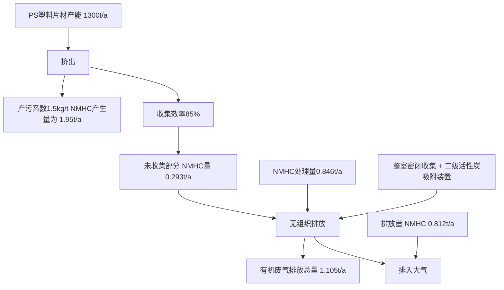
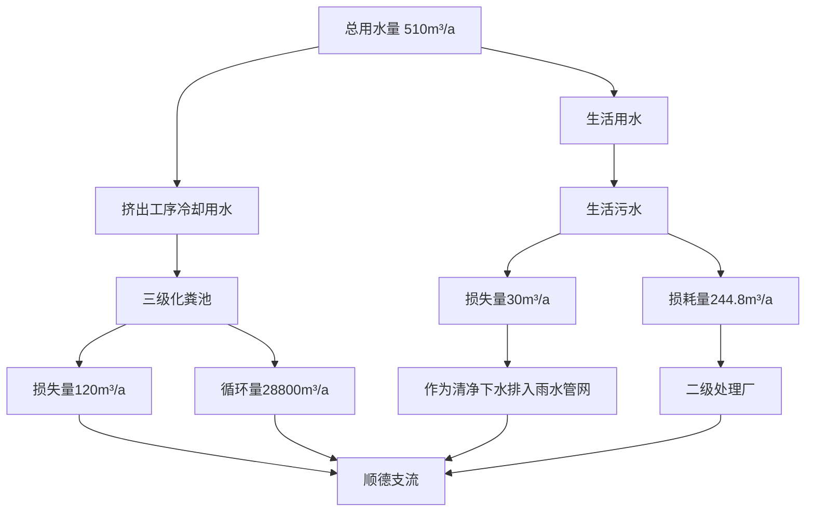
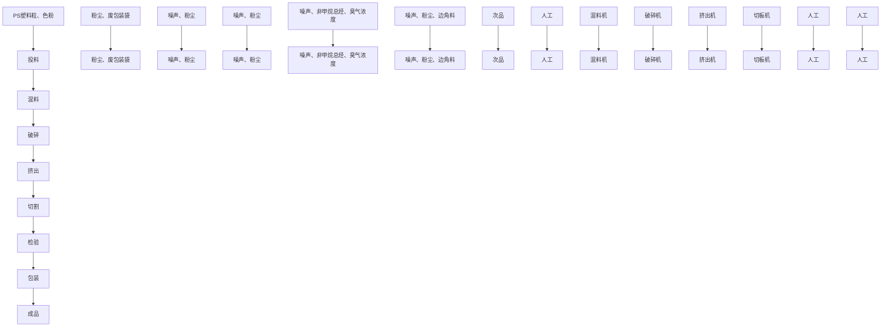

# 建设项目环境影响报告表

# （污染影响类）

项目名称：佛山市顺德区特塑料制品有限公司迁扩建项目

建设单位（盖章）：佛山市顺德区特丰塑料制品有限公司

编制日期：2023年9月

text_image

中国
联合国生态环境
民共和国生态环

中华人民 境部制

natural_image

Solid blue background with no visible text, symbols, or patterns

Issued o

text_image

环境保护部
Approved & authorized
the Environmental Protection Administration
The People's Republic of China

text_image

人民共和國
華民
approxited authorized
by
Ministry of Personnel

编制单位和编制人员情况表

<table><tr><td colspan="2">项目编号</td><td colspan="3">8m0785</td></tr><tr><td colspan="2">建设项目名称</td><td colspan="3">佛山市顺德区特丰塑料制品有限公司迁扩建项目</td></tr><tr><td colspan="2">建设项目类别</td><td colspan="3">26-053塑料制品业</td></tr><tr><td colspan="2">环境影响评价文件类型</td><td colspan="3">报告表</td></tr><tr><td colspan="5">一、建设单位情况</td></tr><tr><td colspan="2">单位名称(盖章)</td><td colspan="2">佛山市顺德区</td><td></td></tr><tr><td colspan="2">统一社会信用代码</td><td colspan="2"></td><td></td></tr><tr><td colspan="2">法定代表人(签章)</td><td colspan="2"></td><td></td></tr><tr><td colspan="2">主要负责人(签字)</td><td colspan="2"></td><td></td></tr><tr><td colspan="2">直接负责的主管人员(签字)</td><td colspan="2"></td><td></td></tr><tr><td colspan="5">二、编制单位情况</td></tr><tr><td colspan="2">单位名称(盖章)</td><td colspan="2">贵州森益</td><td></td></tr><tr><td colspan="2">统一社会信用代码</td><td colspan="2"></td><td></td></tr><tr><td colspan="4">三、编制人员情况</td><td></td></tr><tr><td colspan="5">1.编制主持人</td></tr><tr><td>姓名</td><td colspan="2">职业资格证书管理号</td><td>信用编号</td><td>签字</td></tr><tr><td colspan="5"></td></tr><tr><td colspan="5">2 主要编制人员</td></tr><tr><td>姓名</td><td colspan="2">主要编写内容</td><td>信用编号</td><td>签字</td></tr><tr><td colspan="5"></td></tr></table>

# 目 录

# 一、建设项目基本情况..

# 二、建设项目工程分析.. 18

# 三、区域环境质量现状、环境保护目标及评价标准 . 30

# 四、主要环境影响和保护措施. . 34

# 五、环境保护措施监督检查清单. 59

# 六、结论 ...... 61

# 附表.. . 62

附图1 项目地理位置图. 63

附图2 项目周围环境概况及现场图. . 64

附图3 项目生产车间平面布置图. 65

附图4 项目环境保护目标分布图. . 66

附图5 项目周边四至图. 67

附图6 项目声环境功能区划图. . 68

附图7 项目水环境功能区划图. 69

附图8 项目大气环境功能区划图 70

附图9 佛山市顺德区环境管控单元图. 71

附图10 佛山市环境管控单元图. 72

附图11 广东省“三线一单”数据管理及应用平台——大良街道重点管控区 .73

附图12 广东省“三线一单”数据管理及应用平台——大气环境高排放重点管控区 .74

附图13 广东省“三线一单”数据管理及应用平台——水环境城镇生活污染重点管控区...........75

附图14 《大良凤翔工业区（D-XB-01-01、D-XB-02-01、D-DL-01-01、D- DL-01-04）控制性详细规划》 . 76

附件1 营业执照. 79

附件2 法人身份证. 80

附件3 现有项目环保证.. 81

附件4 现有项目固定污染源排污登记回执.. 82

附件5 技术合同.. 83

附件6 声明.. 84

# 一、建设项目基本情况

<table><tr><td>建设项目名称</td><td colspan="4">佛山市顺德区特丰塑料制品有限公司迁扩建项目</td></tr><tr><td>项目代码</td><td colspan="4">无</td></tr><tr><td>建设单位联系人</td><td>赖**</td><td>联系方式</td><td colspan="2">****</td></tr><tr><td>建设地点</td><td colspan="4">广东省佛山市顺德区大良街道新滘社区华业路13号之六</td></tr><tr><td>地理坐标</td><td colspan="4">东经:113度13分8.094秒、北纬:22度50分57.869秒</td></tr><tr><td>国民经济行业类别</td><td>C2922塑料板、管、型材制造</td><td>建设项目行业类别</td><td colspan="2">二十六、橡胶和塑料制品业29-53塑料制品业292-其他(年用非溶剂型低VOCs含量涂料10吨以下的除外)</td></tr><tr><td>建设性质</td><td>√新建(迁建)□改建√扩建□技术改造</td><td>建设项目申报情形</td><td colspan="2">√首次申报项目□不予批准后再次申报项目□超五年重新审核项目□重大变动重新报批项目</td></tr><tr><td>项目审批(核准/备案)部门(选填)</td><td>/</td><td>项目审批(核准/备案)文号(选填)</td><td colspan="2">/</td></tr><tr><td>总投资(万元)</td><td>***</td><td>环保投资(万元)</td><td colspan="2">***</td></tr><tr><td>环保投资占比(%)</td><td>7.69</td><td>施工工期</td><td colspan="2">1个月</td></tr><tr><td>是否开工建设</td><td>√否□是:</td><td>用地(用海)面积(m2)</td><td colspan="2">900.0</td></tr><tr><td rowspan="7">专项评价设置情况</td><td colspan="4">表1-1 专项评价设置原则表</td></tr><tr><td>专项评价类别</td><td>设置原则</td><td>本项目相关情况</td><td>判定结果</td></tr><tr><td>大气</td><td>排放废气含有毒有害污染物、二噁英、苯并芘、氰化物、氯气且厂界外500米范围内有环境空气保护目标的建设项目。</td><td>本项目排放不涉及技术指南规定的有毒有害废气污染物。</td><td>不需要设置</td></tr><tr><td>地表水</td><td>新增工业废水直排建设项目(槽罐车外送污水处理厂的除外);新增废水直排的污水集中处理厂。</td><td>本项目不涉及工业废水直接排放。</td><td>不需要设置</td></tr><tr><td>环境风险</td><td>有毒有害和易燃易爆危险物质存储量超过临界量的建设项目。</td><td>经分析,本项目危险物质存储量总计未超过临界量。</td><td>不需要设置</td></tr><tr><td>生态</td><td>取水口下游500米范围内有重要水生生物的自然产卵场、索饵场、越冬场和洄游通道的新增河道取水的污染类建设项目。</td><td>本项目不涉及直接从河道取水。</td><td>不需要设置</td></tr><tr><td>海洋</td><td>直接向海排放污染物的海洋工程建设项目。</td><td>本项目污水排放不涉及海洋。</td><td>不需要设置</td></tr></table>

<table><tr><td>规划情况</td><td>规划名称:大良凤翔工业区(D-XB-01-01、D-XB-02-01、D-DL-01-01、D-DL-01-04)控制性详细规划审批机关:佛山市顺德区人民政府审批文件的名称及文号:佛山市顺德区人民政府关于同意《大良凤翔工业区(D-XB-01-01、D-XB-02-01、D-DL-01-01、D-DL-01-04)控制性详细规划》的批复(顺府〔2016〕103号)</td></tr><tr><td>规划环境影响评价情况</td><td>无</td></tr><tr><td>规划及规划环境影响评价符合性分析</td><td>无</td></tr><tr><td>其他符合性分析</td><td>1、与用地规划相符性佛山市顺德区特丰塑料制品有限公司迁扩建项目位于广东省佛山市顺德区大良街道新滘社区华业路13号之六,根据《大良凤翔工业区(D-XB-01-01、D-XB-02-01、D-DL-01-01、D-DL-01-04)控制性详细规划》(详见附图14),项目所在地为工业用地,与本项目的实际用途相符合,没有占用基本农业用地和林地,因此,本项目建设选址符合建设用地规划性质要求。2、与产业政策符合性项目主要从事PS塑料片材的加工生产,根据国家发展和改革委员会发布的《产业结构调整指导目录(2019年本)》及2021年修改版,本项目不属于上述目录所列的鼓励类、限制和禁止(淘汰)项目,根据《促进产业结构调整暂行规定》第十三条,项目属于允许类。根据国家发展改革委商务部关于印发《关于印发&lt;市场准入负面清单(2022年版)&gt;的通知》(发改体改〔2022〕397号),本项目不属于禁止类项目。项目所属行业为C2922塑料板、管、型材制造,不在《环境保护综合名录(2021年版)》内,因此本项目所产产品不属于高污染、高风险产品。项目不属于《广东省“两高”项目管理目录(2022年版)》的通知(粤发改能源函〔2022〕1363号)内两高项目所属行业,因此本项目不属于两高项目。因此,项目符合相关的产业政策要求。3、与环境功能区划相符性分析根据佛山市顺德区人民政府办公室关于印发《佛山市顺德区生态环境保护“十四五”规划(2021-2025)》的通知,项目所在地不属于顺德区一、二级水源保护区,符合饮用水源保护条例的有关要求。项目所在区域为环境空气质量二类功能区,不属于环境空气质量一类功能区中的自然保护区风景名胜区和其它需要特殊保护的区域。项目有机废气经收集处理达标后排放,对周围影响较小,不改变原有的功能区规划。项目所在地区位于3301大良西部工业片区,所在区域为声环境3类区,不属</td></tr></table>

于声环境1类区。项目对生产过程中产生的噪音设备采取了有效的隔声防治措施，对周围环境影响较小。

# 4、项目与广东省“三线一单”生态环境分区管控方案的相符性分析

根据《广东省人民政府关于印发广东省“三线一单”生态环境分区管控方案的通知》（粤府〔2020〕71号）发布的广东省环境管控单元图，项目所在区域为重点管控单元，重点管控单元严格限制新建钢铁、燃煤燃油火电、石化、储油库等项目，产生和排放有毒有害大气污染物项目，以及使用溶剂型油墨、涂料、清洗剂、胶黏剂等高挥发性有机物原辅材料的项目；鼓励现有该类项目逐步搬迁退出。

本项目主要进行PS塑料片材的生产，不属于文件中提及的严格限制类项目；项目不使用溶剂型油墨、涂料、清洗剂、胶黏剂等高挥发性有机物原辅材料，符合区域布局管控要求；项目生产设备使用电能，生产用水由市政供水，不直接取用江河湖库水量，不会对项目所在地生态流量造成影响，符合能源利用要求。

# 5、项目与佛山市“三线一单”生态环境分区管控方案的相符性分析

根据《佛山市人民政府关于印发佛山市“三线一单”生态环境分区管控方案的通知》（佛府〔2021〕11号）佛山市环境管控单元图，项目所在区域为重点管控单元2，环境管控单元编码：ZH44060620002，要素细类为水环境城镇生活污染重点管控区、水环境一般管控区、大气环境受体敏感重点管控区、大气环境高排放重点管控区、江河湖库岸线重点管控区、江河湖库岸线一般管控区。

本项目主要进行PS塑料片材的生产，不属于产业限制类及禁止类项目；本项目不使用溶剂型油墨、涂料、清洗剂、胶黏剂等高挥发性有机物原辅材料，符合区域布局管控要求；项目生产设备使用电能，生产用水由市政供水，不直接取用江河湖库水量，不会对项目所在地生态流量造成影响，符合能源利用要求。

# 6、项目与顺德区“三线一单”生态环境分区管控方案的相符性分析

根据《佛山市顺德区人民政府关于印发佛山市顺德区“三线一单”生态环境分区管控方案的通知》（顺府发〔2021〕11号）的要求，本项目与佛山市顺德区“三线一单”生态环境分区管控方案相符性分析如下：

# ①与“一核一带一区”区域管控要求的相符性

# 1）区域布局管控要求

本项目主要进行PS塑料片材的生产，不属于区域布局管控要求中的禁止新建、扩建水泥、平板玻璃、化学制浆、生皮制革以及国家规划外的钢铁、原油加工等项目。本项目使用的原辅材料不属于新建生产和使用高挥发性有机物原辅材料的项目，符合区域布局管控要求。

# 2）能源资源利用要求

项目所属C2922塑料板、管、型材制造，不属于高能耗行业。项目生产设备使用电能，生产用水由市政供水，不直接取用江河湖库水量，不会对项目所在地生态流量造成影响，符合能源利用要求。

# 3）污染物排放管控要求

项目属于迁扩建项目，挤出工序产生的废气经收集利用二级活性炭吸附装置处理后通过15m排气筒（DA001）高空排放，通过废气收集和处理措施能减少项目挥发性有机物的无组织排放；生活污水预处理达标后排至大门污水处理厂处理，项目总量指标由顺德区环保部门分配，符合污染物排放管控要求。

# 4）环境风险防控要求

项目不属于石化、化工重点园区环境风险防控区域。本项目产生的危险废物拟定期委托有资质的处置公司进行收集处理，并通过信息系统登记转移计划和电子转移联单，符合危险废物全过程跟踪管理的防控要求。

# ②环境管控单元总体管控要求

根据《佛山市顺德区“三线一单”生态环境分区管控方案》（顺府发〔202111号）佛山市顺德区环境管控单元图，项目所在区域为重点管控单元2，环境管控单元编码：ZH44060620002，要素细类为水环境城镇生活污染重点管控区、水环境一般管控区、大气环境受体敏感重点管控区、大气环境高排放重点管控区、江河湖库岸线重点管控区、江河湖库岸线一般管控区。项目与广东省佛山市顺德区重点管控单元2准入清单的相符性分析如表1-2。

表1-2 本项目与顺德区“三线一单”的相符性分析

<table><tr><td>序号</td><td>内容</td><td>相符性分析</td><td>符合性</td></tr><tr><td rowspan="2">区域布局管控</td><td>1-1.【产业/鼓励引导类】重点发展电子信息、5G设备、装备制造及机器人产业、汽车配件产业,打造顺德智造创新服务中心;重点发展高端商贸、金融、科技服务、文创旅游等现代服务业,建设顺德新城城市CBD。</td><td>本项目不属于《产业结构调整指导目录(2019年本)》及2021年修改版中限制和禁止(淘汰)类项目,属于《促进产业结构调整暂行规定》的允许类项目,不属于《关于印发&lt;市场准入负面清单(2022年版)&gt;的通知》(发改体改〔2022〕397号)中禁止类项目。</td><td rowspan="2">符合</td></tr><tr><td>1-2.【产业/综合类】系统推进村级工业园升级改造,腾出连片空间,布局产业集聚区和主题产业园,推动工业项目入园集聚发展。新增工业制造业用地原则上安排在产业集聚区内,产业集聚区外原则上不鼓励工业及物流仓储用地的新建与改造。</td><td>本项目位于大良凤翔工业区范围内,租用已有厂房,无新增工业用地。项目不属于工业及物流仓储用地的新建与改造。</td></tr></table>

<table><tr><td rowspan="8"></td><td rowspan="5"></td><td>1-3.【产业/综合类】产业聚集区所属地块内的工业用地或企业与村庄、学校等环境敏感点之间应设置合理的大气环境防护距离,并通过绿化带进行有效隔离;聚集区规划布局应注重大气污染排放企业应尽量避免布局在居住用地的常年主导风向的上风向。</td><td>本项目所在位置属于工业用地,项目南面199m为顺雅名筑,东南面492m为凤翔小学,经过绿化带隔离及距离衰减,本项目产生废气对其影响不大。</td></tr><tr><td>1-4.【产业/限制类】受纳水体或监控断面不达标的,不得新建、扩建向河涌直接排放废水的项目(具有减排效益的区域废水集中处理设施除外)。新建、扩建含蚀刻工序的线路板生产项目和化工项目应在配套污水集中处置的工业园区或生活污水管网覆盖区域内建设;纯加工型印花项目,含酸洗、磷化的金属表面处理、金属制品项目(与自身高新技术企业配套的和区级及以上重点项目除外),含酸洗、喷涂、化学抛光、电解等涉及废水排放工艺的不锈钢型材加工项目(与自身高新技术企业配套的和区级及以上重点项目除外),应进入以此类项目为主导产业、有相应废水集中治理设施的工业园区,实现集中治污。</td><td>本项目生活污水经三级化粪池预处理后排入大门污水处理厂处理,尾水排入顺德支流,本项目无生产废水排放。项目不属于含蚀刻工序的线路板生产项目和化工项目,也不属于纯加工型印花项目,含酸洗、磷化的金属表面处理、金属制品项目(与自身高新技术企业配套的除外),含酸洗、喷涂、化学抛光、电解等涉及废水排放工艺的不锈钢型材加工项目。</td></tr><tr><td>1-5.【产业/综合类】划定家具生产优先发展区域,优先发展区外不再新建涉及涂装工艺的木质家具制造项目。</td><td>本项目不属于家具生产项目。</td></tr><tr><td>1-6.【大气/限制类】大气环境受体敏感重点管控区内,应严格限制新建储油库项目、产生和排放有毒有害大气污染物的建设项目以及使用溶剂型油墨、涂料、清洗剂、胶黏剂等高挥发性有机物原辅材料项目,鼓励现有该类项目搬迁退出。</td><td>项目不属于新建储油库项目、产生和排放有毒有害大气污染物的建设项目;不使用溶剂型油墨、涂料、清洗剂、胶黏剂等高挥发性有机物原辅材料项目。</td></tr><tr><td>1-7.【大气/鼓励引导类】大气环境高排放重点管控区内,应强化达标监管,引导工业项目落地集聚发展,有序推进区域内行业企业提标改造。</td><td>本项目位于大气环境高排放重点管控区,项目废气经收集处理达标后排放。</td></tr><tr><td rowspan="3">能源资源利用</td><td>2-1.【能源/鼓励引导类】推广节能技术,加快发展绿色货运与现代物流。</td><td>项目使用的生产设备是节能设备,不使用燃料,加快发展绿色货运与现代物流。</td></tr><tr><td>2-2.【能源/鼓励引导类】推广新能源汽车应用和充电基础设施、加氢站建设。</td><td>项目不属于新能源汽车应用和充电基础设施、加氢站建设。</td></tr><tr><td>2-3.【能源/综合类】科学实施能源消费总量和强度“双控”,新建高能耗项目单位产品(产值)能耗达到国际国内先进水平。</td><td>本项目不属于高能耗项目。</td></tr></table>

<table><tr><td rowspan="8"></td><td rowspan="3"></td><td>2-4.【水资源/综合类】贯彻落实“节水优先”方针,实行最严格水资源管理制度,大良街道万元国内生产总值用水量、万元工业增加值用水量、用水总量、农田灌溉水有效利用系数等用水总量和效率指标达到区下达要求。</td><td>项目严格贯彻落实“节水优先”方针。</td><td rowspan="8"></td></tr><tr><td>2-5.【土地资源/限制类】落实单位土地面积投资强度、土地利用强度等建设用地控制性指标要求,提高土地利用效率。</td><td>项目在租用已建成厂房,不新增用地。</td></tr><tr><td>2-6.【岸线/禁止类】严格水域岸线用途管制,新建项目一律不得违规占用水域。严禁破坏生态的岸线利用行为和不符合其功能定位的开发建设活动,严禁以各种名义侵占河道、围垦湖泊、非法采砂等。</td><td>项目不存在破坏生态的岸线利用的行为和不符合其功能定位的开发建设的活动,不存在侵占河道、围垦湖泊、非法采砂等。</td></tr><tr><td rowspan="5">污染物排放管控</td><td>3-1.【水/限制类】城镇新区建设实行雨污分流。住宅、商业体、学校、市场等城镇开发建设项目应当配套或者同步计划建设公共排水设施,公共排水设施或自建排污水设施未能投产运行的,以上涉水项目不得投入使用。新建小区严格实施雨污分流,阳台、露台等污水接入污水收集系统,将生活污水“应截尽截”。做好大型楼盘、集贸市场、餐饮以及学校等4大类排水户污水接入市政管网工作。</td><td>项目不属于住宅、商业体、学校、市场等城镇开发建设项目。</td></tr><tr><td>3-2.【水/综合类】大良街道重点河涌水质上年度未达到水环境环境质量目标的,需组织编制、系统实施、向社会公开区域重点水污染物减排计划并明确“替代量”,本年度新建、改建、扩建项目新增水环境重点污染物实行区域“减二增一”替代(工业、生活或综合集中废水处理设施、民生项目除外)。</td><td>项目生活污水经三级化粪池预处理后排入大门污水处理厂,且属于工业项目,无需实施本年度新建项目新增水环境重点污染物区域“减二增一”替代。</td></tr><tr><td>3-3.【水/综合类】结合村级工业园改造,全面提升产业层次与集聚度,促进污染集中整治。</td><td>项目位于顺德区大良凤翔工业区,产业层次与集聚度较高,污染集中整治。</td></tr><tr><td>3-4.【水/综合类】稳步推进排水设施“三个一体化”管理模式,补齐城乡污水收集和处理短板,推动逢沙污水处理厂、大门污水处理厂提质增效,加快消除城中村、老旧城区、城乡结合部等污水收集管网空白区,逐步实现城乡污水收集处理全覆盖。逢沙污水处理厂根据片区的污水排放收集情况,推进扩建增容工作,尾水应执行《城镇污水处理厂污染物排放标准》(GB18918-2002)一级A标准及《广东省水污染物排放限值》(DB44/26-2001)的较严值。2025年城市生活污水集中收集率达到75%以上。</td><td>项目位于大门污水处理厂处理范围,尾水执行《城镇污水处理厂污染物排放标准》(GB18918-2002)一级A标准及《广东省水污染物排放限值》(DB44/26-2001)第二时段一级标准的较严值。</td></tr><tr><td>3-5.【水/综合类】逢沙村、红岗村、大门村、顺峰村和南江村等行政村(社区)继</td><td>项目所在地已经实施雨污分流,污水纳入</td></tr></table>

<table><tr><td rowspan="3"></td><td>续完善污水管网建设,实现农村污水100%收集进入市政污水系统,有条件的区域实施雨污分流改造,到2030年全面雨污分流,污水纳入大良街道污水处理系统。</td><td>大良街道污水处理系统。</td><td rowspan="5"></td></tr><tr><td>3-6.【水/综合类】产业集聚区和主题园区内做好污水管网和污水集中处理设施的配套保障,确保废水收集到城镇污水处理厂、园区污水处理厂或分散式污水处理设施集中处置。</td><td>项目生活污水经三级化粪池预处理后排入大门污水处理厂处理,尾水排入顺德支流。</td></tr><tr><td>3-7.【大气/综合类】大力推进低VOCs含量原辅材料替代,加快涉VOCs重点行业的生产工艺升级改造,推行自动化生产工艺,对达不到要求的VOCs收集及治理设施进行整治提升,逐步淘汰低效VOCs治理设施。</td><td>项目不使用高VOCs含量原辅材料,本项目有机废气经负压密闭空间整室收集后利用二级活性炭吸附装置处理后引至15m排气筒DA001高空排放。</td></tr><tr><td rowspan="2">环境风险防控</td><td>4-1.【水/综合类】大门污水处理厂、逢沙污水处理厂、顺德区科技工业园(五沙)污水处理厂及企业工业污水处理设施应采取有效措施,防止事故废水直接排入水体。完善污水处理厂在线监控系统联网,实现污水处理厂的实时、动态监管。</td><td>项目所在地位于大门污水处理厂纳污范围,污水处理厂已在线监控系统联网,实现污水处理厂的实时、动态监管。</td></tr><tr><td>4-2.【风险/综合类】加强环境风险分级分类管理,强化金属制品、有色金属和压延加工、化学原料和化学品制造业等涉重金属、化工行业企业及工业园区等重点环境风险源的环境风险防控。</td><td>项目不属于金属制品、有色金属和压延加工、化学原料和化学品制造业等涉重金属、化工行业企业及工业园区等重点环境风险源,日常加强环境风险分级分类管理。</td></tr></table>

综上，本项目符合《佛山市顺德区人民政府关于印发佛山市顺德区“三线一单”生态环境分区管控方案的通知》（顺府发〔2021〕11号）的要求。

# 7、项目与挥发性有机污染物治理政策的相符性分析

本项目有机物治理政策的相符性分析见表1-3。

表1-3 项目与有机污染物治理政策的相符性

<table><tr><td>序号</td><td>政策要求</td><td>工程内容</td><td>符合性</td></tr><tr><td colspan="4">1.《佛山市生态环境局顺德分局关于做好重点行业建设项目挥发性有机物总量指标管理工作的通知》(佛顺环函〔2019〕56号)</td></tr><tr><td>1.1</td><td>省、市生态环境主管部门对VOCs排放量大于300公斤/年的新、改、扩建项目,进行总量替代,按照附表1填报VOCs指标来源说明。其他排放量规模需要总量替代的,由本级生态环境主管部门自行确定范围,并按照要求审核总量指标来源,填写VOCs总量指标来源</td><td>本迁扩建项目有机废气有组织排放量为0.812/a,无组织排放量为0.293t/a,排放总量为1.105t/a,建议本项目迁扩建后挥发性有机物控制总量指标</td><td>符合</td></tr></table>

<table><tr><td rowspan="8"></td><td></td><td>说明。</td><td>为1.105t/a,项目总VOCs总量实行倍量削减替代(减二增一)。</td><td colspan="2"></td></tr><tr><td colspan="5">2.《重点行业挥发性有机物综合治理方案》(环大气〔2019〕53号)</td></tr><tr><td>2.1</td><td>1全面加强无组织排放控制。推进使用先进生产工艺。通过采用全密闭、连续化、自动化等生产技术,以及高效工艺与设备等,减少工艺过程无组织排放。提高废气收集率。遵循“应收尽收、分质收集”的原则,科学设计废气收集系统,将无组织排放转变为有组织排放进行控制。采用全密闭集气罩或密闭空间的,除行业有特殊要求外,应保持微负压状态,并根据相关规范合理设置通风量。采用局部集气罩的,距集气罩开口面最远处的VOCs无组织排放位置,控制风速应不低于0.3米/秒,有行业要求的按相关规定执行。</td><td>本项目挤出工序为全自动生产设备,项目采用负压密闭空间整室收集的方式收集挤出工序产生的废气。</td><td colspan="2">符合</td></tr><tr><td>2.2</td><td>2推进建设适宜高效的治污设施:鼓励企业采用多种技术的组合工艺,提高VOCs治理效率。低浓度、大风量废气,宜采用沸石转轮吸附、活性炭吸附、减风增浓等浓缩技术,提高VOCs浓度后净化处理。低温等离子、光催化、光氧化技术主要适用于恶臭异味等治理;生物法主要适用于低浓度VOCs废气治理和恶臭异味治理。非水溶性的VOCs废气禁止采用水或水溶液喷淋吸收处理。</td><td>本项目产生的有机废气有组织产生速率小于2kg/h,项目设置二级活性炭吸附装置处理有机废气,处理效率为51%。</td><td colspan="2">符合</td></tr><tr><td colspan="5">3.《广东省人民政府办公厅关于印发广东省2021年大气、水、土壤污染防治工作方案的通知》(粤办函〔2021〕58号)</td></tr><tr><td>3.1</td><td>实施低VOCs含量产品源头替代工程。严格落实国家产品VOCs含量限值标准要求,除现阶段确无法实施替代的工序外,禁止新建生产和使用高VOCs含量原辅材料项目。鼓励在生产和流通消费环节推广使用低VOCs含量原辅材料。将全面使用符合国家、省要求的低VOCs含量原辅材料企业纳入正面清单和政府绿色采购清单。各地级以上市要制定低VOCs含量原辅材料替代计划,根据当地涉VOCs重点行业及物种排放特征,选取若干重点行业,通过明确企业数量和原辅材料替代比例,推进企业实施低VOCs含量原辅材料替代。</td><td>本项目所使用的PS塑料粒不属于高VOCs含量材料。</td><td colspan="2">符合</td></tr><tr><td colspan="5">4.佛山市发展和改革局佛山市生态环境局关于印发《佛山市关于进一步加强塑料污染治理的实施方案》的通知(佛发改资环〔2021〕3号)</td></tr><tr><td>4.1</td><td>全市范围内禁止生产和销售厚度小于0.025毫米的超薄塑料购物袋、厚度小于0.01毫米的聚乙烯农用地膜。禁止以医</td><td>本项目主要生产塑料片材,不属于文件中禁止生产项目及限制</td><td colspan="2">符合</td></tr><tr><td rowspan="10"></td><td></td><td colspan="2">疗废物为原料制造塑料制品;禁止将回收利用的废塑料输液袋(瓶)用于原用途或用于制造餐饮容器以及玩具等儿童用品。加大禁止“洋垃圾”进口监管和打私力度,确保“全面禁止废塑料进口”落实到位。到2020年底,禁止生产和销售一次性发泡塑料餐具、一次性塑料棉签;禁止生产含塑料微珠的日化产品。到2022年底,禁止销售含塑料微珠的日化产品。国家《产业结构调整指导目录》和《市场准入负面清单》明确的属于淘汰类的塑料制品项目,禁止投资;属于限制类项目,禁止新建。</td><td>类项目。</td><td></td></tr><tr><td colspan="5">5.《固定污染源挥发性有机物综合排放标准》(DB44/2367-2022)</td></tr><tr><td>/</td><td>控制环节</td><td>控制要求</td><td>本项目情况</td><td>符合判定</td></tr><tr><td rowspan="4">5.1</td><td rowspan="4">物料储存</td><td>VOCs物料应储存于密闭的容器、包装袋、储罐、储库、料仓中。</td><td rowspan="4">VOCs物料储存于密闭的包装袋中存放在厂内;厂房为已建成,拥有完整的围护结构,地面已经全部混凝土硬化,采取防腐防渗处理。</td><td rowspan="4">符合</td></tr><tr><td>盛装VOCs物料的容器或包装袋应存放于室内,或存放于设置有雨棚、遮阳和防渗设施的专用场地。盛装VOCs物料的容器或包装袋在非取用状态时应加盖、封口,保持密闭。</td></tr><tr><td>VOCs物料储罐应密封良好,其中挥发性有机液体储罐应符合5.2条规定。</td></tr><tr><td>VOCs物料储库、料仓应满足3.6条对密闭空间的要求。</td></tr><tr><td rowspan="2">5.2</td><td rowspan="2">转移和输送</td><td>液态VOCs物料应采用密闭管道输送。采用非管道输送方式转移液态VOCs物料时,应采用密闭容器、罐车。</td><td rowspan="2">PS塑料粒属于粒状VOCs物料,采用密闭包装袋进行转移。</td><td>符合</td></tr><tr><td>粉状、粒状VOCs物料应采用气力输送设备、管状带式输送机、螺旋输送机等密闭输送方式,或采用密闭的包装袋、容器或罐车进行物料转移。</td><td>符合</td></tr><tr><td>5.3</td><td>工艺过程</td><td>VOCs物料卸(出、放)料过程应密闭,卸料废气应排至VOCs废气收集处理系统;无法密闭的,应采取局部气体收集措施,废气应排至VOCs废气收集处理系统。</td><td>本项目利用负压密闭空间整室收集挤出工序产生的有机废气,随后利用二级活性炭吸附装置处理后引至15m排气筒(DA001)高空排放。收集效率可达</td><td>符合</td></tr></table>

<table><tr><td></td><td></td><td></td><td>85%,处理效率可达51%。</td><td></td></tr><tr><td>5.4</td><td>VOCs排放控制要求</td><td>收集的废气中NMHC初始排放速率≥3kg/h时,应配置VOCs处理设施,处理效率不应低于80%。</td><td>项目产生的有机废气初始排放速率小于2kg/h,项目设置二级活性炭吸附装置处理有机废气,处理效率为51%。</td><td>符合</td></tr><tr><td colspan="5">6.《广东省塑料制品与制造业挥发性有机物综合整治技术指南》(2022年6月5日发布)</td></tr><tr><td>6.1</td><td colspan="2">粉状、粒状VOCs物料投加,宜采用气力输送方式或采用密闭固体投料器等给料方式密闭投加。</td><td>本项目塑料投料采用气力输送方式密闭投加。</td><td>符合</td></tr><tr><td>6.2</td><td colspan="2">塑炼/塑化/熔化、挤出、注塑、吹膜等成型工序可采取局部气体收集措施,且满足控制风速不低于0.3m/s的要求。</td><td>项目热熔挤出废气通过负压密闭空间整室收集。</td><td>符合</td></tr><tr><td>6.3</td><td colspan="2">若采用活性炭吸附技术,采用颗粒活性炭作为吸附剂时,其碘值不宜低于800mg/g;采用蜂窝活性炭作为吸附剂时,其碘值不宜低650mg/g;采用活性炭纤维作为吸附剂时,其比表面积不低于1100m2/g(BET法)。工作温度和湿度应符合:温度T&lt;40°C、湿度RH&lt;60%;活性炭表面不应有积尘和积水;活性炭吸附箱是否足额装填活性炭(1吨活性炭通常只能吸附0.1~0.2吨VOCs)</td><td>本项目采用碘值不宜低于800mg/g的活性炭对有机废气进行吸附处理,且1吨活性炭按吸附0.2吨VOCs计算。</td><td>符合</td></tr></table>

综合以上分析，项目总体符合文件要求。

# 8、项目与《关于印发<广东省涉挥发性有机物（VOCs）重点行业治理指引>的通知》（粤环办〔2021〕43号）相符性分析

表1-4 本项目与（粤环办〔2021〕43号）相符性分析

<table><tr><td colspan="2">环节</td><td>控制要求</td><td>本项目情况</td><td>相符性</td></tr><tr><td rowspan="8">涂装</td><td rowspan="4">水性涂料</td><td>包装涂料:底漆VOCs含量≤420g/L,中漆VOCs含量≤300g/L,面漆VOCs含量≤270g/L。</td><td rowspan="8">本项目不使用涂料。</td><td rowspan="8">符合</td></tr><tr><td>玩具涂料VOCs含量≤420g/L。</td></tr><tr><td>防水涂料VOCs含量≤50g/L。</td></tr><tr><td>防火涂料VOCs含量≤80g/L</td></tr><tr><td rowspan="2">溶剂型涂料</td><td>防水涂料:单组分VOCs含量≤100g/L,多组分VOCs含量≤50g/L</td></tr><tr><td>防火涂料VOCs含量≤420g/L。</td></tr><tr><td>无溶剂涂料</td><td>VOCs含量≤60g/L。</td></tr><tr><td>辐射固化涂料</td><td>喷涂VOCs含量≤350g/L,其他VOCs含量≤100g/L。</td></tr></table>

<table><tr><td rowspan="24"></td><td rowspan="21">胶粘</td><td rowspan="5">溶剂型胶粘剂</td><td>氯丁橡胶类胶粘剂VOCs含量≤600g/L。</td><td rowspan="21">本项目不使用胶粘剂。</td><td rowspan="21">符合</td></tr><tr><td>苯乙烯-丁二稀-苯乙烯嵌段共聚物橡胶类胶粘剂VOCs含量≤500g/L。</td></tr><tr><td>聚氨酯类胶粘剂VOCs含量≤250g/L。</td></tr><tr><td>丙烯酸酯类胶粘剂VOCs含量≤510g/L。</td></tr><tr><td>其他胶粘剂VOCs含量≤250g/L。</td></tr><tr><td rowspan="7">水基型胶粘剂</td><td>聚乙酸乙烯酯类胶粘剂VOCs含量≤50g/L。</td></tr><tr><td>聚乙烯醇类胶粘剂VOCs含量≤50g/L。</td></tr><tr><td>橡胶类胶粘剂VOCs含量≤50g/L。</td></tr><tr><td>聚氨酯类胶粘剂VOCs含量≤50g/L。</td></tr><tr><td>醋酸乙烯-乙烯共聚乳液类胶粘剂VOCs含量≤50g/L。</td></tr><tr><td>丙烯酸酯类胶粘剂VOCs含量≤50g/L。</td></tr><tr><td>其他胶粘剂VOCs含量≤50g/L。</td></tr><tr><td rowspan="9">本体型胶粘剂</td><td>有机硅类胶粘剂VOCs含量≤100g/L。</td></tr><tr><td>MS类胶粘剂VOCs含量≤50g/L。</td></tr><tr><td>聚氨酯类胶粘剂VOCs含量≤50g/L。</td></tr><tr><td>聚硫类胶粘剂VOCs含量≤50g/L。</td></tr><tr><td>丙烯酸酯类胶粘剂VOCs含量≤200g/L。</td></tr><tr><td>环氧树脂类胶粘剂VOCs含量≤50g/L。</td></tr><tr><td>α-氰基丙烯酸类胶粘剂VOCs含量≤20g/L。</td></tr><tr><td>热塑类类胶粘剂VOCs含量≤50g/L。</td></tr><tr><td>其他胶粘剂VOCs含量≤50g/L。</td></tr><tr><td rowspan="3">清洗</td><td rowspan="2">清洗剂</td><td>半水基型清洗剂:VOCs含量≤300g/L,二氯甲烷、三氯甲烷、三氯乙烯、四氯乙烯总和≤2%,甲醛≤0.5g/kg,苯、甲苯、乙苯和二甲苯总和≤1%。</td><td rowspan="2">本项目不使用清洗剂。</td><td rowspan="2">符合</td></tr><tr><td>有机溶剂清洗剂:VOCs含量≤900g/L,二氯甲烷、三氯甲烷、三氯乙烯、四氯乙烯总和≤20%,苯、甲苯、乙苯和二甲苯总和≤2%。</td></tr><tr><td>低VOCs含量清洗剂</td><td>水基型清洗剂:VOCs含量≤50g/L,二氯甲烷、三氯甲烷、三氯乙烯、四氯乙烯总和≤0.5%,甲醛≤0.5g/kg,苯、甲苯、乙苯和二甲苯总和≤0.5%。</td><td></td><td></td></tr><tr><td rowspan="12"></td><td></td><td></td><td>半水基型清洗剂:VOCs含量≤100g/L,二氯甲烷、三氯甲烷、三氯乙烯、四氯乙烯总和≤0.5%,甲醛≤0.5g/kg,苯、甲苯、乙苯和二甲苯总和≤0.5%。</td><td></td><td></td></tr><tr><td rowspan="4">印刷</td><td rowspan="2">溶剂油墨</td><td>凹印油墨:VOCs含量≤75%。</td><td rowspan="4">本项目不设印刷工序,不使用油墨。</td><td rowspan="4">符合</td></tr><tr><td>柔印油墨:VOCs含量≤75%。</td></tr><tr><td rowspan="2">水性油墨</td><td>凹印油墨:吸收性承印物,VOCs含量≤15%;非吸收性承印物,VOCs含量≤30%。</td></tr><tr><td>柔印油墨:吸收性承印物,VOCs含量≤5%;非吸收性承印物,VOCs含量≤25%。</td></tr><tr><td colspan="2" rowspan="4">VOCs物料储存</td><td>VOCs物料应储存于密闭的容器、包装袋、储罐、储库、料仓中。</td><td>本项目PS塑料粒储存于密闭的包装袋内。</td><td rowspan="4">符合</td></tr><tr><td>盛装VOCs物料的容器是否存放于室内,或存放于设置有雨棚、遮阳和防渗设施的专用场地。盛装VOCs物料的容器在非取用状态时应加盖、封口,保持密闭。</td><td>本项目PS塑料粒为粒料,储存于密闭的包装袋内,储存于项目的仓库内。仓库属于遮阳和防渗的专用场地。</td></tr><tr><td>储存真实蒸气压≥76.6kPa且储罐容积≥75m3的挥发性有机液体储罐,应采用低压罐、压力罐或其他等效措施。</td><td>本项目PS塑料粒为粒料。</td></tr><tr><td>储存真实蒸气压≥27.6kPa但&lt;76.6kPa且储罐容积≥75m3的挥发性有机液体储罐,应符合下列规定之一:a)采用浮顶罐。对于内浮顶罐,浮顶与罐壁之间应采用浸液式密封、机械式鞋形密封等高效密封方式;对于外浮顶罐,浮顶与罐壁之间应采用双重密封,且一次密封应采用浸液式密封、机械式鞋形密封等高效密封方式。b)采用固定顶罐,排放的废气应收集处理达标排放,或者处理效率不低于80%。c)采用气相平衡系统。d)采用其他等效措施。</td><td>本项目PS塑料粒为粒料。</td></tr><tr><td colspan="2" rowspan="2">VOCs物料转移和输送</td><td>液体VOCs物料应采用管道密闭输送。采用非管道输送方式转移液态VOCs物料时,应采用密闭容器或罐车。</td><td>本项目PS塑料粒为粒料。</td><td rowspan="2">符合</td></tr><tr><td>粉状、粒状VOCs物料采用气力输送设备、管状带式输送机、螺旋输送机等密闭输送方式,或者采用密闭的包装袋、容器或罐车进行物料转移。</td><td>本项目PS塑料粒为粒料,采用密闭的包装袋进行物料转移。</td></tr><tr><td colspan="2">工艺过程</td><td>液态VOCs物料采用密闭管道输送方式或采用高位槽(罐)、桶泵等给料方式密闭投加;无法密闭投加</td><td>本项目PS塑料粒为粒料。</td><td>符合</td></tr><tr><td rowspan="9"></td><td rowspan="5"></td><td>的,在密闭空间内操作,或进行局部气体收集,废气排至VOCs废气收集处理系统。</td><td></td><td colspan="2" rowspan="5"></td></tr><tr><td>粉状、粒状VOCs物料采用气力输送方式或采用密闭固体投料器等给料方式密闭投加;无法密闭投加的,在密闭空间内操作,或进行局部气体收集,废气排至除尘设施、VOCs废气收集处理系统。</td><td colspan="2">本项目PS塑料粒为粒料。</td></tr><tr><td>在混合/混炼、塑炼/塑化/熔化、加工成型(挤出、注射、压制、压延、发泡、纺丝等)、硫化等作业中应采用密闭设备或在密闭空间中操作,废气应排至VOCs废气收集处理系统;无法密闭的,应采取局部气体收集措施,废气应排至VOCs废气收集处理系统。</td><td colspan="2">本项目所使用的PS塑料粒不属于高挥发性有机物含量的原材料,项目拟设置负压密闭空间整室收集有机废气,随后经二级活性炭吸附装置处理。</td></tr><tr><td>浸胶、胶浆喷涂、涂胶、喷漆、印刷、清洗等工序使用VOCs质量占比大于等于10%的原辅材料时,其使用过程应采用密闭设备或在密闭空间内操作,废气应排至VOCs废气收集处理系统;无法密闭的,应采取局部气体收集措施,废气应排至VOCs废气收集处理系统。</td><td colspan="2">本项目不使用VOCs质量占比大于等于10%的原辅材料。</td></tr><tr><td>橡胶制品行业的脱硫工艺推荐采用串联法混炼、常压边续脱硫工艺。</td><td colspan="2">本项目不属于橡胶制品行业项目。</td></tr><tr><td>非正常排放</td><td>载有VOCs物料的设备及其管道在开停工(车)、检维修和清洗时,应在退料阶段将残存物料退净,并用密闭容器盛装,退料过程废气应排至VOCs废气收集处理系统;清洗及吹扫过程排气应排至VOCs废气收集处理系统。</td><td>本项目生产设备即开即停,不存在开停工(车)、检维修和清洗时的非正常排放情况。</td><td colspan="2"></td></tr><tr><td rowspan="2">废气收集</td><td>采用外部集气罩的,距集气罩开口面最远处的VOCs无组织排放位置,控制风速不低于0.3m/s。</td><td>本项目废气控制风速为0.5m/s。</td><td colspan="2" rowspan="2">符合</td></tr><tr><td>废气收集系统的输送管道应密闭。废气收集系统应在负压下运行,若处于正压状态,应对管道组件的密封点进行泄漏检测,泄漏检测值不应超过500μmol/mol,亦不应有感官可察觉泄漏。</td><td colspan="2">本项目拟设置负压密闭空间整室收集废气,收集系统在负压下运行。</td></tr><tr><td>排放水平</td><td>橡胶制品行业:a)有机废气排气筒排放浓度和厂界浓度不高于《橡胶制品工业污染物排放标准》(GB27632-2011)第II时段排放限值;车间或生产设施排气中NMHC初始排放速率≥3kg/h时,建设末端治污设施且处理效率≥80%;b)厂区内无组织排放监控点NMHC的小时平均浓度值不超过6 mg/m3,任意一次浓度值不超过20 mg/m3。</td><td>本项目不属于橡胶制品行业项目。</td><td colspan="2">符合</td></tr><tr><td rowspan="6"></td><td></td><td>塑料制品行业:a)有机废气排气筒排放浓度不高于广东省《大气污染物排放限值》(DB4427-2001)第II时段排放限值,合成革和人造革制造企业排放浓度不高于《合成革与人造革工业污染物排放标准》(GB21902-2008)排放限值,若国家和我省出台并实施适用于塑料制品制造业的大气污染物排放标准,则有机废气排气筒排放浓度不高于相应的排放限值;车间或生产设施排气中NMHC初始排放速率≥3kg/h时,建设VOCs处理设施且处理效率≥80%;b)厂区内无组织排放监控点NMHC的小时平均浓度值不超过6 mg/m3,任意一次浓度值不超过20 mg/m3。</td><td>本项目非甲烷总烃排放执行《合成树脂工业污染物排放标准》(GB31572-2015)表4大气污染物排放限值;本项目厂区内无组织排放监控点NMHC的小时平均浓度值执行广东省《固定污染源挥发性有机物综合排放标准》(DB44/2367-2022)表3厂区内VOCs无组织排放限值。</td><td colspan="2">符合</td></tr><tr><td rowspan="4">治理设施设计与运行管理</td><td>吸附床(含活性炭吸附法):a)预处理设备应根据废气的成分、性质和影响吸附过程的物质性质及含量进行选择;b)吸附床层的吸附剂用量应根据废气处理量、污染物浓度和吸附剂的动态吸附量确定;c)吸附剂应及时更换或有效再生。</td><td>本项目选用二级活性炭吸附装置为符合要求。</td><td colspan="2" rowspan="5">符合</td></tr><tr><td>催化燃烧:a)预处理设备应根据废气的成分、性质和污染物的含量进行选择;b)进入燃烧室的气体温度应达到气体组分在催化剂上的起燃温度。</td><td colspan="2">本项目不使用催化燃烧处理工艺。</td></tr><tr><td>蓄热燃烧:a)预处理设备应根据废气的成分、性质和污染物的含量等因素进行选择;b)废气在燃烧室的停留时间一般不宜低于0.75s,燃烧室燃烧温度一般应高于760°C。</td><td colspan="2">本项目不使用蓄热燃烧处理工艺。</td></tr><tr><td>VOCs治理设施应与生产工艺设备同步运行,VOCs治理设施发生故障或检修时,对应的生产工艺设备应停止运行,待检修完毕后同步投入使用;生产工艺设备不能停止运行或不能及时停止运行的,应设置废气应急处理设施或采取其他替代措施。</td><td colspan="2">本项目将按要求执行。</td></tr><tr><td>管理台账</td><td>建立含VOCs原辅材料台账,记录含VOCs原辅材料的名称及其VOCs含量、采购量、使用量、库存量、含VOCs原辅材料回收方式及回收量。</td><td colspan="2">本项目投产后将建立含VOCs原辅材料台账,记录含VOCs原辅材料的名称及其VOCs含量、采购量、使用量、库存量、含VOCs</td></tr></table>

<table><tr><td rowspan="4"></td><td></td><td>原辅材料回收方式及回收量。</td><td rowspan="4"></td></tr><tr><td>建立废气收集处理设施台账,记录废气处理设施进出口的监测数据(废气量、浓度、温度、含氧量等)、废气收集与处理设施关键参数、废气处理设施相关耗材(吸收剂、吸附剂、催化剂等)购买和处理记录。</td><td>本项目投产后将建立废气收集处理设施台账,记录废气处理设施进出口的监测数据、废气收集与处理设施关键参数、废气处理设施相关耗材购买和处理记录。</td></tr><tr><td>建立危废台账,整理危废处置合同、转移联单及危废处理方资质佐证材料。</td><td>本项目投产后将建立危废台账,整理危废处置合同、转移联单及危废处理方资质佐证材料。</td></tr><tr><td>台账保存期限不少于3年。</td><td>本项目投产后台账保存期限不少于3年。</td></tr><tr><td rowspan="2">自行监测</td><td>塑料制品行业重点排污单位:a)塑料人造革与合成革制造每季度一次;b)塑料板、管、型材制造、塑料丝、绳及编织品制造、泡沫塑料制造、塑料包装箱及容器制造(注塑成型、滚塑成型)、日用塑料制品制造、人造草坪制造、塑料零件及其他塑料制品每半年一次;c)喷涂工序每季度一次;d)厂界每半年一次。</td><td>本项目将按照塑料板、管、型材制造每半年一次进行监测,厂界每年一次进行监测。</td><td>符合</td></tr><tr><td>塑料制品行业简化管理排污单位废气排放口及无组织排放每年一次。</td><td>本项目属于登记管理项目。</td><td>符合</td></tr><tr><td>危废管理</td><td>工艺过程产生的含VOCs废料(渣、液)应按照相关要求进行储存、转移和输送。盛装过VOCs物料的废包装容器应加盖密闭。</td><td>本项目将按要求执行。</td><td>符合</td></tr><tr><td rowspan="2">建设项目VOCs总量管理</td><td>新、改、扩建项目应执行总量替代制度,明确VOCs总量指标来源。</td><td>本项目执行总量替代制度,VOCs总量由大良街道进行总量分配。</td><td>符合</td></tr><tr><td>新、改、扩建项目和现有企业VOCs基准排放量计算参考《广东省重点行业挥发性有机物排放量计算方法核算》进行核算,若国家和我省出台适用于该行业的VOCs排放量计算方法,则参照其相关规定执行。</td><td>本项目将按要求执行。</td><td>符合</td></tr></table>

综上，本项目符合《关于印发<广东省涉挥发性有机物（VOCs）重点行业治理指引>的通知》（粤环办〔2021〕43号）的要求。

9、项目与关于印发《广东省禁止、限制生产、销售和使用的塑料制品目录》（2020年版）的相符性分析

表1-5 本项目与关于印发《广东省禁止、限制生产、销售和使用的塑料制品目录》（2020年版）的相符性分析对照表

<table><tr><td>类型</td><td>细化标准</td><td>本项目情况</td><td>相符性</td></tr><tr><td colspan="4">一、禁止生产、销售的塑料制品</td></tr><tr><td>厚度小于0.025毫米的超薄塑料购物袋</td><td>用于盛装及携提物品且厚度小于0.025毫米的超薄塑料购物袋;适用范围参照GB/T 21661《塑料购物袋》标准。</td><td>本项目属于塑料制品制造行业,主要从事PS塑料片材的加工生产,不生产塑料袋。</td><td>符合</td></tr><tr><td>厚度小于0.01毫米的聚乙烯农用地膜</td><td>以聚乙烯为主要原料制成且厚度小于0.01毫米的不可降解农用地面覆盖薄膜;适用范围和地膜厚度、力学性能指标参照GB13735《聚乙烯吹塑农用地面覆盖薄膜》标准。</td><td>本项目属于塑料制品制造行业,主要从事PS塑料片材的加工生产,不生产农用地膜。</td><td>符合</td></tr><tr><td>以医疗废物为原料制造塑料制品</td><td>以纳入《医疗废物管理条例》《医疗废物分类目录》等管理的医疗废物为原料生产塑料制品。以回收利用的废塑料输液袋(瓶)用于原用途或用于制造餐饮容器以及玩具等儿童用品。</td><td>本项目属于塑料制品制造行业,主要从事PS塑料片材的加工生产,不以医疗废物为原料。</td><td>符合</td></tr><tr><td>一次性发泡塑料餐具</td><td>用泡沫塑料制成的一次性塑料餐具。</td><td>本项目属于塑料制品制造行业,主要从事PS塑料片材的加工生产,不属于一次性发泡塑料餐具生产、销售。</td><td>符合</td></tr><tr><td>一次性塑料棉签</td><td>以塑料棒为基材制造的一次性棉签,不包括相关医疗器械。</td><td>本项目属于塑料制品制造行业,主要从事PS塑料片材的加工生产,不属于一次性塑料棉签生产、销售。</td><td>符合</td></tr><tr><td>含塑料微珠的日化产品</td><td>为起到磨砂、去角质、清洁等作用,有意添加粒径小于5毫米的固体塑料颗粒的淋洗类化妆品(如沐浴剂、洁面乳、磨砂膏、洗发水等)和牙膏、牙粉。</td><td>本项目属于塑料制品制造行业,主要从事PS塑料片材的加工生产,不属于含塑料微珠的日化产品生产、销售。</td><td>符合</td></tr></table>

因此，项目满足《广东省禁止、限制生产、销售和使用的塑料制品目录》（2020年版）的要求。

# 10、与《佛山市顺德区生态环境保护“十四五”规划》相符性分析

根据佛山市顺德区人民政府办公室关于印发《佛山市顺德区生态环境保护“十四五”规划（2021-2025）》的通知（顺府办发〔2022〕16号）： 优化空间开发布局。以新一轮国土空间规划为契机，统筹城市建设、主题产业园区和美丽乡村的有机结合，重构城乡、产业、生态等空间布局和风貌形态。调整优化产业集群发展空间布局，环境质量不达标区域，新建、扩建项目需符合环境质量改善要求；严格控制“高耗能、高排放”项目盲目发展，禁止新建、扩建水泥、平板玻璃、化学制浆、生皮制革以及国家规划外的钢铁、原油加工等项目；专业电镀、印染等项目进入定点园区集中管理。 实施产业结构优化升级行动。聚焦发展新一代信息技术、高端装备制造、绿色低碳、生物制药、数字经济、新材料等战略性新兴产业，推进资源节约利用和循环利用，打造具有世界影响力的战略性产业集群；建设一批产业高度集聚、高效协作、生态和谐的特色产业园，发展珠宝、家具、五金、纺织服装四大特色产业，促进特色产业高端化。持续推进重点行业VOCs整治。持续开展挥发性有机物专项整治，继续推进重点行业企业开展销号式综合整治，建立VOC重点监管企业名单并动态更新，督促企业建立VOCs管控台账清单；持续探寻高效节能的VOCs治理技术，对采用低温等离子、光氧化、光催化等低效治理工艺的企业在臭氧污染天气应对期间实施停限产或错峰生产，并推动企业逐步淘汰低效治理工艺。

加强VOCs源头替代和无组织排放管控。大力推进低VOCs含量、低反应活性的原辅材料替代，将全面使用低VOCs含量原辅材料的企业纳入正面清单和政府绿色采购清单。鼓励重点行业企业开展生产工艺和设备水性化改造，推广使用水性、高固体分、无溶剂、粉末等低VOCs含量涂料。严格落实《挥发性有机物无组织排放控制标准》，开展厂区内无组织排放浓度监测，加强对含VOCs物料储存、转移和运输、设备与管线组件泄漏、敞开页面逸散以及工艺过程等五类排放源的管控。加强储油库、加油站等VOCs排放治理，推动油品储运销体系安装油气回收自动监控系统。

本项目不属于禁止新建、扩建水泥、平板玻璃、化学制浆、生皮制革以及国家规划外的钢铁、原油加工等项目。本项目从源头上控制VOCs的产生，项目使用的PS塑料粒、色粉不属于高VOCs原料，项目不使用低温等离子、光氧化、光催化等低效治理工艺，项目有机废气处理工艺为“二级活性炭吸附装置”。本项目含VOCs的原料密封储存，存放于室内，非取用时封口保持密闭，项目产生有机废气的工序采用整室收集废气，提高了有机废气的收集，并通过有效处理后可达标排放。因此，项目符合《佛山市顺德区生态环境保护“十四五”规划》的相关要求。

# 二、建设项目工程分析

<table><tr><td rowspan="11">建设内容</td><td colspan="4">1、项目概况及任务来源佛山市顺德区特丰塑料制品有限公司于2018年8月20日取得《顺德区建设项目环境影响报告批准证》(证号:勒20180366号),原项目位于佛山市顺德区勒流街道龙眼村石岗咀1号之二(北纬22.826360°,东经113.201385°)。现有项目占地面积800m2,建筑面积800m2。总投资230万元人民币,其中环保投资10万元,生产能力为年产PS塑料片材1200吨。项目员工人数为10人,均不在项目内食宿;每天1班工作制生产,每班8个小时。由于业务和生产需要,项目现拟搬迁至广东省佛山市顺德区大良街道新滘社区华业路13号之六,中心坐标:北纬22°50'57.869",东经113°13'8.094"。由于迁扩建项目位于新的厂区,距离原厂区有一定的距离,现有的污染随迁扩建后也随之消失,故本环评将重新对新厂区进行评价。具体变化内容如下:1、建设地址由“佛山市顺德区勒流街道龙眼村石岗咀1号之二”迁至“广东省佛山市顺德区大良街道新滘社区华业路13号之六”,项目占地面积为900m2,建筑面积为900m2。2、总投资额增加30万元,其中环保投资增加10万元;3、员工人数增加5人,仍不在项目内食宿;工作时间不变,仍为年工作300天,每天工作8小时;4、本迁扩建项目不改变产品的种类,仅通过增加一条生产线来提高产能,拟年增产PS塑料片材100吨,项目所用的原料种类和设备参数均相同,详见表2-4至表2-6以及工程分析。迁扩建后公司名称、法人代表保持不变。迁扩建后项目总投资260万元,其中环保投资20万元,环保投资占比为7.69%。项目占地面积约为900m2,建筑面积约为900m2。员工人数共15人,不设食宿。迁扩建项目投产后主要从事PS塑料片材的加工生产,拟年产PS塑料片材1300吨。现申请办理相关环保手续。表2-1 项目所属行业分析表</td></tr><tr><td rowspan="10">行业类别</td><td colspan="2">类别</td><td>项目情况</td></tr><tr><td colspan="2">《国民经济行业分类》(GB/T 4754-2017)(2019年修订)</td><td rowspan="2">项目主要从事PS塑料片材的加工生产,属于C2922塑料板、管、型材制造行业。</td></tr><tr><td colspan="2">C制造业</td></tr><tr><td>大类</td><td>中类</td><td>小类</td></tr><tr><td>29橡胶和塑料制品业</td><td>292塑料制品业</td><td>C2922塑料板、管、型材制造</td></tr><tr><td colspan="2">《建设项目环境影响评价分类管理名录》(2021年版)</td><td rowspan="2">项目主要从事PS塑料片材的加工生产,本项目设有投料、混料、挤出、切割、抽检、破碎和包装工序,故应编制报告表。</td></tr><tr><td colspan="2">二十六、橡胶和塑料制品业29-53塑料制品业292</td></tr><tr><td>报告书</td><td>报告表</td><td>登记表</td></tr><tr><td>以再生塑料为原料生产的;有电镀工艺的;年用溶剂型胶粘剂10吨及以上的;年用溶剂型涂料(含稀释剂)10吨及以上的</td><td>其他(年用非溶剂型低VOCs含量涂料10吨以下的除外)</td><td>/</td></tr><tr><td colspan="2">《固定污染源排污许可分类管理名录(2019年版)》</td><td>本项目主要从事PS塑料</td></tr><tr><td rowspan="3"></td><td colspan="3">二十四、橡胶和塑料制品业29-62塑料制品业292</td><td rowspan="3">片材的加工生产,项目年产PS塑料片材量少于1万吨,故本项目应进行登记管理。</td></tr><tr><td>重点管理</td><td>简化管理</td><td>登记管理</td></tr><tr><td>塑料人造革、合成革制造2925</td><td>年产1万吨及以上的泡沫塑料制造2924,年产1万吨及以上涉及改性的塑料薄膜制造2921、塑料板、管、型材制造2922、塑料丝、绳和编织品制造2923、塑料包装箱及容器制造2926、日用塑料品制造2927、人造草坪制造2928、塑料零件及其他塑料制品制造2929</td><td>其他</td></tr></table>

# 2、项目基本情况

# 2.1主要产品产能

本项目主要从事PS塑料片材的加工生产，主要工艺投料、混料、挤出、切割、抽检、破碎和包装等工艺，项目建成后产品方案详见表2-2所示。

表2-2 项目产品及产能

<table><tr><td>产品</td><td>现有项目</td><td>迁扩建增减量</td><td>本迁扩建项目</td></tr><tr><td>PS塑料片材</td><td>1200吨</td><td>+100吨</td><td>1300吨</td></tr><tr><td colspan="4">说明:PS塑料片材参数为长为1m,宽度为1m,厚度为1mm。</td></tr></table>

# 2.2建设内容及规模

根据建设单位提供的资料，本项目建设组成详见表 2-3。

表 2-3 项目建设组成一览表

<table><tr><td>类别</td><td>工程名称</td><td>备注</td></tr><tr><td>主体工程</td><td>生产车间</td><td>车间占地面积 $900m^{2}$ ,建筑面积 $900m^{2}$ ,一层,层高为9.6m,所在建筑物高9.6m,主要功能包括原料堆放区(约 $200m^{2}$ )、挤出机区(约 $200m^{2}$ )、成品堆放区(约 $200m^{2}$ )、一般固废间(约 $5m^{2}$ )、混料破碎间(约 $10m^{2}$ )、危废暂存间(约 $5m^{2}$ ),通道(约 $250m^{2}$ )。</td></tr><tr><td rowspan="3">辅助工程</td><td>卫生间</td><td>依托项目所在厂区公共卫生间,用于员工的日常生活,一层,层高为9.6m,所在建筑物高9.6m。</td></tr><tr><td>通道</td><td>依托生产车间,面积约为 $250m^{2}$ ,一层,层高为9.6m,所在建筑物高9.6m。</td></tr><tr><td>办公室</td><td>面积约 $30m^{2}$ ,一层,层高为9.6m,所在建筑物高9.6m,位于车间东南面。</td></tr><tr><td rowspan="4">仓储工程</td><td>原料堆放区</td><td>依托生产车间,位于车间的西北侧,面积约为 $200m^{2}$ ,一层,层高为9.6m,所在建筑物高9.6m,用于原料的存放。</td></tr><tr><td>成品堆放区</td><td>依托生产车间,位于车间的东北侧,面积约为 $200m^{2}$ ,一层,层高为9.6m,所在建筑物高9.6m,用于暂存成品。</td></tr><tr><td>一般固废间</td><td>依托生产车间,位于车间的西北角,建筑面积 $5m^{2}$ ,高3m,一层,层高为9.6m,所在建筑物高9.6m,用于一般工业固体废物的暂存。</td></tr><tr><td>危废暂存间</td><td>依托生产车间,位于车间的西北角,建筑面积 $5m^{2}$ ,高3m,一层,层高为9.6m,所在建筑物高9.6m,用于危险废物的暂存。</td></tr><tr><td rowspan="2">公共工程</td><td>供水</td><td>由市政供水管网供给,包括生活用水和挤出工序冷却用水。</td></tr><tr><td>供电</td><td>由市政供电管网供给,项目内不设备用发电机。</td></tr><tr><td>环保工程</td><td>污水治理工程</td><td>生活污水经三级化粪池处理后经市政污水管网排入大门污水处理厂处理,尾水排入顺德支流。冷却用水循环使用,定期补充,定期排水作为清净下水通过雨水管网排放。</td></tr><tr><td rowspan="3"></td><td>废气处理工程</td><td>废气利用密闭负压空间整室收集后利用二级活性炭吸附装置处理后引至15m排气筒(DA001)高空排放。</td></tr><tr><td>噪声治理工程</td><td>合理调整设备布置,主要生产设备安装隔震垫,采用隔声、距离衰减等治理措施。</td></tr><tr><td>固废处理工程</td><td>一般固体废物统一收集后交由回收公司回收处理。一般固废间位于车间的西北角,建筑面积 $5m^{2}$ ,高度为3m;生活垃圾定期委托环卫部门统一收集处理;危险废物统一交由有资质单位收集处理,危废暂存间位于车间的西北角,建筑面积 $5m^{2}$ ,高度为3m。</td></tr></table>

# 2.3主要原辅材料用量

根据建设单位提供的资料，本项目主要原辅材料及用量见表 2-4。项目主要原辅材料主要成份及其理化性质详见表2-5。

表 2-4 项目主要原材料年用量一览表

<table><tr><td>序号</td><td>名称</td><td>现有项目</td><td>迁扩建后用量</td><td>变化量</td><td>最大储存量</td><td>单位</td><td>性质、包装</td><td>备注</td></tr><tr><td>1</td><td>PS塑料粒</td><td>1200</td><td>1301.43854</td><td>+101.43854</td><td>40</td><td rowspan="4">t/a</td><td>新料,粒状,25kg/袋</td><td rowspan="5">原料</td></tr><tr><td>2</td><td>色粉</td><td>0.5</td><td>0.54</td><td>+0.04</td><td>0.1</td><td>新料,粉料,5kg/袋</td></tr><tr><td>3</td><td>液压油</td><td>0</td><td>0.1</td><td>+0.1</td><td>0.005</td><td rowspan="2">液态,5kg/桶</td></tr><tr><td>4</td><td>机油</td><td>0</td><td>0.02</td><td>+0.02</td><td>0.005</td></tr><tr><td>5</td><td>包装箱</td><td>0</td><td>32000</td><td>+32000</td><td>2000</td><td>个/a</td><td>50kg规格</td></tr></table>

表 2-5 项目主要原辅材料主要成份及其理化性质一览表

<table><tr><td>名称</td><td>主要成份及其理化性质</td></tr><tr><td>PS塑料粒</td><td>PS(聚苯乙烯):是一种热塑性树脂,为无色、无臭、无味、透明的珠状或粒状的固体。成型温度:170-260°C。PS是一种明亮、纯净的非结晶塑料,优势为易加工、有刚性、尺寸稳定和透明,缺陷为低抗冲击强度。熔融温度150~180°C,热分解温度300°C;其溶于芳香烃,氯化烃,酮类(除尔酮外)和酯类,能耐许多矿物油,有机酸,碱,盐,低级醇及其水溶液,不耐沸水。聚苯乙烯已有生产并广泛用于电视机壳、商用机器和电器制品。密度为1.04~1.05g/cm3。</td></tr><tr><td>色粉</td><td>色粉的基本功能,是赋予塑料各种颜色。塑料着色剂应能经受塑料加工成型处理中各项工艺条件,以制成特定色泽的塑料制品。在当今激烈市场竞争中,产品外观成为吸引人们眼球产生购买欲望的重要要素,因此着色剂应当有良好的色彩性能及耐热性和易分散性.为了增加塑料产品的商品价值,从单纯追求美观,发展到对着色产品稳定性,高性能和安全性等提出了更高的要求,因此塑料着色剂还应当在塑料制品使用条件下有良好的应用性能,如耐候性、耐迁移性、无毒性、耐化学药品性等。色粉属于无机类色粉。</td></tr><tr><td>机油</td><td>机油一般由基础油和添加剂两部分组成。基础油是机油的主要成分,决定着机油的基本性质,添加剂则可弥补和改善基础油性能方面的不足,赋予某些新的性能,是机油的重要组成部分。密度:&lt;1g/cm3;水溶性:不溶于水;引燃温度:248°C;闪点:76°C;分子量:230-500。</td></tr><tr><td>液压油</td><td>液压油就是利用液体压力能的液压系统使用的液压介质,在液压系统中起着能量传递、抗磨、系统润滑、防腐、防锈、冷却等作用。相对密度(水=1):&lt;0.91g/cm3;沸点:330°C;溶解性:不溶于水。</td></tr></table>

# 2.4项目迁扩建后有机废气平衡

本迁扩建项目VOCs平衡详见下图2-1所示。

flowchart

图2-1 本迁扩建项目VOCs平衡图

# 2.5项目迁扩建后物料平衡

本迁扩建项目物料平衡详见下表所示。

表2-6 项目物料平衡核算表

<table><tr><td colspan="2">投入</td><td colspan="2">产出</td></tr><tr><td>项目</td><td>用量(t/a)</td><td>项目</td><td>产量(t/a)</td></tr><tr><td>PS塑料粒</td><td>1301.43854</td><td>PS塑料片材</td><td>1300</td></tr><tr><td>色粉</td><td>0.54</td><td>颗粒物</td><td>0.02854</td></tr><tr><td>/</td><td>/</td><td>非甲烷总烃</td><td>1.95</td></tr><tr><td>合计</td><td>1301.97854</td><td>合计</td><td>1301.97854</td></tr></table>

# 2.6主要生产设备

根据建设单位提供的资料，本项目主要生产设备见表2-7。

表2-7 项目主要生产设备一览表

<table><tr><td>序号</td><td>设备名称</td><td>单位</td><td>参数</td><td>现有项目设备数量</td><td>迁扩建后设备数量</td><td>变化量</td><td>使用工序</td></tr><tr><td>1</td><td>挤出机</td><td>台</td><td>75kw</td><td>3</td><td>4</td><td>+1</td><td>挤出</td></tr><tr><td>2</td><td>破碎机</td><td>台</td><td>3.5kw</td><td>3</td><td>3</td><td>0</td><td>破碎</td></tr><tr><td>3</td><td>切板机</td><td>台</td><td>3.5kw</td><td>1</td><td>1</td><td>0</td><td>切割</td></tr><tr><td>4</td><td>混料机</td><td>台</td><td>1.5kw</td><td>3</td><td>3</td><td>0</td><td>混料</td></tr><tr><td>5</td><td>冷却塔</td><td>台</td><td>循环流量3t/h</td><td>3</td><td>4</td><td>+1</td><td>辅助</td></tr></table>

# 2.7本迁扩建项目产能匹配性分析

参考《单螺杆塑料挤出机》（JB/T8061-2011）中表A.4加工聚丙烯（PP）挤出机基本参数，本项目挤出机加工PS塑料粒的参数如下表，本迁扩建项目产能匹配性分析详见下表2-9所示。

表2-8 项目挤出机参数表

<table><tr><td>功能\型号</td><td>75kw, PS(参照PP)</td></tr><tr><td>设备数量</td><td>4台</td></tr><tr><td>螺杆直径/mm</td><td>Φ100</td></tr><tr><td>螺杆转速rPm</td><td>70</td></tr><tr><td>长径比L/D</td><td>25</td></tr><tr><td>最大塑化才能kg/h</td><td>140</td></tr></table>

表2-9 项目挤出机的产能核算

<table><tr><td>设备</td><td>产出</td><td>挤出能力(kg/h·台)</td><td>单台胶料用量(t/a)</td><td>数量(台)</td><td>挤出最大产能量(t/a)</td></tr><tr><td>挤出机</td><td>PS塑料片材</td><td>140</td><td>336</td><td>4</td><td>1344</td></tr></table>

综上可知，4台挤出机的最大产能可达1344t/a，本项目拟投产产能为1300t/a，本项目设置4台挤出机可完全满足本项目的生产需求。

# 2.8公用配套工程

本项目的用水均全部由市政自来水公司供给，具体给排水情况如下：

# 2.8.1给水

2.8.1.1生活用水：根据建设单位提供的资料，项目用水主要为员工生活用水，员工人数为 15人，年工作 300 天，厂内不设置员工宿舍和饭堂，根据《用水定额第 3 部分：生活》（DB44/T1461-2021）附录 A中“国家机构-国家行政机构-办公楼-无食堂和浴室”的先进值用水定额可知，本项目职工生活用水量按 10m3 /人·a计，则项目生活用水量约为 150m3/a。  
2.8.1.2挤出工序冷却用水：根据工程分析可知，本项目冷却用水主要为定期排水冷却塔补充水以及蒸发和风吹冷却水补充水，补充水量为360t/a。

# 2.8.2排水

2.8.2.1生活污水：根据《排放源统计调查产排污核算方法和系数手册》（公告2021年第24号），生产污水产污系数按0.8计算，则生活污水排放量约为120m3 /a，项目生活污水经三级化粪池预处理后达到广东省地方标准《水污染物排放限值》（DB44/26-2001）第二时段三级标准后排入大门污水处理厂处理，尾水排入顺德支流。  
2.8.2.2本项目挤出工序冷却用水循环使用，定期补充损耗水，定期排水作为清净下水，通过雨水管网排放。

flowchart

图2-2 项目水平衡图

# 2.9供电

本项目用电由当地市政电网供应，根据建设单位提供资料，本迁扩建项目年用电量约为25万千瓦时，项目内不设备用发电机。

# 2.10劳动定员及工作制度

工作制度：根据建设单位提供的资料，项目年工作日300天，每天工作8小时，工作时间为上午8：00\~12：00，下午14：00\~18：00。

劳动定员：根据建设单位提供的资料，项目拟定员工共15人，均不在项目内食宿。

# 2.11厂区平面布置

本项目原料堆放区位于车间的西北侧，成品堆放区位于车间的东北侧，挤出机区位于项目的西南侧，混料破碎间位于项目的北侧，一般固废暂存间位于车间的西北角，危废暂存间位于车间的西北角，办公室位于车间的东南侧。

本项目生产车间内部按照工艺要求进行分区，项目各生产区相对独立，互不干扰，每个生产区按照工艺流程布置设备，因此，项目平面布置做到了生产、办公分开，车间内布置流畅，总体来说项目平面布置紧凑有序，布局合理。项目平面布置图详见附图3。

# 2.12项目四至情况

本项目东北面为厂区办公楼，隔办公楼为荣业四路；本项目东南面为空置厂房；本项目西南面为顺德区信德船舶机械有限公司；本项目西北面为拓展路。

# 2.13项目环保投资情况

根据《建设项目环境保护设计规定》中的有关条款和有关环境保护法规，结合本环境保护和污染防治工作拟采用一些必要的工程措施，对本环境保护投资进行了估算，具体结果见表2-10。

表2-10 项目环保工程措施投资一览表

<table><tr><td>序号</td><td>工程类别</td><td>环保措施名称</td><td>投资(万元)</td><td>占项目总投资比例(%)</td></tr><tr><td>1</td><td>污水处理工程</td><td>三级化粪池</td><td>1</td><td>0.385</td></tr><tr><td>2</td><td>废气控制工程</td><td>负压密闭空间整室+二级活性炭吸附装置+废气排放管道</td><td>14.0</td><td>5.385</td></tr><tr><td>3</td><td>噪声防治工程</td><td>设备减振、墙体隔声等</td><td>2.5</td><td>0.962</td></tr><tr><td>4</td><td>固废</td><td>危废暂存间</td><td>2.5</td><td>0.962</td></tr><tr><td colspan="3">小计</td><td>20</td><td>占总投资的7.69%</td></tr></table>

# 运营期：

根据建设单位提供的资料，本迁扩建项目主要从事PS塑料片材的生产。其生产工艺流程和产污环节详见图2-3所示。

flowchart

图2-3 项目生产工艺流程及产污环节图

# 生产工艺过程及产污环节说明：

投料工序：人工将外购回厂的PS塑料粒和色粉投入混料机中，该工序会产生投料粉尘和废包装袋。

混料工序：利用混料机将投料后的PS塑料粒和色粉混合搅拌均匀。由于混料期间，混料机为密闭状态，因此混料期间无粉尘产生，但在开盖取料期间会有少量粉尘外逸，该工序会产生噪声和颗粒物。

挤出工序：混料完毕后的混合料经加热（PS塑料加工温度为170℃）使得塑胶粒达到熔融状态，在挤出模具的压力保持下挤出，随后自然冷却。挤出过程中需用冷却水进行温度控制（间接冷却），冷却水循环使用，定期补充，定期排水作为清净下水，通过雨水管网排放。该过程会产生噪声、非甲烷总烃和臭气浓度。

切割工序：挤出自然冷却后的工件利用切板机按设定好的尺寸进行切割成型，切割工艺为冷式

铡刀切割工艺，切割期间无粉尘产生，该工序会产生噪声、边角料。

检验工序：人工对挤出冷却成型的工件进行检验，检验过程中会挑出次品，通过检验的产品即为合格品，该工序会产生次品。

破碎工序：切割产生的边角料和检验挑出的次品需要利用破碎机重新破碎后回用，破碎粒径控制在3mm，破碎期间会产生少量粉尘。破碎料取出后重新投加到挤出机期间不会有粉尘产生。该工序会产生颗粒物、噪声。

包装工序：人工将合格品利用包装箱包装，包装完成后形成成品。

说明：项目不设废旧塑胶料回收利用。

# 1、现有项目基本情况

现有项目占地面积 800m2，建筑面积 800m2。总投资 230万元人民币，其中环保投资 10万元，生产能力为年产 PS塑料片材 1200吨。项目员工人数为 10人，均不在项目内食宿；每天 1班工作制生产，每班 8个小时。

建设单位于 2018 年 8 月 20 日取得《顺德区建设项目环境影响报告批准证》（证号：勒20180366 号）；建设单位于 2020 年 3 月 27 日取得《固定污染源排污登记回执》，登记编号：91440606686445804M001X。现有项目暂未进行验收，拟在迁扩建后统一办理。

# 2、现有项目生产工艺

项目搬迁前后均从事 PS塑料片材的加工生产，迁扩建前后生产工艺不变，详见图 2-3。

# 3、排放情况

本环评对现有项目的环境污染分析将根据2018年编制的《佛山市顺德区特丰塑料制品有限公司搬迁项目》建设项目环境影响报告表和《排放源统计调查产排污核算方法和系数手册》（公告2021年第24号）核算。现有项目的污染源产生和排放具体情况及污染治理设施如下表所示：

表2-11 现有项目污染物及防治措施一览表

<table><tr><td>序号</td><td>污染工序</td><td colspan="2">主要污染物</td><td>排放量(固废产生量)</td><td>排放浓度</td><td>污染防治措施</td><td>达标分析</td></tr><tr><td rowspan="10">1</td><td rowspan="10">生活污水</td><td rowspan="5">审批</td><td>废水量</td><td> $108\ m^{3}/a$ </td><td>-</td><td rowspan="10">经独立的生活污水处理设施处理后排入石涌小涌</td><td rowspan="10">符合《城镇污水处理厂污染物排放标准》(GB18918-2002)二级标准</td></tr><tr><td> $COD_{Cr}$ </td><td>0.0108 t/a</td><td>100 mg/L</td></tr><tr><td> $BOD_{5}$ </td><td>0.00324 t/a</td><td>30 mg/L</td></tr><tr><td>SS</td><td>0.00324 t/a</td><td>30 mg/L</td></tr><tr><td>氨氮</td><td>0.0027 t/a</td><td>25 mg/L</td></tr><tr><td rowspan="5">实际</td><td>废水量</td><td> $80\ m^{3}/a$ </td><td>-</td></tr><tr><td> $COD_{Cr}$ </td><td>0.008 t/a</td><td>100 mg/L</td></tr><tr><td> $BOD_{5}$ </td><td>0.0024 t/a</td><td>30 mg/L</td></tr><tr><td>SS</td><td>0.0024 t/a</td><td>30 mg/L</td></tr><tr><td>氨氮</td><td>0.002 t/a</td><td>25 mg/L</td></tr><tr><td rowspan="6">2</td><td rowspan="6">大气污染物</td><td>审批</td><td rowspan="2">非甲烷总烃(无组织)</td><td>0.042t/a</td><td> $<4.0\ mg/m^{3}$ </td><td rowspan="2">加强车间密闭</td><td rowspan="2">符合《合成树脂工业污染物排放标准》(GB31572-2015)表9企业边界大气污染物浓度限值</td></tr><tr><td>实际</td><td>1.26 t/a</td><td> $<4.0\ mg/m^{3}$ </td></tr><tr><td>审批</td><td rowspan="2">非甲烷总烃(有组织)</td><td>0.378 t/a</td><td> $15.8\ mg/m^{3}$ </td><td rowspan="2">集气罩收集后引至15m排气筒高空排放</td><td rowspan="2">符合《合成树脂工业污染物排放标准》(GB31572-2015)表4大气污染物排放限值</td></tr><tr><td>实际</td><td>0.54 t/a</td><td> $22.5\ mg/m^{3}$ </td></tr><tr><td>审批</td><td rowspan="2">颗粒物(无组织)</td><td>0.126t/a</td><td> $<1.0mg/m^{3}$ </td><td rowspan="2">加强车间密闭</td><td rowspan="2">符合《合成树脂工业污染物排放标准》(GB31572-2015)表9企业边界大气污染物浓度限值</td></tr><tr><td>实际</td><td>0.026t/a</td><td> $<1.0mg/m^{3}$ </td></tr><tr><td>3</td><td>设备噪声</td><td colspan="2">dB(A)</td><td>昼间≤60夜间≤50</td><td>——</td><td>设备减震、防震、厂房隔音</td><td>达到《工业企业厂界环境噪声排放标准》(GB12348-2008)中的2类标准</td></tr><tr><td rowspan="6">4</td><td rowspan="6">固体废物</td><td>审批</td><td rowspan="2">生活垃圾</td><td>1.5 t/a</td><td rowspan="2">——</td><td rowspan="2">统一收集后交由环卫部门处理</td><td rowspan="6">一般工业固体废物在厂内采用库房或包装工具贮存,贮存过程应满足相应防渗漏、防雨淋、防扬尘等环境保护要求。</td></tr><tr><td>实际</td><td>1.5 t/a</td></tr><tr><td>审批</td><td rowspan="2">边角料和次品</td><td>60 t/a</td><td>——</td><td rowspan="2">利用破碎机破碎后全部回用于生产</td></tr><tr><td>实际</td><td>60 t/a</td><td>——</td></tr><tr><td>审批</td><td rowspan="2">废包装袋</td><td>0 t/a</td><td>——</td><td rowspan="2">交由物资回收公司回收处理</td></tr><tr><td>实际</td><td>9.6 t/a</td><td>——</td></tr><tr><td rowspan="5">5</td><td rowspan="5">危险废物</td><td rowspan="2">审批</td><td>废机油</td><td>0.05t/a</td><td>——</td><td rowspan="5">交由有相应处理资质的单位收集处理</td><td rowspan="5">危险废物执行《国家危险废物名录》(2021年)及《危险废物贮存污染控制标准》(GB18597-2023)。</td></tr><tr><td>废抹布</td><td>0.03 t/a</td><td>——</td></tr><tr><td rowspan="3">实际</td><td>废机油</td><td>0.05 t/a</td><td>——</td></tr><tr><td>废油桶</td><td>0.01 t/a</td><td>——</td></tr><tr><td>废抹布</td><td>0.03 t/a</td><td>——</td></tr><tr><td colspan="8">1)现有项目原审批数据均由2018年编制的《佛山市顺德区特丰塑料制品有限公司迁建项目》中所得。2)现有项目实际情况分析:3.1废水生活污水:现有项目员工人数共10人,不设食宿。参照《用水定额第3部分:生活》(DB44/T 1461-2021)附录A中“国家机构-国家行政机构-办公楼-无食堂和浴室”的先进值用水定额可知,现有项目职工生活用水量按 $10m^{3}/人 \cdot a$ 计,则用水量为 $100m^{3}/a$ ,均为职工一般生活用水。生活污水产污系数按0.8计,则排放量为 $80m^{3}/a$ 。生活污水经独立的生活污水处理设施处理后达到《城镇污水处理厂污染物排放标准》(GB18918-2002)二级标准后排入石涌小涌。冷却用水:本项目冷却用水循环使用,定期补充损耗水,不外排。3.2废气由于项目实际使用塑料粒原料和色粉,因此项目在投料期间有粉尘产生;项目设有破碎工序,因此破碎期间有粉尘产生;挤出期间产生的有机废气,以非甲烷总烃计;期间产生的恶臭气体,以臭气浓度计。1非甲烷总烃现有项目在挤出过程中会产生有机废气,主要污染因子为非甲烷总烃。参照《排放源统计调查产排污核算方法和系数手册》(公告2021年第24号)中“292塑料制品业系数手册”的“2922塑料板、管、型材制造行业系数表”可知,挤出期间非甲烷总烃的产生系数为1.5kg/t-产品。现有项目生产期间所使用的PS塑料片材产量为1200t/a,则非甲烷总烃产生量为1.8t/a,项目采用集气罩收集废气,随后引至15m排气筒高空排放,排气筒风量为 $10000m^{3}/h$ ,</td></tr></table>

集气罩收集效率按30%计算，非甲烷总烃排放量为0.54t/a，非甲烷总烃排放速率为0.225kg/h，排放浓度为22.5mg/m3，符合《合成树脂工业污染物排放标准》（GB31572-2015）表4大气污染物排放限值；非甲烷总烃无组织排放量为1.26t/a，无组织排放速率为0.525kg/h，符合《合成树脂工业污染物排放标准》（GB31572-2015）表9企业边界大气污染物浓度限值，因此对周边大气环境影响不大。

# ②颗粒物

现有项目在投料过程中使用色粉，故会产生投料粉尘，主要污染因子为颗粒物。

根据《预混料厂粉尘浓度测量方法研究》（金楠、王红英等，中国农业大学，2017 年）及《散逸性工业粉尘控制技术》（美国俄亥俄州环境保护局和污染工程分公司编著），粉尘量约为粉末状原材料的0.1%。现有项目生产期间所使用的色粉用量为0.5t/a，则颗粒物产生量约为0.0005t/a，投料工序年工作600h，则投料期间颗粒物的排放速率为0.0008kg/h。

项目切割产生的边角料和检验产生的次品利用破碎机进行破碎，期间会产生破碎粉尘，主要污染因子为颗粒物。

参考《排放源统计调查产排污核算方法和系数手册》（公告2021年第24号）“42废弃资源综合利用行业系数手册”中的“4220 非金属废料和碎屑加工处理行业系数表”PS塑料在干法破碎过程中颗粒物的产污系数，颗粒物产污系数未425g/t-产品。现有项目边角料产生量约为产品产量的4%，次品产生量约为产品产量的1%，现有项目PS塑料片材产量为1200t/a，则需要破碎的边角料和次品量为60t/a，则破碎粉尘产生量为0.0255t/a。破碎工序年工作时间为450h，则破碎粉尘排放速率为0.0567kg/h。

综上，现有项目颗粒物的产生量为0.026t/a，颗粒物的最大排放速率为0.0575kg/h，颗粒物通过加强车间通风无组织排放到厂界外，符合《合成树脂工业污染物排放标准》（GB31572-2015）表9企业边界大气污染物浓度限值，因此对周边大气环境影响不大。

# 3.3噪声

项目营运期噪声污染主要来自生产设备噪声。建设单位设置实体墙车间，车间内部进行合理布局，选用低噪声型号设备，生产时门窗紧闭利用建筑隔声，设备定期维护。现有项目厂界外1m可达到《工业企业厂界环境噪声排放标准》（GB12348-2008）中的2类标准。

# 3.4固废

现有项目产生的固体废物主要为员工生活垃圾、废包装袋、边角料和次品、废机油、废油桶、废抹布等，详见下表所示。

表2-12 项目原有污染物及防治措施一览表

<table><tr><td>污染源</td><td>类型</td><td>种类</td><td>产生量(t/a)</td><td>处置</td></tr><tr><td rowspan="2">生活垃圾</td><td>审批</td><td rowspan="2">员工生活垃圾</td><td>4.5</td><td rowspan="2">交由环卫部门处理</td></tr><tr><td>实际</td><td>4.5</td></tr><tr><td>一般工业固体废物</td><td>审批</td><td>废包装袋边角料和次品</td><td>060</td><td>交由物资回收公司回收处理利用破碎机破碎后全部回用于生产</td></tr><tr><td rowspan="2"></td><td rowspan="2">实际</td><td>废包装袋</td><td>9.6</td><td>交由物资回收公司回收处理</td></tr><tr><td>边角料和次品</td><td>60</td><td>利用破碎机破碎后全部回用于生产</td></tr><tr><td rowspan="6">危险废物</td><td rowspan="3">审批</td><td>废机油</td><td>0.05</td><td rowspan="6">交由有相应危废处理资质的单位外运处理</td></tr><tr><td>废油桶</td><td>0</td></tr><tr><td>废抹布</td><td>0.03</td></tr><tr><td rowspan="3">实际</td><td>废机油</td><td>0.05</td></tr><tr><td>废油桶</td><td>0.01</td></tr><tr><td>废抹布</td><td>0.03</td></tr></table>

# 4、现有项目存在环保问题及整改措施

# 4.1现有项目存在环保问题：

现有项目未进行环保工程竣工验收，但现有项目运营期间并未对周边大气环境和声环境造成影响。现有项目随项目迁扩建后，对现有项目所在区域的环境影响也将随之消失。

原项目现时采用的废气收集措施，未能满足《挥发性有机物无组织排放控制标准》（GB37822-2019）、《重点行业挥发性有机物综合治理方案》（环大气〔2019〕53号）和《关于印发<2020年挥发性有机物治理攻坚方案>的通知》（环大气〔2020〕33号）等政策文件的相关要求。本迁扩建项目应按照相关政策的要求进行整改。

# 4.2整改措施：

1、项目在迁扩建完成后进行竣工验收手续；  
2、设置二级活性炭吸附装置用于处理有机废气；  
3、项目迁扩建后采取收集效率更高的密闭负压空间整室收集方式取代集气罩收集方式，以减少废气对周边环境的影响。

# 三、区域环境质量现状、环境保护目标及评价标准

区域 环境 质量 现状

# 1、大气环境

根据《佛山市顺德区生态环境保护“十四五”规划（2021\~2025年）》，项目所在地为大气环境二类功能区，执行《环境空气质量标准》（GB3095-2012）及2018年修改单二级标准。

为评价本项目所在区域环境空气质量达标情况，引用《佛山市生态环境局顺德分局关于发布2022年度佛山市顺德区生态环境质量状况公报的通知》（佛顺环函〔2023〕26号）中附件《2022年度佛山市顺德区生态环境质量状况公报》数据，评价指标为二氧化硫 $\mathbf { \eta } ( \mathsf { S O } _ { 2 } )$ 、二氧化氮$\begin{array} { r } { \left( \mathrm { N O } _ { 2 } \right) \ \mathrm { , } \ \mathrm { P M } _ { 1 0 } \mathrm { , } \ \mathrm { P M } _ { 2 . 5 } \ . } \end{array}$ 、一氧化碳CO和臭氧 $\yen 0$ 。该地区空气质量执行《环境空气质量标准》（GB3095-2012）及2018年修改单二级标准，基本污染物环境质量现状评价如下：

表3-1 2022年顺德区（国控测点）环境空气质量现状评价表

<table><tr><td>污染物</td><td>年评价指标</td><td>单位</td><td>现状浓度</td><td>标准值</td><td>占标率</td><td>达标情况</td></tr><tr><td> $SO_{2}$ </td><td>年平均质量浓度</td><td> $\mu g/m^{3}$ </td><td>5</td><td>60</td><td>8.33%</td><td>达标</td></tr><tr><td> $NO_{2}$ </td><td>年平均质量浓度</td><td> $\mu g/m^{3}$ </td><td>29</td><td>40</td><td>72.50%</td><td>达标</td></tr><tr><td> $PM_{10}$ </td><td>年平均质量浓度</td><td> $\mu g/m^{3}$ </td><td>32</td><td>70</td><td>45.71%</td><td>达标</td></tr><tr><td> $PM_{2.5}$ </td><td>年平均质量浓度</td><td> $\mu g/m^{3}$ </td><td>19</td><td>35</td><td>52.29%</td><td>达标</td></tr><tr><td>CO</td><td>年内日平均值的第95百分位数</td><td> $mg/m^{3}$ </td><td>1.1</td><td>4</td><td>27.50%</td><td>达标</td></tr><tr><td> $O_{3}$ </td><td>年内日最大8小时平均值的第90百分位数</td><td> $\mu g/m^{3}$ </td><td>190</td><td>160</td><td>118.75%</td><td>不达标</td></tr></table>

根据《2022年佛山市顺德区生态环境质量状况公报》中的数据和结论，2022年佛山市顺德区内二氧化硫 $( \mathsf { S O } _ { 2 } )$ 、二氧化氮 $\begin{array} { r } { \left( \mathrm { N O } _ { 2 } \right) \ \mathrm { , } \ \mathrm { P M } _ { 1 0 \mathrm { , } } \ \mathrm { P M } _ { 2 . 5 } . } \end{array}$ 、一氧化碳CO评价指标均符合《环境空气质量标准》（GB3095-2012）及2018年修改单二级标准的要求；臭氧 $\mathrm { \dot { \Omega } } _ { \mathrm { \Omega } } \mathrm { O } _ { 3 }$ 评价指标未符合《环境空气质量标准》（GB3095-2012）及2018年修改单二级标准的要求，因此顺德区属于不达标区。

# 2、地表水环境

本项目所处位置属于大门污水处理厂纳污范围，生活污水经预处理后排入大门污水处理厂处理，尾水排入顺德支流。根据《佛山市顺德区生态环境保护“十四五”规划（2021\~2025年）》可知，顺德支流水质属于地表水Ⅲ类功能区，执行《地表水环境质量标准》（GB3838-2002）之Ⅲ类标准。

根据《佛山市生态环境局顺德分局关于发布2022年度佛山市顺德区生态环境质量状况公报的通知》（佛顺环函〔2023〕26号）附件《2022年度佛山市顺德区生态环境质量状况公报》（详见下表）可知，顺德支流2022年的水质定类为Ⅲ类，符合《地表水环境质量标准》（GB3838-2002）之Ⅲ类标准的要求，故水质较好。

表3-2 2022年度佛山市顺德区环境质量状况公报（节选）

<table><tr><td rowspan="2">序号</td><td rowspan="2">河流名称</td><td rowspan="2">断面</td><td colspan="2">断面定类</td><td rowspan="2">水质评价标准</td><td colspan="2">河流定类</td></tr><tr><td>2022年</td><td>2021年</td><td>2022年</td><td>2021年</td></tr><tr><td>13</td><td>顺德支流</td><td>飞鹅山</td><td>III</td><td>III</td><td>III</td><td>III</td><td>III</td></tr></table>

# 3、声环境

<table><tr><td></td><td colspan="7">本项目为迁扩建项目,根据《佛山市人民政府关于印发佛山市声环境功能区划分方案的通知》(佛府函〔2015〕72号),项目位于大良凤翔工业区,属于声环境3类功能区,项目厂界外50m范围内无环境敏感目标,无需开展声环境质量现状调查。4、生态环境项目用地范围内不涉及生态环境保护目标,不需要进行生态现状调查。5、电磁辐射项目不涉及电磁辐射项目,不需要进行电磁辐射环境质量现状调查。6、地下水、土壤环境质量现状本项目所在厂房均已进行场地硬底化处理,项目不存在地下水、土壤环境污染途径,不需要开展地下水、土壤环境质量现状调查。</td></tr><tr><td rowspan="5">环境保护目标</td><td colspan="7">1、大气环境项目厂界外500米范围内主要环境保护目标为居住区和学校,空气保护目标为项目所在区域的环境空气质量,保护级别为《环境空气质量标准》(GB3095-2012)中的二级标准,具体见下表表3-3 项目周围环境敏感点一览表</td></tr><tr><td>项目</td><td>名称</td><td>保护对象</td><td>保护内容</td><td>环境功能区</td><td>相对厂址方向</td><td>相对厂界距离/m</td></tr><tr><td rowspan="2">大气</td><td>顺雅名筑</td><td>居住区</td><td rowspan="2">人群</td><td rowspan="2">环境空气:二类</td><td>南</td><td>199</td></tr><tr><td>凤翔小学</td><td>学校</td><td>东南</td><td>492</td></tr><tr><td colspan="7">2、声环境根据现场踏勘调查,本项目厂界外50米范围内无声环境保护目标。3、地下水环境本项目厂界外500米范围内无地下水集中式饮用水水源和热水、矿泉水、温泉等特殊地下水资源。4、地表水环境本项目位置不在饮用水源保护区等地表水环境敏感区,最终纳污水体为顺德支流,水质保护水质目标为GB3838-2002的III类。5、生态环境项目用地范围内无生态环境保护目标。</td></tr><tr><td>污染物排放控制标准</td><td colspan="7">1、废水项目生活污水执行广东省《水污染物排放限值》(DB44/26-2001)第二时段三级标准,即 $COD_{Cr} \leq 500mg/L$ 、 $BOD_{5} \leq 300mg/L$ 、 $SS \leq 400mg/L$ ,通过市政管网进入大门污水处理厂。根据2013年7月11日颁布的《顺德区环境运输和城市管理局关于全区城镇污水处理厂尾水排放执行标准的通知》规定:大门污水处理厂提标后,尾水水质执行《城镇污水处理厂污染物排放标准》(GB18918-2002)一级A标准及广东省地方标准《水污染物排放限值》(DB44/26-2001)第二时段一级标准的较严值。具体参数值如下表所示:</td></tr></table>

表3-4 项目生活污水排放执行标准（单位：mg/L）

<table><tr><td>适用标准</td><td colspan="5">项目生活污水排放执行标准</td></tr><tr><td>污染物</td><td>pH</td><td> $COD_{Cr}$ </td><td> $BOD_5$ </td><td>SS</td><td>氨氮</td></tr><tr><td>标准限值</td><td>6~9</td><td>≤500</td><td>≤300</td><td>≤400</td><td>——</td></tr><tr><td>适用标准</td><td colspan="5">大门污水处理厂出水执行标准</td></tr><tr><td>污染物</td><td>pH</td><td> $COD_{Cr}$ </td><td> $BOD_5$ </td><td>SS</td><td>氨氮</td></tr><tr><td>标准限值</td><td>6~9</td><td>≤40</td><td>≤10</td><td>≤10</td><td>≤5</td></tr></table>

# 2、废气

（1）由于项目使用的树脂原料为 PS塑料粒，挤出过程产生非甲烷总烃有组织执行《合成树脂工业污染物排放标准》（GB31572-2015）表 4 大气污染物排放限值；无组织排放执行《合成树脂工业污染物排放标准》（GB31572-2015）表 9企业边界大气污染物浓度限值。

表 3-5 《合成树脂工业污染物排放标准》（GB31572-2015）（摘录）

<table><tr><td rowspan="2">污染物</td><td colspan="2">表4大气污染物排放限值</td><td>表9企业边界大气污染物浓度限值</td></tr><tr><td>适用成树脂类型</td><td>最高允许排放浓度(mg/m3)</td><td>mg/m3</td></tr><tr><td>非甲烷总烃</td><td>所有合成树脂</td><td>100</td><td>4.0</td></tr><tr><td>苯乙烯</td><td>聚苯乙烯</td><td>50</td><td>/</td></tr><tr><td>甲苯</td><td>聚苯乙烯</td><td>15</td><td>0.8</td></tr><tr><td>乙苯</td><td>聚苯乙烯</td><td>100</td><td>/</td></tr></table>

（2）厂区内 VOCs 无组织排放执行广东省《固定污染源挥发性有机物综合排放标准》（DB44/2367-2022）表 3 厂区内 VOCs 无组织排放限值。

表 3-6 广东省《固定污染源挥发性有机物综合排放标准》（DB44/2367-2022）（摘录）

<table><tr><td>污染物</td><td>排放限值/(mg/m3)</td><td>限值含义</td><td>无组织排放监控位置</td></tr><tr><td rowspan="2">NMHC</td><td>6</td><td>监控点处1h平均浓度值</td><td rowspan="2">在厂房外设置监控点</td></tr><tr><td>20</td><td>监控点处任意一次浓度值</td></tr></table>

（3）项目生产中会产生臭气浓度，有组织排放执行《恶臭污染物排放标准》（GB14554-93）表 2恶臭污染物排放标准值（15m排气筒）的要求；无组织排放执行《恶臭污染物排放标准》（GB14554-93）表 1恶臭污染物厂界标准值的二级（新改扩建）标准。

表 3-7 《恶臭污染物排放标准》（GB14554-93）（摘录）

<table><tr><td>污染物</td><td>恶臭污染物排放标准值</td><td>恶臭污染物厂界标准值</td></tr><tr><td>臭气浓度</td><td>2000(无量纲)</td><td>20(无量纲)</td></tr></table>

（4）项目投料和破碎过程产生粉尘，无组织排放执行《合成树脂工业污染物排放标准》（GB31572-2015）表 9企业边界大气污染物浓度限值。

$\begin{array}{c} \begin{array} { r l r } { \frac { \ddagger } { \ddagger } 3 - 8 } & { { } \langle \frac { } { \iff } b \notin \mathbb { R } ^ { + } , b \notin \mathbb { R } \rVert _ { \mathbb { H } } ^ { \infty } \mathop { \sum } \mathbb { N } [ \chi , \overbrace { \gamma \exists } \frac { \chi _ { 1 } } { \llcorner } b \notin \mathbb { M } ] \sharp [ \widehat { \gamma } \overline { { \chi } } \overline { { \chi } } ] \stackrel { \{ \} } { \iff } ( \mathbf { G B 3 1 5 7 2 - 2 0 1 5 } ) } & { { } ( \mathbf { \smallskip \ m b 1 5 7 2 - 2 0 1 5 } ) } \end{array} \quad \left( \frac { \ddagger } { \twoheadrightarrow \textnormal { \smallskip \iff } \mathbf { x } } \right)  \end{array}$ 

<table><tr><td rowspan="2">污染物</td><td>表9企业边界大气污染物浓度限值</td><td rowspan="2">执行标准</td></tr><tr><td>mg/m3</td></tr><tr><td>颗粒物</td><td>1.0</td><td>GB31572-2015</td></tr></table>

# 3、噪声

<table><tr><td rowspan="4"></td><td colspan="6">本项目营运期边界噪声执行《工业企业厂界环境噪声排放标准》(GB12348-2008)3类区标准,详见下表。表3-9《工业企业厂界环境噪声排放标准》(摘录)</td></tr><tr><td colspan="2">类别</td><td colspan="2">昼间(6:00~22:00)</td><td colspan="2">夜间(22:00~6:00)</td></tr><tr><td colspan="2">3类</td><td colspan="2">65 dB(A)</td><td colspan="2">55 dB(A)</td></tr><tr><td colspan="6">4、固体废物固体废物管理应遵照《中华人民共和国固体废物污染环境防治法》、《广东省固体废物污染环境防治条例》的要求;一般固体废物暂存于一般固体废物仓库,仓库应满足防渗漏、防雨淋、防扬尘等要求。危险废物执行《国家危险废物名录(2021年版)》以及《危险废物贮存污染控制标准》(GB18597-2023),同时执行《关于发布&lt;一般工业固体废物贮存、处置场污染控制标准&gt;(GB18599-2001)等3项国家污染物控制标准修改单的公告》(2013年第36号)。</td></tr><tr><td rowspan="10">总量控制指标</td><td colspan="6">1、水污染物总量控制分析:迁扩建前:现有项目生活污水排放量为0.008万t/a, $COD_{Cr}$ 排放总量为0.008t/a, $NH_{3}-N$ 排放总量为0.002t/a。生活污水经独立的生活污水处理设施处理后排入石涌小涌,生活污水 $COD_{Cr}$ 、 $NH_{3}-N$ 不分配总量。迁扩建后:项目生活污水排放量为0.012万t/a, $COD_{Cr}$ 排放总量为0.005t/a, $NH_{3}-N$ 排放总量为0.0006t/a。生活污水经三级化粪池处理后通过污水管网排入大门生活污水处理厂,尾水排至顺德支流。根据《佛山市排污权有偿使用和交易管理办法》(佛府办〔2020〕第19号),本项目生活污水 $COD_{Cr}$ 、 $NH_{3}-N$ 不分配总量,其总量纳入大门生活污水处理厂总量指标中。2、大气污染物总量控制分析:迁扩建前:现有项目VOCs有组织排放量为0.54吨/年,有机废气无组织排放量为1.26吨/年。迁扩建后:本迁扩建项目有机废气有组织排放量为0.812t/a,无组织排放量为0.293t/a,排放总量为1.105t/a。表3-10 总量控制指标一览表 单位:吨/年</td></tr><tr><td rowspan="2" colspan="2">要素</td><td colspan="3">排放量</td><td rowspan="2">需分配的总量</td></tr><tr><td>迁扩建前</td><td>迁扩建后</td><td>增减量</td></tr><tr><td rowspan="3">废水</td><td>废水排放量</td><td>80</td><td>120</td><td>+40</td><td rowspan="3">无需分配</td></tr><tr><td> $COD_{cr}$ </td><td>0.008</td><td>0.005</td><td>-0.003</td></tr><tr><td>氨氮</td><td>0.002</td><td>0.0006</td><td>-0.0014</td></tr><tr><td rowspan="3">废气</td><td rowspan="3">挥发性有机物(VOCs)</td><td>有组织</td><td>0.54</td><td>0.812</td><td>+0.272</td></tr><tr><td>无组织</td><td>1.26</td><td>0.293</td><td>-0.967</td></tr><tr><td>合计</td><td>1.8</td><td>1.105</td><td>-0.695</td></tr><tr><td colspan="6">根据《佛山市挥发性有机物排污总量指标精细化管理工作方案(试行)》的函(佛环函〔2023〕29号)“有组织排放和无组织排放均纳入新增指标管理;非甲烷总烃合并计入VOCs管理。”因此建议项目申请挥发性有机物排放总量控指标1.105t/a,由大良街道环保主管部门核查总量指标。</td></tr></table>

# 四、主要环境影响和保护措施

<table><tr><td>施工期环境保护措施</td><td>本项目使用自有已建成的厂房作为经营场所,不需要进行土建施工,不存在施工期环境影响。</td></tr></table>

<table><tr><td rowspan="10">运营期环境影响和保护措施</td><td colspan="16">本项目主要从事PS塑料片材的生产,行业类别属于“C292塑料制品业”-“C2922塑料板、管、型材制造”。根据《固定污染源排污许可分类管理名录(2019年版)》,本项目属于登记管理类别,项目污染防治措施可行性分析内容参照《排污许可证申请与核发技术规范橡胶和塑料制品工业》(HJ1122-2020)进行分析。一、大气污染源1.1大气污染物产排情况汇总本项目废气污染源源强核算结果及相关参数一览表详见表4-1所示:表4-1 废气污染源源强核算结果及相关参数一览表</td><td></td></tr><tr><td rowspan="2">工序/生产线</td><td rowspan="2">污染源</td><td rowspan="2">污染物</td><td colspan="6">污染物产生</td><td colspan="2">治理措施</td><td colspan="5">污染物排放</td><td rowspan="2">排放时间/h</td></tr><tr><td>核算方法</td><td>废气产生量/ $(m^3/h)$ </td><td>收集效率%</td><td>产生浓度/ $(mg/m^3)$ </td><td>产生速率(kg/h)</td><td>产生量/(t/a)</td><td>工艺</td><td>效率%</td><td>核算方法</td><td>废气排放量/ $(m^3/h)$ </td><td>排放浓度/ $(mg/m^3)$ </td><td>排放速率(kg/h)</td><td>排放量/(t/a)</td></tr><tr><td rowspan="4">挤出</td><td>DA001</td><td>非甲烷总烃</td><td rowspan="2">系数核算法</td><td>12000</td><td>85</td><td>57.58</td><td>0.691</td><td>1.658</td><td>二级活性炭吸附装置</td><td>51</td><td rowspan="2">系数核算法</td><td>12000</td><td>28.17</td><td>0.338</td><td>0.812</td><td rowspan="4">2400</td></tr><tr><td>无组织排放</td><td>非甲烷总烃</td><td>/</td><td>/</td><td>/</td><td>0.122</td><td>0.293</td><td>加强车间密闭措施</td><td>/</td><td>/</td><td>/</td><td>0.122</td><td>0.293</td></tr><tr><td>DA001</td><td>臭气浓度</td><td rowspan="2">类比法</td><td>12000</td><td>85</td><td>/</td><td>&lt;2000(无量纲)</td><td>/</td><td>二级活性炭吸附装置</td><td>51</td><td rowspan="2">类比法</td><td>12000</td><td>/</td><td>&lt;2000(无量纲)</td><td>/</td></tr><tr><td rowspan="3">无组织排放</td><td>臭气浓度</td><td>/</td><td>/</td><td>/</td><td>&lt;20(无量纲)</td><td>/</td><td rowspan="3">加强车间密闭措施</td><td>/</td><td>/</td><td>/</td><td>&lt;20(无量纲)</td><td>/</td></tr><tr><td>投料</td><td>颗粒物</td><td rowspan="2">系数核算法</td><td>/</td><td>/</td><td>/</td><td>0.0009</td><td>0.00054</td><td>0</td><td rowspan="2">系数核算法</td><td>/</td><td>/</td><td>0.0009</td><td>0.00054</td><td>600</td></tr><tr><td>破碎</td><td>颗粒物</td><td>/</td><td>/</td><td>/</td><td>0.062</td><td>0.028</td><td>0</td><td>/</td><td>/</td><td>0.062</td><td>0.028</td><td>450</td></tr><tr><td colspan="17">备注:根据《排污许可证申请与核发技术规范橡胶和塑料制品工业》(HJ1122-2020)中附录A中的表A.1橡胶制品制造工业排污单位废气污染防治可行技术参考表可知,活性炭吸附是挥发性有机废气的可行性处理技术。本项目所使用的废气污染防治技术为二级活性炭吸附,属于吸附技术,故本项目所使用的废气污染防治技术是可行的。</td></tr></table>

# 1.2废气排放口基本情况

项目废气排放口基本情况见下表所示：

表 4-2 项目废气排放口基本情况汇总

<table><tr><td rowspan="2">产排污环节</td><td rowspan="2">排放口编号</td><td rowspan="2">排放口类型</td><td rowspan="2">污染物种类</td><td rowspan="2">排放口地理坐标</td><td rowspan="2">排气筒高度/m</td><td rowspan="2">排气筒内径/m</td><td rowspan="2">烟气流速/(m/s)</td><td rowspan="2">出口温度/°C</td><td colspan="3">执行标准</td></tr><tr><td>浓度限值/mg/m3</td><td>速率限值/(kg/h)</td><td>执行标准</td></tr><tr><td rowspan="2">挤出</td><td rowspan="2">DA001</td><td rowspan="2">一般排气口</td><td>非甲烷总烃</td><td rowspan="2">北纬22°50′58.208′′东经113°13′7.602′′</td><td rowspan="2">15</td><td rowspan="2">0.5</td><td rowspan="2">16.98</td><td rowspan="2">25</td><td>100</td><td>/</td><td>《合成树脂工业污染物排放标准》(GB31572-2015)表4大气污染物排放限值</td></tr><tr><td>臭气浓度</td><td>/</td><td>&lt;2000(无量纲)</td><td>《恶臭污染物排放标准》(GB14554-93)表2恶臭污染物排放标准值</td></tr></table>

# 1.3正常排放情况

# 1.3.1颗粒物

项目迁扩建后在投料过程中使用色粉，故会产生投料粉尘，主要污染因子为颗粒物。

根据《预混料厂粉尘浓度测量方法研究》（金楠、王红英等，中国农业大学，2017 年）及《散逸性工业粉尘控制技术》（美国俄亥俄州环境保护局和污染工程分公司编著），粉尘量约为粉末状原材料的0.1%。本迁扩建项目生产期间所使用的色粉用量为0.54t/a，则颗粒物产生量约为0.00054t/a，投料工序年工作600h，则投料期间颗粒物的排放速率约为0.0009kg/h。

项目切割产生的边角料和检验产生的次品利用破碎机进行破碎，期间会产生破碎粉尘，主要污染因子为颗粒物。

参考《排放源统计调查产排污核算方法和系数手册》（公告2021年第24号）“42废弃资源综合利用行业系数手册”中的“4220 非金属废料和碎屑加工处理行业系数表”PS塑料在干法破碎过程中颗粒物的产污系数，颗粒物产污系数未425g/t-产品。

本迁扩建项目边角料产生量约为产品产量的4%，次品产生量约为产品产量的1%，本迁扩建项目PS塑料片材产量为1300t/a，则需要破碎的边角料和次品量为65t/a，则破碎粉尘产生量为0.028t/a。破碎工序年工作时间为450h，则破碎粉尘排放速率为0.062kg/h。

综上，本迁扩建项目颗粒物的产生量为0.02854t/a，颗粒物的最大排放速率为0.0629kg/h，颗粒物通过加强车间通风无组织排放到厂界外，符合《合成树脂工业污染物排放标准》（GB31572-2015）表9企业边界大气污染物浓度限值，因此对周边大气环境影响不大。

# 1.3.2非甲烷总烃

项目挤出过程中需要对 PS塑胶粒和色粉进行加热熔融再成型，PS塑胶粒分解温度为 300℃。项目 PS 塑料工作温度约为 170℃（电能加热），低于其分解温度。因此，挤出过程中塑胶粒不会分解，仅会产生少量有机废气，主要成分为非甲烷总烃。

参照《排放源统计调查产排污核算方法和系数手册》（公告 2021年 第 24号）中的“2922塑料板、管、型材制造行业系数表”可知，项目在挤出过程中的产污系数如下表所示：

表 4-3 塑料板、管、型材制造行业系数表

<table><tr><td>行业类别</td><td>产品名称</td><td>原料名称</td><td>工艺名称</td><td>规模等级</td><td>污染物类别</td><td>污染物指标</td><td>系数单位</td><td>产污系数</td></tr><tr><td>2922</td><td>塑料板、管、型材</td><td>树脂、助剂</td><td>配料-混合-挤出</td><td>所有规模</td><td>废气</td><td>挥发性有机物(以非甲烷总烃计)</td><td>千克/吨-产品</td><td>1.50</td></tr></table>

根据建设单位提供的资料，本迁扩建项目拟产PS塑料片材1300吨，则项目生产过程中非甲烷总烃的产生量约为1300t/a×1.5kg/t=1.95t/a。项目年工作2400h，则非甲烷总烃产生速率为0.8125kg/h。

# 1.3.3恶臭气体

项目挤出工序中除了产生有机废气外，相应的会伴有明显的异味，需要作为恶臭进行管理和控制。本次评价统一以臭气浓度进行表征。该类异味覆盖范围仅限于生产设备至生产车间边界，对外环境影响较小。

异味通过废气收集系统和“二级活性炭吸附装置”治理后与有机废气一同排放， 少部分未能被收集的异味以无组织形式在车间排放，通过加强车间密闭措施，该类异味对周边环境的影响不大，能够满足《恶臭污染物排放标准》（GB14554-93）中臭气浓度排放标准的要求，即臭气浓度有组织排放浓度小于2000（无量纲），无组织排放浓度小于20（无量纲）。

# 1.3.4废气风量核算

本迁扩建项目拟将挤出机设置在负压密闭空间内，通过整室收集系统收集废气，随后利用二级活性炭吸附装置处理后引至一个排气筒DA001高空排放，高度为15m。

# 风量设计依据：

本项目设有挤出车间进行挤出工序的生产。项目挤出工序生产过程中挤出车间处于密闭状态。项目将在挤出车间出入口处加设软带胶帘减少人员进出车间时的废气外排。密闭车间应设置整室收集系统用于收集车间内的废气，挤出车间属于负压密闭车间。

车间按照《三废处理工程技术手册（废气卷），刘天齐主编》中表17-1每小时各种场所换气次数：一般工作间室为6次，涂装室为20次。本项目挤出车间的车间换气次数参照涂装室设置，取20次/小时。以有组织排放的实际风量与车间所需新风量的比值作为废气收集效率。

根据《佛山市塑胶行业建设项目环评文件编制技术参考指南（试行）》的表22废气收集集气效率参考值一览表可知，单层密闭负压车间的废气收集效率理论值为95%，但根据表22的注释中明确“实际运行情况，环评报告收集集气效率应当预留（10%以上）余量，不宜取理论最高值”，因此本项目的废气收集效率取85%。

废气收集率按下计算：

$$
\text { 车间所需新风量 } = \text { 换气次数 } \times \text { 车间面积 } \times \text { 车间高度 }
$$

本项目采用密闭式生产车间，通过车间、车间高度、换气次数核算本项目车间所需新风量，再通过捕集率核算本项目最终的风机总风量，则本项目挤出车间所需新风量一览表如下所示。

表4-4 本项目车间所需新风量一览表

<table><tr><td>车间名称</td><td>车间面积( $m^{2}$ )</td><td>车间高度(m)</td><td>换气率次(次/h)</td><td>车间所需新风量( $m^{3}/h$ )</td></tr><tr><td>挤出车间</td><td>200</td><td>2.5</td><td>20</td><td>10000</td></tr></table>

综上分析可知，项目的挤出车间设置的所需最低风量为10000m3 /h。根据《吸附法工业有机废气治理工程技术规范》（HJ2026-2013）及项目现场实际情况，设计风量应为处理风量的120%，则本项目用于收集有机废气的收集系统设计风量应为10000m3 /h×120%=12000m3 /h，因此本项目设计风量拟采用12000m3 /h。收集后的气体利用二级活性炭吸附装置处理后引至15m排气筒（DA001）高空排放，未被集气系统收集的废气在车间内以无组织形式排放。

# 1.3.5废气处理效率可达性分析

参考《2021年主要污染物总量减排核算技术指南》中表2-1VOCs废气收集率和治理设施去除率通用系数-“一次性活性炭吸附”的VOCs去除率为30%。因此，本次环评考虑最不利因素按活性炭吸附对有机废气的处理效率约为30%，当存在两种治理设施联合治理时，有机废气的处理效率约为1-（1-30%）×（1-30%）=51%。本项目两级活性炭吸附装置串联后处理效率保守取值以51%计。

# 1.3.6废气产排情况分析

项目废气产排情况如下表所示。

表 4-5 本项目废气产排情况

<table><tr><td rowspan="3">污染物</td><td>产生情况</td><td colspan="7">有组织排放情况</td><td colspan="2">无组织排放情况</td></tr><tr><td>产生量</td><td>收集量</td><td>产生速率</td><td>产生浓度</td><td>处理量</td><td>排放量</td><td>排放速率</td><td>排放浓度</td><td>排放量</td><td>排放速率</td></tr><tr><td>t/a</td><td>t/a</td><td>kg/h</td><td> $mg/m^3$ </td><td>t/a</td><td>t/a</td><td>kg/h</td><td> $mg/m^3$ </td><td>t/a</td><td>kg/h</td></tr><tr><td>非甲烷总烃</td><td>1.95</td><td>1.658</td><td>0.691</td><td>57.58</td><td>0.846</td><td>0.812</td><td>0.338</td><td>28.17</td><td>0.293</td><td>0.122</td></tr></table>

本项目挤出工序所排放的非甲烷总烃有组织排放符合《合成树脂工业污染物排放标准》（GB31572-2015）表4大气污染物排放限值。非甲烷总烃无组织排放符合《合成树脂工业污染物排放标准》（GB31572-2015）表9企业边界大气污染物浓度限值。因此，本项目所排放的非甲烷总烃对周边环境影响不大。

# 1.3.7正常排放下有组织废气达标分析

项目共设置1个排气筒。项目有组织排放污染物达标情况如下表所示。

表4-6 正常排放有组织废气污染物达标情况一览表

<table><tr><td>污染源</td><td>污染物</td><td>排放浓度(mg/m3)</td><td>排放速率(kg/h)</td><td>执行标准</td><td>浓度限值(mg/m3)</td><td>速率限值(kg/h)</td><td>达标情况</td></tr><tr><td rowspan="2">排气筒DA001</td><td>非甲烷总烃</td><td>28.17</td><td>0.338</td><td>GB31572-2015</td><td>100</td><td>/</td><td>达标</td></tr><tr><td>臭气浓度</td><td>/</td><td>&lt;2000(无量纲)</td><td>GB14554-93</td><td>/</td><td>&lt;2000(无量纲)</td><td>达标</td></tr></table>

由上表可知，项目有组织正常排放的非甲烷总烃可达到《合成树脂工业污染物排放标准》（GB31572-2015）表4大气污染物排放限值。项目有组织正常排放的臭气浓度可达到《恶臭污染物排放标准》（GB14554-93）表2恶臭污染物排放标准值。项目所排放的废气对周围大气环境和附近敏感点影响不大。

# 1.4非正常排放情况

本项目污染源非正常排放主要由于废气处理设施出现故障或失效而导致的，非正常排放主要产生于污染源排气筒（DA001）。本项目排气筒（DA001）的非正常排放年发生频次约为 1次，单次持续时间约为 0.5h。本项目污染源排气筒（DA001）非正常排放量核算表详见下表所示。

表 4-7 污染源非正常排放量核算表

<table><tr><td>污染源</td><td>非正常排放原因</td><td>污染物</td><td>非正常排放浓度(mg/m3)</td><td>非正常排放速率(kg/h)</td><td>单词持续时间(h)</td><td>年发生频次(次)</td><td>应对措施</td></tr><tr><td>挤出</td><td>废气处理设施出现故障或失效</td><td>非甲烷总烃臭气浓度</td><td>57.58/</td><td>0.691&lt;2000(无量纲)</td><td>0.5</td><td>1</td><td>全厂停产检修,待废气处理设施正常运行后再进行复工</td></tr></table>

# 1.4.1非正常排放下有组织废气达标分析

项目共设置1个排气筒。项目非正常排放下有组织排放污染物达标情况如下表所示：

表4-8 非正常排放有组织废气污染物达标情况一览表

<table><tr><td>污染源</td><td>污染物</td><td>排放浓度(mg/m3)</td><td>排放速率(kg/h)</td><td>执行标准</td><td>浓度限值(mg/m3)</td><td>速率限值(kg/h)</td><td>达标情况</td></tr><tr><td rowspan="2">排气筒DA001</td><td>非甲烷总烃</td><td>57.58</td><td>0.691</td><td>GB31572-2015</td><td>100</td><td>/</td><td>达标</td></tr><tr><td>臭气浓度</td><td>/</td><td>&lt;2000(无量纲)</td><td>GB14554-93</td><td>/</td><td>&lt;2000(无量纲)</td><td>达标</td></tr></table>

由上表可知，项目有组织非正常排放的非甲烷总烃可达到《合成树脂工业污染物排放标准》（GB31572-2015）表4大气污染物排放限值，项目有组织非正常排放的臭气浓度可达到《恶臭污染物排放标准》（GB14554-93）表2恶臭污染物排放标准值。因此本项目有组织非正常排放的废气对周围大气环境和附近敏感点影响不大。

# 1.5厂界废气达标分析

根据上述分析，项目各废气污染物无组织排放量不大，距离项目最近的环境保护目标为位于项目南面199米的顺雅名筑及东南面492米的凤翔小学，距离较远，且项目颗粒物无组织厂界监控点浓度可达《合成树脂工业污染物排放标准》（GB31572-2015）表9企业边界大气污染物浓度限值；项目臭气浓度无组织排放可达到《恶臭污染物排放标准》（GB14554-93）表1恶臭污染物厂界标准值的二级（新改扩建）标准；项目非甲烷总烃无组织厂界监控点浓度可达《合成树脂工业污染物排放标准》（GB31572-2015）表9企业边界大气污染物浓度限值；项目厂区内挥发性有机物无组织排放监控点浓度可达到广东省《固定污染源挥发性有机物综合排放标准》（DB44/2367-2022）表3厂区内VOCs无组织排放限值。因此本项目所排放的废气对周边环境保护目标和环境空气影响不大。

# 1.6废气处理设施可行性分析

# 1.6.1有机废气处理设施的技术可行性分析

本项目根据《排污许可证申请与核发技术规范 橡胶和塑料制品工业》（HJ1122-2020）中附录A中的表A.2塑料制品制造工业排污单位废气污染防治可行技术参考表可知，非甲烷总烃的可行技术包括喷淋；吸附；吸附浓缩+热力燃烧/催化燃烧。

本项目所使用的废气污染防治技术为二级活性炭吸附，属于吸附技术，故本项目所使用的废气污染防治技术是可行的。

# 活性炭吸附的基本原理如下：

活性炭是一种由含碳材料制成的外观呈黑色，内部孔隙结构发达、比表面积大、吸附能力强的一类微晶质碳素材料。活性炭材料中有大量肉眼看不见的微孔，1克活性炭材料中微孔的总内表面积可高达700-2300m2。正是这些微孔使得活性炭能“捕捉”各种有毒有害气体和杂质。由于气相分子和吸附剂表面分子之间的吸引力，使气相分子吸附在吸附剂表面。吸附剂表面积越大，单位质量吸附剂所能吸附的物质越多。建议项目采用蜂窝状活性炭，比表面积900\~1500m2 /g，具有非常良好的吸附特性，其吸附量比活性炭颗粒一般大20-100倍，吸附容量为20wt%。当吸附载体吸附饱和时，可考虑更换。采用活性炭进行有机尾气的净化，其去除效率会因活性炭吸附废气的饱和程度而不同，净化效率为30%\~50%（本报告单级活性炭吸附净化效率取30%，两级吸附净化效率取51%）。

本项目选用的活性炭的碘值不低于800毫克/克，废气在活性炭吸附塔内停留的时间在0.35s，项目共设两级活性炭吸附，为确保活性炭吸附效率，需要对活性炭定期更换，本项目活性炭每季度更换一次。

表 4-9 活性炭吸附装置基本参数要求

<table><tr><td>序号</td><td>项目</td><td>单位</td><td>设计参数</td></tr><tr><td>1</td><td>过滤风速</td><td>m/s</td><td>&lt;1.2</td></tr><tr><td>2</td><td>活性炭箱外形体积</td><td> $m^3$ /万 $m^3$ 风量</td><td>&gt;2.8</td></tr><tr><td>3</td><td>活性炭装填厚度</td><td>mm</td><td>≥300</td></tr><tr><td>4</td><td>入口废气温度</td><td>°C</td><td>&lt;40</td></tr><tr><td>5</td><td>入口废气湿度</td><td>%</td><td>&lt;80</td></tr><tr><td>6</td><td>碘值</td><td>mg/g</td><td>&gt;800</td></tr></table>

# 1.6.2活性炭吸附装置的基本参数

本项目活性炭更换周期安装以下公式计算：

$$
\mathrm{T} (\mathrm{d}) = \mathrm{M} ^ {*} \mathrm{S} / \mathrm{C} / 1 0 ^ {- 6} / \mathrm{Q} / \mathrm{t}
$$

T—更换周期，d；M—活性炭的用量，kg； S—动态吸附量，%； C—活性炭削减的 VOCs 浓度，mg/m3；Q—风量，单位 m3 /h； t—运行时间，单位 h/d。

表4-10 活性炭更换周期计算

<table><tr><td>风量(万Nm3/h)</td><td>动态吸附量(%)</td><td>活性炭削减VOCs浓度(mg/m3)</td><td>活性炭用量(kg)</td><td>运行时间(h/d)</td><td>更换周期(天)</td></tr><tr><td>1.2</td><td>20</td><td>29.41</td><td>1170</td><td>8</td><td>82.9</td></tr></table>

项目月工作日约为 25日，为方便建设单位后期管理，取二级活性炭更换周期为 3个月 1次。

根据建设单位提供资料，活性炭吸附装置规格及相关参数如下表：

表 4-11 活性炭吸附装置相关设计参数表

<table><tr><td colspan="2">设备名称</td><td>参数指标</td><td>主要参数</td></tr><tr><td rowspan="13">二级活性炭吸附装置</td><td rowspan="9">一级</td><td>风量( $m^3/h$ )</td><td>12000</td></tr><tr><td>装置尺寸(mm)</td><td>1900*1500*1000</td></tr><tr><td>单层活性炭尺寸(mm)</td><td>1500*1300*300</td></tr><tr><td>活性炭类型</td><td>蜂窝</td></tr><tr><td>活性炭密度( $kg/m^3$ )</td><td>500</td></tr><tr><td>过滤风速(m/s)</td><td>0.85</td></tr><tr><td>碳层数量(层)</td><td>2</td></tr><tr><td>停留时间(s)</td><td>0.35</td></tr><tr><td>活性炭数量(t)</td><td>0.585</td></tr><tr><td rowspan="4">二级</td><td>风量( $m^3/h$ )</td><td>12000</td></tr><tr><td>装置尺寸(mm)</td><td>1900*1500*1000</td></tr><tr><td>单层活性炭尺寸(mm)</td><td>1500*1300*300</td></tr><tr><td>活性炭类型</td><td>蜂窝</td></tr><tr><td rowspan="5"></td><td rowspan="5"></td><td>活性炭密度(kg/m3)</td><td>500</td></tr><tr><td>过滤风速(m/s)</td><td>0.85</td></tr><tr><td>碳层数量(层)</td><td>2</td></tr><tr><td>停留时间(s)</td><td>0.35</td></tr><tr><td>活性炭数量(t)</td><td>0.585</td></tr><tr><td colspan="3">二级活性炭箱装炭量</td><td>1.17</td></tr><tr><td colspan="3">更换频次(次/月)</td><td>每三月更换1次</td></tr><tr><td colspan="3">活性炭更换量(t/a)</td><td>4.68</td></tr><tr><td colspan="3">废活性炭产生量(t/a)</td><td>5.526</td></tr></table>

根据《广东省工业源挥发性有机物减排量核算方法（试行）》、《大气污染治理工程技术导则》（HJ 2000-2010）及《吸附法工业有机废气治理工程技术规范》（HJ2026-2013）中的相关要求：固定床吸附装置吸附层的气体流速应根据吸附剂的形态确定，采用颗粒状吸附剂时，气体流速宜低于0.6m/s；采用纤维状吸附剂（活性炭纤维毡）时，气体流速宜低于 0.15m/s；采用蜂窝状吸附剂时，气体流速宜低于 1.2m/s。

本项目吸附剂选用蜂窝状活性炭，故气体流速宜低于 1.2m/s。本项目活性炭吸附层的尺寸为：1500mm\*1300mm\*300mm，共设 2 层活性炭，则项目设计吸附速率为：12000m3 /h÷3600÷（1.5×1.3）/2≈0.85m/s，符合“气体流速宜低于 1.2m/s”的规范要求。项目有机废气在活性炭吸附装置中的停留时间为 0.3m÷0.85m/s=0.35s。

根据《广东省塑胶制品与制造业挥发性有机物综合整治技术指南》可知，“1吨活性炭通常只能吸附 0.1\~0.2吨 VOCs”，根据《关于指导大气污染治理项目入库工作的通知》（粤环办〔2021〕92号）附件 1.广东省工业源挥发性有机物减排量核算方法（试行），本项目使用蜂窝状活性炭，取值为0.2。根据上表可知，本项目活性炭总使用量为 4.68t/a（单级活性炭量×更换频次=1.17×4），故理论废气处理量可达到 0.936t/a，废气实际削减量约为 0.846t/a；理论处理量>削减量，因此本项目的活性炭使用量满足废气处理需求。

# 1.7自行监测计划

根据《排污单位自行监测技术指南总则》（HJ 819-2017）、《排污许可证申请与核发技术规范橡胶和塑料制品工业》（HJ1122-2020）以及《排污单位自行监测技术指南 橡胶和塑料制品》（HJ1207-2021），并结合项目运营期间污染物排放特点，制定本项目的大气污染源监测计划，建设单位需保证按监测计划实施。监测分析方法按照现行国家、部颁标准和有关规定执行。本项目大气污染物自行监测计划如下表所示：

表 4-12 大气污染物自行监测计划

<table><tr><td>项目</td><td>监测点位</td><td>监测指标</td><td>监测频次</td><td>执行排放标准</td></tr><tr><td rowspan="3">废气</td><td rowspan="2">废气排放口DA001</td><td>非甲烷总烃</td><td>1次/半年</td><td>《合成树脂工业污染物排放标准》(GB31572-2015)表4大气污染物排放限值</td></tr><tr><td>臭气浓度</td><td>1次/年</td><td>《恶臭污染物排放标准》(GB14554-93)表2恶臭污染物排放标准值</td></tr><tr><td>厂界</td><td>非甲烷总烃颗粒物</td><td>1次/年</td><td>《合成树脂工业污染物排放标准》(GB31572-2015)表9企业边界大气污染物浓度限值</td></tr><tr><td rowspan="2"></td><td></td><td>臭气浓度</td><td></td><td>《恶臭污染物排放标准》(GB14554-93)表1恶臭污染物厂界标准值的二级(新改扩建)标准</td></tr><tr><td>厂内</td><td>NMHC</td><td>1次/年</td><td>广东省《固定污染源挥发性有机物综合排放标准》(DB44/2367-2022)表3厂区内VOCs无组织排放限值</td></tr></table>

# 1.8总结

由于本项目所在区域顺德区的大气环境质量中 ${ { \mathrm O } _ { 3 } }$ 未能符合《环境空气质量标准》（GB3095-2012）二级标准及2018年修改单要求。本迁扩建项目所采用的废气污染防治设施可行，项目所排放的非甲烷总烃、颗粒物和臭气浓度均能达到相应排放标准的要求且排放量较少，故本迁扩建项目投产后对大气环境质量 $\mathrm { \Delta } \phi _ { 0 _ { 3 } }$ 的浓度影响不大，故本项目所排放的废气对周边大气环境影响不大。

运营期环境影响和保护措施

# 二、水污染源

# 2.1水污染物产排情况汇总

本项目废水污染源源强核算结果及相关参数一览表详见下表所示：

表4-13 生活污水产排放情况一览表

<table><tr><td>废水类型</td><td>污染物</td><td>产生浓度(mg/L)</td><td>产生量(t/a)</td><td>项目排放浓度(mg/L)</td><td>项目排放量(t/a)</td><td>污水厂排放浓度(mg/L)</td><td>污水厂排放量(t/a)</td></tr><tr><td rowspan="4">生活污水(120t/a)</td><td> $COD_{Cr}$ </td><td>250</td><td>0.03</td><td>200</td><td>0.024</td><td>40</td><td>0.005</td></tr><tr><td> $BOD_5$ </td><td>100</td><td>0.012</td><td>80</td><td>0.01</td><td>10</td><td>0.001</td></tr><tr><td> $NH_3-N$ </td><td>30</td><td>0.004</td><td>16</td><td>0.002</td><td>5</td><td>0.0005</td></tr><tr><td>SS</td><td>200</td><td>0.024</td><td>80</td><td>0.01</td><td>10</td><td>0.001</td></tr></table>

# 2.2、废水排放口基本情况

项目废水排放口基本情况见下表所示：

表 4-14 废水排放口基本情况一览表

<table><tr><td rowspan="2">序号</td><td rowspan="2">排放口编号及类型</td><td colspan="2">排放口地理坐标</td><td rowspan="2">废水排放量/(万t/a)</td><td rowspan="2">排放去向</td><td rowspan="2">排放规律</td><td rowspan="2">间歇排放时段</td><td colspan="3">纳污污水厂信息</td></tr><tr><td>经度</td><td>纬度</td><td>名称</td><td>污染物种类</td><td>国家或地方污染物标准浓度限值/(mg/L)</td></tr><tr><td>1</td><td>DW001一般排放口</td><td>113°13&#x27;8.094&quot;</td><td>22°50&#x27;57.869&quot;</td><td>0.012</td><td>进入城市污水处理厂</td><td>间断排放,排放期间流量不稳定且无规律,但不属于冲击型排放</td><td>8:00~18:00</td><td>大门污水处理厂</td><td> $COD_{Cr}$  $BOD_5$ SS氨氮</td><td>4010105</td></tr></table>

# 2.3冷却用水

项目挤出机设备冷却水是为了保证原材料处于工艺要求的温度范围，冷却方式为间接冷却，冷却用水均为普通的自来水，无需添加矿物油、乳化液等冷却剂。

间接冷却用水不直接接触塑胶料，对水质、盐度、硬度等要求均不高，故更换的直接冷却用水可直接用于间接冷却用水，间接冷却水经冷却水塔循环使用，定期补充损耗水，定期排水作为清净下水，通过雨水管网排放，根据《工业循环冷却水处理设计规范》（GB/T 50050-2017）可知，冷却塔定期排水量约占冷却塔循环水量的 0.4%。

项目每台挤出机配套的冷却塔的循环水量均为 3t/h（设有 4台冷却塔），则定期排水量为115.2t/a。

由于蒸发等原因会有少量的损耗需定期补充新鲜水，冷却塔进水温度约为 30℃，出水温度为 25℃，温差为 5℃。

挤出机冷却系统蒸发损失水量参考《工业循环冷却水处理设计规范》（GB/T 50050-2017）进行核算，损失水量计算公式如下：

$$
\mathrm{Qc} = \mathrm{K} \times \triangle t \times \mathrm{Qr}
$$

式中：Qc—蒸发损失水量，m3/h；

△t—冷却塔进出水温差，℃；

Qr—冷却塔循环水量，m3/h；

K—气温系数（1/℃），按下表选用；

表 4-15 气温系数表

<table><tr><td>进塔空气温度°C</td><td>-10</td><td>0</td><td>10</td><td>20</td><td>30</td><td>40</td></tr><tr><td>K</td><td>0.0008</td><td>0.001</td><td>0.0012</td><td>0.0014</td><td>0.0015</td><td>0.0016</td></tr></table>

冷却水塔的风吹损失水量占进入冷却塔循环水量的百分数可采用下数值：

机械通风冷却塔（有除水器）：0.2%～0.3% ；

风筒式自然通风冷却水塔（以下简称自然通风冷却塔）：

当有除水器时——0.1%；

当无除水器时——0.3%～0.5%。

项目所在地平均气温低于 30℃，保守计算 K取值 0.0015，由公式计算可知，项目挤出机冷却系统损失水量为 0.09t/h；项目冷却水塔的循环总水量为 12t/h，项目冷却水塔属于“风筒式自然通风冷却塔——有除水器”类型，则冷却塔风吹损失水量为 0.012t/h，项目挤出机运行时间为2400h/a，则蒸发和风吹冷却水补充水量为 244.8t/a。

综上，项目冷却用水主要为定期排水冷却塔补充水、蒸发和风吹冷却水补充水，合计为360t/a。项目冷却用水循环使用，定期补充添加，定期排水作为清净下水，通过雨水管网排放，预计不会对周围环境造成明显影响。

# 2.4生活污水产排情况

根据前文污染工序分析，项目生活污水排放量为120t/a。生活污水主要污染物有CODCr、

BOD 、NH -N、SS等，项目生活污水经三级化粪池处理后经市政管网排入大门污水处理厂，处理达到《城镇水处理厂污染物排放标准》（GB18918-2002）一级A标准及广东省地方标准《水污染物排放限值》（DB44/26-2001）第二时段一级标准的较严值后，尾水排入顺德支流，对周围水环境影响不大。

# 2.5水污染物控制和水环境影响减缓措施有效性评价

项目主要外排废水为员工生活污水，经三级化粪池预处理后，通过厂区的排水设施排入市政污水管网，进入大门污水处理厂进行深度处理。项目生活污水预处理工艺主要为“厌氧+沉淀”，为《排污许可证申请与核发技术规范 橡胶和塑料制品工业》（HJ1122-2020）附录A表A.4的可行技术，故项目生活污水治理设施具有可行性。

# 2.6生活污水进入污水处理厂纳污可行性分析

项目生活污水经三级化粪池处理后可达到广东省地方标准《水污染物排放限值》（DB44/26-2001）第二时段三级标准，能满足大门污水处理厂的设计进水水质要求。 大门污水处理厂位于大良街道大门马岗桥侧，污水采取的核心处理工艺为微曝氧化沟工艺和改良 SBR工艺（循环活性污泥系统 CASS 工艺）配合“精细格栅及提升泵房+ 连续流砂滤池”工艺处理系统，其中，一期日处理能力 3万 t/d，二期 3万 t/d，三期 5万 t/d。运行状态良好，大门污水处理厂污水处理能力达到 11万 t/d，合计 4015万 t/a。本项 目属于大门污水处理厂纳污范围，生活污水产生量为 0.4t/d，污水量较少，不会对大门污水处理厂处理规模产生冲击，也不会影响其正常运行，满足依托的环境可行性要求，因此生活污水依托大门污水处理厂处理是可行的。

# 2.7自行监测计划

参照《排污许可证申请与核发技术规范 橡胶和塑料制品工业》（HJ1122-2020）的 4.4.3.3和 5.4.3.3废水监测及《排污单位自行监测技术指南 橡胶和塑料制品》（HJ 1207-2021）可知，单独排入公共污水处理系统的生活污水无需开展自行监测，但需要说明排放去向。

本项目生活污水经三级化粪池预处理后排入大门污水处理厂处理，处理后排入顺德支流。本项目属于生活污水单独排入公共污水处理系统的项目，故本项目无需开展自行监测。

# 2.8 结论

本项目纳污水体顺德支流为水环境功能达标区，项目水污染控制和水环境影响减缓措施有效，依托大门污水处理厂集中处理具备可行性，不会造成顺德支流水质下降，因此地表水环境影响可以接受。

# 三、噪声

# 3.1噪声污染源源强核算

项目噪声主要来自生产设备等机器运行时产生的噪声，声源噪声级约为60\~75dB（A）。噪声可以引起人的听力损失、引起心脏血管伤害、使人体内分泌紊乱、影响人的睡眠质量、致使人的情绪激动。

建议建设单位采取在噪声较大的机械设备上安装减震垫等基础减震措施，厂房内使用隔声材料进行降噪，可在其表面铺覆一层吸声材料。经基础减震、隔声以及距离衰减后一般能降低

30\~40dB（A），本项目取25dB（A）。本项目噪声污染源源强核算结果及相关参数一览表详见下表所示。

表4-16 噪声污染源源强核算结果及相关参数一览表

<table><tr><td rowspan="2">工序/生产线</td><td rowspan="2">装置</td><td rowspan="2">噪声源</td><td rowspan="2">声源类型</td><td colspan="4">噪声源强</td><td colspan="2">降噪措施</td><td colspan="2">噪声排放值</td><td rowspan="2">持续时间/h</td></tr><tr><td>核算方法</td><td>单台噪声值/dB(A)</td><td>设备数量(台)</td><td>叠加噪声值/dB(A)</td><td>工艺</td><td>降噪效果/dB(A)</td><td>核算方法</td><td>噪声值/dB(A)</td></tr><tr><td>挤出</td><td>挤出机</td><td>挤出机</td><td rowspan="6">频发</td><td rowspan="6">类比法</td><td>75</td><td>4</td><td>81.0</td><td rowspan="6">合理布局,重视平面布置、选用低噪声设备、设置吸声材料、加强管理、合理安排时间等措施</td><td rowspan="6">25</td><td rowspan="6">类比法</td><td>56.0</td><td>2400</td></tr><tr><td>破碎</td><td>破碎机</td><td>破碎机</td><td>80</td><td>3</td><td>84.8</td><td>59.8</td><td>450</td></tr><tr><td>切割</td><td>切板机</td><td>切板机</td><td>80</td><td>1</td><td>80</td><td>55</td><td>2400</td></tr><tr><td>混料</td><td>混料机</td><td>混料机</td><td>75</td><td>3</td><td>79.8</td><td>54.8</td><td>投料600、混料2400</td></tr><tr><td>辅助</td><td>冷却塔</td><td>冷却塔</td><td>80</td><td>4</td><td>86.0</td><td>61.0</td><td>2400</td></tr><tr><td>废气处理</td><td>风机</td><td>风机</td><td>85</td><td>1</td><td>85.0</td><td>60.0</td><td>2400</td></tr></table>

# 3.2预测模式

本项目营运期的噪声源主要来自生产设备、辅助设备，项目整个生产车间可视为一个面声源。按照《环境影响评价技术导则声环境（HJ 2.4-2021）》的要求，“面声源可看做由无数点声源连续分布组合而成，其合成声级可按能量叠加法求出”。本项目面声源中心的噪声叠加值根据噪声贡献值计算公式所得。

本项目选择面声源预测模式，来模拟预测本项目声源排放噪声对项目厂界的噪声贡献情况。噪声贡献值 $\mathrm { ( L _ { e q g } ) }$ 计算公式为：

$$
L _ {e q g} = 1 0 l g \left(\frac {1}{T} \sum_ {i} t _ {i} 1 0 ^ {0. 1 L _ {A i}}\right)
$$

式中： $\mathrm { L _ { e q g } } { \overline { { } } }$ — — 噪声贡献值，dB；

T—— 预测计算的时间段，s；

ti—— i声源在 T时段内的运行时间，s；

$\mathrm { L } _ { \mathrm { A i } }$ ——i声源在预测点产生的等效连续 A声级，dB。

根据上述公式计算得知，本项目面声源中心点噪声值为 66.3dB（A）。

当预测点和面声源中心距离 r处于以下条件时，可按下述方法近似计算：r＜a/π时，几乎不衰减（Adiv≈0）；当 a/π＜r＜b/π，距离加倍衰减 3dB左右，类似线声源衰减特性[Adiv≈10lg(r/r0)]；当 r＞b/π时，距离加倍衰减趋近于 6dB，类似点声源衰减特性[Adiv≈20lg(r/r0)]。其中面声源的 b＞a。

本项目厂区的尺寸近似为 36m×25m，即 b=36m，a=25m。a/π=7.96m，b/π=11.46m。面声源中心点到车间长边的距离 r1=12.5m，则 r1（12.5m）＞b/π（11.46m），则 Adiv≈20lg(12.5/1)≈22dB（A）；面声源中心点到车间短边的距离 r =18m，则 r （18m）＞b/π（11.46m），则Adiv≈20lg(18/1)≈25.1dB（A）。

表 4-17 噪声对厂界边界影响预测计算结果表

<table><tr><td>声源</td><td>叠加值/dB(A)</td><td>厂界方向</td><td>距离/m</td><td>几何发散衰减值/ dB(A)</td><td>贡献值/ dB(A)</td></tr><tr><td rowspan="4">面声源中心点</td><td rowspan="4">66.3</td><td>东南</td><td>18</td><td>25.1</td><td>41.2</td></tr><tr><td>西北</td><td>18</td><td>25.1</td><td>41.2</td></tr><tr><td>西南</td><td>12.5</td><td>22</td><td>44.3</td></tr><tr><td>东北</td><td>12.5</td><td>22</td><td>44.3</td></tr></table>

由于本项目夜间不进行生产，故本项目仅对昼间进行分析，根据预测结果可知，项目对厂界边界贡献值噪声排放达到《工业企业厂界环境噪声排放标准》（GB12348-2008）3类标准（昼间）。

# 3.3项目营运期主要噪声治理措施

# ①合同布局，重视总平面布置

尽量将高噪声设备布置在厂房中间，远离厂界的同时选择距离项目附近敏感区最远的位置；对有强噪声的车间，考虑利用建筑物、构筑物来阻隔声波的传播，减少对周围环境的影响，噪声再经墙体隔声、距离衰减后可降低噪声级 10-30dB(A)。

# ②防治措施

A、在设备选型方面，在满足工艺生产的前提下，选用精度高、装配质量好、噪声低的设备；对于某些设备运行时由振动产生的噪声，应对设备基础进行隔振、减震，以此减少噪声。  
B、重视厂房的使用状况，尽量采用密闭形式，少开门窗，防止噪声对外传播，其中靠厂界的厂房其一侧墙壁应避免打开门窗；厂房内使用隔声材料进行降噪，并在其表面铺覆一层吸声材料，可进一步削减噪声强度。

③加强管理建立设备定期维护、保养的管理制度，以防止设备故障形成的非生产噪声，同时确保环保措施发挥最有效的功能；加强职工环保意识教育，提倡文明生产，防止人为噪声；对于厂区内流动声源（汽车），应强化行车管理制度，严禁鸣号，进入厂区低速行使，最大限度减少流动噪声源。

# ④合理安排生产时间

合理控制作业时间，严禁中午 12:00～14:00使用高噪声设备，严禁夜间生产。

经上述处理后，再经厂房的隔声以及距离的衰减，项目营运期噪声源对项目周围声环境质量影响较小，能够保证项目边界贡献值噪声排放达到《工业企业厂界环境噪声排放标准》

（GB12348-2008）3类标准，项目厂界噪声排放达到要求，预计不会对周围声环境造成明显影响。

# 3.4自行监测计划

根据《排污单位自行监测技术指南总则》（HJ 819-2017）、《排污单位自行监测技术指南橡胶和塑料制品》（HJ1207-2021），并结合项目运营期间污染物排放特点，制定本项目的噪声污染源监测计划，建设单位需保证按监测计划实施。监测分析方法按照现行国家、部颁标准和有关规定执行。本项目噪声污染物自行监测计划如下表所示：

表 4-18 项目噪声污染源自行监测计划

<table><tr><td>项目</td><td>监测点位</td><td>监测指标</td><td>监测频次</td><td>执行排放标准</td></tr><tr><td>噪声</td><td>东面、西面和北面厂界外1米外</td><td>等效连续A声级</td><td>1次/季,昼间进行</td><td>《工业企业厂界环境噪声排放标准》(GB 12348-2008)3类标准</td></tr><tr><td colspan="5">说明:由于项目南面厂界与别的企业共墙无法布设监测点位,因此自行监测计划不对南面厂界进行补点。</td></tr></table>

# 四、固废

项目在营运过程中产生的固体废物主要有两大类，一类为危险废物，主要包括废机油、废液压油、废抹布、废油桶、废活性炭；另一类为一般废物，主要包括生活垃圾、废包装袋、边角料和次品。

本项目生活垃圾、一般工业固体废物以及危险废物的源强核实详见下表所示，固体废物相关参数详见表 4-19所示。

表 4-19 固体废物污染源源强核算结果一览表

<table><tr><td colspan="2" rowspan="2">工序/生产线</td><td rowspan="2">装置</td><td rowspan="2">固体废物名称</td><td rowspan="2">固废属性</td><td colspan="2">产生情况</td><td colspan="2">处置情况</td><td rowspan="2">最终去向</td></tr><tr><td>核算方法</td><td>产生量/(t/a)</td><td>工艺</td><td>处置量/(t/a)</td></tr><tr><td rowspan="6">本项目</td><td>员工生活</td><td>—</td><td>生活垃圾</td><td>生活垃圾</td><td rowspan="6">系数核算法</td><td>2.25</td><td>—</td><td>2.25</td><td>交由环卫部门清运处理</td></tr><tr><td rowspan="4">设备维护</td><td rowspan="4">生产设备</td><td>废机油</td><td>废矿物油及含矿物油废物 HW08,900-249-08</td><td>0.018</td><td>—</td><td>0.018</td><td rowspan="5">交由有相应处理资质的单位外运处理</td></tr><tr><td>废液压油</td><td>废矿物油及含矿物油废物 HW08,900-218-08</td><td>0.09</td><td>—</td><td>0.09</td></tr><tr><td>废油桶</td><td>废矿物油及含矿物油废物 HW08,900-249-08</td><td>0.012</td><td>—</td><td>0.012</td></tr><tr><td>废抹布</td><td>其他废物 HW49,900-041-49</td><td>0.04</td><td>—</td><td>0.04</td></tr><tr><td>环保工程</td><td>二级活性炭吸附装置</td><td>废活性炭</td><td>其他废物 HW49,900-039-49</td><td>5.526</td><td>—</td><td>5.526</td></tr><tr><td rowspan="2"></td><td rowspan="2">生产过程</td><td>生产过程</td><td>边角料和次品</td><td>废塑料制品,292-002-06</td><td rowspan="2"></td><td>65</td><td>—</td><td>65</td><td>利用破碎机破碎后全部回用于生产</td></tr><tr><td>—</td><td>废包装袋</td><td>废复合包装,292-002-07</td><td>10.417</td><td>—</td><td>10.417</td><td>收集后交由物资回收单位外运处理</td></tr></table>

表 4-20 固体废物相关参数一览表

<table><tr><td>序号</td><td>危险废物名称</td><td>固废属性</td><td>物理形态</td><td>主要成分</td><td>有毒有害物质名称</td><td>产废周期</td><td>贮存方式和去向</td><td>环境危险特性</td></tr><tr><td>1</td><td>废机油</td><td>废矿物油及含矿物油废物 HW08,900-249-08</td><td>液态</td><td>烃类油、添加剂</td><td>烃类油、添加剂</td><td>3个月</td><td rowspan="5">200L胶桶,交由相应处理类别的资质单位外运处理</td><td>T,I</td></tr><tr><td>2</td><td>废液压油</td><td>废矿物油及含矿物油废物 HW08,900-218-08</td><td>液态</td><td>烃类油、添加剂</td><td>烃类油、添加剂</td><td>3个月</td><td>T,I</td></tr><tr><td>3</td><td>废抹布</td><td>其他废物 HW49,900-041-49</td><td>固态</td><td>抹布、烃类油、添加剂</td><td>烃类油、添加剂</td><td>1天</td><td>T/In</td></tr><tr><td>4</td><td>废油桶</td><td>废矿物油及含矿物油废物 HW08,900-249-08</td><td>固态</td><td>铁桶、烃类油、添加剂</td><td>烃类油、添加剂</td><td>3个月</td><td>T,I</td></tr><tr><td>5</td><td>废活性炭</td><td>其他废物 HW49,900-039-49</td><td>固态</td><td>活性炭、有机化合物</td><td>有机化合物</td><td>2个月</td><td>T</td></tr><tr><td>6</td><td>废包装袋</td><td>废复合包装,292-002-07</td><td>固态</td><td>塑料袋</td><td>—</td><td rowspan="3">每天</td><td>收集后交由物资回收单位外运处理</td><td>—</td></tr><tr><td>7</td><td>边角料和次品</td><td>废塑料制品,292-002-06</td><td>固态</td><td>PS塑料</td><td>—</td><td>收集后利用破碎机破碎后全部回用于生产</td><td>—</td></tr><tr><td>8</td><td>生活垃圾</td><td>生活垃圾</td><td>固态</td><td>纸、塑料包装等</td><td>—</td><td>垃圾桶,交由环卫部门每日清运</td><td>—</td></tr><tr><td colspan="9">环境危险特性:T、毒性;I、易燃性;In、感染性。</td></tr></table>

# 4.1员工生活垃圾

本迁扩建项目共有员工15人，均不在项目内食宿，根据《社会区域类环境影响评价》（中国环境出版社）中固体废物污染源推荐数据，办公人员生活垃圾量按0.5kg/d·人计算，项目年工作天数为300天，则项目运行期间员工产生的生活垃圾为2.25t/a，经统一收集后交由环卫部门处理。

员工生活垃圾按指定地点堆放，分类收集，并对垃圾堆放点进行消毒，消灭害虫，避免散发恶臭，孳生蚊蝇，收集后的生活垃圾交由环卫部门清理运走。

# 4.2一般工业固体废物

项目生产过程中产生的一般工业固体废物主要为生产过程产生废包装袋、边角料和次品。

# 4.2.1源强估算

①边角料次品：项目切割过程中会发现边角料，检验过程中会发现次品。次品产生量约为PS塑料片材产量的 1%，边角料产生量约为 PS塑料片材产量的 4%。本迁扩建项目拟年产 PS塑料片材 1300t/a，则边角料和次品产生量为 65t/a。边角料和次品收集后利用破碎机破碎后全部回用于生产。根据《一般固体废物分类与代码》（GB/T39198-2020）表 1 一般固体废物分类可知，边角料和次品属于废塑料制品，编码：292-002-06。  
②废包装袋：项目在生产过程中产生废包装袋。根据企业提供资料，本项目 PS塑料粒的用量为 1301.43854t/a，色粉的用量为 0.54t/a。PS塑料粒的包装规格为 25kg/袋，色粉的包装规格为 5kg/袋，则产生 25kg包装袋量约为 52058个/a，5kg包装袋量约为 108个。

25kg规格包装袋的重量按 0.2kg/个计算，5kg规格包装袋的重量按 0.05kg/个计算，则废包装袋产生量为 10.417t/a，废包装袋收集后交由物资回收单位外运处理。根据《一般固体废物分类与代码》（GB/T39198-2020）表 1一般固体废物分类可知，废包装材料属于废复合包装，编码：292-002-07。

# 4.2.2环境管理要求

项目废包装袋收集后交由专业公司回收处理；边角料和次品收集后利用破碎机破碎后回用于生产；对存放一般工业固废的暂存间需要注意防渗防漏。

针对一般工业固体废物的储存提出以下要求：

①项目设有一般废物存放区，一般不会产生垃圾渗滤液，同时对堆放点地基处理时表层50cm以上的夯实粘性土层（要求压实后渗透系数为 10-7cm/s至 10-5sm/s），上部铺设 15cm厚的防渗钢纤维混凝土现浇垫层（渗透系数不大于 $1 0 ^ { - 8 } \mathrm { c m / s } )$ ），对地面使用水泥砂浆抹面，找平、压实、抹光，不会对地下水产生污染。  
②加强日常巡视，对液体物料容器等进行定期检查，及时更换老化或破碎的容器，定期进行捡漏监测及检修。  
③实施清洁生产及各类废物循环利用的具体方案，减少污染物的排放量；防止污染物的跑冒漏滴，将污染物的泄露环境风险事故降到最低限度。  
④贮存、处置场应建立档案制度。应将入场的一般固体废物的种类和数量以及下列资料，详细记录在案，长期保存，供随时查阅。  
⑤设立贮存、处置场的环境保护图形标志，并定期进行检查和维护。

一般工业固体废物产生单位必须如实申报正常作业条件下工业固体废物的种类、产生量、流向、贮存、利用、处置状况等有关资料，以及执行有关法律、法规的真实情况，不得隐瞒不报或者虚报、谎报。一般工业固体废物产生单位应于每年 3月 1日前网上申报登记上一年度的信息，通过省固体废物管理信息平台依法申报固体废物的种类、产生量、流向、交接、贮存、利用、处置情况；年产生、利用、处置量 100吨及以上的，应于每季度的 10日前网上申报等级上一季度的信息。申报企业要签署承诺书，依法向县级环保部门申报登记信息，确保申报数据的真实性、准确性和完整性。

项目产生一般工业固体废物在厂内采用库房和包装工具贮存，厂内库房不位于露天场地，且库房地面已经做好硬化防渗措施，其贮存过程满足防渗漏、防雨淋、防扬尘等环境保护要求。一般工业固体废物的贮存设施、场所必须采取防扬散、防流失、防渗漏或者其他防止污染环境的措施，必须符合国家环境保护标准，并对未处理的固体废物做出妥善处理，安全存放。对暂时不利用或者不能回收利用的一般工业固体废物，必须配套建设防雨淋、防渗漏、易识别等符合环境保护标准和管理要求的贮存设施或场所，以及足够的流转空间，按国家环境保护的技术和管理要求，有专人看管，建立便于核查的进、出物料的台账记录和固体废物明细表。

# 4.3危险废物

# 4.3.1 源强估算

①废机油：项目生产运营过程中，生产设备由于长时间使用需要定期维护，本项目设备初次使用时需添加机油，且每季度需对设备进行机油更换补充，每次更换的机油量为0.005t，由于部分机油会被设备带走，因此更换时会有10%的损耗，则废机油产生量为0.018t/a。  
②废液压油（HW08）：项目生产运营过程中，生产设备由于长时间使用需要定期维护，本项目设备初次使用时需添加液压油，且每季度需对设备进行液压油更换补充，每次更换的液压油量为0.025t，由于部分液压油会被设备带走，因此更换时会有10%的损耗，则废液压油产生量为0.09t/a。  
②废抹布（HW49）：项目日常对设备进行维护过程中会使用抹布，期间会产生废抹布。本项目年使用的抹布用量为800张，每张抹布重量约为50g/张，则废抹布产生量为0.04t/a。  
④废油桶（HW08）：项目机油用量为0.02t/a，液压油用量为0.1t/a，机油和液压油包装规格为5kg/桶，则设备维护过程中会产生废油桶，产生量为24个。单个5kg规格的油桶重量约为0.5kg，则废油桶产生量为0.012t/a。  
⑤废活性炭（HW49）：根据《关于指导大气污染治理项目入库工作的通知》（粤环办〔2021〕92号）附件1.广东省工业源挥发性有机物减排量核算方法（试行）可知，蜂窝状活性炭的吸附比例为20%。根据上述废气源强核算可知，有机废气经活性炭吸附的量约为0.846t/a。由此可知，需要的活性炭量约为4.23t/a。

本项目拟设置的二级活性炭吸附装置的处理风量为12000m3 /h。项目活性炭吸附装置的单层活性炭尺寸为1500mm\*1300mm\*300mm，活性炭层数为2层，即单级活性炭吸附箱内需放置活性炭约为0.585m3，约0.585t（活性炭密度0.5g/cm3）。

根据《佛山市生态环境局关于印发佛山市重点行业 VOCs治理提升工作方案的通知》（佛环〔2021〕41号）的要求，活性炭吸附装置每 3个月更换 1次，则年活性炭使用量为 4.68t/a，大于活性炭所需量 4.23t/a，故活性炭吸附塔的设置是可行的。本项目废活性炭的产生量为活性炭更换量+有机废气吸附量=4.68t/a+0.846t/a=5.526t/a。

# 4.3.2环境管理要求

项目拟将危险废物收集后交由有危险废物处置资质的单位处置，并执行危险废物转移联单。

根据本项目特点，危险废物如不及时加以处理（处置），将会对自然环境和人体健康产生严重危害，因此，要根据《危险废物收集贮存运输技术规范》（J 2025-2012）的相关要求，严格组织收集、贮存和运输。本评价对危险废物的收集、贮存和转移报批作出以下要求：

# 4.3.2.1危险废物的收集要求

①性质类似的废物可收集到同一容器中，性质不相容的危险废物不应混合包装；  
②危险废物包装应能有效隔断危险废物迁移扩散途径，并达到防渗、防漏要求；  
③在危险废物的收集和转运过程中，应采取相应的安全防护和污染防治措施，包括防爆、防火、防泄漏、防风、防雨或其它防止污染环境的措施；  
④危险废物内部转运应综合考虑厂区的实际情况确定转运路线，尽量避开办公区和生活区；  
⑤危险废物内部转运结束后，应对转运路线进行检查和清理，确保无危险废物遗失在转运路线上，并对转运工具进行清洗；  
⑥收集过危险废物的容器、设备、设施、场所及其他物品转作他用时，应消除污染，确保其使用安全。

# 4.3.2.2危险废物的贮存要求

项目危险废物贮存场所基本情况见下表。

表4-21 项目危险废物贮存场所（设施）基本情况

<table><tr><td>序号</td><td>贮存场所</td><td>危险废物名称</td><td>类别</td><td>代码</td><td>位置</td><td>占地面积</td><td>贮存方式</td><td>贮存能力</td><td>贮存周期</td></tr><tr><td>1</td><td rowspan="5">危废暂存间</td><td>废液压油</td><td>HW08</td><td>900-218-08</td><td rowspan="5">危废暂存间,位于车间西北角</td><td rowspan="5"> $5m^{2}$ </td><td>200L/塑料桶</td><td>0.2t</td><td rowspan="5">半年</td></tr><tr><td>2</td><td>废机油</td><td>HW08</td><td>900-249-08</td><td>200L/塑料桶</td><td>0.2t</td></tr><tr><td>3</td><td>废抹布</td><td>HW49</td><td>900-041-49</td><td>200L/塑料桶</td><td>0.2t</td></tr><tr><td>4</td><td>废油桶</td><td>HW08</td><td>900-249-08</td><td>200L/塑料桶</td><td>0.2t</td></tr><tr><td>5</td><td>废活性炭</td><td>HW49</td><td>900-039-49</td><td>200L/塑料桶</td><td>3.0t</td></tr></table>

项目设置 1 个危险废物储存间，危险废物的贮存条件应满足《危险废物贮存污染控制标准》（GB 18597-2023）。危险废物交接应认真执行《危险废物转移联单管理办法》和《危险废物转移联单制度》，明确危险废物的数量、性质及组分等。项目设置的危险废物临时堆放间需满足以下要求：

①在暂存场所上空设有防雨淋设施，地面采取防渗措施，危险废物收集后分别临时贮存于 废物储罐内。   
②根据生产需要合理设置贮存量，尽量减少厂内的物料贮存量，产生的危险废物实行分类收集后置于贮存设施内，贮存时限一般不得超过一年，并设专人管理；严禁将危险废物混入生

活垃圾。

③堆放危险废物的地方要有明显的标志，门外双锁双人管理制度并挂有危险品标识牌，堆放点要防雨、防渗、防漏，应按要求进行包装贮存，盛装危险废物的容器和包装物以及产生、收集、贮存、运输、处置危险废物的场所，必须依法设置相应标识、警示标志和标签，标签上应注明贮存的废物类别、危害性以及开始贮存时间等内容。  
④室内上墙固废管理制度和固废产生工艺流程图及固废台账，台帐应如实记载产生危险废物的种类、数量、利用、贮存、处置、流向等信息，以此作为向当地环保部门申报危险废物管理计划的编制依据。  
⑤对危险废物的运输要求安全可靠，要严格按照危险废物运输的管理规定进行危险废物的运输，减少运输过程中的二次污染和可能造成的环境风险，运输车辆需有特殊标志。  
⑥企业必须严格执行危险废物转移计划报批和依法运行危险废物转移联单，并通过信息系统登记转移计划和电子转移联单。企业还需健全产生单位内部管理制度，包括落实危险废物产生信息公开制度，建立员工培训和固体废物管理员制度，完善危险废物相关档案管理制度；建立和完善突发危险废物环境应急预案，并报当地环保部门备案。

# 4.3.2.3对于危险废物规范化管理，企业严格按照《关于<印发危险废物规范化管理指标体系>的通知》（环办〔2015〕99号）的要求执行。具体要求如下：

①按照危险废物特性分类进行收集，并设置危险废物识别标志。包括收集、贮存、运输、利用、处置危险废物的设施、场所，必须设置危险废物识别标志。  
②建立危险废物管理计划。危险废物管理计划包括减少危险废物产生量和危害性的措施，以及危险废物贮存、利用、处措施。报所在地县级以上地方人民政府环境保护行政主管部门备案。危险废物管理计划内容有重大改变的，应当及时申报。  
③如实地向所在地县级以上地方人民政府环境保护行政主管部门申报危险废物的种类、产生量、流向、贮存、处置等有关资料，申报事项有重大改变的，应当及时申报。  
④在转移危险废物前，向环保部门报批危险废物转移计划，并得到批准，转移时，按照《危险废物转移联单管理办法》有关规定，如实填写转移单中接受单位栏目，并加盖公章，转移联单保存齐全，并与危险废物经营情况记录簿同期保存。  
⑤转移的危险废物，全部提供或委托给持危险废物经营许可证的单位从事收集、贮存、利用、处置的活动。  
⑥制定了意外事故的防范措施和应急预案，向所在地县级以上地方人民政府环境保护行政主管部门备案，并且按照预案要求每年组织应急演练。  
⑦危险废物产生单位应当对本单位工作人员进行培训。  
⑧危险废物贮存期限不得超过一年，延长贮存期限的，报经相应环保部门批准；危险废物应分类收集、贮存危险废物，不得混合贮存性质不相容且未经安全性处置的危险废物，装载危

险废的容器完好无损；不得将危险废物混入非危险废物中贮存。

⑨建立危险废物贮存台账，并如实记载收集、贮存危险废物的类别、去向和有无事故等事项。  
⑩依法进行环境影响评价，完成“三同时”验收。

在落实以上措施后，建设项目产生的固体废弃物均得到妥善的处理与处置，不外排，不会对周围环境造成不良影响。

# 五、地下水、土壤

本项目经营场所为一座一层车间，厂区各分区全部设置硬底化水泥地面，项目生产过程中对地下水和土壤的潜在污染源及影响途径及防护措施如下表所示。

表 4-22 地下水、土壤潜在污染源及其影响途径一览表

<table><tr><td>潜在污染源</td><td>潜在污染物质</td><td>潜在影响途径</td><td>防护措施</td><td>防渗分区</td></tr><tr><td>仓库</td><td>机油、液压油</td><td>因液态物料泄漏而发生垂直下渗或通过地面径流影响到土壤和地下水</td><td>采用10~15cm水泥层设置硬底化防渗措施</td><td>简单防渗区</td></tr><tr><td>危废贮存间</td><td>危险废物</td><td>因危险废物泄漏而发生垂直下渗或通过地面径流影响到土壤和地下水</td><td>设置基础防渗层,再在上层铺15cm的水泥层进行硬化,然后刷2遍防腐地坪漆,其防渗效果等效黏土防渗层 $Mb \geq 1.5m$ , $k \leq 10^{-7}cm/s$ ,并设置导流沟或围堰等导流围挡收集措施,以防止危险废物及其废水的渗漏,从而污染地下水、土壤</td><td>一般防渗区</td></tr><tr><td rowspan="2">生产车间</td><td>机油、液压油</td><td>因液态物料泄漏而发生垂直下渗或通过地面径流影响到土壤和地下水</td><td>采用10~15cm水泥层设置硬底化防渗措施</td><td rowspan="2">简单防渗区</td></tr><tr><td>非甲烷总烃、颗粒物</td><td>废气中的非甲烷总烃和颗粒物通过扩散和重力作用降落至地面,渗透进入土壤,进而污染地下水、土壤环境(大气沉降)</td><td>本项目工艺废气(非甲烷总烃)经收集后引入“二级活性炭吸附装置”处理后通过15m高的排气筒(DA001)引至高空排放;颗粒物通过无组织排放,大大降低废气排放量,从而减少大气沉降对地下水、土壤环境的影响</td></tr><tr><td colspan="5">注:a.本项目有机废气主要为非甲烷总烃,不属于持久性有机污染物、难降解有机污染物;b.本项目生产过程中产生的废气为非甲烷总烃、颗粒物和恶臭,不涉及重金属、持久性有机污染物、难降解有机污染物、剧毒化合物、农药等持久性污染物,则这些废气大气沉降污染经扩散、降解等作用后,基本不对项目周边地下水、土壤环境造成明显不利影响。</td></tr></table>

采取上述防护措施后，本项目各潜在污染源对地下水、土壤环境不会产生明显不利影响，因此本项目不存在土壤、地下水环境污染途径。

# 六、生态

本项目不属于产业园区外建设项目新增用地且用地范围内不含有生态环境保护目标的建设项目，故不进行生态分析。

# 七、环境风险分析

# 7.1环境风险识别

根据《建设项目环境风险评价技术导则》（HJ 169-2018）附录C中的危险物质数量与临界值比值（Q）的内容，当Q＜1时，该项目环境风险潜势为Ⅰ。

当只涉及一种危险物质时，计算该物质的总量与其临界量比值，即为 Q；

当存在多种危险物质时，则按下式计算物质总量与其临界量比值（Q）：

$$
Q = \frac {q _ {1}}{Q _ {1}} + \frac {q _ {2}}{Q _ {2}} + \dots + \frac {q _ {n}}{Q _ {n}}
$$

式中： $q _ { 1 } , \ q _ { 2 } , \ldots , \ q _ { n }$ — 每种危险物质的最大存在总量，t；

$\mathcal { Q } _ { 1 } , ~ \mathcal { Q } _ { 2 } , ~ . . . , ~ \mathcal { Q } _ { n ^ { - } }$ ——每种危险物质的临界量，t。

项目储存的化学品在《建设项目环境风险评价技术导则》（HJ169-2018）中附录 B的物质及其临界量见下表所示。

表 4-23 风险物质识别表

<table><tr><td>物质名称</td><td>最大仓储量(t)</td><td>临界量(t)</td><td>qn/Qn</td></tr><tr><td>液压油</td><td>0.005</td><td>2500</td><td>0.000002</td></tr><tr><td>机油</td><td>0.005</td><td>2500</td><td>0.000002</td></tr><tr><td>废液压油</td><td>0.045</td><td>50</td><td>0.0009</td></tr><tr><td>废机油</td><td>0.009</td><td>50</td><td>0.00018</td></tr><tr><td colspan="3">合计</td><td>0.001084</td></tr></table>

由上表可知，危险物质总量与其临界量比值 Q=0.001084＜1。

# 7.2环境风险分析

项目的环境风险分析内容见下表所示：

表4-24 风险分析内容表

<table><tr><td>事故起因</td><td>环境风险描述</td><td>涉及化学品(污染物)</td><td>风险类别</td><td>途径及后果</td><td>工序</td><td>风险防范措施</td></tr><tr><td>原料泄漏</td><td>泄漏原料通过雨水管进入水体</td><td>机油、液压油</td><td>水环境</td><td>影响内河涌水质,影响水生环境</td><td>生产车间</td><td>原料储存在原料仓库,控制储存量。现场配置泄漏吸附收集等应急器材,防止泄漏物挥发</td></tr><tr><td>危险废物泄露</td><td>泄漏危险废物通过雨水管进入水体</td><td>废机油、废液压油等</td><td>水环境</td><td>影响内河涌水质环境</td><td>危废间</td><td>危险废物暂存间设置围堰,做好防渗措施</td></tr><tr><td>废气事故排放</td><td>非甲烷总烃、臭气未经收集直接进入大气</td><td>非甲烷总烃、臭气浓度等</td><td>大气环境</td><td>废气收集系统出现故障,非甲烷总烃和臭气未经收集直接无组织进入大气,对环境及人群健康造成危害</td><td>废气收集处理系统</td><td>定期做好废气处理设施的检修和维护,事故发生后停止生产,维修设备</td></tr><tr><td rowspan="2">火灾、爆炸</td><td>燃烧烟尘及污染物污染周围大气环境</td><td>CO、颗粒物等</td><td>大气环境</td><td>对周围大气环境造成短时污染</td><td>仓库、生产车间</td><td rowspan="2">落实防止火灾措施,发生火灾时可封堵雨水井</td></tr><tr><td>消防废水通过雨水管进入附近水体</td><td> $COD_{Cr}$ 等</td><td>水环境</td><td>对附近内河涌水质造成影响</td><td>仓库、生产车间</td></tr></table>

①大气：项目运营期间会有发生火灾的风险，从而可能导致严重的人身伤亡和经济损失，产生的大量 CO、烟尘等对大气环境也会产生不良的影响。废气处理设施故障造成废气未经处理直接排放到环境空气中。  
②地表水：危险废物储存间没有做好防雨、防渗、防腐措施，导致发生泄漏进入周围环境，具有腐蚀性或遇水具有渗透性的泄漏物通过地面径流经厂区内雨水管网外排至厂外地表水体中，影响地表水环境，对水生生物产生一定程度的影响；当项目厂区内部发生火灾事故时，灭火过程中产生的消防废水未截留在厂区内，可能会随着地面径流进入雨水管网，直接进入外部水体环境中，污染地表水环境。  
③地下水：污染地表水的有毒有害物质未能够及时有效处理，从而进入地下水体，污染了地下水环境。

# 7.3环境风险防范措施及应急要求

# （1）项目废气处理设施破损防范措施

①项目废气处理设施采用正规设计厂家生产的设备，且安装时按正规要求安装；  
②项目安排专人定期检查维修保养废气处理设施；  
③当发现废气处理设施有破损时，应当立即停止生产。

# （2）项目危险废物储存间的防范措施

①项目危险废物定期更换后避免露天存放，需要使用密闭包装桶盛装；  
②堆放危险废物的高度应根据地面承载能力确定；  
③危险废物临时堆放场要做好防风、防雨、防晒；  
④不相容的危险废物不能堆放在一起；

# （3）项目原料堆放区机油、液压油储存的防范措施

①项目机油和液压油存放区应设置围堰；  
②堆放机油、液压油的高度应根据地面承载能力确定；  
③原料堆放区要做好防风、防雨、防晒；

④原料堆放区应禁止明火热源、禁烟；

# （4）项目火灾条件下次生/伴生污染物环境风险防范措施

①在车间内设置“严禁烟火”的警示牌，尤其是在易燃品堆放的位置；  
②灭火器应布置在明显便于取用的地方，并定期维护检查，确保能正常使用；  
③制定和落实防火安全责任制及消防安全规章制度，除加强对员工的消防知识进行培训，对消防安全责任人及员工也定期进行消防知识培训，消防安全管理人员持证上岗；

④自动消防系统应定期维护保养，保证消防设施正常运作；

⑤对电路定期予以检查，用电负荷与电路的设计要匹配；

⑥制定灭火和应急疏散预案，同时设置安全疏散通道；

⑦由于项目地面已进行硬质化处理，在仓库、车间设置门槛或墁坡，发生应急事故时产生的废水能截留在仓库或车间内，无需配套消防废水事故池即可有效截流废水，可防止废水对周围环境造成二次污染。

因此，在各环境风险防范措施落实到位的情况下，项目环境风险可大大降低，最大程度减少对环境可能造成的危害。

# 7.4风险控制措施及应急要求

①建议企业根据佛山市生态环境局印发的《佛山市企业事业单位突发环境事件应急预案备案管理实施办法》，编制突发环境事件应急预案，健全应急组织，落实应急器材，并对预案进行演练。根据关于发布《突发环境事件应急预案备案行业名录（指导性意见）》的通知（粤环〔2018〕44 号），项目属于塑料板、管、型材制造项目，项目不属于需要突发环境事件应急预案备案的行业。另根据《佛山市生态环境局关于危险废物产生单位突发环境事件应急预案备案的指导意见（试行）》的要求，由于本项目不属于粤环〔2018〕44 号内要求的行业类型的产废单位，因此本项目需要按照《佛山市生态环境局关于危险废物产生单位突发环境事件应急预案备案的指导意见（试行）》进行简易备案，提交相关文件至相应生态环境部门备案。  
②公司应严格按照《危险废物贮存污染控制标准》（GB18597-2023）对危险废物暂存场进行设计和建设，同时按相关法律法规将危险废物交给有相关资质的单位处理，做好供应商的管理。同时严格按《危险废物转移联单管理办法》做好转移记录。

# 八、电磁辐射

本项目不属于新建或改建、扩建广播电台、差转台、电视塔台、卫星地球上行站、雷达等电磁辐射类项目，不需开展电磁辐射影响评价。

五、环境保护措施监督检查清单

<table><tr><td>要素\内容</td><td colspan="2">排放口(编号、名称)/污染源</td><td>污染物项目</td><td>环境保护措施</td><td>执行标准</td></tr><tr><td rowspan="6">大气环境</td><td rowspan="2">挤出</td><td rowspan="2">排气筒DA001</td><td>非甲烷总烃</td><td rowspan="2">项目利用负压密闭空间整室收集后利用二级活性炭吸附装置处理后引至15m排气筒DA001高空排放</td><td>《合成树脂工业污染物排放标准》(GB31572-2015)表4大气污染物排放限值</td></tr><tr><td>臭气浓度</td><td>《恶臭污染物排放标准》(GB14554-93)表2恶臭污染物排放标准值</td></tr><tr><td rowspan="2">挤出</td><td rowspan="3">厂界外无组织</td><td>非甲烷总烃</td><td rowspan="4">加强密闭空间管理,减少无组织逸散</td><td>《合成树脂工业污染物排放标准》(GB31572-2015)表9企业边界大气污染物浓度限值</td></tr><tr><td>臭气浓度</td><td>《恶臭污染物排放标准》(GB14554-93)表1恶臭污染物厂界标准值的二级(新改扩建)标准</td></tr><tr><td>投料、破碎</td><td>颗粒物</td><td>《合成树脂工业污染物排放标准》(GB31572-2015)表9企业边界大气污染物浓度限值</td></tr><tr><td>挤出</td><td>厂区内无组织</td><td>非甲烷总烃</td><td>广东省《固定污染源挥发性有机物综合排放标准》(DB44/2367-2022)表3厂区内VOCs无组织排放限值</td></tr><tr><td rowspan="5">地表水环境</td><td colspan="2" rowspan="4">生活污水</td><td> $COD_{Cr}$ </td><td rowspan="4">三级化粪池预处理后通过市政污水管网排入大门污水处理厂集中处理</td><td rowspan="4">广东省地方标准《水污染物排放限值》(DB44/26-2001)第二时段三级标准</td></tr><tr><td> $BOD_5$ </td></tr><tr><td>SS</td></tr><tr><td>氨氮</td></tr><tr><td colspan="2">冷却用水</td><td colspan="3">循环使用,定期补充,定期排水作为清净下水,通过雨水管网排放。</td></tr><tr><td>声环境</td><td colspan="2">生产设备</td><td>噪声</td><td>合理布局,重视平面布置、选用低噪声设备、设置牺牲材料、加强管理、合理安排时间等措施</td><td>《工业企业厂界环境噪声排放标准》(GB12348-2008)中3类标准</td></tr><tr><td>电磁辐射</td><td colspan="5">无</td></tr><tr><td>固体废物</td><td colspan="5">1、生活垃圾交由环卫部门统一收集处理;2、一般工业固废(废包装袋)收集后交由物资回收单位外运处理;一般工业固废(边角料和次品)收集后利用破碎机破碎后全部回用于生产;3、危险废物(废液压油、废机油、废抹布、废油桶和废活性炭)交由有资质的单位处理;本项目危险废物在厂内暂存执行《危险废物贮存污染控制标准》(GB18597-2023)的要求;一般固体废物暂存于一般固体废物仓库,仓库应满足防渗漏、防雨淋、防扬尘等要求。</td></tr><tr><td>土壤及地下水污染防治措施</td><td colspan="5">项目铺设好污水收集管道,厂房均已经做好底部硬底化、防漏防渗措施,厂区内的废水收集管道、生活污水管网和三级化粪池均已经做好防漏防渗措施。项目生活污水经预处理后排入市政管网,正常运行时不会发生污水下渗,可有效防止污水下渗到土壤和地下水;项目产生</td></tr><tr><td></td><td colspan="5">的废气经过有效处理后排放量不大,且不属于重金属等有毒有害物质,对土壤和地下水影响不大;项目化学品仓库、一般固废仓和危废仓均做好防风挡雨、防渗漏等措施,因此可防止泄漏物料下渗到土壤和地下水。</td></tr><tr><td>生态保护措施</td><td colspan="5">无</td></tr><tr><td>环境风险防范措施</td><td colspan="5">项目不使用危险化学品。通过简单风险分析,项目主要风险为储存过程中机油、液压油等泄漏通过雨水管排放到附近水体,污染水环境和土壤环境;或泄漏遇明火发生火灾甚至爆炸,燃烧烟尘及污染物污染周围大气环境,消防废水进入附近水体,污染水环境和土壤环境;废气事故排放,对周围大气环境造成短时污染。项目通过规范储存原料和危险废物,控制储存量,采取防止泄漏措施;在发生火灾和爆炸事故次生灾害时,可采取紧急疏散等措施;定期做好废气处理设施的检修和维护,事故发生后停止生产,维修设备。项目在落实相应风险防范和控制措施的情况下,总体环境风险可控。</td></tr><tr><td>其他环境管理要求</td><td colspan="5">1制定各环保设施操作规程,定期维修制度,使各项环保设施在生产过程中处于良好的运行状态,如环保设施出现故障,应立即停产检修,严禁非正常排放。2加强环境监测工作,重点是各污染源的监测,注意做好记录,不弄虚作假。3建立污染事故报告制度。当污染事故发生时,必须在事故发生二十四小时内,向区环境主管部门作出事故发生的时间、地点、类型和排放污染物的数量、经济损失等情况的初步报告,事故查清后,向区环境主管部门报告事故的原因,采取的措施,处理结果,并附有关证明。若发生污染事故,则有责任排除危害,同时对直接受到损害的单位或个人赔偿损失。4根据《固定污染源排污许可分类管理名录》,项目行业类别为“二十六、橡胶和塑料制品业29-53塑料制品业292-其他”,属于登记管理的排污单位,根据《排污许可证申请与核发技术规范 橡胶和塑料制品工业》(HJ1122-2020)进行登记管理。5项目竣工后,申请竣工环保验收时,按《建设项目竣工环境保护验收技术指南污染影响类》(生态环境部令第9号)要求进行监测。6项目竣工环保验收合格后,企业应根据监测计划,定期对污染源进行监测,监测结果按排污许可相关管理要求进行公示公开。7企业应将监测数据和报告存档,作为编制排污许可执行报告基础材料。监测数据应长期保存,并定期接受当地环保主管部门的考核。</td></tr></table>

# 六、结论

本评价报告认为，建设单位在严格执行我国建设项目环境保护“三同时制度”、对各项污染防治措施和上述建议切实逐项予以落实、并加强生产和污染治理设施的运行管理、保证各种污染物达标排放的前提下，本项目对周围环境质量影响较小，符合国家、地方的环保标准。因而，从环境保护的角度而言，项目是可行的。

附表  
建设项目污染物排放量汇总表

<table><tr><td>项目分类</td><td>污染物名称</td><td>现有工程排放量(固体废物产生量)1</td><td>现有工程许可排放量2</td><td>在建工程排放量(固体废物产生量)3</td><td>本项目排放量(固体废物产生量)4</td><td>以新带老削减量(新建项目不填)5</td><td>本项目建成后全厂排放量(固体废物产生量)6</td><td>变化量7</td></tr><tr><td rowspan="3">废气</td><td>非甲烷总烃(有组织)</td><td>0.54 t/a</td><td>0.54 t/a</td><td>0</td><td>0.812 t/a</td><td>0.54 t/a</td><td>0.812 t/a</td><td>+0.272 t/a</td></tr><tr><td>非甲烷总烃(无组织)</td><td>1.26 t/a</td><td>1.26 t/a</td><td>0</td><td>0.293 t/a</td><td>1.26 t/a</td><td>0.293 t/a</td><td>-0.967 t/a</td></tr><tr><td>颗粒物(无组织)</td><td>0.026 t/a</td><td>0.026 t/a</td><td>0</td><td>0.02854 t/a</td><td>0.026 t/a</td><td>0.02854 t/a</td><td>+0.00254t/a</td></tr><tr><td rowspan="4">废水(生活污水)</td><td> $COD_{Cr}$ </td><td>0.008 t/a</td><td>0.008 t/a</td><td>0</td><td>0.005t/a</td><td>0.008 t/a</td><td>0.005t/a</td><td>-0.003 t/a</td></tr><tr><td> $BOD_5$ </td><td>0.0024 t/a</td><td>0.0024 t/a</td><td>0</td><td>0.001t/a</td><td>0.0024 t/a</td><td>0.001t/a</td><td>-0.0014t/a</td></tr><tr><td>氨氮</td><td>0.002 t/a</td><td>0.002 t/a</td><td>0</td><td>0.0005t/a</td><td>0.002 t/a</td><td>0.0005t/a</td><td>-0.0015 t/a</td></tr><tr><td>SS</td><td>0.0024 t/a</td><td>0.0024 t/a</td><td>0</td><td>0.001t/a</td><td>0.0024 t/a</td><td>0.001t/a</td><td>-0.0014t/a</td></tr><tr><td rowspan="2">一般工业固体废物</td><td>废包装袋</td><td>9.6 t/a</td><td>9.6 t/a</td><td>0</td><td>10.417 t/a</td><td>9.6 t/a</td><td>10.417 t/a</td><td>+0.817 t/a</td></tr><tr><td>边角料和次品</td><td>60 t/a</td><td>60 t/a</td><td>0</td><td>65 t/a</td><td>60 t/a</td><td>65 t/a</td><td>+5t/a</td></tr><tr><td rowspan="5">危险废物</td><td>废液压油</td><td>0</td><td>0</td><td>0</td><td>0.09 t/a</td><td>0</td><td>0.09 t/a</td><td>+0.09 t/a</td></tr><tr><td>废机油</td><td>0.05 t/a</td><td>0.05 t/a</td><td>0</td><td>0.018 t/a</td><td>0.05 t/a</td><td>0.018 t/a</td><td>-0.032 t/a</td></tr><tr><td>废油桶</td><td>0.01 t/a</td><td>0 t/a</td><td>0</td><td>0.012 t/a</td><td>0.01 t/a</td><td>0.012 t/a</td><td>+0.002 t/a</td></tr><tr><td>废抹布</td><td>0.03 t/a</td><td>0.03 t/a</td><td>0</td><td>0.04 t/a</td><td>0.03 t/a</td><td>0.04 t/a</td><td>+0.01 t/a</td></tr><tr><td>废活性炭</td><td>0</td><td>0</td><td>0</td><td>5.526 t/a</td><td>0</td><td>5.526 t/a</td><td>+5.526 t/a</td></tr><tr><td>生活垃圾</td><td>生活垃圾</td><td>1.5 t/a</td><td>1.5 t/a</td><td>0</td><td>2.25 t/a</td><td>1.5 t/a</td><td>2.25 t/a</td><td>+0.75t/a</td></tr></table>

注：⑥=①+③+④-⑤；⑦=⑥-①

text_image

冲鹤服务区
伦
渔人码头

附图1 项目地理位置图

  
附图2 项目周围环境概况及现场图

text_image

危废间
固废间
冷却塔
混料破碎间
原料堆放区
成品堆放区
挤出机区
整室收集范围
办公室
比例尺：1:3m
排气筒DA001

附图3 项目生产车间平面布置图

text_image

项目所在地
顺雅名筑
凤翔小学
比例尺：1：100米
图例
：本项目
：环境保护目标
：项目厂界外500m范围
：项目厂界外50m范围

附图4 项目环境保护目标分布图

text_image

拓展路
本项目
厂区办公楼
顺德区宏创特金属科技有限公司
顺德区信德船舶机械有限公司
荣业四路
空置厂房
佛山市顺德区熙和机电安装工程有限公司
项目所在厂区
比例尺：
0 20m
图例
为本项目位置
为周边企业

附图5 项目周边四至图

佛山市声环境功能区划分（2012-2020）顺德区  

text_image

项目所在位置
图例
1类
2类
3类
4a类 航道
4a类 道路
4b类
建成区
项目所在位置
0 2 4 千米

附图6 项目声环境功能区划

text_image

顺德区地表水环境功能区划及水质监控断面分布图
0.51 2 3 4 千米
陈村镇
乐从镇
北滘镇
项目所在位置
龙江镇
勒流街道
伦教街道
大良街道
容桂街道
杏坛镇
均安镇
图例
镇街边界
II类水环境质量功能区
国控断面
III类水环境质量功能区
省控断面
IV类（内河涌）
市控断面

附图7 项目水环境功能区划图

顺德区环境空气质量功能区划及环境空气监测点分布图  

text_image

陈村镇
乐从镇
北滘镇
项目所在位置
亿教街道
龙江镇
勒流街道
大良街道
杏坛镇
容桂街道
均安镇
施区

# 图例

国控监测点

粤港联网监测点

镇街监测点（待核）

优化对照监测点

环境空气质量2类功能

附图8 项目大气环境功能区划图

佛山市顺德区环境管控单元图  

text_image

图例
地市界
区县界
镇界
优先保护单元
重点管理单元
一般管控单元
南海区
陈村镇 ZH44060620010
ZH44060610002
ZH44060620007
乐从镇
ZH44060620004
北滘镇
ZH44060620007
ZH44060620003
ZH44060610010
ZH44060620009
ZH44060620005
ZH44060610009
ZH44060610008
大良街道
ZH44060620002
ZH44060620011
容柱街道
ZH44060620001
ZH44060610003
均安镇 ZH44060620008
ZH44060610006
ZH44060630002
项目所在地
南海区
龙江镇
ZH44060620006
ZH44060610011
ZH44060620009
ZH44060620011
ZH44060610012
松江区
ZH44060620012
中山市
江门市
113° 5' 0"E 113° 15' 0"E 113° 25' 0"E 113° 5' 0"E 113° 15' 0"E 113° 25' 0"E 113° 5' 0"E 113° 25' 0"E 113° 5' 0"E 113° 25' 0"E 113° 5' 0"E 113° 25' 0"E 113° 5' 0"E 113° 25' 0"E 113° 5' 0"E 1

附图9 佛山市顺德区环境管控单元图

text_image

图例
优先保护单元
重点管控单元
一般管控单元
区县界
镇界
地市界
23°20'0"北
肇庆市
清远市
广州市
项目所在地
23°20'0"北
云浮市
江门市
中山市
112°40'0"东
113°0'0"东
113°20'0"东
ZH144060730006
ZH144060720008
ZH144060710005
ZH144060730003
ZH144060720002
ZH144060710001
ZH144060730004
ZH144060720003
ZH144060710007
ZH144060730003
ZH144060720002
ZH144060710005
ZH144060730003
ZH144060720002
ZH144060710006
ZH144060730005
ZH144060720008
ZH144060710005
ZH144060730003
ZH144060720002
ZH144060710005
ZH144060730003
ZH144060720002
ZH144060710006
ZH1440608529999
ZH1440608529999
ZH1440608529999
ZH1440608529999
ZH1440608529999
ZH1440608529999
ZH1440608529999
ZH 144 6 6 6 6 6 6 6 6 6 6 6 6 6 6 6 6 6 6 6 6 6 6 6 6 6 6 6 6 6 6 6 6 6 6 6 6 6 6 6 6 6 6 6 6 6 6 6 6 6 6 23°23'23'23'23'23'23'23'23'23'23'23'23'23'23'23'23'23'23'23'23'23'23'23'23'23'23'23'23'23'23'23'23'23'23' - ZH144068529999
ZH144068529999
ZH144068529999
ZH144068529999
ZH144068529999
ZH144068529999
ZH144068529999
ZH144068528999
ZH144068528999
ZH144068528999
ZH144068528999
ZH144068528999
ZH144068528999
ZH144068528999
ZH144 6 6 6 6 6 6 6 6 6 6 6 6 6 6 6 6 6 6 6 6 6 6 6 6 6 23°23'23'23'23'23'23'23'23'23'23'23'23'23'23'23' - ZH144A B C D E F G H I J K L M N O P Q R S T U V W X Y Z Y Z X Y Z X X X X X X X X X X X X X X X X X X X X X X X X X X X X X X X X X X X X X X X X X X X X X X X X X X X X X X X X X X X X X X X X X X X X X X X X X X X X X X X A B C D E F G H I J K L M N O P Q R S T U V W X Y Z Y Z X Y Z X Y Z X Y Z X Y Z X Y Z X Y Z X Y Z X Y Z X Y Z X Y Z X Y Z X Y Z Y Z Y Z Y Z Y Z Y Z Y Z Y Z Y Z Y Z Y Z Y Z Y Z Y Z Y Z Y Z Y Z Y Z Y Z Y Z Y Z Y Z Y Z Y Z Y Z Y Z Y Z Y Z Y Z Y Z Y Z Y Z Y Z Y Z Y Z Y Z Y Z Y Z Y Z Y Z Y Z Y Z Y Z Y Z Y Z Y Z Y Z Y Z Y Z Y Z Y B C D E F G H I J K L M N O P Q R S T U V W X Y Z Y Z Y Z Y Z Y Z Y Z Y Z Y Z Y Z Y Z Y Z Y Z Y Z Y Z Y Z Y Z Y Z Y Z Y Z Y Z Y Z Y ZY B C D E F G H I J K L M N O P Q R S T U V W X Y Z Y Z Y Z Y Z Y ZY B C D E F G H I J K L M N O P Q R S T U V W X Y Z Y Z Y ZY B C D E F G H I J K L M N O P Q R S T U V W X Y Z Y ZY B C D E F G H I J K L M N O P Q R S T U V W X Y Z Y ZY B C D E F G H I J K L M N O P Q R S T U V W X Y Z Y ZY B C D E F G H I J K L M N O P Q R S T U V WXY B C D E F G H I J K L M N O P Q R S T U V WXY B C D E F G H I J K L M N O P Q R S T U V WXY B C D E F G H I J K L M N O P Q R S T U V WXY B C D E F G H I J K L M N O P Q R S T U V WXY B CD E F G H I J K L M N O P Q R S T U V WXY B C D E F G H I J K L M N O P Q R S T U V WXY B C D E F G H I J K L M N O P Q R S T U V WXY B C D E F G H I J K L M N O P Q R S T U V WXY B C D E F G G H I J K L M N O P Q R S T U V WXY B C D E F G H I J K L M N O P Q R S T U V WXY B C D E F G H I J K L M N O P Q R S T U V WXY B C D E F G H I J K L M N O P Q R S T U V WXY B C D E F G H IJ K L M N O P Q R S T U V WXY B C D E F G H I J K L M N O P Q R S T U V WXY B C D E F G H I J K L M N O P Q R S T U V WXY B C D E F G H I J K L M N O P Q R S T U V WXY B C D E F G H I J K L MN O P Q R S T U V WXY B C D E F G H I J K L M N O P Q R S T U V WXY B C D E F G H I J K L M N O P Q R S T U V WXY B C D E F G H I J K L M N O P Q R S T U V WXY B C D E F G H I J K L M N O P QR S T U V WXY B C D E F G H I J K L M N O P Q R S T U V WXY B C D E F G H I J K L M N O P Q R S T U V WXY B C D E F G H I J K L M N O P Q R S T U V WXY B C D E F G H I J K L M N O P Q R S T UV WXY B C D E F G H I J K L M N O P Q R S T U V WXY B C D E F G H I J K L M N O P Q R S T U V WXY B C D E F G H I J K L M N O P Q R S T U V WXY B C D E F G H I J K L M N O P Q R S T U V WXYB C D E F G H I J K L M N O P Q R S T U V WXYB C D E F G H I J K L M N O P Q R S T U V WXYB C D E F G H I J K L M N O P Q R S T U V WXYB C D E F G H I J K L M N O P Q R S T U V WXYB C D EF G H I J K L M N O P Q R S T U V WXYB C D E F G H I J K L M N O P Q R S T U V WXYB C D E F G H I J K L M N O P Q R S T U V WXYB C D E F G H I J K L M N O P Q R S T U V WXYB C D E F G H IJ K L M N O P Q R S T U V WXYB C D E F G H IJ K L M N O P Q R S T U V WXYB C D E F G H IJ K L M N O P Q R S T U V WXYB C D E F G H IJ K L M N O P Q R S T U V WXYB C D E F G H IJ K L M n o p p p p p p p p p p p p p p p p p p p p p p p p p p p p p p p p p p p p p p p p p p p p p p p p p p p p p p p p p p p p p p p p p p p p p p p p p p p p p p p p p p p p p p p p p p p p p p p p p p p p.p.p.p.p.p.p.p.p.p.p.p.p.p.p.p.p.p.p.p.p.p.p.p.p.p.p.p.p.p.p.p.p.p.p.p.p.p.p.p.p.p.p.p.p.p.p.p.p.p.p.p.p.p.p.p.p.p.p.p.p.p.p.p.p.p.p.p.p.p.p.p.p.p.p.p.p.p.p.p.p.p.p.p.p.p.p.p.p.p.p.p.p.p.p.p.p.p.p.p.p.c. 
ZH144A B C D E F G H I J K L M N O P Q R S T U V WXYB C D E F G H I J K L M N O P Q R S T U V WXYB C D E F G H I J K L M N O P Q R S T U V WXYB C D E F G H I J K L M N O P Q R S T U V WXYB C DΕ F G H I J K L M N O P Q R S T U V WXYB C DΕ F G H I J K L M N O P Q R S T U V WXYB C DΕ F G H I J K L M N O P Q R S T U V WXYB C DΕ F G H I J K L M N O P Q R S T U V WXYB C DΕ F G HI J K L M N O P Q R S T U V WXYB C DΕ F G H I J K L M N O P Q R S T U V WXYB C DΕ F G H I J K L M N O P Q R S T U V WXYB C DΕ F G H I J K L M N O P Q R S T U V WXYB C DΕ F G H I J K LM N O P Q R S T U V WXYB C DΕ F G H I J K L M N O P Q R S T U V WXYB C DΕ F G H I J K L M N O P Q R S T U V WXYB C DΕ F G H IJ K L M N O P Q R S T U V WXYB C DΕ F G H IJ K L M N O P Q R S T U V WXYB C DΕ F G H IJ K L M N O PQ R S T U V WXYB C DΕ F G H IJ K L M N O PQ R S T U V WXYB C DΕ F G H IJ K L M N O PQ R S T U V WXYB C DΕ F G H IJ K L M n o p p p p p p p p p p p p p p p p p p p p p p p p p p p p p p p p p p p-p. 
ZH144A B C D E F G H I J K L M N O P Q R S T U V WXYB C DΕ F G H I J K L M N O P Q R S T U V WXYB C DΕ F G H IJ K L M N O PQ R S T U V WXYB C DΕ F G HI J K L M N O PQ R S T U V WXYB C DΕ F G HI J K L M N O PQ R S T U V WXYB C DΕF G H IJ K L M N O PQ R S T U V WXYB C DΕF G H IJ K L M N O PQ R S T U V WXYB C DΕF G HIJK L M n o c t i o n o c t i o n o c t i o n o c t i o n o c t i o n o c t i o n o c t i o n o c t i o n o c t i o n o c t i o n o c t i o n o c t i o n o c t i o n o c t i o n o c t i o n o c t i o n o c t i o n o c c m a x y z z z z z z z z z z z z z z z z z z z z z z z z z z z z z z z z z z z z z z z z z z z z z z z z z z z z z z z z z z z z z z z z z z z z z z z z z z z z z z z z z z z z z z z z z z z zz<nl>

附图10 佛山市环境管控单元图

text_image

广东省"三线一单"应用平台
成果数据查询
自定义选址分析
点选
线选
面选
矢量
excel
序号
经度
纬度
1
113.218955
22.849421
编辑
手动输入经纬度
"三线一单"符合性分析
根据单元管控要求进行相符分析，共涉及4个单元，总计发现问题项0个，注意事项11个，符合项0个，无关项22个。
ZH44060620002(大良街道重点管控区)
注音
陆域环境管控单元
重点管控单元
广东省佛山市顺德区
YS4406062220003(桂群海佛山市大良街道控制单元)
无关
水环境城镇生活污染重点管控区
重点管控区
广东省佛山市顺德区
YS4406062310003(大良街道高排放重点管控单元)
无关
大气环境高排放重点管控区
重点管控区
广东省佛山市顺德区
YS4406062540001(顺德区高污染燃料禁燃区)
注意
项目所在地
项目所在地（大良街道重点管控区）
©广东省 业务咨询热线：020-83624139 技术服务热线：020-85557970

附图11 广东省“三线一单”数据管理及应用平台——大良街道重点管控区

text_image

广东省"三线一单"应用平台
成果数据查询
自定义选址分析
点选
线选
面选
矢量
excel
序号
经度
纬度
1
113.218955
22.849421
编辑
手动输入经纬度
"三线一单"符合性分析
根据单元管控要求进行相符分析，共涉及4个单元，总计发现问题项0个，注意事项11个，符合项0个，无关项22个。
ZH44060620002(大良街道重点管控区)
注释
陆域环境管控单元
重点管控单元
广东省佛山市顺德区
YS4406062220003(桂群海佛山市大良街道控制单元)
无关
水环境城镇生活污染重点管控区
无关
重点管控区
广东省佛山市顺德区
YS4406062310003(大良街道高排放重点管控单元)
无关
大气环境高排放重点管控区
无关
重点管控区
广东省佛山市顺德区
YS4406062540001(顺德区高污染燃料禁燃区)
注意
图层管理
项目所在地
（大气环境高排放重点管控区）
YS4406062310003-大良街道高排放重点管控单元
©广东章 业务咨询热线：020-83624139 技术服务热线：020-85557070

附图12 广东省“三线一单”数据管理及应用平台——大气环境高排放重点管控区

text_image

广东省"三线一单"应用平台
成果数据查询
自定义选址分析
点选
线选
面选
矢量
excel
序号
经度
纬度
1
113.218955
22.849421
编辑
手动输入经纬度
"三线一单"符合性分析
根据单元管控要求进行相符分析，共涉及4个单元，总计发现问题项 0个，注意事项 11个，符合项 0个，无关项 22个。
ZH44060620002(大良街道重点管控区)
注意
陆域环境管控单元
重点管控单元
广东省佛山市顺德区
YS4406062220003(桂群海佛山市大良街道控制单元)
无关
水环境城镇生活污染重点管控区
重点管控区
广东省佛山市顺德区
YS4406062310003(大良街道高排放重点管控单元)
无关
大气环境高排放重点管控区
重点管控区
广东省佛山市顺德区
YS4406062540001(顺德区高污染燃料禁燃区)
注意
项目所在地
项目所在地
（水环境城镇生活污染重点管控区）
图层管理

附图13 广东省“三线一单”数据管理及应用平台——水环境城镇生活污染重点管控区

# 关于《大良凤翔工业区（D-XB-01-01、D-XB-02-01、D-DL-01-01、D-DL-01-04）控制性详细规划》的批后通告

# 大良凤翔工业区

（D-XB-01-01、D-XB-02-01、D-DL-01-01、D-DL-01-04）控制性详细规划

text_image

勒流街道
伦敦街道
大良街道
规划位置

规划位置图

批准文件：佛山市顺德区人民政府关于同意《大良凤翔工业区（D-XB-01-01、D-XB-02-01、D-DL-01-01、D-DL-01-04）控制性详细规划》的批复（顺府复[2016]103号）

实施时间：自批准之日（2016年8月2日）起

# 一、规划范围

规划范围东至桂畔海和鉴翔路，南至龙连路和鸿业路，西至龙冲路，北至南二环高速公路。规划总用地面积为4.77平方公里。

# 二、发展定位

综合规划区的现状情况与发展条件，本规划区发展定位为：以先进制造、创意产业、产业服务、滨水人居功能为主的产业社区。。

# 三、用地布局

（1）参照上层次规划对该片区的规划要求，并合理利用滨河绿带、公园绿地和外围的区域生态廊道构筑良好的生态环境。  
（2）合理组织用地功能分区，并与分期建设的步骤相结合，注重发挥现有设施的使用潜力；协调、统筹片区建设滚动开发、环境保护以及可持续发展的关系和要求。  
（3）注重与周边片区的建设协调统一，包括用地功能布局、道路交通联系以及景观环境建设等方面，使其成为区域发展的有机组成部分。  
（4）提供合理、优化的用地布局和便于操作的土地细化方案，创造有特色的产业和生活空间，突出片区特色，展现活力与形象。  
（5）规划片区以勒良路-蛇岗涌-拓展路为界，北部沿蛇岗涌两岸布置二类居住用地，南部布置一类工业用地和二类工业用地。

# 关于《大良凤翔工业区（D-XB-01-01、D-XB-02-01、D-DL-01-01、D-DL-01-04）控制性详细规划》的批后通告

# 四、土地利用现状图

text_image

佛山市顺德区大良凤翔工业区（D-XB-01-01、D-XB-02-01、D-DL-01-01、D-DL-01-04）
控制性详细规划
项目位置
佛山市顺德区发展规划和统计局 佛山市城市规划勘测设计研究院

text_image

02 土地利用现状图
图例
一、土地利用
1. 水力利用
2. 资源利用
3. 空腹利用
4. 交通便捷度
5. 公共设施使用
6. 建筑与养护
7. 交通便捷度
8. 交通便捷度
9. 交通便捷度
10. 交通便捷度
11. 交通便捷度
12. 交通便捷度
13. 交通便捷度
14. 交通便捷度
15. 交通便捷度
16. 交通便捷度
17. 交通便捷度
18. 交通便捷度
19. 交通便捷度
20. 交通便捷度
21. 交通便捷度
22. 交通便捷度
23. 交通便捷度
24. 交通便捷度
25. 交通便捷度
26. 交通便捷度
27. 交通便捷度
28. 交通便捷度
29. 交通便捷度
30. 交通便捷度
31. 交通便捷度
32. 交通便捷度
33. 交通便捷度
34. 交通便捷度
35. 交通便捷度
36. 交通便捷度
37. 交通便捷度
38. 交通便捷度
39. 交通便捷度
40. 交通便捷度
41. 交通便捷度
42. 交通便捷度
43. 交通便捷度
44. 交通便捷度
45. 交通便捷度
46. 交通便捷度
47. 交通便捷度
48. 交通便捷度
49. 交通便捷度
50. 交通便捷度
51. 交通便捷度
52. 交通便捷度
53. 交通便捷度
54. 交通便捷度
55. 交通便捷度
56. 交通便捷度
57. 交通便捷度
58. 交通便捷度
59. 交通便捷度
60. 交通便捷度
61. 交通便捷度
62. 交通便捷度
63. 交通便捷度
64. 交通便捷度
65. 交通便捷度
66. 交通便捷度
67. 交通便捷度
68. 交通便捷度
69. 交通便捷度
70. 交通便捷度
71. 交通便捷度
72. 交通便捷度
73. 交通便捷度
74. 交通便捷度
75. 交通便捷度
76. 交通便捷度
77. 交通便捷度
78. 交通便捷度
79. 交通便捷度
80. 交通便捷度
81. 交通便捷度
82. 交通便捷度
83. 交通便捷度
84. 交通便捷度
85. 交通便捷度
86. 交通便捷度
87. 交通便捷度
88. 交通便捷度
89. 交通便捷度
90. 交通便捷度
91. 交通便捷度
92. 交通便捷度
93. 交通便捷度
94. 交通便捷度
95. 交通便捷度
96. 交通便捷度
97. 交通便捷度
98. 交通便捷度
99. 交通便捷度

# 五、土地利用规划图

text_image

佛山市顺德区大良凤翔工业区（D-XB-01-01、D-XB-02-01、D-DL-01-01、D-DL-01-04）
控制性详细规划
项目位置
佛山市顺德区发展规划和统计局 佛山市城市规划勘测设计研究院

text_image

05 土地利用规划图
图例
1. 河北区域
2. 西安区域
3. 西南区域
4. 西藏区域
5. 西藏高原区域
6. 西藏高原高原区域
7. 云南区域
8. 福建省
9. 安徽省
10. 浙江省
11. 浙江省
12. 浙江省
13. 浙江省
14. 浙江省
15. 浙江省
16. 浙江省
17. 浙江省
18. 浙江省
19. 浙江省
20. 浙江省
21. 浙江省
22. 浙江省
23. 浙江省
24. 浙江省
25. 浙江省
26. 浙江省
27. 浙江省
28. 浙江省
29. 浙江省
30. 浙江省
31. 浙江省
32. 浙江省
33. 浙江省
34. 浙江省
35. 浙江省
36. 浙江省
37. 浙江省
38. 浙江省
39. 浙江省
40. 浙江省
41. 浙江省
42. 浙江省
43. 浙江省
44. 浙江省
45. 浙江省
46. 浙江省
47. 浙江省
48. 浙江省
49. 浙江省
50. 浙江省
51. 浙江省
52. 浙江省
53. 浙江省
54. 浙江省
55. 浙江省
56. 浙江省
57. 浙江省
58. 浙江省
59. 浙江省
60. 浙江省
61. 浙江省
62. 浙江省
63. 浙江省
64. 浙江省
65. 浙江省
66. 浙江省
67. 浙江省
68. 浙江省
69. 浙江省
70. 浙江省
71. 浙江省
72. 浙江省
73. 浙江省
74. 浙江省
75. 浙江省
76. 浙江省
77. 浙江省
78. 浙江省
79. 浙江省
80. 浙江省
81. 浙江省
82. 浙江省
83. 浙江省
84. 浙江省
85. 浙江省
86. 浙江省
87. 浙江省
88. 浙江省
89. 浙江省
90. 浙江省
91. 浙江省
92. 浙江省
93. 浙江省
94. 浙江省
95. 浙江省
96. 浙江省
97. 浙江省
98. 浙江省
99. 浙江省

# 关于《大良凤翔工业区（D-XB-01-01、D-XB-02-01、D-DL-01-01、D-DL-01-04）控制性详细规划》的批后通告

# 六、法定图则

  
附图14 《大良凤翔工业区（D-XB-01-01、D-XB-02-01、D-DL-01-01、D- DL-01-04）控制性详细规划》

附件1 营业执照   

text_image

营业执照
统一社会信用代码
9
名 类 法 经
扫描二维码登
录“国家企业信用
信息公示系统”了
2022年12月30日
市场主体应当于每年1月1日至6月30日通过
国家企业信用信息公示系统报送公示年度报告
登记机关
国家市场监督管理总局监制

附件2 法人身份证  

text_image

姓名
性别
出生
住址
公民桌

text_image

中华人民共和国
居民身份证
签发机关 佛山市公安局顺德分局
有效期

附件3 现有项目环保证

<table><tr><td>项目名称</td><td rowspan="2">佛山市顺德区特丰塑料制品有限公司制造部</td><td></td></tr><tr><td>选址地点</td><td></td></tr><tr><td></td><td></td><td></td></tr><tr><td></td><td></td><td></td></tr><tr><td></td><td></td><td></td></tr><tr><td></td><td></td><td></td></tr><tr><td></td><td></td><td></td></tr><tr><td></td><td></td><td></td></tr><tr><td></td><td></td><td></td></tr><tr><td></td><td></td><td></td></tr><tr><td></td><td></td><td></td></tr><tr><td></td><td></td><td></td></tr><tr><td></td><td></td><td></td></tr><tr><td></td><td></td><td></td></tr><tr><td></td><td></td><td></td></tr><tr><td></td><td></td><td></td></tr><tr><td></td><td></td><td></td></tr><tr><td></td><td></td><td></td></tr><tr><td></td><td></td><td></td></tr><tr><td></td><td></td><td></td></tr><tr><td></td><td></td><td></td></tr><tr><td></td><td></td><td></td></tr><tr><td></td><td></td><td></td></tr><tr><td></td><td></td><td></td></tr><tr><td></td><td></td><td></td></tr><tr><td></td><td></td><td></td></tr><tr><td></td><td></td><td></td></tr><tr><td rowspan="3"></td><td>试产批注</td><td>(盖章) 年 月 日</td></tr><tr><td>投产批注</td><td>(盖章) 年 月 日</td></tr><tr><td colspan="2">(盖章) 年 月 日</td></tr></table>

# 固定污染源排污登记回执

（五）你单位因生产规模扩大、污染物排放量增加等情况需要申领排污许可证的，应按规定及时提交排污许可证申请表，并同时注销排污登记表。

# 附件5 技术合同

# 环境影响报告表协议书

#

#

# 三、双方责任：

#

甲方（盖章），佛山市顺德区特丰塑料制品有限公司

乙方（盖章）：贵州森益源环境咨询有限公司

#

text_image

佛山市顺德区特丰镇
建设

法定代表人（签名）

text_image

单位（盖章）
表人（签名）
52040

