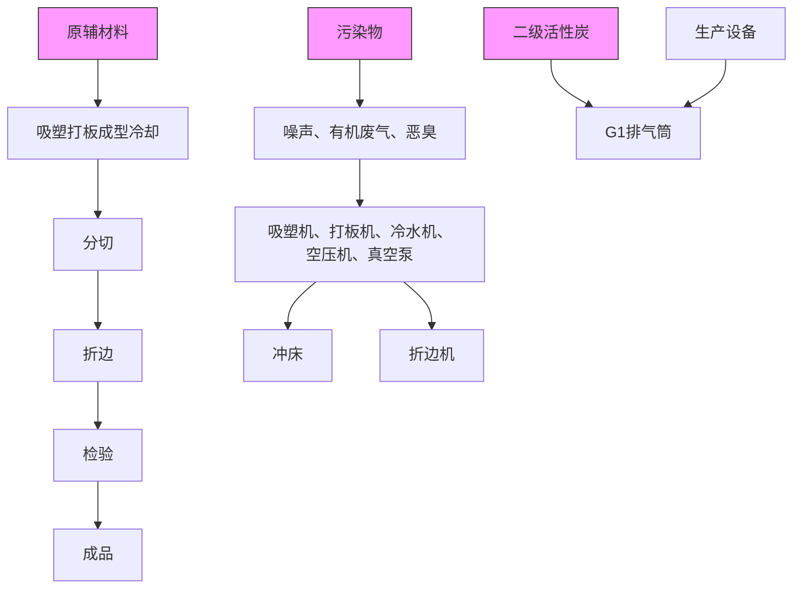
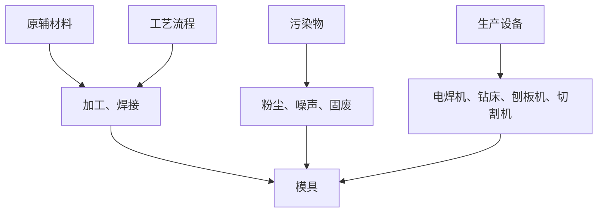
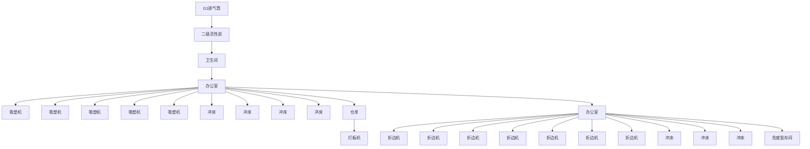

# 建设项目环境影响报告表

（污染影响类）

项目名称：佛山市真本包装科技有限公司新建项目建设单位（盖章）：佛山市真本包装科技有限公司40606451编制日期：2023年12月

中华人民 竞部制


<details>
<summary>text_image</summary>

共和国生态环境
</details>

编制单位和编制人员情况表

<table><tr><td colspan="2">项目编号</td><td colspan="4">853k90</td></tr><tr><td colspan="2">建设项目名称</td><td colspan="4">佛山市真本包装科技有限公司新建项目</td></tr><tr><td colspan="2">建设项目类别</td><td colspan="4">26--053塑料制品业</td></tr><tr><td colspan="2">环境影响评价文件类型</td><td colspan="4">报告表</td></tr><tr><td colspan="6">一、建设单位情况</td></tr><tr><td colspan="2">单位名称(盖章)</td><td colspan="4">佛山市</td></tr><tr><td colspan="2">统一社会信用代码</td><td colspan="4">91440606</td></tr><tr><td colspan="2">法定代表人(签章)</td><td rowspan="3" colspan="4"></td></tr><tr><td colspan="2">主要负责人(签字)</td></tr><tr><td colspan="2">直接负责的主管人员(签字)</td></tr><tr><td colspan="6">二、编制单位情况</td></tr><tr><td colspan="2">单位名称(盖章)</td><td colspan="4">佛山市万企乐企</td></tr><tr><td colspan="2">统一社会信用代码</td><td colspan="4">91440606MA51YL</td></tr><tr><td colspan="6">三、编制人员情况</td></tr><tr><td colspan="6">1.编制主持人</td></tr><tr><td>姓名</td><td colspan="2">职业资格证书管理号</td><td colspan="2">信用编号</td><td rowspan="2">签字</td></tr><tr><td></td><td colspan="2">2015035440352015449921001095</td><td colspan="2">BH006401</td></tr><tr><td colspan="6">2.主要编制人员</td></tr><tr><td>姓名</td><td colspan="2">主要编写内容</td><td colspan="2">信用编号</td><td>签字</td></tr><tr><td rowspan="3"></td><td colspan="2">建设项目基本情况、区域环境质量现状、环境保护目标及评价标准</td><td colspan="2">BH054061</td><td rowspan="3"></td></tr><tr><td colspan="2">建设项目工程分析、主要环境影响和保护措施、环境保护措施监督检查清单、结论。</td><td colspan="2">BH006401</td></tr><tr><td colspan="4"></td></tr></table>


<details>
<summary>text_image</summary>

中华人民共和国人力资源和社会保障部
Approved by: author
</details>


<details>
<summary>text_image</summary>

中华人民共和国环境保护部
Approved & authorized
Ministry of Environmental Protection
</details>


<details>
<summary>text_image</summary>

佛山市万企乐业
实业有限公司
海南银行股份有限公司
编号：B
姓名：
</details>


<details>
<summary>natural_image</summary>

Empty white rectangle with black border (no text or symbols)
</details>


<details>
<summary>natural_image</summary>

Empty white square with black border (no text or symbols)
</details>


<details>
<summary>text_image</summary>

广东省人力资源和社会保障厅
专业技术人员资格考试
证书专用章(1)
</details>

# 目 录

一、建设项目基本情况

二、建设项目工程分析 11

三、区域环境质量现状、环境保护目标及评价标准 17

四、主要环境影响和保护措施. . 23

五、环境保护措施监督检查清单 .. 42

六、结论 . .. 44

建设项目污染物排放量汇总表. . 45

附件1 营业执照复印件.. . 46

附件2 法人身份证.. . 47

附件3 项目用地资料.. . 48

附件4 项目环评合同.. . 53

附图1 项目地理位置图. . 56

附图2 项目平面布置图. . 57

附图3 项目周围环境图. . 58

附图4 项目周围四至图. . 60

附图5 项目现场图片. . 62

附图6 项目所在区域水环境功能区规划. . 63

附图7 项目所在区域大气环境功能区规划. . 64

附图8 项目所在区域声环境功能区规划. . 65

附图9 项目佛山市环境管控单元图. . 66

# 一、建设项目基本情况

<table><tr><td>建设项目名称</td><td colspan="4">佛山市真本包装科技有限公司新建项目</td></tr><tr><td rowspan="2">项目代码</td><td colspan="4">无</td></tr><tr><td colspan="4"></td></tr><tr><td>建设单位联系人</td><td></td><td>联系方式</td><td></td><td></td></tr><tr><td>建设地点</td><td colspan="4">广东省佛山市顺德区杏坛镇高赞村杏坛水乡大道628号顺德智富园22栋203、204单元</td></tr><tr><td>地理坐标</td><td colspan="4">(22度46分21.030秒,113度11分31.899秒)</td></tr><tr><td>国民经济行业类别</td><td>C2926塑料包装箱及容器制造</td><td>建设项目行业类别</td><td colspan="2">26-053塑料制品业292:其他(年用非溶剂型低VOCs含量涂料10吨以下的除外)</td></tr><tr><td>建设性质</td><td>☑新建(迁建)□改建□扩建□技术改造</td><td>建设项目申报情形</td><td colspan="2">☑首次申报项目□不予批准后再次申报项目□超五年重新审核项目□重大变动重新报批项目</td></tr><tr><td>项目审批(核准/备案)部门(选填)</td><td>/</td><td>项目审批(核准/备案)文号(选填)</td><td colspan="2">/</td></tr><tr><td>总投资(万元)</td><td>100</td><td>环保投资(万元)</td><td colspan="2">15</td></tr><tr><td>环保投资占比(%)</td><td>15%</td><td>施工工期</td><td colspan="2">1个月</td></tr><tr><td>是否开工建设</td><td>☑否□是</td><td>用地(用海)面积(m2)</td><td colspan="2">2200</td></tr><tr><td>专项评价设置情况</td><td colspan="4">无</td></tr><tr><td>规划情况</td><td colspan="4">规划名称:佛山市顺德高新技术产业开发区扩区规划编制单位:佛山市顺德高新技术产业开发区管理委员会。</td></tr><tr><td>规划环境影响评价情况</td><td colspan="4">《佛山市顺德高新技术产业开发区扩区规划环境影响报告书》(2022年2月);佛山市生态环境局顺德分局关于佛山市顺德高新技术产业开发区扩区规划环境影响报告书审查情况的复函。</td></tr><tr><td rowspan="5">规划及规划环境影响评价符合性分析</td><td colspan="4">本项目位于佛山市顺德高新技术产业开发区扩区,与《佛山市顺德高新技术产业开发区扩区规划环境影响报告书》(2022年2月)相符性分析见下表相符性分析如下。表1-1项目与规划环评相符性分析</td></tr><tr><td>清单类型</td><td>总体准入要求</td><td>项目情况</td><td>符合性</td></tr><tr><td rowspan="3">空间布局约束</td><td>引入产业应符合现行有效的《产业结构调整指导目录》、《市场准入负面清单》等相关产业政策的要求。</td><td>本项目属于塑料包装箱及容器制造,符合《产业结构调整知道目录》、《市场准入负面清单》等相关产业政策要求。</td><td>符合</td></tr><tr><td>禁止引入新增排放重点防控重金属污染物(铅(Pb)、汞(Hg)、镉(Cd)、铬(Cr)和类金属砷(As))、持久性有机污染物的项目。</td><td>本项目不涉及重金属污染物及持久性有机污染物。</td><td>符合</td></tr><tr><td>饮用水源准保护区内不得新建、扩建对水体污染严重、排放一类水污染物和持久性有机污染物的项目,改扩建项目不得新增水污染物。</td><td>本项目位于广东省佛山市顺德区杏坛镇高赞村杏坛水乡大道628号顺德智富园22栋204、203单元,不在水源保护区范围。</td><td>符合</td></tr><tr><td rowspan="9"></td><td>清单类型</td><td>总体准入要求</td><td>项目情况</td><td>符合性</td></tr><tr><td rowspan="7">空间布局约束</td><td>禁止引入达不到清洁生产国际先进水平的企业。</td><td>本项目属于塑料包装箱及容器制造。</td><td>符合</td></tr><tr><td>在污水管网建设滞后或所依托的污水处理厂处理能力不能满足废水处理需求的区域,不应引入废水排放量较大的项目。扩区应控制废水排放量较大企业的引入,引入涉水排放企业的规模应与区域污水处理厂处理能力相匹配,严格控制废水排放量较大的项目及新增一类水污染物排放项目的引入,避免对下游饮用水源保护区产生不良影响。</td><td>本项目杏坛污水处理厂的纳污范围。</td><td>符合</td></tr><tr><td>禁止新建、扩建燃煤燃油火电机组和企业自备电站,逐步淘汰生物质锅炉、集中供热管网覆盖区域内的分散供热锅炉,集中供热管网覆盖地区禁止新建、扩建分散供热锅炉,规划区应全部按高污染燃料禁燃区进行管理;禁止新建、扩建水泥、平板玻璃、化学制浆、炼化、炼钢炼铁、电解铝、焦炭、金属冶炼、制浆造纸、鞣革、铅酸蓄电池、专业电镀、木质家具涂装、印染项目;不再新建陶瓷厂(新型特种陶瓷项目除外)。化工项目按照“入园管理”原则合理布局,提高准入门槛,不得新建、扩建纳入国家“高污染、高环境风险”产品名录的生产项目。</td><td>本项目生产过程仅使用电能,不使用高污染燃料。本项目属于塑料包装箱及容器制造,不属于水泥、平板玻璃、化学制浆、炼化、炼钢炼铁、电解铝、焦炭、金属冶炼、制浆制纸、鞣革、铅酸蓄电池、专业电镀、木质家具涂装、印染项目。本项目不属于“高污染、高环境风险”产品名录的生产项目。</td><td>符合</td></tr><tr><td>严格控制日用玻璃制造、家具制造、废塑料回收加工再生(列入国家“城市矿产”示范基地项目除外)、专业金属表面处理(铝及铝合金的阳极氧化、铝的表面铬酸盐转化、锌的铬酸盐钝化和金属酸洗、磷化、喷漆、喷涂)等项目建设;严格限制新建生产和使用高挥发性有机物原辅材料的项目,鼓励建设挥发性有机物共性工厂。</td><td>本项目不属于表列中限制性行业,不使用高挥发性有机物原辅材料。</td><td>符合</td></tr><tr><td>工业企业禁止选址城镇生活空间,生产空间禁止建设居民住宅等敏感建筑;园区工业用地或企业与村庄、学校等环境敏感点之间应设置合理的防护距离,并通过绿化带进行有效隔离,该距离内不得规划新建居民点、办公楼和学校等环境敏感目标。</td><td>本项目位于工业园区内,距离敏感点南面高赞村委会居民住宅410米。</td><td>符合</td></tr><tr><td>现有及规划居住区、学校、医院等敏感用地周边50米范围内禁止新建、扩建高噪声排放生产项目;现有及规划居住区、学校、医院等敏感用地周边100米范围内禁止新建、扩建纳入国家“高污染、高环境风险”产品名录的生产项目,不引入酸洗、涂装、注塑、排放恶臭气味的生产工艺和生产设施。</td><td>本项目100米范围内不存在居住区、学校、医院等敏感点。</td><td>符合</td></tr><tr><td>结合《顺德区高质量推动村级工业园升级改造总体规划》,推进区域村级工业园改造工作,禁止重复低水平建设。</td><td>本项目位于顺德智富园内。</td><td>符合</td></tr><tr><td>污染物排放管控1、建设项目与所在地“三线一单”符合性分析根据《广东省人民政府关于印发广东省“三线一单”生态环境分区管控方案的通知》(粤府〔2020〕71号),广东省将以环境管控单元为基础,实施生态环境分区管控,精细化管理、保护生态环境。本项目与广东省“三线一单”生态环境分区管控方案相符性分析如下:表1-2 “三线一单”符合性分析</td><td>污染物排放总量不得突破“污染物排放总量管控限值清单”的总量管控要求;重点对重点污染物(重点污染物包括化学需氧量、氨氮、氮氧化物及挥发性有机物等)实施总量控制;上年度重点河涌水质未达到水环境质量目标的管控分区所在镇(街道),须组织编制、系统实施、向社会公开区域重点水污染物减排计划并明确“替代量”,本年度新建、改建、扩建项目新增水环境重点污染物实行区域“减二增一”替代(废水集中处理设施、民生项目除外);在可核查、可监管的基础上,全区新建、改建、扩建项目新增大气重点污染物实行“减二增一”替代。</td><td>项目生活污水经三级化粪池处理后排入杏坛生活污水处理厂,尾水排入顺德支流。根据《佛山市排污权有偿使用和交易管理试行办法(佛府办2016第63号),生活污水 $COD_{Cr}$ 、 $NH_{3}-N$ 不单独分配总量。</td><td>符合</td></tr><tr><td rowspan="7">其他符合性分析</td><td colspan="4"></td></tr><tr><td colspan="2">粤府〔2020〕71号的相关规定</td><td>本项目情况</td><td>相符性</td></tr><tr><td>生态保护红线</td><td>在生态空间范围内具有特殊重要生态功能、必须强制性严格保护的区域,是保障和维护国家生态安全的底线和生命线,通常包括具有重要水源涵养、生物多样性维护、水土保持、防风固沙、海岸生态稳定等功能的生态功能重要区域,以及水土流失、土地沙化、石漠化、盐渍化等生态环境敏感脆弱区域。按照“生态功能不降低、面积不减少、性质不改变”的基本要求,实施严格管控。</td><td>本项目位于广东省佛山市顺德区杏坛镇高赞村杏坛水乡大道628号顺德智富园22栋204、203单元,所在区域属于工业用地,项目用地不涉及划定的生态红线区域,项目周边无自然保护区、饮用水源保护区等生态保护目标,符合生态保护红线要求。</td><td>相符</td></tr><tr><td>环境质量底线</td><td>指按照自然资源资产“只能增值、不能贬值”的原则,以保障生态安全和改善环境质量为目的,利用自然资源资产负债表,结合自然资源开发管控,提出的分区域分阶段的资源开发利用总量、强度、效率等上线管控要求。</td><td>根据环境质量现状监测数据,项目区大气环境、地表水环境、声环境质量均能满足相应标准要求,项目排放的各项污染物经相应措施处理后均能达标,对环境影响很小,环境风险可控,未超出环境质量底线,项目的建设基本符合环境质量底线要求。</td><td>相符</td></tr><tr><td>资源利用上线</td><td>强化节约集约循环利用,持续提升资源能源利用效率,水资源、土地资源、岸线资源、能源消耗等达到或优于国家和省下达的总量、强度等目标要求,按省规定年限实现碳达峰。</td><td>项目生产过程中的电能、自来水等消耗量较少,区域水、电资源较充足,项目消耗量没有超出资源负荷,没有超出资源利用上线。</td><td>相符</td></tr><tr><td>生态环境准入清单</td><td>《市场准入负面清单(2020年版)》(发改体改规〔2020〕1880号)</td><td>本项目不属于禁止准入事项。</td><td>相符</td></tr><tr><td colspan="4">2、《佛山市顺德区人民政府关于印发佛山市顺德区“三线一单”生态环境分区管控方案的通知》(顺府发〔2021〕11号)相符性分析1 根据《佛山市人民政府关于印发佛山市“三线一单”生态环境分区管控方案的通知》(佛府〔2021〕11号)的要求,本项目与所在区域的生态保护红线、环境质量底线、资源利用上线和生态环境准入清单(“三线一单”)进行对</td></tr></table>

照分析，见下表：

表1-3“三线一单”符合性分析

<table><tr><td colspan="2">佛府〔2021〕11号的相关规定</td><td>本项目情况</td><td>相符性</td></tr><tr><td>生态保护红线</td><td>环境管控单元分为优先保护、重点管控和一般管控单元三类。重点管控单元:以推动产业转型升级、强化污染减排、提升资源利用效率为重点,加快解决资源环境负荷大、局部区域生态环境质量差、生态环境风险高等问题。</td><td>本项目位于广东省佛山市顺德区杏坛镇高赞村杏坛水乡大道628号顺德智富园22栋204、203单元,所在区域属于工业用地,项目用地不涉及划定的生态红线区域,项目周边无自然保护区、饮用水源保护区等生态保护目标,符合生态保护红线要求。</td><td>相符</td></tr><tr><td>环境质量底线</td><td>水环境质量持续改善,国考、省考、水功能区断面达到国家和省下达的水质目标要求;市控断面全面消除劣V类,力争达到我市确定的水质目标要求;乡镇级及以上集中式饮用水水源地水质稳定达标。空气质量持续改善,细颗粒物(PM2.5)年均浓度、空气质量优良天数比例(AQI)主要指标达到省下达的目标要求,臭氧污染得到有效遏制。土壤环境质量稳中向好,土壤环境风险得到管控。</td><td>根据环境质量现状监测数据,项目区大气环境、地表水环境、声环境质量均能满足相应标准要求,项目排放的各项污染物经相应措施处理后均能达标,对环境影响很小,环境风险可控,未超出环境质量底线,项目的建设基本符合环境质量底线要求。</td><td>相符</td></tr><tr><td>资源利用上线</td><td>强化节约集约循环利用,持续提升资源能源利用效率,水资源、土地资源、岸线资源、能源消耗等达到或优于国家和省下达的总量、强度等目标要求,按省规定年限实现碳达峰。</td><td>项目生产过程中的电能、自来水等消耗量较少,区域水、电资源较充足,项目消耗量没有超出资源负荷,没有超出资源利用上线。</td><td>相符</td></tr><tr><td>生态环境准入清单</td><td>《市场准入负面清单(2020年版)》(发改体改规〔2020〕1880号)</td><td>本项目不属于禁止准入事项。</td><td>相符</td></tr></table>

综上所述，本项目符合《佛山市人民政府关于印发佛山市“三线一单”生态环境分区管控方案的通知》（佛府〔2021〕11 号）的要求。

②与《佛山市顺德区人民政府关于印发佛山市顺德区“三线一单”生态环境分区管控方案的通知》相符性；项目位于广东省佛山市顺德区杏坛镇高赞村杏坛水乡大道628号顺德智富园22栋204、203单元，对照《佛山市顺德区人民政府关于印发佛山市顺德区“三线一单”生态环境分区管控方案的通知》（顺府发〔2021〕11 号）的附件2佛山市顺德区环境管控单元图，项目所在地属于重点管控单元。对照（顺府发〔2021〕11号）的附件4佛山市顺德区环境管控单元准入清单的“广东省佛山市顺德区重点管控单元准入清单”，项目位于杏坛，属于园区型重点管控单元（环境管控单元编码：ZH44060620011）。

表 1-4项目与广东省佛山市顺德区重点管控单元 9准入清单的相符性分析

<table><tr><td rowspan="2">环境管控单元编码</td><td rowspan="2">环境管控单元名称</td><td colspan="3">行政区划</td><td rowspan="2">管控单元分类</td><td rowspan="2" colspan="2">要素细类</td></tr><tr><td>省</td><td>市</td><td>区</td></tr><tr><td>ZH44060620011</td><td>顺德高新技术产业开发区</td><td>广东省</td><td>佛山市</td><td>顺德区</td><td>园区型重点管控单元1</td><td colspan="2">水环境工业—城镇生活污染重点管控区、大气环境高排放重点管控区</td></tr><tr><td>管控维度</td><td colspan="5">管控要求</td><td rowspan="2">工程内容</td><td rowspan="2">符合性</td></tr><tr><td>共性要求</td><td colspan="5">单元内各环境要素细类管控区内,按该环境要素细类管控要求执行。</td></tr><tr><td>管控维度</td><td colspan="5">管控要求</td><td>工程内容</td><td>符合性</td></tr></table>

<table><tr><td rowspan="13"></td><td rowspan="6">区域布局管控</td><td>1-1【产业/鼓励引导类】园区重点发展家用电器具制造、装备制造等产业。</td><td>项目属于塑料包装箱及容器制造行业,项目行业符合规划要求</td><td>符合</td></tr><tr><td>1-2.【产业/禁止类】新入园项目不得引入专业电镀、印染等污染物排放量大或排放一类水污染物、持久性有机污染物的项目,不得引进园区规划环评及批复(审查意见)禁止引进项目。</td><td>项目不是电镀、印染等污染物排放量大或排放一类水污染物、持久性有机污染物的项目,也不是引进园区规划环评及批复(审查意见)禁止引进项目</td><td>符合</td></tr><tr><td>1-3.【产业/禁止类】严格生产空间和生活空间管控,工业企业原则上禁止选址生活空间,生产空间原则上禁止建设居民住宅等敏感建筑。</td><td>本项目位于广东省佛山市顺德区杏坛镇高赞村杏坛水乡大道628号顺德智富园22栋204、203单元,所在区域属于工业用地,生产空间没有减少居民住宅等敏感建筑。</td><td>符合</td></tr><tr><td>1-4.【产业/综合类】园区工业用地或企业与村庄、学校等环境敏感点之间的区域应合理设置控制开发区域(产业控制带),产业控制带内优先引进无污染的生产性服务业,或可适当布置废气排放量小、工业噪声影响小的产业。</td><td>本项目位于广东省佛山市顺德区杏坛镇高赞村杏坛水乡大道628号顺德智富园22栋204、203单元,所在区域属于工业用地,项目500米范围内没有自然保护区、饮用水源保护区等生态保护目标和敏感点。</td><td>符合</td></tr><tr><td>1-5.【产业/限制类】严格限制不符合园区发展定位的项目入驻。</td><td>项目为新建注塑项目,本项目符合园区发展定位。</td><td>符合</td></tr><tr><td>1-6.【产业/限制类】受纳水体或监控断面不达标的,不得新建、扩建向河涌直接排放废水的项目。新建、扩建含蚀刻工序的线路板生产项目和化工项目应在配套污水集中处置的工业园区或生活污水管网覆盖区域内建设;纯加工型印花项目,含酸洗、磷化的金属表面处理、金属制品项目(与自身高新技术企业配套的除外),含酸洗、喷涂、化学抛光、电解等涉及废水排放工艺的不锈钢型材加工项目(与自身高新技术企业配套的除外),应进入以此类项目为主导产业、有相应废水集中治理设施的工业园区,实现集中治污。</td><td>本项目不含蚀刻工序的线路板生产项目、化工项目、纯加工型印花项目、含酸洗、磷化的金属表面处理、金属制品项目(与自身高新技术企业配套的除外),不含酸洗、喷涂、化学抛光、电解等涉及废水排放工艺的不锈钢型材加工项目,不涉及废水排放。</td><td>符合</td></tr><tr><td rowspan="2">区域布局管控</td><td>1-7.【产业/综合类】划定家具生产优先发展区域,优先发展区外不再新建涉及涂装工艺的木质家具制造项目。</td><td>项目是塑料包装盒的生产项目,不涉及新增涂装工艺的木质家具制造项目。</td><td>符合</td></tr><tr><td>1-8.【产业/综合类】系统推进村级工业园升级改造,腾出连片空间,布局产业集聚区和主题产业园,推动工业项目入园集聚发展。新增工业制造业用地原则上安排在产业集聚区内,产业集聚区外原则上不鼓励工业及物流仓储用地的新建与改造。</td><td>本项目位于广东省佛山市顺德区杏坛镇高赞村杏坛水乡大道628号顺德智富园22栋204、203单元</td><td></td></tr><tr><td rowspan="4">能源资源利用</td><td>2-1.【能源/综合类】科学实施能源消费总量和强度“双控”,新建高能耗项目单位产品(产值)能耗达到国际国内先进水平。</td><td>项目不属于高能耗项目</td><td>符合</td></tr><tr><td>2-2.【水资源/综合类】提高园区水资源利用效率,提升污水回用比例。</td><td>本项目生活污水经预处理后排入杏坛生活污水处理厂,尾水排入顺德支流。</td><td>符合</td></tr><tr><td>2-3.【土地资源/综合类】落实单位土地面积投资强度、土地利用强度等建设用地控制性指标要求,提高土地利用效率。</td><td>本项目位于广东省佛山市顺德区杏坛镇高赞村杏坛水乡大道628号顺德智富园22栋204、203单元</td><td>符合</td></tr><tr><td>2-4.【其他/综合类】有行业清洁生产标准的新引进项目清洁生产水平须达到本行业国际先进水平。</td><td>项目是塑料包装箱及容器制造的生产项目,仅有少量颗粒物和有机废气</td><td>符合</td></tr><tr><td>管控维度</td><td>管控要求</td><td>工程内容</td><td>符合性</td></tr></table>

<table><tr><td rowspan="2">污染物排放管控</td><td>3-1.【其他/综合类】园区各项污染物排放总量不得突破规划环评核定的污染物排放总量管控要求。</td><td>本项目大气污染物总量控制指标为挥发性有机物排放量为1.628t/a,建议挥发性有机物排放总量控制指标为1.628t/a,从佛山市顺德区杏坛街道总量中列支。</td><td>符合</td></tr><tr><td>3-2.【水/综合类】完善污水管网建设,有条件的区域实施雨污分流改造。</td><td>本项目位于广东省佛山市顺德区杏坛镇高赞村杏坛水乡大道628号顺德智富园22栋204、203单元,生活污水经预处理后排入杏坛生活污水处理厂,尾水排入顺德支流。已实现雨污分流</td><td>符合</td></tr><tr><td>环境风险防控</td><td>4-1.【风险/综合类】园区应建立企业、园区、区域三级环境风险防控体系,加强园区及入园企业环境应急设施整合共享,建立有效的拦截、降污、导流、暂存等工程措施,防止泄漏物、消防废水等进入园区外环境。建立园区环境应急监测机制,强化园区风险防控。</td><td>选址设有三级环境风险防控体系,加强园区及入园企业环境应急设施整合共享,建立有效的拦截、降污、导流、暂存等工程措施。本项目园区环境风险在可控范围内。</td><td>符合</td></tr></table>

综上，项目符合相关的产业政策要求，同时也符合国家和地方相关环保政策、法规和规划。

# 3、与地区污染物治理政策相符性分析

本项目与广东省、顺德区发布的有机污染物治理政策的相符性分析见下表。

表 1-5项目与有机污染物治理政策的相符性

<table><tr><td>序号</td><td>政策要求</td><td>工程内容</td><td>符合性</td></tr><tr><td colspan="4">1、《珠江三角洲地区严格控制工业企业挥发性有机物(VOCs)排放的意见》(粤环[2012]18号)</td></tr><tr><td>1.1</td><td>在自然保护区、水源保护区、风景名胜区、森林公园、重要湿地、生态敏感区和其他重生态功能区实行强制性保护,禁止新建VOCs污染企业。</td><td>选址不在规定区域</td><td>符合</td></tr><tr><td>1.2</td><td>新建皮革及皮鞋制造业、人造板制造业、家具制造业、印刷业、塑料制品业、集装箱制造业、汽车制造与船舶制造业等排放VOCs的使用性行业,在建设项目环境影响评价文件报批时,附项目VOCs减排量来源说明,按项目“点对点”总量调剂方式,落实新建项目VOCs排放总量指标来源,确保区域内工业VOCs排放的总量控制</td><td>本项目大气污染物总量控制指标为挥发性有机物排放量为1.628t/a,建议挥发性有机物排放总量控制指标为1.628t/a,从佛山市顺德区杏坛街道总量中列支。</td><td>符合</td></tr><tr><td colspan="4">2、《中华人民共和国大气污染防治法》(2015.8.29修订,2016.1.1实施)</td></tr><tr><td>2.1</td><td>第四十五条产生含挥发性有机物废气的生产和服务活动,应当在密闭空间或者设备中进行,并按照规定安装、使用污染防治设施;无法密闭的,应当采取措施减少废气排放</td><td>本项目有机废气通过集气罩收集后经“二级活性炭吸附”废气处理设施处理后引至40m高排气筒G1高空排放,集气罩置于废气产生点的较近位置,集气罩收集效率可达50%,处理效率可达51%</td><td>符合</td></tr><tr><td colspan="4">3、《挥发性有机物无组织排放控制标准》(GB 37822—2019)</td></tr><tr><td>3.1</td><td>VOCs质量占比大于等于10%的含VOCs产品,其使用过程应采用密闭设备或在密闭空间内操作,废气应排至VOCs废气处理收集系统;无法密闭的,应采取局部收集措施,废气应排至VOCs废气收集处理系统。</td><td>本项目使用的塑料为卷状固态,VOCs质量占比不高,有机废气通过集气罩收集后经“二级活性炭吸附”废气处理设施处理后引至40m高排气筒G1高空排放。集气罩置于废气产生点的较近位置,收集效率可达50%,有效减少有机废气无组织的排放。</td><td>符合</td></tr><tr><td>序号</td><td>政策要求</td><td>工程内容</td><td>符合性</td></tr></table>

<table><tr><td rowspan="10"></td><td colspan="4">3、《挥发性有机物无组织排放控制标准》(GB 37822—2019)</td></tr><tr><td>3.2</td><td>1、VOCs物料应储存于密闭的容器、包装袋、储罐、储库、料仓中。2、盛装VOCs物料的容器或包装袋应存放于室内,或存放于设置有雨棚、遮阳和防渗设施的专用。场地。盛装VOCs物料的容器或包装袋在非取用状态时应加盖、封口,保持密闭。3、VOCs物料储库、料仓应满足3.6条对密闭空间的要求。4、液态VOCs物料应采用密闭管道输送。采用非管道输送方式转移液态VOCs物料时,应采用密闭容器、罐车。5、粉状、粒状VOCs物料应采用气力输送设备、管状带式输送机、螺旋输送机等密闭输送方式,或者采用密闭的包装袋、容器或罐车进行物料转移。6、含VOCs产品的使用过程,VOCs质量占比大于等于10%的含VOCs产品,其使用过程应采用密闭设备或在密闭空间内操作,废气应排至VOCs废气收集处理系统;无法密闭的,应采取局部气体收集措施,废气应排至VOCs废气收集处理系统。7、企业应建立台账,记录含VOCs原辅材料和含VOCs产品的名称、使用量、回收量、废弃量、去向以及VOCs含量等信息。台账保存期限不少于3年。</td><td>1、项目均储存于密闭的容器内;2、盛装VOCs物料的容器或包装袋应存放于室内;盛装VOCs物料的容器在非取用状态时加盖、封口,保持密闭;3、VOCs物料仓为单独封闭式房间;4、VOCs物料于密闭容器内运送;5、项目为固态VOCs物料:6、吸塑、打板工序产生的有机废气、恶臭经集气罩收集,收集效率为50%,再经“二级活性炭吸附”废气处理设施处理后引至40m高排气筒G1高空排放。7、建立台账,记录含VOCs原辅材料和含VOCs产品的名称、使用量、回收量、废弃量、去向以及VOCs含量等信息,台账保存期限不少于3年;盛装过VOCs物料的废包装容器应加盖密闭。</td><td>符合</td></tr><tr><td>3.3</td><td>VOCs废气收集处理系统应与生产工艺设备同步运行。VOCs废气收集处理系统发生故障或检修时,对应的生产工艺设备应停止运行,待检修完毕后同步投入使用。</td><td>项目吸塑、打板过程必须开启风机,有效减少无组织排放废气。废气收集处理系统发生故障或检修时,吸塑工序停止运行,待检修完毕后再投入生产。</td><td>符合</td></tr><tr><td colspan="4">4、关于印发《2020年挥发性有机物治理攻坚方案》的通知(环大气[2020]33号)</td></tr><tr><td>4.1</td><td>将无组织排放转变为有组织排放进行控制,优先采用密闭设备、在密闭空间中操作或采用全密闭集气罩收集方式;对于采用局部集气罩的,应根据废气排放特点合理选择收集点位,距集气罩开口面最远处的VOCs无组织排放位置,控制风速不低于0.3米/秒。</td><td>吸塑、打板废气通过集气罩收集,集气罩置于废气产生点的较近位置,罩口截面风速为0.5m/s</td><td>符合</td></tr><tr><td colspan="4">5、佛山市生态环境局顺德分局关于做好重点行业建设项目挥发性有机物总量指标管理工作的通知(佛顺环函〔2019〕56号)</td></tr><tr><td>5.1</td><td>涉VOCs排放项目,实现本行政区域内污染源“点对点”2倍量削减替代,由项目所在镇街分局出具VOCs总量指标来源及替代削减方案的意见,开展总量替代。</td><td>项目VOCs排放总量指标由所在镇街的分局出具VOCs总量指标来源及替代削减方案的意见。</td><td>符合</td></tr><tr><td colspan="4">6、《广东省人民政府办公厅关于印发广东省2021年大气、水、土壤污染防治工作方案的通知》(粤办函〔2021〕58号)</td></tr><tr><td>6.1</td><td>严格落实国家产品VOCs含量限值标准要求,除现阶段确无法实施替代的工序外,禁止新建生产和使用高VOCs含量原辅材料项目。</td><td>项目使用的原料为低VOCs含量原辅材料</td><td>符合</td></tr><tr><td>序号</td><td>政策要求</td><td>工程内容</td><td>符合性</td></tr><tr><td rowspan="8"></td><td colspan="4">6、《广东省人民政府办公厅关于印发广东省2021年大气、水、土壤污染防治工作方案的通知》(粤办函〔2021〕58号)</td></tr><tr><td>6.2</td><td>指导企业使用适宜高效的治理技术,涉VOCs重点行业新建、改建和扩建项目不推荐使用光氧化、光催化、低温等离子等低效治理设施,已建项目逐步淘汰光氧化、光催化、低温等离子治理设施</td><td>项目配套“二级活性炭吸附”废气处理设施,不使用光氧化、光催化、低温等离子等低效治理设施。</td><td>符合</td></tr><tr><td colspan="4">7、《广东省涉挥发性有机物(VOCs)重点行业治理指引》(粤环办〔2021〕43号)(参照塑料制品业VOCs治理指引)</td></tr><tr><td>7.1</td><td>VOCs物料储存:VOCs物料应储存于密闭的容器、包装袋、储罐、储库、料仓中;盛装VOCs物料的容器是否存放于室内,或存放于设置有雨棚、遮阳和防渗设施的专用场地。盛装VOCs物料的容器在非取用状态时应加盖、封口,保持密闭。</td><td>项目原辅料采用密封包装容器进行运输与储存。</td><td>符合</td></tr><tr><td>7.2</td><td>VOCs物料转移和输送液体VOCs物料应采用管道密闭输送。采用非管道输送方式转移液态VOCs物料时,应采用密闭容器或罐车;粉状、粒状VOCs物料采用气力输送设备、管状带式输送机、螺旋输送机等密闭输送方式,或者采用密闭的包装袋、容器或罐车进行物料转移。</td><td>项目原辅材料存储在密闭容器内,采取密闭的包装袋运输。</td><td>符合</td></tr><tr><td>7.3</td><td>在混合/混炼、塑炼/塑化/熔化、加工成型(挤出、注射、压制、压延、发泡、纺丝等)、硫化等作业中应采用密闭设备或在密闭空间中操作,废气应排至VOCs废气收集处理系统;无法密闭的,应采取局部气体收集措施,废气应排至VOCs废气收集处理系统。</td><td>有机废气产生工位安装了废气收集装置,通过集气罩收集,收集效率为50%,废气经二级活性炭吸附处理后高空排放</td><td>符合</td></tr><tr><td>7.4</td><td>塑料制品行业:a)有机废气排气筒排放浓度不高于广东省《大气污染物排放限值》(DB4427-2001)第II时段排放限值,合成革和人造革制造企业排放浓度不高于《合成革与人造革工业污染物排放标准》(GB21902-2008)排放限值,若国家和我省出台并实施适用于塑料制品制造业的大气污染物排放标准,则有机废气排气筒排放浓度不高于相应的排放限值;车间或生产设施排气中NMHC初始排放速率≥3kg/h时,建设VOCs处理设施且处理效率≥80%;b)厂区内无组织排放监控点NMHC的小时平均浓度值不超过6mg/m3任意一次浓度值不超过20mg/m3车间或生产设施排气中NMHC初始排放速率≥3kg/h时,建设VOCs处理设施且处理效率≥80%。</td><td>本项目VOCs初始排放速率未超2kg/h,已设置二级活性炭吸附废气治理设施,有效减少有机废气的排放。有机废气厂区内无组织排放满足平均浓度值不超过6mg/m3任意一次浓度值不超过20mg/m3</td><td>符合</td></tr><tr><td>序号</td><td>政策要求</td><td>工程内容</td><td>符合性</td></tr></table>

<table><tr><td colspan="4">7、《广东省涉挥发性有机物(VOCs)重点行业治理指引》(粤环办〔2021〕43号)(参照塑料制品业VOCs治理指引)</td></tr><tr><td>7.5</td><td>废气收集处理系统应与生产工艺设备同步运行。废气收集处理系统发生故障或检修时,对应的生产工艺设备应停止运行,待检修完毕后同步投入使用;生产工艺设备不能停止运行或不能及时停止运行的,应设置废气应急处理设施或采取其他代替措施。</td><td>项目运营期间必须开启风机,有效减少无组织排放废气。废气收集处理系统发生故障或检修时,所有产生废气的工序停止运行,待检修完毕后再投入生产。</td><td>符合</td></tr><tr><td>7.6</td><td>建立危废台账,整理危废处置合同、转移联单及危废处理方资质佐证材料。</td><td>企业建设后严格执行危险废物转移计划报批、依法建立危险废物转移联单,并通过信息系统登记转移计划和电子转移联单。</td><td>符合</td></tr><tr><td>7.7</td><td>建立废气收集处理设施台账,记录废气处理设施进出口的监测数据(废气量、浓度、温度、含氧量等)、废气收集与处理设施关键参数、废气处理设施相关耗材(吸收剂、吸附剂、催化剂等)购买和处理记录。</td><td>企业建设后废气治理设施安排专人维护并定期建立台账,记录相关废气数据。</td><td>符合</td></tr><tr><td colspan="4">8.佛山市顺德区人民政府办公室关于印发《佛山市顺德区生态环境保护“十四五”规划、(2021-2025)》的通知</td></tr><tr><td>8.1</td><td>持续推进重点行业VOCs整治。持续开展挥发性有机物专项整治,继续推进重点行业企业开展销号式综合整治,建立VOC重点监管企业名单并动态更新,督促企业建立VOCs管控台账清单;持续探寻高效节能的VOCs治理技术,对采用低温等离子、光氧化、光催化等低效治理工艺的企业在臭氧污染天气应对期间实施停限产或错峰生产,并推动企业逐步淘汰低效治理工艺。</td><td>本项目吸塑、打板废气通过集气罩收集后经“二级活性炭吸附”废气处理设施处理后引至40m高排气筒G1高空排放,集气罩收集效率可达50%,处理效率可达51%</td><td>符合</td></tr><tr><td>8.2</td><td>加强VOCs源头替代和无组织排放管控。大力推进低VOCs含量、低反应活性的原辅材料替代,将全面使用低VOCs含量原辅材料的企业纳入正面清单和政府绿色采购清单。鼓励重点行业企业开展生产工艺和设备水性化改造,推广使用水性、高固体分、无溶剂、粉末等低VOCs含量涂料。严格落实《挥发性有机物无组织排放控制标准》,开展厂区内无组织排放浓度监测,加强对含VOCs物料储存、转移和运输、设备与管线组件泄漏、敞开页面逸散以及工艺过程等五类排放源的管控。</td><td>本项目吸塑、打板废气通过集气罩收集后经“二级活性炭吸附”废气处理设施处理后引至40m高排气筒G1高空排放,收集效率可达50%,处理效率可达51%</td><td>符合</td></tr></table>

# 二、建设项目工程分析

# 1、项目工程组成

本项目性质为新建，项目租用广东省佛山市顺德区杏坛镇高赞村杏坛水乡大道628号顺德智富园22栋204、203单元已建成厂房。项目所在建筑物高度约39.5米，占地面积约2200m2，建筑面积2200m2，项目包括吸塑车间、仓库、危废间、机加工车间和办公区，项目内不设饭堂和员工宿舍，项目工程组成见表2-1。

表 2-1 项目工程组成

<table><tr><td>工程类型</td><td>工程内容</td><td>规模</td><td>用途</td></tr><tr><td>主体工程</td><td>生产车间</td><td>面积约2200m2;</td><td>设有吸塑区、折边区、打板区、模具机加工区、仓库、办公区</td></tr><tr><td>仓储工程</td><td>仓库</td><td>设于生产车间内</td><td>用于储存原辅材料和产品</td></tr><tr><td>辅助工程</td><td>办公室</td><td>设于生产车间内</td><td>用于员工日常办公使用</td></tr><tr><td rowspan="2">公用工程</td><td>配电系统</td><td>一套</td><td>供应生产用电和办公生活用电</td></tr><tr><td>给排水系统</td><td>一套</td><td>生活污水经三级化粪处理后达标后排入杏坛污水处理厂,尾水排放至顺德支流</td></tr><tr><td rowspan="4">环保工程</td><td>生活污水经三级化粪处理的设施</td><td>一套</td><td>三级化粪处理设施</td></tr><tr><td>废气收集设施</td><td>排气管、二级活性炭吸附的处理设施、排气筒一套</td><td>吸塑、打板工序产生的有机废气和恶臭由集气罩收集后引入“二级活性炭吸附”废气处理设施处理,最后通过引40m高排气筒(G1)排放。</td></tr><tr><td>危险废物暂存点</td><td>1个</td><td>设置有危废间1个,危险废物交由有资质单位处理</td></tr><tr><td>固体废物暂存间</td><td>1个</td><td>设置有固体废物间1个,固体废物定期交由回收商处理</td></tr></table>

# 2、主要产品及产能

项目主要从事包装盒的生产，主要产品及产能见表2-2。

表 2-2 产品及产能一览表

<table><tr><td>序号</td><td>名称</td><td>单位</td><td>数量</td><td>备注</td></tr><tr><td>1</td><td>礼品包装盒</td><td>吨/年</td><td>950</td><td>每件约重 25g</td></tr><tr><td>2</td><td>电器配件包装盒</td><td>吨/年</td><td>186.096</td><td>每件约重 50g</td></tr></table>

# 3、项目设备清单

主要生产单元、主要工艺、生产设施及设施参数见表2-3。

表 2-3 主要生产单元、主要工艺、生产设施及设施参数一览表

<table><tr><td rowspan="2">主要生产单元</td><td rowspan="2">主要工艺</td><td rowspan="2">生产设施</td><td rowspan="2">单位</td><td rowspan="2">数量</td><td colspan="2">设施参数</td><td rowspan="2">备注</td></tr><tr><td>参数名称及单位</td><td>单台设计值</td></tr><tr><td rowspan="4">模具维修</td><td rowspan="4">模具维修</td><td>钻床</td><td>台</td><td>1</td><td>功率</td><td>5.5kw</td><td rowspan="4">模具维修</td></tr><tr><td>电焊机</td><td>台</td><td>1</td><td>功率</td><td>200v</td></tr><tr><td>刨板机</td><td>台</td><td>1</td><td>功率</td><td>3kw</td></tr><tr><td>切割机</td><td>台</td><td>1</td><td>功率</td><td>1.5kw</td></tr></table>

建设内容

<table><tr><td>主要生产单元</td><td>主要工艺</td><td>生产设施</td><td>单位</td><td>数量</td><td>参数名称及单位</td><td>单台设计值</td><td>备注</td></tr><tr><td rowspan="3">吸塑</td><td>吸塑</td><td>吸塑机</td><td>台</td><td>6</td><td>加热温度</td><td>130-200°C</td><td rowspan="3">用于吸塑工序</td></tr><tr><td>抽气</td><td>真空泵</td><td>台</td><td>6</td><td>功率</td><td>3kw</td></tr><tr><td>冷却</td><td>冷水机</td><td>台</td><td>6</td><td>循环水量</td><td> $1\mathrm{\;m}^{3}/\mathrm{h}$ </td></tr><tr><td>分切</td><td>分切</td><td>冲床</td><td>台</td><td>8</td><td>工作压力</td><td>200t</td><td>用于分切工序</td></tr><tr><td>折边</td><td>折边</td><td>折边机</td><td>台</td><td>10</td><td>加热温度</td><td>120-200°C</td><td>混合原材料</td></tr><tr><td>打板</td><td>打板</td><td>打板机</td><td>台</td><td>1</td><td>加热温度</td><td>130-200°C</td><td>打样板</td></tr><tr><td rowspan="4">辅助共用设施</td><td rowspan="2">压缩空气系统</td><td>空压机</td><td>台</td><td>2</td><td>功率</td><td>1200w</td><td>压缩空气动力</td></tr><tr><td>干燥机</td><td>台</td><td>1</td><td>电机功率</td><td>4kw</td><td>用于干燥压缩机空气</td></tr><tr><td>废水处理系统</td><td>生活污水三级化粪处理设施</td><td>套</td><td>1</td><td>设计处理能力  ${\mathrm{m}}^{3}/\mathrm{d}$ </td><td>1</td><td>生活污水经三级化粪处理后达标后排入杏坛污水处理厂,尾水排放至顺德支流</td></tr><tr><td>废气处理系统</td><td>活性炭吸附(二级)</td><td>台</td><td>1</td><td>设计处理能力  ${\mathrm{m}}^{3}/\mathrm{h}$ </td><td>--</td><td>吸附有机废气</td></tr></table>

# 3、项目原辅材料

主要原辅材料及燃料的种类和用量及主要原辅材料理化性质见下表。

表 2-4 主要原辅材料及燃料参数一览表

<table><tr><td>类别</td><td>名称</td><td>单位</td><td>数量</td><td>备注</td></tr><tr><td rowspan="8">原辅材料</td><td>乳化液</td><td>吨/年</td><td>0.01</td><td>模具加工用,20kg/桶</td></tr><tr><td>PVC 塑料</td><td>吨/年</td><td>500</td><td>新料,片材,包装规格为 50kg/袋</td></tr><tr><td>PP 塑料</td><td>吨/年</td><td>150</td><td>新料,片材,包装规格为 50kg/袋</td></tr><tr><td>PET 塑料</td><td>吨/年</td><td>400</td><td>新料,片材,包装规格为 50kg/袋</td></tr><tr><td>PS 塑料</td><td>吨/年</td><td>100</td><td>新料,片材,包装规格为 50kg/袋</td></tr><tr><td>机油</td><td>吨/年</td><td>0.08</td><td>设备维修使用,20kg/桶</td></tr><tr><td>模具</td><td>套/年</td><td>80</td><td>外购,约重 3t</td></tr><tr><td>焊丝</td><td>吨/年</td><td>0.1</td><td>实心焊丝</td></tr><tr><td rowspan="3">能源消耗量</td><td>电能</td><td>万千瓦时/年</td><td>20</td><td>市政电网提供,项目不设置备用发电机</td></tr><tr><td>生活用水</td><td> $m^3/a$ </td><td>200</td><td>项目员工日常生活用水</td></tr><tr><td>生产用水</td><td> $m^3/a$ </td><td>810</td><td>冷水机补充水</td></tr></table>

表 2-5 主要原辅材料理化性质

<table><tr><td>序号</td><td>名称</td><td>理化性质</td></tr><tr><td>1</td><td>PVC塑料</td><td>是氯乙烯单体(简称VCM)在过氧化物、偶氮化合物等引发剂;或在光、热作用下按自由基聚合反应机理聚合而成的聚合物。氯乙烯均聚物和氯乙烯共聚物统称之为氯乙烯树脂。PVC为无定形结构,支化度较小,相对密度 $1.4g/cm^3$ ,玻璃化温度77~90°C, $170°C$ 左右开始分解,对光和热的稳定性差,在100°C以上或经长时间阳光曝晒,就会分解而产生氯化氢,并进一步自动催化分解,引起变色,物理机械性能也迅速下降,在实际应用中必须加入稳定剂以提高对热和光的稳定性。</td></tr><tr><td>2</td><td>PP塑料</td><td>PP是由丙烯单体聚合而成。丙烯常温下无色、无臭、稍带有甜味的气体,分子量42.08,密度 $0.5139 g/cm^3$ (20/4°C),冰点-185.3°C,沸点-47.4°C;易燃,爆炸极限为2%~11%;不溶于水,溶于有机溶剂。丙烯主要经呼吸道浸入人体,吸入6.4%浓度,历时2.25min,有感觉异常和注意力不集中;12.8%,1min同样的症状较明显;15%,30min或者24%~33%,3min可引起意识丧失;40%以上时,仅6s即意识丧失,并引起呕吐眩晕。数分钟接触后,尚可引起眼睑及面潮红、流泪、咳嗽;50%,2min引起麻醉,然而停止接触可完成恢复。丙烯嗅觉阈为 $17.3mg/m^3$ ,近 $1mg/m^3$ 时眼轻度敏感。</td></tr><tr><td>3</td><td>PET塑料</td><td>由多元醇和多元酸缩聚而得的聚合物总称。主要指聚对苯二甲酸乙二酯(PET),也包括聚对苯二甲酸丁二酯(PBT)和聚芳酯等线性热塑性树脂。是一类性能优异、用途广泛的工程塑料。PET具有耐酸、耐油、耐热,抗冲击、阻燃,吸水性小,尺寸稳定性好,但不耐紫外光、不耐强碱,熔点为250°C,热分解温度为340°C。也可制成聚酯纤维和聚酯薄膜等。聚酯包括聚酯树脂和聚酯弹性体。</td></tr><tr><td>4</td><td>PS塑料</td><td>聚苯乙烯系塑料(PS)是指大分子链中包括苯乙烯基的一类塑料,包括苯乙烯及其共聚物,是一种热塑性树脂,为有光泽的、透明的珠状或粒状的固体。密度1.04~1.09g/cm3,透明度88%~92%,折射率1.59~1.60。在应力作用下,产生双折射,即所谓应力-光学效应。产品的熔融温度150~180°C,热分解温度300°C,热变形温度70~100°C,长期使用温度为60~80°C。在较热变形温度低5~6°C下,经退火处理后,可消除应力,使热变形温度有所提高。若在生产过程中加入少许α-甲基苯乙烯,可提高通用聚苯乙烯的耐热等级。植绒PS则是其表面粘附有塑料绒毛的PS塑料。</td></tr><tr><td>5</td><td>乳化液</td><td>乳化液是一种高性能的半合成金属加工液,特别适用于铝金属及其合金的加工,乳化液把油的润滑性和防锈性与水的较好的冷却性结合起来,同时具备较好的润滑冷却性,因而对于有大量热生成的高速低负荷的金属切削加工十分有效。与油基切削液相比,乳化液的优点在于较大的散热性,较好的清洗性,以及用水稀释使用而带来的经济性,此外,也有利于操作现场的卫生和安全。实际上除加工难度特别大的材料外,乳化液几乎可以用于所有的轻、中等负荷的切削加工及大部分重负荷加工,乳化液还可用于除螺纹磨削、槽沟磨削等复杂磨削外的所有磨削加工。它能应用于包括绞孔在内的所有操作。乳化液亦能有效地防止加工工件生锈或受到化学腐蚀,还能有效的防止细菌侵蚀感染。</td></tr></table>

表 2-6项目主要原料物料平衡一览表

<table><tr><td colspan="2">投入</td><td colspan="3">产出</td></tr><tr><td>原材料名称</td><td>用量(t)</td><td>产出物料名称</td><td>类别</td><td>产出量(t)</td></tr><tr><td>PVC 塑料</td><td>500</td><td rowspan="4">塑料包装盒</td><td rowspan="2">礼品包装盒</td><td rowspan="2">950 吨/年</td></tr><tr><td>PP 塑料</td><td>150</td></tr><tr><td>PET 塑料</td><td>400</td><td rowspan="2">电器配件包装盒</td><td rowspan="2">186.096 吨/年</td></tr><tr><td>PS 塑料</td><td>100</td></tr><tr><td>--</td><td>--</td><td>废气</td><td>非甲烷总烃</td><td>2.404</td></tr><tr><td>--</td><td>--</td><td>固体废物</td><td>塑料次品边角料</td><td>11.5</td></tr><tr><td>合计:</td><td>1150</td><td></td><td>合计:</td><td>1150</td></tr></table>

表 2-7 关键设备产能和产品规模匹配性分析

<table><tr><td>设备</td><td>数量</td><td>单台每次产量(g/批)</td><td>生产耗时(批次/s.台)</td><td>每天生产时间(h)</td><td>全年生产批次</td><td>单台设备年产量(t/a)</td><td>总产能(t/a)</td></tr><tr><td>吸塑机</td><td>6</td><td>110</td><td>8</td><td>16</td><td>2160000</td><td>237.6</td><td>1425.6</td></tr><tr><td>合计</td><td>6</td><td>/</td><td></td><td>/</td><td>/</td><td>/</td><td>1425.6</td></tr></table>

根据建设单位提供资料，本项目吸塑机生产时，约 8s 可吸塑一批产品，每批产品为 4件吸塑件，单件产品约重27.5g，项目共设 6台吸塑机，则本项目吸塑工艺理论塑料原料消耗量约为1425.6t/a，项目吸塑原料申报量为1150t/a，项目申报产能超出设备最大产能的75%以上，符合申报要求。

# 4、给水与排水

# （1）给水：

项目用水由市政给水管网供应。用水主要为员工生活用水。

# ① 生活用水

本项目从业人数为20人，年工作日300天，项目内部不设饭堂和员工宿舍。生活用水根

<table><tr><td></td><td>据《广东省用水定额 第3部分:生活》(DB44/T 1461.3-2021),附录A,表A.1服务业用水定额表,国家机构,国家行政机构,办公楼,无食堂和浴室用水量按 $10m^{3}$ /人·a计(先进值),则项目员工生活用水为 $200m^{3}/a$ 。2 循环冷却水项目生产过程中需要使用自来水对吸塑机进行间接冷却,冷却水通过冷水机冷却后循环使用,需要适当地加入新鲜水补充因蒸发而损失的水分。项目使用1台冷水机,循环水流量为 $1m^{3}/h$ 。根据本报告第四章节主要环境影响和保护措施营期环境影响和保护措施2.1废水排放源强描述可知,项目生产时间为16h/d,年工作日300天,总循环水量为 $28800m^{3}/a$ ,补充的蒸发损耗的水量 $648m^{3}/a$ ,总新鲜水补充量为 $810m^{3}/a$ ,即定期排水量为 $162m^{3}/a$ 。项目吸塑设备模具冷却采取间接冷却的形式,不直接与产品接触。根据《污水综合排放标准》(GB8978-1996)、《环境影响评价技术导则地表水环境》(HJ/T 2.3-2018)和《广东省水污染物排放限值》(DB4426-2001)中的规定:“污水排放量中不包括间接冷却水”。因此,冷却水定期排水可作清净下水通过雨水管道排放,不计入污水排放量。(2)排水:项目生活污水经三级化粪处理后达标后排入杏坛污水处理厂,尾水排放至顺德支流。生活污水排污系数取0.9,生活污水产生量为 $180m^{3}/a$ 。项目水平衡图:5、劳动动员及工作制度项目从业人数为20人,年工作日300天,每天工作16小时。6、厂区平面布置项目租用广东省佛山市顺德区杏坛镇高赞村杏坛水乡大道628号顺德智富园22栋204、203单元已建成厂房。项目所在建筑物高度约39.5米。占地面积约 $2200m^{2}$ ,建筑面积 $2200m^{2}$ ,项目包括生产车间、仓库、危废间、办公区,G1排气筒设置于车间西北面,二级活性炭处理设施在厂房楼顶。具体见附图2。</td></tr><tr><td>工艺流程和产排污环节</td><td>一、工艺流程简述(图示):1、包装盒生产工艺流程说明:1吸塑成型:将各类塑料片材放入吸塑机,通过电加热至 $130^{\circ}C$ - $200^{\circ}C$ 范围使片材呈软化状态,利用真空压力使得片材吸附于模具表面,达到要求的形状和尺寸,同时采用冷水</td></tr></table>

机对其进行间接冷却成型，冷却水循环使用，需适当地加入新鲜水补充因蒸发而损失的水分，定期外排。项目使用的PVC热分解温度＞170℃、PP热分解温度＞340℃、PC热分解温度＞340℃、PS热分解温度＞300℃，吸塑过程塑料片材的软化温度不会导致这些塑料的分解，吸塑成型过程会产生吸塑废气、恶臭、噪声。

②分切：因吸塑成型后的半成品为大版面产品，需利用冲床将半成品冲压分隔成单个产品，冲压过程主要产生噪声和边角料。  
③折边：折边是将产品的边通过电微加热后的折边机瞬间热压折到背后定型，温度控制在50-60℃范围，使得形成一条可以插入纸卡的槽，折边过程主要产生噪声，由于温度低，所以无有机废气产生。  
④检验：吸塑制品检查外观合格即为产品，检查过程主要产生塑料次品。

打板：项目吸塑制品在进行吸塑生产之前，均会先通过打板机进行打样品。将外购模具放入打板机然后吸塑成型完整的样品。打板过程主要产生极少量的吸塑废气。

吸塑工艺流程见下图：  


<details>
<summary>flowchart</summary>


</details>

图2-1项目包装盒生产工艺流程

# 2、维修模具流程说明：

项目生产使用模具过程中会有磨损，项目配套电焊机、钻床、刨板机、切割机维修模具，使用机械设备加工维修过程会产生粉尘，因为维修模具加工量少，维修模具时产生的烟尘量较少。


<details>
<summary>flowchart</summary>


</details>

图2-2项目模具维修工艺流程

# 二、主要产污工序

（1）废水：职工办公生活产生的生活污水。  
（2）废气：模具维修的粉尘，吸塑、打板废气（非甲烷总烃）和恶臭。  
（3）噪声：车间生产设备运行时产生的机械噪声。  
（4）固体废物：职工生活垃圾；一般工业固体废物；危险废物。

表 2-8 项目产污环节汇总表

<table><tr><td>序号</td><td>污染物类别</td><td>污染物名称</td><td>主要污染因子</td><td>产生环节</td><td>处理排放方式</td></tr><tr><td>1</td><td rowspan="2">废气</td><td>模具维修粉尘</td><td>颗粒物</td><td>模具维修</td><td>通过车间内的换气系统无组织排放到厂界外</td></tr><tr><td>2</td><td>吸塑和打板有机废气</td><td>非甲烷总烃、臭气浓度</td><td>吸塑和打板</td><td>集气罩收集后经“二级活性炭吸附”处理后通过40米高的排气筒(G1)排放;未收集的废气在车间无组织排放,加强车间通风。</td></tr><tr><td>3</td><td rowspan="2">废水</td><td>生活污水</td><td> $COD_{Cr}$ 、 $BOD_5$ 、 $NH_3-N$ 、总磷等</td><td>员工生活</td><td>经三级化粪预处理后排入杏坛污水处理厂。</td></tr><tr><td>4</td><td>循环冷却水</td><td>SS</td><td>冷却水</td><td>经雨水管网排入附近内河涌</td></tr><tr><td>5</td><td rowspan="9">固废</td><td>生活垃圾</td><td>生活垃圾</td><td>员工生活</td><td>每天由环卫部门集中处理</td></tr><tr><td>6</td><td>废包装材料</td><td rowspan="3">一般工业固体废物</td><td>原料使用</td><td>打包放置、定期交由废品回收商处理</td></tr><tr><td>7</td><td>塑料次品、边角料</td><td>分切、检验</td><td>打包放置、定期交由废品回收商处理</td></tr><tr><td>8</td><td>金属粉尘</td><td>机加工</td><td>打包放置、定期交由废品回收商处理</td></tr><tr><td>9</td><td>废机油</td><td rowspan="5">危险废物</td><td rowspan="5">设备、模具维修</td><td rowspan="5">定期交有相应资质的危废单位回收处理。</td></tr><tr><td>10</td><td>含油废抹布</td></tr><tr><td>11</td><td>废机油桶</td></tr><tr><td>12</td><td>废乳化液</td></tr><tr><td>13</td><td>废活性炭</td></tr><tr><td>14</td><td>噪声</td><td>噪声</td><td>噪声</td><td>全厂设备</td><td>1、生产设备噪声源合理布置在生产车间内,对产生噪声较大的冲床、切割机、钻床、刨板机、吸塑机、空压机、等尽量布置于远离南侧的高赞村委会居民住宅,同时企业加强生产区域门窗的隔声性能,考虑到车间建筑门窗基本关闭情况,该车间的整体降噪能力可达30dB(A)以上。2、废气处理风机设置于厂房楼顶,风机外安装隔声罩,下方加装减振垫,配置消音箱。</td></tr></table>

与项目有关的原有环境污染问题

本项目为新建项目，租用已建成的空置厂房作为生产场所，无原有环境污染问题。

# 三、区域环境质量现状、环境保护目标及评价标准

# 1、大气环境

根据《关于调整顺德区环境空气质量功能区划的复函》(佛府办函〔2014〕494号)，项目所在地属二类功能区，执行《环境空气质量标准》（GB3095-2012）及2018年修改单中的二级标准。

# （1）空气质量达标区判定

根据《佛山市生态环境局顺德分局关于发布 2022年度佛山市顺德区生态环境状况 公报的通知》（佛环顺函〔2023〕26号），2022年顺德区空气质量综合指数为 3.27，比2021 年下降6.0%，在全市五区中排名第二。

按照《环境空气质量标准》评价，2022年顺德区二氧化硫（SO2）、二氧化氮 $\left( \mathbf { N O } _ { 2 } \right)$ 、可吸入颗粒物 $\left( \mathrm { P M } _ { 1 0 } \right)$ 、细颗粒物 $\left( \mathbf { P M } _ { 2 . 5 } \right)$ 、一氧化碳（CO）五项污染物年评价浓度均达到二级标准，臭氧 $\left( \mathbf { O } _ { 3 } \right)$ 超标。

2022年顺德区 AQI 达标率为 78.8%，较2021年减少5.9个百分点。首要污染物主要为臭氧（占首要污染物天数比例为71.4%），其次为二氧化氮（占26.0%）。

2022 年全区 $\mathrm { S O } _ { 2 }$ 年平均浓度为5微克/立方米，较2021年下降 16.7%。

$\mathrm { N O } _ { 2 } \mathrm { . }$ 年平均浓度为29微克/立方米，较2021年下降12.1%。

$\mathrm { P M } _ { 1 0 }$ 年平均浓度为32微克/立方米，较2021年下降23.8%。

$\mathrm { P M } _ { 2 . 5 }$ 年平均浓度为19微克/立方米，较2021年下降13.6%。

$\mathrm { O } _ { 3 } { \mathrm { : } }$ 年评价浓度为190微克/立方米，较2021年上升9.8%。

CO 年评价浓度为1.1毫克/立方米，较2021年上升10.0%。


<details>
<summary>pie</summary>

| Category | Percentage (%) |
| :--- | :--- |
| O₃ | 71.4 |
| NO₂ | 26.0 |
| PM₂.₅ | 2.6 |
</details>

图 3-1顺德区首要污染物占比

区域 环境 质量 现状


<details>
<summary>bar</summary>

| Category | 2021年 (毫克/立方米) | 2022年 (毫克/立方米) |
|---|---|---|
| SO2 | 6 | 5 |
| NO2 | 33 | 29 |
| PM10 | 42 | 32 |
| PM2.5 | 22 | 19 |
| O3 | 173 | 190 |
| CO | 1.0 | 1.1 |
(CO 单位为毫克/立方米, 其余为微克/立方米)
</details>

图 3-2 顺德区城市空气各项污染物年评价浓度

表3-1 2022年顺德区（国控测点）环境空气污染物达标判定情况

<table><tr><td>污染物</td><td>浓度均值</td><td>评价标准</td><td>达标情况</td></tr><tr><td> $SO_{2}$ (μg/m3)</td><td>5</td><td>60</td><td>达标</td></tr><tr><td> $NO_{2}$ (μg/m3)</td><td>29</td><td>40</td><td>达标</td></tr><tr><td> $PM_{10}$ (μg/m3)</td><td>32</td><td>70</td><td>达标</td></tr><tr><td> $PM_{2.5}$ (μg/m3)</td><td>19</td><td>35</td><td>达标</td></tr><tr><td> $CO^{*}$ (mg/m3)</td><td>1.1</td><td>4</td><td>达标</td></tr><tr><td> $O_{3}-8H^{*}$ (μg/m3)</td><td>190</td><td>160</td><td>不达标</td></tr></table>

根据 2022 年顺德区的大气环境质量状况公报， ${ { \mathrm O } _ { 3 } }$ 浓度超过了《环境空气质量标准》（GB3095-2012，2018 年修改单）二级标准限值，故顺德区大气环境质量属不达标区。

# 2、地表水

项目生活污水经三级化粪预处理后排入杏坛污水处理厂，尾水排入顺德支流，根据《关于同意实施广东省地表水环境功能区划的批复》（粤府函[2011]29 号），顺德支流为Ⅲ类水体功能，水质执行《地表水环境质量标准》（GB3838-2002）Ⅲ类水质标准。

为评价顺德支流水质，参照《佛山市生态环境局顺德分局关于发布2022 年度佛山市顺德区生态环境状况公报的通知》（佛环顺函〔2023〕26 号），2022年对4个在用集中式供水饮用水源水质开展了监测，按照《地表水环境质量标准》评价，饮用水源水质达标率为100%，4 个饮用水源水质全优，与2021 年相比，水质保持稳定：2022 年顺德区2个国控断面（乌洲、顺德港）、3 个省控断面（杨滘、海凌、飞鹅山）均达到相应的水质目标，水质优良率（Ⅰ～Ⅲ类）为100%，与2021年持平。纳污水体顺德支流新涌断面监测的水质达到了Ⅲ类标准要求，水质良好。

表3-4 2022年 部分控考核断面水质情况截表

<table><tr><td rowspan="2">序号</td><td rowspan="2">河流名称</td><td rowspan="2">断面</td><td colspan="2">断面定类</td><td rowspan="2">水质评价标准</td><td colspan="2">河流定类</td></tr><tr><td>2022年</td><td>2021年</td><td>2022年</td><td>2021年</td></tr><tr><td>8</td><td rowspan="2"></td><td>羊额</td><td>II</td><td>II</td><td>II</td><td rowspan="2"></td><td rowspan="2"></td></tr><tr><td>9</td><td>乌洲</td><td>II</td><td>II</td><td>II</td></tr><tr><td>10</td><td>李家沙水道</td><td>五沙</td><td>II</td><td>III</td><td>III</td><td>II</td><td>III</td></tr><tr><td>11</td><td>西江干流</td><td>甘竹滩</td><td>II</td><td>II</td><td>III</td><td>II</td><td>II</td></tr><tr><td>12</td><td rowspan="2">顺德支流</td><td>新涌</td><td>III</td><td>III</td><td>III</td><td rowspan="2">III</td><td rowspan="2">III</td></tr><tr><td>13</td><td>飞鹅山</td><td>III</td><td>III</td><td>III</td></tr><tr><td>14</td><td rowspan="2">容桂水道</td><td>穗香围</td><td>II</td><td>II</td><td>III</td><td rowspan="2">II</td><td rowspan="2">II</td></tr><tr><td>15</td><td>顺德港</td><td>II</td><td>II</td><td>III</td></tr><tr><td>16</td><td rowspan="3">东海水道</td><td>天连</td><td>II</td><td>II</td><td>III</td><td rowspan="3">II</td><td rowspan="3">II</td></tr><tr><td>17</td><td>海凌</td><td>II</td><td>II</td><td>II</td></tr><tr><td>18</td><td>星槎</td><td>II</td><td>II</td><td>III</td></tr><tr><td>19</td><td>鸡鸦水道</td><td>细滘大桥</td><td>II</td><td>II</td><td>II</td><td>II</td><td>II</td></tr><tr><td>20</td><td>桂州水道</td><td>南头大桥</td><td>II</td><td>II</td><td>III</td><td>II</td><td>II</td></tr><tr><td>21</td><td>洪奇沥</td><td>高黎</td><td>II</td><td>III</td><td>III</td><td>II</td><td>III</td></tr><tr><td>22</td><td>古镇水道</td><td>鹅洋沙</td><td>II</td><td>II</td><td>III</td><td>II</td><td>II</td></tr><tr><td>23</td><td>凫洲河</td><td>均安大桥</td><td>III</td><td>II</td><td>IV</td><td>III</td><td>II</td></tr><tr><td rowspan="4">统计</td><td colspan="2">II类(个)</td><td>18</td><td>17</td><td rowspan="4">—</td><td>12</td><td>11</td></tr><tr><td colspan="2">II类占比</td><td>78%</td><td>74%</td><td>75%</td><td>69%</td></tr><tr><td colspan="2">III类(个)</td><td>5</td><td>6</td><td>4</td><td>5</td></tr><tr><td colspan="2">III类占比</td><td>22%</td><td>26%</td><td>25%</td><td>31%</td></tr></table>

# 3、声环境

根据对项目所在地的实地踏勘，项目厂界外50米范围内无声环境保护目标。根据《佛府函〔2015〕72号佛山市人民政府关于印发佛山市声环境功能区划分方案的通知》，项目所在地属3类功能区，执行《声环境质量标准》 （GB3096-2008）3类标准，即昼间≤65dB(A)，夜间≤55dB(A)。

# 4、土壤、地下水

本项目不需要开展土壤、地下水评价。

# 5、生态调查

项目用地范围内无生态环境保护目标，无需开展生态现状调查。

# 6、电磁辐射

项目不涉及电磁辐射，无需开展电磁辐射现状调查。

# 1、大气环境

环境敏感点是指环境评价范围内的学校、医院、幼儿园、居民住宅、科研单位、饮用水源地及风景名胜古迹等。本项目位于佛山市顺德区杏坛镇高赞村杏坛水乡大道628 号顺德智富园22 栋 204、203 单元，经过现场勘察，本项目周边主要为道路、工业厂房及居民区等。本项目距离厂界500m 内环境敏感保护目标详见下表：

表 3-4主要环境保护目标

<table><tr><td>名称</td><td>保护对象</td><td>保护内容</td><td>环境功能区</td><td>相对选址方位</td><td>相对厂界距离/m</td></tr><tr><td>高赞村委会</td><td>居住区</td><td>人群健康</td><td>大气环境二类区</td><td>南面</td><td>410</td></tr></table>

# 2、声环境

<table><tr><td></td><td>本项目厂界外50米范围内无声环境保护目标。3、地下水环境本项目厂界外500米范围内无地下水集中式饮用水水源和热水、矿泉水、温泉等特殊地下水资源。4、生态环境项目使用已建厂房,用地范围内无生态环境保护目标。5、地表水环境项目生活污水经三级化粪预处理后排入杏坛污水处理厂,最终纳污水体为顺德支流。项目不涉及饮用水水源保护区、饮用水取水口、涉水的自然保护区、风景名胜区,重要湿地、重点保护与珍稀水生生物的栖息地、重要水生生物的自然产卵场及索饵场、越冬场和洄游通道,天然渔场等渔业水体及水产种质资源保护区等地表水环境保护目标。</td></tr><tr><td>污染物排放控制标准</td><td>1、大气污染物排放标准(1)机加工产生的粉尘项目在机加工时会产生少量的金属粉尘,主要污染因子是颗粒物,粉尘在车间内无组织排放。项目厂界粉尘无组织排放浓度参照执行广东省《大气污染物排放限值》(DB44/27-2001)(第二时段)无组织排放监控浓度限值。(2)吸塑和打板废气◇有机废气除PVC外的塑料吸塑和打板:该工序产生的有机废气以非甲烷总烃计,非甲烷总烃排放执行《合成树脂工业污染物排放标准》(GB31572-2015)表5大气污染物特别排放限值和表9企业边界大气污染物浓度限值。PVC塑料吸塑和打板:该工序产生废气污染物以非甲烷总烃计,根据《关于PVC注塑挤出废气执行标准问题的回复》(部长信箱来信选登)的有关内容,非甲烷总烃排放执行《固定污染源挥发性有机物综合排放标准》(DB44/2367-2022)表1挥发性有机物排放限值和《大气污染物排放限值》(DB44/27-2001)第二时段无组织排放监控浓度限值。根据《固定污染源挥发性有机物综合排放标准》(DB44/2367-2022)4.6规定内容要求:“当执行不同排放控制要求的挥发性有机物废气合并排气筒排放时,应当在废气混合前进行监测,并执行相应的排放控制要求;若可以选择的监控位置只能对混合后的废气进行监测,则应当执行各排放控制要求中最严格的规定”。综上,本项目所有塑料吸塑和打板产生的废气为统一收集处理后通过1根排气筒(G1)排放,只能对混合后的废气进行监测,故执行各排放控制要求最严格的规定。即非甲烷总烃有组织排放执行《合成树脂工业污染物排放标准》(GB31572-2015)表5大气污染物特别排放限值和《固定污染源挥发性有机物综合排放标准》(DB44/2367-2022)表1挥发性有机物排放限值的较严值;非甲烷总烃厂界排放执行《合成树脂工业污染物排放标准》(GB31572-2015)表9企业边界大气污染物浓度限值和《大气污染物排放限值》(DB44/27-2001)第二时段无组织排</td></tr></table>

放监控浓度限值的较严者；厂区内有机废气排放执行《固定污染源挥发性有机物综合排放标准》（DB44/2367-2022）表3厂区内VOCs无组织排放限值规定。

# ◇臭气浓度

吸塑、打板等工艺产生的臭气浓度的排放执行《恶臭污染物排放标准》（GB14554-93）表1恶臭污染物厂界标准值新扩改建二级标准及表2恶臭污染物排放标准值。

大气排放标准如表 3-7所示。项目大气污染物排放限值如下表所示。

表 3-5大气污染物有组织排放限值

<table><tr><td rowspan="2">项目</td><td rowspan="2">污染因子</td><td colspan="2">有组织</td><td rowspan="2">执行标准</td><td rowspan="2">排气筒</td></tr><tr><td>排放限值 $mg/m^3$ </td><td>排放速率Kg/h</td></tr><tr><td rowspan="2">吸塑、打板</td><td>非甲烷总烃</td><td>60</td><td>--</td><td>《合成树脂工业污染物排放标准》(GB31572-2015)表5特别排放限值和《固定污染源挥发性有机物综合排放标准》DB44/2367-2022较严值</td><td rowspan="2">G1(40m)</td></tr><tr><td>臭气浓度</td><td>20000(无量纲)</td><td>--</td><td>《恶臭污染物排放标准》(GB14554-1993)表1恶臭污染物厂界二级新扩改建标准值和表2恶臭污染物排放标准值</td></tr></table>

备注：（1）排气筒 G1 高度未高出半径 200m半径范围内最高建筑 5m以上，排放速率需要按 50%执行。

表 3-6 大气污染物无组织排放限值

<table><tr><td>工序</td><td>污染因子</td><td>排放限值 mg/m3</td><td>执行标准</td></tr><tr><td>机加工</td><td>颗粒物</td><td>1.0</td><td>广东省《大气污染物排放限值》(DB44/27-2001)(第二时段)无组织排放监控浓度限值</td></tr><tr><td rowspan="2">吸塑、打板</td><td>非甲烷总烃</td><td>4.0</td><td>《合成树脂工业污染物排放标准》(GB31572-2015)和《大气污染物排放限值》(DB44/27-2001)无组织排放监控浓度限值的较严者</td></tr><tr><td>臭气浓度</td><td>20(无量纲)</td><td>《恶臭污染物排放标准》(GB14554-1993)表2恶臭污染物排放标准值</td></tr></table>

表 3-7 厂区内 VOCs无组织排放限值

<table><tr><td>工序</td><td>污染因子</td><td>特别排放限值 mg/m3</td><td>限值意义</td><td>执行标准</td></tr><tr><td rowspan="2">吸塑、打板</td><td rowspan="2">NMHC</td><td>6</td><td>监控点处 1h 平均浓度值</td><td rowspan="2">(DB44/2367-2022)</td></tr><tr><td>20</td><td>监控点处任意一次浓度值</td></tr></table>

# 2、水污染物排放标准

生活污水经过三级化粪处理达到广东省地方标准《水污染物排放限值》（DB44/26-2001）第二时段三级标准后，通过市政管道排放到杏坛污水处理厂处理。污水处理厂的尾水执行《城镇污水处理厂污染物排放标准》 （GB18918-2002）一级 A 标准及《水污染物排放限值》（DB44/26-2001）第二时段一级标准的较严值，排放标准情况见下表：

表 3-8 水污染物排放浓度限值  
单位：pH 无量纲，其余 mg/L

<table><tr><td colspan="2">项目</td><td>pH</td><td> $COD_{Cr}$ </td><td> $BOD_5$ </td><td> $NH_3-N$ </td><td>SS</td></tr><tr><td>经三级化粪池处理</td><td>广东省《水污染物排放限值》(DB44/26-2001)第二时段三级标准</td><td>6~9</td><td>500</td><td>300</td><td>——</td><td>400</td></tr><tr><td rowspan="3">经杏坛污水处理厂处理后</td><td>广东省《水污染物排放限值》(DB44/26-2001)第二时段一级标准</td><td>6~9</td><td>40</td><td>20</td><td>10</td><td>20</td></tr><tr><td rowspan="2">《城镇污水处理污染物排放标准》(GB18918-2002)一级A 标准较严值</td><td>6~9</td><td>50</td><td>10</td><td>5(8)</td><td>10</td></tr><tr><td>6~9</td><td>40</td><td>10</td><td>5(8)</td><td>10</td></tr></table>

注：括号外数值为水温>12℃时的控制标准，括号内数值为水温≤12℃时的控制标准。

# 3、噪声排放标准

项目边界执行《工业企业厂界环境噪声排放标准》（GB12348-2008）中的3类标准：昼间等效声级≤65dB(A)、夜间等效声级≤55dB(A)。

# 4、固体废物污染控制标准

一般固废执行《固体废物鉴别标准 通则》（GB34330-2017）、《一般固体废物分类及代码》（GB/T 39198-2020），遵照《中华人民共和国固体废物污染环境防治法》、《广东省固体废物污染环境防治条例》的要求。一般固体废物暂存于一般固体废物仓库，仓库应满足防渗漏、防雨淋、防扬尘等要求。

危险废物执行《国家危险废物名录》（2021年）、《危险废物贮存污染控制标准》（GB 18597—2023）、《固体废物鉴别标准 通则》（GB34330-2017）。

# 总量控制指标

项目生活污水排放量为 180m3/a， $\mathrm { C O D } _ { \mathrm { C r } }$ 排放总量是 0.005t/a， $\mathrm { N H } _ { 3 ^ { - } } \mathrm { N }$ 排放量是 0.0007t/a。生活污水经三级化粪池预处理后排入杏坛污水处理厂；根据《佛山市排污权有偿使用和交易管理试行办法（佛府办 2016第 63号），建议不分配总量。

项目吸塑和打板工艺会产生有机废气（非甲烷总烃），非甲烷总烃产生量为 2.185t/a，有机废气经集气罩收集后引入“2级活性炭吸附”废气处理设施中进行处理后引至一个40m高的G1排气筒排放，有组织排放量为 0.535t/a，无组织排放量为 1.093t/a，根据《佛山市排污权有偿使用和交易管理试行办法》（佛府办【2020】第 19 号），按照非甲烷总烃和 VOCs 以 1:1 比例等量换算，本项目设置 VOCs 控制总量控制指标1.628t/a。

# 四、主要环境影响和保护措施

<table><tr><td>施工期环境保护措施</td><td colspan="9">本项目使用已建成厂房,不涉及厂房建设,施工过程主要是内部装修和设备安装,没有基建工程,因此施工期间不存在大型土建工程,施工期间产生的影响主要是由于设备运输、安装时产生的噪声等。施工期较短,因此如果项目建设方加强施工管理,那么项目施工时不会对周围环境造成较大的影响。</td></tr><tr><td rowspan="6">运营期环境影响和保护措施</td><td rowspan="2" colspan="9">1、废气表4-1 项目废气产污环节、污染物种类、排放形式及污染防治设施一览表主要生产单元生产工艺产排污环节污染物种类排放形式排气筒废气收集措施污染防治设施是否为可行性技术排放口类型</td></tr><tr></tr><tr><td>吸塑、打板</td><td>吸塑、打板</td><td>吸塑机、打板机</td><td>非甲烷总烃、臭气浓度</td><td>有组织</td><td>上吸形集气罩收集</td><td>两级活性炭吸附(排气筒G1)</td><td>☑是☐否</td><td>一般排放口</td></tr><tr><td rowspan="2">模具维修</td><td>机加工</td><td>钻床、刨板机、切割机</td><td>颗粒物</td><td>无组织</td><td>/</td><td>/</td><td>/</td><td>/</td></tr><tr><td>焊接</td><td>电焊机</td><td>颗粒物</td><td>无组织</td><td>/</td><td>/</td><td>/</td><td>/</td></tr><tr><td colspan="9">1.1 废气源强核算(2)模具维修的粉尘◇机加工粉尘项目模具维修使用机加工等生产过程中产生少量的金属粉尘,主要污染因子为颗粒物,项目机械加工为下料产生,钢板、铝板、铝合金板、其它金属材料、玻璃纤维、其它非金属材料产污系数为5.3kg/t-原料,已知模具等重量约3t,项目金属粉尘产生量约为15.9kg,根据对《大气污染物综合排放标准》(GB-16297)复核调研和国家环保总局《大气污染物排放达标技术指南》课题调查资料表明,金属粉尘等质量较大的颗粒物,沉降较快,即使较细小的金属粉尘随机运动,在空气中停留短暂时间后也将沉降于地面。由于粉尘颗粒物比较大,易于沉降,大约90%的粉尘可在操作区域附近沉降,沉降部分及时清理后作为固废处理,固废量约14.31kg,项目金属粉尘只有少部分约10%的金属粉尘扩散到大气中。计算得粉尘产生量为项目机加工等每日运行2小时,一年工作120天计算,即机加工粉尘无组织排放量约为1.59kg/a。项目机加工的无组织的金属粉尘,经车间门窗无组织排放至厂界。◇焊接烟尘项目使用的是电焊机进行维修模具,焊接过程产生烟尘,其主要污染因子为颗粒物。根据《排放源统计调查产排污核算方法和系数手册》(公告2021年第24号)中的机械行业系数手册,生产过程存在焊接工艺,其产生的颗粒物产污核算可参考33金属制品业核算环节为09焊接,产品为焊接件,原料为实芯焊丝,工艺为二氧化碳保护焊、埋弧焊、氩弧焊,规模为所有规模的系数手册”,颗粒物产生系数为9.19kg/t原料,项目焊丝年使用量0.1t,故焊接烟尘产生量约为0.919kg/a。即焊接烟尘无组织排放量约0.001t/a,项目</td></tr></table>

维修模具每日运行 2小时，一年工作120天计算，产生速率为 0.004 kg/h。

# （4）吸塑和打板产生的废气（排气筒 G1）

项目在吸塑工序（含打板工序的吸塑）过程对PVC、PET、PS、PP 塑料片材进行加热到130℃-200℃左右软化成型（PVC 塑料片材加热软化温度控制在130℃），加热软化过程均未达到所用塑料片材分解温度（PVC 热分解温度＞170℃、PET 热分解温度＞340℃、PS 热分解温度＞300℃、PP 热分解温度＞340℃），吸塑加热成型过程中原料有少量未聚合的单体在高温下挥发出来，以非甲烷总烃表征，还伴随轻微恶臭气体，因此，吸塑废气主要污染因子为非甲烷总烃、臭气浓度。

项目吸塑制品在进行吸塑生产之前，均会先通过打板机进行打样品。将外购模具放入打板机然后吸塑成型完整的样品。打板工序和吸塑工序一致，也是对PVC、PET、PS、PP塑料片材进行加热到130℃-200℃左右软化成型（PVC 塑料片材加热软化温度控制在130℃），加热软化过程均未达到所用塑料片材分解温度（PVC 热分解温度＞170℃、PET热分解温度＞340℃、PS 热分解温度＞300℃、PP 热分解温度＞340℃），吸塑加热成型过程中原料有少量未聚合的单体在高温下挥发出来，以非甲烷总烃表征，还伴随轻微恶臭气体，因此，打板废气主要污染因子为非甲烷总烃、臭气浓度。

# ◇非甲烷总烃

项目吸塑和打板过程非甲烷总烃产生系数参照《排放源统计调查产排污核算方法和系数手册》（环境部公告2021年第24号）中292塑料制品业系数手册“2929塑料零件及其他塑料制品制造行业系数表（续表2）的塑料片材吸塑工艺对应的挥发性有机物（以非甲烷总烃计）产污系数“1.9kg/t产品”进行计算，本项目按塑料的年使用量之和来计算，吸塑工序年用塑料片材约1150t/a，则非甲烷总烃产生量约为2.185t/a。

# ◇吸塑和打板恶臭

项目吸塑、打板过程中，会产生轻微的恶臭，其污染因子为臭气浓度。由于臭气的发生比例与操作温度、原料性能等诸多因素有关，较难进行准确定量计算，本次评价不做定量分析。项目生产车间内有6台吸塑机，1台打板机，吸塑和打板过程产生的恶臭经集气罩收集后引40米高的排气筒（G1）排放。项目所在地通风条件良好，加强车间通风换气，逸散的少量恶臭经扩散、稀释，不会对周边环境造成恶臭污染。

# G1集气罩收集风量核算：

本项目有 6台吸塑机，1台打板机，每台设备上方设置一个上吸形集气罩，集气罩置于废气产生点的较近位置，可实现点对点收集。有机废气通过集气罩收集后经“二级活性炭吸附”废气处理设施处理，最后引至 40m高排气筒（G1）排放。

根据《通风设计手册》，采用上吸型集气罩，罩口排风量为 L，L的计算公式如下：

$$
\mathrm{L} = 1. 4 ^ {*} \mathrm{P} ^ {*} \mathrm{h} ^ {*} \mathrm{Vk} ^ {*} 3 6 0 0
$$

P—污染源周长，m，根据企业提供资料，集气罩周长约为 m；

h—有害物至罩口的距离，m，距离取 m；

Vk—罩口截面风速，m/s，取m/s；

表 4-2 项目车间风机风量一览表

<table><tr><td>排气筒</td><td>收集区域</td><td>收集方式</td><td>单个集气罩周长(m)</td><td>集气罩个数(个)</td><td>有害物至罩口的距离(m)</td><td>罩口截面风速(m/s)</td><td>罩口排风量( $m^3$ /h)</td></tr><tr><td rowspan="3">G1</td><td>吸塑机</td><td>上吸罩</td><td>1.2</td><td>6</td><td>0.4</td><td>0.5</td><td>7257.6</td></tr><tr><td>打板机</td><td>上吸罩</td><td>1.2</td><td>1</td><td>0.4</td><td>0.5</td><td>1209.6</td></tr><tr><td>合计</td><td>--</td><td>--</td><td>--</td><td>--</td><td>--</td><td>8467.2</td></tr></table>

由上表可知，项目所需的风机风量为 8467.2m³/h，考虑到收集管道弯道和接口损失，设计风机风量为 10000m³/h。

根据《广东省生态环境厅关于印发工业源挥发性有机物和氮氧化物减排量核算方法的通知（省生态环境厅大气处）》表 3.3-2 废气收集集气效率参考值一览表和顺德区执行《广东省生态环境厅关于印发工业源挥发性有机物和氮氧化物减排量核算方法的通知》（粤环函〔2023〕538 号）的具体规定收集效率已经适当调低，无需再保留 10%的收集效率，本项目废气收集类型：包围型集气设备；包围型集气设备废气收集方式：通过软质垂帘四周围挡（偶有部分敞开）；情况说明：敞开面控制风速不小于 0.3m/s；集气效率取50%，所以本项目集气率取 50%。

# 废气治理设施可行性分析

项目吸塑、打板过程中产生的有机废气和恶臭一并经收集后经二级活性炭吸附废气处理设施进行处理，处理达标后通过排气筒（G1）排放。

吸附法是用固体吸附剂吸附处理废气中有害气体的一种方法。选择吸附剂的原则是比表面积大，容易吸附和脱附再生，来源容易，价格较低。有机废气适宜采用活性炭作吸附剂。活性炭是一种由含碳材料制成的外观呈黑色，内部孔隙结构发达、比表面积大、吸附能力强的一类微晶质碳素材料。活性炭材料中有大量肉眼看不见的微孔，1g 活性炭材料中微孔的总内表面积可高达 700～2300m2。正是这些微孔使得活性炭能“捕捉”各种有毒有害气体和杂质。由于气相分子和吸附剂表面分子之间的吸引力，使气相分子吸附在吸附剂表面。吸附剂表面面积愈大、单位质量吸附剂吸附物质愈多。建议采用蜂窝状活性碳，比表面积900～1500m2/g，具有非常良好的吸附特性，其吸附量比活性炭颗粒一般大 20～100倍，吸附容量为25wt%。采用活性炭进行有机尾气的净化，其去除效率会因活性炭吸附废气的饱和程度而不同，净化效率为 50%\~90%（本项目二级活性炭吸附净化效率取 51%）。另外，根据关于印发《2020 年挥发性有机物治理攻坚方案》的通知：采用活性炭吸附技术的，应选择碘值不低于800 毫克/克的活性炭，并按设计要求足量添加、及时更换。

本项目采用的废气处理设施为《排污许可证申请与核发技术规范橡胶和塑料制品工业》(HJ1122—2020)“表7，简化管理排污单位废气产污环节、污染物种类、排放形式及污染防治设施一览表”可行性技术中的“吸附”，故本项目废气治理设施可行。

表 4-3 项目点源排放参数表

<table><tr><td>点源名称</td><td>地理坐标</td><td>排气筒高度/m</td><td>排气筒内径/m</td><td>烟气流速(m/s)</td><td>烟气温度[°C]</td><td>烟气排气量m3/h</td></tr><tr><td>G1 排气筒</td><td>22度46分21.08560秒,113度11分31.16185秒</td><td>40</td><td>0.5</td><td>14.147</td><td>25</td><td>10000</td></tr></table>

表 4-4 项目废气污染源强核算结果及相关参数一览表

<table><tr><td rowspan="2">工序</td><td rowspan="2">装置</td><td rowspan="2">污染物</td><td rowspan="2">核算方法</td><td rowspan="2">总产生量kg/a</td><td rowspan="2">污染源</td><td rowspan="2">收集效率(%)</td><td colspan="3">产生情况</td><td colspan="2">治理措施</td><td colspan="3">排放情况</td><td rowspan="2">排放时间(h)</td></tr><tr><td>产生速率 kg/h</td><td>产生浓度 mg/m3</td><td>产生量 kg/a</td><td>工艺</td><td>处理效率(%)</td><td>排放速率 kg/h</td><td>排放浓度 mg/m3</td><td>排放量 kg/a</td></tr><tr><td rowspan="2">吸塑、打板</td><td rowspan="2">吸塑机、打板机</td><td rowspan="2">非甲烷总烃</td><td rowspan="2">系数法</td><td rowspan="2">2185</td><td>G1</td><td>50</td><td>0.228</td><td>22.8</td><td>1092.5</td><td>两级活性炭</td><td>51</td><td>0.112</td><td>11.2</td><td>535.325</td><td rowspan="2">4800</td></tr><tr><td>无组织</td><td>/</td><td>0.228</td><td>/</td><td>1092.5</td><td>/</td><td>/</td><td>0.228</td><td>/</td><td>1092.5</td></tr><tr><td>机加工</td><td>钻床、刨板机、切割机</td><td>颗粒物</td><td>系数法</td><td>15.9</td><td>无组织</td><td>/</td><td>0.066</td><td>/</td><td>15.9</td><td>自然沉降</td><td>90</td><td>0.007</td><td>/</td><td>1.59</td><td>240</td></tr><tr><td>焊接</td><td>电焊机</td><td>颗粒物</td><td>系数法</td><td>0.919</td><td>无组织</td><td>/</td><td>0.004</td><td>/</td><td>0.919</td><td>/</td><td>/</td><td>0.004</td><td>/</td><td>0.919</td><td>240</td></tr><tr><td rowspan="3">合计</td><td>有组织</td><td>非甲烷总烃</td><td>/</td><td>/</td><td>G1</td><td>50</td><td>0.228</td><td>22.8</td><td>1092.5</td><td>两级活性炭</td><td>51</td><td>0.112</td><td>11.2</td><td>535.325</td><td rowspan="3">/</td></tr><tr><td rowspan="2">无组织</td><td>非甲烷总烃</td><td rowspan="2">/</td><td>/</td><td>/</td><td>/</td><td>0.228</td><td>/</td><td>1092.5</td><td>/</td><td>/</td><td>0.228</td><td>/</td><td>1092.5</td></tr><tr><td>颗粒物</td><td>/</td><td>/</td><td>/</td><td>0.07</td><td>/</td><td>16.819</td><td>/</td><td>/</td><td>0.011</td><td>/</td><td>2.509</td></tr><tr><td colspan="16">备注:项目年产生量/排放时间:机加工、焊接工序,每天工作2小时,工作120天核算;吸塑、打板工序按每天工作16小时,工作300天核算。</td></tr></table>

# 1.2 正常工况下废气达标分析：

# （1）排气筒废气达标分析

本项目共设置1支排气筒，设在生产车间厂房楼顶，高度约40m，排气筒污染物排放情况见表4-5。

表 4-5项目排气筒污染物排放达标情况一览表

<table><tr><td>污染源</td><td>污染物</td><td>排放浓度mg/m3</td><td>排放速率kg/h</td><td>执行标准</td><td>浓度限值mg/m3</td><td>速率限值kg/h</td><td>达标情况</td></tr><tr><td>排气筒G1</td><td>非甲烷总烃</td><td>11.2</td><td>0.112</td><td>GB31572-2015和DB44/2367-2022较严值</td><td>60</td><td>--</td><td>达标</td></tr></table>

由上表可知，项目排气筒G1排放的非甲烷总烃可达到《合成树脂工业污染物排放标准》（GB31572-2015）表 5 大气污染物特别排放限值和《固定污染源挥发性有机物综合排放标准》（DB44/2367-2022）表1挥发性有机物排放限值的较严值。

# （2）厂界废气达标分析

根据上述分析，项目各废气污染物均得到有效收集处理，无组织排放量不大，非甲烷总烃无组织排放量为 1.093t/a、无组织排放速率为 0.228kg/h，厂界浓度为 0.006726mg/m3，能够达到《合成树脂工业污染物排放标准》（GB31572-2015）表 9 排放限值和广东省《大气污染物排放限值》（DB44/27-2001）（第二时段）无组织排放监控浓度限值较严傎要求。厂区内NMHC 能够达到广东省地方标准《固定污染源挥发性有机物综合排放标准》的（DB442367-2022）表 3 规定的限值要求（监控点处 1h 平均浓度值≤6mg/m3，监控点处任意一次浓度值≤20mg/m3）。颗粒物无组织排放量为 0.279t/a，无组织排放速率为 0.124kg/h，厂界浓度为 0.0753mg/m3，厂界颗粒物无组织排放浓度参照执行广东省《大气污染物排放限值》（DB44/27-2001）（第二时段）无组织排放监控浓度限值。项目吸塑、打板过程产生的臭气浓度经过收集后通过两级活性炭吸附处理后引至 40m 排气筒高空排放，臭气排放达到《恶臭污染物排放标准》（GB14554-93）中厂界标准值二级标准：臭气浓度≤20（无量纲）；40m 高排气筒有组织排放标准值：臭气浓度≤20000（无量纲），对周围大气环境影响不大。

# 1.3非正常工况下废气达标分析

在非正常排放情况下，即废气未经处理直接排放（废气处理设施出现故障或完全失效），项目各污染源大气污染物排放情况见表4-6。

表 4-6非正常工况废气排放情况表

<table><tr><td>非正常排放源</td><td>非正常排放原因</td><td>污染物</td><td>非正常排放速率kg/h</td><td>非正常排放浓度mg/m3</td><td>单次持续时间/h</td><td>年发生频次/次</td><td>应对措施</td></tr><tr><td>排气筒G1</td><td>两级活性炭设施故障或完全失效</td><td>非甲烷总烃</td><td>0.228</td><td>22.8</td><td>&lt;1</td><td>1</td><td>立即停止生产直至废气治理设施恢复正常运行,做好日常巡查检查及设施运行记录;日常加强设备保养维护</td></tr></table>

由上表可知，在非正常情况下，排气筒排放的污染物排放均达标，故在废气处理设施故障等情况的情况下，预计各污染物排放对区域大气环境和敏感目标影响不大。

# 1.4废气治理设施可行性分析

项目所使用的废气治理设施均为《排污许可证申请与核发技术规范 橡胶和塑料制品工业》（HJ1122—2020）的可行技术，故本项目废气治理设施可行。

# 1.5废气排放的环境影响

项目所在行政区顺德区环境空气质量为不达标区域。本项目排放大气污染物主要为非甲烷总烃和颗粒物。项目的有机废气非甲烷总烃有组织排放限值执行《合成树脂工业污染物排放标准》（GB31572-2015）表 5 大气污染物特别排放限值和《固定污染源挥发性有机物综合排放标准》（DB44/2367-2022）表 1 挥发性有机物排放限值的较严值；非甲烷总烃无组织排放限值执行《合成树脂工业污染物排放标准》（GB31572-2015）表 9 排放限值和广东省《大气污染物排放限值》（DB44/27-2001）（第二时段）无组织排放监控浓度限值较严傎要求；项目的粉尘（颗粒物）排放达到广东省《大气污染物排放限值》（DB44/27-2001）（第二时段）无组织排放监控浓度限值；臭气浓度执行《恶臭污染物排放标准》（GB14554-1993）表1恶臭污染物厂界二级新扩改建标准值和表 2恶臭污染物排放标准值。

厂区内的非甲烷总烃排放执行《固定污染源挥发性有机物综合排放标准》

（DB44/2367-2022）表 3 厂区内 VOCs 无组织特别排放限值要求。

项目吸塑、打板废气经集气罩收集后经“2级活性炭”装置处理后由G1排气筒引至40m高空排放，对周边环境影响较小，因此，本项目环境影响是可以接受的。

# 1.6废气环境监测计划

根据《排污许可证申请与核发技术规范 橡胶和塑料制品工业》（HJ1122-2020）、《排污单位自行监测技术指南 总则》（HJ819-2017）、《合成树脂工业污染物排放标准》(GB31572-2015)、《恶臭污染物排放标准》（GB14554-1993）、《排污单位自行监测技术指南 橡胶和塑料制品》（HJ1207—2021）等相关要求，本项目运营期环境自行监测计划如下表所示。

表 4-7 废气污染源环境监测计划一览表

<table><tr><td>序号</td><td>监测点位</td><td>监测指标</td><td>监测频次</td><td>执行排放标准</td></tr><tr><td colspan="5">有组织排放</td></tr><tr><td rowspan="2">1</td><td rowspan="2">排气筒G1</td><td>非甲烷总烃</td><td rowspan="2">每年1次</td><td>GB31572-2015和DB44/2367-2022较严值</td></tr><tr><td>臭气浓度</td><td>GB14554-93中表2恶臭污染物排放标准值</td></tr><tr><td colspan="5">无组织排放</td></tr><tr><td rowspan="3">2</td><td rowspan="3">厂界上下风向</td><td>非甲烷总烃</td><td rowspan="4">每年1次</td><td>GB31572-2015和DB44/27-2001较严值</td></tr><tr><td>颗粒物</td><td>DB44/27-2001(第二时段)无组织排放监控浓度限值</td></tr><tr><td>臭气浓度</td><td>GB14554-1993表1恶臭污染物厂界二级新扩改建标准要求</td></tr><tr><td>3</td><td>厂区内</td><td>NMHC</td><td>《固定污染源挥发性有机物综合排放标准》(DB44/2367-2022)表3厂区内VOCs无组织特别排放限值。</td></tr></table>

# 2、废水

表 4-8 项目废水类别、污染物种类、排放形式及污染防治设施一览表

<table><tr><td rowspan="2">废水类别</td><td rowspan="2">污染物种类</td><td colspan="2">污染防治设施</td><td rowspan="2">排放去向</td><td rowspan="2">排放方式</td><td rowspan="2">排放规律</td><td rowspan="2">排放口名称</td><td rowspan="2">排放口类型</td></tr><tr><td>污染防治设施名称及工艺</td><td>是否为可行性技术</td></tr><tr><td>生活污水</td><td> $COD_{Cr}$ 、 $BOD_5$ 、 $NH_3-N$ 、总磷</td><td>三级化粪池预处理</td><td>☑是☐否</td><td>杏坛污水处理厂</td><td>间接排放</td><td>间歇</td><td>水-01</td><td>/</td></tr></table>

# 2.1 废水排放源强

# （1）生活污水

本项目从业人数为20人，年工作日300天，项目内部不设饭堂和员工宿舍。生活用水根据《广东省用水定额 第3部分：生活》（DB44 /T 1461.3- 2021），附录A，表A.1服务业用水定额表，国家机构，国家行政机构，办公楼，无食堂和浴室用水量按10m3/人·a计（先进值），则项目员工生活用水为200m3/a。生活污水产生系数按90%计，则生活污水产生量约为180m³/a，本项目生活污水的主要染物因子为CODCr、BOD5、氨氮等。项目生活污水经三级化粪处理后排入杏坛污水处理厂，参考环境保护部环境工程技术评估中心编制的《环境影响评价（社会区域类）》教材（表5-18），结合项目实际，其污染物产生及排放情况见下表。

表 4-9 项目生活污水产生排放情况

<table><tr><td>项目</td><td colspan="2">污染物</td><td>产生浓度(mg/L)</td><td>产生量(t/a)</td><td>排放浓度(mg/L)</td><td>排放量(t/a)</td></tr><tr><td rowspan="4">生活污水</td><td rowspan="4">180m3/a</td><td> $COD_{Cr}$ </td><td>250</td><td>0.045</td><td>40</td><td>0.007</td></tr><tr><td> $BOD_5$ </td><td>100</td><td>0.018</td><td>10</td><td>0.002</td></tr><tr><td> $NH_3-N$ </td><td>30</td><td>0.0054</td><td>5</td><td>0.0009</td></tr><tr><td>总磷</td><td>3.5</td><td>0.0006</td><td>0.5</td><td>0.00009</td></tr></table>

由上表可知，项目生活污水经三级化粪池处理后能够达到广东省《水污染物排放限值》（DB44/26-2001）中的三级标准（第二时段），污水厂出水可达到《城镇污水处理厂污染物排放标准》（GB18918-2002）一级 A 标准和广东省地方标准《水污排染物放限值》（DB44/26-2001）第二时段一级标准的较严者。

# （2）循环冷却水

项目吸塑生产过程中需使用自来水进行冷却，冷却用水通过冷水机冷却后循环使用，需适当地加入新鲜水补充因蒸发而损失的水分。项目使用6台循环冷水机，循环水流量为6m3/h。项目生产时间约16h/d，年工作日300天，因此冷水机的总循环水量为28800m3/a。根据《工业循环冷却水处理设计规范》（GB/T50050-2017），开放式系统蒸发水量计算公式为：

$$
Q _ {C} = k * \Delta t * Q r
$$

式中：Qc－蒸发水量（m3/h）；

k－蒸发损失系数（1/℃），需根据进机大气温度取值；

Δt－循环冷却水进机温度差（℃），项目进机温度差约15℃；

Qr－循环冷却水量（m3/h）。

项目冷水机参照开式系统，进机大气温度平均约31.5℃，根据《工业循环冷却水处理设计规范》（GB/T50050-2017）表5.0.6，冷水机的蒸发损耗系数取值0.0015，则蒸发水量为648m3/a。

根据《工业循环冷却水处理设计规范》（GB50050-2017），开式系统补充水量计算公式为：

$$
\mathrm{Qm} = \mathrm{Qe} \times \mathrm{N} / (\mathrm{N} - 1)
$$

式中：Qm——补充水量（m3/h）；

Qe——蒸发水量（m3/h）；

N——浓缩倍数；根据《工业循环冷却水处理设计规范》（GB50050-2017）3.1.11，间冷开式系统的设计浓缩倍数不宜小于5.0。

根据公式核算出补充水量为810t/a。而冷水机定期外排冷却水=补充水量-蒸发水量=162t/a。循环冷却水主要污染物为SS，较为干净，此类废水作为清净下水通过雨水管网排入附近的内河涌。

# 2.2废水治理设施可行性分析

生活污水

杏坛生活污水处理厂一期服务范围为杏坛镇区，包括齐杏、雁园、马齐、杏坛、吕地、罗水六个居委会的全部用地和桑麻、西北、龙潭三个村的部分用地；二期扩建完成后污水收集范围为以下几大区域的生活污水及经过预处理的工业废水：①顺德浦项钢板有限公司片区；②美的工业园片区；③大型村居片区，包括高赞村、上地村、昌教村、光辉村、西登村和河北路以北河涌收纳的村庄；④杏坛工业园二期片区；⑤大型楼盘片区，包括金海岸、佳兆业、中博兆业、银座、海俊达上苑和敬老院东侧地块等。本项目位于杏坛生活污水处理厂的服务范围，且已接通市政管网。

杏坛污水处理厂选用 A2/O 鼓风曝气工艺+高密度澄清池+滤布滤池工艺，具体处理工艺见下图：


<details>
<summary>flowchart</summary>

```mermaid
graph LR
    A["进水"] --> B["粗格栅及提升泵房"]
    B --> C["细格栅及旋流沉砂池"]
    C --> D["AAO生物反应池"]
    D --> E["二沉池"]
    E --> F["中间提升泵房"]
    F --> G["高密度澄清池"]
    G --> H["滤布滤池"]
    H --> I["紫外消毒池"]
    I --> J["出水"]
    
    subgraph 一、二期: 8.5万m³/d
        B --> C
        C --> D
        D --> E
        E --> F
        F --> G
        G --> H
        H --> I
    
    subgraph 一期: 2.0万m³/d
        E --> F
        F --> G
        G --> H
        H --> I
    
    subgraph 反冲洗废水
        E --> F
        F --> G
        G --> H
        H --> I
    
    subgraph 内运
        B --> C
        C --> D
        D --> E
        E --> F
        F --> G
        G --> H
        H --> I
    
    subgraph 池泥脱水机房
        B --> C
        C --> D
        D --> E
        E --> F
        F --> G
        G --> H
        H --> I
    
    subgraph 储泥池
        C --> D
        D --> E
        E --> F
        F --> G
        G --> H
        H --> I
    
    subgraph 污泥泵房
        E --> F
        F --> G
        G --> H
    end
    
    style A fill:#f9f,stroke:#333
    style B fill:#ccf,stroke:#333
    style C fill:#cfc,stroke:#333
    style D fill:#fcc,stroke:#333
    style E fill:#cff,stroke:#333
    style F fill:#ffc,stroke:#333
    style G fill:#cfc,stroke:#333
    style H fill:#fcc,stroke:#333
    style I fill:#ffc,stroke:#333
    
    note1["新建构筑物"]:::note right of A
    note2["已建构筑物"]:::note left of B
    note3["污水流向"]:::note right of C
    note4["污泥流向"]:::note left of D
    note5["反冲洗废水"]:::note right of E
    note6["外运"]:::note left of F
```
</details>

图 4-1 杏坛污水处理厂污水处理工艺

污水处理工艺为“改良A2/O 处理工艺”，该工艺是近年来国际公认的处理生活污水及工业废水的先进工艺，污水能够稳定达标排放。杏坛生活污水处理厂一期工程日处理规模 2 万吨/日，二期工程日处理规模为 4万吨/日，合计 6万吨/日，尚有余量，能够满足本项目废水处

理量的要求。

本项目位于杏坛生活污水处理厂的服务范围，已取得《城镇污水排入排水管网许可证》。

项目生活污水经三级化粪处理达到广东省地方标准《水污染物排放限值》（DB44/26-2001）第二时段三级标准后排至杏坛生活污水处理厂处理，满足污水厂的纳管要求，不会对污水厂造成冲击负荷，也不会影响其正常运行，因此本项目生活污水排入杏坛生活污水处理厂处理是可行的。

# 2.3地表水环境影响评价结论

本项目不设员工宿舍和食堂，产生的生活污水主要为员工冲厕废水、洗手废水，排放量为810m3/a，这部分生活污水的污染因子主要为 $\mathrm { C O D _ { C r } \setminus \ B O D _ { 5 \setminus \ B H _ { 3 } - N _ { \setminus } \ B T P } }$ 等，污染物浓度不高；项目生活污水经三级化粪处理后排入杏坛污水处理厂，尾水排入顺德支流。对地表水环境的影响很小。

本项目生产过程中吸塑机需要使用水对其模具进行降温冷却，冷却时存在水分损失，故需定期适当地加入新鲜水补充因蒸发而损失的水分，新鲜水补充量为 810m3/a。项目吸塑设备模具冷却采取间接冷却的形式，不直接与产品接触，冷却水定期排水可作清净下水通过雨水管道排放。项目外排的循环冷却水较为干净，对周围环境影响较小。

# 2.4废水环境监测计划

根据《排污许可证申请与核发技术规范 总则》（HJ942—2018）中规定：单独排入公共污水处理系统的生活污水无需开展自行监测。

# 2、噪声

# 3.1 噪声产生情况

项目噪声源为生产设备运行时产生的机械噪声，噪声级约为 70～85dB（A），主要设备噪声源强如下表。

表 4-11 项目主要声源及噪声源强一览表

<table><tr><td>序号</td><td>噪声源</td><td>单台设备1m处源强(dB(A))</td><td>设备数量</td><td>降噪措施</td><td>排放强度</td><td>持续时间</td><td>相距最近厂界</td></tr><tr><td>1</td><td>吸塑机</td><td>75~85</td><td>6台</td><td rowspan="11">1生产设备噪声源合理布置在生产车间内,对产生噪声较大的冲床、空压机、吸塑机、折边机、打板机、真空泵、切割机、刨板机等设备尽量布置于远离南侧的高赞村村委会居民住宅,同时企业加强生产区域门窗的隔声性能,考虑到车间建筑门窗基本关闭情况,该车间的整体降噪能力可达30 dB(A)以上。2废气处理风机设置于厂房楼顶,风机外安装隔声罩,下方加装减振垫,配置消音箱,隔声量可达30 dB(A)。3选用低噪声设备,从源头控制噪声。(隔声量≥30 dB(A))</td><td rowspan="3">45~55</td><td rowspan="7">16h/d</td><td>5m</td></tr><tr><td>2</td><td>折边机</td><td>75~85</td><td>10台</td><td>5m</td></tr><tr><td>3</td><td>打板机</td><td>75~85</td><td>1台</td><td>5m</td></tr><tr><td>4</td><td>冷水机</td><td>70~80</td><td>6台</td><td>40~50</td><td>6m</td></tr><tr><td>5</td><td>空压机</td><td>75~85</td><td>2台</td><td rowspan="4">45~55</td><td>6m</td></tr><tr><td>6</td><td>真空泵</td><td>75~85</td><td>6台</td><td></td></tr><tr><td>7</td><td>冲床</td><td>75~85</td><td>8台</td><td rowspan="5">5m</td></tr><tr><td>8</td><td>钻床</td><td>75~85</td><td>1台</td><td rowspan="4">2h/d</td></tr><tr><td>9</td><td>电焊机</td><td>70~80</td><td>1台</td><td>40-50</td></tr><tr><td>10</td><td>刨板机</td><td>75~85</td><td>1台</td><td rowspan="2">45-55</td></tr><tr><td>11</td><td>切割机</td><td>75~85</td><td>1台</td></tr></table>

# 3.2 噪声影响及达标分析

噪声预测采用 HJ2.4-2021 附录B.1工业噪声预测模式，本项目设备声源均为室内声源，本次预测将室内声源等效成室外声源（即声源等效为生产车间），然后按室外声源方法计算预测点处的A 声级。声环境影响预测模式如下：

# （1）室内声源等效室外声源声功率级计算方法

如下图所示，声源位于室内，室内声源可采用等效室外声源声功率级法进行计算。设靠近开口处（或窗户）室内、室外某倍频带的声压级分别为 L 、L 。若声源所在室内声场为近似扩散声场，则室外的倍频带声压级可按下式近似求出：

$$
\mathrm{L} _ {\mathrm{p} 2 =} \quad \mathrm{L} _ {\mathrm{p} 1 -} (\mathrm{TL} + 6)
$$

式中：TL ——隔墙（或窗户）倍频带的隔声量，dB。


<details>
<summary>text_image</summary>

声源
r
Lp1
Lp2
</details>

室内声源等效为室外声源图例

也可按下式计算某一室内声源靠近围护结构处产生的倍频带声压级：

$$
L _ {P 1} = L _ {W} + 1 0 \lg \left(\frac {Q}{4 \pi r ^ {2}} + \frac {4}{R}\right)
$$

式中： ——指向性因素；通常对无指向性声源，当声源放在房间中心时，Q=1；当放在一面墙的中心时，Q=2；当放在两面墙夹角处时，Q=4；当放在三面墙夹角处时，Q=8。

——房间常数； = /(1-a)，S为房间内表面面积，m2；a 为平均吸声系数。

——声源到靠近维护结构某点处距离，m。

然后按下式计算出所有室内声源在围护结构处产生的 i 倍频带叠加声压级：

$$
L _ {P 1 i} (T) = 1 0 \lg \left(\sum_ {j = 1} ^ {N} 1 0 ^ {0. 1 L _ {P 1 i j}}\right)
$$

式中： ——靠近围护结构处室内N 个声源i 倍频带的叠加声压级，dB(A)；

——室内j 声源i倍频带的声压级，dB(A)；

——室内声源总数。

在室内近似为扩散声场时，按下式计算出靠近室外围护结构处的声压级：

$$
L _ {P 2 i} (T) = L _ {P 1 i} (T) - \left(T L _ {i} + 6\right)
$$

式中： Lp2i（T）——靠近围护结构处室外N个声源i 倍频带的叠加声压级，dB(A)；

TLi ——围护结构i 倍频带的隔声量，dB(A)。

然后按下式将室外声源的声压级和透过面积换算成等效的室外声源，计算出中心位置位于透声面积（S）处的等效声源的倍频带声功率级：

$$
L _ {W} = L _ {P 2} (T) + 1 0 \lg s
$$

然后按室外声源预测方法计算预测点处的 A 声级。

（2）本报告评价采用点源噪声距离衰减公式和噪声叠加公式预测各主要设备噪声对环境

的影响。

点源衰减公式：

$$
L _ {2} = L _ {1} - 2 0 \lg \left(\frac {r _ {2}}{r _ {1}}\right) - \Delta L
$$

噪声叠加公式：

$$
L _ {e q s} = 1 0 \lg \left(\sum_ {i = 1} ^ {n} 1 0 ^ {0. 1 L e q i}\right)
$$

式中： $\mathrm { L } _ { 1 } \setminus \mathrm { L } _ { 2 } \overline { { \mathrm { - } \mathrm { ~ } r _ { 1 } \setminus \mathrm { ~ } r _ { 2 } } }$ 处的噪声值，dB（A）；

r1、r2— 距噪声源的距离，m；

L ——房屋、树木等对噪声的衰减值，dB（A）；

$\mathrm { L _ { e q s } } -$ Leqs— 预测点处的等效声级，dB（A）；

Leqi— —第i 个点声源对预测点的等效声级，dB（A）。

建设单位拟划分生产区，同种设备置于同一生产区内生产，因此本环评拟将各生产区内的设备叠加后作为源强进行估算。噪声源在不同距离处噪声值如下表所示：

项目噪声治理效果参考《环境噪声与振动控制工程技术导则》。

表 4-12 项目设备降噪效果

<table><tr><td>降噪方式</td><td>降噪效果 dB(A)</td><td>取值 dB(A)</td></tr><tr><td>墙体隔声</td><td>10-40</td><td>20</td></tr><tr><td>加装减震垫</td><td>5</td><td>5</td></tr></table>

4-14 噪声源在不同距离处的噪声值 单位：dB(A)

<table><tr><td rowspan="2">采取设降噪措施后叠加后噪声源强</td><td colspan="5">距声源不同距离处的噪声值</td></tr><tr><td>2 m</td><td>10 m</td><td>15 m</td><td>20 m</td><td>30 m</td></tr><tr><td>62.596</td><td>56.575</td><td>42.596</td><td>39.074</td><td>36.575</td><td>33.053</td></tr></table>

4-15 采取降噪措施及考虑墙体隔声情况下厂界噪声预测贡献值及达标情况 

<table><tr><td rowspan="2">生产区域</td><td rowspan="2">采取降噪措施后设备叠加噪声源强 dB(A)</td><td colspan="4">与项目边界最近距离(m)</td><td colspan="4">考虑墙体隔声后厂界室外噪声预测贡献值 dB(A)</td><td rowspan="2">达标情况</td></tr><tr><td>东</td><td>南</td><td>西</td><td>北</td><td>东</td><td>南</td><td>西</td><td>北</td></tr><tr><td>生产厂房</td><td>62.596</td><td>13</td><td>2</td><td>15</td><td>2</td><td>40.317</td><td>56.575</td><td>39.074</td><td>56.575</td><td>--</td></tr><tr><td colspan="6">项目边界噪声预测值(昼间),标准值为 65 dB(A)</td><td>40.317</td><td>56.575</td><td>39.074</td><td>56.575</td><td>达标</td></tr><tr><td colspan="6">项目边界噪声预测值(夜间),标准值为 55 dB(A)</td><td>40.317</td><td>56.575</td><td>39.074</td><td>56.575</td><td>达标</td></tr></table>

项目噪声级约 70\~85dB(A)。项目所在地属于工业区，与东面高赞村委会居民住宅的最近距离约410m，项目设备简单，属于非高噪声污染项目，通过车间设备合理的布局，设备安装时进行恰当的减振降噪处理，做好设备减震处理。生产设备运行噪声经距离衰减后，能使边界噪声达到《工业企业厂界环境噪声排放标准》（GB12348-2008）中的 3 类区标准（昼间等效声级≤65dB(A)、夜间等效声级≤55 dB(A)）。鉴于噪声受障碍物及随距离衰减明显，预计达

标排放的噪声对周围环境影响不大。

噪声污染防治措施可行性分析

①生产设备噪声源合理布置在生产车间内，对产生噪声较大的冲床、空压机、吸塑机、折边机、打板机、真空泵、切割机、刨板机等尽量布置于远离东面的高赞村委会居民住宅，同时企业加强生产区域门窗的隔声性能，考虑到车间建筑门窗基本关闭情况，该车间的整体降噪能力可达30 dB(A)以上。  
②废气处理风机设置于厂房楼顶，风机外安装隔声罩，下方加装减振垫，配置消音箱，隔声量可达30 dB(A)。

③ 选用低噪声设备，从源头控制噪声。

以上噪声治理措施容易实施，技术成熟可靠，投资费用较少，在经济上是可行的。

# 3.2 噪声环境监测计划

项目采用《污染源源强核算技术指南准则HJ884—2018》和《排污许可证申请与核发技术规范印刷工业（HJ 1066－2019）》、《排污单位自行监测技术指南总则（HJ819-2017）》，本项目制定了噪声污染源环境自行监测计划，运营期厂界可布设4个环境噪声监测点，监测边界昼夜噪声，噪声自行监测计划如下表。

表 4-12 营运期环境监测计划一览表

<table><tr><td rowspan="2">监测点</td><td rowspan="2">监测时段</td><td rowspan="2">监测频次</td><td rowspan="2">执行排放标准名称</td><td>厂界噪声排放限值</td></tr><tr><td>昼间 db(A)</td></tr><tr><td>厂界四面</td><td>昼、夜</td><td>1 次/季度</td><td>《工业企业厂界环境噪声排放标准》(GB12348-2008)中的 3 类标准</td><td>昼间≤65dB夜间≤55dB</td></tr></table>

# 4、固体废物

# 4.1一般工业固体废物

# ◇生活垃圾

项目员工人数为 20人，厂区内不设置食堂和宿舍，主要为员工的办公产生的生活垃圾，根据《社会区域类环境影响评价》（中国环境出版社）中固体废物污染源推荐数据，生活垃圾的产生量按人均产生量 0.5 kg/d计算，员工年工作 300 天，故生活垃圾产生量约 3t/a。

# ◇金属粉尘

项目机加工的金属粉尘颗粒物比较大，易于沉降，大约 90%的粉尘可在操作区域附近沉降，沉降部分每周定期打扫清理后作为固废处理。根据上面的核算机加工产生的金属粉尘是15.9kg/a，故项目金属粉尘的产生量约 15.9\*90%=14.31kg/a。金属粉尘定期交由回收商处理。金属粉尘根据《一般固体废物分类和代码》（GB/T39198-2020）（编号为66，代码为900-999-66，非特定行业生产过程中产生的工业粉尘）。

# ◇塑料次品和边角料

根据企业提供资料，产品的不合格和边角料约为 1%，项目产品使用的PVC、PET、PS、PP 塑料片材年使用量 1150t，故项目次品和边角废料的产生量约 1150\*1%=11.5t/a。塑料次品和废旧边角料的产生量约11.5t/a，产生的次品和边角废料定期交由回收商处理。塑料次品和边角料根据《一般固体废物分类和代码》（GB/T39198-2020）（编号为 06，代码为292-001-06，非特定行业生产过程中产生的其他废物）。

# ◇废包装袋材料

项目大部分原料使用包装袋包装，其中 PVC、PET、PS、PP 塑料片材年使用量 1150t，包装规格均为50kg/袋，一个包装袋大概为 0.1kg，由此可得，产生塑料原料废包装袋2.3t/a。项目使用过程中产生的废原料包装袋定期交由回收商处理。废包装袋根据《一般固体废物分类和代码》（GB/T39198-2020）（编号为 07，代码为 223-001-07，非特定行业生产过程中产生的其他废物）。

# 4.2危险废物

# ◇废机油

项目生产设备需要定期维护保养，保养过程中会产生少量的废机油，定期交给危险废物资质单位进行处理。对照《国家危险废物名录》（2021 年版）属于危险废物（编号为 HW08废矿物油，代码为 900-249-08）。半年维修1次，废机油每次产生量 0.01t，年产生量是 0.02t。

# ◇含油废抹布

项目生产设备的维护产生的废抹布，定期交给危险废物资质单位进行处理。对照《国家危险废物名录》（2021 年版）属于危险废物（编号为 HW49 其他废物，代码为 900-41-49）。根据企业提供使用机油和液压油在使用过程中只有三分之一被抹布粘附，机油和液压油用量为0.1t/a，则含机油的抹布为 0.033t/a。

# ◇废机油桶

项目使用完的废机油桶属危险废物，定期交给危险废物资质单位进行处理。对照《国家危险废物名录》（2021 年版）（编号为HW08 其他废物，代码为 900-249-08）。根据企业提供废机油桶产生量是 0.01t/a。

# ◇废乳化液

项目在使用钻床等设备需用乳化液进行润滑和冷却，乳化液兑水使用，兑水乳化液是循环使用不外排，仅有少量废乳化液产生。乳化液循环使用，多次循环后更换（编号为 HW09油/水、烃/水混合物或乳化液，代码为 900-007-09）。根据建设单位提供的资料，废乳化液量为 0.005t/a。

# ◇原料废包装桶

项目使用完的乳化液包装桶属危险废物，项目乳化液使用铁桶包装，乳化液年使用量0.01t，包装规格均为10kg/袋，一个包装桶大概为 0.5kg，定期交给危险废物资质单位进行处理。对照《国家危险废物名录》（2021 年版）（编号为 HW49 其他废物，代码为 900-41-49）。根据企业提供，原料包装桶产生量是 0.001/a。

# ◇废活性炭

本项目采用“二级活性炭吸附”治理设施处理有机废气，根据工程分析结果可知，本项目非甲烷总烃有组织收集量分别约为1.0925t/a，经过“二级活性炭吸附”治理设施处理后非甲烷总烃排放量分别约为 0.535t/a，则经活性炭吸附的有机废气量约为0.557/a。根据顺德区执行《广东省生态环境厅关于印发工业源挥发性有机物和氮氧化物减排量核算方法的通知》（粤环函〔2023〕538 号）的具体规定二级活性炭吸附暂按照 51%处理效率计算，同时需满足活性炭吸附比例取值不高于 15%。本环评按其中活性炭动态吸附比例一般取值 15%计，则项目运营期间所需理论活性炭的量约为 3.71t/a。

对照《国家危险废物名录》（2021 年版）属于危险废物（编号为 HW49 其他废物，代码为 900-039-49）。

根据《佛山市塑胶行业建设项目环评文件编制技术参考指南（试行）》参数及更换频次要求，项目使用的废气治理设施主体设备的部分参数如下：

表 4-13 项目废活性炭产生量计算一栏表

<table><tr><td colspan="3">设施名称</td><td>参数指标</td><td>主要参数</td></tr><tr><td rowspan="17">二级活性炭吸附装置</td><td colspan="3">设计风量</td><td> $13000\mathrm{m}^3/\mathrm{h}$ </td></tr><tr><td rowspan="8">一级</td><td colspan="2">装置尺寸</td><td>2000*1900*1000mm</td></tr><tr><td colspan="2">活性炭尺寸</td><td>1500*1300*300mm</td></tr><tr><td colspan="2">活性炭类型</td><td>蜂窝</td></tr><tr><td colspan="2">活性炭密度</td><td> $500\mathrm{kg}/\mathrm{m}^3$ </td></tr><tr><td colspan="2">炭层数量</td><td>2层</td></tr><tr><td colspan="2">过滤风速</td><td>0.93m/s</td></tr><tr><td colspan="2">停留时间</td><td>0.32s</td></tr><tr><td colspan="2">活性炭数量</td><td>0.585t</td></tr><tr><td rowspan="8">二级</td><td colspan="2">装置尺寸</td><td>2000*1900*1000mm</td></tr><tr><td colspan="2">活性炭尺寸</td><td>1500*1300*300mm</td></tr><tr><td colspan="2">活性炭类型</td><td>蜂窝</td></tr><tr><td colspan="2">活性炭密度</td><td> $500\mathrm{kg}/\mathrm{m}^3$ </td></tr><tr><td colspan="2">炭层数量</td><td>2层</td></tr><tr><td colspan="2">过滤風速</td><td>0.93m/s</td></tr><tr><td colspan="2">停留时间</td><td>0.32s</td></tr><tr><td colspan="2">活性炭数量</td><td>0.585t</td></tr><tr><td colspan="4">二级活性炭装填量</td><td>1.17t</td></tr><tr><td colspan="4">更换频次</td><td>4次</td></tr><tr><td colspan="4">废活性炭产生量</td><td>4.68t&gt;3.71t</td></tr><tr><td colspan="4">吸附的有机气体</td><td>0.557</td></tr><tr><td colspan="4">废活性炭产生量(含吸附的有机废气量)</td><td>5.237t</td></tr></table>

危险废物的具体产生情况如表 4-14所示。

危险废物、一般工业固废在厂内暂存应分别符合《危险废物贮存污染控制标准》（GB18597-2023）、《一般工业固体废物贮存和填埋污染控制标准》（GB 18599-2020）以及《中华人民共和国固体废物污染环境防治法》（2020 年 4 月29 日修订）和《广东省固体废物污染环境防治条例》的要求；固体废物暂存于一般固体废物仓库，仓库应满足防渗漏、防雨淋、防扬尘等要求。生活垃圾交由环卫部门处理，次品及边角料经破碎后回用到生产过程。项目拟建一个危险废物暂存间，各类危险废物的产生，视情况定期委外处置，暂存间贮存能力可满足危险废物的存储需求。

根据《关于发布《危险废物规范化管理指标体系》的通知》（环办【2015】99 号）、《危

险废物贮存污染控制标准》（GB18597－2023），建设单位对危险废物的管理应做到：

I）、建立责任制度，明确负责人及具体管理人员。

II）、按照《危险废物贮存污染控制标准》（GB18597—2023）要求，合理、安全贮存危险废物，贮存时限一般不得超过一年。危险废物贮存场所应当有防风、防雨、防渗漏等措施，不同特性废物进行分类收集，且不同类废物间有明显的间隔（如过道、隔墙等）。用以存放装载液体、半固体危险废物容器的地方，必须有耐腐蚀的硬化地面，且表面无裂隙。在收集、贮存、运输、利用、处置危险废物的设施、场所设置规范的警示标志、标识、标牌。

III）、制定危险废物管理计划，清晰描述危险废物的产生环节、种类、危害特性、产生量、利用处置方式等。

IV）、按要求如实申报登记危险废物的种类、产生量、贮存、处置等有关情况。

V）、建设单位应按照《危险废物转移联单管理办法》的要求，严格执行转移联单制度，除贮存和自行利用处置外，危险废物必须委托给具有相应资质的危险废物经营单位进行处置。

项目各类固体废物经分类收集储存、妥善处置，对区域环境和周围敏感点影响不大。

表 4-14 项目危险废物贮存场所（设施）基本情况

<table><tr><td>序号</td><td>贮存场所</td><td>危险废物名称</td><td>类别</td><td>代码</td><td>位置</td><td>占地面积</td><td>贮存方式</td><td>贮存能力</td><td>贮存周期</td></tr><tr><td>1</td><td rowspan="6">危险废物暂存点</td><td>废机油</td><td>HW08</td><td>900-249-08</td><td rowspan="6">危废暂存场,厂区东面</td><td rowspan="6"> $5m^{2}$ </td><td>桶装</td><td>0.02</td><td>一年</td></tr><tr><td>2</td><td>废机油桶</td><td>HW08</td><td>900-249-08</td><td>桶装</td><td>0.01</td><td>一年</td></tr><tr><td>3</td><td>含油废抹布</td><td>HW09</td><td>900-041-09</td><td>防渗袋</td><td>0.03</td><td>一年</td></tr><tr><td>4</td><td>废活性炭</td><td>HW49</td><td>900-039-49</td><td>防渗袋</td><td>3</td><td>半年</td></tr><tr><td>5</td><td>废乳化液</td><td>HW09</td><td>900-007-09</td><td>桶装</td><td>0.05</td><td>一年</td></tr><tr><td>6</td><td>原料废包装桶</td><td>HW49</td><td>900-041-49</td><td>桶装</td><td>0.05</td><td>一年</td></tr></table>

表 4-15 项目固体废物产生及处置情况一览表

<table><tr><td>序号</td><td colspan="2">种类</td><td>产生环节</td><td>数量(t/a)</td><td>废物类别</td><td>废物代码</td><td>形态</td><td>危险成分</td><td>危险特性*</td><td>贮存方式</td><td>利用处置方式及去向</td><td>利用或处置量</td><td>环境管理要求</td></tr><tr><td>1</td><td rowspan="4">一般固废</td><td>生活垃圾</td><td>员工生活</td><td>3</td><td>99其他废物</td><td>900-999-99</td><td>固体</td><td>---</td><td>---</td><td>垃圾桶</td><td>由环卫部门集中处理</td><td>3</td><td rowspan="4">分类收集储存在一般工业固体废物暂存间内、妥善处置</td></tr><tr><td>2</td><td>废包装材料</td><td>原料使用</td><td>2.3</td><td>07废复合包装</td><td>223-001-07</td><td>固体</td><td>---</td><td>---</td><td>打包压缩</td><td rowspan="2">定期交由废品回收商处理</td><td>2.3</td></tr><tr><td>3</td><td>金属粉尘</td><td>机加工</td><td>0.014</td><td>66工业粉尘</td><td>900-999-66</td><td>固体</td><td>---</td><td>---</td><td>--</td><td>0.014</td></tr><tr><td>4</td><td>塑料次品和边角料</td><td>分切、检验</td><td>11.5</td><td>06废塑料制品</td><td>292-001-06</td><td>固体</td><td>---</td><td>---</td><td>--</td><td>直接投入回生产</td><td>11.5</td></tr><tr><td colspan="3">一般固废小计</td><td>---</td><td>16.814</td><td>---</td><td>---</td><td>---</td><td>---</td><td>---</td><td>---</td><td>---</td><td>16.814</td><td>---</td></tr><tr><td>1</td><td rowspan="6">危险废物</td><td>废机油</td><td>设备维修</td><td>0.02</td><td>HW08</td><td>900-249-08</td><td>液体</td><td>机油</td><td>T,I</td><td>铁桶装</td><td rowspan="6">定期交有相应资质的危废单位回收处理</td><td>0.02</td><td rowspan="6">根据生产需要合理设置贮存量,尽量减少厂内的物料贮存量;严禁将危险废物混入生活垃圾;堆放危险废物的地方要有明显的标志,堆放点要防雨、防渗、防漏,应按要求进行包装贮存。</td></tr><tr><td>2</td><td>含油废抹布</td><td>设备维修</td><td>0.033</td><td>HW49</td><td>900-041-49</td><td>固体</td><td>机油和液压油</td><td>T/In</td><td>防渗袋</td><td>0.033</td></tr><tr><td>3</td><td>废机油桶</td><td>设备维修</td><td>0.01</td><td>HW08</td><td>900-249-08</td><td>固体</td><td>机油</td><td>T,I</td><td>桶装</td><td>0.01</td></tr><tr><td>4</td><td>废乳化液</td><td>生产过程</td><td>0.005</td><td>HW09</td><td>900-007-09</td><td>液体</td><td>乳化液</td><td>T</td><td>桶装</td><td>0.005</td></tr><tr><td>5</td><td>原料废包装桶</td><td>生产过程</td><td>0.001</td><td>HW49</td><td>900-041-49</td><td>固体</td><td>油类</td><td>T/In</td><td>桶装</td><td>0.001</td></tr><tr><td>6</td><td>废活性炭</td><td>废气处理系统</td><td>5.237</td><td>HW49</td><td>900-041-49</td><td>固体</td><td>非甲烷总烃、氯化烯</td><td>T</td><td>防渗袋</td><td>5.237</td></tr><tr><td colspan="3">危险废物合计</td><td>---</td><td>5.306</td><td>---</td><td>---</td><td></td><td></td><td>---</td><td>---</td><td>---</td><td>5.306</td><td>---</td></tr></table>

# 5、环境风险

# （1）评价依据

经查《建设项目环境风险评价技术导则》（HJ169-2018）附录 B.1 突发环境事件风险物质及临界量表、《企业突发环境事件风险分级方法》附录 A 突发环境事件风险物质及临界量清单，确认本项目的环境风险危险物质为机油、乳化液、废机油、废乳化液等。

表 4-16 危险物质风险识别表

<table><tr><td>序号</td><td>名称</td><td>有害成分</td><td>危险性类别</td><td>危化品序号</td><td>储存地/储存方式</td><td>使用量(t/a)</td><td>最大储存量q(t)</td><td>临界量Q(t)</td><td>q/Q</td></tr><tr><td>1</td><td>机油</td><td>机油</td><td rowspan="2">可燃液体,遇明火,高热可燃</td><td rowspan="4">/</td><td>原辅材料储存区/20kg/桶</td><td>0.08</td><td>0.08</td><td>2500</td><td>0.000032</td></tr><tr><td>2</td><td>废机油</td><td>机油</td><td>原辅材料储存区/20kg/桶</td><td>0.02</td><td>0.02</td><td>2500</td><td>0.000008</td></tr><tr><td>3</td><td>乳化液</td><td>乳化液</td><td rowspan="2">油类物质</td><td>原辅材料储存区/10kg/桶</td><td>0.01</td><td>0.01</td><td>2500</td><td>0.000004</td></tr><tr><td>4</td><td>废乳化液</td><td>乳化液</td><td>原辅材料储存区/15kg/桶</td><td>0.005</td><td>0.005</td><td>2500</td><td>0.000002</td></tr><tr><td colspan="8">合计:</td><td>Σq/Q</td><td>0.000046</td></tr></table>

# （2）最大可信事故

本项目生产过程风险主要是机油、乳化液泄漏，危废暂存间做好分类暂存并做好防渗，其风险可控；废气收集设施发生事故性排放时可通过立刻停止生产进行控制，其风险可控。

# （3）环境风险潜势初判

根据表4-13 可知，项目使用的风险物质 Q=0.000046＜1，则本项目环境风险潜势为Ⅰ，本报告表针对其物质可能发生的泄漏、火灾次生灾害风险开展简单分析，提出风险防范措施。

# （4）环境风险分析

本项目主要为生产区、危废贮存区、原料仓库和废气处理设施存在环境风险：

表4-17 项目风险分析内容表

<table><tr><td>事故起因</td><td>环境风险描述</td><td>涉及化学品(污染物)</td><td>风险类别</td><td>途径及后果</td><td>工序</td><td>风险防范措施</td></tr><tr><td rowspan="2">化学品泄漏</td><td>泄漏有毒有害化学品进入大气</td><td rowspan="3">机油和乳化液</td><td>大气环境</td><td>通过挥发,对车间局部大气环境和厂区附近环境造成瞬时影响</td><td>设备维修</td><td rowspan="2">化学品储存在专用储存柜里,控制储存量。现场配置泄漏吸附收集等应急器材,防止泄漏物挥发</td></tr><tr><td>泄漏化学品进入水体</td><td rowspan="2">水环境、地下水环境</td><td rowspan="2">通过雨水管排放到附近水体,影响内河涌水质,影响水生环境</td><td>设备维修</td></tr><tr><td>危险废物泄漏</td><td>泄漏危险废物污染地表水及地下水</td><td>危废间</td><td>危险废物暂存间设置围堰,做好防渗措施</td></tr><tr><td>废气事故排放</td><td>有机废气未经收集处理直接进入大气</td><td>非甲烷总烃</td><td>大气环境</td><td>废气收集处理系统出现故障,非甲烷总烃未经处理直接进入大气,对环境及人群健康造成危害。</td><td>废气处理设施</td><td>定期做好废气处理设施的检修和维护,事故发生后停止生产,维修设备。</td></tr><tr><td rowspan="2">火灾、爆炸</td><td>燃烧烟尘及污染物污染周围大气环境</td><td>CO、非甲烷总烃</td><td>大气环境</td><td>通过燃烧烟气扩散,对周围大气环境造成短时污染</td><td>生产车间</td><td rowspan="2">落实防止火灾措施,发生火灾时可封堵雨水井</td></tr><tr><td>消防废水进入附近水体</td><td>COD等</td><td>水环境</td><td>通过雨水管对附近内河涌水质造成影响。</td><td>生产车间</td></tr></table>

①地表水

A.当发生火灾事故时，在火灾、爆炸的灭火过程中，消防喷水、泡沫喷淋等均会产生废水，消防废液含有大量的石油类，若直接通过市政雨水或污水管网进入纳污水体或市政污水处理厂，含高浓度的消防排水势必对水体造成不利的影响，进入污水处理厂则可能因冲击负荷过大，造成污水处理厂处理设施的停运，导致严重污染环境的后果；  
B.本项目厂区中存储着各类危险废物，当发生危险废物泄漏时，如果处理不当，也可能会通过市政雨水或污水管网进入纳污水体或市政污水处理厂，造成相同后果；

②大气

A.项目生产车间若发生火灾事故时，建筑墙体、设备燃烧爆炸等会产生二氧化硫、一氧化碳、有机废气有毒有害物质，同时项目内的火灾产生的颗粒物会飞扬，气体排放随风向外扩散，在不利风向时，周围企业、员工及村庄等均会受到不同程度的影响。  
B.当废气处理设施发生故障时，可能会造成大量未经处理达标的废气直接排入大气中，对周围环境空气质量造成较大的影响，危害周围居民的人身健康。如果抽排风机发生故障或室内排气管道发生破裂，可能导致工作场所空气中的污染物浓度增加，危害员工的人身健康。

③地下水

车间地面有作水泥硬底化防渗处理，故对地下水影响不大。

# （5）风险控制措施及应急要求

根据《广东省环境保护厅关于发布突发环境事件应急预案备案行业名录（指导性意见）的通知》（粤环〔2018〕44 号）和《佛山市生态环境局关于印发危险废物产单位突事件应急预案备案的指导意见（试行）通知》（佛环〔2020〕54 号），企业需按照《佛山市企业事业单位突发环境事件应急预案备案管理实施办法》（佛环〔2019〕140号）要求编制企业环境应急预案，平时应按要求加强应急预案演练。

①组织机构及职责：建立各级风险控制机构，各成员应有明确的分工与职责范围，各级成员的电话24 小时开通过。  
②应急设备、材料：仓库和现场应配备必要的应急设备、材料，如砂土、铲、消防水枪等。  
③应急培训及演练：制定培训计划，对各岗位员工进行应急培训及演练，熟悉各自的职责和职能，熟悉应急设施的使用方法，事故处理方式，以及事故发生时的应急处理技能。记录和报告：设置应急事故专门记录，建立档案的报告制度，并由专门部门负责管理，以便总结经验，改善应急计划和提高处理应急的综合能力。  
④公司应严格按照《危险废物贮存污染控制标准》（GB 18597—2023）对危险废物暂存场进行设计和建设，同时按相关法律法规将危险废物交给有相关资质的单位处理，做好供应商的管理。同时严格按《危险废物转移联单管理办法》做好转移记录。

# （6）评价小结

项目环境风险物质主要为机油和乳化液，主要危险单元为原料存储区和危险废物暂存间，经核算 Q 值为 0.000046，环境风险潜势为Ⅰ，判定为开展简单分析。通过简单风险分析，项目主要风险为矿物油泄漏、火灾事故。项目周围环境敏感程度一般，通过采取设置围堰或漫坡、配备吸附材料等环境风险防范措施，不会对周围环境造成大的影响。在发生火灾事故时，可采取封堵雨水井，紧急疏散等措施。项目的环境风险总体是可控的。

# 6、环境管理措施

① 贯彻执行运行期建立的环保工作机构和工作制度以及监视性监测制度，并不断总结经验提高管理水平。  
② 制定各环保设施操作规程，定期维修制度，使各项环保设施在生产过程中处于良好的运行状态，如环保设施出现故障，应立即停厂检修，严禁非正常排放。  
③ 对技术工作进行上岗前的环保知识法规教育及操作规程的培训，使各项环保设施的操作规范化，保证环保设施的正常运转。  
④ 加强环境监测工作，重点是各污染源的监测，并注意做好记录，不弄虚作假。  
⑤ 建立本公司的环境保护档案。档案包括：a、污染物排放情况；b、污染物治理设施运行、操作和管理情况；c、限期治理执行情况；d、事故情况及有关记录；e、与污染有关的生产工艺、原材料使用方面的资料；f、其他与污染防治有关的情况和资料等。  
⑥ 建立污染事故报告制度。当污染事故发生时，必须在事故发生二十四小时内，向区环境主管部门作出事故发生的时间、地点、类型和排放污染物的数量、经济损失等情况的初步报告，事故查清后，向区环境主管部门面报告事故的原因，采取的措施，处理结果，并附有关证明。若发生污染事故，则有责任排除危害，同时对直接受到损害的单位或个人赔偿损失。

# 7、地下水和土壤

# 7.1项目地下水、土壤污染源、污染物类型和污染途径分析

表 4-18 项目地下水、土壤污染源、污染物类型和污染途径一览表

<table><tr><td>污染源</td><td>污染类型</td><td>污染途径</td></tr><tr><td>三级化粪污水处理设施</td><td>生活污水</td><td>废水渗漏渗入地下水及土壤环境</td></tr><tr><td>原料仓库</td><td>液态化学品(机油和乳化液)</td><td>液态化学品渗漏渗入地下水及土壤环境</td></tr><tr><td>危险废物暂存间</td><td>危险废物(废机油和废乳化液)</td><td>危险废物渗漏渗入地下水及土壤环境</td></tr></table>

# 7.2影响途径

# （1）大气沉降

大气沉降是指大气中的污染物通过一定的途径被沉降至地面或水体的过程，分为干沉降和湿沉降，是土壤污染的重要途径之一。本项目属于包装箱制造，行业类别为 C2926 塑料包装箱及容器制造，根据《农用地土壤污染状况详查点位布设技术规定》附件 1 土壤污染重点行业分类及企业筛选原则，本项目不在土壤污染重点行业范围内。本项目大气污染因子主要是颗粒物、恶臭和非甲烷总烃等，均为非持久性污染物，可以在大气中被稀释和降解。项目不排放易在土壤中累积的重金属等污染物，主要废气经采取集中收集后通过有针对性的废气治理措施处理后，污染物排放量较小，不存在大气沉降对项目所在区域的土壤造成影响。因此，可不需进行土壤环境影响预测工作。

# （2）垂直渗漏和地面径流

项目地面已做好硬底化，生活污水经三级化粪处理后排入杏坛污水处理厂。危废暂存间已做好防腐防渗措施，生产车间已做好相应的密闭设施。因此不涉及地面径流和垂直渗漏的影响。

# 7.3针对防渗分区的划分，主要采取以下措施：

# 1）液态原料储存区及危废间

①选用符合标准的容器盛装液态原辅材料，有效减少物料的泄漏。  
②液态原料储存区及危废间设有地下水重点防治区，地面进行防渗处理，防渗层采用 2mm厚高密度聚乙烯，或至少 2mm 厚的其它人工材料，渗透系数≤10-10cm/s，可避免泄漏液态危险废物下渗，避免对地下水的影响。

据调查，一般情况下一旦发现物料泄漏时及时进行处理，污染源的存在只是短时的间断存在，只要及时发现，及时处理，污染物作用时间短，很难穿透基础防渗层，因此，其对地下水影响较小。

# 2）办公区域等

对于办公等区域，按简单防渗区要求进行管理，采取粘土铺底，再在上层铺水泥进行硬化。

3）对于生活垃圾，建设单位日产日清，同时对堆放点做防腐、防渗措施，则生活垃圾不会对地下水产生污染。

4）加强厂区危险废物的检查和维护，防止危险废物泄漏渗漏引起地下水污染。

由污染途径及对应措施分析可知，项目对可能产生地下水影响的各项途径均进行有效预防，在做好各项防渗措施，并加强维护和厂区环境管理的基础上，可有效控制厂区内的废水污染物下渗现象，避免污染地下水，因此本项目不会对区域地下水产生明显的影响。

# 7.4跟踪监测

经上述土壤及地下水环境影响途径分析，项目运行期间对地下水和土壤无污染影响途径，不再布设跟踪监测点。

# 8、电磁辐射

项目无电磁辐射源。

# 9、生态

本项目选址位于工业园区内，用地范围内无生态环境保护目标，对周边生态环境无明显影响。故项目不需要采取生态防控措施。

# 10、项目环境保护工程投资

环保投资是实现各项环保措施的重要保证。为了使该项目的发展与环境保护相协调，应该在废水处理、废气收集、噪声防治、固废收集等环境保护工作上投入一定资金，以确保环境污染防治工程措施到位，使环保“三同时”工作得到落实。项目需环保投资 15万元，占项目总投资的15%，见下表。

表 4-19 环境保护工程措施投资

<table><tr><td>序号</td><td>工程类别</td><td>环保措施</td><td>投资额(万元)</td><td>占总投资比例(%)</td></tr><tr><td>1</td><td>污水处理工程</td><td>三级化粪处理设施</td><td>0.5</td><td>0.5</td></tr><tr><td>2</td><td>废气收集设施</td><td>风机、集气罩、排气筒、活性炭装载箱</td><td>13</td><td>13</td></tr><tr><td>3</td><td>噪声</td><td>墙体隔声,降低设备噪声</td><td>0.5</td><td>0.5</td></tr><tr><td>4</td><td>固废</td><td>固废贮存间</td><td>0.5</td><td>0.5</td></tr><tr><td>5</td><td>危险废物</td><td>危废暂存间</td><td>0.5</td><td>0.5</td></tr><tr><td colspan="3">小计</td><td>15</td><td>15%</td></tr></table>

# 五、环境保护措施监督检查清单

<table><tr><td>要素\内容</td><td>排放口(编号、名称)/污染源</td><td>污染物项目</td><td>环境保护措施</td><td>执行标准</td></tr><tr><td rowspan="7">大气环境</td><td rowspan="2">G1排放口(吸塑、打板)</td><td>非甲烷总烃</td><td rowspan="2">项目吸塑、打板产生有机废气非甲烷总烃、臭气,通过集气罩收集后经“2级活性炭吸附”引入一个40米高的排气筒(G1)排放</td><td>《合成树脂工业污染物排放标准》(GB31572-2015)表5大气污染物特别排放限值和《固定污染源挥发性有机物综合排放标准》(DB44/2367-2022)表1挥发性有机物排放限值的较严值</td></tr><tr><td>臭气</td><td>《恶臭污染物排放标准》(GB14554-1993)表2恶臭污染物排放标准值</td></tr><tr><td rowspan="4">无组织</td><td>非甲烷总烃</td><td>项目未被收集的吸塑、打板有机废气通过车间内的换气系统无组织排放到厂界外</td><td>《合成树脂工业污染物排放标准》(GB31572-2015)表9企业边界大气污染物浓度限值和《大气污染物排放限值》(DB44/27-2001)第二时段无组织排放监控浓度限值的较严者</td></tr><tr><td>臭气</td><td>项目未被收集的吸塑、打板臭气通过车间内的换气系统无组织排放到厂界外</td><td>《恶臭污染物排放标准》(GB14554-1993)表1恶臭污染物厂界二级新扩改建标准值</td></tr><tr><td>颗粒物</td><td>项目机加工粉尘在车间内排放,最后通过车间内的换气系统无组织排放到厂界外</td><td rowspan="2">广东省《大气污染物排放限值》(DB44/27-2001)(第二时段)无组织排放监控浓度限值</td></tr><tr><td>焊接烟尘</td><td>项目焊接烟尘在车间内排放,最后通过车间内的换气系统无组织排放到厂界外</td></tr><tr><td>厂区内</td><td>以NMHC表示</td><td>/</td><td>《固定污染源挥发性有机物综合排放标准》(DB44/2367-2022)表3厂区内VOCs无组织特别排放限值</td></tr><tr><td>地表水环境</td><td>水-01(生活污水)</td><td> $COD_{Cr}$ 、 $BOD_5$ 、 $NH_3-N$ 、总磷</td><td>生活污水经三级化粪池预处理后通过市政管道排入杏坛污水处理厂,尾水排至顺德支流</td><td>《水污染物排放限值》(DB44/26-2001)第二时段三级标准</td></tr><tr><td>声环境</td><td colspan="2">设备噪声</td><td>生产设备做减振处理,墙体隔音、距离衰减</td><td>《工业企业厂界环境噪声排放标准》(GB12348-2008)中的3类标准</td></tr><tr><td>电磁辐射</td><td colspan="4">不涉及</td></tr><tr><td>固体废物</td><td colspan="4">项目产生的一般固废分类收集,存储于一般固废暂存间内,一般固废暂存间的建设应满足《中华人民共和国固体废物污染环境防治法》(2020年4月29日修订)和《广东省固体废物污染环境防治条例》相关要求,加盖雨棚,地面采取水泥面硬化防渗措施等。项目产生的一般固体废物主要是金属粉尘、塑料次品和边角料、废包装材料以及员工生活垃圾。生活垃圾交由环卫部门处理,塑料次品和边角料、废包装材料和金属粉尘在车间内统一收集后定期交给废品回收商进行处理。项目拟建一个占地面积约为 $5m^{2}$ 的危险废物暂存间,各类危险废物(废机油、废乳化液、含油废抹布、废机油和液压油桶、原料废包装桶和废活性炭)的产生,视情况定期委外处置,暂存间贮存能力应满足《危险废物贮存污染控制标准》(GB18597-2023)相关要求。</td></tr><tr><td>土壤及地下水污染防治措施</td><td colspan="4">目厂区内进行硬底化建设,三级化粪池、危险废物暂存间进行防腐防渗措施,定期检查防渗措施</td></tr><tr><td>生态保护措施</td><td colspan="4">不涉及</td></tr><tr><td>环境风险防范措施</td><td colspan="4">为了避免仓库、危险废物贮存场所、废气收集管道、抽风系统、废气处理装置、火灾爆炸等事故造成不良环境影响,本项目采取以下风险控制措施:(1)项目仓库、危险废物暂存处需做硬化、防淋、防渗、防泄漏处理,并在仓库、危险废物暂存处位置周围设置截流沟或围堰,确保发生事故时,泄漏的机油、废机油、乳化液、废乳化液时产生的废水能完全被收集。(2)项目仓库、危险废物暂存处应设置在阴凉处,远离热源、火源,并设置为禁烟区。建设单位应按照消防部门的相关要求设置灭火器、消防栓等,消防措施须经相关部门验收合格,并定期检查消防器材的性能及使用期限。(3)必须定期检查仓库内机油、乳化液包装桶存放情况及危险废物贮存场所内危险废物的暂存情况,避免机油、乳化液包装桶破裂引起机油泄漏,以备在发生物料泄漏时能及时得到控制。(4)加强有机废气收集、处理、排放系统的巡视和检查,确保废气收集、处理、排放系统正常运行,并在发生粉尘泄漏或事故排放时,马上停止生产作业,控制事故的进一步恶化。(5)建立健全环境管理制度,防止类似事故发生。运营过程中加强监督检查,做到及时发现,立即处理,避免污染。</td></tr><tr><td>其他环境管理要求</td><td colspan="4">项目初步判定为登记管理的排污单位,项目所使用的废气治理设施均为《排污单位自行监测技术指南 总则》(HJ819-2017)、《排污许可证申请与核发技术规范 橡胶和塑料制品工业》(HJ1122—2020)的可行技术制定运营期环境自行监测计划。项目竣工后,申请竣工环保验收时,按《建设项目竣工环境保护验收技术指南污染影响类》(生态环境部令第9号)要求进行监测。建设项目发生实际排污行为之前,排污单位应当按照国家环境保护相关法律法规以及《固定污染源排污许可分类管理名录(2019年版)》、《排污许可证申请与核发技术规范总则》(HJ942-2018)要求进行办理固定污染源排污登记管理,不得无证排污或不按证排污。根据《排污许可管理条例》(中华人民共和国国务院令第736号),项目应当在全国排污许可证管理信息平台上填报基本信息、污染物排放去向、执行的污染物排放标准以及采取的污染防治措施等信息;填报的信息发生变动的,应当自发生变动之日起20日内进行变更填报。</td></tr></table>

# 六、结论

总体而言，项目符合产业政策，所在区域环境容量许可。如项目在建设和运行期间能够按照本报告的要求落实各项污染控制措施，所产生的污染物能达标排放，则该项目建成及投入运行后对周围环境影响不大，从环境保护角度分析该项目是可行的。

# 附表

建设项目污染物排放量汇总表

<table><tr><td colspan="2">分类\项目</td><td colspan="2">污染物名称</td><td>现有工程排放量(固体废物产生量)1</td><td>现有工程许可排放量2</td><td>在建工程排放量(固体废物产生量)3</td><td>本项目排放量(固体废物产生量)4</td><td>以新带老削减量(新建项目不填)5</td><td>本项目建成后全厂排放量(固体废物产生量)6</td><td>变化量7</td></tr><tr><td rowspan="3" colspan="2">废气</td><td>有组织</td><td>非甲烷总烃(t/a)</td><td>/</td><td>/</td><td>/</td><td>0.535</td><td>/</td><td>0.535</td><td>+0.535</td></tr><tr><td rowspan="2">无组织</td><td>颗粒物(t/a)</td><td>/</td><td>/</td><td>/</td><td>0.003</td><td>/</td><td>0.003</td><td>+0.003</td></tr><tr><td>非甲烷总烃(t/a)</td><td>/</td><td>/</td><td>/</td><td>1.093</td><td>/</td><td>1.093</td><td>+1.093</td></tr><tr><td rowspan="4">废水</td><td rowspan="4">生活污水</td><td colspan="2"> $COD_{Cr}(t/a)$ </td><td>/</td><td>/</td><td>/</td><td>0.032</td><td>/</td><td>0.032</td><td>+0.032</td></tr><tr><td colspan="2"> $BOD_5(t/a)$ </td><td>/</td><td>/</td><td>/</td><td>0.007</td><td>/</td><td>0.007</td><td>+0.007</td></tr><tr><td colspan="2"> $NH_3-N(t/a)$ </td><td>/</td><td>/</td><td>/</td><td>0.0009</td><td>/</td><td>0.0009</td><td>+0.0009</td></tr><tr><td colspan="2">总磷(t/a)</td><td>/</td><td>/</td><td>/</td><td>0.0006</td><td>/</td><td>0.0006</td><td>+0.0006</td></tr><tr><td rowspan="4" colspan="2">一般工业固体废物</td><td colspan="2">生活垃圾(t/a)</td><td>/</td><td>/</td><td>/</td><td>3</td><td>/</td><td>3</td><td>+3</td></tr><tr><td colspan="2">金属粉尘(t/a)</td><td>/</td><td>/</td><td>/</td><td>0.014</td><td>/</td><td>0.014</td><td>+0.014</td></tr><tr><td colspan="2">废包装材料(t/a)</td><td>/</td><td>/</td><td>/</td><td>2.3</td><td>/</td><td>2.3</td><td>+2.3</td></tr><tr><td colspan="2">塑料次品和边角料(t/a)</td><td>/</td><td>/</td><td>/</td><td>11.5</td><td>/</td><td>11.5</td><td>+11.5</td></tr><tr><td rowspan="6" colspan="2">危险废物</td><td colspan="2">废机油(t/a)</td><td>/</td><td>/</td><td>/</td><td>0.02</td><td>/</td><td>0.02</td><td>+0.02</td></tr><tr><td colspan="2">含油的废抹布(t/a)</td><td>/</td><td>/</td><td>/</td><td>0.033</td><td>/</td><td>0.033</td><td>+0.033</td></tr><tr><td colspan="2">废机油桶(t/a)</td><td>/</td><td>/</td><td>/</td><td>0.01</td><td>/</td><td>0.01</td><td>+0.01</td></tr><tr><td colspan="2">废乳化液(t/a)</td><td>/</td><td>/</td><td>/</td><td>0.005</td><td>/</td><td>0.005</td><td>+0.005</td></tr><tr><td colspan="2">原料废包装桶(t/a)</td><td>/</td><td>/</td><td>/</td><td>0.001</td><td>/</td><td>0.001</td><td>+0.001</td></tr><tr><td colspan="2">废活性炭(t/a)</td><td>/</td><td>/</td><td>/</td><td>5.237</td><td>/</td><td>5.237</td><td>+5.237</td></tr></table>

注： =①+③+④-⑤；⑦=⑥-①

# 营业执照

（副本）

（副本号：1-1）


扫描二维码登录“国家企业信用信息公示系统了解更多登记、备案、许可、监管信

统一社会信用代码

91440606MA5260L716

名 称佛山市真本包装科技有限公司

类 型有限责任公司（自然人独资）

法定代表人

经营范围一般项目：新材料技术研发；新材料技术推广服务；包装材料及制品销售：塑料制品制造；塑料制品销售；橡胶制品制造；橡胶制品销售；纸制品制造：纸制品销售：木制容器制造：木制容器销售；人造板制造：人造板销售；五金产品研发：五金产品制造：五金产品批发：五金产品零售：金属制品研发；金属制品销售；模具制造：模具销售：货物进出口；技术进出□。（除依法须经批准的项目外，凭营业执照依法自主开展经营活动）

注册资本壹佰万元人民币

成立日期2018年08月22日

住 所广东省佛山市顺德区杏坛镇高赞村杏坛水乡大道628号顺德智富园22栋204之二（住所申报）

登记机关

2023


<details>
<summary>text_image</summary>

山市顺德区市场监督管理
年 07 月 21 日
</details>

国家企业信用信息公示系统网址：

http://www.gsxt.gov.cn

市场主体应当于每年1月1日至6月30口通过

国家企业信用信总公示系统报送公示年度报告

国家市场监督管理总局监制

# 附件1 项目营业执照


<details>
<summary>text_image</summary>

姓名
性别
出生
住址
公民身份号码
</details>


<details>
<summary>text_image</summary>

中华人民共和国
居民身份证
签发机关
有效期限 2015.02.16-2035.02.16
</details>

附件2 法人身份资料复印件


<details>
<summary>text_image</summary>

不动产登记证明
根据《中华人民共和国物权法》等法律法规,为保护不动产权利人合法权益,对申请人申请登记的本证明所列不动产权利或登记事项,经审查核实,准予登记,颁发此证明。
证明权利或事
权利人(申请人) 广东顺德农村商业银行股份有限公司杏坛支行
义务人
坐落 广东省佛山市顺德区杏坛镇高赞村委会二环路8号顺德智富园22栋204
不动产单元号
其他
抵押方式:一般抵押;
被担保主债权数额:人民币2720000元/贰佰柒拾贰万元整;
附记
债务履行期限:2019年2月2日起2029年2月1日止
担保范围:按合同约定
禁止或限制转让抵押不动产:是
</details>


<details>
<summary>text_image</summary>

权利
共有情况 单独所有
坐落 广东省佛山市顺德区各坛镇高赞村委会二环路8号顺德筑富园
22栋204
不动产单元号 440606 105208 GB00076 F00030010
权利类型 国有建设用地使用权/房屋（构筑物）所有权
权利性质 出让/市场化商品房
用途 工业用地/工业
面积 共有宗地面积：26203.76m²/房屋建筑面积：1048.49m²
使用期限 国有建设用地使用权
2016年05月16日起：2066年05月15日止；
权利其他状况 房屋结构：钢筋混凝土结构；
共有土地面积：26203.76m²；
分摊土地面积：152.73m²；
专有建筑面积：689.29m²；分摊建筑面积：159.2m²；
总层数：8层；房屋所在层数：2层；
房屋取得方式：购买
预售证号
请校业务
房屋座一
</details>

# 不动产登记证明

根据《中华人民共和国物权法》等法律法规，为保护不动产权利人合法权益，对申请人申请登记的本证明所列不动产权利或登记事项，经审查核实，准予登记，颁发此证明。


中华人民共和国自然资源部监制

编号NO44970738579


<table><tr><td>证明权利或事项</td><td>抵押权</td></tr><tr><td>权利人(申请人)</td><td>广东顺德农村商业银行股份有限公司杏坛支行</td></tr><tr><td>义务人</td><td></td></tr><tr><td>坐落</td><td>广东省佛山市顺德区杏坛镇高赞村委会二环路8号顺德智富园22栋203</td></tr><tr><td>不动产单元号</td><td></td></tr><tr><td>其他</td><td>不动产权证号:粤(2021)佛顺不动产权第0197370号抵押方式:一般抵押;被担保主债权数额:人民币2910000元/贰佰玖拾壹万元整;</td></tr><tr><td>附记</td><td>债务履行期限:2019年2月2日起2029年2月1日止担保范围:按合同约定禁止或限制转让抵押不动产:是</td></tr></table>


<details>
<summary>text_image</summary>

权利人
共有情况
坐落
不动产单元号
权利类型
权利性质
用途
面积
使用期限
权利其他状况
预售证号：
确权业务号：
房屋唯一码：
国有建设用地使用权/房屋（构筑物）所有权
出让/市场化商品房
工业用地/工业
共有宗地面积：26203.76m²/房屋建筑面积：1113.45m²
房屋结构：钢筋混凝土结构；
共有土地面积：26203.76m²；
分摊土地面积：162.22m²；
专有建筑面积：944.49m²；分摊建筑面积：168.96m²；
总层数：8层；房屋所在层数：2层。
房屋建筑方式：购买
</details>

# 厂房租赁合同

出租方（以下简称甲方） 国籍：广东佛山

联系电话： 身份证号：

承租方（以下简称乙方） 国籍：广东湛江市

联系电话： 身份证号：

# 甲、乙双方就下列厂房的租赁达成如下协议并共同遵守：

# 第一条厂房基本情况

甲方将坐落于佛山市顺德区智富园工业区22栋203单元和204单元的厂房（以下简称该厂房）出租给乙方，该厂房建筑面积共为2200平方米，厂房作为生产之用。乙方不得擅自改变租物的用途，并不得利用租物进行非法经营活动，因此所产生的法律责任由乙方负责承担。乙方已对该厂房进行亲身实地检查，对该厂房就甲方所述状况已知悉，并在此基础上作出承租该厂房的决定

# 第二条租赁期限、租金、按金、支付时间和方式

1、租期为6年，由2023年7月1日起至2029年6月29日止。免租金装修期由2023年7月1日起至2023年8月15日止。

①2023年7月1日起至2026年6月30日止，每月租金为人民币贰万陆仟肆佰元整（小写￥26400元）

②2026年7月1日起至2029年6月30日止，每月租金为人民币贰万玖仟零四拾元整（小写￥29040元）

2、租金标准及支付方式：22栋203和204单元面积共：2200M），按12元/m计收（不含物管费，公摊费，基本电价费，租赁税等税金，水电费等费用，由乙方承担），（前3年每月￥：26400元/月，后3年每月￥：29040元/月），厂房押金（3个月，共￥79200元）。支付方式：以微信或银行转账凭据为准，收款银行：顺德农商银行，收款账号 （收款人：何碧华）

3、甲、乙双方签订本合同时，乙方须交付甲方厂房租赁押金人民币柒万玖仟贰佰元整（小写￥79200元），同时乙方向甲方支付第一个月厂房租金人民币贰万陆仟肆佰元整（小写￥26400元），合共：小写￥105600元。租赁期满或合同解除后，乙方在缴清租金后，并向甲方出具已经结清按合同规定应由其支付所有费用证明（发票、收据），则甲方应将按金如数（无息）退回乙方。

# 第三条其他费用

1、甲方提供的每个单元供电总用量为50千瓦，若日后不足时需增容，供电增容的手续由甲方协助乙方申办，因办理供电增容所需缴纳的全部费用由乙方承担。

2、在租赁期间租金为甲方实收，不含税价，一切用水、用电、管理费、燃气费、电话及通信费，门前三包费用均由乙方支付。本厂房的租赁税、土地使用税等一切费用及国家日后再颁布有关厂房租赁要收取的任何费用由乙方全额承担。乙方逾期未支付所需承担的费用而产生相应的滞纳金，且由此引起的后果概由乙方自行承担。

# 第四条租赁期内的约定

1、在租赁期限内如乙方须对该厂房进行装修、改建，须事先向甲方提交装修、改建设计方案，并经甲方同意，同时须向政府有关部门申报同意。若装修、改建方案可能对公用部分及其它相邻用户影响的，甲方可对该部分方案提出异议，乙方应予以修改。改建、装修费用由乙方承担。

2、租赁期内，该厂房及其附属物损坏的，由乙方负责修复或赔偿；

3、因不可抗力的原因而使该厂房及其附属设施损坏的乙方不承担赔偿责任；

4、乙方对该厂房附属物负有妥善使用及维护之责任，对各种可能出现的故障和危险应及时消除，以避免一切可能发生的隐患。因乙方不及时修复造成该厂房建筑体发生破坏性事故、财产损失或者人身伤害的，应当承担赔偿责任。

5、乙方对甲方正常的厂房检查和维修应给予协助。

6、如乙方的装修、改建方案可能对该厂房主结构造成影响的，则应经甲方及原设计单位书面同意后方能进行。租赁期满或解除租约时乙方对该厂房的一切固定装修及设施不得拆除及毁坏，无偿归甲方所有。

7、在租赁期内，乙方将该厂房全部或部分转租或与他人全资、合作经营的，须经甲方书面同意，并另行签订合同。如乙方擅自转租即属违约，甲方有权以月租金的一至三倍罚款并无条件收回该厂房，因此所造成第三方所有经济损失均由乙方全额承担。在租约期内甲方也不得随意加租或转租。

8、租赁期间，乙方必须遵守国家的有关法律，禁止违法经营，否则由乙方承担一切行政、经济处罚和刑事责任，甲方不负任何责任。

9、任何一方提前解约的，均应以书面形式提前30天通知对方，并须取得对方同意。租赁期内任何一方违反本协议规定的任何条款应赔偿对方因此所受的损失，守约方有权提前解除本合同。

10、如遇政府征用拆迁，乙方无条件迁出该厂房，乙方的一切经济损失甲方不负赔偿责任，甲方无息退回乙方按金。该厂房如因不可抗力或自然灾害损毁，本合同自动终止，甲、乙双方不承担责任，甲方无息退回乙方按金。

11、租赁期内，若遇甲方转让出租物的部分或全部产权，甲方应确保受让人继续履行本合同。在同等受让条件下，乙方对本出租物享有优先购买权（抵押权人或承接人必须继续履行本协议）。

12、租赁期满后，在同等的条件下，乙方有优先的续约权。

# 第五条防火及安全

1、乙方在租赁期间须严格遵守《中华人民共和国消防条例》，积极配合甲方做好消防工作，否则，由此产生的一切责任及损失由乙方承担。

2、乙方应在该厂房内按有关规定配置灭火设施，严禁将楼宇内消防设施用作其它用途。

3、该厂房内确因维修等事务需进行一级临时动火作业时（含电焊、风焊等明火作业），须消防主管部门批准。

4、乙方应按消防部门有关规定全面负责该厂房内的防火安全，甲方有权于双方同意的合理时间内检查该厂房的防火安全，但应事先给乙方书面通知。乙方不得无理拒绝或延迟给予同意。

5、乙方在租赁期间自行负责保管自身财物和设备等，如发生一切经济损失及责任由乙方自行承担。

# 第六条保险责任

在租赁期限内，乙方负责购买该厂房保险和该厂房内乙方的财产及其它必要的保险（包括责任险）。若乙方未购买上述保险，由此而产生的所有赔偿及责任全部由乙方承担。

# 第七条物业管理

1、乙方在租赁期满时，应于租赁期满之日或提前终止之日搬迁完毕，将该厂房清扫干净，并将该厂房交还给甲方。如乙方归还该厂房时不清理杂物，则甲方对清理该杂物所产生的费用由乙方负责。  
2、乙方在使用该厂房时必须遵守中华人民共和国的法律以及甲方有关该厂房物业管理的有关规定，如有违反，乙方应承担相应责任。由于乙方违反上述规定影响建筑物周围其他用户的正常运作，所造成损失由乙方赔偿。

# 第八条广告

1、若乙方需在该厂房建筑物的本体设立广告牌，需经甲方书面同意并按政府的有关规定完成相关的报批手续并报甲方备案。  
2、若乙方需在该厂房建筑物的周围设立广告牌，需经甲方书面同意并按政府有关规定执行。

# 第九条违约责任

1、若乙方未能履行本合约之条款完成租赁或在租赁期未满的时间内中途退出租赁，其所付按金由甲方没收，已收押金和租金不予退回，该商铺内的装修乙方不得拆除，本合同自动解除合约，任何一方不得有异议。  
2、乙方拖欠租金达10天以上，甲方有权终止本合同并收回该厂房和当月租金，按金不予退回。乙方自收到甲方终止本合同通知之日起10天内，收拾好自身物品；逾期视为放弃，甲方有权强制收厂并处置该厂房内任何物品，概不承担乙方任何损失。

# 第十条其他约定事项

1、乙方退租必须迁出和还原厂房原本样貌或注销营业执照，并将所产生的水电费用，物管费用，公摊费，基本电价费，国税、地税、社保等各项所有费用缴清，经甲方确认后，才能退回按金。  
2、甲方已将智富园工业区22栋203和204单元：入户钥匙A，入户钥匙B，卷闸门钥匙，临时吊装口钥匙，信箱钥匙，水卡给予乙方，乙方在退租时需把以上钥匙全部交还甲方。  
3、乙方在承租甲方厂房前，应先支付两个单元：3个月的按金：79200元，第一个月的租金：26400元。合共付：105600元（大写：壹拾万零伍仟陆佰元）。在签订本合同2天内，乙方应付完以上金额，甲方收到款后才能批准乙方使用。

第十一条本合同未尽事项，由甲、乙方另行议定，并签订补充协议。其补充协议经甲、乙方签名后与本合同具有同等效力。如有争议，协商解决：协商不成，可向房产所在地的人民法院起诉。

第十二条所有通知、文件、资料的送达地址以本合同记载的为准，如有变更，变更方应及时通知其他合同当事人以及委托代理人，按本合同上的联系地址或身份证地址正常投递后即视为送达。任何一方也可通过电话、传真、短信等方式发出通知。

第十三条本合同共3页，一式三份，甲、乙方各执一份为凭，均具有同等效力。本合同自签订之日起生效。本合同经律师审定，对合同各方依法具有约束力。


<details>
<summary>text_image</summary>

甲方（签名）
联系地址：
乙方（签）
联系地址：
签于2023年7月1日
</details>

第3页，共3页。

# 附件 3 项目用地资料

# 环境影响报告表技术咨询合同

甲方： 佛山市真本包装科技有限公司

乙方： 佛山市万企乐企业咨询服务有限公司

根据《中华人民共和国环境影响评价法》、《建设项目环境保护管理条例》以及《中华人民共和国合同法》等相关规定，甲、乙双方达成以下协议。

# 一、咨询的内容、形式和要求

甲方委托乙方对佛山市真本包装科技有限公司新建项目进行环境影响评价，主要内容有：

环境质量现状评价；工程和污染源分析；大气、水、声环境影响预测与评价；污染防治措施、环境管理和监测计划建议。

乙方按照国家有关环境影响评价技术规范和标准，在完成以上工作内容的基础上，编写该项目的环境影响报告表。

评价报告的内容应真实、有效；评价报告的形式和内容要求应符合国家对此类项目所需环评的要求，可以满足甲方在项目建设过程中及将来项目完成后使用过程中的各类报批手续对环评的要求。

# 二、履行期限、地点和方式

本合同自合同签订之日起在佛山市履行。

本合同的履行方式：

1、乙方在收到甲方提供所需的相关资料及预付编写费用之日后15个工作日内完成环境影响评价报告表的编写工作，向甲方提供项目环境影响评价报告5份，并提交环保局审批。

2、乙方在编写过程中遇到特殊情况，须及时向甲方反馈。

# 三、甲方的协作事项

甲方应向乙方提供下列资料和工作条件：

1、提供有关规划与设计资料、设备清单和参数（见附件资料清单）；  
2、为乙方现场和类比调查测试工作提供方便条件。  
3、甲方在本协议提交给乙方的资料均为保密资料。

# 四、技术情报和资料的保密

就所有的保密资料而言，甲乙双方同意：不向任何非协议方透露，但因评估和审批之需要而向有关的政府官员或机构所作的透露则属于例外情况。

保密资料保密有效期为两年。

# 五、验收、评价方法

咨询报告达到了本合同第一项所列要求，采用环保行政管理部门组织专家审查方式验收，如咨询报告需要修改补充有关内容，甲方资料变更不大的情况下，乙方有义务修改完成。

# 六、报酬及其支付方式：本项目报酬支付货币为人民币。

1、本建设项目环境影响报告表编写费用按国家计委、国家环保总局《计价格（2002）125号》文的计算方法和收费标准计取，由甲方负担。按收费标准计算，经双方协商后，该项目的环境影响评价报告表编制费为人民币柒任元整（￥7000.00）。

2、支付方式：人民币单位为：人民币。

本合同生效之日起甲方即付乙方编写总经费80%计伍仟陆百元，环境影响报告表完成编写并经环保行政主管部门批复后5日内，甲方付清总经费余下的20%计壹仟肆佰元元。

# 七、违约责任

1、除不可抗力因素条件外，乙方如不履行协议，应全部退还已收款。如遇不可抗力因素无法按时履行协议，双方应及时协商解决。

2、甲方应对资料的可靠性负责，因甲方资料变更等造成的损失由甲方承担。

3、甲方如不履行协议，无权要求返还已付款。

4、乙方提交书面报告后，甲方无正当理由拒绝签收的，则以电子文档送达甲方邮箱之日起视为签收，甲方应按约定足额付款。甲方指定的电子邮箱：。

5、如甲方未按约定足额付款，导致乙方通过诉讼或仲裁途径主张权利所产生的律师费等费用均由甲方承担。

# 八、其他约定

1、如环保主管部门根据建设项目特点和当地环境特征，需增加专项评价，其增加的评价费用按照《关于规范环境影响咨询收费有关问题的通知》（计价格【2002】125号）及后续的相关规定进行协商。

2、因甲方自身问题造成项目未审批通过，乙方应及时通知甲方更改、更换相关数据或资料，由此给乙方造成的损失（如增加工作日或受到环保部门的批评等），费用由甲方支付。

3、乙方提交环评报告表后，甲方应在15天内送呈环保部门审批，其间若甲方项目建设内容发生变化，造成环保部门审批不通过，责任由甲方完全负责。

4、甲方在15天内不送呈环保部门审批的，视同审批通过，甲方应履行支付项目余款的义务。

5、因履行本协议发生纠纷的，双方应协商解决，协商不成的，由争议一方向其所在地人民法院起诉。

违反本合同约定，违约方应当按照《中华人民共和国合同法》有关条款的规定承担违约责任。

# 九、协议有效期限

本协议自签定之日起生效，乙方在协议有效期内完成环评工作，直至甲方环评项目通过审批并结清项目经费，本协议自然终止。

本合同一式两份，甲方执一份，乙方执一份

甲方：佛山市真本包装科技有限公司

法定代表/委托代理人：

联系地址：广东省佛山市顺德区杏坛镇高赞村香坛水乡大道628号顺德智富园22栋203、204单元

联系电话： 传真：

电子邮箱：

日期： 2023.9.6


<details>
<summary>text_image</summary>

乙方：佛山市万企乐企业咨询服务有限公司
法定代表/委托代理人：
联系地址：广东省佛山市顺德区伦教荔村裕（南路3号）进商业中心1座5层503-2号商铺
联系电话：
电子邮箱：
开户银行：广东顺德农村商业银行股份有限公司大良旧寨分理处
账号：
日期：2023.9.6
</details>


<details>
<summary>text_image</summary>

Red handwritten Chinese characters on a document, likely a company seal or official mark
</details>

# 附件 4 项目环评合同

顺德区地图  


<details>
<summary>text_image</summary>

佛山市
禅城区
石湾镇街道
陈村镇
沙头街道
香南街道
番禺区
顺德区
项目所在地
古劳镇
龙江镇
松江镇
青坛镇
容桂街道
宜春路
大良街道
顺德区
顺德区
县级行政中心
镇级行政中心
村庄、社区
公路
火车站
码头
县级行政区界
镇级行政区界
小规镇
比例尺 1:110.000
高速铁路、城际铁路
普通铁路
高速公路及编号
国道及编号
省道及编号
县道
城市道路
隧道
① 佛山市
② 顺德区
③ 大良街道
④ 均桥
⑤ 高速铁路、城际铁路
⑥ 普通铁路
⑦ 高速公路及编号
⑧ 高速铁路、城际铁路
⑨ 高速公路及编号
⑩ 高速公路及编号
⑪ 高速公路及编号
⑫ 高速公路及编号
⑬ 高速公路及编号
⑭ 高速公路及编号
⑮ 高速公路及编号
⑯ 高速公路及编号
⑰ 高速公路及编号
⑱ 高速公路及编号
⑲ 高速公路及编号
⑳ 高速公路及编号
⑴ 高速公路及编号
⑵ 高速公路及编号
⑶ 高速公路及编号
⑷ 高速公路及编号
⑧ 高速公路及编号
⑨ 高速公路及编号
⑩ 高速公路及编号
⑪ 高速公路及编号
⑫ 高速公路及编号
⑬ 高速公路及编号
⑭ 高速公路及编号
⑮ 高速公路及编号
⑯ 高速公路及编号
⑰ 高速公路及编号
⑱ 高速公路及编号
⑲ 高速公路及编号
</details>

审图号：粤S（2018）146号  
广东省国土资源厅监制

附图 1 项目地理位置图


<details>
<summary>flowchart</summary>


</details>

附图 2 项目平面布置图


<details>
<summary>text_image</summary>

500米
¥014
高赞村委会民居
高赞村委会民居
图例
□ 项目所在地
□ 敏感点范围
○ 500米范围
</details>

附图3 项目周围环境图


<details>
<summary>text_image</summary>

现场拍照
经度: 113.192685
纬度: 22.772659
地址: 广东省佛山市顺德区
二环路8号顺德智富园工业
城
时间: 2023-09-06
14:35:40
海拔: -9.7米
天气: 29 ~ 32℃ 北风
备注: 长按水印编辑备注
</details>

东面：内部道路


<details>
<summary>text_image</summary>

现场拍照
经度：113.191634
纬度：22.772189
地址：广东省佛山市顺德区
科技区十一路8号顺德智富
园工业城
时间：2023-09-06
14:28:29
海拔：-4.4米
天气：29～32℃北风
备注：长按水印编辑备注
</details>

南面：智富园23栋


<details>
<summary>text_image</summary>

13栋
现场拍照
经度：113.191536
纬度：22.772314
地址：广东省佛山市顺德区
科技区十一路8号顺德智富
园工业城
时间：2023-09-06
14:27:30
海拔：4.8米
天气： 29 ~ 32℃ 北风
备注：长按水印编辑备注
</details>

西面：智富园 13栋


<details>
<summary>text_image</summary>

现场拍照
经度：113.121463
纬度：22.772791
地址：广东省佛山市顺德区
科技区十一路8号顺德智富
园工业城
时间：2023-09-06
14:29:50
海拔：-5.0米
天气：29~32℃北风
备注：长按水印编辑备注
</details>

北面：智富园21栋  
附图4 项目周围四至图

# 现场拍照

经度：113.191850

纬度：22.772286

地址：广东省佛山市顺德区

高桂路8号顺德智富园工业城

时间：2023-09-06

14:32:49

海拔：-3.8米

天气：29\~32C北风

备注：长按水印编辑备注


<details>
<summary>natural_image</summary>

Portrait of a man wearing glasses and a light blue polo shirt, standing indoors with a green waste bin in the background (no visible text or symbols)
</details>

附图 5 项目现场照片


<details>
<summary>text_image</summary>

顺德区地表水环境功能区划及水质监控断面分布图
0.51 2 3 4 千米
陈村镇
乐从镇
北滘镇
龙江镇
勒流街道
伦教街道
大良街道
杏坛镇
容桂街道
均安镇
项目所在地
镇街边界
II类水环境质量功能区
国控断面
TTT类水环境质量功能区
省控断面
IV类（内河涌）
市控断面
图例
</details>

附图6 项目所在区域水环境功能区规划

顺德区环境空气质量功能区划及环境空气监测点分布图  


<details>
<summary>text_image</summary>

N
W E
S
0.51 2 3 4
千米
陈村镇
乐从镇
北滘镇
龙江镇
勒流街道
伦教街道
大良街道
容桂街道
杏坛镇
均安镇
项目所在地
图例
● 国控监测点
○ 省控监测点
● 粤港联网监测点
◆ 市控监测点
△ 镇街监测点（待核）
◆ 优化对照监测点
环境空气质量2类功能区
</details>

附图7 项目所在区域大气环境功能区规划

佛山市声环境功能区划分（2012-2020）顺德区  


<details>
<summary>text_image</summary>

项目所在地
图例
1类
2类
3类
4a类 航道
4a类 道路
4b类
建成区
0 2 4 千米
</details>

附图8 项目所在区域声环境功能区规划

# 佛山市环境管控单元图


<details>
<summary>text_image</summary>

112°40'0"东
113°0'0"东
113°20'0"东
清远市
N
W E
S
区县界
镇界
地市界
23°20'0"北
肇庆市
广州市
23°0'0"北
23°40'0"北
云浮市
中山市
项目所在地
ZH4406
ZH44060620013
112°40'0"东
113°0'0"东
113°20'0"东
0 5 10 20 30 40 50 千米
</details>

附图 9 项目佛山市环境管控单元图

# 声明

根据《中华人民共和国环境影响评价法》、《中华人民共和国行政许可法》、《建设项目环境影响评价政府信息公开指南（试行)》（环办（2013）103号）、《环境影响评价公众参与办法》（2018生态环境部令第4号），特对环境影响评价文件（公开版）作出如下声明：

我单位提供的佛山市真本包装科技有限公司新建项目（公开版）不含国家秘密、商业秘密和个人隐私，同意按照相关规定予以公开。


<details>
<summary>text_image</summary>

建设单位（盖章）
406064518572
法定代表人（签名）
评价单位（盖章）
406061000317
法定代表：
</details>

本声明书原件交环保审批部门，声明单位可保留复印件