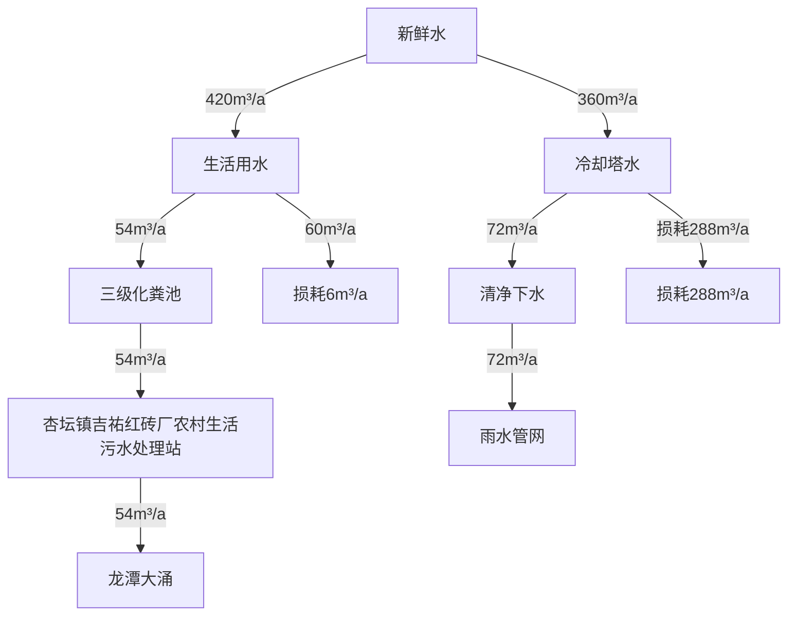
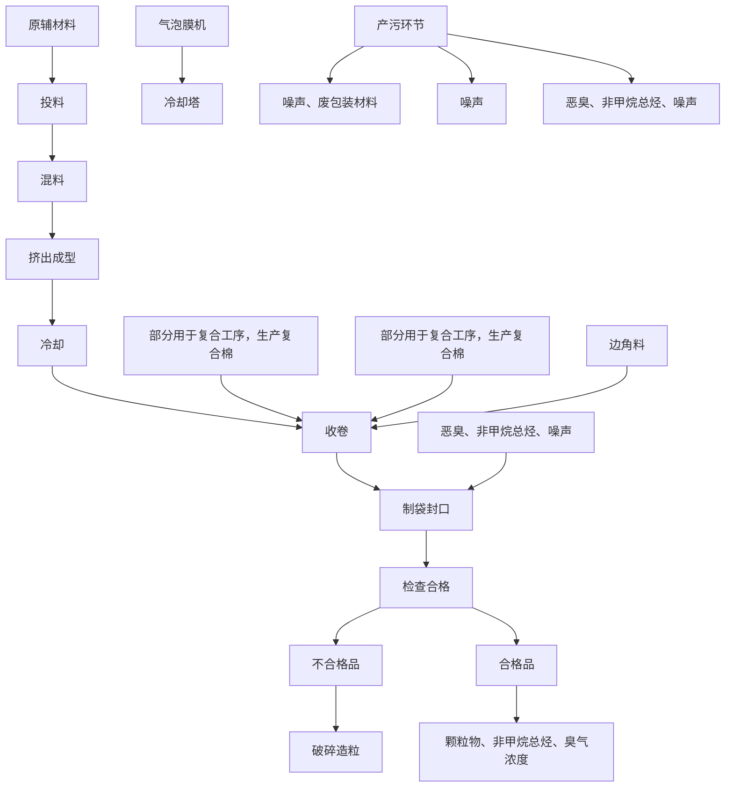
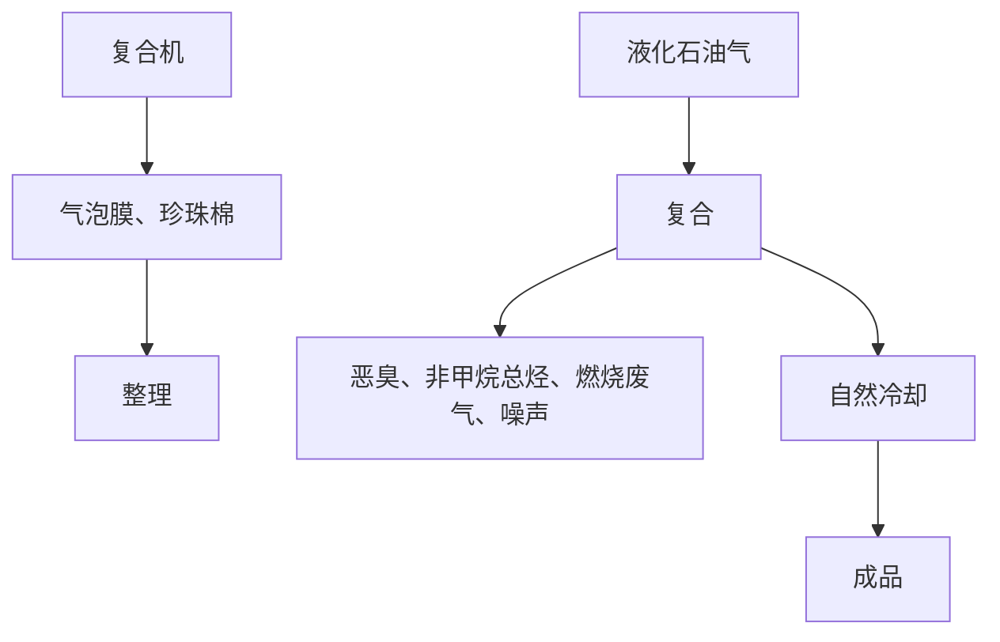
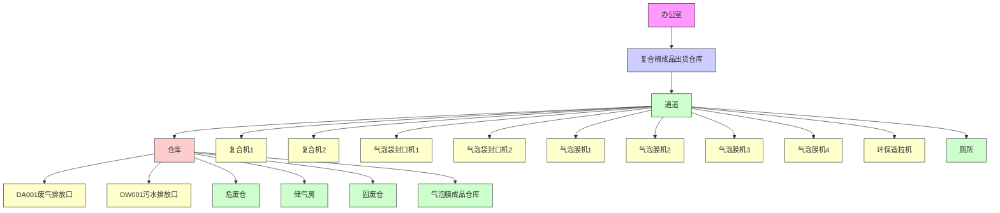

# 建设项目环境影响报告表

（污染影响类）

项目名称：佛山市玉大包装材料有限公司新建项目

建设单位（盖章）：佛山市玉大包装材料有限公司

编制日期： 二〇二三年十一月

中华人民共和国生态环境部制

中

text_image

日 20 日 90 8
山东省管理厅
山东省教育区

（

（{-:）（ （[-τ:喟） （[-τ:喟） {-1:） {-1:） {-1:） {-1:） {-1:） {-1:） {-1:） {-1:） {-1:） (） (） (） (） (） (） (） (） (） (） (） (）

#

海业 海业 海业 2 2 二 二 二 二 二

#

#

编制单位和编制人员情况表

<table><tr><td colspan="2">项目编号</td><td colspan="3">509iyl</td></tr><tr><td colspan="2">建设项目名称</td><td colspan="3">佛山市玉大包装材料有限公司新建项目</td></tr><tr><td colspan="2">建设项目类别</td><td colspan="3">26-053塑料制品业</td></tr><tr><td colspan="2">环境影响评价文件类型</td><td colspan="3">报告表</td></tr><tr><td colspan="5">一、建设单位情况</td></tr><tr><td colspan="2">单位名称(盖章)</td><td colspan="3">佛山市玉大包装材料有限公司</td></tr><tr><td colspan="2">统一社会信用代码</td><td colspan="3">914</td></tr><tr><td colspan="2">法定代表人(签章)</td><td rowspan="3" colspan="3"></td></tr><tr><td colspan="2">主要负责人(签字)</td></tr><tr><td colspan="2">直接负责的主管人员(签字)</td></tr><tr><td colspan="5">二、编制单位情况</td></tr><tr><td colspan="2">单位名称(盖章)</td><td colspan="3">佛山鹏达信能源环</td></tr><tr><td colspan="2">统一社会信用代码</td><td colspan="3">91440604568238468</td></tr><tr><td colspan="5">三、编制人员情况</td></tr><tr><td colspan="5">1.编制主持人</td></tr><tr><td>姓名</td><td colspan="2">职业资格证书管理号</td><td>信用编号</td><td>签字</td></tr><tr><td>赵晓红</td><td colspan="2">2016035440352014449907000988</td><td>BH016924</td><td>赵晓红</td></tr><tr><td colspan="5">2.主要编制人员</td></tr><tr><td>姓名</td><td colspan="2">主要编写内容</td><td>信用编号</td><td>签字</td></tr><tr><td>邝杰然</td><td colspan="2">主要环境影响和保护措施、环境保护措施监督检查清单、结论</td><td>BH062760</td><td>邝杰然</td></tr><tr><td>赵晓红</td><td colspan="2">建设项目基本情况、建设项目工程分析、区域环境质量现状、环境保护目标及评价标准</td><td>BH016924</td><td>赵晓红</td></tr></table>

本证书由中华人民共和国人力资源和社会保障部、环境保护部批准领发，它表明持证人通过国家统一组织的考试，取得环境影响评价工程师的职业资格

This is to certify that the bearerofthe Cenificate has passed national examination organized by the Chinese government departments and has obtained gualifications for Environmental Impact Assessment Engineer.

text_image

中华人民共和国人力资源和社会保障部
approved & authorized
by

Ministry of ffecian Resources an Security Psonle Republie of China

text_image

中华人民共和国环保
approved & authorized by
Ministry of Environmental Protection
The People's Republic of China

HP

持证人签名

Signature of e Bearer

2016035440352014449907000988

PuName

Sex

出生年月：

Date of Birth

专业类别：

Professional Type

批准日期：

Approval Date

text_image

赵晓红
女
1984年07月

2016年05月22日

签发单位盖章

Issued by

签发日期：

Issued on

text_image

广东省人力资源和社会保障厅
2016
专业技术人员资格考试
证书专用章(1)
30
日

# 广东省社会保险个人参保证明

该参保人在广东省参加社会保险情况如下：

<table><tr><td>姓名</td><td colspan="3">赵晓红</td><td>证件号码</td><td colspan="3"></td></tr><tr><td colspan="8">参保险种情况</td></tr><tr><td rowspan="2" colspan="3">参保起止时间</td><td rowspan="2" colspan="2">单位</td><td colspan="3">参保险种</td></tr><tr><td>养老</td><td>工伤</td><td>失业</td></tr><tr><td>202301</td><td>-</td><td>202310</td><td colspan="2">佛山长佛山鹏达信能源环保科技有限公司</td><td>10</td><td>10</td><td>10</td></tr><tr><td colspan="3">截止</td><td colspan="2">2023-11-06 15:59,该参保人累计月数合计</td><td>实际缴费10个月,缓缴0个月</td><td>实际缴费10个月,缓缴0个月</td><td>实际缴费10个月,缓缴0个月</td></tr></table>

备注：

本（参保证明》标注的“缓缴”是指：《转发人源社会保障部办公厅国家税务局苏公另关于特困行业阶实施缓企业社会保费政策的通知人社规202211号）广东省人力资源和社会厅广东省发展和改革委员会广东省财行国家税务总局广东省税务局关于实扩大阶段缓缴社会保险费政实施范围等政策的通知（社规【2022]15号）等文件实施范围内的企业申请缓缴三项在保费单位缴费部分。

证明机构名称（证明专用章

证明时间

2023-11-06 15:59

# 广东省社会保险个人参保证明

该参保人在佛山市参加社会保险情况如下：

<table><tr><td>姓名</td><td colspan="3">邝杰然</td><td>证件号码</td><td colspan="3"></td></tr><tr><td colspan="3"></td><td rowspan="3" colspan="5">险种情况</td></tr><tr><td rowspan="2" colspan="3">参保起止时间</td></tr><tr></tr><tr><td>202307</td><td>-</td><td>202310</td><td rowspan="2"></td><td rowspan="2">参保人累计月数合计</td><td rowspan="2">实际缴费4个月,缓缴0个月</td><td rowspan="2">实际缴费4个月,缓缴0个月</td><td rowspan="2">实际缴费4个月,缓缴0个月</td></tr><tr><td colspan="3">截止</td></tr></table>

备注：

本《参保证明》标注的“缓缴”是指：《转发人力资社会保障部办公厅国家税务惠有苏县另关于特困行业阶段性实施缓缴企业社会保险费政策的通知粤人社规【2022]11号） 广东省人力资源和社会保障厅广东省发展和改革委员会广东省财政国家税务总局广东省税务局关于实施扩大阶段性缓缴社等政策的通知规（202215号支件实施范由的企业申请缓三项

证明机构名称（证明专用章

证明时间

2023-11-0711:16

# 目录

一、建设项目基本情况..

二、建设项目工程分析.... ..19

三、区域环境质量现状、环境保护目标及评价标准... .28

四、主要环境影响和保护措施. ..36

五、环境保护措施监督检查清单. ..66

六、结论 ..................... .....68

附表 ... ..69

建设项目污染物排放量汇总表. ..69

附图1 项目地理位置图. ..71

附图2 项目周围环境现状图. ..72

附图3 项目环境敏感目标范围图. ..73

附图4 项目四周情况图. ..75

附图5 项目平面布置图. ..76

附图6 项目所在地环境空气功能区划图. ..77

图7 项目所在地地表水环境功能区划图. ..78

图8 项目所在声环境功能区划图. ..79

图9 产业发展保护区规划图. ...80

图10 顺德区环境管控图. ...81

图11 广东省“三线一单”截图. ..82

附件 ... ..83

附件1 项目营业执照. ..83

附件2 项目法人身份证. ...84

附件3 项目租赁合同.. ..85

附件4 城镇污水排入排水管网许可证. .91

附件5 排水证情况说明.. ..93

附件 6 环评合同. ..94

附件 7 声明.. .98

# 一、建设项目基本情况

<table><tr><td>建设项目名称</td><td colspan="3">佛山市玉大包装材料有限公司新建项目</td></tr><tr><td>项目代码</td><td colspan="3">无</td></tr><tr><td>建设单位联系人</td><td></td><td>联系方式</td><td></td></tr><tr><td>建设地点</td><td colspan="3">广东省佛山市顺德区杏坛镇十(住所申报)</td></tr><tr><td>地理坐标</td><td colspan="3">东经113度6分50.361秒,北纬22度50分24.991秒</td></tr><tr><td>国民经济行业类别</td><td>C2921塑料薄膜制造</td><td>建设项目行业类别</td><td>二十六、橡胶和塑料制品业53、塑料制品业292</td></tr><tr><td>建设性质</td><td>新建(迁建)改建扩建技术改造</td><td>建设项目申报情形</td><td>首次申报项目不予批准后再次申报项目超五年重新审核项目重大变动重新报批项目</td></tr><tr><td>项目审批(核准/备案)部门(选填)</td><td>/</td><td>项目审批(核准/备案)文号(选填)</td><td>/</td></tr><tr><td>总投资(万元)</td><td>160</td><td>环保投资(万元)</td><td>10</td></tr><tr><td>环保投资占比(%)</td><td>6.25</td><td>施工工期</td><td>1个月</td></tr><tr><td>是否开工建设</td><td>否是:____</td><td>用地(用海)面积( $m^{2}$ )</td><td>2200</td></tr><tr><td>专项评价设置情况</td><td colspan="3">无</td></tr><tr><td>规划情况</td><td colspan="3">无</td></tr><tr><td>规划环境影响评价情况</td><td colspan="3">无</td></tr><tr><td>规划及规划环境影响评价符合性分析</td><td colspan="3">无</td></tr></table>

# 1、产业政策相符性

（1）本项目主要从事气泡膜袋的生产，属于塑料薄膜制造行业，不属于《产业结构调整指导目录（2019年本）》及2021年修改单中的淘汰类和限制类；不属于《市场准入负面清单》（发改体改规〔2022〕397号）的禁止准入类项目；不属于《广东省禁止、限制生产、销售和使用的塑料制品名录》（2020年版）中禁止和生产类。  
（2）项目与《广东省禁止、限制生产、销售和使用的塑料制品 目录》（2020年版）相符性分析

根据广东省发展和改革委员会、广东省生态环境厅关于印发《广东省禁止、限制生产、销售和使用的塑料制品目录》（2020年版）的要求：“一、禁止生产、销售的塑料制品-厚度小于0.025毫米的超薄塑料购物袋、厚度小于0.01毫米的聚乙烯农用地膜、以医疗废物为原料制造塑料制品、一次性发泡塑料餐具、一次性塑料棉签、含塑料微珠的日化产品。”

本项目生产产品为气泡膜袋、复合棉，厚度为0.07毫米，无需发泡工序，符合《广东省禁止、限制生产、销售和使用的塑料制品 目录》（2020 年版）相关要求。

（3）项目与《佛山市关于进一步加强塑料污染治理的实施方案》 规定相符性分析

方案规定：全市范围内禁止生产和销售厚度小于0.025毫米的超薄塑料购物袋、厚度小于0.01毫米的聚乙烯农用地膜。禁止以医疗废物为原料制造塑料制品；禁止将回收利用的废塑料输液袋（瓶）用于原用途或用于制造餐饮容器以及玩具等儿童用品。加大禁止“洋垃圾”进口监管和打私力度，确保“全面禁止废塑料进口”落实到位。到2020年底，禁止生产和销售一次性发泡塑料餐具、一次性塑料棉签；禁止生产含塑料微珠的日化产品。到2022年底，禁止销售含塑料微珠的日化产品。国家《产业结构调整指导目录》和《市场准入负面清单》明确的属于淘汰类的塑料制品项目，禁止投资；属于限制类项目，禁止新建。

本项目生产产品为气泡膜袋、复合棉，单膜厚度为0.07毫米，无需发泡工序，符合《佛山市关于进一步加强塑料污染治理的实施方案》 的相关要求。

因此本项目建设符合国家和地方的产业政策要求。

# 2、环境功能区域相符性

# （1）与大气环境功能区区划相符性分析

根据《佛山市人民政府办公室关于调整<顺德区环境空气质量功能区划>的复函》（佛府办函〔2014〕494 号），项目所在区域为环境空气二类功能区，环境空气质量执行《环境空气质量标准》（GB3095-2012）及2018修改单中二级标准。项目所在位置不属于自然保护区、风景名胜区和其它需要特殊保护的地区，符合区域空气环境功能区划分要求。

# （2）与声环境功能区区划相符性分析

根据《佛山市人民政府关于印发<佛山市声环境功能区划分方案>的通知 》（佛府函〔2015〕72号）及《声环境功能区划分技术规范》（GB/T15190-2014）的有关规定：项目所在地属于声环境功能区2类区，执行《声环境质量标准》（GB3096-2008）中的2类标准，不属于声环境1类区。50m范围内无声环境0类和1类敏感区。

# （3）与地表水环境功能区区划相符性分析

本项目生活污水经三级化粪池处理达标后通过市政管网排入杏坛镇吉祐村红砖厂农村生活污水处理站进行深度处理后排入内河涌（龙潭大涌）。根据《广东省地表水环境功能区划》（粤环〔2011〕14号），内河涌（龙潭大涌）属IⅤ类水域，所以执行《地表水环境质量标准》（GB3838－2002）IⅤ类标准。

# （4）与水源保护区功能区区划相符性分析

根据《印发佛山市饮用水源保护规划的通知》（佛府〔2007〕108 号）、《关于同意调整佛山市北江水系饮用水源保护区划的批复》（粤府函〔2010〕75号）、《关于落实佛山市北江水系饮用水源保护区划调整方案的通知》（佛环〔2010100号）、《佛山市“十三五”城市近期建设规划》和《广东省人民政府关于调整佛山市部分饮用水水源保护区的批复》（粤府函〔2018〕426号）可知，项目所在地不在饮用水源保护区范围内。

# 3、选址政策相符性分析

本项目位于广东省佛山市顺德区杏坛镇

(住所申报)，选址不属于水源保护区，不属于大气一类保护区，地理位置和开发建设条件优越，交通便利，根据《顺德区产业保护区规划》可知，项目属于工业用地，项目位于产业发展保护区一 XT11 吉祐产业发展保护区（详见附图9），不占用基本农田保护区、风景区等其它用途的用地，项目选址符合相关法律法规的要求，符合城镇规划和环境规划要求，项目选址合理。

# 4、与有机污染物治理政策相符性分析

表 1-1 项目与有机污染物治理政策的相符性

<table><tr><td>序号</td><td>政策要求</td><td>本项目情况</td><td>相符性</td></tr><tr><td colspan="4">1、《中华人民共和国大气污染防治法》(2018年10月26日修正)</td></tr><tr><td>1.1</td><td>第四十四条 生产、进口、销售和使用含挥发性有机物的原材料和产品的,其挥发性有机物含量应当符合质量标准或者要求。国家鼓励生产、进口、销售和使用低毒、低挥发性有机溶剂。</td><td>项目无高挥发性原料使用。</td><td>符合</td></tr><tr><td>1.2</td><td>第四十五条 产生含挥发性有机物废气的生产和服务活动,应当在密闭空间或者设备中进行,并按照规定安装、使用污染防治设施;无法密闭的,应当采取措施减少废气排放。</td><td>项目有机废气采用集气罩收集后引至“二级活性炭吸附装置”处理后通过15米高排气筒(G1)排放,有效减少废气排放。</td><td>符合</td></tr><tr><td colspan="4">2.《挥发性有机物无组织排放控制标准》(GB37822-2019)</td></tr><tr><td>2.1</td><td>VOCs物料应储存于密闭的容器、包装袋、储罐、储库、料仓中。</td><td>项目各类原料均储存于密闭包装内,在非取用状态时封口,保持密闭,且其物料存放于室内</td><td>相符</td></tr><tr><td>2.2</td><td>粉状、粒状VOCs物料应采用气力输送方式或采用密闭固体投料器等给料方式密闭投加。无法密闭投加的,应在密闭空间内操作,或进行局部气体收集,废气应排至除尘设施、VOCs废气收集处理系统。</td><td>本项目挤出、复合工序产生的有机废气经集气罩收集后引至二级活性炭吸附装置”处理后尾气通过15米高排气筒(G1)排放</td><td>相符</td></tr><tr><td colspan="4">3、关于印发《重点行业挥发性有机物综合治理方案》(环大气[2019]53号)的通知</td></tr><tr><td>3.1</td><td>推广使用低(无)VOCs含量、低反应活性的原辅材料,加快对芳香烃、含卤素有机化合物的绿色替代</td><td rowspan="3">项目不使用高VOCs含量溶剂型涂料、油墨、胶黏剂、清洗剂,有机废气最大初始排放速率&lt;2kg/h,经集气罩收集后引至二级活性炭吸附装置”处理后尾气通过15米高排气筒(G1)排放,收集效率70%,有机废气处理效率51%。</td><td>符合</td></tr><tr><td>3.2</td><td>使用的原辅材料VOCs含量(质量比)低于10%的工序,可不要求采取无组织排放收集措施</td><td>符合</td></tr><tr><td>3.3</td><td>车间或生产设施收集排放的废气,VOCs初始排放速率大于等于3千克/小时、重点区</td><td>符合</td></tr></table>

<table><tr><td rowspan="5"></td><td></td><td>域大于等于2千克/小时的,应加大控制力度,除确保排放浓度稳定达标外,还应实行去除效率控制,去除效率不低于80%</td><td></td><td></td></tr><tr><td colspan="4">4.广东省生态环境厅关于印发《广东省生态环境保护“十四五”规划》的通知(粤环[2021]10号)</td></tr><tr><td>4.1</td><td>加强高污染燃料禁燃区管理。在禁燃区内,禁止销售、燃用高污染燃料;禁止新建、扩建燃用高污染燃料的设施,已建成的按要求改用天然气、电或者其他清洁能源。逐步推动珠三角高污染燃料禁燃区全覆盖,扩大东西两翼和北部生态发展区高污染燃料禁燃区范围。</td><td>本项目生产设备均使用电能,不涉及使用高污染燃料。</td><td>相符</td></tr><tr><td>4.2</td><td>深化工业源污染治理。大力推进挥发性有机物(VOCs)源头控制和重点行业深度治理。开展原油、成品油、有机化学品等涉VOCs物质储罐排查,深化重点行业VOCs排放基数调查,系统掌握工业源VOCs产生、处理、排放及分布情况,分类建立台账,实施VOCs精细化管理。在石化、化工、包装印刷、工业涂装等重点行业建立完善源头、过程和末端的VOCs全过程控制体系。大力推进低VOCs含量原辅材料源头替代,严格落实国家和地方产品VOCs含量限值质量标准,禁止建设生产和使用高VOCs含量的溶剂型涂料、油墨、胶粘剂等项目。严格实施VOCs排放企业分级管控,全面推进涉VOCs排放企业深度治理。开展中小型企业废气收集和治理设施建设、运行情况的评估,强化对企业涉VOCs生产车间/工序废气的收集管理,推动企业开展治理设施升级改造。推进工业园区、企业集群因地制宜统筹规划建设一批集中喷涂中心(共性工厂)、活性炭集中再生中心,实现VOCs集中高效处理。开展无组织排放源排查,加强含VOCs物料全方位、全链条、全环节密闭管理,深入推进泄漏检测与修复(LDAR)工作。</td><td>本项目所使用的均为低VOCs原料;本项目挤出、复合工序产生的有机废气经集气罩收集后引至二级活性炭吸附装置”处理后尾气通过15米高排气筒(G1)排放,本项目废气处理后能达标排放,不会对环境造成明显的影响;建设单位建立台账记录含VOCs原辅材料和含VOCs产品的名称、使用量、回收量、废弃量、去向以及VOCs含量等信息。</td><td>相符</td></tr><tr><td>4.3</td><td>深化水环境综合治理。坚持全流域系统治理,深入推进工业、城镇、农业农村、船舶港口四源共治,推动重点流域实现长治久清。深入推进水污染减排。推进高耗水行业实施废水深度处理回用,强化工业园区工业废水和生活污水分质分类处理,推进省级以上工业园区“污水零直排区”创建。实施城镇生活污水处理提质增效,推进生活污水管网全覆盖,补足生活污水处理厂弱项,稳步提升生活污水处理厂进水生化需氧量(BOD)浓度,提升生活污水收集和处理效能。到2025年,基本实现地级及以上城市建成区污水“零直排”,全省城市生活污水集中收集率力争达到70%以上,广州、深圳达到85%以上,粤港澳大湾区地级市(广州、深圳、肇庆除外)达到75%以上,其他城市提升15个百分点。加快推进污泥无害化处置和资源化利用,到2025年,全省地级及以上城市污泥无害化处置率达到95%。</td><td>本项目排水采用雨、污分流制,雨水通过雨水排水系统排至市政雨水管网;本项目生产过程中无废水外排,外排污水主要为生活污水。项目生活污水经三级化粪池预处理达到广东省地方标准《水污染物排放限值》(DB44/26-2001)中第二时段三级标准后经市政污水管网纳入杏坛镇吉祐村红砖厂农村生活污水处理站进行深度处理后排入内河涌(龙潭大涌),不会对纳污水环境造成明显的影响。本项目不属于高耗水行业。</td><td>相符</td></tr><tr><td rowspan="8"></td><td>4.4</td><td>坚持防治结合,提升土壤和农村环境。强化土壤污染源头管控。结合土壤、地下水等环境风险状况,合理确定区域功能定位、空间布局和建设项目选址,严禁在优先保护类耕地集中区、敏感区周边新建、扩建排放重金属污染物和持久性有机污染物的建设项目。建立土壤污染重点监管单位规范化管理,机制,落实新(改、扩)建项目土壤环境影响评价、污染隐患排查、自行监测、拆除活动污染防治、排污许可等制度。深化涉镉等重点行业企业污染源排查整治,建立污染源排查整治清单,严格执行重金属污染物排放标准和总量控制要求。</td><td>本项目可能对土壤及地下水环境造成污染的区域包括生产车间、原辅材料仓库、成品仓库等区域,这些区域应采取防渗、防漏等土壤及地下水污染防治措施。项目不涉及重金属,也不涉及持久性有机污染物。</td><td>相符</td></tr><tr><td colspan="4">5、《广东省人民政府办公厅关于印发广东省2021年大气、水、土壤污染防治工作方案的通知》(粤办函〔2021〕58号)</td></tr><tr><td>5.1</td><td>涉VOCs重点行业新建、改建和扩建项目不推荐使用光氧化、光催化、低温等离子等低效治理设施。</td><td>本项目不使用上述低效治理设施装置。</td><td>符合</td></tr><tr><td colspan="4">6.广东省生态环境厅关于做好重点行业建设项目挥发性有机物总量指标管理工作的通知(粤环发[2019]2号)</td></tr><tr><td>6.1</td><td>珠三角地区各地级以上市、上一年度环境空气质量年评价浓度不达标或污染负荷接近承载能力上限的城市,建设项目新增VOCs排放量,实行本行政区域内污染源“点对点”2倍量削减替代,原则上不得接受其他区域VOCs“可替代总量指标”。其它城市的建设项目所需VOCs总量指标实行等量削减替代。</td><td>项目涉及VOCs产生及排放,实施两倍削减量替代。</td><td>符合</td></tr><tr><td colspan="4">7.《佛山市生态环境保护“十四五”规划》(佛环〔2022〕3号)</td></tr><tr><td>7.1</td><td>大力推进低VOCs含量原辅材料替代,将全面使用低VOCs含量原辅材料的企业纳入正面清单和政府绿色采购清单。鼓励重点行业企业开展生产工艺和设备水性化改造,推广使用水性、高固体分、无溶剂、粉末等低VOCs含量涂料。</td><td>本项目不涉及使用高挥发性有机物原辅材料。</td><td>符合</td></tr><tr><td>7.2</td><td>推进VOCs高排放企业治理设施提升改造,淘汰光催化、光氧化、低温等离子等现有低效治理设施。分期分批推广涉VOCs企业安</td><td>本项目挤出、复合工序产生的有机废气经集气罩收集后引至二级活性炭吸附装置”</td><td>符合</td></tr><tr><td></td><td>装产污环节、治污环节过程监控设备。</td><td>处理后尾气通过15米高排气筒(G1)排放;本项目不使用上述低效治理设施装置。</td><td></td></tr></table>

# 5、“三线一单”相符性分析

①项目与广东省“三线一单”的相符性分析

根据《广东省人民政府关于印发广东省“三线一单”生态环境分区管控方案的通知》（粤府[2020]71 号），广东省将以环境管控单元为基础，实施生态环境分区管控，精细化管理、保护生态环境。本项目与广东省“三线一单”生态环境分区管控方案相符性分析如下：

表 1-2 粤府〔2020〕71号的相关规定与本项目情况一览表

<table><tr><td colspan="2">粤府(2020)71号的相关规定</td><td>本项目情况</td><td>相符性</td></tr><tr><td>生态保护红线</td><td>生态保护红线内,自然保护地核心保护区原则上禁止人为活动,其他区域严格禁止开发性、生产性建设活动,在符合现行法律法规前提下,除国家重大战略项目外,仅允许对生态功能不造成破坏的有限人为活动。一般生态空间内,可开展生态保护红线内允许的活动:在不影响主导生态功能的前提下,还可开展国家和省规定不纳入环评管理的项目建设,以及生态旅游、畜禽养殖、基础设施建设、村庄建设等人为活动。</td><td>本项目位于广东省佛山市顺德区杏点管控单元,所在区域属于工业用地,不在生态保护红线内。</td><td>相符</td></tr><tr><td>环境质量底线</td><td>全省水环境质量持续改善,国考、省考断面优良水质比例稳步提升,全面消除劣V类水体。大气环境质量继续领跑先行, $PM_{2.5}$ 年均浓度率先达到世界卫生组织过渡期二阶段目标值(25微克/立方米),臭氧污染得到有效遏制。土壤环境质量稳中向好,土壤环境风险得到管控。近岸海域水体质量稳步提升。</td><td>项目生产过程无废水外排,外排废水主要为生活污水,项目生活污水经三级化粪池预处理达到广东省地方标准《水污染物排放限值》(DB44/26-2001)中第二时段三级标准后经市政污水管网纳入杏坛镇吉祐村红砖厂农村生活污水处理站进行深度处理后排入内河涌(龙潭大涌)。根据《2023年3月市控考核断面水质情况》可知,龙潭大涌水质可达到《地表水环境质量标准》(GB3838-2002)中的V类标准;本项目所在区域域环境空气质量调查现状显示,环境空气质量除臭氧外, $SO_2$ 、 $NO_2$ 、 $PM_{10}$ 、 $PM_{2.5}$ 、CO五项污染物质量浓度均可到《环境空气质量标准》</td><td>相符</td></tr></table>

<table><tr><td rowspan="6"></td><td></td><td></td><td>(GB3095-2012)及其修改单二级标准限值要求;根据项目主要环境影响和保护措施分析,本项目营运后在正常工况下所排放的污染物不会对环境造成明显影响,环境质量可以保持现有水平。本项目各区域按要求采取防渗措施,可以有效控制土壤污染环境风险。本项目不涉及近案海域水体。</td><td></td></tr><tr><td>资源利用上线</td><td>强化节约集约循环利用,持续提升资源能源利用效率,水资源、土地资源、岸线资源、能源消耗等达到或优于国家和省下达的总量、强度等目标要求,按省规定年限实现碳达峰。</td><td>项目生产过程中的电能、自来水等消耗量较少,区域水、电资源较充足,项目消耗量没有超出资源负荷,没有超出资源利用上线。</td><td>相符</td></tr><tr><td>生态环境准入清单</td><td>环境准入负面清单是基于生态保护红线、环境质量底线和资源利用上线,以清单方式列出的禁止、限制等差别化环境准入条件和要求。</td><td>本项目位于重点管控单元(杏坛镇重点管控区(ZH44060620005),符合该环境管控单元准入清单要求。</td><td>相符</td></tr><tr><td colspan="2">生态环境分区管控。从区域布局管控、能源资源利用、污染物排放管控和环境风险防控等方面明确准入要求,建立“1+3+N”三级生态环境准入清单体系。“1”为全省总体管控要求,“3”为“一核一带一区”区域管控要求,“N”为1912个陆域环境管控单元和471个海域环境管控单元的管控要求。</td><td>项目属于一核一带一区中的珠三角核心区。</td><td>相符</td></tr><tr><td colspan="2">区域布局管控要求。禁止新建、扩建燃煤燃油火电机组和企业自备电站,推进现有服役期满及落后老旧的燃煤火电机组有序退出;原则上不再新建燃煤锅炉,逐步淘汰生物质锅炉、集中供热管网覆盖区域内的分散供热锅炉,逐步推动高污染燃料禁燃区全覆盖;禁止新建、扩建水泥、平板玻璃、化学制浆、生皮制革以及国家规划外的钢铁、原油加工等项目。推广~应用低挥发性有机物原辅材料,严格限制新建生产和使用高挥发性有机物原辅材料的项目,鼓励建设挥发性有机物共性工厂。</td><td>项目不涉及火电机组、锅炉,不属于水泥、平板玻璃、化学制浆、生皮制革以及国家规划外的钢铁、原油加工等,项目运营过程无使用高挥发性有机物原辅材料。</td><td>相符</td></tr><tr><td colspan="2">污染物排放管控要求。在可核查、可监管的基础上,新建项目原则上实施氮氧化物等量替代,挥发性有机物两倍削减量替代。以臭氧生成潜势较大的行业企业为重点,推进挥发性有机物源头替代,全面加强无组织排放控制,深入实施精细化治理。现有每小时35蒸吨及以上的燃煤锅炉加快实施超低排放治理,每小时35蒸吨以下的燃煤锅炉加快完成清洁能源改造。实行水污染物排放的行业标杆管理,严格执行茅洲河、淡水河、石马河、汾江河等重</td><td>项目涉及VOCs、氮氧化物产生及排放,实施两倍削减量替代。项目不涉及生产废水排放。</td><td>相符</td></tr></table>

<table><tr><td>点流域水污染物排放标准。重点水污染物未达到环境质量改善目标的区域内,新建、改建、扩建项目实施减量替代。电镀专业园区、电镀企业严格执行广东省电镀水污染物排放限值。</td><td></td><td></td></tr><tr><td>环境管控单元总体管控要求。环境管控单元分为优先保护、重点管控和一-般管控单元三类。大气环境受体敏感类重点管控单元。严格限制新建钢铁、燃煤燃油火电、石化、储油库等项目,产生和排放有毒有害大气污染物项目,以及使用溶剂型油墨、涂料、清洗剂、胶黏剂等高挥发性有机物原辅材料的项目;鼓励现有该类项目逐步搬迁退出。</td><td>根据广东省环境管控单元图,项目所在地属于重点管控单元。项目属于塑料制品业,生产过程无使用溶剂型油墨、涂料、清洗剂、胶黏剂等高挥发性有机物原辅材料</td><td>相符</td></tr></table>

综上，本项目符合《广东省人民政府关于印发广东省“三线一单”生态环境分区管控方案的通知》（粤府〔2020〕71号）的要求。

②项目与佛山市“三线一单”的相符性分析

表 1-3 与佛府[2021]11 号“三线一单”符合性分析

<table><tr><td colspan="2">佛府(2021)11号的相关规定</td><td>本项目情况</td><td>相符性</td></tr><tr><td>区域布局管控要求</td><td>优先保护生态空间,筑牢生态保护底线,构建生态空间保护格局。强化水源地空间管控,严格限制饮用水水源汇水区内的生态保护与水源涵养区域变更土地利用方式。持续深入推进产业、能源、交通运输结构调整。按照制造业组团化发展格局,打造先进制造业集群,推动城市功能定位、空间布局与产业发展高质量协同匹配。巩固提升传统优势产业,推动佛山智能家电、陶瓷建材、金属制品等数字化、智能化、绿色化、高端化、个性化全面转型升级。做大做强战略性新兴产业,推动科技创新与高端装备制造、汽车、新一代电子信息、新材料、新能源、生物医药等产业发展深度融合,全面提升制造业集群绿色发展水平。全面攻坚村级工业园升级改造,腾出连片空间,布局产业集聚区和主题产业园,推动工业项目入园集聚发展。通过城市更新实现公共设施“补短板”、产业空间“再聚集”、重点片区“强统筹”,盘活存量建设用地。依法依规关停落后产能,全面实施产业绿色化改造,培育壮大循环经济。新建、改建、扩建的项目应当符合国家产业政策规定。环境质量不达标区域,新建、扩建项目需符合环境质量改善要求。全市域为高污染燃料禁燃区,禁止新建、扩建燃用高污染燃料的燃烧设施。加快推进天然气产供储销体系建设,逐步淘汰生物质锅炉、集中供热管网覆盖区域内的分散供热锅炉,促进用热企业向园区集聚。禁止新建、扩建水泥、平板玻璃、化学制浆、生皮制革以及国家规划外的钢铁、原油加工等项目。专业电镀、印染等项目进入定点园区集中管理。推广应用低挥发性有机物原辅材料,严</td><td>本项目位于广东省佛山市顺德区杏坛镇吉祐村吉祐工业大道南1路1号首层之二十(住所申报),所在区域位于顺德区,属于重点管控单元(杏坛镇重点管控区(ZH44060620005),项目所在建设用地不涉及划定的生态红线区域,项目周边无自然保护区、饮用水源保护区等生态保护目标,符合生态保护红线要求。项目根据环境质量现状监测和周边现状监测数据,项目区声环境质量能满足相应标准要求,项目区大气环境质量臭氧不达标;根据佛山市主干河涌2023年3月水质监测情况,杏坛镇龙潭大涌满足《地表水环境质量标准》(GB3838-2002)V类水功能要求,则本</td><td>相符</td></tr></table>

<table><tr><td rowspan="3"></td><td></td><td>格限制新建生产和使用高挥发性有机物原辅材料的项目,鼓励建设共性工厂、活性炭集中再生中心等挥发性有机物第三方治理项目,推动挥发性有机物集中高效处理。优化交通结构,发展多式联运,推进公路、水路等交通运输燃料清洁化,推广新能源物流车辆,优先在禅桂新中心城区探索设立“绿色物流”片区</td><td>项目地表水环境属于达标区。项目排放的各项污染物经相应措施处理后均能达标。项目复合机使用液化石油气燃料燃烧供热,不属于高污染燃料设备。项目主要从事气泡膜袋和复合棉的生产,不属于化学制浆、生皮制革以及国家规划外的钢铁、原油加工等项目。专业电镀、印染等禁止行业。项目不涉及高挥发性原辅助材料。</td><td></td></tr><tr><td>能源资源利用要求</td><td>积极发展氢能源、天然气发电等清洁能源,逐步提高可再生能源与低碳清洁能源比例,建立现代化能源体系。科学实施能源消费总量和强度“双控”,新建高能耗项目单位产品(产值)能耗达到国际国内先进水平,实现煤炭消费总量负增长。加快城镇燃气基础设施优化布局,落实天然气大用户直供和“瓶改管”。禁止新增高污染燃料销售点,加强全市高污染燃料监督管理。率先探索建立二氧化碳总量管理制度,加快实现碳排放达峰。新建、改建、扩建“两高”项目4须符合生态环境保护法律法规和相关法定规划,满足污染物区域削减、重点污染物排放总量控制、碳排放达峰目标、相关规划环评和相应行业建设项目环境准入条件、环评文件审批原则要求。依法依规强化油品生产、流通、使用、贸易等全流程监管,合理优化储油库、加油站布局。加快新能源汽车推广使用,加快充电桩、加气站、加氢站以及综合性能源补给站建设,积极推动机动车和非道路移动机械电动化或实现清洁燃料替代。大力推进绿色港口和公用码头建设,提升岸电使用率,持续推动船舶、港作机械等“油改气”“油改电”,降低港口柴油使用比例。贯彻落实“节水优先”方针,实行最严格水资源管理制度,提高工业用水效率,加强江河湖库水量调度,保障生态流量。强化自然岸线保护,优化岸线开发利用格局,严格水域岸线用途管制,新建项目一律不得违规占用水域。落实单位土地面积投资强度、土地利用强度等建设用地控制性指标要求,提高土地利用效率。统筹矿产资源开发与保护,严格控制矿产资源开发强度,禅城、南海、顺德区以及高明区东部、三水区中南部为禁止开采区域,高明、三水区的其他区域划定为限制开采区。积极发展农业资源利用节约化、生产过程清洁化、废弃物利用资源化等生态循环农业模式</td><td>项目生产过程中的电能、自来水等消耗量较少,区域水、电资源较充足,项目消耗量没有超出资源负荷,没有超出资源利用上线。</td><td>相符</td></tr><tr><td>污染物</td><td>实施重点污染物总量控制,重点污染物排放总量指标优先向重大发展平台、重点建设项目、重点工业园区、战略性产业集群倾斜。加快建立以排污许可制</td><td>项目涉及VOCs和氮氧化物产生及排放,实施两倍削减量替代。项</td><td>相符</td></tr><tr><td rowspan="2"></td><td>排放管控要求</td><td>为核心的固定污染源监管制度,聚焦重点行业和重点区域,强化环境监管执法。规范工业排水管理,依法开展排水许可。合理建设工业废水或综合废水集中处理设施,推进工业集聚区“污水零直排区”试点。稳步推进排水设施“三个一体化”6管理模式,补齐城乡污水收集和处理短板,推动污水处理设施提质增效,加快消除城中村、老旧城区、城乡接合部等污水收集管网空白区,逐步实现城乡污水收集处理全覆盖。城镇新区建设均实行雨污分流。推进建设大型现代化畜禽养殖场,加强畜禽养殖废水处理及废弃物资源化利用,推广水产生态健康养殖模式,防治农村面源污染。禁止在地表水I、II类水域新建排污口,已建排污口不得增加污染物排放量。实行水污染物的行业标杆管理,严格执行汾江河流域水污染物排放标准。实施水生态系统保护修复,推进河涌水系连通、环保清淤,加强湿地建设及河心岛生态修复。上年度重点河涌水质未达到水环境质量目标的管控分区所在镇(街道),须组织编制、系统实施、向社会公开区域重点水污染物减排计划并明确“替代量”,本年度新建、改建、扩建项目新增水环境重点污染物实行区域“减二增一”替代(废水集中处理设施、民生项目除外)。在可核查、可监管的基础上,全市新建、改建、扩建项目新增大气重点污染物实行“减二增一”替代。巩固燃煤锅炉超低排放整治成效。深化炉窑分级管控,实施工业炉窑大气污染综合治理。推进挥发性有机物源头替代,全面加强无组织排放控制,深入实施精细化治理。推进石化化工、溶剂使用及挥发性有机液体储运销的挥发性有机物减排,全过程实施反应活性物质、有毒有害物质、恶臭物质的协同控制。将全面使用低VOCs含量原辅材料的企业纳入正面清单和政府绿色采购清单。严格落实船舶大气污染物排放控制区要求。加强扬尘、餐饮油烟等污染防治。重金属污染重点防控区内,重点重金属排放总量只减不增。重金属污染物排放企业清洁生产逐步达到国际或国内先进水平。打造近零碳排放示范项目,推进陶瓷、有色金属等重点能源消耗行业二氧化碳排放控制。开展“无废城市”建设,推动固体废物源头减量、资源化利用和安全处置</td><td>目无生产废水外排,外排废水主要为生活污水,生活污水经三级化粪池预处理达标后排至杏坛镇吉祐村红砖厂农村生活污水处理站进行深度处理后排入内河涌(龙潭大涌)</td><td></td></tr><tr><td>环境风险防控要求</td><td>《加强西江、北江等供水通道干流沿岸以及饮用水水源地、备用水源环境风险防控,完善城市双水源联网供水格局。强化地表水、地下水和土壤污染风险协同防控,建立完善突发环境事件应急管理体系。重点加强环境风险分级分类管理,应用全省环境风险源在线监控预警系统,强化化工企业、涉重金属行业、工业园区等重点环境风险源的环境风险防控。推动企业将低温等离子、UV光解、RTO燃烧炉等有机废气治理设施纳入全厂安全风险辨识范围,加强安全管理。禁止在规划专门用于危险化学品生产、储存的区域(包括化工园区)外新建、扩建危险化学品生产、储备建设项目(加油站、加气站、加氢站、港口及铁路、航空危险化学品储存建设项目、危险化学品输送管道及危险化学品使用单位的配套项目除外)。实施农用地分类管理,依法划定特定农产品禁止生产区域。严格建设用地再开发建设管理,对纳入建设用地土壤环境联动监管地块,未达到土壤污染风险评估报告确定的风险管控、修复目标的建设用地地块,禁止开工建设任何与风险管控、修复无关的项目。提升危险废物监管能力,利用信息化手段,推动全过程跟踪管理。健全危险废物收集体系,推进危险废物利用处置能力优化提升。全力避免因各类安全事故(事件)引发的次生环境风险事故(事件)</td><td>项目无生产废水外排,外排废水主要为生活污水,生活污水经三级化粪池预处理达标后排至杏坛镇吉祐村红砖厂农村生活污水处理站进行深度处理后排入内河涌(龙潭大涌),不涉及西江、北江等供水通道干流沿岸以及饮用水水源地;项目属于C2921塑料薄膜制造,不属于新建、扩建危险化学品生产、储备建设项目。项目经营过程产生的固体废物分类收集,一般固体废物由物资回收公司回收,危险废物交有危废资质单位进行处理。固体废物分类减量化、资源化利用和无害化处置。</td><td>相符</td></tr><tr><td rowspan="5"></td><td colspan="4">杏坛镇重点管控区(ZH44060620005)相关要求</td></tr><tr><td rowspan="4">区域布局管控</td><td>1-1【生态/禁止类】单元内的一般生态空间,主导生态功能为水土保持,禁止在25度以上的陡坡地开垦种植农作物,禁止在崩塌、滑坡危险区、泥石流易发区从事采石、取土、采砂等可能造成水土流失的活动。</td><td>本项目位于广东省佛山市顺德区杏坛镇吉(住所申报),所在区域位于顺德区,属于重点管控单元(杏坛镇重点管控区(ZH44060620005),项目属于塑料薄膜制造业,无采石、取土、采砂等造成水土流失的活动</td><td rowspan="4">相符</td></tr><tr><td>1-2.【产业/鼓励引导类】重点发展新材料、智能家居、先进装备制造业、汽车配件等产业以及军民融合产业,提升发展塑料专业市场,培育智能家居创新创业产业链,依托顺德新港发展临港加工和物流产业,发展现代农业。</td><td>本项目属于C2921塑料薄膜制造</td></tr><tr><td>1-3.【产业/综合类】系统推进村级工业园升级改造,腾出连片空间,布局产业集聚区和主题产业园,推动工业项目入园集聚发展。新增工业制造业用地原则上安排在产业集聚区内,产业集聚区外原则上不鼓励工业及物流仓储用地的新建与改造。</td><td>本项目不属于村改范围。同时本项目不新增工业用地,租用现有工业厂房。</td></tr><tr><td>1-4.【产业/限制类】受纳水体或监控断面不达标的,不得新建、扩建向河涌直接排放废水的项目。新建、扩建含蚀刻工序的线路板生产项目和化工项目应在配套污水集中处置的工业园区或生活污水管网覆盖区域内建设;纯加工型印花项目,含酸洗、磷化的金属表面处理、金属制品项目(与自身高新技术企业配套的除外),含酸洗、喷涂、拉丝、表面抛光等工艺的不锈钢型材加工项目,应进入以此类项目为主导产业、有相应废水集中治理设施的工业园区,实现集中治污。</td><td>项目无生产废水外排,外排废水主要为生活污水,生活污水经三级化粪池预处理达标后排至杏坛镇吉祐村红砖厂农村生活污水处理站进行深度处理后排入内河涌(龙潭大涌)</td></tr><tr><td rowspan="4"></td><td rowspan="2"></td><td>1-5.【水/限制类】严格限制在右滩水厂、均安水厂饮用水水源保护区上游和周边区域建设列入“高污染、高环境风险”产品名录等可能影响水环境安全的项目。</td><td>根据《佛山市顺德区供水专项规划修编2015-2020)》、《广东省人民政府关于调整佛山市部分饮用水水源保护区的批复》(粤府函〔2018〕426号)等,项目位置不在饮用水水源保护区内。</td><td rowspan="2"></td></tr><tr><td>1-6.【土壤/禁止类】禁止新建、扩建增加重点防控的重金属污染物排放的建设项目。</td><td>本项目不排放重金属污染物</td></tr><tr><td>能源资源利用</td><td>2-1【能源/鼓励引导类】推广节能技术,加快发展绿色货运与现代物流。2-2【能源/鼓励引导类】推广新能源汽车应用和充电基础设施建设,积极推动重卡LNG加气站、充电基础设施、加氢站建设。2-3.【能源/综合类】科学实施能源消费总量和强度“双控”,新建高能耗项目单位产品(产值)能耗达到国际国内先进水平。2-4.【水资源/综合类】贯彻落实“节水优先”方针,实行最严格水资源管理制度,杏坛镇万元国内生产总值用水量、万元工业增加值用水量、用水总量、农田灌溉水有效利用系数等用水总量和效率指标达到区下达要求。2-5.【土地资源/限制类】落实单位土地面积投资强度、土地利用强度等建设用地控制性指标要求,提高土地利用效率。2-6.【岸线/禁止类】严格水域岸线用途管制,新建项目一律不得违规占用水域。严禁破坏生态的岸线利用行为和不符合其功能定位的开发建设活动,严禁以各种名义侵占河道、围垦湖泊、非法采砂等。</td><td>本项目生产设备大部分设备使用电能作为能源,只有复合机加热部分使用液化石油气,属于清洁能源;项目用水量较少,生产过程中节约用水,用水总量和效率指标可以达到区域要求;项目位于广东省佛山市顺德区杏坛镇吉祐村工业大道南一路1号之十(住所申报),租用现有厂房,不涉及新增用地,不涉及水域岸线。</td><td>相符</td></tr><tr><td>污染物排放管控</td><td>3-1.【水/限制类】城镇新区建设实行雨污分流,逐步推进初期雨水收集、处理和资源化利用。住宅、商业体、学校、市场等城镇开发建设项目应当配套或者同步计划建设公共排水设施,公共排水设施或自建排污水设施未能投产运行的,以上涉水项目不得投入使用。新建小区严格实施雨污分流,阳台、露台等污水接入污水收集系统,将生活污水“应截尽截”。做好大型楼盘、集贸市场、餐饮以及学校等4大类排水户污水接入市政管网工作。3-2.【水/综合类】杏坛镇重点河涌水质上年度未达到水环境环境质量目标的,需组织编制、系统实施、向社会公开区域重点水污染物减排计划并明确“替代量”,本年度新建、改建、扩建项目新增水环境重点污染物实行区域“减二增一”替代(工业、生活或综合集中废水处理设施、民生项目除外)。3-3.【水/综合类】区域内应合理规划建设工业或综合集中废水处理设施。逐步推进工业集聚区“污水零直排区”建设,开展排水单元工业废水、生活污水、雨水分类收集、分质处理,确保园区“管网全覆盖、雨污全分流、污水全收集、处理全达标”。3-4.【水/综合类】结合村级工业园改造,全面提升产业层次与集聚度,促进污染集中整治。3-5.【水/综合类】稳步推进排水设施“三个一体化”管理模式,补齐城乡污水收集和处理短板,推动逢简工业污水处理站提质增效,加快消除城中村、老旧城区、城乡结合部等污水收集管网空白区,逐步实现城乡污水收集处理全覆盖。2025年前完成逢简工业污水处理站扩建,尾水应执行《城镇污水处理厂污染物排放标准》(GB18918-2002)一级A标准及《广东省水污染物排放限值》(DB44/26-2001)的较严值。3-6.【水/综合类】近期保留桑麻村、逢简村、吉祐村、安富村等现状农村污水分散式处理设施,继续完善污水支管网建设,提高污水收集处理率,新建龙潭村、吉祐村、右滩村、南朗村、光华村、东村、北水村等农村分散式生活污水处理设施,其余行政村(社区)继续完善污水管网建设,收集农村污水进入市政污水系统,有条件的区域实施雨污分流改造,到2030年全面雨污分流,污水纳入杏坛城镇污水处理系统。3-7.【大气/综合类】大力推进低VOCs含量原辅材料替代,加快涉VOCs重点行业的生产工艺升级改造,推行自动化生产工艺,对达不到要求的VOCs收集及治理设施进行整治提升,逐步淘汰低效VOCs治理设施。3-8.【土壤/限制类】作为重金属污染重点防控区,区域内重点重金属排放总量只减不增。</td><td>本项目属于吉祐村红砖厂农村生活污水处理站纳污范围。项目生活污水经三级化粪池预处理达到广东省地方标准《水污染物排放限值》(DB44/26-2001)中第二时段三级标准后经市政污水管网纳入吉祐村红砖厂农村生活污水处理站进行深度处理后排入内河涌(龙潭大涌)本项目使用低VOCs含量原辅材,产生的有机废气集气罩收集后通过“二级活性炭吸附”处理,不属于低效治理设施。本项目不涉及重金属的排放。</td><td>相符</td></tr><tr><td rowspan="3"></td><td rowspan="3">环境风险防控</td><td>4-1.【水/综合类】加强单元内右滩水厂、均安水厂饮用水水源保护区周边环境风险源管控,完善突发环境事件应急管理体系。</td><td rowspan="3">本项目不涉及水源保护区、不涉及重金属及化工行业等重点环境风险源,危险物质贮存量占临界量比值Q&lt;1,通过严格执行国家的防火安全设计规范,采取合理的风险防范措施,制定完善的环境风险事故应急预案等措施,本项目的风险水平是可以接受的。</td><td rowspan="3">相符</td></tr><tr><td>4-2.【水/综合类】杏坛污水处理厂、工业污水集中处理设施应采临取有效措施,防止事故废水直接排入水体。完善污水处理厂在线监控系统联网,实现污水处理厂的实时、动态监管。</td></tr><tr><td>4-3.【风险/综合类】加强环境风险分级分类管理,强化金属制品、有色金属和压延加工、化学原料和化学14</td></tr></table>

<table><tr><td></td><td>品制造业等涉重金属、化工行业企业及工业园区等重点环境风险源的环境风险防控。</td><td></td><td></td></tr></table>

综上所述，本项目符合《佛山市人民政府关于印发佛山市“三线一单”生态环境分区管控方案的通知》（佛府〔2021〕11号）的要求。

③项目与顺德区“三线一单”的相符性分析

表 1-4 与（顺府发[2021]11 号）“三线一单”的相符性分析

<table><tr><td rowspan="2">环境管控单元编码</td><td rowspan="2">环境管控单元名称</td><td colspan="3">行政区划</td><td rowspan="2">管控单元分类</td><td rowspan="2">要素细类</td><td rowspan="4">本项目内容</td><td rowspan="4">符合性</td></tr><tr><td>省</td><td>市</td><td>区</td></tr><tr><td>ZH44060620005</td><td>杏坛镇重点管控区</td><td>广东省</td><td>佛山市</td><td>顺德区</td><td>重点管控单元5</td><td>一般生态空间、水环境城镇生活污染重点管控区、水环境工业—城镇污染重点管控区、水环境其他重点管控区、大气环境一般管控区、江河湖库岸线重点管控区</td></tr><tr><td>管控维度</td><td colspan="6">管控要求</td></tr><tr><td rowspan="3">区域布局管控</td><td colspan="6">1-1【生态/禁止类】单元内的一般生态空间,主导生态功能为水土保持,禁止在25度以上的陡坡地开垦种植农作物,禁止在崩塌、滑坡危险区、泥石流易发区从事采石、取土、采砂等可能造成水土流失的活动。</td><td>本项目位于广东省佛山市顺德区十(住所申报),所在区域位于顺德区,属于重点管控单元(杏坛镇重点管控区(ZH44060620005),项目属于塑料薄膜制造业,无采石、取土、采砂等造成水土流失的活动</td><td>符合</td></tr><tr><td colspan="6">1-2.【产业/鼓励引导类】重点发展新材料、智能家居、先进装备制造业、汽车配件等产业以及军民融合产业,提升发展塑料专业市场,培育智能家居创新创业产业链,依托顺德新港发展临港加工和物流产业,发展现代农业。</td><td>本项目属于C2921塑料薄膜制造,不属于产业鼓励引导类</td><td>符合</td></tr><tr><td colspan="6">1-3.【产业/综合类】系统推进村级工业园升级改造,腾出连片空间,布局产业集聚区和主题产业园,推动工业项目入园集聚发展。新增工业制造业用地原则上安排在产业集聚区内,产业集聚区外原则上不鼓励工业及物流</td><td>项目不属于村改范围</td><td>符合</td></tr></table>

<table><tr><td rowspan="6"></td><td rowspan="6"></td><td>仓储用地的新建与改造。</td><td></td><td rowspan="6"></td></tr><tr><td>1-4.【产业/综合类】产业聚集区所属地块内的工业用地或企业与村庄、学校等环境敏感点之间应设置合理的大气环境防护距离,并通过绿化带进行有效隔离;聚集区规划布局应注重大气污染排放企业应尽量避免布局在居住用地的常年主导风向的上风向。</td><td>项目不属于产业聚集区,且项目最近的敏感点距离为460m(百丈新村),项目对周围环境和敏感点的影响不大</td></tr><tr><td>1-5.【产业/限制类】受纳水体或监控断面不达标的,不得新建、扩建向河涌直接排放废水的项目。新建、扩建含蚀刻工序的线路板生产项目和化工项目应在配套污水集中处置的工业园区或生活污水管网覆盖区域内建设:纯加工型印花项目,含酸洗、磷化的金属表面处理、金属制品项目(与自身高新技术企业配套的除外),含酸洗、喷涂、化学抛光、电解等涉及废水排放工艺的不锈钢型材加工项目(与自身高新技术企业配套的除外),应进入以此类项目为主导产业、有相应废水集中治理设施的工业园区,实现集中治污。</td><td>项目受纳水体为龙潭大涌,根据《2023年3月市控考核断面水质情况》可知,龙潭大涌水质可达到《地表水环境质量标准》(GB3838-2002)中的V类标准;项目属于C2921泡塑料薄膜制造,不属于纯加工型印花项目,含酸洗、磷化的金属表面处理、金属制品项目</td></tr><tr><td>1-6.【产业/综合类】划定家具生产优先发展区域,优先发展区外不再新建涉及涂装工艺的木质家具制造项目。</td><td>项目属于C2921塑料薄膜制造,不属于木质家具制造项目。</td></tr><tr><td>1-7.【水/限制类】严格限制在右滩水厂、均安水厂饮用水水源保护区上游和周边区域建设列入“高污染、高环境风险”产品名录等可能影响水环境安全的项目。</td><td>本项目不在右滩水厂、均安水厂饮用水水源保护区上游和周边区域,且产品不属于“高污染、高环境风险”产品名录</td></tr><tr><td>1-8.【土壤/禁止类】禁止新建、扩建增加重点防控的重金属污染物排放的建设项目。</td><td>本项目不排放重金属污染物</td></tr><tr><td colspan="2">能源资源</td><td>2-1.【能源/鼓励引导类】推广节能技术,加快发展绿色货</td><td>本项目生产设备</td><td>符合</td></tr><tr><td rowspan="2"></td><td>利用</td><td>运与现代物流。2-2.【能源/鼓励引导类】推广新能源汽车应用和充电基础设施建设,积极推动重卡LNG加气站、充电基础设施、加氢站建设。2-3.【能源/综合类】科学实施能源消费总量和强度双控”,新建高能耗项目单位产品(产值)能耗达到国际国内先进水平。2-4.【水资源/综合类】贯彻落实“节水优先”方针,实行最严格水资源管理制度,杏坛镇万元国内生产总值用水量、万元工业增加值用水量、用水总量、农田灌溉水有效利用系数等用水总量和效率指标达到区下达要求。2-5.【土地资源/限制类】落实单位土地面积投资强度、土地利用强度等建设用地控制性指标要求,提高土地利用效率。2-6.【岸线/禁止类】严格水域岸线用途管制,新建项目一律不得违规占用水域。严禁破坏生态的岸线利用行为和不符合其功能定位的开发建设活动,严禁以各种名义侵占河道、围垦湖泊、非法采砂等。</td><td>均使用电能作为能源,项目位于广东省佛山市顺德区杏坛镇吉祐村吉祐工业大道南1路1号首层之二十(住所申报不占用水域。</td><td></td></tr><tr><td>污染物排放管控</td><td>3-1.【水/限制类】城镇新区建设实行雨污分流,逐步推进初期雨水收集、处理和资源化利用。住宅、商业体、学校、市场等城镇开发建设项目应当配套或者同步计划建设公共排水设施,公共排水设施或自建排污水设施未能投产运行的,以上涉水项目不得投入使用。新建小区严格实施雨污分流,阳台、露台等污水接入污水收集系统,将生活污水“应截尽截”。做好大型楼盘、集贸市场、餐饮以及学校等4大类排水户污水接入市政管网工作。3-2.【水/综合类】杏坛镇重点河涌水质上年度未达到水环境环境质量目标的,需组织编制、系统实施、向社会公开区域重点水污染物减排计划并明确“替代量”,本年度新建、改建、扩建项目新增水环境重点污染物实行区域减二增一”替代(工业、生活或综合集中废水处理设施、民生项目除外)。3-3.【水/综合类】区域内应合理规划建设工业或综合集中废水处理设施。逐步推进工业集聚区“污水零直排区”建设,开展排水单元工业废水、生活污水、雨水分类收集、分质处理,确保园区“管网全覆盖、雨污全分流、污水全收集、处理全达标”。3-4.【水/综合类】结合村级工业园改造,全面提升产业层次与集聚度,促进污染集中整治。3-5.【水/综合类】稳步推进排水设施“三个一体化”管理模式,补齐城乡污水收集和处理短板,推动道腾工业园区生活污水处理站提质增效,加快消除城中村、老旧城区、城乡结合部等污水收集管网空白区,逐步实现城乡污水收集处理全覆盖。2025年前完成道腾工业园区生活污水处理站扩建,尾水应执行《广东省水污染物排放限值》(DB44/26-2001)第二时段三级标准。3-6.【水/综合类】近期保留桑麻村、逢简村、吉祐村、安富村等现状农村污水分散式处理设施,继续完善污水支管网建设,提高污水收集处理率,新建龙潭村、吉祐村、右滩村、南朗村、光华村、东村、北水村等农村分散式生活污水处理设施,其余行政村(社区)继续完善污水管网建设,收集农村污水进入市政污水系统,有条件的区域实施雨污分流改造,到2030年全面雨污分流,污水纳入杏坛城镇污水处理系统。3-7.【大气/综合类】大力推进低VOCs含量原辅材料替代,加快涉VOCs重点行业的生产工艺升级改造,推行自动化生产工艺,对达不到要求的VOCs收集及治理设施进行整治提升,逐步淘汰低效VOCs治理设施。3-8.【土壤/限制类】作为重金属污染重点防控区,区域内重点重金属排放总量只减不增。</td><td>本项目不属于村改范围;项目外排废水主要为生活污水,生活污水经三级化粪池预处理达标后排入杏坛镇吉祐村红砖厂农村生活污水处理站深度处理后排入内河涌(龙潭大涌);本项目不排放含有重点防控重金属的污染物,项目使用的均为低VOCs含量原辅材料,VOCs治理设施采用二级活性炭吸附装置”,经处理后的有机废气均能达标排放</td><td>符合</td></tr><tr><td></td><td>环境风险防控</td><td>4-1.【水/综合类】加强单元内右滩水厂、均安水厂饮用水水源保护区周边环境风险源管控,完善突发环境事件应急管理体系。4-2.【水/综合类】道腾工业园园区生活污水处理站、工业污水集中处理设施应采临取有效措施,防止事故废水直接排入水体。完善污水处理厂在线监控系统联网,实现污水处理厂的实时、动态监管。4-3.【风险/综合类】加强环境风险分级分类管理,强化金属制品、有色金属和压延加工、化学原料和化学品制造业等涉重金属、化工行业企业及工业园区等重点环境风险源的环境风险防控。</td><td>本项目危险物质贮存量占临界量比值Q&lt;1,通过严格执行国家的防火安全设计规范,采取合理的风险防范措施,制定完善的环境风险事故应急预案等措施,本项目的风险水平是可以接受的。</td><td>符合</td></tr><tr><td colspan="5">综上所述,本项目《佛山市顺德区人民政府关于印发佛山市顺德区“三线一单”生态环境分区管控方案的通知》(顺府发[2021]11号)的要求。</td></tr></table>

# 二、建设项目工程分析

# 1、项目由来

佛山市玉大包装材料有限公司选址于广东省佛山市顺德区杏坛镇

)，中心地理坐标东经113度6分50.361秒，北纬22度50分24.991秒，占地面积约2200m2，总建筑面积2200m2，主要从事塑料膜的生产与销售，项目年生产气泡膜袋 200 吨、复合棉 180 吨。

项目行业判定：

表2-1 项目所属行业分析

<table><tr><td rowspan="12">行业类别</td><td colspan="4">《国民经济行业分类》(GB/T4754-2017)(2019年修订)</td><td>本项目情况</td></tr><tr><td colspan="4">C 制造业</td><td rowspan="3">主要从事气泡膜袋、复合棉的生产</td></tr><tr><td>大类</td><td>中类</td><td colspan="2">小类</td></tr><tr><td>29 橡胶和塑料制品业</td><td>292 塑料制品业</td><td colspan="2">2921 塑料薄膜制造</td></tr><tr><td colspan="4">《建设项目环境影响评价分类管理名录》(2021年版)(2021年1月1日起施行)</td><td rowspan="4">本项目主要生产气泡膜袋、复合棉,设有挤出、复合等工序,不使用溶剂型涂料。</td></tr><tr><td colspan="4">二十六、橡胶和塑料制品业29</td></tr><tr><td>报告书</td><td colspan="2">报告表</td><td>登记表</td></tr><tr><td>以再生塑料为原料生产的;有电镀工艺的;年用溶剂型胶粘剂10吨及以上的;年用溶剂型涂料(含稀释剂)10吨及以上的</td><td colspan="2">其他(年用非溶剂型低VOCs含量涂料10吨以下的除外)</td><td>/</td></tr><tr><td colspan="4">2020年纳入排污许可管理的行业和管理类别表</td><td rowspan="4">项目属于2921塑料薄膜制造业,年产量小于1万吨,只需进行排污许可登记管理</td></tr><tr><td colspan="4">二十六、橡胶和塑料制品业29、塑料制品业292</td></tr><tr><td>重点管理</td><td colspan="2">简化管理</td><td>登记管理</td></tr><tr><td>塑料人造革、合成革2925</td><td colspan="2">年产1万吨及以上的泡沫塑料制造2924,年产1万吨及以上涉及改性的塑料薄膜制造2921、塑料板、管、型材制造2922、塑料丝、绳和编织品制造2923、塑料包装箱及容器制造2926、日用塑料片制造2927、人造草坪制造2928、塑料零件及其他塑料制品制造2929</td><td>其他</td></tr></table>

根据《中华人民共和国环境影响评价法》，《建设项目环境保护管理条例》（中华人民共和国国务院令第682号）及《建设项目环境影响评价分类管理名录》（2021年版）等有关规定，本项目须进行环境影响评价。本项目主要从事气泡膜袋和复合棉的加工生产，根据《建设项目环境影响评价分类管理名录》（2021年版），本项目属于属于“二十六、橡胶和塑料制品业29”中“53 塑料制品业292”类别中的“其他（年用非溶剂型低VOCs 含量涂料10吨以下的除外）”类别应编制环境影响报告表。

受佛山市玉大包装材料有限公司的委托，我司承担了本项目的环境影响评价工作。评价单位接受该任务后，随即组织人员进行现场勘察、区域环境现状调查和资料收集，并对拟建项目的建设内容和排污状况进行了资料调研和深入分析，在此基础上，按照国家相关环保法律、法规、污染防治技术政策的有关规定及环境影响评价技术导则要求，编制了《佛山市玉大包装材料有限公司新建项目环境影响报告表》。

# 2、项目主要工程内容

项目主要工程内容见表 2-2，主要产品种类及规模见表 2-3。

表2-2 项目主要工程内容一览表

<table><tr><td>工程类别</td><td colspan="2">工程名称</td><td>建设内容</td></tr><tr><td>主体工程</td><td colspan="2">生产车间</td><td>租用一栋单层建筑物作为生产车间,主要为气泡膜袋生产区域以及复合棉复合区域,使用面积约 $1000m^{2}$ ,项目所在建筑物层高约8米,通道面积约 $250m^{2}$ </td></tr><tr><td rowspan="4">贮运工程</td><td colspan="2">内部贮存</td><td>设有气泡膜袋成品仓库、复合棉成品出货仓库,使用面积约 $850m^{2}$ </td></tr><tr><td colspan="2">储气房</td><td>位于车间东南侧,面积约 $5m^{2}$ </td></tr><tr><td colspan="2">一般固废仓</td><td>位于车间东南侧,面积约 $10m^{2}$ </td></tr><tr><td colspan="2">危险废物仓</td><td>位于车间东侧,面积约 $10m^{2}$ </td></tr><tr><td>辅助工程</td><td colspan="2">办公</td><td>位于车间西南侧,占地面积约 $80m^{2}$ </td></tr><tr><td rowspan="3">公用工程</td><td colspan="2">给水</td><td>项目用水由当地供水网供给</td></tr><tr><td colspan="2">排水</td><td>采用雨污分流制。雨水通过雨水排水系统排至市政雨水管网;生活污水经三级化粪池预处理达标后排至杏坛镇吉祐村红砖厂农村生活污水处理站进行深度处理后排入内河涌(龙潭大涌)</td></tr><tr><td colspan="2">供电</td><td>项目用电由当地供电网供给</td></tr><tr><td rowspan="6">环保工程</td><td rowspan="2">废水治理</td><td>生活污水</td><td>三级化粪池</td></tr><tr><td>冷却用水</td><td>定期补充,定期作为清净下水从雨水管网排放</td></tr><tr><td rowspan="2">废气治理</td><td>挤出工序</td><td rowspan="2">产生的有机废气和燃烧废气经集气罩收集后,通过一套“二级活性炭吸附”处理系统处理后由15米排气筒排放</td></tr><tr><td>复合工序</td></tr><tr><td>噪声治理</td><td>生产设备、辅助设备运行噪声</td><td>减振、隔声、车间降噪</td></tr><tr><td>固废治理</td><td>生活垃圾</td><td>生活垃圾委托环卫部门处理</td></tr><tr><td rowspan="2"></td><td rowspan="2"></td><td>一般废物</td><td>暂存于一般固废仓,交专业公司处理</td></tr><tr><td>危险废物</td><td>暂存于危废仓,交有危废资质单位处理</td></tr></table>

表2-3 主要产品规模

<table><tr><td>序号</td><td>产品名称</td><td>年产量(t/a)</td><td>最大储存量(t/a)</td><td>备注</td></tr><tr><td>1</td><td>气泡膜袋</td><td>200</td><td>20</td><td>厚度 0.07mm, 泡径 6mm,规格为  $50g/m^{3}$ </td></tr><tr><td>2</td><td>复合棉</td><td>180</td><td>20</td><td>/</td></tr><tr><td colspan="5">项目生产 220 吨气泡膜,其中 200 吨生产制作为气泡膜袋,20 吨作为原料生产复合棉。</td></tr></table>

# 3、主要原辅材料及生产设备

根据建设单位提供的资料，主要原辅材料及用量见表2-4所示。

表2-4主要原辅材料用量情况一览表

<table><tr><td>编号</td><td>名称</td><td>使用工序</td><td>年用量(t/a)</td><td>最大贮存量(t/a)</td><td>储存位置</td><td>形态</td><td>包装规格</td></tr><tr><td>1</td><td>PE塑料粒</td><td>挤出</td><td>220</td><td>10吨</td><td>原料区</td><td>固态</td><td>25kg/袋</td></tr><tr><td>2</td><td>珍珠棉</td><td>复合</td><td>160</td><td>5吨</td><td>原料区</td><td>固态</td><td>/</td></tr><tr><td>3</td><td>液化石油气</td><td>复合</td><td>3</td><td>5瓶</td><td>储气房</td><td>液态</td><td>35kg/瓶</td></tr><tr><td>4</td><td>机油</td><td>设备维护</td><td>0.1</td><td>0.05吨</td><td>危废房</td><td>液态</td><td>5kg/桶</td></tr></table>

表2-5 主要原辅料理化性质

<table><tr><td>名称</td><td>主要成份及其理化性质</td></tr><tr><td>PE塑料</td><td>聚乙烯是乙烯经聚合制得的一种热塑性树脂,为白色蜡状半透明材料,柔而韧,比水轻,无毒,具有优越的介电性能。易燃烧且离火后继续燃烧。透水率低,对有机蒸汽透过率则较大。聚乙烯的透明度随结晶度增加而下降在一定结晶度下,透明度随分子量增大而提高。高密度聚乙烯熔点范围为132-135°C,低密度聚乙烯熔点较低(112°C)且范围宽。常温下不溶于一般溶剂,吸水性小,电绝缘性优良。其热分解温度在300°C以上。</td></tr><tr><td>珍珠棉</td><td>聚乙烯发泡棉是非交联闭孔结构,又称EPE珍珠棉,是一种新型环保的包装材料它由低密度聚乙烯脂经物理发泡产生无数的独立气泡构成。克服了普通发泡胶易碎、变形、恢复性差的缺点。具有隔水防潮、防震、隔音、保温、可塑性能佳、韧性强、循环再造、环保、抗撞力强等诸多优点,亦具有很好的抗化学性能。是传统包装材料的理想代替品。</td></tr><tr><td>液化石油气</td><td>液化石油气是由碳氢化合物所组成,主要成分为丙烷、丁烷以及其他烷系或烯类等。无色气体或黄棕色油状液体有特殊臭味,液化石油气为580kg/立方米,气态密度为2.35kg每立方米,液化石油气主要用作石油化工原料,用于烃类裂解制乙烯或蒸气转化制合成气,可作为工业、民用、内燃机燃料。其主要质量控制指标为蒸发残余物和硫含量等,有时也控制烯烃含量。液化石油气是一种易燃物质,空气中含量达到一定浓度范围时,遇明火即爆炸。</td></tr><tr><td>机油</td><td>机油是发动机所使用的润滑油,由基础油和添加剂组成。机油密度约为 $0.91 \times 10^{3}$ (kg/m3)能对发动机起到润滑减磨、辅助冷却降温、密封防漏、防锈防蚀、减震缓冲等作用。</td></tr></table>

# 4、主要生产设备

项目主要生产设备见表2-6。

表2-6 主要生产单元、主要工艺及生产设施一览表

<table><tr><td>序号</td><td>设备名称</td><td>单位</td><td>数量</td><td>用途</td><td>备注</td></tr><tr><td>1</td><td>气泡膜机</td><td>台</td><td>4</td><td>挤出</td><td>1 台气泡膜机配套 2 台混料机和 1 台牵引机和 1 台复卷机</td></tr><tr><td>2</td><td>复合棉机</td><td>台</td><td>3</td><td>复合</td><td>使用液化石油气加热</td></tr><tr><td>3</td><td>气泡袋封口机</td><td>台</td><td>2</td><td>封口</td><td>电加热</td></tr><tr><td>4</td><td>冷却水塔</td><td>台</td><td>2</td><td>辅助设备</td><td>/</td></tr><tr><td>5</td><td>环保造粒机</td><td>台</td><td>1</td><td>破碎造粒</td><td>/</td></tr></table>

表2-7 生产设备生产能力匹配性分析一览表

<table><tr><td>设备名称</td><td>规格</td><td>台数</td><td>单台设备小时满负荷生产能力</td><td>年工作时间</td><td>设备满负荷设计产能</td><td>年实际生产能力</td></tr><tr><td>气泡膜机</td><td>螺杆直径75mm</td><td>4台</td><td>25kg/h</td><td>2400</td><td>240t/a</td><td>220t/a</td></tr><tr><td colspan="7">说明:设备满负荷设计的产能为240t/a,本项目申报产能为220t/a,考虑设备停机维护及突发故障等情况下损耗时间,本评价认为项目申报产能与生产设备设置情况相匹配。</td></tr></table>

# 5、公用工程

# （1）给排水

# ①生活用水

项目拟雇总员工人数为 6 人，根据广东省《用水定额 第 3 部分：生活》（DB44/T1461.3-2021）国家机构办公楼用水定额，无食堂和浴室先进值为 10m3/（人·a），则项目生活用水量约为 60m3/a。

# ②冷却塔用水

项目在挤出工序需要使用冷却塔用水，冷却用水为普通自然水，其中无需添加矿物油、乳化液等冷却剂。

项目设有 2 台循环水量为 5m3/h 的冷却塔，合计循环水量为 24000m3/a（每天运转 8h，每年运转300天）。

由第四章工程分析可得，项目冷却塔水循环使用，需适当加入新鲜水补充因蒸发而损失的水分，定期补充新鲜水量为360m3/a，定期外排冷却水量为72t/a。

本项目年用水量约为420m3/a，主要用水为生活用水60m3/a，冷却塔补充用水360m3/a，由

市政自来水公司供给。

# （2）排水

项目所在厂区均实行雨污分流，厂区内雨水均经收集渠收集后通过雨水管网排入市政雨水管网。

项目生活污水经三级化粪池预处理后达到广东省地方标准《水污染物排放限值》（DB44/26-2001）中第二时段三级标准后经三级化粪池预处理后排入杏坛镇吉祐村红砖厂农村生活污水处理站达标处理后，尾水排入龙潭大涌；另经建设单位核实，项目的冷却塔用水主要应用于冷却设备，且采用的方式为间接冷却（不与产品或设备直接接触），冷却塔水循环使用，定期补充新鲜水量，定期排水作为清净下水由雨水管道外排。

项目生活污水排污系数按0.9计算，则生活污水排放量为54m3/a。

flowchart

图 2-1 项目水平衡图

# （2）供电

项目年用电量约10万度，由市政供电网接入，不设备用发电机。

# 6、劳动定员和工作制度

项目从业人数为6人，年生产天数300天，一班制8小时，工作时间为2400小时，员工均不在项目内就餐。

# 7、总平面布置及四至情况

项目位于广东省佛山市顺德区杏坛镇 十(住所申报)，项目设置气泡膜袋生产区、复合区、原材料及成品堆放区。总体来说项目平面布置紧凑有序，布局合理，详见附图5。

项目位广东省佛山市顺德区杏坛镇 (住所申报)，项目东面为园区厂房，南面为佛山市三人众包装材料有限公司和佛山市家福康新材料有限公司，北面为空厂房公司，西面为佛山市顺德区伦业印刷有限公司有限公司，项目周围情况详见附图2。

本项目生产工艺流程及产污环节如下。

（1）项目气泡膜袋工艺流程：  

flowchart

图 2-2 气泡膜袋生产工艺流程图

# 1）气泡膜袋工艺说明：

投料、混料：每台气泡膜机配套2台混料机，混料机通过抽料泵将PE塑料粒输送到混料缸内，项目混料工序运行过程中全密闭，无粉尘产生，故混料工序产生的污染物为设备运行时的产生噪声以及废包装材料。

挤出成型：混合后的物料输送到挤出机内，通过电加热使PE塑料粒（温度180℃左右）融化，通过喷嘴送入气泡模头挤出，再由成型辊拉伸成型，成型过程中真空泵同时注入空气形成气泡。该过程产生的污染物主要为有机废气（非甲烷总烃）、恶臭以及设备运行时的噪声。

冷却：挤出成型作过程中需要利用冷却水对模具进行间接降温。该工序主要产生的污染物为设备运行时的噪声和冷却废水。

收卷：牵引机将气泡膜拉取出来的同时分切装置将多余的边角料裁剪，再由复卷机将气泡膜收卷，裁剪的边角料通过配套的切割粉碎系统搅碎，然后经过密闭的抽料泵将碎片投回混料机中。此过程产生设备运行噪声。

制袋封口：收卷后的气泡膜再通过气泡袋封口机进行热切制袋，利用电能加热刀片，加热温度约100℃，热压切割后成为气泡膜袋成品，该过程产生的污染物主要为有机废气（非甲烷总烃）、恶臭以及设备运行时的噪声。

检查合格：气包膜袋检查是否合格，不合格的产品通过造粒机破碎造粒，重新回用到原料中，此过程产生粉尘和有机废气、恶臭以及设备运行时的噪声。

# （2）复合棉生产工艺流程：

<table><tr><td>原辅材料</td><td>工艺流程</td><td>产污环节</td><td>设备</td></tr></table>

flowchart

图 2-3 复合棉生产工艺流程图

# 2）复合棉生产工艺流程说明：

整理：将外购的珍珠棉和生产的气泡膜整理到复合机上。

复合：根据建设单位提供的资料，需要将珍珠棉与气泡膜复合一起增加其保护性能。复合机将珍珠棉和气泡膜复卷，复卷的同时通过液化石油气燃烧产生的热能加热复合滚筒至90\~100℃，将珍珠棉与气泡膜粘合在一起，此过程不添加任何复合剂，仅通过中间加热后将珍珠棉和气泡膜复合在一起形成复合棉，待产品自然冷却后即可。该过程产生的污染物主要为非甲烷总烃、恶臭及设备运行时产生的噪声。

# 产污情况分析：

根据生产工艺流程分析，本项目的产污节点汇总见表2-8。

表2-8 本项目主要产污工序及污染物一览表

<table><tr><td>项目</td><td>产污工序</td><td>污染物</td><td>主要污染因子</td></tr><tr><td rowspan="3">废气</td><td>挤出</td><td>有机废气、恶臭</td><td>非甲烷总烃、臭气浓度</td></tr><tr><td>复合</td><td>有机废气、恶臭、燃烧废气</td><td>非甲烷总烃、臭气浓度、 $SO_{2}$ 、NOx、颗粒物、烟气黑度</td></tr><tr><td>破碎、造粒</td><td>颗粒物、有机废气、恶臭</td><td>颗粒物、非甲烷总烃、臭气浓度</td></tr><tr><td rowspan="2">废水</td><td>员工生活</td><td>生活污水</td></tr><tr><td>冷却水</td><td colspan="2">冷却废水</td></tr><tr><td rowspan="3">固废</td><td>员工生活</td><td>生活垃圾</td></tr><tr><td>一般固废</td><td colspan="2">废包装材料、次品及边角料</td></tr><tr><td>危险废物</td><td colspan="2">废活性炭、废机油、含油废抹布、废机油桶</td></tr></table>

本项目属于新建项目，租用已有的空置厂房，不存在原有污染情况。

# 三、区域环境质量现状、环境保护目标及评价标准

<table><tr><td rowspan="10">区域环境质量现状</td><td colspan="6">1.环境空气质量现状本项目位于广东省佛山市顺德区杏坛镇申报),根据《佛山市人民政府办公室关于调整顺德区环境空气质量功能区划的复函》(佛府办函〔2014〕494号,2014年8月),顺德区全境为大气环境二类区,因此本项目所在区域属二类环境空气质量功能区,执行《环境空气质量标准》(GB3095-2012)中的二级标准及修改单。(1)项目所在区域环境质量达标情况根据《佛山市生态环境局顺德分局关于发布2022年度佛山市顺德区环境质量状况公报的通知》(佛顺环函2023)26号),2022年全区空气质量综合指数为3.27,比2021年下降6.0%,在全市五区中排名第二。2022年全区二氧化硫( $SO_2$ )、二氧化氮( $NO_2$ )、可吸入颗粒物( $PM_{10}$ )、细颗粒物( $PM_{2.5}$ )平均浓度分别为5、29、32、19微克/立方米,臭氧( $O_3$ )日最8小时滑动平均( $O_3$ -8h)浓度的第90百分位数为190微克/立方米,一氧化碳(CO)日浓度的第95百分位数为1.1毫克/立方米,其中 $O_3$ 超出《环境空气质量标准》(GB3095-2012,2018年修改单)二级标准,其他指标均达标。如下表3-1。表3-1 环境空气质量主要指标</td></tr><tr><td rowspan="2">污染物</td><td rowspan="2">年评价指标</td><td>浓度均值( $μg/m^3$ )</td><td rowspan="2">标准值( $μg/m^3$ )</td><td rowspan="2">变化(%)</td><td rowspan="2">达标情况</td></tr><tr><td>2022</td></tr><tr><td> $SO_2$ </td><td>年平均质量浓度</td><td>5</td><td>60</td><td>-14.3</td><td>达标</td></tr><tr><td> $NO_2$ </td><td>年平均质量浓度</td><td>29</td><td>40</td><td>-10.0</td><td>达标</td></tr><tr><td> $PM_{10}$ </td><td>年平均质量浓度</td><td>32</td><td>70</td><td>-2.3</td><td>达标</td></tr><tr><td> $PM_{2.5}$ </td><td>年平均质量浓度</td><td>19</td><td>35</td><td>+4.8</td><td>达标</td></tr><tr><td> $O_3$ -8h*</td><td>日最大8小时平均</td><td>190</td><td>160</td><td>+11.6</td><td>不达标</td></tr><tr><td> $CO^*$ </td><td>日第95百分位数平均</td><td>1.1</td><td>4</td><td>0</td><td>达标</td></tr><tr><td colspan="6">根据2022年全区的大气环境质量状况公报,除臭氧浓度不达标外,其余污染物指标浓度均达到《环境空气质量标准》(GB3095-2012)二级标准限值。达标规划: $O_3$ 的主要来源分为天然来源(平流层 $O_3$ 的注入)和人为来源(机动车尾气、天然气燃烧等排放的 $NO_X$ 与VOCs等污染物反应产生), $O_3$ 的浓度是逐年升高的,每年大约升高1.6%, $O_3$ 环境浓度升高的原因是NOx与VOCs等污染物的浓度增加。为实现佛山市区域内 $O_3$ 达到《环境空气质量标准》(GB3095-2012)2018年修改单二级标准限值,佛山市近年有序推进环境敏感区和城市中心城区的工业企业搬迁和环保改造;大力推进天然气、电等清洁能源</td></tr></table>

及可再生能源发展，加快气源工程和天然气管网项目建设，扩大我市天然气供应范围、规模和供应高保障能力；深化挥发性有机物治理。鼓励重点行业企业开展生产工艺和设备水性化改造，加大水性涂料、粉末涂料等绿色、低挥发性涂料产品使用，加快涂料水性化进程，将挥发性有机物重点行业企业纳入清洁生产审核行动工作重点。

# （2）补充监测

本项目排放特征因子为 TSP 和非甲烷总烃，其中颗粒物（TSP）属于《建设项目环境影响报告表编制技术指南（污染影响类）》（试行）中提及的国家、地方环境空气质量标准中有标准限值要求的特征污染物。为了解项目所在大气环境质量现状，引用广东企辅健环安检测技术有限公司对佛山市顺德区杏坛赛盈金属表面处理厂技改项目监测的 TSP 因子，引用监测报告的点位距离项目位置4.13km，在5km范围内，故本项目引用这点位监测报告的数据是可行的，监测点位、结果见表3-2、表3-3。

表 3-2 其他污染物监测点位基本信息

<table><tr><td>监测点名称</td><td>监测因子</td><td>监测时间</td><td>相对厂址方位</td><td>相对厂界距离/m</td></tr><tr><td>G1 佛山市顺德区杏坛赛盈金属表面处理厂</td><td>TSP</td><td>2021年3月8日-3月14日</td><td>南面</td><td>4.13m</td></tr></table>

表 3-3 环境空气监测统计结果一览表

<table><tr><td>点位名称</td><td>污染物</td><td>平均时间</td><td>评价标准/(mg/m3)</td><td>监测浓度范围/(mg/m3)</td><td>最大占标率</td><td>超标率/%</td><td>达标情况</td></tr><tr><td>G1 佛山市顺德区杏坛赛盈金属表面处理厂</td><td>TSP</td><td>日均值</td><td>0.9</td><td>0.073~0.088</td><td>9.78</td><td>0</td><td>达标</td></tr></table>

text_image

G325
麦朗村
荣田
G325
本项目
G1501
G1501
4.13km
忠秀
路
充华
木棉
北岸
G1
福田
500m
公园

图 3-1监测点与本项目的位置关系图（G1）

# 2、地表水环境质量现状

本项目正常运行期间产生的生活污水，经三级化粪池预处理达标后排入杏坛镇吉祐村红砖厂农村生活污水处理站，尾水排入内河涌（龙潭大涌）。根据佛山市顺德区住房城乡建设和水利局发布的《2023 年 3 月主要河涌水质月报》可知，龙潭大涌水质可达到《地表水环境质量标准》(GB3838-2002)中的V 类标准；监测结果见下表。

表 3-4 2023 年 3 月主要河涌水质情况

<table><tr><td rowspan="2">12</td><td rowspan="2">断面名称</td><td rowspan="2">镇级河长</td><td rowspan="2">水质目标</td><td rowspan="2">所属区域</td><td rowspan="2">所属镇街</td><td rowspan="2">属性</td><td rowspan="2">年</td><td rowspan="2">月</td><td rowspan="2">水质类别</td><td colspan="2">结论</td></tr><tr><td>是否达标</td><td>超标项目(倍数)</td></tr><tr><td>3</td><td>迳口大河</td><td>陈子荣</td><td>IV类</td><td>顺德区</td><td>乐从</td><td>市控/一河一策</td><td>2023</td><td>3</td><td>IV类</td><td>达标</td><td></td></tr><tr><td>4</td><td>北滘河</td><td>梅健泉</td><td>III类</td><td>顺德区</td><td>北滘</td><td>市控/一河一策</td><td>2023</td><td>3</td><td>IV类</td><td>不达标</td><td>化学需氧量(0.20)</td></tr><tr><td>5</td><td>林上河</td><td>张宇航</td><td>V类</td><td>顺德区</td><td>北滘</td><td>市控/一河一策</td><td>2023</td><td>3</td><td>IV类</td><td>达标</td><td></td></tr><tr><td>6</td><td>伦敦大涌</td><td>叶善楷</td><td>IV类</td><td>顺德区</td><td>伦教</td><td>市控/一河一策</td><td>2023</td><td>3</td><td>IV类</td><td>达标</td><td></td></tr><tr><td>7</td><td>西海大涌</td><td>陈子轩</td><td>IV类</td><td>顺德区</td><td>北滘</td><td>市控/一河一策</td><td>2023</td><td>3</td><td>III类</td><td>达标</td><td></td></tr><tr><td>8</td><td>灰口大涌</td><td>岑坤杰</td><td>V类</td><td>顺德区</td><td>北滘</td><td>市控/一河一策</td><td>2023</td><td>3</td><td>V类</td><td>达标</td><td></td></tr><tr><td>9</td><td>鸡洲大涌</td><td>洪浩鹏</td><td>V类</td><td>顺德区</td><td>伦教</td><td>市控/一河一策</td><td>2023</td><td>3</td><td>劣V类</td><td>不达标</td><td>氨氮(0.18)</td></tr><tr><td>10</td><td>文登河</td><td>俞飞燕</td><td>IV类</td><td>顺德区</td><td>陈村</td><td>市控/一河一策</td><td>2023</td><td>3</td><td>IV类</td><td>达标</td><td></td></tr><tr><td>62</td><td>银河</td><td>陈树辉</td><td>V类</td><td>顺德区</td><td>陈村</td><td>一河一策</td><td>2023</td><td>3</td><td>IV类</td><td>达标</td><td></td></tr><tr><td>63</td><td>高北河</td><td>罗志凯</td><td>V类</td><td>顺德区</td><td>杏坛</td><td>一河一策</td><td>2023</td><td>3</td><td>IV类</td><td>达标</td><td></td></tr><tr><td>64</td><td>龙潭大涌</td><td>林济群</td><td>V类</td><td>顺德区</td><td>杏坛</td><td>一河一策</td><td>2023</td><td>3</td><td>V类</td><td>达标</td><td></td></tr><tr><td>65</td><td>南沙十字涌1</td><td>周婉施</td><td>V类</td><td>顺德区</td><td>均安</td><td>一河一策</td><td>2023</td><td>3</td><td>III类</td><td>达标</td><td></td></tr><tr><td>66</td><td>华安河</td><td>黄东青</td><td>V类</td><td>顺德区</td><td>均安</td><td>一河一策</td><td>2023</td><td>3</td><td>IV类</td><td>达标</td><td></td></tr></table>

根据《2023年3月主要河涌水质月报》可知，龙潭大涌水质可达到《地表水环境质量标准》(GB3838-2002)中的 V 类标准。

# 3、声环境质量现状

项目厂界外周边50米范围内无声环境保护目标，可不进行保护目标的声环境质量现状监测。

# 4、生态环境质量现状

本项目地块处于人类活动频繁区，无原始植被生长和珍贵野生动物活动，区域生态系统敏感程度较低。

# 5、电磁辐射环境质量现状

项目不涉及电磁辐射类项目，故不进行电磁辐射现状监测与评价。

# 6、地下水、土壤环境质量现状

项目地面已实施硬化处理，不存在地下水与土壤污染途径，无需进行地下水和土壤环境现状调查。

<table><tr><td rowspan="4">环境保护目标</td><td colspan="6">本项目的主要环境保护目标是保护好项目所在地周边评价区域环境质量,采取有效的环保措施,使本项目在建设开展和生产运行中能够保持区域原有的环境空气质量、水环境质量和声环境质量。1.大气环境保护目标环境敏感点是指环境评价范围内的学校、医院、幼儿园、居民住宅、科研单位、饮用水源地及风景名胜古迹等。本项目位于广东省佛山市顺德区杏坛镇吉祐村吉祐工业大道南1路1号首层之二十(住所申报),经过现场勘察,本项目周边主要为道路、工业厂房及居民区等。本项目距离厂界500m内环境敏感保护目标详见下表:表3-5 本项目环境空气保护目标</td></tr><tr><td>敏感点</td><td>保护对象</td><td>保护内容</td><td>环境功能区</td><td>相对厂址方位</td><td>相对厂界距离/m</td></tr><tr><td>百丈新村</td><td>居民区</td><td>1000人</td><td>大气二类区</td><td>东北面</td><td>460</td></tr><tr><td colspan="6">2、声环境保护目标根据调查,项目厂界外50米范围内无敏感点及其他环境保护目标。3、地下水环境保护目标根据调查,项目厂界外500米范围内无地下水集中式饮用水水源和热水、矿泉水、温泉等特殊地下水资源。4、生态环境保护目标项目位于广东省佛山市顺德区杏坛镇吉祐村吉祐工业大道南1路1号首层之二十(住所申报),租用已建成厂房。项目周边处于人类活动频繁区,无原始植被生长和珍贵野生动物活动,区域生态系统敏感程度较低,项目用地范围内不涉及生态环境保护目标。</td></tr><tr><td rowspan="6">污染物排放控制标准</td><td colspan="6">1、废水排放标准生活污水经三级化粪池处理后,达到广东省《水污染物排放限值》(DB44/26-2001)中第二时段三级标准后排入杏坛镇吉祐村红砖厂农村生活污水处理站,尾水排入内河涌(龙潭大涌)。杏坛镇吉祐村红砖厂农村生活污水处理站尾水排放执行《城镇污水处理厂污染物排放标准》(GB18918-2002)中的一级A标准及《水污染物排放限值》(DB44/26-2001)第二时段一级标准的较严者。表3-6 本项目污水出水及污水处理厂出水标准</td></tr><tr><td>序号</td><td>污染物名称</td><td colspan="2">本项目排水排放标准(mg/L)</td><td colspan="2">杏坛镇吉祐村红砖厂农村生活污水处理站排水</td></tr><tr><td>1</td><td> $COD_{Cr}$ </td><td colspan="2">≤500</td><td colspan="2">≤40</td></tr><tr><td>2</td><td> $BOD_5$ </td><td colspan="2">≤300</td><td colspan="2">≤10</td></tr><tr><td>3</td><td>SS</td><td colspan="2">≤400</td><td colspan="2">≤10</td></tr><tr><td>4</td><td>氨氮</td><td colspan="2">—</td><td colspan="2">≤5</td></tr></table>

# 2、废气排放标准

（1）挤出、复合（非甲烷总烃）：项目在挤出、复合以及造粒工序产生的非甲烷总烃有组织排放执行《合成树脂工业污染物排放标准（GB31572-2015）》中表5大气污染物特别排放限值；无组织排放执行《合成树脂工业污染物排放标准（GB31572-2015）》中表9企业边界大气污染物浓度限值。  
（2）燃烧废气：项目复合机在复合工序中使用液化石油气产生的热能对气泡膜和珍珠棉进行加热复合，过程会产生燃烧废气，产生的 $| \mathrm { S O } _ { 2 } .$ 、NOx、颗粒物及烟气黑度，其中颗粒物、 $\mathrm { S O } _ { 2 } .$ 、NOx 有组织执行《关于印发<工业炉窑大气污染综合治理方案>的通知》（环大气[2019]56 号）中重点区域排放限值，烟气黑度执行《工业炉窑大气污染物排放标准》（GB9078-1996）标准要求， $\mathrm { S O } _ { 2 } .$ 、NOx、颗粒物无组织执行广东省《大气污染物排放限值》（DB44/27-2001）中第二时段无组织排放监控浓度限值。  
（3）破碎（颗粒物）：项目对残次品进行破碎造粒，会产生颗粒物，颗粒物无组织执行《合成树脂工业污染物排放标准（GB31572-2015）》中表9企业边界大气污染物浓度限值。  
（4）臭气浓度：臭气浓度有组织执行《恶臭污染物排放标准》（GB 14554-93）表2恶臭浓度排放标准，无组织执行《恶臭污染物排放标准》（GB 14554-93）表1恶臭污染物厂界标准值二级新扩改建标准值。  
（5）厂区内：厂区内浓度执行广东省地方标准《固定污染源挥发性有机物综合排放标准》（DB44/2367—2022）表 3 厂区内 VOCs 无组织排放限值。

表 3-7 本项目大气污染物排放标准 单位：mg/m3

<table><tr><td>废气种类</td><td>排气筒编号</td><td>污染物</td><td>排气筒高度m</td><td>最高允许排放浓度mg/m3</td><td>最高允许排放速率kg/h</td><td>标准来源</td></tr><tr><td rowspan="6">挤出、复合</td><td rowspan="6">G1</td><td>非甲烷总烃</td><td rowspan="6">15</td><td>60</td><td>/</td><td>《合成树脂工业污染物排放标准(GB31572-2015)》中表5大气污染物特别排放限值</td></tr><tr><td>臭气浓度</td><td>2000(无量纲</td><td>/</td><td>《恶臭污染物排放标准》(GB14554-93)中表2恶臭污染物排放标准值</td></tr><tr><td>SO2</td><td>200</td><td>/</td><td rowspan="3">《关于印发&lt;工业炉窑大气污染综合治理方案&gt;的通知》(环大气[2019]56号)中重点区域排放限值</td></tr><tr><td>NOx</td><td>300</td><td>/</td></tr><tr><td>颗粒物</td><td>30</td><td>/</td></tr><tr><td>烟气黑度</td><td>≤1(无量纲)</td><td>/</td><td>《工业炉窑大气污染物排放标准》(GB9078-1996)</td></tr><tr><td>无组织废气(厂界)</td><td>/</td><td>非甲烷总烃颗粒物</td><td>/</td><td>4.01.0</td><td>/</td><td>《合成树脂工业污染物排放标准(GB31572-2015)》中表9企业边界大气污染物浓度限值《合成树脂工业污染物排放标准(GB31572-2015)》中表9企业边界大气污染物浓度限值与广东省《大气污染物排放限值》(DB44/27-2001)中第二时段无组织排放监控浓度限值的较严值</td></tr><tr><td rowspan="3"></td><td rowspan="3"></td><td> $SO_2$ </td><td rowspan="3"></td><td>0.4</td><td rowspan="3"></td><td rowspan="2">广东省《大气污染物排放限值》(DB44/27-2001)中第二时段无组织排放监控浓度限值</td></tr><tr><td>NOx</td><td>0.12</td></tr><tr><td>臭气浓度</td><td>20(无量纲)</td><td>《恶臭污染物排放标准》(GB14554-93)中表1恶臭污染物厂界标准值的二级新扩改建标准</td></tr><tr><td rowspan="2">厂区内</td><td rowspan="2">/</td><td rowspan="2">NMHC</td><td rowspan="2">/</td><td>6(监控点处1h平均浓度值)</td><td rowspan="2">/</td><td rowspan="2">广东省地方标准《固定污染源挥发性有机物综合排放标准》(DB44/2367-2022)中表3厂区内无组织排放限值</td></tr><tr><td>20(监控点处任意一次浓度值)</td></tr></table>

# 3、噪声

项目厂界噪声执行《工业企业厂界环境噪声排放标准》（GB12348-2008）中的2类，相关标准见下表3-8。

表 3-8 本项目工业噪声排放标准

<table><tr><td>营运期</td><td>类别</td><td>昼间</td><td>夜间</td></tr><tr><td>厂界</td><td>2类</td><td>60dB(A)</td><td>55dB(A)</td></tr></table>

# 4、固体废物

一般固体废物管理应遵照《中华人民共和国固体废物污染环境防治法》、《广东省固体废物污染环境防治条例》中在厂内采用库房或包装工具贮存，应满足相应防渗漏、防雨淋、防扬尘等环境保护要求；

危险废物执行《危险废物贮存污染控制标准》（GB18597-2023）、《危险废物转移管理办法》(2022年1月1日起施行)的有关规定。

# （1）水污染物总量控制标准

本项目生活污水排放量为 54m3/a， $\mathrm { C O D } _ { \mathrm { C r } }$ 总量约为 0.0115t/a ， $\mathrm { N H } _ { 3 } – \mathrm { N }$ 总量约为0.0021t/a，经三级化粪池处理后排入杏坛镇吉祐村红砖厂农村生活污水处理站，根据《佛山市排污权有偿使用和交易管理试行办法（佛府办 2016 第 63 号），生活污水 $\mathrm { C O D } _ { \mathrm { C r } }$ 、$\mathrm { N H } _ { 3 } – \mathrm { N }$ 不单独分配总量。

# （2）大气污染物总量控制指标

根据《佛山市生态环境局顺德分局关于做好重点行业建设项目挥发性有机物总量指标管理工作的通知》，建议本项目 VOCs 总量控制指标为 0.3964t/a（其中有组织0.2019t/a ，无组织 0.1945t/a ），氮氧化物总量控制指标为 0.0076t/a （其中有组织0.0053t/a，无组织 0.0023t/a），二氧化硫总量控制指为 0.0009t/a（其中有组织 0.0006t/a，无组织 0.0003t/a）。项目氮氧化物和二氧化硫根据《佛山市排污权有偿使用和交易管理试行办法》（佛府办[2016]63号），在申领排污许可证前，需通过排污权交易取得。

表 3-9 项目总量控制建议指标表

<table><tr><td>类型</td><td colspan="2">污染物</td><td>总量指标(t/a)</td></tr><tr><td rowspan="9">废气</td><td rowspan="2">VOCs</td><td>有组织</td><td>0.2019</td></tr><tr><td>无组织</td><td>0.1945</td></tr><tr><td colspan="2">合计</td><td>0.3964</td></tr><tr><td rowspan="2">氮氧化物</td><td>有组织</td><td>0.0053</td></tr><tr><td>无组织</td><td>0.0023</td></tr><tr><td colspan="2">合计</td><td>0.0076</td></tr><tr><td rowspan="2">二氧化硫</td><td>有组织</td><td>0.0006</td></tr><tr><td>无组织</td><td>0.0003</td></tr><tr><td colspan="2">合计</td><td>0.0009</td></tr></table>

# 四、主要环境影响和保护措施

<table><tr><td>施工期环境保护措施</td><td>项目租用已建成的空置厂房,没有基建工程,施工过程主要是内部装修和设备安装,施工过程会产生一定的扬尘、噪声等污染。施工期建设方应严格遵守有关建筑施工的环境保护条例,防止运输扬尘,建筑垃圾、废物等及时清运,降低施工过程对周围环境造成的影响。施工期较短,项目建设方通过加强施工管理,项目施工时对周围环境影响较小。</td></tr></table>

# 1、大气环境影响

项目生产过程产生的废气主要为挤出以及复合过程中产生的有机废气非甲烷总烃、恶臭和燃烧废气；项目废气产污环节、污染物项目、排放形式及污染防治设施见下表4-1。

（1）大气污染物产排污情况

表4-1 大气污染物产排污情况

<table><tr><td rowspan="2">污染源</td><td rowspan="2">污染物</td><td colspan="3">污染物产生情况</td><td rowspan="2">排放形式</td><td colspan="5">治理措施</td><td colspan="3">污染物排放情况</td><td rowspan="2">年排放时间(h)</td></tr><tr><td>产生浓度(mg/m3)</td><td>产生速率(kg/h)</td><td>年产生量(t/a)</td><td>工艺</td><td>处理能力(m3/h)</td><td>收集效率</td><td>去除率</td><td>是否为可行技术</td><td>排放浓度(mg/m3)</td><td>排放速率(kg/h)</td><td>年排放量(t/a)</td></tr><tr><td rowspan="10">挤出、复合工序</td><td>非甲烷总烃</td><td>10.1</td><td>0.1717</td><td>0.4121</td><td rowspan="5">有组织</td><td rowspan="5">两级活性炭</td><td rowspan="5">17000</td><td rowspan="5">70%</td><td>51%</td><td>是</td><td>4.95</td><td>0.0841</td><td>0.2091</td><td>2400</td></tr><tr><td>臭气浓度</td><td>--</td><td>--</td><td>少量</td><td>/</td><td>是</td><td>--</td><td>--</td><td>少量</td><td>2400</td></tr><tr><td>SO2</td><td>0.018</td><td>0.0003</td><td>0.0006</td><td>/</td><td>/</td><td>0.018</td><td>0.0003</td><td>0.0006</td><td>2400</td></tr><tr><td>NOx</td><td>0.130</td><td>0.0022</td><td>0.0053</td><td>/</td><td>/</td><td>0.130</td><td>0.0022</td><td>0.0053</td><td>2400</td></tr><tr><td>颗粒物</td><td>0.005</td><td>0.0001</td><td>0.0002</td><td>/</td><td>/</td><td>0.005</td><td>0.0001</td><td>0.0002</td><td>2400</td></tr><tr><td>非甲烷总烃</td><td>--</td><td>0.0736</td><td>0.1766</td><td rowspan="5">无组织</td><td rowspan="5">--</td><td rowspan="5">--</td><td>--</td><td>--</td><td>--</td><td>--</td><td>0.0736</td><td>0.1766</td><td>2400</td></tr><tr><td>臭气浓度</td><td>--</td><td>--</td><td>少量</td><td>--</td><td>--</td><td>--</td><td>--</td><td>--</td><td>少量</td><td>2400</td></tr><tr><td>SO2</td><td>--</td><td>0.00001</td><td>0.0003</td><td>--</td><td>--</td><td>--</td><td>--</td><td>0.00001</td><td>0.0003</td><td>2400</td></tr><tr><td>NOx</td><td>--</td><td>0.0009</td><td>0.0023</td><td>--</td><td>--</td><td>--</td><td>--</td><td>0.0009</td><td>0.0023</td><td>2400</td></tr><tr><td>颗粒物</td><td>--</td><td>0.00004</td><td>0.0001</td><td>--</td><td>--</td><td>--</td><td>--</td><td>0.00004</td><td>0.0001</td><td>2400</td></tr><tr><td>破碎</td><td>颗粒物</td><td>--</td><td>0.0013</td><td>0.0008</td><td>无组织</td><td>--</td><td>--</td><td>--</td><td>--</td><td>--</td><td>--</td><td>0.0013</td><td>0.0008</td><td>600</td></tr><tr><td>制袋封口</td><td>非甲烷总烃</td><td>--</td><td>0.0072</td><td>0.0172</td><td>无组织</td><td>--</td><td>--</td><td>--</td><td>--</td><td>--</td><td>--</td><td>0.0072</td><td>0.0172</td><td>2400</td></tr><tr><td>造粒</td><td>非甲烷总烃</td><td>--</td><td>0.0012</td><td>0.0007</td><td>无组织</td><td>--</td><td>--</td><td>--</td><td>--</td><td>--</td><td>--</td><td>0.0012</td><td>0.0007</td><td>600</td></tr><tr><td colspan="15">注: [1] 根据《排污许可申请与核发技术规范 橡胶和塑料制品工业》(HJ1122-2020)项目有机废气及恶臭采用“两级活性炭吸附”是可行技术。</td></tr></table>

# （2）排放口基本情况：

本项目废气排放口基本情况如下表。

表4-2 本项目废气排放口基本情况一览表

<table><tr><td>序号</td><td>排放口编号</td><td>排放口名称</td><td>污染物种类</td><td>排放口地理坐标</td><td>排气筒高度/m</td><td>排气筒出口内径/m</td><td>温度/°C</td><td>类型</td></tr><tr><td>1</td><td>G1</td><td>挤出、复合工序排气筒</td><td>非甲烷总烃、臭气浓度</td><td>22.840363°N, 113.113815°E</td><td>15</td><td>0.6</td><td>25</td><td>一般排放口</td></tr></table>

# （3）监测计划

项目属 2921 塑料薄膜制造业，根据《排污许可证申请与核发技术规范 橡胶和塑料制品工业》（HJ1122—2020）、《排污单位自行监测技术指南 总则》（HJ819-2017）和《排污单位自行监测技术指南 橡胶和塑料制品》（HJ 1207—2021），本项目所有废气排放口均属于一般排放口，废气自行监测计划如下表所示。

表4-3 项目监测计划

<table><tr><td rowspan="3">序号</td><td rowspan="3">监测点位</td><td rowspan="3">监测指标</td><td rowspan="3">监测频次</td><td colspan="2">执行排放标准</td><td colspan="2" rowspan="3">监测采样和分析方法</td></tr><tr><td rowspan="2">名称</td><td colspan="2">限值</td></tr><tr><td colspan="2">排放浓度(mg/m3)</td></tr><tr><td>1</td><td rowspan="3">排气筒(G1)(处理前后监测点)</td><td>非甲烷总烃</td><td>1次/年</td><td>《合成树脂工业污染物排放标准》(GB 31572-2015)表5规定的大气污染物特别排放限值</td><td>60</td><td colspan="2" rowspan="3">《固定源废气监测技术规范》</td></tr><tr><td>2</td><td>臭气浓度</td><td>1次/年</td><td>《恶臭污染物排放标准》(GB14554-93)中表2排放标准值</td><td colspan="2">2000(无量纲)</td></tr><tr><td>3</td><td>颗粒物</td><td>1次/年</td><td>《合成树脂工业污染物排放标准》(GB 31572-2015)表5规定的大气污染物特别排放限值</td><td colspan="2">30</td></tr><tr><td>4</td><td rowspan="3"></td><td>二氧化硫</td><td>1次/年</td><td rowspan="2">《关于印发&lt;工业炉窑大气污染综合治理方案&gt;的通知》(环大气[2019]56号)中重点区域排放限值</td><td colspan="2">200</td><td rowspan="3"></td></tr><tr><td>5</td><td>氮氧化物</td><td>1次/年</td><td colspan="2">300</td></tr><tr><td>6</td><td>烟气黑度</td><td>1次/年</td><td>《工业炉窑大气污染物排放标准》(GB9078-1996)</td><td colspan="2">≤1(无量纲)</td></tr><tr><td>7</td><td rowspan="5">上风向厂界监控点1个、下风向厂界监控点3个</td><td>非甲烷总烃</td><td>1次/年</td><td rowspan="2">执行《合成树脂工业污染物排放标准》(GB31572-2015)表9企业边界大气污染物无组织排放浓度限值</td><td colspan="2">4.0</td><td rowspan="7">《大气污染物无组织排放监测技术导则》</td></tr><tr><td>8</td><td>颗粒物</td><td>1次/年</td><td colspan="2">1.0</td></tr><tr><td>9</td><td>臭气浓度</td><td>1次/年</td><td>《恶臭污染物排放标准》(GB14554-93)中表1厂界标准值</td><td colspan="2">20(无量纲)</td></tr><tr><td>10</td><td> $SO_2$ </td><td>1次/年</td><td rowspan="2">广东省《大气污染物排放限值》(DB44/27-2001)中第二时段无组织排放监控浓度限值</td><td colspan="2">0.4</td></tr><tr><td>11</td><td>NOx</td><td>1次/年</td><td colspan="2">0.12</td></tr><tr><td rowspan="2">12</td><td rowspan="2">厂区内</td><td rowspan="2">非甲烷总烃</td><td rowspan="2">1次/年</td><td rowspan="2">执行《固定污染源挥发性有机物综合排放标准》(DB44/2367—2022)表3厂区内VOCs无组织排放限值</td><td>监控点处1h平均浓度值</td><td>监控点处任意一次浓度值</td></tr><tr><td>6</td><td>20</td></tr></table>

# （4）源强核算过程

# ①有机废气（非甲烷总烃）

# a.挤出工序废气

项目PE 塑料在气泡膜机内加热到160\~200℃，然后挤出成型，整个过程虽然没有达到其热分解温度（300℃以上），但仍会产生一定量的有机废气，以非甲烷总烃表征。参照《排放源统计调查产排污核算方法和系数手册》中 C292 塑料制品业系数手册-2921 塑料薄膜制造行业系数表中原料名称为“树脂、助剂”非甲烷总烃的产污系数按 2.5kg/t-产品计，具体计算见下表。

表4-4 项目挤出工序选用系数及计算情况表

<table><tr><td>工段名称</td><td>产品名称</td><td>原料名称</td><td>工艺名称</td><td>规模等级</td><td>污染物类别</td><td>污染物指标</td><td>单位</td><td>产污系数</td><td>产品产量</td><td>废气产生量</td></tr><tr><td>/</td><td>塑料薄膜</td><td>树脂、助剂</td><td>配料-混合-挤出</td><td>所有规模</td><td>废气</td><td>挥发性有机物</td><td>千克/吨产品</td><td>2.5</td><td>220吨/年</td><td>0.55吨/年</td></tr></table>

项目挤出工序每天工作8小时，年工作300天，计算出其产生速率为0.2291kg/h。

# b.复合有机废气

项目在复合工序复合机加热温度为90\~100℃，未达到PE塑料的热分解温度（300℃以上），不会因受热而分解产生大量的气态单体，但原料中不可避免会存在未完全聚合的游离单体，以非甲烷总烃表征。复合过程中，只是加热气泡膜和珍珠棉的表面，约占原料的5%，根据建设单位提供资料，项目复合工序所用气泡膜袋20t/a，珍珠棉160t/a，根据《典型行业VOCs 排放统计及工业VOCs 排放量估算》塑料种类中PE（聚乙烯）的有机废气产污系数为 4.3kg/t（原料），则复合工序产生的非甲烷总烃量为 0.0387t/a。项目复合工序每天工作 8 小时，年工作 300 天，计算出其产生速率为 0.0161kg/h。

因此，复合工序、挤出工序合计产生的非甲烷总烃量为 0.5887t/a。项目挤出工序废气与复合工序废气一同通过集气罩收集后经“二级活性炭”处理装置处理后通过 15m 高排气筒（G1）排放。

# c.制袋封口有机废气

项目在气泡膜热切制袋时会产生有机废气，以非甲烷总烃表征。气泡袋封口机通过电能加热的刀片切压气泡膜，刀片与气泡膜接触的部分约占原料的2%，项目用作制袋的气泡膜为200t/a，根据《典型行业VOCs 排放统计及工业VOCs 排放量估算》塑料种类中PE（聚乙烯）的有机废气产污系数为 4.3kg/t（原料），则制袋工序产生的非甲烷总烃量为 0.0172t/a。项目复合工序每天工作 8 小时，年工作 300 天，计算出其产生速率为

0.0072kg/h

# d.造粒有机废气

项目在不合格品破碎造粒时会产生有机废气，以非甲烷总烃表征。参考《排放源统计调查产排污核算方法和系数手册》中 42 废弃资源综合利用行业系数手册-4220非金属废料和碎屑加工处理行业系数表废PE挤出造粒挥发性有机物的产污系数为350g/吨-原料，项目不合格品产生量为2t/a，则造粒工序非甲烷总烃产生量为0.0007t/a。

由于造粒工序产生的有机废气比较少，在车间内无组织排放。无组织排放量为0.0007t/a，造粒机年工作 300d，每天工作 2 小时，则排放速率为 0.0012kg/h。

# ②恶臭

本项目挤出、复合过程产生少量异味，该异味污染物以臭气浓度为表征。本文引用张欢等在《恶臭污染评价分级方法》中基于韦伯-费希纳公式所建立的臭气强度与臭气浓度的关系，将国外臭气强度 6 级法与我国《恶臭污染物排放标准》（GB14554-1993）结合，该分级法以臭气强度的嗅觉感觉和实验经验为分级依据，对臭气浓度进行等级划分，提高了分级的准确程度。

表4-5 与臭气强度相对应的臭气浓度限值

<table><tr><td>分级</td><td>臭气强度(无量纲)</td><td>臭气浓度(无量纲)</td><td>嗅觉感觉</td></tr><tr><td>0</td><td>0</td><td>10</td><td>未闻到有任何气味,无任何反应</td></tr><tr><td>1</td><td>1</td><td>23</td><td>勉强能闻到有气味,但不宜辨认气味性质(感觉阈值)认为无所谓</td></tr><tr><td>2</td><td>2</td><td>51</td><td>能闻到气味,且能辨认气味的性质(识别阈值),但感到很正常</td></tr><tr><td>3</td><td>3</td><td>117</td><td>很容易闻到气味,有所不快,但不反感</td></tr><tr><td>4</td><td>4</td><td>265</td><td>有很强的气味,很反感,想离开</td></tr><tr><td>5</td><td>5</td><td>600</td><td>有极强的气味,无法忍受,立即逃跑</td></tr></table>

本项目挤出异味强度一般在1\~2级，折合臭气浓度为23\~51（无量纲），挤出、复合工序产生的异味以及有机废气一起经集气罩收集后经二级活性炭吸附装置处理后通过15m高排气筒G1排放。臭气浓度可低于《恶臭污染物排放标准》（GB14554-93）中表1恶臭污染物厂界标准值的二级新扩改建标准及表 2 恶臭污染物排放标准值，不会对周围环境空气和敏感目标产生明显影响。

# ③燃料废气

项目复合工序中复合机内置燃气热风炉，燃烧液化石油气产生的热能加热气泡膜和珍珠棉的表面从而复合。液化石油气燃烧过程中产生的主要废气污染物有：SO2、NOX、颗粒物和烟气黑度，根据建设单位提供的资料可知，项目复合机年工作300天，复合机每天工作8小时，液化石油气用量约为3t/a（标况下液化石油气密度约2.35kg/Nm³，即年用量为1277m3）。

液化石油气燃烧废气量、烟尘（颗粒物）SO2和 NOx 产物系数参考参考《排放源统计调查产排污核算方法和系数手册》中“33-37、431-434 机械行业系数手册”——14 涂装核算环节液化石油气工业窑炉废气污染物产生系数，燃烧废气各污染物产生量详见下表：

表4-6 液化石油气燃烧废气产污系数一览表

<table><tr><td>污染源</td><td>液化石油气用量</td><td>污染因子</td><td>产污系数</td><td>产生量</td></tr><tr><td rowspan="4">复合工序</td><td rowspan="4">3t/a(1277m3)</td><td>工业废气量</td><td>33.4立方米/立方米-原料</td><td>42651.8m3/a(17.77m3/h)</td></tr><tr><td>SO2</td><td>0.000002S千克/立方米-原料</td><td>0.0009t/a</td></tr><tr><td>NOx</td><td>0.00596千克/立方米-原料</td><td>0.0076t/a</td></tr><tr><td>颗粒物</td><td>0.00022千克/立方米-原料</td><td>0.0003t/a</td></tr><tr><td colspan="5">注:产污系数表中气体燃料的二氧化硫的产污系数是以含硫量(S)的形式表示的,其中含硫量(S)是指气体燃料中的硫含量,单位为毫克/立方米,硫含量可参考《液化石油气》(GB11174-2011)的上限值,液化石油气含硫率要求≤343mg/m3,S=343。</td></tr></table>

项目产生的燃烧废气与复合工序产生的有机废气共同收集后，经15m高排气筒（G1）一起排出。

# ④颗粒物

项目气泡膜机在气泡膜生产时裁剪下来的边角料通过配套的切割粉碎系统搅碎，然后经过密闭的抽料泵将碎片投回混料机中，该过程密闭进行，不会产生颗粒物。项目在不合格品破碎过程中会产生粉尘，主要为塑料颗粒。项目破碎粉尘参考《排放源统计调查产排污核算方法和系数手册》（公告 2021年 第24号）“4220非金属废料和碎屑加工处理行业系数手册”中干法破碎废PE塑料颗粒物的产污系数为375g/t-原料。项目不合格品产生量为2t/a，则破碎工序产生的粉尘为0.0008t/a。

由于破碎粉尘产生量很小，在车间内作无组织排放，无组织排放量为0.0008t/a，造粒机年工作300d，每天工作2小时，则排放速率为0.0013kg/h。经加强车间通风后无组织排放，不会对周围大气环境造成明显影响。

# （5）风量核算

将挤出、复合工序上方设置集气罩装置（三侧有围挡，仅保留操作口一面）对其生产过程中产生的废气收集后，再经“二级活性炭吸附装置”处理后高空排放。

根据《三废处理工程技术手册 废气卷》中上吸气罩（三侧有围挡，仅保留操作口一面）风量计算公式按照以下经验公式计算得出单个集气罩所需的风量Q：

$$
\mathrm{Q} = \mathrm{whv} _ {\mathrm{x}}
$$

其中：w—集气罩罩口长度；

h—污染源至罩口距离

vx—最小控制风速（本项目污染物排放情况以较低的速度散发到较平静的空气中，一般取 0.25-0.5m/s，本项目取 0.5m/s，详见表 4-7）。

表4-7 按有害物散发条件选择的吸入速度

<table><tr><td>有害物散发条件</td><td>举例</td><td>最小吸入速度(m/s)</td></tr><tr><td>以轻微的速度散发到几乎是静止的空气中</td><td>蒸汽的蒸发,气体或者烟从敞口容器中外逸,槽子的液面蒸发,如脱油槽浸槽等</td><td>0.25~0.5</td></tr><tr><td>以较低的速度散发到较平静的空气中</td><td>喷漆室内喷漆,间断粉料装袋,焊接台,低速皮带机运输,电镀槽,酸洗</td><td>0.5~1.0</td></tr><tr><td>以相当大的速度散发到空气运动迅速的区域</td><td>压喷漆,快速装袋或装桶,往皮带机上装料,破碎机破碎,冷落砂机</td><td>1.0~2.5</td></tr><tr><td>以高速散发到空气运动很迅速的区域</td><td>磨床,重破碎机,在岩石表面工作,砂轮机,喷砂,热落砂机</td><td>2.5~10</td></tr></table>

本项目设有4台气泡膜机、3台复合机，在每台设备上方设置一个集气罩（三侧有围挡，仅保留操作口一面），共设7个集气罩，具体参数如下所示。

表4-8 有机废气设计抽风量汇总表

<table><tr><td>序号</td><td>设备</td><td>型号</td><td>距离h(m)</td><td> $v_x$ (m/s)</td><td>罩口长度w(m)</td><td>设备数量(台)</td><td>设置集气罩数量(个)</td><td>理论计算风量( $m^3/h$ )</td><td>设计风量( $m^3/h$ )</td></tr><tr><td>1</td><td>气泡膜机</td><td>螺杆直径75mm</td><td>0.5</td><td>0.5</td><td>3.1</td><td>4</td><td>4</td><td>11160</td><td rowspan="2">17000</td></tr><tr><td>2</td><td>复合机</td><td>螺杆直径75mm</td><td>0.5</td><td>0.5</td><td>1.8</td><td>3</td><td>3</td><td>4860</td></tr><tr><td colspan="8">合计</td><td>16020</td><td>17000</td></tr></table>

本项目计算出其风量合计为16020m3/h。在实际工程中，考虑到设备分布、风管长度和转弯等因素会造成风力损失，因此本项目集气罩风量取值为17000m³/h。

（6）污染治理措施可行性及达标可行性分析

①废气收集率可达性分析：

参考《广东省工业源挥发性有机物减排量核算方法（试行）》中表4.5-1 废气收集集气效率参考值，VOCs 收集效率见下表：

表4-9 废气收集集气效率参考值

<table><tr><td>废气收集类型</td><td>废气收集方式</td><td>情况说明</td><td>集气效率(%)</td></tr><tr><td rowspan="4">全密封设备/空间</td><td>单层密闭负压</td><td>VOCs产生源设置在密闭车间、密闭设备(含反应釜)、密闭管道内,所有开口处,包括人员或物料进出口处呈负压</td><td>95</td></tr><tr><td>单层密闭正压</td><td>VOCs产生源设置在密闭车间内,所有开口处,包括人员或物料进出口处呈正压,且无明显泄漏点</td><td>85</td></tr><tr><td>双层密闭空间</td><td>内层空间密闭正压,外层空间密闭负压</td><td>99</td></tr><tr><td>设备废气排口直连</td><td>设备有固定排放管(或口)直接与风管连接,设备整体密闭只留产品进出口,且进出口处有废气收集措施,收集系统运行时周边基本无VOCs散发。</td><td>95</td></tr><tr><td rowspan="6">包围型集气设备</td><td rowspan="6">污染物产生点(或生产设施)四周及上下有围挡设施,符合以下三种情况:1、仅保留1个操作工位面;2、仅保留物料进出通道,通道敞开面小于1个操作工位面。3、通过软质垂帘四周围挡(偶有部分敞开)</td><td>敞开面控制风速不小于0.5m/s;</td><td>80</td></tr><tr><td>敞开面控制风速在0.3~0.5m/s之间;</td><td>60</td></tr><tr><td>敞开面控制风速小于0.3m/s</td><td>0</td></tr><tr><td>敞开面控制风速不小于0.5m/s;</td><td>60</td></tr><tr><td>敞开面控制风速在0.3~0.5m/s之间;</td><td>40</td></tr><tr><td>敞开面控制风速小于0.3m/s</td><td>0</td></tr><tr><td rowspan="3">外部型集气设备</td><td rowspan="3">顶式集气罩、槽边抽风、侧式集气罩等</td><td>相应工位所有VOCs逸散点控制风速不小于0.5m/s</td><td>40</td></tr><tr><td>相应工位所有VOCs逸散点控制风速在0.3~0.5m/s之间</td><td>20~40</td></tr><tr><td>相应工位所有VOCs逸散点控制风速小于0.3m/s,或存在强对流干扰</td><td>0</td></tr><tr><td>无集气设施</td><td>/</td><td>1、无集气设施;2、集气设施运行不正常</td><td>0</td></tr><tr><td colspan="4">注:[1]如果采用多种方式对同一工艺实施废气收集,则取值按最好的集气方式;[2]企业在确保安全生产的情况下,选择规范、适用的废气收集和治理措施。</td></tr></table>

集气罩的收集效率与收集方式、集气罩大小、距污染源距离、收集风速和风量等有关，项目在气泡膜机、复合机产污口上方做集气罩（三侧有围挡，仅保留操作口一面），废气产生源与集气罩的距离极近，且控制风速不小于0.5m/s，设计风量较大，可减少有机废气扩散，因此可认为本项目有机废气得到有效收集，本项目在集气罩的收集效率取值70%。

# ②治理措施可行性分析

本项目挤出、复合过程产生的有机废气经收集后采用“两级活性炭吸附”处理后经15m排气筒高空排放。根据《排污许可申请与核发技术规范 橡胶和塑料制品工业》（HJ1122-2020）项目有机废气采用“两级活性炭吸附”是可行技术。

# ③去除率可达性分析

二级活性炭参考根据《2022年主要污染物总量减排核算技术指南》中表2-3VOCs 废气收集率和治理设施去除率通用系数得知，采用一次性活性炭吸附（集中再生）VOCs 的处理效率为30%。因此，本项目采用二级活性炭吸附的综合处理效率约为：1-（1-30%）×（1-30%）×100%=51%，本项目评价取 51%进行核算。

# ④排放情况及达标情况

表4-10 项目废气产生和排放情况

<table><tr><td colspan="3">污染源</td><td colspan="2">挤出、复合</td><td colspan="3">燃烧废气</td><td>制袋封口</td><td colspan="2">破碎、造粒</td></tr><tr><td colspan="3">污染物</td><td>非甲烷总烃</td><td>臭气浓度</td><td> $SO_2$ </td><td> $NO_x$ </td><td>颗粒物(烟尘)</td><td>非甲烷总烃</td><td>颗粒物</td><td>非甲烷总烃</td></tr><tr><td rowspan="2">产生情况</td><td colspan="2">产生量(t/a)</td><td>0.5887</td><td>少量</td><td>0.0009</td><td>0.0076</td><td>0.0003</td><td>0.0172</td><td>0.0008</td><td>0.0007</td></tr><tr><td colspan="2">产生速率(kg/h)</td><td>0.2453</td><td>--</td><td>0.0004</td><td>0.0032</td><td>0.0001</td><td>0.0072</td><td>0.0013</td><td>0.0012</td></tr><tr><td rowspan="12">有组织产排情况</td><td colspan="2">收集效率</td><td>70%</td><td>--</td><td>70%</td><td>70%</td><td>70%</td><td>--</td><td>--</td><td>--</td></tr><tr><td colspan="2">收集量(t/a)</td><td>0.4121</td><td>少量</td><td>0.0006</td><td>0.0053</td><td>0.0002</td><td>--</td><td>--</td><td>--</td></tr><tr><td colspan="2">收集速率(kg/h)</td><td>0.1717</td><td>--</td><td>0.0003</td><td>0.0022</td><td>0.0001</td><td>--</td><td>--</td><td>--</td></tr><tr><td colspan="2">收集风量( $m^3$ /h)</td><td>17000</td><td>--</td><td colspan="3">17000</td><td>--</td><td>--</td><td>--</td></tr><tr><td colspan="2">收集浓度( $mg/m^3$ )</td><td>10.1</td><td>--</td><td>0.018</td><td>0.130</td><td>0.005</td><td>--</td><td>--</td><td>--</td></tr><tr><td colspan="2">治理措施</td><td colspan="2">二级活性炭吸附</td><td>--</td><td>--</td><td>--</td><td>--</td><td>--</td><td>--</td></tr><tr><td colspan="2">去除率</td><td>51%</td><td>--</td><td>--</td><td>--</td><td>--</td><td>--</td><td>--</td><td>--</td></tr><tr><td colspan="2">排放量(t/a)</td><td>0.2019</td><td>--</td><td>0.0006</td><td>0.0053</td><td>0.0002</td><td>--</td><td>--</td><td>--</td></tr><tr><td colspan="2">排放速率(kg/h)</td><td>0.0841</td><td>--</td><td>0.0003</td><td>0.0022</td><td>0.0001</td><td>--</td><td>--</td><td>--</td></tr><tr><td colspan="2">排放浓度( $mg/m^3$ )</td><td>4.95</td><td>--</td><td>0.018</td><td>0.130</td><td>0.005</td><td>--</td><td>--</td><td>--</td></tr><tr><td rowspan="2">执行标准</td><td>排放浓度( $mg/m^3$ )</td><td>60</td><td>2000(无量纲)</td><td>200</td><td>300</td><td>30</td><td>--</td><td>--</td><td>--</td></tr><tr><td>排放速率(kg/h)</td><td>--</td><td>--</td><td>--</td><td>--</td><td>--</td><td>--</td><td>--</td><td>--</td></tr><tr><td rowspan="4">无组织排放情况</td><td colspan="2">排放量(t/a)</td><td>0.1766</td><td>少量</td><td>0.0003</td><td>0.0023</td><td>0.0001</td><td>0.0172</td><td>0.0008</td><td>0.0007</td></tr><tr><td colspan="2">排放速率*(kg/h)</td><td>0.0736</td><td>--</td><td>0.00001</td><td>0.0009</td><td>0.00004</td><td>0.0072</td><td>0.0013</td><td>0.0012</td></tr><tr><td rowspan="2">执行标准</td><td>排放浓度( $mg/m^3$ )</td><td>4.0</td><td>20(无量纲)</td><td>0.4</td><td>0.12</td><td>1.0</td><td>4.0</td><td>1.0</td><td>4.0</td></tr><tr><td>排放速率(kg/h)</td><td>--</td><td>--</td><td>--</td><td>--</td><td>--</td><td>--</td><td>--</td><td>--</td></tr></table>

由上表可知，本项目挤出、复合工序产生的有机废气和燃烧废气经收集后通过“二级

活性炭吸附装置”治理设施处理后经 15m 排气筒（G1）排放，排气筒的非甲烷总烃可达《合成树脂工业污染物排放标准》（GB31572-2015）表 5 大气污染物特别排放限值，臭气浓度可达《恶臭污染物排放标准》（GB 14554-93）表 2 规定限值，燃烧废气 $\mathrm { S O } _ { 2 } , \mathrm { N O } _ { \mathrm { X } }$ 达到《关于印发<工业炉窑大气污染综合治理方案>的通知》（环大气[2019]56 号）中重点区域排放限值，其中烟尘和烟气黑度（林格曼级）达到《工业炉窑大气污染物排放标准》（GB9078-1996）表 2 加热炉非金属加热炉二级标准。

厂界无组织非甲烷总烃、颗粒物经自然扩散后可达《合成树脂工业污染物排放标准》(GB31572-2015)中表 9企业边界大气污染物浓度限值标准；臭气浓度可达《恶臭污染物排放标准》（GB 14554-93）表 1规定限值； $\mathrm { S O } _ { 2 } , \ \mathrm { N O } _ { \mathrm { X } }$ 无组织达到广东省《大气污染物排放限值》（DB44/27-2001）第二时段标准限值，企业厂区内有机废气无组织排放监控点浓度可达《固定污染源挥发性有机物综合排放标准》（DB44/2367-2022）表3厂区内VOCs 无组织排放限值。

# （7）非正常情况下废气排放情况

项目生产设备使用电能，运行工况稳定，开机正常排污，停机则污染停止。因此，不存在生产设备开停机的非正常排污情况。

# （8）环境空气影响分析结论

根据《佛山市生态环境局顺德分局关于发布2022年度佛山市顺德区环境质量状况公报的通知》（佛顺环函 2023〕26 号），该评价区域内五项主要污染物 $( \mathbf { \nabla S O } _ { 2 } , \mathbf { \nabla \ N O } _ { 2 }$ 、$\mathrm { P M } _ { 1 0 }$ 、 $\mathrm { P M } _ { 2 . 5 }$ 、CO）均达到《环境空气质量标准》（GB3095-2012）及其 2018 年修改单中二级标准；但 $\mathrm { O } _ { 3 }$ 未达到《环境空气质量标准》（GB3095-2012）及其2018年修改单中二级标准。综上所述，项目所在地环境空气质量不达标，属于不达标区。

项目 500 米范围内的大气环境敏感点主要为百丈新村（距离项目最近约 460 米）。本项目非甲烷总烃和燃烧废气经“二级活性炭吸附”装置处理，处理达标后通过 15m 高排气筒（G1），排气筒（G1）非甲烷总烃满足《合成树脂工业污染物排放标准》(GB31572-2015)中表 5 中的非甲烷总烃特别排放限值和表 9 企业边界大气污染物浓度限值标准要求，燃烧废气 $\mathrm { S O } _ { 2 } , \mathrm { N O } _ { \mathrm { X } }$ 有组织满足《关于印发<工业炉窑大气污染综合治理方案>的通知》（环大气[2019]56 号）中重点区域排放限值要求，无组织满足广东省《大气污染物排放限值》（DB44/27-2001）第二时段排放要求，烟尘和烟气黑度（林格曼级）满足《工业炉窑大气污染物排放标准》（GB9078-1996）表 2 加热炉非金属加热炉二级标准要求，厂区内非甲烷总烃无组织排放监控点浓度满足《固定污染源挥发性有机物综合排放标准》（DB44/2367—2022）表 3 厂区内 VOCs 无组织排放限值。

综上所述，本项目的废气均能达标排放，对周围大气环境影响不大，大气环境质量可以保持现有水平。

# 2、水环境影响

# （1）废水排放情况

表4-11 本项目水污染物产排情况一览表

<table><tr><td rowspan="2">类型</td><td rowspan="2">废水产生量t/a</td><td rowspan="2">污染物</td><td colspan="2">产生情况</td><td rowspan="2">废水排放量t/a</td><td colspan="2">排放情况</td><td rowspan="2">排放方式</td><td rowspan="2">排放去向</td><td rowspan="2">排放规律</td></tr><tr><td>产生量t/a</td><td>产生浓度mg/L</td><td>排放量t/a</td><td>排放浓度 mg/L</td></tr><tr><td rowspan="4">生活污水</td><td rowspan="4">54</td><td> $COD_{Cr}$ </td><td>0.0135</td><td>250</td><td rowspan="4">54</td><td>0.0115</td><td>213</td><td rowspan="4">直接排放</td><td rowspan="4">经三级化粪池预处理后排入杏坛镇吉祐村红砖厂农村生活污水处理站</td><td rowspan="4">间断排放,排放期间流量不稳定且无规律,但不属于冲剂型排放</td></tr><tr><td> $BOD_5$ </td><td>0.0081</td><td>150</td><td>0.0074</td><td>137</td></tr><tr><td>SS</td><td>0.0081</td><td>150</td><td>0.0041</td><td>75</td></tr><tr><td> $NH_3-N$ </td><td>0.0022</td><td>40</td><td>0.0021</td><td>39</td></tr></table>

# （2）废水排放口基本情况

表4-12 废水类别、污染物及污染治理设施信息表

<table><tr><td rowspan="2">序号</td><td rowspan="2">废水类别</td><td rowspan="2">污染物种类</td><td rowspan="2">排放去向</td><td rowspan="2">排放规律</td><td colspan="3">污染物治理设施</td><td rowspan="2">排放口编号</td><td rowspan="2">排放口设置是否符合要求</td><td rowspan="2">排放口类型</td></tr><tr><td>编号</td><td>名称</td><td>工艺</td></tr><tr><td>1</td><td>生活污水</td><td> $COD_{Cr}$ 氨氮  $BDD_5$ SS</td><td>杏坛镇吉祐村红砖厂农村生活污水处理站</td><td>间断排放,排放期间流量不稳定且无规律,但不属于冲击型排放</td><td>无</td><td>生活污水处理设施</td><td>三级化粪池</td><td>WS-01</td><td>是否</td><td>企业总排雨水排放清净下水排放温排水排放车间或车间处理设施排放口</td></tr><tr><td colspan="11">注:WS-01为生活污水排放口。</td></tr></table>

表4-13 废水直接排放口基本情况表

<table><tr><td rowspan="2">序号</td><td rowspan="2">排放口编号</td><td colspan="2">排放口地理坐标</td><td rowspan="2">排放量(万t/a)</td><td rowspan="2">排放去向</td><td rowspan="2">排放规律</td><td rowspan="2">间断排放时段</td><td colspan="3">受纳污水处理厂信息</td></tr><tr><td>经度</td><td>纬度</td><td>名称</td><td>污染物种类</td><td>排放限值/(mg/L)</td></tr><tr><td rowspan="4">1</td><td rowspan="4">WS-01</td><td rowspan="4">113.114211°E</td><td rowspan="4">22.84040°N</td><td rowspan="4">0.0054</td><td rowspan="4">直接排放</td><td rowspan="4">间断排放,排放期间流量不稳定且无规律,但不属于冲击型排放</td><td rowspan="4">0时~24时</td><td rowspan="4">杏坛镇吉祐村红砖厂农村生活污水处理站</td><td> $COD_{Cr}$ </td><td>40</td></tr><tr><td> $BOD_5$ </td><td>10</td></tr><tr><td>SS</td><td>10</td></tr><tr><td>氨氮</td><td>5</td></tr></table>

表4-14 废水污染物排放执行标准表

<table><tr><td rowspan="2">序号</td><td rowspan="2">排放口编号</td><td rowspan="2">污染物种类</td><td colspan="2">国家或地方污染物排放标准及其他按规定商定的排放协议</td></tr><tr><td>名称</td><td>浓度限值/(mg/L)</td></tr><tr><td>1</td><td rowspan="4">WS-01</td><td> $COD_{Cr}$ </td><td rowspan="4">广东省地方标准《水污染物排放限值》(DB44/26-2001)第二时段三级标准</td><td>500</td></tr><tr><td>2</td><td> $BOD_5$ </td><td>300</td></tr><tr><td>3</td><td>SS</td><td>400</td></tr><tr><td>4</td><td> $NH_3-N$ </td><td>——</td></tr></table>

# （3）废水源强核算说明

# ①生活污水

根据前述水平衡分析，项目生活用水为 $6 0 \mathrm m ^ { 3 }$ ，生活污水排放量为 $5 4 \mathrm { m } ^ { 3 }$ ，污染物主要为$\mathrm { C O D _ { C r } \setminus \ B O D _ { 5 \setminus } \setminus S S \setminus \ N H _ { 3 } \mathrm { - } N }$ 等。本项目的生活污水经三级化粪池预处理达到广东省《水污染物排放限值》(DB44/26-2001)第二时段三级标准后排入杏坛镇吉祐村红砖厂农村生活污水处理站，对纳污水体的影响较小。

参考环境保护部环境工程技术评估中心编制《环境影响评价（社会区域类）》教材（表5-18），结合项目实际，并类比同类型项目，该类污水的主要污染物为 $\mathrm { C O D } _ { \mathrm { C r } }$ （250mg/L）、BOD5（150mg/L）、SS（150mg/L）、氨氮（40mg/L）。

根据粤环【2003】181号文《关于印发第三产业排污系数(第一批、试行)的通知》，其中一般生活污水化粪池污染物去除率：CODCr15%、BOD59%、NH3-N3%；SS 去除效率参考《从污水处理探讨化粪池存在必要性》（程宏伟等），污水经化粪池 12h\~24h 沉淀后，可去除50%\~60%的悬浮物。生活污水污染物产排浓度计算如下表。

表4-15 项目生活污水排放一览表

<table><tr><td>水量</td><td colspan="2">项目</td><td> $COD_{Cr}$ </td><td> $BOD_5$ </td><td>SS</td><td> $NH_3-N$ </td></tr><tr><td rowspan="7">排放量 $54m^3/a$ </td><td colspan="2">产生浓度(mg/L)</td><td>250</td><td>150</td><td>150</td><td>40</td></tr><tr><td colspan="2">产生量(t/a)</td><td>0.0135</td><td>0.0081</td><td>0.0081</td><td>0.0022</td></tr><tr><td rowspan="3">经三级化粪池预处理后</td><td>排放浓度(mg/L)</td><td>213</td><td>137</td><td>75</td><td>39</td></tr><tr><td>治理效率</td><td>15%</td><td>9%</td><td>50%</td><td>3%</td></tr><tr><td>排放量(t/a)</td><td>0.0115</td><td>0.0071</td><td>0.0041</td><td>0.0021</td></tr><tr><td rowspan="2">经杏坛镇吉祐村红砖厂农村生活污水处理站处理后</td><td>排放浓度(mg/L)</td><td>40</td><td>10</td><td>10</td><td>5</td></tr><tr><td>排放量(t/a)</td><td>0.0022</td><td>0.0005</td><td>0.0005</td><td>0.0003</td></tr></table>

# ②冷却水

项目在挤出发泡工序需要使用冷却水，冷却用水为普通自然水，其中无需添加矿物油、乳化液等冷却剂。冷却水循环使用，需适当加入新鲜水补充因蒸发而损失的水分，定期补充新鲜水，定期排水。项目设有 2 台冷却塔，单台冷却塔循环水量为 $5 \mathrm { m } ^ { 3 } / \mathrm { h }$ ；根据《工业循环冷却水处理设计规范》（GB50050-2017），开式系统蒸发水量计算公式为：

$$
\mathrm{Qe} = \mathrm{k} \times \Delta \mathrm{t} \times \mathrm{Qr}
$$

式中：Qe— 蒸发水量（m3/h）；

Qr——循环冷却水量（m3/h）；

Δt——循环冷却水进、出冷水塔温差（℃）；

k——蒸发损失系数（1/℃），气温为中间时采用内插法计算。

表4-16 蒸发损失系数 k

<table><tr><td>进塔大气温度(°C)</td><td>-10</td><td>0</td><td>10</td><td>20</td><td>30</td><td>40</td></tr><tr><td>k(1/°C)</td><td>0.008</td><td>0.0010</td><td>0.0012</td><td>0.0014</td><td>0.0015</td><td>0.0016</td></tr></table>

根据建设单位提供资料可知，该冷却塔进出水温度差为 $1 0 \mathrm { { ^ \circ C } \mathrm { { \cdot } } }$ 。查表可知k为0.0012，设备生产使用时间约 8h/d，年工作日 300 天；总循环水量为 24000t/a，根据公式核算出蒸发水量为 288t/a。

根据《工业循环冷却水处理设计规范》（GB50050-2017），开式系统补充水量计算公式为：

$$
\mathrm{Qm} = \mathrm{Qe} \times \mathrm{N} / (\mathrm{N} - 1)
$$

式中：Qm——补充水量（m3/h）；

Qe— 蒸发水量（m3/h）；

N——浓缩倍数；根据《工业循环冷却水处理设计规范》（GB50050-2017）3.1.11，间冷开式系统的设计浓缩倍数不宜小于5.0。

根据公式核算出补充水量为360t/a。而定期外排冷却水=补充水量-蒸发水量=72t/a。循环冷却水主要污染物为SS，较为干净，此类废水作为清净下水通过雨水管道排放。

# （4）废水依托可行性分析

a）概况：杏坛镇吉祐村红砖厂农村生活污水处理站位于顺德区杏坛镇吉祐村，占地面积约 1750 平方米。项目拟建一座地埋式一体化生活污水处理站及配套污水管道，污水池底面埋深 3.50 米，计量监控池底面埋深 1.80 米，设备房 1 层（高约 2.8 米）。主要采用 CAST 处理工艺，建成后该污水处理站主要处理吉祐村的日常生活污水，预计每天处理量可达500立方米。  
b）水量：杏坛镇吉祐村红砖厂农村生活污水处理站首期建设规模为500吨/日，且尚有余量接纳本项目的废水。且本项目的废水产生量较小，每日废水排放量为 0.18t，仅占杏坛镇吉祐村红砖厂农村生活污水处理站日处理量的 0.036%，对杏坛镇吉祐村红砖厂农村生活污水处理站的冲击负荷较小，同时，杏坛镇吉祐村红砖厂农村生活污水处理站已经建成，管网已经覆盖项目所在区域，故项目生活污水排入杏坛镇吉祐村红砖厂农村生活污水处理站是可行的。  
c）水质：项目外排生活污水的污染因子主要是 $\mathrm { C O D } _ { \mathrm { C r } } .$ 、BOD5、SS、氨氮等，不含有重金属、第一类污染物等有害因子，且排放废水满足广东省《水污染物排放限值》（DB44/26-2001）第二时段三级标准的要求。杏坛镇吉祐村红砖厂农村生活污水处理站采用 CAST 工艺，主要去除 CODcr、BOD 、SS、氨氮等污染物质，处理后达到《城镇污水处理厂污染物排放标准》

(GB18918-2002)一级 A 标准和广东省《水污染物排放限值》(DB44/26-2001)第二时段的一级标准中的较严值后排放，因此可有效处理项目排放的水污染物。故本项目的生活污水排入杏坛镇吉祐村红砖厂农村生活污水处理站进行处理在水质上是可行的。

综上所述，项目外排生活污水对杏坛镇吉祐村红砖厂农村生活污水处理站的水量、水质造成的冲击和影响较小。本项目排放的生活污水纳入杏坛镇吉祐村红砖厂农村生活污水处理站进一步处理是可行的。

# （5）废水达标分析

表 4-16 生活污水排放污染物达标情况

<table><tr><td>污染源</td><td>污染物</td><td>排放浓度(mg/m3)</td><td>执行标准</td><td>浓度限值(mg/m3)</td><td>达标情况</td></tr><tr><td rowspan="4">生活污水</td><td> $COD_{Cr}$ </td><td>213</td><td rowspan="4">广东省地方标准《水污染物排放限值》(DB44/26-2001)第二时段三级标准限值</td><td>500</td><td>达标</td></tr><tr><td> $BOD_5$ </td><td>137</td><td>300</td><td>达标</td></tr><tr><td>SS</td><td>75</td><td>400</td><td>达标</td></tr><tr><td> $NH_3-N$ </td><td>39</td><td>——</td><td>达标</td></tr></table>

由上表可知，生活污水排放的污染物满足广东省地方标准《水污染物排放限值》（DB44/26-2001）第二时段三级标准限值，对杏坛镇吉祐村红砖厂农村生活污水处理站的冲击负荷较小，不会对周围地表水环境造成影响。

# （6）监测计划

本项目为非重点排污单位，根据《排污许可证申请与核发技术规范 橡胶和塑料制品工业》（HJ1122-2020）可知，CODCr、BOD5、SS、氨氮为主要监测指标，本项目生活废水经三级化粪池预处理后排入杏坛镇吉祐村红砖厂农村生活污水处理站达标排放，属于间接排放。根据《排污单位自行监测技术指南 总则》（HJ819-2017）和《排污单位自行监测技术指南 橡胶和塑料制品》（HJ 1207—2021），属于间接排放的生活污水无需展开自行监测。

# （7）地表水环境环境影响

项目生活污水经三级化粪池预处理达到广东省地方标准《水污染物排放限值》（DB44/26-2001）第二时段三级标准，经三级化粪池预处理后排入杏坛镇吉祐村红砖厂农村生活污水处理站，尾水排入龙潭大涌，对项目所在区域地表水环境影响较小。

# 3.噪声

# （1）噪声源强

本项目产生的噪声主要来自生产过程中气泡膜机、复合机、冷却塔等机器设备运转时产生的噪声。参考《机加工行业环境影响评价中常见污染物源强估算及污染治理》（湖北大学学报第32卷第3期）和《环境噪声与振动控制工程技术导则》（HJ2034-2013）等相关文件以及类比调查分析，项目各设备的噪声源强详见下表。

表4-17 噪声污染源源强表

<table><tr><td rowspan="2">序号</td><td rowspan="2">噪声源</td><td rowspan="2">设备数量</td><td rowspan="2">声源类型(频发、偶发)</td><td>噪声源强(1m处)</td><td rowspan="2">降噪措施</td><td rowspan="2">持续时间(h/d)</td><td rowspan="2">排放强度dB(A)</td></tr><tr><td>噪声值/dB(A)</td></tr><tr><td>1</td><td>气泡膜机</td><td>4台</td><td>频发</td><td>75</td><td rowspan="5">车间设备合理布局并对设备采取消声减振等降噪措施和生产车间墙体隔声</td><td>8</td><td rowspan="5">40~55</td></tr><tr><td>2</td><td>复合机</td><td>3台</td><td>频发</td><td>75</td><td>8</td></tr><tr><td>3</td><td>冷却塔</td><td>2台</td><td>频发</td><td>80</td><td>8</td></tr><tr><td>4</td><td>气泡袋封口机</td><td>2台</td><td>频发</td><td>80</td><td>8</td></tr><tr><td>5</td><td>环保造粒机</td><td>1台</td><td>频发</td><td>80</td><td>8</td></tr></table>

本项目夜间不生产，根据上表可知，经采取对设备合理布局以及消声、减振、隔声措施后，生产车间各设备的噪声排放源强为40～55dB，再经距离衰减后边界噪声可达到《工业企业厂界环境噪声排放标准》（GB12348-2008）2类标准（昼间≤60dB(A)）的要求。

# （2）噪声防治措施及达标情况

根据现场调查，项目周围主要为工业厂房，厂界距离最近的敏感点为东北面460m的百丈新村，经过距离衰减后，项目产生的噪声对百丈新村的影响较小，敏感点可达到《声环境质量标准》（GB3096-2008）2 类标准。

为了进一步降低生产过程中产生的噪声，建议建设单位采取如下治理措施：

①尽量选择低噪声型设备，在高噪声设备上安装隔声垫，采用隔声、吸声、减振等措施。  
②根据厂区实际情况和设备产生的噪声值，对厂区设备进行合理布局，将噪声较大的生产设备设置在远离敏感点的位置。  
③加强设备管理，对生产设备定期检查维护，加强设备日常保养；加强员工操作的管理，制定严格的装卸作业操作规程，避免不必要的撞击噪声。

④严格生产作业管理，合理安排生产时间，以尽量减小项目生产噪声对周边环境的影响。采取上述治理措施后，项目厂界噪声可达到《工业企业厂界环境噪声排放标准》（GB12348-2008）中的 2 类标准的要求，对周围声环境及敏感点的影响很小。

# （3）监测要求

参考《排污许可证申请与核发技术规范 工业噪声》（HJ1301—2023）和《排污单位自行监测技术指南 橡胶和塑料制品》（HJ 1207—2021），项目厂界噪声至少每季度开展一次。

表4-18 噪声污染源监测计划

<table><tr><td>项目</td><td>监测点位</td><td>监测指标</td><td>监测频次</td><td>执行排放标准</td></tr><tr><td>噪声</td><td>厂界东面、西面厂界外1m处</td><td>等效连续A声级</td><td>1次/季</td><td>厂界噪声排放达到《工业企业厂界环境噪声排放标准》(GB 12348-2008)2类标准;</td></tr><tr><td colspan="5">注:项目北面和南面与其他厂房共墙</td></tr></table>

运营期环境影响和保护措施

# 4、固体废物

# （1）固体废物产排情况

项目固体废物产排情况见下表。

表4-19 项目固体废物产生处置情况一览表

<table><tr><td>产生环节</td><td>固体废物名称</td><td>固废属性</td><td>类别</td><td>代码</td><td>主要有毒有害物质</td><td>物理性状</td><td>环境危险特性</td><td>年度产生量(t/a)</td><td>贮存方式</td><td>贮存位置</td><td>利用处置方式和去向</td><td>利用处理量(t/a)</td><td>环境管理要求</td></tr><tr><td>员工生活</td><td>生活垃圾</td><td>生活垃圾</td><td>/</td><td>900-999-99</td><td>无</td><td>固</td><td>/</td><td>0.9</td><td>袋装、桶装</td><td>生活垃圾点</td><td>委托环卫部门处理</td><td>0.9</td><td>做好防风、防雨等</td></tr><tr><td>挤出</td><td>边角料</td><td rowspan="3">一般工业废物</td><td>/</td><td>292-999-06</td><td>无</td><td>固</td><td>/</td><td>2.2t/a</td><td>袋装、桶装</td><td rowspan="3">一般固废存放区</td><td>回用于生产</td><td>2.2t/a</td><td rowspan="3">一般固体废物采用罐、桶、包装袋等包装工具进行暂存,其贮存过程应满足相应防渗漏、防雨淋、防扬尘等环境保护要求</td></tr><tr><td>检查</td><td>次品</td><td>/</td><td>292-999-06</td><td>无</td><td>固</td><td>/</td><td>2t/a</td><td>袋装、桶装</td><td>破碎后造粒回用</td><td>2t/a</td></tr><tr><td>包装</td><td>废包装材料</td><td>/</td><td>292-999-07</td><td>无</td><td>固</td><td>/</td><td>1.76</td><td>袋装</td><td>交由专业资源回收公司</td><td>1.76</td></tr><tr><td rowspan="4">设备维护及清理</td><td>废活性炭</td><td rowspan="4">危险废物</td><td>HW49</td><td>900-039-49</td><td>有机废气</td><td>固</td><td>T,I</td><td>9.9302</td><td>袋装</td><td rowspan="4">危废间</td><td rowspan="4">委托危废公司处理</td><td>9.9302</td><td rowspan="4">危险废物执行《危险废物贮存污染控制标准》(GB18597-2023)</td></tr><tr><td>废油桶</td><td>HW49</td><td>900-041-49</td><td>机油</td><td>固</td><td>T,I</td><td>0.001</td><td>叠堆</td><td>0.001</td></tr><tr><td>含油废抹布</td><td>HW49</td><td>900-041-49</td><td>机油</td><td>固</td><td>T,I</td><td>0.001</td><td>叠堆</td><td>0.001</td></tr><tr><td>废机油</td><td>HW08</td><td>200-249-08</td><td>机油</td><td>液</td><td>T,I</td><td>0.008</td><td>密封桶装</td><td>0.008</td></tr></table>

# （2）固体废物产量情况核算

项目产生的固体废物主要为废包装材料、次品及边角料、废活性炭、废机油、含油废抹布、废机油桶以及员工生活垃圾等。

# 1）生活垃圾

项目员工人数6人，年工作300天。根据《社会区域类环境影响评价》（中国环境科学出版社），我国目前城市人均生活垃圾为0.8\~1.5kg/人·d，办公垃圾为0.5\~1.0kg/人·d。每人每天生活垃圾产生量按0.5kg计算，则此部分垃圾产生量为0.9t/a，交由环卫部门集中处理。

# 2）一般固体废物

# ①次品及边角料

项目在挤出过程会产生部分不合格品及边角料，边角料约占产品的1%，则2.2t/a，边角料直接经过气泡膜机配套的破碎系统回用于生产，不合格品经过环保造粒机造粒回用于生产，根据建设单位提供的资料，不合格品产生量约为2t/a，全部回用于生产中。

# ②废包装材料

项目外购PE塑料粒，过程会产生废包装材料，包装规格均为25kg/袋，单个废原料包装袋重量约为0.2kg/个。项目使用的 PE塑料粒合计用量为220t/a，产生的废包装袋约为8800个，则废包装材料产生量约为1.76t/a，集中收集后由专业资源回收公司处理。

# 3）危险废物

# ①废油桶

迁建后项目设备需使用机油保养，会产生废油桶。根据建设单位提供资料，机油包装规格均为5kg/桶，本项目使用机油年用量为0.01t/a，则计算出其废油桶的数量为2桶，包装桶重量约0.5kg/个，则废油桶产生量约0.001t/a。废油桶属于《国家危险废物名录》(2021 年版)的“HW49其他废物”，废物代码:900-041-49，适时交由有危险废物处置资质的单位进行处理。

# ②废机油

建设单位需不定期进行养护设备，该过程会产生废机油。根据建设单位提供资料，本项目废机油产生量约为0.008t/a。根据《国家危险废物名录》(2021年版)，废机油属于“HW08”废矿物油与含矿物油废物”，废物代码：200-249-08。

# ③含油废抹布

根据建设单位提供资料，项目设备维护过程中产生含油废抹布手套，年产生量约为0.001t/a，含油废抹布手套属于《国家危险废物名录》(2021 年版)的“HW49 其他废物”，废物类别为HW49，废物代码 900-041-49。建设单位应将其独立收集，尽可能避免其混入生活垃圾中，放于危险废物仓库，定期交给有危险废物处置资质的单位进行处理。

# ④废活性炭

活性炭吸附装置中的活性炭在使用一定时间达到饱和前，为保证其净化效果必须定期进行更换。根据《关于指导大气污染治理项目入库工作的通知》（粤环办[2021]92号）中附件1《广东省工业源挥发性有机物减排量核算方法（试行）》中建议直接将“活性炭年更换量×活性炭吸附比例”（颗粒炭取值10%，纤维状活性炭取值15%；蜂窝状活性炭取值20%），项目设置有一套“二级活性炭”吸附装置，项目活性炭为蜂窝状活性炭，其理论用量计算如下。

表4-20 活性炭吸附装置处理废气情况及理论用炭量一览表

<table><tr><td>产生环节</td><td>废气收集量(t/a)</td><td>活性炭理论效率</td><td>活性炭处理后排放量(t/a)</td><td>活性炭吸附处理量(t/a)</td><td>活性炭理论最低用量(t/a)</td></tr><tr><td>挤出、复合工序</td><td>0.4121</td><td>51%</td><td>0.2019</td><td>0.2102</td><td>1.051</td></tr><tr><td colspan="6">活性炭理论最低用量计算说明:活性炭理论最低用量=活性炭吸附处理的量÷活性炭对有机废气的吸附容量÷0.2g/g。</td></tr></table>

根据上表计算，项目活性炭用量理论上应不少于1.051t/a。

项目活性炭吸附装置具体设计参数如下。

表4-21 活性炭吸附装置设计参数表

<table><tr><td colspan="2">设施名称</td><td>参数指标</td><td>单位</td><td colspan="3">主要参数</td></tr><tr><td rowspan="16">活性炭吸附装置</td><td rowspan="13">单箱活性炭</td><td>总设计风量</td><td> $m^3/h$ </td><td colspan="3">17000</td></tr><tr><td>外装置尺寸(L×W×H)</td><td>m</td><td>2</td><td>1.7</td><td>1.2</td></tr><tr><td>单层活性炭尺寸(L×W×H)</td><td>m</td><td>1.8</td><td>1.5</td><td>0.3</td></tr><tr><td>活性炭类型</td><td>/</td><td colspan="3">蜂窝状活性炭</td></tr><tr><td>活性炭碘值</td><td>mg/g</td><td colspan="3">650</td></tr><tr><td>填充的活性炭密度</td><td> $kg/m^3$ </td><td colspan="3">0.5</td></tr><tr><td>单层活性炭层厚度</td><td>m</td><td colspan="3">0.3</td></tr><tr><td>炭层数量</td><td>层</td><td colspan="3">3</td></tr><tr><td>过滤面积</td><td> $m^2$ </td><td colspan="3">8.1</td></tr><tr><td>过滤风速</td><td>m/s</td><td colspan="3">0.58</td></tr><tr><td>停留时间</td><td>s</td><td colspan="3">0.51</td></tr><tr><td>活性炭装载量</td><td> $m^3$ </td><td colspan="3">2.43</td></tr><tr><td>活性炭重量</td><td>t</td><td colspan="3">1.215</td></tr><tr><td colspan="2">总计二级活性炭箱装炭量</td><td>t</td><td colspan="3">2.43</td></tr><tr><td colspan="2">更换频次</td><td>次</td><td colspan="3">每季度1次</td></tr><tr><td colspan="2">总计新鲜活性炭用量</td><td>t/a</td><td colspan="3">9.72</td></tr><tr><td colspan="7">根据《吸附法工业有机废气治理工程技术规范》(HJ 2026-2013)6.3.3.3,采用蜂窝状吸附剂时,气体流速宜低于1.2m/s。建设单位拟采用蜂窝状活性炭作为吸附剂,设计气体流速为0.58m/s,低于1.2m/s,停留时间为0.51s,符合要求。</td></tr></table>

根据上表计算结果，废活性炭更换周期为每季度1次，则一年更换4次，废活性炭总产生量为 9.72t/a+0.2102t/a（吸附的有机废气量）=9.9302t/a（大于理论活性炭用量 1.051t/a），项目更换出来的废活性炭属于《国家危险废物名录》（2021年版）中的“HW49其他废物”，废物代码为900-039-49的危险废物，经收集后，暂存于危险废物仓，定期交有资质的危废公司处理，并执行危险废物转移联单。

# （3）一般工业固体废物管理要求

项目生产过程中产生的一般工业固体申报管理应认真落实《中华人民共和国固体废物污染环境防治法》第三十二条：国家实行工业固体废物申报登记制度。产生工业固体废物的单位必须按照国务院环境保护行政主管部门的规定，向所在地县级以上人民政府环境保护行政主管部门提供工业固体废物的种类、产生量、流向、贮存、处置等有关资料。

一般工业固体废物产生单位必须如实申报正常作业条件下工业固体废物的种类、产生量、流向、贮存、利用、处置状况等有关资料，以及执行有关法律、法规的真实情况，不得隐瞒不报或者虚报、谎报。一般工业固体废物产生单位应按要求在网上申报登记上一年度的信息，通过省固体废物管理信息平台依法申报固体废物的种类、产生量、流向、交接、贮存、利用、处置情况。申报企业要签署承诺书，依法向县级环保部门申报登记信息，确保申报数据的真实性、准确性和完整性。

一般工业固体废物贮存或处置，应符合《一般工业固体废物贮存和填埋污染控制标准》（GB18599-2020）有关要求。一般工业固体废物的贮存设施、场所必须采取防扬散、防流失、防渗漏或者其他防止污染环境的措施，必须符合国家环境保护标准，并对未处理的固体废物做出妥善处理，安全存放。对暂时不利用或者不能回收利用的一般工业固体废物，必须配套建设防雨淋、防渗漏、易识别等符合环境保护标准和管理要求的贮存设施或场所，以及足够的流转空间，按照国家环境保护的技术和管理要求，有专人看管，建立便于核查的进、出物料的台账记录和固体废物明细表。

根据《中华人民共和国固体废物污染环境防治法》（2020年修订）规定如下：

①转移固体废物出省、自治区、直辖市行政区域贮存、处置的，应当向固体废物转移出地的省、自治区、直辖市人民政府生态环境主管部门提出申请。移出地的省、直辖市人民政府生态环境主管部门同意后，在规定期限内批准转移该固体废物出省、自治区、直辖市行政区域。未经批准的，不得转移。

转移固体废物出省、自治区、直辖市行政区域利用的，应当报固体废物移出地的省、自治区、直辖市人民政府生态环境主管部门备案。移出地的省、直辖市人民政府生态环境主管部门应当将备案信息通报接受地的省、自治区、直辖市人民政府环境主管部门。

②产生工业固体废物的单位应当建立健全工业固体废物产生、收集、贮存、运输、利用、处置全过程的污染环境防治责任制度，建立工业固体废物管理台账，如实记录产生工业固体废物的种类、数量、流向、贮存、利用、处置等信息、实现工业固废废物可追溯、可查询，并采取防治工业固体废物污染环境的措施。  
③产生工业固废废物的单位委托他人运输、利用、处置工业固体废物的，应当对受托方的主体资格和技术能力进行核实，依法签订书面合同，在合同中约定污染防治要求。  
④生产工业固体废物的单位应当根据要求取得排污许可证。

# （4）危险废物管理要求

表4-22 项目运营期危险废物汇总表情况

<table><tr><td>序号</td><td>危险废物名称</td><td>危险废物类别</td><td>危险废物代码</td><td>产生量(t/a)</td><td>产生工序及装置</td><td>形态</td><td>主要成分</td><td>有害成分</td><td>产废周期</td><td>危险特性</td><td>污染防治措施</td></tr><tr><td>1</td><td>废活性炭</td><td>HW49</td><td>900-039-49</td><td>9.9302</td><td>废气治理</td><td>固</td><td>活性炭</td><td>有机废气</td><td>季度</td><td>T,I</td><td rowspan="4">交由有危险废物处理资质的单位回收处理</td></tr><tr><td>2</td><td>废机油</td><td>HW08</td><td>200-249-08</td><td>0.008</td><td>设备维护</td><td>液</td><td>矿物油</td><td>矿物油</td><td>一年</td><td>T</td></tr><tr><td>3</td><td>含油废抹布</td><td>HW49</td><td>900-041-49</td><td>0.001</td><td>设备维护</td><td>液</td><td>矿物油</td><td>矿物油</td><td>一年</td><td>T</td></tr><tr><td>4</td><td>废机油桶</td><td>HW49</td><td>900-041-49</td><td>0.001</td><td>储存原料</td><td>液</td><td>矿物油</td><td>矿物油</td><td>一年</td><td>T</td></tr><tr><td colspan="12">注:危险特性,包括腐蚀性(Corrosivity,C)、毒性(Toxicity,T)、易燃性(Ignitability,I)、反应性(Reactivity,R)和感染性(Infectivity,In)。</td></tr></table>

表4-23 项目危险废物贮存场所（设施）基本情况

<table><tr><td>序号</td><td>贮存场所</td><td>危险废物名称</td><td>危险废物类别</td><td>危险废物代码</td><td>位置</td><td>占地面积</td><td>贮存方式</td><td>贮存能力</td><td>贮存周期</td></tr><tr><td>1</td><td rowspan="4">危废储存间</td><td>废活性炭</td><td>HW49</td><td>900-039-49</td><td rowspan="4">危废储存间</td><td rowspan="4"> $5m^{2}$ </td><td>袋装</td><td>3t</td><td>季度</td></tr><tr><td>2</td><td>废机油</td><td>HW08</td><td>200-249-08</td><td>密封桶装</td><td>0.010t</td><td>一年</td></tr><tr><td>3</td><td>含油废抹布</td><td>HW49</td><td>900-041-49</td><td>袋装</td><td>0.010t</td><td>一年</td></tr><tr><td>4</td><td>废机油桶</td><td>HW49</td><td>900-041-49</td><td>叠堆</td><td>0.005t</td><td>一年</td></tr></table>

项目拟将危险废物收集后交由有危险废物处置资质的单位处置，并执行危险废物转移联单。

根据本项目特点，危险废物如不及时加以处理（处置），将会对自然环境和人体健康产生严重危害，因此，要根据《危险废物收集贮存运输技术规范》（HJ 2025－2012）的相关要求，严格组织收集、贮存和运输。本评价对危险废物的收集、贮存和转移报批作出以下要求：

危险废物的收集要求：

①性质类似的废物可收集到同一容器中、性质不相容的危险废物不应混合包装；

②危险废物包装应能有效隔断危险废物迁移扩散途径，并达到防渗、防漏要求；  
③在危险废物的收集和转运过程中，应采取相应的安全防护和污染防治措施，包括防爆、防火、防泄漏、防风、防雨或其它防止污染环境的措施；  
④危险废物内部转运应综合考虑厂区的实际情况确定转运路线，尽量避开办公区和生活区；  
⑤危险废物内部转运结束后，应对转运路线进行检查和清理，确保无危险废物遗失在转运路线上，并对转运工具进行清洗；  
⑥收集过危险废物的容器、设备、设施、场所及其他物品转作他用时，应消除污染，确保其使用安全。

危险废物的贮存要求：

项目设置1个危险废物储存间，危险废物的贮存条件应满足《危险废物贮存污染控制标准》（GB 18597－2023）的规定。危险废物交接应认真执行《危险废物转移管理办法》，明确危险废物的数量、性质及组分等。项目设置的危险废物临时堆放间需满足以下要求：

①在暂存场所上空设有防雨淋设施，地面采取防渗措施，危险废物收集后分别临时贮存于 废物储罐内。   
②根据生产需要合理设置贮存量，尽量减少厂内的物料贮存量，产生的危险废物实行分类收集后置于贮存设施内，贮存时限一般不得超过一年，并设专人管理；严禁将危险废物混入生活垃圾。  
③堆放危险废物的地方要有明显的标志，门外双锁双人管理制度并挂有危险品标识牌，堆放点要防雨、防渗、防漏，应按要求进行包装贮存，盛装危险废物的容器和包装物以及产生、收集、贮存、运输、处置危险废物的场所，必须依法设置相应标识、警示标志和标签，标签上应注明贮存的废物类别、危害性以及开始贮存时间等内容。  
④室内上墙固废管理制度和固废产生工艺流程图及固废台账，台帐应如实记载产生危险废物的种类、数量、利用、贮存、处置、流向等信息，以此作为向当地环保部门申报危险废物管理计划的编制依据。  
⑤对危险废物的运输要求安全可靠，要严格按照危险废物运输的管理规定进行危险废物的运输，减少运输过程中的二次污染和可能造成的环境风险，运输车辆需有特殊标志。  
⑥企业必须严格执行危险废物转移计划报批和依法运行危险废物转移联单，并通过信息系统登记转移计划和电子转移联单。企业还需健全产生单位内部管理制度，包括落实危险废物产生信息公开制度，建立员工培训和固体废物管理员制度，完善危险废物相关档案管理制度；建立和

完善突发危险废物环境应急预案，并报当地环保部门备案.

# 5、地下水、土壤

本项目所在区域不涉及集中式饮用水水源、热水、矿泉水、温泉等特殊地下水资源保护区。且项目所在地的排水系统已完善。本项目仓库、生产车间、危废暂存间主要为防渗层为1m厚粘土层（渗透系数≤10-7cm/s）；其它区域均进行水泥地面硬底化。因此，项目不存在土壤、地下水污染途径，不会对周边土壤、地下水环境造成影响。

# 地下水、土壤污染防治措施：

地下水保护措施与对策应符合《中华人民共和国水污染防治法》的相关规定，按照“源头控制，分区防治，污染监控，应急响应”、突出饮用水安全的原则确定。

# ①源头控制

实施清洁生产及各类废物循环利用的具体方案，减少污染物的排放量，对工艺、管道、设备、污水储存及处理构筑物做好控制措施，防治污染物的跑冒滴漏，将污染物泄露的环境 风险降到最低限度。

# ②分区防治措施

表4-24 地下水、土壤分区防护措施一览表

<table><tr><td>序号</td><td colspan="2">区域</td><td>潜在污染源</td><td>设施</td><td>要求设施</td></tr><tr><td>1</td><td>重点防渗区</td><td>危废仓</td><td>危险废物</td><td>危险废物暂存间</td><td>符合《危险废物贮存污染控制标准》(GB18597-2023)的要求</td></tr><tr><td rowspan="4">2</td><td rowspan="4">一般防渗区</td><td rowspan="2">生活区</td><td>生活污水</td><td>三级化粪池</td><td>无裂缝、无渗漏,每年清淤一次,避免堵塞漫流</td></tr><tr><td>生活垃圾</td><td>生活垃圾桶及生活垃圾暂存区</td><td>设置在车间;生活垃圾暂存区满足相应防渗漏、防雨淋、防扬尘等环境保护要求</td></tr><tr><td>一般固废仓</td><td>一般工业固体废物</td><td>一般固废仓</td><td>应满足相应防渗漏、防雨淋、防扬尘等环境保护要求</td></tr><tr><td>生产区域</td><td>挤出、复合工序产生的有机废气</td><td>生产车间</td><td>加强车间管理,地面做好防渗措施,确保设备正常运行</td></tr></table>

结合建设项目各生产设备、管线、储存与运输装置，污染物储存与处理装置等的布局，根据可能进入地下水环境的各种有毒有害物质的泄露及其性质、产生量和排放量，划分污染 防治区，提出不同区域的地面防渗方案。本项目原料仓库、污水管网等属于简单防渗区；一般固废堆放处属于一般防渗区；危险废物堆放处属于重点防渗区。

一般固体废物堆放处：生活垃圾应采用加盖的垃圾桶分类收集，上部应有遮顶，防止雨水淋滤。企业的固体废物临时堆放区应设置顶棚，室内堆放，避免雨水冲刷，并对固体废物临时堆放区进行防渗措施，防止二次污染的措施。本项目应做到不露天堆放原料及废弃物，按照有关的规范要求对堆放区采取防渗、防漏、防雨等安全措施。

危险废物堆放处：危险废物暂存间的地面与裙脚应用坚固、防渗的材料建造，建筑材料与危险废物相容（即不相互反应），有泄漏液体收集装置、气体导出口及气体净化装置，设施内有安全照明设施和观察窗口，有耐腐蚀的硬化地面，且表面无裂隙，设计有堵截泄漏的裙脚，地面与裙脚所围建的容积不低于堵截最大容器的最大储量或总储量的五分之一。堆放 基础需设防渗层，防渗层为至少1m厚粘土层（渗透系数≤10-7 厘米/秒），或2毫米厚高密度聚乙烯，或至少2毫米厚的其它人工材料，渗透系数≤10-10 厘米/秒。同时，危险废物暂存设施的选址与设计、运行及管理、安全防护、环境监测及应急措施以及关闭等须遵循《危险废物贮存污染控制标准》（GB18597-2023）的规定。

污水管网：定期检修本项目厂区内的污水管网，防止污水跑、冒、滴、漏；埋地的管网要设计合适的承压能力，防止因压力而爆裂，造成污水横流。

原料仓库：原辅料应采用原装容器妥善存放，防止容器破裂或倾倒，造成泄漏，储存室地面须作水泥硬化防渗处理。

生产车间均需要进行水泥硬化，一方面便于清洁，另一方面亦可防止生产时原材料因撒漏到地面造成下渗。这些措施落实后，项目所使用的原料、产生的废料及生产、生活废水渗入地下水概率极小，对地下水影响较少。

采取上述措施后，本项目营运期基本不会对地下水水质造成影响。

# 跟踪监测要求

参照《排污单位自行监测技术指南 总则》（HJ819-2017）和《排污单位自行监测技术指南 橡胶和塑料制品》（HJ 1207—2021）要求，涉重金属、难降解类有机污染物等重点排污单位厂界周边的土壤、地下水每年至少监测一次。本项目不属于涉重金属、难降解类有机污染物的排放，且为非重点排污单位，因此不设置跟踪监测计划。

# 6、生态影响

项目租用已建成厂房，无新增用地，且用地范围内不含有生态环境保护目标，项目不需开展生态环境影响评价。

# 7、环境风险

# （1）风险调查

根据《建设项目环境风险评价技术导则》（HJ169-2018）附录B，项目生产过程中产生的危险废物属于《建设项目环境风险评价技术导则》（HJ169-2018）中其中所规定的物质。

当只涉及一种危险物质时，计算该物质的总量与其临界量比值，即为 Q；

当存在多种危险物质时，则按下式计算物质总量与其临界量比值（Q）：

$$
\mathrm{Q} = \mathrm{q} _ {1} / \mathrm{Q} _ {1} + \mathrm{q} _ {2} / \mathrm{Q} _ {2} \dots \dots + \mathrm{q} _ {\mathrm{n}} / \mathrm{Q} _ {\mathrm{n}}
$$

式中：q1， ${ \mathfrak { q } } _ { 2 } . . . , \ { \mathfrak { q } } _ { \mathrm { n } }$ 为每种危险物质的最大存在总量，t。

$\mathrm { Q } _ { 1 } , \mathrm { Q } _ { 2 } . . . \mathrm { Q } _ { \mathrm { n } }$ 为每种危险物质的临界量，t。

根据《建设项目环境风险评价技术导则》（HJ169-2018）附录B 重点关注的风险物质及临界量，对项目使用或产生的风险物质等最大存储量与临界量比值Q 进行计算，本项目所涉及的风险物质及其临界量见下表。

表4-25 主要化学品年用量及存储量一览表

<table><tr><td>序号</td><td>名称</td><td>主要危险特性</td><td>形状外观</td><td>储存方式</td><td>最大存储量(q)</td><td>临界量(Q)</td><td>q/Q</td></tr><tr><td>1</td><td>液化石油气</td><td>易燃、易爆、有毒</td><td>气体</td><td>罐装</td><td>0.175t</td><td>10t</td><td>0.0175</td></tr><tr><td>2</td><td>废机油</td><td>有毒</td><td>液体</td><td>罐装</td><td>0.008</td><td>2500t</td><td>0.0000032</td></tr><tr><td>3</td><td>含油废抹布、废机油桶</td><td>有毒</td><td>固体</td><td>叠堆</td><td>0.002</td><td>2500t</td><td>0.0000008</td></tr><tr><td>4</td><td>机油</td><td>有毒</td><td>液体</td><td>罐装</td><td>0.01</td><td>2500t</td><td>0.000004</td></tr><tr><td colspan="7">合计</td><td>0.017508</td></tr></table>

根据《建设项目环境风险评价技术导则》（HJ169-2018）附录 C.1.1 中的规定，当项目危险物质数量与临界量比Q＜1时，则项目环境风险潜势为I，故无需进行环境风险专项评价。

# （2）风险识别

运营期间主要风险为火灾，项目运营期间，一旦发生火灾，不仅可能导致严重的人身伤亡和经济损失，产生的大量CO、烟尘等对大气环境也会产生不良的影响。

运营期间由于某些意外情况或管理不善导致废气治理设备不能运行，则会影响车间的操作人员的健康及对大气环境也会产生不良的影响。

运营期间如果危废仓墙体、地面没做好防腐、防渗等措施，一旦危废泄露，将会土壤环境 产生不良的影响。

# （3）环境风险分析

项目运营期间，一旦发生火灾，不仅可能导致严重的人身伤亡和经济损失，产生的大量CO、烟尘等对大气环境也会产生不良的影响。项目所用的原料设有专人负责管理，在加强厂区防火管理，事故发生概率很低。

# （4）环境风险防范措施及应急要求

①火灾的防范措施

●在车间内设置“严禁烟火”的警示牌，尤其是在易燃品堆放的位置。

●储气房液化石油气罐应避免长时间暴晒于阳光下，以及原理高温源，避免罐体温度过高引发安全事故。  
●灭火器应布置在明显便于取用的地方，并定期维护检查，确保能正常使用。  
●制定和落实防火安全责任制及消防安全规章制度，除加强对员工的消防知识进行培训，对消防安全责任人及员工也定期进行消防知识培训，消防安全管理人员持证上岗。  
●自动消防系统应定期维护保养，保证消防设施正常运作。  
●对电路定期予以检查，用电负荷与电路的设计要匹配。  
●制定灭火和应急疏散预案，同时设置安全疏散通道。

# ②废气事故的防范措施

项目生产过程中产生的废气有良好的治理对策和措施，从技术上分析是可行的。但由于某些意外情况或管理不善也会出现事故排放，如废气的处理设施抽风机发生故障，则会造成车间的污染物无法及时抽出车间，进而影响车间的操作人员的健康。在现实许多企业由于设备长期运行失效而出现环保事故排放可以说是屡见不鲜。故建设单位应认真做好设备的保养，定期维护、保修工作，使处理设施达到预期效果。为确保不发生事故性废气排放，建议建设单位采取一定的事故性防范保护措施。

●各生产环节严格执行生产管理的有关规定，加强设备的检修及保养，提高管理人员素质，并设置机器事故应急措施及管理制度，确保设备长期处于良好状态，使设备达到预期的处理效果。  
●现场作业人员定时记录废气处理状况，如对废气处理设施的抽风机等设备进行点检工作，并派专人巡视，遇不良工作状况立即停止车间相关作业，维修正常后再开始作业，杜绝事故性废气直排，并及时呈报单位主管。待检修完毕再通知生产车间相关工序。

# ③危废仓事故的防范措施

●仓库门口应设置墁坡高于室内地面20mm，形成内封闭系统。  
●墙体及地面做好防腐、防渗等措施，废液储存桶周围设置0.3m高的围堰。  
●配备相应品种和数量的防器材；禁止使用易产生火花的机械设备和工具；要设置“危险”、“禁止烟火”等警世标志。  
●各种危废应按其相应堆放规范堆置，禁止堆置过高，防止滚动。  
●建立严格的管理和规章制度，危废装卸时，全过程应有人在现场监督，一旦发生事故，立即采用防范措施。

项目按照上述环境风险防范措施及应急要求，项目环境风险水平可接受。

# 8、电磁辐射

本项目不属于新建或改建、扩建广播电台、差转台、电视塔台、卫星地球上行站、雷达等电磁辐射类项造目，无需开展电磁辐射影响评价。

五、环境保护措施监督检查清单

<table><tr><td>要素\内容</td><td colspan="2">排放口(编号、名称)/污染源</td><td>污染物项目</td><td>环境保护措施</td><td>执行标准</td></tr><tr><td rowspan="9">大气环境</td><td rowspan="4">挤出、复合</td><td rowspan="4">G1排气筒</td><td>非甲烷总烃</td><td rowspan="4">经集气罩收集后通过二级活性炭处理后引至15米排气筒(G1)高空排放</td><td>《合成树脂工业污染物排放标准(GB31572-2015)》中表5大气污染物特别排放限值</td></tr><tr><td>臭气浓度</td><td>执行《恶臭污染物排放标准》(GB14554-93)中表2恶臭污染物排放标准值</td></tr><tr><td> $SO_{2}$ 、 $NO_{x}$ 、颗粒物</td><td>《关于印发&lt;工业炉窑大气污染综合治理方案&gt;的通知》(环大气[2019]56号)中重点区域排放限值</td></tr><tr><td>烟气黑度</td><td>《工业炉窑大气污染物排放标准》(GB9078-1996)标准要求</td></tr><tr><td colspan="2" rowspan="4">厂界(无组织)</td><td>非甲烷总烃</td><td rowspan="4">加强车间通风换气</td><td>执行《合成树脂工业污染物排放标准》(GB31572-2015)表9企业边界大气污染物浓度限值</td></tr><tr><td>颗粒物</td><td>执行《合成树脂工业污染物排放标准》(GB31572-2015)表9企业边界大气污染物浓度限值</td></tr><tr><td>臭气浓度</td><td>执行《恶臭污染物排放标准》(GB14554-93)中表1恶臭污染物厂界标准值的二级新扩改建标准</td></tr><tr><td> $SO_{2}$ 、 $NO_{x}$ </td><td>《大气污染物排放限值》(DB44/27-2001)第二时段无组织监控限值</td></tr><tr><td colspan="2">厂区内</td><td>非甲烷总烃</td><td>加强车间通风</td><td>《固定污染源挥发性有机物综合排放标准》(DB44/2367-2022)表3厂区内VOCs无组织排放限值要求</td></tr><tr><td rowspan="2">地表水环境</td><td colspan="2">生活污水</td><td> $COD_{Cr}$ 、 $BOD_{5}$ 、SS、 $NH_{3}-N$ </td><td>项目生活污水经三级化粪池预处理后排入杏坛镇吉祐村红砖厂农村生活污水处理站</td><td>预处理排放标准为:广东省《水污染物排放限值》(DB44/26-2001)第二时段三级标准尾水排放标准为:《城镇污水处理厂污染物排放标准》(GB18918-2002)一级A标准以及广东省《水污染物排放限值》(DB44/26-2001)第二时段一级标准中的较严值</td></tr><tr><td colspan="2">冷却水</td><td>SS</td><td>定期补充蒸发,定期作为清净下水由雨水管道外排</td><td>/</td></tr><tr><td>声环境</td><td colspan="2">设备噪声</td><td>Leq(A)</td><td>选用低噪设备,对高噪声设备采取隔振减振措施;合理布局;车间墙体隔声、</td><td>《工业企业厂界环境噪声排放标准》(GB12348-2008)中2类排放限值:昼间≤60dB(A),夜间</td></tr><tr><td></td><td colspan="2"></td><td></td><td>车间隔声;加强生产管理,合理安排经营时间</td><td>≤50dB(A)</td></tr><tr><td>电磁辐射</td><td colspan="2">/</td><td>/</td><td>/</td><td>/</td></tr><tr><td rowspan="7">固体废物</td><td colspan="2" rowspan="7">生产固废</td><td>生活垃圾</td><td>交由环卫部门清运</td><td rowspan="3">一般固体废物采用罐、桶、包装袋等包装工具进行暂存,其贮存过程应满足相应防渗漏、防雨淋、防扬尘等环境保护要求</td></tr><tr><td>废包装材料</td><td colspan="2">交由专业资源回收公司</td></tr><tr><td>次品、边角料</td><td colspan="2">回用于生产</td></tr><tr><td>废活性炭</td><td rowspan="4">交由具有危险废物处置资质的第三方单位处理</td><td colspan="2" rowspan="4">危废的贮存、处置执行《危险废物贮存污染控制标准》(GB18597-2023)</td></tr><tr><td colspan="2">废机油</td></tr><tr><td colspan="2">废油桶</td></tr><tr><td colspan="2">含油废抹布</td></tr><tr><td>土壤及地下水污染防治措施</td><td colspan="5">厂区内应进行硬底化处理,项目危险废物储存区应严格按照《危险废物贮存污染控制标准》(GB18597-2023)有关规范设计,按要求做好防渗措施;生产车间、原料区等区域按一般防渗区要求采取防渗措施。</td></tr><tr><td>生态保护措施</td><td colspan="5">本项目产生的污染物较少,对项目所在地的生态环境没有造成明显的影响。建设单位在做好各项污染防治措施的情况下,不会对周围生态环境造成明显影响。</td></tr><tr><td>环境风险防范措施</td><td colspan="5">1)危险废物泄漏的防范措施1危险废物应采用密闭储存;2危废暂存区地面应做好防腐、防渗、防漏措施,并定期检查防渗层的情况;3在危废暂存区四周设置规范的围堰;4搬运危险废物时,应轻拿轻放,防止撞击;5专人管理,门口设置台账作为出入库记录。2)火灾防范措施1在生产车间和仓库的明显位置张贴禁用明火的告示,应设置移动式式泡沫灭火器及消防沙箱;2应注明储存原料等物质的名称、危险特性、安全使用说明以及事故应对措施等内容;3仓库应选择阴凉通风无阳光直射的位置,仓库内应设置空调设备,防止仓库温度过高。3)废气处理设施故障防范措施1各生产环节严格执行生产管理的有关规定,加强设备的检修及保养,提高管理人员素质,并设置机器事故应急措施及管理制度,确保设备长期处于良好状态,使设备达到预期的处理效果。2现场作业人员及时记录废气处理状况,如对废气处理设施抽风机等设备进行点检工作,并派专人巡视,3废气处理设施故障时应立即停止车间相关作业,维修正常后再开始作业,杜绝事故性废气直排,并及时呈报单位主管,待检修完毕后再进行生产车间相关工序。</td></tr><tr><td>其他环境管理要求</td><td colspan="5">本项目不属于重点排污单位,属《固定污染源排污许可分类管理名录》(2019年版)中“二十四、橡胶和塑料制品业29”中“62、塑料制品业292”中的“其他”,应实行排污许可登记管理。根据《固定污染源排污许可分类管理名录》(2019年版),实行登记管理的排污单位,不需要申请取得排污许可证,应当在全国排污许可证管理信息平台填报排污登记表,登记基本信息、污染物排放去向、执行的污染物排放标准以及采取的污染防治措施等信息。建设单位应严格按照国家“三同时”政策及时做好有关工作,保证环保工程与主体工程同时设计、同时施工、同时投入使用,切实履行本评价所提出的各项污染防治对策与建议,保证做到各污染物达标排放。项目竣工后,申请竣工环保验收时,按《建设项目竣工环境保护验收技术指南 污染影响类》(生态环境部公告2018年第9号)要求进行监测;项目竣工环保验收合格后,企业应根据监测计划,定期对污染源进行监测,监测结果按排污许可相关管理要求进行公示公开。</td></tr></table>

# 六、结论

综上，项目符合国家和地方产业政策，符合当地城市规划和环境保护规划，严格执行环保“三同时”制度，确保落实各项污染防治措施，并确保日后正常运行，保证污染物达标排放，项目营运过程所产生的各类污染物对周围环境不会造成明显的影响。因此，从环境保护角度而言，本项目环境影响是可行的。

# 附表

建设项目污染物排放量汇总表  
注：⑥=①+③+④-⑤；⑦=⑥-① 

<table><tr><td>项目分类</td><td colspan="2">污染物名称</td><td>现有工程排放量(固体废物产生量)1</td><td>现有工程许可排放量2</td><td>在建工程排放量(固体废物产生量)3</td><td>本项目排放量(固体废物产生量)4</td><td>以新带老削减量(新建项目不填)5</td><td>本项目建成后全厂排放量(固体废物产生量)6</td><td>变化量7</td></tr><tr><td rowspan="5">废气</td><td rowspan="2">非甲烷总烃</td><td>有组织</td><td>0t/a</td><td>0t/a</td><td>0t/a</td><td>0.2019t/a</td><td>0t/a</td><td>0.2019t/a</td><td>+0.2019t/a</td></tr><tr><td>无组织</td><td>0t/a</td><td>0t/a</td><td>0t/a</td><td>0.1945t/a</td><td>0t/a</td><td>0.1945t/a</td><td>+0.1945t/a</td></tr><tr><td colspan="2">颗粒物</td><td>0t/a</td><td>0t/a</td><td>0t/a</td><td>0.0011t/a</td><td>0t/a</td><td>0.0011t/a</td><td>+0.0011t/a</td></tr><tr><td colspan="2"> $SO_2$ </td><td>0t/a</td><td>0t/a</td><td>0t/a</td><td>0.0009t/a</td><td>0t/a</td><td>0.0009t/a</td><td>+0.0009t/a</td></tr><tr><td colspan="2"> $NO_X$ </td><td>0t/a</td><td>0t/a</td><td>0t/a</td><td>0.0076t/a</td><td>0t/a</td><td>0.0076t/a</td><td>+0.0076t/a</td></tr><tr><td rowspan="4">废水</td><td rowspan="4">生活污水</td><td> $COD_{Cr}$ </td><td>0t/a</td><td>0t/a</td><td>0t/a</td><td>0.0115t/a</td><td>0t/a</td><td>0.0115t/a</td><td>+0.0115t/a</td></tr><tr><td> $BOD_5$ </td><td>0t/a</td><td>0t/a</td><td>0t/a</td><td>0.0074t/a</td><td>0t/a</td><td>0.0074t/a</td><td>+0.0074t/a</td></tr><tr><td>SS</td><td>0t/a</td><td>0t/a</td><td>0t/a</td><td>0.0041t/a</td><td>0t/a</td><td>0.0041t/a</td><td>+0.0041t/a</td></tr><tr><td>氨氮</td><td>0t/a</td><td>0t/a</td><td>0t/a</td><td>0.0021t/a</td><td>0t/a</td><td>0.0021t/a</td><td>+0.0021t/a</td></tr><tr><td rowspan="2">一般工业固体废物</td><td colspan="2">次品</td><td>0t/a</td><td>0t/a</td><td>0t/a</td><td>2t/a</td><td>0t/a</td><td>2t/a</td><td>+2t/a</td></tr><tr><td colspan="2">废包装材料</td><td>0t/a</td><td>0t/a</td><td>0t/a</td><td>1.76t/a</td><td>0t/a</td><td>1.76t/a</td><td>+1.76t/a</td></tr><tr><td rowspan="3">危险废物</td><td colspan="2">废活性炭</td><td>0t/a</td><td>0t/a</td><td>0t/a</td><td>9.9302t/a</td><td>0t/a</td><td>9.9302t/a</td><td>+9.9302t/a</td></tr><tr><td colspan="2">废机油</td><td>0t/a</td><td>0t/a</td><td>0t/a</td><td>0.008t/a</td><td>0t/a</td><td>0.008t/a</td><td>+0.008t/a</td></tr><tr><td colspan="2">废油桶</td><td>0t/a</td><td>0t/a</td><td>0t/a</td><td>0.001t/a</td><td>0t/a</td><td>0.001t/a</td><td>+0.001t/a</td></tr><tr><td></td><td>含油废抹布</td><td>0t/a</td><td>0t/a</td><td>0t/a</td><td>0.001t/a</td><td>0t/a</td><td>0.001t/a</td><td colspan="2">+0.001t/a</td></tr></table>

text_image

北埠
勒北桥
城西公园
Y513
大同公园
跃进桥
西安亭大桥
上埠
嘉洲城广场
大晚桥
城南公园
大晚立交桥
上涌
西堤城南公园
百丈大桥
新结
联结四村桥
S271
麦朗村
南兴
广州绕城高速
广州绕城高速
顺利园
广州绕城高速
松花围桥
吉佑村
三坊
顺德支流特大桥
大晚跨线桥
锦丰
中安
南宁
吉北涌桥
大北镇
龙潭村
新光河桥
二环路
逢简水乡
比例尺：1:33333

附图1 项目地理位置图

# 园区空厂房

# 园区厂房

佛山市家福康 新 材 料 科技有限公司

佛山市顺德区三人众包装材料厂

佛山市顺德区伦业印刷有限公司

附图2 项目周围环境现状图  

text_image

图例
本项目：
项目四至：

百丈新村460m

# 图例

本项目：

项目周边敏感点：

50m范围包络线：

500m范围包络线：

  
附图3 项目环境敏感目标范围图

text_image

汉工业区
北
时间: 20
地点: 佛山
经纬度: 22
今日水印
相机
真实时间

项目北面：园区空厂房

text_image

行文工业区
G02016/1984
北
右7
右6
时间: 2023.08.3
地点: 佛山市·吉
经纬度: 22.84020
今日水印
相机
真实时间

项目东面：园区厂房

text_image

红桥楼
时 间: 2023.0
地 点: 佛山市
经纬度: 22,840
过工业区
北
今日水印
相机
真实时间
BILYAN CO.,LTD.

项目南面：佛山市三人众包装材料有限公司

text_image

百丈工业区
佛山市顺德区
有限公司
时间: 2023.10.18 (572)
地点: 佛山市·伦业印刷有限公司
经纬度: 22.839725°N,113.113320°E
今日水印
相机一
真实时间
BRL 01/06/2023-01-15

项目西面：佛山市顺德区伦业印刷有限公司

text_image

业主厂房去线
请勿继续施工去线
起始日期：2018年1月1日
3月 06日 29日
业主厂房去线
请勿继续施工去线
起始日期：2018年1月1日
3月 06日 29日
时间: 2023.08.30 11:03
地点: 佛山市·吉祐工业大道
经纬度: 22.840309°N,113.114391°E
今日水印
一相机一
真实时间
防伪 P3X2GPHK9ARDYD

项目正门

text_image

百丈工业区
GS(2018)1709号
时间: 2023.08.30
地点: 佛山市·吉祐
经纬度: 22.840528°N,113.113867°E
今日水印
-相机-
真实时间
防伪 HCDAEL3C4XR3DY

项目内部  
附图 4 项目四周情况图

flowchart

附图 5 项目平面布置图

佛山市环境空气质量功能区划分图  

text_image

图
例
1 类区
2 类区
1、2 类区缓冲带
项目位置

佛山市环境保护局  
2007.12

附图 6 项目所在地环境空气功能区划图

# 顺德生态环境保护规划（2011\~2020年）

水环境功能区划图  

text_image

1050601
1050602
吉利涌
1039301
海河
文
潭
洲
海
源
陈村
10542003
村
水道
10542004
10542005
10542006
10542007
10542008
10542009
10542010
10542011
10542012
10542013
10542014
10542015
10542016
10542017
10542018
10542019
10542020
10542021
10542022
10542023
10542024
10542025
10542026
10542027
10542028
10542029
10542030
10542031
10542032
10542033
10542034
10542035
10542036
10542037
10542038
10542039
10542040
10542041
10542042
项目位置
Ⅱ类水质目标
Ⅲ类水质目标
Ⅳ类水质目标 1054202 控制单元编号
Kilometers

图 7 项目所在地地表水环境功能区划图

佛山市声环境功能区划分（2012-2020）顺德区  

text_image

图例
1类
2类
3类
4a类 航道
4a类 道路
4b类
建成区
本项目所在地
0 2 4 千米

图 8 项目所在声环境功能区划图

text_image

顺德区产业保护区规划
顺德区产业发展保护区划定方案
XT11
项目位置
佛山市顺德区人民政府 中国科学院地理科学与资源研究所 2017.12
图例
镇街行政边界
顺德区行政边界
道路用地
产业发展保护区
产业发展集聚区

图 9 产业发展保护区规划图

text_image

图例
地市界
区县界
镇界
优先保护单元
重点管理单元
一般管控单元
南海区
禅城区
陈村镇 ZH44060620010
ZH44060610002
ZH44060620007
乐从镇
北滘镇 ZH44060620004
ZH44060610001
ZH44060620003
伦教街道
ZH44060630001
南海区
龙江镇 ZH44060620006
勒流街道
ZH44060620009
ZH44060610009
ZH44060610008
大良街道
ZH44060620002
ZH44060610005
ZH44060610004
杏坛镇 ZH44060620005
ZH44060620011
容柱街道 ZH44060620001
ZH44060610003
均安镇 ZH44060620008
ZH44060610006
ZH44060630002
中山市
江门市
项目位置μ
113° 0' 0"E 113° 5' 0"E 113° 10' 0"E 113° 15' 0"E 113° 20' 0"E 113° 25' 0"E
N
W E
S
N 22
N 22
N 22
N 22
N 22
N 22
N 22
N 22
N 22
N 22
N 22
N 22
N 22
N 22
N 22
N 22
N 22
N 22
N 22
N 22
N 21
N 21
N 21
N 21
N 21
N 21
N 21
N 21
N 21
N 21
N 21
N 21
N 21
N 21
N 21
N 21
N 21
N 21
N 21
N 21
N 20
N 20'
N 20'
N 20'
N 20'
N 20'
N 20'
N 20'
N 20'
N 20'
N 20'
N 19
N 19
N 19
N 19
N 19
N 19
N 19
N 19
N 19
N 19
N 19
N 19
N 18
N 18
N 18
N 18
N 18
N 18
N 18
N 18
N 18
N 18
N 18
N 18
N 17
N 17
N 17
N 17
N 17
N 17
N 17
N 17
N 17
N 17
N 17
N 17
N 17
N 17
N 17
N 17
N 17
N 17
N 17
N 17
N 16
N 16
N 16
N 16
N 16
N 16
N 16
N 16
N 16
N 16
N 16
N 16
N 16
N 15
N 15
N 15
N 15
N 15
N 15
N 15
N 15
N 15
N 15
N 15
N 15
N 15
N 15
N 15
N 15
N 15
N 15
N 15
N 15
N 14
N 14
N 14
N 14
N 14
N 14
N 14
N 14
N 14
N 14
N 14
N 14
N 14
N 14
N 14
N 14
N 14
N 14
N 14
N 14
N 13.5° N°E N°E N°E N°E N°E N°E N°E N°E N°E N°E N°E N°E N°E N°E N°E N°E N°E N°E N°E N°E N°E N°E N°E N°E N°E N°E N°E N°E N°E N°E N°E N°E N°E N°E

图10 顺德区环境管控图

text_image

广东省"三线一单"应用平台
成果数据查询	自定义选址分析
展开 >
准入分析
本系统分析结果仅供参考
生态环境分区管控识别
● 共涉及 4 个单元, 根据单元准入要求分析, 总计发现 需关注的准入要求 6 条, 其他准入要求 32 条。
ZH44060620005(杏坛镇重点管控区)	关注
陆域环境管控单元
重点管控单元	广东省佛山市顺德区
YS4406062220005(甘竹溪佛山市杏坛镇控制单元)	其他
水环境城镇生活污染重点管控区
重点管控区	广东省佛山市顺德区
YS4406063310001(杏坛镇一般管控单元)	其他
大气环境一般管控区	广东省佛山市顺德区
一般管控区
YS4406062540001(顺德区高污染燃料禁燃区)	关注
高污染燃料禁燃区
重点管控区	广东省佛山市顺德区
即 涉及法律法规政策
ZH44060620005-杏坛镇重点管控区
©广东省 业务咨询热线: 020-83624139 技术服务热线: 020-85557970

图11 广东省“三线一单”截图

# 营业执照

（副本）

扫描二维码登录“国家企业信用信息公示系统了解更多登记、备、许可、监管信息。

（副本号：1-1）

名 称佛山市玉大包装材料有限公司

类 型有限责任公司（自然人投资或控股）

法定代表人

经营范围一般项目：塑料制品制造；塑料制品销售；塑料包装箱及容器制造；包装材料及制品销售。（除依法须经批准的项目外，凭营业执照依法自主开展经营活动）

注册资本伍拾万元人民币

成立日期2023年09月04日

住所

登记机关

2023

text_image

唐山市顺德区市场监督管理局
年09月22日

国家市场监督管理总局监制

附件2 项目法人身份证  

text_image

SINGHAI
姓名
SINGQI
性别 女 民族 毛南
出生
CHENGYU
住址
GONGJIN
SHENQIAN HAOJIA
公民身份号码

text_image

中华人民共和国
居民身份证

# 厂房租赁合同

text_image

出租方
身份证
电话：
简称甲方）
承租方：
身份证：
电话：

合同编号：

依据《中华人民共和国民法典》等规定，甲、乙双方本着诚信、互利互惠原则，经甲、乙双方自愿平等协商，订立本合同并共同遵守：

# 一，租赁建筑物概况

甲方自愿将坐落于 详见附件一，以下简称“该厂房”）出租给乙方，甲方确认该厂房产权清楚。该厂房作为塑料包装材料之用途，仅限法律法规允许的行业。乙方不得擅自改变该厂房的用途，并不得利用该厂房进行任何的非法经营活动，租赁期间该厂房所产生的法律责任全部由乙方负责承担。乙方已对该厂房进行亲身实地检查，对该厂房就甲方所述状况已知悉，并在此基础上作出承租该厂房的决定，乙方不以任何理由对该厂房状况提出异议，不以任何理由单方解除或终止本合同。

# 二.租赁期限

经双方商定该厂房的租期为3年，自2023年8月21日起至2026年8月20日止。租约满租后，乙方拥有优先续租期，甲乙双方在友好协商情况下，甲方应根据当时市场价格进行优先续租。

免租期：自2023年8月21日起至2023年9月30日止。免租期内只免除厂房租金（不包括税费、管理费，厂房水电费，保险费用等其他费用）。

# 三，租赁的租金、保证金及缴交方式

1、租金按如下方式计算：

税、土 方全额

2、租金按月交付，乙方应在每月5日前向甲方指定收款账户支付当月租金。如乙方拖欠甲方租金的，甲方按所欠费用总额的3%收取日滞纳金;乙方逾期10天甲方有权停水、停电，由此若造成乙方任何损失和后果，概由乙方自负。若乙方拖延20天则视为乙方严重违约，甲方有权单方解除厂房租赁合同，并有权要求乙方清偿所欠费用及赔偿全部的损失。

3、租赁期间，一切水费、电费等因乙方租赁使用而产生的相关费用均由乙方支付。水费的综合计价方式为每吨6元；电费单价以当地工业用单价为准），基本配电250KVA，基本电费为每KVA23元，共计 人民币伍仟柒佰伍拾圆整）。甲方安装峰平谷尖电表给乙方使用，所用的水电实际分时段数量按实际读表数计算，产生水电费由甲方代收，每月跟租金一起存入出租方指定的帐户，如遇供电公司调整电价格的，上述单价将作相应调整，甲方将会提前通知乙方。

4、电路维护费：按实际用电度数为准计算电力设备维修、保养、管理等综合费用，甲方向乙方收取0.05元/度的管理服务费，每月跟水电费一起存入甲方指定账户。

5、保证金：本合同签订时，乙方必须向甲方缴付上述租金的三个月保证金共计：￥ 大写）人民币 同时乙方需向甲方支付第一个月（年10月31日）（大写） 乙方交付的上述保证金不得冲抵乙方在租赁期内向甲方支付的租金、税费、水电费等款项。

6、水电押金：以前三个月水中典为叁老以平均一个月水电费总金额为水电押金金额，每个季度调整一次。2023年10月支付 2023年11月支付 2023年12月支付数额，按照前三个月实际平均产生电费支付余下押金。

7、变压器增容押金：甲方配合乙方用电需求，增容变压器，乙方同意支付变压器增容押金首期支付金额为：￥ 路，乙方在签订合同时一并支付给甲方。余下60付完。增容押金分三年返还， 三年返还完。乙方提前退租，余下押金甲方不予退回。

8、履约保证金不得当租金抵扣。如乙方在租赁期间没有任何违反本合同约定的，保证金在本合同终止后十日内由甲方无息退还给乙方，若乙方中途违约，履约保证金不予退还。

# 四、水电配套、其他费用结算

1、甲方提供的供电总量为250千伏安。

2、已交付的面积的一切用水、用电、管理费、燃气费、电话及通信费，门前三包费用、经营所产生的税费(包含但不限于租赁税、土地使用税、房产税）等均由乙方支付。在租赁期间乙方逾期未支付所需承担的费用而产生相应的滞纳金，且由此引起的后果概由乙方自行承担。拖欠时间达2个月，视为乙方合同违约。

# 五、违约责任

1、甲方违反本合同的约定在租赁期内单方终止或解除合同的，应当赔偿乙方所交付的保证金同等赔偿金额，在扣除相关水电费等费用后无息退还乙方，乙方收到该笔赔偿后乙方无条件放弃所有损失向甲方索赔、诉讼或仲裁的主张权利。乙方违反本合同的约定在租赁期内单方终止或解除合同的，乙方除租金、水电、水费等一切应付的费用外，甲方不予退还保证金和当月租金，同时乙 该厂房内的不可拆卸装修乙方不得拆除，必须保持初期租赁厂房原样。

2、在乙方租赁期间，如有欠薪欠债等被追索情况出现，乙方自行解决追索与甲方无关；如引起严重劳务纠纷、严重经济法律纠纷等情况出现的，甲方有权单方终止本合同。在终止合同前，甲方应以书面形式通知乙方，通知送达地点为乙方办公经营地址，如乙方拒收或无人签收，甲方可将通知贴于乙方厂房的门上，两日内即视为送达（欠款逃匿或自动弃厂视为当日送达）。乙方在通知约定的时间内不能按甲方通知办理，甲方可视为乙方自动放弃租赁场地内的设备、设施、物料等的所有权，甲方有权自行开启租赁建筑物门锁，收回租赁建筑物场地使用权，处理物品，处理所得收益用于清偿乙方所欠甲方的费用或工人工资，不足部分甲方可通过诉讼或其它方式要求乙方偿付，乙方所交保证金不退还。

3、乙方未按合同的约定支付款项的，甲方有权要求乙方以应支付的款项为基数，自延期缴交之日起按日千分之三支付延期利息。乙方出现逾期交租达20日的，均视为严重违约，甲方有权单方解除本合同并立即收回该厂房并要求乙方立即搬离该厂房且付清全部费用及延期利息，保证金不予退回。若履约发生纠纷，违约方应承担守约方通过法律途径解决因履行本合同争议而支付的诉讼费、律师费、财产保全担保费等费用。

4、出现甲方有权单方终止或解除合同情形，或乙方有其它严重违约行为导致甲方终止或解除合同的，乙方应在收到甲方通知之日起15天内清退厂房，否则视为乙方放弃厂房内物品的所有权，甲方有权予以处置且一概不承担任何责任。

# 六、责任和义务

1、甲方：

（1）、租赁期间，甲方有权检查乙方所租用厂房使用情况及消防安全，乙方无条件配合。  
（2）、租赁期间，甲方承担厂房主体结构及搭建屋顶自然损坏、老化的更换修复费用。  
（3）、甲方确保出租给乙方的厂房可用于本合同约定用途，甲方提供所有资料协助乙方办理证照。

2、乙方：

（1）、遵守国家安全生产等法律法规，遵守厂房的供水、供电等制度。

（2）、负责所租厂房的小修理，费用由乙方自理，爱护公共财物，如有损坏照价赔偿。

（3）、负责所租厂房的清洁卫生、生产及消防安全工作，按乙方自身的需求安装或增设符合国家规定的消防设施；乙方装修垃圾应及时清理。

（4）、乙方租赁期间使用、维修、装饰该建筑物场地，不能改变该建筑物场地的安全结构。如乙方需要装修改造，必须经甲方书面同意方可进行施工。甲方对乙方装修方案的审批并不表示甲方对该装修方案中及有关安全、消防、技术参数的认可，乙方的设计施工标准必须符合政府主管部门的要求（装修的二次消防由乙方负责）。

（5）、在租赁期间，乙方在装修及安装设备时必须做到设备的噪音及灰尘、排气等符合国家相关部门要求标准范围内，如不符合相关规定被政府部门处罚，相关费用及责任由乙方负责。

（6）、乙方负责厂内的灭火器、应急灯等安全设施的维护，接受政府相关部门对治安、消防、环境卫生的检查确保租用场所的安全。

（7）、乙方不得乱拉电线，乱接水管，甲方将物业现有状况交付给乙方使用，交付使用后，日常维护工作及费用由乙方负责。主体结构如屋顶、墙壁、门窗、主干线水管及线路的自然损坏，归甲方负责维护。若因乙方使用不当导致的损坏，由乙方负责维修复原。

（8）、乙方所租赁的厂房如遇下水道堵塞等问题，由乙方自行解决，一切费用由乙方负责。

（9)、租赁期间乙方经营所聘请的员工或饲养动物造成甲方或第三方财产或人身损害的，所有责任由乙方负责，与甲方无关。

# 七、其他约定

1、租赁期间，乙方不得转租或分租该厂房。

2、在使用租赁房屋过程中，乙方必须具有消防意识，遵守有关消防规定，如违规造成经济损失的一切责任均由乙方负责（包括甲方损失和第三者的损失)。甲方必须配备消防规定的消防栓和灭火器，乙方严禁将厂房内消防设施用作其他用途。如需安装消防喷淋系统，乙方自行负责。因无喷淋系统而导致的消防不合格，导致乙方无法继续经营，甲方把保证金额退回乙方。

3、甲乙双方一旦签订该厂房租赁合同，甲方必须协助配合乙方办理先关手续，如：营业执照、环保证及相关环评手续资料。若因最终因不可抗力原因导致乙方无法办理环保证及相关环评手续资料、排污许可证、排水许可证等，导致乙方无法继续经营，甲方将租赁厂房保证金全额退还给乙方。如甲方已办理好排水许可证，因乙方自身原因无法办理环评及排除许可证，导致乙方无法继续经营，乙方所交保证金不退还。

4、乙方必须遵从政府有关安全、消防、环保、卫生的标准，并做到安全生产、文明卫生，安全用电、保持楼面、走廊、楼梯、废水排污等公用场所整洁，否则由于乙方违反本条款引起的一切后果由乙方负责。

5、乙方在租用甲方厂房期间应自行购买财产险、安全责任险及厂房第三者保险，并为员工购买保险、雇主责任险、员工意外伤害保险等有关险种。甲方对乙方在租用甲方厂房期间所发生的一切财产及人身（包括乙方雇主、雇员及顾客等）等损失不承担任何责任。

6、租赁期内，乙方及其租户须每月结清工人工资，不得拖欠，如发生劳资纠纷，由政府部门介入处理，乙方积极配合劳动部门的工作并且乙方及其租户在此期间不得搬迁，另甲方有权向乙方追加缴纳保证金，甲方的上述行为不是对乙方及其租户支付工资的保证，也没有为乙方及其租户支付工资的义务。

7、本合同期满或解除，乙方必须按时迁出，超过期限则按原有租金双倍赔付给甲方。乙方应将家具设备等全部搬清，一切可动产归乙方，不动产（包括照明电线、电箱、开关、照明灯、配电柜）归甲方。乙方在超过合同期限三天仍留下设备等未予搬清，则视作乙方的放弃相关财产的行为。安装设备拆除后乙方须将安装点恢复至安装前的原状，同时搞好清洁卫生，退交厂房时乙方应当将厂房恢复至厂房租时原状。

8、本合同期满或解除，乙方须在15天内清理自有物品迁出，超过期限则乙方应按原租金向甲方支付占用费。乙方应在合同期满后15日内前来办理退租手续，超过15天不来办理退租手续的则视乙方放弃处理。

9、若乙方需在该厂房建筑物的本体设立广告牌，需经甲方书面同意并按政府的有关规定完成相关的报批手续并报甲方备案。

10、若乙方需在该厂房建筑物的周围设立广告牌，需经甲方书面同意并按相关部门要求执行办理。因此而产生的一切纠纷或处罚由乙方自行处理，甲方不负相关责任。

11、任何一方提前解约的，均应以书面形式提前30天通知对方，并须取得对方同意。租赁期内任何一方违反本协议规定的任何条款应赔偿对方因此所受的损失，守约方有权提前解除本合同。

12、租赁期间，如遇政府征用拆迁该厂房的，乙方应在确定拆迁之日起一个月内无条件搬出，政府补偿乙方设备等搬迁费用归乙方所有，其余土地建筑补偿归甲方，本合同终止，甲、乙双方互不对对方做出任何补偿，甲方须无息退还乙方租赁保证金。

13、租赁期间，如发生自然灾害等不可抗力，所造成的损失由甲、乙双方各自承担。如导致本合同不能继续履行的，则本合同终止。甲方无息退还乙方租赁保证金。

14、租赁期满后，乙方享有同等条件下的优先承租权。

15、本合同期满或终止，乙方应将租赁建筑物交还给甲方，原属甲方财物乙方不得搬走，乙方新增的装修、水电设施及其它入墙设施不得拆除。

# 八、出租方和承租方的变更

合同期内，甲方和乙方中任何一方法定代表人（或产权人）变更，企业迁址、合并或分立不影响本合同继续履行，变更、合并后的一方成为本合同当然执行人，并承担本合同的内容之权力和义务。九、本合同如有未尽事宜，甲乙双方可另行协商签订补充协议，补充协议与本合同具同等法律效力。十、甲乙双方因本合同发生纠纷，由双方协商解决。协商不成，可向顺德区人民法院提起诉讼解决。十一、本合同一式两份，双方各执一份，双方代表签字盖章后生效，具有同等法律效力。

甲方（盖章）：

text_image

代表（签名）:
日期: 2023

乙方（盖章）：

natural_image

Empty white rectangle with black border (no text or symbols)

# 城镇污水排入排水管网许可证

中华人民共和国住房和城乡建设部监制

城镇污水排入排水管网许可证（副本）

<table><tr><td colspan="2">排水户名称</td><td rowspan="4" colspan="3"></td><td colspan="3">可</td></tr><tr><td colspan="2">法定代表人</td><td colspan="3"></td></tr><tr><td colspan="2">营业执照注册号</td><td colspan="3"></td></tr><tr><td colspan="2">详细地址</td><td colspan="3"></td></tr><tr><td colspan="2">排水户类型</td><td colspan="2">工商业</td><td colspan="3">列入重点排污单位名录(是/否)</td><td>否</td></tr><tr><td colspan="2">许可证编号</td><td colspan="3"></td><td colspan="3"></td></tr><tr><td colspan="2">有效期:</td><td colspan="6">2023年09月19日—2028年09月18日</td></tr><tr><td rowspan="6">许可内容</td><td>排污水口编号</td><td>连接管位置</td><td colspan="2">排水去向(路名)</td><td>排水量(m3/日)</td><td colspan="2">污水最终去向</td></tr><tr><td>1</td><td>113.11343522.841128</td><td colspan="2">吉祐工业大道</td><td>11</td><td colspan="2">吉祐砖厂农污站</td></tr><tr><td>2</td><td>113.11388122.836237</td><td colspan="2">南侧路</td><td>7</td><td colspan="2">吉祐砖厂农污站</td></tr><tr><td></td><td></td><td colspan="2"></td><td></td><td colspan="2"></td></tr><tr><td></td><td></td><td colspan="2"></td><td></td><td colspan="2"></td></tr><tr><td colspan="7">主要污染物项目及排放标准(mg/L):6.5≤PH≤9.5 TP≤8 CODcr≤500SS≤400 氨氮≤45</td></tr><tr><td>备注</td><td colspan="7">此许可证仅限生活污水排放。</td></tr><tr><td colspan="8"></td></tr></table>

# 持证说明

# 排水证情况说明

佛山市玉大包装材料有限公司新建项目位于广东省佛山市顺德区杏坛镇吉祐村吉祐工业大道南1路1号首层之二十（住所申报)，项目所在经营场所租用厂房产权归属于广东顺德安电电器实业有限公司，排水证以广东顺德安电电器实业有限公司园区的名义办理，该项目已搬迁，佛山市玉大包装材料有限公司与广东顺德安电电器实业有限公司租用的生产场所为同一栋厂房所属的一部分，故使用的排水证为广东顺德安电电器实业有限公司的排水证。

text_image

佛山市玉大包装材料有限公司
2023年10月27日

# 技术服务合同书

合同编号：

委托方：佛山市玉大包装材料有限公司(以下简称甲方)

受托方：佛山鹏达信能源环保科技有限公司（以下简称乙方）

依据《中华人民共和国合同法》及相关法律、法规的规定，甲乙双方经友好协商，就环境影响评价技术咨询工作达成如下协议，以明确双方的权利和义务，供双方共同履行：

# 第一条咨询工作的内容和要求

1、项目名称：佛山市玉大包装材料有限公司新建项目环境影响报告表。

2、项目地址：广东省佛

（住所申报）

3、甲方委托乙方为上述项目进行环评工作，编制建设项目环境影响报告表。

# 第二条咨询工作进度：

1.本合同生效且甲方提交全部相关资料后30工作天内完成环评文件送审稿编制工作。  
2．工期跨越国家规定的节日（元旦、春节、清明、五一、端午、中秋、国庆等）时时间顺延。  
3、甲方原因影响工作则时间顺延。甲方原因包括但不限于：项目内容变更；甲方提供资料不全面、不及时或失实：咨询服务费用不按合同约定支付等。  
4．自然灾害、社会事件、国家或地方相关法律法规修改对工作造成影响时时间顺延。  
5．项目的公众调查、公众参与工作对环评工作造成影响时时间顺延。

# 第三条甲方责任

1．甲方应在本合同生效后5天内向乙方提交环评工作所需的资料。材料包括但不限于：项目可行性研究报告、设计文件和政府相关部门的批复文件等，具体内容以环评机构提供的资料清单为准。  
2．甲方对其提供的资料的真实性、准确性和完整性负责，并承担由此引起的后果。  
3．提供现场勘查调查、调研、环境监测等必要的工作条件。  
4．负责本项目的公众调查、公众参与工作。  
5．按本合同的约定支付咨询服务费用。

# 第四条乙方责任

1．乙方按照国家环境保护行业标准规范和地方环境保护行政主管部门的要求开展环境影响评价工作，编制环境影响评价技术文件，向甲方提交环评报告一式3份。

2．环评工作应根据建设项目所在区域环境质量现状调查及监测资料，评价本项目选址所在区域环境质量现状，并结合本项目特点，确定主要保护对象。

3．环评文件应通过对本项目工程分析，确定评价方法、评价因子和评价重点，预测评价本项目可能对环境造成的影响。

4.环评文件应从环保角度论证项目建设的可行性，并提出污染防治措施和建议，为项目环境保护计划的实施、环境保护行政主管部门决策和建设单位管理提供参考依据。

5.协助甲方开展本项目的公众调查、公众参与工作。

6．协助甲方办理环境保护行政主管部门相关评审审批手续。

# 第五条费用和支付方式：

1.本项目服务报 服务报酬由甲方按照下述B方式支付给乙方或乙方授权委托的其他合作单位：

A.协议签订后 天内，甲方向乙方付清技术服务费。  
B．本合同签订后，按合同价50%进行付款，取得专家评审意见或红头批复文件后付清。  
C.其他方式：

2.下列/项费用已包含在乙方报酬总额内，由乙方负责支付，其余由甲方支付：

A.本项目评审专家旅差费用  
B.本项目评审专家费用  
C.本项目评审会议场地费用  
D.本项目技术评估费用

3．甲方项目组成、规模、条件、环保审批部门发生变化，或甲方提交的资料不全面或失实，对项目环评工作造成影响时，甲方应向乙方支付返工费。返工费金额由甲乙双方另行协商确定。

# 第六条技术情报、资料和技术成果

1．甲乙双方对该项工作中涉及的技术情报、资料和经营信息负有保密义务，未经对方书面许可，不能披露、使用或允许他人使用对方的技术情报、资料和经营信息。

2．工作过程中借用的技术资料，应在任务完成后5天内全部归还给对方。

3．本合同咨询技术服务工作形成的技术成果归甲乙双方共同所有。

# 第七条验收评价方法

由该项目环保评审专家组或环境保护行政主管部门出具评审审批意见。

本项目的环境保护行政主管审批部门为

# 第八条违约责任：

1．甲方未能按本合同约定支付费用时，工期顺延，甲方须按欠付金额每天2%的比例向 乙方支付逾期违约金。   
2．甲方提供的资料失实，对本项目环评工作造成影响时，乙方有权解除本合同，所收费用不予退还。  
3．本项目若出现停建、缓建、改建等情况导致环评工作中断，或由于环保审批政策原因不通过的，甲方不须支付剩余服务费用。  
4.若公众调查、公众参与工作结果不能符合相关法律法规或环保行政主管部门的审批要求时，乙方有权解除本合同，所收费用不予退还。  
5．由于乙方原因导致未能按时向甲方交付环境影响评价报告时，乙方须按照本合同服务费用总额每天2%的比例承担逾期违约金。  
6．甲乙双方约定：由于乙方责任导致甲方损失，乙方违约金、赔偿金的总和的最高限额为乙方已收本项目报酬的总和，除此之外，乙方无须承担其他直接、间接损失的赔偿责任。

# 第九条合同的开始、变更和终止

1．本合同自双方代表签字，单位盖章完成后立即生效。  
2．本合同签订生效后7天内，甲方未按照本合同第五条的约定支付首期费用时，本合同失效。  
3．若本项目环评工作内容、范围、时限或审批主管部门发生变化，对乙方工作造成较大影响时，甲乙双方应对本合同协商调整。

# 第十条其他

1．本合同在履行过程中发生争议时，由双方协商解决，协商不成时依法向法院起诉。双方约定仲裁机构为乙方所在人民法院。  
2．未尽事宜，双方另行协商后签订补充协议。  
3．本合同一式三份，甲方执一份，乙方执二份，具有同等法律效力。  
4．本合同的打印文字和手写文字若有删除或修改，须于删除或修改处加盖甲乙双方公章。未加盖双方公章的修改无效。

甲方：佛山

甲方代表：

联系电话：

传 真：

text_image

市
限公司
司
60645938

签订日期：2023年11月20日

乙方：佛山鹏达信能源环保科技有限公司乙方代表：联系电话： 传真：

签订地点：

# 附件7声明

# 声明

根据《中华人民共和国环境影响评价法》、《中华人民共和国行政许可法》、《建设项目环境影响评价政府信息公开指南（试行）》（环办[2013]103号）、《环境影响评价公众参与办法》（生态环境部令第4号），特对环境影响评价文件（公开版）作出如下声明：

我单位提供的佛山市玉大包装材料有限公司新建项目环境影响报告表（公开版）不含国家秘密、商业秘密和个人隐私，同意按照相关规定予以公开。

text_image

建设单位（盖章）：
法定代表人（签名）：

text_image

评价单位（盖章）：
法定代表人（签名）：

2023年11月20日