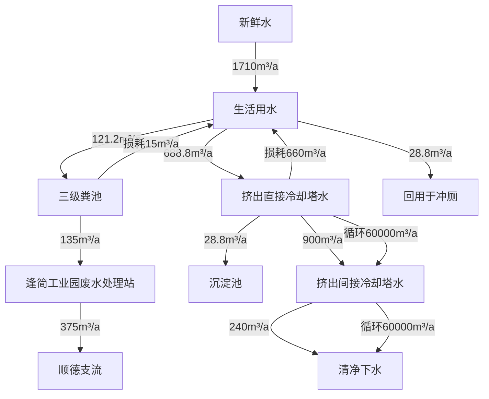
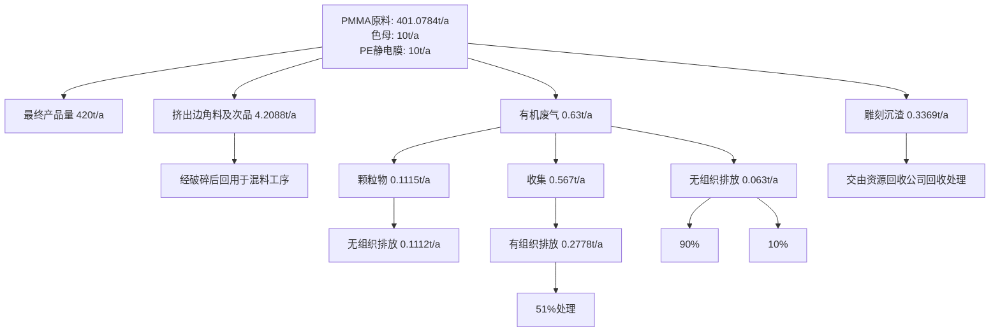
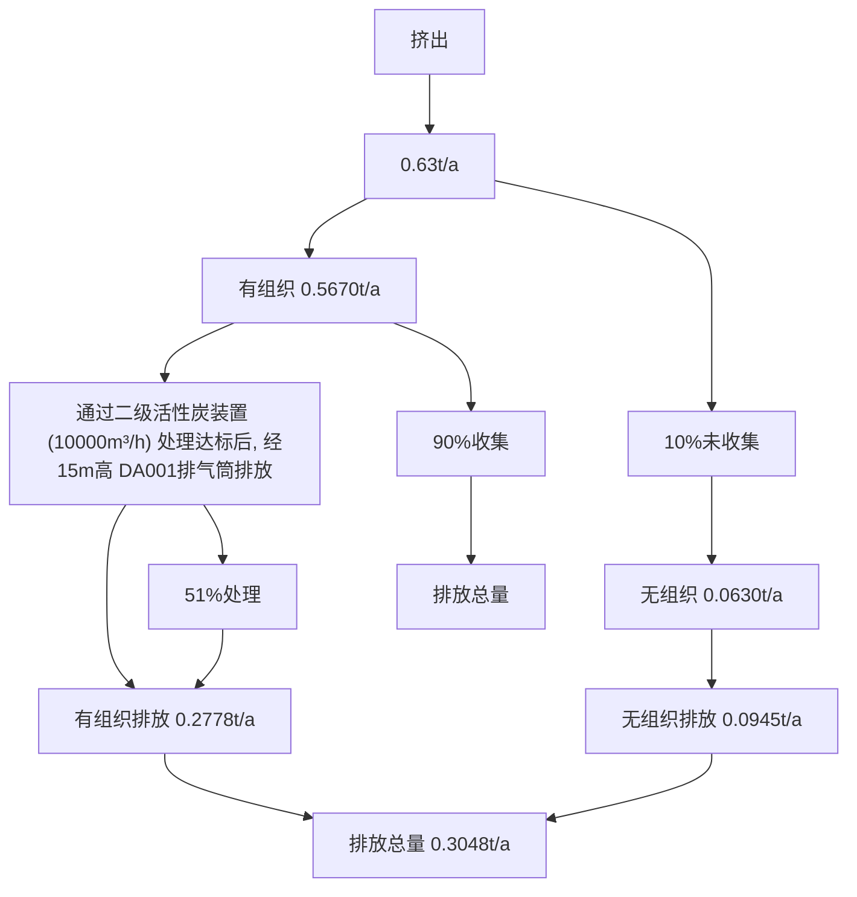
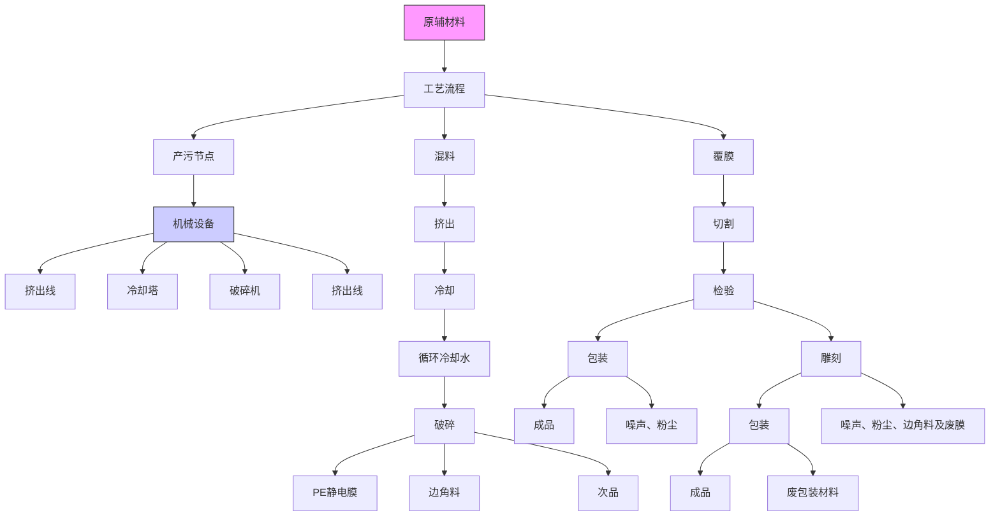
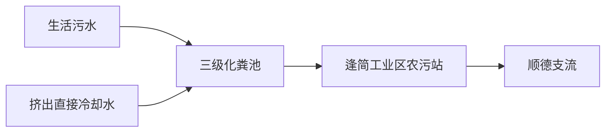

# 建设项目环境影响报告表

# （污染影响类）

项目名称：佛山市大隅新材料有限公司新建项目

建设单位（盖章）：佛山市大隅新材料有限公司

编制日期： 二〇二三年十二月

中华人民共和国生态环境部制

中

011

text_image

20
8
年
佛山市禅城区市场监督管理局
同
层
市
区
管
理
局

#

（

# 住

）限 类

（[-:） (长）

# 不幂

natural_image

Red emblem with decorative border and star motifs (no text or symbols)

编制单位和编制人员情况表

<table><tr><td colspan="2">项目编号</td><td colspan="3">w8ph12</td></tr><tr><td colspan="2">建设项目名称</td><td colspan="3">佛山市大隅新材料有限公司新建项目</td></tr><tr><td colspan="2">建设项目类别</td><td colspan="3">26-053塑料制品业</td></tr><tr><td colspan="2">环境影响评价文件类型</td><td colspan="3">报告表</td></tr><tr><td colspan="5">一、建设单位情况</td></tr><tr><td colspan="2">单位名称(盖章)</td><td colspan="3"></td></tr><tr><td colspan="2">统一社会信用代码</td><td rowspan="4" colspan="3"></td></tr><tr><td colspan="2">法定代表人(签章)</td></tr><tr><td colspan="2">主要负责人(签字)</td></tr><tr><td colspan="2">直接负责的主管人员(签字)</td></tr><tr><td colspan="5">二、编制单位情况</td></tr><tr><td colspan="2">单位名称(盖章)</td><td colspan="2">佛山朋</td><td>公司</td></tr><tr><td colspan="2">统一社会信用代码</td><td colspan="2">91440</td><td></td></tr><tr><td colspan="5">三、编制人员情况</td></tr><tr><td colspan="5">1.编制主持人</td></tr><tr><td>姓名</td><td colspan="2">职业资格证书管理号</td><td>信用编号</td><td>签字</td></tr><tr><td>何万清</td><td colspan="2">2014035440352013449914000523</td><td>BH053795</td><td>何万清</td></tr><tr><td colspan="5">2.主要编制人员</td></tr><tr><td>姓名</td><td colspan="2">主要编写内容</td><td>信用编号</td><td>签字</td></tr><tr><td>何敏玲</td><td colspan="2">主要环境影响和保护措施、环境保护措施监督检查清单、结论</td><td>BH034857</td><td>何敏玲</td></tr><tr><td>何万清</td><td colspan="2">建设项目基本情况、建设项目工程分析、区域环境质量现状、环境保护目标及评价标准</td><td>BH053795</td><td>何万清</td></tr></table>

# 建设项目环境影响报告书（表）

# 编制情况承诺书

本单位佛山鹏达信能源环保科技有限公司（统一社会信用代码91440604568238468A）郑重承诺：本单位符合《建设项目环境影响报告书（表）编制监督管理办法》第九条第一款规定，无该条第三款所列情形，不属于（属于/不属于）该条第二款所列单位；本次在环境影响评价信用平台提交的由本单位主持编制的佛山市大隅新材料有限公司新建项目环境影响报告书（表）基本情况信息真实准确、完整有效，不涉及国家秘密；该项目环境影响报告书（表）的编制主持人为何万清（环境影响评价工程师职业资格证书号)2014035440352013449914000523，信用编号BH053795），主要编制人员包括何万清（信用编号BH053795）、何敏玲（信用编号BH034857）（依次全部列出）等\_2人，上述人员均为本单位全职人员；本单位和上述编制人员未被列入《建设项目环境影响报告书（表）编制监督管理办法》规定的限期整改名单、环境影响评价失信“黑名单”。

承诺

text_image

保科技有限公司
单位(公章):
能源
2023年11月16

6日

natural_image

Simple rectangular outline with vertical lines on both sides (no text or symbols)

# 广东省社会保险个人参保证明

该参保人在广东省参加社会保险情况如下：

<table><tr><td>姓名</td><td colspan="4">何万清</td><td>证件号码</td><td>532</td><td colspan="2"></td></tr><tr><td colspan="5"></td><td colspan="4"></td></tr><tr><td rowspan="2" colspan="3">参保起止时间</td><td rowspan="2"></td><td rowspan="3" colspan="2"></td><td rowspan="2"></td><td colspan="2">参保险种</td></tr><tr><td>养老</td><td>工伤失业</td></tr><tr><td>202204</td><td>-</td><td>202311</td><td>佛山市</td><td>有限公司</td><td>20</td><td>20</td></tr><tr><td colspan="3">截止</td><td colspan="3">2023-12-0</td><td>十月数合计</td><td>实际缴费20个月,缓缴0个月</td><td>实际缴费20个月,缓缴0个月</td></tr></table>

备注：

本《参保证明》标注的“缓缴”是指：《转发人力资源社会保障部办公厅国家税务总局苏公另关于特困行业阶段性实施缓缴企业社会保险费政策的通知》（人社规【2022】11号） 力广东省人资源和社会行业广实省发展业社委员会广东省财政厅国家税务总局广东省税务局关于实扩大阶段缓缴社会保险费政策实施范围等政策的通知》（粤人社规（2022]15号）等文件实施范围内的企业申请缓缴三项社保费单位缴费部分。

证明机构名称（证明专用章）

证明时间

2023-12-05 15:26

natural_image

Simple rectangular diagram with vertical lines on both sides (no text or symbols)

# 广东省社会保险个人参保证明

该参保人在佛山市参加社会保险情况如下：

<table><tr><td>姓名</td><td colspan="3">何敏玲</td><td>证件号码</td><td></td><td colspan="2"></td></tr><tr><td colspan="8">参保险种情况</td></tr><tr><td rowspan="2" colspan="3">参保起止时间</td><td rowspan="2" colspan="2">单位</td><td colspan="3">参保险种</td></tr><tr><td>养老</td><td>工伤</td><td>失业</td></tr><tr><td>202301</td><td>-</td><td>202311</td><td colspan="2">佛山市:佛山鹏达信能源环保科技有限公司</td><td>11</td><td>11</td><td>11</td></tr><tr><td colspan="3">截止</td><td colspan="2">2023-12-01 10:19 该参保人累计月数合计</td><td>实际缴费11个月,缓缴0个月</td><td>实际缴费11个月,缓缴0个月</td><td>实际缴费11个月,缓缴0个月</td></tr></table>

备注：

本《参保证明》标注的“缓缴”是指：《转发人力资源社会保障部办公厅国家税务局务另关于特困保实业社会保政策的备知人社规202211号广东省人万资源和社会厅广东省发展和改革委员会广东省财政厅国家税务总局广东省税务局关于实施扩大阶段性缓缴社保保险费政策实施范围等政策的通知》（粤人社规（2022]15号）等文件实施范围内的企业申请缓缴三项在保费单位缴费部分。

证明机构名称（证明专用章）

证明时间

2023-12-01 10:19

# 目 录

一、建设项目基本情况 .  
二、建设项目工程分析. .- 19 -  
三、区域环境质量现状、环境保护目标及评价标准 .- 29 -  
四、主要环境影响和保护措施. ..- 37 -  
五、环境保护措施监督检查清单 .- 69 -  
六、结论 ... ..- 71 -

# 建设项目污染物排放量汇总表

附图1 项目地理位置图

附图2 项目周围环境现状图

附图3 项目环境敏感目标范围图

附图4 项目所在地环境空气功能区划图

附图5 项目地表水环境功能区划图

附图6 项目所在地声环境功能区划图

附图7 顺德区杏坛镇逢简村村庄土地利用规划图

附图8 项目平面布置图

附图9 广东省“三线一单”应用平台截图

附图10 项目顺德区生态红线图

附图11 项目现状四至图

附件1 营业执照

附件2 法人身份证

附件3 租赁合同

附件4 场地使用证明

附件5 园区排水证

附件6 公示声明

附件7 环评合同

# 一、建设项目基本情况

<table><tr><td>建设项目名称</td><td colspan="3">佛山市大隅新材料有限公司新建项目</td></tr><tr><td>项目代码</td><td colspan="3">/</td></tr><tr><td>建设单位联系人</td><td></td><td>联系方式</td><td>1</td></tr><tr><td>建设地点</td><td colspan="3">广东省佛山市顺德区杏坛镇逢简工业区二路2号之二(住所申报)</td></tr><tr><td>地理坐标</td><td colspan="3">东经113度08分41.042秒,北纬22度48分27.925秒</td></tr><tr><td>国民经济行业类别</td><td>C2929塑料零件及其他塑料制品制造</td><td>建设项目行业类别</td><td>二十六、橡胶和塑料制品业53塑料制品业292(其他)</td></tr><tr><td>建设性质</td><td>☑新建(迁建)□改建□扩建□技术改造</td><td>建设项目申报情形</td><td>☑首次申报项目□不予批准后再次申报项目□超五年重新审核项目□重大变动重新报批项目</td></tr><tr><td>项目审批(核准/备案)部门(选填)</td><td>无</td><td>项目审批(核准/备案)文号(选填)</td><td>无</td></tr><tr><td>总投资(万元)</td><td>100</td><td>环保投资(万元)</td><td>20</td></tr><tr><td>环保投资占比(%)</td><td>20</td><td>施工工期</td><td>1个月</td></tr><tr><td>是否开工建设</td><td>☑否□是: _</td><td>用地(用海)面积(m2)</td><td>800</td></tr><tr><td>专项评价设置情况</td><td colspan="3">无</td></tr><tr><td>规划情况</td><td colspan="3">无</td></tr><tr><td>规划环境影响评价情况</td><td colspan="3">无</td></tr><tr><td>规划及规划环境影响评价符合性分析</td><td colspan="3">无</td></tr></table>

# 1、产业政策相符性分析

根据《产业结构调整指导目录(2019年本)》(2021年修改，中华人民共和国国家发展和改革委员会令第49号)，本项目属于C2929塑料零件及其他塑料制品制造，不属于目录所列的鼓励类、限制类和禁止(淘汰)类项目，根据《广东省禁止、限制生产、销售和使用的塑料制品目录》（2020年版）和《佛山市关于进一步加强塑料污染治理的实施方案》，本项目主要生产亚克力板，不属于“禁止生产、销售以及禁止、限制使用的塑料制品”，也不属于国家发展改革委商务部《市场准入负面清单（2022年版）》（发改体改规[2022]397号）“禁止准入类”。根据《环境保护综合名录（2021年版）》以及《广东省“两高”项目管理目录（2022年版）》，本项目产品及工艺不属于“高污染、高环境风险”类别，因此，本项目建设符合国家和地方的产业政策要求。

# 2.选址合理性分析

佛山市大隅新材料有限公司新建项目位于广东省佛山市顺德区杏坛镇逢简工业区二路2号之二（住所申报）。根据《印发佛山市饮用水源保护规划的通知》（佛府〔2007108 号）、《广东省人民政府关于调整佛山市部分饮用水水源保护区的批复》（粤府函〔2018〕426号）可知，选址不属于水源保护区；根据《佛山市人民政府办公室关于调整<顺德区环境空气质量功能区划>的复函》（佛府办函〔2014〕494 号），不属于大气一类保护区，地理位置和开发建设条件优越，交通便利，根据《顺德区杏坛镇逢简村村庄土地利用规划图》（附图7）可知，项目属于工业用地，不占用基本农田保护区、风景区等其它用途的用地，项目选址符合相关法律法规的要求，符合城镇规划和环境规划要求，项目选址合理。

# 3.与《广东省人民政府关于印发广东省“三线一单”生态环境分区管控方案的通知》（粤府〔2020〕71号）相符性分析

根据《广东省人民政府关于印发广东省“三线一单”生态环境分区管控方案的通知》（粤府[2020]71号），广东省将以环境管控单元为基础，实施生态环境分区管控，精细化管理、保护生态环境。本项目与广东省“三线一单”生态环境分区管控方案相符性分析如下：

表 1-1 粤府〔2020〕71号的相关规定与本项目情况一览表

<table><tr><td colspan="2">粤府〔2020〕71号的相关规定</td><td>本项目情况</td><td>相符性</td></tr><tr><td>生态保护红线</td><td>生态保护红线内,自然保护地核心保护区原则上禁止人为活动,其他区域严格禁止开发性、生产性建设活动,在符合现行法律</td><td>本项目位于广东省佛山市顺德区杏坛镇逢简工业区二路2号之二(住所申报),属于重点管控单元,所</td><td>相符</td></tr></table>

<table><tr><td rowspan="6"></td><td></td><td>法规前提下,除国家重大战略项目外,仅允许对生态功能不造成破坏的有限人为活动。一般生态空间内,可开展生态保护红线内允许的活动:在不影响主导生态功能的前提下,还可开展国家和省规定不纳入环评管理的项目建设,以及生态旅游、畜禽养殖、基础设施建设、村庄建设等人为活动。</td><td>在区域属于工业用地,不在生态保护红线内。</td><td></td></tr><tr><td>环境质量底线</td><td>全省水环境质量持续改善,国考、省考断面优良水质比例稳步提升,全面消除劣V类水体。大气环境质量继续领跑先行, $PM_{2.5}$ 年均浓度率先达到世界卫生组织过渡期二阶段目标值(25微克/立方米),臭氧污染得到有效遏制。土壤环境质量稳中向好,土壤环境风险得到管控。近岸海域水体质量稳步提升。</td><td>项目生产过程无废水外排,外排废水主要为生活污水,生活污水经三级化粪池预处理达标后由市政污水管网引至逢简工业区农污站集中处理,尾水最后汇入顺德支流。参考《佛山市生态环境局顺德分局关于发布2022年度佛山市顺德区环境质量状况公报的通知》(佛环顺函〔2023〕26号),顺德支流新涌、飞鹅山断面监测的水质达到III类标准要求;本项目所在区域域环境空气质量调查现状显示,环境空气质量除臭氧外, $SO_2$ 、 $NO_2$ 、 $PM_{10}$ 、 $PM_{2.5}$ 、CO五项污染物质量浓度均可到《环境空气质量标准》(GB3095-2012)及其修改单二级标准限值要求;根据项目主要环境影响和保护措施分析,本项目营运后在正常工况下所排放的污染物不会对环境造成明显影响,环境质量可以保持现有水平。</td><td>相符</td></tr><tr><td>资源利用上线</td><td>强化节约集约循环利用,持续提升资源能源利用效率,水资源、土地资源、岸线资源、能源消耗等达到或优于国家和省下达的总量、强度等目标要求,按省规定年限实现碳达峰。</td><td>项目生产过程中的电能、自来水等消耗量较少,区域水、电资源较充足,项目消耗量没有超出资源负荷,没有超出资源利用上线。</td><td>相符</td></tr><tr><td>生态环境准入清单</td><td>项目产品、设备、工艺均不在《产业结构调整指导目录(2019)年本》(国家发展和改革委员会令第29号)中的淘汰类和限制类目录中,也不属于《市场准入负面清单(2022年版)》(发改体改规[2022]397号)禁止准入事项,符合准入清单的要求</td><td>本项目不属于《产业结构调整指导目录(2019年本)》(2021年修改,中华人民共和国国家发展和改革委员会令第49号)中所列的限制类和禁止(淘汰)类项目,也不属于《市场准入负面清单(2022年版)》中禁止准入和许可准入行业类别,建设单位可依法平等进入。</td><td>相符</td></tr><tr><td colspan="2">生态环境分区管控。从区域布局管控、能源资源利用、污染物排放管控和环境风险防控等方面明确准入要求,建立“1+3+N”三级生态环境准入清单体系。“1”为全省总体管控要求,“3”为“一核一带一区”区域管控要求,“N”为1912个陆域环境管控单元和471个海域环境管控单元的管控要求。</td><td>项目属于一核一带一区中的珠三角核心区。</td><td>相符</td></tr><tr><td colspan="2">区域布局管控要求。禁止新建、扩建燃煤燃油火电机组和企业自备电站,推进现有服役期满及落后老旧的燃煤火电机组有序退出;原则上不再新建燃煤锅</td><td>项目不涉及火电机组、锅炉,不属于水泥、平板玻璃、化学制浆、生皮制革以及国家规划外的钢铁、原</td><td>相符</td></tr><tr><td rowspan="6"></td><td>炉,逐步淘汰生物质锅炉、集中供热管网覆盖区域内的分散供热锅炉,逐步推动高污染燃料禁燃区全覆盖;禁止新建、扩建水泥、平板玻璃、化学制浆、生皮制革以及国家规划外的钢铁、原油加工等项目。推广~应用低挥发性有机物原辅材料,严格限制新建生产和使用高挥发性有机物原辅材料的项目,鼓励建设挥发性有机物共性工厂。</td><td>油加工等,项目运营过程无使用高挥发性有机物原辅材料。</td><td colspan="2"></td></tr><tr><td>污染物排放管控要求。在可核查、可监管的基础上,新建项目原则上实施氮氧化物等量替代,挥发性有机物两倍削减量替代。以臭氧生成潜势较大的行业企业为重点,推进挥发性有机物源头替代,全面加强无组织排放控制,深入实施精细化治理。现有每小时35蒸吨及以上的燃煤锅炉加快实施超低排放治理,每小时35蒸吨以下的燃煤锅炉加快完成清洁能源改造。实行水污染物排放的行业标杆管理,严格执行茅洲河、淡水河、石马河、汾江河等重点流域水污染物排放标准。重点水污染物未达到环境质量改善目标的区域内,新建、改建、扩建项目实施减量替代。电镀专业园区、电镀企业严格执行广东省电镀水污染物排放限值。</td><td>项目涉及VOCs产生及排放,实施两倍削减量替代。项目不涉及生产废水排放。</td><td colspan="2">相符</td></tr><tr><td>环境风险防控要求。......提升危险废物监管能力,利用信息化手段,推进全过程跟踪管理;健全危险废物收集体系,推进危险废物利用处置能力结构优化。</td><td>本项目危险废物经收集后交由有危险废物经营许可证的单位回收处理。</td><td colspan="2"></td></tr><tr><td>水环境质量超标类重点管控单元。......严格控制耗水量大、污染物排放强度高的行业发展,新建、改建、扩建项目实施重点水污染物减量替代......</td><td>本项目所在地属于顺德支流佛山市杏坛镇控制单元(附图9)。项目无生产废水排放,无须实施重点水污染物减量替代。</td><td colspan="2"></td></tr><tr><td>大气环境受体敏感类重点管控单元。严格限制新建钢铁、燃煤燃油火电、石化、储油库等项目,产生和排放有毒有害大气污染物项目,以及使用溶剂型油墨、涂料、清洗剂、胶黏剂等高挥发性有机物原辅材料的项目;鼓励现有该类项目逐步搬迁退出。</td><td>本项目所在地属于杏坛镇一般管控单元(附图9)。项目不属于钢铁、燃煤燃油火电、石化、储油库等项目,生产过程中不涉及使用高VOCs含量原辅材料。</td><td colspan="2"></td></tr><tr><td>环境管控单元总体管控要求。环境管控单元分为优先保护、重点管控和一-般管控单元三类。优先保护单元:以维护生态系统功能为主,禁止或限制大规模、高强度的工业和城镇建设,严守生态环境底线,确保生态功能不降低。重点管控单元:以推动产业转型升级、强化污染减排、提升资源利用效率为重点,加快解决资源环境负荷大、局部区域生态环境质量差、生态环境风险高等问题。大气环境受体敏感类重点管控单元:严格限制新建钢铁、燃煤燃油火电、石化、储油库等项目,产生和排放有毒有害大气污染物项目,以及使用溶剂型油墨、涂料、清洗剂、胶黏剂等高挥发性有机物原辅材料的项目;鼓励现有该类项目逐步搬迁退出。一般管控单元:执行区域生态环境保护的基本要求。根据资源环境承载能力,引导产业科学布局,合理控制开发强度,维护生态环境功能稳定</td><td>项目所在地属于重点管控单元,项目属于塑料制品业,生产过程无使用溶剂型油墨、涂料、清洗剂、胶黏剂等高挥发性有机物原辅材料</td><td colspan="2">相符</td></tr><tr><td colspan="5">综上,本项目符合《广东省人民政府关于印发广东省“三线一单”生态环境分区管控方案的通知》(粤府〔2020〕71号)的要求。</td></tr></table>

4、《佛山市人民政府关于印发佛山市“三线一单”生态环境分区管控方案的通知》（佛府〔2021〕11 号）相符性分析及《佛山市顺德区人民政府关于印发佛山市顺德区“三线一单”生态环境分区管控方案的通知》（顺府发[2021]11号）相符性分析

表 1-2 与佛府[2021]11 号“三线一单”符合性分析

<table><tr><td colspan="2">佛府(2021)11号的相关规定</td><td>本项目情况</td><td>相符性</td></tr><tr><td>区域布局管控要求</td><td>优先保护生态空间,筑牢生态保护底线,构建生态空间保护格局。强化水源地空间管控,严格限制饮用水水源汇水区内的生态保护与水源涵养区域变更土地利用方式。持续深入推进产业、能源、交通运输结构调整。按照制造业组团化发展格局,打造先进制造业集群,推动城市功能定位、空间布局与产业发展高质量协同匹配。巩固提升传统优势产业,推动佛山智能家电、陶瓷建材、金属制品等数字化、智能化、绿色化、高端化、个性化全面转型升级。做大做强战略性新兴产业,推动科技创新与高端装备制造、汽车、新一代电子信息、新材料、新能源、生物医药等产业发展深度融合,全面提升制造业集群绿色发展水平。全面攻坚村级工业园升级改造,腾出连片空间,布局产业集聚区和主题产业园,推动工业项目入园集聚发展。通过城市更新实现公共设施“补短板”、产业空间“再聚集”、重点片区“强统筹”,盘活存量建设用地。依法依规关停落后产能,全面实施产业绿色化改造,培育壮大循环经济。新建、改建、扩建的项目应当符合国家产业政策规定。环境质量不达标区域,新建、扩建项目需符合环境质量改善要求。全市域为高污染燃料禁燃区,禁止新建、扩建燃用高污染燃料的燃烧设施。加快推进天然气产供储销体系建设,逐步淘汰生物质锅炉、集中供热管网覆盖区域内的分散供热锅炉,促进用热企业向园区集聚。禁止新建、扩建水泥、平板玻璃、化学制浆、生皮制革以及国家规划外的钢铁、原油加工等项目。专业电镀、印染等项目进入定点园区集中管理。推广应用低挥发性有机物原辅材料,严格限制新建生产和使用高挥发性有机物原辅材料的项目,鼓励建设共性工厂、活性炭集中再生中心等挥发性有机物第三方治理项目,推动挥发性有机物集中高效处理。优化交通结构,发展多式联运,推进公路、水路等交通运输燃料清洁化,推广新能源物流车辆,优先在禅桂新中心城区探索设立“绿色物流”片区</td><td>本项目位于广东省佛山市顺德区杏坛镇逢简工业区二路2号之二(住所申报),所在区域位于顺德区,属于重点管控单元(杏坛镇重点管控区(ZH44060620005),项目所在建设用地不涉及划定的生态红线区域,项目周边无自然保护区、饮用水源保护区等生态保护目标,符合生态保护红线要求。</td><td>相符</td></tr><tr><td>能源资源利用要求</td><td>积极发展氢能源、天然气发电等清洁能源,逐步提高可再生能源与低碳清洁能源比例,建立现代化能源体系。科学实施能源消费总量和强度“双控”,新建高能耗项目单位产品(产值)能耗达到国际国内先进水平,实现煤炭消费总量负增长。加快城镇燃气基础设施优化布局,落实天然气大用户直供和“瓶改管”。禁止新增高污染燃料销售点,加强全市高污染燃料监督管理。率先探索建立二氧化碳总量管理制度,加快实现碳排放达峰。新建、改建、扩建“两高”项目4须符合生态环境保护法律法规和相关法定规划,满足污染物区域削减、重点污染物排放总量控制、碳排放达峰目标、相关规划环评和相应行业建设项目环境准入条</td><td>项目生产过程中的电能、自来水等消耗量较少,区域水、电资源较充足,项目消耗量没有超出资源负荷,没有超出资源利用上线。</td><td>相符</td></tr></table>

<table><tr><td rowspan="2"></td><td></td><td>件、环评文件审批原则要求。依法依规强化油品生产、流通、使用、贸易等全流程监管,合理优化储油库、加油站布局。加快新能源汽车推广使用,加快充电桩、加气站、加氢站以及综合性能源补给站建设,积极推动机动车和非道路移动机械电动化或实现清洁燃料替代。大力推进绿色港口和公用码头建设,提升岸电使用率,持续推动船舶、港作机械等“油改气”“油改电”,降低港口柴油使用比例。贯彻落实“节水优先”方针,实行最严格水资源管理制度,提高工业用水效率,加强江河湖库水量调度,保障生态流量。强化自然岸线保护,优化岸线开发利用格局,严格水域岸线用途管制,新建项目一律不得违规占用水域。落实单位土地面积投资强度、土地利用强度等建设用地控制性指标要求,提高土地利用效率。统筹矿产资源开发与保护,严格控制矿产资源开发强度,禅城、南海、顺德区以及高明区东部、三水区中南部为禁止开采区域,高明、三水区的其他区域划定为限制开采区。积极发展农业资源利用节约化、生产过程清洁化、废弃物利用资源化等生态循环农业模式</td><td></td><td></td></tr><tr><td>污染物排放管控要求</td><td>实施重点污染物总量控制,重点污染物排放总量指标优先向重大发展平台、重点建设项目、重点工业园区、战略性产业集群倾斜。加快建立以排污许可制为核心的固定污染源监管制度,聚焦重点行业和重点区域,强化环境监管执法。规范工业排水管理,依法开展排水许可。合理建设工业废水或综合废水集中处理设施,推进工业集聚区“污水零直排区”试点。稳步推进排水设施“三个一体化”6管理模式,补齐城乡污水收集和处理短板,推动污水处理设施提质增效,加快消除城中村、老旧城区、城乡接合部等污水收集管网空白区,逐步实现城乡污水收集处理全覆盖。城镇新区建设均实行雨污分流。推进建设大型现代化畜禽养殖场,加强畜禽养殖废水处理及废弃物资源化利用,推广水产生态健康养殖模式,防治农村面源污染。禁止在地表水I、II类水域新建排污口,已建排污口不得增加污染物排放量。实行水污染物的行业标杆管理,严格执行汾江河流域水污染物排放标准。实施水生态系统保护修复,推进河涌水系连通、环保清淤,加强湿地建设及河心岛生态修复。上年度重点河涌水质未达到水环境质量目标的管控分区所在镇(街道),须组织编制、系统实施、向社会公开区域重点水污染物减排计划并明确“替代量”,本年度新建、改建、扩建项目新增水环境重点污染物实行区域减二增一”替代(废水集中处理设施、民生项目除外)。在可核查、可监管的基础上,全市新建、改建、扩建项目新增大气重点污染物实行“减二增一”替代。巩固燃煤锅炉超低排放整治成效。深化炉窑分级管控,实施工业炉窑大气污染综合治理。推进挥发性有机物源头替代,全面加强无组织排放控制,深入实施精细化治理。推进石化化工、溶剂使用及挥发性有机液体储运销的挥发性有机物减排,全过程实施反应活性物质、有毒有害物质、恶臭物质的协同控制。将全面使用低VOCs含量原辅材料的企业纳入正面清单和政府绿色采购清单。严格落实船舶大气污染物排放控制区要求。加强扬尘、餐饮油烟等污染防治。重金属污染重点防控区内,重点重金属排放总量只减不增。重金属污染物排放企业清洁生产逐步达到国际或国内先进水平。打造近零碳排放示范项目,推进陶瓷、有色金属等重点能源消耗行业二氧化碳排放控制。开展“无废城市”建设,推动固体废物源头减量、资源化利用和安全处置</td><td>项目涉及VOCs产生及排放,实施两倍削减量替代。项目无生产废水外排,外排废水主要为生活污水,生活污水经三级化粪池预处理达标后排至逢简工业区农污站集中处理。</td><td>相符</td></tr><tr><td rowspan="6"></td><td>环境风险防控要求</td><td>《加强西江、北江等供水通道干流沿岸以及饮用水水源地、备用水源环境风险防控,完善城市双水源联网供水格局。强化地表水、地下水和土壤污染风险协同防控,建立完善突发环境事件应急管理体系。重点加强环境风险分级分类管理,应用全省环境风险源在线监控预警系统,强化化工企业、涉重金属行业、工业园区等重点环境风险源的环境风险防控。推动企业将低温等离子、UV光解、RTO燃烧炉等有机废气治理设施纳入全厂安全风险辨识范围,加强安全管理。禁止在规划专门用于危险化学品生产、储存的区域(包括化工园区)外新建、扩建危险化学品生产、储备建设项目(加油站、加气站、加氢站、港口及铁路、航空危险化学品储存建设项目、危险化学品输送管道及危险化学品使用单位的配套项目除外)。实施农用地分类管理,依法划定特定农产品禁止生产区域。严格建设用地再开发建设管理,对纳入建设用地土壤环境联动监管地块,未达到土壤污染风险评估报告确定的风险管控、修复目标的建设用地地块,禁止开工建设任何与风险管控、修复无关的项目。提升危险废物监管能力,利用信息化手段,推动全过程跟踪管理。健全危险废物收集体系,推进危险废物利用处置能力优化提升。全力避免因各类安全事故(事件)引发的次生环境风险事故(事件)</td><td>项目无生产废水外排,外排废水主要为生活污水,生活污水经三级化粪池预处理达标后排至逢简工业区农污站集中处理,尾水最后汇入顺德支流,不涉及西江、北江等供水通道干流沿岸以及饮用水水源地;项目属于C2929塑料零件及其他塑料制品制造,不属于新建、扩建危险化学品生产、储备建设项目。项目经营过程产生的固体废物分类收集,一般固体废物由物资回收公司回收,危险废物交有危废资质单位进行处理。固体废物分类减量化、资源化利用和无害化处置。</td><td>相符</td></tr><tr><td colspan="4">杏坛镇重点管控区(ZH44060620005)相关要求</td></tr><tr><td rowspan="4">区域布局管控</td><td>1-1【生态/禁止类】单元内的一般生态空间,主导生态功能为水土保持,禁止在25度以上的陡坡地开垦种植农作物,禁止在崩塌、滑坡危险区、泥石流易发区从事采石、取土、采砂等可能造成水土流失的活动。</td><td>本项目位于广东省佛山市顺德区杏坛镇逢简工业区二路2号之二(住所申报),所在区域位于顺德区,属于重点管控单元(杏坛镇重点管控区(ZH44060620005),项目属于塑料制品业,无采石、取土、采砂等造成水土流失的活动;</td><td rowspan="4">相符</td></tr><tr><td>1-2.【产业/鼓励引导类】重点发展新材料、智能家居、先进装备制造业、汽车配件等产业以及军民融合产业,提升发展塑料专业市场,培育智能家居创新创业产业链,依托顺德新港发展临港加工和物流产业,发展现代农业。</td><td>本项目属于C2929塑料零件及其他塑料制品制造</td></tr><tr><td>1-3.【产业/综合类】系统推进村级工业园升级改造,腾出连片空间,布局产业集聚区和主题产业园,推动工业项目入园集聚发展。新增工业制造业用地原则上安排在产业集聚区内,产业集聚区外原则上不鼓励工业及物流仓储用地的新建与改造。</td><td>本项目不属于村改范围</td></tr><tr><td>1-4.【产业/限制类】受纳水体或监控断面不达标的,不得新建、扩建向河涌直接排放废水的项目。新建、扩建含蚀刻工序的线路板生产项目和化工项目应在配套污水集中处置的工业园区或生活污水管网覆盖区域内建设;纯加工型印花项目,含酸洗、磷化的金属表面处理、金属制品项目(与自身高新技术企业配套的除外),含酸洗、喷涂、拉丝、表面抛光等工艺的不锈钢型材加工项目,应进入以此类项目为主导产业、有相应废水集中治理设施的工业园区,实现集中治污。</td><td>本项目外排废水主要为生活污水,生活污水经三级化粪池预处理达标后排至逢简工业区农污站集中处理。</td></tr><tr><td rowspan="4"></td><td rowspan="2"></td><td>1-5.【水/限制类】严格限制在右滩水厂、均安水厂饮用水水源保护区上游和周边区域建设列入“高污染、高环境风险”产品名录等可能影响水环境安全的项目。</td><td>根据《佛山市顺德区供水专项规划修编2015-2020》、《广东省人民政府关于调整佛山市部分饮用水水源保护区的批复》(粤府函〔2018〕426号)等,项目位置不在饮用水水源保护区内。</td><td rowspan="2"></td></tr><tr><td>1-6.【土壤/禁止类】禁止新建、扩建增加重点防控的重金属污染物排放的建设项目。</td><td>本项目不排放重金属污染物</td></tr><tr><td>能源资源利用</td><td>2-1【能源/鼓励引导类】推广节能技术,加快发展绿色货运与现代物流。2-2【能源/鼓励引导类】推广新能源汽车应用和充电基础设施建设,积极推动重卡LNG加气站、充电基础设施、加氢站建设。2-3.【能源/综合类】科学实施能源消费总量和强度“双控”,新建高能耗项目单位产品(产值)能耗达到国际国内先进水平。2-4.【水资源/综合类】贯彻落实“节水优先”方针,实行最严格水资源管理制度,杏坛镇万元国内生产总值用水量、万元工业增加值用水量、用水总量、农田灌溉水有效利用系数等用水总量和效率指标达到区下达要求。2-5.【土地资源/限制类】落实单位土地面积投资强度、土地利用强度等建设用地控制性指标要求,提高土地利用效率。2-6.【岸线/禁止类】严格水域岸线用途管制,新建项目一律不得违规占用水域。严禁破坏生态的岸线利用行为和不符合其功能定位的开发建设活动,严禁以各种名义侵占河道、围垦湖泊、非法采砂等。</td><td>本项目生产设备均使用电能作为能源,项目位于广东省佛山市顺德区杏坛镇逢简工业区二路2号之二(住所申报),不占用水域。</td><td>相符</td></tr><tr><td>污染物排放管控</td><td>3-1.【水/限制类】城镇新区建设实行雨污分流,逐步推进初期雨水收集、处理和资源化利用。住宅、商业体、学校、市场等城镇开发建设项目应当配套或者同步计划建设公共排水设施,公共排水设施或自建排污水设施未能投产运行的,以上涉水项目不得投入使用。新建小区严格实施雨污分流,阳台、露台等污水接入污水收集系统,将生活污水“应截尽截”。做好大型楼盘、集贸市场、餐饮以及学校等4大类排水户污水接入市政管网工作。3-2.【水/综合类】杏坛镇重点河涌水质上年度未达到水环境环境质量目标的,需组织编制、系统实施、向社会公开区域重点水污染物减排计划并明确“替代量”,本年度新建、改建、扩建项目新增水环境重点污染物实行区域“减二增一”替代(工业、生活或综合集中废水处理设施、民生项目除外)。3-3.【水/综合类】区域内应合理规划建设工业或综合集中</td><td>本项目属于逢简工业区农污站纳污范围。项目生活污水经三级化粪池预处理达到广东省地方标准《水污染物排放限值》(DB44/26-2001)中第二时段三级标准后经市政污水管网纳入逢简工业区农污站深度处理达标后排放</td><td>相符</td></tr><tr><td></td><td>废水处理设施。逐步推进工业集聚区“污水零直排区”建设,开展排水单元工业废水、生活污水、雨水分类收集、分质处理,确保园区“管网全覆盖、雨污全分流、污水全收集、处理全达标”。3-4.【水/综合类】结合村级工业园改造,全面提升产业层次与集聚度,促进污染集中整治。3-5.【水/综合类】稳步推进排水设施“三个一体化”管理模式,补齐城乡污水收集和处理短板,推动逢简工业污水处理站提质增效,加快消除城中村、老旧城区、城乡结合部等污水收集管网空白区,逐步实现城乡污水收集处理全覆盖。2025年前完成逢简工业污水处理站扩建,尾水应执行《城镇污水处理厂污染物排放标准》(GB18918-2002)一级A标准及《广东省水污染物排放限值》(DB44/26-2001)的较严值。3-6.【水/综合类】近期保留桑麻村、逢简村、吉祐村、安富村等现状农村污水分散式处理设施,继续完善污水支管网建设,提高污水收集处理率,新建龙潭村、吉祐村、右滩村、南朗村、光华村、东村、北水村等农村分散式生活污水处理设施,其余行政村(社区)继续完善污水管网建设,收集农村污水进入市政污水系统,有条件的区域实施雨污分流改造,到2030年全面雨污分流,污水纳入杏坛城镇污水处理系统。3-7.【大气/综合类】大力推进低VOCs含量原辅材料替代,加快涉VOCs重点行业的生产工艺升级改造,推行自动化生产工艺,对达不到要求的VOCs收集及治理设施进行整治提升,逐步淘汰低效VOCs治理设施。3-8.【土壤/限制类】作为重金属污染重点防控区,区域内重点重金属排放总量只减不增。</td><td></td><td></td></tr><tr><td rowspan="3">环境风险防控</td><td>4-1.【水/综合类】加强单元内右滩水厂、均安水厂饮用水水源保护区周边环境风险源管控,完善突发环境事件应急管理体系。</td><td rowspan="3">本项目危险物质贮存量占临界量比值Q&lt;1,通过严格执行国家的防火安全设计规范,采取合理的风险防范措施,制定完善的环境风险事故应急预案等措施,本项目的风险水平是可以接受的。</td><td rowspan="3">相符</td></tr><tr><td colspan="2">4-2.【水/综合类】杏坛污水处理厂、工业污水集中处理设施应采临取有效措施,防止事故废水直接排入水体。完善污水处理厂在线监控系统联网,实现污水处理厂的实时、动态监管。</td></tr><tr><td colspan="2">4-3.【风险/综合类】加强环境风险分级分类管理,强化金属制品、有色金属和压延加工、化学原料和化学品制造业等涉重金属、化工行业企业及工业园区等重点环境风险源的环境风险防控。</td></tr></table>

综上所述，本项目符合《佛山市人民政府关于印发佛山市“三线一单”生态环境分区管控方案的通知》（佛府〔2021〕11号）的要求。

5、根据《佛山市顺德区人民政府关于印发佛山市顺德区“三线一单”生态环境分区管控方案的通知》(顺府发[2021]11 号)发布的佛山市顺德区环境管控单元图，本项目所在地属于杏坛镇重点管控区（ZH44060620005），相关的管控要求的相符性分析，见下表：

表 1-3 与（顺府发[2021]11 号）“三线一单”的相符性分析

<table><tr><td rowspan="2">环境管控单元编码</td><td rowspan="2">环境管控单元名称</td><td colspan="3">行政区划</td><td rowspan="2">管控单元分类</td><td rowspan="2">要素细</td><td rowspan="4">本项目内容</td><td rowspan="4">符合性</td></tr><tr><td>省</td><td>市</td><td>区</td></tr><tr><td>ZH44060620005</td><td>杏坛镇重点管控区</td><td>广东省</td><td>佛山市</td><td>顺德区</td><td>重点管控单元5</td><td>一般生态空间、水环境城镇生活污染重点管控区、水环境工业—城镇污染重点管控区、水环境其他重点管控区、大气环境一般管控区、江河湖库岸线重点管控区</td></tr><tr><td>管控维度</td><td colspan="6">管控要求</td></tr><tr><td rowspan="5">区域布局管控</td><td colspan="6">1-1【生态/禁止类】单元内的一般生态空间,主导生态功能为水土保持,禁止在25度以上的陡坡地开垦种植农作物,禁止在崩塌、滑坡危险区、泥石流易发区从事采石、取土、采砂等可能造成水土流失的活动。</td><td>本项目位于广东省佛山市顺德区杏坛镇逢简工业区二路2号之二(住所申报),所在区域位于顺德区,属于重点管控单元(杏坛镇重点管控区(ZH44060620005),项目属于塑料制品业,无采石、取土、采砂等造成水土流失的活动;</td><td>符合</td></tr><tr><td colspan="6">1-2.【产业/鼓励引导类】重点发展新材料、智能家居、先进装备制造业、汽车配件等产业以及军民融合产业,提升发展塑料专业市场,培育智能家居创新创业产业链,依托顺德新港发展临港加工和物流产业,发展现代农业。</td><td>本项目属于C2929塑料零件及其他塑料制品制造,不属于产业鼓励引导类</td><td>符合</td></tr><tr><td colspan="6">1-3.【产业/综合类】系统推进村级工业园升级改造,腾出连片空间,布局产业集聚区和主题产业园,推动工业项目入园集聚发展。新增工业制造业用地原则上安排在产业集聚区内,产业集聚区外原则上不鼓励工业及物流仓储用地的新建与改造。</td><td>项目不属于村改范围</td><td rowspan="3">符合</td></tr><tr><td colspan="6">1-4.【产业/综合类】产业聚集区所属地块内的工业用地或企业与村庄、学校等环境敏感点之间应设置合理的大气环境防护距离,并通过绿化带进行有效隔离;聚集区规划布局应注重大气污染排放企业应尽量避免布局在居住用地的常年主导风向的上风向。</td><td>项目不属于产业聚集区,且项目最近的敏感点距离为约414m的龙潭村,项目对周围环境和敏感点的影响不大</td></tr><tr><td colspan="6">1-5.【产业/限制类】受纳水体或监控断面不达标的,不得新建、扩建向河涌直接排放废水的项目。新建、扩建含蚀刻工序的线路板生产项目和化工项目应在配套污水集中处置的工业园区或生活污水管网覆盖区域内建设;纯加工型印花项目,含酸洗、磷化的金属表面处理、金属制品项目(与自身高新技术企业配套的除外),含酸洗、喷涂、化学抛光、电解等涉及废水排放工艺的不锈钢型材加工项目(与自身高新技术企业配套的除外),应进入以此类项目为主导产业、有相应废水集中治理设施的工业园区,实现集中治污。</td><td>项目受纳水体为顺德支流,参考《佛山市生态环境局顺德分局关于发布2022年度佛山市顺德区环境质量状况公报的通知》(佛环顺函〔2023〕26号),顺德支流新涌断面监测的水质达到III类标准要求;C2929塑料零件及其他塑料制品制造,不属于纯加工型印花项目,含酸洗、磷化的金</td></tr></table>

<table><tr><td rowspan="5"></td><td rowspan="4"></td><td></td><td>属表面处理、金属制品项目</td><td rowspan="4"></td></tr><tr><td>1-6.【产业/综合类】划定家具生产优先发展区域,优先发展区外不再新建涉及涂装工艺的木质家具制造项目。</td><td>项目属于C2929塑料零件及其他塑料制品制造,不属于木质家具制造项目。</td></tr><tr><td>1-7.【水/限制类】严格限制在右滩水厂、均安水厂饮用水水源保护区上游和周边区域建设列入“高污染、高环境风险”产品名录等可能影响水环境安全的项目。</td><td>本项目不在右滩水厂、均安水厂饮用水水源保护区上游和周边区域,且产品不属于“高污染、高环境风险”产品名录。</td></tr><tr><td>1-8.【土壤/禁止类】禁止新建、扩建增加重点防控的重金属污染物排放的建设项目。</td><td>本项目不排放重金属污染物</td></tr><tr><td>能源资源利用</td><td>2-1.【能源/鼓励引导类】推广节能技术,加快发展绿色货运与现代物流。2-2.【能源/鼓励引导类】推广新能源汽车应用和充电基础设施建设,积极推动重卡LNG加气站、充电基础设施、加氢站建设。2-3.【能源/综合类】科学实施能源消费总量和强度“双控”,新建高能耗项目单位产品(产值)能耗达到国际国内先进水平。2-4.【水资源/综合类】贯彻落实“节水优先”方针,实行最严格水资源管理制度,杏坛镇万元国内生产总值用水量、万元工业增加值用水量、用水总量、农田灌溉水有效利用系数等用水总量和效率指标达到区下达要求。2-5.【土地资源/限制类】落实单位土地面积投资强度、土地利用强度等建设用地控制性指标要求,提高土地利用效率。2-6.【岸线/禁止类】严格水域岸线用途管制,新建项目一律不得违规占用水域。严禁破坏生态的岸线利用行为和不符合其功能定位的开发建设活动,严禁以各种名义侵占河道、围垦湖泊、非法采砂等。</td><td>本项目生产设备均使用电能作为能源,项目位于广东省佛山市顺德区杏坛镇逢简工业区二路2号之二(住所申报),不占用水域。</td><td>符合</td></tr><tr><td>污染物排放管控</td><td>3-1.【水/限制类】城镇新区建设实行雨污分流,逐步推进初期雨水收集、处理和资源化利用。住宅、商业体、学校、市场等城镇开发建设项目应当配套或者同步计划建设公共排水设施,公共排水设施或自建排污水设施未能投产运行的,以上涉水项目不得投入使用。新建小区严格实施雨污分流,阳台、露台等污水接入污水收集系统,将生活污水“应截尽截”。做好大型楼盘、集贸市场、餐饮以及学校等4大类排水户污水接入市政管网工作。3-2.【水/综合类】杏坛镇重点河涌水质上年度未达到水环境环境质量目标的,需组织编制、系统实施、向社会公开区域重点水污染物减排计划并明确“替代量”,本年度新建、改建、扩建项目新增水环境重点污染物实行区域“减二增一”替代(工业、生活或综合集中废水处理设施、民生项目除外)。3-3.【水/综合类】区域内应合理规划建设工业或综合集中废水处理设施。逐步推进工业集聚区“污水零直排区”建设,开展排水单元工业废水、生活污水、雨水分类收集、分质处理,确保园区“管网全覆盖、雨污全分流、污水全收集、处理全达标”。3-4.【水/综合类】结合村级工业园改造,全面提升产业层次与集聚度,促进污染集中整治。3-5.【水/综合类】稳步推进排水设施“三个一体化”管理模式,补齐城乡污水收集和处理短板,推动道腾工业园园区生活污水处理站提质增效,加快消除城中村、老旧城区、城乡结合部等污水收集管网空白区,逐步实现城乡污水收集处理全覆盖。2025年前完成道腾工业园园区生活污水处理站扩建,尾水应执行《广东省水污染物排放限值》(DB44/26-2001)第二时段三级标准。3-6.【水/综合类】近期保留桑麻村、逢简村、吉祐村、安富村等现状农村污水分散式处理设施,继续完善污水支管网建设,提高污水收集处理率,新建龙潭村、吉祐村、右滩村、南朗村、光华村、东村、北水村等农村分散式生活污水处理设施,其余行政村(社区)继续完善污水管网建设,收集农村污水进入市政污水系统,有条件的区域实施雨污分流改造,到2030年全面雨污分流,污水纳入杏坛城镇污水处理系统。3-7.【大气/综合类】大力推进低VOCs含量原辅材料替代,加快涉VOCs重点行业的生产工艺升级改造,推行自动化生产工艺,对达不到要求的VOCs收集及治理设施进行整治提升,逐步淘汰低效VOCs治理设施。3-8.【土壤/限制类】作为重金属污染重点防控区,区域内重点重金属排放总量只减不增。</td><td>本项目不属于村改范围:项目外排废水主要为生活污水,生活污水经三级化粪池预处理达标后排入逢简工业区农污站集中处理;本项目不排放含有重点防控的重金属的污染物,项目使用的均为低VOCs含量原辅材料,VOCs治理设施采用“二级活性炭吸附装置”,经处理后的有机废气均能达标排放</td><td>符合</td></tr><tr><td>环境风险防控</td><td>4-1.【水/综合类】加强单元内右滩水厂、均安水厂饮用水水源保护区周边环境风险源管控,完善突发环境事件应急管理体系。4-2.【水/综合类】道腾工业园园区生活污水处理站、工业污水集中处理设施应采临取有效措施,防止事故废水直接排入水体。完善污水处理厂在线监控系统联网,实现污水处理厂的实时、动态监管。4-3.【风险/综合类】加强环境风险分级分类管理,强化金属制品、有色金属和压延加工、化学原料和化学品制造业等涉重金属、化工行业企业及工业园区等重点环境风险源的环境风险防控。</td><td>本项目危险物质贮存量占临界量比值Q&lt;1,通过严格执行国家的防火安全设计规范,采取合理的风险防范措施,制定完善的环境风险事故应急预案等措施,本项目的风险水平是可以接受的。</td><td>符合</td></tr><tr><td colspan="5">综上所述,本项目符合《佛山市顺德区人民政府关于印发佛山市顺德区“三线一单”生态环境分区管控方案的通知》(顺府发[2021]11号)的要求。</td></tr></table>

# 6、与相关环保政策相符性分析

本项目与有机污染物治理相关政策的相符性分析见下表 1-4。

表 1-4 项目与有机污染物治理政策的相符性

<table><tr><td>序号</td><td>政策要求</td><td>本项目情况</td><td>相符性</td></tr><tr><td colspan="4">1、《中华人民共和国大气污染防治法》(2018年10月26日修正)</td></tr><tr><td>1.1</td><td>第四十四条 生产、进口、销售和使用含挥发性有机物的原材料和产品的,其挥发性有机物含量应当符合质量标准或者要求。国家鼓励生产、进口、销售和使用低毒、低挥发性有机溶剂。</td><td>项目无高挥发性原料使用。</td><td>符合</td></tr><tr><td>1.2</td><td>第四十五条 产生含挥发性有机物废气的生产和服务活动,应当在密闭空间或者设备中进行,并按照规定安装、使用污染防治设施;无法密闭的,应当采取措施减少废气排放。</td><td>项目有机废气采用单层密闭负压的方式收集后引至“二级活性炭吸附装置”处理后通过15米高排气筒(DA001)排放,有效减少废气排放。</td><td>符合</td></tr><tr><td colspan="4">2.《挥发性有机物无组织排放控制标准》(GB37822-2019)</td></tr><tr><td>2.1</td><td>VOCs物料应储存于密闭的容器、包装袋、储罐、储库、料仓中。</td><td>项目各类原料均储存于密闭包装内,在非取用状态时封口,保持密闭,且其物料存放于室内</td><td>相符</td></tr><tr><td>2.2</td><td>粉状、粒状VOCs物料应采用气力输送方式或采用密闭固体投料器等给料方式密闭投加。无法密闭投加的,应在密闭空间内操作,或进行局部气体收集,废气应排至除尘设施、VOCs废气收集处理系统。</td><td>本项目挤出有机废气经单层密闭负压收集后引至“二级活性炭吸附装置”处理后尾气通过15米高排气筒(DA001)排放</td><td>相符</td></tr><tr><td colspan="4">3、关于印发《重点行业挥发性有机物综合治理方案》(环大气[2019]53号)的通知</td></tr><tr><td>3.1</td><td>推广使用低(无)VOCs含量、低反应活性的原辅材料,加快对芳香烃、含卤素有机化合物的绿色替代</td><td rowspan="3">项目不使用高VOCs含量溶剂型涂料、油墨、胶黏剂、清洗剂,有机废气最大初始排放速率&lt;2kg/h,经单层密闭负压收集后引至“二级活性炭吸附装置”处理后尾气通过15米高排气筒(DA001)排放,收集效率85%,有机废气处理效率51%。</td><td>符合</td></tr><tr><td>3.2</td><td>使用的原辅材料VOCs含量(质量比)低于10%的工序,可不要求采取无组织排放收集措施</td><td>符合</td></tr><tr><td>3.3</td><td>车间或生产设施收集排放的废气,VOCs初始排放速率大于等于3千克/小时、重点区域大于等于2千克/小时的,应加大控制力度,除确保排放浓度稳定达标外,还应实行去除效率控制,去除效率不低于80%</td><td>符合</td></tr><tr><td colspan="4">4.广东省生态环境厅关于印发《广东省生态环境保护“十四五”规划》的通知(粤环[2021]10号)</td></tr><tr><td>4.1</td><td>加强高污染燃料禁燃区管理。在禁燃区内,禁止销售、燃用高污染燃料;禁止新建、扩建燃用高污染燃料的设施,已建成的按要求改用天然气、电或者其他清洁能源。逐步推动珠三角高污染燃料禁燃区全覆盖,扩大东西两翼和北部生态发展区高污染燃料禁燃区范围。</td><td>本项目生产设备均使用电能,不涉及使用高污染燃料。</td><td>相符</td></tr></table>

<table><tr><td rowspan="3"></td><td>4.2</td><td>深化工业源污染治理。大力推进挥发性有机物(VOCs)源头控制和重点行业深度治理。开展原油、成品油、有机化学品等涉VOCs物质储罐排查,深化重点行业VOCs排放基数调查,系统掌握工业源VOCs产生、处理、排放及分布情况,分类建立台账,实施VOCs精细化管理。在石化、化工、包装印刷、工业涂装等重点行业建立完善源头、过程和末端的VOCs全过程控制体系。大力推进低VOCs含量原辅材料源头替代,严格落实国家和地方产品VOCs含量限值质量标准,禁止建设生产和使用高VOCs含量的溶剂型涂料、油墨、胶粘剂等项目。严格实施VOCs排放企业分级管控,全面推进涉VOCs排放企业深度治理。开展中小型企业废气收集和治理设施建设、运行情况的评估,强化对企业涉VOCs生产车间/工序废气的收集管理,推动企业开展治理设施升级改造。推进工业园区、企业集群因地制宜统筹规划建设一批集中喷涂中心(共性工厂)、活性炭集中再生中心,实现VOCs集中高效处理。开展无组织排放源排查,加强含VOCs物料全方位、全链条、全环节密闭管理,深入推进泄漏检测与修复(LDAR)工作。</td><td>本项目所使用的均为低VOCs原料;本项目挤出有机废气经单层密闭负压收集后引至“二级活性炭吸附装置”处理后尾气通过15米高排气筒(DA001)排放,本项目废气处理后能达标排放,不会对环境造成明显的影响;建设单位建立台账记录含VOCs原辅材料和含VOCs产品的名称、使用量、回收量、废弃量、去向以及VOCs含量等信息,且台账保存期限不少于5年。</td><td>相符</td></tr><tr><td>4.3</td><td>深化水环境综合治理。坚持全流域系统治理,深入推进工业、城镇、农业农村、船舶港口四源共治,推动重点流域实现长治久清。深入推进水污染减排。推进高耗水行业实施废水深度处理回用,强化工业园区工业废水和生活污水分质分类处理,推进省级以上工业园区“污水零直排区”创建。实施城镇生活污水处理提质增效,推进生活污水管网全覆盖,补足生活污水处理厂弱项,稳步提升生活污水处理厂进水生化需氧量(BOD)浓度,提升生活污水收集和处理效能。到2025年,基本实现地级及以上城市建成区污水“零直排”,全省城市生活污水集中收集率力争达到70%以上,广州、深圳达到85%以上,粤港澳大湾区地级市(广州、深圳、肇庆除外)达到75%以上,其他城市提升15个百分点。加快推进污泥无害化处置和资源化利用,到2025年,全省地级及以上城市污泥无害化处置率达到95%。</td><td>本项目排水采用雨、污分流制,雨水通过雨水排水系统排至市政雨水管网;本项目生产过程中无废水外排,外排污水主要为生活污水。项目生活污水经三级化粪池预处理达到广东省地方标准《水污染物排放限值》(DB44/26-2001)中第二时段三级标准后经市政污水管网纳入逢简工业区农污站深度处理达标后外排,不会对纳污水环境造成明显的影响。本项目不属于高耗水行业。</td><td>相符</td></tr><tr><td>4.4</td><td>坚持防治结合,提升土壤和农村环境。强化土壤污染源头管控。结合土壤、地下水等环境风险状况,合理确定区域功能定位、空间布局和建设项目选址,严禁在优先保护类耕地集中区、敏感区周边新建、扩建排放重金属污染物和持久性有机污染物的建设项目。建立土壤污染重点监管单位规范化管理,机制,落实新(改、扩)建项目土壤环境影响评价、污染隐患排查、自行监测、拆除活动污染防治、排污许可等制度。深化涉镉等重点行业企业污染源排查整治,建立污染源排查整治清单,严格执行重金属污染物排放标准和总量控制要求。</td><td>本项目可能对土壤及地下水环境造成污染的区域包括生产车间、原辅材料仓库、成品仓库等区域,这些区域应采取防渗、防漏等土壤及地下水污染防治措施。项目不涉及重金属,也不涉及持久性有机污染物。</td><td>相符</td></tr><tr><td colspan="5">5.广东省生态环境厅关于做好重点行业建设项目挥发性有机物总量指标管理工作的通知(粤环发[2019]2号)</td></tr><tr><td>5.1</td><td>珠三角地区各地级以上市、上一年度环境空气质量年评价浓度不达标或污染负荷接近承载能力上限的城市,建设项目新增VOCs排放量,实行本行政区域内污染源“点对点”2倍量削减替代,原则上不得接受其他区域VOCs“可替代总量指标”。其它城市的建设项目所需VOCs总量指标实行等量削减替代。</td><td>项目涉及VOCs产生及排放,实施两倍削减量替代。</td><td colspan="2">符合</td></tr><tr><td colspan="5">6.《佛山市生态环境保护“十四五”规划》(佛环(2022)3号)</td></tr><tr><td>6.1</td><td>大力推进低VOCs含量原辅材料替代,将全面使用低VOCs含量原辅材料的企业纳入正面清单和政府绿色采购清单。鼓励重点行业企业开展生产工艺和设备水性化改造,推广使用水性、高固体分、无溶剂、粉末等低VOCs含量涂料。</td><td>本项目不涉及使用高挥发性有机物原辅材料。</td><td colspan="2">符合</td></tr><tr><td>6.2</td><td>推进VOCs高排放企业治理设施提升改造,淘汰光催化、光氧化、低温等离子等现有低效治理设施。分期分批推广涉VOCs企业安装产污环节、治污环节过程监控设备。</td><td>本项目挤出有机废气经单层密闭负压收集后引至“二级活性炭吸附装置”处理后尾气通过15米高排气筒(DA001)排放;本项目不使用上述低效治理设施装置。</td><td colspan="2">符合</td></tr><tr><td colspan="5">7.《佛山市顺德区生态环境保护“十四五”规划》(2021—2025)</td></tr><tr><td>7.1</td><td>禁止新建、扩建水泥、平板玻璃、化学制浆、生皮制革以及国家规划外的钢铁、原油加工等项目;专业电镀、印染等项目进入定点园区集中管理。</td><td>项目属于C2929塑料零件及其他塑料制品制造,不属于水泥、平板玻璃、化学制浆、生皮制革以及国家规划外的钢铁、原油加工等项目。</td><td colspan="2">符合</td></tr><tr><td>7.2</td><td>鼓励重点行业企业开展生产工艺和设备水性化改造,推广使用水性、高固体分、无溶剂、粉末等低VOCs含量涂料。</td><td>项目不涉及使用涂料。</td><td colspan="2">符合</td></tr><tr><td>7.3</td><td>化工、有色金属冶炼等行业严格执行大气污染物特别排放限值。</td><td>项目不属于化工、有色金属冶炼等行业。</td><td colspan="2">符合</td></tr><tr><td colspan="5">8.广东省地方标准《固定污染源挥发性有机物综合排放标准》(DB44/2367-2022)</td></tr><tr><td>8.1</td><td>收集的废气中NMHC初始排放速率 $\geqslant 3$ kg/h时,应当配置VOCs处理设施,处理效率不应当低于80%。对于重点地区,收集的废气中NMHC初始排放速率 $\geqslant 2$ kg/h时,应当配置VOCs处理设施,处理效率不应当低于80%;采用的原辅材料符合国家有关低VOCs含量产品规定的除外。</td><td>本项目收集的废气中NMHC初始排放速率 $<2$ kg/h。</td><td colspan="2">符合</td></tr><tr><td>8.2</td><td>废气收集处理系统应当与生产工艺设备同步运行,较生产工艺设备做到“先启后停”。废气收集处理系统发生故障或者检修时,对应的生产工艺设备应当停止运行,待检修完毕后同步投入使用;生产工艺设备不能停止运行或者不能及时停止运行的,应当设置废气应急处理设施或者采取其他替代措施。</td><td>废气收集处理系统将与生产工艺设备同步运行,较生产工艺设备做到“先启后停”。废气收集处理系统发生故障或者检修时,对应的生产工艺设备将停止运行,待检修完毕后同步投入使用。</td><td colspan="2">符合</td></tr></table>

<table><tr><td rowspan="6"></td><td>8.3</td><td>排气筒高度不低于15m(因安全考虑或者有特殊工艺要求的除外),具体高度以及与周围建筑物的相对高度关系应当根据环境影响评价文件确定。</td><td>本项目排气筒高度为15m。</td><td>符合</td></tr><tr><td colspan="4">9.关于印发《广东省臭氧污染防治(氮氧化物和挥发性有机物协同减排)实施方案(2023-2025年)》的通知(粤环函〔2023〕45号)</td></tr><tr><td>9.1</td><td>10.其他涉VOCs排放行业控制工作目标:以工业涂装、橡胶塑料制品等行业为重点,开展涉VOCs企业达标治理,强化源头、无组织、末端全流程治理。工作要求:加快推进工程机械、钢结构、船舶制造等行业低VOCs含量原辅材料替代,引导生产和使用企业供应和使用符合国家质量标准产品;企业无组织排放控制措施及相关限值应符合《挥发性有机物无组织排放控制标准(GB37822)》、《固定污染源挥发性有机物排放综合标准(DB44/2367)》和《广东省生态环境厅关于实施厂区内挥发性有机物无组织排放监控要求的通告》(粤环发〔2021〕4号)要求,无法实现低VOCs原辅材料替代的工序,宜在密闭设备、密闭空间作业或安装二次密闭设施;新、改、扩建项目限制使用光催化、光氧化、水喷淋(吸收可溶性VOCs除外)、低温等离子等低效VOCs治理设施(恶臭处理除外),组织排查光催化、光氧化、水喷淋、低温等离子及上述组合技术的低效VOCs治理设施,对无法稳定达标的实施更换或升级改造。</td><td>本项目属于塑料制品行业,不使用高VOCs含量原辅材料,本项目挤出有机废气经单层密闭负压收集后引至“二级活性炭吸附装置”处理后尾气通过15米高排气筒(DA001)排放,有机废气无组织排放执行广东省地方标准《固定污染源挥发性有机物综合排放标准》(DB44/2367-2022)表3厂区内VOCs无组织排放限值要求。</td><td>符合</td></tr><tr><td>9.2</td><td>12.涉VOCs原辅材料生产使用工作目标:加大VOCs原辅材料质量达标监管力度。工作要求:严格执行涂料、油墨、胶粘剂、清洗剂VOCs含量限值标准;依法查处生产、销售VOCs含量不符合质量标准或者要求的原材料和产品的行为;增加对使用环节的检测与监管,曝光不合格产品并追溯其生产、销售、使用企业,依法追究责任。</td><td>本项目不使用高VOCs含量溶剂型涂料、油墨、胶黏剂、清洗剂。</td><td>符合</td></tr><tr><td colspan="4">10.关于印发《广东省2023年大气污染防治工作方案》的通知(粤办函〔2023〕50号)</td></tr><tr><td>10.1</td><td>(二)开展大气污染治理减排行动。4.推进重点工业领域深度治理。加强低VOCs含量原辅材料应用。应用涂装工艺的工业企业应当使用低VOCs含量的涂料,并建立保存期限不得少于三年的台账,记录生产原辅材料的使用量、废弃量、去向以及VOCs含量。新改扩建的出版物印刷类项目全面使用低VOCs含量的油墨。皮鞋制造、家具制造类项目基本使用低VOCs含量的胶粘剂。房屋建筑和市政工程全面使用低VOCs含量的涂料和胶粘剂,室内地坪施工、室外构筑物防护和城市道路交通标志(特殊功能要</td><td>本项目不使用高VOCs含量原辅材料,建设单位建立台账记录含VOCs原辅材料和含VOCs产品的名称、使用量、回收量、废弃量、去向以及VOCs含量等信息,且台账保存期限不少于5年。本项目不涉及使用VOCs储罐。</td><td>符合</td></tr><tr><td></td><td>求的除外)基本使用低VOCs含量的涂料。全面开展涉VOCs储罐排查整治。各地要按照国家石油炼制、石油化学、合成树脂、制药等现行污染物排放标准,全面开展涉VOCs储罐排查,建立储罐整治清单,制定整治方案,2023年底前基本完成整治,确需一定整改周期的,最迟在下次检维修期间完成整改。</td><td></td><td></td></tr></table>

# 7、环境功能区划符合性分析

# （1）与大气环境功能区区划相符性分析

根据《佛山市人民政府办公室关于调整< 顺德区环境空气质量功能区划> 的复函》（佛府办函〔2014〕494 号），项目所在区域为环境空气二类功能区，环境空气质量执行《环境空气质量标准》（GB3095-2012）及2018修改单中二级标准。项目所在位置不属于自然保护区、风景名胜区和其它需要特殊保护的地区，符合区域空气环境功能区划分要求。

# （2）与声环境功能区区划相符性分析

根据《佛山市人民政府关于印发<佛山市声环境功能区划分方案>的通知 》（佛府函〔2015〕72号）及《声环境功能区划分技术规范》（GB/T15190-2014）的有关规定：项目所在地属于声环境功能区2类区（详见附图6），执行《声环境质量标准》（GB3096-2008）中的2类标准，不属于声环境1类区。50m范围内无声环境0类和1类敏感区。

# （3）与地表水环境功能区区划相符性分析

项目生活污水经三级化粪池处理达标后通过市政管网排入逢简工业区农污站进行深度处理后最终汇入顺德支流。根据《广东省地表水环境功能区划》（粤环〔2011〕14号），内河涌（新涌、飞鹅山）属III类水域，所以执行《地表水环境质量标准》（GB3838－2002）III类标准。

# （4）与水源保护区功能区区划相符性分析

根据《印发佛山市饮用水源保护规划的通知》（佛府〔2007〕108 号）、《关于同意调整佛山市北江水系饮用水源保护区划的批复》（粤府函〔2010〕75号）、《关于落实佛山市北江水系饮用水源保护区划调整方案的通知》（佛环〔2010〕100 号）、《佛山市“十三五”城市近期建设规划》和《广东省人民政府关于调整佛山市部分饮用水水源保护区的批复》（粤府函〔2018〕426 号）可知，项目所在地不在饮用水源保护区范围内。

# 8、其他环保政策相符性分析

（1）与《佛山市顺德区环境保护委员会办公室关于对涉水排放的建设项目加强环境管理的通知》（顺环委办【2020】44号）文件相符性分析

“......水控制单元控制断面不达标的，不允许新增水污染物排放，即无法新建、扩建向河涌直接排放废水的项目。......严格按照环评导则对涉水排放建设项目的废水（包括生活污水、生产废水）、环境风险等要素开展环境影响评价，结合受纳水体水质状况和环境基础设施配套情况进行审批。审批时应重点核查项目的受纳水体达标情况，受纳水体不达标的，不得通过审批......”

本项目生产废水主要为挤出冷却水，挤出冷却用水为普通自然水，其中无需添加矿物油、乳化液等冷却剂。挤出冷却水循环使用，同时由于循环过程中少量的水因受热等因素损失，需定期补充损耗，间接冷却水定期排水，可作为清净下水通过雨水管道排放；直接冷却水定期更换，经沉淀池处理达到《城市污水再生利用城市杂用水水质》(GB/T18920-2020)表 1城市杂用水质基本控制项目及冲厕、车辆冲洗限值后，回用于冲厕 后 与 生 活 污 水 一 起经 三 级 化 粪 池 处 理 达 到 广 东 省 《 水 污 染 物 排 放 限 值 》（DB44/26-2001）第二时段三级标准后排入逢简工业区农污站处理，本项目不涉及直接向河涌排放的废水。同时根据《佛山市生态环境局顺德分局关于发布2022年度佛山市顺德区环境质量状况公报的通知》（佛环顺函〔2023〕26号），项目纳污水体顺德支流水质达到了Ⅲ类标准要求，水环境为达标区。

（2）与佛山市生态环境局佛山市水利局关于《进一步加强工业企业废水污染防治》的函（2023-0031(水)）文件相符性分析

# “三、加强分类治理，提升废水治理水平

(一)持续推进工业园“污水零直排区”建设。围绕“管网全覆盖、雨污全分流、污水全收集、处理全达标”的目标，2025年底前完成镇级工业园“污水零直排区”建设，同步对排水影响重点攻坚市考断面河涌、城市建成区黑臭水体、重点攻坚及不稳定消除黑臭的城乡黑臭水体、纳入省级以上监管清单的农村黑臭水体等的村级工业园、年度新增雨污分流区域启动“污水零直排区”建设。各区可结合水环境质量现状、管网建设、流域治理等实际情况，将整治范围扩大至辖区内黑臭水体及其他重要河涌沿线的工业园。经评估认定可以接入城镇生活污水处理厂的纳管企业，督促完成红线内工业废水、生活污水、雨水管网建设及规范整治，依法取得排污许可和排水许可。

# (三)加强零散工业企业废水管理和设施建设。加强对零散

废水污染防治工作的统一监督管理，督促零散废水产生单位建立零散废水产生、收集、储存和转移的相应设施和管理制度；零散废水处理单位应当建立零散废水处理管理台账,零散废水运输专用车辆应当使用罐式车或者其他达到密封性要求的货车。零散废水转运处置方式为解决历史问题的过渡阶段措施，村级工业园、老旧工业区已完成“工改工”改造重建，以及新规划建设的工业园区、工业集聚区，原则上应自建工业废水处理设施或通过管网纳入集中处理设施处理排放，不再审批以零散废水形式外运处置(VOCs喷淋废水除外)。

(零散工业废水：企业事业单位和其他生产经营者在生产经营过程中产生的，日均产生量未超过三吨，不属于危险废物，且经批准或者备案的环境影响评价文件明确或者排污许可证、排污登记表登记载明需要转移处理的工业废水。)”

本项目生产废水主要为挤出冷却水，冷却用水为普通自然水，其中无需添加矿物油、乳化液等冷却剂。冷却水循环使用，同时由于循环过程中少量的水因受热等因素损失，需定期补充新鲜水，间接冷却水定期排水，可作为清净下水通过雨水管道排放；直接冷却 水 定 期 更 换 ， 经 沉 淀 池 处 理 达 到 《 城 市 污 水 再 生 利 用 城 市 杂 用 水 水 质 》(GB/T18920-2020)表 1城市杂用水质基本控制项目及冲厕、车辆冲洗限值后，回用于冲厕 后 与 生 活 污 水 一 起经 三 级 化 粪 池 处 理 达 到 广 东 省 《 水 污 染 物 排 放 限 值 》（DB44/26-2001）第二时段三级标准后排入逢简工业区农污站处理，本项目不涉及直接向河涌排放的废水。同时根据《佛山市生态环境局顺德分局关于发布2022年度佛山市顺德区环境质量状况公报的通知》（佛环顺函〔2023〕26号），项目纳污水体顺德支流水质达到了Ⅲ类标准要求，水环境为达标区。

本项目所在园区已取得城镇污水排入排水管网许可证（粤(FS)顺杏字第P023031号）（附件5），无外排零散工业废水，因此符合佛山市生态环境局佛山市水利局关于《进一步加强工业企业废水污染防治》的函（2023-0031(水)）要求。

# 二、建设项目工程分析

# 1、项目由来

佛山市大隅新材料有限公司位于广东省佛山市顺德区杏坛镇逢简工业区二路 2 号之二（住所申报），中心地坐标东经113度08分41.042秒，北纬22度48分27.925秒，占地约800m2，主要从事亚克力板的生产与销售，建设规模为年产亚克力板420吨。

根据《中华人民共和国环境影响评价法》（2018 年 12 月 29 日修正版）和《建设项目环境保护管理条例》（中华人民共和国国务院令第 682号，2017年10月01日起施行）的有关规定，一切可能对环境造成影响的新建、扩建或改建项目必须实行环境影响评价审批制度，以便能有效的控制新的污染和生态破坏，保护环境、利国利民。根据生态环境部部令第16号《建设项目环境影响评价分类管理名录（2021 年版）》，本项目属于“二十六、橡胶和塑料制品业29”中“53塑料制品业292”类别中的“其他（年用非溶剂型低VOCs含量涂料 10吨以下的除外）”类别，故该项目应编制环境影响报告表。

受佛山市大隅新材料有限公司的委托，我司承担了本项目的环境影响评价工作。评价单位接受该任务后，随即组织人员进行现场勘察、区域环境现状调查和资料收集，并对拟建项目的建设内容和排污状况进行了资料调研和深入分析，在此基础上，按照国家相关环保法律、法规、污染防治技术政策的有关规定及环境影响评价技术导则要求，编制了《佛山市大隅新材料有限公司新建项目环境影响报告表》。

# 2、项目工程内容

根据建设单位提供的资料，本项目主要工程内容见表2-1。

表2-1 项目主要工程内容

<table><tr><td>序号</td><td>项目名称</td><td colspan="3">主要建设内容</td></tr><tr><td>一</td><td colspan="4">主体工程</td></tr><tr><td rowspan="2">13</td><td rowspan="2">1栋单层厂房(设有挤出区、破碎区、雕刻区、原材料及成品堆放区)</td><td>建筑面积( $m^2$ )</td><td>建筑高度(m)</td><td>车间高度(m)</td></tr><tr><td>800</td><td>10</td><td>10</td></tr><tr><td>二</td><td colspan="4">公用工程</td></tr><tr><td>1</td><td>供电</td><td colspan="3">市政供电,项目不设备用发电机</td></tr><tr><td>2</td><td>供水</td><td colspan="3">市政供水,项目给水主要为生活用水和冷却补充用水</td></tr><tr><td>3</td><td>排水</td><td colspan="3">采用雨污分流制。(1)雨水通过雨水排水系统排至市政雨水管网。(2)生活污水:本项目属于逢简工业区农污站纳污范围,生活污水经三级化粪池预处理达到广东省地方标准《水污染物排放限值》(DB44/26-2001)中第二时段三级标准后经市政污水管网纳入逢简工业区农污站深度处理达标后,最终汇入顺德支流。</td></tr></table>

<table><tr><td>三</td><td colspan="3">环保工程(措施)</td></tr><tr><td>1</td><td>废气治理</td><td>有机废气</td><td>有机废气经单层密闭负压收集后引至“二级活性炭吸附装置”处理后尾气通过15米高排气筒(DA001)排放</td></tr><tr><td rowspan="3">2</td><td rowspan="3">废水治理</td><td>生活污水</td><td>生活污水经三级化粪池预处理达标后经市政污水管网纳入逢简工业区农污站深度处理达标后,最终汇入顺德支流</td></tr><tr><td>间接冷却水</td><td>挤出冷却水循环使用,定期补充添加,定期排放,可作为清净下水通过雨水管道排放</td></tr><tr><td>直接冷却水</td><td>挤出冷却水循环使用,定期补充添加,定期更换,经沉淀池处理达到《城市污水再生利用城市杂用水水质》(GB/T18920-2020)表1城市杂用水质基本控制项目及冲厕、车辆冲洗限值后,回用于冲厕后与生活污水一起经三级化粪池处理达标后排入逢简工业区农污站处理</td></tr><tr><td rowspan="3">3</td><td rowspan="3">固废治理</td><td>生活垃圾</td><td>交环卫部门处理</td></tr><tr><td>一般工业固体废物</td><td>交由资源回收公司回收利用或由专业公司回收处理</td></tr><tr><td>危险废物</td><td>暂存在危险废物暂存间后委托有危废资质单位回收处理,地面做好防腐防渗等处理</td></tr><tr><td>4</td><td>噪声治理</td><td>普通加工机械噪声</td><td>选用低噪声设备,并采取合理布局、隔声、消声、减振等措施</td></tr><tr><td>四</td><td colspan="3">储运工程</td></tr><tr><td>1</td><td colspan="3">设一个 $6m^{2}$ 的一般固废仓,暂存一般固废;设一个 $6m^{2}$ 的危废仓,暂存危险废物。项目一般固废仓和危废仓均设置在生产车间东北侧</td></tr></table>

# 3、产品方案

根据建设单位提供的资料，本项目产品及产能表2-2；

表 2-2 项目主要产品及产能

<table><tr><td>序号</td><td>名称</td><td>年产量</td><td>单位</td><td>尺寸</td><td>数量</td></tr><tr><td>1</td><td>亚克力板</td><td>420</td><td>t/a</td><td>2.44m*1.22m*2mm</td><td>60000件</td></tr><tr><td colspan="6">注:根据建设单位提供资料,亚克力板单件的重量约为7kg,由此可得,项目一年约生产60000件亚克力板</td></tr></table>

# 4、主要原辅材料

根据建设单位提供的资料，本项目主要原辅材料及用量详见表2-3。

表 2-3 项目主要原材料用量一览表

<table><tr><td>序号</td><td>名称</td><td>单位</td><td>用量</td><td>最大储存量</td><td>包装规格</td><td>物理形态</td><td>备注</td></tr><tr><td>1</td><td>PMMA 原料</td><td>吨/年</td><td>401.0784</td><td>100 吨</td><td>50kg/袋</td><td>固态、颗粒状</td><td>外购新料</td></tr><tr><td>2</td><td>色母</td><td>吨/年</td><td>10</td><td>5 吨</td><td>50kg/袋</td><td>固态、颗粒状</td><td>外购</td></tr><tr><td>3</td><td>机油</td><td>吨/年</td><td>0.1</td><td>0.05 吨</td><td>20kg/桶</td><td>液态</td><td>外购</td></tr><tr><td>4</td><td>PE 静电膜</td><td>吨/年</td><td>10</td><td>1 吨</td><td>/</td><td>固态</td><td>外购</td></tr><tr><td colspan="8">注:项目所使用的 PMMA 原料、色母均为外购的新料</td></tr></table>

表 2-4 物料理化性质表

<table><tr><td>名称</td><td>主要成份及其理化性质</td></tr><tr><td>PMMA原料</td><td>聚甲基丙烯酸甲酯(poly(methylmethacrylate),简称PMMA),又称做压克力、亚克力(英文Acrylic)或有机玻璃、Lucite(商品名称),在香港多称做阿加力胶,具有高透明度,低价格,易于机械加工等优点,是平常经常使用的玻璃替代材料;PMMA密度大约在1.15-1.19g/cm,熔点约130-140°C,热分解温度略高于270°C。</td></tr><tr><td>色母</td><td>色母(Color Master Batch)的全称叫色母粒,也叫色种,是一种新型高分子材料专用着色剂,亦称颜料制备物(Pigment Preparation)。色母主要用在塑料上。色母由颜料或染料、载体和添加剂三种基本要素所组成,是把超常量的颜料均匀载附于树脂之中而制得的聚集体,可称颜料浓缩物(Pigment Concentration),所以它的着色力高于颜料本身。</td></tr><tr><td>PE静电膜</td><td>静电膜是一种不涂胶膜,靠产品本身静电吸附来粘着物品上起保护作用的,一般多用于对胶黏剂或者胶水残留比较敏感的表面,多用于玻璃,镜片,高光塑胶面,亚克力等非常光滑的表面。静电膜外部感觉不到静电,是自粘膜,粘着力较低,用在高亮面足够。</td></tr></table>

# 5、主要设备设施

表 2-5 生产设备设施一览表

<table><tr><td>序号</td><td colspan="2">设备名称</td><td>型号</td><td>单位</td><td>数量</td><td>主要工序</td></tr><tr><td rowspan="2">1</td><td colspan="2">挤出生产线</td><td>JBD120/35螺杆直径:120mm</td><td>套</td><td>2</td><td>配套混料、覆膜、切割、包装工序</td></tr><tr><td>配套</td><td>混料机</td><td>--</td><td>台</td><td>4</td><td>混料</td></tr><tr><td>2</td><td colspan="2">破碎机</td><td>--</td><td>台</td><td>4</td><td>破碎</td></tr><tr><td>3</td><td colspan="2">空压机</td><td>--</td><td>台</td><td>1</td><td>辅助设备</td></tr><tr><td>4</td><td colspan="2">冷却塔</td><td>--</td><td>台</td><td>2</td><td> $25m^{3}/h$ ,冷却物料</td></tr><tr><td>5</td><td colspan="2">雕刻机</td><td>JIEKE-TOP2</td><td>台</td><td>2</td><td rowspan="2">雕刻</td></tr><tr><td>6</td><td colspan="2">电子锯</td><td>--</td><td>台</td><td>1</td></tr></table>

表2-6 项目主要设备产能核算

<table><tr><td>设备名称</td><td>数量</td><td>单台设备设计小时生产能力(kg)</td><td>天工作时间(h)</td><td>年工作时间(h)</td><td>单台设备设置产能(t/a)</td><td>合计设计最大产能(t/a)</td></tr><tr><td>挤出生产线</td><td>2套</td><td>87</td><td>8</td><td>2400</td><td>208.8</td><td>417.6</td></tr><tr><td colspan="7">说明:项目挤出机的设计产能包括破碎后回用的次品及边角料(覆膜后),项目塑胶原料(PMMA塑料、色母)使用量为411.0784t/a,PE静电膜使用量为10t/a,根据建设单位提供资料,项目次品及边角料(覆膜后)产生量为4.2108t/a,次品及边角料(覆膜后)经破碎后回用于挤出工序,故挤出工序的实际产能=原材料用量+次品及边角料(覆膜后)=410t/a+4.2108t/a=414.2108t/a。由上表可知,项目挤出机的设计最大产能为417.68t/a&gt;414.2108t/a,考虑到实际生产中纯在损耗,项目挤出机的设计产能可以满足生产要求。</td></tr></table>

# 6、公用配套工程

# （1）给水

生活用水：根据建设单位提供的资料，项目员工人数为 15 人，年工作 300 天，厂区内不设置员工宿舍。根据广东省《用水定额 第 3 部分：生活》（DB44/T 1461.3-2021）国家机构办公楼用水定额，无食堂和浴室先进值为10m3/（人·a），则项目生活用水量约

为 150m3/a。

冷却塔用水：项目在挤出工序需要使用冷却塔用水，冷却用水为普通自然水，其中无需添加矿物油、乳化液等冷却剂。冷却水循环使用，同时由于循环过程中少量的水因受热等因素损失，需定期补充新鲜水，定期排水。单台冷却塔的循环水量为 25m3/h，项目设有 2 台冷却塔，一台间接冷却，一台直接冷却，其总循环水量为 50m3/h。根据《工业循环水冷却设计规范》（GBT50102-2014），冷却塔蒸发损失水率可按下式计算：

$$
\mathrm{Pe} = \mathrm{KzF} \times \Delta t \times 100 \%
$$

式中：Pe--蒸发损失水率。

KzF--系数（1/℃），取值见下表，当进塔干球空气温度为中间值时可采用内插法计算。

△t--进、出冷却塔的水温差，℃。

表2-7 系数KzF

<table><tr><td>进塔干球空气温度(°C)</td><td>-10</td><td>0</td><td>10</td><td>20</td><td>30</td><td>40</td></tr><tr><td>KzF(1/°C)</td><td>0.0008</td><td>0.0010</td><td>0.0012</td><td>0.0014</td><td>0.0015</td><td>0.0016</td></tr></table>

本项目进塔干球空气温度为 $2 0 \mathrm { { } ^ { \circ } C }$ ，则 KzF=0.0014。本项目冷却降温 $\triangle \mathrm { t } { = } 5 ^ { \circ } \mathrm { C }$ ，则蒸发损失率 Pe=0.0014×5×100%=0.7%，根据《工业循环冷却水处理设计规范》（GB50050-2007）说明，排水量约占循环水量的0.4%，即新鲜水补充量约占循环水量的 1.1%。

由于循环水在冷却塔内的冷却过程中，与空气进行充分接触，使水中的溶解氧不断得到补充而达到饱和，水中的溶解氧会对循环系统中的金属造成电化学腐蚀；冷却水在塔中冷却过程中与大量空气进行热交换，空气中的灰尘、泥砂、微生物及其孢子菌等溶入水中；考虑以上情况需要对冷却水定期排水、定期更换。

项目挤出间接冷却总循环水量为 60000m3/d，则新鲜水补充量为 660m3/a，定期排水量为240m3/a，冷却水定期排水可作为清净下水通过雨水管道排放，用水量合计900m3/a。

项目挤出直接冷却水需每1个月更换1次冷却水，具体情况见下表。

表2-8 冷却水更换情况及冷却废水产生情况表

<table><tr><td rowspan="2">储水设施</td><td colspan="4">循环水池规格</td><td rowspan="2">储水量 $m^3$ (有效容积80%)</td><td rowspan="2">更换周期</td><td rowspan="2">年更换废水量 $m^3$ </td></tr><tr><td>长m</td><td>宽m</td><td>高m</td><td>容积 $m^3$ </td></tr><tr><td>冷却塔循环水池</td><td>2</td><td>1.5</td><td>1</td><td>3</td><td>2.4</td><td>每个月更换一次</td><td>28.8</td></tr></table>

项目挤出直接冷却总循环水量为 60000m3/d，则新鲜水补充量为 660m3/a，定期更换水 量 为 28.8m3/a ， 经 沉 淀 池 处 理 达 到 《 城 市 污 水 再 生 利 用 城 市 杂 用 水 水 质 》(GB/T18920-2020)表 1城市杂用水质基本控制项目及冲厕、车辆冲洗限值后，回用于冲厕后与生活污水一起经三级化粪池处理达标后排入逢简工业区农污站处理，用水量合计688.8m3/a。

# （2）排水

本项目冷却塔水、冷却水槽水均循环使用，定期补充损耗，定期排水，生活污水产污系数按0.9计算，则生活污水排放量为135m3/a。

项目生活污水经三级化粪池预处理达到广东省《水污染物排放限值》（DB44/26-2001）第二时段三级标准后，通过市政污水管网纳入逢简工业区农污站深度处理达标后，最终汇入顺德支流。

flowchart

图 2-1 项目水平衡图

# （3）供电

本项目用电由市政电网统一供给，年用电量约为25万kw\*h。

# （4）其他

项目厂内不设宿舍，不设食堂，项目不设备用发电机，无其他能耗。

# 6、物料平衡及 VOCs 平衡

# （1）物料平衡

flowchart

图 2-2 项目物料平衡图

（2）VOCs 平衡  

flowchart

图 2-3 项目 VOCs 平衡图

# 6、工作制度与劳动定员

# （1）工作制度

本项目年工作300天，每天工作1班，每班8小时。

# （2）劳动定员

本项目劳动定员15人，均不在厂内食宿。

# 7、总平面图布置及四置情况

项目位于广东省佛山市顺德区杏坛镇逢简工业区二路 2 号之二（住所申报），项目设置挤出区、雕刻区、破碎区、原材料及成品堆放区。总体来说项目平面布置紧凑有序，布局合理，详见附图7。

项目位广东省佛山市顺德区杏坛镇逢简工业区二路 2 号之二（住所申报），项目东面为园区厂房，南面为广东辰天家具有限公司，西面为佛山市新鸿利电子有限公司和佛山市顺德区致汇电器有限公司，北面为金艺莱家具厂，项目周围情况详见附图2。

# 1、生产工艺流程图及产排污环节：

flowchart

图 2-4 工艺流程图

# 生产工艺简要说明：

将外购的 PMMA 原料、色母按比例投入混料斗进行混合，混合过程中为密闭状态，混合后的原辅材料经管道运输到挤出工段的料槽内部，经过挤出板机挤出成型，随后进行覆膜工序，最后按产品尺寸要求进行切割，切割后的半成品部分需根据不同的客户的要求利用雕刻机或电子锯对其表面进行雕刻花纹，随后经检验包装后即为成品。

①混料：将PMMA 原料及色母按比例人工投料至混料机内，PMMA 原料及色母均为颗粒状，由于外购塑料新料、色母均为颗粒状，投放新料及混料过程无粉尘产生，项目在投放回用的碎料混料及混料完成在设备开盖过程中会逸散出粉尘，此外还会产生设备运行噪声  
②挤出：将混合好的原料通过热熔挤出成型并配合模具便可得到亚克力板半成品。本项目使用的挤出机的工作温度约200℃\~220℃，原料在挤出过程中达到熔融状态，但未达

到原材料的分解温度（PMMA 塑料分解温度为略高于 270℃），挤出过程会有非甲烷总烃、恶臭和噪声的产生。

③冷却：挤出机工作过程中需要利用冷却水对挤出机模具进行间接降温，同时，工件挤出后的半成品在冷却水槽（冷却槽内的水由冷却塔提供）中通过与水直接接触进行热交换而降温，进一步冷却成型。此过程为单纯物理降温，不发生物质转移。该工序主要产生的污染物为设备运行时的噪声。  
④覆膜：亚克力板在挤出成型后，其表面极易磨损，需要在其表面覆盖一层保护膜，项目覆膜采用的是PE静电膜，静电膜是靠本身的静电吸附来粘着物品上起到保护作用，使用过程中常温作业，通过加压直接将有粘性的静电膜粘在亚克力板表面，因此，覆膜工序基本不会有废气产生；  
⑤切割：亚克力板经冷却、覆膜后，利用挤出机配套的切割工艺按要求在常温下切割出指定尺寸，此过程产生的设备运行噪声以及少部分边角料经破碎机回用于生产。  
⑥破碎：生产过程中会将检验后的次品和切割后边角料进行破碎，回用于挤出工序。破碎过程中全程密闭，仅在设备开盖时会产生颗粒物，此外还会产生设备运行噪声。  
⑦雕刻：将切割后的部分半成品需根据客户要求对其表面进行雕刻花纹，利用软件设计好的图案或文字输入机器程序，机器的切刀根据所输入的程序内容挥动进行自动雕刻，本项目使用普通数控雕刻机，操作过程全程为机械切刀物理切割/雕刻，不涉及化学反应，且在车间内常温常压下进行，PMMA 的熔融温度是 ${ } > 1 6 5 \mathrm { { ^ \circ C } }$ ，机械切刀与产品接触时间短，温度不超过 PMMA 的熔融温度，故雕刻过程中仅会产生粉尘、边角料及废膜、设备运行噪声。  
⑧包装：产品经人工包装后成为成品，该过程会产生废包装材料。

# 产污情况分析：

根据生产工艺流程分析，本项目的产污节点汇总见表2-8。

表 2-8 本项目主要产污工序及污染物一览表

<table><tr><td>项目</td><td>产污工序</td><td>污染物</td><td>主要污染因子</td></tr><tr><td rowspan="2">废气</td><td>挤出</td><td>有机废气、恶臭</td><td>非甲烷总烃、臭气浓度</td></tr><tr><td>破碎、雕刻</td><td>粉尘</td><td>颗粒物</td></tr><tr><td>废水</td><td>员工生活</td><td colspan="2">生活污水</td></tr><tr><td rowspan="3">固废</td><td>员工生活</td><td colspan="2">生活垃圾</td></tr><tr><td>一般固废</td><td colspan="2">次品、边角料及废膜、废包装材料</td></tr><tr><td>危险废物</td><td colspan="2">废活性炭、含油废抹布、废机油、废油桶</td></tr><tr><td>噪声</td><td colspan="3">生产设备</td></tr></table>

项目为新建项目，租用已建成厂房，故项目不存在原有污染源及主要环境问题。

# 三、区域环境质量现状、环境保护目标及评价标准

# 1.环境空气质量现状

本项目位于广东省佛山市顺德区杏坛镇逢简工业区二路2号之二（住所申报），根据《佛山市人民政府办公室关于调整顺德区环境空气质量功能区划的复函》（佛府办函〔2014〕494 号，2014年8月），顺德区全境为大气环境二类区，因此本项目所在区域属二类环境空气质量功能区，执行《环境空气质量标准》（GB3095-2012）中的二级标准及修改单。

# （1）项目所在区域环境质量达标情况

根据《佛山市生态环境局顺德分局关于发布 2022 年度佛山市顺德区环境质量状况公报的通知》（佛顺环函 2023〕26 号），2022 年全区空气质量综合指数为 3.27，比 2021年下降 6.0%，在全市五区中排名第二。2022 年全区二氧化硫 $\left( \mathsf { S O } _ { 2 } \right)$ ）、二氧化氮$\left( \mathsf { N O } _ { 2 } \right)$ ）、可吸入颗粒物 $\left( \mathrm { P M } _ { 1 0 } \right)$ 、细颗粒物 $( \mathrm { P M } _ { 2 . 5 } )$ ）平均浓度分别为 5、29、32、19 微克/立方米，臭氧 $( \mathbf { O } _ { 3 } )$ 日最 8 小时滑动平均 $\left( \mathrm { O } _ { 3 } – 8 \mathrm { h } \right)$ 浓度的第 90 百分位数为 190 微克/立方米，一氧化碳（CO）日浓度的第 95 百分位数为 1.1 毫克/立方米，其中 $\mathrm { O } _ { 3 }$ 超出《环境空气质量标准》（GB3095-2012，2018 年修改单）二级标准，其他指标均达标。如下表 3-1。

表 3-1 环境空气质量主要指标

<table><tr><td rowspan="2">污染物</td><td rowspan="2">年评价指标</td><td>浓度均值( $\mu g/m^3$ )</td><td rowspan="2">标准值( $\mu g/m^3$ )</td><td rowspan="2">变化(%)</td><td rowspan="2">达标情况</td></tr><tr><td>2022</td></tr><tr><td> $SO_2$ </td><td>年平均质量浓度</td><td>5</td><td>60</td><td>-14.3</td><td>达标</td></tr><tr><td> $NO_2$ </td><td>年平均质量浓度</td><td>29</td><td>40</td><td>-10.0</td><td>达标</td></tr><tr><td> $PM_{10}$ </td><td>年平均质量浓度</td><td>32</td><td>70</td><td>-2.3</td><td>达标</td></tr><tr><td> $PM_{2.5}$ </td><td>年平均质量浓度</td><td>19</td><td>35</td><td>+4.8</td><td>达标</td></tr><tr><td> $O_3-8h^*$ </td><td>日最大8小时平均</td><td>190</td><td>160</td><td>+11.6</td><td>不达标</td></tr><tr><td> $CO^*$ </td><td>日第95百分位数平</td><td>1.1</td><td>4</td><td>0</td><td>达标</td></tr></table>

均根据2022年全区的大气环境质量状况公报，除臭氧浓度不达标外，其余污染物指标浓度均达到《环境空气质量标准》（GB3095-2012）二级标准限值。

区域削减措施：

为实现佛山市区域内 $\mathrm { O } _ { 3 }$ 达到《环境空气质量标准》（GB3095-2012）二级标准限值，佛山市近年有序推进环境敏感区和城市中心城区的工业企业搬迁和环保改造；大力推进天然气、电等清洁能源及可再生能源发展，加快气源工程和天然气管网项目建设，扩大我市天然气供应范围、规模和供应高保障能力；深化挥发性有机物治理。鼓励重点行业企业开展生产工艺和设备水性化改造，加大水性涂料、粉末涂料等绿色、低挥发性涂料产品使用，加快涂料水性化进程，将挥发性有机物重点行业企业纳入清洁生产审核行动工作重点。

# （2）补充监测

本项目排放特征因子为TSP 和非甲烷总烃，根据《建设项目环境影响报告表》内容、格式及编制技术指南常见问题解答（http://www.china-eia.com/xmhp/hpzcbz/202110/t20211020\_957221.shtml），“技术指南中提到“排放国家、地方环境空气质量标准中有标准限值要求的特征污染物”，其中环境空气质量标准指《环境空气质量标准》（GB3095）和地方的环境空气质量标准，不包括《环境影响评价技术导则 大气环境》（HJ2.2-2018）附录D、《工业企业设计卫生标准》（TJ36-97）、《前苏联居住区标准》（CH245-71）、《环境影响评价技术导则 制药建设项目》（HJ611-2011）、《大气污染物综合排放标准详解》等导则或参考资料。排放的特征污染物需要在国家、地方环境空气质量标准中有限值要求才涉及现状监测，且优先引用现有监测数据。”，因此本环评引用 TSP 的现有监测数据。

为了解项目所在大气环境质量现状，引用广东企辅健环安检测技术有限公司对佛山市顺德区杏坛赛盈金属表面处理厂技改项目监测的 TSP 因子，引用监测报告的点位距离项目位置3.5km，在5km范围内，故本项目引用这个点位监测报告的数据是可行的，监测点位、结果见表3-2、表3-3。

表 3-2 其他污染物监测点位基本信息

<table><tr><td>监测点名称</td><td>监测因子</td><td>监测时间</td><td>相对厂址方位</td><td>相对厂界距离/m</td></tr><tr><td>G1 佛山市顺德区杏坛赛盈金属表面处理厂</td><td>TSP</td><td>2021年3月8日-3月14日</td><td>西北面</td><td>约3.5km</td></tr></table>

表 3-3 环境空气监测统计结果一览表

<table><tr><td>点位名称</td><td>污染物</td><td>平均时间</td><td>评价标准/ $(mg/m^3)$ </td><td>监测浓度范围/ $(mg/m^3)$ </td><td>占标率/%</td><td>超标率/%</td><td>达标情况</td></tr><tr><td>G1 佛山市顺德区杏坛赛盈金属表面处理厂</td><td>TSP</td><td>日均值</td><td>0.9</td><td>0.073~0.088</td><td>9.78</td><td>0</td><td>达标</td></tr></table>

text_image

本项目
约
25km
G1
1公里

图 3-1 监测点与本项目的位置关系图（G1）

# 2.地表水环境质量现状

本项目属于逢简工业区农污站纳污范围，生活污水经三级化粪池预处理达到广东省地方标准《水污染物排放限值》（DB44/26-2001）中第二时段三级标准后经市政污水管网纳入逢简工业区农污站深度处理达标后，最终汇入顺德支流。

根据《佛山市生态环境局顺德分局关于发布 2022 年度佛山市顺德区环境质量状况公报的通知》（佛顺环函 2023〕26 号），顺德支流环境质量达标情况如下表所示。

表 3-4 2022 年度顺德区顺德支流质量评价及年度对比（节选）

<table><tr><td rowspan="2">序号</td><td rowspan="2">河流名称</td><td rowspan="2">断面</td><td colspan="2">断面定类</td><td rowspan="2">水质评价标准</td><td colspan="2">河流定类</td></tr><tr><td>2022年</td><td>2021年</td><td>2022年</td><td>2021年</td></tr><tr><td>8</td><td rowspan="2"></td><td>羊额</td><td>II</td><td>II</td><td>II</td><td rowspan="2"></td><td rowspan="2"></td></tr><tr><td>9</td><td>乌洲</td><td>II</td><td>II</td><td>II</td></tr><tr><td>10</td><td>李家沙水道</td><td>五沙</td><td>II</td><td>III</td><td>III</td><td>II</td><td>III</td></tr><tr><td>11</td><td>西江干流</td><td>甘竹滩</td><td>II</td><td>II</td><td>III</td><td>II</td><td>II</td></tr><tr><td>12</td><td rowspan="2">顺德支流</td><td>新涌</td><td>III</td><td>III</td><td>III</td><td rowspan="2">III</td><td rowspan="2">III</td></tr><tr><td>13</td><td>飞鹅山</td><td>III</td><td>III</td><td>III</td></tr><tr><td>14</td><td rowspan="2">容桂水道</td><td>穗香围</td><td>II</td><td>II</td><td>III</td><td rowspan="2">II</td><td rowspan="2">II</td></tr><tr><td>15</td><td>顺德港</td><td>II</td><td>II</td><td>III</td></tr><tr><td>16</td><td rowspan="3">东海水道</td><td>天连</td><td>II</td><td>II</td><td>III</td><td rowspan="3">II</td><td rowspan="3">II</td></tr><tr><td>17</td><td>海凌</td><td>II</td><td>II</td><td>II</td></tr><tr><td>18</td><td>星槎</td><td>II</td><td>II</td><td>III</td></tr><tr><td>19</td><td>鸡鸦水道</td><td>细滘大桥</td><td>II</td><td>II</td><td>II</td><td>II</td><td>II</td></tr><tr><td>20</td><td>桂州水道</td><td>南头大桥</td><td>II</td><td>II</td><td>III</td><td>II</td><td>II</td></tr><tr><td>21</td><td>洪奇沥</td><td>高黎</td><td>II</td><td>III</td><td>III</td><td>II</td><td>III</td></tr><tr><td>22</td><td>古镇水道</td><td>鹅洋沙</td><td>II</td><td>II</td><td>III</td><td>II</td><td>II</td></tr><tr><td>23</td><td>凫洲河</td><td>均安大桥</td><td>III</td><td>II</td><td>IV</td><td>III</td><td>II</td></tr><tr><td rowspan="4">统计</td><td colspan="2">II类(个)</td><td>18</td><td>17</td><td rowspan="4">-</td><td>12</td><td>11</td></tr><tr><td colspan="2">II类占比</td><td>78%</td><td>74%</td><td>75%</td><td>69%</td></tr><tr><td colspan="2">III类(个)</td><td>5</td><td>6</td><td>4</td><td>5</td></tr><tr><td colspan="2">III类占比</td><td>22%</td><td>26%</td><td>25%</td><td>31%</td></tr></table>

由 2022 年顺德区顺德支流飞鹅山、新涌断面质量评价及年度对比可知，顺德支流飞鹅山、新涌断面水质现状可达到《地表水环境质量标准》（GB3838-2002）中 III 类标准要求，水质良好。

# 3.声环境质量现状

根据《佛山市人民政府关于印发佛山市声环境功能区划分方案的通知》（佛府函〔2015〕72 号），项目所在区域属于 2 类声环境功能区，执行《声环境质量标准》（GB3096-2008）2类标准。由于项目周边50m内无敏感点，因此无需进行声环境质量现状监测。

# 4.地下水、土壤环境质量现状

# （1）地下水

本项目在建设的同时，地面铺设水泥，硬化场地；项目正常工况下不污染地下水，无地下水污染途径，根据《建设项目环境影响报告表编制技术指南（污染影响类）》（试行），本项目无须开展地下水现状调查。

# （2）土壤

项目生产过程废气污染物主要为非甲烷总烃和TSP，不属于有毒有害气体，亦不涉及重金属污染物，无有毒有害物质产生。危险暂存区设置围堰，并按危废贮存要求设置防渗，事故状态时可有效防止废水等外泄。本项目厂房地面为水泥硬化地面，厂区无裸露土壤，污染物不会直接与地表土壤接触，不存在地面漫流或者垂直渗入等途径影响地下水和土壤，根据《建设项目环境影响报告表编制技术指南（污染影响类）》（试行），本项目无须开展土壤现状调查。

# 5.生态环境质量现状

本项目所在区域附近以城镇工业区景观为主，处于人类活动频繁区，无本始植被生长和珍贵野生动物活动，区域生态系统敏感程度较低。

# 6.电磁辐射

新建或改建、扩建广播电台、差转台、电视塔台、卫星地球上行站、雷达等电磁辐射类项目，应根据相关技术导则对项目电磁辐射现状开展监测与评价；本项目属于塑料制品业，不属于上述行业，无需开展电磁辐射现状监测与评价。

本项目的主要环境保护目标是保护好项目所在地周边评价区域环境质量，采取有效的环保措施，使本项目在建设开展和生产运行中能够保持区域原有的环境空气质量、水环境质量和声环境质量。

# 1.大气环境保护目标

环境敏感点是指环境评价范围内的学校、医院、幼儿园、居民住宅、科研单位、饮用水源地及风景名胜古迹等。本项目位于广东省佛山市顺德区杏坛镇逢简工业区二路2号之二（住所申报），本项目距离厂界500m内环境敏感保护目标详见下表：

表 3-5 本项目环境空气保护目标

<table><tr><td>敏感点</td><td>保护对象</td><td>保护内容</td><td>环境功能区</td><td>相对厂址方位</td><td>相对厂界距离/m</td></tr><tr><td>龙潭村</td><td>居民区</td><td>约500人</td><td>大气二类区</td><td>西南面</td><td>414</td></tr></table>

# 2、声环境保护目标

本项目所在区域属于 2 类声环境功能区，项目厂界外周边 50m 范围内不存在声环境保护目标。

# 3、地下水环境保护目标

根据调查，项目厂界外 500米范围内无地下水集中式饮用水水源和热水、矿泉水、温泉等特殊地下水资源。

# 4、生态环境保护目标

本项目周边处于人类活动频繁区，无原始植被生长和珍贵野生动物活动，区域生态系统敏感程度较低，项目用地范围内不涉及生态环境保护目标。

# 1、水污染物排放标准

项目运营期间的挤出直接接触冷却水循环使用并定期更换，定期更换冷却水经沉淀池处理达到《城市污水再生利用城市杂用水水质》(GB/T18920-2020)表 1城市杂用水质基本控制项目及冲厕、车辆冲洗限值后，用作如厕冲水，与生活污水一起经三级化粪池处理后，由工业区管网排至逢简工业园废水处理站，处理达标后最后汇入顺德支流。

本项目所在片区属于逢简工业区农污站的纳污范围。项目外排废水主要为员工生活污水及挤出直接冷却水，经相应预处理达标后排入工业区污水管网。生活污水执行广东省《水污染物排放限值》（DB44/26-2001）第二时段三级标准。本项目排放标准见表3-6。

表 3-6 废水排放标准（单位：mg/L）

<table><tr><td>项目</td><td></td><td>pH</td><td> $COD_{Cr}$ </td><td> $BOD_5$ </td><td> $NH_3-N$ </td><td>SS</td></tr><tr><td>定期更换冷却水</td><td>《城市污水再生利用城市杂用水水质》(GB/T18920-2020)表1城市杂用水质基本控制项目及冲厕、车辆冲洗要求</td><td>6-9</td><td>--</td><td>10</td><td>5</td><td>--</td></tr><tr><td>生活污水(厂区排放口)</td><td>广东省《水污染物排放限值》(DB44/26-2001)第二时段三级标准</td><td>6-9</td><td>500</td><td>300</td><td>--</td><td>400</td></tr></table>

# 2、大气污染物排放标准

# （1）颗粒物

本项目破碎、雕刻工序产生粉尘，主要污染因子为颗粒物，执行《合成树脂工业污染物排放标准（GB31572-2015）》中表9企业边界大气污染物浓度限值。

# （2）有机废气

项目挤出工序产生的有机废气（非甲烷总烃）执行《合成树脂工业污染物排放标准（GB31572-2015）》中表 4 大气污染物排放限值标准以及表 9 企业边界大气污染物浓度限值。

# （3）恶臭

恶臭执行《恶臭污染物排放标准》（GB14554-93）中表2中15米高排气筒排放标准值和表1恶臭污染物厂界标准值的二级新扩改建标准。

（4）项目有机废气无组织排放执行广东省地方标准《固定污染源挥发性有机物综合排放标准》（DB44/2367-2022）表 3 厂区内 VOCs 无组织排放限值要求。

表 3-7 本项目大气污染物排放标准 单位：mg/m3

<table><tr><td>废气种类</td><td>排气筒编号</td><td>污染物</td><td>排气筒高度m</td><td colspan="2">最高允许排放浓度mg/m3</td><td>最高允许排放速率kg/h</td><td>标准来源</td></tr><tr><td>挤出</td><td>DA001</td><td>非甲烷总烃</td><td>15</td><td colspan="2">100</td><td>/</td><td>《合成树脂工业污染物排放标准</td></tr><tr><td rowspan="5"></td><td rowspan="5"></td><td>丙烯酸</td><td rowspan="5"></td><td colspan="2">20</td><td>/</td><td rowspan="4">(GB31572-2015)》中表4大气污染物排放限值标准</td></tr><tr><td>丙烯酸甲酯</td><td colspan="2">50</td><td>/</td></tr><tr><td>丙烯酸丁酯</td><td colspan="2">50</td><td>/</td></tr><tr><td>甲基丙烯酸甲</td><td colspan="2">100</td><td>/</td></tr><tr><td>臭气浓度</td><td colspan="2">2000(无量纲)</td><td>/</td><td>《恶臭污染物排放标准》(GB14554-93)中表2恶臭污染物排放标准值</td></tr><tr><td rowspan="3">无组织废气(厂界)</td><td rowspan="3">/</td><td>非甲烷总烃</td><td rowspan="3">/</td><td>4.0</td><td>/</td><td rowspan="3">/</td><td>《合成树脂工业污染物排放标准(GB31572-2015)》中表9企业边界大气污染物浓度限值</td></tr><tr><td>颗粒物</td><td>1.0</td><td>/</td><td>《合成树脂工业污染物排放标准(GB31572-2015)》中表9企业边界大气污染物浓度限值</td></tr><tr><td>臭气浓度</td><td>20(无量纲)</td><td>/</td><td>《恶臭污染物排放标准》(GB14554-93)中表1恶臭污染物厂界标准值的二级新扩改建标准</td></tr><tr><td rowspan="2">无组织废气(厂区)</td><td rowspan="2">/</td><td rowspan="2">NMHC</td><td rowspan="2">/</td><td>6(监控点处1h平均浓度值)</td><td>/</td><td rowspan="2">/</td><td rowspan="2">《固定污染源挥发性有机物综合排放标准》(DB44/2367-2022)表3厂区内VOCs无组织排放限值要求</td></tr><tr><td>20(监控点处任意一次浓度值)</td><td>/</td></tr></table>

# 3、噪声排放标准

运 营 期 本 项 目 厂 界 的 噪 声 排 放 执 行 《 工 业 企 业 厂 界 环 境 噪 声 排 放 标 准 》（GB12348-2008）2 类标准，详见下表。

$\begin{array} { r l } { \ddagger { } 3 - 3 - } & { { } \nexists \bigoplus \dag \big \lim _ { \mathbb { X } } \lVert \big \rVert \big \lVert \underset { \mathbb { X } } { \vrule h \vrule h \vrule h 0 . 2 m - 1 . 6 m - 1 . 6 m - 1 . 6 m - 1 . 6 m - 1 . 6 m - 1 . 6 m } \big \rVert \big \lVert \underset { \mathbb { X } } { \vrule h \vrule h \vrule h 0 . 2 m - 1 . 6 m - 1 . 6 m - 1 . 6 m - 1 . 6 m } \big \rVert } \end{array}$ 

<table><tr><td rowspan="2">时段</td><td rowspan="2">位置</td><td rowspan="2">执行标准</td><td colspan="2">厂界环境噪声排放限值</td></tr><tr><td>昼间</td><td>夜间</td></tr><tr><td>营运期</td><td>厂界</td><td>《工业企业厂界环境噪声排放标准》(GB12348-2008)2类</td><td>60</td><td>50</td></tr></table>

# 4、固体废物排放标准

（1）固体废物管理遵照《中华人民共和国固体废物污染环境防治法》（2020 年修正）、《广东省固体废物污染环境防治条例》（2018 年修订）执行，一般固体废物采用罐、桶、包装袋等包装工具进行暂存，其贮存过程应满足相应防渗漏、防雨淋、防扬尘等

<table><tr><td></td><td colspan="3">环境保护要求。危险废物的贮存、处置执行《国家危险废物名录》(2021年版)、《危险废物贮存污染控制标准》(GB18597-2023)。</td></tr><tr><td rowspan="6">总量控制指标</td><td colspan="3">1、废气总量控制指标项目有机废气主要为挤出过程中产生的非甲烷总烃,非甲烷总烃总排放量为 $0.3408t/a$ 。根据《佛山市生态环境局顺德分局关于做好重点行业建设项目挥发性有机物总量指标管理工作的通知》(佛顺环函[2019]56号)的要求,VOCs排放量实行排放总量前置审批,凡新增VOCs排放量必须取得VOCs排放总量指标。因此建议本项目VOCs总量控制指标为 $0.3408t/a$ ,由区镇两级环保主管部门核查分配总量指标。表3-9 总量控制指标</td></tr><tr><td colspan="2">污染物</td><td>全厂排放量(t/a)</td></tr><tr><td rowspan="2">非甲烷总烃</td><td>有组织</td><td>0.2778</td></tr><tr><td>无组织</td><td>0.0630</td></tr><tr><td colspan="2">合计</td><td>0.3048</td></tr><tr><td colspan="3">2、废水总量控制指标:项目生活污水经三级化粪池预处理经市政污水管网排入逢简工业区农污站处理达标后外排;项目生活污水CODcr和氨氮计入逢简工业区农污站的总量控制指标,无需另设总量控制指标。</td></tr><tr><td></td><td colspan="3"></td></tr></table>

# 四、主要环境影响和保护措施

<table><tr><td>施工期环境保护措施</td><td>项目租用已建成的空置厂房,没有基建工程,施工过程主要是内部装修和设备安装,施工过程会产生一定的扬尘、噪声等污染。施工期建设方应严格遵守有关建筑施工的环境保护条例,防止运输扬尘,建筑垃圾、废物等及时清运,降低施工过程对周围环境造成的影响。施工期较短,项目建设方通过加强施工管理,项目施工时对周围环境影响较小。</td></tr></table>

运
营
期
环
境
影
响
和
保
护
措
施

# 1.废气

项目营运期间产生的废气主要为破碎、混料、雕刻工序产生的塑料粉尘；挤出工序产生的非甲烷总烃及臭气浓度。

表4-1 废气污染源源强核算结果及相关参数一览表

<table><tr><td rowspan="2">工序</td><td rowspan="2">装置</td><td rowspan="2">污染物</td><td rowspan="2">核算方法</td><td rowspan="2">排放方式</td><td rowspan="2">收集效率%</td><td colspan="3">产生情况</td><td colspan="4">治理措施</td><td colspan="3">排放情况</td><td rowspan="2">工作时间</td></tr><tr><td>产生速率kg/h</td><td>产生浓度 $mg/m^3$ </td><td>产生量t/a</td><td>工艺</td><td>处理能力( $m^3/h$ )</td><td>处理效率%</td><td>是否为可行技术</td><td>排放速率kg/h</td><td>排放浓度 $mg/m^3$ </td><td>排放量t/a</td></tr><tr><td>破碎</td><td>破碎机</td><td>颗粒物</td><td>系数法</td><td>无组织</td><td>/</td><td>0.0017</td><td>/</td><td>0.0020</td><td>/</td><td>/</td><td>/</td><td>/</td><td>0.0017</td><td>/</td><td>0.0020</td><td>1200</td></tr><tr><td>混料</td><td>混料机</td><td>颗粒物</td><td>系数法</td><td>无组织</td><td>/</td><td>0.0211</td><td>/</td><td>0.0253</td><td>/</td><td>/</td><td>/</td><td>/</td><td>0.0211</td><td>/</td><td>0.0253</td><td>1200</td></tr><tr><td>雕刻</td><td>雕刻机/电子锯</td><td>颗粒物</td><td>系数法</td><td>无组织</td><td>/</td><td>0.0351</td><td>/</td><td>0.0842</td><td>/</td><td>/</td><td>/</td><td>/</td><td>0.0351</td><td>/</td><td>0.0842</td><td>2400</td></tr><tr><td rowspan="4">挤出</td><td rowspan="4">挤出机</td><td rowspan="2">非甲烷总烃</td><td rowspan="2">系数法</td><td>有组织(DA001)</td><td>90</td><td>0.2363</td><td>23.63</td><td>0.567</td><td>二级活性炭吸附装置</td><td>10000</td><td>51</td><td>是</td><td>0.1158</td><td>11.58</td><td>0.2778</td><td>2400</td></tr><tr><td>无组织</td><td>/</td><td>0.0263</td><td>/</td><td>0.063</td><td>/</td><td>/</td><td>/</td><td>/</td><td>0.0263</td><td>/</td><td>0.063</td><td>2400</td></tr><tr><td rowspan="2">臭气浓度</td><td rowspan="2">类比法</td><td>有组织(DA001)</td><td>90</td><td>/</td><td>≤2000(无量纲)</td><td>/</td><td>二级活性炭吸附装置</td><td>10000</td><td>/</td><td>是</td><td>/</td><td>≤2000(无量纲)</td><td>/</td><td>2400</td></tr><tr><td>无组织</td><td>/</td><td>/</td><td>≤20(无量纲)</td><td>/</td><td>/</td><td>/</td><td>/</td><td>/</td><td>/</td><td>≤20(无量纲)</td><td>/</td><td>2400</td></tr></table>

# （1）废气源强核算说明

# 1）各工序大气污染物产排情况分析

# ① 颗粒物

a.雕刻粉尘

本项目亚克力板雕刻过程中会产生一定量的塑料粉尘。根据建设单位提供资料，塑料加工过程中会形成1%的塑料碎屑（由于雕刻工序所用板材为覆膜之后，故会产生部分废膜与边角料一同沉降），根据《未纳入排污许可管理行业适用的排污系数、物料衡算方法（试行）》（原环境保护部公告 2017 年第 81 号）中“47 锯材加工业”的系数，车间不装除尘设备的情况下，重力沉降法的效率约为 85%。塑料比重大于木材，粉尘较木质粉尘更易沉降，保守估算沉降率按 80%计，80%沉降于雕刻工序工位旁形成边角料及废膜，20%较细粒径的塑料粒子飘散于车间形成粉尘。项目 PMMA 原料及 PE 静电膜用量合计为421.0784t/a，板材雕刻量约为板材总量的 10%（42.1078t/a）。则雕刻工序产生塑料碎屑的总产生量为 0.4211t/a，由于塑料碎屑 80%沉降形成边角料，沉降部分及时清理后作为固废处理量为 0.3369t/a，只有极少部分 20%的粉尘扩散到大气形成粉尘，即项目雕刻产生的粉尘无组织排放量约为0.0842t/a，雕刻工序按每天工作8h，年工作按300d计算，产生速率为0.0351kg/h。项目通过加强车间机械通风措施后排放，混料工序产生的粉尘未超过《合成树脂工业污染物排放标准》（GB31572-2015）中表9企业边界大气污染物浓度限值。

b.破碎粉尘

项目生产车间设有 4 台破碎机，切割及检验时产生的边角料及次品经破碎机处理后回用于生产。破碎时由于破碎机对塑料边角料及次品进行高速切割，会有少量的粉尘逸出。由于破碎机为全密闭式，只有在开盖时会有外逸产生的粉尘量产生，塑料破碎产生的粉尘参照《排放源统计调查产排污核算方法和系数手册（公告2021年第24号)》中 42 废弃资源综合利用行业系数手册-4220非金属废料和碎屑加工处理行业的产污系数表，本项目选取产污系数最大值进行计算，即颗粒物产生量为475g/t-原料计，项目塑胶原料（PMMA 塑料、色母）使用量为411.0783t/a，PE静电膜使用量为 10t/a，切割和检验过程产生的次品、边角料约为原材料用量的1%，故需破碎的塑料量约4.2108t/a，则破碎过程中粉尘的产生量为 0.0020t/a，年工作时间为 1200h，排放速率为 0.0017kg/h，产生量极少，项目通过加强车间机械通风措施后，破碎工序产生的粉尘未超过《合成树脂工业污染物排放标准》（GB31572-2015）中表9 企业边界大气污染物浓度限值。

c.混料（投料）粉尘

项目在投放回用的碎料机混料及混料完成在设备开盖过程中会逸散出粉尘，参考《排放源统计调查产排污核算方法和系数手册》中292塑料制品行业系数手册的“2922塑料板、管、型材制造行业系数表”产污系数：树脂、助剂-配料、混合、挤出-颗粒物6.00 千克/吨-产品，项目混料机主要为混料碎料后的碎粒，其碎粒的产生量约为原料的1%，即：421.0784×1%=4.2108t/a，考虑到破碎途中会挥发一部分成为粉尘，根据上文可知其挥发部分的量为0.0020t/a，则回用部分的量为：4.2108t/a-0.0020t/a=4.2088t/a，则计算出混料粉尘的产生量为 0.0253t/a，混料工序产生的年工作时间为1200h，排放速率为 0.0211kg/h，项目通过加强车间机械通风措施后排放，混料工序产生的粉尘未超过《合成树脂工业污染物排放标准》（GB31572-2015）中表9 企业边界大气污染物浓度限值。

表 4-2 项目颗粒物产排情况一览表

<table><tr><td>工序</td><td>污染物</td><td>产生量(t/a)</td><td>产生速率(kg/h)</td><td>排放量(t/a)</td><td>排放速率(kg/h)</td></tr><tr><td>破碎</td><td>颗粒物</td><td>0.0020</td><td>0.0016</td><td>0.0020</td><td>0.0017</td></tr><tr><td>混料</td><td>颗粒物</td><td>0.0253</td><td>0.0211</td><td>0.0253</td><td>0.0211</td></tr><tr><td>雕刻</td><td>颗粒物</td><td>0.0842</td><td>0.0351</td><td>0.0842</td><td>0.0351</td></tr></table>

# ②非甲烷总烃

本项目使用的塑胶粒为高分子聚合物，正常条件下不会产生挥发性有机物，但加热条件下，部分未能完全聚合的化合物可能会分解成小分子化合物，以气体形式逸散至大气环境，PMMA 塑胶粒挤出工序的温度约 200-220℃，未达到原辅材料分解温度，故挥发出的有机废气量（以非甲烷总烃表征）较少。结合塑胶粒的成分，本项目PMMA 塑胶粒在熔融挤出时，产生的非甲烷总烃中还会有极少量的丙烯酸、丙烯酸甲酯、丙烯酸丁酯、甲基丙烯酸甲酯单体气体，由于项目生产过程中熔融温度控制在 200-220℃，不超过树脂原料的裂解温度（PMMA 塑料分解温度为略高于 270℃），故不会产生大量裂解的单体，因此本次评级仅对丙烯酸、丙烯酸甲酯、丙烯酸丁酯、甲基丙烯酸甲酯单体气体进行定性评价。

项目挤出工序中，需要对塑料进行加热，挤出工序中挤出操作时温度约为 200℃\~220℃，原料在挤出过程中达到熔融状态，但未达到原材料分解温度（PMMA 塑料分解温度为略高于 270℃），但由于在挤出工序中加热挤压的作用下，塑料原料会有少量的低分子量烃类单体释放，主要以非甲烷总烃计，项目生产过程中所使用的原料均为新料，参考《排污源统计调查产排污核算方法和污染系数手册》中的292 塑料制品行业系数手册—2922塑料板、管、型材制造行业系数表，挥发性有机物的产污系数为：1.5 千克/吨-产品。项目年产亚克力板 420t/a，则非甲烷总烃的产生量约为 0.63t/a，项目每天生产 8 小时，年工作 300 天，挥发性有机化合物（非甲烷总烃）的产生速率为 0.2625kg/h。

# ③恶臭

本项目挤出过程会产生少量异味，该异味污染物以臭气浓度为表征。本文引用《恶臭污染物排放标准（征求意见稿）》所建立的臭气强度与臭气浓度的关系。

表 4-3 臭气强度的感官描述

<table><tr><td>臭气强度(无量纲)</td><td>描述</td></tr><tr><td>0</td><td>无臭</td></tr><tr><td>1</td><td>气味似有似无</td></tr><tr><td>2</td><td>微弱的气味,但是能确定什么样的气味</td></tr><tr><td>3</td><td>能够明显的感觉到气味</td></tr><tr><td>4</td><td>感觉到比较强烈气味</td></tr><tr><td>5</td><td>非常强烈难以忍受的气味</td></tr><tr><td colspan="2">质物质浓度与臭气强度的对应关系式: $Y=1.341X-0.740,R^{2}=0.997$ \( Y:臭气强度;X:lgC,C为物质浓度(单位ppm)或臭气浓度</td></tr></table>

本项目挤出工序的异味强度一般在 1\~2 级，折合臭气浓度为 20\~110（无量纲），挤出产生的异味以及有机废气一起经收集后经二级活性炭吸附装置处理后通过 15m 高排气筒DA001 排放。

臭气浓度可低于《恶臭污染物排放标准》（GB14554-93）中表 1 恶臭污染物厂界标准值的二级新扩改建标准及表 2 恶臭污染物排放标准值，不会对周围环境空气和敏感目标产生明显影响。

# （2）治理措施及达标情况

# a、收集治理方式和风量设计

项目采用整室负压抽风的形式对挤出废气进行收集，挤出工序所在密闭车间尺寸分别为长 26m、宽 9m、高 4m，则体积为 936m3；废气收集管道接到挤出车间内以及污染源的顶部进行抽风，按根据《废气处理工程技术手册》(王纯、张殷印主编，化学工业出版社，2013年 1 月第 1 版)中表 17-1 的换气次数，本项目围闭区域按照换气次数 10 次/h＞6 次/h（一般作业室）计算。

根据《三废处理工程技术手册废气卷》（化学工业出版社）密闭罩风量计算公式为：

$$
Q = v _ {0} \bullet n \quad (\mathrm{m} ^ {3} / \mathrm{s})
$$

V0为挤出车间容积，m3；（26m\*9m\*4m）

n为换气次数，次/h；（10 次/h）

即挤出密闭车间内的总风量应不小于 9360m3/h；考虑到实际使用的损耗问题，项目挤出密闭车间内设计风量拟采用10000m3/h；可以形成理想的负压通风系统，气流由挤出密闭车间外向内流动，房内废气几乎不会散逸到挤出密闭车间外，负压通风系统具有气流定向、稳定的特点，废气绝大部分可收集，很少向外泄露，其收集效率可达90%。

项目设置单层密闭负压车间收集废气，收集后通过“二级活性炭吸附装置”处理后经DA001 排气筒（15m）高空排放。

# b、废气收集率可达性分析：

建设单位设置单层密闭负压车间收集废气，门处于常闭状态，通风系统具有气流定向、稳定的特点，废气基本不会通过门逸出，减少无组织排放。恶臭及有机废气经统一收集后交由“二级活性炭吸附装置”处理达标后通过15m排气筒DA001 排放，未收集的废气经加强车间通风后以无组织形式排放，收集效率为90%。

参考《广东省生态环境厅关于印发工业源挥发性有机物和氮氧化物减排量核算方法的通知》（粤环函〔2023〕538 号）中《广东省工业源挥发性有机物减排量核算方法（2023 年修订版）》，VOCs 收集效率见下表：

表 4-4 VOCs 认定收集效率表

<table><tr><td>废气收集类型</td><td>废气收集方式</td><td>情况说明</td><td>集气效率(%)</td></tr><tr><td rowspan="4">全密封设备/空间</td><td>单层密闭负压</td><td>VOCs产生源设置在密闭车间、密闭设备(含反应釜)、密闭管道内,所有开口处,包括人员或物料进出口处呈负压</td><td>90</td></tr><tr><td>单层密闭正压</td><td>VOCs产生源设置在密闭车间内,所有开口处,包括人员或物料进出口处呈正压,且无明显泄漏点</td><td>80</td></tr><tr><td>双层密闭空间</td><td>内层空间密闭正压,外层空间密闭负压</td><td>98</td></tr><tr><td>设备废气排口直连</td><td>设备有固定排放管(或口)直接与风管连接,设备整体密闭只留产品进出口,且进出口处有废气收集措施,收集系统运行时周边基本无VOCs散发。</td><td>95</td></tr><tr><td rowspan="2">半密闭型集气设备(含排气柜)</td><td rowspan="2">污染物产生点(或生产设施)四周及上下有围挡设施,符合以下两种情况:1、仅保留1个操作工位面;2、仅保留物料进出通道,通道敞开面小于1个操作工位面。</td><td>敞开面控制风速不小于0.3m/s;</td><td>65</td></tr><tr><td>敞开面控制风速小于0.3m/s</td><td>0</td></tr><tr><td rowspan="2">包围型集气罩</td><td rowspan="2">通过软质垂帘四周围挡(偶有部分敞开)</td><td>敞开面控制风速不小于0.3m/s;</td><td>50</td></tr><tr><td>敞开面控制风速小于0.3m/s</td><td>0</td></tr><tr><td rowspan="2">外部集气罩</td><td rowspan="2">——</td><td>相应工位所有VOCs逸散点控制风速不小于0.3m/s</td><td>30</td></tr><tr><td>相应工位所有VOCs逸散点控制风速小于0.3m/s,或存在强对流干扰</td><td>0</td></tr><tr><td>无集气设施</td><td>——</td><td>1、无集气设施;2、集气设施运行不正常</td><td>0</td></tr><tr><td colspan="4">备注:1、如果采用多种方式对同一工艺实施废气收集,则取值按最好的集气方式;2、企业在确保安全生产的情况下,选择规范、适用的废气收集和治理措施。</td></tr></table>

建设单位设置单独密闭负压车间收集废气，设计风量较大，可减少废气扩散；因此可认为本项目废气得到有效收集，参考《广东省工业源挥发性有机物减排量核算方法（试行）》，单层密闭负压车间的集气效率为90%，项目取 90%具有可行性。

# c、废气治理设施可行性：

在处理有机废气的方法中，吸附法应用也极为广泛，与其它方法相比具有去除效率高，净化彻底，能耗低，工艺成熟，易于推广实用的优点，具有很好的环境和经济效益。吸附法主要用于低浓度高风量有机废气净化。吸附法处理废气效率的关键是吸附剂，对吸附剂的要求是具有密集的细孔结构，内表面积大，吸附性能好，化学性质稳定，耐酸碱、耐水、耐高温高压，不易破碎，对空气阻力小。活性炭吸附处理装置主要是利用多孔性固体吸附剂活性炭具有吸附作用，能有效的阹除工业废气中的有机类污染 物质和色味等，广泛应用于工业有机废气净化的末端处理。活性炭材料中有大量肉眼看不见的微孔，1g 活性炭材料中微孔的总内 表面积可高达 700～2300m2。正是这些微孔使得活性炭能“捕捉”各种有毒有害气体和杂质。由于气相分子和吸附剂表面分子之间的 吸引力，使气相分子吸附在吸附剂表面，吸附剂表面面积愈大、单位质量吸附剂吸附物质愈多。活性炭是一种具有非极性表面、 疏水性、亲有机物的吸附剂，所以活性炭常常被用来吸附回收空气中的有机溶剂和恶臭物质。它可以根据需要制成不同性状和粒 度，如粉末活性炭、颗粒活性炭及柱状活性炭。活性炭是由各种含碳物质（如木材、泥煤、果核、椰壳等原料）在高温下炭化后， 再用水蒸气或化学药品（如氯化锌、氯化锰、氯化钙和磷酸等）进行活化处理，然后制成的孔隙十分丰富的吸附剂，其孔径平均为（10～40）×10～8cm，比表面积一般在 600～1500m2/g 范围内，具有优良的吸附能力，吸附容量为 25wt%。气体经管道进入 吸收塔后，在两个不同相界面之间产生扩散过程，扩散结束，气体被风机吸出并排放出去，从而达到净化废气的目的。当吸附载 体吸附饱和时，可考虑更换。本项目有机废气采用“二级活性炭吸附”处理工艺。废气经过吸附塔内的初效过滤器除去固体颗粒物后，进入塔体，经过活性炭吸附后，除去气体中的有机废气分子，达到符合排放标准的净化气体。

二级活性炭参考《2022年主要污染物总量减排核算技术指南》中表2-3VOCs 废气收集率和治理设施去除率通用系数得知，采用一次性活性炭吸附（集中再生）VOCs 的处理效率为30%。因此，本项目采用二级活性炭吸附的综合处理效率约为：1-（1-30%）×（1-30%）

×100%=51%，本项目评价取 51%进行核算。

同时，本项目所使用的废气治理设施亦为《排污许可证申请与核发技术规范 橡胶和塑料制品工业》（HJ1031-2019）塑料制品中表2的可行技术，故本项目废气治理设施可行。

表 4-5 项目废气排放情况

<table><tr><td colspan="3">污染源</td><td>破碎</td><td>混料</td><td>雕刻</td><td colspan="2">挤出</td></tr><tr><td colspan="3">污染物</td><td>颗粒物</td><td>颗粒物</td><td>颗粒物</td><td>非甲烷总烃</td><td>臭气浓度</td></tr><tr><td rowspan="2">产生情况</td><td colspan="2">产生量(t/a)</td><td>0.0020</td><td>0.0253</td><td>0.0842</td><td>0.63</td><td>--</td></tr><tr><td colspan="2">产生速率(kg/h)</td><td>0.0017</td><td>0.0211</td><td>0.0351</td><td>0.2625</td><td>--</td></tr><tr><td rowspan="13">有组织产排情况</td><td colspan="2">收集效率</td><td>--</td><td>--</td><td>--</td><td colspan="2">90%</td></tr><tr><td colspan="2">收集量(t/a)</td><td>--</td><td>--</td><td>--</td><td>0.567</td><td>--</td></tr><tr><td colspan="2">收集速率(kg/h)</td><td>--</td><td>--</td><td>--</td><td>0.2363</td><td>--</td></tr><tr><td colspan="2">收集风量( $m^3/h$ )</td><td>--</td><td>--</td><td>--</td><td colspan="2">10000</td></tr><tr><td colspan="2">收集浓度( $mg/m^3$ )</td><td>--</td><td>--</td><td>--</td><td>23.63</td><td>--</td></tr><tr><td colspan="2">治理措施</td><td>--</td><td>--</td><td>--</td><td colspan="2">二级活性炭吸附装置</td></tr><tr><td colspan="2">去除率</td><td>--</td><td>--</td><td>--</td><td colspan="2">51%</td></tr><tr><td colspan="2">排放量(t/a)</td><td>--</td><td>--</td><td>--</td><td>0.2778</td><td>--</td></tr><tr><td colspan="2">排放速率(kg/h)</td><td>--</td><td>--</td><td>--</td><td>0.1158</td><td>--</td></tr><tr><td colspan="2">排放风量( $m^3/h$ )</td><td>--</td><td>--</td><td>--</td><td colspan="2">10000</td></tr><tr><td colspan="2">排放浓度( $mg/m^3$ )</td><td>--</td><td>--</td><td>--</td><td>11.58</td><td>--</td></tr><tr><td rowspan="2">执行标准</td><td>排放浓度( $mg/m^3$ )</td><td>--</td><td>--</td><td>--</td><td>100</td><td>2000(无量纲)</td></tr><tr><td>排放速率(kg/h)</td><td>--</td><td>--</td><td>--</td><td>--</td><td>--</td></tr><tr><td rowspan="2">无组织排放情况</td><td colspan="2">排放量(t/a)</td><td>0.0020</td><td>0.0253</td><td>0.0842</td><td>0.063</td><td>--</td></tr><tr><td colspan="2">排放速率(kg/h)</td><td>0.0017</td><td>0.0211</td><td>0.0351</td><td>0.0263</td><td>--</td></tr></table>

综上，排气筒（DA001）非甲烷总烃有组织排放满足《合成树脂工业污染物排放标准》(GB31572-2015)中表 4 中的非甲烷总烃排放限值。

厂界无组织：非甲烷总烃无组织排放满足《合成树脂工业污染物排放标准》(GB31572-2015)中表 9 企业边界大气污染物浓度限值标准要求，厂区内非甲烷总烃无组织排放监控点浓度满足《固定污染源挥发性有机物综合排放标准》（DB44/2367-2022）表3厂区内 VOCs 无组织排放限值，颗粒物无组织排放满足《合成树脂工业污染物排放标准》（GB31572-2015）中表9企业边界大气污染物浓度限值。

# （3）非正常工况

根据项目生产工艺特点和污染源特征，非正常工况主要考虑废气处理设施非正常情况时外排污染物可能对环境产生的影响。

非正常排放是指生产过程中开停车（工、炉）、设备检修、工艺设备运转异常等非正常工况下的污染物排放，以及污染物排放控制措施达不到应有效率等情况下的排放。本次评价废气非正常工况排放主要考虑项目废气治理设施发生故障，即去除效率为 0 的排放。废气非正常工况源强情况见下表：

表 4-6 非正常工况下废气排放量统计表

<table><tr><td rowspan="2">污染源</td><td rowspan="2">污染物名称</td><td rowspan="2">非正常排放原因</td><td colspan="3">非正常排放状况</td><td colspan="2">执行标准</td><td rowspan="2">达标情况</td><td rowspan="2">应对措施</td></tr><tr><td>浓度(mg/m3)</td><td>速率(kg/h)</td><td>频率及持续时间</td><td>标准名称</td><td>浓度限值(mg/m3)</td></tr><tr><td>DA001排气筒</td><td>非甲烷总烃、臭气浓度</td><td>活性炭吸附装置故障</td><td>22.31</td><td>0.2231</td><td>1次/a,1h/次</td><td>《合成树脂工业污染物排放标准(GB31572-2015)》</td><td>100</td><td>达标</td><td>停止生产,立即检修</td></tr></table>

由上表可见，当废气处理设施的处理非正常工况时，由于污染物产生量较小，非甲烷总烃有组织排放仍能达到《合成树脂工业污染物排放标准（GB31572-2015）》中表 4 大气污染物排放限值标准。

为防止生产废气非正常工况排放，企业必须加强废气处理设施的管理，定期检修，确保废气处理设施正常运行，在废气处理设备停止运行或出现故障时，产生废气的各工序也必须相应停止操作。为防止废气非正常排放，应采取以下措施确保废气达标排放：

①安排专人负责环保设备的日常维护和管理，每个固定时间检查、汇报情况，及时发现废气处理设备的隐患，确保废气处理系统正常运行；  
②建立健全的环保管理机构，对环保管理人员和技术人员进行岗位培训，委托具有专业资质的环境检测单位对项目排放的各类污染物进行定期检测；  
③应定期维护、检修废气净化装置，以保持废气处理装置的净化能力和净化容量。

# （4）监测计划

根据《排污单位自行监测技术指南 总则》（HJ819-2017）、《排污单位自行监测技术指南 橡胶和塑料制品》（HJ1207-2021）、《排污许可证申请与核发技术规范 橡胶和塑料制品工业》（HJ1122-2020），同时根据广东省地方标准《固定污染源挥发性有机物综合排放标准》（DB44/2367-2022），本项目制定了废气污染源环境自行监测计划，详见表 4-7。

表 4-7 本项目环境监测计划一览表

<table><tr><td>监测点位</td><td>监测指标</td><td>浓度限值mg/m3</td><td>监测频次</td><td>执行排放标准</td></tr><tr><td>DA001</td><td>非甲烷总烃</td><td>100</td><td>1次/半年</td><td>《合成树脂工业污染物排放标准</td></tr><tr><td rowspan="5">排气筒</td><td>丙烯酸</td><td>20</td><td>1次/年</td><td rowspan="4">(GB31572-2015)》中表4大气污染物排放限值</td></tr><tr><td>丙烯酸甲酯</td><td>50</td><td>1次/年</td></tr><tr><td>丙烯酸丁酯</td><td>50</td><td>1次/年</td></tr><tr><td>甲基丙烯酸甲酯</td><td>100</td><td>1次/年</td></tr><tr><td>臭气浓度</td><td>2000(无量纲)</td><td>1次/年</td><td>《恶臭污染物排放标准》(GB1455-93)中表2恶臭污染物排放表标准值</td></tr><tr><td rowspan="3">厂界主导风向上风向一个监测点、下风向三个监测点</td><td>非甲烷总烃</td><td>4.0</td><td>1次/年</td><td>《合成树脂工业污染物排放标准》(GB31572-2015)中表9企业边界大气污染物浓度限值</td></tr><tr><td>颗粒物</td><td>1.0</td><td>1次/年</td><td>《合成树脂工业污染物排放标准(GB31572-2015)》中表9企业边界大气污染物浓度限值</td></tr><tr><td>臭气浓度</td><td>20(无量纲)</td><td>1次/年</td><td>《恶臭污染物排放标准》(GB1455-93)中表1恶臭污染物厂界标准值的二级新扩改建标准</td></tr><tr><td rowspan="2">厂区内</td><td rowspan="2">NMHC</td><td>6(监控点处1h平均浓度值)</td><td rowspan="2">1次/年</td><td rowspan="2">《固定污染源挥发性有机物综合排放标准》(DB44/2367-2022)表3厂区内VOCs无组织排放限值要求</td></tr><tr><td>20(监控点处任意一次浓度值)</td></tr></table>

# （5）废气排气口情况：

表 4-8 项目废气排放口

<table><tr><td rowspan="2">排放口排放编号</td><td rowspan="2">排放源名称</td><td rowspan="2">排放污染物</td><td colspan="4">排气口基本状况</td><td rowspan="2">治理设施名称</td><td colspan="2">排放口坐标</td></tr><tr><td>高度</td><td>内径</td><td>温度</td><td>标志牌类别</td><td>经度</td><td>纬度</td></tr><tr><td rowspan="2">DA001</td><td rowspan="2">有机废气排放口</td><td>非甲烷总烃</td><td rowspan="2">15</td><td rowspan="2">0.45</td><td rowspan="2">25</td><td>平面</td><td rowspan="2">二级活性炭吸附</td><td rowspan="2">113°8&#x27;40.549&quot;</td><td rowspan="2">22°48&#x27;28.624&quot;</td></tr><tr><td>臭气浓度</td><td>平面</td></tr></table>

# （6）废气环境影响分析

根据《佛山市生态环境局顺德分局关于发布 2022 年度佛山市顺德区环境质量状况公报的通知》（佛顺环函 2023〕26 号），该评价区域内五项主要污染物 $\mathrm { S O } _ { 2 } \setminus \mathrm { N O } _ { 2 } \setminus \mathrm { P M } _ { 1 0 } \setminus \mathrm { P M } _ { 2 . 5 }$ 、CO）均达到《环境空气质量标准》（GB3095-2012）及其 2018 年修改单中二级标准；但 $\mathrm { O } _ { 3 }$ 未达到《环境空气质量标准》（GB3095-2012）及其 2018 年修改单中二级标准。综上所述，项目所在地环境空气质量不达标，属于不达标区。

项目500米范围内的最近的敏感点为东南面的龙潭村（距离项目最近约414米）。本项目有机废气经“二级活性炭吸附”装置处理，处理达标后通过 15m 高排气筒（DA001），排气筒（DA001 ）非甲烷总烃有组织排放满足《合成树脂工业污染物排放标准》(GB31572-2015)中表 4 中的非甲烷总烃排放限值。

厂界无组织：非甲烷总烃无组织排放满足《合成树脂工业污染物排放标准》(GB31572-2015)中表9企业边界大气污染物浓度限值标准要求，厂区内非甲烷总烃无组织排放监控点浓度满足《固定污染源挥发性有机物综合排放标准》（DB44/2367-2022）表 3 厂区内 VOCs 无组织排放限值，颗粒物无组织排放满足《合成树脂工业污染物排放标准》（GB31572-2015）中表9企业边界大气污染物浓度限值。

综上所述，本项目的废气均能达标排放，对周围大气环境影响不大，大气环境质量可以保持现有水平。

# 2.废水

# （1）废水排放情况

表 4-9 废水污染源排放一览表

<table><tr><td rowspan="2">产排污环节</td><td rowspan="2">类别</td><td rowspan="2">污染物</td><td colspan="3">污染物产生情况</td><td colspan="4">治理措施</td><td colspan="3">污染物排放情况</td><td rowspan="2">排放方式</td><td rowspan="2">排放口编号</td><td rowspan="2">排放时间</td></tr><tr><td>产生废水量(m3/a)</td><td>产生浓度(mg/L)</td><td>产生量(t/a)</td><td>工艺</td><td>处理能力(m3/d)</td><td>治理效率</td><td>是否为可行技术</td><td>排放废水量(m3/a)</td><td>排放浓度mg/L</td><td>排放量/(t/a)</td></tr><tr><td rowspan="4">员工生活</td><td rowspan="4">生活污水</td><td> $COD_{Cr}$ </td><td rowspan="4">135</td><td>250</td><td>0.034</td><td rowspan="4">三级化粪池</td><td rowspan="4">2</td><td>15%</td><td rowspan="4">是</td><td rowspan="4">135</td><td>213</td><td>0.029</td><td rowspan="4">间接排放</td><td rowspan="4">DW001</td><td rowspan="4">间断排放</td></tr><tr><td> $BOD_5$ </td><td>100</td><td>0.014</td><td>9%</td><td>91</td><td>0.012</td></tr><tr><td>SS</td><td>100</td><td>0.014</td><td>50%</td><td>50</td><td>0.007</td></tr><tr><td> $NH_3-N$ </td><td>30</td><td>0.004</td><td>3%</td><td>29</td><td>0.004</td></tr><tr><td rowspan="4">挤出</td><td rowspan="4">直接冷却水</td><td>PH</td><td rowspan="4">28.8</td><td>7~8(无量纲)</td><td>--</td><td rowspan="4">沉淀池</td><td rowspan="4" colspan="9">经沉淀池处理达到《城市污水再生利用城市杂用水水质》(GB/T18920-2020)表1城市杂用水质基本控制项目及冲厕、车辆冲洗限值后,回用于冲厕后与生活污水一起经三级化粪池处理达标后排入逢简工业区农污站处理。</td></tr><tr><td>CODcr</td><td>50</td><td>0.012</td></tr><tr><td>SS</td><td>60</td><td>0.014</td></tr><tr><td>石油类</td><td>5</td><td>0.001</td></tr></table>

# （2）废水源强核算

# ①生活污水

根据前述水平衡分析，项目生活用水为 $1 5 0 \mathrm m ^ { 3 }$ ，生活污水排放量为 $1 3 5 \mathrm { m } ^ { 3 }$ ，生活污水的主要污染物因子为 $\mathrm { C O D } _ { \mathrm { C r } }$ 、BOD5、SS、氨氮等。项目生活污水经过三级化粪池预处理达到广东省地方标准《水污染物排放限值》（DB44/26-2001）第二时段三级标准，排入逢简工业区农污站，最终汇入顺德支流。

参考环境保护部环境工程技术评估中心编制《环境影响评价 （社会区域类）》，结合项目实际，生活污水污染物产排浓度计算如下表。

根据粤环【2003】181 号文《关于印发第三产业排污系数(第一批、试行)的通知》，其中一般生活污水化粪池污染物去除率： $\mathrm { C O D _ { C r } 1 5 \% \bullet B O D _ { 5 } 9 \% \bullet N H _ { 3 } \mathrm { - N 3 \% ; \ S S } }$ 去除效率参考《从污水处理探讨化粪池存在必要性》（程宏伟等），污水经化粪池 12h\~24h 沉淀后，可去除50%\~60%的悬浮物。生活污水污染物产排浓度计算如下表。

表 4-10 项目生活污水排放一览表

<table><tr><td>水量</td><td colspan="2">项目</td><td> $COD_{Cr}$ </td><td> $BOD_5$ </td><td>SS</td><td> $NH_3-N$ </td></tr><tr><td rowspan="7">排放量135m3/a</td><td colspan="2">产生浓度(mg/L)</td><td>250</td><td>100</td><td>100</td><td>30</td></tr><tr><td colspan="2">产生量(t/a)</td><td>0.034</td><td>0.014</td><td>0.014</td><td>0.004</td></tr><tr><td rowspan="3">经三级化粪池预处理后</td><td>排放浓度(mg/L)</td><td>213</td><td>91</td><td>50</td><td>29</td></tr><tr><td>治理效率</td><td>15%</td><td>9%</td><td>50%</td><td>3%</td></tr><tr><td>排放量(t/a)</td><td>0.029</td><td>0.012</td><td>0.007</td><td>0.004</td></tr><tr><td rowspan="2">经逢简工业区农污站处理后</td><td>排放浓度(mg/L)</td><td>40</td><td>10</td><td>10</td><td>5</td></tr><tr><td>排放量(t/a)</td><td>0.005</td><td>0.001</td><td>0.001</td><td>0.0007</td></tr></table>

# ②挤出冷却水

项目挤出配有 2 台 $2 5 \mathrm { m } ^ { 3 } / \mathrm { h }$ 的冷却水塔，其中一台冷却水塔对挤出机模具进行间接降温，另一台冷却水塔对挤出半成品进行直接冷却，冷却水循环使用，定期排水。项目年工作 300 天，每天工作 8 小时，根据《化工企业冷却塔设计规定》（HG20522-1992），冷却塔蒸发耗水率计算公式为：

$$
\mathrm{P} = \mathrm{K} ^ {*} \Delta t
$$

式中：P— 蒸发损失率，%；

Δt——冷却进水与出水温差，℃，本项目冷却温差约 $5 \mathrm { ^ \circ C } ;$

K——系数，1/℃，根据《化工企业冷却塔设计规定》（HG20522-1992）表 4.3.1，环境温度为 20℃时，K 取 0.14/℃。

则计算得蒸发耗水率为0.7%，即本项目冷却水塔蒸发水损耗率为 0.7%，根据《工业循环冷却水处理设计规范》（GB50050-2007）说明，排水量约占循环水量的0.4%，即新鲜水补充量约占循环水量的 1.1%。

项目挤出间接冷却总循环水量为 60000m3/d，则新鲜水补充量为 660m3/a，定期排水量 为 240m3/a ， 合 计 冷 却 补 充 水 量 为 900m3/a 。 根 据 《 污 水 综 合 排 放 标 准 》（GB8978-1996）、《环境影响评价技术导则地表水环境》（HJ/T 2.3-2018）和广东省《水污染物排放限值》（DB4426-2001）的规定：“污水排放量中不包括间接冷却水”。项目冷却水冷却方式为间接冷却，运行过程不添加其他化学药剂，基本没有外界污染，水质指标仅因冷却水蒸发浓缩导致有所升高，项目做好定期排水，对外界几乎无影响。因此，项目冷却水定期排水可作为清净下水通过雨水管道排放，不计入项目污水排放量。

项目挤出直接冷却水需每1个月更换1次冷却水，具体情况见下表。

表4-11 冷却水更换情况及冷却废水产生情况表

<table><tr><td rowspan="2">储水设施</td><td colspan="4">循环水池规格</td><td rowspan="2">储水量 $m^3$ (有效容积80%)</td><td rowspan="2">更换周期</td><td rowspan="2">年更换废水量 $m^3$ </td></tr><tr><td>长m</td><td>宽m</td><td>高m</td><td>容积 $m^3$ </td></tr><tr><td>冷却塔循环水池</td><td>2</td><td>1.5</td><td>1</td><td>3</td><td>2.4</td><td>每个月更换一次</td><td>28.8</td></tr></table>

项目挤出直接冷却总循环水量为 60000m3/d，则新鲜水补充量为 660m3/a，定期更换水量为 28.8m3/a，合计冷却补充水量为 688.8m3/a。

冷却水直接与挤出后的半成品进行接触后冷却，项目每条挤出生产线均在挤出设备后设有冷却水槽，物料挤出后及时进行冷却，经挤出后的物料穿过水槽过程中不会发生溶解、断裂等情况，因此项目冷却水中不掺杂有废物料和不添加任何化学品，不含有其他有毒有害物质，由于冷却水重复循环使用其盐度会升高达到饱和，需定期排放部分冷却水，保持冷却水水质硬度。类比《云浮市新信塑料有限公司年产塑料制品 750 吨、改性树脂颗粒 750 吨建设项目（批复文号：云环（云城）审〔2022〕39 号）》，该项目挤出注塑生产线冷却段采用直接冷却，冷却水与原料直接接触，冷却水循环使用，定期补充损耗，定期更换冷却水，外排冷却水经沉淀处理后送至污水处理厂处理，该项目冷却水的污染物种类及浓度为 PH 值：7\~8 无量纲、CODcr：50mg/L、SS：60mg/L、石油类：5mg/L，具体类比分析见下表。

表 4-12 项目冷却水类比分析一览表

<table><tr><td>项目</td><td>批文号</td><td>原辅料</td><td>生产工艺</td><td>冷却方式</td><td>生产废水处理方式</td></tr><tr><td>类比项目</td><td>云环(云城)审〔2022〕39号</td><td>树脂类、助剂类</td><td>融化-混合-冷却-切粒-筛选-送料</td><td>直接冷却</td><td>冷却水循环使用,定期补充损耗</td></tr><tr><td>本项目</td><td>/</td><td>树脂类</td><td>挤出-冷却</td><td>直接冷却</td><td>冷却水循环使用,定期少量排放</td></tr></table>

由上表可知，类比项目原辅料类型、生产工艺、冷却方式、废水处理方式与本项目原辅料类型、生产工艺、冷却方式、废水处理方式基本一致，项目产品冷却水水质具有可类比性，因此本项目更换冷却水经沉淀池处理达到《城市污水再生利用城市杂用水水质》(GB/T18920-2020)表 1 城市杂用水质基本控制项目及冲厕、车辆冲洗限值后，回用于冲厕后与生活污水一起经三级化粪池处理达标后排入逢简工业区农污站处理。

# （3）污染防治措施及达标可行性分析

①进入污水处理厂纳污可行性分析

本项目主要的外排废水为生活污水和挤出直接冷却水，生活污水和挤出直接冷却水经预处理后，进入逢简工业区农污站集中处理。

项目污水处理流程图详见下图。

flowchart

图 4-1 生活污水及挤出直接冷却水处理流程图

a.主要工艺流程说明

三级化粪池：三级化粪池由一级厌氧室、二级厌氧室和澄清室组成，是一种利用沉淀和厌氧发酵的原理，去除生活污水中悬浮性有机物的处理设施，属于初级的过渡性生活处理构筑物。生活污水中含有大量粪便、纸屑、病原虫...悬浮物固体浓度为 100\~350mg/L，有机物浓度 $\mathrm { C O D } _ { \mathrm { C r } } 1 0 0 { \sim } 5 0 0 \mathrm { m g } / \mathrm { L }$ 之间，其中悬浮性的有机物浓度 $\mathrm { B O D } _ { 5 }$ 为 50\~200mg/L。污水进入化粪池经过 12\~24h 的沉淀，可去除 50%\~60%的悬浮物，同时对污水中的有机物进行水解酸化，将其转化为小分子物质有助于后续处理。

根据《给水排水设计手册》中提供的“典型的生活污水水质”，其中化粪池对一般生活污水污染物的去除率为 $\mathrm { C O D _ { C r } \colon 1 5 \% \setminus B O D _ { 5 } \colon 9 \% \setminus N H _ { 3 } \mathrm { - } N \colon 3 \% }$ 。

b.逢简工业区农污站概况

杏坛镇逢简水乡河涌治理项目于2012年建成4个小型的污水处理站（逢简工业区农污站为其中一个，还有三个分别在居民区内），分片铺设截污管网，将生活污水收集后集中处理。逢简工业区农污站纳污范围为逢简工业区内各工业企业，处理能力为1000吨/日。逢简工业区污水处理站主体工艺采用水解酸化+接触氧化（A/O 法），能有效的去除污水中的 CODcr、BOD、SS、NH3-N 等。污水经过逢简工业区污水处理站处理后，尾水排入逢简大涌，最终汇入顺的支流。

本项目生活污水经三级化粪池预处理后可达到广东省地方标准《水污染物排放限值》第二时段三级标准，满足逢简工业区污水处理站的进水水质要求，本项目不新增废水排放，不会对逢简工业区污水处理站造成冲击，因此本项目生活污水纳入逢简工业区污水处理站处理是可行的。

# i.污水接驳

项目位于逢简工业区农污站纳污范围，根据建设单位提供的资料可知，项目厂区具备接通市政污水管网的条件。

# ii.水量

由工程分析可知，项目运营期间生活污水排放量约为 0.45t/d（135m3/a），产品冷却水排放量约为0.8m3/d，生活污水和产品冷却水日最大排放量约为1.25t。逢简工业区农污站日处理规模 1000 吨/日，占 0.125%，目前尚有余量，因此，逢简工业区农污站仍能容纳项目产生的污水。

# iii.水质

项目生活污水中主要污染物为常规污染物，经三级化粪池预处理后可达到广东省《水污染物排放限值》（DB44/26-2001）第二时段三级标准；外排的冷却废水水质简单，不含有毒有害污染物、难降解有机污染物，主要污染因子为COD、SS，经简单沉淀处理后排入市政污水管网，经处理后的废水各水质指标均可达到杏坛镇污水处理厂的进水接管标准。因此，项目生活污水、冷却废水排杏坛镇污水处理厂集中处理，从水质角度考虑可行。

经调查及根据上文分析，目前逢简工业区农污站设计进水水质及项目外排废水的预测排放浓度详见下表所示。

表 4-13 项目生活污水处理设施设计进水水质及项目外排废水水质一览表 单位：mg/L

<table><tr><td>污染物</td><td>单位</td><td>pH值</td><td>CODcr</td><td>BOD5</td><td>SS</td><td>NH3-N</td><td>石油类</td></tr><tr><td>(DB44/26-2001)第二时段三级标准</td><td>mg/L</td><td>6~9无量纲</td><td>500</td><td>300</td><td>400</td><td>/</td><td>20</td></tr><tr><td>生活污水预测排放浓度</td><td>mg/L</td><td>7~8无量纲</td><td>212.5</td><td>136.5</td><td>75</td><td>24.25</td><td>/</td></tr><tr><td>挤出冷却水预测排放浓度</td><td>mg/L</td><td>7~8无量纲</td><td>50</td><td>/</td><td>60</td><td>/</td><td>5</td></tr></table>

根据上表可知，本项目生活污水经三级化粪池预处理，冷却水经沉淀池处理后，其排放浓度满足广东省《水污染物排放限值》（DB44/26-2001）中的第二时段三级标准，也可满足逢简工业区农污站设计进水水质的要求。从逢简工业区农污站的服务范围、水量纳污要求、进水水质要求和处理工艺考虑，本项目生活污水经三级化粪池处理，冷却水经沉淀池处理后排入逢简工业区农污站处理是可行的。

表 4-14 废水类别、污染物及污染治理设施信息表

<table><tr><td rowspan="2">废水类别</td><td rowspan="2">污染物种类</td><td rowspan="2">排放去向</td><td rowspan="2">排放规律</td><td colspan="3">污染治理设施</td><td rowspan="2">排放口编号</td><td rowspan="2">排放口设置是否符合要求</td><td rowspan="2">排放口类型</td></tr><tr><td>编号</td><td>名称</td><td>工艺</td></tr><tr><td>生活污水</td><td> $COD_{Cr}$ 、 $BOD_5$ 、SS、 $NH_3-N$ 、石油类</td><td>逢简工业区农污站</td><td>间断排放,排放期间流量不稳定且无规律,但不属于冲击型排放</td><td>TW001</td><td>三级化粪池处理(沉淀池)</td><td>沉淀+厌氧</td><td>DW001</td><td>☑是□否</td><td>☑企业总排□雨水排放□清净下水排放□温排水排放□车间或车间处理设施排放口</td></tr></table>

表 4-15 废水间接排放口基本情况表

<table><tr><td rowspan="2">排放口编号</td><td rowspan="2">排放口地理坐标</td><td rowspan="2">废水排放量(万t/a)</td><td rowspan="2">排放去向</td><td rowspan="2">排放规律</td><td rowspan="2">间歇排放时段</td><td colspan="3">受纳污水处理厂信息</td></tr><tr><td>名称</td><td>污染物种类</td><td>国家或地方污染物排放标准浓度限值(mg/L)</td></tr><tr><td rowspan="5">DW001</td><td rowspan="5">东经:113°8&#x27;41.593&quot;;北纬:22°48&#x27;27.306&quot;</td><td rowspan="5">0.0375</td><td rowspan="5">逢简工业区农污站</td><td rowspan="5">生活污水间断排放,排放期间流量不稳定且无规律,但不属于冲击型排放</td><td rowspan="5">8:00-12:00,14:00-18:00</td><td rowspan="5">逢简工业区农污站</td><td> $COD_{Cr}$ </td><td>40</td></tr><tr><td> $BOD_5$ </td><td>10</td></tr><tr><td>SS</td><td>10</td></tr><tr><td>氨氮</td><td>5</td></tr><tr><td>石油类</td><td>1</td></tr></table>

# （4）废水监测计划

本项目为非重点排污单位，项目生活污水经三级化粪池预处理达标后；与挤出直接冷却水经沉淀池预处理后排入市政污水管网。根据《排污单位自行监测技术指南 总则》（HJ819-2017）、《排污许可证申请与核发技术规范 橡胶和塑料制品工业》

（HJ1122—2020）和《排污单位自行监测技术指南 橡胶和塑料制品》（HJ1207-2021），制定本项目间接排放水监测计划如下表所示。

表 4-16 项目排放口设置及水污染物监测计划

<table><tr><td rowspan="2">产排污环节</td><td rowspan="2">排放口编号</td><td colspan="3">监测要求</td><td rowspan="2">执行标准</td></tr><tr><td>监测点位</td><td>监测因子</td><td>监测频次</td></tr><tr><td>生活污水、挤出直接冷却水</td><td>DW001</td><td>一般排放口</td><td>pH、 $COD_{Cr}$ 、 $BOD_5$ 、 $NH_3-N$ 、SS、石油类</td><td>1年/次</td><td>广东省地方标准《水污染物排放限值》(DB 44/26-2001)第二时段三级标准</td></tr></table>

# （5）地表水环境环境影响

挤出冷却塔用水循环使用，同时由于循环过程中少量的水因受热等因素损失，需定期补充新鲜水，其中挤出间接冷却水定期排水可作为清净下水通过雨水管道排放，挤出直接冷却外排冷却水经沉淀处理后送至污水处理厂处理。项目生活污水经三级化粪池预处理达到广东省地方标准《水污染物排放限值》（DB44/26-2001）第二时段三级标准，经市政污水管网排入逢简工业区农污站进行处理后，最终汇入顺德支流，对项目所在区域地表水环境影响较小。

# 3.噪声

# （1）噪声源强

本项目项目产生的噪声主要来自生产过程中挤出机、破碎机、混料机、冷却塔、雕刻机等机器设备运转时产生的噪声。参考《机加工行业环境影响评价中常见污染物源强估算及污染治理》（湖北大学学报第32卷第3期）和《环境噪声与振动控制工程技术导则》（HJ2034-2013）等相关文件以及类比调查分析，项目各设备的噪声源强详见下表。

表 4-17 项目噪声源强及措施一览表

<table><tr><td>序号</td><td>噪声源</td><td>区域</td><td>设备数量</td><td>声源类型(频发、偶发)</td><td>离单台设备1米处噪声源强dB(A)</td><td>设备全部开动时叠加声源值 dB(A)</td><td>区域叠加声源值dB(A)</td><td>墙体隔音</td><td>降噪措施</td><td>持续时间(h/d)</td><td>排放强度 dB(A)</td></tr><tr><td>1</td><td>挤出机</td><td rowspan="3">挤出区</td><td>2套</td><td>频发</td><td>75</td><td>78</td><td rowspan="3">84</td><td rowspan="6">25</td><td rowspan="6">车间设备合理布局并对设备采取消声减振等降噪措施和生产车间墙体隔声</td><td>8</td><td rowspan="6">50~60</td></tr><tr><td>2</td><td>冷却塔</td><td>2台</td><td>频发</td><td>75</td><td>78</td><td>8</td></tr><tr><td>3</td><td>空压机</td><td>1台</td><td>频发</td><td>80</td><td>80</td><td>8</td></tr><tr><td>4</td><td>破碎机</td><td>破碎区</td><td>4台</td><td>频发</td><td>80</td><td>86</td><td>86</td><td>2</td></tr><tr><td>5</td><td>混料机</td><td>混料区</td><td>4台</td><td>频发</td><td>75</td><td>81</td><td>81</td><td>2</td></tr><tr><td>6</td><td>雕刻机/电子锯</td><td>雕刻区</td><td>3台</td><td>频发</td><td>70</td><td>75</td><td>75</td><td>8</td></tr></table>

项目生产设备均放置于生产区域内，钢混结构厂房、门窗密闭，综合隔声量可达 25dB(A)以上；废气设施风机外安装隔声罩，下方加装减振垫等，隔声量可达 25 dB(A)。

# （2）达标情况及噪声防治措施

项目厂界周边50m范围内无敏感目标，声环境影响主要预测项目正常运行工况下对厂界的贡献值。则本次噪声预测根据厂区设备的平面布置，预测项目投产后所有噪声源对厂界的贡献值。项目为1班工作制，每班8小时，本次评价噪声预测采用《环境影响评价技术导则-声环境》（HJ2.4-2021）中点声源预测模式进行预测：

①对室内噪声源采用室内声源模式并换算成等效的室外声源

在室内近似为扩散场时，将室内倍频带声压级换算成室外靠近围护结构处的倍频带声压级计算公式：

$$
L _ {P 2} = L _ {P 1} - (T L + 6)
$$

室内靠近围护结构的倍频带声压级计算公式为：

$$
L _ {P 1} = L _ {W} + 1 0 \lg \left(\frac {Q}{4 \pi r ^ {2}} + \frac {4}{R}\right)
$$

所有室内声源在围护结构处产生的i倍频带叠加声压级为：

$$
L _ {p 1 i} (T) = 1 0 \lg \left(\sum_ {j = 1} ^ {N} 1 0 ^ {0. 1 L P _ {1 i j}}\right)
$$

室内近似为扩散声场时，靠近室外围护结构处的声压级为：

$$
L _ {P 2 i} (T) = L _ {P 1 i} (T) - \left(T L _ {i} + 6\right)
$$

将室外靠近围护结构处的倍频带声压级和透过面积换算成等效室外声源功率级计算公式:

$$
L _ {W} = L _ {P 2} (T) + 1 0 \lg s
$$

式中：TL——隔墙或窗户的倍频带隔声量；

Q——指向性因数，通常对无指向性声源，当声源放在房间中心时，Q=1，当放在一面墙的中心是Q=2；当放在两面墙夹角昝时， $\mathrm { Q } { = } 4$ ，当放在三面墙夹角处是Q=8；R—房间常数，R=Sα/(1-α)；S为房间内表面面积， $\mathbf { m } ^ { 2 } ;$ ， α为平均吸声系数；r——声源到靠近围护结构某点处的距离，m。

②对室外声源主要考虑噪声的几何发散衰减

$$
L _ {p} (r) = L _ {p} (r _ {0}) - 2 0 \lg (\frac {r _ {2}}{r _ {1}})
$$

式中： $\mathrm { L _ { \mathrm { p } } ( r ) }$ 为点源在预测点产生倍频带声压级，dB； $\mathrm { L } _ { \mathrm { P } } ( \mathbf { r } _ { 0 } )$ 为声源在参考点产生的倍频带声压级，dB；r2为预测点距声源的距离，m； $\mathbf { r } _ { 1 } .$ 为参考点距离声源的距离，m；

如果声源处理于半自由声场，肯已知声源倍频声声功率级 $( \mathrm { L } _ { \mathrm { W } } )$ ），将声源的倍频声功率级换算成倍频带声压级计算公式：

$$
L _ {p} (r) = L (r) - 2 0 \lg (r) - 8
$$

③噪声贡献值计算

设第i个室外声源在预测点产生的A声级为LAi，在T时间内该声源时间为ti；第j个等效室外声源在预测点产生A声级为LAj，在T时间内该声源工作时间为tj，则拟建工程声源对预测点产生的贡献值为(Leqg)为：

$$
L e q g = 1 0 \lg \left[ \frac {1}{T} \left(\sum_ {i = 1} ^ {N} t _ {i} 1 0 ^ {0. 1 L _ {A i}} + \sum_ {j = 1} ^ {M} t _ {j} 1 0 ^ {0. 1 L _ {A j}}\right) \right]
$$

式中：tj——在T时间内j声源工作时间，s;ti——在T时间内i声源工作时间，s;T——用于计算等效声级的时间，s；N——室外声源个数；M——等效室外声源个数。

④叠加背景值

$$
L _ {e q} = 1 0 \lg \left(1 0 ^ {0. 1 L _ {e q g}} + 1 0 ^ {0. 1 L _ {e q b}}\right)
$$

式中：Leqg— 建设项目声源在预测点的等效声级贡献值，dB(A）；

Leqb— 预测点的背景值，dB(A）。

经上述公式计算后，计算结果见下表：

表 4-18 车间噪声预测值

<table><tr><td rowspan="2">分区名称</td><td rowspan="2">降噪措施实施后的叠加声源值 dB(A)</td><td colspan="4">厂界距离(m)</td><td colspan="4">厂界贡献值 dB(A)</td></tr><tr><td>东厂界</td><td>南厂界</td><td>西厂界</td><td>北厂界</td><td>东厂界</td><td>南厂界</td><td>西厂界</td><td>北厂界</td></tr><tr><td>混料区</td><td>56</td><td>1.5</td><td>10</td><td>36</td><td>1.5</td><td>52</td><td>36</td><td>25</td><td>52</td></tr><tr><td>挤出区</td><td>59</td><td>6</td><td>8</td><td>6</td><td>1.5</td><td>43</td><td>40</td><td>43</td><td>55</td></tr><tr><td>雕刻区</td><td>50</td><td>28</td><td>1.5</td><td>4</td><td>10</td><td>32</td><td>57</td><td>49</td><td>41</td></tr><tr><td>破碎区</td><td>61</td><td>21</td><td>1.5</td><td>9</td><td>10</td><td>23</td><td>46</td><td>31</td><td>30</td></tr><tr><td colspan="2">车间叠加噪声值</td><td>/</td><td>/</td><td>/</td><td>/</td><td>53</td><td>58</td><td>50</td><td>57</td></tr><tr><td colspan="2">达标情况</td><td>/</td><td>/</td><td>/</td><td>/</td><td>达标</td><td>达标</td><td>达标</td><td>达标</td></tr></table>

由表 4-15 可得，项目噪声经过墙体隔声及距离衰减后厂界噪声的排放能够满足《工业企业厂界环境噪声排放标准》（GB12348-2008）2 类声环境功能区昼间及夜间排放标准。根据现场调查，项目周围主要为工业厂房，厂界距离最近的敏感点为西南面 414m 的龙潭村，经过距离衰减后，项目产生的噪声对龙潭村的影响较小，敏感点可达到《声环境质量标准》（GB3096-2008）2 类标准。

为了进一步降低生产过程中产生的噪声，建议建设单位采取如下治理措施：

①尽量选择低噪声型设备，在高噪声设备上安装隔声垫，采用隔声、吸声、减振等措施。  
②根据厂区实际情况和设备产生的噪声值，对厂区设备进行合理布局，将噪声较大的生产设备设置在远离敏感点的位置。

③加强设备管理，对生产设备定期检查维护，加强设备日常保养；加强员工操作的管理，制定严格的装卸作业操作规程，避免不必要的撞击噪声。  
④严格生产作业管理，合理安排生产时间，以尽量减小项目生产噪声对周边环境的影响。

采取上述治理措施后，项目厂界噪声可达到《工业企业厂界环境噪声排放标准》（GB12348-2008）中的2类标准的要求，对周围声环境及敏感点的影响很小。

# （3）监测要求

参考《排污单位自行监测技术指南 总则》（HJ 819-2017）项目厂界噪声至少每季度开展一次。

表 4-19 噪声污染源监测计划

<table><tr><td>项目</td><td>监测点位</td><td>监测指标</td><td>监测频次</td><td>执行排放标准</td></tr><tr><td>噪声</td><td>厂界东面、西面厂界外1m处</td><td>等效连续A声级</td><td>1次/季</td><td>厂界噪声排放达到《工业企业厂界环境噪声排放标准》(GB 12348-2008)2类标准;</td></tr></table>

运
营
期
环
境
影
响
和
保
护
措
施

# 4、固体废物

# （1）固体废物产生处置情况

表4-20 项目固体废物产生处置情况一览表

<table><tr><td>产生环节</td><td>固体废物名称</td><td>固废属性</td><td>类别</td><td>代码</td><td>主要有毒有害物质</td><td>物理性状</td><td>环境危险特性</td><td>年度产生量(t/a)</td><td>贮存方式</td><td>贮存位置</td><td>利用处置方式和去向</td><td>利用处理量(t/a)</td><td>环境管理要求</td></tr><tr><td>员工生活</td><td>生活垃圾</td><td>生活垃圾</td><td>/</td><td>/</td><td>无</td><td>固</td><td>/</td><td>2.25</td><td>袋装、桶装</td><td>生活垃圾点</td><td>委托环卫部门处理</td><td>2.25</td><td>做好防风、防雨等</td></tr><tr><td>切割、检验、雕刻</td><td>次品、边角料及废膜</td><td rowspan="2">一般工业废物</td><td>/</td><td>292-009-06</td><td>无</td><td>固</td><td>/</td><td>4.2108</td><td>袋装、桶装</td><td rowspan="3">一般固废存放区</td><td>回用于生产</td><td>4.2108</td><td rowspan="3">一般固体废物采用罐、桶、包装袋等包装工具进行暂存,其贮存过程应满足相应防渗漏、防雨淋、防扬尘等环境保护要求</td></tr><tr><td>雕刻</td><td>雕刻沉渣</td><td>/</td><td>292-009-06</td><td>无</td><td>固</td><td>/</td><td>0.3369</td><td>袋装</td><td rowspan="2">交由资源回收公司回收处理</td><td>0.3369</td></tr><tr><td>包装</td><td>废包装材料</td><td>一般工业废物</td><td>/</td><td>292-009-07</td><td>无</td><td>固</td><td>/</td><td>0.4111</td><td>袋装</td><td>0.4111</td></tr><tr><td rowspan="4">设备维护及清理</td><td>废活性炭</td><td rowspan="4">危险废物</td><td>HW49</td><td>900-039-49</td><td>有机废气</td><td>固</td><td>T</td><td>5.3131</td><td>袋装</td><td rowspan="4">危废间</td><td rowspan="4">委托危废公司处理</td><td>5.3131</td><td rowspan="4">危险废物执行《危险废物贮存污染控制标准》(GB18597-2023)</td></tr><tr><td>废油桶</td><td>HW08</td><td>900-249-08</td><td>机油</td><td>固</td><td>T,I</td><td>0.0075</td><td>叠堆</td><td>0.0075</td></tr><tr><td>含油废抹布、手套</td><td>HW49</td><td>900-041-49</td><td>机油</td><td>固</td><td>T/In</td><td>0.01</td><td>叠堆</td><td>0.01</td></tr><tr><td>废机油</td><td>HW08</td><td>200-249-08</td><td>机油</td><td>液</td><td>T,I</td><td>0.08</td><td>密封桶装</td><td>0.08</td></tr></table>

注：一般工业固体废物类别及代码根据《一般固体废物分类与代码》（GBT39198-2020）确定。

# （2）固体废物产生情况核算

本项目营运过程中产生的固体废物主要有三大类，1、生活垃圾：主要为员工生活垃圾；2、一般工业固废：次品、边角料、废包装材料；3、危险废物：主要包含废活性炭、废机油、废油桶、含油废抹布、手套。

# 1）生活垃圾

本项目员工15人，年工作300天。根据《社会区域类环境影响评价》（中国环境科学出版社），我国目前城市人均生活垃圾为0.8\~1.5kg/人·d，办公垃圾为0.5\~1.0kg/人·d。每人每天生活垃圾产生量按0.5kg计算，则此部分垃圾产生量为2.25t/a，交由环卫部门集中处理。

# （2）一般工业废物

①次品、边角料及废膜

本项目次品、边角料及废膜主要产生于切割、检验以及雕刻过程中，根据建设单位提供的资料，切割和检验过程产生的次品、边角料约为原材料用量的 1%，塑胶原料（PMMA塑料、色母）使用量为 411.0784t/a，PE 静电膜使用量为 10t/a，则切割、检验过程产生的次品、边角料产生量为 4.2108t/a；属《一般固体废物分类与代码》（GB/T39198-2020）表1中类别代码为06的废塑料制品，经统一收集后破碎处理后回用于生产，不外排。

②雕刻沉渣

根据前文分析，雕刻过程沉降产生的雕刻沉渣为 0.3396t/a，属《一般固体废物分类与代码》（GB/T39198-2020）表 1 中类别代码为 06 的废塑料制品，交由资源回收公司回收处理。

③废包装材料

项目大部分原料使用包装袋包装，项目色母、PMMA 原料合计年用量为 411.0784t/a，原料包装规格均为 50kg/袋，一个包装袋大概 0.05kg，故项目产生的废包装材料为 0.4111t/a，属《一般固体废物分类与代码》（GB/T39198-2020）表1中类别代码为07的废复合包装，交由资源回收公司回收处理。

# （3）危险废物

本项目产生的危险废物主要为废活性炭

①废活性炭

活性炭吸附装置中的活性炭在使用一定时间达到饱和前，为保证其净化效果必须定期进行更换。根据《广东省生态环境厅关于印发工业源挥发性有机物和氮氧化物减排量核算方法的通知》（粤环函〔2023〕538号）中《广东省工业源挥发性有机物减排量核算方法（2023 年修订版）》表3.3-3废气治理效率参考值-“活性炭吸附法”吸附比例建议取值15%，项目设置有一套“二级活性炭”吸附装置，项目活性炭为蜂窝状活性炭，其理论用量计算如下。

表 4-21 活性炭吸附装置处理废气情况及理论用炭量一览表

<table><tr><td>产生环节</td><td>废气收集量(t/a)</td><td>活性炭理论效率</td><td>活性炭处理后排放量(t/a)</td><td>活性炭吸附处理量(t/a)</td><td>活性炭理论最低用量(t/a)</td></tr><tr><td>挤出工序</td><td>0.567</td><td>51%</td><td>0.2778</td><td>0.2892</td><td>1.928</td></tr><tr><td colspan="6">活性炭理论最低用量计算说明:活性炭理论最低用量=活性炭吸附处理的量÷蜂窝状活性炭吸附取值15%。</td></tr></table>

根据上表计算，项目活性炭用量理论上应不少于1.928t/a。

项目活性炭吸附装置具体设计参数如下。

表 4-22 活性炭吸附装置设计参数表

<table><tr><td>设备尺寸</td><td>2.0m×1.4m×1.2m</td></tr><tr><td>炭箱抽屉尺寸</td><td>1.5m×1.4m×0.3m</td></tr><tr><td>风量</td><td>10000m3/h</td></tr><tr><td>风速</td><td>0.66m/s</td></tr><tr><td>炭层数量</td><td>2</td></tr><tr><td>过滤面积</td><td>4.2m2</td></tr><tr><td>每层弹层厚度</td><td>0.3m</td></tr><tr><td>炭层总厚度</td><td>0.6m</td></tr><tr><td>停留时间</td><td>0.45s</td></tr><tr><td>活性炭类型</td><td>蜂窝状活性炭</td></tr><tr><td>活性炭碘值</td><td>≥650mg/g</td></tr><tr><td>活性炭密度</td><td>500kg/m3</td></tr><tr><td>活性炭填装量</td><td>630kg</td></tr><tr><td colspan="2">活性炭吸附装置基本参数简单计算过程说明:过滤面积=抽屉面积×炭层数量;风速=处理风量÷3600÷过滤面积;停留时间=炭层厚度/风速;活性炭填装量=活性炭填装体积(抽屉长×宽×炭层总厚度)×活性炭堆积密度。注:项目设置的二级活性炭吸附装置由两套参数相同的单级装置串联组成。</td></tr></table>

根据《广东省生态环境厅关于印发工业源挥发性有机物和氮氧化物减排量核算方法的通知》（粤环函〔2023〕538 号）中《广东省工业源挥发性有机物减排量核算方法（2023年修订版）》表 3.3-4 典型处理工艺关键控制指标，采用蜂窝状吸附剂时，蜂窝状活性炭风速＜1.2m/s，活性炭层装填厚度不低于 300mm，蜂窝活性炭碘值不低于 650mg/g。建设单位拟选取碘值为≥650mg/g 的活性炭作为吸附剂，符合要求。

在运行过程中，为保证活性炭的稳定吸附效果，需定期对活性炭进行更换，项目活性炭每季度更换一次，即一年更换4次。具体更换量计算如下。

表 4-23 废活性炭产生量计算一览表

<table><tr><td>活性炭更换频次(次/年)</td><td>活性炭单次更换量(t/次)</td><td>活性炭年更换量年用量(t)</td><td>吸附的有机废气量(t/a)</td><td>废活性炭实际产生量(t/a)</td></tr><tr><td>4</td><td>1.26</td><td>5.04</td><td>0.2892</td><td>5.3292</td></tr></table>

根据上表计算结果，则废活性炭总产生量为 5.3292t/a （大于理论活性炭用量1.928t/a），项目更换出来的废活性炭属于《国家危险废物名录》（2021年版）中的“HW49其他废物”，废物代码为 900-039-49 的危险废物，经收集后，暂存于危险废物仓，定期交有资质的危废公司处理，并执行危险废物转移联单。

# ②废机油

建设单位需不定期进行养护设备，该过程会产生废机油。根据建设单位提供资料，本项目废机油产生量约为0.08t/a。根据《国家危险废物名录》(2021年版)，废机油属于“HW08废矿物油与含矿物油废物”，废物代码：200-249-08，适时交由有危险废物处置资质的单位进行处理。

# ③废油桶

本项目使用机油保养，会产生废油桶。根据建设单位提供资料，机油包装规格均为20kg/桶，本项目使用机油年用量为 0.1t/a，则计算出其废油桶的数量为 5 桶，包装桶重量约 1.5kg/个，则废润滑油桶产生量约 0.0075t/a。废油桶属于《国家危险废物名录》(2021年版)的“HW08 废矿物油与含矿物油废物”，废物代码：200-249-08，适时交由有危险废物处置资质的单位进行处理。

# ⑤含油废抹布、手套

根据建设单位提供资料，项目设备维护过程中产生含油废抹布手套，年产生量约为0.01t/a，含油废抹布手套属于《国家危险废物名录》(2021 年版)的“HW49 其他废物”，废物类别为HW49，废物代码900-041-49。建设单位应将其独立收集，尽可能避免其混入生活垃圾中，放于危险废物仓库，定期交给有危险废物处置资质的单位进行处理。

表 4-24 项目固体废物产生情况表

<table><tr><td>序号</td><td>产生环节</td><td>名称</td><td>种类</td><td>固废类别</td><td>固废代码</td></tr><tr><td>1</td><td>日常办公</td><td>生活垃圾</td><td rowspan="3">一般固废</td><td>/</td><td>/</td></tr><tr><td>2</td><td>生产过程</td><td>废包装材料</td><td>07</td><td>292-009-07</td></tr><tr><td>3</td><td>生产过程</td><td>次品、边角料及废膜</td><td>06</td><td>292-009-06</td></tr><tr><td>4</td><td>废气处理</td><td>废活性炭</td><td rowspan="4">危险废物</td><td>HW49</td><td>900-039-49</td></tr><tr><td>5</td><td>储存原材料</td><td>废油桶</td><td>HW08</td><td>200-249-08</td></tr><tr><td>6</td><td>设备维护</td><td>含油废抹布、手套</td><td>HW49</td><td>900-041-49</td></tr><tr><td>7</td><td>设备维护</td><td>废机油</td><td>HW08</td><td>200-249-08</td></tr></table>

表 4-25 项目危险废物种类、产生量、废物类别、代码

<table><tr><td>名称</td><td>类别</td><td>代码</td><td>产生量 t/a</td><td>产生工序及装置</td><td>形态</td><td>主要成分</td><td>有害成分</td><td>危险特性</td><td>污染防治措施</td></tr><tr><td>废活性炭</td><td>HW49 其他废物</td><td>900-03 9-49</td><td>5.3292</td><td>生产过程</td><td>固态</td><td>活性炭、有机物</td><td>有机物</td><td>T</td><td rowspan="4">密封贮存于危险废物暂存区,交由具有危险废物处理处置资质的第三方单位处理</td></tr><tr><td>废油桶</td><td>HW08 废矿物油与含矿物油废物</td><td>200-24 9-08</td><td>0.0075</td><td>储存原材料</td><td>固态</td><td>矿物油</td><td>矿物油</td><td>T, I</td></tr><tr><td>含油废抹布、手套</td><td>HW49 其他废物</td><td>900-04 1-49</td><td>0.01</td><td>设备维护</td><td>固态</td><td>矿物油</td><td>矿物油</td><td>T/In</td></tr><tr><td>废机油</td><td>HW08 废矿物油与含矿物油废物</td><td>200-24 9-08</td><td>0.08</td><td>设备维护</td><td>液态</td><td>矿物油</td><td>矿物油</td><td>T, I</td></tr></table>

危险特性：毒性(Toxicity, T)、易燃性(Ignitability, I)

表 4-26 项目危险废物贮存场所（设施）基本情况表

<table><tr><td>序号</td><td>贮存场所</td><td>危险废物名称</td><td>类别</td><td>代码</td><td>位置</td><td>占地面积</td><td>贮存方式</td><td>贮存能力</td><td>贮存周期</td></tr><tr><td>1</td><td rowspan="4">危险废物暂存间</td><td>废活性炭</td><td>HW49 其他废物</td><td>900-039-49</td><td rowspan="4">危险废物暂存间</td><td rowspan="4"> $6m^{2}$ </td><td>袋装</td><td rowspan="4">10t</td><td>一季度</td></tr><tr><td>2</td><td>废油桶</td><td>HW08 废矿物油与含矿物油废物</td><td>200-249-08</td><td>叠堆</td><td>一年</td></tr><tr><td>3</td><td>含油废抹布、手套</td><td>HW49 其他废物</td><td>900-041-49</td><td>袋装</td><td>一年</td></tr><tr><td>4</td><td>废机油</td><td>HW08 废矿物油与含矿物油废物</td><td>200-249-08</td><td>密封桶装</td><td>一年</td></tr></table>

# 4.2 固体废物管理要求

1）一般工业固体废物贮存及环境管理要求：

项目拟在厂区内设一个专用的一般固体废物贮存间，占地面积 6m2，废包装袋统一收集后交由专业资源回收公司回收处理；对存放一般固废的仓库需要防渗漏、防雨淋、防扬尘等环境保护措施。

①项目设有一般废物存放区，一般不会产生垃圾渗滤液，同时对堆放点地基处理时表层50cm以上的夯实粘性土层（要求压实后渗透系数为10-7cm/s 至10-5sm/s），上部铺设15cm厚的防渗钢纤维混凝土现浇垫层（渗透系数不大于10-8cm/s），对地面使用水泥砂浆抹面，找平、压实、抹光，不会对地下水产生污染。  
②加强日常巡视，对液体物料容器等进行定期检查，及时更换老化或破碎的容器，定期进行捡漏监测及检修。  
③实施清洁生产及各类废物循环利用的具体方案，减少污染物的排放量；防止污染物的跑冒漏滴，将污染物的泄露环境风险事故降到最低限度。  
④贮存、处置场应建立档案制度。应将入场的一般固体废物的种类和数量以及下列资料，详细记录在案，长期保存，供随时查阅。  
⑤设立贮存、处置场的环境保护图形标志，并定期进行检查和维护。

一般工业固体废物产生单位必须如实申报正常作业条件下工业固体废物的种类、产生量、流向、贮存、利用、处置状况等有关资料，以及执行有关法律、法规的真实情况，不得隐瞒不报或者虚报、谎报。一般工业固体废物产生单位应于每年3月1日前网上申报登记上一年度的信息，通过省固体废物管理信息平台依法申报固体废物的种类、产生量、流向、交接、贮存、利用、处置情况；年产生、利用、处置量100吨及以上的，应于每季度的10日前网上申报等级上一季度的信息。申报企业要签署承诺书，依法向县级环保部门申报登记信息，确保申报数据的真实性、准确性和完整性。

“项目产生一般工业固体废物在厂内采用库房和包装工具贮存，厂内库房不位于露天场地，且库房地面已经做好硬化防渗措施，其贮存过程满足防渗漏、防雨淋、防扬尘等环境保护要求。一般工业固体废物的贮存设施、场所必须采取防扬散、防流失、防渗漏或者其他防止污染环境的措施，必须符合国家环境保护标准，并对未处理的固体废物做出妥善处理，安全存放。对暂时不利用或者不能回收利用的一般工业固体废物，必须配套建设防雨淋、防渗漏、易识别等符合环境保护标准和管理要求的贮存设施或场所，以及足够的流转空间，按国家环境保护的技术和管理要求，有专人看管，建立便于核查的进、出物料的台账记录和固体废物明细表。

# 2）危险废物环境管理要求：

①地面硬化，设顶棚和围墙，达到不扬散、不流失、不渗漏的要求；防止雨水径流进入贮存、处置场内，贮存、处置场地周边设置导流渠；根据公告 2023 年第 5 号关于发布国家固体废物污染控制标准《环境保护图形标志—固体废物贮存（处置）场》（GB15562.2-1995）修改单公告，设置环境保护图形标志。  
②应当使用符合标准的容器盛装危险废物，其材质强度应满足贮存要求，同时，选用的材质不能与危险废物产生化学反应；在常温、常压下易爆、易燃及排出有毒气体的危险废物必须进行预处理，使之稳定后贮存，否则，按易爆、易燃危险品贮存。  
③建立档案制度，详细记录入场的固体废物的种类和数量等信息，长期保存，供随时查阅；危险废物贮存前应进行检验，确保同预定接收的危险废物一致，并注册登记，作好记录，记录上须注明危险废物的名称、来源、数量、特性和包装容器的类别、入库日期、存放库位、废物出库日期及接受单位名称。同时作好危险废物的出入库管理记录和标识，必须定期对贮存危险废物的包装容器及贮存设施进行检查，发现破损，应及时采取措施清理更换；危险废物贮存设施内清理出来的泄漏物，一律按危险废物处理；落实固废处置方案，签订协议，尽可能及时外运，避免长期堆存。

# 5.地下水、土壤

本项目所在区域不涉及集中式饮用水水源、热水、矿泉水、温泉等特殊地下水资源保护区。且项目所在地的排水系统已完善。本项目仓库、生产车间、危废暂存间主要为防渗层为 1m 厚粘土层（渗透系数 $\mathrm { \mathop { : } \leq } 1 0 ^ { - 7 } \mathrm { c m / s } )$ ）；其它区域均进行水泥地面硬底化。因此，项目不存在土壤、地下水污染途径，不会对周边土壤、地下水环境造成影响。

# （1）地下水、土壤污染防治措施：

地下水保护措施与对策应符合《中华人民共和国水污染防治法》的相关规定，按照“源头 控制，分区防治，污染监控，应急响应”、突出饮用水安全的原则确定。

# ①源头控制

实施清洁生产及各类废物循环利用的具体方案，减少污染物的排放量，对工艺、管道、设备、污水储存及处理构筑物做好控制措施，防治污染物的跑冒滴漏，将污染物泄露的环境 风险降到最低限度。

# ②分区防治措施

表 4-27 地下水、土壤分区防护措施一览表

<table><tr><td>项目区域</td><td>天然包气带防污性能</td><td>污染控制难易程度</td><td>污染物类型</td><td>防渗分区</td><td>防渗技术要求</td></tr><tr><td>危险废物暂存间</td><td>中-强</td><td>难</td><td>持久性污染物</td><td>重点防渗区</td><td>防渗层为至少1m厚粘土层(渗透系数≤ $10^{-7}$ 厘米/秒),或2毫米厚高密度聚乙烯,或至少2毫米厚的其它人工材料,渗透系数≤ $10^{-10}$ 厘米/秒</td></tr><tr><td>生产车间、原材料及成品堆放区、一般固废间</td><td>中-强</td><td>易</td><td>其他类型</td><td>一般防渗区</td><td>等效黏土防渗层Mb≥ $1.5$ m,K≤ $1 \times 10^{-7}$ cm/s;或参照GB16889执行</td></tr><tr><td>厕所</td><td>中-强</td><td>易</td><td>其他类型</td><td>简单防渗区</td><td>一般地面硬化</td></tr></table>

结合建设项目各生产设备、管线、储存与运输装置，污染物储存与处理装置等的布局，根据可能进入地下水环境的各种有毒有害物质的泄露及其性质、产生量和排放量，划分污染防治区，提出不同区域的地面防渗方案。本项目厕所等属于简单防渗区；生产车间、原材料及成品堆放区、一般固废堆放处属于一般防渗区；危险废物堆放处属于重点防渗区。

一般固体废物堆放处：生活垃圾应采用加盖的垃圾桶分类收集，上部应有遮顶，防止雨水淋滤。企业的固体废物临时堆放区应设置顶棚，室内堆放，避免雨水冲刷，并对固体废物临时堆放区进行防渗措施，防止二次污染的措施。本项目应做到不露天堆放原料及废弃物，按照有关的规范要求对堆放区采取防渗、防漏、防雨等安全措施。

危险废物堆放处：危险废物暂存间的地面与裙脚应用坚固、防渗的材料建造，建筑材料与危险废物相容（即不相互反应），有泄漏液体收集装置、气体导出口及气体净化装置，设施内有安全照明设施和观察窗口，有耐腐蚀的硬化地面，且表面无裂隙，设计有堵截泄漏的裙脚，地面与裙脚所围建的容积不低于堵截最大容器的最大储量或总储量的五分之一。堆放基础需设防渗层，防渗层为至少 1m 厚粘土层（渗透系数≤10-7 厘米/秒），或 2 毫米厚高密度聚乙烯，或至少2毫米厚的其它人工材料，渗透系数≤10-10厘米/秒。同时，危险废物暂存设施的选址与设计、运行及管理、安全防护、环境监测及应急措施以及关闭等须遵循《危险废物贮存污染控制标准》（GB18597-2023）的规定。

污水管网：定期检修本项目厂区内的污水管网，防止污水跑、冒、滴、漏；埋地的管网要设计合适的承压能力，防止因压力而爆裂，造成污水横流。

原材料及成品堆放区：原辅料应采用原装容器妥善存放，防止容器破裂或倾倒，造成泄漏，储存室地面须作水泥硬化防渗处理。

生产车间均需要进行水泥硬化，一方面便于清洁，另一方面亦可防止生产时原材料因撒漏到地面造成下渗。这些措施落实后，项目所使用的原料、产生的废料及生产、生活废水渗入地下水概率极小，对地下水影响较少。

采取上述措施后，本项目营运期基本不会对地下水水质造成影响。

# （2）跟踪监测要求

参照《排污单位自行监测技术指南 总则》（HJ819-2017），涉重金属、难降解类有机污染物等重点排污单位厂界周边的土壤、地下水每年至少监测一次。本项目不属于涉重金属、难降解类有机污染物的排放，且为非重点排污单位，因此不设置跟踪监测计划。

# 6.生态

本项目为产业园区外建设项目，项目租用现成厂房进行生产，不涉及新增占地，故对周边生态环境影响不大。

# 7.环境风险

# （1）物质风险和重大危险源识别

本项目生产工艺主要为混料、挤出、破碎等工艺，使用的原料主要为 PMMA 原料、色母等。根据《建设项目环境风险评价技术导则》（HJ169-2018），项目原材料机油属于《建设项目环境风险评价技术导则》（HJ169-2018）表 B.1 突发环境事件风险物质中的381油类物质（临界量为2500t）。

# （2）环境风险潜势初判

根据《建设项目环境风险评价技术导则》（HJ169-201 8），建设项目环境风险潜势划分为Ⅰ、Ⅱ、Ⅲ、Ⅳ/Ⅳ+级。根据建设项目涉及的物质和工艺系统的危险性（P）及其所在地的环境敏感程度（E），结合事故情形下环境影响途径，对建设项目潜在环境危害程度进行概化分析，并确定环境风险潜势。其中危险物质及工艺系统危险性（P）等级由危险物质数量与临界量的比值（Q）和所属行业及生产工艺特点（M）确定。

计算所涉及的每种危险物质在厂内的最大存在总量与其在《建设项目环境风险评价技术导则》（HJ/T168-2018）附录 B 中对应的临界量的比值 $\mathbf { Q } \circ$ 。

当只涉及一种危险物质时，计算该物质的总量与其临界量的比值，即为 $\mathrm { Q } _ { \mathsf { c } }$ 。

当建设单位存在多种环境风险物质时，则按下式计算物质总量与其临界量比值（Q）：

$$
\mathcal {Q} = \frac {q _ {1}}{\mathcal {Q} _ {1}} + \frac {q _ {2}}{\mathcal {Q} _ {2}} + \dots + \frac {q _ {n}}{\mathcal {Q} _ {n}}
$$

式中：q1,q2,...,qn— 每种环境风险物质的最大存在总量，t；

$\mathrm { Q } _ { 1 } , \mathrm { Q } _ { 2 } , . . . , \mathrm { Q n \mathrm { - } }$ ——每种环境风险物质的临界量，t。

当 Q＜1 时，该项目环境风险潜势为 I。

当 Q≥1 时，将 Q 值划分为：（1）1≤Q＜10；（2）10≤Q＜100；（3）Q≥100

表 4-28 建设项目 Q 值确定表

<table><tr><td>序号</td><td>名称</td><td>主要危险特性</td><td>形状外观</td><td>储存方式</td><td>最大存储量(q)</td><td>临界量(Q)</td><td>q/Q</td></tr><tr><td>1</td><td>机油</td><td>易燃</td><td>液体</td><td>桶装</td><td>0.05</td><td>2500t</td><td>0.00002</td></tr><tr><td>2</td><td>废机油</td><td>易燃</td><td>液体</td><td>桶装</td><td>0.08</td><td>2500t</td><td>0.000032</td></tr><tr><td colspan="7">合计</td><td>0.000052</td></tr></table>

根据《建设项目环境风险评价技术导则》（HJ/T168-2018）中规定，当 Q＜1 时，环境风险潜势为I，因此本项目环境风险潜势为I，根据《建设项目环境风险评价技术导则》（HJ 169-2018）评价工作等级划分，本项目风险评价工作可开展简单分析。

# （3）环境风险识别

本项目风险源及泄漏途径、后果分析见下表。

表4-29 项目风险识别 

<table><tr><td>工序</td><td>事故起因</td><td>环境风险描述</td><td>涉及污染物</td><td>风险类别</td><td>途径及后果</td></tr><tr><td>危险废物暂存间</td><td>危险废物泄漏</td><td>泄漏危险废物进入水体</td><td>危险废物</td><td>水环境、土壤环境</td><td>通过雨水管排放到附近水体,污染水环境和土壤环境</td></tr><tr><td rowspan="2">原料仓库、生产车间</td><td rowspan="2">泄漏遇明火发生火灾、爆炸</td><td>燃烧烟尘及污染物污染周围大气环境</td><td>CO、颗粒物、 $SO_2$ 、 $NO_x$ 等</td><td>大气环境</td><td>对周围大气环境造成短时污染</td></tr><tr><td>消防废水通过雨水管进入附近水体</td><td> $COD_{Cr}$ 等</td><td>水环境、土壤环境</td><td>消防废水进入附近水体,污染水环境和土壤环境</td></tr><tr><td>废气处理设施</td><td>废气管道损坏造成污染物泄漏;废气设施发生故障造成污染物未经有效处理排放</td><td>废气事故排放</td><td>非甲烷总烃、臭气浓度</td><td>大气环境</td><td>对周围大气环境造成影响</td></tr><tr><td>废水处理设施</td><td>收集管道破损导致事故性排放</td><td>生活污水事故排放</td><td> $COD_{Cr}$ 、 $BOD_5$ 、 $SSNH_3-N$ </td><td>水环境、土壤环境</td><td>生活污水进入附近水体,污染水环境和土壤环境</td></tr></table>

# （4）环境风险防范措施

# 1）危险废物泄漏的防范措施

①危险废物应采用密闭储存；②危废暂存区地面应做好防腐、防渗、防漏措施，并定期检查防渗层的情况；③在危废暂存区四周设置规范的围堰；④搬运危险废物时，应轻拿轻放，防止撞击；⑤专人管理，门口设置台账作为出入库记录。

# 2）火灾防范措施

①在生产车间和仓库的明显位置张贴禁用明火的告示，应设置移动式式泡沫灭火器及消防沙箱；②应注明储存原料等物质的名称、危险特性、安全使用说明以及事故应对措施等内容；③仓库应选择阴凉通风无阳光直射的位置，仓库内应设置空调设备，防止仓库温度过高。

# 3）废气处理设施故障防范措施

①各生产环节严格执行生产管理的有关规定，加强设备的检修及保养，提高管理人员素质，并设置机器事故应急措施及管理制度，确保设备长期处于良好状态，使设备达到预期的处理效果。②现场作业人员及时记录废气处理状况，如对废气处理设施抽风机等设备进行点检工作，并派专人巡视，③废气处理设施故障时应立即停止车间相关作业，维修正常后再开始作业，杜绝事故性废气直排，并及时呈报单位主管，待检修完毕后再进行生产车间相关工序。

# 4）废水处理设施故障防范措施

本项目生活污水产生量较小，当废水收集设施异常时，及时通知员工停止生活污水的排放，则可从源头控制废水的产生，因此，项目发生废水事故性排放的概率极低。污水系统管理人员立即对收集管道进行检查及修复，在最短的时间恢复正常运行，确保废水达标排放。

综上所述，本项目不存在重大危险源，最大可信事故为物料泄漏及火灾事故，只要项目严格落实上述措施，做好预防和应急措施， 并加强防范意识，则项目运营期间发生环境风险的概率较小。建设单位对事故的预先判断准确及时，并采取正确的方法应对，则风险事故对周围大气环境的影响将大大降低。因此，项目的建设环境风险总体是可控的。

五、环境保护措施监督检查清单

<table><tr><td>要素\内容</td><td colspan="2">排放口(编号、名称)/污染源</td><td>污染物项目</td><td>环境保护措施</td><td>执行标准</td></tr><tr><td rowspan="6">大气环境</td><td rowspan="2">挤出</td><td rowspan="2">DA001排气筒</td><td>非甲烷总烃</td><td rowspan="2">经单层密闭负压收集后通过二级活性炭处理后引至15米排气筒(DA001)高空排放</td><td>《合成树脂工业污染物排放标准(GB31572-2015)》中表4大气污染物排放限值</td></tr><tr><td>臭气浓度</td><td>执行《恶臭污染物排放标准》(GB14554-93)中表2恶臭污染物排放标准值</td></tr><tr><td colspan="2" rowspan="3">生产车间(无组织)</td><td>非甲烷总烃</td><td rowspan="3">加强车间通风换气</td><td>执行《合成树脂工业污染物排放标准》(GB31572-2015)表9企业边界大气污染物浓度限值</td></tr><tr><td>颗粒物</td><td>《合成树脂工业污染物排放标准(GB31572-2015)》中表9企业边界大气污染物浓度限值</td></tr><tr><td>臭气浓度</td><td>执行《恶臭污染物排放标准》(GB14554-93)中表1恶臭污染物厂界标准值的二级新扩改建标准</td></tr><tr><td colspan="2">厂区内</td><td>非甲烷总烃</td><td>加强车间通风</td><td>《固定污染源挥发性有机物综合排放标准》(DB44/2367-2022)表3厂区内VOCs无组织排放限值要求</td></tr><tr><td rowspan="3">地表水环境</td><td colspan="2">生活污水</td><td> $COD_{Cr}$ 、 $BOD_{5}$ 、SS、 $NH_{3}-N$ </td><td>项目生活污水经三级化粪池预处理后排入逢简工业区农污站</td><td>预处理排放标准为:广东省《水污染物排放限值》(DB44/26-2001)第二时段三级标准</td></tr><tr><td colspan="2">挤出间接冷却水</td><td>冷却水</td><td>循环使用,定期补充添加,定期排放</td><td>可作为清净下水通过雨水管道排放</td></tr><tr><td colspan="2">挤出直接冷却水</td><td>冷却水</td><td>循环使用,定期补充添加,定期排放,经沉淀处理后回用于冲厕,与生活污水一起引至逢简工业区农污站处理</td><td>《城市污水再生利用城市杂用水水质》(GB/T18920-2020)表1城市杂用水质基本控制项目及冲厕、车辆冲洗限值</td></tr><tr><td>声环境</td><td colspan="2">设备噪声</td><td>Leq(A)</td><td>选用低噪设备,对高噪声设备采取隔振减振措施;合理布局;车间墙体隔声、车间隔声;加强生产管理,合理安排经营时间</td><td>《工业企业厂界环境噪声排放标准》(GB12348-2008)中2类排放限值:昼间≤60dB(A),夜间≤50dB(A)</td></tr><tr><td>电磁辐射</td><td colspan="2">/</td><td>/</td><td>/</td><td>/</td></tr><tr><td rowspan="4">固体废物</td><td colspan="2" rowspan="4">生产固废</td><td>生活垃圾</td><td>交由环卫部门清运</td><td rowspan="4">一般固体废物采用罐、桶、包装袋等包装工具进行暂存,其贮存过程应满足相应防渗漏、防雨淋、防扬尘等环境保护要求</td></tr><tr><td>废包装材料</td><td rowspan="2">资源回收</td></tr><tr><td>雕刻沉渣</td></tr><tr><td>次品、边角料及废膜</td><td>回用于生产</td></tr><tr><td rowspan="4"></td><td rowspan="4"></td><td>废活性炭</td><td rowspan="4">交由具有危险废物处置资质的第三方单位处理</td><td colspan="2" rowspan="4">危废的贮存、处置执行《危险废物贮存污染控制标准》(GB18597-2023)</td></tr><tr><td colspan="2">废机油</td></tr><tr><td colspan="2">废油桶</td></tr><tr><td colspan="2">含油废抹布、手套</td></tr><tr><td>土壤及地下水污染防治措施</td><td colspan="5">厂区内应进行硬底化处理,项目危险废物储存区应严格按照《危险废物贮存污染控制标准》(GB18597-2023)有关规范设计,按要求做好防渗措施;生产车间、原料区等区域按一般防渗区要求采取防渗措施。</td></tr><tr><td>生态保护措施</td><td colspan="5">本项目产生的污染物较少,对项目所在地的生态环境没有造成明显的影响。建设单位在做好各项污染防治措施的情况下,不会对周围生态环境造成明显影响。</td></tr><tr><td>环境风险防范措施</td><td colspan="5">1)危险废物泄漏的防范措施1危险废物应采用密闭储存;2危废暂存区地面应做好防腐、防渗、防漏措施,并定期检查防渗层的情况;3在危废暂存区四周设置规范的围堰;4搬运危险废物时,应轻拿轻放,防止撞击;5专人管理,门口设置台账作为出入库记录。2)火灾防范措施1在生产车间和仓库的明显位置张贴禁用明火的告示,应设置移动式式泡沫灭火器及消防沙箱;2应注明储存原料等物质的名称、危险特性、安全使用说明以及事故应对措施等内容;3仓库应选择阴凉通风无阳光直射的位置,仓库内应设置空调设备,防止仓库温度过高。3)废气处理设施故障防范措施1各生产环节严格执行生产管理的有关规定,加强设备的检修及保养,提高管理人员素质,并设置机器事故应急措施及管理制度,确保设备长期处于良好状态,使设备达到预期的处理效果。2现场作业人员及时记录废气处理状况,如对废气处理设施抽风机等设备进行点检工作,并派专人巡视,3废气处理设施故障时应立即停止车间相关作业,维修正常后再开始作业,杜绝事故性废气直排,并及时呈报单位主管,待检修完毕后再进行生产车间相关工序。4)废水处理设施故障防范措施本项目生活污水产生量较小,当废水收集设施异常时,及时通知员工停止生活污水的排放,则可从源头控制废水的产生,因此,项目发生废水事故性排放的概率极低。污水系统管理人员立即对收集管道进行检查及修复,在最短的时间恢复正常运行,确保废水达标排放。</td></tr><tr><td>其他环境管理要求</td><td colspan="5">本项目不属于重点排污单位,属《固定污染源排污许可分类管理名录》(2019年版)中“二十四、橡胶和塑料制品业29”中“62、塑料制品业292”中的“其他”,应实行排污许可登记管理。根据《固定污染源排污许可分类管理名录》(2019年版),实行登记管理的排污单位,不需要申请取得排污许可证,应当在全国排污许可证管理信息平台填报排污登记表,登记基本信息、污染物排放去向、执行的污染物排放标准以及采取的污染防治措施等信息。建设单位应严格按照国家“三同时”政策及时做好有关工作,保证环保工程与主体工程同时设计、同时施工、同时投入使用,切实履行本评价所提出的各项污染防治对策与建议,保证做到各污染物达标排放。项目竣工后,申请竣工环保验收时,按《建设项目竣工环境保护验收技术指南 污染影响类》(生态环境部公告2018年第9号)要求进行监测;项目竣工环保验收合格后,企业应根据监测计划,定期对污染源进行监测,监测结果按排污许可相关管理要求进行公示公开。</td></tr></table>

# 六、结论

综上所述，项目符合选址、地方环境规划和城市总体规划要求。建设单位必须严格遵守“三同时”的管理规定，完成各项报建手续，确实保证本报告提出的各项环保措施的落实，并尽一切可能确保本项目所在区域的环境质量不因本项目的建设而受到不良影响，真正实现环境保护与经济建设的协调发展。项目建成后，须经验收合格后方可投入使用，在投入使用后，应加强对设备的维修保养，确保环保设施的正常运转。在达到本报告所提出的各项要求后，该项目对周围环境将不会产生明显的影响。

从环保的角度看，本项目的建设是可行的。

# 附表

建设项目污染物排放量汇总表

<table><tr><td>项目分类</td><td colspan="2">污染物名称</td><td>现有工程排放量(固体废物产生量)1</td><td>现有工程许可排放量2</td><td>在建工程排放量(固体废物产生量)3</td><td>本项目排放量(固体废物产生量)4</td><td>以新带老削减量(新建项目不填)5</td><td>本项目建成后全厂排放量(固体废物产生量)6</td><td>变化量7</td></tr><tr><td rowspan="3">废气</td><td rowspan="2">非甲烷总烃</td><td>有组织</td><td>0t/a</td><td>0t/a</td><td>0t/a</td><td>0.2778t/a</td><td>0t/a</td><td>0.2778t/a</td><td>+0.2778t/a</td></tr><tr><td>无组织</td><td>0t/a</td><td>0t/a</td><td>0t/a</td><td>0.0630t/a</td><td>0t/a</td><td>0.0630t/a</td><td>+0.0630t/a</td></tr><tr><td colspan="2">颗粒物</td><td>0t/a</td><td>0t/a</td><td>0t/a</td><td>0.1112t/a</td><td>0t/a</td><td>0.1112t/a</td><td>+0.1112t/a</td></tr><tr><td rowspan="4">废水</td><td rowspan="4">生活污水</td><td> $COD_{Cr}$ </td><td>0t/a</td><td>0t/a</td><td>0t/a</td><td>0.005t/a</td><td>0t/a</td><td>0.005t/a</td><td>+0.005t/a</td></tr><tr><td> $BOD_5$ </td><td>0t/a</td><td>0t/a</td><td>0t/a</td><td>0.001t/a</td><td>0t/a</td><td>0.001t/a</td><td>+0.001t/a</td></tr><tr><td>氨氮</td><td>0t/a</td><td>0t/a</td><td>0t/a</td><td>0.0007t/a</td><td>0t/a</td><td>0.0007t/a</td><td>+0.0007t/a</td></tr><tr><td>SS</td><td>0t/a</td><td>0t/a</td><td>0t/a</td><td>0.001t/a</td><td>0t/a</td><td>0.001t/a</td><td>+0.001t/a</td></tr><tr><td rowspan="3">一般工业固体废物</td><td colspan="2">次品、边角料及废膜</td><td>0t/a</td><td>0t/a</td><td>0t/a</td><td>4.2108t/a</td><td>0t/a</td><td>4.2108t/a</td><td>+4.2108t/a</td></tr><tr><td colspan="2">雕刻沉渣</td><td>0t/a</td><td>0t/a</td><td>0t/a</td><td>0.3369t/a</td><td>0t/a</td><td>0.3369t/a</td><td>+0.3369t/a</td></tr><tr><td colspan="2">废包装材料</td><td>0t/a</td><td>0t/a</td><td>0t/a</td><td>0.4111t/a</td><td>0t/a</td><td>0.4111t/a</td><td>+0.4111t/a</td></tr><tr><td rowspan="4">危险废物</td><td colspan="2">废活性炭</td><td>0t/a</td><td>0t/a</td><td>0t/a</td><td>5.3292t/a</td><td>0t/a</td><td>5.3292t/a</td><td>+5.3292t/a</td></tr><tr><td colspan="2">废机油</td><td>0t/a</td><td>0t/a</td><td>0t/a</td><td>0.08t/a</td><td>0t/a</td><td>0.08t/a</td><td>+0.08t/a</td></tr><tr><td colspan="2">废油桶</td><td>0t/a</td><td>0t/a</td><td>0t/a</td><td>0.0075t/a</td><td>0t/a</td><td>0.0075t/a</td><td>+0.0075t/a</td></tr><tr><td colspan="2">含油废抹布、手套</td><td>0t/a</td><td>0t/a</td><td>0t/a</td><td>0.01t/a</td><td>0t/a</td><td>0.01t/a</td><td>+0.01t/a</td></tr></table>

注：⑥=①+③+④-⑤；⑦=⑥-①

顺德区杏坛镇地图  

text_image

项目位置
逢简工业区
中科
图例
● 银行行政中心
● 银行行政中心
● 银行行政中心
● 村山
● 街江
● 河北
● 建筑道
● 建筑道路
● 建筑道路
● 建筑道路
● 建筑道路
● 建筑道路
● 建筑道路
● 建筑道路
● 建筑道路
● 建筑道路
● 建筑道路
● 建筑道路
● 建筑道路
● 建筑道路
● 建筑道路
● 建筑道路
○ 机场
○ 汽车站
○ 公司
○ 公司
○ 公司
○ 公司
○ 公司
○ 公司
○ 公司
○ 公司
○ 公司
○ 公司
○ 公司
○ 公司
○ 公司
○ 公司
○ 公司
○ 公司
○ 公司
○ 公司
○ 公司
○ 公司
○ 公公司

佛山市规划测信总院有限公司编  
审图号：粤ES（2022）012号 2021年9月

附图 1 项目地理位置图

text_image

佛山市顺德区致汇电器有限公司
佛山市新鸿利电子有限公司
金艺莱家具厂
本项目
广东辰天家具有限公司
园区厂房

附图 2 项目周围环境现状图

natural_image

Simple yellow abstract shape resembling a stylized letter or symbol (no text or symbols present)

附图 3 项目环境敏感目标范围图

佛山市环境空气质量功能区划分图  

text_image

本项目

图

1类区  
  
例

  
1、2类区缓冲带  
佛山市环境保护局

2007.12

附图 4 项目所在地环境空气功能区划图

顺德生态环境保护规划（2011\~2020年）  
水环境功能区划图  

text_image

1050601
1050602
吉利涌
1039301
海河
文
1050603
潭
洲
海
道
陈村
1054203
村
水
道
1054201
1037801
1037802
1037803
1037804
1037901
1037904
1037502
1051091
1051101
1051201
1054202
1054203
1054204
1054205
1054206
1054207
1054208
1054209
1054210
1054211
1054212
1054213
1054214
987022
东
西
江
海
洲
道
新杏河
支
流
桂
容
河
龙
顺
竹
甘
通
松
鸡洲大涌
柱
畔
海
良
河
新杏河
水道
石川河
蕉河河
石川河
石川河
石川河
石川河
石川河
石川河
石川河
石川河
石川河
石川河
石川河
石川河
石川河
石川河
石川河
石川河
石川河
石川河
石川河
石川河
石川河
石川河
石川河
石川河
石川河
石田河口口口口口口口口口口口口口口口口口口口口口口口口口口口口口口口口口口口口口口口口口口口口口口口口口口口口口口口口口口口口口口口口口口口口口口口口口口口口口口口口口口口口口口口口口口口口口口口口口口口口入口入口入口入口入口入口入口入口入口入口入口入口入口入口入口入口入口入口入口入口入口入口入口入口入口入口入口入口入口入口入口入口入口入口入口入口入口入口入口入口入口入口入口入口入口入口入口入口入口入口入口入口入口入口入口入口入口入口入口入口入口入口入口入口入口入口入口入口入口入口入口入口入口入口入口入口入口入口入口入口入口入口入口入口入口入口入口入口入口入口入口入口入口入口入口入口入口入口入口入口出口出口出口出口出口出口出口出口出口出口出口出口出口出口出口出口出口出口出口出口出口出口出口出口出口出口出口出口出口出口出口出口出口出口出口出口出口出口出口出口出口出口出口出口出口出口出口出口出口出口出口出口出口出口出口出口出口出口出口出口出口出口出口出口出口出口出口出口出口出口出口出口出口出口出口出口出口出口出口出口出口出口出口出口出口出口出口出口出口出口出口出口出口出口出口出口出口出口出口出口进口进口进口进口进口进口进口进口进口进口进口进口进口进口进口进口进口进口进口进口进口进口进口进口进口进口进口进口进口进口进口进口进口进口进口进口进口进口进口进口进口进口进口进口进口进口进口进口进口进口进口进口进口进口进口进口进口进口进口进口进口进口进口进口进口进口进口进口进口进口进口进口进口进口进口进口进口进口进口进口进口进口进口进口进口进口进口进口进口进口进口进口进口进口进口进口进口进口进口进口进出口输出输出输出输出输出输出输出输出输出输出输出输出输出输出输出输出输出输出输出输出输出输出输出输出输出输出输出输出输出输出输出输出输出输出输出输出输出输出输出输出输出输出输出输出输出输出输出输出输出输出输出输出输出输出输出输出输出输出输出输出输出输出输出输出输出输出输出输出输出输出输出输出输出输出输出输出输出输出输出输出输出输出输出输出输出输出输出输出输出输出输出输出输出输出输出输出输出输出输出输出 输出出力 1.5 3 6 9 12 Kilometers

附图 5 项目地表水环境功能区划图

佛山市声环境功能区划分（2012-2020）顺德区  

text_image

2008 北化工业区
3314 乐从南部工业片区
3305 伦敦西部工业片区
本项目
3316 软西南部西安集林工业区
3318 南京东部工业片区
3304 合西南部东部的西侧
3317 湖北工业路和商业业片区
图例
1类
2类
3类
4a类 航道
4a类 道路
4b类
建成区
本项目
0 2 4 千米

附图 6 项目所在地声环境功能区划图

# 关于《顺德区杏坛镇逢简村村庄规划》批后公示

四、土地利用现状图  

text_image

龙潭村
顺德支流
勒流街道
龙潭村
桑麻
《西坛镇西郊》
1944
村庄建设用地
EIT
自然水域
RQ
二类居住用地
L1
农林用地
RQ2
服务设施用地
规划道路
行政办公用地
弹性道路
城市绿地
(公园绿地)
A2
文化设施用地
城市蓝线
KQ3
中小学用地
A4
体育用地
基本农田保护区
A5
医疗卫生用地
永久基本农田保护区
社会福利用地
现状110kV架用地
及其控制意图
文物古迹用地
规划路线
宗粮用地
文物保护单位
商业用地
不可移动文物
第一类工业用地
推荐历史建筑
S4Q
社会停车场用地
历史文化村镇及传统
村落环境协调区

五、土地利用规划图  

text_image

本项目
《吉坛镇吉韵湖片区（SD-1-02-01编制单元吉龙路以北）
控制性详细规划》

附图 7 顺德区杏坛镇逢简村村庄土地利用规划图

text_image

DA001
混料区
挤出车间
门口
原材料及成品堆放区
雕刻区
破碎区
一般固废房
危废房
厕所
DW001
5m
冷却塔
冷却塔

  
附图 8 项目平面布置图

text_image

广东省"三线一单"应用平台
成果数据查询
自定义选址分析
展开 >
准入分析
本系统分析结果仅供参考
生态环境分区管控识别
ZH44060620005(古坛镇重点管控区)
关注
陆域环境管控单元
重点管控单元
广东省佛山市顺德区
YS4406063110001(顺德区一般管控区)
其他
生态空间一般管控区
一般管控区
广东省佛山市顺德区
YS4406062220011(顺德支流佛山市吉坛镇控制单元)
关注
水环境城镇生活污染重点管控区
重点管控区
广东省佛山市顺德区
YS4406063310001(古坛镇一般管控单元)
其他
大气环境一般管控区
一般管控区
广东省佛山市顺德区
YS4406062540001(顺德区高污染燃料禁燃区)
关注
高污染燃料禁燃区
图层管理
陆域环境管控...
0.7
生态空间一般管控区
水环境城镇生活污染重...
大气环境一般管控区
高污染燃料禁燃区
ZH44060620005
环境管控单元编码 ZH44060620005
环境管控单元名称 吉坛镇重点管控区
行政区划 广东省佛山市顺德区
管控单元分类 重点管控单元
流域名称
水系名称
河段名称
分带
缩放至
点选 线选 面选 矢量 excel
序号 经度 纬度
1 113.144734 22.807757 编辑

附图 9 广东省“三线一单”应用平台截图

text_image

本项目
饮用水源保护单元
河流保护单元
林地保育单元
基塘保护单元
农田保护单元
河涌恢复单元

附图 10 项目顺德区生态红线图

<table><tr><td></td><td></td></tr><tr><td>项目北面:金艺莱家具厂</td><td>项目东面:园区厂房</td></tr><tr><td></td><td></td></tr><tr><td>项目南面:广东辰天家具有限公司</td><td>项目西面:佛山市新鸿利电子有限公司</td></tr><tr><td></td><td></td></tr><tr><td>项目正门</td><td>项目内部</td></tr></table>

附图 11 项目现状四至图

natural_image

Official emblem of the Chinese People's Republic of China featuring red background, stars, and national emblem (no text or symbols visible)

统一社会信用代码

# 营业执照

家企业信用信息公示系统了解更多登记、备案、许可、监管信息

名称佛山市大隅新材料有限公司

类型有限责任公司（自然人投资或控股）

法定代表人

经营范围一般目料制品制造：型建筑材料制造含危险学品 ：日用玻璃制品制造；日用木制品制造；日用木制品销售；塑料加工专用设备销售；塑料加工专用设备制造；家居用品制造；家居用品销售；家具制造。（除依法须经批准的项目外，凭营业执照依法自主开展经营活动）

注册资本 人民币

成立日期2023年10月26日

住 所广东省佛山市顺德区杏坛镇逢简工业区二路2号之二（住所申报）

登记机关

佛山市顺德区市场监督管理局

2023年10月26日

附件 2 法人身份证  

text_image

姓名
性别 女 民族汉
出生
住址
公民身份号码 330

  
中华人民共和国居民身份证

# 租赁合同书

text_image

本合同书由以下双
出租方：_______________________
法定代表人：_______________________
有效电话：_______________________
联系地址：_______________________
承租方：_______________________
法定代表人：_______________________
有效电话：_______________________
联系地址：_______________________
市 顺德区签署：
_______________________（以下简称“甲方”）
___________________________
___________________________
___________________________
___________________________
___________________________
___________________________（以下简称“乙方”）
___________________________
___________________________
___________________________

现乙方已对甲方标的物业作现场实地视察，乙方对甲方物业之现状及权属情况清楚了解。根据《中华人民共和国合同法》及有关规定，本着平等友好的原则，就乙方承租甲方厂房一事，达成如下协议，以兹信守：

# 第一条物业基本情况

1.1甲方将路在佛市顺查坛镇道简家张红了具体如平面图所示厂房出租给乙方使用，该厂房为20用途。

1.2乙方已实地察看该物业，知悉该物业的现状、权属、性质，同意按照现有条件承租物业。

# 第二条租赁期、租金计算及支付、保证金

2.1租赁期限为【61年，自202年10月8日至2029年8月30日止，其中自2023年10月日至2023年11月1日为免租装修期，从22年10月8日起开始计租。

2.2租赁期限届满，乙方如需续租的，应于期限届满前三个月向甲方提出书面申请，并由甲、乙双方就续租事宜进行协商，重新签订租赁合同，否则乙方不享有同等条件下的优先承租权。

2.3具体每月租金按下表所列（不含税票，如需开票，税费由乙方承担）

<table><tr><td rowspan="2">租赁期限</td><td colspan="2">每月租金合计(人民币:元)</td></tr><tr><td>小写</td><td>大写</td></tr><tr><td>2023年10月8日至2026年9月30日</td><td rowspan="2" colspan="2"></td></tr><tr><td>2026年9月30日至2029年9月30日</td></tr><tr><td>年月日至年月日</td><td></td><td></td></tr><tr><td>年月日至年月日</td><td></td><td></td></tr></table>

2.4在签定本合同的当天乙方预付第一个月的租金 2.5乙方在签定本合同的当天向甲方支付人民币 元）作为履约保证金。甲方有权直接从履约保证金当中划扣乙方应支付的违约金、租金、逾期付款违约金、损害赔偿以及甲方代为垫付的款项。履约保证金划扣应付费用后，乙方应当在七日内补足。乙方不得主张以该履约保证金冲抵任何乙方应向甲方履行的债务。本合同期满后，如双方不续订租赁合同，且乙方全面履行全部合同义务，经甲方验收建筑物没有损坏后，且乙方付清水电费、税费、工人工资、租金之日起叁个工作日内，甲方不计息退回履约保证金予乙方。

2.6甲方收款信息账户信息：

账开户行：

# 第三条物业经营范围与交付

3.1乙方不得利用该物业进行非法经营，或经营污染行业。乙方应在接收物业后60天内，并将营业执照、税务登记证及有关经营许可证等相关证件的复印件交给甲方备案。

3.2乙方经营所发生的一切经营费用、债权债务纠纷及消防安全、生产经营安全等均由乙方自行负责，与甲方无关。

3.3甲方在22年10月8日将该建筑物按现状交付乙方使用。在交付之前（含当天），与该建筑物相关之费用由甲方承担，在交付之后由乙方承担。

3.4甲方收取本合同约定租金等费用后向乙方开具收款收据，如乙方需甲方开具发票的，所产生的税款由乙方另行承担。

# 第四条甲方责任及权利

4.1双方确认，202年10月8日前甲方向乙方交付租赁物业。

4.2甲方按现状交付租赁物给乙方，甲方承担物业主体结构的维护义务，物业其他的日常保养由乙方负责。

4.3在租赁期限内，若遇甲方转让出租物业的部分或全部产权，或进行其他改建，甲方应确保受让人继续履行本合同。

4.4租赁期内、甲方按租赁物现有消防设施交付乙方，乙方自行负责其行业消防。租赁期间，因消防问题产生的相关法律责任及经济赔偿由乙方自行承担，与甲方无关。

4.5租赁期内、甲方提供原有水/电设施和水电负荷（原用电负荷为千瓦）给乙方使用：如乙方增加水/电负荷的、需征得甲方书面同意，甲方协助乙方到有关部门协商解决，其报装费、安装费等由乙方负责。

4.6甲方须提供相关证明文件，协助乙方办理工商、国/地税牌照。

4.7租赁期满，如乙方不再续租，则所有入墙入地的固定装修、临时建筑物和水、电设施均属甲方所有。

4.8租赁期内甲方协助乙方处理租赁物周边的社会关系。

4.9租赁期内，因乙方管理不善或因乙方原因直接或间接造成租赁物损坏的的，由乙方负责维修。若乙方拒绝维修的，甲方有权自行维修，但相关维修费用应由乙方支付。

4.10若乙方延迟支付租金或水电费超过10天的，经甲方催告后仍不支付的租金或水电费的，甲方有权向乙方采取停水断电的措施。

# 第五条乙方责任及权利

5.1租赁期内，乙方按时支付租金：乙方逾期支付租金的，须按应支付租金金额的千分之五每日标准向甲方支付违约金。乙方逾期支付租金达15天的，甲方有权单方解除本合同。

5.2租赁期内，如乙方增建或改建该厂房建筑物时，必须征得甲方书面同意，如乙方擅自增建或改建该建筑物则视作乙方违约处理，甲方有权解除本合同。乙方如装修物业，其装修方案应事先经甲方确认同意，并应根据甲方确认的方案装修。任何情况下，乙方不得改变、影响租赁物业的主体结构。乙方装修物业、水电增容、安装通讯设施等而产生费用由乙方承担。

5.3甲方向乙方交付物业后，乙方应承担物业保管义务及物业内的人身、财产安全责任，发生在该物业的人身或财产损害事故，均由乙方自行承担，概与甲方无关。

5.4租赁期内，因乙方使用厂房、建筑物水电设施产生的一切费用（包括但不限于水费、电费、物管费、垃圾费等）由乙方承担并每月结清。若乙方拖欠上述相关费用达30天的视作乙方违约，甲方有权单方解除合同。

5.5租赁期间，如乙方变更经营范围或行业的，应征得甲方书面同意。租赁合同终止或解除，乙方应在租赁合同终止或解除前注销或迁移以该物业为注册地址的相关证照，否则视为乙方仍占用该物业，乙方需按照本合同约定租金标准3倍支付占用费。

5.6租赁期间，乙方应妥善放置所经营的物品，不得占用公共场地。

5.7租赁期内，乙方应严格遵守中华人民共和国的法律。不得在该建筑物内从事违法的事情、不得摆放违禁品，如有违反，视作乙方违约处理；并且因此产生的一切法律责任、经济纠纷都与甲方无关。

5.8租赁期内，乙方未经甲方书面同意擅自将该厂房建筑物转租、分租给第三方使用物业（无论是否有收取利益），或以租赁物业作为抵押、担保物，则视作乙方违约处理。

5.9租赁合同终止或解除，乙方应按甲方要求在限期内交还物业、清场或恢复原貌。

5.10乙方利用该物业作为住所地设立经济组织的，该经济组织对本合同中的乙方义务承担连带责任。

5、11租赁期内、乙方须按政府相关部门规定，依法经营，按章纳税，做好安全生产措施，其环保、消防要符合本地区的规定、并须负责缴交国家法规规定经营者经营过程中应缴的费用：否则，一切经济损失及法律责任均由乙方承担，与甲方无关。

5、12租赁期内、乙方须每月结清工人工资，不得拖欠，如发生劳资纠纷，甲方有权即时介入并监督乙方解决问题、并且乙方在此期间内不得搬迁，乙方如在30天内未能解决劳资纠纷问题，甲方有权将该情况申报至劳动局有关部门，由政府部门介入处理。

5.13租赁期内，乙方负责保护和管理好租赁物，如租赁物有非自然损坏或失窃的，由乙方负责恢复好（维修和保养），费用由乙方负责。

5.14租赁期内，若甲方物业产权权属发生改变，甲方须得保证本合同仍然生效。

5.15在租赁期内，乙方为厂房购买相应保额的火灾等自然灾害保险及自身财产保险的，应将相关投保资料复印一份给甲方存档备查。

5.16租赁期满前90天，乙方需书面通知甲方是否续约。在同等的条件下，乙方拥有优先续租权。

5.17乙方使用该物业而产生的水、电、通讯、网络等费用由乙方承担，乙方应自行向甲方和有关单位缴纳。租赁合同届满或解除后，乙方应无偿配合将水电设施归还给甲方。

5.18因该物业租赁关系而产生的税金、行政费用等有关费用（包括但不限于物业租赁税、房产税）由乙方承担。

# 第六条甲方违约责任

6.1在租赁期内，若甲方在乙方没有违反本合同的情况下提前解除合同，视为甲方违约，甲方应向乙方双倍返还租赁履约保证金。

6.2租赁期内，甲方未按本合同规定履行义务属甲方违约，乙方有权解除本合同，并有权要求甲方退还租赁履约保证金，并赔偿等额租赁履约保证金作违约金。

# 第七条乙方违约责任

7.1租赁期内，乙方中途解除本合同，必须提前叁个月书面通知甲方，通知期间租金照常缴交，乙方单方提前解除合同的，甲方不予退还租赁履约保证金。

7.2租赁期内，乙方未按本合同规定履行义务属乙方违约，甲方有权解除本合同，收回厂房，没收履约保证金：依法追收乙方拖欠款项及违约金。

7.3乙方逾期支付租金等有关费用的，每逾期一天，甲方有权按照应付款总金额每日千分之五计收逾期付款违约金。逾期超过15天的，甲方除有权追收应付未付的租金及逾期付款违约金等费用外，还有权立即解除本合同，没收履约保证金，要求乙方立即归还该物业。

第八条合同的终止或解除

8.1租赁合同终止或解除，乙方应如期（合同期满的在期满日，合同提前解除的在解除日）退还该物业，并将存放在该物业内的一切乙方有权处理的财产搬走。如乙方逾期退还该物业或未按期搬走财产的，甲方有权按原约定租金两倍收取场地占用费，超过十天则视为乙方自动放弃该财物的所有权，甲方有权自行处理，乙方不得主张赔偿或返还。  
8.2租赁合同终止或解除，该物业的水、电设施（包括电容柜，乙方新增容的水、电等）、固定装修、入墙或入地的设备无条件归甲方所有，乙方不得拆除、破坏，其他属于乙方的设备、财产，乙方有权自行处理。8.3租赁期内，如遇国家征用土地或者拆迁等政府行为，甲、乙双方应服从，合同解除，不作任何一方违约。乙方无条件按时迁出，甲方退回乙方所交的履约保证金；拆迁补偿项中项目中与乙方租赁期使用权相关的补偿归乙方所有（包括但不限于停产停业损失、装修及附属物损、无法搬离的机器设备损失、搬迁费用），土地及建筑费归甲方。  
8.4租赁期内因不可抗力产生的损失由各方自行承担，均不得追究对方违约责任。恢复期间租金相应扣减。

# 第九条合同生效

本合同壹式贰份，甲、乙双方各执壹份，贰份合同具有同等法律效力。本合同经甲、乙双方签名盖章，并在甲方收到履约保证金之日起生效。本合同如有未尽事宜，由甲、乙双方另行协商签订。甲、乙双方协商签订的协议与本合同具同等法律效力。

# 第十条争议解决方式

因本合同产生的争议，由双方协商解决，协商不成的，任一方均有权向物业所在的人民法院提起诉讼。

# 第十一条免责条款

11.1若发生不可抗力的政府行为，遭受不可抗力事件的一方应尽快通知另一方，同时有义务将因不可抗力事件导致的损失减至最低。如不可抗力事件导致本合同标的不能实现的，由双方协商解决办法，如协商不成，本合同解除，双方互不负违约责任。  
11.2租赁期内，如遇不可抗力的自然灾害导致乙方连续两个月不能正常使用物业的，经双方确认后本合同解除，甲、乙双方均不承担违约责任。

第十二条其他

12.1电费乘变会车电费加纠技   
12.2水费：6元一顿

（本页无正文，仅为签署页）

甲方（签字与按签约代表签字：纹处）

签订日期：【2231年【1】月【8】日

乙方（盖章）：

签约代表签字：

text_image

(签字与按捺指纹处)

签订日期：002年【1011日

# 场所使用证明

兹有位于佛山市顺德区杏坛镇逢简工业区二路2号之二的建筑物，其产权属于 建筑面积为800平方米，该建筑物未取得房屋产权证明，现同意该建筑物作经营用途，用于一般项目：塑料制品制造：新型建筑材料制造（不含危险化学品）：日用玻璃制品制造：日用木制品制造：日用木制品销售：塑料加工专用设备销售：塑料加工专用设备制造：家居用品制造：家居用品销售：家具制造。（除依法须经批准的项目外，凭营业执照依法自主开展经营活动）使用。

特此证明。

text_image

林（居）委会盖章
2023年11月3日

备注：

1、证明单位可以是镇人民政府（街道办事处）或其有关部门、各类经济功能区管委会（如工业园区、科技园区管委会）、居（村）委会。  
2、场所使用证明仅作为办理工商登记（含商事登记）的场所证明文件，不作为房屋拆迁补偿的依据。

# 城镇污水排入排水管网许可证

有限公司：

根据《城镇排水与污水处理条例》（中华人民共和国国务院令第641号）以

号

中华人民共和国住房和城乡建设部监制

#

<table><tr><td colspan="2">排水户名称</td><td colspan="5">佛</td></tr><tr><td colspan="2">法定代表人</td><td colspan="3">罗</td><td colspan="2"></td></tr><tr><td colspan="2">营业执照注册号</td><td colspan="3">9</td><td colspan="2"></td></tr><tr><td colspan="2">详细地址</td><td colspan="3">杏</td><td colspan="2"></td></tr><tr><td colspan="2">排水户类型</td><td colspan="2">工商业</td><td colspan="2">列入重点排污单位名录(是/否)</td><td>否</td></tr><tr><td colspan="2">许可证编号</td><td colspan="5">粤(FS)顺1号</td></tr><tr><td colspan="2">有效期:</td><td colspan="5">2023年08月30日—2028年08月29日</td></tr><tr><td rowspan="6">许可内容</td><td>排污水口编号</td><td>连接管位置</td><td>排水去向(路名)</td><td>排水量(m3/日)</td><td colspan="2">污水最终去向</td></tr><tr><td>1</td><td>113.15588722.812009</td><td>横二路</td><td>9</td><td colspan="2">逢简工业区农污站</td></tr><tr><td>2</td><td>113.15580122.812696</td><td>工业大道</td><td>9</td><td colspan="2">逢简工业区农污站</td></tr><tr><td></td><td></td><td></td><td></td><td colspan="2"></td></tr><tr><td></td><td></td><td></td><td></td><td colspan="2"></td></tr><tr><td colspan="6">主要污染物项目及排放标准(mg/L):6.5≤PH≤9.5 TP≤8 CODcr≤500SS≤400 氨氮≤45</td></tr><tr><td>备注</td><td colspan="6">此许可证仅限生活污水排放。发2023年08月30日</td></tr></table>

# 持证说明

排放污水许可的凭证。  
  
申领《城镇污水排入排水管网许可证》  
30日内到原发证机关办理变更。

# 声明

根据《中华人民共和国环境影响评价法》、《中华人民共和国行政许可法》、《建设项目环境影响评价政府信息公开指南（试行）》（环办（2013）103号）、《环境影响评价公众参与办法》（生态环境部令第4号，自2019年1月1日起实施），特对环境影响评价文件（公开版）作出如下声明：

我单位提供的佛山市大隅新材料有限公司新建项目(公开版)不含国家秘密、商业秘密和个人隐私，同意按照相关规定予以公开。

text_image

建设单位（盖章）
佛山市大隅新材料有限公司
法定代表人（签名）

text_image

能源环保科技有限公司
评价单位（盖章）

法定代表人（签名）

2023年11月30日

# 技术服务合同书

委托方：佛山市大隅新材料有限公司（以下简称甲方）

受托方：佛山鹏达信能源环保科技有限公司（以下简称乙方）

协商，就环境影响评价技术咨询工作达成如下协议，以明确双方的权利和义务，

# 第一条咨询工作的内容和要求

项目名称：佛山市大隅新材料有限公司新建项目

法律、法规要求，开展该项目的突发环境事件风险评估及应急预案2.申报排

# 第二条咨询工作进度：

甲方提供资料不全面、不及时或失实：咨询服务费用不按合同约定支付等。

# 第三条甲方责任

包括但不限于：项目可行性研究报告、设计文件和政府相关部门的批复文件等，具体内容以环评机构提供的资料清单为准。  
2.甲方对其提供的资料的真实性、准确性和完整性负责，并承担由此引起的  
3.提供现场勘查调查、调研、环境监测等必要的工作条件。

5.按本合同的约定支付咨询服务费用。

# 第四条乙方责任

1.乙方按照国家环境保护行业标准规范和地方环境保护行政主管部门的要求开展环境影响评价工作，编制环境影响评价技术文件，向甲方提交环评

2.环评工作应根据建设项目所在区域环境质量现状调查及监测资料，评价本项目选址所在区域环境质量现状，并结合本项目特点，确定主要保护对象。

预测评价本项目可能对环境造成的影响。

议，为项目环境保护计划的实施、环境保护行政主管部门决策和建设单位管理提供参考依据。

# 第五条费用和支付方式：

1.本项目服务报酬不含税总额为：人民服务报酬由甲方按照下述方式支付给乙方

返工费金额由甲乙双方另行协商确定。

# 第六条技术情报、资料和技术成果

料和经营信息。

# 第七条验收评价方法

由该项目环保评审专家组或环境保护行政主管部门出具评审审批意见。本项目的环境保护行政主管审批部门为当地生态环境局。

# 第八条违约责任：

2%的比例向乙方支付逾期违约金。

同，所收费用不予退还。

3.本项目若出现停建、缓建、改建等情况导致环评工作中断，或由于环保审批政策原因不通过的，甲方不须支付剩余服务费用。

门的审批要求时，乙方有权解除本合同，所收费用不予退还。

本合同服务费用总额每天2%的比例承担逾期违约金。

直接、间接损失的赔偿责任。

# 第九条合同的开始、变更和终止

# 第十条其他

4.本合同的打印文字和手写文字若有删除或修改，须于删除或修改处加盖甲

甲方：佛山市大隅新材料有限公司

签订日期：2023年1日

乙方：佛山鹏达信能源环保科技有限公司