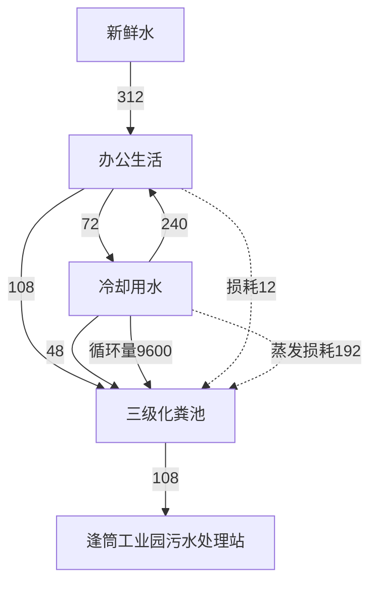
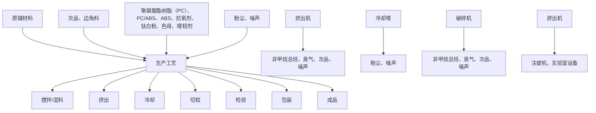

# 建设项目环境影响报告表

# （污染影响类）

项目名称：佛山市顺康荣新材料科技有限公司新建项目

建设单位（盖章）：佛山市顺康荣新材料科技有限公司

编制日期：2023 年11月

中华人民共和国生态环境部制

打印编号：1693184137000

编制单位和编制人员情况表

<table><tr><td>项目编号</td><td colspan="2">082vaj</td></tr><tr><td>建设项目名称</td><td colspan="2">佛山市顺康荣新材料科技有限公司新建项目</td></tr><tr><td>建设项目类别</td><td colspan="2">26-053塑料制品业</td></tr><tr><td>环境影响评价文件类型</td><td colspan="2">报告表</td></tr><tr><td colspan="2">一、建设单位情况</td><td rowspan="4"></td></tr><tr><td>单位名称(盖章)</td><td>佛山市顺康荣新材料</td></tr><tr><td>统一社会信用代码</td><td>91440606MACPW07</td></tr><tr><td>法定代表人(签章)</td><td rowspan="3"></td></tr><tr><td>主要负责人(签字)</td><td></td></tr><tr><td>直接负责的主管人员(签字)</td><td></td></tr><tr><td colspan="2">二、编制单位情况</td><td rowspan="5"></td></tr><tr><td>单位名称(盖章)</td><td>广州市</td></tr><tr><td>统一社会信用代码</td><td>9144011</td></tr><tr><td colspan="2">三、编制人员情况</td></tr><tr><td colspan="2">1.编制主持人</td></tr></table>

#

text_image

人人环保
人民共和国工人
环境保护部批准
家统一组织的司

°4

text_image

中华人民共和国
中华人民共和国
环境保

text_image

中华人民共和国人力资源和社会保障部
中华人民共和国
人力资源和社会保障部

# 目录

一、建设项目基本情况.

二、建设项目工程分析.. 19

三、区域环境质量现状、环境保护目标及评价标准 . 26

四、主要环境影响和保护措施. . 32

五、环境保护措施监督检查清单 . 55

六、结论.. . 58

附表.. . 59

附图1项目地理位置图. . 60

附图2项目平面布置图. . 61

附图3项目环境保护目标分布图. . 62

附图4项目四至图 . 63

附图5项目四周现场照片. . 64

附图6项目声环境功能区划图. . 65

附图7项目水环境功能区划图. . 66

附图8项目大气环境功能区划图 . 67

附图9顺德区环境管控单元图. . 68

附件1营 业 执 照 .69

附件2法人身份证复印件. . 70

附件3租赁合同. . 71

附件4不动产权证明. . 74

附件5 技术协议. . 77

附件6 声明. . 78

# 一、建设项目基本情况

<table><tr><td>建设项目名称</td><td colspan="3">佛山市顺康荣新材料科技有限公司新建项目</td></tr><tr><td>项目代码</td><td colspan="3">/</td></tr><tr><td>建设单位联系人</td><td>***</td><td>联系方式</td><td>***</td></tr><tr><td>建设地点</td><td colspan="3">广东省佛山市顺德区杏坛镇逢简村杏坛水乡大道中科产业园1号2栋之一</td></tr><tr><td>地理坐标</td><td colspan="3">(113度8分56.736秒,22度48分21.975秒)</td></tr><tr><td>国民经济行业类别</td><td>C2929塑料零件及其他制品制造</td><td>建设项目行业类别</td><td>二十六、橡胶和塑料制造业29-53塑料制品业292</td></tr><tr><td>建设性质</td><td>☑新建(迁建)□改建□扩建□技术改造</td><td>建设项目申报情形</td><td>☑首次申报项目□不予批准后再次申报项目□超五年重新审核项目□重大变动重新报批项目</td></tr><tr><td>项目审批(核准/备案)部门(选填)</td><td>/</td><td>项目审批(核准/备案)文号(选填)</td><td>/</td></tr><tr><td>总投资(万元)</td><td>260</td><td>环保投资(万元)</td><td>30</td></tr><tr><td>环保投资占比(%)</td><td>11.54</td><td>施工工期</td><td>1月</td></tr><tr><td>是否开工建设</td><td>☑否□是:</td><td>用地(用海)面积(m2)</td><td>3003</td></tr><tr><td>专项评价设置情况</td><td colspan="3">无</td></tr><tr><td>规划情况</td><td colspan="3">无</td></tr><tr><td>规划环境影响评价情况</td><td colspan="3">无</td></tr><tr><td>规划及规划环境影响评价符合性分析</td><td colspan="3">无</td></tr><tr><td>其他符合性分析</td><td colspan="3">一、选址合理性分析本项目所在地为佛山市顺德区杏坛镇逢简村杏坛水乡大道中科产业园1号2栋之一,根据附件4不动产权证明,本项目所在地属于工业用地,选址符合当地规划。二、产业政策相符性分析(1)环保准入清单根据国家发展改革委商务部关于印发《市场准入负面清单(2022年版)》(发改体改规〔2022〕397号)可知,清单之外的行业、领域、业务等,各类市场主体皆可依法平等进入,项目不在市场准入负面清单禁止和许可两类项目范围内,可依法平等进入。(2)产业政策相符性本项目属于C2929塑料零件及其他制品制造,不在《产业结构调整指导目录(2019年本)》(中华人民共和国国家发展和改革委员会令第29号)、《国家发展改革委关于修改&lt;产业结构调整指导目录(2019年本)&gt;的决定》(中华人民共和国国家发展和改革委员会令第49号))文件中的限制类、淘汰类之列;本项目产品不属于《环境保护综合名录》(2021年版)中“高污染、高环境风险”产品,不属于《促进产业结构调整暂行规定》中限制类、淘汰类之列,符合规定要求;本项目不涉及厚度小于0.025毫米的超薄塑料购物袋、厚度小于0.01毫米的聚乙烯农用地膜、以医疗废物为原料制造塑料制品、一次性发泡塑料餐具、一次性塑料棉签、含塑料微珠的日化产品、不可降解塑料袋、一次性塑料餐具、一次性塑料吸管、宾馆和酒店一次性塑料用品、快递塑料包装的生产和使用,符合《广东省禁止、限制生产、销售和使用的塑料制品目录》(2020年版)的政策要求。综上,本项目符合国家的产业政策,符合产业结构调整、升级要求,符合国家产业政策发展规划要求。三、与广东省“三线一单”相符性分析根据《广东省人民政府关于广东省“三线一单”生态环境分区管控方案的通知》(粤府[2020]71号),项目所在地属于珠三角核心区内,属于重点管控单元。(1)与广东省“三线一单”主要目标相符性分析</td></tr></table>

表 1-1 主要目标

<table><tr><td>类别</td><td>管控要求</td><td>本项目</td><td>是否符合</td></tr><tr><td>生态保护红线</td><td>全省陆域生态保护红线面积36194.35平方米,占全省陆域国土面积的20.13%。</td><td>本项目选址不在生态保护红线范围内。</td><td>符合</td></tr><tr><td>环境质量底线</td><td>全省水环境质量持续改善,国考、省考断面优良水质比例稳步提升,全面消除劣V类水体。大气环境质量继续领跑先行, $PM_{2.5}$ 年均浓度先达到世界卫生组织过渡期二阶段目标值(25微克/立方米),臭氧污染得到有效遏制。土壤环境质量稳中向好,土壤环境风险得到管控。</td><td>根据区域环境质量现状、环境保护目标及评价标准章节分析可知,本项目所在区域的水环境质量达标,大气环境质量的臭氧浓度的最大8小时平均值的90百分位数未达到相应标准要求。</td><td>符合</td></tr><tr><td>资源利用上线</td><td>强化节约集约利用,持续提升资源能源利用效率,水资源、土地资源、岸线资源、能源消耗等达到或优于国家下达的总量和强度控制目标。</td><td>本项目营运过程中消耗一定量的电能、水资源,项目资源消耗量相对区域资料利用总量较少。</td><td>符合</td></tr></table>

# （2）“一核一带一区”区域管控要求相符性分析

表1-2 “一核一带一区”区域管控要求

<table><tr><td>类别</td><td>管控要求</td><td>本项目</td><td>是否符合</td></tr><tr><td>区域布局管控要求</td><td>筑牢珠三角绿色生态屏障,加强区域生态绿核、珠江流域水生态系统、入海河口等生态保护,大力保护生物多样性。...禁止新建、扩建水泥、平板玻璃、化学制浆、生皮制革以及国家规划外的钢铁、原油加工等项目。推广应用低挥发性有机物原辅材料,严格限制新建生产和使用高挥发性有机物原辅材料的项目,鼓励建设挥发性有机物共性工厂...。</td><td>本项目为新建项目,属于C2929塑料零件及其他制品制造,不属于禁止类新建、扩建水泥、平板玻璃、化学制浆、生皮制革以及国家规划外的钢铁、原油加工等项目。本项目使用的原辅材料不属于高挥发性有机物原辅材料。</td><td>符合</td></tr><tr><td>能源资源利用上线</td><td>科学实施能源消费总量和强度“双控”,新建高能耗项目单位产品(产值)能耗达到国际国内先进水平,实现煤炭消费总量负增长。率先探索建立二氧化碳总量管理制度,加快实现碳排放达峰。...推进工业节水减排,重点在高耗水行业开展节水改造,提高工业用水效率。加强江河湖泊水量调度,保障生态流量。盘活存量建设用地,控制新增建设用地规模。</td><td>本项目为新建项目,租用现有已建厂房进行生产和经营。</td><td>符合</td></tr><tr><td>污染物排放管控要求</td><td>在可核查、可监管的基础上,新建项目原则上实施氮氧化物等量替代,挥发性有机物两倍削减量替代。以臭氧生产潜势较大的行业企业为重点,推进挥发性有机物源头替代,全面加强无组织排放控制,深入实施精细化治理。...重点水污染物未达到环境质量改善目标的区域内,新建、改建、扩建项目实施减量替代。...。探索设立区域性城镇污水处理厂污染物排放标准,推动城镇生活污水处理设施提质增效。率先消除城中村、老旧城区和城乡结合部生活污水收集处理设施空白区。大力推进固体废物源头减量化、资源化利用和无害化处置,稳步推进“无废城市”试点建设。...</td><td>本项目外排污染物为废气和废水;废气经收集后通过废气治理设施(两级活性炭)治理后排放;生活污水经三级化粪池预处理后通过市政管网排入逢简工业园污水处理站进行后续处理;冷却循环废水用于洗手间冲厕用水,经化粪池处理后,进入逢简工业园污水处理站;危险废物定期交给资质单位处置,一般固废交给专业公司处置,生活垃圾交给环卫部门处置。</td><td>符合</td></tr><tr><td>环境风险防控要求</td><td>逐步构建城市多水源联网供水格局,建立完善突发环境事件应急管理体系。...。提升危险废物监管能力,利用信息化手段,推进全过程跟踪管理;健全危险废物收集体系,推进危险废物利用处置能力结构优化。</td><td>本项目建成后将落实环境风险应急预案,进行演练,并定期更新预测内容;本项目产生的危险废物暂存在规范的危险废物仓库内,并且定期交由有资质的危险废物公司处理。</td><td></td></tr></table>

# （3）重点管控单元区域管控要求相符性分析

表1-3 重点管控单元区域管控要求

<table><tr><td>类别</td><td>管控要求</td><td>本项目</td><td>是否符合</td></tr><tr><td>水环境质量超标类重点管控单元</td><td>加强山水林田湖草系统治理,开展江河、湖泊、水库、湿地保护与修复,提升流域生态环境承载力。严格控制耗水量大、污染物排放强度高的行业发展,新建、改建、扩建项目实施重点水污染物减量替代。以城镇生活污染为主的单元,加快推进城镇生活污水有效收集处理,重点完善污水处理设施配套管网建设,加快实施雨污分流改造,推动提升污水处理设施进水水量和浓度,充分发挥污水处理设施治理效能。...。</td><td>本项目用水单元为生活用水和冷却补充用水,耗水量较小;本项目生活污水经三级化粪池预处理后通过市政管网排入逢简工业园污水处理站进行后续处理;冷却循环废水用于洗手间冲厕用水,经化粪池处理后,进入逢简工业园污水处理站;本项目租用已建厂房进行生产和经营,已做好雨污分流措施。</td><td>符合</td></tr><tr><td>大气环境受体敏感类重点管控单元</td><td>严格限制新建钢铁、燃煤燃油火电、石化、储油库等项目,产生和排放有毒有害大气污染物项目,以及使用溶剂型油墨、涂料、清洗剂、胶黏剂等高挥发性有机物原辅材料的项目;鼓励现有该类项目逐步搬迁退出。</td><td>本项目为新建项目,属于C2929塑料零件及其他制品制造,不属于钢铁、燃煤燃油火电、石化、储油库等项目;本项目使用的原辅材料不属于高挥发性有机物。</td><td>符合</td></tr></table>

# 四、与佛山市“三线一单”、顺德区“三线一单”相符性分析

根据《佛山市人民政府关于印发佛山市“三线一单”生态环境分区管控方案的通知》（佛府[2021]11 号）、《佛山市顺德区人民政府关于印发佛山市顺德区“三线一单”生态环境分区管控方案的通知》（顺府发[2021]11号），本项目所在地属于重点管控单元，详见附图9。环境管控单元编码及名称：ZH44060620005 杏坛镇重点管控区。

表1-4 与佛山市“三线一单”相符性分析

<table><tr><td colspan="2">佛府〔2021〕11号的相关规定</td><td>本项目情况</td><td>相符性</td></tr><tr><td>生态保护红线</td><td>环境管控单元分为优先保护、重点管控和一般管控单元三类。重点管控单元:以推动产业转型升级、强化污染减排、提升资源利用效率为重点,加快解决资源环境负荷大、局部区域生态环境质量差、生态环境风险高等问题。</td><td>本项目位于佛山市顺德区杏坛镇逢简村杏坛水乡大道中科产业园1号2栋之一,所在区域位于杏坛镇,属于重点管控单元,项目所在建设用地不涉及划定的生态红线区域,项目周边无自然保护区、饮用水源保护区等生态保护目标,符合生态保护红线要求。</td><td>相符</td></tr><tr><td>环境质量底线</td><td>水环境质量持续改善,国考、省考、水功能区断面达到国家和省下达的水质目标要求;市控断面全面消除劣V类,力争达到我市确定的水质目标要求;乡镇级及以上集中式饮用水水源地水质稳定达标。空气质量持续改善,细颗粒物(PM2.5)年均浓度、空气质量优良天数比例(AQI)主要指标达到省下达的目标要求,臭氧污染得到有效遏制。土壤环境质量稳中向好,土壤环境风险得到管控。</td><td>根据环境质量现状监测和周边现状监测数据,项目大气环境质量臭氧不达标;根据佛山市主干河涌2022年1-12月水质监测情况,杏坛镇内河涌均足《地表水环境质量标准》(GB3838-2002)之V类水功能要求,则本项目地表水环境属于达标区。项目排放的各项污染物经相应措施处理后均能达标,对环境影响很小,环境风险可控,未超出环境质量底线,项目的建设基本符合环境质量底线要求。</td><td>相符</td></tr><tr><td>资源利用上线</td><td>强化节约集约循环利用,持续提升资源能源利用效率,水资源、土地资源、岸线资源、能源消耗等达到或优于国家和省下达的总量、强度等目标要求,按省规定年限实现碳达峰。</td><td>项目生产过程中的电能、自来水等消耗量较少,区域水、电资源较充足,项目消耗量没有超出资源负荷,没有超出资源利用上线。</td><td>相符</td></tr><tr><td>生态环境准入清单</td><td>《市场准入负面清单(2022年版)》(发改体改规〔2022〕397号)</td><td>本项目不属于禁止准入事项。</td><td>相符</td></tr></table>

表 1-5 与顺德区“三线一单”态环境分区管控方案相符性分析

<table><tr><td colspan="2">顺府发(2021)11号</td><td>本项目情况</td><td>相符性</td></tr><tr><td>区域布局管控要求</td><td>全区生态保护红线面积27.71平方公里,占全区国土面积的3.44%;一般生态空间面积30.62平方公里,占全区国土面积的3.8%。</td><td>本项目位于佛山市顺德区杏坛镇逢简村杏坛水乡大道中科产业园1号2栋之一,所在区域位于杏坛镇,属于重点管控单元,项目所在建设用地不涉及划定的生态红线区域,项目周边无自然保护区、饮用水源保护区等生态保护目标,符合生态保护红线要求。</td><td>相符</td></tr><tr><td>环境质量底线</td><td>水环境质量持续改善,国考、省考、市考、水功能区断面达到国家、省和市下达的水质目标要求;市控断面全面消除劣V类,力争达到上级确定的水质目标要求;乡镇级及以上集中式饮用水水源地水质稳定达标。空气质量持续改善,细颗粒物( $PM_{2.5}$ )年均浓度、空气质量优良天数比例(AQI)主要指标达到省、市下达的目标要求,臭氧污染得到有效遏制。土壤环境质量稳中向好,土壤环境风险得到管控。</td><td>根据环境质量现状监测和周边现状监测数据,项目大气环境质量臭氧不达标;根据佛山市主干河涌2022年1-12月水质监测情况,杏坛镇内河涌均足《地表水环境质量标准》(GB3838-2002)之V类水功能要求,则本项目地表水环境属于达标区。项目排放的各项污染物经相应措施处理后均能达标,对环境影响很小,环境风险可控,未超出环境质量底线,项目的建设基本符合环境质量底线要求。</td><td>相符</td></tr><tr><td>资源利用</td><td>强化节约集约循环利用,持续提升资源能源利用效率,水资源、土地资源、岸线资源、能源</td><td>项目生产过程中的电能、自来水等消耗量较少,区域水、电资源</td><td>相符</td></tr></table>

<table><tr><td rowspan="3"></td><td>上线</td><td>消耗等达到或优于国家和省下达的总量、强度等目标要求,按省规定年限实现碳达峰。</td><td>较充足,项目消耗量没有超出资源负荷,没有超出资源利用上线。</td><td></td></tr><tr><td rowspan="2">区域布局管控要求</td><td>优先保护生态空间,筑牢生态保护底线,构建生态空间保护格局。强化水源地空间管控,严格限制饮用水水源汇水区内的生态保护与水源涵养区域变更土地利用方式。持续深入推进产业、能源、交通运输结构调整。按照“两心·一带·四轴”发展格局,调整优化产业集群发展空间布局,推动城市功能定位、空间布局与产业发展高质量协同匹配。深入推进制造业高质量发展,推动智能家电、高端装备制造等两大主导产业高端化,促进珠宝、纺织服装、家具和五金等四大特色产业高级化,培育新一代电子信息、智能机器人、新材料、生物医药与健康等四大战略性产业集群。全面攻坚村级工业园升级改造,腾出连片空间,布局产业集聚区和主题产业园,推动工业项目入园集聚发展。通过城市更新实现公共设施“补短板”、产业空间“再聚集”、重点片区“强统筹”,盘活存量建设用地。依法依规关停落后产能,全面实施产业绿色化改造,培育壮大循环经济。新建、改建、扩建的项目应当符合国家产业政策规定。环境质量不达标区域,新建、扩建项目需符合环境质量改善要求。全区为高污染燃料禁燃区,禁止新建、扩建燃用高污染燃料的燃烧设施。加快推进天然气产供储销体系建设,逐步淘汰生物质锅炉、集中供热管网覆盖区域内的分散供热锅炉和有机热载体锅炉,纺织行业新增定型机应选用集中供热热源,逐步改造定型机,促进用热企业向园区集聚。禁止新建、扩建水泥、平板玻璃、化学制浆、生皮制革以及国家规划外的钢铁、原油加工等项目。专业电镀、印染等项目进入定点园区集中管理。推广应用低挥发性有机物原辅材料,严格限制新建生产和使用高挥发性有机物原辅材料的项目,鼓励建设共性工厂、活性炭集中再生中心等挥发性有机物第三方治理项目,推动挥发性有机物集中高效处理。优化交通结构,发展多式联运,推进公路、水路等交通运输燃料清洁化,推广新能源物流车辆,积极推动设立“绿色物流”片区。</td><td>项目不涉及划定的生态红线区域,项目周边无自然保护区、饮用水源保护区等生态保护目标。项目地表水环境能满足相应标准要求,大气环境质量臭氧不达标;根据佛山市主干河涌2022年1-12月水质监测情况,杏坛镇内河涌均足《地表水环境质量标准》(GB3838-2002)之V类水功能要求,则本项目地表水环境属于达标区。项目排放的各项污染物经相应措施处理后均能达标。项目无新建高污染燃料的燃烧设施,不涉及锅炉等供热设备。项目主要从事PC改性工程塑料粒、PC/ABS合金工程改性塑料粒、ABS改性工程塑料粒的生产,不属于化学制浆、生皮制革以及国家规划外的钢铁、原油加工等项目。专业电镀、印染等禁止行业。项目不涉及高挥发性原辅助材料。</td><td>相符</td></tr><tr><td>能源资源利用要求。积极发展氢能源、天然气发电等清洁能源,逐步提高可再生能源与低碳清洁能源比例,建立现代化能源体系。科学实施能源消费总量和强度“双控”,新建高能耗项目单位产品(产值)能耗达到国际国内先进水平,实现煤炭消费总量负增长。加快城镇燃气基础设施优化布局,落实天然气大用户直供和“瓶改管”。禁止新增高污染燃料销售点,加强全区高污染燃料监督管理。新建、改建、扩建“两高”项目须符合产业准入相关法律法规和法定规划,满足污染物区域削减、重点污染物排放总量控制、碳排放达峰目标、相关规划环评和相应行业建设项目环境准入条件、环评文件审批原则要求。依法依规强化油品生产、流通、使用、贸易等全流程监管,合理优化储油库、加油站布局。加快新能源汽车推广使用,实现全区公交车新能源化,加快充电桩、加气站、加氢站以及综合性能源补给站建设,积极推动机动车和非道路移动机械电动化或实现清洁燃料替代。大力推进绿色港口和公用码头建设,提升岸电使用率,引导船舶、港作机械等“油改气”“油改电”,降低港口柴油使用比例。贯彻落实“节水优先”方针,实行最严格水资源管理制度,提高工业用水效率,加强江河湖库水量调度,保障生态流量。强化自然岸线保护,优化岸线开发利用格局,严格水域岸线用途管制,新建项目一律不得违规占用水域。落实单位土地面积投资强度、土地利用强度等建设用地控制性指标要求,提高土地利用效率。全区禁止矿产资源开发开采。积极发展农业资源利用节约化、生产过程清洁化、废弃物利用资源化等生态循环农业模式。</td><td>项目不涉及高污染燃料销售点,项目用水均由市政供水,严格控制用水,杜绝浪费;能源主要依托当地电网供电。本项目建设土地不涉及基本农田、土地资源消耗。</td><td>相符</td></tr><tr><td></td><td></td><td>污染物排放管控要求。实施重点污染物总量控制,重点污染物排放总量指标优先向重大发展平台、重点建设项目、重点工业园区、战略性产业集群倾斜。加快建立以排污许可制为核心的固定污染源监管制度,聚焦重点行业和重点区域,强化环境监管执法。规范工业排水管理,依法开展排水许可。合理建设工业废水或综合废水集中处理设施,推进工业集聚区“污水零直排区”试点。稳步推进排水设施“三个一体化”管理模式,补齐城乡污水收集和处理短板,推动污水处理设施提质增效,加快消除城中村、老旧城区、城乡结合部等污水收集管网空白区,逐步实现城乡污水收集处理全覆盖。城镇新区建设均实行雨污分流。推进建设大型现代化畜禽养殖场,加强畜禽养殖废水处理及废弃物资源化利用,推广水产生态健康养殖模式,防治农村面源污染。禁止在地表水I、II类水域新建排污口,已建排污口不得增加污染物排放量。实行水污染物的行业标杆管理。实施水生态系统保护修复,推进河涌水系连通、环保清淤,加强湿地建设及河心岛生态修复。上年度重点河涌水质未达到水环境质量目标的管控分区所在镇(街道),须组织编制、系统实施、向社会公开区域重点水污染物减排计划并明确“替代量”,本年度新建、改建、扩建项目新增水环境重点污染物实行区域“减二增一”替代(废水集中处理设施、民生项目除外)。在可核查、可监管的基础上,全区新建、改建、扩建项目新增大气重点污染物实行“减二增一”替代。巩固燃煤锅炉超低排放整治成效。深化炉窑分级管控,实施工业炉窑大气污染综合治理。推进挥发性有机物源头替代,全面加强无组织排放控制,深入实施精细化治理。推进石化化工、溶剂使用及挥发性有机液体储运销的挥发性有机物减排,全过程实施反应活性物质、有毒有害物质、恶臭物质的协同控制。将全面使用低VOCs含量原辅材料的企业纳入正面清单和政府绿色采购清单。严格落实船舶大气污染物排放控制区要求。加强扬尘、餐饮油烟等污染防治。重金属污染重点防控区内,重点重金属排放总量只减不增。重金属污染物排放企业清洁生产逐步达到国际或国内先进水平。打造近零碳排放示范项目,推进有色金属等重点能源消耗行业二氧化碳排放控制。开展“无废城市”建设,推动固体废物源头减量、资源化利用和安全处置。</td><td>项目涉及VOCs产生及排放,实施两倍削减量替代。项目不涉及生产废水排放。</td><td>相符</td></tr><tr><td></td><td></td><td>环境风险防控要求。加强西江、北江等供水通道干流沿岸以及饮用水水源地、备用水源环境风险防控,完善城市双水源联网供水格局。强化地表水、地下水和土壤污染风险协同防控,建立完善突发环境事件应急管理体系。重点加强环境风险分级分类管理,应用全省环境风险源在线监控预警系统,强化化工企业、涉重金属行业、工业园区等重点环境风险源的环境风险防控。推动企业将低温等离子、UV光解、RTO燃烧炉等有机废气治理设施纳入全厂安全风险辨识范围,加强安全管理。禁止在规划专门用于危险化学品生产、储存的区域(包括化工园区)外新建、扩建危险化学品生产、储备建设项目(加油站、加气站、加氢站、港口及铁路、航空危险化学品储存建设项目、危险化学品输送管道及危险化学品使用单位的配套项目除外)。实施农用地分类管理,依法划定特定农产品禁止生产区域。严格建设用地再开发建设管理,对纳入建设用地土壤环境联动监管地块,未达到土壤污染风险评估报告确定的风险管控、修复目标的建设用地地块,禁止开工建设任何与风险管控、修复无关的项目。提升危险废物监管能力,利用信息化手段,推动全过程跟踪管理。健全危险废物收集体系,推进危险废物利用处置能力优化提升,开展工业园区危险废物集中收集贮存试点。全力避免因各类安全事故(事件)引发的次生环境风险事故(事件)。</td><td>本项目位于佛山市顺德区杏坛镇逢简村杏坛水乡大道中科产业园1号2栋之一,所在区域位于杏坛镇,不涉及划定的饮用水源保护区等生态保护目标。项目主要从事PC改性工程塑料粒、PC/ABS合金工程改性塑料粒、ABS改性工程塑料粒的生产制造,不涉及重金属行业工业园区等重点环境风险源的环境风险防控。项目采用“二级活性炭”处理有机废气,不属于低治理效率的有机废气治理措施。</td><td>相符</td></tr></table>

表1-6 本项目与文件（顺府发[2021]11 号）相符性分析

<table><tr><td rowspan="2">环境管控单元编码</td><td rowspan="2">环境管控单元名称</td><td colspan="3">行政区划</td><td rowspan="2">管控单元分类</td><td rowspan="2">要素细类</td></tr><tr><td>省</td><td>市</td><td>区</td></tr><tr><td>ZH44060620005</td><td>杏坛镇重点管控区</td><td>广东省</td><td>佛山市</td><td>顺德区</td><td>重点管控单元5</td><td>一般生态空间、水环境城镇生活污染重点管控区、水环境工业—城镇污染重点管控区、水环境其</td></tr></table>

<table><tr><td rowspan="4"></td><td></td><td></td><td></td><td></td><td></td><td></td><td colspan="2">他重点管控区、大气环境一般管控区、江河湖库岸线重点管控区</td></tr><tr><td>管控维度</td><td colspan="5">管控要求</td><td rowspan="2">工程内容</td><td rowspan="2">符合性</td></tr><tr><td>共性要求</td><td colspan="5">单元内各环境要素细类管控区内,按该环境要素细类管控要求执行。</td></tr><tr><td>区域布局管控</td><td colspan="5">1-1【生态/禁止类】单元内的一般生态空间,主导生态功能为水土保持,禁止在25度以上的陡坡地开垦种植农作物,禁止在崩塌、滑坡危险区、泥石流易发区从事采石、取土、采砂等可能造成水土流失的活动。1-2.【产业/鼓励引导类】重点发展新材料、智能家居、先进装备制造业、汽车配件等产业以及军民融合产业,提升发展塑料专业市场,培育智能家居创新创业产业链,依托顺德新港发展临港加工和物流产业,发展现代农业。1-3.【产业/综合类】系统推进村级工业园升级改造,腾出连片空间,布局产业集聚区和主题产业园,推动工业项目入园集聚发展。新增工业制造业用地原则上安排在产业集聚区内,产业集聚区外原则上不鼓励工业及物流仓储用地的新建与改造。1-4.【产业/限制类】受纳水体或监控断面不达标的,不得新建、扩建向河涌直接排放废水的项目。新建、扩建含蚀刻工序的线路板生产项目和化工项目应在配套污水集中处置的工业园区或生活污水管网覆盖区域内建设;纯加工型印花项目,含酸洗、磷化的金属表面处理、金属制品项目(与自身高新技术企业配套的除外),含酸洗、喷涂、拉丝、表面抛光等工艺的不锈钢型材加工项目,应进入以此类项目为主导产业、有相应废水集中治理设施的工业园区,实现集中治污。1-5.【水/限制类】严格限制在右滩水厂、均安水厂饮用水水源保护区上游和周边区域建设列入“高污染、高环境风险”产品名录等可能影响水环境安全的项目。1-6.【土壤/禁止类】禁止新建、扩建增加重点防控的重金属污染物排放的建设项目。</td><td>项目主要从事PC改性工程塑料粒、PC/ABS合金工程改性塑料粒、ABS改性工程塑料粒制造,项目产品、设备、工艺不在《产业结构调整指导目录(2019年本,2021年修订版)》中的淘汰类和限制类目录中,也不属于《市场准入负面清单(2022年版)》中的禁止准入事项。不属于上述禁止类企业、限制类企业;本项目位于佛山市顺德区杏坛镇逢简村杏坛水乡大道中科产业园1号2栋之一,位于产业集聚区内;根据佛山市主干河涌2022年1-12月水质监测情况,杏坛镇内河涌均足《地表水环境质量标准》(GB3838-2002)之V类水功能要求,则本项目地表水环境属于达标区。本项目不属于加工印花项目,不含有酸洗、磷化工艺。本项目外排废水为生活污水和冷却废水。本项目生活污水经三级化粪池预处理后,通过工业区管网排至逢简工业园废水处理站,处理达标后排入逢简大涌;冷却循环废水用于洗手间冲厕用水,经化粪池处理后,进入逢简工业园污水处理站。本项目不包含条款中提及的限制类项目和工序。本项目不在右滩水厂、均安水厂饮用水水源保护区上游和周边区</td><td>相符</td></tr><tr><td rowspan="3"></td><td></td><td></td><td>域;本项目不涉及重金属污染物的排放</td><td colspan="5"></td></tr><tr><td>能源资源利用</td><td>2-1【能源/鼓励引导类】推广节能技术,加快发展绿色货运与现代物流。2-2【能源/鼓励引导类】推广新能源汽车应用和充电基础设施建设,积极推动重卡LNG加气站、充电基础设施、加氢站建设。2-3.【能源/综合类】科学实施能源消费总量和强度“双控”,新建高能耗项目单位产品(产值)能耗达到国际国内先进水平。2-4.【水资源/综合类】贯彻落实“节水优先”方针,实行最严格水资源管理制度,杏坛镇万元国内生产总值用水量、万元工业增加值用水量、用水总量、农田灌溉水有效利用系数等用水总量和效率指标达到区下达要求。2-5.【土地资源/限制类】落实单位土地面积投资强度、土地利用强度等建设用地控制性指标要求,提高土地利用效率。2-6.【岸线/禁止类】严格水域岸线用途管制,新建项目一律不得违规占用水域。严禁破坏生态的岸线利用行为和不符合其功能定位的开发建设活动,严禁以各种名义侵占河道、围垦湖泊、非法采砂等。</td><td>本项目位于佛山市顺德区杏坛镇逢简村杏坛水乡大道中科产业园1号2栋之一,位于产业集聚区内;不占用水域岸线</td><td colspan="5">相符</td></tr><tr><td>污染物排放管控</td><td>3-1.【水/限制类】城镇新区建设实行雨污分流,逐步推进初期雨水收集、处理和资源化利用。住宅、商业体、学校、市场等城镇开发建设项目应当配套或者同步计划建设公共排水设施,公共排水设施或自建排污水设施未能投产运行的,以上涉水项目不得投入使用。新建小区严格实施雨污分流,阳台、露台等污水接入污水收集系统,将生活污水“应截尽截”。做好大型楼盘、集贸市场、餐饮以及学校等4大类排水户污水接入市政管网工作。3-2.【水/综合类】杏坛镇重点河涌水质上年度未达到水环境环境质量目标的,需组织编制、系统实施、向社会公开区域重点水污染物减排计划并明确“替代量”,本年度新建、改建、扩建项目新增水环境重点污染物实行区域“减二增一”替代(工业、生活或综合集中废水处理设施、民生项目除外)。3-3.【水/综合类】区域内应合理规划建设工业或综合集中废水处理设施。逐步推进工业集聚区“污水零直排区”建设,开展排水单元工业废水、生活污水、雨水分类收集、分质处理,确保园区“管网全覆盖、雨污全分流、污水全收集、处理全达标”。3-4.【水/综合类】结合村级工业园改造,全面提升产业层次与集聚度,促进污染集中整治。3-5.【水/综合类】稳步推进排水设施“三个一体化”管理模式,补齐城乡污水收集和处理短板,推动逢简工业园污水处理站提质增效,加快消除城中村、老旧城区、城乡结合部等污水收集管网空白区,逐步实现城乡污水收集处理全覆盖。2025年前完成逢简工业园污水处理站扩建,尾水应执行《城镇污水处理厂污染物排放标准》(GB18918-2002)一级A标准及《广东省水污染物排放限值》(DB44/26-2001)的较严值。3-6.【水/综合类】近期保留桑麻村、逢简村、吉祐村、安富村等现状农村污水分散式处理设施,继续完善污水支管网建设,提高污水收集处理率,新建龙潭村、吉祐村、右滩村、南朗村、光华村、东村、北水村等农村分散式生活污水处理设施,其余行政村(社区)继续完善污水管网建设,收集农村污水进入市政污水系统,有条件的区域实施雨污分流改造,到2030年全面雨污分流,污水纳入杏坛城镇污水处理系统。3-7.【大气/综合类】大力推进低VOCs含量原辅材料替代,加快涉VOCs重点行业的生产工艺升级改造,推行自动化生产工艺,对达不到要求的VOCs收集及治理设施进行整治提升,逐步淘汰低效VOCs治理设施。3-8.【土壤/限制类】作为重金属污染重点防控区,区域内重点重金属排放总量只减不增。</td><td>本项目污染物排放量未超过规划环评核定的污染物排放总量管控要求;项目不属于加工印花项目,不含有酸洗、磷化工艺。本项目外排废水为生活污水和冷却废水。本项目生活污水经三级化粪池预处理后,通过工业区管网排至逢简工业园废水处理站,处理达标后排入逢简大涌;冷却循环废水用于洗手间冲厕用水,经化粪池处理后,进入逢简工业园污水处理站。本项目使用PC塑料粒、ABS塑料粒等塑料颗粒均为低VOCs含量的原料</td><td colspan="5">相符</td></tr><tr><td></td><td>环境风险防控</td><td>4-1.【水/综合类】加强单元内右滩水厂、均安水厂饮用水水源保护区周边环境风险源管控,完善突发环境事件应急管理体系。4-2.【水/综合类】逢简工业园污水处理站、工业污水集中处理设施应采临取有效措施,防止事故废水直接排入水体。完善污水处理厂在线监控系统联网,实现污水处理厂的实时、动态监管。4-3.【风险/综合类】加强环境风险分级分类管理,强化金属制品、有色金属和压延加工、化学原料和化学品制造业等涉重金属、化工行业企业及工业园区等重点环境风险源的环境风险防控。</td><td>本项目危险物质贮存量占临界量比值Q&lt;1,通过严格执行国家的防火安全设计规范,采取合理的风险防范措施,制定完善的环境风险事故应急预案等措施本项目的风险水平是可以接受的</td><td colspan="5">相符</td></tr></table>

综上，本项目的建设与《佛山市顺德区人民政府关于印发佛山市顺德区“三线一单”生态环境分区管控方案的通知》（顺府发[2021]11号）相符。

# 六、相关环保政策符合性分析

项目挥发性有机物排放相关政策符合性分析见下表。

表1-7 本项目与挥发性有机物排放相关政策符合性分析

<table><tr><td>序号</td><td>政策要求</td><td>工程内容</td><td>符合性</td></tr><tr><td colspan="4">《挥发性有机物无组织排放控制标准》(GB37822-2019)</td></tr><tr><td>1.1</td><td>VOCs 物料应当储存于密闭的容器、储罐、储库、料仓中。</td><td>本项目涉 VOCs 物料储存在室内专用仓库。</td><td>相符</td></tr></table>

<table><tr><td rowspan="11"></td><td>1.2</td><td>盛装VOCs物料的容器应当存放于室内,或者存放于设置有雨棚、遮阳和防渗设施的专用场地。盛装VOCs物料的容器或者包装袋在非取用状态时应当加盖、封口,保持密闭。</td><td>本项目涉VOCs物料储存在室内专用仓库;仓库做好防雨防晒和防渗设施;盛装VOCs物料的容器做好加盖、封口,保持密闭。</td><td>相符</td></tr><tr><td>1.3</td><td>粉状、粒状VOCs物料应当采用气力输送设备、管状带式输送机、螺旋输送机等密闭输送方式,或者采用密闭的包装袋、容器或者罐车进行物料转移。</td><td>本项目VOCs物料采用密闭的包装袋、容器进行物料转移。</td><td>相符</td></tr><tr><td colspan="4">《中华人民共和国大气污染防治法》(2018年10月26日修正)</td></tr><tr><td>2.1</td><td>第四十四条生产、进口、销售和使用含挥发性有机物的原辅材料和产品的,其挥发性有机物含量应当符合质量标准或要求。国家鼓励生产、进口、销售和使用低毒、低挥发性有机溶剂。</td><td>本项目使用的PC塑料粒、ABS塑料粒不属于高VOCs含量原辅材料。</td><td>相符</td></tr><tr><td>2.1</td><td>第四十五条产生含挥发性有机物废气的生产和服务活动,应当在密闭空间或设备中进行,并按照规定安装、使用污染防治设施;无法密闭的,应当采取措施减少废气排放。</td><td>本项目设置废气收集设施收集VOCs废气,并将废气引至“两级活性炭”废气治理设施处理。</td><td></td></tr><tr><td colspan="4">《广东省人民政府办公厅关于印发广东2021年大气、水、土壤污染防治工作方案的通知》(粤办函[2021]58号)</td></tr><tr><td>3.1</td><td>涉VOCs重点行业新建、改建和扩建项目不再推荐使用光氧化、光催化、低温等离子等低效治理设施</td><td>本项目采用“两级活性炭”废气治理设施处理有机废气。</td><td></td></tr><tr><td>3.2</td><td>实施低VOCs含量产品源头替代工程。禁止新建生产和使用高VOCs含量原辅材料项目。鼓励在生产和流通消费环节推广使用低VOCs含量原辅材料。将全面使用符合国家、省要求的低VOCs含量原辅材料企业纳入正面清单和政府绿色采购清单。</td><td>本项目使用的PC塑料粒、ABS塑料粒不属于高VOCs含量原辅材料。</td><td></td></tr><tr><td>3.3</td><td>督促企业开展含VOCs物料(包括含VOCs原辅材料、含VOCs产品、含VOCs废料以及有机聚合物材料等)储存、转移和输送、设备与管理组件泄漏、敞开液面逸散以及工艺过程等无组织排放环节排查。指导企业使用适宜高效治理技术,涉VOCs重点行业新建、改建和扩建项目不推荐使用光氧化、光催化、低温等离子等治理设施。指导采用一次活性炭吸附治理技术的企业,明确活性炭装载量和更换频次,记录更换时间和使用量。推行活性炭厂内脱附和专用移动车上门脱附,指导企业做好废活性炭的密封贮存和转移。</td><td>本项目涉VOCs原辅材料在贮存过程中采取密闭措施,原料桶装密闭,在生产使用过程中采取废气收集设施收集废气,废气治理设施采用“两级活性炭吸附”工艺治理;本环评已明确活性炭装置装载量和更换频次,企业在生产运营过程中落实台账管理和定期更换。</td><td></td></tr><tr><td colspan="4">关于印发《广东省臭氧污染防治(氮氧化物和挥发性有机物协同减排)实施方案(2023-2025年)》的通知(粤环函〔2023〕45号)</td></tr><tr><td>4.1</td><td>新、改、扩建项目限制使用光催化、光氧化、水喷淋(吸收可性VOCs除外)、低温等离子等低效VOCs治理设施(恶臭处理除外)。</td><td>本项目设置废气收集设施收集VOCs废气,并将废气引至“两级活性炭”废气治理设施处理。不涉及光催化、光氧化、水喷淋、低温等离子等低效治理设施。</td><td>相符</td></tr><tr><td rowspan="12"></td><td colspan="4">《广东省生态环境保护“十四五”规划》(粤环[2021]10号)</td></tr><tr><td>5.1</td><td>大力推进低VOCs含量原辅材料源头替代,严格落实国家和地方产品VOCs含量限值质量标准,禁止建设生产和使用高VOCs含量的溶剂型涂料、油墨、胶粘剂等项目。</td><td>本项目使用的PC塑料粒、ABS塑料粒不属于高VOCs含量原辅材料。</td><td>相符</td></tr><tr><td colspan="4">《固定污染源挥发性有机物综合排放标准》(DB44/2367-2022)</td></tr><tr><td>6.1</td><td>VOCs物料应当储存于密闭的容器、储罐、储库、仓中。</td><td>本项目涉VOCs物料储存在室内专用仓库。</td><td>相符</td></tr><tr><td>6.2</td><td>盛装VOCs物料的容器应当存放于室内,或者存放于设置有雨棚、遮阳和防渗设施的专用场地。盛装VOCs物料的容器或者包装袋在取状态时应当加盖、封口,保持密闭。</td><td>本项目涉VOCs物料储存在室内专用仓库;仓库做好防雨防晒和防渗设施;盛装VOCs物料的容器做好加盖、封口,保持密闭。</td><td>相符</td></tr><tr><td>6.3</td><td>粉状、粒状VOCs物料应当采用气力输送设备、管状带式输送机、螺旋输送机等密闭输送方式,或者采用密闭的包装袋、容器或者罐车进行物料转移。</td><td>本项目VOCs物料采用密闭包装袋、容器进行物料转移。</td><td>相符</td></tr><tr><td>6.4</td><td>粉状、粒状VOCs物料应当采用气力输送方式或者采用密闭固体投料器等给料方式密闭投加。无法密闭投加的,应当在密闭空间内操作,或者进行局部气体收集,废气应当排至除尘设施、VOCs废气收集处理统;</td><td>本项目设置废气收集设施收集VOCs废气,并将废气引至“两级活性炭”废气治理设施处理。</td><td>相符</td></tr><tr><td>6.5</td><td>VOCs物料卸(出、放)料过程应当密闭,卸料废气应当排至VOCs废气收集处理系统;无法密闭投加的,应当在密闭空间内操作,或者进行局部气体收集,废气应当排至除尘设施、VOCs废气收集处理系统;</td><td>本项目设置废气收集设施收集VOCs废气,并将废气引至“两级活性炭”废气治理设施处理。</td><td>相符</td></tr><tr><td>6.6</td><td>有机聚合物产品用于制品生产的过程,在混合/混炼、塑炼/塑化/熔化、加工型(挤出、注射、压制、压延、发泡、纺丝等)等作业中应当采用密闭设备或者在密闭空间内操作,废气应当排至VOCs废气收集处理系统;无法密闭投加的,应当在密闭空间内操作,或者进行局部气体收集,废气应当排至除尘设施、VOCs废气收集处理系统;</td><td>本项目设置废气收集设施收集VOCs废气,并将废气引至“两级活性炭”废治理设施处理。</td><td>相符</td></tr><tr><td colspan="4">《珠江三角洲地区严格控制工业企业挥发性有机物(VOCs)排放的意见》的通知(粤环[2012]18号)</td></tr><tr><td>7.1</td><td>自然保护区、水源保护区、风景名胜区、森林公司、重要湿地、生态敏感区和其他重要生态功能区实行强制性保护,禁止新建VOCs污染企业。</td><td>本项目选址不在规定禁止区域内。</td><td>相符</td></tr><tr><td>7.2</td><td>新建皮革及皮鞋制造业、人造板制造业、家具制造业、印刷业、PC改性工程塑料粒、PC/ABS合金工程改性塑料粒、ABS改性工程塑料粒业、集装箱制造业、汽车制造与船舶制造业等排放VOCs的使用性行业,在建设项目环境影响评价文件报批时,附项目VOCs减排量来源说明,按项目“点对点”总量调剂的方式,落实新建项目VOCs排放总量指标来源,确保区域内工业VOCs排放的总量控制。</td><td>本项目VOCs总量控制指标为1.740t/a,由区镇两级环保主管部门核查分配总量指标</td><td>相符</td></tr><tr><td rowspan="9"></td><td colspan="4">佛山市生态环境局关于印发《佛山市生态环境保护“十四五”规划》的通知</td></tr><tr><td>8.1</td><td>大力推进低VOCs含量原辅材料替代,将全面使用低VOCs含量原辅材料的企业纳入正面清单和政府绿色采购清单。鼓励重点行业企业开展生产工艺和设备水性化改造,推广使用水性、高固体成分、无溶剂、粉末等低VOCs含量涂料。</td><td>本项目使用的PC塑料粒、ABS塑料粒不属于高VOCs含量原辅材料。</td><td>相符</td></tr><tr><td>8.2</td><td>严格落实《挥发性有机物无组织排放控制标准》,开展厂区无组织排放浓度监测。加强对含VOCs物料储存、转移和运输、设备与管线组件泄漏、敞开页面逸散以及工艺过程等五类排放源的管控。</td><td>本项目建成后定期开展厂区内VOCs无组织浓度自行监测。含VOCs物料在密闭容器中储存、转移和运输。</td><td>相符</td></tr><tr><td>8.3</td><td>对家具、凹版印刷行业(除瓦楞纸印刷)铝型材(氟碳喷涂)等VOCs排放重点行业进行严格监管,建立实施污染物治理定量化监管;推进VOCs高排放企业治理设施提升改造,淘汰光催化、光氧化、低温等离子等现有低效治理设施。</td><td>本项目不涉及光催化、光氧化、低温等离子低效治理设施。</td><td>相符</td></tr><tr><td colspan="4">《佛山市顺德区生态环境保护“十四五”规划(2021-2025)》</td></tr><tr><td>9.1</td><td>持续推进重点行业VOCs整治。持续开展挥发性有机物专项整治,继续推进重点行业企业开展销号式综合整治,建立VOC重点监管企业名单并动态更新,督促企业建立VOCs管控台账清单;持续探寻高效节能的VOCs治理技术,对采用低温等离子、光氧化、光催化等低效治理工艺的企业在臭氧污染天气应对期间实施停限产或错峰生产,并推动企业逐步淘汰低效治理工艺。</td><td>本项目不涉及光催化、光氧化、低温等离子等低效治理设施。</td><td>相符</td></tr><tr><td>9.2</td><td>加强VOCs源头替代和无组织排放管控。大力推进低VOCs含量、低反应活性的原辅材料替代,将全面使用低VOCs含量原辅材料的企业纳入正面清单和政府绿色采购清单。鼓励重点行业企业开展生产工艺和设备水性化改造,推广使用水性、高固体分、无溶剂、粉末等低VOCs含量涂料。严格落实《挥发性有机物无组织排放控制标准》,开展厂区内无组织排放浓度监测,加强对含VOCs物料储存、转移和运输、设备与管线组件泄漏、敞开页面逸散以及工艺过程等五类排放源的管控。加强储油库、加油站等VOCs排放治理,推动油品储运销体系安装油气回收自动监控系统。</td><td>本项目使用的PC塑料粒、ABS塑料粒不属于高VOCs含量原辅材料;项目提高生产管理水平,严格落实《挥发性有机物无组织排放控制标准》,定期开展自行监测。</td><td>相符</td></tr><tr><td colspan="4">关于印发《广东省涉挥发性有机物(VOCs)重点行业治指引》的通知(粤环办[2021]43号)</td></tr><tr><td>10.1</td><td>废气收集系统的输送管道应密闭。废气收集系统应在负压下运行,若处于正压状态,应对管道组件的密闭点进行泄漏检测,泄漏检测值不应超过500μmol/mol,亦不应有感官可察觉泄漏。</td><td>本项目收集系统为密闭状态,在负压下运行。</td><td>相符</td></tr><tr><td rowspan="6"></td><td>10.2</td><td>塑料制品行业:a)有机废气排气筒排放浓度不高于广东省《大气污染物排放限值》(DB4427-2001)第II时段排放限值,若国家和我省出台并实施适用于塑料制品制造业的大气污染排放标准,则有机废气排气筒排放浓度不高于相应的排放限值;车间或生产设施排气中NMHC初始排放速率≥3kg/h时,建设VOCs处理设施且处理效率≥80%;b)厂区无组织排放监控点NMHC的小时平均浓度值不超过6mg/m3,任意一次浓度值不超过20mg/m3</td><td>本项目有机废气DA001排气筒非甲烷总烃排放执行《合成树脂工业污染物排放标准》(GB31572-2015)表4大气污染物排放限值;本项目产生速率小于3kg/h;厂区内无组织排放监控点非甲烷总烃的小时平均浓度值不超过6mg/m3,任意一次浓度值不超过20mg/m3。</td><td>相符</td></tr><tr><td>10.3</td><td>吸附床(含活性炭吸附法):a)预处理设备应根据废气的成分、性质和影响吸附过程的物质性质及含量进行选择;b)吸附床层的吸附剂用量应根据废气处理量、污染物浓度和吸附剂的动态吸附量确定;c)吸附剂应及时更换或有效再生。</td><td>本环评已明确“两级活性炭吸附”系统的活性炭更换量和更换周期。</td><td>相符</td></tr><tr><td>10.4</td><td>VOCs治理设施应与生产工艺设备同步运行,VOCs治理设施发生故障或检修时,对应的生产工艺设备应停止运行,待检修完毕后同步投入使用;生产工艺设备不能停止运行或不能及时停止运行的,应设置废气应急处理设施或采取其他替代措施。</td><td>本项目治理设施与生产工艺设备同步运行,VOCs治理设施发生故障或检修时,对应的生产工艺设备停止运行,待检修完毕后同步投入使用。</td><td>相符</td></tr><tr><td>10.5</td><td>建立含VOCs原辅材料台账,记录含VOCs原辅材料的名称及其VOCs含量、采购量、使用量、库存量、含VOCs原辅材料回收方式及回收量。建立废气收集设施台账,记录废气处理设施进出口的监测数据(废气量、浓度、温度、含氧量等)、废气收集与处理设施关键参数、废气处理设施相关耗材(吸收剂、吸附剂、催化剂等)购买和处理记录。建立危险废物台账,整理危险废物处置合同、转移联单及危险废物处理方资质佐证材料。台账保持期限不少于3年。</td><td>本项目建成后将建立含VOCs原辅材料台账、废气收集处理设施台账和危险废物台账,台账保持期限不少于3年。</td><td>相符</td></tr><tr><td>10.6</td><td>工艺过程产生的含VOCs废料(渣、液)应按照相关要求进行储存、转移和输送。盛装过VOCs物料的废包装容器应加盖密闭。</td><td>本项目产生的含VOCs废料渣、液)按照相关要求进行储存、转移和输送。盛装过VOCs物料的废包装容器加盖密闭。</td><td>相符</td></tr><tr><td>10.7</td><td>新、改、扩建项目和现有企业VOCs基准排放量计算参考《广东省重点行业挥发性有机物排放量计算方法核算》进行核算,若国家和我省出台适用于该行业的VOCs排放量计算方法,则参照相关规定执行。</td><td>本项目VOCs总量控制指标为1.740t/a,由区镇两级环保主管部门核查分配总量指标。</td><td>相符</td></tr><tr><td rowspan="6"></td><td colspan="4">水污染防治的函》(2023-0031(水))的相符性分析表1-8 项目与《广东省水污染防治条例》《佛山市生态环境局 佛山市水利局关于进一步加强工业企业废水污染防治的函》(2023-0031(水))的相符性分析</td></tr><tr><td>序号</td><td>相关条例</td><td>本项目情况</td><td>相符性</td></tr><tr><td>1</td><td>二、严格项目审批,明晰废水排放要求(一)加强与规划环评的衔接审查。强化涉废水排放建设项目源头防控,建设项目环评文件应加强与生态环境分区管控、园区规划环评结论及审查意见等成果的相符性审查,严防应入园区集聚的专业电镀、化工、印染、糅革、化学制浆以及明确纳入“三线一单”管控要求应当入园集聚的建设项目违反准入要求在园区外围落地建设。加强废水排放指标管理,对于园区生产废水纳入集中处理的,应结合园区入驻企业建设进展和废水排放量实际,优化园区废水排放指标管理,最大限度发挥排水指标经济效益。(市生态环境局各分局负责)</td><td>本项目位于广东省佛山市顺德区杏坛镇逢简村杏坛水乡大道中科产业园1号2栋之一,本次环评已对照《佛山市顺德区人民政府关于印发佛山市顺德区“三线一单”生态环境分区管控方案的通知》(顺府发[2021]11号)等文件相符性分析;目前,中科产业园未配套集中处理设施。</td><td>符合</td></tr><tr><td>2</td><td>(二)强化环评审批管理。加强涉水项目工程分析和源强核算审查,重点审查产污工序、污染因子(特别是一类污染物)、废水产治排平衡图、废水产生排放量与产能规模匹配性、废水处理与回用经济技术可行性及其去向等环节,强化合理性、可靠性和经济可行性,杜绝不实“回用”、“零排放”审批。</td><td>本项目涉及的生产废水主要为冷却废水;根据工序分析和污染源核算,本项目不涉及第一类污染物,报告已分析项目水平衡图;已分析冷却废水排放可靠性和经济可行性。</td><td>符合</td></tr><tr><td>3</td><td>1.加强涉生活污水排放项目审批管理。要加强部门联动,及时动态更新区域排水管网图,准确判断区域排水设施现状。生活污水管网未覆盖或已覆盖但未实质连通接入城镇生活污水处理厂的区域,原则上不得新建、扩建生活污水排放的工业项目,确需排放生活污水的,应自行配套生活污水处理设施,自建污水处理设施仅限于规模以上、生活污水排放量不低于40吨/日的工业企业,并加强处理工艺经济技术可行性及受纳水体达标论证。处于工业集聚区或工业园区内、上楼发展的新建、扩建工业项目以及已完成入河排污口整治验收的区域,原则上不再审批工业企业单独自建生活污水处理设施,涉及重大项目的,由属地人民政府出具承诺函,明确时间表和工程措施,在项目投产前完成配套污水管网建设或建成集中处理设施。</td><td>本项目位于工业集聚区内,属于逢简工业园污水处理站的纳污范围,生活污水经三级化粪池预处理后通过市政管网排入逢简工业园污水处理站进行后续处理</td><td>符合</td></tr><tr><td>4</td><td>2.加强涉生产废水产排项目审批管理。聚焦产业行业特点,针对企业规模小、生产工艺简单、单纯加工型、产品附加值不高、废水产排复杂的涉水项目,要严格废水回用率和回用可行性审查,无废水成分分析、回用水质适用性分析,无废水回用处理工艺设施、技术经济可行性论述,无回用相关存储及管路设置等工程措施的项目,不得通过回用或“零排放”环评审批。严格工业废水排入城镇生活污水处理厂的项目审查,项目环评报告要加强城镇生活污水处理厂可依托性及可监管性分析。经评估工业废水预处理后可进入城镇生活污水处理厂处理的,在环评审批环节以内部流程形式征询同级水利部门意见,与水利部门排水许可管理形成联动。未实现雨污分流的工业园区、工业集聚区,严格控制以间接排放标准或纳管排放标准向市政管网排放工业废水。工业企业排放有含重金属、难生化降解、有生物毒性、易燃易爆、高盐分、重油脂等超城镇生活污水处理厂接收能力的生产废水,以及间接冷却的清净下水等过低浓度生产废水,原则上不得排入城镇生活污水处理厂,已进入的,各区要制定限期退出计划并实施。受纳城镇生活污水处理厂已满负荷的,限制审批新增废水排入城镇生活污水处理厂的工业项目。</td><td>本项目无生产废水排放</td><td>符合</td></tr><tr><td rowspan="3"></td><td>5</td><td>3.加强生产废水直接向水体排放项目的审批管理。要严格按环评导则要求开展评价,对受纳水体水质尚未达标的市考断面河涌、主干河涌、国省考断面的重点支涌、优良水质目标的河涌和具有水功能区、水环境功能区目标的河涌以及纳入黑臭水体整治范围的河涌,由属地人民政府全面系统梳理现状问题、区域排污总量以及水质目标可达性等,“以新带老”制定区域达标方案。达标方案应突出存量削减,重点针对排水量、主要污染因子提出相应的源头削减方案和具体措施,明确区域排水体系,排水去向应尽可能为市考断面以下河涌。达标方案要与生态环境“三线一单”分区管控体系相结合,鼓励开展生态治理、小流域治理,探索尾水多级、梯度利用,因地制宜建设人工湿地深度净化系统、景观回用深度净化系统、回用至用水大户再生系统等水循环体系,减少入河排放量。制定了区域达标方案的属地人民政府,每年12月底前向市生态环境局报告计划执行情况。(市生态环境局各分局负责,各区住房城乡建设和水利局配合)</td><td>本项目冷却循环废水达到《城市污水再生利用-工业用水水质》(GB/T19923-2005)表1中洗涤用水标准,用于洗手间冲厕用水,经化粪池处理后,进入逢简工业园污水处理站。</td><td>符合</td></tr><tr><td>6</td><td>4.推动涉水项目环评与入河排污口联动审批改革。涉及直接向水体排放生活污水、生产废水的建设项目,实施项目环评与入河排污口联动审批。加强涉水企业排污许可证审批管理,在申领、延续、变更阶段,应强化生活污水、生产废水、雨水管路平面布置与各排放口位置关系、排污口规范化设置情况审查。如涉及入河排污口的,通过排污许可证建立企业排污口与入河排污口关联衔接,以附图附件的形式,一并载明两者位置坐标关系、管网路由信息等(具体改革措施及操作指引另行制定)。(市生态环境局各分局负责)</td><td>本项目冷却循环废水达到《城市污水再生利用-工业用水水质》(GB/T19923-2005)表1中洗涤用水标准,用于洗手间冲厕用水,经化粪池处理后,进入逢简工业园污水处理站。</td><td>符合</td></tr><tr><td>7</td><td>三、加强分类治理,提升废水治理水平(一)持续推进工业园“污水零直排区”建设。围绕“管网全覆盖、雨污全分流、污水全收集、处理全达标”的目标,2025年底前完成镇级工业园“污水零直排区”建设,同步对排水影响重点攻坚市考断面河涌、城市建成区黑臭水体、重点攻坚及不稳定消除黑臭的城乡黑臭水体、纳入省级以上监管清单的农村黑臭水体等的村级工业园、年度新增雨污分流区域启动“污水零直排区”建设。各区可结合水环境质量现状、管网建设、流域治理等实际情况,将整治范围扩大至辖区内黑臭水体及其他重要河涌沿线的工业园。经评估认定可以接入城镇生活污水处理厂的纳管企业,督促完成红线内工业废水、生活污水、雨水管网建设及规范整治,依法取得排污许可和排水许可。(市生态环境局各分局负责,其中各区住房城乡建设和水利局负责推进市政雨污分流管网向园区及排水单元延伸)。</td><td>本项目生活污水排入逢简工业园污水处理站;冷却循环废水达到《城市污水再生利用-工业用水水质》(GB/T19923-2005)表1中洗涤用水标准,用于洗手间冲厕用水,经化粪池处理后,进入逢简工业园污水处理站。</td><td>符合</td></tr><tr><td rowspan="3"></td><td>8</td><td>(二)加强重点行业工业废水治理提升。开展铝型材行业表面处理废水治理提升,2023年上半年全部完成。分年度、分批次逐步推进全市重点行业工业废水治理提升,各区可根据本区域内产业特点选取重点行业开展,减少水污染物排放。(市生态环境局各分局负责)</td><td>本项目不涉及</td><td>/</td></tr><tr><td>9</td><td>(三)加强零散工业企业废水管理和设施建设。加强对零散废水污染防治工作的统一监督管理,督促零散废水产生单位建立零散废水产生、收集、储存和转移的相应设施和管理制度;零散废水处理单位应当建立零散废水处理管理台账,零散废水运输专用车辆应当使用罐式车或者其他达到密封性要求的货车。零散废水转运处置方式为解决历史问题的过渡阶段措施,村级工业园、老旧工业区已完成“工改工”改造重建,以及新规划建设的工业园区、工业集聚区,原则上应自建工业废水处理设施或通过管网纳入集中处理设施处理排放,不再审批以零散废水形式外运处置(VOCs喷淋废水除外)。(市生态环境局各分局负责)(零散工业废水:企业事业单位和其他生产经营者在生产经营过程中产生的,日均产生量未超过三吨,不属于危险废物,且经批准或者备案的环境影响评价文件明确或者排污许可证、排污登记表登记载明需要转移处理的工业废水。)</td><td>本项目不涉及零散废水排放。</td><td>符合</td></tr><tr><td colspan="4">综合以上分析,项目总体符合文件要求。</td></tr></table>

七、项目与《佛山市生态环境局 佛山市水利局关于进一步加强工业企业废

# 二、建设项目工程分析

# 1、项目由来

佛山市顺康荣新材料科技有限公司位于佛山市顺德区杏坛镇逢简村杏坛水乡大道中科产业园 1 号 2 栋之一，项目租赁已建厂房为生产场所，占地面积3003m2，经营面积为3003m2，厂房高度约为9.6m。厂区位于所在1栋2层建筑，层高13米，项目位于一层。厂内包含挤出区、检验区、破碎区、原料成品仓库、一般固废仓库、危废仓库、办公室和空地等。项目总投资约260万元。项目具体位置详见附图 1。项目主要生产 PC 改性工程塑料粒、PC/ABS 合金工程改性塑料粒、ABS 改性工程塑料粒，项目产能为PC改性工程塑料粒800吨/年、PC/ABS 合金工程改性塑料粒150吨/年、ABS 改性工程塑料粒50吨/年。

根据《中华人民共和国环境保护法》、《中华人民共和国环境影响评价法》、《建设项目环境保护管理条例》和《建设项目环境影响评价分类管理名录》（2021年版）规定，本项目属于二十六“53.塑料制品业292”，需编制环境影响报告表，佛山市顺康荣新材料科技有限公司委托我公司承担环境影响评价工作。

# 2、项目生产规模

根据建设单位提供的资料，项目主要产品产量见下表。

表 2-1 项目产品产量

<table><tr><td>序号</td><td>产品名称</td><td>产量</td><td>规格尺寸</td><td>包装规格</td></tr><tr><td>1</td><td>PC 改性工程塑料粒</td><td>800 吨/年</td><td>粒径 2-3mm 的颗粒</td><td>50kg/袋装</td></tr><tr><td>2</td><td>PC/ABS 合金工程改性塑料粒</td><td>150 吨/年</td><td>粒径 2-3mm 的颗粒</td><td>50kg/袋装</td></tr><tr><td>3</td><td>ABS 改性工程塑料粒</td><td>50 吨/年</td><td>粒径 2-3mm 的颗粒</td><td>50kg/袋装</td></tr></table>

# 3、项目工程组成

项目主要工程包括建筑物生产车间，并配有挤出区、成品区、原料区、办公区等辅助工程。项目组成详见下表：

表2-2 建设后项目工程组成

<table><tr><td rowspan="2">项目</td><td colspan="3">工程你内容技改后</td></tr><tr><td>内容</td><td colspan="2">规模</td></tr><tr><td colspan="2">主体工程</td><td>生产车间</td><td>1个,建筑面积约为 $3003m^{2}$ ,所在一楼,层高9.6米,所在建筑物高13米,主要功能包括挤出区、破碎区、检验区</td></tr><tr><td colspan="2">辅助工程</td><td>办公室</td><td>1个,位于生产车间内,建筑面积为 $600m^{2}$ ,单层,层高9.6米,所在建筑物高13米</td></tr><tr><td colspan="2"></td><td>成品区、原料区</td><td>成品区面积为 $500m^{2}$ ,位于生产车间内,原料区面积为 $500m^{2}$ </td></tr><tr><td colspan="2" rowspan="2">公共工程</td><td>配电系统</td><td>一套,接市政供电系统</td></tr><tr><td>给排水系统</td><td>一套,与市政供水及排水管网接驳</td></tr><tr><td rowspan="4">环保工程</td><td>废水</td><td colspan="2">生活污水:本项目员工生活用经三级化粪池处理后进入逢简工业园废水处理站,处理达标后排入逢简大涌冷却废水:冷却废水循环使用,不外排</td></tr><tr><td>废气</td><td colspan="2">本项目混料、破碎工序废气无组织排放;本项目挤出、检测工序废气经集气罩收集进入二级活性炭吸附装置处理,通过风管引至15m高DA001排气筒排放</td></tr><tr><td>固废</td><td colspan="2">生活垃圾:交环卫部门及时清运处理;一般工业废物:单独分类收集后放置厂区一般固废暂存点,由相关单位回收处置;危险废物:单独分类收集后放置厂区危险废物暂存点定期交由有资质单位回收处置。</td></tr><tr><td>噪声</td><td colspan="2">合理调整设备布置,主要生产设备安装隔震垫,采用隔声、距离衰减等治理措施。</td></tr></table>

# 4、项目主要生产设备

根据建设单位提供的资料，项目主要生产设备详见下表。

表2-3 项目主要生产设备一览表

<table><tr><td>序号</td><td>设备名称</td><td>规格参数</td><td>产能</td><td>单位</td><td>数量</td><td>工艺</td><td>位置</td></tr><tr><td>1</td><td rowspan="3">挤出机</td><td>SJ90</td><td>50kg/h</td><td>台</td><td>1</td><td>挤出</td><td rowspan="13">生产车间</td></tr><tr><td>2</td><td>SJ120</td><td>100kg/h</td><td>台</td><td>2</td><td>挤出</td></tr><tr><td>3</td><td>SJ150</td><td>150kg/h</td><td>台</td><td>2</td><td>挤出</td></tr><tr><td>4</td><td>注塑机</td><td>/</td><td>/</td><td>台</td><td>2</td><td>检验</td></tr><tr><td>5</td><td>空压机</td><td>ZLS10</td><td>/</td><td>台</td><td>2</td><td>提供动能</td></tr><tr><td>6</td><td>搅拌机</td><td>/</td><td>/</td><td>台</td><td>12</td><td>混料</td></tr><tr><td>7</td><td>破碎机</td><td>STFP300</td><td>/</td><td>台</td><td>2</td><td>破碎</td></tr><tr><td>8</td><td>冷却塔</td><td>2t/h</td><td>/</td><td>台</td><td>2</td><td>冷却</td></tr><tr><td>9</td><td>万能拉力计</td><td>/</td><td>/</td><td>台</td><td>1</td><td>检验</td></tr><tr><td>10</td><td>溶指仪</td><td>/</td><td>/</td><td>台</td><td>2</td><td>检验</td></tr><tr><td>11</td><td>热变型仪器</td><td>/</td><td>/</td><td>台</td><td>1</td><td>检验</td></tr><tr><td>12</td><td>冲击仪</td><td>/</td><td>/</td><td>台</td><td>1</td><td>检验</td></tr><tr><td>13</td><td>测色仪</td><td>/</td><td>/</td><td>台</td><td>1</td><td>检验</td></tr></table>

# 5、项目主要原辅材料

根据建设单位提供的资料，项目使用的原辅材料详见下表。

表2-4 项目主要原辅材料

<table><tr><td>序号</td><td>名称</td><td>单位</td><td>数量</td><td>最大储存量</td><td>性状</td><td>包装方式</td><td>贮存位置</td><td>备注</td></tr><tr><td>1</td><td>聚碳酸酯树脂(PC)</td><td>吨/年</td><td>777.5</td><td>60</td><td>颗粒状</td><td>50kg袋装</td><td rowspan="3">原料仓库</td><td>聚碳酸酯颗粒</td></tr><tr><td>2</td><td>PC/ABS</td><td>吨/年</td><td>145</td><td>9</td><td>颗粒状</td><td>50kg袋装</td><td>聚碳酸酯、丙烯腈-丁二烯-苯乙烯</td></tr><tr><td>3</td><td>ABS</td><td>吨/年</td><td>47.5</td><td>10</td><td>颗粒状</td><td>50kg袋装</td><td>丙烯腈-丁二烯-苯乙烯塑料</td></tr><tr><td>4</td><td>抗氧剂</td><td>吨/年</td><td>0.2</td><td>0.02</td><td>粉末</td><td>10kg袋装</td><td rowspan="5"></td><td>/</td></tr><tr><td>6</td><td>钛白粉</td><td>吨/年</td><td>15</td><td>2</td><td>粉末</td><td>50kg袋装</td><td>/</td></tr><tr><td>7</td><td>色母</td><td>吨/年</td><td>0.05</td><td>0.02</td><td>粉末</td><td>5kg袋装</td><td>/</td></tr><tr><td>8</td><td>增韧剂</td><td>吨/年</td><td>15</td><td>2</td><td>液体</td><td>200L桶装</td><td>/</td></tr><tr><td>9</td><td>润滑油</td><td>吨/年</td><td>0.2</td><td>0.1</td><td>液体</td><td>20L桶装</td><td>/</td></tr></table>

# 理化性质分析：

PC：PC 学名叫做聚碳酸酯，是分子链中含有碳酸酯基的高分子聚合物。聚碳酸酯是颗粒状固体，130-160℃软化，相对密度 1.2-1.4(水 1.0)，熔点 220℃,热分解温度为 350℃左右。

ABS：ABS 学名丙烯腈-丁二烯-苯乙烯共聚物，是五大合成树脂之一，其抗冲击性、耐热性、耐低温性、耐化学药品性及电气性能优良，热分解温度为 260℃，还具有易加工、制品尺寸稳定、表面光泽性好等特点，广泛应用于机械、汽车、电子电器、仪器仪表、纺织和建筑等工业领域，是一种用途极广的热塑性工程塑料。

抗氧剂：抗氧剂是一类化学物质，当其在聚合物体系中仅少量存在时，就可延缓或抑制聚合物氧化过程的进行，从而阻止聚合物的老化并延长其使用寿命，又被称为"防老剂"。

钛白粉：钛白粉学名为二氧化钛（ Titanium Dioxide），它是一种染料及颜料，质地柔软的无嗅无味的白色粉末，遮盖力和着色力强，溶点 1560～1580℃。不溶于水、稀无机酸、有机溶剂、油，微溶于碱，溶于浓硫酸。 遇热变黄色，冷却后又变白色。金红石型（R 型）密度4.26g/cm3，折射率 2.72。R 型钛白粉具有较好的耐气候性、耐水性和不易变黄的特点，但白度稍差。锐钛型（A 型）密度 3.84g/cm3，折射率 2.55。A 型钛白粉耐光性差，不耐风化，但白度较好。近年来发现纳米级超微细二氧化钛（通常为 10～50nm)具有半导体性质，并且具有高稳定性、高透明性、高活性和高分散性，无毒性和颜色效应。

增韧剂：是指能增加胶黏剂膜层柔韧性的物质。某些热固性树脂胶黏剂，如环氧树脂、酚醛树脂和不饱和聚酯树脂胶黏剂固化后伸长率低，脆性较大，当粘接部位承受外力时很容易产生裂纹，并迅速扩展，导致胶层开裂，不耐疲劳，不能作为结构粘接之用。

色母：全称叫色母粒，也叫色种，是一种新型高分子材料专用着色剂，亦称颜料制备物(Pigment Preparation)。色母主要用在塑料上。色母由颜料或染料、载体和添加剂三种基本要素所组成，是把超常量的颜料均匀载附于树脂之中而制得的聚集体，可称颜料浓缩物(PigmentConcentration)，所以它的着色力高于颜料本身。加工时用少量色母料和未着色树脂掺混，就可达到设计颜料浓度的着色树脂或制品。

润滑剂：用以润滑、冷却和密封机械的摩擦部分的物质，是用在各种类型汽车、机械设备上以减少摩擦，保护机械及加工件的液体或半固体润滑剂，主要起润滑、冷却、防锈、清洁、密封和缓冲等作用(Roab)。

# 6、产能与设备的匹配性分析

本项目产能与设备的匹配性分析情况见下表。

表 2-5 产能与设备的匹配性分析表

<table><tr><td rowspan="2">序号</td><td colspan="2">设备</td><td rowspan="2">对应本项目产品产能</td><td rowspan="2">《佛山市塑胶行业建设项目环评文件编制技术参考指南(试行)》表9</td><td rowspan="2">匹配性</td></tr><tr><td>名称</td><td>产能、规格</td></tr><tr><td>1</td><td>挤出机</td><td>单台挤出机型号为SJ90,设计产能合计为50kg/h,按单台设备年最大工作时间2400h折算,单台设备最大产能为120t/a;1台挤出机设备最大产生为120t/a</td><td>PC改性工程塑料粒800吨/年;PC/ABS合金工程改性塑料粒150吨/年;ABS改性工程塑料粒50吨/年</td><td>成型设备,挤出机型号为SJ90,生产能力为40~100kg/h成型设备,挤出机型号为SJ120,生产能力为70~160kg/h;SJ150,生产能力为120~280kg/h;SJ200,生产能力为200~480kg/h</td><td>设备产能/规格与产品产能/产品规格、技术参考指南均匹配</td></tr><tr><td>2</td><td rowspan="2"></td><td>单台挤出机型号为SJ120,设计产能合计为100kg/h,按单台设备年最大工作时间2400h折算,单台设备最大产能为240t/a;2台挤出机设备最大产生为480t/a</td><td rowspan="2"></td><td rowspan="3"></td><td rowspan="3"></td></tr><tr><td>3</td><td>单台挤出机型号为SJ150,设计产能合计为150kg/h,按单台设备年最大工作时间2400h折算,单台设备最大产能为360t/a;2台挤出机设备最大产生为720t/a</td></tr><tr><td colspan="2">合计</td><td>合计产能1320吨/年</td><td>合计产能为1000吨/年</td></tr></table>

# 7、劳动定员及工作制度

本项目劳动定员及工作制度情况见下表。

表 2-6 劳动定员及工作制度

<table><tr><td>序号</td><td>名称</td><td>内容</td></tr><tr><td>1</td><td>劳动定额</td><td>员工人数为 12 人</td></tr><tr><td>2</td><td>工作制度</td><td>年工作时间约 300 天,每天工作 8 小时(8:30-17:30)</td></tr><tr><td>3</td><td>食宿情况</td><td>厂区内不设饭堂和员工宿舍</td></tr></table>

# 8、能耗水耗

本项目能耗水耗情况见下表。项目内不设备用发电机。

表 2-7 能耗水耗一览表

<table><tr><td>序号</td><td>名称</td><td>单位</td><td>年用量</td><td>用途</td><td>备注</td></tr><tr><td>1</td><td rowspan="2">水</td><td>吨/年</td><td>72</td><td>员工生活办公</td><td>市政供水</td></tr><tr><td>2</td><td>吨/年</td><td>240</td><td>冷却塔循环水损耗后补给</td><td>市政供水</td></tr><tr><td>3</td><td>电</td><td>万度/年</td><td>15</td><td>生产、生活</td><td>市政供电</td></tr></table>

# 9、排水

本项目外排废水为生活污水和循环冷却废水。生活污水经三级化粪池处理后由市政管网引至逢简工业园污水处理站进行后续处理；本项目冷却循环废水达到《城市污水再生利用—工业用水水质》（GB/T19923-2005）表1 中洗涤用水标准，用于洗手间冲厕用水，经化粪池处理后，进入逢简工业园污水处理站。

# 10、水平衡

# （1）生活用水

根据建设单位提供的资料，本项目员工共12 人，均不在厂区内食宿，年工作时间300天。根据广东省地方标准《用水定额 第3部分生活》（DB44/T1461.3-2021），项目员工生活用水量按国家行政机构（无食堂和浴室）采用先进值10m3/（人•a）计算，则生活用水 120t/a，其中部分冲厕用水来自循环冷却水，则自来水用量为72t/a，由市政供水。

本项目生活用水量为 120t/a（含循环冷却水48t/a），排放系数为0.9，生活污水排放量约108t/a，员工生活污水经三级化粪池预处理达标后，通过市政管网引至逢简工业园污水处理站进一步处理。

# （2）冷却塔冷却循环用水

项目冷却塔均需要用水对成品直接冷却成型后，再通过挤出机自带的切粒功能切成塑料粒，冷却水循环使用，定期补充。本项目共设置2 个冷却塔，循环用水量约2t/h，根据《工业循环冷却水处理设计规范》（GB/T50050-2017）说明，循环冷却水系统蒸发水量约占循环水量的 2.0%，则每小时损失水量为 0.02t，循环冷却水排放量约占循环水量的 0.5%。根据建设单位提供资料，挤出工序每年工作时间2400小时，则因高温蒸发损失的水量约为 192t/a，排水量为48t/a，即补充新水量为240t/a。冷却塔循环冷却水排放量为 48t/d，本项目冷却循环废水达到《城市污水再生利用—工业用水水质》（GB/T19923-2005）表1中洗涤用水标准，用于洗手间冲厕用水，经化粪池处理后，进入逢简工业园污水处理站。

本项目水平衡图如下。

flowchart

图2-2 项目水平衡图 单位：t/a

# 8、厂区平面布置

建设后项目地址为佛山市顺德区杏坛镇逢简村杏坛水乡大道中科产业园 1号 2栋之一。厂区内设有办公室、原料仓库、成品区、破碎区、挤出区、配色间、检验室、危废暂存间。项目东面为在建厂房，西面为在建厂房，北面为在建厂房，南面为顺威科技园。项目平面布置图见附图2，四至图见附图4。

#

# 项目建设后生产工艺如下：

# 1、工艺流程

本项目产品为PC改性工程塑料粒、PC/ABS合金工程改性塑料粒、ABS改性工程塑料粒项目，3种产品根据不同配比得到，生产工艺一致。生产工艺流程详见下图。

flowchart

图2-1 主要生产工艺流程图

# 2、生产工艺流程说明

搅拌/混料：本项目将外购的聚碳酸酯树脂（PC）、PC/ABS、ABS、抗氧剂、钛白粉、色母、增韧剂等原辅材料按照一定的比例投入混料机中混合均匀，该工序主要产生粉尘、噪声。

挤出、冷却、切粒：将混料后的原辅料投入挤出机中挤出成型，挤出温度约为200℃，主要为电加热，然后经过冷却水直接冷却成型后，再通过挤出机自带的切粒功能切成塑料粒，塑料粒经检验合格后便成为成品。冷却过程产品经循环冷却水冷却，高温蒸发较多，循环使用不外排。该工序主要产生有机废气、臭气、边角料、噪声。

检验：项目挤出后的塑料颗粒抽样后，通过注塑机加热融化后，形成板材，再经实验室塑料灰粉测定仪、实验室塑料测试机，检验产品质量是否符合要求，符合要求产品进行包装，放入成品仓库中。该工序主要产生有机废气、次品、噪声。

破碎：检验过程中产生的次品、边角料经破碎机破碎后重新投入生产。该工序主要产生粉尘、噪声。

# 3、主要产污工序

本项目主要的产污环节和排污特征见表 2-10。

表2-10 主要产污环节和排污特征

<table><tr><td>类别</td><td>产生点</td><td>污染物</td><td>去向</td></tr><tr><td rowspan="2">废水</td><td>职工生活</td><td> $COD_{Cr}$ 、SS、氨氮、 $BOD_5$ </td><td>项目生活污水经三级化粪池预处理通过污水管网进入逢简工业园污水处理站,处理后排入逢简大涌</td></tr><tr><td>冷却水</td><td> $COD_{Cr}$ 、SS</td><td>本项目冷却循环废水用于洗手间冲厕用水,经化粪池处理后,进入逢简工业园污水处理站。</td></tr><tr><td rowspan="4">废气</td><td>破碎过程</td><td>颗粒物</td><td rowspan="2">经加强通风后,无组织排放</td></tr><tr><td>混料工序</td><td>颗粒物</td></tr><tr><td>挤出工序</td><td>非甲烷总烃、臭气浓度</td><td rowspan="2">有机废气经“二级活性炭”处理后废气经15m高排气筒DA001排放</td></tr><tr><td>检验工序</td><td>非甲烷总烃、臭气浓度</td></tr><tr><td>噪声</td><td>设备运行</td><td>噪声</td><td>隔声减振措施</td></tr><tr><td rowspan="6">固废</td><td colspan="2">废包装袋</td><td>交由资源回收公司回收利用</td></tr><tr><td colspan="2">次品、边角料</td><td>经破碎后回用于生产</td></tr><tr><td colspan="2">含机油的废抹布</td><td rowspan="4">定期交由有资质单位处理</td></tr><tr><td colspan="2">废机油</td></tr><tr><td colspan="2">废机油桶</td></tr><tr><td colspan="2">废活性炭</td></tr></table>

本项目为新建项目，无原有环境问题。

# 三、区域环境质量现状、环境保护目标及评价标准

# 1、大气环境

# （1）佛山市顺德区空气质量达标区判定

根据佛山市顺德区人民政府办公室关于印发《佛山市顺德区生态环境保护“十四五”规划（2021-2025）》，项目所在位置属于二类环境空气质量功能区，执行《环境空气质量标准》（GB3095-2012）及其2018年修改单二级标准。

根据《佛山市生态环境局顺德分局关于发布2022年度佛山市顺德区环境质量状况公报的通知》（佛环顺函〔2023〕26号），2022年全区空气质量综合指数为3.27，比2021年下降6.0%，在全市五区中排名第二。2022年全区二氧化硫 $( \mathrm { S O } _ { 2 } )$ 、二氧化氮 $\left( \mathrm { N O } _ { 2 } \right)$ 、可吸入颗粒物 $\left( \mathrm { P M } _ { 1 0 } \right)$ ）、细颗粒物 $\left( \mathbf { P M } _ { 2 . 5 } \right)$ ）平均浓度分别为5、29、32、19微克/立方米，一氧化碳（CO）日浓度的第95百分位数为1.1毫克/立方米，五项污染物指标浓度均达到《环境空气质量标准》（GB3095-2012）二级标准限值。臭氧日最大8小时滑动平均 $( \mathrm { O } _ { 3 } { - } 8 \mathrm { h } )$ ）浓度的第90百分位数为190微克/立方米，臭氧指标浓度超过《环境空气质量标准》（GB3095-2012）二级标准限值

2022年顺德区AQI达标率为78.8%，较2021年减少5.9个百分点。首要污染物主要为臭氧（占首要污染物天数比例为71.4%），其次为二氧化氮（占26.0%）。具体情况见图3-1和表3-1。

bar

| Category | 2021年 | 2022年 |
|---|---|---|
| SO2 | 6 | 5 |
| NO2 | 33 | 29 |
| PM10 | 42 | 32 |
| PM2.5 | 22 | 19 |
| O3 | 173 | 190 |
| CO | 1.0 | 1.1 |

图3-1 2022年顺德区（国控测点）环境空气污染物浓度水平年度比较表3-1 2022年顺德区（国控测点）环境空气污染物浓度水平年度比较

<table><tr><td rowspan="2">污染物</td><td colspan="2">浓度均值</td><td rowspan="2">评价标准</td><td rowspan="2">变化</td></tr><tr><td>2022年</td><td>2021年</td></tr><tr><td> $SO_{2}$ ( $\mu g/m^{3}$ )</td><td>6</td><td>5</td><td>60</td><td>达标</td></tr><tr><td>NO2(μg/m3)</td><td>33</td><td>29</td><td>40</td><td>达标</td></tr><tr><td>PM10(μg/m3)</td><td>42</td><td>32</td><td>70</td><td>达标</td></tr><tr><td>PM2.5(μg/m3)</td><td>22</td><td>19</td><td>35</td><td>达标</td></tr><tr><td>CO*(μg/m3)</td><td>1.0</td><td>1.1</td><td>4</td><td>达标</td></tr><tr><td>O3-8*(μg/m3)</td><td>173(超标)</td><td>190(超标)</td><td>160</td><td>超标</td></tr><tr><td colspan="5">*注:(1)表中CO为年内日平均值的第95百分位数,O3为年内日最大8小时平均值的第90百分位数。(2)2021年公报与2022年公报中的环境空气质量统计分析数据均采用实况数据。</td></tr></table>

根据《佛山市生态环境局顺德分局关于发布2022年度佛山市顺德区环境质量状况公报的通知》（佛环顺函〔2023〕26号）中的数据和结论，顺德区二氧化硫（SO2）、二氧化氮（NO2）、可吸入颗粒物（PM10）、细颗粒物（PM2.5）、一氧化碳（CO）五项污染物年评价浓度均达到二级标准，臭氧（O3）超标，项目所在区域判断为不达标区。

# （2）其他污染物补充监测

为评价本项目所在区域的环境空气质量状况，其它污染物（非甲烷总烃、TSP）数据引用项目所在地附近区域的历史监测数据。本环评引用监测日期为 2022年9月1日\~9 月3日《中源净能（广东）环保科技有限公司检测报告》G1 中源净能（广东）环保科技有限公司监测点的监测数据作为其他污染物环境质量现状评价数据。监测点 G1 距离本项目边界最近距离约 3500m，符合《建设项目环境影响报告表编制技术指南（污染影响类）（试行）中“引用建设项目周围5千米范围内近三年的现有监测数据”。

表 3-2 引用其他污染物补充监测点位基本信息

<table><tr><td rowspan="2">监测点名称</td><td colspan="2">监测点坐标</td><td rowspan="2">监测因子</td><td rowspan="2">监测时段</td><td rowspan="2">相对厂址方位</td><td rowspan="2">相对厂界距离/m</td></tr><tr><td>经度</td><td>纬度</td></tr><tr><td rowspan="2">G1</td><td rowspan="2">-36</td><td rowspan="2">-3265</td><td>非甲烷总烃</td><td>1小时</td><td rowspan="2">西北</td><td rowspan="2">3500</td></tr><tr><td>TSP</td><td>日均值</td></tr></table>

根据监测报告，项目所在区域其他污染现状监测结果见表3-4所示。

表3-3 其他污染物环境质量现状监测结果表

<table><tr><td>监测点名称</td><td>污染物</td><td>平均时间</td><td>评价标准(mg/m3)</td><td>监测浓度范围(mg/m3)</td><td>最大浓度占标率/%</td><td>超标率/%</td><td>达标情况</td></tr><tr><td rowspan="2">G1</td><td>非甲烷总烃</td><td>1小时</td><td>2.0</td><td>1.23-1.65</td><td>82.5</td><td>0</td><td>达标</td></tr><tr><td>TSP</td><td>24小时</td><td>0.3</td><td>0.069~0.089</td><td>29.67</td><td>0</td><td>达标</td></tr></table>

上表监测数据统计结果显示，评价范围内监测点的TSP的24小时平均浓度低于《环境空气质量标准》（GB3095-2012 及其2018 年修改单）中的二级标准；NMHC的1小时平均浓度低于《大气污染物综合排放标准详解》（国家环境保护局科技标准司）浓度限值的要求。总体而言，评价范围内的环境空气质量良好。

# 2、地表水环境

本项目生活污水经三级化粪池预处理后，通过工业区管网排至逢简工业园废水处理站，处理达标后排入逢简大涌。根据《佛山市“十四五”水环境治理排名办法（附件）》，杏坛内河涌 2022 年水质目标为Ⅴ类，水质执行《地表水环境质量标准》(GB3838-2002)Ⅴ类标准。

为评价逢简大涌水质现状，引用2022年佛山市对逢简大涌的水质监测数据，逢简大涌的水质情况如表 3-4 所示。从监测数据统计结果来分析，逢简大涌各项污染物监测指标均达到了 GB3838-2002 之Ⅴ类水功能要求。

表3-4 2022年逢简大涌监测结果

<table><tr><td>河涌名称</td><td colspan="3">逢简大涌</td></tr><tr><td>/</td><td>监测均值</td><td>达标情况</td><td>GB3838-2002之IV类</td></tr><tr><td>DO</td><td>5.02</td><td>达标</td><td> $\geqslant 3$ </td></tr><tr><td>高锰酸盐指数</td><td>4.28</td><td>达标</td><td>10</td></tr><tr><td> $COD_{Cr}$ </td><td>18.67</td><td>达标</td><td>30</td></tr><tr><td> $BOD_5$ </td><td>3.55</td><td>达标</td><td>6</td></tr><tr><td>氨氮</td><td>1.28</td><td>达标</td><td>1.5</td></tr><tr><td>总磷</td><td>0.21</td><td>达标</td><td>0.3</td></tr></table>

# 3、声环境

根据《佛山市人民政府关于印发佛山市声环境功能区划分方案的通知》（佛府函〔2015〕72 号），项目位于2 类区，属声环境功能2 类区，执行《声环境质量标准》（GB3096-2008）2 类标准，即昼间≤60dB(A)，夜间≤50dB(A)。

本项目厂界外 50 米范围内无声环境保护目标。

# 4、生态环境

项目用地范围内无生态环境保护目标，无需开展生态现状调查。

# 5、电磁辐射

项目不涉及电磁辐射，无需开展电磁辐射现状调查。

# 6、地下水、土壤环境

本项目位于佛山市顺德区杏坛镇逢简村杏坛水乡大道中科产业园 1 号 2 栋之一，现项目地面已进行硬底化处理，不会造成地下水污染，土壤污染途径，不存在地下水、土壤环境污染途径的，不开展现状调查。

# 环境

# 1、环境空气保护目标

环境空气保护目标是使本项目所在地周边地区的空气环境在本项目建设后不

<table><tr><td rowspan="4">保护目标</td><td colspan="8">受明显影响,厂界外500米范围内的保护目标见下表。表3-5 项目大气环境保护目标</td></tr><tr><td>名称</td><td>保护对象</td><td>保护内容</td><td colspan="2">环境功能区</td><td>相对厂址方位</td><td colspan="2">相对厂界距离/m</td></tr><tr><td>西社村</td><td>居民区</td><td>人群</td><td colspan="2">二类环境空气质量功能区</td><td>东南</td><td colspan="2">480</td></tr><tr><td colspan="8">2、地下水环境保护目标本项目厂界外500米范围内无地下水集中式饮用水水源和热水、矿泉水、温泉等特殊地下水资源。3、声环境保护目标本项目厂界外50米范围内无声环境保护目标。4、生态环境项目用地范围内无生态环境保护目标。</td></tr><tr><td rowspan="6">污染物排放控制标准</td><td colspan="8">1、废水项目所在片区属于逢简工业园污水处理站的纳污范围。项目外排废水主要为员工生活污水,经相应预处理达标后排入工业区污水管网,生活污水执行广东省地方标准《水污染物排放限值》(DB44/26-2001)第二时段三级标准。本项目排放标准见表4-4。项目达标处理废水由工业区污水管网汇入逢简工业园污水处理站集中处理,污水站尾水水质执行《顺德区人民政府办公室关于印发顺德区污水治理工程和运营管理暂行办法的通知》(顺府办【2013】19号文)中规定的顺德区农村分散生活污水治理工程出水水质标准《城镇污水处理厂污染物排放标准》(GB18918-2002)一级B标准及广东省地方标准《水污染物排放限值》(DB44/26-2001)第二时段一级标准的较严值。有关污染物及其浓度限值见表3-6。表3-6项目水污染物排放浓度限值(单位:mg/L,pH除外)</td></tr><tr><td>排污位置</td><td colspan="2">项目</td><td> $COD_{Cr}$ </td><td> $BOD_5$ </td><td>氨氮</td><td>SS</td><td>pH</td></tr><tr><td>厂区污水排放标准</td><td colspan="2">广东省地方标准《水污染物排放限值》(DB44/26-2001)第二时段三级标准</td><td>500</td><td>300</td><td>-</td><td>400</td><td>6-9</td></tr><tr><td>逢简工业园污水处理站排放标准</td><td colspan="2">《城镇污水处理厂污染物排放标准》(GB18918-2002)一级B标准及广东省地方标准《水污染物排放限值》(DB44/26-2001)第二时段一级标准的较严值</td><td>40</td><td>20</td><td>8(15)</td><td>20</td><td>6~9</td></tr><tr><td colspan="8">注:括号外数值为水温&gt;12°C时的控制指标,括号内数值为水温≤12°C时的控制值。</td></tr><tr><td colspan="8">本项目冷却循环废水用于洗手间冲厕用水,经化粪池处理后,进入逢简工业园污水处理站。冷却循环废水执行《城市污水再生利用—工业用水水质》(GB/T19923-2005)表1中洗涤用水标准,具体值见下表。</td></tr></table>

表3-7 污水再生利用工业用水水质标准一览表

<table><tr><td>生产废水</td><td>pH</td><td>COD</td><td>SS</td><td>NH3-N</td><td>BOD5</td></tr><tr><td>直流冷却水用水标准</td><td>6.5-9.0</td><td>--</td><td>30</td><td>--</td><td>30</td></tr></table>

# 2、废气

项目产生的大气污染物主要为混料、破碎工序产生的粉尘；挤出、检测工序产生的非甲烷总烃、臭气浓度。

（1）项目混料、破碎工序产生的颗粒物执行《合成树脂工业污染物排放标准》（GB31572-2015）表9企业边界大气污染物浓度限值。  
（2）项目挤出、检测工序产生的非甲烷总烃执行《合成树脂工业污染物排放标准》（GB31572-2015）表4大气污染物排放限值和表9企业边界大气污染物浓度限值。  
（3）项目挤出、检测工序中会产生臭气浓度，执行《恶臭污染物排放标准》（GB14554-93）恶臭污染物厂界标准值的二级（新改迁扩建）标准和恶臭污染物排放标准值（15m 排气筒）的要求。  
（4）厂区内VOCs 无组织排放监控点浓度执行广东省地方标准《固定污染源挥发性有机物综合排放标准》（DB44/2367-2022）中表3厂区内VOCs 无组织排放限值。

表3-8 项目大气污染物排放标准

<table><tr><td rowspan="2">污染源</td><td rowspan="2">污染因子</td><td rowspan="2">排气筒高度</td><td colspan="2">有组织</td><td rowspan="2">无组织排放监控浓度限值 mg/m3</td><td rowspan="2">执行标准</td></tr><tr><td>最高允许排放浓度 mg/m3</td><td>排放速率 kg/h</td></tr><tr><td>混料、破碎工序</td><td>颗粒物</td><td>/</td><td>20</td><td>/</td><td>1.0</td><td rowspan="2">GB31572-2015</td></tr><tr><td rowspan="2">挤出、检测工序</td><td>非甲烷总烃</td><td rowspan="2">15m</td><td>100</td><td>/</td><td>4.0</td></tr><tr><td>臭气浓度</td><td>2000(无量纲)</td><td>/</td><td>20(无量纲)</td><td>GB14554-93</td></tr></table>

表3-9 厂区内无组织特别排放限值（摘录）

<table><tr><td>污染物项目</td><td>排放限值(mg/m3)</td><td>限值含义</td><td>无组织排放监控位置</td></tr><tr><td rowspan="2">NMHC</td><td>6</td><td>监控点处1h平均浓度值</td><td rowspan="2">在厂房外设置监控点</td></tr><tr><td>20</td><td>监控点任意一次浓度值</td></tr></table>

# 3、噪声

营运期厂界噪声执行《工业企业厂界环境噪声排放标准》（GB12348-2008）中2类标准。

表 3-10 《工业企业厂界环境噪声排放标准》(GB12348-2008)

<table><tr><td rowspan="2">类别</td><td colspan="2">等效声级 Leq(dB(A))</td></tr><tr><td>昼间</td><td>夜间</td></tr><tr><td>2 类区</td><td>60</td><td>50</td></tr></table>

<table><tr><td></td><td>4、固体废物本项目一般固体废物贮存过程应满足相应防渗漏、防雨淋、防扬尘等环境保护要求;危险废物执行《中华人民共和国固体废物污染环境防治法》(2020修订)、《国家危险废物名录》(2021年)、《固体废物鉴别标准通则》(GB34330-2017)、《危险废物贮存污染控制标准》(GB18597-2023)的规定。</td></tr><tr><td>总量控制指标</td><td>1、水污染物总量控制分析:本项目生活污水(含循环冷却废水)经三级化粪池预处理后排入逢简工业园污水处理站处理,处理达标后排入逢简大涌。项目的生活污水排放量为 $108m^{3}/a$ , $COD_{Cr}$ 排放量为0.0043t/a;氨氮排放量为0.00086t/a。本项目 $COD_{Cr}$ 和 $NH_{3}-N$ 总量指标纳入逢简工业园污水处理站总量中。根据《佛山市排污权有偿使用和交易管理办法》(佛府办[2020]第19号),生活污水的 $COD_{Cr}$ 、 $NH_{3}-N$ 总量指标纳入逢简工业园污水处理站总量中,不另外分配总量。2、大气污染物总量控制分析:本项目建设后VOCs(非甲烷总烃)有组织排放量为0.572t/a,无组织排放量为1.168t/a,合计排放量1.740t/a。根据《佛山市生态环境局顺德分局关于做好重点行业建设项目挥发性有机物总量指标管理工作的通知》(佛顺环函〔2019〕56号),建议分配挥发性有机物总量控制指标为1.740t/a。</td></tr></table>

# 四、主要环境影响和保护措施

<table><tr><td>施工期环境保护措施</td><td colspan="14">本项目厂区为租用已建厂房,项目只是需要在车间内进行机械设备的安装和调试,主要是人工作业,无大型机械入内,施工期无废水、废气、固废产生,机械噪音也较小,可忽略,所以期间基本无污染工序,无需设置施工期环境保护措施。</td></tr><tr><td rowspan="12">运营期环境影响和保护措施</td><td colspan="14">一、废气项目产生的大气污染物主要为混料和破碎工序产生的颗粒物;挤出、检测工序产生的有机废物及臭气浓度。项目废气产污环节、污染物项目、排放形式及污染防治设施见下表。表4-1 废气污染物排放情况一览表</td></tr><tr><td rowspan="2">产排污环节</td><td rowspan="2">生产单元</td><td rowspan="2">污染物种类</td><td rowspan="2">排放形式</td><td colspan="2">污染物产生情况</td><td colspan="4">治理措施</td><td colspan="4">污染物排放情况</td></tr><tr><td>产生量t/a</td><td>产生浓度mg/m3</td><td>处理能力m3/h</td><td>收集率</td><td>处理工艺</td><td>去除率</td><td>是否可行技术</td><td>排放浓度mg/m3</td><td>排放速率kg/h</td><td>排放量t/a</td></tr><tr><td rowspan="5">挤出机、注塑机</td><td rowspan="5">挤出、检测</td><td rowspan="3">非甲烷总烃</td><td>有组织</td><td>1.167</td><td>28.615</td><td>17000</td><td>50%</td><td>二级活性炭</td><td>51%</td><td>是</td><td>14.021</td><td>0.238</td><td>0.572</td></tr><tr><td>无组织</td><td>1.168</td><td>/</td><td>/</td><td>/</td><td>/</td><td>/</td><td>/</td><td>/</td><td>0.486</td><td>1.168</td></tr><tr><td>合计</td><td>2.335</td><td>/</td><td>/</td><td>/</td><td>/</td><td>/</td><td>/</td><td>/</td><td>/</td><td>1.740</td></tr><tr><td rowspan="2">臭气浓度</td><td>有组织</td><td>少量</td><td>少量</td><td>/</td><td>50%</td><td>二级活性炭</td><td>51%</td><td>/</td><td>/</td><td>≤2000无量纲</td><td>少量</td></tr><tr><td>无组织</td><td>少量</td><td>少量</td><td>/</td><td>/</td><td>/</td><td>/</td><td>/</td><td>/</td><td>≤20(无量纲)</td><td>少量</td></tr><tr><td>搅拌机</td><td>混料</td><td>颗粒物</td><td>无组织</td><td>0.061</td><td>/</td><td>/</td><td>/</td><td>/</td><td>/</td><td>/</td><td>/</td><td>0.102</td><td>0.061</td></tr><tr><td>破碎机</td><td>破碎</td><td>颗粒物</td><td>无组织</td><td>0.004</td><td>/</td><td>/</td><td>/</td><td>/</td><td>/</td><td>/</td><td>/</td><td>0.033</td><td>0.004</td></tr><tr><td colspan="2">合计</td><td>颗粒物</td><td>无组织</td><td>0.065</td><td>/</td><td>/</td><td>/</td><td>/</td><td>/</td><td>/</td><td>/</td><td>0.135</td><td>0.065</td></tr><tr><td colspan="14">1、项目大气污染源源强核算源强(1)挤出、检测工序产生的有机废气项目原辅材料中聚碳酸酯树脂(PC)、PC/ABS、ABS等塑料均为固体粒料。上</td></tr></table>

述原辅料经混料后，加入挤出机后，挤出工序会产生一定量的有机废气。同时，项目检测工序中需利用注塑机对抽样的样品进行注塑检测。项目挤出、注塑操作温度约为200℃，未达到原材料的分解温度，项目挤出、检测工序工艺温度（加热温度200℃）均未达到聚碳酸酯树脂（PC）（分解温度为350℃）、PC/ABS（分解温度为260℃）、ABS（分解温度为260℃）等的热分解峰值温度，理论上不会产生酚类、苯乙烯、丙烯腈、1,3-丁二烯等单体废气。因此挤出、检验工序产生的废气主要为少量气体，污染因子以非甲烷总烃计。

本项目主要产品为 PC 改性工程塑料粒800 吨/年、PC/ABS合金工程改性塑料粒150吨/年、ABS改性工程塑料粒50 吨/年，合计产品量为1000t/a。根据广东省生态环境厅 2022 年 6 月发布的《广东省塑料制品与制造业、人造石制造业、电子元件制造业挥发性有机化合物排放系数使用指南》，塑料制品与制造业成型工序VOCs排放系数为 2.368kg/t 塑胶原料用量。根据建设单位提供资料，主要塑胶原料用量分别为聚碳酸酯树脂（PC）：777.5t/a、PC/ABS：145t/a、ABS：47.5t/a、抗氧剂：0.2t/a、钛白粉：15t/a、色母：0.05t/a、增韧剂：15t/a。其中根据钛白粉的理化性质分析，主要为二氧化硅为无机物，属于不含有挥发性物质塑胶原料，则其他含有挥发性塑料原料用量为 985.25 吨，用于检测（注塑机）工序样品用量约为1t/a。则非甲烷总烃的年产生量为2.335t/a，产生速率为 0.973kg/h，本项目年工作时间2400小时。

表 4-2 非甲烷总烃产生量核算表

<table><tr><td rowspan="2">序号</td><td rowspan="2">对应工序</td><td rowspan="2">污染物</td><td colspan="3">产污系数</td><td rowspan="2">产生量t/a</td><td rowspan="2">工作时间h</td><td rowspan="2">产生速率kg/h</td><td rowspan="2">产生量核实过程</td></tr><tr><td>单位</td><td>数量</td><td>来源</td></tr><tr><td>1</td><td>挤出、检测工序</td><td>非甲烷总烃</td><td>kg/t-产品</td><td>2.368</td><td>《广东省塑料制品与制造业、人造石制造业、电子元件制造业挥发性有机化合物排放系数使用指南》,塑料制品与制造业成型工序VOCs排放系数为2.368kg/t塑胶原料用量</td><td>2.335</td><td>2400</td><td>0.973</td><td>986.25t/a×2.368kg/t产品× $10^{-3}$ </td></tr></table>

# （2）挤出、检测工序产生的恶臭废气

项目挤出、检测工序会产生少量的异味，以臭气浓度为表征。由于恶臭的产生比例与操作温度、原料性能等诸多因素有关，较难进行准确定量计算。本报告引用张欢等在《恶臭污染评价分级方法》中基于韦伯-费希纳公式所建立的臭气浓度强度与臭气浓度的关系，将国外臭气浓度强度6 级法与我国《恶臭污染物排放标准》（GB14554-1993）结合（详见表 4-3），该分级法以臭气浓度强度的嗅觉感觉和实验经验为分级依据，对臭气浓度进行等级划分，提高了分级的准确程度。

表 4-3 与臭气浓度强度相对应的臭气浓度限值

<table><tr><td>分级</td><td>臭气浓度强度(无量纲)</td><td>臭气浓度(无量纲)</td><td>嗅觉感觉</td></tr><tr><td>0</td><td>0</td><td>10</td><td>未闻到有任何气味,无任何反应</td></tr><tr><td>1</td><td>1</td><td>23</td><td>勉强能闻到有气味,但不宜辨认气味性质(感觉阀值)认为无所谓</td></tr><tr><td>2</td><td>2</td><td>51</td><td>能闻到气味,且能辨认气味的性质(识别阀值),但感到很正常</td></tr><tr><td>3</td><td>3</td><td>117</td><td>很容易闻到气味,有所不快,但不反感</td></tr><tr><td>4</td><td>4</td><td>265</td><td>有很强的气味,很反感,想离开</td></tr><tr><td>5</td><td>5</td><td>600</td><td>有极强的气味,无法忍受,立即逃跑</td></tr></table>

类比同类型项目，本项目生产过程异味强度一般在2级，折合臭气浓度为23\~51（无量纲），臭气浓度和有机废气一起收集后经二级活性炭吸附设施处理达标再通过约15m高DA001 排气筒排放，其余以无组织形式排放。

# （3）破碎工序产生的颗粒物

本项目拟需破碎的不合格品及边角料产生量约为10t/a。根据《排放源统计调查产排污核算方法和系数手册》中“42废弃资源综合利用行业系数手册”，废PE/PP干法破碎工艺产生颗粒物的系数为375g/t-原料，则粉尘产生量为0.004t/a，按每个月破碎机使用 10 天，每次 1 小时计，年合计120h，则粉尘排放速率为0.034kg/h，经车间通风后无组织排放。建议进一步加强粉尘控制措施，加盖作业，减少粉尘无组织排放。

# （4）混料工序产生的颗粒物

本项目的原料中含有抗氧剂、钛白粉、色母等粉料，其混料工序会产生一定量的粉尘。混料机为密闭操作，混料过程产生的粉尘较少，根据《环境影响评价实用技术指南》（李爱贞等编著）：“四、无组织排放源强的确定（一）估算法：投料粉尘产生量按粉状原料用量0.1%\~0.4%计算”，本项目逸散的粉尘以投料量的0.4%计算。项目粉状物料年用量为15.25t/a，则粉尘产生量约为0.061t/a。按年运行300天，每次2小时计，则粉尘排放速率为0.102kg/h。建议进一步加强粉尘控制措施，加盖作业，减少粉尘无组织排放。

# 2、拟采取的污染防治措施及可行性分析

根据生产经验，建设单位拟在挤出机、注塑机上方设置集气罩，其中注塑机上方设置 1 个集气罩，挤出机上方设置 2 个集气（一个观察口，一个出料口）。有机废气经集气罩统一收集后交由“二级活性炭”吸附装置处理达标后通过15m排气筒

DA001 排放，未收集的废气经加强通风后以无组织形式排放。

根据《三废处理工程技术手册 废气卷》（化学工业出版社）“表 17-8 各种排气罩排气量计算公示表”，本项目集气罩属于“上部伞形罩”，风速取值范围为0.25m/s\~2.5m/s。集气罩四周均用围帘围闭，作业时偶有敞开，本次评价集气罩风量按“三侧有围挡时”情况进行分析，计算公式如下所示。

$$
\mathrm{Q} = 3 6 0 0 \cdot \mathrm{W} \cdot \mathrm{H} \cdot \mathrm{Vx}
$$

式中：W—集气罩罩口长度，m；（为保证废气被有效收集，集气罩罩口长度设计均大于出料口长度或直径的10%）

H—污染源至罩口距离，m；

Vx—控制风速，m/s。（取值范围 0.25m/s\~2.5m/s，本项目取值 1m/s）具体情况见下表。

表 4-4 集气罩设计尺寸及设计风量一览表

<table><tr><td rowspan="2">对应设备</td><td rowspan="2">设备数量(个)</td><td rowspan="2">集气罩数量(个)</td><td colspan="2">出料口尺寸</td><td colspan="2">罩口尺寸</td><td rowspan="2">H污染源至罩口距离m</td><td rowspan="2">Vx控制风速m/s</td><td rowspan="2">风量 $m^3/h$ </td></tr><tr><td>长度m</td><td>宽度m</td><td>长度m</td><td>宽度m</td></tr><tr><td>挤出机</td><td>5</td><td>10</td><td>0.3</td><td>0.3</td><td>0.6</td><td>0.6</td><td>0.5</td><td>1</td><td>10800</td></tr><tr><td>注塑机</td><td>2</td><td>2</td><td>0.5</td><td>0.5</td><td>0.8</td><td>0.8</td><td>0.5</td><td>1</td><td>2880</td></tr><tr><td>合计</td><td>\</td><td>/</td><td>\</td><td>\</td><td>\</td><td>\</td><td>\</td><td>\</td><td>13680</td></tr></table>

则项目集气罩理论收集风量为 13680m3 /h，根据《吸附法工业有机废气治理工程技术规范》（HJ 2026-2013），治理工程的处理能力应根据废气的处理量确定，设 计 风 量 宜 按 照 最 大 废 气 排 放 量的 120%进行设计，故设计总风量为13680m3 /h×1.2=16416m3 /h，取整数风量按照 17000m3 /h 核算。每年工作时间为 2400h。收集后的气体利用二级活性炭吸附处理系统处理后引至 15m 高DA001 排气筒高空排放。未被集气系统收集的有机废气在车间内以无组织形式排放。

参考《佛山市生态环境局关于印发涉 VOCs 重点行业建设项目环评文件编制技术参考指南的通知》中的“佛山市包装印刷行业建设项目环评文件编制技术参考指南（试行）和《广东省生态环境厅关于印发工业源挥发性有机物和氮氧化物减排量核算方法的通知》（粤环函[2023]538 号）中的表3.3-2 废气收集集气效率参考值。

表4-5 废气收集集气效率参考值一览表

<table><tr><td>废气收集类型</td><td>废气收集方式</td><td>情况说明</td><td>集气效率(%)</td></tr><tr><td rowspan="2">全密封设备/空间</td><td>单层密闭负压</td><td>VOCs产生源设置在密闭车间、密闭设备(含反应釜)、密闭管道内,所有开口处,包括人员或物料进出口处呈负压</td><td>95</td></tr><tr><td>单层密闭正压</td><td>VOCs产生源设置在密闭车间内,所有开口处,包括人员或物料进出口处呈正压,且无明显泄漏点</td><td>85</td></tr><tr><td rowspan="2"></td><td>双层密闭空间</td><td>内层空间密闭正压,外层空间密闭负压</td><td>99</td></tr><tr><td>设备废气排口直连</td><td>设备有固定排放管(或口)直接与风管连接,设备整体密闭只留产品进出口,且进出口处有废气收集措施,收集系统运行时周边基本无VOCs散发。</td><td>95</td></tr><tr><td rowspan="2">半密闭型集气设备(含排气柜)</td><td rowspan="2">污染物产生点(或生产设施)四周及上下有围挡设施,符合以下三种情况:1、仅保留1个操作工位面;2、仅保留物料进出通道,通道敞开面小于1个操作工位面。</td><td>敞开面控制风速不小于0.3m/s;</td><td>65</td></tr><tr><td>敞开面控制风速小于0.3m/s</td><td>0</td></tr><tr><td rowspan="2">包围型集气设备</td><td rowspan="2">通过软质垂帘四周围挡(偶有部分敞开)</td><td>敞开面控制风速不小于0.3m/s;</td><td>50</td></tr><tr><td>敞开面控制风速小于0.3m/s</td><td>0</td></tr><tr><td rowspan="2">外部型集气设备</td><td rowspan="2">---</td><td>相应工位所有VOCs逸散点控制风速不小于0.3m/s</td><td>30</td></tr><tr><td>相应工位所有VOCs逸散点控制风速小于0.3m/s,或存在强对流干扰</td><td>0</td></tr><tr><td>无集气设施</td><td>/</td><td>1、无集气设施;2、集气设施运行不正常</td><td>0</td></tr></table>

建设单位拟在挤出机、注塑机上方四周通过软质垂帘四周围挡（偶有部分敞开）。有机废气经集气罩统一收集后交由“二级活性炭吸附装置”处理达标后通过15m排气筒DA001 排放，未收集的废气经加强通风后以无组织形式排放，收集效率为50%。

# 处理效率分析：

本项目属于 C2929 塑料零件及其他制品制造，参考《排污许可证申请与核发技术规范 橡胶和塑料制品工业》（HJ1122-2020）中“可行性污染防治设施名称及工艺”可知“除尘、喷淋、吸附、热力燃烧、催化燃烧、低温等离子体、UV 光氧化/光催化、生物法、以上组合技术”属于可行性技术，本项目废气经收集后拟采用“两级活性炭吸附”治理设施处理后引至 15m 排气筒（DA001）高空排放。

活性炭是应用最早、用途较广的一种优良吸附剂。它是由各种含碳物质如煤、木材、石油焦、果壳、果核等炭化后，再用水蒸气或化学药品进行活化处理，制成孔穴十分丰富的吸附剂，比表面积一般在700\~1500m2 /g 范围内，具有优异的吸附能力。利用活性炭表面的吸附能力，使废气与VOCs 活性炭接触，废气中的污染物被吸附在活性炭表面，使其与气体混合物分离，达到净化目的。项目“两级活性炭吸附”系统采用蜂窝活性炭吸附有机废气，其碘值为 650\~900mg/g，CTC为60%\~75%。根据《吸附法工业有机废气治理工程技术规范》（HJ2026-2013），采用蜂窝状吸附剂的固定床吸附装置吸附层的气体流速宜低于1.20m/s。

参照《2022年主要污染物总量减排核算技术指南》，集中再生的一次性活性炭吸附净化效率约为30%，总处理效率为1-（1-30%）×（1-30%）=51%，按最不利情况考虑，本项目有机废气处理效率按 51%计算；同时根据《广东省生态环境厅关于印发工业源挥发性有机物和氮氧化物减排量核算方法的通知》（粤环函[2023]538号），活性炭吸附处理效率为““活性炭年更换量×活性炭吸附比例”（活性炭年更换量优先以危废转移量为依据，吸附比例建议取值15%）作为废气处理设施VOCs削减量”，本项目活性炭年更换量为 6.144t/a，实际VOCs 计算削减量0.595t/a，理论吸附比例为 9.68%，不超过 15%，满足要求。因此，本项目废活性炭处理效率按照按51%计算。

本项目“两级活性炭吸附”系统设计参数、活性炭装载和更换情况见下表。

表 4-6 项目活性炭吸附系统设计参数、活性炭装载和更换情况

<table><tr><td colspan="2">设施名称</td><td>参数指标</td><td>主要参数</td></tr><tr><td rowspan="18">二级活性炭装置</td><td colspan="2">设计风量</td><td> $17000m^{3}/h$ </td></tr><tr><td rowspan="8">一级</td><td>装置尺寸</td><td> $2000\times1600\times1000mm$ </td></tr><tr><td>活性炭尺寸</td><td> $1600\times1800\times300mm$ </td></tr><tr><td>活性炭类型</td><td>蜂窝</td></tr><tr><td>活性炭密度</td><td> $500kg/m^{3}$ </td></tr><tr><td>炭层数量</td><td>2层</td></tr><tr><td>过滤风速</td><td>0.92m/s</td></tr><tr><td>停留时间</td><td>0.22s</td></tr><tr><td>活性炭数量</td><td>0.768t</td></tr><tr><td rowspan="9">二级</td><td>装置尺寸</td><td> $2000\times1600\times1000mm$ </td></tr><tr><td>活性炭尺寸</td><td> $1600\times1800\times300mm$ </td></tr><tr><td>活性炭类型</td><td>蜂窝</td></tr><tr><td>活性炭密度</td><td> $500kg/m^{3}$ </td></tr><tr><td rowspan="2">炭层数量</td><td rowspan="2">2层</td></tr><tr></tr><tr><td>过滤风速</td><td>0.92m/s</td></tr><tr><td>停留时间</td><td>0.22s</td></tr><tr><td>活性炭数量</td><td>0.768t</td></tr><tr><td colspan="3">二级活性炭装炭量</td><td>1.536t</td></tr><tr><td colspan="3">年更换频次</td><td>4次(3个月更换1次)</td></tr><tr><td colspan="3">活性炭更换量</td><td>6.144t</td></tr><tr><td colspan="3">废活性炭量(更换量+吸附量)</td><td>6.739t</td></tr></table>

过滤风速=废气量÷3600÷炭层宽度÷炭层长度÷炭层数 =17000÷3600÷1.6÷1.8÷2=0.92（m/s）

过滤停留时间=单层碳层厚度÷过滤风速=0.3÷0.92=0.22s，满足污染物在活性炭塔内的接触吸附时间 0.2s\~2s。

单套吸附装置活性炭装载量=炭层宽度×炭层长度×炭层厚度×堆积密度×炭层数=1.6×1.8×0.3×500×2÷1000=0.768（t）

根据《佛山市塑胶行业建设项目环评文件编制技术参考指南（试行）》，活性

炭更换周期计算公式：

$$
\mathrm{T} (\mathrm{d}) = \mathrm{M} ^ {*} \mathrm{S} / \mathrm{C} / 1 0 ^ {- 6} / \mathrm{Q} / \mathrm{t}
$$

其中：M：活性炭用量（kg），本项目活性炭用量为1536kg；

S：动态吸附量（%），本项目蜂窝活性炭动态吸附量 S取10%；

C：活性炭削减 VOCs 浓度（mg/m3），根据表 4-1 可知，C=14.594mg/m3；

Q：风量（m3 /h），本项目 Q=17000m3/h

t：运行时间（h/d），本项目 t=8h/d。

通过计算的理论活性炭更换周期T=74d，为保证活性炭吸附效果，本项目更换周期按3个月换1次。由上表分析可知，本项目废活性炭更换频次为每3个月更换，产生量为6.144t/a，定期交给危险废物资质单位回收处置。项目的活性炭使用量充足、且活性炭箱设计参数符合《佛山市塑胶行业建设项目环评文件编制技术参考指南（试行）》中附表3活性炭吸附装置基本参数要求。

# 3、排气口设置情况及监测计划

根据《排污单位自行监测技术指南 总则》（HJ 819-2017）、《排污许可证申请与核发技术规范 橡胶和塑料制品工业》（HJ1122-2020）和《排污单位自行监测技术指南 橡胶和塑料制品》（HJ 1207-2021）的要求，本项目废气排放口基本情况表一览见表4-7，废气监测计划一览表见表 4-8。本项目所在一楼，层高9.6米，所在建筑物高13 米，拟设置高度为15m。

表4-7 废气排放口信息一览表

<table><tr><td rowspan="2">排放口编号及名称</td><td colspan="5">排放口基本情况</td><td rowspan="2">地理坐标</td></tr><tr><td>高度 m</td><td>内径m</td><td>温度°C</td><td>烟气流速m/s</td><td>类型</td></tr><tr><td>DA001 废气排放口</td><td>15</td><td>0.5</td><td>30</td><td>14.15</td><td>一般排放口</td><td>E113°8′55.765′′,N22°48′21.637′′</td></tr></table>

表 4-8 废气监测计划一览表

<table><tr><td>序号</td><td>监测点</td><td>监测指标</td><td>监测频次</td><td>执行排放标准</td></tr><tr><td>1</td><td rowspan="2">排气筒DA001</td><td>非甲烷总烃</td><td>1次/半年</td><td>《合成树脂工业污染物排放标准》(GB31572-2015)</td></tr><tr><td>2</td><td>臭气浓度</td><td>1次/年</td><td>《恶臭污染物排放标准》(GB14554-93)</td></tr><tr><td>3</td><td>厂界</td><td>非甲烷总烃、颗粒物、臭气浓度</td><td>1次/年</td><td>《合成树脂工业污染物排放标准》(GB31572-2015)、《恶臭污染物排放标准》(GB14554-93)</td></tr><tr><td>4</td><td>厂区</td><td>非甲烷总烃</td><td>1次/年</td><td>广东省《固定污染源挥发性有机物综合排放标准》(DB44/2367-2022)表3厂区内VOCs无组织排放限值要求</td></tr></table>

# 4、正常工况达标排放情况分析

# （1）排气筒废气达标分析

本项目挤出、检测工序废气（特征污染因子为：非甲烷总烃和臭气浓度）采用“两级活性炭吸附”治理设施治理达标后通过 15m高排气筒DA001 高空排放。

表 4-9 项目排气筒废气达标分析表（正常工况下）

<table><tr><td rowspan="2">排气筒编号</td><td rowspan="2">污染因子</td><td rowspan="2">排放浓度 $mg/m^3$ </td><td rowspan="2">排放速率kg/h</td><td colspan="3">执行标准</td><td rowspan="2">达标情况</td></tr><tr><td>标准名称</td><td>浓度限值 $mg/m^3$ </td><td>速率限值kg/h</td></tr><tr><td rowspan="2">DA001</td><td>非甲烷总烃</td><td>14.021</td><td>0.238</td><td>《合成树脂工业污染物排放标准》(GB31572-2015)中表4大气污染物排放限值</td><td>100</td><td>/</td><td>达标</td></tr><tr><td>臭气浓度</td><td>≤2000无量纲</td><td>/</td><td>《恶臭污染物排放标准》(GB14554-93)表2恶臭污染物排放标准值</td><td>/</td><td>2000(无量纲)</td><td>达标</td></tr></table>

# （2）厂界、厂房废气达标分析

本项目无组织废气通过加强通风等措施处理后；厂界非甲烷总烃和颗粒物可以达《合成树脂工业污染物排放标准》（GB31572-2015）中表9企业边界大气污染物排放限值（颗粒物≤1.0mg/m3，非甲烷总烃≤4.0mg/m3）；厂界臭气浓度可以达到《恶臭污染物排放标准》（GB14554-93）表1 恶臭污染物厂界标准值二级标准（臭气浓度≤20 无量纲）；厂区内非甲烷总烃排放可以达到《固定污染源挥发性有机物综合排放标准》（DB44/2367-2022）表 3 厂区内VOCs 无组织排放限值的要求（厂房外监控点处 1h 平均浓度值≤6mg/m3；厂房外监控点处任意一次浓度值≤20mg/m3），对周边环境影响不大。

# （3）非正常排放情况

在非正常排放情况下，即废气未经处理直接排放（废气处理设施出现故障或完全失效），项目各污染源大气污染物排放情况见下表。

表 4-10 大气污染物非正常工况排放量核算表

<table><tr><td rowspan="2">排气筒编号</td><td rowspan="2">污染因子</td><td rowspan="2">排放浓度 $mg/m^3$ </td><td rowspan="2">排放速率kg/h</td><td colspan="3">执行标准</td><td rowspan="2">达标情况</td><td rowspan="2">单次持续时间h</td><td rowspan="2">年发生频次</td><td rowspan="2">应对措施</td></tr><tr><td>标准名称</td><td>浓度限值 $mg/m^3$ </td><td>速率限值kg/h</td></tr><tr><td rowspan="2">DA001</td><td>非甲烷总烃</td><td>28.165</td><td>0.486</td><td>《合成树脂工业污染物排放标准》(GB31572-2015)</td><td>100</td><td>/</td><td>超标</td><td>1</td><td>1</td><td rowspan="2">停止生产,立即检修</td></tr><tr><td>臭气浓度</td><td>少量</td><td>/</td><td>《恶臭污染物排放标准》(GB14554-93)表2恶臭污染物排放标准值</td><td>/</td><td>2000(无量纲)</td><td>达标</td><td>1</td><td>1</td></tr></table>

由上表可知，在非正常工况下，排气筒DA001 排放的非甲烷总烃排放浓度达标，但浓度增大，当企业单位废气处理设施故障的情况下应立即停产检修，日常需做好环保设施的巡检维修工作，定期更换活性炭，避免出现尾气处理设施故障或完全失效的情况。

# 5、废气排放的环境影响

本项目结合所在区域环境质量现状、环境保护目标、项目采取的污染治理措施及污染物排放强度、排放方式，定性分析废气排放的环境影响。

# （1）区域环境质量现状的废气排放的环境影响分析：

根据《2022 年佛山市顺德区生态环境状况公报》中的数据和结论可知，按照《环境空气质量标准》评价，2022 年顺德区二氧化硫 $( \mathrm { S O } _ { 2 } )$ ）、二氧化氮 $\left( \mathrm { N O } _ { 2 } \right)$ ）、可吸入颗粒物 $\left( \mathrm { P M } _ { 1 0 } \right)$ ）、细颗粒物 $\left( \mathbf { P } \mathbf { M } _ { 2 . 5 } \right)$ ）、一氧化碳（CO）五项污染物年评价浓度均达到二级标准，臭氧 $\left( \mathbf { O } _ { 3 } \right)$ 超标。 $\mathrm { O } _ { 3 }$ 的主要来源分为天然来源（平流层 $\mathrm { O } _ { 3 }$ 的注入）和人为来源（机动车尾气、天然气燃烧等排放的 NOx 与 VOCs 等污染物反应产生） $\mathrm { O } _ { 3 }$ 的浓度是逐年升高的，每年大约升高 1.6%， $\mathrm { O } _ { 3 }$ 环境浓度升高的原因是NOx 与 VOCs 等污染物的浓度增加。为实现佛山市区域内 $\mathrm { O } _ { 3 }$ 达到《环境空气质量标准》（GB3095-2012）2018 年修改单二级标准限制，佛山市近年有序推进环境敏感区和城市中心城区的工业企业搬迁和环保改造；大力推进天然气、电等清洁能源及可再生能源发展，加快气源工程和天然气管网项目建设，扩大我市天然气供应范围、规模和供应高保障能力；深化挥发性有机物治理。鼓励重点行业企业开展生产工艺和设备水性化改造，加大水性涂料、粉末涂料等绿色、低挥发性涂料产品使用，加快涂料水性化进程，将挥发性有机物重点行业企业纳入清洁生产审核行业工作重点。

# （2）采取的污染治理措施及污染物排放强度和方式的废气排放的环境影响分析：

本项目挤出、检测工序废气经集气罩收集后引至“两级活性炭”设施治理后通过15m高排气筒 DA001 高空排放，排气筒DA001 排放的非甲烷总烃浓度满足《合成树脂工业污染物排放标准》（GB31572-2015）中表4大气污染物排放限值；臭气浓度排放满足《恶臭污染物排放标准》（GB14554-93）表2恶臭污染物排放标准值。

本项目无组织废气通过加强通风等措施处理后，厂界非甲烷总烃和颗粒物排放满足《合成树脂工业污染物排放标准》（GB31572-2015）中的表9企业边界大气污染物排放限值；厂界臭气浓度排放满足《恶臭污染物排放标准》（GB14554-93）表1恶臭污染物厂界标准值二级标准；厂区内非甲烷总烃浓度排放满足《固定污染源挥发性有机物综合排放标准》（DB44/2367-2022）表3厂区内VOCs 无组织排放限值的要求，对周边环境影响不大。

# （3）环境保护目标的废气排放的环境影响分析：

本项目厂界外500m范围内敏感点为东南侧的西社村（距离本项目480m），位于主导风向的侧风向，项目主要污染因子为非甲烷总烃、颗粒物和臭气浓度，经过上述有效处理系统处理后达标排放。采取相应的治理措施后，废气排放量小，对周边环境影响不大。

# 二、废水

本项目运营期间污水污染物产排情况详见下表。

表 4-11 废水污染物排放情况一览表

<table><tr><td rowspan="2">产污环节</td><td rowspan="2">污染源</td><td rowspan="2">污染物</td><td colspan="3">污染物产生</td><td colspan="4">治理设施</td><td colspan="3">污染物排放</td><td rowspan="2">排放形式</td></tr><tr><td>废水产生量(万 $m^3/a$ )</td><td>产生浓度(mg/L)</td><td>产生量(t/a)</td><td>处理工艺</td><td>处理能力( $m^3/d$ )</td><td>治理效率(%)</td><td>是否为可行技术</td><td>废水排放量(万 $m^3/a$ )</td><td>排放浓度(mg/L)</td><td>排放量(t/a)</td></tr><tr><td rowspan="4">办公生活</td><td rowspan="4">生活污水</td><td> $COD_{Cr}$ </td><td rowspan="4">0.0108(含循环冷却废水)</td><td>250</td><td>0.027</td><td rowspan="4">三级化粪池</td><td rowspan="4">0.6</td><td>20</td><td rowspan="4">是</td><td rowspan="4">0.0108</td><td>200</td><td>0.0216</td><td rowspan="4">间接排放</td></tr><tr><td> $BOD_5$ </td><td>150</td><td>0.0162</td><td>40</td><td>90</td><td>0.0097</td></tr><tr><td>SS</td><td>150</td><td>0.0162</td><td>30</td><td>105</td><td>0.0113</td></tr><tr><td> $NH_3-N$ </td><td>30</td><td>0.0032</td><td>0</td><td>30</td><td>0.0032</td></tr></table>

表 4-12 废水排放口基本情况表一览表

<table><tr><td rowspan="2">序号</td><td rowspan="2">排放口编号</td><td colspan="2">排放口地理坐标</td><td rowspan="2">废水排放量(万t/a)</td><td rowspan="2">排放去向</td><td rowspan="2">排放规律</td><td rowspan="2">间歇排放时段</td><td colspan="3">受纳污水处理厂信息</td></tr><tr><td>经度</td><td>纬度</td><td>名称</td><td>污染物种类</td><td>国家或地方污染物排放标准限值mg/L</td></tr><tr><td rowspan="4">1</td><td rowspan="4">DW001</td><td rowspan="4">113.149519。</td><td rowspan="4">22.806343。</td><td rowspan="4">0.0108</td><td rowspan="4">进入逢简工业园污水处理站</td><td rowspan="4">间断排放,排放期间流量不稳定且无规律,但不属于冲击型排放</td><td rowspan="4">8:30-17:30</td><td rowspan="4">逢简工业园污水处理站</td><td> $COD_{Cr}$ </td><td>≤40</td></tr><tr><td> $BOD_5$ </td><td>≤20</td></tr><tr><td>SS</td><td>≤20</td></tr><tr><td>氨氮</td><td>≤8</td></tr></table>

# 1、废水源强

本项目营运期间产生的废水主要为生活污水和循环冷却废水。

# （1）冷却水

根据水平衡分析，本项目冷却塔循环冷却水排放量为 48t/a。其水质情况类比《云浮市新信塑料有限公司年产塑料制品 750 吨、改性树脂颗粒 750 吨建设项目（批复文号：云环（云城）审〔2022〕39 号）》，该项目挤出注塑生产线冷却段采用直接冷却，冷却水与原料直接接触，冷却水循环使用，定期补充损耗，定期更换冷却水，该项目冷却水的污染物种类及浓度为PH 值：7\~8 无量纲、CODcr：50mg/L、SS：30mg/L，具体类比分析见下表。

表 4-13 项目冷却水水质类比分析一览表

<table><tr><td>项目</td><td>批文号</td><td>原辅料</td><td>生产工艺</td><td>冷却方式</td><td>生产废水处理方式</td></tr><tr><td>类比项目</td><td>云环(云城)审〔2022〕39号</td><td>树脂类、助剂类</td><td>融化-混合-冷却-切粒-筛选-送料</td><td>直接冷却</td><td>冷却水循环使用,定期补充损耗</td></tr><tr><td>本项目</td><td>/</td><td>树脂类、助剂类</td><td>融化-混合-冷却-切粒-筛选-送料</td><td>直接冷却</td><td>直接冷却冷却水循环使用,定期少量排放</td></tr></table>

由上表可知，类比项目原辅料类型、生产工艺、冷却方式、废水处理方式与本项目原辅料类型、生产工艺、冷却方式、废水处理方式基本一致，项目产品冷却水具有可类比性。冷却循环废水达到《城市污水再生利用—工业用水水质》（GB/T19923-2005）表 1 中洗涤用水标准，用于洗手间冲厕用水，经化粪池处理后，进入逢简工业园污水处理站。

# （2）生活污水

项目共有员工为12人，不设置员工宿舍和饭堂，年工作300天。生活污水主要为员工上班期间洗手、冲厕产生的废水。根据广东省地方标准《用水定额 第3部分生活》（DB44/T 1461.3-2021），项目员工生活用水量按国家行政机构（无食堂和浴室）10m3 /（人•a）计算，生活用水量为120t/a（自来水用量72t/a，循环冷却废水48t/a），生活污水产生系数按90%计，则生活污水排放量为108t/a（含冷却废水48t/a）。生活污水的主要污染物因子为CODCr、BOD5、SS、氨氮等。项目生活污水经三级化粪池预处理后排入逢简工业园污水处理站处理，尾水排入顺德支流。生活污水产污系数参考《建设项目环境影响评价培训教材》我国城市生活污水水质统计数据，项目运营期间水污染物产排情况详见表4-11。

# 2、排污口设置及监测计划

根据《排污许可证申请与核发技术规范 橡胶和塑料制品工业》（HJ1122-2020）和《排污单位自行监测技术指南 橡胶和塑料制品》（HJ 1207-2021）的要求，本项目废水排放口基本情况表一览见表 4-12，单独排入公共污水处理系统的生活污水无需开展自行监测，但需要说明排放去向；对回用水无自行监测要求。

# 3、措施可行性及影响分析

本项目生活污水（含循环冷却废水）产生污染物及浓度为 CODcr：250mg/m3、BOD5：150mg/m3、SS：150mg/m3、NH3-N：30mg/m3，项目采用三级化粪池预处理后，生活污水排放污染物及浓度为 CODcr：200mg/m3、BOD5：90mg/m3、SS：105mg/m3、NH3-N：30mg/m3，均小于广东省地方标准《水污染物排放限值》（DB44/26-2001） 第二时段三级标准中所列要求（CODcr≤500mg/m3、BOD5≤300mg/m3、SS≤400mg/m3、氨氮≤/mg/m3），可采用间接排放的方式，定期通过市政管网排入逢简工业园污水处理站处理。

根据《排污许可证申请与核发技术规范 橡胶和塑料制品工业》（HJ1122-2020）中附录A.3，生活污水采用化粪池处理属于可行技术。

本项目生活污水排放量为108t/a（约0.36t/d），采用预处理设施（三级化粪池）治理，三级化粪池其结构由便器、进粪管、过粪管、三级化粪池、盖板五部分组成。新鲜粪便由进粪口进入第一池，池内粪便开始发酵分解、因比重不同粪液可自然分为三层，上层为糊状粪皮，下层为块状或颗状粪渣，中层为比较澄清的粪液。在上层粪皮和下层粪渣中含细菌和寄生虫卵最多，中层含虫卵最少，初步发酵的中层粪液经过粪管溢流至第二池，而将大部分未经充分发酵的粪皮和粪渣阻留在第一池内继续发酵。流入第二池的粪液进一步发酵分解，虫卵继续下沉，病原体逐渐死亡，粪液得到进一步无害化， 产生的粪皮和粪厚度比第一池显著减少。流人第三池的粪液一般已经腐熟，其中病菌和寄生虫卵已基本杀灭。第三池功能主要起储存已基本无害化的粪液作用，生活污水经处理后的生活污水可达到广东省《水污染物排放限值》（DB44/26-2001）第二时段三级标准要求，通过市政管网排入逢简工业园污水处理站进行下一步处理；项目三级化粪池设计处理能力为3t/d，处理能力大于生活污水排放量，生活污水不会对预处理设施（三级化粪池）造成冲击；厂内的排水设施完善，运行良好，可确保厂区污水有效收集排放至市政污水管网内。

依托集中污水处理厂的可行性：本项目属于逢简工业园污水处理站服务范围内。杏坛镇逢简水乡河涌治理项目于 2012 年建成4 个小型的污水处理站（逢简工业区污水处理站为其中一个，还有三个分别在居民区内），分片铺设截污管网，将生活污水收集后集中处理。逢简工业区污水处理站纳污范围为逢简工业区内各工业企业，处理能力为 1000 吨/日。逢简工业区污水处理站主体工艺采用水解酸化+接触氧化（A/O法），能有效的去除污水中的CODcr、BOD、SS、NH3-N 等。污水经过逢简工业区污水处理站处理后可达到《城镇污水处理厂污染物排放标准》（GB18918-2002）一级B 标准，尾水排入逢简大涌。本项目位于逢简工业区污水处理站的服务范围，且已接驳市政污水管网。本项目生活污水经三级化粪池处理后可达到广东省地方标准《水污染物排放限值》第二时段三级标准，满足逢简工业区污水处理站的进水水质要求，本项目的生活污水排放，不会对逢简工业区污水处理站造成冲击，因此本项目生活污水纳入逢简工业区污水处理站处理是可行的。

# 4、结论

本项目主要为员工生活污水，生活污水经三级化粪池预处理达到广东省地方标准《水污染物排放限值》（DB44/26-2001）第二时段三级标准后，经市政污水管网引入逢简工业区污水处理站处理达到《城镇污水处理厂污染物排放标准》（GB18918-2002）一级 B 标准及《水污染物排放限值》（DB44/26-2001）第二时段一级标准中的较严值后排入逢简大涌，则本项目水污染物经上述水污染控制措施后，可将废水排放对周围环境产生的影响减少到最低限度，不会对周围环境产生明显的影响。

项目废水排放量为108t/a（约0.36t/d），约占该污水站日处理量0.00011‰，远远低于逢简工业园污水处理站现有的处理规模，不会对逢简工业园污水处理站的处理规模造成冲击。本项目经预处理后的生活污水污染物排放浓度均能够达到逢简工业园污水处理站的进水标准。

本项目生活污水污染物浓度排放满足广东省地方标准《水污染物排放限值》（DB44/26-2001）中的第二时段三级标准，也可满足逢简工业园污水处理站设计进水水质的要求。逢简工业园污水处理站出水水质可满足广东省地方标准《水污染物排放限值》（DB44/26-2001）第二时段一级标准及《城镇污水处理污染物排放标准》（GB18918-2002）一级B 标准中的较严者。因此，本项目生活污水经三级化粪池处理后通过市政管网排入逢简工业园污水处理站处理是可行的。

# 三、噪声

# 1、噪声源强分析

项目噪声主要来自生产设备等机器运行时产生的噪声，声源噪声级约为

75\~90dB（A）。噪声可以引起人的听力损失、引起心脏血管伤害、使人体内分泌紊乱、影响人的睡眠质量、致使人的情绪激动。

建议建设单位采取在噪声较大的机械设备上安装减震垫等基础减震措施，厂房内使用隔声材料进行降噪，可在其表面铺覆一层吸声材料。经基础减震、隔声后一般能降低 30\~40dB（A），本项目取 30dB（A）。本项目噪声污染源源强核算结果及相关参数一览表详见下表 4-14所示。

表4-14 项目噪声源一览表

<table><tr><td rowspan="2">序号</td><td rowspan="2">噪声源</td><td rowspan="2">设备数量(台)</td><td rowspan="2">单台噪声值</td><td rowspan="2">声源类型</td><td colspan="2">噪声源强</td><td colspan="2">降噪措施</td><td colspan="2">噪声排放值</td><td rowspan="2">持续时间h/d</td></tr><tr><td>核算方法</td><td>叠加后噪声值/dB(A)</td><td>工艺</td><td>降噪效果/dB(A)</td><td>核算方法</td><td>噪声值/dB(A)</td></tr><tr><td>1</td><td>挤出机</td><td>5</td><td>80</td><td>频发</td><td>类比</td><td>87.0</td><td rowspan="5">基础减振、隔声</td><td>30</td><td>类比</td><td>57.0</td><td>8</td></tr><tr><td>2</td><td>注塑机</td><td>2</td><td>85</td><td>频发</td><td>类比</td><td>88.0</td><td>30</td><td>类比</td><td>58.0</td><td>8</td></tr><tr><td>3</td><td>空压机</td><td>2</td><td>85</td><td>频发</td><td>类比</td><td>88.2</td><td>30</td><td>类比</td><td>58.2</td><td>8</td></tr><tr><td>4</td><td>搅拌机</td><td>12</td><td>75</td><td>频发</td><td>类比</td><td>85.8</td><td>30</td><td>类比</td><td>55.8</td><td>8</td></tr><tr><td>5</td><td>破碎机</td><td>2</td><td>90</td><td>频发</td><td>类比</td><td>93.0</td><td>30</td><td>类比</td><td>63.0</td><td>8</td></tr><tr><td>6</td><td>冷却塔</td><td>2</td><td>70</td><td>频发</td><td>类比</td><td>73.0</td><td>基础减振</td><td>20</td><td>类比</td><td>53.0</td><td>8</td></tr></table>

# （2）预测模式

按《环境影响评价技术导则声环境》（HJ2.4-2021）的要求，可选择点声源预测模式，来模拟预测本项目主要设备声源产生噪声随距离的衰减变化规律。

对室外噪声源主要考虑噪声的几何发散衰减及环境因素衰减：

$$
\mathrm{L} _ {\text { o   c   t }} (\mathrm{r}) = \mathrm{L} _ {\text { o   c   t }} \left(\mathrm{r} _ {0}\right) - 2 0 \lg \left(\mathrm{r} / \mathrm{r} _ {0}\right) - \triangle \mathrm{L} _ {\text { o   c   t }}
$$

式中：

Loct(r)点声源在预测点产生的倍频带声压级；

Loct(r0)参考位置r0处的倍频带声压级；

r预测点距声源的距离，m；

r0参考位置距声源的距离，m；r0=1

△Loct各种因素引起的衰减量(包括几何发散、空气吸收、地面效应、屏障屏蔽等)。

当两个以上多个声源同时存在时，多点源叠加计算总源强，采用如下公式

$$
\mathrm{L} _ {\mathrm{eq}} = 1 0 \lg (\sum_ {i = 1} ^ {n} 0. 1 \mathrm{L} _ {i})
$$

式中：Leq—预测点的总等效声级，dB(A)；

Li—第i 个声源对预测点的声级影响，dB(A)；

n—噪声源数。

# （3）噪声影响预测结果

本项目机械噪声在户外传播过程中，只考虑几何发散情况下，噪声预测结果见下表 4-15。

表4-15 项目厂界噪声叠加预测结果

<table><tr><td rowspan="2">噪声源</td><td rowspan="2">处理后源强(dB(A))</td><td colspan="4">距厂界最近距离(m)</td><td colspan="4">厂界噪声预测值(dB(A))</td></tr><tr><td>东</td><td>南</td><td>西</td><td>北</td><td>东</td><td>南</td><td>西</td><td>北</td></tr><tr><td>挤出机</td><td>57.0</td><td>10</td><td>38</td><td>8</td><td>2</td><td>37.0</td><td>25.4</td><td>38.9</td><td>51.0</td></tr><tr><td>注塑机</td><td>58.0</td><td>9</td><td>6</td><td>7</td><td>39</td><td>38.9</td><td>42.4</td><td>41.1</td><td>26.2</td></tr><tr><td>空压机</td><td>58.2</td><td>10</td><td>30</td><td>5</td><td>10</td><td>38.2</td><td>28.7</td><td>44.2</td><td>38.2</td></tr><tr><td>搅拌机</td><td>55.8</td><td>2</td><td>9</td><td>15</td><td>9</td><td>49.8</td><td>36.7</td><td>32.3</td><td>36.7</td></tr><tr><td>破碎机</td><td>63.0</td><td>2</td><td>9</td><td>15</td><td>9</td><td>57.0</td><td>43.9</td><td>39.5</td><td>43.9</td></tr><tr><td>冷却塔</td><td>53.0</td><td>7</td><td>9</td><td>12</td><td>5</td><td>36.1</td><td>33.9</td><td>31.4</td><td>39.0</td></tr><tr><td colspan="6">厂界叠加值</td><td>57.9</td><td>47.0</td><td>47.7</td><td>52.3</td></tr><tr><td colspan="6">标准值</td><td>60</td><td>60</td><td>60</td><td>60</td></tr><tr><td colspan="6">达标情况</td><td colspan="4">达标</td></tr><tr><td colspan="10">注:本项目不安排夜间生产。</td></tr></table>

为减轻本项目噪声对周围声环境的影响，建设单位应加强噪声防治工作。噪声防治措施如下：

合理布设生产车间，使高噪声设备远离厂界；

各类强噪声设备基座设置隔振垫以减少振动，并设置在隔声良好的机房内；

选用低噪声设备，并加强设备检修，使其保持良好的工作状态；

设置有效隔声、密闭的厂房，加强厂区绿化，种植高大树木；

严格控制工作时间，夜间不进行噪音大的工序。

本项目各种设备进行恰当的防振、减振处理，合理布局，并加强对设备的维护保养，则噪声通过隔墙和距离衰减后，对厂界噪声贡献值不大，经上述措施治理后，厂界噪声排放值达到《工业企业厂界环境噪声排放标准》（GB12348-2008）2类标准限值要求；项目周边 50m 范围内无声环境保护目标，故项目所排放的噪声不会对周围声环境造成明显的不利影响。

# （4）环境监测

运营期四周厂界可布设1个环境噪声监测点，监测边界昼间噪声。噪声自行监测计划如下表。

表4-16 噪声监测计划

<table><tr><td>监测点位</td><td>监测指标</td><td>监测频次</td><td>执行排放标准</td></tr><tr><td>厂界</td><td>噪声</td><td>每季度一次</td><td>《工业企业厂界环境噪声排放标准》(GB12348-2008)中的2类标准</td></tr></table>

# 4、固体废物

# （1）固废源强分析

# ①生活垃圾

项目员工 12 人，参考《社会区域类环境影响评价》（中国环境科学出版社），办公垃圾为 0.5\~1.0kg/人·d，项目员工不在厂区内食宿，生活垃圾产生系数按0.5kg/人·d 估算，本项目年工作300 天，生活垃圾产生量 12 人\*0.5kg/人·d\*300d/1000=1.8t/a，委托环卫部门清运。

# ②一般工业固体废物

项目生产过程中产生的一般工业固体废物主要为生产过程产生边角料及不合格产品、废包装材料。

边角料及不合格产品：根据建设单位提供的资料，边角料及不合格产品产生量约为原料使用量的 1%，本项目原材料使用量为2000t/a，则项目边角料产生量约为2000t/a\*1%=20t/a，破碎后，回用于生产。

废包装材料：该项目废包装材料产生量约为 2t/a，均属于一般工业固体废物，收集后交物资回收公司回收处理。

# （2）危险废物

# ①废含油手套和抹布

项目设备保养会产生废含油手套和抹布，该废物产生量约为0.01t/a。根据《国家危险废物名录》（2021 年版）中的相关规定，含油废手套和抹布属于HW49（含有或沾染毒性、感染性危险废物的废弃包装物、容器、过滤吸附介质），危废代码900-041-49，定期交有危险废物处理资质的单位处置。

# ②废活性炭

本项目产生的有机废气经“二级活性炭吸附”装置处理达标后通过 15m 排气筒DA001 排放，根据《广东省生态环境厅关于印发工业源挥发性有机物和氮氧化物减排量核算方法的通知》（粤环函[2023]538 号），活性炭吸附比例建议取值 15%，本项目经废气收集系统的吸附的有机废气量约 0.595t/a，则废活性炭理论用量为3.967t/a。由表 4-6 可知，项目活性炭更换量为 6.144t/a>3.967t/a(理论需要的活性炭量)，叠加吸附量 0.595t/a，废活性炭产生量约6.739t/a。废活性炭属于《国家危险废物名录》(2021年版)中的HW49其他废物，废物代码为900-039-49，应委托有危险废物处置资质的单位进行处理。

# ③废机油

根据《国家危险废物名录》（2021年版）中相关规定，项目机械维修过程产生的废机油属于危险废物，废机油类别为 HW08 类危险废物，代码为900-249-08，根据建设单位提供的资料，废机油的产生量为 0.1t/a；分类收集后定期交由具有危废处置资质的公司处理。

# ④废包装桶

根据《国家危险废物名录》（2021年版）中相关规定，废包装桶属于危险废物，类别为 HW49 其他废物，代码为 900-041-49。根据上述工艺分析，废包装桶机械日常维护过程产生的废包装桶。根据建设单位提供的资料，废包装桶的产生量为0.05t/a，分类收集后定期交由具有危废处置资质的公司处理。

项目危险废物产生情况见表4-17所示。

表4-17 项目危险废物产生情况

<table><tr><td>序号</td><td>危险废物名称</td><td>危险废物类别</td><td>危险废物代码</td><td>产生量t/a</td><td>产生工序及装置</td><td>形态</td><td>主要成分</td><td>有害成分</td><td>产废周期</td><td>危险特性</td><td>污染防治措施</td></tr><tr><td>1</td><td>废含油抹布</td><td>HW49</td><td>900-041-49</td><td>0.01</td><td>设备维修</td><td>固体</td><td>机油、布料</td><td>机油</td><td>一年</td><td>T, I</td><td rowspan="4">交有危废处置资质的公司回收处理</td></tr><tr><td>2</td><td>废活性炭</td><td>HW49</td><td>900-039-49</td><td>6.739</td><td>废气处理设施</td><td>固态</td><td>有机废气</td><td>有机废气</td><td>2个月</td><td>T, I</td></tr><tr><td>3</td><td>废机油</td><td>HW08</td><td>900-249-08</td><td>0.1</td><td>设备维修</td><td>固体</td><td>机油</td><td>机油</td><td>一年</td><td>T, I</td></tr><tr><td>4</td><td>废包装桶</td><td>HW49</td><td>900-041-49</td><td>0.05</td><td>包装物</td><td>固体</td><td>机油</td><td>机油</td><td>一年</td><td>T, I</td></tr></table>

表 4-18 固体废物污染源源强核算结果一览表

<table><tr><td colspan="2" rowspan="2">工序/生产线</td><td rowspan="2">装置</td><td rowspan="2">固体废物名称</td><td rowspan="2">固废属性</td><td colspan="2">产生情况</td><td colspan="2">处置情况</td><td rowspan="2">最终去向</td></tr><tr><td>核算方法</td><td>产生量/t/a</td><td>工艺</td><td>处置量/t/a</td></tr><tr><td>本项目</td><td>生产过程</td><td>/</td><td>边角料及不合格产品</td><td>一般工业固废</td><td>系数核算法</td><td>20</td><td>/</td><td>20</td><td>经破碎后回用于生产</td></tr><tr><td rowspan="6"></td><td>生产过程</td><td>/</td><td>废包装材料</td><td>一般工业固废</td><td>系数核算法</td><td>2</td><td>/</td><td>2</td><td>交由物资回收单位回收利用</td></tr><tr><td>员工生活</td><td>/</td><td>生活垃圾</td><td>生活垃圾</td><td>系数核算法</td><td>1.8</td><td>/</td><td>1.8</td><td>交由环卫部门清运处理</td></tr><tr><td rowspan="3">设备维护</td><td rowspan="3">生产设备</td><td>废含油抹布</td><td>危险废物,900-041-49</td><td>系数核算法</td><td>0.01</td><td>/</td><td>0.01</td><td rowspan="4">交由有相应处理资质的单位外运处理</td></tr><tr><td>废机油</td><td>危险废物,900-249-08</td><td>系数核算法</td><td>0.1</td><td>/</td><td>0.1</td></tr><tr><td>废包装桶</td><td>危险废物,900-041-49</td><td>系数核算法</td><td>0.05</td><td>/</td><td>0.05</td></tr><tr><td>环保工程</td><td>二级活性炭吸附装置</td><td>废活性炭</td><td>危险废物,900-039-49</td><td>系数核算法</td><td>6.739</td><td>/</td><td>6.739</td></tr></table>

对于固体废物的管理和贮存应做好以下工作：

# （1）一般固体废物

设立专用一般固废堆放场地，堆场应有防渗漏、防雨、防风设施，并且堆放周期不应过长，原则上日产日清，并做好运输途中方泄漏、洒落措施。

# （2）危险废物

建设单位应加强危险废物的管理，必须交由有资质的危险废物处理处置中心进行安全处置，对废物的产生、利用、收集、运输、贮存、处置等环节都要有追踪的账目和手续，由专用运输工具运至有资质的单位进行焚烧或无害化处置，使本项目固体废弃物由产生至无害化的整个过程都得到控制，保证每个环节均对环境不产生污染危害。

# ①收集、贮存

根据上述分析，项目的危险废物主要为含油废抹布、废机油、废包装桶和废活性炭等。因此，建设单位应根据废物特性设置符合《危险废物贮存污染控制标准》（GB18597-2023）要求的危险废物暂存场所，且在暂存场所上空设有防雨淋设施，地面采取防渗措施，危险废物收集后分别临时贮存于废物储罐内；根据生产需要合理设置贮存量，尽量减少厂内的物料贮存量；严禁将危险废物混入生活垃圾；堆放危险废物的地方要有明显的标志，堆放点要防雨、防渗、防漏，应按要求进行包装贮存。项目危险废物贮存场所基本情况见表4-19。

注：危险废物暂存点见附图2厂区平面布置总图   
表4-19 项目危险废物贮存场所（设施）基本情况一览表

<table><tr><td>贮存场所名称</td><td>危险废物名称</td><td>危险废物类别</td><td>危险废物代码</td><td>位置</td><td>占地面积(m2)</td><td>贮存方式</td><td>贮存能力</td><td>贮存周期</td></tr><tr><td>危废暂存间</td><td>含油废抹布和废手套</td><td>HW49</td><td>900-041-49</td><td>危废暂存间,位于生产车间西南角</td><td>30</td><td>桶装</td><td>0.2t</td><td>1年</td></tr><tr><td rowspan="3"></td><td>废活性炭</td><td>HW49</td><td>900-039-49</td><td rowspan="3"></td><td rowspan="3"></td><td>袋装</td><td>5t</td><td>2个月</td></tr><tr><td>废机油</td><td>HW08</td><td>900-249-08</td><td>桶装</td><td>1.0t</td><td>1年</td></tr><tr><td>废包装桶</td><td>HW49</td><td>900-041-49</td><td>桶装</td><td>1.0t</td><td>1年</td></tr></table>

# ②运输

对危险废物的运输要求安全可靠，要严格按照危险废物运输的管理规定进行危险废物的运输，减少运输过程中的二次污染和可能造成的环境风险，运输车辆需有特殊标志。

# ③处置

建设单位拟将危险废物拟交由有危废处置资质单位处理。

本项目设置的危险废物暂存点，应采取防雨、防风、防渗透等防泄漏措施；各种危险废物必须使用符合标准的容器盛装；盛装危险废物的容器上必须粘贴标签，标签内容应包括废物类别、行业来源、废物代码、危险废物和危险特性以及符合防风、防雨、放晒、放渗透的要求。另外，根据《广东省环境保护厅关于印发固体废物污染防治三年行动计划（2018-2020 年）的通知》（粤环发〔2018〕5号），企业须根据管理台账和近年生产计划，制订危险废物管理计划，并报当地环保部门备案。台帐应如实记载产生危险废物的种类、数量、利用、贮存、处置、流向等信息，以此作为向当地环保部门申报危险废物管理计划的编制依据。产生的危险废物实行分类收集后置于贮存设施内，贮存时限一般不得超过一年，并设专人管理。盛装危险废物的容器和包装物以及产生、收集、贮存、运输、处置危险废物的场所，必须依法设置相应标识、警示标志和标签，标签上应注明贮存的废物类别、危害性以及开始贮存时间等内容。企业必须严格执行危险废物转移计划报批和依法运行危险废物转移联单，并通过信息系统登记转移计划和电子转移联单。企业还需健全产生单位内部管理制度，包括落实危险废物产生信息公开制度，建立员工培训和固体废物管理员制度，完善危险废物相关档案管理制度；建立和完善突发危险废物环境应急预案。危险废物经妥善处理后，对环境影响不明显。

建设单位需设置危险废物暂存场所，暂存场所的危险废物的贮存必须按照《危险废物贮存污染控制标准》（GB18579-2023）的设计要求建设，具体要求如下：

危险废物存入贮存设施前应对危险废物类别和特性与危险废物标签等危险废物识别标志的一致性进行核验，不一致的或类别、特性不明的不应存入。

应定期检查危险废物的贮存状况，及时清理贮存设施地面，更换破损泄漏的危险废物贮存容器和包装物，保证堆存危险废物的防雨、防风、防扬尘等设施功能完好。

作业设备及车辆等结束作业离开贮存设施时，应对其残留的危险废物进行清理，清理的废物或清洗废水应收集处理。

贮存设施运行期间，应按国家有关标准和规定建立危险废物管理台账并保存。

贮存设施所有者或运营者应建立贮存设施环境管理制度、管理人员岗位职责制度、设施运行操作制度、人员岗位培训制度等。

贮存设施所有者或运营者应依据国家土壤和地下水污染防治的有关规定，结合贮存设施特点建立土壤和地下水污染隐患排查制度，并定期开展隐患排查；发现隐患应及时采取措施消除隐患，并建立档案。

贮存设施所有者或运营者应建立贮存设施全部档案，包括设计、施工、验收、运行、监测和环境应急等，应按国家有关档案管理的法律法规进行整理和归档。

只要建设单位认真按《危险废物贮存污染控制标准》（GB18579-2023）的要求。进行危险废物贮存场所及贮存措施的建设、运行管理，本项目危险废物的贮存对环境的影响可得到有效地控制。

经过上述处理后，项目产生的固体废物不会对周围环境造成影响。

# 5、环境风险分析

# （1）风险调查

本项目使用、贮存过程涉及的原辅材料以及危险废物中，根据《建设项目环境风险评价技术导则》（HJ169-2018）表B.1 突发环境事件风险物质中：机油、废机油属于油类物质（临界量为 2500t），本项目使用的危险化学品和风险物质如下表所示。

表4-20 危险物质风险识别表

<table><tr><td>序号</td><td>名称</td><td>最大存储量q(t)</td><td>临界量Q(t)</td><td>q/Q</td></tr><tr><td>1</td><td>废机油</td><td>0.1</td><td>2500</td><td>0.00004</td></tr><tr><td>2</td><td>润滑油</td><td>0.1</td><td>2500</td><td>0.00004</td></tr><tr><td colspan="4">总计</td><td>0.00008</td></tr></table>

根据上表，当 $0 \mathrel { \mathop : } = 0 . 0 0 0 0 8 { < } 1$ 时，该项目环境风险潜势为Ⅰ，因此本项目的环境风险潜势为Ⅰ。

# （2）主要危险物质及分布情况

本项目机油储存于原料间，废机油储存在危废暂存间内。

# （3）可能影响环境的途径

项目生产设施（过程）环境风险产生岗位（工序）、风险事故类型和可能造成的环境影响因素识别见表4-21。

表4-21 环境风险防范措施一览表

<table><tr><td>危险目标</td><td>事故类型</td><td>事故引发可能原因及后果</td><td>措施</td></tr><tr><td>危险废物暂存点</td><td>泄漏</td><td>装卸或存储过程中废机油可能会发生泄漏可能污染地表水、地下水、土壤,或可能由于恶劣天气影响,导致雨水渗入等</td><td>储存液体危险废物必须严实包装,储存场地硬底化和做防渗措施,设置漫坡围堰,储存场地选择室内或设置遮雨措施</td></tr><tr><td>废气处理系统</td><td>故障</td><td>废气处理系统设备故障,造成废气未经有效处理,而直接排放,造成周边大气污染和影响工作人员的身体健康</td><td>加强废气处理系统的检修维护,按设计要求定期更换活性炭,并加强车间内的通风换气</td></tr><tr><td>原料储存点</td><td>火灾爆炸</td><td>项目所用的塑料原料物质若遇明火热源,会造成火灾爆炸,产生火灾废气和消防废水,造成周边大气环境、水环境的污染</td><td>加强原辅材料储存点的检修维护,生产车间内严禁烟火;如发生泄漏或火灾等事故,泄漏废液、消防废水等如拦截不当则可能会进入附近水环境中,会导致受纳水体环境中相应污染物浓度增高,造成水环境质量污染</td></tr></table>

# （4）环境风险防范措施

为预防和减少突发环境事件的发生，控制、减轻和消除突发环境事件引起的危害，规范突发环境事件应急管理工作，保障公众生命、环境和财产的安全。针对上述风险，建设单位应该采取以下防范措施：

①存放液体原料的原料堆放区应以混凝土硬化地面作为基础，设置围堰并做好防渗措施。

②安排专人定期对原料进行排查。

③车间内准备足够的沙包，以应对突发的泄漏。

④加强废气收集排放设施的检修维护，定期更换活性炭，并加强车间通风；当废气收集处理系统故障时，应立刻停止生产，减少故障废气的排放。

⑤定期对三级化粪池及管道进行检修维护。

⑥加强员工的岗前培训，强化安全意识，指定操作规程。

⑦车间严禁烟火

⑧在项目内雨水、污水总排口处设置应急闸门或堵水充气囊、沙包等堵截设施，发生事故时及时关闭闸门或堵塞外排口，防止泄漏液体和消防废水流出厂区，将其可能产生的环境影响控制在厂区之内；事故发生后，及时转移、撤离或疏散可能受到危害的人员并妥善安置。在事故发生位置四周用装满沙土的袋子围成围堰拦截消防废液，并在厂内采取导流方式将消防废液统一收集，消除隐患后交由有资质单位处理；事故发生后，相关部门要制定污染监测计划，对可能污染进行监测，根据现场监测结果，确定被转移、疏散群众返回时间，直至确认无异常方可停止监测工作。

⑨本项目应按照《突发环境事件应急预案备行业名录（指导性意见）》的通知（粤环〔2020〕44号）及佛山市生态环境局顺德分局关于转发《佛山市生态环境局关于危险废物产生单位突发环境事件应急预案备案的指导意见（试行）》的相关要求编制简化应急预案，上报管理部门备案。

# 6、地下水、土壤

本项目可能存在的对地下水和土壤的污染源有：机油等液态物料的泄漏、固废储存时浸出液、储存装置的泄漏。

表4-22 本项目污染源情况

<table><tr><td>污染源名称</td><td>途径</td><td>成分</td></tr><tr><td>液态物料</td><td>泄漏</td><td>机油</td></tr><tr><td>固废储存、储存装置</td><td>泄漏、渗透</td><td>废机油</td></tr></table>

运营期正常工况下，物料经包装桶运输储存，不会出现跑、冒、滴、漏现象。正常工况下，项目不存在地下水、土壤污染途径，对地下水、土壤影响很小。

非正常工况下可能存在的地下水、土壤污染途径为：贮存液态物料的容器发生泄漏外流，防渗层破损，固废储存时浸出液的污染物可能泄漏接进入地下水、土壤，对地下水、土壤造成污染。

因此，本项目遵循“源头控制，分区防治，污染监控、风险应急”的原则，拟采取的地下水、土壤防护措施如下：

# （1）生产车间、仓库

生产车间的地面采取粘土铺底，再在上层铺设10-15cm 的水泥进行硬化，不存在地下水污染途径。不同种类原材料独立包装，加强巡查，及时发现破裂的容器，并及时进行维护为修补，防止物料腐蚀地面基础层，造成地下水污染；仓库的地面采取粘土铺底，再在上层铺设 10-15cm 的水泥进行硬化，不存在地下水污染途径。

# （2）一般固废暂存间

一般固废暂存间必须防雨、防晒、防风，设置防渗地坪，该防渗地坪的具体技术要求为“等效黏土防渗层 Mb≥1.5m，渗透系数≤10-7cm/s”。不同种类原材料独立包装，加强巡查，及时发现破裂的容器，并及时进行维护为修补，防止物料腐蚀地面基础层，造成地下水污染。

# （3）危险废物暂存间

危险废物暂存间，按照《危险废物贮存污染控制标准》（GB18597-2023）的相关要求进行设计并采取了相应的防渗措施，包括：

贮存设施地面与裙脚应采取表面防渗措施；表面防渗材料应与所接触的物料或污染物相容，可采用抗渗混凝土、高密度聚乙烯膜、钠基膨润土防水毯或其他防渗性能等效的材料。贮存的危险废物直接接触地面的，还应进行基础防渗，防渗层为至少1m厚黏土层（渗透系数不大于 10-7cm/s），或至少2mm 厚高密度聚乙烯膜等人工防渗材料（渗透系数不大于10-10cm/s），或其他防渗性能等效的材料。

同一贮存设施宜采用相同的防渗、防腐工艺（包括防渗、防腐结构或材料），防渗、防腐材料应覆盖所有可能与废物及其渗滤液、渗漏液等接触的构筑物表面；采用不同防渗、防腐工艺应分别建设贮存分区。

综上所述，项目在生产车间、仓库、一般固废暂存间和危险废物暂存间均采取措施后，不存在地下水污染途径。

综上所述，项目运营期不存在地下水、土壤污染途径，故不提出跟踪监测的相关要求。

# 7、生态

项目租用已建成厂房，周边主要为工厂及道路，无大面积植被群落及珍稀动植物资源等，无生态环境保护目标。

# 五、环境保护措施监督检查清单

<table><tr><td>要素内容</td><td>排放口(编号、名称)/污染源</td><td>污染物项目</td><td>环境保护措施</td><td>执行标准</td></tr><tr><td rowspan="5">大气环境</td><td>排气筒DA001</td><td>非甲烷总烃、臭气浓度</td><td>集气罩+二级活性炭吸附装置+15m排气筒DA001</td><td>《合成树脂工业污染物排放标准》(GB31572-2015)中表4大气污染物排放限值;《恶臭污染物排放标准》(GB14554-93)</td></tr><tr><td rowspan="3">无组织(厂界)</td><td>颗粒物</td><td rowspan="3">/</td><td rowspan="2">《合成树脂工业污染物排放标准》(GB31572-2015)中表9企业边界大气污染物排放限值</td></tr><tr><td>非甲烷总烃</td></tr><tr><td>臭气浓度</td><td>《恶臭污染物排放标准》(GB14554-93)恶臭污染物厂界标准值的二级(新改迁扩建)标准</td></tr><tr><td>无组织(厂区内)</td><td>非甲烷总烃</td><td>/</td><td>厂区内无组织排放的VOCs可达到广东省地方标准《固定污染源挥发性有机物综合排放标准》(DB44/2367-2022)中表3厂区内VOCs无组织排放限值</td></tr><tr><td rowspan="2">地表水环境</td><td>生活污水</td><td> $COD_{Cr}$ 、 $BOD_{5}$ 、SS、 $NH_{3}-N$ 等</td><td>员工生活污水经三级化粪池预处理达标后,通过市政管网引至逢简工业园污水处理站进一步处理。</td><td>广东省地方标准《水污染排放限值》(DB44/26-2001)三级标准(第二时段)的要求</td></tr><tr><td>循环冷却水</td><td> $BOD_{5}$ 、SS</td><td>冷却循环废水用于洗手间冲厕用水,经化粪池处理后,进入逢简工业园污水处理站。</td><td>《城市污水再生利用—工业用水水质》(GB/T19923-2005)表1中洗涤用水标准</td></tr><tr><td>声环境</td><td>厂界</td><td>等效A声级</td><td>合理布局、隔声、吸声、减震、墙体隔声;距离衰减</td><td>《工业企业厂界环境噪声排放标准》(GB12348-2008)2类标准</td></tr><tr><td>电磁辐射</td><td>/</td><td>/</td><td>/</td><td>/</td></tr></table>

<table><tr><td>固体废物</td><td>危险废物(废机油、含油废抹布、废包装桶、废活性炭)交由有资质的单位处理;一般工业固废(废包装材料)收集后交由物资回收单位外运处理;一般工业固废(边角料和不合格品)收集后经破碎后回用于生产;生活垃圾交由环卫部门统一收集处理。</td></tr><tr><td>土壤及地下水污染防治措施</td><td>采取的分区防控措施:危险废物暂存间基础设置防渗地坪,该防渗地坪的具体技术要求为“等效黏土防渗层 $Mb \geq 6.0m$ ,渗透系数 $\leq 10^{-7}cm/s$ ”。一般固废暂存间必须防雨、防晒、防风,设置防渗地坪,该防渗地坪的具体技术要求为“等效黏土防渗层 $Mb \geq 1.5m$ ,渗透系数 $\leq 10^{-7}cm/s$ ”。生产车间、仓库的地面采取粘土铺底,再在上层铺设10-15cm的水泥进行硬化。</td></tr><tr><td>生态保护措施</td><td>不涉及</td></tr><tr><td>环境风险防范措施</td><td>1储存液体危险废物必须严实包装,储存场地硬底化,设置漫坡围堰,储存场选择室内或设置遮雨措施2加强设备维护保养和巡视;严格操作规程,防止人为泄漏;加强车间通风,防止泄漏物积聚;防止意外泄漏3建立应急预案,出现事故时应立即停止生产,抢修废气收集装置,加强装置维护保养</td></tr><tr><td>其他环境管理要求</td><td>1)建设期的环境管理1建设单位应按照“三同时”管理制度的要求,依法依规进行竣工环保验收。2建设单位应按照《排污许可管理办法(试行)》(环境保护部令第48号)、《固定污染源排污许可分类管理名录(2019年版)》(生态环境部令第11号)、《关于做好固定污染源排污许可清理整顿和2020年排污许可发证登记工作的通知》(环办环评函〔2019〕939号)、《关于印发〈固定污染源排污登记工作指南(试行)〉的通知》(环办环评函〔2020〕9号)的要求,进行排污许可证的申领或排污登记。2)营运期的环境管理1建立环境保护管理组织和机构,指定专人或兼职环保管理人员,落实各级环保责任。2制定各环保设施操作规程,定期维修制度,使各项环保设施处于良好的运行状态,如环保设施出现故障,应立即停产检修,严禁非正常排放。3对产污工序的工人和班组长进行上岗前的环保知识法规教育及操作规程的培训,使各项环保设施的操作规范化,保证环保设施的正常运转。4实施环境监测工作,重点是各污染源的监测,并注意做好记录,不弄虚做假,设置规范的采样平台用于环境监测。5建立相关记录台账:a、非甲烷总烃和颗粒物排放情况;b、废气收集、排放装置巡检记录,维修保养记录;c、危险废物收集交接记录,转运交接记录;d、突发环境事件记录;e、污染物监测记录;f、原辅材料使用记录;g、每月记录污染物排放量核算的数据资料,以供主管单位核查污染物排放量控制情况。6建立污染事故报告制度。当污染事故发生时,必须在事故发生二十四小时内,向区环境主管部门作出事故发生的时间、地点、类型和排放污染物的数量、经济损失等情况的初步报告,事故查清后,向区环境主管部门面报告事故的原因,采取的措施,处理结果,并附有关证明。若发生污染事故,则有责任排除危害,同时对直接受到损害的单位或个人赔偿损失。7建立突发环境事件应急预案,配备相关应急器材,定期开展演练。</td></tr></table>

# 六、结论

本项目选址符合区域环境功能区划要求，选址是合理的，并且符合产业政策的相关要求。环评认为，项目严格执行“三同时”制度，严格控制污染物排放量，将产生的各项污染物按报告中提出的污染治理措施进行治理，加强污染治理设施和设备的运行管理，则项目营运期对周围环境不会产生明显的影响。从环境保护角度分析，建设项目环境影响是可行的。

# 附表

建设项目污染物排放量汇总表 单位：t/a

<table><tr><td>项目分类</td><td colspan="2">污染物名称</td><td>现有工程排放量(固体废物产生量)1</td><td>现有工程许可排放量2</td><td>在建工程排放量(固体废物产生量)3</td><td>本项目排放量(固体废物产生量)4</td><td>以新带老削减量(新建项目不填)5</td><td>本项目建成后全厂排放量(固体废物产生量)6</td><td>变化量7</td></tr><tr><td rowspan="3">废气</td><td colspan="2">非甲烷总烃(有组织)</td><td>0</td><td>0</td><td>0</td><td>0.572</td><td></td><td>0.572</td><td>0.572</td></tr><tr><td colspan="2">非甲烷总烃(无组织)</td><td>0</td><td>0</td><td>0</td><td>1.168</td><td></td><td>1.168</td><td>1.168</td></tr><tr><td colspan="2">颗粒物(无组织)</td><td>0</td><td>0</td><td>0</td><td>0.065</td><td></td><td>0.065</td><td>0.065</td></tr><tr><td rowspan="5">废水</td><td colspan="2">废水量</td><td>0</td><td>0</td><td>0</td><td>108</td><td></td><td>108</td><td>108</td></tr><tr><td rowspan="4">生活污水</td><td> $COD_{Cr}$ </td><td>0</td><td>0</td><td>0</td><td>0.0216</td><td></td><td>0.0216</td><td>0.0216</td></tr><tr><td> $BOD_5$ </td><td>0</td><td>0</td><td>0</td><td>0.0097</td><td></td><td>0.0097</td><td>0.0097</td></tr><tr><td>SS</td><td>0</td><td>0</td><td>0</td><td>0.0113</td><td></td><td>0.0113</td><td>0.0113</td></tr><tr><td> $NH_3-N$ </td><td>0</td><td>0</td><td>0</td><td>0.0032</td><td></td><td>0.0032</td><td>0.0032</td></tr><tr><td rowspan="3">一般工业固体废物</td><td colspan="2">生活垃圾</td><td>0</td><td>0</td><td>0</td><td>1.8</td><td></td><td>1.8</td><td>1.8</td></tr><tr><td colspan="2">边角料及不合格产品</td><td>0</td><td>0</td><td>0</td><td>20</td><td></td><td>20</td><td>20</td></tr><tr><td colspan="2">废包装材料</td><td>0</td><td>0</td><td>0</td><td>2</td><td></td><td>2</td><td>2</td></tr><tr><td rowspan="4">危险废物</td><td colspan="2">废机油</td><td>0</td><td>0</td><td>0</td><td>0.1</td><td></td><td>0.1</td><td>0.1</td></tr><tr><td colspan="2">废含油手套和抹布</td><td>0</td><td>0</td><td>0</td><td>0.01</td><td></td><td>0.01</td><td>0.01</td></tr><tr><td colspan="2">废包装桶</td><td>0</td><td>0</td><td>0</td><td>0.05</td><td></td><td>0.05</td><td>0.05</td></tr><tr><td colspan="2">废活性炭</td><td>0</td><td>0</td><td>0</td><td>6.739</td><td></td><td>6.739</td><td>6.739</td></tr></table>

注：6=1+3+4-5；7=6-1

text_image

里海立交
新世纪农业园
龙江大金山
森林公园
水灵坊
古朗工业区
百安北路
龙潭小学
逢简水乡
顺番公路
杏坛伍蒋惠芳
中学
南朗小学
东村市场
广东甘竹罐头
有限公司
南朗工业区
西江
左滩市场
三圣宫
白竹溪
象山
右滩工业区
东村市场
江顺大桥
安富市场
智文楼
光华综合市场
S112
S112
东海河
东海河
项目位置
桑麻市场
佛山市顺德区
软包装材料
和泰居
杏坛镇政府
顺宝花园
北环路
松江路
松江路中齐新路
杏坛镇马齐工业区
100米
1:27,864

附图 1项目地理位置图

text_image

挤出区
DA001
废气治理设施
成品区
办公室
污水排放口
配电房
大门
楼梯间 卫生间 配色间 检验室 破碎区 原料仓库
冷却塔
危废间

附图 2 项目平面布置图

1:500

500 米范围

radar

其他区域地理坐标计数 (1980-2017) (新气象标, 5.4%) 
| 指标 | 数值 |
|---|---|
| N | 12 |
| NW | 13 |
| E | 10 |
| ESE | 9 |
| SE | 8 |
| SM | 6 |
| SW | 5 |
| SWW | 4 |
| W | 3 |
| VSW | 2 |
| WWW | 1 |
| NWW | 0 |
| NW | 0 |

text_image

项目
位置
480m
西社村

附图3项目环境保护目标分布图

text_image

在建工业厂房
在建工业厂房
项目位置
在建工业厂房
顺威科技园

附图4项目四至图

text_image

经度: 113.154800
纬度: 22.803296
地址: 广东省佛山市顺德区逢简大道10号顺威科技园古境
时间: 2023-08-28 11:15:40
备注: 长按水印编辑备注

东面：在建工业厂房

text_image

经度: 113.154851
纬度: 22.803780
地址: 广东省佛山市顺德区连简大道9号
速简工业区
时间: 2023-08-28 11:20:12
备注: 长按水印编辑备生

北面：在建工业厂房

text_image

经度: 113.154714
纬度: 22 803959
地址: 广东省佛山市顺德区蓬简大道9号
装饰工业区
时间: 2023-08-28 11:11:53
备注: 长按水印编辑备注

西面：在建工业厂房

text_image

经度: 113.154575
纬度: 22.802958
地址: 广东省佛山市顺德区逢简大道10
号顺威科技园杏坛
时间: 2023-08-28 11:17:17
备注: 长按水印编辑备注

南面：顺威科技园

text_image

佛山市
康荣新材料科技有限公司
经度：113.154891
纬度：22.803818
地址：广东省佛山市顺德区逢简大道9号
逢简工业区
时间：2023-08-28 11:12:30
备注：长按水印编辑备注

企业现状  
附图 5项目四周现场照片

佛山市声环境功能区划分（2012-2020）顺德区  

text_image

项目所在地
图例
1类
2类
3类
4a类 航道
4a类 道路
4b类
建成区
0 2 4 千米

附图6项目声环境功能区划图

text_image

顺德区地表水环境功能区划及水质监控断面分布图
0.51 2 3 4 千米
陈村镇
乐从镇
北滘镇
龙江镇
勒流街道
伦教街道
大良街道
容桂街道
杏坛镇
项目所在地
均安镇
镇街边界
Ⅰ类水环境质量功能区
国控断面
Ⅱ类水环境质量功能区
省控断面——Ⅳ类（内河涌）
市控断面
图例

附图7项目水环境功能区划图

顺德区环境空气质量功能区划及环境空气监测点分布图  

text_image

陈村镇
乐从镇
北滘镇
龙江镇
勒流街道
伦教街道
大良街道
杏坛镇
容桂街道
均安镇
项目所在地
图例
● 国控监测点
● 省控监测点
● 粤港联网监测点
◆ 市控监测点
△ 镇街监测点（待核）
◆ 优化对照监测点
环境空气质量2类功能区
0.51 2 3 4 千米

附图8项目大气环境功能区划图

text_image

图例
地市界
区县界
镇界
优先保护单元
重点管理单元
一般管控单元
南海区
陈村镇 ZH44060620010
ZH44060610002
ZH44060610010
ZH44060620007
乐从镇
北滘镇 ZH44060620004
ZH44060610001
ZH44060630001
伦敦街道
ZH44060620003
ZH44060620009
ZH44060610005
ZH44060620005
ZH44060610007
ZH44060620011
容桂街道 ZH44060620001
ZH44060610003
ZH44060620008
ZH44060610006
ZH44060630002
项目所在地
龙江镇 ZH44060620006
ZH44060610011
ZH44060620005
ZH44060610008
ZH44060620002
ZH44060610012
ZH44060620012
平均镇 ZH44060620011
ZH44060620011
ZH44060620012
中山市
江门市
113° 5° 113° 15° 213° 25° 22° 25° 22° 25° 22° 25° 22° 25° 22° 25° 22° 25° 22° 25° 22° 25° 22° 25° 22° 25° 22° 25° 22° 25° 22° 23° 23° 23° 23° 23° 23° 23° 23° 23° 23° 23° 23° 23° 23° 23° 23° 23° 23° 23° 23° 23° 23° 23° 23° 23° 24° 24° 24° 24° 24° 24° 24° 24° 24° 24° 24° 24° 24° 24° 24° 24° 24° 24° 24° 24.5° N
中山市
113° 5° 113° 15° 213° 25° 22° 25° 22° N
W E S
N
S
N
N
N
N
N
N
N
N
N
N
N
N
N
N
N
N
N
N
N
N
N
N
N
N
N
N
N
N
N
N
N
N
N
N
N
N
N
N
N
N
N
N
N
N
N
N
N
N
N
N
O A B C D E F G H I J K L M N O P Q R S T U V W X Y Z X Y X Y X X X X X X X X X X X X X X X X X X X X X X X X X X X X X X X X X X X X X X X X X X X X X X X X X X X X X X X X X X X X X X X X X X X X X X X X X X X X X X X X X X X X X X X X X X X X X X X X X X X X

附图9顺德区环境管控单元图

统一社会信用代码

91440606MACPWOAW1Y

# 营业执照

（副本）（副本号：1-1）

扫描二维码登录“国家企业信用信息公示系统了解更多登记、备案、许可、监管信息

名

称佛山市顺康荣新材料科技有限公司

类

型其他有限责任公司

法定代表人

经营范围

一般项目：新材料技术研发；技术服务、技术开发、技术咨询、技术交流、技术转让、技术推广：化工产品生产（不含许可类化工产品）；塑料制品制造；塑料制品销售：模具制造：模具销售；家用电器研发；家用电器制造：电器辅件销售：日用家电零售：家用电器零配件销售：国内贸易代理：销售代理；货物进出口：技术进出口。（除依法须经批准的项目外，凭营业执照依法自主开展经营活动）

注册资本贰佰陆拾万元人民币

成立日期2023年07月07日

广东省佛山市顺德区杏坛镇逢简村杏坛水乡大道中科产业园1号2栋之一（住所申报）

text_image

住所
顺康惠新材料科技有限公司
440606457124

登记机关

text_image

山市顺德区市场监督管理局
年07月20

2023

国家企业信用信息公示系统网址：

http://www.gsxt.gov.cn

市场主体应当于每年1月1日至6月30日通过

国家市场监督管理总局监制

附件2法人身份证复印件  

text_image

yywugu
3:15
29 20:23:15
yywuguinng
2023-08-15
yywuguinng9

# 附件 3租赁合同

# 厂房物业租赁合同书

中科产业园1号2

3、乙方每月用电不超过630干伏安，因生产需要增容时，应向甲方提出申请，甲方在条件允许的情况下应以支持。如乙方未经甲方同意擅自增容，因乙方超量用电造成的损失全部由乙方负责。乙

# 第三条、甲方权利义务

# 第四条、乙方权利义务

四需对租赁的物业进行改造或装修的，方案须征得甲方书面同意后才能进行；若方案须

报有关门的，乙方求艺有关部门报批，所有费用由乙方自负；如果未经甲方同意，乙

# 第五条、违约责任

# 第六条、协议的延续、变更和终止

移动的设施、设备乙方有权拆除并及时搬走，但嵌入墙体和地面的装修设施（如搭建的阁楼、门窗、

第八条、送达地址确认条款（附件）。甲乙双方确认通知、函件等的送达地址和收件人。因自己

text_image

确认的送达地址不准确、送达地址、收件人变更未及时告知对方、指定的收件人拒绝签收，导致通知、
函件等未能被实际接收的，通知、函件等退回之日视为送达之日。
第九条、本合同一式二份，甲、乙双方各执一份，自签字盖章之日起生效。如有未尽事宜，双方
可签订补充协议，补充协议与本合同具同等法律效力。
出租人（甲方）盖章：
签订日期：2023年
承租人（乙方）
签订日期：202

附件 4不动产权证明  

text_image

根据《中华人民共和国民法典》等法律
法规,为保护不动产权利人合法权益,对
不动产权利人申请登记的本证所列不动产
权利,经审查核实,准予登记,颁发此证。
2023 年 10 月 10 日
中华人民共和国自然资源部监制
BBD5026
登录机械(草案)
(3-8)

<table><tr><td>权利人</td><td>佛山市顺德区中科鸿宇材料有限公司</td></tr><tr><td>共有情况</td><td>单独所有</td></tr><tr><td>坐落</td><td>佛山市顺德区杏坛镇逸简村委会二环路南01地块</td></tr><tr><td>不动产单元号</td><td>440606 105212 JB00005 F99990001</td></tr><tr><td>权利类型</td><td>集体建设用地使用权/房屋所有权</td></tr><tr><td>权利性质</td><td>集体土地出让/自建房</td></tr><tr><td>用途</td><td>工业用地/工业</td></tr><tr><td>面积</td><td>独用宗地面积:66604.24m2/房屋建筑面积:31857.47m2</td></tr><tr><td>使用期限</td><td>集体建设用地使用权
2012年02月10日起,2062年02月09日止;</td></tr><tr><td>权利其他状况</td><td>房屋结构:钢筋混凝土结构;
独用土地面积:66604.24m2;
专有建筑面积:31857.47m2;总层数:5层;房屋所在层数:1-5层;
房屋取得方式:自建
证件类型:统一社会信用代码 证件号码:91440606551667012M</td></tr></table>

text_image

佛山
不動書記专用章
(3-8)

# 环境影响评价报告表协议书

甲方：佛山市顺康荣新材料科技有限公司

乙方：广州市杰人环保科技有限公司

甲方因需要办理佛山市顺康荣新材料科技有限公司新建项目环评相关手续，现委托乙方代为办理，甲乙双方协商如下：

# 一、工作内容：

在现场勘察，并研究核准甲方提供的项目资料后，乙方按照环境技术导则要求，客观、公开、公正地编制《佛山市顺康荣新材料科技有限公司新建项目环境影响报告表。

# 二、费用及付款方式：

1、此项酬劳费用为人民币：贰万元整（￥20000元）。

2、双方签订协议后的三天内，甲方支付乙方50%预付款￥1000元，提交环评报告给甲方后三天内，支付乙方剩余50%预付款￥10000元。

乙方公司账号：

户名：广州市杰人环保科技有限公司

公账账号：3602200109200006823

开户银行：中国工商银行广州花都公益大道支行

# 三、双方责任：

1、甲方应积极配合和提供工作所需要的相关资料；

2、在甲方提交资料齐全的情况下，乙方30个工作日内完成环评报告表的编写工作，乙方负责对环评报告按环境保护部门的意见进行修改，直至通过环保部门的审核。

四、本协议一式7份单艺双方份，代表签字后即为生效。

五、以上协议未宜另行商定

text_image

甲方
甲方代
乙方
乙方代
日期：2023年8月10日

# 声明

根据《中华人民共和国环境影响评价法》、《中华人民共和国行政许可法》、《建设项目环境影响评价政府信息公开指南（试行）》（环办[2013]103号）、《环境影响评价公众参与办法》（生态环境部令第4号），特对环境影响评价文件（公开版）作出如下声明：我单位提供的佛山市顺康荣新材料科技有限公司新建项目环境影响报告表（公开版）不含国家秘密、商业秘密和个人隐私，同意按照相关规定予以公开。

text_image

建设单位（盖章）
评价单位（盖章）
法定代表人（签名）
法定代表人（签名）
2023年 8 月 29 日

本声明书原件交环保审批部门，声明单位可保留复印件