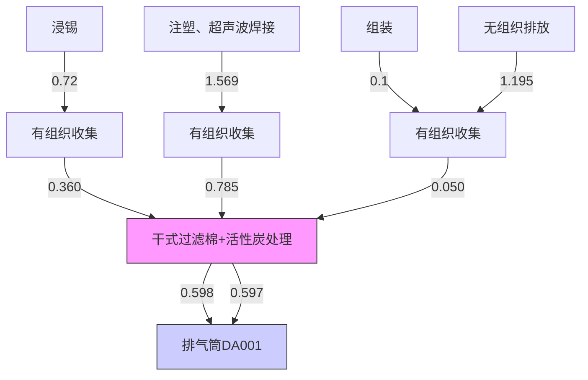
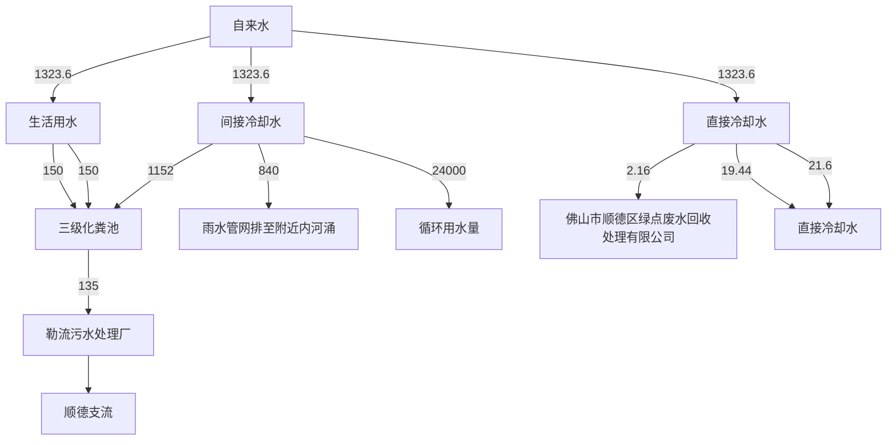
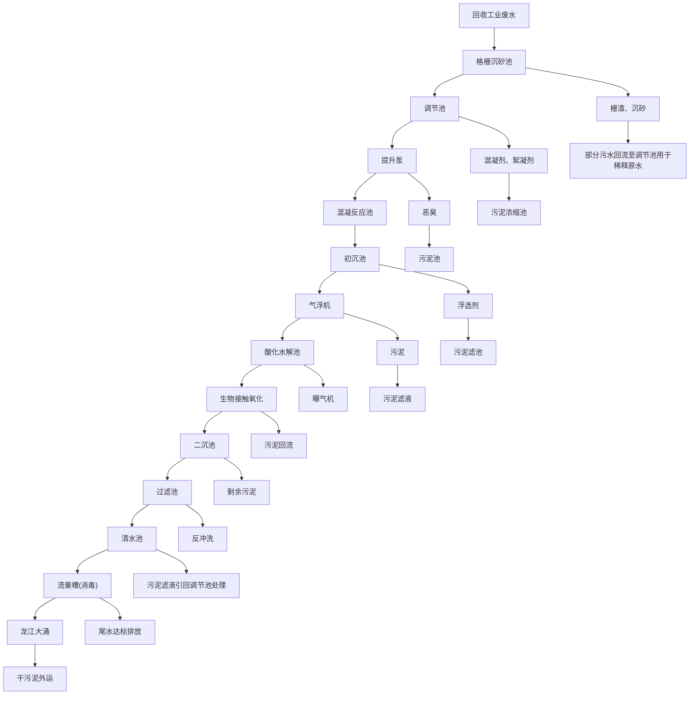

# 设项目环境影响报告

污染影响类

项目名称：佛山市智龙科技有限公司迁扩建项目

名称：佛山市智龙科技有限公司迁扩

编制日期：2024年6月

中华人 不境部制

text_image

环保科技发展有限公司
保和国生态

编制单位和编制人员情况表

<table><tr><td>项目编号</td><td colspan="2">4nlad7</td></tr><tr><td>建设项目名称</td><td colspan="2">佛山市智龙科技有限公司迁扩建项目</td></tr><tr><td>建设项目类别</td><td colspan="2">26--053塑料制品业</td></tr><tr><td>环境影响评价文件类型</td><td rowspan="4"></td><td></td></tr><tr><td>一、建设单位情况</td><td></td></tr><tr><td>单位名称(盖章)</td><td>司</td></tr><tr><td>统一社会信用代码</td><td></td></tr><tr><td>法定代表人(签章)</td><td rowspan="3"></td><td></td></tr><tr><td>主要负责人(签字)</td><td></td></tr><tr><td>直接负责的主管人员(签字)</td><td></td></tr><tr><td>二、编制单位情况</td><td rowspan="4"></td><td></td></tr><tr><td>单位名称(盖章)</td><td>展有限公司</td></tr><tr><td>统一社会信用代码</td><td></td></tr><tr><td>三、编制人员情况</td><td></td></tr><tr><td colspan="3">1.编制主持人</td></tr><tr><td rowspan="5" colspan="3"></td></tr><tr></tr><tr></tr><tr></tr><tr></tr></table>

text_image

管理号:
File No.:

text_image

国良环保
人事部和国奥

This is tocertify that the bearerof the Certificate has passed national examination organized by the Chinese government departments and has obtained qualifications for Environmental ImpactAssessment Engine

text_image

中华人民共和国
by
approved & authorized
by
Ministry of Personnel

text_image

环境保护部
approved & authorized
By
The Environmental Protection Administration
The People's Republic of China

text_image

管理号
File No
保科技发

text_image

中国节能环保科技发展有限公司
人力资源部

text_image

本证书由中华人民共和国人力资源和社会保障部、环境保护部批准颁发。它表明持证人通过国家统一组织的考试，取得环境影响评价工程师的职业资格。
This is to certify that the bearer of the Certificate has passed national examination organized by the Chinese government departments and has obtained qualifications for Environmental Impact Assessment Engineer.
Approved & authorized
by
Ministry of Human Resources and Social Security
The People's Republic of China
Approved & authorized
by
Ministry of Environmental Protection
The People's Republic of China
编号：0012923
No.:

# 目 录

一、建设项目基本情况.

二、建设项目工程分析... 13

三、区域环境质量现状、环境保护目标及评价标准 . 31

四、主要环境影响和保护措施.. . 41

五、环境保护措施监督检查清单 . 70

六、结论... . 73

附表.. . 74

附图1 项目地理位置图

附图2 项目车间平面布置图

附图3 项目评价范围内环境保护目标分布图

附图4 项目四至图

附图5 项目四至现状照片

附图6 项目所在区域的大气环境功能区划图

附图7 项目所在区域的地表水环境功能区划图

附图8 项目所在区域的声环境功能区划图

附图9 佛山市顺德区环境管控单元图

附图10 《佛山市顺德区勒流中部产业园（SD-H-02-05 编制单元）控制性详细规划》

附件1 营业执照

附件2 法人身份证

附件3 租赁合同

附件4 原环评批复文件

附件4 现有项目验收意见

附件5 原项目排污登记表

附件6 原项目竣工验收意见

附件7 助焊剂MSDS报告

附件8 废水委外承诺书

附件9 环保合同

附件10 公示声明

# 一、建设项目基本情况

<table><tr><td>建设项目名称</td><td colspan="3">佛山市智龙科技有限公司迁扩建项目</td></tr><tr><td>项目代码</td><td colspan="3">无</td></tr><tr><td>建设单位联系人</td><td>邝**</td><td>联系方式</td><td>1338029****</td></tr><tr><td>建设地点</td><td colspan="3">广东省佛山市顺德区勒流街道江村村工业大道18号华科园6栋201之一</td></tr><tr><td>地理坐标</td><td colspan="3">(东经113度8分38.248秒,北纬22度50分55.525秒)</td></tr><tr><td>国民经济行业类别</td><td>C2929塑料零件及其他塑料制品制造</td><td>建设项目行业类别</td><td>二十六、橡胶和塑料制品业29-塑料制品业292-其他(年用非溶剂型低VOCs含量涂料10吨以下的除外)</td></tr><tr><td>建设性质</td><td>☑新建(迁建)□改建☑扩建□技术改造</td><td>建设项目申报情形</td><td>☑首次申报项目□不予批准后再次申报项目□超五年重新审核项目□重大变动重新报批项目</td></tr><tr><td>项目审批(核准/备案)部门(选填)</td><td>/</td><td>项目审批(核准/备案)文号(选填)</td><td>/</td></tr><tr><td>总投资(万元)</td><td>100</td><td>环保投资(万元)</td><td>12</td></tr><tr><td>环保投资占比(%)</td><td>12</td><td>施工工期</td><td>1个月</td></tr><tr><td>是否开工建设</td><td>☑否□是: _</td><td>用地(用海)面积(m2)</td><td>1100</td></tr><tr><td>专项评价设置情况</td><td colspan="3">无</td></tr><tr><td>规划情况</td><td colspan="3">无</td></tr><tr><td>规划环境影响评价情况</td><td colspan="3">无</td></tr><tr><td>规划及规划环境影响评价符合性分析</td><td colspan="3">无</td></tr><tr><td>其他符合性分析</td><td colspan="3">1、广东省人民政府关于印发广东省“三线一单”生态环境分区管控方案的通知》(粤府〔2020〕71号)1与“一核一带一区”区域管控要求的相符性1)区域布局管控要求迁扩建项目位于珠三角核心区,主要进行塑料零件及其他塑料制品制造,不属于区域布局管控要求中的禁止新建、扩建水泥、平板玻璃、化学制浆、生皮制革以及国家规划外的钢铁、原油加工等项目。项目生产使用的原辅材料为低挥发性物质,不属于新建生产和使用高挥发性有机物原辅材料的项目,符合区域布局管控要求。2)能源资源利用要求迁扩建项目所属塑料零件及其他塑料制品制造、机械零部件加工不属于高能耗行业。项目大部分生产设备使用电能,生活用水由市政供水,不直接取用江河湖库水量,不会对项目所在地生态流量造成影响,符合能源利用要求。3)污染物排放管控要求项目属于迁扩建项目,挥发性有机物实行区域内两倍削减量替代,总量指标由镇街分配;项目所有产生有机废气的工序均配套有收集设施,收集效率约50%,经配套治理设备治理后引至排气筒达标排放。通过废气收集和处理措施能减少项目的挥发性有机物无组织排放;项目生活污水经处理达标后排放至勒流污水处理厂,尾水排放至顺德支流。目前顺德支流水质中重点水污染物 $COD_{Cr}$ 、 $NH_{3}-N$ 达到III类水体的要求,根据《佛山市排污权有偿使用和交易管理试行办法》(佛府办2020第19号),生活污水的CODcr、氨氮不分配总量,其总量纳入勒流污水处理厂。4)环境风险防控要求项目位于广东省佛山市顺德区勒流街道江村村工业大道18号华科园6栋201之一,不属于石化、化工重点园区环境风险防控区域。项目产生的危险废物拟定期委托有资质的处置公司进行收集处理,并通过信息系统登记转移计划和电子转移联单,符合危险废物全过程跟踪管理的防控要求。2环境管控单元总体管控要求</td></tr></table>

根据《广东省人民政府关于印发广东省“三线一单”生态环境分区管控方案的通知》（粤府〔2020〕71号）发布的广东省环境管控单元图，项目所在区域为重点管控单元，重点管控单元严格限制新建钢铁、燃煤燃油火电、石化、储油库等项目，产生和排放有毒有害大气污染物项目，以及使用溶剂型油墨、涂料、清洗剂、胶黏剂等高挥发性有机物原辅材料的项目；鼓励现有该类项目逐步搬迁退出，本项目不属于文件中提及的严格限制类项目。

# 2、《佛山市“三线一单”生态环境分区管控方案（2024年版）》（佛环〔2024〕20号）

根据《佛山市“三线一单”生态环境分区管控方案（2024年版）》（佛环〔202420号）发布的佛山市环境管控单元图，项目所在地广东省佛山市顺德区勒流街道江村村工业大道18号华科园6栋201之一，为珠三角核心区的重点管控单元。环境管控单元编号为ZH44060620009，单元名称为勒流街道重点管控区。

表1.1 与佛山市“三线一单”相符性分析

<table><tr><td>管控维度</td><td>与本项目有关的相关要求(摘录)</td><td>相符性分析</td><td>相符性分析</td></tr><tr><td rowspan="3">区域布局管控</td><td>1-1.【产业/鼓励引导类】重点发展智能家电、家具五金、环保装备、光电照明、装备制造及交通机械产业,引入智能制造服务、电子商务、现代商贸流通产业,重点建设环保产业基地、小家电产业基地和五金产业创业基地。</td><td>迁扩建项目不属于鼓励引导类项目。</td><td>符合</td></tr><tr><td>1-2.【产业/综合类】系统推进村级工业园升级改造,腾出连片空间,布局产业集聚区和主题产业园,推动工业项目入园集聚发展。</td><td>迁扩建项目位于广东省佛山市顺德区勒流街道江村村工业大道18号华科园6栋201之一,属于产业集聚区。</td><td>符合</td></tr><tr><td>1-3.【产业/限制类】受纳水体或监控断面不达标且未“以新带老”制定区域达标方案的河涌,不得新建、扩建向河涌直接排放废水的项目。新建、扩建含蚀刻工序的线路板生产项目和化工项目应在配套污水集中处置的工业园区或生活污水管网覆盖区域内建设;纯加工型印花项目,含酸洗、磷化的金属表面处理、金属制品项目(与自身高新技术企业配套的和区级及以上重点项目除外),含酸洗、喷涂、化学抛光、电解等涉及废水排放工艺的不锈钢型材加工项目(与自身高新技术企业配套的和区级及以上重点项目除外),应进入以此类项目为主导产业、有相应废水集中治理设施的工业园</td><td>迁扩建项目生活污水经过三级化粪池预处理后经市政污水管网排入勒流污水处理厂</td><td>符合</td></tr></table>

<table><tr><td rowspan="10"></td><td rowspan="4"></td><td>区,实现集中治污。</td><td></td><td></td></tr><tr><td>1-4.【产业/综合类】划定家具生产优先发展区域,优先发展区外不再新建涉及涂装工艺的木质家具制造项目。优先发展区范围根据家具产业发展规划及其规划环评文件确定。</td><td>迁扩建项目生活污水经过三级化粪池预处理后经市政污水管网排入勒流污水处理厂;生产废水定期委外处理。项目的产品不在“高污染、高环境风险”产品名录内。</td><td>符合</td></tr><tr><td>1-5.【水/限制类】严格限制在羊额—北滘水厂饮用水水源保护区上游和周边区域建设列入“高污染、高环境风险”产品名录等可能影响水环境安全的项目。</td><td>迁扩建项目生活污水经过三级化粪池预处理后经市政污水管网排入勒流污水处理厂;生产废水定期委外处理。项目的产品不在“高污染、高环境风险”产品名录内。</td><td>符合</td></tr><tr><td>1-6.【大气/限制类】大气环境布局敏感区重点管控区内,应严格限制新建生产和使用高挥发性有机物原辅材料项目,优先开展低VOCs含量原辅材料替代,强化无组织排放控制。原则上不再新建、扩建新增氮氧化物、烟(粉)尘排放量较大的建设项目。</td><td>迁扩建项目使用的涉VOCs原辅材料均不属于高VOCs含量原辅材料</td><td>符合</td></tr><tr><td rowspan="6">能源资源利用</td><td>2-1.【能源/鼓励引导类】推广节能技术,加快发展绿色货运与现代物流。</td><td>迁扩建项目不涉及。</td><td>符合</td></tr><tr><td>2-2.【能源/鼓励引导类】推广新能源汽车应用和充电基础设施建设,积极推动重卡LNG加气站、充电基础设施、加氢站建设。</td><td>迁扩建项目不涉及。</td><td>符合</td></tr><tr><td>2-3.【能源/综合类】科学实施能源消费总量和强度“双控”,新建高能耗项目单位产品(产值)能耗达到国际国内先进水平。</td><td>迁扩建项目生产过程中资源消耗量相对区域资源利用总量较少。</td><td>符合</td></tr><tr><td>2-4.【水资源/综合类】贯彻落实“节水优先”方针,实行最严格水资源管理制度,勒流街道万元国内生产总值用水量、万元工业增加值用水量、用水总量、农田灌溉水有效利用系数等用水总量和效率指标达到区下达要求。</td><td>迁扩建项目严格贯彻落实“节水优先”方针,实行最严格水资源管理制度,勒流镇万元国内生产总值用水量、万元工业增加值用水量、用水总量、农田灌溉水有效利用系数等用水总量和效率指标达到区下达要求。</td><td>符合</td></tr><tr><td>2-5.【土地资源/限制类】落实单位土地面积投资强度、土地利用强度等建设用地控制性指标要求,提高土地利用效率。</td><td>迁扩建项目已落实单位土地面积投资强度、土地利用强度等建设用地控制性指标要求,提高土地利用效率</td><td>符合</td></tr><tr><td>2-6.【岸线/禁止类】严格水域岸线用途管制,新建项目一律不得违规占用水域。严禁破坏生态的岸线利用行为和不符合其功能定位的开发建设活动,严禁以各种名义侵占河道、围垦湖泊、非法采砂等。</td><td>迁扩建项目未违规占用水域,不会破坏生态的岸线利用行为和不符合其功能定位的开发建设活动,不侵占河道、围垦湖泊、非法采砂等</td><td>符合</td></tr><tr><td rowspan="8"></td><td rowspan="5">污染物排放管控</td><td>3-1.【水/限制类】城镇新区建设实行雨污分流,逐步推进初期雨水收集、处理和资源化利用。住宅、商业体、学校、市场等城镇开发建设项目应当配套或者同步计划建设公共排水设施,公共排水设施或自建排污水设施未能投产运行的,以上涉水项目不得投入使用。新建小区严格实施雨污分流,阳台、露台等污水接入污水收集系统,将生活污水“应截尽截”。做好大型楼盘、集贸市场、餐饮以及学校等4大类排水户污水接入市政管网工作。</td><td>迁扩建项目不属于城镇新区建设。</td><td>符合</td></tr><tr><td>3-2.【水/综合类】结合村级工业园改造,全面提升产业层次与集聚度,促进污染集中整治。</td><td>迁扩建项目废水污染物总量指标纳入勒流污水处理厂。</td><td>符合</td></tr><tr><td>3-3.【水/综合类】稳步推进排水设施“三个一体化”管理模式,补齐城乡污水收集和处理短板,推动群力围污水处理厂提质增效,加快消除城中村、老旧城区、城乡结合部等污水收集管网空白区,逐步实现城乡污水收集处理全覆盖。2025年前完成群力围污水处理厂扩建,尾水应执行《城镇污水处理厂污染物排放标准》(GB18918-2002)一级A标准及《广东省水污染物排放限值》(DB44/26-2001)的较严值。</td><td>迁扩建项目位于勒流污水处理厂处理范围,尾水执行《城镇污水处理厂污染物排放标准》(GB18918-2002)一级A标准及《广东省水污染物排放限值》(DB44/26-2001)的较严值。</td><td>符合</td></tr><tr><td>3-4.【水/综合类】保留勒流社区百丈片区分散式农村污水处理设施,其余行政村(社区)通过市政污水管网,配合农村支管网建设,有条件的区域实施雨污分流改造,到2030年实现农村生活污水100%收集进入勒流污水处理系统。</td><td>迁扩建项目属于勒流污水处理厂纳污范围。</td><td>符合</td></tr><tr><td>3-5.【土壤/限制类】严格重金属重点行业企业准入管理。新、改、扩建重点行业建设项目应遵循重点重金属污染物排放“等量替代”原则。</td><td>迁扩建项目生产过程采用包围型集气罩收集有机废气,经“干式过滤棉+活性炭吸附”装置处理后,引至排气筒DA001排放。</td><td>符合</td></tr><tr><td rowspan="3">环境风险管控</td><td>4-1.【水/综合类】加强单元内羊额—北滘水厂饮用水水源保护区周边环境风险源管控,完善突发环境事件应急管理体系。</td><td rowspan="3">建设单位将严格采取切实可行环境风险防范措施,可有效防止项目产生的污染物进入环境,有效降低了对周围环境存在的风险影响。</td><td rowspan="3">符合</td></tr><tr><td>4-2.【水/综合类】勒流污水处理厂、工业污水集中处理设施应采取有效措施,防止事故废水直接排入水体。完善污水处理厂在线监控系统联网,实现污水处理厂的实时、动态监管。</td></tr><tr><td>4-3.【风险/综合类】加强环境风险分级分类管理,强化金属制品、有色金属和压延加工、化学原料和化学品制造业等涉重金属、化工行业企业及工业园区等重点环境风险源的环境风</td></tr><tr><td rowspan="7"></td><td colspan="2">险防控。</td><td></td><td></td></tr><tr><td colspan="4">3、《佛山市顺德区人民政府关于印发佛山市顺德区“三线一单”生态环境分区管控方案的通知》(顺府发〔2021〕11号)对照《佛山市顺德区人民政府关于印发佛山市顺德区“三线一单”生态环境分区管控方案的通知》(顺府发〔2021〕11号)的附件2佛山市顺德区环境管控单元图,项目所在地属于重点管控单元9(环境管控单元编码:ZH44060620009,环境管控单元名称:勒流街道重点管控区,详见附图8)。相关管控要求的相符性分析如下:表1.2 与顺德区“三线一单”相符性分析</td></tr><tr><td>管控维度</td><td>与本项目有关的相关要求(摘录)</td><td>相符性分析</td><td>相符性分析</td></tr><tr><td rowspan="4">区域布局管控</td><td>1-1.【产业/鼓励引导类】重点发展智能家电、家具五金、环保装备、光电照明、装备制造及交通机械产业,引入智能制造服务、电子商务、现代商贸流通产业,重点建设环保产业基地、小家电产业基地和五金产业创业基地。</td><td>迁扩建项目为C2929塑料零件及其他塑料制品制造,不属于鼓励引导类项目。</td><td>符合</td></tr><tr><td>1-2.【产业/综合类】系统推进村级工业园升级改造,腾出连片空间,布局产业集聚区和主题产业园,推动工业项目入园集聚发展。新增工业制造业用地原则上安排在产业集聚区内,产业集聚区外原则上不鼓励工业及物流仓储用地的新建与改造。</td><td>迁扩建项目不属于村改范围,不属于工业及物流仓储用地的新建与改造。</td><td>符合</td></tr><tr><td>1-3.【产业/限制类】受纳水体或监控断面不达标的,不得新建、扩建向河涌直接排放废水的项目。新建、扩建含蚀刻工序的线路板生产项目和化工项目应在配套污水集中处置的工业园区或生活污水管网覆盖区域内建设;纯加工型印花项目,含酸洗、磷化的金属表面处理、金属制品项目(与自身高新技术企业配套的除外),含酸洗、喷涂、拉丝、表面抛光等工艺的不锈钢型材加工项目,应进入以此类项目为主导产业、有相应废水集中治理设施的工业园区,实现集中治污。</td><td>迁扩建项目生活污水排入勒流污水处理厂。项目为C2929塑料零件及其他塑料制品制造,主要从事玻璃加工设备的加工生产,不属于线路板生产项目和化工项目;不属于纯加工型印花,含酸洗、喷涂、拉丝、表面抛光等工艺的不锈钢型材加工项目。</td><td>符合</td></tr><tr><td>1-4.【水/限制类】严格限制在羊额—北滘水厂饮用水水源保护区上游和周边区域建设列入“高污染、高环境风险”产品名录等可能影响水环境安全的项目。</td><td>迁扩建项目建设不在以上水源保护区的范围,不属于高污染、高环境风险的产品名录,本项目属于勒流污水处理厂的纳污范围,不属于影响水环境安全的项目</td><td>符合</td></tr><tr><td rowspan="9"></td><td rowspan="2"></td><td>1-5.【大气/限制类】大气环境布局敏感区重点管控区内,应严格限制新建生产和使用高挥发性有机物原辅材料项目,优先开展低VOCs含量原辅材料替代,强化无组织排放控制。原则上不再新建、扩建新增氮氧化物、烟(粉)尘排放量较大的建设项目。</td><td>迁扩建项目使用的涉VOCs原辅材料均不属于高VOCs含量原辅材料</td><td>符合</td></tr><tr><td>1-6.【土壤/禁止类】禁止新建、扩建增加重点防控的重金属污染物排放的建设项目</td><td>迁扩建项目不涉及重金属污染物排放</td><td>符合</td></tr><tr><td rowspan="6">能源资源利用</td><td>2-1.【能源/鼓励引导类】推广节能技术,加快发展绿色货运与现代物流。</td><td>迁扩建项目使用节能技术,项目不属于绿色货运与现代物流。</td><td>符合</td></tr><tr><td>2-2.【能源/鼓励引导类】推广新能源汽车应用和充电基础设施建设,积极推动重卡LNG加气站、充电基础设施、加氢站建设。</td><td>迁扩建项目不属于新能源汽车应用和充电基础设施、加氢站建设项目。</td><td>符合</td></tr><tr><td>2-3.【能源/综合类】科学实施能源消费总量和强度“双控”,新建高能耗项目单位产品(产值)能耗达到国际国内先进水平。</td><td>迁扩建项目不属于高能耗项目。</td><td>符合</td></tr><tr><td>2-4.【水资源/综合类】贯彻落实“节水优先”方针,实行最严格水资源管理制度,勒流街道万元国内生产总值用水量、万元工业增加值用水量、用水总量、农田灌溉水有效利用系数等用水总量和效率指标达到区下达要求。</td><td>迁扩建项目严格贯彻落实“节水优先”方针,实行最严格水资源管理制度,勒流镇万元国内生产总值用水量、万元工业增加值用水量、用水总量、农田灌溉水有效利用系数等用水总量和效率指标达到区下达要求。</td><td>符合</td></tr><tr><td>2-5.【土地资源/限制类】落实单位土地面积投资强度、土地利用强度等建设用地控制性指标要求,提高土地利用效率。</td><td>迁扩建项目所在地为工业用地,符合控制性指标要求</td><td>符合</td></tr><tr><td>2-6.【岸线/禁止类】严格水域岸线用途管制,新建项目一律不得违规占用水域。严禁破坏生态的岸线利用行为和不符合其功能定位的开发建设活动,严禁以各种名义侵占河道、围垦湖泊、非法采砂等。</td><td>迁扩建项目未违规占用水域,不会破坏生态的岸线利用行为和不符合其功能定位的开发建设活动,不侵占河道、围垦湖泊、非法采砂等</td><td>符合</td></tr><tr><td>污染物排放管控</td><td>3-1.【水/限制类】城镇新区建设实行雨污分流。住宅、商业体、学校、市场等城镇开发建设项目应当配套或者同步计划建设公共排水设施,公共排水设施或自建排污水设施未能投产运行的,以上涉水项目不得投入使用。新建小区严格实施雨污分流,阳台、露台等污水接入污水收集系统,将生活污水“应截尽截”。做好大型楼盘、集贸市场、餐饮以及学校等4大类排水户污水接入市政管网工作。3-2.【水/综合类】结合村级工业园改造,全面提升产业层次与集聚度,促进污染集中整治。</td><td>迁扩建项目不属于城镇新区建设。迁扩建项目不属于村级工业园改造区。</td><td>符合符合</td></tr><tr><td rowspan="7"></td><td rowspan="3"></td><td>3-3.【水/综合类】稳步推进排水设施“三个一体化”管理模式,补齐城乡污水收集和处理短板,推动勒流污水处理厂提质增效,加快消除城中村、老旧城区、城乡结合部等污水收集管网空白区,逐步实现城乡污水收集处理全覆盖。2025年前完成勒流污水处理厂扩建,尾水应执行《城镇污水处理厂污染物排放标准》(GB18918-2002)一级A标准及《广东省水污染物排放限值》(DB44/26-2001)的较严值。</td><td>迁扩建项目位于勒流污水处理厂处理范围,尾水执行《城镇污水处理厂污染物排放标准》(GB18918-2002)一级A标准及《广东省水污染物排放限值》(DB44/26-2001)的较严值。</td><td>符合</td></tr><tr><td>3-4.【水/综合类】保留勒流社区百丈片区分散式农村污水处理设施,其余行政村(社区)通过市政污水管网,配合农村支管网建设,有条件的区域实施雨污分流改造,到2030年实现农村生活污水100%收集进入勒流污水处理系统。</td><td>迁扩建项目不属于污水管网、污水处理设施等建设项目。本项目实施雨污分流。</td><td>符合</td></tr><tr><td>3-5.【土壤/限制类】作为重金属污染重点防控区,区域内重点重金属排放总量只减不增。</td><td>迁扩建项目不涉及重点防控的重金属污染物排放</td><td>符合</td></tr><tr><td rowspan="3">环境风险管控</td><td>4-1.【水/综合类】加强单元内羊额—北滘水厂饮用水水源保护区周边环境风险源管控,完善突发环境事件应急管理体系。</td><td rowspan="3">建设单位将严格采取切实可行环境风险防范措施,可有效防止项目产生的污染物进入环境,有效降低了对周围环境存在的风险影响。</td><td rowspan="3">符合</td></tr><tr><td>4-2.【水/综合类】勒流污水处理厂、工业污水集中处理设施应采临取有效措施,防止事故废水直接排入水体。完善污水处理厂在线监控系统联网,实现污水处理厂的实时、动态监管。</td></tr><tr><td>4-3.【风险/综合类】加强环境风险分级分类管理,强化金属制品、有色金属和压延加工、化学原料和化学品制造业等涉重金属、化工行业企业及工业园区等重点环境风险源的环境风险防控。</td></tr><tr><td colspan="4">2、产业政策符合性分析迁扩建项目属于《国民经济行业分类》(GB/T4754-2017)及第1号修改单中的C2929塑料零件及其他塑料制品制造,根据《产业结构调整指导目录(2024年修订)》的规定,本项目不属于限制类、淘汰类。综上所述,本项目符合国家、广东省的产业政策要求。根据《广东省“两高”项目管理目录(2022年版)》和广东省发展改革委关于印发《广东省坚决遏制“两高”项目盲目发展的实施方案》的通知(粤发改能源</td></tr></table>

〔2021〕368号）中指出两高”项目范围暂定为年综合能源消费量 1万吨标准煤以上的煤电、石化、化工、钢铁、有色金属、建材、煤化工、焦化等8个行业的项目，本项目不属于煤电、石化、化工、钢铁、有色金属、建材、煤化工、焦化等8个行业的项目。

根据国家发展改革委商务部关于印发《市场准入负面清单（2022 年版）》的通知，本项目不属于市场准入负面清单项目。

# 3、项目与相关政策文件规定的相符性分析

项目根据相关政策文件规定分析如下：

表1.3 相关政策文件规定的相符性分析

<table><tr><td>序号</td><td>政策要求</td><td>工程内容</td><td>符合性</td></tr></table>

1.《广东省生态环境保护“十四五”规划》（粤环〔2021〕10 号）

<table><tr><td>1.1</td><td>大力推进VOCs含量原辅材料源头替代,严格落实国家和地方产品VOCs含量限值质量标准,禁止建设生产和使用高VOCs含量的溶剂型涂料、油墨、胶粘剂等项目</td><td>迁扩建项目不使用高VOCs含量原辅材料。</td><td>符合</td></tr><tr><td>1.2</td><td>强化对企业涉VOCs生产车间/工序废气的收集管理,推动企业开展治理设施升级改造</td><td>迁扩建项目拟于注塑机、超声波焊接机上方设置包围型集气罩,有机废气经包围型收集通过“干式过滤棉+活性炭吸附”设施处理后引至45米高排气筒(DA001)排放。可有效减少有机废气排放,减少异味影响</td><td>符合</td></tr></table>

2.《佛山市生态环境保护“十四五”规划》佛环（2022）3 号

<table><tr><td>2.1</td><td>严格控制“高耗能、高排放”项目盲目发展,禁止新建、扩建水泥、平板玻璃、化学制浆、生皮制革以及国家规划外的钢铁、原油加工等项目</td><td>项目不属于“高耗能、高排放”项目。</td><td>符合</td></tr><tr><td>2.2</td><td>大力推进低VOCs含量原辅材料替代,将全面使用低VOCs含量原辅材料的企业纳入正面清单和政府绿色采购清单。</td><td>项目使用的原辅材料属于低挥发原辅材料。</td><td>符合</td></tr><tr><td>2.3</td><td>推进VOCs高排放企业治理设施提升改造,淘汰光催化、光氧化、低温等离子等现有低效治理设施。</td><td>项目治理设备为“干式过滤棉+活性炭吸附”设施,不使用低效治理设施</td><td>符合</td></tr></table>

3.《佛山市顺德区生态环境保护“十四五”规划（2021—2025）

<table><tr><td>3.1</td><td>禁止新建、扩建水泥、平板玻璃、化学制浆、生皮制革以及国家规划外的钢铁、原油加工等项目;专业电镀、印染等项目进入定点园区集中管理</td><td>项目属于C2929塑料零件及其他塑料制品制造,不属于水泥、平板玻璃、化学制浆、生皮制革以及国家规划外的钢铁、原油加工等项目</td><td>符合</td></tr></table>

<table><tr><td rowspan="9"></td><td>3.2</td><td>加强VOCs源头替代和无组织排放管控。大力推进低VOCs含量、低反应活性的原辅材料替代,将全面使用低VOCs含量原辅材料的企业纳入正面清单和政府绿色采购清单。鼓励重点行业企业开展生产工艺和设备水性化改造,推广使用水性、高固体分、无溶剂、粉末等低VOCs含量涂料。严格落实《挥发性有机物无组织排放控制标准》,开展厂区内无组织排放浓度监测,加强对含VOCs物料储存、转移和运输、设备与管线组件泄漏、敞开页面逸散以及工艺过程等五类排放源的管控。</td><td>本项目不使用溶剂型涂料、油墨、胶黏剂和清洗剂等,使用“干式过滤棉+活性炭吸附”装置治理后引至排气筒达标排放。</td><td>符合</td></tr><tr><td colspan="4">4.佛山市生态环境局关于印发《佛山市重点行业VOCs治理提升工作方案》的通知</td></tr><tr><td>4.1</td><td>2021年底前淘汰光氧化、光催化、低温等离子等低效治理设施。</td><td>迁扩建项目废气收集通过“干式过滤棉+活性炭吸附”处理后引至高空排放,未采用淘汰的低效治理设施。</td><td>符合</td></tr><tr><td>4.2</td><td>不外运处理的含VOCs废水须深化处理(包含物化、生化处理工艺),达标排放。</td><td>项目不产生含VOCs废水</td><td>符合</td></tr><tr><td colspan="4">5.《广东省大气污染防治条例》(2022年修正版)</td></tr><tr><td>5.1</td><td>珠江三角洲区域禁止新建、扩建燃煤燃油火电机组或者企业燃煤燃油自备电站。珠江三角洲区域禁止新建、扩建国家规划外的钢铁、原油加工、乙烯生产、造纸、水泥、平板玻璃、除特种陶瓷以外的陶瓷、有色金属冶炼等大气重污染项目。</td><td>迁扩建项目不属于大气重污染项目</td><td>符合</td></tr><tr><td>5.2</td><td>新建、扩建、扩建排放挥发性有机物的建设项目,应当使用污染防治先进可行技术。下列产生含挥发性有机物废气的生产和服务活动,应当优先使用低挥发性有机物含量的原材料和低排放环保工艺,在确保安全条件下,按照规定在密闭空间或者设备中进行,安装、使用满足防爆、防静电要求的治理效率高的污染防治设施;无法密闭或者不适宜密闭的,应当采取有效措施减少废气排放:(一)石油、化工、煤炭加工与转化等含挥发性有机物原料的生产;(二)燃油、溶剂的储存、运输和销售;(三)涂料、油墨、粘合剂、农药等以挥发性有机物为原料的生产;(四)涂装、印刷、粘合、工业清洗等使用含挥发性有机物产品的生产活动;(五)其他产生挥发性有机物的生产和服务活动。</td><td>迁扩建项目拟于注塑机、超声波焊接机上方设置包围型集气罩,有机废气经包围型收集通过“干式过滤棉+活性炭吸附”设施处理后引至45米高排气筒(DA001)排放。可有效减少有机废气排放,减少异味影响。</td><td>符合</td></tr><tr><td colspan="4">6.《固定污染源挥发性有机物综合排放标准》(DB44/2367—2022)</td></tr><tr><td>6.1</td><td>粉状、粒状VOCs物料应当采用气力输送方式或者采用密闭固体投料器等给料方式密闭投加。无法密闭投加的,应当在密闭空间内操作,或者进行局部气体收集,废气应当排至除尘设施、VOCs废气收集处理系统</td><td>迁扩建项目生产过程中主要使用原辅材料主要为PP粒料(新料)、PVC塑料(新料)、PU塑料(新料),其</td><td>符合</td></tr><tr><td rowspan="10"></td><td>6.2</td><td>VOCs物料卸(出、放)料过程应当密闭,卸料废气应当排至VOCs废气收集处理系统;无法密闭的,应当采取局部气体收集措施,废气应当排至VOCs废气收集处理系统。</td><td rowspan="2">不含常温下会挥发的物料。产生的非甲烷总烃采用包围型集气罩收集,经“干式过滤棉+活性炭吸附”装置处理后引至45米排气筒DA001高空排放</td><td>符合</td></tr><tr><td>6.3</td><td>VOCs物料储库、料仓应利用完整的围护结构将污染物质、作业场所等与周围空间阻隔所形成的封闭区域或封闭式建筑物。该封闭区域或封闭式建筑物除人员、车辆、设备、物料进出时,以及依法设立的排气筒、通风口外,窗及其他开口(孔)部位应随时保持关闭状态</td><td>符合</td></tr><tr><td>6.4</td><td>建立台账,记录含VOCs原辅材料和含VOCs产品的名称、使用量、回收量、废弃量、去向以及VOCs含量等信息。台账保存期应不少于三年</td><td>迁扩建项目正式运营后将建立台账,记录含VOCs原辅材料和产品的名称、使用量、回收量、废弃量、去向以及VOCs含量等信息。台账保存期限不少于三年</td><td>符合</td></tr><tr><td colspan="4">7、《重点行业挥发性有机物综合治理方案》的通知(环大气[2019]53号)</td></tr><tr><td>7.1</td><td>全面加强无组织排放控制。重点对含VOCs物料(包括含VOCs原辅材料、含VOCs产品、含VOCs废料以及有机聚合物材料等)储存、转移和输送、设备与管线组件泄漏、敞开液面逸散以及工艺过程等五类排放源实施管控,通过采取设备与场所密闭、工艺改进、废气有效收集等措施,削减VOCs无组织排放。</td><td>迁扩建项目产生非甲烷总烃的工序配套有收集设施,收集效率约50%,经配套治理设备治理后引至45米高排气筒达标排放</td><td>符合</td></tr><tr><td>7.2</td><td>加强设备与场所密闭管理。含VOCs物料应储存于密闭容器、包装袋,高效密封储罐,封闭式储库、料仓等。</td><td>迁扩建项目含VOCs的塑料原料储存于包装袋,常温下不会发生分解</td><td>符合</td></tr><tr><td>7.3</td><td>提高废气收集率。遵循“应收尽收、分质收集”的原则,科学设计废气收集系统,将无组织排放转变为有组织排放进行控制。采用全密闭集气罩或密闭空间的,除行业有特殊要求外,应保持微负压状态,并根据相关规范合理设置通风量。采用局部集气罩的,距集气罩开口面最远处的VOCs无组织排放位置,控制风速应不低于0.3米/秒,有行业要求的按相关规定执行。</td><td>迁扩建项目采用局部集气罩收集非甲烷总烃,控制风速不低于0.3m/s。</td><td>符合</td></tr><tr><td colspan="4">8、关于印发《广东省涉挥发性有机物(VOCs)重点行业治理指引》的通知(粤环办〔2021〕43号)</td></tr><tr><td>VOCs物料转移和输送</td><td>VOCs物料储存:含VOCs的物料应储存于密闭的容器、包装袋、储罐、储库、料仓中。盛装VOCs物料的容器是否存放于室内,或存放于设置有雨棚、遮阳和防渗设施的专用场地。盛装VOCs物料的容器在非取用状态时应加盖、封口,保持密闭。</td><td>迁扩建项目使用的塑料为固态粒状,常温条件下不会产生有机废气,在转移过程中均使用密闭的包装袋封装。</td><td>符合</td></tr><tr><td>工艺过程</td><td>粉状、粒状VOCs物料采用气力输送方式或采用密闭固体投料器等给料方式密闭投加;无法密闭投加的,在密闭空间内操作,或进行局部气体收集,废气排至除尘设施、VOCs废气收集处理系统。</td><td>迁扩建项目粒状塑料常温下不挥发,在转移过程中均使用密闭的包装袋封装</td><td>符合</td></tr><tr><td rowspan="9"></td><td></td><td>在混合/混炼、塑炼/塑化/熔化、加工成型(挤出、注射、压制、压延、发泡、纺丝等)、硫化等作用中应采用密闭设备或在密闭空间中操作,废气应排至VOCs废气收集处理系统;无法密闭的,应采取局部气体收集措施,废气排至VOCs废气收集处理系统。</td><td>迁扩建项目采用包围型集气罩收集非甲烷总烃,经“干式过滤棉+活性炭吸附”装置处理后引至45米排气筒DA001高空排放。</td><td>符合</td></tr><tr><td rowspan="2">废气收集</td><td>采用外部集气罩的,距集气罩开口面最远处的VOCs无组织排放位置,控制风速不低于0.3m/s。</td><td>项目集气罩置于废气产生点的合理位置,保证罩口截面风速为0.5m/s。</td><td>符合</td></tr><tr><td>废气收集系统的输送管道应密闭。废气收集系统应在负压下运行,若处于正压状态,应对管道组件的密封垫进行泄漏检测,泄漏检测值不应超过500μmol/mol,亦不应有感官可察觉泄漏。</td><td>项目废气收集系统的输送管道均密闭,废气收集系统在负压下运行。</td><td>符合</td></tr><tr><td>排放水平</td><td>塑料制品行业:a)有机废气排气筒排放浓度不高于广东省《大气污染物排放限值》(DB4427-2001)第II时段排放限值,合成革和人造革企业排放浓度不高于《合成革与人造革工业污染物排放标准》(GB21902-2008)排放限值,若国家和我省出台并实施适用于塑料制品制造业的大气污染物排放标准,则有机废气排气筒排放浓度不高于相应的排放限值;车间或生产设施排气中NMHC初始排放速率≥3kg/h时,建设VOCs处理设施且处理效率≥80%;b)厂区内无组织排放监控点NMHC的小时平均浓度值不超过6mg/m3,任意一次浓度值不超过20mg/m3。</td><td>有机废气排气筒的非甲烷总烃排放达到《合成树脂工业污染物排放标准》(GB31572-2015,含2024年修改单)中表4大气污染物排放标准与广东省地方标准《固定污染源挥发性有机物综合排放标准》(DB44/2367-2022)表1挥发性有机物排放限值的较严值;厂区内无组织排放监控点NMHC达到广东省《固定污染源挥发性有机物综合排放标准》(DB44/2367-2022)表3厂区内VOCs无组织排放限值</td><td>符合</td></tr><tr><td colspan="4">9、《广东省人民政府办公厅关于印发《广东省2023年大气污染防治工作方案的通知》(粤办函[2023]50号)</td></tr><tr><td>9.1</td><td>开展简易低效VOCs治理设施清理整治。严格限制新改扩建项目使用光催化、光氧化、水喷淋(吸收可溶性VOCs除外)、低温等离子等低效VOCs治理设施(恶臭处理除外)。各地要对低效VOCs治理设施开展排查,对达不到治理要求的单位,要督促其更换或升级改造。</td><td>项目有机废气治理设施为“干式过滤棉+活性炭吸附”装置,不属于低效VOCs治理设施。</td><td>符合</td></tr><tr><td>9.2</td><td>严格执行涂料、油墨、胶粘剂、清洗剂VOCs含量限值标准,建立多部门联合执法机制,加强对相关产品生产、销售、使用环节VOCs含量限值执行情况的监督检查。</td><td>项目使用的物料均不属于高挥发性有机物原辅材料,符合政策要求。</td><td>符合</td></tr><tr><td colspan="4">10、《佛山市顺德区强化大气污染防治行动方案(2024年)》</td></tr><tr><td>10.1</td><td>按照《佛山市安全生产委员会办公室关于印发佛山市有机废气治理设施安全专项整治工作方案的通知》(佛安办(2020)9.1246号)部署,要求已登记造册的仍在使用低温等离子、UV光解设备设施的企业,2024年底基本完成光氧化、光催化、低温等离子等低效治理设施淘汰。</td><td>项目有机废气治理设施为“干式过滤棉+活性炭吸附”装置。不属于上述低效治理设施。</td><td>符合</td></tr><tr><td rowspan="3"></td><td colspan="4">11、顺德区生态环境保护委员会办公室关于印发《顺德区重点行业挥发性有机物总量指标管理工作方案(2024年修订)(顺环委办[2024]3号)</td></tr><tr><td>11.1</td><td>总量替代原则。根据区域现状、改善目标、减排空间,全区建设项目新增VOCs排放量施行“减二增一”政策。其中,有组织排放和无组织排放均纳入新增指标管理;非甲烷总烃合并计入VOCs管理。</td><td>项目新增VOCs排放总量指标为0.839t/a,由勒流镇出具VOCs总量指标来源及替代削减方案的意见。</td><td>符合</td></tr><tr><td colspan="4">4、选址合理性分析本项目位于广东省佛山市顺德区勒流街道江村村工业大道18号华科园6栋201之一,根据《佛山市顺德区勒流中部产业园(SD-H-02-05编制单元)控制性详细规划》修编批后公布,项目所在地规划为工业用地,本项目所在土地利用现状及规划均为允许建设区,因此用地规划符合总体规划要求。5、项目与《环境保护综合名录》(2021年版)相符性分析项目生产的产品为滑轮,不属于《环境保护综合名录》(2021年版)中“高污染、高环境风险”产品,符合《环境保护综合名录》(2021年版)的相关规定。</td></tr></table>

# 二、建设项目工程分析

<table><tr><td rowspan="6">建设内容</td><td colspan="10">1.项目概况佛山市智龙科技有限公司于2021年1月7日取得《佛山市智龙科技有限公司年产溜冰鞋轮300万个、滑板车轮300万个新建项目》的环评批复(佛环0304环审[2021]第0002号),2021年5月24日通过竣工环境保护验收。2021年5月完成固定污染源排污登记,编号:91440606MA558YA35M001W。原项目位于广东省佛山市顺德区勒流街道勒北村百丈工业一路9号A之四,年产溜冰鞋轮300万个、滑板车轮300万个。因企业发展需要,企业拟选址于广东省佛山市顺德区勒流街道江村村工业大道18号华科园6栋201之一进行迁扩建生产,项目所在建筑为8层高的工业厂房,首层高度为8米,其他楼层高度为5.95m,建筑物总高度为43.7m。现进行迁扩建环境影响评价审批申请,本项目预计年产溜冰鞋轮300万个、滑板车轮300万个、儿童车轮300万个、其他车轮100万个。2.工程组成项目主要工程组成见下表:表2.1 迁扩建前后项目工程组成表</td></tr><tr><td>工程类别</td><td>项目名称</td><td>迁扩建前建设内容和规模</td><td>迁扩建后建设内容和规模</td><td>变化量</td><td colspan="5">依托工程情况</td></tr><tr><td>主体工程</td><td>生产车间</td><td>面积约 $700m^{2}$ ,厂房层高5米,含混料、破碎、注塑区域、组装车间</td><td>面积约 $500m^{2}$ ,厂房层高5.5米,含混料、破碎、注塑区域</td><td rowspan="3">搬迁至广东省佛山市顺德区勒流街道江村村工业大道18号华科园6栋201之一,建筑面积 $1100m^{2}$ ,车间内部重新布局,详见迁扩建后情况</td><td colspan="5">依托所在厂房已有设施</td></tr><tr><td rowspan="2">辅助工程</td><td>办公室</td><td>供日常办公使用,建筑面积约 $50m^{2}$ 。</td><td>供日常办公使用,成品储存,建筑面积约 $100m^{2}$ </td><td colspan="5">依托所在厂房已有设施</td></tr><tr><td>仓库</td><td>供原料、成品储存,建筑面积约 $50m^{2}$ 。</td><td>供原料、成品储存,建筑面积约 $495m^{2}$ 。</td><td colspan="5">依托所在厂房已有设施</td></tr><tr><td>公用工程</td><td>供水系统</td><td>市政供水</td><td>市政供水</td><td>不变</td><td colspan="5">依托所在厂房</td></tr><tr><td rowspan="8"></td><td rowspan="2"></td><td colspan="2">排水系统</td><td colspan="2">生活污水经独立处理设施处理后排入百丈农村分散式污水处理站处理,尾水排入百丈环村涌;雨水管网接入市政雨水管网</td><td colspan="2">生活污水经三级化粪池预处理后通过市政管网排入勒流污水处理厂;雨水管网接入市政雨水管网</td><td colspan="2">迁建后生活污水经三级化粪池预处理后通过市政管网排入勒流污水处理厂</td><td rowspan="2">已有设施</td></tr><tr><td colspan="2">电力系统</td><td colspan="2">配电系统一套</td><td colspan="2">配电系统一套</td><td colspan="2">不变</td></tr><tr><td rowspan="4">环保工程</td><td>废水治理</td><td>生活污水</td><td colspan="2">独立处理设施</td><td colspan="2">三级化粪池</td><td colspan="2">迁建后废水治理设施为三级化粪池</td><td>依托所在厂区已有生活污水处理设施</td></tr><tr><td>废气治理</td><td>注塑、超声波焊接、焊锡、浸锡、组装</td><td colspan="2">二级活性炭(排气筒编号G1;风量 $15000m^{3}/h$ ,15米高空排放)</td><td colspan="2">干式过滤棉+活性炭吸附(排气筒编号DA001;风量 $20000m^{3}/h$ ,45米高空排放)</td><td colspan="2">更新“干式过滤棉+活性炭吸附”处理设施</td><td>/</td></tr><tr><td colspan="2">噪声治理</td><td colspan="2">高噪声设备基础减振、局部隔声降噪措施</td><td colspan="2">选用低噪声设备,并采取减振、隔声、消声、降噪措施</td><td colspan="2">迁扩建后厂房采用低噪声设备、做好设备隔声、减振处理、合理布局车间</td><td>/</td></tr><tr><td colspan="2">固废贮存</td><td colspan="2">生活垃圾交环卫部门及时清运处理;一般工业固体废物交回收单位回收处理;设有危废暂存区,废机油、废液压油、含油废抹布、废包装桶、废活性炭收集后定期交由具有危废运营资质的单位统一处理</td><td colspan="2">员工生活垃圾经收集后交由环卫部门定期清运处理;一般固体废物交由资源回收公司回收;废机油、废液压油、废活性炭、废油桶、含油废抹布、废包装桶、废PCB板、废滤芯交由有相关资质的危废公司处置</td><td colspan="2">迁扩建后项目新增废PCB板、废滤芯</td><td>/</td></tr><tr><td colspan="10">3.产品及产能迁扩建项目主要从事滑轮的生产组装,主要产品及产能见下表:表2.2 产品及产能</td></tr><tr><td>序号</td><td colspan="2">产品名称</td><td>迁扩建前(万个/年)</td><td colspan="2">变化(万个/年)</td><td>迁扩建后(万个/年)</td><td>滑轮塑料重量,不含金属配件(kg/个)</td><td colspan="2">塑料总用量(吨/年)</td></tr></table>

<table><tr><td>1</td><td>溜冰鞋轮</td><td>300</td><td>0</td><td>300</td><td>0.058</td><td>174</td></tr><tr><td>2</td><td>滑板车轮</td><td>300</td><td>0</td><td>300</td><td>0.057</td><td>171</td></tr><tr><td>3</td><td>儿童车轮</td><td>0</td><td>+300</td><td>300</td><td>0.057</td><td>171</td></tr><tr><td>4</td><td>其他车轮</td><td>0</td><td>+100</td><td>100</td><td>0.059</td><td>59</td></tr><tr><td colspan="6">合计</td><td>575</td></tr></table>

# 4.主要原辅材料及燃料

项目主要原辅材料及用量见下表：

表 2.3 迁扩建前后项目主要原材料年用量一览表

<table><tr><td>序号</td><td>原料名称</td><td>单位</td><td>迁扩建前</td><td>变化</td><td>迁扩建后</td><td>最大存储量</td><td>包装规格</td><td>状态</td></tr><tr><td>1</td><td>PP塑料</td><td>吨/年</td><td>210</td><td>+90</td><td>300</td><td>20吨</td><td>25kg/包</td><td>新料、粒状</td></tr><tr><td>2</td><td>ABS塑料</td><td>吨/年</td><td>50</td><td>0</td><td>50</td><td>10吨</td><td>25kg/包</td><td>新料、粒状</td></tr><tr><td>3</td><td>PC塑料</td><td>吨/年</td><td>20</td><td>0</td><td>20</td><td>2吨</td><td>25kg/包</td><td>新料、粒状</td></tr><tr><td>4</td><td>色母</td><td>吨/年</td><td>5</td><td>0</td><td>5</td><td>/</td><td>/</td><td>固态</td></tr><tr><td>5</td><td>五金配件</td><td>吨/年</td><td>10</td><td>+40</td><td>50</td><td>/</td><td>/</td><td>固态</td></tr><tr><td>6</td><td>铜线</td><td>吨/年</td><td>8</td><td>+42</td><td>50</td><td>/</td><td>/</td><td>固态</td></tr><tr><td>7</td><td>线路板</td><td>万块/年</td><td>600</td><td>+400</td><td>1000</td><td>/</td><td>/</td><td>固态</td></tr><tr><td>8</td><td>LED灯珠</td><td>万个/年</td><td>1500</td><td>+1500</td><td>3000</td><td>/</td><td>/</td><td>固态</td></tr><tr><td>9</td><td>无铅锡丝</td><td>吨/年</td><td>0.2</td><td>+0.3</td><td>0.5</td><td>/</td><td>/</td><td>固态</td></tr><tr><td>10</td><td>无铅锡条</td><td>吨/年</td><td>0.3</td><td>+0.1</td><td>0.4</td><td>/</td><td>/</td><td>固态</td></tr><tr><td>11</td><td>助焊剂</td><td>吨/年</td><td>0.5</td><td>+0.3</td><td>0.8</td><td>0.1吨</td><td>5kg/桶</td><td>液态</td></tr><tr><td>12</td><td>液压油</td><td>吨/年</td><td>0.4</td><td>+0.2</td><td>0.6</td><td>0.2吨</td><td>200kg/桶</td><td>液态</td></tr><tr><td>13</td><td>机油</td><td>吨/年</td><td>0.02</td><td>+0.04</td><td>0.06</td><td>0.05吨</td><td>25kg/桶</td><td>液态</td></tr><tr><td>14</td><td>PVC塑料</td><td>吨/年</td><td>0</td><td>+100</td><td>100</td><td>10吨</td><td>25kg/包</td><td>新料、粒状</td></tr><tr><td>15</td><td>TPU塑料</td><td>吨/年</td><td>0</td><td>+100</td><td>100</td><td>10吨</td><td>25kg/包</td><td>新料、粒状</td></tr><tr><td>16</td><td>硅胶配件</td><td>吨/年</td><td>0</td><td>+30</td><td>30</td><td>/</td><td>/</td><td>固态</td></tr><tr><td>17</td><td>LED灯带</td><td>万条/年</td><td>0</td><td>+100</td><td>100</td><td>/</td><td>/</td><td>固态</td></tr><tr><td>18</td><td>热熔胶(棒状)</td><td>吨/年</td><td>0</td><td>+2</td><td>2</td><td>/</td><td>1kg/箱</td><td>固态</td></tr></table>

主要原辅材料理化性质见下表：

表 2.4 迁扩建后主要原辅材料理化性质

<table><tr><td>序号</td><td>名称</td><td>理化性质</td><td>挥发性</td></tr><tr><td>1</td><td>PP(新料)</td><td>由丙烯单体聚合而成,为无毒、无臭、无味的乳白色高结晶的聚合物,密度只有0.9~0.91g/cm3,化学稳定性很好,除能被浓硫酸、浓硝酸侵蚀外,对其它各种化学试剂都比较稳定,但低分子量的脂肪烃、芳香烃和氯化烃等能使聚丙烯软化和溶胀,同时它的化学稳定性随结晶度的增加还有所提高。PP塑料具有较高的耐热性,连续使用温度可达110-120°C,熔点为160-175°C,分解温度为350°C。</td><td>常温下不挥发,特定工艺条件下才挥发</td></tr><tr><td>2</td><td>ABS(新料)</td><td>熔融温度在217~237°C,热分解温度在250°C以上。抗冲击性、耐热性、耐低温性、耐化学药品性及电气性能优良,还具有易加工、制品尺寸稳定、表面光泽性好等特点,容易涂装、着色,还可以进行表面喷镀金属、电镀、焊接、热压和粘接等二次加工,广泛应用于机械、汽车、电子电器、仪器仪表、纺织和建筑等工业领域,是一种用途极广的热塑性工程塑料。</td><td>常温下不挥发,特定工艺条件下才挥发</td></tr><tr><td>3</td><td>PC(新料)</td><td>聚碳酸酯,英文名Polycarbonate,简称PC。PC是一种无定型、无臭、无毒、高度透明的无色或微黄色热塑性工程塑料。熔点120~136°C,成型温度为250-320°C,分解温度&gt;340°C。具有优良的物理机械性能,尤其是耐冲击性优异,拉伸强度、弯曲强度、压缩强度高;蠕变性小,尺寸稳定;具有良好的耐热性和耐低温性,在较宽的温度范围内具有稳定的力学性能,尺寸稳定性,电性能和阻燃性。</td><td>常温下不挥发,特定工艺条件下才挥发</td></tr><tr><td>4</td><td>PVC(新料)</td><td>是由氯乙烯在引发剂作用下聚合而成的热塑性树脂。密度1.38g/m3,杨氏弹性模量(E)2900-3400MPa,拉伸强度(σt)50-80 MPa。PVC为无定形结构的白色粉末。具有稳定的物理化学性质,不溶于水、酒精、汽油,气体、水汽渗漏性低。PVC具有优良的耐低温性能,化学稳定性好,能耐大多数酸碱的侵蚀。常温下不溶于一般溶剂,吸水性小,电绝缘性能优良。</td><td>常温下不挥发,特定工艺条件下才挥发</td></tr><tr><td>5</td><td>TPU(新料)</td><td>TPU(Thermoplastic polyurethanes)名称为热塑性聚氨酯弹性体橡胶。主要分为聚酯型和聚醚型,它硬度范围宽(60HA-85HD)、耐磨、耐油,透明,弹性好,在日用品、体育用品、玩具、装饰材料等领域得到广泛应用,无卤阻燃TPU还可以代替软质PVC以满足越来越多领域的环保要求</td><td>常温下不挥发,特定工艺条件下才挥发</td></tr><tr><td>6</td><td>色母</td><td>色母是无味的颗粒状状物质,是一种新型高分子材料专用着色剂,专用色母的载体与制品的塑料品种相同,具有良好的匹配性,加热熔融后颜料颗粒能很好地分散于制品塑料中。</td><td>常温下不挥发,特定工艺条件下才挥发</td></tr><tr><td>7</td><td>热熔胶</td><td>鞋材用热熔胶:主要用于鞋、帽的生产,熔融粘度:8000CPs/180°C,软化点:95°C正负不超过5°C,加德纳颜色:0±0.2,初粘性:&gt;20#铜球,剥离强度:&gt;4.8N/in2,融化温度:160-180°</td><td>常温下不挥发,特定工艺条件下才挥发</td></tr><tr><td>8</td><td>助焊剂</td><td>主要成分醇类80%、松香类9%、丁二醇1%、其他10%,</td><td>90%</td></tr></table>

<table><tr><td rowspan="3"></td><td></td><td></td><td colspan="3">外观与性状:黄色液状;相对密度(水=1):0.80-0.85(20°C);pH:4-6;水溶解度90%;熔点:-89.5°C;燃点:460°C;沸点:89°C;爆炸上限%(V/V):7.99%;爆炸下限%(V/V):2.02%;闪点(°C):11.7°C</td><td></td></tr><tr><td>9</td><td>机油</td><td colspan="3">密度约为 $0.91 \times 10^{3}$ (kg/m3),闪点约为180°C。能对机械设备到润滑减磨、辅助冷却降温、密封防漏、防锈防蚀、减振缓冲等作用。机油由基础油和添加剂两部分组成。基础油是机油的主要成分,决定着机油的基本性质,添加剂则可弥补和改善基础油性能方面的不足,赋予某些新的性能,是机油的重要组成部分。</td><td>/</td></tr><tr><td>10</td><td>液压油</td><td colspan="3">液压油就是利用液体压力能的液压系统使用的液压介质,在液压系统中起着能量传递、抗磨、系统润滑、防腐、防锈、冷却等作用。其主要成分是基础油及添加剂,外观为清澈的琥珀色液体,正常情况下物料稳定,在环境温度下不分解,遇明火、高温可燃</td><td>/</td></tr><tr><td colspan="7">项目主要涉VOCs原辅材料情况见下表。表2.5 项目主要涉VOCs原辅材料一览表</td></tr><tr><td colspan="2">序号</td><td>名称</td><td>VOCs含量</td><td>国家标准限值</td><td colspan="2">是否属于低VOCs原辅材料</td></tr><tr><td colspan="2">1</td><td>助焊剂</td><td>90%</td><td></td><td colspan="2"></td></tr><tr><td colspan="2">2</td><td>热熔胶</td><td>参考《胶粘剂挥发性有机化合物限量》(GB33372-2020),本体型胶粘剂-鞋和箱包-聚氨酯类-VOC含量限制≤50g/kg</td><td>50g/kg</td><td colspan="2">是</td></tr><tr><td colspan="7">参照广东省生态环境厅于2021年5月7日在网络问政平台上对低挥发性物质的认定答复:“国家已出台《低挥发性有机化合物含量涂料产品技术要求》(GBT38597-2020)、《清洗剂挥发性有机化合物含量限值》(GB38508-2020)等产品VOCs含量限值标准,建议按照国家标准执行,符合低挥发性有机物含量限值的,不属于高挥发性有机物范畴。生态环境部《关于印发&lt;重点行业挥发性有机物综合治理方案&gt;的通知》(环大气〔2019〕53号)》明确,“使用的原辅材料VOCs含量(质量比)低于10%的工序,可不要求采用无组织排放收集措施。”,国家未明确相关标准的,低VOC含量材料也可按此判定。”助焊剂:根据《关于印发&lt;重点行业挥发性有机物综合治理方案&gt;的通知》(环大气〔2019〕53号)》原辅材料VOCs含量(质量比)低于10%要求,项目使用的助焊剂为高VOCs含量原料。参考广东省电路板行业协会《关于电路板行业内层涂布、防焊、洗网、喷锡等工序使用溶剂型物料的复函》(附件6),根据对</td></tr></table>

电路板行业内原料供应商的调查，针对溶剂型助焊剂，目前市面上暂无成熟可行的低VOCs 含量物料可替代，故为保证产品质量，项目需选用 VOCs 含量较高的助焊剂。

项目物料平衡分析

表 2.6 滑轮产品投入、产出平衡表

<table><tr><td colspan="2">投入</td><td colspan="2">产出</td></tr><tr><td>名称</td><td>数量(t/a)</td><td>名称</td><td>数量(t/a)</td></tr><tr><td>PP 塑料</td><td>300</td><td>滑轮</td><td>575</td></tr><tr><td>ABS 塑料</td><td>50</td><td>非甲烷总烃</td><td>1.569</td></tr><tr><td>PC 塑料</td><td>20</td><td>颗粒物</td><td>0.099</td></tr><tr><td>PVC 塑料</td><td>100</td><td></td><td></td></tr><tr><td>TPU 塑料</td><td>100</td><td>/</td><td>/</td></tr><tr><td>色母</td><td>6.668</td><td>/</td><td>/</td></tr><tr><td>合计</td><td>576.668</td><td>合计</td><td>576.668</td></tr><tr><td>结论</td><td colspan="3">项目滑轮产品物料投入与产出平衡,不含其他配件</td></tr></table>

# 5.VOCs 平衡分析

本项目注塑、超声波焊接、浸锡工序有机废气平衡图见下图。

flowchart

图 2.1 项目 VOCs 平衡分析图 单位：t/a

# 6.主要设备

项目主要设备见下表：

表 2.7 项目主要生产设备一览表 单位（台）

<table><tr><td>序号</td><td>名称</td><td>迁扩建前</td><td>变化</td><td>迁扩建后</td><td>型号、功率</td><td>使用工序</td><td>所在车间位置</td></tr><tr><td>1</td><td>注塑机</td><td>18</td><td>0</td><td>18</td><td>2台90T、6台160T、10台200T</td><td>注塑</td><td>注塑区</td></tr><tr><td>2</td><td>混料机</td><td>4</td><td>0</td><td>4</td><td>/</td><td>混料</td><td>混料区</td></tr><tr><td>3</td><td>破碎机</td><td>3</td><td>+1</td><td>4</td><td>/</td><td>破碎</td><td>破碎区</td></tr><tr><td>4</td><td>冷却塔</td><td>2</td><td>0</td><td>2</td><td> $5m^{3}/h$ </td><td>辅助设备</td><td>/</td></tr><tr><td>5</td><td>绕线机</td><td>8</td><td>0</td><td>8</td><td>/</td><td>辅助设备</td><td>组装区</td></tr><tr><td>6</td><td>电烙铁</td><td>10</td><td>+6</td><td>16</td><td>/</td><td>焊锡</td><td>组装区</td></tr><tr><td>7</td><td>自动焊锡机</td><td>4</td><td>0</td><td>4</td><td>/</td><td>焊锡</td><td>组装区</td></tr><tr><td>8</td><td>浸锡炉</td><td>1</td><td>0</td><td>1</td><td>/</td><td>浸锡</td><td>组装区</td></tr><tr><td>9</td><td>超声波焊接机</td><td>2</td><td>0</td><td>2</td><td>/</td><td>超声波焊接</td><td>组装区</td></tr><tr><td>10</td><td>手啤机</td><td>10</td><td>+6</td><td>16</td><td>/</td><td>组装</td><td>组装区</td></tr><tr><td>11</td><td>挤出机</td><td>0</td><td>+2</td><td>2</td><td>∅50</td><td>挤出塑料管道配件</td><td>注塑区</td></tr><tr><td>12</td><td>端子机</td><td>0</td><td>+2</td><td>2</td><td>/</td><td>焊锡</td><td>组装区</td></tr><tr><td>13</td><td>剥皮机</td><td>0</td><td>+2</td><td>2</td><td>/</td><td>焊锡</td><td>组装区</td></tr><tr><td>14</td><td>贴片机</td><td>0</td><td>+2</td><td>2</td><td>/</td><td>焊锡</td><td>组装区</td></tr><tr><td>15</td><td>电烘箱</td><td>0</td><td>+3</td><td>3</td><td>/</td><td>组装</td><td>组装区</td></tr><tr><td>16</td><td>滴胶机</td><td>0</td><td>+3</td><td>3</td><td>/</td><td>组装</td><td>组装区</td></tr><tr><td>17</td><td>弯脚机</td><td>3</td><td>0</td><td>3</td><td>/</td><td>组装</td><td>组装区</td></tr><tr><td>18</td><td>钻床</td><td>1</td><td>0</td><td>1</td><td>/</td><td>维修设备</td><td>维修区</td></tr><tr><td>19</td><td>磨床</td><td>1</td><td>0</td><td>1</td><td>/</td><td>维修设备</td><td>维修区</td></tr><tr><td>20</td><td>铣床</td><td>1</td><td>0</td><td>1</td><td>/</td><td>维修设备</td><td>维修区</td></tr></table>

表 2.8 迁扩建后项目注塑关键设备产能和原料规模匹配性分析一览表

<table><tr><td>设备</td><td>设备型号</td><td>数量(台)</td><td>单批次加工量(g)</td><td>单批次生产时间(s)</td><td>实际日生产时间(h)</td><td>单台设备生产能力(吨/年)</td><td>设计最大加工量(t/a)</td><td>项目申报塑料原辅料用量(吨/年)</td></tr><tr><td rowspan="3">注塑机</td><td>200t 注塑机</td><td>10</td><td>250</td><td>60</td><td>8</td><td>36</td><td>360</td><td rowspan="4">475</td></tr><tr><td>160t 注塑机</td><td>6</td><td>180</td><td>60</td><td>8</td><td>25.92</td><td>155.52</td></tr><tr><td>90t 注塑机</td><td>2</td><td>100</td><td>30</td><td>8</td><td>28.8</td><td>57.6</td></tr><tr><td colspan="7">合计</td><td>573.12</td></tr></table>

本项目18台注塑机满负荷最大速率运行时，设计最大加工量573.12t/a，项目申报塑料用量为475t/a，实际生产过程产能占最大设计产能的82.9%。因此注塑机设计产能可满足本项目实际产能。

表 2.9 项目挤出关键设备产能和原料规模匹配性分析一览表

<table><tr><td>设备</td><td>设备型号</td><td>数量(台)</td><td>单台设备设计最大加工量(kg/h)</td><td>年生产时间(h)</td><td>单台设备生产能力(吨/年)</td><td>总生产能力(吨/年)</td><td>项目申报塑料原辅料用量(吨/年)</td></tr><tr><td>挤出机</td><td>∅50</td><td>2</td><td>26</td><td>2400</td><td>62.4</td><td>124.8</td><td>100</td></tr></table>

根据挤出机生产设备产能匹配性核算，其满负荷生产量为124.8t/a，项目申报产能为100t/a，占理论产量的80.3%，与生产设备产能匹配。

# 7、公用、配套工程

# （1）给排水

# ①迁扩建前：

根据原环评审批情况，迁扩建前项目设置员工20人，生活用水量为240m3/a，生活污水排污系数按0.9计，生活污水产生量为216m3 /a。项目生活污水经独立处理设施处理后排入百丈农村分散式污水处理站处理，尾水排入百丈环村涌。

冷却塔用水：根据回顾性分析，冷却塔总循环水量为24000m3/a，新鲜水补充量为576m3 /a，定期排水量为96m3 /a，可作为清净下水通过雨水管道排放。

# ②迁扩建后：

迁扩建后项目生活污水经三级化粪池处理达标后汇入市政污水管网排入勒流污水处理厂处理，尾水排入顺德支流。本项目有15名工作人员，年工作300日，厂内不设食堂和住宿，参考广东省地方标准《用水定额第3部分：生活》（DB44/T1461.3-2021）可知，机关事业单位无食堂和浴室用水定额先进值按10m3/人·a 计，则生活用水量 150m3/a。

冷却塔用水及排水：根据源强分析，冷却塔补充水量 Qm 为 0.48m3/h（即1152m3 /a），蒸发水量 Qe 为 0.32m3 /h（即 768m3 /a），风吹损失水量 Qw 为 0.03m3/h（即 72m3 /a），排污水量 Qb 为 0.13m3 /h（即 312m3 /a）。项目注塑过程中温度较高，使用电能，需要使用水对其降温冷却，冷却水用于注塑设备的间接冷却，需适当地加入新鲜水补充因蒸发而损失的水分，循环冷却水循环使用，冷却塔间接冷却水通过雨水管网排放至附近内河涌。

挤出直接冷却水：项目挤出后的物料需在挤出机自带水槽内与水接触直接接触冷却，冷却水会接触到物料中残留的化学品，因此该部分冷却水在水质变差时定期换水。挤出机的冷却水槽外形尺寸：长2.5米，宽0.4米，深0.3米，装水量为容积的 80%，则冷却水槽装水量为0.24m3，更换频率为每2个月一次，直接冷却水用水量为 21.6t/a，废水产生量按 90%计算，直接冷却水产生量为 19.44t/a，收集后交由佛山市顺德区绿点废水回收处理有限公司处置。

雨水系统：采用城市型排水系统排放，系统包括雨水口、雨水检查井和雨水管道组成，项目在厂区的通道上设有雨水检查井、阀门及阀门井、水封井、雨水口等基础设施，雨水经雨水管排入防汛通道排水沟和市政雨水管。

flowchart

图 2.2 迁扩建后全厂水平衡图 单位：t/a

# （2）能源

表 2.9 迁扩建前后项目能源使用一览表

<table><tr><td>序号</td><td>能源名称</td><td>单位</td><td>迁扩建前</td><td>变化</td><td>迁扩建后</td></tr><tr><td>1</td><td>自来水</td><td>吨/年</td><td>816</td><td>+507.6</td><td>1323.6</td></tr><tr><td>2</td><td>电能</td><td>万kw·h/a</td><td>18</td><td>+4</td><td>22</td></tr></table>

# 8、工作制度和劳动定员

表 2.10 工作制度一览表

<table><tr><td>序号</td><td>名称</td><td>迁扩建前</td><td>迁扩建后</td><td>变化情况</td></tr><tr><td>1</td><td>劳动定员</td><td>20人</td><td>15人</td><td>迁扩建后减少5人</td></tr><tr><td>2</td><td>工作制度</td><td>年工作300天,工作时间8:00-12:00,13:30-17:30,实行一班制</td><td>年工作300天,工作时间8:00-12:00,13:30-17:30,实行一班制</td><td>不变</td></tr><tr><td>3</td><td>食宿情况</td><td>不食宿</td><td>不食宿</td><td>不变</td></tr></table>

# 9、厂区平面布置

迁扩建后项目使用已建厂房，项目所在建筑为 8 层高的工业厂房，首层高度为8 米，其他楼层高度为5.5m，建筑物总高度为41米，经营面积1100m2，建设内容为混料、破碎、注塑、组装、维修、办公室、原材料成品堆放区域。

# 10、项目环保投资情况

根据《建设项目环境保护设计规定》中的有关条款和有关环境保护法规，结合本环境保护和污染防治工作拟采用一些必要的工程措施，对本环境保护投资进行了估算，具体结果见表2.11。

表 2.11 项目环保工程措施投资一览表

<table><tr><td>序号</td><td>工程类别</td><td>环保措施名称</td><td>投资(万元)</td><td>占项目总投资比例(%)</td></tr><tr><td>1</td><td>污水处理工程</td><td>三级化粪池(依托的所在建筑)</td><td>/</td><td>/</td></tr><tr><td>2</td><td>废气控制工程</td><td>集气罩+围挡+干式过滤棉+活性炭吸附+废气排放管道</td><td>10.0</td><td>10.00</td></tr><tr><td>3</td><td>噪声防治工程</td><td>设备减振、墙体隔声等</td><td>0.5</td><td>0.5</td></tr><tr><td>4</td><td>固废</td><td>危废暂存间</td><td>1.5</td><td>1.5</td></tr><tr><td colspan="3">小计</td><td>12</td><td>占总投资的12.00%</td></tr></table>

<table><tr><td>工艺流程和产排污环节</td><td>1、营运期工艺流程及产污节点图见下图:图2.3 项目滑轮工艺流程图工艺流程简述:根据溜冰鞋轮、滑板车轮、儿童车轮、其他车轮的需要,项目外购的铜线通过绕线机绕在五金配件上,然后将线路板、LED灯珠通过自动焊锡机、电烙铁焊接组装固定,经浸锡处理后电子配件半成品备用。同时项目将通过PP、ABS、PC、</td></tr></table>

PVC、TPU塑料粒按照配方比例和色母人工投加到混料机中进行混料，混料后的塑料粒放进注塑机和挤出机中，通过高温（注塑成型温度 190\~220℃）使其受热熔融，与组装成型的电子配件半成品一并注塑，通过超声波焊接固定，再组装成型，经检测合格后即可得到成品。

项目生产过程中冷却塔用于降低注塑机的温度，冷却过程为间接冷却，冷却水循环使用，定期外排，由于冷却水在高温下蒸发，需要定期补充新鲜水。项目生产过程中使用新料，不使用废旧塑料。

# 迁扩建后项目产污一览表见下表：

表 2.11 迁扩建后项目产污一览表

<table><tr><td colspan="2">项目</td><td>产污工序</td><td>污染物</td><td>主要污染因子</td></tr><tr><td rowspan="9">营运期</td><td rowspan="3">废气</td><td>焊锡、浸锡</td><td>有机废气、锡及其化合物</td><td>VOCs、锡及其化合物</td></tr><tr><td>投料、混料、破碎</td><td>塑料粉尘</td><td>颗粒物</td></tr><tr><td>注塑、超声波焊接、组装</td><td>有机废气、恶臭气体</td><td>非甲烷总烃、臭气浓度</td></tr><tr><td rowspan="2">废水</td><td>员工生活</td><td>生活污水</td><td> $CODcr$ 、 $BOD_{5}$ 、 $NH_{3}-N$ 、SS</td></tr><tr><td>冷却塔</td><td>冷却水</td><td> $CODcr$ 、SS</td></tr><tr><td rowspan="3">固废</td><td>员工生活</td><td colspan="2">生活垃圾</td></tr><tr><td>一般固体废物</td><td colspan="2">废包装材料、塑料次品</td></tr><tr><td>危险废物</td><td colspan="2">废机油、废液压油、废活性炭、废油桶、含油废抹布、废包装桶、废PCB板、废滤芯</td></tr><tr><td>噪声</td><td colspan="3">生产设备</td></tr></table>

<table><tr><td rowspan="7">与项目有关的原有环境污染问题</td><td colspan="6">1、现有工程履行环境影响评价、竣工环境保护验收、排污许可手续等情况佛山市智龙科技有限公司于2021年1月7日取得《佛山市智龙科技有限公司年产溜冰鞋轮300万个、滑板车轮300万个新建项目》的环评批复(佛环0304环审[2021]第0002号),2021年5月24日通过竣工环境保护验收。2021年5月完成固定污染源排污登记,编号:91440606MA558YA35M001W。原项目位于广东省佛山市顺德区勒流街道勒北村百丈工业一路9号A之四,年产溜冰鞋轮300万个、滑板车轮300万个。2、原项目产工艺流程及产污环节迁扩建前项目生产工艺流程均与迁扩建后一致,详见图2.3。3、核算现有工程污染物实际排放总量迁扩建前项目大气污染源为注塑、超声波焊接产生的非甲烷总烃、臭气浓度;破碎产生的塑料粉尘;焊锡、浸锡产生的锡及其化合物、有机废气;迁扩建前项目生产过程中废水主要为员工生活污水;注塑机冷却水循环使用,作为清净下水通过雨水管道排放。(1)废水1员工生活污水根据建设单位提供的资料和原环评文件,原项目生活污水主要来源于厕所冲洗、洗手及食堂工作等,原项目员工生活用水量为240t/a,排水系数按0.9计算,生活污水排放量为216t/a,废水中的主要污染物为 $COD_{Cr}$ 、 $BOD_{5}$ 、SS、氨氮等。项目生活污水经独立处理设施处理后排入百丈农村分散式污水处理站处理,尾水排入百丈环村涌。表2.12 原项目生活废水排放情况</td></tr><tr><td rowspan="2">项目</td><td rowspan="2">污染物</td><td colspan="2">产生浓度及产生量</td><td colspan="2">污水站处理后排放浓度及排放量</td></tr><tr><td>浓度(mg/L)</td><td>产生量(t/a)</td><td>浓度(mg/L)</td><td>排放量(t/a)</td></tr><tr><td rowspan="4">生活污水(216t/a)</td><td>CODcr</td><td>250</td><td>0.0540</td><td>40</td><td>0.0086</td></tr><tr><td> $BOD_{5}$ </td><td>100</td><td>0.0216</td><td>10</td><td>0.0022</td></tr><tr><td>SS</td><td>100</td><td>0.0216</td><td>10</td><td>0.0022</td></tr><tr><td>氨氮</td><td>30</td><td>0.0065</td><td>5</td><td>0.0011</td></tr></table>

# ②循环冷却水

项目生产过程中需使用自来水进行冷却，冷却用水通过冷却塔冷却后循环使用，需适当地加入新鲜水补充因蒸发而损失的水分。项目使用 2台冷却塔，循环水流量为5m3 /h。根据《工业循环冷却水处理设计规范》（GB50050-2007）说明，循环冷却水系统蒸发水量约占循环水量的 2.0%，排水量约占循环水量的0.4%，原项目新鲜水补充量约占循环水量的 2.4%。生产使用时间约8h/d，年工作日300天，总循环水量为 24000m3 /a，新鲜水补充量为 576m3 /a，定期排水量为 96m3/a，可作为清净下水通过雨水管道排放。

# （2）废气

原环评数据：

根据建设单位提供资料，原项目所有设备均使用电能，无燃料废气产生。项目营运期间产生的废气主要为非甲烷总烃、VOCs、塑料粉尘和恶臭。原项目注塑机、浸锡炉和自动焊锡机等设备废气产生位置安装集气罩，并在集气罩周围设置下垂式帘幕系统对废气收集，综合收集效率较高，根据《通风设计手册》，集气罩收集效率为 80%\~95%，原项目取 90%。废气收集后通过二级活性炭设施进行处理，处理效率按80%计。

# ①焊锡、浸锡废气

原项目焊锡、浸锡工序使用无铅锡丝、锡条作为焊材，该工序会产生少量焊锡烟尘，污染因子为锡及其化合物。根据陈祝年主编的《焊接工程师手册》（机械工业版社，2002年版），焊接材料的发尘量为5g/kg 材料。项目焊材的年使用量是 500kg，则锡及其化合物产生量为 2.5kg/a；项目单位时间最大加工量为0.25kg，则锡及其化合物的最大产生速率为 0.0013kg/h。

浸锡时需要使用少量的助焊剂，会挥发少量的 VOCs。项目助焊剂的主要成分是异丙醇40～50%、精致松香 35～45%、活化剂1～2%、其它添加剂1～5%，按照最不利原则VOCs 挥发量占 50%。项目助焊剂的年使用量为 500kg，每小时最大使用量为 0.25kg。根核算 VOCs 年产生量是 250kg，每小时最大产生速率为0.125kg/h。焊锡废气经集气罩收集后通过两级活性炭废气处理设施进行处理，处理后通过15m高的G1 排气筒排放。

# ②非甲烷总烃

原项目注塑工序所使用的塑料粒与色母热熔时会产生少量有机废气，污染因子主要为非甲烷总烃。参考《上海市工业企业挥发性有机物排放量通用计算方法（试行》中表 1-4主要塑料制品制造工序产污系数中的射出成型制造废气排放系数，PP、ABS 与PC塑料和色母粒的非甲烷总烃排放系数为 2.885kg/t 原料量。根据建设单位提供的资料，项目塑料粒料与色母用量为 285t/a，每小时最大加工量是 142.5kg，则非甲烷总烃的产生速率为 0.4111kg/h，产生量为 822.23kg/a。

# ③塑料粉尘

原项目所使用的PP、ABS 与PC塑料均是固体粒料，投料时无粉尘产生。因混合机操作时密封运行，混合过程中基本不会有粉尘外逸至车间。故投料和混料时粉尘产生量不大，予以忽略不计。项目将产生的塑料次品及边角料经破碎机处理后回用于生产，破碎机放置在破碎车间内。项目破碎塑料占原料约 5%，需要破碎的塑料为14.25t/a，每天约破碎 1次，单次最大破碎塑料47.5kg。颗粒物产生系数约占塑料破碎量的 0.1%。每次破碎4.0h，颗粒物的产生速率为0.0119kg/h，统计全年粉尘的产生量是14.25kg。破碎粉尘产生量不大，经车间排气扇无组织排出。

# ④恶臭

原项目注塑过程中，塑料热熔会产生轻微的恶臭，其污染因子为臭气浓度。由于臭气的发生比例与操作温度、原料性能等诸多因素有关，较难进行准确定量计算，本次评价不做定量分析。项目注塑过程产生的恶臭经集气罩收集后引入两级活性炭废气处理设施处理，最后通过 15米高的排气筒（G1）排放。项目所在地通风条件良好，加强车间通风换气，逸散的少量恶臭经扩散、稀释，不会对周边环境造成恶臭污染。

# 归真核算：

根据《佛山市生态环境局关于印发<佛山市挥发性有机物排污总量指标精细化管理工作方案（试行）>的函》（佛环函〔2023〕29号），现有企业应遵循真实、客观、统一、便捷原则，根据现有实际生产情况对非甲烷总烃产排情况进行重新核算。

原项目注塑产生的非甲烷总烃产生系数比现行系数大，因此注塑不作归真核算。超声波焊接产生的非甲烷总烃本环评进行归真核算，采用现行产污系数，更符合污染源实际产生情况。

原项目集气罩收集效率引用《通风设计手册》中认定收集效率。本环评进行归真核算，集气罩收集效率采用《广东省工业源挥发性有机物减排量核算方法（2023年修订版）》认定收集效率，更贴合地方要求。

# ①浸锡（VOCs）

原项目手动焊线使用的助焊剂使用量为0.5t/a，产生一定量的VOCs，根据建设方提供的MSDS成分报告，助焊剂主要成分为醇类80%、松香类9%、丁二醇1%、其他10%，易挥发成分主要为醇类、松香类、丁二醇，挥发系数按90%计，则VOCs 产生量为0.45t/a，使用包围型集气设备，根据《广东省工业源挥发性有机物减排量核算方法（2023年修订版）》，敞开面控制风速不小于0.3m/s，因此废气收集效率按 50%考虑，收集后的废气引至 15米高排气筒（G1）排放。年工作日300天，每天有效工作时间为 8小时。

# ②注塑（非甲烷总烃）

原项目注塑工序所使用的塑料粒与色母热熔时会产生少量有机废气，污染因子主要为非甲烷总烃。参考《上海市工业企业挥发性有机物排放量通用计算方法（试行》中表 1-4主要塑料制品制造工序产污系数中的射出成型制造废气排放系数，PP、ABS 与PC塑料和色母粒的非甲烷总烃排放系数为 2.885kg/t 原料量。根据建设单位提供的资料，项目塑料粒料与色母用量为 285t/a，每小时最大加工量是 142.5kg，则非甲烷总烃的产生速率为 0.4111kg/h，产生量为 0.822t/a。原项目设置外部型集气罩对注塑废气进行点对点收集，根据《广东省工业源挥发性有机物减排量核算方法（2023年修订版）》表 3.3-2“废气收集集气效率参考值”中“包围型集气罩”的收集效率为 50%，因此本次回顾性分析汇总中包围型集气罩收集效率取 50%，二级活性炭的处理效率为 51%，收集后的废气引至 15m 高排气筒（G1）排放。年工作日300天，每天有效工作时间为8小时。

# ③超声波焊接（非甲烷总烃）

原项目超声波焊接过程塑料配件需要使用超声波焊接机对连接部位进行焊接处理，超声波焊接时会产生少量的废气，主要污染因子是非甲烷总烃。根据原项目实际运行经验，产品需超声波焊接的塑料配件较少，约占总塑料配件量的1%，项目产品中塑料的使用量为 285t/a，则焊接塑料量约 2.85t/a，通过查阅生态环境厅、环保部资料中均无塑料件超声波焊接工序相关产污系数，考虑到项目焊接过程在塑料材料上进行焊接，其方式为熔融状态下焊接，因此参考《排放源统计调查产排污核算方法和系数手册-292 塑料制品行业系数手册》中“2929 塑料零件及其他塑料制品制造行业系数表”-塑料零件挤出的非甲烷总经产生系数为2.70千克/吨-产品，则非甲烷总烃产生量约为 0.008t/a，非甲烷总烃的产生速率为0.003kg/h。原项目设置外部型集气罩对焊接废气进行点对点收集，根据《广东省工业源挥发性有机物减排量核算方法（2023 年修订版）》表3.3-2“废气收集集气效率参考值”中“包围型集气罩”的收集效率为 50%，因此本次回顾性分析汇总中包围型集气罩收集效率取50%，二级活性炭的处理效率为51%，收集后的废气引至15m 高排气筒（G1）排放。年工作日300天，每天有效工作时间为8小时。

表 2.13 原项目废气产排情况一览表

<table><tr><td rowspan="2">核算方法</td><td rowspan="2">产生工序</td><td rowspan="2">污染物种类</td><td rowspan="2">总产生量(t/a)</td><td colspan="2">污染物产生</td><td>排放</td><td colspan="4">治理设施</td><td colspan="3">污染物排放</td></tr><tr><td>产生量(t/a)</td><td>产生浓度(mg/m3)</td><td>形式</td><td>处理能力(m3/h)</td><td>收集效率(%)</td><td>治理工艺去除率(%)</td><td>是否为可行技术</td><td>排放量(t/a)</td><td>排放速率(kg/h)</td><td>排放浓度(mg/m3)</td></tr><tr><td rowspan="9">原环评数据</td><td rowspan="4">焊锡、浸锡</td><td rowspan="2">锡及其化合物</td><td rowspan="2">0.0025</td><td>0.00225</td><td>0.08</td><td>有组织</td><td>15000</td><td>90</td><td>80</td><td>/</td><td>0.00045</td><td>0.0002</td><td>0.02</td></tr><tr><td>0.00025</td><td>/</td><td>无组织</td><td>/</td><td>/</td><td>/</td><td>/</td><td>0.00025</td><td>0.0001</td><td>/</td></tr><tr><td rowspan="2">VOCs</td><td rowspan="2">0.25</td><td>0.225</td><td>7.50</td><td>有组织</td><td>15000</td><td>90</td><td>80</td><td>/</td><td>0.045</td><td>0.0225</td><td>1.50</td></tr><tr><td>0.025</td><td>/</td><td>无组织</td><td>/</td><td>/</td><td>/</td><td>/</td><td>0.025</td><td>0.0125</td><td>/</td></tr><tr><td rowspan="4">注塑</td><td rowspan="2">非甲烷总烃</td><td rowspan="2">0.822</td><td>0.740</td><td>24.67</td><td>有组织</td><td>15000</td><td>90</td><td>80</td><td>/</td><td>0.148</td><td>0.074</td><td>4.93</td></tr><tr><td>0.0822</td><td>/</td><td>无组织</td><td>/</td><td>/</td><td>/</td><td>/</td><td>0.0822</td><td>0.0411</td><td>/</td></tr><tr><td rowspan="2">臭气浓度</td><td rowspan="2">极少量</td><td>极少量</td><td>/</td><td>/</td><td>/</td><td>/</td><td>/</td><td>/</td><td>极少量</td><td>/</td><td>/</td></tr><tr><td>极少量</td><td>/</td><td>/</td><td>/</td><td>/</td><td>/</td><td>/</td><td>极少量</td><td>/</td><td>/</td></tr><tr><td>破碎</td><td>颗粒物</td><td>0.01425</td><td>0.01425</td><td>/</td><td>无组织</td><td>/</td><td>/</td><td>/</td><td>/</td><td>0.01425</td><td>0.0119</td><td>/</td></tr></table>

<table><tr><td rowspan="7"></td><td rowspan="6">归真核算</td><td rowspan="2">浸锡</td><td rowspan="2">VOCs</td><td rowspan="2">0.45</td><td>0.225</td><td>6.25</td><td>有组织</td><td>15000</td><td>50</td><td>51</td><td>是</td><td>0.110</td><td>0.046</td><td>3.06</td></tr><tr><td>0.225</td><td>/</td><td>无组织</td><td>/</td><td>/</td><td>/</td><td>/</td><td>0.225</td><td>0.094</td><td>/</td></tr><tr><td rowspan="2">注塑</td><td rowspan="2">非甲烷总烃</td><td rowspan="2">0.822</td><td>0.411</td><td>11.42</td><td>有组织</td><td>15000</td><td>50</td><td>51</td><td>是</td><td>0.201</td><td>0.084</td><td>5.59</td></tr><tr><td>0.411</td><td>/</td><td>无组织</td><td>/</td><td>/</td><td>/</td><td>/</td><td>0.411</td><td>0.171</td><td>/</td></tr><tr><td rowspan="2">超声波焊接</td><td rowspan="2">非甲烷总烃</td><td rowspan="2">0.008</td><td>0.004</td><td>0.11</td><td>有组织</td><td>15000</td><td>50</td><td>51</td><td>是</td><td>0.002</td><td>0.001</td><td>0.05</td></tr><tr><td>0.004</td><td>/</td><td>无组织</td><td>/</td><td>/</td><td>/</td><td>/</td><td>0.004</td><td>0.002</td><td>/</td></tr><tr><td colspan="14">项目非甲烷总烃、臭气浓度、颗粒物、锡及其化合物、VOCs均达标排放,非甲烷总烃符合《合成树脂工业污染物排放标准》(GB31572-2015)表4大气污染物排放限值及表9企业边界大气污染物浓度限值;臭气浓度符合《恶臭污染物排放标准》(GB14554-93)中表1恶臭污染物厂界标准值的二级新扩改建标准和表2恶臭污染物排放标准值;颗粒物符合《合成树脂工业污染物排放标准》(GB31572-2015)表9规定的大气污染物排放限值;锡及其化合物符合广东省地方标准《大气污染物排放限值》(DB44/27-2001)中第二时段二级标准及无组织排放监控点浓度限值要求;VOCs排放可达到广东省地方标准《固定污染源挥发性有机物综合排放标准》(DB44/2367-2022)表1挥发性有机物排放限值以及表3厂区内VOCs无组织排放限值的要求。</td></tr></table>

表2.14 现有项目VOCs总量审批情况核实际情况对比表

<table><tr><td colspan="2">内容</td><td colspan="2">现有项目审批情况</td><td colspan="3">归真实际情况</td></tr><tr><td colspan="2">工艺</td><td>浸锡</td><td>注塑</td><td>浸锡</td><td>注塑</td><td>超声波焊接</td></tr><tr><td colspan="2">产能</td><td colspan="2">溜冰鞋轮300万个、滑板车轮300万个</td><td colspan="3">溜冰鞋轮300万个、滑板车轮300万个</td></tr><tr><td colspan="2">关键产能设备规模</td><td>浸锡炉1台</td><td>注塑机18台</td><td>浸锡炉1台</td><td>注塑机18台</td><td>超声波焊接机</td></tr><tr><td colspan="2">涉VOCs原料种类</td><td>助焊剂</td><td>PP、ABS、PC</td><td>助焊剂</td><td>PP、ABS、PC</td><td>PP、ABS、PC</td></tr><tr><td colspan="2">VOCs原料用量</td><td>0.5t/a</td><td>285t/a</td><td>0.5t/a</td><td>285t/a</td><td>2.85t/a</td></tr><tr><td colspan="2">核算方法</td><td>物料衡算法</td><td>产污系数法</td><td>物料衡算法</td><td>产污系数法</td><td>产污系数法</td></tr><tr><td colspan="2">采用产污系数来源</td><td>异丙醇40~50%、精致松香35~45%、活化剂1~2%、其它添加剂1~5%,按照最不利原则VOCs挥发量占50%</td><td>《上海市工业企业挥发性有机物排放量通用计算方法(试行)中表1-4主要塑料制品制造工序产污系数中的射出成型制造废气排放系数,非甲烷总烃排放系数为2.885kg/t原料量</td><td>助焊剂主要成分为醇类80%、松香类9%、丁二醇1%、其他10%,易挥发成分主要为醇类、松香类、丁二醇,挥发系数按90%计</td><td>《上海市工业企业挥发性有机物排放量通用计算方法(试行)中表1-4主要塑料制品制造工序产污系数中的射出成型制造废气排放系数,非甲烷总烃排放系数为2.885kg/t原料量</td><td>《排放源统计调查产排污核算方法和系数手册-292塑料制品行业系数手册》中“2929塑料零件及其他塑料制品制造行业系数表”-塑料零件挤出的非甲烷总经产生系数为2.70千克/吨-产品</td></tr><tr><td colspan="2">收集效率</td><td>90%</td><td>90%</td><td>50%</td><td>50%</td><td>50%</td></tr><tr><td colspan="2">处理效率</td><td>80%</td><td>80%</td><td>51%</td><td>51%</td><td>51%</td></tr><tr><td rowspan="3">VOCs核算指标</td><td>有组织</td><td>0.045</td><td>0.148</td><td>0.110</td><td>0.201</td><td>0.002</td></tr><tr><td>无组织</td><td>0.025</td><td>0.082</td><td>0.225</td><td>0.411</td><td>0.004</td></tr><tr><td>合计</td><td>0.07</td><td>0.230</td><td>0.335</td><td>0.612</td><td>0.006</td></tr></table>

由表2.14核算可知，现有项目审批VOCs总量指标远小于归真核算VOCs总量指标，在本次回顾性分析中，使用归真核算结果作为迁扩建前现有项目的VOCs总量指标。

<table><tr><td rowspan="16">与项目有关的原有环境污染问题</td><td colspan="5">(3)噪声项目的噪声主要来自于生产设备运行过程中产生的噪声,类比同类设备的噪声级数据,项目生产设备运行时的机械噪声值约为70~95dB(A)。根据《佛山市智龙科技有限公司新建项目竣工验收监测报告》(编号:R2105B013),原项目厂界环境噪声均能达到《工业企业厂界环境噪声排放标准》(GB12348-2008)中表1工业企业厂界环境噪声2类区排放限值。(4)固废原项目产生的生活垃圾交由环卫部门集中处理;塑料次品全部回用于生产,废包装材料定期外卖给回收商;废机油、废包装桶、含油废抹布、废活性炭收集后交由具有危废运营资质的单位统一处理。表2.14 原项目的固体废物产生和处置情况</td></tr><tr><td>固体废物性质</td><td colspan="2">污染物名称</td><td>产生量(t/a)</td><td>现状处置情况</td></tr><tr><td>生活垃圾</td><td colspan="2">生活垃圾</td><td>3.0</td><td>环卫部门统一清运</td></tr><tr><td rowspan="2">一般工业固体废物</td><td colspan="2">塑料次品</td><td>14.25</td><td>全部回用于生产</td></tr><tr><td colspan="2">废包装材料</td><td>1.14</td><td>外卖给回收商利用</td></tr><tr><td rowspan="5">危险废物</td><td colspan="2">废液压油</td><td>0.36</td><td rowspan="5">交由具有危废运营资质的单位统一处理</td></tr><tr><td colspan="2">废机油</td><td>0.02</td></tr><tr><td colspan="2">废包装桶</td><td>0.01</td></tr><tr><td colspan="2">含油废抹布</td><td>0.01</td></tr><tr><td colspan="2">废活性炭</td><td>3.98</td></tr><tr><td colspan="5">2、原项目污染物排放及污染源治理效果汇总根据建设单位提供的资料及上述分析可知,原项目污染物排放情况见下表。表2.15 原项目各污染物的现状防治措施汇总表</td></tr><tr><td>类型</td><td>污染源</td><td>污染物</td><td>排放量(t/a)</td><td>原项目采取的措施</td></tr><tr><td rowspan="4">水污染物</td><td rowspan="4">生活废水216t/a</td><td>CODcr</td><td>0.0086</td><td rowspan="4">独立处理设施</td></tr><tr><td>BOD5</td><td>0.0022</td></tr><tr><td>SS</td><td>0.0022</td></tr><tr><td>NH3-N</td><td>0.0011</td></tr></table>

<table><tr><td rowspan="14"></td><td rowspan="9">大气污染物</td><td rowspan="2">焊锡、浸锡(有组织)</td><td>锡及其化合物</td><td>0.00045</td><td rowspan="4">集气罩收集+二级活性炭</td><td>广东省地方标准《大气污染物排放限值》(DB44/27-2001)中表2第二时段二级标准</td></tr><tr><td>VOCs</td><td>0.110</td><td>广东省地方标准《固定污染源挥发性有机物综合排放标准》(DB44/2367-2022)表1挥发性有机物排放限值</td></tr><tr><td rowspan="2">注塑、超声波焊接(有组织)</td><td>非甲烷总烃</td><td>0.203</td><td>《合成树脂工业污染物排放标准》(GB31572-2015)中表4大气污染物排放标准</td></tr><tr><td>臭气浓度</td><td>少量</td><td>《恶臭污染物排放标准》(GB14554-93)中表2恶臭污染物排放标准值</td></tr><tr><td rowspan="4">车间(无组织)</td><td>锡及其化合物</td><td>0.00025</td><td rowspan="4">加强室内通风</td><td>广东省地方标准《大气污染物排放限值》(DB44/27-2001)中第二时段无组织排放浓度监控限值</td></tr><tr><td>VOCs</td><td>0.225</td><td>广东省地方标准《固定污染源挥发性有机物综合排放标准》(DB44/2367-2022)表3厂区内VOCs无组织排放限值</td></tr><tr><td>非甲烷总烃</td><td>0.618</td><td>《合成树脂工业污染物排放标准》(GB31572-2015)表9企业边界浓度排放限值</td></tr><tr><td>臭气浓度</td><td>少量</td><td>《恶臭污染物排放标准》(GB14554-93)表1恶臭污染物厂界标准值的二级新扩改建标准</td></tr><tr><td>车间(无组织)</td><td>颗粒物</td><td>0.01425</td><td>加强室内通风</td><td>《合成树脂工业污染物排放标准》(GB31572-2015)表9规定的大气污染物排放限值</td></tr><tr><td rowspan="4">固体废物</td><td>员工</td><td>生活垃圾</td><td>3.0</td><td>环卫部门统一清运</td><td rowspan="4">减量化、无害化、资源化</td></tr><tr><td rowspan="2">一般工业固体废物</td><td>塑料次品</td><td>14.25</td><td>回用于生产</td></tr><tr><td>废包装材料</td><td>1.14</td><td>外卖给回收商利用</td></tr><tr><td>危险废物</td><td>废液压油、废机油、废包装桶、含油废抹布、废活性炭</td><td>4.38</td><td>暂存于危险废物暂存间,定期交由具有危废运营资质的单位统一处理</td></tr><tr><td>噪声</td><td>生产设备</td><td>设备噪声</td><td>昼间≤60dB(A);夜间≤50dB(A)</td><td>减振、消声及隔声处理</td><td>《工业企业厂界环境噪声排放标准》(GB12348-2008)中表1工业企业厂界环境噪声2类区排放限值</td></tr></table>

# 3、原项目环保措施落实及验收情况

# （1）建设项目环境管理制度执行情况

佛山市智龙科技有限公司于2021年1月7日取得《佛山市智龙科技有限公司年产溜冰鞋轮 300 万个、滑板车轮 300 万个新建项目》的环评批复（佛环 0304环审[2021]第 0002 号），2021 年 5 月 24 日通过竣工环境保护验收。2021 年 5 月完成固定污染源排污登记，编号：91440606MA558YA35M001W，已按国家相关规定落实环境管理制度要求。

# （2）环保设施运行及整改措施

根据现场调查、竣工环保验收，原项目各项环保设施运行基本正常。原项目定期对环保设施、设备运行及安全状况进行检测和评估，项目运营至今未发生环境风险事故。

# （3）原项目环保投诉情况

由建设单位提供资料，原项目由运行至今均未收到周边居民的环境污染投诉事件，同时未发生对周边环境的污染事件。

# 三、区域环境质量现状、环境保护目标及评价标准

<table><tr><td rowspan="10">区域环境质量现状</td><td colspan="8">1、地表水环境质量现状项目生活污水经预处理后由市政管网进入勒流污水处理厂,纳污水体为顺德支流。按《佛山市顺德区生态环境保护“十四五”规划(2021-2025)》及《关于同意实施广东省地表水环境功能区划的批复》(粤府函〔2011〕29号),顺德支流水质执行《地表水环境质量标准》(GB3838-2002)III类标准。根据佛山市生态环境局顺德分局关于发布《2023年度佛山市顺德区生态环境状况公报》的通知(佛环顺函〔2024〕44号),项目纳污水体顺德支流新涌断面2023年河流定类均为III类,符合《地表水环境质量标准》(GB3838-2002)III类标准,水质良好。表3.1 2023年顺德区主河道质量评价及年度对比(节选)</td></tr><tr><td rowspan="2">序号</td><td rowspan="2">河流名称</td><td rowspan="2">断面</td><td colspan="2">断面定类</td><td rowspan="2">水质评价</td><td colspan="2">河流定类</td></tr><tr><td>2023年</td><td>2022年</td><td>2023年</td><td>2022年</td></tr><tr><td>13</td><td>顺德支流</td><td>新涌</td><td>III</td><td>III</td><td>III</td><td>III</td><td>III</td></tr><tr><td colspan="8">2、空气环境质量现状根据佛山市生态环境局顺德分局关于发布《2023年度佛山市顺德区生态环境状况公报》的通知中的大气环境数据,2023年全区 $SO_2$ (二氧化硫)、 $NO_2$ (二氧化氮)、 $PM_{10}$ (可吸入颗粒物)、 $PM_{2.5}$ (细颗粒物)平均浓度分别为6、28、35、20ug/m3,CO(一氧化碳)浓度的第95百分位数为1.0ug/m3, $O_3$ (臭氧)最大8小时平均值的第90百分位数为164ug/m3, $SO_2$ (二氧化硫)、 $NO_2$ (二氧化氮)、 $PM_{10}$ (可吸入颗粒物)、 $PM_{2.5}$ (细颗粒物)、CO(一氧化碳)五项污染物指标浓度均达到《环境空气质量标准》(GB3095-2012)及2018年修改单中的二级标准,臭氧( $O_3$ )超标,项目所在的顺德区判断为不达标区。表3.2 2023年顺德区(国控测点)环境空气质量现状评价表</td></tr><tr><td colspan="2">污染物</td><td colspan="2">年评价指标</td><td>现状浓度</td><td>标准值</td><td>占标率/%</td><td>达标情况</td></tr><tr><td colspan="2"> $SO_2$ (ug/m3)</td><td colspan="2">年平均质量浓度</td><td>6</td><td>60</td><td>10</td><td>达标</td></tr><tr><td colspan="2"> $NO_2$ (ug/m3)</td><td colspan="2">年平均质量浓度</td><td>28</td><td>40</td><td>70</td><td>达标</td></tr><tr><td colspan="2"> $PM_{10}$ (ug/m3)</td><td colspan="2">年平均质量浓度</td><td>35</td><td>70</td><td>50</td><td>达标</td></tr><tr><td colspan="2"> $PM_{2.5}$ (ug/m3)</td><td colspan="2">年平均质量浓度</td><td>20</td><td>35</td><td>57.14</td><td>达标</td></tr><tr><td rowspan="3"></td><td>CO(mg/m3)</td><td>95百分位数日平均质量浓度</td><td>1000</td><td>4000</td><td>25</td><td colspan="3">达标</td></tr><tr><td>O3(ug/m3)</td><td>90百分位数最大8小时平均质量浓度</td><td>164</td><td>160</td><td>102.5</td><td colspan="3">不达标</td></tr><tr><td colspan="8">3、声环境质量现状根据佛山市生态环境局关于印发《佛山市声环境功能区划》的通知(佛环[2024]1号),项目位置属于3308勒流北部工业区片区,执行《声环境质量标准》(GB3096-2008)3类标准,项目厂界外50m内无环境敏感目标,无需开展声环境质量现状调查。4、生态环境本项目新增用地,但用地范围内无生态环境保护目标,无需开展生态现状调查。5、电磁辐射项目不涉及电磁辐射,无需开展电磁辐射现状调查。6、土壤、地下水环境项目不存在土壤、地下水环境污染途径,不开展土壤、地下水环境质量现状调查。</td></tr><tr><td rowspan="5">环境保护目标</td><td colspan="8">1.大气环境本项目厂界外500m范围无自然保护区、风景名胜区、文化区,主要保护目标为江村和莘村,具体敏感目标信息见下表所示。表3.3 环境保护目标</td></tr><tr><td>序号</td><td>名称</td><td>保护对象</td><td>保护目标</td><td>环境功能区</td><td colspan="3">相对厂址方位</td></tr><tr><td>1</td><td>江村</td><td>居民区</td><td>约10000人</td><td>二类环境空气质量功能区</td><td colspan="3">西</td></tr><tr><td>2</td><td>莘村</td><td>居民区</td><td>约2000人</td><td>二类环境空气质量功能区</td><td colspan="3">东南</td></tr><tr><td colspan="8">2.声环境厂界外50米范围内无声环境保护目标。3.地下水环境厂界外500米范围内无地下水集中式饮用水水源和热水、矿泉水、温泉等特殊地下水资源。4.地表水环境</td></tr><tr><td rowspan="4"></td><td colspan="8">表3.4 地表水环境保护目标</td></tr><tr><td>名称</td><td>保护要求</td><td>环境功能区</td><td>相对厂址方位</td><td>相对厂界距离m</td><td>相对排放口距离m</td><td colspan="2">与项目水力联系</td></tr><tr><td>顺德支流</td><td>水质</td><td>(GB3838-2002)III类</td><td>西南面</td><td>3421</td><td>/</td><td colspan="2">/</td></tr><tr><td colspan="8">5.生态环境项目位于产业园区内,无生态环境保护目标。</td></tr><tr><td rowspan="5">污染物排放控制标准</td><td colspan="8">1、水污染物排放标准本项目生活污水经三级化粪池预处理,水质执行广东省地方标准《水污染物排放限值》(DB44/26-2001)中第二时段三级标准,处理达标后经市政管网排入勒流污水处理厂处理,污水处理厂的尾水执行《城镇污水处理厂污染物排放标准》(GB18918-2002)一级A标准及《水污染物排放限值》(DB44/26-2001)第二时段一级标准的较严值。水污染物排放限值如下。表3.5 水污染物排放执行标准(单位:mg/L,pH除外)</td></tr><tr><td colspan="3">指标</td><td> $COD_{Cr}$ </td><td> $BOD_5$ </td><td>SS</td><td colspan="2">氨氮</td></tr><tr><td colspan="3">(GB18918-2002)一级A标准和(DB44/26-2001)第二时段一级标准较严值</td><td>≤40</td><td>≤10</td><td>≤10</td><td colspan="2">≤5</td></tr><tr><td colspan="3">《水污染物排放限值》(DB44/26-2001)第二时段三级标准</td><td>≤500</td><td>≤300</td><td>≤400</td><td colspan="2">--</td></tr><tr><td colspan="8">2、大气污染物排放标准(1)混料、投料、破碎产生的塑料粉尘执行广东省《大气污染物排放限值》(DB44 27-2001)第二时段无组织排放监控浓度限值。(2)根据国家生态环境部部长信箱关于树脂制品业排放标准问题的回复:以聚乙烯树脂为原料,采用混合、共混、改性等工艺,通过挤出、注射、压制、压延、发泡等方法生产聚氯乙烯树脂制品的企业生产过程中产生的废气应执行《大气污染物综合排放标准》(GB16297-1996)表2新污染源大气污染物排放限值。已制定更严格地方排放标准的,按地方标准执行,因此本项目应执行《固定污染源挥发性有机物综合排放标准》(DB44/2367-2022)表1挥发性有机物排放限值。因此注塑、超声波焊接工序产生的非甲烷总烃有组织排放执行《合成树脂工业污染物排放标准》(GB31572-2015,含2024年修改单)表4大气污染物排放限值与《固定污染源挥发性有机物综合排放标准》(DB44/2367-2022)表1挥发性有机物排放限值的较严值。</td></tr></table>

（3）焊锡、浸锡、组装过程会产生锡及其化合物、非甲烷总烃和TVOC，锡及其化合物执行锡及其化合物执行广东省地方标准《大气污染物排放限值》（DB44/27-2001）中第二时段二级标准及无组织排放浓度监控限值；TVOC 执行广东省地方标准《固定污染源挥发性有机物综合排放标准》（DB44/2367-2022）表1挥发性有机物排放限值以及表3厂区内VOCs 无组织排放限值。  
（4）注塑工序产生的臭气浓度执行《恶臭污染物排放标准》（GB14554-93）中表1恶臭污染物厂界标准值的二级新扩改建标准和表2恶臭污染物排放标准值。

表 3.6 项目废气排放标准

<table><tr><td rowspan="2">污染物</td><td rowspan="2">排气筒高度(m)</td><td colspan="2">有组织排放执行标准</td><td rowspan="2">无组织排放厂界浓度监控限值(mg/m3)</td></tr><tr><td>最高允许排放浓度(mg/m3)</td><td>折算后最高允许排放速率(kg/h)</td></tr><tr><td>颗粒物</td><td rowspan="5">(排气筒DA001)45米</td><td>/</td><td>/</td><td>1.0</td></tr><tr><td>非甲烷总烃</td><td>80</td><td>/</td><td>/</td></tr><tr><td>臭气浓度</td><td>40000(无量纲)</td><td>/</td><td>20(无量纲)</td></tr><tr><td>TVOC</td><td>100</td><td>/</td><td>/</td></tr><tr><td>锡及其化合物</td><td>8.5</td><td>3.1*</td><td>0.24</td></tr></table>

1、“\*”本项目排气筒的高度处于广东省地方标准《大气污染排放限值》（DB44/27-2001）列出的两个值之间，其执行的最高允许排放速率以内插法计算

2、排气筒高度除应遵守表列排放速率限值外，还应高出周围 200m半径范围的建筑 5m 以上，不能达到该要求的排气筒，应按其高度对应的排放速率限值的 50%执行。本项目建筑能高出周围 200m半径范围的建筑 5m 以上，无需按 50%执行

（5）厂区内挥发性有机物无组织排放监控点浓度执行广东省地方标准《固定污染源挥发性有机物综合排放标准》（DB44/2367-2022）表 3厂区内 VOCs 无组织排放限值。

表 3.7 厂区内 VOCs 无组织排放限值（单位：mg/m3）

<table><tr><td>污染物项目</td><td>排放限值</td><td>限制含义</td><td>无组织排放监控位置</td></tr><tr><td rowspan="2">NMHC</td><td>6</td><td>监控点处1h平均浓度值</td><td rowspan="2">在厂房外设置监控点</td></tr><tr><td>20</td><td>监控点处任意一次浓度值</td></tr></table>

# 3、噪声排放标准

项目厂界噪声执行《工业企业厂界环境噪声排放标准》（GB12348-2008）中的 3 类标准：昼间等效声级≤65dB(A)、夜间等效声级≤55dB(A)。

# 4、固体废物排放标准

<table><tr><td></td><td>(1)固体废物管理应遵照《中华人民共和国固体废物污染环境防治法》、《广东省固体废物污染环境防治条例》执行,一般固体废物鉴别执行《固体废物分类与代码目录》(公告2024年第4号),一般工业固体废物在厂内采用库房或包装工具贮存,贮存过程应满足相应防渗漏、防雨淋、防扬尘等环境保护要求(2)危险废物执行《国家危险废物名录》(2021年版)、《危险废物贮存污染控制标准》(GB18597-2023)、《危险废物识别标志设置技术规范》(HJ1276-2022)、《危险废物收集贮存运输技术规范》(HJ2025-2012),危险废物暂存于危险废物暂存间,暂存间应满足防渗漏、防雨淋、防扬尘等要求。</td></tr></table>

<table><tr><td rowspan="7">总量控制指标</td><td colspan="7">废水:迁扩建前项目生活废水排放量为0.0216万t/a,CODcr总量为0.0086t/a,NH3-N总量为0.0011t/a,原项目生活污水经独立处理设施处理后排入百丈农村分散式污水处理站处理,尾水排入百丈环村涌。迁扩建后项目生活废水排放量为0.0135万t/a,CODcr总量为0.0054t/a,NH3-N总量为0.0007t/a,项目生活污水经三级化粪池处理达标后汇入市政污水管网排入勒流污水处理厂处理,尾水排入顺德支流。废气:根据回顾性分析,归真核算非甲烷总烃、VOCs有组织排放量为0.313t/a,无组织排放量为0.640t/a,根据核算,原项目非甲烷总烃、VOCs总量控制指标为0.953t/a。迁扩建后项目非甲烷总烃、VOCs有组织排放量为0.597t/a,无组织排放量为1.195t/a,因此本项目有机废气总量控制指标为1.792t/a。对比迁扩建前归真核算总量增加量为0.839t/a。根据顺德区生态环境保护委员会办公室关于印发《顺德区重点行业挥发性有机物总量指标管理工作方案(2024年修订)》的通知(顺环委办(2024)3号),全区建设项目新增VOCs排放量施行“减二增一”政策,建议新增挥发性有机物排放总量控制指标为0.839t/a,由区镇两级环保主管部门核查总量指标。表3.8 项目总量控制指标汇总</td><td></td></tr><tr><td>项目</td><td colspan="2">控制指标</td><td>迁建前核发总量指标</td><td>迁建前“归真”总量指标</td><td>迁建后全厂总量指标</td><td>变化量</td><td>新增分配的总量</td></tr><tr><td rowspan="3">废气</td><td rowspan="3">总VOCs</td><td>有组织</td><td>0.193</td><td>0.313</td><td>0.597</td><td>+0.284</td><td>0.284</td></tr><tr><td>无组织</td><td>0.107</td><td>0.640</td><td>1.195</td><td>+0.555</td><td>0.555</td></tr><tr><td>总计</td><td>0.300</td><td>0.953</td><td>1.792</td><td>+0.839</td><td>0.839</td></tr><tr><td rowspan="2">废水</td><td colspan="2">CODcr</td><td>0.0086</td><td>0.0086</td><td>0.0054</td><td>-0.0032</td><td>/</td></tr><tr><td colspan="2">NH3-N</td><td>0.0011</td><td>0.0011</td><td>0.0007</td><td>-0.0004</td><td>/</td></tr></table>

# 四、主要环境影响和保护措施

<table><tr><td>施工期环境保护措施</td><td colspan="13">项目使用已建成厂房,不涉及厂房建设,施工过程主要是简单内部装修和设备安装,没有基建工程,项目施工期主要污染源及采取措施如下:(1)废水:主要为施工人员的生活污水,依托厂区现有卫生间和生活污水处理设施进行处理。(2)废气:主要为运输车辆扬尘、尾气和施工过程产生的粉尘。(3)噪声:主要为施工设备、运输车辆产生的噪声,施工期间应合理安排时间,严禁夜间施工,合理布局施工现场,选用低噪声设备进行施工,对产生噪声的施工机械要经常检查和维修;安装过程中对生产设备采取基础减振、设备隔声等综合降噪措施;运输车辆途经居民点时,应采取限时、限速行驶、禁止高音鸣号等措施,确保施工噪声影响降至最低。(4)固体废物:主要为施工人员生活垃圾以及建筑垃圾,依托厂区内生活垃圾桶收集,委托环卫部委托环卫部门清运处理;建筑垃圾堆放在指定位置,交由专业单位外运处置。施工期建设单位应严格遵守有关建筑施工的环境保护条例,建设单位通过采取上述合理措施后,施工过程基本不会对周围环境造成不良影响,且项目施工期较短,上述污染随着施工期的结束而消失。</td></tr><tr><td rowspan="15">运营期环境影响和保护措施</td><td colspan="13">1、废气项目废气产生、排放情况详见下表:表4.1 项目废气产生、排放情况一览表</td></tr><tr><td rowspan="2">产排污环节</td><td rowspan="2">污染物种类</td><td rowspan="2">总产生量(t/a)</td><td colspan="2">污染物产生</td><td>排放</td><td colspan="4">治理设施</td><td colspan="3">污染物排放</td></tr><tr><td>产生量(t/a)</td><td>产生浓度(mg/m3)</td><td>形式</td><td>处理能力(m3/h)</td><td>收集效率(%)</td><td>治理工艺去除率(%)</td><td>是否为可行技术</td><td>排放量(t/a)</td><td>排放速率(kg/h)</td><td>排放浓度(mg/m3)</td></tr><tr><td rowspan="4">注塑、超声波焊接</td><td rowspan="2">非甲烷总烃</td><td rowspan="2">1.569</td><td>0.785</td><td>16.3</td><td>有组织</td><td>20000</td><td>50%</td><td>50%</td><td>是</td><td>0.392</td><td>0.163</td><td>8.17</td></tr><tr><td>0.785</td><td>/</td><td>无组织</td><td>/</td><td>/</td><td>/</td><td>/</td><td>0.785</td><td>0.327</td><td>/</td></tr><tr><td rowspan="2">臭气浓度</td><td rowspan="2">极少量</td><td>极少量</td><td>/</td><td>有组织</td><td>20000</td><td>50%</td><td>50%</td><td>是</td><td>极少量</td><td>/</td><td>极少量</td></tr><tr><td>极少量</td><td>/</td><td>无组织</td><td>/</td><td>/</td><td>/</td><td>/</td><td>极少量</td><td>/</td><td>极少量</td></tr><tr><td rowspan="2">组装</td><td rowspan="2">VOCs</td><td rowspan="2">0.100</td><td>0.050</td><td>1.04</td><td>有组织</td><td>20000</td><td>50%</td><td>50%</td><td>是</td><td>0.025</td><td>0.010</td><td>0.52</td></tr><tr><td>0.050</td><td>/</td><td>无组织</td><td>/</td><td>/</td><td>/</td><td>/</td><td>0.050</td><td>0.021</td><td>/</td></tr><tr><td rowspan="4">焊锡、浸锡</td><td rowspan="2">锡及其化合物</td><td rowspan="2">0.0004</td><td>0.0002</td><td>0.004</td><td>有组织</td><td>20000</td><td>50%</td><td>80%</td><td>是</td><td>0.00004</td><td>0.00002</td><td>0.001</td></tr><tr><td>0.0002</td><td>/</td><td>无组织</td><td>/</td><td>/</td><td>/</td><td>/</td><td>0.0002</td><td>0.0001</td><td>/</td></tr><tr><td rowspan="2">VOCs</td><td rowspan="2">0.720</td><td>0.360</td><td>7.50</td><td>有组织</td><td>20000</td><td>50%</td><td>50%</td><td>是</td><td>0.180</td><td>0.075</td><td>3.75</td></tr><tr><td>0.360</td><td>/</td><td>无组织</td><td>/</td><td>/</td><td>/</td><td>/</td><td>0.360</td><td>0.150</td><td>/</td></tr><tr><td>混料、投料、破碎</td><td>颗粒物</td><td>0.099</td><td>0.099</td><td>/</td><td>无组织</td><td>/</td><td>/</td><td>/</td><td>/</td><td>0.099</td><td>0.648</td><td>/</td></tr><tr><td colspan="13">1.1、源强核算说明(1)注塑1非甲烷总烃根据《合成树脂工业污染物排放标准》(GB31572-2015GB31572-2015,含2024年修改单),生产过程使用到ABS需对苯乙烯、1,3-丁二烯、丙烯腈、甲苯、乙苯类特征排放因子进行识别分析,PC需对酚类、氯苯类、二氯甲烷特征排放因子进行识别分析,TPU需对甲苯二异氰酸酯、二苯基甲烷二异氰酸酯、异佛尔酮二异氰酸酯、多亚甲基多苯基异氰酸酯特征排放因子进行识别分析。注塑过程使用的ABS、PP、PC、TPU热分解温度分别在273.9°C、380°C以上、250°C以上、240°C;根据《PVC热解过程中HCl的生成及其影响因素》(任浩华,王帅,王芳杰,关杰,付晓恒;201209)、《聚氯乙烯热降解机理的理论研究》(潘桂英;</td></tr></table>

201906）、《聚氯乙烯等塑料废弃物热解特性及动力学研究》（韩斌，封伟；201205），PVC 热解起始温度约在 200℃左右，本项目注塑工艺温度在180-200℃，均未达到ABS、PP、PC、TPU、PVC 的热分解温度，该过程基本上不会产生上述所说的特征排放因子，但树脂在加热过程中可能会导致树脂中其它助剂或辅料挥发，会有少量的有机废气产生，因此本项目有机废气按非甲烷总烃进行分析。

迁扩建后项目注塑、挤出工序产污系数参照《排放源统计调查产排污核算方法和系数手册-292 塑料制品行业系数手册》中“2929塑料零件及其他塑料制品制造行业系数表”-塑料零件挤出的非甲烷总经产生系数为 2.70千克/吨-产品。注塑工序、挤出使用实际产品产出量计算，项目总产品量为575t/a，则项目注塑、挤出过程非甲烷总烃产生量为1.553t/a。项目注塑、挤出过程每天实际工作时间为8h，年工作300天，工作时间为2400h/a。建设单位拟在注塑机、挤出机生产工位设置包围型集气罩（通过软质垂帘四周围挡，偶有部分敞开）收集后经一套“干式过滤棉+活性炭吸附”废气处理设备处理后引至45米高排气筒（DA001）高空排放，其余无组织排放。

# ②塑料粉尘

1）迁扩建后项目在 ABS、PP、PC、PVC、TPU、色母注塑过程中产生的塑料次品、边角料经破碎机破碎后重新投入生产，破碎过程中会产生一定量的粉尘，主要污染因子是颗粒物。项目破碎过程在独立区域进行，破碎过程中旁边有挡板和运作工程设有盖子，粉尘被挡下，破碎粉尘产生量及浓度较低。参考生态环境部《关于发布<排放源统计调查产排污核算方法和系数手册>的公告》（公告2021第 24 号）—“42 废弃资源综合利用行业系数手册”中4220 非金属废料和碎屑加工处理行业-废 PS/ABS-“干法破碎”颗粒物产污系数 425g/t-原料，废 PVC-“干法破碎”颗粒物产污系数 450g/t-原料，废 PE/PP-“干法破碎”颗粒物产污系数 375g/t-原料，迁扩建后项目 ABS、PP、PC、PVC、TPU、色母加工量为575t/a，由于项目使用塑料品类较多，本项目破碎粉尘产污系数按最不利取450g/t-原料计算，根据企业提供资料，其次品产生量约为原料量的5%，塑料次品产生量约为28.75t/a，破碎后回用于生产中，项目设有 4 台破碎能力为400kg/h 的碎料机，年约破碎18次，每次破碎时间为 2h，则破碎过程颗粒物产生量为0.013t/a，产生速率为0.361kg/h，破碎粉尘经车间机械通风后以无组织形式排放至大气环境。

2）投料、混料工序：项目将外购的原辅材料人工称料后倒入混料机进料口。投料、混料过程会产生粉尘。参考《逸散性工业粉尘控制技术》（中国环境科学出版社，1989.12，J.A..奥里蒙、G.A.九兹等编著，张良壁等编译），粉尘排放系数为 0.15kg/t，本项目投料、混料粉尘产污系数取0.15kg/t。项目投料、混料过程固体原料合计年用量为 575 吨，经核算，投料、混料工序产生的颗粒物为0.086t/a。项目每天投料、混料时间合计 1 小时，即每年混料+投料时间为300小时，则投料、混料工序颗粒物产生速率为 0.287kg/h。投料、混料过程产生的颗粒物通过通风系统在车间内无组织排放，预计投料、混料工序产生的粉尘无组织排放厂界监控浓度限值≤1.0mg/m3，对周围环境影响不大。

# （2）焊锡、浸锡

# ①锡及其化合物

迁扩建后项目焊锡、浸锡过程中产生一定量的锡及其化合物，参考《排放源统计调查产排污核算方法和系数手册》的38-40 电子电气行业系数手册中“焊接工段”，（原料名称：无铅焊料（锡丝等，含助焊剂），工艺名称：手工焊，颗粒物的产污系数为 $4 . 0 2 3 \times 1 0 ^ { - 1 } \mathrm { g / k g \mathrm { - } }$ 焊料。根据建设单位提供的资料，迁扩建后项目焊锡、浸锡工序的无铅锡丝、无铅锡条使用量为0.9t/a，锡及其化合物产生量为0.0004t/a，使用包围型集气罩，根据《广东省工业源挥发性有机物减排量核算方法（2023 年修订版）》，敞开面控制风速不小于 0.3m/s，因此废气收集效率按50%考虑，收集后的废气引至 45米高排气筒（DA001）排放。年工作日300天，每天有效工作时间为8小时。

# ②VOCs

迁扩建后项目手动焊线使用的助焊剂使用量为0.8t/a，产生一定量的VOCs，根据建设方提供的 MSDS 成分报告，助焊剂主要成分为醇类80%、松香类9%、丁二醇1%、其他10%，易挥发成分主要为醇类、松香类、丁二醇，挥发系数按90%计，则VOCs 产生量为0.720t/a，使用包围型集气设备，根据《广东省工业源挥发性有机物减排量核算方法（2023 年修订版）》，敞开面控制风速不小于0.3m/s，因此废气收集效率按50%考虑，收集后的废气引至45米高排气筒（DA001）排放。年工作日300天，每天有效工作时间为8小时。

# （3）组装

热熔胶产品类型属于本体型胶粘剂，参考《胶粘剂挥发性有机化合物限量》（GB 33372-2020），本体型胶粘剂-鞋和箱包-聚氨酯类-VOC 含量限制≤50g/kg，本项目热熔胶 VOCs 产生系数为 50g/kg。项目使用热熔胶2t，则热熔胶熔融过程有机废气产生量为0.100t/a。建设单位拟在滴胶机生产工位设置包围型集气罩收集后经一套“干式过滤棉+活性炭吸附”废气处理设备处理后引至45米高排气筒（DA001）高空排放，其余无组织排放。

# （4）超声波焊接

迁扩建后项目超声波焊接过程塑料配件需要使用超声波焊接机对连接部位进行焊接处理，超声波焊接时会产生少量的废气，主要污染因子是非甲烷总烃。根据原项目实际运行经验，产品需超声波焊接的塑料配件较少，约占总塑料配件量的 1%，项目产品中塑料的使用量为 575t/a，则焊接塑料量约5.75t/a，通过查阅生态环境厅、环保部资料中均无塑料件超声波焊接工序相关产污系数，考虑到项目焊接过程在塑料材料上进行焊接，其方式为熔融状态下焊接，因此参考《排放源统计调查产排污核算方法和系数手册-292 塑料制品行业系数手册》中“2929塑料零件及其他塑料制品制造行业系数表”-塑料零件挤出的非甲烷总经产生系数为2.70千克/吨-产品，则非甲烷总烃产生量约为0.016t/a，非甲烷总烃的产生速率为0.007kg/h。建设单位拟在超声波焊接机生产工位设置包围型集气罩（通过软质垂帘四周围挡，偶有部分敞开）收集后经一套“干式过滤棉+活性炭吸附”废气处理设备处理后引至45米高排气筒（DA001）高空排放，其余无组织排放。

# （5）恶臭

迁扩建后项目注塑、超声波焊接工序会产生少量异味，该异味污染因子以臭气浓度为表征。本文引用张欢等在《恶臭污染评价分级方法》中基于韦伯-费希纳公式所建立的臭气强度与臭气浓度的关系，将国外臭气强度 6级法与我国《恶臭污染物排放标准》（GB14554-1993）结合，该分级法以臭气强度的嗅觉感觉和实验经验为分级依据，对臭气浓度进行等级划分，提高了分级的准确程度。

表 4.2 与臭气强度相对应的臭气浓度限值

<table><tr><td>分级</td><td>臭气强度(无量纲)</td><td>臭气浓度(无量纲)</td><td>嗅觉感觉</td></tr><tr><td>0</td><td>0</td><td>10</td><td>未闻到有任何气味,无任何反应</td></tr><tr><td>1</td><td>1</td><td>23</td><td>勉强能闻到有气味,但不宜辨认气味性质(感觉阈值)认为无所谓</td></tr><tr><td>2</td><td>2</td><td>51</td><td>能闻到气味,且能辨认气味的性质(识别阈值),但感到很正常</td></tr><tr><td>3</td><td>3</td><td>117</td><td>很容易闻到气味,有所不快,但不反感</td></tr><tr><td>4</td><td>4</td><td>265</td><td>有很强的气味,很反感,想离开</td></tr><tr><td>5</td><td>5</td><td>600</td><td>有极强的气味,无法忍受,立即逃跑</td></tr></table>

类比同类型项目，迁扩建后项目注塑、超声波焊接工序异味强度一般在1\~2级臭气浓度随注塑废气、超声波焊接废气由包围型集气罩（通过软质垂帘四周围挡，偶有部分敞开）收集后经一套“干式过滤棉+活性炭吸附”废气处理设备处理，再引至一根45米高排气筒（DA001）高空排放，其余无组织排放。臭气产生量较轻微，本环评不作定量分析，仅作定性分析，预计项目排气筒（DA001）臭气浓度≤40000（无量纲），厂界臭气浓度≤20（无量纲）。

# 1.2、废气治理措施可行性分析

# （1）集气设施设置情况

迁扩建项目拟在注塑机、挤出机、浸锡炉、电烙铁、滴胶机、超声波焊接机上方设置包围型集气罩（通过软质垂帘四周围挡，偶有部分敞开），注塑和挤出废气直接在设备塑料射出口进行收集，按照《佛山市塑胶行业建设项目环评文件编制技术参考指南（试行）》中附表5 的计算公式，包围型集气罩（三面围挡）排气量公式如下：

$$
\mathrm{Q} = 3 6 0 0 \mathrm{WHVx}
$$

Q—集气罩风量，m3/h；

W—罩口长度，m；

H—污染源至罩口距离，m；

Vx—控制风速，0.25m/s-2.5m/s，取 0.6m/s。

text_image

Q
H

图 4.1 上部集气罩示意图

设计风量宜按照最大废气排放量的120%进行设计。本项目废气收集措施风量核算如表4.3所示。

表 4.3 风量核算表

<table><tr><td>排气筒</td><td>污染源</td><td>设备数量(台)</td><td>W(m)</td><td>H(m)</td><td>每个集气罩风量( $m^3/h$ )</td><td>设计风量( $m^3/h$ )</td></tr><tr><td rowspan="6">DA001</td><td>注塑机</td><td>18</td><td>1.3</td><td>0.2</td><td>561.6</td><td>10108.8</td></tr><tr><td>挤出机</td><td>2</td><td>1.3</td><td>0.2</td><td>561.6</td><td>1123.2</td></tr><tr><td>浸锡炉</td><td>1</td><td>1</td><td>0.2</td><td>432</td><td>432</td></tr><tr><td>电烙铁</td><td>16</td><td>0.4</td><td>0.1</td><td>86.4</td><td>1382.4</td></tr><tr><td>滴胶机</td><td>3</td><td>1.2</td><td>0.2</td><td>518.4</td><td>1555.2</td></tr><tr><td>超声波焊接机</td><td>2</td><td>1.2</td><td>0.2</td><td>518.4</td><td>1036.8</td></tr><tr><td colspan="2">合计</td><td colspan="4">设计风量宜按照最大废气排放量的120%进行设计</td><td>20000</td></tr></table>

# （2）废气收集效率

有机废气产生点上方废气产生位置设置包围型集气罩（通过软质垂帘四周围挡，偶有部分敞开），控制面速度为0.5m/s。根据《广东省工业源挥发性有机物减排量核算方法（2023 年修订版）》表3.3-2“废气收集集气效率参考值”中“包围型集气罩（通过软质垂帘四周围档，偶有部分敞开）”的收集效率为50%。

表 4.4 废气收集集气效率参考值

<table><tr><td>废气收集类型</td><td>废气收集方式</td><td>情况说明</td><td>收集效率(%)</td></tr></table>

<table><tr><td rowspan="11"></td><td rowspan="4">全密封设备/空间</td><td>单层密闭负压</td><td>VOCs产生源设置在密闭车间、密闭设备(含反应釜)、密闭管道内,所有开口处,包括人员或物料进出口处呈负压</td><td>90</td></tr><tr><td>单层密闭正压</td><td>VOCs产生源设置在密闭车间内,所有开口处,包括人员或物料进出口处呈正压,且无明显泄漏点</td><td>80</td></tr><tr><td>双层密闭空间</td><td>内层空间密闭正压,外层空间密闭负压</td><td>98</td></tr><tr><td>设备废气排口直连</td><td>设备有固定排放管(或口)直接与风管连接,设备整体密闭只留产品进出口,且进出口处有废气收集措施,收集系统运行时周边基本无VOCs散发。</td><td>95</td></tr><tr><td rowspan="2">半密闭型集气设备</td><td rowspan="2">污染物产生点(或生产设施)四周及上下有围挡设施,符合以下两种情况:1、仅保留1个操作工位面;2、仅保留物料进出通道,通道敞开面小于1个操作工位面。</td><td>敞开面控制风速不小于0.3m/s</td><td>65</td></tr><tr><td>敞开面控制风速小于0.3m/s</td><td>0</td></tr><tr><td rowspan="2">包围型集气罩</td><td rowspan="2">通过软质垂帘四周围挡(偶有部分敞开)</td><td>敞开面控制风速不小于0.3m/s</td><td>50</td></tr><tr><td>敞开面控制风速小于0.3m/s</td><td>0</td></tr><tr><td rowspan="2">外部型集气设备</td><td rowspan="2">——</td><td>相应工位所有VOCs逸散点控制风速不小于0.3m/s</td><td>30</td></tr><tr><td>相应工位所有VOCs逸散点控制风速小于0.3m/s,或存在强对流干扰</td><td>0</td></tr><tr><td>无集气设施</td><td>/</td><td>1、无集气设施;2、集气设施运行不正常</td><td>0</td></tr><tr><td colspan="5">(3)废气处理效率1参考《汽车制造工业污染防治可行性技术指南》(HJ 1097—2020)表F.1废气污染治理技术及去除效率一览表可知,化学纤维过滤的去除效率为80%,本项目锡及其化合物的处理效率取80%。2根据《主要污染物总量减排核算技术指南》(2022年修订)表2-3VOCs废气收集率和治理设施去除率通用系数中“吸附及其组合技术-一次性活性炭吸附-集中再生并活化”的VOCs去除率为50%,本项目单级活性炭吸附装置处理效率按照50%计算。参考《排污许可证申请与核发技术规范橡胶和塑料制品工业》(HJ1122-2020)第二部分塑料制品业表A.2塑料制品工业排污单位废气污染防治可行技术参考</td></tr></table>

表中的“吸附”污染防治措施，本项目使用“活性炭吸附法”处理 VOCs 属于可行技术。

# 1.3、正常工况下废气达标分析

# （1）排气筒废气达标分析

本项目设置 1个排气筒，设在车间厂房楼顶，排气筒污染物排放情况见下表。

表 4.5 项目排气筒污染物排放达标情况一览表

<table><tr><td>污染源</td><td>污染物</td><td>排放浓度(mg/m3)</td><td>排放速率(kg/h)</td><td>执行标准</td><td>最高允许排放浓度(mg/m3)</td><td>达标情况</td></tr><tr><td rowspan="4">DA001</td><td>锡及其化合物</td><td>0.001</td><td>0.00002</td><td>DB444/27-2001</td><td>8.5</td><td>达标</td></tr><tr><td>非甲烷总烃</td><td>8.17</td><td>0.163</td><td>GB31572-2015与DB44/2367-2022的较严值</td><td>80</td><td>达标</td></tr><tr><td>VOCs</td><td>4.27</td><td>0.085</td><td>DB44/2367-2022</td><td>100</td><td>达标</td></tr><tr><td>臭气浓度</td><td>/</td><td>/</td><td>GB14554-93</td><td>40000(无量纲)</td><td>达标</td></tr></table>

排气筒（DA001）锡及其化合物有组织排放速率和排放浓度均符合广东省地方标准《大气污染物排放限值》（DB44/27-2001）中第二时段二级标准的要求；非甲 烷 总 烃 有 组 织 排 放 浓 度 符 合 《 合 成 树 脂 工 业 污 染 物 排 放 标 准 》（GB31572-2015GB31572-2015，含 2024 年修改单）中表 4 大气污染物排放限值与广东省地方标准《固定污染源挥发性有机物综合排放标准》（DB44/2367-2022）表 1 挥发性有机物排放限值的较严值的要求；VOCs 排放浓度符合广东省地方标准《固定污染源挥发性有机物综合排放标准》（DB44/2367-2022）表1挥发性有机物排放限值的要求；臭气浓度符合《恶臭污染物排放标准》（GB14554-93）中表2恶臭污染物排放标准值的要求。

# （2）厂界废气达标分析

锡及其化合物、颗粒物无组织排放符合广东省地方标准《大气污染物排放限值》（DB 44/27-2001）第二时段无组织排放监控浓度限值中的要求；厂区内非甲烷总烃无组织排放监控点浓度应满足广东省《固定污染源挥发性有机物综合排放标准》（DB44/2367-2022）表3 厂区内 VOCs 无组织排放限值的要求；臭气浓度满足《恶臭污染物排放标准》（GB14554-93）表1 恶臭污染物厂界标准值的二级新扩改建标准，对周围大气环境和附近敏感点影响不大。

# 1.4、非正常工况下废气排放情况

表 4.6 非正常排放参数表

<table><tr><td>非正常排放源</td><td>非正常排放原因</td><td>污染物</td><td>非正常排放浓度/(mg/m3)</td><td>非正常排放速率/(kg/h)</td><td>单次持续时间/h</td><td>年发生频次/次</td><td>应对措施</td></tr><tr><td>注塑</td><td rowspan="2">治理设施故障</td><td>非甲烷总烃</td><td>16.3</td><td>0.327</td><td>1</td><td>1</td><td>定期检查设备,发现问题立即停止生产</td></tr><tr><td>浸锡、组装</td><td>VOCs</td><td>8.54</td><td>0.171</td><td>1</td><td>1</td><td>定期检查设备,发现问题立即停止生产</td></tr></table>

注：非正常排放按有机废气治理效率为 0%。

根据工程分析，企业需要做好废气设施的巡检，按照管理要求定期监测废气，确保处理设施能正常运行，发生异常时，应及时停止生产，待处理设备运行稳定正常后，才恢复生产，预计废气污染物排放对区域大气环境和环境敏感目标影响不大。

# 1.5、监测计划

本项目为非重点排污单位，根据《排污单位自行监测技术指南 橡胶和塑料制品》（HJ1207-2021），本项目废气由建设单位委托有资质的环境监测单位进行监测。

表 4.7 监测计划一览表

<table><tr><td>监测点位</td><td>监测因子</td><td>监测频次</td><td>执行标准</td></tr><tr><td rowspan="4">排气筒(DA001)监测口</td><td>非甲烷总烃</td><td>每半年一次</td><td>《合成树脂工业污染物排放标准》(GB31572-2015,含2024年修改单)中表4大气污染物排放标准与《固定污染源挥发性有机物综合排放标准》(DB44/2367-2022)表1挥发性有机物排放限值的较严值</td></tr><tr><td>VOCs</td><td>每年一次</td><td>广东省《固定污染源挥发性有机物综合排放标准》(DB44/2367-2022)表1挥发性有机物排放限值</td></tr><tr><td>锡及其化合物</td><td>每年一次</td><td>广东省地方标准《大气污染物排放限值》(DB44/27-2001)中第二时段二级标准</td></tr><tr><td>臭气浓度</td><td>每年一次</td><td>臭气浓度排放执行《恶臭污染物排放标准》(GB14554-93)中表2恶臭污染物排放标准值</td></tr><tr><td rowspan="2">厂界上、下风向</td><td>臭气浓度</td><td>每年一次</td><td>臭气浓度排放执行《恶臭污染物排放标准》(GB14554-93)表1恶臭污染物厂界标准值的二级新扩改建标准</td></tr><tr><td>锡及其化合物、颗粒物</td><td>每年一次</td><td>广东省地方标准《大气污染物排放限值》(DB44/27-2001)中第二时段无组织排放浓度监控限值</td></tr><tr><td>厂区内</td><td>NMHC</td><td>每半年一次</td><td>广东省《固定污染源挥发性有机物综合排放标准》(DB44/2367-2022)表3厂区内VOCs无组织排放限值</td></tr></table>

# 2、废水

# 2.1、废水产生和排放情况

# （1）生活污水

迁扩建后项目有15名工作人员，年工作300日，厂内不设食堂和住宿，参考广东省地方标准《用水定额第3部分：生活》（DB44/T1461.3-2021）可知，机关事业单位无食堂和浴室用水定额先进值按10m3 /人·a计，则生活用水量150m3/a。参考《社会区域类环境影响评价》环境影响评价工程师职业资格登记培训教材，城市生活污水排水系数0.85\~0.95，污水排放量按用水量的90%算，则生活污水排放量约135m3 /a，这部分污水主要含CODcr、BOD5、SS、NH3-N等污染物。项目生活污水经三级化粪池预处理达标后经市政污水管网排入勒流污水处理厂处理，尾水排入顺德支流。项目生活污水主要污染物产排情况见下表。

表 4.8 迁扩建后项目生活污水主要污染物的产生和排放情况

<table><tr><td rowspan="2">项目</td><td rowspan="2">污染物</td><td colspan="2">产生浓度及产生量</td><td colspan="2">预处理后排放浓度及排放量</td><td colspan="2">污水厂处理后排放浓度及排放量</td></tr><tr><td>浓度(mg/L)</td><td>产生量(t/a)</td><td>浓度(mg/L)</td><td>产生量(t/a)</td><td>浓度(mg/L)</td><td>排放量(t/a)</td></tr><tr><td rowspan="4">生活污水(135t/a)</td><td>CODcr</td><td>250</td><td>0.0338</td><td>230</td><td>0.0311</td><td>40</td><td>0.0054</td></tr><tr><td>BOD5</td><td>150</td><td>0.0203</td><td>130</td><td>0.0176</td><td>10</td><td>0.0014</td></tr><tr><td>SS</td><td>150</td><td>0.0203</td><td>130</td><td>0.0176</td><td>10</td><td>0.0014</td></tr><tr><td>氨氮</td><td>30</td><td>0.0041</td><td>23</td><td>0.0031</td><td>5</td><td>0.0007</td></tr></table>

# ②循环冷却水

迁扩建后项目设有 2 台冷却塔，循环水量为 5m3 /h 的冷却塔，需适当地加入新鲜水补充因蒸发而损失的水分。根据《工业循环冷却水处理设计规范》（GB/T50050-2017）开式系统的补充水量公式为：

$$
Q m = Q e + Q b + Q w \text {(式1.1)}
$$

$$
Q m = \frac {Q e \bullet N}{N - 1} (\text {式} 1. 2)
$$

$$
Q e = k \bullet \Delta t \bullet Q r \text {(式1.3)}
$$

$$
Q b = \frac {Q e}{N - 1} - Q w (\text {式} 1. 4)
$$

式中：

Qm——补充水量（m3/h）；

Qb— 排污水量（m3/h）；

Qw——风吹损失水量（m3 /h），冷却塔风吹损失量占进冷却塔循环数量的百分数取 0.3%；

N—— 浓缩倍数，开式冷却塔浓水倍数一般为2\~3，本次评价取N=3；

Qe— 蒸发水量（m3/h）；

Qr— 循环冷却水量（m3/h）；

Δt——循环冷却水进、出冷却塔温差（℃），项目设计循环冷却水进塔温度为40℃，出塔温度为20℃，则Δt=20；

k— 蒸发损失系数（1/℃），进塔大气温度取40℃，则k=0.0016。

表4.9 项目冷却塔设计参数及水量核算结果

<table><tr><td>参数</td><td>k</td><td>Δt</td><td>Qr (m3/h)</td><td>N</td><td>Qe (m3/h)</td><td>Qw (m3/h)</td><td>Qb (m3/h)</td><td>Qm (m3/h)</td></tr><tr><td>取值</td><td>0.0016</td><td>20</td><td>5</td><td>3</td><td>0.32</td><td>0.03</td><td>0.13</td><td>0.48</td></tr></table>

迁扩建后项目工作日 300d，实际日工作8h，根据公式核算可知，冷却塔补充水量 Qm 为 0.48m3 /h（即 1152m3 /a），蒸发水量 Qe 为 0.32m3 /h（即 768m3/a），风吹损失水量 Qw 为 0.03m3 /h（即 72m3 /a），排污水量 Qb 为 0.13m3 /h（即 312m3/a）。冷却水循环使用，定期通过雨水管网排放至内河涌。

③直接冷却水

项目挤出后的物料需在挤出机自带水槽内与水接触直接接触冷却，冷却水会接触到物料中残留的化学品，因此该部分冷却水在水质变差时定期换水。挤出机的冷却水槽外形尺寸：长2.5米，宽0.4米，深0.3米，装水量为容积的80%，则冷却水槽装水量为0.24m3，更换频率为每2个月一次，直接冷却水用水量为21.6t/a，废水产生量按 90%计算，直接冷却水产生量为 19.44t/a，本项目设置 5 个 1000L/个的防爆塑料吨桶收集，储存于车间内，收集后交由佛山市顺德区绿点废水回收处理有限公司处置，外运周期为每季度一次。

# 2.2、项目外排废水依托勒流污水处理厂处理达标的可行性分析

顺德区勒流污水处理厂由佛山市顺德区南和环保水务有限公司投资建设，其纳污范围为勒流街道，项目位于勒流污水处理厂的纳污范围内，且已接通市政管网。勒流污水处理厂共分为一期、二期和三期，均已建成并投入使用，已建成处理规模为 9.0 万 m3 /d，污水处理厂处理工艺为“粗格栅+一级反应沉淀池+氧化沟+二沉池+高效混凝沉淀池+滤布滤池+紫外消毒”，该工艺是近年来国际公认的处理生活污水及生产废水的先进工艺，污水能够稳定达标排放。本项目外排废水量为0.45t/d，占勒流污水处理厂日处理量0.0005%，满足污水厂的纳管要求，不会对污水厂造成冲击负荷，也不会影响其正常运行，因此本项目生活污水依托勒流污水处理厂处理是可行的。

生活污水经三级化粪池预处理，三级化粪池出水达到广东省地方标准《水污染物排放限值》（DB44/26-2001）第二时段三级标准后排入市政污水管网，再进入勒流污水处理厂，经勒流污水处理厂处理后出水达到《城镇水处理厂污染物排放标准》（GB18918-2002）一级 A 标准及广东省地方标准《水污染物排放限值》（DB44/26-2001）第二时段一级标准的较严值后，满足勒流污水处理厂进水水质要求及纳管要求，不会对污水厂造成冲击负荷，也不会影响其正常运行，因此本项目生活污水依托勒流污水处理厂处理是可行的。

# 2.3、生产废水废水委托处理的可行性分析：

目前，顺德区内有能力处理高浓度有机废水的公司为佛山市顺德区绿点废水回收处理有限公司，项目直接冷却水可委托该公司进行处理。佛山市顺德区绿点废水回收处理有限公司高浓度有机工业废水回收处理项目（以下简称龙江工业废水集中处理项目）位于佛山市顺德区龙江镇龙江居委会隔高工业区（北华路南侧，龙江生活污水处理厂东侧地块）。

龙江工业废水集中处理项目环评文件已通过顺德区环境运输和城市管理局审批（顺管环审〔2014〕271 号），龙江工业废水集中处理项目分两期建设，一期设计日处理高浓度有机废水 1500 吨，一期工程正式运营，服务年限为 25 年。主要服务对象为顺德区内印刷、家具制造及食品加工等工业企业的高浓度有机废水（不含镍、铬等一类污染物）。龙江工业废水集中处理废水处理达到《水污染物排放限值》（DB44/26-2001）中第二时段一级标准后通过专用管道排入龙江大涌。龙江工业废水集中处理项目采用标准防渗防腐罐式槽车收集和运输，采用“混凝沉淀-气浮-水解酸化-生物接触氧化-沉淀过滤”组合工艺，详见下图。

flowchart

图 4.2 龙江工业废水集中处理项目处理工艺

该污水处理项目设计进水和出水水质如下表4.9所示。

表 4.10 佛山市顺德区绿点废水回收处理有限公司设计进水和出水水质污染物浓度一览表

<table><tr><td>项目</td><td>pH</td><td>CODcr</td><td>BOD5</td><td>SS</td><td>色度</td><td>石油类</td></tr><tr><td>单位</td><td>无量纲</td><td>mg/L</td><td>mg/L</td><td>mg/L</td><td>倍</td><td>mg/L</td></tr><tr><td>设计进水</td><td>8-9</td><td>≤3800</td><td>≤850</td><td>≤200</td><td>≤50000</td><td>≤120</td></tr><tr><td>设计出水</td><td>6-9</td><td>≤90</td><td>≤20</td><td>≤60</td><td>≤40</td><td>≤5.0</td></tr></table>

本项目污染物浓度低于佛山市顺德区绿点废水回收处理有限公司高浓度有机工业废水回收处理项目的设计进水水质，不含一类污染物，符合其进水水质要求。

项目直接冷却水更换废水量不大，建设废水治理设施不太实际，处理成本及日后运行费用较高，管理也较困难；龙江工业废水集中处理项目一期设计日处理高浓度有机废水 1500 吨，现剩余容量约 500 吨，能够满足本项目废水量处理的要求。项目可将直接冷却水定期收集，再委托佛山市顺德区绿点废水回收处理有限公司通过槽车运输至处理中心处理，可以减少污水处理设施建设和运行管理费用，运输路线通过翡翠路--钻石路--世龙大道--龙洲公路--东华路--北华路，不经过水源保护区，运输过程环境风险可控。废水经上述处理后，对环境影响不明显。

表 4.11 废水间接排放口基本情况表

<table><tr><td rowspan="2">序号</td><td rowspan="2">排放口编号</td><td colspan="2">排放口地理坐标</td><td rowspan="2">废水排放量(万t/a)</td><td rowspan="2">排放去向</td><td rowspan="2">排放规律</td><td rowspan="2">间歇排放时段</td><td colspan="3">受纳污水处理厂信息</td></tr><tr><td>经度</td><td>纬度</td><td>名称</td><td>污染物种类</td><td>国家或地方污染物排放标准限值(mg/L)</td></tr><tr><td rowspan="4">1</td><td rowspan="4">DW001</td><td rowspan="4"> $113^{\circ}1$  $0'3.53$  $3''$ </td><td rowspan="4"> $22^{\circ}51'$  $6.552''$ </td><td rowspan="4">0.0135</td><td rowspan="4">进入勒流污水处理厂</td><td rowspan="4">间断排放,排放期间流量不稳定且无规律,但不属于冲击型排放</td><td rowspan="4">8:30~17:30</td><td rowspan="4">勒流污水处理厂</td><td> $COD_{Cr}$ </td><td> $\leq 40$ </td></tr><tr><td> $BOD_5$ </td><td> $\leq 10$ </td></tr><tr><td>SS</td><td> $\leq 10$ </td></tr><tr><td>氨氮</td><td> $\leq 5$ </td></tr></table>

# 2.4、监测计划

《排污单位自行监测技术指南 橡胶和塑料制品》（HJ1207-2021）表 2 中非重点排污单位生活污水间接排放无需进行监测，但需要说明排放去向，本项目生活污水经三级化粪池预处理达标后经市政管网排入勒流污水处理厂处理。

# 3、噪声

# 3.1、噪声源强及降噪措施

迁扩建后项目营运期产生的噪声主要来源于生产设备，源强为65\~80dB(A)。

根据现场调查及所在区域规划资料可知，项目四周均为工业厂房，厂界外50m范围内均无居民点、学校等声环境敏感点。

迁扩建后项目噪声污染源源强核算结果及相关参数详见下表。

表 4.12 噪声污染源源强核算结果及相关参数一览表

<table><tr><td rowspan="2">噪声源</td><td rowspan="2">数量(台)</td><td rowspan="2">单台噪声源强/dB(A)</td><td rowspan="2">声源类型(频发、偶发等)</td><td colspan="2">噪声源强叠加值dB(A)</td><td colspan="2">噪声排放值</td></tr><tr><td>核算方法</td><td>噪声值dB(A)</td><td>核算方法</td><td>噪声值dB(A)</td></tr><tr><td>注塑机</td><td>18</td><td>80</td><td>频发</td><td>类比</td><td>92.6</td><td>类比</td><td>67.6</td></tr><tr><td>混料机</td><td>4</td><td>80</td><td>频发</td><td rowspan="19">法</td><td>86.0</td><td rowspan="19">法</td><td>61.0</td></tr><tr><td>破碎机</td><td>4</td><td>80</td><td>频发</td><td>86.0</td><td>61.0</td></tr><tr><td>冷却塔</td><td>2</td><td>80</td><td>频发</td><td>83.0</td><td>58.0</td></tr><tr><td>绕线机</td><td>8</td><td>70</td><td>频发</td><td>79.0</td><td>54.0</td></tr><tr><td>电烙铁</td><td>16</td><td>70</td><td>频发</td><td>82.0</td><td>57.0</td></tr><tr><td>自动焊锡机</td><td>4</td><td>70</td><td>频发</td><td>76.0</td><td>51.0</td></tr><tr><td>浸锡炉</td><td>1</td><td>65</td><td>频发</td><td>65.0</td><td>40.0</td></tr><tr><td>超声波焊接机</td><td>2</td><td>75</td><td>频发</td><td>78.0</td><td>53.0</td></tr><tr><td>手啤机</td><td>16</td><td>70</td><td>频发</td><td>82.0</td><td>57.0</td></tr><tr><td>挤出机</td><td>2</td><td>80</td><td>频发</td><td>83.0</td><td>58.0</td></tr><tr><td>端子机</td><td>2</td><td>70</td><td>频发</td><td>73.0</td><td>48.0</td></tr><tr><td>剥皮机</td><td>2</td><td>80</td><td>频发</td><td>83.0</td><td>58.0</td></tr><tr><td>贴片机</td><td>2</td><td>70</td><td>频发</td><td>73.0</td><td>48.0</td></tr><tr><td>电烘箱</td><td>3</td><td>65</td><td>频发</td><td>69.8</td><td>44.8</td></tr><tr><td>滴胶机</td><td>3</td><td>75</td><td>频发</td><td>79.8</td><td>54.8</td></tr><tr><td>弯脚机</td><td>3</td><td>80</td><td>频发</td><td>84.8</td><td>59.8</td></tr><tr><td>钻床</td><td>1</td><td>80</td><td>频发</td><td>80.0</td><td>55.0</td></tr><tr><td>磨床</td><td>1</td><td>80</td><td>频发</td><td>80.0</td><td>55.0</td></tr><tr><td>铣床</td><td>1</td><td>80</td><td>频发</td><td>80.0</td><td>55.0</td></tr></table>

# 3.2、噪声排放定量预测

根据《环境影响评价技术导则（声环境）》(HJ2.4-2021)推荐的方法，在用倍频带声压级计算噪声传播衰减有困难时，可用A声级计算噪声影响，分析如下：

# ①车间内噪声源靠近围护结构处的噪声贡献值预测

计算某一室内声源靠近围护结构处产生的A声压级Lp1：

$$
L _ {p 1} = L _ {w} + 1 0 \lg \left(\frac {Q}{4 \pi r ^ {2}} + \frac {4}{R}\right)
$$

式中：

Q－指向性因数：通常对无指向性声源，当声源放在房间中心时，Q=1；当放在一面墙的中心时，Q=2；当放在两面墙夹角时，Q=4；当放在三面墙夹角处时，Q=8。

R－房间常数：R=Sa/(1-a)，S 为房间内表面面积，m2；a为平均吸声系数。

r－声源到靠近围护结构某点处的距离，m。

Lw 为设备的A声功率级。

计算出所有室内声源在围护结构处产生的叠加A声压级：

$$
L _ {P 1} (T) = 1 0 \lg (\sum_ {j = 1} ^ {N} 1 0 ^ {0. 1 L _ {P _ {1 j}}})
$$

式中：

$\mathrm { { L } _ { p l } ( T ) \mathrm { { \cdot } } }$ --靠近围护结构处室内N 个声源叠加A声压级，dB(A)；

$\mathrm { L _ { p l j } } \mathrm { - }$ 室内 j 声源的A声压级， $\mathrm { d B } ( \mathrm { A } )$ ；

根据上述公式，对本项目车间内生产设备产生噪声在各侧围护结构处噪声值进行预测（夜间 22:00\~6:00不从事生产）：

表 4.13 车间内围护结构处噪声贡献值预测一览表 [单位：dB（A）]

<table><tr><td>内容</td><td>叠加后噪声值 dB(A)</td><td colspan="2">车间内东侧</td><td colspan="2">车间内南侧</td><td colspan="2">车间内西侧</td><td colspan="2">车间内北侧</td></tr><tr><td>生产车间</td><td>96.5</td><td>2.3m</td><td>89.3</td><td>5m</td><td>82.5</td><td>3m</td><td>87.0</td><td>2.2m</td><td>89.7</td></tr></table>

# ②车间边界处的噪声值预测

在室内近似为扩散声场地，按下式计算出靠近室外围护结构处的声压级：

$$
L _ {p 2} = L _ {p 1} - (T L + 6)
$$

式中：

$\mathrm { L } _ { \mathfrak { p } 1 } .$ －声源室内声压级，dB(A)；

$\mathrm { L } _ { \mathfrak { p } ^ { 2 } } .$ －等效室外声压级，dB(A)；

TL－隔墙（或窗户）倍频带的隔声量，dB(A)。

text_image

声源
r
Lp1
Lp2

图A.1室内声源等效为室外声源图例

根据《噪声污染控制工程》（高等教育出版社，洪宗辉）中资料，本项目砖墙为双面粉刷的墙体，实测的隔声量为49dB（A），考虑到门窗面积和开门开窗对隔声的负面影响，实际隔声量（TL+6）为25dB（A）左右。

根据上述公式，对本项目车间内生产设备产生噪声在各侧围护结构处噪声值

进行预测（夜间22:00\~6:00不从事生产），预测结果见下表：

表 4.14 各车间边界噪声贡献值预测一览表 [单位：dB（A）]

<table><tr><td>车间名称</td><td>东边界</td><td>南边界</td><td>西边界</td><td>北边界</td></tr><tr><td>生产车间</td><td>64.3</td><td>57.5</td><td>62.0</td><td>64.7</td></tr></table>

# ③项目厂界处的噪声值预测

项目厂房每一面墙可以当成一个面源,当预测点和面声源中心距离 r处于以下条件时，可按下述方法近似计算：

r<a/π时（a 为车间这一侧墙面的高度），几乎不衰减（Adiv≈0），即是车间边界与厂界非常接近时，不考虑衰减，直接以该侧车间边界值作为项目厂界预测值。

当 a/π<r<b/π（a 为车间这一侧墙面的高度，b 为车间这一侧墙面的长度），距离加倍衰减3dB(A)左右，类似线声源衰减特性（Adiv≈10lg（r/r0）），即是按照线声源计算公式，计算衰减值。

当r>b/π时（b为车间这一侧墙面的长度），距离加倍衰减趋近于6dB(A)，类似点声源衰减特性（Adiv≈20 lg（r/r0）），即是按照点声源计算公式，计算衰减值。

根据上述公式，结合本项目各车间边界处噪声值预测结果，对本项目厂界处噪声值进行预测：

表 4.15 本项目厂界处噪声贡献值预测一览表 [单位：dB（A）]

<table><tr><td colspan="2">项目</td><td>项目东厂界</td><td>项目南厂界</td><td>项目西厂界</td><td>项目北厂界</td></tr><tr><td colspan="2">生产车间</td><td>64.3</td><td>57.5</td><td>62.0</td><td>64.7</td></tr><tr><td>3类标准</td><td>昼间</td><td>65</td><td>65</td><td>65</td><td>65</td></tr></table>

备注：项目生产时间为每日的 8:00-12:00；13:30-17:30。

根据上述预测结果，本项目运营期产生的噪声在厂界处，预测可达到《工业企业厂界环境噪声排放标准》（GB12348-2008）中3类标准要求。

# 3.3噪声影响及达标分析

为了充分减少本项目产生的噪声对周围环境的影响，依据该项目噪声源和车间布置的特点，厂方在设备选型上选用了低噪声的设备，设备合理布置，并采取必要的隔声、吸声、减振等以下措施，其噪声可得到有效控制，加上建筑物阻隔和空间衰减等因素，由预测结果表明，厂界噪声均能达到《工业企业厂界环境噪声排放标准》（GB12348-2008）中的 3 类标准，昼间≦65dB（A），夜间≦55dB（A），夜间不生产，因此预计达标排放的噪声对周围环境影响不大。

# 3.4、监测计划

表 4.16 监测计划一览表

<table><tr><td>监测点位</td><td>监测因子</td><td>监测频次</td><td>执行标准</td></tr><tr><td>厂界(东南西北4个点位)</td><td>噪声</td><td>每季度1次</td><td>《工业企业厂界环境噪声排放标准》(GB12348-2008)</td></tr></table>

# 4、固体废物

# 4.1固体废物产排情况

迁扩建后项目运营期固体废物主要来源于员工办公生活过程中产生的生活垃圾，一般固体废物（废包装材料、塑料次品），危险废物（废机油、废液压油、含油废抹布、废油桶、废包装桶、废PCB板、废活性炭、废滤芯）等固体废物。

# （1）生活垃圾

迁扩建后项目员工15人，根据《社会区域类环境影响评价》（中国环境出版社）中固体废物污染源推荐数据，办公垃圾产生量按0.5kg/人·d计算，则此部分垃圾产生量为2.25t/a，属于《固体废物分类与代码目录》（公告2024年第4号）中的SW64其他垃圾，固废代码为900-099-S64，交由环卫部门集中处理。

# （2）一般固体废物

# ①废包装材料

迁扩建后项目使用原辅材料拆包及包装工序会产生废包装材料，废纸箱每月产生量约100个，一年产生废纸箱1200个，纸箱平均重量为200g/个，则废包装材料产生量为0.24t/a，属于《固体废物分类与代码目录》（公告2024年第4号）中的SW17可再生类废物-废纸，固废代码为900-005-S17，经收集后交由物资回收部门回收处理。

# ②塑料次品

迁扩建后项目注塑过程中会产生少量次品，根据迁扩建后项目注塑工程分析，迁扩建后项目生产过程产生的边角料约28.75t，属于《固体废物分类与代码目录》（公告2024年第4号）中的SW17可再生类废物-废塑料，固废代码为900-003-S17，注塑次品经破碎机处理后回用于生产，不计入固体废物。

# （3）危险废物

①废机油：迁扩建后项目机器生产过程中产生的废机油，属于《国家危险废物名录》（2021年版）中的HW08废矿物油与含矿物油废物，代码为900-217-08。根据项目机械设备数量情况，产生量约占使用量的10%，机油原料使用量为0.06t/a，则废机油的产生量为 0.006t/a。  
②废液压液：迁扩建后项目机器生产过程中产生的废液压液，属于《国家危险废物名录》（2021 年版）中的 HW08 废矿物油与含矿物油废物，代码为900-218-08。根据项目机械设备数量情况，产生量约占使用量的 10%，废切削液的产生量为 0.06t/a。  
③废活性炭：迁扩建后项目采用“干式过滤棉+活性炭吸附”治理设施处理有机废气，根据工程分析结果可知，迁扩建后项目有机废气有组织收集量约为1.195t/a，经过“活性炭吸附”治理设施处理后有机废气排放量约为 0.597t/a，则经活性炭吸附的有机废气量约为 0.598t/a。

根据《吸附法工业有机废气治理工程技术规范》（HJ 2026-2013）中6.3.3.3 采用颗粒状吸附剂时，气体流速宜低于 0.60m/s；废气停留时间保持0.5-1s；装填厚度不宜低于300mm。本项目共有1套有机废气治理设施，处理风量共计20000m3/h，使用碘值不低于 800mg/g 的活性炭，总填装厚度不低于30cm，过滤风速为0.6m/s，活 性 炭 的 停 留 时 间 为 0.5s ， 则 所 需 过 炭 面 积 ：S=Q/v/3600=20000m³/h÷0.6m/s÷3600=9.26m2 。 炭 箱 抽 屉 个 数 （ 抽 屉 长 × 宽=600\*500mm）：9.26m2÷0.5÷0.6≈32 个抽屉。

迁扩建后项目废活性炭产生情况见下表。

表 4.17 废气治理设施基本参数表

<table><tr><td>对应排气筒编号</td><td>设施名称</td><td>参数指标</td><td>主要参数</td></tr><tr><td rowspan="7">DA001</td><td rowspan="7">活性炭吸附装置</td><td>设计风量</td><td>20000m3/h</td></tr><tr><td>装置尺寸</td><td>3800*2550*1540mm</td></tr><tr><td>单个抽屉尺寸</td><td>600*500mm</td></tr><tr><td>设置抽屉个数(个)</td><td>32</td></tr><tr><td>炭层厚度(mm)</td><td>300</td></tr><tr><td>活性炭密度(kg/m3)</td><td>400</td></tr><tr><td>炭层数量</td><td>2层</td></tr></table>

<table><tr><td rowspan="4"></td><td rowspan="4"></td><td rowspan="3"></td><td>过滤风速(m/s)</td><td>0.6</td></tr><tr><td>停留时间(s)</td><td>0.5</td></tr><tr><td>炭箱装炭量</td><td> $2.88m^3$ </td></tr><tr><td colspan="2">活性炭吸附装炭量</td><td>1.152t</td></tr><tr><td colspan="5">根据《佛山市重点行业VOCs治理设施运维管理指引》活性炭更换周期按照以下公式计算: $T(d)=M*S/C/10^{-6}/Q/T$ T—更换周期,d;M—活性炭的用量,kg;本环评取1152kgS—动态吸附量,%;(一般取值15%)C—活性炭削减的VOCs浓度, $mg/m^3$ ;根据上文工程分析可知削减的VOCs浓度为 $12.4mg/m^3$ Q—风量,单位m/h;本环评取 $20000m^3/h$ t—运行时间,单位h/d。本环评取8h/d因此,经上述公式计算可知更换周期约为87天。本项目年工作300天,建议建设单位每3个月对活性炭进行吸附治理设施更换1次活性炭。综上可得项目有机废气治理设施活性炭吸附装置装载量约为 $2.88m^3$ ,活性炭密度按 $0.4t/m^3$ 计算,折合约1.152t。为保证吸附效果,每年对活性炭进行吸附治理设施更换4次活性炭,则项目治理设施活性炭吸附装置活性炭使用量为 $1.152t*4=4.608t/a$ 。根据《广东省生态环境厅关于印发工业源挥发性有机物和氮氧化物减排量核算方法的通知》(粤环函[2023]538号)“表3.3-3废气治理效率参考值-吸附技术-废气治理设施VOCs削减量=活性炭更换量*活性炭吸附比例”(活性炭年更换量优先以危废转移量为依据,吸附比例建议取值15%)有机废气削减量 $=4.608t/a*15\%=0.6912t/a$ ,处理效率为 $0.6912÷0.598*100\%=116\%$ 。经复核,本项目活性炭吸附装置处理效率取50%可行。综上所述,项目废活性炭产生量为 $4.608t/a+0.598t/a$ (被吸附的有机废气量) $=5.206t/a$ 。根据《国家危险废物名录(2021版)》,废活性炭属于“HW49其他废物”,废物代码为“900-039-49”,应存放于危险废物暂存间,定期委托有资质的危险废物处理单位进行回收处。</td></tr></table>

④废油桶：迁扩建后项目机油、液压油等包装桶罐在使用完后会粘有少量的油类物质，对照《国家危险废物名录》（2021 年版），废油桶因含有化学物质，废物类别为 HW08 废矿物油与含矿物油废物，废物代码为 900-249-08。项目使用的机油包装规格为25kg/桶，机油原料使用量为0.06t/a，包装空桶约1.2kg/个，废包装桶年产生量为 0.003t/a。液压油原料使用量为 0.6t/a，包装规格为 200kg/桶，包装空桶约20kg/个，废包装桶年产生量为0.06t/a，总产生量为0.063t/a。  
⑤含油废抹布：迁扩建后项目产生的含油废抹布属于危险废物中的HW49其他废物，代码为 900-041-49，迁扩建项目产生量是 0.01t/a。结合顺德区环境保护管理部门要求，企业应做好分类收集与处置，不得随意混入生活垃圾，独立分类收集应按照危险废物进行管理，集中收集后定期交由危险废物资质单位进行处理。  
⑥废PCB板：本项目产生的废线路板和次品属于危险废物中的HW49其他废物，PCB板使用量为1000万块，每块面积约0.0025m2，电路板按照3kg/m2计算，电路板的总用量为75t/a，废线路板和次品产生量约占原材料的0.5%，产生量为0.04t/a，代码为900-045-49。  
⑦废包装桶：项目助焊剂包装桶罐在使用完后会粘有少量的化学物质，对照《国家危险废物名录》（2021 年版），废涂料桶因含有化学物质，废物类别为HW49 其他废物，废物代码为 900-041-49 含有或沾染毒性、感染性危险废物的废弃包装物、容器、过滤吸附介质。项目助焊剂使用的包装规格为 5kg/桶，液态原料使用量为 0.8t/a，包装空桶约 0.1kg/个，预计废包装桶年产生量为 0.016t/a。

# ⑧废滤芯

本项目焊锡、浸锡工序产生的锡及其化合物经干式过滤器收集，根据企业提供资料，项目每年更换一次滤芯，一年更换10个，单个滤芯重量为550g，滤芯去除锡及其化合物为0.00016t/a，则年产生废滤芯量为0.006t/a，属于《国家危险废物名录》（2021年版）中的HW49其他废物，代码为900-041-49，定期交由回收商处置。

表 4.18 迁扩建后项目固体废物的产生量

<table><tr><td>产生位置/工序</td><td>固废名称</td><td>类别代码</td><td>固废代码</td><td>产生量t/a</td><td>利用或处置量t/a</td><td>有害物质名称</td><td>物理性状</td><td>危害特性</td><td>贮存方式</td><td>利用处置方式与去向</td></tr><tr><td>车间、办公地点等</td><td>生活垃圾</td><td>生活垃圾</td><td>900-099-S64</td><td>2.25</td><td>2.25</td><td>-</td><td>固体</td><td>-</td><td>垃圾桶收集</td><td>交环卫部门处理</td></tr><tr><td>原料拆包、打包</td><td>废包装材料</td><td rowspan="2">SW17可再生类废物</td><td>900-005-S17</td><td>0.24</td><td>0.24</td><td>-</td><td>固体</td><td>-</td><td>堆放一般固废暂存间</td><td rowspan="2">资源回收公司回收</td></tr><tr><td>注塑</td><td>塑料次品</td><td>900-003-S17</td><td>28.75</td><td>28.75</td><td>-</td><td>固体</td><td>-</td><td>回用于生产</td></tr><tr><td rowspan="6">生产过程</td><td>废机油</td><td>HW08废矿物油与含矿物油废物</td><td>900-217-08</td><td>0.006</td><td>0.006</td><td>基础油及添加剂</td><td>液体</td><td>T, I</td><td rowspan="2">塑料桶储存</td><td rowspan="8">交由有危险废物处置资质单位处理</td></tr><tr><td>废液压油</td><td>HW08废矿物油与含矿物油废物</td><td>900-218-08</td><td>0.06</td><td>0.06</td><td>油类物质</td><td>液体</td><td>T, I</td></tr><tr><td>废油桶</td><td>HW08废矿物油与含矿物油废物</td><td>900-249-08</td><td>0.063</td><td>0.063</td><td>有机物</td><td>固体</td><td>T, I</td><td>封盖堆放储存</td></tr><tr><td>含油废抹布</td><td>HW49其他废物</td><td>900-041-49</td><td>0.01</td><td>0.01</td><td>机油、布料</td><td>固体</td><td>T/In</td><td>袋装</td></tr><tr><td>废PCB板</td><td>HW49其他废物</td><td>900-045-49</td><td>0.04</td><td>0.04</td><td>重金属</td><td>固体</td><td>T</td><td>塑料桶储存</td></tr><tr><td>废包装桶</td><td>HW49其他废物</td><td>900-041-49</td><td>0.016</td><td>0.016</td><td>有机物</td><td>固体</td><td>T/In</td><td>封盖堆放储存</td></tr><tr><td rowspan="2">废气处理设施</td><td>废活性炭</td><td>HW49其他废物</td><td>900-039-49</td><td>5.206</td><td>5.206</td><td>有机废气、活性炭</td><td>固体</td><td>T</td><td>袋装</td></tr><tr><td>废滤芯</td><td>HW49其他废物</td><td>900-041-49</td><td>0.006</td><td>0.006</td><td>锡及其化合物等</td><td>固体</td><td>T/In</td><td>袋装</td></tr><tr><td colspan="11">注:危险特征中T(毒性)、I(易燃性)、In(感染性)、C(腐蚀性)。</td></tr></table>

# 4.2环境管理要求

# （1）生活垃圾

员工生活垃圾应按指定地点堆放，并每天由环卫部门清理运走。

# （2）一般工业固体废物

废包装材料、塑料次品均交由资源回收公司回收，对周围环境影响不大。根据《中华人民共和国固体废物污染环境防治法》（2020 年 4 月 29 日修订），产生工业固体废物的单位应当建立健全工业固体废物产生、收集、贮存、运输、利用、处置全过程的污染环境防治责任制度，建立工业固体废物管理台账，如实记录产生工业固体废物的种类、数量、流向、贮存、利用、处置等信息，实现工业固体废物可追溯、可查询，并采取防治工业固体废物污染环境的措施。

# （3）危险废物

危险废物从产生、收集、贮运、转运、处置等各个环节都可能因管理不善而进入环境，因此在各个环节中抛落、渗漏、丢弃等不完善问题都可能存在。为使各种危险废物能够得到合法合理处置，本评价拟按照《危险废物贮存污染控制标准》（GB18597-2023）提出相应的治理措施，以进一步规范收集、贮运、处置方式等操作过程。

# ①收集、贮存

危险废物暂存场所符合《危险废物贮存污染控制标准》（GB18597-2023）要求，已设置防风、防雨、防晒、防渗透等防泄漏措施，地面采取防渗措施。

危险废物收集后分别临时贮存于收集容器内。根据生产需要合理设置贮存量，尽量减少厂内的物料贮存量；严禁将危险废物混入生活垃圾；堆放危险废物的地方要有明显的标志，按要求进行包装贮存，符合危险废物的暂存要求。

表 4.19 项目危险废物贮存场所（设施）基本情况

<table><tr><td>序号</td><td>贮存场所(设施)名称</td><td>危险废物名称</td><td>危险废物类别</td><td>危险废物代码</td><td>位置</td><td>占地面积</td><td>贮存能力</td><td>贮存周期</td></tr><tr><td>1</td><td rowspan="8">危险废物贮存间</td><td>废机油</td><td>HW08 废矿物油与含矿物油废物</td><td>900-217-08</td><td rowspan="8">车间南面</td><td rowspan="8"> $10m^{2}$ </td><td>0.1t</td><td>1年</td></tr><tr><td>2</td><td>废液压油</td><td>HW08 废矿物油与含矿物油废物</td><td>900-218-08</td><td>0.1t</td><td>1年</td></tr><tr><td>3</td><td>废油桶</td><td>HW08 废矿物油与含矿物油废物</td><td>900-249-08</td><td>0.1t</td><td>1年</td></tr><tr><td>4</td><td>含油废抹布</td><td>HW49 其他废物</td><td>900-041-49</td><td>0.1t</td><td>1年</td></tr><tr><td>5</td><td>废活性炭</td><td>HW49 其他废物</td><td>900-039-49</td><td>3t</td><td>半年</td></tr><tr><td>6</td><td>废PCB板</td><td>HW49 其他废物</td><td>900-045-49</td><td>0.1t</td><td>1年</td></tr><tr><td>7</td><td>废包装桶</td><td>HW49 其他废物</td><td>900-041-49</td><td>0.1t</td><td>1年</td></tr><tr><td>8</td><td>废滤芯</td><td>HW49 其他废物</td><td>900-041-49</td><td>0.1t</td><td>1年</td></tr></table>

从上表可知，项目危险废物暂存间选址可行，场所贮存能力满足要求。

# ②转移

1）转移危险废物的，应当通过国家危险废物信息管理系统（以下简称信息系统）填写、运行危险废物电子转移联单，并依照国家有关规定公开危险废物转移相关污染环境防治信息。移出人应当履行以下义务：

2）对承运人或者接受人的主体资格和技术能力进行核实，依法签订书面合同，并在合同中约定运输、贮存、利用、处置危险废物的污染防治要求及相关责任；  
3）制定危险废物管理计划，明确拟转移危险废物的种类、重量（数量）和流向等信息；  
4）建立危险废物管理台账，对转移的危险废物进行计量称重，如实记录、妥善保管转移危险废物的种类、重量（数量）和接受人等相关信息；  
5）填写、运行危险废物转移联单，在危险废物转移联单中如实填写移出人、承运人、接受人信息，转移危险废物的种类、重量（数量）、危险特性等信息，以及突发环境事件的防范措施等；  
6）及时核实接受人贮存、利用或者处置相关危险废物情况；  
7）法律法规规定的其他义务。

移出人应当按照国家有关要求开展危险废物鉴别。禁止将危险废物以副产品等名义提供或者委托给无危险废物经营许可证的单位或者其他生产经营者从事收集、贮存、利用、处置活动。

③处置

建设单位拟将危险废物交有危废处置资质单位处理。根据《广东省危险废物产生单位危险废物规范化管理工作实施方案》，企业须根据管理台账和近年生产计划制订危险废物管理计划，并报当地环保部门备案。台帐应如实记载产生危险废物的种类、数量、利用、贮存、处置、流向等信息，以此作为向当地环保部门申报危险废物管理计划的编制依据。危险废物分类收集后置于贮存设施内，贮存时限一般不得超过一年，并设专人管理。盛装危险废物的容器和包装物以及产生、收集、贮存、运输、处置危险废物的场所必须依法设置相应标识、警示标志和标签，标签上应注明贮存的废物类别、危害性以及开始贮存时间等内容。企业必须严格执行危险废物转移计划报批、依法运行危险废物转移联单，并通过信息系统登记转移计划和电子转移联单。企业还需健全产生单位内部管理制度，包括落实危险废物产生信息公开制度、建立员工培训和固体废物管理员制度、完善危险废物相关档案管理制度、建立和完善突发危险废物环境应急预案并报当地环保部门备案。根据《中华人民共和国固体废物污染环境防治法》（2020 年 4 月 29 日修订），产生危险废物的单位，应当按照国家有关规定制定危险废物管理计划；建立危险废物管理台账，如实记录有关信息，并通过国家危险废物信息管理系统向所在地生态环境主管部门申报危险废物的种类、产生量、流向、贮存、处置等有关资料。

综上所述，危险废物按要求妥善处理后，不会对周围环境大气、地表水、土壤以及环境敏感保护目标产生影响。

# 5、地下水、土壤

# （1）污染源及污染物类型

项目对地下水和土壤环境可能造成影响的是储存在危险废物暂存间内的危险废物泄漏。

# （2）污染途径

项目危险废物对地下水、土壤的污染途径为泄漏，泄漏后以下渗为主，可能通过土壤进入地下水造成地下水质污染和土壤污染。

# （3）分区防控措施

建议项目对各区域分别采取防控措施，以水平防渗为主，对地面进行硬化。根据《环境影响评价技术导则 地下水环境》（HJ 610-2016）中“表 7地下水污染防渗分区参照表”，项目防渗分区见下表。

表 4.20 项目分区防控情况表

<table><tr><td>项目区域</td><td>天然包气带防污性能</td><td>污染控制难易程度</td><td>污染物类型</td><td>防渗分区</td><td>防渗技术要求</td></tr><tr><td>危险废物暂存间</td><td>中-强</td><td>难</td><td>重金属、持久性污染物</td><td>重点防渗区</td><td>等效黏土防渗层 $Mb \geq 6m$ , $K \leq 1 \times 10^{-7}cm/s$ ;或参照GB16889执行</td></tr><tr><td>生产车间</td><td>中-强</td><td>易</td><td>重金属、持久性污染物</td><td>一般防渗区</td><td>等效黏土防渗层 $Mb \geq 1.5m$ , $K \leq 1 \times 10^{-7}cm/s$ ;或参照GB16889执行</td></tr><tr><td>成品及一般原辅材料仓库、办公室</td><td>中-强</td><td>易</td><td>其他类型</td><td>简单防渗区</td><td>一般地面硬化</td></tr></table>

针对防渗分区的划分，主要采取以下措施：

# （1）危险废物暂存间

①项目危险废物暂存间是地下水重点防治区，地面进行防渗处理，防渗层采用 2mm 厚高密度聚乙烯，或至少 2mm 厚的其它人工材料，渗透系数≤10-10cm/s，可避免泄漏液态危险废物下渗，避免对地下水的影响。

②选用符合标准的容器盛装化学物料和危险废物，有效减少渗滤液及物料的泄漏。  
③危险废物暂存间内设置木屑、抹布等应急吸收材料，及时清理泄漏的液态化学品或危险废物。  
④危险废物暂存间内设置泄漏液收集渠或围堰，收集泄漏的液态化学品和危险废物。  
⑤危险废物暂存间设置围堰，高20cm。

据调查，一般情况下一旦发现物料泄漏时及时进行处理，污染源的存在只是短时的间断存在，只要及时发现，及时处理，污染物作用时间短，很难穿透基础防渗层，因此，其对地下水影响较小。

# （2）生产车间

①车间地面进行防渗处理，防渗层渗透系数建议≤10-7cm/s，同时设置防渗墙裙、门口设漫坡。  
②定期对生产线员工进行应急泄漏培训，建立各级风险控制机构，各成员应有明确的分工与职责范围。

（3）厂房所在区域需落实硬底化处理。

（4）对于生活垃圾，建设单位应做到日产日清，同时对堆放点做防腐、防渗措施，则生活垃圾不会对地下水产生污染。

由污染途径及对应措施分析可知，项目对可能产生地下水、土壤影响的各项途径均进行有效预防，在做好各项防渗措施，并加强维护和厂区环境管理的基础上，可有效控制厂区内的液态危险废物等污染物下渗现象，不会出现污染地下水、土壤的情况。

# （5）跟踪监测

经上述土壤及地下水环境影响途径分析，项目运行期间对地下水和土壤无污染影响途径，不再布设跟踪监测点。

# 6、生态

迁扩建后项目选址位于工业用地，使用自建厂房作为生产场所，用地范围内

无生态环境保护目标，无需开展生态现状调查。

# 7、环境风险

迁扩建后项目使用的原材料助焊剂、机油、液压油、废机油、废液压油为危险物质，属于《建设项目环境风险评价技术导则》（HJ169-2018）的危险物质或危险化学品，机油、液压油、废机油、废液压油属于表B.1 突发环境事件风险物质，油类物质临界量为2500t。助焊剂属于表B.2 其他危险物质，按健康危险急性毒性物质（类别2，类别3）推荐临界值，临界量为50t。

迁扩建后项目物质风险识别如下表所示。

表 4.21 危险物质与临界量比值

<table><tr><td>化学品名称</td><td>最大存储量/qi(t)</td><td>临界量/Qi(T)</td><td>存储量/临界量(qi/Qi)</td></tr><tr><td>机油</td><td>0.05</td><td>2500</td><td>0.00002</td></tr><tr><td>液压油</td><td>0.2</td><td>2500</td><td>0.00008</td></tr><tr><td>废机油</td><td>0.006</td><td>2500</td><td>0.0000024</td></tr><tr><td>废液压油</td><td>0.06</td><td>2500</td><td>0.000024</td></tr><tr><td>助焊剂</td><td>0.1</td><td>50</td><td>0.002</td></tr><tr><td colspan="3">合计</td><td>0.0021264</td></tr></table>

上表计算结果可知，Q=0.0021264，Q＜1，不需要进行环境风险专项评价。迁扩建后项目风险源分布、可能影响的途径如下表所示。

表 4.22 迁扩建后项目风险源分布、可能影响的途径一览表

<table><tr><td>事故起因</td><td>事故类型</td><td>事故引发可能原因</td><td>环境事故后果</td></tr><tr><td>生产车间</td><td>火灾、爆炸、泄漏</td><td>生产车间生产设备破碎或使用不当造成化学品原料泄漏</td><td>燃烧产生的烟气逸散到大气对环境造成影响;易燃物质泄漏遇明火可能引起火灾、爆炸,有毒有害化学品泄漏将污染土壤、水体</td></tr><tr><td>仓库</td><td>火灾、爆炸、泄漏</td><td>原辅材料及产品包装物破损造成化学品泄漏</td><td>易燃物质泄漏遇明火可能引起火灾、爆炸,有毒有害化学品泄漏将污染土壤、水体</td></tr><tr><td>危险废物暂存间</td><td>泄漏</td><td>装卸或存储过程中某些危险废物可能会发生泄漏,或可能由于恶劣天气影响,导致雨水渗入等</td><td>可能污染地下水</td></tr><tr><td>废气事故排放</td><td>事故排放</td><td>设备操作不当、损坏或失效</td><td>污染周围大气并造成敏感点污染物超标</td></tr></table>

风险控制措施建议：

（1）设置安全管理机构或配备专职安全管理人员，建立健全各岗位安全生产责任制、安全操作规程及其他各项规章制度，定期对从业人员进行专业技术培训、安全教育培训。  
（2）危险废物按照规范设置专门收集容器和储存场所，储存场所采取硬底化处理，存放场设置围堰。收集的危险废物均委托有资质单位专门收运和处置。  
（3）原辅料的仓储管理，按有关防火规范设置储存场所，配置泄漏物吸附收集材料。  
（4）厂房须按规范配置相关消防工程并通过主管部门验收。一旦发生火灾，产生的废气对环境和周围人体健康有较大的影响，应采取必要的防范和急救措施：发现起火时应首先判明起火的部位和燃烧的物质，并迅速报警。在消防队未到达前，灭火人员应根据不同的起火物质，采用正确有效的灭火方法，如断开电源，撤离周围的易燃易爆物质，根据现场情况选择正确的灭火用具等。起火现场必须由专人负责，统一指挥，防止混乱，避免发生倒塌、坠落伤人事故和人员中毒事件。  
（5）按照《突发环境事件应急预案备案行业名录（指导性意见）》的通知，该项目需在当地环境保护主管部门进行应急预案简易备案

# 8.电磁辐射

无。

# 五、环境保护措施监督检查清单

<table><tr><td>要素\内容</td><td>排放口(编号、名称)/污染源</td><td>污染物项目</td><td>环境保护措施</td><td>执行标准</td></tr><tr><td rowspan="7">大气环境</td><td rowspan="4">DA001(注塑、超声波焊接、浸锡、组装)</td><td>非甲烷总烃</td><td rowspan="4">干式过滤棉+活性炭吸附(排气筒编号(DA001);风量20000m3/h,45米高空排放)</td><td>《合成树脂工业污染物排放标准》(GB31572-2015,含2024年修改单)中表4大气污染物排放标准与广东省地方标准《固定污染源挥发性有机物综合排放标准》(DB44/2367-2022)表1挥发性有机物排放限值的较严值</td></tr><tr><td>VOCs</td><td>广东省地方标准《固定污染源挥发性有机物综合排放标准》(DB44/2367-2022)表1挥发性有机物排放限值</td></tr><tr><td>锡及其化合物</td><td>广东省地方标准《大气污染物排放限值》(DB44/27-2001)中第二时段二级标准</td></tr><tr><td>臭气浓度</td><td>《恶臭污染物排放标准》(GB14554-93)中表2恶臭污染物排放标准值</td></tr><tr><td rowspan="2">厂界</td><td>锡及其化合物、颗粒物</td><td rowspan="3">项目在厂房墙体设置排气扇,加强车间通风</td><td>广东省地方标准《大气污染物排放限值》(DB 44/27-2001)第二时段无组织排放监控浓度限值</td></tr><tr><td>臭气浓度</td><td>《恶臭污染物排放标准》(GB14554-93)表1恶臭污染物厂界标准值的二级新扩改建标准</td></tr><tr><td>厂区内</td><td>NMHC</td><td>广东省《固定污染源挥发性有机物综合排放标准》(DB44/2367-2022)表3厂区内VOCs无组织排放限值</td></tr><tr><td rowspan="2">地表水环境</td><td>生活污水</td><td> $COD_{Cr}$ 、 $BOD_5$ 、氨氮、SS</td><td>三级化粪池</td><td>广东省《水污染物排放限值》(DB44/26-2001)第二时段三级标准</td></tr><tr><td>冷却水</td><td> $COD_{Cr}$ 、SS</td><td>冷却水循环使用,定期排水作为清净下水定期通过雨水管网排放</td><td>满足环保要求</td></tr><tr><td>声环境</td><td>生产过程</td><td>噪声</td><td>选低噪声设备、对各设备安装减振消声等设施、合理布局</td><td>《工业企业厂界环境噪声排放标准》(GB12348-2008)中3类标准</td></tr><tr><td>电磁辐射</td><td>无</td><td>无</td><td>无</td><td>无</td></tr><tr><td>固体废物</td><td colspan="4">员工生活垃圾经收集后交由环卫部门定期清运处理,废包装材料、塑料次品均交由资源回收公司回收;废机油、废液压油、含油废抹布、废油桶、废活性炭、废滤芯交由有相关资质的危废公司处置</td></tr><tr><td>土壤及地下水污染防治措施</td><td colspan="4">(1)危险废物暂存间1项目危险废物暂存间是地下水重点防治区,地面进行防渗处理,防渗层采用2mm厚高密度聚乙烯,或至少2mm厚的其它人工材料,渗透系数 $\leq 10^{-10}cm/s$ ,可避免泄漏液态危险废物下渗,避免对地下水的影响。2选用符合标准的容器盛装化学物料和危险废物,有效减少渗滤液及物料的泄漏。3危险废物暂存间内设置木屑、抹布等应急吸收材料,及时清理泄漏的液态化学品或危险废物。4危险废物暂存间内设置泄漏液收集渠或围堰,收集泄漏的液态化学品和危险废物。5危险废物暂存间设置围堰,高20cm,防止化学品泄漏物料外流,同时防止外路面雨水流入仓库内。6加强厂区检查维护,防止化学品、危险废物泄漏渗漏引起地下水污染。(2)生产车间1车间地面进行防渗处理,防渗层渗透系数建议 $\leq 10^{-7}cm/s$ ,同时设置防渗墙裙、门口设漫坡。2定期对生产线员工进行应急泄漏培训,建立各级风险控制机构,各成员应有明确的分工与职责范围。(3)厂房所在区域需落实硬底化处理。(4)对于生活垃圾,建设单位应做到日产日清,同时对堆放点做防腐、防渗措施,则生活垃圾不会对地下水产生污染。</td></tr><tr><td>生态保护措施</td><td colspan="4">无</td></tr><tr><td>环境风险防范措施</td><td colspan="4">(1)设置安全管理机构或配备专职安全管理人员,建立健全各岗位安全生产责任制、安全操作规程及其他各项规章制度,定期对从业人员进行专业技术培训、安全教育培训。(2)危险废物按照规范设置专门收集容器和储存场所,储存场所采取硬底化处理,存放场设置围堰。收集的危险废物均委托有资质单位专门收运和处置。(3)原辅料的仓储管理,按有关防火规范设置储存场所,配置泄漏物吸附收集材料。(4)厂房须按规范配置相关消防工程并通过主管部门验收。一旦发生火灾,产生的废气对环境和周围人体健康有较大的影响,应采取必要的防范和急救措施:发现起火时应首先判明起火的部位和燃烧的物质,并迅速报警。在消防队未到达前,灭火人员应根据不同的起火物质,采用正确有效的灭火方法,如断开电源,撤离周围的易燃易爆物质,根据现场情况选择正确的灭火用具等。起火现场必须由专人负责,统一指挥,防止混乱,避免发生倒塌、坠落伤人事故和人员中毒事件。(5)在项目厂房出入口设置漫坡以及相应的封堵措施,设置一定容积的事故应急池,在发生火灾事故时有效收集消防废水。收集的消防废水须委托具有相应处理能力的单位进行安全转移处理,确保不外排。(6)按照《突发环境事件应急预案备案行业名录(指导性意见)》的通知,该项目需在当地环境保护主管部门进行应急预案简易备案。</td></tr><tr><td>其他环境管理要求</td><td colspan="4">根据《固定污染源排污许可分类管理名录》(2019年版),实行排污登记管理,实行登记管理的排污单位,不需要申请取得排污许可证,应当在全国排污许可证管理信息平台填报排污登记表,登记基本信息、污染物排放去向、执行的污染物排放标</td></tr><tr><td></td><td colspan="4">准以及采取的污染防治措施等信息,填报的信息发生变动的,应当自发生变动之日起20日内进行变更填报。排污单位应当按照生态环境主管部门的规定建设规范化污染物排放口,并设置标志牌建设单位应严格按照国家“三同时”政策及时做好有关工作,保证环保工程与主体工程同时设计、同时施工、同时投入使用,切实履行本评价所提出的各项污染防治对策与建议,保证做到各污染物达标排放。项目竣工后,申请竣工环保验收时,按《建设项目竣工环境保护验收技术指南 污染影响类》(生态环境部公告2018年第9号)要求进行监测;项目竣工环保验收合格后,企业应根据监测计划,定期对污染源进行监测,监测结果按排污许可相关管理要求进行公示公开</td></tr></table>

# 六、结论

本项目建设合法且符合佛山市和国家的相关产业政策。本项目产生的污染物（源），可以通过污染防治措施进行削减，达到排放标准的要求，对环境可能产生不良的影响较小。只要加强环境管理，严格执行“三同时”制度，落实好相关的环境保护和治理措施，确保污染物达标排放，则本项目在正常运营状况下不会对周边环境产生大的污染影响。从环保角度分析，本项目的建设是合理可行的。

# 附表

建设项目污染物排放量汇总表  
注：⑥=①+③+④-⑤；⑦=⑥-① （单位：t/a）

<table><tr><td>项目分类</td><td colspan="2">污染物名称</td><td>现有工程排放量(固体废物产生量)1</td><td>现有工程许可排放量2</td><td>在建工程排放量(固体废物产生量)3</td><td>本项目排放量(固体废物产生量)4</td><td>以新带老削减量(新建项目不填)5</td><td>本项目建成后全厂排放量(固体废物产生量)6</td><td>变化量7</td></tr><tr><td rowspan="7">废气</td><td rowspan="2">非甲烷总烃</td><td>有组织</td><td>0.203</td><td>0</td><td>0</td><td>0.392</td><td>0.203</td><td>0.392</td><td>+0.189</td></tr><tr><td>无组织</td><td>0.618</td><td>0</td><td>0</td><td>0.785</td><td>0.618</td><td>0.785</td><td>+0.167</td></tr><tr><td rowspan="2">VOCs</td><td>有组织</td><td>0.110</td><td>0</td><td>0</td><td>0.205</td><td>0.110</td><td>0.205</td><td>+0.095</td></tr><tr><td>无组织</td><td>0.225</td><td>0</td><td>0</td><td>0.410</td><td>0.225</td><td>0.410</td><td>+0.185</td></tr><tr><td rowspan="2">锡及其化合物</td><td>有组织</td><td>0.00045</td><td>0</td><td>0</td><td>0.00004</td><td>0.00045</td><td>0.00004</td><td>-0.00041</td></tr><tr><td>无组织</td><td>0.00025</td><td>0</td><td>0</td><td>0.0002</td><td>0.00025</td><td>0.0002</td><td>-0.00005</td></tr><tr><td>颗粒物</td><td>无组织</td><td>0.006</td><td>0</td><td>0</td><td>0.099</td><td>0.006</td><td>0.099</td><td>+0.093</td></tr><tr><td rowspan="4">废水</td><td rowspan="4">生活污水</td><td>CODcr</td><td>0.0086</td><td>0</td><td>0</td><td>0.0054</td><td>0.0086</td><td>0.0054</td><td>-0.0032</td></tr><tr><td>BOD5</td><td>0.0022</td><td>0</td><td>0</td><td>0.0014</td><td>0.0022</td><td>0.0014</td><td>-0.0008</td></tr><tr><td>SS</td><td>0.0022</td><td>0</td><td>0</td><td>0.0014</td><td>0.0022</td><td>0.0014</td><td>-0.0008</td></tr><tr><td>氨氮</td><td>0.0011</td><td>0</td><td>0</td><td>0.0007</td><td>0.0011</td><td>0.0007</td><td>-0.0004</td></tr><tr><td rowspan="2">一般工业固体废物</td><td colspan="2">塑料次品</td><td>14.25</td><td>0</td><td>0</td><td>28.75</td><td>14.25</td><td>28.75</td><td>+14.5</td></tr><tr><td colspan="2">废包装材料</td><td>1.14</td><td>0</td><td>0</td><td>0.24</td><td>1.14</td><td>0.24</td><td>-0.9</td></tr><tr><td>危险废物</td><td colspan="2">废液压油</td><td>0.36</td><td>0</td><td>0</td><td>0.06</td><td>0.36</td><td>0.06</td><td>-0.3</td></tr><tr><td rowspan="7"></td><td colspan="2">废机油</td><td>0.02</td><td>0</td><td>0</td><td>0.006</td><td>0.02</td><td>0.006</td><td>-0.014</td></tr><tr><td>废油桶</td><td>0</td><td>0</td><td>0</td><td>0.063</td><td>0</td><td>0.063</td><td colspan="2">+0.063</td></tr><tr><td>含油废抹布</td><td>0.01</td><td>0</td><td>0</td><td>0.01</td><td>0.01</td><td>0.01</td><td colspan="2">0</td></tr><tr><td>废活性炭</td><td>3.98</td><td>0</td><td>0</td><td>5.206</td><td>3.98</td><td>5.206</td><td colspan="2">+1.226</td></tr><tr><td>废PCB板</td><td>0</td><td>0</td><td>0</td><td>0.04</td><td>0</td><td>0.04</td><td colspan="2">+0.04</td></tr><tr><td>废包装桶</td><td>0.01</td><td>0</td><td>0</td><td>0.016</td><td>0.01</td><td>0.016</td><td colspan="2">+0.006</td></tr><tr><td>废滤芯</td><td>0</td><td>0</td><td>0</td><td>0.006</td><td>0</td><td>0.006</td><td colspan="2">+0.006</td></tr></table>

顺德区地图  

text_image

佛山市
禅城区
南海区
禅城
石湾镇街道
石壁街道
钟村街道
番禺区
大龙街道
沙头街道
柳南街道
番禺区
东涌镇
38.34大闸
海
区
北郊镇
松溪街道
松溪街道
松溪街道
松溪街道
松溪街道
松溪街道
松溪街道
松溪街道
松溪街道
松溪街道
松溪街道
松溪街道
松溪街道
松溪街道
松溪街道
松溪街道
松溪街道
松溪街道
松溪街道
松溪街道
松溪街道
松溪街道
松溪街道
松溪街道
松溪街道
松溪街坊
九江镇
古劳镇
鹤山市
鹤山市
图例
佛山市
顺德区
顺德区
大良街道
大良街道
顺德区
顺德区
县级行政中心
县级行政中心
镇级行政中心
村庄、社区
山峰
火车站
县道
县级行政区界
县级行政区界
镇级行政区界
镇级行政区界
镇级行政区界
镇级行政区界
镇级行政区界
镇级行政区界
镇级行政区界
镇级行政区界
镇级行政区界
镇级行政区界
镇级行政区界
镇级行政区界
镇级行政区界
镇级行政区界
镇级行政区界
镇级行政区界
镇级行政区界
镇级行政区界
镇级行政区界
镇级行政区界
镇线道
小堤道
堤道
城市道路
城市道路
城市道路
城市道路
城市道路
城市道路
城市道路
城市道路
城市道路
城市道路
城市道路
城市道路
城市道路
城市道路
城市道路
城市道路
城市道路
城市道路
城市道路
城市道路
城市道路

审图号：粤S（2018）146号  
广东省国土资源厅监制

附图1 项目地理位置图

text_image

混料及破碎区域
注塑区域
排气筒
DA001
办公区域
仓储及中转区域
危废暂存点
组装区
维修区

附图 2 项目车间平面布置图

text_image

江村 200 米
莘村 236 米
图例
本项目
50 米范围线
500 米范围线
居民区敏感点
200米
天地网
数据来自天地图 GS(2022)3124号
影像拍摄日期：2022

附图 3 项目评价范围内环境保护目标分布图

text_image

华科园 4 栋
华科园 5 栋
本项目
停车场
华科园 8 栋
202 米
1985
影像
图例
本项目
周边企业

附图4 项目四至图

text_image

时间：2024.05.
天气：阴 29℃
地点：佛山市顺德区·东域·华南环境
科技城一期
经纬度：22.851861°N,113.168018°E
今日水印
相机真实时间
拓伦 NC LUNTHPUEHKX

东面 - 停车场

text_image

家乐斯家居五金
东
时间：2024.05.29 16:43
天气：阴 29℃
地点：佛山市顺德区·东域·华南环境
科技城一期
经纬度：22.851797°N,113.168043°E
今日水印
相机 真实时间
告:1RN6LPUWN51PS

南面 - 华科园 8 栋

text_image

时间：2024.05.29 16:50
天气：阴 29℃
地点：佛山市顺德区·东域·华南环境
科技城一期
经纬度：22.851917°N,113.167746°E
今日水印
相机 真实时间
防伪 TSTKTUTUB81PBIR

西面 - 华科园 5 栋

text_image

环境科技城
时间：2024.05.29 17:
天气：阴 29℃
地点：佛山市顺德区·东城 平南环境
科技城一期
经纬度：22.852606°N,113.168225°E
今日水印
相机 系关时间
防务RRC4LGMHEGHK

北面 - 华科园 4 栋  
附图 5 项目四至现状照片

text_image

顺德区地表水环境功能区划及水质监控断面分布图
0.51 2 3 4 千米
陈村镇
乐从镇
北滘镇
龙江镇
勒流街道
伦教街道
大良街道
容桂街道
杏坛镇
均安镇
图例
镇街边界
II类水环境质量功能区
国控断面
III类水环境质量功能区
省控断面
IV类（内河涌）
市控断面

附图6 项目所在区域的地表水环境功能区划图

顺德区环境空气质量功能区划及环境空气监测点分布图  

text_image

陈村镇
乐从镇
北滘镇
项目所在位置
伦教街道
龙江镇
勒流街道
大良街道
杏坛镇
容桂街道
均安镇
图例
国控监测点
省控监测点
粤港联网监测点
市控监测点
镇街监测点（待核）
优化对照监测点
环境空气质量2类功能区

附图 7 项目所在区域的大气环境功能区划图

#

佛山市顺德区声环境功能区划图  

text_image

图例
水体
1类区
2类区
3类区
4a类区
4b类区
3310
3312
3311A 3311B
3315
3324
3316A
3313A
3316B
3317
3308A
3304
3306A
3306B
3307
3319B 3319A
3318
3308B
3301
3101
3302
3325A
甘 3328 顺
德
支 3309
3327
3321 流
西
溪
竹
①
项目所在位置
3308B
顺
信

附图8 项目所在区域的声环境功能区划图

佛山市顺德区环境管控单元图  

text_image

图例
地市界
区县界
镇界
优先保护单元
重点管理单元
一般管控单元
南海区
23° 0'0"N
22° 55'0"N
南海区
ZH44060620010
ZH44060610002
ZH44060610010
乐从镇
北滘镇
ZH44060620004
ZH44060610001
ZH44060620003
ZH44060630001
ZH44060610011
龙江镇
ZH44060620006
勒流街道
ZH44060620009
ZH44060610009
ZH44060610008
大良街道
ZH44060620002
ZH44060610005
ZH44060610004
ZH44060610001
ZH44060620012
ZH44- 820003
项目所在位置
中山市
ZH44- 820003
ZH44- 820003
ZH44- 820003
ZH44- 820003
ZH44- 820003
ZH44- 820003
ZH44- 820003
ZH44- 820003
ZH44- 815° 25' 0"N
113° 25' 0"N
113° 5' 0"N
113° 10' 0"N
113° 15' 0"N
113° 20' 0"N
113° 25' 0"N
113° 25' 0"N

附图9 佛山市顺德区环境管控单元图

text_image

《佛山市顺德区勒流中部产业园
（SD-H-02-05编制单元）控制性详细规划》修编批后公布
批复文号：佛府办函〔2021〕139号
审批单位：佛山市人民政府
批准日期：2021年9月10日
规划范围：
东至佛江高速顺德段，南至珠二环高速公路、西
至勒良路，北至325国道，规划总用地面积为
627.13公顷。
发展目标：
规划区的发展目标是：产业智造、生态人居、高
质量配套的勒流产业发展核心区。
功能定位：
规划区的功能定位是：顺德首个环保装备研发制
造成长型基地；勒流街道产业发展的核心引擎；
岭南水乡与产业园区共融共生的宜居宜业融合区
发展规模：
规划建设用地面积为509.04公顷，规划居住人口
规模为1.72万人（其中居住用地人口规模1.08万
人，村庄建设用地人口规模0.64万人），住宅建
筑规模为43.07万平方米（不含村庄建设用地内
住宅建筑面积）。
用地布局规划：
土地利用统计表
项目所在位置
区位图
指北针
05-06
幼健
H14
05-05
大
文物一
江村
05-07-02
05-07-03
05-07-04
05-07-05
05-08-06
H14
05-08-07
A3
05-08-08
05-08-09
05-08-10
物
警幼文
河
05-08
05-08-07
九
05-08-13
05-08-14
05-08-15
05-08-16
05-08-17
05-08-18
05-08-19
05-08-20
05-08-21
05-08-22
05-08-23
05-08-24
05-08-25
05-08-26
05-08-27
05-08-28
05-08-29
05-08-30
05-08-31
05-08-32
05-08-33
05-08-34
05-08-35
05-08-36
05-08-37
05-08-38
05-08-39
05-08-40
项目所在位置
地级名称：山丘市人民政府
地级比例：1:1:1:1:1:1:1:1:1:1:1:1:1:1:1:1:1:1:1:1:1:1:1:1:1:1:1:1:1:1:1:1:1:1:1:1:1:1:1:1:1:1:1:1:1:1:1:1:1:1:1:
A3 24.32 3.91
B3 24.32 3.92
C3 24.32 3.93
D3 24.32 3.94
E3 24.32 3.95
F3 24.32 3.96
G3 24.32 3.97
H3 24.32 3.98
I3 24.32 3.99
J3 24.32 4.00
K3 24.32 4.01
L3 24.32 4.02
M3 24.32 4.03
N3 24.32 4.04
O3 24.32 4.05
P3 24.32 4.06
Q3 24.32 4.07
R3 24.32 4.08
S3 24.32 4.09
T3 24.32 4.10
U3 24.32 4.11
V3 24.32 4.12
W3 24.32 4.13
X3 24.32 4.14
Y3 24.32 4.15
Z3 24.32 4.16
A3 24.32 4.17
B3 24.32 4.18
C3 24.32 4.19
D3 24.32 4.20
E3 24.32 4.21
F3 24.32 4.22
G3 24.32 4.23
H3 24.32 4.24
I3 24.32 4.25
J3 24.32 4.26
K3 24.32 4.27
L3 24.32 4.28
M3 24.32 4.29
N3 24.32 4.30
O3 24.32 4.31
P3 24.32 4.32
Q3 24.32 4.33
R3 24.32 4.34
S3 24.32 4.35
U3 24.32 4.36
V3 24.32 4.37
W3 24.32 4.38
X3 24.32 4.39
Y3 24.32 4.40
Z3 24.32 4.41
A3 24.32 4.42
B3 24.32 4.43
C3 24.32 4.44
D3 24.32 4.45
E3 24.32 4.46
F3 24.32 4.47
G3 24.32 4.48
H3 24.32 4.49
I3 24.32 4.50
J3 24.32 4.51
K3 24.32 4.52
L3 24.32 4.53
M3 24.32 4.54
N3 24.32 4.55
O3 24.32 4.56
P3 24.32 4.57
Q3 24.32 4.58
R3 24.32 4.59
S3 24.32 4.60
U3 24.32 4.61
V3 24.32 4.62
W3 24.32 4.63
X3 24.32 4.64
Y3 24.32 4.65
Z3 24.32 4.66
A3 24.32 4.67
B3 24.32 4.68
C3 24.32 4.69
D3 24.32 4.70
E3 24.32 4.71
F3 24.32 4.72)
G3 24.32 4.73)
H3 24.32

附图 10 《佛山市顺德区勒流中部产业园（SD-H-02-05 编制单元）控制性详细规划》

统一社会信用代码

91440606MA558YA35M

# 营业执照

（副本）

（副本号：1-1）

扫描二维码登

录“国家企业信用

信息公示系统了

解更多登记、备

案、许可、监管信

名

称佛山市智龙科技有限公司

类

型有限责任公司（自然人投资或控股）

法定代表

经营范

制品制造；塑料制品销

造；箱包制造；照明器

销售；五金产品批发；五金产品制造：模具制造：模具销售：电子产品销售；电力电子元器件制造：技术服务、技术开发、技术咨询、技术交流、技术转让、技术推广。

注册资本壹佰万元人民币

成立日期2020年09月08日

住 所广东省佛山市顺德区勒流街道江村村工业大道18号华科园6栋201之一（住所申报）

登记机关

text_image

佛山市顺德区市场监督管理局
年01月04日

2024

附件2 法人代表身份证复印件  

text_image

姓名
性别
出生
住址
公民身

text_image

中华人民共和国
居民身份证
签发机关 佛山市公安局三水分局
有效期限 2015.06.10-2035.06.10

# 房屋租赁协议书

三、在签订本合同之日起，乙方须预付人民币壹万元给甲方作为押金，如承租方中途提出终止本合同，承租方不能收回押金，三年租赁期满后，甲方须把押金壹万元归还给乙方。

五、乙方做好防火、用电安全措施，如因人为事故毁坏房屋的由乙方负责修复

六、乙方的日常用电及生活用水的一切费用由乙方自行负责。

签定日期

text_image

名）
：2024年1月1日

签定日 日

text_image

期：2024年1月1日
智龙科技有限公司

#

# 佛山市生态环境局关于佛山市智龙科技有限公司年产溜冰鞋轮300万个、滑板车轮300万个新建项目环境影响报告表的批复

制造业）挥发性有机化合物排放标准》（DB44/816-2010）表2排气筒II时段VOCs排放限值及表3无组织排放监控点VOCs浓度限值，锡及物排放限值，臭气浓度执行《恶臭污染物排放标准》（GB14554-1993）

text_image

佛上市生态环境
2021年1月1日
业务专用章
(3)

# 固定污染源排污登记回执

登记编号：91440606MA558YA35M001W

排污单位名称：佛山市智龙科技有限公司

生产经营场所地址：广东省佛山市顺德区勒流街道勒北村

百丈工业一路9号A之四

统一社会信用代码：9144

登记类型：口首次口延续

登记日期：2021年05月20日

有效期：2021年05月20日至2026年05月19日

注意事项：

（一）你单位应当遵守生态环境保护法律法规、政策、标准等，依法履行生态环境保护责任和义务，采取措施防治环境污染，做到污染物稳定达标排放。  
（二）你单位对排污登记信息的真实性、准确性和完整性负责，依法接受生态环境保护检查和社会公众监督。  
（三）排污登记表有效期内，你单位基本情况、污染物排放去向、污染物排放执行标准以及采取的污染防治措施等信息发生变动的，应当自变动之日起二十日内进行变更登记。

（四）你单位若因关闭等原因不再排污，应及时注销排污登记表。  
（五）你单位因生产规模扩大、污染物排放量增加等情况需要申领排污许可证的，应按规定及时提交排污许可证申请表，并同时注销排污登记表。  
（六）若你单位在有效期满后继续生产运营，应于有效期满前二十日内进行延续登记。

# 300万个新建项目竣工环境保护验收意见

#

#

#

#

危废治理1万元。

# （四）验收范围

根据广东鼎诚安全环保有限公司编制的《佛山市智龙科技有限公司年产溜冰鞋轮300万个、滑板车轮300万个新建项目环境影响报告表》、《关于佛山市智龙科技有限公司年产溜冰鞋轮300万个、滑板车轮300万个新建项目环境影响报告表的批复》（编号：佛环0304环审[2021]第0002号）的相关内容进行现场查勘，针对项目的生产规模及配套环保设施进行验收。

# 二、工程变动情况

项目实际产品产量与审批产品产量基本一致：项目实际生产工艺比审批生产工艺减少超声波焊工艺：项目实际设备比审批设备有所减少：注塑机减少8台，混料机减少1台，破碎机减少1台，冷却塔减少1台，绕线机减少5台，电烙铁减少2台，自动焊锡机减少1台，超声波焊接机减少2台，手啤机减少6台，弯脚机减少2台，不属于重大变动。

# 三、环境保护设施建设情况

# （一）废水

# 1、生活污水

项目生活污水经独立处理设施处理后排入百丈农村分散式污水处理站处理，尾水排入百丈环村涌。

# （二）废气

# 1、注塑废气

项目注塑车间产生的注塑废气，经集气罩收集，通过二级活性炭吸附处理后，引至15m高排放筒（G1）排放。

# 2、焊锡、浸锡废气

项目组装车间产生的焊锡、浸锡废气，经集气罩收集，通过二级活性炭吸附处理后，引至15m高排放筒（G1）排放。

# 3、投料粉尘

项目注塑车间产生的破碎粉尘，加强车间通风，及时清扫，通过无组织方式排放。

# （三）噪声

项目噪声源主要是运行的生产设备产生的噪声，通过合理布局、选用低噪声设备、减震、隔声、距离衰减等综合措施以降低项目噪声值。

# （四）一般固体废物

# 1、生活垃圾

项目员工生活垃圾收集后送交环卫部门集中处理。

# 2、次品及边角料

项目次品及边角料经破碎后回用于生产过程。

# 3、废包装材料

项目废包装材料收集后外卖给回收商。

# （五）危险废物

项目产生的危险废物包括废机油、废抹布、废包装桶、以及废活性炭。废机油、废抹布、废包装桶、以及废活性炭等集中收集，定期交由有危废处理资质单位进行处理。

# 四、环境保护设施调试效果

佛山市智龙科技有限公司年产溜冰鞋轮300万个、滑板车轮300万个新建项目验收监测期间正常生产作业，工况大于75%，满足验收监测要求。污染物排放情

# （一）废水

# 1、生活污水

项目项目生活污水经独立处理设施处理后排入百丈农村分散式污水处理站处理，尾水排入百丈环村涌，符合环评要求。

# （二）废气

# 1、注塑废气

项目注塑车间产生的注塑废气，经集气罩收集，通过两级活性炭吸附处理后，引至15m高排放筒（G1）排放。监测项目：非甲烷总烃达到《合成树脂工业污染物排放标准》（GB31572-2015）中表4大气污染物排放限值。臭气浓度达到《恶臭污染物排放标准》（GB14554-93）表2恶臭污染物排放限值，符合环评要求

# 2、丝印、烘烤废气

项目组装车间产生的浸锡、焊锡废气，经集气罩收集，通过二级活性炭吸附处理后，引至15m高排放筒（G1）排放。监测项目：苯、甲苯与二甲苯合计、VOCs达到广东省《表面涂装（汽车制造业）挥发性有机化合物排放标准》（DB44/816-2010）表2第Ⅱ时段排放限值。锡及其化合物达到广东省《大气污染物排放限值》（DB44/27-2001）第二时段二级标准排放限值，符合环评要求。

# 3、破弹粉尘

项目注塑车间产生的破碎粉尘，加强车间通风，及时清扫，通过无组织方式排放。监测项目：颗粒物达到《合成树脂工业污染物排放标准》（GB31572-2015）中表9企业边界大气污染物排放限值，符合环评要求。

# （三）厂界噪声

根据验收监测报告，项目厂界噪声达到《工业企业厂界环境噪声排放标准》（GB12348-2008）2类标准，即昼间≤60dB，夜间≤50dB，符合环评要求。

# （四）一般固体废物

# 1、生活垃圾

项目员工生活垃圾收集后送交环卫部门集中处理，符合环评要求。

# 2、次品及边角料

项目次品及边角料经破碎后回用于生产过程，符合环评要求。

# 3、废包装材料

项目废包装材料收集后外卖给回收商，符合环评要求。

# （五）危险废物

项目产生的危险废物包括废机油、废抹布、废包装桶、以及废活性炭。废机油、废抹布、废包装桶、以及废活性炭等集中收集，定期交由有危废处理资质单位进行处理，符合环评要求。

# （六）污染物排放总量

佛山市生态环境局顺德分局《关于佛山市智龙科技有限公司年产溜冰鞋轮300万个、滑板车轮300万个新建项目环境影响报告表的批复》（编号：佛环0304环审[2021]第0002号）：项目总量控制要求有组织VOCs排放量0.193ta，符合环评要求。

# 五、工程建设对环境的影响

根据验收监测结果及现场调查情况，项目营运期污染物达标排放，未对周边水环境、大气环境、声环境、土壤环境造成明显影响。

# 六、验收结论

项目达到了环境影响评价制度，环评报告及环评批复手续齐全，总体落实了环评及批复提出的要求，无重大变化。依照《建设项目竣工环境保护验收暂行办法中所规定的验收要求，验收及监测期间各工序正常运行，工况达到75%以上，项目废水、废气、噪声、固体废物均按要求完成建设配套的环保设施，正常运行。验收监测报告显示各项污染物排放指标均达标。该项目达到环保验收标准，验收

#

#

<table><tr><td>单位</td><td>签名</td><td>电话</td></tr><tr><td>佛山市智龙科技有限公司</td><td rowspan="3" colspan="2"></td></tr><tr><td>佛山市智龙科技有限公司</td></tr><tr><td>佛山市顺德区振延环境检测有限公司</td></tr></table>

# 物質安全資料表XD-628（3613）

# MATERIAL SAFETY DATE SHEETXD-628（3613）

1.造商瓷料CHEMICALPRODUCTANDCOMPANYINFORMATION 

<table><tr><td>產品名稱 PRODUCT NAME</td><td>无卤助焊劑 Lead-free Flux</td></tr><tr><td>產品型號 PRODUCT MODEL</td><td>XD-628</td></tr><tr><td>供應商名稱MANUFACTURER&#x27;S NAME</td><td>深圳市富勒新材料有限公司SHENZHEN FULLER NEW MATERIALS CO.,LTD惠州市富林化工有限公司HUIZHOU FULIN MATERIAL CO.,LTD</td></tr><tr><td>工廠地址MANUFACTURER&#x27;S ADDRESS</td><td>惠州市博罗县石湾镇源头村 HUIZHOU CITY BOLUO COUNTY SHIWANTOWN YUANYOU VILLAGE</td></tr><tr><td>電話/傳真 TEL/FAX</td><td>電話 TEL:0752-6755726 / 傳真 FAX:0752-6755716</td></tr></table>

2.成分辨料INFORMATIONONINGREDIENTS 

<table><tr><td>材料名稱 MATERIAL NAME</td><td>百分含量 CONTENT</td></tr><tr><td>醇类 ALCOHOLS</td><td>80%</td></tr><tr><td>松香类 ROSIN</td><td>9%</td></tr><tr><td>丁二酸 SUCCINIC ACID</td><td>1%</td></tr><tr><td>其他 OTHERS</td><td>10%</td></tr></table>

3.危辨識簧料HAZARDSIDENTIFICATION 

<table><tr><td>重要危害效應EMERGENCY OVERVIEW</td><td>依據產品的MSDS安全注意事項,做好長期的預防措施。特別注意保持安全通道,定期進行體檢。When used according to instructions, the product applicable to this MSDS is safe and presents no immediate or long-term health hazard. However, abnormal entry routes, such as gross ingestion, may require immediate medical attention.</td></tr><tr><td colspan="2">眼睛接觸EYE CONTACT: 可能會引起眼睛刺激。May cause eye irritation.</td></tr><tr><td colspan="2">皮膚接觸SKIN CONTACT: 可能導致皮膚過敏。May cause skin irritation.</td></tr><tr><td colspan="2">吸入INHALATION: 不適用 Not applicable.</td></tr></table>

# FULLER

取INGESTION:致嘎心·暗吐·May cause upset stomach,nausea(Abnormal entry route）.

致癌CARCINOGENICITY：未發现·Not listed asacarcinogen by NTP,IARC,OSHAor ACGIH.

# 4.急敦措施FIRSTAIDMEASURES

總則EMERGENCYOVERVIEW：皮膚眼睛接觸會引起刺激反廳·

Harmful by inhalation and in contact with skin.Iritating toeyesand skin.May cause sensitization by skin contact.

眼睛接觸EYECONTACT：不要用手擦眼睛·用水沖洗15分鐘·條件允許立即就·

persists,contact physician.

皮接觸SKINCONTACT:立即沖洗乾淨·Washclean immediately.

吸入INHALATION:不適用·Not applicable.

取INGESTION：催吐·立即就·Induce vomiting.Contact aphysicianor Poison Control Center.

# 5.火施FIREFIGHTINGMEASURES

總則GENERALINFORMATION：做好防護措施·一旦起火·一定要穿好防護服才能去滅火·

Asinany fire,wearaself-contained breathingapparatusinpressure-demand,MSHA/NIOSH(approved orequivalent),and full protective gear.

火EXTINGUISHINGMEDIA：乾粉·二氧化碳·泡沫·

Use dry chemical,carbon dioxide,or chemical foam.

# 6.澳理方法ACCIDENTALRELEASEMEASURES

總則GENERALINFORMARION：做好設備的保養·防止澳露的發生·

Useproper personal protective equipment as indicated in Section 8.

洩露SPILLS/LEAKS:用沙子或者土吸收洩露的液體·妥善處理·

Absorb spillwithinert material(e.g.vermiculite,sand orearth）,thenplace insuitable container.

# 7.安全處置與存HANDLINGAND STORAGE

處置HANDLING:容器密闭·先進先出·Keepcontainerssealed.Useolder containers first.

儲存STORAGE：存放在通風陰凉處·適離小孩·

Storeat normalroomtemperatureawayfromreachofsmallchildren.

# 8.预防I施EXPOSURECONTROLS/PERSONALPROTECTION

工程控制ENGINEERINGCONTROLS:保使用環境的通属·

FULLER 

<table><tr><td>Use adequate ventilation to keep airborne concentrations low.</td></tr><tr><td>個人防護 PERSONAL PROTECTIVE EQUIPMENTEyes: 穿戴防護用具 •Wear chemical splash goggles.手套 SIKIN: 戴橡膠手套 ·防止皮膚接觸 •Wear appropriate protective gloves to prevent skin exposure.衣服 CLOTHING: 穿戴適當的防護衣 ·防止皮膚接觸 •Wear appropriate protective clothing to prevent skin exposure.呼吸器 RESPIRATORS: 戴標準的呼吸器 • Follow the OSHA respirator regulations found in 29 CFR 1910.134 or European Standard EN 149. Use a NIOSH/MSHA or European Standard EN 149 approved respirator if exposure limits are exceeded or if irritation or other symptoms are experienced.</td></tr></table>

9.物理及化性PHYSICALANDCHEMICALPROPERTIES

<table><tr><td>物理狀態</td><td>液體</td><td>顏色</td><td>黃色YELLOW</td></tr><tr><td>PHYSICAL STATE</td><td>LIQUID</td><td>COLOR</td><td></td></tr><tr><td>比重</td><td>0.800-0.850(20°C)</td><td>氣味 ODOR</td><td>醇 頻 清 吞 味MELLOW</td></tr><tr><td>SPECIFIC GRAVITY</td><td></td><td></td><td></td></tr><tr><td>PH</td><td>4-6</td><td>水溶解度SOLOBULITY IN WATER</td><td>90%</td></tr><tr><td>熔點</td><td>-89.5°C</td><td>燃點AUTOIGNITION TEMPERATURE</td><td>460°C</td></tr><tr><td>MELTING POINT</td><td></td><td></td><td></td></tr><tr><td>沸點</td><td>89°C</td><td>爆炸下限EXPLOSION LOWER LIMITS</td><td>2.02%</td></tr><tr><td>BOILING POING</td><td></td><td></td><td></td></tr><tr><td>閃點</td><td>11.7°C</td><td>爆炸上限EXPLOSION UPPER LIMITS</td><td>7.99%</td></tr><tr><td>FLASH PINT</td><td></td><td></td><td></td></tr></table>

10.安定性及反性STABILITYANDREACTIVITY 

<table><tr><td>化學穩定性 CHEMICAL STABILITY: 吸收空氣中的水汽 · absorbs moisture or water from the air</td></tr><tr><td>應避免之情況 CONDITIONS TO AVOID: 避免與鹼性物質或者強氧化性物質接觸 · 避免潮濕的環境 · Incompatible materials, exposure to moist air or water. Incompatibilities with Other Materials Oxidizing agents, acids, bases.</td></tr></table>

11.性料TOXICOLOGICALINFORMATION 

<table><tr><td>眼睛 EYE: 100mg 會造成刺激 · 100 mg Moderate;</td></tr><tr><td>兔局部刺激 Draize test, rabbit, skin: 10 mg/24H Moderate;</td></tr></table>

# FULLER

大鼠吞食Oral,rat:LD50=1134mg/kg;

兔皮膚接觸Skin，rabbit:LD50=1130mg/kg;

# 12.生料ECOLOGICALINFORMATION

正確使用不會對生態環境造成影·少量排入土壤不會沒有明顯的危害·Noecologicalor special considerations whenused according to directions.Not consideredenvironmentally harmful from normal dilution,expected usageandtypical drainageto sewers,septicsystemsand treatment plants.

# 13.理方法DISPOSALCONSIDERATIONS

根據地方法律法規·交由具有相關資的部网處理·No specialconsiderationswhendisposedaccording tolocal,state and Federal regulations.

# 14.料TRANSPORTINFORMATION

危險等级HAZARDCLASS:3.2

聯合國编號UNNUMBER：1219

包装等级PACKINGGROUP:II

# 15.條例C料REGULATORYINFORMATION

危險符號HAZARD SYMBOLS:XN

危險條例RISK PHRASES：

R20/21：吸入或者接觸有害 Harmfulby inhalation and incontact with skin.

R36/38：對皮膚眼晴有刺激Iritatingtoeyesand skin.

R43：皮膚基碰過敏 May cause sensitization by skin contact.

安全集例SAFETYPHRASES:

S26:眼睛接觸及时冲洗·Incaseofcontact witheyes,rinseimmediatelywith plenty ofwaterand seek medical advice.

S28B：皮膚接觸立即用肥皂清洗乾，After contact withskin，washimmediately withplenty ofwater and soap.

S37/39：穿戴防用具 Wear suitablegloves and eye/face protection.

# 16.其它信息Other information

FULLER 

<table><tr><td colspan="3">参考文献REFERENCE:1. 周国泰,化学危险品安全技术全书,化学工业出版社,19972. 国家环保局有毒化学品管理办公室、北京化工研究院合编,化学品毒性法规环境数据手册,中国环境科学出版社,19923.Canadian Centrefor Occupational Healthand Safety,CHEMINFODatabase,19894.Canadian Centrefor Occupational Healthand Safety,RTECSDatabase,1989制表时间:2013.2.12制表部门:品质部1. 本资料仅供参考,不作为承担法律责任的依据;2. 使用时,请依据工艺要求自定最适合程序或控制方法以保证质量的稳定性。</td></tr><tr><td>製錶人LISTER</td><td>職位:工程師POSITION:ENGINEER</td><td>姓名:杨伟庆NAME:WEIQING YANG</td></tr></table>

注：以上资料着有出入，填以中文及实际出负参数准

# 建设单位生产废水委外承诺书

直接冷却水交由有能力处理高浓度有机废水的公司委外处理，对相关

text_image

福龙科技
建设单位（公章）：
2024年9月26日

# 环保服务合

text_image

合同
合同编
归档
合同

号：

号：

共：

2页

甲方：佛山市智龙科技有限公司

乙方：广州国寰环保科技发展有限公司

委括了中华人民共和国环境保护法》和《中华人民共和国民法典》中的有关规定申方委托乙方承担佛山市智龙科技有限公司迁扩建项目环境影响报告表的关规定，为保证工作保质保量完成，双方经充分协商，订立此合同，共同执行

# 一、服务范围：

负责项目技术论证报告的编制工作，并代理报批。

项目地址：广东省佛山市顺德区勒流街道江村村工业大道18号华科园6栋201之

# 二、服务费用：

本次技术论证报告技术服务工作经费为：人民币10000元整（￥壹万元）。

# 三、付款方式：

1.合同签订后3个工作日内，甲方向乙方支付合同费用的70%，即人民币700元整（￥柒任元）；  
2.乙方向甲方交付生态环境主管部门出具的环评批复文件时，结清本项目工作经费的全部余款，即人民币3000元整（￥叁仟元）。

# 四、甲、乙双方责任：

# （一）甲方责任：

1.甲方应为乙方提供完善的项目资料并对所提供资料的真实性和准确性负责。技术资料在签订合同之日起2天内以文本、表格和图件及相应电子版的形式提供给乙方。若因甲方资料反复变更或项目内容发生变化，或政策变动等非乙方所能控制的原因，导致乙方工作量增加，甲方需向乙方追加技术咨询服务费，具体视实际情况由双方共同协商。  
2.如非乙方原因导致项目中止，合同预付款不予退回；如项目已向环保主管部门申请报批，甲方须照常支付合同余款。  
申请建设项目环境影响报告表编制及代理报批过程，甲方向乙方提供必要的协助。  
4.项目加需支付第三方工作费用由甲方承担。

# （二）乙方责任：

1.乙方按双方约定的评价内容和甲方提供的项目资料编制建设项目环境影响报告2.收到首期款和甲方提供齐全的项目资料后，15个工作日内提交建设项目环境影响报告表。若因甲方提供资料不及时、不准确或发生其他非乙方所能控制的事件，则乙方的工作时间顺延。

# 五、本合同一式贰份，甲、乙双方各执壹份，具同等法律效力。

# 六、本合同如有未尽事宜，由双方协商解决，所达成之条款作为本合同的附件，与本合同具同等法律效力。

（以下无正文

甲方：佛山市 方：

（盖章）

代理人（签字）

text_image

佛山
龙科技有限公司
乙

广州国寰环保科技发展有限公司

盖章）

代理人（签

natural_image

Blank white image with no visible content or text

签订日期：年月日

# 声明

根据《十华人民共和国环境影响评价法》、《中华人民共和□行法》、《建设项目环境影响评价政府信息公开指南（试行）》（环口行政计可法》、《建设项目环境影响评价政府信息公开指南（试行）》（环办〔环境影响评价文件（公开版）作出如下声明：

对环境影响评价文件（公开版）作出如下声明：我单位提供的佛山市智龙科技有限公司迁扩建项目环境影响开。

建设单位（

法定代表人 （签名）

text_image

盖章）
（签名）

text_image

环保科技发展有限公司
评价单位（盖章）

法定代表人（签名

在阳书原件交环保审批部门，声明单位可保留复印件