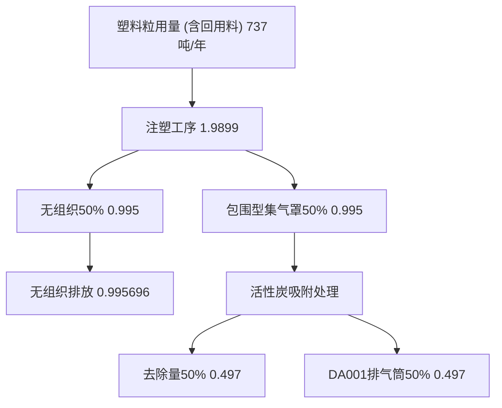
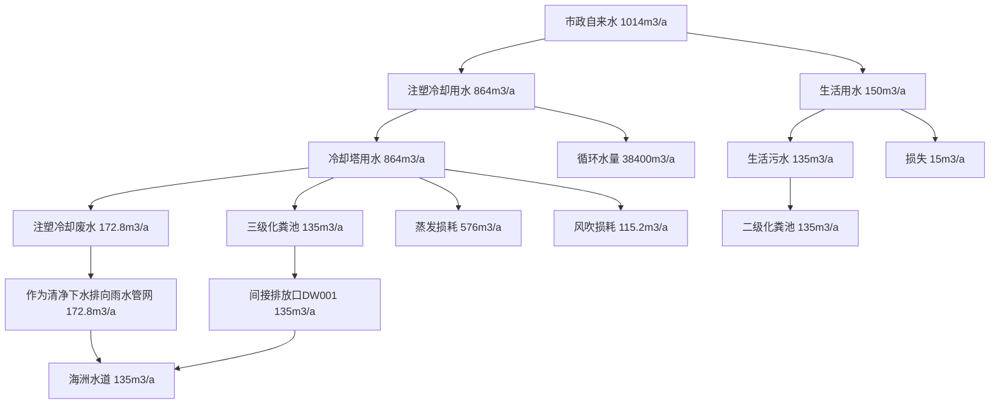
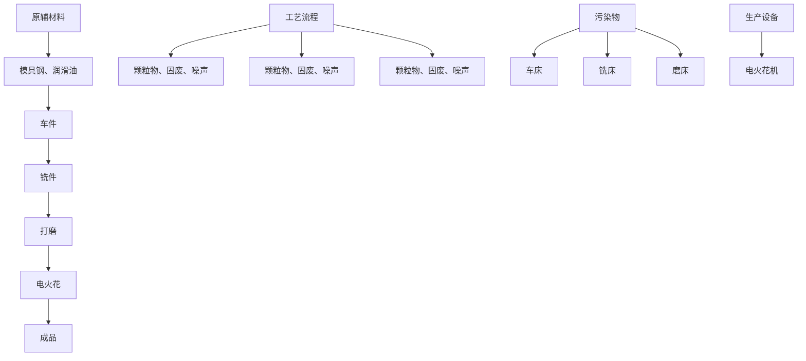

# 建设项目环境影响报告表

#

项目名称：佛山市顺德区振模制造有限公司分车间项目

建设单位（盖章）：佛山节题德区振峰料模具制造有限

text_image

人民共和国生态环境技术协会
五矿国际煤炭环境技术有限公司
人民共和国生态

编制单位和编制人员情况表

<table><tr><td colspan="2">项目编号</td><td colspan="3">5i2hd0</td></tr><tr><td colspan="2">建设项目名称</td><td colspan="3">佛山市顺德区振峰塑料模具制造有限公司分车间新建项目</td></tr><tr><td colspan="2">建设项目类别</td><td colspan="3">26-053塑料制品业</td></tr><tr><td colspan="2">环境影响评价文件类型</td><td colspan="3">报告表</td></tr><tr><td colspan="5">一、建设单位情况</td></tr><tr><td colspan="2">单位名称(盖章)</td><td colspan="3">佛山市顺德区振峰塑料模具</td></tr><tr><td colspan="2">统一社会信用代码</td><td rowspan="7" colspan="3"></td></tr><tr><td colspan="2">法定代表人(签章)</td></tr><tr><td colspan="2">主要负责人(签字)</td></tr><tr><td colspan="2">直接负责的主管人员(签字)</td></tr><tr><td colspan="2">二、编制单位情况</td></tr><tr><td colspan="2">单位名称(盖章)</td></tr><tr><td colspan="2">统一社会信用代码</td></tr><tr><td colspan="5">三、编制人员情况</td></tr><tr><td colspan="5">1.编制主持人</td></tr><tr><td>姓名</td><td colspan="2">职业资格证书管理号</td><td>信用编号</td><td>签字</td></tr><tr><td>肖志宏</td><td colspan="2"></td><td rowspan="5"></td><td rowspan="5"></td></tr><tr><td colspan="3">2.主要编制人员</td></tr><tr><td>姓名</td><td colspan="2"></td></tr><tr><td>肖志宏</td><td colspan="2">建评、</td></tr><tr><td>王秀清</td><td colspan="2">建状</td></tr></table>

text_image

管理号
File No

本证
环境保护
国家统一
价工程师
This is to
has passe
Chinese g
qualificati
Engineer.

text_image

S
管理号：
制图：hao
本证
委托部：
人迹达国家
协之组织的
This is to be
has passed by
Chinese private
qualification
flagdian.
Ministry of
The
佛山市顺德区振峰
佛山市顺德区振峰塑料模具制造有
建项目
佛
分车间新建
建项目
佛
间新建
市顺德区振峰塑料模具制造有
建项目
佛
间新建
市顺德区振峰塑料模具制造有
建项目
佛
间新建
市顺德区振峰塑料模具制造有
建项目

text_image

第 1
验证码
82942

#

# 目录

一、建设项目基本情况.  
二、建设项目工程分析..  
三、区域环境质量现状、环境保护目标及评价标准.. .17  
四、主要环境影响和保护措施. 23  
五、环境保护措施监督检查清单.. .. 48  
六、结论... .51

建设项目污染物排放量汇总表

附图 1 项目地理位置图

附图 2 项目周围环境概况图

附图 3 项目四至卫星图

附图 4 项目环境敏感点图

附图 5 项目平面布置图

附图 6 项目所在区域大气环境功能区划图

附图 7 项目所在区域地表水环境功能区划图

附图 8 项目所在区域地下水环境功能区划图

附图 9 项目所在区域声环境功能区划图

附图 10 项目所在地管控单元图

附图 11项目所在控规

附件 1 营业执照

附件 2法人身份证

附件 3环评协议书

附件 4 房产证

附件5 租赁合同

# 一、建设项目基本情况

<table><tr><td>建设项目名称</td><td colspan="5">佛山市顺德区振峰塑料模具制造有限公司分车间新建项目</td></tr><tr><td>项目代码</td><td colspan="5">无</td></tr><tr><td>建设单位联系人</td><td></td><td>联系方式</td><td colspan="3"></td></tr><tr><td>建设地点</td><td colspan="5">广东省佛山市顺德区均安镇均安社区祥安南路6号之六</td></tr><tr><td>地理坐标</td><td colspan="5">(东经113°9'52.7172"E,北纬22°41'24.5102"N)</td></tr><tr><td>国民经济行业类别</td><td>C2929塑料零件及其他塑料制品制造、C3525模具制造</td><td>建设项目行业类别</td><td colspan="3">二十六、橡胶和塑料制品业29—53.塑料制品业292—其他(年用非溶剂型低VOCs含量涂料10吨以下的除外)</td></tr><tr><td>建设性质</td><td>☑新建(迁建)□改建□扩建□技术改造</td><td>建设项目申报情形</td><td colspan="3">☑首次申报项目□不予批准后再次申报项目□超五年重新审核项目□重大变动重新报批项目</td></tr><tr><td>项目审批(核准/备案)部门(选填)</td><td>无</td><td>项目审批(核准/备案)文号(选填)</td><td colspan="3">无</td></tr><tr><td>总投资(万元)</td><td></td><td>环保投资(万元)</td><td colspan="3"></td></tr><tr><td>环保投资占比(%)</td><td></td><td>施工工期</td><td colspan="3">1个月</td></tr><tr><td>是否开工建设</td><td>☑否□是:____</td><td>用地(用海)面积(m2)</td><td colspan="3">1560</td></tr><tr><td>专项评价设置情况</td><td colspan="5">无</td></tr><tr><td>规划情况</td><td colspan="5">无</td></tr><tr><td>规划环境影响评价情况</td><td colspan="5">无</td></tr><tr><td>规划及规划环境影响评价符合性分析</td><td colspan="5">无</td></tr><tr><td>其他符合性分析</td><td colspan="5">1.与广东省、佛山市、顺德区“三线一单”生态环境分区管控方案相符性分析(1)与广东省“三线一单”相符性分析根据《广东省人民政府关于印发广东省“三线一单”生态环境分区管控方案的通知》(粤府〔2020〕71号)发布的广东省环境管控单元图,项目所在地位于珠三角核心区的一般管控单元。项目产生的生活污水经处理达标后排放至均安污水处理厂。生产废气收集后经“活性炭吸附”处理后引至高空排放,不产生和排放有毒有害大气污染物项目,符合环境准入及管控要求。(2)与佛山市“三线一单”相符性分析根据佛山市生态环境局关于印发《佛山市“三线一单”生态环境分区管控方案(2024年版)》的通知(佛环〔2024〕20号)发布的佛山市环境管控单元图,项目所在地属于广东省佛山市顺德区一般管控单元2准入清单-均安镇一般管控区(编码为ZH44060630002)。根据项目生产产品、原材料、工艺等分析,符合相关区域布局管控、能源资源利用、污染物排放管控和环境风险防控要求,具体分析如下。表1-1 项目与佛环〔2024〕20号的分析(均安镇重点管控区)</td></tr><tr><td rowspan="4"></td><td>管控要求</td><td>相关要求</td><td colspan="3">相符性分析</td></tr><tr><td>区域布局管控</td><td>11-1.【其他/综合类】根据资源环境承载能力,引导产业科学布局,合理控制开发强度,维护生态环境功能稳定。1-2.【生态/综合类】一般生态空间的主导生态功能为水水源涵养和生物多样性维护。水源涵养生态功能区内,加强生态保护与恢复,恢复与重建水源涵养区森林、湿地等生态系统,提高生态系统的水源涵养能力。1-3.【生态/限制类】坚持自然恢复为主,严格限制在水源涵养区大规模人工造林。1-4.【生态/禁止类】生物多样性维护生态功能区内,禁止从事非法捕猎、毒杀、采伐、采集野生动植物等活动,禁止破坏野生动物栖息地。1-5.【大气/限制类】大气环境弱扩散重点管控区内,加大区域大气污染物减排力度,严格控制“两高”项目建设。1.6.【产业/综合类】划定家具生产优先发展区域,优先发展区外不再新建涉及涂装工艺的木质家具制造项目。优先发展区范围根据家具产业发展规划及其规划环评文件确定</td><td colspan="3">1-1.本项目属C2929塑料零件及其他塑料制品制造、C3525模具制造,属于产业/鼓励引导类,不属于《市场准入负面清单(2022年版)》(发改体改〔2022〕397号)中禁止和许可事项。1-2.不涉及。1-3.不涉及。1-4.不涉及。1-5.项目废气经收集处理后高空排放;且项目不属于“高污染、高环境风险”行业。1-6.项目不涉及涂装工艺的木质家具制造项目。</td></tr><tr><td>能源资源利用</td><td>2-1.【岸线/禁止类】严格水域岸线用途管制,新建项目一律不得违规占用水域。严禁破坏生态的岸线利用行为和不符合其功能定位的开发建设活动,严禁以各种名义侵占河道、围垦湖泊、非法采砂等。</td><td colspan="3">本项目建设在陆域上,不属于占用水域和破坏生态的岸线利用行为。</td></tr><tr><td>污染物排放管控</td><td>/</td><td colspan="3">/</td></tr><tr><td rowspan="4"></td><td>环境风险防控</td><td colspan="2">/</td><td colspan="2">/</td></tr><tr><td colspan="5">(3)与顺德区“三线一单”相符性分析根据《佛山市顺德区人民政府关于印发佛山市顺德区“三线一单”生态环境分区管控方案的通知》(顺府发〔2021〕11号)发布的佛山市顺德区环境管控单元图(见附图10),项目所在地属于广东省佛山市顺德区一般管控单元2准入清单(编码为ZH44060630002,名称为均安镇一般管控区),具体要素细类为一般生态空间、水环境一般管控区、大气环境弱扩散重点管控区。表1-2项目与顺府发〔2021〕11号的分析(均安镇一般管控区)</td></tr><tr><td>管控要求</td><td>相关要求</td><td colspan="2">相符性分析</td><td>是否符合</td></tr><tr><td>区域布局管控</td><td>1-1.【其他/综合类】根据资源环境承载能力,引导产业科学布局,合理控制开发强度,维护生态环境功能稳定。1-2.【生态/综合类】一般生态空间的主导生态功能为水水源涵养和生物多样性维护。水源涵养生态功能区内,加强生态保护与恢复,恢复与重建水源涵养区森林、湿地等生态系统,提高生态系统的水源涵养能力。1-3.【生态/限制类】坚持自然恢复为主,严格限制在水源涵养区大规模人工造林。1-4.【生态/禁止类】生物多样性维护生态功能区内,禁止从事非法捕猎、毒杀、采伐、采集野生动植物等活动,禁止破坏野生动物栖息地。1-5.【大气/限制类】大气环境弱扩散重点管控区内,加大区域大气污染物减排力度,严格控制“两高”项目建设。1-6.【产业/限制类】受纳水体或监控断面不达标的,不得新建、扩建向河涌直接排放废水的项目。新建、扩建含蚀刻工序的线路板生产项目和化工项目应在配套污水集中处置的工业园区或生活污水管网覆盖区域内建设;纯加工型印花项目,含酸洗、磷化的金属表面处理、金属制品项目(与自身高新技术企业配套的除外),含酸洗、喷涂、化学抛光、电解等涉及废水排放工艺的不锈钢型材加工项目(与自身高新技术企业配套的除外),应进入以此类项目为主导产业、有相应废水集中治理设施的工业园区,实现集中治污。</td><td colspan="2">1-1.本项目属C2929塑料零件及其他塑料制品制造、C3525模具制造,属于产业/鼓励引导类,不属于《市场准入负面清单(2022年版)》(发改体改〔2022〕397号)中禁止和许可事项。1-2.不涉及。1-3.不涉及。1-4.不涉及。1-5.项目废气经收集处理后排放;且不属于“高污染、高环境风险”行业。1-6.本项目所属行业为C2929塑料零件及其他塑料制品制造、C3525模具制造;不属于含酸洗、喷涂、化学抛光、电解等涉及废水排放工艺的不锈钢型材加工项目,未要求统一进入工业园区。1-7.项目不涉</td><td>符合</td></tr><tr><td rowspan="5"></td><td></td><td>1-7.【产业/综合类】划定家具生产优先发展区域,优先发展区外不再新建涉及涂装工艺的木质家具制造项目。</td><td>及涂装工艺的木质家具制造项目。</td><td colspan="2"></td></tr><tr><td>能源资源利用</td><td>【岸线/禁止类】严格水域岸线用途管制,新建项目一律不得违规占用水域。严禁破坏生态的岸线利用行为和不符合其功能定位的开发建设活动,严禁以各种名义侵占河道、围垦湖泊、非法采砂等。</td><td>本项目建设在陆域上,不属于占用水域和破坏生态的岸线利用行为。</td><td colspan="2">符合</td></tr><tr><td>污染物排放管控</td><td>【水/综合类】产业集聚区和主题园区内做好污水管网和污水集中处理设施的配套保障,确保废水收集到城镇污水处理厂、园区污水处理厂或分散式污水处理设施集中处置。</td><td>项目所在地属于均安污水处理厂纳污范围,生活污水经三级化粪池处理后排至均安污水处理厂。</td><td colspan="2">符合</td></tr><tr><td>环境风险防控</td><td>/</td><td>/</td><td colspan="2">/</td></tr><tr><td colspan="5">2.与产业政策符合性分析1根据《产业结构调整指导目录(2024年本)》,项目不属于目录所列的鼓励类、限制类和禁止(淘汰)类项目,根据《促进产业结构调整暂行规定》(国发〔2005〕40号)第十三条,项目属于允许类。2根据《市场准入负面清单(2022年版)》(发改体改〔2022〕397号),项目不属于禁止准入类。3根据关于印发《广东省“两高”项目管理目录(2022年版)》的通知(粤发改能源函〔2022〕1363号),项目生产产品为塑料制品、模具,不属于《广东省“两高”项目管理目录(2022版)》(2022年版)中的“两高”产品、工序,符合政策规定。4根据《环境保护综合名录(2021年版)》,项目不在“高污染、高环境风险”产品名录内,符合政策规定。综上所述,项目符合相关产业政策的相关规定。3.与《佛山市顺德区生态环境保护“十四五”规划》(2021-2025)的相符性分析根据《佛山市顺德区生态环境保护“十四五”规划》(2021-2025),“大力推进低VOCs含量、低反应活性的原辅材料替代,将全面使用低VOCs含量原辅材料的企业纳入正面清单和政府绿色采购清单。鼓励重点行业企业开展生产工艺和设备水性化改造,推广使用水性、高固体分、无溶剂、粉末等低VOCs含量涂料。严格落实《挥发性有机物无组织排放控制标准》(GB 37822-2019),开展厂区内无组织排放浓度监测。”</td></tr></table>

本项目使用的ABS、PP、PC塑料粒、色母粒常温下基本不挥发；项目建成后严格落实厂区内无组织排放浓度监测。因此，本项目的建设符合《佛山市顺德区生态环境保护“十四五”规划》（2021-2025）相关要求。

# 4.与环境功能区划相符性分析

根据《广东省人民政府关于调整佛山市部分饮用水水源保护区的批复》（粤府函〔2018〕426号），项目所在地不属于顺德区一、二级水源保护区，符合饮用水源保护条例的有关要求。

项目所在区域为环境空气质量二类功能区，不属于环境空气质量一类功能区中的自然保护区风景名胜区和其他需要特殊保护的区域。

项目所在区域为声环境 3 类区，不属于声环境 2 类区。

项目注塑废气经过包围型集气罩收集后通过活性炭吸附处理后引至24m高排气筒 DA001进行高空排放，对周围影响较小，不改变原有的功能区规划。

项目对生产过程中产生的噪声设备采取了有效的隔声防治措施，对周围环境影响较小。

# 5.与有机废气污染物治理政策相符性分析

本项目与国家、广东省、佛山市、顺德区发布的有机废气污染物治理政策的相符性分析详见下表。

表1-3 项目与有机废气污染物治理政策的相符性分析

<table><tr><td>序号</td><td>政策要求</td><td>工程内容</td><td>是否符合</td></tr><tr><td colspan="4">1《挥发性有机物无组织排放控制标准》(GB 37822-2019)</td></tr><tr><td>1.1</td><td>VOCs质量占比大于等于10%的含VOCs产品,其使用过程应采用密闭设备或在密闭空间内操作,废气应排至VOCs废气处理收集系统;无法密闭的,应采取局部收集措施,废气应排至VOCs废气收集处理系统。</td><td>项目使用的ABS、PP、PC塑料粒、色母粒常温下基本不挥发;项目注塑废气经包围型集气罩收集。</td><td>符合</td></tr><tr><td>1.2</td><td>VOCs废气收集处理系统应与生产工艺设备同步运行。VOCs废气收集处理系统发生故障或检修时,对应的生产工艺设备应停止运行,待检修完毕后同步投入使用。</td><td>项目产生VOCs的加工过程必须开启风机,有效减少无组织排放废气。废气收集处理系统发生故障或检修时,产生VOCs的工序停止运行,待检修完毕后再投入生产。</td><td>符合</td></tr><tr><td>1.3</td><td>企业应建立台账,记录含VOCs原辅材料和含VOCs产品的名称、使用量、回收量、废弃量、去向以及VOCs含量等信息。台账保存期限</td><td>企业拟建立台账,记录含VOCs原辅材料和含VOCs产品的名称、使用量、回收量、废弃量、</td><td>符合</td></tr></table>

<table><tr><td></td><td colspan="2">不少于3年。</td><td>去向以及VOCs含量等信息。台账保存期限不少于3年。</td><td></td></tr><tr><td>1.4</td><td colspan="2">VOCs废气收集处理系统应与生产工艺设备同步运行。VOCs废气收集处理系统发生故障或检修时,对应的生产工艺设备应停止运行,待检修完毕后同步投入使用;生产工艺设备不能停止运行或不能及时停止运行的,应设置废气应急处理设施或采取其他替代措施。</td><td>VOCs废气收集处理系统应与生产工艺设备同步运行。VOCs废气收集处理系统发生故障或检修时,对应的生产工艺设备应停止运行,待检修完毕后同步投入使用。</td><td>符合</td></tr><tr><td>1.5</td><td colspan="2">废气收集系统排风罩(集气罩)的设置应符合GB/T 16758的规定。</td><td>废气收集系统集气罩的设置符合GB/T16758的规定。</td><td>符合</td></tr><tr><td>1.6</td><td colspan="2">对于重点地区,收集的废气中NMHC初始排放速率≥2kg/h时,应配置VOCs处理设施,处理效率不应低于80%。</td><td>项目位于重点地区;根据计算可知,项目收集的废气中NMHC初始排放速率为0.54kg/h,&lt;2kg/h;因此无需设置高效VOCs处理设施。</td><td>符合</td></tr><tr><td colspan="5">2.《佛山市生态环境局顺德分局关于加强臭氧污染防治工作的通知(佛顺环函(2021)69号)》</td></tr><tr><td>2.1</td><td colspan="2">加强VOCs废气无组织排放收集</td><td>项目有机废气经收集处理达标后高空排放。</td><td>符合</td></tr><tr><td>2.2</td><td colspan="2">做好VOCs废气无组织排放监测</td><td>项目建成后,按监测方案进行监测。</td><td>符合</td></tr><tr><td colspan="5">3.《广东省人民政府办公厅关于印发广东省2021年大气、水、土壤污染防治工作方案的通知》(粤办函〔2021〕58号)</td></tr><tr><td>3.1</td><td colspan="2">严格落实国家产品VOCs含量限值标准要求,除现阶段确无法实施替代的工序外,禁止新建生产和使用高VOCs含量原辅材料项目。鼓励在生产和流通消费环节推广使用低VOCs含量原辅材料。</td><td>项目使用塑料粒料进行注塑,不属于高VOCs含量原辅材料。</td><td>符合</td></tr><tr><td colspan="5">4.《广东省生态环境保护“十四五”规划》</td></tr><tr><td>4.1</td><td colspan="2">大力推进低VOCs含量原辅材料源头替代,严格落实国家和地方产品VOCs含量限值质量标准,禁止建设生产和使用高VOCs含量的溶剂型涂料、油墨、胶粘剂等项目。</td><td>项目使用塑料粒料进行注塑生产,项目使用的ABS、PP、PC塑料粒、色母粒常温下基本不挥发。</td><td>符合</td></tr><tr><td colspan="5">5.关于印发《广东省涉挥发性有机物(VOCs)重点行业治理指引》的通知(粤环办〔2021〕43号)-六、橡胶和塑料制品业VOCs治理指引</td></tr><tr><td>5.1</td><td colspan="2">VOCs物料应储存于密闭的容器、包装袋、储罐、储库、料仓中,盛装VOCs物料的容器是否存放于室内,或存放于设置有雨棚、遮阳和防渗设施的专用场地。盛装VOCs物料的容器在非取用状态时应加盖、封口,保持密闭。</td><td>本项目涉及VOCs原料均储存于专门的室内仓库,且包装容器密闭,仓库内防渗防漏和遮阳挡雨。</td><td>符合</td></tr><tr><td>5.2</td><td colspan="2">采用外部集气罩的,距集气罩开口面最远处的VOCs无组织排放位</td><td>注塑工序作业时采用包围型集气罩收集,控</td><td>符合</td></tr><tr><td rowspan="12"></td><td colspan="2">置,控制风速不低于0.3m/s。</td><td>制风速为1.0m/s,可满足要求。</td><td></td></tr><tr><td>5.3</td><td>在混合/混炼、塑炼/塑化/熔化、加工成型(挤出、注射、压制、压延、发泡、纺丝等)、硫化等作业中应采用密闭设备或在密闭空间中操作,废气应排至VOCs废气收集处理系统;无法密闭的,应采取局部气体收集措施,废气应排至VOCs废气收集处理系统。</td><td>项目注塑工序中采用包围型集气罩,可满足要求。</td><td>符合</td></tr><tr><td>5.4</td><td>车间或生产设施排气中NMHC初始排放速率≥3kg/h时,建设VOCs处理设施且处理效率≥80%。厂区内无组织排放监控点NMHC的小时平均浓度值不超过6mg/m3,任意一次浓度值不超过20mg/m3。</td><td>车间排气中NMHC初始排放速率&lt;3kg/h。</td><td>符合</td></tr><tr><td>5.5</td><td>1、建立含VOCs原辅材料台账,记录含VOCs原辅材料的名称及其VOCs含量、采购量、使用量、库存量、含VOCs原辅材料回收方式及回收量。2、建立废气收集处理设施台账,记录废气处理设施进出口的监测数据(废气量、浓度、温度、含氧量等)、废气收集与处理设施关键参数、废气处理设施相关耗材(吸收剂、吸附剂、催化剂等)购买和处理记录。3、建立危废台账,整理危废处置合同、转移联单及危废处理方资质佐证材料。4、台账保存期限不少于3年。</td><td>项目拟对VOCs原辅材料、废气收集处理措施、危险废物建立台账;同时台账保存期限不少于3年。</td><td>符合</td></tr><tr><td colspan="4">6.《佛山市生态环境保护“十四五”规划》</td></tr><tr><td>6.1</td><td>鼓励重点行业企业开展生产工艺和设备水性化改造,推广使用水性、高固体份、无溶剂、粉末等低VOCs含量涂料。</td><td>项目使用塑料粒料进行注塑生产,项目使用的ABS、PP、PC塑料粒、色母粒常温下基本不挥发。</td><td>符合</td></tr><tr><td colspan="4">7.《固定污染源挥发性有机物综合排放标准》(DB44/2367-2022)</td></tr><tr><td>7.1</td><td>VOCs物料储存无组织排放控制要求</td><td rowspan="3">项目含VOCs物料主要为ABS、PP、PC塑料粒、色母粒,项目注塑废气经过包围型集气罩收集后通过活性炭吸附处理后引至24m高排气筒DA001进行高空排放,有效减少无组织排放。</td><td rowspan="3">符合</td></tr><tr><td>7.2</td><td>VOCs物料转移和输送无组织排放控制要求</td></tr><tr><td>7.3</td><td>工艺过程VOCs无组织排放控制要求</td></tr><tr><td colspan="4">8.《佛山市发展和改革局 佛山市生态环境局关于印发《佛山市关于进一步加强塑料污染治理的实施方案》的通知(佛发改资环〔2021〕3号)》</td></tr><tr><td>8.1</td><td>禁止生产、销售的塑料制品。全市</td><td>项目主要生产塑料配</td><td>符合</td></tr><tr><td rowspan="8"></td><td></td><td>范围内禁止生产和销售厚度小于0.025毫米的超薄塑料购物袋、厚度小于0.01毫米的聚乙烯农用地膜。禁止以医疗废物为原料制造塑料制品;禁止将回收利用的废塑料输液袋(瓶)用于原用途或用于制造餐饮容器以及玩具等儿童用品。到2020年底,禁止生产和销售一次性发泡塑料餐具、一次性塑料棉签;禁止生产含塑料微珠的日化产品。到2022年底,禁止销售含塑料微珠的日化产品。</td><td>件,不属于方案中禁止生产的塑料制品。项目使用的塑料均为新料,不使用废旧塑料。</td><td></td></tr><tr><td>8.2</td><td>增加绿色产品供给。塑料制品生产企业要严格执行有关法律法规,生产符合相关标准的塑料制品,不得使用未经风险评估及技术验证的塑料回收料生产食品接触材料及制品,不得违规添加对人体、环境有害的化学添加剂</td><td>项目使用的塑料为新料,不使用塑料回收料,不会添加对人体、环境有害的化学添加剂。</td><td>符合</td></tr><tr><td colspan="4">9.《广东省大气污染防治条例》广东省第十三届人民代表大会常务委员会公告(第20号)(2018年11月29日)</td></tr><tr><td>9.1</td><td>应当优先使用低挥发性有机物含量的原材料和低排放环保工艺</td><td>项项目使用的ABS、PP、PC塑料粒、色母粒常温下基本不挥发。</td><td>符合</td></tr><tr><td colspan="4">10.《佛山市生态环境局顺德分局关于加强臭氧污染防治工作的通知(佛顺环函(2021)69号)》</td></tr><tr><td>10.1</td><td>加强VOCs废气无组织排放收集</td><td>项目有机废气经收集处理达标后高空排放。</td><td>符合</td></tr><tr><td>10.2</td><td>做好VOCs废气无组织排放监测</td><td>项目建成后,按监测方案进行监测。</td><td>符合</td></tr><tr><td colspan="4">6.选址合理性分析根据关于《顺德区均安镇畅兴工业园控制性详细规划》技术修正的批前公示(顺府办函(2020)18号),项目所在土地利用规划为M1-一类工业用地(详见附图11),符合规划要求。综合以上分析,项目总体符合文件要求。</td></tr></table>

# 二、建设项目工程分析

<table><tr><td rowspan="15">建设内容</td><td colspan="4">佛山市顺德区振峰塑料模具制造有限公司分车间新建项目(简称“项目”)位于广东省佛山市顺德区均安镇均安社区祥安南路6号之六,经地理坐标为东经113°9&#x27;52.7172&quot;E,北纬22°41&#x27;24.5102&quot;N。项目主要生产塑料制品、模具,预计年产塑料配件950万件/年、模具100套/年;项目主要生产工艺为混料、注塑、破碎、冷却、机加工(电火花、铣、车、磨等)工艺等。1.项目工程组成项目所在建筑物共4层,其中首层高为7米,二到四楼高为5.4米,三到四层高为4.2米,合计建筑物高度为20.8米,项目占地面积约为 $700m^{2}$ ,建筑面积约为 $1560m^{2}$ (夹层 $160m^{2}$ )。具体平面布置图见附图5。本项目工程组成详见表2-1。表2-1 项目工程组成表</td></tr><tr><td>项目</td><td colspan="2">内容</td><td>用途</td></tr><tr><td rowspan="3">主体工程</td><td rowspan="2">一层生产车间</td><td>注塑车间</td><td>面积385平方米,层高7米,所在建筑物高20.8米,主要功能包括注塑区,用于塑料配件的生产</td></tr><tr><td>模具车间</td><td>面积160平方米,层高7米,所在建筑物高20.8米,主要功能包括模具的机加工(电火花、车、铣、磨等),用于模具的生产</td></tr><tr><td colspan="2">二层生产车间</td><td>面积516平方米,层高5.4米,所在建筑物高20.8米,主要功能包括注塑区( $500m^{2}$ )、破碎区( $8m^{2}$ )、混料( $8m^{2}$ )等,用于塑料配件的生产</td></tr><tr><td rowspan="5">储运工程</td><td colspan="2">原料仓</td><td>二层:面积40平方米,层高5.4m,所在建筑物高20.8米,用于原料的临时存放</td></tr><tr><td colspan="2">杂物仓</td><td>二层:面积144平方米,层高5.4m,所在建筑物高20.8米,用于半成品的临时存放</td></tr><tr><td colspan="2">成品仓</td><td>一层:面积140平方米,层高7m,所在建筑物高20.8米,用于成品的临时存放</td></tr><tr><td colspan="2">一般固废仓</td><td>一层:面积10平方米,层高7m,所在建筑物高20.8米,用于一般固体废物的临时存放</td></tr><tr><td colspan="2">危险废物仓</td><td>一层:面积5平方米,层高7m,所在建筑物高20.8米,用于危险固体废物的临时存放</td></tr><tr><td>辅助工程</td><td colspan="2">办公室</td><td>位于二层的夹层,面积160平方米,夹层层高3m,接待客人的场所</td></tr><tr><td rowspan="3">公用工程</td><td colspan="2">供电系统</td><td>由市政电网供应,项目内不设置备用发电机</td></tr><tr><td colspan="2">给水系统</td><td>由市政供水管网供给</td></tr><tr><td colspan="2">排水系统</td><td>生活污水经三级化粪池处理后排入均安污水处理厂,尾水排入海洲水道;间接冷却塔排水作为清净水直接排入雨水管道</td></tr><tr><td>环保</td><td>水环保措施</td><td>三级化粪池</td><td>生活污水经三级化粪池预处理达标后纳入均安污水处理厂集中处理,排放口编号为DW001。</td></tr></table>

<table><tr><td rowspan="4">工程</td><td>大气环保措施</td><td>有机废气收集</td><td>项目注塑废气经过包围型集气罩收集后通过活性炭吸附处理后引至24m高排气筒DA001进行高空排放。</td></tr><tr><td>噪声环保措施</td><td>选用低噪声设备,设备做隔声、减振处理</td><td>选用低噪声设备,设备做隔声、减振处理</td></tr><tr><td rowspan="2">固体废物环保措施</td><td>一般固废贮存场所</td><td>1个,面积10平方米,层高7米,用于暂存一般固体废物</td></tr><tr><td>危废暂存间</td><td>1个,面积5平方米,层高7米,用于暂存危险废物</td></tr><tr><td colspan="3">依托工程</td><td>无</td></tr></table>

# 2.项目生产规模

本项目主要产品产量详见下表。

表 2-2 项目产品产能一览表

<table><tr><td>序号</td><td>产品名称</td><td>单元</td><td>数量</td><td>规格尺寸</td></tr><tr><td>1</td><td>塑料配件</td><td>万件/年</td><td>950</td><td>灯饰配件600万件:重量约30g/件家电配件350万件:重量约140g/件合计塑料重量180+490=670吨/年</td></tr><tr><td>2</td><td>模具</td><td>套/年</td><td>100</td><td>约重0.8吨/套</td></tr></table>

# 3.项目主要生产设备

本项目主要生产设备详见下表。

表 2-3 项目主要生产设备一览表

<table><tr><td rowspan="2">设备名称</td><td colspan="3">规格参数</td><td rowspan="2">数量</td><td rowspan="2">单位</td><td rowspan="2">工艺</td><td rowspan="2">位置</td></tr><tr><td>参数名称</td><td>设计值</td><td>单位</td></tr><tr><td>注塑机</td><td colspan="3">工作温度220°C</td><td>20</td><td>台</td><td>注塑</td><td>注塑区,相关参数详见表2-6</td></tr><tr><td>破碎机</td><td>功率</td><td>8</td><td>kW</td><td>4</td><td>台</td><td>破碎</td><td>破碎间</td></tr><tr><td>混料机</td><td>容积</td><td>150</td><td>L</td><td>4</td><td>台</td><td>混料机</td><td>混料间</td></tr><tr><td>空压机</td><td>压力</td><td>1.5</td><td>Mpa</td><td>2</td><td>台</td><td>/</td><td>辅助设备,车间内</td></tr><tr><td>冷却塔</td><td>循环水量</td><td>8</td><td> $m^3/h$ </td><td>2</td><td>台</td><td>冷却</td><td>楼顶</td></tr><tr><td>车床</td><td>功率</td><td>18</td><td>kW</td><td>1</td><td>台</td><td>精车</td><td rowspan="4">模具机加工区</td></tr><tr><td>电火花机</td><td>功率</td><td>8</td><td>kW</td><td>2</td><td>台</td><td>电火花</td></tr><tr><td>铣床</td><td>功率</td><td>7</td><td>kW</td><td>4</td><td>台</td><td>钻孔</td></tr><tr><td>磨床</td><td>功率</td><td>5</td><td>kW</td><td>1</td><td>台</td><td>打磨</td></tr></table>

表 2-4 注塑设备占地面积与注塑区域面积的匹配性分析

<table><tr><td rowspan="2">注塑机型号</td><td rowspan="2">数量</td><td colspan="2">各注塑机尺寸 m</td><td rowspan="2">总面积  ${\mathrm{m}}^{2}$ </td><td rowspan="2">注塑区域面积  ${\mathrm{m}}^{2}$ </td><td rowspan="2">是否符合</td></tr><tr><td>长</td><td>宽</td></tr><tr><td>650T 注塑机</td><td>1</td><td>7.8</td><td>2.3</td><td>17.94</td><td rowspan="6">385+500=885</td><td rowspan="6">是</td></tr><tr><td>450T 注塑机</td><td>3</td><td>7</td><td>1.97</td><td>41.37</td></tr><tr><td>320T 注塑机</td><td>2</td><td>6.84</td><td>1.73</td><td>23.67</td></tr><tr><td>210T 注塑机</td><td>2</td><td>5.72</td><td>1.52</td><td>17.39</td></tr><tr><td>200T 注塑机</td><td>3</td><td>5.68</td><td>1.32</td><td>22.49</td></tr><tr><td>160T 注塑机</td><td>6</td><td>5.25</td><td>1.25</td><td>39.38</td></tr><tr><td>120T 注塑机</td><td>1</td><td>4.59</td><td>1.23</td><td>5.65</td><td rowspan="2"></td><td rowspan="2"></td></tr><tr><td>90T 注塑机</td><td>2</td><td>4.55</td><td>1.15</td><td>10.47</td></tr><tr><td colspan="4">合计</td><td>178.34</td><td>885</td><td>是</td></tr></table>

# 4. 项目原辅材料及其用量

本项目主要原辅材料及其用量详见下表。

表 2-5 项目主要原辅材料一览表

<table><tr><td>名称</td><td>单位</td><td>年用量</td><td>最大储存量t</td><td>包装规格及性状</td><td>储存场所</td><td>备注</td></tr><tr><td>ABS粒(新料)</td><td>t/a</td><td>287.8642</td><td>8</td><td>25kg/袋,粒状</td><td>原料仓</td><td>家电配件注塑使用,比例约60%</td></tr><tr><td>PP粒(新料)</td><td>t/a</td><td>176.53</td><td>5</td><td>25kg/袋,粒状</td><td>原料仓</td><td>灯饰配件注塑使用</td></tr><tr><td>PC粒(新料)</td><td>t/a</td><td>192.5781</td><td>5</td><td>25kg/袋,粒状</td><td>原料仓</td><td>家电配件注塑使用,比例约40%</td></tr><tr><td>色母粒</td><td>t/a</td><td>15.0452</td><td>0.5</td><td>1kg/包,粒状</td><td>原料仓</td><td>注塑使用</td></tr><tr><td>润滑油</td><td>t/a</td><td>0.2</td><td>0.2</td><td>200kg/桶,液体</td><td>原料仓</td><td>机加工使用</td></tr><tr><td>液压油</td><td>t/a</td><td>0.2</td><td>0.1</td><td>50kg/桶,液体</td><td>原料仓</td><td>注塑机液压系统、液压机使用</td></tr><tr><td>模具钢</td><td>t/a</td><td>85</td><td>/</td><td>/</td><td>原料仓</td><td>模具原材料</td></tr><tr><td>电火花油</td><td>t/a</td><td>0.16</td><td>0.16</td><td>160kg/桶,液体</td><td>原料仓</td><td>火花机使用</td></tr></table>

备注：项目所使用的 ABS、PP、PC 塑料粒不涉及废旧料和再生料。

物料平衡：  
表 2--6产品投入产出物料平衡表

<table><tr><td rowspan="2">产品名称</td><td colspan="2">投入</td><td colspan="3">产出</td></tr><tr><td>原材料名称</td><td>数量(t/a)</td><td>名称</td><td>数量(t/a)</td><td>备注</td></tr><tr><td rowspan="5">塑料配件</td><td>各种原料</td><td>672.0175</td><td>产品</td><td>670</td><td>---</td></tr><tr><td>---</td><td>---</td><td>进入废气中原料</td><td>0.0276</td><td>颗粒物</td></tr><tr><td>---</td><td>---</td><td>进入废气中原料</td><td>1.9899</td><td>NMHC</td></tr><tr><td>---</td><td>---</td><td>固废</td><td>0</td><td>经破碎后回用于生产</td></tr><tr><td>小计</td><td>672.0175</td><td>/</td><td>672.0175</td><td>/</td></tr></table>

表 2-7 主要原辅材料理化性质

<table><tr><td>序号</td><td>名称</td><td>理化性质</td></tr><tr><td>1</td><td>ABS粒</td><td>丙烯腈-苯乙烯-丁二烯共聚物,热塑性高分子材料结构;化学式为(C8H8·C4H6·C3H3N)x;微黄色固体,有一定的韧性,密度约为1.04~1.06 g/cm3;成型温度:200-240°C;分解温度为&gt;270°C。抗冲击性、耐热性、耐低温性、耐化学药品性及电气性能优良,广泛应用于机械、汽车、电子电器、仪器仪表、纺织和建筑等工业领域,是一种用途极广的热塑性工程塑料。</td></tr><tr><td>2</td><td>PP粒</td><td>聚丙烯,是丙烯通过加聚反应而成的聚合物。系白色蜡状材料,外观透明而轻。化学式为 $(C_3H_6)n$ ,密度为0.89~0.91g/cm3,易燃,熔点189°C,在155°C左右软化,使用温度范围为-30~140°C。在80°C以下能耐酸、碱、盐液及多种有机溶剂的腐蚀,能在高温和氧化作用下分解。聚丙烯广泛应用于服装、毛毯等纤维制品、医疗器械、汽车、自行车、零件、输送管道、化工容器等生产,也用于食品、药品包装。PP分解温度为300°C,在与氧接触的情况下260°C开始变黄劣化。</td></tr><tr><td>3</td><td>PC粒</td><td>聚碳酸酯一种强韧的热塑性树脂,密度:1.18-1.22 g/cm3,熔点220至230°C,热变形温度135°C,无色透明,耐热,抗冲击,阻燃BI级,在普通使用温度内都有良好的机械性能</td></tr><tr><td>4</td><td>润滑油</td><td>可燃液体,不溶于水,闪点为76°C,相对密度小于1,油状液体,淡黄色至褐色,无气味或略带异味。</td></tr><tr><td>5</td><td>色母粒</td><td>一种新型高分子材料专用着色剂,亦称颜料制备物(Pigment Preparation)。色母主要用在塑料上。色母由颜料或染料、载体和添加剂三种基本要素所组成,是把超常量的颜料均匀载附于树脂之中而制得的聚集体,可称颜料浓缩物。</td></tr><tr><td>6</td><td>液压油</td><td>利用液体压力能的液压系统使用的液压介质,在液压系统中起着能量传递、抗磨、系统润滑、防腐、防锈、冷却等作用。</td></tr></table>

# 5.关键设备产能和产品规模匹配性分析

注塑机产能见下表。

表 2-8注塑机设备产能一览表

<table><tr><td>设备</td><td>数量(台)</td><td>生产能力(kg/h)</td><td>螺杆直径(mm)</td><td>每年生产时间(h)</td><td>单台设备年产量(t/a)</td><td>总产能(t/a)</td></tr><tr><td>650T注塑机</td><td>1</td><td>40</td><td>75</td><td>2400</td><td>96</td><td>96</td></tr><tr><td>450T注塑机</td><td>3</td><td>32</td><td>65</td><td>2400</td><td>76.8</td><td>230.4</td></tr><tr><td>320T注塑机</td><td>2</td><td>25</td><td>60</td><td>2400</td><td>60</td><td>120</td></tr><tr><td>210T注塑机</td><td>2</td><td>20</td><td>50</td><td>2400</td><td>48</td><td>96</td></tr><tr><td>200T注塑机</td><td>3</td><td>15</td><td>45</td><td>2400</td><td>36</td><td>108</td></tr><tr><td>160T注塑机</td><td>6</td><td>10</td><td>40</td><td>2400</td><td>24</td><td>144</td></tr><tr><td>120T注塑机</td><td>1</td><td>8</td><td>35</td><td>2400</td><td>19.2</td><td>19.2</td></tr><tr><td>90T注塑机</td><td>2</td><td>4</td><td>32</td><td>2400</td><td>9.6</td><td>19.2</td></tr><tr><td colspan="6">合计</td><td>832.8</td></tr></table>

上表为注塑机满负荷运行时的产能。

由上表可知，项目关键设备总产能为832.8t/a，项目申报产能（塑料粒+色母粒+回用料）=670+67=737t/a，设备申报产能占设计产能的88.5%，项目设备产能与产品规模是匹配的。

# 6.物料平衡

# （1）有机废气平衡

flowchart

图 2-1 项目有机废气平衡图

（2）水平衡  

flowchart

图 2-2 项目水平衡图

# 7.工作制度和能耗水耗

本项目年工作日 300天，每天工作 8 小时，共拟定员工 15 人，均不在项目内食宿。

表 2-9 工作制度一览表

<table><tr><td>序号</td><td>名称</td><td>内容</td></tr><tr><td>1</td><td>劳动定额</td><td>15人</td></tr><tr><td>2</td><td>工作制度</td><td>每年工作300天,每天工作8小时,每天工作时间为8:00-12:00,14:00-18:00</td></tr><tr><td>3</td><td>食宿情况</td><td>均不在项目内食宿</td></tr></table>

本项目用电主要来自市政用电，不设备用发电机，年用量约为 40 万千瓦时/年。

表 2-10 能耗水耗一览表

<table><tr><td>序号</td><td>名称</td><td>单位</td><td>年用量</td><td>用途</td><td>备注</td></tr><tr><td rowspan="2">1</td><td rowspan="2">水</td><td>吨/年</td><td>150</td><td>办公、生活</td><td rowspan="2">市政供水</td></tr><tr><td>吨/年</td><td>864</td><td>冷却用水</td></tr><tr><td>2</td><td>电</td><td>万度/年</td><td>40</td><td>生产、生活</td><td>市政供电</td></tr></table>

# 7.总图布置及四至情况

本项目位于广东省佛山市顺德区均安镇均安社区祥安南路 6 号之六，本项目生产区按生产工艺进行布局，按工序的先后、紧凑布局，有利于生产的开展和同类污染物的统一收集治理。

项目所在建筑物的东面为弘达锋五金有限公司，南面为畅兴工业园展业二园，西面为尚焌豪塑料制品有限公司，北面为广诚瑞光学镜片有限公司。

项目总体布局充分考虑了建设项目所在区域内的控制因素以及生产工艺流程特点，

<table><tr><td rowspan="10"></td><td colspan="3">各功能区总体布局合理,全厂平面布置层次分明,物流畅通,整个厂区平面布置较为合理。项目所在建筑物周边均为其他工业厂房和工业道路。本项目周围环境概况图详见附图2,项目四至图详见附图3,项目平面布置详见附图5。8.项目环保投资情况表2-11建设项目环保投资一览表</td></tr><tr><td>污染源</td><td>主要环保措施</td><td>投资金额</td></tr><tr><td>废水</td><td>三级化粪池</td><td>0.5万元</td></tr><tr><td>废气</td><td>包围型集气罩+活性炭吸附</td><td>15万元</td></tr><tr><td rowspan="3">固废</td><td>生活垃圾</td><td>垃圾桶,环卫部门处理</td></tr><tr><td>一般固体废</td><td>固废临时摆放场所,定期交由具有相应处理能力的固废处理单位处理。</td></tr><tr><td>危险废物</td><td>由专门容器收集后暂存于危废贮存间内,统一交由取得相应《危险废物经营许可证》或《危险废物收集中转贮存试点备案证》的单位</td></tr><tr><td>噪声</td><td>对高噪声设备进行机械阻尼隔振(如在底部安装减振垫座)</td><td>1万元</td></tr><tr><td colspan="2">合计</td><td>20万元</td></tr><tr><td colspan="3"></td></tr><tr><td>工艺流程和产排污环节</td><td colspan="3">1.施工期本项目位于广东省佛山市顺德区均安镇均安社区祥安南路6号之六,其厂房为租赁已有厂房,生产设备购买后安装调试后置于厂房内后可直接生产,故不涉及施工期建设。施工过程主要是内部装修和设备安装,没有基建工程,因此施工期基本不存在大型土建工程,施工期间产生的影响主要是由于设备运输、安装时产生的噪声等。2.营运期2.1工艺流程根据建设单位提供的资料,项目生产工艺流程图详见下图。图1项目生产工艺流程图工艺说明:项目所有原料均为外购。</td></tr></table>

根据客户要求将在 ABS、PP、PC 塑料粒中添加色母粒，然后投入混料机中进行混料。由于投料过程中的物料均属于粒料，因此无投料粉尘产生。同时混料过程为加盖密闭搅拌。把混合均匀的原料通过人工转移到注塑机投料槽中，利用螺杆将原料输送到注塑机进料口，通过电加热至塑料软化温度后，将树脂粒等原材料熔化，通过模具注塑成型，然后人工对样品进行检验即可成型。将次品和边角料进行破碎，回用于注塑工序；废包装材料作为固废，交由相关回收单位回收处理。

项目模具投入使用一段时间后需进行维修，委外维修后可再次投入生产，本项目在厂区内不进行模具维修。注塑成型过程中温度较高，使用电能，需要使用水对产品降温直接冷却，循环水中无添加除垢剂或其他药剂，期间需适当地加入新鲜水补充因蒸发而损失的水分，冷却水循环使用，每 1个月定期整池更换，更换的冷却水定期排水，作为清净下水排入雨水管道。

flowchart

图 2 项目模具的生产工艺流程图

# 工艺说明：

项目外购切割好的模具钢，将模具钢进行一系列的车件、铣件等粗加工，接着进行一系列的精加工（电火花、打磨等加工），最后人手组装后维修完毕。

# 备注：

1、项目塑料粒与色母是在注塑机上配套的料斗上进行搅拌，全程密闭。且塑料原料均为粒料，因此混料过程基本不产生粉尘。  
2、注塑过程中加热温度远低于其分解温度，塑料不会发生热分解（ABS 塑料热分解温度为 260℃、PP 和 PC 塑料热分解温度为 300℃），塑料一般不会发生热裂解，但加热过程中，因可能存在局部高温使塑料发生轻微裂解而产生含单体分子等挥发性有机废气（各类合成树脂中的污染物项目均以非甲烷总烃 NMHC 计，本报告不对具体污染物成分做进一步分析），本报告不对具体污染物成分做进一步分析），注塑过程会产生非甲烷总烃、臭气浓度、噪声、固废。

<table><tr><td rowspan="13"></td><td colspan="3">3、冷却过程冷却方式采用水冷,为间接冷却,冷却水不直接与原料接触,冷却水循环使用,需要定期补充。4、破碎:项目注塑产生的10%的边角料、次品,边角料、次品经过破碎后重新回用于注塑。破碎过程中会产生少量的粉尘和噪声。5、项目机加工模具过程中,由于金属粉尘较重,90%沉降在工位附近,因此产生金属颗粒物极少。备注:项目不涉及金属的表面处理、表面涂装,不涉及金属表面清洗。2.2产污情况分析本项目产污情况见下表所示。表2-12 项目产污节点汇总表</td></tr><tr><td>污染物类别</td><td>来源</td><td>污染物</td></tr><tr><td rowspan="2">废水</td><td>员工生活</td><td>pH、 $COD_{Cr}$ 、 $BOD_5$ 、SS、 $NH_3-N$ </td></tr><tr><td>注塑的冷却</td><td>冷却废水</td></tr><tr><td rowspan="3">废气</td><td>注塑</td><td>NMHC、臭气浓度</td></tr><tr><td>破碎</td><td>粉尘</td></tr><tr><td>模具机加工</td><td>金属颗粒物</td></tr><tr><td>噪声</td><td>各机械设备</td><td>噪声</td></tr><tr><td rowspan="4">固废</td><td>员工生活</td><td>生活垃圾</td></tr><tr><td>机加工</td><td>收集的粉尘、金属边角料</td></tr><tr><td>注塑</td><td>次品、边角料</td></tr><tr><td>包装、注塑原料</td><td>废包装材料</td></tr><tr><td>危险废物</td><td>设备维修、维护</td><td>废润滑油、废液压油、含油废抹布和手套、废油桶、废活性炭</td></tr><tr><td>与项目有关的原有环境污染问题</td><td colspan="3">本项目租赁现有厂房,不存在原有污染情况。据现场调查,周边主要环境问题是项目附近工厂生产产生的工业废水、废气和噪声以及居民生活产生的生活污水,会对周围环境产生一定的负面影响。</td></tr></table>

# 三、区域环境质量现状、环境保护目标及评价标准

# 1.地表水环境质量现状

项目位于均安污水处理厂纳污范围，项目外排废水是生活污水，生活污水经三级化粪池处理后通过污水管网排入均安污水处理厂，尾水排入海洲水道。根据《广东省地表水功能区划》（粤环[2011]14 号），海洲水道属于 III 类水环境功能区，水环境质量执行《地表水环境质量标准》（GB3838-2002）中的 III 类水质标准。

为评价海洲水道水质，参考《佛山市生态环境局顺德分局关于发布 2023 年度佛山市顺德区生态环境状况公报》的通知（佛环顺函〔2024〕44 号），2023 年顺德区 2 个国控断面（乌洲、顺德港）、3 个省控断面（杨滘、海凌、飞鹅山）均符合相应的水质目标，水质优良率为 100%，与 2022 年持平。流经我区及周边城市交界水域的 16 条主要河流、24个功能区监测断面水质状况均为优良，全年平均值达标率为 100%。24个断面中，Ⅱ类和Ⅲ类分别占比为 79%、21%。与上年相比，Ⅱ类比例上升了 1 个百分点，Ⅲ类比例下降了 1 个百分点。项目纳污水体古镇水道断面监测的水质达到了Ⅲ类标准要求，水质良好。

表 3-1 2023 年海洲水道质量评价及年度对比

<table><tr><td rowspan="2">河流名称</td><td rowspan="2">断面</td><td colspan="2">断面定类</td><td rowspan="2">水质评价标准</td><td colspan="2">河流定类</td></tr><tr><td>2022年</td><td>2023年</td><td>2022年</td><td>2023年</td></tr><tr><td>古镇水道</td><td>鹅洋沙</td><td>II</td><td>II</td><td>III</td><td>II</td><td>II</td></tr></table>

备注：古镇水道与海洲水道为同一水体的不同名称，本评价沿用《佛山市顺德区均安镇生活污水处理厂一期提标改造工程环境影响报告表》（公示版）中均安污水处理厂纳污水体的名称：“海洲水道”。  
从监测结果可知，海洲水道鹅洋沙断面符合《地表水环境质量标准》（GB3838-2020）Ⅲ类标准的要求，故水质达标。

# 2.大气环境质量现状

根据《佛山市人民政府办公室关于调整顺德区环境空气质量功能区划的复函》（佛府办函〔2014〕494 号，2014 年 8 月）和《佛山市顺德区人民政府办公室关于印发〈佛山市顺德区生态环境保护“十四五”规划（2021-2025）>的通知》（顺府办发〔2022〕16 号），顺德区全境为大气环境二类区，因此本项目所在区域属二类环境空气质量功能区，执行《环境空气质量标准》（GB3095-2012）二级标准及其 2018年修改单的要求。

为评价本项目所在区域的环境空气质量现状，引用《佛山市生态环境局顺德分局关于发布 2023 年度佛山市顺德区生态环境状况公报》的通知（佛环顺函〔2024〕44 号）中的监测数据进行评价，监测结果如下：

表 3-2 大气环境质量统计表  
单位：μg/m3 

<table><tr><td rowspan="2">污染物</td><td colspan="2">浓度均值</td><td rowspan="2">评价标准</td><td rowspan="2">变化</td><td rowspan="2">是否达标</td></tr><tr><td>2022年</td><td>2023年</td></tr><tr><td>SO2</td><td>5</td><td>6</td><td>60</td><td>+20%</td><td>达标</td></tr></table>

区域 环境 质量 现状

<table><tr><td rowspan="6"></td><td> $NO_2$ </td><td>29</td><td>28</td><td>40</td><td>-34%</td><td colspan="3">达标</td></tr><tr><td> $PM_{10}$ </td><td>32</td><td>35</td><td>70</td><td>+9.4%</td><td colspan="3">达标</td></tr><tr><td> $PM_{2.5}$ </td><td>19</td><td>20</td><td>35</td><td>+5.3%</td><td colspan="3">达标</td></tr><tr><td> $CO^*(mg/m^3)$ </td><td>1.1</td><td>1.0</td><td>4</td><td>-9.1%</td><td colspan="3">达标</td></tr><tr><td> $O_3\text{-}8H^*$ </td><td>190</td><td>164</td><td>160</td><td>-13.7%</td><td colspan="3">超标</td></tr><tr><td colspan="8">2023年顺德区空气质量综合指数为3.14,比2022年下降4.0%,在全市五区中排名第二。2023年,按照《环境空气质量标准》(GB 3095—2012)评价,顺德区二氧化硫( $SO_2$ )、二氧化氮( $NO_2$ )、可吸入颗粒物( $PM_{10}$ )、细颗粒物( $PM_{2.5}$ )、一氧化碳(CO)五项污染物年评价浓度符合二级浓度限值,臭氧( $O_3$ )超二级浓度限值。2023年顺德区AQI达标率为87.4%,与上年相比增加8.6个百分点。首要污染物主要为臭氧(占首要污染物天数比例为73.8%),其次为二氧化氮(占14.4%)。2023年全区 $SO_2$ 年平均浓度为6微克/立方米,与上年相比上升20.0%。 $NO_2$ 年平均浓度为28微克/立方米,与上年相比下降3.4%。 $PM_{10}$ 年平均浓度为35微克/立方米,与上年相比上升9.4%。 $PM_{2.5}$ 年平均浓度为20微克/立方米,与上年相比上升5.3%。 $O_3$ 年评价浓度为164微克/立方米,与上年相比下降13.7%。CO年评价浓度为1.0毫克/立方米,与上年相比下降9.1%。3、声环境质量现状根据佛山市生态环境局关于印发《佛山市声环境功能区划》的通知(佛环(2024)1号),项目所在地声环境质量执行《声环境质量标准》(GB3096-2008)中的3类标准,即昼间≤65dB(A),夜间≤55dB(A)。本项目厂界外50m范围内无环境敏感目标,无需开展声环境质量现状调查。4.生态环境项目用地范围内无生态环境保护目标,无需开展生态现状调查。5.电磁辐射项目不涉及电磁辐射,无需开展电磁辐射现状调查。6.地下水环境、土壤环境本项目厂房和周边环境地面已做好水泥面硬化防渗措施,项目做好生产车间防渗防漏,危废暂存间防渗、防风、防雨等措施。项目不存在土壤、地下水环境污染途径,不开展环境质量现状调查。</td></tr><tr><td>环境保护目标</td><td colspan="8">本项目的主要环境保护目标是保护好项目所在地周边评价区域环境质量,采取有效的环保措施,使该项目在建设开展和生产运行中能够保持区域原有的环境空气质量、水环境质量和声环境质量。1.大气环境保护目标</td></tr><tr><td rowspan="4"></td><td colspan="8">项目厂界外500米范围内主要环境保护目标见下表。敏感点位置图见附图4。表3-3 项目主要环境保护目标</td></tr><tr><td>环境要素</td><td>名称</td><td>保护对象</td><td>保护内容</td><td>环境功能区</td><td>相对厂址方位</td><td colspan="2">相对厂界距离/m</td></tr><tr><td>大气</td><td>天连村居民</td><td>居住区</td><td>约150人</td><td>环境空气二类区</td><td>东北面</td><td colspan="2">410</td></tr><tr><td colspan="8">2.声环境保护目标根据佛山市生态环境局关于印发《佛山市声环境功能区划》的通知(佛环(2024)1号),项目所在地声环境质量执行《声环境质量标准》(GB3096-2008)中的3类标准,即昼间≤65dB(A),夜间≤55dB(A)。由于厂界外周边50米范围内不存在声环境保护目标的建设项目,因此项目不需要监测保护目标声环境质量现状并评价达标情况。3.地下水环境保护目标本项目厂界外500米范围内无地下水集中式饮用水水源和热水、矿泉水、温泉等特殊地下水资源。4.生态环境保护目标项目用地范围内无生态环境保护目标。</td></tr><tr><td rowspan="5">污染物排放控制标准</td><td colspan="8">1.水污染物排放标准本项目运营期间产生的生活污水经三级化粪池预处理后达到广东省地方标准《水污染物排放限值》(DB44/26-2001)第二时段三级标准后,排入均安污水处理厂处理,尾水排入海洲水道。均安污水处理厂尾水排放执行《城镇污水处理厂污染物排放标准》(GB18918-2002)一级A标准及广东省地方标准《水污染物排放限值》(DB44/26-2001)第二时段一级标准的较严值。具体排放限值详见表3-4。表3-4 项目水污染物排放浓度限值 (单位:mg/L)</td></tr><tr><td>污染物</td><td colspan="2">标准值</td><td>pH值</td><td> $COD_{Cr}$ </td><td> $NH_{3}-N$ </td><td> $BOD_{5}$ </td><td>SS</td></tr><tr><td>生活污水排放口</td><td colspan="2">广东省地方标准《水污染物排放限值》(DB44/26-2001)第二时段三级标准</td><td>6~9</td><td>≤500</td><td>/</td><td>≤300</td><td>≤400</td></tr><tr><td>污水处理厂排放口</td><td colspan="2">《城镇污水处理厂污染物排放标准》(GB18918-2002)一级A标准及广东省地方标准《水污染物排放限值》(DB44/26-2001)第二时段一级标准的较严值</td><td>6~9</td><td>≤40</td><td>≤5</td><td>≤10</td><td>≤10</td></tr><tr><td colspan="8">2.大气污染物排放标准(1)有机废气项目注塑过程会产生的非甲烷总烃,有组织执行《合成树脂工业污染物排放标准》</td></tr></table>

（GB31572-2015，含 2024年修改单）中的表 4 中规定的排放限值。厂区内无组织排放的 NMHC 执行《固定污染源挥发性有机物综合排放标准》（DB44 2367-2022）表 3 规定的限值标准（监控点处 1h 平均浓度值≤6mg/m3，监控点处任意一次浓度值≤20mg/m3）。

# （2）恶臭

项目注塑过程产生的臭气排放执行《恶臭污染物排放标准》（GB14554-93）中表 1厂界标准值二级标准：臭气浓度≤20（无量纲）；表 2 中 25m 高排气筒有组织排放标准值：臭气浓度≤6000（无量纲）。

# （3）颗粒物

项目在破碎过程中会产生塑料粉尘，其污染因子为颗粒物，车间内无组织排放；

模具在机加工过程中会产生金属粉尘，其污染因子为颗粒物；

因此，无组织颗粒物执行无组织颗粒物执行广东省地方标准《大气污染物排放限值》（DB44/27-2001）第二时段厂界监控点浓度限值要求。

本项目废气排放标准值具体详见下表。

表 3-5 项目工艺废气排放标准

<table><tr><td rowspan="2">工序</td><td rowspan="2">污染因子</td><td colspan="2">有组织排放</td><td>无组织排放</td><td rowspan="2">标准来源</td></tr><tr><td>排气筒情况</td><td>最高允许排放浓度(mg/m3)</td><td>监控点浓度限值(mg/m3)</td></tr><tr><td rowspan="11">注塑</td><td>非甲烷总烃</td><td rowspan="11">排气筒DA001,24m</td><td>100</td><td>/</td><td rowspan="10">《合成树脂工业污染物排放标准》(GB31572-2015,含2024年修改单)中的表4中规定的排放限值</td></tr><tr><td>苯乙烯1</td><td>50</td><td>/</td></tr><tr><td>丙烯腈1</td><td>0.5</td><td>/</td></tr><tr><td>1,3-丁二烯1</td><td>1</td><td>/</td></tr><tr><td>甲苯1</td><td>15</td><td>0.8</td></tr><tr><td>乙苯1</td><td>100</td><td>/</td></tr><tr><td>酚类2</td><td>20</td><td>/</td></tr><tr><td>光气2</td><td>0.5</td><td>/</td></tr><tr><td>氯苯类2</td><td>50</td><td>/</td></tr><tr><td>二氯甲烷2</td><td>1000</td><td>/</td></tr><tr><td>臭气浓度</td><td>6000(无量纲)</td><td>20(无量纲)</td><td>(GB14554-93)表1二级新扩改建厂界标准限值和表2恶臭污染物排放标准值</td></tr><tr><td>破碎</td><td>颗粒物</td><td>/</td><td>/</td><td>1.0</td><td rowspan="2">广东省地方标准《大气污染物排放限值》(DB44/27-2001)第二时段无组织排放监控浓度限值周界外浓度最高点</td></tr><tr><td>机加工</td><td>颗粒物</td><td>/</td><td>/</td><td>1.0</td></tr></table>

<table><tr><td rowspan="6"></td><td colspan="5">备注:1ABS树脂生产时产生的特征污染物。2聚碳酸酯树脂生产时产生的特征污染物。凡在《恶臭污染物排放标准》(GB14554-93)表2所列两种高度之间的排气筒,采用四舍五入方法计算其排气管的高度,因此本项目执行排气筒高度为25m时的臭气浓度排放标准值为6000(无量纲)。</td></tr><tr><td colspan="5">表3-6厂区内非甲烷总烃排放限值标准</td></tr><tr><td>污染物</td><td>排放形式</td><td>限值含义</td><td>规定的限值(mg/m3)</td><td>执行标准</td></tr><tr><td rowspan="2">NMHC</td><td rowspan="2">无组织</td><td>监控点处1h平均浓度值</td><td>6</td><td rowspan="2">《固定污染源挥发性有机物综合排放标准》(DB44 2367-2022)</td></tr><tr><td>监控点处任意一次浓度值</td><td>20</td></tr><tr><td colspan="5">3.噪声排放标准项目厂界噪声执行《工业企业厂界环境噪声排放标准》(GB12348-2008)中的3类标准:昼间≤65dB(A),夜间≤55dB(A)。4.固体废物控制标准危险废物在厂区内暂存应符合《危险废物贮存污染控制标准》(GB18597-2023);一般工业固废在厂区内贮存过程应满足相应防渗漏、防雨淋、防扬尘等环境保护要求;同时危险废物、一般工业固废还需符合《中华人民共和国固体废物污染环境防治法》、《广东省固体废物污染环境防治条例》等要求,进行分类贮存,并按上述标准规范要求做好贮存场地的防渗防漏等措施。</td></tr><tr><td rowspan="4">总量控制指标</td><td colspan="5">1.废水总量控制指标本项目生活污水排放量为135m3/a,生活污水单独排放,CODcr排放量为0.0054t/a,NH3-N排放量为0.00068t/a,生活污水经三级化粪池处理后排入均安污水处理厂,尾水排入海洲水道。根据《佛山市人民政府办公室关于印发佛山市排污权有偿使用和交易管理试行办法的通知》(佛府办2020第19号),生活污水CODCr、NH3-N不分配总量。2.废气总量控制指标本次项目总VOCs(均为NMHC)产生量1.9899t/a,收集量0.995t/a,处理量为0.497t/a,排放量为1.492t/a(有组织排放量为0.497t/a、无组织排放量为0.995t/a)。涉及挥发性有机物总量控制指标为1.492t/a。待项目审批时由生态环境部门根据《关于做好建设项目挥发性有机物(VOCs)排放削减替代工作的补充通知》(粤环函〔2021〕537号)文件要求核定VOCs总量来源。表3-7项目总量控制指标一览表(单位t/a)</td></tr><tr><td colspan="2">要素</td><td>排放量</td><td colspan="2">需分配的总量</td></tr><tr><td rowspan="2">废水</td><td>废水排放量</td><td>135</td><td colspan="2">/</td></tr><tr><td>CODcr</td><td>0.0054</td><td colspan="2">/</td></tr></table>

<table><tr><td rowspan="5"></td><td colspan="2">氨氮</td><td>0.00068</td><td>/</td></tr><tr><td rowspan="3">废气</td><td rowspan="3">挥发性有机物</td><td>有组织</td><td>0.497</td></tr><tr><td>无组织</td><td>0.995</td></tr><tr><td>合计</td><td>1.492</td></tr><tr><td colspan="4"></td></tr></table>

# 四、主要环境影响和保护措施

<table><tr><td>施工期环境保护措施</td><td>本项目使用已建成厂房,不涉及厂房建设,施工过程主要是内部装修和设备安装,没有基建工程,因此施工期间不存在大型土建工程,施工期间产生的影响主要是由于设备运输、安装时产生的噪声等。施工期较短,因此如果项目建设方加强施工管理,那么项目施工时不会对周围环境造成较大的影响。</td></tr><tr><td>运营期环境影响和保护措施</td><td>项目采用《排放源统计调查产排污核算方法和系数手册》、《污染源源强核算技术指南 准则HJ884—2018》、《排污许可证申请与核发技术规范 橡胶和塑料制品工业(HJ 1122-2020)》、《排污单位自行监测技术指南 橡胶和塑料制品》(HJ1207-2021)、《排污单位自行监测技术指南总则(HJ 819-2017)》对污染源强进行核算。1.废气1.1大气污染物源强分析本项目主要产生的废气包括机加工粉尘、破碎粉尘、非甲烷总烃、臭气浓度。(1)机加工粉尘项目在钻、铣、打磨、电火花等一系列的模具机加工的过程中会产生极少量的粉尘,污染因子为金属颗粒物。根据《排放源统计调查产排污核算方法和系数手册》附表1工业行业产排污系数手册中的“33-37机械行业系数”有关的下料工段(锯床、砂轮、切割机切割工艺)的颗粒物产污系数5.30千克/吨一原料,项目每年机加工的工件原料85吨,则金属粉尘的产生量约0.4505t/a。由于金属颗粒物比重较大,易于沉降,约90%可在操作区域附近沉降,沉降部分清理后可作为一般固废处理。只有极少部分扩散到大气中形成粉尘,扩散量约0.04505t/a,以无组织形式排放。项目每日机加工8小时,每年工作300日,则排放速率为0.019kg/h,根据AERSREEN估算模型计算得出,厂界浓度为 $0.0495mg/m^{3}$ ,厂界浓度低于《大气污染物排放限值》(DB44/27-2001)无组织排放监控浓度限值周界外浓度最高点≤ $1.0mg/m^{3}$ ,项目机加工粉尘在车间内无组织排放。(2)破碎粉尘项目破碎过程在破碎机中密闭进行,出料时会有少量粉尘溢出,主要污染因子为颗粒物。PP塑料粒颗粒物按照《排放源统计调查产排污核算方法和系数手册-42废弃资源综合利用行业系数手册》中4220非金属废料和碎屑加工处理行业一废PE、PP-“配干法破碎”颗粒物产污系数375g/t-原料;PC塑料粒和ABS塑料粒参考《排放源统计调查产排污核算方法和系数手册-42废弃资源综合利用行业系数手册》中4220非金属废料和碎屑加工处理行业-废PS/ABS-“配干法破碎”颗粒物产污系数425g/t-原料。根据企业提供资料,项目次品及边角料产生量约为产品产量的10%,根据表2-4可知塑</td></tr></table>

料粒的使用比例，则 ABS 塑料粒（含色母粒）产品为 294吨/年，PP 塑料粒（含色母粒）产品为 180 吨/年，PC 塑料粒（含色母粒）产品为 196吨/年。则 PP 塑料粒产品的破碎原料用量为 180\*10%=18 吨/年，PC、ABS 塑料粒产品的破碎原料用量为 294+196）\*10%=49 吨/年。

根据计算，破碎过程粉尘产生量为 0.0276t/a，项目 1 天破碎 2 次（年约破碎 600次），每次破碎时间约为 1.5小时，年工作 300d，产生速率为 0.031kg/h。经空气通风系统无组织扩散至厂界外。

表 4-1 项目破碎粉尘产生量核算表

<table><tr><td>工序</td><td>原料名称</td><td>原料用量t/a</td><td>破碎原料用量 t/a</td><td>污染物</td><td>产污系数(g/t-原料)</td><td>产生量t/a</td></tr><tr><td>破碎</td><td>PP 塑料粒</td><td>180</td><td>18</td><td rowspan="2">颗粒物</td><td>375</td><td>0.0068</td></tr><tr><td>破碎</td><td>PC、ABS 塑料粒</td><td>490</td><td>49</td><td>425</td><td>0.0208</td></tr><tr><td colspan="6">合计</td><td>0.0276</td></tr><tr><td>工序</td><td>污染物</td><td>破碎原料用量 t/a</td><td>污染物扩散量 t/a</td><td>年工作时间/h</td><td>排放速率kg/h</td><td>厂界浓度mg/m3</td></tr><tr><td>破碎</td><td>颗粒物</td><td>67</td><td>0.0276</td><td>900</td><td>0.031</td><td>0.0097</td></tr></table>

# （3）注塑废气

项目注塑工序所使用的 ABS、PC、PP 塑料粒热熔时会产生少量有机废气，污染因子主要为非甲烷总烃、苯乙烯、丙烯腈、1，3-丁二烯、甲苯、乙苯、酚类、光气、氯苯类、二氯甲烷。由于项目的加工温度未达到所用原料 ABS、PC、PP 塑料的分解温度，苯乙烯、丙烯腈、1，3-丁二烯、甲苯、乙苯、酚类、光气、氯苯类、二氯甲烷产生量极少，本项目以非甲烷总烃计算注塑产生的有机废气。

根据《排放源统计调查产排污核算方法和系数手册》中“292 塑料制品行业系数手册”的“2929 塑料零件及其他塑料制品制造行业系数表”的塑料零件的注塑工序的产污系数 2.70kg/t－产品来计算项目注塑过程产生的非甲烷总烃。

由于破碎后的次品、边角料回用于注塑，因此产品重量按年破碎量+塑料粒、色母年用量之和（670+670\*10%吨）来计算。

项目注塑工序每天工作 8 小时，一年工作 300日，则年工作 2400小时。项目注塑过程中会产生有机废气经包围型集气罩收集后通过活性炭吸附装置引至 24 米高的排气筒 DA001 排放（收集效率为 50%，处理效率为 50%）。具体情况如下：

表 4-2 项目注塑非甲烷总烃产生量核算表

<table><tr><td>工序</td><td>原料名称</td><td>污染物</td><td colspan="2">产污系数(kg/t一产品)</td><td colspan="2">产品产量(包含注塑件及破碎量)(t/a)</td><td colspan="2">污染物产生量(t/a)</td><td colspan="2">年工作时间/h</td></tr><tr><td>注塑</td><td>ABS、PP、PC、色母</td><td>NMHC</td><td colspan="2">2.70</td><td colspan="2">737</td><td colspan="2">1.9899</td><td colspan="2">2400</td></tr><tr><td rowspan="2">产生量t/a</td><td rowspan="2">收集量 t/a</td><td rowspan="2">处理量t/a</td><td colspan="4">有组织产排情况</td><td colspan="4">无组织排放情况</td></tr><tr><td>排放量t/a</td><td colspan="2">排放速率 kg/h</td><td>排放浓度mg/m3</td><td>排放量 t/a</td><td colspan="2">排放速率kg/h</td><td>厂界浓度mg/m3</td></tr><tr><td>1.9899</td><td>0.995</td><td>0.497</td><td>0.497</td><td colspan="2">0.207</td><td>8.283</td><td>0.995</td><td colspan="2">0.415</td><td>0.086</td></tr></table>

# （4）臭气浓度

本项目注塑工序会产生轻微恶臭气味，其污染因子为臭气浓度，臭气浓度产生大小因原辅材料使用类型、使用量、设备参数等而有较大差异，难以定量分析，本报告仅作定性分析。经勘察类比同类项目，生产过程产生的臭气浓度较小，注塑工序臭气浓度经收集后引入“活性炭吸附装置”处理后通过 24m 高的排气筒（DA001）引至高空排放，预计项目臭气浓度有组织排放值≤6000（无量纲），厂界臭气浓度≤20（无量纲）。

项目注塑废气经过包围型集气罩收集后通过活性炭吸附处理后引至24m高排气筒DA001进行高空排放。

根据《废气处理工程技术手册》（王纯、张殿印主编，化学工业出版社，2013版），注塑机集气罩的排气量 Q 的计算公式如下：

$$
\mathrm{Q} = \mathrm{WHvx}
$$

Q：所需风量，m3/h；

W：罩口长度，m；

H：污染源至罩口距离，m；

vx：截面风速，m/s(0.25\~2.5，取值 1.0m/s)。

表 4-3 本项目非甲烷总烃处理总风量计算一览表

<table><tr><td>设备</td><td>罩口长度(m)</td><td>污染源至罩口距离(m)</td><td>截面风速(m/s)</td><td>单台设备风量( $m^3/h$ )</td><td>设备数量(台)</td><td>核算风量( $m^3/h$ )</td></tr><tr><td>200t及以下的注塑机</td><td>0.5</td><td>0.4</td><td>1.0</td><td>720</td><td>12</td><td>8640</td></tr><tr><td>210t~450t的注塑机</td><td>1</td><td>0.4</td><td>1.0</td><td>1440</td><td>7</td><td>10080</td></tr><tr><td>650t的注塑机</td><td>1.2</td><td>0.4</td><td>1.0</td><td>1728</td><td>1</td><td>1728</td></tr><tr><td colspan="6">合计</td><td>20448</td></tr><tr><td colspan="7">项目注塑机共20台,具体型号如表2-5。为了使收集的效果更好,因此将集气罩设计成3种型号。型号1为三侧设有围挡的上部伞形集气罩,尺寸为 $50×50cm$ ;型号2为三侧设有围挡的上部伞形集气罩,尺寸为 $100×80cm$ ;型号3为三侧设有围挡的上部伞形集气罩,尺寸为 $120×80cm$ 。</td></tr></table>

根据计算，注塑机的设计处理风量为 20448m3 /h。根据《吸附法工业有机废气治理工程技术规范》（HJ2026-2013），设计风量宜按照最大废气排放量的 120%进行设计，即本次环评总风机风量取整按 25000m3/h。

# 项目收集效率：

根据《广东省工业源挥发性有机物减排量核算方法（ 2023年修订版）》，项目采用包围型集气罩对注塑废气进行收集，满足对①通过软质垂帘四周围挡（偶有部分敞开） ②敞开面控制风速不小于 0.3m/s。项目敞开面控制风速为 1m/s，符合“包围型集气罩中敞开面控制风速不小于 0.3m/s”对应的集气效率，因此收集效率为 50%。

# 项目处理效率：

<table><tr><td></td><td>参考《2022年主要污染物总量减排核算技术指南(修订版)》表 2-1 VOCs 废气收集率和治理设施去除率通用系数-活性炭吸附为50%,本项目活性炭吸附装置处理效率以50%计。</td></tr></table>

表 4-4 项目废气污染物排放情况一览表

<table><tr><td rowspan="2">工序</td><td rowspan="2">污染物种类</td><td rowspan="2">产生量 t/a</td><td rowspan="2">排放形式</td><td colspan="3">污染物产生情况</td><td colspan="6">治理措施</td><td colspan="4">污染物排放情况</td></tr><tr><td>产生量 t/a</td><td>速率kg/h</td><td>浓度 $mg/m^3$ </td><td>处理能力 $m^3/h$ </td><td>收集方式</td><td>收集率</td><td>处理工艺</td><td>去除率</td><td>是否可行技术</td><td>排放量 t/a</td><td>速率kg/h</td><td>浓度 $mg/m^3$ </td><td>排放时间 h/a</td></tr><tr><td>机加工</td><td>颗粒物</td><td>0.04505</td><td>无组织</td><td>0.04505</td><td>0.019</td><td>0.0495</td><td>/</td><td>/</td><td>/</td><td>/</td><td>/</td><td>/</td><td>0.04505</td><td>0.019</td><td>0.0495</td><td>2400</td></tr><tr><td>破碎</td><td>颗粒物</td><td>0.0276</td><td>无组织</td><td>0.0276</td><td>0.031</td><td>0.0097</td><td>/</td><td>/</td><td>/</td><td>/</td><td>/</td><td>/</td><td>0.0276</td><td>0.031</td><td>0.0097</td><td>900</td></tr><tr><td rowspan="4">注塑</td><td rowspan="2">NMHC</td><td rowspan="2">1.9899</td><td>有组织</td><td>0.995</td><td>0.415</td><td>16.583</td><td>25000</td><td>包围型集气罩</td><td>50%</td><td>活性炭吸附</td><td>50%</td><td>是</td><td>0.497</td><td>0.207</td><td>8.283</td><td>2400</td></tr><tr><td>无组织</td><td>0.995</td><td>0.415</td><td>0.086</td><td>/</td><td>/</td><td>/</td><td>/</td><td>/</td><td>/</td><td>0.995</td><td>0.415</td><td>0.086</td><td>2400</td></tr><tr><td rowspan="2">臭气浓度(定性分析)</td><td rowspan="2">/</td><td>有组织</td><td>/</td><td>/</td><td>/</td><td>25000</td><td>包围型集气罩</td><td>50%</td><td>活性炭吸附</td><td>/</td><td>是</td><td>/</td><td>/</td><td>/</td><td>2400</td></tr><tr><td>无组织</td><td>/</td><td>/</td><td>/</td><td>/</td><td>/</td><td>/</td><td>/</td><td>/</td><td>/</td><td>/</td><td>/</td><td>/</td><td>2400</td></tr></table>

<table><tr><td rowspan="6">运营期环境影响和保护措施</td><td colspan="6">表4-5项目废气排放口信息一览表</td></tr><tr><td rowspan="2">排放口编号及名称</td><td colspan="4">排放口基本情况</td><td rowspan="2">地理坐标</td></tr><tr><td>高度/m</td><td>内径/m</td><td>温度/°C</td><td>类型</td></tr><tr><td>排气DA001</td><td>24</td><td>0.8</td><td>25</td><td>一般排放口</td><td>东经113.1645°,北纬22.6901°</td></tr><tr><td colspan="6">注:根据《大气污染治理工程技术导则》HJ2000-2010之5.3污染气体的排放之5.3.5排气筒的出口直径应根据出口流速确定,流速宜取15m/s左右。当采用钢管烟囱且高度较高时或烟气量较大时,可适当提高出口流速至20~25m/s。本项目排气筒烟气流速为13.82m/s,排气筒的设置合理。</td></tr><tr><td colspan="6">1.2大气环境影响分析(1)废气达标排放分析1NMHC项目注塑废气经过包围型集气罩收集后通过活性炭吸附处理后引至24m高排气筒DA001进行高空排放。NMHC产生量为1.9899t/a,收集量为0.995t/a,处理量为0.497t/a,有组织排放量为0.497t/a,有组织排放速率为0.207kg/h,有组织排放浓度为8.283mg/m3,能够达到《合成树脂工业污染物排放标准》(GB31572-2015,含2024年修改单)表4排放限值要求(NMHC排放浓度≤100mg/m3)。未被收集的NMHC在车间内无组织排放,无组织排放量为0.995t/a,无组织排放速率为0.415kg/h,厂界浓度为0.086mg/m3,厂区内NMHC能够达到《固定污染源挥发性有机物综合排放标准》(DB442367-2022)表3规定的限值标准(监控点处1h平均浓度值≤6mg/m3,监控点处任意一次浓度值≤20mg/m3)。项目排放的NMHC对周边环境影响不大。2金属颗粒物项目在机加工模具的过程中会产生极少量的粉尘,污染因子为金属颗粒物。根据计算,金属粉尘扩散量约为0.04505t/a,以无组织形式排放,则项目排放速率0.019kg/h;厂界浓度为0.0495mg/m3。根据分析,粉尘的无组织排放浓度≤1.0mg/m3,符合广东省《大气污染物排放限值》(DB44/27-2001)第二时段无组织排放监控浓度限值周界外浓度最高点(颗粒物排放浓度≤1.0mg/m3)。3塑料颗粒物项目在破碎的过程中会产生极少量的粉尘,污染因子为塑料颗粒物。根据计算,塑料粉尘产生量约为0.0276t/a,以无组织形式排放,则项目排放速率0.031kg/h;厂界浓度为0.0097mg/m3。根据分析,粉尘的无组织排放浓度≤1.0mg/m3,符合广东省《大气污染物排放限值》(DB44/27-2001)第二时段无组织排放监控浓度限值周界外浓度最高点(颗粒物排放浓度≤1.0mg/m3)。</td></tr></table>

# ④臭气浓度

项目注塑过程产生的臭气浓度经过收集后通过活性炭吸附处理后引至 24m 排气筒DA001高空排放，臭气排放达到《恶臭污染物排放标准》（GB14554-93）中厂界标准值二级标准：臭气浓度≤20（无量纲）；25m 高排气筒有组织排放标准值：臭气浓度≤6000（无量纲），对周围大气环境影响不大。

# （2）非正常工况下废气达标分析

在非正常排放情况下，即废气未经处理直接排放（废气处理设施出现故障或完全失效），项目各污染源大气污染物排放情况见表 4-6 所示。

表 4-6污染源非正常排放情况

<table><tr><td>污染源</td><td>非正常排放原因</td><td>污染物</td><td>非正常排放浓度 $mg/m^3$ </td><td>非正常排放速率kg/h</td><td>单次持续时间/h</td><td>年发生频次/次</td><td>应对措施</td></tr><tr><td rowspan="2">注塑</td><td rowspan="2">活性炭设施故障或完全失效</td><td>NMHC</td><td>16.583</td><td>0.415</td><td>&lt;1</td><td>1</td><td rowspan="2">立即停止生产直至废气治理设施恢复正常运行,做好日常巡查检查及设施运行记录;日常加强设备保养维护</td></tr><tr><td>臭气浓度</td><td>≤6000(无量纲)</td><td>/</td><td>&lt;1</td><td>1</td></tr></table>

# （3）废气治理设施可行性分析

活性炭吸附装置：本项目注塑废气经过包围型集气罩收集后通过活性炭吸附处理后引至 24m 高排气筒 DA001 进行高空排放。吸附法是用固体吸附剂吸附处理废气中有害气体的一种方法。选择吸附剂的原则是比表面积大，容易吸附和脱附再生，来源容易，价格较低。有机废气适宜采用活性炭作吸附剂。活性炭是一种由含碳材料制成的外观呈黑色，内部孔隙结构发达、比表面积大、吸附能力强的一类微晶质碳素材料。活性炭材料中有大量肉眼看不见的微孔，1g 活性炭材料中微孔的总内表面积可高达 700～2300m2。正是这些微孔使得活性炭能“捕捉”各种有毒有害气体和杂质。由于气相分子和吸附剂表面分子之间的吸引力，使气相分子吸附在吸附剂表面。吸附剂表面面积愈大、单位质量吸附剂吸附物质愈多。建议采用颗粒状活性炭，比表面积 900～1500m2 /g，具有非常好的吸附特性，其吸附量比活性炭颗粒一般大 20～100 倍，吸附容量为 25wt%。

表 4-7 相关文件废气污染防治推荐可行技术

<table><tr><td>产排污环节</td><td>污染物种类</td><td>可行技术</td><td>项目治理设施名称</td><td>依据来源</td></tr><tr><td rowspan="2">注塑</td><td>非甲烷总烃</td><td>喷淋、吸附、吸附浓缩+热力燃烧/催化燃烧</td><td rowspan="2">活性炭吸附</td><td rowspan="2">HJ1122-2020中的表A.2</td></tr><tr><td>臭气浓度</td><td>喷淋、吸附、低温等离子体、UV光氧化/光催化、生物法、以上组合技术</td></tr></table>

<table><tr><td rowspan="9"></td><td colspan="4">表4-8活性炭吸附工艺规范化建设及运行管理工作指引</td><td></td></tr><tr><td>序号</td><td colspan="2">工艺环节</td><td>设计参数或规范管理要求</td><td>依据</td></tr><tr><td>1</td><td colspan="2">治理设施设计</td><td>1本公司生产过程属于间歇式生产,总收集风量为 $25000m^{3}/h<30000m^{3}/h$ ,根据上表可知,本公司挥发性有机物进口浓度为 $16.583mg/m^{3}<300mg/m^{3}$ ,且进入活性炭吸附装置的挥发性有机物不含有低沸点、易溶于水等物质组分。2本公司进入活性炭吸附装置的废气只有挥发性有机物,无颗粒物进入活性炭吸附装置,故无需设置预处理设备。</td><td>《吸附法工业有机废气治理工程技术规范》(HJ2026—2013)、《关于印发&lt;广东省涉挥发性有机物(VOCs)重点行业治理指引&gt;的通知》(粤环办〔2021〕43号)</td></tr><tr><td>2</td><td colspan="2">废气收集</td><td>本公司采用包围型集气罩收集有机废气,控制风速为 $1.0m/s>0.3m/s$ </td><td>《挥发性有机物无组织排放控制标准》(GB38722-2019)</td></tr><tr><td>3</td><td colspan="2">预处理设施</td><td>本公司进入活性炭吸附装置的废气只有挥发性有机物,无颗粒物进入活性炭吸附装置,故无需设置预处理设施。</td><td>/</td></tr><tr><td>4</td><td rowspan="4">活性炭吸附设施</td><td>进入活性炭箱废气基本要求</td><td>本公司无颗粒物进入活性炭吸附装置,则废气颗粒物含量 $<1mg/m^{3}$ ,入口废气温度为 $35°C<40°C$ ,入口废气湿度为 $60\%<70\%$ 。</td><td rowspan="2">《吸附法工业有机废气治理工程技术规范》(HJ2026—2013)</td></tr><tr><td>5</td><td>气体流速及活性炭填装厚度</td><td>本公司采用颗粒状活性炭箱处理有机废气,其气体流速 $<0.5m/s$ ,装填厚度为 $300mm\geq300mm$ </td></tr><tr><td>6</td><td>活性炭箱体设计</td><td>1所需过炭面积: $S=Q\div v\div3600=25000m^{3}/h\div0.6m/s\div3600=11.574m^{2}$ 2炭箱抽屉个数(假设抽屉长×宽= $600*500mm$ ) $11.574m^{2}\div0.6\div0.5\approx40$ 个抽屉3按40个抽屉排布,炭层厚度按300mm设计,炭层按2层计算,每层摆放20个抽屉,则炭箱外形尺寸:长L4450mm;宽B2550mm;高H1530mm。5实际过滤风速: $V=Q\div S$ 实= $25000m^{3}/h\div3600\div(40\times500mm\times600mm\times10^{-6})\approx0.579m/s$ ;</td><td rowspan="2">《吸附法工业有机废气治理工程技术规范》(HJ2026-2013)、根据《佛山市生态环境局关于加强活性炭吸附工艺规范化设计建设与运行管理的通知》(佛环函[2024]70号)</td></tr><tr><td>78</td><td>活性炭填装量活性炭更换周期</td><td>1炭箱体积: $4.45m\times2.55m\times1.53m\times10^{-9}=17.36m^{3}$ ;2活性炭箱装填体积: $0.6m*0.5m*0.3m**40$ 个= $3.6m^{3}$ 3颗粒状活性炭密度按 $400kg/m^{3}$ 计算,则单级活性炭装填量= $3.6m^{3}\times400kg/m^{3}=1440kg$ ,按25kg/箱计,约58箱;1活性炭更换周期的公式: $T(d) = M \times S \div C \div 10 - 6 \div Q \div t$ ,式中:T—更换周期(d);M—活性炭的用量(kg);S—动态吸附量(%),一般取值15%;C—活性炭削减的VOCs浓度(mg/m3);Q—风量(m3/h);t—运行时间(h/d),项目废气处理设施运行时间为8h/d。根据计算,更换周期=1440kg*15%/8.283mg/m3/10-6/25000m3/h/8h/d=131天。项目年工作300日,计算得出年更换3次。但根据《佛山市生态环境局关于加强活性炭吸附工艺规范化设计建设与运行管理的通知》(佛42环函[2024]70号)可知,颗粒状活性炭可3个月更换1次,故本项目颗粒状活性炭更换频次为年更换4次。2本项目应定期检测活性炭吸附装置废气出口VOCs浓度,当出口污染物浓度超过规定排放限值的70%时,应及时更换新活性炭。</td></tr><tr><td rowspan="3"></td><td>9</td><td rowspan="2"></td><td>活性炭质量</td><td>本公司采用的颗粒活性炭的碘值&gt;800mg/g,BET比表面积应不低于850m2/g,这在选择活性炭供应商时要求供应商提供由国家相应检验机构出具的带有产品碘值、比表面积等性能参数的质量证明文件。</td><td></td></tr><tr><td>10</td><td>采样口</td><td>1在活性炭吸附装置进气和出气管道上设置采样口,采样口设置应符合相关技术规范要求,便于日常监测活性炭吸附效率;2采样位置设置在距弯头、阀门、变径管下游方向不小于6倍直径,上述部件上游方向不小于3倍直径处;3采样平台高于地面时,有通往平台的Z字梯/旋梯/升降梯等易于人员到达的监测安全通道。</td><td>《环境保护产品技术要求工业废气吸附净化装置》(HJ/T386-2007);《排污口规范化整治技术要求(试行)》、《广东省污染源排污口规范化设置导则》</td></tr><tr><td>11</td><td>安全生产设施</td><td></td><td>1须在每个活性炭箱体安装一个压差计,当压力差增大到限值,提醒更换活性炭;2每个活性炭箱体安装一个温度传感器,活性炭箱体要求进气温度不大于40°C、温度达到83°C开始报警;3单独活性炭吸附工艺的防火阀(安全阀)必须安装在进风风管当活性炭箱内部温度正常时,防火阀常开;当通过活性炭箱的气体温度升高至防火阀限值(65-80°C),防火阀关闭。防火阀为一次性保护措施,如使用应及时更换。</td><td>《佛山市生态环境局关于加强活性炭吸附工艺规范化设计建设与运行管理的通知》(佛环函[2024]70号)</td></tr><tr><td colspan="6"></td></tr></table>

<table><tr><td rowspan="3"></td><td>12</td><td>活性炭更换操作</td><td>1活性炭更换前应关闭整套废气处理系统,将系统的压力降为零;必要时应结合活性炭更换对废气收集处理系统进行检修;2取出活性炭时,观察设备内部是否积水、积尘、破损,活性炭表面是否覆盖粉尘等情况,如有,应尽快对预处理系统进行保养;3颗粒活性炭应装填齐整,避免气流短路;4活性炭装填完毕后,连接部位必须拧紧,并应进行气密性检查。</td><td>《佛山市生态环境局关于加强活性炭吸附工艺规范化设计建设与运行管理的通知》(佛环函[2024]70号)</td></tr><tr><td>13</td><td>运行与维护</td><td>1应做好活性炭吸附装置运行状况、设施维护、活性炭更换记录,建立管理台账,相关记录至少保存三年,现场保留不少于一个月的台账记录。主要记录内容包括:a)活性炭吸附装置的启动、停止时间b)活性炭的质量分析数据;采购量、使用量、更换量与更换时间;喷淋水、过滤棉等预处理材料使用量、更换量与更换时时间。c)活性炭吸附装置运行工艺控制参数,至少包括设备进、出口浓度和吸附装置内温度;d)主要设备维修情况,运行事故及维修情况;e)定期检验、评价及评估情况。2企业应当按照排污许可证和排污单位自行监测技术指南中监测位置、指标和频次的要求定期对活性炭吸附装置进行自行监测,相关记录至少保存三年。3维护人员应根据计划定期检查、维护和更换必要的部件和材料,保障活性炭在低颗粒物、低含水率条件下使用。4更换下来的活性炭应装入闭口容器或包装物内贮存,并按要按照危险废物有关要求进行管理处置。5操作及维护人员应按照安全操作规程正确使用及维护活性炭吸附装置,并熟悉活性炭吸附装置突发安全事故应对措施,保证装置的安全性。</td><td>《佛山市生态环境局关于加强活性炭吸附工艺规范化设计建设与运行管理的通知》(佛环函[2024]70号)</td></tr><tr><td colspan="4">综上所述,项目采取“活性炭吸附”技术去处理项目注塑产生的非甲烷总烃、臭气浓度是可行的。(4)环境空气影响分析与评价小结根据2023年全区的大气环境质量状况公报, $O_{3}$ (臭氧)浓度超过了《环境空气质量标准》(GB3095-2012)二级标准限值,故顺德区大气环境质量属不达标区。综合上文所述,厂界外500米范围内存在的大气环境保护目标详见表3-3和附图4。距离项目边界最近的敏感点为东北面410米的天连村居民,项目排放大气污染物主要有非甲烷总烃、臭气浓度、颗粒物,本项目废气经收集处理达标后排放,对周围大气环境影响不大。本项目在做好废气的收集设施维护管理,确保其正常运行的前提下,对周边大气环</td></tr></table>

境的影响可以接受。

# 1.3废气环境监测计划

根据《排污单位自行监测技术指南 橡胶和塑料制品》（HJ 1207—2021），本项目制定了废气污染源环境自行监测计划，详见下表。

表4-9 项目废气监测方案

<table><tr><td>排放方式</td><td>监测点位</td><td>监测指标</td><td>监测频次</td><td>执行排放标准</td></tr><tr><td rowspan="2">有组织</td><td rowspan="2">排放口</td><td>非甲烷总烃</td><td>1次/半年</td><td>《合成树脂工业污染物排放标准》(GB31572-2015,含2024年修改单)表4的排放限值(NMHC排放浓度≤ $100mg/m^3$ )</td></tr><tr><td>臭气浓度</td><td>1次/年</td><td>《恶臭污染物排放标准》(GB14554-93)表2中25米高排气筒排放标准值</td></tr><tr><td rowspan="3">无组织</td><td rowspan="2">项目厂界上风向1个点,下风向3个点</td><td>颗粒物</td><td rowspan="2">1次/年</td><td>广东省地方标准《大气污染物排放限值》(DB44/27-2001)(颗粒物排≤ $1.0mg/m^3$ )</td></tr><tr><td>臭气浓度</td><td>《恶臭污染物排放标准》(GB14554-93)中表1中新改扩建项目厂界二级标准</td></tr><tr><td>厂区内</td><td>非甲烷总烃</td><td>1次/年</td><td>《固定污染源挥发性有机物综合排放标准》(DB44 2367-2022)表3规定的限值标准(监控点处1h平均浓度值≤ $6mg/m^3$ ,监控点处任意一次浓度值≤ $20mg/m^3$ )。</td></tr></table>

# 2.废水

# 2.1 水污染物源强分析

项目废水污染物排放情况见下表。

表 4-10 废水污染物排放情况一览表

<table><tr><td rowspan="2">产排污环节</td><td rowspan="2">污染源</td><td rowspan="2">污染物</td><td colspan="3">污染物产生</td><td colspan="4">治理措施</td><td colspan="3">污染物排放</td><td rowspan="2">排放形式</td></tr><tr><td>废水产生量 $m^3/a$ </td><td>产生浓度mg/L</td><td>产生量t/a</td><td>处理能力 $m^3/a$ </td><td>各级治理工艺</td><td>各级工艺治理效率%</td><td>是否可行技术</td><td>废水排放量 $m^3/a$ </td><td>排放浓度mg/L</td><td>排放量t/a</td></tr><tr><td rowspan="4">生活办公</td><td rowspan="4">生活污水</td><td>CODcr</td><td rowspan="4">135</td><td>250</td><td>250</td><td rowspan="4">135</td><td rowspan="4">三级化粪池</td><td>15%</td><td>是</td><td rowspan="4">135</td><td>212.5</td><td>0.0287</td><td rowspan="4">间接排放</td></tr><tr><td>BOD $^5$ </td><td>100</td><td>100</td><td>9%</td><td>是</td><td>91</td><td>0.0123</td></tr><tr><td>SS</td><td>150</td><td>150</td><td>30%</td><td>是</td><td>105</td><td>0.0142</td></tr><tr><td>氨氮</td><td>30</td><td>30</td><td>3%</td><td>是</td><td>29.1</td><td>0.0039</td></tr></table>

项目废水排放口基本情况见下表。冷却废水作为清净下水排入市政污水管网。

表 4-11 废水排放口基本情况一览表

<table><tr><td rowspan="2">排放口编号</td><td rowspan="2">排放口类型</td><td colspan="2">排放口地理坐标</td><td rowspan="2">废水排放量(万t/a)</td><td rowspan="2">排放去向</td><td rowspan="2">排放规律</td><td rowspan="2">排放标准</td></tr><tr><td>东经</td><td>北纬</td></tr><tr><td>DW001</td><td>生活污水(一般排放口)</td><td>113.1647°</td><td>22.6903°</td><td>0.0135</td><td>均安污水处理厂</td><td>间断排放,排放期间流量不稳定</td><td>广东省地方标准《水污染物排放限值》(DB44/26-2001)第二时段三级标准</td></tr></table>

# （1）生活污水

本项目拟定员工 15人，员工均不在项目内食宿。根据广东省地方标准《用水定额 第3 部分：生活》（DB44/T 1461.3-2021），不在项目内住宿人员用水定额取“国家行政机构办公楼，无食堂和浴室”的先进值为 10m3 /人·年，则项目生活用水量为 150m3/a。生活污水排放量按用水的 90%计，则生活污水排放量约 135m3 /a。生活污水的主要污染物因子为 CODCr、BOD5、SS、氨氮等，其产污系数参照《建设项目环境影响评价培训教材》我国城市生活污水水质统计数据。项目水污染物产排情况详见下表。

表 4-12 项目生活污水污染物产排情况

<table><tr><td colspan="2">污染源</td><td>废水量 $m^3/a$ </td><td>pH</td><td>CODcr</td><td>BOD5</td><td>SS</td><td>氨氮</td></tr><tr><td rowspan="2">员工生活污水</td><td>产生浓度mg/L</td><td>/</td><td>6~9</td><td>250</td><td>100</td><td>150</td><td>30</td></tr><tr><td>产生量 t/a</td><td>135</td><td>/</td><td>0.0675</td><td>0.027</td><td>0.0405</td><td>0.0081</td></tr><tr><td rowspan="4">三级化粪池</td><td>去除率%</td><td>/</td><td>/</td><td>15%</td><td>9%</td><td>30%</td><td>3%</td></tr><tr><td>排放浓度mg/L</td><td>/</td><td>6~9</td><td>212.5</td><td>91</td><td>105</td><td>29.1</td></tr><tr><td>排放量 t/a</td><td>135</td><td>/</td><td>0.0287</td><td>0.0123</td><td>0.0142</td><td>0.0039</td></tr><tr><td>标准限值mg/L</td><td></td><td>6~9</td><td>500</td><td>300</td><td>400</td><td>/</td></tr><tr><td rowspan="3">污水处理厂处理</td><td>去除率%</td><td>/</td><td>/</td><td>81%</td><td>89%</td><td>90%</td><td>83%</td></tr><tr><td>排放标准mg/L</td><td>/</td><td>6~9</td><td>40</td><td>10</td><td>10</td><td>5</td></tr><tr><td>排放量 t/a</td><td>135</td><td>/</td><td>0.0054</td><td>0.00135</td><td>0.00135</td><td>0.00068</td></tr><tr><td colspan="2">总处理效率%</td><td>/</td><td>/</td><td>84%</td><td>90%</td><td>93%</td><td>83%</td></tr><tr><td colspan="2">达标情况分析</td><td>/</td><td>达标</td><td>达标</td><td>达标</td><td>达标</td><td>达标</td></tr></table>

# （2）冷却用水及冷却废水

项目注塑工序设备工作时的冷却用水为普通的自来水，水中不添加化学药剂；冷却水经过冷却塔冷却后循环利用，冷却水是为了保证塑料处于工艺要求的温度范围内。根据《工业循环冷却水处理设计规范》（GB/T 50050-2017）中，蒸发水量计算公式如下：

$$
Q e = k \bullet \Delta t \bullet Q r
$$

蒸发水量=蒸发损失系数\*循环冷却水进、出冷却塔温差\*循环冷却水量

已知：

Qe：蒸发水量

K：蒸发损失系数选取进塔大气温度为 30℃情况下，取值 0.0015；

Δt：循环冷却水进、出冷却塔温差取值 $1 0 ^ { \circ } \mathrm { C } ;$

Qr：循环冷却水量（项目设有 2 台冷却塔，每台冷却塔循环冷却水量为 8m3/h，项目年工 300 天，每天工作 8小时，总循环水量为 38400m3/a。）

计算得知，蒸发水量=0.0015\*10\*38400=576m3/a。

根据《工业循环冷却水处理设计规范》（GB/T 50050-2017）中：排污水量的计算公式如下：

$$
Q _ {\mathrm{b}} = \frac {Q _ {\mathrm{e}}}{N - 1} - Q _ {\mathrm{w}}
$$

Qb：排污水量（m3/h）；

Qe：蒸发水量（根据计算为 $5 7 6 \mathrm { m } ^ { 3 } / \mathrm { h } )$

N：浓缩倍数（冷却塔属于直冷开式系统，取值为 3）

Qw：风吹损失水量 $\left( \mathbf { m } ^ { 3 } / \mathbf { h } \right)$ ，风吹损失量占进冷却塔循环水量的百分数取 0.3%；

计算得知，排污水量=576/（3-1）-38400\*0.3%=172.8（项目拟一个月更换一次，每次更换14.4m3）

根据《工业循环冷却水处理设计规范》（GB/T 50050-2017）中：补充水量的计算公式如下：

$$
Q m = Q e + Q b + Q w
$$

Qm：补充水量（m3/h）；

Qe：蒸发水量（根据计算为 576m3/h）

Qb：排污水量（根据计算为 172.8m3/h）；

Qw：风吹损失水量（根据计算为 115.2m3/h），

计算得知，新鲜补充水量=576+115.2+172.8=864m3/a。

项目冷却塔排水因未添加化学试剂，可作为清净下水通过雨水管网。

# 2.2水环境影响分析

# （1）三级化粪池处理生活污水可行性分析

生活污水主要治理设施为三级化粪池。粪便废水中含有大量粪便、纸屑、病原虫等，化粪池是一种利用沉淀和厌氧发酵的原理，去除生活污水中悬浮性有机物的处理设施，属于初级的过渡性生活处理构筑物，污水在进入化粪池时，细菌会对污物进行无氧分解，并会使固体废物体积减小，再经过沉淀后排出，水质污染程度就会降低。项目生活污水水质简单，污染物浓度较低，故采用三级化粪池处理后可达到广东省地方标准《水污染物排放限值》（DB44/26-2001） 的第二时段三级标准，能够达到均安污水处理厂的纳污标准。

项目生活污水属于单独排放，三级化粪池属于《排污许可证申请与核发技术规范 橡胶和塑料制品工业》（HJ1122-2020）中生活污水单独排放的污染防治可行技术。

综上所述，生活污水采用三级化粪池处理是可行的。

# （2）依托均安污水处理厂的可行性分析

均安污水处理厂位于佛山市顺德区均安镇海洲水道旁边，由佛山市顺德区汇丰源环保工程管理有限公司投资建设，主要处理新连片区、镇中心、环山西片、镇西片等，目前已建成一期、二期工程，一期处理规模为 2 万 t/d，二期处理规模为 2 万 t/d，总处理规模为 4 万 t/d。 一期处理工艺为粗格栅→细格栅→旋流沉淀→AAO 生物反应→二级沉淀→高密度澄清→滤布过滤→紫外消毒，二期处理工艺为粗格栅→细格栅→沉砂池→CAST 池→紫外消毒→深度处理系统。现状均安污水处理厂出水水质执行相应标准：《城镇污水处理厂污染物排放标准》 （GB18918-2002）一级 A 标准及广东省地方标准《水污染物排放限值》（DB44/26-2001）第二时段一级标准的较严值，经处理达标后的尾水排入海洲水道。

本项目位于均安污水处理厂的服务范围，且已接通市政管网。本项目生活污水经三级化粪池预处理后可达到广东省地方标准《水污染物排放限值》（DB44/26-2001）第二时段三级标准，满足均安污水处理厂的进水水质要求，项目废水排放量约为 0.45t/d（年工作 300天），约占均安污水处理厂处理规模（4万 t/d）的 0.001%，不会对均安污水处理厂造成冲击， 因此本项目生活污水纳入均安污水处理厂处理是可行的。

# （3）地表水环境影响分析小结

本项目所属的水环境控制单元水质达标，水污染控制和水环境影响减缓措施有效，依托均安污水处理厂集中处理具备可行性，不会造成海洲水道水质下降，因此地表水环境影响可以接受。

# 2.3废水监测计划

本项目生活污水经过三级化粪池预处理后进入均安污水处理厂处理，排放口为DW001。根据《排污许可证申请与核发技术规范 橡胶和塑料制品工业》（HJ 1122-2020）、《排污单位自行监测技术指南 橡胶和塑料制品》(HJ 1207-2021)，单独排向市政污水处理厂的生活污水不要求开展自行监测。

# 3.噪声

# 3.1 噪声污染源强分析

项目噪声主要来源于生产设备、废气工程装置运行时产生的噪声，噪声级约 70～

80dB（A）。为了降低项目噪声对其产生的影响，建设单位必须采取相应的噪声污染防治措施，具体噪声防治措施：

（1）建议采用先进的低噪声设备，设备升级应以不提高设备噪声源为前提；  
（2）高噪声设备安装减振垫或减振器；  
（3）定期对生产设备进行维修保养，确保各部件正常运转；  
（4）加强高噪声设备所在车间的密封性，有效削减噪声对外界的贡献值，减少对周边环境的影响；  
（5）进一步加强环境管理，严禁在中午 12:00\~14:00 和夜间 22:00～次日 06:00时，进行高噪声设备的生产作业。

建议建设单位采取在噪声较大的机械设备上安装减振垫等基础减振措施，厂房内使用隔声材料进行降噪。经基础减震、隔声、消声降噪设施治理后一般能降低 10\~20dB（A），本项目取 10dB（A）。此外，经墙体隔声的衰减量一般为 20dB（A）。治理后高噪声设备噪声值见下表。

表 4-13 项目主要噪声设备源强一览表

<table><tr><td>序号</td><td>设备名称</td><td>数量(台)</td><td>单台设备外1m处声源产生强度dB(A)</td><td colspan="2">降噪措施</td><td>设备排放强度(dB(A))</td><td>持续时间(h/d)</td></tr><tr><td>1</td><td>注塑机</td><td>20</td><td>75</td><td rowspan="7">基础减震、隔声、消声降噪,降噪10dB</td><td rowspan="7">墙体隔声,降噪20dB</td><td>45</td><td>8</td></tr><tr><td>2</td><td>破碎机</td><td>4</td><td>85</td><td>55</td><td>3</td></tr><tr><td>3</td><td>混料机</td><td>4</td><td>70</td><td>40</td><td>2</td></tr><tr><td>4</td><td>车床</td><td>1</td><td>85</td><td>55</td><td>8</td></tr><tr><td>5</td><td>电火花机</td><td>1</td><td>85</td><td>55</td><td>8</td></tr><tr><td>6</td><td>铣床</td><td>2</td><td>85</td><td>55</td><td>8</td></tr><tr><td>7</td><td>磨床</td><td>4</td><td>85</td><td>55</td><td>8</td></tr><tr><td>8</td><td>空压机</td><td>2</td><td>85</td><td rowspan="3" colspan="2">基础减震、隔声、消声降噪,降噪10dB</td><td>75</td><td>8</td></tr><tr><td>9</td><td>冷却塔</td><td>2</td><td>85</td><td>75</td><td>8</td></tr><tr><td>10</td><td>风机</td><td>1</td><td>85</td><td>75</td><td>8</td></tr></table>

# 3.2 声环境影响分析

根据《环境影响评价技术导则-声环境》（HJ2.4-2021）对声源进行预测。

（1）对噪声源主要考虑噪声的几何发散衰减及环境因素衰减，参照HJ2.1-2021中式（A.5）计算项目声源的几何发散衰减：

$$
L _ {A} (r) = L _ {A} \left(r _ {0}\right) - 2 0 \lg \left(\left. r / r _ {0}\right) \right.
$$

式中：

$L _ { _ A } ( r ) .$ — 距离声源r处的A声级，dB（A）；

$L _ { _ A } ( r _ { 0 } )$ — 距离声源 $r _ { 0 }$ 处的A声级，dB（A）；

r—－预测点距声源的距离，m；

r —－参考点距声源的距离，m。

（2）参照HJ2.4-2021中式（B.3）计算出所有室内声源在围护结构处产生的A声级：

$$
L _ {p 1 i} (T) = 1 0 \lg \left(\sum_ {j = 1} ^ {N} 1 0 ^ {0. 1 L _ {\mathrm{plij}}}\right)
$$

式中：

$L _ { p 1 i } ( T ) _ { . }$ 靠近围护结构处室内N个声源的叠加A声级，dB（A）；

$L _ { \mathsf { p l } i j }$ — 室内j声源的A声级，dB（A）；

N——室内声源总数。

表4-14 项目厂界噪声贡献值一览表（昼间）

<table><tr><td>预测点位</td><td>厂内噪声源强 /dB(A)</td><td>声源到厂界距离/m</td><td>厂界噪声贡献值/dB(A)</td><td>标准值 /dB(A)</td><td>达标情况</td></tr><tr><td>东面厂界1m处</td><td rowspan="4">79.84</td><td>5</td><td>66</td><td>65</td><td>达标</td></tr><tr><td>南面厂界1m处</td><td>23</td><td>53</td><td>65</td><td>达标</td></tr><tr><td>西面厂界1m处</td><td>15</td><td>56</td><td>65</td><td>达标</td></tr><tr><td>北面厂界1m处</td><td>12</td><td>58</td><td>65</td><td>达标</td></tr></table>

注：厂界噪声执行《工业企业厂界环境噪声排放标准》（GB12348-2008）3类标准。

本项目仅在昼间进行生产，夜间不进行生产。本项目运营期噪声经墙体隔声、几何发散衰减后，各边界噪声值均可符合《工业企业厂界环境噪声排放标准》（GB12348-2008）3类标准要求，不会改变项目所在地的声环境质量，对周围声环境及敏感点影响不大。

# 3.3 噪声监测计划

项目在运营期间应定期对项目边界噪声值进行监测。

监测布点：根据《排污单位自行监测技术指南 总则》（HJ819-2017），厂界噪声布点遵循以下原则：厂界紧邻另一排污单位的，在临近另一排污单位侧是否布点由排污单位协商确定。

监测项目：等效连续 A 声级

监测时间和监测频次：根据《排污单位自行监测技术指南 橡胶和塑料制品》(HJ1207-2021)，厂界环境噪声每季度至少开展一次监测，夜间生产的要监测夜间噪声。由于本项目夜间不生产，故不需要监测夜间噪声。本项目需每季度对厂界环境噪声监测一次，具体监测计划详见下表。

表 4-15 项目运营期噪声监测方案

<table><tr><td>监测地点</td><td>监测指标</td><td>监测频次</td><td>执行标准</td></tr><tr><td>厂界四周外1米处</td><td>等效A声级</td><td>季度/次</td><td>《工业企业厂界环境噪声排放标准》(GB12348-2008)中的3类标准</td></tr></table>

# 4.固体废物

# 4.1 固体废物污染源强分析

# （1）一般固体废物源强分析

A.员工生活垃圾

本项目员工人数为15人，均不在项目内食宿，非住宿人员生活垃圾量按0.5kg/d·人计算，项目年工作天数为300天，则项目运行期间员工产生的生活垃圾为2.25t/a，由环卫部门运走处理。

# B.废包装材料

项目塑料粒为25kg/袋装，空袋质量约为0.2kg/个。项目塑料粒使用量为670t/a，产生约26800个废包装袋；项目色母粒为1kg/袋装，空袋质量约为50g/个。项目色母粒使用量为15t/a，产生约10000个废包装袋。则项目废塑料粒、色母粒包装袋产生量为5.36+0.75=6.11t/a。

项目在拆除原料和打包过程中会产生废包装材料，主要是以纸箱、泡沫为主，大约产生量约为14吨/年。

因此，项目废包装材料的产生量为 6.11+15=21.11t/a，暂存于一般工业废物暂存点，定期交由回收商处理。

# C.塑料次品、边角料

项目注塑过程中会产生少量的次品和边角料，注塑工序产生的次品、边角料约占原材料使用量的10%，则项目塑料次品和边角料产生量约为67吨/年，经分拣颜色后重新破碎，后回用于注塑工序。

# D.收集的金属粉尘

项目模具在模具机加工过程中产生的金属粉尘因重力作用沉降在工位周边，清扫成堆后作妥善暂存，收集的金属粉尘约0.405t/a，经分类收集后定期交由回收商处置。

表4-16 项目一般固体废物一览表

<table><tr><td>序号</td><td>产生环节</td><td>废物名称</td><td>固废属性</td><td>固废类别</td><td>固废代码</td><td>物理性状</td><td>产生量(t/a)</td><td>贮存方式</td><td>利用处置方式及去向</td></tr><tr><td>1</td><td>员工生活</td><td>生活垃圾</td><td>生活垃圾</td><td>——</td><td>——</td><td>固体</td><td>2.25</td><td>垃圾桶</td><td>由环卫部门集中处理</td></tr><tr><td>2</td><td>注塑</td><td>塑料次品、边角料</td><td rowspan="3">一般固废</td><td>SW17可再生类废物</td><td>900-003-S17</td><td>固体</td><td>67</td><td rowspan="3">一般固废储存间</td><td>回用于注塑工序</td></tr><tr><td>3</td><td>原料拆包装</td><td>废包装袋</td><td>SW17可再生类废物</td><td>900-003-S17</td><td>固体</td><td>21.11</td><td rowspan="2">定期交由废品回收商处理</td></tr><tr><td>4</td><td>模具机加工</td><td>收集的金属粉尘</td><td>SW17可再生类废物</td><td>900-001-S17</td><td>固体</td><td>0.405</td></tr><tr><td colspan="7">合计</td><td>90.765</td><td>——</td><td>——</td></tr></table>

# （2）危险废物源强分析

¤含油废抹布、手套

项目设备维护过程中需要更换补充润滑油、液压油，维护过程中会产生溢出废油，需要用抹布擦拭掉，期间会产生含油废抹布，抹布上沾染的油量约为油类使用量的1%，本项润滑油、液压油、电火花油使用量共为0.56t/a，则含油废抹布、手套的含油量约为0.0056t/a；另根据建设单位提供的资料，项目每年约使用抹布、手套0.06t/a，则含油废抹布产生量为0.0656t/a。含油废抹布、手套属危险废物，废物类别为HW49其他废物，废物代码900-041-49，建设单位应将其独立收集，尽可能避免其混入生活垃圾中，放于危险废物暂存间，定期交给有资质单位进行处理。

¤废润滑油

本项目在生产过程中需要使用润滑油对机械设备进行维护，此过程中会产生废润滑油。已知项目润滑油用量为0.2t/a，其中抹布上沾染的油量约为油类使用量的1%（0.002t/a），预计对机械设备进行维护产生的废润滑油产生量为0.198t/a。废润滑油属于危险废物，类别为HW08废矿物油与含矿物油废物，废物代码900-249-08。应暂存于危废暂存间，定期交由有资质的单位进行处理。

¤废电火花油

项目生产运营过程中，电火花机由于长时间使用需要定期维护，本项目需1-2年定期对生产设备等进行电火花油更换补充，已知项目火花油用量为0.16t/a，其中抹布上沾染的油量约为油类使用量的1%（0.0016t/a），预计平均每年更换量为0.1584t/a，废火花油产生量为0.1584t/a。废电火花油属于危险废物，类别为HW08废矿物油与含矿物油废物，废物代码900-249-08。应暂存于危废暂存间，定期交由有资质的单位进行处理。

¤废液压油

项目生产运营过程中，注塑机由于长时间使用需要定期维护，本项目需1-2年定期对生产设备等进行液压油更换补充；本项目在液压机生产过程中需要使用润滑油对机械设备进行维护，此过程中会产生废润滑油。已知项目液压油用量为0.2t/a，其中抹布上沾染的油量约为油类使用量的1%（0.002t/a），预计平均每年更换量为0.198t/a，预计废液压油产生量为0.198t/a。废液压油属于危险废物，类别为HW08废矿物油与含矿物油废物，废物代码900-218-08。应暂存于危废暂存间，定期交由有资质的单位进行处理。

¤废油桶

本项目的润滑油使用量为0.2t/a，用铁桶盛装，净含量为200kg/桶，共产生废油桶1个，每个按5kg计算，则项目产生的废润滑油桶约为0.005t/a；

本项目的电火花油使用量为0.16t/a，用铁桶盛装，净含量为160kg/桶，共产生废油

桶1个，每个按3kg计算，则项目产生的废电火花油桶约为0.003t/a；

本项目的液压油使用量为0.2t/a，用聚乙烯桶盛装，净含量为50kg/桶，共产生废油桶4个，每个按1kg计算，则项目产生的废液压油桶约为0.004t/a；

因此，项目产生的废油桶为0.012t/a。废油桶属危险废物，废物类别为HW08废矿物油与含矿物油废物，废物代码900-249-08，建设单位应妥善收集，存放于危险废物暂存间，定期交由有资质单位处理。

¤废活性炭

根据《广东省工业源挥发性有机物减排量核算方法（ 2023年修订版）》，活性炭吸附比例建议取值 15%，即 1kg 的活性炭可以吸附 0.15kg 的有机物。吸附饱和后会产生废活性炭。根据上文的VOCs平衡图，活性炭吸附装置处理有机废气量合计为0.497t/a，至少需要 3.313t/a 的新鲜活性炭。

本项目产生的有机废气采用“活性炭吸附”处理设施进行处理，处理效率为50%。

为保证活性炭的吸附效果，活性炭需要定期更换，活性炭更换周期按照以下公式计算：

$$
\mathrm{T} (\mathrm{d}) = \mathrm{M} ^ {*} \mathrm{S} / \mathrm{C} / 1 0 ^ {- 6} / \mathrm{Q} / \mathrm{t}
$$

T—更换周期，d；

M—活性炭的用量，kg；

S—动态吸附量，%；（一般取值 15%,）

C—活性炭削减的 VOCs 浓度，mg/m3；

Q—风量，单位 m3/h；

t—运行时间，单位 h/d。

根据计算，更换周期=1440kg\*15%/8.283mg/m3/10 -6 / 25000m3 /h /8h/d=131 天（项目年工作 300 日。为了保证活性炭吸附效率，保持活性炭吸附力，拟每季度更换一次）

项目废活性炭产生量为6.257 t/a。废活性炭属于危险废物，废物类别为HW49，废物代码900-039-49，应妥善存放于危险废物暂存间，定期交有资质单位处理。

根据《佛山市生态环境局关于加强活性炭吸附工艺规范化设计建设与运行管理的通知》（佛环函〔2024〕70号），具体尺寸如下：

① 所需过炭面积：

$$
\mathrm{S} = \mathrm{Q} \div \mathrm{v} \div 3 6 0 0 = 2 5 0 0 0 \mathrm{m} ^ {3} / \mathrm{h} \div 0. 6 \mathrm{m} / \mathrm{s} \div 3 6 0 0 = 1 1. 5 7 4 \mathrm{m} ^ {2}
$$

② 炭箱抽屉个数（假设抽屉长×宽=600\*500mm）

11.574m2÷0.6÷05≈40个抽屉

③ 按40个抽屉排布，炭层厚度按300mm设计，炭层按2层计算，每层摆放20个抽屉，则炭箱外形尺寸：长L=500\*5+150\*4+75\*2+600\*2=4450mm；宽B=620\*4+70==2550mm；

高H=315\*2+200\*2+400+100=1530mm。

本项目具体的活性炭吸附设计建设如下表：

表4-17 废活性炭计算一览表

<table><tr><td>设施名称</td><td>参数指标</td><td>主要参数</td></tr><tr><td colspan="2">设计风量 $m^3/h$ </td><td>25000</td></tr><tr><td rowspan="11">活性炭吸附装置</td><td>活性炭箱外形体积</td><td>4450mm*2550mm*1530mm</td></tr><tr><td>活性炭尺寸</td><td>0.6*0.5*0.3**40个</td></tr><tr><td>活性炭类型</td><td>颗粒状</td></tr><tr><td>填充的活性炭密度 $kg/m^3$ </td><td>400</td></tr><tr><td>炭层数量</td><td>两层</td></tr><tr><td>过滤风速m/s</td><td>0.579</td></tr><tr><td>过滤面积 $m^2$ </td><td>12</td></tr><tr><td>活性炭装填厚度mm</td><td>300</td></tr><tr><td>停留时间s</td><td>0.518</td></tr><tr><td>碘值mg/g</td><td>800</td></tr><tr><td>活性炭数量t</td><td>1.44</td></tr><tr><td colspan="2">更换频次</td><td>一年4次(计算过程如上)</td></tr><tr><td colspan="2">活性炭更换量(新鲜活性炭量)t/a</td><td>5.76&gt;3.313</td></tr><tr><td colspan="2">吸附的有机废气量t/a</td><td>0.497</td></tr><tr><td colspan="2">废活性炭产生量(含吸附的有机废气量)t/a</td><td>6.257</td></tr></table>

表4-18 项目危险废物一览表

<table><tr><td>序号</td><td>危险废物名称</td><td>危险废物类别</td><td>危险废物代码</td><td>产生量(t/a)</td><td>产生工序及装置</td><td>形态</td><td>主要成分</td><td>有害成分</td><td>产废周期</td><td>危险特性</td><td>污染防治措施</td></tr><tr><td>1</td><td>含油废抹布、手套</td><td>HW49 其他废物</td><td>900-041-49</td><td>0.0656</td><td rowspan="5">设备使用及维修</td><td>固态</td><td>润滑油、液压油、布</td><td>润滑油、液压油</td><td>生产周期</td><td>T/In</td><td rowspan="6">危险废物均在危废暂存间内暂存,根据生产需要合理设置贮存量,尽量减少厂内的物料贮存量;严禁将危险废物混入生活垃圾;堆放危险废物的地方要有明显的标志,堆放点要防雨、防渗、防漏,应按要求进行包装贮存。</td></tr><tr><td>2</td><td>废润滑油</td><td>HW08 废矿物油</td><td>900-249-08</td><td>0.198</td><td>液态</td><td>润滑油、铁桶</td><td>润滑油</td><td>生产</td><td>T, I</td></tr><tr><td>3</td><td>废电火花油</td><td>HW08 废矿物油</td><td>900-249-08</td><td>0.1584</td><td>液态</td><td>电火花油、铁桶</td><td>电火花油</td><td>周期</td><td>T, I</td></tr><tr><td>4</td><td>废液压油</td><td>HW08 废矿物油</td><td>900-218-08</td><td>0.198</td><td>液态</td><td>液压油、胶桶</td><td>液压油</td><td>生产周期</td><td>T, I</td></tr><tr><td>5</td><td>废油桶</td><td>HW08 废矿物油</td><td>900-249-08</td><td>0.012</td><td>固态</td><td>润滑油、电火花油、液压油、塑料桶、铁桶</td><td>润滑油、电火花油、液压油</td><td>半个月</td><td>T, I</td></tr><tr><td>6</td><td>废活性炭</td><td>HW49 其他废物</td><td>900-039-49</td><td>6.257</td><td>废气处理工程</td><td>固态</td><td>有机废气</td><td>有机废气</td><td>一年 4次</td><td>T</td></tr></table>

注：1、危险特性中 T：毒性、I：易燃性、In：感染性、R：反应性。

# 4.2固体废物环境影响分析

# （1）一般固体废物环境管理要求

本项目的固体废物大部分属于可资源化废物，应考虑回收和综合利用。其中员工生活垃圾由于资源价值不高，本项目的产生量不大，且容易腐败，需及时处理，由环卫部门每日运走处理。一般工业固体废物分类收集，妥善存放，并定期外售给回收单位。

综上所述，本项目产生的固体废物均可做到“资源化、减量化、无害化”，去向明确，不会直接被遗弃在自然环境中，一般工业固废在厂区内贮存过程应满足相应防渗漏、防雨淋、防扬尘等环境保护要求。采取上述措施后，对周边环境影响较小。

# （2）危险废物收集、贮存、处置方式对应的治理措施

危险废物从产生、收集、贮运、转运、处置等各个环节都可能因管理不善而进入环境，因此在各个环节中，抛落、渗漏、丢弃等不完善问题都可能存在，为了使各种危险废物能更好地达到合法合理处置的目的，本评价拟按照《危险废物贮存污染控制标准》等国家相关法律，提出相应的治理措施，以进一步规范项目在收集、贮运、处置方式等操作过程。

①收集、贮存

项目危险废物暂存场所基本情况见下表。

表 4-19项目危险废物贮存场所（设施）基本情况

<table><tr><td>序号</td><td>贮存场所</td><td>危险废物名称</td><td>废物类别</td><td>危险废物代码</td><td>占地面积</td><td>贮存方式</td><td>贮存能力</td><td>贮存周期</td></tr><tr><td>1</td><td rowspan="6">危废暂存间</td><td>含油废抹布、手套</td><td>HW49</td><td>900-041-49</td><td rowspan="6"> $5m^{2}$ </td><td>100L/铁桶</td><td>0.1t</td><td>1年</td></tr><tr><td>2</td><td>废润滑油</td><td>HW08</td><td>900-249-08</td><td>25kg/胶桶</td><td>0.3t</td><td>1年</td></tr><tr><td>3</td><td>废电火花油</td><td>HW08</td><td>900-249-08</td><td>25kg/胶桶</td><td>0.3t</td><td>1年</td></tr><tr><td>4</td><td>废液压油</td><td>HW08</td><td>900-218-08</td><td>25kg/胶桶</td><td>0.3t</td><td>1年</td></tr><tr><td>5</td><td>废油桶</td><td>HW08</td><td>900-249-08</td><td>原桶单独叠放</td><td>0.1t</td><td>1年</td></tr><tr><td>6</td><td>废活性炭</td><td>HW49</td><td>900-039-49</td><td>袋装</td><td>8t</td><td>1年</td></tr></table>

从上述表格可知，项目危险废物贮存场选址可行，场所贮存能力满足要求。

项目危险废物通过各项污染防治措施，贮存符合相关要求，不会对周围环境空气、地表水、地下水、 土壤以及环境敏感保护目标造成影响。

②运输

对危险废物的运输要求安全可靠，要严格按照危险废物运输的管理规定进行危险废物的运输，减少运输过程中的二次污染和可能造成的环境风险，运输车辆需有特殊标志，危险废物转移过程应按《危险废物转移联单管理办法》执行。

# ③处置

建设单位拟将危险废物拟交由有危废处置资质单位处理。类比同类项目情况可知，本项目危险废物防治措施在技术经济上是可行的。根据《广东省危险废物产生单位危险废物规范化管理工作实施方案》，企业须根据管理台账和近年生产计划，制定危险废物管理计划，并报当地环保部门备案。台账应如实记载产生危险废物的种类、数量、利用、贮存、处置、流向等信息，以此作为向当地环保部门申报危险废物管理计划的编制依据。产生的危险废物实行分类收集后置于贮存设施内，贮存时限一般不得超过一年，并设专人管理。盛装危险废物的容器和包装物以及产生、收集、贮存、运输、处置危险废物的场所，必须依法设置相应标识、警示标志和标签，标签上应注明贮存的废物类别、危害性以及开始贮存时间等内容。企业必须严格执行危险废物转移计划报批和依法运行危险废物转移联单，并通过信息系统登记转移计划和电子转移联单。企业还需健全产生单位内部管理制度，包括落实危险废物产生信息公开制度，建立员工培训和固体废物管理员制度，完善危险废物相关档案管理制度，建立和完善突发危险废物环境应急预案。

# 5.地下水、土壤

# （1）地下水

生产过程中各环节液体物料的“跑、冒、滴、漏”渗入地下污染地下水；液体物料储存区（原辅材料存放区）的渗漏，尤其危险废物渗液（如被雨淋等情况）渗漏进入地下污染地下水。

项目租用已建成标准化工业厂房，厂区地面全部采用混凝土硬化；生产车间为水泥硬化地表；原辅材料堆放区、成品堆放区、危废暂存间均为硬化地表；运营期项目产生的生活垃圾交由环卫部门清理运走处理，一般工业固体废物外售给物资回收单位回收处理，危险废物分类收集，妥善存放于危险废物暂存间内，定期委托资质单位处理。危废暂存间已做好了防渗、防风及防雨等措施，因此本项目不会产生液体物料或废液进入含水层的情况。因此， 没有地下水污染途径，本项目造成地下水污染的风险较小，可以忽略不计。

# （2）土壤

项目生产过程中不涉及电镀、磷化、钝化、氧化等工序，也不涉及《土壤环境质量建设用地土壤污染风险管控标准（试行）》（GB36600-2018）中表 1 所列物质，对环境生态危害较小。周边用地以工业用地和道路为主，且已进行硬化处理，土壤环境敏感程度为不敏感。根据编制指南，可不开展土壤环境影响评价工作。

# 6.生态

项目用地范围内并无生态环境保护目标，无需开展生态影响分析。

# 7.电磁辐射

项目无电磁辐射源。

# 8.环境风险分析

# （1）评价依据

本项目生产过程中使用的原辅材料年用量、最大储存量等详见本报告表 2-4。

本次评价参照《建设项目环境风险评价技术导则》（HJ169-2018）附录 B 表 B.1 突发环境事件风险物质及临界量、表 B.2 其他危险物质临界量推荐值，计算项目危险物质数量与临界量比值。

表 4-20 项目危险物质数量与临界量比值表

<table><tr><td>序号</td><td>名称</td><td>CAS 号</td><td>最大存量(t)</td><td>临界量(t)</td><td>qi/Qi</td></tr><tr><td>1</td><td>润滑油(油类物质)</td><td>/</td><td>0.2</td><td>2500</td><td>0.00008</td></tr><tr><td>2</td><td>液压油(油类物质)</td><td>/</td><td>0.1</td><td>2500</td><td>0.00004</td></tr><tr><td>3</td><td>电火花油(油类物质)</td><td>/</td><td>0.16</td><td>2500</td><td>0.00006</td></tr><tr><td>4</td><td>废电火花油(油类物质)</td><td>/</td><td>0.1584</td><td>2500</td><td>0.00006</td></tr><tr><td>5</td><td>废润滑油(油类物质)</td><td>/</td><td>0.198</td><td>2500</td><td>0.00008</td></tr><tr><td>6</td><td>废液压油(油类物质)</td><td>/</td><td>0.198</td><td>2500</td><td>0.00008</td></tr><tr><td colspan="5">合计</td><td>0.00041</td></tr></table>

由上表可知，本项目危险物质数量与临界量比值Q＜1，项目不需要进行专题评价。

# （2）影响途径

本项目风险源分布、可能影响的途径如下表所示。

表 4-21 本项目风险源分布、可能影响的途径一览表

<table><tr><td>事故起因</td><td>环境风险措施</td><td>涉及化学品(污染物)</td><td>风险类别</td><td>途径及后果</td><td>风险防范措施</td></tr><tr><td>液体原料泄漏</td><td>泄漏液体原料污染地表水及地下水</td><td>润滑油、液压油、电火花油等</td><td>水环境</td><td>影响内河涌水质,影响水生环境</td><td>危险废物暂存间设置围堰,液体原料储存做好防渗措施</td></tr><tr><td>废气事故排放</td><td>处理设施失效,废气超标排放</td><td>NMHC、臭气浓度等</td><td>大气环境</td><td>对车间局部大气环境和厂区附近环境造成瞬时影响</td><td>加强废气处理设施的检修维护。当废气处理系统故障时,立即停止生产,减少故障废气的排放</td></tr><tr><td>生活污水、生产废水泄漏</td><td>泄漏废水通过雨水管进入水体</td><td> $COD_{Cr}$ 等</td><td>水环境</td><td>影响内河涌水质,影响水生环境</td><td>三级化粪池做好防渗漏措施</td></tr><tr><td rowspan="2">火灾爆炸</td><td>燃烧烟尘及污染物污染周围大气环境</td><td>CO、NMHC等</td><td>大气环境</td><td>对周围大气环境造成短时污染</td><td rowspan="2">落实防止火灾措施,生产车间内严禁烟火,发生火灾时可封堵雨水井</td></tr><tr><td>消防废水通过雨水管进入附近水体</td><td> $COD_{Cr}$ 等</td><td>水环境</td><td>影响内河涌水质</td></tr></table>

# （3）环境风险分析

①化学品泄漏风险分析仓库、生产区出现化学品泄漏时，泄漏的化学品可能进入水体，对环境造成危害。建议建设单位按规范将液态原料储存在专用仓库，控制储存量，现场配置泄漏吸附收集等应急器材，防止泄漏范围扩大，预计泄漏对水环境产生污染可能性不大，

其风险可控。

②危险废物泄漏风险分析危险废物暂存处废液压油、废润滑油出现大量泄漏时，可能进入水体，对水环境造成危害。考虑到本项目危险废物储存量较少，危险废物分类暂存，危险废物暂存间设置有围堰，且危险废物暂存间做好防渗和硬底化处理，项目的危险废物泄漏风险可控。  
③火灾事故后果分析当液压油、润滑油等泄漏，遇明火可能引发火灾甚至爆炸。火灾事故散发的烟气对周围大气直接造成影响。大的火灾扑救产生消防水可能进入内河涌对水体造成危害。消防废水中含有各种化工原材料，但考虑到本项目使用及储存的化工原料量较少，其进入水体后经稀释后，不会造成较大的危害。项目的火灾事故风险可控。  
④废气处理设施故障风险分析项目运营期间，废气处理设施发生故障导致废气污染物通过无组织直接排入大气，对周边居民、大气环境造成污染影响。建设单位定期对废气治理设施进行检测和维修，降低因设备故障造成的事故排放的概率。一旦发生设备故障，生产线立即停机，直到故障点完成维修为止，项目的环境保护设施失效事故风险可控。

# （4）环境风险防范措施及应急要求

环境风险防范措施见上表。

①根据关于发布《突发环境事件应急预案备案行业名录（指导性意见）》的通知（粤环【2018】44 号）和《佛山市生态环境局关于印发危险废物产生单位突发环境事件应急预案备案的指导意见（试行）的通知》（佛环〔2020〕54 号）中的分类管理要求，项目需编制简化应急预案，并向相应生态环境部门备案。  
②定期做好有机废气收集设施的检修和维护，对操作人员进行定期培训。  
③健全应急组织，落实应急器材，并对预案进行演练。  
④建设单位应严格按照《危险废物贮存污染控制标准》（GB18597-2023）对危险废物暂存场进行设计和建设，同时应严格按照相关法律法规将危险废物交给有相关资质的单位处理，严格按《危险废物转移联单管理办法》做好转移记录。

# （4）分析结论

正常生产情况下，建设单位按照本环评要求加强管理和设备的维护，并设立完善的预防措施和预警系统，并配备必要的设备设施，制定严格的安全操作规程和维修维护措施，本项目的环境风险在可接受范围内。一旦发生事故，因为防护措施得力并反应迅速，可把事故造成的影响降到最低。所以本项目在环境风险方面来说是可控制的。

# 五、环境保护措施监督检查清单

<table><tr><td>要素\内容</td><td colspan="2">排放口(编号、名称)/污染源</td><td>污染物项目</td><td>环境保护措施</td><td>执行标准</td></tr><tr><td rowspan="5">大气环境</td><td>排气筒DA001(24m)</td><td>注塑</td><td>NMHC、臭气浓度</td><td>项目注塑废气经过包围型集气罩收集后通过活性炭吸附处理后引至24m高排气筒DA001进行高空排放</td><td>NMHC有组织排放能够达到《合成树脂工业污染物排放标准》(GB31572-2015,含2024年修改单)表4排放限值要求(NMHC排放浓度≤ $100mg/m^{3}$ );臭气浓度有组织排放执行《恶臭污染物排放标准》(GB14554-93)中表2中25米高排气筒排放标准值(臭气浓度≤6000无量纲)</td></tr><tr><td rowspan="3">生产车间(无组织)</td><td>破碎</td><td>颗粒物</td><td>加强车间通风</td><td rowspan="2">广东省地方标准《大气污染物排放限值》(DB44/27-2001)无组织排放监控浓度限值周界外浓度最高点浓度限值(颗粒物≤ $1.0mg/m^{3}$ )</td></tr><tr><td>机加工</td><td>颗粒物</td><td>加强车间通风</td></tr><tr><td>注塑</td><td>臭气浓度</td><td>加强车间通风</td><td>《恶臭污染物排放标准》(GB14554-93)中表1中新改扩建项目厂界二级标准(臭气浓度≤20无量纲)</td></tr><tr><td>厂区内</td><td>厂区内</td><td>NMHC</td><td>加强车间通风</td><td>《固定污染源挥发性有机物综合排放标准》(DB44 2367-2022)表3规定的限值(监控点处1h平均浓度值≤ $6mg/m^{3}$ ,监控点处任意一次浓度值≤ $20mg/m^{3}$ )</td></tr><tr><td>地表水环境</td><td colspan="2">生活污水</td><td> $COD_{Cr}$  $BOD_{5}$  $SS$  $NH_{3}-N$ </td><td>经三级化粪池预处理达标后,经市政污水管网进入均安污水处理厂集中处理</td><td>生活污水经三级化粪池预处理后达到《广东省污染物排放限值》(DB44/26-2001)第二时段三级标准( $COD \leq 500mg/L$ , $BOD \leq 300mg/L$ , $SS \leq 400mg/L$ );均安污水处理厂出水执行《城镇污水处理厂污染物排放标准》(GB18918-2002)一级A标准及广东省地方标准《水污染物排放限值》(DB44/26-2001)第二时段一级标准城镇污水处理厂水污染物排放限值的较严值</td></tr><tr><td></td><td colspan="2"></td><td></td><td></td><td>(COD≤40mg/L,BOD≤10mg/L,SS≤10mg/L,NH3-N≤5mg/L),尾水排入海洲水道。</td></tr><tr><td>声环境</td><td colspan="2">生产设备运转</td><td>机械噪声</td><td>隔声、减震、距离衰减等综合措施</td><td>《工业企业厂界环境噪声排放标准》(GB12348-2008)的3类标准(昼间≤65dB(A))</td></tr><tr><td>电磁辐射</td><td colspan="5">无</td></tr><tr><td rowspan="9">固体废物</td><td colspan="2" rowspan="3">一般固体废物</td><td>生活垃圾</td><td>统一交由环卫部门收集处理</td><td rowspan="3">资源化、减量化、无害化</td></tr><tr><td>塑料次品、边角料</td><td colspan="2">经破碎后回用于生产</td></tr><tr><td>废包装袋、收集的金属粉尘</td><td colspan="2">收集后外售给回收单位</td></tr><tr><td rowspan="6">危险废物</td><td>含油废抹布、手套</td><td rowspan="6">项目设置危险废物暂存间,危险废物分类收集暂存,委托有危险废物处理资质的单位进行处理</td><td colspan="2" rowspan="6"></td></tr><tr><td colspan="2">废润滑油</td></tr><tr><td colspan="2">废火花油</td></tr><tr><td colspan="2">废液压油</td></tr><tr><td colspan="2">废活性炭</td></tr><tr><td colspan="2">废油桶</td></tr><tr><td>土壤及地下水污染防治措施</td><td colspan="5">项目场地内均做好硬底化、防渗防漏等措施。无污染土壤和地下水的途径。</td></tr><tr><td>生态保护措施</td><td colspan="5">本项目无需特别的生态保护措施。</td></tr><tr><td>环境风险防范措施</td><td colspan="5">1存放液体原料的原料堆放区应以混凝土硬化地面作为基础,设置围堰并做好防渗措施。2存放液体原料的原料堆放区应设置围堰。3安排专人定期对原料进行排查。4车间内准备足够的沙包,以应对突发的泄漏。5加强废气收集排放设施的检修维护,并加强车间通风;当废气收集处理系统故障时,应立刻停止生产,减少故障废气的排放。6定期对三级化粪池及管道进行检修维护。7加强员工的岗前培训,强化安全意识,制定操作规程。8车间严禁烟火。9根据关于发布《突发环境事件应急预案备案行业名录(指导性意见)》的通知(粤环【2018】44号)和《佛山市生态环境局关于印发危险废物产生单位突发环境事件应急预案备案的指导意见(试行)的通知》(佛环〔2020〕54号)中的分类管理要求,项目需编制简化应急预案,并向相应生态环境部门备案。</td></tr><tr><td>其他环境管理要求</td><td colspan="5">(1)排污许可要求:建设项目发生实际排污行为之前,排污单位应当按照国家环境保护相关法律法规以及排污许可证申请与核发技术规范要求申请排污许可证,不得无证排污或不按证排污。根据《固定污染源排污许可分类管理名录》(2019年版),项目属于二十四、橡胶和塑料制品业29-62塑料制品业292中的‘其他’,须进行固定污染源排污登记;根据《排污许可管理条例》(中华人民共和国国务院令第736号),项目应当在全国排污许可证管理信息平台上填报基本信息、污染物排放去向、执行的污染物排放标准以及采取的污染防治措施等信息;填报的信息发生变动的,应当自发生变动之日起20日内进行变更填报。(2)遵守《国家环境保护总局办公厅关于印发排放口标志牌技术规格的通知》(环办[2003]第95号)相关规定,进行排污口及环保图形标识设置。(3)项目验收要求:项目竣工后,建设单位按验收暂行办法和验收技术规范自主开展环保验收,按《建设项目竣工环境保护验收技术指南污染影响类》(生态环境部令第9号)要求进行监测,验收过程中发现存在问题应在整改完成后再通过验收,验收完成后,继续做好日常经营的环保管理,保持各项环保设施正常使用,达标排放。(4)项目竣工环保验收合格后,企业应根据监测计划,定期对污染源进行监测,监测结果按排污许可相关管理要求进行公示公开。同时企业应将监测数据和报告存档,作为编制排污许可执行报告基础材料。监测数据应长期保存,并定期接受当地环保主管部门的考核。(5)有机废气无组织排放控制要求:项目化学原料均储存于密闭的容器内;盛装VOCs物料的容器或包装料的容器在非取用状态时加盖、封口,保持密闭;VOCs产生工位都安装了废气收集装置,收集效率为50%,废气排至VOCs废气收集处理系统;建立台账,记录含VOCs原辅材料和含VOCs产品的名称、使用量、回收量、废弃量、去向以及VOCs含量等信息,台账保存期限不少于3年;盛装过VOCs物料的废包装容器应加盖密闭。</td></tr></table>

# 六、结论

总体而言，项目符合产业政策，土地功能符合规划要求，所在区域环境容量许可，符合环境功能要求。如项目在建设和运行期间能够按照本报告的要求落实各项污染控制措施，所产生的污染物能达标排放，则该项目建成及投入运行后对周围环境影响不大，从环境保护角度分析该项目是可行的。

# 附表

建设项目污染物排放量汇总表

<table><tr><td>项目分类</td><td colspan="2">污染物名称</td><td>现有工程排放量(固体废物产生量)1</td><td>现有工程许可排放量2</td><td>在建工程排放量(固体废物产生量)3</td><td>本项目排放量(固体废物产生量)4</td><td>以新带老削减量(新建项目不填)5</td><td>本项目建成后全厂排放量(固体废物产生量)6</td><td>变化量7</td></tr><tr><td rowspan="4">废气</td><td colspan="2">NMHC(有组织)</td><td>/</td><td>/</td><td>/</td><td>0.497</td><td>/</td><td>0.497</td><td>+0.497</td></tr><tr><td colspan="2">NMHC(无组织)</td><td>/</td><td>/</td><td>/</td><td>0.995</td><td>/</td><td>0.995</td><td>+0.995</td></tr><tr><td colspan="2">破碎粉尘(无组织)</td><td>/</td><td>/</td><td>/</td><td>0.0276</td><td>/</td><td>0.0276</td><td>+0.0276</td></tr><tr><td colspan="2">机加工粉尘(无组织)</td><td>/</td><td>/</td><td>/</td><td>0.04505</td><td>/</td><td>0.04505</td><td>+0.04505</td></tr><tr><td rowspan="4">废水</td><td rowspan="4">生活污水(135m3/a)</td><td> $COD_{Cr}$ </td><td>/</td><td>/</td><td>/</td><td>0.0054</td><td>/</td><td>0.0054</td><td>+0.0054</td></tr><tr><td> $BOD_5$ </td><td>/</td><td>/</td><td>/</td><td>0.00135</td><td>/</td><td>0.00135</td><td>+0.00135</td></tr><tr><td>SS</td><td>/</td><td>/</td><td>/</td><td>0.00135</td><td>/</td><td>0.00135</td><td>+0.00135</td></tr><tr><td> $NH_3-N$ </td><td>/</td><td>/</td><td>/</td><td>0.00068</td><td>/</td><td>0.00068</td><td>0.00068</td></tr><tr><td rowspan="4">一般固体废物</td><td colspan="2">生活垃圾</td><td>/</td><td>/</td><td>/</td><td>2.25</td><td>/</td><td>2.25</td><td>+2.25</td></tr><tr><td colspan="2">塑料次品、边角料</td><td>/</td><td>/</td><td>/</td><td>67</td><td>/</td><td>67</td><td>+67</td></tr><tr><td colspan="2">收集的金属粉尘</td><td>/</td><td>/</td><td>/</td><td>0.405</td><td></td><td>0.405</td><td>+0.405</td></tr><tr><td colspan="2">废包装袋</td><td>/</td><td>/</td><td>/</td><td>21.11</td><td>/</td><td>21.11</td><td>+21.11</td></tr><tr><td rowspan="6">危险废物</td><td colspan="2">含油废抹布、手套</td><td>/</td><td>/</td><td>/</td><td>0.0656</td><td>/</td><td>0.0656</td><td>+0.0656</td></tr><tr><td colspan="2">废润滑油</td><td>/</td><td>/</td><td>/</td><td>0.198</td><td>/</td><td>0.198</td><td>+0.198</td></tr><tr><td colspan="2">废火花油</td><td>/</td><td>/</td><td>/</td><td>0.1584</td><td>/</td><td>0.1584</td><td>+0.1584</td></tr><tr><td colspan="2">废液压油</td><td>/</td><td>/</td><td>/</td><td>0.198</td><td>/</td><td>0.198</td><td>+0.198</td></tr><tr><td colspan="2">废油桶</td><td>/</td><td>/</td><td>/</td><td>0.012</td><td>/</td><td>0.012</td><td>+0.012</td></tr><tr><td colspan="2">废活性炭</td><td>/</td><td>/</td><td>/</td><td>6.257</td><td>/</td><td>6.257</td><td>+6.257</td></tr></table>

注：⑥=①+③+④-⑤；⑦=⑥-①，单位：t/a

text_image

广诚瑞光学镜片有限公司
ChangChongrui Optical Lens Co.,Ltd.
打卡
广东省
2024.06.21 星期五
今日水印相机已验证考勤信息真实性
今日水印
相机一
真实时间
KX9T9YHKXG393P

北面：广诚瑞光学镜片有限公司

text_image

广东欧科光学技术有限公司
Guangdong Ouxi Optical Technology Co.,LTD.
照明设计制造 透镜注塑挤塑 精密模具制造
厂房
招租
19924143829
13924895228
打卡 16:45
广东省佛山市
2024.06.21
今日水印相机已验证考勤信息真实性
今日水印相机一相机一
真实时间
原告:CGYPKC4XPP2R64

南面：畅兴工业园展业二园

text_image

打卡 16:37
广东省佛山市顺德
2024.06.21 星期
今日水印相机已验证考勤信息真实性
今日水印
相机
真实时间
PGUDR4HNA5TL6

东面：弘达锋五金有限公司

text_image

打卡 16:35
广东省佛山市顺德区均
2024.06.21 星期五
今日水印相机已验证考勤信息真疑性
高端员工
有限公司
承接大型注塑加工
注塑机台
200辆-1100辆
今日水印
相机
真实时间
K2L41B4PT1H9Y2

西面：尚焌豪塑料制品有限公司  
附图2 项目周围环境概况图

text_image

危废物储存间
一般固废存放区
注塑机
注塑机
注塑机
注塑机
注塑机
注塑机
注塑机
注塑机
注塑机
注塑机
注塑机
注塑机
注塑机
冷却塔
冷海水排放口
废气排放口
成品仓
铣床
铣床
铣床
铣床
火花机
车床
磨床
模具机加工区域
19369mm
1m

附图5 项目首层平面布置图

text_image

注塑机
注塑机
注塑机
注塑机
注塑机
注塑机
注塑机
注塑机
注塑机
注塑机
注塑机
注塑机
注塑机
注塑机
注塑机
注塑机
注塑机
注塑机
注塑机
注塑机
注塑机
注塑机
注塑机
注塑机
注塑机
注塑机

text_image

杂物仓
混料区
破碎区
生活污水排放口DW001
绿色阴影部分有夹层，夹层为办公区域

  
附图5 项目二层平面布置图

顺德区环境空气质量功能区划及环境空气监测点分布图  

text_image

N
W E
S
0.51 2 3 4
千米
陈村镇
乐从镇
北滘镇
龙江镇
勒流街道
伦教街道
大良街道
杏坛镇
容桂街道
均安镇
图例
● 国控监测点
● 省控监测点
● 粤港联网监测点
◆ 市控监测点
△ 镇街监测点（待核）
◆ 优化对照监测点
环境空气质量2类功能区
本项目所在位置

附图6 项目所在区域大气环境功能区划图

text_image

顺德区地表水环境功能区划及水质监控断面分布图
0.51 2 3 4 千米
陈村镇
乐从镇
北滘镇
龙江镇
勒流街道
伦教街道
大良街道
杏坛镇
容桂街道
均安镇
镇街边界
Ⅰ类水环境质量功能区
国控断面
Ⅲ类水环境质量功能区
省控断面
Ⅳ类（内河涌）
市控断面
本项目所在位置

附图7 项目所在区域地表水环境功能区划图

text_image

顺德区地下水环境功能区划图
N
W E S
0.51 2 3 4 千米
乐从镇
陈村镇
北滘镇
龙江镇
勒流街道
伦教街道
大良街道
容桂街道
杏坛镇
均安镇
本项目所在位置
图例
珠江三角洲佛山南海分散式开发利用区（H074406001001）ⅠⅡ类
珠江三角洲佛山南海大沥至顺德勒流地质灾害易发区（H074406002391）ⅢⅡ类
珠江三角洲佛山顺德不宜开采区（H074406003U01）Ⅴ类

附图8 项目所在区域地下水环境功能区划图

佛山市顺德区声环境功能区划图  

text_image

本项目所在位置
0 5 10 千米
图例
水体
1类区
2类区
3类区
4a类区
4b类区
3310
3312
3315
3324
3316A
3313A
3316B
3317
3318
3325A
3325C3325B
竹溪
西江
安永
桂江
安容
洋河
三道
三道
三道
三道
三道
三道
三道
三道
三道
三道
三道
三道
三道
三道
三道
三道
三道
三道
三道
三道
三道
三道
三道
三道
三道
三道
三道
三道
三道
三道
三道
三道
三道
三道

局部放大图：  

text_image

洲
水
道
3305
本项目所在位置

附图9 项目所在区域声环境功能区划图

text_image

广东省"三线一单"应用平台
成果数据查询	自定义选址分析
展开 >
准入分析
本系统分析结果仅供参考
生态环境分区管控识别
共涉及 5 个单元，根据单元准入要求分析，总计发现 需关注的准入要求 4 条，其他准入要求 19 条。
ZH44060630002(均安镇一般管控区)	其他
陆域环境管控单元	广东省佛山市顺德区
一般管控单元
YS4406063110001(顺德区一般管控区)	其他
生态空间一般管控区	广东省佛山市顺德区
一般管控区
YS4406063210004(古镇水道佛山市均安镇控制单元)	关注
水环境一般管控区
一般管控区	广东省佛山市顺德区
即 涉及法律法规政策 >

text_image

图层管理
ZH44060630002 均安镇一般管控区
本项目所在位置
©广东省 业务咨询热线: 020-83624139 技术服务热线: 020-85557970

附图10项目所在管控单元图

# 声明

根据《中华人民共和国环境影响评价法》、《中华人民共和国行政许可法》、《建设项目环境影响评价政府信息公开指南（试行）》（环办（2013）103号）、《环境影响评价公众参与办法》（生态环境部令第4号），特对环境影响评价文件（公开版）作出如下声明：

我单位提供的佛山市顺德区振峰塑料模具制造有限公司分车间新建项且环境影响报告表（公开版）不含国家秘密、商业秘密和个人隐私，同意按照相关规定予以公开。

text_image

建设单位
法定代表人

本声明书原件交环保审批部门，声明单位可保留复印件