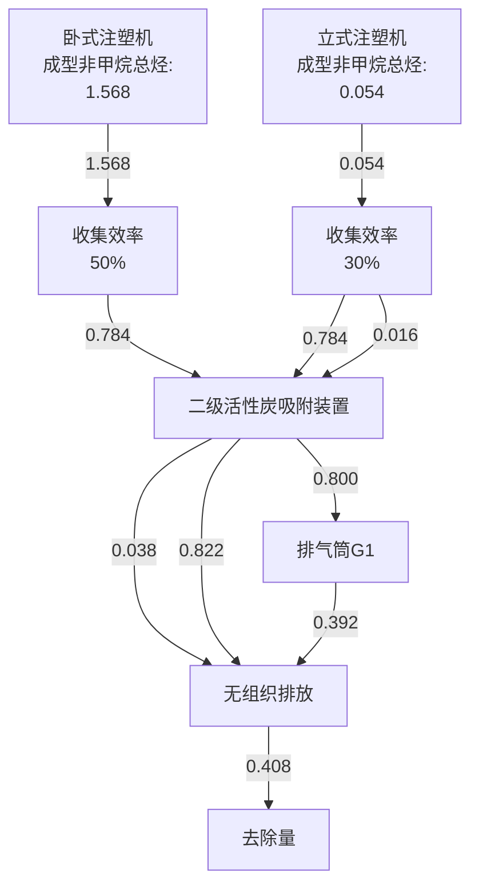
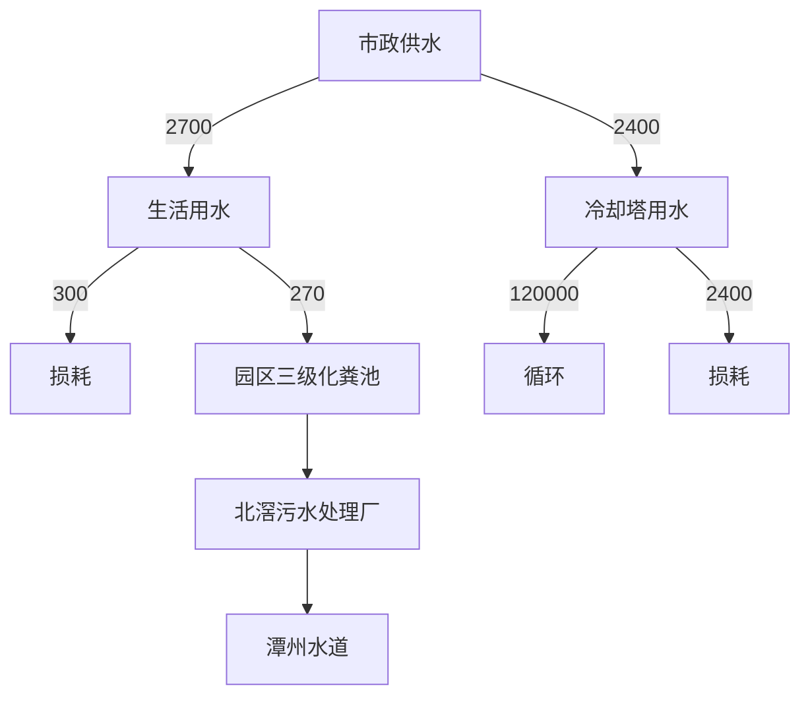
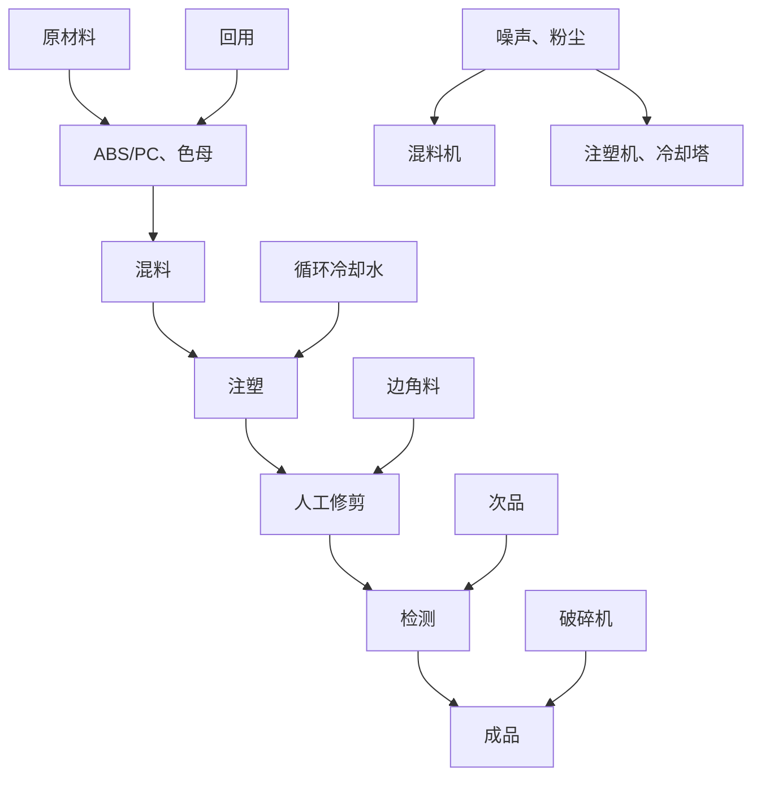
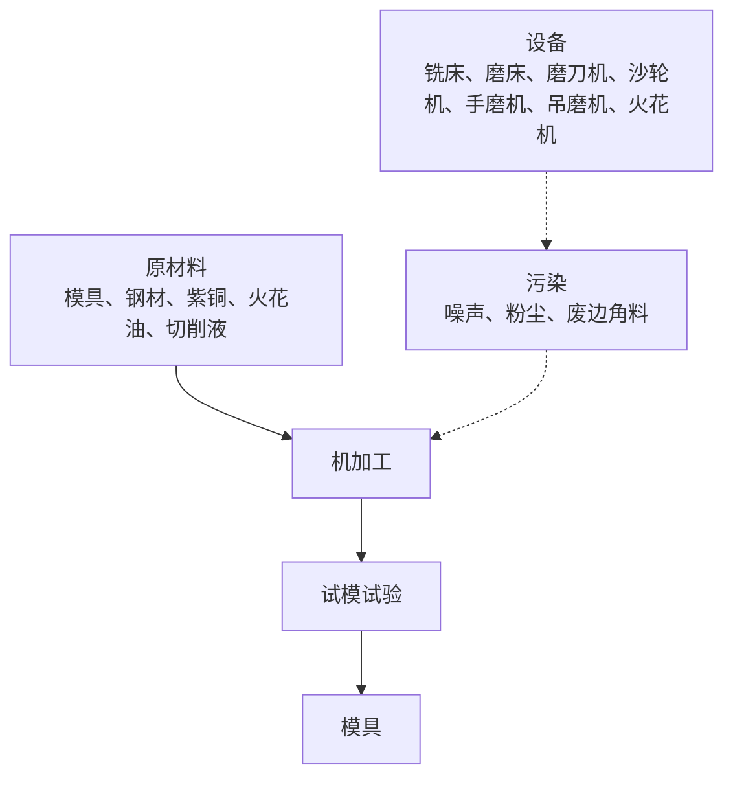

# 建设项目环境影响报告表

（污染影响类）

项目名称：佛山进润科技有限公司新建项目

建设单位（盖章）：佛山进润科技有限公司

编制日期： 2023年11月

中华人民共 部制

text_image

顺德环境科学研究院
共和国生态环境

natural_image

Pure white background with faint circular outline and no visible text, symbols, or identifiable objects

编制单位和编制人员情况表

<table><tr><td colspan="2">项目编号</td><td colspan="3">yd110m</td></tr><tr><td colspan="2">建设项目名称</td><td colspan="3">佛山进润科技有限公司新建项目</td></tr><tr><td colspan="2">建设项目类别</td><td colspan="3">26-053塑料制品业</td></tr><tr><td colspan="2">环境影响评价文件类型</td><td colspan="3">报告表</td></tr><tr><td colspan="5">一、建设单位情况</td></tr><tr><td colspan="2">单位名称(盖章)</td><td colspan="3">佛山进润科技有限公司</td></tr><tr><td colspan="2">统一社会信用代码</td><td colspan="3">91440606MACPQR3G73</td></tr><tr><td colspan="5">法定代表人(签章)</td></tr><tr><td colspan="5">主要负责人(签字)</td></tr><tr><td colspan="5">直接负责的主管人员(签字)</td></tr><tr><td colspan="5">二、编制单位情况</td></tr><tr><td colspan="2">单位名称(盖章)</td><td colspan="3">广东顺德环境科学研究院有限公司</td></tr><tr><td colspan="2">统一社会信用代码</td><td colspan="3">91440606768407545Y</td></tr><tr><td colspan="5">三、编制人员情况</td></tr><tr><td colspan="5">1.编制主持人</td></tr><tr><td>姓名</td><td colspan="2">职业资格证书管理号</td><td>信用编号</td><td>签字</td></tr></table>

<table><tr><td colspan="4">2 主要编制人员</td></tr><tr><td>姓名</td><td>主要编写内容</td><td>信用编号</td><td>签字</td></tr></table>

text_image

东顺德环境科学研究院有限公司
4406060238第12号

text_image

人民共和國人事部
by
Mintistry of Personnel

text_image

家环境保护总
applicable authorized
By
State Environmental Protection Administration
The People's Republic of China

# 目录

一、建设项目基本情况..

二、建设项目工程分析.. .19

三、区域环境质量现状、环境保护目标及评价标准. 26

四、主要环境影响和保护措施.... .32

五、环境保护措施监督检查清单.. .59

六、结论... .. 61

附表 建设项目污染物排放量汇总表.. 62

附图 1 项目地理位置图.. ... 63

附图 2 项目周边环境图.. ..64

附图 3 项目四至图.. .. 65

附图 4 项目平面布置图...... ...... 66

附图 5 项目四至情况图....... ..67

附图 6 佛山市顺德区环境管控单元图. .68

附图 7 大气环境功能区划图. .69

附图 8 水环境功能区划图... .70

附图 9 声环境功能区划图..... ..71

附图 10 北滘污水管网图... .72

附图 11 用地规划... .. 73

附件 1 营业执照.. . 74

附件 2 法人代表身份证 .................... .75

附件 3 用地资料（华智科创中心） .76

附件 4 租赁合同 ...... .. 78

附件 5 环评咨询合同....... ... 86

附件 6 排水证（华智科创中心） ..................... ..89

# 一、建设项目基本情况

<table><tr><td>建设项目名称</td><td colspan="3">佛山进润科技有限公司新建项目</td></tr><tr><td>项目代码</td><td colspan="3">无</td></tr><tr><td>建设单位联系人</td><td></td><td>联系方式</td><td></td></tr><tr><td>建设地点</td><td colspan="3">广东省佛山市顺德区北滘镇顺江社区三乐东路28号华智科创中心18栋502室之一</td></tr><tr><td>地理坐标</td><td colspan="3">(22度54分28.495秒,113度14分25.634秒)</td></tr><tr><td>国民经济行业类别</td><td>C2929塑料零件及其他塑料制品制造C4330专用设备修理</td><td>建设项目行业类别</td><td>二十六、橡胶和塑料制品业,53塑料制造业292,其他(年用非溶剂型低VOCs含量涂料10吨以下的除外)</td></tr><tr><td>建设性质</td><td>☑新建(迁建)□改建□扩建□技术改造</td><td>建设项目申报情形</td><td>☑首次申报项目□不予批准后再次申报项目□超五年重新审核项目□重大变动重新报批项目</td></tr><tr><td>项目审批(核准/备案)部门(选填)</td><td>无</td><td>项目审批(核准/备案)文号(选填)</td><td>无</td></tr><tr><td>总投资(万元)</td><td>100</td><td>环保投资(万元)</td><td>10</td></tr><tr><td>环保投资占比(%)</td><td>10</td><td>施工工期</td><td>1个月</td></tr><tr><td>是否开工建设</td><td>☑否□是:</td><td>用地(用海)面积( $m^{2}$ )</td><td>约1750</td></tr><tr><td>专项评价设置情况</td><td colspan="3">根据《建设项目环境影响报告表编制技术指南(污染影响类)(试行)》,项目无需设置专项评价,详见表1-1。</td></tr><tr><td>规划情况</td><td colspan="3">佛山市顺德高新技术产业开发区扩区规划</td></tr><tr><td>规划环境影响评价情况</td><td colspan="3">规划环境影响评价文件:佛山市顺德高新技术产业开发区扩区规划环境影响报告书审查机关:佛山市生态环境局顺德分局审查文件名称:佛山市生态环境局顺德分局关于佛山市顺德高新技术产业开发区扩区规划环境影响报告书审查情况的复函</td></tr><tr><td>规划及规划环境影响评价符合性分析</td><td colspan="3">项目与《佛山市顺德高新技术产业开发区扩区规划环境影响报告书》有关准入的条件相符性分析见表1-2。</td></tr><tr><td>其他符合性分析</td><td colspan="3">1、与《顺德区“三线一单”生态环境分区管控方案》相符性分析本项目与《顺德区“三线一单”生态环境分区管控方案》相符性分析详见表1-3。2、与佛山市“三线一单”生态环境分区管控方案相符性分析根据《佛山市人民政府关于印发佛山市“三线一单”生态环境分区管控方案的通知》(佛府〔2021〕11号)发布的佛山市环境管控单元图,项目位于北滘镇,属于重点管控区(环境管控单元编码:ZH44060620004)。项目总体符合重点管控单元的要求。具体分析详见与佛山市顺德区“三线一单”生态环境分区管控方案相符性分析。3、与广东省“三线一单”生态环境分区管控方案相符性分析根据《广东省人民政府关于印发广东省“三线一单”生态环境分区管控方案的通知》(粤府〔2020〕71号)发布的广东省环境管控单元图,项目所在的北滘镇为重点管控单元,项目总体符合重点管控单元的要求。具体分析详见与佛山市顺德区“三线一单”生态环境分区管控方案相符性分析。根据《佛山市顺德区人民政府关于印发佛山市顺德区“三线一单”生态环境分区管控方案的通知》(顺府发〔2021〕11号),项目所在区域为北滘镇重点管控区(环境管控单元编码:ZH44060620004)。4、与水源保护区法律法规相符性分析项目南面与顺德水道距离约700m,根据广东省人民政府文件《广东省人民政府关于调整佛山市部分饮用水水源保护区的批复》(粤府函〔2018〕426号)规定,划定范围见表1-4。项目边界距离北滘-羊额水厂饮用水源的一级保护区的最近距离约4638m、二级保护区最近距离约1383m、准保护区最近距离约1326m;距离南洲水厂的一级水源保护区的最近距离约610m、二级水源保护区的最近距离约648m、准水源保护区的最近距离约1356m。项目与水源保护区的位置关系详见附图7。项目租用已建成工业厂房,运营期间项目食堂废水经隔油隔渣、与生活污水一并依托园区三级化粪池预处理后经市政污水管网排入北滘污水处理厂,故不会对饮用水源保护区造成影响。5、VOCs政策符合性分析本项目与挥发性有机物(VOCs)的政策相符性分析详见表1-5。从表1-5的分析可知,本项目符合挥发性有机物(VOCs)相关法律法规的要求。6、选址分析项目选址广东省佛山市顺德区北滘镇顺江社区三乐东路28号华智科创中心18栋502室之一。1根据附件3,该项目选址所在地为工业用地,用地性质符合要求。2项目为新建项目,行业类别为C2929塑料零件及其他塑料制品制造,选址顺德互联网新家电产业园(一期)范围,符合《广东省人民政府办公厅关于印发广东省“节地提质”攻坚行动方案(2023—2025年)的通知》(粤办函〔2023〕57号):“在符合国土空间规划的前提下,新建工业项目和经批准实施异地搬迁的工业项目,除因安全生产、工艺技术等特殊要求外,应一律安排进入开发区(产业园区)生产建设。”的要求。7、与产业政策相符性分析本项目行业类别为C2929塑料零件及其他塑料制品制造,根据国家《产业结构调整指导目录(2019年本)》及2021年修改单的规定,项目不属于上述目录所列的鼓励类、限制类和禁止(淘汰)类项目,符合国家产业政策要求。根据《市场准入负面清单(2022版)》,本项目不属于上述文件的禁止和许可范围内,因此,本项目市场主体可依法平等进入市场。</td></tr></table>

表 1-1 专项评价设置原则表

<table><tr><td>专项评价的类别</td><td>设置原则</td><td>本项目相关情况</td><td>判定结果</td></tr><tr><td>大气</td><td>排放废气含有毒有害污染物、二噁英、苯并芘、氰化物、氯气且厂界外500米范围内有环境空气保护目标的建设项目。</td><td>本项目排放不涉及技术指南规定的有毒有害废气污染物。</td><td>无需设置</td></tr><tr><td>地表水</td><td>新增工业废水直排建设项目(槽罐车外送污水处理厂的除外);新增废水直排的污水集中处理厂。</td><td>本项目不涉及工业废水直接排放。</td><td>无需设置</td></tr><tr><td>环境风险</td><td>有毒有害和易燃易爆危险物质存储量超过临界量的建设项目。</td><td>经分析,本项目危险物质存储量总计未超过临界量。</td><td>无需设置</td></tr><tr><td>生态</td><td>取水口下游500米范围内有重要水生生物的自然产卵场、索饵场、越冬场和洄游通道的新增河道取水的污染类建设项目。</td><td>本项目不涉及直接从河道取水。</td><td>无需设置</td></tr><tr><td>海洋</td><td>直接向海排放污染物的海洋工程建设项目。</td><td>本项目污水排放不涉及海洋。</td><td>无需设置</td></tr></table>

注：1.废气中有毒有害污染物指纳入《有毒有害大气污染物名录》的污染物（不包括无排放标准的污染物）。2.环境空气保护目标指自然保护区、风景名胜区、居住区、文化区和农村地区中人群较集中的区域。3.临界量及其计算方法可参考《建设项目环境风险评价技术导则》（HJ 169）附录 B、附录 C。

表 1-2 与佛山市顺德高新技术产业开发区扩区规划环境影响报告书有关准入的条件相符性分析

<table><tr><td>清单类型</td><td>准入要求</td><td>本项目情况</td><td>符合性</td></tr><tr><td colspan="4">高新区总体生态环境准入清单</td></tr><tr><td rowspan="5">空间布局约束</td><td>1、引入产业应符合现行有效的《产业结构调整指导目录》、《市场准入负面清单》等相关产业政策的要求</td><td>根据《市场准入负面清单(2022年版)》,项目不在负面清单内;根据国家发改委《产业结构调整指导目录(2019年本)》及2021年修改单、《珠江三角洲地区产业结构调整优化和产业导向目录》的规定,项目不属于上述目录所列的鼓励类、限制类和禁止(淘汰)类项目,根据《促进产业结构调整暂行规定》(国发〔2005〕40号)第十三条,项目属于允许类,且符合国家有关法律、法规和政策规定。因此,本项目符合《产业结构调整指导目录》、《市场准入负面清单》等相关产业政策的要求。</td><td>符合</td></tr><tr><td>2、禁止引入新增排放重点防控重金属污染物(铅(Pb)、汞(Hg)、镉(Cd)、铬(Cr)和类金属砷(As))、持久性有机污染物的项目</td><td>本项目主要产生的是氮氧化物、二氧化硫、非甲烷总烃、臭气浓度、颗粒物,不属于“新增排放重点防控重金属污染物(铅(Pb)、汞(Hg)、镉(Cd)、铬(Cr)和类金属砷(As))、持久性有机污染物的项目”。</td><td>符合</td></tr><tr><td>3、饮用水源准保护区内不得新建、扩建对水体污染严重、排放一类水污染物和持久性有机污染物的项目,改扩建项目不得新增水污染物</td><td>本项目不在饮用水源准保护区内,本项目食堂废水经隔油隔渣、与其他生活污水一并经过三级化粪池预处理后经市政污水管网排入北滘污水处理厂,不属于新建、扩建对水体污染严重、排放一类水污染物和持久性有机污染物的项目,无新增水污染物。</td><td>符合</td></tr><tr><td>4、禁止引入达不到清洁生产国际先进水平的企业</td><td>本项目不涉及。</td><td>符合</td></tr><tr><td>5、在污水管网建设滞后或所依托的污水处理厂处理能力不能满足废水处理需求的区域,不应引入废水排放量较大的项目扩区南片区在纳污水体水质稳定达标前,应合理控制涉水排放企业规模,优先引入无生产废水或生产废水排放量较小的项目;扩区东北组团应控制废水排放量较大企业的引入,引入涉水排放企业的规模应与区域污水处理厂处理能力相匹配,严格控制废水排放量较大的项目及新增一类水污染物排放项目的引入,避免对下游饮用水源保护区产生不良影响;扩区西北组团在乐从污水处理厂扩容前,应合理控制涉水排放企业引入规模和时序,尤其严格控制废水排放量较大的企业,确保区域污水得到有效收集和处理。</td><td>本项目食堂废水经隔油隔渣、与其他生活污水一并经过三级化粪池预处理后经市政污水管网排入北滘污水处理厂。</td><td>符合</td></tr><tr><td rowspan="4"></td><td>6、禁止新建、扩建燃煤燃油火电机组和企业自备电站,逐步淘汰生物质锅炉、集中供热管网覆盖区域内的分散供热锅炉,集中供热管网覆盖地区禁止新建、扩建分散供热锅炉,规划区应全部按高污染燃料禁燃区进行管理;禁止新建、扩建水泥、平板玻璃、化学制浆、炼化、炼钢炼铁、电解铝、焦炭、金属冶炼、制浆造纸、鞣革、铅酸蓄电池、专业电镀、木质家具涂装、印染项目;不再新建陶瓷厂(新型特种陶瓷项目除外)化工项目按照“入园管理”原则合理布局,提高准入门槛,不得新建、扩建纳入国家“高污染、高环境风险”产品名录的生产项目。</td><td>本项目属于塑料零件及其他塑料制品制造、专用设备修理,不涉及新建、扩建燃煤燃油火电机组和企业自备电站;不属于新建、扩建水泥、平板玻璃、化学制浆、炼化、炼钢炼铁、电解铝、焦炭、金属冶炼、制浆造纸、鞣革、铅酸蓄电池、专业电镀、木质家具涂装、印染项目;项目不属于“高污染、高环境风险”产品名录的生产项目。</td><td>符合</td></tr><tr><td>7、严格控制日用玻璃制造、家具制造、废塑料回收加工再生(列入国家“城市矿产”示范基地项目除外)、专业金属表面处理(铝及铝合金的阳极氧化、铝的表面铬酸盐转化、锌的铬酸盐钝化和金属酸洗、磷化、喷漆、喷涂)等项目建设;严格限制新建生产和使用高挥发性有机物原辅材料的项目,鼓励建设挥发性有机物共性工厂</td><td>本项目不使用溶剂型油墨、涂料、清洗剂、胶黏剂等高挥发性有机物原辅材料。</td><td>符合</td></tr><tr><td>8、工业企业禁止选址城镇生活空间,生产空间禁止建设居民住宅等敏感建筑;园区工业用地或企业与村庄、学校等环境敏感点之间应设置合理的防护距离,并通过绿化带进行有效隔离,该距离内不得规划新建居民点、办公楼和学校等环境敏感目标</td><td>本项目不涉及。</td><td>符合</td></tr><tr><td>9、现有及规划居住区、学校、医院等敏感用地周边50米范围内禁止新建、扩建高噪声排放生产项目;现有及规划居住区、学校、医院等敏感用地周边100米范围内禁止新建、扩建纳入国家“高污染、高环境风险”产品名录的生产项目,不引入酸洗、涂装、注塑、排放恶臭气味的生产工艺和生产设施</td><td>距离本项目最近的敏感点是东面 西海村 765m。</td><td>符合</td></tr><tr><td rowspan="4"></td><td>10、结合《顺德区高质量推动村级工业园升级改造总体规划》,推进区域村级工业园改造工作,禁止重复低水平建设</td><td>本项目不涉及</td><td>符合</td></tr><tr><td>11、南片区按照《广东省重金属污染综合防治“十三五”规划》、《佛山市重金属污染综合防治“十三五”规划》的要求,禁止新建、扩建增加重点防控的重金属污染物排放的建设项目,现有技术改造项目应通过实施“区域削减”,实现增产减污;其它区域新、改扩建重金属排放项目应严格落实重金属总量替代与削减要求,严格控制重点行业发展规模。</td><td>本项目不涉及。</td><td>符合</td></tr><tr><td>12、按规划用地布局未来退出的工业企业用地,应严格按照《中华人民共和国土壤污染防治法》开展必要的调查、评估和修复工作,符合要求后,方可用于居住、教育教研、办公等第三产业类用地</td><td>本项目不涉及。</td><td>符合</td></tr><tr><td>13、其它:符合《佛山市人民政府关于印发佛山市“三线一单”生态环境分区管控方案的通知》(佛府〔2021〕11号)相关管控要求</td><td>具体见表1-3。</td><td>符合</td></tr><tr><td rowspan="3">污染物排放管控</td><td>1.污染物排放总量不得突破“污染物排放总量管控限值清单”的总量管控要求;重点对重点污染物(重点污染物包括化学需氧量、氨氮、氮氧化物及挥发性有机物等)实施总量控制;上年度重点河涌水质未达到水环境质量目标的管控分区所在镇(街道),须组织编制、系统实施、向社会公开区域重点水污染物减排计划并明确“替代量”,本年度新建、改建、扩建项目新增水环境重点污染物实行区域“减二增一”替代(废水集中处理设施、民生项目除外);在可核查、可监管的基础上,全区新建、改建、扩建项目新增大气重点污染物实行“减二增一”替代。</td><td>待项目审批时由生态环境部门核定VOCs总量来源。</td><td>符合</td></tr><tr><td>2.未完成环境质量改善目标的区域,新改扩建项目重点污染物实施减量替代。</td><td>待项目审批时由生态环境部门核定VOCs总量来源。</td><td>符合</td></tr><tr><td>3.未接入污水管网的新建建筑小区或公共建筑,不得交付使用。新建城区生活污水收集处理设施要与城市发展同步规划、同步建设。</td><td>本项目不涉及。</td><td>符合</td></tr><tr><td rowspan="3"></td><td>4.规划区内建设项目废污水原则上应接入各片区集中式污水处理厂进行集中处理、达标排放;受纳水体或监控断面不达标的,不得新建、扩建向河涌直接排放废水的项目;对于暂时无法接入市政污水管网、且废水量较少的项目,生活污水处理后立足回用,不能回用的,应处理达到《城镇污水处理厂污染物排放标准》(GB18918-2002)后排入政策法规允许排放且有环境容量的水域;生产废水应立足于回用,不能回用的,可考虑委外处置,确需要外排的,应处理达到行业直接排放标准或广东省《水污染物排放限值》(DB44/26-2001)后排入政策法规允许排放且有环境容量的水域。</td><td>本项目食堂废水经隔油隔渣、与其他生活污水一并经过三级化粪池预处理,达到广东省《水污染物排放限值》(DB44/26-2001)的第二时段三级标准后排入北滘污水处理厂处理。</td><td>符合</td></tr><tr><td>5.向工业集聚区污水集中处理设施或者城镇污水集中处理设施排放工业废水的,应当按照有关规定进行预处理,达到集中处理设施处理工艺要求后方可以排入市政管网进入各片区污水处理厂。企业生活污水达到广东省《水污染物排放限值》(DB44/26-2001)第二时段三级标准后通过污水管线进入各片区所依托的城镇污水处理厂;扩区南片区企业生产废水预处理达到广东省《水污染物排放限值》(DB44/26-2001)第二时段二级标准、行业间接排放要求(有行业间接排放标准要求的)、杏坛污水处理厂接管要求后通过污水管线排入杏坛污水处理厂处理;扩区西北组团企业生产废水预处理达到广东省《水污染物排放限值》(DB44/26-2001)第二时段二级标准、行业间接排放要求(有行业间接排放标准要求的)、乐从污水处理厂接管要求后通过污水管线排入乐从污水处理厂处理;扩区西北组团企业生产废水预处理达到广东省《水污染物排放限值》(DB44/26-2001)第二时段三级标准、行业间接排放要求(有行业间接排放标准要求的)、北滘污水处理厂接管要求后通过污水管线排入北滘污水处理厂处理。</td><td>本项目食堂废水经隔油隔渣、与其他生活污水一并经过三级化粪池预处理,达到广东省《水污染物排放限值》(DB44/26-2001)的第二时段三级标准后排入北滘污水处理厂处理。</td><td>符合</td></tr><tr><td>6.规划区依托的集中式污水处理设施排放标准应达到或优于《城镇污水处理厂污染物排放标准》(GB18918-2002)一级标准的A标准和广东省《水污染物排放限值》(DB44/26-2001)第二时段一级标准的较严者。7.根据《广东省生态环境厅关于2021年工业炉窑、锅炉综合整治重点工作的通知》(粤环函〔2021〕461号)要求,高新区现有燃气锅炉执行《锅炉大气污染物排放标准》(DB44/765-2019)表2排放标准,新建燃气锅炉废气中氮氧化物执行《锅炉大气污染物排放标准》(DB44/765-2019)表3大气污染物特别排放限值,颗粒物、二氧化硫指标特别排放标准(表3)的执行范围、时间按区域正式发布方案执行;新改建的工业窑炉,如烘干炉、加热炉等,有行业标准或地方排放标准的执行相关行业标准或地方标准,未制订行业排放标准的,参照《广东省关于贯彻落实&lt;工业炉窑大气污染综合治理方案&gt;的实施意见》(粤环函〔2019〕1112号),颗粒物、二氧化硫、氮氧化物排放限值分别不高于30、200、300毫克/立方米;家居涂装工艺废气应该执行《家具制造行业挥发性有机化合物排放标准》(DB44814-2010)第II时段限值;无行业排放标准的企业,为严格控制区域VOCs排放量,在国家、省未出台行业标准前,金属制品、铝型材、设备制造行业参照执行《表面涂装(汽车制造业)挥发性有机化合物排放标准》(DB44/816-2010);其他行业参照执行《家具制造行业挥发性有机化合物排放标准(DB44/814-2010)》;涉及VOCs无组织排放的企业,除有行业标准的执行相关行业标准之外,其余工业企业VOCs物料储存、转移和输送、工艺工程、设备与管线组件VOCs泄漏,敞开液面等VOCs无组织排放控制要求,以及VOCs无组织排放废气收集处理系统要求执行《挥发性有机物无组织排放控制标准》(GB37822-2019)要求,厂区内VOCs无组织排放监控点浓度应符合GB37822-2019中表A.1规定的特别排放限值;涉及铸造工艺的,新建企业自2021年1月1日起,现有企业自2023年7月1日起,铸造生产工艺环节和生产设备执行《铸造工业大气污染物排放标准》(GB39726—2020)表1规定的大气污染物排放限值、企业边界大气污染物浓度限值及其他污染控制要求;制药工业企业执行《制药工业大气污染物排放标准》(GB37823-2019)表1规定的大气污染物排放限值、企业边界大气污染物浓度限值及其他污染控制要求;注塑等合成树脂加工生产环节和生产设备其执行《合成树脂工业污染物排放标准》(GB31572-2015)表5规定的大气污染物特别排放限值(涉及PVC树脂的不执行)、合成树脂工业污染物排放标准及其他污染控制要求;分布式能源站项目锅炉烟气执行《火电厂大气污染物排放标准》(GB13223-2011)“表2大气污染物特别排放标准”中所列的燃气轮机组排放浓度限值。</td><td>北滘污水处理厂尾水达到《城镇污水处理厂污染物排放标准》(GB18918-2002)一级A标准及广东省地方标准《水污染物排放限值》(DB44/26-2001)第二时段一级标准的较严值。本项目虽涉及注塑工序,属于塑料制品业,但不属于化工项目,故执行《合成树脂工业污染物排放标准》(GB31572-2015)表4规定的大气污染物排放限值、合成树脂工业污染物排放标准及其他污染控制要求。</td><td>符合符合</td></tr><tr><td rowspan="2"></td><td>8.重点加强涉VOCs排放的工业项目的挥发性有机物的源头替代和无组织排放管控,大力推进低VOCs含量原辅材料替代。木制家具制造行业应全面使用水性胶粘剂,替代比例达到100%。家具制造及其他工业涂装项目的水性涂料等低排放VOCs含量涂料占总涂料使用量比例应至少不低于50%。产生VOCs的生产车间须配置废气收集净化装置。排放挥发性有机物的车间必须安装废气收集、回收净化装置,收集率应大于90%;使用溶剂型涂料涂装工艺的VOCs去除率达到90%;家具制造行业有机废气净化率达到80%以上。逐步淘汰单纯活性炭吸附、水喷淋+活性炭吸附等排放状况不稳定的治理技术。</td><td>本项目卧式注塑机注塑过程产生的有机废气经“集气罩+垂帘”收集与立式注塑机注塑过程产生的有机废气经集气罩收集,经“二级活性炭吸附”处理后引至排气筒G1(60m)排放。</td><td>符合</td></tr><tr><td>9.其它:符合《佛山市人民政府关于印发佛山市“三线一单”生态环境分区管控方案的通知》(佛府〔2020〕11号)相关管控要求。</td><td>具体见表1-3。</td><td>符合</td></tr><tr><td rowspan="4">环境风险防控</td><td>1.制定园区环境风险事故防范和应急预案。完善区域—园区—工业企业多级联动环境突发事件应急预案,建立预防、应急响应机制和后评估机制,定期开展应急演练,提高区域环境风险防范能力。</td><td>本项目不涉及。</td><td>符合</td></tr><tr><td>2.污水处理厂应采取有效措施,防止事故废水直接排入水体;完善污水处理厂在线监控系统联网,实现污水处理厂的实时、动态监管。</td><td>本项目不涉及。</td><td>符合</td></tr><tr><td>3.生产性废水较多的企业需配套有效措施,防止事故废水和第一类污染物直排污染地表水体,防止因渗漏污染地下水。</td><td>本项目不涉及。</td><td>符合</td></tr><tr><td>4.其它:符合《佛山市人民政府关于印发佛山市“三线一单”生态环境分区管控方案的通知》(佛府〔2020〕11号)相关管控要求。</td><td>具体见表1-3。</td><td>符合</td></tr><tr><td rowspan="4">资源开发利用要求</td><td>1.禁止使用高污染燃料。</td><td>本项目不涉及。</td><td>符合</td></tr><tr><td>2.工业项目原则上单位GDP能耗要低于0.38吨标煤/万元,单位工业增加值新鲜水耗要低于10立方米/万元。</td><td>本项目不涉及。</td><td>符合</td></tr><tr><td>3.新建高能耗项目单位产品(产值)能耗达到国际国内先进水平。</td><td>本项目不涉及。</td><td>符合</td></tr><tr><td>4.其它:符合《佛山市人民政府关于印发佛山市“三线一单”生态环境分区管控方案的通知》(佛府〔2020〕11号)相关管控要求。</td><td>具体见表1-3。</td><td>符合</td></tr><tr><td colspan="4">扩区东北组团-E3生态环境准入要求</td></tr><tr><td colspan="2">1、结合《顺德区高质量推动村级工业园升级改造总体规划》,推进区域村级工业园改造工作,禁止重复低水平建设。</td><td>本项目不涉及。</td><td>符合</td></tr><tr><td colspan="2">2、按现行有效的用地规划方案进行建设,非工业用地禁止引入工业生产项目。规划拟由现状工业用地转变为商住用地的区域,原则上禁止引入新的工业生产项目,现有工业项目改扩建须做到减污;对由工业性质转变为居住、教育教研、办公等的地块,应严格按照《中华人民共和国土壤污染防治法》开展必要的调查、评估和修复工作。</td><td>本项目建设用地属工业用地。</td><td>符合</td></tr><tr><td colspan="2">3、现状已建工业生产区域应优先完善市政污水管网;污水管网建设滞后或所依托的污水处理厂处理能力不能满足废水处理需求的区域,不应引入废水排放量较大的项目。禁止引入新增排放重点防控重金属污染物(铅(Pb)、汞(Hg)、镉(Cd)、铬(Cr)和类金属砷(As))、持久性有机污染物的项目。</td><td>本项目食堂废水经隔油隔渣、与其他生活污水一并经过三级化粪池预处理后经市政污水管网排入北滘污水处理厂;不属于新建、扩建对水体污染严重、排放一类水污染物和持久性有机污染物的项目,无新增水污染物。</td><td>符合</td></tr><tr><td colspan="2">4、临近居住用地等敏感用地的区域应布置轻污染项目,合理控制污染工序规模、适当提高工业生产相关的非生产设施比例。其它临近居住用地等敏感用地、排放废气的项目应严格落实高效的废气治理措施,避免对敏感建筑产生不良影响。如引入废水排放量较大、使用有毒有害物质的项目,应配置有足够的环境风险应急设施,确保生产废水及有毒有害物质不进入饮用水源保护区;园中园项目必须设置足够容量的应急池,以应对内部事故废水及消防废水。</td><td>距离本项目最近的敏感点是东面 西海村 765m。</td><td>符合</td></tr><tr><td colspan="2">5、提高企业VOCs治理效率,逐步淘汰单纯活性炭吸附、水喷淋+活性炭吸附等排放状况不稳定的治理技术,升级现有低效的有机废气处理措施(如单纯或单级低温等离子体、UV光解等)。</td><td>本项目卧式注塑机注塑过程产生的有机废气经“集气罩+垂帘”收集与立式注塑机注塑过程产生的有机废气经集气罩收集,经“二级活性炭吸附”处理后引至排气筒G1(60m)排放。</td><td>符合</td></tr><tr><td colspan="2">6、推广新能源汽车和充电基础设施,积极推动重卡LNG加气站、充电基础设施、加氢站建设。</td><td>本项目不涉及。</td><td>符合</td></tr><tr><td colspan="2">7、新建高能耗项目单位产品(产值)能耗达到国际国内先进水平。</td><td>本项目不涉及。</td><td>符合</td></tr><tr><td colspan="2">8、新建、扩建含蚀刻工序的线路板生产项目和化工项目应在配套污水集中处置的工业园区或生活污水管网覆盖区域内建设。含酸洗、磷化的金属表面处理、金属制品项目(与自身高新技术企业配套的除外),含酸洗、喷涂、拉丝、表面抛光等工艺的不锈钢型材加工项目,应进入以此类项目为主导产业、有相应废水集中治理设施的工业园区,实现集中治污。</td><td>本项目不涉及。</td><td>符合</td></tr><tr><td colspan="2">9、原则上禁止引入列入“高污染、高环境风险”产品名录等可能影响水环境安全的项目。</td><td>项目不属于“高污染、高环境风险”产品名录等可能影响水环境安全的项目。</td><td>符合</td></tr><tr><td colspan="2">10、城镇新区建设实行雨污分流,逐步推进初期雨水收集、处理和资源化利用。住宅、商业体、学校、市场等城镇开发建设项目应当配套或者同步计划建设公共排水设施,公共排水设施或自建排污水设施未能投产运行的,以上涉水项目不得投入使用。</td><td>本项目食堂废水经隔油隔渣、与其他生活污水一并经过三级化粪池预处理后经市政污水管网排入北滘污水处理厂。</td><td>符合</td></tr><tr><td colspan="2">11、北滘污水处理厂应适时启动扩建工程。</td><td>本项目不涉及。</td><td>符合</td></tr><tr><td colspan="2">12、大力推进低VOCs含量原辅材料替代,加快涉VOCs重点行业的生产工艺升级改造,推行自动化生产工艺,对达不到要求的VOCs收集及治理设施进行整治提升,逐步淘汰低效VOCs治理设施。</td><td>本项目卧式注塑机注塑过程产生的有机废气经“集气罩+垂帘”收集与立式注塑机注塑过程产生的有机废气经集气罩收集,经“二级活性炭吸附”处理后引至排气筒G1(60m)排放。</td><td>符合</td></tr><tr><td colspan="2">13、其它应符合佛府(2020)11号中ZH44060620004北滘镇重点管控区的相关管控要求。</td><td>具体见表1-3。</td><td>符合</td></tr></table>

表 1-3 区域布局管控要求

<table><tr><td>管控要求</td><td>本项目概况</td><td>相符性</td></tr><tr><td>1.【产业/限制类】受纳水体或监控断面不达标的,不得新建、扩建向河涌直接排放废水的项目。新建、扩建含蚀刻工序的线路板生产项目和化工项目应在配套污水集中处置的工业园区或生活污水管网覆盖区域内建设;纯加工型印花项目,含酸洗、磷化的金属表面处理、金属制品项目(与自身高新技术企业配套的除外),含酸洗、喷涂、化学抛光、电解等涉及废水排放工艺的不锈钢型材加工项目(与自身高新技术企业配套的除外),应进入以此类项目为主导产业、有相应废水集中治理设施的工业园区,实现集中治污。</td><td>本项目不涉及。</td><td>符合</td></tr><tr><td>2.【产业/综合类】划定家具生产优先发展区域,优先发展区外不再新建涉及涂装工艺的木质家具制造项目。</td><td>本项目不涉及。</td><td>符合</td></tr><tr><td>3.【生态/禁止类】生态保护红线原则上按照禁止开发区域要求进行管理。区域严格按照《关于在国土空间规划中统筹划定落实三条控制线的指导意见》执行,自然保护地核心保护区原则上禁止人为活动,其他区域严格禁止开发性、生产性建设活动。</td><td>本项目不涉及。</td><td>符合</td></tr><tr><td>4.【生态/限制类】生态保护红线内,自然保护地核心区以外的区域,在符合现行法律法规前提下,除国家重大战略项目外,仅允许对生态功能不造成破坏的8类有限人为活动。</td><td>本项目不涉及。</td><td>符合</td></tr><tr><td>5.【生态/禁止类】湿地公园涉及佛山顺德鲤鱼沙地方级湿地自然公园,按照《湿地保护管理规定》、《广东省湿地公园管理暂行办法》及其他相关法律法规实施管理。湿地公园内禁止下列行为:开矿、采石、修坟以及生产性放牧等;从事房地产、度假村、高尔夫球场等任何不符合主体功能定位的建设项目和开发活动;法律法规禁止的活动或者行为。禁止擅自占用、征用湿地公园的土地。</td><td>本项目不涉及。</td><td>符合</td></tr><tr><td>6.【生态/禁止类】单元内的一般生态空间,主导生态功能为水土保持,禁止在25度以上的陡坡地开垦种植农作物,禁止在崩塌、滑坡危险区、泥石流易发区从事采石、取土、采砂等可能造成水土流失的活动。</td><td>本项目不涉及。</td><td>符合</td></tr><tr><td>7.【水/禁止类】单元内饮用水水源保护区涉及羊额-北滘水厂、佛山市顺德藤溪水厂、广州市南洲水厂顺德水道取水口饮用水水源一级、二级和准保护区、沙湾水厂番禺侧饮用水水源一级、二级保护区。按照《中华人民共和国水污染防治法》、《广东省水污染防治条例》等相关法律法规条例实施管理。禁止在饮用水水源一级保护区内新建、改建、扩建与供水设施和保护水源无关的建设项目;禁止在饮用水水源二级保护区内新建、改建、扩建排放污染物的建设项目;禁止在饮用水水源准保护区内新建、扩建对水体污染严重的建设项目。</td><td>本项目不在饮用水源保护区内,本项目食堂废水经隔油隔渣、与其他生活污水一并经过三级化粪池预处理后经市政污水管网排入北滘污水处理厂。</td><td>符合</td></tr><tr><td>8.【水/鼓励引导类】应当根据保护饮用水水源的实际需要,在羊额-北滘水厂、佛山市顺德藤溪水厂、广州市南洲水厂顺德水道取水口饮用水水源准保护区内采取工程措施或者建造湿地、水源涵养林等生态保护措施,防止水污染物直接排入饮用水水体,确保饮用水安全。</td><td>本项目不涉及。</td><td>符合</td></tr><tr><td>9.【水/综合类】加强顺德水道供水通道干流沿岸以及羊额-北滘水厂、佛山市顺德藤溪水厂、广州市南洲水厂顺德水道取水口、沙湾水厂番禺侧饮用水水源保护区环境风险防控,完善突发环境事件应急管理体系。</td><td>本项目不涉及。</td><td>符合</td></tr><tr><td>10.【大气/限制类】大气环境布局敏感区重点管控区内,应严格限制新建生产和使用高挥发性有机物原辅材料项目,优先开展低VOCs含量原辅材料替代,强化无组织排放控制。原则上不再新建、扩建新增氮氧化物、烟(粉)尘排放量较大的建设项目。</td><td>本项目不涉及高挥发性有机物原辅材料;不属于新增氮氧化物、烟(粉)尘排放量较大的建设项目。</td><td>符合</td></tr><tr><td>11.【大气/鼓励引导类】大气环境高排放重点管控区内,应强化达标监管,引导工业项目落地集聚发展,有序推进区域内行业企业提标改造。</td><td>本项目位于北滘镇高排放重点管控单元(编号:YS4406062310002),废气可达标排放。</td><td>符合</td></tr><tr><td>12.【水资源/综合类】落实北江流域水资源分配方案,加强江河湖库水量调度,保障生态流量。</td><td>本项目不涉及。</td><td>符合</td></tr><tr><td>13.【岸线/禁止类】严格水域岸线用途管制,新建项目一律不得违规占用水域。严禁破坏生态的岸线利用行为和不符合其功能定位的开发建设活动,严禁以各种名义侵占河道、围垦湖泊、非法采砂等。</td><td>本项目不涉及。</td><td>符合</td></tr></table>

表 1-4 水源保护区划定范围表

<table><tr><td>水源名称</td><td>保护区级别</td><td>水域保护范围</td><td>陆域保护范围</td></tr><tr><td rowspan="3">羊额-北滘水厂饮用水水源保护区</td><td>一级保护区</td><td>顺德水道沙栏至羊额水厂取水口下游1000m之间约2300m的水域</td><td>相应一级保护区水域边界线至河堤背水坡脚之间的陆域</td></tr><tr><td>二级保护区</td><td>一级保护区上游边界至黄连码头之间约3250m的水域、下游边界至白鹤林广电动排灌站之间约4050m的水域,以及流入二级区范围的支涌(西河、伦教大涌、三丰河和北滘河)从蚬肉迳闸、黄麻涌闸、三洪奇闸起上溯1500m的水域</td><td>相应二级保护区水域边界线至河堤背水坡脚之间的陆域以及支涌水域边界至河堤背水坡脚向陆纵深10m的陆域</td></tr><tr><td>准保护区</td><td>顺德水道迳口河至黄连码头之间约4000m的水域</td><td>相应准保护区水域两岸堤背水坡脚向陆纵深500m的陆域、二级保护区陆域边界外延至500m的陆域</td></tr><tr><td rowspan="3">南洲水厂饮用水水源保护区</td><td>一级保护区</td><td>西达发电厂东边界以东至管桩厂西边界之间的水域(距离约620m,取水口至西达发电厂东边界265m,至管桩厂西边界355m)</td><td>相应一级保护区水域靠广州市南洲水厂顺德水道取水口一侧沿岸纵深100m以内的陆域(距离约620m)</td></tr><tr><td>二级保护区</td><td>白鹤嘴林厂电动排灌站以东至西达发电厂东边界及管桩厂西边界以东至潭州水道与顺德水道交界处的顺德水道水域(距离约1835m,白鹤嘴林厂电动排灌站以东至西达发电厂东边界距离1090m,管桩厂西边界至潭州水道与顺德水道交界处水域距离745m)</td><td>相应二级保护区水域两岸纵深100m以内的陆域,以及西达发电厂东边界以东至管桩厂西边界之间广州市南洲水厂顺德水道取水口对岸一侧沿岸纵深100m以内的陆域(距离约2455m)</td></tr><tr><td>准保护区</td><td>顺德水道一、二级保护区以外的水域(II);李家沙水道自顺德乌洲至番禺紫坭西的水域(III);沙湾水道至番禺紫坭西至番禺墩涌的水域(II)</td><td>相应准保护区水域两岸纵深50m以内的陆域</td></tr></table>

表1-5 项目与挥发性有机物（VOCs）政策的相符性

<table><tr><td>序号</td><td>政策要求</td><td>工程内容</td><td>判定</td></tr><tr><td colspan="4">1.《珠江三角洲地区严格控制工业企业挥发性有机物(VOCs)排放的意见》(粤环〔2012〕18号)</td></tr><tr><td>1.1</td><td>在自然保护区、水源保护区、风景名胜区、森林公园、重要湿地、生态敏感区和其他重生态功能区实行强制性保护,禁止新建VOCs污染企业</td><td>本项目选址不在规定区域</td><td>符合</td></tr><tr><td colspan="4">2.《中华人民共和国大气污染防治法》(2018.10.27修订,2016.1.1实施)</td></tr><tr><td>2.1</td><td>第四十五条产生含挥发性有机物废气的生产和服务活动,应当在密闭空间或者设备中进行,并按照规定安装、使用污染防治设施;无法密闭的,应当采取措施减少废气排放。</td><td>本项目卧式注塑机注塑过程产生的有机废气经“集气罩+垂帘”收集与立式注塑机注塑过程产生的有机废气经集气罩收集,经“二级活性炭吸附”处理后通过排气筒G1(60m)引至楼顶排放。</td><td>符合</td></tr><tr><td colspan="4">3.关于印发《重点行业挥发性有机物综合治理方案》的通知(环大气〔2019〕53号)</td></tr><tr><td>3.1</td><td>大力推进源头替代:通过使用水性、粉末、高固体分、无溶剂、辐射固化等低VOCs含量的涂料,水性、辐射固化、植物基等低VOCs含量的油墨,水基、热熔、无溶剂、辐射固化、改性、生物降解等低VOCs含量的胶粘剂,以及低VOCs含量、低反应活性的清洗剂等,替代溶剂型涂料、油墨、胶粘剂、清洗剂等,从源头减少VOCs产生。</td><td>本项目使用塑料粒,不涉及使用高挥发性涂料、油墨、胶粘剂、清洗剂等。</td><td>符合</td></tr><tr><td>3.2</td><td>加强政策引导:企业采用符合国家有关低VOCs含量产品规定的涂料、油墨、胶粘剂等,排放浓度稳定达标且排放速率、排放绩效等满足相关规定的,相应生产工序可不要求建设末端治理设施。使用的原辅材料VOCs含量(质量比)低于10%的工序,可不要求采取无组织排放收集措施。</td><td>本项目卧式注塑机注塑过程产生的有机废气经“集气罩+垂帘”收集与立式注塑机注塑过程产生的有机废气经集气罩收集,经“二级活性炭吸附”处理后通过排气筒G1(60m)引至楼顶排放。</td><td>符合</td></tr><tr><td>3.2</td><td>全面加强无组织排放控制。重点对含VOCs物料(包括含VOCs原辅材料、含VOCs产品、含VOCs废料以及有机聚合物材料等)储存、转移和输送、设备与管线组件泄漏、敞开液面逸散以及工艺过程等五类排放源实施管控,通过采取设备与场所密闭、工艺改进、废气有效收集等措施,削减VOCs无组织排放。</td><td>本项目卧式注塑机注塑过程产生的有机废气经“集气罩+垂帘”收集与立式注塑机注塑过程产生的有机废气经集气罩收集,经“二级活性炭吸附”处理后通过排气筒G1(60m)引至楼顶排放。</td><td>符合</td></tr><tr><td colspan="4">4.《广东省人民政府办公厅关于印发广东省2021年大气、水、土壤污染防治工作方案的通知》(粤办函〔2021〕58号)</td></tr><tr><td>4.1</td><td>严格落实国家产品VOCs含量限值标准要求,除现阶段确无法实施替代的工序外,禁止新建生产和使用高VOCs含量原辅材料项目</td><td>本项目不涉及使用高VOCs含量原辅材料。</td><td>符合</td></tr><tr><td colspan="4">5.广东省生态环境厅关于做好建设项目挥发性有机物(VOCs)排放削减替代工作的补充通知(粤环函〔2021〕537号)</td></tr><tr><td>5.1</td><td>各地生态环境部门要健全建设项目VOCs排放总量管理台账,严格核定VOCs可替代总量指标,重点核查用作替代的削减量是否为企业达标排放后采取治理措施的削减量、或淘汰关停后的削减量,是否有削减量重复使用等情况,进一步规范VOCs削减替代工作。新改扩建项目环评审批时,应逐级出具VOCs总量替代来源审核意见,确保总量指标管理扎实有效。</td><td>待项目审批时由生态环境部门核定VOCs总量来源。</td><td>符合</td></tr><tr><td colspan="4">6.关于印发《广东省臭氧污染防治(氮氧化物和挥发性有机物协同减排)实施方案(2023-2025年)》的通知(粤环函〔2023〕45号)</td></tr><tr><td>6.1</td><td>加快推进工程机械、钢结构、船舶制造等行业低VOCs含量原辅材料替代,引导生产和使用企业供应和使用符合国家质量标准产品;企业无组织排放控制措施及相关限值应符合《挥发性有机物无组织排放控制标准(GB37822)》、《固定污染源挥发性有机物排放综合标准(DB44/2367)》和《广东省生态环境厅关于实施厂区内挥发性有机物无组织排放监控要求的通告》(粤环发〔2021〕4号)要求,无法实现低VOCs原辅材料替代的工序,宜在密闭设备、密闭空间作业或安装二次密闭设施;新、改、扩建项目限制使用光催化、光氧化、水喷淋(吸收可溶性VOCs除外)、低温等离子等低效VOCs治理设施(恶臭处理除外),组织排查光催化、光氧化、水喷淋、低温等离子及上述组合技术的低效VOCs治理设施,对无法稳定达标的实施更换或升级改造。</td><td>本项目使用塑料粒,不涉及使用高挥发性涂料、油墨、清洗剂等。本项目采用“二级活性炭吸附”装置处理有机废气,未采用淘汰的低效治理设施。</td><td>符合</td></tr><tr><td colspan="4">7广东省生态环境厅关于印发《广东省生态环境保护“十四五”规划》的通知(粤环〔2021〕10号)</td></tr><tr><td>7.1</td><td>严格实施VOCs排放企业分级管理,全面推进涉VOCs排放企业深度治理。开展中小型企业废气收集和治理设施建设、运行情况的评估,强化对企业涉VOCs生产车间/工序废气的收集管理,推动企业开展治理设施升级改造。</td><td>本项目采用“二级活性炭吸附”装置处理有机废气,未采用淘汰的低效治理设施。</td><td>符合</td></tr><tr><td colspan="4">8.佛山市生态环境局关于印发《佛山市生态环境保护“十四五”规划》的通知(佛环〔2022〕3号)</td></tr><tr><td>8.1</td><td>严格控制“高耗能、高排放”项目盲目发展,禁止新建、扩建水泥、平板玻璃、化学制浆、生皮制革以及国家规划外的钢铁、原油加工等项目。专业电镀、印染等项目进入定点园区集中管理。</td><td>本项目主要从事注塑制品制造生产,属于橡胶和塑料制品业。不属于“高耗能、高排放”项目。</td><td>符合</td></tr><tr><td>8.2</td><td>加强VOCs源头替代和无组织排放管控。大力推进低VOCs含量原辅材料替代,将全面使用低VOCs含量原辅材料的企业纳入正面清单和政府绿色采购清单。鼓励重点行业企业开展生产工艺和设备水性化改造,推广使用水性、高固体分、无溶剂、粉末等低VOCs含量涂料。严格落实《挥发性有机物无组织排放控制标准》,开展厂区内无组织排放浓度监测。加强对含VOCs物料储存、转移和运输、设备与管线组件泄漏、敞开页面逸散以及工艺过程等五类排放源的管控。加强储油库、加油站等VOCs排放治理,推动油品储运销体系安装油气回收自动监控系统。</td><td>本项目使用的塑料粒为固态,常温条件下不会产生有机废气;建设单位将根据《挥发性有机物无组织排放控制标准》,开展厂区内无组织排放浓度监测;加强对塑料原材料等含VOCs物料五类排放源的管控;本项目不涉及储油库、加油站。</td><td>符合</td></tr><tr><td>8.3</td><td>实施VOCs分级和清单化管控。建立并动态更新涉VOCs重点企业分级管理台账,在典型行业建立治理样板并推广实施。对家具、凹版印刷行业(除瓦楞纸印刷)、铝型材(氟碳喷涂)等VOCs排放重点行业进行严格监管,建立实施污染治理定量化监管;推进VOCs高排放企业治理设施提升改造,淘汰光催化、光氧化、低温等离子等现有低效治理设施。分期分批推广涉VOCs企业安装产污环节、治污环节过程监控设备。以汽车维修等行业为重点,推广建设区域共享涂装中心、活性炭集中再生中心,推动VOCs集中高效治理。</td><td>本项目属于塑料零件及其他塑料制品制造业,不属于VOCs排放重点行业。</td><td>符合</td></tr><tr><td colspan="4">9.佛山市顺德区人民政府办公室关于印发《佛山市顺德区生态环境保护“十四五”规划(2021-2025)》的通知(顺府办发〔2022〕16号)</td></tr><tr><td>9.1</td><td>持续探寻高效节能的VOCs治理技术,对采用低温等离子、光氧化、光催化等低效治理工艺的企业在臭氧污染天气应对期间实施停限产或错峰生产,并推动企业逐步淘汰低效治理工艺。</td><td>本项目采用“二级活性炭吸附”装置处理有机废气,未采用淘汰的低效治理设施。</td><td>符合</td></tr></table>

# 二、建设项目工程分析

# 1、项目工程组成

佛山进润科技有限公司新建项目（以下简称“本项目”）拟建于广东省佛山市顺德区北滘镇顺江社区三乐东路 28 号华智科创中心 18 栋 502 室之一，项目租用已建成工业厂房，占地面积约1750m2，建筑面积约 1750m2。本项目主要从事注塑配件制造，预计年产充电器外壳 600万套、电源适配器外壳 300万套和电子产品外壳 100万套。项目组成详见下表 2-1。

表 2-1 项目组成表

<table><tr><td rowspan="18">建设内容</td><td>工程类别</td><td colspan="2">工程名称</td><td>工程内容</td></tr><tr><td>主体工程</td><td colspan="2">注塑车间</td><td>位于18栋第5层,层高约5.9米,所在建筑物共计10层,总高度为59.80米,面积 $1200m^{2}$ ,主要包括原料区、生产区、成品区、模具维修区等</td></tr><tr><td rowspan="2">辅助工程</td><td colspan="2">办公室</td><td>面积 $400m^{2}$ ,1层,层高约5.9m,所在建筑物高59.80m</td></tr><tr><td colspan="2">食堂</td><td>面积 $30m^{2}$ ,1层,层高约5.9m,所在建筑物高59.80m</td></tr><tr><td rowspan="4">储运工程</td><td colspan="2">原料仓</td><td>1个, $50m^{2}$ </td></tr><tr><td colspan="2">成品仓</td><td>1个, $50m^{2}$ </td></tr><tr><td colspan="2">一般固废仓</td><td>1个, $10m^{2}$ </td></tr><tr><td colspan="2">危废仓</td><td>1个, $10m^{2}$ </td></tr><tr><td rowspan="2">公用工程</td><td colspan="2">给排水</td><td>市政供水,食堂废水经隔油隔渣、与其他生活污水一并经三级化粪池预处理后经市政污水管网排入北滘污水处理厂</td></tr><tr><td colspan="2">供能</td><td>市政供电</td></tr><tr><td rowspan="8">环保工程</td><td rowspan="3">废气</td><td>注塑废气</td><td>卧式注塑机注塑过程产生的有机废气由“集气罩+垂帘”收集,与立式注塑机注塑过程产生的有机废气由集气罩收集,均经“二级活性炭吸附”处理后通过排气筒G1(60m)引至楼顶排放。</td></tr><tr><td>食堂油烟</td><td>食堂烹饪产生的油烟收集后经静电油烟净化器处理后通过排气筒G2(60m)引至楼顶排放。</td></tr><tr><td>燃烧废气</td><td>天然气燃烧废气与油烟废气一并收集后通过排气筒G2(60m)引至楼顶排放。</td></tr><tr><td>废水</td><td>生活污水</td><td>食堂废水经隔油隔渣、与其他生活污水一并经三级化粪池预处理后经市政污水管网排入北滘污水处理厂</td></tr><tr><td colspan="2">噪声</td><td>合理布局、利用墙体隔声等措施防治噪声污染</td></tr><tr><td rowspan="3">固废</td><td>生活垃圾</td><td>生活垃圾、餐厨垃圾收集交环卫部门处理</td></tr><tr><td>一般固体废物</td><td>注塑过程中产生的次品及边角料经破碎机破碎后回用到生产当中;废包装袋收集后定期外卖给供应商。</td></tr><tr><td>危险废物</td><td>设有危废间1个,面积约为 $10m^{2}$ 。危险废物收集存放于危废间并定期交有危险废物处理资质的单位处理</td></tr></table>

注：卧式注塑机与立式注塑机外形结构不一样（详见图 2-1 与图 2-2）,考虑废气收集方式对实际生产的影响，故注塑废气收集方式选择不同：卧式注塑机采用“集气罩+垂帘”的收集方式，立式注塑机采用“集气罩”的收集方式。

# 2、主要产品及产能

表2-2 项目主要产品一览表

<table><tr><td>序号</td><td>名称</td><td>单位</td><td>数量</td><td>备注</td></tr><tr><td>1</td><td>充电器外壳</td><td>万套/年</td><td>600</td><td>约 50g/套</td></tr><tr><td>2</td><td>电源适配器外壳</td><td>万套/年</td><td>300</td><td>约 60g/套</td></tr><tr><td>3</td><td>电子产品外壳</td><td>万套/年</td><td>100</td><td>约 120g/套</td></tr></table>

# 3、项目主要生产工艺、生产设施、设施参数

表 2-3 项目主要生产设备一览表

<table><tr><td>序号</td><td>设备名称</td><td>单位</td><td>数量</td><td>参数名称</td><td>设计值</td><td>计量单位</td><td>生产工艺</td><td>备注</td></tr><tr><td>1</td><td>混料机</td><td>台</td><td>27</td><td>功率</td><td>1.5</td><td>kw</td><td>混料</td><td>/</td></tr><tr><td>2</td><td>注塑机</td><td>台</td><td>25</td><td>功率</td><td>16</td><td>kw</td><td>注塑</td><td>卧式注塑机</td></tr><tr><td>3</td><td>注塑机</td><td>台</td><td>2</td><td>功率</td><td>8</td><td>kw</td><td>注塑</td><td>立式注塑机</td></tr><tr><td>4</td><td>破碎机</td><td>台</td><td>4</td><td>功率</td><td>7.5</td><td>kw</td><td>破碎</td><td>/</td></tr><tr><td>5</td><td>模温机</td><td>台</td><td>10</td><td>功率</td><td>4</td><td>kw</td><td>/</td><td>精确控制塑料模具温度</td></tr><tr><td>6</td><td>冷却塔</td><td>台</td><td>2</td><td>功率</td><td>4</td><td>kw</td><td>冷却</td><td>每台设计循环水量 $10m^{3}/h$ </td></tr><tr><td>7</td><td>空压机</td><td>台</td><td>2</td><td>功率</td><td>4</td><td>kw</td><td>/</td><td>提供压缩空气</td></tr><tr><td>8</td><td>铣床</td><td>台</td><td>3</td><td>功率</td><td>2.5</td><td>kw</td><td rowspan="7">模具维修</td><td>/</td></tr><tr><td>9</td><td>磨床</td><td>台</td><td>3</td><td>功率</td><td>2.5</td><td>kw</td><td>/</td></tr><tr><td>10</td><td>磨刀机</td><td>台</td><td>1</td><td>功率</td><td>1.0</td><td>kw</td><td>/</td></tr><tr><td>11</td><td>沙轮机</td><td>台</td><td>1</td><td>功率</td><td>1.0</td><td>kw</td><td>/</td></tr><tr><td>12</td><td>手磨机</td><td>台</td><td>3</td><td>功率</td><td>0.8</td><td>kw</td><td>/</td></tr><tr><td>13</td><td>吊磨机</td><td>台</td><td>2</td><td>功率</td><td>0.8</td><td>kw</td><td>/</td></tr><tr><td>14</td><td>火花机</td><td>台</td><td>3</td><td>功率</td><td>5.0</td><td>kw</td><td>/</td></tr></table>

表2-4 注塑机生产能力核算表

<table><tr><td>注塑机机型</td><td>数量台</td><td>锁模力KN</td><td>螺杆直径mm</td><td>单机台生产能力kg/h</td><td>合计kg/h</td><td>年生产能力t/a</td><td>拟申报产能t/a</td></tr><tr><td rowspan="6">卧式注塑机</td><td>10</td><td>1600</td><td>45</td><td>7</td><td rowspan="7">159</td><td rowspan="7">763.2</td><td rowspan="7">600.6</td></tr><tr><td>10</td><td>1680</td><td>45</td><td>7</td></tr><tr><td>1</td><td>1280</td><td>30</td><td>3</td></tr><tr><td>2</td><td>1200</td><td>30</td><td>3</td></tr><tr><td>1</td><td>1200</td><td>30</td><td>3</td></tr><tr><td>1</td><td>1200</td><td>30</td><td>3</td></tr><tr><td>立式注塑机</td><td>2</td><td>300</td><td>30</td><td>2</td></tr></table>

注：1、本项目一年工作 300 天，一天 2班次，每班次有效注塑时间约 8小时。2、本项目拟申报年产能结构：卧式注塑机 580.58t/a；立式注塑机 20.02t/a。

text_image

Technical diagram of a mechanical device with numbered components and a highlighted section labeled 1

图14-5卧式注射机外形结构示意图  
1-注射部分2—合模部分3—机身

图 2-1 卧式注塑机示意图  
  
图14-4立式注射机外形结构示意图  
1-合模部分2—注射部分3—机身

图 2-2 立式注塑机示意图

# 4、项目原辅材料使用情况

表 2-5 项目原辅材料使用情况一览表

<table><tr><td>序号</td><td>名称</td><td>单位</td><td>数量</td><td>最大贮存量/t</td><td>包装规格</td><td>备注</td></tr><tr><td>1</td><td>ABS 塑料粒</td><td>t/a</td><td>250</td><td>5</td><td>粒状、25kg/袋</td><td>新料</td></tr><tr><td>2</td><td>PC 塑料粒</td><td>t/a</td><td>350</td><td>5</td><td>粒状、25kg/袋</td><td>新料</td></tr><tr><td>3</td><td>色母</td><td>t/a</td><td>0.6</td><td>0.6</td><td>粒状、25kg/袋</td><td>/</td></tr><tr><td>4</td><td>模具</td><td>套/年</td><td>120</td><td>/</td><td>/</td><td>按需订购</td></tr><tr><td>5</td><td>机油</td><td>t/a</td><td>0.03</td><td>0.15</td><td>15kg/桶</td><td>按需订购</td></tr><tr><td>6</td><td>火花油</td><td>t/a</td><td>0.45</td><td>0.15</td><td>15kg/桶</td><td>按需订购</td></tr><tr><td>7</td><td>切削液</td><td>t/a</td><td>0.45</td><td>0.15</td><td>15kg/桶</td><td>按需订购</td></tr><tr><td>8</td><td>钢材</td><td>t/a</td><td>10</td><td>/</td><td>/</td><td>按需订购</td></tr><tr><td>9</td><td>紫铜</td><td>t/a</td><td>0.3</td><td>/</td><td>/</td><td>按需订购</td></tr></table>

注：本项目塑料粒与色母的添加比例为 1000:1。

表 2-6 项目原料成分及VOCs 核算表

<table><tr><td>种类</td><td>理化性质</td><td>VOCs 产生系数</td></tr><tr><td>ABS 塑料粒</td><td>丙烯腈-苯乙烯-丁二烯共聚物,注塑温度约为 240°C,分解温度大于 270°C</td><td rowspan="3">2.70kg/t-产品</td></tr><tr><td>PC 塑料粒</td><td>聚碳酸酯,注塑温度约为 280°C,分解温度约为 340°C</td></tr><tr><td>色母</td><td>一种新型高分子材料专用着色剂。色母主要用在塑料上。色母由颜料或染料、载体和添加剂三种基本要素所组成。</td></tr></table>

flowchart

图2-3 项目非甲烷总烃平衡图

# 5、项目劳动定员和工作制度

表 2-7 劳动定员和工作制度情况一览表

<table><tr><td>序号</td><td>名称</td><td colspan="2">内容</td></tr><tr><td>1</td><td>劳动定员</td><td>从业人数</td><td>20人</td></tr><tr><td rowspan="3">2</td><td rowspan="3">工作制度</td><td>年工作日</td><td>300天</td></tr><tr><td>工作时长</td><td>20小时</td></tr><tr><td>工作时段</td><td>6:00~次日2:00(2班制)</td></tr><tr><td>3</td><td>食宿情况</td><td>食宿情况</td><td>设食堂(1个炉灶),无住宿</td></tr></table>

# 6、项目能源及水耗

表 2-8 能源及水耗一览表

<table><tr><td>产品类别</td><td>名称</td><td>单位</td><td>数量</td><td>备注</td></tr><tr><td rowspan="4">能耗水耗</td><td>生活用水</td><td> $m^{3}/a$ </td><td>300</td><td>---</td></tr><tr><td>生产用水</td><td> $m^{3}/a$ </td><td>2400</td><td>冷却塔补水</td></tr><tr><td>电</td><td>万 kW·h/a</td><td>15</td><td>---</td></tr><tr><td>天然气</td><td>万  $Nm^{3}/a$ </td><td>0.240</td><td>---</td></tr></table>

flowchart

图2-4 项目水量平衡图

# 7、项目厂区平面布置

项目各区域相对独立，互不干扰，每个区域照工艺流程布置设备，因此，项目平面布置做到了生产、办公分开，车间内布置流畅，总体来说项目平面布置紧凑有序，布局合理。项目平面布置图见附图 4。

# 8、项目四至情况

项目位于广东省佛山市顺德区北滘镇顺江社区三乐东路28号华智科创中心18栋502室之一，项目东面是华智科创中心 17栋，南面是华智科创中心 25栋，西面是华智科创中心 19 栋，北面是华智科创中心 15 栋。项目所在地的工业区内的污染源主要来自附近企业排放的工业废气、废水、噪声和固体废物等以及附近道路车辆行驶噪声和扬尘等。

# 1、项目工艺流程

# 1.1、注塑工艺

flowchart

图 2-5 注塑工艺流程图

项目外购的 ABS、PC、色母经混料机混合均匀后再进一步装混合好的塑料投料到注塑机中，通过电加热至 200℃注塑并用循环冷却水间接冷却成型，对成型塑料外壳进行修剪，经检测合格后即可将塑料配件。部分检查不合格的次品以及修剪产生的边角料，通过碎料机将其破碎后回用到生产过程中，碎料机工作时有粉尘和噪声产生。注塑工序所用塑料原料全部为新粒料，不涉及废旧塑料使用。

项目注塑过程会产生一定量的非甲烷总烃、恶臭气味，经集气罩/集气罩+垂帘收集后，二级活性炭吸附处理，通过排气筒 G1（60m）引至楼顶排放。碎料机工作时有粉尘和噪声产生。

注塑成型时需使用水对其降温冷却，冷却水循环使用，不外排，只需要定期补充损耗。

# 1.2、模具维修工艺

flowchart

图 2-6 模具维修工艺流程图

# 工艺流程简述：

注塑模具在长时间生产过程会产生一定的损伤，需要进行维修处理，通过机加工去维修，最后经试验合格重新成为可用模具。

# 2、项目产排污环节

表 2-9 项目主要产污工序及污染物对照表

<table><tr><td>项目</td><td>污染物</td><td>产污工序</td><td>污染因子</td></tr><tr><td rowspan="7">废气</td><td>有机废气</td><td>注塑工序</td><td>非甲烷总烃</td></tr><tr><td>恶臭气体</td><td>注塑工序</td><td>臭气浓度</td></tr><tr><td>粉尘</td><td>混料工序</td><td>颗粒物</td></tr><tr><td>粉尘</td><td>破碎工序</td><td>颗粒物</td></tr><tr><td>粉尘</td><td>模具维修工序</td><td>颗粒物</td></tr><tr><td>食堂油烟</td><td>食堂烹饪</td><td>颗粒物</td></tr><tr><td>食堂燃烧废气</td><td>天然气燃烧</td><td>氮氧化物、二氧化硫、颗粒物</td></tr><tr><td>废水</td><td>生活污水</td><td>餐饮、员工洗手、冲厕废水</td><td> $COD_{Cr}$ 、 $BOD_5$ 、 $NH_3-N$ 、SS、动植物油</td></tr><tr><td>噪声</td><td>噪声</td><td>生产设备</td><td>Leq(A)</td></tr><tr><td rowspan="9">固废</td><td>生活垃圾</td><td>员工生活</td><td>生活垃圾</td></tr><tr><td>废包装袋</td><td>塑料包装</td><td>一般固体废物</td></tr><tr><td>废边角料</td><td>模具维修</td><td>一般固体废物</td></tr><tr><td>废机油</td><td>设备维修</td><td>废矿物油</td></tr><tr><td>废火花油</td><td>模具维修</td><td>废矿物油</td></tr><tr><td>废切削液</td><td>模具维修</td><td>废矿物油</td></tr><tr><td>废机油桶</td><td>设备维修</td><td>废矿物油</td></tr><tr><td>含油废抹布</td><td>设备维修</td><td>废矿物油</td></tr><tr><td>废活性炭</td><td>废气处理</td><td>废活性炭</td></tr></table>

<table><tr><td>与项目有关的原有环境污染问题</td><td>本项目为新建,租赁已建成的工业厂房简单装修后进行生产,没有与项目有关的原有环境污染问题。</td></tr></table>

# 三、区域环境质量现状、环境保护目标及评价标准

<table><tr><td>区域环境质量现状</td><td>1、大气环境根据《关于调整顺德区环境空气质量功能区划的复函》(佛府办函〔2014〕494号),项目所在地属二类功能区,执行《环境空气质量标准》(GB3095-2012)及2018年修改单中的二级标准。(1)常规污染物环境质量现状根据《佛山市生态环境局顺德分局关于发布2022年度佛山市顺德区环境质量状况公报的通知》(佛顺环函〔2023〕26号),2022年顺德区空气质量综合指数为3.27,比2021年下降6.0%,在全市五区中排名第二。按照《环境空气质量标准》评价,2022年顺德区二氧化硫( $SO_{2}$ )、二氧化氮( $NO_{2}$ )、可吸入颗粒物( $PM_{10}$ )、细颗粒物( $PM_{2.5}$ )、一氧化碳(CO)五项污染物年评价浓度均达到二级标准,臭氧( $O_{3}$ )超标。2022年顺德区AQI达标率为78.8%,较2021年减少5.9个百分点。首要污染物主要为臭氧(占首要污染物天数比例为71.4%),其次为二氧化氮(占26.0%)。2022年全区 $SO_{2}$ 年平均浓度为5微克/立方米,较2021年下降16.7%。 $NO_{2}$ 年平均浓度为29微克/立方米,较2021年下降12.1%。 $PM_{10}$ 年平均浓度为32微克/立方米,较2021年下降23.8%。 $PM_{2.5}$ 年平均浓度为19微克/立方米,较2021年下降13.6%。 $O_{3.8h}$ 年评价浓度为190微克/立方米,较2021年上升9.8%。CO年评价浓度为1.1毫克/立方米,较2021年上升10.0%。根据2022年全区的大气环境质量状况公报,六项污染物指标中臭氧浓度超标,其余指标浓度均达到《环境空气质量标准》(GB3095-2012)及2018年修改单中的二级标准限值,故顺德区大气环境质量属不达标区。(2)其他污染物环境质量现状调查为了解评价区域周围地区非甲烷总烃、TVOC、TSP的环境质量现状,引用《佛山市顺德区华堃电气有限公司新建项目》中广州牧天检验科技有限公司于2021年04月06日~2021年04月19日对本项目所在地附近区域的历史监测数据,报告编号(E2104028508),监测点【顺江社区】距离本项目边界最近距离约1252m;监测点位位置说明见表3-1示。</td></tr></table>

表3-1 其他污染物引用监测点位基本信息

<table><tr><td>监测点名称</td><td>监测因子</td><td>监测时段</td><td>相对厂址方位</td><td>相对厂界距离/m</td></tr><tr><td rowspan="3">顺江社区</td><td>TSP</td><td>24 小时</td><td rowspan="3">西北面</td><td rowspan="3">约 1252</td></tr><tr><td>非甲烷总烃</td><td>1 小时</td></tr><tr><td>TVOC</td><td>8 小时</td></tr></table>

根据监测报告，项目所在区域各特征污染物现状监测结果见表 3-2 所示。

表 3-2 各特征污染物现状监测结果  
单位：mg/m3 

<table><tr><td>监测点名称</td><td>监测因子</td><td>监测时段</td><td>评价标准</td><td>监测浓度范围</td><td>达标情况</td></tr><tr><td rowspan="3">顺江社区</td><td>TSP</td><td>24 小时</td><td>0.3</td><td>0.090~0.114</td><td>达标</td></tr><tr><td>非甲烷总烃</td><td>1 小时</td><td>2.0</td><td>0.54~0.66</td><td>达标</td></tr><tr><td>TVOC</td><td>8 小时</td><td>0.6</td><td>0.3037~0.4712</td><td>达标</td></tr></table>

在7天的监测时间内，监测点顺江社区处的TSP监测结果达到了《环境空气质量标准》（GB3095-2012）的二级标准要求及2018年修改单二级标准表2环境空气污染物其他项目浓度限值；非甲烷总烃的1小时平均浓度达到国家环境保护局科技标准司《大气污染物综合排放标准详解》中的推荐值；TVOC监测结果均满足《环境影响评价技术导则大气环境》（HJ2.2-2018）附录D中规定的空气质量浓度限值。

# 2、地表水

本项目食堂废水经隔油隔渣、与其他生活污水一并经过三级化粪池预处理后经市政污水管网排入北滘污水处理厂，尾水排入潭洲水道。根据《关于同意实施广东省地表水环境功能区划的批复》（粤府函〔2011〕29 号），潭州水道为Ⅲ类水体功能，水质执行《地表水环境质量标准》（GB3838-2002）Ⅲ类水质标准。

为评价潭洲水道水质，参考《佛山市生态环境局顺德分局关于发布 2022 年度佛山市顺德区环境质量状况公报的通知》（佛顺环函〔2023〕26 号），2022年全区地表水环境质量保持稳定，4 个饮用水源监控断面每月均达标，年均值水质均达到Ⅱ类；2 个国控断面（乌洲、顺德港）、3个省控断面（杨滘、海凌、飞鹅山）均达到相应的水质目标。项目纳污水体潭洲水道西海断面监测的水质达到了Ⅲ类标准要求。

# 3、声环境

根据《佛山市人民政府关于印发<佛山市声环境功能区划分方案>的通知》（佛府函〔2015〕72号），本项目所在地属于3类声环境功能区，声环境质量执行《声环境质量标准》（GB3096-2008）中的3类标准：昼间≤65dB（A）、夜间≤55dB（A）。本项目厂界外50m范围内无环境敏感目标。

<table><tr><td></td><td>4、生态调查本项目用地范围内无生态环境保护目标,无需开展生态现状调查。5、电磁辐射本项目不涉及电磁辐射,无需开展电磁辐射现状调查。6、土壤、地下水本项目不存在土壤、地下水环境污染途径,不开展土壤、地下水环境质量现状调查。</td></tr><tr><td>环境保护目标</td><td>1、大气环境本项目厂界外500米范围内没有敏感点。2、声环境本项目所在地属于3类声环境功能区,厂界外50米范围内无声环境保护目标。3、地下水环境本项目厂界外500米范围内无地下水集中式饮用水水源和热水、矿泉水、温泉等特殊地下水资源。4、生态环境本项目用地范围内无生态环境保护目标。</td></tr><tr><td>污染物排放控制标准</td><td>1、大气污染物排放标准(1)项目注塑过程会产生一定量的有机废气和恶臭气体,主要污染因子为非甲烷总烃和臭气浓度以及特征污染物(苯乙烯、丙烯腈、1,3-丁二烯、甲苯、乙苯、酚类、氯苯类、二氯甲烷)。1非甲烷总烃及特征污染物因子:有组织排放执行《合成树脂工业污染物排放标准》(GB31572-2015)表4规定的大气污染物排放限值,厂界无组织排放执行《合成树脂工业污染物排放标准》(GB31572-2015)表9规定的大气污染物排放限值。2臭气浓度:执行《恶臭污染物排放标准》(GB14554-1993)表1二级新扩改建恶臭污染物厂界标准值及表2恶臭污染物排放标准值。(2)项目混料工序、破碎工序及模具维修工序过程会产生粉尘,主要污染因子均为颗粒物。颗粒物:执行广东省地方标准《大气污染物排放限值》(DB44/27-2001)无组织排放监控点浓度限值与《合成树脂工业污染物排放标准》(GB31572-2015)中表9企业边界大气污染物浓度限值中的较严者。</td></tr></table>

（3）食堂设有 1个炉灶，以天然气为能源，烹饪过程会产生一定量的烹饪油烟和天然气燃烧废气，主要污染因子为油烟、颗粒物、氮氧化物、二氧化硫。

油烟：执行《饮食业油烟排放标准》（GB18483-2001）标准：规模为小型，油烟最高允许排放浓度≤2.0mg/m3；净化效率≥60%。

颗粒物、氮氧化物、二氧化硫：参照执行广东省《大气污染物排放限值》（DB44/27-2001）中第二时段二级排放标准。

（4）厂区内有机废气无组织排放监控点浓度应满足《固定污染源挥发性有机物综合排放标准》（DB44/2367-2022）厂区内 VOCs 无组织排放限值，监控点处1h 平均浓度值≤6mg/m3，监控点处任意一次浓度值≤20mg/m3。

本项目大气污染物排放限值如表 3-3\~表 3-5所示。

表 3-3 大气污染物有组织排放标准

<table><tr><td rowspan="2">排气筒</td><td rowspan="2">污染源</td><td rowspan="2">污染因子</td><td colspan="2">有组织</td><td rowspan="2">执行标准</td></tr><tr><td>最高允许排放浓度 $mg/m^3$ </td><td>最高允许排放速率kg/h</td></tr><tr><td rowspan="10">G1(60m)</td><td rowspan="10">注塑废气</td><td>非甲烷总烃</td><td>100</td><td>/</td><td rowspan="9">GB31572-2015</td></tr><tr><td>苯乙烯</td><td>20</td><td>/</td></tr><tr><td>丙烯腈</td><td>0.5</td><td>/</td></tr><tr><td>1,3-丁二烯</td><td>1</td><td>/</td></tr><tr><td>甲苯</td><td>8</td><td>/</td></tr><tr><td>乙苯</td><td>50</td><td>/</td></tr><tr><td>酚类</td><td>15</td><td>/</td></tr><tr><td>氯苯类</td><td>20</td><td>/</td></tr><tr><td>二氯甲烷</td><td>50</td><td>/</td></tr><tr><td>臭气浓度</td><td>60000(无量纲)</td><td>/</td><td>GB14554-1993</td></tr><tr><td rowspan="4">G2(60m)</td><td>食堂油烟</td><td>油烟</td><td>2.0(净化设施最低去除效率≥60%)</td><td>/</td><td>GB18483-2001</td></tr><tr><td rowspan="3">天然气燃烧废气</td><td>氮氧化物</td><td>120</td><td>6.5</td><td>DB44/27-2001</td></tr><tr><td>二氧化硫</td><td>500</td><td>13.5</td><td>DB44/27-2001</td></tr><tr><td>颗粒物</td><td>120</td><td>35</td><td>DB44/27-2001</td></tr></table>

注：

1、G1 排气筒高度 60m：臭气浓度-根据《恶臭污染物排放标准》（GB14554-93）表 2 恶臭污染物排放标准值：排气筒高度≥60m 时，臭气浓度标准值为 60000（无量纲），故臭气浓度的最高允许排放浓度为 60000（无量纲）。

2、G2 排气筒高度 60m：根据广东省《大气污染物排放限值》（DB44/27-2001）表 2 工艺废气大气污染物排放限值（第二时段）：排气筒高度为 60m，氮氧化物排放速率限值为 13kg/h、二氧化硫排放速率限值为 27kg/h、颗粒物排放速率限值为 70kg/h；因排气筒高度未满足执行标准中“高出周围 200m 半径范围的最高建筑 5m 以上”的要求，最高允许排放速率按标准所列排放限值的 50%执行，经计算得：氮氧化物最高允许排放速率为 6.5kg/h、二氧化硫最高允许排放速率为13.5kg/h、颗粒物最高允许排放速率为 35kg/h。

表 3-4 大气污染物无组织排放标准

<table><tr><td>污染源</td><td>污染因子</td><td>无组织排放监控浓度限值 $mg/m^3$ </td><td>参考标准</td></tr><tr><td rowspan="8">生产车间</td><td>非甲烷总烃</td><td>4.0</td><td>GB31572-2015</td></tr><tr><td>苯乙烯</td><td>5.0</td><td>GB14554-1993</td></tr><tr><td>丙烯腈</td><td>0.60</td><td>DB44/27-2001</td></tr><tr><td>甲苯</td><td>2.4</td><td>/</td></tr><tr><td>酚类</td><td>0.080</td><td>DB44/27-2001</td></tr><tr><td>氯苯类</td><td>0.40</td><td>DB44/27-2001</td></tr><tr><td>臭气浓度</td><td>20(无量纲)</td><td>GB14554-1993</td></tr><tr><td>颗粒物</td><td>1.0</td><td>DB44/27-2001与GB31572-2015较严者</td></tr></table>

表 3-5 厂区内挥发性有机物无组织排放标准

<table><tr><td>污染物</td><td>厂区内排放限值 mg/m3</td><td>限值含义</td><td>执行标准</td></tr><tr><td rowspan="2">NMHC</td><td>6</td><td>监控点处 1h 平均浓度值</td><td rowspan="2">DB44/2367-2022</td></tr><tr><td>20</td><td>监控点处任意一次浓度值</td></tr></table>

# 2、水污染物排放标准

本项目生产过程无工艺废水产生，其废水主要来源于餐饮、员工洗手、冲厕产生的生活污水。食堂废水经隔油隔渣、与其他生活污水一并经过三级化粪池预处理，达到广东省《水污染物排放限值》（DB44/26-2001）中的三级标准（第二时段）后排入北滘污水处理厂，污水处理厂尾水执行《城镇污水处理厂污染物排放标准》（GB18918-2002）一级 A 标准及广东省地方标准《水污染物排放限值》（DB44/26-2001）第二时段一级标准的较严值。

表 3-6 水污染物排放浓度限值  
单位：pH无量纲，其余 mg/L

<table><tr><td>指标</td><td>pH</td><td> $COD_{Cr}$ </td><td> $BOD_5$ </td><td> $NH_3-N$ </td><td>SS</td><td>动植物油</td></tr><tr><td>园区生活污水排放口</td><td>6-9</td><td>500</td><td>300</td><td>/</td><td>400</td><td>100</td></tr><tr><td>污水处理厂尾水</td><td>6-9</td><td>40</td><td>10</td><td>5</td><td>10</td><td>1</td></tr></table>

# 3、噪声排放标准

项目厂界执行《工业企业厂界环境噪声排放标准》（GB12348-2008）中的 3 类标准：昼间≤65dB（A），夜间≤55dB（A）。

# 4、固体废物控制标准

固体废物管理应遵照《中华人民共和国固体废物污染环境防治法》、《广东省固体废物污染环境防治条例》的要求；一般固体废物暂存于一般固体废物仓库，仓库应满足防渗漏、防雨淋、防扬尘等要求。

危险废物执行《国家危险废物名录》（2021 年）、《危险废物贮存污染控制标准》（GB18597—2023）。

<table><tr><td rowspan="8">总量控制指标</td><td colspan="5">1、水污染物总量控制指标:项目运营期生活污水排放量为270m3/a, CODCr总量为0.011t/a, NH3-N总量为0.001t/a,经三级化粪处理后排入北滘污水处理厂,尾水排入潭洲水道。总量纳入污水处理厂总量指标,根据《佛山市人民政府办公室关于印发佛山市排污权有偿使用和交易管理办法的通知》(佛府办2020第19号),建议不分配总量指标。2、大气污染物总量控制指标:项目非甲烷总烃总排放量为1.214t/a,有组织排放量为0.392t/a,无组织排放量为0.822t/a。将非甲烷总烃纳入VOC进行管理,建议总量控制指标为有组织排放量为0.392t/a,无组织排放量为0.822t/a,由区镇两级环保主管部门核查总量指标。表3-7总量控制指标一览表单位:t/a</td></tr><tr><td colspan="3">要素</td><td>排放量</td><td>需要分配的总量</td></tr><tr><td rowspan="3">废水</td><td colspan="2">废水排放量</td><td>270</td><td rowspan="3">不分配总量</td></tr><tr><td colspan="2">CODcr</td><td>0.011</td></tr><tr><td colspan="2">氨氮</td><td>0.001</td></tr><tr><td rowspan="3">废气</td><td rowspan="3">挥发性有机物(非甲烷总烃)</td><td>有组织</td><td>0.392</td><td>+0.392</td></tr><tr><td>无组织</td><td>0.822</td><td>+0.822</td></tr><tr><td>合计</td><td>1.214</td><td>+1.214</td></tr></table>

# 四、主要环境影响和保护措施

<table><tr><td>施工期环境保护措施</td><td colspan="8">本项目租赁已经建设完毕的工业厂房,不涉及厂房建设,施工过程主要是内部装修和设备安装,没有基建工程,因此施工期间基本不存在大型土建工程,施工期间产生的影响主要是由于设备运输、安装时产生的噪声等。施工期建设方应严格遵守有关建筑施工的环境保护条例,防止运输扬尘,建筑垃圾、废物等及时清运,降低施工过程对周围环境造成的影响。施工期较短,因此如果本项目建设方加强施工管理,那么项目施工时不会对周围环境造成较大的影响。</td></tr><tr><td rowspan="10">运营期环境影响和保护措施</td><td colspan="8">1、大气污染源本项目注塑工序会产生有机废气和恶臭气体,主要污染因子为非甲烷总烃、臭气浓度;投料、混料和破碎工序会产生粉尘,主要污染因子为颗粒物;碰焊工序会产生碰焊烟尘,主要污染因子为颗粒物;模具维修工序会产生粉尘,主要污染因子为颗粒物。表4-1 项目废气产污环节、污染物项目、排放形式及污染防治设施一览表</td></tr><tr><td rowspan="2">生产单元</td><td rowspan="2">生产设施</td><td rowspan="2">废气产污环节</td><td rowspan="2">污染物种类</td><td rowspan="2">排放形式</td><td colspan="2">污染防治设施</td><td rowspan="2">排放口类型</td></tr><tr><td>污染防治设施名称及工艺</td><td>是否为可行性技术</td></tr><tr><td rowspan="2">注塑</td><td rowspan="2">注塑机</td><td rowspan="2">注塑</td><td rowspan="2">非甲烷总烃、恶臭废气</td><td>有组织(G1)</td><td>二级活性炭吸附装置</td><td>☑是☐否</td><td>一般排放口</td></tr><tr><td>无组织</td><td>/</td><td>/</td><td>/</td></tr><tr><td>混料</td><td>混料机</td><td>投料、混料</td><td>颗粒物</td><td></td><td></td><td></td><td></td></tr><tr><td>破碎</td><td>碎料机</td><td>破碎</td><td>颗粒物</td><td>无组织</td><td>/</td><td>/</td><td>/</td></tr><tr><td>模具维修</td><td>机加工设备</td><td>机加工</td><td>颗粒物</td><td>无组织</td><td>/</td><td>/</td><td>/</td></tr><tr><td>食堂</td><td>炉灶</td><td>烹饪</td><td>油烟、NOx、SO2颗粒物</td><td>有组织(G2)</td><td>静电油烟净化器</td><td>☑是☐否</td><td>一般排放口</td></tr><tr><td colspan="8">1.1大气污染源强核算1.1.1 注塑废气(G1排气筒)项目使用的塑料和色母均为固体粒料,色粉为粉料,在注塑成型的过程中,会产生少量的有机废气,参考《合成树脂工业污染物排放标准》(GB31572-2015)表4可知,苯乙烯、丙烯腈、1,3-丁二烯、甲苯、乙苯为注塑工序ABS塑料原料产生的特征污染物,酚类、氯苯类、二氯甲烷为注塑工序PC塑料原料产生的特征污染物。因本项目注塑工序ABS、PC加热成型温度均未达到塑料的分解温度,因此项目注塑过程中除产生非甲烷总烃外,不会产生相应的其它特征污染物。故注塑过程中产生的注塑废气主要污染因子为非甲烷总烃、臭气浓度。项目卧式注塑机注塑过程产生的注塑废气由“集气罩+垂帘”收集,经“二级活性炭吸附”处理后通过排气筒G1(60m)</td></tr></table>

引至楼顶排放；立式注塑机注塑过程产生的注塑废气由“集气罩+垂帘”收集，经“二级活性炭吸附”处理后通过排气筒 G1（60m）引至楼顶排放。

# 废气收集效率：

根据《佛山市生态环境局关于印发涉 VOCs 重点行业建设项目环评文件编制技术参考指南的通知》-《附件 6：佛山市塑胶行业建设项目环评文件编制技术参考指南（试行）》，收集效率应参照“表 23 废气收集集气效率参考值一览表”（见表 4-6），且收集效率应预留 10%以上，本项目采用集气罩+软帘收集，收集效率对照“包围型集气设备-通过软质垂帘四周围挡（偶有部分敞开）-敞开面控制风速不小于 0.5m/s。”的收集效率，故本项目废气收集效率：“集气罩+垂帘”取 50%，“集气罩”取 30%。

# 废气治理效率：

参考广东省环境保护厅发布《广东省印刷行业挥发性有机化合物废气治理技术指南》（粤环[2013]79 号）并结合《生态环境部关于印发<2020 年挥发性有机物治理攻坚方案>的通知》（环大气〔2020〕33号），吸附法治理效率为 50%\~80%（本评价取 51%），即项目“二级活性炭吸附”设施对注塑废气的处理效率取 51%。

# 设计风量：

拟在卧式注塑机上方安装集气罩+垂帘，在立式注塑机侧面安装集气罩，罩口排风量为 L 上吸罩、L 侧吸罩。

◇据《通风设计手册》，L 上吸罩的计算公式如下：

$$
\mathrm{L} _ {\text {上吸罩}} = 1. 4 \times \mathrm{P} \times \mathrm{h} \times \mathrm{V} _ {\mathrm{k}} \times 3 6 0 0
$$

式中，P—集气罩周长，m；

h—有害物至罩口的距离，m；

Vk—罩口截面风速，m/s。

◇据《通风设计手册》，L 侧吸罩的计算公式如下：

$$
\mathrm{L} _ {\text {侧吸罩}} = (5 \mathrm{x} ^ {2} + \mathrm{F}) \mathrm{V} _ {\mathrm{k}} \times 3 6 0 0
$$

式中，F—集气罩面积，m；

x—有害物至罩口的距离，m；

Vk—罩口截面风速，m/s。

表4-2 项目车间风机风量一览表

<table><tr><td>排气筒</td><td>产污设备</td><td>收集方式</td><td>集气罩个数(个)</td><td>单个集气罩周长(m)</td><td>单个集气罩面积( $m^2$ )</td><td>有害物至罩口的距离(m)</td><td>罩口截面风速(m/s)</td><td>罩口排风量( $m^3/h$ )</td><td>罩口排放量合计( $m^3/h$ )</td></tr><tr><td rowspan="2">G1</td><td>卧式注塑机</td><td>集气罩+垂帘</td><td>25</td><td>0.8</td><td>/</td><td>0.2</td><td>0.5</td><td>10080</td><td rowspan="2">10836</td></tr><tr><td>立式注塑机</td><td>集气罩</td><td>2</td><td>/</td><td>0.01</td><td>0.2</td><td>0.5</td><td>756</td></tr></table>

由上表可知，项目 G1 排气筒所需的风机风量为 10836m³/h，考虑到收集管道弯道和接口损失，设计风量应预留余量，所以 G1 排气筒选用的风机风量为 13000m³/h。

# （1）有机废气：非甲烷总烃

①项目卧式注塑机注塑过程产生的废气由“集气罩+垂帘”收集，经“二级活性炭吸附”处理后通过排气筒 G1（60m）引至楼顶排放。卧式注塑机年塑料使用量为 580.58t/a，小时最大使用量为 155kg/h，根据《排放源统计调查产排污核算方法和系数手册》的塑料制品行业系数手册，2929塑料零件及其他塑料制品制造行业系数表中配料-混合-挤出/注塑的挥发性有机物（以非甲烷总烃计）产污系数为 2.70kg/t 产品。注塑过程中使用的塑料全部用于产品生产中，因此产品重量等于原辅材料重量。则非甲烷总烃产生量为 1.568t/a，产生速率为 0.419kg/h。

②项目立式注塑机注塑过程产生的废气由集气罩收集，经“二级活性炭吸附”处理后通过排气筒 G1（60m）引至楼顶排放。立式式注塑机年塑料使用量为 20.02t/a，小时最大使用量为 4kg/h，根据《排放源统计调查产排污核算方法和系数手册》的塑料制品行业系数手册，2929 塑料零件及其他塑料制品制造行业系数表中配料-混合-挤出/注塑的挥发性有机物（以非甲烷总烃计）产污系数为 2.70kg/t 产品。注塑过程中使用的塑料全部用于产品生产中，因此产品重量等于原辅材料重量。则非甲烷总烃产生量为 0.054t/a，产生速率为 0.011kg/h。

表4-3 项目注塑废气-非甲烷总烃产排情况

<table><tr><td rowspan="2">生产设备</td><td rowspan="2">总产生量t/a</td><td rowspan="2">产生速率kg/h</td><td rowspan="2">收集量t/a</td><td rowspan="2">处理量t/a</td><td colspan="3">有组织排放</td><td colspan="2">无组织排放</td></tr><tr><td>排放量t/a</td><td>排放速率kg/h</td><td>排放浓度mg/m3</td><td>排放量t/a</td><td>排放速率kg/h</td></tr><tr><td>卧式注塑机</td><td>1.568</td><td>0.419</td><td>0.784</td><td>0.400</td><td>0.384</td><td>0.210</td><td>16.154</td><td>0.784</td><td>0.209</td></tr><tr><td>立式注塑机</td><td>0.054</td><td>0.011</td><td>0.016</td><td>0.008</td><td>0.008</td><td>0.003</td><td>0.231</td><td>0.038</td><td>0.008</td></tr><tr><td>合计</td><td>1.622</td><td>0.430</td><td>0.800</td><td>0.408</td><td>0.392</td><td>0.213</td><td>16.385</td><td>0.822</td><td>0.217</td></tr></table>

注：1、集气罩+垂帘的收集效率为 50%，集气罩的收集效率为 30%；2、二级活性炭吸附的处理效率取 51%；3、废气治理设备的风量为 13000m³/h。

# （2）恶臭气体：臭气浓度

本项目注塑过程中会产生轻微恶臭气味，其污染因子为臭气浓度。注塑过程产生的恶臭废气和有机废气一并收集，废气经集气罩收集后通过二级活性炭吸附废气处理设施进行处理，处理达标后通过排气筒 G1（60m）引至楼顶排放。臭气浓度产生量不大，预计有组织排放浓度≤60000（无量纲），无组织排放浓度≤20（无量纲）。

# 1.1.2 粉尘（无组织排放）

# ①混料、投料粉尘-颗粒物

项目使用的塑料、色母均为粒料，色粉为粉状，因此投料及混料过程会产生少量的粉尘。

参考《逸散性工业粉尘控制技术》石灰生产的逸散尘排放因子，粉尘排放系数为 0.015\~0.2kg/t物料，按保守估算，本项目取投料粉尘产污系数取最大值，即 0.2kg/t-物料。根据建设单位提供的信息，本项目色母原料年用量为 0.6t/a，年工作时间为 300 天，每天混料、投料工作时间为 4h（每班次约 2h），则颗粒物产生量为 0.00012t/a，产生速率为 0.001kg/h。

# ②破碎粉尘-颗粒物

本项目在注塑过程中产生的塑料次品、边角料经碎料机破碎后重新投入生产，破碎过程中会产生一定量的粉尘，主要污染因子是颗粒物。

项目塑料合计使用量为 600.6t/a，按企业估算，破碎塑料占塑料原料总量的 5%，则破碎塑料年产生量是 30.03t/a。参照《排放源统计调查产排污核算方法和系数手册》的废弃资源综合利用行业系数手册，4220 非金属废料和碎屑加工处理行业系数表中废 ABS 塑料干法破碎产污系数：425g/t-原料，则破碎过程颗粒物年产生量为 0.013t/a。注塑件 1 小时最大生产量为 159kg/h，日有效工作 16 小时，即日有效生产量为 2.544t/d，4 台碎料机每天工作时间约 1.0h/d，则破碎塑料量约为 127.2kg/h，颗粒物最大产生速率为 0.054kg/h，以无组织形式排放。

# ②机加工粉尘-颗粒物

本项目在模具维修过程会产生少量的金属粉尘，主要污染因子是颗粒物。模具维修过程机加工部分物料质量约为 10t/a，通过同行业项目等类比可知，粉尘量约为原材料的 0.01%，金属粉尘年产生量约为 0.001t/a。每小时最大模具、钢材、紫铜合计加工量为 50kg，每小时最大粉尘产生量为 0.005kg/h，以无组织形式排放。

# 1.1.3 食堂废气

本项目设 1 个食堂供员工就餐，有 1 个炉灶，年工作 300 天，烹饪时间 3h/d。

# ①食堂油烟

项目共 20 名员工，均在厂区内就餐，根据《中国居民膳食指南 2022》，成人每人每天烹调油 25\~30g，本环评取 30g/（人\*天），则项目食用油年用量为 0.180t/a，小时使用量为 2.0E-04t/h。

项目烹饪过程中会产生油烟，油烟产生系数参考《社会区域类环境影响评价》（环境影响评价工程师职业资格登记培训系列教材，国家环境保护总局环境影响评价工程师职业资格登记管理办公室编，北京：中国环境科学出版，2007.08）推荐的参数：油烟产生系数 1.035kg/t-油，则油烟产生量为 0.186t/a，产生速率为 2.070E-04kg/h。

油烟经烟罩收集后引至高效的静电油烟净化器处理，处理尾气通过排气筒 G2（60m）引至楼顶排放。该静电油烟净化器处理效率不低于 60%，本报告油烟净化效率取 60%。根据建设单位提供的资料，设计风量 2000m3/h。

# ②食堂烹饪燃烧废气

# 天然气年用量：

参考《燃气输配》（马良涛主编，北京：中国电力出版社，2004.08）：表 1-1 燃气的组分及低发热值中纯天然气的低发热值为 36200kJ/m³；表 2-2 几种商业用气量指标 q 中职工食堂的用气量指标 1884\~2303MJ（/ 人\*a），本报告取 2303MJ（/ 人\*a）；结合《家用燃气灶具》（GB 16410-2020）台式灶的热效率≥58%，则本项目天然气年用量约为 0.240 万 m³/a，小时使用量为 2.667E-04 万m³/h。

# 废气产生系数：

参考《燃气燃烧与应用 第 4 版》（秦朝葵编，北京：中国建筑工业出版社，2011.08）中按热值近似计算烟气量公式计算：

$$
\mathrm{V} _ {0} = \frac {0 . 2 8 3 H _ {1}}{1 0 0 0} \quad (\text {式} 1 - 1 3)
$$

$$
V _ {\mathrm{f}} ^ {0} = \frac {0 . 2 5 0 H _ {1}}{1 0 0 0} + \mathrm{a} \quad (\text {式} 1 - 2 5)
$$

$$
\mathrm{V} _ {\mathrm{f}} = \mathrm{V} _ {\mathrm{f}} ^ {0} + (\alpha - 1) \mathrm{V} _ {0} \quad \text {(式1-27)}
$$

式中，V0-理论空气需要量，Nm3干空气/Nm3干燃气；

Hl-燃气的低热值（kJ/Nm3）；

Vf0-理论烟气量，Nm3/Nm3干燃气；

a-对于天然气，a=2；

α-过剩空气系数，无量纲，（民用燃具中一般控制在 1.3\~1.8，本报告取 1.5）；

V-实际烟气量，Nm3/Nm3干燃气。

经计算，得到 Vf为 15.647Nm3/Nm3干燃气。

# 污染物产生系数：

根据生态环境部发布的《关于发布<排放源统计调查产排污核算方法和系数手册>的公告》(公告 2021年 第 24号)中《生活源产排污核算方法和系数手册》-第三部分 生活及其他大气污染物排放系数-表 3-1 生活及其他大气污染物排放系数表单-生活及其他天然气的排放系数为：二氧化硫--5.4E-03kg/万 m3；氮氧化物--12kg/万 m3；颗粒物--1.1kg/万 m3。

项目食堂天然气燃烧废气污染物产生情况见下表。

表4-4 食堂天然气燃烧废气污染物产生情况

<table><tr><td rowspan="2">单元</td><td colspan="2">天然气用量</td><td rowspan="2">污染物</td><td colspan="2">产污系数</td><td>产生速率</td><td>产生量</td></tr><tr><td>万 $m^3/a$ </td><td>万 $m^3/h$ </td><td>系数</td><td>单位</td><td>kg/h</td><td>kg/a</td></tr><tr><td rowspan="4">食堂</td><td rowspan="4">0.240</td><td rowspan="4">2.667E-04</td><td>氮氧化物</td><td>12</td><td rowspan="4">kg/万 $m^3$ 天然气</td><td>3.24E-03</td><td>2.880</td></tr><tr><td>二氧化硫</td><td>5.4E-03</td><td>1.46E-06</td><td>1.30E-03</td></tr><tr><td>颗粒物</td><td>1.1</td><td>2.97E-04</td><td>0.264</td></tr><tr><td>废气量</td><td>15.647</td><td>约 $42m^3/h$ </td><td>约 $37553m^3/h$ </td></tr></table>

注：食堂年工作 300 天，每天工作 3h。

表 4-5 项目食堂废气产排情况

<table><tr><td rowspan="2">生产设备</td><td rowspan="2">总产生量t/a</td><td rowspan="2">产生速率kg/h</td><td rowspan="2">处理量t/a</td><td colspan="3">有组织排放</td></tr><tr><td>排放量t/a</td><td>排放速率kg/h</td><td>排放浓度mg/m3</td></tr><tr><td>油烟</td><td>1.863E-01</td><td>2.070E-04</td><td>1.242E-04</td><td>7.452E-02</td><td>8.280E-05</td><td>0.041</td></tr><tr><td>氮氧化物</td><td>2.88</td><td>3.240E-03</td><td>/</td><td>2.880</td><td>3.240E-03</td><td>1.620</td></tr><tr><td>二氧化硫</td><td>1.296E-03</td><td>1.458E-06</td><td>/</td><td>1.296E-03</td><td>1.458E-06</td><td>7.290E-04</td></tr><tr><td>颗粒物</td><td>0.264</td><td>2.970E-04</td><td>/</td><td>0.264</td><td>2.970E-04</td><td>0.149</td></tr></table>

注：风机风量为 2000m³/h。

表4-6 废气收集设施收集效率参考值 

<table><tr><td>废气收集类型</td><td>废气收集方式</td><td>情况说明</td><td>集气效率(%)</td></tr><tr><td rowspan="4">全密闭设备/空间</td><td>单层密闭负压</td><td>VOCs产生源设置在密闭车间、密闭设备(含反应釜)、密闭管道内,所有开口处,包括人员或物料进出口呈负压。</td><td>95</td></tr><tr><td>单层密闭正压</td><td>VOCs产生源设置在密闭车间内,所有开口处,包括人员或物料进出口处呈正压,且无明显泄漏点。</td><td>85</td></tr><tr><td>双层密闭空间</td><td>内层空间密闭正压,外层空间密闭负压。</td><td>99</td></tr><tr><td>设备废气排口直连</td><td>设备有固定排放管(或口)直接与风管连接,设备整体密闭只留产品进出口,且进出口处有废气收集措施,收集系统运行时周边基本无VOCs散发。</td><td>95</td></tr><tr><td rowspan="6">包围型集气设备</td><td rowspan="3">污染物产生点(或生产设施)四周及上下有围挡设施,符合以下两种情况:1、仅保留1个操作工位面;2、仅保留物料进出通道,通道敞开面小于1个操作工位面。</td><td>敞开面控制风速不小于0.5m/s。</td><td>80</td></tr><tr><td>敞开面控制风速在0.3-0.5m/s之间。</td><td>60</td></tr><tr><td>敞开面控制风速小于0.3m/s。</td><td>0</td></tr><tr><td rowspan="3">污染物产生点(或生产设施)四周及上下有围挡设施,符合以下情况:通过软质垂帘四周围挡(偶有部分敞开)</td><td>敞开面控制风速不小于0.5m/s。</td><td>60</td></tr><tr><td>敞开面控制风速在0.3-0.5m/s之间。</td><td>40</td></tr><tr><td>敞开面控制风速小于0.3m/s。</td><td>0</td></tr><tr><td rowspan="3">外部型集气设备</td><td rowspan="3">顶式集气罩、槽边抽风、侧式集气罩等</td><td>相应工位所有VOCs逸散点控制风速不小于0.5m/s。</td><td>40</td></tr><tr><td>相应工位所有VOCs逸散点控制风速在0.3-0.5m/s之间。</td><td>20-40</td></tr><tr><td>相应工位所有VOCs逸散点控制风速小于0.3m/s,或存在强对流干扰。</td><td>0</td></tr><tr><td>无集气设施</td><td>/</td><td>1、无集气设施;2、集气设施运行不正常。</td><td>0</td></tr></table>

表 4-7 项目废气污染源强核算结果及相关参数一览表

<table><tr><td rowspan="2">工序</td><td rowspan="2">装置</td><td rowspan="2">污染物</td><td rowspan="2">核算方法</td><td rowspan="2">总产生量t/a</td><td rowspan="2">污染源</td><td rowspan="2">收集效率</td><td colspan="3">产生情况</td><td colspan="2">治理设施</td><td colspan="3">排放情况</td></tr><tr><td>产生速率kg/h</td><td>产生浓度 $mg/m^3$ </td><td>产生量t/a</td><td>工艺</td><td>处理效率</td><td>排放速率kg/h</td><td>排放浓度 $mg/m^3$ </td><td>排放量t/a</td></tr><tr><td rowspan="4">注塑</td><td rowspan="2">卧式注塑机</td><td rowspan="2">非甲烷总烃</td><td rowspan="2">系数法</td><td rowspan="2">1.568</td><td>G1</td><td>50%</td><td>0.210</td><td>16.115</td><td>0.784</td><td>二级活性炭吸附</td><td>51%</td><td>0.103</td><td>7.897</td><td>0.384</td></tr><tr><td>无组织</td><td>/</td><td>0.210</td><td>/</td><td>0.784</td><td>/</td><td>/</td><td>0.210</td><td>/</td><td>0.784</td></tr><tr><td rowspan="2">立式注塑机</td><td rowspan="2">非甲烷总烃</td><td rowspan="2">系数法</td><td rowspan="2">0.054</td><td>G1</td><td>30%</td><td>0.003</td><td>0.254</td><td>0.016</td><td>二级活性炭吸附</td><td>51%</td><td>0.002</td><td>0.124</td><td>0.008</td></tr><tr><td>无组织</td><td>/</td><td>0.008</td><td>/</td><td>0.038</td><td>/</td><td>/</td><td>0.008</td><td>/</td><td>0.038</td></tr><tr><td>混料、投料</td><td>混料机</td><td>颗粒物</td><td>系数法</td><td>0.001</td><td>无组织</td><td>/</td><td>1.200E-04</td><td>/</td><td>0.001</td><td>/</td><td>/</td><td>1.200E-04</td><td>/</td><td>0.001</td></tr><tr><td>碎料</td><td>碎料机</td><td>颗粒物</td><td>系数法</td><td>0.013</td><td>无组织</td><td>/</td><td>0.054</td><td>/</td><td>0.013</td><td>/</td><td>/</td><td>0.054</td><td>/</td><td>0.013</td></tr><tr><td>模具维修</td><td>磨床</td><td>颗粒物</td><td>系数法</td><td>0.001</td><td>无组织</td><td>/</td><td>0.005</td><td>/</td><td>0.001</td><td>/</td><td>/</td><td>0.005</td><td>/</td><td>0.001</td></tr><tr><td rowspan="4">食堂</td><td rowspan="4">炉灶</td><td>油烟</td><td>系数法</td><td>1.863E-04</td><td>G2</td><td>100%</td><td>2.070E-04</td><td>0.041</td><td>1.863E-04</td><td>静电油烟净化</td><td>60%</td><td>8.280E-05</td><td>0.041</td><td>7.452E-05</td></tr><tr><td>氮氧化物</td><td>系数法</td><td>2.880</td><td>G2</td><td>100%</td><td>3.240E-03</td><td>0.648</td><td>2.88</td><td>/</td><td>/</td><td>3.240E-03</td><td>1.620</td><td>2.880</td></tr><tr><td>二氧化硫</td><td>系数法</td><td>1.30E-03</td><td>G2</td><td>100%</td><td>1.458E-06</td><td>2.916E-04</td><td>1.300E-03</td><td>/</td><td>/</td><td>1.458E-06</td><td>7.290E-04</td><td>1.300E-03</td></tr><tr><td>颗粒物</td><td>系数法</td><td>0.264</td><td>G2</td><td>100%</td><td>2.970E-04</td><td>0.059</td><td>0.264</td><td>/</td><td>/</td><td>2.970E-04</td><td>0.149</td><td>2.640E-01</td></tr><tr><td rowspan="7">合计</td><td rowspan="5">有组织</td><td>非甲烷总烃</td><td>/</td><td>/</td><td>有组织</td><td>/</td><td>0.213</td><td>16.369</td><td>0.800</td><td>/</td><td>/</td><td>0.104</td><td>8.021</td><td>0.392</td></tr><tr><td>油烟</td><td>/</td><td>/</td><td>有组织</td><td>/</td><td>2.070E-04</td><td>0.041</td><td>1.863E-04</td><td>/</td><td>/</td><td>8.280E-05</td><td>0.017</td><td>7.452E-05</td></tr><tr><td>氮氧化物</td><td>/</td><td>/</td><td>有组织</td><td>/</td><td>3.240E-03</td><td>0.648</td><td>2.88</td><td>/</td><td>/</td><td>3.240E-03</td><td>0.648</td><td>2.880</td></tr><tr><td>二氧化硫</td><td>/</td><td>/</td><td>有组织</td><td>/</td><td>1.458E-06</td><td>2.916E-04</td><td>1.300E-03</td><td>/</td><td>/</td><td>1.458E-06</td><td>2.916E-04</td><td>1.300E-03</td></tr><tr><td>颗粒物</td><td>/</td><td>/</td><td>有组织</td><td>/</td><td>2.970E-04</td><td>0.0594</td><td>0.264</td><td>/</td><td>/</td><td>2.970E-07</td><td>0.0594</td><td>0.264</td></tr><tr><td rowspan="2">无组织</td><td>非甲烷总烃</td><td>/</td><td>/</td><td>无组织</td><td>/</td><td>0.217</td><td>/</td><td>0.822</td><td>/</td><td>/</td><td>0.217</td><td>/</td><td>0.822</td></tr><tr><td>颗粒物</td><td>/</td><td>/</td><td>无组织</td><td>/</td><td>0.059</td><td>/</td><td>0.015</td><td>/</td><td>/</td><td>0.059</td><td>/</td><td>0.015</td></tr></table>

注：G1 排气筒对应风机风量为 13000m³/h；G2 排气筒对应风机风量为 2000m³/h。

# 1.2正常工况下废气达标分析

# ①排气筒废气达标分析

根据表 4-7，项目有组织排放污染物达标情况如表 4-8 所示；

表 4-8 项目有组织废气污染物达标情况一览表

<table><tr><td>污染源</td><td>污染物</td><td>排放浓度 $mg/m^3$ </td><td>排放速率kg/h</td><td>执行标准</td><td>浓度限值 $mg/m^3$ </td><td>排放速率kg/h</td><td>达标情况</td></tr><tr><td rowspan="2">G1</td><td>非甲烷总烃</td><td>8.021</td><td>0.104</td><td>GB31572-2015</td><td>100</td><td>/</td><td>达标</td></tr><tr><td>臭气浓度</td><td>&lt;60000(无量纲)</td><td>/</td><td>GB14554-1993</td><td>60000(无量纲)</td><td>/</td><td>达标</td></tr><tr><td rowspan="4">G2</td><td>油烟</td><td>0.041</td><td>8.280E-05</td><td>GB18483-2001</td><td>2.0</td><td>/</td><td>达标</td></tr><tr><td>氮氧化物</td><td>1.620</td><td>3.240E-03</td><td>DB44/27-2001</td><td>120</td><td>6.5</td><td>达标</td></tr><tr><td>二氧化硫</td><td>7.290E-04</td><td>1.458E-06</td><td>DB44/27-2001</td><td>500</td><td>13.5</td><td>达标</td></tr><tr><td>颗粒物</td><td>0.149</td><td>2.970E-04</td><td>DB44/27-2001</td><td>120</td><td>35</td><td>达标</td></tr></table>

由上表可知：

G1 排气筒：注塑废气的非甲烷总烃排放浓度可达到《合成树脂工业污染物排放标准》（GB31572-2015）中表 4 规定的大气污染物排放限值，臭气浓度可达到《恶臭污染物排放标准》（GB14554-1993）中表 2 恶臭污染物排放标准值  
G2 排气筒：食堂油烟排放可达到《饮食业油烟排放标准（试行）》（GB18483-2001）的标准要求；食堂燃烧废气的氮氧化物、二氧化硫、颗粒物可达到广东省《大气污染物排放限值》（DB44/27-2001）中第二时段二级排放标准。

项目对周围大气环境和附近敏感点影响不大。

# ②厂界废气达标分析

根据《环境影响评价技术导则 大气环境》（HJ2.2-2018）中推荐的 AERSCREEN（不考虑地形）模型模拟正常工况下各大气污染物的环境影响计算结果，废气达标情况见表 4-9。

表 4-9 项目厂界废气污染物达标情况一览表

<table><tr><td>污染物</td><td>厂界浓度值 $mg/m^3$ </td><td>厂界监控浓度限值 $mg/m^3$ </td><td>标准来源</td><td>达标分析</td></tr><tr><td>非甲烷总烃</td><td>0.113</td><td>4.0</td><td>GB31572-2015</td><td>达标</td></tr><tr><td>颗粒物</td><td>0.147</td><td>1.0</td><td>DB44/27-2001与 GB31572-2015 较严者</td><td>达标</td></tr><tr><td>臭气浓度</td><td>≤20(无量纲)</td><td>20(无量纲)</td><td>GB14554-93</td><td>达标</td></tr></table>

由上表可知，厂界无组织监控点非甲烷总烃监控浓度可达到《合成树脂工业污染物排放标准》（GB31572-2015）中表 9 企业边界大气污染物浓度限值；厂界无组织监控点颗粒物监控浓度达到广东省地方标准《大气污染物排放限值》（DB44/27-2001）无组织排放监控点浓度限值与《合成树脂工业污染物排放标准》（GB31572-2015）中表 9企业边界大气污染物浓度限值较严者，对周围大气环境和附近敏感点影响不大。

# 1.3非正常工况下废气达标分析

本项目无生产设施开停机等非正常工况。

# 1.4 废气治理设施可行性分析

# ①有机废气及恶臭治理措施

项目采用二级活性炭吸附装置处理注塑产生的有机废气和恶臭，项目所使用的废气治理设施为《排污许可证申请与核发技术规范 橡胶和塑料制品工业》（HJ1122-2020）表 A.2 中推荐的可行技术，故本项目废气治理设施可行。

活性炭吸附的基本原理如下：

活性炭是一种由含碳材料制成的外观呈黑色，内部孔隙结构发达、比表面积大、吸附能力强的一类微晶质碳素材料。活性炭材料中有大量肉眼看不见的微孔，1 克活性炭材料中微孔的总内表面积可高达 700-2300 m2。正是这些微孔使得活性炭能“捕捉”各种有毒有害气体和杂质。由于气相分子和吸附剂表面分子之间的吸引力，使气相分子吸附在吸附剂表面。吸附剂表面积越大，单位质量吸附剂所能吸附的物质越多。建议项目采用蜂窝状活性炭，比表面积 900\~1500m2 /g，具有非常良好的吸附特性，其吸附量比活性炭颗粒一般大 20-100 倍，吸附容量为 25wt%。当吸附载体吸附饱和时，可考虑更换。采用活性炭进行有机尾气的净化，其去除效率会因活性炭吸附废气的饱和程度而不同，净化效率为 50%\~90%（本报告二级活性炭吸附净化效率取 51%）。

# ②食堂油烟治理措施

本项目食堂炉灶烹饪过程等会产生油烟。项目在炉灶上方加装集气罩，通过抽油烟机将油烟引至高效的“静电油烟净化器”处理，再经楼顶 60m 高排气筒 G2 排放。

本项目使用的高效的“静电油烟净化器”可满足《饮食业油烟排放标准（试行）》（GB 18483/815-2001）表 2 小型型饮食单位油烟净化设施最低去除效率 60%的要求，故本项目使用“高效静电油烟净化器”处理本项目产生的饭堂油烟在技术上是可行的。

# 1.5 废气环境监测计划

根据《排污许可证申请与核发技术规范橡胶和塑料制品工业》（HJ1122-2020）、《排污单位自行监测技术指南总则》（HJ819-2017）、《排污单位自行监测技术指南橡胶和塑料制品》（HJ1207-2021）表 4 塑料制品工业排污单位有组织废气排放监测点位、监测指标及最低监测频次，本项目废气排放口属于一般排放口，本项目运营期废气污染源执行监测计划如下表。

表 4-10 项目大气排放口基本情况表

<table><tr><td rowspan="2">序号</td><td rowspan="2">排放口编号</td><td rowspan="2">排放口名称</td><td rowspan="2">污染物种类</td><td colspan="2">排放口地理坐标</td><td colspan="4">排气筒基本情况</td></tr><tr><td>东经</td><td>北纬</td><td>高度/m</td><td>内径/m</td><td>温度/°C</td><td>类型</td></tr><tr><td>1</td><td>DA001</td><td>G1</td><td>非甲烷总烃臭气浓度</td><td>113°14′25.634′′</td><td>22°54′28.495′′</td><td>60</td><td>0.45</td><td>25</td><td rowspan="2">一般排放口</td></tr><tr><td>2</td><td>DA002</td><td>G2</td><td>油烟氮氧化物二氧化硫颗粒物</td><td>113°14′25.634′′</td><td>22°54′28.495′′</td><td>60</td><td>0.45</td><td>25</td></tr></table>

表4-11 废气污染源源环境监测计划一览表

<table><tr><td>序号</td><td>监测点位</td><td>检测指标</td><td>最低监测频次</td><td>执行排放标准</td></tr><tr><td colspan="5">有组织排放</td></tr><tr><td rowspan="2">1</td><td rowspan="2">DA001</td><td>非甲烷总烃</td><td>半年1次</td><td>GB31572-2015</td></tr><tr><td>臭气浓度</td><td>1年1次</td><td>GB14554-93</td></tr><tr><td rowspan="4">2</td><td rowspan="4">DA002</td><td>油烟</td><td rowspan="4">1年1次</td><td>GB18483-2001</td></tr><tr><td>氮氧化物</td><td>DB44/27-2001</td></tr><tr><td>二氧化硫</td><td>DB44/27-2001</td></tr><tr><td>颗粒物</td><td>DB44/27-2001</td></tr><tr><td colspan="5">无组织排放</td></tr><tr><td rowspan="3">3</td><td rowspan="3">厂界上下风向</td><td>非甲烷总烃</td><td rowspan="3">1年1次</td><td>GB31572-2015</td></tr><tr><td>颗粒物</td><td>DB44/27-2001与GB31572-2015较严者</td></tr><tr><td>臭气浓度</td><td>GB14554-93</td></tr><tr><td>4</td><td>厂区内</td><td>NMHC</td><td>1年1次</td><td>DB44/2367-2022</td></tr></table>

备注：该企业将来若列入重点企业管理，则按重点排污单位监测要求进行管理。

# 2、水污染源

# ◇生活污水

本项目有 20名员工，设有食堂为员工提供工作餐，运营期间产生的生活污水主要来自于员工的洗手、冲厕废水，这部分废水的主要污染因子为 CODCr、BOD5、SS、氨氮等。

根据广东省地方标准《用水定额》（DB44/T 1461.3-2021）中“国家机构-办公楼-有食堂和浴室”的用水定额先进值：15m3 /（人·a），则生活用水量为 300m3/a，排污系数取 0.9，则生活污水产生量约为 270m3/a。

项目餐饮废水经隔油隔渣处理后与其他生活污水一并通过三级化粪池预处理，生活污水达到广东省《水污染物排放限值》（DB44/26-2001）中的三级标准（第二时段），即 CODCr≤500mg/L，BOD5≤300mg/L，SS≤400mg/L 后，排入北滘污水处理厂，尾水排入潭州水道，污水处理厂尾水执行《城镇污水处理厂污染物排放标准》（GB18918-2002）一级 A 标准及广东省地方标准《水污染物排放限值》（DB44/26-2001）第二时段一级标准的较严值。

参考《环境影响评价 社会区域类（第三版）》（环境保护部环境工程技术评估中心编，北京：中国环境出版社，2014.09）教材中表 5-18，结合项目实际，污染物产生及排放情况见下表：

表 4-12 项目生活污水主要水污染物排放量

<table><tr><td>工程类别</td><td>废水量</td><td>污染物</td><td> $COD_{Cr}$ </td><td> $BOD_5$ </td><td> $NH_3-N$ </td><td>SS</td><td>动植物油</td></tr><tr><td rowspan="5">生活污水</td><td rowspan="2">产生量 270m3/a</td><td>浓度(mg/L)</td><td>800</td><td>400</td><td>40</td><td>300</td><td>50</td></tr><tr><td>产生量(t/a)</td><td>0.216</td><td>0.108</td><td>0.011</td><td>0.081</td><td>0.0135</td></tr><tr><td rowspan="2">排放量 270m3/a</td><td>浓度(mg/L)</td><td>40</td><td>10</td><td>5</td><td>10</td><td>1</td></tr><tr><td>排放量(t/a)</td><td>0.011</td><td>0.003</td><td>0.001</td><td>0.003</td><td>0.0003</td></tr><tr><td>削减量</td><td>t/a</td><td>0.205</td><td>0.105</td><td>0.009</td><td>0.078</td><td>0.013</td></tr></table>

# ◇循环冷却水

项目注塑过程需要使用冷却水对注塑机冷却，冷却水经冷却塔处理后循环使用，定期加入新鲜水补充因高温损耗的水量，不排水。

根据《工业循环冷却水处理设计规范》（GB50050-2007）说明，循环冷却水系统蒸发水量约占循环水量的 2.0%。项目使用 2 台冷却塔，循环水流量合计 20m3/h。项目循环水量为 120000m3 /a，补充水量按循环水量的 2.0%，即为 2400m3/a。

# 2.1废水污染防治措施

本项目餐饮废水经隔油隔渣处理后与其他生活污水一并经三级化粪池预处理后排入北滘污水处理厂处理，尾水排入潭州水道，对周围水环境影响不大。

# 2.2废水排放达标分析

本项目餐饮废水经隔油隔渣处理后与其他生活污水一并经三级化粪池预处理，生活污水污染物浓度不高，经处理后能够达到广东省地方标准《水污染物排放限值》（DB44/26-2001）第二时段三级标准，本项目达标排放的废水通过市政污水管网引入北滘污水处理厂处理，尾水排入潭州水道。

# 2.3 废水处理设施工艺可行性分析

本项目生活污水使用的化粪池为《排污许可证申请与核发技术规范 橡胶和塑料制品工业》（HJ1122-2020）附录 A 中表 A.4的废水治理设施，故本项目废水治理设施可行。

# 2.4生活废水依托北滘污水处理厂的可行性分析

项目新增的生活污水经三级化粪池处达到广东省地方标准《水污染物排放限值》（DB44/26-2001）第二时段三级标准排至北滘污水处理厂处理，满足污水厂的纳污要求，不会对污水厂造成冲击负荷，也不会影响其正常运行。北滘污水处理厂服务范围为北滘中心城区、新城区碧涧路以东片区及君兰社区、北滘槎涌、三洪奇社区、北滘工业园、工业大道等，本项目位于北滘污水处理厂的服务范围，且已接通市政管网。

项目生活污水经三级化粪池处理，达到广东省地方标准《水污染物排放限值》（DB44/26-2001）第二时段三级标准排至北滘污水处理厂处理，满足污水厂的纳污要求，不会对污水厂造成冲击负荷，也不会影响其正常运行。

# 2.5环境监测

本项目废水排放口属于一般排放口，基本情况见下表。

表4-13 废水间接排放口基本情况表

<table><tr><td rowspan="2">排放口编号</td><td rowspan="2">排放口名称</td><td rowspan="2">排放去向</td><td rowspan="2">排放规律</td><td rowspan="2">间接排放时段</td><td colspan="3">受纳污水处理厂信息</td></tr><tr><td>名称</td><td>污染物种类</td><td>排放浓度限值mg/L</td></tr><tr><td rowspan="5">DW001</td><td rowspan="5">生活污水单独排放口</td><td rowspan="5">进入城市污水处理厂</td><td rowspan="5">间断排放,排放期间流量不稳定且无规律,但不属于冲击型排放</td><td rowspan="5">工作日20h</td><td rowspan="5">北滘污水处理厂</td><td>pH</td><td>6-9(无量纲)</td></tr><tr><td> $COD_{Cr}$ </td><td>40</td></tr><tr><td> $BOD_5$ </td><td>10</td></tr><tr><td> $NH_3-N$ </td><td>5</td></tr><tr><td>SS</td><td>10</td></tr></table>

注：因生活污水排入污水处理厂处理，运营期不再对厂区内生活污水单独排放口进行监测。

# 3、声环境影响分析

# 3.1、噪声源强及降噪措施

本项目噪声源为生产设备运行时产生的机械噪声，其噪声级为 50-90dB（A）。根据建设单位提供的资料，本项目采用 20小时工作制度（6:00\~次日 2:00），项目生产设备均放置在生产区域内，混凝土钢筋结构、门窗紧闭，综合隔声量可达 20dB（A）以上，设备下方加装减震垫，配置消音箱，隔声量可达 10dB（A），考虑墙体隔声及采取降噪措施后，隔声量可达 30dB（A）。

# 3.2、噪声影响及达标分析

根据《环境影响评价技术导则声环境》（HJ2.4-2021）推荐的方法，在用倍频带声压级计算噪声传播衰减有困难时，可用 A 声级计算噪声影响分析如下：

①设备开动时的噪声源强计算公式如下：

$$
L e q = 1 0 \lg \left(\sum_ {\mathrm{i}} ^ {\mathrm{n}} 1 0 ^ {0. 1 L _ {\mathrm{i}}}\right)
$$

式中：

LT－噪声源叠加 A 声级，dB（A）；

Li－每台设备最大 A 声级，dB（A）；

n－设备总台数。

②点声源户外传播衰减计算的替代方法，在倍频带声压级测试有困难时，可用 A声级计算：

$$
L _ {A} (\mathrm{r}) = L _ {A} (r _ {0}) - \left(A _ {\text { div }} + A _ {\text { bar }} + A _ {\text { atm }} + A _ {\text { exe }}\right)
$$

式中：

LA（r）－距声源 r 处预测点声压级，dB（A）；

LA（r0）－距声源 r0处的声源声压级，当 r0=1m 时，即声源的声压级，dB（A）；

Adiv－声波几何发散时引起的 A 声级衰减量，dB（A）；Adiv=20lg（r/r0），当 r0=1时，Adiv=20lg（r）。

Abar－遮挡物引起的 A 声级衰减量，dB（A）；

Aatm－空气吸收引起的 A 声级衰减量，dB（A）；

Aexe－附加 A 声级衰减量，dB（A）。

建设单位拟划分生产区，同种设备置于同一生产区内生产，因此本环评拟将各生产区内的设备叠加后作为源强进行估算。项目各生产区噪声源强噪声值见下表：

表 4-14 项目主要声源及噪声源强一览表

<table><tr><td>位置</td><td>设备名称</td><td>数量台</td><td>单台噪声值dB(A)</td><td>设备叠加噪声源强dB(A)</td><td>降噪措施</td><td>排放源强dB(A)</td><td>持续时间</td></tr><tr><td rowspan="13">注塑车间</td><td>混料机</td><td>27</td><td>70 ~ 75</td><td rowspan="13">96.34</td><td rowspan="13">生产设备均放置在生产区域内,混凝土钢筋结构、门窗紧闭,综合隔声量可达20dB(A)以上;设备下方加装减震垫,配置消音箱,隔声量可达10dB(A);合计隔声量可达30dB(A)</td><td rowspan="13">66.34</td><td rowspan="13">昼间、夜间</td></tr><tr><td>注塑机</td><td>25</td><td>60 ~ 65</td></tr><tr><td>模温机</td><td>10</td><td>50 ~ 60</td></tr><tr><td>破碎机</td><td>4</td><td>75 ~ 80</td></tr><tr><td>冷却塔</td><td>2</td><td>80 ~ 90</td></tr><tr><td>磨床</td><td>3</td><td>70 ~ 80</td></tr><tr><td>铣床</td><td>3</td><td>70 ~ 80</td></tr><tr><td>磨刀机</td><td>1</td><td>65 ~ 70</td></tr><tr><td>砂轮机</td><td>1</td><td>65 ~ 70</td></tr><tr><td>手磨机</td><td>3</td><td>65 ~ 70</td></tr><tr><td>吊磨机</td><td>2</td><td>65 ~ 70</td></tr><tr><td>火花机</td><td>3</td><td>65 ~ 75</td></tr><tr><td>空压机</td><td>2</td><td>75 ~ 80</td></tr><tr><td colspan="8">注:各区域噪声源叠加计算时,各设备噪声取最大值。</td></tr></table>

表4-15 运营期噪声预测结果

<table><tr><td rowspan="2">位置</td><td rowspan="2">考虑墙体隔声、采取降噪措施后设备叠加噪声源强dB(A)</td><td colspan="4">与项目边界最近距离(m)</td><td colspan="4">考虑距离衰减后厂界室外噪声预测贡献值 dB(A)</td></tr><tr><td>东</td><td>南</td><td>西</td><td>北</td><td>东</td><td>南</td><td>西</td><td>北</td></tr><tr><td>生产车间</td><td>66.34</td><td>4</td><td>4</td><td>4</td><td>4</td><td>54.30</td><td>54.30</td><td>54.30</td><td>54.30</td></tr></table>

从上表结果可知，项目运营期间，经厂房墙壁及一定的距离削减作用及设备采取降噪措施后，项目东、南、西、北面厂界噪声可达到《工业企业厂界环境噪声排放标准》（GB12348-2008）3 类区标准：昼间≤65dB(A)，夜间≤55dB(A)。项目厂界外 50m 内无环境敏感目标，距离最近的噪声敏感点西海村居民区的距离为 765m，噪声受障碍物及随距离衰减明显，项目对外界噪声影响较小。

为了进一步降低生产过程中产生的噪声，本环评建议单位采取如下治理措施：

①尽量选择低噪声型设备，在高噪声设备上安装隔声垫，采用隔声、吸声、减振等措施；  
②根据厂区实际情况和设备产生的噪声值，对厂区设备进行合理布局，将噪声较大的设备远离厂界；  
③加强设备管理，对生产设备定期检查维护，加强设备日常保养，及时淘汰落后设备；加强员工操作的管理，制定严格的装卸作业操作规程，避免不必要的撞击噪声；  
④加强厂房密封性，有效削减噪声对外界的贡献值，减少对周围环境的影响。

因此，本项目噪声经以上措施处理和距离衰减后，对其周边声环境影响很小。

# 3.3、噪声污染防治措施可行性分析

本项目生产设备均放置在生产区域内，混凝土钢筋结构、门窗紧闭，综合隔声量可达 20dB（A）以上，设备下方加装减震垫，配置消音箱，隔声量可达 10dB（A），考虑墙体隔声及采取降噪措施后，隔声量可达 30dB（A）。

根据《排污许可证申请与核发技术规范 工业噪声》（HJ 1301—2023）-附录 A-表A.1 主要产噪设施和主要噪声污染防治设施，以上噪声防治措施是可行的。

# 3.4、环境监测

本项目运营期可在东南西北面厂界可布设 4 个环境噪声检测点，因项目常规运营时间为 6:00\~次日 2:00，故监测边界昼间、夜间噪声。噪声自行监测计划见下表。

表 4-16 项目噪声自行监测计划一览表

<table><tr><td rowspan="2">监测点位</td><td rowspan="2">检测指标</td><td rowspan="2">监测时段</td><td rowspan="2">监测频次</td><td rowspan="2">执行排放标准名称</td><td colspan="2">厂界噪声排放限值*</td></tr><tr><td>昼间dB(A)</td><td>夜间dB(A)</td></tr><tr><td>厂界东面</td><td rowspan="4">Leq、Lmax</td><td rowspan="4">昼间、夜间</td><td rowspan="4">1次/季</td><td rowspan="4">《工业企业厂界环境噪声排放标准》(GB12348-2008)中的3类标准</td><td>65</td><td>55</td></tr><tr><td>厂界南面</td><td>65</td><td>55</td></tr><tr><td>厂界西面</td><td>65</td><td>55</td></tr><tr><td>厂界北面</td><td>65</td><td>55</td></tr></table>

注：根据《工业企业厂界环境噪声排放标准》（GB12348-2008），夜间频发噪声的最大声级超过限值的幅度不得高于10dB(A)。夜间偶发噪声的最大声级超过限值的幅度不得高于 15dB(A)。

# 4、固体废物

本项目生产过程中产生的固体废物有一般固体废物和危险废物，固体废物产生与处理处置情况如表 4-18所示，具体核算过程如下。

# 4.1一般固体废物

# ①生活垃圾

本项目厂区内设有食堂，为员工提供就餐。生活垃圾主要为办公垃圾、餐厨垃圾。

根据《社会区域类环境影响评价 第三版》（环境保护部环境工程评估中心编，北京：中国环境科学出版社，2014.09）中固体废物污染源推荐数据，办公垃圾产生量按0.5kg/（人•d）计算，餐厨垃圾（含废油脂、残渣）按 0.5kg/（人•次）计。项目从业人数为 20 人，年工作 300 天，每天 3 餐次，则项目办公生活垃圾产生量约 3t/a、餐厨垃圾约 9t/a，员工生活垃圾合计产生量为 12t/a，由环卫部门统一清运处理。

# ②注塑次品和边角料

本项目注塑过程中会产生少量次品和边角料，注塑次品和边角料约为塑料、色母原料总量的 5%。项目塑料年使用量约 600.6t，则生产过程产生的边角料约 30.03t。注塑次品和边角料经碎料机处理后回用于生产，不计入固体废物。

# ③废包装袋

项目塑料、色母原料使用量 600.6t/a，各包装规格均为 25kg/袋，废包装袋产生数量为 24024 个/a，根据包装袋重量大概为 100g/个，由此可得，产生废弃塑料包装袋约2.402t/a。

# ④废边角料

模具维修过程中会产生一定量的废边角料，维修用钢材、紫铜合计为 10.3t/a，由于模架、紫铜、钢材是切割好的精料，废边角料按 1%核算，生产过程中产生废边角料约0.103t/a。

# 4.2危险废物

# ①废机油

生产设备维修产生的废机油，设备每年维修一次，废机油年产生量约 0.03t。

# ②废火花油

项目火花机所用的火花油每年更换一次，废火花油年产生量约 0.45t/a。

# ③废切削液

项目铣床所用的切削液每年更换一次，废切削液年产生量约 0.45t/a

# ④废油桶

项目使用机油、火花油、切削液会产生一定量的废油桶，机油、火花油、切削液合计年用量为0.93t/a，包装规格均为15kg/桶，废油桶年产生数量为62个/a，空桶自重约

2kg/个，即废油桶年产生量为0.124t/a。

# ⑤废含油抹布

本项目进行维修操作时会产生含油废抹布，产生量约 0.01t/a。因含油废抹布表面残留废油，具有一定危险性，建议企业在前期做好分类，与生活垃圾分开收集，应按照危险废物进行管理，集中收集后定期交资质单位进行处理处置。

# ⑥废活性炭

本项目废活性炭产生量见表 4-17。

有机废气收集后经活性炭吸附废气处理设施进行处理，处理废气后的活性炭需要定期更换，会产生废旧活性炭。活性炭对有机废气的去除效率为 51%，活性炭废气处理量为 0.800t/a×51%=0.408t/a。

根据《广东省塑料制品与制造业挥发性有机物综合整治技术指南》-7 末端治理-活性炭吸附能力：1 吨活性碳吸附 0.1-0.2 吨 VOCs。项目采用优质蜂窝活性炭作为吸附剂（碘值＞800mg/g），其吸附能力取 1 吨活性炭吸附 0.2 吨 VOCs。根据表 4-16 可知活性炭设计使用量为 6.120t/a，可吸收 1.224t/a 的 VOCs，可满足项目要求。

废活性炭量为 0.408+6.120=6.528t/a。

各种危险废物种类、产生量、废物类别、代码见表 4-18。

表 4-17 废活性炭产生量计算一览表

<table><tr><td colspan="2">设施名称</td><td>参数指标</td><td colspan="3">主要参数</td><td>单位</td></tr><tr><td rowspan="17">二级活性炭吸附装置</td><td colspan="2">设计风量</td><td colspan="3">13000</td><td> $m^3/h$ </td></tr><tr><td rowspan="8">一级</td><td>装置尺寸</td><td>2.00</td><td>2.00</td><td>1.00</td><td>m</td></tr><tr><td>活性炭尺寸</td><td>1.50</td><td>1.70</td><td>0.30</td><td>m</td></tr><tr><td>活性炭类型</td><td colspan="3">蜂窝</td><td>/</td></tr><tr><td>活性炭密度</td><td colspan="3">0.5</td><td> $t/m^3$ </td></tr><tr><td>炭层数量</td><td colspan="3">2</td><td>层</td></tr><tr><td>过滤风速</td><td colspan="3">0.71</td><td>m/s</td></tr><tr><td>停留时间</td><td colspan="3">0.424</td><td>s</td></tr><tr><td>活性炭数量</td><td colspan="3">0.765</td><td>t</td></tr><tr><td rowspan="8">二级</td><td>装置尺寸</td><td>2.00</td><td>2.00</td><td>1.00</td><td>m</td></tr><tr><td>活性炭尺寸</td><td>1.50</td><td>1.70</td><td>0.30</td><td>m</td></tr><tr><td>活性炭类型</td><td colspan="3">蜂窝</td><td>/</td></tr><tr><td>活性炭密度</td><td colspan="3">0.5</td><td> $t/m^3$ </td></tr><tr><td>炭层数量</td><td colspan="3">2</td><td>层</td></tr><tr><td>过滤風速</td><td colspan="3">0.71</td><td>m/s</td></tr><tr><td>停留时间</td><td colspan="3">0.424</td><td>s</td></tr><tr><td>活性炭数量</td><td colspan="3">0.765</td><td>t</td></tr><tr><td colspan="3">二级活性炭箱装碳量</td><td colspan="3">1.530</td><td>t</td></tr><tr><td colspan="3">更换频次</td><td colspan="3">4</td><td>次/年</td></tr><tr><td colspan="3">活性炭设计使用量</td><td colspan="3">6.120</td><td>t/a</td></tr><tr><td colspan="3">废活性炭产生量</td><td colspan="3">6.528</td><td>t/a</td></tr><tr><td colspan="7">注:1、活性炭箱外形体积为 $3.077m^3/万 m^3风量$ ,满足建议的活性炭运行参数要求( $>2.8m^3/万 m^3风量$ );2、活性炭装填厚度为0.3m(即300mm),满足建议的活性炭运行参数要求( $\geq 300mm$ );3、过滤风速为0.71m/s,满足建议的活性炭运行参数要求(蜂窝状吸附剂-气流风速&lt;1.20m/s);4、二级活性炭箱装碳量为1.530t,满足建议的活性炭装填量要求(装碳量 $\geq 1.5t$  )。</td></tr></table>

表 4-18 固体废物产生及处置情况一览表

<table><tr><td>序号</td><td colspan="2">种类</td><td>产生环节</td><td>本项目(t/a)</td><td>废物类别</td><td>废物代码</td><td>形态</td><td>危险成分</td><td>危险特性*</td><td>贮存方式</td><td>利用处置方式及去向</td><td>利用或处置量(t/a)</td><td>环境管理要求</td></tr><tr><td>1</td><td colspan="2">生活垃圾</td><td>员工生活</td><td>9</td><td>---</td><td>---</td><td>固体</td><td>---</td><td>---</td><td>桶装</td><td>环卫部门集中处理</td><td>9</td><td>分类收集,定期清运</td></tr><tr><td>2</td><td rowspan="2">一般工业固废</td><td>废包装袋</td><td>塑料粒包装袋</td><td>2.402</td><td>07</td><td>900-999-07</td><td>固体</td><td>---</td><td>---</td><td>袋装</td><td rowspan="2">交给有处理能力的单位处理</td><td>2.402</td><td rowspan="2">分类收集储存在一般工业固体废物暂存间内、妥善处置</td></tr><tr><td>3</td><td>废边角料</td><td>模具生产</td><td>0.103</td><td>10</td><td>900-999-10</td><td>固体</td><td>---</td><td>---</td><td>袋装</td><td>0.103</td></tr><tr><td colspan="3">一般固废合计</td><td>---</td><td>11.505</td><td>---</td><td>---</td><td>---</td><td>---</td><td>---</td><td>---</td><td>---</td><td>11.505</td><td>----</td></tr><tr><td>1</td><td rowspan="6">危险废物</td><td>废机油</td><td>设备维修</td><td>0.03</td><td>HW08</td><td>900-249-08</td><td>液体</td><td>机油</td><td>T、I</td><td>桶装</td><td rowspan="6">定期交有相应资质的危废单位处理</td><td>0.03</td><td rowspan="6">根据生产需要合理设置贮存量,尽量减少厂内的物料贮存量;严禁将危险废物混入生活垃圾;堆放危险废物的地方要有明显的标志,堆放点要防雨、防渗、防漏,应按要求进行包装贮存。</td></tr><tr><td>2</td><td>废火花油</td><td>模具维修</td><td>0.45</td><td>HW08</td><td>900-249-08</td><td>液体</td><td>火花油</td><td>T、I</td><td>桶装</td><td>0.45</td></tr><tr><td>3</td><td>废切削液</td><td>模具维修</td><td>0.45</td><td>HW08</td><td>900-249-08</td><td>液体</td><td>切削液</td><td>T、I</td><td>桶装</td><td>0.45</td></tr><tr><td>4</td><td>废油桶</td><td>设备、模具维修</td><td>0.124</td><td>HW08</td><td>900-249-08</td><td>液体</td><td>机油</td><td>T、I</td><td>袋装</td><td>0.124</td></tr><tr><td>5</td><td>废含油抹布</td><td>设备维修</td><td>0.01</td><td>HW49</td><td>900-041-49</td><td>液体</td><td>机油、火花油切削液</td><td>T、In</td><td>袋装</td><td>0.01</td></tr><tr><td>6</td><td>废活性炭</td><td>废气治理</td><td>6.947</td><td>HW49</td><td>900-039-49</td><td>固体</td><td>非甲烷总烃</td><td>T</td><td>袋装</td><td>6.947</td></tr><tr><td colspan="3">危险废物合计</td><td>---</td><td>8.011</td><td>---</td><td>---</td><td>---</td><td>---</td><td>---</td><td>---</td><td>---</td><td>8.011</td><td>---</td></tr><tr><td colspan="3">备注</td><td colspan="11">危险特性:腐蚀性(Corrosivity,C)、毒性(Toxicity,T)、易燃性(Ignitability,I)、感染性(Infectivity,In)。</td></tr></table>

本项目产生的一般固废分类收集，存储于一般固废暂存间内，固体废物管理应遵照《中华人民共和国固体废物污染环境防治法》、《广东省固体废物污染环境防治条例》的要求；一般固体废物暂存于一般固体废物仓库，仓库应满足防渗漏、防雨淋、防扬尘等要求。项目收集的塑料边角料、次品回用于生产，废边角料外卖给回收商。项目新建危险废物暂存间，各类危险废物的产生，视情况定期委外处置，暂存间贮存能力可满足危险废物的存储需求。

根据《关于发布<危险废物规范化管理指标体系>的通知》（环办〔2015〕99号）、《危险废物贮存污染控制标准》（GB18597-2023），建设单位对危险废物的管理应做到：

I）、建立责任制度，明确负责人及具体管理人员。

II）、按照《危险废物贮存污染控制标准》（GB18597-2023）要求，合理、安全贮存危险废物，贮存时限一般不得超过一年。危险废物贮存场所应当有防风、防雨、防渗漏等措施，不同特性废物进行分类收集，且不同类废物间有明显的间隔（如过道、隔墙等）。用以存放装载液体、半固体危险废物容器的地方，必须有耐腐蚀的硬化地面，且表面无裂隙。在收集、贮存、运输、利用、处置危险废物的设施、场所设置规范的警示标志、标识、标牌。

III）、制定危险废物管理计划，清晰描述危险废物的产生环节、种类、危害特性、产生量、利用处置方式等。

IV）、按要求如实申报登记危险废物的种类、产生量、贮存、处置等有关情况。

建设单位作为危险废物移出人，根据《危险废物转移管理办法》（生态环境部、公安部、交通运输部令第 23 号），应当按照国家有关要求开展危险废物鉴别，禁止将危险废物以副产品等名义提供或者委托给无危险废物经营许可证的单位或者其他生产经营者从事收集、贮存、利用、处置活动，应当履行以下义务：

①对承运人或者接受人的主体资格和技术能力进行核实，依法签订书面合同，并在合同中约定运输、贮存、利用、处置危险废物的污染防治要求及相关责任；

②制定危险废物管理计划，明确拟转移危险废物的种类、重量（数量）和流向等信息；

③建立危险废物管理台账，对转移的危险废物进行计量称重，如实记录、妥善保管转移危险废物的种类、重量（数量）和接受人等相关信息；

④填写、运行危险废物转移联单，在危险废物转移联单中如实填写移出人、承运人、接受人信息，转移危险废物的种类、重量（数量）、危险特性等信息，以及突发环境事件的防范措施等；

⑤及时核实接受人贮存、利用或者处置相关危险废物情况；

⑥法律法规规定的其他义务。

项目各类固体废物经分类收集储存、妥善处置，对区域环境和周围敏感点影响不大。

表4-19 危险废物和一般工业固废贮存场所（设施）基本情况

<table><tr><td>贮存场所</td><td>危险废物名称</td><td>类别</td><td>代码</td><td>占地面积</td><td>贮存方式</td><td>贮存能力/t</td><td>贮存周期</td></tr><tr><td rowspan="6">危废仓TS001</td><td>废机油</td><td>HW08</td><td>900-249-08</td><td rowspan="6"> $10m^{2}$ </td><td>桶装</td><td>0.5</td><td>1年</td></tr><tr><td>废火花油</td><td>HW08</td><td>900-249-08</td><td>桶装</td><td>0.5</td><td>1年</td></tr><tr><td>废切削液</td><td>HW08</td><td>900-249-08</td><td>桶装</td><td>0.5</td><td>1年</td></tr><tr><td>废机油桶</td><td>HW08</td><td>900-249-08</td><td>袋装</td><td>0.5</td><td>1年</td></tr><tr><td>废含油抹布</td><td>HW49</td><td>900-041-49</td><td>袋装</td><td>0.5</td><td>1年</td></tr><tr><td>废活性炭</td><td>HW49</td><td>900-039-49</td><td>袋装</td><td>4</td><td>1年</td></tr><tr><td rowspan="2">一般固废仓TS002</td><td>废包装袋</td><td>07</td><td>900-999-07</td><td rowspan="2"> $10m^{2}$ </td><td>袋装</td><td>3</td><td>1年</td></tr><tr><td>废边角料</td><td>10</td><td>900-999-10</td><td>袋装</td><td>0.5</td><td>1年</td></tr></table>

# 5、环境风险

# （1）风险物质识别

根据《危险化学品目录（2022 年调整版）》和《危险化学品分类信息表（2022 年修改版）》可知，本项目不使用危险化学品；根据《建设项目环境风险评价技术导则》（HJ169-2018）附录 B，本项目生产及设备维修过程中产生少量的机油、火花油、切削液、废机油、废火花油、废切削液属于突发环境事件风险物质，风险识别如表 4-20 所示。

表4-20 危险物质风险识别表

<table><tr><td>序号</td><td>名称</td><td>有害成分</td><td>危险性类别</td><td>危化品序号</td><td>储存地/储存方式</td><td>最大储存量/t</td><td>临界量(t)</td><td>q/Q</td></tr><tr><td>1</td><td>机油</td><td>机油</td><td>油类物质</td><td>/</td><td rowspan="3">原料仓15kg桶装</td><td>0.03</td><td>2500</td><td>1.20E-05</td></tr><tr><td>2</td><td>火花油</td><td>火花油</td><td>油类物质</td><td>/</td><td>0.45</td><td>2500</td><td>1.80E-04</td></tr><tr><td>3</td><td>切削液</td><td>切削液</td><td>油类物质</td><td>/</td><td>0.45</td><td>2500</td><td>1.80E-04</td></tr><tr><td>4</td><td>机油</td><td>机油</td><td>油类物质</td><td>/</td><td rowspan="3">生产设备</td><td>0.03</td><td>2500</td><td>1.20E-05</td></tr><tr><td>5</td><td>火花油</td><td>火花油</td><td>油类物质</td><td>/</td><td>0.45</td><td>2500</td><td>1.80E-04</td></tr><tr><td>6</td><td>切削液</td><td>切削液</td><td>油类物质</td><td>/</td><td>0.45</td><td>2500</td><td>1.80E-04</td></tr><tr><td>4</td><td>废机油</td><td>废机油</td><td>油类物质</td><td>/</td><td rowspan="3">危废仓10kg铁桶</td><td>0.03</td><td>2500</td><td>1.20E-05</td></tr><tr><td>5</td><td>废火花油</td><td>废火花油</td><td>油类物质</td><td>/</td><td>0.45</td><td>2500</td><td>1.80E-04</td></tr><tr><td>6</td><td>废切削液</td><td>废切削液</td><td>油类物质</td><td>/</td><td>0.45</td><td>2500</td><td>1.80E-04</td></tr><tr><td colspan="9"> $\sum q/Q=0.001116<1$ </td></tr></table>

# （2）环境风险源分析

本项目风险源及泄漏途径、后果分析见表 4-21。

表4-21 风险分析内容表

<table><tr><td>事故起因</td><td>环境风险描述</td><td>涉及化学品(污染物)</td><td>风险类别</td><td>途径及后果</td><td>工序</td><td>风险防范措施</td></tr><tr><td>危险废物泄漏</td><td>泄漏危险废物通过雨水管进入水体</td><td>危险废物</td><td>水环境</td><td>影响内河涌水质,影响水生环境</td><td>危废间</td><td>危险废物暂存间设置围堰,做好防渗措施</td></tr><tr><td>废气事故排放</td><td>废气处理设施故障,导致废气未经处理直接排放至大气中</td><td>废气</td><td>大气环境</td><td>对附近环境造成瞬时影响</td><td>废气处理设施</td><td>加强废气处理设施的日常运行维护管理,定期检修废气处理设施;废气处理设施发生故障时注塑工序立即停止运行</td></tr><tr><td rowspan="2">火灾、爆炸</td><td>燃烧烟尘及污染物污染周围大气环境</td><td>CO、非甲烷总烃、颗粒物等</td><td>大气环境</td><td>对周围大气环境造成短时污染</td><td>仓库、生产车间</td><td rowspan="2">落实防止火灾措施,发生火灾时可封堵雨水井</td></tr><tr><td>消防废水通过雨水管进入附近水体</td><td> $COD_{Cr}$ 等</td><td>水环境</td><td>对附近内河涌水质造成影响</td><td>仓库、生产车间</td></tr></table>

# （3）环境风险分析

# ①危险废物泄漏风险分析

危险废物暂存处废油出现大量泄漏时，可能进入水体，对水环境造成危害。考虑到本项目危险废物储存量较少，危险废物分类暂存，危险废物暂存间设置有围堰漫坡，且危险废物暂存间做好防渗和

硬底化处理，项目的危险废物泄漏风险可控。

# ②火灾、爆炸事故后果分析

当机油等泄漏，遇明火可能引发火灾甚至爆炸。火灾事故散发的烟气对周围大气直接造成影响。扑灭火灾时产生的消防废水通过雨水管进入附近水体，对附近内河涌水质、土壤环境造成影响。在发生火灾和爆炸事故次生灾害时，可采取紧急疏散等措施，其环境风险是可控的。

# ③环保设施失效

项目生产废气的处理设施失效，可能造成废气未经处理直接排放，造成事故排放，危害人体健康及对空气造成污染。发生事故时，应立即停止生产并检查废气处理设施，在加强管理和采取措施情况下是风险是可控的。

综合以上分析，本项目通过采取措施后总体风险可控，不会对周围大气、水体和土壤环境造成明显威胁。

# （4）风险防范措施及应急要求

建议企业根据生态环境部《企业事业单位突发环境事件应急预案备案管理办法（试行）》、关于发布《突发环境事件应急预案备案行业名录（指导性意见）》的通知（粤环〔2018〕44 号）的相关要求，编制突发环境事件应急预案，健全应急组织，落实应急器材，并对预案进行演练。

# 6、地下水、土壤

本项目可能存在的对地下水和土壤的污染源有：机油、火花油、切削液等液态物料的泄漏、固废储存时浸出液、储存装置的泄漏。

表 4-22 本项目污染源情况

<table><tr><td>污染源名称</td><td>途径</td><td>成分</td></tr><tr><td>液态物料</td><td>泄漏</td><td>机油、火花油、切削液</td></tr><tr><td>固废储存、储存装置</td><td>泄漏、渗透</td><td>废机油、废火花油、废切削液</td></tr></table>

项目运营期正常工况下，物料经包装桶运输储存，不会出现跑、冒、滴、漏现象。正常工况下，项目不存在地下水、土壤污染途径，对地下水、土壤影响很小。

非正常工况下可能存在的地下水、土壤污染途径为：贮存液态物料的容器发生泄漏外流，防渗层破损，固废储存时浸出液的污染物可能泄漏接进入地下水、土壤，对地下水、土壤造成污染。

因此，本项目遵循“源头控制，分区防治，污染监控、风险应急”的原则，拟采取的地下水、土壤防护措施如下：

# （1）生产车间、仓库

生产车间的地面采取粘土铺底，再在上层铺设 10-15cm 的水泥进行硬化，不存在地下水污染途径。不同种类原材料独立包装，加强巡查，及时发现破裂的容器，并及时进行维护为修补，防止物料腐蚀地面基础层，造成地下水污染；仓库的地面采取粘土铺底，再在上层铺设 10-15cm 的水泥进行硬化，不存在地下水污染途径。

# （2）一般固废暂存间

一般固废暂存间必须防雨、防晒、防风，设置防渗地坪，该防渗地坪的具体技术要求为“等效黏土防渗层 Mb≥1.5m，渗透系数≤10-7cm/s”。不同种类原材料独立包装，加强巡查，及时发现破裂的容器，并及时进行维护为修补，防止物料腐蚀地面基础层，造成地下水污染。

# （3）危险废物暂存间

危险废物暂存间，按照《危险废物贮存污染控制标准》（GB18597-2023）的相关要求进行设计并采取了相应的防渗措施，包括：

①危险废物暂存间基础设置防渗地坪，该防渗地坪的具体技术要求为“等效黏土防渗层 Mb≥6.0m，渗透系数≤10-7cm/s”。  
②地面与裙脚用坚固、防渗的材料建造，设计堵截泄漏的裙脚；衬里能够覆盖危险废物或其溶出物可能涉及到的范围。设置围堰，在四周设置导流槽，门口设置围挡，防止物料泄漏时大面积扩散。  
③不相容的危险废物分开存放，并设有隔离间隔断，加强危险废物的管理，防止其包装出现破损、泄漏等问题；危险废物堆要防风、防雨、防晒等。

综上所述，项目在生产车间、仓库、一般固废暂存间和危险废物暂存间均采取措施后，不存在地下水污染途径。

综上所述，项目运营期不存在地下水、土壤污染途径，故不提出跟踪监测的相关要求。

# 7、生态

本项目用地范围内不存在生态环境保护目标。

# 8、电磁辐射

本项目无电磁辐射源。

# 五、环境保护措施监督检查清单

<table><tr><td>要素\内容</td><td>排放口(编号、名称)/污染源</td><td>污染物项目</td><td>环境保护措施</td><td>执行标准</td></tr><tr><td rowspan="10">大气环境</td><td rowspan="2">排气筒G1</td><td>非甲烷总烃</td><td rowspan="2">卧式注塑机产生的注塑废气经集气罩+垂帘收集,与立式注塑机产生的注塑废气经集气罩收集后一并经过二级活性炭吸附处理后通过排气筒G1(60m)高空排放</td><td>《合成树脂工业污染物排放标准》(GB31572-2015)表4规定的大气污染物排放限值</td></tr><tr><td>臭气浓度</td><td>《恶臭污染物排放标准》(GB14554-93)中表2恶臭污染物排放标准值</td></tr><tr><td rowspan="4">排气筒G2</td><td>油烟</td><td>食堂烹饪产生的食堂油烟收集后经静电油烟净化器处理后引至排气筒G2(60m)排放</td><td>《饮食业油烟排放标准》(GB18483-2001)标准:规模为小型,油烟最高允许排放浓度≤2.0mg/m3;净化效率≥60%</td></tr><tr><td>氮氧化物</td><td rowspan="3">天然气燃烧废气与油烟废气一并收集后引至排气筒G2(60m)排放</td><td rowspan="3">参照执行广东省《大气污染物排放限值》(DB44/27-2001)中第二时段二级排放标准</td></tr><tr><td>二氧化硫</td></tr><tr><td>颗粒物</td></tr><tr><td rowspan="3">无组织</td><td>非甲烷总烃</td><td rowspan="4">加强车间通风换气</td><td>《合成树脂工业污染物排放标准》(GB31572-2015)中表9企业边界大气污染物浓度限值</td></tr><tr><td>颗粒物</td><td>广东省地方标准《大气污染物排放限值》(DB44/27-2001)无组织排放监控点浓度限值与《合成树脂工业污染物排放标准》(GB31572-2015)中表9企业边界大气污染物浓度限值较严者</td></tr><tr><td>臭气浓度</td><td>《恶臭污染物排放标准》(GB14554-93)中表1恶臭污染物厂界标准值的二级新扩改建标准</td></tr><tr><td>厂区内</td><td>NMHC</td><td>《固定污染源挥发性有机物综合排放标准》(DB44/2367-2022)厂区内VOCs无组织排放限值</td></tr><tr><td rowspan="5">地表水环境</td><td rowspan="5">生活污水</td><td> $COD_{Cr}$ </td><td rowspan="5">食堂废水经隔油隔渣、与其他生活污水一并经过三级化粪池预处理后经市政污水管网排入北滘污水处理厂</td><td rowspan="5">《水污染物排放限值》(DB44/26-2001)第二时段三级标准;污水厂出水处理执行《城镇污水处理厂污染物排放标准》(GB18918-2002)一级A标准和广东省地方标准《水污排染物放限值》(DB44/26-2001)第二时段一级标准的较严者。</td></tr><tr><td> $BOD_5$ </td></tr><tr><td> $NH_3-N$ </td></tr><tr><td>SS</td></tr><tr><td>动植物油</td></tr><tr><td>声环境</td><td>生产设备噪声</td><td>噪声</td><td>车间设备合理布局,厂房建筑隔声(隔声量≥30dB(A))</td><td>《工业企业厂界环境噪声排放标准》(GB12348-2008)3类标准</td></tr><tr><td>电磁辐射</td><td colspan="4">本项目不涉及电磁辐射</td></tr><tr><td>固体废物</td><td colspan="4">本项目产生的一般固废分类收集,存储于一般固废暂存间内,固体废物管理应遵照《中华人民共和国固体废物污染环境防治法》、《广东省固体废物污染环境防治条例》的要求;一般固体废物暂存于一般固体废物仓库,仓库应满足防渗漏、防雨淋、防扬尘等要求。本项目产生的一般固体废物主要是废包装袋和废边角料以及员工生活垃圾。生活垃圾交由环卫部门处理,本项目依托危险废物暂存间,各类危险废物的产生,视情况定期委外处置,暂存间贮存能力可满足危险废物的存储需求。</td></tr><tr><td>土壤及地下水污染防治措施</td><td colspan="4">项目厂区内进行硬底化建设,园区生活污水处理设施、危险废物暂存间进行防腐防渗措施,定期检查防渗措施。</td></tr><tr><td>生态保护措施</td><td colspan="4">项目用地范围内不存在生态环境保护目标。</td></tr><tr><td>环境风险防范措施</td><td colspan="4">加强可燃原辅料管理制度,设置专用场地、专人管理,并做好出入库记录。配备齐全的消防装置,并定期检查电路,加强职工安全生产教育;制定事故应急处置措施,开展环境应急预案的培训、宣传和必要的应急演练。</td></tr><tr><td>其他环境管理要求</td><td colspan="4">项目应按照《排污许可证申请与核发技术规范 橡胶和塑料制品工业》(HJ1122-2020),在全国排污许可证管理信息平台申报系统填报排污许可证;应建立环境管理台账记录制度,落实环境管理台账记录的负责人;应按照《关于印发广东省污染源排污口规范化设置导则的通知》(粤环[2008]42号)中相关要求,设置排污口。项目竣工环保验收合格后,企业应根据监测计划,定期对污染源进行监测,监测结果按排污许可相关管理要求进行公示公开。企业应将监测数据和报告存档,作为编制排污许可执行报告基础材料。监测数据应长期保存,并定期接受当地环保主管部门的考核。</td></tr></table>

# 六、结论

项目的建设符合相关环保法律法规要求，污染防治措施可行，环境风险总体可控，如项目在建设和运行期间能够按照本报告的要求落实各项污染控制措施，所产生的污染物能达标排放，则该项目建成及投入运行后对周围环境影响不大，从环境保护角度分析该项目是可行的。

# 附表 建设项目污染物排放量汇总表

建设项目污染物排放量汇总表

<table><tr><td colspan="2">分类\项目</td><td>污染物名称</td><td>现有工程排放量(固体废物产生量)1</td><td>现有工程许可排放量2</td><td>在建工程排放量(固体废物产生量)3</td><td>本项目排放量(固体废物产生量)4</td><td>以新带老削减量(新建项目不填)5</td><td>本项目建成后全厂排放量(固体废物产生量)6</td><td>变化量7</td></tr><tr><td rowspan="3">废气</td><td>有组织</td><td>非甲烷总烃(有组织)</td><td>0</td><td>0</td><td>0</td><td>0.392</td><td>0</td><td>0.392</td><td>+0.392</td></tr><tr><td rowspan="2">无组织</td><td>非甲烷总烃(无组织)</td><td>0</td><td>0</td><td>0</td><td>0.822</td><td>0</td><td>0.822</td><td>+0.822</td></tr><tr><td>颗粒物(无组织)</td><td>0</td><td>0</td><td>0</td><td>0.059</td><td>0</td><td>0.059</td><td>+0.059</td></tr><tr><td rowspan="6">废水</td><td rowspan="6">生活污水</td><td>废水量( $m^3/a$ )</td><td>0</td><td>0</td><td>0</td><td>270</td><td>0</td><td>270</td><td>+270</td></tr><tr><td> $COD_{Cr}$ (t/a)</td><td>0</td><td>0</td><td>0</td><td>0.011</td><td>0</td><td>0.011</td><td>+0.011</td></tr><tr><td> $BOD_5$ (t/a)</td><td>0</td><td>0</td><td>0</td><td>0.003</td><td>0</td><td>0.003</td><td>+0.003</td></tr><tr><td>SS(t/a)</td><td>0</td><td>0</td><td>0</td><td>0.001</td><td>0</td><td>0.001</td><td>+0.001</td></tr><tr><td> $NH_3-N$ (t/a)</td><td>0</td><td>0</td><td>0</td><td>0.003</td><td>0</td><td>0.003</td><td>+0.003</td></tr><tr><td>动植物油(t/a)</td><td>0</td><td>0</td><td>0</td><td>0.0003</td><td></td><td>0.0003</td><td>+0.0003</td></tr><tr><td rowspan="9">固废</td><td rowspan="3">一般固废</td><td>生活垃圾(t/a)</td><td>0</td><td>0</td><td>0</td><td>9</td><td>0</td><td>9</td><td>+9</td></tr><tr><td>废包装袋(t/a)</td><td>0</td><td>0</td><td>0</td><td>2.402</td><td>0</td><td>2.402</td><td>+2.402</td></tr><tr><td>废边角料(t/a)</td><td>0</td><td>0</td><td>0</td><td>0.103</td><td>0</td><td>0.103</td><td>+0.103</td></tr><tr><td rowspan="6">危险废物</td><td>废机油(t/a)</td><td>0</td><td>0</td><td>0</td><td>0.03</td><td>0</td><td>0.03</td><td>+0.03</td></tr><tr><td>废火花油(t/a)</td><td>0</td><td>0</td><td>0</td><td>0.45</td><td>0</td><td>0.45</td><td>+0.45</td></tr><tr><td>废切削液(t/a)</td><td>0</td><td>0</td><td>0</td><td>0.45</td><td>0</td><td>0.45</td><td>+0.45</td></tr><tr><td>废油桶(t/a)</td><td>0</td><td>0</td><td>0</td><td>0.124</td><td>0</td><td>0.124</td><td>+0.124</td></tr><tr><td>废含油抹布(t/a)</td><td>0</td><td>0</td><td>0</td><td>0.01</td><td>0</td><td>0.01</td><td>+0.01</td></tr><tr><td>废活性炭(t/a)</td><td>0</td><td>0</td><td>0</td><td>6.528</td><td>0</td><td>6.528</td><td>+6.528</td></tr></table>

注：⑥=①+③+④-⑤；⑦=⑥-①

附图1 项目地理位置图  

text_image

环镇东路
环镇东路
S363
S363
三乐路
三乐路
三乐路
S363
三乐路
三乐路
S363
S363
三乐路
环镇东路
环镇东路
亚宝路
顺滘药房
兴业东路
兴业东路 兴业东路
环镇东路
骏业路
骏业路
骏业路
马鞍路
骏业路
马鞍路
马鞍路
马鞍路
马鞍路
马鞍路
马鞍路
马鞍路
马鞍路
马鞍路
马鞍路
马鞍路
马鞍路
马鞍路
马鞍路
马鞍路
马鞍路
马鞍路
马鞍路
马鞍路
马鞍路
马鞍路
马鞍路
马鞍路
马鞍路
马鞍路
马鞍山路
马鞍山路
马鞍山路
马鞍山路
马鞍山路
马鞍山路
马鞍山路
马鞍山路
马鞍山路
马鞍山路
马鞍山路
马鞍山路
马鞍山路
马鞍山路
马鞍山路
马鞍山路
马鞍山路
马鞍山路
马鞍山路
马鞍山路
马鞍山路
马鞍山路
马鞍山路
马鞍山路
马鞍山路
马鞍路
骏业路
骏业路
骏业路
骏业路
骏业路
骏业路
骏业路
骏业路
骏业路
骏业路
骏业路
骏业路
骏业路
骏业路
骏业路
骏业路
骏业路
骏业路
骏业路
骏业路
骏业路
骏业路
骏业路
骏业路
骏业路
骏金桥街100米
天地网 数据来自天地图 GS(2022)8124号

附图2 项目周边环境图  

text_image

9号线站
美的制冷研究院
门
厦门社区
大沙河
1.25公里
3乐路
756.8米
三乐路
三乐路
1.52公里
1.383公里
618.74米
629.53米
1.356公里
南州水厂
一级保护区
南州水厂
二级保护区
南州水厂
准保护区
北滘-羊顿水厂
二级保护区
北滘-羊顿水厂
一级保护区
北滘-羊顿水厂
一级保护区
4.63公里
顺德农科所
顺德农科所
顺德农科所
顺德农科所
顺德农科所
顺德农科所
顺德农科所
顺德农科所
顺德农科所
顺德农科所
顺德农科所
顺德农科所
顺德农科所
顺德农科所
顺德农科所
顺德农科所
顺德农科所
顺德农科所
顺德农科所
顺德农科所
顺德农科房
广西南宁站
广西南宁站
广西南宁站
广西南宁站
广西南宁站
广西南宁站
广西南宁站
广西南宁站
广西南宁站
广西南宁站
广西南宁站
广西南宁站
广西南宁站
广西南宁站
广西南宁站
广西南宁站
广西南宁站
广西南宁站
广西南宁站
广西南宁站
广西南宁站
广西南宁站
广西南宁站
广西南宁站
广西南宁站
广西南宁场
广西南宁场
广西南宁场
广西南宁场
广西南宁场
广西南宁场
广西南宁场
广西南宁场
广西南宁场
广西南宁场
广西南宁场
广西南宁场
广西南宁场
广西南宁场
广西南宁场
广西南宁场
广西南宁场
广西南宁场
广西南宁场
广西南宁场
广西南宁场
广西南宁场
广西南宁场
广西南宁场
广西南宁场
广西南宁場
广西南宁场
广西南宁场
广西南宁场
广西南宁场
广西南宁场
广西南宁场
广西南宁场
广西南宁场
广西南宁场
广西南宁场
广西南宁场
广西南宁场
广西南宁场
广西南宁场
广西南宁场
广西南宁场
广西南宁场
广西南宁场
广西南宁场
广西南宁场
广西南宁场
广西南宁场
广西南宁场
广西南宁场
广西南宁局
广西南宁局
广西南宁局
广西南宁局
广西南宁局
广西南宁局
广西南宁局
广西南宁局
广西南宁局
广西南宁局
广西南宁局
广西南宁局
广西南宁局
广西南宁局
广西南宁局
广西南宁局
广西南宁局
广西南宁局
广西南宁局
广西南宁局
广西南宁局
广西南宁局
广西南宁局
广西南宁局
广西南宁局
广西南宁分局

附图3 项目四至图  

text_image

1栋
19栋
佛山进润科技有限公司
17栋
25栋
兴业东路
图例
项目所在地
敏感区
20米
天水凤
数据来自天地图 65(2022)3124号

附图4 项目平面布置图  

text_image

华智科创中心15栋
比例尺 20m
华智科创中心19栋
空厂房
原料区 注塑车间 成品区
原料仓 成品仓
固废仓
危废仓
食堂 办公室
华智科创中心25栋
G1 注塑废气治理设备 食堂废气治理设备 G2 楼顶

附图5 项目四至情况图

<table><tr><td></td><td></td><td></td></tr><tr><td>华智科创中心17栋(东面)</td><td>华智科创中心25栋(南面)</td><td>华智科创中心18栋(本项目)</td></tr><tr><td></td><td></td><td></td></tr><tr><td>华智科创中心19栋(西面)</td><td>华智科创中心15栋(北面)</td><td>华智科创中心18栋502(空厂房)</td></tr></table>

附图6 佛山市顺德区环境管控单元图  

text_image

图例
地市界
区县界
镇界
优先保护单元
重点管理单元
一般管控单元
项目所在地
广西壮族自治区
南海区
陈村镇 ZH44060620010
ZH44060610002
ZH44060620007
乐从镇
北滘镇
ZH44060620004
ZH44060610001
ZH44060630001
论教街道
ZH44060620003
ZH44060610009
ZH44060610008
大良街道
ZH44060620002
勒流街道
ZH44060620009
ZH44060610005
ZH44060610004
杏坛镇
ZH44060620005
ZH44060620011
容桂街道
ZH44060620001
均安镇 ZH44060620008
ZH44060610006
ZH44060630002
中山市
江门市
22° 113° 113° 113° 113° 113° 113° 113° 113° 113° 113° 113° 113° 113° 113° 113° 113° 113° 113° 113° 113° 112° 112° 112° 112° 112° 112° 112° 112° 112° 112° 112° 112° 112° 112° 112° 112° 112° 112° 112° 112° 113° 5' 5' 5' 5' 5' 5' 5' 5' 5' 5' 5' 5' 5' 5' 5' 5' 5' 5' 5' 5' 5' 5' 5' 5' 5' 5' 5' 5' 5' 5' 5' 5' 5' 5' N
N
W E S
南海区
龙江镇
ZH44060620006
ZH44060620009
ZH44060610009
ZH44060610008
ZH44060620002
松江镇
ZH44060620005
ZH44060620011
容桂街道
ZH44060620001
ZH44060620008
ZH44060610006
ZH44060630002
平均镇 ZH4406062008
ZH44060610007
ZH44060620012
中山市

附图7 大气环境功能区划图  

text_image

顺德区环境空气质量功能区划及环境空气监测点分布图
0.51 2 3 4 千米
陈村镇
乐从镇
北巡镇
亿教街道
龙江镇
勒流街道
大良街道
容庄街道
容柱街道
均安镇
项目所在地
图例
国控监测点
省控监测点
粤港联网监测点
市控监测点
镇桥监测点（待核）
优化对照监测点
环境空气流量2类功能区

附图8 水环境功能区划图  

text_image

顺德区地表水环境功能区划及水质监控断面分布图
项目所在地
镇街边界
11类水环境质量功能区
围控断面
11类水环境质量功能区
弯控断面
13类（内河涌）
市径断面
0.51 2 3 4千米
龙江镇
长从镇
北梁镇
沧梁街道
大良街道
容积街道
均安镇
图例

附图9 声环境功能区划图  
佛山市声环境功能区划分（2012-2020）顺德区  

text_image

项目所在地
图例
1类
2类
3类
4a类 航道
4a类 道路
4b类
建成区
N
0 2 4 千米

附图10 北滘污水管网图  
北滘镇污水管网建设图  

text_image

项目所在地
2019明德区北固镇污水管网设计计划
序号	项目名称	配套污水处理厂名称	执行区域	留用能源总能耗(元/立方米)	总投资(万元)	管理规模	计划开工时间	计划完工时间	施工单位	负责人	规模百分比
8.5	图为四川长滩电厂厂配套管网建设项目(一期)	物流投入及推广	城市、用地、城市中环路、新区	52	2000	主要城市排水工程(二期)、二级管网(三级)、三级管网(四级)	2017年6月	2017年12月	已建收入人民政府、土地储备局中标技术变更公司	项目建设人组成
8.52	巴彦淖尔市曲靖市曲靖市曲靖市曲靖市曲靖市曲靖市曲靖市曲靖市曲靖市曲靖市曲靖市曲靖市曲靖市曲靖市曲靖市曲靖市曲靖市曲靖市曲靖市曲靖市曲靖市曲靖市曲靖市曲靖市曲靖市曲靖市曲靖市曲靖市曲靖市曲靖市曲靖市曲靖市曲靖市曲靖县
8.53	马尾县水利开发投资有限公司	马尾县水利开发投资有限公司	龙翔马尾村	5.1	733	主要管网设备、管道和水路(4-12)	2016年7月	其他施工、工程总承包、市政公用工程招标招标招标招标招标招标招标招标招标招标招标招标招标招标招标招标招标招标招标招标招标招标招标招标招标招标招标招标招标招标招标招标招标招标招标招标招标招标招标招标招标招标招标招标招标招标招标招标招标招标招标招标招标招标招标招标招标招标招标招标招标招标招标招标招标招标招标招标招标招标招标招标招标招标招标招标招标招标招标招标招标招标招标招标招标招标招标招标招标招标招标招标招标招标招标招标招标招标招标招标投标
8.54	马尾县城市垃圾污水处理站项目	马尾县城市垃圾污水处理站项目	龙翔马尾村	5.7	733	主要管网设备、管道和水路(4-12)	2017年4月	2017年12月
8.55	七原水库环境、绿化支出及可再生能源发电项目第一工程	丰润环境绿化工程	北固渠村	3	733	主要管网设备、管道和水路(4-12)	2017年11月	2017年12月
8.56	北固渠河第一勘察施工图	北固渠河污水处理厂	广费、调试、换风等	1.8	734	主要管网工程(4-12)	2019年4月	2019年4月	2019年4月
图例
● 分配式污水处理设施
● 污水处理厂联锁
● 污水处理厂新设
● 污水泵站脱水
● 污水泵站新建
● 污源发电站扩建

编制单位：佛山市测绘地理信息研究院编制时间：2019年4月

附图11 用地规划 

<table><tr><td colspan="3">《佛山市顺德区SD-E-04-02-08、09、12街坊
（北滘工业园潭洲水道西片区）控制性详细规划》局部调整批后公布</td></tr><tr><td rowspan="6">批复文号：佛府办函〔2022〕143号
审批单位：佛山市人民政府
批准日期：2022年8月15日
调整内容：
1、街坊界线及编码调整
2、地块指标调整
3、道路交通调整
4、用地布局调整
5、控制线调整
街坊和地块控制指标表:</td><td rowspan="3"></td><td>区位图</td></tr><tr><td>指北针</td></tr><tr><td>图例</td></tr><tr><td>项目所在地
SD-E-04-02-08
SD-E-04-02-12
SD-E-04-02-12
SD-E-04-02-12
SD-E-04-02-12
SD-E-04-02-12
SD-E-04-02-12
SD-E-04-02-12
SD-E-04-02-12
SD-E-04-02-12
SD-E - 04-02-12
SD-E - 04-02-12
SD-E - 04-02-12
SD-E - 04-02-12
SD-E - 04-02-12
SD-E - 04-02-12
SD-E - 04-02-12
SD-E - 04-02-12</td><td rowspan="3"></td></tr><tr><td>调整前规划示意图</td></tr><tr><td>调整后控规示意图</td></tr></table>

text_image

SD-E-04-02-08
SD-E-04-02-09
SD-E-04-02-12

text_image

工业用地
供水用地
供电用地
防洪用地
公园用地
防护用地
51
水域
农林用地
规划道路
弹性道路
城市道路（公园绿地）
城市道路（防护绿地）
生态控制站（一营管辖区）
生态控制站（二营管辖区）
水源保护区
公共停车场（库）
交通设施道路
公共停车场
公共厕所
城市沿线（一级管辖区）
城市沿线（产业用地）
城市沿线（产业用地）
城市沿线（一般管辖区）
城市沿线（一般管辖区）
城市沿线（一般管辖区）
城市沿线（一般管辖区）
城市沿线（一般管辖区）
城市沿线（一般管辖区）
城市沿线（一般管辖区）
城市沿线（一般管辖区）
城市沿线（一般管辖区）
城市沿线（一般管辖区）
城市沿线（一般管辖区）
城市沿线（一般管辖区）
城市沿线（一般管辖区）
城市沿线（一般管辖区）
城市沿线（一般管辖区）
城镇范围
城镇范围
城镇范围
城镇范围
城镇范围
城镇范围
城镇范围
城镇范围
城镇范围
城镇范围
城镇范围
城镇范围
城镇范围
城镇范围
城镇范围
城镇范围
城镇范围
城镇范围
城镇范围
城镇范围
城镇范围
城镇范围
城镇范围
城镇范围
城镇范围
城镇范围
城镇范围
城镇范围
城镇范围
城镇范围
城镇范围
城镇范围
城镇范围
城镇范围
城乡规划
城乡规划
城乡规划
城乡规划
城乡规划
城乡规划
城乡规划
城乡规划
城乡规划
城乡规划
城乡规划
城乡规划
城乡规划
城乡规划
城乡规划
城乡规划
城乡规划
城乡规划
城乡规划
城乡规划
城乡规划
城乡规划
城乡规划
城乡规划
城乡规划
城乡规划

# 附件1 营业执照

natural_image

Official emblem of Tiananmen Gate with national stars and decorative border (no text or symbols)

统一社会信用代码

91440606MACPQR3G73

# 营业执照

名 称佛山进润科技有限公司

类型有限责任公司（自然人独资）

法定代表人

经营范围 品制：电子元电机电组件设备制造：料包装箱及器制：封件制造；塑料制品制造；橡胶制品制造；模具制造电元批发五金产品批发五金产品零售料制品销售电子元器件零售：电子产品销售：模具销售：物业管理：居民日常生活服务：非居住房地产租赁。除依法须经批准的项目外，凭营业执照依法自主开展经营活动）

注册资本壹佰万元人民币

成立日期2023年07月04日

住 所广东省佛山市顺德区北滘镇顺江社区三乐东路28号华智科创中心18栋502室之一（住所申报）

登记机关

佛山市顺德

区市场监督管理局

2023年07月04日

附件2 法人代表身份证  

text_image

姓名
性别
出生
住址
公民

仅供环评使用

text_image

中华人民共和国
居民身份证
签发机关
有效期限

附件3 用地资料（华智科创中心）  

text_image

不动产产权证书

text_image

根据《中华人民共和国民法典》等法律法规,为保护不动产权利人合法权益,对不动产权利人申请登记的本证所列不动产权利,经审查核实,准予登记,颁发此证。

中华人民共和国自然资源部监制
编号NO D 44971162050

<table><tr><td>权利人</td><td>佛山市盈富科技有限公司</td></tr><tr><td>共有情况</td><td>单独所有</td></tr><tr><td>坐落</td><td>北滘镇北滘工业园潭洲水道以西61-4号地块</td></tr><tr><td>不动产单元号</td><td>440606 102008 GB00456 W00000000</td></tr><tr><td>权利类型</td><td>国有建设用地使用权</td></tr><tr><td>权利性质</td><td>出让</td></tr><tr><td>用途</td><td>工业用地</td></tr><tr><td>面积</td><td>共有宗地面积:204982.51m2</td></tr><tr><td>使用期限</td><td>国有建设用地使用权2021年01月28日起,2071年01月27日止</td></tr><tr><td>权利其他状况</td><td>证件类型:营业执照;证件号码:91440606MA54RWR57M</td></tr></table>

#

text_image

1. 89m²地方程为：用于华警科创中心7栋大会议室
和余工地为20米的半径m（含使用地）未办预览。
(3)

text_image

2. 9x33.05m²土地面,用于早得有创作心28楼大顶亮,
和完土地面积709x18.32m²(含公共用地)未办理。
(2023.00.5.03)

text_image

3. 26米通工地位置：用于半臂斜倒中心29棵的窗
本图专用章 68 毫米 32m²（含公共用途）未办玻璃。
(25/30/5603)
273.4.23.

text_image

附图页
编号:172087-05480000000
三丘路(3363)号
房屋号:172-067
房间地号:
用地面积:204982.51平方米
建筑面积:平方米
建筑总面积:平方米
第二层高度:0.00米
外地面高度:0.00米
附录员:刘新明
附录页数:2020-07-03
结项日期:1920-07-11
校验员:
检查员:吉林
主
右
左
右
右
右
右
右
右
右
右
右
右
右
右
右
右
右
右
右
右
右
右
右
右
右
右
右
右
右
右
右
右
右
右
右
右
右
右
右
右
右
右
右
右
右
右
右
右
右
右
右
右
左
右
左
左
左
左
左
左
左
左
左
左
左
左
左
左
左
左
左
左
左
左
左
左
左
左
左
左
左
左
左
左
左
左
左

附件4 租赁合同   

text_image

GF-2014-0172
单元编号：173087-054F00150012
合同编号：X20230803000903
版本编号：2023080300121
房屋坐落：广东省佛山市顺德区北滘镇
顺江社区三乐东路28号华智科创中心18
栋502室
商品房买卖合同（现售）
出卖人：佛山市盈富科技有限公司
买受人：佛山进润科技有限公司
中华人民共和国住房和城乡建设部
中华人民共和国国家工商行政管理总局
二〇一四年四月
制定
1

text_image

目录
说明
专业术语解释
第一章合同当事人
第二章商品房基本状况
第三章商品房价款
第四章商品房交付条件和交付手续
第五章商品房质量及保修责任
第六章房屋登记
第七章物业管理
第八章其他事项

# 说明

中华人民共和国国家工商行政管理总局共同制定。各地可在有关法规、规定的范围内，结合实际情况调整合同相应内容。  
2.签订本合同前，出卖人应当向买受人出示有关权属证书或  
3.出卖人应当就合同重大事项对买受人尽到提示义务。买受人审慎签订合同，在签订本合同前，要仔细阅读合同条款，特别是其中具有选择性、补充性、修改性的内容，注意防范潜在的市场和交易风险。  
4.本合同文本【】中选择内容、空格部位填写内容及其他需除或添加的内容，双方当事人应当协商确定。【】中选择内容划√方式选定对于实际情况未发生或双方当事人不作约定时，应空格部位打×，以示删除。  
5.出卖人与买受人可以针对本合同文本中没有约定或者约不明确的内容，根据所售项目的具体情况在相关条款后的空白行中补充约定，也可以另行签订补充协议。  
6.双方当事人可以根据实际情况决定本合同原件的份数，并在合同时认真核对，以确保各份合同内容一致；在任何情况下，出卖买受人都应当至少持有一份合同原件。

# 专业术语解释

1、商品房现售：是指房地产开发企业将竣工验收合格的商品出售给买受人并由买受人支付房价款的行为。  
2.法定代理人：是指依照法律规定直接取得代理权的人。  
3.套内建筑面积：是指成套房屋的套内建筑面积，由套内使用积、套内墙体面积、套内阳台建筑面积三部分组成。  
4.房屋的建筑面积：是指房屋外墙（柱）勒脚以上各层的外围平投影面积，包括阳台、挑廊、地下室、室外楼梯等，且具备有上结构牢固，层高2.20M以上（含2.20M）的永久性建筑。  
5.不可抗力：是指不能预见、不能避免并不能克服的客观情况  
6.民用建筑节能：是指在保证民用建筑使用功能和室内执环境量的前提下，降低其使用过程中能源消耗的活动。民用建筑是指民建筑、国家机关办公建筑和商业、服务业、教育、卫生等其他公共  
7.房屋登记：是指房屋登记机构依法将房屋权利和其他应当记的事项在房屋登记簿上予以记载的行为  
8.所有权转移登记：是指商品房所有权从出卖人转移至买受人办理的登记类型。  
9.房屋登记机构：是指直辖市、市、县人民政府建设（房地主管部门或者其设置的负责房屋登记工作的人民10.不动产登记经办机构  
机构：是指市、县人民政府设置的负责承  
为数部分分别出售给买受人的销售方式发 收部分分别出零销售：是指房地产开发企业将成套的商品住宅分写  
的方式销售商品房的行为。 销售商品房是指房地产开发企业以定期向买受人返还购房款

# 商品房买卖合同

# （现售）

公平及诚实信用的基础上，根据《中华人民共和国合同法》、《中华人民共和国物权法》、《中华人民共和国城市房地产管理法》等法律、法规的规定，就商品房买卖相关内容协商达成一致意见，签订本商品房买卖合同。

# 第一章合同当事人

委托代理人：×联系电话：×

委托销售经纪机构：×

通讯地址：区

邮政编码：×

经纪机构营业执照注册号：×

经纪机构备案证明号：区

法定代表人：区联系电话：×

买受人：佛山进润科技有限公司

# 第二章商品房基本状况

# 第一条项目建设依据

1.出卖人以出让方式取得坐落于北滘镇北滘工业园潭洲水道以两61-4号地块地块的建设用地使用权。该地块【国有土地使用证号道以西（2023）佛顺不动产权第0002040号，土地使用权面积为2049825】为粤实受人购买的商品房（以下简称该商品房）所占用的十地用途为十万米地，土地使用权终止日期为2071-01-27。

2.出卖人经批准，在上述地块上建设的商品房项目核准名称华智科创中心，建设工程规划许可证号为440606202107615，建核准名称华智科证号为440606202109300501

# 第二条销售依据

证商》房已取得【建设工程竣工验收备案证明文件】【《商品房三证明》】为YC44060023010301602，【备案机文件】，【《商品房 第三条商品房基本情况

1.该商品房的规划用途为工业。

10层，其中地上10层，地下0层 在，建筑物的主体结构为钢筋混凝土结构，建筑总层数为

生改，乐东路28号华智科创中心18栋5东省佛山市顺德区 生改变，不影响该商品房的科定

建筑面积共的9房产测绘机构为佛山市顺德区面图见附件一。其实 特定位置。该商品房的平面图见附后，一如 如房号有建筑面积共9.749平3万平方米，其中套内建筑面建兴测绘有限公司，其实 有建筑面积229.09平方米。该商品房共用建筑面积1520.该商品房层高为5.95米，有0个共用

第四条抵押情况 。阳台是否封闭以规划设计文其中为个

抵押类型：×，抵押人：×

6

# 第五条租赁情况

该商品房的租赁情况为×。

交付日至租赁期限届满期间的房屋收益归×所有。

出卖人提供的承租人放弃优先购买权的声明见附件四。

# 第六条房屋权利状况承诺

1.出卖人对该商品房享有合法权利；

2.该商品房没有出售给除本合同买受人以外的其他人：

3.该商品房没有司法查封或其他限制转让的情况：

如该商品房权利状况与上述情况不符，导致不能完成本合同登记备案或房屋所有权转移登记的，买受人有权解除合同。买受人解除合同的，应当书面通知出卖人出卖人应当自解除合同通知送达之日起15日内退还买受人已付全部房款（含已付贷款本金及利息部分），并自买受人付款之日起，按照买受人付款时的贷款市场报价利率（LPR）%（不低于中国人民银行公布的同期贷款基准利率）计算给付利息。给买受人造成损失的，由出卖人支付已付房价款一倍的赔偿金。

# 第三章商品房价款

# 第七条计价方式与价款

出卖人与买受人按照下列第2种方式计算主商品房价款及其他商品房价款：

元，总价款为（币种）7871895.00元（大写柒佰捌拾柒万壹仟捌佰玖拾伍元整）

4.按照×计算，该商品房总价款为（币种）×元（大写×）。

# 第八条付款方式及期限

（一）签订本合同前，买受人已向出卖人支付定金100000.00元（大写

壹拾万元整），该定金于本合同签订时抵作商品房价款。

（二）买受人采取下列第3种方式付款：

# 1.一次性付款：

买受人应于×前支付该商品房全部价款，总金额（×）×元（大写：

# 2.分期付款：

买受人应当在×前分×期支付该商品房全部价款，首期房价款（X）×元（大写：×），应当于×前支付：房价款（×）元（大写：×），应当于×前支付

# 3.贷款方式付款：

# 4.其他方式：

买受人应于前支付该商品房全部价款，总金额（×）元（大写：×）

（三）双方约定全部房价款存入以下账户：账户名称为佛山市盈富科技有限公司，开户银行为广东顺德农村商业银行股份有限公司伦教支行账号为801101001163297542。

该商品房价款的计价方式、总价款的其它约定见附件五。

# 第九条逾期付款责任

下列第2种方式处理：

按照逾期时间，分别处理（1）和（2）不作累加）。

（2）逾期超过×日（该期限应当与本条第（1）项中的期限相同）后，出走人有权解除合同。出卖人解除合同的，应当书面通知买受人限相同）后，出卖除合同通知送达之日起×日内按照累计应付款的×%向出卖受人应当自解同时，出卖人退还买受人已付全部房款（含已付贷款部出）

X（该比率不低于第（1）项中的比率）的向 买受人按日计算向出卖人支付逾期应付款万分之

本条所称逾期应付款是指依照第八条及附件五约定的到期应付款与该期实际已付款的差额；采取分期付款的，按照相应的分期定的到期应付款与该期 付款的差额确定。

2.详见本合同附件《现售商品房买卖合同》补充协议第二条履行合约定

# 第四章商品房交付条件与交付手续

# 第十条商品房交付条件

该商品房交付时应当符合下列第1、2、3、×项所列条件：

1.该商品房已取得建设工程竣工验收备案证明文件：

2.该商品房已取得房屋测绘报告：

3.前期物业管理服务合同：

该商品房为住宅的，出卖人还需提供《住宅使用说明书》和《住宅量保证书》。

# 第十一条商品房相关设施设备交付条件

# （一）基础设施设备

1.供水、排水：交付时供水、排水配套设施齐全，并与城市公共供水、水管网连接。使用自建设施供水的，供水的水质符合国家规定的饮用水卫生准，

2供由：交付时纳入城市供电网络并正式供电，

3.供暖：交付时供热系统符合供热配建标准，使用城市集中供热的，纳入城市集中供热管网，

无供暖设备。 无供

无供气设交付时完成室内燃气管道的敷设，并与城市燃气管网连接，保证燃气供应，

预留市政管道。

5.电话通信：交付时线路敷设到户：

6.有线电视：交付时线路敷设到户；

交付时线路敷设到户。

7.宽带网络：交由出卖人负责办理开通手续并承担相关费用：第4 7.宽带网络：交付开通毛续

5、6、7项需要买受人自行办理开 6、7项需要买受人行设施设备未达到交付使用条件，双方同意按照下列

第2种方式处理： 钟方式处理设施中第1、2、3、4项在约定交付日未达到交付条件的，出 约定承担逾期交付责任。

卖人按照本合同第十三条的约定承担 人按照本合同第十三交付使用条件的，出卖人按日向买受人支付元的违约第5项未按时达时达到交付使用条件的，出卖人按日向买受人支付违约金第6项未按时达时达到交付使用条件的，出卖人按日向买受人支元的违约金；第7项未采取措施保证相关设施于约定交付日后×日之内

达到交付使用条件。

（2）以上设施在约定交付日未达到交付条件的，出卖人按照合同第四章商品房交付条件与交付手续中的第十二条交付时间和手续、第十三条逾期交付责任履行合同约定。

（二）公共服务及其他配套设施（以建设工程规划许可为准）

1.小区内绿地率：2026-06-30达到规划验收标准：

2.小区内非市政道路：2026-06-30达到规划验收标准：

3.规划的车位、车库：2026-06-30达到规划验收标准：

4.物业服务用房：2026-06-30达到规划验收标准：

5.×医疗卫生机构：×达到×；

6.×幼儿园：×达到×；

7.区学校：×达到×

以上设施未达到上述条件的，双方同意按照以下方式处理

1.小区内绿地率未达到上述约定条件的，出卖人负责整改完善，但不承担其他责任。

2.小区内非市政道路未达到上述约定条件的，出卖人负责整改完善，但不承担其他责任。

3.规划的车位、车库未达到上述约定条件的，出卖人负责整改完善，但不承担其他责任。

4.物业服务用房未达到上述约定条件的，出卖人负责整改完善，但不承担其他责任。

担其他责任。 5.其他设施未达到上述约定条件的，出卖人负责整改完善，但不承

关于本项目内相关设施设备的具体约定见附件六。

# 第十二条交付时间和手续

交付日期届满前10日（不少于10日）将查验房屋的时件后，出卖人应当在的时间地点以及应当携带的证件材料的通知书面送达买受人、办理交付手续付通知书的，以本合同约定的交付日期届满之日为办理受人。买受人未收到交商品房所在地为办理交付手续的地点

示证明文件品房时，出卖人应当出示满足第十条约定的证明文件，出责人不人有证明文件或者出示的证明文件不齐全，不能满足定的证明文件。出卖人不有权拒绝接收，由此产生的逾期交付责任由出足第十条约定条件的，买受 理

相关税费或者签署物业管理文件作为买受人查验和办理交付手续的前提条件。

（1）屋面、墙面、地面渗漏或开裂等：

（2）管道堵塞：

3.查验该商品房后，双方应当签署商品房交接单。由于买受人原因导致该商品房未能按期交付的双方同意按照以下方式处理：

（1）因买受人原因导致该商品房未能按时交付的，所有相关责任及费用由买受人自行承担：

# 第十三条逾期交付责任

除不可抗力外，出卖人未按照第十二条约定的时间将该商品房交付买受人的双方同意按照下列第1种方式处理：

1.按照逾期时间，分别处理（（1）和（2）不作累加）

（1）逾期在180日之内（该期限应当不多于第九条第1（1）项中的期限）自第十二条约定的交付期限届满之次日起至实际交付之日止，出卖人按日计算向买受人支付全部房价款万分之三的违约金（该违约金比率应当不低于第九条第1（1）项中的比率）。

（2）逾期超过180日（该期限应当与本条第（1）项中的期限相同）后，买受人有权解除合同。买受人解除合同的，应当书面通知出卖人。出卖人应当自解除合同通知送达之日起15日内退还买受人已付全部房款（含已付贷款部分）并自买受人付款之日起，按照贷款市场报价利率（LPR）%（不低于中国人民银行公布的同期贷款基准利率）计算给付利息：同时，出卖人按照全部房价款的1%向买受人支付违约金。

买受人要求维续履行合同的，合同继续履行，出卖人按日计算向买受人支付全部房价款万分之三（该比率应当不低于本条第1（1）项中的比率）的违约金。

# 第五童商品房质量及保修责任

# 第十四条商品房质量

（一）地基基础和主体结构

出卖人承诺该商品房地基基础和主体结构合格，并符合国家及行业标准。经检

测不合格的，买受人有权解除合同。买受人解除合同的，应当书面通知出卖人。出卖人应当自解除合同通知送达之日起15日内退还买受人已付全部房款（含已付贷款部分），并自买受人付款之日起，按照贷款市场报价利率（LPR）%（不低于中国人民银行公布的同期贷款基准利率）计算给付利息。给买受人造成损失的，由出卖人支付【已付房价款一倍】的赔偿金因此而发生的检测费用由出卖人承担。

买受人不解除合同的，由出卖人负责修复，由此产生的费用由出卖人承担。

# （二）其他质量问题

该商品房质量应当符合有关工程质量规范、标准和施工图设计文件的要求发现除地基基础和主体结构外质量问题的，双方按照以下方式处理（1）及时更换、修理；如给买受人造成损失的，还应当承担相应赔

（2）经过更换、修理，仍然严重影响正常使用的，买受人有权解除合同买受人解除合同的，应当书面通知出卖人。出卖人应当自解除合同通知送达之日起15日内退还买受人已付全部房款（含已付贷款部分）并自买受人付款之日起，按照贷款市场报价利率（LPR）%（不低于中国人民银行公布的同期贷款基准利率）计算给付利息。给买受人造成损失的，中出卖人承担相应赔偿责任。因此而发生的检测费用由出卖人承担

买受人不解除合同的，由出卖人负责修复，由此产生的费用由出卖人承担。

# （三）装饰装修及设备标准

该商品房应当使用合格的建筑材料、构配件和设备，装置、装修、装饰所用材料的产品质量必须符合国家的强制性标准及双方约定的标准

方式处理（可多选）： 不符合上述标准的，买受人有权要求出卖人按照下列第（1）、（3）、×

（2）出卖人赔偿双倍的装饰、设备差价：

（3）出卖人按双方约定的标准自行修理、更换，更换后，买受人不得以此为由拒绝办理收楼手续，买受人同意出卖人履行上述修，买受人不不再作任何补偿；

（4）×。

具体装饰装修及相关设备标准的约定见附件士

（四）室内空气质量、建筑隔声和民用建筑节能措施

标准文号：×。 1.该商品房室内空气质量符合国家标准，标准名称：GB3095-2012

该商品房为住宅的，建筑隔声情况符合国家标准，标准名称GB3096-2008，标准文号：×

该商品房室内空气质量或建筑隔声情况经检测不符合标准，由出卖人负责整改，整改后仍不符合标准的，买受人有权解除合同。买受人解除合同的，应当书面通知出卖人。出卖人应当自解除合同通知送达之日起15日内退还买受人贷款市场报价利率（LPR）%（不低于中国人民银行公布的同期贷款基准利率计算给付利息。给买受人造成损失的，由出卖人承担相应赔偿责任。经检测不符合标准的，检测费用由出卖人承担，整改后再次检测发生的费用仍由出卖人承担。因整改导致该商品房逾期交付的，出卖人应当承担逾期交付责任。

2.该商品房应当符合国家有关民用建筑节能强制性标准的要求。未达到标准的，出卖人应当按照相应标准要求补做节能措施，并承担全部费用：给买受人造成损失的，出卖人应当承担相应赔偿责任。

# 第十五条保修责任

（一）商品房实行保修制度。该商品房为住宅的，出卖人自该商品房交付之日起，按照《住宅质量保证书》承诺的内容承担相应的保修责任。该商品房为非住宅的，双方应当签订补充协议详细约定保修范围、保修期限和保修责任等内容，具体内容见附件八。

（二）下列情形，出卖人不承担保修责任：

1.因不可抗力造成的房屋及其附属设施的损害；

2.因买受人不当使用造成的房屋及其附属设施的损害：

（三）在保修期内，买受人要求维修的书面通知送达出卖人90日内，出卖人既不履行保修义务也不提出书面异议的，买受人可以自行或委托他人进行维修，维修费用及维修期间造成的其他损失由出卖人承担。

# 第十六条质量担保

出卖人不按照第十四条、第十五条约定承担相关责任的，由施工单位承担连带责任。

关于质量担保的证明见附件九。

# 第六章房屋登记

# 第十七条房屋登记

（一）双方同意共同向房屋登记机构申请办理该商品房的房屋所有权转移登记。

二）因出卖人的原因，买受人未能在该商品房交付之日起360日内取得该二品因的房屋所有权证书的，双方同意按照下列第2种方式处理：

得该商品房的房屋除合同。买受人解除合同的，应当书面通知出卖人。出卖人应当实受人同通知送达之日起15日内退还买受人已付全部房款（含已付款当分合买受人付款之日起，按照（不低于中国人民银行公货款部分）准利率）计算给付利息。买受人不解除合同的，自买受人应当的成房屋款基准转移登记的期限届满之次日起至实际完成房屋所有权转

13

2.详见本合同附件《现售商品房买卖合同》补充协议第六条履行合同 约定。

（三）因买受人的原因未能在约定期限内完成该商品房的房屋所有权转移登记的，出卖人不承担责任。

# 第七章物业管理

# 第十八条前期物业管理

（一）出卖人依法选聘的前期物业服务企业为佛山市华冠汇物业管理有限公司。

（二）物业服务时间从2022-01-01到业主大会选聘其他物业服务企业

（三）物业服务期间，物业收费计费方式为包干制。物业服务费为1.5元／月·平方米（建筑面积）

（四）买受人同意由出卖人选聘的前期物业服务企业代为查验并承接物业共用部位、共用设施设备，出卖人应当将物业共用部位、共用设施设备承接查验的备案情况书面告知买受人。

（五）买受人已详细阅读前期物业服务合同和临时管理规约，同意由出卖人依法选聘的物业服务企业实施前期物业管理，遵守临时管理规约。

（六）业主大会设立前适用该章约定。业主委员会成立后，由业主大会决定选聘或续聘物业服务企业。

该商品房前期物业服务合同、临时管理规约见附件十。

# 第八章其他事项

# 第十九条建筑物区分所有权

（一）买受人对其建筑物专有部分享有占有、使用、收益和处分的权利。

1.建筑物的基础、承重结构、外墙、屋顶等基本结构部分，通道、楼梯大堂等公共通行部分，消防、公共照明等附属设施、设备，避难层、设备层或者设备间等结构部分：

2.该商品房所在建筑区划内的道路（属于城镇公共道路的除外）绿地（属于城镇公共绿地或者明示属于个人的除外）、占用业主共有外路或者其他场地用于停放汽车的车位、物业服务用房，

1.规划的车位车库：除买受人购买专有部分之外，其它归出卖人所有2.会所：×

3.其它未进行面积分摊的物业权属归出卖人所有，

# 第二十条税费

的税费。

# 第二十一条销售和使用承诺

式销售商品房：不采取售后包租或者变相售后包租的方式销售未竣工商品  
2.出卖人承诺按照规划用途进行建设和出售，不擅自改变该商品房使用性质，并按照规划用途办理房屋（不动产）登记。出卖人不得擅自改变与该商品房有关的共用部位和设施的使用性质。  
3.出卖人承诺对商品房的销售，不涉及依法或者依规划属于买受人共有的共用部位和设施的处分。  
4.出卖人承诺已将遮挡或妨碍房屋正常使用的情况告知买受人。具体内容见附件十一。  
5.买受人使用该商品房期间，不得擅自改变该商品房的用途、建筑主体结构和承重结构。

# 第二十二条送达

出卖人和买受人保证在本合同中记载的通讯地址、联系电话均真实有效。任何根据本合同发出的文件，均应采用书面形式，以邮政快递或邮寄挂号信方式送达对方。任何一方变更通讯地址、联系电话的，应在变更之日起15日内书面通知对方。变更的一方未履行通知义务导致送达不能的，应承担相应的法律责任。

# 第二十三条买受人信息保护

出卖人对买受人信息负有保密义务。非因法律、法规规定或国家安全机关、公安机关、检察机关、审判机关、纪检监察部门执行公务的需要，未经买受人书面同意，出卖人及其销售人员和相关工作人员不得对外披露买受人信息，或将买受人信息用于履行本合同之外的其他用途。

# 第二十四条争议解决方式

本合同在履行过程中发生的争议，由双方当事人协商解决，也可通过消费者协会等相关机构调解：或按照下列第1种方式解决：

1.依法向房屋所在地人民法院起诉。

2.提交×仲裁委员会仲裁。

# 第二十五条补充协议

对本合同中未约定或约定不明的内容，双方可根据具体情况签订书面补充协议（补充协议见附件十二）

补充协议中含有不合理的减轻或免除本合同中约定应当由出卖人承担的责任，或不合理的加重买受人责任、排除买受人主要权利内容的，仍以本合同为准。

15

# 第二十六条合同生效

本合同及附件共45页，一式建份，其中出卖人叁份，买受人壹份，份，份。法律效力。

【法定代理人】：

（签章）

【监护人】：

（签章）

16

# 附件5 环评咨询合同

合同编号：NB230155

# 建设项目环境影响报告表编制委托合同

项目名称：佛山进润科技有限公司项目

委托单位(甲方)：佛山进润科技有限公司

受托单位（乙方)：广东顺德环境科学研究院有限公司

签订时间：2023年08月23日

签订地点：广东省佛山市顺德区

#

受托方（乙方）：广东顺德环境科学研究院有限公司

本合同甲方委托乙方就佛山进润科技有限公司项目进行技术咨询，编制完成《佛山进润科技有限公司项目环境影响报告表》，并支付技术咨询费用。双方经过平等

1.咨询内容：受甲方的委托，乙方按照国家相关法律、法规、标准，以及地方政府相关法规、标准、规定和要求，编制佛山进润科技有限公司项目环境影响报告表（以下简称报告表）。

2.咨询要求和方式：乙方在甲方提供完整资料及本合同生效后，开始编制报告表。乙方编制的报告表应符合环境影响评价技术导则和相关技术规范，同时满足政府委托的技术评估单位评估要求和政府主管部门的审批要求。

同、收到首期费用且按乙方的资料清单提交相关资料之日起20个工作日内完成报告表编制。

(1)合同生效五天内按乙方的环评资料清单提交相关资料。  
(2)提交资料时间延长，则第二条的报告表编制完成日期顺延。  
  
（1）为乙方进行现场环境监测提供条件及协助。  
（2）为乙方现场勘察、测量等提供条件及协助（包括安全告知和提供安全条件）。

1.保密内容(包括技术信息和经营信息)：甲方对乙方提供的咨询报告有保密责任，无乙方许可，不能将乙方相关资料和信息转让或泄露给第三方。

2.涉密人员范围：与乙方接触人员  
  
4.泄密责任：按民法典执行。

1.保密内容（包括技术信息和经营信息）：乙方对甲方提供的技术资料、经营信息有保密责任，无甲方许可，不能将甲方的资料转让或泄露给第三方。

4.泄密责任：按民法典执行。

加，乙方可提出变更合同并对合同金额进行相应调整。

1.乙方向甲方提交技术咨询工作成果的形式：提交《佛山进润科技有限公司项目环境影响报告表》一式伍份。  
2.技术咨询工作成果的验收标准：报告表达到了本合同第一条第2款要求。第八条违约责任

无法正常完成报告表编制工作，项目终止，所支付的报酬不得追回。  
2.甲方逾期3个月不领取报告表成果，所支付的报酬不得追回，未支付的报酬

# 第九条转让

2.若因国家或地方相关政策限制导致建设项目环境影响报告无法审批或甲方提出终止项目时，则合同自然终止，前期甲方支付的费用乙方不予退还。若出现合同签订后国家或地方新出台有关环境影响评价的要求、政策，或技术评估单位、评审会专家提出了导致该项目环境影响评价工作内容或工作量增加的额外要求，甲方应根据所增加的工作量向乙方支付该部分新增费用，并另签订补充协议。  
的，建设单位不得开工建设。”，在报告表审批前擅自开工建设所造成的法律后果

# 第十三条

同附件为本合同不可分割的部分，与本合同具有相同的法律效力。

# 附件6 排水证（华智科创中心）

城镇污水排入排水管网许可证（副本）

<table><tr><td colspan="2">排水户名称</td><td colspan="5">排水户名称:佛山市盈富科技有限公司项目名称:北京煤化铵工业阳灌溉水道以西61-4号地块建设项目(三期)A3-1栋、A3-2栋、A4楼</td></tr><tr><td colspan="2">法定代表人</td><td colspan="5">B5栋、B6栋、B7栋(华智科创中心)邓靖仪</td></tr><tr><td colspan="2">营业执照注册号</td><td colspan="5">91440606MA54RWR57M(统一社会信用代码)</td></tr><tr><td colspan="2">详细地址</td><td colspan="5">北滘工业园潭洲水道以西61-4号地块</td></tr><tr><td colspan="2">排水户类型</td><td colspan="2">工商业</td><td colspan="2">列入重点排污单位名录(是/否)</td><td>否</td></tr><tr><td colspan="2">许可证编号</td><td colspan="5">2022顺管许(北)字第240197号</td></tr><tr><td colspan="2">有效期:</td><td colspan="5">自二〇二二年十一月三十日至二〇二七年十一月二十九日</td></tr><tr><td rowspan="6">许可内容</td><td>排污水口编号</td><td>连接管位置</td><td>排水去向(路名)</td><td>排水量(m3/日)</td><td colspan="2">污水最终去向</td></tr><tr><td>污水Fa38</td><td>113 14305622 210280</td><td>兴业东路</td><td>243</td><td colspan="2">北滘污水处理厂</td></tr><tr><td></td><td></td><td></td><td></td><td colspan="2"></td></tr><tr><td></td><td></td><td></td><td></td><td colspan="2"></td></tr><tr><td></td><td></td><td></td><td></td><td colspan="2"></td></tr><tr><td colspan="6">主要污染物项目及排放标准(mg/L):</td></tr><tr><td>备注</td><td colspan="6"></td></tr><tr><td colspan="7"></td></tr></table>

# 持证说明

1、《城镇污水排入排水管网许可证》是排水户向城镇排水设施排放污水许可的凭证。  
2、此证书只限本排水户使用，不得伪造、涂改、出借和转让。  
3、排水户应当按照“许可内容”（包括排水口数量和位置、排水量、排放的主要污染物种类和浓度等）排放污水。排水户的“许可内容”发生变化的，排水户应当向所在地城镇排水主管部门重新申领《城镇污水排入排水管网许可证》。  
4、排水户名称、法定代表人等变化的，应当在工商登记变更后30日内到原发证机关办理变更。  
5、排水户应当在有效期届满30日前，向发证机关提出延续申请。逾期未申请延续的，《城镇污水排入排水管网许可证》有效期满后自动失效。

# 城镇污水排入排水管网许可证

佛山市盈富科技有限公司

北滘镇北滘工业园潭洲水道以西61-4号地块建设项目（三期）A3-1栋、A3-2栋、B4栋、B5栋、B6栋、B7栋（华智科创中心）

根据《城镇排水与污水处理条例》（中华人民共和国国务院令第641号）以及《城镇污水排入排水管网许可管理办法》（中华人民共和国住房和城乡建设部令第21号）的规定，经审查，准予在许可范围内（详见副本）向城镇排水设施排放污水。

特此发证。

有效期：自二0二二年十一月三十日

$= - \frac { 1 } { 2 } + \frac { 1 } { 4 } + - \frac { 1 } { 4 } = + \pi$

许可证编号：2022顺管许（北）字第 240197号

发证机关章）

年月+日

中华人民共和国住房和城乡建设部监制

# 声明

根据《中华人民共和国环境影响评价法》、《中华人民共和国行政许可法》、《建设项目环境影响评价政府信息公开指南（试行）》（环办（2013）103号）、《环境影响评价公众参与办法》（生态环境部令第4号），特对环境影响评价文件（公开版）作出如下声明：

我单位提供的佛山进润科技有限公司新建项目环境影响报告表（公开版）不含国家秘密、商业秘密和个人隐私，同意按照相关规定予以公开。

text_image

建设单位（盖章）
佛山市
有限公司
00569545010
佛山
建设单位（盖章）

text_image

评价单位（盖章）
西德环英科学研究院有限公司

本声明书原件交环保审批部门，声明单位可保留复印件