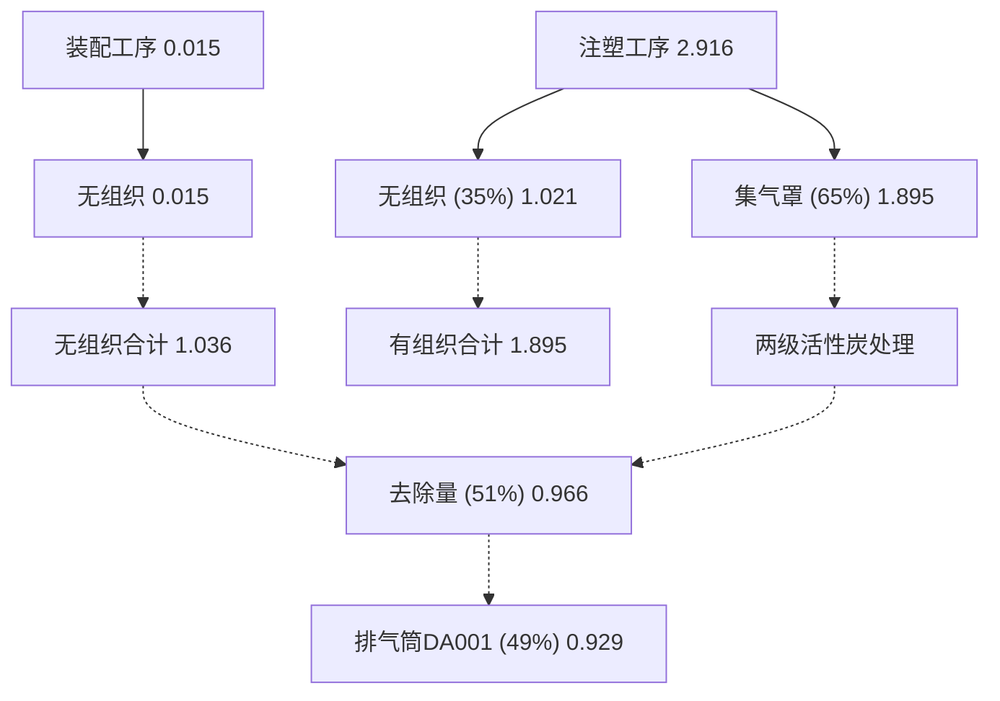
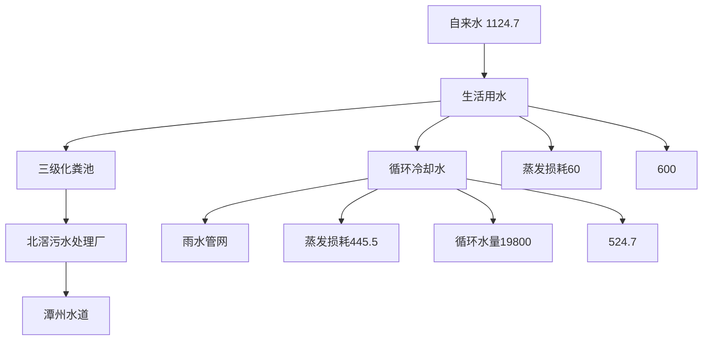
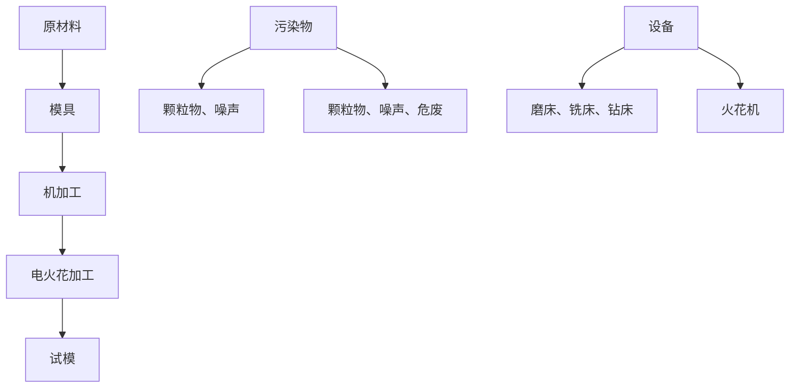

# 建设项目环境影响报告表

（污染影响类）

text_image

晟塑胶制品有限公司
晟塑胶制品有限

项目名称：佛山市力 公司新建项目建设单位（盖章）：佛山市力晟塑胶制品有限公司

编制日期：

text_image

2024年1月
有限公司
佛山正
共和国生态环境

中华人民共 竞部制

编制单位和编制人员情况表

<table><tr><td>项目编号</td><td colspan="3">7x4a0t</td></tr><tr><td>建设项目名称</td><td colspan="3">佛山市力晟塑胶制品有限公司新建项目</td></tr><tr><td>建设项目类别</td><td colspan="3">26-053塑料制品业</td></tr><tr><td>环境影响评价文件类型</td><td colspan="3">报告表</td></tr><tr><td colspan="2">一、建设单位情况</td><td></td><td></td></tr><tr><td>单位名称(盖章)</td><td colspan="2">佛山市力晟塑胶制品有</td><td></td></tr><tr><td>统一社会信用代码</td><td colspan="2">91440606323253758L</td><td></td></tr><tr><td>法定代表人(签章)</td><td rowspan="3" colspan="2"></td><td rowspan="3"></td></tr><tr><td>主要负责人(签字)</td></tr><tr><td>直接负责的主管人员(签字)</td></tr><tr><td colspan="2">二、编制单位情况</td><td colspan="2"></td></tr><tr><td>单位名称(盖章)</td><td>佛</td><td rowspan="2" colspan="2">司</td></tr><tr><td>统一社会信用代码</td><td>91</td></tr><tr><td colspan="2">三、编制人员情况</td><td colspan="2"></td></tr></table>

本证书由中华人民共和四人事部和国家环境保护总局批准硕发，它表明持证人通过

# 目录

一、建设项目基本情况.

二、建设项目工程分析.. .12

三、区域环境质量现状、环境保护目标及评价标准. . 20

四、主要环境影响和保护措施. ..26

五、环境保护措施监督检查清单 ..45

六、结论... ... 47

附图 1 项目地理位置图

附图 2-1 项目 102 室平面布置图

附图 2-2 项目 202 室平面布置图

附图 3 项目四至图

附图 4 项目敏感点分布图

附图 5 项目四至照片

附图 6 项目空厂房照片

附图 7 项目所在区域的地表水环境功能区划图

附图 8 项目所在区域的大气环境功能区划图

附图 9 项目所在区域的声环境功能区划图

附图 10 控制性详细规划图

附图 11 顺德区环境管控单元图

附图 12 佛山市环境管控单元图

附图 13 广东省环境管控单元图

附图 14 广东省三线一单应用平台查询截图

附图 15 北滘镇污水管网建设图

附件 1 营业执照

附件 2 法人身份证

附件 3 用地资料

附件 4 环评技术咨询合同

附件 5 新建项目 VOCs 总量指标来源说明

附件 6 公示声明

附件 7 责任声明

# 一、建设项目基本情况

<table><tr><td>建设项目名称</td><td colspan="4">佛山市力晟塑胶制品有限公司新建项目</td></tr><tr><td>项目代码</td><td colspan="4">无</td></tr><tr><td>建设单位联系人</td><td>陈**</td><td>联系方式</td><td colspan="2">1372757****</td></tr><tr><td>建设地点</td><td colspan="4">广东省佛山市顺德区北滘镇黄龙村黄涌工业大道1号万洋科创园三区2栋1层102室和2层202室</td></tr><tr><td>地理坐标</td><td colspan="4">(北纬22度54分13.953秒,东经113度11分8.106秒)</td></tr><tr><td>国民经济行业类别</td><td>C2929塑料零件及其他塑料制品制造;C3311金属结构制造</td><td>建设项目行业类别</td><td colspan="2">二十六、橡胶和塑料制品业53塑料制品业292-其他(年用非溶剂型低VOCs含量涂料10吨以下的除外);</td></tr><tr><td>建设性质</td><td>☑新建(迁建)□改建□扩建□技术改造</td><td>建设项目申报情形</td><td colspan="2">☑首次申报项目□不予批准后再次申报项目□超五年重新审核项目□重大变动重新报批项目</td></tr><tr><td>项目审批(核准/备案)部门(选填)</td><td>无</td><td>项目审批(核准/备案)文号(选填)</td><td colspan="2">无</td></tr><tr><td>总投资(万元)</td><td>500</td><td>环保投资(万元)</td><td colspan="2">15</td></tr><tr><td>环保投资占比(%)</td><td>3</td><td>施工工期</td><td colspan="2">1个月</td></tr><tr><td>是否开工建设</td><td>☆否●是:____</td><td>用地(用海)面积(m2)</td><td colspan="2">2140.62</td></tr><tr><td rowspan="6">专项评价设置情况</td><td colspan="4">根据《建设项目环境影响报告表编制技术指南(污染影响类)(试行)》,项目无需设置专项评价,具体分析如下:表1-1 专项评价设置原则表</td></tr><tr><td>专项评价类别</td><td>设置原则</td><td>本项目相关情况</td><td>判定结果</td></tr><tr><td>大气</td><td>排放废气含有毒有害污染物、二噁英、苯并芘、氰化物、氯气且厂界外500米范围内有环境空气保护目标的建设项目</td><td>本项目排放的大气污染物不涉及技术指南规定的有毒有害废气污染物</td><td>不需要设置</td></tr><tr><td>地表水</td><td>新增工业废水直排建设项目(槽罐车外送污水处理厂的除外);新增废水直排的污水集中处理厂</td><td>本项目不涉及工业废水直接排放</td><td>不需要设置</td></tr><tr><td>环境风险</td><td>有毒有害和易燃易爆危险物质存储量超过临界量的建设项目</td><td>经分析,本项目危险物质存储量总计未超过临界量</td><td>不需要设置</td></tr><tr><td>生态</td><td>取水口下游500米范围内有重要水生生物的自然产卵场、索饵场、越冬场和洄游通道的新增河道取水的污染类建设项目</td><td>本项目不涉及直接从河道取水</td><td>不需要设置</td></tr><tr><td></td><td>海洋</td><td>直接向海排放污染物的海洋工程建设项目</td><td>本项目污水排放不涉及海洋</td><td>不需要设置</td></tr><tr><td>规划情况</td><td colspan="4">无</td></tr><tr><td>规划环境影响评价情况</td><td colspan="4">无</td></tr><tr><td>规划及规划环境影响评价符合性分析</td><td colspan="4">无</td></tr><tr><td>其他符合性分析</td><td colspan="4">(1)项目选址合理性分析本项目位于广东省佛山市顺德区北滘镇黄龙村黄涌工业大道1号万洋科创园三区2栋1层102室和2层202室。根据《&lt;北滘工业园潭洲水道以西片控制性详细规划(B-CB-04-02、B-CB-04-03、B-CB-07-01、B-CB-07-01、B-CB-07-04)&gt;修编批后公布》可知(详见附图10),本项目所在地土地性质为工业用地,符合顺德区选址要求。(2)产业政策相符性分析本项目所属行业为C2929塑料零件及其他塑料制品制造,经查本项目不属于《产业结构调整指导目录(2019年本)》(国家发展和改革委员会令第29号,2020年1月1日起施行)鼓励类、限制类和淘汰类项目,属于允许类项目。核查《市场准入负面清单(2022年版)》,项目不属于《市场准入负面清单(2022版)》的禁止准入类项目,与政策不相冲突。项目不涉及《环境保护综合名录(2021年版)》中的“高污染、高环境风险”产品名录中的产品,符合《环境保护综合名录》(2021年版)的相关规定。本项目所属类别及生产产品不属于广东省发展改革委关于印发《广东省“两高”项目管理目录(2022年版)》的通知(粤发改能源函〔2022〕1363号)的附件广东省“两高”项目管理目录中的行业类别或产品,符合广东省发展改革委关于印发《广东省“两高”项目管理目录(2022年版)》的通知(粤发改能源函〔2022〕1363号)的相关规定。(3)与环境功能区域相符性分析根据《广东省人民政府关于调整佛山市部分饮用水水源保护区的批复》(粤府函〔2018〕426号)和《广东省生态环境厅关于对佛山市人民政府申请校正部分饮用水水源保护区图件的意见的函》(粤环函〔2019〕1167号),项目所在位置不在佛山市一、二级水源保护区范围内,符合饮用水源保护条例的有关要求。根据《佛山市顺德区人民政府办公室关于印发&lt;佛山市顺德区生态环境保护“十四五”规划(2021-2025)&gt;的通知》(顺府办发【2022】16号),项目所在区域为环境空气质量二类功能区,不属于环境空气质量一类功能区。根据《佛山市人民政府关于印发佛山市声环境功能区划分方案的通知》(佛府函〔2015〕72号),项目所在区域为声环境2类区。项目废水、废气、噪声在稳定达标排放的情况下,不改变原有的功能区规划,对周围环境影响较小。(4)本项目与挥发性有机污染物治理政策的相符性分析本项目与挥发性有机污染物治理政策的相符性分析见下表:</td></tr></table>

表 1-2 项目与有机污染物治理政策的相符性

<table><tr><td>序号</td><td colspan="2">政策</td><td>工程内容</td><td>符合性</td></tr><tr><td rowspan="8">1</td><td colspan="4">《广东省涉挥发性有机物(VOCS)重点行业治理指引》的通知(粤环办[2021]43号)</td></tr><tr><td colspan="2">采用外部集气罩的,距集气罩开口面最远处的VOCs无组织排放位置,控制风速不低于0.3m/s。</td><td>项目注塑废气,通过半密闭型集气罩进行收集,收集效率为65%。</td><td>符合</td></tr><tr><td colspan="2">废气收集系统的输送管道应密闭。废气收集系统应在负压下运行,若处于正压状态,应对管道组件的密封点进行泄漏检测,泄漏检测值不应超过500μmol/mol,亦不应有感官可察觉泄漏。</td><td>项目废气收集系统在负压下运行。</td><td>符合</td></tr><tr><td colspan="2">VOCs治理设施应与生产工艺设备同步运行,VOCs治理设施发生故障或检修时,对应的生产工艺设备应停止运行,待检修完毕后同步投入使用;生产工艺设备不能停止运行或不能及时停止运行的,应设置废气应急处理设施或采取其他替代措施。</td><td>项目生产必须开启风机,有效减少无组织排放废气。废气收集处理系统发生故障或检修时,所有产生废气的工序停止运行,待检修完毕后再投入生产。</td><td>符合</td></tr><tr><td rowspan="2">工艺过程</td><td>粉状、粒状VOCs物料采用气力输送方式或采用密闭固体投料器等给料方式密闭投加;无法密闭投加的,在密闭空间内操作,或进行局部气体收集,废气排至除尘设施、VOCs废气收集处理系统。</td><td>项目使用的PBT塑料、PA塑料、PP塑料均为固态,常温条件下不会产生有机废气。在转移过程中均使用密闭的包装袋封装。</td><td>符合</td></tr><tr><td>在混合/混炼、塑炼/塑化/熔化、加工成型(挤出、注射、压制、压延、发泡、纺丝等)、硫化等作业中应采用密闭设备或在密闭空间中操作,废气应排至VOCs废气收集处理系统;无法密闭的,应采取局部气体收集措施,废气应排至VOCs废气收集处理系统。</td><td>项目注塑废气通过半密闭型集气罩进行收集,经二级活性炭吸附装置处理后通过35m高排气筒DA001达标排放</td><td>符合</td></tr><tr><td>排放水平</td><td>塑料制品行业:a)有机废气排气筒排放浓度不高于广东省《大气污染物排放限值》(DB4427-2001)第II时段排放限值,合成革和人造革制造企业排放浓度不高于《合成革与人造革工业污染物排放标准》(GB21902-2008)排放限值,若国家和我省出台并实施适用于塑料制品制造业的大气污染物排放标准,则有机废气排气筒排放浓度不高于相应的排放限值;车间或生产设施排气中NMHC初始排放速率≥3kg/h时,建设VOCs处理设施且处理效率≥80%;b)厂区内无组织排放监控点NMHC的小时平均浓度值不超过6mg/m3任意一次浓度值不超过20mg/m3。</td><td>项目生产过程有机废气达到《合成树脂工业污染物排放标准》(GB31572-2015);有机废气厂区内无组织排放满足平均浓度值不超过6mg/m3任意一次浓度值不超过20mg/m3。</td><td>符合</td></tr><tr><td>管理台账</td><td>建立废气收集处理设施台账,记录废气处理设施进出口的监测数据(废气量、浓度、温度、含氧量等)、废气收集与处理设施关键参数、废气处理设施相关耗材(吸收</td><td>企业拟建立废气收集处理设施台账,根据《排污单位自行监测技术指南橡胶和塑料制品》(HJ1207-2021)等相</td><td>符合</td></tr></table>

<table><tr><td rowspan="13"></td><td rowspan="2"></td><td rowspan="2"></td><td>剂、吸附剂、催化剂等)购买和处理记录。</td><td>关要求定期自行监测,并且记录相关监测数据和废气处理设施中活性炭的购买量和处理记录。</td><td></td></tr><tr><td>建立危废台账,整理危废处置合同、转移联单及危废处理方式资质佐证材料。</td><td>企业拟建立危险废物台账,定期将危险废物交给有资质的单位处理,整理危废处理合同、转移联单等资料。</td><td>符合</td></tr><tr><td rowspan="3">2</td><td colspan="4">《广东省人民政府办公厅关于印发广东省2021年大气、水、土壤污染防治工作方案的通知》(粤办函〔2021〕58号)</td></tr><tr><td colspan="2">严格落实国家产品VOCs含量限值标准要求,除现阶段确无法实施替代的工序外,禁止新建生产和使用高VOCs含量原辅材料项目。鼓励在生产和流通消费环节推广使用低VOCs含量原辅材料。</td><td>项目不使用高VOCs含量原辅材料,本项目VOCs的产生来源于固体塑料在作业过程产生。</td><td>符合</td></tr><tr><td colspan="2">涉VOCs重点行业新建、改建和扩建项目不推荐使用光氧化、光催化、低温等离子等低效治理设施,已建项目逐步淘汰光氧化、光催化、低温等离子治理设施。指导采用一次性活性炭吸附治理技术的企业,明确活性炭装载量和更换频次,记录更换时间和使用量。</td><td>项目有机废气治理采用“二级活性炭”处理。活性炭装载量和更换频次已在本报告内容中明确。</td><td>符合</td></tr><tr><td rowspan="4">3</td><td colspan="4">《固定污染源挥发性有机物综合排放标准》(DB44/2367-2022)</td></tr><tr><td colspan="2">VOCs物料储存无组织排放控制要求</td><td rowspan="3">项目含VOCs物料主要为塑料粒,常温下不挥发,储存在仓库内;工艺生产过程产生的有机废气通过半密闭型集气罩进行收集并采用二级活性炭吸附处理后高空排放,减少无组织排放。</td><td>符合</td></tr><tr><td colspan="2">VOCs物料转移和输送无组织排放控制要求</td><td>符合</td></tr><tr><td colspan="2">工艺过程VOCs无组织排放控制要求</td><td>符合</td></tr><tr><td rowspan="4">4</td><td colspan="4">关于印发《重点行业挥发性有机物综合治理方案》的通知(环大气[2019]53号)</td></tr><tr><td colspan="2">通过使用水性、粉末、高固体分、无溶剂、辐射固化等低VOCs含量的涂料,水性、辐射固化、植物等低VOCs含量的油墨,水基、热熔、无溶剂、辐射固化、改性、生物降解等低VOCs含量的胶粘剂,以及低VOCs含量、低反应活性的清洗剂等,替代溶剂型涂料、油墨、胶粘剂、清洗剂等,从源头减少VOCs产生。</td><td>本项目使用的原材料无自然状态下可挥发性的物料,满足相关标准要求。</td><td>符合</td></tr><tr><td colspan="2">重点对含VOCs物料(包括含VOCs原辅材料、含VOCs产品、含VOCs废料以及有机聚合物材料等)储存、转移和输送、设备与管线组件泄漏、敞开液面逸散以及工艺过程等五类排放源实施管控,通过采取设备与场所密闭、工艺改进、废气有效收集等措施,削减VOCs无组织排放。</td><td rowspan="2">项目注塑过程产生的废气,通过半密闭型集气罩进行收集,收集效率为65%。半密闭型集气罩置于废气产生点的合理位置,保证控制风速大于0.5m/s。</td><td>符合</td></tr><tr><td colspan="2">提高废气收集率,遵循“应收尽收、分质收集”的原则,科学设计废气收集系统,将无组织排放转变为有组织排放进行控制。采用全密闭集气罩或密闭空间的,除行业有特殊要求外,应</td><td>符合</td></tr><tr><td rowspan="10"></td><td></td><td>保持微负压状态,并根据相关规范合理设置通风量。采用局部集气罩的,距集气罩开口面最远处的VOCs无组织排放位置,控制风速应不低于0.3米/秒,有行业要求的按相关规定执行。</td><td></td><td colspan="2"></td></tr><tr><td rowspan="2">5</td><td colspan="4">《佛山市生态环境局顺德分局关于做好重点行业建设项目挥发性有机物总量指标管理工作的通知》(佛顺环函[2019]56号)</td></tr><tr><td>涉VOCs排放项目,实现本行政区域内污染源“点对点”2倍量削减替代,由项目所在镇街分局出具VOCs总量指标来源及替代削减方案的意见,开展总量替代。</td><td>项目非甲烷总烃排放总量指标为1.965t/a,待项目审批时由生态环境部门核定VOCs总量来源</td><td colspan="2">符合</td></tr><tr><td rowspan="2">6</td><td colspan="4">佛山市发展和改革局佛山市生态环境局关于印发《佛山市关于进一步加强塑料污染治理的实施方案》的通知(2020-年11月09日发布)</td></tr><tr><td>全市范围内禁止生产和销售厚度小于0.025毫米的超薄塑料购物袋、厚度小于0.01毫米的聚乙烯农用地膜。禁止以医疗废物为原料制造塑料制品;禁止将回收利用的废塑料输液袋(瓶)用于原用途或用于制造餐饮容器以及玩具等儿童用品。加大禁止“洋垃圾”进口监管和打私力度,确保“全面禁止废塑料进口”落实到位。到2020年底,禁止生产和销售一次性发泡塑料餐具、一次性塑料棉签;禁止生产含塑料微珠的日化产品。到2022年底,禁止销售含塑料微珠的日化产品。国家《产业结构调整指导目录》和《市场准入负面清单》明确的属于淘汰类的塑料制品项目,禁止投资;属于限制类项目,禁止新建。</td><td>本项目使用新料,不属于禁止生产项目及限制类项目。</td><td colspan="2">符合</td></tr><tr><td rowspan="4">7</td><td colspan="4">《广东省塑料制品与制造业挥发性有机物综合整治技术指南》</td></tr><tr><td>粉状、粒状VOCs物料投加,宜采用气力输送方式或采用密闭固体投料器等给料方式密闭投加。</td><td>项目使用的塑料粒为固态,常温条件下不会产生有机废气。在转移过程中均使用密闭的包装袋封装。</td><td colspan="2">符合</td></tr><tr><td>塑炼/塑化/熔化、挤出、注塑、吹膜等成型工序可采取局部气体收集措施,且满足控制风速不低于0.3m/s的要求。</td><td>项目注塑废气,通过半密闭型集气罩进行收集,收集效率为65%。半密闭型集气罩置于废气产生点的合理位置,保证控制风速大于0.5m/s。</td><td colspan="2">符合</td></tr><tr><td>若采用活性炭吸附技术,采用颗粒活性炭作为吸附剂时,其碘值不宜低于800mg/g;采用蜂窝活性炭作为吸附剂时,其碘值不宜低650mg/g;采用活性炭纤维作为吸附剂时,其比表面积不低于1100m2/g(BET法)。工作温度和湿度应符合:温度T&lt;40°C、湿度RH&lt;60%;活性炭表面不应有积尘和积水;活性炭吸附箱是否足额装填活性炭(1吨活性炭通常只能吸附0.1~0.2吨VOCs</td><td>本项目采用碘值不宜低于800mg/g的蜂窝状活性炭对有机废气进行吸附处理,且1吨活性炭按吸附0.15吨VOCs计算。</td><td colspan="2">符合</td></tr><tr><td colspan="5">(5)项目与“三线一单”相符性分析</td></tr></table>

①与广东省、佛山市“三线一单：符合性分析

本项目位于广东省佛山市顺德区北滘镇黄龙村黄涌工业大道 1 号万洋科创园三区 2 栋 1层 102室和 2层 202室，根据《广东省人民政府关于印发广东省“三线一单”生态环境分区管控方案的通知》（粤府〔2020〕71 号）和《佛山市人民政府关于印发佛山市“三线一单”生态环境分区管控方案的通知》（佛府 〔2021〕11 号），分别见附图 12 佛山市环境管控单元图与附图 13 广东省环境管控单元图，项目符合广东省和佛山市的“三线一单”生态环境分区管控方案相符性分析如下：

1）与“一核一带一区”区域管控要求的相符性

㈠项目位于珠三角核心区，不属于区域布局管控要求中的禁止新建、扩建水泥、平板玻璃、化学制浆、生皮制革以及国家规划外的钢铁、原油加工等项目。

㈡项目所属行业不属于高能耗行业，项目生产设备使用电供能，不会对项目所在地生态流量造成影响，符合能源利用要求。

㈢项目所在地不属于石化、化工重点园区环境风险防控区域。项目产生的危险废物拟定期委托有资质的处置公司进行收集处理，并通过信息系统登记转移计划和电子转移联单，符合危险废物全过程跟踪管理的防控要求。

2）与环境管控单元总体管控要求的相符性

根据《广东省人民政府关于印发广东省“三线一单”生态环境分区管控方案的通知》（粤府〔2020〕71号）发布的广东省环境管控单元图和《佛山市人民政府关于印发佛山市“三线一单”生态环境分区管控方案的通知》（佛府〔2021〕11号）发布的佛山市环境管控单元图，项目所在区域为重点单元，项目注塑废气经半密闭型集气罩进行收集，然后一起通过“二级活性炭”处理设施处理后经 35m 高排气筒 DA001 排放，符合重点管控单元的要求。

②与顺德区“三线一单”生态环境分区管控方案相符性分析

根据《佛山市顺德区人民政府关于印发佛山市顺德区“三线一单”生态环境分区管控方案的通知》（顺府发〔2021〕11 号）发布的佛山市顺德区环境管控单元图（见附图 11），项目所在的佛山市顺德区北滘镇为佛山市顺德区重点管控单元 4（编码为 ZH44060620004，名称为北滘镇重点管控区），项目与广东省佛山市顺德区重点管控单元 4 准入清单相符性分析如下表。

因此该项目选址合理，项目建设符合国家、省、市的产业政策。

表1-3 项目与佛山市顺德区“三线一单”生态环境分区管控方案相符性分析

<table><tr><td>管控维度</td><td>管控要求</td><td>工程内容</td><td>相符性</td></tr><tr><td rowspan="5">区域布局管控</td><td>1-1.【生态/禁止类】单元内的一般生态空间,主导生态功能为水土保持,禁止在25度以上的陡坡地开垦种植农作物,禁止在崩塌、滑坡危险区、泥石流易发区从事采石、取土、采砂等可能造成水土流失的活动。</td><td>本项目不涉及生态禁止类</td><td>符合</td></tr><tr><td>1-2.【产业/鼓励引导类】重点发展机器人及配套产业、智能家用电器、高端新型电子信息、新材料等制造业和总部经济、电子商务、工业设计与文化创意、科技金融等现代服务业,打造智能制造和智慧家电示范区。</td><td>本项目不属于产业鼓励引导类</td><td>符合</td></tr><tr><td>1-3.【产业/综合类】产业聚集区所属地块内的工业用地或企业与村庄、学校等环境敏感点之间应设置合理的大气环境防护距离,并通过绿化带进行有效隔离;聚集区规划布局应注重大气污染排放企业应尽量避免布局在居住用地的常年主导风向的上风向。</td><td>本项目周边500米范围内大气环境敏感点为南侧170米的黄龙村、西南侧270米的黄涌警务室及东北侧420米的槎涌村,距离较远,且已通过绿化带进行有效隔离</td><td>符合</td></tr><tr><td>1-4.【产业/综合类】系统推进村级工业园升级改造,腾出连片空间,布局产业集聚区和主题产业园,推动工业项目入园集聚发展。新增工业制造业用地原则上安排在产业集聚区内,产业集聚区外原则上不鼓励工业及物流仓储用地的新建与改造。</td><td>项目所在地位于广东省佛山市顺德区北滘镇黄龙村黄涌工业大道1号万洋科创园三区2栋1层102室和2层202室,属产业集聚区。</td><td>符合</td></tr><tr><td>1-5.【产业/限制类】受纳水体或监控断面不达标的,不得新建、扩建向河涌直接排放废水的项目。新建、扩建含蚀刻工序的线路板生产项目和化工项目应在配套污水集中处置的工业园区或生活污水管网覆盖区域内建设;纯加工型印花项目,含酸洗、磷化的金属表面处理、金属制品项目(与自身高新技术企业配套的除外),含酸洗、喷涂、化学抛光、电解等涉及废水排放工艺的不锈钢型材加工项目(与自身高新技术企业配套的除外),应进入以此类项目为主导产业、有相应废水集中治理设施的工业园区,实现集中治污。1-6.【产业/综合类】划定家具生产优先发展区域,优先发展区外不再新建涉及涂装工艺的木质家具制造项目。</td><td>项目生活污水经三级化粪处理达标后排至北滘污水处理厂处理,尾水排入潭洲水道。参照《佛山市生态环境局顺德分局关于发布2022年度佛山市顺德区环境质量状况公报的通知》(佛顺环函〔2023〕26号),潭洲水道上游-潭村断面2022年河流定类均为II类,符合《地表水环境质量标准》(GB3838-2002)II类标准;潭洲水道下游-西海断面2022年河流定类均为II类,符合《地表水环境质量标准》(GB3838-2002)III类标准;项目行业类别为C2929塑料零件及其他塑料制品制造;不属于含酸洗、磷化的金属表面处理、金属制品项目;不属于含酸洗、喷涂、化学抛光、电解等涉及废水排放工艺的不锈钢型材加工项目。本项目不涉及</td><td>符合符合</td></tr><tr><td rowspan="3"></td><td>1-7.【水/限制类】严格限制在佛山市禅城南庄紫洞水厂、佛山市禅城沙口(石湾)水厂、羊额—北滘水厂、广州市南洲水厂顺德水道取水口饮用水水源保护区上游和周边区域建设列入“高污染、高环境风险”产品名录等可能影响水环境安全的项目。</td><td>项目属于C2929塑料零件及其他塑料制品制造,项目循环冷却水循环使用,定期排至雨水管网;生活污水经三级化粪池预处理后由市政污水管网引入北滘污水处理厂处理</td><td>符合</td></tr><tr><td>1-8.【大气/限制类】大气环境受体敏感重点管控区内,应严格限制新建储油库项目、产生和排放有毒有害大气污染物的建设项目以及使用溶剂型油墨、涂料、清洗剂、胶黏剂等高挥发性有机物原辅材料项目,鼓励现有该类项目搬迁退出。</td><td>本项目不属于大气环境受体敏感重点管控区内,不涉及储油库项目、也不属于产生和排放有毒有害大气污染物的建设项目以及使用溶剂型油墨、涂料、清洗剂、胶黏剂等高挥发性有机物原辅材料项目。</td><td>符合</td></tr><tr><td>1-9.【大气/鼓励引导类】大气环境高排放重点管控区内,应强化达标监管,引导工业项目落地集聚发展,有序推进区域内行业企业提标改造。</td><td>本项目在大气环境高排放重点管控区内,项目废气经收集后可达标排放。</td><td>符合</td></tr><tr><td rowspan="6">能源资料利用</td><td>2-1.【能源/鼓励引导类】推广节能技术,加快发展绿色货运与现代物流。</td><td>本项目不涉及</td><td>符合</td></tr><tr><td>2-2.【能源/鼓励引导类】推广新能源汽车应用和充电基础设施建设,积极推动重卡LNG加气站、充电基础设施、加氢站建设。</td><td>本项目不涉及</td><td>符合</td></tr><tr><td>2-3.【能源/综合类】科学实施能源消费总量和强度“双控”,新建高耗能项目单位产品(产值)能耗达到国际国内先进水平。</td><td>本项目不属于高耗能项目</td><td>符合</td></tr><tr><td>2-4.【水资源/综合类】贯彻落实“节水优先”方针,实行最严格水资源管理制度,北滘镇万元国内生产总值用水量、万元工业增加值用水量、用水总量、农田灌溉水有效利用系数等用水总量和效率指标达到区下达要求。</td><td>本项目不涉及</td><td>符合</td></tr><tr><td>2-5.【土地资源/限制类】落实单位土地面积投资强度、土地利用强度等建设用地控制性指标要求,提高土地利用效率。</td><td>项目单位土地面积投资强度、土地利用强度等建设用地控制性指标均满足相关标准要求,土地利用效率较高。</td><td>符合</td></tr><tr><td>2-6.【岸线/禁止类】严格水域岸线用途管制,新建项目一律不得违规占用水域。严禁破坏生态的岸线利用行为和不符合其功能定位的开发建设活动,严禁以各种名义侵占河道、围垦湖泊、非法采砂等。</td><td>项目选址不占用水域,租用已建厂房,不存在基建基础施工,不会破坏生态的岸线利用和做不符合其功能定位的开发建设活动,不侵占河道围垦湖泊、非法采砂等。</td><td>符合</td></tr><tr><td rowspan="6">污染物排放管控</td><td>3-1.【水/限制类】城镇新区建设实行雨污分流。住宅、商业体、学校、市场等城镇开发建设项目应当配套或者同步计划建设公共排水设施,公共排水设施或自建排污水设施未能投产运行的,以上涉水项目不得投入使用。新建小区严格实施雨污分流,阳台、露台等污水接入污水收集系统,将生活污水“应截尽截”。做好大型楼盘、集贸市场、餐饮以及学校等4大类排水户污水接入市政管网工作。</td><td>本项目不涉及</td><td>符合</td></tr><tr><td>3-2.【水/综合类】结合村级工业园改造,全面提升产业层次与集聚度,促进污染集中整治。</td><td>本项目不涉及</td><td>符合</td></tr><tr><td>3-3.【水/综合类】稳步推进排水设施“三个一体化”管理模式,补齐城乡污水收集和处理短板,推动群力围污水处理厂提质增效,加快消除城中村、老旧城区、城乡结合部等污水收集管网空白区,逐步实现城乡污水收集处理全覆盖。2025年前完成群力围污水处理厂扩建,尾水应执行《城镇污水处理厂污染物排放标准》(GB18918-2002)一级A标准及《广东省水污染物排放限值》(DB44/26-2001)的较严值。</td><td>本项目生活污水经三级化粪处理达标后排至北滘污水处理厂处理,尾水排入潭洲水道。</td><td>符合</td></tr><tr><td>3-4.【水/综合类】近期保留并完善水口村、三桂村、西滘村、马龙村等现状农村污水分散式处理设施,新建莘村、马龙村等分散式污水处理站建设,继续完善污水支管网建设,提高污水收集处理率,其余行政村(社区)继续完善污水管网建设,实现农村污水100%收集进入市政污水系统,有条件的区域实施雨污分流改造,到2030年全面雨污分流,污水纳入北滘城镇污水处理系统。</td><td>本项目不涉及</td><td>符合</td></tr><tr><td>3-5.【水/综合类】产业集聚区和主题园区内做好污水管网和污水集中处理设施的配套保障,确保废水收集到城镇污水处理厂、园区污水处理厂或分散式污水处理设施集中处置。</td><td>本项目不涉及</td><td>符合</td></tr><tr><td>3-6.【大气/综合类】大力推进低VOCs含量原辅材料替代,加快涉VOCs重点行业的生产工艺升级改造,推行自动化生产工艺,对达不到要求的VOCs收集及治理设施进行整治提升,逐步淘汰低效VOCs治理设施。</td><td>本项目不涉及挥发性有机物原辅材料,生产过程产生的有机废气产生量较少,项目产生的有机废气通过半密闭型集气罩进行收集至一套“二级活性炭吸附”装置处理后再通过35m高排气筒DA001排放。</td><td>符合</td></tr><tr><td>环境风险防控</td><td>4-1.【水/综合类】加强单元内佛山市禅城南庄紫洞水厂、佛山市禅城沙口(石湾)水厂、羊额—北滘水厂、广州市南洲水厂顺德水道取水口饮用水水源保护区周边环境风险源管控,完善突发环境事件应急管理体系。</td><td>本项目不属于水源保护区范围</td><td>符合</td></tr><tr><td rowspan="2"></td><td>4-2.【水/综合类】北滘污水处理厂、北滘污水处理厂、工业污水集中处理设施应采取有效措施,防止事故废水直接排入水体。完善污水处理厂在线监控系统联网,实现污水处理厂的实时、动态监管。</td><td>本项目生活污水经三级化粪池处理后排入北滘污水处理厂</td><td>符合</td></tr><tr><td>4-3.【风险/综合类】加强环境风险分级分类管理,强化金属制品、有色金属和压延加工、化学原料和化学品制造业等涉重金属、化工行业企业及工业园区等重点环境风险源的环境风险防控。</td><td>本项目不属于重点环境风险源的环境风险行业</td><td>符合</td></tr></table>

# 二、建设项目工程分析

<table><tr><td rowspan="10">建设内容</td><td colspan="3">1、项目概况佛山市力晟塑胶制品有限公司(简称“建设单位”)位于广东省佛山市顺德区北滘镇黄龙村黄涌工业大道1号万洋科创园三区2栋1层102室和2层202室,项目预计年产绝缘框架5000万个、泵体组件100万个、塑料防水罩800万个。根据《中华人民共和国环境保护法》、《中华人民共和国环境影响评价法》、《国务院关于修改〈建设项目环境保护管理条例〉的决定》(中华人民共和国国务院令第682号)中有关规定,建设项目必须执行环境影响评价制度。根据《建设项目环境影响评价分类管理名录》(2021版),本项目属于“二十六、橡胶和塑料制品业”中的“53塑料制品业292”中的“其他(年用非溶剂型低VOCs含量涂料10吨以下的除外)”类别,需编制环境影响报告表,因此本项目需编制环境影响报告表。佛山市力晟塑胶制品有限公司委托我司承担本项目的环境影响评价工作。受委托后环评单位技术人员到现场勘察,并根据建设单位提供有关本项目的资料,编写了本环境影响报告表。2、工程组成项目经营场所为1栋6层的已建标准厂房的1层102室和2层202室,楼栋总高度为32.5米,第一层高度7.5米,2~6层高度均为5米。项目占地面积 $2140.62m^{2}$ ,建筑面积为 $4150m^{2}$ ,并在车间内配有原料存放区、成品区以及办公室等辅助工程,并建设废气治理设施、危险废物暂存间等环保工程,项目内部不设置员工饭堂和宿舍。表2-1 项目工程组成</td></tr><tr><td colspan="2">项目名称</td><td>工程组成</td></tr><tr><td rowspan="2">主体工程</td><td>102室</td><td>面积 $2075m^{2}$ ,车间高度7.5米,注塑区面积为 $1200m^{2}$ ,破碎房面积为 $89m^{2}$ ,模具区面积为 $213.7m^{2}$ ,办公室1面积为 $200m^{2}$ ,原料存放区面积为 $85m^{2}$ ,成品存放区面积为 $75m^{2}$ 。包括混料、破碎、烘干、注塑、机加工等工序</td></tr><tr><td>201室</td><td>面积 $2075m^{2}$ ,车间高度5米,装配区面积为 $300m^{2}$ ,办公室2面积为 $400m^{2}$ ,仓库面积为 $1300m^{2}$ 。包括装配等工序</td></tr><tr><td rowspan="2">辅助工程</td><td>办公室1</td><td>办公区1个,位于1层102室,办公区面积为 $200m^{2}$ ,主要功能为员工办公</td></tr><tr><td>办公室2</td><td>办公区1个,位于2层202室,办公区面积为 $400m^{2}$ ,主要功能为员工办公</td></tr><tr><td rowspan="3">储运工程</td><td>仓储</td><td>2个,包括原材料存放区、成品存放区,分别位于102室和201室</td></tr><tr><td>一般固废暂存点</td><td>面积 $6m^{2}$ ,功能为暂存一般固废</td></tr><tr><td>危废暂存点</td><td>面积 $10m^{2}$ ,主要功能为暂存危废</td></tr><tr><td>公用工程</td><td>给排水</td><td>由市政供水;项目生活污水经三级化粪池处理后排入北滘污水处理厂,尾水排至潭州水道。冷却水循环使用,定期排至雨水管网</td></tr><tr><td></td><td colspan="2">供能</td><td>市政供电</td></tr><tr><td rowspan="9">环保工程</td><td rowspan="2">废水</td><td>生活污水</td><td>项目生活污水经三级化粪池处理后排入北滘污水处理厂,尾水排至潭州水道。</td></tr><tr><td>循环冷却水</td><td>冷却水循环回用,定期排至雨水管网</td></tr><tr><td rowspan="3">废气</td><td>粉尘</td><td>破碎、投料、混料、模具维修加工工序产生的粉尘较少,在车间内无组织排放</td></tr><tr><td>有机废气</td><td rowspan="2">对注塑机设置半密闭型集气罩进行收集有机废气及臭气浓度,半密闭型集气罩收集效率为65%,经二级活性炭处理后,通过35m高排气筒DA001排放</td></tr><tr><td>恶臭</td></tr><tr><td rowspan="3">固体废物</td><td>危废暂存点</td><td>1个,存放危险废物;危险废物收集后放置于危废仓(10m2),再交由有资质的单位进行处置</td></tr><tr><td>一般固废暂存点</td><td>1个,存放一般工业固体废物;一般工业固废收集后放置于一般固废仓(6m2),再由回收公司统一回收</td></tr><tr><td>生活垃圾</td><td>交由环卫部门定期进行统一清理</td></tr><tr><td>噪声</td><td>/</td><td>项目噪声为设备运行产生的噪声,采取选用低噪声设备、车间合理布局、安装减震基础、厂房隔声、距离衰减等措施削减。</td></tr></table>

# 3、主要产品及产量

本项目生产产品见下表。

表 2-2 项目产品方案一览表

<table><tr><td>产品名称</td><td>单位</td><td>数量</td></tr><tr><td>绝缘框架</td><td>万个/年</td><td>5000</td></tr><tr><td>泵体组件</td><td>万个/年</td><td>100</td></tr><tr><td>塑料防水罩</td><td>万个/年</td><td>800</td></tr></table>

# 4、主要生产设备

根据建设单位提供资料，主要生产设备见下表所示。

表 2-3 项目主要生产设备一览表

<table><tr><td>序号</td><td>名称</td><td>单位</td><td>数量</td><td>设备参数值</td><td>工艺</td><td>位置</td></tr><tr><td>1</td><td>注塑机</td><td>台</td><td>38</td><td>/</td><td>注塑,分别为300T 1台,210T 9台,200T 5台,160T 16台,120T 7台</td><td rowspan="10">102</td></tr><tr><td>2</td><td>烘干机</td><td>台</td><td>38</td><td>功率3kw</td><td>烘干</td></tr><tr><td>3</td><td>吸料机</td><td>台</td><td>38</td><td>功率2kw</td><td>投料</td></tr><tr><td>4</td><td>碎料机</td><td>台</td><td>6</td><td>功率2kw</td><td>破碎</td></tr><tr><td>5</td><td>混料机</td><td>台</td><td>5</td><td>功率2kw</td><td>混料</td></tr><tr><td>6</td><td>火花机</td><td>台</td><td>2</td><td>功率1kw</td><td>设备维修</td></tr><tr><td>7</td><td>铣床</td><td>台</td><td>2</td><td>功率1.5kw</td><td>设备维修</td></tr><tr><td>8</td><td>磨床</td><td>台</td><td>2</td><td>功率1kw</td><td>设备维修</td></tr><tr><td>9</td><td>钻床</td><td>台</td><td>2</td><td>功率1kw</td><td>设备维修</td></tr><tr><td>10</td><td>超声焊接机</td><td>台</td><td>3</td><td>功率1.3kw</td><td>装配</td></tr></table>

<table><tr><td>11</td><td>热板焊接机</td><td>台</td><td>4</td><td>功率 1.2kw</td><td>装配</td></tr><tr><td>12</td><td>气检机</td><td>台</td><td>2</td><td>功率 0.2kw</td><td>装配</td></tr><tr><td>13</td><td>插针机</td><td>台</td><td>1</td><td>功率 0.5kw</td><td>辅助设备</td></tr><tr><td>14</td><td>冷却塔</td><td>台</td><td>1</td><td>流量 3t/h</td><td>冷却</td></tr><tr><td>15</td><td>空压机</td><td>台</td><td>1</td><td>功率 3kw</td><td>辅助设备,配套一个压缩空气储气罐使用</td></tr><tr><td>16</td><td>拉申机</td><td>台</td><td>1</td><td>功率 0.2kw</td><td>样品检测</td></tr><tr><td>17</td><td>箱式电阻炉</td><td>台</td><td>1</td><td>功率 0.2kw</td><td>样品检测</td></tr><tr><td>18</td><td>动平衡机</td><td>台</td><td>1</td><td>功率 0.2kw</td><td>样品检测</td></tr><tr><td>19</td><td>动平衡机</td><td>台</td><td>1</td><td>功率 0.2kw</td><td>样品检测</td></tr><tr><td>20</td><td>灼热丝机</td><td>台</td><td>1</td><td>功率 0.2kw</td><td>样品检测</td></tr><tr><td>21</td><td>烤箱</td><td>台</td><td>1</td><td>功率 0.2kw</td><td>样品检测</td></tr><tr><td>22</td><td>垂直燃烧试验机</td><td>台</td><td>1</td><td>功率 0.2kw</td><td>样品检测</td></tr><tr><td>23</td><td>烧水箱</td><td>台</td><td>1</td><td>功率 0.2kw</td><td>样品检测</td></tr></table>

# 5、主要原辅材料

根据建设单位提供资料，项目主要原辅材料如下表所示。

表 2-4 项目主要原辅材料消耗量一览表

<table><tr><td>序号</td><td>名称</td><td>单位</td><td>数量</td><td>包装规格</td><td>存放位置</td><td>最大储存量</td><td>备注</td></tr><tr><td>1</td><td>PBT 塑料粒</td><td>吨/年</td><td>600</td><td>25kg/袋</td><td>原料存放区</td><td>20</td><td>外购,新料</td></tr><tr><td>2</td><td>PA 塑料粒</td><td>吨/年</td><td>240</td><td>25kg/袋</td><td>原料存放区</td><td>10</td><td>外购,新料</td></tr><tr><td>3</td><td>PP 塑料粒</td><td>吨/年</td><td>240</td><td>25kg/袋</td><td>原料存放区</td><td>10</td><td>外购,新料</td></tr><tr><td>4</td><td>模具</td><td>套/年</td><td>30</td><td>100kg/套</td><td>原料存放区</td><td>30</td><td>外购</td></tr><tr><td>5</td><td>火花油</td><td>吨/年</td><td>0.1</td><td>50kg/桶</td><td>原料存放区</td><td>0.1</td><td>外购</td></tr><tr><td>6</td><td>机油</td><td>吨/年</td><td>0.04</td><td>20kg/桶</td><td>原料存放区</td><td>0.04</td><td>外购</td></tr></table>

# 主要原辅材料理化性质：

PBT 塑料：PBT 塑料是指聚对苯二甲酸丁二醇酯为主体所构成的一类塑料聚对苯二甲酸丁二醇酯(Polybutylene terephthalate)，又名聚对苯二甲酸四次甲基酯。简称 PBT。机械性能:强度高、耐疲劳性、尺寸稳定、蠕变也小(高温条件下也极少有变化);耐热老化性:增强后的 UL 温度指数达 120\~140℃(户外长期老化性也很好);对水稳定性:PBT 遇水不易分解，熔融温度为 225\~235 摄氏度，成型加工温度为 240\~260 摄氏度，分解温度为 280 摄氏度。

PA 塑料：PA 塑料(尼龙，聚酰胺)，英文名称:Polyamide，比重:PA6 1.14 克/立方厘米，PA66 1.15 克/立方厘米，PA1010 1.05 克/立方厘米成型收缩率:PA6 0.8-2.5% ，PA66 1.5-2.2%，干燥条件:100-110℃/12 小时，坚韧、耐磨、耐油、,耐水、抗酶菌、但吸水大，燃烧鉴别方法:火焰上端黄色，下端蓝色，燃烧后塑料熔滴落，起泡，离火后特殊的羊毛，指甲烧焦味和带芹菜味，熔融温度为260\~265摄氏度，成型加工温度为260\~300摄氏度，分解温度为 310 摄氏度。

PP 塑料：聚丙烯（Polypropylene，简称 PP）是一种半结晶的热塑性塑料。具有较高的耐冲击性，机械性质强韧，抗多种有机溶剂和酸碱腐蚀。CAS 号:9003-07-0，分子式:(C3H6)n 分子量:42.0804，1. 性状：白色粉末，密度（g/mLat 25°C）：0.9，熔点（ºC）：189，熔融温度为 189 摄氏度，成型加工温度为 240 摄氏度左右，分解温度为 300 摄氏度。

火花油：是一种电火花机加工不可缺少的放电介质液体，电火花机油能够绝缘消电离、冷却电火花机加工时的高温、排除碳渣。

机油：是用在各种类型汽车、机械设备上以减少摩擦，保护机械及加工件的液体，主要起润滑、辅助冷却、防锈、清洁、密封和缓冲等作用。应用于两个相对运动的物体之间，而可以减少两物体因接触而产生的磨擦与磨损之功能。

# 6、设备匹配性分析

设备产能核算见下表。

表 2-5 项目设备产能核算一览表

<table><tr><td>设备名称</td><td>数量(台)</td><td>实际工作时间(h/a)</td><td>单台设备设计产能(kg/h)</td><td>设计生产能力合计(t/a)</td></tr><tr><td>注塑机300T</td><td>1</td><td>6600</td><td>10</td><td>66</td></tr><tr><td>注塑机210T</td><td>9</td><td>6600</td><td>6.8</td><td>403.92</td></tr><tr><td>注塑机200T</td><td>5</td><td>6600</td><td>6.5</td><td>214.5</td></tr><tr><td>注塑机160T</td><td>16</td><td>6600</td><td>5</td><td>528</td></tr><tr><td>注塑机120T</td><td>7</td><td>6600</td><td>3.5</td><td>161.7</td></tr><tr><td colspan="4">合计</td><td>1374.12</td></tr></table>

根据上表，项目原材料使用量为1080吨/年，注塑机理论最大产能为1374.12吨/年，则实际产能约占设计最大产能的78.6%，符合生产要求。

# 7、物料平衡

（1）VOCs 平衡图如下所示。

flowchart

图2-1 项目VOCs平衡图（单位：t/a）

项目水平衡见下图。

flowchart

图2-2 项目用水平衡图（单位：t/a）

# 8、劳动定员与工作制度

劳动定员：项目员工人数为 60人，项目员工均不在厂区内食宿。

工作制度：项目年工作 300 天，每天 2 班，每班 11 小时，7:00-18:00，19:00-6:00。

# 9、公用工程

# （1）能耗

项目用电由市政供电系统提供，根据建设单位提供的资料，项目年用电量约 35 万 kWh。

# （2）给排水系统

项目不设置员工饭堂和宿舍，生活用水量参照广东省地方标准《用水定额 第 3 部分：生活》（DB44/T1461.3-2021），国家行政机构办公楼（无食堂和浴室）中的先进值计算，即 10m3 /人·a。项目员工人数为 60人，员工生活用水量为 600m3 /a，生活污水产污系数按 0.9计算，生活污水排放量约为 540m3/a，生活污水经三级化粪池处理后纳入北滘污水处理厂，其尾水排至潭州水道。

项目冷却塔年循环水量为 19800m3，蒸发水量为 445.5m3 /a，定期排水量 79.2m3 /a，新鲜水补充量为524.7m3 /a，循环冷却水排入雨水管网。

# 10、平面布置图

本项目位于广东省佛山市顺德区北滘镇黄龙村黄涌工业大道 1 号万洋科创园三区 2 栋 1 层 102 室和 2层 202 室。项目的中心地理坐标为东经 113 度 11分 8.106秒、北纬 22 度 54 分 13.953 秒。项目北面为 3 栋工业厂房、西面园区内道路、南面为 1 栋工业厂房、东面为 4 栋工业厂房。项目地理位置详见附图 1，四至图详见附图 3。

项目总占地面积 2140.62m2，建筑面积为 4150m2，项目总平面布置详见附图 2。项目主要为两个生产车间，102 室包括注塑区，破碎房，模具区，办公室 1，原料存放区，成品存放区；202 室包括装配区，办公室 2，仓库。

# 11、环保工程

<table><tr><td rowspan="7"></td><td colspan="5">总投资500万元,其中环保投资15万元,占工程总投资的3%,项目环保投资情况见下表:表2-6 项目环保投资一览表</td></tr><tr><td>序号</td><td>工程类别</td><td>环保措施名称</td><td>环保投资/万元</td><td>环保占比</td></tr><tr><td>1</td><td>污水处理工程</td><td>三级化粪池(依托所在工业园区)</td><td>/</td><td>/</td></tr><tr><td>2</td><td>废气处理工程</td><td>管道、风机、排气筒、两级活性炭吸附装置</td><td>12</td><td>2.4%</td></tr><tr><td>3</td><td>噪声</td><td>设备防振、消声、隔声等降噪措施</td><td>1</td><td>0.2%</td></tr><tr><td>4</td><td>固废</td><td>危废暂存点及委托有资质单位回收处理</td><td>2</td><td>0.4%</td></tr><tr><td colspan="3">合计</td><td>15</td><td>3%</td></tr><tr><td>工艺流程和产排污环节</td><td colspan="5">1. 工艺流程简述(图示):项目主要从事塑料零件及其他塑料制品制造及模具加工维修。具体工艺流程见图2-3与图2-4。(1)生产工艺流程图:原材料 工艺 污染物 设备PBT塑料、PA塑料、PP塑料 混料 固废、粉尘、噪声 混料机烘干料 投料 粉尘、噪声 吸料机注塑机模具 注塑 有机废气、臭气浓度、噪声次品、边角料 碎碎 合格品 粉尘、噪声 碎料机装配 有机废气、臭气浓度、噪声超声焊接机、热板焊接机、气检机打包 图2-3 注塑产品生产工艺流程图</td></tr></table>

flowchart

图 2-4模具加工维修生产工艺流程图

# （2）其主要工艺流程如下：

注塑产品：

混料：将 PBT 塑料、PP 塑料、PA塑料人工投进混料机，对塑料进行搅拌混合，此过程会产生一般固废、粉尘、噪声。

烘干：将混料后的塑料用干燥机烘干，使用电加热，加热温度为 100℃，烘干时间为 3 小时，此过程会产生噪声。备注：烘干工序加热温度达不到塑料原料的熔点，此过程无有机废气排放。

投料：将混料烘干后的塑料通过吸料机进行投料工序，此过程会产生粉尘、噪声。

注塑：将混合均匀和烘干后的塑料粒通过投入注塑机加热，使用电加热，加热温度为 220—250℃（工作温度低于原料分解温度，不会使原料分解），注塑塑料通过外购的模具成型，此过程会产生噪声、有机废气、臭气浓度。

破碎：全部次品及边角料经过破碎机破碎并与塑料粒新料混合后重新回用于注塑工序，不外排，此过程会产生噪声、少量塑料粉尘。

装配：装配工序使用超声焊接机、热板焊接机对半成品进行装配工序，装配过程使用超声焊接机、热板焊接机、气检机对半成品连接处表面加热，使其表面处于熔融状态后与各半成品进行焊接装配，此过程会产生有机废气、臭气浓度、噪声。

打包：经人工检验，合格的产品即可人工包装打包出货，产生的次品则回用生产，不外排。

模具加工维修：

机加工：利用磨床对外购的半成品模具进行进一步打磨加工，此过程会产生颗粒物、噪声。

电火花加工：使用火花机及火花油对半成品模具进行电火花加工，此过程会产生颗粒物（油雾）、噪声、危废。电火花加工原理：工具电极与工件并不接触，依靠工具电极与工件间不断产生的脉冲性火花放电，利用放电时产生的局部、瞬时高温把金属材料逐步蚀除下来。电火花加工过程使用火花油作为放电介质，同时还具有冷却作用。火花油在火花机内循环使用并适当补充，经多次循环使用后更换。

模具加工完成通过组装即得所需模具，全部用于本项目注塑机。模具使用一段时间后会产生磨损，使用磨床、铣床、钻床对其进行维修，根据实际生产情况，模具大约一个月集中加工和维修一次。

表 2-7 产污环节分析

<table><tr><td rowspan="18"></td><td>序号</td><td colspan="2">类别</td><td>污染源</td><td>主要污染物</td></tr><tr><td rowspan="5">1</td><td rowspan="5">废气</td><td>塑料粉尘</td><td>投料、混料、破碎</td><td>颗粒物</td></tr><tr><td>金属粉尘</td><td>模具加工和维修</td><td>颗粒物</td></tr><tr><td>油雾</td><td>电火花加工</td><td>颗粒物</td></tr><tr><td>有机废气</td><td>注塑、装配</td><td>非甲烷总烃</td></tr><tr><td>恶臭</td><td>注塑、装配</td><td>臭气浓度</td></tr><tr><td rowspan="2">2</td><td rowspan="2">废水</td><td>生活污水</td><td>员工办公</td><td> $COD_{Cr}$ 、 $BOD_5$ 、 $NH_3-N$ 、SS</td></tr><tr><td>循环冷却水</td><td>冷却塔</td><td> $COD_{Cr}$ 、SS</td></tr><tr><td rowspan="3">3</td><td rowspan="3">固体废物</td><td>废包装材料</td><td>原料包装</td><td>原料</td></tr><tr><td>生活垃圾</td><td>员工办公</td><td>生活垃圾</td></tr><tr><td>金属边角料</td><td>模具加工维修</td><td>金属边角料</td></tr><tr><td rowspan="6">4</td><td rowspan="6">危险废物</td><td>废含油抹布</td><td>设备维护</td><td>废含油抹布</td></tr><tr><td>废油桶罐</td><td>设备维护</td><td>废桶罐</td></tr><tr><td>废机油</td><td>设备维护</td><td>废机油</td></tr><tr><td>废火花油</td><td>模具加工</td><td>废火花油</td></tr><tr><td>含油废金属渣</td><td>模具加工</td><td>含油废金属渣</td></tr><tr><td>废活性炭</td><td>废气处理</td><td>废活性炭</td></tr><tr><td>5</td><td>噪声</td><td>噪声</td><td>设备工作</td><td>噪声</td></tr><tr><td>与项目有关的原有环境污染问题</td><td colspan="5">本项目为新建项目,不存在与项目有关的原有污染环境问题。</td></tr></table>

# 三、区域环境质量现状、环境保护目标及评价标准

<table><tr><td rowspan="9">区域环境质量现状</td><td colspan="7">1、环境空气质量现状根据《佛山市顺德区人民政府办公室关于印发&lt;佛山市顺德区生态环境保护“十四五”规划(2021-2025)&gt;的通知》(顺府办发【2022】16号),本项目所在区域属二类环境空气质量功能区,环境空气质量执行《环境空气质量标准》(GB3095-2012)及其2018年修改单二级标准。根据《佛山市生态环境局顺德分局关于发布2022年度佛山市顺德区环境质量状况公报的通知》(佛顺环函〔2023〕26号),2022年全区空气质量综合指数为3.27。2022年全区 $SO_2$ (二氧化硫)、 $NO_2$ (二氧化氮)、 $PM_{10}$ (可吸入颗粒物)、 $PM_{2.5}$ (细颗粒物)平均浓度分别为5、29、32、19微克/立方米, $O_3$ (臭氧)日最大8小时滑动平均( $O_3$ -8h)浓度的第90百分位数为190微克/立方米,CO(一氧化碳)日浓度的第95百分位数为1.1毫克/立方米,二氧化硫( $SO_2$ )、二氧化氮( $NO_2$ )、可吸入颗粒物( $PM_{10}$ )、细颗粒物( $PM_{2.5}$ )、一氧化碳(CO)五项污染物年评价浓度均达到《环境空气质量标准》(GB3095-2012)二级标准限值,臭氧( $O_3$ )超标。2022年度全区环境空气质量优良天数占有效天数的78.8%,同比去年减少5.9个百分点。顺德区(国控测点)环境空气污染物达标判定详见下表。表3-1 2022年顺德区区域空气质量现状评价表</td></tr><tr><td>所在区域</td><td>污染物</td><td>年评价指标</td><td>现状浓度( $μg/m^3$ )</td><td>标准值( $μg/m^3$ )</td><td colspan="2">达标情况</td></tr><tr><td rowspan="6">顺德区</td><td> $SO_2$ </td><td>年平均质量浓度</td><td>5</td><td>60</td><td colspan="2">达标</td></tr><tr><td> $NO_2$ </td><td>年平均质量浓度</td><td>29</td><td>40</td><td colspan="2">达标</td></tr><tr><td> $PM_{10}$ </td><td>年平均质量浓度</td><td>32</td><td>70</td><td colspan="2">达标</td></tr><tr><td> $PM_{2.5}$ </td><td>年平均质量浓度</td><td>19</td><td>35</td><td colspan="2">达标</td></tr><tr><td>CO</td><td>95百分位数日平均质量浓度</td><td>1100</td><td>4000</td><td colspan="2">达标</td></tr><tr><td> $O_3$ </td><td>90百分位数最大8小时平均质量浓度</td><td>190</td><td>160</td><td colspan="2">超标</td></tr><tr><td colspan="7">根据2022年全区的大气环境质量状况公报,顺德区二氧化硫( $SO_2$ )、二氧化氮( $NO_2$ )、可吸入颗粒物( $PM_{10}$ )、细颗粒物( $PM_{2.5}$ )、一氧化碳(CO)五项污染物年评价浓度均达到《环境空气质量标准》(GB3095-2012)及2018年修改单二级标准限值,臭氧( $O_3$ )超标,故顺德区大气环境质量属不达标区。2、地表水环境质量现状项目生活污水经三级化粪处理后排入市政管道,经市政管道排入北滘污水处理厂处理,污水厂尾水排入潭洲水道(林头桥至西海段)。根据佛山市顺德区人民政府办公室关于印发《佛山市顺德区生态环境保护“十四五”规划(2021-2025)》(顺府办发【2022】16号)的通知,纳污水体潭洲水道(林头桥至西海段)的水环境功能区等级为III类水质,水质执行《地表水环境质量标准》</td></tr><tr><td rowspan="6"></td><td colspan="7">(GB3838-2002)中III类标准。为评价潭洲水道水质,参照《佛山市生态环境局顺德分局关于发布2022年度佛山市顺德区环境质量状况公报的通知》(佛顺环函〔2023〕26号),潭洲水道上游-潭村断面2022年河流定类均为II类,符合《地表水环境质量标准》(GB3838-2002)II类标准;潭洲水道下游-西海断面2022年河流定类均为II类,符合《地表水环境质量标准》(GB3838-2002)III类标准,故潭洲水道水质较好。表3-2 2022年度佛山市顺德区环境质量状况公报(节选)</td></tr><tr><td rowspan="2">序号</td><td rowspan="2">河流名称</td><td rowspan="2">断面</td><td colspan="2">断面定类</td><td rowspan="2">水质评价标准</td><td>河流定类</td></tr><tr><td>2022年</td><td>2021年</td><td>2022年</td></tr><tr><td>2</td><td>潭洲水道上游</td><td>潭村</td><td>II</td><td>II</td><td>II</td><td>II</td></tr><tr><td>3</td><td>潭州水道下游</td><td>西海</td><td>II</td><td>II</td><td>III</td><td>II</td></tr><tr><td colspan="7">根据上表可知,2022年潭州水道的潭村断面及西海断面水质均能满足《地表水环境质量标准》(GB3838-2002)中III类水功能要求,水质较好。3、声环境质量现状根据《关于印发佛山市声环境功能区划分方案的通知》(佛府函〔2015〕72号),本项目所在区域为2类声环境功能区,执行《声环境质量标准》(GB3096-2008)2类标准:昼间≤60dB(A);夜间≤50dB(A)。项目厂界外50米范围内没有声环境保护目标。4、生态环境质量现状本项目位于产业园区内,且不新增用地,无需开展生态现状调查。5、电磁辐射环境质量现状项目不涉及电磁辐射,无需开展电磁辐射现状调查。6、土壤、地下水环境质量现状项目生产车间应做好硬化措施:一般固废仓应达到防渗漏、防雨淋、防扬尘等环境保护要求;危废仓严格按照《危险废物贮存污染控制标准》(GB18597-2023)有关规范设计;废气治理措施均按照要求设计,并定期进行维护。在落实好上述措施的情况下,项目不存在土壤、地下水污染途径,故无需开展土壤、地下水跟踪监测。</td></tr><tr><td>环境保护目标</td><td colspan="7">1、环境空气保护目标根据《佛山市顺德区人民政府办公室关于印发&lt;佛山市顺德区生态环境保护“十四五”规划(2021-2025)&gt;的通知》(顺府办发【2022】16号),项目所在区域为二类功能区,环境空气质量执行《环境空气质量标准》(GB3095-2012)及其2018年修改单二级标准。环境空气保护目标是确保本项目建成运行不会对周围地区的环境空气质量产生影响。本项目500m范围内大气环境保护目标如下表。</td></tr></table>

表3-3 主要环境保护目标

<table><tr><td>序号</td><td>名称</td><td>保护对象</td><td>保护内容</td><td>环境功能区</td><td>相对厂址方位</td><td>相对厂界距离/m</td></tr><tr><td>1</td><td>黄龙村</td><td>人群(约3000人)</td><td>大气环境</td><td>环境空气二类</td><td>南</td><td>170</td></tr><tr><td>2</td><td>黄涌警务室</td><td>人群(约20人)</td><td>大气环境</td><td>环境空气二类</td><td>西南</td><td>270</td></tr><tr><td>3</td><td>槎涌村</td><td>人群(约3000人)</td><td>大气环境</td><td>环境空气二类</td><td>东北</td><td>420</td></tr></table>

# 2、声环境保护目标

根据《关于印发佛山市声环境功能区划分方案的通知》（佛府函〔2015〕72号），本项目所在区域为 2 类声环境功能区，执行《声环境质量标准》（GB3096-2008）2 类标准。声环境保护目标是确保建设项目建设后其周围的区域有一个安静、舒适的工作及生活环境，使项目四周声环境质量不因项目的运行而受到不良影响。项目厂界外 50 米范围内没有声环境保护目标。

# 3、地下水环境保护目标

项目厂界外 500 米范围不存在地下水环境环境保护目标（地下水集中式饮用水源和热水、矿泉水、温泉等特殊地下水资源），因此本项目没有地下水主要环境保护目标。

# 4、生态环境保护目标

本项目位于广东省佛山市顺德区北滘镇黄龙村黄涌工业大道 1 号万洋科创园三区 2 栋 1 层 102室和 2 层 202室，用地范围内无生态环境保护目标。

# 5、地表水环境保护目标

本项目位于广东省佛山市顺德区北滘镇黄龙村黄涌工业大道 1 号万洋科创园三区 2 栋 1 层 102室和 2 层 202室，用地范围内地表水环境保护目标详见下表。

表 3-4 地表水环境保护目标

<table><tr><td>名称</td><td>保护对象</td><td>保护内容</td><td>环境功能区</td><td>相对厂址方位</td><td>相对厂界距离/m</td></tr><tr><td>顺德水道</td><td>河流</td><td>河涌</td><td>地表水II类</td><td>正南</td><td>1495</td></tr></table>

<table><tr><td rowspan="5">污染物排放控制标准</td><td colspan="6">1、水污染物排放控制标准生活污水达到广东省地方标准《水污染物排放限值》(DB44/26-2001)第二时段三级标准后排入北滘污水处理厂处理,北滘污水处理厂的尾水执行《城镇污水处理厂污染物排放标准》(GB18918-2002)已建污水厂一级A标准及《水污染物排放限值》(DB44/26-2001))第二时段一级标准的较严值。表3-5 污水排放标准(单位:mg/L,pH除外)</td></tr><tr><td>标准</td><td>pH</td><td>CODcr</td><td>BOD5</td><td>氨氮</td><td>悬浮物</td></tr><tr><td>广东省地方标准《水污染物排放限值》(DB44/26-2001)第二时段三级标准</td><td>6~9</td><td>≤500</td><td>≤300</td><td>——</td><td>≤400</td></tr><tr><td>《城镇污水处理厂污染物排放标准》(GB18918-2002)已建污水厂一级A标准及广东省地方标准《水污染物排放限值》(DB44/26-2001)第二时段一级标准的较严值</td><td>6~9</td><td>≤40</td><td>≤10</td><td>≤5</td><td>≤10</td></tr><tr><td colspan="6">2、大气污染物排放标准(1)有机废气本项目注塑工序会产生有机废气,经半密闭型集气罩收集处理后高空排放,主要污染因子为非甲烷总烃,执行《合成树脂工业污染物排放标准》(GB31572-2015)表4大气污染物特别排放限值和表9企业边界排放限值;本项目装配工序会产生有机废气,主要污染因子为非甲烷总烃,无组织排放,执行《合成树脂工业污染物排放标准》(GB31572-2015)表9企业边界排放限值。厂区内无组织排放执行《固定污染源挥发性有机物综合排放标准》(DB44/2367-2022)表3厂区内VOCs无组织特别排放限值。(2)粉尘本项目破碎工序、投料、混料工序会产生塑料粉尘,主要污染物为颗粒物,无组织排放,执行《合成树脂工业污染物排放标准》(GB31572-2015)表9企业边界排放限值;本项目电火花加工工序会产生油雾,主要污染因子为颗粒物,模具打磨加工和维修工序会产生金属粉尘,主要污染因子为颗粒物,无组织排放,执行广东省地方标准《大气污染物排放限值》(DB44/27-2001)第二时段无组织排放监控浓度限值;综上所述,项目无组织排放颗粒物执行《合成树脂工业污染物排放标准》(GB31572-2015)表9企业边界排放限值与广东省地方标准《大气污染物排放限值》(DB44/27-2001)第二时段无组织排放监控浓度限值较严值。(3)恶臭气体项目注塑工序会产生恶臭气体,经半密闭型集气罩收集处理后高空排放,主要污染因子为臭气浓度,执行《恶臭污染物排放标准》(GB14554-93)表2恶臭污染物排放标准值:项目排气筒高度</td></tr></table>

为 35 米，执行 35 米标准，臭气浓度≤15000（无量纲）；表 1 恶臭污染物厂界标准值中臭气浓度界标准值的二级新扩改建标准：臭气浓度≤20（无量纲）。

本项目装配工序会产生恶臭气体，主要污染因子为臭气浓度，无组织排放，执行《恶臭污染物排放标准》（GB14554-93）表 1 恶臭污染物厂界标准值中臭气浓度厂界标准值的二级新扩改建标准：臭气浓度≤20（无量纲）。

表3-6 废气排放标准摘录（浓度单位：mg/m3，臭气浓度无量纲）

<table><tr><td rowspan="2" colspan="2">污染物</td><td colspan="2">有组织</td><td rowspan="2">无组织排放监控浓度限值</td><td rowspan="2">执行标准</td></tr><tr><td>高度m</td><td>最高允许排放浓度</td></tr><tr><td rowspan="3">有机废气</td><td>非甲烷总烃</td><td rowspan="3">35</td><td>100</td><td>4.0</td><td rowspan="3">GB31572-2015</td></tr><tr><td>四氢呋喃</td><td>100</td><td>——</td></tr><tr><td>氨</td><td>30</td><td>——</td></tr><tr><td>粉尘</td><td>颗粒物</td><td>——</td><td>——</td><td>1.0</td><td>GB31572-2015与DB44/27-2001的较严值</td></tr><tr><td>恶臭气体</td><td>臭气浓度</td><td>35</td><td>臭气浓度≤15000(无量纲)</td><td>臭气浓度≤20(无量纲)</td><td>GB14554-93</td></tr></table>

表3-7 厂区内VOCs无组织排放限值

<table><tr><td>污染物</td><td>排放限值</td><td>限值含义</td><td>无组织排放监控位置</td><td>执行标准</td></tr><tr><td rowspan="2">NMHC</td><td>6</td><td>监控点处1小时平均浓度值</td><td rowspan="2">在厂房外设置监控点</td><td rowspan="2">DB44/2367-2022</td></tr><tr><td>20</td><td>监控点处任意一次浓度值</td></tr></table>

# 3、噪声污染物排放标准

项目厂界噪声执行《工业企业厂界环境噪声排放标准》（GB12348-2008）2 类标准。

表3-8 噪声排放标准（单位dB（A））

<table><tr><td>类别</td><td>昼间</td><td>夜间</td></tr><tr><td>2类</td><td>≤60</td><td>≤50</td></tr></table>

# 4、固体废物排放标准

一般固体废物执行《中华人民共和国固体废物污染环境防治法》（2020 年修正）、《广东省固体废物污染环境防治条例》（2018 年修订）中的有关规定，一般工业固体废物在厂内贮存过程应满足相应防渗漏、防雨淋、防扬尘等环境保护要求。

危险废物执行《国家危险废物名录》（2021年）、《建设项目危险废物环境影响评价指南》（环保部公告 2017年第 43号）、《危险废物收集贮存运输技术规范》（HJ2025-2012）、《危险废物贮存污染控制标准》（GB18597-2023）。

<table><tr><td rowspan="9">总量控制指标</td><td colspan="5">根据本项目的污染物排放总量,建议本项目的总量控制指标按以下执行:1、水污染物总量控制分析:项目运营期间生活污水排放量仍为 $540m^{3}/a$ ,CODcr总量为0.022t/a;氨氮总量为0.003t/a。经三级化粪池处理后排入北滘污水处理厂,尾水排入潭州水道。总量纳入污水处理厂总量指标,根据《佛山市排污权有偿使用和交易管理试行办法》(佛府办[2016]第63号),建议生活污水 $COD_{cr}$ 、氨氮不分配总量。2、大气污染物总量控制指标:项目非甲烷总烃有组织产生量为0.929t/a,无组织产生量为1.036t/a。根据《广东省生态环境厅关于做好重点行业建设项目挥发性有机物总量指标管理工作的通知》(粤环发〔2019〕2号)和结合《佛山市生态环境局顺德分局关于做好重点行业建设项目挥发性有机物总量指标管理工作的通知》(佛顺环函〔2019〕56号)的要求,新、改、扩建排放VOCs的重点行业建设项目应当执行总量替代制度,建议VOCs(含非甲烷总烃)申请总量指标为1.965t/a。表3-9 总量控制指标一览表 单位:吨/年</td></tr><tr><td rowspan="2" colspan="3">要素</td><td>排放量</td><td rowspan="2">需分配的总量</td></tr><tr><td>本项目</td></tr><tr><td rowspan="3">废水</td><td colspan="2">废水排放量</td><td>540</td><td rowspan="3">无需分配</td></tr><tr><td colspan="2"> $COD_{cr}$ </td><td>0.022</td></tr><tr><td colspan="2">氨氮</td><td>0.003</td></tr><tr><td rowspan="3">废气</td><td rowspan="3">挥发性有机物</td><td>有组织</td><td>0.929</td><td rowspan="3">1.965</td></tr><tr><td>无组织</td><td>1.036</td></tr><tr><td>合计</td><td>1.965</td></tr></table>

# 四、主要环境影响和保护措施

<table><tr><td>施工期环境保护措施</td><td colspan="6">本项目用地为企业单独所有,施工内容主要是设备的搬运,机械设备的安装和调试,无大型机械入内,施工期无废水、废气、固废产生,机械噪音也较小,可忽略,所以期间基本无污染工序,无需设置施工期环境保护措施。</td></tr><tr><td rowspan="3">运营期环境影响和保护措施</td><td colspan="6">1、废气1.1运营期废气污染源分析(1)废气治理1废气收集风量设计项目拟在注塑机上方安装半密闭型集气罩进行点对点收集废气,共设38个点对点半密闭型集气罩,项目集气设施属于半密闭型集气设施,因此参考《废气处理工程技术手册》(王纯、张殿印主编,化学工业出版社,2013版)中半密闭罩(冷态)的风量计算公式::Q=FV其中:Q-设计风量, $m^3/h$ V-操作口平均速度,m,取0.7m/sF-操作口面积,取 $0.16m^2$ </td></tr><tr><td>半密闭罩</td><td>通风柜</td><td></td><td></td><td>用于热态时 $Q=4.86\sqrt{hqf}$ 用于冷态时 $Q=Fv$ </td><td>h为操作口高度,m;q为柜内发热量,kw/s;F为操作口面积, $m^2$ ;v为操作口平均速度,0.5~1.5m/s</td></tr><tr><td colspan="6">图4-1《佛山市塑胶行业建设项目环评文件编制技术参考指南(试行)》-附表5由此可以计算 $Q=0.7×0.16×3600=403.2m^3/h$ ,得出单台设备所需风量为 $403.2m^3/h$ ,38个半密闭型集气罩的总风量为 $15321.6m^3/h$ 。根据《吸附法工业有机废气治理工程技术规范》(HJ2026-2013),设计风量宜按照最大废气排放量的120%进行设计,按《吸附法工业有机废气治理工程技术规范》(HJ2026-2013)要求的风量为 $18385.92m^3/h$ ,取整后建议设计 $20000m^3/h$ 。2收集效率分析根据《广东省工业源挥发性有机物减排量核算方法(2023年修订版)》中表3.3-2废气收集集气效率参考值一览表,如下表。</td></tr></table>

表 4-1 废气收集集气效率参考值一览表

<table><tr><td>废气收集类型</td><td>废气收集方式</td><td>情况说明</td><td>集气效率%</td></tr><tr><td rowspan="4">全密封设备/空间</td><td>单层密闭负压</td><td>VOCs产生源设置在密闭车间、密闭设备(含反应釜)、密闭管道内,所有开口处,包括人员或物料进出口处呈负压。</td><td>90</td></tr><tr><td>单层密闭正压</td><td>VOCs产生源设置在密闭车间内,所有开口处,包括人员或物料进出口处呈正压,且无明显泄漏点。</td><td>80</td></tr><tr><td>双层密闭空间</td><td>内层空间密闭正压,外层空间密闭负压</td><td>98</td></tr><tr><td>设备废气排口直连</td><td>设备有固定排放管(或口)直接与风管连接,设备整体密闭只留产品进出口,且进出口处有废气收集措施,收集系统运行时周边基本无VOCs散发。</td><td>95</td></tr><tr><td rowspan="2">半密闭型集气设备(含排气柜)</td><td rowspan="2">污染物产生点(或生产设施)四周及上下有围挡设施,符合以下两种情况:1.仅保留1个操作工位面;2.仅保留物料进出通道,通道敞开面小于1个操作工位面。</td><td>敞开面控制风速不小于0.3m/s</td><td>65</td></tr><tr><td>敞开面控制风速小于0.3m/s</td><td>0</td></tr><tr><td rowspan="2">包围型集气罩</td><td rowspan="2">通过软质垂帘四周围挡(偶有部分敞开)</td><td>敞开面控制风速不小于0.3m/s</td><td>50</td></tr><tr><td>敞开面控制风速小于0.3m/s</td><td>0</td></tr><tr><td rowspan="2">外部型集气设备</td><td rowspan="2">---</td><td>相应工位所有VOCs逸散点控制风速不小于0.3m/s</td><td>30</td></tr><tr><td>相应工位所有VOCs逸散点控制风速小于0.3m/s,或存在强对流干扰</td><td>0</td></tr><tr><td>无集气设施</td><td>/</td><td>1、无集气设施;2、集气设施运行不正常</td><td>0</td></tr><tr><td colspan="4">备注:同一工序具有多种废气收集类型的,该工序按照废气收集效率最高的类型取值。</td></tr></table>

本项目注塑机注塑工位背面及上方均有设备围挡，要求将两侧进行围挡并延伸出来，在操作面上方设置集气罩覆盖整个操作面，与两侧围挡形成一个半密闭型集气罩，仅余操作面部分敞开。敞开面控制风速为 0.7m/s，符合上表中“半密闭型集气设备（含排气柜）”中的“污染物产生点（或生产设施）四周及上下有围挡设施，符合以下两种情况：1．仅保留 1 个操作工位面；”因此本项目半密闭型集气罩收集效率取 65%。

处理效率分析：

项目有机废气治理设施为二级活性炭吸附，参考《广东省家具制造行业挥发性有机化合物废气治理技术指南》活性炭吸附的处理效率，本项目取 30%，则二级活性炭处理效率=1-（1-30%）×（1-30%）=51%，有机废气净化效率为 51%。

# （2）废气源强核算

①破碎工序

项目破碎过程为密闭破碎，生产产生的次品及边角料全部经过破碎机破碎并与塑料粒新料混合后重新回用于注塑工序，不外排。项目破碎工序会产生少量的塑料粉尘，参考《排放源统计调查产排污核算方法和系数手册》的公告(环境部公告 2021年第 24号) 中的《42 废弃资源综合利用行业系数手册》，见下表：

表4-2 C4220 非金属废料和碎屑加工处理行业系数表（摘录）

<table><tr><td rowspan="3">工段名称</td><td>原料名称</td><td>工艺名称</td><td>规模等级</td><td>污染物指标</td><td>系数单位</td><td>产污系数</td></tr><tr><td>废PS/ABS</td><td>干法破碎</td><td>所有规模</td><td>颗粒物</td><td>克/吨-原料</td><td>425</td></tr><tr><td>废PE/PP</td><td>干法破碎</td><td>所有规模</td><td>颗粒物</td><td>克/吨-原料</td><td>375</td></tr></table>

根据项目提供资料，破碎塑料占塑料原料总量的 1%，项目 PBT 塑料、PA塑料、PP 塑料使用量分别为 600t/a、240t/a、240t/a，则注塑次品及边角料产生量为 10.8t/a，按照最不利影响，非金属废料和碎屑加工处理行业系数均按照废 PS/ABS 的产污系数 425 克/吨-原料计算，则项目破碎粉尘产生量为 0.005t/a，无组织排放。项目年工作 300 日，破碎机每天工作 2 小时，破碎粉尘排放速率为 0.008kg/h。

# ②投料、混料工序

根据建设单位提供的资料，本项目 PBT 塑料、PA塑料、PP 塑料均为新料及固体颗粒。新料的投料及混料过程机不会有粉尘产生。次品和边角料破碎后部分会形成可逸散粉尘，部分粉尘在破碎机打开后逸散到外界，其余粉尘随破碎的塑料粒进入投料、混料工序。因此破碎的塑料粒在投料、混料过程会产生粉尘，粉尘产生系数约为物料回用量的 0.1%，由上文可知，破碎后回用的物料量约 10.8t/a，则投料、混料粉尘产生量为：10.8×0.1%=0.011t/a，呈无组织排放。根据建设单位提供的资料，项目年工作日 300天，投料、混料间歇工作，工作时间每天按 2 小时计，则粉尘的排放速率为 0.018kg/h。

# ③电火花加工工序

项目使用火花油作为电火花加工过程中的辅助介质油。由于工件在加工过程中会产生短时间的高温，在这种高温状态下，使得介质油温度升高，表面介质油挥发产生油雾，污染因子为颗粒物。由于本项目使用的介质油为高沸点油，不易挥发，因此电火花加工过程产生的油雾很少，本环评不作定量分析。

# ④模具加工和维修

本项目利用磨床对模具钢进行打磨加工和对旧模具进行维修，项目模具打磨加工和维修过程会产生少量的金属粉尘。根据建设单位提供的资料，项目年使用加工模具的模具钢为 3 吨，项目持续生产情况下，大约一个月需对注塑机模具进行维修一次，每次更换维修量约 200kg（2 套），则项目年维修模具的总量为：12×200kg/a=2.4t/a。

参考《排放源统计调查产排污核算方法和系数手册》的公告（公告 2021年第 24号）中《33-37，431-434机械行业系数手册》06 预处理表中在干式预处理件打磨工艺的颗粒物产污系数 2.19kg/t-原料，则项目模具加 工 时 金 属 粉 尘 产 生 量 为 ： 3t/a×2.19kg/t=0.0066t/a ， 模 具 维 修 时 金 属 粉 尘 产 生 量 为 ：2.4t/a×2.19kg/t=0.0053t/a，产生总量为 0.012t/a，粉尘在车间呈无组织排放。项目模具打磨加工和维修每个月进行维修一次，加工一次 5 小时，维修一次 3 小时，则模具加工粉尘产生速率为 0.11kg/h，模具维修粉

尘产生速率为 0.147kg/h。

⑤注塑工序

本项目注塑成型工序会产生少量的有机废气，以非甲烷总烃计。参考《排放源统计调查产排污核算方法和系数手册》中附表 1 工业行业产排污系数手册“292塑料制品业系数手册”的挥发性有机物排放系数，本项目按 2.7kg/t 产品用量进行计算，本项目塑胶产品重量近似于原料用量，因此项目非甲烷总烃产生量为：1080t×2.7kg/t=2.916t/a。

项目注塑工艺产生的非甲烷总烃及恶臭经半密闭型集气罩收集后经“二级活性炭处理系统”处理后通过一个 35m 高排气筒 DA001 排放。本项目有机废气收集率按 65%计算，废气处理设施“二级活性炭处理系统”处理效率按 51%，则有机废气产生排放情况如下表。

表4-3 项目非甲烷总烃的产排情况

<table><tr><td rowspan="2">污染物</td><td rowspan="2">产生总量(t/a)</td><td colspan="6">有组织排放</td><td colspan="2">无组织排放</td></tr><tr><td>产生浓度(mg/m3)</td><td>产生量(t/a)</td><td>产生速率(kg/h)</td><td>排放浓度(mg/m3)</td><td>排放量(t/a)</td><td>排放速率(kg/h)</td><td>排放量(t/a)</td><td>排放速率(kg/h)</td></tr><tr><td>非甲烷总烃</td><td>2.916</td><td>14.35</td><td>1.895</td><td>0.287</td><td>7.05</td><td>0.929</td><td>0.141</td><td>1.021</td><td>0.155</td></tr><tr><td colspan="10">备注:半密闭型集气罩收集效率按65%计算,废气处理设施“二级活性炭处理系统”处理效率按51%,风量为20000m3/h,注塑工序年工作6600小时。</td></tr></table>

⑥装配工序

本项目装配工序会产生少量有机废气，主要污染因子为非甲烷总烃，根据企业提供资料，装配工序使用超声焊接机、热板焊接机在半成品上小部分面积进行加热熔融焊接装配，焊接装配面积约占半成品表面积的 0.5%，项目使用塑料原材料总量为 1080t/a，约 5.4t 塑料原材料需焊接装配，故按不利影响分析，5.4t塑料原材料完全熔融状态下产生装配废气，根据《排放源统计调查产排污核算方法和系数手册》中附表 1工业行业产排污系数手册“292塑料制品业系数手册”的挥发性有机物排放系数，本项目按 2.7kg/t 产品用量进行计算，装配工序塑料产品重量近似于原料用量，则装配非甲烷总烃产生量为 0.015t/a，装配工序日工作 22 小时，年工作 300 天，非甲烷总烃产生速率为 0.002kg/h。

⑦恶臭气体

本项目恶臭主要来自注塑工序、装配工序。由于产生量少，本次评价不做定量分析。本项目拟在注塑机处各安装 1 个半密闭型集气罩进行收集恶臭气体，和有机废气合并收集后通过二级活性炭处理系统处理后引至 35m高排气筒 DA001 排放，另外未经有效收集的恶臭直接无组织排放至车间内。装配工序产生的恶臭气体无组织排放。

表 4-4 废气污染物排放情况一览表

<table><tr><td rowspan="2">产排污环节</td><td rowspan="2">生产单元</td><td rowspan="2">污染物种类</td><td colspan="2">污染物产生情况</td><td rowspan="2">排放形式</td><td colspan="5">治理措施</td><td colspan="4">排放情况</td></tr><tr><td>产生量(t/a)</td><td>产生浓度(mg/m3)</td><td>处理能力(m3/h)</td><td>收集率</td><td>处理工艺</td><td>去除率</td><td>是否可行技术</td><td>排放浓度(mg/m3)</td><td>排放速率(kg/h)</td><td>排放量(t/a)</td><td>排放时间/h</td></tr><tr><td rowspan="2">注塑</td><td rowspan="2">注塑机</td><td rowspan="2">非甲烷总烃</td><td>1.895</td><td>14.35</td><td>有组织</td><td>20000</td><td>半密闭型集气罩收集65%</td><td>二级活性炭</td><td>51%</td><td>是</td><td>7.05</td><td>0.141</td><td>0.929</td><td>6600</td></tr><tr><td>1.021</td><td>/</td><td>无组织</td><td>/</td><td>/</td><td>/</td><td>/</td><td>/</td><td>/</td><td>0.155</td><td>1.021</td><td>6600</td></tr><tr><td>装配</td><td>超声焊接机、热板焊接机</td><td>非甲烷总烃</td><td>0.015</td><td>/</td><td>无组织</td><td>/</td><td>/</td><td>/</td><td>/</td><td>/</td><td>/</td><td>0.0022</td><td>0.015</td><td>6600</td></tr><tr><td>投料、混料、破碎</td><td>混料机、破碎机</td><td>颗粒物</td><td>0.016</td><td>/</td><td>无组织</td><td>/</td><td>/</td><td>/</td><td>/</td><td>/</td><td>/</td><td>0.026</td><td>0.016</td><td>600</td></tr><tr><td>模具打磨加工及维修</td><td>磨床、火花机</td><td>颗粒物</td><td>0.012</td><td>/</td><td>无组织</td><td>/</td><td>/</td><td>/</td><td>/</td><td>/</td><td>/</td><td>0.257</td><td>0.012</td><td>60/36</td></tr><tr><td rowspan="2">注塑</td><td rowspan="2">注塑机</td><td rowspan="2">臭气浓度</td><td>少量</td><td>/</td><td>有组织</td><td>20000</td><td>半密闭型集气罩收集65%</td><td>二级活性炭</td><td>/</td><td>/</td><td>/</td><td>/</td><td>少量</td><td>6600</td></tr><tr><td>少量</td><td>/</td><td>无组织</td><td>/</td><td>/</td><td>/</td><td>/</td><td>/</td><td>/</td><td>/</td><td>少量</td><td>6600</td></tr><tr><td>装配</td><td>超声焊接机、热板焊接机</td><td>臭气浓度</td><td>少量</td><td>/</td><td>无组织</td><td>/</td><td>/</td><td>/</td><td>/</td><td>/</td><td>/</td><td>/</td><td>少量</td><td>6600</td></tr></table>

表 4-5 废气排放口信息一览表

<table><tr><td rowspan="2">排放口编号及名称</td><td colspan="4">排放口基本情况</td><td rowspan="2">地理坐标</td></tr><tr><td>高度</td><td>内径</td><td>温度</td><td>类型</td></tr><tr><td>DA001</td><td>35</td><td>0.7</td><td>25</td><td>一般排放口</td><td>北纬22度54分13.953秒,东经113度11分8.106秒</td></tr></table>

# 1.2大气环境影响分析

# （1）废气达标分析

# ①排气筒废气达标分析

项目注塑过程会产生有机废气，主要污染因子是非甲烷总烃，由半密闭型集气罩收集后通过“两级活性炭吸附”处理设施处理，最后通过 35m 高排气筒（DA001）排放。根据分析，项目非甲烷总烃的有组织最大排放浓度可达到《合成树脂工业污染物排放标准》（GB31572-2015）中表 4 大气污染物特别排放限值标准。

根据上述分析，本项目主要点源正常工况的参数如下表所示：

表4-6 项目排气筒污染物排放达标情况一览表

<table><tr><td>污染源</td><td>污染物</td><td>排放浓度</td><td>排放速率</td><td>执行标准</td><td>浓度限值</td><td>达标情况</td></tr><tr><td rowspan="2">排气筒DA001</td><td>非甲烷总烃</td><td> $7.05mg/m^{3}$ </td><td>0.141kg/h</td><td>GB31572-2015</td><td> $100mg/m^{3}$ </td><td>达标</td></tr><tr><td>臭气浓度</td><td>≤15000(无量纲)</td><td>/</td><td>GB14554-93</td><td>15000(无量纲)</td><td>达标</td></tr></table>

由上表可知，项目排气筒排放的非甲烷总烃有组织排放浓度远低于《合成树脂工业污染物排放标准》（GB31572-2015）表 4大气污染物特别排放限值；臭气浓度可达到《恶臭污染物排放标准》（GB14554-93）中表 2恶臭污染物排放标准值。

# ②厂界废气达标分析

项目无组织排放塑料粉尘及模具加工维修粉尘无组织厂界浓度可以达《合成树脂工业污染物排放标准》（GB31572-2015）表 9 企业边界排放限值及广东省地方标准《大气污染物排放限值》（DB44/27-2001）第二时段无组织排放监控浓度限值较严值；项目无组织排放非甲烷总烃经，厂界能达到《合成树脂工业污染物排放标准》（GB31572-2015）表 9 企业边界排放限值，厂区内无组织排放执行《固定污染源挥发性有机物综合排放标准》（DB44/2367-2022）表 3 厂区内 VOCs 无组织特别排放限值；项目无组织排放恶臭废气，厂界能达到《恶臭污染物排放标准》（GB14554-93）中表 1 厂界标准值二级标准，对周围大气环境和附近敏感点影响不大。

# （2）非正常工况下废气达标分析

本项目无生产设施开停机等非正常工况，故不作非正常工况下废气达标分析。

# （3）废气收集治理设施可行性分析

根据《排污许可证申请与核发技术规范橡胶和塑料制品工业（HJ1122—2020）》中的“表 A.2 塑料制品工业排污单位废气污染防治可行技术参考表”，项目采用的活性炭吸附工艺处理有机废气，符合采用排污许可技术规范中的可行技术。

活性炭吸附的基本原理如下：吸附法是用固体吸附剂吸附处理废气中有害气体的一种方法。选择吸附剂的原则是比表面积大，容易吸附和脱附再生，来源容易，价格较低。有机废气适宜采用活性炭作吸附剂。活性炭是一种由含碳材料制成的外观呈黑色，内部孔隙结构发达、比表面积大、吸附能力强的一类微晶质碳素材料。活性炭材料中有大量肉眼看不见的微孔，1g活性炭材料中微孔的总内表面积可高达 700～2300m2。正是这些微孔使得活性炭能“捕捉”各种有毒有害气体和杂质。由于气相分子和吸附剂表面分子之间的吸引力，使气相分子吸附在吸附剂表面。吸附剂表面积愈大、单位质量吸附剂吸附物质愈多。

根据《主要污染物总量减排核算技术指南》（2022 年修订），采用一次性活性炭吸附处理有机废气的处理效率约为 30%。因此，二级活性炭吸附处理效率约为：1-（1-30%）×（1-30%）×100%=51%。

# （4）大气环境影响分析

本项目位于大气环境二类区，项目厂界 500m 范围内大气环境保护目标为南侧 170 米的黄龙村、西南 270米的黄涌警务室及东北 420米的槎涌村。项目所在行政区顺德区环境空气质量为不达标区域，项目排放的大气污染物主要是颗粒物、非甲烷总烃、臭气浓度，经收集并处理后污染物的排放均可达到相应排放标准要求，经大气稀释、扩散后对周边环境影响较小，因此，项目的建成对周边大气环境影响是可接受的。

# 1.3废气环境监测计划

项目为登记管理的排污单位，本项目参照《排污单位自行监测技术指南 总则》（HJ 819-2017）、《排污许可证申请与核发技术规范橡胶和塑料制品工业》，制定本项目大气监测计划如下。

表 4-7 营运期废气环境监测计划一览表

<table><tr><td>监测点位</td><td>监测指标</td><td>监测频次</td><td>执行排放标准</td></tr><tr><td rowspan="2">排气筒DA001</td><td>非甲烷总烃</td><td>1次/半年</td><td>《合成树脂工业污染物排放标准》(GB31572-2015)表4大气污染物特别排放限值</td></tr><tr><td>臭气浓度</td><td>1次/年</td><td>《恶臭污染物排放标准》(GB14554-93)表2恶臭污染物排放标准值;</td></tr><tr><td rowspan="3">厂界上下风向</td><td>颗粒物</td><td rowspan="3">1次/年</td><td>《合成树脂工业污染物排放标准》(GB31572-2015)表9企业边界排放限值及广东省地方标准《大气污染物排放限值》(DB44/27-2001)第二时段无组织排放监控浓度限值较严值</td></tr><tr><td>非甲烷总烃</td><td>《合成树脂工业污染物排放标准》(GB31572-2015)表9企业边界排放限值</td></tr><tr><td>臭气浓度</td><td>《恶臭污染物排放标准》(GB14554-93)表1恶臭污染物厂界标准值中臭气浓度的二级新扩改建标准</td></tr><tr><td>厂区内厂房外</td><td>VOCs(以NMHC表示)</td><td>1次/年</td><td>《固定污染源挥发性有机物综合排放标准》(DB44/2367-2022)表3厂区内VOCs无组织特别排放限值</td></tr></table>

注：监测频次根据《排污单位自行监测技术指南 橡胶和塑料制品》（HJ1207-2021）确定。

# 2、废水

# 2.1 运营期废水污染源分析

项目废水类别、污染物项目及污染防治设施见下表。

表4-8 项目废水类型、污染物项目、排放形式及污染防治设施一览表

<table><tr><td rowspan="2">废水类型</td><td rowspan="2">污染物项目</td><td colspan="2">污染防治设施</td><td rowspan="2">排放规律</td><td rowspan="2">流向/排放去向</td><td rowspan="2">排放口编号</td><td rowspan="2">对应排放口</td><td rowspan="2">地理坐标</td><td rowspan="2">排放口类型</td></tr><tr><td>污染防治措施名称及工艺</td><td>是否可行性技术</td></tr><tr><td>生活污水</td><td> $COD_{Cr}$ 、 $BOD_{5}$  $NH_{3}-N、SS$ </td><td>三级化粪池</td><td>是</td><td>间断排放,排放期间流量不稳定且无规律,但不属于冲击型排放</td><td>北滘污水处理厂</td><td>WS-01</td><td>生活污水单独排放口</td><td>北纬22度54分13.953秒,东经113度10分8.106秒</td><td>企业总排</td></tr><tr><td>循环冷却水</td><td> $COD_{Cr}、SS$ </td><td>/</td><td>/</td><td></td><td>雨水管网</td><td>YS-01</td><td>雨水排放口</td><td>北纬22度54分23.098秒,东经113度10分49.749秒</td><td>雨水排放</td></tr></table>

# 2.2废水源强核算

# ①生活污水

项目职工人数为 60人，均不在厂区内食宿，根据《用水定额 第 3部分：生活》（DB44/T1461.3-2021）不食宿职工生活用水量按 10m3 /(人·a)计，项目新鲜用水量约 600m3 /a（600t/a），排放系数为 0.9，生活污水排放量约 540t/a。生活污水主要污染物有 $\mathrm { C O D } _ { \mathrm { C r } }$ 、 $\mathrm { B O D } _ { 5 }$ 、 $\mathrm { N H } _ { 3 ^ { - } } \mathrm { N }$ 、SS 等，经三级化粪池预处理后纳入北滘污水处理厂，其尾水纳入潭州水道，其尾水达到《城镇污水处理厂污染物排放标准》（GB18918-2002）一级A 标准及广东省地方标准《水污染物排放限值》（DB44/26-2001）的第二时段一级标准的较严值排入潭州水道。污染物浓度取值参考环境保护部环境工程技术评估中心编制《环境影响评价（社会区域类）》教材中表5-18，并结合项目实际与类比同类型项目，一般生活污水中污染物浓度和污染负荷见下表。

表4-9 生活污水产排放情况一览表

<table><tr><td>废水类型</td><td>污染物</td><td>产生浓度(mg/L)</td><td>产生量(t/a)</td><td>污水厂排放浓度(mg/L)</td><td>污水厂排放量(t/a)</td></tr><tr><td rowspan="4">生活污水(540t/a)</td><td> $COD_{Cr}$ </td><td>250</td><td>0.135</td><td>40</td><td>0.022</td></tr><tr><td> $BOD_5$ </td><td>100</td><td>0.054</td><td>10</td><td>0.005</td></tr><tr><td>SS</td><td>200</td><td>0.108</td><td>10</td><td>0.005</td></tr><tr><td> $NH_3-N$ </td><td>30</td><td>0.016</td><td>5</td><td>0.003</td></tr></table>

# ②循环冷却水

项目注塑成型工艺需使用冷却塔提供的循环冷却水直接冷却产品。循环冷却水通过冷却塔冷却后循环使用，需适当地加入新鲜水补充因蒸发而损失的水分。项目使用 1 台冷却塔，每台冷却塔循环水量为 $3 \mathrm { m } ^ { 3 } / \mathrm { h }$ ，冷却塔每天工作 22 小时，因此冷却塔年循环水量为 $1 9 8 0 0 \mathrm { m } ^ { 3 }$ 。根据《工业循环冷却水处理设计规范》（GB/T50050-2017），开式系统蒸发水量计算公式为：

$$
Q _ {\mathrm{c}} = \mathrm{k} \bullet \Delta t \bullet Q _ {\mathrm{r}}
$$

式中： $\mathrm { Q } _ { \mathrm { c } ^ { - } }$ ——蒸发水量 $\left( \mathbf { m } ^ { 3 } / \mathbf { h } \right)$ ；

k——蒸发损失系数 $\left( 1 / { } ^ { \circ } \mathrm { C } \right)$ ，需根据进塔大气温度取值。

△t——循环冷却水进出冷却塔温差 $( ^ { \circ } \mathrm { C } )$ ，项目进出冷却塔温差约 $1 5 \mathrm { { ^ \circ C } } .$ 。

$\mathrm { Q _ { r } }$ ——循环冷却水量 $\mathrm { ( m ^ { 3 } / h ) }$ ）。项目冷却塔参照开式系统，进塔大气温度平均约 31.5℃，根据《工业循环冷却水处理设计规范》（GB/T50050-2017）表 5.0.6，冷却塔的蒸发损耗系数取值 0.0015，则蒸发水量为$4 4 5 . 5 \mathrm { m } ^ { 3 } / \mathrm { a } \mathrm { ~ }$ 。项目冷却塔定期排水，排水量约占循环水量的 0.4%，定期排水量为 79.2m3 /a，作为清净下水排入

雨水管道。可知项目新鲜水补充量为 524.7m3/a。

# 2.3废水排放达标分析

# ①生活污水

根据前文污染工序分析，项目生活污水排放量为 540t/a。生活污水主要污染物有 CODCr、BOD5、NH3-N、SS 等，项目生活污水经三级化粪池处理后经市政管网排入北滘污水处理厂，处理达到《城镇水处理厂污染物排放标准》（GB18918-2002）一级 A 标准及广东省地方标准《水污染物排放限值》（DB44/26-2001）第二时段一级标准的较严值后，尾水排入潭州水道，对周围水环境影响不大。

# ②循环冷却水

项目注塑工艺过程中需用自来水对产品进行冷却。项目循环冷却水通过冷却塔冷却后循环使用，项目需适当地加入新鲜水补充因蒸发而损失的水分，新鲜水补充量为 524.7m3 /a，定期排水量为 79.2m3 /a。循环冷却水系统定期排水可作为清净下水通过雨水管道排放。

# 2.4 废水治理设施可行性分析

# ①项目使用三级化粪池处理生活污水可行性分析

根据《排污许可证申请与核发技术规范 橡胶及塑料制品工业》（HJ1122-2020）附录 A 表 A.4塑料制品工业排污单位废水污染防治可行技术参考表可知，生活污水处理设施可行技术有隔油池、化粪池、调节池、厌氧-好氧、兼性-好氧、好氧生物处理，因此，本项目生活污水采用三级化粪池进行预处理属于可行技术。

# ②依托北滘污水处理厂的可行性分析

本项目位于北滘污水处理厂纳污范围，且周边已建设有污水管网（见附图 15）。北滘污水处理厂位于北滘镇东南部大沙围，北滘污水处理厂总占地面积 83000平方米，北滘污水处理厂已建成一期工程、二期一阶段工程和二期二阶段工程。一期工程于 2004 年建成，处理规模为 3 万 t/d，采用微曝氧化沟工艺；二期一阶段工程于 2010 年建成，处理规模为 3 万 t/d，采用微曝氧化沟工艺；二期二阶段工程于 2014 年建成，处理规模为 3 万 t/d，采用 CAST 工艺。北滘污水处理厂目前总的处理规模为 9万 t/d，剩余容量约为 2 万 t/d，工业污水及生活污水分别从厂外引入厂内，经污水井至进水泵房，工业污水经气浮池预处理后，再与生活污水混合后进入均衡池，分流进入一期工程、二期一阶段和二期二阶段工程，经处理后最终出水排入潭洲水道。项目生活污水产生量为 1.8t/d，占北滘污水处理厂现处理规模 0.002%，经三级化粪池处理后能达到广东省地方标准《水污染物排放限值》（DB44/26-2001）第二时段三级标准排至北滘污水处理厂处理，满足污水厂的纳管要求，并且项目废水排放量远远低于现有的处理规模，不会对北滘污水处理厂的处理规模造成冲击。

# 2.5废水环境监测计划

项目生活污水排入北滘污水处理厂处理，根据《排污单位自行监测技术指南 橡胶和塑料制品》（HJ1207-2021），单独排向市政污水处理厂的生活污水不要求开展自行监测。

# 3、噪声

# 3.1噪声源强及降噪措施

项目噪声源主要为生产设备以及废气处理设施运行时产生的机械噪声，其噪声的强度值为 65\~85dB(A)。项目生产设备均合理布置在生产车间内，冷却塔设置在水塔房内，厂房为钢混结构，同时企业加强生产区域门窗的隔声性能，废气处理设施风机设置于项目顶楼，安装隔声罩，下方加装减震垫等，隔声量可达 25dB（A）。

表 4-10 噪声污染源源强核算结果及相关参数一览表

<table><tr><td rowspan="2">噪声源</td><td rowspan="2">数量(台)</td><td rowspan="2">声源类型(偶发、频发等)</td><td colspan="2">噪声源强</td><td colspan="2">降噪措施</td><td colspan="2">噪声排放量</td><td rowspan="2">持续时间(h)</td></tr><tr><td>核算方法</td><td>单台声源值(dB(A))</td><td>工艺</td><td>降噪效果(dB(A))</td><td>核算方法</td><td>声源值(dB(A))</td></tr><tr><td>注塑机</td><td>38</td><td>频发</td><td>类比</td><td>75</td><td>厂房隔声</td><td>25</td><td>类比</td><td>50</td><td>22h/d</td></tr><tr><td>烘干机</td><td>38</td><td>偶发</td><td>类比</td><td>65</td><td>厂房隔声</td><td>25</td><td>类比</td><td>40</td><td>3h/d</td></tr><tr><td>吸料机</td><td>38</td><td>偶发</td><td>类比</td><td>65</td><td>厂房隔声</td><td>25</td><td>类比</td><td>40</td><td>22h/d</td></tr><tr><td>碎料机</td><td>6</td><td>偶发</td><td>类比</td><td>75</td><td>厂房隔声</td><td>25</td><td>类比</td><td>50</td><td>2h/d</td></tr><tr><td>混料机</td><td>5</td><td>偶发</td><td>类比</td><td>85</td><td>厂房隔声</td><td>25</td><td>类比</td><td>60</td><td>2h/d</td></tr><tr><td>火花机</td><td>2</td><td>偶发</td><td>类比</td><td>85</td><td>厂房隔声</td><td>25</td><td>类比</td><td>60</td><td>5h/d</td></tr><tr><td>铣床</td><td>2</td><td>偶发</td><td>类比</td><td>85</td><td>厂房隔声</td><td>25</td><td>类比</td><td>60</td><td>5h/d</td></tr><tr><td>磨床</td><td>2</td><td>偶发</td><td>类比</td><td>85</td><td>厂房隔声</td><td>25</td><td>类比</td><td>60</td><td>8h/d</td></tr><tr><td>钻床</td><td>2</td><td>偶发</td><td>类比</td><td>85</td><td>厂房隔声</td><td>25</td><td>类比</td><td>60</td><td>8h/d</td></tr><tr><td>超声焊接机</td><td>3</td><td>偶发</td><td>类比</td><td>85</td><td>厂房隔声</td><td>25</td><td>类比</td><td>60</td><td>8h/d</td></tr><tr><td>热板焊接机</td><td>4</td><td>偶发</td><td>类比</td><td>85</td><td>厂房隔声</td><td>25</td><td>类比</td><td>60</td><td>8h/d</td></tr><tr><td>气检机</td><td>2</td><td>偶发</td><td>类比</td><td>75</td><td>厂房隔声</td><td>25</td><td>类比</td><td>50</td><td>8h/d</td></tr><tr><td>插针机</td><td>1</td><td>偶发</td><td>类比</td><td>75</td><td>厂房隔声</td><td>25</td><td>类比</td><td>50</td><td>8h/d</td></tr><tr><td>冷却塔</td><td>1</td><td>频发</td><td>类比</td><td>85</td><td>厂房隔声</td><td>25</td><td>类比</td><td>60</td><td>22h/d</td></tr><tr><td>空压机</td><td>1</td><td>频发</td><td>类比</td><td>85</td><td>厂房隔声</td><td>25</td><td>类比</td><td>60</td><td>22h/d</td></tr><tr><td>拉申机</td><td>1</td><td>偶发</td><td>类比</td><td>65</td><td>厂房隔声</td><td>25</td><td>类比</td><td>40</td><td>8h/d</td></tr><tr><td>箱式电阻炉</td><td>1</td><td>偶发</td><td>类比</td><td>65</td><td>厂房隔声</td><td>25</td><td>类比</td><td>40</td><td>8h/d</td></tr><tr><td>动平衡机</td><td>1</td><td>偶发</td><td>类比</td><td>65</td><td>厂房隔声</td><td>25</td><td>类比</td><td>40</td><td>8h/d</td></tr><tr><td>动平衡机</td><td>1</td><td>偶发</td><td>类比</td><td>65</td><td>厂房隔声</td><td>25</td><td>类比</td><td>40</td><td>8h/d</td></tr><tr><td>灼热丝机</td><td>1</td><td>偶发</td><td>类比</td><td>65</td><td>厂房隔声</td><td>25</td><td>类比</td><td>40</td><td>8h/d</td></tr><tr><td>烤箱</td><td>1</td><td>偶发</td><td>类比</td><td>65</td><td>厂房隔声</td><td>25</td><td>类比</td><td>40</td><td>8h/d</td></tr><tr><td>垂直燃烧试验机</td><td>1</td><td>偶发</td><td>类比</td><td>65</td><td>厂房隔声</td><td>25</td><td>类比</td><td>40</td><td>8h/d</td></tr><tr><td>烧水箱</td><td>1</td><td>偶发</td><td>类比</td><td>65</td><td>厂房隔声</td><td>25</td><td>类比</td><td>40</td><td>8h/d</td></tr><tr><td>废气治理设施风机</td><td>1</td><td>频发</td><td>类比</td><td>85</td><td>风机外安装隔声罩,下方加装减震垫</td><td>25</td><td>类比</td><td>60</td><td>22h/d</td></tr></table>

# 3.2噪声影响及达标分析

项目选址位于工业区内，周围主要以工业企业厂房为主，50m 范围内没有环境敏感点。建议项目采用低噪声设备，所有设备安装时进行恰当的减振降噪处理，运行过程加强对设备的维护保养，加强车间的密闭性，做好墙体隔声，降低噪声向厂房外传播。通过采取以上降噪措施，以及建筑物的阻隔作用和距离的衰减，边界噪声可以达到《工业企业厂界环境噪声排放标准》（GB12348-2008）中的 2 类区标准，项目噪声对周围环境影响不大。

# 3.3 噪声污染防治措施可行性分析

①生产设备噪声源合理布置在生产车间内，同时企业加强生产区域门窗的隔声性能，考虑到车间建筑门窗基本关闭情况，车间的整体降噪能力可到 25dB（A）以上。

②选用低噪声设备，从源头控制噪声。

以上噪声治理措施容易实施，技术成熟可靠，投资费用较少，在经济技术上是可行的。

# 3.4 噪声监测计划

项目生产设备每天运行 22小时，根据《排污单位自行监测技术指南 橡胶和塑料制品》（HJ1207-2021），项目边界噪声自行监测计划如下表所示。

表 4-11 厂界环境噪声监测计划

<table><tr><td>监测点位</td><td>监测指标</td><td>监测时段</td><td>监测频次</td><td>执行排放标准</td></tr><tr><td>厂界</td><td>Leq(A)</td><td>昼间、夜间</td><td>1次/季度</td><td>《工业企业厂界环境噪声排放标准》(GB12348-2008)中的2类标准</td></tr></table>

# 4、固体废物

# 4.1运营期固废污染源分析

本项目产生的固体废物包括生活垃圾、一般固体废物及危险废物。

# ①生活垃圾

员工产生生活垃圾，本项目员工人数为 60 人，根据类比产生系统按 0.5kg/人·d 计，年工作日 300 天，产生量约 9t/a。

# ②一般固体废物

项目注塑工序产生少量次品和边角料，均经过破碎后回用于生产，故本项目不产生次品和边角料。

废包装材料（292-009-06）：产生的废包装材料主要是原料拆除的包装袋，收集后由专业单位回收处理。根据建设单位提供的资料可知，本项目废包装材料产生情况见下表。

表 4-12 废包装材料产生情况一览表

<table><tr><td>序号</td><td>名称</td><td>年用量(t)</td><td>规格</td><td>包装形式</td><td>单位重量</td><td>包装袋数量(个)</td><td>总重量(t)</td></tr><tr><td>1</td><td>PBT塑料粒</td><td>600</td><td>25KG/袋</td><td>袋装</td><td>0.1kg/个</td><td>24000</td><td>2.4</td></tr><tr><td>2</td><td>PA塑料粒</td><td>240</td><td>25KG/袋</td><td>袋装</td><td>0.1kg/个</td><td>9600</td><td>0.96</td></tr><tr><td>3</td><td>PP塑料粒</td><td>240</td><td>25KG/袋</td><td>袋装</td><td>0.1kg/个</td><td>9600</td><td>0.96</td></tr><tr><td colspan="7">合计</td><td>4.32</td></tr></table>

金属边角料（331-001-09）：金属边角料主要来源于模具钢机加工过程，产生量约为原料用量的1%，模

具钢使用量为3t/a，则金属边角料的产生量约为0.03t/a，收集后交由专业单位回收处理。

# ③危险废物

废含油抹布：根据建设单位提供资料，项目废含油抹布产生量为 0.008t/a，废含油抹布交由有相应危废资质的单位回收处理。

废油桶罐：项目使用机油 0.04t/a，按照机油单位重量 20kg/桶，项目产生废机油桶罐 2 个；按照废机油桶罐 0.001t/个计算，项目使用火花油 0.1t/a，按照机油单位重量 50kg/桶，项目产生废火花油桶罐 2 个；按照废火花油桶罐 0.002t/个计算，则项目产生废油桶罐 0.006t/a，废油桶罐交由有相应危险废物处理资质的单位回收处理。

废机油：项目在设备维护会用到机油，按照机油损耗量为 50%，项目机油年使用量为 0.04t/a，则废机油产生量约为 0.02t/a，收集后定期交有相应危险废物处理资质的单位处理。

废火花油：火花机运行过程使用火花油作为火放电介质，定期补充消耗量，会产生一定量的废火花油，产生量约使用量（0.1t/a）的 30%，废火花油产生量约 0.03t/a，收集后定期交有相应危险废物处理资质的单位处理。

含油废金属渣：火花放电加工中会产生的含油废金属渣。火花放电加工过程中产生的废金属渣混在废火花油内，更换废火花油时将其过滤与废火花油分离，含油废金属渣预计产生量为 0.02t/a

废活性炭：项目有机废气经收集后引入“二级活性炭吸附装置”处理后通过 35m高的排气筒（DA001）引至高空排放，本项目有机废气有组织产生量为 1.895t/a，经二级活性炭吸附装置处理后，有机废气有组织总排放量为 0.929t/a，则有机废气削减量为 0.966t/a，有机废气削减量均被活性炭吸附，则被吸附的废气量约为0.966t/a。根据《广东省工业源挥发性有机物减排量核算方法（ 2023年修订版）》，本项目使用蜂窝状活性炭，取值为 15%的吸附效率。参考活性炭吸附装置基本参数要求，活性炭碘值>800mg/g，蜂窝状活性炭过滤风速<1.2m/s，活性炭填装厚度 300mm，活性炭箱外形体积>2.8m3/万 m3风量。

本项目拟使用碘值不低于 800m/g 的活性炭(蜂窝状)，蜂窝活性炭密度取 0.5t/m。项目有机废气治理设施处理风量为 20000m3 /h，即项目活性炭箱外形体积应大于 5.6m3，建议项目废气治理设施每级活性炭箱体积为5.98m3(规格均为 2.3m\*2m\*1.3m)，每个活性炭炭箱均设置 2 层活性炭吸附层(规格均为: 1.8m×1.5m×0.3m） ，则每级活性炭的过滤风速均为: 20000÷3600÷ (1.8×1.5×2) ≈1.03m/s,有机废气治理设施每级活性炭的停留时间约为: 0.3m÷1.1m/s≈0.29s，达到设计要求。

本项目活性炭更换周期安装以下公式计算：

$$
\mathrm{T} (\mathrm{d}) = \mathrm{M} ^ {*} \mathrm{S} / \mathrm{C} / 1 0 ^ {- 6} / \mathrm{Q} / \mathrm{t}
$$

T—更换周期，d；

M—活性炭的用量，kg；

S—动态吸附量，%；（一般取值 10%,）

C—活性炭削减的 VOCs 浓度，mg/m3；

Q—风量，单位 m3/h；

t—运行时间，单位 h/d。

表 4-13 活性炭更换周期计算

<table><tr><td>风量(万Nm3/h)</td><td>动态吸附量(%)</td><td>活性炭削减VOCs浓度(mg/m3)</td><td>活性炭用量(kg)</td><td>运行时间(h/d)</td><td>更换周期(天)</td></tr><tr><td>2</td><td>10</td><td>7.3</td><td>1620</td><td>22</td><td>50.4</td></tr></table>

项目平均月工作 25 个工作日，为方便建设单位后期管理，取二级活性炭更换周期为 2 个月 1 次。其中二级活性炭吸附装置使用过程中会产生废活性炭，其设计参数见下表。其中二级活性炭吸附装置使用过程中会产生废活性炭，其设计参数见下表。

二级活性炭吸附装置使用过程中会产生废活性炭，其设计参数见下表。

表 4-14 废活性炭产生量计算一览表

<table><tr><td colspan="2">设备名称</td><td>参数指标</td><td>主要参数</td></tr><tr><td rowspan="17">二级活性炭吸附装置</td><td colspan="2">设计风量</td><td> $20000m^{3}/h$ </td></tr><tr><td rowspan="8">一级</td><td>装置尺寸</td><td> $2.3m\times2m\times1.3m$ </td></tr><tr><td>活性炭尺寸</td><td> $1.8m\times1.5m\times0.3m$ </td></tr><tr><td>活性炭类型</td><td>蜂窝</td></tr><tr><td>活性炭密度</td><td> $500kg/m^{3}$ </td></tr><tr><td>炭层数量</td><td>2层</td></tr><tr><td>过滤风速</td><td>1.03m/s</td></tr><tr><td>停留时间</td><td>0.29s</td></tr><tr><td>性炭箱装炭量</td><td>0.81</td></tr><tr><td rowspan="8">二级</td><td>装置尺寸</td><td> $2.3m\times2m\times1.3m$ </td></tr><tr><td>活性炭尺寸</td><td> $1.8m\times1.5m\times0.3m$ </td></tr><tr><td>活性炭类型</td><td>蜂窝</td></tr><tr><td>活性炭密度</td><td> $500kg/m^{3}$ </td></tr><tr><td>炭层数量</td><td>2层</td></tr><tr><td>过滤风 speed</td><td>1.03m/s</td></tr><tr><td>停留时间</td><td>0.29s</td></tr><tr><td>性炭箱装炭量</td><td>0.81</td></tr><tr><td colspan="2">二级活性炭箱装炭量</td><td colspan="2">1.62t</td></tr><tr><td colspan="2">更换频次</td><td colspan="2">2月/次·炭箱</td></tr><tr><td colspan="2">废活性炭产生量</td><td colspan="2"> $9.72t/a+0.744t/a\approx10.686t/a$ </td></tr></table>

根据上表可知，本项目活性炭总使用量为 9.72t/a，可吸附 1.458t/a 的 VOCs，项目废气削减量为1.895t/a\*51%=0.966t/a，因此本项目的活性炭使用量满足废气处理需求。废活性炭量为 9.72t/a+0.966t/a≈10.686t/a。

表4-15 本项目危险废物汇总表

<table><tr><td>序号</td><td>危险废物名称</td><td>危险废物类别</td><td>危险废物代码</td><td>产生量(吨/年)</td><td>产生工序及装置</td><td>形态</td><td>主要成分</td><td>有害成分</td><td>产废周期</td><td>危险特性</td><td>污染防治措施</td></tr><tr><td>1</td><td>废含油抹布</td><td>HW49类其他废物</td><td>900-041-49</td><td>0.008</td><td>设备维护</td><td>固态</td><td>废机油、纤维</td><td>废机油</td><td>1个月</td><td>毒性、感染性</td><td rowspan="6">危险废物暂存于厂内危废暂存处,经收集后统一交由有相应危险废物资质单位回收处置</td></tr><tr><td>2</td><td>废机油</td><td rowspan="5">HW08废矿物油与含矿物油废物</td><td>900-249-08</td><td>0.02</td><td>设备维护</td><td>液态</td><td>废机油</td><td>废机油</td><td>6个月</td><td>毒性、易燃性</td></tr><tr><td>3</td><td>废油桶罐</td><td>900-249-08</td><td>0.006</td><td>维修设备、生产使用</td><td>固态</td><td>铁、废机油</td><td>废机油</td><td>6个月</td><td>毒性、感染性</td></tr><tr><td>4</td><td>废火花油</td><td>900-249-08</td><td>0.03</td><td>维修设备</td><td>液态</td><td>火花油</td><td>火花油</td><td>3个月</td><td rowspan="2">毒性、易燃性</td></tr><tr><td>5</td><td>含油废金属渣</td><td>900-200-08</td><td>0.02</td><td>维修设备</td><td>固态</td><td>火花油</td><td>火花油</td><td>3个月</td></tr><tr><td>6</td><td>废活性炭</td><td>900-039-49</td><td>10.686</td><td>废气处理</td><td>固态</td><td>活性炭、非甲烷总烃</td><td>非甲烷总烃</td><td>1个月</td><td>毒性</td></tr></table>

# 4.2运营期固废环境影响分析

生活垃圾：项目生产期间生活垃圾产生量为 9t/a。生活垃圾交由环卫部门定期进行统一清理。

一般工业固废物：项目运营期间产生的固体废物为 4.32t/a 废包装材料、0.03t/a 金属边角料，属于一般固体废物，统一收集后由专业单位回收。

危险废物：项目运营期间产生的 0.008t/a 废含油抹布、0.02t/a 废机油、0.006t/a 废油桶罐、0.03t/a 废火花油、0.02t/a 含油废金属渣、10.686t/a 废活性炭属于危险废物；危险废物经收集后交由有相应危险废物处理资质的单位回收处置。

根据《建设项目危险废物环境影响评价指南》，危险废物从产生、收集、贮运、转运、处置等各个环节都可能因管理不善而进入环境，因此在各个环节中，抛落、渗漏、丢弃等不完善问题都可能存在，为了使各种危险废物能更好的达到合法合理处置的目的，本评价拟按照《危险废物贮存污染控制标准》等国家相关法律，提出相应的治理措施，以进一步规范项目在收集、贮运、处置方式等操作过程。

# ①分类收集、贮存

根据上述分析，项目的危险废物主要为废含油抹布、废机油、废油桶罐、废火花油、含油废金属渣、废活性炭，建设单位应根据废物特性设置符合《危险废物贮存污染控制标准》(GB18597-2023)要求的危险废物暂存场所，且在暂存场所上空设有防雨淋设施，地面采取防滲措施，危险废物收集后分别临时贮存于废物储罐内，且危险废物产生量不大，项目危险废物贮存场所占地面积 10m2，能满足 12 个月周转一次的要求：根据生产需要合理设置贮存量，合理布局危险废物贮存场所空间，并尽量减少厂内的物料贮存量：严禁将危险废物混入生活垃圾及其他固体废物：堆放危险废物的地方要有明显的标志，堆放点要防雨、防渗、防漏，应按要求进行包装贮存。项目危险废物贮存场所基本情况见下表。

表4-16 建设项目危险废物贮存场所（设施）基本情况表

<table><tr><td>序号</td><td>贮存场所(设施)名称</td><td>危险废物名称</td><td>危险废物类别</td><td>危险废物代码</td><td>位置</td><td>占地面积</td><td>贮存方式</td><td>贮存能力</td><td>贮存周期</td></tr><tr><td>1</td><td rowspan="6">危险废物贮存场</td><td>废含油抹布</td><td>HW49类其他废物</td><td>900-041-49</td><td rowspan="6">厂内生产车间</td><td rowspan="6"> $10m^{2}$ </td><td>袋装</td><td>0.1t</td><td rowspan="6">12个月</td></tr><tr><td>2</td><td>废机油</td><td rowspan="4">HW08 废矿物油与含矿物油废物</td><td>900-249-08</td><td>桶装</td><td>0.1t</td></tr><tr><td>3</td><td>废油桶罐</td><td>900-249-08</td><td>堆放</td><td>0.1t</td></tr><tr><td>4</td><td>废火花油</td><td>900-249-08</td><td>桶装</td><td>0.05</td></tr><tr><td>5</td><td>含油废金属渣</td><td>900-200-08</td><td>桶装</td><td>0.05</td></tr><tr><td>6</td><td>废活性炭</td><td>HW49 其它废物</td><td>900-039-49</td><td>袋装</td><td>12t</td></tr></table>

综上，项目的危险废物贮存场所选址可行，场所贮存能力满足要求。项目危险废物通过各项污染防治措施，贮存符合相关要求，不会对周围环境空气、地表水、地下水、土壤以及环境敏感保护目标造成影响。

# ②运输

对危险废物的运输要求安全可靠，要严格按照危险废物运输的管理规定进行危险废物的运输，减少运输过程中的二次污染和可能造成的环境风险，运输车辆需有特殊标志。

# ③处置

建设单位拟将危险废物交由有相应危险废物处理资质的单位处理，项目的危险废物防治措施在技术经济上是可行的。

另外，根据《广东省危险废物产生单位危险废物规范化管理工作实施方案》，企业须根据管理台账和近年生产计划，制订危险废物管理计划，并报当地环保部门备案。台账应如实记载产生危险废物的种类、数量、利用、贮存、处置、流向等信息，以此作为向当地环保部门申报危险废物管理计划的编制依据。产生的危险废物实行分类收集后置于贮存设施内，贮存时限一般不得超过一年，并设专人管理。盛装危险废物的容器和包装物以及产生、收集、贮存、运输、处置危险废物的场所，必须依法设置相应标识、警示标志和标签，标签上应注明贮存的废物类别、危害性以及开始贮存时间等内容。企业必须严格执行危险废物转移计划报批和依法运行危险废物转移联单，并通过信息系统登记转移计划和电子转移联单。企业还需健全产生单位内部管理制度，包括落实危险废物产生信息公开制度，建立员工培训和固体废物管理员制度，完善危险废物相关档案管理制度。

经过上述处理后，本项目产生的固体废物不会对周围环境造成影响。

# 5、土壤、地下水

# （1）污染源及污染物类型

项目对地下水和土壤环境可能造成影响的是储存在危险废物暂存间内的危险废物泄漏、化学品仓库的化学品泄漏以及废气污染物的大气沉降。

# （2）污染途径

# ①地面漫流

地面漫流主要指由于占地范围内原有污染物质水平扩散造成污染范围水平扩大的影响途径。废水排入自然水体、含土壤污染物的初期雨水对外排放（不含通过污水管网纳入集中污水处理设置情况）等建设项目须考虑地面漫流污染途径。项目生活污水经预处理达广东省地方标准《水污染物排放限值》（DB44/26-2001）第二时段三级标准后，通过市政管网进入北滘污水处理厂。本项目设置完善废水和雨水收集系统，生产车间、危废仓库、原料仓库均采用防渗漏措施，在落实好厂区防渗漏措施前提下，项目生产过程对周围土壤影响很小，因此本项目正常情况下不考虑地面漫流。

# ②垂直入渗

垂直入渗主要指由于占地范围内原有污染物质的入渗迁移造成污染范围垂向扩大的影响途径。本项目危险化学品及有毒有害物质集中存储（项目生产过程储存的原辅材料且做好防渗措施的除外）等建设项目须考虑垂直入渗污染途径。本项目储存的化学原料可能会发生泄漏，通过垂直入渗进一步污染土壤。根据本项目情况将危废仓库、原料和成品储存区、生产区域采取重点防渗，在全面落实分区防渗措的情况下，物料或污染物的垂直入渗对土壤影响较小。

# ③大气沉降

大气沉降主要指由于生产活动产生气体排放间接造成土壤环境污染的影响途径。本项目大气主要的污染因子是颗粒物、非甲烷总烃和臭气浓度，均为非持久性污染物，可以在大气中被稀释和降解，且不涉及GB36600-2018 中的管控因子，不含大气污染有毒有害因子，较难发生沉降并对土壤环境造成影响，因此本项目可不考虑大气沉降影响。根据以上的分析，本项目设置完善废水和雨水收集系统，采用防渗漏措施，在落实好厂区防渗漏措施前提下，可有效防止污水下渗到土壤和地下水；项目产生的废气排放量不大，且不含有毒有害物质，对土壤和地下水影响不大；一般固废仓和危废仓均做好防风挡雨、防渗漏等措施，因此可防止污染物泄露下渗到土壤和地下水，因此不存在土壤、地下水污染途径。

# （3）运营期正常工况下环境影响分析

项目对地下水产生威胁的污染源主要包括危废暂存点（危废泄漏）、化学品仓库（化学品泄漏）等。根据场地天然包气带防污性能、污染控制难易程度、污染物类型，项目危废仓库、化学品仓库防渗等级定为重点防渗区，按《危险废物贮存污染控制标准》（GB18597-2023）要求采取严格的防渗措施。因此，在正常情况下，本项目设置的地下水防渗层能有效阻止污染物下渗，项目建设对区域地下水环境的影响可接受。

# （4）运营期非正常工况下环境影响分析

项目危废暂存点、化学品仓库一旦发生泄漏，可能导致土壤污染，从而进一步污染地下水；厂区污水收集管道等如果发生渗漏也会污染浅层地下水。为了最大限度的降低项目对地下水的影响，必须采取完善、有效的厂区防渗处理措施，力争厂区无跑、冒、滴、漏现象发生。项目营运过程中生活用水由市政供水统一供给，不对地下水进行开采利用。项目的地下水污染途径主要为项目贮存的危险废物发生渗漏，间歇入渗型及连续入渗型，污染物通过垂直渗透进入包气带，进入包气带的污染物在物理、化学和生物作用下经吸附、转

化、迁移和分解后输入地下水。

根据分析，本项目对地下水可能造成的污染途径如下：

A、项目贮存的危险废物、化学品等泄漏，污水下渗对地下水造成的污染；  
B、生活垃圾中含有较多的细菌混杂物和腐败的有机质，由于高温产生大量沥水下渗，生活垃圾经雨水淋滤后，可产生 Cl-、SO42-、NH4+、BOD、TOC 和 SS 含量高的淋滤液污染地下水。

项目地面均进行硬化处理，项目生活污水经处理达标后由市政管网排入北滘污水处理厂处理；项目内设置的危废贮存间均采取相应防腐防渗措施；在厂房内设置生活垃圾收集箱对生活垃圾进行收集，不露天堆放等。项目落实好相关污染防治措施，基本不会对地下水造成污染。

# （5）污染防治措施

由于地表以下地层复杂，地下水流动极其缓慢，故地下水污染往往是逐渐发生的，若不进行专门的监测，很难及时发觉，而且地下水一旦受到污染，目前尚没有行之有效的方法进行治理，一般是采取切断污染源和补灌干净水稀释等措施，加上即使彻底消除其污染源，已经进入含水层的污染物仍将长期产生不良影响，在很长的时间内才能使水质复原。因此，地下水污染防治措施按照“源头控制、分区防治、污染监控、风险应急”相结合的原则，从污染物的产生、入渗、扩散全阶段进行控制。

①源头控制主要包括在设备、管道、危废暂存仓库采取相应措施，防止和降低污染物跑、冒、滴、漏，将污染物泄漏的环境风险事故降到最低程度；管线敷设尽量采用“可视化”原则，即管道尽可能地上敷设，做到污染物“早发现、早处理”，减少由于埋地管道泄漏而造成的地下水污染。  
②分区防治参照《环境影响评价技术导则地下水环境》（HJ610-2016）表 7 中的地下水污染防渗分区参照表，防渗分区分为重点防渗区、一般防渗区和简易防渗区。本项目防渗分区划分为重点防渗区和简易防渗区，各区防渗设计见下表

表4-17 建设项目地下水污染防治区防渗设计

<table><tr><td>防渗分区</td><td>工程内容</td><td>防渗措施</td><td>防渗要求</td></tr><tr><td rowspan="2">重点防渗区</td><td>危废暂存点</td><td rowspan="2">采用防渗、防腐蚀材料建设,并设置明显的指示标志</td><td rowspan="2">等效黏土防渗层 $Mb \geq 6m$ ,防渗系数 $K \leq 1 \times 10^{-10} cm/s$ </td></tr><tr><td>化学品存放处</td></tr><tr><td>一般防渗区</td><td>除上述重点防渗区外的其他按区域(办公区除外)</td><td>防渗墙裙、漫坡,设置明显的指示标志</td><td>等效黏土防渗层 $Mb \geq 1.5m$ ,防渗系数 $K \leq 1 \times 10^{-7} cm/s$ </td></tr><tr><td>简易防渗区</td><td>办公区</td><td>水泥混凝土</td><td>/</td></tr></table>

# （6）环境影响评价结论

由污染途径及对应措施分析可知，项目对可能产生地下水、土壤影响的各项途径均进行有效预防，在做好各项防渗措施，并加强维护和厂区环境管理的基础上，可有效控制厂内的液态化学品原料和危险废物等污染物下渗现象，不会出现污染地下水、土壤的情况，不需进行地下水、土壤跟踪监测。

# 6、生态环境

本项目不属于产业园区外建设项目新增用地且用地范围内含没有生态环境保护目标的。

# 7、环境风险分析

# （1）风险物质

经对照《建设项目环境风险评价技术导则》（HJ169-2018）附录 B 中的表 B.1 突发环境事件风险物质及临界量，项目涉及的主要危险化学品最大储存量与临界量见下表所示。

表 4-18 危险物质风险识别表

<table><tr><td>化学品</td><td>类别</td><td>最大贮存量(t)</td><td>临界量(t)</td><td>q/Q值</td></tr><tr><td>机油</td><td rowspan="4">油类物质(矿物油美,如石油、汽油、柴油等;生物柴油等)</td><td>0.04</td><td>2500</td><td>0.000016</td></tr><tr><td>废机油</td><td>0.02</td><td>2500</td><td>0.000008</td></tr><tr><td>火花油</td><td>0.1</td><td>2500</td><td>0.00004</td></tr><tr><td>废火花油</td><td>0.03</td><td>2500</td><td>0.000012</td></tr><tr><td>废含油抹布</td><td rowspan="4">健康危险急性毒性物质(类别2,类别3)</td><td>0.008</td><td>50</td><td>0.00016</td></tr><tr><td>废油桶罐</td><td>0.006</td><td>50</td><td>0.00012</td></tr><tr><td>含油废金属渣</td><td>0.02</td><td>50</td><td>0.0004</td></tr><tr><td>废活性炭</td><td>10.686</td><td>50</td><td>0.21372</td></tr><tr><td colspan="5"> $\sum q/Q=0.214476$ </td></tr></table>

综上所述，Q＜1，因此判定环境风险潜势为Ⅰ，根据《建设项目环境影响报告表编制技术指南（污染影响类）》可知，本项目仅需作简单分析即可，不开展环境风险专项分析。

# （2）影响途径

本项目风险源及泄漏途径见下表。

表 4-19 风险分析内容表

<table><tr><td>事故起因</td><td>环境风险描述</td><td>涉及化学品(污染物)</td><td>风险类别</td><td>途径及后果</td><td>位置</td></tr><tr><td>原料泄漏、危险废物泄漏</td><td>泄漏化学品进入水体</td><td>机油、废机油、火花油、废火花油等</td><td>水环境、地下水环境</td><td>通过雨水管排放到附近水体,影响内河涌水质,影响水生环境</td><td>原料仓库</td></tr><tr><td rowspan="2">火灾、爆炸</td><td>燃烧烟尘及污染物污染周围大气环境</td><td>烟尘、CO、NOx、非甲烷总烃</td><td>大气环境</td><td>通过燃烧烟气扩散,对周围大气环境造成短时污染</td><td>生产车间</td></tr><tr><td>消防废水进入附近水体</td><td> $COD_{Cr}$ 等</td><td>水环境</td><td>通过雨水管对附近内河涌水质造成影响</td><td>生产车间</td></tr><tr><td>环境保护设施失效事故排放</td><td>废气直接进入大气</td><td>非甲烷总烃、臭气浓度</td><td>大气环境</td><td>通过无组织直接排入大气,对周围大气环境造成短时污染</td><td>废气处理设施</td></tr></table>

# （3）环境风险防范措施及应急要求

①风险防范措施

表 4-20 主要预防措施

<table><tr><td colspan="2">危险源类型</td><td>主要防范措施</td></tr><tr><td>泄漏</td><td>仓库危险废物暂存间</td><td>1、化学品存放区具有防雷、防静电设施,化学品储存区下方设有防渗漏托盘。危险废物暂存间暂存有废机油、废机油桶、含油废抹布、废火花油、含油废金属渣、废活性炭等危险废物,危险废物暂存间储存区下方设有防渗涂层;设置围堰,墙面地面做好防渗,可防止外逸。</td></tr><tr><td>事故排放</td><td>废气事故排放</td><td>定期检修废气处理设施,专人维护。</td></tr><tr><td colspan="2">消防废水</td><td>生产车间可通过封堵车间废水口,利用车间围挡/漫坡及地面收容泄漏物料,及时转移泄漏物料并清理地面。</td></tr><tr><td colspan="2">火灾</td><td>1、车间配备各种消防器材;2、加强车间的通风、换气;3、做好生产装置、报警装置等的定期检查和保养维修。</td></tr></table>

②根据关于发布《突发环境事件应急预案备行业名录（指导性意见）》的通知（粤环〔2020〕44 号）及佛山市生态环境局顺德分局关于转发《佛山市生态环境局关于危险废物产生单位突发环境事件应急预案备案的指导意见（试行）》的通知，本项目不属于《突发环境事件应急预案备行业名录（指导性意见）》的通知（粤环〔2018〕44 号）中编制突发环境事件应急预案并备案的建设项目，属于简化备案项目，向相应生态环境部门备案。

# 8、电磁辐射

本项目不涉及电磁辐射影响，故本项目不进行电磁辐射分析。

五、环境保护措施监督检查清单

<table><tr><td>内容要素</td><td>排放口(编号、名称)/污染源</td><td>污染物项目</td><td>环境保护措施</td><td>执行标准</td></tr><tr><td rowspan="5">大气环境</td><td rowspan="2">有组织排放(排气筒DA001)/注塑废气</td><td>非甲烷总烃</td><td rowspan="2">废气经半密闭型集气罩收集后经“二级活性炭处理系统”处理后通过一个35m排气筒DA001排放</td><td>《合成树脂工业污染物排放标准》(GB31572-2015)表4大气污染物特别排放限值</td></tr><tr><td>臭气浓度</td><td>《恶臭污染物排放标准》(GB14554-93)表2恶臭污染物排放标准值</td></tr><tr><td>无组织排放(生产车间)/注塑废气、装配废气</td><td>非甲烷总烃</td><td rowspan="3">无组织排放到生产车间</td><td>《合成树脂工业污染物排放标准》(GB31572-2015)表9企业边界排放限值;厂区内无组织排放执行《固定污染源挥发性有机物综合排放标准》(DB44/2367-2022)表3厂区内VOCs无组织特别排放限值</td></tr><tr><td>无组织排放(生产车间)/注塑废气、装配废气</td><td>臭气浓度</td><td>《恶臭污染物排放标准》(GB14554-93)表1恶臭污染物厂界标准值中臭气浓度的二级新扩改建标准</td></tr><tr><td>无组织排放(生产车间)/投料、破碎、混料、模具打磨加工及维修</td><td>颗粒物</td><td>《合成树脂工业污染物排放标准》(GB31572-2015)表9企业边界排放限值及广东省地方标准《大气污染物排放限值》(DB44/27-2001)第二时段无组织排放监控浓度限值较严</td></tr><tr><td rowspan="6">地表水环境</td><td rowspan="4">生活污水</td><td> $COD_{Cr}$ </td><td rowspan="4">生活污水经三级化粪池处理达标后排入北滘污水处理厂,尾水排至潭州水道</td><td rowspan="4">广东省地方标准《水污染物排放限值》(DB44/26-2001)第二时段三级标准</td></tr><tr><td> $BOD_5$ </td></tr><tr><td> $NH_3-N$ </td></tr><tr><td>SS</td></tr><tr><td rowspan="2">循环冷却水</td><td> $COD_{Cr}$ </td><td rowspan="2">循环使用,定期排至雨水管网</td><td rowspan="2">/</td></tr><tr><td>SS</td></tr><tr><td rowspan="4">声环境</td><td>厂界东面</td><td rowspan="4">等效A声级</td><td rowspan="4">尽量选用低噪声的设备;设备基础作减振设计;保证设备安装的精确、合理;对高噪声设备采取有效的防振隔声措施,优化厂区平面布置。</td><td rowspan="4">《工业企业厂界环境噪声排放标准》(GB12348-2008)2类标准</td></tr><tr><td>厂界西面</td></tr><tr><td>厂界南面</td></tr><tr><td>厂界北面</td></tr><tr><td>电磁辐射</td><td>/</td><td>/</td><td>/</td><td>/</td></tr><tr><td>固体废物</td><td colspan="4">生活垃圾交由环卫部门定期进行统一清理,废包装材料、金属边角料一般固体废物统一收集后由专业单位回收;废含油抹布、废机油、废油桶罐、含油废金属渣、废火花油废活性炭危险废物经收集后交由有相应危险废物处理资质的单位回收处置。</td></tr><tr><td>土壤及地下水污染防治措施</td><td colspan="4">生活污水应认真做好管道外观监测和通水试验,检查排水管设计,根据管径尺寸、设定固定垂直、水平支架,避免管道偏心、变形而渗水;地下埋管应设置砖墩支撑,回填土时应两侧同时回填避免管道侧向变形,回填土前必须先做通水试验。只要采用优良品质的管道,在实际生产过程中及时做好排查工作。车间地面做好防渗处理。选用符合标准的容器盛装危险废物,有效减少物料渗漏,危险废物暂存间内设置毛毡、木屑、抹布等应急吸收材料,及时清理泄漏的危险废物,危险废物暂存间内设收集渠或围堰,收集泄漏的危险废物,危险废物暂存间设置漫坡,高20cm,防治仓库内泄漏物料外流,同时防止雨水流入仓库内。</td></tr><tr><td>生态保护</td><td colspan="4">不涉及。</td></tr><tr><td>措施</td><td colspan="4"></td></tr><tr><td>环境风险防范措施</td><td colspan="4">危废暂存间地面需采用防渗材料处理,铺设防渗漏的材料。定期检查机油桶是否完整,避免包装桶破裂引起易燃液体泄漏。严格执行安全和消防规范。车间内合理布置各生产装置,预留足够的安全距离,以利于消防和疏散。加强车间通风,避免造成有害物质的聚集。严格按防火、防爆设计规范的要求进行设计,配置相应的灭火装置和设施,设置火灾报警系统,以便自动预警和及时组织灭火扑救。本项目需编制突发环境风险应急预案。</td></tr><tr><td>其他环境管理要求</td><td colspan="4">建立环境保护管理组织和机构,指定专人或兼职环保管理人员,落实各级环保责任;制定各环保设施操作规程,定期维修制度,使各项环保设施特别是危险废物收集储存设备,使其处于良好的运行状态;建立污染事故报告制度;建立相关记录台账。根据《排污单位自行监测技术指南 橡胶和塑料制品》(HJ 1207-2021),制定运营期环境自行监测计划。项目竣工后,自主竣工环保验收时,按《建设项目竣工环境保护验收技术指南污染影响类》(生态环境部令第9号)要求进行监测。项目自主竣工环保验收合格后,企业应根据监测计划,定期对污染源进行监测,监测结果按排污许可相关管理要求进行公示公开。企业应将监测数据和报告存档,作为编制排污许可执行报告基础材料。监测数据应长期保存,并定期接受当地环保主管部门的考核。企业应依据《排污许可管理办法(试行)》(2018年,环境保护部令第48号)及其2019年修改单,并对照《固定污染源排污许可分类管理名录》(2019年版),本项目属于登记管理,投产前应当在全国排污许可证管理信息平台填报排污登记表,登记基本信息、污染物排放去向、执行的污染物排放标准以及采取的污染防治措施等信息。</td></tr></table>

# 六、结论

总体而言，项目符合产业政策，所在区域环境容量许可。

如项目在建设和运行期间能够按照本报告的要求落实各项污染控制措施，所产生的污染物能达标排放，则该项目建成及投入运行后对周围环境影响不大，从环境保护角度分析该项目是可行的。

附表  
建设项目污染物排放量汇总表

<table><tr><td>项目分类</td><td>污染物名称</td><td>现有工程排放量(固体废物产生量)1</td><td>现有工程许可排放量2</td><td>在建工程排放量(固体废物产生量)3</td><td>本项目排放量(固体废物产生量)4</td><td>以新带老削减量(新建项目不填)5</td><td>本项目建成后全厂排放量(固体废物产生量)6</td><td>变化量7</td></tr><tr><td rowspan="2">废气</td><td>非甲烷总烃</td><td>0</td><td>0</td><td>0</td><td>1.965t/a</td><td>0</td><td>1.965t/a</td><td>+1.965t/a</td></tr><tr><td>颗粒物(无组织)</td><td>0</td><td>0</td><td>0</td><td>0.028t/a</td><td>0</td><td>0.028t/a</td><td>+0.028t/a</td></tr><tr><td rowspan="4">废水</td><td> $COD_{Cr}$ </td><td>0</td><td>0</td><td>0</td><td>0.022t/a</td><td>0</td><td>0.022t/a</td><td>+0.022t/a</td></tr><tr><td> $BOD_5$ </td><td>0</td><td>0</td><td>0</td><td>0.05t/a</td><td>0</td><td>0.05t/a</td><td>+0.05t/a</td></tr><tr><td>SS</td><td>0</td><td>0</td><td>0</td><td>0.05t/a</td><td>0</td><td>0.05t/a</td><td>+0.05t/a</td></tr><tr><td> $NH_3-N$ </td><td>0</td><td>0</td><td>0</td><td>0.003t/a</td><td>0</td><td>0.003t/a</td><td>+0.003t/a</td></tr><tr><td rowspan="3">一般工业固体废物</td><td>生活垃圾</td><td>0</td><td>0</td><td>0</td><td>9t/a</td><td>0</td><td>9t/a</td><td>+9t/a</td></tr><tr><td>废包装材料</td><td>0</td><td>0</td><td>0</td><td>4.32t/a</td><td>0</td><td>4.32t/a</td><td>+4.32t/a</td></tr><tr><td>金属边角料</td><td>0</td><td>0</td><td>0</td><td>0.03t/a</td><td>0</td><td>0.03t/a</td><td>+0.03t/a</td></tr><tr><td rowspan="6">危险废物</td><td>废含油抹布</td><td>0</td><td>0</td><td>0</td><td>0.008t/a</td><td>0</td><td>0.008t/a</td><td>+0.008t/a</td></tr><tr><td>废油桶罐</td><td>0</td><td>0</td><td>0</td><td>0.006t/a</td><td>0</td><td>0.006t/a</td><td>+0.006t/a</td></tr><tr><td>废机油</td><td>0</td><td>0</td><td>0</td><td>0.02t/a</td><td>0</td><td>0.02t/a</td><td>+0.02t/a</td></tr><tr><td>废火花油</td><td>0</td><td>0</td><td>0</td><td>0.03t/a</td><td>0</td><td>0.03t/a</td><td>+0.03t/a</td></tr><tr><td>含油废金属渣</td><td>0</td><td>0</td><td>0</td><td>0.02t/a</td><td>0</td><td>0.02t/a</td><td>+0.02t/a</td></tr><tr><td>废活性炭</td><td>0</td><td>0</td><td>0</td><td>10.686t/a</td><td>0</td><td>10.686t/a</td><td>+10.686t/a</td></tr></table>

注：⑥=①+③+④-⑤；⑦=⑥-①

顺德区地图  

text_image

佛山市
顺德区
大良街道
村庄、社区
山峰
火车站
县道
县行政区界
镇行政区界
比例尺 1:110 000
南海区
禅城区
石湾镇街道
石壁街道
钟村街道
香环街道
市桥街道
沙头街道
沙湾街道
东涌镇
南
38.7▲大城
海
区
九龙江镇
伦敦街道
顺德区
古旁镇
沙坪街道
鹤山市
桃源镇
图例
项目所在地
项目所在地
○楼
○黄龙

审图号：粤S（2018）146号  
广东省国土资源厅监制

附图1 项目地理位置图

N

text_image

危废暂存间
夹层高3.5M (89²)
一楼粉碎房
DA001
卸货平台
一般固废暂存间
模具区（140.7²）
修模区
物流通道
空气压机房
2500
水塔水泵
2000
空压机房
2000
空调 20℃+电饭
空调 20℃+电饭
空调 20℃+电饭
空调 20℃+电饭
空调 20℃+电饭
空调 20℃+电饭
空调 20℃+电饭
空调 20℃+电饭
空调 20℃+电饭
空调 20℃+电饭
空调 20℃+电饭
空调 20℃+电饭

附图2-1 项目 102室平面布置图

N

<table><tr><td>装配区</td><td rowspan="2">仓库</td></tr><tr><td>办公室</td></tr></table>

附图2-2 项目 202室平面布置图

text_image

区北路
园区内道路
3栋工业厂房
4栋工业厂房
1栋工业厂房
黄涌工业区北路
黄涌工业区南路
图例
□ 项目所在地
□ 项目四至
激活 Windows
转到“设置”以激活 Windows。
1:2,079

附图3 项目四至图

text_image

S363
三东西路
工业大路西
梯涌村，与本项目相距420m
中国联通林达合作营业厅
罗底角自选商场
S363
500m
黄龙村，与本项目相距170m
黄涌警务室，
与本项目相距270m
图例
本项目
500米包络线
敏感点
黄涌文化广场
育儿托儿所
福临公园
1:8,315

附图 4 项目厂界500米范围图

<table><tr><td>项目南面（1栋工业厂房）</td><td>项目北面（3栋工业厂房）</td></tr></table>

附图5 项目四至照片

text_image

经纬地铜时备

附图6 项目空厂房照片

text_image

顺德区地表水环境功能区划及水质监控断面分布图
0.51 2 3 4 千米
项目位置
北湾镇
松江镇
勒流街道
大良街道
容桂街道
苍坛镇
均安镇
镇街边界
Ⅺ类水环境质量功能区
国控断面
Ⅻ类水环境质量功能区
省控断面
Ⅳ类（内河涌）
市控断面
图例

附图7 项目所在区域的地表水环境功能区划图

顺德区环境空气质量功能区划及环境空气监测点分布图  

text_image

项目位置
陈村镇
乐从镇
北滘镇
龙江镇
勒流街道
伦敦街道
大良街道
容桂街道
杏坛镇
均安镇
图例
● 国控监测点
○ 省控监测点
● 粤港联网监测点
◆ 市控监测点
△ 镇街监测点（特核）
◆ 优化对照监测点
环境空气质量2类功能区
0.51 2 3 4 千米

附图8 项目所在区域的大气环境功能区划图

#

佛山市声环境功能区划分（2012-2020）顺德区  

text_image

项目位置
项目位置
图例
1类
2类
3类
4a类 航道
4a类 道路
4b类
建成区
0 2 4 千米

附图 9 项目所在区域的声环境功能区划图

# 《北滘工业园潭洲水道以西片控制性详细规划》

# （B-CB-04-02、B-CB-04-03、B-CB-07-01、B-CB-07-04）修编批后公布

批复文号：佛府办函〔2020]109号

审批单位：佛山市人民政府

批准日期：2020年8月24日

# 规划范围：

用地东至105国道（广珠公路），南至顺德水道，西至佛山一环，北至现状农田和南河路，规划总用地面积约为1197.00公顷。

# 发展目标：

打造智能创新产业新平台、建设佛山农村党建标杆。

# 功能定位：

智能创新产业基地、产居融合和谐发展社区、乡村振兴党建示范区。

# 发展规模：

规划建设用地面积为527.23公顷，规划居住人口规模为3.3万人（其中新增二类居住用地人口规模约0.2万人，现状保留人口3.万人），住宅建筑规模为142.40万平方米（含村庄建设用地住宅规模，其中新增住宅面积9.43万平方米）。

用地布局规划：

<table><tr><td colspan="3">项目</td><td>用地代码</td><td>用地面积(公顷)</td><td>占城市居民点建设用地比例(%)</td></tr><tr><td colspan="3">规划总用地</td><td>——</td><td>1197.09</td><td></td></tr><tr><td colspan="3">一、城乡居民点建设用地</td><td>B1</td><td>495.13</td><td>100</td></tr><tr><td colspan="3">1、居住用地</td><td>R</td><td>34.70</td><td>7.01</td></tr><tr><td colspan="2">其中</td><td>二类居住用地</td><td>B2</td><td>34.70</td><td>——</td></tr><tr><td colspan="3">2、公共管理与公共服务设施用地</td><td>A</td><td>8.93</td><td>1.80</td></tr><tr><td rowspan="4" colspan="2">其中</td><td>文化设施用地</td><td>A2</td><td>2.37</td><td>——</td></tr><tr><td>教育科研用地</td><td>A3</td><td>1.24</td><td>——</td></tr><tr><td>中小企业用地</td><td>A33</td><td>3.91</td><td>——</td></tr><tr><td>体育用地</td><td>A4</td><td>1.41</td><td>——</td></tr><tr><td colspan="3">3、商业服务业设施用地</td><td>B</td><td>19.64</td><td>3.97</td></tr><tr><td rowspan="2" colspan="2">其中</td><td>商业服务业用地</td><td>B</td><td>12.90</td><td>——</td></tr><tr><td>商业用地</td><td>B1</td><td>6.74</td><td>——</td></tr><tr><td colspan="3">4、工业用地</td><td>M</td><td>206.21</td><td>41.65</td></tr><tr><td colspan="2">其中</td><td>一类工业用地</td><td>M1</td><td>206.21</td><td>——</td></tr><tr><td colspan="3">5、道路与交通设施用地</td><td>S</td><td>93.92</td><td>18.97</td></tr><tr><td rowspan="2">其中</td><td colspan="2">城市道路用地</td><td>S1</td><td>93.67</td><td>——</td></tr><tr><td colspan="2">公共交通站点用地</td><td>S41</td><td>16.23</td><td>——</td></tr><tr><td colspan="3">6、公用设施用地</td><td>U</td><td>8.91</td><td>1.80</td></tr><tr><td rowspan="4" colspan="2">其中</td><td>供水用地</td><td>E11</td><td>3.47</td><td>——</td></tr><tr><td>供电用地</td><td>E12</td><td>4.05</td><td>——</td></tr><tr><td>消防用地</td><td>U31</td><td>0.34</td><td>——</td></tr><tr><td>防汛用地</td><td>U32</td><td>1.05</td><td>——</td></tr><tr><td colspan="3">7、绿地与广场用地</td><td>G</td><td>66.07</td><td>13.34</td></tr><tr><td rowspan="3" colspan="2">其中</td><td>公园绿地</td><td>G1</td><td>29.56</td><td>——</td></tr><tr><td>防护绿地</td><td>G2</td><td>26.36</td><td>——</td></tr><tr><td>广场用地</td><td>G3</td><td>9.13</td><td>——</td></tr><tr><td colspan="3">8、村庄建设用地</td><td>H14</td><td>56.75</td><td>11.46</td></tr><tr><td colspan="3">二、区域交通设施用地</td><td>B2</td><td>32.10</td><td>——</td></tr><tr><td colspan="2">其中</td><td>公路用地</td><td>B22</td><td>32.10</td><td>——</td></tr><tr><td colspan="3">三、非建设用地</td><td>E</td><td>669.77</td><td>——</td></tr><tr><td rowspan="8">其中</td><td rowspan="8">其中</td><td>水域</td><td>E1</td><td>139.14</td><td>——</td></tr><tr><td>农林用地</td><td>E2</td><td>530.63</td><td>——</td></tr><tr><td>现代村区建设用地</td><td>E2(B14)</td><td>32.66</td><td>——</td></tr><tr><td>现代二次乡村用地</td><td>E2(B2)</td><td>13.61</td><td>——</td></tr><tr><td>现代商业用地</td><td>E2(B1)</td><td>2.15</td><td>——</td></tr><tr><td>现代农业用地</td><td>E2(O)</td><td>31.32</td><td>——</td></tr><tr><td>现代中小企业用地</td><td>E2(G33)</td><td>2.82</td><td>——</td></tr><tr><td>农业用地</td><td>E2</td><td>445.07</td><td>——</td></tr></table>

text_image

项目位置
04-01
07-01
04-2
07-02
04-03
07-03
04-04
04-05
04-06
04-07
04-08
04-09
04-10
04-11
04-12
04-13
04-14
04-15
04-16
04-17
04-18
04-19
04-20
04-21
04-22
04-23
04-24
04-25
04-26
04-27
项目位置

区位图  

text_image

项目位置
10cm
20cm
30cm
40cm
50cm
60cm
70cm
80cm
90cm
100cm

指北针  
  
图例

text_image

K2 二层电信部
K14 村团建设部
K2 文化建设部
A3 教育科研部
K13 中小学校
K15 基础院
K16 商业服务中心
K17 信息中心
K18 公司总部
K19 信息中心
K20 公司总部
K21 信息中心
K22 公司总部
K23 信息中心
K24 公司总部
K25 公司总部
K26 公司总部
K27 公司总部
K28 公司总部
K29 公司总部
K30 公司总部
K31 公司总部
K32 公司总部
K33 公司总部
K34 公司总部
K35 公司总部
K36 公司总部
K37 公司总部
K38 公司总部
K39 公司总部
K40 公司总部
K41 公司总部
K42 公司总部
K43 公司总部
K44 公司总部
K45 公司总部
K46 公司总部
K47 公司总部
K48 公司总部
K49 公司总部
K50 公司总部
K51 公司总部
K52 公司总部
K53 公司总部
K54 公司总部
K55 公司总部
K56 公司总部
K57 公司总部
K58 公司总部
K59 公司总部
K60 公司总部
K61 公司总部
K62 公司总部
K63 公司总部
K64 公司总部
K65 公司总部
K66 公司总部
K67 公司总部
K68 公司总部
K69 公司总部
K70 公司总部
K71 公司总部
K72 公司总部
K73 公司总部
K74 公司总部
K75 公司总部
K76 公司总部
K77 公司总部
K78 公司总部
K79 公司总部
K80 公司总部
K81 公司总部
K82 公司总部
K83 公司总部
K84 公司总部
K85 公司总部
K86 公司总部
K87 公司总部
K88 公司总部
K89 公司总部
K90 公司总部
K91 公司总部
K92 公司总部
K93 公司总部
K94 公司总部
K95 公司总部
K96 公司总部
K97 公司总部
K98 公司总部
K99 公司总部

附图10 控制性详细规划图

text_image

图例
地市界
区县界
镇界
优先保护单元
重点管理单元
一般管控单元
南海区
陈村镇 ZH44060620010
ZH44060610002
ZH44060620007
乐从镇
ZH44060620004
北滘镇
ZH44060620001
ZH44060610001
伦敦街道
ZH44060620003
ZH44060630001
ZH4406061000
项目位置
ZH440606100
龙江镇
ZH4406
ZH44060620009
ZH44060610005
ZH44060610004
ZH44060610008
大良街道
ZH44060620002
ZH44060610007
ZH44060620011
容桂街道
ZH44060620001
ZH44060610003
均安镇 ZH44060620008
ZH44060610006
ZH44060630002
中山市
江门市
22° 55' 55' 55' 55' 55' 55' 55' 55' 55' 55' 55' 55' 55' 55' 55' 55' 55' 55' 55' 55' 55' 55' 55' 55' 55' 55'
113° 0' 0"E 113° 5' 0"E 113° 10' 0"E 113° 15' 0"E 113° 20' 0"E 113° 25' 0"E
22° 45' 45' 45' 45' 45' 45' 45' 45' 45' 45' 45' 45' 45' 45' 45' 45'
22° 40' 40' 40' 40' 40' 40' 40' 40' 40' 40'
22° 38' 38' 38' 38' 38' 38' 38' 38' 38' 38' 38'
22° 37' 37' 37' 37' 37' 37' 37' 37' 37' 37'
22° 36' 36' 36' 36' 36' 36' 36' 36'
22° 35' 35' 35' 35' 35' 35' 35'
22° 34' 34' 34' 34' 34'
22° 33' 33' 33' 33'
22° 32' 32' 32'
22° 31' 31' 31'
22° 30' 30'
22° 29'
22° 28'
22° 27'
22° 26'
22° 25'
22° 24'
22° 23'
22° 22'
W N S
广州市

附图 11 顺德区环境管控单元图

text_image

112°40'0"东
113°0'0"东
113°20'0"东
清远市
N
W
E
S
图例
优先保护单元
重点管控单元
一般管控单元
区县界
镇界
地市界
23°20'0"北
肇庆市
广州市
项目位置
ZH4
ZH144060620004
北高镇
项目位置
ZH144060610001
江门市
中山市
22°40'0"北
0 5 10 20 30 40 50 千米
112°40'0"东
113°0'0"东
113°20'0"东
ZH144060730003
ZH144060710002 大岭镇
ZH144060730001
ZH144060720008
ZH144060730004
ZH144060730005
ZH144060730006
ZH144060720008
ZH144060730007
ZH144060720009
ZH144060520010
ZH144060520011
ZH144060520012
ZH144060520013
ZH144060520014
ZH144060520015
ZH144060520016
ZH144060520017
ZH144060520018
ZH144060520019
ZH14406052002
ZH14406052002
ZH144060520022
ZH144060520023
ZH144060520024
ZH144060520025
ZH144060520026
ZH144060520027
ZH144060520028
ZH144060520029
ZH14406052003
ZH14406052003
ZH144060520032
ZH144060520033
ZH144060520034
ZH144060520035
ZH144060520036
ZH144060520037
ZH14406O52RQDQY
BINGAPORE
BINGAPORE
BINGAPORE
BINGAPORE
BINGAPORE
BINGAPORE
BINGAPORE
BINGAPORE
BINGAPORE
BINGAPORE
BINGAPORE
BINGAPORE
BINGAPORE
BINGAPORE
BINGAPORE
BINGAPORE
BINGAPORE
BINGAPORE
BINGAPORE
BINGAPORE
BINGAPOURE
BINGAPOURE
BINGAPOURE
BINGAPOURE
BINGAPOURE
BINGAPOURE
BINGAPOURE
BINGAPOURE
BINGAPOURE
BINGAPOURE
BINGAPOURE

附图 12 佛山市环境管控单元图

广东省环境管控单元图  

text_image

图例
● 广州市 省级行政中心
○ 东莞市 地级行政中心
● 黄城区 县级行政中心
机场
②河流②水库
陆域管控单元
优先保护单元
重点管控单元
一般管控单元
海城管控单元
优先保护单元
重点管控单元
一般管控单元
注：本图并线不作为权属争议的依据。
贵港市①
110°
111°
112°
113°
114°
115°
116°
117°
23°
24°
25°
26°
27°
28°
29°
30°
31°
32°
33°
34°
35°
36°
37°
38°
39°
40°
41°
42°
43°
44°
45°
46°
47°
48°
49°
50°
51°
52°
53°
54°
55°
56°
57°
58°
59°
60°
61°
62°
63°
64°
65°
66°
67°
68°
69°
70°
71°
72°
73°
74°
75°
76°
77°
78°
79°
80°
81°
82°
83°
84°
85°
86°
87°
88°
89°
90°
91°
92°
93°
94°
95°
96°
97°
98°
99°
100°
101°
102°
103°
104°
105°
106°
107°
108°
109°
110°
111°
112°
113°
114°
115°
116°
117°
23°
24°
25°
26°
27°
28°
29°
30°
31°
32°
33°
34°
35°
36°
37± 24km  24  48  72km  本图陆域管控单元、海域管控单元资料截止时间为2020年12月 审图号：粤S(2020)149号  广东省地图出版社 制作 比例尺 1:2 400 000  0  24  48  72km

附图13 广东省环境管控单元图

text_image

广东省"三线一单"应用平台
成果数据查询
自定义选址分析
展开 >
准入分析
本系统分析结果仅供参考
生态环境分区管控识别
●共涉及5个单元，根据单元准入要求分析，总计发现需关注的准入要求6条，其他准入要求31条。
ZH44060620004(北滘镇重点管控区)
陆域环境管控单元
重点管控单元
广东省佛山市顺德区
关注
YS4406063110001(顺德区一般管控区)
生态空间一般管控区
一般管控区
广东省佛山市顺德区
其他
YS4406062220013(潭州水道佛山市北滘镇控制单元)
其他
水环境城镇生活污染重点管控区
重点管控区
广东省佛山市顺德区
其他
YS4406062310002(北滘镇高排放重点管控单元)
大气环境高排放重点管控区
重点管控区
广东省佛山市顺德区
项目位置
涉及法律法规政策
©广东省 业务咨询热线：028-83624139 技术服务热线：020-85557970
激活 Windows
转到"设置"以激活 Windows。

附图14 广东省三线一单应用平台查询截图

北滘镇污水管网建设图  

text_image

项目位置
北滘污水处理厂位置
图例
序号	项目名称	配筋污水处理厂名称	执行水质	总长度(公顷)	总投资(万m²)	管理类别	计划开工时间	计划竣工时间	截至单位	责任人	完成百分比
B11	西方国际污水处理厂募集资金管理项目一标门	物流银行水务站厂	城市、围垦、城市管网、棚户	52	7000	北京普洱县污水管网二期工程
B12	北京普洱县污水管网项目工程	云海银行水务站厂	北京朝阳区南四路北五段、平城物流园区改造工程(以水污染为准)	8.4	423	北京市西城区供水管网
B13	马鞍山市污水处理有限公司	金城污水处理有限公司	北碚乌龙村	5.1	723	北京市西城区供水管网
B14	马鞍山市污水处理有限公司	马鞍山农村信用合作联社建项目	赵家屯村	1.7	723	北京市西城区供水管网
B15	北碚市东侧、马鞍山农村信用合作联社建项目第一期工程	秦村林郭村污水处理厂	北碚市村	3	723	北京市西城区供水管网
B16	北碚市东侧、马鞍山农村信用合作联社建项目第二期工程	云海银行水务站厂	广教、峨山、护头寺	1.8	120	北京市西城区供水管网
N

编制单位：佛山市测绘地理信总研究院  
编制时间：2019年4月

附图15 北滘镇污水管网建设图

# 营业执照

（副本）

统一社会信用代码

natural_image

Solid blue square with no visible text, symbols, or features.

胶制品有限公司

品（不含废旧塑料）、五金具、五金模具、电机配件。

批准

text_image

的项目经相关部门
活动
山市方盛
有限公司

所佛山市顺德区北滘镇槎

登记机关

年07月06日

# 附件 2 法人身份证

text_image

姓名
性别
出生年份
住址
公民

text_image

民共和国
佛山市南海区

中华人

居民身份证 证

签发机关东莞市公安局

有效期限2014.12.08-2034.12.08

开环保设件促伙

【2023版】

合同编号：WYBJSF2023008

# 厂房租赁合同

出租方（下称甲方）平阳万睿商业管理有限公司

承租方（下称乙方）：佛山市力晟塑胶制品有限公司

根据《中华人民共和国民法典》及有关法律、法规规定，甲乙双方在自愿、平等、互利的基础上就甲方统一经营管理的厂房出租给乙方使用的有关事宜，双方经协商达成一致并签订合同如下：

# 第一条、厂房基本情况

1、甲方同意将位于广东省佛山市顺德区北滘镇黄龙村黄涌工业大道1号万洋科创园三区2栋1层102室，建筑面积为2074.51平方米的厂房（下称租赁厂房）2栋102室（房号）租赁给乙方使用，租赁厂房的生产火灾危险性类别（丙类口丁类），（√安装口未安装）喷淋系统。

2、乙方承租租赁厂房用于从事生产 。未经甲方书面，乙方不得擅自改变厂房的用途。如乙方需转变厂房用途的，须经甲方书面同意（甲方同意的，仅表明甲方同意乙方承租厂房用途的变更，不视为甲方对用途变更的合法性、合理性等做任何保证），否则甲方有权要求乙方限期纠正，逾期不改的，甲方有权解除合同。因改变用途所需办理的全部手续由乙方按照政府的有关规定申报，以及因此产生的费用和责任由乙方承担。

3、乙方已清楚租赁厂房所占用的土地用途为工业用地，对房屋性质及用途清晰了解，不因产权及用途性质问题追究甲方任何责任。就房屋现状，乙方已经现场查验，并无任何异议。

4、乙方声明：对租赁厂房所在区域及环境、租赁厂房及其附属设施、设备状况等，包括但不限于具体层高、楼面荷载等设计参数详见附件一、墙体、地面、天花板、喷淋系统、水、电、通讯等设施的各接口、布局和容量限定等设施有无及状况，已有充分了解，就厂房现状，乙方已经现场查验，并无任何异议，并接受该现状作为租赁厂房交付使用的标准。

# 第二条、租赁期限

1、租赁期为6年，从2023年11月1日起至2029年10月31日止，合同在期满时终止。

2、免租期为2023年12月1日起至2023年12月31日、2024年12月1日起至2024年12月31日、2025年12月1日起至2025年12月31日、2026年12月1日起至2026年12月31日，甲方同意减免乙方的免租期租金。

3、交房日期：暂定为2023年11月1日，若交房日期有变更的，以甲方通知为准。乙方延期收房的，以上期限均从甲方通知的交房日期届满之日起算。

4、合同期满后，乙方应在10天内腾空完毕，不计租金；腾空时可移动的或可拆卸的装修物由乙方自行处理，不可移动的或拆卸后会损害房屋或主体结构的装修物（如天花板、地板、墙面等）无偿归甲方所有。如乙方逾期腾空的，履约保证金由甲方没收，甲方有权选择自行强制性腾空或请求法院腾空。如甲方自行强制性腾空的，则同时视为乙方放弃房屋内所有物品的所有权，无偿归甲方所有和处分，乙方另须按本合同约定的租金标准的五倍按日支付逾期腾房占有使用费并赔偿甲方其他经济损失；如甲方请求法院腾空的，则房屋内所有物品归法院处理，乙方另须按本合同约定的租金标准的五倍按日支付逾期腾房占有使用费并赔偿甲方其他经济损失。

5、租赁期满，乙方若需继续租赁的，需提早一个月向甲方提出书面要求，同等条件下，乙方享有优先续租权。

# 第三条、租金、相关费用及支付方式

1、租金为27元/平方/月，租金按每三个月支付，先付后用，每3年递增10%。第一期租金在本合同签订后3天内支付，剩余租金于每期起始日前30日缴纳。具体租金标准及支付时间见附件二。乙方应将租金支付至甲方指定账户

text_image

(如甲方更改
户名: 五
开户银行
银行账号
该账户为
业室
,不视为乙方已履行缴纳

租金的义务，乙方自行承担相应责任。

# 2、物业服务及相关费用

物业服务：租赁期间，由甲方指定物业公司与乙方签订物业服务合同并由该物业公司提供相应物业服务。

（1）物业服务费：由物业公司收取乙方的物业服务费，物业服务费自租赁厂房交付之日起计算，乙方不得以未进驻或房屋装修等事由拒付物业费，具体按照本园区物业公司签订的《前期物业服务合同》或者物业公司同业委会签订的《物业服务合同》执行。

（2）水、电、气等能耗费：乙方生产经营过程中产生的水、电、气费等所有与乙方使用租赁厂房产生的费用均由乙方承担，乙方应向甲方指定物业公司缴纳。

（3）电梯维护费：乙方应向物业公司另行支付电梯维护费用，具体收费标准和支付方式按照甲方与物业公司签订的物业服务合同执行。

（4）公共费用：发电机维护费用、发电费用、公共部分水电费用和卫生环保费等一切与租赁厂房有关的公共费用支出，由乙方按建筑面积分摊预缴，具体收费标准和支付方式按照乙方与物业公司签订的物业服务合同执行。

# 3、供电增容费

在现有电容量的基础上，如需增容，则办理供电增容的手续由乙方负责，甲方给予协助，办理供电增容应缴纳的费用由乙方承担，具体内容详见附件三。

# 4、工业垃圾

乙方因生产经营而产生的工业垃圾由乙方自行处理，也可委托物业服务公司处理，费用由乙方承担，具体内容由乙方和物业服务公司另行签订协议约定。不符合环保标准的部分，包括但不限于噪音、粉尘、污水、危险废弃物等由乙方负责处理达标，若因此受到政府相关部门责罚的，该责罚由乙方承担。

# 第四条、履约保证金

1、在合同签订之日，乙方应向甲方缴纳人民币112023.54元（大写：壹拾壹万贰仟零贰拾叁元伍角肆分）作为履约保证金（下称“保证金”）。  
2、当合同期满或依法解除时，双方办理完所有交接手续并结清所有欠付的款项后7天内将剩余应退保证金无息一次性返还给乙方。  
3、乙方如违反合同及附属协议的相关规定，给甲方或任何第三方造成损失，或乙方不履行合同义务而使甲方产生费用或其他支出的，甲方有权在保证金中扣除相应金额。甲方扣除后，乙方须在7天内补足保证金，如乙方未按时补足保证金的，按乙方根本违约处理。

# 第五条、厂房经营资质及要求

1、乙方应当是在租赁厂房所在地设立的具备法人资格的经营主体，否则乙方应于本合同签署后30日内在租赁厂房所在地设立具备法人资格的经营主体或分支机构。该具备法人资格的经营主体设立完成即自动代替乙方成为本合同的承租人，乙方、该经营主体应共同与甲方签署主体变更协议，且乙方对该经营主体履行本合同承担连带保证责任。如乙方设立分支机构具体经营，则仍应由乙方作为承租方履行本合同项下各项义务。  
2、乙方知悉并承诺：达到政府对本园区入园企业税收及产值的有关规定并按政府要求申报规上企业，否则，导致的所有责任(包括但不限于政府因此给予的惩罚措施以及其他经济、法律责任等)由乙方承担，若因此给甲方造成损失的，该损失由乙方承担。以上税收、产值标准以及惩罚措施均以政府规定为准。  
3、当地政府对厂房经营企业的各种要求和措施，均以政府规定为准，甲方已将自身所掌握的信息转告给乙方，但不一定保证完整性和准确性，乙方应自行向政府有关部门了解。  
4、乙方租赁厂房的用途、业态范围等应当符合政府的有关要求，做到合法、合规经营，政府有要求整改的要及时整改到位，否则按乙方根本违约处理。

第六条、房屋使用管理

1、乙方应积极协助、配合甲方对房屋、设备的检测工作，不得阻碍检查和施工，更不得以此作为不交、少交或拖欠各项租金、费用的理由，否则按乙方根本违约处理。  
2、乙方要做好租赁厂房的安全、防火、防盗工作，独立承担消防和其他安全责任；乙方房屋内的物品及设备，由乙方自行负责保管并承担全部责任。因乙方原因发生的安全、消防、盗窃等事故均由乙方承担事故责任，因此导致甲方及其他人损失的，乙方应负完全的损害赔偿责任。  
3、乙方要爱护使用并负责保管、维护房屋内的设备、设施、天花、地面、间墙，如因乙方人员（包括其代理人、受雇人员、业务往来人员以及其他相关人员等）之故意、过失或疏于职守而使甲方及其他人蒙受损失的，乙方应负完全的损害赔偿责任。  
4、乙方在经营中造成第三方财产、人身损害的应自行承担全部责任，因此导致甲方及其他人损失的，乙方应负完全的损害赔偿责任。  
5、乙方经营过程中如被法院及其他国家机关查封或采取强制措施的，甲方有权将乙方在该房屋中的财物另行置放，同时按乙方根本违约处理。  
6、乙方的车辆进出、员工进出、生产生活垃圾处理等与房屋其余部分使用有关联的事项应服从甲方安排，否则按乙方根本违约处理。  
7、乙方应当合理使用房屋，不得对甲方合理利用空地、绿地及使用房屋其余部分造成妨碍，否则按乙方根本违约处理。  
8、租赁期间，乙方承租方是房屋的实际管理人。乙方不得利用该租赁房屋进行任何的不正当经营或者违法活动，否则甲方有权无条件的立刻收回房屋，若因此给甲方造成损失的，乙方应赔偿甲方损失。  
9、乙方应注意防火、防盗、防触电以及不做危及人身和财产安全的活动，并且承租人在房屋内发生的一切安全事故都由乙方自己承担，与甲方无关（包括但不限于高空抛物、水电煤气使用不当、在房屋内摔倒等造成的人身伤亡等），若因此给甲方造成损失的，乙方应赔偿甲方损失方。

# 第七条、房屋装修、环评和部分拆除特别约定

1、乙方对所租赁的房屋进行装修、装饰时，不得损害房屋主体结构，全部

装修费用由乙方自行负责。

2、在政府部门要求对房屋使用或生产经营进行环境评价时，根据关联性不同由双方各自办理。其中仅与乙方经营有关需要办理的环评手续，由乙方负责办理并承担费用，甲方根据环评要求予以协助并提供必要的证照、手续；与厂房整体使用有关需要办理的环评手续，由甲方负责办理并承担费用，乙方根据环评要求予以协助并提供必要的证照、手续。

# 第八条、禁止行为

乙方有下列情形之一的，也按乙方根本违约处理：

1、未经甲方书面同意，转租、转让的；  
2、未经甲方书面同意，单方要求或以实际行为提前解除/终止合同的；  
3、进行非法活动的；  
4、严重违反有关政府部门的规定或甲方管理制度的。

# 第九条、保险责任

1、乙方在本合同规定的装修期和合同期限内应对其该场地内的商品和财产向合格保险公司就包括火灾在内的财产意外险足额投保，以及负责购买租赁物的房产保险，否则，产生的一切损失和责任由乙方承担。  
2、在乙方未购买保险情况下，甲方有权要求乙方购买保险，若乙方不按本合同约定购买保险的，甲方有权代为购买，保险费用由乙方承担，甲方有权从履约保障金中扣除该代为购买的保险费用。

# 第十条、防火、房屋安全

1、乙方在租赁期间须遵守中华人民共和国关于消防的相关规章及规定，积极做办消防工作，否则，造成的损失由乙方承担，并视为乙方根本违约。  
2、由于该租赁物是甲方将现状租赁给乙方，乙方己充分了解了该房屋的安全隐患包括房屋结构、使用功能以及消防风险，乙方应根据自身特定需求排除隐患、恢复功能或增添灭火器材等措施，乙方应派专人负责定期检查、维护、加粉、冲气等（租赁期内费用由乙方自理），确保灭火器材正常使用，严禁将楼宇内消

防设施用作其它用途。

3、租赁物内确因维修等事务需进行一级临时动火作业时（含电焊、风焊等明火作业），乙方须报消防主管部门批准。  
4、甲方有权于双方同意的合理时间内检查租赁物的防火安全，乙方不得无理拒绝或延迟给予同意。

# 第十一条、禁止转租转让

1、非经甲方事先书面同意，乙方无权将租赁区域的任何部分转租、分租给他人，或以联营、承包、借用等其他方式变相转租、分租；乙方不得将租赁区域范围内的一切装修、设备、物品等的所有权或其他与经营有关的权利，转让给他人或作为抵押或抵债。  
2、非经甲方事先书面同意，乙方不得将其因本合同获得的部分或全部权利转让给他人或以之作为抵押，亦不得将其于本合同项下的任何义务转让给他人。

# 第十二条、甲方转让

1、租赁期限内，甲方可将本合同项下的全部权利义务转让给甲方通过股权或其他协议安排而控制、共同控制、共同受控的关联公司和个人。  
2、租赁期限内，甲方可出售或抵押租赁区域所属的房屋，但需事先通知乙方。乙方对如可能发生抵押予以接受。若在租赁期限内甲方行使前述权利，与任何第三方签订合同出售或抵押该房屋，则甲方通知受让人或抵押权人租赁区域己出租给乙方的事实；乙方同意，仅受让人有权继续行使及履行甲方在本合同项下的全部权利及义务。相同条件下乙方有购买该房屋的优先权利。

# 第十三条、广告

若乙方需在租赁物建筑物的本体及周围设立广告牌，须按政府的有关规定完成相关的报批手续并报甲方报备，否则视为乙方根本违约。

# 第十四条、合同解除

1、本合同经双方协商一致，可以提前解除。  
2、乙方根本违约的，甲方有权解除合同并没收保证金，乙方还应按6个月

（备注：与2个月保证金及4个月免租期限相等）租金支付违约金，甲方如有其他损失的由乙方另行赔偿，乙方承租的房屋由甲方另行处置。合同自甲方通知乙方解除之日起解除。

3、租赁期间，如甲方要对房屋进行改扩建或拆建，需要变更或提前解除合同的，应提前3个月通知乙方，不视为甲方违约，乙方不追究甲方的违约。  
4、乙方的代理人或聘用、雇用人员违反合同的，均视为乙方违约，甲方有权解除合同。  
5、如因政府行为或不可抗力导致甲方无法继续提供房屋的，本合同自然解除，双方互不追究违约责任，甲方应退还乙方已缴纳未到期的租金。  
6、甲方如需将租赁厂房作为抵押物办理银行贷款的，乙方同意表示在保证本合同继续有效的条件下配合，如乙方超过2日不予配合的，按乙方根本违约处理，甲方有权解除合同。  
7、合同解除后，乙方应在10天内腾空完毕；腾空时可移动的或可拆卸的装修物由乙方自行处理，不可移动的或拆卸后会损害房屋或主体结构的装修物（如天花板、地板、墙面等）无偿归甲方所有。如乙方逾期腾空的，保证金由甲方没收，甲方有权选择自行强制性腾空或请求法院腾空。如甲方自行强制性腾空的，则同时视为乙方放弃房屋内所有物品的所有权，无偿归甲方所有和处分，乙方另须按本合同约定的租金标准五倍支付逾期腾房占有使用费并赔偿甲方其他经济损失；甲方请求法院腾空的，则房屋内所有物品归法院处理，乙方另须按本合同约定的租金标准五倍支付逾期腾房占有使用费并赔偿甲方其他经济损失。

# 第十五条反商业贿赂

乙方应严格遵守关于反商业贿赂行为的有关法律法规。即乙方或者乙方相关人员不得向甲方经办人或相关人员提供合同约定外的明扣、暗扣、好处费、现金、有价证券、购物卡、实物、礼品、请吃、旅游等形式的不当利益。如经发现，甲方将有权解除本合同，同时乙方须赔偿甲方合同总价款的10倍作为赔偿金，无论款项是否付清。甲方并有权向公安部门报案处理，如有其他损失，一并由乙方承担。本条款所称“相关人员”是指甲乙双方经办人以外的与合同有直接或间接利益关系的人员，包括但不限于合同经办人的亲友、合伙人等

# 第十六条违约责任

1、如乙方不按时支付租金、履约保证金的，每延期一日按未付金额的千分之三计算违约金，延期超过一个月或者一年累计二次逾期的，属乙方严重违约，按照本条第3款处理。  
2、乙方延迟交纳物业服务费或能源费用或其他应付费用的，乙方应按照乙方与物业公司签订的物业合同承担违约责任，若因乙方逾期支付导致甲方垫付上述费用的，乙方应在收到甲方通知之日起3天内向甲方付清该垫付款，否则自甲方垫付之日起，乙方按日以垫付款金额的千分之三向甲方支付违约金。若乙方逾期支付上述费用超过30天或者延迟交纳上述费用累计超过3次（含本数）的，属乙方严重违约，按照本条3款处理。  
3、在乙方严重违约时，甲方有权解除本合同，若甲方选择解除本合同的，甲方有权没收履约保证金，同时，乙方还应按照当年度年租金（无减免情况下的正常年度租金)的标准向甲方支付违约金，该违约金不足以弥补甲方损失的，不足部分由乙方补足；若甲方不解除合同的，违约金加倍计算。  
4、甲方违约提前解除合同的，甲方应提前2个月通知乙方，并退还乙方履约保证金及自合同解除日起剩余期限已付的租金，且以第一个合同年1个月租金作为违约金补偿给乙方，合同自甲方通知乙方解除之日起解除。  
5、除本合同另有约定外，如因乙方原因导致本合同被解除或者终止或者乙方单方面提前解除合同的的，甲方有权没收乙方已缴纳的履约保证金，乙方还需按照当年度年租金标准（无减免情况下的正常年度租金）向甲方支付违约金，若该违约金不足以弥补甲方损失的，不足部分由乙方补足，同时甲方还有权收回乙方免租期的租金（若有）。  
6、在乙方违约后，甲方未行使解除权的，不代表甲方放弃解除权，在持续违约的情况下，甲方仍可随时行使解除权并要求乙方承担违约责任。

# 第十七条、送达条款

1、本合同中约定的地址即为本合同各方有效的送达地址，该地址适用范围包括但不限于非诉时各类通知等文件以及发生纠纷时相关文件和法律文书的送达，同时包括在争议进入仲裁、民事诉讼程序后的一审、二审、再审和执行程序。

任何一方的送达地址发生变更时，应当通过书面的方式向对方进行通知。未按前述方式履行通知义务的，双方所确认的送达地址仍视为有效送达地址，因当事人提供或者确认的送达地址不准确、送达地址变更后未及时依程序告知对方和法院、当事人或指定的接收人拒绝签收等原因，导致邮件未能被当事人实际接收的，邮寄送达的，以邮件退回之日视为送达之日；或者甲方按照约定地址寄出的书面材料，无论无人签收、他人代收等任何情况，均在寄出后的3日，视为已经送达。履行送达地址变更通知义务的，以变更后的送达地址为有效送达地址。

# 第十八条、其他事项

1、不可抗力：如遇自然灾害（如地震、火灾、水灾等）、政府行为等不可抗力因素，双方在不可抗力期间经协商可解除全部或部分本合同项下的责任和义务，或延期履行合同，且不需要承担任何违约责任。

2、合同在履行过程中发生争议，协商解决，协商不成的，任何一方可向租赁厂房所在地的人民法院提出诉讼。

3、本合同经甲乙双方签字盖章且在乙方向甲方支付完保证金后生效。

4、合同一式三份，甲方执贰份，乙方执壹份，具有同等法律效力。

（以下无正文）

bar

| Category | Value |
|---|---|
| Category 1 | 100 |
| Category 2 | 100 |

附件一：厂房设计参数表

<table><tr><td colspan="3">厂房设计参数表</td></tr><tr><td>楼层</td><td>层高(m)</td><td>荷载(kN/m2)</td></tr><tr><td>1</td><td>7.9</td><td>不限</td></tr><tr><td>_</td><td>_</td><td>_</td></tr><tr><td>_</td><td>_</td><td>_</td></tr><tr><td>_</td><td>_</td><td>_</td></tr><tr><td>_</td><td>_</td><td>_</td></tr><tr><td>_</td><td>_</td><td>_</td></tr><tr><td>_</td><td>_</td><td>_</td></tr></table>

附件二：租金标准及支付时间

<table><tr><td colspan="2">厂房位置: 2号楼102室</td><td colspan="2">建筑面积: 2074.51㎡</td><td>单价: 27元/㎡/月</td></tr><tr><td>缴款时间</td><td>租赁期间</td><td>租赁费用(元)</td><td>递增</td><td>备注</td></tr><tr><td>2023年10月28日前</td><td>2023年11月1日至2024年1月31日</td><td>112023.54</td><td>0%</td><td>/</td></tr><tr><td>2024年1月1日前</td><td>2024年2月1日至2024年4月30日</td><td>168035.31</td><td>0%</td><td></td></tr><tr><td>2024年4月1日前</td><td>2024年5月1日至2024年7月31日</td><td>168035.31</td><td>0%</td><td>/</td></tr><tr><td>2024年7月1日前</td><td>2024年8月1日至2024年10月31日</td><td>168035.31</td><td>0%</td><td></td></tr><tr><td>2024年10月1日前</td><td>2025年11月1日至2025年1月31日</td><td>112023.54</td><td>0%</td><td></td></tr><tr><td>2025年1月1日前</td><td>2025年2月1日至2025年4月30日</td><td>168035.31</td><td>0%</td><td></td></tr><tr><td>2025年4月1日前</td><td>2025年5月1日至2025年7月31日</td><td>168035.31</td><td>0%</td><td></td></tr><tr><td>2025年7月1日前</td><td>2025年8月1日至2025年10月31日</td><td>168035.31</td><td>0%</td><td></td></tr><tr><td>2025年10月1日前</td><td>2025年11月1日至2026年1月31日</td><td>112023.54</td><td>0%</td><td></td></tr><tr><td>2026年1月1日前</td><td>2026年2月1日至2026年4月30日</td><td>168035.31</td><td>0%</td><td></td></tr><tr><td>2026年4月1日前</td><td>2026年5月1日至2026年7月31日</td><td>168035.31</td><td>0%</td><td></td></tr><tr><td>2026年7月1日前</td><td>2026年8月1日至2026年10月31日</td><td>168035.31</td><td>0%</td><td></td></tr><tr><td>2026年10月1日前</td><td>2026年11月1日至2027年1月31日</td><td>117624.72</td><td>10%</td><td></td></tr><tr><td>2027年1月1日前</td><td>2027年2月1日至2027年4月30日</td><td>184838.84</td><td>0%</td><td></td></tr><tr><td>2027年4月1日前</td><td>2027年5月1日至2027年7月31日</td><td>184838.84</td><td>0%</td><td></td></tr><tr><td>2027年7月1日前</td><td>2027年8月1日至2027年10月31日</td><td>184838.84</td><td>0%</td><td></td></tr><tr><td>2027年10月1日前</td><td>2027年11月1日至2028年1月31日</td><td>184838.84</td><td>0%</td><td></td></tr><tr><td>2028年1月1日</td><td>2028年2月1日至2028</td><td>184838.84</td><td>0%</td><td></td></tr><tr><td>前</td><td>年4月30日</td><td></td><td></td><td></td></tr><tr><td>2028年4月1日前</td><td>2028年5月1日至2028年7月31日</td><td>184838.84</td><td> $\underline{0\%}$ </td><td></td></tr><tr><td>2028年7月1日前</td><td>2028年8月1日至2028年10月31日</td><td>184838.84</td><td> $\underline{0\%}$ </td><td></td></tr><tr><td>2028年10月1日前</td><td>2028年11月1日至2029年1月31日</td><td>184838.84</td><td> $\underline{0\%}$ </td><td></td></tr><tr><td>2029年1月1日前</td><td>2029年2月1日至2029年4月30日</td><td>184838.84</td><td> $\underline{0\%}$ </td><td></td></tr><tr><td>2029年4月1日前</td><td>2029年5月1日至2029年7月31日</td><td>184838.84</td><td> $\underline{0\%}$ </td><td></td></tr><tr><td>2029年7月1日前</td><td>2029年8月1日至2029年10月31日</td><td>184838.84</td><td> $\underline{0\%}$ </td><td></td></tr><tr><td>合计</td><td></td><td>3999240.37</td><td>/</td><td>/</td></tr></table>

# 附件三

# 供电增容费情况说明

1、在现有电容量（0.0625KVA/m）的基础上，如需增容，则办理供电增容的手续由乙方负责，甲方给予协助，办理供电增容应缴纳的费用由乙方承担，超出0.0625KVA/m部分按1000元/KVA由甲方另行收取（不足1KVA的按1KVA计算）。费用包含乙方所在楼层管道井中计量箱及计量箱至园区开闭所产生的费用；不含计量箱至乙方室内产生的费用。  
2、乙方接到甲方通知后7天内签订《用电量确认单》并支付相应费用。  
3、乙方所申报用电量必须准确，如有变更，需在乙方厂房所在区完成供电所供电考核后，由乙方自行向智慧运营公司申请并承担所需费用及相应责任。  
4、项目整体为大工业用电，据南方电网收费标准，竣工备案后，乙方需按申报容量支付基本电费23元/KVA·月、用电费用，具体费用最终以南方电网收费标准及运营/物业公司规定为准。  
5、公摊损耗费：包括变压器损耗、线路电压损耗以及公共电费，具体按物业/运营公司的规定由包括乙方在内的园区业主分摊。  
6、乙方需按申报容量支付电力基础设施及电力设施设备日常管理、运维费：10元/KVA·年，按年支付。  
7、本协议生效后，乙方申报的用电容量不得更改。厂房交付后如需增容，由乙方自行向智慧运营公司申报，电力设施设备费用自理，乙方申报供电时按供电部门或安装部门给出的实际价格为准。  
8、企业用电考核：依据南方电网的考核标准执行，正式通电9个月内，使用负荷达到61%以上，否则由申报方承担相应罚款，即考核片区总罚款÷考核片区总容量×申报容量。（考核片区及总罚款金额以南方电网罚单内容为准）。

# 厂房租赁合同

出租方（下称甲方）平阳万睿商业管理有限公司

承租方（下称乙方）：佛山市力晟塑胶制品有限公司

根据《中华人民共和国民法典》及有关法律、法规规定，甲乙双方在自愿、平等、互利的基础上就甲方统一经营管理的厂房出租给乙方使用的有关事宜，双方经协商达成一致并签订合同如下：

# 第一条、厂房基本情况

1、甲方同意将位于广东省佛山市顺德区北滘镇黄龙村黄涌工业大道1号万洋科创园三区2栋1层202室，建筑面积为2073.16平方米的厂房（下称租赁厂房）2栋202室（房号）租赁给乙方使用，租赁厂房的生产火灾危险性类别（丙类口丁类），（√安装口未安装）喷淋系统。

2、乙方承租租赁厂房用于从事生产 。未经甲方书面，乙方不得擅自改变厂房的用途。如乙方需转变厂房用途的，须经甲方书面同意（甲方同意的，仅表明甲方同意乙方承租厂房用途的变更，不视为甲方对用途变更的合法性、合理性等做任何保证），否则甲方有权要求乙方限期纠正，逾期不改的，甲方有权解除合同。因改变用途所需办理的全部手续由乙方按照政府的有关规定申报，以及因此产生的费用和责任由乙方承担。

3、乙方已清楚租赁厂房所占用的土地用途为工业用地，对房屋性质及用途清晰了解，不因产权及用途性质问题追究甲方任何责任。就房屋现状，乙方已经现场查验，并无任何异议。

4、乙方声明：对租赁厂房所在区域及环境、租赁厂房及其附属设施、设备状况等，包括但不限于具体层高、楼面荷载等设计参数详见附件一、墙体、地面、天花板、喷淋系统、水、电、通讯等设施的各接口、布局和容量限定等设施有无及状况，已有充分了解，就厂房现状，乙方已经现场查验，并无任何异议，并接受该现状作为租赁厂房交付使用的标准。

# 第二条、租赁期限

1、租赁期为6年，从2023年11月1日起至2029年10月31日止，合同在期满时终止。

2、免租期为2023年12月1日起至2023年12月31日、2024年12月1日起至2024年12月31日、2025年12月1日起至2025年12月31日、2026年12月1日起至2026年12月31日，甲方同意减免乙方的免租期租金。

3、交房日期：暂定为2023年11月1日，若交房日期有变更的，以甲方通知为准。乙方延期收房的，以上期限均从甲方通知的交房日期届满之日起算。

4、合同期满后，乙方应在10天内腾空完毕，不计租金；腾空时可移动的或可拆卸的装修物由乙方自行处理，不可移动的或拆卸后会损害房屋或主体结构的装修物（如天花板、地板、墙面等）无偿归甲方所有。如乙方逾期腾空的，履约保证金由甲方没收，甲方有权选择自行强制性腾空或请求法院腾空。如甲方自行强制性腾空的，则同时视为乙方放弃房屋内所有物品的所有权，无偿归甲方所有和处分，乙方另须按本合同约定的租金标准的五倍按日支付逾期腾房占有使用费并赔偿甲方其他经济损失；如甲方请求法院腾空的，则房屋内所有物品归法院处理，乙方另须按本合同约定的租金标准的五倍按日支付逾期腾房占有使用费并赔偿甲方其他经济损失。

5、租赁期满，乙方若需继续租赁的，需提早一个月向甲方提出书面要求，同等条件下，乙方享有优先续租权。

# 第三条、租金、相关费用及支付方式

1、租金为18元/平方/月，租金按每三个月支付，先付后用，每3年递增10%。第一期租金在本合同签订后3天内支付，剩余租金于每期起始日前30日缴纳。具体租金标准及支付时间见附件二。乙方应将租金支付至甲方指定账户

<table><tr><td></td><td>9</td></tr><tr><td></td><td>3</td></tr><tr><td></td><td>5</td></tr><tr><td></td><td>7</td></tr><tr><td></td><td>1</td></tr></table>

（3）电梯维护费：乙方应向物业公司另行支付电梯维护费用，具体收费标准和支付方式按照甲方与物业公司签订的物业服务合同执行。  
（4）公共费用：发电机维护费用、发电费用、公共部分水电费用和卫生环保费等一切与租赁厂房有关的公共费用支出，由乙方按建筑面积分摊预缴，具体收费标准和支付方式按照乙方与物业公司签订的物业服务合同执行。

# 3、供电增容费

在现有电容量的基础上，如需增容，则办理供电增容的手续由乙方负责，甲方给予协助，办理供电增容应缴纳的费用由乙方承担，具体内容详见附件三。

# 4、工业垃圾

乙方因生产经营而产生的工业垃圾由乙方自行处理，也可委托物业服务公司处理，费用由乙方承担，具体内容由乙方和物业服务公司另行签订协议约定。不符合环保标准的部分，包括但不限于噪音、粉尘、污水、危险废弃物等由乙方负责处理达标，若因此受到政府相关部门责罚的，该责罚由乙方承担。

# 第四条、履约保证金

1、在合同签订之日，乙方应向甲方缴纳人民币74633.76元（大写：柒万肆仟陆佰叁拾叁元柒角陆分）作为履约保证金（下称“保证金”）。  
2、当合同期满或依法解除时，双方办理完所有交接手续并结清所有欠付的款项后7天内将剩余应退保证金无息一次性返还给乙方。  
3、乙方如违反合同及附属协议的相关规定，给甲方或任何第三方造成损失，或乙方不履行合同义务而使甲方产生费用或其他支出的，甲方有权在保证金中扣除相应金额。甲方扣除后，乙方须在7天内补足保证金，如乙方未按时补足保证金的，按乙方根本违约处理。

# 第五条、厂房经营资质及要求

1、乙方应当是在租赁厂房所在地设立的具备法人资格的经营主体，否则乙方应于本合同签署后30日内在租赁厂房所在地设立具备法人资格的经营主体或分支机构。该具备法人资格的经营主体设立完成即自动代替乙方成为本合同的承租人，乙方、该经营主体应共同与甲方签署主体变更协议，且乙方对该经营主体履行本合同承担连带保证责任。如乙方设立分支机构具体经营，则仍应由乙方作为承租方履行本合同项下各项义务。  
2、乙方知悉并承诺：达到政府对本园区入园企业税收及产值的有关规定并按政府要求申报规上企业，否则，导致的所有责任(包括但不限于政府因此给予的惩罚措施以及其他经济、法律责任等)由乙方承担，若因此给甲方造成损失的，该损失由乙方承担。以上税收、产值标准以及惩罚措施均以政府规定为准。  
3、当地政府对厂房经营企业的各种要求和措施，均以政府规定为准，甲方已将自身所掌握的信息转告给乙方，但不一定保证完整性和准确性，乙方应自行向政府有关部门了解。  
4、乙方租赁厂房的用途、业态范围等应当符合政府的有关要求，做到合法、合规经营，政府有要求整改的要及时整改到位，否则按乙方根本违约处理。

第六条、房屋使用管理

1、乙方应积极协助、配合甲方对房屋、设备的检测工作，不得阻碍检查和施工，更不得以此作为不交、少交或拖欠各项租金、费用的理由，否则按乙方根本违约处理。  
2、乙方要做好租赁厂房的安全、防火、防盗工作，独立承担消防和其他安全责任；乙方房屋内的物品及设备，由乙方自行负责保管并承担全部责任。因乙方原因发生的安全、消防、盗窃等事故均由乙方承担事故责任，因此导致甲方及其他人损失的，乙方应负完全的损害赔偿责任。  
3、乙方要爱护使用并负责保管、维护房屋内的设备、设施、天花、地面、间墙，如因乙方人员（包括其代理人、受雇人员、业务往来人员以及其他相关人员等）之故意、过失或疏于职守而使甲方及其他人蒙受损失的，乙方应负完全的损害赔偿责任。  
4、乙方在经营中造成第三方财产、人身损害的应自行承担全部责任，因此导致甲方及其他人损失的，乙方应负完全的损害赔偿责任。  
5、乙方经营过程中如被法院及其他国家机关查封或采取强制措施的，甲方有权将乙方在该房屋中的财物另行置放，同时按乙方根本违约处理。  
6、乙方的车辆进出、员工进出、生产生活垃圾处理等与房屋其余部分使用有关联的事项应服从甲方安排，否则按乙方根本违约处理。  
7、乙方应当合理使用房屋，不得对甲方合理利用空地、绿地及使用房屋其余部分造成妨碍，否则按乙方根本违约处理。  
8、租赁期间，乙方承租方是房屋的实际管理人。乙方不得利用该租赁房屋进行任何的不正当经营或者违法活动，否则甲方有权无条件的立刻收回房屋，若因此给甲方造成损失的，乙方应赔偿甲方损失。  
9、乙方应注意防火、防盗、防触电以及不做危及人身和财产安全的活动，并且承租人在房屋内发生的一切安全事故都由乙方自己承担，与甲方无关（包括但不限于高空抛物、水电煤气使用不当、在房屋内摔倒等造成的人身伤亡等），若因此给甲方造成损失的，乙方应赔偿甲方损失方。

# 第七条、房屋装修、环评和部分拆除特别约定

1、乙方对所租赁的房屋进行装修、装饰时，不得损害房屋主体结构，全部

装修费用由乙方自行负责。

2、在政府部门要求对房屋使用或生产经营进行环境评价时，根据关联性不同由双方各自办理。其中仅与乙方经营有关需要办理的环评手续，由乙方负责办理并承担费用，甲方根据环评要求予以协助并提供必要的证照、手续；与厂房整体使用有关需要办理的环评手续，由甲方负责办理并承担费用，乙方根据环评要求予以协助并提供必要的证照、手续。

# 第八条、禁止行为

乙方有下列情形之一的，也按乙方根本违约处理：

1、未经甲方书面同意，转租、转让的；  
2、未经甲方书面同意，单方要求或以实际行为提前解除/终止合同的；  
3、进行非法活动的；  
4、严重违反有关政府部门的规定或甲方管理制度的。

# 第九条、保险责任

1、乙方在本合同规定的装修期和合同期限内应对其该场地内的商品和财产向合格保险公司就包括火灾在内的财产意外险足额投保，以及负责购买租赁物的房产保险，否则，产生的一切损失和责任由乙方承担。  
2、在乙方未购买保险情况下，甲方有权要求乙方购买保险，若乙方不按本合同约定购买保险的，甲方有权代为购买，保险费用由乙方承担，甲方有权从履约保障金中扣除该代为购买的保险费用。

# 第十条、防火、房屋安全

1、乙方在租赁期间须遵守中华人民共和国关于消防的相关规章及规定，积极做办消防工作，否则，造成的损失由乙方承担，并视为乙方根本违约。  
2、由于该租赁物是甲方将现状租赁给乙方，乙方已充分了解了该房屋的安全隐患包括房屋结构、使用功能以及消防风险，乙方应根据自身特定需求排除隐患、恢复功能或增添灭火器材等措施，乙方应派专人负责定期检查、维护、加粉、冲气等（租赁期内费用由乙方自理），确保灭火器材正常使用，严禁将楼宇内消

防设施用作其它用途。

3、租赁物内确因维修等事务需进行一级临时动火作业时（含电焊、风焊等明火作业），乙方须报消防主管部门批准。  
4、甲方有权于双方同意的合理时间内检查租赁物的防火安全，乙方不得无理拒绝或延迟给予同意。

# 第十一条、禁止转租转让

1、非经甲方事先书面同意，乙方无权将租赁区域的任何部分转租、分租给他人，或以联营、承包、借用等其他方式变相转租、分租；乙方不得将租赁区域范围内的一切装修、设备、物品等的所有权或其他与经营有关的权利，转让给他人或作为抵押或抵债。  
2、非经甲方事先书面同意，乙方不得将其因本合同获得的部分或全部权利转让给他人或以之作为抵押，亦不得将其于本合同项下的任何义务转让给他人。

# 第十二条、甲方转让

1、租赁期限内，甲方可将本合同项下的全部权利义务转让给甲方通过股权或其他协议安排而控制、共同控制、共同受控的关联公司和个人。  
2、租赁期限内，甲方可出售或抵押租赁区域所属的房屋，但需事先通知乙方。乙方对如可能发生抵押予以接受。若在租赁期限内甲方行使前述权利，与任何第三方签订合同出售或抵押该房屋，则甲方通知受让人或抵押权人租赁区域己出租给乙方的事实；乙方同意，仅受让人有权继续行使及履行甲方在本合同项下的全部权利及义务。相同条件下乙方有购买该房屋的优先权利。

# 第十三条、广告

若乙方需在租赁物建筑物的本体及周围设立广告牌，须按政府的有关规定完成相关的报批手续并报甲方报备，否则视为乙方根本违约。

# 第十四条、合同解除

1、本合同经双方协商一致，可以提前解除。  
2、乙方根本违约的，甲方有权解除合同并没收保证金，乙方还应按6个月

（备注：与2个月保证金及4个月免租期限相等）租金支付违约金，甲方如有其他损失的由乙方另行赔偿，乙方承租的房屋由甲方另行处置。合同自甲方通知乙方解除之日起解除。

3、租赁期间，如甲方要对房屋进行改扩建或拆建，需要变更或提前解除合同的，应提前3个月通知乙方，不视为甲方违约，乙方不追究甲方的违约。  
4、乙方的代理人或聘用、雇用人员违反合同的，均视为乙方违约，甲方有权解除合同。  
5、如因政府行为或不可抗力导致甲方无法继续提供房屋的，本合同自然解除，双方互不追究违约责任，甲方应退还乙方已缴纳未到期的租金。  
6、甲方如需将租赁厂房作为抵押物办理银行贷款的，乙方同意表示在保证本合同继续有效的条件下配合，如乙方超过2日不予配合的，按乙方根本违约处理，甲方有权解除合同。  
7、合同解除后，乙方应在10天内腾空完毕；腾空时可移动的或可拆卸的装修物由乙方自行处理，不可移动的或拆卸后会损害房屋或主体结构的装修物（如天花板、地板、墙面等）无偿归甲方所有。如乙方逾期腾空的，保证金由甲方没收，甲方有权选择自行强制性腾空或请求法院腾空。如甲方自行强制性腾空的，则同时视为乙方放弃房屋内所有物品的所有权，无偿归甲方所有和处分，乙方另须按本合同约定的租金标准五倍支付逾期腾房占有使用费并赔偿甲方其他经济损失；甲方请求法院腾空的，则房屋内所有物品归法院处理，乙方另须按本合同约定的租金标准五倍支付逾期腾房占有使用费并赔偿甲方其他经济损失。

# 第十五条反商业贿赂

乙方应严格遵守关于反商业贿赂行为的有关法律法规。即乙方或者乙方相关人员不得向甲方经办人或相关人员提供合同约定外的明扣、暗扣、好处费、现金、有价证券、购物卡、实物、礼品、请吃、旅游等形式的不当利益。如经发现，甲方将有权解除本合同，同时乙方须赔偿甲方合同总价款的10倍作为赔偿金，无论款项是否付清。甲方并有权向公安部门报案处理，如有其他损失，一并由乙方承担。本条款所称“相关人员”是指甲乙双方经办人以外的与合同有直接或间接利益关系的人员，包括但不限于合同经办人的亲友、合伙人等

# 第十六条违约责任

1、如乙方不按时支付租金、履约保证金的，每延期一日按未付金额的千分之三计算违约金，延期超过一个月或者一年累计二次逾期的，属乙方严重违约，按照本条第3款处理。  
2、乙方延迟交纳物业服务费或能源费用或其他应付费用的，乙方应按照乙方与物业公司签订的物业合同承担违约责任，若因乙方逾期支付导致甲方垫付上述费用的，乙方应在收到甲方通知之日起3天内向甲方付清该垫付款，否则自甲方垫付之日起，乙方按日以垫付款金额的千分之三向甲方支付违约金。若乙方逾期支付上述费用超过30天或者延迟交纳上述费用累计超过3次（含本数）的，属乙方严重违约，按照本条3款处理。  
3、在乙方严重违约时，甲方有权解除本合同，若甲方选择解除本合同的，甲方有权没收履约保证金，同时，乙方还应按照当年度年租金（无减免情况下的正常年度租金)的标准向甲方支付违约金，该违约金不足以弥补甲方损失的，不足部分由乙方补足；若甲方不解除合同的，违约金加倍计算。  
4、甲方违约提前解除合同的，甲方应提前2个月通知乙方，并退还乙方履约保证金及自合同解除日起剩余期限已付的租金，且以第一个合同年1个月租金作为违约金补偿给乙方，合同自甲方通知乙方解除之日起解除。  
5、除本合同另有约定外，如因乙方原因导致本合同被解除或者终止或者乙方单方面提前解除合同的的，甲方有权没收乙方已缴纳的履约保证金，乙方还需按照当年度年租金标准(无减免情况下的正常年度租金）向甲方支付违约金，若该违约金不足以弥补甲方损失的，不足部分由乙方补足，同时甲方还有权收回乙方免租期的租金（若有）。  
6、在乙方违约后，甲方未行使解除权的，不代表甲方放弃解除权，在持续违约的情况下，甲方仍可随时行使解除权并要求乙方承担违约责任。

# 第十七条、送达条款

1、本合同中约定的地址即为本合同各方有效的送达地址，该地址适用范围包括但不限于非诉时各类通知等文件以及发生纠纷时相关文件和法律文书的送达，同时包括在争议进入仲裁、民事诉讼程序后的一审、二审、再审和执行程序。

任何一方的送达地址发生变更时，应当通过书面的方式向对方进行通知。未按前述方式履行通知义务的，双方所确认的送达地址仍视为有效送达地址，因当事人提供或者确认的送达地址不准确、送达地址变更后未及时依程序告知对方和法院、当事人或指定的接收人拒绝签收等原因，导致邮件未能被当事人实际接收的，邮寄送达的，以邮件退回之日视为送达之日；或者甲方按照约定地址寄出的书面材料，无论无人签收、他人代收等任何情况，均在寄出后的3日，视为已经送达。履行送达地址变更通知义务的，以变更后的送达地址为有效送达地址。

# 第十八条、其他事项

1、不可抗力：如遇自然灾害（如地震、火灾、水灾等）、政府行为等不可抗力因素，双方在不可抗力期间经协商可解除全部或部分本合同项下的责任和义务，或延期履行合同，且不需要承担任何违约责任。

2、合同在履行过程中发生争议，协商解决，协商不成的，任何一方可向租赁厂房所在地的人民法院提出诉讼。

3、本合同经甲乙双方签字盖章且在乙方向甲方支付完保证金后生效。

4、合同一式三份，甲方执贰份，乙方执壹份，具有同等法律效力。

（以下无正文）

乙方确认，在签署本合同前，乙方已经逐一认真阅读本合同的全部条款，甲方已就本合同各条款向乙方做了明确说明和解释，乙方已确认本合同载明的事实，

理解并培受本会同名多款的令义并白原接受甘约市

附件一：厂房设计参数表

<table><tr><td colspan="3">厂房设计参数表</td></tr><tr><td>楼层</td><td>层高(m)</td><td>荷载(kN/m3)</td></tr><tr><td>2</td><td>5.5</td><td>10</td></tr><tr><td>—</td><td>—</td><td>—</td></tr><tr><td>—</td><td>—</td><td>—</td></tr><tr><td>—</td><td>—</td><td>—</td></tr><tr><td>—</td><td>—</td><td>—</td></tr><tr><td>—</td><td>—</td><td>—</td></tr><tr><td>—</td><td>—</td><td>—</td></tr></table>

附件二：租金标准及支付时间

<table><tr><td colspan="2">厂房位置: 2号楼202室</td><td colspan="2">建筑面积: 2073.16 $m^2$ </td><td>单价: 18元/ $m^2$ /月</td></tr><tr><td>缴款时间</td><td>租赁期间</td><td>租赁费用(元)</td><td>递增</td><td>备注</td></tr><tr><td>2023年10月28日前</td><td>2023年11月1日至2024年1月31日</td><td>74633.76</td><td>0%</td><td>/</td></tr><tr><td>2024年1月1日前</td><td>2024年2月1日至2024年4月30日</td><td>111950.64</td><td>0%</td><td></td></tr><tr><td>2024年4月1日前</td><td>2024年5月1日至2024年7月31日</td><td>111950.64</td><td>0%</td><td>/</td></tr><tr><td>2024年7月1日前</td><td>2024年8月1日至2024年10月31日</td><td>111950.64</td><td>0%</td><td></td></tr><tr><td>2024年10月1日前</td><td>2025年11月1日至2025年1月31日</td><td>74633.76</td><td>0%</td><td></td></tr><tr><td>2025年1月1日前</td><td>2025年2月1日至2025年4月30日</td><td>111950.64</td><td>0%</td><td></td></tr><tr><td>2025年4月1日前</td><td>2025年5月1日至2025年7月31日</td><td>111950.64</td><td>0%</td><td></td></tr><tr><td>2025年7月1日前</td><td>2025年8月1日至2025年10月31日</td><td>111950.64</td><td>0%</td><td></td></tr><tr><td>2025年10月1日前</td><td>2025年11月1日至2026年1月31日</td><td>74633.76</td><td>0%</td><td></td></tr><tr><td>2026年1月1日前</td><td>2026年2月1日至2026年4月30日</td><td>111950.64</td><td>0%</td><td></td></tr><tr><td>2026年4月1日前</td><td>2026年5月1日至2026年7月31日</td><td>111950.64</td><td>0%</td><td></td></tr><tr><td>2026年7月1日前</td><td>2026年8月1日至2026年10月31日</td><td>111950.64</td><td>0%</td><td></td></tr><tr><td>2026年10月1日前</td><td>2026年11月1日至2027年1月31日</td><td>78365.45</td><td>10%</td><td></td></tr><tr><td>2027年1月1日前</td><td>2027年2月1日至2027年4月30日</td><td>123145.70</td><td>0%</td><td></td></tr><tr><td>2027年4月1日前</td><td>2027年5月1日至2027年7月31日</td><td>123145.70</td><td>0%</td><td></td></tr><tr><td>2027年7月1日前</td><td>2027年8月1日至2027年10月31日</td><td>123145.70</td><td>0%</td><td></td></tr><tr><td>2027年10月1日前</td><td>2027年11月1日至2028年1月31日</td><td>123145.70</td><td>0%</td><td></td></tr><tr><td>2028年1月1日前</td><td>2028年2月1日至2028年4月30日</td><td>123145.70</td><td>0%</td><td></td></tr><tr><td>2028年4月1日前</td><td>2028年5月1日至2028年7月31日</td><td>123145.70</td><td> $\underline{0\%}$ </td><td></td></tr><tr><td>2028年7月1日前</td><td>2028年8月1日至2028年10月31日</td><td>123145.70</td><td> $\underline{0\%}$ </td><td></td></tr><tr><td>2028年10月1日前</td><td>2028年11月1日至2029年1月31日</td><td>123145.70</td><td> $\underline{0\%}$ </td><td></td></tr><tr><td>2029年1月1日前</td><td>2029年2月1日至2029年4月30日</td><td>123145.70</td><td> $\underline{0\%}$ </td><td></td></tr><tr><td>2029年4月1日前</td><td>2029年5月1日至2029年7月31日</td><td>123145.70</td><td> $\underline{0\%}$ </td><td></td></tr><tr><td>2029年7月1日前</td><td>2029年8月1日至2029年10月31日</td><td>123145.70</td><td> $\underline{0\%}$ </td><td></td></tr><tr><td>合计</td><td></td><td>2664425.19</td><td>/</td><td>/</td></tr></table>

# 附件三

# 供电增容费情况说明

1、在现有电容量（0.0625KVA/m）的基础上，如需增容，则办理供电增容的手续由乙方负责，甲方给予协助，办理供电增容应缴纳的费用由乙方承担，超出0.0625KVA/m部分按1000元/KVA由甲方另行收取（不足1KVA的按1KVA计算）。费用包含乙方所在楼层管道井中计量箱及计量箱至园区开闭所产生的费用；不含计量箱至乙方室内产生的费用。  
2、乙方接到甲方通知后7天内签订《用电量确认单》并支付相应费用。  
3、乙方所申报用电量必须准确，如有变更，需在乙方厂房所在区完成供电所供电考核后，由乙方自行向智慧运营公司申请并承担所需费用及相应责任。  
4、项目整体为大工业用电，据南方电网收费标准，竣工备案后，乙方需按申报容量支付基本电费23元/KVA·月、用电费用，具体费用最终以南方电网收费标准及运营/物业公司规定为准。  
5、公摊损耗费：包括变压器损耗、线路电压损耗以及公共电费，具体按物业/运营公司的规定由包括乙方在内的园区业主分摊。  
6、乙方需按申报容量支付电力基础设施及电力设施设备日常管理、运维费：10元/KVA·年，按年支付。  
7、本协议生效后，乙方申报的用电容量不得更改。厂房交付后如需增容，由乙方自行向智慧运营公司申报，电力设施设备费用自理，乙方申报供电时按供电部门或安装部门给出的实际价格为准。  
8、企业用电考核：依据南方电网的考核标准执行，正式通电9个月内，使用负荷达到61%以上，否则由申报方承担相应罚款，即考核片区总罚款÷考核片区总容量×申报容量。（考核片区及总罚款金额以南方电网罚单内容为准）。

# 附件4 环评技术咨询合同

# 附件4环评技术咨询合同

# 建设项目环境影响评价委托书

一、遵照《中华人民共和国环境影响评价法》及有关法律，法规要求，佛山市力晟塑胶制品有限公司委托佛山市怡景环境科技有限公司对佛山市力晟塑胶制品有限公司新建项目进行环境影响评价。

二、委托方应积极配合受委托方开展环境影响评价工作，并提供工作所需的有关资料文件和项目位置周围的环境情况。委托方应对所提供的资料文件，说明的真实性、合法性负责，因委托方配合不当、弄虚作假导致受委托方出具的环境影响评价报告表有偏差的，委托方应承担相关法律责任。

三、委托方应安排专人负责现场调查的组织协调和准备工作，协助受委托方做好现场环境影响评价调查。

四、受委托方应充分征询委托方的意见，严格遵循国家有关环境影响评价的有关规定，严谨、正确、客观、真实、科学地展开环境评价工作，并于本协议签订之日起\_20日内完成报批稿，向委托方提供合法有效的环境影响评价报告表。

五、正式的环境影响评价报告表编写完成后，委托方须确认环境影响评价报告表的内容和污染防治措施及其环评结论。

六、 本势权方签章后且受委托方收到委托方支付的首款后生效。七本协议一式商份 双方各执一份。

委托方：佛山市力晟塑胶制品有限公司受委托方：佛山市怡景环境科技有限公司协议签订日期：2023年10月15日

text_image

公司
攀山市
武昌市
攀枝江市
攀枝江市
攀枝江市
攀枝江市
攀枝江市
攀枝江市
攀枝江市
攀枝江市
攀枝江市
攀枝江市
攀枝江市
攀枝江市
攀枝江市
攀枝江市
攀枝江市
攀枝江市
攀枝江市
攀枝江市
攀枝江市
攀枝江市
攀枝江南
攀枝江南
攀枝江南
攀枝江南
攀枝江南
攀枝江南
攀枝江南
攀枝江南
攀枝江南
攀枝江南
攀枝江南
攀枝江南
攀枝江南
攀枝江南
攀枝江南
攀枝江南
攀枝江南
攀枝江南
攀枝江南
攀枝江南
攀枝江南
攀枝江南
攀枝江南
攀枝江南
攀枝江南
攀枝南

# 附件5 新建项目VOCs总量指标来源说明

# 新建项目VOCs总量指标来源说明

<table><tr><td>新改扩建项目名称</td><td>核算的VOCs排放量</td><td colspan="7">VOCs排放总量指标来源顺德分局</td></tr><tr><td rowspan="4">佛山市力晟塑胶制品有限公司新建项目</td><td rowspan="4">1.965吨</td><td>企业名称</td><td>所属区县</td><td>具体地址</td><td>VOCs减排量(吨)</td><td>减排方式</td><td>治理完成时间</td><td>其它支撑材料</td></tr><tr><td>佛山市顺德区盛世群力包装印刷有限公司</td><td>顺德区</td><td>大良</td><td>36.1</td><td>“一企一策”综合整治</td><td>2023年9月</td><td>减排储备情况说明、现场检查记录表、企业改造提升证明、生产线改造提升前后照片、审查意见</td></tr><tr><td></td><td></td><td></td><td></td><td></td><td></td><td></td></tr><tr><td></td><td></td><td></td><td></td><td></td><td></td><td></td></tr></table>

# 声明

根据《中华人民共和国环境影响评价法》、《中华人民共和国行政许可法》、《建设项目环境影响评价政府信息公开指南（试行）》（环办（2013）103号）、《环境影响评价公众参与办法》（生态环境部令第4号)，特对环境影响评价文件（公开版）作出如下声明：

报告 关规

# 责任声明

佛山市怡景环境科技有限公司声明：该环评文件由我单位编制完成，环评内容和数据是真实、客观、科学的，我单位对评价内容、评价结论负责并承担相应的法律责任。

text_image

佛山市怡量环境科技有限公司
2024年1月

# 责任声明

佛山市力晟塑胶制品有限公司郑重声明：我单位已详细阅读和准确的理解环评内容，并确认环评提出的污染防治措施及其环评结论，承诺将在项目建设和运行过程中严格按环评要求落实各项污染防治和生态保护措施，对项目建设生产的环境影响及相应的环保措施承担法律责任。

text_image

佛山市力晟塑胶制品有限公司
佛山市力晟
440E08431213

塑胶制品有限公司

2024年月