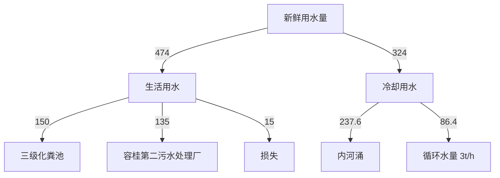
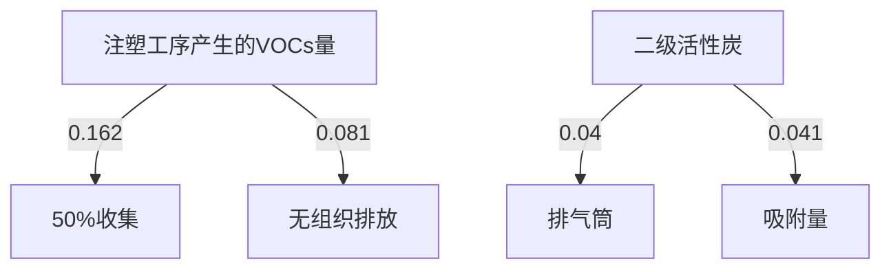
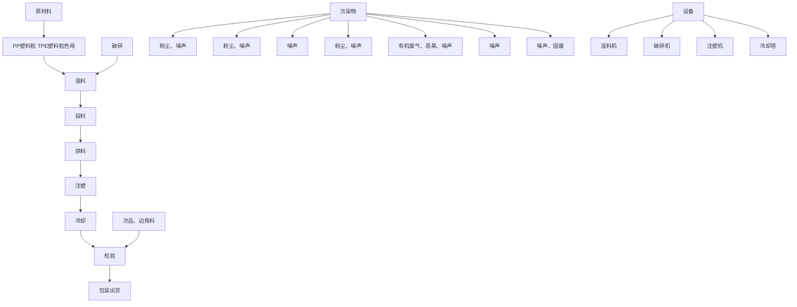
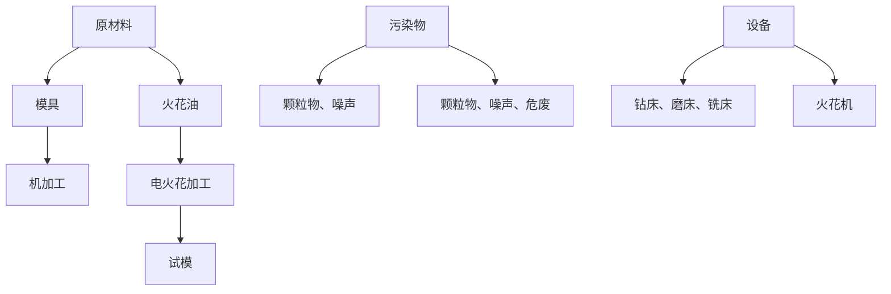

# 建设项目环境影响报告表

# （污染影响类）

项目名称：佛山市顺德区匡工精密模具有限公司搬迁项目

建设单位（盖章）：佛市顺德区匡工精密模具有限公司

编制日期： 2023年11月

text_image

佛山市怡景环境科技有限公司
40604012044

中华人民共和国生态环境部制

打印编号：1701393096000

编制单位和编制人员情况表

<table><tr><td>项目编号</td><td colspan="2">7gz651</td></tr><tr><td>建设项目名称</td><td colspan="2">佛山市顺德区匡工精密模具有限公司搬迁项目</td></tr><tr><td>建设项目类别</td><td colspan="2">26-053塑料制品业</td></tr><tr><td>环境影响评价文件类型</td><td colspan="2">报告表</td></tr><tr><td colspan="2">一、建设单位情况</td><td rowspan="3"></td></tr><tr><td>单位名称(盖章)</td><td>佛山市顺</td></tr><tr><td>统一社会信用代码</td><td>914406060</td></tr><tr><td>法定代表人(签章)</td><td rowspan="3" colspan="2"></td></tr><tr><td>主要负责人(签字)</td></tr><tr><td>直接负责的主管人员(签字)</td></tr><tr><td colspan="2">二、编制单位情况</td><td rowspan="4"></td></tr><tr><td>单位名称(盖章)</td><td>佛山市怡景环境科</td></tr><tr><td>统一社会信用代码</td><td>91440606M A 52H 1</td></tr><tr><td colspan="2">三、编制人员情况</td></tr></table>

太证书由中华人民共和国人事部和国家环境保护总局批准硕发，它表明持证人通过国家玩一组织的考试合格，取得环境形的许价工程师的职业资格

ThisistocertifyhatthebeareroftheCertifinte has pased tinal examination oganized by the Chinese goverment deprments and hns obtained lifcationso Eviromental Impct Assessment

Engin

text_image

中华人民共和国
appraisal & authorized
by
Ministry of Personnel

text_image

家环境保护
国
Applicable or authorized
State Environmental Protection Administration
The People's Republic of China

# 目录

一、建设项目基本情况.

二、建设项目工程分析.. . 14

三、区域环境质量现状、环境保护目标及评价标准 . 24

四、主要环境影响和保护措施. . 29

五、环境保护措施监督检查清单 . 50

六、结论... . 53

建设项目污染物排放量汇总表.. 54

附图1 项目地理位置图. 55

附图2 项目平面布置图. 56

附图3 佛山市环境管控单元图. 57

附图4 项目四至现状图. 58

附图5 项目环境保护目标分布图. 59

附图6 项目四至及周围环境示意图. 60

附图7 项目所在地地表水环境功能区划图. . 61

附图8 项目所在地大气环境功能区划图 62

附图 9 《佛山市顺德区容桂华口扁滘片（SD-B-05-02、SD-B-05-03 编制单元）控制性详细规划》SD-B-05-03-01、SD-B-05-03-02、SD-B-05-03-03、SD-B-05-03-04 街坊局部调整批后公布63

附图10 佛山市顺德区环境管控单元图. 64

附图11 佛山市顺德区声环境功能区划图 ..65

附件1 营业执照. 66

附件2 法人身份证. 67

附件3 用地证明. . 68

附件4 环评合同.. 73

附件5 声明.. 74

# 一、建设项目基本情况

<table><tr><td>建设项目名称</td><td colspan="3">佛山市顺德区匡工精密模具有限公司搬迁项目</td></tr><tr><td>项目代码</td><td colspan="3">无</td></tr><tr><td>建设单位联系人</td><td>***</td><td>联系方式</td><td>***</td></tr><tr><td>建设地点</td><td colspan="3">广东省佛山市顺德区容桂街道华口社区华天南一路2号杰森家电智造中心3栋301号之四</td></tr><tr><td>地理坐标</td><td colspan="3">(东经113度20分55.6784秒,北纬22度46分4.3788秒)</td></tr><tr><td>国民经济行业类别</td><td>C2929塑料零件及其塑料制品制造</td><td>建设项目行业类别</td><td>二十六、橡胶和塑料制品业29-53塑料制品业292-其他(年用非溶剂型低VOCs含量涂料10吨以下的除外)</td></tr><tr><td>建设性质</td><td>√新建(迁建)□改建□扩建□技术改造</td><td>建设项目申报情形</td><td>√首次申报项目□不予批准后再次申报项目□超五年重新审核项目□重大变动重新报批项目</td></tr><tr><td>项目审批(核准/备案)部门(选填)</td><td>——</td><td>项目审批(核准/备案)文号(选填)</td><td>——</td></tr><tr><td>总投资(万元)</td><td>100</td><td>环保投资(万元)</td><td>10</td></tr><tr><td>环保投资占比(%)</td><td>10</td><td>施工工期</td><td>1个月</td></tr><tr><td>是否开工建设</td><td>√否□是: _</td><td>用地(用海)面积(m2)</td><td>1170(建筑面积)</td></tr><tr><td>专项评价设置情况</td><td colspan="3">无</td></tr><tr><td>规划情况</td><td colspan="3">无</td></tr><tr><td>规划环境影响评价情况</td><td colspan="3">无</td></tr><tr><td>规划及规划环境影响评价符合性分析</td><td colspan="3">无</td></tr><tr><td>其他符合性分析</td><td colspan="3">1、与产业政策符合性分析本项目属于“C2929塑料零件及其塑料制品制造”行业,主要从事生产塑料制品。项目不属于国家《产业结构调整指导目录(2019年本)》及2021年修改单、《广东省禁止、限制生产、销售和使用的塑料制品目录(2020年版)》中的限制或淘汰类别,也不属于《市场准入负面清单(2022年版)》中所列行业,则根据《促进产业结构调整暂行规定》(国发[2005]40号)第十三条,项目属于允许类,项目符合相关的产业政策要求。2、与《环境保护综合名录(2021年版)》的相符性分析:本项目主要经营塑料制品生产,生产的产品及使用的原辅材料均不属于《环境保护综合名录(2021年版)》中“高污染、高环境风险”产品名录,符合要求。3、与《广东省人民政府关于印发广东省“三线一单”生态环境分区管控方案的通知》(粤府〔2020〕71号)相符性分析(1)与“一核一带一区”区域管控要求的相符性项目位于珠三角核心区,主要从事塑料制品的产销,不属于区域布局管控要求中的禁止新建、扩建水泥、平板玻璃、化学制浆、生皮制革以及国家规划外的钢铁、原油加工等项目。项目不涉及使用高挥发性原辅材料,不属于新建生产和使用高挥发性有机物原辅材料的项目,符合区域布局管控要求。项目所属塑料零件及其塑料制品制造,不属于高能耗行业,项目生产设备使用电能,生产用水由市政供水,不直接取用江河湖库水量,不会对项目所在地生态流量造成影响,符合能源利用要求。项目生活污水经三级化粪池预处理后由市政管网排入容桂第二污水处理厂,尾水排至鸡鸦水道;冷却水循环使用,定期通过市政雨水管网排入内河涌。根据《佛山市生态环境局顺德分局关于发布2022年度佛山市顺德区环境质量状况公报的通知》附件《2022年佛山市顺德区环境质量状况公报》中“鸡鸦水道细滘大桥断面”的评价结果,纳污水体水质较好。项目位于广东省佛山市顺德区容桂街道华口社区华天南一路2号杰森家电智造中心3栋301号之四,不属于石化、化工重点园区环境风险防控区域。项目产生的危险废物拟定期委托有资质的处置公司进行收集处理,并通过信息系统登记转移计划和电子转移联单,符合危险废物全过程跟踪管理的防控要求。(2)与环境管控单元总体管控要求的相符性根据《广东省人民政府关于印发广东省“三线一单”生态环境分区管控方案的通知》(粤府〔2020〕71号)发布的广东省环境管控单元图,项目所在区域为重点管控单元,重点管控单元以推动产业转型升级、强化污染减排、提升资源利用效率为重点,加快解决资源环境负荷大、局部区域生态环境质量差、生态环境风险高等问题。并且严格限制新建钢铁、燃煤燃油火电、石化、储油库等项目,产生和排放有毒有害大气污染物项目,</td></tr></table>

以及使用溶剂型油墨、涂料、清洗剂、胶粘剂等高挥发性有机物原辅材料的项目；鼓励现有该类项目逐步搬迁退出。项目不属于上述限制类项目，符合重点管控单元要求。

# （3）“三线一单”的相符性

# ①生态保护红线

项目地址位于广东省佛山市顺德区容桂街道华口社区华天南一路2号杰森家电智造中心 3栋 301号之四，据佛山市顺德区人民政府办公室关于印发《佛山市顺德区生态环境保护“十四五”规划（2021-2025）》的通知，项目所在区域不处于生态红线内。因此，本项目建设满足生态保护红线管理要求。

# ②环境质量底线

本项目所在地区属于大气环境不达标区；项目纳污水体为鸡鸦水道，水质满足水环境功能区划要求。

本项目废气污染物产生量较小，经过有效收集后达标排放，对周边环境影响很小，不会加剧空气环境质量影响；生活污水经三级化粪池预处理后由市政管网排入容桂第二污水处理厂，尾水排至鸡鸦水道；冷却水循环使用，定期通过市政雨水管网排入内河涌；不会导致纳污水体水质超标。因此，本项目建设满足环境质量底线要求。

# ③资源利用上线

本项目生产过程中会消耗一定量的电源、水资源等资源消耗，资源消耗量相对区域资源利用总量较少，符合资源利用上限要求。

# ④环保准入负面清单

本项目所属行业为塑料零件及其塑料制品制造，根据国家发展改革委商务部关于印发《市场准入负面清单（2022年版）》的通知（发改体改规﹝2022﹞397号），项目不属于上述目录所列的限制类、禁止（淘汰）类严控类项目，也不属于《市场准入负面清单（2022年版）》所列的禁止准入及需许可准入事项。根据《产业结构调整指导目录（2019年本， 2021 年修订本）》，项目符合国家有关法律、法规和政策规定，项目属于允许类。因此，本项目的建设符合国家和地方的相关产业政策。

# 4、与《佛山市人民政府关于印发佛山市“三线一单”生态环境分区管控方案的通知》（佛府〔2021〕11 号）相符性分析

根据《佛山市人民政府关于印发佛山市“三线一单”生态环境分区管控方案的通知》（佛府〔2021〕11 号）的附件 1 佛山市环境管控单元图，项目所在地属于重点管控单元（环境管控单元编码：ZH44060620001，环境管控单元名称：容桂街道重点管控区，详见附图 3）。相关管控要求的相符性分析如下：

表 1项目与佛山市“三线一单”的相符性分析

<table><tr><td>管控维度</td><td>管控要求</td><td>工程内容</td><td>符合性</td></tr></table>

<table><tr><td rowspan="9"></td><td rowspan="6">区域布局管控</td><td>【产业/综合类】系统推进村级工业园升级改造,腾出连片空间,布局产业集聚区和主题产业园,推动工业项目入园集聚发展。新增工业制造业用地原则上安排在产业集聚区内,产业集聚区外原则上不鼓励工业及物流仓储用地的新建与改造。</td><td>项目选址位于广东省佛山市顺德区容桂街道华口社区华天南一路2号杰森家电智造中心3栋301号之四,属于产业集聚区。</td><td>符合</td></tr><tr><td>【产业/综合类】产业聚集区所属地块内的工业用地或企业与村庄、学校等环境敏感点之间应设置合理的大气环境防护距离,并通过绿化带进行有效隔离;聚集区规划布局应注重大气污染排放企业应尽量避免布局在居住用地的常年主导风向的上风向。</td><td>大气污染物经有效收集处理后达标排放,对周围环境影响不大。</td><td>符合</td></tr><tr><td>【产业/限制类】受纳水体或监控断面不达标的,不得新建、扩建向河涌直接排放废水的项目。新建、扩建含蚀刻工序的线路板生产项目和化工项目应在配套污水集中处置的工业园区或生活污水管网覆盖区域内建设;纯加工型印花项目,含酸洗、磷化的金属表面处理、金属制品项目(与自身高新技术企业配套的除外),含酸洗、喷涂、化学抛光、电解等涉及废水排放工艺的不锈钢型材加工项目(与自身高新技术企业配套的除外),应进入以此类项目为主导产业、有相应废水集中治理设施的工业园区,实现集中治污。</td><td>项目生活污水经三级化粪池预处理后引至容桂第二污水处理厂深度处理;项目属于C2929塑料零件及其塑料制品制造,不涉及使用不锈钢原材料,不属于线路板生产项目和化工项目,不属于含酸洗、喷涂、拉丝、表面抛光等工艺的不锈钢型材加工项目。</td><td>符合</td></tr><tr><td>【产业/综合类】划定家具生产优先发展区域,优先发展区外不再新建涉及涂装工艺的木质家具制造项目。</td><td>项目属于塑料零件及其塑料制品制造业,不属于涉及涂装工艺的木质家具制造项目。</td><td>符合</td></tr><tr><td>【大气/限制类】大气环境受体敏感重点管控区内,应严格限制新建储油库项目、产生和排放有毒有害大气污染物的建设项目以及使用溶剂型油墨、涂料、清洗剂、胶粘剂等高挥发性有机物原辅材料项目,鼓励现有该类项目搬迁退出。</td><td>项目原料不使用高VOCs含量原辅材料。</td><td>符合</td></tr><tr><td>【土壤/禁止类】禁止新建、扩建增加重点防控的重金属污染物排放的建设项目。</td><td>不属于重点防控的重金属污染物排放类建设项目。</td><td>符合</td></tr><tr><td rowspan="3">能源资源利用</td><td>【水资源/综合类】贯彻落实“节水优先”方针,实行最严格水资源管理制度,容桂街道万元国内生产总值用水量、万元工业增加值用水量、用水总量、农田灌溉水有效利用系数等用水总量和效率指标达到区下达要求。</td><td>项目用水主要为员工生活用水和冷却塔用水,内部实行节约用水,合理使用水资源。</td><td>符合</td></tr><tr><td>【土地资源/限制类】落实单位土地面积投资强度、土地利用强度等建设用地控制性指标要求,提高土地利用效率。</td><td>项目建设用地属于工业用地。</td><td>符合</td></tr><tr><td>【岸线/禁止类】严格水域岸线用途管制,新建项目一律不得违规占用水域。严禁破坏生态的岸线利用行为和不符合其功能定位的开发建设活动,严禁以各种名义侵占河道、围垦湖泊、非法采砂等。</td><td>项目建设在陆域上,不属于占用水域和破坏生态的岸线利用行为。</td><td>符合</td></tr><tr><td rowspan="7"></td><td rowspan="7">污染物排放管控</td><td>【水/限制类】城镇新区建设实行雨污分流,逐步推进初期雨水收集、处理和资源化利用。住宅、商业体、学校、市场等城镇开发建设项目应当配套或者同步计划建设公共排水设施,公共排水设施或自建排污水设施未能投产运行的,以上涉水项目不得投入使用。新建小区严格实施雨污分流,阳台、露台等污水接入污水收集系统,将生活污水“应截尽截”。做好大型楼盘、集贸市场、餐饮以及学校等4大类排水户污水接入市政管网工作。</td><td>建设单位实行雨污分流,且生产车间位于厂房内,不存在露天作业。</td><td>符合</td></tr><tr><td>【水/综合类】容桂街道重点河涌水质上年度未达到水环境环境质量目标的,需组织编制、系统实施、向社会公开区域重点水污染物减排计划并明确“替代量”,本年度新建、改建、扩建项目新增水环境重点污染物实行区域“减二增一”替代(工业、生活或综合集中废水处理设施、民生项目除外)。</td><td>项目已接驳市政管网。不排放水环境重点污染物。</td><td>符合</td></tr><tr><td>【水/综合类】区域内应合理规划建设工业或综合集中废水处理设施。逐步推进工业集聚区“污水零直排区”建设,开展排水单元工业废水、生活污水、雨水分类收集、分质处理,确保园区“管网全覆盖、雨污全分流、污水全收集、处理全达标”</td><td>项目已接驳市政管网。生活污水经三级化粪池预处理后引至容桂第二污水处理厂深度处理,尾水达标排放;冷却水循环使用,定期通过市政雨水管网排入内河涌。</td><td>符合</td></tr><tr><td>【水/综合类】结合村级工业园改造,全面提升产业层次与集聚度,促进污染集中整治。</td><td>项目选址位于广东省佛山市顺德区容桂街道华口社区华天南一路2号杰森家电智造中心3栋301号之四,属于产业集聚区。</td><td>符合</td></tr><tr><td>【水/综合类】稳步推进排水设施“三个一体化”管理模式,补齐城乡污水收集和处理短板,推动容桂第一、第二污水处理厂提质增效,加快消除城中村、老旧城区、城乡结合部等污水收集管网空白区,逐步实现城乡污水收集处理全覆盖。2025年前完成容桂第一、第二污水处理厂扩建,尾水应执行《城镇污水处理厂污染物排放标准》(GB18918-2002)一级A标准及《广东省水污染物排放限值》(DB44/26-2001)的较严值。</td><td rowspan="3">项目已接驳市政管网。生活污水经三级化粪池预处理后引至容桂第二污水处理厂深度处理;冷却水循环使用,定期通过市政雨水管网排入内河涌。</td><td>符合</td></tr><tr><td>【水/综合类】近期保留马东、马南两处污水处理站,到2030年将马冈村居污水接入市政污水管网,纳入杏坛城镇污水处理系统;其余行政村(社区)污水均通过市政管网和农村支管纳入容桂城镇污水处理处理系统。</td><td>符合</td></tr><tr><td>【水/综合类】产业集聚区和主题园区内做好污水管网和污水集中处理设施的配套保障,</td><td>符合</td></tr></table>

<table><tr><td rowspan="3"></td><td>确保废水收集到城镇污水处理厂、园区污水处理厂或分散式污水处理设施集中处置。</td><td></td><td></td></tr><tr><td>【大气/综合类】大力推进低VOCs含量原辅材料替代,加快涉VOCs重点行业的生产工艺升级改造,推行自动化生产工艺,对达不到要求的VOCs收集及治理设施进行整治提升,逐步淘汰低效VOCs治理设施</td><td>项目不使用高VOCs含量原辅材料,有机废气经有效收集处理后达标排放。</td><td>符合</td></tr><tr><td>【土壤气/综合类】作为重金属污染重点防控区,区域内重点重金属排放总量只减不增。</td><td>不属于重点防控的重金属污染物排放类建设项目。</td><td>符合</td></tr><tr><td rowspan="2">环境风险防控</td><td>【水/综合类】容桂第一、第二污水处理厂、工业污水集中处理设施应采取有效措施,防止事故废水直接排入水体。完善污水处理厂在线监控系统联网,实现污水处理厂的实时、动态监管。</td><td rowspan="2">建设单位加强环境风险分级分类管理,强化环境风险管控。</td><td>符合</td></tr><tr><td>【风险/综合类】加强环境风险分级分类管理,强化金属制品、有色金属和压延加工、化学原料和化学品制造业等涉重金属、化工行业企业及工业园区等重点环境风险源的环境风险防控。</td><td>符合</td></tr></table>

# 5、与《佛山市顺德区人民政府关于印发佛山市顺德区“三线一单”生态环境分区管控方案的通知》（顺府发[2021]11号）相符性分析

本项目所在区域属于容桂街道重点管控区，编号：ZH44060620001。根据项目生产产品、原材料、工艺等分析，本项目不属于单元“区域布局管控”中生态/禁止类、产业/限制类、水/限制类等。项目生活污水、雨水分类收集，生活污水经三级化粪池预处理后排至容桂第二污水处理厂，满足水/综合类管控要求。本项目对照分析《佛山市顺德区人民政府关于印发佛山市顺德区“三线一单”生态环境分区管控方案的通知》（顺府发〔2021〕11号）的相符性，详见下表，所在环境管控单元见附图 10。

表 2项目与佛山市顺德区“三线一单”的相符性分析

<table><tr><td>管控维度</td><td>管控要求</td><td>工程内容</td><td>符合性</td></tr><tr><td rowspan="3">区域布局管控</td><td>【产业/综合类】系统推进村级工业园升级改造,腾出连片空间,布局产业集聚区和主题产业园,推动工业项目入园集聚发展。新增工业制造业用地原则上安排在产业集聚区内,产业集聚区外原则上不鼓励工业及物流仓储用地的新建与改造。</td><td>项目选址位于广东省佛山市顺德区容桂街道华口社区华天南一路2号杰森家电智造中心3栋301号之四,属于产业集聚区。</td><td>符合</td></tr><tr><td>【产业/综合类】产业聚集区所属地块内的工业用地或企业与村庄、学校等环境敏感点之间应设置合理的大气环境防护距离,并通过绿化带进行有效隔离;聚集区规划布局应注重大气污染排放企业应尽量避免布局在居住用地的常年主导风向的上风向。</td><td>大气污染物经有效收集处理后达标排放,对周围环境影响不大。</td><td>符合</td></tr><tr><td>【产业/限制类】受纳水体或监控断面不达标的,不得新建、扩建向河涌直接排放废水的项目。新建、扩建含蚀刻工序的线路板生产</td><td>项目生活污水经三级化粪池预处理后引至容桂第二污水处理厂深度处</td><td>符合</td></tr></table>

<table><tr><td rowspan="9"></td><td rowspan="4"></td><td>项目和化工项目应在配套污水集中处置的工业园区或生活污水管网覆盖区域内建设;纯加工型印花项目,含酸洗、磷化的金属表面处理、金属制品项目(与自身高新技术企业配套的除外),含酸洗、喷涂、化学抛光、电解等涉及废水排放工艺的不锈钢型材加工项目(与自身高新技术企业配套的除外),应进入以此类项目为主导产业、有相应废水集中治理设施的工业园区,实现集中治污。</td><td>理;冷却水循环使用,定期通过市政雨水管网排入内河涌;项目属于C2929塑料零件及其塑料制品制造,不涉及使用不锈钢原材料,不属于线路板生产项目和化工项目,不属于含酸洗、喷涂、拉丝、表面抛光等工艺的不锈钢型材加工项目。</td><td></td></tr><tr><td>【产业/综合类】划定家具生产优先发展区域,优先发展区外不再新建涉及涂装工艺的木质家具制造项目。</td><td>项目属于塑料零件及其塑料制品制造业,不属于涉及涂装工艺的木质家具制造项目。</td><td>符合</td></tr><tr><td>【大气/限制类】大气环境受体敏感重点管控区内,应严格限制新建储油库项目、产生和排放有毒有害大气污染物的建设项目以及使用溶剂型油墨、涂料、清洗剂、胶粘剂等高挥发性有机物原辅材料项目,鼓励现有该类项目搬迁退出。</td><td>项目不使用高VOCs含量原辅材料。</td><td>符合</td></tr><tr><td>【土壤/禁止类】禁止新建、扩建增加重点防控的重金属污染物排放的建设项目。</td><td>不属于重点防控的重金属污染物排放类建设项目。</td><td>符合</td></tr><tr><td rowspan="3">能源资源利用</td><td>【水资源/综合类】贯彻落实“节水优先”方针,实行最严格水资源管理制度,容桂街道万元国内生产总值用水量、万元工业增加值用水量、用水总量、农田灌溉水有效利用系数等用水总量和效率指标达到区下达要求。</td><td>项目用水主要为员工生活用水和冷却塔用水,内部实行节约用水,合理使用水资源。</td><td>符合</td></tr><tr><td>【土地资源/限制类】落实单位土地面积投资强度、土地利用强度等建设用地控制性指标要求,提高土地利用效率。</td><td>项目建设用地属于工业用地。</td><td>符合</td></tr><tr><td>【岸线/禁止类】严格水域岸线用途管制,新建项目一律不得违规占用水域。严禁破坏生态的岸线利用行为和不符合其功能定位的开发建设活动,严禁以各种名义侵占河道、围垦湖泊、非法采砂等。</td><td>项目建设在陆域上,不属于占用水域和破坏生态的岸线利用行为。</td><td>符合</td></tr><tr><td rowspan="2">污染物排放管控</td><td>【水/限制类】城镇新区建设实行雨污分流,逐步推进初期雨水收集、处理和资源化利用。住宅、商业体、学校、市场等城镇开发建设项目应当配套或者同步计划建设公共排水设施,公共排水设施或自建排污水设施未能投产运行的,以上涉水项目不得投入使用。新建小区严格实施雨污分流,阳台、露台等污水接入污水收集系统,将生活污水“应截尽截”。做好大型楼盘、集贸市场、餐饮以及学校等4大类排水户污水接入市政管网工作。</td><td>建设单位实行雨污分流,且生产车间位于厂房内,不存在露天作业。</td><td>符合</td></tr><tr><td>【水/综合类】容桂街道重点河涌水质上年度未达到水环境环境质量目标的,需组织编制、系统实施、向社会公开区域重点水污染物减排计划并明确“替代量”,本年度新建、改建、扩建项目新增水环境重点污染物实行区域“减二增一”替代(工业、生活或综合集中废水处理设施、民生项目除外)。</td><td>项目已接驳市政管网。不排放水环境重点污染物。</td><td>符合</td></tr><tr><td rowspan="8"></td><td rowspan="7"></td><td>【水/综合类】区域内应合理规划建设工业或综合集中废水处理设施。逐步推进工业集聚区“污水零直排区”建设,开展排水单元工业废水、生活污水、雨水分类收集、分质处理,确保园区“管网全覆盖、雨污全分流、污水全收集、处理全达标”。</td><td>项目已接驳市政管网。生活污水经三级化粪池预处理后引至容桂第二污水处理厂深度处理,尾水达标排放;冷却水循环使用,定期通过市政雨水管网排入内河涌。</td><td>符合</td></tr><tr><td>【水/综合类】结合村级工业园改造,全面提升产业层次与集聚度,促进污染集中整治。</td><td>项目选址位于广东省佛山市顺德区容桂街道华口社区华天南一路2号杰森家电智造中心3栋301号之四,属于产业集聚区。</td><td>符合</td></tr><tr><td>【水/综合类】稳步推进排水设施“三个一体化”管理模式,补齐城乡污水收集和处理短板,推动容桂第一、第二污水处理厂提质增效,加快消除城中村、老旧城区、城乡结合部等污水收集管网空白区,逐步实现城乡污水收集处理全覆盖。2025年前完成容桂第一、第二污水处理厂扩建,尾水应执行《城镇污水处理厂污染物排放标准》(GB18918-2002)一级A标准及《广东省水污染物排放限值》(DB44/26-2001)的较严 值。</td><td rowspan="3">项目已接驳市政管网。生活污水经三级化粪池预处理后引至容桂第二污水处理厂深度处理;冷却水循环使用,定期通过市政雨水管网排入内河涌。</td><td>符合</td></tr><tr><td>【水/综合类】近期保留马东、马南两处污水处理站,到2030年将马冈村居污水接入市政污水管网,纳入杏坛城镇污水处理系统;其余行政村(社区)污水均通过市政管网和农村支管纳入容桂城镇污水处理处理系统。</td><td>符合</td></tr><tr><td>【水/综合类】产业集聚区和主题园区内做好污水管网和污水集中处理设施的配套保障,确保废水收集到城镇污水处理厂、园区污水处理厂或分散式污水处理设施集中处置。</td><td>符合</td></tr><tr><td>【大气/综合类】大力推进低VOCs含量原辅材料替代,加快涉VOCs重点行业的生产工艺升级改造,推行自动化生产工艺,对达不到要求的VOCs收集及治理设施进行整治提升,逐步淘汰低效VOCs治理设施。</td><td>项目不使用高VOCs含量原辅材料,有机废气经有效收集处理后达标排放。</td><td>符合</td></tr><tr><td>【土壤/限制类】作为重金属污染重点防控区,区域内重点重金属排放总量只减不增。</td><td>项目不排放重金属污染物。</td><td>符合</td></tr><tr><td>环境风险防控</td><td>【水/综合类】容桂第一、第二污水处理厂、工业污水集中处理设施应采取有效措施,防止事故废水直接排入水体。完善污水处理厂在线监控系统联网,实现污水处理厂的实时、动态监管。</td><td>建设单位加强环境风险分级分类管理,强化环境风险管控。</td><td>符合</td></tr></table>

<table><tr><td></td><td>【风险/综合类】加强环境风险分级分类管理,强化金属制品、有色金属和压延加工、化学原料和化学品制造业等涉重金属、化工行业企业及工业园区等重点环境风险源的环境风险防控。</td><td></td><td>符合</td></tr></table>

# 6、用地规划相符性分析

根据《佛山市顺德区容桂西部片区控制性详细规划》，项目所在地属于 M1 类工业用地（详见附图 9），因此本项目的选址符合佛山市顺德区总体规划的要求，符合所在地块的土地利用性质。

# 7、项目与佛山市发展和改革局佛山市生态环境局关于印发《佛山市关于进一步加强塑料污染治理的实施方案》的通知（2020 年 11 月 09 日发布）的相符性分析

表 3 项目与《佛山市关于进一步加强塑料污染治理的实施方案》的通知相符性分析

<table><tr><td>政策要求</td><td>工程内容</td><td>符合性</td></tr><tr><td>禁止生产、销售的塑料制品。全市范围内禁止生产和销售厚度小于0.025毫米的超薄塑料购物袋、厚度小于0.01毫米的聚乙烯农用地膜。禁止以医疗废物为原料制造塑料制品;禁止将回收利用的废塑料输液袋(瓶)用于原用途或用于制造餐饮容器以及玩具等儿童用品。到2020年底,禁止生产和销售一次性发泡塑料餐具、一次性塑料棉签;禁止生产含塑料微珠的日化产品。到2022年底,禁止销售含塑料微珠的日化产品。</td><td>项目主要生产塑料瓶和塑料盖,不属于方案中禁止生产的塑料制品。项目使用的塑料均为新料,不使用废旧塑料。</td><td>符合</td></tr><tr><td>国家《产业结构调整指导目录》和《市场准入负面清单》明确的属于淘汰类的塑料制品项目,禁止投资;属于限制类项目,禁止新建。</td><td>根据国家发展和改革委员会发布的《产业结构调整指导目录(2019年本)》,项目不属于上述目录所列的鼓励类、限制和禁止(淘汰)项目;根据《促进产业结构调整暂行规定》第十三条,属于允许建设项目。同时,根据国家发展改革委商务部《关于印发&lt;市场准入负面清单(2022年版)的通知&gt;》(发改体改规[2022]397号)可知,项目不在市场准入负面清单禁止和许可两类项目范围内。</td><td>符合</td></tr><tr><td>增加绿色产品供给。塑料制品生产企业要严格执行有关法律法规,生产符合相关标准的塑料制品,不得使用未经风险评估及技术验证的塑料回收料生产食品接触材料及制品,不得违规添加对人体、环境有害的化学添加剂</td><td>项目使用的塑料为新料,不使用塑料回收料,不会添加对人体、环境有害的化学添加剂</td><td>符合</td></tr></table>

# 7、挥发性有机物（VOCs）排放符合性分析

表 4 项目与挥发性有机物（VOCs）排放规定相符性分析

<table><tr><td>序号</td><td>政策要求</td><td>工程内容</td><td>符合性</td></tr><tr><td colspan="4">1.佛山市生态环境局顺德分局关于做好重点行业建设项目挥发性有机物总量指标管理工作的通知》(佛顺环函[2019]56号)</td></tr><tr><td>1.1</td><td>涉VOCs排放项目,实现本行政区域内污染源“点对点”2倍量削减替代,由项目所在镇街分局出具VOCs总量指标来源及替代削减方案的意见,开展总量替代。</td><td>项目VOCs排放总量指标(VOCs:0.121t/a)由容桂街道出具VOCs总量指标来源及替代削减方案的意见。</td><td>符合</td></tr><tr><td colspan="4">2.《广东省人民政府办公厅关于印发广东省2021年大气、水、土壤污染防治工作方案的通知》(粤办函〔2021〕58号)</td></tr><tr><td>2.1</td><td>严格落实国家产品VOCs含量限值标准要求,除现阶段确无法实施替代的工序外禁止新建生产和使用高VOCs含量原辅材料项目;指导企业使用适宜高效的治理技术,涉VOCs重点行业新建、改建和扩建项目不推荐使用光氧化、光催化、低温等离子等低效治理设施,已建项目逐步淘汰光氧化、光催化、低温等离子治理设施。指导采用一次性活性炭吸附治理技术的企业,明确活性炭装载量和更换频次,记录更换时间和使用量</td><td>本项目只使用低VOCs含量、低反应活性的原辅材料和产品。有机废气采取“二级活性炭”吸附处理,不使用光氧化、光催化、低温等离子等低效治理设施</td><td>符合</td></tr><tr><td colspan="4">3.《关于印发《广东省涉挥发性有机物(VOCs)重点行业治理指引》的通知》(粤环办〔2021〕43号)</td></tr><tr><td>3.1</td><td>VOCs物料转移和输送:粉状、粒状VOCs物料采用气力输送设备、管状带式输送机、螺旋输送机等密闭输送方式,或者采用密闭的包装袋、容器或罐车进行物料转移。</td><td>项目原料均为固态,在转移过程中均使用密闭的包装袋封装</td><td>符合</td></tr><tr><td>3.2</td><td>工艺过程:在混合/混炼、塑炼/塑化/熔化、加工成型(注塑、注射、压制、压延、发泡、纺丝等)、硫化等作用中应采用密闭设备或在密闭空间中操作,废气应排至VOCs废气收集处理系统;无法密闭的,应采取局部气体收集措施,废气排至VOCs废气收集处理系统。</td><td>项目废气经集气措施收集后通过二级活性炭处理后引至50m排气筒排放。</td><td>符合</td></tr><tr><td>3.3</td><td>废气收集:采用外部集气罩的,距集气罩开口面最远处的VOCs无组织排放位置,控制风速不低于0.3m/s。</td><td>项目集气罩置于废气产生点的合理位置,保证罩口截面风速为0.7m/s。</td><td>符合</td></tr><tr><td>3.4</td><td>废气收集:废气收集系统的输送管道应密闭。废气收集系统应在负压下运行,若处于正压状态,应对管道组件的密封垫进行泄漏检测,泄漏检测值不应超过500μmol/mol,亦不应有感官可察觉泄漏。</td><td>项目废气收集系统的输送管均密闭,废气收集系统在负压下运行。</td><td>符合</td></tr></table>

<table><tr><td rowspan="7"></td><td>3.5</td><td>排放水平:塑料制品行业:a)有机废气排气筒排放浓度不高于广东省《大气污染物排放限值》(DB4427-2001)第II时段排放限值,合成革和人造革企业排放浓度不高于《合成革与人造革工业污染物排放标准》(GB21902-2008)排放限值,若国家和我省出台并实施适用于塑料制品制造业的大气污染物排放标准,则有机废气排气筒排放浓度不高于相应的排放限值;车间或生产设施排气中NMHC初始排放速率≥3kg/h时,建设VOCs处理设施且处理效率≥80%;b)厂区内无组织排放监控点NMHC的小时平均浓度值不超过6mg/m3,任意一次浓度值不超过20mg/m3。</td><td>项目所属行业为塑料制品业,生产过程有机废气达到《合成树脂工业污染物排放标准》(GB31572-2015)相关标准限值;有机废气厂区内无组织排放满足平均浓度值不超过6mg/m3,任意一次浓度值不超过20mg/m3。</td><td>符合</td></tr><tr><td>3.6</td><td>管理台账:建立废气收集处理设施台账,记录废气处理设施进出口的监测数据(废气量、浓度、温度、含氧量等)、废气收集与处理设施关键参数、废气处理设施相关耗材(吸收剂、吸附剂、催化剂等)购买和处理记录。</td><td>项目建立废气收集处理设施台账,根据《排污单位自行监测技术指南总则》(HJ819-2017)等相关要求定期自行监测,并且记录相关监测数据</td><td>符合</td></tr><tr><td>3.7</td><td>管理台账:建立危废台账,整理危废处置合同、转移联单及危废处理方式资质佐证材料。</td><td>项目建立危险废物台账,定期将废机油、废活性炭等危险废物交给有资质的单位处理,整理危废处理合同、转移联单等资料。</td><td>符合</td></tr><tr><td colspan="4">4.佛山市发展和改革局 佛山市生态环境局关于印发《佛山市关于进一步加强塑料污染治理的实施方案》的通知(佛发改资环〔2021〕3号)</td></tr><tr><td>4.1</td><td>全市范围内禁止生产和销售厚度小于0.025毫米的超薄塑料购物袋、厚度小于0.01毫米的聚乙烯农用地膜。禁止以医疗废物为原料制造塑料制品;禁止将回收利用的废塑料输液袋(瓶)用于原用途或用于制造餐饮容器以及玩具等儿童用品。加大禁止“洋垃圾”进口监管和打私力度,确保“全面禁止废塑料进口”落实到位。到2020年底,禁止生产和销售一次性发泡塑料餐具、一次性塑料棉签;禁止生产含塑料微珠的日化产品。到2022年底,禁止销售含塑料微珠的日化产品。国家《产业结构调整指导目录》和《市场准入负面清单》明确的属于淘汰类的塑料制品项目,禁止投资;属于限制类项目,禁止新建。</td><td>本项目属于C2929塑料零件及其他塑料制品制造,外购的塑料粒为新料,不属于医疗废物、回收利用的废塑料输液袋(瓶),也不属于“洋垃圾”,产品也不属于文件中禁止生产项目及限制类项目。</td><td>符合</td></tr><tr><td colspan="4">5.《固定污染源挥发性有机物综合排放标准》(DB44/2367-2022)</td></tr><tr><td>5.1</td><td>排气筒高度不低于15m(因安全考虑或者有特殊工艺要求的除外),具体高度以及与周围建筑物的相对高度关系应当根据环境影响评价文件确定。</td><td>建设单位在每台注塑机上方设置集气罩收集废气。注塑工序产生的有机废气经有效收集后,通过“二级活性炭吸附”装置处理后引至位于楼顶离地50m高的排气筒排放。</td><td>符合</td></tr><tr><td rowspan="8"></td><td>5.2</td><td>企业应当建立台账,记录废气收集系统、VOCs处理设施的主要运行和维护信息,如运行时间、废气处理量、操作温度、停留时间、吸附剂再生/更换周期和更换量、催化剂更换周期和更换量、吸收液pH值等关键运行参数。台账保存期限不少于3年。</td><td>项目废气治理设施安排专人维护并定期建立台账,记录相关废气数据。</td><td></td></tr><tr><td>5.3</td><td>VOCs物料应当储存于密闭的容器、储罐、储库、料仓中;盛装VOCs物料的容器应当存放于室内,或者存放于设置有雨棚、遮阳和防渗设施的专用场地。盛装VOCs物料的容器或者包装袋在非取用状态时应当加盖、封口,保持密闭。</td><td>本项目使用的物料采用密封容器存放在厂房内的仓库;厂房为已建成工业厂房,拥有完整的维护结构,地面已经全部混凝土硬化处理。</td><td>符合</td></tr><tr><td>5.4</td><td>废气收集系统排风罩(集气罩)的设置应当符合GB/T16758的规定。采用外部排风罩的,应当按GB/T 16758、WS/T 757-2016规定的方法测量控制风速,测量点应当选取在距排风罩开口面最远处的VOCs无组织排放位置,控制风速不应当低于0.3m/s(行业相关规范有具体规定的,按相关规定执行)。</td><td>建设单位在每台注塑机上方设置集气罩收集废气。注塑工序产生的有机废气经有效收集后,通过“二级活性炭吸附”装置处理后引至位于楼顶离地50m高的排气筒排放。控制风速大于0.3m/s。</td><td>符合</td></tr><tr><td colspan="4">6.关于印发《重点行业挥发性有机物综合治理方案》的通知(环大气[2019]53号)</td></tr><tr><td>6.1</td><td>通过使用水性、粉末、高固体分、无溶剂、辐射固化等低VOCs含量的涂料,水性、辐射固化、植物等低VOCs含量的油墨,水基、热熔、无溶剂、辐射固化、改性、生物降解等低VOCs含量的胶粘剂,以及低VOCs含量、低反应活性的清洗剂等,替代溶剂型涂料、油墨、胶粘剂、清洗剂等,从源头减少VOCs产生。</td><td>本项目使用的原材料无自然状态下可挥发性的物料,满足相关标准要求。</td><td>符合</td></tr><tr><td>6.2</td><td>重点对含VOCs物料(包括含VOCs原辅材料、含VOCs产品、含VOCs废料以及有机聚合物材料等)储存、转移和输送、设备与管线组件泄漏、敞开液面逸散以及工艺过程等五类排放源实施管控,通过采取设备与场所密闭、工艺改进、废气有效收集等措施,削减VOCs无组织排放。</td><td>项目注塑过程产生的废气,已设置集气措施收集。集气罩置于废气产生点的合理位置,保证罩口截面风速为0.7m/s。</td><td>符合</td></tr><tr><td>6.3</td><td>提高废气收集率,遵循“应收尽收、分质收集”的原则,科学设计废气收集系统,将无组织排放转变为有组织排放进行控制。采用全密闭集气罩或密闭空间的,除行业有特殊要求外,应保持微负压状态,并根据相关规范合理设置通风量。采用局部集气罩的,距集气罩开口面最远处的VOCs无组织排放位置,控制风速应不低于0.3米/秒,有行业要求的按相关规定执行。</td><td>项目注塑过程产生的废气,已设置集气措施收集。集气罩置于废气产生点的合理位置,保证罩口截面风速为0.7m/s。</td><td>符合</td></tr><tr><td colspan="4">7.《广东省生态环境厅关于印发&lt;广东省生态环境保护“十四五”规划&gt;的通知(粤环〔2021〕10号)</td></tr><tr><td rowspan="4"></td><td>7.1</td><td>大力推进低VOCs含量原辅材料源头替代,严格落实国家和地方产品VOCs含量限值质量标准,禁止建设生产和使用高VOCs含量的溶剂型涂料、油墨、胶粘剂等项目。</td><td>项目不涉及高挥发性有机物原辅材料。</td><td></td></tr><tr><td colspan="4">8.《佛山市生态环境局关于印发《佛山市生态环境保护“十四五”规划》的通知》佛环〔2022〕3号</td></tr><tr><td>8.1</td><td>严格限制新建生产和使用高挥发性有机物原辅材料的项目。</td><td>项目不涉及高挥发性有机物原辅材料。</td><td></td></tr><tr><td>8.2</td><td>推进VOCs高排放企业治理设施提升改造,淘汰光催化、光氧化、低温等离子等现有低效治理设施。</td><td>注塑废气经集气罩收集后通过“两级活性炭吸附”进行处理后引至位于楼顶离地50m高的排气筒排放。</td><td></td></tr></table>

# 二、建设项目工程分析

<table><tr><td rowspan="9">建设内容</td><td colspan="4">1.项目概况及任务来源佛山市顺德区匡工精密模具有限公司成立于2013年5月2日,现有项目地位于佛山市顺德区容桂容边居委会天河工业区新有路2号首层之三(北纬22.757388°,东经113.305084°),统一社会信用代码:91440606068496540E。经营范围为制造:制造、加工:精密模具、五金制品及其配件、家用电器及其配件、塑料制品(不含废旧塑料加工利用)。现有项目占地面积1600平方米,建筑面积1600平方米。总投资100万元人民币,其中环保投资10万元,生产能力为年产小家电塑料外壳60万件。项目员工人数为20人,均不在项目内食宿;每天2班工作制生产,每班12个小时。在实际建设的过程中,考虑到市场发展及实际生产需要,本项目拟更换建设地址,现申请在广东省佛山市顺德区容桂街道华口社区华天南一路2号杰森家电智造中心3栋301号之四进行迁建,项目迁建厂址中心坐标:北纬22°46′4.3788′′,东经113°20′4.3788′′。项目迁建厂区投入运行时,该公司营业执照注册地址变更至广东省佛山市顺德区容桂街道华口社区华天南一路2号杰森家电智造中心3栋301号之四。由于迁建项目位于新的厂区,距离原厂区有一定的距离,现有的污染随迁建后也随之消失,故本环评将重新对新厂区进行评价。现申请办理相关环保手续。表5项目所属行业分析表</td><td></td></tr><tr><td rowspan="8">行业类别</td><td colspan="3">类别</td><td>项目情况</td></tr><tr><td colspan="3">《国民经济行业分类》(GB/T 4754-2017)(2019年修订)</td><td rowspan="4">项目主要从事塑料制品的生产和制造,属于C2929塑料零件及其塑料制品制造。</td></tr><tr><td colspan="3">C制造业</td></tr><tr><td>大类</td><td>中类</td><td>小类</td></tr><tr><td>29橡胶和塑料制品业</td><td>292塑料制品业</td><td>2929塑料零件及其塑料制品制造</td></tr><tr><td colspan="3">《建设项目环境影响评价分类管理名录》(2021年版)</td><td rowspan="3">项目主要从事塑料制品的生产和制造,本项目工艺为注塑工艺,故应编制报告表。</td></tr><tr><td colspan="3">二十六、橡胶和塑料制品业29-53、塑料制品业292</td></tr><tr><td>报告书</td><td>报告表</td><td>登记表</td></tr></table>

<table><tr><td rowspan="5"></td><td>以再生塑料为原料生产的;有电镀工艺的;年用溶剂型胶粘剂10吨及以上的;年用溶剂型涂料(含稀释剂)10吨及以上的</td><td>其他(年用非溶剂型低VOCs含量涂料10吨以下的除外)</td><td>/</td><td></td></tr><tr><td colspan="3">《固定污染源排污许可分类管理名录(2019年版)》</td><td rowspan="4">本项目主要从事塑料制品的生产和制造,本项目年产量少于1万吨,故本项目应进行登记管理。</td></tr><tr><td colspan="3">二十一、化学原料和化学制品制造业26-48、涂料、油墨、颜料及类似产品制造264</td></tr><tr><td>重点管理</td><td>简化管理</td><td>登记管理</td></tr><tr><td>塑料人造革、合成革制造2925</td><td>年产1万吨及以上的泡沫塑料制造2924,年产1万吨及以上涉及改性的塑料薄膜制造2921、塑料板、管、型材制造2922、塑料丝、绳和编织品制造2923、塑料包装箱及容器制造2926、日用塑料品制造2927、人造草坪制造2928、塑料零件及其他塑料制品制造2929</td><td>其他</td></tr></table>

# 2. 项目基本情况

# 2.1工程规模

项目工程规模见下表。

表 6项目工程规模一览表

<table><tr><td colspan="2">主要指标</td><td>现有项目</td><td>迁建增减量</td><td>本迁建项目</td></tr><tr><td colspan="2">总投资额</td><td>100万元</td><td>0</td><td>100万元</td></tr><tr><td colspan="2">其中环保投资额</td><td>10万元</td><td>0</td><td>10万元</td></tr><tr><td rowspan="2">工程规模</td><td>占地面积</td><td>1600平方米</td><td>-680平方米</td><td>920平方米</td></tr><tr><td>建筑面积</td><td>1600平方米</td><td>-480平方米</td><td>1170平方米</td></tr><tr><td rowspan="3">产品方案</td><td>小家电塑料外壳</td><td>60万件</td><td>-60万件</td><td>0</td></tr><tr><td>塑料配件</td><td>0</td><td>600万件</td><td>+600万件</td></tr><tr><td>备注</td><td colspan="3">主营:家用电力配件,家用电器脚垫、量杯,重量约为10g/件</td></tr></table>

# 2.2建设内容及规模

本项目所租用的建筑为 1 栋 10层建筑物，占地面积 920平方米，建筑面积 1170平方米，本项目生产车间位于第 3 层，首层高约 7.9 米，2\~4 层层高约 5.9 米，5\~6 层层高约 5.4 米，7\~9 层层高约4.4 米，10层为天台，建筑物总高度 49.6 米。根据建设单位提供的资料，本项目建设组成详见下表。

表 7项目建设主要组成一览表

<table><tr><td rowspan="2">类别</td><td rowspan="2">工程名称</td><td colspan="3">工程内容及规模</td></tr><tr><td>迁建前</td><td>变化情况</td><td>迁建后</td></tr></table>

<table><tr><td rowspan="14"></td><td>主体工程</td><td colspan="2">生产场所</td><td>1500m2,内含注塑、破碎、混料、机加工工序</td><td>生产设备和面积减少</td><td>1170m2,设有夹层、注塑区(400m2)、模具区(50m2)、破碎混料区(50m2)、冷却塔区(10m2)、空压机区(10m2)、仓库(400m2)和办公室(100m2)</td></tr><tr><td rowspan="3">辅助工程</td><td colspan="2">办公室</td><td>100m2,,供日常办公使用</td><td>面积减少</td><td>100m2,设有夹层(50m2),供日常办公使用</td></tr><tr><td colspan="2">仓库</td><td>位于车间内,用于储存产品及原材料</td><td>/</td><td>400m2,设有夹层(200m2),用于储存产品及原材料</td></tr><tr><td colspan="2">通道</td><td>/</td><td>/</td><td>150m2,用于物料运输及人行通道</td></tr><tr><td rowspan="4">公用工程</td><td colspan="2">供水</td><td>市政供水,主要为员工生活用水、生产用水。</td><td>用水量减少</td><td>市政供水,主要为员工生活用水、生产用水。</td></tr><tr><td rowspan="2" colspan="2">排水</td><td>生活污水经三级化粪池处理后排入容桂第一污水处理厂。</td><td>生活污水经三级化粪池处理排入容桂第二污水处理厂处理,处理后尾水排入鸡鸦水道</td><td>生活污水经三级化粪池处理排入容桂第二污水处理厂处理,处理后尾水排入鸡鸦水道。</td></tr><tr><td>冷却水循环使用,不外排</td><td>冷却水循环使用,定期通过市政雨水管网排入内河涌</td><td>冷却水循环使用,定期通过市政雨水管网排入内河涌</td></tr><tr><td colspan="2">供电</td><td>市政供电</td><td>不变</td><td>市政供电</td></tr><tr><td rowspan="6">环保工程</td><td rowspan="2">废水</td><td>生活污水</td><td>生活污水经三级化粪池处理后排入容桂第一污水处理厂。</td><td>生活污水经三级化粪池处理排入容桂第二污水处理厂处理,处理后尾水排入鸡鸦水道</td><td>生活污水经三级化粪池处理排入容桂第二污水处理厂处理,处理后尾水排入鸡鸦水道</td></tr><tr><td>冷却废水治理</td><td>冷却水循环使用,不外排</td><td>冷却水循环使用,定期通过市政雨水管网排入内河涌</td><td>冷却水循环使用,定期通过市政雨水管网排入内河涌</td></tr><tr><td>废气</td><td>有机废气</td><td>高空排放</td><td>经二级活性炭吸附设备处理后高空排放</td><td>经二级活性炭吸附设备处理后引至50m高空排放。</td></tr><tr><td colspan="2">噪声</td><td>选用低噪设备,并进行合理放置,对产生较大噪声的生产设备采取相应的减振处理</td><td>减少负荷</td><td>选用低噪设备,并进行合理放置,对产生较大噪声的生产设备采取相应的减振处理</td></tr><tr><td rowspan="2">固废</td><td>生活垃圾</td><td>由环卫部门统一清运处理</td><td>减少负荷</td><td>由环卫部门统一清运处理</td></tr><tr><td>一般工业固废</td><td>由专业回收公司回收处理</td><td>减少负荷</td><td>由专业回收公司回收处理</td></tr></table>

<table><tr><td></td><td></td><td>危险废物</td><td>由专门容器收集后暂存于危废池,统一交由取得相应《危险废物经营许可证》的单位处置。</td><td>减少负荷</td><td>由专门容器收集后暂存于危废池,统一交由取得相应《危险废物经营许可证》的单位处置。</td></tr></table>

# 3. 项目生产设备

表 8 生产设备一览表

<table><tr><td rowspan="2">生产设施名称</td><td colspan="3">数量</td><td rowspan="2">单位</td><td colspan="3">设施参数</td><td rowspan="2">主要工艺</td></tr><tr><td>搬迁前审批</td><td>搬迁后</td><td>增减量</td><td>参数名称</td><td>设计值</td><td>单位</td></tr><tr><td rowspan="2">注塑机</td><td rowspan="2">22</td><td rowspan="2">10</td><td rowspan="2">-12</td><td rowspan="2">台</td><td>处理能力</td><td>3</td><td>kg/h</td><td rowspan="2">注塑</td></tr><tr><td>螺杆直径</td><td>30</td><td>mm</td></tr><tr><td>混料机</td><td>3</td><td>2</td><td>-1</td><td>台</td><td>处理能力</td><td>0.02</td><td>t/h</td><td>混料</td></tr><tr><td>破碎机</td><td>2</td><td>6</td><td>4</td><td>台</td><td>处理能力</td><td>0.02</td><td>t/h</td><td>破碎</td></tr><tr><td>冷却塔</td><td>1</td><td>1</td><td>0</td><td>台</td><td>循环水量</td><td>3</td><td> $m^3/h$ </td><td>冷却</td></tr><tr><td>空压机</td><td>1</td><td>1</td><td>0</td><td>台</td><td>容量</td><td>1.6</td><td> $m^3/min$ </td><td>压缩空气</td></tr><tr><td>磨床</td><td>2</td><td>1</td><td>-1</td><td>台</td><td>功率</td><td>1.5</td><td>kW</td><td>机加工</td></tr><tr><td>电火花机</td><td>4</td><td>1</td><td>-3</td><td>台</td><td>功率</td><td>1.5</td><td>kW</td><td>机加工</td></tr><tr><td>铣床</td><td>4</td><td>1</td><td>-3</td><td>台</td><td>功率</td><td>3</td><td>kW</td><td>机加工</td></tr><tr><td>钻床</td><td>1</td><td>1</td><td>0</td><td>台</td><td>功率</td><td>3.5</td><td>kW</td><td>机加工</td></tr><tr><td>电脑锣机</td><td>1</td><td>0</td><td>-1</td><td>台</td><td>/</td><td>/</td><td>/</td><td>/</td></tr></table>

# 4. 原辅材料及能源消耗

表 9项目原辅材料及能源消耗一览表

<table><tr><td rowspan="2">名称</td><td rowspan="2">单位</td><td colspan="3">数量</td><td rowspan="2">最大存储量</td><td rowspan="2">包装规格</td><td rowspan="2">备注</td></tr><tr><td>搬迁前</td><td>搬迁后</td><td>增减量</td></tr><tr><td>ABS 塑料粒</td><td>吨</td><td>10</td><td>0</td><td>-10</td><td>/</td><td>/</td><td>/</td></tr><tr><td>色粉</td><td>吨</td><td>1</td><td>0</td><td>-1</td><td>/</td><td>/</td><td>/</td></tr><tr><td>五金模胚</td><td>吨</td><td>40</td><td>0</td><td>-40</td><td>/</td><td>/</td><td>/</td></tr><tr><td>PP 塑料粒</td><td>吨</td><td>60</td><td>9.6</td><td>-50.4</td><td>1</td><td>25kg/袋</td><td>新料、粒状</td></tr><tr><td>TPE 塑料粒</td><td>吨</td><td>0</td><td>50</td><td>+50</td><td>2</td><td>25kg/袋</td><td>新料、粒状</td></tr><tr><td>色母</td><td>吨</td><td>0</td><td>0.4</td><td>+0.4</td><td>0.2</td><td>25kg/袋</td><td>新料、粒状</td></tr><tr><td>机油</td><td>吨/年</td><td>0</td><td>0.18</td><td>+0.18</td><td>0.18</td><td>180kg/桶</td><td>液体</td></tr><tr><td>液压油</td><td>吨/年</td><td>0</td><td>0.36</td><td>+0.36</td><td>0.18</td><td>180kg/桶</td><td>液体</td></tr><tr><td>火花油</td><td>吨/年</td><td>0</td><td>0.18</td><td>+0.18</td><td>0.18</td><td>180kg/桶</td><td>液体</td></tr><tr><td>模具钢</td><td>套/年</td><td>0</td><td>80</td><td>+80</td><td>20</td><td>100kg/套</td><td>固体</td></tr></table>

表 10项目产能与设备的匹配性分析表

<table><tr><td colspan="2">设备</td><td rowspan="2">对应本项目产品产能</td><td rowspan="2">《佛山市塑胶行业建设项目环评文件编制技术参考指南(试行)》表9</td><td rowspan="2">匹配性</td></tr><tr><td>名称</td><td>产能、规格</td></tr><tr><td>注塑机</td><td>设计产能合计为30kg/h,按本设备年最大工作时间2400h折算,设备产能为72t/a</td><td>年产塑料配件100万个</td><td>成型设备,单台挤出机型号为SJ30,生产能力为2-6kg/h,年最大工作时间2400h折算,产能为48t/a~144t/a</td><td>设备产能/规格与产品产能/产品规格、技术参考指南均匹配</td></tr></table>

PP：聚丙烯，是丙烯加聚反应而成的聚合物。系白色蜡状材料，外观透明而轻。相对密度为0.89～$0 . 9 1 \mathrm { g } / \mathrm { c m } ^ { 3 }$ ，易燃，熔点 $1 6 5 \mathrm { { ^ \circ C } }$ ，在 $1 5 5 \mathrm { { \circ C } }$ 左右软化，使用温度范围为 $- 3 0 { \sim } 1 4 0 ^ { \circ } \mathrm { C }$ ，热分解温度在 $3 2 8 ^ { \circ } \mathrm { C }$ 以上。

TPE：是一种热塑性弹性体材料，具有高强度，高回弹性，可注塑加工的特征，应用范围广泛，有优良的着色性。触感柔软，耐候性，抗疲劳性和耐温性，加工性能优越，无须硫化，可以循环使用降低成本，既可以二次注塑成型，与 PP、PE、PC、PS、ABS 等基材材料包覆粘合，也可以单独成型。

色母：颗粒状，一种新型高分子材料专用着色剂，主要用在塑料上。色母由颜料或染料、载体和添加剂三种基本要素所组成，是把超常量的颜料均匀载附于树脂之中而制得的聚集体。常用的有机颜料有：酞菁红、酞菁蓝、酞菁绿、耐晒大红、大分子红、大分子黄、永固黄、永固紫、偶氮红等；常用的无机颜料有：镉红、镉黄、钛白粉、炭黑、氧化铁红、氧化铁黄等。载体即是色母粒的基体，专用色母一般选择与制品树脂相同的树脂作为载体，两者的相容性最好，但同时也要考虑载体的流动性。添加剂主要为分散剂，是促使颜料均匀分散并不再凝聚，分散剂的熔点应比树脂低，与树脂有良好的相容性，和颜料有较好的亲和力。最常用的分散剂为：聚乙烯低分子蜡、硬脂酸盐。

机油：密度约为 $\mathbf { \varepsilon } _ { 1 0 . 9 1 \times 1 0 ^ { 3 } k g / m ^ { 3 } } ,$ ，闪点约为 $1 8 0 \mathrm { { ^ { o } C } , }$ ，能对机械设备到润滑减磨、辅助冷却降温、密封防漏、防锈防蚀、减震缓冲等作用。机油由基础油和添加剂两部分组成。基础油是机油的主要成分，决定着机油的基本性质，添加剂则可弥补和改善基础油性能方面的不足，赋予某些新的性能，是机油的重要组成部分。

液压油：淡黄色液体，相对密度 $\scriptstyle ( \mathbf { \Lambda } \mathbf { \Lambda } ) \left( \mathbf { \Lambda } = 1 \mathbf { g } / \mathbf { c m } ^ { 3 } \right) \ 0 . 8 7 .$ ，闪点 $2 2 4 ^ { \circ } \mathrm { C } .$ ，无爆炸危险，遇明火、高热 可燃，燃烧产物为 $\mathrm { C O } , \mathrm { C O } _ { 2 }$ 等有毒有害气体，燃烧时使用泡沫、干粉、二氧化碳、砂土进行灭火； 常温环境下储存不分解，禁配物为酸、碱及强氧化剂。

火花油：是一种电火花机加工不可缺少的放电介质液体，电火花机油能够绝缘消电离、冷却电火花机加工时的高温、排除碳渣。

# 5. 公用配套工程

# （1）给水

# ①冷却水

本项目设置 1 台冷却塔为注塑机模具提供冷却水，冷却水对模具进行冷却，属于间接冷却塑料产品，配置的水泵流量约 3m3 /h，冷却塔采用开式系统，年运行时间约 2400h，则年循环水量约 7200m3/a。冷却水循环使用，定期排水，根据第四章废水排放源强可知，新鲜补充水量为 324t/a。

# ②生活用水

本项目劳动定员 15 人，员工年工作日为 300天，员工不在厂区内食宿。根据广东省《用水定额 第三部分：生活》（DB44/T 1461.3-2021）表 A.1 中国家机构办公楼无食堂和浴室，生活用水按先进值10 m3 /（人·a）计，则项目生活用水量为 0.5m³/d（150m³/a）。

# （2）排水

根据第四章 1.4 废水排放源强可知，项目冷却排水定期排放，排放水量为 86.4m3 /a，冷却水定期排水经市政雨水管网排至内河涌。

生活污水的排放系数按 90%计，排放量为 0.45m³/d（135m³/a）。生活污水经三级化粪池处理后由市政污水管网排入容桂第二污水处理厂处理。

# （3）供电工程

项目不设置备用发电机，用电由市政供电系统提供。根据企业提供资料，年用电量约 15 万 kW·h。

# 6. 平衡图

flowchart

图 1 水平衡图（t/a）

flowchart

图 2 VOCs 平衡图（t/a）

# 7. 劳动动员及工作制度

（1）劳动定员：项目从业人数为 15 人，员工不在厂内就餐和住宿。  
（2）工作制度：年工作日 300天，每天工作 8 小时，每天工时为 8:00-12:00，14:00-18:00。

# 8. 总图布置及四至情况

佛山市顺德区匡工精密模具有限公司搬迁项目位于广东省佛山市顺德区容桂街道华口社区华天南一路 2 号杰森家电智造中心 3 栋 301 号之四，项目东面为 302 佛山市高子电器有限公司，南面为园区 5 栋厂房，西面为园区 8 栋厂房，北面为园区 1 栋厂房。

项目位于 3 楼，主体工程设有注塑区、仓库、模具区、破碎混料区，办公室。DA001 排气筒设置于车间厂房楼顶，危废间设置于西北侧。各生产区相对独立，互不干扰，每个生产区按照工艺流程布置设备，因此，项目平面布置做到了生产、办公分开，车间内布置流畅，总体来说项目平面布置紧凑有序，布局合理。项目平面布置图详见附图 2。

# 9. 环境影响经济损益分析

针对本项目情况，提出如下环保项目和投资：

表 11建设项目环保投资一览表

<table><tr><td colspan="2">污染源</td><td>主要环保措施</td><td>投资金额</td></tr><tr><td colspan="2">废水</td><td>三级化粪池</td><td>0.5万元</td></tr><tr><td colspan="2">废气</td><td>注塑工序产生的废气经集气措施收集后引至二级活性炭处理后通过50m排气筒(DA001)排放</td><td>5.5万元</td></tr><tr><td rowspan="3">固体废物</td><td>生活垃圾</td><td>垃圾桶,环卫部门处理</td><td>0.5万元</td></tr><tr><td>一般工业固废</td><td>固废临时摆放场所,定期交由具有相应处理能力的固废处理单位处理。</td><td>0.5万元</td></tr><tr><td>危险废物</td><td>由专门容器收集后暂存于危废贮存池(5m2)内,统一交由取得相应《危险废物经营许可证》或《危险废物收集中转贮存试点备案证》的单位。</td><td>2.5万元</td></tr><tr><td colspan="2">噪声</td><td>采取墙体隔音、距离衰减,对高噪声设备进行机械阻尼隔振(如在底部安装减震垫座)</td><td>0.5万元</td></tr><tr><td colspan="3">合计</td><td>10万元</td></tr></table>

#

# 1. 工艺流程

# （1）塑料制品生产工艺：

混料：项目将外购的塑料粒等按比例混合后投入混料机进行混料均匀。项目利用空压机为辅助设备，塑料投料采用气力输送方式密闭投加，且混料过程为加盖密闭搅拌。次品和边角料破碎后的塑料粒带有可逸散粉尘，因此回用的投料、混料过程会有少量粉尘产生。此过程会产生粉尘和噪声。

烘干：项目利用烘料桶将混料后的原材料进行烘干，使用电加热，加热温度约80\~90℃，此过程会产生噪声。项目烘干工序加热的温度还达不到塑料原料的熔点，此过程无有机废气排放。

注塑成型：将混合均匀后的原辅材料注塑成型，注塑使用电能，不涉及其他能源消耗。然后控制注射的压力和速度将塑料注入模具，产品成型需用水进行间接冷却。项目使用的原料具有良好的化学稳定性和耐热性能。项目生产中塑料粒子的熔融温度不会导致这些塑料粒子的分解，一般情况下不会产生塑料粒子焦炭链焦化气体。注塑成型产生的边角料经破碎后重新回用到生产中，注塑过程会产生噪声、少量非甲烷总烃和臭气浓度。

循环冷却水：本项目设置冷却塔为注塑机模具提供冷却水，冷却水对模具进行冷却，属于间接冷却塑料产品，冷却水循环使用。

破碎：次品和塑料边角料全部经过破碎机破碎并与塑料粒新料混合后重新回用于注塑成型工序，不外排，此过程会产生噪声、少量塑料粉尘、次品碎块和边角料碎块。

检验：经人工检验合格后包装后出货。

flowchart

图 3项目塑料制品生产工艺流程及产污环节示意图

（2）模具加工维修工艺：  

flowchart

图 4项目模具加工维修工艺流程及产污环节示意图

利用钻床、磨床、铣床对外购的半成品模具进行进一步加工成型，接着使用电火花加工，工具电极与工件并不接触，依靠工具电极与工件间不断产生的脉冲性火花放电，利用放电时产生的局部、瞬

<table><tr><td rowspan="20"></td><td colspan="4">时高温把金属材料逐步蚀除下来。电火花加工过程使用火花油作为放电介质,同时还具有冷却作用。火花油在火花机内循环使用并适当补充,经多次循环使用后更换。模具加工完成通过组装即得所需模具,全部用于本项目注塑机。模具使用一段时间后会产生磨损,使用钻床、磨床、铣床对其进行维修,根据实际生产情况,模具大约一个月集中加工和维修一次。表12 项目产污环节</td></tr><tr><td>名称</td><td>产污环节</td><td>污染源名称</td><td>主要污染物</td></tr><tr><td rowspan="2">废水</td><td>办公生活过程</td><td>办公生活污水</td><td>COD、氨氮、SS、BOD5</td></tr><tr><td>注塑机冷却</td><td>冷却水</td><td>盐度</td></tr><tr><td rowspan="4">废气</td><td>模具加工和维修</td><td>金属粉尘</td><td>颗粒物</td></tr><tr><td>电火花加工</td><td>油雾</td><td>颗粒物</td></tr><tr><td>混料、投料、破碎</td><td>塑料粉尘</td><td>颗粒物</td></tr><tr><td>注塑工序</td><td>有机废气、恶臭</td><td>非甲烷总烃、恶臭</td></tr><tr><td rowspan="11">固体废物</td><td>检验</td><td rowspan="4">一般工业固体废物</td><td>次品</td></tr><tr><td>生产过程</td><td>塑料边角料</td></tr><tr><td>模具加工维修</td><td>金属边角料</td></tr><tr><td>原料使用</td><td>废包装物</td></tr><tr><td>设备维修</td><td rowspan="6">危险废物</td><td>废机油</td></tr><tr><td>模具加工</td><td>废火花油</td></tr><tr><td>设备生产</td><td>废液压油</td></tr><tr><td>模具加工</td><td>含油废金属渣</td></tr><tr><td>设备维修</td><td>废油桶</td></tr><tr><td>设备维修</td><td>含油废抹布</td></tr><tr><td>办公生活过程</td><td>生活垃圾</td><td>生活垃圾</td></tr><tr><td>噪声</td><td colspan="2">混料机、破碎机、冷却塔、注塑机等设备</td><td>Leq(dB(A))</td></tr><tr><td rowspan="4">与项目有关的原有环境污染问题</td><td colspan="4">1.现有项目环保审批和验收情况表13公司历年环保手续履行情况表</td></tr><tr><td>环评时间</td><td>环评批准号</td><td>项目名称</td><td>批准的设备规模</td></tr><tr><td>2018年9月19日</td><td>顺管容环审[2018]第0402号</td><td>《佛山市顺德区匡工精密模具有限公司年产小家电塑料外壳60万件建设项目》</td><td>注塑机22台、混料机3台、破碎机2台、冷却塔1台、空压机1台、磨床2台、电火花机4台、铣床4台、钻床1台、电脑锣机1台</td></tr><tr><td colspan="4">根据《固定污染源排放许可分类管理名录》(2019年版)可知,企业属于登记管理类别,已于2020年4月15日取得固定污染源排污登记回执,回执号为:91440606068496540E001W。由于尚未投入生产,且原项目租用已建成厂房进行生产,故原项目尚未有污染物产生,因此原项目不存在环境问题。2.现有工程污染物产排情况(1)项目搬迁前工艺流程:</td></tr></table>

项目工艺流程搬迁前后一致。

# （2）搬迁前污染源强及治理措施

根据原环评文件中工程分析可知，现有项目产排污情况见下表。

表 14搬迁前各污染物的排放情况

<table><tr><td>项目</td><td>污染工序</td><td>污染因子</td><td>产生量t/a</td><td>排放量t/a</td><td>排放标准</td><td>排放浓度</td><td>污染防治措施</td><td>效果评价</td></tr><tr><td rowspan="5">水污染物</td><td rowspan="4">生活污水216m3/a</td><td>CODcr</td><td>0.054</td><td>0.00864</td><td>40mg/L</td><td>≤40mg/L</td><td rowspan="4">经预处理后排入容桂第一污水处理厂处理</td><td rowspan="4">DB44/26-2001第二时段三级标准</td></tr><tr><td>BOD5</td><td>0.0216</td><td>0.00432</td><td>20mg/L</td><td>≤20mg/L</td></tr><tr><td>SS</td><td>0.0216</td><td>0.00432</td><td>20mg/L</td><td>≤20mg/L</td></tr><tr><td>NH3-N</td><td>0.00648</td><td>0.00173</td><td>8mg/L</td><td>≤8mg/L</td></tr><tr><td>冷却水200m3/a</td><td>/</td><td>/</td><td>/</td><td>/</td><td>/</td><td>循环使用</td><td>---</td></tr><tr><td>项目</td><td>污染工序</td><td>污染因子</td><td>产生量t/a</td><td>排放量t/a</td><td>排放标准</td><td>排放浓度</td><td>污染防治措施</td><td>效果评价</td></tr><tr><td rowspan="5">大气污染物</td><td rowspan="3">车间无组织</td><td>颗粒物</td><td>0.0075</td><td>0.0075</td><td>1.0 mg/m3</td><td>0.0219 mg/m3</td><td rowspan="3">加强车间通风</td><td>达到(GB31572-2015)(DB44/27-2001)两者的较严值</td></tr><tr><td>非甲烷总烃</td><td>0.00245</td><td>0.00245</td><td>4.0 mg/m3</td><td>0.00003 mg/m3</td><td>达到(GB31572-2015)表9企业边界大气污染物浓度限值</td></tr><tr><td>臭气浓度</td><td>/</td><td>/</td><td>20(无量纲)</td><td>&lt;20(无量纲</td><td>达到(GB14554-93)表1中新改扩建项目厂界二级标准</td></tr><tr><td rowspan="2">注塑工序</td><td>非甲烷总烃</td><td>0.022</td><td>0.022</td><td>100mg/m3</td><td>0.88 mg/m3</td><td rowspan="2">集气罩收集后通过二级活性炭处理后引至15米高空排放</td><td>达到(GB31572-2015)表4大气污染物排放限值</td></tr><tr><td>臭气浓度</td><td>/</td><td>/</td><td>2000(无量纲)</td><td>&lt;2000(无量纲</td><td>达到(GB14554-93)表2中15米高排气筒排放标准值</td></tr><tr><td>噪声</td><td>设备噪声</td><td>噪声</td><td colspan="2">70~95dB(A)</td><td>昼间≤65dB(A)夜间≤55dB(A)</td><td>昼间≤65dB(A)夜间≤55dB(A)</td><td>设备减振、隔音,隔声和距离衰减</td><td>达到(GB12348-2008)表1中3类标准限值要求</td></tr><tr><td colspan="3">单位</td><td>t/a</td><td>t/a</td><td colspan="3">污染防治措施</td><td>效果评价</td></tr><tr><td rowspan="5">固体废物</td><td colspan="2">生活垃圾</td><td>2.5</td><td>0</td><td colspan="3">交环卫部门处理</td><td>符合</td></tr><tr><td colspan="2">废包装材料、次品、边角料</td><td>2</td><td>0</td><td colspan="3">交由废品回收公司</td><td>符合</td></tr><tr><td rowspan="3" colspan="2">废机油、废油桶、废含油抹布、原材料包装桶</td><td rowspan="3">0.15</td><td>0</td><td rowspan="3" colspan="3">交由佛山市绿家园环保科技有限公司外运处理</td><td>符合</td></tr><tr><td>0</td><td>符合</td></tr><tr><td>0</td><td>符合</td></tr></table>

# 三、区域环境质量现状、环境保护目标及评价标准

# 1. 环境空气现状调查与评价

# （1）佛山市环境空气质量现状

根据《关于调整顺德区环境空气质量功能区划的复函》(佛府办函〔2014〕494号)，本项目所在地区域属二类空气环境功能区，执行《环境空气质量标准》(GB3095-2012)及其修改单二级标准。为评价本项目所在区域的环境空气质量现状，评价引用《佛山市生态环境局顺德分局关于发布 2022 年度佛山市顺德区生态环境状况公报的通知》附件《2022年度佛山市顺德区环境质量状况公报》中的监测数据，监测项目分别为 ${ \bf S O } _ { 2 \cdot \mathrm { ~ \tiny ~ N O } _ { 2 \cdot } \mathrm { ~ \tiny ~ P M ~ } _ { 1 0 \cdot } \mathrm { ~ \tiny ~ P M } _ { 2 . 5 \times } \mathrm { ~ \tiny ~ C O } \cdot \mathrm { ~ \tiny ~ \Lambda ~ } }$ 、臭氧，监测结果及评价见下表。

表 15 2022 年顺德区环境空气质量现状统计表

<table><tr><td>所在区域</td><td>污染物</td><td>年评价指标</td><td>现状浓度(ug/m3)</td><td>标准值(ug/m3)</td><td>占标率/%</td><td>达标情况</td></tr><tr><td rowspan="6">顺德区</td><td>SO2</td><td>年平均质量浓度</td><td>5</td><td>60</td><td>8.3</td><td>达标</td></tr><tr><td>NO2</td><td>年平均质量浓度</td><td>29</td><td>40</td><td>72.5</td><td>达标</td></tr><tr><td>PM10</td><td>年平均质量浓度</td><td>32</td><td>70</td><td>45.7</td><td>达标</td></tr><tr><td>PM2.5</td><td>年平均质量浓度</td><td>19</td><td>35</td><td>52.3</td><td>达标</td></tr><tr><td>CO</td><td>95百分位数日平均质量浓度</td><td>1100</td><td>4000</td><td>27.5</td><td>达标</td></tr><tr><td>O3</td><td>90百分位数最大8小时平均质量浓度</td><td>190</td><td>160</td><td>118.7</td><td>不达标</td></tr></table>

监测结果表明，顺德区 2022 年全区 $\mathrm { S O _ { 2 } \cdot \ N O _ { 2 } \cdot \ P M _ { 1 0 } \cdot \ P M _ { 2 . 5 } }$ 年平均质量浓度、CO 95 百分位数年内日平均质量浓度未超出《环境空气质量标准》（GB3095-2012）及 2018修改单二级标准，O3-8h 浓度水平超出日最大 8 小时平均二级浓度限值，则项目所在区域判定为不达标区。

# （2）中山市环境空气质量现状

根据《中山市环境空气质量功能区划（2020 年版）》，项目所在区域为二类环境空气质量功能区，执行《环境空气质量标准》（GB3095-2012）及其修改单中的二级标准。根据《中山市 2022 年大气环境质量状况公报》得出中山环境质量达标情况，结果如下。

表 16 2022 年中山市环境空气质量现状统计表

<table><tr><td>污染物</td><td>年评价指标</td><td>现状浓度(ug/m3)</td><td>标准值(ug/m3)</td><td>占标率/%</td><td>达标情况</td></tr><tr><td rowspan="2">SO2</td><td>年平均质量浓度</td><td>5</td><td>60</td><td>8.3</td><td rowspan="2">达标</td></tr><tr><td>日均值第98百分位数浓度</td><td>9</td><td>150</td><td>6.0</td></tr><tr><td rowspan="2">NO2</td><td>年平均质量浓度</td><td>22</td><td>40</td><td>55.0</td><td rowspan="2">达标</td></tr><tr><td>日均值第98百分位数浓度</td><td>54</td><td>80</td><td>67.5</td></tr><tr><td rowspan="2">PM10</td><td>年平均质量浓度</td><td>34</td><td>70</td><td>48.6</td><td rowspan="2">达标</td></tr><tr><td>日均值第98百分位数浓度</td><td>66</td><td>150</td><td>44.0</td></tr><tr><td>PM2.5</td><td>年平均质量浓度</td><td>19</td><td>35</td><td>54.3</td><td>达标</td></tr><tr><td></td><td>日均值第98百分位数浓度</td><td>41</td><td>75</td><td>54.7</td><td></td></tr><tr><td>CO</td><td>95百分位数日平均质量浓度</td><td>800</td><td>4000</td><td>115.0</td><td>达标</td></tr><tr><td> $O_3$ </td><td>90百分位数最大8小时平均质量浓度</td><td>184</td><td>160</td><td>20.0</td><td>不达标</td></tr></table>

综上判断，中山市环境空气 SO2、NO2、PM10、PM2.5、CO 均达到《环境空气质量标准》（GB3095-2012）及其修改单中的二级标准，O3 超过环境空气质量标准（GB3095-2012）二级标准，超标系数为 0.15。

# 2. 地表水环境质量现状

本项目属于容桂第二污水处理厂纳污范围，生活污水经三级化粪池预处理后排入容桂第二污水处理厂处理后尾水排入鸡鸦水道。鸡鸦水道水质执行《地表水环境质量标准》（GB3838-2002）中的Ⅱ类标准。为评价鸡鸦水道水质，评价引用《佛山市生态环境局顺德分局关于发布 2022 年度佛山市顺德区生态环境状况公报的通知》附件《2022 年度佛山市顺德区环境质量状况公报》对鸡鸦水道细滘大桥水质情况，详见下表。

表 172022年度佛山市顺德区环境质量状况公报（节选）

<table><tr><td rowspan="2">河流名称</td><td rowspan="2">断面</td><td colspan="2">断面定类</td><td rowspan="2">水质评价标准</td><td colspan="2">河流定类</td></tr><tr><td>2022</td><td>2021</td><td>2022</td><td>2021</td></tr><tr><td>鸡鸦水道</td><td>细滘大桥</td><td>II</td><td>II</td><td>II</td><td>II</td><td>II</td></tr></table>

根据《2022年度佛山市顺德区环境质量状况公报》可知，鸡鸦水道细滘大桥断面满足《地表水环境质量标准》（GB3838-2002）之Ⅱ类水功能要求，水质优良。

# 3. 声环境质量现状

根据《佛山市人民政府关于印发<佛山市声环境功能区划分方案>的通知》（佛府函〔201572号），项目所在地属于3类声环境功能区，声环境质量执行《声环境质量标准》（GB3096-2008）中的3类标准：昼间≤65dB（A）、夜间≤55dB（A）。

# 4. 生态环境

项目用地范围内无生态环境保护目标，无需开展生态现状调查。

# 5. 电磁辐射

项目不涉及电磁辐射，无需开展电磁辐射现状调查。

# 6. 土壤、地下水环境现状

本项目厂房和周边环境地面已做好水泥面硬化防渗措施，基本不会发生泄漏液下渗污染地下水或土壤的情况，因此项目不存在土壤、地下水环境污染途径，不存在地下水、土壤污染，故不开展土壤、地下水环境质量现状调查。

#

# 1. 大气环境

根据调查，项目厂界外500米范围内的环境空气保护目标如下表所示：

<table><tr><td rowspan="4">护目标</td><td colspan="6">表18项目环境保护目标</td></tr><tr><td>名称</td><td>保护对象</td><td>保护内容</td><td>环境功能区</td><td>相对厂址方位</td><td>相对厂界距离</td></tr><tr><td>大岑村</td><td>居民区</td><td>人群(约5000人)</td><td>大气二类</td><td>南</td><td>222m</td></tr><tr><td colspan="6">2.声环境本项目厂界外50米范围内无声环境保护目标。3.地下水环境本项目厂界外500米范围内无地下水集中式饮用水水源和热水、矿泉水、温泉等特殊地下水资源。4.生态环境项目用地范围内无生态环境保护目标。</td></tr><tr><td rowspan="5">污染物排放控制标准</td><td colspan="6">1.水污染物排放标准项目生活污水经三级化粪预处理后达到广东省地方标准《水污染物排放限值》(DB44/26-2001)第二时段三级标准后排入容桂第二污水处理厂,尾水排入鸡鸦水道。根据2013年7月11日颁布的《顺德区环境运输和城市管理局关于全区城镇污水处理厂尾水排放标准执行标准的通知》规定:新、扩和改建城镇污水处理厂尾水应符合《城镇污水处理厂污染物排放标准》(GB18918-2002)一级A标准及广东省地方标准《水污染物排放标准》(DB44/26-2001)第二时段一级标准的较严值,具体排放限值见该文件的附件2《新扩改和已建城镇污水处理厂尾水限值》。具体排放标准如下表。表19水污染物排放标准(单位mg/L)</td></tr><tr><td colspan="2">污染物</td><td> $BOD_5$ </td><td>CODcr</td><td>SS</td><td>氨氮</td></tr><tr><td colspan="2">项目排污口排放标准</td><td>300</td><td>500</td><td>400</td><td>--</td></tr><tr><td colspan="2">容桂第二污水处理厂排放标准</td><td>10</td><td>40</td><td>10</td><td>5.0</td></tr><tr><td colspan="6">2.大气污染物排放标准(1)项目注塑会产生有机废气和恶臭,主要污染因子为非甲烷总烃(NMHC)和臭气浓度。非甲烷总烃的排放浓度执行《合成树脂工业污染物排放标准》(GB31572-2015)表4、表9规定的大气污染物排放限值。臭气浓度执行《恶臭污染物排放标准》(GB14554-1993)表1二级新扩改建恶臭污染物厂界标准值及表2恶臭污染物排放标准值。(2)模具机加工、破碎、投料和混料过程会产生粉尘,主要污染因子为颗粒物。塑料粉尘执行《合成树脂工业污染物排放标准》(GB31572-2015)表9规定的大气污染物排放限值。金属粉尘执行广东省地方标准《大气污染物排放限值》(DB44/27-2001)表2工艺废气大气污染物排放限值第二时段无组织排放监控浓度限值,综上,项目颗粒物执行《合成树脂工业污染物</td></tr></table>

排放标准》（GB31572-2015）表 9规定的大气污染物排放限值与广东省地方标准《大气污染物排放限值》（DB44/27-2001）表 2 工艺废气大气污染物排放限值第二时段无组织排放监控浓度限值两者间的较严值。

（3）根据《广东省地方标准批准发布公告（《固定污染源挥发性有机物综合排放标准》强制性地方标准）》（2022 第 4 号（总第 222 号）），新建项目自 2022 年 9 月 1 日起，企业厂区内无组织排放监控点浓度执行表 3 规定的限值。故本项目厂区内 VOCs 无组织排放监控点浓度执行《固定污染源挥发性有机物综合排放标准》(DB44/ 2367-2022)中表 3 厂区内 VOCs 无组织排放限值。

表 20 项目大气污染物排放标准

<table><tr><td rowspan="2">污染物名称</td><td rowspan="2">排气筒高度</td><td colspan="2">有组织</td><td rowspan="2">无组织排放监测浓度限值(mg/m3)</td><td rowspan="2">执行标准</td></tr><tr><td>最高允许排放浓度(mg/m3)</td><td>排放速率(kg/h)</td></tr><tr><td>颗粒物</td><td>/</td><td>/</td><td>/</td><td>1.0</td><td>GB31572-2015及DB44/27-2001两者间较严值</td></tr><tr><td>非甲烷总烃</td><td>50m</td><td>100</td><td>/</td><td>4.0</td><td rowspan="6">GB31572-2015</td></tr><tr><td>甲苯</td><td>50m</td><td>15</td><td>/</td><td>/</td></tr><tr><td>乙苯</td><td>50m</td><td>100</td><td>/</td><td>/</td></tr><tr><td>苯乙烯</td><td>50m</td><td>50</td><td>/</td><td>/</td></tr><tr><td>丙烯腈</td><td>50m</td><td>0.5</td><td>/</td><td>/</td></tr><tr><td>1,3-丁二烯</td><td>50m</td><td>1</td><td>/</td><td>/</td></tr><tr><td>臭气浓度</td><td>50m</td><td>40000(无量纲)</td><td>/</td><td>20(无量纲)</td><td>GB14554-93</td></tr></table>

表 21《固定污染源挥发性有机物综合排放标准》(DB44/ 2367-2022)

<table><tr><td>污染物项目</td><td>排放限值(mg/m3)</td><td>限值含义</td><td>无组织排放监控位置</td></tr><tr><td rowspan="2">NMHC</td><td>6</td><td>监控点处1h平均浓度值</td><td rowspan="2">在厂房外设置监控点</td></tr><tr><td>20</td><td>监控点处任意一次浓度值</td></tr></table>

# 3. 噪声排放标准

厂界噪声排放执行《工业企业厂界环境噪声排放标准》（GB12348-2008）中的 3类标准。

$\begin{array} { r l r l r } & { \frac { \ddagger } { \ddagger } 2 2 } & &  \langle \mathrm { L N } | \boldsymbol { \hat { L } } \mathbf { \hat { i } } \mathbf { E } \mathbf { \hat { \Lambda } } | \boldsymbol { k } / \boldsymbol { \Gamma } ^ { - } \frac { \boldsymbol { \sharp } } { \boldsymbol { \mathcal { H } } } \frac { \ddagger } { \dot { \mathcal { H } } } \frac { \boldsymbol { \sharp } \hat { \mathcal { H } } } { \boldsymbol { \mathcal { H } } } \frac { \boldsymbol { \sharp } } { \boldsymbol { \mathcal { H } } } \frac { \cdot } { \boldsymbol { \mathcal { H } } } \frac { \cdot } { \boldsymbol { \mathcal { H } } } \frac { \cdot } { \boldsymbol { \mathcal { H } } } \frac { \cdot } { \boldsymbol { \mathcal { H } } } \frac { \cdot } { \boldsymbol { \mathcal { H } } } \frac { \cdot } { \boldsymbol { \mathcal { H } } } \frac { \cdot } { \boldsymbol { \mathcal { H } } } \frac { \cdot } { \boldsymbol { \mathcal { H } } } \frac { \cdot } { \boldsymbol { \mathcal { H } } } \frac { \cdot } { \boldsymbol { \mathcal { H } } } \frac { \cdot } { \boldsymbol { \mathcal { H } } } \frac { \cdot } { \boldsymbol { \mathcal { H } } } \frac { \cdot } { \boldsymbol { \mathcal { H } } } \frac { \cdot } { \boldsymbol { \mathcal { H } } } \frac { \cdot } { \boldsymbol { \mathcal { H } } } \frac { \cdot } { \boldsymbol { \mathcal { H } } } \frac { \cdot } { \boldsymbol { \mathcal { H } } } \frac { \cdot } { \boldsymbol { \mathcal { H } } } \frac { \cdot } { \boldsymbol { \mathcal { H } } } \frac { \cdot } { \boldsymbol { \mathcal { H } } } \frac { \cdot } { \boldsymbol { \mathcal { H } } } \frac { \cdot } { \boldsymbol { \mathcal { H } } } \frac { \cdot } { \boldsymbol { \mathcal { H } } } \frac { \cdot } { \boldsymbol { \mathcal { H } } } \frac { \cdot } { \boldsymbol { \mathcal { H } } } \frac { \cdot } { \boldsymbol { \mathcal { H } } } \frac { \cdot } { \boldsymbol { \mathcal { H } } } \frac { \cdot } { \boldsymbol { \mathcal { H } } } \frac { \cdot } { \boldsymbol { \mathcal { H } } } \frac  \cdot  \end{array}$ 

<table><tr><td>类别</td><td>昼间</td><td>夜间</td><td>单位</td></tr><tr><td>3类区</td><td>65</td><td>55</td><td>dB(A)</td></tr></table>

# 4. 固体废物排放标准

固体废物执行《中华人民共和国固体废物污染环境防治法》（2020 年修正）、《广东省固

<table><tr><td></td><td colspan="8">体废物污染环境防治条例》(2018年修订)中的有关规定,一般工业固体废物在厂内贮存过程应满足相应防渗漏、防雨淋、防扬尘等环境保护要求。危险废物执行《国家危险废物名录》(2021年)、《建设项目危险废物环境影响评价指南》(环保部公告2017年第43号)、《危险废物贮存污染控制标准》(GB18597-2023)。</td><td></td><td></td><td></td><td></td><td></td><td></td><td></td><td></td></tr><tr><td rowspan="13">总量控制指标</td><td rowspan="11" colspan="8">1、水污染物总量控制分析本项目生活污水经三级化粪池预处理后,通过污水管网排入容桂第二污水处理厂,经容桂第二污水处理厂处理达标后,尾水排入鸡鸦水道;本项目生活污水排放量为 $135m^{3}/a$ ,CODCr排放量为0.005t/a,氨氮排放量为0.00068t/a。根据《佛山市排污权有偿使用和交易管理办法》(佛府办〔2020〕19号),生活污水的CODCr、氨氮不分配总量。2、大气污染物总量控制分析本项目挥发性有机物(VOCs)有组织排放量为0.04t/a,无组织排放量为0.081t/a,VOCs合计排放量为0.121/a。根据《顺德区重点行业挥发性有机物总量指标管理工作方案(2023年修订)》(顺环委办〔2023〕19号),新、改、扩建排放挥发性有机物(VOCs)的重点行业建设项目应当执行总量替代制度。建议本项目挥发性有机物(VOCs)总量控制指标为0.121t/a,由区镇两级环保主管部门核查分配总量指标。表23 总量控制指标一览表要素原批准总量本项目排放量全厂排放量增减量本项目建议分配量新增总量指标来源废水排放量216135135-81CODcr0.008640.0050.005-0.00364 $NH_{3}-N$ 0.001730.000680.00068-0.00105 $NH_{3}-N$ 废水挥发性有机物(VOCs与非甲烷总烃)有组织00.040.04+0.040.04由生态环境部门核定无组织00.810.81+0.810.81合计00.1210.121+0.1210.121</td><td></td><td></td><td></td><td></td><td></td><td></td><td></td><td></td></tr><tr><td></td><td></td><td></td><td></td><td></td><td></td><td></td><td></td></tr><tr><td></td><td></td><td></td><td></td><td></td><td></td><td></td><td></td></tr><tr><td></td><td></td><td></td><td></td><td></td><td></td><td></td><td></td></tr><tr><td></td><td></td><td></td><td></td><td></td><td></td><td></td><td></td></tr><tr><td></td><td></td><td></td><td></td><td></td><td></td><td></td><td></td></tr><tr><td></td><td></td><td></td><td></td><td></td><td></td><td></td><td></td></tr><tr><td></td><td></td><td></td><td></td><td></td><td></td><td></td><td></td></tr><tr><td></td><td></td><td></td><td></td><td></td><td></td><td></td><td></td></tr><tr><td></td><td></td><td></td><td></td><td></td><td></td><td></td><td></td></tr><tr><td colspan="2">排放量</td><td>216</td><td>135</td><td>135</td><td>-81</td><td colspan="2">无需分配总量</td></tr><tr><td colspan="2">CODcr</td><td>0.00864</td><td>0.005</td><td>0.005</td><td>-0.00364</td><td></td><td></td><td></td><td></td><td></td><td></td><td></td><td></td><td></td><td></td></tr><tr><td colspan="2"> $NH_{3}-N$ </td><td>0.00173</td><td>0.00068</td><td>0.00068</td><td>-0.00105</td><td></td><td></td><td></td><td></td><td></td><td></td><td></td><td></td><td></td><td></td></tr><tr><td rowspan="3">废气</td><td rowspan="3">挥发性有机物(VOCs与非甲烷总烃)</td><td>有组织</td><td>0</td><td>0.04</td><td>0.04</td><td>+0.04</td><td>0.04</td><td rowspan="3">由生态环境部门核定</td><td></td><td></td><td></td><td></td><td></td><td></td><td></td><td></td></tr><tr><td>无组织</td><td>0</td><td>0.81</td><td>0.81</td><td>+0.81</td><td>0.81</td><td></td><td></td><td></td><td></td><td></td><td></td><td></td><td></td></tr><tr><td>合计</td><td>0</td><td>0.121</td><td>0.121</td><td>+0.121</td><td>0.121</td><td></td><td></td><td></td><td></td><td></td><td></td><td></td><td></td></tr></table>

# 四、主要环境影响和保护措施

<table><tr><td>施工期环境保护措施</td><td colspan="13">本项目依托已建成厂房,不涉及厂房建设,施工过程主要是内部装修和设备安装,无基建工程,因此施工期间基本不存在大型土建工程,施工期间产生的污染源主要是由于设备运输、安装时产生的噪声等,建议建设单位应加强安装调试工作管理,设备搬运尽量轻放,夜间禁止搬运和调试设备。</td></tr><tr><td rowspan="7">运营期环境影响和保护措施</td><td colspan="13">1、废水1.1 废水产排污环节、污染物种类、污染物产排情况及污染防治设施一览表表24 项目废水产排污环节、污染物种类、污染物产排情况及污染防治设施一览表</td></tr><tr><td rowspan="2">产排污环节</td><td rowspan="2">污染源</td><td rowspan="2">污染物种类</td><td colspan="3">产生情况</td><td colspan="4">污染防治设施</td><td colspan="2">排放情况</td><td rowspan="2">排放形式</td></tr><tr><td>废水产生量 $m^3/a$ </td><td>产生浓度 $mg/m^3$ </td><td>产生量t/a</td><td>处理能力 $m^3/a$ </td><td>各级治理工艺</td><td>各级治理工艺治理效率%</td><td>是否可行性技术</td><td>废水排放量 $m^3/a$ </td><td>排放浓度 $mg/m^3$ </td></tr><tr><td rowspan="4">员工生活</td><td rowspan="4">生活污水</td><td>CODcr</td><td rowspan="4">135</td><td>250</td><td>0.03375</td><td rowspan="4">135</td><td rowspan="4">三级化粪池</td><td>20</td><td rowspan="4">是</td><td rowspan="4">135</td><td>200</td><td>0.027</td></tr><tr><td> $BOD_5$ </td><td>100</td><td>0.0135</td><td>21</td><td>79</td><td>0.010665</td></tr><tr><td>SS</td><td>200</td><td>0.027</td><td>50</td><td>100</td><td>0.0135</td></tr><tr><td> $NH_3-N$ </td><td>30</td><td>0.00405</td><td>3</td><td>29</td><td>0.003915</td></tr></table>

注：根据《排污许可证申请与核发技术规范橡胶及塑料制品工业》（HJ1122-2020）附录 A 表 A.4 塑料制品工业排污单位废水污染防治可行技术参考表可知，生活污水处理设施可行技术有隔油池、化粪池、调节池、厌氧-好氧、兼性-好氧、好氧生物处理，因此，本项目生活污水采用三级化粪池进行预处理属于可行技术。

# 1.2废水排放口基本情况表

表 25 项目废水排放口基本情况表

<table><tr><td rowspan="2">排放口编号</td><td rowspan="2">排放口名称</td><td colspan="2">排放口地理坐标</td><td rowspan="2">排放去向</td><td rowspan="2">排放规律</td><td rowspan="2">间接排放时段</td><td colspan="3">受纳污水处理厂信息</td></tr><tr><td>经度</td><td>纬度</td><td>名称</td><td>污染物种类</td><td>排放浓度限值mg/L</td></tr><tr><td rowspan="4">DW001</td><td rowspan="4">生活污水排放口</td><td rowspan="4"> $113.34861^{\circ}$ </td><td rowspan="4"> $22.76783^{\circ}$ </td><td rowspan="4">进入容桂第二污水处理厂</td><td rowspan="4">间断排放,排放期间流量不稳定且无规律,但不属于冲击型排放</td><td rowspan="4">8:00-12:00,14:00-18:00</td><td rowspan="4">容桂第二污水处理厂</td><td>COD</td><td>40</td></tr><tr><td> $BOD_{5}$ </td><td>10</td></tr><tr><td>SS</td><td>10</td></tr><tr><td>氨氮</td><td>5</td></tr></table>

# 1.3废水监测计划

项目生活污水经市政污水管道排入容桂第二污水处理厂处理，项目属于非重点排污单位，根据《排污单位自行监测技术指南 橡胶和塑料制品》（HJ 1207-2021）表 2 非重点排污单位间接排放的相关规定，单独排污公共污水处理系统的生活污水无需开展自行监测。

# 1.4废水排放源强

# （1）冷却循环水

本项目设置1台冷却塔为注塑机模具提供冷却水，冷却水对模具进行冷却，属于间接冷却塑料产品，配置的水泵流量约3m3 /h，项目冷却塔年运行时间约2400h，则年循环水量约7200m3 /a。冷却水循环使用，定期排水，通过市政雨水管网排入内河涌。根据《工业循环冷却水处理设计规范》（GB/T50050-2017）开式系统的补充水量公式：

$$
Q m = Q e + Q b + Q w \text {(式1.1)}
$$

$$
Q m = \frac {Q e \bullet N}{N - 1} (\text {式} 1. 2)
$$

$$
Q e = k \bullet \Delta t \bullet Q r \text {(式1.3)}
$$

$$
Q b = \frac {Q e}{N - 1} - Q w (\text {式} 1. 4)
$$

式中：

Qm——补充水量（m3/h）；

Qb— —排污水量（m3/h）；

Qw——风吹损失水量（m3 /h），风吹损失量占进冷却塔循环数量的百分数取0.3%；

N——浓缩倍数；

Qe— 蒸发水量（m3/h）；

Qr——循环冷却水量（m3/h）；

Δt——循环冷却水进、出冷却塔温差（℃），项目设计循环冷却水进塔温度为60℃，出塔温度为40℃，则Δt=20；

k——蒸发损失系数（1/℃），进塔大气温度取30℃，则k=0.0015。

其参数及计算结果如下：

<table><tr><td>参数</td><td>k</td><td>Δt</td><td>Qr</td><td>N</td><td>Qe</td><td>Qw</td><td>Qb</td><td>Qm</td></tr><tr><td>取值</td><td>0.0015</td><td>20</td><td>3</td><td>3</td><td>0.09</td><td>0.009</td><td>0.036</td><td>0.135</td></tr></table>

根据公式核算可知，冷却塔补充水量Qm为0.135m3 /h（即324m3 /a），蒸发水量Qe为0.09m3/h（即216m3 /a），排污水量Qb为0.036m3 /h（即86.4m3 /a），风吹损失水量Qw为0.009m3/h（即21.6m3 /a）。循环水中无添加除垢剂或其他药剂，冷却循环水系统定期排水污染物较少，作为清净下水排放。根据《环境影响评价导则地表水环境》（HJ2.3-2018）的表1注2可知，冷却定期排水不计入污水量。冷却水定期排水经市政雨水管网排至内河涌，尾水排至鸡鸦水道。

# （2）生活污水

本项目劳动定员 15 人，根据广东省《用水定额 第三部分：生活》（DB44/T1461.3-2021）表 A.1 中国家机构办公楼无食堂和浴室，生活用水按先进值 10m3 /（人·a）计，则项目生活用水量为 150m³/a。

生活污水排放量按用水量的 90%计算，则项目生活污水排放量为 135m³/a，此类污水主要污染物为 CODCr、BOD5、SS、NH3-N 等。参考《建设项目环境影响评价培训教材》我国城市生活污水水质统计数据和对同类水质类比调查测算，项目生活污水主要污染物产排情况见下表。

表 26 项目生活污水污染物产生及排放情况

<table><tr><td rowspan="2">废水量</td><td rowspan="2">污染物名称</td><td colspan="2">产生情况</td><td colspan="2">三级化粪池预处理后</td><td colspan="2">污水厂处理后</td></tr><tr><td>产生浓度(mg/L)</td><td>产生量(t/a)</td><td>排放浓度(mg/L)</td><td>排放量(t/a)</td><td>排放浓度(mg/L)</td><td>排放量(t/a)</td></tr><tr><td rowspan="4">生活污水 $135m^3/a$ </td><td> $COD_{Cr}$ </td><td>250</td><td>0.03375</td><td>200</td><td>0.027</td><td>40</td><td>0.0054</td></tr><tr><td> $BOD_5$ </td><td>100</td><td>0.0135</td><td>79</td><td>0.010665</td><td>10</td><td>0.00135</td></tr><tr><td>SS</td><td>200</td><td>0.027</td><td>100</td><td>0.0135</td><td>10</td><td>0.00135</td></tr><tr><td> $NH_3-N$ </td><td>30</td><td>0.00405</td><td>29</td><td>0.003915</td><td>5</td><td>0.00068</td></tr></table>

# 1.5生活污水依托容桂第二污水处理厂的可行性分析：

容桂第二污水处理厂服务范围为眉蕉河与碧桂路连接线以东区域，包括小黄圃、高黎、华口、扁滘四个居委及大汕岛，顺德区高新技术产业开发总公司下辖的碧桂路以东工业区、眉蕉河以北碧桂路以西工业区，东逸湾及美的等新开发的高尚住宅区等。可见，本项目属于容桂第二污水处理厂的服务范围内。

容桂第二污水处理厂选用粗格栅+细格栅+曝气沉砂池+CASS（Cyclic Activated SludgeSystem）+精细格栅+连续流砂滤池+紫外消毒工艺。容桂第二污水处理厂现已建成规模3万t/d，近期建设规模为 5 万 t/d，远期为 8 万 t/d。目前该污水处理厂首期 3万 t/d 已投入运行并完成提标改造工程验收。目前该污水厂实际污水处理量 2.8 万 m³/d，项目年排放生活污水 135m3/a（0.45t/d），约占该污水站日处理量 0.0016%，尚有余量，能够满足本项目废水处理量的要求。

因此本项目生活污水依托容桂第二污水处理厂处理是可行的。本项目生活污水经三级化粪池预处理达到广东省地方标准《水污染物排放限值》（DB44/26-2001）第二时段三级标准后再排至容桂第二污水处理厂处理，满足污水厂的纳管要求，不会对污水厂造成冲击负荷，也不会影响其正常运行，因此本项目生活污水依托容桂第二污水处理厂处理是可行的。

# 2、废气

# 2.1废气产排污环节、污染物种类、污染物产排情况及污染防治设施一览表

表 27 项目废气产排污环节、污染物种类、污染物产排情况及污染防治设施一览表

<table><tr><td rowspan="2">产排污环节</td><td rowspan="2">排放形式</td><td rowspan="2">污染物种类</td><td rowspan="2">收集效率%</td><td colspan="3">产生情况</td><td colspan="4">污染防治设施</td><td colspan="3">排放情况</td><td rowspan="2">排放时间h</td></tr><tr><td>产生浓度 $mg/m^3$ </td><td>产生速率kg/h</td><td>产生量t/a</td><td>工艺</td><td>处理能力 $m^3/h$ </td><td>去除效率%</td><td>是否可行性技术</td><td>排放浓度 $mg/m^3$ </td><td>排放速率kg/h</td><td>排放量t/a</td></tr><tr><td rowspan="4">注塑</td><td rowspan="2">有组织DA001</td><td>非甲烷总烃</td><td>50</td><td>6.136</td><td>0.0034</td><td>0.081</td><td rowspan="2">二级活性炭吸附</td><td rowspan="2">5500</td><td>51</td><td>是</td><td>3</td><td>0.016</td><td>0.04</td><td>2400</td></tr><tr><td>臭气浓度</td><td>50</td><td colspan="3">&lt;40000(无量纲)</td><td>/</td><td>/</td><td colspan="3">&lt;40000(无量纲)</td><td>2400</td></tr><tr><td rowspan="2">无组织</td><td>非甲烷总烃</td><td>/</td><td>/</td><td>0.0034</td><td>0.081</td><td>/</td><td>/</td><td>/</td><td>/</td><td>/</td><td>0.0034</td><td>0.081</td><td>2400</td></tr><tr><td>臭气浓度</td><td>/</td><td colspan="3">&lt;20(无量纲)</td><td>/</td><td>/</td><td>/</td><td>/</td><td colspan="3">&lt;20(无量纲)</td><td>2400</td></tr><tr><td>破碎投料混料</td><td>无组织</td><td>颗粒物</td><td>/</td><td>/</td><td>0.000675</td><td>0.000405</td><td>/</td><td>/</td><td>/</td><td>/</td><td>/</td><td>0.000675</td><td>0.000405</td><td>600</td></tr><tr><td>模具加工维修</td><td>无组织</td><td>颗粒物</td><td></td><td>/</td><td>0.7067</td><td>0.0424</td><td>/</td><td>/</td><td>/</td><td>/</td><td>/</td><td>0.7067</td><td>0.0424</td><td>60</td></tr><tr><td>模具维修</td><td>无组织</td><td>颗粒物</td><td></td><td>/</td><td>0.8833</td><td>0.0318</td><td>/</td><td>/</td><td>/</td><td>/</td><td>/</td><td>0.8833</td><td>0.0318</td><td>36</td></tr></table>

# 2.2废气排放口基本情况表

表 28 项目废气排放口基本情况表

<table><tr><td rowspan="2">排放口编号</td><td rowspan="2">工序</td><td rowspan="2">污染物种类</td><td rowspan="2">排放口地理坐标</td><td rowspan="2">排放浓度 $mg/m^3$ </td><td rowspan="2">排放速率kg/h</td><td rowspan="2">排放量t/a</td><td rowspan="2">排气筒高度m</td><td rowspan="2">排气筒出口内径m</td><td rowspan="2">烟气温度°C</td><td rowspan="2">排放口类型</td><td colspan="2">排放标准</td></tr><tr><td>名称</td><td>排放浓度 $mg/m^3$ </td></tr><tr><td rowspan="2">DA001</td><td rowspan="2">注塑</td><td>非甲烷总烃</td><td rowspan="2">E113.34894976°N22.767784°</td><td>3</td><td>0.016</td><td>0.04</td><td>50</td><td>0.4</td><td>25</td><td rowspan="2">一般排放口</td><td>《合成树脂工业污染物排放限值》(GB31572-2015)表4排放限值</td><td>100</td></tr><tr><td>臭气浓度</td><td colspan="3">&lt;40000(无量纲)</td><td>50</td><td>0.4</td><td>25</td><td>《恶臭污染物排放标准》(GB14554-93)表2标准</td><td>&lt;40000(无量纲)</td></tr></table>

# 2.3废气监测计划

项目废气自行监测因子及频次根据《排污单位自行监测技术指南 橡胶和塑料制品》（HJ1207-2021）表 4 对照“非重点排污单位使用除聚氯乙烯以外的树脂生产的塑料零件及其他塑料制品制造”及表 6 的相关规定。项目废气污染源自行监测计划见下表。

表 29 大气污染物自行监测计划

<table><tr><td>监测点位</td><td>监测指标</td><td>监测频次</td><td>排放标准</td></tr><tr><td rowspan="2">废气排放口 DA001</td><td>非甲烷总烃</td><td>半年一次</td><td>《合成树脂工业污染物排放限值》(GB31572-2015)表4排放限值</td></tr><tr><td>臭气浓度</td><td>每年一次</td><td>《恶臭污染物排放标准》(GB14554-93)表2标准</td></tr><tr><td rowspan="3">厂界外上风向1个点下风向3个点</td><td>颗粒物</td><td>每年一次</td><td>《合成树脂工业污染物排放标准》(GB31572-2015)表9规定的大气污染物排放限值及广东省地方标准《大气污染物排放限值》(DB44/27-2001)表2工艺废气大气污染物排放限值第二时段无组织排放监控浓度限值两者间的较严值</td></tr><tr><td>非甲烷总烃</td><td>每年一次</td><td>《合成树脂工业污染物排放限值》(GB31572-2015)表9企业边界排放限值</td></tr><tr><td>臭气浓度</td><td>每年一次</td><td>《恶臭污染物排放标准》(GB14554-93)表1标准</td></tr><tr><td>厂房外</td><td>NMHC</td><td>每年一次</td><td>《固定污染源挥发性有机物综合排放标准》(DB44/2367-2022)中表3厂区内VOCs无组织排放限值</td></tr></table>

# 2.4废气源强核算

# （1）破碎工序

本项目检验工序产生的次品和塑料边角料全部经过破碎机破碎并与塑料粒新料混合后重新回用于注塑成型工序，不外排。项目破碎工序会产生少量的塑料粉尘，参考《排放源统计调查产排污核算方法和系数手册》42废弃资源综合利用行业系数手册中，见下表：

表 30C4220 非金属废料和碎屑加工处理行业系数表（摘录）

<table><tr><td>原料名称</td><td>工艺名称</td><td>规模等级</td><td>污染物指标</td><td>系数单位</td><td>产污系数</td></tr><tr><td>废 PET</td><td>干法破碎</td><td>所有规模</td><td>颗粒物</td><td>克/吨-原料</td><td>375</td></tr><tr><td>废 PVC</td><td>干法破碎</td><td>所有规模</td><td>颗粒物</td><td>克/吨-原料</td><td>450</td></tr><tr><td>废 PE/PP</td><td>干法破碎</td><td>所有规模</td><td>颗粒物</td><td>克/吨-原料</td><td>375</td></tr><tr><td>废 PS/ABS</td><td>干法破碎</td><td>所有规模</td><td>颗粒物</td><td>克/吨-原料</td><td>425</td></tr></table>

项目原材料主要为 PP 塑料粒、TPE 塑料粒、色母，次品的产生量为原辅材料使用量的 1%，边角料的产生量为原辅材料使用量的 0.5%，项目原辅材料总用量为 60t/a，因此次品和塑料边角料总产生量为 0.9t，按最不利因素分析，项目破碎工序的粉尘产污系数取 450 克/吨-原料计算。则项目破碎工序粉尘的产生量为：0.9t/a×450 克/吨=0.405kg/a，呈无组织排放。根据建设单位提供的资料，项目年工作日 300 天，每天工作 8 小时，其中破碎机每天约工作 2 小时，则项目塑料粉尘排放情况见下表。

表 31破碎工序塑料粉尘排放情况

<table><tr><td>工序</td><td>粉尘排放速率(kg/h)</td><td>粉尘排放量(t/a)</td></tr><tr><td>破碎工序</td><td>0.000675</td><td>0.000405</td></tr></table>

# （2）投料、混料粉尘

项目 PP 塑料粒、TPE 塑料粒、色母的新料为颗粒状，新料的投料及混料过程机不会有粉尘产生。次品和边角料破碎后部分会形成可逸散粉尘，部分粉尘在破碎机打开后逸散到外界，其余粉尘随破碎的塑料粒进入投料、混料工序。因此破碎的塑料粒在投料、混料过程会产生粉尘，粉尘产生系数约为物料回用量的 0.1%，由上文可知，破碎后回用的物料量约 0.9t/a，则投料、混料粉尘产生量为：0.9×0.1%=0.0009t/a，呈无组织排放。根据建设单位提供的资料，项目年工作日 300天，每天工作 8 小时，其中投料/混料间歇工作，工作时间每天按 2 小时计，则粉尘的排放速率为 0.0015kg/h。

# （3）电火花加工油雾

项目使用火花油作为电火花加工过程中的辅助介质油。由于工件在加工过程中会产生短时间的高温，在这种高温状态下，使得介质油温度升高，表面介质油挥发产生油雾。由于本项目使用的介质油为高沸点油，不易挥发，因此电火花加工过程产生的油雾很少，本环评不作定量

分析，要求企业注意卫生，加强车间通风。

# （4）模具加工和维修

本项目利用磨床、铣床、钻床对模具钢进行机加工和对旧模具进行维修，项目模具加工和维修过程会产生少量的金属粉尘。根据建设单位提供的资料，项目年使用加工模具的模具钢为8 吨，项目持续生产情况下，大约一个月需对注塑机模具进行维修一次，每次更换维修量约 500kg（5套），则项目年维修模具的总量为：12×500kg/a=6t/a。

参考《排放源统计调查产排污核算方法和系数手册》的公告（公告2021年第24号）中《33-37，431-434 机械行业系数手册》04 下料表中在锯床、砂轮切割机切割工艺的颗粒物产污系数5.30kg/t-原料，则项目模具加工时金属粉尘产生量为：8t/a×5.30kg/t=0.0424t/a，模具维修时金属粉尘产生量为：6t/a×5.30kg/t=0.0318t/a，粉尘在车间呈无组织排放。项目年工作 300 天，其中模具加工和维修每个月进行维修一次，加工一次 5 小时，维修一次 3 小时，则项目金属粉尘排放情况见下表：

表 32模具加工和维修工序金属粉尘排放情况

<table><tr><td>工序</td><td>粉尘排放速率(kg/h)</td><td>粉尘排放量(t/a)</td></tr><tr><td>模具加工</td><td>0.7067</td><td>0.0424</td></tr><tr><td>模具维修</td><td>0.8833</td><td>0.0318</td></tr></table>

# （5）注塑工序有机废气

本项目注塑成型工序会产生少量的有机废气，以非甲烷总烃计。参考《排放源统计调查产排污核算方法和系数手册》中附表 1 工业行业产排污系数手册“292 塑料制品业系数手册”的挥发性有机物排放系数，本项目按 2.7kg/t 产品用量进行计算，本项目塑胶产品重量近似于原料用量，因此项目非甲烷总烃产生量为：60t×2.7kg/t=0.162t/a。

# （6）恶臭

本项目注塑过程会产生少量的异味，其污染因子为臭气浓度。原辅材料挥发产生的异味浓度因用量、生产规模、设备参数等而有较大差异，废气量产生较少，难以定量确定，本报告仅作定性分析。项目产生臭气浓度产生量较小，与废气一起收集后通过二级活性炭处理后引至 50m高的排气筒高空排放，未收集的在车间内以无组织形式排放，预计项目臭气浓度有组织排放值≤40000（无量纲），厂界臭气浓度≤20（无量纲）。

# （7）废气治理

# ①废气收集风量设计

由于生产车间空间较大，整室密闭负压收集废气所需风量较大，负压收集效果不佳，因此项目不采用整室密闭负压收集废气。项目拟在注塑机上方安装集气罩进行点对点收集废气，共设 10 个点对点集气罩，尺寸为：0.6m\*0.3m。参考《佛山市塑胶行业建设项目环评文件编制技术参考指南（试行）》中附表 5 的计算公式：

$$
\mathrm{Q} = \mathrm{W} \times \mathrm{H} \times \mathrm{Vx} \times 3 6 0 0
$$

其中：Q—集气罩排风量，m3/h

W—罩口长度，m，取0.6m

H—污染源至罩口距离，m，取 0.3m

Vx——截面风速，0.25\~2.5m/s，取 0.7m/s

按操作要求

（1）侧面无围挡时

$$
Q = 1. 4 \mathrm{pHv} _ {\mathrm{x}}
$$

（2）两侧有围挡时

$$
Q = (W + B) H v _ {\mathrm{x}}
$$

(3）三侧有围挡时

$$
Q = W H \mathrm{v} _ {\mathrm{x}} \text {或} Q = B H \mathrm{v} _ {\mathrm{x}}
$$

p为罩口周长，m；

W为罩口长度，m；

B为罩口宽度，m；

H为污染源至罩口距离，m；

$$
\mathrm{v} _ {\mathrm{x}} = 0. 2 5 \sim 2. 5 \mathrm{m} / \mathrm{s};
$$

$$
\zeta = 0. 2 5
$$

图 5《佛山市塑胶行业建设项目环评文件编制技术参考指南（试行）》-附表 5

由此可以计算 Q=0.6×0.3×0.7×3600=453.6m3 /h，得出单台设备所需风量为 453.6m3/h，10 个集气罩的总风量为 4536m3 /h。根据《吸附法工业有机废气治理工程技术规范》（HJ2026-2013），设计风量宜按照最大废气排放量的 120%进行设计，按《吸附法工业有机废气治理工程技术规范》（HJ2026-2013）要求的风量为 5443.2m3 /h，取整后建议设计 5500m3/h。

②收集效率分析

根据《广东省工业源挥发性有机物减排量核算方法（ 2023年修订版）》中表 3.3-2 废气收集集气效率参考值一览表，如下表。

表 33废气收集集气效率参考值一览表

<table><tr><td>废气收集类型</td><td>废气收集方式</td><td>情况说明</td><td>集气效率%</td></tr><tr><td rowspan="4">全密封设备/空间</td><td>单层密闭负压</td><td>VOCs产生源设置在密闭车间、密闭设备(含反应釜)、密闭管道内,所有开口处,包括人员或物料进出口处呈负压。</td><td>90</td></tr><tr><td>单层密闭正压</td><td>VOCs产生源设置在密闭车间内,所有开口处,包括人员或物料进出口处呈正压,且无明显泄漏点。</td><td>80</td></tr><tr><td>双层密闭空间</td><td>内层空间密闭正压,外层空间密闭负压</td><td>98</td></tr><tr><td>设备废气排口直连</td><td>设备有固定排放管(或口)直接与风管连接,设备整体密闭只留产品进出口,且进出口处有废气收集措施,收集系统运行时周边基本无VOCs散发。</td><td>95</td></tr><tr><td rowspan="2">半密闭型集气设备(含排气柜)</td><td rowspan="2">污染物产生点(或生产设施)四周及上下有围挡设施,符合以下两种情况:1.仅保留1个操作工位面;2.仅保留物料进出通道,通道敞开面小于1个操作工位面。</td><td>敞开面控制风速不小于0.3m/s</td><td>65</td></tr><tr><td>敞开面控制风速小于0.3m/s</td><td>0</td></tr><tr><td rowspan="2">包围型集气罩</td><td rowspan="2">通过软质垂帘四周围挡(偶有部分敞开)</td><td>敞开面控制风速不小于0.3m/s</td><td>50</td></tr><tr><td>敞开面控制风速小于0.3m/s</td><td>0</td></tr><tr><td rowspan="2">外部型集气设备</td><td rowspan="2">---</td><td>相应工位所有VOCs逸散点控制风速不小于0.3m/s</td><td>30</td></tr><tr><td>相应工位所有VOCs逸散点控制风速小于0.3m/s,或存在强对流干扰</td><td>0</td></tr><tr><td>无集气设施</td><td>/</td><td>1、无集气设施;2、集气设施运行不正常</td><td>0</td></tr><tr><td colspan="4">备注:同一工序具有多种废气收集类型的,该工序按照废气收集效率最高的类型取值。</td></tr></table>

本项目注塑机集气罩采用顶式集气罩，同时设置软质垂帘四周围挡，且敞开面控制风速为0.7m/s，大于 0.5m/s，因此本项目集气罩收集效率取 50%。

# ③废气治理设施可行性分析

根据《排污许可证申请与核发技术规范橡胶和塑料制品工业（HJ1122—2020）》中的“表A.2 塑料制品工业排污单位废气污染防治可行技术参考表”，项目采用的活性炭吸附工艺处理有机废气，符合采用排污许可技术规范中的可行技术。

活性炭吸附的基本原理如下：吸附法是用固体吸附剂吸附处理废气中有害气体的一种方法。选择吸附剂的原则是比表面积大，容易吸附和脱附再生，来源容易，价格较低。有机废气适宜采用活性炭作吸附剂。活性炭是一种由含碳材料制成的外观呈黑色，内部孔隙结构发达、比表面积大、吸附能力强的一类微晶质碳素材料。活性炭材料中有大量肉眼看不见的微孔，1g活性炭材料中微孔的总内表面积可高达 700～2300m2。正是这些微孔使得活性炭能“捕捉”各种有毒有害气体和杂质。由于气相分子和吸附剂表面分子之间的吸引力，使气相分子吸附在吸附剂表面。吸附剂表面积愈大、单位质量吸附剂吸附物质愈多。

根据《主要污染物总量减排核算技术指南》（2022年修订），采用一次性活性炭吸附处理有机废气的处理效率约为 30%。因此，二级活性炭吸附处理效率约为：1-（1-30%）×（1-30%）×100%=51%。

# 2.5正常工况下废气达标分析

# （1）排气筒废气达标分析

从表 26可知，本项目非甲烷总烃达到《合成树脂工业污染物排放标准》（GB31572-2015）中表 4 大气污染物排放限值；臭气浓度达到《恶臭污染物排放标准》（GB14554-1993）表 2 恶臭污染物排放标准值。

# （2）厂界废气达标分析

本项目所在位置属于环境空气二类区，根据 2022 年顺德区的大气环境质量状况公报和中山市 2022 年大气环境质量状况公报，顺德区和中山市的大气环境质量属不达标区。本项目无组织排放各污染物产生量较少，非甲烷总烃无组织排放浓度可达到《合成树脂工业污染物排放标准》（GB31572-2015）中表 9 企业边界大气污染物浓度限值要求。臭气浓度无组织排放浓度可达到《恶臭污染物排放标准》（GB14554-1993）表 1 二级新扩改建恶臭污染物厂界标准值。颗粒物无组织排放浓度可达到《合成树脂工业污染物排放标准》（GB31572-2015）表 9规定的大气污染物排放限值及广东省地方标准《大气污染物排放限值》（DB44/27-2001）表 2 工艺废气大气污染物排放限值第二时段无组织排放监控浓度限值之间的较严值。

根据《固定污染源挥发性有机物综合排放标准》(DB44/ 2367-2022)中“对于重点地区，收集的废气 NMHC 初始排放速率≥2kg/h 的，应配置 VOCs 处理设施，处理效率不应低于 80%”、“排风罩开口面控制风速不应低于 0.3m/s”的规定，项目产生的有机废气初始排放速率低于 2kg/h，同时通过集气罩（控制风速为 0.7m/s）收集并配套有二级活性炭对有机废气进行处理，处理效率为 51%，综上，本项目采取的措施均符合《固定污染源挥发性有机物综合排放标准》(DB44/2367-2022)相应要求，因此本评价认为厂区内 NMHC 无组织排放可符合《固定污染源挥发性有机物综合排放标准》(DB44/ 2367-2022)中表 3 厂区内 VOCs 无组织排放限值规定。

# 2.6非正常工况下废气达标分析

表 34非正常排放参数表

<table><tr><td>非正常排放源</td><td>非正常排放原因</td><td>污染物</td><td>非正常排放浓度/(mg/m3)</td><td>非正常排放速率/(kg/h)</td><td>单次持续时间/h</td><td>年发生频次/次</td><td>应对措施</td></tr><tr><td>注塑</td><td>治理设施故障</td><td>非甲烷总烃</td><td>6.136</td><td>0.0034</td><td>0.5</td><td>1</td><td>定期检查设备,发现问题立即停止生产</td></tr><tr><td colspan="8">注:非正常排放按非甲烷总烃治理效率为0%。</td></tr></table>

根据工程分析，企业需要做好废气设施的巡检，定期更换活性炭，按照管理要求定期监测废气，确保处理设施能正常运行，发生异常时，应及时停止生产，待处理设备运行稳定正常后，才恢复生产，预计废气污染物排放对区域大气环境和环境敏感目标影响不大。

# 3、噪声

# 3.1噪声源强及降噪措施

项目噪声源主要为生产设备以及废气处理设施运行时产生的机械噪声，其噪声的强度值为65\~75dB(A)。项目生产设备均合理布置在生产车间内，厂房为钢混结构，同时企业加强生产区域门窗的隔声性能，废气处理设施风机外安装隔声罩，下方加装减震垫等，隔声量可达 25dB（A）。

表 35噪声污染源源强核算结果及相关参数一览表

<table><tr><td rowspan="2">噪声源</td><td rowspan="2">数量(台)</td><td rowspan="2">声源类型(偶发、频发等)</td><td colspan="2">噪声源强</td><td colspan="2">降噪措施</td><td colspan="2">噪声排放量</td><td rowspan="2">持续时间(h)</td></tr><tr><td>核算方法</td><td>单台声源值(dB(A))</td><td>工艺</td><td>降噪效果(dB(A))</td><td>核算方法</td><td>声源值(dB(A))</td></tr><tr><td>注塑机</td><td>10</td><td>频发</td><td>类比</td><td>75</td><td>窗户隔声</td><td>25</td><td>类比</td><td>50</td><td>8h/d</td></tr><tr><td>混料机</td><td>2</td><td>偶发</td><td>类比</td><td>70</td><td>窗户隔声</td><td>25</td><td>类比</td><td>45</td><td>2h/d</td></tr><tr><td>破碎机</td><td>6</td><td>偶发</td><td>类比</td><td>75</td><td>窗户隔声</td><td>25</td><td>类比</td><td>50</td><td>2h/d</td></tr><tr><td>冷却塔</td><td>1</td><td>频发</td><td>类比</td><td>85</td><td>窗户隔声</td><td>25</td><td>类比</td><td>60</td><td>8h/d</td></tr><tr><td>空压机</td><td>1</td><td>频发</td><td>类比</td><td>85</td><td>窗户隔声</td><td>25</td><td>类比</td><td>60</td><td>8h/d</td></tr><tr><td>磨床</td><td>1</td><td>偶发</td><td>类比</td><td>85</td><td>窗户隔声</td><td>25</td><td>类比</td><td>60</td><td>96h/a</td></tr><tr><td>电火花机</td><td>1</td><td>偶发</td><td>类比</td><td>85</td><td>窗户隔声</td><td>25</td><td>类比</td><td>60</td><td>96h/a</td></tr><tr><td>铣床</td><td>1</td><td>偶发</td><td>类比</td><td>85</td><td>窗户隔声</td><td>25</td><td>类比</td><td>60</td><td>96h/a</td></tr><tr><td>钻床</td><td>1</td><td>偶发</td><td>类比</td><td>85</td><td>窗户隔声</td><td>25</td><td>类比</td><td>60</td><td>96h/a</td></tr><tr><td>废气治理设施风机</td><td>1</td><td>频发</td><td>类比</td><td>85</td><td>风机外安装隔声罩,下方加装减震垫</td><td>25</td><td>类比</td><td>60</td><td>8h/d</td></tr></table>

# 3.2噪声影响及达标分析

噪声预测采用 HJ2.4-2021 附录 B.1工业噪声预测模式，本项目设备声源均为室内声源，本次预测将室内声源等效成室外声源（即声源等效为生产车间），然后按室外声源方法计算预测点处的 A 声级。声环境影响预测模式如下：

①室内声源等效室外声源声功率级计算方法

如下图所示，声源位于室内，室内声源可采用等效室外声源声功率级法进行计算。设靠近开口处（或窗户）室内、室外某倍频带的声压级分别为 $L _ { p 1 } \setminus \ L _ { p 2 }$ 。若声源所在室内声场为近似扩散声场，则室外的倍频带声压级可按下式近似求出：

$$
L _ {P 2} = L _ {p 1} - (T L + 6)
$$

式中：TL——隔墙（或窗户）倍频带的隔声量，dB。

text_image

声源
r
Lp1
Lp2

# 室内声源等效为室外声源图例

也可按下式计算某一室内声源靠近围护结构处产生的倍频带声压级：

$$
L _ {P 1} = L _ {W} + 1 0 \lg \left(\frac {Q}{4 \pi r ^ {2}} + \frac {4}{R}\right)
$$

式中：Q——指向性因素；通常对无指向性声源，当声源放在房间中心时，Q=1；当放在一面墙的中心时，Q=2；当放在两面墙夹角处时， $\mathrm { Q } { = } 4 ;$ ；当放在三面墙夹角处时，Q=8。

R——房间常数； $R = S \alpha / ( 1 - \alpha )$ ， S 为房间内表面面积，m2； 为平均吸声系数。

声源到靠近维护结构某点处距离，m。

然后按下式计算出所有室内声源在围护结构处产生的 i 倍频带叠加声压级：

$$
L _ {P 1 i} (T) = 1 0 \lg \left(\sum_ {j = 1} ^ {N} 1 0 ^ {0. 1 L _ {P 1 i j}}\right)
$$

式中： $L _ { p 1 i } ( T )$ ——靠近围护结构处室内 N 个声源 i 倍频带的叠加声压级，dB(A)；

$L _ { p 1 i j }$ Lp1i j 室内 j 声源 i 倍频带的声压级，dB(A)；

N ——室内声源总数。

在室内近似为扩散声场时，按下式计算出靠近室外围护结构处的声压级：

$$
L _ {P 2 i} (T) = L _ {P 1 i} (T) - \left(T L _ {i} + 6\right)
$$

式中： $L _ { p 2 i } ( T )$ — 靠近围护结构处室外 N 个声源 i 倍频带的叠加声压级，dB(A)；

$T L _ { i }$ ——围护结构 i 倍频带的隔声量，dB(A)。

然后按下式将室外声源的声压级和透过面积换算成等效的室外声源，计算出中心位置位于透声面积（S）处的等效声源的倍频带声功率级：

$$
L _ {W} = L _ {P 2} (T) + 1 0 \lg s
$$

然后按室外声源预测方法计算预测点处的 A 声级。

（3）对两个以上多个声源同时存在时，多点源叠加计算总源强，采用如下公式：

$$
L _ {e q} = 1 0 \log \sum 1 0 ^ {0. 1 l i}
$$

式中：Leq—预测点的总等效声级，dB(A)；

Li—第 i 个声源对预测点的声级影响，dB(A)；

项目最大噪声源是生产设备和风机运行时产生的噪声，且噪声源均处于生产车间内。因此，本报告将车间内的声源通过叠加后进行预测。在未采取治理措施并同时运行所有设备的情况下，经叠加后生产车间噪声约为 83.58dB(A)，根据点声源距离衰减公式：L2=L1-20lg(r2/r1)，并根据《隔声窗》（HJ/T17-1996），设备降噪及墙体隔声等综合隔声量取 25dB(A)，则噪声源在不同距离处噪声值如下表所示：

表 36噪声源在不同距离处的噪声值 单位：dB(A)

<table><tr><td rowspan="2">叠加后噪声值</td><td colspan="5">距声源不同距离处的噪声值</td></tr><tr><td>5m</td><td>10m</td><td>15m</td><td>20m</td><td>30m</td></tr><tr><td>83.58</td><td>69.60</td><td>63.58</td><td>60.06</td><td>57.56</td><td>54.04</td></tr><tr><td colspan="6">采取设备降噪及墙体隔声等措施后噪声值</td></tr><tr><td>贡献值</td><td>44.60</td><td>38.58</td><td>35.06</td><td>32.56</td><td>29.04</td></tr></table>

根据等效噪声源到四周厂界的距离、并考虑采取隔声降噪措施后，项目夜间不生产，故预测项目运营期昼间噪声贡献值见下表。

表 37等效噪声源对四周厂界噪声贡献值

<table><tr><td>噪声源到厂界距离(m)</td><td>预测点位</td><td>预测时段</td><td>贡献值 /dB(A)</td><td>标准限值 /dB(A)</td><td>达标情况</td></tr><tr><td>20</td><td>厂界东</td><td>昼间</td><td>32.56</td><td rowspan="4">60</td><td>达标</td></tr><tr><td>10</td><td>厂界南</td><td>昼间</td><td>38.58</td><td>达标</td></tr><tr><td>21</td><td>厂界西</td><td>昼间</td><td>32.13</td><td>达标</td></tr><tr><td>9</td><td>厂界北</td><td>昼间</td><td>39.49</td><td>达标</td></tr></table>

# 3.3噪声影响及达标分析

项目选址位于工业区内，周围主要以工业企业厂房为主，50m 范围内没有环境敏感点。建议项目采用低噪声设备，所有设备安装时进行恰当的减振降噪处理，运行过程加强对设备的维护保养，加强车间的密闭性，做好墙体隔声，降低噪声向厂房外的传播。通过采取以上降噪措施，以及建筑物的阻隔作用和距离的衰减，边界噪声可以达到《工业企业厂界环境噪声排放标准》（GB12348-2008）中的 3 类区标准（昼间等效声级≤65dB（A）），项目噪声对周围环境影响不大。

# 3.4噪声污染防治措施可行性分析

①生产设备噪声源合理布置在生产车间内，同时企业加强生产区域门窗的隔声性能，考虑到车间建筑门窗基本关闭情况，车间的整体降噪能力可到 25dB（A）以上。

②选用低噪声设备，从源头控制噪声。

以上噪声治理措施容易实施，技术成熟可靠，投资费用较少，在经济技术上是可行的。

# 3.5噪声监测计划

项目生产设备每天运行 8 小时，夜间不生产，根据《排污单位自行监测技术指南 橡胶和塑料制品》（HJ1207-2021），项目边界噪声自行监测计划如下表所示。

表 38厂界环境噪声监测计划

<table><tr><td>监测点位</td><td>监测指标</td><td>监测时段</td><td>监测频次</td><td>执行排放标准</td></tr><tr><td>厂界</td><td>Leq(A)</td><td>昼间</td><td>1次/季度</td><td>《工业企业厂界环境噪声排放标准》(GB12348-2008)中的3类标准</td></tr></table>

# 4、固体废物

# （1）生活垃圾

项目共有员工 15人，不在项目内食宿。根据《社会区域类环境影响评价》（中国环境出版社）中固体服务污染源推荐数据，员工生活垃圾产生量按 0.5kg/（人·d）计算。年工作 300天，则项目生活垃圾产生量为 2.25t/a，生活垃圾定点收集，交由环卫部门处理。

# （2）其他废物

◇次品和塑料边角料

项目生产过程中会产生少量塑料边角料和次品，根据“废气源强分析”小节内容可知，次品的产生量为原辅材料使用量的1%，边角料的产生量为原辅材料使用量的0.5%，因此次品和塑料边角料总产生量为0.9t。次品和塑料边角料经破碎机处理后回用于生产，不计入固体废物。

# （3）一般固体废物

◇金属边角料

金属边角料主要来源于模具钢机加工过程，产生量约为原料用量的1%，模具钢使用量为8t/a，则金属边角料的产生量约为0.08t/a，收集后交由物资单位回收处理。

◇废包装物

项目原料使用过程中会产生一定量的废包装物。根据下表，废包装物的总产生量为0.24t/a。

表 39 包装固废产生量一览表

<table><tr><td>名称</td><td>单位</td><td>数量</td><td>包装规格</td><td>空袋重量</td><td>个数</td><td>总重量(t)</td></tr><tr><td>PP 塑料粒</td><td>吨/年</td><td>9.6</td><td>25kg/袋</td><td>100g</td><td>384</td><td>0.0384</td></tr><tr><td>TPE 塑料粒</td><td>吨/年</td><td>50</td><td>25kg/袋</td><td>100g</td><td>2000</td><td>0.2</td></tr><tr><td>色母</td><td>吨/年</td><td>0.4</td><td>25kg/袋</td><td>100g</td><td>16</td><td>0.0016</td></tr></table>

# （4）危险废物

# ◇废机油

项目设备维修会产生一定量的废机油，按照机油损耗量为 50%，项目机油年使用量为0.18t/a，则废机油产生量约为 0.09t/a，属于危险废物，编号为 HW08 废矿物油与含矿物油废物，代码为 900-249-08。

# ◇废液压油

项目生产运营过程中，生产设备由于长时间使用需要定期维护，本项目设备初次使用时需添加液压油，且每季度需对设备进行液压油更换补充，每次更换的液压油量为 0.09t，由于部分液压油会被设备带走，因此更换时会有 10%的损耗，则废液压油产生量为 0.324t/a，属于危险废物，编号为 HW08 废矿物油与含矿物油废物，代码为 900-218-08。

# ◇废火花油

火花机运行过程使用火花油作为火放电介质，定期补充消耗量，会产生一定量的废火花油，产生量约使用量（0.18t/a）的 30%，废火花油产生量约 0.054t/a；属于危险废物，编号为“HW09油/水、烃/水混合物或乳化液，代码为 900-249-08。

# ◇含油废金属渣

火花放电加工中会产生的含油废金属渣。火花放电加工过程中产生的废金属渣混在废火花油内，预计产生量为 0.02t/a；属于危险废物，属于危险废物，编号为 HW49 其他废物，代码为900-041-49。

# ◇废油桶

项目使用机油、液压油、火花油后会产生一定量的废油桶，本项目油桶规格为 200L/桶（180kg），200L 空桶重 19kg/个，因此项目废油桶产生量为 0.076t/a，属于危险废物，编号为HW08 废矿物油与含矿物油废物，代码为 900-249-08。

# ◇含油废抹布

因含油废抹布表面残留废油，具有一定危险性，建议企业在前期做好分类，与生活垃圾分开收集，应按照危险废物进行管理，集中收集后定期交有相应危险废物处理资质单位进行处理处置，根据企业提供资料，项目生产设备半年维护清理一次，每次含油废抹布产生量为 0.01t，故含油废抹布产生量为 0.02t/a，属于危险废物，编号为 HW49 其他废物，代码为 900-041-49。

# ◇废活性炭

根据《佛山市塑胶行业建设项目环评文件编制技术参考指南（试行）》附表 3 活性炭吸附装置基本参数要求，项目有机废气治理设施处理风量为 5500m3 /h（折算为 1.53m3/s），建议项目废气治理设施每级活性炭吸附装置规格为 1.4m\*1.2m\*1.0m（其中每层活性炭箱尺寸为1.0m\*0.8m\*0.3m），使用碘值不低于 800mg/g 的蜂窝炭，两级活性炭处理设施单个活性炭碳箱均设置 2层活性炭层。有机废气进入每个活性炭箱后分成 2 股尺寸废气，有机废气每股废气通过过滤面积 0.8m2厚度 0.3m 的活性炭层，每个活性炭箱 2层活性炭，则每个有机废气治理设施活性炭箱过滤面积约为 $1 . 6 \mathrm { m } ^ { 2 } ,$ ，有机废气治理设施过滤风速 $= 1 . 5 3 \mathrm { m ^ { 3 } / s \div 1 . 6 m ^ { 2 } { \approx } 0 . 9 5 \mathrm { m / s } }$ ，有机废气治理设施每级活性炭的停留时间约为 0.31s，则两级活性炭可达到 0.32s。

表 40项目废气治理设施活性炭箱情况一览表

<table><tr><td>废气治理设施</td><td>处理风量(m3/h)</td><td>参数指标</td><td>主要参数</td><td>设计参数要求</td><td>是否符合要求</td></tr><tr><td rowspan="25">二级活性炭吸附装置</td><td colspan="2">设计风量</td><td>5500m3/h</td><td></td><td></td></tr><tr><td rowspan="12">一级</td><td>装置尺寸</td><td>1.4m*1.2m*1.0m3.05m3/万m3风量</td><td>&gt;2.8m3/万m3风量</td><td>符合</td></tr><tr><td>活性炭尺寸</td><td>1.0m*0.8m*0.3m</td><td>/</td><td>/</td></tr><tr><td>活性炭类型</td><td>蜂窝炭</td><td>/</td><td>/</td></tr><tr><td>活性炭密度</td><td>0.45g/cm3</td><td>/</td><td>/</td></tr><tr><td>炭层数量</td><td>2层</td><td>/</td><td>/</td></tr><tr><td>装填厚度</td><td>600mm</td><td>≥300mm</td><td>符合</td></tr><tr><td>碘值</td><td>1050mg/g活性炭</td><td>&gt;800mg/g活性炭</td><td>符合</td></tr><tr><td>入口废气温度</td><td>35°C</td><td>&lt;40°C</td><td>符合</td></tr><tr><td>入口废气湿度</td><td>60%</td><td>80%</td><td>符合</td></tr><tr><td>过滤风速</td><td>0.95m/s</td><td>&lt;1.2m/s</td><td>符合</td></tr><tr><td>停留时间</td><td>0.31s</td><td>/</td><td>/</td></tr><tr><td>活性炭数量</td><td>0.216t</td><td>/</td><td>/</td></tr><tr><td rowspan="12">二级</td><td>装置尺寸</td><td>1.4m*1.2m*1.0m3.05m3/万m3风量</td><td>&gt;2.8m3/万m3风量</td><td>符合</td></tr><tr><td>活性炭尺寸</td><td>1.0m*0.8m*0.3m</td><td>/</td><td>/</td></tr><tr><td>活性炭类型</td><td>蜂窝炭</td><td>/</td><td>/</td></tr><tr><td>活性炭密度</td><td>0.45g/cm3</td><td>/</td><td>/</td></tr><tr><td>炭层数量</td><td>2层</td><td>/</td><td>/</td></tr><tr><td>装填厚度</td><td>600mm</td><td>≥300mm</td><td>符合</td></tr><tr><td>碘值</td><td>1050mg/g活性炭</td><td>&gt;800mg/g活性炭</td><td>符合</td></tr><tr><td>入口废气温度</td><td>35°C</td><td>&lt;40°C</td><td>符合</td></tr><tr><td>入口废气湿度</td><td>60%</td><td>60%</td><td>符合</td></tr><tr><td>过滤风速</td><td>0.95m/s</td><td>&lt;1.2m/s</td><td>符合</td></tr><tr><td>停留时间</td><td>0.31s</td><td>/</td><td>/</td></tr><tr><td>活性炭数量</td><td>0.216t</td><td>/</td><td>/</td></tr><tr><td colspan="3">二级活性炭箱装炭量</td><td colspan="3">0.432t</td></tr><tr><td colspan="3">更换频次</td><td colspan="3">一季度一换</td></tr><tr><td colspan="3">废活性炭产生量</td><td colspan="3">1.728t/a</td></tr></table>

为保证活性炭的吸附效果，活性炭需要定期更换，活性炭更换周期按照以下公式计算：

$$
\mathrm{T} (\mathrm{d}) = \mathrm{M} ^ {*} \mathrm{S} / \mathrm{C} / 1 0 ^ {- 6} / \mathrm{Q} / \mathrm{t}
$$

T—更换周期，d；

M—活性炭的用量，kg；

S—动态吸附量，%；（一般取值 10%,）

C—活性炭削减的 VOCs 浓度，mg/m3；

Q—风量，单位 m3/h；

t—运行时间，单位 h/d。

根据计算，更换周期=432kg\*10%/3.13mg/m3 /10 -6 / 5500m3 /h / 8h/d=313 天。

综上所述，项目活性炭采取一季度（90日）更换一次是可行的。

根据《广东省工业源挥发性有机物减排量核算方法（ 2023 年修订版）》表 3.3-3 废气治理效率参考值，活性炭吸附比例取值 15%，本项目吸附的有机废气量为 0.041t/a，则理论需要的活性炭量为 0.273t/a。由上表可知，项目活性炭使用量为 1.728t/a＞0.273t/a（理论需要的活性炭量），满足活性炭吸附要求。

根据《吸附法工业有机废气治理工程技术规范》(HJ2026-2013)规定，采用活性炭吸附方法处理项目有机废气，废气必须经降温至 40℃后再进入废气处理设施；进入吸附装置的有机物浓度低于 25%，颗粒物含量低于 1mg/m3，本项目有机废气处理设施中活性炭吸附装置在吸附有机废气时，待活性炭吸附饱和，需更换，产生废活性炭。根据废气源强分析表可知，被活性炭吸附装置吸附的有机废气量约为 0.041t/a，活性炭的年更换量为 1.728t/a，则废活性炭产生量约为1.769t/a。属于《国家危险废物名录》中的 HW49 其他废物，废物代码为 900-039-49，需委托资质单位处置。

表 41危险废物贮存场所（设施）基本情况一览表

<table><tr><td>贮存场所(设施)名称</td><td>名称</td><td>类别</td><td>代码</td><td>位置</td><td>占地面积</td><td>贮存方式</td><td>贮存能力</td><td>贮存周期</td></tr><tr><td rowspan="7">危废房</td><td>废机油</td><td>HW08</td><td>900-249-08</td><td rowspan="7">厂内西北侧</td><td rowspan="7"> $5m^{2}$ </td><td>200L铁桶</td><td>0.18</td><td>半年</td></tr><tr><td>废油桶</td><td>HW08</td><td>900-249-08</td><td>室内堆放</td><td>0.18</td><td>半年</td></tr><tr><td>废火花油</td><td>HW09</td><td>900-249-08</td><td>200L铁桶</td><td>0.18</td><td>半年</td></tr><tr><td>含油废金属渣</td><td>HW49</td><td>900-041-49</td><td>防渗袋</td><td>0.05</td><td>半年</td></tr><tr><td>废活性炭</td><td>HW49</td><td>900-039-49</td><td>防渗袋</td><td>0.6</td><td>2个月</td></tr><tr><td>废含油抹布</td><td>HW49</td><td>900-041-49</td><td>防渗袋</td><td>0.01</td><td>半年</td></tr><tr><td>废液压油</td><td>HW08</td><td>900-218-08</td><td>200L铁桶</td><td>0.18</td><td>半年</td></tr></table>

表 42固废产生与处理处置情况一览表

<table><tr><td>名称</td><td>类别</td><td>代码</td><td>产生量t/a</td><td>产生环节</td><td>形态</td><td>主要成分</td><td>有害成分</td><td>危险特性</td><td>污染防治措施</td><td>贮存方式</td><td>自行贮存量t/a</td><td>自行利用t/a</td><td>自行处置t/a</td><td>委外利用t/a</td><td>委外处置t/a</td></tr><tr><td>废机油</td><td>HW08</td><td>900-249-08</td><td>0.09</td><td>机械维修</td><td>液态</td><td>机油</td><td>机油</td><td>T, I</td><td>设专门容</td><td>200L铁桶</td><td>0</td><td>0</td><td>0</td><td>0</td><td>0.09</td></tr><tr><td>废油桶</td><td>HW08</td><td>900-249-08</td><td>0.076</td><td>生产维修</td><td>固态</td><td>机油、液压油、火花油</td><td>机油、液压油、火花油</td><td>T/In</td><td rowspan="6">器收集后暂存于厂内危废贮存池内,定期交由有相应资质的单位处理处置</td><td>/</td><td>0</td><td>0</td><td>0</td><td>0</td><td>0.076</td></tr><tr><td>废活性炭</td><td>HW49</td><td>900-039-49</td><td>1.769</td><td>废气治理</td><td>固态</td><td>活性炭</td><td>有机化合物</td><td>T</td><td>防渗袋</td><td>0</td><td>0</td><td>0</td><td>0</td><td>1.769</td></tr><tr><td>废含油抹布</td><td>HW49</td><td>900-041-49</td><td>0.01</td><td>机械维修</td><td>液态</td><td>机油</td><td>机油</td><td>T, I</td><td>防渗袋</td><td>0</td><td>0</td><td>0</td><td>0</td><td>0.01</td></tr><tr><td>废液压油</td><td>HW08</td><td>900-218-08</td><td>0.324</td><td>生产维修</td><td>液态</td><td>液压油</td><td>液压油</td><td>T</td><td>200L铁桶</td><td>0</td><td>0</td><td>0</td><td>0</td><td>0.324</td></tr><tr><td>废火花油</td><td>HW09</td><td>900-249-08</td><td>0.054</td><td>生产加工</td><td>液态</td><td>火花油</td><td>火花油</td><td>T</td><td>200L铁桶</td><td>0</td><td>0</td><td>0</td><td>0</td><td>0.054</td></tr><tr><td>含油废金属渣</td><td>HW49</td><td>900-041-49</td><td>0.02</td><td>模具维修</td><td>固态</td><td>火花油</td><td>火花油</td><td>T</td><td>防渗袋</td><td>0</td><td>0</td><td>0</td><td>0</td><td>0.02</td></tr><tr><td>次品和边角料</td><td>/</td><td>/</td><td>0.9</td><td>生产过程</td><td>固态</td><td>塑料</td><td>/</td><td>/</td><td>回用</td><td>/</td><td>0</td><td>0.9</td><td>0</td><td>0</td><td>0</td></tr><tr><td>废包装袋</td><td>/</td><td>292-009-07</td><td>0.24</td><td>生产过程</td><td>固态</td><td>塑料</td><td>/</td><td>/</td><td rowspan="2">交给一般固废收集公司外运处置</td><td>捆绑打包</td><td>0</td><td>0</td><td>0</td><td>0</td><td>0.24</td></tr><tr><td>金属边角料</td><td>/</td><td>352-005-09</td><td>0.08</td><td>生产过程</td><td>固态</td><td>金属</td><td>/</td><td>/</td><td>/</td><td>0</td><td>0</td><td>0</td><td>0</td><td>0.08</td></tr></table>

# 5、固体废物环境管理要求

# （1）生活垃圾

员工生活垃圾应按指定地点堆放，每天由环卫部门清理运走。

# （2）一般工业固废

边角料及次品经破碎后回用，金属边角料和废包装材料交由相关处理能力的单位处理。对周围环境影响不大。根据《中华人民共和国固体废物污染环境防治法》（2020 年 4 月 29 日修订），产生工业固体废物的单位应当建立健全工业固体废物产生、收集、贮存、运输、利用、处置全过程的污染环境防治责任制度，建立工业固体废物管理台账，如实记录产生工业固体废物的种类、数量、流向、贮存、利用、处置等信息，实现工业固体废物可追溯、可查询，并采取防治工业固体废物污染环境的措施。

# （3）危险废物

危险废物从产生、收集、贮存、转运、处置等各个环节都可能因管理不善而进入环境，因此在各个环节中抛落、渗漏、丢弃等不完善问题都可能存在。为使各种危险废物能够得到合法合理处置，本评价拟按照《危险废物贮存污染控制标准》（GB18597-2023）提出相应的治理措施，以进一步规范收集、贮运、处置方式等操作过程。

①收集、贮存

危险废物暂存场所设置防风、防雨、防晒、防渗透等防渗漏措施，地面采取防渗措施。危险废物收集后分别临时贮存于收集容器内。根据生产需要合理设置贮存量，尽量减少厂区内的物料贮存量；严禁将危险废物混入生活垃圾；堆放危险废物的地方要有明显的标志，按要求进行包装贮存，符合危险废物的暂存要求。

②转移

危险废物的运输要严格按照危险废物运输的管理规定进行，减少运输过程中的二次污染和可能造成的环境风险，运输车辆需有特殊标志。根据《危险废物转移管理办法》，转移危险废物的，应当通过国家危险废物信息管理系统（以下简称信息系统）填写、运行危险废物电子转移联单，并依照国家有关规定公开危险废物转移相关污染环境防治信息。对承运人或者接收人的主体资格和技术能力进行核实，依法签订书面合同，并在合同中约定运输、贮存、利用、处置危险废物的污染防治要求及相关责任；制定危险废物管理计划，明确拟转移危险废物的种类、重量（数量）和流向等信息；建立危险废物管理台账，对转移的危险废物进行计量称重，如实记录、妥善保管转移危险废物的种类、重量（数量）和接收人等相关信息；填写、运行危险废物转移联单，在危险废物转移联单中如实填写移出人、承运人、接收人信息，转移危险废物的种类、重量（数量）、危险特性等信息，以及突发环境事件的防范措施等；及时核实接收人贮存、利用或者处置相关危险废物情况；移出人应当按照国家有关要求开展危险废物鉴别。禁止将危险废物以副产品等名义提供或者委托给无危险废物经营许可证的单位或者其他生产经营者从事收集、贮存、利用、处置活动。

③处置

建设单位拟将危险废物交有危废处置资质单位处理。根据《广东省危险废物产生单位危险废物规范化管理工作实施方案》，企业须根据管理台账和近年生产计划制订危险废物管理计划，并报当地环保部门备案。台帐应如实记载产生危险废物的种类、数量、利用、贮存、处置、流向等信息，以此作为向当地环保部门申报危险废物管理计划的编制依据。危险废物分类收集后置于贮存设施内，贮存时限一般不得超过一年，并设专人管理。盛装危险废物的容器和包装物以及产生、收集、贮存、运输、处置危险废物的场所必须依法设置相应标识、警示标志和标签，标签上应注明贮存的废物类别、危害性以及开始贮存时间等内容。企业必须严格执行危险废物转移计划报批、依法运行危险废物转移联单，并通过信息系统登记转移计划和电子转移联单。企业还需健全产生单位内部管理制度，包括落实危险废物产生信息公开制度、建立员工培训和固体废物管理员制度、完善危险废物相关档案管理制度、建立和完善突发危险废物环境应急预案并报当地环保部门备案。根据《中华人民共和国固体废物污染环境防治法》（2020年 4 月 29日修订）和《广东省固体废物污染环境防治条例》，产生危险废物的单位，应当按照国家有关规定制定危险废物管理计划；建立危险废物管理台账，如实记录有关信息，并通过国家危险废物信息管理系统向所在地生态环境主管部门申报危险废物的种类、产生量、流向、贮存、处置

等有关资料。

# 6、环境风险

# （1）风险物质

经对照《建设项目环境风险评价技术导则》（HJ169-2018）附录 B 中的表 B.1 突发环境事件风险物质及临界量，项目涉及的主要危险化学品最大储存量与临界量见下表所示。

表 43 危险物质风险识别表

<table><tr><td>化学品</td><td>类别</td><td>最大贮存量(t)</td><td>临界量(t)</td><td>q/Q值</td></tr><tr><td>机油</td><td rowspan="6">油类物质(矿物油美,如石油、汽油、柴油等;生物柴油等)</td><td>0.18</td><td>2500</td><td>0.000072</td></tr><tr><td>废机油</td><td>0.09</td><td>2500</td><td>0.000036</td></tr><tr><td>液压油</td><td>0.18</td><td>2500</td><td>0.000072</td></tr><tr><td>废液压油</td><td>0.324</td><td>2500</td><td>0.0001296</td></tr><tr><td>火花油</td><td>0.18</td><td>2500</td><td>0.000072</td></tr><tr><td>废火花油</td><td>0.054</td><td>2500</td><td>0.0000216</td></tr><tr><td colspan="5"> $\sum q/Q=0.0004032$ </td></tr></table>

综上所述，Q＜1，因此判定环境风险潜势为Ⅰ，根据《建设项目环境影响报告表编制技术指南（污染影响类）》可知，本项目仅需作简单分析即可。根据《建设项目环境影响报告表编制技术指南（污染影响类）》规定，项目可不开展环境风险专项分析。

# （2）影响途径

本项目风险源及泄漏途径见下表。

表 44 风险分析内容表

<table><tr><td>事故起因</td><td>环境风险描述</td><td>涉及化学品(污染物)</td><td>风险类别</td><td>途径及后果</td><td>位置</td></tr><tr><td>原料泄漏、危险废物泄漏</td><td>泄漏化学品进入水体</td><td>机油、废机油、液压油、废液压油、火花油、废火花油</td><td>水环境、地下水环境</td><td>通过雨水管排放到附近水体,影响内河涌水质,影响水生环境</td><td>原料仓库</td></tr><tr><td rowspan="2">火灾、爆炸</td><td>燃烧烟尘及污染物污染周围大气环境</td><td>烟尘、CO、NOx、非甲烷总烃</td><td>大气环境</td><td>通过燃烧烟气扩散,对周围大气环境造成短时污染</td><td>生产车间</td></tr><tr><td>消防废水进入附近水体</td><td> $COD_{Cr}$ 等</td><td>水环境</td><td>通过雨水管对附近内河涌水质造成影响</td><td>生产车间</td></tr><tr><td>环境保护设施失效事故排放</td><td>废气直接进入大气</td><td>非甲烷总烃、臭气浓度、TSP</td><td>大气环境</td><td>通过无组织直接排入大气,对周围大气环境造成短时污染</td><td>废气处理设施</td></tr></table>

# （3）环境风险防范措施及应急要求

①风险防范措施

表 45 主要预防措施

<table><tr><td colspan="2">危险源类型</td><td>主要防范措施</td></tr><tr><td>泄漏</td><td>仓库危险废物暂存间</td><td>1、化学品存放区具有防雷、防静电设施,化学品储存区下方设有防渗漏托盘。危险废物暂存间暂存有废机油、废机油桶、含油废抹布、废活性炭等危险废物,危险废物暂存间储存区下方设有防渗涂层;设置围堰,墙面地面做好防渗,可防止外逸。</td></tr><tr><td>事故排放</td><td>废气事故排放</td><td>定期检修废气处理设施,专人维护。</td></tr><tr><td colspan="2">消防废水</td><td>企业总出入口处设施漫坡,发生事故时形成一个临时废水暂存池,消防废水可有效收集在临时废水暂存池。</td></tr><tr><td colspan="2">火灾</td><td>1、车间配备各种消防器材;2、加强车间的通风、换气;3、做好生产装置、报警装置等的定期检查和保养维修。</td></tr></table>

②根据关于发布《突发环境事件应急预案备行业名录（指导性意见）》的通知（粤环〔202044号）及佛山市生态环境局顺德分局关于转发《佛山市生态环境局关于危险废物产生单位突发环境事件应急预案备案的指导意见（试行）》的通知，本项目不属于《突发环境事件应急预案备行业名录（指导性意见）》的通知（粤环〔2018〕44号）中编制突发环境事件应急预案并备案的建设项目，属于简化备案项目，向相应生态环境部门备案。

# 7、地下水、土壤

本项目，厂房地面已进行硬底化处理，对土壤、地下水无直接影响，故本项目对土壤、地下水不存在地面漫流、垂直入渗的污染途径；本项目产生的大气污染物为颗粒物、非甲烷总烃、臭气浓度，颗粒物、非甲烷总烃、臭气浓度不属于《重金属及有毒害化学物质污染防治“十三五”规划》、《最高人民法院最高人民检察院关于办理环境污染刑事案件适用法律若干问题的解释》(法释(2016)29 号)、《有毒有害大气污染物名录(2018年)》的公告(生环部公告 2019年：第 4号)、《土壤环境质量建设用地士壤污染风险管控标准(试行)》(GB36600-2018)文件标准所述的土壤污染物质，因此，本项目没有地下水、土壤污染源。

# 8、电磁辐射

项目无电磁辐射源。

# 9、生态

本项目在已建成的工业厂房进行建设，无需进行土建施工，厂区占地范围内及管线周边无生态环境保护目标，因此，项目建成投产后对周围生态环境的影响可以满足环境功能要求。

# 五、环境保护措施监督检查清单

<table><tr><td>要素\内容</td><td>排放口(编号、名称)/污染源</td><td>污染物项目</td><td>环境保护措施</td><td>执行标准</td></tr><tr><td rowspan="3">大气环境</td><td>DA001</td><td>非甲烷总烃、臭气浓度</td><td>注塑工序产生的废气经集气措施收集后通过二级活性炭处理后引至50m排气筒排放</td><td>非甲烷总烃执行《合成树脂工业污染物排放标准》(GB31572-2015)中表4大气污染物排放限值;臭气浓度执行《恶臭污染物排放标准》(GB14554-93)中表2中50m高排气筒排放标准值</td></tr><tr><td>厂界</td><td>非甲烷总烃、臭气浓度、颗粒物</td><td>加强车间通风换气</td><td>非甲烷总烃执行《合成树脂工业污染物排放标准》(GB31572-2015)中表9企业边界大气污染物浓度限值要求;颗粒物排放执行《合成树脂工业污染物排放标准》(GB31572-2015)表9规定的大气污染物排放限值与广东省地方标准《大气污染物排放限值》(DB44/27-2001)表2工艺废气大气污染物排放限值第二时段无组织排放监控浓度限值两者间的较严值;臭气浓度执行《恶臭污染物排放标准》(GB14554-93)中表1恶臭污染物厂界标准值</td></tr><tr><td>厂区内</td><td>非甲烷总烃</td><td>加强车间通风换气</td><td>《固定污染源挥发性有机物综合排放标准》(DB44/2367-2022)中表3厂区内VOCs无组织排放限值</td></tr><tr><td rowspan="2">地表水环境</td><td>生活污水DW001</td><td>CODcr、BOD5、SS、氨氮</td><td>经三级化粪池处理后排入容桂第二污水处理厂处理</td><td>广东省《水污染物排放限值标准》(DB4426-2001)第二时段三级标准</td></tr><tr><td>冷却水</td><td>CODCr、SS</td><td colspan="2">定期排水,可作为清净下水经市政雨水管网排至内河涌</td></tr><tr><td>声环境</td><td>生产过程</td><td>噪声</td><td>加强设备维护、保养;产噪设备安装隔振垫等;高噪声设备远离敏感目标;墙体衰减、距离衰减。</td><td>《工业企业厂界环境噪声排放标准》(GB12348-2008)3类标准</td></tr><tr><td>电磁辐射</td><td>/</td><td>/</td><td>/</td><td>/</td></tr><tr><td>固体废物</td><td colspan="4">生活垃圾交由环卫部门统一清运处理,一般工业固废暂存于一般工业固废暂存间,金属边角料及原材料废包装物交由回收商回收利用;危险废物做好前期分类,在危险废物暂存间内暂存后定期交由具有相应危险废物处理资质的单位进行处理。</td></tr><tr><td>土壤及地下水污染防治措施</td><td colspan="4">危废暂存间做好防风挡雨、防渗漏、围堰等措施;油类暂存处做好防渗漏、围堰等措施。并配备毛毡、木屑、抹布等吸收材料,液态危险废物少量泄漏采用吸收材料处置。生产运营期间,做好各项防渗措施,并加强维护和厂区环境管理。</td></tr><tr><td>生态保护措施</td><td colspan="4">本项目地块内无珍稀名贵物种,该建设项目的实施不会对生物栖息环境造成敏感影响。建设完毕后产生的各污染物种类废气、噪声经处理后均能达排放,固废交由环卫部门和回收商处理,危险废物交由有资质的危废处理单位处理、生活污水达标排放,项目的建设实施不会对生态环境造成明显影响,周围生态环境基本可维持现状,不会造成区域内生态环境的明显改变,对整个区域生态环境影响不大。</td></tr><tr><td>环境风险防范措施</td><td colspan="4">1泄漏预防措施1)定期检查原料包装桶是否完整,避免包装桶破裂引起易燃液体泄漏。2)严格执行安全和消防规范。车间内合理布置各生产装置,预留足够的安全距离,以利于消防和疏散。3)加强车间通风,避免造成有害物质的聚集。2环境风险应急措施:1)明确泄漏点位和具体泄漏物质,切断污染源;2)立即封堵雨水和污水管道,以防止泄漏的泄漏油品进入外部环境;3)采取有效措施妥善收集,规范各项操作要求;4)穿戴必要的防护设备,制定防止发生次生环境污染事件的处置措施;5)明确可能受影响区域及区域环境状况;</td></tr><tr><td></td><td colspan="4">6)制定监测方案,开展应急监测;7)做好现场的清洗工作。</td></tr><tr><td>其他环境管理要求</td><td colspan="4">1、环境管理要求1企业应做好环境教育和技术培训,提高员工的环保意识和技术水平,对员工定期进行环保培训,提高全员的安全和环境保护意识。2建设污染治理设施的管理、运行环境管理记录制度。建立健全岗位责任制,制定正确的操作规程、建立管理台帐,制定环境保护工作的长期规划。3必须确保污染治理设施长期、稳定、有效地运行,不得擅自拆除或者闲置污染治理设施,不得故意不正常使用污染治理设施。定期对污染物处理排放设备进行维修、保养,严格控制污染物的排放。2、排污口及环保图形标识规范设置各污染排放口应按规范实施,遵守《国家环境保护总局办公厅关于印发排放口标志牌技术规格的通知》(环办[2003]第95号)相关规定。明确采样口位置,设立环保图形标志、废气污染治理设施进出口均设置采样孔及采样平台;废水处理设施出口应设置采样点;一般工业固体废物暂存区及危废暂存区设置环保图形标志;设置噪声相关环保图形标志。3、排污许可证制度执行要求本项目属于C2929塑料零件及其塑料制品制造,根据《固定污染源排污许可分类管理名录(2019年版)》(部令第11号),项目属于登记管理;建设单位应在全国排污许可证管理信息平台申请排污许可证,填写基本信息、污染物排放去向、执行的污染物排放标准以及采取的污染防治措施等信息。4、竣工验收项目竣工后,建设单位应按环保部规定的标准和程序验收环保设施,自行委托有资质的环境监测单位进行验收监测,编写自主验收监测报告,并向社会公开,验收合格后方可投产使用,同时项目环保措施落实情况受环保主管部门监督检查。5、管理文件记录废气运行设施台账、危废及一般工业固废台账,相关台账保存5年;制定环境管理制度,提高员工环保意识,加强日常维护,落实污染物达标排放监督与考核。</td></tr></table>

# 六、结论

综上所述，佛山市顺德区匡工精密模具有限公司搬迁项目建设合法且符合佛山市和国家的相关产业政策。项目产生的污染物可以通过污染防治措施进行削减，达到排放标准的要求，对环境可能产生不良的影响较小。只要加强环境管理，严格执行“三同时”制度，落实好相关的环境保护和治理措施，确保污染物达标排放，则项目在正常运营状况下不会对周边环境产生大的污染影响。从环保角度分析，项目的建设是合理可行的。

附表  
建设项目污染物排放量汇总表

<table><tr><td>分类\项目</td><td colspan="2">污染物名称</td><td>现有工程排放量(固体废物产生量)1</td><td>现有工程许可排放量2</td><td>在建工程排放量(固体废物产生量)3</td><td>本项目排放量(固体废物产生量)4</td><td>以新带老削减量(新建项目不填)5</td><td>本项目建成后全厂排放量(固体废物产生量)6</td><td>变化量7</td></tr><tr><td rowspan="5">废气</td><td rowspan="2">非甲烷总烃</td><td>有组织</td><td>0.022</td><td>0</td><td>0</td><td>0.04</td><td>0.022</td><td>0.04</td><td>+0.018</td></tr><tr><td>无组织</td><td>0.00245</td><td>0</td><td>0</td><td>0.081</td><td>0.00245</td><td>0.081</td><td>+0.07855</td></tr><tr><td rowspan="2">臭气浓度</td><td>有组织</td><td>/</td><td>0</td><td>0</td><td>少量</td><td>0</td><td>少量</td><td>少量</td></tr><tr><td>无组织</td><td>/</td><td>0</td><td>0</td><td>少量</td><td>0</td><td>少量</td><td>少量</td></tr><tr><td>颗粒物</td><td>无组织</td><td>0.0075</td><td>0</td><td>0</td><td>0.074605</td><td>0.0075</td><td>0.074605</td><td>+0.067105</td></tr><tr><td rowspan="4">废水</td><td colspan="2"> $COD_{Cr}$ </td><td>0.00864</td><td>0</td><td>0</td><td>0.0054</td><td>0.00864</td><td>0.0054</td><td>-0.00324</td></tr><tr><td colspan="2"> $BOD_5$ </td><td>0.00432</td><td>0</td><td>0</td><td>0.00135</td><td>0.00432</td><td>0.00135</td><td>-0.00297</td></tr><tr><td colspan="2">SS</td><td>0.00432</td><td>0</td><td>0</td><td>0.00135</td><td>0.00432</td><td>0.00135</td><td>-0.00297</td></tr><tr><td colspan="2"> $NH_3-N$ </td><td>0.00173</td><td>0</td><td>0</td><td>0.00068</td><td>0.00173</td><td>0.00068</td><td>-0.00105</td></tr><tr><td rowspan="4">一般工业固体废物</td><td colspan="2">生活垃圾</td><td>2.5</td><td>0</td><td>0</td><td>2.25</td><td>2.5</td><td>2.25</td><td>-0.25</td></tr><tr><td colspan="2">废包装袋</td><td rowspan="3">2</td><td>0</td><td>0</td><td>0.24</td><td rowspan="3">2</td><td>0.24</td><td rowspan="3">-0.78</td></tr><tr><td colspan="2">次品和塑料边角料</td><td>0</td><td>0</td><td>0.9</td><td>0.9</td></tr><tr><td colspan="2">金属边角料</td><td>0</td><td>0</td><td>0.08</td><td>0.08</td></tr><tr><td rowspan="7">危险废物</td><td colspan="2">废机油</td><td>0.01</td><td>0</td><td>0</td><td>0.09</td><td>0.01</td><td>0.09</td><td>+0.08</td></tr><tr><td colspan="2">废液压油</td><td>0</td><td>0</td><td>0</td><td>0.324</td><td>0</td><td>0.324</td><td>+0.324</td></tr><tr><td colspan="2">废火花油</td><td>0</td><td>0</td><td>0</td><td>0.054</td><td>0</td><td>0.054</td><td>+0.054</td></tr><tr><td colspan="2">含油废金属渣</td><td>0</td><td>0</td><td>0</td><td>0.02</td><td>0</td><td>0.02</td><td>+0.02</td></tr><tr><td colspan="2">废油桶</td><td>0.01</td><td>0</td><td>0</td><td>0.076</td><td>0.01</td><td>0.076</td><td>+0.066</td></tr><tr><td colspan="2">废活性炭</td><td>0</td><td>0</td><td>0</td><td>1.769</td><td>0</td><td>1.769</td><td>+1.769</td></tr><tr><td colspan="2">废含油抹布</td><td>0.04</td><td>0</td><td>0</td><td>0.01</td><td>0.04</td><td>0.01</td><td>-0.03</td></tr></table>

注：⑥=①+③+④-⑤；⑦=⑥-①

附图 1 项目地理位置图  
顺德区地图  

text_image

佛山市
禅城区
石湾镇街道
钟村街道
香禺区
南
西樵镇
沙头街道
石巷镇
南海
区
龙江镇
松西街道
顺德区
沙
大良街道
容桂街道
鹤山市
鹤山
图例
佛山市 地级行政中心 高速铁路、城际铁路
顺德区 岁级行政中心 普通铁路
大良街道 铁级行政中心 高速公路及编号
* 主性 村住 社区 铁道及编号
# 岁峰
小火车站 首道及编号
# 药头
- 地级行政区界 访 近
- 岁级行政区界 城市道路
- 铁级行政区界 留 近
比例尺 1:110.000 注：本图系统不作为仙桃新区的映射，重新通过视频发布2019年6月28日。

审图号：粤S（2018）146号  
广东省国土资源厅监制

附图 2 项目平面布置图  

text_image

北
↑
空压机
危废暂存
场所 固废暂存
场所
混料 破碎
仓库（设有夹层）
门口
办公室
（设有夹层）
模具区 注塑区
冷却塔

附图 3 佛山市环境管控单元图  

text_image

112°40'0"东
113°0'0"东
113°20'0"东
清远市
23°20'0"北
肇庆市
广州市
23°0'0"北
项目所在地
云浮市
江门市
中山市
0 5 10 20 30 40 50 千米
Z114406873006
Z114406872008
Z114406872009
Z114406872008
Z114406872009
Z114406872008
Z114406872009
Z114406872008
Z114406872008
Z114406872007
Z114406872006
Z114406872005
Z114406872004
Z114406872003
Z114406872002
Z114406872001
Z114406872000
Z114406872000
Z114406872000
Z114406872000
Z114406872000
Z114406872000
Z114406872000
Z114406872000
YI-3
ZI-3
ZI-3
ZI-3
ZI-3
ZI-3
ZI-3
ZI-3
ZI-3
ZI-3
ZI-3
ZI-3
ZI-3
ZI-3
ZI-3
ZI-3
ZI-3
ZI-3
ZI-3
ZI-3
ZI-3
B-2
B-2
B-2
B-2
B-2
B-2
B-2
B-2
B-2
B-2
B-2
B-2
B-2
B-2
B-2
B-2
B-2
B-2
B-2
B-2
B-2
B-2
B-2
B-2
B-2
B-3
B-3
B-3
B-3
B-3
B-3
B-3
B-3
B-3
B-3
B-3
B-3
B-3
B-3
B-3
B-3
B-3
B-3
B-3
B-3
B-3
B-3
B-3
B-3
B-3
B-5
B-5
B-5
B-5
B-5
B-5
B-5
B-5
B-5
B-5
B-5
B-5
B-5
B-5
B-5
B-5
B-5
B-5
B-5
B-5
B-5
B-5
B-5
B-5
B-5
B-6
B-6
B-6
B-6
B-6
B-6
B-6
B-6
B-6
B-6
B-6
B-6
B-6
B-6
B-6
B-6
B-6
B-6
B-6
B-6
B-6
B-6
B-6
B-6
B-6
B-7
B-7
B-7
B-7
B-7
B-7
B-7
B-7
B-7
B-7
B-7
B-7
B-7
B-7
B-7
B-7
B-7
B-7
B-7
B-7
B-7
B-7

附图 4 项目四至现状图  

text_image

华天南一路
园区1栋厂房
项目
3栋其他厂房
8栋
园区5栋厂房
图例
□ 公司所在地
□ 四至情况
道路
比例：1:1040

附图 5 项目环境保护目标分布图  

text_image

项目所在地
大岑沥
(158m)
大岑村
(222m)
桂州水道
(377m)
图例
内河涌
村庄
项目所在地
比例：1:4162
纬度22.84°00'03"
影像级别：13级 分商率≤ 1.00米/像素 当前图层类型：西虎地图 晟像（有偏移）

附图 6 项目四至及周围环境示意图

<table><tr><td>项目西面</td><td>项目北面</td></tr></table>

附图 7 项目所在地地表水环境功能区划图  

text_image

顺德区地表水环境功能区划及水质监控断面分布图
0.51 2 3 4 千米
陈村镇
乐从镇
北滘镇
伦敦街道
大良街道
龙江镇
勒流街道
杏坛镇
容桂街道
项目所在地
镇街边界
Ⅰ类水环境质量功能区
国控断面
TTT类水环境质量功能区
省控断面
Ⅳ类（内河涌）
市控断面
图例

附图 8 项目所在地大气环境功能区划图  
顺德区环境空气质量功能区划及环境空气监测点分布图  

text_image

N
W E
S
0.51 2 3 4 千米
陈村镇
乐从镇
北滘镇
龙江镇
勒流街道
化教街道
大良街道
杏坛镇
容桂街道
均安镇
项目所在地
图例
● 国控监测点
● 省控监测点
● 粤港联网监测点
◆ 市控监测点
△ 镇街监测点（待核）
◆ 优化对照监测点
环境空气质量2类功能区

#

附图 9 《佛山市顺德区容桂华口扁滘片（SD-B-05-02、SD-B-05-03 编制单元）控制性详细规划》SD-B-05-03-01、SD-B-05-03-02、SD-B-05-03-03、SD-B-05-03-04 街坊局部调整批后公布

《佛山市顺德区容桂华口扁滘片（SD-B-05-02、SD-B-05-03编制单元）控制性详细规划》SD-B-05-03-01、SD-B-05-03-02、SD-B-05-03-03、SD-B-05-03-04街坊局部调整批后公布

批复文号：佛府办函〔2021]32号

审批单位：佛山市人民政府

批准日期：2021年4月16日

# 1、规划调整范围

本次局部调整范围北邻眉蕉河、南至桂洲水道、西靠华发路、东接天九围工业区，调整范围用地面积约为129.74公顷，其中控规未覆盖面积21.91公顷。

# 2、调整内容简介

（1）优化用地布局及指标控制。  
（2）落实交通建设项目一外环路快速化工程。  
（3）完善道路交通组织及交叉口控制形式  
（4）提升片区公共服务设施品质。  
（5）落实控规全覆盖及新增控制线要求。

3、规划地块控制指标一览表  

text_image

调整前控制图则

text_image

项目所在地
调整后控制图则

区位图  

text_image

大典街道
丽峰山公园
南城永福社区
乳城森林公园
香林街
50m
宝山镇新泽路
文桥路
100万
西郊嘉源中心区
庆黎庄
中山大中
中山南侧
新塘区东侧
新塘社区南侧
新塘社区南侧
新塘社区南侧
新塘社区南侧
新塘社区南侧
新塘社区南侧
新塘社区南侧
新塘社区南侧
新塘社区南侧
新塘社区南侧
新塘社区南侧
新塘社区南侧
新塘社区南侧
新塘社区南侧
新塘社区南侧
新塘社区南侧
新塘社区南侧
新增镇人口
新建用户口
新建用户口
新建用户口
新建用户口
新建用户口
新建用户口
新建用户口
新建用户口
新建用户口
新建用户口
新建用户口
新建用户口
新建用户口
新建用户口
新建用户口
新建用户口
新建用户口
新建用户口
新建用户口
新建用户口
新建用户口
新建用户口
新建用户口
新建用户口
新建用户口
新建用户出口
新建用户出口
新建用户出口
新建用户出口
新建用户出口
新建用户出口
新建用户出口
新建用户出口
新建用户出口
新建用户出口
新建用户出口
新建用户出口
新建用户出口
新建用户出口
新建用户出口
新建用户出口
新建用户出口
新建用户出口
新建用户出口
新建用户出口
新建用户出口
新建用户出口
新建用户出口
新建用户出口
新建用户出口

指北针  

natural_image

Black and white compass rose diagram with cardinal direction indicator (N), no text or labels present

图例

text_image

01.2 城市建设部
02. 三明区管理部
03. 建筑部
04. 建筑部
05. 建筑部
06. 建筑部
07. 建筑部
08. 建筑部
09. 建筑部
10. 建筑部
11. 建筑部
12. 建筑部
13. 建筑部
14. 建筑部
15. 建筑部
16. 建筑部
17. 建筑部
18. 建筑部
19. 建筑部
20. 建筑部
21. 建筑部
22. 建筑部
23. 建筑部
24. 建筑部
25. 建筑部
26. 建筑部
27. 建筑部
28. 建筑部
29. 建筑部
30. 建筑部
31. 建筑部
32. 建筑部
33. 建筑部
34. 建筑部
35. 建筑部
36. 建筑部
37. 建筑部
38. 建筑部
39. 建筑部
40. 建筑部
41. 建筑部
42. 建筑部
43. 建筑部
44. 建筑部
45. 建筑部
46. 建筑部
47. 建筑部
48. 建筑部
49. 建筑部
50. 建筑部
51. 建筑部
52. 建筑部
53. 建筑部
54. 建筑部
55. 建筑部
56. 建筑部
57. 建筑部
58. 建筑部
59. 建筑部
60. 建筑部
61. 建筑部
62. 建筑部
63. 建筑部
64. 建筑部
65. 建筑部
66. 建筑部
67. 建筑部
68. 建筑部
69. 建筑部
70. 建筑部
71. 建筑部
72. 建筑部
73. 建筑部
74. 建筑部
75. 建筑部
76. 建筑部
77. 建筑部
78. 建筑部
79. 建筑部
80. 建筑部
81. 建筑部
82. 建筑部
83. 建筑部
84. 建筑部
85. 建筑部
86. 建筑部
87. 建筑部
88. 建筑部
89. 建筑部
90. 建筑部
91. 建筑部
92. 建筑部
93. 建筑部
94. 建筑部
95. 建筑部
96. 建筑部
97. 建筑部
98. 建筑部
99. 建筑部

附图 10 佛山市顺德区环境管控单元图  

text_image

图例
地市界
区县界
镇界
优先保护单元
重点管理单元
一般管控单元
南海区
陈村镇 ZH44060620010
ZH44060610002
ZH44060620007
乐从镇
北碚镇 ZH44060620004
ZH44060610001
ZH44060630001
论教街道
ZH44060620003
ZH44060610009
ZH44060610008
ZH44060620002
大公街道
ZH44060610005
ZH44060620005
ZH44060620011
容桂街道 ZH44060620001
ZH44060610003
ZH44060620008
ZH44060610006
ZH44060630002
项目所在地
江南市
中山市
113° 0' 0"E  113° 5' 0"E  113° 10' 0"E  113° 15' 0"E  113° 20' 0"E  113° 25' 0"E
N
W E S
S
南海区
龙江镇 ZH44060620006
勒浦街道 ZH44060620009
ZH44060610005
ZH44060610004
香坛镇 ZH44060620005
ZH44060620011
均安镇 ZH44060620008
ZH44060610006
ZH44060630002
项目所在地
Jiangmen

附图 11 佛山市顺德区声环境功能区划图  
佛山市声环境功能区划分（2012-2020）顺德区  

text_image

图例
1类
2类
3类
4a类 航道
4a类 道路
4b类
建成区
项目所在地
0 2 4 千米
图例
★ 项目所在地

# 附件 1 营业执照

# 附件 2 法人身份证

# 租赁合同

确和维护各方的责权利，甲、乙双方就租赁事项，达成了以下协议：

# 第一条租赁地址及面积：

乙方承租的广房和场地，位于弗师顺德自密核化天存路林勿此心⑥从川厂房。面积为：920平方米。

# 第二条合同期限：

租期为共2年，每年后递增，租期2023年月日起至2024年12月3日止。免租期为2023年月-日起至2023年月31日止。

备三：有费满后，在向价塔基力出山出行调整，并在方遇的是社上代生租合乙方

租期2023年月日起至2024年12月31日止租金为人民币11500元租期 年\_月日起至 年月日止租金为人民币 二元租期 年月日起至年月\_日止租金为人民币租期 年月日起至 年月日止租金为人民币租期 年月\_日起至年月日止租金为人民币

# 第四条租赁定金：

1.本合同签定的同时，乙方须向甲方交付数额为3个月租金的租赁定金￥34女20元，（大写：万仟伍佰拾元正）。上述租赁定金用于确保乙方在租赁合同期间内，足额向甲方缴交租金。  
2.上述租赁定金，在合同期满，乙方全面清缴甲方租金的前提下，由甲方退还乙方。  
3.上述租赁定金，甲方不对乙方以外的任何人办理退还手续。

# 第五条租金缴交：

1.乙方必须在每月5号前向甲方支付本月应缴的租金费用，通过银行转帐则以款到甲方开户

共m页（第一页）

银行帐户内为准。

2.如果乙方不按规定时间支付租金的，则按以下情况分别处理。

勾缴金额计算，每月加收乙方10%滞纳金。  
①超期未足30天的，甲方则按乙方每月欠缴金额计②超期满30天的，甲方除执行本条款上述第①小点之外，还有权提前单方面解除（租凭合同），没收乙方的租赁定金，乙方应当限期内将租凭厂房和场地移交还给甲方。若逾期不移交的，过甲方有权直接清理或变现相关财产，所变现资金优先用于清偿清理费用和甲方的租金等不足额部份仍由乙方负责清还。

# 第六条债权债务的界定：

1.合同期内，乙方属自主经营、独立核算、自负盈亏的企业，甲、乙双方只属于租用关系。  
2.乙方经营期间所发生的一切债权、债务均由乙方负责承担。乙方经营期间所发 时  
23.对上级政府与园区管理部门规定乙方应缴纳的税收、水利费、治安费及水、电费、垃圾费、厂房管理费等各种费用，乙方必须按时按数缴纳。

# 第七条遵纪守法：

1.合同期内，乙方必须遵守以下相关的法律法规。

①上级政府及有关部门关于环保、安全生产、防火、海关等法规与制度。

②按照外来人口管理条例管理好外来劳工。

③按照国家的（劳动法》等有关法规管理工人，并依时支付工人工资。

2.乙方因违反上述相关的法律法规，而形成的一切经济和法律责任，由乙方负责承担。

# 第八条租赁财产所有权的界定：

合同期间，乙方承租上述厂房、场地的所有权属甲方所有，乙方不能把承租的厂房和场地，作为抵押物进行抵押，或转租给第三人，否则，甲方有权解除合同，并追究乙方的违约责任。

# 第九条加建厂房：

合同期间，未经甲方书面同意，乙方一律不能加建厂房。如果乙方加建厂房，则要得到物业及消防部门的规定并同意，并承担上级消防部门规定的相应的消防安全责任。

# 第十条厂房的维修保养：

1.合同期间，租赁厂房的正常维修保养由乙方负责，维修保养的内容包括，卷闸、铁闸，铁门、窗、锁、地面、雨水内排水系统及水电设施等。  
2、合同期间，租赁厂房的上盖，属正常的维修保养，由甲方负责，但属乙方加建成改建的或者因乙方属于特种行业或含有特种项目的，例如化工，铸造、电镀、漂染、酸洗、喷涂、焗炉等，则上盖的维修保养由乙方负责。  
3.合同期满，乙方要确保承租厂房和场地完整无缺地交回甲方。

# 第十一条使用厂房的责任划分：

1.如乙方因安全生产、防火措施不完善，发生火灾、伤亡等事故，造成甲方厂房设施和乙方以及他方等损失，一切责任均由乙方负责承担。  
2.特大的自然灾害致使厂房倒塌、损毁，厂期的损失由甲方负费，在乙方租凭厂区范围内的一切设备、物资的损毁、人员的伤亡及由此引起的其他一切责费任，则由乙方负责承担。

# 第十二条财产保险： 第 财

合同期内，为了避免甲、乙双方经济上的损失，规避自然灾害事故等不可抗力事件造成的损失，乙方须向保险公司购买相应的财产保险。

# 第十三条基础设施和装修的划分 第十 基础设施和装

期满或中途需终止合同的，乙方租赁厂房内的基础设施、室内装修、设备等划分如下。

要无偿留给甲方，属甲方所有。

# 第十四条上级行业管理政策影响：

自行承担，与甲方无关；甲、乙双方同时结束租赁关系。

# 第十五条劳动工资

2.甲方需配合劳动部门跟进工人劳动工资的发放情况，乙方有责任提供银行转账划付工人工资的凭证等供甲方及劳动部门核查。  
3.如果乙方不提供银行转账划付工人工的凭证，配合甲方核查和劳动部门监察；或发放工人劳动工资的周期超过30天的，则视作乙方违约，甲方有权采取以下措施：

①即时解除本合同，并收回厂房。  
②）合同解除后，有权按本合同约定租金标准的1.5倍向乙方收取占用费。

# 第十六条合同期内乙方提出终止合同：

合同期内，如果乙方需提前终止本合同的，乙方须提前二个月书面向甲方提出，并经甲方同意，但上述租赁定金作为乙方提前解除合同的违约金，甲方不予退回。其它则参照第十三条约定处理。

# 第十七条变更合同：

合同期内，如果乙方需变更合同登记，即乙方因办理工商、环保等相关证照，需更换名称而变更合同的，需承担甲、乙双方的合同印花税等税费。第二次起需向甲方支付伍佰元，作为办理变更所需的人工路费、材料费等。

# 第十八条合同期内甲方提出终止合同：

合同期内，如果乙方有以下行为之一的、视作乙方违约，甲方有权单方终止合同，并没收乙方交纳的租赁定金作为违约金，免租期间的租金甲方有权一并追偿。

1.超期缴交租金满30天的。  
2.经上级主管部门核定，违反消防管理规定。  
3.欠员工工资超过30天的。

若甲方依上述约定提前终止合同的，乙方应当无条件协助将厂房等（含水电设施及固定装修)移交给甲方，否则，甲方有权按本合同的约定租赁费用标准的1.5倍向乙方收取厂房占用费，直至乙方移交之日止。

# 第十九条合同期满处理：

合同期满，本合同自行终止，具体按以下情况分别处理。 合同期满，本合同自行终止，

1.继续租赁：如果里，乙双方就继续租赁的事项，能达成一致共识，则在合同期满前二个月完成合同续签工作。 成合同续签工作。 继情租凭惠项于法  
2、结束租赁：如果甲、乙双方的其中一方提出不再续约，或甲、乙双方就继续租赁事项无法达成一致共识的，则甲、乙双方无条件终止租赁。

# 第二十条厂房场地移交：

1.当甲、乙双方结束租赁关系时，乙方要依据（租赁移交书》的项目，与甲方办理厂房交接事项。  
2.甲、乙双方结束租赁关系时，乙方要按本合同的约定，清理租赁厂房的垃圾，并恢复厂房原貌，确保厂房完整无缺，否则视为乙方违反本合同约定，甲方除有权按本合同追究乙方违约责任外，且甲方有权直接委托他方清理圾和恢复厂房原貌，费用则由乙方承担。

# 第二十四条租赁用途：

乙方承租甲方的厂房和场地，用于作4使用，乙方承诺按上述约定厂房和场地的租赁用途，立即办理工商营业执照，并依照工商营业执照规定的营业范国，依法进行经营。

# 第二十五条合同争议：

在执行本合同过程中，如发生争议，甲、乙双方应当协商解决，若协商不成可向当地人民法院起诉。

# 第二十六条合同签订：

本合同一式二份，甲、乙双方各执一份，自甲、乙、两三方签名或盖章之日起生效，均具法律效力。未尽事宜，由双方签订补充协议约定。

# 第二十七条其他事项：

1.本合同甲、乙双方签名，以中文正楷为准。  
2.乙方与甲方办理终止合同手续时，乙方必须将本合同正本交还甲方，若乙方遗失本合同正本，则双方租赁关系以签订终止租赁协议内的终止日期之日起自动解除。  
3.乙方现住址：

甲方（盖章）：

乙方（盖章）：

共四贝（第四贝）

粤（2023）佛顺不动产权第0034155号

<table><tr><td>权利人</td><td>佛山市德力帮塑料制品有限公司</td></tr><tr><td>共有情况</td><td>单独所有</td></tr><tr><td>坐落</td><td>广东省佛山市顺德区容桂街道华口社区华天南一路2号杰森家电智造中心3栋301号</td></tr></table>

# 建设项目环境影响评价委托合同

一、遵照《中华人民共和国环境影响评价法》及有关法律，法规要求，山市顺德区国工精密楼具有限公司委托佛山市景环境科技有限公司（2002）125号）标准规定拟定为10000（壹万）元（不含税）。

二、委托方应积极配合受委托方开展环境影响评价工作，并提供工作所需的有关资料文件和项目位置周围的环境情况。委托方应对所提供的资料文件，说明的真实性、合法性负责，因委托方配合不当、弄虚作假导致受委托方出具的环境影响评价报告表有偏差的，委托方应承担相关法律责任。

三、委托方应安排专人负责现场调查的组织协调和准备工作，协助受委托方做好现场环境影响评价调查。

四、受委托方应充分征询委托方的意见，严格遵循国家有关环境影响评价的有关规定，严谨、正确、客观、真实、科学地展开环境评价工作，并于本协议签订之日起30日内完成报批稿，向委托方提供合法有效的环境影响评价报告表。

五、正式的环境影响评价报告表编写完成后，委托方须确认环境影响评价报告表的内容和污染防治措施及其环评结论。

六、本协议自双方签章后且受委托方收到委托方支付的首款后生效。

七、本协议一式两份，双方执一份 委托方：佛山市顺德区匡工精密楼具有限公司曼委托方：佛山市怡景环境科技有限公司 协议签订日期：年

text_image

佛山市怡景环境科技有限公司
40804012044

# 声明

根据《中华人民共和国环境影响评价法》、《中华人民共和国行政许可法》、《建设项目环境影响评价政府信息公开指南（试行）》（环办（2013）103号）、《环境影响评价公众参与办法》（生态环境部令第4号），特对环境影响评价文件（公开版）作出如下声明：

我单位提供的佛山市顺德区匡工精密模具有限公司搬迁项目环境影响报告表（公开版）不含国家秘密、商业秘密和个人隐私，同意按照相关规定予以公开。

建设单位

text_image

新疆德区匠工精密模具有限公司
(盖章)

评价单位

text_image

山市治景环境科技有
(盖章)

年 月

本声明书原件交环保审批部门，声明单位可保留复印件