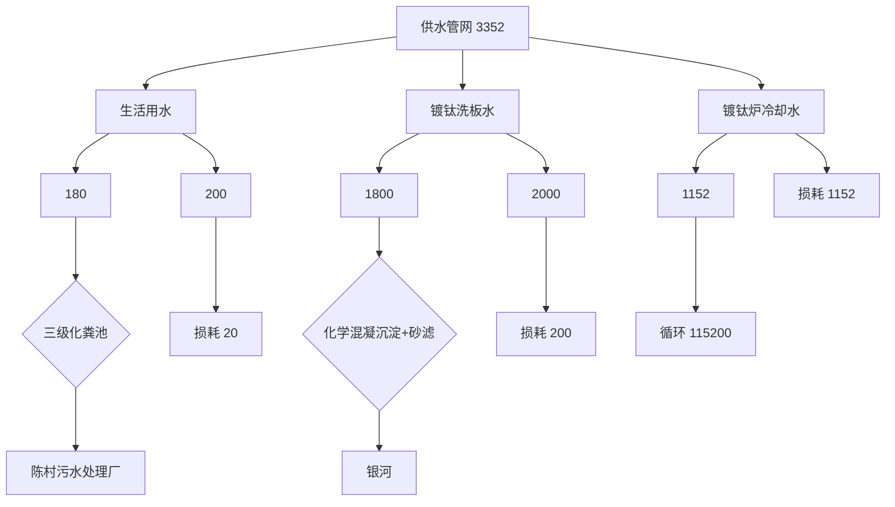
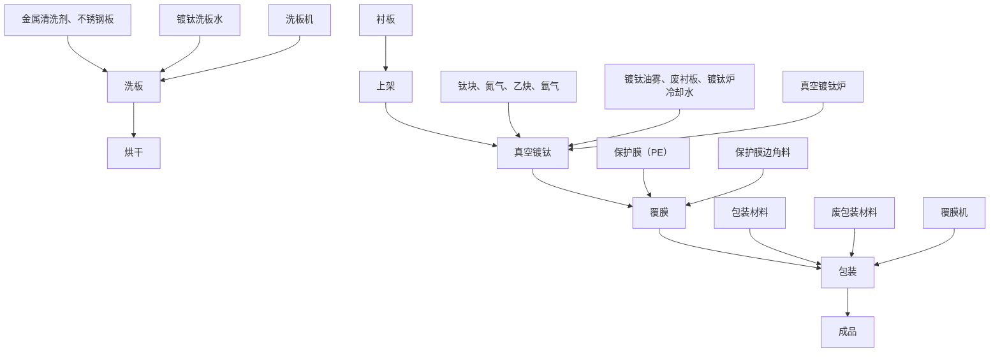
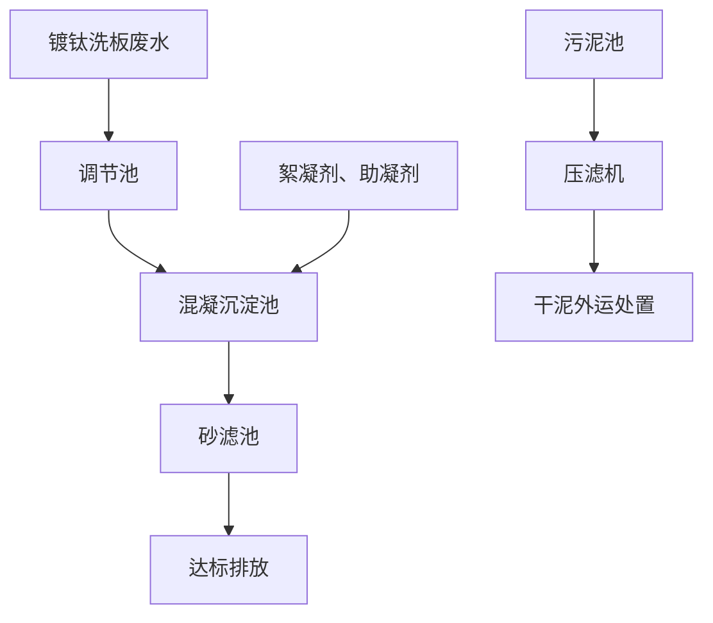
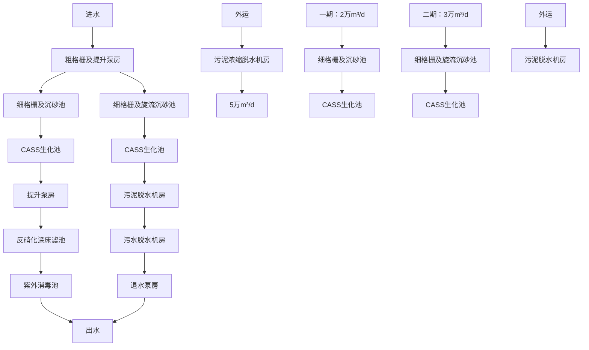
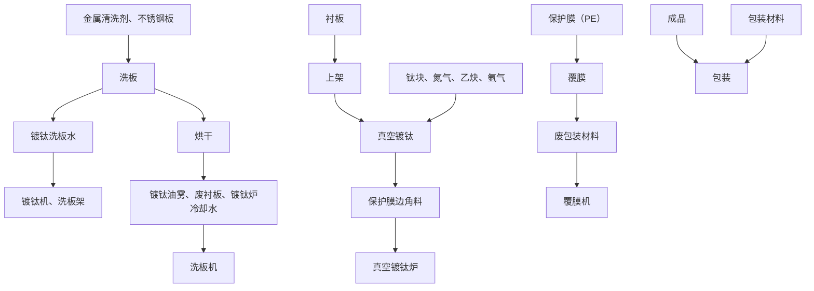
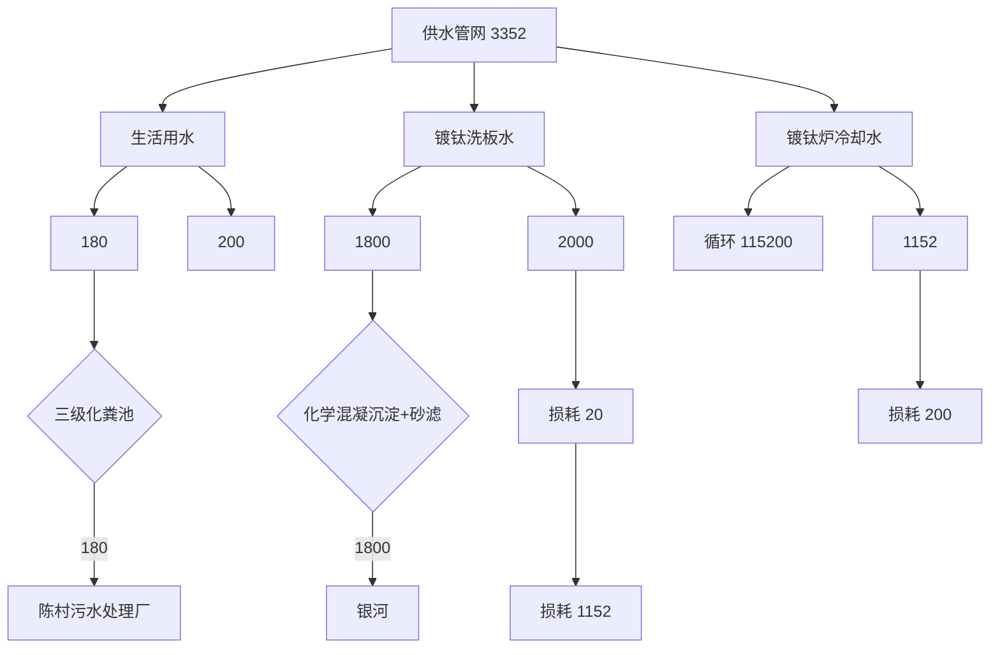
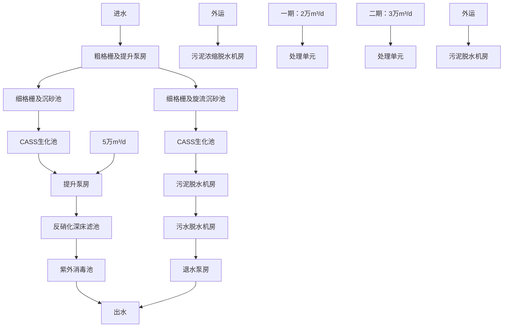

# 建设项目环境影响报告表

（污染影响类）

项目名称：佛山市鑫金宝金属制品有限公司新建项目

建设单位（盖章）：佛山市鑫金宝金属制品有限公司

编制日期：2023年11 月

中华人民共和国生态环境部制

编制单位和编制人员情况表

<table><tr><td>项目编号</td><td colspan="3">8mdlb6</td></tr><tr><td>建设项目名称</td><td colspan="3">佛山市鑫金宝金属制品有限公司新建项目</td></tr><tr><td>建设项目类别</td><td colspan="3">30--067金属表面处理及热处理加工</td></tr><tr><td>环境影响评价文件类型</td><td colspan="3">报告表</td></tr><tr><td colspan="4">一、建设单位情况</td></tr><tr><td>单位名称(盖章)</td><td colspan="3">佛山市鑫金宝金属制品有限公司</td></tr><tr><td>统一社会信用代码</td><td>914</td><td colspan="2"></td></tr><tr><td>法定代表人(签章)</td><td>邓</td><td colspan="2"></td></tr><tr><td>主要负责人(签字)</td><td>邓</td><td colspan="2"></td></tr><tr><td>直接负责的主管人员(签字)</td><td>邓</td><td colspan="2"></td></tr><tr><td colspan="4">二、编制单位情况</td></tr><tr><td>单位名称(盖章)</td><td>#</td><td colspan="2"></td></tr><tr><td>统一社会信用代码</td><td>9</td><td colspan="2"></td></tr><tr><td colspan="4">三、编制人员情况</td></tr><tr><td colspan="4">1.编制主持人</td></tr><tr><td></td><td></td><td></td><td></td></tr><tr><td></td><td></td><td></td><td></td></tr><tr><td colspan="4">2.主要编制人员</td></tr><tr><td></td><td></td><td></td><td></td></tr><tr><td></td><td></td><td></td><td></td></tr><tr><td></td><td></td><td></td><td></td></tr></table>

# 目 录

一、建设项目基本情况.  
二、建设项目工程分析..  
三、区域环境质量现状、环境保护目标及评价标准. 18  
四、主要环境影响和保护措施.. 25  
五、环境保护措施监督检查清单 . 44  
六、结论.. . 46

# 专题一 佛山市鑫金宝金属制品有限公司新建项目水环境影响专项评价

建设项目污染物排放量汇总表

附图1 项目地理位置图

附图2 项目周边环境情况图

附图3 项目周边敏感点分布图

附图4 项目平面布置图

附图5 项目四至照片

附图6 项目现状图

附图7 顺德区环境管控图

附图8 顺德区陈村镇岗北工业区控制性详细规划调整总平面图

附图9 项目周围区域地表水系分布图

附图10 项目所在地声环境功能图

附图11 项目所在地大气环境功能图

附件1 营业执照

附件2 法人身份证

附件3 租赁合同

附件4 房地产权证

附件5 《佛山市鑫赛腾金属制品有限公司竣工环境保护验收检测报告》节选

附件 6 清洗剂 MSDS

附件7 环评委托协议书

附件8 同意公示声明

# 一、建设项目基本情况

<table><tr><td>建设项目名称</td><td colspan="3">佛山市鑫金宝金属制品有限公司新建项目</td></tr><tr><td>项目代码</td><td colspan="3">无</td></tr><tr><td>建设单位联系人</td><td>邓**</td><td>联系方式</td><td>1868829****</td></tr><tr><td>建设地点</td><td colspan="3">佛山市顺德区陈村镇岗北工业区伟业大道5号自编号三车间B</td></tr><tr><td>地理坐标</td><td colspan="3">E 113.211300°, N 23.002145°</td></tr><tr><td>国民经济行业类别</td><td>C3360金属表面处理及热加工</td><td>建设项目行业类别</td><td>三十、金属制品业33-67金属表面处理及热处理加工-其他(年使用非溶剂型低VOCs含量涂料10吨以下的除外)</td></tr><tr><td>建设性质</td><td>☑新建(迁建)□改建□扩建□技术改造</td><td>建设项目申报情形</td><td>☑首次申报项目□不予批准后再次申报项目□超五年重新审核项目□重大变动重新报批项目</td></tr><tr><td>项目审批(核准/备案)部门(选填)</td><td>无</td><td>项目审批(核准/备案)文号(选填)</td><td>无</td></tr><tr><td>总投资(万元)</td><td>50</td><td>环保投资(万元)</td><td>10</td></tr><tr><td>环保投资占比(%)</td><td>20</td><td>施工工期</td><td>1个月</td></tr><tr><td>是否开工建设</td><td>☑否□是: _</td><td>用地(用海)面积(m2)</td><td>占地面积1008;经营面积1008</td></tr><tr><td>专项评价设置情况</td><td colspan="3">1、专项评价名称:佛山市鑫金宝金属制品有限公司新建项目水环境影响专项评价2、专项缘由:根据《建设项目环境影响报告表编制技术指南(污染影响类)》表1专项评价设置原则表,项目属于新增工业废水直排项目,需进行水环境影响专项评价</td></tr><tr><td>规划情况</td><td colspan="3">无</td></tr><tr><td>规划环境影响评价情况</td><td colspan="3">无</td></tr><tr><td>规划及规划环境影响评价符合性分析</td><td colspan="3">无</td></tr><tr><td>其他符合性分析</td><td colspan="3">1、选址用地相符性项目位于佛山市顺德区陈村镇岗北工业区伟业大道5号自编号三车间B(住所申报),根据项目提供的房地产权证(粤房地权证佛字第0300147379号)和租赁合同可知,本项目租用“佛山市顺德区千金实业有限公司”的厂</td></tr></table>

房为项目建设用地，根据房地产权证中描述，该厂房位于陈村镇石洲村委会岗北工业区内，规划用途为工业用地，符合所在地块的土地利用性质。因此建设项目的选址与土地利用规划基本相符。

根据佛山市顺德区陈村镇规划管理办发布的《陈村镇岗北工业园控制性详细规划调整总平面图》，项目所在地位于岗北工业园内，土地利用规划为工业用地。因此本项目的选址符合佛山市顺德区总体规划的要求，符合所在地块的土地利用性质。

根据《顺德区 2018-2020 年村级工业园升级改造三年行动计划项目》，本项目不在“三旧”改造和村级工业园改造范围，因此本项目的选址符合佛山市顺德区总体规划的要求。

# 2、与产业政策符合性分析

本项目为 C3360 金属表面处理及热处理加工，主要从事不锈钢钛金板的生产，根据国家发展改革委商务部关于印发《市场准入负面清单（2022年版）》的通知（发改体改规﹝2022﹞397号），项目不属于上述目录所列的鼓励类、限制类、禁止（淘汰）类严控类项目，也不属于《市场准入负面清单（2022年版）》所列的禁止准入及需许可准入事项。根据《促进产业结构调整暂行规定》（国发〔2005〕40 号）第十三条，项目符合国家有关法律、法规和政策规定，项目属于允许类。根据《产业结构调整指导目录》（2021年修订）》（中华人民共和国国家发展和改革委员会令 第 49 号），项目属于允许类。因此，本项目的建设符合国家和地方的相关产业政策。

本项目为 C3360 金属表面处理及热处理加工，主要从事不锈钢钛金板的生产，不属于《环境保护综合名录（2021年版）》“高污染、高环境风险”、“高环境风险”产品名录内的产品，符合产业政策要求。

# 3、与广东省、佛山市、顺德区“三线一单”生态环境分区管控方案相符性分析

根据《建设项目环境影响评价技术导则-总纲》（HJ2.1-2016），应分析判定建设项目选址选线、规模、性质和工艺路线等与区域布局管控、能源资源利用、污染物排放管控、环境风险防控和环境准入负面清单进行对照，作为开展环境影响评价工作的前提和基础。广东省、佛山市及顺德区三线一单生态环境分区管控方案均已发布。

# （1）与广东省“三线一单”相符性分析

根据《广东省人民政府关于印发广东省“三线一单”生态环境分区管控方案的通知》（粤府〔2020〕71 号）发布的广东省环境管控单元图，项目所在佛山市顺德区陈村镇岗北工业区伟业大道5号自编号三车间B为一般管控单元。

① 与 “ 一带一核一区 ” 区域管控要求的相符性

项目位于珠三角核心区，主要从事不锈钢镀钛板的生产，不属于区域管控要求中的禁止新建、扩建水泥、平板玻璃、化学制浆、生皮制革以及国家规划外的钢铁、原油加工等项目。项目属于新建项目，项目使用的原辅材料均不属于高挥发性有机物原辅材料，符合区域布局管控要求。

项目属于C3360 金属表面处理及热处理加工，主要从事不锈钢钛金板的生产，不属于高能耗行业。项目生产设备能源使用电能，项目用水由市政供应，不直接取用江河湖库，不会对项目所在地生态造成影响，符合能源利用要求,项目生活污水经三级化粪池预处理后排入陈村污水处理厂处理；洗板废水经“化学混凝沉淀+砂滤”处理达标后排入银河。真空镀钛油雾经高效静电油烟净化器处理后引至15m高排气筒高空排放，符合污染物排放管控要求。

佛山市顺德区陈村镇岗北工业区伟业大道5号自编号三车间B，不属于石化、化工重点园环境风险防控区域。项目产生的危险废物拟定期委托有资质的危废处理公司收集处理，并通过信息系统登记转移计划和电子转移联单，符合危险废物全过程跟踪管理的防控要求。

② 与环境管控单元总体管控要求的相符性

根据《广东省人民政府关于印发广东省“三线一单”生态环境分区管控方案的通知》（粤府〔2020〕71号）发布的广东省环境管控单元图，项目所在区域为一般管控单元，执行区域生态环境保护的基本要求。

# （2）与佛山市“三线一单”相符性分析

根据《佛山市人民政府关于印发佛山市“三线一单”生态环境分区管控方案的通知》（佛府〔2021〕11 号）发布的佛山市环境管控单元图，项目位于佛山市顺德区陈村镇岗北工业区伟业大道 5 号自编号三车间B，所在地属于陈村镇重点管控区（单元编码：ZH44060620010）。项目总体符合重点管控单元的要求。具体分析详见与佛山市顺德区“三线一单”生态环境分区管控方案相符性分析。

# （3）与顺德区“三线一单”相符性分析

根据《佛山市顺德区人民政府关于印发佛山市“三线一单”生态环境分区管控方案的通知》（顺府发〔2021〕11 号）发布的佛山市顺德区环境管控单元图（见附图 7），项目所在地属于陈村镇重点管控区（单元编码：

ZH44060620010）。相符性分析详见下表。

表 1-1 与顺德区“三线一单”相符性分析

<table><tr><td>管控要求</td><td>与本项目有关的相关要求</td><td>相符性分析</td><td>相符性</td></tr><tr><td rowspan="6">区域布局管控</td><td>1-1.【产业/鼓励引导类】重点发展智能装备制造、新一代电子信息、新材料等新兴产业;结合TOD片区开发,对接广深港资源,大力发展生产性服务业、高端商务服务业和中小企业总部集群;培育以花卉产业为特色,向电商、会展、文创旅游等延伸的现代农业产业链。</td><td>不涉及</td><td rowspan="6">符合</td></tr><tr><td>1-2.【产业/综合类】系统推进村级工业园升级改造,腾出连片空间,布局产业集聚区和主题产业园,推动工业项目入园集聚发展。新增工业制造业用地原则上安排在产业集聚区内,产业集聚区外原则上不鼓励工业及物流仓储用地的新建与改造。</td><td>不涉及</td></tr><tr><td>1-3.【产业/综合类】产业聚集区所属地块内的工业用地或企业与村庄、学校等环境敏感点之间应设置合理的大气环境防护距离,并通过绿化带进行有效隔离;聚集区规划布局应注重大气污染排放企业应尽量避免布局在居住用地的常年主导风向的上风向。</td><td>项目位于佛山市顺德区陈村镇岗北工业区伟业大道5号自编号三车间B(住所申报),为成型的工业区,项目具体最近的敏感区是位于项目南面的藏珑华府145m。</td></tr><tr><td>1-4.【产业/限制类】受纳水体或监控断面不达标的,不得新建、扩建向河涌直接排放废水的项目。新建、扩建含蚀刻工序的线路板生产项目和化工项目应在配套污水集中处置的工业园区或生活污水管网覆盖区域内建设;纯加工型印花项目,含酸洗、磷化的金属表面处理、金属制品项目(与自身高新技术企业配套的除外),含酸洗、喷涂、化学抛光、电解等涉及废水排放工艺的不锈钢型材加工项目(与自身高新技术企业配套的除外),应进入以此类项目为主导产业、有相应废水集中治理设施的工业园区,实现集中治污。</td><td>项目生活污水经三级化粪池处理达标后排入陈村污水处理厂处理,尾水排入陈村水道;洗板废水经“化学混凝沉淀+砂滤”处理达标后排入银河。项目不包括条款中提及的限制类项目和工序</td></tr><tr><td>1-5.【产业/综合类】划定家具生产优先发展区域,优先发展区外不再新建涉及涂装工艺的木质家具制造项目。</td><td>项目不属于家具制造行业</td></tr><tr><td>1-6.【大气/限制类】大气环境受体敏感重点管控区内,应严格限制新建储油库项目、产生和排放有毒有害大气污染物的建设项目以及使用溶剂型油墨、涂料、清洗剂、胶黏剂等高挥发性有机物原辅材料项</td><td>本项目不先建储油库,也不使用高挥发性有机物原辅材料。</td></tr></table>

<table><tr><td rowspan="10"></td><td rowspan="2"></td><td>目,鼓励现有该类项目搬迁退出。</td><td></td><td colspan="2" rowspan="2"></td></tr><tr><td>1-7.【大气/限制类】大气环境布局敏感区重点管控区内,应严格限制新建生产和使用高挥发性有机物原辅材料项目,优先开展低VOCs含量原辅材料替代,强化无组织排放控制。原则上不再新建、扩建新增氮氧化物、烟(粉)尘排放量较大的建设项目。</td><td colspan="2">项目为新建项目,本项目不涉及VOCs原辅材料的使用。</td></tr><tr><td rowspan="6">能源资源利用</td><td>2-1【能源/鼓励引导类】推广节能技术,加快发展绿色货运与现代物流。</td><td>不涉及</td><td colspan="2" rowspan="6">符合</td></tr><tr><td>2-2【能源/鼓励引导类】推广新能源汽车应用和充电基础设施建设,积极推动重卡LNG加气站、充电基础设施、加氢站建设。</td><td colspan="2">不涉及</td></tr><tr><td>2-3.【能源/综合类】科学实施能源消费总量和强度“双控”,新建高能耗项目单位产品(产值)能耗达到国际国内先进水平。</td><td colspan="2">项目生产过程中资源消耗量相对区域资源利用总量较少。</td></tr><tr><td>2-4.【水资源/综合类】贯彻落实“节水优先”方针,实行最严格水资源管理制度,陈村镇万元国内生产总值用水量、万元工业增加值用水量、用水总量、农田灌溉水有效利用系数等用水总量和效率指标达到区下达要求。</td><td colspan="2">要求项目节约用水,冷却水循环使用;洗板废水经“化学混凝沉淀+砂滤”处理达标后排入银河。</td></tr><tr><td>2-5.【土地资源/限制类】落实单位土地面积投资强度、土地利用强度等建设用地控制性指标要求,提高土地利用效率。</td><td colspan="2">项目位于已建成的工业区厂房。</td></tr><tr><td>2-6.【岸线/禁止类】严格水域岸线用途管制,新建项目一律不得违规占用水域。严禁破坏生态的岸线利用行为和不符合其功能定位的开发建设活动,严禁以各种名义侵占河道、围垦湖泊、非法采砂等。</td><td colspan="2">项目位于已建成的工业区厂房。不涉及岸线土地占用。</td></tr><tr><td rowspan="2">污染物排放管控</td><td>3-1.【水/限制类】城镇新区建设实行雨污分流。住宅、商业体、学校、市场等城镇开发建设项目应当配套或者同步计划建设公共排水设施,公共排水设施或自建排污水设施未能投产运行的,以上涉水项目不得投入使用。新建小区严格实施雨污分流,阳台、露台等污水接入污水收集系统,将生活污水“应截尽截”。做好大型楼盘、集贸市场、餐饮以及学校等4大类排水户污水接入市政管网工作。</td><td>项目不属于村改范围,不属于大型楼盘、集贸市场、餐饮以及学校;项目生活废水经处理达标后均排入陈村污水处理厂处理,尾水排入陈村水道。</td><td colspan="2">符合</td></tr><tr><td>3-2.【水/综合类】陈村镇重点河涌水质上年度未达到水环境环境质量目标的,需组织编制、系统实施、向社会公开区域重点水污染物减排计划并明确“替代量”,本年度新建、改建、扩建项目新增水环境重点污染物实行区域“减二增一”替代(工业、</td><td>项目不属于村级工业园改造;项目生活污水经三级化粪池处理达标后排入陈村污水处理厂处理,尾水排入陈村水道;洗板废水经“化学混凝沉淀+</td><td colspan="2">符合</td></tr><tr><td rowspan="7"></td><td rowspan="5"></td><td colspan="2">生活或综合集中废水处理设施、民生项目除外)。</td><td rowspan="3">砂滤”处理达标后排入银河。</td><td rowspan="5"></td></tr><tr><td colspan="2">3-3.【水/综合类】结合村级工业园改造,全面提升产业层次与集聚度,促进污染集中整治。</td></tr><tr><td colspan="2">3-4.【水/综合类】稳步推进排水设施“三个一体化”管理模式,补齐城乡污水收集和处理短板,推动群力围污水处理厂提质增效,加快消除城中村、老旧城区、城乡结合部等污水收集管网空白区,逐步实现城乡污水收集处理全覆盖。2025年前完成群力围污水处理厂扩建,尾水应执行《城镇污水处理厂污染物排放标准》(GB18918-2002)一级A标准及《广东省水污染物排放限值》(DB44/26-2001)的较严值。</td></tr><tr><td colspan="2">3-5.【水/综合类】完善污水管网建设,逐步取消现状农村污水处理站点,有条件的区域实施雨污分流改造;至2030年全面雨污分流,农村生活污水纳入陈村城镇污水处理系统。</td><td>项目不属于村级工业园改造;项目生活污水经三级化粪池处理达标后排入陈村污水处理厂处理,尾水排入陈村水道</td></tr><tr><td colspan="2">3-6.【水/综合类】产业集聚区和主题园区内做好污水管网和污水集中处理设施的配套保障,确保废水收集到城镇污水处理厂、园区污水处理厂或分散式污水处理设施集中处置。</td><td>项目生活污水经三级化粪池处理达标后排入陈村污水处理厂处理,尾水排入陈村水道;洗板废水经“化学混凝沉淀+砂滤”处理达标后排入银河。</td></tr><tr><td rowspan="2">环境风险管控</td><td colspan="2">4-1.【水/综合类】陈村污水处理厂、工业污水集中处理设施应采取有效措施,防止事故废水直接排入水体。完善污水处理厂在线监控系统联网,实现污水处理厂的实时、动态监管。</td><td>不涉及</td><td rowspan="2">符合</td></tr><tr><td colspan="2">4-3.【风险/综合类】加强环境风险分级分类管理,强化金属制品、有色金属和压延加工、化学原料和化学品制造业等涉重金属、化工行业企业及工业园区等重点环境风险源的环境风险防控。</td><td>不涉及</td></tr><tr><td colspan="6">4、与环保政策符合性分析表1-2本项目与环保政策的相符性</td></tr><tr><td>序号</td><td colspan="2">政策要求</td><td>工程内容</td><td colspan="2">符合性</td></tr><tr><td colspan="6">1.《广东省生态环境保护“十四五”规划》(粤环[2021]10号)</td></tr><tr><td>1.1</td><td colspan="2">珠三角地区禁止新建、扩建水泥、平板玻璃、化学制浆、生皮制革以及国家规划外的钢铁、原油加工等项目</td><td>项目为金属表面处理机热加工行业,不属于水泥、平板玻璃、化学制浆、生皮制革以及国家规划外的钢铁、原油加工等项目。</td><td colspan="2">符合</td></tr></table>

<table><tr><td rowspan="10"></td><td colspan="4">2.《佛山市生态环境保护“十四五”规划》(佛环[2022]3号)</td></tr><tr><td>2.1</td><td>严格控制“高耗能、高排放”项目的发展,禁止新建、扩建水泥、平板玻璃、化学制浆、生皮制革以及国家规划外的钢铁、原油加工等项目。</td><td>项目为金属表面处理机热加工行业,不属于水泥、平板玻璃、化学制浆、生皮制革以及国家规划外的钢铁、原油加工等项目,不属于“高耗能、高排放”项目</td><td>符合</td></tr><tr><td colspan="4">3.《佛山市顺德区生态环境保护“十四五”规划》(2021-2025)</td></tr><tr><td>3.1</td><td>禁止新建、扩建水泥、平板玻璃、化学制浆、生皮制革以及国家规划外的钢铁、原油加工等项目;专业电镀、印染等项目进入定点园区集中管理。</td><td>项目为金属表面处理机热加工行业,不属于水泥、平板玻璃、化学制浆、生皮制革以及国家规划外的钢铁、原油加工等项目,也不属于专业电镀、印染,无需进入定点园区。</td><td>符合</td></tr><tr><td colspan="4">4.《广东省人民政府办公厅关于印发广东省2021年大气、水、土壤污染防治工作方案的通知》(粤办函[2021]58号)</td></tr><tr><td>4.1</td><td>涉VOCs重点行业新建、改建和扩建项目不推荐使用光氧化、光催化、低温等离子等低效治理设施</td><td>项目不涉及VOCs原料;项目使用高效油烟净化器对颗粒物进行处理,不使用上述光氧化、光催化、低温等离子等低效治理设施</td><td>符合</td></tr><tr><td colspan="4">5.《关于加强涉重金属行业污染防控的意见》(环土壤[2018]22号)</td></tr><tr><td>5.1</td><td>重点行业包括重有色金属矿(含伴生矿)采选业(铜、铅锌、镍钴、锡、锑和汞矿采选业等)、重有色金属冶炼业(铜、铅锌、镍钴、锡、锑和汞冶炼等)、铅蓄电池制造业、皮革及其制品业(皮革鞣制加工等)、化学原料及化学制品制造业(电石法聚氯乙烯行业、铬盐行业等)、电镀行业。重点重金属污染物包括铅、汞、镉、铬和类金属砷。进一步聚焦铅锌矿采选、铜矿采选以及铅锌冶炼、铜冶炼等涉铅、涉镉行业;进一步聚焦铅、镉减排,在各重点重金属污染物排放量下降前提下,原则上优先削减铅、镉;进一步聚焦群众反映强烈的重金属污染区域</td><td>项目不涉及以上重点行业,也不涉及重金属污染物的排放</td><td>符合</td></tr><tr><td colspan="4">6.《关于进一步加强重金属污染防治的意见》(环固体[2022]17号)</td></tr><tr><td>6.1</td><td>重点防控的重金属污染物是铅、汞、镉、铬、砷、铊和锑,并对铅、汞、镉、铬和砷五种重点重金属污染物排放量实施总量控制;重点行业包括重金属矿采选业(铜、铅锌、镍钴、锡、锑和汞矿采选),重有色金属冶炼业(铜、铅锌、镍钴、锡、锑和汞冶炼),铅蓄电池制造业,电镀行业,化学原料及化学制品制造业(电石法(聚)氯乙烯制造、铬盐制造、以工业固体废物为原料的锌无机化合物工业),皮革鞣制加工业等6个行业。</td><td>项目不涉及以上重点行业,也不涉及重点防控的重金属污染物的排放。</td><td>符合</td></tr></table>

# 二、建设项目工程分析

# 1、工程概况

佛山市鑫金宝金属制品有限公司新建项目（以下简称“项目”）位于佛山市顺德区陈村镇岗北工业区伟业大道 5 号自编号三车间 B，中心地理坐标为：东经 113.211300°，北纬23.002245°；经营范围：一般项目：金属结构制造；金属材料制造；有色金属压延加工；五金产品制造；金属制品销售；金属材料销售；五金产品批发；五金产品零售；。（除依法须经批准的项目外，凭营业执照依法自主开展经营活动）。项目占地面积为 1008m2，主要从事不锈钢钛金板的生产。

项目目前未投入生产，现按照相关法律法规完善环境影响评价审批手续，待手续完备后，再投入生产。

# 2、项目组成

项目具体工程组成见下表：

表 2-1 工程组成一览表

<table><tr><td>分类</td><td>工程名称</td><td>建设规模</td><td>工程内容</td></tr><tr><td rowspan="2">主体工程</td><td>镀钛生产区</td><td> $500m^{2}$ </td><td>主要用于镀钛作业</td></tr><tr><td>包装区</td><td> $50m^{2}$ </td><td>主要用于覆膜和包装</td></tr><tr><td>辅助工程</td><td>办公室</td><td> $50m^{2}$ </td><td>主要功能用于行政办公。</td></tr><tr><td rowspan="4">储运工程</td><td>原料仓</td><td> $200m^{2}$ </td><td>主要用于储存原料。</td></tr><tr><td>成品仓</td><td> $200m^{2}$ </td><td>主要用于储存成品。</td></tr><tr><td>一般固废暂存点</td><td> $5m^{2}$ </td><td>主要用于储存一般工业固体废物。</td></tr><tr><td>危废暂存点</td><td> $6m^{2}$ </td><td>主要用于储存危险废物。</td></tr><tr><td rowspan="2">公用工程</td><td>供能系统</td><td>50万kw h/a</td><td>供电来源为市政电网,不设备用发电机。</td></tr><tr><td>给水系统</td><td> $1572m^{3}/a$ </td><td>供水来源为市政自来水,主要为员工的生活用水和生产用水。</td></tr><tr><td rowspan="5">环保工程</td><td>生活污水处理工程</td><td> $180m^{3}/a$ </td><td>经三级化粪池预处理后排入陈村污水处理厂处理。</td></tr><tr><td>生产废水处理工程</td><td> $2m^{3}/h$ </td><td>洗板废水经“化学混凝沉淀+砂滤”处理达标后排入银河。</td></tr><tr><td>废气治理工程</td><td> $1200m^{3}/h$ </td><td>由真空镀钛炉机械泵排气管引至高效油烟净化器处理,处理后引至15m高排气筒G1排放</td></tr><tr><td>噪声治理工程</td><td>/</td><td>合理调整设备布置,主要生产设备安装隔震垫,采用隔声、距离衰减等治理措施。</td></tr><tr><td>固废治理工程</td><td>/</td><td>生活垃圾交由环卫部门清运处理;一般工业固体废物交由回收部门回收处理;危险废物交由有资质的单位进行回收处理。</td></tr></table>

建
设
内
容

# 3、产品方案

项目主要从事不锈钢钛金板的生产，项目建成后产品产量见下表。

表 2-2 项目产品方案一览表

<table><tr><td>序号</td><td>产品名称</td><td>单位</td><td>年生产量</td><td>备注</td></tr><tr><td>1</td><td>不锈钢钛金板</td><td>吨</td><td>5000</td><td>25-30kg/张</td></tr></table>

# 4、原料消耗

本项目主要原辅材料及年用量见表2-3。

表 2-3 建设项目原料、辅料消耗表

<table><tr><td>序号</td><td>名称</td><td>单位</td><td>数量</td><td>包装规格</td><td>最大存储量(t)</td><td>使用工序</td></tr><tr><td>1</td><td>不锈钢板</td><td>t/a</td><td>5000</td><td>96kg/捆</td><td>600</td><td></td></tr><tr><td>2</td><td>钛块</td><td>t/a</td><td>3</td><td>50kg/箱</td><td>0.5</td><td>真空镀钛</td></tr><tr><td>3</td><td>衬板</td><td>t/a</td><td>20</td><td>80kg/套</td><td>20套</td><td>上架</td></tr><tr><td>4</td><td>氩气</td><td>t/a</td><td>0.3</td><td>40L/瓶</td><td>0.03</td><td>真空镀钛</td></tr><tr><td>5</td><td>氮气</td><td>t/a</td><td>1.1</td><td>40L/瓶</td><td>0.1</td><td>真空镀钛</td></tr><tr><td>6</td><td>乙炔</td><td>t/a</td><td>1.1</td><td>40L/瓶</td><td>0.1</td><td>真空镀钛</td></tr><tr><td>7</td><td>金属清洗剂</td><td>t/a</td><td>2</td><td>20kg/瓶</td><td>0.2</td><td>洗板</td></tr><tr><td>8</td><td>PE保护膜</td><td>t/a</td><td>80</td><td>20kg/卷</td><td>5</td><td>覆膜</td></tr><tr><td>9</td><td>机油</td><td>t/a</td><td>0.1</td><td>25kg/桶</td><td>0.1</td><td>设备维修</td></tr><tr><td>10</td><td>包装材料</td><td>t/a</td><td>200</td><td>20kg/箱</td><td>50</td><td>包装</td></tr></table>

表 2-4 原辅材料理化性质一览表

<table><tr><td>物质名称</td><td>成分</td><td>物化性质</td></tr><tr><td>金属清洗剂</td><td>表活剂12.3%、磷酸二氢钠1.2%、湿润剂1.2%、其他助剂4%、余量水</td><td>无色或浅黄色液体,为中性清洗剂,沸点100°C,PH为6-7,正常情况下稳定,不燃。</td></tr><tr><td>机油</td><td>基础油90%、抗氧剂2.5%、防锈添加剂0.5%、表面活性剂1%、合成添加剂7%</td><td>闪点(开口)&gt;160°C,粘度(30°C),外观及气味:墨绿色液体,极轻微溶剂气味密度0.86t/m3,倾点(C)小于-10蒸气压力(20°C)30Pa</td></tr></table>

# 5、生产设备

项目主要生产设备及其对应工序见下表：

表 2-5 项目生产设备一览表

<table><tr><td>序号</td><td>设备名称</td><td>单位</td><td>数量</td><td>主要工艺</td><td>位置</td><td>备注</td></tr></table>

<table><tr><td rowspan="7"></td><td>1</td><td colspan="2">镀钛生产线</td><td>条</td><td>2</td><td>/</td><td>/</td><td></td></tr><tr><td>2</td><td rowspan="5">包括</td><td>洗板机</td><td>台</td><td>2</td><td>洗板</td><td>洗板区</td><td>1每台洗板机各配套1个地漏池收集清洗废水,尺寸均为 $10 \times 4 \times 0.3m$ ,项目2台洗板机配置的蓄水池规格相同;22台洗板机共配置1套废水处理设施;3每台洗板机自带烘干灯,用于洗板后烘干不锈钢板</td></tr><tr><td>3</td><td>真空镀钛炉</td><td>台</td><td>3</td><td>镀钛</td><td>镀钛区</td><td>形状均为圆柱体,单个镀钛炉尺寸为 $\Phi 3.9 \times 4.2m$ ,项目3个真空镀钛炉规格相同</td></tr><tr><td>4</td><td>冷却塔</td><td>台</td><td>2</td><td>镀钛</td><td>镀钛区</td><td>间接冷却,循环水量为 $24m^{3}/h$ </td></tr><tr><td>5</td><td>覆膜机</td><td>台</td><td>4</td><td>覆膜</td><td>包装区</td><td>无胶水,无加热</td></tr><tr><td>6</td><td>行车</td><td>台</td><td>2</td><td>辅助设备</td><td>全厂</td><td></td></tr><tr><td>7</td><td colspan="2">空压机</td><td>台</td><td>2</td><td>辅助设备</td><td>镀钛区</td><td></td></tr></table>

表 2-6 项目原辅材料用量与设备的匹配性

<table><tr><td>序号</td><td>设备名称</td><td>数量</td><td>单批次产量(张/批)</td><td>单批次生产时间</td><td>全年生产批次</td><td>关键设备产量(张/年)</td><td>申报产能(张/年)</td></tr><tr><td>1</td><td>真空镀钛机</td><td>3</td><td>15</td><td>30min</td><td>4800</td><td>21.6w</td><td>20w</td></tr><tr><td colspan="8">备注:项目加工的不锈钢板约为25-30kg一张,项目产量为5000t,则产量约为16.7w-20w张/年,按最小规格换算产能,申报产能为20w张,申报产能占最大产能92.6%,考虑维修和停工等问题,本项目的申报产能是合理和匹配的。</td></tr></table>

# 6、公用工程

# （1）给水系统

项目用水由市政给水管网供应。用水主要员工生活用水和生产用水。

①生活用水

项目员工 20 人，厂区不提供食宿，根据《广东省用水定额第 3 部分：生活》（DB44/T

1461.3-2021），项目参照国家行政机构中办公楼，无食堂和浴室的生活用水定额（先进值），即为10m3/（人.年）计，则项目员工生活用水为200m3/a。

②生产用水

A.镀钛洗板水

根据项目提供资料及行业经验，每洗 100张板约用水 1t，按最大产能20w张/年，则洗板需水量为 2000m3/a。

B、镀钛炉冷却水

项 目 单 台冷 却 塔 循环水 量 为 $2 4 \mathrm { m } ^ { 3 } / \mathrm { h }$ ， 根 据 《 工 业 循环 冷 却 水处理 设 计 规范 》（GB50050-2017）说明，循环冷却水系统蒸发水量约占循环水量的 1.0%，本项目取新水补充量占循环水量的1.0%。项目冷却塔与真空镀钛炉同步工作，年工作时间为 300天，每天工作8 小时。

项目设2台冷却塔，则镀钛冷却总循环水量为115200m3/a，新鲜水补充量为1152m3/a。综上，项目生产用水总用量为 3152m3/a。

# （2）排水系统

①生活污水

项目生活污水排放系数为0.9，生活污水排放量约为180m3/a，生活污水经三级化粪池预处理后排入市政污水管网引至陈村污水处理厂处理，尾水排入陈村水道。

②生产废水

项目镀钛炉冷却水循环使用不外排；

项目镀钛洗板水产生系数为 0.9，则生产废水产生量为 1800m3/a，经“化学混凝沉淀+砂滤”处理后排入银河。

表 2-7 水平衡表

<table><tr><td rowspan="2">用水工序</td><td colspan="3">用水量</td><td rowspan="2">排水量</td><td rowspan="2">损耗量</td><td rowspan="2">废水性质</td></tr><tr><td>新鲜水</td><td>逆流用水</td><td>回用水</td></tr><tr><td>生活用水</td><td>200</td><td>0</td><td>0</td><td>180</td><td>20</td><td>生活污水</td></tr><tr><td>洗板工序</td><td>2000</td><td>0</td><td>0</td><td>1800</td><td>200</td><td>清洗废水</td></tr><tr><td>冷却工序</td><td>1152</td><td>0</td><td>115200</td><td>0</td><td>1152</td><td>/</td></tr><tr><td>合计</td><td>3352</td><td>0</td><td>115200</td><td>1980</td><td>1372</td><td>/</td></tr></table>

项目水平衡图见图 2-1。

单位：m/a

flowchart

图 2-1 项目水平衡图

# （3）供电工程

本项目用电由当地市政电网供应，根据建设单位提供资料，本项目年用电量约为 50 万千瓦时，项目内不设备用发电机。

表 2-8 能耗水耗一览表

<table><tr><td>序号</td><td colspan="2">名称</td><td>单位</td><td>年用量</td><td>用途</td><td>备注</td></tr><tr><td>1</td><td rowspan="2">水</td><td>生活用水</td><td>t/a</td><td>200</td><td>办公、生活</td><td rowspan="2">市政供水</td></tr><tr><td>2</td><td>生产用水</td><td>t/a</td><td>3152</td><td>清洗、冷却</td></tr><tr><td>3</td><td colspan="2">电</td><td>万千瓦时/年</td><td>50</td><td>生产、生活</td><td>市政供电</td></tr></table>

# 7、劳动动员及工作制度

工作制度：项目年工作日 300天，每天工作8小时（工作时间为 8:00-12:00、13:30-17:30）。

劳动定员：项目员工定员为20人，项目不提供食宿。

# 8、厂区平面布置

项目租用佛山市顺德区陈村镇岗北工业区伟业大道5号自编号三车间B，占地面积1008m2，经营面积为1008m2，主要为镀钛区、洗板区、包装区、办公室、仓库等。项目厂区具体平面布置见附图4。

项目项目所在建筑东面为工业区内部道路、南面为伟业大道、西面为佛山市顺德区千金

实业有限公司、北面为佛山市鑫赛腾金属制品有限公司。

# 9、环保投资情况

根据《建设项目环境保护设计规定》中的有关条款和有关环境保护法规，结合本环境保护和污染防治工作拟采用一些必要的工程措施，对本环境保护投资进行了估算，项目总投资为50万，环保投资10 万，环保投资具体结果见表2-9。

表 2-9 项目环保投资一览表

<table><tr><td>序号</td><td>工程类别</td><td>环保措施名称</td><td>投资(万元)</td><td>占项目总投资比例(%)</td></tr><tr><td>1</td><td>废水处理工程</td><td>化学混凝沉淀+砂滤</td><td>8</td><td>16</td></tr><tr><td>2</td><td>废气处理工程</td><td>高效静电油烟净化器</td><td>1</td><td>2</td></tr><tr><td>3</td><td>噪声防治工程</td><td>设备减振、墙体隔声等</td><td>0.5</td><td>1</td></tr><tr><td>4</td><td>固体废物</td><td>危废暂存间</td><td>0.5</td><td>1</td></tr><tr><td colspan="3">小计</td><td>10</td><td>20</td></tr></table>

# 1、工艺流程简述

本项目主要从事不锈钢钛金板的生产，具体生产工艺及产污流程如下图：

flowchart

工艺流程说明：

清洗：将外购的不锈钢板用金属清洗剂擦拭后使用中水/自来水清洗，洗板过程产生一定量的镀钛洗板废水。

烘干：利用洗板机自带的烘干灯对清洗干净的不锈钢板进行电烘干。

上架、真空镀钛：先将衬板上架进入镀钛炉以保护镀钛炉内壁，再将完成烘干后的不锈钢板上架到真空镀钛炉内进行真空镀钛，镀钛炉抽真空后加入氩气、氮气等气体进行调色。真空镀钛加工是指在真空条件下，采用低电压、大电流的电弧放电技术，利用真空镀膜设备气体放电使钛块蒸发并使被蒸发物质与气体都发生电离（工作温度控制在 140℃\~180℃之间），利用电场的加速作用，使被蒸发物质沉积在工件上。真空镀钛时分两步抽真空，第一步抽低真空，然后抽高真空。低真空由机械泵完成，高真空由扩散泵完成，真空镀钛废气由机械泵排气管排出。

项目真空镀钛时会产生少量镀钛油雾（颗粒物）和废衬板，同时项目为防止真空镀钛炉负荷运作而导致设备过热造成损坏，每个真空镀钛炉配置 1 台冷却塔作为辅助设备辅助冷却，所有冷却水通过管道循环于真空镀钛炉和冷却塔之间，冷却水通过热交换进行间接冷却，不直接与产品及生产设备接触。冷却过程中产生镀钛炉冷却水，该镀钛炉冷却水循环利用，定期补充新鲜水，无需更换，不对外排放。

覆膜：出炉后用覆膜机在不锈钢板上贴上保护膜，保护膜直接附着到产品表面上，生产

过程无加热工序，也无胶黏剂，过程中产生少量的保护膜边角料。

包装：最后人工对生产出来的不锈钢钛金板进行包装即得成品，包装过程中产生少量废包装材料。

# 2、产污情况

根据以上分析可知，本项目运营期间产生的主要污染物及配套设施见表2-10。

表 2-10 项目产污环节及配套设施一览表

<table><tr><td>污染源</td><td colspan="2">产污环节</td><td>污染源名称</td><td>主要污染物</td><td>配套设施</td></tr><tr><td rowspan="3">废水</td><td colspan="2">员工生活</td><td>生活污水</td><td> $COD_{cr}$ 、 $BOD_5$ 、SS、 $NH_3-N$ </td><td>生活污水经三级化粪池预处理后排入陈村污水处理厂处理。</td></tr><tr><td rowspan="2">镀钛工艺</td><td>洗板</td><td>镀钛洗板废水</td><td>COD、BOD、SS、氨氮、石油类</td><td>经“化学混凝沉淀+砂滤”处理达标后排入银河</td></tr><tr><td>镀钛</td><td>镀钛炉冷却水</td><td>SS</td><td>循环利用,定期补充新鲜水,无需更换,不对外排放</td></tr><tr><td>废气</td><td colspan="2">镀钛工艺</td><td>镀钛油雾</td><td>颗粒物</td><td>由管道从真空镀钛炉内引至高效静电油烟净化器净化处理,处理后引至15m高排气筒G1排放</td></tr><tr><td>噪声</td><td colspan="2">生产过程</td><td colspan="2">设备运行噪声</td><td>墙体隔声、基础减振、合理布局噪声源</td></tr><tr><td rowspan="3">固废</td><td colspan="2">员工生活</td><td colspan="2">生活垃圾、厨余垃圾</td><td>交环卫部门清运</td></tr><tr><td rowspan="2" colspan="2">生产过程</td><td>一般工业固体废物</td><td>保护膜边角料、废包装材料、废衬板</td><td>分类交回收商回收利用</td></tr><tr><td>危险废物</td><td>废机油、废含油抹布和手套、废机油桶、污水处理污泥、废真空泵油、废清洗剂包装物</td><td>定期交由具有相应危险废物处理资质的单位回收处理</td></tr></table>

<table><tr><td>与项目有关的原有环境污染问题</td><td>本项目为新建项目,拟选址于佛山市顺德区陈村镇岗北工业区伟业大道5号自编号三车间B。项目项目项目所在建筑东面为工业区内部道路、南面为伟业大道、西面为佛山市顺德区千金实业有限公司、北面为佛山市鑫赛腾金属制品有限公司。项目利用现有厂房建设,不涉及土建施工,没有与项目有关的原有环境污染问题。</td></tr></table>

# 三、区域环境质量现状、环境保护目标及评价标准

# 1、评价区域环境功能属性

本项目所在区域环境功能属性见下表 3-1：

表 3-1 本项目所在区域环境功能属性

<table><tr><td>编号</td><td>功能区名称</td><td>功能区确定依据</td><td>功能区类别及属性</td></tr><tr><td>1</td><td>水环境功能区</td><td>《佛山市顺德区生态环境保护“十四五”规划(2021-2025)》</td><td>陈村水道为III类水质目标水体;银河为V类水质目标水体。</td></tr><tr><td>2</td><td>环境空气质量功能区</td><td>《佛山市顺德区生态环境保护“十四五”规划(2021-2025)》</td><td>大气环境为二类功能区</td></tr><tr><td>3</td><td>声环境功能区</td><td>《关于印发佛山市声环境功能区划分方案的通知》(佛府函〔2015〕72号)</td><td>3类声环境功能区(编号3308)</td></tr><tr><td>4</td><td>基本农田保护区</td><td>《顺德区土地利用总体规划(2010-2020)》(粤府函〔2015〕37号)</td><td>否</td></tr><tr><td>5</td><td>风景名胜区、自然保护区、森林公园、重点生态功能区</td><td>《广东省主体功能区划》(粤府〔2012〕120号)</td><td>否</td></tr><tr><td>6</td><td>重点文物保护单位</td><td>《顺德区文物保护单位名录》</td><td>否</td></tr><tr><td>7</td><td>是否水源保护区</td><td>--</td><td>否</td></tr><tr><td>8</td><td>是否污水处理厂纳污范围</td><td>--</td><td>是,属于陈村污水处理厂的纳污范围</td></tr></table>

# 2、大气环境质量现状

根据《佛山市顺德区生态环境保护“十四五”规划（2021-2025）》，顺德区全境为环境空气质量功能二类区。环境空气质量执行《环境空气质量标准》（GB3095-2012 及其 2018 年修改单）中的二级标准。

# （1）基本污染物

根据《环境影响评价技术导则-大气环境》（HJ2.2-2018）第 6.4.1.1 条规定，城市环境空气质量达标情况评价指标为 $\mathrm { S O _ { 2 } \cdot \ N O _ { 2 } \cdot \ P M _ { 1 0 } \cdot \ P M _ { 2 . 5 } }$ 、CO 和 ${ { \mathrm O } _ { 3 } }$ ，六项污染物全部达标即为城市环境空气质量达标。

第6.4.1.2条规定，根据国家或地方生态环境主管部门公开发布的城市环境空气质量达标情况，判断项目所在区域是否属于达标区，因此本报告采用《佛山市生态环境局顺德分局关于发布2022 年度佛山市顺德区环境质量状况公报的通知》（佛环顺函〔2023〕26号）作为判断依据。

根据公报，2022年顺德区（国控测点）环境空气污染物浓度及达标评价情况数据和结论如下。

按照《环境空气质量标准》评价，2022 年顺德区二氧化硫 $( { \bf { S O } } _ { 2 } )$ 、二氧化氮 $( \mathrm { N O } _ { 2 } )$ 、可吸入颗粒物 $\left( \mathrm { P M } _ { 1 0 } \right)$ 、细颗粒物 $\left( \mathbf { P M } _ { 2 . 5 } \right)$ ）、一氧化碳（CO）五项污染物指标浓度均达到《环境空气质量标准》（GB3095-2012）及其修改单二级标准限值，臭氧 $( \mathbf { O } _ { 3 } )$ 超标。

表 3-2 2022年顺德区（国控测点）环境空气污染物浓度及达标评价情况

<table><tr><td>序号</td><td>污染物</td><td>平均时间</td><td>平均浓度</td><td>评价标准</td><td>达标评价</td></tr><tr><td>1</td><td> $SO_{2}$ </td><td>年平均浓度</td><td> $5μg/m^{3}$ </td><td> $60μg/m^{3}$ </td><td>达到(GB3095-2012)二级标准</td></tr><tr><td>2</td><td> $NO_{2}$ </td><td>年平均浓度</td><td> $29μg/m^{3}$ </td><td> $40μg/m^{3}$ </td><td>达到(GB3095-2012)二级标准</td></tr><tr><td>3</td><td> $PM_{10}$ </td><td>年平均浓度</td><td> $32μg/m^{3}$ </td><td> $70μg/m^{3}$ </td><td>达到(GB3095-2012)二级标准</td></tr><tr><td>4</td><td> $PM_{2.5}$ </td><td>年平均浓度</td><td> $19μg/m^{3}$ </td><td> $35μg/m^{3}$ </td><td>达到(GB3095-2012)二级标准</td></tr><tr><td>5</td><td>CO</td><td>24小时均值第95百分位数</td><td> $1.1mg/m^{3}$ </td><td> $4mg/m^{3}$ </td><td>达到(GB3095-2012)二级标准</td></tr><tr><td>6</td><td> $O_{3}$ </td><td>最大8小时值第90百分位数</td><td> $190μg/m^{3}$ </td><td> $160μg/m^{3}$ </td><td>超出(GB3095-2012)二级标准</td></tr></table>

根据上表可知，2022 年顺德区环境空气污染物 $\mathrm { O } _ { 3 }$ 指标浓度超标，其余五项指标浓度均达到《环境空气质量标准》（GB3095-2012）及其修改单二级标准限值。根据《环境影响评价技术导则-大气环境》（HJ2.2-2018）的规定，判定本项目所在的顺德区为不达标区。

顺德区设置了环境空气质量达标规划的目标，并通过优化产业结构和布局，推进能源结构调整，不断巩固火电行业超低排放和工业锅炉整治成果，深化机动车船等移动污染源污染控制，加快推进挥发性有机物综合整治，提高扬尘、餐饮业管理水平，促进多污染物协同控制及区域联防联控，提升大气污染精细化防控能力。届时，佛山市顺德区的环境空气质量将得到较大改善。

# （2）其他污染物

为了解评价区域内TSP 的现状情况，报告引用要引用江门市信安环境监测检测有限公司于 2020 年 11 月 27 日\~2020 年 12 月 3 日对文海村的监测数据进行评价（监测报告编号为：XJ2011210501）。监测点 G1 距离本项目边界最近距离约 2124m（东南面）。监测点位于本项目 5 公里范围内，且数据在 3 年有效期内，因此本报告引用上述监测点的环境空气质量监测数据评价本项目所在区域环境空气现状质量具有合理性，各补充监测点位基本信息见表 3-3、污染物环境质量现状监测结果表 3-4。

表 3-3污染物补充监测点位基本信息

<table><tr><td rowspan="2">监测点位</td><td colspan="2">监测点坐标</td><td rowspan="2">监测因子</td><td rowspan="2">监测时段</td><td rowspan="2">相对厂址方位</td><td rowspan="2">相对厂界距离/m</td></tr><tr><td>X</td><td>Y</td></tr><tr><td>G1</td><td>1095</td><td>-1780</td><td>TSP</td><td>2020年11月27日~2020年12月3日</td><td>东南面</td><td>2124</td></tr></table>

表 3-4污染物环境质量现状监测结果表

<table><tr><td>监测点位</td><td>污染物</td><td>监测时段</td><td>评价标准/(mg/m3)</td><td>监测浓度范围/(mg/m3)</td><td>超标率/%</td><td>达标情况</td></tr><tr><td>G1</td><td>TSP</td><td>24小时</td><td>0.3</td><td>0.092~0.205</td><td>0</td><td>达标</td></tr></table>

根据监测结果，项目所在区域区域空气中特征污染物 TSP 的日平均浓度达到《环境空气质量标准》（GB3095-2012）及其修改单的二级标准。

# 3、水环境质量现状

项目运营期生活污水经三级化粪池预处理后排入陈村污水处理厂处理，尾水排入陈村水道，根据《佛山市顺德区生态环境保护“十四五”规划（2021-2025）》，陈村水道属于Ⅲ类水质目标水体。

为评价陈村水道水质，引用《佛山市生态环境局顺德分局关于发布2022 年度佛山市顺德区环境质量状况公报的通知》（佛环顺函〔2023〕26号），断面水质情况及达标评价情况数据和结论如下：

表 3-5 2022年度佛山市顺德区环境质量状况公报（节选）

<table><tr><td rowspan="2">序号</td><td rowspan="2">河流名称</td><td rowspan="2">断面</td><td colspan="2">断面定类</td><td rowspan="2">水质评价标准</td><td colspan="2">河流定类</td></tr><tr><td>2022年</td><td>2021年</td><td>2022年</td><td>2021年</td></tr><tr><td>1</td><td>吉利涌</td><td>平步</td><td>II</td><td>II</td><td>III</td><td>II</td><td>II</td></tr><tr><td>2</td><td>潭洲水道上游</td><td>潭村</td><td>II</td><td>II</td><td>II</td><td>II</td><td>II</td></tr><tr><td>3</td><td>潭洲水道下游</td><td>西海</td><td>II</td><td>II</td><td>III</td><td>II</td><td>II</td></tr><tr><td>4</td><td>陈村水道</td><td>江口</td><td>III</td><td>III</td><td>III</td><td>III</td><td>III</td></tr><tr><td>5</td><td>陈村涌</td><td>四方磨</td><td>III</td><td>III</td><td>III</td><td>III</td><td>III</td></tr><tr><td>6</td><td rowspan="2">顺德水道</td><td>杨滘</td><td>II</td><td>II</td><td>II</td><td rowspan="2">II</td><td rowspan="2">II</td></tr><tr><td>7</td><td>大闸</td><td>II</td><td>II</td><td>II</td></tr></table>

从公报可知，陈村水道江口断面 2022年的水质定类为Ⅲ类标准的要求，故水质较好。

项目运营期生产废水经“化学混凝沉淀+砂滤”处理达标后排入银河，项目水评价范围为排污口上游 500m 到下游 1500m，为了解项目周边水环境质量现状，建设项目委托广东众笙检测有限公司于2023年9月26日-28日对银河、文海内河、文登河、文海河水质进行监测，

<table><tr><td></td><td colspan="7">监测点位和监测数据详见《佛山市鑫金宝金属制品有限公司新建项目水环境影响专项评价》环境现状调查与评价。根据《佛山市顺德区生态环境保护“十四五”规划(2021-2025)》,银河属于V类水质目标水体。根据监测数据,银河、文海内河、文登河、文海河地表水环境均能达到《地表水环境质量标准》(GB3838-2002)V类标准。4、声环境质量现状根据《佛山市人民政府关于印发佛山市声环境功能区划分方案的通知》(佛府函〔2015〕72号),项目所在地属于岗北工业区(编号3308),属于3类声功能区,声环境质量执行《声环境质量标准》(GB3096-2008)中的3类标准,即昼间≤65dB(A),夜间≤55dB(A)。项目厂界外50m范围内无声环境敏感目标。5、生态环境项目用地范围内无生态环境保护目标,无需开展生态现状调查。6、土壤、地下水环境项目不存在土壤、地下水环境污染途径,不开展土壤,地下水环境质量现状调查。</td></tr><tr><td rowspan="6">环境保护目标</td><td colspan="7">本项目的主要环境保护目标是保护好项目所在地周边评价区域环境质量,采取有效的环保措施,使该项目在建设开展和生产运行中能够保持区域原有的环境空气质量、水环境质量和声环境质量。1、环境空气保护目标本项目所在地为大气环境二类功能区,大气环境保护目标为确保项目所在区域的空气质量不因本项目的建设造成明显不利的影响,不因本项目的建设改变现在的质量等级状况,本项目所在区域环境空气质量执行《环境空气质量标准》(GB3095-2012)及其修改单的二类标准。厂界500米范围内保护目标见表3-6。表3-6主要大气环境保护目标</td></tr><tr><td>敏感点名称</td><td>保护对象</td><td>保护内容</td><td>环境功能区</td><td>相对厂址方位</td><td colspan="2">相对厂界距离/m</td></tr><tr><td>藏珑华府</td><td>住宅</td><td>环境空气</td><td>大气二类</td><td>南面</td><td colspan="2">145</td></tr><tr><td>朵朵国际双鱼幼儿园</td><td>住宅</td><td>环境空气</td><td>大气二类</td><td>西南</td><td colspan="2">345</td></tr><tr><td>碧桂园印象花城</td><td>住宅</td><td>环境空气</td><td>大气二类</td><td>西南</td><td colspan="2">480</td></tr><tr><td colspan="7">2、声环境保护目标声环境保护目标是确保该建设项目建成后其周围的地区有一个安静、舒适的工作和生活环境,使项目四周的声环境质量不因本项目的运行而受到不良影响。保护项目周边环境质量</td></tr><tr><td></td><td colspan="7">符合《声环境质量标准》(GB3096-2008)中的3类标准要求;项目厂界外50m范围内无声环境保护目标。3、地下水水环境保护目标项目所在位置(及厂界外500m范围)属于地下水不宜开采区,不存在集中式饮用水水源等环境保护目标。4、生态环境保护目标项目用地范围内无生态环境保护目标,无需开展生态现状调查。5、地表水水环境保护目标根据《广东省人民政府关于调整佛山市部分饮用水水源保护区的批复》(粤府函〔2018〕426号),项目不属于水源保护区内。本项目生活污水经三级化粪池预处理后排入陈村污水处理厂处理,尾水排入陈村水道;生产废水经“化学混凝沉淀+砂滤”处理达标后排入银河。严格控制本项目外排废水(生产废水)中主要污染物CODcr、NH3-N、SS、BOD5、石油类等的排放,确保评价区内的地面水环境质量不因本项目的建设而变差。保护项目纳污水体银河、文海内河保护级别为《地表水环境质量标准》(GB3838-2002)中的V类标准。</td></tr><tr><td rowspan="6">污染物排放控制标准</td><td colspan="7">1、水污染物排放标准项目生产废水经“化学混凝沉淀+砂滤”处理后达到《水污染物排放限值》(DB44/26-2001)中的第二时段二级标准排入银河;生活污水经三级化粪池处理达到《水污染物排放限值》(DB44/26-2001)中的第二时段三级标准后经市政管网排至陈村污水处理厂处理,处理后尾水排入陈村水道。根据2013年7月11日颁布的《顺德区环境运输和城市管理局关于全区城镇污水处理厂尾水排放执行标准的通知》规定:提标改造后执行国家标准《城镇污水处理厂污染物排放标准》(GB18918-2002)一级A标准及广东省地方标准《水污染物排放限值》(DB44/26-2001)第二时段一级标准的较严值。详见表3-7。表3-7项目生活污水排放执行标准(mg/L,pH除外)</td></tr><tr><td>污染物</td><td>pH(无量纲)</td><td>CODCr</td><td>BOD5</td><td>SS</td><td>氨氮</td><td>石油类</td></tr><tr><td>DB44/26-2001第二时段三级标准</td><td>6~9</td><td>500</td><td>300</td><td>400</td><td>/</td><td>20</td></tr><tr><td>DB44/26-2001第二时段二级标准</td><td>6~9</td><td>110</td><td>30</td><td>100</td><td>15</td><td>8</td></tr><tr><td>污水处理厂尾水</td><td>6~9</td><td>40</td><td>10</td><td>10</td><td>5</td><td>1</td></tr><tr><td colspan="7">2、大气污染物排放标准</td></tr></table>

本项目不锈钢板镀钛过程中会产生镀钛油雾，其污染因子表征为颗粒物，由真空镀钛炉机械泵连接管道引至高效静电油烟净化器净化处理，处理后引至 15m 高的排气筒 G1 排放。有组织排放的颗粒物执行《大气污染物排放限值》（DB44/27-2001）表 2 工艺废气大气污染物排放限值（第二时段）二级标准。无组织排放的颗粒物执行《大气污染物排放限值》（DB44/27-2001）中表 2 工艺废气大气污染物排放限值（第二时段）无组织排放监控浓度限值。

具体排放标准见表 3-8。

表 3-8 项目大气污染物排放标准表

<table><tr><td rowspan="3">污染源</td><td rowspan="3">工序</td><td rowspan="3">污染物名称</td><td colspan="3">排放标准限值</td><td rowspan="3">执行标准</td></tr><tr><td>有组织排放浓度</td><td>排放速率</td><td>无组织排放浓度</td></tr><tr><td> $mg/m^3$ </td><td>kg/h</td><td> $mg/m^3$ </td></tr><tr><td>G1排气筒(15m)</td><td>真空镀钛</td><td>颗粒物</td><td>120</td><td>2.9</td><td>1.0</td><td>《大气污染物排放限值》(DB44/27-2001)</td></tr></table>

# 3、噪声排放标准

厂界噪声排放执行《工业企业厂界环境噪声排放标准》（GB12348-2008）中的 3类标准，详见表3-9。

$\yen 323,456,789$ 

<table><tr><td>类别</td><td>昼间(6:00~22:00)</td><td>夜间(22:00~6:00)</td></tr><tr><td>3类</td><td>65dB(A)</td><td>55dB(A)</td></tr></table>

# 4、固体废物污染控制标准

固体废物管理应遵照《中华人民共和国固体废物污染环境防治法》、《广东省固体废物污染环境防治条例》的要求；一般固体废物暂存于一般固体废物仓库，仓库应满足防渗漏、防雨淋、防扬尘等要求。危险废物执行《国家危险废物名录（2021年版）》以及《危险废物贮存污染控制标准》（GB18597-2023）。

# 1、水污染物总量控制分析：

项目运营期外排废水主要为生活污水和生产废水。

生活污水经三级化粪池预处理后排入陈村污水处理厂处理，尾水排入陈村水道。经核算，生活污水排放量为 180m3/a，CODcr 排放量为 0.0072t/a， $\mathrm { N H } _ { 3 ^ { - } } \mathrm { N }$ 排放量为 0.0009t/a。

根据《佛山市排污权有偿使用和交易管理办法》（佛府办〔2020〕19号），生活污水 CODcr、$\mathrm { N H } _ { 3 ^ { - } } \mathrm { N }$ 不分配总量。

生产废水经“化学混凝沉淀+砂滤”处理达标后排入银河。经核算，生产废水的排放量为1800 m3/a，CODcr 排放量为 0.0648t/a，NH -N 排放量为 0.0022t/a。

根据《佛山市排污权有偿使用和交易管理办法》（佛府办[2020]第 19 号），需对生产废水的 CODcr、NH -N 进行总量控制，经核算，项目总量指标为 CODcr 排放量为 0.0648t/a，$\mathrm { N H } _ { 3 ^ { - } } \mathrm { N }$ 排放量为 0.0022t/a。

# 2、大气污染物总量控制分析：

本项目产生的废气主要为颗粒物，不涉及挥发性有机物、二氧化硫、氮氧化物等排放的情况，故本项目无需申请大气污染物排放总量指标。

表 3-10 项目总量控制指标一览表（单位 t/a）

<table><tr><td colspan="2">要素</td><td>排放量</td><td>需分配的总量</td></tr><tr><td rowspan="3">生活污水</td><td>废水排放量</td><td>180</td><td>/</td></tr><tr><td>CODcr</td><td>0.0072</td><td>/</td></tr><tr><td>氨氮</td><td>0.0009</td><td>/</td></tr><tr><td rowspan="3">生产废水</td><td>废水排放量</td><td>1800</td><td>/</td></tr><tr><td>CODcr</td><td>0.0648</td><td>0.0648</td></tr><tr><td>氨氮</td><td>0.0022</td><td>0.0022</td></tr></table>

# 四、主要环境影响和保护措施

<table><tr><td>施工期环境保护措施</td><td colspan="14">本项目厂区为租用已建厂房,项目只是需要在车间内进行机械设备的安装和调试,主要是人工作业,无大型机械入内,施工期基本无废水、废气、固废产生,机械噪音也较小,无施工期的环境影响问题。</td></tr><tr><td rowspan="5">运营期环境影响和保护措施</td><td colspan="14">1、废气项目主要产生的大气废气为真空镀钛工序产生的油雾。表4-1废气污染物排放情况一览表</td></tr><tr><td rowspan="2">产排污环节</td><td rowspan="2">生产单元</td><td rowspan="2">污染物种类</td><td colspan="2">污染物产生情况</td><td rowspan="2">排放形式</td><td colspan="5">治理措施</td><td colspan="3">污染物排放</td></tr><tr><td>产生量(t/a)</td><td>产生浓度(mg/m3)</td><td>废气排放量(m3/h)</td><td>收集率(%)</td><td>处理工艺</td><td>去除率(%)</td><td>是否可行技术</td><td>排放浓度(mg/m3)</td><td>排放速率(kg/h)</td><td>排放量(t/a)</td></tr><tr><td rowspan="2">镀钛</td><td rowspan="2">镀钛G1</td><td>颗粒物</td><td>0.0854</td><td>29.7</td><td>有组织</td><td>1200</td><td>95</td><td>高效静电油烟净化器</td><td>80</td><td>是</td><td>5.92</td><td>0.0071</td><td>0.0171</td></tr><tr><td>颗粒物</td><td>0.0045</td><td>/</td><td>无组织</td><td>/</td><td>/</td><td>/</td><td>/</td><td>/</td><td>0.0012</td><td>0.0019</td><td>0.0045</td></tr></table>

表 4-2 废气排放口信息一览表

<table><tr><td rowspan="2">排放口编号及名称</td><td colspan="4">排放口基本情况</td><td colspan="2">地理坐标</td></tr><tr><td>高度(m)</td><td>内径(m)</td><td>温度(°C)</td><td>类型</td><td>东经</td><td>北纬</td></tr><tr><td>镀钛工艺排放口G1</td><td>15</td><td>1</td><td>30</td><td>一般排放口</td><td>113.211053</td><td>23.002280</td></tr></table>

# （1）废气源强核算

# ②镀钛油雾

项目镀钛过程中会产生少量的镀钛油雾，污染因子为颗粒物。

项目设有 2台镀钛炉，镀钛过程中产生的镀钛油烟经镀钛炉内的排气管引至高效静电油烟净化器处理，处理后引至排气筒G1进行高空排放。

项目类比同类项目《佛山市鑫赛腾金属制品有限公司新建项目》（批复文号：佛环0305环审[2022]68号），该公司主要从事不锈钢镀钛板的生产，其生产产品及镀钛生产工艺与本项目一致。参考《佛山市鑫赛腾金属制品有限公司竣工环境保护验收检测报告》（报告编号：ZP/BG-230508Aa）的废气检测结果，该项目满负荷状态有组织产生速率为0.0356kg/h（75%的验收工况下，处理前有组织产生速率为0.0267kg/h），本项目油雾（颗粒物）的产生量见表4-4。

项目年工作时长2400h，则有组织产生量为0.0854t/a，废气通过炉内管道直接负压引出，收集效率约为95%，则项目镀钛油雾产生量为0.0899t/a。

表 4-3 本项目与《佛山市鑫赛腾金属制品有限公司新建项目》可类比分析一览表

<table><tr><td>项目</td><td>佛山市鑫赛腾金属制品有限公司新建项目</td><td>本项目</td><td>是否具有可类比性</td></tr><tr><td>产品</td><td>不锈钢镀钛板</td><td>不锈钢镀钛板</td><td>是</td></tr><tr><td>生产工艺</td><td>洗板-烘干-镀钛-覆膜-包装-成品</td><td>洗板-烘干-镀钛-覆膜-包装-成品</td><td>是</td></tr><tr><td>产量</td><td>5000</td><td>5000</td><td>是</td></tr><tr><td>镀钛所用原材料</td><td>不锈钢板、钛块</td><td>不锈钢板、钛块</td><td>是</td></tr><tr><td>排放方式</td><td>由真空镀钛炉机械泵排气管引至高效油烟净化器处理,处理后引至15m高排气筒排放</td><td>由真空镀钛炉机械泵排气管引至高效油烟净化器处理,处理后引至15m高排气筒排放</td><td>是</td></tr></table>

项目产生的镀钛油雾经炉内管道负压引出通过高效静电油烟净化器处理后引至 15m 排气筒 G1 高空排放。因为炉内排气管道风量较大会影响炉内工作温度，管道截面风速取 3m/s。

表 4-4 收集系统风量计算

<table><tr><td rowspan="2">产生工序</td><td rowspan="2">使用设备</td><td>设备数量</td><td>管道半径</td><td>管道截面积 $\pi R^{2}$ </td><td>管道截面风速</td><td>单台机风量</td><td>设计风速</td></tr><tr><td>台</td><td>m</td><td> $m^{2}$ </td><td>m/s</td><td> $m^{3}/h$ </td><td> $m^{3}/h$ </td></tr><tr><td>镀钛工序</td><td>镀钛炉</td><td>3</td><td>0.1</td><td>0.0314</td><td>3</td><td>339.12</td><td>1017.36</td></tr></table>

建议排气筒设计风量取1200m3/h，参考《废气处理工程技术手册》（化学工业出版社）静电式油烟净化技术油烟处理效率为 75-85%，本项目静电油烟净化设施废气处理效率按 80%计算。

综上，污染物有组织及无组织排放情况表 4-5。

表 4-5项目镀钛油雾产排污情况表

<table><tr><td rowspan="3">排放源</td><td rowspan="3">污染因子</td><td rowspan="2">产生量</td><td rowspan="2">产生速率</td><td rowspan="2">收集量</td><td rowspan="2">处理量</td><td colspan="3">有组织排放</td><td colspan="3">无组织排放</td></tr><tr><td>年排放量</td><td>排放速率</td><td>排放浓度</td><td>年排放量</td><td>排放速率</td><td>厂界浓度</td></tr><tr><td>t/a</td><td>kg/h</td><td>t/a</td><td>t/a</td><td>t/a</td><td>kg/h</td><td> $mg/m^3$ </td><td>t/a</td><td>kg/h</td><td> $mg/m^3$ </td></tr><tr><td>G1排放口</td><td>颗粒物</td><td>0.0899</td><td>0.0375</td><td>0.0854</td><td>0.0683</td><td>0.0171</td><td>0.0071</td><td>5.92</td><td>0.0045</td><td>0.0019</td><td>0.0012</td></tr><tr><td colspan="12">备注:根据《环境影响评价技术导则-大气环境》(HJ2.2-2018)中推荐的AERSCREEN(不考虑地形)模型计算最大落地浓度。</td></tr></table>

# ③废气收集效率分析

参考《主要污染物总量减排核算技术指南》（2022年修订）表 2-3 VOCs废气收集率和治理设施去除率通用系数，收集效率见下表。

表 4-6 VOCs废气收集率和治理设施去除率通用系数

<table><tr><td rowspan="2">废气收集方式</td><td rowspan="2">密闭管道</td><td colspan="2">密闭空间(含密闭式集气罩)</td><td rowspan="2">半密闭集气罩(含排气柜)</td><td rowspan="2">包围型集气罩(含软帘)</td><td rowspan="2">符合标准要求的外部集气罩</td><td rowspan="2">其他收集方式</td></tr><tr><td>负压</td><td>正压</td></tr><tr><td>废气收集率</td><td>95%</td><td>90%</td><td>80%</td><td>65%</td><td>50%</td><td>30%</td><td>10%</td></tr></table>

项目镀钛油烟经镀钛炉内的排气管直接负压引入高效静电油烟净化器处理，属于密闭管道收集，收集效率为 95%。

# （2）正常工况下废气影响分析

# ①排气筒废气达标分析

项目产生的镀钛油雾经镀钛炉内的排气管引至高效静电油烟净化器处理，处理后引至排气筒G1进行高空排放，排气筒污染物达标排放情况见表 4-7：

$\$ 423,456,7$ 

<table><tr><td>污染源</td><td>污染物</td><td>废气量(万m3/a)</td><td>预计排放浓度(mg/m3)</td><td>标准</td><td>浓度限值(mg/m3)</td><td>达标情况</td></tr><tr><td>镀钛G1排气筒(15m)</td><td>颗粒物</td><td>288</td><td>5.92</td><td>DB44/27-2001</td><td>120</td><td>达标</td></tr></table>

由上表可知，项目产生的镀钛油雾经镀钛炉内的排气管直接引至高效静电油烟净化器处理，处理后引至排气筒G1进行高空排放，可以达到《大气污染物排放限值》（DB44/27-2001）表2 工艺废气大气污染物排放限值（第二时段）二级标准。

# ②厂界废气达标分析

根据《环境影响评价技术导则－大气环境》（HJ2.2-2018）中推荐的 AERSCREEN（不考虑地形） 模型模拟正常工况下各大气污染物的环境影响计算结果， 本项目各污染物厂界浓度见下表：

根据表 4-4，镀钛油雾无组织排放的颗粒物排放量为0.0045t/a（0.0019kg/h），通过加强车间通风排气以及距离衰减和空气稀释作用，到达厂界处浓度可达《大气污染物排放限值》（DB44/27-2001）中表 2 工艺废气大气污染物排放限值（第二时段）无组织排放监控浓度限值的要求。

# ③大气环境影响评价结论

根据 2022 年全区的大气环境质量状况公报，项目所在地大气环境质量为不达标区，超标因子为 O3，项目不涉及超标因子的排放。建议加强厂区内的通风，设备的维护，定期按照监测计划进行监测。对周边环境影响较小，因此，项目大气环境影响可接受。

# （3）非正常工况下废气达标分析

本项目废气无生产设施开停机等非正常情况。非正常工况排放主要包括环保处理设备出现故障完全失效，但废气收集系统可以正常运行，废气通过排气筒排放等情况，废气处理设施出现故障不能正常运行时，应立即停产进行维修，避免对周围环境造成污染。废气非正常工况源强情况见下表。

表 4-8 项目大气污染物非正常排放量核算

<table><tr><td>序号</td><td>污染源</td><td>非正常排放原因</td><td>污染物</td><td>非正常排放预测浓度(mg/m3)</td><td>非正常排放速率(kg/h)</td><td>单次持续时间(h)</td><td>年发生频次(次)</td><td>应对措施</td></tr><tr><td>1</td><td>镀钛工序(G1排放口)</td><td>废气处理设施故障</td><td>颗粒物</td><td>29.7</td><td>0.0356</td><td>0.5</td><td>1</td><td>故障时,立即停止相关工序的生产;日常加强管理、巡查及维护。</td></tr></table>

由上表可知，在非正常工况下，有组织排放的油雾（颗粒物）排放达标。建议企业在废气处理设施故障的情况下应立即停产检修，在日常生产中做好环保设施的巡检维修工作， 定期采集设备运行信息，避免废气处理设施故障或完全失效的情况发生。

# （4）废气治理设施可行性分析

项目镀钛油雾经静电油烟净化器进行处理。

油雾吸入静电式油烟净化器，其中部分较大的油雾滴、油污颗粒在均流板上由于机械碰撞、阻留而被捕集。当气流进入高压静电场时，在高压电场的作用下，油烟气体电离，油雾荷电，大部分得以降解炭化；少部分微小油粒在吸附电场的电场力及气流作用下向电场的正负极板运动被收集在极板上并在自身重力的作用下流到集油盘，经排油通道排出，余下的微米级油雾被电场降解成二氧化碳和水，最终排出洁净空气；

同时在高压发生器的作用下，电场内空气产生臭氧，除去了烟气中大部分的气味。静电式油烟净化器的电场使用圆筒蜂窝式结构，使静电场能均匀地达到最大的平均电场强度，极大地增加了电场净化面积，使电场与油烟粒子结合作用的时间更长，从而决定了设备具有极高的除油烟效率，并能去除大部分气味，属于成熟工艺，具有技术经济可行性。

静电油烟净化器属于成熟工艺，其工艺简单，安装维修方便，处理效率较高，在同类企业实践应用效果较好，因此具有技术经济可行性，参考《废气处理工程技术手册》（化学工业出版社）静电式油烟净化技术油烟处理效率为 75-85%。

# （5）废气环境监测计划

根据《污染单位自行监测技术指南总则》（HJ819-2017），本项目制定了废气污染源环境自行监测计划，详见下表。

表 4-9废气污染源环境监测计划一览表

<table><tr><td>序号</td><td>监测点位</td><td>监测指标</td><td>监测频次</td><td>执行排放标准</td></tr><tr><td>1</td><td>排气筒 G1</td><td>颗粒物</td><td>1 次/年</td><td>《大气污染物排放限值》(DB44/27-2001)表 2 工艺废气大气污染物排放限值(第二时段)二级标准</td></tr></table>

# 2、废水

项目运营期外排废水主要为生活污水，生活污水经三级化粪池预处理后排入陈村污水处理厂处理。

表 4-10废水污染物排放情况一览表

<table><tr><td colspan="2">产排污环节</td><td colspan="5">生活办公</td></tr><tr><td colspan="2">污染源</td><td colspan="5">生活污水</td></tr><tr><td colspan="2">污染物</td><td>PH</td><td> $COD_{Cr}$ </td><td> $BOD_5$ </td><td>SS</td><td> $NH_3-N$ </td></tr><tr><td rowspan="3">污染物产生</td><td>废水产生量(t/a)</td><td colspan="5">180</td></tr><tr><td>产生浓度(mg/L)</td><td>6-9(无量纲)</td><td>250</td><td>100</td><td>200</td><td>30</td></tr><tr><td>产生量(t/a)</td><td>/</td><td>0.0450</td><td>0.0180</td><td>0.0360</td><td>0.0054</td></tr><tr><td rowspan="2">治理措施</td><td>总治理工艺</td><td colspan="5">三级化粪池</td></tr><tr><td>是否可行技术</td><td colspan="5">是</td></tr><tr><td rowspan="3">污染物排放</td><td>废水排放量(t/a)</td><td colspan="5">180</td></tr><tr><td>排放浓度(mg/L)</td><td>6-9(无量纲)</td><td>200</td><td>50</td><td>100</td><td>25</td></tr><tr><td>排放量(t/a)</td><td>/</td><td>0.0360</td><td>0.0090</td><td>0.0180</td><td>0.0045</td></tr><tr><td colspan="2">排放形式</td><td colspan="5">间接排放</td></tr></table>

表 4-11废水排放口基本情况表一览表

<table><tr><td rowspan="2">排放口编号</td><td rowspan="2">排放口类型</td><td colspan="2">排放口地理坐标</td><td rowspan="2">废水排放量(万t/a)</td><td rowspan="2">排放去向</td><td rowspan="2">排放规律</td><td rowspan="2">排放标准</td></tr><tr><td>东经</td><td>北纬</td></tr><tr><td>DW001</td><td>一般排放口</td><td>113.211460°</td><td>23.002344°</td><td>0.0180</td><td>陈村污水处理厂</td><td>间断排放,排放期间流量稳定</td><td>广东省地方标准《水污染物排放限值》(DB44/26-2001)的第二时段三级标准</td></tr></table>

# （1）污染源强分析

# ①生活污水

项目生活污水经三级化粪池预处理后排入市政污水管网引至陈村污水处理厂处理，尾水排入陈村水道。项目从业人员为 20人，项目不设食宿，生活污水来源于员工如厕、清洁用水。生活用水根据《用水定额第3 部分：生活》（DB44/T1461.3-2021）的相关规定，项目参照国家行政机构中办公楼，无食堂和浴室的生活用水定额（先进值），即为 10m3/（人.年）计，则项目员工生活用水为 200m3/a；生活污水产生系数按 90%计，则生活污水产生量约为180m3/a，本项目生活污水的主要污染物因子为PH、 $\mathrm { C O D } _ { \mathrm { C r } } , ~ \mathrm { S S } , ~ \mathrm { B O D } _ { 5 } ,$ 、氨氮等，其产污系数参考环境保护部环境工程技术评估中心编制《环境影响评价（社会区域类）》教材（表5-18）并类比同类型项目，污染物的产生及排放情况见表4-12。

表 4-12项目生活污水产排情况

<table><tr><td rowspan="2">污染源</td><td colspan="2">产生情况(180t/a)</td><td colspan="2">三级化粪池预处理后(180t/a)</td><td colspan="2">污水厂尾水排放(180t/a)</td></tr><tr><td>浓度(mg/L)</td><td>产生量(t/a)</td><td>浓度(mg/L)</td><td>产生量(t/a)</td><td>浓度(mg/L)</td><td>排放量(t/a)</td></tr><tr><td>PH</td><td>6-9(无量纲)</td><td>/</td><td>6-9(无量纲)</td><td>/</td><td>6-9(无量纲)</td><td>/</td></tr><tr><td> $COD_{Cr}$ </td><td>250</td><td>0.0450</td><td>200</td><td>0.0360</td><td>40</td><td>0.0072</td></tr><tr><td> $BOD_5$ </td><td>100</td><td>0.0180</td><td>50</td><td>0.0090</td><td>10</td><td>0.0018</td></tr><tr><td>SS</td><td>200</td><td>0.0360</td><td>100</td><td>0.0180</td><td>10</td><td>0.0018</td></tr><tr><td> $NH_3-N$ </td><td>30</td><td>0.0054</td><td>25</td><td>0.0045</td><td>5</td><td>0.0009</td></tr></table>

# ②生产废水

项目生产废水主要为镀钛洗板水、镀钛炉冷却水。

# A.洗板废水

项目对不锈钢钛金板镀钛之前需要对不锈钢板进行清洗，主要除去不锈钢表面的油渍，不锈钢板清洗时会先使用金属清洗剂进行擦拭，然后使用自来水/中水在洗板机上对不锈钢板进行清洗，洗板过程中产生一定量的镀钛洗板废水，洗板废水经 “化学混凝沉淀+砂滤”废水处理工艺处理后排入银河。

本项目不锈钢镀钛板生产量 5000t/a，根据上文不锈钢板用量匹配性分析就可知，本项目年加工不锈钢板约 16.7w-20w张。根据项目提供资料及行业经验，每洗100张板约用水1t，按最大产能 20w张/年，则洗板需水量为 2000m3/a ，生产废水产生系数按 90%计，则洗板废水产生量约为 $1 8 0 0 \mathrm { m } ^ { 3 } / \mathrm { a } .$ 。本项目洗板废水的主要污染物因子为PH、CODCr、BOD5、氨氮、石油类等。

项目类比同类项目《佛山市鑫赛腾金属制品有限公司新建项目》（批复文号：佛环 0305 环审[2022]68号），该公司主要从事不锈钢镀钛板的生产，其生产产品及镀钛生产工艺与本项目一致。项目污染物产生及经“化学混凝沉淀+砂滤”处理后的浓度分别参考《佛山市鑫赛腾金属制品有限公司竣工环境保护验收检测报告》（报告编号：ZP/BG-230508Aa）的废水处理前及处理后检测结果浓度的各污染物最大浓度值。

表 4-13 本项目与《佛山市鑫赛腾金属制品有限公司新建项目》可类比分析一览表

<table><tr><td>项目</td><td>佛山市鑫赛腾金属制品有限公司新建项目</td><td>本项目</td><td>是否具有可类比性</td></tr><tr><td>产品</td><td>不锈钢镀钛板</td><td>不锈钢镀钛板</td><td>是</td></tr><tr><td>生产工艺</td><td>洗板-烘干-镀钛-覆膜-包装-成品</td><td>洗板-烘干-镀钛-覆膜-包装-成品</td><td>是</td></tr><tr><td>产量</td><td>5000</td><td>5000</td><td>是</td></tr><tr><td>洗板所用原材料</td><td>不锈钢板、金属清洗剂</td><td>不锈钢板、金属清洗剂</td><td>是</td></tr><tr><td>排放方式</td><td>经“化学混凝沉淀+砂滤”处理达标后排入陈村污水处理厂处理</td><td>经“化学混凝沉淀+砂滤”处理达标后排入银河</td><td>是</td></tr></table>

表 4-14 洗板废水水质情况一览表

<table><tr><td>类别</td><td>废水量 (m3/a)</td><td>PH</td><td>CODCr</td><td>BOD5</td><td>SS</td><td>NH3-N</td><td>石油类</td></tr><tr><td>洗板废水</td><td>1800</td><td>6-9</td><td>483</td><td>242</td><td>184</td><td>19.3</td><td>1.78</td></tr></table>

污染物的产生及排放情况见表 4-15。

表 4-15项目生产废水产排情况

<table><tr><td rowspan="2">污染源</td><td colspan="2">产生情况</td><td colspan="2">“化学混凝沉淀+砂滤”处理后</td></tr><tr><td>浓度(mg/L)</td><td>产生量(t/a)</td><td>浓度(mg/L)</td><td>产生量(t/a)</td></tr><tr><td>PH</td><td>6-9(无量纲)</td><td>/</td><td>6-9(无量纲)</td><td>/</td></tr><tr><td> $COD_{Cr}$ </td><td>483</td><td>0.8694</td><td>36</td><td>0.0648</td></tr><tr><td> $BOD_5$ </td><td>242</td><td>0.4356</td><td>9</td><td>0.0162</td></tr><tr><td>SS</td><td>184</td><td>0.3312</td><td>9</td><td>0.0162</td></tr><tr><td> $NH_3-N$ </td><td>19.3</td><td>0.0347</td><td>1.22</td><td>0.0022</td></tr><tr><td>石油类</td><td>1.78</td><td>0.0032</td><td>0.49</td><td>0.0009</td></tr></table>

# B.镀钛冷却水

项目为防止真空镀钛炉负荷运作而导致设备过热造成损坏，每个真空镀钛炉配置1台冷却塔作为辅助设备辅助冷却（项目共设置2个冷却塔），所有冷却水均为自来水，不添加冷却剂，通过管道循环于真空镀钛炉和冷却塔之间，冷却水通过热交换进行间接冷却，不直接与产品及生产设备接触，冷却过程中产生镀钛炉冷却水。

根据建设单位提供的资料，项目单台冷却塔循环水量为 24m3/h，根据《工业循环冷却水处理设计规范》（GB50050-2017）说明，循环冷却水系统蒸发水量约占循环水量的 1.0%，本项目取新水补充量占循环水量的 1.0%。本项目冷却塔与真空镀钛炉同步工作，年工作时间为 300天，每天工作8小时，镀钛冷却总循环水量为 $1 1 5 2 0 0 \mathrm { m } ^ { 3 } / \mathrm { a }$ ，新鲜水补充量为 $1 1 5 2 \mathrm { m } ^ { 3 } / \mathrm { a }$ 。

项目镀钛炉冷却水循环使用，定期补充新鲜水，无需更换，不对外排放。

# （2）废水排放达标分析

项目外排废水主要为生活污水和生产废水。项目不提供食宿，生活污水来源于员工如厕、清洁用水。生活污水排放量为 180m3/a，主要污染因子为 $\mathrm { C O D } _ { \mathrm { C r } }$ 、BOD5、 $\mathrm { N H } _ { 3 ^ { - } } \mathrm { N } .$ 、SS 等。项目生活污水经三级化粪池预处理可达到广东省《水污染物排放限值》（DB44/26-2001）第二时段三级标准，再经市政管网排入陈村污水处理厂处理；生产废水经“化学混凝沉淀+砂滤”处理可达到广东省《水污染物排放限值》（DB44/26-2001）第二时段二级标准，排入银河。其环境影响分析情况详见本项目的地表水环境影响专项评价内容。

# （3）处理设施可行性分析

# ①三级化粪池预处理可行性分析

生活污水主要治理设施为三级化粪池。粪便废水中含有大量粪便、纸屑、病原虫等，化粪池是一种利用沉淀和厌氧发酵的原理，去除生活污水中悬浮性有机物的处理设施，属于初级的过渡性生活处理构筑物。污水在进入化粪池时，细菌会对污染进行无氧分解，并会使固体废物体积减少，再经过沉淀后排出，水质污染程度就会降低。项目生活污水水质简单，污染物浓度较低，故采用三级化粪池处理后可达到广东省地方标准《水污染物排放限值》（DB44/26-2001）的第二时段三级标准，能够达到陈村污水处理厂的纳污标准。

综上，生活污水采用三级化粪池处理是可行的。

# ② “化学混凝沉淀+砂滤”生产废水处理设施可行性分析

项目需处理的生产废水主要为镀钛洗板废水，镀钛洗板废水经“化学混凝沉淀+砂滤”处理达标后排入银河。

项目生产废水先通过“化学混凝沉淀+砂滤”处理，废水的水质、水量及水温在调节池中得到缓冲、均匀。经泵提升至混凝沉淀池，加入一定量的絮凝剂和助凝剂，通过消除胶体颗粒间的排斥力或破坏其亲水性，使颗粒易于相互接触而吸附，并在高分子絮凝剂的作用下使悬浮固体和胶体杂质之间吸附架桥形成大絮状颗粒。废水中的悬浮物（可沉降固体颗粒）在重力的作用下，沉入泥斗，实现固、液分离，污染物得到有效去除，废水澄清。后进入砂滤器中，将大颗粒杂质和一些悬浮物去除，过滤器内装填石英砂，采用离心泵作为加压动力。底部污泥则排入污泥池中处理，污泥经过污泥泵送入压滤机中处理，压滤液回流至调节池，压滤处理后的干泥交由有相应危险废物处理资质的单位处理。

项目废水处理设施具体工艺流程见下图：

flowchart

图 4-1项目生产废水处理工艺流程图

项目“化学混凝沉淀+砂滤”废水处理设施处理能力为 2m3/h，项目废水处理系统运行时间为 10h/d（年运行时长为 3000h），则年处理规模为 $6 0 0 0 \mathrm { m } ^ { 3 }$ ，项目废水处理设施的处理量为 $1 8 0 0 \mathrm { m } ^ { 3 } / \mathrm { a }$ ，项目生产废水处理设施处理能力可满足洗板废水的处理。

综上，从 “化学混凝沉淀+砂滤”生产废水处理设施处理规模、处理工艺和水质综合分析项目废水产生量在处理能力范围之内，不会影响其正常运行，因此本项目生产废水经“化学混凝沉淀+砂滤”处理后排入银河是可行的。

# ③依托污水处理厂可行性分析

顺德区陈村镇污水处理厂位于佛山市顺德区陈村镇广隆工业区东北侧，中心地理坐标为东经113.242191°，北纬 22.979769°。

建设总投资为 4997.24 万元，其中一期项目于 2007 年 1 月试运行，2007 年 11 月通过环保验收，其处理规模为 2万 m3/d。二期项目于 2012年通过环保部门的审批，在 2014 年年底建成，于2015 年 10 月通过环保验收（编号：环验陈[2015]A019），处理规模为3 万m3/d。

目前总体处理规模为 5 万 m3/d，使用 CASS 工艺作为生物处理工艺，反硝化深床滤池工艺作为深度处理工艺，紫外线消毒作为消毒工艺。陈村污水处理厂的出水水质按照国家标准《城镇污水处理厂污染物排放标准》（GB18918-2002）一级A标准和广东省地方标准《水污染排放限值》（DB44/26-2001）第二时段一级标准的较严者执行，经处理达标后的尾水排入陈村水道。

目前陈村污水处理厂正在进行扩容工程，拟新增污水处理能力 5 万 m3/d；扩容后污水处理能力为 10万 m3/d，处理工艺为“粗格栅+细格栅及旋流沉砂池+AAO 氧化沟+混凝+沉淀+紫外消毒”。陈村污水处理厂工艺流程图见下图 4-2

flowchart

图 4-2 陈村污水处理厂废水处理工艺流程图

本项目外排的主要废水来源为生活污水，生活污水经三级化粪池处理，通过生活污水排放口接通市政管网排入陈村污水处理厂处理。

根据生态环境部会同卫生健康委制定了《有毒有害水污染物名录(第一批)》，本项目不排放有毒有害的特征水污染物，陈村污水处理厂可接纳本项目生活污水。

本项目生活污水依托所在厂房的三级化粪池预处理设施处理后，可达到广东省《水污染物排放限值》（DB44/26-2001）中的三级标准（第二时段），通过市政污水管道引至陈村污水处理厂处理。

目前陈村污水处理厂现有工程污水处理能力为 5 万 m3/d，目前陈村污水处理厂处理能力还未饱和，本项目产生的污水量适中，项目外排废水主要为员工办公生活产生的生活污水，其排放总量为180m3/a（日均排放量为 0.6m3/d）。占陈村污水处理厂日处理量的0.0012%，远低于陈村污水处理厂现有的处理规模，不会对污水厂造成冲击负荷，也不会影响其正常运行。

综上，从陈村污水处理厂的服务范围、处理规模、处理工艺和水质要求综合分析项目生活污水处理后水质满足污水厂的纳污要求，水量较少，不会对污水厂造成冲击负荷，也不会影响其正常运行，因此本项目生活污水处理达标后排入陈村污水处理厂处理是可行的。

# （4）废水环境监测计划

项目生活污水经三级化粪池处理，通过生活污水排放口接通市政管网排入陈村污水处理厂，根据《排污单位自行监测技术指南 总则》（HJ819-2017），单独排入公共污水处理系统的生活污水无需开展自行监测，则本项目生活污水可不进行自行监测。

生产废水经“化学混凝沉淀+砂滤”废水处理设施处理后，通过生产废水排放口排入银河，根据《排污单位自行监测技术指南总则》（HJ819-2017），生产废水监测情况见下表。

表 4-15废水污染源环境监测计划一览表

<table><tr><td>序号</td><td>监测点位</td><td>监测指标</td><td>监测频次</td><td>执行排放标准</td></tr><tr><td>1</td><td>生产废水排放口</td><td> $COD_{Cr}$ 、 $BOD_5$ 、 $NH_3-N$ 、SS、石油类</td><td>1次/季度</td><td>广东省地方标准《水污染物排放限值》(DB44/26-2001)的第二时段二级标准</td></tr></table>

# 3、噪声

# （1）噪声源强及降噪措施

项目运营期噪声主要来源于真空镀钛炉、覆膜机、冷却塔等生产设备运行时产生的噪声，噪声级约 70～85dB（A），主要噪声源强见下表。

表 4-18主要声源及噪声源强一览表

<table><tr><td>序号</td><td>噪声源</td><td>数量</td><td>源强声级dB(A)</td><td>降噪措施</td><td>排放强度dB(A)</td><td>持续时间(h/d)</td></tr><tr><td>1</td><td>真空镀钛炉</td><td>2</td><td>75~80</td><td rowspan="6">车间设备合理布局,厂房建筑墙体隔声(隔声量≥25dB(A))</td><td>50~55</td><td>8</td></tr><tr><td>2</td><td>覆膜机</td><td>4</td><td>75~80</td><td>50~55</td><td>8</td></tr><tr><td>3</td><td>冷却塔</td><td>2</td><td>75~80</td><td>50~55</td><td>8</td></tr><tr><td>4</td><td>洗板机</td><td>2</td><td>70~75</td><td>45~50</td><td>8</td></tr><tr><td>5</td><td>行车</td><td>2</td><td>75~80</td><td>50~55</td><td>8</td></tr><tr><td>8</td><td>空压机</td><td>2</td><td>80~85</td><td>55~60</td><td>8</td></tr><tr><td>9</td><td>废气收集设施风机</td><td>1</td><td>80~85</td><td>风机外安装隔声罩,下方加装减振垫等(隔声量≥25dB(A))</td><td>55~60</td><td>8</td></tr></table>

# （2）噪声影响及达标分析

项目选址位于工业园区内，周围主要以工业企业厂房为主，50m 范围内没有声环境敏感点。建议项目采用低噪声设备，所有设备安装时进行恰当的减振降噪处理，运行过程加强对设备的维护保养，加强车间的密闭性，做好墙体隔声，降低噪声向厂房外的传播。

通过采取以上降噪措施，以及建筑物的阻隔作用和距离的衰减，边界噪声可以达到《工业企业厂界环境噪声排放标准》（GB12348-2008）中的3类区标准（昼间等效声级≤65dB(A)、夜间等效声级≤55dB(A)），项目噪声对周围环境影响不大。

# （3）噪声污染防治措施可行性分析

①生产设备噪声源合理布置在生产车间内，同时企业加强生产区域门窗的隔声性能，考虑到车间建筑门窗基本关闭情况，车间的整体降噪能力可达 25dB(A)以上。

②选用低噪声设备，从源头控制噪声。  
③定期对设备进行维修，防止不良工况下的故障噪声产生。

以上噪声治理措施容易实施，技术成熟可靠，投资费用较少，在经济技术上是可行的。

# （4）噪声监测计划

项目生产设备每天最大运行时长 8 小时，夜间不生产，根据《排污单位自行监测技术指南总则》（HJ819-2017）等相关要求，项目边界噪声自行监测计划如下表所示。

表 4-19噪声环境监测计划一览表

<table><tr><td>监测点位</td><td>监测指标</td><td>监测时段</td><td>监测频次</td><td>执行排放标准</td></tr><tr><td>东面厂界外1m处</td><td rowspan="4">Leq(A)</td><td rowspan="4">昼间</td><td rowspan="4">1次/季度</td><td rowspan="4">《工业企业厂界环境噪声排放标准》(GB12348-2008)中的3类标准</td></tr><tr><td>南面厂界外1m处</td></tr><tr><td>西面厂界外1m处</td></tr><tr><td>北面厂界外1m处</td></tr></table>

# 4、固体废物

项目产生的固体废物主要为员工生活垃圾、生产过程中产生的一般工业固体废物、原料使用过程中产生的危险废物。

# （1）生活垃圾

项目生活垃圾分为日常办公的生活垃圾。

本项目共有员工 20 人，项目不提供食宿，根据《社会区域类环境影响评价》（中国环境出版社）中固体废物污染源推荐数据，非住宿人员生活垃圾量按0.5kg/d·人计算，项目年工作天数为300 天，则项目运行期间员工产生的生活垃圾为 10kg/d（3t/a）。

# （2）一般固体废物

项目产生的一般固体废物主要为保护膜边角料、废包装材料、废衬板等。

# ①保护膜边角料

项目在覆膜工序的生产过程中会产生一定量的保护膜边角料，根据建设单位提供的资料，保护膜边角料按照原料用量的 1%计算，根据上文原辅材料资料可知，项目保护膜使用量为 80t/a，则保护膜边角料的产生量为 0.8t/a。根据《一般固体废物分类与代码》（GB/T39198-2020）属于07废复合包装，一般固体废物代码为 900-999-07，分类、妥善收集后，暂存于一般固体废物贮存区。

# ②废包装材料

项目年使用包装材料 200t，根据建设单位提供的资料，项目包装工序废包装材料的产生量为原材料的1%，项目废包装材料的产生量为 2t/a，根据《一般固体废物分类与代码》（GB/T39198-2020）属于 07废复合包装，一般固体废物代码为 900-999-07，分类、妥善收集后，暂存于一般固体废物贮存区。

# ③废衬板

项目在镀钛生产过程中，会产生一定量的废衬板，根据建设单位提供的资料，单台真空镀钛炉平均一年产生 1套废衬板，衬板单套重量为 80kg，则本项目废衬板的产生量为 0.16t/a，根据《一般固体废物分类与代码》（GB/T39198-2020）属于 99 其他废物，一般固体废物代码为 900-999-99，分类、妥善收集后，暂存于一般固体废物贮存区。

综上，项目一般固体废物产生量约为 2.96t/a，分类、妥善收集后，暂存于一般固体废物贮存区，定期

交由相应回收商回收处理。

# （2）危险废物

项目产生的危险废物主要为生产过程中产生的废机油、废含油抹布和手套、废机油桶、废清洗剂包装物、废真空泵油、污水处理污泥等。危险废物产生情况见表 4-20所示。

# ①废机油

根据建设单位提供的资料，本项目机油使用量为 0.1t/a，机油用于设备运行及维护过程，机油损耗量为50%，则本项目产生 0.05t/a 废机油。根据《国家危险废物名录》（2021 年版）属于 HW08 废矿物油与含矿物油废物，危废编号为 900-249-08。

# ②废含油抹布和手套

本项目设备维护后，员工会戴手套用抹布进行擦拭，会产生废含油抹布和手套，根据建设单位提供的资料，本项目废含油抹布和手套产生量约为 0.05t/a。根据《国家危险废物名录》（2021年版）属于 HW49其他废物，危废编号 900-041-49。

# ③废机油桶

项目使用机油维修过程中会产生废机油桶，项目机油规格为 25kg/桶，根据建设单位提供的原辅材料清单，项目机油使用量为 0.1t/a，故废机油桶的产生量共4个。空桶质量为1.5kg/个，则项目废机油桶产生量为 0.006t/a。根据《国家危险废物名录》（2021年版）属于 HW08 废矿物油与含矿物油废物，危废编号为900-249-08。

# ④废清洗剂包装物

项目使用金属清洗剂时会产生废清洗剂包装物，项目机油规格为 20kg/桶，根据建设单位提供的原辅材料清单，项目机油使用量为 2t/a，故废清洗剂包装物的产生量共 100个。空桶质量为1kg/个，则项目废清洗剂包装物产生量为 0.1t/a。根据《国家危险废物名录》（2021年版）属于HW49 其他废物，危废编号900-041-49。

# ⑤废真空泵油

本项目真空镀钛炉工作过程中会产生少量的废真空泵油，项目废真空泵油产生量约为每台机 0.02t/a，则废真空泵油产生量为 0.04t/a，根据《国家危险废物名录》（2021 年版），属于 HW08 废矿物油与含矿物油废物，危废编号为 900-249-08。

# ⑥污水处理污泥

本项目镀钛洗板水经废水处理设施加药混凝沉淀处理后循环利用，在废水处理过程中会产生污泥，参考华南环境科学研究院《集中式污染治理设施产排污系数手册》（2010 修订）第一分册中工业废水集中处理设施核算与校核公式：

$$
S = \mathrm{k} _ {4} Q + \mathrm{k} _ {3} C
$$

式中：S—污水处理厂含水量 80%的污泥产生量，吨/年；

k4—工业废水集中处理设施的物理与生化污泥综合产生系数，吨/万吨-废水处理量，参考表 4工业废水集中处理设施的物化与生化污泥综合产生系数表，此处其他行业取值为 6.0吨/万吨-废水处理量；

Q—污水处理厂的实际（废）水处理量，万吨/年，本项目化学混凝沉淀年处理水量为 1800t/a。

k3—城镇污水处理厂或工业集中处理设施的化学污泥产生系数，吨/吨-絮凝剂使用量，参考表 3 城镇污水处理厂和工业废水集中处理设施的化学物污泥产生系数表，取值为4.53吨/吨-絮凝剂使用量；

C—污水处理站的无机絮凝剂使用总量，根据建设单位提供的资料，项目处理镀钛洗板水无机絮凝剂的使用量约0.035吨/年。有机絮凝剂由于用量较少，对总的污泥产生量影响不大，故将其忽略不计。

根据公式计算得出本项目污泥产生量为1.2386t/a，根据《国家危险废物名录》（2021 年版）属于 HW17表面处理废物，危废编号 336-064-17。

本项目危险废物产生情况见下表：

表 4-20危险废物一览表

<table><tr><td>序号</td><td>危险废物名称</td><td>危险废物类别</td><td>危险废物代码</td><td>产生量(t/a)</td><td>产生工序及装置</td><td>形态</td><td>主要成分</td><td>有害成分</td><td>产废周期</td><td>危险特征</td><td>污染防治措施</td></tr><tr><td>1</td><td>废机油</td><td>HW08</td><td>900-249-08</td><td>0.05</td><td>设备维修</td><td>液态</td><td>机油</td><td>机油</td><td>一年</td><td>T/I</td><td rowspan="6">分类分区收集,暂存于危废暂存间,交由有资质的危废单位处理</td></tr><tr><td>2</td><td>废含油抹布和手套</td><td>HW49</td><td>900-041-49</td><td>0.05</td><td>设备维修</td><td>固态</td><td>机油</td><td>机油</td><td>1个月</td><td>T/In</td></tr><tr><td>3</td><td>废机油桶</td><td>HW08</td><td>900-249-08</td><td>0.006</td><td>原料使用</td><td>固态</td><td>机油、铁</td><td>机油、</td><td>半年</td><td>T/I</td></tr><tr><td>4</td><td>废清洗剂包装物</td><td>HW49</td><td>900-041-49</td><td>0.1</td><td>原料使用</td><td>固态</td><td>清洗剂</td><td>清洗剂</td><td>1个月</td><td>T/In</td></tr><tr><td>5</td><td>废真空泵油</td><td>HW08</td><td>900-249-08</td><td>0.04</td><td>镀钛</td><td>液态</td><td>真空泵油</td><td>真空泵油</td><td>1年</td><td>T/I</td></tr><tr><td>6</td><td>污水处理污泥</td><td>HW17</td><td>336-064-17</td><td>1.2386</td><td>废水处理设施</td><td>固态</td><td>污泥</td><td>污泥</td><td>一年</td><td>T/I</td></tr><tr><td colspan="12">备注:危险特性中T:毒性、I:易燃性、In:感染性、C:腐蚀性、R:反应性。</td></tr></table>

综上，计算得出项目危险废物产生量为 1.4846t/a。分类分区收集、暂存于危废暂存间，定期交由有资质的危废单位处理。

$\ddagger 4 < 4 < 2 1 \xrightarrow [ ] { \ddagger } [ \ ]  \ [ \underline { { \hat { x } } } ] { \ [ \underline { { \hat { x } } } ] { \hat { x } } - \hat { y } } [ ] { \hat { x } } ^ { 2 } \cdot \overleftrightarrow { \hat { y } } [ ] { \hat { y } } \left( \vphantom { \hat { y } } + \underline { { \hat { x } } } ^ { 2 } \right) \ m \cdot \ \xrightarrow [ ] { \ddagger } \ M \hat { y } \left( \overline { { \hat { y } } } \right) \ m - \ \underline { { \hat { y } } } \left( \pm \underline { { \hat { x } } } ^ { 2 } \right) \ m \cdot \ \lVert \underline { { \hat { x } } } \rVert { \hat { x } } ^ { 2 } \cdot \ \lVert \underline { { \hat { x } } } \rVert { \hat { x } } ^ { 2 } \ .$ 

<table><tr><td>序号</td><td>贮存场所名称</td><td>危险废物名称</td><td>危险废物类别</td><td>危险废物代码</td><td>位置</td><td>占地面积</td><td>贮存方法</td><td>贮存能力</td><td>贮存周期</td></tr><tr><td>1</td><td>危险废物</td><td>废机油</td><td>HW08</td><td>900-249-08</td><td>车间北面</td><td>6m2</td><td>铁桶装</td><td>0.2t</td><td>一年</td></tr><tr><td>2</td><td rowspan="5">暂存间</td><td>废含油抹布和手套</td><td>HW49</td><td>900-041-49</td><td rowspan="5"></td><td rowspan="5"></td><td>铁桶装</td><td>0.1t</td><td>一年</td></tr><tr><td>3</td><td>废油桶</td><td>HW08</td><td>900-249-08</td><td>铁桶装</td><td>0.1t</td><td>一年</td></tr><tr><td>4</td><td>废清洗剂包装物</td><td>HW49</td><td>900-041-49</td><td>铁桶装</td><td>1t</td><td>一年</td></tr><tr><td>5</td><td>废真空泵油</td><td>HW08</td><td>900-249-08</td><td>铁桶装</td><td>0.2t</td><td>一年</td></tr><tr><td>6</td><td>污水处理污泥</td><td>HW17</td><td>336-064-17</td><td>防渗袋</td><td>2t</td><td>半年</td></tr></table>

# （3）污染防治措施

表 4-22固体废物污染防治可行技术一览表

<table><tr><td>序号</td><td>类别</td><td>固体废物</td><td>可行技术</td></tr><tr><td>1</td><td rowspan="3">一般工业固体废物</td><td>保护膜边角料</td><td rowspan="3">交相应回收商回收处理</td></tr><tr><td>2</td><td>废包装材料</td></tr><tr><td>3</td><td>废衬板</td></tr><tr><td>4</td><td rowspan="6">危险废物</td><td>废机油</td><td rowspan="6">委托有资质的单位利用处理</td></tr><tr><td>5</td><td>废含油抹布和手套</td></tr><tr><td>6</td><td>废油桶</td></tr><tr><td>7</td><td>废真空泵油</td></tr><tr><td>8</td><td>废清洗剂包装物</td></tr><tr><td>9</td><td>污水处理污泥</td></tr></table>

# （4）固体废物环境管理要求

# ①针对生活垃圾做好以下防护措施：

建设单位和个人应当依法在指定的地点分类投放生活垃圾。禁止随意倾倒、抛撒、堆放或者焚烧生活垃圾。

# ②针对一般工业固体废物做好以下防护措施：

A.根据《中华人民共和国固体废物污染环境防治法》要求，要求项目在室内建设一个占地面积≥5m2 的一般工业固废暂存间。建设单位需在暂存场所上空设有防雨淋设施，地面采取防渗措施；根据生产需要合理设置贮存量，尽量减少厂区内物料贮存量；一般固废暂存间需要设置明显环境保护图形标志。  
B.建设单位应当建立健全工业固体废物产生、收集、贮存、运输、利用、处置全过程的污染环境防治责任制度，建立工业固体废物管理台账，如实记录产生工业固体废物的种类、数量、流向、贮存、利用、处置等信息，实现工业固体废物可追溯、可查询，并采取防治工业固体废物污染环境的措施。  
C.禁止向生活垃圾收集设施中投放工业固体废物。  
D.建设单位委托他人运输、利用、处置工业固体废物的，应当对委托方的主体资格和技术能力进行核实，依法签订书面合同，在合同中约定污染防治要求。

E.建设单位应当向所在地生态环境主管部门提供工业固体废物的种类、数量、流向、贮存、利用、处置等有关资料，以及减少工业固体废物产生、促进综合利用的具体措施，并执行排污许可管理制度的相关规定。

# ③针对危险废物做好以下防护措施：

A.要求项目在室内建设一个占地面积≥6m2 的危废暂存间。建设单位须根据废物特性设置符合《危险废物贮存污染控制标准》（GB18597-2023）要求的危险废物暂存场所，且在暂存场所上空设有防雨淋设施，地面采取防渗措施，危险废物收集后分类临时贮存于危险废物暂存间内；  
B.设置独立的危险废物暂存间并有专人负责管理，危险废物暂存间应做到防风、防雨、防渗漏，门口处设置围堰，内部地面和墙裙做耐腐蚀硬化处理。  
C.危险废物应采取分类收集，按类别放入相应的容器内，禁止生活垃圾、一般固体废物与危险废物混放，不相容的危险废物分开存放并设有隔离间隔断。  
D.在收集、运输、贮存危险废物的设施、场所设置规范的警示标志、标识、标牌。  
E.制定危险废物管理计划，清晰描述危险废物的产生环节、种类、危害特性、产生量、利用处置方式等。  
F.按要求如实申报登记危险废物的种类、产生量、贮存、处置等有关情况。  
G.建设单位必须严格执行危险废物转移计划报批和依法运行危险废物转移联单，并通过信息系统登记转移计划和电子转移联单。企业还需健全产生单位内部管理制度，包括落实危险废物产生信息公开制度，建立员工培训和固体废物管理员制度，完善危险废物相关档案管理制度；建立和完善突发危险废物环境应急预案，并报当地环保部门备案。  
H.建设单位须根据管理台账和近年生产计划，制订危险废物管理计划，并报当地环保部门备案。台帐应如实记载产生危险废物的种类、数量、利用、贮存、处置、流向等信息，以此作为向当地环保部门申报危险废物管理计划的编制依据。  
项目各类固体废物经分类收集储存、妥善处置，对区域环境和周围敏感点影响不大。

# 5、环境风险分析

# （1）物质风险识别

根据《建设项目环境风险评价技术导则》（HJ169-2018）附录B，项目使用的机油、金属清洗剂等化学品属于突发环境事件风险物质，风险识别如下表。

表 4-23风险物质识别表

<table><tr><td>序号</td><td>名称</td><td>有害成分</td><td>储存地/储存方式</td><td>最大储存量(t)</td><td>临界量(t)</td><td>q/Q</td></tr><tr><td>1</td><td>机油</td><td>机油</td><td>原料仓/25kg 桶装</td><td>0.1</td><td>2500</td><td>0.00004</td></tr><tr><td>2</td><td>金属清洗剂</td><td>金属清洗剂</td><td>原料仓/20kg 桶装</td><td>0.2</td><td>200</td><td>0.001</td></tr><tr><td>3</td><td>废机油</td><td>机油</td><td>危废仓/200kg 桶装</td><td>0.2</td><td>2500</td><td>0.00008</td></tr><tr><td>4</td><td>废真空泵油</td><td>真空泵油</td><td>危废仓/200kg 桶装</td><td>0.2</td><td>2500</td><td>0.00008</td></tr><tr><td>5</td><td>多次循环使用的洗板废水(外运废水)</td><td> $COD_{cr}$ 、 $BOD_5$ 、SS、 $NH_3-N$ 、石油类</td><td>外运废水暂存桶  $10m^3$ </td><td>10</td><td>200</td><td>0.05</td></tr><tr><td>6</td><td>乙炔</td><td>乙炔</td><td>原料仓/40L瓶装</td><td>0.1</td><td>10</td><td>0.01</td></tr><tr><td colspan="6">Q值</td><td>0.0612</td></tr></table>

计算得出危险物质数量与临界量比值 q/Q=0.0612＜1，故本项目的环境风险潜势为Ⅰ。根据《建设项目环境风险评价技术导则》（HJ169-2018）可知，本项目仅需作简单分析即可，无需做专题分析。

# （2）环境风险分析

本项目风险源及后果分析见表 4-24。

表 4-24风险分析内容表

<table><tr><td>风险源分布情况</td><td>风险源</td><td>危险物质(污染物)</td><td>危险特性</td><td>环境影响途径</td><td>可能受影响的环境敏感目标</td></tr><tr><td>化学品仓</td><td>机油、金属清洗剂、乙炔</td><td>机油、金属清洗剂、乙炔</td><td>有毒、易燃</td><td rowspan="2">储存、使用不当可能会导致泄漏。若遇明火或高热,有燃烧爆炸的危险。火灾燃烧会产生大气污染物。火灾爆炸事故次生灾害造成含危险化学品的消防废水泄露</td><td rowspan="2">泄露污染地表水、地下水和土壤;火灾燃烧对周围大气环境造成短时污染;消防废水对附近地表水造成污染</td></tr><tr><td>危废仓</td><td>废机油、废真空泵油</td><td>机油、真空泵油</td><td>有毒、易燃</td></tr><tr><td>废气处理系统</td><td>镀钛废气</td><td>颗粒物</td><td>/</td><td>废气收集管道破损、突然停电、生产时未开启抽风系统或未开启废气处理设施、抽风系统或废气处理设施故障导致废气泄漏</td><td>污染室内空气环境,危害工作人员健康;污染周边大气环境</td></tr><tr><td>外运废水储存桶</td><td>多次循环的洗板废水(外运废水)</td><td>CODcr、BOD5、SS、NH3-N、石油类</td><td>/</td><td>外运废水储存桶破损导致废水外漏</td><td>泄露污染地表水、地下水和土壤;</td></tr></table>

# （3）风险影响分析

# ①事故排放风险分析

项目废气收集设施出现故障，导致油雾等污染物非正常排放，对环境造成危害，废气收集设施发生故障，立即停止生产可以使污染源不再排放大气污染物，其风险是可控的，因此对周围大气环境的影响不大；

# ②化学品泄漏、外运废水泄漏的事故风险分析

本项目机油、金属清洗剂、乙炔、废机油、废真空泵油、外运废水等化学品发生泄漏的时，将有可能污染到附近的地表水和土壤环境。

本项目内化学品仓、危废仓、废水暂存区的地面应设置成混凝土硬质地面，化学品仓、危废仓、废水暂存区应加设围堰或漫坡，应可挡风遮雨防晒。项目按上述要求设置后，当液体化学品、废水泄漏时可有效的防止其外泄和渗漏。因此发生化学品对周边水环境和土壤环境造成污染的可能性低，其风险可控。

# ③火灾爆炸产生的次生污染分析

设备维护过程因员工操作不慎或者设备故障而导致设备短路发生火灾或爆炸；机油、金属清洗剂、乙

炔等化学品泄漏，遇明火、高热或与氧化剂接触，有引起燃烧的危险。

项目定期对设备管道进行检查和维护，规范员工操作制度；在项目厂区范围内，可能引发火灾的成品区、原料存放区、生产区等明显位置设立严禁烟火标志，并加强日常用火管理，杜绝火源进入项目去内的可能引发火灾事故的场所。则项目发生火灾爆炸的可能性较低，其风险是可控的。

综合以上分析，项目原料泄漏风险通过采取措施后完全可控，不会对周围大气和水体造成威胁。

# （4）风险控制措施建议

①加强废气收集、排放系统的巡视和检查，确保废气收集、排放系统正常运行，对操作人员进行定期培训。  
②加强员工的岗前培训，强化安全意识，指定操作规程。  
③车间内严禁烟火。配置相应消防器材，建立消防安全管理制度，运营过程中加强监督检查，做到及时发现，立即处理，避免污染。  
④加强厂区的用电管理，严禁用电设备超负荷长期运行，定期检查维修用电线路，防止线路老化或短路。  
⑤项目化学品仓、危险废物暂存点处需做硬化、防淋、防渗、防泄漏处理，并在化学品仓、危险废物暂存处位置周围设置截流沟或围堰，应设置在阴凉处，远离热源、火源，并设置为禁烟区。建设单位应按照消防部门的相关要求设置灭火器、消防栓等，消防措施须经相关部门验收合格，并定期检查消防器材的性能及使用期限。  
⑥建立环境风险应急预案，开展环境应急预案的培训、宣传和必要的应急演练，根据《广东省环境保护厅关于发布突发环境事件应急预案备案行业名录（指导性意见）的通知》（粤环〔2018〕44 号）和《佛山市生态环境局关于印发危险废物产单位突事件应急预案备案的指导意见（试行）通知》（佛环〔2020〕54号），本项目类别为 C3360 金属表面处理及热加工，属于《突发环境事件应急预案备案行业名录（指导性意见）》第十一点中的金属制品表面处理及热处理加工，需要编制应急预案，召开专家评审，并向相应生态环境部门备案。

# （5）评价结论

项目涉及的风险物质为机油、乙炔、金属清洗剂、废机油、废真空泵油、外运废水。通过简单风险分析，项目主要风险为机油、乙炔、金属清洗剂、废机油、废真空泵油等化学物质泄漏；外运废水泄漏；废气处理设施故障；火灾爆炸引起的次生污染等，在采取有效措施后，其风险可控，不会对周边大气和水环境造成明显威胁。

# 6、地下水、土壤

本项目位于佛山市顺德区陈村镇岗北工业区伟业大道5 号自编号三车间B，厂房地面已进行硬底化处理，危废暂存点做好防泄漏、防渗、防雨等措施，对土壤、地下水无直接影响，故本项目对土壤、地下水不存在地面漫流、垂直入渗的污染途径；本项目产生的大气污染物为颗粒物等，不属于《有毒有害大气污染物名录（2018年）》的公告（生环部公告 2019年：第4 号）、《土壤环境质量建设用地士壤污染风险管控标准（试行）》（GB36600-2018）、《土壤环境质量农用地土壤污染风险管控标准（试行）》（GB15618-2018）文件标准所述的土壤污染物质，因此，本项目没有地下水、土壤污染源。

# 7、生态

本项目位于佛山市顺德区陈村镇岗北工业区伟业大道5 号自编号三车间B，处于工业活动频繁区，且用地范围内无生态环境保护目标。

# 8.电磁辐射

无。

# 五、环境保护措施监督检查清单

<table><tr><td>要素\内容</td><td>排放口(编号、名称)/污染源</td><td>污染物项目</td><td>环境保护措施</td><td>执行标准</td></tr><tr><td rowspan="2">大气环境</td><td>排气筒(G1)</td><td>油雾(颗粒物)</td><td>经炉内管道负压引出通过高效静电油烟净化器处理后引至15m排气筒高空排放</td><td>《大气污染物排放限值》(DB44/27-2001)表2工艺废气大气污染物排放限值(第二时段)二级标准</td></tr><tr><td>厂界</td><td>颗粒物</td><td>加强厂区通风</td><td>《大气污染物排放限值标准》(DB44/27-2001)中(第二时段)周界外监控浓度限值</td></tr><tr><td rowspan="3">地表水环境</td><td>生活污水</td><td>PH、CODcr、BOD5、SS、氨氮</td><td>项目生活污水经三级化粪池预处理后排入市政污水管网引至陈村污水处理厂处理</td><td>广东省地方标准《水污染物排放限值》(DB44/26-2001)中第二时段三级标准</td></tr><tr><td>镀钛洗板废水</td><td>PH、CODcr、BOD5、SS、氨氮、石油类</td><td>经“化学混凝沉淀+砂滤”处理后排入银河</td><td>广东省地方标准《水污染物排放限值》(DB44/26-2001)中第二时段二级标准</td></tr><tr><td>镀钛炉冷却水</td><td>SS</td><td>循环利用,定期补充新鲜水,无需更换,不对外排放</td><td>/</td></tr><tr><td rowspan="4">声环境</td><td>厂界东侧</td><td rowspan="4">等效A声级</td><td rowspan="4">选购先进的低噪声设备、高噪声设备安装减振垫或减振器、定期对生产设备进行保修</td><td rowspan="4">《工业企业厂界环境噪声排放标准》(GB12348-2008)中的3类标准</td></tr><tr><td>厂界南侧</td></tr><tr><td>厂界西侧</td></tr><tr><td>厂界北侧</td></tr><tr><td>电磁辐射</td><td>/</td><td>/</td><td>/</td><td>/</td></tr><tr><td>固体废物</td><td colspan="4">生活垃圾交由环卫部门统一清运处理;一般工业固体废物(保护膜边角料、废包装材料、废衬板)定期交由回收商回收利用;危险废物(废机油、废含油抹布和手套、废机油桶、废清洗剂包装物、废真空泵油、污水处理污泥)做好前期分类,在危险废物暂存间内暂存,定期交由具有相应危险废物处理资质的单位进行处理。</td></tr><tr><td>土壤及地下水污染防治措施</td><td colspan="4">不涉及</td></tr><tr><td>生态保护措施</td><td colspan="4">不涉及</td></tr><tr><td>环境风险防范措施</td><td colspan="4">1定期对废气处理系统进行检修维护;2加强员工的岗前培训,强化安全意识,指定操作规程;3车间内严禁烟火,配置相应消防器材,建立消防安全管理制度;加强厂区的用电管理,严禁用电设备超负荷长期运行,定期检查维修用电线路,防止线路老化或短路;按照相关规定设置消防管道和消防通道,并按规定进行消防验收;4根据《广东省环境保护厅关于发布突发环境事件应急预案备案行业名录(指导性意见)的通知》(粤环〔2018〕44号)和《佛山市生态环境局关于印发危</td></tr><tr><td></td><td colspan="4">险废物产单位突事件应急预案备案的指导意见(试行)通知》(佛环〔2020〕54号),本项目类别为C3360金属表面处理及热加工,属于《突发环境事件应急预案备案行业名录(指导性意见)》第十一点中的金属制品表面处理及热处理加工,需要编制应急预案,召开专家评审,并向相应生态环境部门备案。</td></tr><tr><td>其他环境管理要求</td><td colspan="4">1制定各环保设施操作规程,定期维修制度,使各项环保设施在生产过程中处于良好的运行状态,如环保设施出现故障,应立即停产检修,严禁非正常排放。2加强环境监测工作,重点是各污染源的监测,注意做好记录,不弄虚作假。3建立污染事故报告制度。当污染事故发生时,必须在事故发生二十四小时内,向区环境主管部门作出事故发生的时间、地点、类型和排放污染物的数量、经济损失等情况的初步报告,事故查清后,向区环境主管部门报告事故的原因,采取的措施,处理结果,并附有关证明。若发生污染事故,则有责任排除危害,同时对直接受到损害的单位或个人赔偿损失。4根据《固定污染源排污许可分类管理名录》,项目行业类别为“二十八、金属制品业33,81金属表面处理及热处理加工336,其他”,属于登记管理的排污单位,不需要申请取得排污许可证,应当在全国排污许可证管理信息平台填报排污登记表,登记基本信息、污染物排放去向、执行的污染物排放标准以及采取的污染防治措施等信息,填报的信息发生变动的,应当自发生变动之日起20日内进行变更填报。5项目竣工后,申请竣工环保验收时,按《建设项目竣工环境保护验收技术指南污染影响类》(生态环境部令第9号)要求进行监测。6项目竣工环保验收合格后,企业应根据监测计划,定期对污染源进行监测,监测结果按排污许可相关管理要求进行公示公开。7企业应将监测数据和报告存档,作为编制排污许可执行报告基础材料。监测数据应长期保存,并定期接受当地环保主管部门的考核。</td></tr></table>

# 六、结论

总体而言，项目符合产业政策，所在区域环境容量许可。

如项目在建设和运行期间能够按照本报告的要求落实各项污染控制措施，所产生的污染物能达标排放，则该项目建成及投入运行后对周围环境影响不大，从环境保护角度分析该项目是可行的。

# 佛山市鑫金宝金属制品有限公司新建项目

# 水环境影响专项评价

建设单位：佛山市鑫金宝金属制品有限公司编制日期：二○二三年十一月

# 目 录

# 1 总则· ····

1.1编制依据   
1.2 环境功能区划 ···  
1.3 评价标准  
1.4 评价等级 ···5   
1.5 评价范围 ····6   
1.6 评价因子筛选 .9  
1.7 环境保护目标 ···9

# 2 污染源强 ······10

2.1 工程分析 ·····10  
2.2 废水源强分析 ···11

# 3 环境现状调查与评价····· ·······16

3.1 银河历史监测资料 ·····16   
3.1 监测布点 ··· ······16   
3.2 水环境质量现状评价 ····18  
3.3 监测结果 ···19   
3.4 区域污染源调查 ···21

# 4 地表水环境影响预测与评价····· ··23

4.1 预测因子与预测范围 ··23   
4.2 预测时期 ··23  
4.3 预测情景 ··24   
4.4 预测内容 ··24  
4.5 水质预测 ··26  
4.6 水污染物排放量核算 ·····30  
4.7 地表水环境影响评价自查表···· ···32

# 5 环境保护措施及可行性分析···· ····35

# 6 总量控制指标分析· ··38

6.1 污染物排放总量控制的依据 ··· ····38  
6.2 污染物排放总量控制的原则 ····38  
6.3 水污染物总量控制指标分析 ··38

# 7 环境管理与监测计划 ······39

7.1 营运期的环境管理 ···39  
7.2 污染物排放清单 ·39   
7.3 环境监测 ·40

# 8 结论与建议· ··42

8.1 项目概况 ·42  
8.2 地表水环境质量现状 ·42  
8.3 水环境影响评价结论 ·42

# 1 总则

# 1.1 编制依据

# 1.1.1 有关法律法规

（1） 《中华人民共和国环境保护法》（2014年4月24日修订，2015年1月1日起施行）；  
（2） 《中华人民共和国环境影响评价法》（2018年12月29日修订，自发布之日起施行）；  
（3） 《中华人民共和国水污染防治法》（2017年 6月27日修订，2018年 1月1日起施行）；  
（4） 《建设项目环境保护管理条例》（2017年6 月21日修订，2017年10 月1日起施行）；  
（5） 《建设项目环境影响评价分类管理名录（2021 年版）》；  
（6） 《产业结构调整指导目录（2019 年本）》（2021 年修改单）；  
（7） 《市场准入负面清单（2022年版）》。

# 1.1.2 地方性法律法规及规范性文件

（1） 《广东省环境保护条例》（2018年11 月29 日修订）；  
（2） 《广东省水污染防治条例》（自 2021年1月 1日起施行）；  
（3） 《广东省生态环境保护“十四五”规划》（粤环〔2021〕10号）；  
（4） 《关于同意实施广东省地表水环境功能区划的批复》，粤府函〔2011〕29号；  
（5） 《关于加强我省主要污染物排放总量控制工作的实施意见》（粤环〔2007〕23 号）；  
（6） 《关于印发广东省污染源排污口规范化设置导则的通知》（粤环〔2008〕42 号），（2008.4.28）；

（7） 《广东省人民政府关于印发广东省“三线一单”生态环境分区管控方案的通知》（粤府〔2020〕71 号）；

（8） 《广东省生态环境厅关于加强建设项目环境保护“三同时”和竣工环境保护自主验收监管工作的通知》（粤环函[2021]308 号）。

# 1.1.3 导则及技术性文件

（1） 《建设项目环境影响评价技术导则--总纲》（HJ2.1-2016）；  
（2） 《环境影响评价技术导则--地表水环境》（HJ2.3-2018）；

（3） 《环境监测技术规范》（第四版）；  
（4） 《水污染治理工程技术导则》（HJ2015-2012）；  
（5） 《消防给水及消火栓系统技术规范》(GB50974-2014)；  
（6） 《排污单位自行监测技术指南 总则》（HJ819-2017）；

# 1.2环境功能区划

生活污水经三级化粪池预处理后排入陈村污水处理厂处理，尾水排入陈村水道；生产废水经“化学混凝沉淀+砂滤”处理达标后排入银河，经文海内河最终汇入文海河。《佛山市顺德区生态环境保护“十四五”规划（2021-2025）》，陈村水道属于Ⅲ类水环境功能区；银河、文海内河、文海河属于Ⅴ类水环境功能区。

顺德区地表水环境功能区划及水质监控断面分布图  

text_image

项目位置
0.51 2 3 4 千米
龙江镇
乐从镇
陈村镇
北湾镇
伦教街道
勒流街道
大良街道
容桂街道
杏坛镇
均安镇
镇街边界
Ⅰ类水环境质量功能区
国控断面
Ⅱ类水环境质量功能区
省控断面
Ⅳ类（内河涌）
市控断面
图例

图 1.2-1 顺德区地表水环境功能区划图

text_image

瓜步
S112
S112
石洲互通立交桥
S43
治安执勤点
圣雅各布广场 米兰公寓
西淋冈
大象冈
银河
污水排放口
现场字库
石洲村
石洲幼儿园
S112
广张西林小学
林岳西村 平洲博雅学校
南海林岳小学
林岳社区
行政服务中心
西淋
西淋卫生站
田心
增德口腔诊所
石洲小学
永成
墨盆
成泰坊
庄头村 庄头小学
文登河
文教 伦胜
文海小学
陈村医院仙涌分院 仙涌村委会
仙涌公园
三兴
西岳
苍茅园
龙洲
文海河 广台高速
顺联智家公寓
环球
S5
S5
河流流向
S5
S5
广合高速
佛山顺联
惠恒辉商业楼
100米
1.16.820

图 1.2-2 项目所在区域水系图

# 1.3 评价标准

# 1.3.1 环境质量标准

《地表水环境质量标准》（GB3838-2002）中的Ⅲ类、Ⅴ类标准，详见表1.3-1。

表1.3-1 《地表水环境质量标准》（GB3838-2002）

<table><tr><td>项目</td><td>pH</td><td>DO</td><td> $COD_{Cr}$ </td><td> $BOD_5$ </td><td> $NH_{3}-N$ </td><td>总磷</td><td>总氮</td><td>石油类</td><td>LAS</td><td>粪大肠菌数</td></tr><tr><td>III类标准</td><td>6-9</td><td>5</td><td>20</td><td>4</td><td>1.0</td><td>0.2</td><td>1.0</td><td>0.05</td><td>0.2</td><td>10000个/L</td></tr><tr><td>V类标准</td><td>6-9</td><td>2</td><td>40</td><td>10</td><td>2.0</td><td>0.4</td><td>2.0</td><td>1.0</td><td>0.3</td><td>40000个/L</td></tr></table>

注：总大肠菌群单位： pH无量纲，其他指标单位均为mg/L。

# 1.3.2 污染物排放标准

项目生产废水经“化学混凝沉淀+砂滤”处理后达到广东省地方标准《水污染物排放限值》（DB44/26-2001）中的第二时段二级标准排入银河；生活污水经三级化粪池处理达到广东省地方标准《水污染物排放限值》（DB44/26-2001）中的第二时段三级标准后经市政管网排至陈村污水处理厂处理，处理后尾水排入陈村水道。

根据2013 年7月11日颁布的《顺德区环境运输和城市管理局关于全区城镇污水处理厂尾水排放执行标准的通知》规定：提标改造后执行国家标准《城镇污水处理厂污染物排放标准》（GB18918-2002）一级 A标准及广东省地方标准《水污染物排放限值》（DB44/26-2001）第二时段一级标准的较严值。详见表 1.3-2。

表1.3-2 项目生活污水排放执行标准（mg/L，pH除外）

<table><tr><td>污染物</td><td>pH(无量纲)</td><td> $COD_{Cr}$ </td><td> $BOD_5$ </td><td>SS</td><td>氨氮</td><td>石油类</td></tr><tr><td>DB44/26-2001 第二时段三级标准</td><td>6~9</td><td>500</td><td>300</td><td>400</td><td>/</td><td>20</td></tr><tr><td>DB44/26-2001 第二时段二级标准</td><td>6~9</td><td>110</td><td>30</td><td>100</td><td>15</td><td>8</td></tr><tr><td>污水处理厂尾水</td><td>6~9</td><td>40</td><td>10</td><td>10</td><td>5</td><td>1</td></tr></table>

# 1.4 评价等级

根据《环境影响评价技术导则--地表水环境》（HJ2.3-2018），本项目属水污染影响型项目，地表水环境影响评价工作等级根据排放方式和废水排放量划分。

表 1.4-1 地表水环境影响评价分级判定

<table><tr><td rowspan="2">评价等级</td><td>判定依据</td><td>指标</td></tr><tr><td>排放方式</td><td>废水排放量 Q/(m3/d)水污染物当量数 W/(无量纲)</td></tr><tr><td>一级</td><td>直接排放</td><td>Q≥20000 或 W≥600000</td></tr><tr><td>二级</td><td>直接排放</td><td>其他</td></tr><tr><td>三级A</td><td>直接排放</td><td>Q&lt;200且W&lt;6000</td></tr><tr><td>三级B</td><td>间接排放</td><td>--</td></tr><tr><td colspan="3">注1:水污染物当量数等于该污染物的年排放量除以该污染物的污染当量值(见附录A),计算排放污染物的污染物当量数,应区分第一类水污染物和其他类水污染物,统计第一类污染物当量数总和,然后与其他类污染物按照污染物当量数从大到小排序,取最大当量数作为建设项目评价等级确定的依据。注2:废水排放量按行业排放标准中规定的废水种类统计,没有相关行业排放标准要求的通过工程分析合理确定,应统计含热量大的冷却水的排放量,可不统计间接冷却水、循环水以及其他含污染物极少的清净下水的排放量。注3:厂区存在堆积物(露天堆放的原料、燃料、废渣等以及垃圾堆放场)、降尘污染的,应将初期雨污水纳入废水排放量,相应的主要污染物纳入水污染当量计算。注4:建设项目直接排放第一类污染物的,其评价等级为一级;建设项目直接排放的污染物为受纳水体超标因子的,评价等级不低于二级。注5:直接排放受纳水体影响范围涉及饮用水水源保护区、饮用水取水口、重点保护与珍稀水生生物的栖息地、重要水生生物的自然产卵场等保护目标时,评价等级不低于二级。注6:建设项目向河流、湖库排放温排水引起受纳水体水温变化超过水环境质量标准要求,且评价范围有水温敏感目标时,评价等级为一级。注7:建设项目利用海水作为调节温度介质,排水量≥500万m3/d,评价等级为一级;排水量&lt;500万m3/d,评价等级为二级。注8:仅涉及清净下水排放的,如其排放水质满足受纳水体水环境质量标准要求的,评价等级为三级A。注9:依托现有排放口,且对外环境未新增排放污染物的直接排放建设项目,评价等级参照间接排放,定为三级B。注10:建设项目生产工艺中有废水产生,但作为回水利用,不排放到外环境的,按三级B评价。</td></tr></table>

项目水污染物当量数下表。

表 1.4-2 项目各水污染物当量数一览表

<table><tr><td>序号</td><td>污染物</td><td>年排放量(kg/a)</td><td>污染当量值(kg)</td><td>水污染当量数W(无量纲)</td></tr><tr><td>1</td><td> $COD_{Cr}$ </td><td>64.8</td><td>1</td><td>64.8</td></tr><tr><td>2</td><td> $BOD_5$ </td><td>16.2</td><td>0.5</td><td>32.4</td></tr><tr><td>3</td><td>SS</td><td>16.2</td><td>4</td><td>4.05</td></tr><tr><td>4</td><td> $NH_3-N$ </td><td>2.2</td><td>0.8</td><td>2.75</td></tr><tr><td>5</td><td>石油类</td><td>0.9</td><td>0.1</td><td>9</td></tr></table>

本项目新增废水排放量 Q为 $6 \mathrm { m } ^ { 3 } / \mathrm { d }$ ，水污染物最大当量数 W 为64.8（无量纲），因此，本项目地表水影响评价等级为三级A。

# 1.5 评价范围

根据《环境影响评价技术导则--地表水环境》(HJ2.3-2018)，评价范围应符合以下要求：①应根据主要污染物迁移转化状况，至少需覆盖建设项目污染影响所及水域；②受纳水体为河流时，应满足覆盖对照断面、控制断面与消减断面等关心断面的要求；③受纳水体涉及水环境保护目标的，评价范围至少应扩大到水环境保护目标内受到影响的水域；④建设项目有两个及两个以上废水排放口，或排入不同地表水体时，按各排放口所排入地表水体分别确定评价范围；有叠加影响的，叠加影响水域应作为重点评价范围。

项目污水排放口位于银河，根据《环境影响评价技术导则--地表水环境》（HJ2.3-2018）中混合过程段长度估算公式计算得出，项目尾水排放混合过程段长度为 372.4m，但由于项目的纳污水体下游流经文海内河，故评价范围定为：银河：项目排污口上游 500m 至与文海内河汇合处，文海内河：与银河汇合处至排污口下游1500m。

text_image

评价范围起点
银河
污水排放口
石洲村
石洲幼儿园
增德口腔诊所
石洲小学
评价范围终点
文登河
文海河
河流流向
地表水评价范围起止断层
S113
S112
S43
S43
S112
S43
S5
S5
S5
S5
S5
S5
S5
S5
S5
S5
S5
S5
S5
S5
S5
S5
S5
S5
S5
S5
S5
S5
S5
S5
S5
S5
S5
S5
S5
S5
S5
S5
S5
S5

图 1.5-1 地表水评价范围图

# 1.6评价因子筛选

根据环境影响因素识别和环境特征，本次评价的评价因子筛选见表 1.5-1。

表1.5-1 评价因子筛选

<table><tr><td>环境要素</td><td>现状评价因子</td><td>影响评价因子</td><td>总量控制因子</td></tr><tr><td>水环境</td><td>水温、pH、DO、 $COD_{Cr}$ 、 $BOD_5$ 、氨氮( $NH_3-N$ )、总氮(以N计)、总磷(以P计)、SS、石油类、LAS、粪大肠菌群</td><td>COD、 $BOD_5$ 、SS、氨氮、石油类</td><td>COD、氨氮</td></tr></table>

# 1.7环境保护目标

本项目的纳污水体为银河，银河汇入文海内河，不涉及饮用水取水口，也不是涉水的自然保护区、风景名胜区，重要湿地、重点保护与珍稀水生生物的栖息地、重要水生生物的自然产卵场及索饵场、越冬场和洄游通道，天然渔场等渔业水体和水产种质资源保护区等，因此，本项目地表水环境保护目标为银河、文海内河。

# 2 污染源强

# 2.1 工程分析

# 1、工艺流程简述

本项目主要从事不锈钢钛金板的生产，具体生产工艺及产污流程如下图：

flowchart

工艺流程说明：

清洗：将外购的不锈钢板用金属清洗剂擦拭后使用中水/自来水清洗，洗板过程产生一定量的镀钛洗板废水。

烘干：利用洗板机自带的烘干灯对清洗干净的不锈钢板进行电烘干。

上架、真空镀钛：先将衬板上架进入镀钛炉以保护镀钛炉内壁，再将完成烘干后的不锈钢板上架到真空镀钛炉内进行真空镀钛，镀钛炉抽真空后加入氩气、氮气等气体进行调色。真空镀钛加工是指在真空条件下，采用低电压、大电流的电弧放电技术，利用真空镀膜设备气体放电使钛块蒸发并使被蒸发物质与气体都发生电离（工作温度控制在 140℃\~180℃之间），利用电场的加速作用，使被蒸发物质沉积在工件上。真空镀钛时分两步抽真空，第一步抽低真空，然后抽高真空。低真空由机械泵完成，高真空由扩散泵完成，真空镀钛废气由机械泵排气管排出。

项目真空镀钛时会产生少量镀钛油雾（颗粒物）和废衬板，同时项目为防止真空镀钛炉负荷运作而导致设备过热造成损坏，每个真空镀钛炉配置 1 台冷却塔作为辅助设备辅助冷却，所有冷却水通过管道循环于真空镀钛炉和冷却塔之间，冷却水通过热交换进行间接冷却，不直接与产品及生产设备接触。冷却过程中产生镀钛炉冷却水，该镀钛炉冷却水循环利用，定期补充新鲜水，无需更换，不对外排放。

覆膜：出炉后用覆膜机在不锈钢板上贴上保护膜，保护膜直接附着到产品表面上，生产过程无加热工序，也无胶黏剂，过程中产生少量的保护膜边角料。

包装：最后人工对生产出来的不锈钢钛金板进行包装即得成品，包装过程中产生少量废包装材料。

# 2、产污情况

根据以上分析可知，本项目运营期间产生的主要污染物及配套设施见下表。

表2.1-1 项目产污环节及配套设施一览表

<table><tr><td>污染源</td><td colspan="2">产污环节</td><td>污染源名称</td><td>主要污染物</td><td>配套设施</td></tr><tr><td rowspan="3">废水</td><td colspan="2">员工生活</td><td>生活污水</td><td> $COD_{cr}$ 、 $BOD_5$ 、SS、 $NH_3-N$ </td><td>生活污水经三级化粪池预处理后排入陈村污水处理厂处理。</td></tr><tr><td rowspan="2">镀钛工艺</td><td>洗板</td><td>镀钛洗板废水</td><td>COD、BOD、SS、氨氮、石油类</td><td>经“化学混凝沉淀+砂滤”处理达标后排入银河</td></tr><tr><td>镀钛</td><td>镀钛炉冷却水</td><td>SS</td><td>循环利用,定期补充新鲜水,无需更换,不对外排放</td></tr><tr><td>废气</td><td colspan="2">镀钛工艺</td><td>镀钛油雾</td><td>颗粒物</td><td>由管道从真空镀钛炉内引至高效静电油烟净化器净化处理,处理后引至15m高排气筒G1排放</td></tr><tr><td>噪声</td><td colspan="2">生产过程</td><td colspan="2">设备运行噪声</td><td>墙体隔声、基础减振、合理布局噪声源</td></tr><tr><td rowspan="3">固废</td><td colspan="2">员工生活</td><td colspan="2">生活垃圾、厨余垃圾</td><td>交环卫部门清运</td></tr><tr><td rowspan="2" colspan="2">生产过程</td><td>一般工业固体废物</td><td>保护膜边角料、废包装材料、废衬板</td><td>分类交回收商回收利用</td></tr><tr><td>危险废物</td><td>废机油、废含油抹布和手套、废机油桶、污水处理污泥、废真空泵油、废清洗剂包装物</td><td>定期交由具有相应危险废物处理资质的单位回收处理</td></tr></table>

# 2.2废水源强分析

# 1、给排水平衡

# （1）给水系统

项目用水由市政给水管网供应。用水主要员工生活用水和生产用水。

①生活用水

项目员工 20 人，厂区不提供食宿，根据《广东省用水定额第 3 部分：生活》（DB44/T1461.3-2021），项目参照国家行政机构中办公楼，无食堂和浴室的生活用水定额（先进值），即为 $1 0 \mathrm { m } ^ { 3 } /$ （人.年）计，则项目员工生活用水为 $2 0 0 \mathrm { m } ^ { 3 } / \mathrm { a }$ 。

②生产用水

A.镀钛洗板水

根据项目提供资料及行业经验，每洗 100 张板约用水 1t，按最大产能 20w 张/年，则洗板需水量为 $2 0 0 0 \mathrm { m } ^ { 3 } / \mathrm { a }$ 。

B、镀钛炉冷却水

项目单台冷却塔循环水量为 $2 4 \mathrm { m } ^ { 3 } / \mathrm { h }$ ， 根 据 《 工 业 循 环 冷 却 水 处 理 设 计 规 范 》（GB50050-2017）说明，循环冷却水系统蒸发水量约占循环水量的 1.0%，本项目取新水补充量占循环水量的 1.0%。项目冷却塔与真空镀钛炉同步工作，年工作时间为 300天，每天工作 8小时。

项目设2台冷却塔，则镀钛冷却总循环水量为 $1 1 5 2 0 0 \mathrm { m } ^ { 3 } / \mathrm { a }$ ，新鲜水补充量为 $1 1 5 2 \mathrm { m } ^ { 3 } / \mathrm { a }$ 。

综上，项目生产用水总用量为 $3 1 5 2 \mathrm { m } ^ { 3 } / \mathrm { a }$ 。

# （2）排水系统

①生活污水

项目生活污水排放系数为 0.9，生活污水排放量约为 $1 8 0 \mathrm { m } ^ { 3 } / \mathrm { a }$ ，生活污水经三级化粪池预处理后排入市政污水管网引至陈村污水处理厂处理，尾水排入陈村水道。

②生产废水

项目镀钛炉冷却水循环使用不外排；

项目镀钛洗板水产生系数为 0.9，则生产废水产生量为 $1 8 0 0 \mathrm { m } ^ { 3 } / \mathrm { a }$ ，经“化学混凝沉淀+砂滤”处理后排入银河。

表2.2-1 水平衡表

<table><tr><td rowspan="2">用水工序</td><td colspan="3">用水量</td><td rowspan="2">排水量</td><td rowspan="2">损耗量</td><td rowspan="2">废水性质</td></tr><tr><td>新鲜水</td><td>逆流用水</td><td>回用水</td></tr><tr><td>生活用水</td><td>200</td><td>0</td><td>0</td><td>180</td><td>20</td><td>生活污水</td></tr><tr><td>洗板工序</td><td>2000</td><td>0</td><td>0</td><td>1800</td><td>200</td><td>清洗废水</td></tr><tr><td>冷却工序</td><td>1152</td><td>0</td><td>115200</td><td>0</td><td>1152</td><td>/</td></tr><tr><td>合计</td><td>3352</td><td>0</td><td>115200</td><td>1980</td><td>1372</td><td>/</td></tr></table>

项目水平衡图见下图。

单位：m/a   

flowchart

图2.2-1 项目水平衡图

# 2、污染源强分析

# ①生活污水

项目生活污水经三级化粪池预处理后排入市政污水管网引至陈村污水处理厂处理，尾水排入陈村水道。项目从业人员为 20 人，项目不设食宿，生活污水来源于员工如厕、清洁用水。生活用水根据《用水定额第 3 部分：生活》（DB44/T1461.3-2021）的相关规定，项目参照国家行政机构中办公楼，无食堂和浴室的生活用水定额（先进值），即为 $1 0 \mathrm { m } ^ { 3 } /$ （人.年）计，则项目员工生活用水为 $2 0 0 \mathrm { m } ^ { 3 } / \mathrm { a }$ ；生活污水产生系数按90%计，则生活污水产生量约为 $1 8 0 \mathrm { m } ^ { 3 } / \mathrm { a }$ ，本项目生活污水的主要污染物因子为 pH、 $\mathrm { C O D } _ { \mathrm { C r } }$ 、SS、BOD5、氨氮等，其产污系数参考环境保护部环境工程技术评估中心编制《环境影响评价（社会区域类）》教材（表 5-18）并类比同类型项目，污染物的产生及排放情况见下表。

表2.2-2 项目生活污水产排情况

<table><tr><td rowspan="2">污染源</td><td colspan="2">产生情况(180t/a)</td><td colspan="2">三级化粪池预处理后(180t/a)</td><td colspan="2">污水厂尾水排放(180t/a)</td></tr><tr><td>浓度(mg/L)</td><td>产生量(t/a)</td><td>浓度(mg/L)</td><td>产生量(t/a)</td><td>浓度(mg/L)</td><td>排放量(t/a)</td></tr><tr><td>pH</td><td>6-9(无量纲)</td><td>/</td><td>6-9(无量纲)</td><td>/</td><td>6-9(无量纲)</td><td>/</td></tr><tr><td> $COD_{Cr}$ </td><td>250</td><td>0.0450</td><td>200</td><td>0.0360</td><td>40</td><td>0.0072</td></tr><tr><td> $BOD_5$ </td><td>100</td><td>0.0180</td><td>50</td><td>0.0090</td><td>10</td><td>0.0018</td></tr><tr><td>SS</td><td>200</td><td>0.0360</td><td>100</td><td>0.0180</td><td>10</td><td>0.0018</td></tr><tr><td> $NH_{3}-N$ </td><td>30</td><td>0.0054</td><td>25</td><td>0.0045</td><td>5</td><td>0.0009</td></tr></table>

# ②生产废水

项目生产废水主要为镀钛洗板水、镀钛炉冷却水。A.洗板废水项目对不锈钢钛金板镀钛之前需要对不锈钢板进行清洗，主要除去不锈钢表面的油渍，不锈钢板清洗时会先使用金属清洗剂进行擦拭，然后使用自来水/中水在洗板机上对不锈钢板进行清洗，洗板过程中产生一定量的镀钛洗板废水，洗板废水经 “化学混凝沉淀+砂滤”废水处理工艺处理后排入银河。本项目不锈钢镀钛板生产量 5000t/a，根据上文不锈钢板用量匹配性分析就可知，本项目年加工不锈钢板约 16.7w-20w 张。根据项目提供资料及行业经验，每洗 100 张板约用水 1t，按最大产能20w张/年，则洗板需水量为 $2 0 0 0 \mathrm { m } ^ { 3 } / \mathrm { a }$ ，生产废水产生系数按 90%计，则洗板废水产生量约为1800m3/a。本项目洗板废水的主要污染物因子为 pH、 $\mathrm { C O D } _ { \mathrm { C r } }$ 、 $\mathrm { B O D } _ { 5 }$ 、氨氮、石油类等。

项目类比同类项目《佛山市鑫赛腾金属制品有限公司新建项目》（批复文号：佛环 0305环审[2022]68 号），该公司主要从事不锈钢镀钛板的生产，其生产产品及镀钛生产工艺与本项目一致。项目污染物产生及经“化学混凝沉淀+砂滤”处理后的浓度分别参考《佛山市鑫赛腾金属制品有限公司竣工环境保护验收检测报告》（报告编号：ZP/BG-230508Aa）的废水处理前及处理后检测结果浓度的各污染物最大浓度值。

表2.2-3 本项目与《佛山市鑫赛腾金属制品有限公司新建项目》可类比分析一览表

<table><tr><td>项目</td><td>佛山市鑫赛腾金属制品有限公司新建项目</td><td>本项目</td><td>是否具有可类比性</td></tr><tr><td>产品</td><td>不锈钢镀钛板</td><td>不锈钢镀钛板</td><td>是</td></tr><tr><td>生产工艺</td><td>洗板-烘干-镀钛-覆膜-包装-成品</td><td>洗板-烘干-镀钛-覆膜-包装-成品</td><td>是</td></tr><tr><td>产量</td><td>5000</td><td>5000</td><td>是</td></tr><tr><td>洗板所用原材料</td><td>不锈钢板、金属清洗剂</td><td>不锈钢板、金属清洗剂</td><td>是</td></tr><tr><td>排放方式</td><td>经“化学混凝沉淀+砂滤”处理达标后排入陈村污水处理厂处理</td><td>经“化学混凝沉淀+砂滤”处理达标后排入银河</td><td>是</td></tr></table>

表2.2-4 洗板废水水质情况一览表

<table><tr><td>类别</td><td>废水量 (m3/a)</td><td>pH</td><td>CODCr</td><td>BOD5</td><td>SS</td><td>NH3-N</td><td>石油类</td></tr><tr><td>洗板废水</td><td>1800</td><td>6-9</td><td>483</td><td>242</td><td>184</td><td>19.3</td><td>1.78</td></tr></table>

污染物的产生及排放情况见下表。

表2.2-5 项目生产废水产排情况

<table><tr><td>污染源</td><td>产生情况</td><td>“化学混凝沉淀+砂滤”处理后</td></tr></table>

<table><tr><td></td><td>浓度(mg/L)</td><td>产生量(t/a)</td><td>浓度(mg/L)</td><td>产生量(t/a)</td></tr><tr><td>pH</td><td>6-9(无量纲)</td><td>/</td><td>6-9(无量纲)</td><td>/</td></tr><tr><td> $COD_{Cr}$ </td><td>483</td><td>0.8694</td><td>36</td><td>0.0648</td></tr><tr><td> $BOD_5$ </td><td>242</td><td>0.4356</td><td>9</td><td>0.0162</td></tr><tr><td>SS</td><td>184</td><td>0.3312</td><td>9</td><td>0.0162</td></tr><tr><td> $NH_3-N$ </td><td>19.3</td><td>0.0347</td><td>1.22</td><td>0.0022</td></tr><tr><td>石油类</td><td>1.78</td><td>0.0032</td><td>0.49</td><td>0.0009</td></tr></table>

# B.镀钛冷却水

项目为防止真空镀钛炉负荷运作而导致设备过热造成损坏，每个真空镀钛炉配置 1台冷却塔作为辅助设备辅助冷却（项目共设置 2个冷却塔），所有冷却水均为自来水，不添加冷却剂，通过管道循环于真空镀钛炉和冷却塔之间，冷却水通过热交换进行间接冷却，不直接与产品及生产设备接触，冷却过程中产生镀钛炉冷却水。根据建设单位提供的资料，项目单台冷却塔循环水量为 $2 4 \mathrm { m } ^ { 3 } / \mathrm { h }$ ，根据《工业循环冷却水处理设计规范》（GB50050-2017）说明，循环冷却水系统蒸发水量约占循环水量的 1.0%，本项目取新水补充量占循环水量的 1.0%。本项目冷却塔与真空镀钛炉同步工作，年工作时间为 300 天，每天工作 8 小时，镀钛冷却总循环水量为$1 1 5 2 0 0 \mathrm { m } ^ { 3 } / \mathrm { a }$ ，新鲜水补充量为 $1 1 5 2 \mathrm { m } ^ { 3 } / \mathrm { a }$ 。

项目镀钛炉冷却水循环使用，定期补充新鲜水，无需更换，不对外排放。

# 3 环境现状调查与评价

# 3.1银河历史监测资料

本次评价收集了佛山市生态环境局银河 2021年\~2023年的市控考核数据，详细见下表。

表 3.1-1 银河 2021 年\~2023 年的常规监测数据

<table><tr><td>时间</td><td>河涌(断面)</td><td>河长</td><td>水质目标</td><td>水质类别</td><td>达标判定</td><td>超标因子(倍数)</td><td>综合污染指数</td><td>同比</td><td>考核区</td></tr><tr><td>2021年1月~12月</td><td>银河</td><td>陈树辉(陈村镇副镇长)</td><td>V类</td><td>III类</td><td>达标</td><td>--</td><td>0.24</td><td>-57.95%</td><td>南海区、顺德区</td></tr><tr><td>2022年1月~12月</td><td>银河</td><td>陈树辉(陈村镇副镇长)</td><td>V类</td><td>III类</td><td>达标</td><td>--</td><td>0.27</td><td>6.26%</td><td>南海区、顺德区</td></tr><tr><td>2023年1月~9月</td><td>银河</td><td>陈树辉(陈村镇副镇长)</td><td>V类</td><td>III类</td><td>达标</td><td>--</td><td>0.35</td><td>28.03%</td><td>南海区、顺德区</td></tr></table>

由历史市控考核数据可知，银河水质满足《地表水环境质量标准》（GB3838-2002）中的Ⅴ类标准，地表水环境属于达标区。

# 3.1 监测布点

本项目水环境质量现状委托广东众笙检测有限公司于2023年 9月26 日-28 日对银河、文海内河、文登河、文海河水质进行监测，监测断面如下表及表 3.1-1所示。

表 3.1-1 水环境质量现状监测断面布设表

<table><tr><td>序号</td><td>河段</td><td>监测断面</td><td>水质类型</td><td>执行标准</td></tr><tr><td>W1</td><td>银河</td><td>排污口上游500m</td><td rowspan="4">地表水V类</td><td rowspan="4">《地表水环境质量标准》(GB3838-2002)的V类标准</td></tr><tr><td>W2</td><td>文海内河</td><td>排污口下游1500m</td></tr><tr><td>W3</td><td>文登河</td><td>文登河与银河交汇口上游500m</td></tr><tr><td>W4</td><td>文海河</td><td>文海河也文海内河交汇口上游500m</td></tr></table>

text_image

瓜步
S113
S112
石洲互通立交桥
S43
治安执勤点
圣雅各布广场 米兰公寓
西淋冈
大象冈
银河
污水排放口
现场亭前
石洲村
石洲幼儿园
S112
广张园林小学
林岳西村 平洲博雅学校
南海林岳小学
林岳社区
行政服务中心
西淋
西淋卫生站
田心
增德口腔诊所
石洲小学
W3
文登河
文教 伦胜
W2
顺海小学
文海河
文海河 广台高速
三兴
龙洲
文峰公园
陈村医院仙涌分院 仙涌村委会
西岳
成泰坊
庄头小公园
庄头卫生站
文登河
城秀园
三兴
S5
S5
S5
S5
S5
S5
S5
S5
S5
S5
S5
S5
S5
S5
S5
S5
S5
S5
S5
S5
S5
S5
S5
S5
S5
S5
S5
S5
S5
S5
S5
S5
S5
S5

图 3.3-1 地表监测布点图

# 3.2 水环境质量现状评价

按照《环境影响评价技术导则--地表水环境》（HJ2.3-2018）所推荐的单项目水质参数评价法进行评价。HJ2.3-2018 建议单项水质参数评价方法采用标准指数法，单项水质参数 i 在第 j点的标准指数计算公式：

$$
\mathrm{Sij} = \mathrm{Cij} / \mathrm{Csi}
$$

式中：

Sij――单项水质评价因子 i 在第 j 取样点的标准指数；

Cij――水质评价因子 i 在第 j 取样点的浓度，（mg/L）；

Csi――评价因子 i 的评价标准（mg/L）；

DO的标准指数为：

$$
S _ {\mathrm{DO}, j} = \mathrm{DO} _ {\mathrm{s}} / \mathrm{DO} _ {j} \quad \mathrm{DO} _ {j} \leq \mathrm{DO} _ {\mathrm{f}}
$$

$$
S _ {\mathrm{DO}, j} = \frac {\left| \mathrm{DO} _ {\mathrm{f}} - \mathrm{DO} _ {j} \right|}{\mathrm{DO} _ {\mathrm{f}} - \mathrm{DO} _ {\mathrm{s}}} \quad \mathrm{DO} _ {j} > \mathrm{DO} _ {\mathrm{f}}
$$

式中： $\mathrm { D O _ { f } } = 4 6 8 / ~ ( 3 1 . 6 + \mathrm { T } ) ~ \mathrm { ( m g / L ) }$ ，T为水温（℃）

$\mathrm { S D O , j }$ j――溶解氧在第 j 取样点的标准指数；

$\mathrm { D O } _ { \mathrm { j } } .$ ――溶解氧在第 j 取样点的浓度， $\mathrm { ( m g / L ) }$ ）；

$\mathrm { D O _ { s } }$ ――溶解氧的评价标准，（mg/L）。

pH值单因子指数按下式计算：

$$
S _ {p H, j} = \frac {\left(7 . 0 - p H _ {j}\right)}{\left(7 . 0 - p H _ {L L}\right)} \quad \mathrm{pHj} \leqslant 7. 0
$$

$$
S _ {p H, j} = \frac {\left(p H _ {j} - 7 . 0\right)}{\left(p H _ {U L} - 7 . 0\right)} \quad \mathrm{pHj} > 7. 0
$$

式中：pHj――监测值；

$\mathrm { p H } _ { \mathrm { L L } }$ ――水质标准中规定的 pH 的下限；

$\mathrm { p H } _ { \mathrm { U L } } .$ ――水质标准中规定的 pH的上限。

水质参数的标准指数＞1，表明该水质参数超过了规定的水质标准限值，已经不能满足水质功能要求。水质参数的标准指数越大，说明该水质参数超标越严重。

# 3.3 监测结果

表 3.1-2 地表水监测结果

<table><tr><td>监测时间</td><td>项目</td><td>W1</td><td>W2</td><td>W3</td><td>W4</td><td>标准值</td><td>单位</td></tr><tr><td rowspan="12">2023.09.26</td><td>水温</td><td>28.1</td><td>27.5</td><td>27.5</td><td>27.8</td><td>-</td><td>°C</td></tr><tr><td>pH值</td><td>7.45</td><td>6.81</td><td>6.72</td><td>7.12</td><td>6~9</td><td>无量纲</td></tr><tr><td>溶解氧</td><td>3.42</td><td>4.42</td><td>4.60</td><td>4.73</td><td>≥2</td><td>mg/L</td></tr><tr><td>化学需氧量</td><td>25</td><td>7</td><td>15</td><td>12</td><td>≤40</td><td>mg/L</td></tr><tr><td>五日生化需氧量</td><td>5.2</td><td>3.0</td><td>4.9</td><td>4.2</td><td>≤10</td><td>mg/L</td></tr><tr><td>氨氮</td><td>1.08</td><td>1.20</td><td>0.960</td><td>0.686</td><td>≤2.0</td><td>mg/L</td></tr><tr><td>总磷</td><td>0.07</td><td>0.34</td><td>0.19</td><td>0.15</td><td>≤0.4</td><td>mg/L</td></tr><tr><td>总氮</td><td>1.78</td><td>1.86</td><td>1.71</td><td>1.89</td><td>≤2.0</td><td>mg/L</td></tr><tr><td>悬浮物</td><td>13</td><td>23</td><td>14</td><td>11</td><td>-</td><td>mg/L</td></tr><tr><td>石油类</td><td>0.01L</td><td>0.01L</td><td>0.01L</td><td>0.01L</td><td>≤1.0</td><td>mg/L</td></tr><tr><td>阴离子表面活性剂</td><td>0.248</td><td>0.134</td><td>0.190</td><td>0.115</td><td>≤0.3</td><td>mg/L</td></tr><tr><td>粪大肠菌群</td><td>5400</td><td>240</td><td>150</td><td>2500</td><td>≤40000</td><td>MPN/L</td></tr><tr><td rowspan="12">2023.09.27</td><td>水温</td><td>27.6</td><td>27.2</td><td>27.1</td><td>27.3</td><td>-</td><td>°C</td></tr><tr><td>pH值</td><td>7.48</td><td>6.78</td><td>6.80</td><td>7.01</td><td>6~9</td><td>无量纲</td></tr><tr><td>溶解氧</td><td>3.26</td><td>4.50</td><td>4.67</td><td>4.81</td><td>≥2</td><td>mg/L</td></tr><tr><td>化学需氧量</td><td>26</td><td>8</td><td>14</td><td>10</td><td>≤40</td><td>mg/L</td></tr><tr><td>五日生化需氧量</td><td>5.2</td><td>3.1</td><td>5.1</td><td>4.3</td><td>≤10</td><td>mg/L</td></tr><tr><td>氨氮</td><td>1.11</td><td>1.23</td><td>0.985</td><td>0.717</td><td>≤2.0</td><td>mg/L</td></tr><tr><td>总磷</td><td>0.08</td><td>0.35</td><td>0.20</td><td>0.16</td><td>≤0.4</td><td>mg/L</td></tr><tr><td>总氮</td><td>1.87</td><td>1.98</td><td>1.75</td><td>1.95</td><td>≤2.0</td><td>mg/L</td></tr><tr><td>悬浮物</td><td>15</td><td>25</td><td>16</td><td>13</td><td>-</td><td>mg/L</td></tr><tr><td>石油类</td><td>0.01L</td><td>0.01L</td><td>0.01L</td><td>0.01L</td><td>≤1.0</td><td>mg/L</td></tr><tr><td>阴离子表面活性剂</td><td>0.247</td><td>0.148</td><td>0.195</td><td>0.128</td><td>≤0.3</td><td>mg/L</td></tr><tr><td>粪大肠菌群</td><td>4300</td><td>270</td><td>170</td><td>1800</td><td>≤40000</td><td>MPN/L</td></tr><tr><td rowspan="7">2023.09.28</td><td>水温</td><td>27.5</td><td>27.1</td><td>27.0</td><td>27.3</td><td>-</td><td>°C</td></tr><tr><td>pH值</td><td>7.27</td><td>6.67</td><td>6.83</td><td>6.91</td><td>6~9</td><td>无量纲</td></tr><tr><td>溶解氧</td><td>3.47</td><td>4.65</td><td>4.81</td><td>5.04</td><td>≥2</td><td>mg/L</td></tr><tr><td>化学需氧量</td><td>24</td><td>8</td><td>16</td><td>12</td><td>≤40</td><td>mg/L</td></tr><tr><td>五日生化需氧量</td><td>5.0</td><td>3.2</td><td>5.2</td><td>4.3</td><td>≤10</td><td>mg/L</td></tr><tr><td>氨氮</td><td>1.07</td><td>1.18</td><td>0.957</td><td>0.702</td><td>≤2.0</td><td>mg/L</td></tr><tr><td>总磷</td><td>0.07</td><td>0.33</td><td>0.17</td><td>0.15</td><td>≤0.4</td><td>mg/L</td></tr></table>

<table><tr><td>监测时间</td><td>项</td><td></td><td>位</td></tr><tr><td rowspan="5"></td><td>总</td><td></td><td>g/L</td></tr><tr><td>悬浮</td><td></td><td>g/L</td></tr><tr><td>石油</td><td></td><td>g/L</td></tr><tr><td>阴离子活性</td><td></td><td>g/L</td></tr><tr><td>粪大肠</td><td rowspan="31"></td><td>N/L</td></tr><tr><td colspan="2"></td><td></td></tr><tr><td>监测时间</td><td></td><td></td></tr><tr><td rowspan="12">2023.09.26</td><td></td><td></td></tr><tr><td></td><td></td></tr><tr><td></td><td></td></tr><tr><td>王</td><td></td></tr><tr><td></td><td></td></tr><tr><td></td><td></td></tr><tr><td></td><td></td></tr><tr><td></td><td></td></tr><tr><td></td><td></td></tr><tr><td></td><td></td></tr><tr><td></td><td></td></tr><tr><td></td><td></td></tr><tr><td rowspan="10">2023.09.27</td><td></td><td></td></tr><tr><td></td><td></td></tr><tr><td></td><td></td></tr><tr><td></td><td></td></tr><tr><td></td><td></td></tr><tr><td></td><td></td></tr><tr><td></td><td></td></tr><tr><td></td><td></td></tr><tr><td></td><td></td></tr><tr><td></td><td></td></tr><tr><td rowspan="6">2023.09.28</td><td></td><td></td></tr><tr><td></td><td></td></tr><tr><td></td><td></td></tr><tr><td></td><td></td></tr><tr><td></td><td></td></tr><tr><td></td><td></td></tr></table>

<table><tr><td>监测时间</td><td>项目</td><td></td></tr><tr><td rowspan="4"></td><td>悬浮物</td><td></td></tr><tr><td>石油类</td><td></td></tr><tr><td>阴离子表面活性剂</td><td></td></tr><tr><td>粪大肠菌群</td><td></td></tr></table>

根据监测数据，银河、文海内河、文澄河、文海河地表水环境均能达到《地表水环境质量标准》（GB3838-2002）Ⅴ类标准。

# 3.4区域污染源调查

根据《环境影响评价技术导则地表水环境》（HJ2.3-2018），区域水污染源调查要求如下：

①应详细调查与建设项目排放污染物同类的，或有关联关系的已建项目、在建项目、拟建项目（已批复环境影响评价文件，下同）等污染源。

a)一级评价，以收集利用排污许可证登记数据、环评及环保验收数据及既有实测数据为主，并辅以现场调查及现场监测；

b)二级评价，主要收集利用排污许可证登记数据、环评及环保验收数据及既有实测数据，必要时补充现场监测；

c)水污染影响型三级A 评价与水文要素影响型三级评价，主要收集利用与建设项目排放口的空间位置和所排污染物的性质关系密切的污染源资料，可不进行现场调查及现场监测；

d)水污染影响型三级B 评价，可不开展区域污染源调查，主要调查依托污水处理设施的日处理能力、处理工艺、设计进水水质、处理后的废水稳定达标排放情况，同时应调查依托污水处理设施执行的排放标准是否涵盖建设项目排放的有毒有害的特征水污染物。

②一级、二级评价，建设项目直接导致受纳水体内源污染变化，或存在与建设项目排放污染物同类的且内源污染影响受纳水体水环境质量，应开展内源污染调查，必要时应开展底泥污染补充监测。

③具有已审批入河排放口的主要污染物种类及其排放浓度和总量数据，以及国家或地方发布的入河排放口数据的，可不对入河排放口汇水区域的污染源开展调查。

④面污染源调查主要采用收集利用既有数据资料的调查方法，可不进行实测。

⑤建设项目的污染物排放指标需要等量替代或减量替代时，还应对替代项目开展污染源调查。

本项目为三级 A 评价，主要收集利用与建设项目排放口的空间位置和所排污染物的性质

关系密切的污染源资料，可不进行现场调查及现场监测。

根据现场踏勘调查及佛山市生态环境局顺德分局环评公示网站调查，本项目评价范围内，无已批复的在建、拟建排放废水污染的项目。零星分散的少量工厂已运行多年，其排污情况在本项目地表水环境现状调查中已体现。

# 4 地表水环境影响预测与评价

# 4.1预测因子与预测范围

预测本项目建成后，本项目尾水排放对纳污水体银河、文海内河的水质影响程度和范围。

# 1、预测因子

# （1）本项目污染排放源强

考虑本项目排水的污染特征，选取 $\mathrm { C O D } _ { \mathrm { C r } }$ 、 $\mathrm { N H } _ { 3 ^ { - } } \mathrm { N }$ 作为预测因子。根据前文工程分析可知，项目正常工况下外排废水水质执行广东省地方标准《水污染物排放限值》（DB44/26-2001）中的第二时段二级标准。因此本项目预测因子排放源强见下表。

表 4.1-1 项目废水污染物排放负荷

<table><tr><td>工况</td><td>废水排放量</td><td> $COD_{Cr}$ 排放浓度(mg/L)</td><td> $NH_3-N$ 排放浓度(mg/L)</td></tr><tr><td>正常工况</td><td rowspan="2">6m3/d</td><td>36</td><td>1.22</td></tr><tr><td>非正常工况</td><td>483</td><td>19.3</td></tr></table>

# （2）已批在建、拟建同类项目源强

根据现场踏勘调查及佛山市生态环境局顺德分局环评公示网站调查，本项目评价范围内，无已批复的在建、拟建排放废水污染的项目。

# （3）评价范围内水利设施设置情况

本项目评价范围内无相关水利设施。

# （4）评价范围内区域水污染源调查情况

# ①生活污水

本项目评价范围内无生活污水排放口。

# ②工业废水

本项目评价范围内无工业企业废水排放口。

# 2、预测范围

根据《环境影响评价技术导则地表水环境》(HJ2.3-2018)，预测范围应覆盖评价范围，且本项目不受地表水体水文要素与水质特点的影响，所以预测范围为：银河：项目排污口上游500m 至与文海内河汇合处，文海内河：与银河汇合处至排污口下游 1500m。

# 4.2 预测时期

根据《环境影响评价技术导则地表水环境》(HJ2.3-2018)预测时期的要求为：

①水环境影响预测的时期应满足不同评价等级的评价时期要。  
②水污染影响型建设项目，水体自净能力最不利以及水质状况相对较差的不利时期、水环境现状补充监测时期应作为重点预测时期。

故本环评选取枯水期作为本项目的预测时期。

# 4.3预测情景

根据导则7.1.3“影响预测应考虑评价范围内已建、在建和拟建项目中，与建设项目排放同类(种)污染物、对相同水文要素产生的叠加影响”。本次地表水环境影响预测的情景及内容包括：

情景一：本项目投产情况下，本项目外排尾水排放对银河、文海内河水质的影响；

情景二：项目投产后，在非正常排放情况下，预测水污染物排放对银河、文海内河水质的影响；

# 4.4 预测内容

预测分析内容根据影响类型、预测因子、预测情景、预测范围地表水体类别、所选用的预测模型及评价要求确定。

水污染影响型建设项目，主要包括：

a)各关心断面（控制断面、取水口、污染源排放核算断面等）水质预测因子的浓度及变化；  
b)到达水环境保护目标处的污染物浓度；  
c)各污染物最大影响范围；  
d)湖泊、水库及半封闭海湾等，还需关注富营养化状况与水华、赤潮等；  
e)排放口混合区范围。

本项目主要预测各关心断面水质预测因子的浓度及变化，断面设置如下表。

表 4.4-1 预测断面一览表

<table><tr><td>预测断面名称</td><td colspan="2">位置和水体</td><td>设置原因</td></tr><tr><td>YW1</td><td>与文海内河交汇处前(排污口下游约 1000m)</td><td>银河</td><td>河流交汇处</td></tr><tr><td>YW2</td><td>与银河汇合处至排污口下游 1500m</td><td>文海内河</td><td>补充监测断面</td></tr></table>

text_image

瓜步
S112
S112
石洲互通立交桥
S43
治安执勤点
圣雅各布广场 米兰公寓
西淋冈
大象冈
银河
污水排放口
现场字库
石洲村
石洲幼儿园
S112
增德口腔诊所
YW1
石洲小学
YW2
文登河
文教
伦胜
文海河 广台高速
S5
S5
S5
S5
S5
S5
S5
S5
S5
S5
S5
S5
S5
S5
S5
S5
S5
S5
S5
S5
S5
S5
S5
S5
S5
S5
S5
S5
S5
S5
S5
S5
S5
S5

图 4.4-1 预测断面图

# 4.5 水质预测

# 1、水文资料

表 4.5-1 各河涌水文参数

<table><tr><td>监测断面</td><td>河宽(m)</td><td>水深(m)</td><td>流速(m/s)</td><td>流速( $m^3$ /s)</td><td>河流比降I</td></tr><tr><td>银河</td><td>15</td><td>1.2</td><td>0.05</td><td>0.9</td><td>0.001</td></tr><tr><td>数据来源</td><td colspan="4">佛山市顺德区河湖河长名录</td><td>根据不同河段海拔估算</td></tr><tr><td>文海内河</td><td>12</td><td>1.8</td><td>0.05</td><td>1.08</td><td>0.001</td></tr><tr><td>数据来源</td><td colspan="4">佛山市顺德区河湖河长名录</td><td>根据不同河段海拔估算</td></tr></table>

# 2、预测断面污染源背景值的选取

# ①监测值背景浓度

本次预测 $\mathrm { C O D } _ { \mathrm { C r } } \setminus \mathrm { N H } _ { 3 ^ { - } } \mathrm { N }$ 采用广东众笙检测有限公司于2023年9月26日-28 日的监测结果，各河段预测因子背景浓度如下：

表 4.5-2 项目预测因子背景浓度一览表

<table><tr><td>工况</td><td> $COD_{Cr}$ 浓度(mg/L)</td><td> $NH_3-N$ 浓度(mg/L)</td></tr><tr><td>银河</td><td>26</td><td>1.11</td></tr><tr><td>文海内河</td><td>8</td><td>1.23</td></tr></table>

# 3、混合过程段长度

混合过程段长度估算公示：

$$
L _ {\mathrm{m}} = \left\{0. 1 1 + 0. 7 \left[ 0. 5 - \frac {a}{B} - 1. 1 \left(0. 5 - \frac {a}{B}\right) ^ {2} \right] ^ {1 / 2} \right\} \frac {u B ^ {2}}{E _ {y}}
$$

式中：

$\mathrm { L } _ { \mathrm { m } ^ { - } }$ ---混合段长度，m；

B----水面宽长度，m；

a----排放口到岸边的距离，m；

u----断面流速，m/s；

$\mathrm { E _ { y } . . . }$ 污染物横向扩散系数， $\mathrm { m } ^ { 2 } / \mathrm { s } .$ 。

污染物横向扩散系数 Ey 可采用泰勒法求横向混合系数 My，如下：

表 4.5-3 各河涌的混合长度一览表

<table><tr><td>河流</td><td>B</td><td>a</td><td>u</td><td>H</td><td>I</td><td>Ey</td><td>Lm</td></tr><tr><td>银河</td><td>15</td><td>0</td><td>0.05</td><td>1.2</td><td>0.001</td><td>0.018</td><td>274.4</td></tr><tr><td>文海内河</td><td>12</td><td>0</td><td>0.05</td><td>1.8</td><td>0.001</td><td>0.024</td><td>131.4</td></tr></table>

$$
\mathrm{Ey} = (0. 0 5 8 \mathrm{H} + 0. 0 0 6 5 \mathrm{B}) \times (\mathrm{gHI}) ^ {1 / 2}
$$

h----河流平均水深，m；

g----重力加速度， $9 . 8 \mathrm { m } / \mathrm { s } ^ { 2 }$ ；

i----河流比降，m/m；

# 4、降解系数 K

根据《广东省地表水环境容量核定技术报告》（华南环境科学研究所），COD 降解系数为$0 . 1 5 \mathrm { d } ^ { - 1 }$ 、 $\mathrm { N H } _ { 3 ^ { - } } \mathrm { N }$ 降解系数为 $0 . 0 8 \mathrm { d } ^ { - 1 }$ 。综合本项目外排废水流经的地表水体现状监测结果及规模，确定各河段降解系数如下：

表 4.5-4 各河段污染物水质降解系数 k

<table><tr><td rowspan="2">河流</td><td colspan="2">水质降解系数( $d^{-1}$ )</td></tr><tr><td> $COD_{Cr}$ </td><td> $NH_{3}-N$ </td></tr><tr><td>文海内河</td><td>0.15</td><td>0.08</td></tr><tr><td>银河</td><td>0.15</td><td>0.08</td></tr></table>

# 5、预测模型

# （1）预测模式的选取

根据《环境影响评价技术导则--地表水环境》（HJ2.3-2018），河流水域概化要求：

①预测河段及代表性断面的宽深比≥20 时，可视为矩形河段；  
②河段弯曲系数＞1.3 时，可视为弯曲河段，其余概化为平直河段；  
③对于河流水文特征值、水质急剧变化的河段，应分段概化，并分别进行水环境影响预测，河网应分段概化，分别进行水环境影响预测。

根据《环境影响评价技术导则--地表水环境》（HJ2.3-2018），河段弯曲系数＞1.3时，可视为弯曲河段，其余可概化为平直河段，因此本项目评价范围内的河段可概化为平直河段。

不考虑岸边反射影响的宽浅型平直恒定均匀河流，岸边点源稳定排放，浓度分布公式为：

$$
C (x, y) = C _ {\mathrm{h}} + \frac {m}{h \sqrt {\pi E _ {y} u x}} \exp (- \frac {u y ^ {2}}{4 E _ {y} x}) \exp (- k \frac {x}{u})
$$

式中：C(h)——河流上游污染物浓度，mg/L；

C(x,y)——纵向距离 x、横向距离 y 点的污染物浓度，mg/L；

m— 污染物排放速率， $\mathrm { g / s } ;$ ；

x— 离排放口横向距离，m；

y——离排放口纵向距离，m；

u ——断面流速，m/s；

$\mathrm { E _ { y } }$ ——污染物横向扩散系数， $\mathrm { m } ^ { 2 } / \mathrm { s }$ 。

k——污染物综合衰减系数， $\mathrm { s } ^ { - 1 }$ ；

h——断面水深，m；

# 6、预测结果及分析

（1）排放正常工况下，根据本项目排放源强、每一条河涌流量，计算正常排放情况下，本项目排放源强在各断面污染物浓度增量浓度。本项目对各断面的增量浓度与本底背景浓度叠加，得出本项目实施后对各断面的影响浓度，如表 4.5-5。  
（2）非正常工况下与正常工况下的计算方法相同，非正常工况下，计算非正常排放情况下，本项目排放源强在各断面污染物的增量，再用增量与本底背景浓度叠加后，各断面浓度如表 4.5-6。

表 4.5-5 正常工况下，各断面污染物增量浓度计算结果（单位：mg/L）

<table><tr><td>预测情景</td><td>污染物</td><td>YW1</td><td>YW2</td></tr><tr><td>各断面背景值</td><td rowspan="4"> $COD_{Cr}$ </td><td>26</td><td>8</td></tr><tr><td>本项目尾水排放对各断面的增量浓度</td><td>0.0012</td><td>0.0006</td></tr><tr><td>本项目对各断面的增量与背景值叠加后的值</td><td>26.0012</td><td>8.0006</td></tr><tr><td>标准值</td><td>40</td><td>40</td></tr><tr><td>各断面背景值</td><td rowspan="4"> $NH_{3}-N$ </td><td>1.11</td><td>1.23</td></tr><tr><td>本项目尾水排放对各断面的增量浓度</td><td>0</td><td>0</td></tr><tr><td>本项目对各断面的增量与背景值叠加后的值</td><td>1.11</td><td>1.23</td></tr><tr><td>标准值</td><td>2</td><td>2</td></tr></table>

注：各断面预测浓度为横向距离 y=1米处浓度。

注：各断面预测浓度为横向距离 y=1米处浓度。  
表 4.5-6 非正常工况下，各断面污染物增量浓度计算结果（单位：mg/L）

<table><tr><td>预测情景</td><td>污染物</td><td>YW1</td><td>YW2</td></tr><tr><td>各断面背景值</td><td rowspan="3"> $COD_{Cr}$ </td><td>26</td><td>8</td></tr><tr><td>本项目尾水排放对各断面的增量浓度</td><td>0.0160</td><td>0.0074</td></tr><tr><td>本项目对各断面的增量与背景值叠加后的值</td><td>26.0160</td><td>8.0074</td></tr><tr><td>标准值</td><td></td><td>40</td><td>40</td></tr><tr><td>各断面背景值</td><td rowspan="4"> $NH_{3}-N$ </td><td>1.11</td><td>1.23</td></tr><tr><td>本项目尾水排放对各断面的增量浓度</td><td>0.0006</td><td>0.0003</td></tr><tr><td>本项目对各断面的增量与背景值叠加后的值</td><td>1.1106</td><td>1.2303</td></tr><tr><td>标准值</td><td>2</td><td>2</td></tr></table>

# 7、地表水预测小结

项目纳污水体银河 $\mathrm { C O D } _ { \mathrm { C r } }$ 、氨氮背景浓度分别为 26mg/L、1.11mg/L，项目建成后对银河预测浓度最大值分别为 26.0012mg/L、1.11mg/L，均满足《地表水环境质量标准》（GB3838-2002）中的Ⅴ类标准要求；文海内河 $\mathrm { C O D } _ { \mathrm { C r } }$ 、氨氮背景浓度分别为 8mg/L、1.23mg/L，项目建成后对银河预测浓度最大值分别为 8.0006mg/L、1.23mg/L，均满足《地表水环境质量标准》（GB3838-2002）中的Ⅴ类标准要求。

# 8、安全余量计算

根据《环境影响评价技术导则-地表水环境》（HJ2.3-2018）8.3.3.1，遵循地表水环境质量底线要求，主要污染物需预留必要的安全余量。安全余量可按地表水环境质量标准、受纳水体环境敏感性等确定：受纳水体水环境质量标准为 GB3838 Ⅳ类、Ⅴ类水域，安全余量按照不低于建设项目污染源排放量核算断面（点位）环境质量标准的 8%确定（安全余量≥环境质量标准×8%）。当受纳水体为河流时，不受回水影响的河段，建设项目污染源排放量核算断面位于排放口下游，与排放口的距离应小于 2km；受回水影响的河段，应在排放口的上下游设置建设项目污染源排放量核算断面，与排放口的距离应小于 1km。建设项目污染源排放量核算断面应根据区间水环境保护目标位置、水环境功能区或水功能区及控制单元断面等情况调整。当排放口污染物进入受纳水体在断面混合不均匀时，应以污染源排放量核算断面污染物最大浓度作为评价依据。项目纳污水体银河属于普通河流，故在排污口下游 1km 处设置污染源排放量核算断面，项目正常排放对排放口下游 1km 处水域的水环境安全余量影响分析见下表：

表 4.5-7 项目正常排放对纳污水体水环境安全余量影响分析表（单位：mg/L）

<table><tr><td>断面</td><td>污染物</td><td>预测浓度</td><td>安全余量</td><td>实际余量</td></tr><tr><td rowspan="2">YW1(排污口下游 1km)</td><td> $COD_{Cr}$ </td><td>26.0012</td><td>3.2</td><td>13.9988</td></tr><tr><td> $NH_3-N$ </td><td>1.11</td><td>0.16</td><td>0.89</td></tr></table>

根据上表分析可知，项目排放口下游 1km 断面可满足《环境影响评价技术导则地表水环境（HJ2.3-2018）》中对Ⅴ类水体 8%安全余量的要求，本项目不会对银河造成较大的影响。

# 9、排放口设置合理性

本项目排放口下游不涉及基本农田保护区，自然保护区、生态保护红线、饮用水源保护区等敏感目标，同时根据上文预测结果可知， $\mathrm { C O D } _ { \mathrm { C r } }$ 、氨氮正常排污对地表水体的浓度贡献值不大，在考虑污染物叠加影响排放的情况下还尚有余量，因此项目排放口设置合理，对下游影响可接受。

# 4.6水污染物排放量核算

表 4.6-1 废水类别、污染物及污染治理设施信息表

<table><tr><td rowspan="2">序号</td><td rowspan="2">废水类别a</td><td rowspan="2">污染物种类b</td><td rowspan="2">排放去向c</td><td rowspan="2">排放规律d</td><td colspan="3">污染治理设施</td><td rowspan="2">排放口编号f</td><td rowspan="2">排放口设置是否符合要求g</td><td rowspan="2">排放口类型</td></tr><tr><td>污染治理设施编号</td><td>污染治理设施名称e</td><td>污染治理设施工艺</td></tr><tr><td>1</td><td>生活污水</td><td> $COD_{Cr}$ 、 $BOD_5$ 、氨氮、SS</td><td>进入城市污水处理厂</td><td>连续排放,流量不稳定,但有周期性规律</td><td>1</td><td>陈村污水处理厂</td><td>粗格栅+细格栅及旋流沉砂池+AAO氧化沟+混凝+沉淀+紫外消毒</td><td>FS-1</td><td>☑是●否</td><td>☑企业总排●雨水排放●清净下水排放●温排水排放●车间或车间处理设施排放口</td></tr><tr><td>2</td><td>生产废水</td><td> $COD_{Cr}$ 、 $BOD_5$ 、氨氮、SS</td><td>排至厂内综合污水处理站</td><td>连续排放,流量不稳定,但有周期性规律</td><td>2</td><td>废水处理设施</td><td>化学混凝沉淀+砂滤</td><td>FS-2</td><td>☑是●否</td><td>☑企业总排●雨水排放●清净下水排放●温排水排放●车间或车间处理设施排放口</td></tr><tr><td colspan="11">a指产生废水的工艺、工序,或废水类型的名称。b指产生的主要污染物类型,以相应排放标准中确定的污染因子为准。c包括不外排;排至厂内综合污水处理站;直接进入海域;直接进入江河、湖、库等水环境;进入城市下水道(再入江河、湖、库);进入城市下水道(再入沿海海域);进入城市污水处理厂;直接进入污灌农田;进入地渗或蒸发地;进入其他单位;工业废水集中处理厂;其他(包括回用等)。对于工艺、工序产生的废水,“不外排”指全部在工序内部循环使用,“排至厂内综合污水处理站”指工序废水经处理后排至综合处理站。对于综合污水处理站,“不外排”指全厂废水经处理后全部回用不排放。d包括连续排放,流量稳定;连续排放,流量不稳定,但有周期性规律;连续排放,流量不稳定,但有规律,且不属于周期性规律;连续排放,流量不稳定,属于冲击型排放;连续排放,流量不稳定且无规律,但不属于冲击型排放;间断排放,排放期间流量稳定;间断排放,排放期间流量不稳定,但有周期性规律;间断排放,排放期间流量不稳定,但有规律,且不属于非周期性规律;间断排放,排放期间流量不稳定,属于冲击型排放;间断排放,排放期间流量不稳定且无规律,但不属于冲击型排放。e指主要污水处理设施名称,如“综合污水处理站”“生活污水处理系统”等。f排放口编号可按地方环境管理部门现有编号进行填写或由企业根据国家相关规范进行编制。g指排放口设置是否符合排放口规范化整治技术要求等相关文件的规定。</td></tr></table>

表 4.6-2 废水污染物排放执行标准表

<table><tr><td rowspan="2">序号</td><td rowspan="2">排放口编号</td><td rowspan="2">污染物种类</td><td colspan="2">国家或地方污染物排放标准及其他按规定商定的排放协议a</td></tr><tr><td>名称</td><td>浓度限值/(mg/L)</td></tr><tr><td rowspan="4">1</td><td rowspan="4">FS-1</td><td rowspan="4"> $COD_{Cr}$ 、 $BOD_5$ 、氨氮、SS</td><td> $COD_{Cr}$ </td><td>40</td></tr><tr><td> $BOD_5$ </td><td>10</td></tr><tr><td> $NH_3-N$ </td><td>5</td></tr><tr><td>SS</td><td>10</td></tr><tr><td rowspan="5">2</td><td rowspan="5">FS-2</td><td rowspan="5"> $COD_{Cr}$ 、 $BOD_5$ 、氨氮、SS</td><td> $COD_{Cr}$ </td><td>110</td></tr><tr><td> $BOD_5$ </td><td>30</td></tr><tr><td> $NH_3-N$ </td><td>15</td></tr><tr><td>SS</td><td>100</td></tr><tr><td>石油类</td><td>8</td></tr><tr><td colspan="5">a指对应排放口需执行的国家或地方污染物排放标准以及其他按规定商定建设项目水污染物排放控制要求的协议,据此确定的排放浓度限值。</td></tr></table>

表 4.6-3 废水污染物排放信息表（新建项目）

<table><tr><td>序号</td><td>排放口编号</td><td>污染物种类</td><td>排放浓度/(mg/L)</td><td>日排放量/(t/d)</td><td>年排放量/(t/a)</td></tr><tr><td rowspan="4">1</td><td rowspan="4">FS-1</td><td> $COD_{Cr}$ </td><td>40</td><td>0.000024</td><td>0.0072</td></tr><tr><td> $BOD_5$ </td><td>10</td><td>0.000006</td><td>0.0018</td></tr><tr><td> $NH_3-N$ </td><td>5</td><td>0.000003</td><td>0.0009</td></tr><tr><td>SS</td><td>10</td><td>0.000006</td><td>0.0018</td></tr><tr><td rowspan="4">1</td><td rowspan="4">FS-1</td><td> $COD_{Cr}$ </td><td>36</td><td>0.000216</td><td>0.0648</td></tr><tr><td> $BOD_5$ </td><td>9</td><td>0.000054</td><td>0.0162</td></tr><tr><td> $NH_3-N$ </td><td>1.22</td><td>7.333E-06</td><td>0.0022</td></tr><tr><td>SS</td><td>9</td><td>0.000054</td><td>0.0162</td></tr><tr><td></td><td></td><td>石油类</td><td>0.49</td><td>0.000003</td><td>0.0009</td></tr><tr><td colspan="2" rowspan="5">全厂排放口合计</td><td colspan="3"> $COD_{Cr}$ </td><td>0.072</td></tr><tr><td colspan="3"> $BOD_5$ </td><td>0.018</td></tr><tr><td colspan="3"> $NH_3-N$ </td><td>0.0031</td></tr><tr><td colspan="3">SS</td><td>0.018</td></tr><tr><td colspan="3">石油类</td><td>0.0009</td></tr></table>

4.7地表水环境影响评价自查表

<table><tr><td colspan="2">工作内容</td><td colspan="4">自查项目</td></tr><tr><td rowspan="5">影响识别</td><td>影响类型</td><td colspan="4">水污染影响型☑;水文要素影响型□</td></tr><tr><td>水环境保护目标</td><td colspan="4">饮用水水源保护区□;饮用水取水口□;涉水的自然保护区□;重要湿地□;重点保护与珍稀水生生物的栖息地□;重要水生生物的自然产卵场及索饵场、越冬场和洄游通道、天然渔场等渔业水体□;涉水的风景名胜区□;其他□</td></tr><tr><td rowspan="2">影响途径</td><td colspan="2">水污染影响型</td><td colspan="2">水文要素影响型</td></tr><tr><td colspan="2">直接排放☑;间接排放□;其他□</td><td colspan="2">水温□;径流□;水域面积□</td></tr><tr><td>影响因子</td><td colspan="2">持久性污染物□;有毒有害污染物□;非持久性污染物☑;pH值□;热污染□;富营养化□;其他□</td><td colspan="2">水温□;水位(水深)□;流速□;流量□;其他□</td></tr><tr><td rowspan="2" colspan="2">评价等级</td><td colspan="2">水污染影响型</td><td colspan="2">水文要素影响型</td></tr><tr><td colspan="2">一级□;二级□;三级A☑;三级B□</td><td colspan="2">一级□;二级□;三级□</td></tr><tr><td rowspan="9">现状调查</td><td rowspan="2">区域污染源</td><td colspan="2">调查项目</td><td colspan="2">数据来源</td></tr><tr><td>已建□;在建□;拟建□;其他□</td><td>拟替代的污染源□</td><td colspan="2">排污许可证□;环评□;环保验收□;既有实测□;现场监测□;入河排放口数据□;其他□</td></tr><tr><td rowspan="2">受影响水体水环境质量</td><td colspan="2">调查时期</td><td colspan="2">数据来源</td></tr><tr><td colspan="2">丰水期□;平水期□;枯水期□;冰封期□春季□;夏季□;秋季☑;冬季□</td><td colspan="2">生态环境保护主管部门□;补充监测□;其他□</td></tr><tr><td>区域水资源开发利用状况</td><td colspan="4">未开发□;开发量40%以下□;开发量40%以上□</td></tr><tr><td rowspan="2">水文情势调查</td><td colspan="2">调查时期</td><td colspan="2">数据来源</td></tr><tr><td colspan="2">丰水期□;平水期□;枯水期□;冰封期春季□;夏季□;秋季□;冬季□</td><td colspan="2">水行政主管部门□;补充监测□;其他○</td></tr><tr><td rowspan="2">补充监测</td><td colspan="2">监测时期</td><td>监测因子</td><td>监测断面或点位</td></tr><tr><td colspan="2">丰水期□;平水期□;枯水期□;冰封期春季□;夏季□;秋季☑;冬季□</td><td>(水温、DO、pH值、 $BOD_{5}$ 、SS、 $COD_{Cr}$ 、氨氮、总氮、总磷、石油类、LAS、粪大肠菌群)</td><td>监测断面或点位个数(4)个</td></tr><tr><td rowspan="2">现状</td><td>评价范围</td><td colspan="4">河流:长度(2)km;湖库、河口及近岸海域:面积(/) $km^2$ </td></tr><tr><td>评价因子</td><td colspan="4">(水温、DO、pH值、 $BOD_5$ 、SS、 $COD_{Cr}$ 、氨氮、总氮、总磷、石油类、LAS、粪大肠</td></tr></table>

<table><tr><td colspan="2">工作内容</td><td colspan="2">自查项目</td></tr><tr><td rowspan="4">评价</td><td></td><td colspan="2">菌群)</td></tr><tr><td>评价标准</td><td colspan="2">河流、湖库、河口:I类;II类;III类;IV类;V类☑近岸海域:第一类;第二类;第三类;第四类☐规划年评价标准(/)</td></tr><tr><td>评价时期</td><td colspan="2">丰水期☐;平水期☐;枯水期☐;冰封期☐春季☐;夏季☐;秋季☑;冬季☐</td></tr><tr><td>评价结论</td><td>水环境功能区或水功能区、近岸海域环境功能区水质达标状况☐:达标☑;不达标☐水环境控制单元或断面水质达标状况☐:达标☐;不达标☐水环境保护目标质量状况☐:达标☐;不达标☐对照断面、控制断面等代表性断面的水质状况☐:达标☐;不达标☐底泥污染评价☐水资源与开发利用程度及其水文情势评价☐水环境质量回顾评价☐流域(区域)水资源(包括水能资源)与开发利用总体状况、生态流量管理要求与现状满足程度、建设项目占用水域空间的水流状况与河湖演变状况☐</td><td>达标区☑不达标区☐</td></tr><tr><td rowspan="5">影响预测</td><td>预测范围</td><td colspan="2">河流:长度(2)km;湖库、河口及近岸海域:面积(/) $km^2$ </td></tr><tr><td>预测因子</td><td colspan="2"> $(COD_{Cr}$ 、氨氮)</td></tr><tr><td>预测时期</td><td colspan="2">丰水期☐;平水期☐;枯水期☐;冰封期☐春季☐;夏季☐;秋季☑;冬季☐设计水文条件☐</td></tr><tr><td>预测情景</td><td colspan="2">建设期☐;生产运行期☑;服务期满后☐正常工况☑;非正常工况☑污染控制和减缓措施方案☑区(流)域环境质量改善目标要求情景☐</td></tr><tr><td>预测方法</td><td colspan="2">数值解☐:解析解☐;其他☐导则推荐模式☑;其他☐</td></tr><tr><td rowspan="2">影响评价</td><td>水污染控制和水环境影响减缓措施有效性评价</td><td colspan="2">区(流)域水环境质量改善目标☐;替代削减源☐</td></tr><tr><td>水环境影响评价</td><td colspan="2">排放口混合区外满足水环境管理要求☐水环境功能区或水功能区、近岸海域环境功能区水质达标☑满足水环境保护目标水域水环境质量要求☐水环境控制单元或断面水质达标☐满足重点水污染物排放总量控制指标要求,重点行业建设项目,主要污染物排放满足等量或减量替代要求☐满足区(流)域水环境质量改善目标要求☐水文要素影响型建设项目同时应包括水文情势变化评价、主要水文特征值影响评价、生态流量符合性评价☐对于新设或调整入河(湖库、近岸海域)排放口的建设项目,应包括排放口设置的环境合理性评价☐</td></tr></table>

<table><tr><td colspan="2">工作内容</td><td colspan="7">自查项目</td></tr><tr><td rowspan="10"></td><td></td><td colspan="7">满足生态保护红线、水环境质量底线、资源利用上线和环境准入清单管理要求□</td></tr><tr><td rowspan="6">污染源排放量核算</td><td colspan="2">污染物名称</td><td colspan="3">排放量/(t/a)</td><td colspan="2">排放浓度/(mg/L)</td></tr><tr><td colspan="2"> $COD_{Cr}$ </td><td colspan="3">0.0648</td><td colspan="2">/</td></tr><tr><td colspan="2"> $BOD_5$ </td><td colspan="3">0.0162</td><td colspan="2">/</td></tr><tr><td colspan="2">SS</td><td colspan="3">0.0162</td><td colspan="2">/</td></tr><tr><td colspan="2"> $NH_3-N$ </td><td colspan="3">0.0022</td><td colspan="2">/</td></tr><tr><td colspan="2">石油类</td><td colspan="3">0.0009</td><td colspan="2">/</td></tr><tr><td rowspan="2">替代源排放情况</td><td>污染源名称</td><td colspan="2">排污许可证编号</td><td>污染物名称</td><td colspan="2">排放量/(t/a)</td><td>排放浓度/(mg/L)</td></tr><tr><td>(/)</td><td colspan="2">(/)</td><td>(/)</td><td colspan="2">(/)</td><td>(/)</td></tr><tr><td>生态流量确定</td><td colspan="7">生态流量:一般水期()m3/s;鱼类繁殖期()m3/s;其他()m3/s生态水位:一般水期()m;鱼类繁殖期()m;其他()m</td></tr><tr><td rowspan="6">防治措施</td><td>环保措施</td><td colspan="7">污水处理设施☑:水文减缓设施□;生态流量保障设施□;区域削减□;依托其他工程措施□;其他□</td></tr><tr><td rowspan="4">监测计划</td><td colspan="2"></td><td colspan="3">环境质量</td><td colspan="2">污染源</td></tr><tr><td colspan="2">监测方式</td><td colspan="3">手动□;自动□;无监测☑</td><td colspan="2">手动☑:自动□;无监测□</td></tr><tr><td colspan="2">监测点位</td><td colspan="3">(/)</td><td colspan="2">(1)</td></tr><tr><td colspan="2">监测因子</td><td colspan="3">(/)</td><td colspan="2">(COD $_{Cr}$ 、BOD $_{5}$ 、SS、氨氮、石油类)</td></tr><tr><td>污染物排放清单</td><td colspan="7">☑</td></tr><tr><td colspan="2">评价结论</td><td colspan="7">可以接受☑:不可以接受□</td></tr><tr><td colspan="9">注:“□”为勾选项,可√;“( )”为内容填写项;“备注”为其他补充内容。</td></tr></table>

# 5 环境保护措施及可行性分析

# 1、废水排放达标分析

项目外排废水主要为生活污水和生产废水。项目不提供食宿，生活污水来源于员工如厕、清洁用水。生活污水排放量为 $1 8 0 \mathrm { m } ^ { 3 } / \mathrm { a }$ ，主要污染因子为 $\mathrm { C O D } _ { \mathrm { C r } }$ 、 $\mathrm { B O D } _ { 5 }$ 、 $\mathrm { N H } _ { 3 ^ { - } } \mathrm { N }$ 、SS 等。项目生活污水经三级化粪池预处理可达到广东省地方标准《水污染物排放限值》（DB44/26-2001）第二时段三级标准，再经市政管网排入陈村污水处理厂处理；生产废水经“化学混凝沉淀+砂滤”处理可达到广东省地方标准《水污染物排放限值》（DB44/26-2001）第二时段二级标准，排入银河。

# 2、处理设施可行性分析

# （1）三级化粪池预处理可行性分析

生活污水主要治理设施为三级化粪池。粪便废水中含有大量粪便、纸屑、病原虫等，化粪池是一种利用沉淀和厌氧发酵的原理，去除生活污水中悬浮性有机物的处理设施，属于初级的过渡性生活处理构筑物。污水在进入化粪池时，细菌会对污染进行无氧分解，并会使固体废物体积减少，再经过沉淀后排出，水质污染程度就会降低。项目生活污水水质简单，污染物浓度较低，故采用三级化粪池处理后可达到广东省地方标准《水污染物排放限值》（DB44/26-2001）的第二时段三级标准，能够达到陈村污水处理厂的纳污标准。

综上，生活污水采用三级化粪池处理是可行的。

# （2）“化学混凝沉淀+砂滤”生产废水处理设施可行性分析

项目需处理的生产废水主要为镀钛洗板废水，镀钛洗板废水经“化学混凝沉淀+砂滤”处理达标后排入银河。

项目生产废水先通过“化学混凝沉淀+砂滤”处理，废水的水质、水量及水温在调节池中得到缓冲、均匀。经泵提升至混凝沉淀池，加入一定量的絮凝剂和助凝剂，通过消除胶体颗粒间的排斥力或破坏其亲水性，使颗粒易于相互接触而吸附，并在高分子絮凝剂的作用下使悬浮固体和胶体杂质之间吸附架桥形成大絮状颗粒。废水中的悬浮物（可沉降固体颗粒）在重力的作用下，沉入泥斗，实现固、液分离，污染物得到有效去除，废水澄清。后进入砂滤器中，将大颗粒杂质和一些悬浮物去除，过滤器内装填石英砂，采用离心泵作为加压动力。底部污泥则排入污泥池中处理，污泥经过污泥泵送入压滤机中处理，压滤液回流至调节池，压滤处理后的干泥交由有相应危险废物处理资质的单位处理。

项目废水处理设施具体工艺流程见下图：

flowchart

图 5-1 项目生产废水处理工艺流程图

项目 “化学混凝沉淀+砂滤”废水处理设施处理能力为 $2 \mathrm { m } ^ { 3 } / \mathrm { h }$ ，项目废水处理系统运行时间为 10h/d（年运行时长为 3000h），则年处理规模为 $6 0 0 0 \mathrm { m } ^ { 3 }$ ，项目废水处理设施的处理量为$1 8 0 0 \mathrm { m } ^ { 3 } / \mathrm { a }$ ，项目生产废水处理设施处理能力可满足洗板废水的处理。

综上，从 “化学混凝沉淀+砂滤”生产废水处理设施处理规模、处理工艺和水质综合分析项目废水产生量在处理能力范围之内，不会影响其正常运行，因此本项目生产废水经“化学混凝沉淀+砂滤”处理后排入银河是可行的。

# （3）依托污水处理厂可行性分析

顺德区陈村镇污水处理厂位于佛山市顺德区陈村镇广隆工业区东北侧，中心地理坐标为东经 113.242191°，北纬 22.979769°。

建设总投资为4997.24万元，其中一期项目于 2007 年1月试运行，2007年11 月通过环保验收，其处理规模为 2 万 $\mathrm { m } ^ { 3 } / \mathrm { d }$ 。二期项目于 2012 年通过环保部门的审批，在 2014 年年底建成，于 2015年 10月通过环保验收（编号：环验陈[2015]A019），处理规模为3万 $\mathrm { m } ^ { 3 } / \mathrm { d }$ 。

目前总体处理规模为 5 万 $\mathrm { m } ^ { 3 } / \mathrm { d }$ ，使用 CASS 工艺作为生物处理工艺，反硝化深床滤池工艺作为深度处理工艺，紫外线消毒作为消毒工艺。陈村污水处理厂的出水水质按照国家标准《城镇污水处理厂污染物排放标准》（GB18918-2002）一级 A标准和广东省地方标准《水污染排放限值》（DB44/26-2001）第二时段一级标准的较严者执行，经处理达标后的尾水排入陈村水道。

目前陈村污水处理厂正在进行扩容工程，拟新增污水处理能力 5 万 $\mathrm { m } ^ { 3 } / \mathrm { d }$ ；扩容后污水处理能力为 10万 $\mathrm { m } ^ { 3 } / \mathrm { d }$ ，处理工艺为“粗格栅+细格栅及旋流沉砂池+AAO氧化沟+混凝+沉淀+紫

flowchart

图 5-2 陈村污水处理厂废水处理工艺流程图

本项目外排的主要废水来源为生活污水，生活污水经三级化粪池处理，通过生活污水排放口接通市政管网排入陈村污水处理厂处理。

根据生态环境部会同卫生健康委制定了《有毒有害水污染物名录(第一批)》，本项目不排放有毒有害的特征水污染物，陈村污水处理厂可接纳本项目生活污水。

本项目生活污水依托所在厂房的三级化粪池预处理设施处理后，可达到广东省地方标准《水污染物排放限值》（DB44/26-2001）中的三级标准（第二时段），通过市政污水管道引至陈村污水处理厂处理。

目前陈村污水处理厂现有工程污水处理能力为 5 万 $\mathrm { m } ^ { 3 } / \mathrm { d }$ ，目前陈村污水处理厂处理能力还未饱和，本项目产生的污水量适中，项目外排废水主要为员工办公生活产生的生活污水，其排放总量为 $1 8 0 \mathrm { m } ^ { 3 } / \mathrm { a }$ （日均排放量为 $0 . 6 \mathrm { m } ^ { 3 } / \mathrm { d } )$ ）。占陈村污水处理厂日处理量的 0.0012%，远低于陈村污水处理厂现有的处理规模，不会对污水厂造成冲击负荷，也不会影响其正常运行。

综上，从陈村污水处理厂的服务范围、处理规模、处理工艺和水质要求综合分析项目生活污水处理后水质满足污水厂的纳污要求，水量较少，不会对污水厂造成冲击负荷，也不会影响其正常运行，因此本项目生活污水处理达标后排入陈村污水处理厂处理是可行的。

# 6 总量控制指标分析

# 6.1污染物排放总量控制的依据

为全面贯彻落实国务院《关于落实科学发展观加强环境保护的决定》（国发〔2005〕39 号），实现可持续发展的战略，建设项目除需认真履行建设项目环境影响评价和“三同时”审批制度外，还需要大力提倡和推行清洁生产，对污染物排放要从浓度控制转向总量控制，使主要污染物的排放总量能得到有效控制，将污染物的排放总量控制作为建设项目污染防治设施竣工验收和核发污染物排放许可证的依据。

# 6.2 污染物排放总量控制的原则

本项目污染物排放总量控制，以最终设计规模为核算基础，污染物达标排放为核算基准，经负责审批的环保行政主管部门审核、确定，具体原则如下：

1、原则上以达标排放或同类型企业可以达到的水平作为总量控制的依据；  
2、本报告提出的总量控制建议指标，经负责审批的环境保护行政主管部门核实和批准后实施；  
3、总量控制指标一经批准下达，建设单位应严格控制执行，不得突破。

# 6.3水污染物总量控制指标分析

生活污水经三级化粪池预处理后排入陈村污水处理厂处理，尾水排入陈村水道；生产废水经“化学混凝沉淀+砂滤”处理达标后排入银河，经文海内河最终汇入文海河。根据《佛山市排污权有偿使用和交易管理办法》（佛府办〔2020〕19 号），生活污水不分配总量，本环评建议本项目的水污染物总量控制指标如下表：

表 6.3-1 项目水污染物排放总量控制指标一览表

<table><tr><td>污染物</td><td>总量指标(t/a)</td></tr><tr><td>废水量</td><td>1800</td></tr><tr><td> $COD_{Cr}$ </td><td>0.0648</td></tr><tr><td>氨氮</td><td>0.0022</td></tr></table>

# 7 环境管理与监测计划

# 7.1营运期的环境管理

①建立环境保护管理组织和机构，指定专人或兼职环保管理人员，落实各级环保责任。  
②对产污工序的工人和班组长进行上岗前的环保知识法规教育及操作规程的培训，使各项环保设施的操作规范化，保证环保设施的正常运转。

③落实环境监测工作，重点是各污染源的监测，并注意做好记录，不弄虚作假。

④建立相关记录台账：a、危险废物收集交接记录，转运交接记录；b、突发环境事件记录；  
⑤建立污染事故报告制度。当污染事故发生时，必须在事故发生二十四小时内，向区环境主管部门作出事故发生的时间、地点、类型和排放污染物的数量、经济损失等情况的初步报告，事故查清后，向区环境主管部门面报告事故的原因，采取的措施，处理结果，并附有关证明。若发生污染事故，则有责任排除危害，同时对直接受到损害的单位或个人赔偿损失。

⑥建立突发环境事件应急预案，配备相关应急器材，定期开展演练。

# 7.2污染物排放清单

本项目污染源排放清单见下表。

表 7.2-1 项目污染源排放清单（浓度单位，mg/L）

<table><tr><td>项目</td><td>排放源</td><td>污染因子</td><td>排放浓度</td><td>排放量(t/a)</td><td>处理措施</td><td>执行标准</td></tr><tr><td rowspan="11">废水</td><td rowspan="5">生活污水</td><td>废水量</td><td>--</td><td>180</td><td rowspan="5">经三级化粪池预处理后排入市政污水管网引至陈村污水处理厂处理,尾水排入陈村水道</td><td rowspan="5">《城镇污水处理厂污染物排放标准》(GB18918-2002)一级A标准和广东省地方标准《水污染物排放限值》(DB44/26-2001)第二时段一级标准的较严值</td></tr><tr><td> $COD_{Cr}$ </td><td>40</td><td>0.0072</td></tr><tr><td> $BOD_5$ </td><td>10</td><td>0.0018</td></tr><tr><td> $NH_3-N$ </td><td>5</td><td>0.0009</td></tr><tr><td>SS</td><td>10</td><td>0.0018</td></tr><tr><td rowspan="6">生产污水</td><td>废水量</td><td>--</td><td>1800</td><td rowspan="6">经“化学混凝沉淀+砂滤”处理后排入银河</td><td rowspan="6">广东省地方标准《水污染物排放限值》(DB44/26-2001)中的第二时段二级标准</td></tr><tr><td> $COD_{Cr}$ </td><td>36</td><td>0.0648</td></tr><tr><td> $BOD_5$ </td><td>9</td><td>0.0162</td></tr><tr><td> $NH_3-N$ </td><td>1.22</td><td>0.0022</td></tr><tr><td>SS</td><td>9</td><td>0.0162</td></tr><tr><td>石油类</td><td>0.49</td><td>0.0009</td></tr></table>

建设单位按项目污染源排放清单监理日常环境管理制度和环境管理台账，设置专人对厂内环保设施进行管理，保证各项环保设施正常运行。并定期向社会公开项目环保设施设置及运行情况、产生污染物的种类及排放情况，接受社会监督。

# 7.3 环境监测

# 1、监测计划

根据《排污单位自行监测技术指南 总则》（HJ819-2017），结合环保税的核算等相关要求，本项目运营期环境自行监测计划如下表所示。

表7.3-1 运营期环境监测计划一览表

<table><tr><td>序号</td><td>污染源</td><td>监测点位</td><td>监测指标</td><td>监测频次</td><td>执行排放标准</td></tr><tr><td>1</td><td>生产废水</td><td>排放口</td><td> $COD_{Cr}$ 、 $BOD_5$ 、SS、氨氮、石油类</td><td>1次/季度</td><td>广东省地方标准《水污染物排放限值》(DB44/26-2001)的第二时段二级标准</td></tr></table>

# 2、监测实施和成果的管理

项目竣工后，申请竣工环保验收时，按《建设项目竣工环境保护验收技术指南 污染影响类》（生态环境部令第 9 号）要求进行监测；

项目竣工环保验收合格后，企业应根据监测计划，定期对污染源进行监测，监测结果按排污许可相关管理要求进行公示公开。

企业应将监测数据和报告存档，作为编制排污许可执行报告基础材料。监测数据应长期保存，并定期接受当地环保主管部门的考核。

# 3、规范排污口

根据国家标准《环境保护图形标志——排放口（源）》和国家环保总局《排污口规范化整治技术要求（试行）》的技术要求，企业所有排放口必须按照“便于计量监测、便于日常现场监督检查”的原则和规范化要求，设置与之相适应的环境保护图形标志牌，排污口的规范化要符合环境监理所的有关要求。

# （1）废水排放口

本建设项目排污口只设一个，排污口应在项目辖区边界内设置采样口（半径大于150mm），若排污管有压力，则应安装采样阀。

# （2）设置标志牌要求

环境保护图形标志牌由国家环境保护总局统一定点制作，并由环境监理部门根据企业排污情况统一向国家环保总局订购。企业排污口分布图由市环境监理部门统一绘制。排放一般污染物排污口（源），设置提示式标志牌，排放有毒有害等污染物的排污口设置警告式标志牌。

标志牌设置位置在排污口（采样点）附近且醒目处，高度为标志牌上缘离地面 2米。排污

口附近 1米范围内有建筑物的，设平面式标志牌，无建筑物的设立式标志牌。

规范化排污口的有关设置（如图形标志牌、计量装置、监控装置等）属环保设施，排污单位必须负责日常的维护保养，任何单位和个人不得擅自拆除，如需变更的须报环境监理部门同意并办理变更手续。

# 8 结论与建议

# 8.1 项目概况

佛山市鑫金宝金属制品有限公司新建项目（以下简称“项目”）位于佛山市顺德区陈村镇岗北工业区伟业大道 5 号自编号三车间B，中心地理坐标为：东经 113.211300°，北纬 23.002245°；经营范围：一般项目：金属结构制造；金属材料制造；有色金属压延加工；五金产品制造；金属制品销售；金属材料销售；五金产品批发；五金产品零售；。（除依法须经批准的项目外，凭营业执照依法自主开展经营活动）。项目占地面积为1008m2，主要从事不锈钢钛金板的生产，年产不锈钢钛金板 5000 吨。

# 8.2地表水环境质量现状

根据佛山市生态环境局银河 2021年\~2023年的市控考核数据，银河水质满足《地表水环境质量标准》（GB3838-2002）中的Ⅴ类标准，地表水环境属于达标区。

根据广东众笙检测有限公司于 2023 年 9 月 26 日-28 日的监测数据，银河、文海内河、文登河、文海河地表水环境均能达到《地表水环境质量标准》（GB3838-2002）Ⅴ类标准。

# 8.3水环境影响评价结论

项目纳污水体银河 $\mathrm { C O D } _ { \mathrm { C r } }$ 、氨氮背景浓度分别为 26mg/L、1.11mg/L，项目建成后对银河预测浓度最大值分别为 26.0012mg/L、1.11mg/L，均满足《地表水环境质量标准》（GB3838-2002）中的Ⅴ类标准要求；文海内河 $\mathrm { C O D } _ { \mathrm { C r } }$ 、氨氮背景浓度分别为 8mg/L、1.23mg/L，项目建成后对银河预测浓度最大值分别为 8.0006mg/L、1.23mg/L，均满足《地表水环境质量标准》（GB3838-2002）中的Ⅴ类标准要求。

项目排放口下游1km断面可满足《环境影响评价技术导则地表水环境（HJ2.3-2018）》中对Ⅴ类水体8%安全余量的要求，本项目不会对银河造成较大的影响。

附表  
建设项目污染物排放量汇总表  
注：⑥=①+③+④-⑤；⑦=⑥-① 

<table><tr><td>分类\项目</td><td colspan="2">污染物名称</td><td>现有工程排放量(固体废物产生量)1</td><td>现有工程许可排放量2</td><td>在建工程排放量(固体废物产生量)3</td><td>本项目排放量(固体废物产生量)4</td><td>以新带老削减量(新建项目不填)5</td><td>本项目建成后全厂排放量(固体废物产生量)6</td><td>变化量7</td></tr><tr><td rowspan="2">废气</td><td rowspan="2">颗粒物</td><td>有组织</td><td>/</td><td>/</td><td>/</td><td>0.0171</td><td>/</td><td>0.0171</td><td>+0.0171</td></tr><tr><td>无组织</td><td>/</td><td>/</td><td>/</td><td>0.0045</td><td>/</td><td>0.0045</td><td>+0.0045</td></tr><tr><td rowspan="9">废水</td><td rowspan="4">生活污水</td><td> $COD_{Cr}$ </td><td>/</td><td>/</td><td>/</td><td>0.0072</td><td>/</td><td>0.0072</td><td>+0.0072</td></tr><tr><td> $BOD_5$ </td><td>/</td><td>/</td><td>/</td><td>0.0018</td><td>/</td><td>0.0018</td><td>+0.0018</td></tr><tr><td>SS</td><td>/</td><td>/</td><td>/</td><td>0.0018</td><td>/</td><td>0.0018</td><td>+0.0018</td></tr><tr><td>氨氮</td><td>/</td><td>/</td><td>/</td><td>0.0009</td><td>/</td><td>0.0009</td><td>+0.0009</td></tr><tr><td rowspan="5">生产废水</td><td> $COD_{Cr}$ </td><td>/</td><td>/</td><td>/</td><td>0.0648</td><td>/</td><td>0.0648</td><td>+0.0648</td></tr><tr><td> $BOD_5$ </td><td>/</td><td>/</td><td>/</td><td>0.0162</td><td>/</td><td>0.0162</td><td>+0.0162</td></tr><tr><td>SS</td><td>/</td><td>/</td><td>/</td><td>0.0162</td><td>/</td><td>0.0162</td><td>+0.0162</td></tr><tr><td> $NH_3-N$ </td><td>/</td><td>/</td><td>/</td><td>0.0022</td><td>/</td><td>0.0022</td><td>+0.0022</td></tr><tr><td>石油类</td><td>/</td><td>/</td><td>/</td><td>0.0009</td><td>/</td><td>0.0009</td><td>+0.0009</td></tr><tr><td rowspan="3">一般工业固体废物</td><td colspan="2">生活垃圾</td><td>/</td><td>/</td><td>/</td><td>3</td><td>/</td><td>3</td><td>+3</td></tr><tr><td colspan="2">保护膜边角料</td><td>/</td><td>/</td><td>/</td><td>0.8</td><td>/</td><td>0.8</td><td>+0.8</td></tr><tr><td colspan="2">废包装材料</td><td>/</td><td>/</td><td>/</td><td>2</td><td>/</td><td>2</td><td>+2</td></tr><tr><td></td><td>废衬板</td><td>/</td><td>/</td><td>/</td><td>0.16</td><td>/</td><td>0.16</td><td colspan="2">+0.16</td></tr><tr><td rowspan="6">危险废物</td><td>废机油</td><td>/</td><td>/</td><td>/</td><td>0.05</td><td>/</td><td>0.05</td><td colspan="2">+0.05</td></tr><tr><td>废含油抹布和手套</td><td>/</td><td>/</td><td>/</td><td>0.05</td><td>/</td><td>0.05</td><td colspan="2">+0.05</td></tr><tr><td>废机油桶</td><td>/</td><td>/</td><td>/</td><td>0.006</td><td>/</td><td>0.006</td><td colspan="2">+0.006</td></tr><tr><td>废清洗剂包装物</td><td>/</td><td>/</td><td>/</td><td>0.1</td><td>/</td><td>0.1</td><td colspan="2">+0.1</td></tr><tr><td>废真空泵油</td><td>/</td><td>/</td><td>/</td><td>0.04</td><td>/</td><td>0.04</td><td colspan="2">+0.04</td></tr><tr><td>污水处理污泥</td><td>/</td><td>/</td><td>/</td><td>1.2386</td><td>/</td><td>1.2386</td><td colspan="2">+1.2386</td></tr></table>

text_image

项目所在位置
金龙宝
伟业大道
S10
石洲市场
警企联防
新村坊
佛罗伦萨小镇
美伦国际教育
佛山富罗
广场二
西二
新塘村
大塘
佛罗木
林岳大道
陈村邦农
农药经营部
大塘村高架桥
利水
荆记园艺苗木场
地第2号线
500米
庄头波仔花场
晋茵园林
信峰园艺场
桐记花园
平康
新村坊
三龙湾大道
三山立交
佛罗伦萨小镇
胜利北路
胜利南路
胜利小路
胜利路
Y006
五斗大道中 五斗大道东
平南公园
祥胜 五斗大桥
吉汀
瓜步涌
三龙湾大道
魁奇路东延线
万隆大道
万隆大道东延线
万隆大道东延线
万隆大道东延线
万隆大道东延线
万隆大道东延线

附图 1项目地理位置图

text_image

佛山市顺德区
千金实业有限公司
佛山市鑫赛腾
金属制品有限公司
鑫金宝
工业区内部道路
伟业大道
20米

附图 2项目周边环境情况图

text_image

50km 范围线
鑫金宝
48km
金朵国际
双语幼儿园
48km
横球中府
鑫金宝
鑫桂园印象花城
200米

附图3项目周边敏感点分布图

text_image

废水处理设施
包装区
废气排放口 G1
洗板机
洗板机
地漏区
真空镀钛机
真空镀钛机
一般工业固废暂存点
危废暂存点
成品仓
原料仓
办公室
门
图例
→：废水管线走向

附图4项目平面布置图

text_image

经度: 113.206172
纬度: 23.004615
地址: 广东省佛山市顺德区伟业大道6号警企联
防
时间: 2023-07-04 08:38:59
海拔: 4.0米
天气: 28~33℃南风
备注: 长按水印编辑备注

东面：工业区内部道路

text_image

经度: 113.206151
纬度: 23.004565
地址: 广东省佛山市顺德区伟业大道6号警企联
防
时间: 2023-07-04 08:38:21
海拔: 10.1米
天气: 28 ~ 33℃南风
备注: 长按水印编辑备注

南面：伟业大道

text_image

经度: 113.206137
纬度: 23.004593
地址: 广东省佛山市顺德区伟业大道6号警企联
防
时间: 2023-07-04 08:38:39
海拔: 5.0米
天气: 28~33℃南风
备注: 长按水印编辑备注

西面：佛山市顺德区千金实业有限公司

text_image

春雪以空
四面贵客纷纷至
经度: 113.206307
纬度: 23.004722
地址: 广东省佛山市顺德区伟业大道5号警企联
防
时间: 2023-07-04 08:37:36
海拔: 15.8米
天气: 28~33℃南风
备注: 长按水印编辑备注

北面：佛山市鑫赛腾金属制品有限公司  
附图 5项目四至照片

text_image

禁止酒后上岗

natural_image

Interior view of a large industrial factory with steel beams, overhead cranes, and workers (no visible text or symbols)

附图 6项目现状图

佛山市顺德区环境管控单元图  

text_image

图例
地市界
区县界
镇界
优先保护单元
重点管理单元
一般管控单元
南海区
项目所在位置
ZH44060620010
ZH44060610002
ZH44060620007
ZH44060610010
ZH44060620004
ZH44060610001
ZH44060620003
ZH44060630001
ZH44060610009
ZH44060610008
ZH44060620002
大良街道
ZH44060610005
ZH44060610004
ZH44060620005
ZH44060620011
ZH44060620001
ZH44060610003
ZH44060620008
ZH44060610006
ZH44060630002
中山市
江门市
南海区
龙江镇
勒坡街道
ZH44060620009
ZH44060610009
ZH44060610007
容柱街道
ZH44060620012
均安镇 ZH44060620008
ZH44060610006
ZH44060630002
113° 1° 2° 3° 4° 5° 6° 7° 8° 9° 113° 15° 2° 3° 4° 5° 6° 7° 8° 9° 113° 25° 35° 45° 55° 65° 75° 85° 95° 115° 15° 25° 35° 45° 55° 65° 75° 85° 95° 115° 25° 35° 45° 55° 65° 75° 85° 95° 115° 25° 35° 45° 55° 65° 75° 85° 95° 115° 25° 35° 45° 55° 65° 78° 88° 98° 118° 158° 258° 358° 458° 558° 658° 758° 858° 958° 118° 158° 258° 358° 458° 558° 658° 788° 888° 988° 118° 158° 258° 358° 458° 558° 658° 788° 888° 988° 118° 158° 258° 358° 458° 558° 658° 788° 888° 999. N
W E S
N
S

附图7顺德区环境管控图

text_image

陈村镇岗北工业区控制性详细规划调整
总平面图
1:2500
项目位置
灰地平台块
名称	建筑面积	比例
大公庄用地面积	34.4平方米	100%
新设工业用地	8.9平方米	6.15%
一级工业用地	8.4平方米	28.4%
二级工业用地	8.7平方米	24.75%
仓库用地	0.7平方米	0.37%
车库	0.7平方米	0.7%
新设广场用地	12.8平方米	21.25%
物流中心c区
东郊物流中心用地界线
广东农贸物流中心用地界线
2006.06
陈村镇规划管理办
2006.6.12

附图 8 顺德区陈村镇岗北工业区控制性详细规划调整总平面图

text_image

顺德区地表水环境功能区划及水质监控断面分布图
0.51 2 3 4 千米
陈村镇
乐从镇
北滘镇
龙江镇
勒流街道
伦教街道
大良街道
容桂街道
杏坛镇
均安镇
镇街边界
II类水环境质量功能区
国控断面
III类水环境质量功能区
省控断面
IV类（内河涌）
市控断面
图例

附图 9项目周围区域地表水系分布图

佛山市声环境功能区划分（2012-2020）顺德区  

text_image

项目所在位置
图例
1类
2类
3类
4a类 航道
4a类 道路
4b类
建成区
0 2 4 千米

附图 10项目所在地声环境功能图

顺德区环境空气质量功能区划及环境空气监测点分布图  

text_image

项目所在位置
陈村镇
乐从镇
北滘镇
龙江镇
勒流街道
伦教街道
大良街道
杏坛镇
容桂街道
均安镇
图例
● 国控监测点
● 省控监测点
● 粤港联网监测点
◆ 市控监测点
△ 镇街监测点（待核）
◆ 优化对照监测点
环境空气质量2类功能区

附图 11 项目所在地大气环境功能图

#

根据《中华人民共和国环境影响评价法》、《中华人民共和国行政许可法》、《建设项目环境影响评价政府信息公开指南（试行）》（环办（2013）103号）、《环境影响评价公众参与办法》（生态环境部部令第4号），特对环境影响评价文件（公开版）作出如下声明：

我单位提供的佛山市鑫金宝金属制品有限公司新建项且（公开版）不含国家秘密、商业秘密和个人隐私。同意按照相关规定予以公开。

text_image

建设单位（盖章）
评价单位（盖章）
法定代表人（签名） 邓斌斌
法定代表人（签名）

