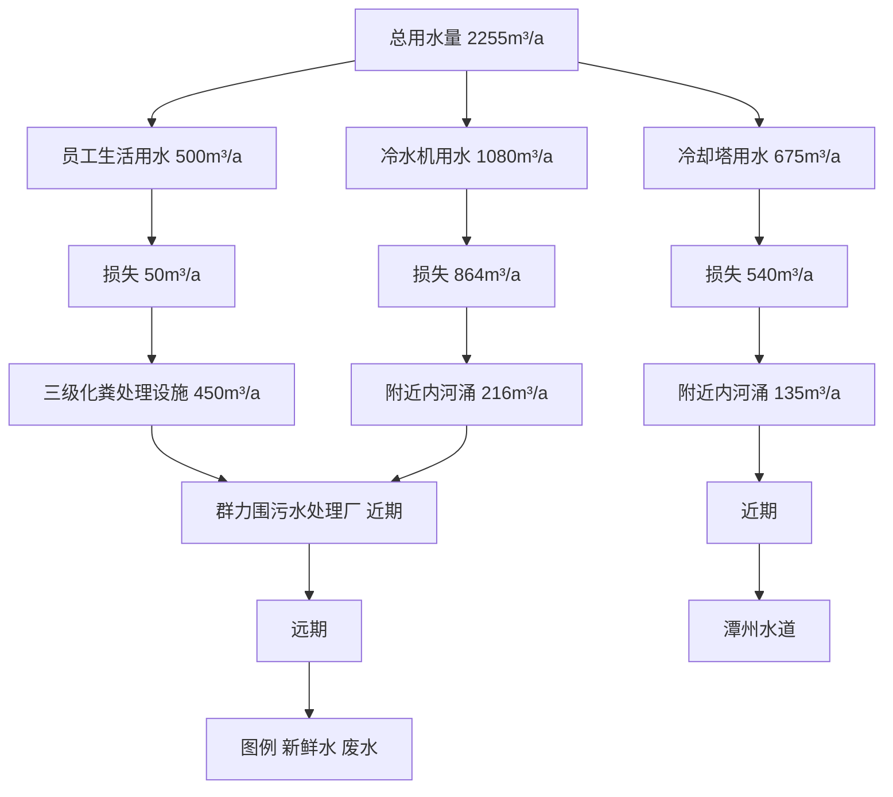
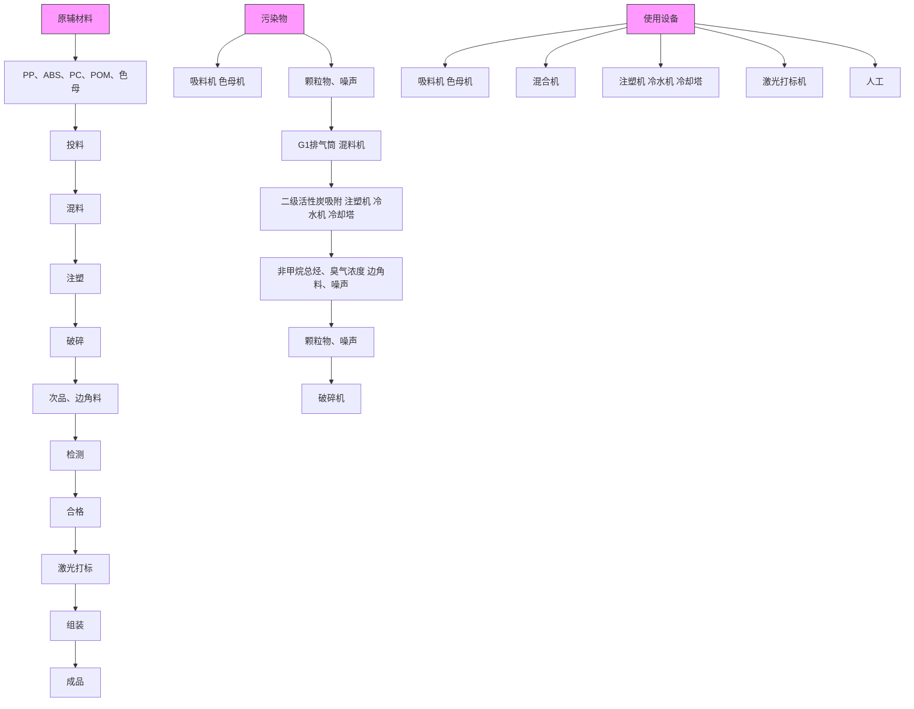
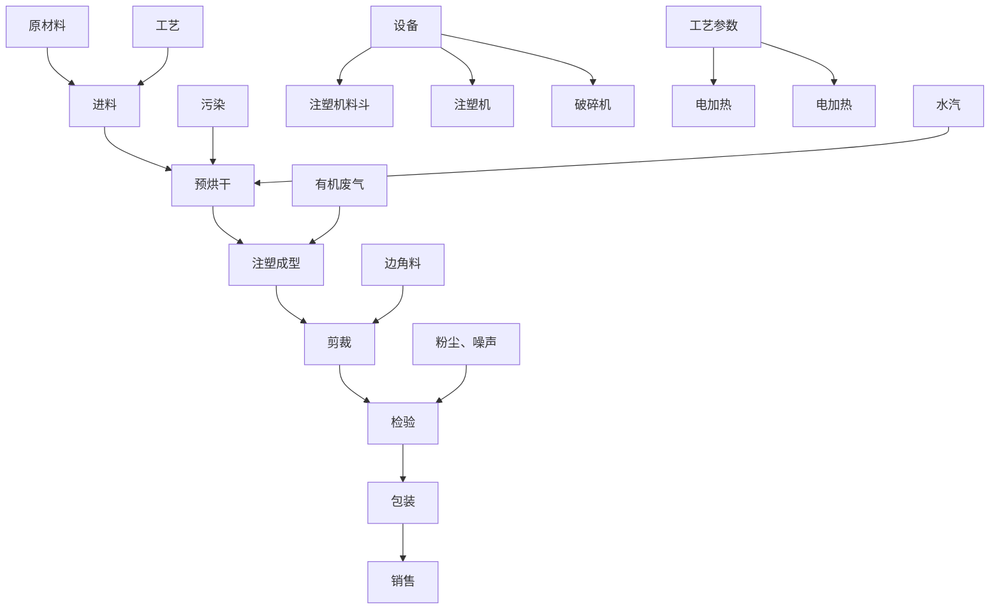
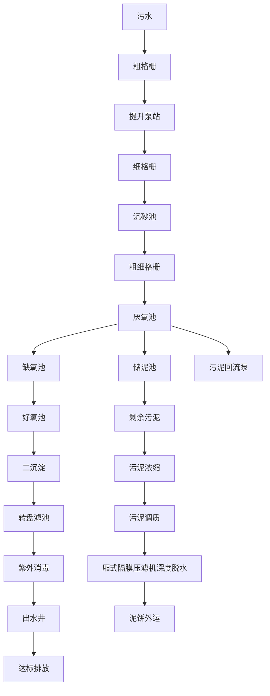
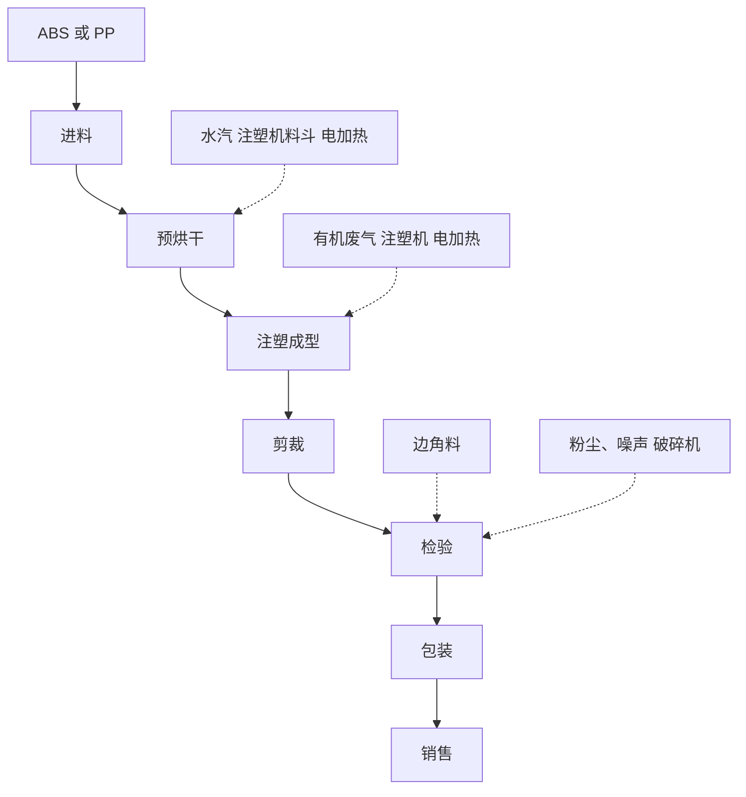

# 建设项目环境影响报告表

（污染影响类）

项目名称：佛山市顺德区恒百健塑料制品有限公司迁扩建项目

建设单位（盖章）：佛山市顺德区恒百健塑料制品有限公司

编制日期：2023年12

中华人民共 制

text_image

和国生态环境部

编制单位和编制人员情况表

<table><tr><td>项目编号</td><td colspan="2">t2g204</td></tr><tr><td>建设项目名称</td><td colspan="2">佛山市顺德区恒百健塑料制品有限公司迁扩建项目</td></tr><tr><td>建设项目类别</td><td colspan="2">26--053塑料制品业</td></tr><tr><td>环境影响评价文件类型</td><td colspan="2">报告表</td></tr><tr><td colspan="2">一、建设单位情况</td><td rowspan="4"></td></tr><tr><td>单位名称(盖章)</td><td>佛山市顺德区</td></tr><tr><td>统一社会信用代码</td><td rowspan="4"></td></tr><tr><td>法定代表人(签章)</td></tr><tr><td>主要负责人(签字)</td><td></td></tr><tr><td>直接负责的主管人员(签字)</td><td></td></tr><tr><td colspan="2">二、编制单位情况</td><td rowspan="5"></td></tr><tr><td>单位名称(盖章)</td><td>佛山市万企乐企业咨询</td></tr><tr><td>统一社会信用代码</td><td>91440606MA51YLP256</td></tr><tr><td colspan="2">三、编制人员情况</td></tr><tr><td colspan="2">1.编制主持人</td></tr></table>

text_image

中华人民共和国人力资源和社会保障

text_image

中华人民共和国环境保护部
app.rewell & authorised

# 目 录

一、建设项目基本情况 .  
二、建设项目工程分析 .. 12  
三、区域环境质量现状、环境保护目标及评价标准.... .24  
四、主要环境影响和保护措施 . .31  
五、环境保护措施监督检查清单 .. ..46   
六、结论 .. .49  
建设项目污染物排放量汇总表 .. .50

附图1 项目地理位置图

附图2 项目周围情况

附图3 项目500 米及50米范围内敏感点分布图

附图4 项目平面布置图

附图5 项目四至情况图

附图6 项目现场图片

附图7 项目所在地地表水环境功能区划图

附图8 项目所在地大气环境功能区划图

附图 9 项目所在地声环境功能区划图

附图10 佛山市环境管控单元图

附图11 《广珠城际轨道碧江站及周边地区控制性详细规划》

附图12 北滘污水管网图

附件1 营业执照

附件2 法人身份证复印件

附件3 项目用地资质

附件4 环评合同

附件5 原项目环保资料

# 一、建设项目基本情况

<table><tr><td>建设项目名称</td><td colspan="3">佛山市顺德区恒百健塑料制品有限公司迁扩建项目</td></tr><tr><td>项目代码</td><td colspan="3">无</td></tr><tr><td>建设单位联系人</td><td>***</td><td>联系方式</td><td>***</td></tr><tr><td>建设地点</td><td colspan="3">广东省佛山市顺德区北滘镇碧江社区碧江工业区工业大道三路3号之五</td></tr><tr><td>地理坐标</td><td colspan="3">(北纬22度57分10.69478秒,东经113度15分18.53515秒)</td></tr><tr><td>国民经济行业类别</td><td>C2929塑料零件及其他塑料制品制造</td><td>建设项目行业类别</td><td>二十六、橡胶和塑料制品制造业29-53塑料制品业292-其他(年用非溶剂型低VOCs含量涂料10吨以下的除外)</td></tr><tr><td>建设性质</td><td>☑新建(迁建)□改建□扩建□技术改造</td><td>建设项目申报情形</td><td>☑首次申报项目□不予批准后再次申报项目□超五年重新审核项目□重大变动重新报批项目</td></tr><tr><td>项目审批(核准/备案)部门(选填)</td><td>/</td><td>项目审批(核准/备案)文号(选填)</td><td>/</td></tr><tr><td>总投资(万元)</td><td>100</td><td>环保投资(万元)</td><td>15</td></tr><tr><td>环保投资占比(%)</td><td>1.5</td><td>施工工期</td><td>1个月</td></tr><tr><td>是否开工建设</td><td>☑否□是: _</td><td>用地(用海)面积(m2)</td><td>9832.88</td></tr><tr><td>专项评价设置情况</td><td colspan="3">无</td></tr><tr><td>规划情况</td><td colspan="3">无</td></tr><tr><td>规划环境影响评价情况</td><td colspan="3">无</td></tr><tr><td>规划及规划环境影响评价符合性分析</td><td colspan="3">无</td></tr><tr><td>其他符合性分析</td><td colspan="3">1、与产业政策相符性分析项目主要从事C2929塑料零件及其他塑料制品制造,根据《产业结构调整指导目录(2019年本)》的规定,项目不属于目录所列的鼓励类、限制类、禁止(淘汰)类项目,也不属于《市场准入负面清单(2022年版)》(发改体改规〔2022〕397号)中的禁止准入事项。根据《广东省发展改革委广东省生态环境厅关于印发&lt;广东省禁止、限制生产、销售和使用的塑料制品目录&gt;(2020年版)的通知》(粤发改资环函[2020]1747号),本项目产品为塑料配件,不属于禁止生产、销售的塑料制品。根据《国家发展改革委生态环境部关于进一步加强塑料污染治理的意见》(发改环资[2020]80号),本项目产品为小家电塑料配件,不属于意见中的禁止生产和</td></tr></table>

销售的塑料制品。

因此，本项目的建设符合国家和地方的相关产业政策。

# 2、广东省、佛山市“三线一单”生态环境分区管控方案符合性分析

根据《广东省人民政府关于印发广东省“三线一单”生态环境分区管控方案的通知》（粤府〔2020〕71 号）发布的广东省环境管控单元图，项目所在区域为重点管控单元；根据《佛山市人民政府关于印发佛山市“三线一单”生态环境分区管控方案的通知》（佛府[2021]11 号）的佛山市环境管控单元图，项目所在地属于北滘镇重点管控区（环境管控单元编码：ZH44060620004）。

①与“一核一带一区”区域管控要求的相符性  
表1-1 与“一核一带一区” 区域管控要求的相符性

<table><tr><td>管控要求</td><td>与本项目相关的要求</td><td>符合性分析</td><td>相符性</td></tr><tr><td>区域布局管控要求</td><td>禁止新建、扩建燃煤燃油火电机组和企业自备电站,推进现有服役期满级落后老旧的燃煤火电机组有序退出;原则上不再新建燃煤锅炉,逐步淘汰生物质锅炉、集中供热管网覆盖区域内的分散供热锅炉,逐步推动高污染燃料禁燃区全覆盖;禁止新建、扩建水泥、平板玻璃、化学制浆、生产制革以及国家规划外的钢铁、原油加工等项目。推广应用低挥发性有机物原辅材料,严格限制新建生产和使用高挥发性有机物原辅材料的项目,鼓励建设挥发性有机物共性工厂。</td><td>项目位于珠三角核心区,主要进行塑料零件及其他塑料制品制造,不属于区域布局管控要求中的禁止新建、扩建水泥、平板玻璃、化学制浆、生皮制革以及国家规划外的钢铁、原油加工等项目,符合区域布局管控要求。</td><td>符合</td></tr><tr><td>能源资源利用要求</td><td>科学实施能源消费总量和强度“双控”,新建高能耗项目单位产品(产值)能耗达到国际国内先进水平,实现煤炭消费总量负增长;推进工业节水减排,重点在高耗水行业开展节水改造,提高工业用水效率。加强江河湖库水量调度,保障生态流量。盘活存量建设用地,控制新增用地规模。</td><td>项目生产的塑料零件及其他塑料制品制造不属于高能耗行业,项目生产设备使用电能,生活用水、生产用水均由市政供水,不直接取用江河湖库水量,不会对项目所在地生态流量造成影响,项目租用已建成厂房,不涉及新增城市建设用地。</td><td>相符</td></tr><tr><td>污染物排放管控要求</td><td>实行水污染物排放的行业标杆管理,严格执行茅洲河、淡水河、石马河、汾江河等重点流域水污染物排放标准。重点水污染物未达到环境质量改善目标的区域内,新建、改建、扩建项目实施减量替代。大力推进固体废物源头减量化、资源化利用和无害化处置,稳步推进“无废城市”试点建设。</td><td>项目属于迁扩建项目,生活污水经三级化粪处理后达标后排至群力围污水处理厂,尾水排至潭洲水道。根据《2021年度佛山市顺德区环境质量状况公报》的评价结果,潭洲水道断面水质满足《地表水环境质量标准》(GB3838-2002)水功能要求,水质较好。该项目废(污)水、废气、噪声和固体废物通过采取评价中提出的治理措施进行有效治理后,不会改变区域环境功能。</td><td>相符</td></tr><tr><td>环境风险防控要求</td><td>加强惠州大亚湾石化区、广州石化、朱涵高栏港、珠西新材料集聚区等石化、化工重点园区环境风险防控,建立完善污有害气体监测,落实环境风险应急预案。提升危险废物监管能力,利用信息化手段,推进全过程跟踪管理。染源在线监控系统,开展有毒有害气体监测,落实环境风险应急预案。提升危险废物监管能力,利用信息化手段,推进全过程跟踪管理。</td><td>项目位于广东省佛山市顺德区北滘镇碧江社区碧江工业区工业大道三路3号之五,不属于石化、化工重点园区环境风险防控区域。项目产生的危险废物拟定期委托有资质的处置公司进行收集处理,并通过信息系统登记转移计划和电子转移联单,符合危险废物全过程跟踪管理的防控要求。</td><td>相符</td></tr></table>

②与环境管控单元总体管控要求的相符性

根据《广东省人民政府关于印发广东省“三线一单”生态环境分区管控方案的通知》（粤府〔2020〕71 号）发布的广东省环境管控单元图（见附图11），项目所在的广东省佛山市顺德区北滘镇碧江社区碧江工业区工业大道三路3号之五为重点管控单元，项目产生的生活污水经处理后排至群力围污水处理厂处理，尾水排至潭州水道，不在地表水Ⅰ、Ⅱ类水域新建排污口，不产生和排放有毒有害大气污染物项目，项目不使用高挥发性有机物含量原料，符合其环境准入及管控要求。

# 2、《佛山市人民政府关于印发佛山市“三线一单”生态环境分区管控方案的通知》（佛府〔2021〕11 号）相符性分析

根据《佛山市人民政府关于印发佛山市“三线一单”生态环境分区管控方案的通知》（佛府〔2021〕11 号）的要求，本项目与所在区域的生态保护红线、环境质量底线、资源利用上线和生态环境准入清单（“三线一单”）进行对照分析，如下：

# ①生态保护红线及一般生态空间

根据《佛山市人民政府关于印发佛山市“三线一单”生态环境分区管控方案的通知》（佛府〔2021〕11 号），本项目不在划定的生态保护红线区域。

# ②环境质量底线

根据2022 年全区的大气环境质量状况公报，六项污染物指标中臭氧浓度超标，其余指标浓度均达到《环境空气质量标准》（GB3095-2012）及2018 年修改单中的二级标准限值，故顺德区大气环境质量属不达标区。项目产生的生活污水经三级化粪池处理达标后排放至群力围污水处理厂处理，尾水排至潭州水道；注塑工序产生的有机废气经收集后通过二级活性炭吸附处理后引至15m 排气筒G1 排放，对纳污水体及空气质量影响较小。

# ③资源利用上线

项目运营中会消耗一定量的电及水资源等资源，资源消耗量相对区域资源利用总量较少，符合资源利用上限要求。本项目建成后带来社会效益大于消耗资源。

# ④管控单元

根据《佛山市人民政府关于印发佛山市“三线一单”生态环境分区管控方案的通知》（佛府〔2021〕11 号）发布的佛山市环境管控单元图，项目位于北滘镇，属于重点管控区（环境管控单元编码：ZH44060620004）。

# 1）区域布局管控

①项目产生的生活污水经三级化粪池处理后排至群力围污水处理厂处理，尾水排至潭州水道。从监测数据统计结果来分析，潭州水道监测指标均达到了GB3838-2002 之Ⅲ类水质标准。

②项目所属C2929塑料零件及其他塑料制品制造，不属于新建储油库项目、产生和排放有毒有害大气污染物的建设项目；项目生产使用的新塑料粒属于低VOCs原辅材料，不属于使用溶剂型油墨、涂料、清洗剂、胶黏剂等高挥发性有机物原辅材料项目。

③项目无重金属产生，不属于禁止新建、扩建增加重点防控的重金属污染物排

放的建设项目。

综上，项目符合区域布局管控要求。

# 2）能源资源利用

项目未违规占用水域，不会破坏生态的岸线利用行为和做不符合其功能定位的开发建设活动，不以侵占河道、围垦湖泊、非法采砂等。因此项目符合能源资源利用的要求。

# 3）污染物排放管控

项目生活污水经三级化粪池处理后排至群力围污水处理厂处理，尾水排至潭州水道，符合污染物排放管控的要求。

# （3）与顺德区“三线一单”生态环境分区管控方案相符性分析

根据《佛山市顺德区人民政府关于印发佛山市顺德区“三线一单”生态环境分区管控方案的通知》（顺府〔2021〕11号），本项目与顺德区“三线一单”生态环境分区管控方案相符性分析如下：

# ①生态保护红线及一般生态空间

根据《佛山市顺德区人民政府关于印发佛山市顺德区“三线一单”生态环境分区管控方案的通知》（顺府〔2021〕11号），项目不在划定的生态保护红线区域。

# ②环境质量底线

项目产生的生活污水三级化粪池处理后排至群力围污水处理厂处理，尾水排至潭州水道；注塑工序的有机废气经收集通过二级活性炭吸附处理后引至15m排气筒G1排放，对纳污水体及空气质量影响较小。

# ③资源利用上线

项目运营中会消耗一定量的电及水资源等资源，资源消耗量相对区域资源利用总量较少，符合资源利用上限要求。本项目建成后带来的社会效益大于消耗资源。项目未违规占用水域，不会破坏生态的岸线利用行为和做不符合其功能定位的开发建设活动，不以侵占河道、围垦湖泊、非法采砂等，符合单元“能源资源利用”中的岸线/禁止类，因此项目符合能源资源利用的要求。

# ④管控单元

根据《佛山市顺德区人民政府关于印发佛山市顺德区“三线一单”生态环境分区管控方案的通知》（顺府发〔2021〕11 号），本项目位于广东省佛山市顺德区重点管控单元5（ZH44060620004，北滘镇重点管控区）内，本项目与佛山市顺德区“三线一单”生态环境分区管控方案相符性分析详见表1-3。

表 1-3项目与文件（佛府[2021]11号）的相符性分析

<table><tr><td rowspan="2">单元编码</td><td rowspan="2">环境管控单元名称</td><td colspan="3">行政区划</td><td rowspan="2">管控单元分类</td><td rowspan="2">要素细类</td></tr><tr><td>省</td><td>市</td><td>区</td></tr><tr><td>ZH44060620004</td><td>北滘镇重点管控区</td><td>广东省</td><td>佛山市</td><td>顺德区</td><td>重点管控单元4</td><td>一般生态空间、水环境其他重点管控区、水环境一般管控区、大气环境高排放重点管控区、大气环境受体敏感重点管控区、江河湖库岸线重点管控区、江河湖库岸线一般管控区</td></tr></table>

<table><tr><td rowspan="13"></td><td>管控维度</td><td>管控要求</td><td rowspan="2">工程内容</td><td rowspan="2">符合性</td></tr><tr><td>共性要求</td><td>单元内各环境要素细类管控区内,按该环境要素细类管控要求执行。</td></tr><tr><td rowspan="5">区域布局管控</td><td>1-1【生态/禁止类】单元内的一般生态空间,主导生态功能为水土保持,禁止在25度以上的陡坡地开垦种植农作物,禁止在崩塌、滑坡危险区、泥石流易发区从事采石、取土、采砂等可能造成水土流失的活动。</td><td>本项目属于C2929塑料零件及其他塑料制品制造,不属于禁止类行业</td><td>符合</td></tr><tr><td>1-2.【产业/鼓励引导类】重点发展机器人及配套产业、智能家用电器、高端新型电子信息、新材料等制造业和总部经济、电子商务、工业设计与文化创意、科技金融等现代服务业,打造智能制造和智慧家电示范区。</td><td>本项目属于塑料零件及其他塑料制品制造和模具制造</td><td>符合</td></tr><tr><td>1-3.【产业/综合类】产业聚集区所属地块内的工业用地或企业与村庄、学校等环境敏感点之间应设置合理的大气环境防护距离,并通过绿化带进行有效隔离;聚集区规划布局应注重大气污染排放企业应尽量避免布局在居住用地的常年主导风向的上风向。</td><td>本项目不属于村改范围</td><td>符合</td></tr><tr><td>1-4.【产业/综合类】系统推进村级工业园升级改造,腾出连片空间,布局产业集聚区和主题产业园,推动工业项目入园集聚发展。新增工业制造业用地原则上安排在产业集聚区内,产业集聚区外原则上不鼓励工业及物流仓储用地的新建与改造。</td><td>本项目位于碧江工业区内,符合规划要求。</td><td>符合</td></tr><tr><td>1-5.【产业/限制类】受纳水体或监控断面不达标的,不得新建、扩建向河涌直接排放废水的项目。新建、扩建含蚀刻工序的线路板生产项目和化工项目应在配套污水集中处置的工业园区或生活污水管网覆盖区域内建设;纯加工型印花项目,含酸洗、磷化的金属表面处理、金属制品项目(与自身高新技术企业配套的除外),含酸洗、喷涂、化学抛光、电解等涉及废水排放工艺的不锈钢型材加工项目(与自身高新技术企业配套的除外),应进入以此类项目为主导产业、有相应废水集中治理设施的工业园区,实现集中治污。</td><td>本项目外排废水为生活污水,属间接排放。污水经预处理后进入群力围污水处理厂处理;项目不包含条款中提及的限制类项目和工序。</td><td>符合</td></tr><tr><td rowspan="4">区域布局管控</td><td>1-6.【产业/综合类】划定家具生产优先发展区域,优先发展区外不再新建涉及涂装工艺的木质家具制造项目。</td><td>本项目不涉及</td><td>符合</td></tr><tr><td>1-7.【水/限制类】格限制在佛山市禅城南庄紫洞水厂、佛山市禅城沙口(石湾)水厂、羊额—北滘水厂、广州市南洲水厂顺德水道取水口饮用水水源保护区上游和周边区域建设列入“高污染、高环境风险”产品名录等可能影响水环境安全的项目。</td><td>本项目不在佛山市禅城南庄紫洞水厂、佛山市禅城沙口(石湾)水厂、羊额—北滘水厂、广州市南洲水厂顺德水道取水口饮用水水源保护区上游和周边区域,且产品不属于“高污染、高环境风险”产品名录</td><td>符合</td></tr><tr><td>1-8.【大气/限制类】大气环境受体敏感重点管控区内,应严格限制新建储油库项目、产生和排放有毒有害大气污染物的建设项目以及使用溶剂型油墨、涂料、清洗剂、胶黏剂等高挥发性有机物原辅材料项目,鼓励现有该类项目搬迁退出。</td><td>本项目不使用溶剂型油墨、涂料、清洗剂、胶黏剂等高挥发性有机物原辅材料项目。</td><td>符合</td></tr><tr><td>1-9.【大气/鼓励引导类】大气环境高排放重点管控区内,应强化达标监管,引导工业项目落地集聚发展,有序推进区域内行业企业提标改造。</td><td>项目不排放高污染物。</td><td>符合</td></tr><tr><td rowspan="2">能源资源利用</td><td>2-1【能源/鼓励引导类】推广节能技术,加快发展绿色货运与现代物流。</td><td>项目使用电能,严控控制生产过程消耗</td><td>符合</td></tr><tr><td>2-2【能源/鼓励引导类】推广新能源汽车应用和充电基础设施建设,积极推动重卡LNG加气站、充电基础设施、加氢站建设。</td><td>项目不属于2-2规定的鼓励引导类</td><td>符合</td></tr></table>

<table><tr><td>管控维度</td><td>管控要求</td><td>工程内容</td><td>符合性</td></tr><tr><td rowspan="2">环境风险防控</td><td>4-1.【风险/综合类】加强环境风险分级分类管理,强化金属制品、有色金属和压延加工、化学原料和化学品制造业等涉重金属、化工行业企业及工业园区等重点环境风险源的环境风险防控。</td><td>项目租用已建成厂房,危废间设有围堰并配备相关应急物资,定期对厂内</td><td rowspan="2">符合</td></tr><tr><td>4-3.【风险/综合类】加强环境风险分级分类管理,强化金属制品、有色金属和压延加工、化学原料和化学品制造业等涉重金属、化工行业企业及工业园区等重点环境风险源的环境风险防控。</td><td>项目不涉及重金属、化工行业</td></tr></table>

# 二、选址政策相符性分析

本项目所在地为广东省佛山市顺德区北滘镇碧江社区碧江工业区工业大道三路3号之五。根据《佛山市顺德区生态保护红线规划（2014-2025年）》及《佛山市顺德区人民政府关于同意实施<佛山市顺德区生态保护红线规划（2014-2025）>的批复》，以及关于《广珠城际轨道碧江站及周边地区控制性详细规划》批后通告，项目所在地用地性质为工业用地；根据《广东省人民政府关于调整佛山市部分饮用水水源保护区的批复》（粤府函[2018]426号），本项目不在水源保护区范围内；根据《广东省主体功能区划》（粤府[2012]120号）可知，本项目所在区域不处于生态红线内，因此，项目选址符合功能规划要求。本项目不在划定的生态保护红线区域。

项目用房租用已建成的厂房，项目所在地土地使用性质为工业用地，项目未改变原有用地性质。项目所在地不属于基本农田保护区、林业用地区，饮用水水源保护区、生态环境安全控制区等区域，不属于拆迁用地范围。因此，建设项目的选址与土地利用规划基本相符。

# 三、挥发性有机化合物治理政策符合性分析

表 1-4 挥发性有机化合物治理政策符合性分析

<table><tr><td>序号</td><td>政策要求</td><td>工程内容</td><td>符合性</td></tr><tr><td colspan="4">1.《中华人民共和国大气污染防治法》(2018年10月26日修正)</td></tr><tr><td>1.1</td><td>第四十五条产生含挥发性有机物废气的生产和服务活动,应当在密闭空间或者设备中进行,并按照规定安装、使用污染防治设施;无法密闭的,应当采取措施减少废气排放。</td><td>生产过程中产生的废气经收集后通过“二级活性炭吸附”废气处理设施处理后,经排气筒G1(15m)引至楼顶高空排放,可有效减少废气排放。</td><td>符合</td></tr><tr><td colspan="4">2、《广东省大气污染防治条例》(2019年3月1日起施行)</td></tr><tr><td>2.1</td><td>第十七条珠江三角洲区域禁止新建、扩建燃煤燃油火电机组或者企业燃煤燃油自备电站。珠江三角洲区域禁止新建、扩建国家规划外的钢铁、原油加工、乙烯生产、造纸、水泥、平板玻璃、除特种陶瓷以外的陶瓷、有色金属冶炼等大气重污染项目。</td><td>项目从塑料零件及其他塑料制品制造,不属于禁止建设的大气重污染项目。</td><td>符合</td></tr><tr><td>2.2</td><td>第二十六条新建、改建、扩建排放挥发性有机物的建设项目,应当使用污染防治先进可行技术。下列产生含挥发性有机物废气的生产和服务活动,应当优先使用低挥发性有机物含量的原材料和低排放环保工艺,在确保安全条件下,按照规定在密闭空间或者设备中进行,安装、使用满足防爆、防静电要求的治理效率高的污染防治设施;无法密闭或者不适宜密闭的,应当采取有效措施减少废气排放:(一)石油、化工、煤炭加工与转化等含挥发性有机物原料的生产;(二)燃油、溶剂的储存、运输和销售;(三)涂料、油墨、胶粘剂、农药等以挥发性有机物为原料的生产;(四)涂装、印刷、粘合、工业清洗等使用含挥发性有机物产品的生产活动;(五)其他产生挥发性有机物的生产和服务活动。</td><td>项目使用的物料均为低挥发性原料,在生产车间的注塑机上方设置集气罩+软帘收集系统,产生的废气经收集后通过“二级活性炭吸附”废气处理设施处理后,经排气筒G1(15m)引至楼顶高空排放。</td><td>符合</td></tr><tr><td colspan="4">3.《挥发性有机物(VOCs)污染防治技术政策》(环保部公告2013第31号)</td></tr><tr><td>3.1</td><td>含VOCs产品的使用过程中,应采取废气收集措施,提高废气收集效率,减少废气的无组织排放与逸散,并对收集后的废气进行回收或处理后达标排放</td><td>生产过程中产生的有机废气经集气罩+软帘收集,配套“二级活性炭吸附”废气处理设施处理后引至15米排气筒排放</td><td>符合</td></tr><tr><td colspan="4">4、《“十三五”挥发性有机物污染防治工作方案》(环大气[2017]121号)</td></tr><tr><td>4.1</td><td>严格涉VOCs建设项目环境影响评价,实行区域内VOCs排放等量或倍量削减替代,并将替代方案落实到企业排污许可证中,纳入环境执法管理。</td><td>本项目建议挥发性有机物排放总量控制指标为5.6169t/a,由区、镇两级环保主管部门核查总量指标。</td><td>符合</td></tr><tr><td>4.2</td><td>新、改、扩建涉VOCs排放项目,应从源头加强控制,使用低(无)VOCs含量的原辅材料,加强废气收集,安装高效治理设施。</td><td>在生产车间的注塑机上方设置集气罩+软帘收集系统,产生的废气经收集后通过“二级活性炭吸附”废气处理设施处理后,经排气筒G1引至楼顶高空排放。</td><td>符合</td></tr><tr><td colspan="4">5.关于印发《重点行业挥发性有机物综合治理方案》的通知(环大气[2019]53号)</td></tr><tr><td>5.1</td><td>含VOCs物料应储存于密闭容器、包装袋,高效密封储罐,封闭式储库、料仓等。含VOCs物料转移和输送,应采用密闭管道或密闭容器、罐车等。</td><td>项目原材料与产品均储存于密闭容器,生产过程在车间中进行</td><td>符合</td></tr><tr><td>5.2</td><td>遵循“应收尽收、分质收集”的原则,科学设计废气收集系统,将无组织排放转变为有组织排放进行控制。采用全密闭集气罩或密闭空间的,除行业有特殊要求外,应保持微负压状态,并根据相关规范合理设置通风量。采用局部集气罩的,距集气罩开口面最远处的VOCs无组织排放位置,控制风速应不低于0.3米/秒,有行业要求的按相关规定执行。</td><td>生产过程在车间中进行,非甲烷总烃经集气罩收集后高空排放,设计风速≥0.5m/s</td><td>符合</td></tr><tr><td colspan="4">6.《广东省人民政府办公厅关于印发广东省2021年大气、水、土壤污染防治工作方案的通知》(粤办函〔2021〕58号)</td></tr><tr><td>6.1</td><td>严格落实国家产品VOCs含量限值标准要求,除现阶段确无法实施替代的工序外,禁止新建生产和使用高VOCs含量原辅材料项目。</td><td>项目使用的原料为低VOCs含量原辅材料</td><td>符合</td></tr><tr><td>6.2</td><td>指导企业使用适宜高效的治理技术,涉VOCs重点行业新建、改建和扩建项目不推荐使用光氧化、光催化、低温等离子等低效治理设施,已建项目逐步淘汰光氧化、光催化、低温等离子治理设施</td><td>项目配套“二级活性炭吸附”废气处理设施,不使用光氧化、光催化、低温等离子等低效治理设施。</td><td>符合</td></tr><tr><td colspan="4">7.《珠江三角洲地区严格控制工业企挥发性有机物(VOCs)排放的意见》(排放的意见)(粤环[2012]18号)</td></tr><tr><td>7.1</td><td>自然保护区、水源保护区、风景名胜区、森林公园、重要湿地、生态敏感区和其他重要生态功能区实行强制性保护,禁止新建VOCs污染企业。</td><td>选址不在规定区域</td><td>符合</td></tr></table>

8. 《挥发性有机物无组织排放控制标准（GB 37822—2019）》

<table><tr><td>8.1</td><td>VOCs 物料应储存于密闭的容器、包装袋、储罐、储库、料仓中;盛装VOCs 物料的容器或包装袋应存放于室内,或存放于设置有雨棚、遮阳和防渗设施的专用场地,盛装VOCs 物料的容器或包装袋在非取用状态时应加盖、封口、保持密闭</td><td>本项目含VOCs 的原料密封储存,存放于室内,非取用时封口保持密闭</td><td>符合</td></tr><tr><td>8.2</td><td>VOCs 质量占比大于等于10%的含VOCs 产品,其使用过程应采用密闭设备或在密闭空间内操作,废气应排至VOCs 废气收集处理系统;无法密闭的,应采取局部气体收集措施,废气应排至VOCs 废气收集处理系统</td><td>本项目产生非甲烷总烃的工序在独立区域进行,非甲烷总烃废气经收集后进入“两级活性炭吸附装置”处理</td><td>符合</td></tr></table>

9.广东省《关于做好建设项目挥发性有机物（VOCs）排放削减替代工作的补充通知》（粤环函【2021】53 号）

<table><tr><td>9.1</td><td>各地生态环境部门要健全建设项目VOCs排放总量管理台账,严格核定VOCs可替代总量指标,重点核查用作替代的削减量是否为企业达标排放后采取治理措施的削减量、或淘汰关停后的削减量,是否有削减量重复使用等情况,进一步规范VOCs削减替代工作。新改扩建项目环评审批时,应逐级出具VOCs总量替代来源审核意见,确保总量指标管理扎实有效。</td><td>待项目审批时由生态环境部门根据《关于做好建设项目挥发性有机物(VOCs)排放削减替代工作的补充通知》(粤环函【2021】537号)文件要求核定VOCs总量来源</td><td>符合</td></tr></table>

项目与涉水排放准入政策的相符性分析  
10、关于印发《广东省涉挥发性有机物（VOCs）重点行业治理指引》的通知（粤环办〔2021〕43 号）

<table><tr><td>10.1</td><td>VOCs物料应储存于密闭的容器、包装袋、储罐、储库、料仓中。</td><td>本项目含VOCs的原料密封储存,存放于室内,非取用时封口保持密闭</td><td>符合</td></tr><tr><td>10.2</td><td>粉状、粒状VOCs物料采用气力输送设备、管状带式输送机、螺旋输送机等密闭输送方式,或者采用密闭的包装袋、容器或罐车进行物料转移。</td><td>本项目原辅材料均使用密闭包装袋进行物料转移</td><td>符合</td></tr><tr><td>10.3</td><td>在混合/混炼、塑炼/塑化/熔化、加工成型(挤出、注射、压制、压延、发泡、纺丝等)、硫化等作业中应采用密闭设备或在密闭空间中操作,废气应排至VOCs废气收集处理系统;无法密闭的,应采取局部气体收集措施,废气应排至VOCs废气收集处理系统</td><td>在挤出工序上方设置上吸伞形集气罩对非甲烷总烃进行收集并经过“两级活性炭吸附装置”处理后通过15米排气筒排放</td><td>符合</td></tr><tr><td>10.4</td><td>采用外部集气罩的,距集气罩开口面最远处的VOCs无组织排放位置,控制风速不低于0.3m/s。</td><td>本项目设置集气罩控制风速为0.5m/s</td><td>符合</td></tr><tr><td>10.5</td><td>塑料制品行业:a)有机废气排气筒排放浓度不高于广东省《大气污染物排放限值》(DB4427-2001)第II时段排放限值,b)厂区内无组织排放监控点NMHC的小时平均浓度值不超过6mg/m3,任意一次浓度值不超过20mg/m3。</td><td>本项目非甲烷总烃有组织排放浓度约为18.7732mg/m3,排放浓度不高于广东省《大气污染物排放限值》(DB4427-2001)第II时段排放限值,本项目厂区内VOCs无组织排放监控点浓度应满足《挥发性有机物无组织排放控制标准》(GB37822-2019)特别排放限值的要求</td><td>符合</td></tr><tr><td>序号</td><td>政策要求</td><td>工程内容</td><td>符合性</td></tr><tr><td colspan="4">11、《固定污染源挥发性有机物综合排放标准》(DB44/2367-2022)</td></tr><tr><td>11.1</td><td>有组织排放控制要求:收集的废气中NMHC初始排放速率≥3kg/h时,应当配置VOCs处理设施,处理效率不应当低于80%。对于重点地区,收集的废气NMHC初始排放速率≥2kg/h时,应当配置VOCs处理设施,处理效率不应当低于80%;采用的原辅材料符合国家有关低VOCs含量产品规定的除外。</td><td>本项目的有机废气产生速率低于2kg/h,对废气处理效率无强制要求。</td><td>符合</td></tr><tr><td>11.2</td><td>有组织排放控制要求:排气筒高度不低于15m(因安全考虑或有特殊工艺要求的除外),具体高度以及与周围建筑物的相对高度关系应根据环境影响评价文件确定</td><td>本项目有机废气排气筒设计排放高度为15m。</td><td>符合</td></tr><tr><td>11.3</td><td>VOCs物料应储存于密闭的容器、包装袋、储罐、储存、料仓中,盛装VOCs物料的容器或包装袋应存放于室内,或存放于设置有雨棚、遮阳和防渗设施的专用场地。盛装VOCs物料的容器或包装袋在非取用状态时应加盖、封口,保持密闭</td><td>项目使用的塑料购入时均为密闭袋装,并暂存于厂房原料仓库内;环评要求塑料粒在非取用状态时包装袋须封口,保持密闭。</td><td>符合</td></tr><tr><td colspan="4">12、广东省生态环境厅关于印发《广东省生态环境保护“十四五”规划》的通知(粤环〔2021〕10号)</td></tr><tr><td>12.1</td><td>严格实施VOCs排放企业分级管理,全面推进涉VOCs排放企业深度治理。开展中小企业废气收集和治理设施建设、运行情况的评估,强化对企业涉VOCs生产车间/工序废气的收集管理,推动企业开展治理设施升级改造。</td><td>本项目采用“二级活性炭吸附”装置处理有机废气,未采用淘汰的低效治理设施。</td><td>符合</td></tr><tr><td colspan="4">13、佛山市顺德区人民政府办公室关于印发《佛山市顺德区生态环境保护“十四五”规划(2021-2025)》的通知(顺府办发〔2022〕16号)</td></tr><tr><td>13.1</td><td>持续探寻高效节能的VOCs治理技术,对采用低温等离子、光氧化、光催化等低效治理工艺的企业在臭氧污染天气应对期间实施停限产或错峰生产,并推动企业逐步淘汰低效治理工艺。</td><td>本项目采用“二级活性炭吸附”装置处理有机废气,未采用淘汰的低效治理设施。</td><td>符合</td></tr></table>

表1-3 项目与涉水排放准入政策的相符性

<table><tr><td>序号</td><td>政策要求</td><td>工程内容</td><td>符合性</td></tr><tr><td colspan="4">1.《佛山市顺德区环境保护委员会办公室关于对涉水排放的建设项目加强环境管理的通知》(顺环委办【2020】44号文)</td></tr><tr><td>1.1</td><td>严格按照环评导则对涉水排放建设项目的废水(包括生活污水、生产废水)、环境风险等要素开展环境影响评价,结合受纳水体水质状况和环境基础设施配套情况进行审批。审批时应重点核查项目的受纳水体达标情况,受纳水体不达标的,不得通过审批</td><td rowspan="2">项目生活污水经预处理后排至群力围污水处理厂处理,尾水排至潭州水道。</td><td>符合</td></tr><tr><td>1.2</td><td>涉水排放建设项目的排水系统必须严格执行“雨污分流、清污分流”原则,按照《佛山市环境保护局关于印发佛山市工业企业污水治理设施规范化整治技术要求和指南的通知》(佛环函〔2015〕324号)要求进行建设</td><td>符合</td></tr></table>

# 四、与《佛山市顺德区生态环境保护“十四五”规划》相符性分析

根据佛山市顺德区人民政府办公室关于印发《佛山市顺德区生态环境保护“十四五”规划（2021-2025）》的通知（顺府办发〔2022〕16 号）：

优化空间开发布局。以新一轮国土空间规划为契机，统筹城市建设、主题产业园区和美丽乡村的有机结合，重构城乡、产业、生态等空间布局和风貌形态。调整优化产业集群发展空间布局，环境质量不达标区域，新建、扩建项目需符合环境质量改善要求；严格控制“高耗能、高排放”项目盲目发展，禁止新建、扩建水泥、平板玻璃、化学制浆、生皮制革以及国家规划外的钢铁、原油加工等项目；专业电镀、印染等项目进入定点园区集中管理。

实施产业结构优化升级行动。聚焦发展新一代信息技术、高端装备制造、绿色低碳、生物制药、数字经济、新材料等战略性新兴产业，推进资源节约利用和循环利用，打造具有世界影响力的战略性产业集群；建设一批产业高度集聚、高效协作、生态和谐的特色产业园，发展珠宝、家具、五金、纺织服装四大特色产业，促进特色产业高端化。

持续推进重点行业VOCs 整治。持续开展挥发性有机物专项整治，继续推进重点行业企业开展销号式综合整治，建立VOC 重点监管企业名单并动态更新，督促企业建立VOCs 管控台账清单；持续探寻高效节能的VOCs 治理技术，对采用低温等离子、光氧化、光催化等低效治理工艺的企业在臭氧污染天气应对期间实施停限产或错峰生产，并推动企业逐步淘汰低效治理工艺。

加强VOCs 源头替代和无组织排放管控。大力推进低VOCs 含量、低反应活性的原辅材料替代，将全面使用低VOCs 含量原辅材料的企业纳入正面清单和政府绿色采购清单。鼓励重点行业企业开展生产工艺和设备水性化改造，推广使用水性、高固体分、无溶剂、粉末等低VOCs 含量涂料。严格落实《挥发性有机物无组织排放控制标准》，开展厂区内无组织排放浓度监测，加强对含VOCs 物料储存、转移和运输、设备与管线组件泄漏、敞开页面逸散以及工艺过程等五类排放源的管控。加强储油库、加油站等VOCs 排放治理，推动油品储运销体系安装油气回收自动监控系统。

本项目不属于禁止新建、扩建水泥、平板玻璃、化学制浆、生皮制革以及国家规划外的钢铁、原油加工等项目。本项目从源头上控制VOCs 的产生，项目使用的塑料粒混合使用状态下均为低VOCs 原料。项目 不使用低温等离子、光氧化、光催化等低效治理工艺，项目有机废气处理工艺为“水喷淋+干式过滤+两级活性炭吸附”设施。本项目含VOCs 的原料密封储存，存放于室内，非取用时封口保持密闭，项目产生有机废气的工序均在相对密闭的空间内进行，提高了有机废气的收集，并通过有效处理后可达标排放。

因此，项目符合《佛山市顺德区生态环境保护“十四五”规划》的相关要求。

# 五、选址与规划相符性分析

本项目选址位于广东省佛山市顺德区北滘镇碧江社区碧江工业区工业大道三路3号之五，根据关于《广珠城际轨道碧江站及周边地区控制性详细规划》批后通告，项目所在地用地性质为工业用地，可知（附图12），项目所在地为M1 一类工业用地，符合用地规划。

综上所述，本项目基本符合有机污染物治理相关文件的要求。

# 二、建设项目工程分析

<table><tr><td rowspan="17">建设内容</td><td colspan="6">1、本建设项目概况佛山市顺德区恒百健塑料制品有限公司(以下简称“本项目”)原址前位于佛山市顺德区北滘镇碧江居委会都宁堤北工业区南北二路9号。占地面积 $3033.3m^{2}$ ,建筑面积 $2000m^{2}$ 。主要从事塑料制品(风扇支架和组件)的生产。原项目年产风扇支架3000万件/年,风扇组件3200万件/年。现为提升产品质量,提高企业市场竞争力,公司拟搬迁至广东省佛山市顺德区北滘镇碧江社区碧江工业区工业大道三路3号之五。项目占地面积为 $9832.88m^{2}$ ,租赁面积为 $14514m^{2}$ 。主要迁扩建内容如下:1产品产量:新增产品种类,更改原项目产品款式。迁扩建后,预计年产风扇支架500万件、风扇组件700万件、微波炉门控组件600万件、微波炉门面300万件、微波炉控盒150万件。2原辅料用量:原辅材料有所调整。3设备用量:详见下表2-3,设备种类和数量均有变动。4劳动定员及工作制度:迁扩建前后项目劳动定员不变,50人,实行1班制,年工作300天,每天工作8小时,年工作时间共2400小时。2、项目工程组成项目工程组成情况见表2-1。表2-1 项目工程组成情况</td></tr><tr><td>工程类型</td><td>工程内容</td><td>迁扩建前</td><td colspan="3">迁扩建后</td></tr><tr><td>项目面积</td><td>项目面积</td><td>占地面积: $3033.3m^{2}$ 租用建筑面积 $2000m^{2}$ </td><td colspan="3">占地面积: $9832.88m^{2}$ 租用建筑面积 $14514m^{2}$ </td></tr><tr><td rowspan="7">主体工程</td><td rowspan="7">生产车间</td><td rowspan="7">注塑车间一个</td><td>注塑楼</td><td>一层</td><td>注塑车间约 $3200m^{2}$ </td></tr><tr><td rowspan="3">组装楼</td><td>首层</td><td>组装区约 $700m^{2}$ </td></tr><tr><td>2层</td><td>激光打标区约 $700m^{2}$ </td></tr><tr><td>3~5层</td><td>仓库约 $2100m^{2}$ </td></tr><tr><td>办公楼</td><td>1~5层</td><td>约 $1354m^{2}$ </td></tr><tr><td>仓库楼</td><td>1~4层</td><td>约 $2500m^{2}$ </td></tr><tr><td>待用楼</td><td>1~4层</td><td>约 $3960m^{2}$ </td></tr><tr><td>仓储工程</td><td>材料存放区和成品室</td><td>原料仓、成品仓各一个</td><td colspan="3">注塑车间内有一个原料仓 $50m^{2}$ 4层的仓库一栋约 $2500m^{2}$ 组装楼共5层,3~5层为仓库约 $2100m^{2}$ </td></tr><tr><td>辅助工程</td><td>办公室</td><td>办公室一栋</td><td colspan="3">注塑车间内设有生产车间办公室一个 $20m^{2}$ 组装楼旁设有5层的行政办公楼一栋约 $1354m^{2}$ </td></tr><tr><td rowspan="2">公用工程</td><td>配电系统</td><td>通过市电引入厂区</td><td colspan="3">通过市电引入厂区</td></tr><tr><td>给排水系统</td><td>供水来源为市政自来水,生活污水经独立污水处理设施,排入附近内河涌。</td><td colspan="3">生活污水经三级化粪处理后达标后排入群力围污水处理厂</td></tr><tr><td rowspan="3">环保工程</td><td>废水</td><td>生活污水经独立污水处理设施</td><td colspan="3">三级化粪处理设施</td></tr><tr><td>废气收集设施</td><td>注塑废气经收集后通过不低于15m高的排气筒高空排放</td><td colspan="3">注塑废气经集气罩+软帘收集后引入“二级活性炭吸附”废气处理设施处理,最后引至约15m高排气筒(G1)排放。</td></tr><tr><td>危险废物暂存点</td><td>设置有危废间1个,危险废物交由有资质单位处理</td><td colspan="3">设置有危废间1个,危险废物交由有资质单位处理</td></tr></table>

<table><tr><td>工程类型</td><td>工程内容</td><td>迁扩建前</td><td>迁扩建后</td></tr><tr><td>环保工程</td><td>固体废物暂存间</td><td>设置有固体废物间1个,固体废物定期交由回收商处理</td><td>设置有固体废物间1个,固体废物定期交由回收商处理</td></tr></table>

# 2、项目产品以及产能

项目主要从事塑料制品的生产和销售，主要生产规模详见下表：

表 2-2 项目主要产品产量

<table><tr><td>序号</td><td>名称</td><td>单位</td><td>迁扩建前</td><td>增减量</td><td>迁扩建后</td><td>备注</td><td>图片</td></tr><tr><td>1</td><td>风扇支架</td><td>万件/年</td><td>3000</td><td>-2500</td><td>500</td><td>材质:ABS/PP注塑部分约重55g,风扇支架塑料成品约重275t。</td><td></td></tr><tr><td>2</td><td>风扇组件*</td><td>万件/年</td><td>3200</td><td>-2500</td><td>700</td><td>材质:ABS/PP注塑部分约重125.22g,风扇组件塑料成品约重876.54t。</td><td></td></tr><tr><td>3</td><td>微波炉门控组件</td><td>万件/年</td><td>0</td><td>+600</td><td>600</td><td>材质:POM/PC/ABS注塑部分约重150.1g,微波炉门控组件塑料成品约重900.6t。</td><td></td></tr><tr><td>4</td><td>微波炉门面</td><td>万件/年</td><td>0</td><td>+300</td><td>300</td><td>材质:ABS注塑部分约重222.66g,微波炉门面塑料成品约重667.961吨。</td><td></td></tr><tr><td>5</td><td>微波炉控盒</td><td>万件/年</td><td>0</td><td>+150</td><td>150</td><td>材质:POM注塑部分约重48.2g,微波炉控盒塑料成品约重72.3t。</td><td></td></tr></table>

备注：因迁扩建后项目更新了风扇支架、风扇组件的款式，其各个注塑零配件单个的尺寸、厚度、重量等与原项目均不相同，故原料使用量与原项目对比差异较大，本项目风扇支架、风扇组件按企业提供项目迁扩建后资料核算。

# 3、项目主要生产设备

根据建设单位提供的资料，项目主要生产设备详见下表：

表 2-3 项目主要生产设备一览表

<table><tr><td rowspan="2">主要生产单元</td><td rowspan="2">主要工艺</td><td rowspan="2">生产设施</td><td rowspan="2">单位</td><td rowspan="2">迁扩建前</td><td rowspan="2">增减量</td><td rowspan="2">迁扩建后</td><td colspan="2">设施参数</td><td rowspan="2">备注</td></tr><tr><td>参数名称</td><td>单台设计值</td></tr><tr><td rowspan="7">注塑</td><td rowspan="7">注塑</td><td>小型注塑机</td><td>台</td><td>10</td><td>+8</td><td>18</td><td>型号</td><td>160T~250T</td><td>注塑</td></tr><tr><td>中型注塑机</td><td>台</td><td>10</td><td>+24</td><td>34</td><td>型号</td><td>260T~380T</td><td>注塑</td></tr><tr><td>大型注塑机</td><td>台</td><td>9</td><td>+4</td><td>13</td><td>功型号</td><td>450T~600T</td><td>注塑</td></tr><tr><td>吸料机</td><td>台</td><td>0</td><td>+65</td><td>65</td><td>型号</td><td>DZ-900G-3</td><td>配套注塑机使用</td></tr><tr><td>混色机</td><td>台</td><td>0</td><td>+10</td><td>10</td><td>型号</td><td>GLT100</td><td>混合原料</td></tr><tr><td>模具温度控制机</td><td>台</td><td>3</td><td>+55</td><td>58</td><td>型号</td><td>DZ-8-0</td><td>用于部分模具温度控制</td></tr><tr><td>冷水机</td><td>台</td><td>8</td><td>+8</td><td>16</td><td>水流</td><td> $1\mathrm{\;m}^{3}/\mathrm{h}$ </td><td>间接冷却降温</td></tr><tr><td rowspan="2">破碎</td><td rowspan="2">破碎</td><td>破碎机</td><td>台</td><td>3</td><td>+5</td><td>8</td><td>型号</td><td>WS600</td><td>破碎边角料</td></tr><tr><td>移动破碎机</td><td>台</td><td>0</td><td>+6</td><td>6</td><td>型号</td><td>DZ-390</td><td>破碎较小边角料</td></tr><tr><td>打标</td><td>打标</td><td>激光打标机</td><td>台</td><td>0</td><td>+3</td><td>3</td><td>脉冲频率</td><td>150-300KHZ</td><td>商品上打上标记</td></tr><tr><td rowspan="6">辅助共用设施</td><td rowspan="4">辅助处理</td><td>空压机</td><td>台</td><td>2</td><td>+1</td><td>3</td><td>功率</td><td>7.5 kw</td><td>提供空气动能</td></tr><tr><td>冷冻干燥机</td><td>台</td><td>2</td><td>+1</td><td>3</td><td>功率</td><td>2.5 kw</td><td>配套空压机使用</td></tr><tr><td>储气罐</td><td>台</td><td>2</td><td>+1</td><td>3</td><td>/</td><td>/</td><td>配套空压机使用</td></tr><tr><td>冷却塔</td><td>台</td><td>2</td><td>0</td><td>2</td><td>水流</td><td> $5\mathrm{\;m}^{3}/\mathrm{h}$ </td><td>间接冷却</td></tr><tr><td>废水处理系统</td><td>生活污水三级化粪处理设施</td><td>套</td><td>0</td><td>+1</td><td>1</td><td>--</td><td>--</td><td>/</td></tr><tr><td>废气处理系统</td><td>活性炭吸附(二级)</td><td>台</td><td>0</td><td>+1</td><td>1</td><td>风量</td><td> ${41000}{\mathrm{\;m}}^{3}/\mathrm{h}$ </td><td>吸附废气</td></tr></table>

# 4、主要原辅材料

根据建设单位提供的资料，主要原辅材料见下表：

表 2-4 项目原辅材料、能源消耗量使用情况一览表

<table><tr><td>产品类别</td><td>名称</td><td>单位</td><td>迁扩建前</td><td>增减量</td><td>迁扩建后</td><td>最大贮存量</td><td>备注</td></tr><tr><td>1</td><td>PP</td><td>吨/年</td><td>600</td><td>+300</td><td>900</td><td>50</td><td>颗粒状,新料,白色、黑色,包装规格为25kg/袋</td></tr><tr><td>2</td><td>ABS</td><td>吨/年</td><td>20</td><td>+1210</td><td>1230</td><td>100</td><td>颗粒状,新料,白色、黑色,包装规格为25kg/袋</td></tr><tr><td>3</td><td>POM</td><td>吨/年</td><td>0</td><td>+100</td><td>100</td><td>10</td><td>颗粒状,新料,白色、黑色,包装规格为25kg/袋</td></tr><tr><td>4</td><td>PC</td><td>吨/年</td><td>0</td><td>+550</td><td>550</td><td>55</td><td>颗粒状,新料,白色、黑色,包装规格为25kg/袋</td></tr><tr><td>5</td><td>色母</td><td>吨/年</td><td>0</td><td>+20</td><td>20</td><td>5</td><td>颗粒状,新料,颜色多种,包装规格为25kg/袋</td></tr><tr><td>6</td><td>玻璃面板</td><td>万件/年</td><td>0</td><td>+300</td><td>300</td><td>25</td><td>外购成品</td></tr><tr><td>7</td><td>电子组件</td><td>吨/年</td><td>0</td><td>+600</td><td>600</td><td>50</td><td>外购成品</td></tr><tr><td>8</td><td>机油</td><td>吨/年</td><td>0</td><td>+</td><td>0.2</td><td>0.2</td><td>用于设备维护,外购,200kg/桶</td></tr></table>

表 2-5项目主要原料物料平衡一览表

<table><tr><td colspan="2">投入</td><td colspan="3">产出</td></tr><tr><td>原材料名称</td><td>用量(t)</td><td>产出物料名称</td><td>类别</td><td>产出量(t)</td></tr><tr><td>PP</td><td>900</td><td>风扇支架</td><td>产品1</td><td>275</td></tr><tr><td>ABS</td><td>1230</td><td>风扇组件</td><td>产品2</td><td>876.54</td></tr><tr><td>POM</td><td>100</td><td>微波炉门控组件</td><td>产品3</td><td>900.6</td></tr><tr><td>PC</td><td>550</td><td>微波炉门面</td><td>产品4</td><td>667.961</td></tr><tr><td>色母</td><td>20</td><td>微波炉控盒</td><td>产品5</td><td>72.3</td></tr><tr><td></td><td></td><td rowspan="2">废气</td><td>非甲烷总烃</td><td>7.5395</td></tr><tr><td></td><td></td><td>破碎粉尘</td><td>0.0595</td></tr><tr><td>合计:</td><td>2800</td><td>--</td><td>合计:</td><td>2800</td></tr></table>

项目使用原辅材料使用量分析计算如下：

①注塑机：

表 2-6 关键设备产能和产品规模匹配性分析

<table><tr><td>设备</td><td>数量</td><td>单台设备加工量(kg/h)</td><td>设备生产时间(h)</td><td>设备产能(t/a)</td><td>申请产量(t/a)</td></tr><tr><td>小注塑机</td><td>18</td><td>5</td><td>2400</td><td>216</td><td rowspan="4">2800</td></tr><tr><td>中注塑机</td><td>34</td><td>20</td><td>2400</td><td>1632</td></tr><tr><td>大注塑机</td><td>13</td><td>50</td><td>2400</td><td>1560</td></tr><tr><td>合计</td><td>65</td><td>/</td><td>/</td><td>3408</td></tr></table>

由上表可知，项目注塑机在满负荷情况下产能为3408t/a，项目需注塑产品申报量为 2800t/a，项目申报产能约为设备最大产能的 82%，符合申报要求。

表 2-7主要原辅材料理化性质

<table><tr><td>序号</td><td>原辅材料名称</td><td>主要性质</td></tr><tr><td>1</td><td>PP(聚丙烯)塑料</td><td>聚丙烯简称 PP,是丙烯通过加聚反应而成的聚合物。系白色蜡状材料,外观透明而轻。化学式为(C3H6)n,密度为 0.89~0.91g/cm3,易燃,熔点为 164~170°C,在155°C左右软化,使用温度范围为-30~140°C。在80°C以下能耐酸、碱、盐液及多种有机溶剂的腐蚀,能在高温和氧化作用下分解。无嗅、无味、无毒。是常用树脂中最轻的一种,耐热性良好,连续使用温度可达110-120°C,化学稳定性好,除强氧化剂外,与大多数化学药品不发生作用;在室温下溶剂不能溶解 PP,只有一些卤代化合物、芳烃和高沸点脂肪烃能使之溶胀,耐水性特别好,聚丙烯热分解温度为350~380°C。</td></tr><tr><td>2</td><td>ABS(丙烯腈-丁二烯-苯乙烯)塑料</td><td>ABS通常为浅黄色或乳白色的粒料非结晶性树脂。成型温度:210~280°C。ABS 树脂抗冲击性、耐热性、耐低温性、耐化学药品性及电气性能优良,还具有易加工、制品尺寸稳定、表面光泽性好等特点,容易涂装、着色,还可以进行表面喷镀金属、电镀、焊接、热压和粘接等二次加工,是一种用途极广的热塑性工程塑料。热分解温度在250°C以上</td></tr><tr><td>3</td><td>POM(聚甲醛树脂)塑料</td><td>聚甲醛是一种表面光滑、有光泽的硬而致密的材料,淡黄或白色,薄壁部分呈半透明。燃烧特性为容易燃烧,离火后继续燃烧,火焰上端呈黄色,下端呈蓝色,发生熔融滴落,有强烈的刺激性甲醛味、鱼腥臭。聚甲醛为白色粉末,一般不透明,着色性好,比重1.41-1.43克/立方厘米,成型收缩率1.2-3.0%,成型温度170-200°C,干燥条件80-90°C2小时。POM的长期耐热性能不高,但短期可达到160°C,其中均聚POM短期耐热比共聚POM高10°C以上,但长期耐热共聚POM反而比均聚POM高10°C左右。可在-40°C~100°C温度范围内长期使用。POM极易分解,分解温度为240度。分解时有刺激性和腐蚀性气体发生,故模具钢材宜选用耐腐蚀性的材料制作。POM是结晶型塑料,密度为1.42g/cm3,它的钢性很好,俗称“赛钢”;POM具有耐疲劳、耐蠕变、耐磨、耐热、耐冲击等优良的性能,且摩擦系数小,自润滑性好;POM不易吸湿,吸水率为0.22~0.25%,在潮湿的环境中尺寸稳定性好,其收缩率为2.1%(较大),注塑时尺寸较难控制,热变形温度为172°C,聚甲醛有均聚甲醛两种,性能不同(均聚甲醛耐温性好一点)。POM树脂的分解温度在240°C至380°C之间。</td></tr><tr><td>4</td><td>PC(聚碳酸酯)塑料</td><td>英文名称Polycarbonate(简称PC),PC是一种非晶体工程材料,具有特别好的抗冲击强度、热稳定性、光泽度、抑制细菌特性、阻燃特性以及抗污染性。PC塑胶原料是一种新型的热塑性塑料,透明度达90%,被誉为是透明金属,良好的电绝缘性能及耐热性和无毒性,可以通过注塑成型。PC(聚碳酸酯)塑料的热解温度通常在250°C到350°C之间。</td></tr><tr><td>5</td><td>色母</td><td>色母(Color Master Batch)的全称叫色母粒,也叫色种,是一种新型高分子材料专用着色剂,亦称颜料制备物(Pigment Preparation)。色母主要用在塑料上。色母由颜料或染料、载体和添加剂三种基本要素所组成,是把超常量的颜料均匀载附于树脂之中而制得的聚集体,可称颜料浓缩物(Pigment Concentration),所以它的着色力高于颜料本身。加工时用少量色母料和未着色树脂掺混,就可达到设计颜料浓度的着色树脂或制品。色母粒存放一段时间后会吸潮,尤其是PET、ABS、PA、PC等,故要按本色粒同样的工艺进行干燥并达到含水量要求</td></tr><tr><td>6</td><td>机油</td><td>即发动机润滑油,机油由基础油和添加剂两部分组成。机油是用在各种类型汽车、机械设备上以减少摩擦,保护机械及加工件的液体或半固体润滑剂,主要起润滑、冷却、防锈、清洁、密封和缓冲等作用。</td></tr></table>

# 5、给水排水

表 2-8 项目水耗一览表

<table><tr><td>名称</td><td>单位</td><td>迁扩建前</td><td>增减量</td><td>迁扩建后</td><td>备注</td></tr><tr><td>生活用水</td><td> $m^3/a$ </td><td>500</td><td>+0</td><td>500</td><td>员工生活用水</td></tr><tr><td rowspan="2">生产用水</td><td> $m^3/a$ </td><td rowspan="2">10560</td><td rowspan="2">-8805</td><td>1080</td><td>冷水机循环冷却用水</td></tr><tr><td> $m^3/a$ </td><td>675</td><td>冷却塔循环冷却用水</td></tr></table>

备注：迁扩建后改进旧设备，节约用水提高能源利用率故用水量比迁扩建前少。

# （1）给水：

项目用水由市政给水管网供应。用水主要为员工生活用水和生产用水。

# ① 生活用水

迁扩建后，本项目从业人数不变均为50人，年工作日300天，项目内部不设饭堂和员工宿舍。生活用水根据《广东省用水定额 第3部分：生活》（DB44 /T 1461.3-2021），附录A，表A.1服务业用水定额表，国家机构，国家行政机构，办公楼，无食堂和浴室用水量按10m3/人·a计，则项目员工生活用水为500m3/a。

# ②生产用水

项目注塑生产过程中需使用自来水进行冷却产品，冷却用水通过冷水机冷却后循环使用，需适当地加入新鲜水补充因蒸发而损失的水分。经计算，项目冷水机需补充水量约为1080t/a。

本项目注塑工序共设 2 台冷却塔，每台冷却塔循环水量为 5m3/h，共 10m3/h，冷却塔作业时间与注塑工序相同，折合 2400h/a，则项目冷却塔总循环水量为 24000m3/a。经计算，项目冷却塔需补充水量为 675t/a。

综上，项目生产用定期补充总水量为1080+675=1755 m3/a

# （2）排水：

# ①生活排水

根据《排放源统计调查产排污核算方法和系数手册》（公告 2021 年第 24 号），生产污水产污系数按 0.9 计算，生活污水产生量为450m3/a。项目生活污水经三级化粪处理后达标后排入群力围污水处理厂，尾水排放至潭州水道。

# ②生产用水

项目冷水机需定期排水，经计算，项目冷水机年排水量为 216t/a。

项目冷却塔需定期排水，经计算，项目冷却塔年排水量为 135t/a。

综上，项目冷却循环水定期排放量为 216+135=351 t/a。根据《污水综合排放标准》（GB8978-1996）、《环境影响评价技术导则地表水环境》（HJ/T 2.3-2018）和《广东省水污染物排放限值》（DB4426-2001）中的规定：“污水排放量中不包括间接冷却水”。因此，冷却水定期排水可作清净下水通过雨水管道排放，不计入污水排放量。

项目水平衡图：  

flowchart

# 6、劳动定员及工作制度

表2-9 劳动定员和工作制度情况一览表

<table><tr><td>序号</td><td>名称</td><td>内容</td><td>搬迁前</td><td>搬迁后</td></tr><tr><td>1</td><td>劳动定员</td><td>从业人数</td><td>50人</td><td>不变</td></tr><tr><td>2</td><td rowspan="3">工作制度</td><td>年工作日</td><td>300天</td><td>不变</td></tr><tr><td>3</td><td>工作时长</td><td>8小时</td><td>不变</td></tr><tr><td>4</td><td>工作时段</td><td>8:00-12:00/14:00-18:00</td><td>不变</td></tr><tr><td>5</td><td>食宿情况</td><td>食宿情况</td><td>不设食宿</td><td>不变</td></tr></table>

# 7、厂区平面布置

本项目迁扩建后租用已建成厂房，项目占地面积为9832.88 ㎡，项目房屋建筑总面积为19214.29㎡，项目租用面积为14514㎡（大致为注塑生产车间约 3200㎡，4层仓库楼约 2500㎡，5层办公楼约 1354㎡，5层组装打标楼约 3500㎡，空置4 层待定厂区约3960㎡）。项目内设有一个一般固废间，一个危废间，一个15m高的排气筒 G1，项目详细平面图见附件资料 4。

flowchart

图 2-2塑料制品生产工艺流程图

# 塑料制品工艺流程：

本项目外购 PP、ABS、PC、POM新粒料和色母，按照产品需求，通过吸料机将塑料原料抽吸到混料机，按照原料配比通过色母机加入色母。吸料机抽送过程为封闭管道输送，注塑机配备密闭投料斗，投料过程不产生粉尘。混料机将投入的原料进行搅拌混合，再通过管道输送入注塑机，并根据所投入的原料，通过模温机控制加热至 180\~220℃，使原料成为熔融状态，然后注射入模具，采用冷水机间接冷却模具成型即为塑料部件，最后通过人工将塑料部件、玻璃面板或电子组件组装后即为成品。注塑过程控制在原料熔融温度，原料不会裂解。检测合格的产品，按客户需求，通过激光打标机印制标识并与外购零件进行组装。部分不需要组装配件则在激光打标后经人工视检，合格产品包装为成品。项目次品和边角料经破碎后回用生产。

项目利用激光打标机激光束在塑料配件表面打上标记。激光打标机高能量密度的激光束在塑料配件表面上时，材料表面吸收激光能量，在照射区域内产生热激发过程，从而使材料表面温度上升，烧掉部分物质，显出所需刻蚀的内容。故打标过程塑料配件打标部分受热会产生极少量的有机废气。激光打标只利用激光能量打码不使用油墨等原料。

根据工程分析，结合项目实际情况，列出各产污环节、主要污染物及拟采取的污染防治措施汇总，详见下表。

表 2-10 项目产污环节汇总表

<table><tr><td>序号</td><td>污染物类别</td><td>污染物名称</td><td>主要污染因子</td><td>产生环节</td><td>处理排放方式</td></tr><tr><td>1</td><td rowspan="2">废气</td><td>破碎粉尘</td><td>颗粒物</td><td>破碎粉尘</td><td>通过车间内的换气系统无组织排放到厂界外</td></tr><tr><td>2</td><td>注塑工序</td><td>非甲烷总烃、臭气浓度</td><td>注塑</td><td>集气罩收集后经“二级活性炭吸附”处理后通过15米高的排气筒(G1)排放;未收集的废气在车间无组织排放,加强车间通风。</td></tr></table>

<table><tr><td rowspan="13"></td><td>序号</td><td>污染物类别</td><td>污染物名称</td><td>主要污染因子</td><td>产生环节</td><td>处理排放方式</td></tr><tr><td>3</td><td>废气</td><td>激光打标</td><td>非甲烷总烃、臭气浓度</td><td>打标</td><td>废气在车间无组织排放,加强车间通风。</td></tr><tr><td>4</td><td rowspan="2">废水</td><td>生活污水</td><td> $COD_{Cr}$ 、 $BOD_{5}$ 、 $NH_{3}-N$ 、SS等</td><td>员工生活</td><td>生活污水经三级化粪处理设施处理后排入群力围污水处理厂,尾水排放至潭州水道。</td></tr><tr><td>5</td><td>生产用水</td><td>SS、高浓度盐分等</td><td>冷却循环水</td><td>冷却水循环使用,不外排</td></tr><tr><td>6</td><td rowspan="4">固废</td><td>生活垃圾</td><td>生活垃圾</td><td>员工生活</td><td>每天由环卫部门集中处理</td></tr><tr><td>7</td><td>塑料次品、边角料</td><td rowspan="3">一般工业固体废物</td><td>生产过程</td><td>打包放置,破碎后回用生产</td></tr><tr><td></td><td>电子元件次品</td><td>生产过程</td><td>打包放置,定期退还上游供应商</td></tr><tr><td>11</td><td>废包装袋</td><td>原料使用</td><td>打包放置,定期由下游回收商回收</td></tr><tr><td>12</td><td rowspan="4">危废</td><td>废机油</td><td rowspan="4">危险废物</td><td>设备维修</td><td rowspan="4">交由有资质的单位处理处置</td></tr><tr><td>15</td><td>废矿物油类包装桶</td><td>设备维修</td></tr><tr><td>16</td><td>废含油抹布和手套</td><td>设备维修</td></tr><tr><td>17</td><td>废活性炭</td><td>生产过程</td></tr><tr><td>18</td><td>噪声</td><td>噪声</td><td>等效A声级</td><td>全厂设备</td><td>车间设备合理布局,选用低噪声设备,从源头控制噪声;厂房建筑隔声;废气处理风机外安装隔声罩,下方加装减振垫,配置消音箱,</td></tr><tr><td>与项目有关的原有环境污染问题</td><td colspan="6">项目迁扩建前位于佛山市顺德区北滘镇碧江居委会都宁堤北片工业区南北二路9号。项目位于都宁北片工业区,东面为山岗,南面为源丰五金厂,西面为司宇家具厂,北面为杰兴五金厂。1、搬迁前审批和验收情况本公司自2009年成立至今,曾多次进行报批环境影响报告表并取得行政主管部门的批准,并按相关要求落实了相应环保措施。2015年6月15日,企业以“佛山市顺德区恒百健塑料制品有限公司建设项目”名称取得建设项目环境影响报告批准证,证号为北20150105,批准:“产量规模为风扇支架3000万件/年,风扇组件3200万件/年;批准设备设施为注塑机29台,破碎机3台,冷水机8台,模具温度控制机3台,螺杆空压机2台,冷冻干燥机2台,储气罐2个,冷却塔2台”,并于2016年7月1日通过竣工环境保护验收,建成规模与批准情况一致。并于2020年6月18日,完善固定污染源排污登记,登记号为:91440606696438202D001W。原项目按照环保要求对相应生产工序做好防护措施,排放的污染物均能达标排放,至迁扩建前均未收到环保方面的相关投诉,故原项目不存在环境问题。</td></tr></table>

# 2、原项目生产工艺

flowchart

图 2-3 原项目工艺流程图

项目主要从事塑料制品(风扇支架和组件)的生产。项目工艺简单，首先将外购 ABS或PP塑料粒人工投入到注塑机的料斗中,经过短暂的预加热(电加热，80℃)去除原料部分水分，然后物料进入注塑机，通过电加热至160℃\~200℃注塑出半成品，自然冷却后再经过人工去除边角、检验合格成为成品，即可包装入库待销售。不同规格产品使用不同模具和注塑机加工，基本工艺流程不变。

项目设置有破碎工序，该工序将生产过程中产生的次品及边角料破碎全部回用，不涉及废旧塑料。

# 3、原工程污染物产排情况

# （1）原工程污染物产生情况

# ①废水

◇生活污水

项目员工人数为 50人，员工不在厂区内食宿，生活用水根据《广东省用水定额 第3 部分：生活》（DB44 /T 1461.3-2021），附录A，表A.1服务业用水定额表，国家机构，国家行政机构，办公楼，无食堂和浴室用水量按10m3/人·a计，则项目员工生活用水为500m3/a。（按新计算方法重新核算）

◇冷却水

项目生产过程中需要使用冷却水，冷却水用于间接冷却注塑机模具。冷却水循环使用，不外排，需适当加入新鲜水以补充因高温而蒸发的部分冷却水，项目共有两台冷却塔，循环水量合计为 110m³/h，每日工作8 小时，则循环冷却水循环量为 26.4万 m³/a，年补充水量按4%算，则补充水量为 10560 m³/a。

# ②废气

◇注塑工序产生的有机废气（已按新计算方法重新核算）

项目注塑工序使用PP 塑料和 ABS 塑料新料，注塑机热熔塑料工序产生少量的有机废气，污染因子为总 VOCs。根据《空气污染物排放和控制手册》(美国国家环保局)中推荐的塑料加工废气排放系数，项目塑料加工会产生VOCs，塑料零件产污系数：非甲烷总烃排放系数为 2.7kg/t-产品。根据厂方提供的资料，项目塑料最大使用量为 300kg/h, 年用量 620t/a，则项目 VOCs 年产生量为 1.674t/a，VOCs 的产生速率为 0.6975kg/h。项目集气效率约为 50%，通过 15m搞的排气筒（1#）排放， 风量为 10000m³/h；未收集的废气为无组织排放。则项目VOCs 产生排放情况见下表：

表2-11 项目挤出工序VOCs的产生及排放情况

<table><tr><td rowspan="2">工序</td><td rowspan="2">产生量(t/a)</td><td colspan="3">有组织排放</td><td colspan="2">无组织排放</td></tr><tr><td>排放量(t/a)</td><td>排气筒排放速率(kg/h)</td><td>排放浓度(mg/m3)</td><td>排放量(t/a)</td><td>排放速率(kg/h)</td></tr><tr><td>注塑</td><td>1.674</td><td>0.837</td><td>0.34875</td><td>34.874</td><td>0.837</td><td>0.34875</td></tr></table>

根据原项目验收监测数据，报告编号：（建环）环监（2016）第（052508）号，监测时间为 2016年 5月 25日，验收工况为80%；原项目年工作300天，每天工作8 小时，有机废气经集气罩收集后高空排放，集气罩收集效率为 50%，根据验收监测数据有组织排放速率为0.0332kg/h，则实际排年排放量（有组织和无组织合计）为 0.0332\*8\*300÷80%÷50%=0.1992t/a；非甲烷总烃有组织排放量为 0.837t/a，有组织排放速率为 0.0332kg/h，排放浓度为34.874mg/m3；非甲烷总烃无组织排放量为 0.837t/a。非甲烷总烃的有组织排放浓度、排放速率和无组织排放浓度均达到《合成树脂工业污染物排放标准》（GB31572-2015）中表4 大气污染物排放限值和表 9企业边界大气污染物浓度限值，故对周围环境影响不大。

# ◇破碎粉尘

项目产生的次品经破碎工序后回用于注塑工序，项目原材料年用量 620 吨，破碎塑料占原料约 5%，每天破碎 1 次，每次 2 小时，由于破碎机工作时密闭，只有投料出料时会有粉尘外逸，颗粒物占破碎塑料 1%，则颗粒物年产生量为 310kg/a，产生速率为 0.517kg/h，颗粒物在厂房内无组织排放，车间面积为100平方米，高度为6 米，使用国家环境保护部推荐预测模型计算公式计算颗粒物的厂界排放浓度颗粒物无组织排放浓度为 0.1062mg/m³。

# ③噪声污染源

本项目噪声源为注塑生产设备、破碎机等生产设备运行时产生的机械噪声，源强为60\~90dB（A）

# ④固体废物污染

◇员工生活垃圾

项目共有员工50人，不在项目内食宿，按人均产生量为0.3kg/d计算，年工作日300天，则项目的生活垃圾产生量约4.5t/a。

◇次品及边角料

项目生产过程会产生一定的次品和边角料，产生量按5%原材料年使用量计算，为 31t/a，全部破碎作为原料回用到生产中。

# ⑤危险废物

项目危废由两种，分别为废润滑油、机油 0.05t/a。含油威士布条 0.01t/a。

# 4、环保验收执行情况

表2-12 项目环保验收执行情况

<table><tr><td></td><td>环评及其批复情况</td><td>实际执行情况</td><td>备注</td></tr><tr><td>建设内容(地点、规模、性质等)</td><td>项目选址:北滘镇碧江居委会都宁堤北片工业区南北二路9号。占地面积:3033m,经营面积:2000m2,中心位置地理坐标为北纬22°56&#x27;9.68&quot;,东经113°14&#x27;6.12&quot;。项目主要从事制造:塑料制品(不含废旧塑料)、五金制品。主要设备:注塑机29台,破碎机3台(边角料破碎),冷水机8台(冷却水降温),模具温度控制机3台(用于部分模具温度控制),螺杆空压机2台,冷冻干燥机2台(空压机配套去除空气中水分),储气罐2个(空压机配套),冷却塔2台。项目设计建成后年产:风扇支架3000万个/年、风扇组件3200万个/年。</td><td>基本符合:项目位于顺德区北滘镇碧江居委会都宁堤北片工业区南北二路9号,占地面积:3033m2,经营面积:2000m2,中心位置地理坐标为北纬22°56&#x27;9.68&quot;,东经113°14&#x27;6.12&quot;。项目主要从事制造:塑料制品(不含废旧塑料)、五金制品。项目主要设备包括:注塑机29台,破碎机3台(边角料破碎),冷水机8台(冷却水降温),模具温度控制机3台(用于部分模具温度控制),螺杆空压机2台,冷冻干燥机2台(空压机配套去除空气中水分),储气罐2个(空压机配套),冷却塔2台。项目实际年产量:风扇支架3000万个/年、风扇组件3200万个/年。</td><td></td></tr><tr><td>污染防治设施和措施</td><td>1、废水:按照“清污分流、雨污分流、循环用水”的原则优化设置给、排水系统,尽可能减少外排废水量。营运期项目不排放生产性废水;生活污水经独立的生活污水处理设施处理后排至附近内河涌。2、废气:车间加强通风。注塑工序产生的有机废气经收集后通过不低于15米高的排气筒高空排放,参照执行广东省《家具制造行业挥发性有机化合物排放标准》(DB44/814-2010)第11时段排气筒排放限值及无组织排放标准:破碎工序产生的粉尘排放执行广东省《大气污染物排放限值(DB44/27-2001)工艺废气大气污染物排放限值(第二时段)。3、噪声:优化厂区布局,采用低噪声的设备,并采取有效的隔声、消声、减震等措施,确保营运期相应的厂界噪声达到《工业企业厂界环境噪声排放标准》(GB12348-2008)2类标准,即昼间≤60dB(A)、夜间≤50B(A).4、固废:加强对固体废物的管理,实施分类收集,综合利用。危险废物必须按照《危险废物转移联单管理办法》及其他有关规定,统一交由持相关危险废物经营许可证的单位处理,确保不产生二次污染,严控废物应交由有严控废物处理资质的单位处理。生活垃圾统一收集后交环卫部门妥善处置。一般工业固体废物和危险废物在厂内暂存必须分别符合《一般工业固体废物贮存、处置场污染控制标准》(GB18599-2001)、《危险废物贮存污染控制标准》(GB18597-2001)以及《关于发布&lt;一般工业固体废物贮存、处置场污染控制标准&gt;(GB18599-2001)等3项国家污染物控制标准修改单的公告》(环境保护部公告2013年第36号)的要求。5、应急预案:按环境保护部《突发事件应急预案暂行管理办法》(环发[2010]113号)要求,结合项目环境风险因素,制订完善的污染事故应急预案,落实有效的环境风险防范和应急措施。6、排污口规范化所有排污口、监测口及雨、污管网必须执行规范化的有关规定。</td><td>1、废水:基本落实。项目无生产废水产生,项目污水管道与雨水管分开布设。项目生活污水经三级化粪处理后通过市政管网排入附近内河涌,远期排入污水厂处理,项目现有员工50人,所产生的生活污水量较少,对水环境影响不大。2、废气:已落实。车间加强通风,经监测,注塑工序产生的有机废气经收集后通过不低于15米高的排气筒高空排放,达到广东省《家具制造行业挥发性有机化合物排放标准》(DB44/814-2010)第1时段排气筒排放限值及无组织排放标准;破碎工序产生的粉尘排放符合广东省《大气污染物排放限值》(DB44/27-2001)工艺废气大气污染物排放限值(第二时段)3、噪声:已落实项目车间布置合理,未在休息时间进行高噪声作业。经监测,项目边界噪声监测结果达到《工业企业厂界环境噪声排放标准》(GB12348-2008)2类标准,即昼间≤60dB(A)、夜间≤50dB(A)的要求。4、固废:已落实项目员工产生的生活垃圾交由环卫部门处理;危险废物交有资质单位处理。5、应急预案:已落实项目根据自身实际情况制定了相应的风险防范元,并组织员工进行事故演练。6、排污口规范化:已落实项目无生产废水排放,废弃排放口已规范化,危险废物已规范贮存场所,以满足规范化要求,正字啊申办危废贮存场所标识牌</td><td></td></tr></table>

# 5、验收监测情况

验收监测期间，佛山市顺德区恒百健塑料制品有限公司各种设备运转良好，日生产风扇支架 8万件、风扇组件8.6万件，达到设计生产能力的80%，满足验收监测工况达到75%以上的要求。

废气：验收监测期间本建设项目工艺废气排气筒VOCs监测项目符合广东省《家具制造行业挥发性有机化合物排放标准》(DB44/814-2010)第 1时段标准;其中VOCs的平均浓度为4.62mg/m，得出 VOCs 的年排放总量为 0.0797t/a，符合环评中 VOCs 年排放总量 0.19531/a的要求。

验收监测期间建设项目无组织废气颗粒物监测项目符合广东省《大气污染物排放限值》(DB44/27-2001)第二时段无组织排放监控浓度限值标准，无组织废气 VOCs监测项目符合广东省《家具制造行业挥发性有机化合物排放标准》(DB44/814-2010)无组织排放监控点浓度限值标准。

噪声符合《工业企业厂界环境噪声排放标准》(GB12348-2008)2 类标准。

固废：本建设项目的危险废物包括废机油、含油布条，企业将危险废物交由相应危险废物处理资质单位处理；次品和边角料破碎后与新料混合回用；生活垃圾交由环卫部分统一收集处理。

# 6、检查结论

该项目执行了环境影响评价制度，基本落实了环评批复文件要求，符合竣工环境保护验收条件，建议该项目通过环保竣工验收。

表 2-13 项目改扩建前预计污染排放情况

<table><tr><td>项目</td><td>污染工序</td><td colspan="2">污染因子</td><td>产生量</td><td>排放量</td><td>排放标准</td><td>排放浓度</td><td>污染防治措施</td><td>评价</td></tr><tr><td rowspan="5">水污染物</td><td rowspan="5">生活污水</td><td colspan="2">单位</td><td>t/a</td><td>t/a</td><td>mg/L</td><td>mg/L</td><td rowspan="5">生活污水经独立生活污水处理设施处理后排入附近内河涌</td><td rowspan="5">《城镇污水处理厂污染物排放标准》(GB18918-2002)二级排放标准</td></tr><tr><td colspan="2"> $COD_{Cr}$ </td><td>0.1125</td><td>0.0175</td><td>≤100</td><td>40</td></tr><tr><td colspan="2"> $BOD_5$ </td><td>0.045</td><td>0.005</td><td>≤30</td><td>10</td></tr><tr><td colspan="2">SS</td><td>0.045</td><td>0.005</td><td>≤3</td><td>10</td></tr><tr><td colspan="2"> $NH_3-N$ </td><td>0.0125</td><td>0.0025</td><td>≤25</td><td>5</td></tr><tr><td rowspan="2">项目</td><td rowspan="2">污染工序</td><td colspan="2">污染因子</td><td>产生量</td><td>排放量</td><td>验收监测排放浓度</td><td>排放浓度</td><td>污染防治措施</td><td>评价</td></tr><tr><td colspan="2">单位</td><td>t/a</td><td>t/a</td><td> $mg/m^3$ </td><td> $mg/m^3$ </td><td></td><td></td></tr><tr><td rowspan="3">大气污染物</td><td>注塑G1</td><td>非甲烷总烃</td><td>有组织</td><td>0.837</td><td>0.837</td><td>≤100</td><td>4.62</td><td>有机废气通过集气罩收集并经15米高的排气筒G1排放</td><td>《合成树脂工业污染物排放标准》(GB31572-2015)中表4大气污染物排放限值</td></tr><tr><td>混料、破碎</td><td>颗粒物</td><td rowspan="2">无组织</td><td>0.31</td><td>0.31</td><td>≤1.0</td><td>0.118</td><td rowspan="2">未被收集的车间无组织排放</td><td rowspan="2">《合成树脂工业污染物排放标准》(GB31572-2015)中表9企业边界大气污染物浓度限值</td></tr><tr><td>注塑</td><td>非甲烷总烃</td><td>0.1674</td><td>0.1674</td><td>≤2.0</td><td>0.235</td></tr><tr><td>噪声</td><td colspan="3">生产设备</td><td colspan="2">65~85dB</td><td colspan="2">厂界昼间:≤60dB(A)夜间:≤50dB(A)</td><td>生产设备做减振降噪处理,隔声处理、距离衰减</td><td>达到《工业企业厂界环境噪声排放标准》(GB12348-2008)中的2类标准</td></tr><tr><td rowspan="4">固体废物</td><td>员工生活</td><td colspan="2">生活垃圾</td><td>4.5t/a</td><td>0</td><td>--</td><td>--</td><td colspan="2">由环卫部门统一收集处理</td></tr><tr><td>一般工业固废</td><td colspan="2">次品、边角料</td><td>31/a</td><td>0</td><td>--</td><td>--</td><td colspan="2">分类收集后交由回收单位处理处置</td></tr><tr><td rowspan="2">危险废物</td><td colspan="2">含油废抹布</td><td>0.01t/a</td><td>0</td><td>--</td><td>--</td><td rowspan="2" colspan="2">定期交由广东省汇泰达环保科技有限公司处置</td></tr><tr><td colspan="2">废润滑油、机油</td><td>0.05 t/a</td><td>0</td><td>--</td><td>--</td></tr><tr><td colspan="10">备注:排放浓度数据引用验收监测数据。</td></tr></table>

# 三、区域环境质量现状、环境保护目标及评价标准

# 1、大气环境

根据《关于调整顺德区环境空气质量功能区划的复函》(佛府办函(2014) 494号)，项目所在地属二类功能区，执行《环境空气质量标准》(GB3095-2012)及2018年修改单中的二级标准.

根据《佛山市生态环境局顺德分局关于发布 2022年度佛山市顺德区环境质量状况公报的通知》(佛顺环函(2023)26号)，2022年顺德区空气质量综合指数为 3.27.比2021年下降6.0%，在全市五区中排名第二。

按照《环境空气质量标准》评价,2022年顺德区二氧化硫 $( \mathrm { S O } _ { 2 } )$ 、二氧化氮 ${ \bf \Omega } ( \mathrm { N O } _ { 2 } )$ 、可吸入颗粒物 $\left( \mathrm { P M } _ { \mathrm { 1 o } } \right)$ 、细颗粒物 $\mathsf { ( P M } _ { 2 . 5 } \mathsf { ) }$ 、一氧化碳(CO)五项污染物年评价浓度均达到二级标准，臭氧(O)超标.

2022年顺德区AQI达标率为78.8%，较2021年减少5.9 个百分点。首要污染物主要为臭氧(占首要污染物天数比例为 71.4%)，其次为二氧化氮(占26.0%)。

2022 年全区 SO2 年平均浓度为 5 微克/立方米，较 2021 年下降 16.7%

NO:年平均浓度为 29 微克/立方米，较 2021 年下降 12.1%.

$\mathrm { P M } _ { 1 0 }$ 年平均浓度为 32微克/立方米，较 2021年下降 23.8%。

$\mathrm { P M } _ { 2 . 5 }$ 年平均浓度为 19 微克/立方米，较 2021 年下降13.6%。

${ { \mathrm O } _ { 3 } }$ 年评价浓度为 190微克/立方米，较 2021年上升9.8%。

CO 年评价浓度为 1.1毫克/立方米，较 2021年上升10.0%。

pie

| Gas | Percentage (%) |
|---|---|
| O₂ | 71.4 |
| NO₂ | 26.0 |
| PM₂ | 2.6 |

图 3-1 顺德不首要污染物占比  

bar

| Category | 2021年 (毫克/立方米) | 2022年 (毫克/立方米) |
|---|---|---|
| SO2 | 6 | 5 |
| N02 | 33 | 29 |
| PM10 | 42 | 32 |
| PM2.5 | 22 | 19 |
| O3 | 178 | 190 |
| CO | 1.0 | 1.1 |
(CO 单位为毫克/立方米, 其余为微克/立方米)

图 3-2 顺德区城市空气各项污染物年评价浓度

根据 2022 年全区的大气环境质量状况公报，六项污染物指标中臭氧浓度超标，其余指标浓度均达到《环境空气质量标准》(GB3095-2012)及 2018年修改单中的二级标准限值:故顺德区大气环境质量属不达标区。

佛山市将通过优化产业结构和布局，推进能源结构调整，不断巩固火电行业超低排放和工业锅炉整治成果，深化机动车船等移动污染源污染控制，加快推进挥发性有机物综合整治，提高扬尘、餐饮业管理水平，促进多污染物协同控制及区域联防联控，提升大气污染精细化防控能力。届时，佛山市顺德区的环境空气质量将得到极大的改善。

# 2、地表水环境质量现状

项目外排废水为生活污水，生活污水经过三级化粪池预处理后，纳入群力围污水处理厂集中处理，尾水排入潭洲水道。本项目纳污水体为潭洲水道(林头桥至西海段)，根据《佛山市顺德区人民政府办公室关于印发<佛山市顺德区生态环境保护“十四五”规划(2021-2025)>的

通知》(顺府办发(2022)16号)，潭洲水道(林头桥至西海段)为Ⅲ类水体功能，水质执行《地表水环境质量标准》(GB3838-2002)中的Ⅲ类标准为评价潭洲水道水质，引用《佛山市生态环境局顺德分局关于发布2022年度佛山市顺德区环境质量状况公报的通知》(佛环顺函(2023)26号)中潭洲水道下游西海断面的环境质量状况公报结果进行评价。

表 3-1 2022 年度佛山市顺德区环境质量状况公报（节选）

<table><tr><td rowspan="2">序号</td><td rowspan="2">河流名称</td><td rowspan="2">断面</td><td colspan="2">断面定类</td><td rowspan="2">水质评价标准</td><td colspan="2">河流定类</td></tr><tr><td>2022年</td><td>2021年</td><td>2022年</td><td>2021年</td></tr><tr><td>1</td><td>潭州水道下游</td><td>西海</td><td>II</td><td>II</td><td>III</td><td>II</td><td>II</td></tr></table>

根据上表可知，潭洲水道（林头桥至西海段）2022年的水质复合《地表水环境质量标准》（GB3838-2002）Ⅲ类标准的要求，则本项目地表水环境属于达标区，水环境质量良好。

# 3、声环境

根据对项目所在地的实地踏勘，项目厂界外 50 米范围内无声环境保护目标。

# 4、土壤、地下水

本项目不需要开展土壤、地下水评价。

# 5、生态调查

项目用地范围内无生态环境保护目标，无需开展生态现状调查。

# 6、电磁辐射

项目不涉及电磁辐射，无需开展电磁辐射现状调查。

# 1、大气环境

环境敏感点是指环境评价范围内的学校、医院、幼儿园、居民住宅、科研单位、饮用水源地及风景名胜古迹等。本项目位于广东省广东省佛山市顺德区北滘镇碧江社区碧江工业区工业大道三路3号之五，本项目厂界500m 范围内的大气环境保护目标如表3-2所示：

表 3-2主要环境保护目标

<table><tr><td>名称</td><td>保护对象</td><td>保护内容</td><td>环境功能区</td><td>相对选址方位</td><td>相对厂界距离/m</td></tr><tr><td rowspan="2">碧江社区居委会</td><td rowspan="2">居住区</td><td rowspan="3">人群健康</td><td rowspan="3">大气环境二类区</td><td>西南面</td><td>271</td></tr><tr><td>南面</td><td>215</td></tr><tr><td>碧桂园社区居委会</td><td>居住区</td><td>东南面</td><td>246</td></tr></table>

# 2、声环境

本项目厂界外 50米范围内无声环境保护目标。

# 3、土壤、地下水环境现状

本项目为塑料制品制造，冷却水属于清净下水，排入附近雨水管网；生活污水经三级化粪池处理达标后排入群力围污水处理厂。项目所在建筑及周边范围已全部水泥硬度化。因此不存在土壤、地下水污染物途径，根据《建设项目环境影响报告表编制技术指南（污染影响类）》（试行），不开展环境质量现状调查。

# 4、地下水环境

本项目厂界外500米范围内无地下水集中式饮用水水源和热水、矿泉水、温泉等特殊地下水资源。

# 5、生态环境

项目使用已建厂房，用地范围内无生态环境保护目标。

# 6、地表水环境

项目生活污水经三级化粪预处理后排入群力围污水处理厂，尾水排入潭洲水道。

表 3-4 主要环境保护目标

<table><tr><td>名称</td><td>保护对象</td><td>保护内容</td><td>环境功能区</td><td>相对厂址方位</td><td>相对厂界距离/m</td></tr><tr><td>陈村水道</td><td>水环境</td><td>水体质量</td><td>水III类</td><td>东北面</td><td>445</td></tr></table>

污染物排放控制标准

# 1、水污染物排放标准

项目运营期间产生的生活污水经三级化粪池处理达到广东省《水污染物排放限值》（DB44/26-2001）的第二时段三级标准后排入群力围污水处理厂处理，污水处理厂尾水执行《城镇污水处理厂污染物排放标准》（GB18918-2002）一级A 标准及广东省地方标准《水污染物排放限值》（DB44/26-2001）第二时段一级标准的较严值。

表 3-5水污染物排放浓度限值  
单位：pH 无量纲，其余 mg/L

<table><tr><td colspan="2">项目</td><td>pH</td><td> $COD_{Cr}$ </td><td> $BOD_5$ </td><td> $NH_3-N$ </td><td>SS</td></tr><tr><td>经三级化粪池处理</td><td>广东省《水污染物排放限值》(DB44/26-2001)第二时段三级标准</td><td>6~9</td><td>500</td><td>300</td><td>——</td><td>400</td></tr><tr><td rowspan="3">经群力围污水处理厂处理后</td><td>广东省《水污染物排放限值》(DB44/26-2001)第二时段一级标准</td><td>6~9</td><td>40</td><td>20</td><td>10</td><td>20</td></tr><tr><td>《城镇污水处理污染物排放标准》(GB18918-2002)一级A 标准</td><td>6~9</td><td>50</td><td>10</td><td>8(5)</td><td>10</td></tr><tr><td>较严值</td><td>6~9</td><td>40</td><td>10</td><td>8</td><td>10</td></tr></table>

注：括号外数值为水温>120℃时的控制标准，括号内数值为水温≤120℃时的控制标准。

# 2、 大气污染物排放标准

本项目注塑、激光打标工序会产生有机废气和恶臭，主要污染因子为非甲烷总烃和臭气浓度，其中注塑废气经集气罩+软帘收集再经二级活性炭吸附处理后高空排放，激光打标废气在车间内无组织排放。

①非甲烷总烃：有组织排放执行《合成树脂工业污染物排放标准》（GB31572-2015）表4规定的大气污染物排放限值（100mg/m3），无组织排放执行《合成树脂工业污染物排放标准》（GB31572-2015）表9 规定的大气污染物排放限值（4.0mg/m3）。  
②臭气浓度执行《恶臭污染物排放标准》（GB14554-1993）表1 二级新扩改建恶臭污染物厂界标准值及表2 恶臭污染物排放标准值。

项目次品、边角料破碎后回用生产，破碎工序会产生粉尘，主要污染因子为颗粒物。

③颗粒物：执行《合成树脂工业污染物排放标准》（GB31572-2015）中表9企业边界大气污染物浓度限值。  
④厂区内有机废气无组织排放监控点浓度应满足《固定污染源挥发性有机物综合排放标准》（DB44/2367-2022）厂区内VOCs 无组织排放限值，监控点处1h 平均浓度值≤6mg//m3，监控点处任意一次浓度值≤20mg//m3。

项目大气污染物排放限值如下表所示。

表3-6 大气污染物排放标准

<table><tr><td rowspan="2">工序</td><td rowspan="2">排气筒序号(高度)</td><td rowspan="2">污染因子</td><td>有组织</td><td rowspan="2">无组织排放监控浓度限值 $mg/m^3$ </td><td rowspan="2">执行标准</td></tr><tr><td>最高允许排放浓度 $mg/m^3$ </td></tr><tr><td>破碎</td><td>——</td><td>颗粒物(塑料粉尘)</td><td>——</td><td>1.0</td><td>GB31572-2015</td></tr><tr><td rowspan="2">激光打标</td><td rowspan="2">——</td><td>非甲烷总烃</td><td>——</td><td>4.0</td><td>GB31572-2015</td></tr><tr><td>臭气浓度</td><td>——</td><td>20(无量纲)</td><td>GB14554-1993</td></tr><tr><td rowspan="2">注塑</td><td rowspan="2">G1(15m)</td><td>非甲烷总烃</td><td>100</td><td>4.0</td><td>GB31572-2015</td></tr><tr><td>臭气浓度</td><td>2000(无量纲)</td><td>20(无量纲)</td><td>GB14554-1993</td></tr></table>

表3-7 厂区内挥发性有机物无组织排放限值

<table><tr><td>污染物项目</td><td>特别排放限值(mg/m3)</td><td>限值含义</td><td>执行标准</td></tr><tr><td rowspan="2">NMHC</td><td>6</td><td>监控点处1h平均浓度值</td><td rowspan="2">DB44/2367-2022</td></tr><tr><td>20</td><td>监控点处任意一次浓度值</td></tr></table>

# 3、噪声排放标准

项目厂界执行《工业企业厂界环境噪声排放标准》（GB12348-2008）中的 3类标准：昼间≤65dB（A），夜间≤55dB（A）。

# 4、固体废物控制标准

一般固废执行《固体废物鉴别标准 通则》（GB34330-2017）、《一般固体废物分类及代码》（GB/T 39198-2020），遵照《中华人民共和国固体废物污染环境防治法》、《广东省固体废物污染环境防治条例》的要求。一般固体废物暂存于一般固体废物仓库，仓库应满足防渗漏、防雨淋、防扬尘等要求。

危险废物执行《国家危险废物名录》（2021年）、《危险废物贮存污染控制标准》（GB 18597—2023）、《固体废物鉴别标准 通则》（GB34330-2017）和《危险废物收集贮存运输技术规范》（HJ 2025-2012）相关要求。

# 总量控制指标

# （1）水污染物排放总量控制指标

项目迁扩建前后人员数量不变，生活污水排放量为450m³/a，CODcr总量为0.0175t/a，NH -N总量为 0.0025t/a，经三级化粪处理后排入群力围污水处理厂，尾水排入潭洲水道。总量纳入污水处理厂总量指标，根据《佛山市人民政府办公室关于印发佛山市排污权有偿使用和交易管理办法的通知》（佛府办〔2020〕19号），建议不分配总量。

# （2）大气污染物排放总量控制指标

迁扩建前：项目原环评核算非甲烷总烃有组织排放量为0.1953t/a，无组织为 0.0217t/a，合共排放量为0.217t/a；按验收报告数据核算实际排放总量为1.674t/a；按现 行排污系数核算非甲烷总烃排放系数为2.7kg/t-产品，原项目排放总量为1.674t/a。

迁扩建后：项目注塑工艺会产生有机废气（非甲烷总烃），非甲烷总烃产生量为7.5395t/a，有机废气经包围型集气罩（通过软质垂帘四周围挡）收集后引入“2 级活性炭吸附”废气处理设施中进行处理后引至一个 15m高的G1排气筒排放，有组织排放量为1.8472t/a，无组织排放量为3.7697t/a 根据《佛山市排污权有偿使用和交易管理试行办法》（佛府办2020第 19 号），按照非甲烷总烃和 VOCs 以 1:1 比例等量换算，本项目设置 VOCs 控制总量控制指标 5.617t/a。

表 3-8 项目总量控制指标汇总

<table><tr><td>类别</td><td>总量控制因子</td><td>本项目排放量(t/a)</td><td>建议分配量(t/a)</td></tr><tr><td>废气</td><td>挥发性有机物(非甲烷总烃)</td><td>5.6169</td><td>5.617</td></tr></table>

# 四、主要环境影响和保护措施

<table><tr><td>施工期环境保护措施</td><td colspan="8">项目使用已经建设完毕的工业厂房,不涉及厂房建设,施工过程主要是内部装修和设备安装,没有基建工程,因此施工期间基本不存在大型土建工程,施工期间产生的影响主要是由于设备运输、安装时产生的噪声等。施工期建设方应严格遵守有关建筑施工的环境保护条例,防止运输扬尘,建筑垃圾、废物等及时清运,降低施工过程对周围环境造成的影响。施工期较短,因此如果项目建设方加强施工管理,那么项目施工时不会对周围环境造成较大的影响。1、废水:主要为施工人员的生活用水,依托厂区现有卫生间和生活污水处理设施进行处理;2、噪声:白天进行设备的安装和调试,通过墙体隔声、距离衰减等措施减少噪声对周边环境影响;3、固体废物:施工人员生活垃圾定期交由环卫部门清运。</td></tr><tr><td rowspan="9">运营期环境影响和保护措施</td><td colspan="8">1、大气表4-1 项目废气产污环节、污染物种类、排放形式及污染防治设施一览表</td></tr><tr><td rowspan="2">排污单位类别</td><td rowspan="2">生产工艺</td><td rowspan="2">产排污环节</td><td rowspan="2">污染物种类</td><td rowspan="2">排放形式</td><td colspan="2">污染防治设施</td><td rowspan="2">排放口类型</td></tr><tr><td>污染防治设施名称及工艺</td><td>是否为可行性技术</td></tr><tr><td rowspan="5">C2929塑料零件及其他塑料制品制造</td><td>破碎</td><td>破碎</td><td>颗粒物(塑料粉尘)</td><td>无组织</td><td>/</td><td>/</td><td>/</td></tr><tr><td rowspan="2">激光打标</td><td rowspan="2">激光打标</td><td>非甲烷总烃</td><td rowspan="2">无组织</td><td rowspan="2">/</td><td rowspan="2">/</td><td rowspan="2">/</td></tr><tr><td>恶臭</td></tr><tr><td rowspan="2">注塑</td><td rowspan="2">注塑机</td><td>非甲烷总烃</td><td rowspan="2">有组织</td><td rowspan="2">两级活性炭吸附(排气筒G1)</td><td rowspan="2">☑是☐否</td><td rowspan="2">一般排放口</td></tr><tr><td>恶臭</td></tr><tr><td colspan="8">1.1 大气污染源强核算本项目注塑、激光打标工序会产生有机废气和恶臭,主要污染因子为非甲烷总烃和臭气浓度,其中注塑废气经集气罩+软帘收集再经二级活性炭吸附处理后高空排放,激光打标废气在车间内无组织排放;破碎工序会产生粉尘,主要污染因子为颗粒物。1)颗粒物(无组织排放)◇破碎粉尘项目在投料、混料工序会使用粉剂类原辅料,混料机操作时密封运行,混合过程中基本不会有粉尘外逸至车间,故混料时粉尘产生量不大,予以忽略不计。项目生产车间设有破碎区,设有8台破碎机,注塑时产生的次品、边角料经破碎机处理后回用于生产。根据搬迁前经验,破碎塑料占塑料原料总量的5%,项目原料总用量为2800t/a,则项目的塑料次品、边角料产生量约140t/a,每天约破碎约4小时。根据《排放源统计调查产排污核算方法和系数手册》(公告2021年第24号)中的42废弃</td></tr></table>

资源综合利用行业系数手册中的数据，废 PP/PE、废 PS/ABS 干法破碎颗粒物产生系数分别为375克/吨-原料和425克/吨-原料，按最不利因素分析，项目破碎工序的粉尘产污系数取425克/吨-原料计算，故破碎粉尘产生量约为 0.0595t/a，项目破碎工序按日工作4 小时，年工作300天计算。

# 2）注塑、激光打标产生的有机废气

◇注塑有机废气

项目注塑工序需要将原料塑料粒和色母加热热熔，注塑工序会产生有机废气。由于注塑工序中操作温度约为180℃-220℃，其中PP塑料的热分解温度为 350℃以上，ABS塑料热分解温度在 250℃以上，POM 塑料粒热分解温度约为 240℃，PC 塑料粒热分解温度约为 250℃以上，项目操作温度未达到原材料塑料的分解温度，因此加热过程中只会产生少量有机废气，主要为非甲烷总烃。根据建设单位提供的资料，项目注塑产品量约为 2792.401t/a 成品（其中风扇支架约 275t，风扇组件约 876.54t，微波炉门控组件 900.6t，微波炉门面 667.961t，微波炉控盒约 72.3t），参考《排放源统计调查产排污核算方法和系数手册》中表 2929 塑料零件及其他塑料制品制造行业系数表，塑料零件产污系数：非甲烷总烃排放系数为 2.7kg/t-产品，则项目注塑产生的非甲烷总烃约为 7.5395t/a。项目注塑按日工作 8小时，年工作300天计算。注塑过程产生的非甲烷总烃通过集气罩收集后经“二级活性炭吸附”废气处理设施处理，最后引至 15m 高排气筒（G1）排放。

◇激光打标有机废气

项目利用激光打标机激光束在塑料配件表面打上标记。激光打标机高能量密度的激光束在塑料配件表面上时，材料表面吸收激光能量，在照射区域内产生热激发过程，从而使材料表面温度上升，烧掉部分物质，显出所需刻蚀的内容。故打标过程塑料配件打标部分受热会产生极少量的有机废气。由于激光打标的发生比例与操作温度、原料性能等诸多因素有关，较难进行准确定量计算，本次评价不做定量分析。

# 3）注塑、打标产生的恶臭

项目注塑、打标过程中会产生轻微的恶臭，其污染因子为臭气浓度。由于臭气的发生比例与操作温度、原料性能等诸多因素有关，较难进行准确定量计算，且本项目运行温度为180℃-220℃，而二噁英产生的条件为 300—500℃，因此加工过程原料不会热分解，也不会产生二噁英，本次评价不对恶臭做定量分析。项目注塑生产车间内预设 65台注塑机，注塑过程产生的恶臭经集气罩+软帘收集后引至约 15米高的排气筒（G1）排放；项目激光打标区内设6 台激光打标机，该部分废气在车间内无组织排放。项目所在地通风条件良好，加强车间通风换气，逸散的少量恶臭经扩散、稀释，不会对周边环境造成恶臭污染。

# 4）G1集气罩（注塑）

◇G1收集风量核算

本项目有 65 台注塑机每台设备上方设置一个上吸形集气罩，集气罩置于废气产生点的较近位置，可实现点对点收集。有机废气通过集气罩收集后经“二级活性炭吸附”废气处理设施处理，最后引至 15m 高排气筒（G1）排放。

根据《工业通风设计手册》，采用上吸型集气罩，罩口排风量为 L，L 的计算公式如下：

$$
\mathrm{L} = 1. 4 ^ {*} \mathrm{P} ^ {*} \mathrm{h} ^ {*} \mathrm{Vk} ^ {*} 3 6 0 0
$$

P—污染源周长，m，根据企业提供资料，集气罩周长约为 m，项目设置集气罩尺寸为：0.8m\*0.45m；

h—有害物至罩口的距离，m，距离取m，项目取值为 0.2m；

Vk—罩口截面风速，m/s，取m/s，项目取值为0.5m/s；

表 4-2 项目车间风机风量一览表

<table><tr><td>排气筒</td><td>收集区域</td><td>收集方式</td><td>单个集气罩周长(m)</td><td>集气罩个数(个)</td><td>有害物至罩口的距离(m)</td><td>罩口截面风速(m/s)</td><td>罩口排风量( $m^3$ /h)</td></tr><tr><td>G1</td><td>注塑机</td><td>上吸罩</td><td>1</td><td>65</td><td>0.2</td><td>0.5</td><td>32760</td></tr></table>

由上表可知，项目所需的风机风量为 32760m³/h，考虑到收集管道弯道和接口损失，设计风量应预留 20%-30%余量，项目取 20%余量，所以选用的风机风量为41000m³/h。

# ◇收集效率

根据《广东省生态环境厅关于印发工业源挥发性有机物和氮氧化物减排量核算方法的通知 （粤环函〔2023〕538号）》中表3.3-2 废气收集集气效率参考值，包围型集气罩通过软质垂帘四周围挡（偶有部分敞开），敞开面控制风速不小于0.3m/s的，集气效率取值为50%。因此本项目收集效率取值为50%。

# ◇处理效率

项目非甲烷总烃处理效率，参考《2021年主要污染物总量减排核算技术指南》，表2-1 VOCs废气收集率和治理设施去除率通用系数，一次性活性炭吸附处理效率为30%，本项目单级活性炭吸附处理效率取 30%；；当存在两种或两种以上治理设施联合治理时，治理效率可按以下公式进行计算：

$$
\begin{array}{l} \eta = 1 - (1 - \eta 1) \times (1 - \eta 2) \times (1 - \eta 3) \times (1 - \eta 4) \\ = 1 - (1 - 30\%) \times (1 - 30\%) = 51\% \\ \end{array}
$$

式中 ——某种治理设施的治理效率。本项目有机废气处理效率按 51%计。

项目废气污染源强核算结果及相关参数一览表如下：

表 4-3 项目废气污染源强核算结果及相关参数一览表

<table><tr><td rowspan="2">工序</td><td rowspan="2">装置</td><td rowspan="2">污染物</td><td rowspan="2">核算方法</td><td rowspan="2">总产生量t/a</td><td rowspan="2">污染源</td><td rowspan="2">收集效率(%)</td><td colspan="3">产生情况</td><td colspan="2">治理措施</td><td colspan="3">排放情况</td><td rowspan="2">排放时间(h)</td></tr><tr><td>产生速率kg/h</td><td>产生浓度mg/m3</td><td>产生量t/a</td><td>工艺</td><td>处理效率(%)</td><td>排放速率kg/h</td><td>排放浓度mg/m3</td><td>排放量t/a</td></tr><tr><td>破碎</td><td>破碎机</td><td>颗粒物</td><td>系数</td><td>0.0595</td><td>无组织</td><td>/</td><td>0.0496</td><td>/</td><td>0.0595</td><td>/</td><td>/</td><td>0.0496</td><td>/</td><td>0.0595</td><td>1200</td></tr><tr><td rowspan="2">注塑</td><td rowspan="2">注塑机</td><td rowspan="2">非甲烷总烃</td><td rowspan="2">系数法</td><td rowspan="2">7.5395</td><td>G1</td><td>50</td><td>1.5707</td><td>38.3098</td><td>3.7698</td><td>两级活性炭</td><td>51</td><td>0.7697</td><td>18.7732</td><td>1.8472</td><td rowspan="2">2400</td></tr><tr><td>无组织</td><td>/</td><td>1.5707</td><td>/</td><td>3.7697</td><td>/</td><td>/</td><td>1.5707</td><td>/</td><td>3.7697</td></tr><tr><td rowspan="3">合计</td><td>有组织</td><td>非甲烷总烃</td><td>/</td><td>/</td><td>G1</td><td>50</td><td>1.5707</td><td>38.3098</td><td>3.7698</td><td>两级活性炭</td><td>51</td><td>0.7697</td><td>18.7732</td><td>1.8472</td><td rowspan="3">/</td></tr><tr><td rowspan="2">无组织</td><td>非甲烷总烃</td><td>/</td><td>/</td><td>/</td><td>/</td><td>1.5707</td><td>/</td><td>3.7697</td><td>/</td><td>/</td><td>1.5707</td><td>厂界浓度0.728602</td><td>3.7697</td></tr><tr><td>颗粒物</td><td>/</td><td>/</td><td>/</td><td>/</td><td>0.0496</td><td>/</td><td>0.0595</td><td>/</td><td>/</td><td>0.0496</td><td>厂界浓度0.023008</td><td>0.0595</td></tr><tr><td colspan="16">备注:1、项目年产生量/排放时间:破碎每天工作4小时,年工作300天核算;注塑工序按每天工作8小时,年工作300天核算。2、项目租用单层厂房为注塑车间,面源有效高度约为4m3、因激光打标废气、臭气浓度较难进行准确定量计算,本次评价不做定量分析,故激光打标废气、臭气浓度未在本表中列出;</td></tr></table>

运营期环境影响和保护措施

# 1.2 正常工况下废气达标分析

# （1）排气筒废气达标分析

本项目共设置1个排气筒，污染物排放情况见下表。

表 4-4项目排气筒基本情况汇总

<table><tr><td rowspan="2">产排污环节</td><td rowspan="2">排放口名称</td><td rowspan="2">排放口类型</td><td rowspan="2">污染物各类</td><td colspan="2">排放口地理坐标</td><td rowspan="2">排气筒高度/m</td><td rowspan="2">排气筒内径/m</td><td rowspan="2">烟气流速m/s</td><td rowspan="2">出口温度[°C]</td><td colspan="2">执行标准</td></tr><tr><td>北纬</td><td>东经</td><td>有组织最高允许排放浓度mg/m3</td><td>执行标准</td></tr><tr><td rowspan="2">注塑</td><td rowspan="2">G1排放口</td><td rowspan="2">一般排放口</td><td>非甲烷总烃</td><td rowspan="2">113度15分18.01380秒</td><td rowspan="2">22度57分10.69478秒</td><td rowspan="2">15</td><td rowspan="2">11.9</td><td rowspan="2">14.5</td><td rowspan="2">25</td><td>100</td><td>《合成树脂工业污染物排放限值》(GB31572-2015)表4排放限值</td></tr><tr><td>臭气浓度</td><td>≤2000(无量纲)</td><td>《恶臭污染物排放标准》(GB14554-93)表2标准</td></tr></table>

表 4-5 项目排气筒污染物排放达标情况一览表

<table><tr><td>污染源</td><td>污染物</td><td>排放浓度mg/m3</td><td>排放速率kg/h</td><td>执行标准</td><td>浓度限值 mg/m3</td><td>达标情况</td></tr><tr><td>排气筒 G1</td><td>非甲烷总烃</td><td>18.7732</td><td>0.7697</td><td>GB31572-2015</td><td>100</td><td>达标</td></tr></table>

由上表可知，项目排气筒G1中非甲烷总烃排放可达《合成树脂工业污染物排放标准》（GB31572-2015）中表4大气污染物排放限值，臭气浓度排放符合《恶臭污染物排放标准》（GB14554-1993）表2恶臭污染物排放标准值，对周围大气环境和附近敏感点影响不大。

# （2）厂界废气达标分析

根据《环境影响评价技术导则 大气环境》（HJ 2.2-2018）中推荐的 AERSCREEN（不考虑地形）模型模拟正常工况下各大气污染物的环境影响计算结果，排放情况见下表。

表 4-6项目厂界污染物排放达标情况一览表

<table><tr><td>污染物</td><td>最大落地浓度值 mg/m3</td><td>厂界监控浓度限值 mg/m3</td><td>标准来源</td><td>达标分析</td></tr><tr><td>非甲烷总烃</td><td>0.932002</td><td>4.0</td><td>《合成树脂工业污染物排放限值》(GB31572-2015)表 9 企业边界排放限值</td><td>达标</td></tr><tr><td>颗粒物</td><td>0.029431</td><td>1.0</td><td>《合成树脂工业污染物排放限值》(GB31572-2015)表 9 企业边界大气污染物浓度限值</td><td>达标</td></tr><tr><td>臭气浓度</td><td>≤20(无量纲)</td><td>20(无量纲)</td><td>《恶臭污染物排放标准》(GB14554-93)表 1 标准</td><td>达标</td></tr></table>

由上表可知，项目各污染物无组织厂界排放最大落地浓度值均小于对应的厂界监控浓度限值，符合相关标准要求。

表 4-7 厂区内 VOCs无组织排放限值

<table><tr><td>污染物</td><td>厂界落地浓度值 mg/m3</td><td>厂界监控浓度限值 mg/m3</td><td>限值意义</td><td>执行标准</td></tr><tr><td rowspan="2">NMHC</td><td rowspan="2">NMHC(0.728602)</td><td>6</td><td>监控点处 1h 平均浓度值</td><td rowspan="2">《固定污染源挥发性有机物综合排放标准》(DB44/ 2367-2022)的相关控制措施要求及表 3 的排放限值要求</td></tr><tr><td>20</td><td>监控点处任意一次浓度值</td></tr></table>

由上表可知，厂界无组织监控点的非甲烷总烃、颗粒物可达到《合成树脂工业污染物排放标准》（GB31572-2015）中表9 企业边界大气污染物浓度限值；厂区内挥发性有机物无组织排放符合广东省《固定污染源挥发性有机物综合排放标准》(DB44/ 2367-2022)的相关控制措施要求及表3 的排放限值要求。预计项目建成后，对周围大气环境影响不大。

# 1.3非正常工况下废气达标分析

本项目无生产设施开停机等非正常工况。

# 1.4废气治理设施可行性分析

注塑废气经包围型集气罩收集后，经二级活性炭处理后通过排气筒G1（15m）排放。项目所使用的废气治理设施为《排污许可证申请与核发技术规范橡胶和塑料制品工业》（HJ1122-2020）-第二部分塑料制品工业的可行技术，故本项目废气治理设施可行。

吸附法是用固体吸附剂吸附处理废气中有害气体的一种方法。选择吸附剂的原则是比表面积大，容易吸附和脱附再生，来源容易，价格较低。有机废气适宜采用活性炭作吸附剂。活性炭是一种由含碳材料制成的外观呈黑色，内部孔隙结构发达、比表面积大、吸附能力强的一类微晶质碳素材料。

设计原理：在其颗粒表面形成一层平衡的表面浓度，再把有机物质杂质吸附到活性炭颗粒内，使用初期的吸附效果很高。但时间一长，活性炭的吸附能力会不同程度地减弱，吸附效果也随之下降，需要定期更换活性炭。

活性炭是一种由含碳材料制成的外观呈黑色，内部孔隙结构发达、比表面积大、吸附能力强的一类微晶质碳素材料。活性炭材料中有大量肉眼看不见的微孔，活性炭箱体应设计合理，废气相对湿度高于80%时不适用；废气中颗粒物含量宜低于1mg/m3；装置入口废气温度不高于40℃；颗粒炭过滤风速＜0.5m/s；纤维状风速＜0.15m/s；蜂窝状活性炭风速＜1.2m/s。活性炭层装填厚度不低于300mm，颗粒活性炭碘值不低于800 mg/g，蜂窝活性炭碘值不低于650mg/g。另外，根据关于印发《2020年挥发性有机物治理攻坚方案》的通知：采用活性炭吸附技术的，应选择碘值不低于800毫克/克的活性炭，并按设计要求足量添加、及时更换。当吸附载体吸附饱和时，可考虑更换。采用活性炭进行有机尾气的净化，其去除效率会因活性炭吸附废气的饱和程度而不同，净化效率为50%\~90%（本报告二级活性炭吸附净化效率取 51%）。

# 1.5大气环境分析

本项目位于大气环境二类区，项目非甲烷总烃有组织排放限值执行《合成树脂工业污染物排放标准》（GB31572-2015）表4规定的大气污染物排放限值，厂界无组织监控点的非甲烷总烃的监控浓度预测数据为0.703237mg/m³，达到《合成树脂工业污染物排放标准》（GB31572-2015）中无组织排放标准限值。厂区内挥发性有机物的无组织排放符合《固定污染源挥发性有机物综合排放标准》（DB44/2367-2022）中表3 厂区内VOCs 无组织排放限值要求。颗粒物无组织排放执行《大气污染物排放限值》（DB44/27-2001）中第二时段标准无组织排放监控浓度限值标准和《合成树脂工业污染物排放标准》（GB31572-2015）表9的标准的较严值。臭气浓度的排放符合《恶臭污染物排放标准》（GB14554-93）表1 恶臭污染物厂界标准值及表2 恶臭污染物排放标准值要求。本环评认为项目的大气环境影响是可以接受的。

# 1.6环境监测

根据《排污许可证申请与核发技术规范 橡胶和塑料制品工业》（HJ1122-2020）、《排污单位自行监测技术指南总则》（HJ819-2017）、《合成树脂工业污染物排放标准》(GB31572-2015)、《恶臭污染物排放标准》（GB14554-1993）等相关要求，本项目运营期环境自行监测计划如下表 4-8 所示。

表 4-8 废气污染源环境监测计划一览表

<table><tr><td>序号</td><td>监测点位</td><td>监测指标</td><td>监测频次</td><td>执行排放标准</td></tr><tr><td colspan="5">有组织排放</td></tr><tr><td rowspan="2">1</td><td rowspan="2">排气筒G1</td><td>非甲烷总烃</td><td>半年1次</td><td>《合成树脂工业污染物排放标准》(GB31572-2015)表4排放限值</td></tr><tr><td>臭气浓度</td><td>每年1次</td><td>《合成树脂工业污染物排放标准》(GB31572-2015)表5排放限值</td></tr><tr><td colspan="5">无组织排放</td></tr><tr><td rowspan="3">2</td><td rowspan="3">厂界上下风向</td><td>非甲烷总烃、</td><td rowspan="3">每年1次</td><td>《合成树脂工业污染物排放标准》(GB31572-2015)表9排放限值</td></tr><tr><td>颗粒物</td><td>《合成树脂工业污染物排放标准》(GB31572-2015)表9</td></tr><tr><td>臭气浓度</td><td>《恶臭污染物排放标准》(GB14554-1993)表1恶臭污染物厂界二级新扩改建标准要求</td></tr><tr><td>3</td><td>厂区内</td><td>NMHC</td><td>每年1次</td><td>《固定污染源挥发性有机物综合排放标准》(DB44/2367-2022)中表3</td></tr></table>

备注：该企业将来若列入重点企业管理，则按重点排污单位监测要求进行管理。

# 1.7大气环境影响结论

综合上述，正常工况下，本项目排放的大气污染物量经吸附、稀释后，对周围环境的影响可以接受。

# 2、废水

表 4-9 项目废水类别、污染物项目及污染防治设施一览表

<table><tr><td rowspan="2">废水类别</td><td rowspan="2">污染物项目</td><td colspan="2">污染防治设施</td><td rowspan="2">流向/排放去向</td><td rowspan="2">对应排放口</td><td rowspan="2">排放口类型</td></tr><tr><td>污染防治设施名称及工艺</td><td>是否为可行性技术</td></tr><tr><td>生活污水</td><td> $COD_{Cr}$ 、 $BOD_5$ 、 $NH_3-N$ 和SS</td><td>三级化粪池</td><td>☑是☐否</td><td>群力围污水处理厂</td><td>生活污水单独排放口</td><td>一般排放口</td></tr><tr><td>生产用水(冷水机循环水、冷却塔循环水)</td><td>SS、高浓度盐等</td><td>/</td><td>/</td><td>附近内河涌</td><td>/</td><td>/</td></tr></table>

项目生产过程中产生的废水主要为生活污水、生产过程中的生产过程中冷水机、冷却塔定期排放循环冷却用水。其中生活污水经三级化粪预处理后排入群力围污水处理厂，生产过程中的冷水机、冷却塔循环冷却用水经雨水管网排放至附近内河涌，具体核算过程如下：

# 2.1水污染源强核算

# ◇生活污水

迁扩建前后，项目员工人数不变均为 50 人，项目不设饭堂和员工宿舍，运营期间产生的生活污水主要来自于员工的洗手、冲厕废水，这部分废水的主要污染因子为CODCr、BOD5、SS、氨氮等。根据广东省地方标准《用水定额》（DB44/T 1461.3-2021）中“国家机构—办公楼—无食堂与浴室”的用水定额先进值，生活用水量按10m3/人·年，则生活用水量为 500m3/a；生活污水产生系数按 90%计，则生活污水产生量约为450m3/a。生活污水的主要污染物因子为CODCr、BOD5、氨氮和SS 等。

项目生活污水经三级化粪池预处理后排入群力围污水处理厂，群力围污水处理厂尾水排入潭洲水道。参考环境保护部环境工程技术评估中心编制的《环境影响评价（社会区域类）》教材（表 5-18），结合项目实际，其污染物产生及排放情况见下表：

表 4-10 项目生活污水产生排放情况

<table><tr><td>项目</td><td>污染物</td><td>产生浓度(mg/L)</td><td>产生量(t/a)</td><td>排放浓度(mg/L)</td><td>排放量(t/a)</td></tr><tr><td rowspan="4">生活污水 $450m^{3}/a$ </td><td> $COD_{Cr}$ </td><td>250</td><td>0.1125</td><td>40</td><td>0.0175</td></tr><tr><td> $BOD_5$ </td><td>100</td><td>0.045</td><td>10</td><td>0.04</td></tr><tr><td>SS</td><td>100</td><td>0.045</td><td>10</td><td>0.04</td></tr><tr><td> $NH_3-N$ </td><td>30</td><td>0.0125</td><td>5</td><td>0.0025</td></tr></table>

# ◇生产用水

# ①冷水机用水

项目注塑生产过程中需使用自来水进行冷却产品，冷却用水通过冷水机冷却后循环使用，需适当地加入新鲜水补充因蒸发而损失的水分。项目使用16台循环冷水机，单台循环水量为1m³/h，冷水机总循环水流量为16m3/h。项目生产时间约8h/d，年工作日300天，因此冷水机的总循环水量为38400m3/a。根据《工业循环冷却水处理设计规范》（GB/T50050-2017），开放式系统蒸发水量计算公式为：

$$
\mathrm{Qc} = \mathrm{k} * \Delta \mathrm{t} * \mathrm{Qr}
$$

式中：Qc－蒸发水量（m3/h）；

k－蒸发损失系数（1/℃），需根据进机大气温度取值；

Δt－循环冷却水进机温度差（℃），项目进机温度差约15℃；

Qr－循环冷却水量（m3/h）。

项目冷水机参照开式系统，进机大气温度平均约31.5℃，根据《工业循环冷却水处理设计规范》（GB/T50050-2017）表5.0.6，冷水机的蒸发损耗系数取值0.0015，则蒸发水量为864m3/a。

根据《工业循环冷却水处理设计规范》（GB50050-2017），开式系统补充水量计算公式为：

$$
\mathrm{Qm} = \mathrm{Qe} \times \mathrm{N} / (\mathrm{N} - 1)
$$

式中：Qm——补充水量（m3/h）；

Qe——蒸发水量（m3/h）；

N——浓缩倍数；根据《工业循环冷却水处理设计规范》（GB50050-2017）3.1.11，间冷开式系统的设计浓缩倍数不宜小于5.0。

根据公式核算出补充水量为1080t/a。而冷水机定期外排冷却水=补充水量-蒸发水量=216t/a。循环冷却水主要污染物为SS、高浓度盐，较为干净，此类废水作为清净下水通过雨水管网排入附近的内河涌。

# ①冷却塔用水

本项目注塑工序共设2台冷却塔，每台冷却塔循环水量为5m3/h，共10m3/h，冷却塔作业时间与注塑工序相同，折合2400h/a，则项目冷却塔总循环水量为24000m3/a。根据《工业循环冷却水处理设计规范》（GB/T50050-2017），开放式系统蒸发水量计算公式为：

$$
\mathrm{Qc} = \mathrm{k} * \Delta \mathrm{t} * \mathrm{Qr}
$$

式中：Qc－蒸发水量（m3/h）；

k－蒸发损失系数（1/℃），需根据进塔大气温度取值；

Δt－循环冷却水进塔温度差（℃），项目进塔温度差约15℃；

Qr－循环冷却水量（m3/h）。

项目冷却塔参照开式系统，进塔大气温度平均约31.5℃，根据《工业循环冷却水处理设计规范》（GB/T50050-2017）表5.0.6，冷却塔的蒸发损耗系数取值0.0015，则蒸发水量为540m3/a。

根据《工业循环冷却水处理设计规范》（GB50050-2017），开式系统补充水量计算公式为：

$$
\mathrm{Qm} = \mathrm{Qe} \times \mathrm{N} / (\mathrm{N} - 1)
$$

式中：Qm——补充水量（m3/h）；

Qe——蒸发水量（m3/h）；

N——浓缩倍数；根据《工业循环冷却水处理设计规范》（GB50050-2017）3.1.11，间冷开式系统的设计浓缩倍数不宜小于5.0。

根据公式核算出补充水量为 675t/a。而冷却塔定期外排冷却水=补充水量-蒸发水量=675-540=135t/a。循环冷却水主要污染物为 SS、高浓度盐，较为干净，此类废水作为清净下水排入雨水管网。

综上，项目生产用定期补充总水量为1080+675=1755 m3/a；冷却循环水定期排放量为216+135=351 t/a。根据《污水综合排放标准》（GB8978-1996）、《环境影响评价技术导则地表水环境》（HJ/T 2.3-2018）和《广东省水污染物排放限值》（DB4426-2001）中的规定：“污水排放量中不包括间接冷却水”。因此，冷却水定期排水可作清净下水通过雨水管道排放，不计入污水排放量。

# 2.2废水污染防治措施

# ◇生活污水

项目不设饭堂，设有员工宿舍。本项目外排废水主要是工作人员的生活污水, 主要为洗手废水、冲便废水、洗澡废水。项目废水最大排放量为 360m3/a，废水主要污染物为 COD 、BOD 、NH -N、SS 等。生活污水经三级化粪池处理后通过市政管网进入群力围处理厂处理，尾水排入潭洲水道，对周围水环境影响不大。

# ◇生产用水

项目冷水机、冷却塔用水为普通的自来水，其中无需添加矿物油、乳化液等冷却剂，该冷却水遇热以水蒸气形式全部蒸发，仅需定期添加新鲜水，对周围水环境影响不大。

# 2.3废水排放达标分析

项目生活污水经三级化粪池处理，生活污水污染物浓度不高，经处理后能够达到广东省地方标准《水污染物排放限值》（DB44/26-2001）第二时段三级标准。本项目达标排放的生活污水通过市政污水管网引入群力围污水处理厂处理，尾水排入潭洲水道。

# 2.3废水排放达标分析

项目生活污水经三级化粪池处理，生活污水污染物浓度不高，经处理后能够达到广东省地方标准《水污染物排放限值》（DB44/26-2001）第二时段三级标准。本项目达标排放的生活污水通过市政污水管网引入群力围污水处理厂处理，尾水排入潭洲水道。

# 2.4依托群力围污水处理厂的可行性分析

群力围污水处理厂一期服务范围为服务范围为包括南起顺德水道、陈村水道，北至陈村涌，西临潭州水道，东接市桥水道，包括西海、桃村、碧江（含都宁、坤州）、碧桂园、三桂等五个村（社区）等北滘镇群力围片区，总面积约28.5 平方公里；本项目位于群力围污水处理厂的服务范围，且已接通市政管网。

根据《顺德区北滘镇群力围片区污水处理厂一期工程环境影响报告表》（广东省环境保护工程研究设计院有限公司，2018 年4 月），群力围污水处理厂一期工程日处理规模3万吨/日，尚有余量，本项目排水能满足群力围污水处理厂水量纳污要求。

群力围污水处理厂采用的污水处理工艺为“A/A/O 微曝氧化沟+纤维转盘滤池”工艺，具体见下图：

flowchart

图 4-1 群力围污水处理厂工艺流程简图

项目生活污水经三级化粪处理后达到广东省地方标准《水污染物排放限值》

（DB44/26-2001）第二时段三级标准后再排至群力围污水处理厂处理，满足污水厂的纳污要求，不会对污水厂造成冲击负荷，也不会影响其正常运行，因此本项目生活污水依托群力围污水处理厂处理是可行的。

# 2.5 环境监测

根据《排污许可证申请与核发技术规范橡胶和塑料制品工》(HJ1122—2020)和《排污单位自行监测技术指南总则》（HJ819-2017），“单独排入公共污水处理系统的生活污水无需开展自行监测”，本项目废水总排口属于一般排放口，因生活污水排入污水处理厂处理，运营期不再对厂区内生活污水单独排放口进行监测。

表 4-11 废水间接排放口基本情况表

<table><tr><td rowspan="2">排放口编号</td><td rowspan="2">排放口名称</td><td colspan="2">排放口地理坐标</td><td rowspan="2">排放去向</td><td rowspan="2">排放规律</td><td rowspan="2">间接排放时段</td><td colspan="3">受纳污水处理厂信息</td></tr><tr><td>东经</td><td>北纬</td><td>名称</td><td>污染物种类</td><td>排放浓度限值mg/L</td></tr><tr><td rowspan="4">DW001</td><td rowspan="4">生活污水单独排放口</td><td rowspan="4">113度15分17.10969秒</td><td rowspan="4">22度57分13.46269秒</td><td rowspan="4">进入城市污水处理厂</td><td rowspan="4">间断排放,排放期间流量不稳定且无规律,但不属于冲击型排放</td><td rowspan="4">工作日8h</td><td rowspan="4">群力围污水处理厂</td><td> $COD_{Cr}$ </td><td>40</td></tr><tr><td> $BOD_5$ </td><td>10</td></tr><tr><td> $NH_3-N$ </td><td>5</td></tr><tr><td>SS</td><td>10</td></tr></table>

备注：因生活污水排入污水处理厂处理，运营期不再对厂区内生活污水单独排放口进行监测。

# 3、声环境影响分析

# 3.1噪声源强及降噪措施

本项目噪声源为生产设备、废气治理设施及抽排风系统运行时产生的噪声，源强为60\~90dB(A)。项目生产设备均放置于生产区域内，钢混结构厂房、门窗密闭，综合隔声量可达 25 dB(A) 以上；废气设施风机外安装隔声罩，下方加装减振垫等，隔声量可达25 dB(A)。主要噪声源强见下表。

表 4-12 项目主要声源及噪声源强一览表

<table><tr><td>序号</td><td>噪声源</td><td>单台设备1m处源强(dB(A))</td><td>设备数量</td><td>降噪措施</td><td>排放强度</td><td>持续时间</td><td>相距最近厂界</td></tr><tr><td>1</td><td>激光打标机</td><td>50~60</td><td>3台</td><td rowspan="9">1生产设备噪声源合理布置在生产车间内,对产生噪声较大的破碎机、空压机合理放置,同时企业加强生产区域门窗的隔声性能,考虑到车间建筑门窗基本关闭情况,该车间的整体降噪能力可达25dB(A)以上。2废气处理风机设置于厂房楼顶,风机外安装隔声罩,下方加装减振垫,配置消音箱,隔声量可达25dB(A)。3选用低噪声设备,从源头控制噪声。(隔声量≥25dB(A))</td><td>25~35</td><td rowspan="9">8h</td><td>4m</td></tr><tr><td>2</td><td>冷水机</td><td>70~80</td><td>16台</td><td rowspan="3">45~55</td><td>15m</td></tr><tr><td>3</td><td>模具温度控制机</td><td>60~80</td><td>48台</td><td>10m</td></tr><tr><td>4</td><td>空压机</td><td>60~80</td><td>3台</td><td>3m</td></tr><tr><td>5</td><td>注塑机</td><td>70~85</td><td>65台</td><td rowspan="4">30~60</td><td>3m</td></tr><tr><td>6</td><td>混色机</td><td>70~85</td><td>10台</td><td>5m</td></tr><tr><td>7</td><td>吸料机</td><td>70~85</td><td>65台</td><td>5m</td></tr><tr><td>8</td><td>冷却塔</td><td>55~85</td><td>2台</td><td>2m</td></tr><tr><td>9</td><td>破碎机</td><td>75~90</td><td>14台</td><td>50~65</td><td>15m</td></tr></table>

# 3.2 噪声影响及达标分析

噪声预测采用 HJ2.4-2021 附录 B.1 工业噪声预测模式，本项目设备声源均为室内声源，本次预测将室内声源等效成室外声源（即声源等效为生产车间），然后按室外声源方法计算预测点处的A 声级。声环境影响预测模式如下：

# （1）室内声源等效室外声源声功率级计算方法

如下图所示，声源位于室内，室内声源可采用等效室外声源声功率级法进行计算。设靠近开口处（或窗户）室内、室外某倍频带的声压级分别为 Lp1、Lp2 。若声源所在室内声场为近似扩散声场，则室外的倍频带声压级可按下式近似求出：

$$
\mathrm{L} _ {\mathrm{p} 2 =} \mathrm{L} _ {\mathrm{p} 1 -} (\mathrm{TL} + 6)
$$

式中：TL ——隔墙（或窗户）倍频带的隔声量，dB。

text_image

声源
r
L14
L20

室内声源等效为室外声源图例

也可按下式计算某一室内声源靠近围护结构处产生的倍频带声压级：

$$
L _ {P 1} = L _ {W} + 1 0 \lg \left(\frac {Q}{4 \pi r ^ {2}} + \frac {4}{R}\right)
$$

式中： Q ——指向性因素；通常对无指向性声源，当声源放在房间中心时，Q=1；当放

在一面墙的中心时，Q=2；当放在两面墙夹角处时，Q=4；当放在三面墙夹角处时，Q=8。

R——房间常数；R =Sa/(1-a)，S 为房间内表面面积， $\mathbf { m } ^ { 2 } ;$ ；a为平均吸声系数。

r ——声源到靠近维护结构某点处距离，m。

然后按下式计算出所有室内声源在围护结构处产生的 i 倍频带叠加声压级：

$$
L _ {P 1 i} (T) = 1 0 \lg \left(\sum_ {j = 1} ^ {N} 1 0 ^ {0. 1 L _ {P 1 i j}}\right)
$$

式中： $L _ { p I i } ~ ( T )$ ——靠近围护结构处室内N 个声源i 倍频带的叠加声压级，dB(A)；

$L _ { p I i j }$ — —室内j 声源i倍频带的声压级， $\mathrm { d B } ( \boldsymbol { \mathrm { A } } ) ;$ ；

N ——室内声源总数。

在室内近似为扩散声场时，按下式计算出靠近室外围护结构处的声压级：

$$
L _ {P 2 i} (T) = L _ {P 1 i} (T) - \left(T L _ {i} + 6\right)
$$

式中： $\mathtt { L p } _ { 2 \mathrm { i } }$ （T）——靠近围护结构处室外N个声源i 倍频带的叠加声压级， $\mathrm { d B } ( \mathrm { A } ) ;$ ；

$\mathrm { T L } _ { \mathrm { i } }$ ——围护结构i 倍频带的隔声量， $\mathrm { d B } ( \boldsymbol { \mathrm { A } } )$ 。

然后按下式将室外声源的声压级和透过面积换算成等效的室外声源，计算出中心位置位于透声面积（S）处的等效声源的倍频带声功率级：

$$
L _ {W} = L _ {P 2} (T) + 1 0 \lg s
$$

然后按室外声源预测方法计算预测点处的 A 声级。

（2）本报告评价采用点源噪声距离衰减公式和噪声叠加公式预测各主要设备噪声对环境的影响。

点源衰减公式：

$$
L _ {2} = L _ {1} - 2 0 \lg \left(\frac {r _ {2}}{r _ {1}}\right) - \Delta L
$$

噪声叠加公式：

$$
L _ {e q s} = 1 0 \lg \left(\sum_ {i = 1} ^ {n} 1 0 ^ {0. 1 L e q i}\right)
$$

式中： $\mathrm { L } _ { 1 } \setminus \mathrm { L } _ { 2 } { \longrightarrow } r _ { 1 } \setminus r _ { 2 }$ 处的噪声值，dB（A）；

$\mathbf { r } _ { 1 } ,$ 、r2— 距噪声源的距离，m；

L ——房屋、树木等对噪声的衰减值，dB（A）；

$\mathrm { L _ { e q s } } { } ^ { - }$ Leqs— 预测点处的等效声级，dB（A）；

$\mathrm { L _ { e q i ^ { - } } }$ — —第i 个点声源对预测点的等效声级，dB（A）。

建设单位拟划分生产区，同种设备置于同一生产区内生产，因此本环评拟将各生产区内的设备叠加后作为源强进行估算。噪声源在不同距离处噪声值如下表所示：

项目噪声治理效果参考《环境噪声与振动控制工程技术导则》。

表 4-12 项目设备降噪效果

<table><tr><td>降噪方式</td><td>降噪效果 dB(A)</td><td>取值 dB(A)</td></tr><tr><td>墙体隔声</td><td>10-40</td><td>20</td></tr><tr><td>加装减震垫</td><td>5</td><td>5</td></tr></table>

4-13 噪声源在不同距离处的噪声值 单位：dB(A)

<table><tr><td rowspan="2">采取设降噪措施后叠加后噪声源强</td><td colspan="5">距声源不同距离处的噪声值</td></tr><tr><td>2 m</td><td>10 m</td><td>15 m</td><td>20 m</td><td>30 m</td></tr><tr><td>67.9544</td><td>61.9338</td><td>47.9544</td><td>44.4326</td><td>41.9338</td><td>38.4119</td></tr></table>

4-14 采取降噪措施及考虑墙体隔声情况下厂界噪声预测贡献值及达标情况 

<table><tr><td rowspan="2">生产区域</td><td rowspan="2">采取降噪措施后设备叠加噪声源强dB(A)</td><td colspan="4">与项目边界最近距离(m)</td><td colspan="4">考虑墙体隔声后厂界室外噪声预测贡献值dB(A)</td><td rowspan="2">达标情况</td></tr><tr><td>东</td><td>南</td><td>西</td><td>北</td><td>东</td><td>南</td><td>西</td><td>北</td></tr><tr><td>生产厂房</td><td>67.9544</td><td>12</td><td>2</td><td>2</td><td>2</td><td>46.3707</td><td>61.9338</td><td>61.9338</td><td>61.9338</td><td>--</td></tr><tr><td colspan="6">项目边界噪声预测值(昼间),标准值为65dB(A)</td><td>46.3707</td><td>61.9338</td><td>61.9338</td><td>61.9338</td><td>达标</td></tr><tr><td colspan="6">项目边界噪声预测值(夜间),标准值为55dB(A)</td><td>46.3707</td><td>61.9338</td><td>61.9338</td><td>61.9338</td><td>达标</td></tr></table>

项目噪声级约 55\~90dB(A)。项目所在地属于工业区，项目设备简单，属于非高噪声污染项目，通过车间设备合理的布局，设备安装时进行恰当的减振降噪处理，做好设备减震处理。生产设备运行噪声经距离衰减后，能使边界噪声达到《工业企业厂界环境噪声排放标准》（GB12348-2008）中的 3类区标准（昼间等效声级≤65dB(A)、夜间等效声级≤55 dB(A)）。鉴于噪声受障碍物及随距离衰减明显，预计达标排放的噪声对周围环境影响不大。

为了进一步降低生产过程中产生的噪声，本环评建议单位采取如下治理措施：

①尽量选择低噪声型设备，在高噪声设备上安装隔声垫，采用隔声、吸声、减振等措施；  
②根据厂区实际情况和设备产生的噪声值，对厂区设备进行合理布局，将噪声较大的设备远离厂界；  
③加强设备管理，对生产设备定期检查维护，加强设备日常保养，及时淘汰落后设备；加强员工操作的管理，制定严格的装卸作业操作规程，避免不必要的撞击噪声；  
④加强厂房密封性，有效削减噪声对外界的贡献值，减少对周围环境的影响。

过采取以上降噪措施，以及建筑物的阻隔作用和距离的衰减，可于各个边界达到《工业企业厂界环境噪声排放标准》（GB12348-2008）中3类标准（昼间等效声级≤ 65dB(A)、夜间等效声级≤55dB(A)）。以上噪声治理措施容易实施，技术成熟可靠，投资费用较少，在经济上是可行的。鉴于噪声受障碍物及随距离衰减明显，预计达标排放的噪声对周围环境影响不大。

# 3.3噪声污染防治措施可行性分析

本项目生产设备均放置在生产区域内，混凝土钢筋结构、门窗紧闭，综合隔声量可达20dB（A）以上，设备下方加装减震垫，配置消音箱，隔声量可达10dB（A），考虑墙体隔声及采取降噪措施后，隔声量可达30dB（A）。

根据《排污许可证申请与核发技术规范工业噪声》（HJ 1301—2023）-附录A-表A.1

主要产噪设施和主要噪声污染防治设施，以上噪声防治措施是可行的。

# 3.4环境监测

根据《排污单位自行监测技术指南总则》（HJ819-2017），项目厂界可布设4 个环境噪声监测点。项目生产设备每天运行 8 小时，根据《排污单位自行监测技术指南 总则》HJ819-2017）要求，项目边界噪声自行监测计划如表 4-12。

表 4-13 项目噪声自行监测计划一览表

<table><tr><td rowspan="2">监测点</td><td rowspan="2">监测时段</td><td rowspan="2">监测频次</td><td rowspan="2">执行排放标准名称</td><td>厂界噪声排放限值</td></tr><tr><td>昼间 db(A)</td></tr><tr><td>厂界东面</td><td>昼间</td><td>1次/季度</td><td>《工业企业厂界环境噪声排放标准》(GB12348-2008)中的3类标准</td><td>≤65dB</td></tr><tr><td>厂界南面</td><td>昼间</td><td>1次/季度</td><td>《工业企业厂界环境噪声排放标准》(GB12348-2008)中的3类标准</td><td>≤65dB</td></tr><tr><td>厂界西面</td><td>昼间</td><td>1次/季度</td><td>《工业企业厂界环境噪声排放标准》(GB12348-2008)中的3类标准</td><td>≤65dB</td></tr><tr><td>厂界北面</td><td>昼间</td><td>1次/季度</td><td>《工业企业厂界环境噪声排放标准》(GB12348-2008)中的3类标准</td><td>≤65dB</td></tr></table>

# 4、固体废物

# ◇员工生活垃圾

迁扩建后，员工人数不变均为 50 人，厂区内不设置食堂和宿舍，主要为员工的办公产生的生活垃圾，根据《社会区域类环境影响评价》（中国环境出版社）中固体废物污染源推荐数据，生活垃圾的产生量按人均产生量 0.5 kg/d计算，员工年工作 300 天，故生活垃圾产生量约 7.5t/a。

# 4.1一般工业固体废物

# ◇次品、边角料

根据搬迁前经验，破碎塑料占塑料原料总量的5%，项目原料总用量为2800t/a，则项目的塑料次品、边角料产生量约140t/a，产生的次品、边角废料经破碎机破碎后与外购的新塑料原材料进行混合回用生产，经计算破碎后约139.9405t/a直接投入到生产过程。塑料次品和边角料根据《一般固体废物分类和代码》（GB/T39198-2020）（编号为06，代码为292-001-06，塑料制品业产生的废塑料制品）。注塑次品和边角料经碎料机处理后回用于生产，不计入固体废物。

# ◇废包装袋

项目塑料粒、色母年用量共 2800t，包装规格为 25kg/包，年产生废包装袋数量为112000个，空包装袋按0.05kg/个计算。则废包装袋产生量约为 5.6t/a。由于供应商不回收此类包装袋，根据《固体废物鉴别标准通则》（GB 34330-2017）相关规定，将其列为固体废物管理。废旧包装袋在车间内统一收集，定期卖给废品回收商。废包装袋根据《一般固体废物分类和代码》（GB/T39198-2020）（编号为 07，代码为 223-001-07，非特定行业生产过程中产生的其他废物）。

# 4.2危险废物

# ◇废机油

项目机加工生产设备维修会产生废机油，根据厂家提供资料，设备每半年维修一次，项目每次废机油产生量为0.05t，则废机油年产生量为0.1t。对照《国家危险废物名录》（2021 年版）（编号为HW08废矿物油与含矿物油废物，非特定行业，代码为900-249-08）。

# ◇废矿物油桶

项目使用完的机油桶属于其他生产过程中产生的废矿物油及沾染矿物油的废弃包装物是危险废物。项目使用机油 0.2t/a，200kg 每桶，本项目每年约用 1 桶，废机油桶约20kg每个，则废机油桶约0.02t/a，即本项目废矿物油类包装桶约 0.01t/a。项目使用完的废矿物油桶属危险废物，定期交给危险废物资质单位进行处理。对照《国家危险废物名录》（2021 年版）（编号为 HW08 废矿物油与含矿物油废物，非特定行业，代码为900-249-08）。

# ◇废含油抹布和手套

项目设备维修会产生一定量的废抹布、手套，产生量约为0.01t/a。对照《国家危险废物名录》（2021 年版）属于危险废物（编号为 HW49 其他废物，非特定行业，代码为900-41-49含有或沾染毒性、感染性危险废物的废弃包装物、容器、过滤吸附介质）。

# ◇废活性炭

本项目采用“二级活性炭吸附”治理设施处理有机废气，根据工程分析结果可知，本项目VOCs（含非甲烷总烃）有组织收集量约为 3.7698t/a，经过“二级活性炭吸附”治理设施处理后 VOCs（含非甲烷总烃）排放量约为1.8472t/a，吸附量为 1.9226t/a，根据顺德区执行《广东省生态环境厅关于印发工业源挥发性有机物和氮氧化物减排量核算方法的通知》（粤环函〔2023〕538 号）的具体规定二级活性炭吸附暂按照51%处理效率计算，同时需满足活性炭吸附比例取值不高于 15%。本环评按其中活性炭动态吸附比例一般取值15%计，则项目运营期间所需理论活性炭的量约为12.82t/a。

对照《国家危险废物名录》（2021 年版）属于危险废物（编号为 HW49 其他废物，代码为 900-039-49）。

根据《佛山市塑胶行业建设项目环评文件编制技术参考指南（试行）》参数及更换频次要求，项目使用的废气治理设施主体设备的部分参数如下：

项目各类固体废物产生、利用处置方式等情况见表4-14。  
表 4-16 项目废活性炭产生量计算一栏表

<table><tr><td colspan="3">设施名称</td><td>参数指标</td><td>主要参数</td></tr><tr><td colspan="3">风机风量</td><td> $m^3/h$ </td><td>41000</td></tr><tr><td rowspan="9">G1 二级活性炭设施</td><td rowspan="9">一级</td><td>活性炭箱材质</td><td>/</td><td>不锈钢 201</td></tr><tr><td>外形尺寸</td><td>L*W*H (m)</td><td>3.1*2.5*1.5</td></tr><tr><td>活性炭尺寸</td><td>L*W*H (m)</td><td>2*1.8*0.3*3</td></tr><tr><td>过滤面积</td><td> $m^2$ </td><td>10.8(2*1.8*3)</td></tr><tr><td>活性炭密度</td><td> $kg/m^3$ </td><td>500</td></tr><tr><td>活性炭状态</td><td>/</td><td>蜂窝状</td></tr><tr><td>停留时间</td><td>S</td><td>0.29</td></tr><tr><td>过滤风速</td><td>m/s</td><td>1.05(41000/3600/10.8)</td></tr><tr><td>单级活性炭装填量</td><td>t/a</td><td>1.62</td></tr><tr><td rowspan="9">G1 二级活性炭设施</td><td rowspan="9">二级</td><td>活性炭箱材质</td><td>/</td><td>不锈钢 201</td></tr><tr><td>外形尺寸</td><td>L*W*H (m)</td><td>3.1*2.5*1.5</td></tr><tr><td>活性炭尺寸</td><td>L*W*H (m)</td><td>2*1.8*0.3*3</td></tr><tr><td>过滤面积</td><td> $m^2$ </td><td>10.8(2*1.8*3)</td></tr><tr><td>活性炭密度</td><td> $kg/m^3$ </td><td>500</td></tr><tr><td>活性炭状态</td><td>/</td><td>蜂窝状</td></tr><tr><td>停留时间</td><td>S</td><td>0.29</td></tr><tr><td>过滤风速</td><td>m/s</td><td>1.05(41000/3600/10.8)</td></tr><tr><td>单级活性炭装填量</td><td>t/a</td><td>1.62</td></tr><tr><td colspan="3">更换频次</td><td>/</td><td>4 次</td></tr><tr><td colspan="3">二级活性炭装填量</td><td>t/a</td><td>12.96(1.62*2*4)</td></tr><tr><td colspan="3">活性炭更换量(新鲜活性炭量)</td><td>t/a</td><td>12.96&gt;12.82</td></tr><tr><td colspan="3">活性炭碘值</td><td>mg/g</td><td>650</td></tr><tr><td colspan="3">吸附的有机气体</td><td>t/a</td><td>1.8555</td></tr><tr><td colspan="3">废活性炭产生量(含吸附的有机废气量)</td><td>t/a</td><td>14.8155</td></tr></table>

表 4-14 固体废物产生及处置情况一览表

<table><tr><td>序号</td><td colspan="2">种类</td><td>产生环节</td><td>本项目(t/a)</td><td>废物类别</td><td>废物代码</td><td>形态</td><td>危险成分</td><td>危险特性*</td><td>贮存方式</td><td>利用处置方式及去向</td><td>利用或处置量</td><td>环境管理要求</td></tr><tr><td>1</td><td colspan="2">生活垃圾</td><td>员工生活</td><td>7.5</td><td>---</td><td>---</td><td>固体</td><td>---</td><td>---</td><td>垃圾桶</td><td>由环卫部门集中处理</td><td>7.5</td><td>分类收集,定期清运</td></tr><tr><td>2</td><td rowspan="2">一般工业固废</td><td>塑料次品、边角料</td><td>注塑</td><td>139.9405</td><td>06</td><td>292-001-06</td><td>固体</td><td>---</td><td>---</td><td>打包放置</td><td>破碎后回用生产</td><td>139.9405</td><td rowspan="2">分类收集储存在一般工业固体废物暂存间内、妥善处置</td></tr><tr><td>3</td><td>废包装袋</td><td>原料使用</td><td>5.6</td><td>07</td><td>223-001-07</td><td>固体</td><td>---</td><td>---</td><td>打包压缩</td><td></td><td>5.6</td></tr><tr><td colspan="3">一般工业固废小计</td><td>---</td><td>145.5405</td><td>---</td><td>---</td><td>---</td><td>---</td><td>---</td><td>---</td><td>---</td><td>145.5405</td><td>---</td></tr><tr><td>4</td><td rowspan="4">危险废物</td><td>废机油</td><td>设备维修</td><td>0.1</td><td>HW08</td><td>900-249-08</td><td>液体</td><td>废机油</td><td>T,I</td><td>桶装</td><td rowspan="4">定期交有相应资质的危废单位回收处理</td><td>0.1</td><td rowspan="4">根据生产需要合理设置贮存量,尽量减少厂内的物料贮存量;严禁将危险废物混入生活垃圾;堆放危险废物的地方要有明显的标志,堆放点要防雨、防渗、防漏,应按要求进行包装贮存。</td></tr><tr><td>5</td><td>废矿物油桶</td><td>设备维修</td><td>0.02</td><td>HW08</td><td>900-249-08</td><td>固体</td><td>机油</td><td>T/In</td><td>桶装</td><td>0.02</td></tr><tr><td>6</td><td>含油废抹布、手套</td><td>设备维修</td><td>0.01</td><td>HW49</td><td>900-041-49</td><td>固体</td><td>废机油</td><td>---</td><td>防渗袋</td><td>0.01</td></tr><tr><td>7</td><td>废活性炭</td><td>废气治理</td><td>14.8155</td><td>HW49</td><td>900-039-49</td><td>固体</td><td>非甲烷总烃</td><td>T</td><td>防渗袋</td><td>14.8155</td></tr><tr><td colspan="3">危险废物合计</td><td>---</td><td>14.9455</td><td>---</td><td>---</td><td>---</td><td>---</td><td>---</td><td>---</td><td>---</td><td>14.9455</td><td>---</td></tr></table>

注：危险特性中：T：毒性、I：易燃性；In：感染性；C：腐蚀性

# 4.3固体废物管理要求

# 运营期环境影响和保护措施

（1）职工生活垃圾定期交由环卫部门清理；

（2）一般 工 业 固 废 在厂 内暂存应分别符合《固体废物鉴别标准 通则》（GB34330-2017）、《一般固体废物分类及代码》（GB/T 39198-2020），遵照《中华人民共和国固体废物污染环境防治法》、《广东省固体废物污染环境防治条例》的要求，且；固体废物暂存于一般固体废物仓库，仓库应满足防渗漏、防雨淋、防扬尘等要求。生活垃圾交由环卫部门处理，次品及边角料经破碎后回用到生产过程，费包装材料打包放置，由下游回收商定期上门回收。

（3）危险废物执行《国家危险废物名录》（2021年）、《危险废物贮存污染控制标准》（GB 18597—2023）、《固体废物鉴别标准 通则》（GB34330-2017）和《危险废物收集贮存运输技术规范》（HJ 2025-2012）相关要求。

项目拟建一个危险废物暂存间，各类危险废物的产生，视情况定期委外处置，暂存间贮存能力可满足危险废物的存储需求。

根据《中华人民共和国固体废物污染环境防治法》要求，建设单位应做好以下防治措施：

①建设单位和个人应当依法在指定的地点分类投放生活垃圾。禁止随意倾倒、抛撒、堆放或者焚烧生活垃圾。

②建设单位应当建立健全工业固体废物产生、收集、贮存、运输、利用、处置全过程的污染环境防治责任制度，在室内建设一个占地面积≥5m2的一般工业固废暂存间，建立工业固体废物管理台账，如实记录产生工业固体废物的种类、数量、流向、贮存、利用、处置等信息，实现工业固体废物可追溯、可查询，并采取防治工业固体废物污染环境的措施。

③禁止向生活垃圾收集设施中投放工业固体废物。

④建设单位委托他人运输、利用、处置工业固体废物的，应当对受托方的主体资格和技术能力进行核实，依法签订书面合同，在合同中约定污染防治要求。

⑤建设单位应当向所在地生态环境主管部门提供工业固体废物的种类、数量、流向、贮存、利用、处置等有关资料，以及减少工业固体废物产生、促进综合利用的具体措施，并执行排污许可管理制度的相关规定。

项目建设一个面积约为 10m³的危险废物暂存间，各类危险废物的产生量为14.9455t/a，视情况 6-12 个月委外处置 1 次，暂存间贮存能力可满足危险废物的存储需求。建设单位须根据废物特性设置符合《危险废物贮存污染控制标准》（GB 18597—2023）要求的危险废物暂存场所，且在暂存场所上空设有防雨淋设施，地面采取防渗措施，危险废物收集后分别临时贮存于废物储罐内；根据生产需要合理设置贮存量，尽量减少厂区内的物料贮存量；严禁将危险废物混入生活垃圾；堆放危险废物的地方要有明显的标志，堆放点要防雨、 防渗、防漏，按要求进行包装贮存。

表 4-15 项目危险废物贮存场所（设施）基本情况

<table><tr><td>序号</td><td>贮存场所</td><td>危险废物名称</td><td>类别</td><td>代码</td><td>位置</td><td>占地面积</td><td>贮存方式</td><td>贮存能力</td><td>贮存周期</td></tr><tr><td>1</td><td rowspan="4">危险废物暂存点</td><td>废机油</td><td>HW08</td><td>900-249-08</td><td rowspan="4">危废暂存场,厂区西北面</td><td rowspan="4"> $10m^{2}$ </td><td>桶装</td><td>0.1</td><td>一年</td></tr><tr><td>4</td><td>废矿物油桶</td><td>HW08</td><td>900-249-08</td><td>桶装</td><td>0.02</td><td>一年</td></tr><tr><td>5</td><td>含油废抹布、手套</td><td>HW49</td><td>900-041-49</td><td>防渗袋</td><td>0.01</td><td>一年</td></tr><tr><td>6</td><td>废活性炭</td><td>HW49</td><td>900-039-49</td><td>防渗袋</td><td>14</td><td>一年</td></tr></table>

根据《关于发布《危险废物规范化管理指标体系》的通知》（环办【2015】99 号）、《危险废物贮存污染控制标准》（GB18597－2001）及其2013 年修改单，危险废物转移按《危险废物转移管理办法》（部令 第 23号）第七条 转移危险废物的，应当通过国家危险废物信息管理系统（以下简称信息系统）填写、运行危险废物电子转移联单，并依照国家有关规定公开危险废物转移相关污染环境防治信息，该规定的第十条 企业作为危废移出人还需做到以下要求：

①对承运人或者接受人的主体资格和技术能力进行核实，依法签订书面合同，并在合同中约定运输、贮存、利用、处置危险废物的污染防治要求及相关责任；

②制定危险废物管理计划，明确拟转移危险废物的种类、重量（数量）和流向等信息；

③建立危险废物管理台账，对转移的危险废物进行计量称重，如实记录、妥善保管转移危险废物的种类、重量（数量）和接受人等相关信息；

④填写、运行危险废物转移联单，在危险废物转移联单中如实填写移出人、承运人、接受人信息，转移危险废物的种类、重量（数量）、危险特性等信息，以及突发环境事件的防范措施等；

⑤及时核实接受人贮存、利用或者处置相关危险废物情况；

⑥法律法规规定的其他义务。

项目各类固体废物经分类收集储存、妥善处置，按新的电子联单（部令 第 23 号）管理规定执行，对区域环境和周围敏感点影响不大。

# 4.4固体废物环境影响分析结论

综上所述，项目固体废物经上述“减量化、资源化、无害化”处置后，可将固废对周围环境产生的影响减少到最低限度，不会对周围环境产生明显的影响。

# 5、环境风险

# 5.1风险物质

根据《危险化学品目录（2022 年调整版）》和《危险化学品分类信息表（2022 年修改版）》可知，本项目不使用危险化学品；根据《建设项目环境风险评价技术导则》（HJ169-2018）附录B，本项目生产及设备维修过程中产生少量的机油属于突发环境事件风险物质。经对照《建设项目环境风险评价技术导则》（HJ169-2018）附录 B 中的表 B.1突发环境事件风险物质及临界量，项目涉及的主要危险化学品最大储存量与临界量见下表所示。

表 4-16 风险物质风险识别表

<table><tr><td>序号</td><td>名称</td><td>有害成分</td><td>危险性类别</td><td>危化品序号</td><td>储存地/储存方式</td><td>使用量(t/a)</td><td>最大储存量(t)</td><td>临界量(t)</td><td>Q值</td></tr><tr><td>1</td><td>机油</td><td>机油</td><td>油类物质</td><td>/</td><td>原材料仓库</td><td>0.2</td><td>0.2</td><td>2500</td><td>0.00008</td></tr><tr><td>2</td><td>废机油</td><td>机油</td><td>油类物质</td><td>/</td><td>危废间</td><td>0.12</td><td>0.1</td><td>2500</td><td>0.00004</td></tr><tr><td colspan="9">合计 Σq/Q</td><td>0.00012</td></tr></table>

综上所述，Σq/Q＜1，因此判定环境风险潜势为Ⅰ，根据《建设项目环境风险评价技术导则》 （HJ169-2018）可知，本项目仅需作简单分析即可。根据《建设项目环境影响报告表编制技术 指南（污染影响类）》规定，项目可不开展环境风险专项分析。

# 5.2影响途径

本项目风险源分布、可能影响的途径如下表所示。

表 4-17 风险分析内容表

<table><tr><td>位置</td><td>事故起因</td><td>环境风险描述</td><td>涉及化学品(污染物)</td><td>风险类别</td><td>途径及后果</td><td>风险防范措施</td></tr><tr><td>原料仓库、生产车间</td><td>原料泄漏</td><td>泄漏化学品进入水体</td><td>机油</td><td>水环境、地下水环境</td><td>通过雨水管排放到附近水体,影响内河涌水质,影响水生环境</td><td>储存在专用仓库,控制储存量。现场配置泄漏吸附收集等应急器材,楼层内地漏需配备堵盖,防止泄漏范围扩大。</td></tr><tr><td>危险废物存放区</td><td>危险废物泄漏</td><td>泄漏危险废物进入水体</td><td>废机油</td><td>水环境、地下水环境</td><td>通过雨水管排放到附近水体,影响内河涌水质,影响水生环境</td><td>危险废物暂存间设置围堰,并对楼层内所有地漏设有备用堵盖,做好防渗措施</td></tr><tr><td rowspan="2">原料仓库、危险废物存放区、生产车间</td><td rowspan="2">泄漏遇明火发生火灾、爆炸</td><td>燃烧烟尘及污染物污染周围大气环境</td><td>机油</td><td>大气环境</td><td>对周围大气环境造成短时污染</td><td rowspan="2">项目所在地在高层,若发生火灾事故,需先用地漏盖堵上地漏,防止消防废水外排;对于火灾事故收集的消防废水,应在消防完成后,用抽水泵抽取消防废水至收集桶,并联系有相应资质的水处理单位处理废水。</td></tr><tr><td>消防废水通过雨水管进入附近水体</td><td> $COD_{Cr}$ 等</td><td>水环境、土壤环境</td><td>消防废水进入附近水体,污染水环境和土壤环境</td></tr><tr><td>废气处理设施</td><td>火灾、爆炸</td><td>燃烧烟尘及污染物污染周围大气环境</td><td>CO、非甲烷总烃</td><td>大气环境</td><td>通过燃烧烟气扩散,对周围大气环境造成短时污染</td><td>落实防止火灾措施,发生火灾时需先用地漏盖堵上地漏,防止废水外流。</td></tr></table>

①地表水

A.当发生火灾事故时，在火灾、爆炸的灭火过程中，消防喷水、泡沫喷淋等均会产生废水，消防废液含有大量的石油类，若直接通过市政雨水或污水管网进入纳污水体或市政污水处理厂，含高浓度的消防排水势必对水体造成不利的影响，进入污水处理厂则可能因冲击负荷过大，造成污水处理厂处理设施的停运，导致严重污染环境的后果；

B.本项目厂区中存储着各类危险废物，当发生危险废物泄漏时，如果处理不当，也可能会通过市政雨水或污水管网进入纳污水体或市政污水处理厂，造成相同后果；

②大气

A.项目生产车间若发生火灾事故时，建筑墙体、设备燃烧爆炸等会产生有机废气有毒有害物质，同时项目内的火灾产生的颗粒物会飞扬，气体排放随风向外扩散，在不利风向时，周围企业、员工及村庄等均会受到不同程度的影响。

B.当废气处理设施发生故障时，可能会造成大量未经处理达标的废气直接排入大气中，对周围环境空气质量造成较大的影响，危害周围居民的人身健康。如果抽排风机发生故障或室内排气管道发生破裂，可能导致工作场所空气中的污染物浓度增加，危害员工的人身健康。

③地下水

车间地面有作水泥硬底化防渗处理，故对地下水影响不大。

# 5.3 环境风险分析

# ①危险废物泄露风险分析

危险废物暂存处废油出现大量泄漏时，可能进入水体，对水环境造成危害。考虑到本项目危险废物储存量较少，危险废物分类暂存，危险废物暂存间设置有围堰漫坡，且危险废物暂存间做好防渗和硬底化处理，项目的危险废物泄漏风险可控。

# ②火灾、爆炸事故后果分析

当机油等泄漏，遇明火可能引发火灾甚至爆炸。火灾事故散发的烟气对周围大气直接造成影响。扑灭火灾时产生的消防废水通过雨水管进入附近水体，对附近内河涌水质、土壤环境造成影响。在发生火灾和爆炸事故次生灾害时，可采取紧急疏散等措施，其环境风险是可控的。

# ③环保设施失效

项目生产废气的处理设施失效，可能造成废气未经处理直接排放，造成事故排放，危害人体健康及对空气造成污染。发生事故时，应立即停止生产并检查废气处理设施，在加强管理和采取措施情况下是风险是可控的。

在做好上述各项防范措施后，项目生产过程的环境风险是可控的。

# 5.4风险防范措施及应急要求

建议企业根据生态环境部《企业事业单位突发环境事件应急预案备案管理办法（试行）》、关于发布《突发环境事件应急预案备案行业名录（指导性意见）》的通知（粤环〔2018〕44 号）的相关要求，编制突发环境事件应急预案，健全应急组织，落实应急器材，并对预案进行演练。

# 5.5评价小结

通过简单风险分析，项目主要风险为油品和危险废物泄漏，其泄漏量和挥发后果影响较小，不会对周边大气和水环境造成明显威胁。

项目通过采取防止泄漏措施，在火灾和爆炸事故次生灾害时，可采取封堵雨水井，紧急疏 散等措施。项目的环境风险总体是可控的。

# 6、环境管理措施

① 贯彻执行运行期建立的环保工作机构和工作制度以及监视性监测制度，并不断总结经验提高管理水平。

② 制定各环保设施操作规程，定期维修制度，使各项环保设施在生产过程中处于良

好的运行状态，如环保设施出现故障，应立即停厂检修，严禁非正常排放。

③ 对技术工作进行上岗前的环保知识法规教育及操作规程的培训，使各项环保设施的操作规范化，保证环保设施的正常运转。  
④ 加强环境监测工作，重点是各污染源的监测，并注意做好记录，不弄虚作假。  
⑤ 建立本公司的环境保护档案。档案包括：a、污染物排放情况；b、污染物治理设施运行、操作和管理情况；c、限期治理执行情况；d、事故情况及有关记录；e、与污染有关的生产工艺、原材料使用方面的资料；f、其他与污染防治有关的情况和资料等。  
⑥ 建立污染事故报告制度。当污染事故发生时，必须在事故发生二十四小时内，向区环境主管部门作出事故发生的时间、地点、类型和排放污染物的数量、经济损失等情况的初步报告，事故查清后，向区环境主管部门面报告事故的原因，采取的措施，处理结果，并附有关证明。若发生污染事故，则有责任排除危害，同时对直接受到损害的单位或个人赔偿损失。

# 7、地下水和土壤

# 7.1项目地下水、土壤污染源、污染物类型和污染途径分析

表 4-17 项目地下水、土壤污染源、污染物类型和污染途径一览表

<table><tr><td>污染源</td><td>污染类型</td><td>污染途径</td></tr><tr><td>三级化粪污水处理设施</td><td>生活污水</td><td>废水渗漏渗入地下水及土壤环境</td></tr><tr><td>原料仓库</td><td>液态化学品(机油)</td><td>液态化学品渗漏渗入地下水及土壤环境</td></tr><tr><td>危险废物暂存间</td><td>危险废物(废机油)</td><td>危险废物渗漏渗入地下水及土壤环境</td></tr></table>

# 7.2影响途径

# （1）大气沉降

大气沉降是指大气中的污染物通过一定的途径被沉降至地面或水体的过程，分为干沉降和湿沉降，是土壤污染的重要途径之一。本项目属于橡胶零件制造，行业类别为C2913橡胶零件制造，根据《农用地土壤污染状况详查点位布设技术规定》附件 1 土壤污染重点行业分类及企业筛选原则，本项目不在土壤污染重点行业范围内。本项目大气污染因子主要是恶臭和非甲烷总烃等，均为非持久性污染物，可以在大气中被稀释和降解。项目不排放易在土壤中累积的重金属等污染物，主要废气经采取集中收集后通过有针对性的废气治理措施处理后，污染物排放量较小，不存在大气沉降对项目所在区域的土壤造成影响。因此，可不需进行土壤环境影响预测工作。

# （2）垂直渗漏和地面径流

项目地面已做好硬底化，生活污水经三级化粪处理后排入容桂第二污水处理厂。危废暂存间已做好防腐防渗措施，生产车间已做好相应的密闭设施。因此不涉及地面径流和垂直渗漏的影响。

# 7.3针对防渗分区的划分，主要采取以下措施：

# 1）液态原料储存区及危废间

①选用符合标准的容器盛装液态原辅材料，有效减少物料的泄漏。  
②液态原料储存区及危废间设有地下水重点防治区，地面进行防渗处理，防渗层采用2mm厚高密度聚乙烯，或至少 2mm厚的其它人工材料，渗透系数≤10-10cm/s，可避免

泄漏液态危险废物下渗，避免对地下水的影响。

据调查，一般情况下一旦发现物料泄漏时及时进行处理，污染源的存在只是短时的间断存在，只要及时发现，及时处理，污染物作用时间短，很难穿透基础防渗层，因此，其对地下水影响较小。

# 2）办公区域等

对于办公等区域，按简单防渗区要求进行管理，采取粘土铺底再在上层铺水泥进行硬化。

3）对于生活垃圾，建设单位日产日清，同时对堆放点做防腐、防渗措施，则生活垃圾不会对地下水产生污染。

4）加强厂区危险废物的检查和维护，防止危险废物泄漏渗漏引起地下水污染。

由污染途径及对应措施分析可知，项目对可能产生地下水影响的各项途径均进行有效预防，在做好各项防渗措施，并加强维护和厂区环境管理的基础上，可有效控制厂区内的废水污染物下渗现象，避免污染地下水，因此本项目不会对区域地下水产生明显的影响。

# 8、项目环境保护工程投资

环保投资是实现各项环保措施的重要保证。为了使该项目的发展与环境保护相协调，应该在废水处理、废气收集、噪声防治、固废收集等环境保护工作上投入一定资金，以确保环境污染防治工程措施到位，使环保“三同时”工作得到落实。项目需环保投资 15 万元，占项目总投资的 15%，见下表。

表 4-18 环境保护工程措施投资

<table><tr><td>序号</td><td>工程类别</td><td>环保措施</td><td>投资额(万元)</td><td>占总投资比例(%)</td></tr><tr><td>1</td><td>污水处理工程</td><td>三级化粪处理设施</td><td>0.5</td><td>0.5</td></tr><tr><td>2</td><td>废气收集设施</td><td>风机、排气筒、活性炭装载箱</td><td>13</td><td>13</td></tr><tr><td>3</td><td>噪声</td><td>墙体隔声,降低设备噪声</td><td>0.5</td><td>0.5</td></tr><tr><td>4</td><td>固废</td><td>固废贮存间</td><td>0.5</td><td>0.5</td></tr><tr><td>5</td><td>危险废物</td><td>危废暂存间</td><td>0.5</td><td>0.5</td></tr><tr><td colspan="3">小计</td><td>15</td><td>15%</td></tr></table>

# 五、环境保护措施监督检查清单

<table><tr><td>要素\内容</td><td>排放口(编号、名称)/污染源</td><td colspan="2">污染物项目</td><td colspan="2">环境保护措施</td><td>执行标准</td></tr><tr><td rowspan="6">大气环境</td><td rowspan="2">注塑(G1排放口)</td><td colspan="2">非甲烷总烃</td><td colspan="2" rowspan="2">项目注塑产生的废气收集后通过“两级活性炭吸附”废气处理设施处理后,尾气引至楼顶15m排气筒G1排放</td><td>非甲烷总烃执行《合成树脂工业污染物排放标准》(GB31572-2015)表4大气污染物排放限值</td></tr><tr><td colspan="2">恶臭浓度</td><td>执行《恶臭污染物排放标准》(GB14554-93)表2</td></tr><tr><td rowspan="3">注塑生产车间、激光打标车间(厂界无组织)</td><td colspan="2">破碎粉尘(颗粒物)</td><td colspan="2">项目注塑工序会产生少量塑料次品和边角料,经破碎工序产生的粉尘通过车间内的换气系统无组织排放到厂界外</td><td rowspan="2">《合成树脂工业污染物排放标准》(GB31572-2015)表9规定的大气污染物排放限值的较严值</td></tr><tr><td colspan="2">非甲烷总烃</td><td colspan="2" rowspan="2">项目注塑需加强集气罩收集效率,注塑车间、激光打标车间应保证生产车间内通风透气</td></tr><tr><td colspan="2">恶臭浓度</td><td>《恶臭污染物排放标准》(GB14554-93)表1中两级新改扩建厂界标准值</td></tr><tr><td>厂区内</td><td colspan="2">NMHC</td><td colspan="2">/</td><td>《固定污染源挥发性有机物综合排放标准》(DB44/2367-2022)中表3厂区内VOCs无组织排放限值</td></tr><tr><td rowspan="2">地表水环境</td><td>生活污水</td><td colspan="2"> $COD_{Cr}$ 、 $BOD_5$ 、 $NH_3-N$ 、总磷</td><td colspan="2">生活污水经过三级化粪处理后排入群力围污水处理厂,尾水排入潭洲水道</td><td>《水污染物排放限值》(DB44/26-2001)第二时段三级标准</td></tr><tr><td>生产用水</td><td colspan="2">SS、高浓度盐等</td><td colspan="2">冷水机、冷却塔用水定期排放至附近内河涌</td><td>/</td></tr><tr><td>声环境</td><td colspan="3">设备噪声</td><td colspan="2">合理安排生产时间;车间设备合理布局,选用低噪声设备,从源头控制噪声;厂房建筑隔声;废气处理风机外安装隔声罩,下方加装减振垫,配置消音箱</td><td>《工业企业厂界环境噪声排放标准》(GB12348-2008)中的3类标准</td></tr><tr><td>电磁辐射</td><td colspan="6">不涉及</td></tr><tr><td rowspan="3">固体废物</td><td colspan="2">生活垃圾</td><td colspan="2">生活垃圾</td><td>交由环卫部门清运</td><td>---</td></tr><tr><td colspan="2" rowspan="2">一般固废</td><td colspan="2">塑料次品、边角料</td><td>回用生产</td><td rowspan="2">执行《一般工业固体废物贮存和填埋污染控制标准》(GB18599-2020)(2021年7月1日实施),以及《固体废物鉴别标准通则》(GB34330-2017)、《一般固体废物分类及代码》(GB/T39198-2020)。</td></tr><tr><td colspan="2">废包装袋</td><td>定期交由下游回收商回收</td></tr><tr><td>内容要素\内容</td><td>排放口(编号、名称)/污染源</td><td>污染物项目</td><td>环境保护措施</td><td colspan="3">执行标准</td></tr><tr><td rowspan="4">固体废物</td><td rowspan="4">危险废物</td><td>废机油</td><td rowspan="4">交由有资质的单位处理处置</td><td colspan="3" rowspan="4">执行《国家危险废物名录》(2021版)、《固体废物鉴别标准通则》(GB34330-2017)以及《危险废物贮存污染控制标准》(GB18597-2023)、《危险废物收集贮存运输技术规范》(HJ 2025-2012)。</td></tr><tr><td colspan="3">含油废抹布和手套</td></tr><tr><td colspan="3">废矿物油类包装桶</td></tr><tr><td colspan="3">废活性炭</td></tr><tr><td>土壤及地下水污染防治措施</td><td colspan="6">危废暂存间做好防风挡雨、防渗漏、围堰等措施;油类暂存处做好防渗漏、围堰等措施。并配备毛毡、木屑、抹布等吸收材料,液态危险废物少量泄漏采用吸收材料处置。生产运营期间,做好各项防渗措施,并加强维护和厂区环境管理。</td></tr><tr><td>生态保护措施</td><td colspan="6">不涉及</td></tr><tr><td>环境风险防范措施</td><td colspan="6">为了避免仓库、危险废物贮存场所、废气收集管道、抽风系统、废气处理装置、火灾爆炸等事故造成不良环境影响,本项目采取以下风险控制措施:1 建议企业根据佛山市生态环境局印发的《佛山市企业事业单位突发环境事件应急预案备案管理实施办法》,编制突发环境事件应急预案,健全应急组织,落实应急器材,并对预案进行演练。2 定期做好废气处理设施的检修和维护,对操作人员进行定期培训。3 根据关于发布《突发环境事件应急预案备行业名录(指导性意见)》的通知(粤环〔2020〕44号)及佛山市生态环境局顺德分局关于转发《佛山市生态环境局关于危险废物产生单位突发环境事件应急预案备案的指导意见(试行)》的通知,本项目不属于《突发环境事件应急预案备行业名录(指导性意见)》的通知(粤环〔2018〕44号)中编制突发环境事件应急预案并备案的建设项目,属于简化备案项目,向相应生态环境部门备案。4 公司应严格按照《危险废物贮存污染控制标准》(GB18597-2023)对危险废物暂存场进行设计和建设,同时按相关法律法规将危险废物交给有相关资质的单位处理,做好供应商的管理。同时严格按《危险废物转移联单管理办法》做好转移记录。在做好上述各项防范措施后,项目生产过程的环境风险是可控的。</td></tr><tr><td>其他环境管理要求</td><td colspan="6">1、环境管理要求1企业应做好环境教育和技术培训,提高员工的环保意识和技术水平,对员工定期进行环保培训,提高全员的安全和环境保护意识。2建设污染治理设施的管理、运行环境管理记录制度。建立健全岗位责任制,制定正确的操作规程、建立管理台帐,制定环境保护工作的长期规划。3必须确保污染治理设施长期、稳定、有效地运行,不得擅自拆除或者闲置污染治理设施,不得故意不正常使用污染治理设施。定期对污染物处理排放设备进行维修、保养,严格控制污染物的排放。2、排污口及环保图形标识规范设置项目应按照《排污许可证申请与核发技术规范橡胶和塑料制品工业》(HJ1122-2020),在全国排污许可证管理信息平台申报系统填报排污许可证;应建立环境管理台账记录制度,落实环境管理台账记录的负责人;应按照《关于印发广东省污染源排污口规范化设置导则的通知》(粤环[2008]42号)中相关要求,设置排污口。3、排污许可证制度执行要求本项目属于C2929塑料零件及其他塑料制品制造,根据《固定污染源排污许可分类管理名录(2019年版)》(部令第11号),项目属于“二十四、橡胶和塑料制品业-62塑料制品业292-其他”,应实行排污许可登记管理;建设单位应在全国排污许可证管理信息平台申请排污许可证,填写基本信息、污染物排放去向、执行的污染物排放标准以及采取的污染防治措施等信息。3、竣工验收项目竣工后,建设单位应按环保部规定的标准和程序验收环保设施,自行委托有资质的环境监测单位进行验收监测,编写自主验收监测报告,并向社会公开,验收合格后方可投产使用,同时项目环保措施落实情况受环保主管部门监督检查。5、管理文件记录废气运行设施台账、危废及一般工业固废台账,相关台账保存5年;制定环境管理制度,提高员工环保意识,加强日常维护,落实污染物达标排放监督与考核。</td></tr></table>

# 六、结论

项目的建设符合相关环保法律法规要求，污染防治措施可行，环境风险总体可控，如项目在建设和运行期间能够按照本报告的要求落实各项污染控制措施，所产生的污染物能达标排放，则该项目建成及投入运行后对周围环境影响不大，从环境保护角度分析该项目是可行的。

# 附表

建设项目污染物排放量汇总表

<table><tr><td colspan="2">分类\项目</td><td colspan="2">污染物名称</td><td>现有工程排放量(固体废物产生量)1</td><td>现有工程许可排放量2</td><td>在建工程排放量(固体废物产生量)3</td><td>本项目排放量(固体废物产生量)4</td><td>以新带老削减量(新建项目不填)5</td><td>本项目建成后全厂排放量(固体废物产生量)6</td><td>变化量7</td></tr><tr><td rowspan="3" colspan="2">废气</td><td>有组织</td><td>非甲烷总烃(t/a)</td><td>0.837</td><td>/</td><td>/</td><td>1.8472</td><td>0.837</td><td>1.8472</td><td>+1.0102</td></tr><tr><td rowspan="2">无组织</td><td>颗粒物(t/a)</td><td>0.31</td><td>/</td><td>/</td><td>0.0595</td><td>0.31</td><td>0.0595</td><td>-0.2505</td></tr><tr><td>非甲烷总烃(t/a)</td><td>0.837</td><td>/</td><td>/</td><td>3.7697</td><td>0.837</td><td>3.7697</td><td>+2.9327</td></tr><tr><td rowspan="4">废水</td><td rowspan="4">生活污水</td><td colspan="2"> $COD_{Cr}(t/a)$ </td><td>0.0175</td><td>/</td><td>/</td><td>0.0175</td><td>0.0175</td><td>0.0175</td><td>0</td></tr><tr><td colspan="2"> $BOD_5(t/a)$ </td><td>0.04</td><td>/</td><td>/</td><td>0.04</td><td>0.04</td><td>0.04</td><td>0</td></tr><tr><td colspan="2"> $NH_3-N(t/a)$ </td><td>0.04</td><td>/</td><td>/</td><td>0.04</td><td>0.04</td><td>0.04</td><td>0</td></tr><tr><td colspan="2">SS(t/a)</td><td>0.0025</td><td>/</td><td>/</td><td>0.0025</td><td>0.0025</td><td>0.0025</td><td>0</td></tr><tr><td colspan="2">生活垃圾</td><td colspan="2">生活垃圾(t/a)</td><td>4.5</td><td>/</td><td>/</td><td>7.5</td><td>4.5</td><td>7.5</td><td>+3</td></tr><tr><td rowspan="2" colspan="2">一般工业固体废物</td><td colspan="2">塑料次品、边角料(t/a)</td><td>31</td><td></td><td>/</td><td>140</td><td>31</td><td>140</td><td>+109</td></tr><tr><td colspan="2">废包装袋(t/a)</td><td>/</td><td>/</td><td>/</td><td>5.6</td><td>/</td><td>5.6</td><td>+5.6</td></tr><tr><td rowspan="4" colspan="2">危险废物</td><td colspan="2">废机油(t/a)</td><td>0.05</td><td>/</td><td>/</td><td>0.1</td><td>0.05</td><td>0.1</td><td>+0.05</td></tr><tr><td colspan="2">含油的废抹布、手套(t/a)</td><td>0.01</td><td>/</td><td>/</td><td>0.01</td><td>0.01</td><td>0.01</td><td>0</td></tr><tr><td colspan="2">废矿物油类包装桶(t/a)</td><td>/</td><td>/</td><td>/</td><td>0.02</td><td>/</td><td>0.02</td><td>+0.02</td></tr><tr><td colspan="2">废饱和活性炭(t/a)</td><td>/</td><td>/</td><td>/</td><td>14.8155</td><td>/</td><td>14.8155</td><td>+14.8155</td></tr></table>

注：⑥=①+③+④-⑤；⑦=⑥-①

text_image

广东申菱环境系统股份有限公司
广台高速
佛山市鸿金源精密制造有限公司
科达制造办公楼
赤花工业区
陈村北
广东申菱环境系统股份有限公司
广东迪乐尼实业
广东顺德黄但记食品有限公司
浦项佛山钢材加工有限公司
鼎旺旅乐中心
中山公园
玉帝公园
永兴工业区
陈村镇初级中学
陈村惠商会大厦
陈村公园
瑞兴创享大楼
镜龙
利宝饲料有限公司
广珠公路
广珠学院高速
广东省佛山市顺德区工业三路3号
500米
项目所在地
广东省佛山市顺德区工业三路3号
金山交安
雄峰城
钟村装饰材料城
云岫湖
千岛湖
海晴居
大林岗
屏二工业区
飞鹤岭
祈福
大夫山森林公园
七盏灯山塘
花山花海花都
大鸟岗
欢地山
十二生肖猪雕1
百花园
石马山
琵琶岛
三鸟岗
飞凤山
琵琶岗
南双玉工业区
万泰文具礼品盒有限公司
东新高速
南双玉村南山工业区
博智林机器人创大楼
南双玉村南山工业区
23 Baidu - GS(2023)3206号 - 甲测资字11111342 - 京ICP证030173号 新机信息 百度首页 服务条款 隐私政策 商业合作 地图开放平台 品牌/商户认领 意见建议 下载地图客户端 新报地点 百度营销 创大楼

附图 1 项目地理位置图

text_image

群兴工业园
新聚大街
碧新线
工业三路
空置厂房
恒百健
空置厂房
新星线
碧江员工村
新星线
碧江站-进站口A
碧江站
工业南路
图例
项目所在地
项目四至情况

附图 2 项目周围情况

text_image

新大线
S43
新大路
工业一路
四方磨
碧桂园医院社区
碧雅口腔
保健部
G105
G105
271m
246m
215m
215m
G105
碧江社区居委会民居
碧江社区居委会民居
碧桂园社区居委会民居
碧桂园社区居委会民居
碧桂园社区居委会民居
碧桂园社区居委会民居
碧桂园社区居委会民居
中国农业银行顺德
碧江支行
承德医院
G105
G105
G105
上下涌街
上下口
图例
项目所在地
50m 范围
500m 范围
敏感点

附图 3 项目 500米及50米范围内敏感点分布图

text_image

危险废物
暂存间
危废间
首层为产品组装车间
二层为激光打印区
3~5层为仓库
(5层)
组装大楼
行政办公楼
(5层)
空置厂区
(4层)
注塑车间（1层）
注塑区
仓库
(4层)
电房
混料区
一般固废区
破碎区
原料存放区
大门
门卫
停车场
G1排放口
(二级活性炭吸附)
项目平面布置图

  
附图4 项目平面布置图

text_image

现场拍照
经度: 413.255486
纬度: 22.954239
地址: 广东省佛山市顺德区
工业三路3号碧江站
时间: 2023-11-27
15:18:23
海拔: -1.4米
天气: 25~27℃ 东北风
备注: 长按水印编辑备注

东面：工业三路

text_image

088683296
现场拍照
经度：113.255744
纬度：22.953553
地址：广东省佛山市顺德区
北滘镇工业三路
时间：2023-11-27
15:25:10
海拔：13.6米
天气： 25 ~ 27℃ 东北风
备注：长按水印编辑备注

南面：空置厂房

text_image

现场拍照
经度：113.255479
纬度：22.953954
地址：广东省佛山市顺德区
碧新线5号群兴工业园
时间：2023-11-27
15:14:37
海拔：5.8米
天气： 25~27℃东北风
备注：长按水印编辑备注

西面：新聚大街

text_image

厂房招租
2700方 二层1000方
138 2552 5668
现场拍照
经度：113.254290
纬度：22.953728
地址：广东省佛山市顺德区
珠江大道25号广东能加科技
有限公司
时间：2023-11-27
15:27:07
海拔：16.0米
天气： 25 ~ 27℃ 东北风
备注：长按水印编辑备注

北面： 群兴工业园  
附图 5 项目四至情况图

text_image

进入厂区
禁止吸烟
现场拍照
经度：113.255666
纬度：22.953954
地址：广东省佛山市顺德区
碧新线5号群兴工业园
时间：2023-11-27
15:18:52
海拔：0.6米
天气： 25 ~ 27℃ 东北风
备注：长按水印编辑备注

text_image

B幢
现场拍照
经度：113.255579
纬度：22.953830
地址：广东省佛山市顺德区
工业三路4号群兴工业园
时间：2023-11-27
15:15:28
海拔：13.5米
天气： 25 ~ 27℃ 东北风
备注：长按水印编辑备注

附图 6 项目现场图片

text_image

顺德区地表水环境功能区划及水质监控断面分布图
0.51 2 3 4 千米
陈村镇
乐从镇
项目所在地
龙江镇
勒流街道
伦教街道
大良街道
杏坛镇
容桂街道
均安镇
镇街边界
II类水环境质量功能区
国控断面
III类水环境质量功能区
省控断面——IV类（内河涌）
市控断面
图例

附图 7 项目所在地地表水环境功能区划图

顺德区环境空气质量功能区划及环境空气监测点分布图  

text_image

N
W E
S
0.51 2 3 4 千米
陈村镇
乐从镇
项目所在地
龙江镇
勒流街道
伦敦街道
大良街道
杏坛镇
容桂街道
均安镇
图例
国控监测点
省控监测点
粤港联网监测点
市控监测点
镇街监测点（待核）
优化对照监测点
环境空气质量2类功能区

附图 8 项目所在地大气环境功能区划图

佛山市声环境功能区划分（2012-2020）顺德区  

text_image

项目所在地
图例
1类
2类
3类
4a类 航道
4a类 道路
4b类
建成区
0 2 4 千米

附图 9 项目所在地声环境功能区划图

text_image

图例
地市界
区县界
镇界
优先保护单元
重点管理单元
一般管控单元
项目所在地
南海区
ZH44060620010
ZH44060610002
ZH44060610010
北滘镇
ZH44060620004
乐从镇
ZH44060610001
ZH44060620003
ZH44060630001
论教街道
ZH44060620009
勒流街道
ZH44060610009
ZH44060610008
大良街道
ZH44060620002
ZH44060610005
ZH44060620005
ZH44060620011
容桂街道
ZH44060620001
ZH44060610003
均安镇 ZH44060620008
ZH44060610006
ZH44060630002
江门市
中山市
南海区
龙江镇
ZH44060620006
ZH44060610011
ZH44060610004
ZH44060610005
ZH44060620007
ZH44060620012
ZH4406062001
ZH4406063002
22° 55' 5' 5' 5' 5' 5' 5' 5' 5' 5' 5' 5' 5' 5' 5' 5' 5' 5' 5' 5' 5' 5' 5' 5' 5' 5' 5' 5' 5' 5' 5' 5' 5' 5' 22° 55' 5' 5' 5' 5' 5' 5' 5' 5' 5' 5' 5' 5' 5' 5' 5' 5' 5' 5' 5' 5' 5' 5' 5' 5' 5' 5' 22° 55' 5' 5' 5' 5'
22° 55' 5' 5' 5' 5' 5' 5' 5' 5' 5' 5' 5' 5' 5' 5' 5' 5' 5' 5' 5' 5' 5' 22° 55' 5' 5' 5' 5' 5' 5' 5' 5' 22° 55' 5' 5' 5' 5'
22° 55' 5" N
W E S
N
S
22° 45' N
22° 40' N
113° 0°E
113° 5°E
113° 10°E
113° 15°E
113° 20°E
113° 25°E
22° 12.3.3.3.3.3.3.3.3.3.3.3.3.3.3.3.3.3.3.3.3.3.3.3.3.3.3.3.3.3.3.3.3.3.3.3.3.3.3.3.3.3.3.3.3.3.3.3.3.3.3.22°

附图 10 佛山市环境管控单元图

text_image

广珠城际轨道
碧江站及周边地区
控制性详细规划
碧江站
广州南站
北湖站
顺德站
顺德学院站
临南寺
土地利用规划图
07/
26
项目所在地
黄江大桥
陈
村
水
道
规划用地（城市建设用地）汇总表
用地代码	用地性质	用地面积(公顷)	百分比(%)
R	居住用地	84.05	44.08%
B2	一类居住用地	82.71	44.21%
B22	公共服务设施用地	0.70	0.37%
B2+B1	商业混合用地	0.64	0.34%
A	公共管理与公共服务用地	4.83	2.42%
A1	行政办公用地	1.10	0.99%
A3	教育用地	1.26	0.67%
A5	医疗卫生用地	0.21	0.11%
A6	社会福利设施用地	0.13	0.07%
A7	文物古迹用地	1.83	0.98%
B	商业服务业设施用地	20.10	10.74%
B1	商业设施用地	14.49	7.73%
B1+B2	商业·商务设施用地	5.61	3.02%
M	工业用地	27.19	14.53%
M1	一处工业用地	27.19	14.53%
S	道路与交通设施用地	28.82	15.41%
S1	城市道路用地	26.75	14.30%
S2	城市轨道交通用地	0.46	0.28%
S41	公共交通设施用地	0.85	0.42%
S42	社会停车场用地	0.74	0.40%
D	公用设施用地	0.23	0.12%
U12	供电用地	0.06	0.02%
U21	排水设施用地	0.05	0.02%
U22	环卫设施用地	0.02	0.01%
U32	防洪设施用地	0.10	0.03%
G	绿地与广场用地	25.16	11.85%
G1	公园绿地	14.37	7.69%
G2	生产防护绿地	7.33	3.92%
G3	广场用地	0.46	0.29%
合计	-	167.08	100.00%
规划用地汇总表
用地代码	用地性质	用地面积(公顷)	百分比(%)
H	B建成用地	202.56	96.30%
H1	B城乡居民重点建设用地	167.08	88.96%
H2	B区域交通设施用地	15.47	7.37%
E	F非建设用地	7.99	3.82%
E1	F水域	1.94	0.92%
E2	F农林用地	6.65	-0.9%?
合计			216.54	100.00%
Intercity Rail
The Comprehensive development plan of Intercity Rail Transit Station in Pearl River Delta
2014.05

附图 11 《广珠城际轨道碧江站及周边地区控制性详细规划》

北滘镇污水管网建设图  

text_image

项目所在地
群力围污水处理厂
2019顺德区北滘镇污水管网建设计划
序号	项目名称	配套污水处理厂名称	纳污区域	管网建设总长度(公里)	总投资(万元)	管网类别	计划开工时间	计划完工时间	责任单位	责任人	完成百分比
R31	群力围污水处理厂外配套管网项目(一期)	群力围污水处理厂	桃村、西海、都宁坤洲、新江	12	7000	主管管网16.5公里、二道管网8.5公里	2017年5月	2018年12月	北滘镇人民政府、广东顺控循环环境技术有限公司	王崇曦、叶桂荣
R32	北滘镇益丰路发育年公园过河管工程	北滘镇污水处理厂	北滘新城区和园区西开区、环城西路周边及北滘工业区等	8.4	400	主管管网4.6公里	2018年3月	2018年12月
R33	马龙1#农村分散污水处理项目	马龙1#农村分散污水处理项目	北部马龙村	2.1	700	主管管网6公里、二道管网8.5公里	2016年9月	现场施工已基本完成,约2#完成,2018年12月
R34	马龙2#农村分散污水处理项目	马龙2#农村分散污水处理项目	北部马龙村	2.7	主管管网6公里、二道管网8.5公里	2017年4月	2018年12月
R35	北滘镇单村站、5#污水处理项目及配套管网一期工程	单村4#和3#处理项目	北滘单村	2	720	主管管网6公里、二道管网8.5公里	2018年11月	2018年12月
R36	北滘镇污水二期修复工程	北滘镇污水处理厂	广教、观江、林头等	1.8	1200	主管管网1.8公里	2018年4月	2018年12月
图例
▲ 分散式污水处理设施	● 现状污水	□ 异线
● 污水处理厂现状	■ 2019年污水管	水系
○ 污水处理厂新建	● 2020年污水管
▼ 污水泵站现状
◆ 污水泵站新建
◀ 污水泵站规划
N

编制单位：佛山市测绘地理信息研究院  
编制时间：2019年4月

附图 12 北滘污水管网图

统一社会信用代码

91440606696438202D

# 营业执照

（副本）

（副本号：1-1）

扫描二维码登录“国家企业信用信息公示系统了解更多登记、备案、许可、监管信息。

名 称佛山市顺德区恒百健塑料制品有限公司

类 型有限责任公司（外商投资企业与内资合资）

法定代表人

经营范围一般项目：塑料制品制造；橡胶制品制造；五金产品制造：电子元器件与机电组件设备制造；家用电器制造；其他电子器件制造；模具制造；机械零件、零部件加工；金属表面处理及热处理加工；塑料制品销售；橡胶制品销售；工程塑料及合成树脂销售：五金产品批发：五金产品零售；电子元器件与机电组件设备销售：电子产品销售：模具销售；非居住房地产租赁；物业管理。（除依法须经批准的项目外，凭营业执照依法自主开展经营活动）（以上项目不涉及外商投资准入特别管理措施）

注册资本贰仟万元人民币

成立日期2009年10月29日

住 所广东省佛山市顺德区北滘镇碧江社区碧江工业区工业大道三路3号之五（住所申报）

登记机关

2023

text_image

唐山市顺德区市场监督管理局
12 01 日

附件 2 法人身份证复印件  

text_image

Scanned image of a rectangular seal with red star emblem and Chinese text, likely a company or official seal.

text_image

中华人民共和国
居民身份证

# 附件 3 项目用地资料

# 不动产登记证明

text_image

佛山市自然资源局
不动产登记专用章
登记机构：李军

2022年09月23日

text_image

中
副

<table><tr><td>权利人</td><td>佛山市乐营智能科技有限公司</td></tr><tr><td>共有情况</td><td>单稳所有</td></tr><tr><td rowspan="4" colspan="2"></td></tr><tr></tr><tr></tr><tr></tr><tr><td>权利性质</td><td>出让/自建房</td></tr><tr><td>用途</td><td>工业用地/工业</td></tr><tr><td>面积</td><td>独用宗地面积:9832.88m2/房屋建筑面积:19214.29m2</td></tr><tr><td>使用期限</td><td>国有建设用地使用权2002年10月29日起,2052年10月28日止;</td></tr><tr><td rowspan="3">权利其他状况</td><td>房屋结构:钢筋混凝土结构;独用土地面积:9817.88m2;</td></tr><tr><td></td></tr><tr><td></td></tr></table>

<table><tr><td></td></tr><tr><td></td></tr></table>

text_image

山东省自然旅游
中国·山东
不房产登记专用章
-3
山东
山东省
山南省
山南省
山南省
山南省
山南省
山南省
山南省
山南省
山南省
山南省
山南省
山南省
山南省
山南省
山南省
山南省
山南省
山南省
山南省
山南省
山南省
山南省
山南省
山南省
山南省
山南市
山东省
山东省
山东省
山东省
山东省
山东省
山东省
山东省
山东省
山东省
山东省
山东省
山东省
山东省
山东省
山东省
山东省
山东省
山东省
山东省
山东省
山东省
山东省
山东省
山东省
山东省
山东省
山东省
山东省
山东省
山东省
山东省
山东省
山东省
山东省
山东省
山东省
山东省
山东省
山东省
山东省
山东省
山东省
山东省
山东省
山东省
山东省
山东省
山东省
山东省
山东鲁北省
山东鲁北省
山东鲁北省
山东鲁北省
山东鲁北省
山东鲁北省
山东鲁北省
山东鲁北省
山东鲁北省
山东鲁北省
山东鲁北省
山东鲁北省
山东鲁北省

text_image

Architectural site plan with labeled buildings and roads, showing room layouts and equipment locations

natural_image

Decorative ornamental frame with intricate carvings and decorative borders (no text or symbols)

不动产权利人中请登记的本证所列不动产

text_image

佛山市自然资源局
不动产登记专用章

natural_image

Decorative ornamental border with intricate floral patterns (no text or symbols)

# 第一条租用面积

甲方房产（以下简称房产）坐落于佛山市顺德区北滘镇碧江社区碧江工业区工业路3（多层混凝土），租赁面积14514平方米租给佛山市顺德区恒百健塑料制品有限公司使用。第二条租赁用途

该房产用途：用于生产、加工：塑料制品、电机配件加工及组装经营使用。除双方另有约定外，乙方不得任意改变房产用途。

# 第三条租赁期限

租赁期限自2023年10月1日至\_2026年10月1日止。

其中，装修免租期：自2023年10月1日至\_2023年12月31日止[经双方一协商确认，相关装修费用由（口甲☑乙）方承担]。

# 第四条租金费用

该房产每月租赁金额为（人民币）290280元。

租赁期间，该房产租赁税费以及本合同中未列明的其他费用均由（☑甲口乙）方承担。由乙方承担的费用，乙方应保存并向甲方出示相关缴费凭据。

# 第五条付款方式

租金按（口年口季√月）结算，由乙方于每（口年口季☑月）的10日内交付给甲方。

# 第六条交付房产期限

甲方于本合同生效之日，将该房产交付给乙方。

# 第七条甲方对产权的承诺

甲方保证在出租该房产没有产权纠纷：除补充协议别有约定外，有关按揭、抵押债务、税费及租金等，甲方均在出租该房产前办妥。出租后如有上述未清事项，有甲方承担全部责任，由此给乙方造成经济损失的，由甲方负责补偿。

第八条其他约定事项：无。

第九条本合同经甲乙双方签字盖章后生效。本合同一式两份，其中甲、乙双方各执二份。

# 甲方（签章）

text_image

乐普智能科技有限公司
四川华信
440000000000000000000000000000000000000000000000000000000000000000000000000000000000

签订日期：2023年10月日

# 乙方（签章）

# 附件 4 环评合同

合同编号：WQL2023-D027

# 环境影响报告表技术咨询合同

甲方： 佛山市顺德区恒百健塑料制品有限公司

乙方： 佛山市万企乐企业咨询服务有限公司

根据《中华人民共和国环境影响评价法》、《建设项目环境保护管理条例》以及《中华人民共和国合同法》等相关规定，甲、乙双方达成以下协议。

# 一、咨询的内容、形式和要求

甲方委托乙方对佛山市顺德区恒百健塑料制品有限公司迁扩建项目进行环境影响评价，主要内容有：

环境质量现状评价；工程和污染源分析；大气、水、声环境影响预测与评价；污染防治措施、环境管理和监测计划建议。

乙方按照国家有关环境影响评价技术规范和标准，在完成以上工作内容的基础上，编写该项目的环境影响报告表。

评价报告的内容应真实、有效；评价报告的形式和内容要求应符合国家对此类项目所需环评的要求，可以满足甲方在项目建设过程中及将来项目完成后使用过程中的各类报批手续对环评的要求。

# 二、履行期限、地点和方式

本合同自合同签订之日起在佛山市履行。

本合同的履行方式：

1、乙方在收到甲方提供所需的相关资料及预付编写费用之日后15个工作日内完成环境影响评价报告表的编写工作，向甲方提供项目环境影响评价报告5份，并提交环保局审批。

2、乙方在编写过程中遇到特殊情况，须及时向甲方反馈。

# 三、甲方的协作事项

甲方应向乙方提供下列资料和工作条件：

1、提供有关规划与设计资料、设备清单和参数（见附件资料清单）；

2、为乙方现场和类比调查测试工作提供方便条件。

3、甲方在本协议提交给乙方的资料均为保密资料。

# 四、技术情报和资料的保密

就所有的保密资料而言，甲乙双方同意：不向任何非协议方透露，但因评估和审批之需要而向有关的政府官员或机构所作的透露则属于例外情况。

保密资料保密有效期为两年。

# 五、验收、评价方法

咨询报告达到了本合同第一项所列要求，采用环保行政管理部门组织专家审查方式验收，如咨询报告需要修改补充有关内容，甲方资料变更不大的情况下，乙方有义务修改完成。

# 六、报酬及其支付方式：本项目报酬支付货币为人民币。

1、本建设项目环境影响报告表编写费用按国家计委、国家环保总局《计价格（2002）125号》文的计算方法和收费标准计取，由甲方负担。按收费标准计算，经双方协商后，该项目的环境影响评价报告表编制费为人民币柒任元整（￥7000.00）。

2、支付方式：人民币单位为：人民币。

本合同生效之日起甲方即付乙方编写总经费80%计伍仟陆百元，环境影响报告表完成编写并经环保行政主管部门批复后5日内，甲方付清总经费余下的20%计壹仟肆佰元元。

# 七、违约责任

1、除不可抗力因素条件外，乙方如不履行协议，应全部退还已收款。如遇不可抗力因素无法按时履行协议，双方应及时协商解决。

2、甲方应对资料的可靠性负责，因甲方资料变更等造成的损失由甲方承担。

3、甲方如不履行协议，无权要求返还已付款。

4、乙方提交书面报告后，甲方无正当理由拒绝签收的，则以电子文档送达甲方邮箱之日起视为签收，甲方应按约定足额付款。甲方指定的电子邮箱：。

5、如甲方未按约定足额付款，导致乙方通过诉讼或仲裁途径主张权利所产生的律师费等费用均由甲方承担。

# 八、其他约定

1、如环保主管部门根据建设项目特点和当地环境特征，需增加专项评价，其增加的评价费用按照《关于规范环境影响咨询收费有关问题的通知》（计价格【2002】125号）及后续的相关规定进行协商。

2、因甲方自身问题造成项目未审批通过，乙方应及时通知甲方更改、更换相关数据或资料，由此给乙方造成的损失（如增加工作日或受到环保部门的批评等），费用由甲方支付。

3、乙方提交环评报告表后，甲方应在15天内送呈环保部门审批，其间若甲方项目建设内容发生

变化，造成环保部门审批不通过，责任由甲方完全负责。

4、甲方在15天内不送呈环保部门审批的，视同审批通过，甲方应履行支付项目余款的义务。

5、因履行本协议发生纠纷的，双方应协商解决，协商不成的，由争议一方向其所在地人民法院起诉。

违反本合同约定，违约方应当按照《中华人民共和国合同法》有关条款的规定承担违约责任。

# 九、协议有效期限

本协议自签定之日起生效，乙方在协议有效期内完成环评工作，直至甲方环评项目通过审批并结清项目经费，本协议自然终止。

# 附件 5 原项目环保资料

  
原项目环保证（副本）

#

主动公开

# 关于佛山市顺德区恒百健塑料制品有限公司建设项目环境影响报告表的批复

<table><tr><td>类别</td><td>名称</td><td>单位</td><td>数量</td><td>备注</td></tr><tr><td rowspan="2">产品产量</td><td>风扇支架</td><td>万件/年</td><td>3000</td><td></td></tr><tr><td>风扇组件</td><td>万件/年</td><td>3200</td><td></td></tr><tr><td rowspan="8">设备设施</td><td>注塑机</td><td>台</td><td>29</td><td></td></tr><tr><td>破碎机</td><td>台</td><td>3</td><td>边角料破碎</td></tr><tr><td>冷水机</td><td>台</td><td>8</td><td>冷却水降温</td></tr><tr><td>模具温度控制机</td><td>台</td><td>3</td><td>用于部分模具温度控制</td></tr><tr><td>螺杆空压机</td><td>台</td><td>2</td><td></td></tr><tr><td>冷冻干燥机</td><td>台</td><td>2</td><td>空压机配套去除空气中水分</td></tr><tr><td>储气罐</td><td>个</td><td>2</td><td>空压机配套</td></tr><tr><td>冷却塔</td><td>台</td><td>2</td><td></td></tr></table>

text_image

环境运输和城市管理
2015年8月7日

原项目环保批复

# 说 明

1.本验收申请替代我部环发（2001）214号文件和环发（2002）97号文件中适用于编制环境影响报告书、表建设项目的环保验收申请。编制环境影响登记表建设项目的环保验收申请仍执行环发（2001）214号文件和环发（2002）97号文件。  
2.本验收申请表一、表二由建设单位在申请环保验收前填写，表三、表四由负责建设项目竣工环保验收的环保行政主管部门在验收现场检查后填写。  
3.表格中填不下或仍需另加说明的内容可以另加附页补充说明。  
4.本验收申请一式两份，由负责建设项目竣工环保验收的环保行政主管部门随验收审批文件一并存档。

表一基本信息

<table><tr><td>建设项目名称(验收申请)</td><td>佛山市顺德区恒百健塑料制品有限公司</td></tr><tr><td>建设项目名称(环评批复)</td><td>佛山市顺德区恒百健塑料制品有限公司</td></tr><tr><td>建设地点</td><td>碧江居委会都宁堤北片工业区南北二路9号</td></tr><tr><td>行业主管部门或隶属集团</td><td></td></tr><tr><td>建设项目性质(新建、改扩建、技术改造)</td><td>新建</td></tr><tr><td>环境影响报告书(表)审批机关及批准文号、时间</td><td>佛山市顺德区环境运输和城市管理局,《北管环审[2015]106号》,2015年8月10日</td></tr><tr><td>审批、核准、备案机关及批准文号、时间</td><td></td></tr><tr><td>环境影响报告书(表)编制单位</td><td>佛山市顺德环境科学研究所有限公司</td></tr><tr><td>项目设计单位</td><td></td></tr><tr><td>环境监理单位</td><td></td></tr><tr><td>环保验收调查或监测单位</td><td>广州市建环环境监测有限公司</td></tr><tr><td>工程实际总投资(万元)</td><td>100</td></tr><tr><td>环保投资(万元)</td><td>总投资:10万元;其中废水治理____万元、废气治理8万元、噪声治理0.5万元、固废治理1.5万元、绿化生态____万元、其他____万元</td></tr><tr><td>建设项目开工日期</td><td>2015年8月</td></tr><tr><td>同意试生产(试运行)的环境保护行政主管部门及审查决定文号、日期</td><td></td></tr><tr><td>建设项目投入试生产(试运行)日期</td><td>2016年6月</td></tr></table>

表二环境保护执行情况

<table><tr><td></td><td>环评及其批复情况</td><td>实际执行情况</td><td>备注</td></tr><tr><td>建设内容(地点、规模、性质等)</td><td>项目选址:北滘镇碧江居委会都宁堤北片工业区南北二路9号。占地面积:3033m2,经营面积:2000m2,中心位置地理坐标为北纬22°56'9.68",东经113°14'6.12"。项目主要从事制造:塑料制品(不含废旧塑料)、五金制品。主要设备:注塑机29台,破碎机3台(边角料破碎),冷水机8台(冷却水降温),模具温度控制机3台(用于部分模具温度控制),螺杆空压机2台,冷冻干燥机2台(空压机配套去除空气中水分),储气罐2个(空压机配套),冷却塔2台。项目设计建成后年产:风扇支架3000万个/年、风扇组件3200万个/年。</td><td>基本符合:项目位于顺德区北滘镇碧江居委会都宁堤北片工业区南北二路9号,占地面积:3033m2,经营面积:2000m2,中心位置地理坐标为北纬22°56'9.68",东经113°14'6.12"。项目主要从事制造:塑料制品(不含废旧塑料)、五金制品。项目主要设备包括:注塑机29台,破碎机3台(边角料破碎),冷水机8台(冷却水降温),模具温度控制机3台(用于部分模具温度控制),螺杆空压机2台,冷冻干燥机2台(空压机配套去除空气中水分),储气罐2个(空压机配套),冷却塔2台。项目实际年产量:风扇支架3000万个/年、风扇组件3200万个/年。</td><td></td></tr><tr><td>生态保护设施和措施</td><td></td><td></td><td></td></tr><tr><td>污染防治设施和措施</td><td>1、废水:按照“清污分流、雨污分流、循环用水”的原则优化设置给、排水系统,尽可能减少外排废水量。营运期项目不排放生产性废水;生活污水经独立的生活污水处理设施处理后排至附近内河涌。2、废气:车间加强通风。注塑工序产生的有机废气经收集后通过不低于15米高的排气筒高空排放,参照执行广东省《家具制造行业挥发性有机化合物排放标准》(DB44/814-2010)第II时段排气筒排放限值及无组织排放标准;破碎工序产生的粉尘排放执行广东省《大气污染物排放限值》(DB44/27-2001)工艺废气大气污染物排放限值(第二时段)。3、噪声:优化厂区布局,采用低噪声的设备,并采取有效的隔声、消声、减震等措施,确保营运期相应的厂界噪声达到《工业企业厂界环境噪声排放标准》(GB12348-2008)2类标准,即昼间≤60dB(A)、夜间≤50dB(A)。4、固废:加强对固体废物的管理,实施分类收集,综合利用。危险废物必须按照《危险废物转移联单管理办法》及其他有关规定,统一交由持相关危险废物经营许可证的单位处理,确保不产生二次污染。严控废物应交由有严控废物处理资质的单位处理。生活垃圾统一收集后交环卫部门妥善处置。一般工业固体废物和危险废物在厂内暂存必须分别符合《一般工业固体废物贮存、处置场污染控制标准》(GB18599-2001)、《危险废物贮存污染控制标准》(GB18597-2001)以及《关于发布&lt;一般工业固体废物贮存、处置场污染控制标准&gt;(GB18599-2001)等3项国家污</td><td>1、废水:基本落实。项目无生产废水产生,项目污水管道与雨水管分开布设。项目生活污水经三级化粪处理后通过市政管网排入附近内河涌,远期排入污水厂处理,项目现有员工50人,所产生的生活污水量较少,对水环境影响不大。2、废气:已落实。车间加强通风,经监测,注塑工序产生的有机废气经收集后通过不低于15米高的排气筒高空排放,达到广东省《家具制造行业挥发性有机化合物排放标准》(DB44/814-2010)第II时段排气筒排放限值及无组织排放标准;破碎工序产生的粉尘排放符合广东省《大气污染物排放限值》(DB44/27-2001)工艺废气大气污染物排放限值(第二时段)。3、噪声:已落实项目车间布置合理,未在休息时间进行高噪声作业。经监测,项目边界噪声监测结果达到《工业企业厂界环境噪声排放标准》(GB12348-2008)2类标准,即昼间≤60dB(A)、夜间≤50dB(A)的要求。4、固废:已落实项目员工产生的生活垃圾交由环卫部门处理;危险废物交有资质单位处理。</td><td></td></tr></table>

<table><tr><td></td><td>染物控制标准修改单的公告》(环境保护部公告2013年第36号)的要求。5、应急预案:按环境保护部《突发事件应急预案暂行管理办法》(环发[2010]113号)要求,结合项目环境风险因素,制订完善的污染事故应急预案,落实有效的环境风险防范和应急措施。6、排污口规范化所有排污口、监测口及雨、污管网必须执行规范化的有关规定。</td><td>5、应急预案:已落实项目根据自身实际情况制定了相应的风险防范元,并电器组织员工进行事故演练。6、排污口规范化:已落实项目无生产废水排放,废弃排放口已规范化,危险废物已规范贮存场所,以满足规范化要求,正字啊申办危废贮存场所标识牌</td><td></td></tr><tr><td>其他相关环保要求</td><td></td><td></td><td></td></tr></table>

注：表二中建设单位对照环评及其批复，就项目设计、施工和试运行期间的环保设施和措施落实情况予以介绍。

# 表三验收组意见

根据佛山市顺德区恒百健塑料制品有限公司的申请，2016年7月1日，顺德区运输和城市管理局北滘分局组织验收组对佛山市顺德区恒百健塑料制品有限公行环境保护竣工验收，参加验收的单位还有项目建设单位佛山市顺德区恒百健品有限公司。验收组听取了项目建设方的汇报，现场检查了项目经营状况，并核实了相关资料。经研究讨论，形成意见如下：

# 项目基本情况

佛山市顺德区恒百健塑料制品有限公司位于碧江居委会都宁堤北片工业区南北路9号，主要从事制造：塑料制品（不含废旧塑料）、五金制品，占地面积3033方米，经营面积2000平方米。项目现有规模为：注塑机29台，破碎机3台（边角破碎），冷水机8台（冷却水降温），模具温度控制机3台（用于部分模具温度制，螺杆空压机2台，冷冻干燥机2台（空压机配套去除空气中水分），储气罐2个（空压机配套），冷却塔2台。

# 环保执行情况

注塑废气集中收集，处理风量10000立方米/小时；危险废物规范贮存交有资质单位处理。

# 验收监测结果

验收监涮期间，佛山市顺德区恒百健塑料制品有限公司正常生产负荷达到生产力75%以上，符合验收监测要求。经监测，该项目的注塑废气符合《家具行业挥性有机化合物排放标准》（DB44/814-2010）的排放标准，噪声符合《工业企业厂界环境噪声排放标准》（GB12348-2008）2类标准。

# 四、检查结论

该项目执行了环境影响评价制度，基本落实了环评批复文件要求，符合竣工环境保护验收条件，建议该项目通过环保竣工验收。

# 五、建议和要求

（一）加强日常环保管理，严格按照环评文件及批复要求落实好各项环保工作。险废物必须规范存贮，定期交有资质单位处置。完善治理设施运行台账。  
）不得擅自扩大生产规模，如因生产需要扩建，需重新报批建设项目环境影

# 响计价文件。

（以下空白）

表四验收组名单

<table><tr><td></td><td>姓名</td><td></td><td></td><td></td></tr><tr><td colspan="5"></td></tr><tr><td rowspan="9">成员</td><td></td><td></td><td></td><td></td></tr><tr><td></td><td></td><td></td><td></td></tr><tr><td></td><td></td><td></td><td></td></tr><tr><td></td><td></td><td></td><td></td></tr><tr><td></td><td></td><td></td><td></td></tr><tr><td></td><td></td><td></td><td></td></tr><tr><td></td><td></td><td></td><td></td></tr><tr><td></td><td></td><td></td><td></td></tr><tr><td></td><td></td><td></td><td></td></tr></table>

text_image

表五 环境行政主管部门验收意见
北[2016] 4051号
同意签发

原项目验收报告

# 建设项目竣工环境保护

A测生主

项目名称： 佛山市顺德区恒百健塑料制品有限公司

委托单位： 佛山市顺德区恒百健塑料制品有限公司

广州市建环环境监测有限公司

<table><tr><td>建设项目名称</td><td rowspan="13"></td></tr><tr><td>建设单位名称</td></tr><tr><td>建设项目主管部门</td></tr><tr><td>建设项目性质</td></tr><tr><td>主要产品名称</td></tr><tr><td>设计生产能力</td></tr><tr><td>实际生产能力</td></tr><tr><td>环评时间</td></tr><tr><td>投入试生产时</td></tr><tr><td>环评报告表审批部门</td></tr><tr><td>环保设施设计单位</td></tr><tr><td>投资总概算</td></tr><tr><td>实际总概算</td></tr><tr><td>验收监测依据</td><td>号(1998年11月29日);(2)《关于建设项目环境保护设施竣工验收监测管理有关问题的通知》(环发[2000]38号)以及其附件《建设项目环境保护设施竣工验收监测技术要求》(试行)(2000年2月22日);(3)《建设项目竣工环境保护验收管理办法》(第13号)(2001年12月27日);(4)《广东省建设项目环境保护管理条例》(2004年7月29日省十届人大常委会十二次会议第二次修订);(5)《佛山市顺德区恒百健塑料制品有限公司建设项目环境影响报告表》(2015年7月15日);(6)《佛山市顺德区恒百健塑料制品有限公司建设项目环境影响报告批准证》(编号:北20150105)(2015年8月);(7)《关于佛山市顺德区恒百健塑料制品有限公司建设项目环境影响报告表的批复》(编号:北管环审[2015]106号)(2015年8月);</td></tr></table>

<table><tr><td>验收监测依据</td><td>(8)《佛山市顺德区恒百健塑料制品有限公司监测委托单》(2016年3月25日)。</td></tr><tr><td>验收监测标准标号、级别</td><td>1、采样方法:(1)废气采样按照《环境监测技术规范·大气监测部分》国家环境保护局(1989);(2)噪声监测按照《工业企业厂界环境噪声排放标准》(GB 12348-2008)。2、评价标准:(1)工艺废气排气筒VOCs监测项目执行广东省《家具制造行业挥发性有机化合物排放标准》(DB 44/814-2010)第II时段标准;(2)无组织废气颗粒物监测项目执行广东省《大气污染物排放限值》(DB 44/27-2001)第二时段无组织排放监控浓度限值标准,无组织废气VOCs监测项目执行广东省《家具制造行业挥发性有机化合物排放标准》(DB 44/814-2010)无组织排放监控点浓度限值标准;(3)噪声执行《工业企业厂界环境噪声排放标准》(GB 12348-2008)2类标准。</td></tr><tr><td>批复的污染物总量指标</td><td>本建设项目VOCs的排放总量为0.1953t/a。</td></tr><tr><td>环评建议和结论</td><td>(一)建议:i、生活污水经独立生活污水处理设施处理达标后排入附近内河涌:冷却水循环使用,不外排;、2、破碎机加强操作管理,粉尘产生量较少;注塑车间密闭,设置集气罩,有机废气达到90%以上的收集率,经收集后通过不低于15米高的排气筒高空排放;3、文明作业,加强管理,做好厂房隔音、选用低噪声设备,安装隔声、防振设施,设备定期进行养护,货物运转和装卸过程应轻放,优化厂区布局,降低噪声源强,减少其对外界声环境的不利影响;4、企业应开展清洁生产审计工作,建立健全清洁生产制度,按规程实施清洁生产,从源头到污染物的排放全过程控制,实现节能、降耗、</td></tr></table>

续表一

<table><tr><td>环评建议和结论</td><td>减污、增效的目的;5、次品、边角料破碎后全部回用;生活垃圾交由环卫部门统一处理,危险废物分类收集后交有相应类别危险废物处理资质单位处理,其转移必须符合《危险废物转移联单管理办法》中的规定;6、加强环境管理,树立良好的企业环保形象。(二)结论:佛山市顺德区恒百健塑料制品有限公司位于佛山市顺德区北滘镇碧江居委会都宁堤北片工业区南北二路9号,项目位于工业区内,占地面积3033.3平方米,经营面积2000平方米,项目主要从事塑料制品(风扇支架和组件)的生产,风扇支架年产量为3000万件,风扇组件为3200万件。项目共有员工50人,每年工作300d,每天时间8h,项目不设置员工食堂及宿舍。项目符合产业政策,土地功能符合规划要求,所在区域环境容量许可。如项目在建设和运行期间能够按照环评报告的要求落实各项污染控制措施,所产生的污染物能达标排放,则该项目建成及投入运行后对周围环境影响不大,从环境保护角度分析该项目是可行的。</td></tr></table>

# 表二建设项目工程概况

# 2.1、项目简介 2.1、项目简介

佛山市顺德区恒百健塑料制品有限公司位于佛山市顺德区北滘镇碧江居委会都宁堤北片工业区南北二路9号，中心位置地理坐标：北纬2.936044°，东经113.235065°；占地面积2022.平方米、经营面积2000平方米，经营范围：制造：塑料制品（不含废旧塑料）、五金制品。

# 2.2、项目设备一览表

表1项目设备一览表

<table><tr><td>设备名称</td><td>单位</td><td>审批数量</td><td>实际数量</td><td>实际较审批增减</td></tr><tr><td>注塑机</td><td>台</td><td>29</td><td>29</td><td>0</td></tr><tr><td>破碎机</td><td>台</td><td>3</td><td>3</td><td>0</td></tr><tr><td>冷水机</td><td>台</td><td>8</td><td>8</td><td>0</td></tr><tr><td>模具温度控制机</td><td>台</td><td>3</td><td>3</td><td>0</td></tr><tr><td>螺杆空压机</td><td>台</td><td>2</td><td>2</td><td>0</td></tr><tr><td>冷冻干燥机</td><td>台</td><td>2</td><td>2</td><td>0</td></tr><tr><td>储气罐</td><td>个</td><td>2</td><td>2</td><td>0</td></tr><tr><td>冷却塔</td><td>台</td><td>2</td><td>2</td><td>0</td></tr></table>

# 2.3、主要原辅材料

表2主要原辅材料一览表

<table><tr><td>名称</td><td>单位</td><td>用量</td></tr><tr><td>PP塑料</td><td>吨/年</td><td>610</td></tr><tr><td>ABS塑料</td><td>吨/年</td><td>20</td></tr></table>

# 2.4、人员与生产制度

本项目从业人数50人，年工作日300d，每天工作8h，每天工作时间为8:00-12:00，14:00-18:00。项目内不设饭堂和宿舍。

# 续表二建设项目工程概况

# 2.5、主要生产工艺

项目工艺流程见图1：

图1外壳生产工艺流程图  

flowchart

经将该租说明、项日主要从事塑料制品（风扇支架和组件）的生产。项目工艺简单，首先你件购APS或PP塑料粒人工投入到注塑机的料斗中，经过短暂的预加热（电加热，80C）去将外购翼分水分，然后物料进入注塑机，通过电加热至160℃～200℃注塑出半成品，自然冷却标工经过！工去险边角、检验合格成为成品，即可包装入库待销售。

# 表三污染物的产生、治理和排放

# 3.1废气

3.1.1废气的产生、治理和排放   
3.111本建设项目破碎工序产生粉尘，企业加强车间通风换气，废气无组织排股；排放  
3112.本建设项目注塑工序产生有机废气，废气收集后通过排气筒高空排放。

3.1.2废气处理工艺流程图

3.1.2.1注塑工艺废气处理工艺图

3.1.2.2无组织废气采样点分布图  

text_image

下风位 2#
工厂
下风位 1#
O
山地
工厂
门
办公室
工厂
N
O上风位

注：“O”为废气监测点位

# 续表三污染物的产生、治理和排放

3.2噪声  
3.2.1噪声的产生、治理和排放

本建设项目设备在生产过程中产生噪声，企业对产生较大噪声的生产设备做相应的隔声、消声和减振处理，并利用距离衰减、墙体隔声等措施来降低噪声；

3.2.2噪声监测点位置示意图

text_image

工厂
②▲
①▲
门
办公室
③ 山地
④▲
工厂
N

注：“”为噪声监测点位

监测时间：昼间14:07\~14:39 夜间22:12\~22:50

3.3固废

本建设项目的危险废物包括废机油、含油布条，企业将危险废物交有相应危险废物处理资质的单位处理；次品和边角料破碎后与新料混合回用；生活垃圾交由环卫部门统一收集处

# 表四

4.1验收监测内容

根据相关技术规范，本次的验收监测内容见表3。

表3验收监测内容一览表

<table><tr><td>监测点位</td><td>监测因子</td><td>监测时间/频次</td></tr><tr><td>工艺废气排气筒</td><td>VOCs</td><td>2016年5月25日/3次</td></tr><tr><td>上风位(公司东南边界)</td><td>颗粒物、VOCs</td><td>2016年5月25日/1次</td></tr><tr><td>下风位1#(公司西北边界)</td><td>颗粒物、VOCs</td><td>2016年5月25日/1次</td></tr><tr><td>下风位2#(公司西北边界)</td><td>颗粒物、VOCs</td><td>2016年5月25日/1次</td></tr><tr><td>厂界噪声</td><td>噪声</td><td>2016年5月25日 /昼间、夜间各1次</td></tr></table>

4.2监测分析方法

表4验收监测依据及检出限一览表

<table><tr><td>序号</td><td>监测项目</td><td>监测依据</td><td>检出限</td></tr><tr><td>1</td><td>噪声</td><td>工业企业厂界环境噪声排放标准GB 12348-2008</td><td>30dB(A)</td></tr><tr><td>2</td><td>颗粒物</td><td>重量法GB/T 15432-1995</td><td> $0.001 \, \text{mg/m}^{3}$ </td></tr><tr><td>3</td><td>VOCs</td><td>气相色谱法DB 44/814-2010附录D</td><td>---</td></tr></table>

4.3验收监测工况

监测期间、该项目运行正常，各种设备运转良好，日生产风扇支架8万件、风扇组件8.01件计到设计生产能力的80%，满足验收监测工况达到75%以上的要求。

# 续表四

# 4.4验收监测的质量控制措施

（1）验收监测的工况要求和核定方法：验收监测应在工况稳定且达到回谐行独收测川间发生的各种异常情况进行详细的记录，对未能按照验收监测方案进行来样，测试与现场监测的原因予以详细的说明： 重用子品前现行有效的国家  
（2）验收监测中使用的布点、采样、分析测试方法，均首先采用了自前现行（2）验收振高计，监测技术规范，其次是原国家环保总局推荐的统一分析方法或试行方法以及有限的其他规定等； 广国定有关规定，监测技术规范和我司  
及有）环保设施竣工验收的质量保证和质量控制，按国家有关规定、监测投质量手册进行； 均按规定持证上岗；  
（4）允加环保设施竣工验收监测的监测人员，均按规定持证上岗；  
(4)多样记录及分析结果，按国家标准和监测技术规范有关要求进行数据的梳理和填报；并按有关规定和要求进行三级审核。

<table><tr><td rowspan="2" colspan="2">5.1废气5.1.1工艺废气</td><td rowspan="2" colspan="6">监测项目及分析结果 单位:mg/m3(排放速率:kg/h)</td><td colspan="3">评价结果</td></tr><tr><td rowspan="2">排放浓度限值</td><td rowspan="2">排放速率限值</td><td rowspan="2">结论</td></tr><tr><td>采样日期</td><td>烟囱名称</td><td>监测项目</td><td>第一次</td><td>第二次</td><td>第三次</td><td>平均浓度</td><td>排放速率</td></tr><tr><td>2016年5月25日</td><td>工艺废气排气筒</td><td>VOCs</td><td>5.41</td><td>3.97</td><td>4.47</td><td>4.62</td><td>3.32×10-2</td><td>30</td><td>2.9</td><td>达标</td></tr><tr><td colspan="2">(以下空白)</td><td></td><td></td><td></td><td></td><td></td><td></td><td></td><td></td><td></td></tr><tr><td colspan="2"></td><td></td><td></td><td></td><td></td><td></td><td></td><td></td><td></td><td></td></tr><tr><td colspan="2"></td><td></td><td></td><td></td><td></td><td></td><td></td><td></td><td></td><td></td></tr><tr><td colspan="11">备注:1、监测参数:排气筒高度:15米;监测烟气(标干)流量:7185m3/h;2、VOCs监测项目执行广东省《家具制造行业挥发性有机化合物排放标准》(DB 44/814-2010)第II时段标准:VOCs由上表可知,废气经收集后排放,达到广东省《家具制造行业挥发性有机化合物排放标准》(DB 44/814-2010)第II时段标准:VOCs平均浓度为4.62mg/m3,根据环评,按照佛山市顺德区恒百健塑料制品有限公司每日工作8小时,年工作日300天计算,得出VOCs的年平均浓度为0.0797t/a,符合环评中VOCs年排放总量0.1953t/a的要求,</td></tr></table>

<table><tr><td colspan="11">续表五 监测结果报告表</td></tr><tr><td colspan="3">编号及采样点名称</td><td colspan="6">监测项目及分析结果 单位:mg/m3</td><td colspan="2">监测气象条件</td></tr><tr><td>采样日期</td><td>编号</td><td>采样点名称</td><td>颗粒物</td><td>VOCs</td><td>—</td><td>—</td><td>—</td><td>气温(°C)</td><td>气压(kPa)</td><td>风速(m/s)</td></tr><tr><td>1</td><td>上风位(公司东南边界)</td><td>0.094</td><td>0.112</td><td></td><td></td><td></td><td>31.2</td><td>100.57</td><td>1.31</td><td>东南风</td></tr><tr><td>2</td><td>下风位1#(公司西北边界)</td><td>0.138</td><td>0.349</td><td></td><td></td><td></td><td>31.2</td><td>100.57</td><td>1.31</td><td>东南风</td></tr><tr><td>3</td><td>下风位2#(公司西北边界)</td><td>0.122</td><td>0.243</td><td></td><td></td><td></td><td>31.2</td><td>100.57</td><td>1.31</td><td>东南风</td></tr><tr><td>---</td><td>标准观测</td><td>1.0</td><td>2.0</td><td></td><td></td><td></td><td>---</td><td>---</td><td>---</td><td>---</td></tr><tr><td>---</td><td>结论</td><td>达标</td><td>达标</td><td></td><td></td><td></td><td>---</td><td>---</td><td>---</td><td>---</td></tr><tr><td colspan="11">2、VOCs监测项目执行I-1表示《大气污染物排放限值》(DB 44/27-2001)第二时段无组织排放监测浓度限值标准。由上表可知,本建设项目无组织废气颗粒物监测项目符合I-1要求《大气污染物排放限值》(DB 44/27-2001)第二时段无组织排放监测浓度限值标准;无组织废气VOCs监测项目符合I-1表示《家具制造行业挥发性有机化合物排放标准》(DB 44/814-2010)无组织排放监测点浓度。</td></tr></table>

<table><tr><td rowspan="2">监测日期</td><td colspan="2">编号及监测地点</td><td colspan="2">噪声级Leq(A)</td><td colspan="2">标准Leq(A)</td><td rowspan="2">结论</td></tr><tr><td>编号</td><td>监测点名称</td><td>昼间</td><td>夜间</td><td>昼间</td><td>夜间</td></tr><tr><td rowspan="4">2016年5月25日</td><td>1</td><td>公司西边界外1米</td><td>58.4</td><td>49.1</td><td>60</td><td>50</td><td>达标</td></tr><tr><td>2</td><td>公司北边界外1米</td><td>57.0</td><td>48.3</td><td>60</td><td>50</td><td>达标</td></tr><tr><td>3</td><td>公司东边界外1米</td><td>58.2</td><td>48.7</td><td>60</td><td>50</td><td>达标</td></tr><tr><td>4</td><td>公司南边界外1米</td><td>57.4</td><td>47.9</td><td>60</td><td>50</td><td>达标</td></tr></table>

# 六环境管理检测结果

执行国家建设项目环境管理制度的情况 执行国家

本建设项目编制了《佛山市顺德区恒百健塑料制品有限公司建设项目环境影响报告表》，理了《佛山市顺德区恒百健塑料制品有限公司建设项目环境影响报告批准证》，符合相关律法规的要求。

2环保管理制度及人员责任分工

;2.1本建设项目制定了相关的环境管理人员责任制度；

52.2.本建设项目建立了环境保护档案，保存、整理和归档环保资料。

6.3应急计划

6.3.1本建设项目编制了《佛山市顺德区恒百健塑料制品有限公司突发环境事件应急预案》；10.2根据《关于佛山市顺德区恒百健塑料制品有限公司建设项目环境影响报告表的批发》的要式，本项日环境风险防范设施和应急措施及其落实情况见表5。

表5.环境风险防范设施和应急措施落实情况一览表

<table><tr><td>编号</td><td>环境风险防范设施和应急措施</td><td>实际落实情况</td></tr><tr><td>1</td><td>加强企业通风换气。</td><td>已落实。</td></tr><tr><td>2</td><td>有机废气集中收集排放。</td><td>已落实。本项目注塑工序产生有机废气,废气经收集后通过排气筒高空排放,达到广东省《家具制造行业挥发性有机化合物排放标准》(DB44/814-2010)第II时段标准。</td></tr><tr><td>3</td><td>优化厂区设置,减少噪声对周边环境影响。</td><td>已落实。本项目优先采用低噪声设备,并对产生较大噪声的设备做防振、减振、隔音处理来减低噪声。</td></tr><tr><td>4</td><td>项目产生的危险废物须委托有资质单位处置,其余固体废物综合利用或妥善处置。</td><td>已落实。1本建设项目的危险废物包括废机油、含油布条,企业将危险废物交有相应危险废物处理资质的单位处理;2次品和边角料破碎后与新料混合回用;生活垃圾交由环卫部门统一收集处理。</td></tr></table>

# 续表六环境管理检测结果

固体废弃物综合利用处理 固体废弃物综合利用处理

5.绿化、生态恢复措施及恢复情况 5.绿化、生态恢复措施及恢复情况

绿化、生态以复在地没有需要特殊保护的树木或生态环境，项目运营期间已落实好废气、噪产用座等处理措施，对厂址周围局部生态环境的影响不大。

6.6监测手段及人员配置 监测手段及人员配置

血例于改改品定期委托有资质检测公司开展常规监测，监测频次由管理部门确处。

6.7环评审批意见及落实情况

表6环评审批意见落实情况一览表

<table><tr><td>编号</td><td>环评审批意见</td><td>实际落实情况</td></tr><tr><td>1</td><td>加强企业通风换气。</td><td>已落实。</td></tr><tr><td>2</td><td>有机废气集中收集排放。</td><td>已落实。本项目注塑工序产生有机废气,废气经收集后通过排气筒高空排放,达到广东省《家具制造行业挥发性有机化合物排放标准》(DB 4-814-2010)第II时段标准。</td></tr><tr><td>3</td><td>必须对车间生产设备等可能产生高噪声的设备配套有效的降噪、减振设施。</td><td>已落实。本项目优先采用低噪声设备,并对产生较大噪声的设备做防振、减振、隔音处理来减低噪声。</td></tr><tr><td>4</td><td>项目产生的危险废物须委托有资质单位处置,其余固体废物综合利用或妥善处置。</td><td>已落实。1本建设项目的危险废物包括废机油、含油布条,企业将危险废物交有相应危险废物处理资质的单位处理;2次品和边角料破碎后与新料混合回用;生活垃圾交由环卫部门统一收集处理。</td></tr></table>

#

7.3验收监测结论

7.3.1.1验收监测期间本建设项目工艺废气排气筒VOCs监测项目符合广东省《家具制造行业挥发性有机化合物排放标准》（DB44/814-2010）第I时段标准；其中VOCs的平均浓度为4.62mg/m3，得出VOCs的年排放总量为0.0797V/a，符合环评中VOCs年排放总量0.1953t/a的要求。

7.3.1.2验收监测期间本建设项目无组织废气颗粒物监测项目符合广东省《大气污染物排放限值》（DB44/27-2001）第二时段无组织排放监控浓度限值标准，无组织废气VOCs监测项目符合广东省《家具制造行业挥发性有机化合物排放标准》（DB44/814-2010）无组织排放监控点浓度限值标准。

7.3.2噪声

验收监测期间本建设项目厂界噪声符合《工业企业厂界环境噪声排放标准》（GB12348-2008）2类标准。

# 续表七验收监测结论及建议

3固废

3.4环保管理检查综上所定节实本报告建议后，可以申请环保行政部门验权。

7.4建议 7.4建议建产健会的企业环境管理机构和规章制度，保障坏保工作悟多7.42定期开展环境监测，及时了解排污状况；7.4.2定方定盖的环境管理档案，及时整理和归档最新坏保资料，44建立环境污染应急预警机制，落实环境污染防治。

text_image

B
建设项目
建

<table><tr><td rowspan="15">污染物排放达标与总量控制(工业建设项目详填)</td><td colspan="2">污染物</td><td>原有排放量(1)</td><td>本期工程实际排放浓度(2)</td><td>本期工程允许排放浓度(3)</td><td>本期工程产生量(4)</td><td>本期工程自身削减量(5)</td><td>本期工程实际排放量(6)</td><td>本期工程核定排放总量(7)</td><td>本期工程“以新带老”削减量(8)</td><td>全厂实际排放总量(9)</td><td>全厂核定排放总量(10)</td><td>区域平衡替代削减量(11)</td><td>排放增减量(12)</td></tr><tr><td colspan="2">废水</td><td>--</td><td>--</td><td>--</td><td>--</td><td>--</td><td>--</td><td>--</td><td>--</td><td>--</td><td>--</td><td>--</td><td>--</td></tr><tr><td colspan="2">化学需氧量</td><td>--</td><td>--</td><td>--</td><td>--</td><td>--</td><td>--</td><td>--</td><td>--</td><td>--</td><td>--</td><td>--</td><td>--</td></tr><tr><td colspan="2">氨氮</td><td>--</td><td>--</td><td>--</td><td>--</td><td>--</td><td>--</td><td>--</td><td>--</td><td>--</td><td>--</td><td>--</td><td>--</td></tr><tr><td colspan="2">石油类</td><td>--</td><td>--</td><td>--</td><td>--</td><td>--</td><td>--</td><td>--</td><td>--</td><td>--</td><td>--</td><td>--</td><td>--</td></tr><tr><td colspan="2">废气</td><td>--</td><td>--</td><td>--</td><td>--</td><td>--</td><td>--</td><td>--</td><td>--</td><td>--</td><td>--</td><td>--</td><td>--</td></tr><tr><td colspan="2">二氧化硫</td><td>--</td><td>--</td><td>--</td><td>--</td><td>--</td><td>--</td><td>--</td><td>--</td><td>--</td><td>--</td><td>--</td><td>--</td></tr><tr><td colspan="2">烟尘</td><td>--</td><td>--</td><td>--</td><td>--</td><td>--</td><td>--</td><td>--</td><td>--</td><td>--</td><td>--</td><td>--</td><td>--</td></tr><tr><td colspan="2">工业粉尘</td><td>--</td><td>--</td><td>--</td><td>--</td><td>--</td><td>--</td><td>--</td><td>--</td><td>--</td><td>--</td><td>--</td><td>--</td></tr><tr><td colspan="2">氮氧化物</td><td>--</td><td>--</td><td>--</td><td>--</td><td>--</td><td>--</td><td>--</td><td>--</td><td>--</td><td>--</td><td>--</td><td>--</td></tr><tr><td colspan="2">工业固体废物</td><td>--</td><td>--</td><td>--</td><td>--</td><td>--</td><td>--</td><td>--</td><td>--</td><td>--</td><td>--</td><td>--</td><td>--</td></tr><tr><td rowspan="4">与项目有关的其它特征污染物</td><td>VOCs</td><td>--</td><td>4.62</td><td>30</td><td>0.0797</td><td>--</td><td>0.0797</td><td>0.1953</td><td>--</td><td>0.0797</td><td>0.1953</td><td>--</td><td>--</td></tr><tr><td>--</td><td>--</td><td>--</td><td>--</td><td>--</td><td>--</td><td>--</td><td>--</td><td>--</td><td>--</td><td>--</td><td>--</td><td>--</td></tr><tr><td>--</td><td>--</td><td>--</td><td>--</td><td>--</td><td>--</td><td>--</td><td>--</td><td>--</td><td>--</td><td>--</td><td>--</td><td>--</td></tr><tr><td>--</td><td>--</td><td>--</td><td>--</td><td>--</td><td>--</td><td>--</td><td>--</td><td>--</td><td>--</td><td>--</td><td>--</td><td>--</td></tr></table>

原项目验收监测报告

# 固定污染源排污登记回执

<table><tr><td></td></tr><tr><td>登记日期:2020年06月18日</td></tr><tr><td>有效期:2020年06月18日至2025年06月17日</td></tr></table>

（五）你单位因生产规模扩大、污染物排放量增加等情况需要申领排污许可证的，应按规定及时提交排污许可证申请表，并同时注销排污登记表。（六）若你单位在有效期满后继续生产运营，应于有效期满前二十日内进行延续登记。

（三）排污登记表有效期内，你单位基本情况、污染物排放去向、污染物排放执行标准以及采取的污染防治措施等信息发生变动的，应当自变动之日起二十日内进行变更登记。（四）你单位若因关闭等原因不再排污，应及时注销排污登记表。

（二）你单位对排污登记信息的真实性、准确性和完整性负责，依法接受生态环境保护检查和社会公众监督。

（一）你单位应当遵守生态环境保护法律法规、政策、标准等，依法履行生态环境保护责任和义务，采取措施防治环境污染，做到污染物稳定达标排放。

注意事项：

# 声明

根据《中华人民共和国环境影响评价法》、《中华人民共和国行政许可法》、《建设项目环境影响评价政府信息公开指南（试行）》（环办（2013）103号）、《环境影响评价公众参与办法》（2018生态环境部令第4号），特对环境影响评价文件（公开版）作出如下声明：

我单位提供的佛山市顺德区恒百健塑料制品有限公司迁扩建项目（公开版）不含国家秘密、商业秘密和个人隐私，同意按照相关规定予以公开。

本声明书原件交环保审批部门，声明单位可保留复印件