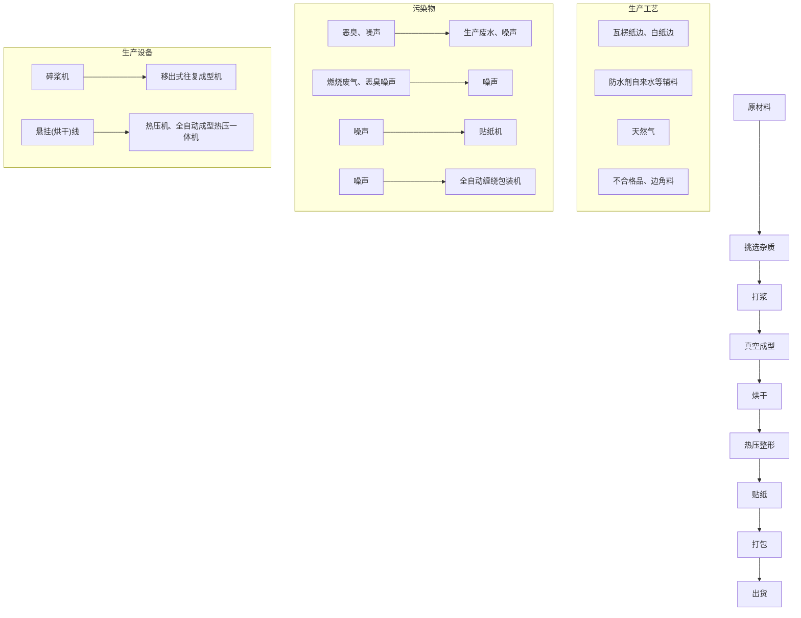
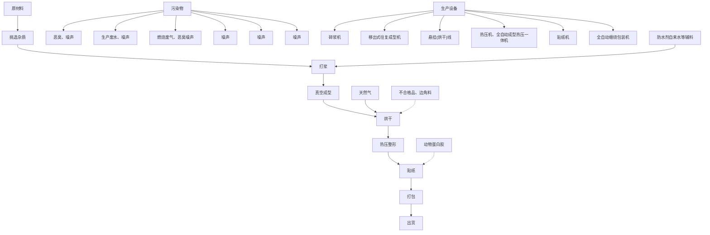
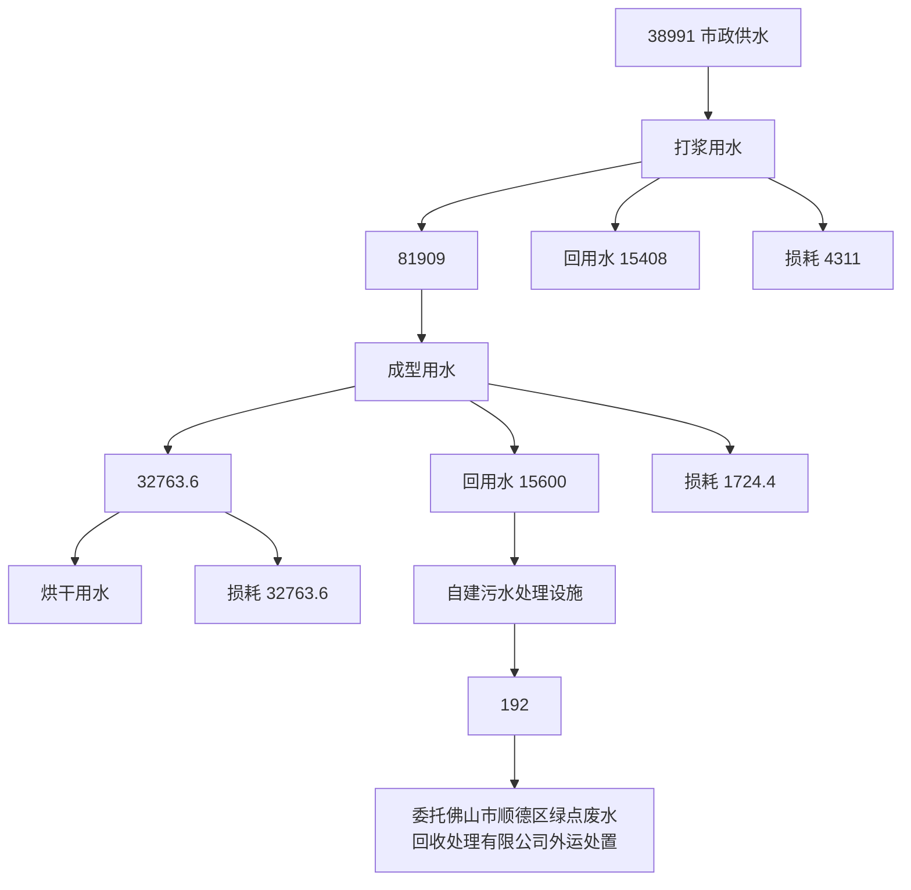
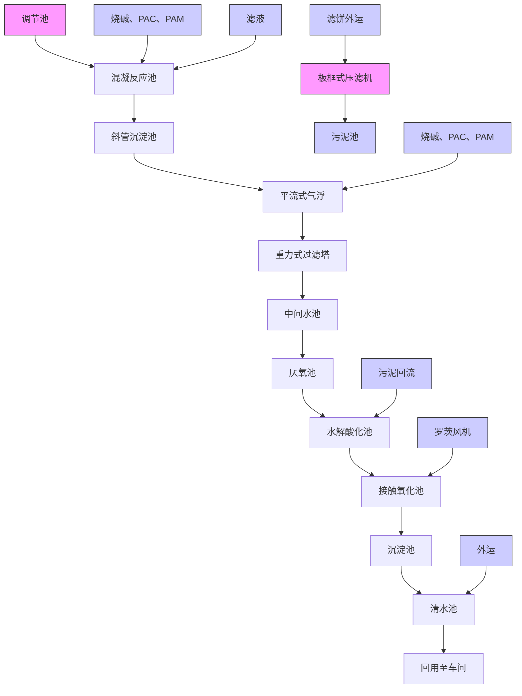
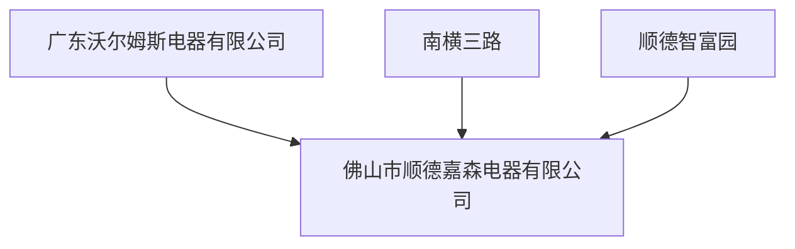
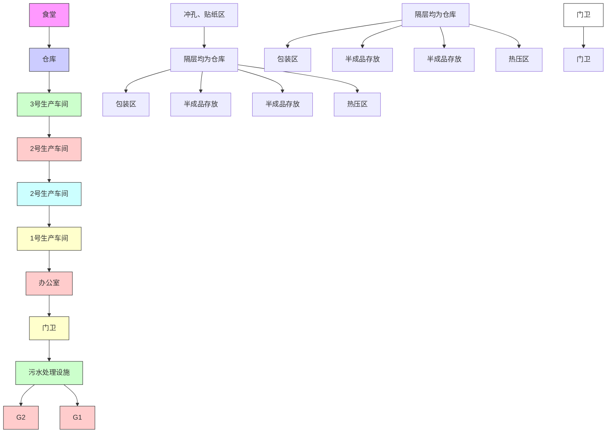

# 建设项目环境影响报告表

（污染影响类）


项目名称：佛山市顺德区金福华包装实业有限公司扩建项目建设单位（盖章）：佛山市顺德区金福华包装实业有限公司

编制日期：\_2023年11月


<details>
<summary>text_image</summary>

广东润环环境科技有限公司
4401000170146
</details>

中华人民共和国生态环境部制

打印编号：1701156763000

编制单位和编制人员情况表

<table><tr><td colspan="2">项目编号</td><td colspan="3">vi2156</td></tr><tr><td colspan="2">建设项目名称</td><td colspan="3">佛山市顺德区金福华包装实业有限公司扩建项目</td></tr><tr><td colspan="2">建设项目类别</td><td colspan="3">19-038纸制品制造</td></tr><tr><td colspan="2">环境影响评价文件类型</td><td colspan="3">报告表</td></tr><tr><td colspan="5">一、建设单位情况</td></tr><tr><td colspan="2">单位名称(盖章)</td><td colspan="3">佛山市顺德区金福华包装实业有限公司</td></tr><tr><td colspan="2">统一社会信用代码</td><td rowspan="4" colspan="3"></td></tr><tr><td colspan="2">法定代表人(签章)</td></tr><tr><td colspan="2">主要负责人(签字)</td></tr><tr><td colspan="2">直接负责的主管人员(签字)</td></tr><tr><td colspan="5">二、编制单位情况</td></tr><tr><td colspan="2">单位名称(盖章)</td><td colspan="3">广东润环环境科技有限公司</td></tr><tr><td colspan="2">统一社会信用代码</td><td colspan="3">91440101MA5CYAFB54</td></tr><tr><td colspan="5">三、编制人员情况</td></tr><tr><td colspan="5">1.编制主持人</td></tr><tr><td>姓名</td><td colspan="2">职业资格证书管理号</td><td>信用编号</td><td>签字</td></tr><tr><td>张朝</td><td colspan="2">2016035230352015230004000247</td><td>BH006416</td><td></td></tr><tr><td colspan="5">2.主要编制人员</td></tr><tr><td>姓名</td><td colspan="2">主要编写内容</td><td>信用编号</td><td>签字</td></tr><tr><td>张朝</td><td colspan="2">建设项目基本情况、建设项目工程分析、区域环境质量现状、环境保护目标及评价标准、主要环境影响和保护措施、环境保护措施监督检查清单、结论</td><td>BH006416</td><td></td></tr></table>

附3

# 建设项目环境影响报告表

# 编制情况承诺书

本单位广东润环环境科技有限公司（统一社会信用代码91440101MA5CYAFB54）郑重承诺：本单位符合《建设项目环境影响报告书（表）编制监督管理办法》第九条第一款规定，无该条第三款所列情形，不属于（属于/不属于）该条第二款所列单位：本次在环境影响评价信用平台提交的由本单位主持编制的佛山市顺德区金福华包装实业有限公司扩建项目坏境影响报告表基本情况信息真实准确、完整有效，不涉及国家秘密；该项目环境影响报告书（表）的编制主持人为张朝（环境影响评价工程师职业资格证书管理号20160352303520215230004000247，信用编号BH006416），主要编制人员包括张朝（信用编号BH006416）等1人，上述人员均为本单位全职人员；本单位和上述编制人员未被列入《建设项目坏境影响报告书（表）编制监督管理办法》规定的限期整改名单、坏境影响评价失信“黑名单”。

承诺单位（公

2023年11月2


<details>
<summary>text_image</summary>

章): 
28日
</details>

quallications for Environmental impact Assesmenl


<details>
<summary>text_image</summary>

中华人民共和国人力资源和社会保障部
By
</details>


<details>
<summary>text_image</summary>

中华人民共和国环境保护
Appurated Authorized
Ministry of Environmental Protection
</details>


<details>
<summary>text_image</summary>

管王
File

004000247
</details>

Fil Name张朝

Sex 男

出生年月：

DateofBinh1984年10月

专业类别：

Professional Type

批准日期：

ApprovalDale2016年5月22日

Issued by

签发日期：


#


称 名

类


<details>
<summary>text_image</summary>

Circular emblem with Chinese text and a red star, likely a company or official seal
</details>


<details>
<summary>text_image</summary>

市番禺区市场监督指南
年 07月 23日
</details>

# 一、建设项目基本情况

<table><tr><td>建设项目名称</td><td colspan="3">佛山市顺德区金福华包装实业有限公司扩建项目</td></tr><tr><td>项目代码</td><td colspan="3">/</td></tr><tr><td>建设单位联系人</td><td></td><td>联系方式</td><td></td></tr><tr><td>建设地点</td><td colspan="3">佛山市顺德区杏坛镇顺德科技工业园第二期3-04-3号</td></tr><tr><td>地理坐标</td><td colspan="3">(北纬:22度46分19.105秒,东经:113度11分46.391秒)</td></tr><tr><td>国民经济行业类别</td><td>C2239其他纸制品制造</td><td>建设项目行业类别</td><td>“十九、造纸和纸制品业——38、纸制品制造223”中的“有涂布、浸渍、印刷、粘胶工艺的”</td></tr><tr><td>建设性质</td><td>□新建(迁建)□改建☑扩建□技术改造</td><td>建设项目申报情形</td><td>□首次申报项目□不予批准后再次申报项目☑超五年重新审核项目□重大变动重新报批项目</td></tr><tr><td>项目审批(核准/备案)部门(选填)</td><td>/</td><td>项目审批(核准/备案)文号(选填)</td><td>/</td></tr><tr><td>总投资(万元)</td><td>5000</td><td>环保投资(万元)</td><td>50</td></tr><tr><td>环保投资占比(%)</td><td>1.0%</td><td>施工工期</td><td>1个月</td></tr><tr><td>是否开工建设</td><td>□否☑是:扩建部分暂未投产</td><td>用地(用海)面积( $m^{2}$ )</td><td>16676.64</td></tr><tr><td>专项评价设置情况</td><td colspan="3">无</td></tr><tr><td>规划情况</td><td colspan="3">无</td></tr><tr><td>规划环境影响评价情况</td><td colspan="3">无</td></tr><tr><td>规划及规划环境影响评价符合性分析</td><td colspan="3">无</td></tr></table>

<table><tr><td rowspan="2">其他符合性分析</td><td colspan="3">1、选址合理性分析本项目位于佛山市顺德区杏坛镇顺德科技工业园第二期3-04-3号,根据《顺德区产业发展保护区划定方案》,位于XT7杏坛科技园产业发展保护区内,属于工业用地。本项目选址不属于水源保护区,不属于大气一类保护区,不占用基本农田保护区、风景区等其它用途的用地。项目选址符合相关法律法规的要求,符合城镇规划和环境规划要求,因此项目选址合理。2、产业政策符合性分析项目属于C2239其他纸制品制造,根据《产业结构调整指导目录(2019年本)》的规定,项目不属于目录所列的鼓励类、限制类、禁止(淘汰)类项目,属于允许类。根据《市场准入负面清单(2022年版)》,项目不属于其中的禁止准入类。根据广东省发展改革委关于印发《广东省“两高”项目管理目录(2022年版)》的通知(粤发改能源函〔2022〕1363号),项目属于C2239其他纸制品制造,不属于“两高”企业。综上所述,项目符合国家、广东省、佛山市以及顺德区产业政策和相关规范的要求。3、项目与“三线一单”生态环境分区管控方案相符性分析项目位于佛山市顺德区杏坛镇顺德科技工业园第二期3-04-3号。根据《广东省人民政府关于印发广东省“三线一单”生态环境分区管控方案的通知》(粤府〔2020〕71号)和《佛山市人民政府关于印发佛山市“三线一单”生态环境分区管控方案的通知》(佛府〔2021〕11号),项目符合广东省和佛山市的“三线一单”生态环境分区管控方案要求。根据《佛山市顺德区人民政府关于印发佛山市顺德区“三线一单”生态环境分区管控方案的通知》(顺府发〔2021〕11号)发布的佛山市顺德区环境管控单元图(见附图9),项目选址位置属于杏坛镇重点管控区(编码为ZH44060620005)。项目与广东省佛山市顺德区重点管控单元2准入清单的相符性分析见表1-1:表1-1 项目与佛山市顺德区“三线一单”的符合性</td><td></td></tr><tr><td>管控维度</td><td>管控要求</td><td>本项目</td><td>符合性</td></tr><tr><td rowspan="4"></td><td rowspan="4">区域布局管控</td><td>1-1.【生态/禁止类】单元内的一般生态空间,主导生态功能为水土保持,禁止在25度以上的陡坡地开垦种植农作物,禁止在崩塌、滑坡危险区、泥石流易发区从事采石、取土、采砂等可能造成水土流失的活动。</td><td>本项目不涉及。</td><td>符合</td></tr><tr><td>1-2.【产业/鼓励引导类】重点发展新材料、智能家居、先进装备制造业、汽车配件等产业以及军民融合产业,提升发展塑料专业市场,培育智能家居创新创业产业链,依托顺德新港发展临港加工和物流产业,发展现代农业。</td><td>本项目不涉及。</td><td>符合</td></tr><tr><td>1-3.【产业/综合类】系统推进村级工业园升级改造,腾出连片空间,布局产业集聚区和主题产业园,推动工业项目入园集聚发展。新增工业制造业用地原则上安排在产业集聚区内,产业集聚区外原则上不鼓励工业及物流仓储用地的新建与改造。</td><td>本项目不涉及。</td><td>符合</td></tr><tr><td>1-4.【产业/综合类】产业聚集区所属地块内的工业用地或企业与村庄、学校等环境敏感点之间应设置合理的大气环境防护距离,并通过绿化带进行有效隔离;聚集区规划布局应注重大气污染排放企业应尽量避免布局在居住用地的常年主导风向的上风向。</td><td>项目500m范围内主要敏感点为光辉村。相距较远,敏感点位于项目侧风向,影响较小。</td><td>符合</td></tr><tr><td rowspan="8"></td><td rowspan="3"></td><td>1-5.【产业/限制类】受纳水体或监控断面不达标的,不得新建、扩建向河涌直接排放废水的项目。新建、扩建含蚀刻工序的线路板生产项目和化工项目应在配套污水集中处置的工业园区或生活污水管网覆盖区域内建设;纯加工型印花项目,含酸洗、磷化的金属表面处理、金属制品项目(与自身高新技术企业配套的除外),含酸洗、喷涂、化学抛光、电解等涉及废水排放工艺的不锈钢型材加工项目(与自身高新技术企业配套的除外),应进入以此类项目为主导产业、有相应废水集中治理设施的工业园区,实现集中治污。</td><td>项目产生的生活污水经三级化粪池处理达标后排至杏坛污水处理厂处理,尾水排入顺德支流。参考《佛山市生态环境局顺德分局关于发布2022年度佛山市顺德区生态环境状况公报的通知》,项目纳污水体顺德支流西海断面断面监测的水质达到了III类标准要求;项目行业类别为C2239其他纸制品制造,不属于以下项目:新建、扩建含蚀刻工序的线路板生产项目和化工项目;纯加工型印花项目,含酸洗、磷化的金属表面处理、金属制品项目,含酸洗、喷涂、拉丝、表面抛光等工艺的不锈钢型材加工项目。</td><td>符合</td></tr><tr><td>1-6.【产业/综合类】划定家具生产优先发展区域,优先发展区外不再新建涉及涂装工艺的木质家具制造项目。</td><td>本项目不涉及。</td><td>符合</td></tr><tr><td>1-7.【水/限制类】严格限制在右滩水厂、均安水厂饮用水水源保护区上游和周边区域建设列入“高污染、高环境风险”产品名录等可能影响水环境安全的项目。</td><td>本项目不涉及。</td><td>符合</td></tr><tr><td></td><td>1-8.【土壤/禁止类】禁止新建、扩建增加重点防控的重金属污染物排放的建设项目。</td><td>本项目不涉及。</td><td>符合</td></tr><tr><td rowspan="4">能源资源利用</td><td>2-1【能源/鼓励引导类】推广节能技术,加快发展绿色货运与现代物流。</td><td rowspan="4">本项目生产过程中所用的资源主要为水资源、电能、天然气。本项目给水由市政供水接入,电能由区域电网供应,不会突破当地的能源资源利用上线。</td><td>符合</td></tr><tr><td>2-2【能源/鼓励引导类】推广新能源汽车应用和充电基础设施建设,积极推动重卡LNG加气站、充电基础设施、加氢站建设。</td><td>符合</td></tr><tr><td>2-3.【能源/综合类】科学实施能源消费总量和强度“双控”,新建高能耗项目单位产品(产值)能耗达到国际国内先进水平。</td><td>符合</td></tr><tr><td>2-4.【水资源/综合类】贯彻落实“节水优先”方针,实行最严格水资源管理制度,杏坛镇万元国内生产总值用水量、万元工业增加值用水量、用水总量、农田灌溉水有效利用系数等用水总量和效率指标达到区下达要求。2-5.【土地资源/限制类】落实单位土地面积投资强度、土地利用强度等建设用地控制性指标要求,提高土地利用效率。</td><td>符合符合</td></tr><tr><td rowspan="6"></td><td></td><td>2-6.【岸线/禁止类】严格水域岸线用途管制,新建项目一律不得违规占用水域。严禁破坏生态的岸线利用行为和不符合其功能定位的开发建设活动,严禁以各种名义侵占河道、围垦湖泊、非法采砂等</td><td>本项目不涉及。</td><td>符合</td></tr><tr><td rowspan="5">污染物排放管控</td><td>3-1.【水/限制类】城镇新区建设实行雨污分流,逐步推进初期雨水收集、处理和资源化利用。住宅、商业体、学校、市场等城镇开发建设项目应当配套或者同步计划建设公共排水设施,公共排水设施或自建排污水设施未能投产运行的,以上涉水项目不得投入使用。新建小区严格实施雨污分流,阳台、露台等污水接入污水收集系统,将生活污水“应截尽截”。做好大型楼盘、集贸市场、餐饮以及学校等4大类排水户污水接入市政管网工作。</td><td>生活污水经三级化粪池预处理后排入杏坛污水处理厂处理,尾水排入顺德支流。</td><td>符合</td></tr><tr><td>3-2.【水/综合类】杏坛镇重点河涌水质上年度未达到水环境环境质量目标的,需组织编制、系统实施、向社会公开区域重点水污染物减排计划并明确“替代量”,本年度新建、改建、扩建项目新增水环境重点污染物实行区域“减二增一”替代(工业、生活或综合集中废水处理设施、民生项目除外)。</td><td>生活污水经三级化粪池预处理后排入杏坛污水处理厂处理。</td><td>符合</td></tr><tr><td>3-3.【水/综合类】区域内应合理规划建设工业或综合集中废水处理设施。逐步推进工业集聚区“污水零直排区”建设,开展排水单元工业废水、生活污水、雨水分类收集、分质处理,确保园区“管网全覆盖、雨污全分流、污水全收集、处理全达标”。</td><td rowspan="3">项目所在地不属于村级工业园升级改造区域。生活污水经三级化粪池预处理后排入杏坛污水处理厂处理</td><td>符合</td></tr><tr><td>3-4.【水/综合类】结合村级工业园改造,全面提升产业层次与集聚度,促进污染集中整治。</td><td>符合</td></tr><tr><td>3-5.【水/综合类】稳步推进排水设施“三个一体化”管理模式,补齐城乡污水收集和处理短板,推动杏坛污水处理厂提质增效,加快消除城中村、老旧城区、城乡结合部等污水收集管网空白区,逐步实现城乡污水收集处理全覆盖。2025年前完成杏坛污水处理厂扩建,尾水应执行《城镇污水处理厂污染物排放标准》(GB18918-2002)一级A标准及《广东省水污染物排放限值》(DB44/26-2001)的较严值。3-6.【水/综合类】近期保留桑麻村、逢简村、吉村、安富村等现状农村污水分散式处理设施,继续完善污水支管网建设,提高污水收集处理率,新建龙潭村、吉村、右滩村、南朗村、光华村、东村、北水村等农村分散式生活污水处理设施,其余行政村(社区)继续完善污水管网建设,收集农村污水进入市政污水系统,有条件的区域实施雨污分流改造,到2030年全面雨污分流,污水纳入杏坛城镇污水处理系统。</td><td>符合符合</td></tr><tr><td rowspan="7"></td><td rowspan="3"></td><td>3-7.【水/综合类】产业集聚区和主题园区内做好污水管网和污水集中处理设施的配套保障,确保废水收集到城镇污水处理厂、园区污水处理厂或分散式污水处理设施集中处置。</td><td></td><td>符合</td></tr><tr><td>3-8.【大气/综合类】大力推进低VOCs含量原辅材料替代,加快涉VOCs重点行业的生产工艺升级改造,推行自动化生产工艺,对达不到要求的VOCs收集及治理设施进行整治提升,逐步淘汰低效VOCs治理设施。</td><td>本项目不涉及。</td><td>符合</td></tr><tr><td>3-9.【土壤/限制类】作为重金属污染重点防控区,区域内重点重金属排放总量只减不增。</td><td>本项目不涉及。</td><td>符合</td></tr><tr><td rowspan="2">环境风险防控</td><td>4-1.【水/综合类】加强单元内右滩水厂、均安水厂饮用水水源保护区周边环境风险源管控,完善突发环境事件应急管理体系。</td><td rowspan="3">项目化学品仓库、危险废物暂存间;对于废气处理系统发生故障的情况,应立即停止相关生产环节,避免废气不经处理直接排到大气中,并立即请有关技术人员进行维修。编制企业环境应急预案,并向相应生态环境部门备案,平时按要求加强应急预案演练。</td><td>符合</td></tr><tr><td>4-2.【水/综合类】杏坛污水处理厂、工业污水集中处理设施应采取有效措施,防止事故废水直接排入水体。完善污水处理厂在线监控系统联网,实现污水处理厂的实时、动态监管。</td><td>符合</td></tr><tr><td></td><td>4-3.【风险/综合类】加强环境风险分级分类管理,强化金属制品、有色金属和压延加工、化学原料和化学品制造业等涉重金属、化工行业企业及工业园区等重点环境风险源的环境风险防控。</td><td>符合</td></tr><tr><td colspan="4">综上,项目符合《佛山市顺德区“三线一单”生态环境分区管控方案》(佛府〔2021〕11号)的管控要求。</td></tr></table>

# 二、建设项目工程分析

<table><tr><td rowspan="2">建设内容</td><td colspan="5">1、项目扩建前后工程组成佛山市顺德区金福华包装实业有限公司扩建项目选址于佛山市顺德区杏坛镇顺德科技工业园第二期3-04-3号,原项目于2006年12月通过建设项目环境影响报告批准证,编号为:20062006号,项目原批准设备规模为:碎浆机8台、高频振筛4台、奖池搅拌器20台、真空泵12台、移出式往复成型机40台、热压机96台、空压机8台、悬挂线8条、皮带线32条,生产规模为年生产鸡蛋托盒6500万个,企业于2020年3月30日办理固定污染源排污登记并取得登记回执(登记编号:914406067946819194)详见附件4。现由于企业发展需要,在原有基础上进行扩建,依托原有生产厂房,本扩建项目建设内容主要包括以下几个方面1变动情况:原有审批报告中,无原有项目生产产品产量和原辅材料等;本次对已建成项目中进行扩建,调整原有生产设备,对应新增更为自动化生产设备;相应补充产品产量和原辅材料等。2项目扩建前后产品、生产工艺不变,扩建后项目年生产鸡蛋托盒22800万个;迁建后项目总用地面积约16676.64平方米,总建筑面积约12647平方米。从业人员为170人,年工作300天,每天工作12小时(两班制),厂区内设有设员工饭堂,不设宿舍。根据《中华人民共和国环境影响评价法》(2018年12月29日修订)、《国务院关于修改〈建设项目环境保护管理条例〉的决定》(国务院令第682号)等法律法规的规定,建设对环境有影响的项目必须进行环境影响评价。参照《建设项目环境影响评价分类管理名录》(2021年版)(生态环境部令第16号),本项目属于“‘‘十九、造纸和纸制品业——38、纸制品制造223”中的“有涂布、浸渍、印刷、粘胶工艺的”,需编制建设项目环境影响报告表。项目扩建前后工程组成见表2-1表2-1项目扩建前后工程组成</td><td colspan="2"></td></tr><tr><td>序号</td><td>类别</td><td>工程名称</td><td>搬迁前规模</td><td>搬迁后规模</td><td colspan="2">变化情况</td></tr><tr><td rowspan="12"></td><td rowspan="2">1</td><td rowspan="2">主体工程</td><td colspan="2">1号生产车间</td><td>主要设有热压区、贴标区、包装区、半成品存放区,办公室等;面积为 $7560m^{2}$ </td><td>主要设有热压区、贴标区、包装区、半成品存放区,办公室等;面积为 $7560m^{2}$ </td><td rowspan="4">不变</td></tr><tr><td colspan="2">2号生产车间</td><td>主要设有打浆区、成型区、烘干区、半成品存放区等;面积为 $2916m^{2}$ </td><td>主要设有打浆区、成型区、烘干区、半成品存放区等;面积为 $2916m^{2}$ </td></tr><tr><td>2</td><td>贮存工程</td><td colspan="2">仓库</td><td>位于3号生产车间内,用于储存原料及成品,面积为 $1512m^{2}$ </td><td>位于生产车间3内,用于储存原料及成品,面积为 $1512m^{2}$ </td></tr><tr><td>3</td><td>辅助工程</td><td colspan="2">办公室</td><td>位于1号生产车间西南侧,主要用于办公,面积约 $400m^{2}$ </td><td>位于1号生产车间西南侧,主要用于办公,面积约 $400m^{2}$ ,</td></tr><tr><td rowspan="2">4</td><td rowspan="2">公用工程</td><td colspan="2">给水设施</td><td>给水由市政水管网供应</td><td>给水由市政水管网供应</td><td>不变</td></tr><tr><td colspan="2">供电设施</td><td>用电由政电网供应</td><td>用电由政电网供应</td><td>不变</td></tr><tr><td rowspan="6">5</td><td rowspan="6">环保工程</td><td rowspan="3">固体废物</td><td>危险废物</td><td>1个,面积约 $20m^{2}$ ,存放危险废物;危险废物收集后放置于危险废物堆场内,再交由有相应危险废物处理资质的单位进行处置</td><td>1个,面积约 $20m^{2}$ ,存放危险废物;危险废物收集后放置于危险废物堆场内,再交由有相应危险废物处理资质的单位进行处置</td><td>不变</td></tr><tr><td>一般固体废物</td><td>1个,面积约 $30m^{2}$ ,存放一般工业固体废物;一般工业固废收集后放置于一般固废堆场内,再由回收公司统一回收</td><td>1个,面积约 $30m^{2}$ ,存放一般工业固体废物;一般工业固废收集后放置于一般固废堆场内,再由回收公司统一回收</td><td>不变</td></tr><tr><td>生活垃圾</td><td>交由环卫部门定期进行统一清理</td><td>交由环卫部门定期进行统一清理</td><td>不变</td></tr><tr><td>废水</td><td>生活污水</td><td>雨污分流;雨水经雨水口收集后汇入相邻道路市政雨水管网。生活污水经三级化粪池处理后,通过污水管网排入杏坛污水处理厂。</td><td>雨污分流;雨水经雨水口收集后汇入相邻道路市政雨水管网。生活污水经三级化粪池处理后,通过污水管网排入杏坛污水处理厂。</td><td>不变</td></tr><tr><td>噪声</td><td>隔声降噪</td><td>本项目噪声为设备运行产生,采取选用低声设备、车间合理布局、安装减震基础、厂房隔声、距离衰减等措施削减</td><td>本项目噪声为设备运行产生,采取选用低声设备、车间合理布局、安装减震基础、厂房隔声、距离衰减等措施削减</td><td>不变</td></tr><tr><td>废气</td><td>烘干废气</td><td>烘干过程生产的恶臭经收集后,引至15m排气筒高空排放。</td><td>烘干过程生产的恶臭经收集后,引至15m排气筒高空排放。</td><td>不变</td></tr></table>

<table><tr><td></td><td></td><td>废气</td><td>燃烧废气</td><td>烘干工序使用天然气直接燃烧后经热送风进行烘干,其燃烧废气经与烘干废气一起通过15m高排气筒高空排放。</td><td>烘干工序使用天然气直接燃烧后经热送风进行烘干,其燃烧废气经与烘干废气一起通过15m高排气筒高空排放</td><td>不变</td></tr></table>

# 2、扩建前后主要产品及产能

项目扩建前后主要产品及产能见表2-2。

表 2-2 产品及产能一览表

<table><tr><td rowspan="2">序号</td><td rowspan="2">名称</td><td colspan="3">产量</td><td rowspan="2">单位</td><td rowspan="2">备注</td></tr><tr><td>扩建前</td><td>变化量</td><td>扩建后</td></tr><tr><td>1</td><td>鸡蛋包装盒</td><td>6500</td><td>+16300</td><td>22800</td><td>万个/年</td><td>长:10cm~30cm,宽:5cm~20cm,厚度:1mm~6mm,总重量约为8622吨</td></tr></table>

# 3、项目设备清单

项目扩建前后主要生产单元、主要工艺、生产设施及设施参数见表2-3。

表 2-3 搬迁前后主要生产单元、主要工艺、生产设施及设施参数一览表

<table><tr><td rowspan="2">序号</td><td rowspan="2">名称</td><td rowspan="2">单位</td><td colspan="3">数量</td><td rowspan="2">设备参数</td><td rowspan="2">备注</td></tr><tr><td>扩建前</td><td>变化量</td><td>扩建后</td></tr><tr><td>1</td><td>碎浆机</td><td>台</td><td>4</td><td>0</td><td>4</td><td>55kw</td><td>打浆工序</td></tr><tr><td>2</td><td>空压机</td><td>台</td><td>8</td><td>0</td><td>8</td><td>37kw</td><td>辅助工程</td></tr><tr><td>3</td><td>高频振筛</td><td>台</td><td>4</td><td>-1</td><td>3</td><td>4kw</td><td>打浆工序</td></tr><tr><td>4</td><td>悬挂(烘干)线</td><td>台</td><td>4</td><td>-2</td><td>2</td><td>动力3.5KW(1#线风机22KW*1台+15KW*1台+7.5KW*3台,2#线风机11KW*12台)</td><td>烘干工序</td></tr><tr><td>5</td><td>浆池搅拌器</td><td>台</td><td>20</td><td>+6</td><td>26</td><td>2.2kw或3kw</td><td>打浆工序</td></tr><tr><td>6</td><td>真空泵</td><td>台</td><td>12</td><td>-8</td><td>4</td><td>132KW*1台+37KW*3台</td><td>真空成型工序</td></tr><tr><td>7</td><td>热压机</td><td>台</td><td>96</td><td>-72</td><td>24</td><td>5T机*17台+10T机*7台</td><td>热压整形工序</td></tr><tr><td>9</td><td>移出式往复成型机</td><td>台</td><td>40</td><td>-26</td><td>14</td><td>XW-11085,模板尺寸1100*850mm</td><td>真空成型工序</td></tr><tr><td colspan="8">以上扩建前为原批准设备数量,扩建后数量为现有实际生产设备数量,扩建后项目取消一部分旧设备,新增一部分自动化设备,以下为扩建后新增自动化生产设备数量</td></tr><tr><td>10</td><td>全自动成型热压一体机</td><td>台</td><td>0</td><td>4</td><td>4</td><td>90KW</td><td>成型烘干热压一体</td></tr><tr><td>11</td><td>自动冲孔机</td><td>台</td><td>0</td><td>3</td><td>3</td><td>/</td><td>辅助工序</td></tr><tr><td>12</td><td>纸浆模塑蛋盒生产设备</td><td>台</td><td>0</td><td>1</td><td>1</td><td>JZW2-9895L</td><td></td></tr><tr><td>13</td><td>称重爬坡输送线</td><td>条</td><td>0</td><td>9</td><td>9</td><td>3KW</td><td>辅助工序</td></tr><tr><td>14</td><td>全自动纸浆模塑生产线</td><td>条</td><td>0</td><td>5</td><td>5</td><td>6000</td><td>成型烘干热压一体</td></tr><tr><td>15</td><td>贴纸机</td><td>条</td><td>0</td><td>13</td><td>13</td><td>8.5KW</td><td>贴纸工序</td></tr><tr><td>16</td><td>水力碎浆机及供浆配套系统</td><td>套</td><td>0</td><td>5</td><td>5</td><td>91KW</td><td>打浆工序</td></tr><tr><td>17</td><td>高频振筛</td><td>台</td><td>0</td><td>5</td><td>5</td><td>4KW</td><td>打浆工序</td></tr><tr><td>18</td><td>疏解机</td><td>台</td><td>0</td><td>5</td><td>5</td><td>37KW</td><td>辅助工序</td></tr><tr><td>19</td><td>搅拌器</td><td>台</td><td>0</td><td>10</td><td>10</td><td>3KW或4KW</td><td>打浆工序</td></tr><tr><td>20</td><td>浓度设备</td><td>台</td><td>0</td><td>10</td><td>10</td><td>/</td><td>辅助工序</td></tr><tr><td>21</td><td>浆泵</td><td>台</td><td>0</td><td>20</td><td>20</td><td>/</td><td>辅助工序</td></tr><tr><td>22</td><td>水泵</td><td>台</td><td>0</td><td>20</td><td>20</td><td>/</td><td>辅助工序</td></tr><tr><td>23</td><td>真空泵</td><td>台</td><td>0</td><td>5</td><td>5</td><td>132KW</td><td>辅助工序</td></tr><tr><td>24</td><td>空压机及配套系统</td><td>套</td><td>0</td><td>5</td><td>5</td><td>45KW</td><td>辅助工序</td></tr><tr><td>25</td><td>全自动缠绕包装机</td><td>台</td><td>0</td><td>5</td><td>5</td><td>/</td><td>包装</td></tr></table>

# 4、项目扩建前后主要原辅材料

项目扩建前后主要原辅材料及燃料的种类和用量见表2-4。

表2-4 项目主要原辅材料及燃料参数一览表

<table><tr><td rowspan="2">原辅料名称</td><td colspan="3">年使用量</td><td rowspan="2">形态</td><td rowspan="2">存储方式</td><td rowspan="2">单位</td><td rowspan="2">最大存储量</td><td rowspan="2">对应工序</td></tr><tr><td>扩建前</td><td>变化量</td><td>扩建后</td></tr><tr><td>植物纤维</td><td>897</td><td>+220</td><td>1059</td><td>固态</td><td>捆绑</td><td>吨/年</td><td>20吨</td><td rowspan="4">打浆</td></tr><tr><td>回收未经印刷白纸边</td><td>1772</td><td>+3832</td><td>4837</td><td>固态</td><td>捆绑</td><td>吨/年</td><td>30吨</td></tr><tr><td>回收未经印刷瓦楞纸边</td><td>558</td><td>+4034t</td><td>3785</td><td>固态</td><td>捆绑</td><td>吨/年</td><td>30吨</td></tr><tr><td>防水剂</td><td>132</td><td>+330</td><td>462</td><td>液态</td><td>200kg/桶装</td><td>吨/年</td><td>5吨</td></tr><tr><td>动物蛋白胶</td><td>74</td><td>+185</td><td>259</td><td>液态</td><td>25kg/袋装</td><td>吨/年</td><td>5吨</td><td>贴纸</td></tr><tr><td>聚合氯化铝(PAC)</td><td>19.1</td><td>+47.75</td><td>66.85</td><td>固态</td><td>25kg/袋装</td><td>吨/年</td><td>4吨</td><td>废水</td></tr><tr><td>氢氧化钠</td><td>5</td><td>+12.5</td><td>17.5</td><td>固态</td><td>25kg/袋装</td><td>吨/年</td><td>5吨</td><td rowspan="2">处理</td></tr><tr><td>聚丙烯酰胺(PAM)</td><td>1.2</td><td>+3</td><td>4.2</td><td>固态</td><td>袋装</td><td>吨/年</td><td>4吨</td></tr><tr><td>机油</td><td>0.18</td><td>+0.45</td><td>0.63</td><td>液态</td><td>200kg/桶装</td><td>吨/年</td><td>5吨</td><td>设备维护</td></tr><tr><td>彩纸</td><td>9456</td><td>+17000</td><td>26456</td><td>固态</td><td>扎装</td><td>万张/年</td><td>4吨</td><td rowspan="3">包装</td></tr><tr><td>胶袋</td><td>45000</td><td>+50000</td><td>95000</td><td>固态</td><td>袋装</td><td>个/年</td><td>5吨</td></tr><tr><td>热收缩袋</td><td>660</td><td>1650</td><td>2310</td><td>固态</td><td>卷装</td><td>卷/年</td><td>4吨</td></tr><tr><td>染料</td><td>80</td><td>+100</td><td>180</td><td>固态</td><td>30kg/箱装</td><td>吨/年</td><td>5吨</td><td rowspan="2">打浆</td></tr><tr><td>固色剂</td><td>80</td><td>+100</td><td>180</td><td>液态</td><td>100kg/箱装</td><td>吨/年</td><td>4吨</td></tr></table>

表 2-5 主要原辅材料化学品特性表

<table><tr><td>原料</td><td>主要成分及其理化性质</td></tr><tr><td>防水剂</td><td>白色或略带黄色的乳液,无味,密度:1.02-1.05kg/cm3;主要成分为AKD原料;即烷基烯酮二聚体,CAS号:144245-85-2,其沸点为584.2°C;溶于乙醇、苯、三氯甲烷等有机溶剂,具有抗弱酸、弱碱或其他渗透剂的能力,根据企业提供的MSDS报告及检测报告可知,AKD原粉采用无溶剂法生产,不含有甲苯等有害物质;AKD防水剂的制备将硬脂酸酰氯加入反应釜中,再加入0.3%的磷酸三乙酯作催化剂,叔胺作阻聚剂。在570~780°C裂解,得产品AKD。乳化将阳离子淀粉与水混合Chemicalbook后加入反应器,用硫酸调pH值至3.5。然后在90~95°C下糊化1h,冷却至75°C在搅拌下加入AKD。并通过30MPa的高压均化器均化,再加水稀释成所需的乳液,其MSDS及SGS报告见附件4。</td></tr><tr><td>植物纤维</td><td>植物纤维(Plantfibre)是广泛分布在种子植物中的一种厚壁组织。它的细胞细长,两端尖锐,具有较厚的次生壁,壁上常有单纹孔,成熟时一般没有活的原生质体。植物纤维是纤维素与各种营养物质结合生成的丝状或者絮状物,对于植物具有支撑、连接、包裹、充填等作用;项目使用的为竹木及甘蔗的植物纤维,固体状,植物纤维具有强度高,表面纹理天然、质朴,颜色鲜艳,质感新颖,适合制做多次、反复使用的物品;</td></tr><tr><td>动植物蛋白胶</td><td>也称动物胶,在印刷包装行业的胶称果冻胶,主要由:明胶、糖浆、水组成,淡黄色固体,芳香味,沸点:100°C,密度为1.03,可任何比例溶于水;果冻胶是一种新型的环保胶粘剂,取材天然,不含挥发性有机物其MSDS见附件4。</td></tr><tr><td>固色剂</td><td>主要由固色剂、水、盐类组成,轻微气味黄绿色液体,可以在任意比例分散于水中,常温常压下稳定,其MSDS见附件4。</td></tr><tr><td>染料</td><td>染料是指能使其他物质获得鲜明而牢固色泽的一类有机化合物,由于现在使用的颜料都是人工合成的,所以也称为合成染料。染料和颜料一般都是自身有颜色,并能以分子状态或分散状态使其他物质获得鲜明和牢固色泽的化合物</td></tr><tr><td>机油</td><td>油状液体,淡黄色至褐色,无气味或略带异味的液体。机油不溶于水,且具有可燃性,闪点76°C,引燃温度为248°C,遇明火、高温可燃。机油能起到润滑减磨、辅助冷却降温、密封防漏、防锈防蚀、减震缓冲等作用。</td></tr></table>

表 2-6 相关设备产能参数一览表

<table><tr><td>设备名称</td><td>台数</td><td>单台生产能力(t/d)</td><td>型号</td><td>生产时间(d)</td><td>单台生产能力(t/a)</td><td>合计生产能力(万 m/a)</td></tr><tr><td>碎浆机</td><td>4 台</td><td>2-4</td><td>55kw</td><td>300</td><td>600-1200</td><td>2400-4800</td></tr><tr><td>碎浆机</td><td>5 台</td><td>4-8</td><td>91kw</td><td>300</td><td>1200-2400</td><td>6000-12000</td></tr></table>

<table><tr><td>合计</td><td>8400-16800</td></tr><tr><td>设计产能</td><td>8622</td></tr><tr><td colspan="2">注:根据企业提供信息,项目扩建前设有4台碎浆机平均每天可生产约10吨鸡蛋包装盒,即年生产量约为3000吨,扩建后新增5台碎浆机;设计产能为约25吨/天,即年生产鸡蛋包装盒约7500吨;项目扩建后打浆机合计生产能力为8400-16800吨/年,项目申报产能为8622吨/年,本项目申报的生产在设计产能范围内。因此,项目申报的原辅材料用量与设备数量及规格相配匹。</td></tr></table>

# 5、能源及水耗

项目用水由市政给水管网供应。用水主要为员工生活用水、生产用水。

生活用水：扩建后从业人数为170人，年工作日300天；工作时间为每天24小时，项目设有饭堂，不设员工宿舍。生活用水参照广东省地方标准《用水定额 第3部分：生活》（DB44/T1461.3-2021）中“国家机构（92）-国家行政机构（922）-办公楼-有食堂和浴室”的先进值用水定额，生活用水按15m3/（人·a）计，则生活用水量约为2550m3 /a，生活污水经隔油隔渣池、三级化粪池处理后通过市政污水管网进入杏坛污水处理厂集中处理，最终排入顺德支流。生活污水排污系数取0.9，生活污水产生量为2295m3/a。

生产用水：项目生产过程中需要用水进行打浆，项目进行真空脱水成型时产生的废水经过自建污水处理设施处理处理后回用于打浆工序进行循环使用，由于生产废水治理后所得循环水在长期循环过程中，其水质硬度会发生改变，因此建设单位定期更换生产废水，定期交由委托佛山市顺德区绿点废水回收处理有限公司外运处置，同时及时补充更换废水产生的损耗及工件损耗水量，新鲜水补充量为38991m3/a。

# （3）能源消耗

本项目能耗主要为电能、天然气。用电由当地供电局统一供应，主要用于照明、设备运行等，项目总用电量约为1130万kwh/a，天然气用量为390万m3，不设备用发电机。

# 6、物料平衡

项目水平衡图

<table><tr><td></td><td>图2-1 项目水平衡图(单位 $m^3/a$ )7、劳动动员及工作制度项目扩建前后员工人数和工作时间进行调整,从业人数为170人,年工作日300天,每天工作24小时。8、厂区平面布置情况项目扩建后依托原有生产厂房。1号生产车间主要设有热压区、贴标区、包装区、半成品存放区,办公室等;面积为 $7560m^2$ ;2号生产车间主要设有打浆区、成型区、烘干区、半成品存放区等;面积为 $2916m^2$ ,仓库位于3号生产车间内,用于储存原料及成品,面积为 $1512m^2$ 。具体平面布置情况见附图2。</td></tr><tr><td>工艺流程和产排污环节</td><td></td></tr></table>

（1）本项目扩建后生产的产品不变，其主要生产工艺流程及产污环节示意图见下图：


<details>
<summary>flowchart</summary>


</details>

图 2-3 项目鸡蛋包装盒生产工艺流程图

# 主要工艺流程说明：

人工筛选杂质：回收未经印刷白纸边及瓦楞纸边，在厂内进行人工分选，筛选出混入纸边中的废铁丝、外包装等杂质，防止对水力碎浆机造成损坏，筛选出来的废铁丝、外包装、标签等为一般固废，厂内分类暂存后外售综合利用。筛选后的纸边运至生产线。

打浆：定量纸加白水在碎浆机里碎解后排在浆池加入防水剂和白水调成设定浓度的浆料。

真空成型：在成型机安装模具通过真空吸附成型生产出湿产品。

烘干：湿产品放经输送线进入烘道，天然气燃烧机加热用风机把热风抽到烘道里烘干产品。

<table><tr><td rowspan="10"></td><td colspan="4">整形:烘干的半成品用整形机配上模具加热加压生产出产品。贴纸:彩纸自动上胶水,定位贴在盒子上,采用动物蛋白胶,不含挥发性有机物。打包:将货物按规定的包装单元量打包收缩、堆放地台板、入库待售拌料。项目主要产污节点:表2-7产污节点一览表</td></tr><tr><td>序号</td><td>污染物类型</td><td>产生工序</td><td>污染因子</td></tr><tr><td rowspan="2">1</td><td rowspan="2">废水</td><td>员工办公生活</td><td> $COD_{Cr}$ 、 $BOD_5$ 、SS、 $NH_3-N$ </td></tr><tr><td>生产废水</td><td>经自建污水处理设施处理后回用于生产,委托佛山市顺德区绿点废水回收处理有限公司外运处置</td></tr><tr><td>2</td><td>废气</td><td>打浆、烘干</td><td>臭气浓度</td></tr><tr><td>3</td><td>噪声</td><td>主要生产工序</td><td>噪声</td></tr><tr><td>4</td><td>生活垃圾</td><td>员工办公生活</td><td>员工生活垃圾</td></tr><tr><td>5</td><td>危废</td><td>设备维护、废水处理</td><td>废机油、含油废抹布、废油桶罐、污泥</td></tr><tr><td rowspan="2">6</td><td rowspan="2">一般固体废物</td><td>成型、热压整形</td><td>次品、边角料</td></tr><tr><td>生产过程</td><td>废包装材料</td></tr><tr><td>与项目有关的原有环境污染问题</td><td colspan="4">原项目回顾性分析:(1)项目原工程概况本项目为扩建项目,佛山市顺德区金福华包装实业有限公司建设于2006年,原地址位于佛山市顺德区杏坛镇顺德科技工业园第二期3-04-3号,于2006年12月通过建设项目环境影响报告批准证,编号为:20062006号(见附件3)。原项目于2012年1月4号通过佛山市顺德区环境运输和城市管理局的验收工作,于2020年3月30日取得国家排污许可证(编号为914406067946819194001P)。项目自投入运营以来,未发生因环保问题引起的投诉。(2)项目扩建前生产工艺:(1)项目生产工艺流程:</td></tr></table>


<details>
<summary>flowchart</summary>


</details>

图 2-4 粒料生产工艺流程图

# 工艺流程说明：

项目扩建前后生产产品和生产工艺均不变，因此本次不在阐述。

# （2）扩建前污染源强及治理措施

扩建前，项目主要的污染源为生活污水、生产废水、燃烧废气、生活垃圾、生产噪声、危险废物等项目。

# ①废水

生活污水：扩建前，项目从业人数为150人，生活污水主要为员工如厕、上班期间洗手等产生的废水，主要污染物为CODcr、NH3-N、BOD5、SS、动植物油，生活污水经隔油隔渣池、三级化粪池处理后通过市政污水管网进入杏坛污水处理厂集中处理。

扩建前项目设有员工食堂不设宿舍。根据广东省地方标准《用水定额 第3部分：生活》（DB44/T1461.3-2021）中“国家机构（92）-国家行政机构（922）

-办公楼-有食堂和浴室”的先进值用水定额，生活用水按15m3 /（人·a）计，一年生产300天，则原项目生活用水量为2250m3 /a，排污系数取0.9 ，则扩建前项目生活污水产生量为2025m3/a

表 2-8 原项目生活污水污染物产排情况一览表

<table><tr><td>废水量</td><td>污染物名称</td><td> $COD_{Cr}$ </td><td> $BOD_5$ </td><td>SS</td><td> $NH_3-N$ </td><td>动植物油</td></tr><tr><td rowspan="6">本项目员工生活污水2025m3/a</td><td>产生浓度(mg/L)</td><td>250</td><td>100</td><td>200</td><td>30</td><td>80</td></tr><tr><td>产生量(t/a)</td><td>0.5063</td><td>0.2025</td><td>0.4050</td><td>0.0608</td><td>0.1620</td></tr><tr><td>隔油隔渣池、三级化粪池处理后浓度(mg/L)</td><td>212.5</td><td>91</td><td>70</td><td>29.1</td><td>20</td></tr><tr><td>排放量(t/a)</td><td>0.4303</td><td>0.1843</td><td>0.1418</td><td>0.0589</td><td>0.0405</td></tr><tr><td>污水厂排放浓度(mg/L)</td><td>40</td><td>10</td><td>10</td><td>5</td><td>1</td></tr><tr><td>排放量(t/a)</td><td>0.0810</td><td>0.0203</td><td>0.0203</td><td>0.0101</td><td>0.0020</td></tr></table>

生产废水：项目扩建前设有一套废水处理设施处理真空成型后的废水；根据企业提供信息，项目现有废水每天产生约为16t/d，即年废水产生量约为4800t/a；废水经过自建污水处理设施处理处理后回用于打浆工序进行循环使用，由于生产废水治理后所得循环水在长期循环过程中，其水质硬度会发生改变，因此建设单位定期更换生产废水，定期交由委托佛山市顺德区绿点废水回收处理有限公司外运处置，一个月约更换1次，每次拉运约8吨，即年委外废水处理量为96t/a，同时及时补充更换废水产生的损耗及工件损耗水量，每天新鲜水补充量为25m3 /a，即年新鲜水用水量为7596m3/a。

②废气

燃烧废气：项目烘干炉用天然气作为燃料，根据建设单位提供资料，扩建前天然气的用量约为50万m3，天然气燃烧过程中会产生一定的燃料燃烧废气，主要污染因子是SO2、NOx和颗粒物，项目烘干炉产生的燃烧料燃烧废气与烘干废气一起排放。

污染物产污系数

天然气烟气量和排放因子参照《排放源统计调查产排污核算方法和系数手册》中“33-37,431-434 机械行业系数手册”中 12.热处理产排污系数表-给出天然气燃烧时污染物的计算参数：烟气量为 13.6×104Nm 3 /万立方米-原料；二氧化硫产污系数为 0.02S 千克/万立方米-原料；氮氧化物产污系数取 18.7 千克/万立方米-原料。烟尘颗粒物产污系数为2.86/万立方米。烘干工序天然气燃烧产生的污染物及排放情况详见下表。

表 2-9 原项目燃烧废气污染物产排情况一览表

<table><tr><td>污染物</td><td>原料</td><td>年使用量( $m^3/a$ )</td><td>单位</td><td>产污系数 $m^3/a$ </td><td>产生量t/a</td><td>产排速率(kg/h)</td><td>产排浓度(mg/ $m^3$ )</td></tr><tr><td>工业废气量</td><td rowspan="4">天然气</td><td rowspan="4">50万</td><td>标立方米/万立方米-原料</td><td>13.6×104</td><td>6.8×106</td><td>/</td><td>/</td></tr><tr><td>二氧化硫</td><td>千克/万立方米-原料</td><td>0.02S</td><td>0.1</td><td>0.0028</td><td>14.7</td></tr><tr><td>氮氧化物</td><td>千克/万立方米-原料</td><td>18.7</td><td>0.935</td><td>0.1299</td><td>137.5</td></tr><tr><td>烟尘</td><td>千克/万立方米-原料</td><td>2.86</td><td>0.143</td><td>0.0199</td><td>21.08</td></tr><tr><td colspan="8">备注:1S为含硫量,单位为毫克/立方米,根据《天然气》(GB17820-2018),取值S=100。2工业废气量、二氧化硫、氮氧化物产污系数来源于《排放源统计调查产排污核算方法和系数手册》中“工业锅炉(热力供应)行业系数手册”,颗粒物产污系数来源于《社会区域类环境影响评价》(中国环境科学出版社)</td></tr></table>

臭气浓度：项目打浆、烘干过程会产生少量的异味（由于是浆料本身存在的少量异味），由于打浆过程的属于密闭状态，主要恶臭来源于烘干过程，该异味污染物以臭气浓度为表征。烘干过程的臭气浓度经烘干炉的通风口高空排放（排气筒高度为 15m）。

# ③固体废物

# 一般固体废物

生活垃圾：原项目根据《社会区域类环境影响评价》（中国环境科学出版社），我国目前城市人均办公垃圾为 0.5～1.0kg/人·d ，员工均不在项目内食宿，原项目拟有员工约150人，年工作300天，办公生活垃圾按平均0.5kg/人·d计算，则项目年生活垃圾产生量为 22.5t/a。生活垃圾经分类收集后交由环卫部门定期清运处理。

废包装材料：原项目包装工序会产生少量废包装材料以及抗水剂、染料等的包装桶，年产生量约为3.5t。废包装材料交由回收单位处理。根据《一般固体废物分类与代码》(GB/T 39198-2020)，边角料属于编码为 223-002-07 的一般固体废物，交由相应的资源回收公司回收处理。

# 危险废物

废机油：原项目设备需要定期维护，维护时会产生少量的废机油。对照《国家危险废物名录》（2021年版），废机油属于危险废物，类别为HW08 矿物油与含矿物油废物，代码为 900-249-08，项目年用机油为 0.18t，按照机油损耗量约为 50%，预计产生量为0.09t/a；废机油收集后定期委托有资质的单位处理。

含油废抹布：原项目机械设备维修、设备清洁等操作时会产生废抹布。对照《国家危险废物名录》（2021年版），废抹布属于危险废物，类别为HW49其他废物，代码为 900-041-49，产生量约为 0.02t/a。废抹布收集后定期交给有该类处理能力的单位进行处理。

废机油桶：原项目机油的包装桶罐在使用完后会沾有少量的基础油，对照《国家危险废物名录》（2021年版），废物类别为HW08，废物代码为900-249-08含有或沾染毒性、感染性危险废物的废弃包装物、容器、过滤吸附介质。机油规格为 20kg/桶，废机油桶年产生量约为0.01t/a。本项目废桶罐经收集后，交由有资质危废单位处理；

废污泥：原项目废水站处理废水过程中会产生一定量的污泥，对照《国家危险废物名录》（2021年版），废污泥属于危险废物，废物类别为HW17 表面处理废物，废物代码为336-064-17。根据工程经验，万吨废水污泥（含水率60%）的产生量约为 16t，原项目废水处理设施废水处理量约为 4800m3 /a，即污泥产生量约为 3.84t/a，交由有资质危废单位处理。

表 2-10 现有工程污染物排放情况及存在的环境问题

<table><tr><td>类型</td><td>污染源</td><td>污染因子</td><td>产生浓度(mg/m3)/产生量(t/a)</td><td>排放浓度(mg/m3)排放量(t/a)</td><td>污染治理措施</td><td>处理效果</td><td>与原项目相符性</td></tr><tr><td rowspan="6">废水</td><td rowspan="6">生活污水</td><td>污水量</td><td colspan="2">2025t/a</td><td rowspan="6">生活污水经隔油隔渣池、三级化粪池处理后通过市政污水管网进入杏坛污水处理厂集中处理</td><td rowspan="6">达到广东省地方标准《水污染物排放限值》(DB44/26-2001)第二时段二级标准</td><td rowspan="6">符合</td></tr><tr><td>CODcr</td><td>250mg/L,0.5063t/a</td><td>40mg/L,0.081t/a</td></tr><tr><td>BOD5</td><td>100mg/L,0.2025t/a</td><td>10mg/L,0.0203t/a</td></tr><tr><td>氨氮</td><td>200mg/L,0.0608t/a</td><td>10mg/L,0.0032t/a</td></tr><tr><td>SS</td><td>30mg/L,0.4050t/a</td><td>5mg/L,0.0027t/a</td></tr><tr><td>动植物油</td><td>80mg/L,0.1630t/a</td><td>1mg/L,0.0027t/a</td></tr></table>

<table><tr><td rowspan="9"></td><td rowspan="5">废气</td><td rowspan="5">废气</td><td> $SO_2$ </td><td>有组织</td><td>浓度: $14.7mg/m^3$ 排放量:0.1t/a</td><td>浓度: $14.7mg/m^3$ 排放量:0.1t/a</td><td rowspan="3">燃烧废气收集后经G1排气筒一起排放</td><td rowspan="3">达到《关于印发《工业炉窑大气污染综合治理方案》的通知》(大气[2019]56号)和《广东省生态环境厅关于2021年工业炉窑、锅炉综合整治重点工作的通知》(粤环函〔2021〕461号)</td><td rowspan="5">符合</td></tr><tr><td>NOx</td><td>有组织</td><td>浓度: $137.5mg/m^3$ 排放量:0.935t/a</td><td>浓度: $137.5mg/m^3$ 排放量:0.935t/a</td></tr><tr><td>颗粒物</td><td>有组织</td><td>浓度: $21.08mg/m^3$ 排放量:0.143t/a</td><td>浓度: $21.08mg/m^3$ 排放量:0.143t/a</td></tr><tr><td rowspan="2">臭气浓度</td><td>有组织</td><td>少量</td><td>少量</td><td>经烘干炉的通风口高空排放(排气筒高度为15m)</td><td>达到《恶臭污染物排放标准》(GB14554-93)恶臭污染物排放标准值:当排气筒高度为15米时,臭气浓度≤2000(无量纲)</td></tr><tr><td>无组织</td><td>少量</td><td>少量</td><td>/</td><td>《恶臭污染物排放标准》(GB14554-93)恶臭污染物排放标准值:恶臭污染物厂界标准值的二级新扩改建标准:臭气浓度≤20(无量纲)</td></tr><tr><td rowspan="3">固废</td><td>生活垃圾</td><td colspan="2">生活垃圾</td><td>22.5t/a</td><td>0</td><td>交由环卫部门定期清理</td><td rowspan="3">减量化、资源化、无害化</td><td rowspan="3">符合</td></tr><tr><td>生产过程</td><td colspan="2">废包装材料</td><td>3.5t/a</td><td>0</td><td>由相关物资回收单位回收</td></tr><tr><td>设备维护</td><td colspan="2">废机油、废含油桶罐、含油废抹布、废污泥</td><td>5.73t/a</td><td>0</td><td>交由有资质危废单位处理</td></tr><tr><td>噪声</td><td>生产设备</td><td colspan="2">噪声</td><td colspan="2">70-90 dB(A)</td><td>隔声、减振,选用低噪声设备</td><td>达《工业企业厂界环境噪声排放标准》(GB12348-2008</td><td>符合</td></tr></table>

<table><tr><td></td><td></td><td></td><td></td><td></td><td>)3类区标准</td><td></td></tr><tr><td colspan="7"></td></tr></table>

# 3、迁建前项目达标分析

表 2-11 现有工程实际建设及验收情况与原环评审批情况的相符性

<table><tr><td>内容</td><td>环评报告表及批复要求</td><td>实际建设及验收情况</td><td>相符性</td></tr><tr><td rowspan="2">水污染</td><td>项目生活污水经隔油隔渣池、三级化粪池处理后通过市政污水管网进入杏坛污水处理厂集中处理后,排入顺德支流</td><td>项目生活污水经隔油隔渣池、三级化粪池处理后通过市政污水管网进入杏坛污水处理厂集中处理后,排入顺德支流</td><td>相符</td></tr><tr><td>生产废水经自建污水处理设施处理后回用生产,循环后定期更换委托佛山市顺德区绿点废水回收处理有限公司外运处置</td><td>生产废水经自建污水处理设施处理后回用生产,循环后定期更换委托佛山市顺德区绿点废水回收处理有限公司外运处置</td><td>相符</td></tr><tr><td>大气污染</td><td>项目燃烧废气及烘干恶臭收集后,通过15米排气筒排放</td><td>项目燃烧废气及烘干恶臭收集后,通过15米排气筒排放</td><td>相符</td></tr><tr><td>噪声污染</td><td>优化车间布局,尽量采用低噪声设备,加强设备日常的运行管理和维护,合理安排生产时间,并落实有效的隔声、消声、减震措施,确保营运期厂界噪声达到《工业企业厂界环境噪声排放标准》(GB 12348-2008)中的3类标准。</td><td>项目选用低噪声设备,优化了车间布局,落实了设备减震、墙体隔声等措施,定期对设备进行维护保养。根据验收监测结果,厂界噪声达到《工业企业厂界环境噪声排放标准》(GB 12348-2008)中的3类标准。</td><td>相符</td></tr><tr><td>固废污染</td><td>加强对固体废物的管理,实施分类收集,综合利用。危险废物必须交由持相关危险废物经营许可证的单位处理。一般工业固体废物和危险废物在厂内暂存必须分别符合《一般工业固体废物贮存、处置场污染控制标准》(GB18599-2001)、《危险废物贮存污染控制标准》(GB18597-2001)以及《关于发布〈一般工业固体废物贮存、处置场污染控制标准〉(GB18599-2001)等3项国家污染物控制标准修改单的公告》(环境保护部公告2013年第36号)的要求。</td><td>项目产生的生活垃圾定期交由环卫部门处理;废包装材料外售给回收商;危险废物(废机油、含油废抹布、废油桶罐、废污泥)交由有处理资质的单位处理。</td><td>相符</td></tr></table>

通过上述分析可知，项目扩建前各污染物均落实了相应的防范治理措施，能够达标排放，也未收到环保方面的投诉，未对周围环境造成明显影响。

# 4、扩建前项目污染情况、主要环境问题及整改措施

# （1）扩建前项目污染情况

1）扩建前项目已配套相应的集气收集后引至排气筒高空排放，大气污染物

<table><tr><td></td><td>排放浓度可达到相应标准,大气污染物排放对周围环境影响较小。2)根据项目噪声分析,生产设备噪声排放符合《工业企业厂界噪声排放标准》(GB12348-2008)3类要求。3)扩建前项目产生的生活垃圾交环卫部分处置,边角料外售给回收商,危险废物定期交有资质危废公司安全处理。原项目按照环保要求对相应生产工序做好防护措施,项目运营至今未有收到周边的居民等公众和单位的环保投诉,也没有收到环保主管部门行政投诉的记录,未对周围环境造成明显影响。(2)主要存在问题根据现场踏勘与调查,原有项目经过上述环保措施治理后无明显的环境问题。</td></tr></table>

# 三、区域环境质量现状、环境保护目标及评价标准

# 1、大气环境：

# （1）基本污染物

根据《关于调整顺德区环境空气质量功能区划的复函》(佛府办函〔2014〕494 号)，项目所在地属二类功能区，执行《环境空气质量标准》（GB3095-2012）及2018年修改单中的二级标准。

根据《佛山市生态环境局顺德分局关于发布 2022 年度佛山市顺德区环境质量状况公报的通知》（佛顺环函 2023〕26 号），2022年全区空气质量综合指数为3.27，比2021年下降6.0%，在全市五区中排名第二。

2022年全区二氧化硫 $( \mathrm { S O } _ { 2 } )$ 、二氧化氮 $\left( \mathrm { N O } _ { 2 } \right)$ 、可吸入颗粒物 $\left( \mathrm { P M } _ { 1 0 } \right)$ ）、细颗粒物 $\left( \mathrm { P M } _ { 2 . 5 } \right)$ ）平均浓度分别为 5、29、32、19微克/立方米，臭氧 $( \mathrm { O } _ { 3 } )$ ）日最大 8 小时滑动平均 $( \mathrm { O } _ { 3 } { - } 8 \mathrm { h } )$ ）浓度的第 90 百分位数为 190 微克/立方米，一氧化碳（CO）日浓度的第 95 百分位数为 1.1 毫克/立方米，其中 $\mathrm { O } _ { 3 }$ 超出《环境空气质量标准》（GB3095-2012，2018年修改单）二级标准，其他指标均达标。

表3-1 2022年顺德区（国控测点）环境空气污染物达标判定情况

<table><tr><td rowspan="2">污染物</td><td>浓度均值</td><td rowspan="2">评价标准</td><td rowspan="2">达标情况</td></tr><tr><td>202年</td></tr><tr><td> $SO_{2}$ (μg/m3)</td><td>5</td><td>60</td><td>达标</td></tr><tr><td> $NO_{2}$ (μg/m3)</td><td>29</td><td>40</td><td>达标</td></tr><tr><td> $PM_{10}$ (μg/m3)</td><td>32</td><td>70</td><td>达标</td></tr><tr><td> $PM_{2.5}$ (μg/m3)</td><td>19</td><td>35</td><td>达标</td></tr><tr><td> $CO^{*}$ (mg/m3)</td><td>1.1</td><td>4</td><td>达标</td></tr><tr><td> $O_{3}-8H^{*}$ (μg/m3)</td><td>190</td><td>160</td><td>不达标</td></tr></table>

\*注：（1）表中 CO 为年内日平均值的第 95 百分位数， $\mathbf { O } _ { 3 }$ 为年内日最大 8小时平均值的第 90 百分位数。（2）2021 年公报与 2022 年公报中的环境空气质量统计分析数据均采用实况数据。

根据 2022 年全区的大气环境质量状况公报，臭氧 $\left( \mathbf { O } _ { 3 } \right)$ 浓度超过了质量标准限值，（GB3095-2012）二级标准限值及2018 年修改单，故顺德区大气环境质量属不达标区。

# 2、地表水

本项目属于杏坛污水处理厂纳污范围，生活污水经三级化粪池预处理后排入杏坛污水处理厂后尾水排入顺德支流。顺德支流水质执行《地表水环境质量标准》（GB3838-2002）中的Ⅲ类标准。为评价顺德支流水质，参照《佛山市生态环境局顺德分局关于发布 2022年度佛山市顺德区环境质量状况公报的通知》（佛顺环函 2023〕26 号），2022 年全区地表水环 21 境质量保持稳定，4 个饮用水源监控断面每月均达标，年均值水质均达到Ⅱ类；2 个国控断面（乌洲、顺德港）、3 个省控断面（杨滘、海凌、飞鹅山）均达到相应的水质目标，纳污水体顺德支流新涌断面监测的水质达到了Ⅲ类标准要求，水质良好。

表 3-4 2022 年顺德区主河道质量评价及年度对比

<table><tr><td rowspan="2">序号</td><td rowspan="2">河流名称</td><td rowspan="2">断面</td><td colspan="2">断面定类</td><td rowspan="2">水质评价标准</td><td colspan="2">河流定类</td></tr><tr><td>2022年</td><td>2021年</td><td>2022年</td><td>2021年</td></tr><tr><td>8</td><td rowspan="2"></td><td>羊额</td><td>II</td><td>II</td><td>II</td><td rowspan="2"></td><td rowspan="2"></td></tr><tr><td>9</td><td>乌洲</td><td>II</td><td>II</td><td>II</td></tr><tr><td>10</td><td>李家沙水道</td><td>五沙</td><td>II</td><td>III</td><td>III</td><td>II</td><td>III</td></tr><tr><td>11</td><td>西江干流</td><td>甘竹滩</td><td>II</td><td>II</td><td>III</td><td>II</td><td>II</td></tr><tr><td>12</td><td rowspan="2">顺德支流</td><td>新涌</td><td>III</td><td>III</td><td>III</td><td rowspan="2">III</td><td rowspan="2">III</td></tr><tr><td>13</td><td>飞鹅山</td><td>III</td><td>III</td><td>III</td></tr><tr><td>14</td><td rowspan="2">容桂水道</td><td>穗香围</td><td>II</td><td>II</td><td>III</td><td rowspan="2">II</td><td rowspan="2">II</td></tr><tr><td>15</td><td>顺德港</td><td>II</td><td>II</td><td>III</td></tr><tr><td>16</td><td rowspan="3">东海水道</td><td>天连</td><td>II</td><td>II</td><td>III</td><td rowspan="3">II</td><td rowspan="3">II</td></tr><tr><td>17</td><td>海凌</td><td>II</td><td>II</td><td>II</td></tr><tr><td>18</td><td>星槎</td><td>II</td><td>II</td><td>III</td></tr><tr><td>19</td><td>鸡鸦水道</td><td>细滘大桥</td><td>II</td><td>II</td><td>II</td><td>II</td><td>II</td></tr><tr><td>20</td><td>桂州水道</td><td>南头大桥</td><td>II</td><td>II</td><td>III</td><td>II</td><td>II</td></tr><tr><td>21</td><td>洪奇沥</td><td>高黎</td><td>II</td><td>III</td><td>III</td><td>II</td><td>III</td></tr><tr><td>22</td><td>古镇水道</td><td>鹅洋沙</td><td>II</td><td>II</td><td>III</td><td>II</td><td>II</td></tr><tr><td>23</td><td>凫洲河</td><td>均安大桥</td><td>III</td><td>II</td><td>IV</td><td>III</td><td>II</td></tr><tr><td rowspan="4">统计</td><td colspan="2">II类(个)</td><td>18</td><td>17</td><td rowspan="4">—</td><td>12</td><td>11</td></tr><tr><td colspan="2">II类占比</td><td>78%</td><td>74%</td><td>75%</td><td>69%</td></tr><tr><td colspan="2">III类(个)</td><td>5</td><td>6</td><td>4</td><td>5</td></tr><tr><td colspan="2">III类占比</td><td>22%</td><td>26%</td><td>25%</td><td>31%</td></tr></table>

# 3、声环境

本项目为扩建项目，根据《关于印发佛山市声环境功能区划分方案的通知》（佛府函〔2015〕72号），项目位于声环境3类功能区，项目厂界外50m范围内无环境敏感目标。

# 4、生态环境

本项目扩建后用地范围内无生态环境保护目标，无需开展生态现状调查。

# 5、土壤、地下水环境

本项目扩建后不存在土壤、地下水环境污染途径，不开展土壤、地下水环境质量现状调查。

<table><tr><td rowspan="5">环境保护目标</td><td colspan="9">1、大气环境本项目扩建后厂界外500米范围内主要环境保护目标见下表:表3-2 主要环境保护目标</td><td></td></tr><tr><td rowspan="2">序号</td><td rowspan="2">名称</td><td colspan="2">坐标</td><td rowspan="2">保护对象</td><td rowspan="2">人数(人)</td><td rowspan="2">保护内容</td><td rowspan="2">环境功能区</td><td rowspan="2">相对厂址方位</td><td rowspan="2">相对厂界距离(m)</td></tr><tr><td>X</td><td>Y</td></tr><tr><td>1</td><td>光辉村</td><td>-470</td><td>-350</td><td>居民</td><td>约1000</td><td>大气</td><td>2类</td><td>南面</td><td>490</td></tr><tr><td colspan="10">备注:影响规模均指评价范围内的影响数量。2、声环境本项目所在地属于2类声环境功能区,厂界外50米范围内无声环境保护目标。3、地下水环境本项目扩建后厂界外500米范围内无地下水集中式饮用水水源和热水、矿泉水、温泉等特殊地下水资源。4、地表水环境本项目生活污水经三级化粪池预处理后排入杏坛污水处理厂处理后,尾水排入顺德支流,保护级别为《地表水环境质量标准》(GB3838-2002)中III类标准。5、生态环境项目用地范围内无生态环境保护目标。</td></tr><tr><td rowspan="2">污染物排放控制标准</td><td colspan="10">1、大气污染物排放标准(1)项目烘干过程及自建废水处理处理废水过程产生的臭气浓度,有组织排放执行《恶臭污染物排放标准》(GB14554-93)中表2恶臭污染物排放标准值,无组织排放执行《恶臭污染物排放标准》(GB14554-93)中表1恶臭污染物厂界标准值的新改扩建二级标准值。(2)项目烘干炉需要使用天然气作燃料,燃烧天然气废气中的污染因子为烟尘、NOx、SO2;根据《关于印发《工业炉窑大气污染综合治理方案》的通知》(大气[2019]56号)和《广东省生态环境厅关于2021年工业炉窑、锅炉综合整治重点工作的通知》(粤环函〔2021〕461号),珠三角地区工业炉窑执行颗粒物、二氧化硫、氮氧化物排放限值分别不高于30、200、300毫克/立方要求。(3)油烟废气执行《饮食业油烟排放标准(试行)》(GB18483-2001),建设项目厨房设3个灶头,规模属于小型,执行小型标准。表3-3 项目大气污染物排放限值</td></tr><tr><td>工序</td><td>污染物</td><td colspan="3">有组织</td><td colspan="2">无组织</td><td colspan="3">标准来源</td></tr><tr><td></td><td></td><td>排放浓度 $mg/m^3$ </td><td>排放速率 $Kg/h$ </td><td>厂界浓度 $mg/m^3$ </td><td colspan="6"></td></tr><tr><td>打浆、烘干、废水处理</td><td>恶臭</td><td>2000(无量纲)</td><td>---</td><td>20(无量纲)</td><td colspan="6">《恶臭污染物排放标准》(GB14554-93)</td></tr><tr><td rowspan="3">烘干</td><td>烟尘</td><td>30</td><td>—</td><td>—</td><td colspan="6" rowspan="3">关于印发《工业炉窑大气污染综合治理方案》的通知》(大气[2019]56号)和《广东省生态环境厅关于2021年工业炉窑、锅炉综合整治重点工作的通知》(粤环函〔2021〕461号)的要求</td></tr><tr><td>氮氧化物</td><td>300</td><td>—</td><td colspan="6">—</td></tr><tr><td> $SO_2$ </td><td>200</td><td>—</td><td colspan="6">—</td></tr><tr><td>油烟废气</td><td>油烟废气</td><td colspan="3">2.0(净化设施去除率60%)</td><td colspan="6">《饮食业油烟排放标准(试行)(GB18483-2001)小型标准</td></tr></table>

# 2、水污染物排放标准

本项目外排废水主要为员工生活污水。项目经生活污水经隔油隔渣池、三级化粪池处理，达到广东省地方标准《水污染物排放限值》（DB44/26-2001）中第二时段三级标准后，排入杏坛污水处理厂处理，尾水排入顺德支流。其尾水排放执行《城镇污水处理厂污染物排放标准》（GB18918-2002）中的一级 A 标准及《水污染物排放限值》（DB44/26-2001）第二时段一级标准的较严值。具体排放限值见表3-4：

表 3-4 水污染物排放限值 单位：pH无量纲，其余mg/L

<table><tr><td>标准</td><td> $COD_{cr}$ </td><td> $BOD_5$ </td><td>氨氮</td><td>SS</td><td>动植物油</td></tr><tr><td>广东省地方标准《水污染物排放限值》(DB44/26-2001)中第二时段三级标准</td><td>500</td><td>300</td><td>200</td><td>/</td><td>100</td></tr><tr><td>《城镇污水处理厂污染物排放标准》(GB18918-2002)一级A标准及广东省地方标准《水污染物排放限值》(DB44/26-2001)第二时段一级标准的较严值(污水处理厂出水)</td><td>40</td><td>10</td><td>5</td><td>10</td><td>1</td></tr></table>

# 3、噪声排放标准

本项目扩建后厂界执行《工业企业厂界环境噪声排放标准》（GB12348-2008）中的 2 类标准：昼间等效声级≤60dB(A)、夜间等效声级≤50dB(A)。

# 4、固体废物污染控制标准

一般固体废物执行《一般工业固体废物贮存、处置场污染控制标准》（GB18599-2001）及其 2013 年修改单；《固体废物鉴别标准 通则》、《一般固体废物分类及代码》（GB/T39198-2020）。

<table><tr><td></td><td>危险废物执行《国家危险废物名录》(2021版)以及《危险废物贮存污染控制标准》(GB18597-2023)。</td></tr><tr><td>总量控制指标</td><td>扩建前:1、水污染物排放总量控制:项目生活污水排放量为 $2025m^{3}/a$ ,其中 $COD_{Cr}$ 排放量为0.081t/a, $NH_{3}-N$ 排放量为0.0101t/a,根据《佛山市人民政府办公室关于印发佛山市排污权有偿使用和交易管理办法的通知》(佛府办[2016]63号),生活污水的CODcr、氨氮不分配总量。2、大气污染物排放总量控制:根据原项目排污许可证,项目二氧化硫、氮氧化物无许可排放量,根据现有工程环境影响评价报告中数据二氧化硫的排放量为0.1t/a,氮氧化物排放量为0.935t/a。扩建后:1、水污染物总量控制分析项目扩建后生活污水排放量为2295t/a, $COD_{Cr}$ 排放量为0.0918t/a,氨氮排放量为0.0011t/a,本项目产生的生活污水经隔油隔渣池、三级化粪池处理后通过市政污水管网进入杏坛污水处理厂集中处理,其尾水排入顺德支流。根据《佛山市排污权有偿使用和交易管理试行办法》(佛府办[2020]第19号),生活污水的CODcr、氨氮不分配总量。2、大气污染物排放总量控制指标:本项目 $SO_{2}$ 有组织排放量为0.78t/a, $NO_{x}$ 排放量为7.293t/a,建议 $SO_{2}$ 总量控制指标为0.78t/a, $NO_{x}$ 总量控制指标为7.293t/a。</td></tr></table>

# 四、主要环境影响和保护措施

<table><tr><td>施工期环境保护措施</td><td colspan="8">项目租用已建设完毕的工业厂房,不涉及厂房建设,施工过程主要是内部装修和设备安装,没有基建工程,因此施工期基本不存在大型土建工程,施工期间产生的影响主要是由于设备运输,安装时产生的噪声等。 施工期建设单位应严格遵守有关建筑施工的环境保护条例,防止运输扬尘,建筑垃圾、废物等及时清运,降低施工过程对周围环境造成的影响。项目施工期较短,因此若建设单位加强施工管理,项目施工时不会对周围环境产生较大影响。因此本报告不对其进行论述。</td></tr><tr><td rowspan="5">运营期环境影响和保护措施</td><td colspan="8">1、大气污染源表4-1 项目废气产污环节、污染物种类、排放形式及污染防治设施一览表</td></tr><tr><td rowspan="2">主要生产单元</td><td rowspan="2">生产工艺</td><td rowspan="2">产排污环节</td><td rowspan="2">污染物种类</td><td rowspan="2">排放形式</td><td colspan="2">污染防治设施</td><td rowspan="2">排放口类型</td></tr><tr><td>污染防治设施名称及工艺</td><td>是否为可行性技术</td></tr><tr><td>生产车间</td><td>烘干</td><td>烘干、燃烧废气</td><td>臭气浓度、烟尘、NOx、SO2</td><td>有组织(15m排气筒)</td><td>高空直排</td><td>/</td><td>一般排放口</td></tr><tr><td colspan="8">1.1 废气源强核算项目生产过程中产生的废气为:烘干过程的产生的臭气浓度经收集后引至15m高的排气筒排放;燃烧过程产生的烟尘、NOx、SO2随烘干废气一起通过15m高的排气筒排放以及厨房油烟。(1)臭气浓度项目打浆、烘干过程、废水处理设施处理废水时会产生少量的异味(由于是浆料本身存在的少量异味),由于打浆过程的属于密闭状态,主要恶臭来源于烘干过程,该异味污染物以臭气浓度为表征。本文引用张欢等在《恶臭污染评价分级方法》中基于韦伯-费希纳公式所建立的臭气强度与臭气浓度的关系,将国外臭气强度6级法与我国《恶臭污染物排放标准》(GB14554-1993)结合(详见下表),该分级法以臭气强度的嗅觉感觉和实验经验为分级依据,对臭气浓度进行等级划分,提高了分级的准确程度。表4-2 与臭气对应的臭气浓度限值</td></tr></table>

<table><tr><td>分级</td><td>臭气强度(无量纲)</td><td>臭气浓度(无量纲)</td><td>嗅觉感受</td></tr><tr><td>0</td><td>0</td><td>10</td><td>未闻到有任何气味,无任何反应</td></tr><tr><td>1</td><td>1</td><td>23</td><td>勉强能闻到有气味,但不宜辨认气味性质(感觉阀值)认为无所谓</td></tr><tr><td>2</td><td>2</td><td>51</td><td>能闻到气味,且能辨认气味的性质(识别阀值),但感到很正常</td></tr><tr><td>3</td><td>3</td><td>117</td><td>很容易闻到气味,有所不快,但不反感</td></tr><tr><td>4</td><td>4</td><td>265</td><td>有很强的气味,很反感,想离开</td></tr><tr><td>5</td><td>5</td><td>600</td><td>有极强的气味,无法忍受,立即逃跑</td></tr></table>

项目的恶臭主要来源于原料瓦楞纸边、白纸边自身的气味，项目采用的原料较为干净，气味较低，臭气为勉强能闻到有气味，但在感到很正常范围内，根据表 4-2，可知项目恶臭强度一般在 1\~2 级，折合臭气浓度为 23\~51（无量纲），项目烘干炉烘干过程均为密闭，烘干废气通过上方出气口引至15m 高排气筒高空排放；恶臭气体在厂房内的产生量不大，且通过车间通风系统和大气稀释。预计臭气浓度其有组织排放可达到《恶臭污染物排放标准》（GB14554-93）中表2恶臭污染物排放标准值，无组织排放可达到《恶臭污染物排放标准》（GB14554-93）中表1恶臭污染物厂界标准值的新改扩建二级标准值。

# （2）燃烧废气

项目烘干炉用天然气作为燃料，根据建设单位提供资料，扩建项目天然气的用量约为 390万 $\mathrm { m } ^ { 3 }$ ，天然气燃烧过程中会产生一定的燃料燃烧废气，主要污染因子是 $\mathrm { S O } _ { 2 } .$ 、NOx和颗粒物，本项目烘干工序使用天然气直接燃烧后经热送风进行固化，其燃烧废气经烘干炉上方出气口与烘干废气一起引至15m 高排气筒高空排放。

污染物产污系数

天然气烟气量和排放因子参照《排放源统计调查产排污核算方法和系数手册》中“33-37,431-434 机械行业系数手册”中12.热处理产排污系数表-给出天然气燃烧时污染物的计算参数：烟气量为13.6×104Nm 3 /万立方米-原料；二氧化硫产污系数为 0.02S 千克/万立方米-原料；氮氧化物产污系数取 18.7千克/万立方米-原料。烟尘颗粒物产污系数为2.86/万立方米。烘干工序天然气燃烧产生的污染物及排放情况详见下表。

表 4-3 项目燃料废气污染物产生情况

<table><tr><td>污染物</td><td>原料</td><td>年使用量(m3/a)</td><td>单位</td><td>产污系数m3/a</td><td>产生量t/a</td><td>产排速率(kg/h)</td><td>产排浓度(mg/m3)</td></tr><tr><td>工业废气量</td><td rowspan="4">天然气</td><td rowspan="4">390万</td><td>标立方米/万立方米-原料</td><td>13.6×104</td><td>5.304×108</td><td>/</td><td>/</td></tr><tr><td>二氧化硫</td><td>千克/万立方米-原料</td><td>0.02S</td><td>0.78</td><td>0.1083</td><td>14.7</td></tr><tr><td>氮氧化物</td><td>千克/万立方米-原料</td><td>18.7</td><td>7.293</td><td>1.0129</td><td>137.5</td></tr><tr><td>烟尘</td><td>千克/万立方米-原料</td><td>2.86</td><td>1.1154</td><td>0.1549</td><td>21.08</td></tr><tr><td colspan="8">备注:1S为含硫量,单位为毫克/立方米,根据《天然气》(GB17820-2018),取值S=100。2工业废气量、二氧化硫、氮氧化物产污系数来源于《排放源统计调查产排污核算方法和系数手册》中“工业锅炉(热力供应)行业系数手册”,颗粒物产污系数来源于《社会区域类环境影响评价》(中国环境科学出版社)。3烘干工序按每天24小时,年工作300天。</td></tr></table>

# （1）厨房油烟

本项目厨房设有 3个炉头，厨房使用液化石油气作燃料，由于液化石油气属清洁能源，且用量较小，因此产生的燃料废气很少油烟主要是指动植物油过热裂解、挥发与水蒸汽一起挥发出来的烟气，其废气中的主要成分是动植物油遇热挥发、裂解的产物、气味、水蒸汽等。根据《饮食业油烟排放标准(试行)》(GB18483-2001)中“单个基准灶头排风量为 2000m3/h，食堂厨房设置 3个炉头，本项目炉头油烟废气量约为 6000m3 /h，每天烹任时间为6小时，年工作300天。因此本项目烟气产生量为1080万m3 /a。根据类比调查，食用油消耗系数约 3.5kg/100 人·d。项目配备员工170人，食用油消耗量约5.95kg/d，即 1785kg/a。炒菜时油烟挥发一般为用油量的 2%-4%，按 3%计算，则油烟产生浓度约为 4.95mg 3 /m，产生量约为 0.0535t/a。

按照有关环保行政部门的规定，本项目所产生的油烟废气经过油烟净化装置处理达到《饮食业油烟排放标准(试行)》(GB18483-2001)的要求(≤2.0mg/m3)后由烟道引至楼顶排放，去除率达60%以上，本项目去除率取60%，由此计算本项目油烟前、后的污染物排放源强情况见下表。

表 4-4 厨房油烟处理前后污染物排放源强

<table><tr><td>项目</td><td>产生浓度 $mg/m^3$ </td><td>产生量 t/a</td><td>排放浓度 $mg/m^3$ </td><td>排放量 t/a</td></tr><tr><td>厨房油烟</td><td>4.95</td><td>0.0535</td><td>1.98</td><td>0.0214</td></tr></table>

表4-5 项目废气污染源核算结果及相关参数一览表

<table><tr><td rowspan="2">工序</td><td rowspan="2">设备</td><td rowspan="2">污染物</td><td rowspan="2">核算方法</td><td rowspan="2">总产生量(t/a)</td><td rowspan="2">污染源</td><td rowspan="2">收集效率(%)</td><td colspan="3">产生情况</td><td colspan="2">治理措施</td><td colspan="3">排放情况</td><td rowspan="2">排放时间(h)</td></tr><tr><td>产生速率(kg/h)</td><td>产生浓度(mg/m3)</td><td>产生量(t/a)</td><td>工艺</td><td>处理效率(%)</td><td>排放速率(kg/h)</td><td>排放浓度(mg/m3)</td><td>排放量(t/a)</td></tr><tr><td>烘干</td><td>烘干炉</td><td>臭气浓度</td><td>类比法</td><td>少量</td><td rowspan="4">排气筒G1</td><td>90</td><td>/</td><td>/</td><td>少量</td><td>高空直排</td><td>/</td><td>/</td><td>/</td><td>少量</td><td>7200</td></tr><tr><td rowspan="3">烘干</td><td rowspan="3">天然管道风炉</td><td>SO2</td><td rowspan="3">系数法</td><td>0.78</td><td rowspan="3">100</td><td>0.1083</td><td>14.7</td><td>0.78</td><td rowspan="3">高空直排</td><td rowspan="3">/</td><td>0.1083</td><td>14.7</td><td>0.78</td><td>7200</td></tr><tr><td>NOx</td><td>7.293</td><td>1.0129</td><td>137.5</td><td>7.293</td><td>1.0129</td><td>137.5</td><td>7.293</td><td>7200</td></tr><tr><td>烟尘</td><td>1.1154</td><td>0.1549</td><td>21.08</td><td>1.1154</td><td>0.1549</td><td>21.08</td><td>1.1154</td><td>7200</td></tr></table>

表 4-6 项目点源排放参数表

<table><tr><td rowspan="2">序号</td><td rowspan="2">排放口编号</td><td rowspan="2">排放口名称</td><td rowspan="2">污染物种类</td><td colspan="2">排放口地理坐标</td><td rowspan="2">排气筒高度/m</td><td rowspan="2">排气筒出口内径m</td><td rowspan="2">风量/ $m^3/h$ </td><td rowspan="2">排气温度°C</td><td rowspan="2">其他信息</td></tr><tr><td>经度</td><td>纬度</td></tr><tr><td>1</td><td>DA001</td><td>废气排放口G1</td><td>臭气浓度SO2、NOx、烟尘</td><td>113°11&#x27;46.396&quot;</td><td>22°46&#x27;19.109&quot;</td><td>15</td><td>0.3</td><td>/</td><td>60</td><td>一般排放口</td></tr></table>

# （2）废气源强达标分析

◇排气筒废气达标分析

本项目共设置1个排气筒，设在车间厂房楼顶，高度约15m，排气筒污染物排放情况见表4-7。

表 4-7 项目排气筒污染物排放达标情况一览表

<table><tr><td>污染源</td><td>污染物</td><td>排放浓度(mg/m3)</td><td>排放速率(kg/h)</td><td>执行标准</td><td>浓度限值(mg/m3)</td><td>达标情况</td></tr><tr><td rowspan="4">排气筒G1</td><td>臭气浓度</td><td colspan="2">≤2000(无量纲)</td><td>《恶臭污染物排放标准》(GB14554-93)中表2恶臭污染物排放标准值</td><td>2000(无量纲)</td><td>达标</td></tr><tr><td>SO2</td><td>14.7</td><td>0.0083</td><td rowspan="3">关于印发《工业炉窑大气污染综合治理方案》的通知》(大气[2019]56号)和《广东省生态环境厅关于2021年工业炉窑、锅炉综合整治重点工作的通知》(粤环函〔2021〕461号)的要求</td><td>200</td><td>达标</td></tr><tr><td>NOx</td><td>137.5</td><td>0.0779</td><td>300</td><td>达标</td></tr><tr><td>颗粒物</td><td>21.08</td><td>0.0119</td><td>30</td><td>达标</td></tr></table>

由上表可知，项目排气筒排放的臭气浓度排放可达到《恶臭污染物排放标准》（GB14554-93）中表2恶臭污染物排放标准值；排放的 $\mathrm { S O } _ { 2 } , \mathrm { N O } _ { \mathrm { X } } .$ 、烟尘均达到关于印发《工业炉窑大气污染综合治理方案》的通知》（大气 [2019]56 号）和《广东省生态环境厅关于 2021年工业炉窑、锅炉综合整治重点工作的通知》（粤环函〔2021〕461号）的要求。

◇厂界废气达标分析

本项目所在位置属于环境空气二类区，根据 2022 年全区的大气环境质量状况公报，顺德区大气环境质量属不达标区。项目无组织排放各污染物产生量较少；臭气浓度达到《恶臭污染物排放标准》（GB14554-1993）表 1 二级新扩改建恶臭污染物厂界标准值。

# （3）非正常工况下废气达标分析

本项目无生产设施开停机等非正常工况。

# （4）废气环境监测计划

根据《排污单位自行监测技术指南 总则》（HJ819-2017），本项目制定了废气污染源环境自行监测计划，详见下表。

表 4-8 废气污染源环境监测计划一览表

<table><tr><td>序号</td><td>监测位置</td><td>监测项目</td><td>监测频次</td><td>指标</td><td>浓度限值 $mg/m^3$ </td><td>速率限值 kg/h</td></tr><tr><td>一</td><td colspan="6">废气</td></tr><tr><td rowspan="4">1</td><td rowspan="4">排气筒</td><td>臭气浓度</td><td rowspan="4">1次/年</td><td rowspan="4">排放浓度、速率、风量</td><td>≤2000(无量纲)</td><td>/</td></tr><tr><td> $SO_2$ </td><td>200</td><td>/</td></tr><tr><td>NOx</td><td>300</td><td>/</td></tr><tr><td>颗粒物</td><td>30</td><td>/</td></tr><tr><td>2</td><td>项目边界上下风向</td><td>臭气浓度</td><td>1次/年</td><td>浓度、风速、风向等</td><td>≤20(无量纲)</td><td>/</td></tr><tr><td>3</td><td>油烟</td><td>油烟</td><td>1次/年</td><td>排放浓度、速率、风量</td><td>2.0</td><td>/</td></tr></table>

# 2、水环境污染

本项目生产过程中废水主要为生活污水、生产废水。项目废水类别、污染物项目及污染防治设施见下表。

表 4-9 项目废水类别、污染物项目及污染防治设施一览表

<table><tr><td rowspan="2">废水类别</td><td rowspan="2">污染物项目</td><td colspan="2">污染防治设施</td><td rowspan="2">流向/排放去向</td><td rowspan="2">对应排放口</td><td rowspan="2">排放口类型</td></tr><tr><td>污染防治设施名称及工艺</td><td>是否为可行性技术</td></tr><tr><td>生活污水</td><td> $COD_{cr}$ 、 $NH_{3}-N$ 、 $BOD_{5}$ 、SS、石油类</td><td>三级化粪池</td><td>☑是□否</td><td>杏坛污水处理厂处理</td><td>生活污水排放口</td><td>一般排放口</td></tr><tr><td>生产废水</td><td>pH、 $COD_{Cr}$ 、 $BOD_{5}$ 、 $NH_{3}-N$ 、SS</td><td>混凝反应—斜管沉淀—气浮—过滤—厌氧—水解酸化—接触氧化</td><td>☑是□否</td><td>回用于生产,定期委托佛山市顺德区绿点废水回收处理有限公司外运处理</td><td>/</td><td>/</td></tr></table>

表 4-10 废水间接排放口基本情况表

<table><tr><td rowspan="2">编号</td><td rowspan="2">名称</td><td colspan="2">排放口地理坐标</td><td rowspan="2">间歇排放时段</td><td colspan="3">受纳污水处理厂信息</td></tr><tr><td>经度</td><td>纬度</td><td>名称</td><td>污染物种类</td><td>浓度限值/(mg/L)</td></tr><tr><td rowspan="5">1</td><td rowspan="5">生活污水排放口</td><td rowspan="5">113°11&#x27;46.381&quot;</td><td rowspan="5">22°46&#x27;19.110&quot;</td><td rowspan="5">全天</td><td rowspan="5">杏坛污水处理厂处理</td><td> $COD_{Cr}$ </td><td>40</td></tr><tr><td> $BOD_5$ </td><td>10</td></tr><tr><td> $NH_3-N$ </td><td>5</td></tr><tr><td>SS</td><td>10</td></tr><tr><td>动植物油</td><td>1</td></tr></table>

# （1）废水排放源强

# ①生活污水

项目有员工 170 人，厂内设有饭堂，提供1.5 餐次，不设员工宿舍，根据广东省地方标准《用水定额 第3部分：生活》（DB44/T 1461.3-2021），“国家行政机构办公楼，有食堂和浴室”的先进值15m3 /(人·a)，则项目生活用水量为2550t/a。生活污水产生系数按用水量的 0.9计算，则生活污水产生量为 2295t/a。

生活污水的主要污染物因子为 $\mathrm { C O D _ { c r } \setminus \ B O D _ { 5 \setminus } \thinspace \thinspace S S _ { \setminus } \thinspace \ N H _ { 3 \mathrm { - } } N } .$ 、动植物油等，污染物浓度取值参考环境保护部环境工程技术评估中心编制《环境影响评价（社会区域类）》教材中表 5-18，并结合项目实际与类比同类型项目，一般生活污水中污染物浓度和污染负荷见下表。

表4-11生活污水产排放情况一览表

<table><tr><td>废水量</td><td>污染物名称</td><td> $COD_{Cr}$ </td><td> $BOD_5$ </td><td>SS</td><td> $NH_3-N$ </td><td>动植物油</td></tr><tr><td rowspan="6">本项目员工生活污水2295m3/a</td><td>产生浓度(mg/L)</td><td>250</td><td>100</td><td>200</td><td>30</td><td>80</td></tr><tr><td>产生量(t/a)</td><td>0.5738</td><td>0.2295</td><td>0.4590</td><td>0.0689</td><td>0.1836</td></tr><tr><td>隔油隔渣池、三级化粪池处理后浓度(mg/L)</td><td>212.5</td><td>91</td><td>70</td><td>29.1</td><td>20</td></tr><tr><td>排放量(t/a)</td><td>0.4877</td><td>0.2088</td><td>0.1607</td><td>0.0668</td><td>0.0459</td></tr><tr><td>污水厂排放浓度(mg/L)</td><td>40</td><td>10</td><td>10</td><td>5</td><td>1</td></tr><tr><td>排放量(t/a)</td><td>0.0918</td><td>0.0230</td><td>0.0230</td><td>0.0115</td><td>0.0023</td></tr></table>

由上表可知，项目生活污水经三级化粪池处理后能够达到广东省《水污染物排放限值》（DB44/26-2001）中的三级标准（第二时段），污水厂出水可达到《城镇污水处理厂污染物排放标准》（GB18918-2002）一级 A 标准和广东省地方标准《水污排染物放限值》（DB44/26-2001）第二时段一级标准的较严者。

# ②生产废水

打浆用水：项目打浆工序采用碎浆机将白纸边及瓦楞纸边与水混合打碎成浆料，该工序白纸边及瓦楞纸边和水的用量比例是1:10，项目白纸边及瓦楞纸边用量约为 8622t/a，则打浆用水为 86220t/a，全部为新鲜用水或回用水，不计原白纸边及瓦楞纸边含水率。打浆过程 5%的水（86220×5%≈4311t/a）因蒸发损耗，剩余水进入下一道工序。

真空成型湿纸托：项目成型后湿纸托浓度为20%，即含水率为80%。不计原白纸边及瓦楞纸边含水率，则项目白纸边及瓦楞纸边固份含量为 8622t/a，则此工序湿纸托含水量应为 34488t/a，成型工序中 5%的水(34488×5%≈1724.4t/a）

因蒸发损耗，真空成型后剩余的水分（81909-34488=47421t/a）该部分废水通过回流管道回用到打浆工序中，为了确保水质要求；循环使用一段时间后排入自建污水处理设施处理后再次回用到打浆工序中。

⑤烘干成品：成型后湿纸托通过整形机干燥定型后即为成品。项目不计成品含水率，因此湿纸托中的水约有（34488-1724.4=32763.6t/a）在烘干工序蒸发损耗。

根据企业提供资料，项目打浆废水循环使用一段时间后排入自建污水处理设施处理；扩建后项目每天处理水量约为 52t/a，即总产生的废水量为15600t/a；项目设有一套废水处理设施，处理能为 5m3 /h，该废水通过自建污水处理设施处理后回用于打浆工序，不外排。由于生产废水治理后所得循环水在长期循环过程中，其水质硬度会发生改变，因此建设单位定期更换生产废水，定期交由委托佛山市顺德区绿点废水回收处理有限公司外运处置，一个月约更换2次，每次拉运约8吨，即年委外废水处理量为 192t/a；生产废水处理后回用于生产，回用量约为15408t/a，

根 据 上 述 分 析 项 目 需 补 充 新 鲜 水 量 为 20827.32t/a（4311+1724.4+32763.6+192=38991t/a）


<details>
<summary>flowchart</summary>


</details>

图4-1 项目生产过程水平衡图（单位m3/a）

# （2）废水治理设施可行性分析

根据《排污许可证申请与核发技术规范总则》（HJ942—2018），生活污水（单独排放）采用隔油隔渣池、三级化粪池处理，属于可行性技术。另外，根据《常用污水处理设备及去除率》，隔油隔渣池、化粪池水污染物去除率分别为：COD15%、BOD9%、SS35%、氨氮 3%、动植物油 25%。

# 水污染控制和水环境影响减缓措施有效性分析：

项目生活污水主要来自于员工的洗手、冲厕废水、食堂废水，这部分废水的主要污染因子为 CODCr、BOD5、氨氮、动植物油等，污染物浓度不高，通过隔油隔渣池、三级化粪池处理后能够达到广东省《水污染物排放限值》（DB44/26-2001）中的三级标准（第二时段），再通过市政管网排入杏坛污水处理厂处理，对周边水环境影响不大。

依托企业自建污水处理站可行性分析：生产废水主要来自于打浆、真空成型处理时产生的废水，污染物主要为 CODCr、BOD5、SS、石油类、氨氮等。根据工程分析章节可知，废水处理量约为15600m3 /a， 废水内污染物主要是CODCr、BOD5、SS、氨氮，不含总镉、总铬、总镍、总铅和总铜等重金属污染物。采用原有“混凝反应—斜管沉淀—气浮—过滤—厌氧—水解酸化—接触氧化”的废水处理工艺，具体工艺流程方框图如下：


<details>
<summary>flowchart</summary>


</details>

工艺流程：生产废水经调节池抽至一体化污水处理设施的混凝反应池，反应区加入 NaOH、PAC、PAM 药剂进行物理反应，废水中的大量污染物质的载体是泥，废水通过药剂物理反应后，泥水分离，然后进入斜管沉淀池，泥沉入池底，清水上浮，通过溢流出水进入平流式气浮池，再次加药进行反应，二次进行污染物的脱附，通过溢流出水进入重力式过滤塔（砂滤+碳滤），经过中间水池进入厌氧池、水解酸化池、接触氧化池，进行生物降解，通过培养微生物，利用微生物降解各类污染物，最后进入二级沉淀池再次沉淀，溢流出水进入清水池回用至生产线上，而处理达标后的水量超过车间用水需求量，多余的部分就会交给有资质的单位处理；

项目原设有一套废水处理设施，废水处理能力是5.0m3 /h，每天运行20小时，可连续运行，废水处理设施可满足生产废水处理量要求，废水处理后回用于生产，不外排，对周围环境影响不大。

# 生活污水依托杏坛污水处理厂的环境可行性分析：

# A. 杏坛镇生活污水处理厂概况

杏坛镇生活污水处理厂一期服务范围为杏坛镇区，包括齐杏、雁园、马齐、杏坛、吕地、罗水六个居委会的全部用地和桑麻、西北、龙潭三个村的部分用地；二期扩建完成后污水收集范围为以下几大区域的生活污水及经过预处理的工业废水：①顺德浦项钢板有限公司片区；②美的工业园片区；③大型村居片区，包括高赞村、上地村、昌教村、光辉村、西登村和河北路以北河涌收纳的村庄；④杏坛工业园二期片区；⑤大型楼盘片区，包括金海岸、佳兆业、中博兆业、银座、海俊达上苑和敬老院东侧地块等。本项目位于杏坛镇生活污水处理厂的服务范围，且已接通市政管网。污水处理工艺为“改良 A2/O处理工艺”，该工艺是近年来国际公认的处理生活污水及工业废水的先进工艺，污水能够稳定达标排放。杏坛镇生活污水处理厂一期工程日处理规模 2 万吨/日，二期工程日处理规模为 4万吨/日，合计6万吨/日，尚有余量，能够满足本项目废水处理量的要求。

# B. 杏坛镇生活污水处理厂接纳本项目废水量的可行性分析

本项目属于杏坛镇生活污水处理厂的纳污范围，目前杏坛镇生活污水处理厂现有工程污水处理能力为 6 万吨/日，目前杏坛镇生活污水处理厂处理能力还未饱和，项目扩建产生的生活污水排放量为7.65t/d，占杏坛镇生活污水处理厂日处理量的 0.012%，与扩建前废水量相差不大，远低于杏坛镇生活污水处理厂现有的处理规模，扩建后不会对杏坛镇生活污水处理厂的处理规模造成影响。

# C. 本项目污水水质的进厂处理可行性分析

本项目外排废水主要为生活污水，主要污染物为CODCr、BOD5、SS、NH3-N、石油类等， 根据生态环境部会同卫生健康委制定了《有毒有害水污染物名录(第一批)》，本项目不排放有毒有害的特征水污染物，杏坛镇生活污水处理厂可接纳本项目生活污水，该污水处理厂进水水质要求如下表所示。本项目生活污水依托所在厂房的隔油隔渣池、三级化粪池预处理设施处理后，排放浓度达到杏坛镇生活污水处理厂设计进水水质要求，不会对杏坛镇生活污水处理厂的处理工艺造成影响。

表 4-12 杏坛镇生活污水处理厂进水水质要求

<table><tr><td>序号</td><td>项目</td><td>单位</td><td>污水厂进水</td><td>本项目生活污水排入污水处理厂的浓度</td></tr><tr><td>1</td><td> $COD_{Cr}$ </td><td>mg/L</td><td>≤500</td><td>212.5</td></tr><tr><td>2</td><td> $BOD_5$ </td><td>mg/L</td><td>≤300</td><td>91</td></tr><tr><td>3</td><td>SS</td><td>mg/L</td><td>≤400</td><td>70</td></tr><tr><td>4</td><td> $NH_3-N$ </td><td>mg/L</td><td>——</td><td>29.1</td></tr><tr><td>5</td><td>动植物油</td><td>mg/L</td><td>≤30</td><td>20</td></tr></table>

项目生活污水经隔油隔渣池、三级化粪池预处理达到广东省地方标准《 水污染物排放限值》（DB44/26-2001）第二时段三级标准后再排至杏坛镇生活污水处理厂处理，满足污水厂的纳管要求，不会对污水厂造成冲击负荷，也不会影响其正常运行，因此本项目生活污水依托杏坛镇生活污水处理厂处理是可行的。

# 委托佛山市顺德区绿点废水回收处理有限公司的可行性分析

佛山市顺德区绿点废水回收处理有限公司是一家专门处理高浓度有机废水（不含重金属污染物及酸碱废水）的企业，其设计总处理力规模为 3000t/d，采用化学混凝-气浮-水解酸化-生化接触氧化-沉淀过滤处理工艺，出水水质执行广东省《水污染物排放限值》（DB44/26-2001）第二时段一级标准，处理范围为顺德区内印刷、家具制造及食品加工等工业企业的高浓度有机废水。目前一期工程1500t/d 已建成投产并通过竣工环保验收，一期工程正式运营，服务年限为25年。佛山市顺德区绿点废水回收处理有限公司工业废水集中处理项目采用标准防渗防腐罐式槽车收集和运输，废水处理工艺流程见下图。


<details>
<summary>flowchart</summary>

```mermaid
graph TD
    A["回收工业废水"] --> B["格栅沉砂池"]
    B --> C["调节池"]
    C --> D["提升泵"]
    D --> E["混凝反应池"]
    E --> F["初沉池"]
    F --> G["气浮机"]
    G --> H["酸化水解池"]
    H --> I["生物接触氧化池"]
    I --> J["二沉池"]
    J --> K["过滤池"]
    K --> L["清水池"]
    L --> M["流量槽（消毒）"]
    M --> N["龙江大涌"]
    
    subgraph 槽渣、沉砂
        B
        C
        D
        E
        F
        G
        H
        I
        J
    end
    
    subgraph 部分污水回流至调节池用于调节原水
        B
        C
        D
        E
        F
        G
        H
        I
        J
    end
    
    subgraph 污泥滤液引回调节池处置
        K
        L
        M
        N
    end
    
    O["恶臭"] --> P["生物滤池"]
    Q["污泥浓缩池"] --> P
    R["压滤机"] --> P
    S["干泥外运"] --> P
    
    T["反冲洗"] --> U["过滤池"]
    U --> V["清水池"]
    V --> W["流量槽（消毒）"]
    W --> X["龙江大涌"]
    
    style O fill:#f9f,stroke:#333
    style P fill:#ccf,stroke:#333
```
</details>

图 4-2 佛山市顺德区绿点废水回收处理有限公司废水处理工艺流程图

本项目属高浓度有机废水，符合绿点公司接收的废水类型。本项目废水委外处理量为 192t/a，仅占绿点公司现有 1500t/d 处理量的0.043%，不会对绿点公司污水处理站的处理能力造成冲击。

根据绿点公司一期工程的竣工环保验收检测报告（佛山市顺德区信雄监检测有限公司，报告编号R15B20121035，2016年1月5日），绿点公司污水处理站各项污染物的出水水质达到广东省《水污染物排放限值》（DB44/26-2001）第二时段一级标准，表明本项目生产废水经绿点公司接收处理后，能达标排放。

综上，本项目生产废水属于高浓度有机废水，符合符合绿点公司接收的废水类型；废水产生量较少，不会对绿点公司污水处理站的处理能力造成冲击，废水经处理后能达标排放，因此本项目生产废水交给绿点公司处理的措施是可行的

# （3）废水环境监测计划

根据《排污许可证申请与核发技术规范总则》（HJ942—2018），单独排入公共污水处理系统的生活污水无需开展自行监测。

# 3、噪声污染源

# （1）噪声排放源强

本项目噪声源主要为设施运行过程中产生的噪声，其噪声的强度值为 65～85dB(A)之间。各种生产设备噪声源强见下表。

表 4-13 噪声污染源源强核算结果及相关参数一览表

<table><tr><td rowspan="2">噪声源</td><td rowspan="2">摆放位置</td><td rowspan="2">设备数量</td><td rowspan="2">生源类型(频发、偶发等)</td><td>噪声源强</td><td colspan="2">降噪措施</td><td>噪声排放强度</td><td rowspan="2">持续时间</td></tr><tr><td>噪声值dB(A)</td><td>工艺</td><td>降噪效果dB(A)</td><td>噪声值dB(A)</td></tr><tr><td>碎浆机</td><td rowspan="13">2号生产车间</td><td>9台</td><td>频发</td><td>80</td><td rowspan="13">选用低噪声设备(底部安装减震垫座)、厂房隔声墙体隔音、距离衰减等措施</td><td rowspan="13">25</td><td>55</td><td rowspan="13">0:00-24:00</td></tr><tr><td>空压机</td><td>7台</td><td>频发</td><td>85</td><td>60</td></tr><tr><td>高频振筛</td><td>8台</td><td>频发</td><td>80</td><td>55</td></tr><tr><td>悬挂(烘干)线</td><td>2条</td><td>频发</td><td>65</td><td>40</td></tr><tr><td>浆池搅拌器</td><td>26台</td><td>频发</td><td>85</td><td>60</td></tr><tr><td>真空泵</td><td>9台</td><td>频发</td><td>70</td><td>45</td></tr><tr><td>移出式往复成型机</td><td>14台</td><td>频发</td><td>75</td><td>50</td></tr><tr><td>自动冲孔机</td><td>3台</td><td>偶发</td><td>70</td><td>45</td></tr><tr><td>纸浆模塑蛋盒生产设备</td><td>1台</td><td>频发</td><td>70</td><td>45</td></tr><tr><td>称重爬坡输送线</td><td>9条</td><td>频发</td><td>60</td><td>35</td></tr><tr><td>全自动纸浆模塑生产线</td><td>5条</td><td>频发</td><td>70</td><td>45</td></tr><tr><td>贴纸机</td><td>13台</td><td>频发</td><td>70</td><td>45</td></tr><tr><td>水力碎浆机及供浆配套系统</td><td>5套</td><td>频发</td><td>75</td><td>50</td></tr><tr><td>疏解机</td><td rowspan="5"></td><td>5台</td><td>频发</td><td>70</td><td rowspan="10"></td><td rowspan="10"></td><td>45</td><td rowspan="10"></td></tr><tr><td>搅拌器</td><td>10台</td><td>偶发</td><td>85</td><td>60</td></tr><tr><td>浓度设备</td><td>10台</td><td>频发</td><td>70</td><td>45</td></tr><tr><td>浆泵</td><td>20台</td><td>频发</td><td>70</td><td>45</td></tr><tr><td>水泵</td><td>20台</td><td>频发</td><td>70</td><td>45</td></tr><tr><td>空压机及配套系统</td><td rowspan="5">1号生产车间</td><td>5套</td><td>频发</td><td>85</td><td>60</td></tr><tr><td>热压机</td><td>24台</td><td>频发</td><td>70</td><td>45</td></tr><tr><td>全自动成型热压一体机</td><td>5台</td><td>频发</td><td>80</td><td>55</td></tr><tr><td>贴纸机</td><td>13台</td><td>频发</td><td>70</td><td>45</td></tr><tr><td>全自动缠绕包装机</td><td>5条</td><td>偶发</td><td>65</td><td>40</td></tr></table>

备注：参考《噪声控制技术》（李耀中主编，化学工业出版社），设置室内声屏障阻隔生产设备的直达声，降噪效果小于10dB（A）；采取吸声措施吸收室内混响声，降噪效果为 4\~10dB（A）；采取隔振措施阻止声传递，降噪效果为5\~25dB（A）。项目采取上述噪声治理措施后，本次评价隔声量取 25dB(A）。

# （2）预测模式

本项目噪声主要为机械设备运转时候产生的噪声，据类比调查分析，这些设备声级范围在 70\~85dB(A)之间。根据《环境影响评价技术导则声环境》（HJ2.4-2021）推荐的方法，在用倍频带声压级计算噪声传播衰减有困难时，可用 A 声级计算噪声影响分析，具体如下。

1）生产设备全部运行时的噪声源强计算公式如下：

$$
\mathrm{Lr} = 1 0 \lg (\sum_ {\mathrm{i} = 1} ^ {\mathrm{n}} 1 0 ^ {0. 1 \mathrm{Li}})
$$

式中：

Lr－噪声源叠加 A声级，dB(A)；

Li－每台设备最大A声级，dB(A)；

n－设备总台数。

若上式的几个声压级均相同，即可简化为：

$$
\mathrm{Lr} = \mathrm{Lp} + 1 0 \lg \mathrm{N}
$$

式中：

N——相同声压级的个数，

Lp——单个声压级。

2）点声源户外传播衰减计算的替代方法，在倍频带声压级测试有困难时，可用 A声级计算： $\mathrm { L A ( r ) \mathrm { = } L A ( r 0 ) } \ \mathrm { - } ( \mathrm { A d i v \mathrm { + } A b a r \mathrm { + } A a t m \mathrm { + } A e x e ) }$

式中：

LA(r)－距声源 r 处预测点声压级，dB(A)；

LA(r0)－距声源 r0 处的声源声压级，当r0=1m 时，即声源的声压级，dB(A)；

Adiv－声波几何发散时引起的A声级衰减量，dB(A)；

Adiv=20lg(r/r0)，当 r0=1 时，Adiv=20lg(r)。

Abar－遮挡物引起的A声级衰减量，dB(A)； Aatm－空气吸收引起的 A声级衰减量，dB(A)；

Aexe－附加 A 声级衰减量，dB(A)。 根据《工业企业厂界环境噪声排放标准》(GB12348-2008) ，根据类比调查分析及建设单位提供的资料，项目主要设备距离厂界的距离详见下表：

表 4-14 主要设备距离厂界的距离一览表

<table><tr><td colspan="2">2号生产车间</td></tr><tr><td>东面厂界</td><td>80米</td></tr><tr><td>南面厂界</td><td>27米</td></tr><tr><td>西面厂界</td><td>90米</td></tr><tr><td>北面厂界</td><td>18米</td></tr><tr><td colspan="2">1号生产车间</td></tr><tr><td>东面厂界</td><td>15米</td></tr><tr><td>南面厂界</td><td>58米</td></tr><tr><td>西面厂界</td><td>86米</td></tr><tr><td>北面厂界</td><td>20米</td></tr></table>

表 4-15 噪声预测结果一览表 (单位 dB（A）)

<table><tr><td colspan="2">各车间噪声叠加值</td><td colspan="4">各车间边界贡献值</td></tr><tr><td>车间名称</td><td>设备噪声叠加</td><td>东</td><td>南</td><td>西</td><td>北</td></tr><tr><td>1号生产</td><td>71.12</td><td>33.05</td><td>42.49</td><td>32.03</td><td>46.01</td></tr><tr><td>2号车间</td><td>61.39</td><td>37.86</td><td>26.12</td><td>22.70</td><td>35.36</td></tr><tr><td colspan="2">厂界噪声贡献值</td><td>39.1</td><td>42.59</td><td>32.51</td><td>46.37</td></tr><tr><td colspan="2">执行标准/dB(A)</td><td colspan="4">昼间等效声级≤60dB(A)、夜间等效声级≤50dB(A)</td></tr><tr><td colspan="6">注:表中各车间边界贡献值主要考虑了设备与车间距离的距离衰减值和墙体的隔声效果。(取值25dB(A))</td></tr></table>

# （3）噪声影响及达标分析

项目位于工业区内，周边基本为工业厂房，通过对车间设备合理布局及做好减振处理，做好厂房及废气收集设施的隔声降噪工作，充分利用距离衰减等措施降低噪声。项目周围 50m 范围内无环境敏感目标，在做好噪声防护工作后；根据上表可知，项目边界噪声达到《工业企业厂界环境噪声排放标准》（GB12348-2008）中表 1 工业企业厂界环境噪声排放限值 2 类区限值，预计达标排放的噪声对周围敏感点的声环境影响不大。

# （4）噪声污染防治措施可行性分析

①生产设备噪声源合理布置在生产车间内，对产生噪声较大的空压机尽量设置单独空压机房，同时企业加强生产区域门窗的隔声性能，考虑到车间建筑门窗基本关闭情况，该车间的整体降噪能力可达25dB（A）以上；②对高噪声设备进行机械阻尼隔振（如在底部安装减震垫座）降噪等措施；③定期对设备进行检修，防止不良工况下的故障噪声产生；④加强厂房的密封性，有效削减噪声对外界的贡献值。以上噪声治理措施容易实施，技术成熟可靠，投资费用较少，在经济上是可行的。

# （5）环境监测

根据《排污单位自行监测技术指南 总则》（HJ819-2017），本项目制定了噪声污染源环境自行监测计划，详见下表。

表 4-16 噪声污染源环境监测计划一览表

<table><tr><td>监测点位</td><td>监测指标</td><td>监测频次</td><td>执行排放标准</td></tr><tr><td>厂界外东面 1m 处</td><td rowspan="4">Leq(A)</td><td rowspan="4">1 次/季度</td><td rowspan="4">《工业企业厂界环境噪声排放标准》(GB12348-2008)中的 2 类标准</td></tr><tr><td>厂界外南面 1m 处</td></tr><tr><td>厂界外西面 1m 处</td></tr><tr><td>厂界外北面 1m 处</td></tr></table>

# 4、固体废物

项目固体废物主要为员工的生活垃圾、一般工业固废和危险废物。

# （1）生活垃圾

项目有员工 170人，不在项目内食宿。根据《社会区域类环境影响评价》（中国环境科学出版社），不在厂区食宿产生的生活垃圾按0.5kg/人·d 计，则项目的生活垃圾产生量约 0.5kg/d，即25.5t/a，收集后交由环卫部门处理。

# （2）一般工业固废

①纸边次品、边角料：项目生产过程中产生的纸边边角料和不良品，根据建设单位提供的资料，本项目纸边边角料和不良品回用到打浆生产中，不作固废处理。  
②废包装材料：本项目生产过程中产生的抗水剂、染料、固色剂等原材料的废包装材料，根据厂家提供资料，扩建后废包装材料产生量约为10.5t/a。废包装材料外卖给回收公司回收处理。

# （3）危险废物

项目产生的危险废物主要来自生产过程和设备维修过程产生的废机油、废含油抹布、废油桶罐、废污泥等，产生情况见下表4-19。

①废机油：设备需要定期维修，维修时会产生少量的废机油。对照《国家危险废物名录》（2021 年版），废机油属于危险废物，类别为 HW08 矿物油与含矿物油废物，代码为 900-249-08，项目年用机油为 0.63t，按照机油损耗量约为50%，预计产生量为 0.315t/a；废机油收集后定期委托有资质的单位处理。  
②含油废抹布：机械设备维修、设备清洁等操作时会产生废抹布。对照《国家危险废物名录》（2021 年版），废抹布属于危险废物，类别为 HW49 其他废物，代码为900-041-49，产生量约为0.03t/a。废抹布收集后定期交给有该类处理能力的单位进行处理。  
③废油桶罐：项目机油的包装桶罐在使用完后会沾有少量的基础油，对照《国家危险废物名录》（2021 年版），废物类别为 HW08，废物代码为 900-249-08含有或沾染毒性、感染性危险废物的废弃包装物、容器、过滤吸附介质。机油规

格为 20kg/桶，一个 20kg 空桶约为 0.5kg/桶，废油空桶有 32 个，故项目废桶罐年产生量约为 0.016t/a。本项目废桶罐经收集后，交由有资质危废单位处理。

④废污泥：项目废水站处理废水过程中会产生一定量的污泥，对照《国家危险废物名录》（2021 年版），废污泥属于危险废物，废物类别为 HW17表面处理废物，废物代码为 336-064-17。根据工程经验，万吨废水污泥（含水率 60%）的产生量约为 8t，项目扩建后废水处理设施废水处理量约为 15600m3/a，即污泥产生量约为 12.48t/a，交由有资质危废单位处理。

表 4-17 项目固体废物产生情况

<table><tr><td>产生环节</td><td>名称</td><td>属性</td><td>废物代码</td><td>物理性状</td><td>产生量(t/a)</td><td>贮存方式</td><td>处理处置量(t/a)</td><td>利用处置方式和去向</td></tr><tr><td>员工生活</td><td>生活垃圾</td><td>一般固体废物</td><td>900-999-99</td><td>固体</td><td>22.5</td><td>垃圾桶</td><td>22.5</td><td>环卫部门</td></tr><tr><td>包装</td><td>废包装材料</td><td>一般固体废物</td><td>385-005-07</td><td>固体</td><td>7.5</td><td>一般固废储存间</td><td>7.5</td><td>由专门回收公司回收</td></tr></table>

表 4-18 危险废物产生情况及处置措施一览表

<table><tr><td>产生环节</td><td>名称</td><td>属性</td><td>废物类别</td><td>废物代码</td><td>有害成分</td><td>物理性状</td><td>危险特性</td><td>产生量(t/a)</td><td>贮存方式</td><td>处理处置量(t/a)</td><td>利用处置方式和去向</td></tr><tr><td rowspan="3">设备维护</td><td>废机油</td><td>危废废物</td><td>HW08废矿物油</td><td>900-249-08</td><td>基础油</td><td>液体</td><td>T/I</td><td>0.315</td><td rowspan="4">危废场所</td><td>0.315</td><td rowspan="4">集中收集后交给有资质单位处理</td></tr><tr><td>含油废抹布</td><td>危废废物</td><td>HW49其他废物</td><td>900-041-49</td><td>基础油</td><td>固体</td><td>T/In</td><td>0.03</td><td>0.03</td></tr><tr><td>废油桶罐</td><td>危废废物</td><td>HW49其他废物</td><td>900-041-49</td><td>基础油</td><td>固体</td><td>T/In</td><td>0.016</td><td>0.016</td></tr><tr><td>废水治理</td><td>废污泥</td><td>危废废物</td><td>HW17表面处理废物</td><td>336-064-17</td><td>污泥</td><td>固体</td><td>T/C</td><td>12.48</td><td>12.48</td></tr></table>

注：危险特性中 T：毒性、I：易燃性、In：感染性。

表 4-19 建设项目危险废物贮存场所（设施）基本情况表

<table><tr><td>序号</td><td>贮存场所(设施)名称</td><td>危险废物名称</td><td>危险废物类别</td><td>危险废物代码</td><td>位置</td><td>占地面积</td><td>贮存方式</td><td>贮存能力</td><td>贮存周期</td></tr><tr><td>1</td><td rowspan="2">危废暂存场</td><td>废机油</td><td>HW08 废矿物油</td><td>900-249-08</td><td rowspan="2">厂内生产车间</td><td rowspan="2"> $5m^{2}$ </td><td rowspan="2">分类储存,堆放</td><td>1.0t</td><td>半年</td></tr><tr><td>2</td><td>含油废抹布</td><td>HW49 其他废物</td><td>900-041-49</td><td>1.0t</td><td>半年</td></tr><tr><td>3</td><td rowspan="2"></td><td>废油桶罐</td><td>HW49 其他废物</td><td>900-041-49</td><td rowspan="2"></td><td rowspan="2"></td><td rowspan="2">/桶装</td><td>1.0t</td><td>半年</td></tr><tr><td>4</td><td>废污泥</td><td>HW49 其他废物</td><td>900-249-08</td><td>5t</td><td>3个月</td></tr></table>

# （3）固体废物环境管理要求

项目危险废物、一般工业固废在厂内暂存应分别符合《危险废物贮存污染控制标准》（GB18597-2001）、《一般工业固体废物贮存和填埋污染控制标准》（GB18599-2020）以及《关于发布〈一般工业固体废物贮存、处置场污染控制标准〉（GB18599-2001）等 3 项国家污染物控制标准修改单的公告》（环境保护部公告 2013 年第 36 号）的要求；固体废物暂存于一般固体废物仓库，仓库应满足防渗漏、防雨淋、防扬尘等要求。生活垃圾交由环卫部门处理，废边角料、废包装材料分类收集后外卖给回收商。项目拟建一个危险废物暂存间，各类危险废物的产生，视情况定期委外处置，暂存间贮存能力可满足危险废物的存储需求。

根据《关于发布《危险废物规范化管理指标体系》的通知》（环办【2015】99 号）、《危险废物贮存污染控制标准》（GB18597－2023），建设单位对危险废物的管理应做到：

I）、建立责任制度，明确负责人及具体管理人员。  
II）、按照《危险废物贮存污染控制标准》（GB18597—2023）要求，合理、安全贮存危险废物，贮存时限一般不得超过一年。危险废物贮存场所应当有防风、防雨、防渗漏等措施，不同特性废物进行分类收集，且不同类废物间有明显的间隔（如过道、隔墙等）。用以存放装载液体、半固体危险废物容器的地方，必须有耐腐蚀的硬化地面，且表面无裂隙。在收集、贮存、运输、利用、处置危险废物的设施、场所设置规范的警示标志、标识、标牌。  
III）、制定危险废物管理计划，清晰描述危险废物的产生环节、种类、危害特性、产生量、利用处置方式等。  
IV）、按要求如实申报登记危险废物的种类、产生量、贮存、处置等有关情况。  
V）、建设单位应按照《危险废物转移管理办法》的要求，严格执行转移联单制度，除贮存和自行利用处置外，危险废物必须委托给具有相应资质的危险废

物经营单位进行处置。项目各类固体废物经分类收集储存、妥善处置，对区域环境和周围敏感点影响不大。

危险废物转移环节的要求：

①转移危险废物的，应当通过国家危险废物信息管理系统（以下简称信息系统）填写、运行危险废物电子转移联单，并依照国家有关规定公开危险废物转移相关污染环境防治信息。  
②对承运人或者接受人的主体资格和技术能力进行核实，依法签订书面合同，并在合同中约定运输、贮存、利用、处置危险废物的污染防治要求及相关责任；  
③制定危险废物管理计划，明确拟转移危险废物的种类、重量（数量）和流向等信息；  
④建立危险废物管理台账，对转移的危险废物进行计量称重，如实记录、妥善保管转移危险废物的种类、重量（数量）和接受人等相关信息；  
⑤填写、运行危险废物转移联单，在危险废物转移联单中如实填写移出人、承运人、接受人信息，转移危险废物的种类、重量（数量）、危险特性等信息，以及突发环境事件的防范措施等；  
⑥及时核实接受人贮存、利用或者处置相关危险废物情况；  
⑦法律法规规定的其他义务。

移出人应当按照国家有关要求开展危险废物鉴别。禁止将危险废物以副产品等名义提供或者委托给无危险废物经营许可证的单位或者其他生产经营者从事收集、贮存、利用、处置活动。

项目各类固体废物经分类收集储存、妥善处置，对区域环境和周围敏感点影响不大。

# 6、环境风险分析

# （1）环境风险物质

按照《建设项目环境风险评价技术导则》（HJ 169-2018）附录 B 表 B.1 突发环境事件风险物质及临界量、表B.2 其他危险物质临界量推荐值，本项目使用的包装材料不属于风险物质，机油、废机油均属于风险物质，本项目主要危险物质的最大储存量和临界量如下：

表 4-20 危险物质风险识别表

<table><tr><td>序号</td><td>危险物质名称</td><td>CAS</td><td>最大存在总量  $q_n/t$ </td><td>临界量  $Q_n/t$ </td><td>该种危险物质Q值</td></tr><tr><td>1</td><td>机油</td><td>/</td><td>0.2</td><td>2500</td><td>0.00008</td></tr><tr><td>2</td><td>废机油</td><td>/</td><td>0.1</td><td>2500</td><td>0.00004</td></tr><tr><td colspan="5">项目Q值 $\Sigma$ </td><td>0.00012</td></tr></table>

本项目危险物质与临界量的比值 Q=0.00012<1。

# （2）风险源分布情况及可能影响途径

表 4-21 风险源分布情况及可能影响途径识别表

<table><tr><td>危险目标</td><td>事故类型</td><td>事故引发可能原因及后果</td><td>措施</td></tr><tr><td>危废仓库</td><td>泄漏</td><td>装卸或存储过程中废机油、污泥可能会发生泄漏可能造成外环境污染</td><td>储存废机油、污泥必须严实包装,储存场地硬底化,设置漫坡围堰,储存场地选择室内或设置遮雨措施</td></tr><tr><td>废水处理设施等</td><td>生产废水泄漏</td><td>影响内河涌水质,影响水生环境</td><td>废水处理设施、生产车间做好防渗措施、设置慢坡</td></tr><tr><td>原料区、成品区、生产区</td><td>泄漏</td><td>装卸或存储过程机油、抗水剂可能会发生泄漏可能造成外环境污染</td><td>储存机油、抗水剂原辅材料和成品必须严实包装,储存场地硬底化,设置漫坡围堰,储存场地选择室内或设置遮雨措施</td></tr><tr><td>仓库</td><td>火灾或爆炸</td><td>外界火灾或爆炸引起燃烧产生的烟气逸散到大气对环境造成影响;消防废水未能收集,污染地表水和地下水</td><td>加强防火安全管理,采取防静电防爆措施,保证防火防爆安全装置完好;保证灭火降温装置(消防系统)完好</td></tr></table>

# （3） 风险影响分析

# ①危险废物暂存点、浆池泄露

危险废物暂存间雨水渗漏，随意堆放、盛装容器破裂、生产线槽体破碎或人为操作失误导致装卸、储存或生产过程发生泄漏，要求企业按相关规定设置专门的危险废物暂存场所，储存场所和生产车间必须采取硬底化处理以及遮雨、防渗、防漏措施，并在生产车间设置漫坡和围堰，防止风险物质泄露进入外环境。收集的危险废物必须委托有资质单位专门收运和处置；生产线槽体需定期安排专人进行巡检维护。因此发生泄漏对环境产生污染的可能性不大，其风险可控。

# ②污水处理设施事故排放风险分析

本项目的生活污水经三级化粪池预处理达标后，通过市政污水管网排入杏坛污水处理厂处理，尾水排入顺德支流；项目生产废水依托自建污水处理站（混凝反应—斜管沉淀—气浮—过滤—厌氧—水解酸化—接触氧化）进行处理，处理后回用于生产。因此，若生活污水处理设施和生产废水处理设施出现处理失效或者废水收集池泄漏时，会通过下水道直接污染纳污水体及周边环境。在确保污水处理设施和排水管道埋放位置经过硬底化并作定期检查，必要时在厂内设置应急池，防止事故废水泄露到外环境中，类比同类型企业，在采取以上措施后可以有效防止出现污水泄漏事故。因此发生污水泄漏对环境产生污染的可能性低，其风险可控。

# ③生产车间火灾事故性风险分析

因生产设备电路老化、短路、超负荷等，可能会造成设备电路烧坏，发生火灾，对周围的环境和人群身体造成伤害。建议生产区域设置可燃气体监测报警仪及火灾报警仪；保证灭火降温装置(消防系统)完好，严格按防火、防爆设计规范的要求进行设计，配置相应的灭火装置和设施，设置火灾报警系统，以便自动预警和及时组织灭火扑救。建立安全操作规程和管理制度，接受安全生产监督管理部门和消防部门的监督管理，杜绝泄漏、火灾和爆炸等安全事故。因此生产车间发生火灾事故的可能性不大，其风险是可控的。

# ④化学品原料仓库事故风险分析

化学品原料仓库主要储存机油、抗水剂、等化学品。因人为存放不善、管理不规范、容器破裂等，可能会造成有关化学品的泄漏，对周围环境和人群的身体造成伤害；化学品原材料通过挥发，对车间局部大气环境和厂区附近大气环境造成瞬时影响。

建议化学品原料仓库各化学品堆放点分别设置围堰，其容积满足最大包装泄漏收集要求。各化学品储存形式均采用桶装，发生泄漏事故时，泄漏量不大，化学品原料仓库可设置漫坡，泄漏化学品可控制在仓库内收容，不会进入水体。生产车间加强通排风，避免化学品原材料通过挥发，对车间局部大气环境和厂区附近大气环境造成瞬时影响。

由于项目储存的化学品数量不多，只要缓坡设置合理，完全可以将化学品储存区的消防废水控制不外排，故无需设置事故应急池。消防废水中有机物浓度较高，因此建设单位不具备处理能力，待扑灭火灾，委托有资质的专业处理公司，用槽车将废水运外处理。

根据《广东省环境保护厅关于发布突发环境事件应急预案备案行业名录（指导性意见）的通知》（粤环〔2018〕44号）和《佛山市生态环境局关于印发危险废物产单位突事件应急预案备案的指导意见（试行）通知》（佛环〔2020〕54号），企业需按照《佛山市企业事业单位突发环境事件应急预案备案管理实施办法》（佛环〔2019〕140 号）要求编制企业环境应急预案，并向相应生态环境部门备案，平时应按要求加强应急预案演练。。

# ⑤评价小结

通过简单风险分析，项目主要风险废机油泄漏，其泄漏量和挥发后果影响较小，不会对周边大气和水环境造成明显威胁。

项目通过采取防止泄漏措施，在火灾和爆炸事故次生灾害时，可通过封堵厂区门口，采取紧急疏散等措施，其环境风险总体是可控的。

# 6、地下水、土壤

# 6.1 影响途径

# （1）大气沉降

大气沉降是指大气中的污染物通过一定的途径被沉降至地面或水体的过程，分为干沉降和湿沉降，是土壤污染的重要途径之一。本项目 C2239 其他纸制品制造，根据《农用地土壤污染状况详查点位布设技术规定》附件1土壤污染重点行业分类及企业筛选原则，本项目不在土壤污染重点行业范围内。本项目大气污染因子主要是颗粒物和氮氧化物、二氧化硫，为非持久性污染物，可以在大气中被稀释和降解。项目产生的大气污染物不涉及《农用地土壤污染状况详查点位布设技术规定》附件 3 中“附表 3-1 农用地土壤和农产品样品必测项目”中无机及有机污染物，因此不考虑大气沉降的影响。

# （2）液态物质泄漏

项目机油、抗水剂等存在泄漏风险。因此危险废物暂存间和原材料仓做好防风、防雨、防渗漏等措施，废机油的储存量较少，运营期间做好巡查工作，不会

存在泄漏污染土壤、地下水的情况。

# 7.2 分区防控措施

根据建设项目可能泄漏至地面区域污染物的性质和生产单元的构筑方式，将建设场地划分为重点污染防治区、一般污染防治区和非污染防治区，拟采用分区保护措施如下。

重点污染防治区域主要包括危险废物贮存间、废水处理设施。

重点污染防治区防渗要求：基础必须防渗，防渗层为至少1m 厚粘土层（渗透系数≤10-7cm/s），或2mm 厚高密度聚乙烯，或2mm 厚其它人工材料，保证渗透系数≤10 -10cm/s。同时做好防风挡雨措施，设置围堰或墁坡。

一般污染防治区：是指裸露于地面的生产功能单元，污染地下水环境的物料泄漏后，容易被及时发现和处理的区域，主要包括生产区域、物料储存仓等。

生产区域通过加强车间管理，定期检查污水收集管道、水池等，确保无裂缝、无渗漏，每年对化粪池清淤一次，避免堵塞漫流。仓库的化学品储存区域在加强管理，防止物料泄漏的条件下，没有污染源的产生，发生破裂时，及时处理，污染源为短时存在，基础防渗以后，采用防渗系数为 S6的混凝土进行施工，混凝土厚度大于 150mm可以防止污染源的下渗。

其余厂房地面采用混凝土，表面刷涂一层地坪漆。

非污染防治区：指不会对地下水环境造成污染的区域。主要包括办公区等。对于基本上不产生污染物的非污染防治区，不采取专门针对地下水污染的防治措施。根据不同防治区域落实地下水防渗措施，并加强维护和厂区环境管理的前提下，可避免污染地下水、土壤情况的发生。

以上措施均为目前成熟、普遍使用的防治措施和技术。地下水、土壤污染防治措施在技术经济上是可行的。

# 7、地下水、土壤

本项目位于广东省佛山市顺德区杏坛镇吉祐工业区大道北一路 3号之二，厂房地面已进行硬底化处理，对土壤、地下水无直接影响，故本项目对土壤、地下水不存在地面漫流、垂直入渗的污染途径；本项目产生的大气污染物为非甲烷总烃、臭气浓度、颗粒物，非甲烷总烃、臭气浓度、颗粒物不属于《重金属及有毒害化学物质污染防治“十三五”规划》、《两高司法解释的有毒有害物质》（法释（2016）29 号）、《有毒有害大气污染物名录（2018 年）》的公告（生环部公告2019 年:第4 号）、《土壤环境质量建设用地士壤污染风险管控标准（试行）》（GB36600-2018） 、《土壤环境质量农用地土壤污染风险管控标准（试行）》（GB15618-2018） 文件标准所述的土壤污染物质，因此，本项目没有地下水、土壤污染源。

# 8、生态

本项目不属于产业园区外建设项目新增用地且用地范围内不含有生态环境保护目标的建设项目，故不进行生态分析。

# 五、环境保护措施监督检查清单

<table><tr><td>要素\内容</td><td>排放口(编号、名称)/污染源</td><td>污染物项目</td><td>环境保护措施</td><td>执行标准</td></tr><tr><td rowspan="4">大气环境</td><td rowspan="2">烘干废气(排气筒)</td><td>臭气浓度(有组织)</td><td rowspan="2">经收集后引至15m排气筒高空排放</td><td>《恶臭污染物排放标准》(GB14554-93)中表2恶臭污染物排放标准值</td></tr><tr><td>SO2、氮氧化物、烟尘(有组织)</td><td>《关于贯彻落实&lt;工业炉窑大气污染综合治理方案&gt;的实施意见》(粤环函〔2019〕1112号)</td></tr><tr><td>厨房油烟</td><td>油烟</td><td>经油烟净化装置处理后引至高空排放</td><td>达到《饮食业油烟排放标准(试行)》(GB18483-2001)小型规模排放浓度限值</td></tr><tr><td>打浆、烘干废气</td><td>臭气浓度(无组织)</td><td>加强车间通风</td><td>《恶臭污染物排放标准》(GB14554-93)中表1恶臭污染物厂界标准值的二级新扩建标准(臭气浓度)</td></tr><tr><td rowspan="2">地表水环境</td><td>水-01(生活污水)</td><td>CODCr、BOD5、NH3-N、SS、动植物油</td><td>生活污水经隔油隔渣池、三级化粪池预处理后通过市政管道排入杏坛污水处理厂,尾水排入顺德支流</td><td>《水污染物排放限值》(DB44/26-2001)第二时段三级标准</td></tr><tr><td>生产废水</td><td colspan="3">成型工序脱去的废水通过自建污水处理设施处理后回用于生产,循环一段时间后,定期更换,更换的废水定期交由有相应工业废水处理能力单位外运处置,不外排</td></tr><tr><td>声环境</td><td>设备</td><td>噪声</td><td>选用低噪声设备(底部安装减震垫座)、厂房隔声墙体隔音、距离衰减等措施</td><td>《工业企业厂界环境噪声排放标准》(GB12348-2008)中的2类标准</td></tr><tr><td>电磁辐射</td><td colspan="4">不涉及</td></tr><tr><td rowspan="6">固体废物</td><td rowspan="2">一般固废</td><td>生活垃圾</td><td>交由环卫部门清运</td><td rowspan="2">一般固废暂存应满足防渗漏、防雨淋、防扬尘等要求</td></tr><tr><td>废包装材料</td><td>交物资回收单位处理</td></tr><tr><td rowspan="4">危废废物</td><td>废机油</td><td rowspan="4">交由有资质的单位处理处置</td><td rowspan="4">危险废物厂内暂存满足《危险废物贮存污染控制标准》(GB18597-2023)</td></tr><tr><td>含油废抹布</td></tr><tr><td>废机油桶</td></tr><tr><td>废污泥</td></tr><tr><td>土壤及地下水污染</td><td colspan="4">全厂会硬底化处理,不存在污染物下渗和大气沉降等污染影响。在日后管理中做好防渗防范措施,不会对地下水,土壤产生污染影响</td></tr><tr><td>防治措施</td><td colspan="4"></td></tr><tr><td>生态保护措施</td><td colspan="4">不涉及</td></tr><tr><td>环境风险防范措施</td><td colspan="4">采取分区防渗措施,生产车间、危险废物、废水处理设备暂存间进行重点防渗处理,设置防泄漏围堰或漫坡,并配备应急吸收材料,液态危险废物少量泄漏采用吸收材料处置;办公区作为一般防渗区,对地面进行防渗处理;加强对三级化粪池的日常维护保养,确保设备设施处于正常的工作状态,定期对污水管道、阀门等进行检查维修;对于废气处理系统发生故障的情况,应立即停止相关生产环节,避免废气不经处理直接排到大气中,并立即请有关技术人员进行维修。编制企业环境应急预案,并向相应生态环境部门备案,平时按要求加强应急预案演练。</td></tr><tr><td>其他环境管理要求</td><td colspan="4">根据《排污许可证申请与核发技术规范 总则》(HJ942—2018),制定运营期环境自行监测计划。项目竣工后,申请竣工环保验收时,按《建设项目竣工环境保护验收技术指南污染影响类》(生态环境部令第9号)要求进行监测。根据《固定污染源排污许可分类管理名录(2019年版)》、本项目属于“十七、造纸和纸制品业 22 纸制品制造 223-其他”,应执行排污登记管理,企业自行网上登记。项目竣工环保验收合格后,企业应根据监测计划,定期对污染源进行监测,监测结果按排污许可相关管理要求进行公示公开。企业应将监测数据和报告存档,作为编制排污许可执行报告基础材料。监测数据应长期保存,并定期接受当地环保主管部门的考核。</td></tr></table>

# 六、结论

总体而言，项目的建设符合相关环保法律法规要求，污染防治措施可行，环境风险总体可控，如项目在建设和运行期间能够按照本报告的要求落实各项污染控制措施，所产生的污染物能达标排放，则该项目建成及投入运行后对周围环境影响不大，从环境保护角度分析该项目是可行的。

# 附表

建设项目污染物排放量汇总表

<table><tr><td colspan="2">分类\项目</td><td>污染物名称</td><td>现有工程排放量(固体废物产生量)1</td><td>现有工程许可排放量2</td><td>在建工程排放量(固体废物产生量)3</td><td>本项目排放量(固体废物产生量)4</td><td>以新带老削减量(新建项目不填)5</td><td>本项目建成后全厂排放量(固体废物产生量)6</td><td>变化量7</td></tr><tr><td rowspan="5" colspan="2">废气</td><td>厨房油烟</td><td>--</td><td>--</td><td>--</td><td>0.0214</td><td>--</td><td>0.0214</td><td>+0.0214</td></tr><tr><td>臭气浓度</td><td>--</td><td>--</td><td>--</td><td>少量</td><td>--</td><td>少量</td><td>-0.1088</td></tr><tr><td>颗粒物(t/a)</td><td>0.143</td><td>--</td><td>--</td><td>1.1154</td><td>0.143</td><td>1.1154</td><td>+0.9724</td></tr><tr><td> $SO_2$ (t/a)</td><td>0.1</td><td>--</td><td>--</td><td>0.78</td><td>0.1</td><td>0.78</td><td>+0.68</td></tr><tr><td>NOx(t/a)</td><td>0.935</td><td>--</td><td>--</td><td>7.293</td><td>0.935</td><td>7.293</td><td>+6.358</td></tr><tr><td rowspan="4">废水</td><td rowspan="4">生活污水(2295t/a)</td><td> $COD_{Cr}$ (t/a)</td><td>0.0810</td><td>0.0810</td><td>--</td><td>0.0918</td><td>0.0810</td><td>0.0918</td><td>+0.0108</td></tr><tr><td> $BOD_5$ (t/a)</td><td>0.0203</td><td>0.0203</td><td>--</td><td>0.0230</td><td>0.0203</td><td>0.0230</td><td>+0.0027</td></tr><tr><td> $NH_3-N$ (t/a)</td><td>0.0101</td><td>0.0101</td><td>--</td><td>0.0115</td><td>0.0101</td><td>0.0115</td><td>+0.0014</td></tr><tr><td>SS(t/a)</td><td>0.0203</td><td>0.0203</td><td>--</td><td>0.0230</td><td>0.0203</td><td>0.0230</td><td>+0.0027</td></tr><tr><td rowspan="2" colspan="2">一般工业固体废物</td><td>生活垃圾(t/a)</td><td>22.5</td><td>0</td><td>--</td><td>25.5</td><td>22.5</td><td>0</td><td>+0</td></tr><tr><td>废包装材料(t/a)</td><td>3.5</td><td>0</td><td>--</td><td>7.5</td><td>3.5</td><td>0</td><td>+4.0</td></tr><tr><td rowspan="4" colspan="2">危险废物</td><td>废机油(t/a)</td><td>0.18</td><td>0</td><td>--</td><td>0.315</td><td>0.18</td><td>0</td><td>+0.138</td></tr><tr><td>含油废抹布(t/a)</td><td>0.02</td><td>0</td><td>--</td><td>0.03</td><td>0.02</td><td>0</td><td>+0.01</td></tr><tr><td>废油桶罐(t/a)</td><td>0.01</td><td>0</td><td>--</td><td>0.016</td><td>0.01</td><td>0</td><td>+0.006</td></tr><tr><td>废污泥(t/a)</td><td>3.84</td><td>0</td><td>--</td><td>12.48</td><td>3.84</td><td>0</td><td>+8.64</td></tr></table>

注：⑥=①+③+④-⑤；⑦=⑥-①


<details>
<summary>text_image</summary>

逢简水乡
新联
清源工业区
裕源小学
顺德光电产业园
南国西路
顺德交通
番村互通立交桥
南国西路
顺德大桥
G105
马岗工业区
顺德经济
顺德医院
道腾工业园
美的时代城
雁园工业区
杏坛镇马齐工业区
南方医科大学(顺德校区)
罗亭公园
城巴
麦村第二工业村
二环路
东海河
高富路
高富路
高赞工业区
高赞大桥
顺德一中(西南学校)
花溪公园
高福华
小海
顺德中集智谷
顺德高新区体育公园
顺德水道
同乐
帝益工业园
马宁水道
马宁山
潭木镇
东风大道
2公里
</details>

附图1 项目地理位置图


<details>
<summary>radar</summary>

热效应曲线模型统计 (1990-2017) (微风率: 3.4 %)
| 地区 | 数值 |
|---|---|
| NW | 12 |
| NE | 8 |
| ENE | 6 |
| E | 4 |
| ESE | 2 |
| SE | 1 |
| SXE | 5 |
| SW | 3 |
| SWW | 1 |
| W | 0 |
| WWW | 2 |
| NNW | 8 |
| NWW | 10 |
</details>


<details>
<summary>flowchart</summary>


</details>

附图2 项目四邻关系图


<details>
<summary>text_image</summary>

光辉村（490m）
</details>

500m


图例


本项目

敏感点


厂界界线

附图3 项目敏感点分布图（500米范围内）


<details>
<summary>text_image</summary>

经度：113.196567
纬度：22.771270
地址：广东省佛山市顺德区科技区十一路
6-之2号金福华包装实业有限公司
时间：2023-11-27 15:38:31
备注：本项目东面
</details>

东面为顺德智富园


<details>
<summary>text_image</summary>

经度: 113.194791
纬度: 22.770948
- 地址: 广东省佛山市顺德区科技区十一路
06#2号戈新
时间: 2023-11-27 15:44:14
备注: 本项目南面
</details>

南面为佛山市顺德嘉森电器有限公司


<details>
<summary>text_image</summary>

AOMS
康乐国际有限公司
CHANGES CO.,LTD.
经度：113.194575
纬度：22.771182
地址：广东省佛山市顺德区科技区十路6-
之3号广东沃尔姆斯电器有限公司
时间：2023-11-27 15:43:28
备注：本项目西面
</details>

西面为广东沃尔姆斯电器有限公司


<details>
<summary>text_image</summary>

经度：113.195966
纬度：22.772984
地址：正在获取中...
时间：2023-11-27 15:40:38
备注：本项目北面
</details>

北面为南横三路


<details>
<summary>text_image</summary>

经度：113.196373
纬度：22.771245
地址：广东省佛山市顺德区科技区十一路
6-之2号金福华包装实业有限公司
时间：2023-11-27 15:37:07
备注：本项目勘察现场
</details>

项目现场拍照  
附图 4 项目四至实景图


<details>
<summary>flowchart</summary>


</details>

附图 5 项目四楼平面布置图


<details>
<summary>text_image</summary>

顺德区地表水环境功能区划及水质监控断面分布图
0.51 2 3 4 千米
图例
镇街边界	Ⅰ类水环境质量功能区
国控断面	ITI类水环境质量功能区
省控断面	Ⅳ类（内河涌）
市控断面
龙江镇	勒流街道	大良街道
李坛镇	容桂街道
陈村镇
乐从镇	北滘镇
伦教街道
项目所在地
</details>

附图6 项目所在地水功能区划图

佛山市声环境功能区划分（2012-2020）顺德区  


<details>
<summary>text_image</summary>

项目所在地
图例
1类
2类
3类
4a类 航道
4a类 道路
4b类
建成区
0 2 4 千米
</details>

附图7 项目所在地声环境功能区划图

顺德区环境空气质量功能区划及环境空气监测点分布图  


<details>
<summary>text_image</summary>

陈村镇
乐从镇
北滘镇
龙江镇
勒流街道
伦敦街道
大良街道
杏坛镇
容桂街道
均安镇
项目所在地
图例
● 国控监测点
○ 省控监测点
● 粤港联网监测点
◆ 市控监测点
▲ 镇街监测点（待核）
◆ 优化对照监测点
环境空气质量2类功能区
0.51 2 3 4 千米
</details>

附图8 项目所在地大气环境功能区划图


<details>
<summary>text_image</summary>

图例
地市界
区县界
镇界
优先保护单元
重点管理单元
一般管控单元
南海区
陈村镇 ZH44060620010
ZH44060610002
ZH44060610010
北滘镇 ZH44060620004
乐从镇
ZH44060610001
伦敦街道
ZH44060630001
龙江镇 ZH44060620006
勒流街道 ZH44060620009
ZH44060610009
大良街道 ZH44060610008
ZH44060620002
ZH44060610005
ZH44060610004
杏坛镇 ZH44060620005
容桂街道 ZH44060620011
ZH44060610007
ZH44060620012
均安镇 ZH44060620008
ZH44060610006
ZH44060630002
本项目
中山市
江南市
江门市
南海区
广州市
N
W
E
S
23° 55' 0"N
22° 55' 0"N
22° 55' 0"N
22° 55' 0"N
22° 55' 0"N
22° 55' 0"N
22° 55' 0"N
22° 55' 0"N
22° 55' 0"N
22° 55' 0"N
22. 45' 0"N
22. 45' 0"N
22. 45' 0"N
22. 45' 0"N
113° 0' 0"E
113° 5' 0"E
113° 10' 0"E
113° 15' 0"E
113° 20' 0"E
113° 25' 0"E
113° 3' 5'E
113° 5' 1'E
113° 1E' 1'E
113° 15' 5'E
113° 2E' 5'E
113° 2E' 1E'
22° 4E' 5'E
22° 4E' 1E'
22° 4E' 5'E
22° 4E' 1E'
22° 4E' 5'E
22° 4E' 1E'
22° 4E' 5'E
22° 4E' 1E'
22° 4E' 5'E
22° 4E' 1E'
22° 4F' 5'E
22° 4F' 1E'
22° 4F' 5'E
22° 4F' 1E'
22° 4F' 5'E
22° 4F' 1E'
22° 4F' 5'E
22° 4F' 1E'
22° 4F' 5'E
22° 4F' 1E'
22° 4F'
22° 4F'
22° 4F'
22° 4F'
22° 4F'
22° 4F'
22° 4F'
22° 4F'
22° 4F'
22° 4F'
22° 4F'
22° 4F'
22° 4F'
22° 4F'
22° 4F'
Jiangmen City
</details>

附图 10 佛山市环境管控单元图

# 附件

# 建设项目环评报批告知承诺书

# （环评技术单位）

佛山市生态环境局（顺德分局）：

根据《佛山市深化环境影响评价审批制度改革实施方案（试行）》、《佛山市深化环境影响评价审批制度改革实施细则（试行）》的有关规定，我单位对受佛山市顺德区金福华包装实业有限公司单位的委托编制的《佛山市顺德区金福华包装实业有限公司扩建项目环境影响报告表》作出以下承诺：

一、本单位接受佛山市顺德区金福华包装实业有限公司（建设单位）的委托，依法开展项目环境影响评价工作，环评文件符合各项法律法规、政策、环境影响评价标准（含污染物排放标准）、技术导则及相关技术规范等规定，不存在基础资料不实、内容缺陷、遗漏或者虚假的情形。本单位对《佛山市顺德区金福华包装实业有限公司扩建项目环境影响报告表》承担相应责任。  
二、本项目处于环评改革试点地区且符合所在区域的区域（规划）环评的的结论和要求，适用环境影响评价审批告知承诺制，满足生态环境主管部门的准予批准应当具备的条件、标准和技术要求，不存在《建设项目环境保护管理条例》第十一条规定不予批准的情形。

编制主持（负责）人：（签

环评技术单位：（盖章）


<details>
<summary>text_image</summary>

有限公司
0149
00104
乐道市
年月
</details>

月 日

（本承诺书提交原件）

# （适用于改革区域告知承诺制）

# 建设项目环评报批告知承诺书

# （建设单位）

佛山市生态环境局（顺德分局）：

根据《佛山市深化环境影响评价审批制度改革实施方案试行）》、《佛山市深化环境影响评价审批制度改革实施细则（试行）》的有关规定，我单位（公司）对报批的佛山市顺德区金福华包装实业有限公司扩建项目作出如下承诺：

一、已经知晓生态环境主管部门告知的全部内容。

二、本项目不存在“未批先建”等环境违法行为，在《佛山市顺德区金福华包装实业有限公司扩建项目环境影响报告表》未依法经审批部门审查或者审查后未予批准的，本单位不开工建设，并自觉接受政府、行业组织、社会各界的监督。

三、本项目处于环评改革试点地区且符合所在区域的区域（规划）环评的结论和要求，适用环境影响评价审批告知承诺制，满足生态环境主管部门的准予批准应当具备的条件、标准和技术要求，不存在《建设项目环境保护管理条例》第十一条规定不予批准的情形。

四、本单位（公司）提交的《佛山市顺德区金福华包装实业有限公司扩建项目环境影响报告表》符合各项法律法规、政策、环境影响评价标准（含污染物排放标准）、技术导则及相关技术规范等规定，不存在基础资料不实、内容缺陷、隐瞒、遗漏或者虚假等的情形，本单位（公司）并对其内容和结论负责。提交的《佛山市顺德区金福华包装实业有限公司扩建项目环境影响报告表》公示本电子版不含涉及国家秘密、商业秘密、个人隐私以及涉及国家安全、公共安全、经济安全和社会稳定的内容。


<details>
<summary>text_image</summary>

佛山市顺德区
实业有
44060
</details>

五、对违反上述承诺的行为或超越环评审批范围进行活动的行为，愿意承担相应法律责任。因违反有关法律法规及承诺，被撤销环评审批决定以及与其关联的其他审批决定所造成的经济和法律后果，愿意自行承担。

六、本单位（公司）保证所提供的各种材料及签字的真实性，若今后因提供虚假材料而引起的一切法律责任及其他责任由本单位（公司）承担，自愿接受失信联合奖惩。上述承诺是本单位（公司）真实意思的表示，同意本承诺书通过网站公布，接受社会监督。

附件：委托的环评技术单位承诺书（自行编制的可不附加本附件）

建设单位法人代表：（签字）

建设单位：


<details>
<summary>text_image</summary>

(京顺德区金福华包装)
章)
实业有限公司
</details>


（本承诺书提交原件）


<details>
<summary>text_image</summary>

金福华包装
限公司
109226
</details>

# 声 明

根据《中华人民共和国环境影响评价法》、《中华人民共和国行政许可法》、《建设项目环境影响评价政府信息公开指南（试行）》（环办[2013]103号）、《环境影响评价公众参与办法》（生态环境部令第4号），特对环境影响评价文件（公开版）作出如下声明：

我单位提供的佛山市顺德区金福华包装实业有限公司扩建项目（公开版）不含国家秘密、商业秘密和个人隐私，同意按照相关规定予以公开。


<details>
<summary>text_image</summary>

佛山市顺德区金福华包装
建设单位（盖章）：
实业有限公司
</details>


<details>
<summary>text_image</summary>

法定代表人（签
</details>

评价单位（盖章

日


<details>
<summary>text_image</summary>

有限公司
（）：
（）：
</details>


本声明书原件交环保审批部门，声明单位可保留复印件