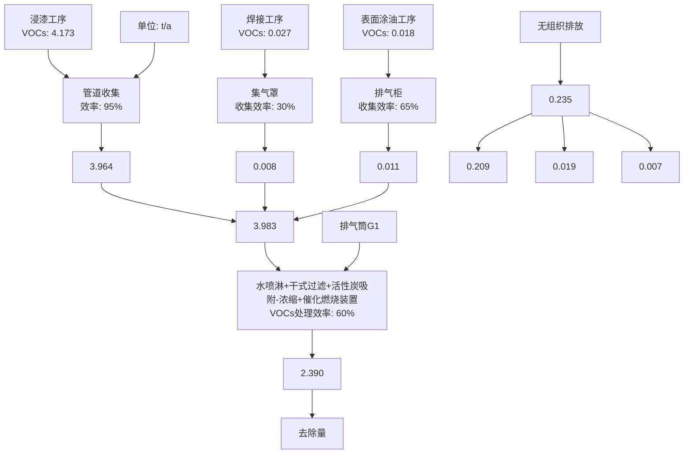
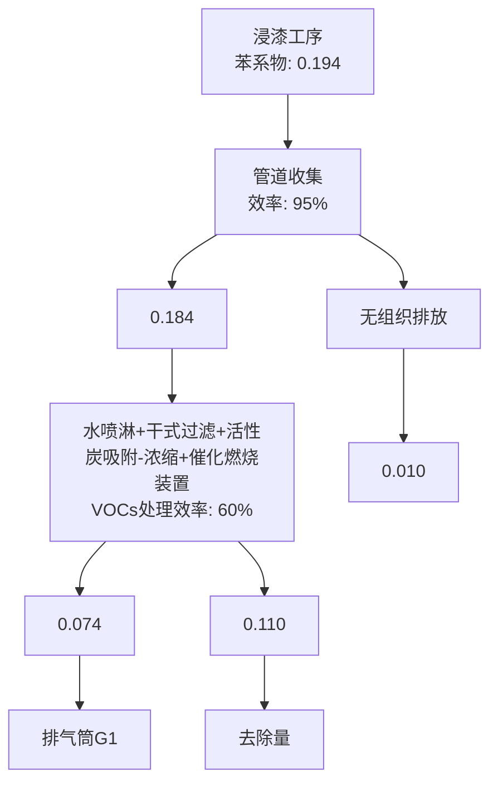
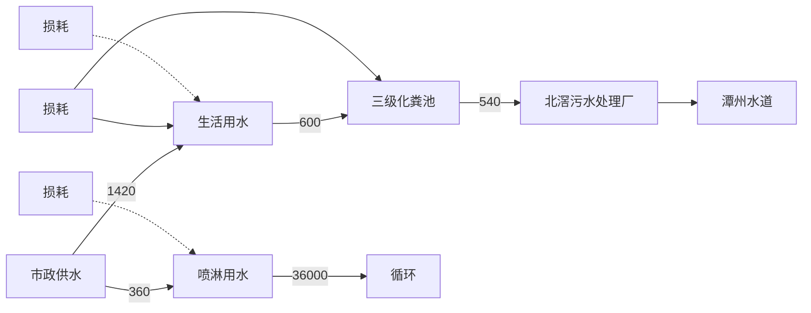
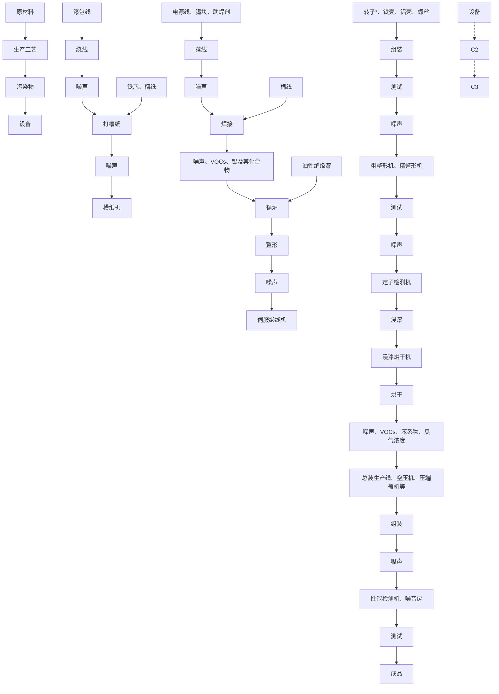
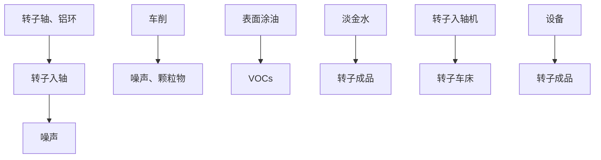

# 建设项目环境影响报告表

（污染影响类）

项目名称：佛山市宝尔德电机制造有限公司搬迁项目

建设单位（盖章）：佛山市宝尔德电机制造有限公司

编制日期： 2023年12月

中华人民和国生态环境部制

编制单位和编制人员情况表

<table><tr><td colspan="2">项目编号</td><td colspan="3">ou6496</td></tr><tr><td colspan="2">建设项目名称</td><td colspan="3">佛山市宝尔德电机制造有限公司搬迁项目</td></tr><tr><td colspan="2">建设项目类别</td><td colspan="3">35-077电机制造;输配电及控制设备制造;电线、电缆、光缆及电工器材制造;电池制造;家用电力器具制造;非电力家用器具制造;照明器具制造;其他电气机械及器材制造</td></tr><tr><td colspan="2">环境影响评价文件类型</td><td colspan="3">报告表</td></tr><tr><td colspan="2">一、建设单位情况</td><td rowspan="6" colspan="3"></td></tr><tr><td colspan="2">单位名称(盖章)</td></tr><tr><td colspan="2">统一社会信用代码</td></tr><tr><td colspan="2">法定代表人(签章)</td></tr><tr><td colspan="2">主要负责人(签字)</td></tr><tr><td colspan="2">直接负责的主管人员(签字)</td></tr><tr><td colspan="5">二、编制单位情况</td></tr><tr><td colspan="2">单位名称(盖章)</td><td>广</td><td rowspan="2" colspan="2"></td></tr><tr><td colspan="2">统一社会信用代码</td><td>914</td></tr><tr><td colspan="5">三、编制人员情况</td></tr><tr><td colspan="5">1.编制主持人</td></tr><tr><td>姓名</td><td colspan="2">职业资格证书管理号</td><td>信用编号</td><td>签字</td></tr><tr><td colspan="5">2.主要编制人员</td></tr><tr><td>姓名</td><td colspan="2">主要编写内容</td><td>信用编号</td><td>签字</td></tr></table>

<table><tr><td>姓名</td><td>登记单位</td><td>登记证号</td><td>职业资格证书号</td><td>登记类别</td></tr><tr><td>李凯</td><td>广东顺德环境科学研究院有限公司</td><td>B281103002</td><td>00019392</td><td>化工石化医药</td></tr></table>

会保障部，环境保护部批准颁发。它表明持证人通过国家统一组织的考试，取得环境影响评价工程师的职业资格，

has passed national examination organized by the Chinese governmentdepartmenis and has obtained qualifications for Environmental Impact Assessment Engineer.

text_image

中华人民共和国人力资源和社会保障部
approved & authorized
by

M

text_image

中华人民共和国环境保护部
approved & authorized
by
Ministry of Environmental Protection
The People's Republic of China

text_image

东顺德环境科学研究院有限公司

姓名：

FullN

性别

Sex

出生年

Dateo

专业类

Profess

批准日

Appro

签发单位盖章

Issued'by

签发日期：

Issued on

text_image

广东省人力资源和社会保障厅
2016 08月30日
专业技术人员资格考试
查书专用章

# 目录

一、建设项目基本情况..

二、建设项目工程分析.. .19

三、区域环境质量现状、环境保护目标及评价标准. . 34

四、主要环境影响和保护措施.... ..40

五、环境保护措施监督检查清单.. .62

六、结论.... .... 64

附表 建设项目污染物排放量汇总表.. 65

附图 1 项目地理位置图..... .... 66

附图 2 项目周边环境图.. .67

附图 3 项目四至图. .. 68

附图 4 项目平面布置图...... .69

附图 5 项目四至情况图....... ..70

附图 6 佛山市顺德区环境管控单元图. .71

附图 7 大气环境功能区划图. 72

附图 8 水环境功能区划图... 73

附图 9 声环境功能区划图..... ..74

附图 10 北滘污水管网图. .75

附图 11 用地规划... .... 76

附件 1 营业执照.. . 77

附件 2 法人代表身份证 .................... ..78

附件 3 用地资料（华智科创中心） .79

附件 4 租赁合同 ...... .. 81

附件 5 环评咨询合同....... ... 84

附件 6 排水证（华智科创中心） ..................... ..87

附件 7 VOCs 含量检测报告... .89

附件 8 MSDS.... .. 91

# 一、建设项目基本情况

<table><tr><td>建设项目名称</td><td colspan="3">佛山市宝尔德电机制造有限公司搬迁项目</td></tr><tr><td>项目代码</td><td colspan="3">无</td></tr><tr><td>建设单位联系人</td><td></td><td>联系方式</td><td></td></tr><tr><td>建设地点</td><td colspan="3">广东省佛山市顺德区北滘镇顺江社区三乐东路28号华智科创中心16栋301-302室、401-402室</td></tr><tr><td>地理坐标</td><td colspan="3">(22度54分30.575秒,113度14分24.797秒)</td></tr><tr><td>国民经济行业类别</td><td>C3812电动机制造</td><td>建设项目行业类别</td><td>三十五、电气机械和器材制造业-77电机制造381-其他(仅分割、焊接、组装的除外;年用非溶剂型低VOCs含量涂料10吨以下的除外)</td></tr><tr><td>建设性质</td><td>☑新建(迁建)□改建□扩建□技术改造</td><td>建设项目申报情形</td><td>☑首次申报项目□不予批准后再次申报项目□超五年重新审核项目□重大变动重新报批项目</td></tr><tr><td>项目审批(核准/备案)部门(选填)</td><td>无</td><td>项目审批(核准/备案)文号(选填)</td><td>无</td></tr><tr><td>总投资(万元)</td><td>360</td><td>环保投资(万元)</td><td>36</td></tr><tr><td>环保投资占比(%)</td><td>10</td><td>施工工期</td><td>1个月</td></tr><tr><td>是否开工建设</td><td>☑否□是:</td><td>用地(用海)面积( $m^{2}$ )</td><td>2896.54</td></tr><tr><td>专项评价设置情况</td><td colspan="3">无</td></tr><tr><td>规划情况</td><td colspan="3">佛山市顺德高新技术产业开发区扩区规划</td></tr><tr><td>规划环境影响评价情况</td><td colspan="3">规划环境影响评价文件:佛山市顺德高新技术产业开发区扩区规划环境影响报告书审查机关:佛山市生态环境局顺德分局审查文件名称:佛山市生态环境局顺德分局关于佛山市顺德高新技术产业开发区扩区规划环境影响报告书审查情况的复函</td></tr><tr><td>规划及规划环境影响评价符合性分析</td><td colspan="3">项目与《佛山市顺德高新技术产业开发区扩区规划环境影响报告书》有关准入的条件相符性分析见表1-1。</td></tr><tr><td>其他符合性分析</td><td colspan="3">1、与《顺德区“三线一单”生态环境分区管控方案》相符性分析本项目与《顺德区“三线一单”生态环境分区管控方案》相符性分析详见表1-2。2、与佛山市“三线一单”生态环境分区管控方案相符性分析根据《佛山市人民政府关于印发佛山市“三线一单”生态环境分区管控方案的通知》(佛府〔2021〕11号)发布的佛山市环境管控单元图,项目位于北滘镇,属于重点管控区(环境管控单元编码:ZH44060620004)。项目总体符合重点管控单元的要求。具体分析详见与佛山市顺德区“三线一单”生态环境分区管控方案相符性分析。3、与广东省“三线一单”生态环境分区管控方案相符性分析根据《广东省人民政府关于印发广东省“三线一单”生态环境分区管控方案的通知》(粤府〔2020〕71号)发布的广东省环境管控单元图,项目所在的北滘镇为重点管控单元,项目总体符合重点管控单元的要求。具体分析详见与佛山市顺德区“三线一单”生态环境分区管控方案相符性分析。根据《佛山市顺德区人民政府关于印发佛山市顺德区“三线一单”生态环境分区管控方案的通知》(顺府发〔2021〕11号),项目所在区域为北滘镇重点管控区(环境管控单元编码:ZH44060620004)。4、与水源保护区法律法规相符性分析项目南面与顺德水道距离约775m,根据广东省人民政府文件《广东省人民政府关于调整佛山市部分饮用水水源保护区的批复》(粤府函〔2018〕426号)规定,划定范围见表1-3。项目边界距离北滘-羊额水厂饮用水源的一级保护区的最近距离约4705m、二级保护区最近距离约1456m、准保护区最近距离约1384m;距离南洲水厂的一级水源保护区的最近距离约679m、二级水源保护区的最近距离约725m、准水源保护区的最近距离约1317m。项目与水源保护区的位置关系详见附图2。项目租用已建成工业厂房,运营期间项目生活污水经三级化粪池预处理后通过市政污水管网排入北滘污水处理厂,故不会对饮用水源保护区造成影响。5、与《佛山市人民政府办公室关于印发佛山市危险化学品禁止、限制和控制目录的通知》(佛府办〔2023〕10号)的相符性分析项目位于佛山市顺德区北滘镇,主要从事微型马达电机的生产制造,运营期需</td></tr></table>

使用绝缘漆、助焊剂、淡金水等原辅材料（详见表 2-5），对照《佛山市人民政府办公室关于印发佛山市危险化学品禁止、限制和控制目录的通知》（佛府办〔202310号）“附件 1禁止危险化学品目录”，本项目所用原辅材料不在文件所列范围内，因此，本项目符合要求。

# 6、VOCs政策符合性分析

# 6.1 原辅材料的不可替代性说明

参照广东省生态环境厅于 2021 年 5 月 7 日在网络问政平台上对低挥发性物质的认定答复：“国家已出台《低挥发性有机化合物含量涂料产品技术要求》（GBT38597-2020）、《清洗剂挥发性有机化合物含量限值》（GB 38508-2020）等产品VOCs 含量限值标准，建议按照国家标准执行，符合低挥发性有机物含量限值的，不属于高挥发性有机物范畴。生态环境部《关于印发<重点行业挥发性有机物综合治理方案>的通知》（环大气〔2019〕53号）》明确，“使用的原辅材料 VOCs 含量（质量比）低于 10%的工序，可不要求采用无组织排放收集措施。”，国家未明确相关标准的，低 VOC 含量材料也可按此判定。”

本项目的产品为微型马达电机，所用原辅材料中涉及挥发性有机化合物成分主要为油性绝缘漆、淡金水、助焊剂。

（1）油性绝缘漆：根据第三方检测报告，项目所用绝缘漆不能满足《低挥发性有机化合物含量涂料产品技术要求》（GB 38597-2020）溶剂型涂料的要求。项目产品要求：电机寿命10年以上，耐受温度120℃，漆层需要防剥落，项目故为保证产品质量，项目需选用VOCs含量较高的油性绝缘漆；目前市面上暂无成熟可行的低VOCs含量油性绝缘漆可替代，故为保证产品质量，项目需选用VOCs含量较高的淡金水。

项目油性绝缘漆要实现绝缘功能，属于特殊功能涂料，《工业防护涂料中有害物质限量》（GB 30981-2020）中对特殊功能涂料的 VOCs 含量未做要求。

（2）淡金水：根据企业提供的MSDS报告，项目所用淡金水不能满足《低挥发性有机化合物含量涂料产品技术要求》（GB 38597-2020）溶剂型涂料的要求。

项目产品要求包括电机寿命10年以上，耐受温度120℃，漆层需要防剥落等性能指标，目前市面上暂无成熟可行的低VOCs含量淡金水可选用。

项目淡金水要实现防锈功能，属于特殊功能涂料，《工业防护涂料中有害物质限量》（GB 30981-2020）中对特殊功能涂料的 VOCs 含量未做要求。

（3）助焊剂：根据《关于印发<重点行业挥发性有机物综合治理方案>的通知》（环大气〔2019〕53号）》原辅材料VOCs含量（质量比）低于10%要求，项目使用的助焊剂为高VOCs含量原料。参考广东省电路板行业协会《关于电路板行业内层涂布、防焊、洗网、喷锡等工序使用溶剂型物料的复函》，了解到目前市面上暂无成熟可行的低VOCs含量助焊剂可替代，故为保证产品质量，项目需选用选用VOCs含量较高的助焊剂。

基于项目使用高挥发性的原辅材料，项目运营期间的有机废气配套“水喷淋+干式过滤+活性炭吸附-脱附+催化燃烧”装置进行处理，保障废气排放可稳定达标。

# 6.2 本项目与挥发性有机物（VOCs）的政策相符性分析

分析详见表 1-4。

# 7、选址分析

项目选址广东省佛山市顺德区北滘镇顺江社区三乐东路 28 号华智科创中心 16栋 301-302 室、401-402 室。

（1）根据附件 3，该项目选址所在地为工业用地，用地性质符合要求。  
（2）项目为搬迁项目，行业类别为 C3812 电动机制造，选址顺德互联网新家电产业园（一期）范围，符合《广东省人民政府办公厅关于印发广东省“节地提质”攻坚行动方案（2023—2025 年）的通知》（粤办函〔2023〕57号）：“在符合国土空间规划的前提下，新建工业项目和经批准实施异地搬迁的工业项目，除因安全生产、工艺技术等特殊要求外，应一律安排进入开发区（产业园区）生产建设。”的要求。

# 8、与产业政策相符性分析

本项目行业类别为 C3812 电动机制造，根据《产业结构调整指导目录（2019 年本）》及 2021 年修改单的规定，项目不属于上述目录所列的鼓励类、限制类和禁止（淘汰）类项目，符合国家产业政策要求。

根据《市场准入负面清单（2022版）》，本项目不属于上述文件的禁止和许可范围内，因此，本项目市场主体可依法平等进入市场。

表 1-1 与佛山市顺德高新技术产业开发区扩区规划环境影响报告书有关准入的条件相符性分析

<table><tr><td>清单类型</td><td>准入要求</td><td>本项目情况</td><td>符合性</td></tr><tr><td colspan="4">高新区总体生态环境准入清单</td></tr><tr><td rowspan="5">空间布局约束</td><td>1、引入产业应符合现行有效的《产业结构调整指导目录》、《市场准入负面清单》等相关产业政策的要求</td><td>根据《市场准入负面清单(2022年版)》,项目不在负面清单内;根据《产业结构调整指导目录(2019年本)》及2021年修改单、《珠江三角洲地区产业结构调整优化和产业导向目录(2011年本)》的规定,项目不属于上述目录所列的鼓励类、限制类和禁止(淘汰)类项目,根据《促进产业结构调整暂行规定》(国发〔2005〕40号)第十三条,项目属于允许类,且符合国家有关法律、法规和政策规定。因此,本项目符合《产业结构调整指导目录》、《市场准入负面清单》等相关产业政策的要求</td><td>符合</td></tr><tr><td>2、禁止引入新增排放重点防控重金属污染物(铅(Pb)、汞(Hg)、镉(Cd)、铬(Cr)和类金属砷(As))、持久性有机污染物的项目</td><td>本项目主要产生的污染物是VOCs、臭气浓度、颗粒物、锡及其化合物,不属于新增排放重点防控重金属污染物(铅(Pb)、汞(Hg)、镉(Cd)、铬(Cr)和类金属砷(As))、持久性有机污染物的项目。</td><td>符合</td></tr><tr><td>3、饮用水源准保护区内不得新建、扩建对水体污染严重、排放一类水污染物和持久性有机污染物的项目,改扩建项目不得新增水污染物</td><td>本项目不在饮用水源保护区内,本项目生活污水经三级化粪池预处理后经市政污水管网排入北滘污水处理厂;不属于新建、扩建对水体污染严重、排放一类水污染物和持久性有机污染物的项目,无新增水污染物。</td><td>符合</td></tr><tr><td>4、禁止引入达不到清洁生产国际先进水平的企业</td><td>本项目不涉及。</td><td>符合</td></tr><tr><td>5、在污水管网建设滞后或所依托的污水处理厂处理能力不能满足废水处理需求的区域,不应引入废水排放量较大的项目扩区南片区在纳污水体水质稳定达标前,应合理控制涉水排放企业规模,优先引入无生产废水或生产废水排放量较小的项目;扩区东北组团应控制废水排放量较大企业的引入,引入涉水排放企业的规模应与区域污水处理厂处理能力相匹配,严格控制废水排放量较大的项目及新增一类水污染物排放项目的引入,避免对下游饮用水源保护区产生不良影响;扩区西北组团在乐从污水处理厂扩容前,应合理控制涉水排放企业引入规模和时序,尤其严格控制废水排放量较大的企业,确保区域污水得到有效收集和处理。</td><td>本项目生活污水经三级化粪池预处理后经市政污水管网排入北滘污水处理厂。</td><td>符合</td></tr><tr><td rowspan="4"></td><td>6、禁止新建、扩建燃煤燃油火电机组和企业自备电站,逐步淘汰生物质锅炉、集中供热管网覆盖区域内的分散供热锅炉,集中供热管网覆盖地区禁止新建、扩建分散供热锅炉,规划区应全部按高污染燃料禁燃区进行管理;禁止新建、扩建水泥、平板玻璃、化学制浆、炼化、炼钢炼铁、电解铝、焦炭、金属冶炼、制浆造纸、鞣革、铅酸蓄电池、专业电镀、木质家具涂装、印染项目;不再新建陶瓷厂(新型特种陶瓷项目除外)化工项目按照“入园管理”原则合理布局,提高准入门槛,不得新建、扩建纳入国家“高污染、高环境风险”产品名录的生产项目。</td><td>本项目属于C3812电动机制造,不涉及新建、扩建燃煤燃油火电机组和企业自备电站;不属于新建、扩建水泥、平板玻璃、化学制浆、炼化、炼钢炼铁、电解铝、焦炭、金属冶炼、制浆造纸、鞣革、铅酸蓄电池、专业电镀、木质家具涂装、印染项目;项目不属于“高污染、高环境风险”产品名录的生产项目。</td><td>符合</td></tr><tr><td>7、严格控制日用玻璃制造、家具制造、废塑料回收加工再生(列入国家“城市矿产”示范基地项目除外)、专业金属表面处理(铝及铝合金的阳极氧化、铝的表面铬酸盐转化、锌的铬酸盐钝化和金属酸洗、磷化、喷漆、喷涂)等项目建设;严格限制新建生产和使用高挥发性有机物原辅材料的项目,鼓励建设挥发性有机物共性工厂</td><td>本项目的产品为微型马达电机,所用的油性绝缘漆、淡金水、助焊剂均为高挥发性有机物原辅材料,都属于不可替代原辅材料,详见“6.1原辅材料的不可替代性说明”。项目运营期间的有机废气配套“水喷淋+干式过滤+活性炭吸附-脱附+催化燃烧”装置进行处理,废气排放可稳定达标。</td><td>符合</td></tr><tr><td>8、工业企业禁止选址城镇生活空间,生产空间禁止建设居民住宅等敏感建筑;园区工业用地或企业与村庄、学校等环境敏感点之间应设置合理的防护距离,并通过绿化带进行有效隔离,该距离内不得规划新建居民点、办公楼和学校等环境敏感目标</td><td>本项目不涉及。</td><td>符合</td></tr><tr><td>9、现有及规划居住区、学校、医院等敏感用地周边50米范围内禁止新建、扩建高噪声排放生产项目;现有及规划居住区、学校、医院等敏感用地周边100米范围内禁止新建、扩建纳入国家“高污染、高环境风险”产品名录的生产项目,不引入酸洗、涂装、注塑、排放恶臭气味的生产工艺和生产设施</td><td>本项目距离最近敏感点为东面663m西海村。</td><td>符合</td></tr><tr><td rowspan="4"></td><td>10、结合《顺德区高质量推动村级工业园升级改造总体规划》,推进区域村级工业园改造工作,禁止重复低水平建设</td><td>本项目不涉及</td><td>符合</td></tr><tr><td>11、南片区按照《广东省重金属污染综合防治“十三五”规划》、《佛山市重金属污染综合防治“十三五”规划》的要求,禁止新建、扩建增加重点防控的重金属污染物排放的建设项目,现有技术改造项目应通过实施“区域削减”,实现增产减污;其它区域新、改扩建重金属排放项目应严格落实重金属总量替代与削减要求,严格控制重点行业发展规模。</td><td>本项目不涉及。</td><td>符合</td></tr><tr><td>12、按规划用地布局未来退出的工业企业用地,应严格按照《中华人民共和国土壤污染防治法》开展必要的调查、评估和修复工作,符合要求后,方可用于居住、教育教研、办公等第三产业类用地</td><td>本项目不涉及。</td><td>符合</td></tr><tr><td>13、其它:符合《佛山市人民政府关于印发佛山市“三线一单”生态环境分区管控方案的通知》(佛府〔2021〕11号)相关管控要求</td><td>具体见表1-2。</td><td>符合</td></tr><tr><td rowspan="4">污染物排放管控</td><td>1.污染物排放总量不得突破“污染物排放总量管控限值清单”的总量管控要求;重点对重点污染物(重点污染物包括化学需氧量、氨氮、氮氧化物及挥发性有机物等)实施总量控制;上年度重点河涌水质未达到水环境质量目标的管控分区所在镇(街道),须组织编制、系统实施、向社会公开区域重点水污染物减排计划并明确“替代量”,本年度新建、改建、扩建项目新增水环境重点污染物实行区域“减二增一”替代(废水集中处理设施、民生项目除外);在可核查、可监管的基础上,全区新建、改建、扩建项目新增大气重点污染物实行“减二增一”替代。</td><td>待项目审批时由生态环境部门核定VOCs总量来源。</td><td>符合</td></tr><tr><td>2.未完成环境质量改善目标的区域,新改扩建项目重点污染物实施减量替代。</td><td>待项目审批时由生态环境部门核定VOCs总量来源。</td><td>符合</td></tr><tr><td>3.未接入污水管网的新建建筑小区或公共建筑,不得交付使用。新建城区生活污水收集处理设施要与城市发展同步规划、同步建设。</td><td>本项目不涉及。</td><td>符合</td></tr><tr><td>4.规划区内建设项目废污水原则上应接入各片区集中式污水处理厂进行集中处理、达标排放;受纳水体或监控断面不达标的,不得新建、扩建向河涌直接排放废水的项目;对于暂时无法接入市政污水管网、且废水量较少的项目,生活污水处理后立足回用,不能回用的,应处理达到《城镇污水处理厂污染物排放标准》(GB18918-2002)后排入政策法规允许排放且有环境容量的水域;生产废水应立足于回用,不能回用的,可考虑委外处置,确需要外排的,应处理达到行业直接排放标准或广东省《水污染物排放限值》(DB44/26-2001)后排入政策法规允许排放且有环境容量的水域。</td><td>本项目生活污水经三级化粪池预处理,达到广东省《水污染物排放限值》(DB44/26-2001)的第二时段三级标准后排入北滘污水处理厂处理。</td><td>符合</td></tr><tr><td rowspan="2"></td><td>5.向工业集聚区污水集中处理设施或者城镇污水集中处理设施排放工业废水的,应当按照有关规定进行预处理,达到集中处理设施处理工艺要求后方可以排入市政管网进入各片区污水处理厂。企业生活污水达到广东省《水污染物排放限值》(DB44/26-2001)第二时段三级标准后通过污水管线进入各片区所依托的城镇污水处理厂;扩区南片区企业生产废水预处理达到广东省《水污染物排放限值》(DB44/26-2001)第二时段二级标准、行业间接排放要求(有行业间接排放标准要求的)、杏坛污水处理厂接管要求后通过污水管线排入杏坛污水处理厂处理;扩区西北组团企业生产废水预处理达到广东省《水污染物排放限值》(DB44/26-2001)第二时段二级标准、行业间接排放要求(有行业间接排放标准要求的)、乐从污水处理厂接管要求后通过污水管线排入乐从污水处理厂处理;扩区西北组团企业生产废水预处理达到广东省《水污染物排放限值》(DB44/26-2001)第二时段三级标准、行业间接排放要求(有行业间接排放标准要求的)、北滘污水处理厂接管要求后通过污水管线排入北滘污水处理厂处理。</td><td>本项目生活污水经三级化粪池预处理,达到广东省《水污染物排放限值》(DB44/26-2001)的第二时段三级标准后排入北滘污水处理厂处理。</td><td>符合</td></tr><tr><td>6.规划区依托的集中式污水处理设施排放标准应达到或优于《城镇污水处理厂污染物排放标准》(GB18918-2002)一级标准的A标准和广东省《水污染物排放限值》(DB44/26-2001)第二时段一级标准的较严者。7.根据《广东省生态环境厅关于2021年工业炉窑、锅炉综合整治重点工作的通知》(粤环函〔2021〕461号)要求,高新区现有燃气锅炉执行《锅炉大气污染物排放标准》(DB44/765-2019)表2排放标准,新建燃气锅炉废气中氮氧化物执行《锅炉大气污染物排放标准》(DB44/765-2019)表3大气污染物特别排放限值,颗粒物、二氧化硫指标特别排放标准(表3)的执行范围、时间按区域正式发布方案执行;新改建的工业窑炉,如烘干炉、加热炉等,有行业标准或地方排放标准的执行相关行业标准或地方标准,未制订行业排放标准的,参照《广东省关于贯彻落实&lt;工业炉窑大气污染综合治理方案&gt;的实施意见》(粤环函〔2019〕1112号),颗粒物、二氧化硫、氮氧化物排放限值分别不高于30、200、300毫克/立方米;家居涂装工艺废气应该执行《家具制造行业挥发性有机化合物排放标准》(DB44814-2010)第II时段限值;无行业排放标准的企业,为严格控制区域VOCs排放量,在国家、省未出台行业标准前,金属制品、铝型材、设备制造行业参照执行《表面涂装(汽车制造业)挥发性有机化合物排放标准》(DB44/816-2010);其他行业参照执行《家具制造行业挥发性有机化合物排放标准(DB44/814-2010)》;涉及VOCs无组织排放的企业,除有行业标准的执行相关行业标准之外,其余工业企业VOCs物料储存、转移和输送、工艺工程、设备与管线组件VOCs泄漏,敞开液面等VOCs无组织排放控制要求,以及VOCs无组织排放废气收集处理系统要求执行《挥发性有机物无组织排放控制标准》(GB37822-2019)要求,厂区内VOCs无组织排放监控点浓度应符合GB37822-2019中表A.1规定的特别排放限值;涉及铸造工艺的,新建企业自2021年1月1日起,现有企业自2023年7月1日起,铸造生产工艺环节和生产设备执行《铸造工业大气污染物排放标准》(GB39726—2020)表1规定的大气污染物排放限值、企业边界大气污染物浓度限值及其他污染控制要求;制药工业企业执行《制药工业大气污染物排放标准》(GB37823-2019)表1规定的大气污染物排放限值、企业边界大气污染物浓度限值及其他污染控制要求;注塑等合成树脂加工生产环节和生产设备其执行《合成树脂工业污染物排放标准》(GB31572-2015)表5规定的大气污染物特别排放限值(涉及PVC树脂的不执行)、合成树脂工业污染物排放标准及其他污染控制要求;分布式能源站项目锅炉烟气执行《火电厂大气污染物排放标准》(GB13223-2011)“表2大气污染物特别排放标准”中所列的燃气轮机组排放浓度限值。</td><td>北滘污水处理厂尾水达到《城镇污水处理厂污染物排放标准》(GB18918-2002)一级A标准及广东省地方标准《水污染物排放限值》(DB44/26-2001)第二时段一级标准的较严值。本项目主要从事微型马达电机的生产,执行广东省《固定污染源挥发性有机物综合排放标准》(DB44/2367—2022)、广东省《大气污染物排放限值》(DB44/27-2001)。</td><td>符合符合</td></tr><tr><td rowspan="2"></td><td>8.重点加强涉VOCs排放的工业项目的挥发性有机物的源头替代和无组织排放管控,大力推进低VOCs含量原辅材料替代。木制家具制造行业应全面使用水性胶粘剂,替代比例达到100%。家具制造及其他工业涂装项目的水性涂料等低排放VOCs含量涂料占总涂料使用量比例应至少不低于50%。产生VOCs的生产车间须配置废气收集净化装置。排放挥发性有机物的车间必须安装废气收集、回收净化装置,收集率应大于90%;使用溶剂型涂料涂装工艺的VOCs去除率达到90%;家具制造行业有机废气净化率达到80%以上。逐步淘汰单纯活性炭吸附、水喷淋+活性炭吸附等排放状况不稳定的治理技术。</td><td>本项目运营期间产生的有机废气经整室收集/集气罩收集后,经“水喷淋+干式过滤+活性炭吸附-脱附+催化燃烧”处理后引至楼顶排气筒G1(60m)排放。</td><td>符合</td></tr><tr><td>9.其它:符合《佛山市人民政府关于印发佛山市“三线一单”生态环境分区管控方案的通知》(佛府〔2020〕11号)相关管控要求。</td><td>具体见表1-2。</td><td>符合</td></tr><tr><td rowspan="4">环境风险防控</td><td>1.制定园区环境风险事故防范和应急预案。完善区域—园区—工业企业多级联动环境突发事件应急预案,建立预防、应急响应机制和后评估机制,定期开展应急演练,提高区域环境风险防范能力。</td><td>本项目不涉及。</td><td>符合</td></tr><tr><td>2.污水处理厂应采取有效措施,防止事故废水直接排入水体;完善污水处理厂在线监控系统联网,实现污水处理厂的实时、动态监管。</td><td>本项目不涉及。</td><td>符合</td></tr><tr><td>3.生产性废水较多的企业需配套有效措施,防止事故废水和第一类污染物直排污染地表水体,防止因渗漏污染地下水。</td><td>本项目不涉及。</td><td>符合</td></tr><tr><td>4.其它:符合《佛山市人民政府关于印发佛山市“三线一单”生态环境分区管控方案的通知》(佛府〔2020〕11号)相关管控要求。</td><td>具体见表1-2。</td><td>符合</td></tr><tr><td rowspan="4">环境风险防控</td><td>1.禁止使用高污染燃料。</td><td>本项目不涉及。</td><td>符合</td></tr><tr><td>2.工业项目原则上单位GDP能耗要低于0.38吨标煤/万元,单位工业增加值新鲜水耗要低于10立方米/万元。</td><td>本项目不涉及。</td><td>符合</td></tr><tr><td>3.新建高能耗项目单位产品(产值)能耗达到国际国内先进水平。</td><td>本项目不涉及。</td><td>符合</td></tr><tr><td>4.其它:符合《佛山市人民政府关于印发佛山市“三线一单”生态环境分区管控方案的通知》(佛府〔2020〕11号)相关管控要求。</td><td>具体见表1-2。</td><td>符合</td></tr><tr><td colspan="4">扩区东北组团-E3生态环境准入要求</td></tr><tr><td colspan="2">1、结合《顺德区高质量推动村级工业园升级改造总体规划》,推进区域村级工业园改造工作,禁止重复低水平建设。</td><td>本项目不涉及。</td><td>符合</td></tr><tr><td colspan="2">2、按现行有效的用地规划方案进行建设,非工业用地禁止引入工业生产项目。规划拟由现状工业用地转变为商住用地的区域,原则上禁止引入新的工业生产项目,现有工业项目改扩建须做到减污;对由工业性质转变为居住、教育教研、办公等的地块,应严格按照《中华人民共和国土壤污染防治法》开展必要的调查、评估和修复工作。</td><td>本项目建设用地属工业用地。</td><td>符合</td></tr><tr><td colspan="2">3、现状已建工业生产区域应优先完善市政污水管网;污水管网建设滞后或所依托的污水处理厂处理能力不能满足废水处理需求的区域,不应引入废水排放量较大的项目。禁止引入新增排放重点防控重金属污染物(铅(Pb)、汞(Hg)、镉(Cd)、铬(Cr)和类金属砷(As))、持久性有机污染物的项目。</td><td>本项目生活污水经三级化粪池预处理后经市政污水管网排入北滘污水处理厂;不属于新建、扩建对水体污染严重、排放一类水污染物和持久性有机污染物的项目,无新增水污染物。</td><td>符合</td></tr><tr><td colspan="2">4、临近居住用地等敏感用地的区域应布置轻污染项目,合理控制污染工序规模、适当提高工业生产相关的非生产设施比例。其它临近居住用地等敏感用地、排放废气的项目应严格落实高效的废气治理措施,避免对敏感建筑产生不良影响。如引入废水排放量较大、使用有毒有害物质的项目,应配置有足够的环境风险应急设施,确保生产废水及有毒有害物质不进入饮用水源保护区;园中园项目必须设置足够容量的应急池,以应对内部事故废水及消防废水。</td><td>本项目距离最近敏感点为东面663m西海村。</td><td>符合</td></tr><tr><td colspan="2">5、提高企业VOCs治理效率,逐步淘汰单纯活性炭吸附、水喷淋+活性炭吸附等排放状况不稳定的治理技术,升级现有低效的有机废气处理措施(如单纯或单级低温等离子体、UV光解等)。</td><td>本项目运营期间产生的有机废气经整室收集/集气罩收集后,经“水喷淋+干式过滤+活性炭吸附-脱附+催化燃烧”处理后引至楼顶排气筒G1(60m)排放。</td><td>符合</td></tr><tr><td colspan="2">6、推广新能源汽车和充电基础设施,积极推动重卡LNG加气站、充电基础设施、加氢站建设。</td><td>本项目不涉及。</td><td>符合</td></tr><tr><td colspan="2">7、新建高能耗项目单位产品(产值)能耗达到国际国内先进水平。</td><td>本项目不涉及。</td><td>符合</td></tr><tr><td colspan="2">8、新建、扩建含蚀刻工序的线路板生产项目和化工项目应在配套污水集中处置的工业园区或生活污水管网覆盖区域内建设。含酸洗、磷化的金属表面处理、金属制品项目(与自身高新技术企业配套的除外),含酸洗、喷涂、拉丝、表面抛光等工艺的不锈钢型材加工项目,应进入以此类项目为主导产业、有相应废水集中治理设施的工业园区,实现集中治污。</td><td>本项目不涉及。</td><td>符合</td></tr><tr><td colspan="2">9、原则上禁止引入列入“高污染、高环境风险”产品名录等可能影响水环境安全的项目。</td><td>项目不属于“高污染、高环境风险”产品名录等可能影响水环境安全的项目。</td><td>符合</td></tr><tr><td colspan="2">10、城镇新区建设实行雨污分流,逐步推进初期雨水收集、处理和资源化利用。住宅、商业体、学校、市场等城镇开发建设项目应当配套或者同步计划建设公共排水设施,公共排水设施或自建排污水设施未能投产运行的,以上涉水项目不得投入使用。</td><td>本项目生活污水经三级化粪池预处理后经市政污水管网排入北滘污水处理厂。</td><td>符合</td></tr><tr><td colspan="2">11、北滘污水处理厂应适时启动扩建工程。</td><td>本项目不涉及。</td><td>符合</td></tr><tr><td colspan="2">12、大力推进低VOCs含量原辅材料替代,加快涉VOCs重点行业的生产工艺升级改造,推行自动化生产工艺,对达不到要求的VOCs收集及治理设施进行整治提升,逐步淘汰低效VOCs治理设施。</td><td>本项目运营期间产生的有机废气经整室收集/集气罩收集后,经“水喷淋+干式过滤+活性炭吸附-脱附+催化燃烧”处理后引至楼顶排气筒G1(60m)排放。</td><td>符合</td></tr><tr><td colspan="2">13、其它应符合佛府(2020)11号中ZH44060620004北滘镇重点管控区的相关管控要求。</td><td>具体见表1-2。</td><td>符合</td></tr></table>

表 1-2 区域布局管控要求

<table><tr><td>管控要求</td><td>本项目概况</td><td>相符性</td></tr><tr><td>1.【产业/限制类】受纳水体或监控断面不达标的,不得新建、扩建向河涌直接排放废水的项目。新建、扩建含蚀刻工序的线路板生产项目和化工项目应在配套污水集中处置的工业园区或生活污水管网覆盖区域内建设;纯加工型印花项目,含酸洗、磷化的金属表面处理、金属制品项目(与自身高新技术企业配套的除外),含酸洗、喷涂、化学抛光、电解等涉及废水排放工艺的不锈钢型材加工项目(与自身高新技术企业配套的除外),应进入以此类项目为主导产业、有相应废水集中治理设施的工业园区,实现集中治污。</td><td>项目不涉及。</td><td>符合</td></tr><tr><td>2.【产业/综合类】划定家具生产优先发展区域,优先发展区外不再新建涉及涂装工艺的木质家具制造项目。</td><td>项目不涉及。</td><td>符合</td></tr><tr><td>3.【生态/禁止类】生态保护红线原则上按照禁止开发区域要求进行管理。区域严格按照《关于在国土空间规划中统筹划定落实三条控制线的指导意见》执行,自然保护地核心保护区原则上禁止人为活动,其他区域严格禁止开发性、生产性建设活动。</td><td>本项目不涉及。</td><td>符合</td></tr><tr><td>4.【生态/限制类】生态保护红线内,自然保护地核心区以外的区域,在符合现行法律法规前提下,除国家重大战略项目外,仅允许对生态功能不造成破坏的8类有限人为活动。</td><td>项目不涉及。</td><td>符合</td></tr><tr><td>5.【生态/禁止类】湿地公园涉及佛山顺德鲤鱼沙地方级湿地自然公园,按照《湿地保护管理规定》、《广东省湿地公园管理暂行办法》及其他相关法律法规实施管理。湿地公园内禁止下列行为:开矿、采石、修坟以及生产性放牧等;从事房地产、度假村、高尔夫球场等任何不符合主体功能定位的建设项目和开发活动;法律法规禁止的活动或者行为。禁止擅自占用、征用湿地公园的土地。</td><td>项目不涉及。</td><td>符合</td></tr><tr><td>6.【生态/禁止类】单元内的一般生态空间,主导生态功能为水土保持,禁止在25度以上的陡坡地开垦种植农作物,禁止在崩塌、滑坡危险区、泥石流易发区从事采石、取土、采砂等可能造成水土流失的活动。</td><td>项目不涉及。</td><td>符合</td></tr><tr><td>7.【水/禁止类】单元内饮用水水源保护区涉及羊额-北滘水厂、佛山市顺德藤溪水厂、广州市南洲水厂顺德水道取水口饮用水水源一级、二级和准保护区、沙湾水厂番禺侧饮用水水源一级、二级保护区。按照《中华人民共和国水污染防治法》、《广东省水污染防治条例》等相关法律法规条例实施管理。禁止在饮用水水源一级保护区内新建、改建、扩建与供水设施和保护水源无关的建设项目;禁止在饮用水水源二级保护区内新建、改建、扩建排放污染物的建设项目;禁止在饮用水水源准保护区内新建、扩建对水体污染严重的建设项目。</td><td>项目不在饮用水源保护区内,本项目生活污水经三级化粪池预处理后经市政污水管网排入北滘污水处理厂。</td><td>符合</td></tr><tr><td>8.【水/鼓励引导类】应当根据保护饮用水水源的实际需要,在羊额-北滘水厂、佛山市顺德藤溪水厂、广州市南洲水厂顺德水道取水口饮用水水源准保护区内采取工程措施或者建造湿地、水源涵养林等生态保护措施,防止水污染物直接排入饮用水水体,确保饮用水安全。</td><td>项目不涉及。</td><td>符合</td></tr><tr><td>9.【水/综合类】加强顺德水道供水通道干流沿岸以及羊额-北滘水厂、佛山市顺德藤溪水厂、广州市南洲水厂顺德水道取水口、沙湾水厂番禺侧饮用水水源保护区环境风险防控,完善突发环境事件应急管理体系。</td><td>项目不涉及。</td><td>符合</td></tr><tr><td>10.【大气/限制类】大气环境布局敏感区重点管控区内,应严格限制新建生产和使用高挥发性有机物原辅材料项目,优先开展低VOCs含量原辅材料替代,强化无组织排放控制。原则上不再新建、扩建新增氮氧化物、烟(粉)尘排放量较大的建设项目。</td><td>项目油性绝缘漆、淡金水、助焊剂属于高挥发性有机物原辅材料,但都属于不可替代原辅材料;不属于新增氮氧化物、烟(粉)尘排放量较大的建设项目。</td><td>符合</td></tr><tr><td>11.【大气/鼓励引导类】大气环境高排放重点管控区内,应强化达标监管,引导工业项目落地集聚发展,有序推进区域内行业企业提标改造。</td><td>项目位于北滘镇高排放重点管控单元(编号:YS4406062310002),废气可达标排放。</td><td>符合</td></tr><tr><td>12.【水资源/综合类】落实北江流域水资源分配方案,加强江河湖库水量调度,保障生态流量。</td><td>项目不涉及。</td><td>符合</td></tr><tr><td>13.【岸线/禁止类】严格水域岸线用途管制,新建项目一律不得违规占用水域。严禁破坏生态的岸线利用行为和不符合其功能定位的开发建设活动,严禁以各种名义侵占河道、围垦湖泊、非法采砂等。</td><td>项目不涉及。</td><td>符合</td></tr></table>

表 1-3 水源保护区划定范围表

<table><tr><td>水源名称</td><td>保护区级别</td><td>水域保护范围</td><td>陆域保护范围</td></tr><tr><td rowspan="3">羊额-北滘水厂饮用水水源保护区</td><td>一级保护区</td><td>顺德水道沙栏至羊额水厂取水口下游1000m之间约2300m的水域</td><td>相应一级保护区水域边界线至河堤背水坡脚之间的陆域</td></tr><tr><td>二级保护区</td><td>一级保护区上游边界至黄连码头之间约3250m的水域、下游边界至白鹤林广电动排灌站之间约4050m的水域,以及流入二级区范围的支涌(西河、伦教大涌、三丰河和北滘河)从蚬肉迳闸、黄麻涌闸、三洪奇闸起上溯1500m的水域</td><td>相应二级保护区水域边界线至河堤背水坡脚之间的陆域以及支涌水域边界至河堤背水坡脚向陆纵深10m的陆域</td></tr><tr><td>准保护区</td><td>顺德水道迳口河至黄连码头之间约4000m的水域</td><td>相应准保护区水域两岸堤背水坡脚向陆纵深500m的陆域、二级保护区陆域边界外延至500m的陆域</td></tr><tr><td rowspan="3">南洲水厂饮用水水源保护区</td><td>一级保护区</td><td>西达发电厂东边界以东至管桩厂西边界之间的水域(距离约620m,取水口至西达发电厂东边界265m,至管桩厂西边界355m)</td><td>相应一级保护区水域靠广州市南洲水厂顺德水道取水口一侧沿岸纵深100m以内的陆域(距离约620m)</td></tr><tr><td>二级保护区</td><td>白鹤嘴林厂电动排灌站以东至西达发电厂东边界及管桩厂西边界以东至潭州水道与顺德水道交界处的顺德水道水域(距离约1835m,白鹤嘴林厂电动排灌站以东至西达发电厂东边界距离1090m,管桩厂西边界至潭州水道与顺德水道交界处水域距离745m)</td><td>相应二级保护区水域两岸纵深100m以内的陆域,以及西达发电厂东边界以东至管桩厂西边界之间广州市南洲水厂顺德水道取水口对岸一侧沿岸纵深100m以内的陆域(距离约2455m)</td></tr><tr><td>准保护区</td><td>顺德水道一、二级保护区以外的水域(II);李家沙水道自顺德乌洲至番禺紫坭西的水域(III);沙湾水道至番禺紫坭西至番禺墩涌的水域(II)</td><td>相应准保护区水域两岸纵深50m以内的陆域</td></tr></table>

表1-4 项目与挥发性有机物（VOCs）政策的相符性

<table><tr><td>序号</td><td>政策要求</td><td>工程内容</td><td>判定</td></tr><tr><td>1.</td><td colspan="3">《珠江三角洲地区严格控制工业企业挥发性有机物(VOCs)排放的意见》(粤环〔2012〕18号)</td></tr><tr><td>1.1</td><td>在自然保护区、水源保护区、风景名胜区、森林公园、重要湿地、生态敏感区和其他重生态功能区实行强制性保护,禁止新建VOCs污染企业</td><td>项目选址不在规定区域</td><td>符合</td></tr><tr><td>2.</td><td colspan="3">《中华人民共和国大气污染防治法》(2018.10.27修订,2016.1.1实施)</td></tr><tr><td>2.1</td><td>第四十五条 产生含挥发性有机物废气的生产和服务活动,应当在密闭空间或者设备中进行,并按照规定安装、使用污染防治设施;无法密闭的,应当采取措施减少废气排放。</td><td>本项目运营期间产生的有机废气经整室收集/集气罩收集后,经“水喷淋+干式过滤+活性炭吸附-脱附+催化燃烧”处理后引至楼顶排气筒G1(60m)排放。</td><td>符合</td></tr><tr><td>3.</td><td colspan="3">关于印发《重点行业挥发性有机物综合治理方案》的通知(环大气〔2019〕53号)</td></tr><tr><td>3.1</td><td>大力推进源头替代:通过使用水性、粉末、高固体分、无溶剂、辐射固化等低VOCs含量的涂料,水性、辐射固化、植物基等低VOCs含量的油墨,水基、热熔、无溶剂、辐射固化、改性、生物降解等低VOCs含量的胶粘剂,以及低VOCs含量、低反应活性的清洗剂等,替代溶剂型涂料、油墨、胶粘剂、清洗剂等,从源头减少VOCs产生。</td><td>项目所用的油性绝缘漆、淡金水、助焊剂属于不可替代原辅材料。</td><td>符合</td></tr><tr><td>3.2</td><td>加强政策引导:企业采用符合国家有关低VOCs含量产品规定的涂料、油墨、胶粘剂等,排放浓度稳定达标且排放速率、排放绩效等满足相关规定的,相应生产工序可不要求建设末端治理设施。使用的原辅材料VOCs含量(质量比)低于10%的工序,可不要求采取无组织排放收集措施。</td><td>项目运营期间产生的有机废气经整室收集/集气罩收集后,经“水喷淋+干式过滤+活性炭吸附-脱附+催化燃烧”处理后引至楼顶排气筒G1(60m)排放。</td><td>符合</td></tr><tr><td>3.2</td><td>全面加强无组织排放控制。重点对含VOCs物料(包括含VOCs原辅材料、含VOCs产品、含VOCs废料以及有机聚合物材料等)储存、转移和输送、设备与管线组件泄漏、敞开液面逸散以及工艺过程等五类排放源实施管控,通过采取设备与场所密闭、工艺改进、废气有效收集等措施,削减VOCs无组织排放。</td><td>项目运营期间产生的有机废气经整室收集/集气罩收集后,经“水喷淋+干式过滤+活性炭吸附-脱附+催化燃烧”处理后引至楼顶排气筒G1(60m)排放。</td><td>符合</td></tr><tr><td>4.</td><td colspan="3">广东省生态环境厅关于做好建设项目挥发性有机物(VOCs)排放削减替代工作的补充通知(粤环函〔2021〕537号)</td></tr><tr><td>4.1</td><td>各地生态环境部门要健全建设项目VOCs排放总量管理台账,严格核定VOCs可替代总量指标,重点核查用作替代的削城量是否为企业达标排放后采取治理措施的削减量、或淘汰关停后的削减量,是否有削减量重复使用等情况,进一步规范VOCs削减替代工作。新改扩建项目环评审批时,应逐级出具VOCs总量替代来源审核意见,确保总量指标管理扎实有效。</td><td>待项目审批时由生态环境部门核定VOCs总量来源。</td><td>符合</td></tr><tr><td>5</td><td colspan="3">关于印发《广东省臭氧污染防治(氮氧化物和挥发性有机物协同减排)实施方案(2023-2025年)》的通知(粤环函〔2023〕45号)</td></tr><tr><td>5.1</td><td>其他涉VOCs排放行业控制:加快推进工程机械、钢结构、船舶制造等行业低VOCs含量原辅材料替代,引导生产和使用企业供应和使用符合国家质量标准产品;企业无组织排放控制措施及相关限值应符合《挥发性有机物无组织排放控制标准(GB37822)》、《固定污染源挥发性有机物排放综合标准(DB44/2367)》和《广东省生态环境厅关于实施厂区内挥发性有机物无组织排放监控要求的通告》(粤环发〔2021〕4号)要求,无法实现低VOCs原辅材料替代的工序,宜在密闭设备、密闭空间作业或安装二次密闭设施;新、改、扩建项目限制使用光催化、光氧化、水喷淋(吸收可溶性VOCs除外)、低温等离子等低效VOCs治理设施(恶臭处理除外),组织排查光催化、光氧化、水喷淋、低温等离子及上述组合技术的低效VOCs治理设施,对无法稳定达标的实施更换或升级改造。</td><td>项目所用的油性绝缘漆、淡金水、助焊剂属于不可替代原辅材料。本项目采用“水喷淋+干式过滤+活性炭吸附-脱附+催化燃烧”处理有机废气,未采用淘汰的低效治理设施。</td><td>符合</td></tr><tr><td>6</td><td colspan="3">广东省生态环境厅关于印发《广东省生态环境保护“十四五”规划》的通知(粤环〔2021〕10号)</td></tr><tr><td>6.1</td><td>大力推进低VOCs含量原辅材料源头替代,严格落实国家和地方产品VOCs含量限值质量标准,禁上建设生产和使用高VOCs含量的溶剂型涂料、油墨、胶粘剂等项目。严格实施VOCs排放企业分级管理,全面推进涉VOCs排放企业深度治理。开展中小型企业废气收集和治理设施建设、运行情况的评估,强化对企业涉VOCs生产车间/工序废气的收集管理,推动企业开展治理设施升级改造。</td><td>项目采用“水喷淋+干式过滤+活性炭吸附-脱附+催化燃烧”处理有机废气,未采用淘汰的低效治理设施。</td><td>符合</td></tr><tr><td>7</td><td colspan="3">佛山市生态环境局关于印发《佛山市生态环境保护“十四五”规划》的通知(佛环〔2022〕3号)</td></tr><tr><td>7.1</td><td>严格控制“高耗能、高排放”项目盲目发展,禁止新建、扩建水泥、平板玻璃、化学制浆、生皮制革以及国家规划外的钢铁、原油加工等项目。专业电镀、印染等项目进入定点园区集中管理。</td><td>项目主要从事微型马达电机的制造,属于C3812电动机制造。不属于“高耗能、高排放”项目。</td><td>符合</td></tr><tr><td>7.2</td><td>加强VOCs源头替代和无组织排放管控。大力推进低VOCs含量原辅材料替代,将全面使用低VOCs含量原辅材料的企业纳入正面清单和政府绿色采购清单。鼓励重点行业企业开展生产工艺和设备水性化改造,推广使用水性、高固体分、无溶剂、粉末等低VOCs含量涂料。严格落实《挥发性有机物无组织排放控制标准》,开展厂区内无组织排放浓度监测。加强对含VOCs物料储存、转移和运输、设备与管线组件泄漏、敞开页面逸散以及工艺过程等五类排放源的管控。加强储油库、加油站等VOCs排放治理,推动油品储运销体系安装油气回收自动监控系统。</td><td>项目将根据《挥发性有机物无组织排放控制标准》,开展厂区内无组织排放浓度监测;加强对原材料等含VOCs物料五类排放源的管控;本项目不涉及储油库、加油站。</td><td>符合</td></tr><tr><td>7.3</td><td>实施VOCs分级和清单化管控。建立并动态更新涉VOCs重点企业分级管理台账,在典型行业建立治理样板并推广实施。对家具、凹版印刷行业(除瓦楞纸印刷)、铝型材(氟碳喷涂)等VOCs排放重点行业进行严格监管,建立实施污染治理定量化监管;推进VOCs高排放企业治理设施提升改造,淘汰光催化、光氧化、低温等离子等现有低效治理设施。分期分批推广涉VOCs企业安装产污环节、治污环节过程监控设备。以汽车维修等行业为重点,推广建设区域共享涂装中心、活性炭集中再生中心,推动VOCs集中高效治理。</td><td>项目主要从事微型马达电机的制造,属于C3812电动机制造,属于VOCs排放重点行业,项目采用“水喷淋+干式过滤+活性炭吸附-脱附+催化燃烧”处理有机废气,未采用淘汰的低效治理设施。</td><td>符合</td></tr><tr><td>8.</td><td colspan="3">佛山市顺德区人民政府办公室关于印发《佛山市顺德区生态环境保护“十四五”规划(2021-2025)》的通知(顺府办发〔2022〕16号)</td></tr><tr><td>8.1</td><td>持续探寻高效节能的VOCs治理技术,对采用低温等离子、光氧化、光催化等低效治理工艺的企业在臭氧污染天气应对期间实施停限产或错峰生产,并推动企业逐步淘汰低效治理工艺。</td><td>项目采用“水喷淋+干式过滤+活性炭吸附-脱附+催化燃烧”处理有机废气,未采用淘汰的低效治理设施。</td><td>符合</td></tr></table>

# 二、建设项目工程分析

# 1、项目工程组成

佛山市宝尔德电机制造有限公司搬迁项目（以下简称“项目”）搬迁前位于佛山市顺德区伦教永丰工业区二期中路 65 号之二，搬迁后项目位于广东省佛山市顺德区北滘镇顺江社区三乐东路 28号华智科创中心 16 栋 301-302 室、401-402 室。

项目所在厂房已建成，占地面积 2896.54m2，建筑面积 5793.08m2，16 栋 3F主要作为生产单元，16栋 4F主要作为办公单元。16栋共 10层，整体高度约 59.80米，3F、4F 层高均为 5.95米。

搬迁后，项目主要从事微型马达电机的生产制造，预计年产微型马达电机 40 万台/年。

项目组成详见下表 2-1。

表 2-1 项目组成表

<table><tr><td rowspan="2">工程类别</td><td rowspan="2" colspan="2">工程名称</td><td colspan="2">工程内容</td></tr><tr><td>搬迁前</td><td>搬迁后</td></tr><tr><td>主体工程</td><td colspan="2">生产单元</td><td>电机生产车间1个, $1000m^{2}$ 转子生产车间1个, $600m^{2}$ </td><td>16栋3F,面积 $2896.54m^{2}$ ,包括生产区、原料仓、成品仓、一般固废仓、危废仓等</td></tr><tr><td>辅助工程</td><td colspan="2">办公单元</td><td>1栋4层办公楼,占地面积约 $400m^{2}$ </td><td>办公室位于16栋4F,面积 $2896.54m^{2}$ ,层高5.95m</td></tr><tr><td rowspan="4">储运工程</td><td colspan="2">原料仓</td><td>独立仓库,1个, $100m^{2}$ </td><td>1个, $500m^{2}$ </td></tr><tr><td colspan="2">成品仓</td><td>独立仓库,1个, $100m^{2}$ </td><td>1个, $500m^{2}$ </td></tr><tr><td colspan="2">一般固废仓</td><td>电机车间内,1个, $10m^{2}$ </td><td>1个, $10m^{2}$ </td></tr><tr><td colspan="2">危废仓</td><td>电机车间内,1个, $10m^{2}$ </td><td>1个, $10m^{2}$ </td></tr><tr><td rowspan="2">公用工程</td><td colspan="2">给水</td><td>市政供水</td><td>市政供水</td></tr><tr><td colspan="2">供能</td><td>市政供电</td><td>市政供电</td></tr><tr><td rowspan="6">环保工程</td><td>废气</td><td>生产废气</td><td>浸漆及烘干废气、焊锡废气经集气罩收集后由15m排气筒FQ-04144排放;转子防锈废气经集气罩收集后由15m排气筒FQ-04145排放</td><td>焊锡废气、表面涂油废气经集气罩收集、浸漆及烘干废气经整室收集,一并经过“水喷淋+干式过滤+活性炭吸附-脱附+催化燃烧”处理后引至楼顶排气筒G1(60m)排放。</td></tr><tr><td>废水</td><td>生活污水</td><td>生活污水经三级化粪池预处理后通过市政污水管网排入伦教污水处理厂</td><td>生活污水经三级化粪池预处理后通过市政污水管网排入北滘污水处理厂</td></tr><tr><td colspan="2">噪声</td><td>合理布局、利用墙体隔声等措施防治噪声污染</td><td>合理布局、利用墙体隔声等措施防治噪声污染</td></tr><tr><td rowspan="3">固废</td><td>生活垃圾</td><td>生活垃圾收集交环卫部门处理</td><td>生活垃圾收集交环卫部门处理</td></tr><tr><td>一般固体废物</td><td>一般工业固废由专业回收公司回收处理</td><td>一般工业固废由专业回收公司回收处理</td></tr><tr><td>危险废物</td><td>电机车间内,1个,面积约为 $10m^{2}$ 。危险废物收集存放于危废仓并定期交有资质的单位处置</td><td>生产车间内,1个,面积约为 $10m^{2}$ 。危险废物收集存放于危废仓并定期交有资质的单位处置</td></tr></table>

# 2、项目主要产品及产能

表2-2 项目主要产品一览表

<table><tr><td rowspan="2">序号</td><td rowspan="2">产品名称</td><td rowspan="2">单位</td><td colspan="3">产品数量</td></tr><tr><td>搬迁前</td><td>增减量</td><td>搬迁后</td></tr><tr><td>1</td><td>微型马达电机</td><td>万台/年</td><td>100</td><td>-60</td><td>40</td></tr></table>

备注：搬迁后项目产品内部结构的加工质量、精度要求提高，总体生产效率对比搬迁前降低，并且年生产时间减少，故项目年产能降低。

表2-3 项目产品重量一览表

<table><tr><td>产品名称</td><td colspan="2">浸漆前</td><td colspan="2">浸漆后</td><td colspan="3">重量情况</td></tr><tr><td rowspan="3">微型马达电机</td><td rowspan="3" colspan="2"></td><td rowspan="3" colspan="2"></td><td>浸漆前</td><td>907.5</td><td>g/个</td></tr><tr><td>浸漆后</td><td>914.8</td><td>g/个</td></tr><tr><td>上漆量</td><td>7.3</td><td>g/个</td></tr></table>

# 3、项目主要生产工艺、生产设施、设施参数

表 2-4 项目主要生产设备一览表

<table><tr><td rowspan="2">序号</td><td rowspan="2">单元名称</td><td rowspan="2">设备名称</td><td rowspan="2">单位</td><td colspan="3">设备数量</td><td colspan="3">设别参数</td><td rowspan="2">备注</td></tr><tr><td>搬迁前</td><td>增减量</td><td>搬迁后</td><td>参数名称</td><td>设计参数</td><td>计量单位</td></tr><tr><td>1</td><td rowspan="20">生产单元</td><td>绕线机</td><td>台</td><td>6</td><td>0</td><td>6</td><td>功率</td><td>3</td><td>kw</td><td>/</td></tr><tr><td>2</td><td>槽纸机</td><td>台</td><td>6</td><td>-3</td><td>3</td><td>功率</td><td>3</td><td>kw</td><td>/</td></tr><tr><td>3</td><td>定子落线机</td><td>台</td><td>3</td><td>0</td><td>3</td><td>功率</td><td>3</td><td>kw</td><td>/</td></tr><tr><td>4</td><td>锡炉</td><td>台</td><td>3</td><td>0</td><td>3</td><td>功率</td><td>5</td><td>kw</td><td>/</td></tr><tr><td>5</td><td>伺服绑线机</td><td>台</td><td>3</td><td>0</td><td>3</td><td>功率</td><td>5</td><td>kw</td><td>/</td></tr><tr><td>6</td><td>粗整形机</td><td>台</td><td>3</td><td>0</td><td>3</td><td>功率</td><td>5</td><td>kw</td><td>/</td></tr><tr><td>7</td><td>精整形机</td><td>台</td><td>3</td><td>0</td><td>3</td><td>功率</td><td>5</td><td>kw</td><td>/</td></tr><tr><td>8</td><td>定子流水线</td><td>台</td><td>3</td><td>0</td><td>3</td><td>功率</td><td>5</td><td>kw</td><td>/</td></tr><tr><td>9</td><td>定子检测机</td><td>台</td><td>3</td><td>0</td><td>3</td><td>功率</td><td>5</td><td>kw</td><td>/</td></tr><tr><td>10</td><td>浸漆烘干机</td><td>台</td><td>1</td><td>0</td><td>1</td><td>功率</td><td>15</td><td>kw</td><td>/</td></tr><tr><td>11</td><td>总装流水线</td><td>台</td><td>4</td><td>-1</td><td>3</td><td>功率</td><td>3</td><td>kw</td><td>/</td></tr><tr><td>12</td><td>空压机</td><td>台</td><td>2</td><td>-1</td><td>1</td><td>功率</td><td>10</td><td>kw</td><td>/</td></tr><tr><td>13</td><td>压端盖机</td><td>台</td><td>2</td><td>0</td><td>2</td><td>功率</td><td>5</td><td>kw</td><td>/</td></tr><tr><td>14</td><td>铆压机</td><td>台</td><td>2</td><td>0</td><td>2</td><td>功率</td><td>3</td><td>kw</td><td>/</td></tr><tr><td>15</td><td>转子入轴承机</td><td>台</td><td>3</td><td>-1</td><td>2</td><td>功率</td><td>3</td><td>kw</td><td>/</td></tr><tr><td>16</td><td>转子入卡环机</td><td>台</td><td>2</td><td>0</td><td>2</td><td>功率</td><td>3</td><td>kw</td><td>/</td></tr><tr><td>17</td><td>性能检测机</td><td>台</td><td>2</td><td>0</td><td>2</td><td>功率</td><td>3</td><td>kw</td><td>/</td></tr><tr><td>18</td><td>噪音房</td><td>间</td><td>2</td><td>0</td><td>2</td><td>/</td><td>/</td><td>/</td><td>/</td></tr><tr><td>19</td><td>转子车床</td><td>台</td><td>5</td><td>-2</td><td>3</td><td>功率</td><td>3</td><td>kw</td><td>/</td></tr><tr><td>20</td><td>转子入轴机</td><td>台</td><td>5</td><td>0</td><td>5</td><td>功率</td><td>3</td><td>kw</td><td>/</td></tr></table>

表 2-5 关键设备产能和产品规模匹配性分析一览表

<table><tr><td rowspan="2">名称</td><td colspan="3">生产设备</td><td rowspan="2">日工作时间</td><td rowspan="2">年工作天数</td><td rowspan="2">关键设备年产量</td><td rowspan="2">申报产能</td></tr><tr><td>名称</td><td>数量</td><td>有效产能</td></tr><tr><td>定子</td><td>浸漆烘干机</td><td>1台</td><td>200个/小时</td><td>8h/d</td><td>250d</td><td>40万台</td><td>40万台</td></tr></table>

注：每个微型马达电机产品包含定子、转子各 1个，浸漆烘干机用于定子绝缘处理。

表2-6 产品漆量需求核算表

<table><tr><td rowspan="2">产品名称</td><td>年产能</td><td>小时产能</td><td>产品上漆量</td><td>涂料固含量</td><td>涂料利用率</td><td>小时用漆量</td><td>年用漆量</td><td>申报用漆量</td></tr><tr><td>万套/年</td><td>台/年</td><td>g/台</td><td>无量纲</td><td>无量纲</td><td>kg/h</td><td>t/a</td><td>t/a</td></tr><tr><td>微型马达电机</td><td>40</td><td>200</td><td>7.3</td><td>41.45%</td><td>99%</td><td>3.558</td><td>7.116</td><td>7.116</td></tr></table>

注：参考搬迁前项目生产经验，本报告取绝缘漆的利用率为 99%，绝缘漆年产生漆渣约占绝缘漆使用量的 1%，淡金水的利用率为 100%。

# 4、项目原辅材料情况

# 4.1 原辅材料用量

表2-7 项目原辅材料使用情况一览表

<table><tr><td rowspan="2">序号</td><td rowspan="2" colspan="2">名称</td><td rowspan="2">单位</td><td colspan="3">数量</td><td rowspan="2">最大贮存量</td><td rowspan="2">性状</td><td rowspan="2">包装规格</td><td rowspan="2">备注</td></tr><tr><td>搬迁前</td><td>增减量</td><td>搬迁后</td></tr><tr><td>1</td><td colspan="2">漆包线</td><td>吨/年</td><td>100</td><td>-60</td><td>40</td><td>/</td><td>/</td><td>25kg/箱</td><td>/</td></tr><tr><td>2</td><td colspan="2">铁芯</td><td>万只/年</td><td>100</td><td>-60</td><td>40</td><td>/</td><td>/</td><td>1000 只/箱</td><td>/</td></tr><tr><td>3</td><td colspan="2">槽纸</td><td>吨/年</td><td>7.2</td><td>-4.32</td><td>2.88</td><td>/</td><td>/</td><td>25kg/箱</td><td>/</td></tr><tr><td>4</td><td colspan="2">棉线</td><td>万米/年</td><td>60</td><td>-36</td><td>24</td><td>/</td><td>/</td><td>25km/箱</td><td>/</td></tr><tr><td>5</td><td colspan="2">电源线</td><td>万米/年</td><td>200</td><td>-120</td><td>80</td><td>/</td><td>/</td><td>25km/箱</td><td>/</td></tr><tr><td>6</td><td colspan="2">铁壳、铝壳</td><td>万只/年</td><td>200</td><td>-120</td><td>80</td><td>/</td><td>/</td><td>1000 只/箱</td><td>/</td></tr><tr><td>7</td><td colspan="2">螺丝</td><td>万颗/年</td><td>400</td><td>-240</td><td>160</td><td>/</td><td>/</td><td>1000 颗/箱</td><td>/</td></tr><tr><td>8</td><td colspan="2">转子轴</td><td>万根/年</td><td>100</td><td>-60</td><td>40</td><td>/</td><td>/</td><td>1000 根/箱</td><td>/</td></tr><tr><td>9</td><td colspan="2">铝环</td><td>万只/年</td><td>100</td><td>-60</td><td>40</td><td>/</td><td>/</td><td>1000 只/箱</td><td>/</td></tr><tr><td>10</td><td colspan="2">水性绝缘漆</td><td>吨/年</td><td>20</td><td>-20</td><td>0</td><td>/</td><td>液</td><td>10kg/桶</td><td>/</td></tr><tr><td>11</td><td colspan="2">油性绝缘漆</td><td>吨/年</td><td>0</td><td>+7.116</td><td>7.116</td><td>0.5t</td><td>液</td><td>10kg/桶</td><td>绝缘</td></tr><tr><td>12</td><td rowspan="2">其中</td><td>主剂</td><td>吨/年</td><td>0</td><td>+6.469</td><td>6.469</td><td>0.3t</td><td>液</td><td>10kg/桶</td><td>/</td></tr><tr><td>13</td><td>硬化剂</td><td>吨/年</td><td>0</td><td>+0.647</td><td>0.647</td><td>0.2t</td><td>液</td><td>10kg/桶</td><td>/</td></tr><tr><td>14</td><td colspan="2">锡块</td><td>千克/年</td><td>90</td><td>-54</td><td>36</td><td>/</td><td>固</td><td>10kg/箱</td><td>/</td></tr><tr><td>15</td><td colspan="2">淡金水</td><td>千克/年</td><td>80</td><td>-48</td><td>32</td><td>10kg</td><td>液</td><td>10kg/桶</td><td>防锈</td></tr><tr><td>16</td><td colspan="2">助焊剂</td><td>千克/年</td><td>70</td><td>-42</td><td>28</td><td>10kg</td><td>液</td><td>10kg/桶</td><td>助焊</td></tr></table>

注：1、油性绝缘漆：使用时需要将浸漆主剂、浸漆硬化剂进行混合调配，比例为浸漆主剂：浸漆硬化剂=1:0.1（重量比）。2、原辅材料的不可替代论证说明详见“一、建设项目基本情况-其他符合性分析-6.1 原辅材料的不可替代性说明”。

# 4.2 主要化学品理化性质及成分组成

表 2-8 涉 VOCs 原料成分及 VOCs 核算依据表

<table><tr><td colspan="2">物料名称</td><td>理化性质</td><td>组成成分</td></tr><tr><td rowspan="2">油性绝缘漆</td><td>主剂</td><td>淡黄色液体,有特殊气味,闪点109°C,相对密度(水=1):1.12g/cm3。</td><td>甲基丙烯酸羟乙酯55-65%、丙烯酸树脂25-35%、单体5-15%</td></tr><tr><td>硬化剂</td><td>透明液体,有特殊气味,闪点35.4°C(闭杯),比重0.919(20°C),不溶于水,可溶于溶剂。</td><td>1,1-双-(过氧化叔丁基)环己烷70%、乙苯30%、环己酮&lt;1%</td></tr><tr><td colspan="2">淡金水</td><td>粘稠混合体,相对密度(水=1):0.90-0.05,闪点(闭口杯)=33°C,溶解性:不溶于水,混溶于溶剂。</td><td>天然树脂45-60%、乙醇40-55%</td></tr><tr><td colspan="2">助焊剂</td><td>棕黄色清澈液体,相对密度(水=1):0.805,闪点12°C,不溶于水。</td><td>异丙醇85-95%、松香0-5%、保密成分5-10%</td></tr></table>

注：搬迁前，项目使用的化工原料成分如下：①水性绝缘漆：聚酯树脂20-30%，乙二醇丁醚 0.8-1.5%，水 70-80%；②助焊剂：异丙醇 85-95%，松香 0-5%，其它 5-10%；③淡金水：有机颜料（紫料）30%，合成树脂20%，聚酯树脂17%，稀释剂 15%，溶剂 15%，其它 3%。

# 4.3 涉 VOCs 原辅材料

表 2-9 原辅材料 VOCs 情况一览表

<table><tr><td>物料名称</td><td>VOCs含量</td><td>VOCs物质质量占比(挥发系数)</td><td>国家标准限值</td><td>是否属于低VOCs原辅材料</td><td>是否属于不可替代原辅材料*</td></tr><tr><td>油性绝缘漆</td><td>644g/L</td><td>58.64%</td><td rowspan="2">参考《低挥发性有机物含量涂料技术规范》(SZJG54-2017)-表1低挥发性有机物含量涂料中VOCs含量要求-电子电气产品及其他工业涂装行业涂料-金属用其他涂料-VOC含量限值要求≤300g/L</td><td>否</td><td>是</td></tr><tr><td>淡金水</td><td>495g/L</td><td>55%</td><td>否</td><td>是</td></tr><tr><td>助焊剂</td><td>765g/L</td><td>95%</td><td>环大气(2019)53号-10%</td><td>否</td><td>是</td></tr></table>

注：1、油性绝缘漆：使用时需要将浸漆主剂、浸漆硬化剂进行混合调配，比例为浸漆主剂：浸漆硬化剂=1:0.1（重量比），调配后平均密度约为 1.10g/cm3，VOCs 含量为 644g/L，则换算得到调配后的油性绝缘漆 VOCs 挥发系数为58.64%；  
2、淡金水：根据 MSDS报告，本报告取乙醇含量为 55%（即密度最小 0.90g/cm3）评价，计算可得其挥发性有机化合物含量为 495g/L；  
3、助焊剂：根据与原料供应商核实，MSDS报告中保密成分为活性剂，非 VOCs 成分。另本报告取异丙醇含量为95%评价，计算可得其挥发性有机化合物含量约为 765g/L。  
4、原辅材料的不可替代论证说明详见“一、建设项目基本情况-其他符合性分析-6.1 原辅材料的不可替代性说明”。

# 4.4 涂料申报量的合理性分析

表 2-10 项目产品理论涂料需求量估算一览表

<table><tr><td rowspan="2">产品组件</td><td rowspan="2">涂料品种</td><td>组件产能</td><td>涂装面积</td><td>涂膜厚度</td><td>涂料密度</td><td>利用率</td><td>固含量</td><td>涂料用量</td><td>涂料年用量</td><td>涂料申报量</td></tr><tr><td>万件/年</td><td>m2/件</td><td>μm</td><td>g/cm3</td><td>/</td><td>/</td><td>g/件</td><td>t/a</td><td>t/a</td></tr><tr><td>转子</td><td>淡金水</td><td>40</td><td>0.008</td><td>5</td><td>0.90</td><td>100%</td><td>45%</td><td>0.08</td><td>0.032</td><td>0.032</td></tr></table>

注：1、每个微型马达电机产品包含定子、转子各 1个，故产品组件的定子、转子产能为 40万件/年；  
2、涂膜面积、厚度为企业提供的数据；  
3、参考搬迁前项目生产经验，本报告取绝缘漆的利用率为 99%，绝缘漆年产生漆渣约占绝缘漆使用量的 1%，淡金水的利用率为 100%。

# 4.5 VOCs 平衡

flowchart

图 2-1 项目 VOCs 平衡图

flowchart

图 2-2 项目苯系物平衡图

# 5、项目劳动定员和工作制度

表 2-11 劳动定员和工作制度情况一览表

<table><tr><td>序号</td><td>名称</td><td>内容</td><td>搬迁前</td><td>搬迁后</td></tr><tr><td>1</td><td>劳动定员</td><td>从业人数/人</td><td>50</td><td>60</td></tr><tr><td rowspan="3">2</td><td rowspan="3">工作制度</td><td>年工作日/天</td><td>300</td><td>250</td></tr><tr><td>工作时长/小时</td><td>10</td><td>8</td></tr><tr><td>工作时段</td><td>8:00~18:00</td><td>8:00-12:00, 13.30-17.30</td></tr><tr><td>3</td><td>食宿情况</td><td>食宿情况</td><td>不设食堂和宿舍</td><td>不设食堂和宿舍</td></tr></table>

# 6、项目能源及水耗

表2-12 能源及水耗一览表

<table><tr><td rowspan="2">序号</td><td rowspan="2">名称</td><td rowspan="2">用途</td><td rowspan="2">单位</td><td colspan="3">数量</td><td rowspan="2">备注</td></tr><tr><td>搬迁前</td><td>增减量</td><td>搬迁后</td></tr><tr><td rowspan="2">1</td><td rowspan="2">水</td><td>办公、生活</td><td> $m^3/a$ </td><td>500</td><td>+100</td><td>600</td><td>---</td></tr><tr><td>废气治理</td><td> $m^3/a$ </td><td>0</td><td>+360</td><td>360</td><td>---</td></tr><tr><td>2</td><td>电</td><td>生活、生产</td><td>万kW·h/a</td><td>8</td><td>0</td><td>5</td><td>---</td></tr></table>

flowchart

图 2-3 项目水量平衡图

# 7、项目厂区平面布置

项目各区域相对独立，互不干扰，每个区域照工艺流程布置设备，因此，项目平面布置做到了生产、办公分开，车间内布置流畅，总体来说项目平面布置紧凑有序，布局合理。项目平面布置图见附图 4。

# 8、项目四至情况

项目位于广东省佛山市顺德区北滘镇顺江社区三乐东路 28 号华智科创中心 16栋 301-302 室、401-402 室，项目东面是华智科创中心四期，南面是华智科创中心 17栋，西面是华智科创中心 15 栋，北面是华智科创中心 7 栋（在建）。项目所在地的工业区内的污染源主要来自附近企业排放的工业废气、废水、噪声和固体废物等以及附近道路车辆行驶噪声和扬尘等。

# 1、项目工艺流程

项目搬迁前后生产工艺流程保持不变，工艺流程如下：

flowchart

图 2-4 微型马达电机生产工艺流程图

# 工艺流程说明：

首先利用绕线机进行绕线；然后利用槽纸机给铁芯装上槽纸，槽纸起到绝缘的作用；接着把绕好的漆包线装配到铁芯上；再人工焊接上电源线，焊接工艺为锡焊；焊接后进行绑线，将漆包线、电源线等固定；绑线后对线圈进行整形，此时得到的工件称为定子；然后对定子进行检测；接着将定子送入浸漆房浸渍油性绝缘漆，随后烘干；然后进行总装，将定子、转子、端盖组装在一起即为电机半成品；最后对半成品进行性能、噪音等

测试，合格即为成品。

项目浸漆、烘干使用浸漆烘干一体机，首先将定子浸渍在绝缘漆中，浸渍时间约90秒，然后在 50\~60℃下烘干（电加热），烘干时间约 2 小时。浸漆使用油性绝缘漆，浸漆和烘干过程会产生浸漆烘干废气，浸漆烘干废气通过管道收集后经过“水喷淋+干式过滤+活性炭吸附-脱附+催化燃烧”处理后引至楼顶排气筒G1（60m）排放。

焊锡时用到液体助焊剂，助焊剂是保证焊接过程顺利进行的辅助材料，其主要作用是清除焊料和被焊母材表面的氧化物，使金属表面达到必要的清洁度，防止焊接时表面的再次氧化，降低焊料表面张力，提高焊接性能。

焊锡时除了产生锡及其化合物外，助焊剂会挥发产生 VOCs，焊锡废气经集气罩收集后通过15m 排气筒G1 排放。

项目转子的生产工艺如图 2-5所示：

flowchart

图 2-5 转子生产工艺流程图

# 转子生产工艺流程简述：

首先将外购的转子轴压入铝环中，然后进行车削加工，最后在表面涂上一层淡金水即为转子成品。

淡金水的作用为防锈，表面涂油过程会挥发产生有机废气，有机废气经集气罩收集后经过“水喷淋+干式过滤+活性炭吸附-脱附+催化燃烧”处理后引至楼顶排气筒G1（60m）排放。

# 2、项目产排污环节

表 2-13 项目主要产污工序及污染物对照表

<table><tr><td>序号</td><td>污染类别</td><td colspan="2">排放口(编号、名称)/污染源</td><td>产生环节</td><td>主要污染因子</td><td>处理排放方式</td></tr><tr><td rowspan="2">1</td><td rowspan="2">废气</td><td colspan="2">G1(排放口)</td><td>浸漆、烘干、焊锡、表面涂油</td><td>VOCs、苯系物、臭气浓度、颗粒物</td><td>浸漆烘干废气通过管道收集、焊锡废气通过集气罩收集,表面涂油废气通过集气罩收集,一并经“水喷淋+干式过滤+活性炭吸附-脱附+催化燃烧”处理后引至楼顶排气筒G1(60m)排放</td></tr><tr><td colspan="2">无组织排放</td><td>浸漆、烘干、锡焊、表面涂油、车削</td><td>VOCs、臭气浓度、颗粒物</td><td>未收集的废气在车间无组织排放</td></tr><tr><td>2</td><td>废水</td><td colspan="2">生活污水</td><td>洗手、冲厕废水</td><td> $COD_{Cr}$ 、 $BOD_5$ 、 $NH_3-N$ 、SS</td><td>经三级化粪池进行处理后排至北滘污水处理厂处理,尾水排入潭洲水道</td></tr><tr><td rowspan="11">3</td><td rowspan="11">固废</td><td colspan="2">生活垃圾</td><td>员工生活</td><td>/</td><td>由环卫部门及时清运</td></tr><tr><td rowspan="3">一般固体废物</td><td>废包装桶</td><td>原料使用</td><td>/</td><td>交由原料供应商回收利用</td></tr><tr><td>废包装箱</td><td>原料使用</td><td>/</td><td>定期外卖给回收商</td></tr><tr><td>边角料</td><td>车削</td><td>/</td><td>定期外卖给回收商</td></tr><tr><td rowspan="7">危险废物</td><td>漆渣</td><td>浸漆工序</td><td>危险废物</td><td rowspan="7">定期交有相应资质的危废单位回收处理</td></tr><tr><td>废过滤棉</td><td>废气治理</td><td>危险废物</td></tr><tr><td>废活性炭</td><td>废气治理</td><td>危险废物</td></tr><tr><td>废催化剂</td><td>废气治理</td><td>危险废物</td></tr><tr><td>废机油</td><td>设备维修</td><td>危险废物</td></tr><tr><td>废机油桶</td><td>设备维修</td><td>危险废物</td></tr><tr><td>含油废抹布</td><td>设备维修</td><td>危险废物</td></tr><tr><td>4</td><td>噪声</td><td colspan="2">噪声</td><td>生产设备</td><td>Leq(A)</td><td>车间设备合理布局,厂房建筑隔声;采取降噪措施</td></tr></table>

# 1、搬迁前环保手续情况

2016 年 7 月，企业以“佛山市宝尔德电机制造有限公司年产微型马达电机 100 万台建设项目”名称取得环评批复，文号为顺管（伦）环审[2016]77号，批准：“产量规模为年产微型马达电机 100 万台/年，生产设备为绕线机 6 台、槽纸机 6 台、定子落线机 3 台、锡炉 3 台、伺服绑线机 3 台、粗整形机 3 台、精整型机 3 台、定子流水线 3 条、定子检测机 3 台、浸漆烘干机 1 台、总装流水线 4 条、空压机 2 台、压端盖机 2 台、铆压机 2 台、转子入轴承机 3 台、转子入卡环机 2 台、性能检测机台 2台、噪音房 2 间、转子车床 5 台、转子入轴机 5 台”，并于 2016 年 11 月通过竣工环境保护验收，建成规模与批准情况一致。企业于 2020 年 06 月 19 日取得固定污染源排污登记回执，编号：914406063148135303001Z。搬迁前，距离企业厂界最近敏感点为西北面 480m 永丰村，企业未接到环保相关投诉和处罚。

# 2、搬迁前项目回顾性分析

为评价原有项目的污染物排放情况，现根据原有项目环评报告、环保竣工验收资料结合企业实际情况对废气、废水进行重新分析和核算。

# 2.1 搬迁前项目生产工艺流程

搬迁前的生产工艺与搬迁后基本一致，不再叙述。

# 2.2 搬迁前项目主要污染源

# 1）废水

搬迁前项目有生活污水产生，无生产废水产生。生活污水废水量约 450m³/a，主要为职工的洗手、冲厕废水，主要水污染物为 $\mathrm { C O D } _ { \mathrm { C r } } , \ \mathrm { B O D } _ { 5 } .$ 、SS 和 $\mathrm { N H } _ { 3 ^ { - } } \mathrm { N } .$ 。

生活污水经三级化粪池预处理后达到广东省《水污染物排放限值》（DB44/26-2001）的第二时段三级标准后排入伦教污水处理厂处理。污染物产生及排放情况如下表：

表 2-14 项目生活污水污染物产生及排放情况

<table><tr><td rowspan="2">项目</td><td>废水量</td><td rowspan="2">污染物</td><td colspan="2">产生情况</td><td colspan="2">排放情况</td></tr><tr><td> $m^3/a$ </td><td>产生浓度(mg/L)</td><td>产生量(t/a)</td><td>排放浓度(mg/L)</td><td>排放量(t/a)</td></tr><tr><td rowspan="4">生活污水</td><td rowspan="4">450</td><td> $COD_{Cr}$ </td><td>250</td><td>0.113</td><td>40</td><td>0.018</td></tr><tr><td> $BOD_5$ </td><td>100</td><td>0.045</td><td>10</td><td>0.005</td></tr><tr><td>SS</td><td>100</td><td>0.045</td><td>10</td><td>0.005</td></tr><tr><td> $NH_3-N$ </td><td>30</td><td>0.014</td><td>5</td><td>0.002</td></tr></table>

# 2）废气

搬迁前项目生产过程中大气污染主要为浸漆烘干废气、焊锡废气、表面涂油废气、机加工粉尘。

# （1）浸漆烘干工序

搬迁前项目浸漆及烘干工序产生废气通过管道收集后通过 15m 排气筒 FQ-04144排放。浸漆、烘干废气主要污染因子为 VOCs，项目的水性绝缘漆年用量为 20t/a，小时最大使用量约 7kg/h，挥发系数取 1.5%，即 VOCs 年产生量为 0.300t/a，最大排放速率为 0.105kg/h。

表 2-15 浸漆、烘干过程 VOCs 的产生及排放情况

<table><tr><td rowspan="3">污染物</td><td colspan="3">产生情况</td><td colspan="3">有组织排放情况</td><td colspan="2">无组织排放情况</td></tr><tr><td>产生速率</td><td>产生浓度</td><td>产生量</td><td>排放速率</td><td>排放浓度</td><td>排放量</td><td>排放速率</td><td>排放量</td></tr><tr><td>kg/h</td><td> $mg/m^3$ </td><td>t/a</td><td>kg/h</td><td> $mg/m^3$ </td><td>t/a</td><td>kg/h</td><td>t/a</td></tr><tr><td>VOCs</td><td>0.105</td><td>8.4</td><td>0.300</td><td>0.100</td><td>7.980</td><td>0.285</td><td>0.005</td><td>0.015</td></tr></table>

注：管道收集效率取 95%，治理效率为 0%，总风量为 12500m3/h。

# （2）焊锡工序

搬迁前项目焊锡工序产生的废气通过集气罩收集后通过 15m 排气筒 FQ-04144 排放。项目焊锡工序使用原料为锡块和助焊剂，焊锡过程会产生的焊锡废气，其主要污染物为锡及其化合物、VOCs。项目锡块年用量为 90kg/a，小时最大用量为 0.03kg/h；助焊剂年用量为 70kg/a，小时最大用量为0.023kg/h。锡及其化合物的产生系数参照生态环境部《排放源统计调查产排污核算方法和系数手册》（公告 2021 年第 24 号）的“38-40 电子电气行业系数手册”中焊接工序的产物系数：“手工焊+无铅焊料（锡条、锡块等，含助焊剂）”的产污系数为 0.4023g/kg-焊料。助焊剂的挥发系数取 95%。

表2-16 焊锡过程污染物的产生及排放情况

<table><tr><td rowspan="3">污染物</td><td colspan="3">产生情况</td><td colspan="3">有组织排放情况</td><td colspan="2">无组织排放情况</td></tr><tr><td>产生速率</td><td>产生浓度</td><td>产生量</td><td>排放速率</td><td>排放浓度</td><td>排放量</td><td>排放速率</td><td>排放量</td></tr><tr><td>kg/h</td><td> $mg/m^3$ </td><td>t/a</td><td>kg/h</td><td> $mg/m^3$ </td><td>t/a</td><td>kg/h</td><td>t/a</td></tr><tr><td>锡及其化合物</td><td>2.132E-05</td><td>0.002</td><td>6.437E-05</td><td>6.397E-06</td><td>5.117E-04</td><td>1.931E-05</td><td>1.690E-05</td><td>4.506E-05</td></tr><tr><td>VOCs</td><td>0.022</td><td>1.748</td><td>0.067</td><td>0.007</td><td>0.524</td><td>0.020</td><td>0.015</td><td>0.047</td></tr></table>

注：集气罩收集效率取 30%，治理效率为 0%，总风量为 12500m3/h。

# （3）表面涂油

搬迁前项目表面涂油工序产生的废气通过集气罩收集后通过 15m 排气筒 FQ-04145 排放。表面涂油废气主要污染因子为 VOCs，项目的淡金水年用量为 80kg/a，小时最大使用量约 0.03kg/h，根据淡金水 MSDS，挥发系数取 30%，即 VOCs 年产生量为 0.024t/a，最大排放速率为 0.009kg/h。

表 2-17 表面涂油过程污染物的产生及排放情况

<table><tr><td rowspan="3">污染物</td><td colspan="3">产生情况</td><td>收集情况</td><td colspan="3">有组织排放情况</td><td colspan="2">无组织排放情况</td></tr><tr><td>产生速率</td><td>产生浓度</td><td>产生量</td><td>收集量</td><td>排放速率</td><td>排放浓度</td><td>排放量</td><td>排放速率</td><td>排放量</td></tr><tr><td>kg/h</td><td> $mg/m^3$ </td><td>t/a</td><td>t/a</td><td>kg/h</td><td> $mg/m^3$ </td><td>t/a</td><td>kg/h</td><td>t/a</td></tr><tr><td>VOCs</td><td>0.009</td><td>1.800</td><td>0.024</td><td>0.007</td><td>0.003</td><td>0.540</td><td>0.007</td><td>0.006</td><td>0.017</td></tr></table>

注：集气罩收集效率取 30%，治理效率为 0%，总风量为 5000m3/h。

# （4）机加工粉尘

项目对转子进行车削加工时会产生少量金属粉尘。项目转子由转子轴和铝环组成，单个转子合计质量为 500g/个，转子年生产 100 万个，即转子年生产量为 500t/a，小时最大生产量为 30kg/h。参考《排放源统计调查产排污核算方法和系数手册》中的《38-40 电子电气行业系数手册》机械加工工段中金属材料切割/打孔的颗粒物产污系数为 0.2841g/kg-原料，则颗粒物产生量为 0.142t/a，产生速率为0.048kg/h。

# 3）噪声

搬迁前项目噪声污染主要来源于绕线机、槽纸机、空压机等生产设备运行过程产生的噪声，厂界噪声排放符合《声环境质量标准》（GB3096-2008）中的 2类标准。

# 4）固体废物

搬迁前项目废物情况需重新核算。核算情况如下：

# （1）生活垃圾

搬迁前项目员工 50 人，年产生生活垃圾量为 7.5t/a，经集中收集后交由环卫部门处理。

# （2）一般工业固体废物

# ①废包装箱

搬迁前项目废包装箱产生量约为 3.584t/a。

表 2-18 项目废包装箱产生情况一览表

<table><tr><td>序号</td><td>名称</td><td colspan="2">年用量</td><td colspan="2">包装规格</td><td>产生数量-个</td><td>空箱质量·kg/个</td><td>总产生量-t/a</td></tr><tr><td>1</td><td>漆包线</td><td>100</td><td>吨/年</td><td>25</td><td>kg/箱</td><td>4000</td><td rowspan="10">0.25</td><td rowspan="10">3.584</td></tr><tr><td>2</td><td>铁芯</td><td>100</td><td>万只/年</td><td>1000</td><td>只/箱</td><td>1000</td></tr><tr><td>3</td><td>槽纸</td><td>7.2</td><td>吨/年</td><td>25</td><td>kg/箱</td><td>288</td></tr><tr><td>4</td><td>棉线</td><td>60</td><td>万米/年</td><td>2500</td><td>米/箱</td><td>240</td></tr><tr><td>5</td><td>电源线</td><td>200</td><td>万米/年</td><td>2500</td><td>米/箱</td><td>800</td></tr><tr><td>6</td><td>铁壳、铝壳</td><td>200</td><td>万只/年</td><td>1000</td><td>只/箱</td><td>2000</td></tr><tr><td>7</td><td>螺丝</td><td>400</td><td>万颗/年</td><td>1000</td><td>颗/箱</td><td>4000</td></tr><tr><td>8</td><td>转子轴</td><td>100</td><td>万根/年</td><td>1000</td><td>根/箱</td><td>1000</td></tr><tr><td>9</td><td>铝环</td><td>100</td><td>万只/年</td><td>1000</td><td>只/箱</td><td>1000</td></tr><tr><td>10</td><td>锡块</td><td>90</td><td>千克/年</td><td>10</td><td>kg/箱</td><td>9</td></tr></table>

# ②废包装桶

项目水性绝缘漆、助焊剂、淡金水均采取桶装，包装规格为 10kg/桶，包装空桶重量约为 0.5kg/个，则废包装桶产生量约为 1.008t/a。

表 2-19 项目废包装桶产生情况一览表

<table><tr><td>序号</td><td>名称</td><td colspan="2">年用量</td><td colspan="2">包装规格</td><td>产生数量-个</td><td>空桶质量-kg/个</td><td>总产生量-t/a</td></tr><tr><td>1</td><td>水性绝缘漆</td><td>20</td><td>t/a</td><td>10</td><td>kg/桶</td><td>2000</td><td rowspan="3">0.5</td><td rowspan="3">1.008</td></tr><tr><td>2</td><td>淡金水</td><td>80</td><td>kg/a</td><td>10</td><td>kg/桶</td><td>8</td></tr><tr><td>3</td><td>助焊剂</td><td>70</td><td>kg/a</td><td>10</td><td>kg/桶</td><td>7</td></tr></table>

根据《国体废物鉴别标准 通则》（GB34330-2017）中的 6.1的 a 条款“任何不需要修复和加工即可用于其原是用途的物质，或这在产生点经过修复和加工后满足国家、地方制定或行业通行的产品质量标准并且用于其原始用途的物质”不作为固体废物管理，即也不属于危险废物。本项目废包装桶收集后均交由原料供应商回收利用，符合上述标准的要求。故本项目废包装桶不作为固体废物管理，在厂内暂存时，按危险废物管理。

# ③边角料

转子车削加工时会产生少量金属边角料，边角料产生量约占原料用量的 2%，根据建设单位提供的资料，原料（铝环、转子轴）用量约为 500t/a，则边角料产生量约为 10t/a。

# （3）危险废物

# ①漆渣

项目绝缘漆的利用率为 99%，绝缘漆年产生漆渣约占绝缘漆使用量的 1%，搬迁前项目水性绝缘漆年用量为 20t/a，即漆渣产生量为 0.2t/a。

# ②废机油、含机油废抹布、废机油桶

迁扩建前项目生产过程会产生废机油（0.05t/a）、含油废抹布（0.02t/a）、废机油桶（0.01t/a），共计产生量为 0.08t/a。

# 5）总体情况

搬迁前，企业现址落实了相应的各项污染防范治理措施，未收到环保方面的投诉，也未对周围环境造成明显影响。根据现有工程环境影响评价报告、实际生产和竣工环保验收资料，各污染物的排放情况如表 2-16 所示。

表 2-20 搬迁前各污染物的排放情况

<table><tr><td>序号</td><td colspan="2">污染工序</td><td>污染因子</td><td>产生量t/a</td><td>排放量t/a</td><td>排放浓度mg/m3</td><td>排放浓度限值mg/m3</td><td>执行标准</td><td>防治措施</td><td>效果评价</td></tr><tr><td rowspan="4">1</td><td rowspan="4">水污染物</td><td rowspan="4">生活污水450m3/a</td><td>CODcr</td><td>0.113</td><td>0.018</td><td>40</td><td>40</td><td rowspan="4">广东省《水污染物排放限值》(DB44/26-2001)的第二时段三级标准</td><td rowspan="4">生活污水经三级化粪池预处理后通过市政污水管网排入伦教污水处理厂</td><td rowspan="4">达标排放</td></tr><tr><td>BOD5</td><td>0.045</td><td>0.005</td><td>10</td><td>10</td></tr><tr><td>SS</td><td>0.045</td><td>0.005</td><td>10</td><td>10</td></tr><tr><td>NH3-N</td><td>0.014</td><td>0.002</td><td>5</td><td>5</td></tr><tr><td rowspan="7">2</td><td rowspan="7">大气污染物</td><td>浸漆烘干</td><td>VOCs</td><td>0.3</td><td>0.285</td><td>7.140</td><td>30</td><td>广东省《家具制造行业挥发性有机化合物排放标准》(DB44/814-2010)第II时段标准</td><td>浸漆烘干废气通过管道收集后通过15m高排气筒FQ-04144排放</td><td>达标排放</td></tr><tr><td rowspan="2">焊锡</td><td>锡及其化合物</td><td>6.437E-05</td><td>1.931E-05</td><td>5.793E-04</td><td>8.5</td><td>广东省地方标准《大气污染物排放限值》(DB44/27-2001)中第二时段标准</td><td>焊锡废气通过管道收集后通过15m高排气筒FQ-04144排放</td><td>达标排放</td></tr><tr><td>VOCs</td><td>0.067</td><td>0.020</td><td>0.684</td><td>30</td><td>广东省《家具制造行业挥发性有机化合物排放标准》(DB44/814-2010)第II时段标准</td><td>焊锡废气通过管道收集后通过15m高排气筒FQ-04144排放</td><td>达标排放</td></tr><tr><td>表面涂油</td><td>VOCs</td><td>0.024</td><td>0.007</td><td>0.540</td><td>30</td><td>广东省《家具制造行业挥发性有机化合物排放标准》(DB44/814-2010)第II时段标准</td><td>焊锡废气通过管道收集后通过15m高排气筒FQ-04145排放</td><td>达标排放</td></tr><tr><td rowspan="3">生产车间</td><td>VOCs</td><td>---</td><td>---</td><td>≤2.0</td><td>2.0</td><td>广东省《家具制造行业挥发性有机化合物排放标准》(DB44/814-2010)第II时段标准</td><td>/</td><td>达标排放</td></tr><tr><td>锡及其化合物</td><td>---</td><td>---</td><td>≤0.24</td><td>0.24</td><td>广东省地方标准《大气污染物排放限值》(DB44/27-2001)中第二时段标准</td><td>/</td><td>达标排放</td></tr><tr><td>颗粒物</td><td>---</td><td>---</td><td>≤1.0</td><td>1.0</td><td>广东省地方标准《大气污染物排放限值》(DB44/27-2001)中第二时段标准</td><td>/</td><td>达标排放</td></tr><tr><td>3</td><td>噪声</td><td>设备噪声</td><td>噪声dB(A)</td><td>70~90</td><td>昼间≤60</td><td>---</td><td>---</td><td>《工业企业厂界环境噪声排放标准》(GB12348-2008)中的2类标准:昼间≤60dB(A);夜间≤50dB(A)</td><td>设备减振,隔声和距离衰减</td><td>达标排放</td></tr><tr><td rowspan="3">4</td><td rowspan="3">固体废物</td><td>生活垃圾</td><td>员工生活垃圾</td><td>7.5</td><td>7.5</td><td>---</td><td>---</td><td rowspan="3">《中华人民共和国固体废物污染环境防治法》及《广东省固体废物污染环境防治条例》</td><td>交环卫部门进行处理</td><td>符合要求</td></tr><tr><td rowspan="2">一般固体废物</td><td>废包装桶</td><td>3.584</td><td>3.584</td><td>---</td><td>---</td><td>交给供应商回收利用</td><td>符合要求</td></tr><tr><td>废包装箱</td><td>1.008</td><td>1.008</td><td>---</td><td>---</td><td>交给回收商回收处理</td><td>符合要求</td></tr><tr><td rowspan="5"></td><td rowspan="5"></td><td></td><td>边角料</td><td>10</td><td>10</td><td>---</td><td>---</td><td rowspan="5"></td><td>交给回收商回收处理</td><td>符合要求</td></tr><tr><td rowspan="4">危险废物</td><td>漆渣</td><td>0.2</td><td>0.2</td><td>---</td><td>---</td><td rowspan="4">设置规范化储存场,分类收集,定期交有相应资质的危废单位回收处理</td><td rowspan="4">符合要求</td></tr><tr><td>废机油</td><td>0.05</td><td>0.05</td><td>---</td><td>---</td></tr><tr><td>含机油废抹布</td><td>0.02</td><td>0.02</td><td></td><td></td></tr><tr><td>废机油桶</td><td>0.01</td><td>0.01</td><td>---</td><td>---</td></tr></table>

# 三、区域环境质量现状、环境保护目标及评价标准

<table><tr><td rowspan="3">区域环境质量现状</td><td colspan="5">1、大气环境根据《关于调整顺德区环境空气质量功能区划的复函》(佛府办函〔2014〕494号),本项目所在区域(顺德区)属二类环境空气质量功能区,执行《环境空气质量标准》(GB3095-2012)二级标准及其2018年修改单的要求。(1)常规污染物环境质量现状根据《佛山市生态环境局顺德分局关于发布2022年度佛山市顺德区环境质量状况公报的通知》(佛顺环函〔2023〕26号),2022年顺德区空气质量综合指数为3.27,比2021年下降6.0%,在全市五区中排名第二。2022年顺德区AQI达标率为78.8%,较2021年减少5.9个百分点。首要污染物主要为臭氧(占首要污染物天数比例为71.4%),其次为二氧化氮(占26.0%)。2022年全区 $SO_2$ 年平均浓度为5微克/立方米,较2021年下降16.7%。 $NO_2$ 年平均浓度为29微克/立方米,较2021年下降12.1%。 $PM_{10}$ 年平均浓度为32微克/立方米,较2021年下降23.8%。 $PM_{2.5}$ 年平均浓度为19微克/立方米,较2021年下降13.6%。 $O_{3.8h}$ 年评价浓度为190微克/立方米,较2021年上升9.8%。CO年评价浓度为1.1毫克/立方米,较2021年上升10.0%。根据2022年全区的大气环境质量状况公报,六项污染物指标中臭氧浓度超标,其余指标浓度均达到《环境空气质量标准》(GB3095-2012)及2018年修改单中的二级标准限值,故顺德区大气环境质量属不达标区。(2)其他污染物环境质量现状调查为了解评价区域周围地区TSP的环境质量现状,引用《佛山市顺德区华堃电气有限公司新建项目》中广州牧天检验科技有限公司于2021年04月06日~2021年04月19日对本项目所在地附近区域的历史监测数据,报告编号(E2104028508),监测点【顺江社区】距离本项目边界最近距离1253m;监测点位位置说明见表3-1示。表3-1 其他污染物引用监测点位基本信息</td></tr><tr><td>监测点名称</td><td>监测因子</td><td>监测时段</td><td>相对厂址方位</td><td>相对厂界距离/m</td></tr><tr><td>顺江社区</td><td>TSP</td><td>24小时</td><td>西北面</td><td>1253</td></tr></table>

根据监测报告，项目所在区域各特征污染物现状监测结果见下表所示。

表 3-2 各特征污染物现状监测结果

<table><tr><td>监测点名称</td><td>监测因子</td><td>监测时段</td><td>评价标准/mg/m3</td><td>监测浓度范围/mg/m3</td><td>达标情况</td></tr><tr><td>顺江社区</td><td>TSP</td><td>24 小时</td><td>0.3</td><td>0.3037~0.4712</td><td>达标</td></tr></table>

在7天的监测时间内，监测点顺江社区处的TSP监测结果达到了《环境空气质量标准》（GB3095-2012）的二级标准要求。

# 2、地表水

本项目生活污水经三级化粪池预处理后经市政污水管网排入北滘污水处理厂，尾水排入潭洲水道。根据《关于同意实施广东省地表水环境功能区划的批复》（粤府函〔2011〕29号），潭州水道为Ⅲ类水体功能，水质执行《地表水环境质量标准》（GB3838-2002）Ⅲ类水质标准。

为评价潭洲水道水质，参考《佛山市生态环境局顺德分局关于发布 2022 年度佛山市顺德区环境质量状况公报的通知》（佛顺环函〔2023〕26号），2022年全区地表水环境质量保持稳定，4 个饮用水源监控断面每月均达标，年均值水质均达到Ⅱ类；2 个国控断面（乌洲、顺德港）、3个省控断面（杨滘、海凌、飞鹅山）均达到相应的水质目标。项目纳污水体潭洲水道西海断面监测的水质达到了Ⅲ类标准要求。

# 3、声环境

根据《佛山市人民政府关于印发<佛山市声环境功能区划分方案>的通知》（佛府函〔2015〕72号），本项目所在地属于3类声环境功能区，声环境质量执行《声环境质量标准》（GB3096-2008）中的3类标准：昼间≤65dB（A）、夜间≤55dB（A）。本项目厂界外50m范围内无环境敏感目标。

# 4、生态调查

本项目用地范围内无生态环境保护目标，无需开展生态现状调查。

# 5、电磁辐射

本项目不涉及电磁辐射，无需开展电磁辐射现状调查。

# 6、土壤、地下水

本项目不存在土壤、地下水环境污染途径，无需开展土壤、地下水环境质量现状调查。

<table><tr><td rowspan="4">环境保护目标</td><td colspan="5">1、大气环境本项目所在地属于二类环境空气质量功能区,厂界外500m范围内无大气环境保护目标。2、声环境本项目所在地属于3类声环境功能区,厂界外50米范围内无声环境保护目标。3、地下水环境本项目厂界外500米范围内无地下水集中式饮用水水源和热水、矿泉水、温泉等特殊地下水资源。4、生态环境本项目用地范围内无生态环境保护目标。表3-3 主要环境保护目标</td></tr><tr><td>序号</td><td>名称</td><td>保护内容</td><td>相对厂址方位</td><td>与厂界最近距离</td></tr><tr><td>1</td><td>潭洲水道</td><td>III类水质</td><td>东面</td><td>197m</td></tr><tr><td>2</td><td>顺德水道</td><td>II类水质</td><td>南面</td><td>772m</td></tr></table>

# 1、大气污染物排放标准

项目浸漆烘干过程会产生有机废气和恶臭气体，主要污染因子为 TVOC、NMHC、苯系物和臭气浓度；焊锡工序会产生有机废气和焊锡废气，主要污染因子为 TVOC、NMHC、锡及其化合物；表面涂油工序会产生有机废气，主要污染因子为 TVOC、NMHC；车削工序会产生机加工粉尘，主要污染因子为颗粒物。

①有机废气：TVOC、苯系物

表 3-4 项目有机废气排放执行标准

<table><tr><td rowspan="2">排气筒</td><td rowspan="2">污染源</td><td rowspan="2">污染因子</td><td colspan="2">有组织</td><td rowspan="2">无组织排放监控浓度限值mg/m3</td><td rowspan="2">执行标准</td></tr><tr><td>最高允许排放浓度mg/m3</td><td>最高允许排放速率kg/h</td></tr><tr><td rowspan="3">G1(60m)</td><td rowspan="2">浸漆烘干焊锡表面涂油</td><td>TVOC</td><td>100</td><td>/</td><td>/</td><td rowspan="3">《固定污染源挥发性有机物综合排放标准》(DB44/2367-2022)</td></tr><tr><td>NMHC</td><td>80</td><td>/</td><td>/</td></tr><tr><td>浸漆烘干</td><td>苯系物</td><td>40</td><td>/</td><td>/</td></tr></table>

注：由于 TVOC暂无相关国家检测方法标准，TVOC排放标准待国家检测方法标准发布后实施，发布前执行 NMHC排放标准。

厂区内挥发性有机物无组织排放监控点浓度执行《固定污染源挥发性有机物综合排放标准》（DB44/2367—2022）表 3 厂区内 VOCs 无组织排放限值。

表3-5 厂区内 VOCs 无组织排放特别限值

<table><tr><td>污染因子</td><td>排放限值</td><td>限值含义</td><td>无组织排放监控位置</td><td>执行标准</td></tr><tr><td rowspan="2">NMHC</td><td> $6mg/m^{3}$ </td><td>监控点处1h平均浓度值</td><td rowspan="2">在厂房外设置监控点</td><td rowspan="2">《固定污染源挥发性有机物综合排放标准》(DB44/2367-2022)</td></tr><tr><td> $20mg/m^{3}$ </td><td>监控点处任意一次浓度值</td></tr></table>

②焊锡废气：锡及其化合物

表 3-6 锡及其化合物排放执行标准

<table><tr><td rowspan="2">排气筒</td><td rowspan="2">污染源</td><td rowspan="2">污染因子</td><td colspan="2">有组织</td><td rowspan="2">无组织排放监控浓度限值mg/m3</td><td rowspan="2">执行标准</td></tr><tr><td>最高允许排放浓度mg/m3</td><td>最高允许排放速率kg/h</td></tr><tr><td>G1(60m)</td><td>焊锡</td><td>锡及其化合物</td><td>4.3</td><td>1.35</td><td>0.040</td><td>广东省地方标准《大气污染物排放限值》(DB44/27-2001)中第二时段标准</td></tr></table>

注：排气筒 G1 高度未高出周围 200m 半径范围的建筑 5m 以上，排放速率限值按 50％执行。

③恶臭气体：臭气浓度

表3-7 臭气浓度排放执行标准

<table><tr><td>排气筒</td><td>污染源</td><td>污染因子</td><td>有组织最高允许排放浓度</td><td>无组织排放监控浓度限值</td><td>执行标准</td></tr><tr><td>G1(60m)</td><td>恶臭气体</td><td>臭气浓度</td><td>60000(无量纲)</td><td>20(无量纲)</td><td>《恶臭污染物排放标准》(GB14554-1993)</td></tr></table>

④机加工粉尘：颗粒物

表 3-8 颗粒物排放执行标准

<table><tr><td rowspan="2">位置</td><td rowspan="2">污染源</td><td rowspan="2">污染因子</td><td colspan="2">无组织</td></tr><tr><td>排放监控浓度限值</td><td>执行标准</td></tr><tr><td>厂界</td><td>机加工粉尘</td><td>颗粒物</td><td> $1.0mg/m^{3}$ </td><td>DB44/27-2001</td></tr></table>

# 2、水污染物排放标准

本项目生产过程无工艺废水产生，其废水主要来源于员工洗手、冲厕产生的生活污水。

生活污水经三级化粪池预处理，达到广东省《水污染物排放限值》（DB44/26-2001）中的三级标准（第二时段）后排入北滘污水处理厂，污水处理厂尾水执行《城镇污水处理厂污染物排放标准》（GB18918-2002）一级 A 标准及广东省地方标准《水污染物排放限值》（DB44/26-2001）第二时段一级标准的较严值。

表3-9 水污染物排放浓度限值  
单位：pH无量纲，其余mg/L

<table><tr><td>指标</td><td>pH</td><td> $COD_{Cr}$ </td><td> $BOD_5$ </td><td> $NH_3-N$ </td><td>SS</td></tr><tr><td>生活污水排放口</td><td>6-9</td><td>500</td><td>300</td><td>/</td><td>400</td></tr><tr><td>污水处理厂尾水</td><td>6-9</td><td>40</td><td>10</td><td>5</td><td>10</td></tr></table>

# 3、噪声排放标准

项目厂界执行《工业企业厂界环境噪声排放标准》（GB12348-2008）中的 3 类标准：昼间≤65dB（A），夜间≤55dB（A）。

# 4、固体废物控制标准

固体废物管理应遵照《中华人民共和国固体废物污染环境防治法》、《广东省固体废物污染环境防治条例》的要求；一般固体废物暂存于一般固体废物仓库，仓库应满足防渗漏、防雨淋、防扬尘等要求。

危险废物执行《国家危险废物名录》（2021 年）、《危险废物贮存污染控制标准》（GB18597-2023）。

<table><tr><td rowspan="3">总量控制指标</td><td colspan="6">1、水污染物总量控制指标:搬迁前:项目运行期生活污水排放量为450m3/a, CODCr总量为0.018t/a, NH3-N总量为0.002t/a,经三级化粪处理后排入伦教污水处理厂,尾水排入李家沙水道。总量纳入污水处理厂总量指标,根据《佛山市人民政府办公室关于印发佛山市排污权有偿使用和交易管理办法的通知》(佛府办2020第19号),建议不分配总量指标。搬迁后:项目运营期生活污水排放量为540m3/a, CODCr总量为0.022t/a, NH3-N总量为0.003t/a,经三级化粪处理后排入北滘污水处理厂,尾水排入潭洲水道。总量纳入污水处理厂总量指标,根据《佛山市人民政府办公室关于印发佛山市排污权有偿使用和交易管理办法的通知》(佛府办2020第19号),建议不分配总量指标。2、大气污染物总量控制指标:搬迁前:挥发性有机物总量控制指标为有组织排放量0.35t/a。重新核算后,项目挥发性有机物有组织排放量为0.312t/a,无组织排放量为0.079t/a,总排放量为0.391t/a。搬迁后:项目挥发性有机物总排放量为1.828t/a,有组织排放量为1.593t/a,无组织排放量为0.235t/a。建议总量控制指标为挥发性有机物有组织排放量为1.593t/a,无组织排放量为0.235t/a,由区镇两级环保主管部门核查总量指标。表3-7总量控制指标一览表单位:t/a</td></tr><tr><td rowspan="2" colspan="2">要素</td><td colspan="3">许可排放量</td><td rowspan="2">需要分配的总量</td></tr><tr><td>搬迁前</td><td>搬迁后</td><td>增减量</td></tr><tr><td rowspan="3">废水</td><td colspan="2">废水排放量</td><td>450</td><td>540</td><td>+90</td><td rowspan="3">无需分配</td></tr><tr><td colspan="2">CODcr</td><td>0.018</td><td>0.022</td><td>+0.004</td></tr><tr><td colspan="2">氨氮</td><td>0.002</td><td>0.003</td><td>+0.001</td></tr><tr><td rowspan="3">废气</td><td rowspan="3">挥发性有机物(VOCs)</td><td>有组织</td><td>0.350</td><td>1.593</td><td>+1.243</td><td>1.243</td></tr><tr><td>无组织</td><td>/</td><td>0.235</td><td>+0.235</td><td>0.235</td></tr><tr><td>合计</td><td>0.350</td><td>1.828</td><td>+1.478</td><td>1.478</td></tr></table>

# 四、主要环境影响和保护措施

<table><tr><td>施工期环境保护措施</td><td colspan="8">本项目使用已经建设完毕的工业厂房,不涉及厂房建设,施工过程主要是内部装修和设备安装,没有基建工程,因此施工期间基本不存在大型土建工程,施工期间产生的影响主要是由于设备运输、安装时产生的噪声等。施工期建设方应严格遵守有关建筑施工的环境保护条例,防止运输扬尘,建筑垃圾、废物等及时清运,降低施工过程对周围环境造成的影响。施工期较短,因此如果本项目建设方加强施工管理,那么项目施工时不会对周围环境造成较大的影响。</td></tr><tr><td rowspan="10">运营期环境影响和保护措施</td><td colspan="8">1、大气污染源项目浸漆烘干过程会产生有机废气和恶臭气体,主要污染因子为VOCs、苯系物和臭气浓度;焊锡工序会产生有机废气和焊锡废气,主要污染因子为VOCs、锡及其化合物;表面涂油工序会产生有机废气,主要污染因子为VOCs;车削工序会产生机加工粉尘,主要污染因子为颗粒物。表4-1 项目废气产污环节、污染物项目、排放形式及污染防治设施一览表</td></tr><tr><td rowspan="2">生产单元</td><td rowspan="2">生产设施</td><td rowspan="2">废气产污环节</td><td rowspan="2">污染物种类</td><td rowspan="2">排放形式</td><td colspan="2">污染防治设施</td><td rowspan="2">排放口类型</td></tr><tr><td>污染防治设施名称及工艺</td><td>是否为可行性技术</td></tr><tr><td rowspan="7">生产车间</td><td rowspan="2">浸漆烘干机</td><td rowspan="2">浸漆烘干</td><td rowspan="2">VOCs苯系物臭气浓度</td><td>有组织(G1)</td><td>水喷淋+干式过滤+活性炭吸附-脱附+催化燃烧</td><td>☑是☐否</td><td>一般排放口</td></tr><tr><td>无组织</td><td>/</td><td>/</td><td>/</td></tr><tr><td rowspan="2">锡炉</td><td rowspan="2">焊锡</td><td rowspan="2">锡及其化合物VOCs</td><td>有组织(G1)</td><td>水喷淋+干式过滤+活性炭吸附-脱附+催化燃烧</td><td>☑是☐否</td><td>一般排放口</td></tr><tr><td>无组织</td><td>/</td><td>/</td><td>/</td></tr><tr><td rowspan="2">表面涂油岗位</td><td rowspan="2">表面涂油</td><td rowspan="2">VOCs</td><td>有组织(G1)</td><td>水喷淋+干式过滤+活性炭吸附-脱附+催化燃烧</td><td>☑是☐否</td><td>一般排放口</td></tr><tr><td>无组织</td><td>/</td><td>/</td><td>/</td></tr><tr><td>转子车床</td><td>车削</td><td>颗粒物</td><td>无组织</td><td>/</td><td>/</td><td>/</td></tr></table>

# 1.1大气污染源强核算

# 1.1.1 废气收集及治理

# （1）风量计算

项目浸漆烘干机有固定排放管直接与风管连接，设备整体密闭只留产品进出口，且进出口处有废气收集措施，收集系统运行时周边基本无 VOCs 散发；焊锡工序废气过侧吸罩收集和表面涂油工序废气通过排气柜收集，排气量计算公式参照《废气处理工程技术手册》（王纯、张殿印主编，化学工业出版社，2013版）见下表：

表 4-2 项目排风量计算公式一览表

<table><tr><td>侧吸罩排气量Q计算公式</td><td>排气柜排气量Q计算公式</td><td>管道排气量Q计算公式</td></tr><tr><td> $Q = (5x^{2} + F) \times V_{k} \times 3600$ </td><td> $Q = F \times v \times 3600$ </td><td> $Q = S \times V_{k} \times 3600$ </td></tr><tr><td>Q→排放量, $m^{3}/h$ ;x→有害物至罩口的距离,m;F→集气罩的截面积, $m^{2}$ ; $V_{k}$ →罩口截面风速,m/s。</td><td>Q→排放量, $m^{3}/h$ ;F→收集设施缝隙的截面积, $m^{2}$ ;v→缝隙风速,m/s</td><td>Q→排放量, $m^{3}/h$ ;S→收集管道的截面积, $m^{2}$ ; $V_{k}$ →收集管道截面风速,m/s。</td></tr></table>

表 4-3 项目车间风机风量一览表

<table><tr><td rowspan="2">产污设备</td><td rowspan="2">收集方式</td><td>收集装置数量</td><td>单个收集装置截面积</td><td>有害物至收集装置的距离</td><td>收集装置截面风速</td><td>排风量</td><td>排放量合计</td></tr><tr><td>个</td><td> $m^2$ </td><td>m</td><td>m/s</td><td> $m^3/h$ </td><td> $m^3/h$ </td></tr><tr><td>锡炉</td><td>集气罩</td><td>3</td><td>0.03</td><td>0.2</td><td>0.5</td><td>1242</td><td rowspan="3">12388</td></tr><tr><td>表面涂油岗位</td><td>排气柜</td><td>1</td><td>0.09</td><td>/</td><td>3</td><td>972</td></tr><tr><td>浸漆烘干机</td><td>管道</td><td>1</td><td>0.283</td><td>/</td><td>10</td><td>10173.6</td></tr></table>

由上表可知，项目排风量为 12388m³/h，考虑到收集管道弯道和接口损失，设计风量应预留余量，建议排气筒 G1 选用的风机风量为 15000m³/h。

# （2）废气收集效率

项目采用管道收集和集气罩收集的收集方式对废气进行收集，参照《广东省工业源挥发性有机物减排量核算方法（2023 年修订版）》-表 3.3-2 废气收集机器效率参考值，本报告侧吸罩收集效率取 30%，排气柜收集效率取 65%，设备废气排口直连效率取 95%。

# （3）废气治理效率

项目采用“水喷淋+干式过滤+活性炭吸附-脱附+催化燃烧”的治理工艺对废气进行处理，主要治理 VOCs、苯系物、锡及其化合物等污染物。

除尘效率：根据《大气污染控制工程》（王丽萍，陈建平主编，徐州：中国矿业大学出版社，2012.08）可知，喷淋塔除尘器的除尘效率可达 90%-95%，惯性除尘器的除尘效率可达 80-90%。出于保守考虑结合项目实际情况，本报告取水喷淋工艺除尘效率为 85%，干式过滤工艺除尘效率为 80%，水喷淋+干式过滤工艺综合除尘效率为 97%。

惯性除尘器是使含尘气体冲击在挡板上，气流方向发生急剧转变，借助尘粒本身的惯性作用使其与气流分离并被捕集的装置，其除尘效率一般可达 80%-90%。

湿式除尘器的结构是一个里面设置喷嘴的圆形或方形截面空心塔体，依靠喷嘴产生的分布在整个截面上的大量液滴，来清洗通过塔体的含尘烟气。喷淋塔可起到除尘、降温的作用，除尘效率可达 90\~95%。

VOCs 治理效率：

参照《广东省工业源挥发性有机物减排量核算方法（2023年修订版）》，项目“活性炭吸附-脱附-催化燃烧”对 VOCs 的处理效率取 60%。

# 1.1.2 工艺废气（G1排气筒）

项目浸漆烘干过程会产生有机废气和恶臭气体，主要污染物为 VOCs、苯系物和臭气浓度；焊锡工序会产生有机废气和焊锡废气，主要污染物为 VOCs、锡及其化合物；表面涂油工序会产生有机废气，主要污染物为 VOCs；车削工序会产生机加工粉尘，主要污染因子为颗粒物。

# （1）浸漆烘干工序

项目浸漆烘干过程会产生有机废气和恶臭气体，主要污染物为 VOCs、苯系物和臭气浓度。

项目的油性绝缘漆年用量为 7.116t/a，小时最大用漆量为 3.558kg/h。根据表 2-7 原辅材料 VOCs 情况一览表可知，油性绝缘漆的 VOCs 含量为 58.64%，苯系物含量为 2.73%。则 VOCs 产生量为 4.173t/a，产生速率为 2.086kg/h；苯系物产生量为 0.194t/a，产生速率为0.097kg/h。

浸漆烘干过程中会产生轻微恶臭气味，其污染因子为臭气浓度。生产过程产生的恶臭废气和有机废气一并经管道收集后通过“水喷淋+干式过滤+活性炭吸附-脱附+催化燃烧”进行处理，处理达标后通过排气筒 G1（60m）排放。臭气浓度产生量不大，预计有组织排放浓度≤60000（无量纲），无组织排放浓度≤20（无量纲）。

# （2）焊锡工序

项目焊锡工序会产生有机废气和焊锡废气，主要污染物为 VOCs、锡及其化合物。焊锡工序废气通过集气罩收集后通过“水喷淋+干式过滤+活性炭吸附-脱附+催化燃烧”进行处理，处理达标后通过排气筒 G1（60m）排放。

项目的锡块年用量为 36kg/a，小时最大用量为 0.018kg/h；助焊剂年用量为 28kg/a，小时最大用量为 0.014kg/h。锡及其化合物的产生系数参照生态环境部《排放源统计调查产排污核算方法和系数手册》（公告 2021 年第 24 号）的“38-40 电子电气行业系数手册”中焊接工序的产物系数：“手工焊+无铅焊料（锡条、锡块等，含助焊剂）”的产污系数为0.4023g/kg-焊料。根据表 2-7 原辅材料 VOCs 情况一览表可知，助焊剂的挥发系数取 95%。则锡及其化合物产生量为 2.575E-05t/a，产生速率为 1.287E-05kg/h；VOCs 产生量为 0.027t/a，

产生速率为 0.013kg/h。

# （3）表面涂油工序

项目表面涂油工序会产生有机废气，主要污染物为 VOCs。表面涂油工序废气通过集气罩收集后通过“水喷淋+干式过滤+活性炭吸附-脱附+催化燃烧”进行处理，处理达标后通过排气筒 G1（60m）排放。

项目淡金水年用量为 32kg/a，小时最大用量为 0.016kg/h。根据表 2-7 原辅材料 VOCs情况一览表可知，淡金水的 VOCs 含量为 55%。则 VOCs 产生量为 0.018/a，产生速率为0.009kg/h。

# （4）车削工序

项目车削工序会产生机加工粉尘，主要污染因子为颗粒物，在车间无组织排放。

项目对转子进行车削加工时会产生少量金属粉尘。项目转子由转子轴和铝环组成，单个转子合计质量为 500g/个，转子年生产 40 万个，即转子年生产量为 200t/a，小时最大生产量为 100kg/h。参考《排放源统计调查产排污核算方法和系数手册》中的《38-40 电子电气行业系数手册》机械加工工段中金属材料切割/打孔的颗粒物产污系数为 0.2841g/kg-原料，则颗粒物产生量为 0.057t/a，产生速率为 0.028kg/h。

表 4-4 项目废气污染源强核算结果及相关参数一览表

<table><tr><td rowspan="3">工序</td><td rowspan="3">装置</td><td rowspan="3">污染物</td><td rowspan="3">核算方法</td><td rowspan="2">总产生量</td><td rowspan="3">污染源</td><td rowspan="3">收集效率</td><td colspan="3">产生情况</td><td colspan="2">治理设施</td><td colspan="3">排放情况</td></tr><tr><td>产生速率</td><td>产生浓度</td><td>产生量</td><td rowspan="2">工艺</td><td rowspan="2">处理效率</td><td>排放速率</td><td>排放浓度</td><td>排放量</td></tr><tr><td>t/a</td><td>kg/h</td><td> $mg/m^3$ </td><td>t/a</td><td>kg/h</td><td> $mg/m^3$ </td><td>t/a</td></tr><tr><td rowspan="4">浸漆烘干</td><td rowspan="4">浸漆烘干机</td><td rowspan="2">VOCs</td><td rowspan="2">系数法</td><td rowspan="2">4.173</td><td>G1</td><td>95%</td><td>1.982</td><td>132.139</td><td>3.964</td><td>1</td><td>60%</td><td>0.793</td><td>52.856</td><td>1.586</td></tr><tr><td>无组织</td><td>/</td><td>0.104</td><td>/</td><td>0.209</td><td>/</td><td>/</td><td>0.104</td><td>/</td><td>0.209</td></tr><tr><td rowspan="2">苯系物</td><td rowspan="2">系数法</td><td rowspan="2">0.194</td><td>G1</td><td>95%</td><td>0.092</td><td>6.146</td><td>0.184</td><td>1</td><td>60%</td><td>0.037</td><td>2.458</td><td>0.074</td></tr><tr><td>无组织</td><td>/</td><td>0.005</td><td>/</td><td>0.010</td><td>/</td><td>/</td><td>0.005</td><td>/</td><td>0.010</td></tr><tr><td rowspan="4">焊锡</td><td rowspan="4">锡炉</td><td rowspan="2">锡及其化合物</td><td rowspan="2">系数法</td><td rowspan="2">2.575E-05</td><td>G1</td><td>30%</td><td>3.862E-06</td><td>2.575E-04</td><td>7.724E-06</td><td>1</td><td>97%</td><td>1.159E-07</td><td>7.724E-06</td><td>2.317E-07</td></tr><tr><td>无组织</td><td>/</td><td>9.012E-06</td><td>/</td><td>1.802E-05</td><td>/</td><td>/</td><td>9.012E-06</td><td>/</td><td>1.802E-05</td></tr><tr><td rowspan="2">VOCs</td><td rowspan="2">系数法</td><td rowspan="2">0.027</td><td>G1</td><td>30%</td><td>0.004</td><td>0.266</td><td>0.008</td><td>1</td><td>60%</td><td>0.002</td><td>0.106</td><td>0.003</td></tr><tr><td>无组织</td><td>/</td><td>0.009</td><td>/</td><td>0.019</td><td>/</td><td>/</td><td>0.009</td><td>/</td><td>0.019</td></tr><tr><td rowspan="2">表面涂油</td><td rowspan="2">表面涂油岗位</td><td rowspan="2">VOCs</td><td rowspan="2">系数法</td><td rowspan="2">0.018</td><td>G1</td><td>65%</td><td>0.006</td><td>0.381</td><td>0.011</td><td>1</td><td>60%</td><td>0.002</td><td>0.153</td><td>0.005</td></tr><tr><td>无组织</td><td>/</td><td>0.003</td><td>/</td><td>0.007</td><td>/</td><td>/</td><td>0.003</td><td>/</td><td>0.007</td></tr><tr><td>车削</td><td>转子车床</td><td>颗粒物</td><td>系数法</td><td>0.057</td><td>无组织</td><td>/</td><td>0.028</td><td>/</td><td>0.057</td><td>/</td><td>/</td><td>0.028</td><td>/</td><td>0.057</td></tr><tr><td rowspan="7">合计</td><td rowspan="3">有组织</td><td>VOCs</td><td>/</td><td>/</td><td>有组织</td><td>/</td><td>1.992</td><td>132.787</td><td>3.984</td><td>/</td><td>/</td><td>0.797</td><td>53.115</td><td>1.594</td></tr><tr><td>苯系物</td><td>/</td><td>/</td><td>有组织</td><td>/</td><td>0.092</td><td>6.146</td><td>0.184</td><td>/</td><td>/</td><td>0.037</td><td>2.458</td><td>0.074</td></tr><tr><td>锡及其化合物</td><td>/</td><td>/</td><td>有组织</td><td>/</td><td>3.862E-06</td><td>2.575E-04</td><td>7.724E-06</td><td>/</td><td>/</td><td>1.159E-07</td><td>7.724E-06</td><td>2.317E-07</td></tr><tr><td rowspan="4">无组织</td><td>VOCs</td><td>/</td><td>/</td><td>无组织</td><td>/</td><td>0.117</td><td>/</td><td>0.233</td><td>/</td><td>/</td><td>0.117</td><td>/</td><td>0.233</td></tr><tr><td>苯系物</td><td>/</td><td>/</td><td>无组织</td><td>/</td><td>0.005</td><td>/</td><td>0.010</td><td>/</td><td>/</td><td>0.005</td><td>/</td><td>0.010</td></tr><tr><td>锡及其化合物</td><td>/</td><td>/</td><td>无组织</td><td>/</td><td>9.012E-06</td><td>/</td><td>1.802E-05</td><td>/</td><td>/</td><td>9.012E-06</td><td>/</td><td>1.802E-05</td></tr><tr><td>颗粒物</td><td>/</td><td>/</td><td>无组织</td><td>/</td><td>0.028</td><td>/</td><td>0.057</td><td>/</td><td>/</td><td>0.028</td><td>/</td><td>0.057</td></tr></table>

注：1、G1排气筒对应风机风量为 15000m³/h，2、治理设备工艺①指“水喷淋+干式过滤+活性炭吸附-脱附+催化燃烧”。

# 1.2正常工况下废气达标分析

# ①排气筒废气达标分析

根据表 4-4，项目有组织排放污染物达标情况如表 4-5所示；

表 4-5 项目有组织废气污染物达标情况一览表

<table><tr><td>污染源</td><td>污染物</td><td>排放浓度 $mg/m^3$ </td><td>排放速率kg/h</td><td>执行标准</td><td>浓度限值 $mg/m^3$ </td><td>排放速率kg/h</td><td>达标情况</td></tr><tr><td rowspan="5">G1</td><td>TVOC</td><td>53.115</td><td>0.797</td><td>DB44/2367-2022</td><td>100</td><td>/</td><td>达标</td></tr><tr><td>NMHC</td><td>53.115</td><td>0.797</td><td>DB44/2367-2022</td><td>80</td><td>/</td><td>达标</td></tr><tr><td>苯系物</td><td>2.458</td><td>0.037</td><td>DB44/2367-2022</td><td>40</td><td>/</td><td>达标</td></tr><tr><td>锡及其化合物</td><td>7.724E-06</td><td>1.159E-07</td><td>DB44/27-2001</td><td>4.3</td><td>1.35</td><td>达标</td></tr><tr><td>臭气浓度</td><td>&lt;60000(无量纲)</td><td>/</td><td>GB14554-1993</td><td>60000(无量纲)</td><td>/</td><td>达标</td></tr></table>

由上表可知，G1 排气筒各项大气污染物均能达标排放，项目对周围大气环境和附近敏感点影响不大。

# ②厂界废气达标分析

根据《环境影响评价技术导则 大气环境》（HJ2.2-2018）中推荐的AERSCREEN（不考虑地形）模型模拟正常工况下各大气污染物的环境影响计算结果（见表4-11），锡及其化合物、颗粒物均可达到广东省《大气污染物排放限值》（DB44/27-2001）无组织排放监控浓度限值，臭气浓度可达到《恶臭污染物排放标准》（GB14554-1993）表1二级新扩改建恶臭污染物厂界标准值，对周围环境影响不明显。

表 4-6 项目厂界废气污染物达标情况一览表

<table><tr><td>污染物</td><td>厂界浓度值 $mg/m^3$ </td><td>厂界监控浓度限值 $mg/m^3$ </td><td>标准来源</td><td>达标分析</td></tr><tr><td>锡及其化合物</td><td>1.40E-5</td><td>0.040</td><td>DB44/27-2001</td><td>达标</td></tr><tr><td>颗粒物</td><td>0.117</td><td>1.0</td><td>DB44/27-2001</td><td>达标</td></tr><tr><td>臭气浓度</td><td>≤20(无量纲)</td><td>20(无量纲)</td><td>GB14554-93</td><td>达标</td></tr></table>

# 1.3非正常工况下废气达标分析

本项目无生产设施开停机等非正常工况。

# 1.4 废气治理设施可行性分析

参照《排污许可证申请与核发技术规范 铁路、船舶、航空航天和其他运输设备制造业，通用工序表面处理》（HJ1124-2020）表 21 涂装单元的污染防治技术，项目生产过程产生的 VOCs、苯系物、锡及其化合物和臭气浓度，采用“水喷淋+干式过滤+活性炭吸附-脱附+催化燃烧”处理属于可行措施。

# 1.5 废气环境监测计划

根据《排污单位自行监测技术指南 总则》（HJ819-2017）、《排污单位自行监测技术指南 涂装》（HJ 1086-2019）确定有组织废气排放监测点位、监测指标及最低监测频次，本项目废气排放口属于一般排放口，本项目运营期废气污染源执行监测计划如下表。

表 4-7 项目大气排放口基本情况表

<table><tr><td rowspan="3">序号</td><td rowspan="3">排放口编号</td><td rowspan="3">排放口名称</td><td rowspan="3">污染物种类</td><td colspan="2">排放口地理坐标</td><td colspan="6">排气筒基本情况</td></tr><tr><td rowspan="2">东经</td><td rowspan="2">北纬</td><td>风量</td><td>流速</td><td>高度</td><td>内径</td><td>温度</td><td rowspan="2">类型</td></tr><tr><td> $m^3/h$ </td><td>m/s</td><td>m</td><td>m</td><td>°C</td></tr><tr><td>1</td><td>DA001</td><td>G1</td><td>TVOCNMHC锡及其化合物臭气浓度</td><td>22°45′57.933′′</td><td>113°19′14.103′′</td><td>15000</td><td>15</td><td>60</td><td>0.297</td><td>25</td><td>一般排放口</td></tr></table>

表 4-8 废气污染源环境监测计划一览表

<table><tr><td>序号</td><td>监测点位</td><td>检测指标</td><td>最低监测频次</td><td>执行排放标准</td><td>排放限值</td></tr><tr><td colspan="6">有组织排放</td></tr><tr><td rowspan="4">1</td><td rowspan="4">DA001</td><td>TVOC、NMHC</td><td>1次/年</td><td>DB44/2367-2022</td><td> $100mg/m^3$ </td></tr><tr><td>苯系物</td><td>1次/年</td><td>DB44/2367-2022</td><td> $80mg/m^3$ </td></tr><tr><td>锡及其化合物</td><td>1次/年</td><td>DB44/27-2001</td><td> $40mg/m^3$ </td></tr><tr><td>臭气浓度</td><td>1次/年</td><td>GB14554-1993</td><td>60000(无量纲)</td></tr><tr><td colspan="6">无组织排放</td></tr><tr><td rowspan="3">2</td><td rowspan="3">厂界上下风向</td><td>锡及其化合物</td><td rowspan="3">1次/半年</td><td>DB44/27-2001</td><td> $0.040mg/m^3$ </td></tr><tr><td>颗粒物</td><td>DB44/27-2001</td><td> $1.0mg/m^3$ </td></tr><tr><td>臭气浓度</td><td>GB14554-1993</td><td>20(无量纲)</td></tr><tr><td rowspan="2">3</td><td rowspan="2">厂区内</td><td rowspan="2">NMHC</td><td rowspan="2">1次/半年</td><td rowspan="2">DB44/2367-2022</td><td>监控点处1h平均浓度值≤ $6mg/m^3$ </td></tr><tr><td>监控点处任意一次浓度值≤ $20mg/m^3$ </td></tr></table>

注：1、该企业将来若列入重点企业管理，则按重点排污单位监测要求进行管理。  
2、G1排气筒排由于TVOC暂无相关国家检测方法标准，TVOC排放标准待国家检测方法标准发布后实施，发布前执行NMHC排放标准。

# 2、水污染源

本项目运营期无生产废水产生，主要是生活污水。项目生活污水经三级化粪池预处理后排入北滘污水处理厂。

项目废水类别、污染物项目及污染防治设施见下表。

表 4-9 项目废水类别、污染物项目及污染防治设施一览表

<table><tr><td rowspan="2">废水类别</td><td rowspan="2">污染物项目</td><td colspan="2">污染防治设施</td><td rowspan="2">流向/排放去向</td><td rowspan="2">排放口坐标</td><td rowspan="2">排放口类型</td></tr><tr><td>污染防治设施名称及工艺</td><td>是否为可行性技术</td></tr><tr><td>生活污水</td><td>pH、 $COD_{Cr}$ 、 $BOD_5$ 、 $NH_3-N$ </td><td>三级化粪池</td><td>☑是☐否</td><td>北滘污水处理厂</td><td>东经22°45′57.933′′北纬113°19′14.103′′</td><td>生活污水单独排放口</td></tr></table>

表 4-10 废水间接排放口基本情况表

<table><tr><td rowspan="2">序号</td><td rowspan="2">排放口编号</td><td rowspan="2">废水排放量t/a</td><td rowspan="2">排放去向</td><td rowspan="2">排放规律</td><td rowspan="2">间歇排放时段</td><td colspan="3">受纳污水处理厂信息</td></tr><tr><td>名称</td><td>污染物种类</td><td>国家或地方污染物排放标准浓度限值mg/L</td></tr><tr><td rowspan="4">1</td><td rowspan="4">DW001</td><td rowspan="4">540</td><td rowspan="4">排入北滘污水处理厂</td><td rowspan="4">间断排放</td><td rowspan="4">白天</td><td rowspan="4">北滘污水处理厂</td><td> $COD_{Cr}$ </td><td>40</td></tr><tr><td> $BOD_5$ </td><td>10</td></tr><tr><td>SS</td><td>10</td></tr><tr><td> $NH_3-N$ </td><td>5</td></tr></table>

◇生活污水

搬迁后，项目有 60名员工，不设食堂和宿舍，运营期间产生的生活污水主要来自于员工的洗手、冲厕废水，这部分废水的主要污染因子为 $\mathrm { C O D } _ { \mathrm { C r } } , \ \mathrm { B O D } _ { 5 } , \ \mathrm { S S } .$ 、氨氮等。根据广东省地方标准《用水定额》（DB44/T1461.3-2021）中“国家机构-办公楼-无食堂和浴室”的用水定额先进值：10m3/（人·a），则生活用水量为 $6 0 0 \mathrm { m } ^ { 3 } / \mathrm { a }$ ，排污系数取 0.9，则生活污水产生量约为 $5 4 0 \mathrm { m } ^ { 3 } / \mathrm { a } .$ 。

项目生活污水通过三级化粪池预处理，生活污水达到广东省《水污染物排放限值》（DB44/26-2001）中的三级标准（第二时段），即 $\mathrm { C O D c r } { \le } 5 0 0 \mathrm { m g / L }$ ， $\mathrm { B O D } _ { 5 } { \le } 3 0 0 \mathrm { m g / L }$ ， $\mathrm { S S { \le } 4 0 0 m g / L }$ 后，排入北滘污水处理厂，尾水排入潭州水道，污水处理厂尾水执行《城镇污水处理厂污染物排放标准》（GB18918-2002）一级 A 标准及广东省地方标准《水污染物排放限值》（DB44/26-2001）第二时段一级标准的较严值。

参考《环境影响评价 社会区域类（第三版）》（环境保护部环境工程技术评估中心编，北京：中国环境出版社，2014.09）教材中表 5-18，结合项目实际，污染物产生及排放情况见下表：

表 4-11 项目生活污水主要水污染物排放量

<table><tr><td>工程类别</td><td>废水量</td><td>污染物</td><td> $COD_{Cr}$ </td><td> $BOD_5$ </td><td> $NH_3-N$ </td><td>SS</td></tr><tr><td rowspan="4">生活污水</td><td rowspan="2">产生量 540m3/a</td><td>浓度(mg/L)</td><td>250</td><td>100</td><td>100</td><td>50</td></tr><tr><td>产生量(t/a)</td><td>0.135</td><td>0.054</td><td>0.054</td><td>0.016</td></tr><tr><td rowspan="2">排放量 540m3/a</td><td>浓度(mg/L)</td><td>40</td><td>10</td><td>5</td><td>10</td></tr><tr><td>排放量(t/a)</td><td>0.022</td><td>0.005</td><td>0.005</td><td>0.003</td></tr></table>

◇喷淋循环水

项目生产废气需要使用喷淋水进行降温、除尘，才能进入后续废气治理设备处理。喷淋水循环使用，定期加入新鲜水补充因高温蒸发损耗的水量。根据工程分析，项目锡及其化合物产生量基本可忽略，无不利影响。

表 4-12 喷淋塔循环水量及损耗情况统计表

<table><tr><td rowspan="3">项目</td><td rowspan="2">设计风量</td><td colspan="2">水池</td><td rowspan="2" colspan="2">循环水量</td><td rowspan="2" colspan="2">蒸发损耗量*</td><td rowspan="2">补充水量</td></tr><tr><td>设计容积</td><td>有效容积</td></tr><tr><td> $m^3/h$ </td><td> $m^3$ </td><td> $m^3$ </td><td> $m^3/h$ </td><td> $m^3/a$ </td><td> $m^3/h$ </td><td> $m^3/a$ </td><td> $m^3/a$ </td></tr><tr><td>喷淋塔</td><td>15000</td><td>0.4</td><td>0.32</td><td>18</td><td>36000</td><td>0.18</td><td>360</td><td>360</td></tr></table>

注：1、设备年运行时间以2000h/a计；2、水池有效容积为水池容积的 80%计算；3、循环水量满足液气比大于 1.1的要求；4、蒸发损耗量按照循环水量的 1%计算。

# 2.1废水污染防治措施

本项目生活污水经三级化粪池预处理后排入北滘污水处理厂处理，尾水排入潭州水道，对周围水环境影响不大。

# 2.2 废水处理设施工艺可行性分析

本项目生活污水使用的化粪池为《排污许可证申请与核发技术规范 铁路、船舶、航空航天和其他运输设备制造业，通用工序表面处理》（HJ 1124-2020）表 22 的废水治理设施，故本项目废水治理设施可行。

# 2.3 生活废水依托北滘污水处理厂的可行性分析

项目新增的生活污水经三级化粪池处达到广东省地方标准《水污染物排放限值》（DB44/26-2001）第二时段三级标准排至北滘污水处理厂处理，满足污水厂的纳污要求，不会对污水厂造成冲击负荷，也不会影响其正常运行。北滘污水处理厂服务范围为北滘中心城区、新城区碧涧路以东片区及君兰社区、北滘槎涌、三洪奇社区、北滘工业园、工业大道等，本项目位于北滘污水处理厂的服务范围，且已接通市政管网。

项目生活污水经三级化粪池处理，达到广东省地方标准《水污染物排放限值》（DB44/26-2001）第二时段三级标准排至北滘污水处理厂处理，满足污水厂的纳污要求，不会对污水厂造成冲击负荷，也不会影响其正常运行。

# 2.4 环境监测

根据《排污单位自行监测技术指南 涂装》（HJ 1086-2019），单独排入公共污水处理设施的生活污水可不开展自行监测，本项目生活污水经三级化粪池预处理后排入污水处理厂处理，运营期不再对厂区内生活污水单独排放口进行监测。

# 3、声环境影响分析

# 3.1、噪声源强及降噪措施

本项目噪声源为生产设备运行时产生的机械噪声，其噪声级为 70\~90dB（A）。根据建设单位提供的资料，本项目采用 8 小时工作制度（8：00-12:00，13.30-17.30），项目生产设备均放置在生产区域内，混凝土钢筋结构、门窗紧闭，综合隔声量可达 20dB（A）以上，设备下方加装减震垫，配置消音箱，隔声量可达 10dB（A），考虑墙体隔声及采取降噪措施后，隔声量可达 30dB（A）。

表 4-13 项目主要声源及噪声源强一览表

<table><tr><td rowspan="2">装置</td><td rowspan="2">噪声源</td><td rowspan="2">声源类型</td><td colspan="2">单台设备噪声源强</td><td colspan="2">降噪措施</td><td colspan="2">单台设备噪声排放值</td><td rowspan="2">持续时间/h</td></tr><tr><td>核算方法</td><td>噪声值</td><td>工艺</td><td>降噪效果</td><td>核算方法</td><td>噪声值</td></tr><tr><td>绕线机</td><td>绕线机</td><td>频发</td><td>类比法</td><td rowspan="20">70~75</td><td rowspan="20">选用低噪声设备,设备基础减振,墙体隔声</td><td rowspan="20">30</td><td>类比法</td><td>45</td><td>2000</td></tr><tr><td>槽纸机</td><td>槽纸机</td><td>频发</td><td>类比法</td><td>类比法</td><td>45</td><td>2000</td></tr><tr><td>定子落线机</td><td>定子落线机</td><td>频发</td><td>类比法</td><td>类比法</td><td>45</td><td>2000</td></tr><tr><td>锡炉</td><td>锡炉</td><td>频发</td><td>类比法</td><td>类比法</td><td>45</td><td>2000</td></tr><tr><td>伺服绑线机</td><td>伺服绑线机</td><td>频发</td><td>类比法</td><td>类比法</td><td>45</td><td>2000</td></tr><tr><td>粗整形机</td><td>粗整形机</td><td>频发</td><td>类比法</td><td>类比法</td><td>45</td><td>2000</td></tr><tr><td>精整形机</td><td>精整形机</td><td>频发</td><td>类比法</td><td>类比法</td><td>45</td><td>2000</td></tr><tr><td>定子流水线</td><td>定子流水线</td><td>频发</td><td>类比法</td><td>类比法</td><td>45</td><td>2000</td></tr><tr><td>定子检测机</td><td>定子检测机</td><td>频发</td><td>类比法</td><td>类比法</td><td>45</td><td>2000</td></tr><tr><td>浸漆烘干机</td><td>浸漆烘干机</td><td>频发</td><td>类比法</td><td>类比法</td><td>55</td><td>2000</td></tr><tr><td>总装流水线</td><td>总装流水线</td><td>频发</td><td>类比法</td><td>类比法</td><td>45</td><td>2000</td></tr><tr><td>空压机</td><td>空压机</td><td>频发</td><td>类比法</td><td>类比法</td><td>60</td><td>2000</td></tr><tr><td>压端盖机</td><td>压端盖机</td><td>频发</td><td>类比法</td><td>类比法</td><td>50</td><td>2000</td></tr><tr><td>铆压机</td><td>铆压机</td><td>频发</td><td>类比法</td><td>类比法</td><td>50</td><td>2000</td></tr><tr><td>转子入轴承机</td><td>转子入轴承机</td><td>频发</td><td>类比法</td><td>类比法</td><td>50</td><td>2000</td></tr><tr><td>转子入卡环机</td><td>转子入卡环机</td><td>频发</td><td>类比法</td><td>类比法</td><td>50</td><td>2000</td></tr><tr><td>性能检测机</td><td>性能检测机</td><td>频发</td><td>类比法</td><td>类比法</td><td>45</td><td>2000</td></tr><tr><td>转子车床</td><td>转子车床</td><td>频发</td><td>类比法</td><td>类比法</td><td>55</td><td>2000</td></tr><tr><td>转子入轴机</td><td>转子入轴机</td><td>频发</td><td>类比法</td><td>类比法</td><td>50</td><td>2000</td></tr><tr><td>排风机</td><td>废气治理排风机</td><td>频发</td><td>类比法</td><td>类比法</td><td>60</td><td>2000</td></tr></table>

本项目噪声主要来自生产设备，生产过程叠加噪声平均声级为 70-90dB（A）。根据建设单位提供的资料，本项目采用 8 小时工作制度，工作时间为 8：00-12:00，13.30-17.30，项目只在白天进行工作，夜间时间不进行工作，则夜间时间不产生噪声污染，夜间时间不会对敏感点及周围环境造成影响，因此本报告仅对项目在昼间生产加工时段内进行噪声预测。

将项目各设备噪声作点源处理，本报告评价采用点源噪声距离衰减公式和噪声叠加公式预测各主

要设备噪声对环境的影响。

点源衰减公式：

$$
L _ {2} = L _ {1} - 2 0 \lg \left(\frac {r _ {2}}{r _ {1}}\right) - \Delta L
$$

噪声叠加公式：

$$
L _ {e q s} = 1 0 \lg \left(\sum_ {i = 1} ^ {n} 1 0 ^ {0. 1 L e q i}\right)
$$

式中： $\mathrm { L 1 } \setminus \mathrm { L 2 } \overline { { \mathrm { - } r _ { 1 } \setminus r _ { 2 } } }$ 处的噪声值，dB（A）；

r1、r2— 距噪声源的距离，m；

L ——房屋、树木等对噪声的衰减值，dB（A）；

$\mathrm { L _ { e q s ^ { - } } }$ Leqs— 预测点处的等效声级，dB（A）；

$\mathrm { L _ { e q i ^ { - } } }$ — 第i个点声源对预测点的等效声级，dB（A）。

建设单位拟划分生产区，同种设备置于同一生产区内生产，因此本环评拟将各生产区内的设备叠加后作为源强进行估算。项目车间噪声源强噪声值见下表：

表 4-14 各区域拟采取的降噪措施及降噪后噪声源强

<table><tr><td>区域</td><td>设备/工序名称</td><td>单台设备距声源1m处声级值dB(A)</td><td>拟采用的降噪措施</td><td>降噪效果dB(A)</td><td>采取降噪措施后距声源1m处声级值dB(A)</td><td>设备数量(台)</td><td>采取降噪措施后分区设备叠加噪声源强dB(A)</td></tr><tr><td rowspan="20">生产区</td><td>绕线机</td><td>70 ~ 75</td><td rowspan="20">选用低噪声设备,设备基础减振</td><td>5</td><td>70</td><td>6</td><td rowspan="20">92.54</td></tr><tr><td>槽纸机</td><td>70 ~ 75</td><td>5</td><td>70</td><td>3</td></tr><tr><td>定子落线机</td><td>70 ~ 75</td><td>5</td><td>70</td><td>3</td></tr><tr><td>锡炉</td><td>70 ~ 75</td><td>5</td><td>70</td><td>3</td></tr><tr><td>伺服绑线机</td><td>70 ~ 75</td><td>5</td><td>70</td><td>3</td></tr><tr><td>粗整形机</td><td>70 ~ 75</td><td>5</td><td>70</td><td>3</td></tr><tr><td>精整形机</td><td>70 ~ 75</td><td>5</td><td>70</td><td>3</td></tr><tr><td>定子流水线</td><td>70 ~ 75</td><td>5</td><td>70</td><td>3</td></tr><tr><td>定子检测机</td><td>70 ~ 75</td><td>5</td><td>70</td><td>3</td></tr><tr><td>浸漆烘干机</td><td>70 ~ 85</td><td>5</td><td>80</td><td>1</td></tr><tr><td>总装流水线</td><td>70 ~ 75</td><td>5</td><td>70</td><td>3</td></tr><tr><td>空压机</td><td>70 ~ 90</td><td>5</td><td>85</td><td>1</td></tr><tr><td>压端盖机</td><td>70 ~ 80</td><td>5</td><td>75</td><td>2</td></tr><tr><td>铆压机</td><td>70 ~ 80</td><td>5</td><td>75</td><td>2</td></tr><tr><td>转子入轴承机</td><td>70 ~ 80</td><td>5</td><td>75</td><td>2</td></tr><tr><td>转子入卡环机</td><td>70 ~ 80</td><td>5</td><td>75</td><td>2</td></tr><tr><td>性能检测机</td><td>70 ~ 75</td><td>5</td><td>70</td><td>2</td></tr><tr><td>转子车床</td><td>70 ~ 85</td><td>5</td><td>80</td><td>3</td></tr><tr><td>转子入轴机</td><td>70 ~ 80</td><td>5</td><td>75</td><td>5</td></tr><tr><td>排风机</td><td>80 ~ 90</td><td>5</td><td>85</td><td>1</td></tr></table>

表 4-15 采取降噪措施及考虑墙体隔声情况下厂界噪声预测贡献值

<table><tr><td rowspan="2">区域</td><td rowspan="2">采取降噪措施后设备叠加噪声源强dB(A)</td><td rowspan="2">考虑墙体隔音后噪声源强dB(A)</td><td colspan="4">与项目边界最近距离(m)</td><td colspan="4">考虑墙体隔声后厂界室外噪声预测贡献值 dB(A)</td></tr><tr><td>东</td><td>南</td><td>西</td><td>北</td><td>东</td><td>南</td><td>西</td><td>北</td></tr><tr><td>生产区</td><td>92.5</td><td>67.5</td><td>37</td><td>19</td><td>37</td><td>19</td><td>36.2</td><td>42.0</td><td>36.2</td><td>42.0</td></tr><tr><td colspan="7">本项目噪声(合计)贡献值</td><td>36.2</td><td>42.0</td><td>36.2</td><td>42.0</td></tr></table>

注：本项目墙体主要为单层墙，根据《噪声污染控制工程》（高等教育出版社，洪宗辉）中资料，单层墙实测的隔声量为 49dB（A），考虑到门窗面积和开门开窗对隔声的负面影响，实际隔声量为 25dB 左右。

从上表结果可知，项目运营期间，经厂房墙壁及一定的距离削减作用及设备采取降噪措施后，项目东、南、西、北面厂界噪声可达到《工业企业厂界环境噪声排放标准》（GB 12348-2008）3 类区标准：昼间≤65dB(A)，夜间≤55dB(A)。项目厂界外 50m内无环境敏感目标，距离最近的噪声敏感点西海村居民区的距离为 663m，噪声受障碍物及随距离衰减明显，项目对外界噪声影响较小。

为了进一步降低生产过程中产生的噪声，本环评建议单位采取如下治理措施：

①尽量选择低噪声型设备，在高噪声设备上安装隔声垫，采用隔声、吸声、减振等措施；  
②根据厂区实际情况和设备产生的噪声值，对厂区设备进行合理布局，将噪声较大的设备远离厂界；  
③加强设备管理，对生产设备定期检查维护，加强设备日常保养，及时淘汰落后设备；加强员工操作的管理，制定严格的装卸作业操作规程，避免不必要的撞击噪声；  
④加强厂房密封性，有效削减噪声对外界的贡献值，减少对周围环境的影响。

因此，本项目噪声经以上措施处理和距离衰减后，对其周边声环境影响很小。

# 3.3环境监测

项目常规经营时间为 8:00-12:00，13:30-17:30，故监测厂界边界昼间噪声；项目厂界在东、南、西、北面厂界布设 4 个环境噪声检测点。根据《排污单位自行监测技术指南 总则》（HJ 819-2017）、《排污许可证申请与核发技术规范 工业噪声》（HJ 1301—2023），本项目制定了噪声污染源环境自行监测计划，详见表 4-15。

表 4-16 项目噪声自行监测计划一览表

<table><tr><td rowspan="2">监测点位</td><td rowspan="2">监测指标</td><td rowspan="2">监测时段</td><td rowspan="2">监测频次</td><td rowspan="2">执行排放标准</td><td colspan="2">厂界噪声排放限值</td></tr><tr><td>昼间dB(A)</td><td>夜间dB(A)</td></tr><tr><td>厂界东面</td><td rowspan="4">Leq</td><td rowspan="4">昼间</td><td rowspan="4">1次/季度</td><td rowspan="4">《工业企业厂界环境噪声排放标准》(GB12348-2008)3类标准</td><td>65</td><td>55</td></tr><tr><td>厂界南面</td><td>65</td><td>55</td></tr><tr><td>厂界西面</td><td>65</td><td>55</td></tr><tr><td>厂界北面</td><td>65</td><td>55</td></tr></table>

# 4、固体废物

本项目生产过程中产生的固体废物有一般固体废物和危险废物，固体废物产生与处理处置情况如表 4-19所示，具体核算过程如下。

# 4.1一般固体废物

# （1）生活垃圾

根据《社会区域类环境影响评价 第三版》（环境保护部环境工程评估中心编，北京：中国环境科学出版社，2014.09）中固体废物污染源推荐数据，办公垃圾产生量按 0.5kg/（人•d）计。搬迁后项目员工 60 人，年工作 250天，则年产生活垃圾量为 7.5t/a，由环卫部门统一清运处理。

# （2）一般工业固体废物

# ①废包装箱

搬迁前项目废包装箱产生量约为 1.434t/a。

表 4-17 项目废包装箱产生情况一览表

<table><tr><td>序号</td><td>名称</td><td colspan="2">年用量</td><td colspan="2">包装规格</td><td>产生数量-个</td><td>空箱质量-kg/个</td><td>总产生量-t/a</td></tr><tr><td>1</td><td>漆包线</td><td>40</td><td>吨/年</td><td>25</td><td>kg/箱</td><td>1600</td><td rowspan="10">0.25</td><td rowspan="10">1.434</td></tr><tr><td>2</td><td>铁芯</td><td>40</td><td>万只/年</td><td>1000</td><td>只/箱</td><td>400</td></tr><tr><td>3</td><td>槽纸</td><td>2.88</td><td>吨/年</td><td>25</td><td>kg/箱</td><td>116</td></tr><tr><td>4</td><td>棉线</td><td>24</td><td>万米/年</td><td>2500</td><td>米/箱</td><td>96</td></tr><tr><td>5</td><td>电源线</td><td>80</td><td>万米/年</td><td>2500</td><td>米/箱</td><td>320</td></tr><tr><td>6</td><td>铁壳、铝壳</td><td>80</td><td>万只/年</td><td>1000</td><td>只/箱</td><td>800</td></tr><tr><td>7</td><td>螺丝</td><td>160</td><td>万颗/年</td><td>1000</td><td>颗/箱</td><td>1600</td></tr><tr><td>8</td><td>转子轴</td><td>40</td><td>万根/年</td><td>1000</td><td>根/箱</td><td>400</td></tr><tr><td>9</td><td>铝环</td><td>40</td><td>万只/年</td><td>1000</td><td>只/箱</td><td>400</td></tr><tr><td>10</td><td>锡块</td><td>36</td><td>千克/年</td><td>10</td><td>kg/箱</td><td>4</td></tr></table>

# ②废包装桶

项目油性绝缘漆、助焊剂、淡金水均采取桶装，包装规格为 10kg/桶，包装空桶重量约为 1.0kg/个，则废包装桶产生量约为 0.719t/a。

表 4-18 项目废包装桶产生情况一览表

<table><tr><td>序号</td><td>名称</td><td colspan="2">年用量</td><td colspan="2">包装规格</td><td>产生数量-个</td><td>空桶质量-kg/个</td><td>总产生量-t/a</td></tr><tr><td>1</td><td>油性绝缘漆(主剂)</td><td>6.469</td><td>t/a</td><td>10</td><td>kg/桶</td><td>647</td><td rowspan="4">1.0</td><td rowspan="4">0.719</td></tr><tr><td>2</td><td>油性绝缘漆(硬化剂)</td><td>0.647</td><td>t/a</td><td>10</td><td>kg/桶</td><td>65</td></tr><tr><td>3</td><td>淡金水</td><td>32</td><td>kg/a</td><td>10</td><td>kg/桶</td><td>4</td></tr><tr><td>4</td><td>助焊剂</td><td>28</td><td>kg/a</td><td>10</td><td>kg/桶</td><td>3</td></tr></table>

根据《国体废物鉴别标准 通则》（GB34330-2017）中的 6.1 的 a 条款“任何不需要修复和加工即可用于其原是用途的物质，或这在产生点经过修复和加工后满足国家、地方制定或行业通行的产品质量标准并且用于其原始用途的物质”不作为固体废物管理，即也不属于危险废物。本项目废包装桶收集后均交由原料供应商回收利用，符合上述标准的要求。故本项目废包装桶不作为固体废物管理，在厂内暂存时，按危险废物管理。

# ③边角料

转子车削加工时会产生少量金属边角料，根据建设单位搬迁经验，边角料产生量约占原料用量的2%。原料（铝环、转子轴）用量约为 200t/a，则边角料产生量约为 4t/a。

# （3）危险废物

# ①漆渣

项目使用绝缘漆会产生一定量的漆渣，根据建设单位生产经验，绝缘漆年产生漆渣约占绝缘漆使用量的 1%，搬迁后项目绝缘漆年用量为 7.116t/a，即漆渣产生量为 0.072t/a。

# ②废机油、含机油废抹布、废机油桶

搬迁后项目生产过程会产生废机油（0.05t/a）、含油废抹布（0.02t/a）、废机油桶（0.01t/a），共计产生量为 0.08t/a。

# ③废过滤棉

焊锡工序时产生锡及其化合物通过“水喷淋+干式过滤装置+活性炭吸附-脱附+催化燃烧”处理。根据工程分析可知，锡及其化合物产生量可忽略不计，故废过滤棉约等于过滤棉更换量。废气处理设施中过滤棉净重量为 1kg，每年更换 2 次，过滤棉自重总质量为 0.002t/a，则废过滤棉产生量为 0.002t/a。

# ④废活性炭

根据治理工程设计单位实践经验，项目活性炭装载量约 0.5t，一年更换 2 次，则废活性炭年产生量为 1t/a。

# ⑤废催化剂

根据治理工程设计单位实践经验，项目催化剂装载量约 0.3t，四年更换 1 次，换算得废催化剂年产生量为 0.075t/a。

各种危险废物种类、产生量、废物类别、代码见表 4-19。

表 4-19 固体废物产生及处置情况一览表

<table><tr><td>序号</td><td colspan="2">种类</td><td>产生环节</td><td>本项目(t/a)</td><td>废物类别</td><td>废物代码</td><td>形态</td><td>危险成分</td><td>危险特性*</td><td>贮存方式</td><td>利用处置方式及去向</td><td>利用或处置量(t/a)</td><td>环境管理要求</td></tr><tr><td>1</td><td colspan="2">生活垃圾</td><td>员工生活</td><td>7.5</td><td>---</td><td>---</td><td>固体</td><td>---</td><td>---</td><td>桶装</td><td>环卫部门集中处理</td><td>7.5</td><td>分类收集,定期清运</td></tr><tr><td>2</td><td rowspan="3">一般工业固废</td><td>废包装箱</td><td>原料包装箱</td><td>1.434</td><td>---</td><td>---</td><td>固体</td><td>---</td><td>---</td><td>桶装</td><td>交由原料供应商回收利用</td><td>1.434</td><td rowspan="3">分类收集储存在一般工业固体废物暂存间内、妥善处置</td></tr><tr><td>3</td><td>废包装桶</td><td>废包装桶</td><td>0.719</td><td>---</td><td>---</td><td>固体</td><td>---</td><td>---</td><td>袋装</td><td rowspan="2">交给有处理能力的单位处理</td><td>0.719</td></tr><tr><td>4</td><td>边角料</td><td>边角料</td><td>4</td><td>---</td><td>---</td><td>固体</td><td>---</td><td>---</td><td>袋装</td><td>4</td></tr><tr><td colspan="3">一般固废合计</td><td>---</td><td>13.653</td><td>---</td><td>---</td><td>---</td><td>---</td><td>---</td><td>---</td><td>---</td><td>13.653</td><td>----</td></tr><tr><td>1</td><td rowspan="7">危险废物</td><td>漆渣</td><td>生产</td><td>0.072</td><td>HW12</td><td>900-252-12</td><td>固体</td><td>油性绝缘漆</td><td>T、I</td><td>桶装</td><td rowspan="7">定期交有相应资质的危废单位处理</td><td>0.072</td><td rowspan="7">根据生产需要合理设置贮存量,尽量减少厂内的物料贮存量;严禁将危险废物混入生活垃圾;堆放危险废物的地方要有明显的标志,堆放点要防雨、防渗、防漏,应按要求进行包装贮存。</td></tr><tr><td>2</td><td>废机油</td><td>设备维修</td><td>0.05</td><td>HW08</td><td>900-249-08</td><td>液体</td><td>机油</td><td>T、I</td><td>桶装</td><td>0.05</td></tr><tr><td>3</td><td>废含油抹布</td><td>设备维修</td><td>0.02</td><td>HW49</td><td>900-041-49</td><td>液体</td><td>机油</td><td>T、In</td><td>袋装</td><td>0.02</td></tr><tr><td>4</td><td>废油桶</td><td>设备维修</td><td>0.01</td><td>HW08</td><td>900-249-08</td><td>液体</td><td>机油</td><td>T、I</td><td>袋装</td><td>0.01</td></tr><tr><td>5</td><td>废过滤棉</td><td>废气治理</td><td>0.002</td><td>HW49</td><td>900-041-49</td><td>固体</td><td>锡及其化合物</td><td>T</td><td>袋装</td><td>0.002</td></tr><tr><td>6</td><td>废活性炭</td><td>废气治理</td><td>1</td><td>HW49</td><td>900-039-49</td><td>固体</td><td>VOCs</td><td>T</td><td>袋装</td><td>1</td></tr><tr><td>7</td><td>废催化剂</td><td>废气治理</td><td>0.075</td><td>HW49</td><td>900-039-49</td><td>固体</td><td>VOCs</td><td>T</td><td>袋装</td><td>0.075</td></tr><tr><td colspan="3">危险废物合计</td><td>---</td><td>1.229</td><td>---</td><td>---</td><td>---</td><td>---</td><td>---</td><td>---</td><td>---</td><td>1.229</td><td>---</td></tr><tr><td colspan="3">备注</td><td colspan="11">危险特性:腐蚀性(Corrosivity,C)、毒性(Toxicity,T)、易燃性(Ignitability,I)、感染性(Infectivity,In)。</td></tr></table>

本项目产生的一般固废分类收集，存储于一般固废暂存间内，固体废物管理应遵照《中华人民共和国固体废物污染环境防治法》、《广东省固体废物污染环境防治条例》的要求；一般固体废物暂存于一般固体废物仓库，仓库应满足防渗漏、防雨淋、防扬尘等要求。

项目产生的一般固体废物主要是废包装桶、废包装箱、边角料以及员工生活垃圾。生活垃圾交由环卫部门处理，废包装桶交由原料供应商回收利用，交供应商回收再利用的废包装桶在厂内暂存时按危险废物管理；废包装箱、边角料定期外卖给回收商。项目拟建一个危险废物暂存间，各类危险废物的产生，视情况定期委外处置，暂存间贮存能力可满足危险废物的存储需求。

根据《关于发布<危险废物规范化管理指标体系>的通知》（环办〔2015〕99号）、《危险废物贮存污染控制标准》（GB18597-2023），建设单位对危险废物的管理应做到：

I）、建立责任制度，明确负责人及具体管理人员。

II）、按照《危险废物贮存污染控制标准》（GB18597-2023）要求，合理、安全贮存危险废物，贮存时限一般不得超过一年。危险废物贮存场所应当有防风、防雨、防渗漏等措施，不同特性废物进行分类收集，且不同类废物间有明显的间隔（如过道、隔墙等）。用以存放装载液体、半固体危险废物容器的地方，必须有耐腐蚀的硬化地面，且表面无裂隙。在收集、贮存、运输、利用、处置危险废物的设施、场所设置规范的警示标志、标识、标牌。

III）、制定危险废物管理计划，清晰描述危险废物的产生环节、种类、危害特性、产生量、利用处置方式等。

IV）、按要求如实申报登记危险废物的种类、产生量、贮存、处置等有关情况。

建设单位作为危险废物移出人，根据《危险废物转移管理办法》（生态环境部、公安部、交通运输部令第 23号），应当按照国家有关要求开展危险废物鉴别，禁止将危险废物以副产品等名义提供或者委托给无危险废物经营许可证的单位或者其他生产经营者从事收集、贮存、利用、处置活动，应当履行以下义务：

①对承运人或者接受人的主体资格和技术能力进行核实，依法签订书面合同，并在合同中约定运输、贮存、利用、处置危险废物的污染防治要求及相关责任；  
②制定危险废物管理计划，明确拟转移危险废物的种类、重量（数量）和流向等信息；  
③建立危险废物管理台账，对转移的危险废物进行计量称重，如实记录、妥善保管转移危险废物的种类、重量（数量）和接受人等相关信息；  
④填写、运行危险废物转移联单，在危险废物转移联单中如实填写移出人、承运人、接受人信息，转移危险废物的种类、重量（数量）、危险特性等信息，以及突发环境事件的防范措施等；  
⑤及时核实接受人贮存、利用或者处置相关危险废物情况；  
⑥法律法规规定的其他义务。  
项目各类固体废物经分类收集储存、妥善处置，对区域环境和周围敏感点影响不大。

表4-20 危险废物和一般工业固废贮存场所（设施）基本情况

<table><tr><td>贮存场所</td><td>危险废物名称</td><td>类别</td><td>代码</td><td>危险废物年产生量 t/a</td><td>占地面积</td><td>贮存方式</td><td>贮存能力/t</td><td>贮存周期</td></tr><tr><td rowspan="8">危废仓TS001</td><td>漆渣</td><td>HW12</td><td>900-252-12</td><td>0.072</td><td rowspan="8"> $10m^{2}$ </td><td>桶装</td><td>0.5</td><td>1 年</td></tr><tr><td>废机油</td><td>HW08</td><td>900-249-08</td><td>0.01</td><td>桶装</td><td>0.05</td><td>1 年</td></tr><tr><td>废含油抹布</td><td>HW49</td><td>900-041-49</td><td>0.01</td><td>袋装</td><td>0.02</td><td>1 年</td></tr><tr><td>废机油桶</td><td>HW08</td><td>900-249-08</td><td>0.01</td><td>袋装</td><td>0.01</td><td>1 年</td></tr><tr><td>废过滤棉</td><td>HW49</td><td>900-041-49</td><td>0.002</td><td>袋装</td><td>0.1</td><td>1 年</td></tr><tr><td>废活性炭</td><td>HW49</td><td>900-039-49</td><td>1</td><td>袋装</td><td>1</td><td>1 年</td></tr><tr><td>废催化剂</td><td>HW49</td><td>900-039-49</td><td>0.075</td><td>袋装</td><td>1</td><td>1 年</td></tr><tr><td>废包装桶*</td><td>HW49</td><td>900-041-49</td><td>0.719</td><td>袋装</td><td>1</td><td>1 年</td></tr><tr><td rowspan="2">一般固废仓TS002</td><td>废包装箱</td><td>---</td><td>---</td><td>1.434</td><td rowspan="2"> $10m^{2}$ </td><td>袋装</td><td>1.5</td><td>1 年</td></tr><tr><td>边角料</td><td>---</td><td>---</td><td>4</td><td>袋装</td><td>4</td><td>1 年</td></tr></table>

注：废包装桶交由原料供应商回收利用，交供应商回收再利用的废包装桶在厂内暂存时按危险废物管理。

# 5、环境风险

# （1）风险物质识别

根据《危险化学品目录（2022年调整版）》和《危险化学品分类信息表（2022 年修改版）》可知，本项目不涉及危险化学品使用；根据《建设项目环境风险评价技术导则》（HJ169-2018）附录 B，本项目突发环境事件风险物质识别如表 4-11所示。

表 4-21 危险物质风险识别表

<table><tr><td>序号</td><td>名称</td><td>有害成分(占比)</td><td>危险性类别</td><td>危化品序号</td><td>储存地/储存方式</td><td>最大储存量</td><td>临界量</td><td>q/Q</td></tr><tr><td>1</td><td>机油</td><td>机油</td><td rowspan="3">油类物质</td><td>/</td><td>原料仓10kg桶装</td><td>0.05t</td><td>2500t</td><td>0.00002</td></tr><tr><td>2</td><td>机油</td><td>机油</td><td>/</td><td>生产设备</td><td>0.05t</td><td>2500t</td><td>0.00002</td></tr><tr><td>3</td><td>废机油</td><td>废机油</td><td>/</td><td>危废仓10kg铁桶</td><td>0.05t</td><td>2500t</td><td>0.00002</td></tr><tr><td>4</td><td>油性绝缘漆-硬化剂</td><td>乙苯(30%)</td><td>有毒液态物质</td><td>100-41-4</td><td rowspan="3">原料仓10kg桶装</td><td>0.2t</td><td>10t</td><td>0.006</td></tr><tr><td>5</td><td>淡金水</td><td>乙醇(55%)</td><td>易燃液态物质</td><td>64-17-5</td><td>0.01t</td><td>500t</td><td>0.000011</td></tr><tr><td>6</td><td>助焊剂</td><td>异丙醇(95%)</td><td>易燃液态物质</td><td>67-63-0</td><td>0.01t</td><td>10t</td><td>0.00095</td></tr><tr><td colspan="9"> $\sum q/Q=0.007021<1$ </td></tr></table>

# （2）环境风险源分析

本项目风险源及泄漏途径、后果分析见表 4-22。

表 4-22 风险分析内容表

<table><tr><td>事故起因</td><td>环境风险描述</td><td>涉及化学品(污染物)</td><td>风险类别</td><td>途径及后果</td><td>工序</td><td>风险防范措施</td></tr><tr><td rowspan="2">化学品泄漏</td><td>泄漏有毒有害化学品进入大气</td><td rowspan="2">油性绝缘漆(主剂、硬化剂)</td><td>大气环境</td><td>通过挥发,对车间局部大气环境和厂区附近环境造成瞬时影响</td><td>生产</td><td rowspan="2">化学品储存在仓库里,控制储存量。现场配置泄漏吸附收集等应急器材,防止泄漏物挥发</td></tr><tr><td>泄漏化学品进入水体</td><td>水环境</td><td>通过雨水管排放到附近水体,影响内河涌水质,影响水生环境</td><td>生产</td></tr><tr><td>危险废物泄漏</td><td>泄漏危险废物通过雨水管进入水体</td><td>危险废物</td><td>水环境</td><td>影响内河涌水质,影响水生环境</td><td>危废间</td><td>危险废物暂存间设置围堰,做好防渗措施</td></tr><tr><td>废气事故排放</td><td>废气处理设施故障,导致废气未经处理直接排放至大气中</td><td>废气</td><td>大气环境</td><td>对附近环境造成瞬时影响</td><td>废气处理设施</td><td>加强废气处理设施的日常运行维护管理,定期检修废气处理设施;废气处理设施发生故障时注塑工序立即停止运行</td></tr><tr><td rowspan="2">火灾、爆炸</td><td>燃烧烟尘及污染物污染周围大气环境</td><td>CO、VOCs、颗粒物等</td><td>大气环境</td><td>对周围大气环境造成短时污染</td><td>仓库、生产车间</td><td rowspan="2">落实防止火灾措施,发生火灾时可封堵雨水井</td></tr><tr><td>消防废水通过雨水管进入附近水体</td><td> $COD_{Cr}$ 等</td><td>水环境</td><td>对附近内河涌水质造成影响</td><td>仓库、生产车间</td></tr></table>

# （3）环境风险分析

# ①原料、废水泄漏风险分析

原料储存区出现泄漏时，泄漏化学品可能进入水体或大气，对环境造成危害，在加强管理和采取措施情况下是风险是可控的。化学品、废水泄漏后物质挥发基本控制在车间内，因此对周围大气环境的影响不大。为避免化学品泄漏后进入水体，现场配置泄漏吸附收集等应急器材，将泄漏物控制在储存区范围内，不会对周围水体造成威胁。

综合以上分析，项目原料泄漏风险通过采取措施后完全可控，不会对周围大气和水体造成威胁。

# ②危险废物泄漏风险分析

危险废物暂存处废油出现大量泄漏时，可能进入水体，对水环境造成危害。考虑到本项目危险废物储存量较少，危险废物分类暂存，危险废物暂存间设置有围堰漫坡，且危险废物暂存间做好防渗和硬底化处理，项目的危险废物泄漏风险可控。

# ③火灾、爆炸事故后果分析

当机油等泄漏，遇明火可能引发火灾甚至爆炸。火灾事故散发的烟气对周围大气直接造成影响。扑灭火灾时产生的消防废水通过雨水管进入附近水体，对附近内河涌水质、土壤环境造成影响。在发生火灾和爆炸事故次生灾害时，可采取紧急疏散等措施，其环境风险是可控的。

# ④环保设施失效

项目生产废气的处理设施失效，可能造成废气未经处理直接排放，造成事故排放，危害人体健康及对空气造成污染。发生事故时，应立即停止生产并检查废气处理设施，在加强管理和采取措施情况下是风险是可控的。

综合以上分析，本项目通过采取措施后总体风险可控，不会对周围大气、水体和土壤环境造成明显威胁。

# （4）风险防范措施及应急要求

建议企业根据生态环境部《企业事业单位突发环境事件应急预案备案管理办法（试行）》、关于发布《突发环境事件应急预案备案行业名录（指导性意见）》的通知（粤环〔2018〕44 号）的相关要求，编制突发环境事件应急预案，健全应急组织，落实应急器材，并对预案进行演练。

# 6、地下水、土壤

本项目可能存在的对地下水和土壤的污染源有：油性绝缘漆（主剂、硬化剂）、淡金水、助焊剂、机油等液态物料的泄漏、固废储存时浸出液、储存装置的泄漏。

表 4-23 本项目污染源情况

<table><tr><td>污染源名称</td><td>途径</td><td>成分</td></tr><tr><td>液态物料</td><td>泄漏</td><td>油性绝缘漆(主剂、硬化剂)、淡金水、助焊剂、机油等</td></tr><tr><td>固废储存、储存装置</td><td>泄漏、渗透</td><td>废机油</td></tr></table>

项目运营期正常工况下，物料经包装桶运输储存，不会出现跑、冒、滴、漏现象。正常工况下，项目不存在地下水、土壤污染途径，对地下水、土壤影响很小。

非正常工况下可能存在的地下水、土壤污染途径为：贮存液态物料的容器发生泄漏外流，防渗层破损，固废储存时浸出液的污染物可能泄漏接进入地下水、土壤，对地下水、土壤造成污染。

因此，本项目遵循“源头控制，分区防治，污染监控、风险应急”的原则，拟采取的地下水、土壤防护措施如下：

# （1）生产车间、仓库

生产车间的地面采取粘土铺底，再在上层铺设 10-15cm 的水泥进行硬化，不存在地下水污染途径。不同种类原材料独立包装，加强巡查，及时发现破裂的容器，并及时进行维护为修补，防止物料腐蚀地面基础层，造成地下水污染；仓库的地面采取粘土铺底，再在上层铺设 10-15cm 的水泥进行硬化，不存在地下水污染途径。

# （2）一般固废暂存间

一般固废暂存间必须防雨、防晒、防风，设置防渗地坪，该防渗地坪的具体技术要求为“等效黏土防渗层 Mb≥1.5m，渗透系数 $\mathrm { \leq } 1 0 ^ { - 7 } \mathrm { c m / s ^ { \ast } }$ 。不同种类原材料独立包装，加强巡查，及时发现破裂的容器，并及时进行维护为修补，防止物料腐蚀地面基础层，造成地下水污染。

# （3）危险废物暂存间

危险废物暂存间，按照《危险废物贮存污染控制标准》（GB18597-2023）的相关要求进行设计并采取了相应的防渗措施，包括：

①危险废物暂存间基础设置防渗地坪，该防渗地坪的具体技术要求为“等效黏土防渗层 Mb≥6.0m，渗透系数≤10-7cm/s”。  
②地面与裙脚用坚固、防渗的材料建造，设计堵截泄漏的裙脚；衬里能够覆盖危险废物或其溶出物可能涉及到的范围。设置围堰，在四周设置导流槽，门口设置围挡，防止物料泄漏时大面积扩散。  
③不相容的危险废物分开存放，并设有隔离间隔断，加强危险废物的管理，防止其包装出现破损、泄漏等问题；危险废物堆要防风、防雨、防晒等。

综上所述，项目在生产车间、仓库、一般固废暂存间和危险废物暂存间均采取措施后，不存在地下水污染途径。

综上所述，项目运营期不存在地下水、土壤污染途径，故不提出跟踪监测的相关要求。

# 7、生态

本项目用地范围内不存在生态环境保护目标。

# 8、电磁辐射

本项目无电磁辐射源。

# 五、环境保护措施监督检查清单

<table><tr><td>内容要素</td><td>排放口(编号、名称)/污染源</td><td>污染物项目</td><td>环境保护措施</td><td>执行标准</td></tr><tr><td rowspan="8">大气环境</td><td rowspan="4">排气筒G1(浸漆烘干、焊锡、表面涂油)</td><td>TVOC、NMHC</td><td rowspan="4">浸漆烘干工序废气通过管道收集、焊锡工序废气通过集气罩收集,表面涂油工序废气通过排气柜收集,一并经“水喷淋+干式过滤+活性炭吸附-脱附+催化燃烧”处理后引至楼顶排气筒G1(60m)排放</td><td rowspan="2">《固定污染源挥发性有机物综合排放标准》(DB44/2367-2022)表1挥发性有机物排放限值</td></tr><tr><td>苯系物</td></tr><tr><td>锡及其化合物</td><td>广东省地方标准《大气污染物排放限值》(DB44/27-2001)第二时段标准标准</td></tr><tr><td>臭气浓度</td><td>《恶臭污染物排放标准》(GB14554-93)表2恶臭污染物排放标准值</td></tr><tr><td rowspan="3">无组织(厂界)</td><td>颗粒物</td><td rowspan="4">加强车间通风换气</td><td rowspan="2">广东省地方标准《大气污染物排放限值》(DB44/27-2001)第二时段无组织排放监控浓度限值</td></tr><tr><td>锡及其化合物</td></tr><tr><td>臭气浓度</td><td>《恶臭污染物排放标准》(GB14554-93)中表1恶臭污染物厂界标准值的二级新扩改建标准</td></tr><tr><td>无组织(厂区内)</td><td>NMHC</td><td>《固定污染源挥发性有机物综合排放标准》(DB44/2367-2022)表3厂区内VOCs无组织排放限值</td></tr><tr><td rowspan="4">地表水环境</td><td rowspan="4">生活污水</td><td> $COD_{Cr}$ </td><td rowspan="4">生活污水经三级化粪池预处理后经市政污水管网排入北滘污水处理厂</td><td rowspan="4">《水污染物排放限值》(DB44/26-2001)第二时段三级标准;污水厂出水处理执行《城镇污水处理厂污染物排放标准》(GB18918-2002)一级A标准和广东省地方标准《水污排染物放限值》(DB44/26-2001)第二时段一级标准的较严者。</td></tr><tr><td> $BOD_5$ </td></tr><tr><td> $NH_3-N$ </td></tr><tr><td>SS</td></tr><tr><td>声环境</td><td>设备噪声</td><td>噪声</td><td>生产设备均放置在生产区域内,混凝土钢筋结构、门窗紧闭,综合隔声量可达20dB(A)以上,设备下方加装减震垫,配置消音箱,隔声量可达10dB(A),考虑墙体隔声及采取降噪措施后,隔声量可达30dB(A)</td><td>《工业企业厂界环境噪声排放标准》(GB12348-2008)3类标准</td></tr><tr><td>电磁辐射</td><td colspan="4">本项目不涉及电磁辐射</td></tr><tr><td>固体废物</td><td colspan="4">本项目产生的一般固体废物主要是员工生活垃圾、废包装桶、废包装箱及边角料。生活垃圾交由环卫部门处理,废包装桶交由原料供应商回收利用,不作为固体废物管理,在厂内暂存时,按危险废物管理;废包装袋及边角料定期外卖给回收商。本项目依托危险废物暂存间,各类危险废物的产生,视情况定期委外处置,暂存间贮存能力可满足危险废物的存储需求。危险废物在厂内暂存应符合《危险废物贮存污染控制标准》(GB18597-2023)。一般工业固废在厂内暂存应符合《一般工业固体废物贮存和填埋污染控制标准》(GB 18599-2020)、《一般固体废物分类及代码》(GB/T 39198-2020)的要求。</td></tr><tr><td>土壤及地下水污染防治措施</td><td colspan="4">项目厂区内进行硬底化建设,生活污水处理设施、危险废物暂存间进行防腐防渗措施,定期检查防渗措施。</td></tr><tr><td>生态保护措施</td><td colspan="4">项目用地范围内不存在生态环境保护目标。</td></tr><tr><td>环境风险防范措施</td><td colspan="4">化学品在贮存时要严格检查包装,防止泄漏;危废暂存间设置围堰,做好防渗措施;废水暂存区做好防渗措施;现场配置泄漏吸附收集等应急器材,在火灾和爆炸事故次生灾害时,可封堵厂区门口。配备齐全的消防装置,并定期检查电路,加强职工安全生产教育;制定事故应急处置措施,开展环境应急预案的培训、宣传和必要的应急演练。</td></tr><tr><td>其他环境管理要求</td><td colspan="4">项目应按照《固定污染源排污许可分类管理名录》(2019年版)和相关管理规范及时办理排污许可手续,应建立环境管理台账记录制度,落实环境管理台账记录的负责人,按照《关于印发广东省污染源排污口规范化设置导则的通知》(粤环[2008]42号)中相关要求,设置排污口。根据《排污单位自行监测技术指南 总则》(HJ819-2017)、《排污单位自行监测技术指南 涂装》(HJ 1086-2019)及《排污许可证申请与核发技术规范 工业噪声》(HJ 1301—2023),制定运营期环境自行监测计划。项目竣工后,申请竣工环保验收时,按《建设项目竣工环境保护验收技术指南 污染影响类》(生态环境部令第9号)要求进行监测。项目竣工环保验收合格后,企业应根据监测计划,定期对污染源进行监测,监测结果按排污许可相关管理要求进行公示公开。企业应将监测数据和报告存档,作为编制排污许可执行报告基础材料。监测数据应长期保存,并定期接受当地环保主管部门的考核。</td></tr></table>

# 六、结论

项目的建设符合相关环保法律法规要求，污染防治措施可行，环境风险总体可控，如项目在建设和运行期间能够按照本报告的要求落实各项污染控制措施，所产生的污染物能达标排放，则该项目建成及投入运行后对周围环境影响不大，从环境保护角度分析该项目是可行的。

# 附表 建设项目污染物排放量汇总表

建设项目污染物排放量汇总表

<table><tr><td colspan="2">项目分类</td><td>污染物名称</td><td>现有工程排放量(固体废物产生量)1</td><td>现有工程许可排放量2</td><td>在建工程排放量(固体废物产生量)3</td><td>本项目排放量(固体废物产生量)4</td><td>以新带老削减量(新建项目不填)5</td><td>本项目建成后全厂排放量(固体废物产生量)6</td><td>变化量7</td></tr><tr><td rowspan="7">废气</td><td rowspan="3">有组织</td><td>VOCs</td><td>0.312</td><td>0.350</td><td>0</td><td>1.593</td><td>0.312</td><td>1.593</td><td>+1.281</td></tr><tr><td>苯系物</td><td>0</td><td>0</td><td>0</td><td>0.074</td><td>0</td><td>0.074</td><td>+0.074</td></tr><tr><td>锡及其化合物</td><td>1.931E-05</td><td>0</td><td>0</td><td>2.317E-07</td><td>1.931E-05</td><td>2.317E-07</td><td>-1.908E-05</td></tr><tr><td rowspan="4">无组织</td><td>VOCs</td><td>0.079</td><td>0</td><td>0</td><td>0.235</td><td>0.079</td><td>0.235</td><td>+0.156</td></tr><tr><td>苯系物</td><td>0</td><td>0</td><td>0</td><td>0.010</td><td>0</td><td>0.010</td><td>+0.010</td></tr><tr><td>锡及其化合物</td><td>4.506E-05</td><td>0</td><td>0</td><td>1.802E-05</td><td>4.506E-05</td><td>1.802E-05</td><td>-2.704E-05</td></tr><tr><td>颗粒物</td><td>0.142</td><td>0</td><td>0</td><td>0.057</td><td>0.142</td><td>0.057</td><td>-0.085</td></tr><tr><td rowspan="5">废水</td><td rowspan="5">生活污水</td><td>废水量( $m^3/a$ )</td><td>450</td><td>0</td><td>0</td><td>540</td><td>450</td><td>540</td><td>+90</td></tr><tr><td> $COD_{Cr}$ (t/a)</td><td>0.018</td><td>0</td><td>0</td><td>0.022</td><td>0.018</td><td>0.022</td><td>+0.004</td></tr><tr><td> $BOD_5$ (t/a)</td><td>0.005</td><td>0</td><td>0</td><td>0.005</td><td>0.005</td><td>0.005</td><td>+0</td></tr><tr><td> $NH_3-N$ (t/a)</td><td>0.005</td><td>0</td><td>0</td><td>0.005</td><td>0.005</td><td>0.005</td><td>+0</td></tr><tr><td>SS(t/a)</td><td>0.002</td><td>0</td><td>0</td><td>0.003</td><td>0.002</td><td>0.003</td><td>+0.001</td></tr><tr><td rowspan="10">固废</td><td rowspan="3">一般固废</td><td>生活垃圾(t/a)</td><td>7.5</td><td>0</td><td>0</td><td>7.5</td><td>7.5</td><td>7.5</td><td>+0</td></tr><tr><td>废包装箱(t/a)</td><td>3.584</td><td>0</td><td>0</td><td>1.434</td><td>3.584</td><td>1.434</td><td>-2.15</td></tr><tr><td>边角料(t/a)</td><td>10</td><td>0</td><td>0</td><td>4</td><td>10</td><td>4</td><td>-6</td></tr><tr><td rowspan="7">危险废物</td><td>漆渣(t/a)</td><td>0</td><td>0</td><td>0</td><td>0.072</td><td>0</td><td>0.072</td><td>+0.072</td></tr><tr><td>废机油(t/a)</td><td>0.05</td><td>0</td><td>0</td><td>0.05</td><td>0.05</td><td>0.05</td><td>+0</td></tr><tr><td>废含油抹布(t/a)</td><td>0.02</td><td>0</td><td>0</td><td>0.02</td><td>0.02</td><td>0.02</td><td>+0</td></tr><tr><td>废油桶(t/a)</td><td>0.01</td><td>0</td><td>0</td><td>0.01</td><td>0.01</td><td>0.01</td><td>+0</td></tr><tr><td>废过滤棉(t/a)</td><td>0</td><td>0</td><td>0</td><td>0.002</td><td>0</td><td>0.002</td><td>+0.002</td></tr><tr><td>废活性炭(t/a)</td><td>0</td><td>0</td><td>0</td><td>1</td><td>0</td><td>1</td><td>+1</td></tr><tr><td>废催化剂(t/a)</td><td>0</td><td>0</td><td>0</td><td>0.075</td><td>0</td><td>0.075</td><td>+0.075</td></tr></table>

注：⑥=①+③+④-⑤；⑦=⑥-①

附图1 项目地理位置图  

text_image

北滘分局巡警中队
世纪公园
三乐路 三乐路 S363
环镇东路
兴业东路
兴业东路
兴业东路
兴业东路
兴业东路
兴业东路
兴业东路
兴业东路
兴业东路
兴业东路
兴业东路
兴业东路
兴业东路
兴业东路
兴业东路
兴业东路
兴业东路
兴业东路
兴业东路
兴业东路
兴业东路
兴业东路
兴业东路
兴业东路
兴业东路
兴业东路
兴业东路
兴业东路
兴业东路
兴业东路
兴业东路
兴业东路
兴业东路
兴业东路

附图2 项目周边环境图  

text_image

美的制冷研究院
南门
顺江社区
大沙河
1.255公里
三乐路
663.92米
三乐路
三乐路
1.384公里
北滘羊顿水厂
二级保护区
725.41米
679.78米
1.317公里
北滘羊顿水厂
一级保护区
1.548公里
北滘羊顿水厂
二级保护区
北滘羊顿水厂
一级保护区
北滘羊顿水厂
一级保护区
北滘羊顿水厂
一级保护区
北滘羊顿水厂
一级保护区
北滘羊顿水厂
一级保护区
北滘羊顿水厂
一级保护区
北滘羊顿水厂
一级保护区
北滘羊顿水厂
一级保护区
北滘羊顿水厂
一级保护区
北滘羊顿水厂
一级保护区
北滘羊顿水厂
二级保护区
北滘羊顿水厂
二级保护区
北滘羊顿水厂
二级保护区
北滘羊顿水厂
二级保护区
北滘羊顿水厂
二级保护区
北滘羊顿水厂
二级保护区
北滘羊顿水厂
二级保护区
北滘羊顿水厂
二级保护区
北滘羊顿水厂
二级保护区
北滘羊顿水厂
二级保护区
北滘羊顿水厂
一级保护区
北滘羊顿水厂
一级保护区
北滘羊顿水厂
一级保护区
北滘羊顿水厂
一级保护区
北滘羊顿水厂
一级保护区
北滘羊顿水厂
一级保护区
北滘羊顿水厂
一级保护区
北滘羊顿水厂
一级保护区
北滘羊顿水厂
一级产区
北滘羊顿水厂
一级产区
北滘羊顿水厂
一级产区
北滘羊顿水厂
一级产区
北滘羊顿水厂
一级产区
北滘羊顿水厂
一级产区
北滘羊顿水厂
一级产区
北滘羊顿水厂
一级产区
北滘羊顿水厂
一级产区
北滘羊顿水厂
一级产区
北滘羊顿水厂
一级保护区
北滘羊顿水厂
一级保护区
北滘羊顿水厂
一级保护区
北滘羊顿水厂
一级保护区
北滘羊顿水厂
一级保护区
北滘羊顿水厂
一级保护区
北滘羊顿水厂
一级保护区
北滘羊顿水厂
一级保护区
北滘羊顿水厂
一级保护区
北滘羊顿水厂
一级产区
北滘羊顿水厂
二级保护区
北滘羊顿水厂
二级保护区
北滘羊顿水厂
二级保护区
北滘羊顿水厂
二级保护区
北滘羊顿水厂
二级保护区
北滘羊顿水厂
二级保护区
北滘羊顿水厂
二级保护区
北滘羊顿水厂
二级保护区
北滘羊顿水厂
二级保护区
北滘羊顿水厂
二级行政区划线图示意图，图例为项目所在地、项目边界外50m、项目边界外500m、项目边界外500m、项目边界外500m、项目边界外500m、项目边界外500m、项目边界外500m、项目边界外500m、项目边界外500m、项目边界外500m、项目边界外500m、项目边界外500m、项目边界外500m、项目边界外500m、项目的名称及用途。
数据来自天地图 GS(2022)3124号。影像拍摄日期：2022年  摄影拍摄日期：2022年  图例

附图3 项目四至图  

text_image

三乐路
三乐路
三乐路
三乐路
三乐路
三乐路
潭洲水道
7栋（在建）
15栋
四期
17栋
兴建东溪
兴建东溪
50米
数据来自天地图 GS(2022)3124号
影像拍摄日期：2022
图例
项目所在地
四至情况

附图4 项目平面布置图  

bar_stacked

| 区域 | 桩数 |
| --- | --- |
| 生产区 | 16栋 |
| 原料区 | 15栋 |
| 成品区 | 17栋 |
| 废气治理设备 | 16栋 |
| 楼顶 | 15栋 |
| 一般固废仓 | 17栋 |
| 危废仓 | 17栋 |

注：16 栋4F 作办公用，不在画平面图。

附图5 项目四至情况图  

text_image

经度: 113°14'29"
纬度: 22°54'29"
地址: 广东省佛山市顺德区成
业路7号大沙大桥
时间: 2023-10-19 15:36:12

华智科创中心四期（东面）

text_image

经度: 113°14'25"
纬度: 22°54'29"
地址: 广东省佛山市顺德区骏
业路7号大沙大桥
时间: 2023-10-19 15:35:38

华智科创中心 17栋（南面）

text_image

经办: 113°14'25'
纬度: 22°54'30"
地址: 广东省佛山市顺德区骏
业路与大沙大桥
时间: 2023-10-19 15:33:14

华智科创中心 16 栋（本项目）

text_image

标准: 113°14'22"
纬度: 22°54'29"
地址: 广东省佛山市顺德区置
业路3号华智科创中心
时间: 2023-10-19 15:31:55

华智科创中心 15栋（西面）

text_image

经度: 13°14'26"
纬度: 22°54'31"
地址: 广东省佛山市顺德区湖
业路与大沙大桥...
时间: 2023-10-19 15:37:12

华智科创中心 7 栋（在建）（北面）

附图6 佛山市顺德区环境管控单元图  

text_image

图例
地市界
区县界
镇界
优先保护单元
重点管理单元
一般管控单元
南海区
陈村镇 ZH44060620010
ZH44060610002
ZH44060610007
乐从镇
北滘镇
ZH44060620004
ZH44060610010
项目所在地
广州市
ZH44060610001
伦敦街道
ZH44060630001
ZH44060620003
ZH44060620009
勒流街道
ZH44060610009
ZH44060610008
大良街道
ZH44060620002
ZH44060610005
ZH44060610001
ZH44060620005
容桂街道 ZH44060620012
ZH44060620011
ZH44060620001
杏坛镇
ZH44060610003
均安镇 ZH44060620008
ZH44060610006
ZH44060630002
江门市
中山市
22° 113° 5° 113° 113° 113° 113° 113° 25° 22° 5° 22° 5° 22° 5° 22° 5° 22° 5° 22° 5° 22° 5° 22° 5° 22° 5° 22° 5° 22° 5° 22° 5° 22° 5° 22° 5° 22° 5.5° 5.5° N
N
W E S
S
南海区
龙江镇
ZH44060610011
ZH44060620006
ZH44060610011
ZH44060610011
ZH44060610011
ZH44060610011
ZH44060610011
ZH44060610011
ZH44060610011
ZH44060610011
Yongjiang City,
Zhongjiang City,
Zhongjiang City,
Zhongjiang City,
Zhongjiang City,
Zhongjiang City,
Zhongjiang City,
Zhongjiang City,
Zhongjiang City,
Zhongjiang City,
Zhongjiang City,
Zhongjiang City,
Zhongjiang City,
Zhongjiang City,
Zhongjiang City,
Zhongjiang City,
Zhongjiang City,
Zhongjiang City,
Zhongjiang City,
Zhongjiang City,
Zhongjiang City,
Zhejiang City,
Zhongjiang City,
Zhongjiang City,
Zhongjiang City,
Zhongjiang City,
Zhongjiang City,
Zhongjiang City,
Zhongjiang City,
Zhongjiang City,
Zhongjiang City,
Zhongjiang City,
Zhongjiang City,
Zhongjiang City,
Zhongjiang City,
Zhongjiang City,
Zhongjiang City,
Zhongjiang City,
Zhongjiang City,
Zhongjiang City,
Zhongjiang City,
Zhonjiang City,
Zhonjiang City,
Zhonjiang City,
Zhonjiang City,
Zhonjiang City,
Zhonjiang City,
Zhonjiang City,
Zhonjiang City,
Zhonjiang City,
Zhonjiang City,
Zhonjiang City,
Zhonjiang City,
Zhonjiang City,
Zhonjiang City,
Zhonjiang City,
Zhonjiang City,
Zhonjiang City,
Zhonjiang City,
Zhonjiang City,
Zhonjiang City,
Zhongjiang City,
Zhongjiang City,
Zhongjiang City,
Zhongjiang City,
Zhongjiang City,
Zhongjiang City,
Zhongjiang City,
Zhongjiang City,
Zhongjiang City,
Zhongjiang City,
Zhongjiang City,
Zhongjiang City,
Zhongjiang City,
Zhongjiang City,
Zhongjiang City,
Zhongjiang City,
Zhongjiang City,
Zhongjiang City,
Zhongjiang City,
Zhohan Town,
Zhohan Town,
Zhohan Town,
Zhohan Town,
Zhohan Town,
Zhohan Town,
Zhohan Town,
Zhohan Town,
Zhohan Town,
Zhohan Town,
Zhohan Town,
Zhohan Town, Zhohan Town, Zhohan Town, Zhohan Town, Zhohan Town, Zhohan Town, Zhohan Town, Zhohan Town, Zhohan Town, Zhohan Town, Zhohan Town, Zhohan Town, Zhohan Town, Zhohan Town, Zhohan Town, Zhohan Town, Zhohan Town, Zhohan Town, Zhohan Town, Zhohan Town, Zhohan Town, Yunnan Town, Zhunan Town, Zhunan Town, Zhunan Town, Zhunan Town, Zhunan Town, Zhunan Town, Zhunan Town, Zhunan Town, Zhunan Town, Zhunan Town, Zhunan Town, Zhunan Town, Zhunan Town, Zhunan Town, Zhunan Town, Zhunan Town, Zhunan Town, Zhunan Town, Zhunan Town, Zhunan Town, Zhuanan Town, Zhuanan Town, Zhuanan Town, Zhuanan Town, Zhuanan Town, Zhuanan Town, Zhuanan Town, Zhuanan Town, Zhuanan Town, Zhuanan Town, Zhuanan Town, Zhuanan Town, Zhuanan Town, Zhuanan Town, Zhuanan Town, Zhuanan Town, Zhuanan Town, Zhuanan Town, Zhuanan Town, Zhuanan Town, Zhunan Town, Zhunan Town, Zhunan Town, Zhunan Town, Zhunan Town, Zhunan Town, Zhunan Town, Zhunan Town, Zhunan Town, Zhunan Town, Zhunan Town, Zhunan Town, Zhunan Town, Zhunan Town, Zhunan Town, Zhunan Town, Zhunan Town, Zhunan Town, Zhunan Town, Zhutian Village,
Zhejiang Village;
Zhejiang Village;
Zhejiang Village;
Zhejiang Village;
Zhejiang Village;
Zhejiang Village;
Zhejiang Village;
Zhejiang Village;
Zhejiang Village;
Zhejiang Village;
Zhejiang Village;
Zhejiang Village;
Zhejiang Village;
Zhejiang Village;
Zhejiang Village;
Zhejiang Village;
Zhejiang Village;
Zhejiang Village;
Zhejiang Village;
Zhejiang Village;
Zhejiang Village; Zhejiang Village; Zhejiang Village; Zhejiang Village; Zhejiang Village; Zhejiang Village; Zhejiang Village; Zhejiang Village; Zhejiang Village; Zhejiang Village; Zhejiang Village; Zhejiang Village; Zhejiang Village; Zhejiang Village; Zhejiang Village; Zhejiang Village; Zhejiang Village; Zhejiang Village; Zhejiang Village; Zhejiang Village; Zhejiang Village; Yunnan Village;
Yunnan Village;
Yunnan Village;
Yunnan Village;
Yunnan Village;
Yunnan Village;
Yunnan Village;
Yunnan Village;
Yunnan Village;
Yunnan Village;
Yunnan Village;
Yunnan Village;
Yunnan Village;
Yunnan Village;
Yunnan Village;
Yunnan Village;
Yunnan Village;
Yunnan Village;
Yunnan Village;
Yunnan Village;
Yunnan Village;
Zhejiang Village;
Zhejiang Village;
Zhejiang Village;
Zhejiang Village;
Zhejiang Village;
Zhejiang Village;
Zhejiang Village;
Zhejiang Village;
Zhejiang Village;
Zhejiang Village;
Zhejiang Village;
Zhejiang Village;
Zhejiang Village;
Zhejiang Village;
Zhejiang Village;
Zhejiang Village;
Zhejiang Village;
Zhejiang Village;
Zhejiang Village;
Zheiang Village;
Zheiang Village;
Zheiang Village;
Zheiang Village;
Zheiang Village;
Zheiang Village;
Zheiang Village;
Zheiang Village;
Zheiang Village;
Zheiang Village;
Zheiang Village;
Zheiang Village;
Zheiang Village;
Zheiang Village;
Zheiang Village;
Zheiang Village;
Zheiang Village;
Zheiang Village;
Zheiang Village;
Zheiang Village;
Zheyang Village;
Zheyang Village;
Zheyang Village;
Zheyang Village;
Zheyang Village;
Zheyang Village;
Zheyang Village;
Zheyang Village;
Zheyang Village;
Zheyang Village;
Zheyang Village;
Zheyang Village;
Zheyang Village;
Zheyang Village;
Zheyang Village;
Zheyang Village;
Zheyang Village;
Zhenyan Township,
Shangshan District,
Shangshan District,
Shangshan District,
Shangshan District,
Shangshan District,
Shangshan District,
Shangshan District,
Shangshan District,
Shangshan District,
Shangshan District,
Shangshan District,
Shangshan District,
Shangshan District,
Shangshan District,
Shangshan District,
Shangshan District,
Shangshan District,
Shangshan District,
Shangshan District,
Shangshan District,
Shangshan Service Area
Shangshan Service Area
Shangshan Service Area
Shangshan Service Area
Shangshan Service Area
Shangshan Service Area
Shangshan Service Area
Shangshan Service Area
Shangshan Service Area
Shangshan Service Area
Shangshan Service Area
Shangshan Service Area
Shangshan Service Area
Shangshan Service Area
Shangshan Service Area
Shangshan Service Area
Shangshan Service Area
Shangshan Services Area
Shangshan Services Area
Shangshan Services Area
Shangshan Services Area
Shangshan Services Area
Shangshan Services Area
Shangshan Services Area
Shangshan Services Area
Shangshan Services Area
Shangshan Services Area
Shangshan Services Area
Shangshan Services Area
Shangshan Services Area
Shangshan Services Area
Shangshan Services Area
Shangshan Services Area
Shangshan Services Area
Shuangshan Service Area
Shuangshan Service Area
Shuangshan Service Area
Shuangshan Service Area
Shuangshan Service Area
Shuangshan Service Area
Shuangshan Service Area
Shuangshan Service Area
Shuangshan Service Area
Shuangshan Service Area
Shuangshan Service Area
Shuangshan Service Area
Shuangshan Service Area
Shuangshan Service Area
Shuangshan Service Area
Shuangshan Service Area
Shuangshan Service Area
Shungshan Service Area
Shungshan Service Area
Shungshan Service Area
Shungshan Service Area
Shungshan Service Area
Shungshan Service Area
Shungshan Service Area
Shungshan Service Area
Shungshan Service Area
Shungshan Service Area
Shungshan Service Area
Shungshan Service Area
Shungshan Service Area
Shungshan Service Area
Shungshan Service Area
Shungshan Service Area
Shungshan Service Area

附图7 大气环境功能区划图  
顺德区环境空气质量功能区划及环境空气监测点分布图  

text_image

项目所在地
图例
围绕监测点
省控监测点
粤港联区监测点
市控监测点
镇街储测点（待核）
优化对照监测点
环境空气质量2类功能区

附图8 水环境功能区划图  

text_image

顺德区地表水环境功能区划及水质监控断面分布图
项目所在地
0.51 2 3 4千米
镇街边界
Ⅱ类水环境质量功能区
国控断面
Ⅲ类水环境质量功能区
省控断面
Ⅳ类（内河涌）
市控断面
图例

附图9 声环境功能区划图  
佛山市声环境功能区划分（2012-2020）顺德区  

text_image

项目所在地
图例
1类
2类
3类
4a类 航道
4a类 道路
4b类
建成区
3305 伦敦至纽约工业片区
3316 创商银行等金融机构工业园区
3304 伦敦至纽约工业片区
3318 伦敦至纽约工业片区
3317 伦敦至纽约工业片区
N
0 2 4 千米

附图10 北滘污水管网图  
北滘镇污水管网建设图  

text_image

项目所在地
2019明德区北固镇污水管网设计计划
序号	项目名称	配套污水处理厂名称	执行区域	留用能源总能耗(元/立方米)	总投资(万元)	管理规模	计划开工时间	计划完工时间	施工单位	负责人	规模百分比
8.5	图为四川长滩电厂厂配套管网建设项目(一期)	物流投入及推广	城市、用地、城市中环路、新区	52	2000	主要城市排水工程(二期)、市政公用工程(三期)及市政供水工程(四)	2017年6月	2017年12月	已建收入人民政府、土地储备局中标招标单位
8.52	巴彦淖尔市曲靖市曲靖市曲靖市曲靖县	巴彦淖尔地区建设投资开发部、巴彦淖尔市曲靖县市政供水工程(五)	5.4	433	上半年四月4日	2018年3月	2015年12月
8.53	马尾县水利厅联合污水处理站项目	马尾县水利厅联合污水处理站项目	龙翔马尾村	5.1	733	上半年四月4日	2018年3月	2016年9月	其他施工、工程量占、水费占及道路影响(按合同签订)	2017年6月	2017年12月	起建法人人民政府	未完成
8.54	马尾县城市生活垃圾处理站项目	马尾县城市生活垃圾处理站项目	龙翔马尾村	5.7	733	上半年四月4日	2018年11月	2015年12月
8.55	七原水库环境、绿化支出及周边污水处理站第一工程	丰润环境绿化工程	北固渠村	3	733	上半年四月4日	2018年4月	2015年12月
8.56	北固渠河东一期地块工程	北固渠污水处理厂	广源、溪口、树大寺	1.8	734	上半年四月4日	2018年4月	2015年12月

编制单位：佛山市测绘地理信总研究院编制时间：2019年4月

附图11 用地规划 

<table><tr><td colspan="3">《佛山市顺德区SD-E-04-02-08、09、12街坊
（北滘工业园潭洲水道西片区）控制性详细规划》局部调整批后公布</td></tr><tr><td rowspan="5">批复文号：佛府办函〔2022〕143号
审批单位：佛山市人民政府
批准日期：2022年8月15日
调整内容：
1、街坊界线及编码调整
2、地块指标调整
3、道路交通调整
4、用地布局调整
5、控制线调整
街坊和地块控制指标表:</td><td rowspan="3"></td><td>区位图</td></tr><tr><td>指北针</td></tr><tr><td>图例</td></tr><tr><td colspan="2">项目所在地
SD-E-04-02-12
SD-E-04-02-12
SD-E-04-02-12
SD-E-04-02-12
SD-E-04-02-12
SD-E-04-02-12
SD-E-04-02-12
SD-E-04-02-12
SD-E-04-02-12
SD-E 04-02-12
SD-E 04-02-12
SD-E 04-02-12
SD-E 04-02-12
SD-E 04-02-12
SD-E 04-02-12
SD-E 04-02-12
SD-E 04-02-12
SD-E 04-12
SD-E 04-12
SD-E 04-12
SD-E 04-12
SD-E 04-12
SD-E 04-12
SD-E 04-12
SD-E 04-12
SD-E 04-12
SD-E 04-12
SD-E 04-12
SD-E 04 - SD-E 04 - SD-E 04 - SD-E 04 - SD-E 04 - SD-E 04 - SD-E 04 - SD-E 04 - SD-E 04 - SD-E 04 - SD-E 04 - SD-E 04 - SD-E 04 - SD-E 04 - SD-E 04 - SD-E 04 - SD-E 04 - SD-E 06
调整前规划示意图</td></tr><tr><td colspan="2">调整后控规示意图</td></tr></table>

text_image

SD-E-04-02-08
SD-E-04-02-09
SD-E-04-02-12

text_image

工业用地
供水用地
供电用地
居民用地
公园用地
房地产用地
水域
农林用地
规划道路
弹性道路
城市线域（一级管辖区）
城市线域（产业用地）
城市红线
保护设施
生态治理线（一级管辖区）
生态治理线（二级管辖区）
水源保护区
公共停车场（库）
公共停车场
公共设施
公共设施
公共照明
城市线域（一级管辖区）
城市线域（产业用地）
城市红线
保护设施
城市线域（一级管辖区）
城市线域（产业用地）
城市红线
保护设施
城市线域（一级管辖区）
城市线域（产业用地）
城市红线
保护设施
城市线域（一级管辖区）
城市线域（产业用地）
城市红线
保护设施
城市线域（一级管辖区）
城市线域（产业用地）
城市红线
保护设施
城市线域（一级管辖区）
城市线域（产业用地)
城市红线
保护设施
城市线域（一级管辖区）
城市线域（产业用地）
城市红线
保护设施
城市线域（一级管辖区）
城市线域（产业用地）
城市红线
保护设施
城市线域（一级管辖区）
城市线域（产业用地）
城市红线
保护设施
城市线域（一级管辖区）
城市线域（产业用地）
城市红线
保护设施
城市线域（一级管辖区）
城市系地
公共停车场（库）
公共停车场（仓库）
公共设施
公共设施
公共照明
城市线域（一级管辖区）
城市线域（产业用地）
城市红线
保护设施
城市线域（一级管辖区）
城市线域（产业用地）
城市红线
保护设施
城市线域（一级管辖区）
城市线域（产业用地）
城市红线
保护设施
城市线域（一级管辖区）
城市线域（产业用地）
城市红线
保护设施
城市线域（一级管辖区）
城市线域（产业用地）
城市红线
保护设施
城市线域（一级管辖区）
城市线域（产业用地）
城市红线
保护设施
城市线域（一级管辖区）
城市线域（产业用地）
城市红线
保护设施
城市线域（一级管辖区）
城市线域（产业用地）
城市红线
保护设施
城市线域（一级管辖区）
城市线域（产业用地）
城市红线
维护区
公共停车场（库）
公共停车场（仓库）
公共设施
公共设施
公共照明

# 营业执照

扫描二维码登录“国家企业信用信息公示系统了解更多登记、备案、许可、监管信

统一社会信用代码

914406063148135303

名 称佛山市宝尔德电机制造有限公司

类 型有限责任公司（自然人投资或控股）

法定代表人

经营范围生产、销售：家用电器及配件、电机；国内商业、物资供销业。经营本公司产品的进出口业务。（依法须经批准的项目，经相关部门批准后方可开展经营活动）

注册资本叁佰陆拾万元人民币

成立日期2014年08月15日

住 所佛山市顺德区伦教永丰村委会工业区中路65号厂房一楼之二

登记机关

2023

text_image

山市顺德区市场监督管理局
年08月21日

市场主体应当于每年1月1日至6月30日通过国家企业信用信息公示系统报送公示年度报告

附件2 法人代表身份证  

text_image

姓名
性别
出生
住址
公民

text_image

签发
有效

附件3 用地资料（华智科创中心）  

text_image

不动产产权证书

text_image

根据《中华人民共和国民法典》等法律法规,为保护不动产权利人合法权益,对不动产权利人申请登记的本证所列不动产权利,经审查核实,准予登记,颁发此证。

中华人民共和国自然资源部监制
编号NO D 44971162050

<table><tr><td>权利人</td><td>佛山市盈富科技有限公司</td></tr><tr><td>共有情况</td><td>单独所有</td></tr><tr><td>坐落</td><td>北滘镇北滘工业园湄洲水道以西61-4号地块</td></tr><tr><td>不动产单元号</td><td>440606 102008 GB00456 W00000000</td></tr><tr><td>权利类型</td><td>国有建设用地使用权</td></tr><tr><td>权利性质</td><td>出让</td></tr><tr><td>用途</td><td>工业用地</td></tr><tr><td>面积</td><td>共有宗地面积:204982.51m2</td></tr><tr><td>使用期限</td><td>国有建设用地使用权2021年01月28日起,2071年01月27日止</td></tr><tr><td>权利其他状况</td><td>证件类型:营业执照;证件号码:91440606MA54RWR57M</td></tr></table>

#

text_image

89m²超10m²的地价要用于华智和创出10个标大项目。
和余工地价较受制量为10m²（含使用地）未办项目。
(3)

text_image

2. 9,33.05m²土地的使用于华泰和创市人民政府
剩余土地面积79,88.32m²(含公共用地)未办理房售。

text_image

3. 对称的土地面积、用地并容积倒中心29栋不预置.
业务专用章
(3)
32m²(含公共用地)未办房屋
(25.23.001603)
223.4.23.

text_image

附图页
编号:172087-05480000000
三丘路(3363)号
房屋号:172-067
房间地号:
用地面积:204982.51平方米
建筑面积:平方米
建筑面积:平方米
第二层高度:0.00米
外地面高度:0.00米
房屋人:
用地面积:204982.51平方米
建筑面积:平方米
建筑面积:平方米
建筑面积:平方米
第二层高度:0.00米
外地面高度:0.00米
附图员:刘新明
附图员:刘新明
校验员:
检查员:吉林
注:建筑面积计算表 GB/T1786.1-2020 户产测量规范批件, 佛山市2000处标名。198四家商业酒店。
审核日期:2020年7月1日

# 附件4 厂房合同

佛山市盈富科技有限公司

合同编号：YF-202306055

# 厂房租赁合同

出租人（以下简称“甲方”）：佛山市盈富科技有限公司

营业执照注册号：91440606MA54RWR57M

承租人（以下简称“乙方"）：佛山市宝尔德电机制造有限公司

# 一、物业情况及租赁要求

2.甲方同意将其名下坐落于广东省佛山市顺德区北滘镇顺江社区三乐东路28号华智科创中

# 佛山市盈富科技有限公司

合同编号：YF-202306055

3.甲方同意乙方承租房产用于电机生产制造的用途，如乙方需转变使用功能，须经甲方  
  
5.乙方同意租赁期间由佛山市华冠汇物业管理有限公司进行物业服务管理：乙方除按本合

户名：佛山市盈富科技有限公司

账户：801101001163297542

开户行：顺德农村商业银行股份有限公司伦教支行

乙方在签订本合同当天应同时向甲方一次性交付履约保证金\_254896元（大写人民币：贰拾伍万肆仟捌佰玖拾陆元整）

增《

# 三、双方权利和义务

4、承租期间，乙方必须依法、守法经营，一切工伤意外事故、环保安监、消防责任和债

15日内交甲方存档

际

# 四、违约责任

# 佛山市盈富科技有限公司

合同编号：YF-202306055

期间，原租赁合同变更、解除或终止，转租合同也随之相应变更、解除或终止。

# 五、争议解决办法

# 六、其他补充

# 七、合同生效日

# 附件5 环评咨询合同

合同编号：NB230287

# 建设项目环保咨询委托合同

项目名称：佛山市宝尔德电机制造有限公司项目环评、排污许可、验收、应急预案

委托单位（甲方）：佛山市宝尔德电机制造有限公司

受托单位（乙方）：广东顺德环境科学研究院有限公司

签订时间： 年 月 日

签订地点：广东省佛山市顺德区

委托方（甲方）：佛山市宝尔德电机制造有限公司

受托方（乙方）：广东顺德环境科学研究院有限公司

本合同甲方委托乙方就佛山市宝尔德电机制造有限公司项目（低VOC油性漆用量小于10吨/年）进行技术咨询并支付技术咨询费用。双方经过平等协商，在真实、充分地表达各自意愿的基础上，根据《中华人民共和国民法典》的规定，达成如下协议，并由双方共同恪守。

第一条乙方进行技术咨询的内容、要求和方式：

1.咨询内容：受甲方的委托，乙方按照国家相关法律、法规、标准，以及地方政府相关法规、标准、规定和要求，编制佛山市宝尔德电机制造有限公司项目环境影响报告表（以下简称“报告表”），完成佛山市宝尔德电机制造有限公司项目排污登记、竣工环境保护验收检测工作并提交该项目排污登记表、竣工环境保护验收报告（以下简称“验收报告”），以及佛山市宝尔德电机制造有限公司项目环境风险应急预案简化备案工作。

乙方在甲方提供完整报告表资料及本合同生效后，开始编制报告表。乙方编制的报告表应符合环境影响评价技术导则和相关技术规范，同时满足政府委托的技术评估单位评估要求和政府主管部门的审批要求。

乙方在甲方提供竣工环保验收报告及应急预案所需的全部资料后，安排现场检测及编制报告。乙方编制的验收报告及应急预案资料应符合相关技术规范。

第二条乙方应当按照下列进度要求进行本合同项目的技术咨询工作：

自签订合同、收到首期费用且按乙方的资料清单提交相关资料之日起40个工作日内完成报告表编制。

自甲方提供竣工环保验收报告及应急预案所需的全部资料之日起80个工作日内完成报告，并协助甲方进行竣工环保自主验收及网上申报。

第三条为保证技术咨询工作有效进行，甲方应当向乙方提供下列协作事项：

1.提供技术资料：

（1）合同生效五天内按乙方的环评资料清单提交相关资料。  
(2)提交资料时间延长，则第二条的报告表编制完成日期顺延。  
（3）启动验收及应急预案工作后五天内按乙方的验收清单提交相关资料。  
（4)提交资料时间延长、甲方原因导致现场检测不达标或者现场不能达到验收  
条件，则第二条的验收报告编制完成日期顺延。

2.提供工作条件：

（1）为乙方进行现场环境监测提供条件及协助。  
(2)为乙方现场勘察、测量等提供条件及协助（包括安全告知和提供安全条件）。

4.乙方收款银行相关信息如下：

乙方开户名：广东顺德环境科学研究院有限公司

帐号：0168-880000-863

开户行：顺德农商银行大良兴顺支行（网银付款选择：大良支行

第五条双方确定因履行本合同应遵守的保密义务如下

1.保密内容（包括技术信息和经营信息）：甲方对乙方提供的咨询报告有保密责任，无乙方许可，不能将乙方相关资料和信息转让或泄露给第三方。

2.涉密人员范围：与乙方接触人员  
  
4.泄密责任：按民法典执行

1.保密内容（包括技术信息和经营信息）：乙方对甲方提供的技术资料、经营信息有保密责任，无甲方许可，不能将甲方的资料转让或泄露给第三方。

3.泄密责任：按国家有关规定执行。

第六条本合同的变更必须由双方协商一致，并以书面形式确定。一方可以向另一方提出变更合同权利与义务的请求。涉及甲方建设内容变更，或备案、复核过程

中行政部门及其指派的专家组提出其它要求导致乙方额外工作量增加，乙方可提出变更合同并对合同金额进行相应增加调整，并另签订补充协议。

第七条双方确定，按以下标准及方式对乙方提交的技术咨询工作成果进行验

1.乙方向甲方提交技术咨询工作成果的形式：提交《佛山市宝尔德电机制造有限公司项目环境影响报告表》一式三份、《佛山市宝尔德电机制造有限公司项目竣工环境保护验收报告》一式叁份、佛山市宝尔德电机制造有限公司项目环境应急预案资料一套。  
2.技术咨询工作成果的验收标准：报告及资料达到了本合同第一条第2款要求。

# 第八条违约责任

1.甲方逾期3个月还未按照合同约定提供或补充必要的数据和资料，导致乙方无法正常完成报告表编制工作，项目终止，所支付的报酬不得追回。  
2.甲方逾期3个月不领取报告表成果，所支付的报酬不得追回，未支付的报酬应当如数支付。  
3.如甲方拖欠合同进度款项逾3个月，乙方有权单方解除合同，或向人民法院提出诉讼，甲方应承担乙方由此产生的包括诉讼费、律师费等一切费用。

# 第九条转让

未经另一方事先书面同意，甲方和乙方均不得将其合同权利或义务转让或转包

# 第十条双方确定：

1.在本合同有效期内，技术咨询成果，归双方所有。  
2.若因国家或地方相关政策限制导致建设项目环境影响报告无法审批或甲方提出终止项目时，则合同自然终止，前期甲方支付的费用乙方不予退还。若出现合同签订后国家或地方新出台有关环境影响评价的要求、政策，或技术评估单位、评审会专家提出了导致该项目环境影响评价工作内容或工作量增加的额外要求，甲方应根据所增加的工作量向乙方支付该部分新增费用，并另签订补充协议。  
3.甲方知晓《中华人民共和国环境影响评价法》第二十五条内容：“第二十五条建设项目的环境影响评价文件未依法经审批部门审查或者审查后未予批准的，建设单位不得开工建设。”，在报告表审批前擅自开工建设所造成的法律后果

4.若甲方原因导致验收检测不达标，须重新检测时产生的费用由甲方承担，直到达标为止。涉及甲方建设内容变更，导致乙方工作量增加，或行政主管部门要求额外增加（包括检测）工作量，应变更合同及对合同金额进行相应调整，并另签订补充协议。若由于不可抗力或甲方原因导致项目进行缓慢，服务时间超过一年的，乙方可以单方终止合同或向甲方追加相应的费用，并另签订补充协议。

第十一条双方确定，在本合同有效期内，甲方指定卢镓怡为工作联系人，乙方指定冯炜锋为工作联系人，双方遵守如下事项：

1.双方工作联系人负责协调项目实施过程中所有问题，并向双方单位负责人汇报及时解决有关问题：  
2.一方变更工作联系人的，应当及时以书面形式通知另一方。未及时通知并影响本合同履行或造成损失的，变更方应承担相应的责任。

第十二条双方因履行本合同而发生的争议，应协商、调解解决。协商、调解不成的，同意以乙方所在地的人民法院为管辖法院。

# 第十三条

1.本合同一式肆份，双方各执两份，具有同等法律效力  
2.本合同若有未尽事宜，甲、乙双方以补充协议另行约定：补充协议与本合同附件为本合同不可分割的部分，与本合同具有相同的法律效力。  
3.本合同经双方授权代表签字并加盖公司公章且甲方支付乙方首期款之日起生效，甲、乙双方履行完规定条款，合同即可终止。

佛山市宝尔德电机制谐有限公司

广东顺环境科学研究院有限公司

本页为《佛山市宝尔德电机制造有限公司建设项目环保咨询委托合同》签名页，

# 附件6 排水证（华智科创中心）

城镇污水排入排水管网许可证（副本）

<table><tr><td colspan="2">排水户名称</td><td colspan="5">排水户名称:佛山市盈富科技有限公司项目名称:北京博汇源工业园灌湖水道以西61-4号地块建设项目(三期)A3-1栋、A2-2栋、A4-3栋</td></tr><tr><td colspan="2">法定代表人</td><td colspan="5">B5栋、B6栋、B7栋(华智科创中心)邓靖仪</td></tr><tr><td colspan="2">营业执照注册号</td><td colspan="5">91440606MA54RWR57M(统一社会信用代码)</td></tr><tr><td colspan="2">详细地址</td><td colspan="5">北滘工业园潭洲水道以西61-4号地块</td></tr><tr><td colspan="2">排水户类型</td><td colspan="2">工商业</td><td colspan="2">列入重点排污单位名录(是/否)</td><td>否</td></tr><tr><td colspan="2">许可证编号</td><td colspan="5">2022顺管许(北)字第240197号</td></tr><tr><td colspan="2">有效期:</td><td colspan="5">自二〇二二年十一月三十日至二〇二七年十一月二十九日</td></tr><tr><td rowspan="6">许可内容</td><td>排污水口编号</td><td>连接管位置</td><td colspan="2">排水去向(路名)</td><td>排水量(m3/日)</td><td>污水最终去向</td></tr><tr><td>污水Fa38</td><td>113 14305622 210280</td><td colspan="2">兴业东路</td><td>243</td><td>北滘污水处理厂</td></tr><tr><td></td><td></td><td colspan="2"></td><td></td><td></td></tr><tr><td></td><td></td><td colspan="2"></td><td></td><td></td></tr><tr><td></td><td></td><td colspan="2"></td><td></td><td></td></tr><tr><td colspan="6">主要污染物项目及排放标准(mg/L):</td></tr><tr><td>备注</td><td colspan="6"></td></tr><tr><td colspan="7"></td></tr></table>

# 持证说明

1、《城镇污水排入排水管网许可证》是排水户向城镇排水设施排放污水许可的凭证。  
2、此证书只限本排水户使用，不得伪造、涂改、出借和转让。  
3、排水户应当按照“许可内容”（包括排水口数量和位置、排水量、排放的主要污染物种类和浓度等）排放污水。排水户的“许可内容”发生变化的，排水户应当向所在地城镇排水主管部门重新申领《城镇污水排入排水管网许可证》。  
4、排水户名称、法定代表人等变化的，应当在工商登记变更后30日内到原发证机关办理变更。  
5、排水户应当在有效期届满30日前，向发证机关提出延续申请。逾期未申请延续的，《城镇污水排入排水管网许可证》有效期满后自动失效。

# 城镇污水排入排水管网许可证

佛山市盈富科技有限公司

北滘镇北滘工业园潭洲水道以西61-4号地块建设项目（三期）A3-1栋、A3-2栋、B4栋、B5栋、B6栋、B7栋（华智科创中心）

根据《城镇排水与污水处理条例》（中华人民共和国国务院令第641号）以及《城镇污水排入排水管网许可管理办法》（中华人民共和国住房和城乡建设部令第21号）的规定，经审查，准予在许可范围内（详见副本）向城镇排水设施排放污水。

特此发证。

有效期：自二0二二年十一月三十日

$= - \frac { 1 } { 2 } + \frac { 1 } { 4 } + - \frac { 1 } { 4 } = + \pi$

许可证编号：2022顺管许（北）字第 240197号

发证机关章）

年月+日

中华人民共和国住房和城乡建设部监制

# 附件7 VOCs 含量检测报告

# 1、浸漆主剂（油性漆）、浸漆硬化剂调配后 VOC 检测报告

# SGS

# 检测报告

编号：CANEC2217827304

日期：2022年09月02日第1页，共3页

株式会社摄阳亚洲科技

大阪市北区南森町2丁目1番29号

以上样品及信息由客户提供。

清漆主剂（V565-30）+硬化剂C-70（EB）

SGS工作编号： CP22-046339-GZ

样品接收日期： 2022年08月19日

检测周期： 2022年08月19日-2022年08月24日

检测要求： 根据客户要求检测

检测方法： 请参见下一页

检测结果： 请参见下一页

通标标准技术服务有限公司广州分公司授权签名

Coral Qiu邱蔚珊批准签署人

Memberofthe SGS Group(SGS SA)

# SGS

# 检测报告

编号：CANEC2217827304

日期：2022年09月02日

第2页，共3页

检测结果：

# 检测样品描述

# 样品编号

# SGS样品ID

# 描述

SN1

CAN22-178273.002

棕色液体：无色透明液体=100：1（质量比）

（1）1mg/kg=0.0001%

（2）MDL=方法检测限

（3）ND=未检出（<MDL）

# GB30981-2020一挥发性有机化合物（VOC）含量

检测方法： 参考GB/T23985-2009。

# 检测项目

挥发性有机化合物（VOC）

单位

MDL

002

g/

2

检测结果是根据GB/T23985-2009章节8.3计算所得

除非另有说明，参照ILAC-G8:09/2019，使用简单接受（W=O）的二元判定规则进行符合性判定。

除非另有说明，此报告结果仅对检测的样品负责。本报告未经本公司书面许可，不可部分复制。

检测报告仅用于客户科研、教学、内部质量控制、产品研发等目的，仅供内部参考

UelessothewiseagreedinwitingthisdocumentissudbytheCompanysubecttoitsGeralCondisofriceprited Centsnsctis，yTeCosrespndeostexoee sed pntundedtouteUse

5 186-20）8215555 www.sgsgroup.com.cn中国·广州·经济技术开发区科学城科珠路196号 邮编：510663 10555m

Member of the SGS Group (SGS SA)

# SGS

# 检测报告

编号：CANEC2217827304

日期：2022年09月02日

第3页，共3页

样品照片：

natural_image

Black-and-white photo of a bottle, a small container, and a clear plastic spray bottle on a table with ruler (no visible text or symbols)

此照片仅限于随SGS正本报告使用

estheseaeediniingtinisempanecttCfeicepte d t

51

6-2082155555 www.srou.com.cn

中国·广州·经济技术开发区科学城科珠路198号 邮编：510653

1(86-20821555 .chn@gs.com

Memberof the SGS GroupSGS SA）

# 1、浸漆主剂（油性漆）

化学品安全技术说明书

<table><tr><td>产品名称:V565-30</td><td>按照GB/T 16483、GB/T17519编制</td></tr><tr><td>修订日期:2016年05月20日</td><td>SDS编号:056530-1_0</td></tr><tr><td>最初编制日期:2014年05月14日</td><td>版本:1.4</td></tr></table>

第1部分化学品及企业标识

<table><tr><td>产品名称:V565-30</td></tr><tr><td>化学品中文名:耐冷媒清漆</td></tr><tr><td>化学品英文名:Refrigerant-resistant varnish</td></tr><tr><td>企业名称:菱电化成株式会社</td></tr><tr><td>企业地址:日本国兵库县三田市三轮2丁目6番1号</td></tr><tr><td>邮编:669-1513</td></tr><tr><td>联系电话:+81-79-562-9702 传真:+81-79-562-9716</td></tr><tr><td>电子邮件地址:tatsuo_yamaguchi@ryoka.co.jp</td></tr><tr><td>企业应急电话:+81-79-562-9701(技术部)</td></tr><tr><td>中国境内24小时应急咨询电话:0532-8388-9090(国家化学事故应急咨询专线&lt;已签委托协议&gt;)</td></tr><tr><td>24小时应急咨询服务委托ID:001-00074-01-A-00004</td></tr><tr><td>产品推荐用途和限制用途:用于一般工业品</td></tr></table>

第2部分危险性概述

<table><tr><td colspan="2">紧急情况概述:具特殊气味的淡黄色液体,会造成眼刺激。可能导致皮肤过敏反应。</td></tr><tr><td colspan="2">GHS危险性类别</td></tr><tr><td>易燃液体</td><td>非此类</td></tr><tr><td>急性毒性(经口)</td><td>非此类</td></tr><tr><td>急性毒性(经皮)</td><td>非此类</td></tr><tr><td>急性毒性(吸入:气体)</td><td>不适用</td></tr><tr><td>急性毒性(吸入:蒸气)</td><td>非此类</td></tr><tr><td>急性毒性(吸入:粉尘)</td><td>不能分类</td></tr><tr><td>急性毒性(吸入:烟雾)</td><td>不能分类</td></tr><tr><td>皮肤腐蚀/刺激</td><td>类别3</td></tr><tr><td>严重眼损伤/眼刺激</td><td>类别2B</td></tr><tr><td>呼吸道致敏</td><td>不能分类</td></tr><tr><td>皮肤致敏</td><td>类别1</td></tr><tr><td>生殖细胞致突变性</td><td>不能分类</td></tr><tr><td>致癌性</td><td>不能分类</td></tr><tr><td>生殖毒性</td><td>不能分类</td></tr></table>

第1页/共7页

修订日期：2016年05月20日

<table><tr><td colspan="2">特异性靶器官毒性-一次接触</td><td>不能分类</td></tr><tr><td colspan="2">特异性靶器官毒性-反复接触</td><td>不能分类</td></tr><tr><td colspan="2">对水生环境的危害-急性</td><td>不能分类</td></tr><tr><td colspan="2">对水生环境的危害-慢性</td><td>不能分类</td></tr><tr><td colspan="3">标签要素</td></tr><tr><td colspan="3">象形图:</td></tr><tr><td></td><td></td><td rowspan="5"></td></tr><tr><td>警示词:</td><td>警告</td></tr><tr><td rowspan="3">危险性说明:</td><td>造成轻微皮肤刺激</td></tr><tr><td>造成眼刺激</td></tr><tr><td>可能导致皮肤过敏反应</td></tr><tr><td colspan="3">防范说明:</td></tr><tr><td>预防措施</td><td>受沾染的工作服不得带出工作场地。避免吸入粉尘/烟/气体/烟雾/蒸气/喷雾。戴防护手套。作业后彻底清洗手。</td><td></td></tr><tr><td>事故响应</td><td>脱掉所有沾染的衣服,清洗后方可重新使用。如进入眼睛:用水小心冲洗几分钟。如戴隐形眼镜并可方便地取出,取出隐形眼镜。继续冲洗。如仍觉眼刺激:求医/就诊。具体治疗请参阅“第4部分 急救措施”。如皮肤沾染:用大量肥皂和水清洗。如发生皮肤刺激或皮疹:求医/就诊。</td><td></td></tr><tr><td>安全储存</td><td>避免日光直射,密闭容器,存放在通风良好的地方。</td><td></td></tr><tr><td>废弃处置</td><td>内装物和容器应遵循国际、国家及地方政府相关法律法规的规定进行废弃处置。</td><td></td></tr><tr><td colspan="3">物理和化学危险:本产品属有机物,与氧化性物质接触会有起火、爆炸的危险。</td></tr><tr><td colspan="3">健康危害:会造成轻微皮肤刺激、眼刺激。可能导致皮肤过敏反应。</td></tr><tr><td colspan="3">环境危害:无资料</td></tr><tr><td colspan="3">其他危害:具可燃性,要注意烟火。</td></tr></table>

# 第3部分成分/组成信息

混合物

<table><tr><td>组分</td><td>浓度或浓度范围</td><td>CAS No.</td></tr><tr><td>甲基丙烯酸羟乙酯(Hydroxyethyl methacrylate)</td><td>55~65%</td><td>868-77-9</td></tr><tr><td>丙烯酸树脂(Acrylic resin)</td><td>25~35%</td><td>商业秘密</td></tr><tr><td>单体(Monomer)</td><td>5~15%</td><td>商业秘密</td></tr></table>

第2页/共7页

# 2、浸漆硬化剂

化学品安全技术说明书

<table><tr><td>产品名称:柏黑科萨C-70EB(PERHEXA C-70EB)</td><td>按照GB/T 16483、GB/T17519编制</td></tr><tr><td>修订日期:2018年9月26日</td><td>SDS编号:F010510CN</td></tr><tr><td>最初编制日期:2010年5月1日</td><td>版本:13</td></tr></table>

第1部分化学品及企业标识

<table><tr><td>产品名称:帕黑科萨C-70EB(PERHEXA C-70EB)</td></tr><tr><td>化学品中文名:1,1-双-(过氧化叔丁基)环己烷、乙苯</td></tr><tr><td>化学品英文名:1,1-Di(t-butyl peroxy)cyclohexane,Ethylbenzene</td></tr><tr><td>产品代码:121F010510-CN</td></tr><tr><td>企业名称:NOF CORPORATION</td></tr><tr><td>企业地址:4-20-3 EBISU SHIBUYA-KU TOKYO JAPAN</td></tr><tr><td>邮编:150-6019</td></tr><tr><td>负责部门:FUNCTIONAL CHEMICALS &amp; POLYMERS KINUURA PLANTQUALITY MANAGEMENT GROUP</td></tr><tr><td>联系电话:+81(0)3-5424-6838</td></tr><tr><td>传真:+81(0)3-5424-6814</td></tr><tr><td>电子邮件地址:g_kin_kmsds@nof.co.jp</td></tr><tr><td>企业应急电话:+81(0)3-5424-6838</td></tr><tr><td>中国境内24小时应急咨询电话:+86-532-83889090(国家化学事故应急咨询专线&lt;已签委托协议&gt;)</td></tr><tr><td>产品推荐用途和限制用途:聚合引发剂、固化剂和架桥剂</td></tr></table>

第2部分危险性概述

<table><tr><td colspan="2">紧急情况概述:易燃液体和蒸气。加热可能起火。吞咽可能有害。吸入有害。造成轻微皮肤刺激。 造成眼刺激,怀疑会致癌。可能对生育能力或胎儿造成伤害。可能对器官造成损害。 对水生生物毒性极大。</td></tr><tr><td colspan="2">GHS危险性类别</td></tr><tr><td>易燃液体</td><td>类别3</td></tr><tr><td>有机过氧化物</td><td>C型</td></tr><tr><td>急性毒性(经口)</td><td>类别5</td></tr><tr><td>急性毒性(吸入)</td><td>类别4</td></tr><tr><td>皮肤腐蚀/刺激</td><td>类别3</td></tr><tr><td>严重眼损伤/眼刺激</td><td>类别2B</td></tr><tr><td>致癌性</td><td>类别2</td></tr><tr><td>生殖毒性</td><td>类别1B</td></tr><tr><td>特异性靶器官毒性-一次接触</td><td>类别2</td></tr></table>

第1页/共9页

<table><tr><td>产品名称:帕黑科萨C-70EB(PERHEXA C-70EB)</td><td>SDS编号:F010510CN</td></tr><tr><td>修订日期:2018年9月26日</td><td></td></tr></table>

<table><tr><td colspan="2">对水生环境的危害-急性 类别1</td></tr><tr><td colspan="2">标签要素象形图:</td></tr><tr><td colspan="2">警示词: 危险</td></tr><tr><td colspan="2">危险性说明:H226易燃液体和蒸气H242加热可能起火H303吞咽可能有害H332吸入有害H316造成轻微皮肤刺激H320造成眼刺激H351怀疑会致癌H360可能对生育能力或胎儿造成伤害H371可能对器官造成损害H400对水生生物毒性极大</td></tr><tr><td colspan="2">防范说明:预防措施 P210远离热源/火花/明火/热表面。一禁止吸烟。P233保持容器密闭。P240容器和接收设备接地/等势联接。P241使用防爆的电气/通风/照明/温度监视设备。P242只能使用不产生火花的工具。P243采取防止静电放电的措施。P280戴防护手套/穿防护服/戴防护眼罩/戴防护面具。P220保持远离/贮存处远离服装/可燃材料。P234只能在原容器中存放。P271只能在室外或通风良好之处使用。P264作业后彻底清洗手。P201在使用前获取特别指示。P202在读懂所有安全防范措施之前切勿搬动。P260不要吸入粉尘/烟/气体/烟雾/蒸气/喷雾。P270使用本产品时不要进食、饮水或吸烟。P273避免释放到环境中。</td></tr><tr><td colspan="2">事故响应 P303+P361+P353如皮肤(或头发)沾染:立即去除/脱掉所有沾染的衣脲。用水清洗皮肤/淋浴。P370+P378火灾时:使用粉/泡沫/二氧化碳灭火。</td></tr></table>

第2页共9页

<table><tr><td></td><td>P312如感觉不适,呼叫解毒中心或医生。P304+P341如误吸入:如呼吸困难,将受害人转移到空气新鲜处,保持呼吸舒适的休息姿势。P332+P313如发生皮肤刺激:求医/就诊。P305+P351+P338如进入眼睛:用水小心冲洗几分钟。如戴隐形眼镜并可方便地取出,取出隐形眼镜。继续冲洗。P337+P313如仍觉眼刺激:求医/就诊。P308+P313如发生皮肤刺激或皮疹:求医/就诊。P308+P311如接触到:呼叫解毒中心或医生。P391收集溢出物。</td></tr><tr><td>安全储存</td><td>P403+P235存放在通风良好的地方。保持低温。P411+P235贮存温度不超过30°C。保持低温。P410防日晒。P420远离其他材料存放。P405存放处须加锁。</td></tr><tr><td>废弃处置</td><td>P501处置内装物/容器/按照地方/区域/国家/国际规例。</td></tr><tr><td colspan="2">物理和化学危险:加热可能起火。</td></tr><tr><td colspan="2">健康危害:生殖毒性</td></tr><tr><td colspan="2">环境危害:急性毒性</td></tr><tr><td colspan="2">其他危害:无资料。</td></tr><tr><td colspan="2">最重要的危害性及其影响:加热可能起火。</td></tr><tr><td colspan="2">使用上的注意事项:使用时请参照本SDS各记载事项。</td></tr></table>

# 第3部分成分/组成信息

混合物

<table><tr><td>组分</td><td>浓度或浓度范围</td><td>CAS No.</td></tr><tr><td>1,1-双-(过氧化叔丁基)环己烷(1,1-Di(t-butyl peroxy)cyclohexane)</td><td>ca.70%</td><td>3006-86-8</td></tr><tr><td>乙苯(Ethylbenzene)</td><td>ca.30%</td><td>100-41-4</td></tr><tr><td>环己酮(Cyclohexanone)</td><td>&lt;1%</td><td>108-94-1</td></tr><tr><td colspan="3">备注:不含危害成分及危害杂质。</td></tr></table>

# 第4部分急救措施

急救：

吸入：立即离开被污染区域，呼吸新鲜空气。

必须提供給每一位救助作业者适当的呼吸系統防护。

如果出现咳嗽、呼吸困难或任何其他症状，即使症状是出现在被暴露后几小時，都请立即就医。

皮肤接触：用水浸泡接触到物质的身体所有部位。

第3页/共9页

修订日期：2018年9月26日

<table><tr><td>一边用流水冲洗一边迅速脱除被污染的衣物。使用肥皂以帮助保证清洗效果。眼睛接触:立即移除任何隐形眼镜。用大量的水或生理食盐水彻底冲洗眼睛至少20-30分钟。就医。食入:立即联络医生、医院或毒物中心。如果患者没有意识或发生痉挛,请不要催吐或经口给予任何物质。保证患者呼吸道畅通,并且安置患者侧卧,头部要低于身体部,然后立即搬送到医疗施设。如果有意识并且没有发生痉挛,则给一杯水或牛奶以稀释物质。在没有医生指导的条件下不可催吐。</td></tr><tr><td>最重要的症状和健康影响:胎儿毒性(泌尿器的畸形)</td></tr><tr><td>对保护施救者的忠告:救护者应该打开恰当的防护装置(防毒面具,橡胶手套,保护眼镜等)。</td></tr><tr><td>对医生的特别提示:吸入蒸气时,应考虑给输氧,并避免诱导呕吐及洗胃。</td></tr></table>

# 第5部分消防措施

<table><tr><td>适用灭火剂:使用耐酒精泡沫、二氧化碳、卤素或粉末型灭火器。</td></tr><tr><td>不适用灭火剂:无资料</td></tr><tr><td>特别危险性:当火被扑灭后,继续用水进行冷却以防止再燃。迅速地燃烧以及高热游离会导致分解。如果与促进剂、酸、碱或胺类接触,有可能导致活化分解。分解后可能释放出气体,破裂封闭的容器,并且火焰蔓延。</td></tr><tr><td>灭火注意事项及防护措施:保证每一位消防员都穿戴带有自携式呼吸防护具的紧急装备和全身防护服。切断燃烧源,使用适当的灭火剂进行灭火。消防作业尽可能从上风口进行。让无关人员撤离到安全场所。对周围的设备等进行洒水冷却。须采取适当措施,避免产品或化学物质流入江河及下水道。进行消防作业时,应佩戴适当的防护装置(手套、防护眼罩、防毒面具等)。燃烧气体中含有一氧化碳等有毒气体,进行消防作业时应佩戴适当的呼吸防护装置,避免吸入烟气。</td></tr></table>

# 第6部分泄漏应急处理

<table><tr><td>作业人员防护措施、防护装备和应急处置程序: 作业时必须佩戴防护装置(手套、防护眼罩、防毒面具或防尘面具等)。 让无关人员撤离到安全场所,从上风口进行作业。 在泄漏场所周围拉起绳索等进行隔离,禁止无关人员进入。根据需要,确保通风换气。</td></tr><tr><td>环境保护措施:禁止将溢出物直接排入江河及下水道。</td></tr><tr><td>泄漏化学品的收容、清除方法及所使用的处置材料:</td></tr></table>

第4页共9页

# 3、助焊剂

# 物料安全數據表

生效期：2023-03-15

<table><tr><td>1. 化學產品</td></tr><tr><td>產品名稱:A型助焊劑</td></tr><tr><td>MSDS代碼:MSDS GOLF A</td></tr><tr><td>產品用途:助焊劑,用於電子電器行業。</td></tr></table>

<table><tr><td colspan="6">2. 產品成分</td></tr><tr><td>成分</td><td>CAS #</td><td>百分含量 (wt%)</td><td>OSHA PEL mg/m3</td><td>TLV-TWA mg/m3</td><td>TLV-STEL mg/m3</td></tr><tr><td>異丙醇</td><td>67-63-0</td><td>85-95</td><td>980</td><td>983</td><td>1230</td></tr><tr><td>松香</td><td>8050-09-7</td><td>0-5</td><td>N.E.</td><td>N.E.</td><td>N.E.</td></tr><tr><td>保密成分</td><td>-----</td><td>5-10</td><td>N.E.</td><td>N.E.</td><td>N.E.</td></tr></table>

<table><tr><td colspan="2">3. 危險警告,識別標記</td></tr><tr><td>外觀</td><td>棕黃色清澈液體。</td></tr><tr><td>緊急情況綜述</td><td>嚴禁陽光直射或高熱,避免與眼接觸,保持容器密封。</td></tr><tr><td>主要途徑</td><td>○ 皮膚 ○ 眼睛 ○ 吸入 ○ 吞食</td></tr><tr><td>影響對象</td><td>助焊劑煙霧:眼睛、黏膜、呼吸系統。</td></tr><tr><td colspan="2">潛在的健康效應(短期接觸)</td></tr><tr><td>吸入</td><td>使用過程中所產生的助焊劑煙霧影響黏膜及呼吸系統。含量過高可引起頭暈、頭痛、噁心。</td></tr><tr><td>眼睛</td><td>煙霧可能會對眼睛有暫時的輕微刺激性。</td></tr></table>

<table><tr><td>皮膚</td><td>可能會使皮膚有輕微的過敏現象,對皮膚無腐蝕作用,皮膚過敏可產生發癢、紅斑、灼熱特徵。</td></tr><tr><td>吞食</td><td>吞食危害,灼傷食道。</td></tr><tr><td>皮膚吸收</td><td>不大可能。</td></tr><tr><td colspan="2">潛在的健康效應(長期)</td></tr><tr><td colspan="2">皮膚長期接觸可能導致皮疹。助焊劑揮發可引起頭痛、頭暈、噁心等特徵。對黏膜產生刺激性。</td></tr><tr><td colspan="2">毒性資料見第11部分。注意:億鍼達不推薦該產品用於普通消費者。</td></tr></table>

<table><tr><td>4·急救</td></tr><tr><td>眼睛:用大量滴水冲洗眼睛15分鐘,並立即送醫院治療。皮膚:用肥皂水洗滌,並沖水或淋浴洗去。吸入:循此途徑的接觸應不會造成有害的影響,遠離煙霧接觸。吞食:如被吞食,尋求醫療協助。除非在醫務人員的指導下,否則不可催吐。醫生注意事項:無特別解毒劑。應給予看護。醫生需根據病人的反應做出判斷,給予治療。</td></tr></table>

<table><tr><td colspan="2">5・消防措施</td></tr><tr><td colspan="2">可燃性 ○Yes ○ No</td></tr><tr><td colspan="2">避免情况 火花、明火、高温。</td></tr><tr><td colspan="2">閃點 12°C(54°F)</td></tr><tr><td colspan="2">自燃溫度 399°C(750°F)</td></tr><tr><td colspan="2">燃燒極限 下限:2% 上限:12%(異丙醇)。</td></tr><tr><td colspan="2">滅火介質 ○水 ○二氧化碳 ○泡沫 ○滅火乾粉</td></tr><tr><td colspan="2">危險的燃燒產物 一氧化碳·二氧化碳。</td></tr><tr><td colspan="2">爆炸可能性 不適用。</td></tr><tr><td colspan="2">靜態釋放可能性 ○Yes ○No</td></tr><tr><td colspan="2">滅火指示防止煙霧。靠近火源時消防員保護設備使用自給式呼吸器。</td></tr></table>

<table><tr><td>6·意外洩漏處理</td></tr><tr><td>移除所有點火裝置。請使用吸管或幹布吸起並用清水清洗。</td></tr></table>

<table><tr><td>7.產品管理及貯存</td></tr><tr><td>貯存</td></tr><tr><td>易燃,必須遠離火源或相關禁止之氧化物。密閉容器封裝,單獨儲存於無陽光直射及良好通風之處。存放于兒童不可觸及之範圍。</td></tr><tr><td>產品管理</td></tr><tr><td>只可在通風良好處使用,並隨時保持容器密封。</td></tr><tr><td>個人注意</td></tr><tr><td>小心操作和注意個人清潔,以避免皮膚和眼睛接觸。避免吸入助焊剷煙霧。用後洗手。</td></tr></table>

<table><tr><td>8.產品暴露後的管理和個人保護措</td></tr><tr><td>工程控制</td></tr></table>

<table><tr><td colspan="2">提供良好的抽風以保證室內助焊劑揮發性氣體含量低於允許極限值。個人保護設備</td></tr><tr><td>眼睛</td><td>使用安全防護眼鏡。</td></tr><tr><td>身體</td><td>工作服。</td></tr><tr><td>呼吸道</td><td>醇類乃屬安全溶劑類,應沒有呼吸保護器的需要。但當通風不足時需使用自給式呼吸器或其他裝備。</td></tr><tr><td>手</td><td>戴橡膠手套以防止皮膚接觸。</td></tr><tr><td>腳</td><td>不適用。</td></tr><tr><td colspan="2">個人衛生習慣:穿戴防護工具,作業完畢請立即洗手。</td></tr></table>

<table><tr><td colspan="4">9. 物理與化學性質</td></tr><tr><td>外觀(20°C)</td><td>液體</td><td>比重 (水 = 1 at 25 °C)</td><td>0.805</td></tr><tr><td>沸點 (760 mm Hg)</td><td>82°C</td><td>熔點</td><td>不適用</td></tr><tr><td>蒸發壓 (mm Hg at 20°C)</td><td>33</td><td>揮發速率 (butyl acetate = 1)</td><td>2.3 - IPA</td></tr><tr><td>蒸氣密度 (air = 1)</td><td>2.07 (IPA)</td><td>揮發體積百分比</td><td>98%</td></tr><tr><td>水中溶解度</td><td>不溶</td><td>揮發性有機物 (VOC)</td><td>不適用</td></tr><tr><td>PH, 5% v/v溶液</td><td>3.4</td><td>氣味闊</td><td>&lt;43- IPA</td></tr><tr><td>凝固點 (760 mm Hg)</td><td>無建立</td><td>W/O分佈係數</td><td>無建立</td></tr></table>

<table><tr><td colspan="4">10.穩定性及化學活性反應</td></tr><tr><td>化學穩定性</td><td>室溫下穩定。</td><td>應避免情況</td><td>嚴禁陽光直射或高熱,避免接觸水或酸城。</td></tr></table>

<table><tr><td>與其他材料的不相容性</td><td>水、酸、碱、油脂或無機物。</td></tr><tr><td>有毒之分解產物</td><td>不適用。</td></tr><tr><td>有害之聚合物</td><td>無。</td></tr></table>

# 11.生態资料

# 可能的環境影：

土壤：異丙醇成分洩露到土壤時，會快速蒸發及流入地下。

水中：異丙醇成分洩露到水中時會蒸發（预估半衰期為5.4天），及可能被生物分解。

空氣：異丙醇成分釋放到大氣中會進行光分解，预估半衰期为1到數天。

# 12.毒性资料

# 人體毒性反應

吸入或食入使用過程中的煙霧和/或灰塵可能產生危害作用。皮膚和眼睛接觸可能產生刺激危害。

致癌性：【混合物]-ACGIH動物試驗歸为A5等級（對人體無危害），IARC對人體的可能歸為4等級（對人體無危害）。

基體突變影：不適用。

畸胎學（出生缺陷）：不適用。

# 13.廢棄需知

廢棄：所有廢棄方法需遵從國家、省/市和地方的法規，省/市對廢料廢棄的要求會比國家的法規限制更多或與之不同。法規亦會因地而異。化學品的添加、加工、貯存或其他對該材料的改變對使本資料表的廢料廢棄資料不完全，不正確或不合適。廢料定性和在依法的情況下廢棄廢料，是廢物產生者或決定廢棄該材料的一方的責任。這些廢料管理

的選擇不應該被認為是“為處理而安排”。不可倒入污水道，地方或其他任何水體。

請使用清水稀釋處理或交由有執照之有機廢物處理公司。

廢棄：所有廢棄方法需遵從國家、省/市和地方的法規，省/市對廢料廢棄的要求會比國家的法規限制更多或與之不同。法規亦會因地而異。化學品的添加、加工、貯存或其他對該材料的改變對使本資料表的廢料廢棄資料不完全，不正確或不合適。廢料定性和在依法的情況下廢棄廢料，是廢物產生者或決定廢棄該材料的一方的責任。這些廢料管理的選擇不應該被認为是為處理而安排”。不可倒入污水道，地方或其他任何水體請使用清水稀釋處理或交由有執照之有機廢物處理公司。

# 14.運輸资料

# 美國運輸部（DOT）

異丙醇：3，PGII，UN1219，可燃性液體。如需要DOT法規資料，可参閱運輸法規。

# 欧州ADR/RID

異丙醇：3等级，可燃性液體。如需要ADR法規資料，可參閱運輸法規。

# 加拿大TDG

3.2類。如需要TDG法規資料，可参開運輸法規。

# 15.法规资料

適用法規：危險物及有害物質通識規則。

# 16.其他資訊

# HMIS等级

<table><tr><td colspan="2">健康:1 可燃性:3 反應:0 個人保護:B</td></tr><tr><td rowspan="2">製表單位</td><td>名稱:广粵研究所</td></tr><tr><td>位址/電話:</td></tr><tr><td>製錶日期</td><td>2020-12-28</td></tr></table>

# 4、淡金水

# 第一部分化学品及企业标识

DRDF20

# 第二部分成分组成信息

主要有害组分

含量

CAS号

64-17-5

天然树脂

9000-59-3

# 第三部分危险性概述

泡形成。皮肤接触可引起皮肤干燥。

# 第四部分急救措施

# 第五部分消防措施

# 第六部分泄露应急处理

材料吸收。也可以用大量水冲洗，洗水稀释后放入废水系统。大量泄漏：构筑围堤或挖坑收容

# 第七部分操作处置与储存

戴自吸过滤式防毒面具（半面罩），戴化学安全防护眼镜，穿防静电工作服，戴橡胶耐油防器材及泄漏应急处理设备。倒空的容器可能残留有害物。

化剂、酸类、碱类分开存放，切忌混储。采用防爆型照明、通风设施。禁止使用易产生火

# 第八部分接触控制/个人防护

<table><tr><td rowspan="2">有害组分</td><td rowspan="2">有害组分含量</td><td>中国MAC</td><td colspan="2">TLV-TWA</td><td colspan="2">TLV-STEL</td></tr><tr><td>mg/m3</td><td>ppm</td><td>mg/m3</td><td>ppm</td><td>mg/m3</td></tr><tr><td>醇类</td><td>40~55%</td><td>100</td><td>100</td><td>434</td><td>150</td><td>651</td></tr><tr><td>天然树脂</td><td>45-60%</td><td>300</td><td>无资料</td><td>无资料</td><td>无资料</td><td>无资料</td></tr></table>

备注：MAC：最高容许浓度

# 第九部分物理特性

辛醇/水分配系数：无资料

溶解性：不溶于水，混溶于溶剂。

# 第十部分稳定性和反应性

# 第十一部分毒理学资料

<table><tr><td>有害组分</td><td>有害组分含量</td><td>LD50(大鼠经口)</td><td>LD50(兔经皮)</td><td>LC50(大鼠经口)</td></tr><tr><td>醇类</td><td>40-55%</td><td>5000 mg/kg</td><td>14100 mg/kg</td><td>无资料</td></tr><tr><td>天然树脂</td><td>45-60%</td><td>14130mg/Kg</td><td>3200mg/Kg</td><td>无资料</td></tr></table>

# 第十二部分生态学资料

# 第十三部分废弃处置

# 第十四部分运输信息

运输注意事项：运输时运输车辆应配备相应品种和数量的消防器材及泄漏应急处理设备。夏季最好早晚运高温。中途停留时应远离火种、热源、高温区。装运该物品的车辆排气管必须配备阻火装

# 第十五部分法规信息

# 第十六部分其他信息

数据审核单位：广东顺德大地缘新材料有限公司

免责声明：本MSDS只为那些受过适当专业训练的该产品的使用人员提供对该产品的安全预防资料。获取该MSDS的使用者，在特殊的使用条件下必须对本MSDS的适用性作出独立判断。在特殊的使用场合下，由于使用本MSDS所导致的伤害，本MSDS的编写者将不负任何责任。

# 声明

根据《中华人民共和国环境影响评价法》、《中华人民共和国行政许可法》、《建设项目环境影响评价政府信息公开指南（试行)》（环办（2013）103号）、《环境影响评价公众参与办法》（生态环境部令第4号），特对环境影响评价文件（公开版）作出如下声明：

我单位提供的佛山市宝尔德电机制造有限公司搬迁项目环境影响报告表（公开版）不含国家秘密、商业秘密和个人隐私，同意按照相关规定予以公开。

建设单位（盖章）

法定代表人（签名）

text_image

佛山市宝环德电机制造有限公司
406062411765
卢炳辉

评价单位

法定代表人

日

text_image

(盖章)东顺德环科学研究院有限公司
(签名)

本声明书原件交环保审批部门，声明单位可保留复印件