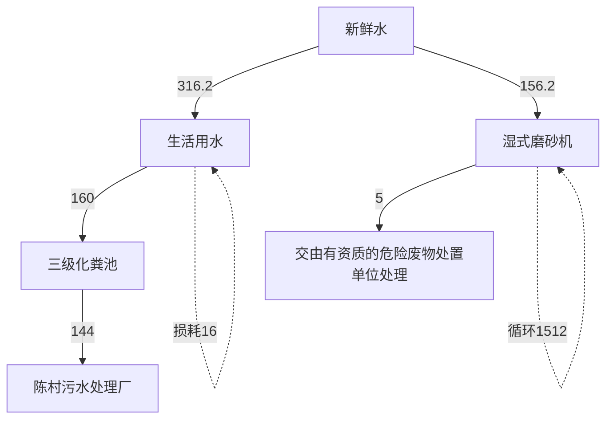
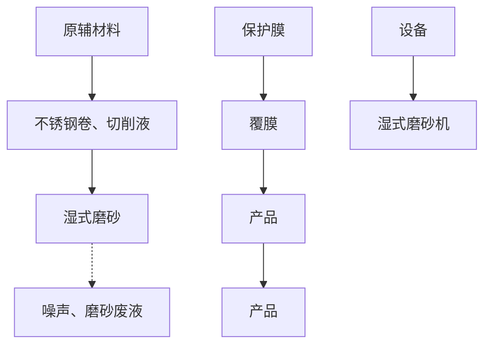
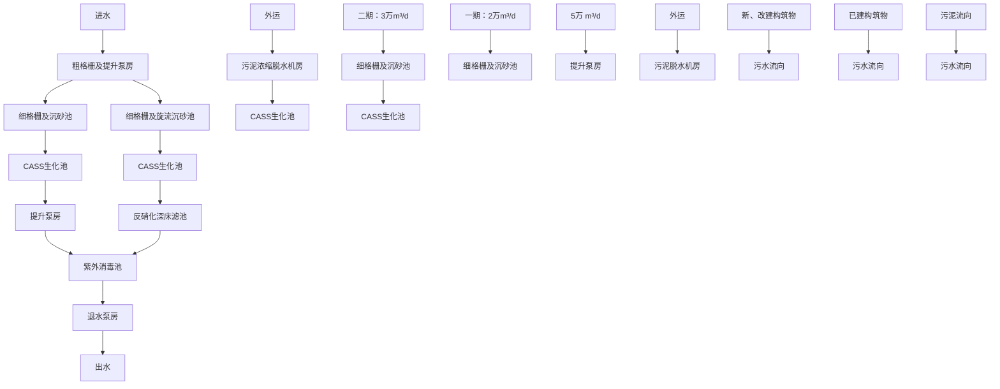

# 建设项目环境影响报告表

（污染影响类）

项目名称：佛山市青泰金属有限公司新建项目

建设单位（盖章）：佛山市青泰金属有限公司

编制日期：2022 年 12 月

中华人民共和国生态环境部制

# 目 录

一、建设项目基本情况....  
二、建设项目工程分析.. 8  
三、区域环境质量现状、环境保护目标及评价标准. . 15  
四、主要环境影响和保护措施. .21  
五、环境保护措施监督检查清单.. .. 36  
六、结论.... .... 38  
附表 .... ... 39  
附件 8 声明.. ...40

编制单位和编制人员情况表

<table><tr><td colspan="2">项目编号</td><td>k1n84n</td><td rowspan="4"></td><td></td></tr><tr><td colspan="2">建设项目名称</td><td>佛山市青泰</td><td></td></tr><tr><td colspan="2">建设项目类别</td><td>30--067金属</td><td></td></tr><tr><td colspan="2">环境影响评价文件类型</td><td>报告表</td><td></td></tr><tr><td colspan="5">一、建设单位情况</td></tr><tr><td colspan="2">单位名称(盖章)</td><td colspan="3">佛山市青泰金属有限公司</td></tr><tr><td colspan="2">统一社会信用代码</td><td rowspan="4" colspan="2"></td><td></td></tr><tr><td colspan="2">法定代表人(签章)</td><td></td></tr><tr><td colspan="2">主要负责人(签字)</td><td></td></tr><tr><td colspan="2">直接负责的主管人员(签字)</td><td></td></tr><tr><td colspan="2">二、编制单位情况</td><td rowspan="4"></td><td colspan="2"></td></tr><tr><td colspan="2">单位名称(盖章)</td><td colspan="2">保科技发展有限公司</td></tr><tr><td colspan="2">统一社会信用代码</td><td colspan="2">529084H</td></tr><tr><td colspan="2">三、编制人员情况</td><td colspan="2"></td></tr><tr><td colspan="5">1.编制主持人</td></tr><tr><td>姓名</td><td colspan="2">职业资格证书管理号</td><td>信用编号</td><td rowspan="2">签字</td></tr><tr><td>蔡新娥</td><td colspan="2">2016035440352013449914000083</td><td>BH002970</td></tr><tr><td colspan="5">2.主要编制人员</td></tr><tr><td>姓名</td><td colspan="2">主要编写内容</td><td>信用编号</td><td rowspan="2">签字</td></tr><tr><td>蔡新娥</td><td colspan="2">全部章节</td><td>BH002970</td></tr></table>

# 一、建设项目基本情况

<table><tr><td>建设项目名称</td><td colspan="3">佛山市青泰金属有限公司新建项目</td></tr><tr><td>项目代码</td><td colspan="3">无</td></tr><tr><td>建设单位联系人</td><td>赵**</td><td>联系方式</td><td>139**</td></tr><tr><td>建设地点</td><td colspan="3">佛山市顺德区陈村镇广隆工业区兴隆十一路1号(A8号东车间)</td></tr><tr><td>地理坐标</td><td colspan="3">(E 113度 12分 48.251秒,N 22度 59分 12.023秒)</td></tr><tr><td>国民经济行业类别</td><td>C3360 金属表面处理及热处理加工</td><td>建设项目行业类别</td><td>三十、金属制品业33—67、金属表面处理及热处理加工-其他(年用非溶剂型低VOCs含量涂料10吨以下的除外)</td></tr><tr><td>建设性质</td><td>新建(迁建)改建扩建技术改造</td><td>建设项目申报情形</td><td>首次申报项目不予批准后再次申报项目超五年重新审核项目重大变动重新报批项目</td></tr><tr><td>项目审批(核准/备案)部门(选填)</td><td>/</td><td>项目审批(核准/备案)文号(选填)</td><td>/</td></tr><tr><td>总投资(万元)</td><td>500</td><td>环保投资(万元)</td><td>10</td></tr><tr><td>环保投资占比(%)</td><td>2</td><td>施工工期</td><td>1个月</td></tr><tr><td>是否开工建设</td><td>否是:</td><td>用地(用海)面积(m2)</td><td>2250</td></tr><tr><td>专项评价设置情况</td><td colspan="3">无</td></tr><tr><td>规划情况</td><td colspan="3">无</td></tr><tr><td>规划环境影响评价情况</td><td colspan="3">无</td></tr><tr><td>规划及规划环境影响评价符合性分析</td><td colspan="3">无</td></tr></table>

# 1、与环境功能区划符合性分析

（1）生活污水经三级化粪池处理后由生活污水排放口排入市政污水管网，最终排入陈村污水处理厂进行深度处理后排入陈村水道，陈村水道属于Ⅲ类功能区，执行《地表水环境质量标准》（GB3838-2002）中的Ⅲ类标准，本项目污水排放符合纳污水体区划要求。  
（2）根据《佛山市顺德区生态环境保护“十四五”规划（2021-2025）》，项目所在区域空气环境功能区划为二类区，执行《环境空气质量标准》（GB3095-2012）及其修改单二级标准。项目所在位置不属于自然保护区、风景名胜区和其它需要特殊保护的地区，符合区域空气环境功能区划分要求。  
（3）根据《佛山市人民政府关于印发佛山市声环境功能区划分方案的通知》（佛府函[2015]72号），本项目所在地属于声环境2类区，项目各边界执行《声环境质量标准》（GB3096-2008）2类标准。

选址周围无国家、省、市、区重点保护的文物、古迹、无名胜风景区、自然保护区等，选址符合环境功能区划的要求。

# 2、“三线一单”符合性分析

# （1）生态保护红线

本项目位于佛山市顺德区陈村镇广隆工业区兴隆十一路1号（A8号东车间），根据《佛山市顺德区人民政府关于印发佛山市顺德区“三线一单”生态环境分区管控方案的通知》（顺府发[2021]11号），本项目不在生态保护红线范围内，故本项目的建设符合生态保护红线的要求。

# （2）环境质量底线

生活污水经三级化粪池处理后由生活污水排放口排入市政污水管网，最终排入陈村污水处理厂进行深度处理后排入陈村水道，对受纳水体影响很小。

本项目位于声环境2类区，本项目建成后，噪声贡献值较小，采取污染防治措施后，对周围声环境影响不大。

固体废物分类收集，生活垃圾交由环卫部门清运，一般工业固废交由资源回收公司回收，危险废物暂时贮存在危险废物暂存间，危废暂存间基础按相关要求防渗，危险废物交由具有危险废物处理处置资质的第三方单位处理。

综上，本项目的建设符合环境质量底线要求。

# （3）资源利用上线

本项目营运过程中消耗一定量的电能、水资源，项目资源消耗量相对区域资源利用总量较少，符合资源利用上线的要求。

# （4）环境准入清单

根据国家发展改革委商务部关于印发《市场准入负面清单（2022年版）》的通知，本项目不属于市场准入负面清单项目；对照《环境保护综合名录》（2021年版），本项目产品不属于“高污染、高环境风险”产品；对照《促进产业结构调整暂行规定》（国发〔2005〕40号），本项目不属于限制类和淘汰类项目；对照《顺德区村级工业园升级改造项目产业准入负面清单》（2019年本），本项目不属于限制类和禁止类项目。

因此，项目符合“三线一单”的要求。

3、与《佛山市顺德区人民政府关于印发佛山市顺德区“三线一单”生态环境分区管控方案的通知》（顺府发[2021]11号）相符性分析

根据《佛山市顺德区人民政府关于印发佛山市顺德区“三线一单”生态环境分区管控方案的通知》（顺府发[2021]11号），项目所在的位置为陈村镇重点管控区（环境管控单元编码ZH44060620010），要素细类：水环境城镇生活污染重点管控区、大气环境布局敏感重点管控区、大气环境受体敏感重点管控区、江河湖库岸线重点管控区、江河湖库岸线一般管控区。具体管理要求如下表所示。

表 1-1 《佛山市顺德区人民政府关于印发佛山市顺德区“三线一单”生态环境分区管控方案的通知》相符性分析表

<table><tr><td>管理维度</td><td>管控要求</td><td>本项目</td><td>是否相符</td></tr><tr><td>空间布局约束</td><td>1-1.【产业/鼓励引导类】重点发展智能装备制造、新一代电子信息、新材料等新兴产业;结合TOD片区开发,对接广深港资源,大力发展生产性服务业、高端商务服务业和中小企业总部集群;培育以花卉产业为特色,向电商、会展、文创旅游等延伸的现代农业产业链。1-2.【产业/综合类】系统推进村级工业园升级改造,腾出连片空间,布局产业集聚区和主题产业园,推动工业项目入园集聚发展。新增工业制造业用地原</td><td>项目主要从事不锈钢卷的表面处理加工,位于已建成的工业聚集区内。本项目与最近敏感点距离为117m,本项目为湿式加工,无废气产生,无需设置大气防护距离。</td><td>符合</td></tr></table>

<table><tr><td rowspan="5"></td><td rowspan="4"></td><td>则上安排在产业集聚区内,产业集聚区外原则上不鼓励工业及物流仓储用地的新建与改造。1-3.【产业/综合类】产业聚集区所属地块内的工业用地或企业与村庄、学校等环境敏感点之间应设置合理的大气环境防护距离,并通过绿化带进行有效隔离;聚集区规划布局应注重大气污染排放企业应尽量避免布局在居住用地的常年主导风向的上风向。</td><td></td><td></td></tr><tr><td>1-4.【产业/限制类】受纳水体或监控断面不达标的,不得新建、扩建向河涌直接排放废水的项目。新建、扩建含蚀刻工序的线路板生产项目和化工项目应在配套污水集中处置的工业园区或生活污水管网覆盖区域内建设;纯加工型印花项目,含酸洗、磷化的金属表面处理、金属制品项目(与自身高新技术企业配套的除外),含酸洗、喷涂、化学抛光、电解等涉及废水排放工艺的不锈钢型材加工项目(与自身高新技术企业配套的除外),应进入以此类项目为主导产业、有相应废水集中治理设施的工业园区,实现集中治污。</td><td>本项目主要进行的表面处理为湿式磨砂,不属于上述需集中治污的工艺。本项目无生产废水的排放,生活污水经三级化粪池处理后由生活污水排放口排入市政污水管网,最终排入陈村污水处理厂处理,尾水排入陈村水道,不直接向水体排放废水。陈村水道断面达到水质要求,水质较好。</td><td>符合</td></tr><tr><td>1-5.【产业/综合类】划定家具生产优先发展区域,优先发展区外不再新建涉及涂装工艺的木质家具制造项目。</td><td>不涉及</td><td>符合</td></tr><tr><td>1-6.【大气/限制类】大气环境受体敏感重点管控区内,应严格限制新建储油库项目、产生和排放有毒有害大气污染物的建设项目以及使用溶剂型油墨、涂料、清洗剂、胶黏剂等高挥发性有机物原辅材料项目,鼓励现有该类项目搬迁退出。1-7.【大气/限制类】大气环境布局敏感区重点管控区内,应严格限制新建生产和使用高挥发性有机物原辅材料项目,优先开展低VOCs含量原辅材料替代,强化无组织排放控制。原则上不再新建、扩建新增氮氧化物、烟(粉)尘排放量较大的建设项目。</td><td>本项目为湿式加工,无废气产生。</td><td>符合</td></tr><tr><td>能源资源利用</td><td>2-1.【能源/鼓励引导类】推广节能技术,加快发展绿色货运与现代物流。2-2.【能源/鼓励引导类】推广新能源汽车应用和充电基础设施建设,积极推动重卡LNG加气站、充电基础设施、加氢站建设。2-3.【能源/综合类】科学实施能源消费总量和强度“双控”,新建高能耗项目单位产品(产值)能耗达到国际国内先进水平。2-4.【水资源/综合类】贯彻落实“节水优先”方针,实行最严格水资源管理制度,陈村镇万元国内生产总值用水量、万元工业增加值用水量、用水总量、农田灌溉水有效利用系数等用水总量和效率指标达到区下达要求。2-5.【土地资源/限制类】落实单位土地面积投资强度、土地利用强度等建设用地控制性指标要求,提高土地利用效率。2-6.【岸线/禁止类】严格水域岸线用途管制,新建项目一律不得违规占用水域。严禁破坏生态的岸线利用行为和不符合其功能定位的开发建设活动,严禁以各种名义侵占河道、围垦湖泊、非法采砂等。</td><td>本项目不属于“高能耗”项目。项目用电、用水由市政系统提供。项目租用现有厂房进行生产经营,不占用新的土地资源。</td><td>符合</td></tr><tr><td rowspan="2"></td><td>污染物排放管控</td><td>3-1.【水/限制类】城镇新区建设实行雨污分流。住宅、商业体、学校、市场等城镇开发建设项目应当配套或者同步计划建设公共排水设施,公共排水设施或自建排污水设施未能投产运行的,以上涉水项目不得投入使用。新建小区严格实施雨污分流,阳台、露台等污水接入污水收集系统,将生活污水“应截尽截”。做好大型楼盘、集贸市场、餐饮以及学校等4大类排水户污水接入市政管网工作。3-2.【水/综合类】陈村镇重点河涌水质上年度未达到水环境环境质量目标的,需组织编制、系统实施、向社会公开区域重点水污染物减排计划并明确“替代量”,本年度新建、改建、扩建项目新增水环境重点污染物实行区域“减二增一”替代(工业、生活或综合集中废水处理设施、民生项目除外)。3-3.【水/综合类】结合村级工业园改造,全面提升产业层次与集聚度,促进污染集中整治。3-4.【水/综合类】稳步推进排水设施“三个一体化”管理模式,补齐城乡污水收集和处理短板,推动陈村污水处理厂提质增效,加快消除城中村、老旧城区、城乡结合部等污水收集管网空白区,逐步实现城乡污水收集处理全覆盖。2025年前完成陈村污水处理厂扩建,尾水应执行《城镇污水处理厂污染物排放标准》(GB18918-2002)一级A标准及《广东省水污染物排放限值》(DB44/26-2001)的较严值。3-5.【水/综合类】完善污水管网建设,逐步取消现状农村污水处理站点,有条件的区域实施雨污分流改造;至2030年全面雨污分流,农村生活污水纳入陈村城镇污水处理系统。3-6.【水/综合类】产业集聚区和主题园区内做好污水管网和污水集中处理设施的配套保障,确保废水收集到城镇污水处理厂、园区污水处理厂或分散式污水处理设施集中处置。</td><td>本项目实行雨污分流,项目周边污水管网已完善,外排废水经市政管网排入陈村污水处理厂进行深度处理后排入陈村水道。</td><td>符合</td></tr><tr><td>环境风险防控</td><td>4-1.【水/综合类】陈村污水处理厂、工业污水集中处理设施应采取有效措施,防止事故废水直接排入水体。完善污水处理厂在线监控系统联网,实现污水处理厂的实时、动态监管。4-2.【风险/综合类】加强环境风险分级分类管理,强化金属制品、有色金属和压延加工、化学原料和化学品制造业等涉重金属、化工行业企业及工业园区等重点环境风险源的环境风险防控。</td><td>本项目外排废水经市政管网排入陈村污水处理厂进行深度处理后排入陈村水道。本项目风险防控措施具备可行性,整体风险可控。</td><td>符合</td></tr><tr><td colspan="5">环境质量底线:监测结果表明:根据2021年全区的大气环境质量状况公报, $O_3$ (臭氧)浓度超过了质量标准限值,故顺德区大气环境质量属非达标区;地表</td></tr></table>

水陈村水道各项水质指标均达到《地表水环境质量标准》（GB3838-2002）Ⅲ类标准。生活污水经三级化粪池预处理达到广东省《水污染物排放限值》（DB44/26-2001）第二时段三级标准经生活污水排放口排入市政污水管网，最终排入陈村污水处理厂处理，不直接向地表水体排放；本项目无废气产生。因此本项目的建设不会突破当地环境质量底线。

综合分析，本项目的建设不会突破当地环境质量底线。

资源利用上线：本项目运营期所用的资源主要为水资源、电能。本项目给水由市政供水接入，电能由区域电网供应，符合《佛山市人民政府关于印发佛山市“三线一单”生态环境分区管控方案的通知》（佛府〔2021〕11号）文件中的能源资源利用要求，同时本项目所用以上资源占比极少，不会突破当地的资源利用上线。项目所在地用途为工业用途，符合当地土地规划要求。

生态环境准入清单：本项目不在《产业结构调整指导目录（2019年本）》限制类、淘汰类之列，不属于《市场准入负面清单（2022年版）》中规定的禁止和许可准入的行业类别。因此项目符合相关产业政策、规划的要求。

综上所述，本项目与《佛山市顺德区人民政府关于印发佛山市顺德区“三线一单”生态环境分区管控方案的通知》（顺府发[2021]11号）是相符的。

# 4、与产业政策符合性分析

项目所属行业为C3360金属表面处理及热处理加工，根据国家《产业结构调整指导目录（2019年本）》的规定，项目不属于上述目录所列的鼓励类、限制类和禁止（淘汰）类项目，项目属于允许类，因此项目符合国家产业政策要求。

# 5、选址合理性分析

项目租赁佛山市顺德区陈村镇广隆工业区兴隆十一路1号（A8号东车间）已建厂房进行生产经营，根据出租方提供的不动产权证书（编号：粤房地权证佛字第0314107906号）可知，项目所在地块用途为工业用地，符合用地规划性质。

6、与《佛山市顺德区生态环境保护“十四五”规划（2021-2025）》相符性分析

文中要求：“调整优化产业集群发展空间布局，环境质量不达标区域，新建、扩建项目需符合环境质量改善要求；严格控制“高耗能、高排放”项目盲目发展，禁止新建、扩建水泥、平板玻璃、化学制浆、生皮制革以及国家规划外的钢铁、原油加工等项目；专业电镀、印染等项目进入定点园区集中管理。”

本项目不属于“高耗能、高排放”项目，不属于“水泥、平板玻璃、化学制浆、生皮制革以及国家规划外的钢铁、原油加工等项目”和“专业电镀、印染等项目”。项目生活污水经处理后能达标排放，且项目排放量较少；项目无废气的产生，因此对环境的影响不大，不会恶化环境质量。项目与《佛山市顺德区生态环境保护“十四五”规划（2021-2025）》要求相符。

# 二、建设项目工程分析

# 一、项目建设内容

# 1、基本信息

本项目租用已建闲置厂房，厂房属于单层建筑物，层高 9.6m，总占地面积2250 平方米，建筑面积2250平方米，具体工程组成见下表。

表 2-1 本项目工程组成一览表

<table><tr><td>类别</td><td>项目名称</td><td>建设规模</td></tr><tr><td>主体工程</td><td>生产厂房</td><td>建筑面积为 $2250m^{2}$ ,内含生产车间( $1200m^{2}$ )、办公室( $50m^{2}$ )、仓库( $800m^{2}$ )等</td></tr><tr><td rowspan="3">公用工程</td><td>给水</td><td>市政供水,主要为员工生活用水、生产用水</td></tr><tr><td>排水</td><td>采用雨污分流。雨水通过雨水排水系统排至市政雨水管网。生活污水经三级化粪池处理后由生活污水排放口排入市政污水管网,最终排入陈村污水处理厂进行深度处理。</td></tr><tr><td>供电</td><td>市政供电,预计耗电量为15万千瓦时/年</td></tr><tr><td rowspan="5">环保工程</td><td>废水</td><td>废液定期作为危险废物交由具有危险废物处理处置资质的单位处理;生活污水经三级化粪池处理后由生活污水排放口排入市政污水管网,最终排入陈村污水处理厂进行深度处理。</td></tr><tr><td>噪声治理</td><td>选用低噪声设备、加强维护保养、并进行隔声、减振处理、车间墙体隔声、距离衰减、合理平面布局</td></tr><tr><td rowspan="3">固废处理</td><td>生活垃圾:集中收集,交环卫部门清运</td></tr><tr><td>一般工业固废:分类收集、交专业公司回收,一般工业固废暂存间位于项目厂房内东北角,建筑面积约 $10m^{2}$ </td></tr><tr><td>危险废物:设置危险废物暂存间,独立分类收集,交由有相应处理能力的单位进行处理,危废暂存间位于项目厂房内东北角,建筑面积约 $10m^{2}$ </td></tr></table>

# 2、主要产品及产能

具体情况详见下表：

表 2-2 主要产品产量一览表

<table><tr><td>名称</td><td>单位</td><td>产量</td><td>产品尺寸(长宽厚)</td></tr><tr><td>不锈钢磨砂卷</td><td>吨/年</td><td>8000</td><td>449400*1220*1.15mm,密度 7.93g/cm3,单卷重量约 5t</td></tr></table>

# 3、主要原辅材料及用量

项目原辅材料及用量详见下表：

表2-3 项目主要原辅材料消耗一览表

<table><tr><td>名称</td><td>物态</td><td>年用量(t)</td><td>最大储存量(t)</td><td>包装方式</td><td>用途</td><td>备注</td></tr><tr><td>不锈钢卷</td><td>固态</td><td>8000.5</td><td>50</td><td>/</td><td>/</td><td>449400*1220*1.15mm,密度7.93g/cm3</td></tr><tr><td>保护膜</td><td>固态</td><td>5</td><td>1</td><td>卷</td><td>覆膜</td><td>用于产品覆膜</td></tr><tr><td>切削液</td><td>液态</td><td>0.5</td><td>0.5</td><td>桶装,25kg/桶</td><td>磨砂</td><td>主要含有矿物油、脂肪酸、乳化剂、防锈剂、消泡剂等成分</td></tr><tr><td>机油</td><td>液态</td><td>0.02</td><td>0.01</td><td>10kg/桶</td><td>维护保养</td><td>-</td></tr></table>

切削液理化性质：淡黄色透明状。主要含有三乙醇胺TEA10\~15%、表面活性剂 20\~35%、润滑剂 12\~20%、其他 5\~10%其余为水。pH 值约 8.7（5%），水中溶解度 100%溶解。比重（15℃）1.05g/cm3，粘度 35mm2/s（40℃）。

切削液合理性分析：

切削液投加到液槽中与水混合后一同作用于不锈钢卷上，磨砂过程会带出不锈钢细颗粒，需要经多级过滤后回用于湿磨槽中，但极少部分细小颗粒无法截留，富集在磨砂液中而降低磨砂效果，根据同行（《佛山市力劲盛不锈钢有限公司第二分公司新建项目》（佛环0305环审〔2022〕38号））经验，每当磨砂面积达到12000 平方米时，磨砂液因富集颗粒较多而开始变粘稠，需要更换整槽磨砂液。本项目不锈钢湿式磨砂产品 8000t，单卷面积约 548.268 平方米（只需要打磨一面 ） ， 打 磨 面 积 共 8000/5\*548.268=877229 平 方 米 ， 单 台 磨 砂 机 需 打 磨877229/4=219307.25 平方米，理论更换槽液次数为 219307.25/12000≈19 次，为保证磨砂质量，保留一定的余量空间，企业控制单机每打磨 16 卷不锈钢卷（磨砂面积达到 8773 平方米＜12000 平方米）就整体更换一次槽液，即年更换次数为 219307.25/8773≈25 次，约生产 300\*7/25=84h（12d）需要更换一次，单位时间消耗的切削液量约 0.5t/300d/7h\*1000=0.24kg/h，单位产品消耗的切削液量约0.5/8000=0.0625kg/t。

# 4、主要生产设备

主要生产设备情况详见下表：

表 2-4 主要生产设备一览表

<table><tr><td>序号</td><td>设备名称</td><td>数量/台</td><td>规格/型号</td><td>备注</td></tr><tr><td>1.</td><td>湿式磨砂机</td><td>4</td><td>BS-W1220</td><td>湿式磨砂,磨砂机自带槽体有效容积为 $0.05m^{3}$ ,(长宽高: $0.5m*0.5m*0.2m$ )</td></tr><tr><td>2.</td><td>吊机</td><td>2</td><td>-</td><td>辅助设备</td></tr></table>

# 5、产能匹配性分析

不锈钢卷尺寸为 449400\*1220\*1.15mm 尺寸，湿式磨砂机进料口宽度约

1400mm，单卷加工时间与不锈钢卷长度有关（本项目长度为 449.4m）。一卷不锈钢卷从人工上料到进入磨砂机再到人工下料整个过程耗时约 5h，不锈钢卷仅一面需要打磨，不锈钢卷密度为 7.93g/cm3，449400\*1220\*1.15mm，单卷重量 5t。考虑上下架准备时间，实际操作时间为 7h。

表 2-5 湿式磨砂机产能匹配性分析

<table><tr><td>设备数量</td><td>单卷不锈钢卷加工耗时</td><td>一天加工不锈钢卷数量</td><td>理论一天加工不锈钢卷重量</td><td>理论全年加工不锈钢卷重量</td><td>本项目预计产能</td></tr><tr><td>1台</td><td>5h</td><td>7/5=1.4卷</td><td>1.4*5=7t</td><td>-</td><td>-</td></tr><tr><td>4台</td><td>-</td><td>-</td><td>7*4=28t</td><td>28*300=8400t</td><td>8000t</td></tr></table>

根据上表可知，设备最大产能可达到 8400t，大于本项目磨砂卷预计产能8000t，项目预计产能约占设备最大设计产能的 95%，在设备生产能力范围内，设备能满足生产需要。

# 6、人员及生产制度

# （1）工作制度

本项目工作日为300天/年，采取单班8小时工作制，工作时间为8:00\~12:00、14:00\~18:00。

# （2）劳动定员

本项目劳动定员 16 人，均不在厂内食宿。

# 7、水平衡分析

生活污水：项目总人数为 16 人，均不在厂内食宿，年工作时间为 300天。根据《用水定额第3部分：生活》（DB 44/T1461.3-2021）中办公楼（无食堂和浴室）的生活用水定额（先进值），员工办公生活用水定额取 10m3/（人·a），则项目生活用水量为 160m3 /a，排放系数取 0.9，则污水产生量为 144m3/a（0.48m3 /d），生活污水经三级化粪池处理后由生活污水排放口排至陈村污水处理厂处理，尾水排至陈村水道。

生产废水：单台湿磨机使用过程中水流速度为0.05L/s，4台湿磨机用水量为$0 . 0 5 ^ { * } 6 0 ^ { * } 6 0 ^ { * } 7 ^ { * } 4 \mathrm { = } 5 0 4 0 \mathrm { L / d ~ ( \Omega 5 . 0 4 m ^ { 3 } / d , ~ 1 5 1 2 m ^ { 3 } / a ) }$ ，损耗量按 10%估算，则蒸发耗水量为 151.2m3。切削液投加到液槽中与水混合后一同作用于不锈钢卷上，磨砂过程会带出不锈钢细颗粒，需要经多级过滤后回用于湿磨槽中，但极少部分细小颗粒无法截留，富集在磨砂液中而降低磨砂效果。单台湿式磨砂机槽体有效容积为 0.05m3（长宽高：0.5m\*0.5m\*0.2m），单次更换水量为 0.05m3/次，4台湿式磨砂机更换水量约 0.2m3/次。

切削液投加到液槽中与水混合后一同作用于不锈钢卷上，磨砂过程会带出不锈钢细颗粒，需要经过滤后回用于湿磨槽中，但极少部分细小颗粒无法截留，富集在磨砂液中而降低磨砂效果，企业控制单机每打磨 16 卷不锈钢卷（磨砂面积达到 8773 平方米时）就整体更换一次槽液，即年更换次数为 219307.25/8773≈25次。槽液一年更换次数约 25次，废液委外处理量为0.05×4×25=5m3/a，湿磨机湿磨水线内循环（循环水量为 $0 . 0 5 \mathrm { L } / \mathrm { s } \times 2 1 0 0 \times 3 6 0 0 \div 1 0 0 0 \times 4 = 1 5 1 2 \mathrm { m } ^ { 3 } / \mathrm { a } )$ ），这部分含切削液废液定期作为危险废物交由具有危险废物处理处置资质的单位处理。生产用新鲜水量为 5+151.2=156.2m3/a。

湿磨对水质要求不高，对回用水无用水标准要求，回用水中含大量的切削液可减少切削液的投加，湿磨机湿磨水线内循环，槽液一年更换 25次，产生含切削液磨砂废液 5m3 /a，定期作为危险废物交由有危险废物处置资质的单位处理。

# （1）给水

项目用水主要为员工生活用水、生产用水，来自城市供水管网，全部采用市政直供。总用水量 316.2m3 /a，其中生活用水 160m3 /a，生产用水 156.2m3/a。

# （2）排水

本项目产生的废水为员工生活污水。生活污水经三级化粪池处理达到广东省《水污染物排放限值》（DB44/26-2001）第二时段三级标准，然后经生活污水排放口排入陈村污水处理厂，生活污水排放量 144m3 /a。湿式磨砂机的含切削液磨砂废液定期作为危险废物交由具有危险废物处理处置资质的第三方单位处理。项目水平衡图如下图所示：

flowchart

图 2-1 项目水平衡图（m3/a）

# 7、物料平衡

表 2-6 物料平衡表

<table><tr><td colspan="2">投料</td><td colspan="2">产出</td></tr><tr><td>原料</td><td>数量/t</td><td>出料</td><td>数量/t</td></tr><tr><td>不锈钢卷</td><td>8000.5</td><td>不锈钢卷(产品)</td><td>8000</td></tr><tr><td></td><td></td><td>废金属颗粒</td><td>0.5</td></tr><tr><td>合计</td><td>8000.5</td><td>合计</td><td>8000.5</td></tr></table>

# 8、平面布局情况

项目厂房位于一幢单层工业厂房内，厂房内设置生产车间（1200m2，单台设备按 2m\*3m 算，考虑工件周转面积，单台设备所需面积18平方米，4台磨砂机所需面积 72平方米）、仓库（800m2）、办公室 $( 5 0 \mathrm { m } ^ { 2 } )$ 、一般工业固废暂存间 $( 1 0 \mathrm { m } ^ { 2 } )$ 、危废暂存间 $( 1 0 \mathrm { m } ^ { 2 } )$ ）等。原料仓库位于厂房西侧，成品仓库位于厂房东侧；危废暂存间、一般工业固体废物暂存间（固废间）位于厂房东北侧。厂房内部按照工艺要求进行分区，各生产区相对独立，互不干扰，每个生产区按照工艺流程布置设备，平面布局合理。具体平面布置图见附图4。

# 一、工艺流程简述（图示）

flowchart

图 2-2生产工艺流程及产污环节示意图

# 生产流程说明：

（1）不锈钢卷进入湿式磨砂机中，磨砂机内设有砂轮，不锈钢卷通过磨砂机砂轮磨擦不锈钢卷表面，使表面呈现磨砂效果。湿式磨砂机分粗磨、细磨及胶辊挤压三段，湿磨过程需加入适量切削液及水（切削液和水混合）对不锈钢卷进行磨砂（切削液投加到液槽中与水混合后喷在磨砂轮上一同作用于不锈钢卷），由于是湿式作业，因此砂磨过程不产生粉尘。胶辊挤压段设有多级隔水胶辊挤干水分，挤出的水回流至湿磨槽内循环使用。湿式磨砂机自带过滤装置对含切削液磨砂废液进行多级过滤后线内循环使用，企业控制单机每打磨16卷不锈钢卷（磨砂面积达到 8773 平方米＜12000 平方米）就整体更换一次槽液，每年槽液整槽更换约 25 次。过滤时会收集废金属颗粒，磨砂废液作为危险废物交由具有危险废物处理处置资质的第三方单位处理。不锈钢卷经前后两段湿磨后经多级隔水胶辊挤干水分，隔水胶辊会有损耗，会产生废隔水胶辊。

（2）不锈钢卷下架后覆膜，包装待售。

# 二、主要产污工序

项目主要产污工序如下表。

表 2-6 项目主要产污工序

<table><tr><td>项目</td><td>产污工序</td><td>污染物</td><td>主要污染因子</td></tr><tr><td>废水</td><td>员工生活</td><td>生活污水</td><td>pH、 $COD_{Cr}$ 、 $BOD_5$ 、氨氮、SS</td></tr><tr><td>噪声</td><td colspan="3">生产设备</td></tr><tr><td rowspan="2">固废</td><td>员工生活</td><td>生活垃圾</td><td>生活垃圾</td></tr><tr><td>生产过程</td><td>一般工业固体废物</td><td>废包装材料</td></tr></table>

<table><tr><td></td><td></td><td></td><td>危险废物</td><td>废机油桶、废机油、废含油手套抹布、废金属颗粒(含切削液)、废隔水胶辊、含切削液磨砂废液</td></tr><tr><td>与项目有关的原有环境污染问题</td><td colspan="4">本项目为新建项目,不存在与项目有关的环境影响问题。</td></tr></table>

# 三、区域环境质量现状、环境保护目标及评价标准

# 1、环境空气质量现状

本项目位于佛山市陈村镇，根据《关于调整顺德区环境空气质量功能区划的复函》（佛府办函〔2014〕494 号），本项目所在区域属大气环境二类功能区，环境空气质量执行《环境空气质量标准》（GB3095-2012）及其修改单二级标准。

本报告采用《2021年度佛山市顺德区环境质量状况公报》，顺德区二氧化硫 $( \mathrm { S O } _ { 2 } )$ 、二氧化氮 $\left( \mathrm { N O } _ { 2 } \right)$ 、可吸入颗粒物 $\left( \mathrm { P M } _ { 1 0 } \right)$ ）、细颗粒物 $\left( \mathbf { P M } _ { 2 . 5 } \right)$ ）、一氧化碳（CO）五项污染物年评价浓度均达到二级标准，臭氧（O3）超标。全区AQI（空气质量指数）达标率84.7%，判定本项目所在的顺德区为不达标区。

表 3-1 区域空气质量现状评价表（2021年）

<table><tr><td>所在区域</td><td>污染物</td><td>年评价指标</td><td>现状浓度 $\left( {\mu \mathrm{g}/{\mathrm{m}}^{3}}\right)$ </td><td>标准值 $\left( {\mu \mathrm{g}/{\mathrm{m}}^{3}}\right)$ </td><td>达标情况</td><td>超标倍数</td></tr><tr><td rowspan="6">顺德区</td><td> ${\mathrm{{SO}}}_{2}$ </td><td>年平均质量浓度</td><td>6</td><td>60</td><td>达标</td><td>/</td></tr><tr><td> ${\mathrm{{NO}}}_{2}$ </td><td>年平均质量浓度</td><td>33</td><td>40</td><td>达标</td><td>/</td></tr><tr><td> ${\mathrm{{PM}}}_{10}$ </td><td>年平均质量浓度</td><td>42</td><td>70</td><td>达标</td><td>/</td></tr><tr><td> ${\mathrm{{PM}}}_{2.5}$ </td><td>年平均质量浓度</td><td>22</td><td>35</td><td>达标</td><td>/</td></tr><tr><td>CO</td><td>95百分位数日平均质量浓度</td><td>1000</td><td>4000</td><td>达标</td><td>/</td></tr><tr><td> ${\mathrm{O}}_{3}$ </td><td>90百分位数最大8小时平均质量浓度</td><td>173</td><td>160</td><td>不达标</td><td>/</td></tr></table>

bar_line

| 污染物 | 2020年 (微克/立方米) | 2021年 (微克/立方米) | CO浓度 (毫克/立方米) |
| :--- | :--- | :--- | :--- |
| SO₂ | 7 | 6 | |
| NO₂ | 30 | 33 | |
| PM₁₀ | 43 | 42 | |
| PM₂.₅ | 21 | 22 | |
| O₃ | 155 | 173 | |
| CO | 1.0 | 1.0 | |

图 3-1 2021 年顺德区(国控点)常规污染物浓度水平与 2020 年同期对比

# 2、地表水环境质量现状

项目外排废水为生活污水，生活污水经三级化粪池处理后经生活污水排放口排入市政污水管网，最终排入陈村污水处理厂，尾水排入陈村水道。根据《广东省地表水功能区划》（粤环[2011]14 号）可知，陈村水道水质目标为Ⅲ类，执行《地表水环境质量标准》（GB3838-2002）Ⅲ类标准。

为评价陈村水道水质，本项目引用《2021年度佛山市顺德区环境质量状况公报》“2021年顺德区主河道质量评价及年度对比”的评价结果，详见下表。

表 3-2 2021年度顺德区主河道质量评价及年度对比

<table><tr><td rowspan="2">河流名称</td><td rowspan="2">断面</td><td colspan="2">断面定类</td><td rowspan="2">水质评价标准</td><td colspan="2">河流定类</td></tr><tr><td>2021年</td><td>2020年</td><td>2021年</td><td>2020年</td></tr><tr><td>吉利涌</td><td>平步</td><td>II</td><td>II</td><td>III</td><td>II</td><td>II</td></tr><tr><td>潭州水道上游</td><td>潭村</td><td>II</td><td>II</td><td>II</td><td>II</td><td>II</td></tr><tr><td>潭州水道下游</td><td>西海</td><td>II</td><td>II</td><td>III</td><td>II</td><td>II</td></tr><tr><td>陈村水道</td><td>江口</td><td>III</td><td>II</td><td>III</td><td>III</td><td>II</td></tr></table>

根据《2021年度佛山市顺德区环境质量状况公报》的评价结果，陈村水道江口断面水质满足《地表水环境质量标准》（GB3838-2002）中Ⅲ类水质功能要求，表明陈村水道水环境质量现状较好。

# 3、声环境质量现状

项目东面隔园区道路20m为广西北港物流有限公司，南面紧邻佛山市源众来金属制品有限公司，西面隔园区道路20m为佛山市利迅达不锈钢有限公司，北面相邻为佛山市源政来金属材料有限公司。项目四至图见附图 2。

根据《佛山市声环境功能区划分（2012-2020）顺德区》项目属于2类声功能区，执行《声环境质量标准》（GB3096-2008）2类标准。

经调查，厂界外周边50米范围内不存在声环境保护目标，根据《建设项目环境影响报告表编制技术指南（污染影响类）（试行）》要求，不需进行声环境质量现状监测。

# 4、生态环境质量现状

本项目位于已建厂房内，不新增用地且用地范围内不含生态环境保护目标。因此，无需调查生态环境质量现状。

# 5、土壤、地下水环境质量现状

根据《建设项目环境影响报告表编制技术指南（污染影响类）（试行）》要求，报告表项目原则上不开展地下水、土壤环境质量现状调查。项目已硬底化，槽体均架空设置，不存在土壤、地下水环境污染途径，不开展土壤、地下水环境质量现状调查。

# 6、电磁辐射

项目不涉及电磁辐射，无需开展电磁辐射现状调查。

<table><tr><td rowspan="7">环境保护目标</td><td colspan="8">1、地表水环境保护目标项目污水经市政污水管网排入陈村污水处理厂进行深度处理后排入陈村水道,最终纳污水体为陈村水道,陈村水道属于III类功能区。2、大气环境保护目标厂界外500m范围内的大气环境保护目标如下表所示:表3-3 大气环境保护目标一览表</td></tr><tr><td rowspan="2">名称</td><td colspan="2">坐标(m)</td><td rowspan="2">保护对象</td><td rowspan="2">保护内容</td><td rowspan="2">环境功能区</td><td rowspan="2">相对厂址方位</td><td rowspan="2">相对厂址距离(m)</td></tr><tr><td>X</td><td>Y</td></tr><tr><td>文海村</td><td>258</td><td>3</td><td>居民</td><td>500人</td><td rowspan="2">大气2类区</td><td>东</td><td>247</td></tr><tr><td>文教村</td><td>1</td><td>395</td><td>居民</td><td>200人</td><td>北</td><td>380</td></tr><tr><td>龙起里坊</td><td>2</td><td>129</td><td>居民</td><td>50人</td><td>大气2类区,声2类区</td><td>北</td><td>117</td></tr><tr><td colspan="8">2、声环境保护目标厂界外50米范围内无声环境保护目标。根据《佛山市声环境功能区划分(2012-2020)顺德区》项目属于2类声功能区,执行《声环境质量标准》(GB3096-2008)2类标准。3、地下水环境保护目标厂界外500米范围内不存在地下水集中式饮用水水源和热水、矿泉水、温泉等特殊地下水资源,无地下水环境保护目标。4、生态环境保护目标项目位于已建厂房内,不新增用地且用地范围内不含生态环境保护目标。</td></tr><tr><td>污染物排放控制标准</td><td colspan="8">1、水污染物排放标准项目生活污水经三级化粪池预处理达到广东省《水污染物排放限值》(DB44/26-2001)第二时段三级标准后,通过生活污水排放口排入市政污水管网排入陈村污水处理厂处理。根据2013年7月11日颁布的《顺德区环境运输和城市管理局关于全区城镇污水处理厂尾水排放执行标准的通知》,生活污水处理厂尾水排放采用其中第三条规定:即陈村污水处理厂尾水排放执行广东省《水污染物排放限值》(DB44/26-2001)第二时段一级标准及《城镇污水处理厂污</td></tr></table>

染物排放标准》（GB18918-2002）一级A标准中的较严值后排入陈村水道；项目污染物排放情况具体如下表所示。

表 3-4 污水污染物排放限值 单位：pH无量纲，其余mg/L

<table><tr><td>执行标准</td><td>污染物</td><td>pH</td><td> $COD_{Cr}$ </td><td> $BOD_5$ </td><td> $NH_3-N$ </td><td>SS</td></tr><tr><td>广东省《水污染物排放限值》(DB 44/26-2001)第二时段三级标准</td><td>生活污水排放口执行标准限值</td><td>6~9</td><td>500</td><td>300</td><td>--</td><td>400</td></tr><tr><td>广东省《水污染物排放限值》(DB44/26-2001)第二时段一级标准及《城镇污水处理厂污染物排放标准》(GB18918-2002)一级A标准中的较严值</td><td>陈村污水厂排放口执行标准限值</td><td>6~9</td><td>40</td><td>10</td><td>5</td><td>10</td></tr></table>

# 2、噪声排放标准

项 目 四 周 厂 界 噪 声 执 行 《工业企业厂界环境噪声排放标准》（GB12348-2008）中的 2 类标准，详见表 3-5。

表3-5 噪声排放标准 单位：dB（A）

<table><tr><td>位置</td><td>类别</td><td>昼间</td><td>夜间</td></tr><tr><td>厂界</td><td>2类</td><td>60</td><td>50</td></tr></table>

# 4、固体废物废物

一般固体废物执行《一般固体废物分类及代码》（GB/T39198-2020）、《一般工业固体废物贮存和填埋污染控制标准》（GB18599-2020），危险废物执行《国家危险废物名录》（2021 版）以及《危险废物贮存污染控制标准》（GB18597-2001）及其 2013 修改单。

# 1、生活污水

项目运营期生活污水排放量为 $1 4 4 \mathrm { m } ^ { 3 } / \mathrm { a }$ ， $\mathrm { C O D } _ { \mathrm { C r } }$ 的排放总量为 0.0307t/a，$\mathrm { N H } _ { 3 - \mathrm { N } }$ 的排放量为 0.0042t/a，经三级化粪池处理后排入陈村污水处理厂，经陈村污水处理厂处理后尾水 $\mathrm { C O D } _ { \mathrm { C r } }$ 排放量为 0.0058t/a，氨氮排放量为 0.0007t/a。根据《佛山市人民政府办公室关于印发佛山市排污权有偿使用和交易管理办法的通知》（佛府办2020 第19号），生活污水 $\mathrm { C O D } _ { \mathrm { C r } } , ~ \mathrm { N H } _ { 3 } . \mathrm { N }$ 不单独分配总量。

# 2、废气

<table><tr><td></td><td>本项目无大气总量控制指标污染物排放。</td></tr></table>

# 四、主要环境影响和保护措施

<table><tr><td>施工期环境保护措施</td><td colspan="13">本项目建设场所租用已建成厂房,生产设备购买后进行简单安装后可直接生产,施工期间环境保护措施如下:废水:生活污水经三级化粪池处理达到广东省《水污染物排放限值》(DB44/26-2001)第二时段三级标准后经市政污水管网排入陈村污水处理厂。噪声:合理安排施工时间。固体废物:生活垃圾收集后及时交给环卫部门清运处理。</td></tr><tr><td rowspan="11">运营期环境影响和保护措施</td><td colspan="13">一、废水1、废水产排情况根据《污染源源强核算技术指南 准则》(HJ884-2018),项目废水污染源源强核算情况如下表。表4-1 废水污染源源强核算结果及相关参数一览表</td></tr><tr><td rowspan="2">工序</td><td rowspan="2">污染源</td><td rowspan="2">污染物</td><td colspan="3">污染物产生</td><td colspan="2">治理措施</td><td colspan="4">污染物排放</td><td>排放时间(d)</td></tr><tr><td>核算方法</td><td>产生废水量(m3/a)</td><td>产生质量浓度(mg/L)</td><td>产生量(t/a)</td><td>治理工艺</td><td>效率(%)</td><td>核算方法</td><td>排放废水量(m3/a)</td><td>排放质量浓度(mg/L)</td><td>排放量(t/a)</td></tr><tr><td rowspan="4">办公生活</td><td rowspan="4">生活污水</td><td>CODcr</td><td rowspan="4">类比法</td><td rowspan="4">144</td><td>250</td><td>0.0360</td><td rowspan="4">化粪池</td><td>15</td><td rowspan="4">类比</td><td rowspan="4">144</td><td>213</td><td>0.0307</td></tr><tr><td>BOD5</td><td>150</td><td>0.0216</td><td>8.7</td><td>137</td><td>0.0197</td></tr><tr><td>SS</td><td>150</td><td>0.0216</td><td>30</td><td>105</td><td>0.0151</td></tr><tr><td>氨氮</td><td>30</td><td>0.0043</td><td>3</td><td>29</td><td>0.0042</td></tr><tr><td colspan="13">表4-2 陈村污水处理厂尾水排放口排放情况</td></tr><tr><td colspan="5">位置</td><td colspan="2">项目</td><td colspan="2">CODcr</td><td colspan="2">BOD5</td><td>SS</td><td>氨氮</td></tr><tr><td rowspan="2" colspan="5">生活污水经陈村污水处理厂尾水排放口144t/a</td><td colspan="2">排放浓度(mg/L)</td><td colspan="2">40</td><td colspan="2">10</td><td>10</td><td>5</td></tr><tr><td colspan="2">排放量(t/a)</td><td colspan="2">0.0058</td><td colspan="2">0.0014</td><td>0.0014</td><td>0.0007</td></tr></table>

表 4-3 废水产污环节、主要污染物项目及污染治理设施一览表

<table><tr><td rowspan="2">废水类别</td><td rowspan="2">主要污染物项目</td><td rowspan="2">排放去向</td><td colspan="3">污染治理设施及工艺</td><td rowspan="2">排放方式</td><td rowspan="2">排放口类型</td><td rowspan="2">排放口坐标</td></tr><tr><td>污染治理工艺</td><td>处理能力</td><td>是否为可行技术</td></tr><tr><td>生活污水</td><td> $COD_{Cr}$ 、 $BOD_5$ 、SS、氨氮</td><td>进入陈村污水处理厂</td><td>三级化粪池:沉淀+厌氧</td><td> $3m^3/d$ </td><td>○是□否</td><td>间接排放</td><td>一般排放口</td><td>E113.212952°、N22.986491°</td></tr></table>

废水污染物排放源核算情况如下：

# （1）生活污水

项目总人数为16人，均不在厂内食宿，年工作时间为300天。根据《用水定额第3部分：生活》（DB 44/ T 1461.3-2021）中办公楼（无食堂和浴室）的生活用水定额（先进值），员工办公生活用水定额取10 m3 /（人·a），则项目生活用水量为160m3 /a，排放系数取0.9，则污水产生量为144m3 /a（0.48m3 /d），生活污水经三级化粪池处理后排至陈村污水处理厂处理，尾水排至陈村水道。

生活污水经三级化粪池处理达到广东省《水污染物排放限值》（DB44/26-2001）第二时段三级标准后经市政污水管网排入陈村污水处理厂进行深度处理，陈村污水处理厂尾水排放执行广东省《水污染物排放限值》（DB44/26-2001）第二时段一级标准及《城镇污水处理厂污染物排放标准》（GB18918-2002）一级A 标准中的较严值后排入陈村水道。

# （2）湿磨废液

单台湿磨机使用过程中水流速度为0.05L/s，考虑周转及上下架时间，湿磨机实际工作时间为 7h/d，4 台湿磨机用水量为 0.05×60×60×7×4=5040L/d（5.04m3 /d，1512m3 /a），类比《佛山市力劲盛不锈钢有限公司第二分公司新建项目》（佛环 0305 环审〔2022〕38 号）因蒸发或工件带走损耗量按 10%估算，则蒸发耗水量约 151.2m3 /a，湿磨机湿磨水线内循环（循环水量为 0.05L/s×2100×3600÷1000×4=1512m3 /a），经多级过滤后回用于湿磨槽中，定期补充损耗的新鲜水。切削液投加到液槽中与水混合后一同作用于不锈钢卷上，磨砂过程会带出不锈钢细颗粒，需要经多级过滤后回用于湿磨槽中，但极少部分细小颗粒无法截留，富集在磨砂液中而降低磨砂效果。根据企业控制单机每打磨 16 卷不锈钢卷（磨砂面积达到 8773 平方米＜12000 平方米）就整体更换一次槽液，湿磨液一年更换 25 次，约生产300\*7/25=84h（约12d）需要更换一次，单台湿式磨砂机槽体有效容积为0.05m3（长宽高： $0 . 5 \mathrm { m } ^ { * } 0 . 5 \mathrm { m } ^ { * } 0 . 2 \mathrm { m } )$ ），单次更换水量为0.05m3/次，四台湿式磨砂机更换水量约0.2m3 /次，废液委外处理量为 $0 . 2 \times 2 5 { = } 5 \mathrm { m } ^ { 3 } / \mathrm { a }$ ，这部分含切削液磨砂废液定期作为危险废物交由具有危险废物处理处置资质的单位处理。生产用新鲜水量为 $5 + 1 5 1 . 2 { = } 1 5 6 . 2 \mathrm { m } ^ { 3 } / \mathrm { a }$ 。

湿磨机湿磨水线内循环，产生含切削液磨砂废液5m3 /a，定期作为危险废物交由具有危险废物处理处置资质的单位处理。

# 2、依托可行性分析

顺德区陈村镇污水处理厂建设于2012 年，位于佛山市顺德区陈村镇广隆工业区东北侧，中心地理坐标为东经 113.242191°，北纬22.979769°。共分两期建设，均由佛山市顺德区浩源水务环保有限公司以 BOT 形式建设、投资和运营管理。建设总投资为 4997.24 万元，其中一期项目于 2007 年 1 月试运行，2007 年 11月通过环保验收，其处理规模为 2 万 m3 /d。二期项目于2012 年通过环保部门的审批，在2014年年底建成，于2015年10月通过环保验收(编号：环验陈[2015]A019），处理规模为 3 万 m3 /d。目前总体处理规模为 5 万 m3 /d，使用 CASS 工艺作为生物处理工艺，反硝化深床滤池工艺作为深度处理工艺，紫外线消毒作为消毒工艺。运营单位为佛山市顺德区浩清源水务环保有限公司。陈村污水处理厂的出水水质按照国家标准《城镇污水处理厂污染物排放标准》（GB18918-2002）一级A 标准和广东省地方标《水污染排放限值》（DB44/26-2001）第二时段一级标准的较严者执行，经处理达标后的尾水排入陈村水道。

flowchart

图 4-1 陈村污水处理厂处理工艺图

项目生活污水排放量为144m3 /a（0.48m3 /d），生活污水本身水质简单，不含有毒有害物质，项目在陈村污水处理厂集水范围内，满足污水处理厂的纳污要求，污水日排放量占陈村污水处理厂处理总规模（5 万m3 /d）的不到0.1%，基本不会对污水厂造成冲击负荷，也不会影响其正常运行，对周边水环境影响不大。因此，项目对地表水环境影响是可以接受的。

因此，项目生活污水经三级化粪池预处理后纳入陈村污水处理厂处理是可行的。

表 4-4 废水排放口情况一览表

<table><tr><td rowspan="2">序号</td><td rowspan="2">排放口编号</td><td rowspan="2">废水排放量(万t/a)</td><td rowspan="2">排放方式</td><td rowspan="2">排放去向</td><td rowspan="2">排放规律</td><td colspan="3">排放口基本情况</td><td rowspan="2">国家或地方污染物排放标准浓度限值/(mg/L)</td></tr><tr><td>编号及名称</td><td>类型</td><td>地理坐标</td></tr><tr><td>1</td><td>DW001</td><td>0.0144</td><td>间接排放</td><td>进入陈村污水处理厂</td><td>间断排放,排放期间流量不稳定且无规律,但不属于冲击型排放</td><td>DW001生活污水排放口</td><td>企业总排√雨水排放□清净下水排放□温排水排放□车间或车间处理设施排放口□</td><td>E113.212952°、N22.986491°</td><td>CODcr:500、BOD5:300、SS:400</td></tr></table>

# 3、地表水环境影响评价结论

本项目不设置员工宿舍和饭堂，主要废水为生活污水。项目从业人员在工作过程中产生的生活污水，主要为洗手废水和冲便废水，主要污染物为 CODCr、BOD5、SS、NH3-N等。生活污水经三级化粪池预处理后达到广东省《水污染物排放限值》（DB44/26-2001）第二时段三级标准后经生活污水排放口通过市政污水管网排入陈村污水处理厂处理；陈村污水处理厂尾水达到《城镇污水处理厂污染物排放标准》（GB18918-2002）一级 A 标准及广东省《水污染物排放限值》（DB44/26-2001）第二时段一级标准的较严值后排入陈村水道。

综上，项目生活污水经三级化粪池处理后由生活污水排放口排入市政污水管网，最终排入陈村污水处理厂进行深度处理后排入陈村水道。废水排放满足相应的废水排放要求，依托陈村污水处理厂具有环境可行性。项目废水排放最终对地表水体造成的环境影响不大，其地表水环境影响是可接受的。

# 5、监测计划

根据《排污许可证申请与核发技术规范总则》（HJ 942-2018）和《排污单位自行监测技术指南 总则（HJ 819-2017）》，生活污水经三级化粪池预处理后通过市政管网排入陈村污水处理厂，单独排入市政污水处理厂的生活污水仅说明排放去向，无需监测。

# 二、噪声

# 1、噪声产生情况

表 4-5 噪声污染源源强核算结果及相关参数一览表

<table><tr><td rowspan="2">工序</td><td rowspan="2">噪声源</td><td rowspan="2">设备数量(台)</td><td rowspan="2">声源类型(偶发、频发等)</td><td colspan="2">噪声源强</td><td colspan="2">降噪措施</td><td colspan="2">噪声排放量</td><td rowspan="2">持续时间(h)</td></tr><tr><td>核算方法</td><td>声源值(dB(A))</td><td>工艺</td><td>降噪效果(dB(A))</td><td>核算方法</td><td>声源值(dB(A))</td></tr><tr><td>湿磨</td><td>湿式磨砂机</td><td>4</td><td>频发</td><td>类比</td><td>80</td><td rowspan="2">厂房隔声、基础减振</td><td>25</td><td>类比</td><td>55</td><td rowspan="2">2400(8:00~12:00、14:00~18:00)</td></tr><tr><td>辅助</td><td>吊机</td><td>2</td><td>频发</td><td>类比</td><td>75</td><td>25</td><td>类比</td><td>50</td></tr></table>

为了解项目噪声对厂界噪声的影响，本次评价采用预测模式对其影响进行了预测，具体预测方法如下：

# （1）声级计算

建设项目声源在预测点产生的等效声级贡献值(Leqg)计算公式：

$$
\mathrm{L} _ {\mathrm{eqg}} = 1 0 \lg (\frac {1}{\mathrm{T}} \sum_ {\mathrm{i}} t _ {\mathrm{i}} 1 0 ^ {0. 1 \mathrm{L} _ {\mathrm{Ai}}})
$$

式中：Leqg —建设项目声源在预测点的等效声级贡献值，dB(A)；

LAi—i 声源在预测点产生的A 声级，dB(A) ；

T—预测计算的时间段，s；

ti—i 声源在T时段内的运行间，s。

（2）预测点的预测等效声级(Leqg)计算公式：

$$
\mathrm{L} _ {\mathrm{eq}} = 1 0 \lg (1 0 ^ {0. 1 \mathrm{L} _ {\mathrm{eqg}}} + 1 0 ^ {0. 1 \mathrm{L} _ {\mathrm{eqb}}})
$$

式中：Leqg—建设项目声源在预测点的等效声级贡献值，dB(A)；

Leqb—预测点的背景值，dB(A)。

（3）户外声传播衰减计算

户外声传播衰减包括几何发散（Adiv）、大气吸收（Aatm）、地面效应（Agr）、屏障屏蔽（Abar）、其他多方面效应（Amisc）引起的衰减。距声源点r处的A声级按下式计算：

$$
\mathrm{L} _ {\mathrm{p}} (\mathrm{r}) = \mathrm{L} _ {\mathrm{p}} (\mathrm{r} _ {0}) \quad \left(\mathrm{A} _ {\text { div }} + \mathrm{A} _ {\text { atm }} + \mathrm{A} _ {\text { gr }} + \mathrm{A} _ {\text { misc }}\right)
$$

在预测中考虑反射引起的修正、屏障引起的衰减、双绕射、室内声源等效室外声源等影响和计算方法。

根据模式预测结果，噪声源对厂界声环境的贡献值如下：

表 4-6 项目噪声源对厂界声环境的贡献值 单位：dB（A）

<table><tr><td rowspan="2">噪声源</td><td rowspan="2">降噪后源强叠加</td><td>厂界东</td><td>厂界南</td><td>厂界西</td><td>厂界北</td></tr><tr><td>贡献值</td><td>贡献值</td><td>贡献值</td><td>贡献值</td></tr><tr><td>湿式磨砂机</td><td>61</td><td>33</td><td>47</td><td>30</td><td>47</td></tr><tr><td>吊机</td><td>53</td><td>33</td><td>43</td><td>33</td><td>43</td></tr><tr><td>等效声级贡献值</td><td>-</td><td>36</td><td>48</td><td>35</td><td>48</td></tr></table>

本项目拟采取控制噪声源强和隔断噪声传播途径相结合的方法，以控制噪声对厂界外声环境的影响。项目仅在昼间工作，根据表4-11 中的数据可以看出，项目运营期经上述措施处理后昼间厂界噪声排放可达到《工业企业厂界环境噪声排放标准》（GB12348-2008）中的 2 类标准，即昼间≤60dB(A)。

# 2、降噪措施及结论

为了避免本项目产生的噪声对周围环境造成不利影响，项目建设单位对该项目的噪声源采取以下减振、隔声、降噪等措施：

（1）采用低噪声设备，对噪声大的设备采取隔声、减振等处理措施，并加强设备日常维护与保养。  
（2）从治理噪声源入手，本项目对生产车间尽量采用密闭生产，噪声级别较大的设备进行必要的减振、隔声处理。  
（3）用隔声法降低噪声：生产车间的门、窗加设隔声材料。

本项目拟采取控制噪声源强和隔断噪声传播途径相结合的方法，以控制噪声对厂界外声环境的影响，经上述措施处理后，本项目厂界噪声排放可达到《工业企业厂界环境噪声排放标准》（GB12348-2008）中的2类标准（昼间噪声值≤60dB（A））。营运噪声对周围声环境影响较小。

# 3、噪声监测计划

项目北、南面与其他厂房相邻，不具备监测条件，不作监测要求。根据《排污单位自行监测技术指南 总则》（HJ 819-2017），具体监测计划见下表：

表 4-7 噪声监测计划

<table><tr><td>序号</td><td>监测点位</td><td>监测指标</td><td>监测频次</td><td>执行排放标准</td></tr><tr><td>1</td><td>N1(东边界外一米)</td><td rowspan="2">等效连续A声级</td><td rowspan="2">1次/季度</td><td rowspan="2">《工业企业厂界环境噪声排放标准》(GB12348-2008)2类标准(昼间60dB(A))</td></tr><tr><td>2</td><td>N1(西边界外一米)</td></tr></table>

# 四、固体废物

# 1、固体废物产生情况

# （1）生活垃圾

项目劳动定员16人，不在厂内食宿，根据我国生活污染物排放系数，生活垃圾产生量按 0.5kg/日·人计，则本项目生活垃圾产生量为 0.008t/d（2.4t/a）。生活垃圾在厂内统一收集后交由环卫部门集中清运处理。

# （2）一般工业固体废物

本项目原料使用过程会产生少量废包装材料，根据建设单位提供资料，废包装材料产生量约为原料的 0.01%，本项目不锈钢卷使用量 8000t/a，即产生的废包装材料为 0.8t/a。根据《一般固体废物分类与代码》（GB/T39198-2020）属于Ⅰ废弃资源-336-001-07 废复合包装，经收集后交由相关处置单位处理。

# （3）危险废物

本项目产生的危险废物主要为废机油桶、废机油、废含油手套抹布、废金属颗粒（含切削液）、废隔水胶辊、含切削液磨砂废液。

# ①废机油桶

项目机油年用量为0.02t，10kg/桶，共2桶，每个桶自重约0.5kg，则废机油桶的产生量为0.001t/a。根据《国家危险废物名录》（2021年版），废机油桶属于废物类别为HW08废矿物油与含矿物油废物，废物代码为900-249-08的危险废物，交由具有危险废物处理处置资质的第三方单位处理。

# ②废机油

设备维修时会产生少量的废机油，年产生0.02t。废机油属《国家危险废物名录》（2021年）编号为HW08 废矿物油与含矿物油废物，废物代码为900-249-08的危险废物，交由具有危险废物处理处置资质的第三方单位处理。

# ③废含油手套抹布

设备维修养护过程会产生废含油手套抹布，属于《国家危险废物名录（2021年版）》中的HW49类其他废物，废物代码为900-041-49的危险废物。根据项目实际生产情况，本项目废含油抹布产生量约为0.01t/a。根据《国家危险废物名录》（2021年）相关规定，建议做好废抹布与手套的分类收集和存放。结合顺德区生态环境部门要求，企业应做好分类收集与处置，不得随意混入生活垃圾，独立分类收集应按照危险废物进行管理，集中收集后定期交由具有危险废物处理处置资质的第三方单位处理。

# ④含切削液磨砂废液

在机加工过程将切削液与水混合使用，企业控制单机每打磨16卷不锈钢卷（磨砂面积达到8773平方米＜12000平方米）就整体更换一次槽液，一年更换25次，废切削液与废水混合，含切削液磨砂废液量约5t/a。根据《国家危险废物名录（2021年版）》，属于HW09油/水、烃/水混合物或乳化液，废物代码为900-006-09，须委托取得相应危险废物经营许可证的单位处置。

# ⑤废金属颗粒

在切削液打磨过程中，切削液会带走不锈钢件上的金属颗粒，经过滤后，切削液循环使用，收集的金属颗粒沾附切削液，根据物料平衡，收集的金属颗粒量约0.5t/a，根据《国家危险废物名录（2021年版）》，废金属颗粒属于HW09油/水、烃/水混合物或乳化液，废物代码为900-006-09，须委托取得相应危险废物经营许可证的单位处置。

# ⑥ 废隔水胶辊

不锈钢卷经过湿磨后需要用多级胶辊将废水挤干，胶辊粘附切削液，胶辊会有损耗，每年损耗量约0.5t，属于《国家危险废物名录（2021年版）》中的HW49类其他废物，废物代码为 900-041-49 的危险废物，须委托取得相应危险废物经营许可证的单位处置。

表 4-8 固体废物污染源源强核算结果及相关参数一览表

<table><tr><td>序号</td><td colspan="2">种类</td><td>产生环节</td><td>数量(t/a)</td><td>废物类别</td><td>废物代码</td><td>形态</td><td>危险成分</td><td>危险特性</td><td>贮存方式</td><td>利用处置方式及去向</td><td>利用或处置量(t/a)</td><td>环节管理要求</td></tr><tr><td>1.</td><td colspan="2">生活垃圾</td><td>员工生活</td><td>2.4</td><td>/</td><td>/</td><td>固态</td><td>/</td><td>/</td><td>垃圾桶</td><td>由环卫部门处置</td><td>2.4</td><td>分类收集</td></tr><tr><td>2.</td><td>一般工业固体废物</td><td>废包装材料</td><td>包装</td><td>0.8</td><td>07 废复合包装</td><td>336-001-07</td><td>固态</td><td>/</td><td>/</td><td>/</td><td>定期交由废品回收商处理</td><td>0.8</td><td>分类收集储存在一般工业固体废物暂存间内、妥善处置</td></tr><tr><td>3.</td><td rowspan="6">危险废物</td><td>废机油桶</td><td>生产过程</td><td>0.001</td><td>HW08 废矿物油与含矿物油废物</td><td>900-249-08</td><td>固态</td><td>矿物油</td><td>T, I</td><td>围堰内堆存</td><td rowspan="6">交由具有危险废物处理处置资质的第三方单位处理</td><td>0.001</td><td rowspan="6">根据生产需要合理设置贮存量,尽量减少厂内的物料贮存量;严禁将危险废物混入生活垃圾;堆放危险废物的地方要有明显的标志,堆放点要防雨、防渗、防漏,应按要求进行包装贮存。</td></tr><tr><td>4.</td><td>废机油</td><td rowspan="2">设备维护</td><td>0.02</td><td>HW08 废矿物油与含矿物油废物</td><td>900-249-08</td><td>液态</td><td>矿物油</td><td>T, I</td><td>10L 铁桶</td><td>0.02</td></tr><tr><td>5.</td><td>含油废抹布和手套</td><td>0.01</td><td>HW49 其他废物</td><td>900-041-49</td><td>固态</td><td>矿物油</td><td>T/In</td><td>袋装</td><td>0.01</td></tr><tr><td>6.</td><td>含切削液磨砂废液</td><td rowspan="3">生产过程</td><td>5</td><td>HW09 油/水、烃/水混合物或乳化液</td><td>900-006-09</td><td>液态</td><td>切削液</td><td>T</td><td>200L 胶桶</td><td>5</td></tr><tr><td>7.</td><td>废金属颗粒</td><td>0.5</td><td>HW09 油/水、烃/水混合物或乳化液</td><td>900-006-09</td><td>固态</td><td>切削液</td><td>T</td><td>200L 胶桶</td><td>0.5</td></tr><tr><td>8.</td><td>废隔水胶辊</td><td>0.5</td><td>HW49 其他废物</td><td>900-041-49</td><td>固态</td><td>切削液</td><td>T/In</td><td>密封袋装</td><td>0.5</td></tr></table>

表 4-9 项目危险废物贮存场所（设施）基本情况表

<table><tr><td>序号</td><td>贮存场所</td><td>危险废物名称</td><td>类别</td><td>代码</td><td>位置</td><td>占地面积</td><td>贮存方式</td><td>贮存能力</td><td>贮存周期</td></tr><tr><td>1</td><td rowspan="6">危险废物暂存间</td><td>废机油桶</td><td>HW08 废矿物油与含矿物油废物</td><td>900-249-08</td><td rowspan="6">危危险废物暂存间,厂房内东北角</td><td rowspan="6"> $10m^{2}$ </td><td>围堰内堆存</td><td>0.5t</td><td>一年</td></tr><tr><td>2</td><td>废机油</td><td>HW08 废矿物油与含矿物油废物</td><td>900-249-08</td><td>10L铁桶</td><td>0.02t</td><td>一年</td></tr><tr><td>3</td><td>含油废抹布和手套</td><td>HW49 其他废物</td><td>900-041-49</td><td>袋装</td><td>0.01t</td><td>一年</td></tr><tr><td>4</td><td>含切削液磨砂废液</td><td>HW09 油/水、烃/水混合物或乳化液</td><td>900-006-09</td><td>500L胶桶</td><td>1t</td><td>2个月</td></tr><tr><td>5</td><td>废金属颗粒</td><td>HW09 油/水、烃/水混合物或乳化液</td><td>900-006-09</td><td>200L胶桶</td><td>0.5t</td><td>一年</td></tr><tr><td>6</td><td>废隔水胶辊</td><td>HW49 其他废物</td><td>900-041-49</td><td>密封袋装</td><td>0.5t</td><td>一年</td></tr></table>

# 2、固废环境管理要求

危险废物、一般工业固废在厂内暂存应分别符合《危险废物贮存污染控制标准》（GB18597-2001）及2013 年修改单、《一般工业固体废物贮存和填埋污染控制标准》（GB 18599-2020）的要求；固体废物暂存于一般固体废物暂存间，且应满足防渗漏、防雨淋、防扬尘等要求。生活垃圾交由环卫部门处理，一般固体废物定期交由废品回收商处理。项目拟建一个危险废物暂存间，各类危险废物的产生，视情况定期委外处置，暂存间贮存能力可满足危险废物的存储需求。

根据《关于发布《危险废物规范化管理指标体系》的通知》（环办【2015】99号）、《危险废物贮存污染控制标准》（GB18597-2001）及其2013年修改单，建设单位对危险废物的管理应做到：

①建立责任制度，明确负责人及具体管理人员。

②按照《危险废物贮存污染控制标准》（GB18597-2001）要求，合理、安全贮存危险废物，贮存时限一般不得超过一年。危险废物贮存场所应当有防风、防雨、防渗漏等措施，不同特性废物进行分类收集，且不同类废物间有明显的间隔（如过道、隔墙等）。用以存放装载液体、半固体危险废物容器的地方，必须有耐腐蚀的硬化地面，且表面无裂隙。在收集、贮存、运输、利用、处置危险废物的设施、场所设置规范的警示标志、标识、标牌。

③制定危险废物管理计划，清晰描述危险废物的产生环节、种类、危害特性、

产生量、利用处置方式等。

④按要求如实申报登记危险废物的种类、产生量、贮存、处置等有关情况。  
⑤建设单位应按照《危险废物转移管理办法》的要求，企业必须严格执行危险废物转移计划报批和依法运行危险废物转移联单，并通过信息系统登记转移计划和电子转移联单。除贮存和自行利用处置外，危险废物必须委托给具有相应资质的危险废物经营单位进行处置。

项目各类固体废物经分类收集储存、妥善处置，对区域环境和周围敏感点影响不大。综上所述，本项目固体废物经上述“资源化、减量化、无害化”处置后，可将固废对周围环境产生的影响减少到最低限度，不会对周围环境产生明显的影响。

# 五、地下水、土壤

项目厂界外500米范围内不涉及集中式饮用水水源和热水、矿泉水、温泉等特殊地下水资源保护区，地面已做硬底化，正常情况下不会通过污染物下渗对土壤、地下水环境造成影响，故不存在土壤、地下水环境污染途径，因此原则上不开展专项评价。

# 1、污染源及污染物类型

项目占地面积内土地已做硬底化，正常情况下不会通过污染物下渗对土壤、地下水环境造成影响。项目对地下水和土壤环境可能造成影响的是储存在危险废物暂存间内的危险废物、化学品柜中的化学品以及湿式磨砂机中的磨砂液。

# 2、污染途径

项目危险废物、化学品和磨砂液对地下水、土壤的污染途径为泄漏，泄漏时若地面发生破裂，可能通过土壤进入地下水造成地下水质污染和土壤污染。

项目使用的机油、切削液等化学品贮存在化学品柜，废机油、废切削液、含切削液磨砂废液等危险废物贮存在危险废物暂存间，含切削液磨砂废液在湿磨区，厂内实行分区防渗。化学品柜、危险废物暂存间、湿磨区进行重点防渗处理，并配备毛毡、木屑、抹布等吸收材料；车间地面进行防渗处理，设置防渗墙裙和设置围堰，渗漏液不会渗入地下水及土壤环境。因此，项目运营过程中，重点做好地面防渗工作，加强管理、定期巡查，快速处置泄漏液，不存在污染物质泄漏

污染地下水及土壤的途径。

# 3、分区防控措施

建设项目对各区域分别采取防控措施，以水平防渗为主，项目租用已建成空置厂房，厂房和周边环境地面已做好水泥面硬化防渗措施。根据《环境影响评价技术导则 地下水环境》（HJ610-2016）中“表7 地下水污染防渗分区参照表”，项目防渗分区见下表。

表 4-10 项目分区防控情况表

<table><tr><td>项目区域</td><td>天然包气带防污性能</td><td>污染控制难易程度</td><td>污染物类型</td><td>防渗分区</td><td>防渗技术要求</td></tr><tr><td>化学品柜、危险废物暂存间、湿磨区</td><td>中-强</td><td>易</td><td>其他类型</td><td>一般防渗区</td><td>等效黏土防渗层 $Mb \geq 1.5m$ , $K \leq 1 \times 10^{-7}cm/s$ ;或参照 GB16889 执行</td></tr><tr><td>办公区域、仓库等</td><td>中-强</td><td>易</td><td>其他类型</td><td>简单防渗区</td><td>一般地面硬化</td></tr></table>

针对防渗分区的划分，主要采取以下措施：

1）化学品柜、危险废物暂存间、湿磨区

①地下水一般防渗区，地面进行防渗处理，防渗层采用 2mm 厚高密度聚乙烯，或至少 2mm 厚的其它人工材料，渗透系数≤10-7cm/s，可避免泄漏液态化学品和液态危险废物下渗，避免对地下水的影响。  
②选用符合标准的容器盛装化学品和危险废物，有效减少渗滤液及物料的泄漏。  
③设置毛毡、木屑、抹布等应急吸收材料，及时清理泄漏的化学品和危险废物。  
④周边设置泄漏液收集渠或围堰，收集泄漏的化学品、危险废物、生产废水。  
⑤周边设置漫坡，高10cm，防止泄漏物料外流。  
⑥加强厂区检查维护，防止危险物质泄漏、渗漏引起地下水污染。

据调查，一般情况下一旦发现物料泄漏时及时进行处理，污染源的存在只是短时的间断存在，只要及时发现，及时处理，污染物作用时间短，很难穿透基础防渗层，因此，其对地下水的影响较小。

# 2）生产车间

①车间地面进行防渗处理，防渗层渗透系数建议≤10-7cm/s，同时设置防渗墙

裙、漫坡。

②定期对生产线员工进行泄漏事故应急处置培训以开展及应急演练，建立各级风险控制机构，各成员应有明确的分工与职责范围。

# 3）办公室

项目办公室分布于生产车间内。厂房所在地已做硬底化处理，因此无需再做其他防渗措施。

4）对于生活垃圾，建设单位日产日清，同时对堆放点做防腐、防渗措施，则生活垃圾不会对地下水、土壤产生污染。

由污染途径及对应措施分析可知，项目对可能产生地下水、土壤影响的各项途径均进行有效预防，在做好各项防渗措施，并加强维护和厂区环境管理的基础上，可有效控制厂内的液态化学品原料和危险废物等污染物下渗现象，不会出现污染地下水、土壤的情况。

# 六、生态

本项目选址位于工业区内，租用现有厂房作为生产场所，不需要采取生态保护措施。

# 七、环境风险评价

# 1、危险物质及环境风险潜势初判

本项目原材料机油、切削液和危废暂存间内暂存的少量废机油、含切削液废液，属于《建设项目环境风险评价技术导则》（HJ169-2018）表B.1 突发环境事件风险物质中的油类物质（临界量为 2500t），经下表计算， $\mathrm { Q { = } 6 . 1 2 \times 1 0 ^ { - 4 } { < } 1 }$ 。根据《建设项目环境影响报告表编制技术指南（污染影响类）（试行）》中“表 1专项评价设置原则表”的要求，本项目无需设置环境风险专项评价。

表 4-11 项目 Q 值计算表

<table><tr><td>序号</td><td>名称</td><td>主要成分</td><td>最大存在总量 t</td><td>临界量 t</td><td>Q</td></tr><tr><td>1.</td><td>机油</td><td rowspan="4">矿物油</td><td>0.01</td><td rowspan="4">2500</td><td rowspan="4"> $6.12 \times 10^{-4}$ </td></tr><tr><td>2.</td><td>切削液</td><td>0.5</td></tr><tr><td>3.</td><td>废机油</td><td>0.02</td></tr><tr><td>4.</td><td>含切削液废液</td><td>1</td></tr><tr><td>5.</td><td colspan="4">合计</td><td> $6.12 \times 10^{-4}$ </td></tr></table>

# 2、环境风险识别

表 4-12 项目风险分析内容表

<table><tr><td>事故起因</td><td>环境风险描述</td><td>涉及化学品(污染物)</td><td>风险类型</td><td>途径及后果</td><td>分布情况</td><td>措施</td></tr><tr><td>危险物质泄漏</td><td>泄漏物质进入地表水</td><td>机油、废机油、切削液、含切削液磨砂废液</td><td>泄漏</td><td>通过地面漫流、车间排水系统进入市政管网或周边水体</td><td rowspan="2">机油、切削液存放在化学品柜,废机油、含切削液磨砂废液存放在危险废物暂存间</td><td>1危废暂存间、化学品柜、湿磨区采用防渗材料处理。2定期检查危险物质暂存桶是否完整,避免包装桶破裂引起物质泄漏。3严格执行安全和消防规范。车间内合理布置各生产装置,预留足够的安全距离,以利于消防和疏散。4加强车间通风,避免造成有害物质的聚集。5危废暂存间、化学品柜、湿磨区周边设置围堰,在加强管理和采取措施情况下是风险是可控的。</td></tr><tr><td>遇明火、高热或与氧化剂接触,有引起燃烧的危险</td><td>燃烧烟尘及污染物污染周围大气环境;消防废水污染周边地表水环境</td><td>机油、废机油、切削液</td><td>火灾、爆炸引发的伴生/次生污染物排放</td><td>通过燃烧烟气扩散,对周围大气环境造成短时污染;引起火灾,随消防废水进入市政管网或周边水体</td><td>严格按防火、防爆设计规范的要求进行设计,配置相应的灭火装置和设施,设置火灾报警系统,以便自动预警和及时组织灭火扑救。</td></tr></table>

# 3、分析结论

本项目危险物质的数量较少，环境风险潜势为Ⅰ级，存在主要环境风险为危险废物暂存间、化学品柜、湿磨区泄漏造成突发环境污染事故以及厂房发生火灾事故引起次生环境污染；在落实相应风险防范和控制措施的情况下，总体环境风险是可防控的。

# 五、环境保护措施监督检查清单

<table><tr><td>要素\内容</td><td>排放口(编号、名称)/污染源</td><td>污染物项目</td><td>环境保护措施</td><td>执行标准</td></tr><tr><td>大气环境</td><td>/</td><td>/</td><td>/</td><td>/</td></tr><tr><td>地表水环境</td><td>生活污水</td><td> $COD_{Cr}$ 、 $BOD_5$ 、SS、氨氮</td><td>三级化粪池处理后由生活污水排放口排入市政污水管网,最终排入陈村污水处理厂</td><td>广东省《水污染物排放限值》(DB44/26-2001)第二时段三级标准</td></tr><tr><td>声环境</td><td>生产设备</td><td>噪声</td><td>选采用低噪声设备、加强维护保养、并进行隔声、减振处理、车间墙体隔声、距离衰减、合理平面布局</td><td>厂界达到《工业企业厂界环境噪声排放标准》(GB12348-2008)2类标准</td></tr><tr><td>电磁辐射</td><td>/</td><td>/</td><td>/</td><td>/</td></tr><tr><td rowspan="3">固体废物</td><td>办公生活</td><td>生活垃圾</td><td>由环卫部门统一清运处理</td><td rowspan="3">一般工业固体废物参照执行《一般工业固体废物贮存和填埋污染控制标准》(GB18599-2020)。各类危险废物必须交有相应类别危险废物处理资质单位的处理。危险废物执行《国家危险废物名录》(2021版)以及《危险废物贮存污染控制标准》(GB18597-2001)及2013年修改单。</td></tr><tr><td rowspan="2">生产过程</td><td>废包装材料</td><td>交由资源回收公司回收利用</td></tr><tr><td>废机油桶、废机油、废含油手套抹布、废金属颗粒(含切削液)、废隔水胶辊、含切削液磨砂废液</td><td>交由具有危险废物处理处置资质的第三方单位处理</td></tr><tr><td>土壤及地下水污染防治措施</td><td colspan="4">建设单位运营期应加强对湿磨机池体的维护和保养,设置专人管理,若发生泄漏时可做到及时发现、及时修复、短时间内污染物不会对周边土壤、地下水环境造成影响。同时项目化学品柜、危险废物暂存间、湿磨区地面应参照《危险废物贮存污染控制标准》要求进行防渗设计,基础必须防渗,防渗层为至少2mm厚高密度聚乙烯,渗透系数≤ $10^{-7}cm/s$ 。若发生废水、化学品和危险废物泄漏情况,事故状态为短时泄漏,及时进行清理,混凝土地面的方式可起到较好的防渗效果。</td></tr><tr><td>生态保护措施</td><td colspan="4">无</td></tr><tr><td>环境风险防范措施</td><td colspan="4">1化学品柜、危险废物暂存间、湿磨区地面需采用防渗材料处理,铺设防渗漏的材料。2定期检查危险废物暂存桶、液体原料、包装桶是否完整,避免包装桶破裂引起易燃液体泄漏。3严格执行安全和消防规范。车间内合理布置各生产装置,预留足</td></tr><tr><td></td><td colspan="4">够的安全距离,以利于消防和疏散。4加强车间通风,避免造成有害物质的聚集。5严格按防火、防爆设计规范的要求进行设计,配置相应的灭火装置和设施,设置火灾报警系统,以便自动预警和及时组织灭火扑救。6根据《关于发布&lt;突发环境事件应急预案备案行业名录(指导性意见)&gt;的通知》(粤环[2018]44号)和《佛山市生态环境局顺德分局关于转发《佛山市生态环境局关于危险废物产生单位突发环境事件应急预案备案的指导意见(试行)》的通知》,本项目不属于名录中规定的行业类别和重点产废单位,环境风险等级评定应为一般,因此本项目需编制突发环境风险应急预案,并向镇街环保主管部门备案。</td></tr><tr><td>其他环境管理要求</td><td colspan="4">建设单位应严格按照国家“三同时”政策及时做好有关工作,保证环保工程与主体工程同时设计、同时施工、同时投入使用,切实履行本评价所提出的各项污染防治对策与建议,保证做到各污染物达标排放。项目竣工后,申请竣工环保验收时,按《建设项目竣工环境保护验收技术指南 污染影响类》(生态环境部公告2018年第9号)要求进行监测;项目竣工环保验收合格后,企业应根据监测计划,定期对污染源进行监测。本项目属于C3360金属表面处理及热处理加工,根据《固定污染源排污许可分类管理名录(2019年版)》(部令第11号),应实行排污许可登记管理;建设单位应在全国排污许可证管理信息平台申报排污登记表,登记基本信息、污染物排放去向、执行的污染物排放标准以及采取的污染防治措施等信息。</td></tr></table>

# 六、结论

本项目建设合法且符合佛山市和国家的相关产业政策。本项目产生的污染物（源），可以通过污染防治措施进行削减，达到排放标准的要求，对环境可能产生不良的影响较小。只要加强环境管理，严格执行“三同时”制度，落实好相关的环境保护和治理措施，确保污染物达标排放，则本项目在正常运营状况下不会对周边环境产生大的污染影响。从环保角度分析，本项目的建设是合理可行的。

附表  
建设项目污染物排放量汇总表

<table><tr><td>项目分类</td><td>污染物名称</td><td>现有工程排放量(固体废物产生量)</td><td>现有工程许可排放量2</td><td>在建工程排放量(固体废物产生量)3</td><td>本项目排放量(固体废物产生量)4</td><td>以新带老削减量(新建项目不填)5</td><td>本项目建成后全厂排放量(固体废物产生量)6</td><td>变化量7</td></tr><tr><td>废气</td><td>/</td><td>/</td><td>/</td><td>/</td><td>/</td><td>/</td><td>/</td><td>/</td></tr><tr><td rowspan="4">生活污水</td><td> $COD_{Cr}$ </td><td>/</td><td>/</td><td>/</td><td>0.0307 t/a</td><td>/</td><td>0.0307 t/a</td><td>+0.0307 t/a</td></tr><tr><td> $BOD_5$ </td><td>/</td><td>/</td><td>/</td><td>0.0197 t/a</td><td>/</td><td>0.0197 t/a</td><td>+0.0197 t/a</td></tr><tr><td>SS</td><td>/</td><td>/</td><td>/</td><td>0.0151 t/a</td><td>/</td><td>0.0151 t/a</td><td>+0.0151 t/a</td></tr><tr><td>氨氮</td><td>/</td><td>/</td><td>/</td><td>0.0042 t/a</td><td>/</td><td>0.0042 t/a</td><td>+0.0042 t/a</td></tr><tr><td>一般工业固体废物</td><td>废包装材料</td><td>/</td><td>/</td><td>/</td><td>0.8 t/a</td><td>/</td><td>0.8 t/a</td><td>+0.8 t/a</td></tr><tr><td rowspan="6">危险废物</td><td>废机油桶</td><td>/</td><td>/</td><td>/</td><td>0.001t/a</td><td>/</td><td>0.001t/a</td><td>+0.001t/a</td></tr><tr><td>废机油</td><td>/</td><td>/</td><td>/</td><td>0.02t/a</td><td>/</td><td>0.02t/a</td><td>+0.02t/a</td></tr><tr><td>含油废抹布和手套</td><td>/</td><td>/</td><td>/</td><td>0.01t/a</td><td>/</td><td>0.01t/a</td><td>+0.01t/a</td></tr><tr><td>含切削液磨砂废液</td><td>/</td><td>/</td><td>/</td><td>5t/a</td><td>/</td><td>5t/a</td><td>+5t/a</td></tr><tr><td>废金属颗粒</td><td>/</td><td>/</td><td>/</td><td>0.5t/a</td><td>/</td><td>0.5t/a</td><td>+0.5t/a</td></tr><tr><td>废隔水胶辊</td><td>/</td><td>/</td><td>/</td><td>0.5t/a</td><td>/</td><td>0.5t/a</td><td>+0.5t/a</td></tr></table>

注：⑥=①+③+④-⑤；⑦=⑥-①

# 声明

根据《中华人民共和国环境影响评价法》、《中华人民共和国行政许可证》、《建设项目环境影响评价政府信息公开指南（试行）》（环办【2013】103号）、《环境影响评价公众参与暂行办法》（环发【2006】28号），特对环境影响评价文件（公开版）作出如下声明：

我单位提供的佛山市青泰金属有限公司新建项目（公开版）不含国家秘密、商业秘密和个人隐私，同意按照相关规定予以公开。

建设单位（盖

text_image

有限公司
章):

评价单

text_image

国泰环保科技发展有限公司
单位（盖章）：

