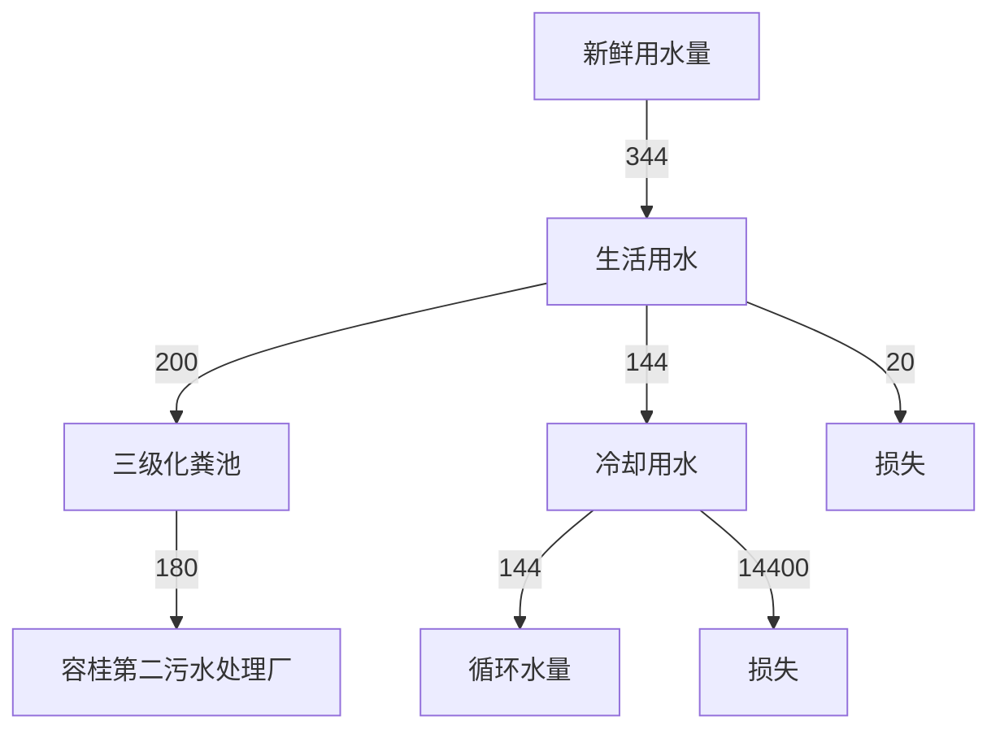
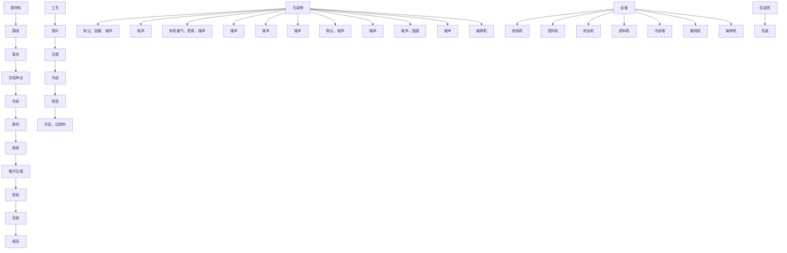

# 建设项目环境影响报告表

# （污染影响类）

text_image

电器科技有限公司
市宝能美电器科技

项目名称：佛山市宝能美 同新建项目

建设单位（盖章）：佛山市 有限公司

编制日期： 2022年9月

中华人共和国生态环境部制

打印编号：1663644396000

编制单位和编制人员情况表

<table><tr><td>项目编号</td><td colspan="2">3cy60p</td></tr><tr><td>建设项目名称</td><td colspan="2">佛山市宝能美电器科技有限公司新建项目</td></tr><tr><td>建设项目类别</td><td colspan="2">35--077电机制造;输配电及控制设备制造;电线、电缆、光缆及电工器材制造;电池制造;家用电力器具制造;非电力家用器具制造;照明器具制造;其他电气机械及器材制造</td></tr><tr><td>环境影响评价文件类型</td><td colspan="2">报告表</td></tr><tr><td colspan="3">一、建设单位情况</td></tr><tr><td>单位名称(盖章)</td><td colspan="2">佛山市: </td></tr><tr><td>统一社会信用代码</td><td colspan="2">9144060</td></tr><tr><td>法定代表人(签章)</td><td rowspan="3" colspan="2"></td></tr><tr><td>主要负责人(签字)</td></tr><tr><td>直接负责的主管人员(签字)</td></tr><tr><td colspan="2">二、编制单位情况</td><td></td></tr><tr><td>单位名称(盖章)</td><td>深</td><td rowspan="3">司</td></tr><tr><td>统一社会信用代码</td><td>914</td></tr><tr><td colspan="2">三、编制人员情况</td></tr></table>

natural_image

Blank white rectangular image with no visible text, symbols, or markings

# 目 录

一、建设项目基本情况.  
二、建设项目工程分析.  
三、区域环境质量现状、环境保护目标及评价标准 . 18  
四、主要环境影响和保护措施. . 23  
五、环境保护措施监督检查清单 . 40  
六、结论.. . 43  
建设项目污染物排放量汇总表. . 44  
附图1 项目地理位置图. . 45  
附图2 项目平面布置图. . 46  
附图3 项目敏感点图. . 47   
附图4 佛山市环境管控单元图. . 48  
附图5 项目四至现状图. . 49   
附图6 项目周边环境现状照片. . 50  
附图7 项目所在区域地表水环境功能区划图. . 51  
附图8 项目所在区域大气环境功能区划图. . 52  
附图9 项目所在区域声环境功能区划图 . 53  
附图10 控制性详细规划. . 54  
附图11 佛山市顺德区环境管控单元图. .55  
附件1 营业执照. . 56   
附件2 法人身份证. . 57  
附件3 租赁合同. . 58   
附件4 环评合同.. . 60   
附件5 声明. . 61

# 一、建设项目基本情况

<table><tr><td>建设项目名称</td><td colspan="4">佛山市宝能美电器科技有限公司新建项目</td></tr><tr><td>项目代码</td><td colspan="4">无</td></tr><tr><td>建设单位联系人</td><td colspan="4"></td></tr><tr><td>建设地点</td><td colspan="4">佛山市顺德区容桂街道华口社区顺德区(容桂)高新区华天北一路8号二楼之四</td></tr><tr><td>地理坐标</td><td colspan="4">(113度20分50.74026秒,22度46分21.98466秒)</td></tr><tr><td>国民经济行业类别</td><td>C3829其他输配电及控制设备制造</td><td>建设项目行业类别</td><td colspan="2">三十五、电气机械和器材制造业38-77输配电及控制设备制造382中的“其他(仅分割、焊接、组装的除外;年用非溶剂型低VOCs含量涂料10吨以下的除外)”</td></tr><tr><td>建设性质</td><td>√新建(迁建)□改建□扩建□技术改造</td><td>建设项目申报情形</td><td colspan="2">√首次申报项目□不予批准后再次申报项目□超五年重新审核项目□重大变动重新报批项目</td></tr><tr><td>项目审批(核准/备案)部门(选填)</td><td>——</td><td>项目审批(核准/备案)文号(选填)</td><td colspan="2">——</td></tr><tr><td>总投资(万元)</td><td>100</td><td>环保投资(万元)</td><td colspan="2">10</td></tr><tr><td>环保投资占比(%)</td><td>10</td><td>施工工期</td><td colspan="2">1个月</td></tr><tr><td>是否开工建设</td><td>√否□是: _</td><td>用地(用海)面积(m2)</td><td colspan="2">800</td></tr><tr><td>专项评价设置情况</td><td colspan="4">无</td></tr><tr><td>规划情况</td><td colspan="4">无</td></tr><tr><td>规划环境影响评价情况</td><td colspan="4">无</td></tr><tr><td>规划及规划环境影响评价符合性分析</td><td colspan="4">无</td></tr><tr><td rowspan="4">其他符合性分析</td><td colspan="4">1、与产业政策符合性分析本项目属于“C3829 其他输配电及控制设备制造”行业,主要从事生产插头。根据国家发展改革委商务部关于印发《市场准入负面清单(2022年版)》的通知(发改体改规(2022)397号),项目不属于上述目录所列的鼓励类、限制类、禁止(淘汰)类严控类项目,也不属于《市场准入负面清单(2022年版)》所列的禁止准入及需许可准入事项。根据《促进产业结构调整暂行规定》(国发〔2005〕40号)第十三条,项目符合国家有关法律、法规和政策规定,项目属于允许类。根据《产业结构调整指导目录》(2021年修订)》(中华人民共和国国家发展和改革委员会令第49号),项目属于允许类。因此,本项目的建设符合国家和地方的相关产业政策。2、与《环境保护综合名录(2021年版)》的相符性分析:本项目主要经营插头生产,生产的产品及使用的原辅材料均不属于《环境保护综合名录(2021年版)》中“高污染、高环境风险”产品名录,符合要求。3、与《广东省人民政府关于印发广东省“三线一单”生态环境分区管控方案的通知》(粤府〔2020〕71号)相符性分析根据《广东省人民政府关于印发广东省“三线一单”生态环境分区管控方案的通知》(粤府〔2020〕71号)的要求,本项目与所在区域的生态保护红线、环境质量底线、资源利用上线和生态环境准入清单(“三线一单”)进行对照分析,见下表:表1“三线一单”相符性</td></tr><tr><td>管控要求</td><td>与本项目有关的相关要求(摘录)</td><td>相符性分析</td><td>符合性</td></tr><tr><td>区域布局管控</td><td>禁止新建、扩建水泥、平板玻璃、化学制浆、生皮制革以及国家规划外的钢铁、原油加工等项目。推广应用低挥发性有机物原辅材料,严格限制新建生产和使用高挥发性有机物原辅材料的项目,鼓励建设挥发性有机物共性工厂</td><td>项目不属于水泥、平板玻璃、化学制浆、生皮制革、钢铁、原油加工等行业。项目使用的原辅材料不属于高挥发性原料。</td><td>符合</td></tr><tr><td>能源资源利用</td><td>科学实施能源消费总量和强度“双控”,新建高能耗项目单位产品(产值)能耗达到国际国内先进水平,实现煤炭消费总量负增长。推进工业节水减排,重点在高耗水行业开展节水改造,提高工业用水效率。加强江河湖库水量调度,保障生态流量。盘活存量建设用地,控制新增建设用地规模。</td><td>项目所属建筑、家具用金属配件制造业,不属于高能耗行业,项目全部生产设备使用电能,生产用水由市政供水,不直接取用江河湖库或地下水水量,不会对项目所在地生态流量造成影响,符合能源利用要求。项目为自有厂房,已控制建设用地规模。</td><td>符合</td></tr></table>

<table><tr><td>污染物排放管控</td><td>重点水污染物未达到环境质量改善目标的区域内,新建、改建、扩建项目实施减量替代。大力推进固体废物源头减量化、资源化利用和无害化处置,稳步推进“无废城市”试点建设。</td><td>项目属于新建项目,项目生活污水经三级化粪池预处理达标后汇入市政污水管网排入容桂第二污水处理厂处理,尾水排入鸡鸦水道;容桂第二污水处理厂尾水达到《城镇污水处理厂污染物排放标准(GB18918-2002)一级A标准及广东省地方标准《水污染物排放限值》(DB44/26-2001)第二时段一级标准的较严值,排入鸡鸦水道。项目经营过程产生的固体废弃物分类收集,一般包装废弃物由物资回收公司回收,危险废物交有危废资质单位进行处理。固体废质单位物分类减量化、资源化利用和无害化处置。</td><td>符合</td></tr><tr><td>环境风险管控</td><td>加强惠州大亚湾石化区、广州石化、珠海高栏港、珠西新材料集聚区等石化、化工重点园区环境风险防控,建立完善污染源在线监控系统,开展有毒有害气体监测,落实环境风险应急预案。提升危险废物监管能力,利用信息化手段,推进全过程跟踪管理。</td><td>项目所在地不属于石化、化工重点园区环境风险防控区域。项目产生的危险废物将定期委托有资质的处置公司进行收集处理,并通过信息系统登记转移计划和电子转移联单,符合危险废物全过程跟踪管理的防控要求。</td><td>符合</td></tr></table>

# 4、与《佛山市人民政府关于印发佛山市“三线一单”生态环境分区管控方案的通知》（佛府〔2021〕11 号）相符性分析

①根据《佛山市人民政府关于印发佛山市“三线一单”生态环境分区管控方案的通知》（佛府〔2021〕11 号）的要求，本项目与所在区域的生态保护红线、环境质量底线、资源利用上线和生态环境准入清单（“三线一单”）进行对照分析，见下表：

表 2“三线一单”相符性

<table><tr><td>管控要求</td><td>与本项目有关的相关要求(摘录)</td><td>相符性分析</td><td>符合性</td></tr><tr><td>区域布局管控</td><td>禁止新建、扩建水泥、平板玻璃、化学制浆、生皮制革以及国家规划外的钢铁、原油加工等项目。专业电镀、印染等项目进入定点园区集中管理。推广应用低挥发性有机物原辅材料,严格限制新建生产和使用高挥发性有机物原辅材料的项目,鼓励建设共性工厂、活性炭集中再生中心等挥发性有机物第三方治理项目,推动挥发性有机物集中高效处理</td><td>项目不属于水泥、平板玻璃、化学制浆、生皮制革、钢铁、原油加工等行业。项目使用的原辅材料不属于高挥发性原料。</td><td>符合</td></tr></table>

<table><tr><td rowspan="3"></td><td>能源资源利用</td><td>科学实施能源消费总量和强度“双控”,新建高能耗项目单位产品(产值)能耗达到国际国内先进水平,实现煤炭消费总量负增长。贯彻落实“节水优先”方针,实行最严格水资源管理制度,提高工业用水效率,加强江河湖库水量调度,保障生态流量。强化自然岸线保护,优化岸线开发利用格局,严格水域岸线用途管制,新建项目一律不得违规占用水域。</td><td>项目所属建筑、家具用金属配件制造业,不属于高能耗行业,项目全部生产设备使用电能,项目用水由市政供水,不直接取用江河湖库或地下水水量,不会对项目所在地生态流量造成影响,符合能源利用要求。</td><td>符合</td></tr><tr><td>污染物排放管控</td><td>上年度重点河涌水质未达到水环境质量目标的管控分区所在镇(街道),须组织编制、系统实施、向社会公开区域重点水污染物减排计划并明确“替代量”,本年度新建、改建、扩建项目新增水环境重点污染物实行区域“减二一”替代(废水集中处理设施、民生项目除外)。推进挥发性有机物源头替代,全面加强无组织排放控制,深入实施精细化治理。推进石化化工溶剂使用及挥发性有机液体储运销的挥发性有机物减排,全过程实施反应活性物质、有毒有害物质、恶臭物质的协同控制。将全面使用低VOCs含量原辅材料的企业纳入正面清单和政府绿色采购清单。开展“无废城市”建设,推动固体废物源头减量、资源化利用和安全处置。</td><td>项目属于新建项目,项目生活污水经三级化粪池预处理达标后汇入市政污水管网排入容桂第二污水处理厂处理,尾水排入鸡鸦水道;容桂第二污水处理厂尾水达到《城镇污水处理厂污染物排放标准(GB18918-2002)一级A标准及广东省地方标准《水污染物排放限值》(DB44/26-2001)第二时段一级标准的较严值,排入鸡鸦水道。项目属于建筑、家具用金属配件制造业,项目使用的原辅材料不属于高挥发性原料。项目经营过程产生的固体废弃物分类收集,一般包装废弃物由物资回收公司回收,危险废物交有危废资质单位进行处理。固体废质单位物分类减量化、资源化利用和无害化处置。</td><td>符合</td></tr><tr><td>环境风险管控</td><td>强化地表水、地下水和土壤污染风险协同防控,建立完善突发环境事件应急管理体系。重点加强环境风险分级分类管理,应用全省环境风险源在线监控预警系统,强化化工企业、涉重金属行业、工业园区等重点环境风险源的环境风险防控。提升危险废物监管能力,利用信息化手段,推动全过程跟踪管理。健全危险废物收集体系,推进危险废物利用处置能力优化提升。全力避免因各类安全事故(事件)引发的次生环境风险事故(事件)。</td><td>项目所在地不属于石化、化工重点园区环境风险防控区域。项目产生的危险废物将定期委托有危废资质单位进行收集处理,并通过信息系统登记转移计划和电子转移联单。</td><td>符合</td></tr><tr><td colspan="5">综上所述,本项目符合《佛山市人民政府关于印发佛山市“三线一单”生态环境分区管控方案的通知》(佛府〔2021〕11号)的要求。5、与《佛山市顺德区人民政府关于印发佛山市顺德区“三线一单”生态环境分区管控</td></tr></table>

# 方案的通知》（顺府发[2021]11号）相符性分析

本项目所在区域属于容桂街道重点管控区，编号：ZH44060620001。根据项目生产产品、原材料、工艺等分析，本项目不属于单元“区域布局管控”中生态/禁止类、产业/限制类、水/限制类等。项目生活污水、雨水分类收集，生活污水经三级化粪池预处理后排至容桂第二污水处理厂，满足水/综合类管控要求。本项目对照分析《佛山市顺德区人民政府关于印发佛山市顺德区“三线一单”生态环境分区管控方案的通知》（顺府发〔2021〕11号）的相符性，详见表4，所在环境管控单元见附图，符合佛山市顺德区“三线一单”要求。

综上所述，本项目与《佛山市顺德区人民政府关于印发佛山市顺德区“三线一单”生态环境分区管控方案的通知》（顺府发[2021]11号）是相符的。

# 6、挥发性有机物（VOCs）排放符合性分析

表 3 项目与挥发性有机物（VOCs）排放规定相符性分析

<table><tr><td>序号</td><td>政策要求</td><td>工程内容</td><td>符合性</td></tr><tr><td colspan="4">1.佛山市生态环境局顺德分局关于做好重点行业建设项目挥发性有机物总量指标管理工作的通知》(佛顺环函[2019]56号)</td></tr><tr><td>1.1</td><td>涉VOCs排放项目,实现本行政区域内污染源“点对点”2倍量削减替代,由项目所在镇街分局出具VOCs总量指标来源及替代削减方案的意见,开展总量替代。</td><td>项目VOCs排放总量指标(VOCs:0.0646t/a)由容桂街道出具VOCs总量指标来源及替代削减方案的意见。</td><td>符合</td></tr><tr><td colspan="4">2.《广东省人民政府办公厅关于印发广东省2021年大气、水、土壤污染防治工作方案的通知》(粤办函〔2021〕58号)</td></tr><tr><td>2.1</td><td>严格落实国家产品VOCs含量限值标准要求,除现阶段确无法实施替代的工序外,禁止新建生产和使用高VOCs含量原辅材料项目。鼓励在生产和流通消费环节推广使用低VOCs含量原辅材料。</td><td>项目使用的原辅料均为不属于高VOCs含量原辅材料。</td><td>符合</td></tr><tr><td colspan="4">3.《关于印发《广东省涉挥发性有机物(VOCs)重点行业治理指引》的通知》(粤环办〔2021〕43号)</td></tr><tr><td>3.1</td><td>VOCs物料转移和输送:粉状、粒状VOCs物料采用气力输送设备、管状带式输送机、螺旋输送机等密闭输送方式,或者采用密闭的包装袋、容器或罐车进行物料转移。</td><td>项目原料转移过程中均使用密闭的包装袋封装。</td><td>符合</td></tr><tr><td>3.2</td><td>工艺过程:在混合/混炼、塑炼/塑化/熔化、加工成型(注塑、注射、压制、压延、发泡、纺丝等)、硫化等作用中应采用密闭设备或在密闭空间中操作,废气应排至VOCs废气收集处理系统;无法密闭的,应采取局部气体收集措施,废气排至VOCs废气收集处理系统。</td><td>项目废气经集气措施收集后经二级活性炭吸附装置处理后通过15m排气筒排放。</td><td>符合</td></tr></table>

<table><tr><td rowspan="11"></td><td>3.3</td><td>废气收集:采用外部集气罩的,距集气罩开口面最远处的VOCs无组织排放位置,控制风速不低于0.3m/s。</td><td>项目集气罩置于废气产生点的合理位置,保证罩口截面风速为0.7m/s。</td><td>符合</td></tr><tr><td>3.4</td><td>废气收集:废气收集系统的输送管道应密闭。废气收集系统应在负压下运行,若处于正压状态,应对管道组件的密封垫进行泄漏检测,泄漏检测值不应超过500μmol/mol,亦不应有感官可察觉泄漏。</td><td>项目废气收集系统的输送管均密闭,废气收集系统在负压下运行。</td><td>符合</td></tr><tr><td>3.5</td><td>排放水平:塑料制品行业:a)有机废气排气筒排放浓度不高于广东省《大气污染物排放限值》(DB4427-2001)第II时段排放限值,合成革和人造革企业排放浓度不高于《合成革与人造革工业污染物排放标准》(GB21902-2008)排放限值,若国家和我省出台并实施适用于塑料制品制造业的大气污染物排放标准,则有机废气排气筒排放浓度不高于相应的排放限值;车间或生产设施排气中NMHC初始排放速率≥3kg/h时,建设VOCs处理设施且处理效率≥80%;b)厂区内无组织排放监控点NMHC的小时平均浓度值不超过6mg/m3,任意一次浓度值不超过20mg/m3。</td><td>项目生产过程有机废气达到《合成树脂工业污染物排放标准》(GB31572-2015)相关标准限值;有机废气厂区内无组织排放满足平均浓度值不超过6mg/m3,任意一次浓度值不超过20mg/m3。</td><td>符合</td></tr><tr><td>3.6</td><td>管理台账:建立废气收集处理设施台账,记录废气处理设施进出口的监测数据(废气量、浓度、温度、含氧量等)、废气收集与处理设施关键参数、废气处理设施相关耗材(吸收剂、吸附剂、催化剂等)购买和处理记录。</td><td>项目建立废气收集处理设施台账,根据《排污单位自行监测技术指南总则》(HJ819-2017)等相关要求定期自行监测,并且记录相关监测数据和废气处理设施中活性炭的购买量和处理记录。</td><td>符合</td></tr><tr><td>3.7</td><td>管理台账:建立危废台账,整理危废处置合同、转移联单及危废处理方式资质佐证材料。</td><td>项目建立危险废物台账,定期将废机油、废活性炭等危险废物交给有资质的单位处理,整理危废处理合同、转移联单等资料。</td><td>符合</td></tr><tr><td colspan="4">4.《固定污染源挥发性有机物综合排放标准》(DB44/2367-2022)</td></tr><tr><td>5.1</td><td>VOCs物料储存无组织排放控制要求</td><td rowspan="3">项目含VOCs物料主要为PVC,原料常温下不挥发,储存在仓库内,工艺生产过程产生的有机废气通过设置集气措施并采用二级活性炭吸附处理后高空排放,减少无组织排放。</td><td>符合</td></tr><tr><td>5.2</td><td>VOCs物料转移和输送无组织排放控制要求</td><td>符合</td></tr><tr><td>5.3</td><td>工艺过程VOCs无组织排放控制要求</td><td>符合</td></tr><tr><td colspan="4">6.关于印发《重点行业挥发性有机物综合治理方案》的通知(环大气[2019]53号)</td></tr><tr><td>7.1</td><td>通过使用水性、粉末、高固体分、无溶剂、辐射固化等低VOCs含量的涂料,水性、辐射固化、植物等低VOCs含量的油墨,水基、热熔、无溶剂、辐射固化、改性、生物降解等低VOCs含量的胶粘剂,以及低VOCs含量、低反应活性的清洗剂等,替代溶剂型涂料、油墨、胶粘剂、清洗剂等,从源头减少VOCs产生。</td><td>本项目使用的原材料无自然状态下可挥发性的物料,满足相关标准要求。</td><td>符合</td></tr><tr><td rowspan="2"></td><td>7.2</td><td>重点对含VOCs物料(包括含VOCs原辅材料、含VOCs产品、含VOCs废料以及有机聚合物材料等)储存、转移和输送、设备与管线组件泄漏、敞开液面逸散以及工艺过程等五类排放源实施管控,通过采取设备与场所密闭、工艺改进、废气有效收集等措施,削减VOCs无组织排放。</td><td>项目注塑、挤出过程产生的废气,已设置集气措施收集。集气罩置于废气产生点的合理位置,保证罩口截面风速为0.7m/s。</td><td>符合</td></tr><tr><td>7.3</td><td>提高废气收集率,遵循“应收尽收、分质收集”的原则,科学设计废气收集系统,将无组织排放转变为有组织排放进行控制。采用全密闭集气罩或密闭空间的,除行业有特殊要求外,应保持微负压状态,并根据相关规范合理设置通风量。采用局部集气罩的,距集气罩开口面最远处的VOCs无组织排放位置,控制风速应不低于0.3米/秒,有行业要求的按相关规定执行。</td><td>项目注塑、挤出过程产生的废气,已设置集气措施收集。集气罩置于废气产生点的合理位置,保证罩口截面风速为0.7m/s。</td><td>符合</td></tr><tr><td colspan="5">7、项目与控制性规划的相符性分析根据《顺德高新技术产业开发区综合加工园第五期控制性详细规划》,项目所在地是工业区用地,所使用的土地及其相关的建筑物属于工业用途,符合佛山市顺德区土地利用规划。</td></tr></table>

表 4 本项目与佛山市顺德区“三线一单”生态环境分区管控方案相符性分析

<table><tr><td>管控维度</td><td>管控要求</td><td>本项目情况</td><td>符合性</td></tr><tr><td>区域布局管控</td><td>1-1.【产业/鼓励引导类】重点发展芯片、智能家电、高端装备制造、高端新型电子信息、新材料、生命健康等制造业和金融、科技服务、高端商贸等现代服务业,建设科技研发、创新创业基地、上市企业总部聚集区、企业品牌总部基地。1-2.【产业/综合类】系统推进村级工业园升级改造,腾出连片空间,布局产业集聚区和主题产业园,推动工业项目入园集聚发展。新增工业制造业用地原则上安排在产业集聚区内,产业集聚区外原则上不鼓励工业及物流仓储用地的新建与改造。1-3.【产业/综合类】产业聚集区所属地块内的工业用地或企业与村庄、学校等环境敏感点之间应设置合理的大气环境防护距离,并通过绿化带进行有效隔离;聚集区规划布局应注重大气污染排放企业应尽量避免布局在居住用地的常年主导风向的上风向。1-4.【产业/限制类】受纳水体或监控断面不达标的,不得新建、扩建向河涌直接排放废水的项目。新建、扩建含蚀刻工序的线路板生产项目和化工项目应在配套污水集中处置的工业园区或生活污水管网覆盖区域内建设;纯加工型印花项目,含酸洗、磷化的金属表面处理、金属制品项目(与自身高新技术企业配套的除外),含酸洗、喷涂、化学抛光、电解等涉及废水排放工艺的不锈钢型材加工项目(与自身高新技术企业配套的除外),应进入以此类项目为主导产业、有相应废水集中治理设施的工业园区,实现集中治污。1-5.【产业/综合类】划定家具生产优先发展区域,优先发展区外不再新建涉及涂装工艺的木质家具制造项目。1-6.【大气/限制类】大气环境受体敏感重点管控区内,应严格限制新建储油库项目、产生和排放有毒有害大气污染物的建设项目以及使用溶剂型油墨、涂料、清洗剂、胶黏剂等高挥发性有机物原辅材料项目,鼓励现有该类项目搬迁退出。1-7.【大气/鼓励引导类】大气环境高排放重点管控区内,应强化达标监管,引导工业项目落地集聚发展,有序推进区域内行业企业提标改造。1-8.【土壤/禁止类】禁止新建、扩建增加重点防控的重金属污染物排放的建设项目。</td><td>1-1.项目主要从事其他输配电及控制设备制造,符合国家产业政策规定。1-2.项目所在地符合规划要求,不属于新建工业及物流仓储用地。1-3.项目与环境敏感点已设置合理的大气环境防护距离。1-4.项目主要从事其他输配电及控制设备制造,不属于上述行业。1-5.项目主要从事其他输配电及控制设备制造,不属于木质家具制造项目。1-6.项目主要从事其他输配电及控制设备制造,不属于新建使用溶剂型涂料、清洗剂等高挥发性有机物原辅材料项目。1-7.项目主要从事其他输配电及控制设备制造,废气经集气措施收集后通过二级活性炭处理后引至15m排气筒排放。公司加强废气处理设施的管理,定期进行监测,必要时根据环境监管部门要求安装自动监测设备,确保废气达标排放。1-8.项目主要从事其他输配电及控制设备制造,不属于重金属污染物排放的建设项目。</td><td>符合</td></tr><tr><td>能源资源利用</td><td>2-1【能源/鼓励引导类】推广节能技术,加快发展绿色货运与现代物流。2-2【能源/鼓励引导类】推广新能源汽车应用和充电基础设施建设,积极推动重卡LNG加气站、充电基础设施、加氢站建设。2-3.【能源/综合类】科学实施能源消费总量和强度“双控”,新建高能耗项目单位产品(产值)能耗达到国际国内先进水平。2-4.【水资源/综合类】贯彻落实“节水优先”方针,实行最严格水资源管理制度,容桂街道万元国内生产总值用水量、万元工业增加值用水量、用水总量、农田灌溉水有效利用系数等用水总量和效率指标达到区下达要求。2-5.【土地资源/限制类】落实单位土地面积投资强度、土地利用强度等建设用地控制性指标要求,提高土地利用效率。2-6.【岸线/禁止类】严格水域岸线用途管制,新建项目一律不得违规占用水域。严禁破坏生态的岸线利用行为和不符合其功能定位的开发建设活动,严禁以各种名义侵占河道、围垦湖泊、非法采砂等。</td><td>2-1.项目推广节能技术,加快发展绿色货运与现代物流。2-2.项目不属于新能源汽车应用和充电基础设施、加氢站建设。2-3.项目科学实施能源消费总量和强度“双控”,不属于新建高能耗项目,单位产品(产值)能耗达到国际国内先进水平。2-4.项目严格贯彻落实“节水优先”方针,实行最严格水资源管理制度,容桂街道万元国内生产总值用水量、万元工业增加值用水量、用水总量、农田灌溉水有效利用系数等用水总量和效率指标达到区下达要求。2-5.项目单位土地面积投资强度、土地利用强度等建设用地控制性指标均满足相关标准要求,土地利用效率较高。2-6.项目属于租用工业厂房新建项目,不占用水域,不会破坏生态的岸线利用和做不符合其功能定位的开发建设活动,不侵占河道、围垦湖泊、非法采砂等</td><td>符合</td></tr><tr><td>污染物排放管控</td><td>3-1.【水/限制类】城镇新区建设实行雨污分流,逐步推进初期雨水收集、处理和资源化利用。住宅、商业体、学校、市场等城镇开发建设项目应当配套或者同步计划建设公共排水设施,公共排水设施或自建排污水设施未能投产运行的,以上涉水项目不得投入使用。新建小区严格实施雨污分流,阳台、露台等污水接入污水收集系统,将生活污水“应截尽截”。做好大型楼盘、集贸市场、餐饮以及学校等4大类排水户污水接入市政管网工作。3-2.【水/综合类】容桂街道重点河涌水质上年度未达到水环境环境质量目标的,需组织编制、系统实施、向社会公开区域重点水污染物减排计划并明确“替代量”,本年度新建、改建、扩建项目新增水环境重点污染物实行区域“减二增一”替代(工业、生活或综合集中废水处理设施、民生项目除外)。3-3.【水/综合类】区域内应合理规划建设工业或综合集中废水处理设施。逐步推进工业集聚区“污水零直排区”建设,开展排水单元工业废水、生活污水、雨水分类收集、分质处理,确保园区“管网全覆盖、雨污全分流、污水全收集、处理全达标”。3-4.【水/综合类】结合村级工业园改造,全面提升产业层次与集聚度,促进污染集中整治。3-5.【水/综合类】稳步推进排水设施“三个一体化”管理模式,补齐城乡污水收集和处理短板,推动容桂第一、第二污水处理厂提质增效,加快消除城中村、老旧城区、城乡结合部等污水收集管网空白区,逐步实现城乡污水收集处理全覆盖。2025年前完成容桂第一、第二污水处理厂扩建,尾水应执行《城镇污水处理厂污染物排放标准》(GB18918-2002)一级A标准及《广东省水污染物排放限值》(DB44/26-2001)的较严值。3-6.【水/综合类】近期保留马东、马南两处污水处理站,到2030年将马冈村居污水接入市政污水管网,纳入杏坛城镇污水处理系统;其余行政村(社区)污水均通过市政管网和农村支管纳入容桂城镇污水处理处理系统。3-7.【水/综合类】产业集聚区和主题园区内做好污水管网和污水集中处理设施的配套保障,确保废水收集到城镇污水处理厂、园区污水处理厂或分散式污水处理设施集中处置。3-8.【大气/综合类】大力推进低VOCs含量原辅材料替代,加快涉VOCs重点行业的生产工艺升级改造,推行自动化生产工艺,对达不到要求的VOCs收集及治理设施进行整治提升,逐步淘汰低效VOCs治理设施。3-9.【土壤/限制类】作为重金属污染重点防控区,区域内重点重金属排放总量只减不增。</td><td>3-1.项目不属于城镇新区建设。3-2.项目生活污水经三级化粪预处理达标后排放至容桂第二污水处理厂,尾水排至鸡鸦水道,鸡鸦水道水质2021年达到水环境质量目标,无需实施本年度改建、扩建项目新增水环境重点污染物区域“减二增一”替代。3-3.项目生活污水经三级化粪预处理达标后排放至容桂第二污水处理厂,尾水排至鸡鸦水道。3-4.项目所在地产业层次与集聚度较高,污染集中整治。3-5.项目位于容桂第一污水处理厂处理范围,尾水执行《城镇污水处理厂污染物排放标准》(GB18918-2002)一级A标准及《广东省水污染物排放限值》(DB44/26-2001)的较严值。3-6.项目位于容桂第二污水处理厂处理范围。3-7.项目所在地已经实施雨污分流,污水纳入容桂街道污水处理系统。3-8.项目不使用含VOCs的原辅材料。3-9.项目不属于重金属污染物排放的建设项目。</td><td>符合</td></tr><tr><td>环境风险防控</td><td>4-1【水/综合类】容桂第一、第二污水处理厂、工业污水集中处理设施应采取有效措施,防止事故废水直接排入水体。完善污水处理厂在线监控系统联网,实现污水处理厂的实时、动态监管。4-2【风险/综合类】加强环境风险分级分类管理,强化金属制品、有色金属和压延加工、化学原料和化学品制造业等涉重金属、化工行业企业及工业园区等重点环境风险源的环境风险防控。</td><td>4-1.项目所在地位于容桂第二污水处理厂纳污范围,污水处理厂已在线监控系统联网,实现污水处理厂的实时、动态监管。4-2.项目不属于金属制品、有色金属和压延加工、化学原料和化学品制造业等涉重金属、化工行业企业及工业园区等重点环境风险源,日常加强环境风险分级分类管理。</td><td>符合</td></tr></table>

# 二、建设项目工程分析

<table><tr><td rowspan="17">建设内容</td><td colspan="3">1.项目组成项目租用佛山市顺德区容桂街道华口社区顺德区(容桂)高新区华天北一路8号已建成的工业厂房。项目占地面积与经营面积均为 $800m^{2}$ 。表5项目建设内容一览表</td></tr><tr><td>项目</td><td>内容</td><td>建设内容</td></tr><tr><td>主体工程</td><td>生产车间</td><td> $600m^{2}$ ,含注塑区、破碎区、挤出区、包装区等</td></tr><tr><td rowspan="2">辅助工程</td><td>办公区</td><td>供日常办公使用,面积约占 $50m^{2}$ </td></tr><tr><td>固废存放区</td><td>一般固废间用于暂存一般固废, $7m^{2}$ 危废房用于暂存危险废物, $3m^{2}$ </td></tr><tr><td>仓储工程</td><td>仓库</td><td>在车间内,用于储存产品、原辅材料,面积占 $140m^{2}$ </td></tr><tr><td rowspan="2">公用工程</td><td>给排水系统</td><td>市政供水,生活污水经生活污水处理设施处理后排入容桂第二污水处理厂</td></tr><tr><td>供电系统</td><td>配电系统一套,供应生产用电和办公生活用电</td></tr><tr><td rowspan="5">环保工程</td><td>生活污水</td><td>生活污水预处理设施一套,处理职工生活污水</td></tr><tr><td rowspan="2">废气</td><td>注塑和挤出产生的废气经集气措施收集后引至二级活性炭吸附装置处理后通过15m排气筒排放</td></tr><tr><td>破碎粉尘经加强车间通风排气后以无组织形式排放。</td></tr><tr><td>噪声</td><td>合理安排加工作业区,墙体隔音、距离衰减</td></tr><tr><td>固体废物</td><td>生活垃圾交由环卫站处理。一般固体废物交由回收公司回用;危险废弃物设立危废暂存间( $3m^{2}$ ),危险废物集中收集后交由有危废处理资质的公司进行处理</td></tr><tr><td colspan="3">2.项目产品和产能表6产品产能一览表</td></tr><tr><td colspan="2">产品名称</td><td>单位数量</td></tr><tr><td colspan="2">插头</td><td>万个/年100</td></tr><tr><td colspan="3">3.项目生产设备</td></tr></table>

表 7 生产设备一览表

<table><tr><td rowspan="2">生产设施名称</td><td rowspan="2">数量</td><td rowspan="2">单位</td><td colspan="3">设施参数</td><td rowspan="2">主要工艺</td><td rowspan="2">位置</td></tr><tr><td>参数名称</td><td>设计值</td><td>单位</td></tr><tr><td>注塑机</td><td>10</td><td>台</td><td>处理能力</td><td>3</td><td>Kg/h</td><td>注塑</td><td>注塑区</td></tr><tr><td>烘料机</td><td>2</td><td>台</td><td>功率</td><td>0.55</td><td>kW</td><td>烘料</td><td>破碎区</td></tr><tr><td>机械手</td><td>10</td><td>台</td><td>承重</td><td>0.5</td><td>T</td><td>辅助</td><td>注塑区</td></tr><tr><td>破碎机</td><td>2</td><td>台</td><td>处理能力</td><td>5</td><td>t/a</td><td>破碎</td><td>破碎区</td></tr><tr><td>混料机</td><td>2</td><td>台</td><td>处理能力</td><td>40</td><td>t/a</td><td>混料</td><td>破碎区</td></tr><tr><td>挤出机</td><td>3</td><td>台</td><td>处理能力</td><td>7</td><td>Kg/h</td><td>挤出</td><td>挤出区</td></tr><tr><td>包装机</td><td>3</td><td>台</td><td>/</td><td>/</td><td>/</td><td>包装</td><td>挤出区</td></tr><tr><td>裁线机</td><td>2</td><td>台</td><td>裁线长度</td><td>0.1-5.0</td><td>mm</td><td>裁线</td><td>挤出区</td></tr><tr><td>测试机</td><td>3</td><td>台</td><td>/</td><td>/</td><td>/</td><td>测试</td><td>测试区</td></tr><tr><td>绞线机</td><td>2</td><td>台</td><td>主马达</td><td>10</td><td>kW</td><td>绞线</td><td>挤出区</td></tr><tr><td>剥线机</td><td>2</td><td>台</td><td>范围</td><td>1-160</td><td> $mm^2$ </td><td>剥线</td><td>挤出区</td></tr><tr><td>端子机</td><td>10</td><td>台</td><td>压接力</td><td>1.5</td><td>T</td><td>打端子</td><td>挤出区</td></tr><tr><td>国标自动打头机</td><td>4</td><td>台</td><td>功率</td><td>0.17</td><td>kW</td><td>打头</td><td>挤出区</td></tr><tr><td>冷却塔</td><td>1</td><td>台</td><td>循环水量</td><td>6</td><td> $m^3/h$ </td><td>冷却</td><td>注塑区</td></tr><tr><td>空压机</td><td>1</td><td>台</td><td>容量</td><td>1.6</td><td> $m^3/min$ </td><td>压缩空气</td><td>注塑区</td></tr></table>

# 4. 原辅材料及能源消耗

表 8项目原辅材料及能源消耗一览表

<table><tr><td>名称</td><td>单位</td><td>数量</td><td>最大存储量</td><td>包装规格</td><td>备注</td></tr><tr><td>PVC 塑料</td><td>吨/年</td><td>100</td><td>3</td><td>25kg/袋</td><td>新料、粒状</td></tr><tr><td>铜线</td><td>吨/年</td><td>5</td><td>5</td><td>25kg/袋</td><td>固体</td></tr><tr><td>铜片</td><td>吨/年</td><td>2.5</td><td>5</td><td>25kg/袋</td><td>固体</td></tr><tr><td>端子</td><td>吨/年</td><td>1.2</td><td>5</td><td>25kg/袋</td><td>固体</td></tr><tr><td>模具</td><td>套/年</td><td>500</td><td>100</td><td>100kg/套</td><td>固体</td></tr><tr><td>机油</td><td>吨/年</td><td>0.1</td><td>0.025</td><td>25kg/桶</td><td>液体</td></tr></table>

物料的理化性质：

机油：密度约为0.91×103kg/m3，闪点约为180℃，能对机械设备到润滑减磨、辅助冷却降温、密封防漏、防锈防蚀、减震缓冲等作用。机油由基础油和添加剂两部分组成。基础油是机油的主要成分，决定着机油的基本性质，添加剂则可弥补和改善基础油性能方面的不足，赋予某些新的性能，是机油的重要组成部分。

表 9项目主要涉 VOCs 原辅材料一览表

<table><tr><td>原辅料名称</td><td>理化性质</td><td>是否属于低VOCs原辅料</td></tr><tr><td>PVC塑料</td><td>化学名称:聚氯乙烯,比重: $1.380g/cm^{3}$ ,熔点: $212^{\circ}C$ ,特点:微黄色半透明状,有光泽,透明度胜于聚乙烯、聚丙烯,随着助剂用量不同,分为软、硬聚氯乙烯,软制品柔而韧,手感粘,硬制品的硬度高于低密度聚乙烯,而低于聚丙烯。具有不易燃性、高强度、耐气候变化性以及优良的几何稳定性。</td><td>本项目使用的原材料无自然状态下可挥发性的物料,满足相关标准要求。</td></tr></table>

表 10项目生产设施设计产能与原辅料用量、产品产能相符性分析一览表

<table><tr><td>主要生产设施设计产能</td><td>原辅料用量</td><td>产品产能</td><td>相符性</td></tr><tr><td>注塑机单台规模为3kg/h项目共设置10台注塑机,年工作时间为2400h,因此总产能为72t/a</td><td>注塑所用的PVC为50t/a</td><td>半成品插头平均约50g/件,年产量100万件,则总重量为50吨</td><td>相符</td></tr><tr><td>挤出机单台规模为7kg/h项目共设置3台挤出机,年工作时间为2400h,因此总产能为50.4t/a</td><td>挤出所用的PVC为50t/a</td><td>半成品电线内直径约1.8mm,绝缘层厚度2mm,长度1.5m,PVC密度为 $1.38g/cm^{3}$ ,因此电线重量为49.5g/条,年产量100万条,则总重量为49.5吨</td><td>相符</td></tr><tr><td>合计</td><td>PVC年用量100t</td><td>总产品重量99.5t</td><td>相符</td></tr><tr><td colspan="4">注:设备年产量较申报产能偏大主要受生产过程中设备调试、维护、维修等情况影响,用量偏差在可接受范围内。</td></tr></table>

# 5. 公用配套工程

①冷却水

冷却水循环水量为 14400m3 /a，新鲜水补充量为 144m3/a。

②生活用水

本项目劳动定员 20 人，员工年工作日为 300 天，员工均不在厂区内食宿。根据广东省《用水定额 第三部分：生活》（DB44/T 1461.3-2021）表 A.1 中国家机构办公楼无食堂和浴室，生活用水按先进值 10 m3 /（人·a）计，则项目生活用水量为 0.667m³/d（200m³/a）。

（2）排水

本项目冷却水循环使用，不外排。生活污水的排放系数按90%计，排放量为0.6m³/d（180m³/a）。生活污水经三级化粪池处理后由市政污水管网排入容桂第二污水处理厂处理。

flowchart

图 1 水平衡图（t/a）

# （3）能源

项目年用电量为 15 万 kw•h，供电由市政电网统一供给。

# （4）其他

项目不设员工宿舍和食堂、不设备用发电机；无其他能耗。

# 6. 劳动动员及工作制度

（1）劳动定员：本项目劳动定员为 20人，均不在厂内食宿。  
（2）工作制度：本项目全年工作 300 天，每天采用 8小时单班制，工作时间为 8：00\~12:00，14：00\~18：00。

# 7. 总图布置及四至情况

佛山市宝能美电器科技有限公司新建项目位于佛山市顺德区容桂街道华口社区顺德区（容桂）高新区华天北一路 8 号二楼之四，项目东面为华天东三路，南面为红运来电器，西面为冠润实业，北面为日臻电器。

项目主体工程从北向南依次是挤出区、注塑区、测试区、成品区。仓库位于挤出区东北侧，空压机位于成品区西南侧，办公室位于成品仓的东南侧，DA001排气筒设置于车间厂房楼顶，危废间设置于西北侧。各生产区相对独立，互不干扰，每个生产区按照工艺流程布置设备，因此，项目平面布置做到了生产、办公分开，车间内布置流畅，总体来说项目平面布置紧凑有序，布局合理。项目平面布置图详见附图 2。

# 8. 环境影响经济损益分析

针对本项目情况，提出如下环保项目和投资：

表 11建设项目环保投资一览表

<table><tr><td colspan="2">污染源</td><td>主要环保措施</td><td>投资金额</td></tr><tr><td colspan="2">废水</td><td>三级化粪池</td><td>0.5万元</td></tr><tr><td colspan="2">废气</td><td>注塑、挤出工序产生的废气经集气措施收集后,经二级活性炭吸附装置处理后通过15m排气筒排放</td><td>5.5万元</td></tr><tr><td>固</td><td>生活垃圾</td><td>垃圾桶,环卫部门处理</td><td>0.5万元</td></tr></table>

<table><tr><td rowspan="4"></td><td rowspan="2">体废物</td><td>一般工业固废</td><td>固废临时摆放场所,定期交由具有相应处理能力的固废处理单位处理。</td><td>1万元</td></tr><tr><td>危险废物</td><td>由专门容器收集后暂存于危废贮存池( $3m^{2}$ )内,统一交由取得相应《危险废物经营许可证》或《危险废物收集中转贮存试点备案证》的单位。</td><td>1.5万元</td></tr><tr><td colspan="2">噪声</td><td>对高噪声设备进行机械阻尼隔振(如在底部安装减震垫座)</td><td>1万元</td></tr><tr><td colspan="3">合计</td><td>10万元</td></tr></table>

1. 工艺流程

flowchart

图 2项目产品生产工艺流程及产污环节示意图

束丝：外购铜线按要求在绞线机上缠绕成束，绞合在一起。

芯线押出：电线在挤出机上，通过螺杆的外热作用，塑料粒在高温下融化，融化的塑料粒子由挤出机押出，并自动将铜线包合并冷却，在多芯电线外覆套绝缘层。

裁切：根据需求利用裁线机按一定的尺寸对电线进行裁切。

剥皮：将裁切好的电线进行剥皮分叉处理。

端子压接：利用端子机将外购的端子同电线导体压接在一起。

投料、混料：塑料粒投入混料机进行混料均匀。项目利用空压机为辅助设备，塑料投料采用气力输送方式密闭投加，且混料过程为加盖密闭搅拌。

烘干：原材料混合后直接利用注塑机配套的烘料桶或单独的烘料机进行烘干，使用电加热，加热温度约80\~90℃。

注塑成型：使用塑料对铜片（插脚）表面进行包裹。将混合均匀后的原辅材料注塑成型，控制注射的压力和速度将塑料注入模具，产品成型需用水进行间接冷却。项目使用的原料具有良好的化学稳定性和耐热性能。项目生产中塑料粒子的熔融温度不会导致这些塑料粒子的分解，一般情况下不会产生塑料粒子焦炭链焦化气体。注塑成型产生的边角料经破碎后重新回用到生产中。

循环冷却水：冷却水对模具进行冷却，属于间接冷却，冷却水循环使用，定期排水，作为清净下水通过工业区污水管网排入容桂第二污水处理厂集中处理。

破碎：次品及边角料全部经过破碎机破碎并与塑料粒新料混合后重新回用于注塑成型工序，不外排。

检验：半成品组合后，利用测试机对其进行测试电源线极性和耐电压强度，合格的产品经包装机包装后出货。

由上述生产工艺流程及产污环节及建设单位提供的资料可知，项目在营运期的主要产污环节包括：

表 12 项目产污环节

<table><tr><td>名称</td><td>产污环节</td><td>污染源名称</td><td>主要污染物</td></tr><tr><td rowspan="2">废水</td><td>办公生活过程</td><td>办公生活污水</td><td>COD、氨氮等</td></tr><tr><td>冷却</td><td>冷却水</td><td>SS等</td></tr><tr><td rowspan="2">废气</td><td>破碎</td><td>粉尘</td><td>颗粒物</td></tr><tr><td>挤出、注塑工序</td><td>有机废气、恶臭、氯化氢</td><td>非甲烷总烃、恶臭、氯化氢</td></tr><tr><td rowspan="8">固体废物</td><td>检验</td><td rowspan="3">一般工业固体废物</td><td>次品</td></tr><tr><td>生产过程</td><td>边角料</td></tr><tr><td>原料使用</td><td>废包装物</td></tr><tr><td>设备维修</td><td rowspan="4">危险废物</td><td>废机油</td></tr><tr><td>设备维修</td><td>废油桶</td></tr><tr><td>设备维修</td><td>含油废抹布</td></tr><tr><td>废气治理</td><td>废活性炭</td></tr><tr><td>办公生活过程</td><td>生活垃圾</td><td>生活垃圾</td></tr><tr><td>噪声</td><td colspan="2">混料机、破碎机、冷却塔、注塑机等设备</td><td>Leq(dB(A))</td></tr></table>

本项目为新建项目，租用厂房为新建厂房，故不存在与本项目有关的主要环境问题。

# 三、区域环境质量现状、环境保护目标及评价标准

# 1. 环境空气现状调查与评价

根据《佛山市人民政府办公室关于调整顺德区环境空气质量功能区划的复函》（佛府办函[2014]494 号，2014年 8 月）和佛山市顺德区人民政府办公室关于印发《佛山市顺德区生态环境保护“十四五”规划（2021\~2025 年）》的通知，顺德区全境为大气环境二类区，因此本项目所在区域属二类环境空气质量功能区，执行《环境空气质量标准》（GB3095-2012）二级标准及其2018年修改单的要求。

根据佛山市生态环境局顺德分局发布的《2021 年佛山市顺德区环境质量状况公报》中的数据和结论，2021 年全区空气质量综合指数为 3.48，比 2020 年上升 5.5%，在全市五区中排名第二。2021 年，按照《环境空气质量标准》评价，顺德区二氧化硫 $( \mathrm { S O } _ { 2 } )$ 、二氧化氮 $\left( \mathrm { N O } _ { 2 } \right)$ ）、可吸入颗粒物 $\left( \mathrm { P M } _ { 1 0 } \right)$ ）、细颗粒物 $\left( \mathbf { P M } _ { 2 . 5 } \right)$ ）、一氧化碳（CO）五项污染物年评价浓度均达到二级标准，臭氧 $( \mathrm { O } _ { 3 } )$ 超标。项目所在区域环境空气为不达标区。2021 年顺德区 AQI 达标率为84.7%，较 2020年减少 5.7个百分点。首要污染物主要为臭氧（占首要污染物比例为 63.4%），其次为 $\mathrm { N O } _ { 2 }$ （占 30.1%）、 $\mathrm { P M } _ { 1 0 }$ （占 3.2%）和 $\mathrm { P M } _ { 2 . 5 }$ （占 3.2%）。2021 年全区 $\mathrm { S O } _ { 2 }$ 年平均浓度为 6 微克/立方米，较 2020 年下降 14.3%。 $\mathrm { N O } _ { 2 }$ 年平均浓度为 33 微克/立方米，较 2020 年上升10.0%。 $\mathrm { P M } _ { 1 0 }$ 年平均浓度为 42 微克/立方米，较 2020年下降 2.3%。 $\mathrm { P M } _ { 2 . 5 }$ 年平均浓度为 22 微克/立方米，较 2020 年上升 4.8%。 $\mathrm { O } _ { 3 }$ 年评价浓度为 173 微克/立方米，较 2020 年上升 11.6%。CO年评价浓度为 1.0 毫克/立方米，与 2020年持平。

表 13 2021 年顺德区（国控测点）环境空气污染物浓度水平年度比较一览表

<table><tr><td rowspan="2">所在区域</td><td rowspan="2">污染物</td><td colspan="2">浓度均值(ug/m3)</td><td rowspan="2">标准值(ug/m3)</td><td rowspan="2">变化(%)</td><td rowspan="2">达标情况</td></tr><tr><td>2020年</td><td>2021年</td></tr><tr><td rowspan="6">顺德区</td><td>SO2</td><td>7</td><td>6</td><td>60</td><td>-14.3</td><td>达标</td></tr><tr><td>NO2</td><td>30</td><td>33</td><td>40</td><td>10%</td><td>达标</td></tr><tr><td>PM10</td><td>43</td><td>42</td><td>70</td><td>-2.3%</td><td>达标</td></tr><tr><td>PM2.5</td><td>21</td><td>22</td><td>35</td><td>4.8%</td><td>达标</td></tr><tr><td>CO</td><td>1000</td><td>1000</td><td>4000</td><td>0</td><td>达标</td></tr><tr><td>O3</td><td>155</td><td>173</td><td>160</td><td>11.6%</td><td>不达标</td></tr></table>

# 2. 地表水环境质量现状

本项目属于容桂第二污水处理厂纳污范围，生活污水经三级化粪池预处理后排入容桂第二污水处理厂，尾水排入鸡鸦水道后汇入洪奇沥水道。参照《佛山市生态环境局顺德分局关于发布 2021年度佛山市顺德区环境质量状况公报的通知》（佛环顺函〔2022〕13号），2021 年全区地表水环境质量保持稳定，4 个饮用水源水质全优，与 2020 年相比，水质保持稳定；3 个国控断面（科研断面羊额、考核断面乌洲、顺德港）、3 个省控断面（杨滘、海凌、飞鹅山）均达到相应的水质目标。纳污水体鸡鸦水道细滘大桥监测的水质达到了Ⅱ类标准要求，洪奇沥水

<table><tr><td rowspan="6"></td><td colspan="7">道高黎监测的水质达到了III类标准要求,水质良好。表142021年度佛山市顺德区环境质量状况公报(节选)</td></tr><tr><td rowspan="2">河流名称</td><td rowspan="2">断面</td><td colspan="2">断面定类</td><td rowspan="2">水质评价标准</td><td colspan="2">河流定类</td></tr><tr><td>2021</td><td>2020</td><td>2021</td><td>2020</td></tr><tr><td>鸡鸦水道</td><td>细滘大桥</td><td>II</td><td>II</td><td>II</td><td>II</td><td>II</td></tr><tr><td>洪奇沥</td><td>高黎</td><td>III</td><td>II</td><td>III</td><td>III</td><td>II</td></tr><tr><td colspan="7">3.声环境质量现状根据《佛山市人民政府关于印发&lt;佛山市声环境功能区划分方案&gt;的通知》(佛府函〔2015〕72号),项目所在地属于3类声环境功能区,声环境质量执行《声环境质量标准》(GB3096-2008)中的3类标准:昼间≤65dB(A)、夜间≤55dB(A)。项目厂界外50m范围内无环境敏感目标。4.生态环境项目用地范围内无生态环境保护目标,无需开展生态现状调查。5.电磁辐射项目不涉及电磁辐射,无需开展电磁辐射现状调查。6.土壤、地下水环境现状本项目租用现有厂房作为生产场所,厂房和周边环境地面已做好水泥面硬化防渗措施,基本不会发生泄漏液下渗污染地下水或土壤的情况,因此项目不存在土壤、地下水环境污染途径,不存在地下水、土壤污染,故不开展土壤、地下水环境质量现状调查。</td></tr><tr><td rowspan="5">环境保护目标</td><td colspan="7">1.环境空气保护目标为建设区域周围空气环境质量,本项目所在地的环境空气质量标准保护级别为《环境空气质量标准》(GB3095-2012)及其修改单二级标准。根据调查,项目厂界外500米范围内的环境空气保护目标如下表所示:表15项目厂界外500米范围内主要环境空气保护目标</td></tr><tr><td>名称</td><td>保护对象</td><td>保护内容</td><td>环境功能区</td><td>相对厂址方位</td><td colspan="2">相对厂界距离m</td></tr><tr><td>美的·御海东郡</td><td>居民区</td><td>人群(约5000人)</td><td>大气二类</td><td>北面</td><td colspan="2">350</td></tr><tr><td>水岸珑庭</td><td>居民区</td><td>人群(约2000人)</td><td>大气二类</td><td>西北</td><td colspan="2">461</td></tr><tr><td colspan="7">2.声环境本项目厂界外50米范围内无声环境保护目标。本项目声环境保护目标为该区域的声环境质量,本项目所在区域保护级别为《声环境质量标准》(GB3096-2008)3类。3.地下水环境</td></tr><tr><td></td><td colspan="7">本项目厂界外500米范围内无地下水集中式饮用水水源和热水、矿泉水、温泉等特殊地下水资源。4.生态环境项目用地范围内无生态环境保护目标。</td></tr><tr><td rowspan="7">污染物排放控制标准</td><td colspan="7">1.水污染物排放标准项目生活污水经三级化粪预处理后达到广东省地方标准《水污染物排放限值》(DB44/26-2001)第二时段三级标准后排入容桂第二污水处理厂,尾水排入鸡鸦水道。根据2013年7月11日颁布的《顺德区环境运输和城市管理局关于全区城镇污水处理厂尾水排放标准执行标准的通知》规定:新、扩和改建城镇污水处理厂尾水应符合《城镇污水处理厂污染物排放标准》(GB18918-2002)一级A标准及广东省地方标准《水污染物排放标准》(DB44/26-2001)第二时段一级标准的较严值,具体排放限值见该文件的附件2《新扩改和已建城镇污水处理厂尾水限值》。具体排放标准如下表。表16 水污染物排放标准(单位mg/L)</td></tr><tr><td colspan="2">污染物</td><td>BOD5</td><td>CODcr</td><td>SS</td><td colspan="2">氨氮</td></tr><tr><td colspan="2">项目排污口排放标准</td><td>300</td><td>500</td><td>400</td><td colspan="2">--</td></tr><tr><td colspan="2">容桂第二污水处理厂排放标准</td><td>10</td><td>40</td><td>10</td><td colspan="2">5.0</td></tr><tr><td colspan="7">2.大气污染物排放标准(1)项目注塑和挤出会产生有机废气、氯化氢和恶臭,主要污染因子为非甲烷总烃(NMHC)、氯化氢和臭气浓度。非甲烷总烃的排放浓度执行《合成树脂工业污染物排放标准》(GB31572-2015)表4、表9规定的大气污染物排放限值。氯化氢执行广东省《合成树脂工业污染物排放标准》(GB31572-2015)表5、表9规定的大气污染物排放限值。臭气浓度执行《恶臭污染物排放标准》(GB14554-1993)表1二级新扩改建恶臭污染物厂界标准值及表2恶臭污染物排放标准值。(2)破碎工序会产生粉尘,主要污染因子为颗粒物(TSP)。颗粒物排放执行《合成树脂工业污染物排放标准》(GB31572-2015)表9规定的大气污染物排放限值。(3)根据《广东省地方标准批准发布公告(《固定污染源挥发性有机物综合排放标准》强制性地方标准)》(2022第4号(总第222号)),新建项目自2022年9月1日起,企业厂区内无组织排放监控点浓度执行表3规定的限值。故本项目厂区内VOCs无组织排放监控点浓度执行《固定污染源挥发性有机物综合排放标准》(DB44/2367-2022)中表3厂区内VOCs无组织排放限值。表17 项目大气污染物排放标准</td></tr><tr><td rowspan="2">污染物名称</td><td rowspan="2">排气筒高度(m)</td><td colspan="2">有组织</td><td rowspan="2">无组织排放监测浓度限值(mg/m3)</td><td colspan="2" rowspan="2">执行标准</td></tr><tr><td>最高允许排放浓</td><td colspan="2">排放速率</td></tr><tr><td rowspan="5"></td><td></td><td></td><td colspan="2">度(mg/m3)</td><td>(kg/h)</td><td></td><td></td></tr><tr><td>颗粒物</td><td>/</td><td colspan="2">/</td><td>/</td><td>1.0</td><td rowspan="3">GB31572-2015</td></tr><tr><td>非甲烷总烃</td><td>15</td><td colspan="2">100</td><td>/</td><td>4.0</td></tr><tr><td>氯化氢</td><td>15</td><td colspan="2">20</td><td>/</td><td>0.2</td></tr><tr><td>臭气浓度*</td><td>15</td><td colspan="2">2000(无量纲)</td><td>/</td><td>20(无量纲)</td><td>GB14554-93</td></tr><tr><td colspan="8">表18 《固定污染源挥发性有机物综合排放标准》(DB44/2367-2022)</td></tr><tr><td>污染物项目</td><td colspan="3">特别排放限值(mg/m3)</td><td colspan="2">限值含义</td><td colspan="2">无组织排放监控位置</td></tr><tr><td rowspan="2">NMHC</td><td colspan="3">6</td><td colspan="2">监控点处1h平均浓度值</td><td colspan="2" rowspan="2">在厂房外设置监控点</td></tr><tr><td colspan="3">20</td><td colspan="2">监控点处任意一次浓度值</td></tr><tr><td colspan="8">3.噪声排放标准厂界噪声排放执行《工业企业厂界环境噪声排放标准》(GB12348-2008)中的3类标准。表19 《工业企业厂界环境噪声排放标准》(GB12348-2008)(摘录)</td></tr><tr><td colspan="2">类别</td><td colspan="2">昼间</td><td colspan="2">夜间</td><td colspan="2">单位</td></tr><tr><td colspan="2">3类区</td><td colspan="2">65</td><td colspan="2">55</td><td colspan="2">dB(A)</td></tr><tr><td colspan="8">4.固体废物排放标准固体废物管理应遵照《中华人民共和国固体废物污染环境防治法》、《广东省固体废物污染环境防治条例》中的有关规定,一般工业固体废物在厂内贮存过程应满足相应防渗漏、防雨淋、防扬尘等环境保护要求,危险废物执行《国家危险废物名录》(2021版)以及《危险废物贮存污染控制标准》(GB18597-2001),同时执行《关于发布&lt;一般工业固体废物贮存、处置场污染控制标准&gt;(GB18599-2001)等3项国家污染物控制标准修改单的公告》(2013年第36号)。</td></tr><tr><td>总量控制指标</td><td colspan="7">1.水污染物排放总量控制指标:项目的生活污水经生活污水预处理设施处理后,经市政管网排入容桂第二污水处理厂处理,尾水排入鸡鸦水道。生活污水排放量为180t/a,CODCr排放量为0.0072t/a;NH3-N排放量为0.0009t/a。根据《佛山市人民政府办公室关于印发佛山市排污权有偿使用和交易管理办法的通知》(佛府办〔2020〕19号),生活污水CODCr、NH3-N不单独分配总量。2.大气污染物排放总量控制指标:根据《广东省生态环境厅关于做好重点行业建设项目挥发性有机物总量指标管理工作的通知》(粤环发〔2019〕2号)和结合《佛山市生态环境局顺德分局关于做好重点行业建设项目挥发性有机物总量指标管理工作的通知》(佛顺环函〔2019〕56号)的要求,新、改、扩建排放VOCs的重点行业建设项目应当执行总量替代制度。项目非甲烷总烃有组织排放量为</td></tr><tr><td></td><td colspan="7">0.0646t/a,将非甲烷总烃纳入VOCs进行管理,因此建议项目VOCs总量控制指标为0.0646t/a,根据《佛山市生态环境局顺德分局关于做好重点行业建设项目挥发性有机物总量指标管理工作的通知》(佛顺环函〔2019〕56号),项目VOCs指标在镇街总量中列支。</td></tr></table>

# 四、主要环境影响和保护措施

<table><tr><td>施工期环境保护措施</td><td colspan="6">本项目依托已建成厂房,不涉及厂房建设,施工过程主要是内部装修和设备安装,无基建工程,因此施工期间基本不存在大型土建工程,施工期间产生的污染源主要是由于设备运输、安装时产生的噪声等,建议建设单位应加强安装调试工作管理,设备搬运尽量轻放,夜间禁止搬运和调试设备。</td></tr><tr><td rowspan="23">运营期环境影响和保护措施</td><td colspan="6">1、废水本项目生产过程中废水主要为生活污水和冷却水。项目废水类别、污染物项目及污染防治设施见下表。表20 项目废水产污环节、污染物种类、排放形式及污染防治设施一览表</td></tr><tr><td colspan="2">工序/生产线</td><td colspan="4">职工生活</td></tr><tr><td colspan="2">装置</td><td colspan="4">—</td></tr><tr><td colspan="2">污染源</td><td colspan="4">生活污水</td></tr><tr><td colspan="2">污染物</td><td>CODcr</td><td>BOD5</td><td>SS</td><td>NH3-N</td></tr><tr><td rowspan="4">污染物产生</td><td>核算方法</td><td colspan="4">类比法</td></tr><tr><td>废水产生量m3/a</td><td colspan="4">180</td></tr><tr><td>产生浓度mg/L</td><td>250</td><td>100</td><td>200</td><td>30</td></tr><tr><td>产生量t/a</td><td>0.045</td><td>0.018</td><td>0.036</td><td>0.0054</td></tr><tr><td rowspan="2">收集措施</td><td>方式</td><td colspan="4">管道</td></tr><tr><td>效率</td><td colspan="4">100%</td></tr><tr><td rowspan="3">治理措施</td><td>处理能力</td><td colspan="4"></td></tr><tr><td>工艺</td><td colspan="4">三级化粪池</td></tr><tr><td>效率</td><td>20%</td><td>21%</td><td>50%</td><td>3%</td></tr><tr><td colspan="2">是否为可行技术</td><td colspan="4">是</td></tr><tr><td rowspan="4">污染物排放</td><td>核算方法</td><td colspan="4">类比法</td></tr><tr><td>废水排放量m3/a</td><td colspan="4">180</td></tr><tr><td>排放浓度mg/L</td><td>200</td><td>79</td><td>100</td><td>29</td></tr><tr><td>排放量t/a</td><td>0.036</td><td>0.01422</td><td>0.018</td><td>0.00522</td></tr><tr><td colspan="2">排放时间</td><td colspan="4">2400h/a</td></tr><tr><td colspan="2">排放方式</td><td colspan="4">间接排放</td></tr><tr><td colspan="2">排放去向</td><td colspan="4">容桂第二污水处理厂</td></tr><tr><td colspan="2">排放规律</td><td colspan="4">间断排放,排放期间流量稳定</td></tr><tr><td rowspan="9"></td><td colspan="2">达标分析</td><td colspan="4">达标,生活污水经三级化粪池预处理后可达到广东省地方标准《水污染物排放限值》(DB44/26-2001)的第二时段三级标准。</td></tr><tr><td rowspan="4">排放口基本情况</td><td>编号</td><td colspan="4">DW001</td></tr><tr><td>名称</td><td colspan="4">生活污水排放口</td></tr><tr><td>类型</td><td colspan="4">企业总排口</td></tr><tr><td>地理坐标</td><td colspan="4">东经 113.347771174°,北纬 22.772762788°</td></tr><tr><td rowspan="2">排放标准</td><td>纳管标准</td><td colspan="4">广东省地方标准《水污染物排放限值》(DB44/26-2001)第二时段三级标准</td></tr><tr><td>最终标准</td><td colspan="4">广东省地方标准《水污染物排放限值》(DB44/26-2001)第二时段一级标准及《城镇污水处理厂污染物排放标准》(GB18918-2002)一级A类标准中较严者</td></tr><tr><td colspan="6">备注:1、根据《排污许可证申请与核发技术规范橡胶及塑料制品工业》(HJ1122-2020)附录A表A.4塑料制品工业排污单位废水污染防治可行技术参考表可知,生活污水处理设施可行技术有隔油池、化粪池、调节池、厌氧-好氧、兼性-好氧、好氧生物处理,因此,本项目生活污水采用三级化粪池进行预处理属于可行技术。2、项目三级化粪池对各污染物去除效率参照《第一次全国污染源普查城镇生活源产排污系数手册》中“二区一类城市”:CODCr为20%、BOD5为21%、氨氮为3%。SS去除效率参考《从污水处理探讨化粪池存在必要性》(程宏伟等),污水经化粪池12h~24h沉淀后,可去除50%~60%的悬浮物,本项目SS去除率取50%。</td></tr><tr><td colspan="6">1.1废水排放源强(1)冷却循环水本项目注塑工序中为了防止注塑机负荷运作而导致设备过热造成损坏,项目使用冷却塔作为散热用途,冷却循环水为间接冷却方式。本项目设置1台冷却塔,循环水量为 $6m^{3}/h$ ,每天工作8小时,年工作300天,则本项目循环水流量为 $14400m^{3}/a$ 。冷却水通过冷却塔冷却后循环使用,不外排,需适当补充新鲜水以补充因高温蒸发的部分冷却水。根据《工业循环冷却水处理设计规范》(GB50050-2017)中循环冷却水系统蒸发水量约占循环水量的1.0%,则本项目年补充水量约为144t/a。(2)生活污水本项目劳动定员20人,员工年工作日为300天,员工均不在厂区内食宿。根据广东省《用水定额第三部分:生活》(DB44/T 1461.3-2021)表A.1中国家机构办公楼无食堂和浴室,生活用水按先进值 $10m^{3}/(人·a)$ 计,则项目生活用水量为 $0.667m^{3}/d(200m^{3}/a)$ 。生活污水排放量按用水量的90%计算,则项目生活污水排放量为 $0.6m^{3}/d(180m^{3}/a)$ 此类污水主要污染物为CODCr、BOD5、SS、 $NH_{3}-N$ 等。参考《建设项目环境影响评价培训教材》我国城市生活污水水质统计数据和对同类水质类比调查测算,项目生活污水主要污染物产排情况见下表。</td></tr></table>

表 21 项目生活污水污染物产生及排放情况

<table><tr><td rowspan="2">废水量</td><td rowspan="2">污染物名称</td><td colspan="2">产生情况</td><td colspan="2">三级化粪池预处理后</td><td colspan="2">污水厂处理后</td></tr><tr><td>产生浓度(mg/L)</td><td>产生量(t/a)</td><td>排放浓度(mg/L)</td><td>排放量(t/a)</td><td>排放浓度(mg/L)</td><td>排放量(t/a)</td></tr><tr><td rowspan="4">生活污水 $180m^3/a$ </td><td> $COD_{Cr}$ </td><td>250</td><td>0.045</td><td>200</td><td>0.036</td><td>40</td><td>0.0072</td></tr><tr><td> $BOD_5$ </td><td>100</td><td>0.018</td><td>79</td><td>0.01422</td><td>10</td><td>0.0018</td></tr><tr><td>SS</td><td>200</td><td>0.036</td><td>100</td><td>0.018</td><td>10</td><td>0.0018</td></tr><tr><td> $NH_3-N$ </td><td>30</td><td>0.0054</td><td>29</td><td>0.00522</td><td>5</td><td>0.0009</td></tr></table>

# 1.2生活污水依托容桂第二污水处理厂的可行性分析：

容桂第二污水处理厂服务范围为眉蕉河与碧桂路连接线以东区域，包括小黄圃、高黎、华口、扁滘四个居委及大汕岛，顺德区高新技术产业开发总公司下辖的碧桂路以东工业区、眉蕉河以北碧桂路以西工业区，东逸湾及美的等新开发的高尚住宅区等。可见，本项目属于容桂第二污水处理厂的服务范围内。

容桂第二污水处理厂选用粗格栅+细格栅+曝气沉砂池+CASS（Cyclic Activated SludgeSystem）+精细格栅+连续流砂滤池+紫外消毒工艺。容桂第二污水处理厂现已建成规模3万t/d，近期建设规模为 5 万 t/d，远期为 8 万 t/d。目前该污水处理厂首期 3万 t/d 已投入运行并完成提标改造工程验收。目前该污水厂实际污水处理量 2.8 万 m³/d，尚有余量，能够满足本项目废水处理量的要求。

因此本项目生活污水依托容桂第二污水处理厂处理是可行的。本项目生活污水经三级化粪池预处理达到广东省地方标准《水污染物排放限值》（DB44/26-2001）第二时段三级标准后再排至容桂第二污水处理厂处理，满足污水厂的纳管要求，不会对污水厂造成冲击负荷，也不会影响其正常运行，因此本项目生活污水依托容桂第二污水处理厂处理是可行的。

# 1.3废水环境检测计划

项目生活污水经市政污水管道排入容桂第二污水处理厂处理，项目属于非重点排污单位，根据《排污许可证申请与核发技术规范 总则》（HJ 924-2018），单独排污公共污水处理系统的生活污水无需开展自行监测。

# 2、废气

2.1废气产排污环节、污染物种类、污染物产排情况及污染防治设施一览表

表 22 项目废气产排污环节、污染物种类、污染物产排情况及污染防治设施一览表

<table><tr><td rowspan="2">产排污环节</td><td rowspan="2">排放形式</td><td rowspan="2">污染物种类</td><td colspan="3">产生情况</td><td colspan="4">污染防治设施</td><td colspan="3">排放情况</td></tr><tr><td>产生浓度 $mg/m^3$ </td><td>产生速率kg/h</td><td>产生量t/a</td><td>工艺</td><td>处理能力 $m^3/h$ </td><td>去除效率%</td><td>是否可行性技术</td><td>排放浓度 $mg/m^3$ </td><td>排放速率kg/h</td><td>排放量t/a</td></tr><tr><td rowspan="6">注塑、挤出</td><td rowspan="3">有组织DA001</td><td>非甲烷总烃</td><td>15.381</td><td>0.108</td><td>0.2584</td><td rowspan="3">二级活性炭吸附</td><td rowspan="3">7000</td><td>75</td><td>是</td><td>3.845</td><td>0.0269</td><td>0.0646</td></tr><tr><td>氯化氢</td><td>/</td><td>/</td><td>/</td><td>/</td><td>/</td><td>/</td><td>/</td><td>/</td></tr><tr><td>臭气浓度</td><td colspan="3">&lt;2000(无量纲)</td><td>/</td><td>/</td><td colspan="3">&lt;2000(无量纲)</td></tr><tr><td rowspan="3">无组织</td><td>非甲烷总烃</td><td>/</td><td>0.027</td><td>0.0646</td><td>/</td><td>/</td><td>/</td><td>/</td><td>/</td><td>0.027</td><td>0.0646</td></tr><tr><td>氯化氢</td><td>/</td><td>/</td><td>/</td><td>/</td><td>/</td><td>/</td><td>/</td><td>/</td><td>/</td><td>/</td></tr><tr><td>臭气浓度</td><td colspan="3">&lt;20(无量纲)</td><td>/</td><td>/</td><td>/</td><td>/</td><td colspan="3">&lt;20(无量纲)</td></tr><tr><td>破碎</td><td>无组织</td><td>颗粒物</td><td>/</td><td>0.0005625</td><td>0.0003375</td><td>/</td><td>/</td><td>/</td><td>/</td><td>/</td><td>0.0005625</td><td>0.0003375</td></tr></table>

# 2.2废气排放口基本情况表

表 23 项目废气排放口基本情况表

<table><tr><td rowspan="2">排放口编号</td><td rowspan="2">工序</td><td rowspan="2">污染物种类</td><td rowspan="2">排放口地理坐标</td><td rowspan="2">排放浓度 $mg/m^3$ </td><td rowspan="2">排放速率kg/h</td><td rowspan="2">排放量t/a</td><td rowspan="2">排气筒高度m</td><td rowspan="2">排气筒出口内径m</td><td rowspan="2">烟气温度°C</td><td rowspan="2">排放口类型</td><td colspan="2">排放标准</td></tr><tr><td>名称</td><td>排放浓度</td></tr><tr><td></td><td></td><td></td><td></td><td></td><td></td><td></td><td></td><td></td><td></td><td></td><td></td><td> $mg/m^3$ </td></tr><tr><td rowspan="3">DA001</td><td rowspan="3">注塑挤出</td><td>非甲烷总烃</td><td rowspan="3">E113.34724°N22.7726233°</td><td>3.845</td><td>0.0269</td><td>0.0646</td><td>15</td><td>0.3</td><td>25</td><td rowspan="3">一般排放口</td><td>《合成树脂工业污染物排放限值》(GB31572-2015)表4排放限值</td><td>100</td></tr><tr><td>氯化氢</td><td>/</td><td>/</td><td>/</td><td>15</td><td>0.3</td><td>25</td><td>《合成树脂工业污染物排放限值》(GB31572-2015)表4排放限值</td><td>20</td></tr><tr><td>臭气浓度</td><td colspan="3">&lt;2000(无量纲)</td><td>15</td><td>0.3</td><td>25</td><td>《恶臭污染物排放标准》(GB14554-93)表2标准</td><td>&lt;2000(无量纲)</td></tr></table>

# 2.3废气监测计划

项目废气自行监测因子及频次根据《排污单位自行监测技术指南 橡胶和塑料制品》（HJ1207-2021）表 4 对照“非重点排污单位使用除聚氯乙烯以外的树脂生产的塑料零件及其他塑料制品制造”及表 6 的相关规定。项目废气污染源自行监测计划见下表。

表 24 大气污染物自行监测计划

<table><tr><td>项目</td><td>监测点位</td><td>监测指标</td><td>监测频次</td><td>排放标准</td></tr><tr><td rowspan="8">废气</td><td rowspan="3">废气排放口 DA001</td><td>非甲烷总烃</td><td>半年一次</td><td>《合成树脂工业污染物排放限值》(GB31572-2015)表4排放限值</td></tr><tr><td>氯化氢</td><td>每年一次</td><td>《合成树脂工业污染物排放限值》(GB31572-2015)表5排放限值</td></tr><tr><td>臭气浓度</td><td>每年一次</td><td>《恶臭污染物排放标准》(GB14554-93)表2标准</td></tr><tr><td rowspan="4">厂界外上风向1个点下风向3个点</td><td>颗粒物</td><td>每年一次</td><td>《合成树脂工业污染物排放限值》(GB31572-2015)表9企业边界排放限值</td></tr><tr><td>非甲烷总烃</td><td>每年一次</td><td>《合成树脂工业污染物排放限值》(GB31572-2015)表9企业边界排放限值</td></tr><tr><td>氯化氢</td><td>每年一次</td><td>《合成树脂工业污染物排放限值》(GB31572-2015)表9企业边界排放限值</td></tr><tr><td>臭气浓度</td><td>每年一次</td><td>《恶臭污染物排放标准》(GB14554-93)表1标准</td></tr><tr><td>厂房外</td><td>NMHC</td><td>每年一次</td><td>《固定污染源挥发性有机物综合排放标准》(DB44/2367-2022)中表3厂区内VOCs无组织排放限值</td></tr></table>

# 2.4废气源强核算

# （1）破碎工序

本项目检验工序产生的次品及边角料全部经过破碎机破碎并与塑料粒新料混合后重新回用于注塑成型工序，不外排。项目破碎工序会产生少量的塑料粉尘，参考《排放源统计调查产排污核算方法和系数手册》42废弃资源综合利用行业系数手册中，见下表：

表 25C4220 非金属废料和碎屑加工处理行业系数表（摘录）

<table><tr><td>原料名称</td><td>工艺名称</td><td>规模等级</td><td>污染物指标</td><td>系数单位</td><td>产污系数</td></tr><tr><td>废 PET</td><td>干法破碎</td><td>所有规模</td><td>颗粒物</td><td>克/吨-原料</td><td>375</td></tr><tr><td>废 PVC</td><td>干法破碎</td><td>所有规模</td><td>颗粒物</td><td>克/吨-原料</td><td>450</td></tr><tr><td>废 PE/PP</td><td>干法破碎</td><td>所有规模</td><td>颗粒物</td><td>克/吨-原料</td><td>375</td></tr><tr><td>废 PS/ABS</td><td>干法破碎</td><td>所有规模</td><td>颗粒物</td><td>克/吨-原料</td><td>425</td></tr></table>

项目原材料主要为 PVC，次品的产生量为原辅材料使用量的 1%，边角料的产生量为原辅材料使用量的 0.5%，项目原辅材料总用量为 50t/a，因此次品和边角料总产生量为 0.75t，按最不利因素分析，项目破碎工序的粉尘产污系数取 450克/吨-原料计算。则项目破碎工序粉尘的产生量为：0.75t/a×450克/吨=0.3375kg/a，呈无组织排放。根据建设单位提供的资料，项目年工作日 300 天，每天工作 8 小时，其中破碎机每天约工作 2 小时，则项目塑料粉尘排放情况见下表。

表 26破碎工序塑料粉尘排放情况

<table><tr><td>工序</td><td>粉尘排放速率(kg/h)</td><td>粉尘排放量(t/a)</td></tr><tr><td>破碎工序</td><td>0.0005625</td><td>0.0003375</td></tr></table>

# （2）有机废气

根据李法鸿、袁兴中等人研究（《废塑料混合物分段热裂解的研究》，《石油炼制与化工》2001年第 32卷第 5 期），聚氯乙烯发生 C-Cl 键断裂开始进行脱出氯化氢反应，裂解减量约 8%；当裂解温度为 280℃时，聚氯乙烯热裂解的减量为 55.7%，脱出氯化氢的效率为 98.1%。本项目注塑和挤出温度在裂化分解温度以下，理论上在注塑和挤出温度下不会裂化分解产生游离单体氯化氢废气，预测项目内氯化氢的产生量极少，本评价对氯化氢不做详细量化分析。

# ①注塑工序

本项目注塑工序需要将塑料加热热熔，会产生有机废气。由于 PVC 塑料的分解温度大于212℃，而本项目注塑工序中的塑料原料操作温度为 150℃\~180℃，未达到原材料的分解温度。本项目主要考虑插头注塑工序产生的有机废气，以非甲烷总烃计。根据建设单位提供的资料，项目插头注塑过程中使用的塑料原料为 50t，参考《排放源统计调查产排污核算方法和系数手册》中表 2929塑料零件及其他塑料制品制造行业系数表，塑料零件产污系数：非甲烷总烃排放系数为 2.7kg/t-产品，本项目塑胶产品重量近似于原料用量，则项目注塑产生的非甲烷总烃约为：

$$
5 0 \mathrm{t} / \mathrm{a} \times 2. 7 8 \mathrm{kg} / \mathrm{t} = 0. 1 3 5 \mathrm{t} / \mathrm{a} 。
$$

②挤出工序

本项目使用 PVC 塑料粒作为挤出原料，原料在挤出机内通过电加热至软化状态，软化温度一般控制在 150℃\~180℃，温度低于热分解温度，此过程不会产生分解，但会处理高弹态，因此仍会析出少量气体。本项目主要考虑挤出工序产生的有机废气，以非甲烷总烃计。根据建设单位提供的资料，项目电线挤出使用的塑料原料为 50t，参考《排放源统计调查产排污核算方法和系数手册》中表 2923塑料丝、绳及编织品制造业系数表，塑料丝、绳及编织品产污系数：非甲 烷总 烃排 放系 数 为 3.76kg/t- 产 品， 则项 目电 线 挤出 产生 的非 甲 烷总 烃约 为：50t/a×3.76kg/t=0.188t/a。

# （3）恶臭

本项目注塑过程和挤出过程会产生少量的异味，其污染因子为臭气浓度。原辅材料挥发产生的异味浓度因用量、生产规模、设备参数等而有较大差异，废气量产生较少，难以定量确定，本报告仅作定性分析。类比同类型项目，项目产生臭气浓度产生量较小，与废气一起收集后通过二级活性炭处理后 15m 高的排气筒高空排放，未收集的在车间内以无组织形式排放，预计项目臭气浓度有组织排放值≤2000（无量纲），厂界臭气浓度≤20（无量纲）。

# （4）废气治理

# ①废气收集风量设计

由于生产车间空间较大，整室密闭负压收集废气所需风量较大，负压收集效果不佳，因此项目不采用整室密闭负压收集废气。项目拟在注塑机和挤出机上方安装密闭集气罩进行点对点收集废气，共设 13 个点对点密闭集气罩，尺寸为：0.3m\*0.3m。参考《佛山市塑胶行业建设项目环评文件编制技术参考指南（试行）》中附表 5 的计算公式：

$$
\mathrm{Q} = \mathrm{F} \times \mathrm{V} \times 3 6 0 0
$$

其中：Q—集气罩排风量，m3/h

F—缝隙面积，m2，缝隙长度为0.3m，高度为0.08m

V—截面风速为0.7m/s，缝隙风速为5m/s。

<table><tr><td>密闭罩</td><td>整体密闭罩</td><td></td><td></td><td> $Q = F\mathrm{v}$ 或 $Q = {\mathrm{v}}_{0}\mathrm{n}$ </td><td> $F$ 为缝隙面积,  ${\mathrm{m}}^{2}$  ; v为缝隙风速,近似5m/s;  ${\mathrm{v}}_{0}$  为罩内容积,  ${\mathrm{m}}^{3}$  ; n为换气次数,次/h</td></tr></table>

图 3《佛山市塑胶行业建设项目环评文件编制技术参考指南（试行）》-附表 5

由此可以计算得出单台设备所需风量为 432m3 /h，13 个集气罩的总风量为 5616m3/h。根据《吸附法工业有机废气治理工程技术规范》（HJ2026-2013），设计风量宜按照最大废气排放量的 120%进行设计，按《吸附法工业有机废气治理工程技术规范》（HJ2026-2013）要求的风量为 6739.2m3 /h，取整后建议设计 7000m3/h。

②收集效率分析

根据《佛山市塑胶行业建设项目环评文件编制技术参考指南（试行）》中表 23废气收集集气效率参考值一览表，如下表。本项目注塑机集气罩采用顶式集气罩，同时在集气罩的四周设置围挡设施并于集气罩形成一体式，每台注塑机进料口进料后为密闭操作，出料口工位仅保留1 个操作工位面，且敞开面控制风速为 0.7m/s，大于 0.5m/s，则本项目注塑机集气罩收集效率对照“包围型集气罩设备中敞开面控制风速不小于 0.5m/s”对应的集气效率，即 80%。

表 27废气收集集气效率参考值一览表

<table><tr><td>废气收集类型</td><td>废气收集方式</td><td>情况说明</td><td>集气效率%</td></tr><tr><td rowspan="4">全密封设备/空间</td><td>单层密闭负压</td><td>VOCs产生源设置在密闭车间、密闭设备(含反应釜)、密闭管道内,所有开口处,包括人员或物料进出口处呈负压。</td><td>95</td></tr><tr><td>单层密闭正压</td><td>VOCs产生源设置在密闭车间内,所有开口处,包括人员或物料进出口处呈正压,且无明显泄漏点。</td><td>85</td></tr><tr><td>双层密闭空间</td><td>内层空间密闭正压,外层空间密闭负压</td><td>99</td></tr><tr><td>设备废气排口直连</td><td>设备有固定排放管(或口)直接与风管连接,设备整体密闭只留产品进出口,且进出口处有废气收集措施,收集系统运行时周边基本无VOCs散发。</td><td>95</td></tr><tr><td rowspan="6">包围型集气设备</td><td rowspan="3">污染物产生点(或生产设施)四周及上下有围挡设施,符合以下三种情况:1、仅保留1个操作工位面;2、仅保留物料进出通道,通道敞开面小于1个操作工位面。3、通过软质垂帘四周围挡(偶有部分敞开)</td><td>敞开面控制风速不小于0.5m/s</td><td>80</td></tr><tr><td>敞开面控制风速在0.3-0.5m/s之间</td><td>60</td></tr><tr><td>敞开面控制风速小于0.3m/s</td><td>0</td></tr><tr><td rowspan="3">污染物产生点(或生产设施)四周及上下有围挡设施,符合以下情况:通过软质垂帘四周围挡(偶有部分敞开)</td><td>敞开面控制风速不小于0.5m/s</td><td>60</td></tr><tr><td>敞开面控制风速在0.3-0.5m/s之间</td><td>40</td></tr><tr><td>敞开面控制风速小于0.3m/s</td><td>0</td></tr><tr><td rowspan="3">外部型集气设备</td><td rowspan="3">顶式集气罩、槽边抽风、侧式集气罩等</td><td>相应工位所有VOCs逸散点控制风速不小于0.5m/s</td><td>40</td></tr><tr><td>相应工位所有VOCs逸散点控制风速在0.3-0.5m/s之间</td><td>20-40</td></tr><tr><td>相应工位所有VOCs逸散点控制风速小于0.3m/s,或存在强对流干扰</td><td>0</td></tr><tr><td>无集气设施</td><td>/</td><td>1、无集气设施;2、集气设施运行不正常</td><td>0</td></tr></table>

③废气治理设施可行性分析  
根据《排污许可证申请与核发技术规范橡胶和塑料制品工业（HJ1122—2020）》中的“表

A.2 塑料制品工业排污单位废气污染防治可行技术参考表”，项目采用的活性炭吸附工艺处理有机废气，符合采用排污许可技术规范中的可行技术。

活性炭吸附的基本原理如下：吸附法是用固体吸附剂吸附处理废气中有害气体的一种方法。选择吸附剂的原则是比表面积大，容易吸附和脱附再生，来源容易，价格较低。有机废气适宜采用活性炭作吸附剂。活性炭是一种由含碳材料制成的外观呈黑色，内部孔隙结构发达、比表面积大、吸附能力强的一类微晶质碳素材料。活性炭材料中有大量肉眼看不见的微孔，1g 活性炭材料中微孔的总内表面积可高达 700～2300m2。正是这些微孔使得活性炭能“捕捉”各种有毒有害气体和杂质。由于气相分子和吸附剂表面分子之间的吸引力，使气相分子吸附在吸附剂表面。吸附剂表面积愈大、单位质量吸附剂吸附物质愈多。本项目采用颗粒状活性炭，具有巨大的比表面积和发达的孔结构，以及机械强度高、耐酸耐碱、性质稳定等优势特征，吸附容量为0.1g/g。当吸附载体吸附饱和时，可考虑更换。

项目有机废气治理设施处理风量为 7000m3 /h（折算为 1.94m3 /s），建议项目废气治理设施每级活性炭吸附装置规格为 1.2m\*1.2m\*1.0m（其中每层活性炭箱尺寸为 1.0m\*1.0m\*0.1m），使用碘值不低于 800mg/g 的颗粒炭，两级活性炭处理设施单个活性炭碳箱均设置 4层活性炭层。有机废气进入每个活性炭箱后分成 4 股尺寸废气，有机废气每股废气通过过滤面积 1m2厚度0.1m 的活性炭层，每个活性炭箱 4 层活性炭，则每个有机废气治理设施活性炭箱过滤面积约为4m2，有机废气治理设施过滤风速=1.94m3 /s÷4m2≈0.485m/s。

表 28项目废气治理设施活性炭箱情况一览表

<table><tr><td>废气治理设施</td><td>处理风量( $m^3/h$ )</td><td>参数指标</td><td>主要参数</td></tr><tr><td rowspan="12">二级活性炭吸附装置</td><td colspan="2">设计风量</td><td> $7000m^3/h$ </td></tr><tr><td rowspan="8">一级</td><td>装置尺寸</td><td>1.2m*1.2m*1.0m</td></tr><tr><td>活性炭尺寸</td><td>1.0m*1.0m*0.1m</td></tr><tr><td>活性炭类型</td><td>颗粒炭</td></tr><tr><td>活性炭密度</td><td> $0.45g/cm^3$ </td></tr><tr><td>炭层数量</td><td>4层</td></tr><tr><td>过滤风速</td><td>0.485m/s</td></tr><tr><td>停留时间</td><td>0.206s</td></tr><tr><td>活性炭数量</td><td>0.18t</td></tr><tr><td rowspan="3">二级</td><td>装置尺寸</td><td>1.2m*1.2m*1.0m</td></tr><tr><td>活性炭尺寸</td><td>1.0m*1.0m*0.1m</td></tr><tr><td>活性炭类型</td><td>颗粒炭</td></tr><tr><td rowspan="5"></td><td rowspan="5"></td><td>活性炭密度</td><td> $0.45g/cm^{3}$ </td></tr><tr><td>炭层数量</td><td>4层</td></tr><tr><td>过滤风速</td><td>0.485m/s</td></tr><tr><td>停留时间</td><td>0.206s</td></tr><tr><td>活性炭数量</td><td>0.18t</td></tr><tr><td colspan="3">二级活性炭箱装炭量</td><td>0.36t</td></tr><tr><td colspan="3">更换频次</td><td>一月一换一炭箱</td></tr><tr><td colspan="3">废活性炭产生量</td><td>2.16</td></tr></table>

根据《附件 1：广东省工业源挥发性有机物减排量核算方法（试行）》要求，“活性炭年更换量”ד活性炭吸附比例”=VOCs削减量，项目颗粒炭取值10%作为废气处理设施VOCs削减量，并进行复核。因此，本项目活性炭年更换量（2.16t）可削减 VOCs 的量为 0.216t/a，根据注塑集气罩收集效率 80%计算可知，注塑废气中非甲烷总烃收集量约为 0.2584t/a，则项目拟设置的活性炭吸附处理效率可达到 83.6%（0.216/0.2584\*100%≈83.6%）。根据《广东省家具行业挥发性有机化合物废气治理技术指南》，采用活性炭吸附处理器处理效率为 50%\~90%。综上所述，为保守起见，本项目评价取活性炭吸附处理效率为 75%进行核算。

# 2.5正常工况下废气达标分析

# （1）排气筒废气达标分析

本项目共设置 1 个排气筒，排气筒污染物排放情况见下表。

表 29 项目排气筒污染物达标情况表

<table><tr><td>排放口编号</td><td>污染物</td><td>排放浓度/ $(mg/m^3)$ </td><td>核算排放速率/ $(kg/h)$ </td><td>年排放量/ $(t/a)$ </td><td>执行标准</td><td>浓度限值 $(mg/m^3)$ </td><td>达标情况</td></tr><tr><td colspan="8">一般排放口</td></tr><tr><td rowspan="3">DA001</td><td>非甲烷总烃</td><td>3.845</td><td>0.0269</td><td>0.0646</td><td>GB31572-2015</td><td>100</td><td rowspan="3">达标</td></tr><tr><td>氯化氢</td><td>/</td><td>/</td><td>/</td><td>DB44/27-2001</td><td>100</td></tr><tr><td>臭气浓度</td><td>/</td><td colspan="2">2000(无量纲)</td><td>GB14554-93</td><td>2000(无量纲)</td></tr></table>

从上表可知，非甲烷总烃达到《合成树脂工业污染物排放标准》（GB31572-2015）中表 4大气污染物排放限值；氯化氢达到《合成树脂工业污染物排放标准》（GB31572-2015）中表 5大气污染物排放限值；臭气浓度达到《恶臭污染物排放标准》（GB14554-1993）表 2恶臭污染物排放标准值。

# （2）厂界废气达标分析

本项目所在位置属于环境空气二类区，根据 2021年全区的大气环境质量状况公报，顺德区大气环境质量属不达标区。本项目无组织排放各污染物产生量较少，颗粒物和非甲烷总烃无组织排放浓度可达到《合成树脂工业污染物排放标准》（GB31572-2015）中表 9 企业边界大气污染物浓度限值要求。氯化氢达到《合成树脂工业污染物排放标准》（GB31572-2015）中表 9 企业边界大气污染物浓度限值要求。臭气浓度达到《恶臭污染物排放标准》（GB14554-1993）表1 二级新扩改建恶臭污染物厂界标准值。

根据《固定污染源挥发性有机物综合排放标准》(DB44/ 2367-2022)中“对于重点地区，收集的废气 NMHC 初始排放速率≥2kg/h 的，应配置 VOCs 处理设施，处理效率不应低于 80%”、“排风罩开口面控制风速不应低于 0.3m/s”的规定，项目产生的有机废气初始排放速率低于 3kg/h，同时通过集气罩（控制风速为 0.7m/s）收集并配套有二级活性炭对有机废气进行处理，处理效率为 75%，综上，本项目采取的措施均符合《固定污染源挥发性有机物综合排放标准》(DB44/2367-2022)相应要求，因此本评价认为厂区内 NMHC 无组织排放可符合《固定污染源挥发性有机物综合排放标准》(DB44/ 2367-2022)中表 3 厂区内 VOCs 无组织排放限值规定。

# 2.6非正常工况下废气达标分析

本项目注塑机采用先升温再投料的生产工艺，停机前全部退料，废气治理设施同步开启，因此无生产设施开停机等非正常工况。本项目排放主要为废气收集设施故障引起的废气非正常排放。具体见下表。

表 30 项目污染源非正常排放情况表

<table><tr><td>污染源</td><td>非正常排放原因</td><td>污染物种类</td><td>非正常排放浓度(mg/m3)</td><td>非正常排放速率(kg/h)</td><td>单次持续时间</td><td>年发生频次</td><td>应对措施</td></tr><tr><td>DA001</td><td>二级活性炭出现故障或完全失效</td><td>非甲烷总烃、氯化氢、恶臭</td><td>15.381</td><td>0.108</td><td>1h</td><td>1次</td><td>立即停止生产</td></tr></table>

非正常工况下，由于有机废气未经有效收集、处理直接排放至大气环境，可能对区域大气环境有一定的影响，由上表可知，非正常工况下，排气筒排放的污染物排放浓度和排放速率均可达标，因此，当周边有机废气浓度短时间内明显增加时，企业应立即停产并检修，短时间内对区域大气环境影响是可接受的。

# 3、噪声

本项目噪声源为生产设备运行时产生的机械噪声，源强在 70\~95dB(A)之间。

表 31项目主要声源及噪声源强一览表

<table><tr><td>序号</td><td>设备名称</td><td>数量</td><td>单位</td><td>噪声源强 dB(A)</td><td>降噪措施</td><td>降噪效果dB(A)</td><td>持续时间</td></tr><tr><td>1</td><td>注塑机</td><td>10</td><td>台</td><td>85-95</td><td rowspan="4">1对高噪声设备进行机械阻尼隔震及合理布局;2定期对设备进</td><td>8</td><td rowspan="4">8h/d</td></tr><tr><td>2</td><td>烘料机</td><td>2</td><td>台</td><td>60-70</td><td>8</td></tr><tr><td>3</td><td>机械手</td><td>10</td><td>台</td><td>60-70</td><td>8</td></tr><tr><td>4</td><td>破碎机</td><td>2</td><td>台</td><td>70-75</td><td>8</td></tr><tr><td>5</td><td>混料机</td><td>2</td><td>台</td><td>70-75</td><td rowspan="11">行检修;3加强厂房的密封性;4避免在7:00~12:00及13:00~18:00之外的时间运行设备。</td><td>8</td><td rowspan="11"></td></tr><tr><td>6</td><td>挤出机</td><td>3</td><td>台</td><td>70-75</td><td>8</td></tr><tr><td>7</td><td>包装机</td><td>3</td><td>台</td><td>75-85</td><td>8</td></tr><tr><td>8</td><td>裁线机</td><td>2</td><td>台</td><td>70-75</td><td>8</td></tr><tr><td>9</td><td>测试机</td><td>3</td><td>台</td><td>70-75</td><td>8</td></tr><tr><td>10</td><td>绞线机</td><td>2</td><td>台</td><td>70-75</td><td>8</td></tr><tr><td>11</td><td>剥线机</td><td>2</td><td>台</td><td>70-75</td><td>8</td></tr><tr><td>12</td><td>端子机</td><td>10</td><td>台</td><td>70-75</td><td>8</td></tr><tr><td>13</td><td>国标自动打头机</td><td>4</td><td>台</td><td>70-75</td><td>8</td></tr><tr><td>14</td><td>冷却塔</td><td>1</td><td>台</td><td>85-95</td><td>8</td></tr><tr><td>15</td><td>空压机</td><td>1</td><td>台</td><td>85-95</td><td>8</td></tr></table>

# 3.2噪声污染防治措施可行性分析

本项目的生产设备均放罝在厂房内，其运行噪声经实体墙阻隔后，能有效衰减。为了进一步降低生产过程中产生的噪声，尽量避免本项目噪声对项目内员工及周围声环境产生不良影响，本评价建议采取如下措施：

①根据实际情况，对高噪声设备进行合理布局；  
②对高噪声设备进行机械阻尼隔震（如在底部安装减震垫座）等措施；  
③定期对设备进行检修，防止不良工况下的故障噪声产生；  
④加强厂房的密封性，有效削减噪声对外界的贡献值，减少对周边环境的影响。  
⑤应避免在 7：00\~12：00 及 13：00\~18：00 之外的时间运行设备，减少噪声对周边环境的影响。

# 3.3噪声环境监测计划

根据《排污许可证申请与核发技术规范总则》（HJ942-2018），本项目制定了噪声污染源环境自行监测计划，详见下表。

表 32噪声污染源环境监测计划

<table><tr><td>监测点位</td><td>监测指标</td><td>监测频次</td><td>执行排放标准</td></tr><tr><td>厂界</td><td>Leq</td><td>每季度一次,每次分昼间和夜间进行</td><td>《工业企业厂界环境噪声排放标准》(GB12348-2008)3类区限值</td></tr></table>

# 4、固体废物

# （1）生活垃圾

项目共有员工 20人，不在项目内食宿。根据《社会区域类环境影响评价》（中国环境出版社）中固体服务污染源推荐数据，员工生活垃圾产生量按 0.5kg/（人·d）计算。年工作 300天，则项目生活垃圾产生量为 3t/a，生活垃圾定点收集，交由环卫部门处理。

# （2）一般固体废物

◇次品和边角料

项目生产过程中会产生少量塑料边角料和次品，根据“废气源强分析”小节内容可知，次品的产生量为原辅材料使用量的1%，边角料的产生量为原辅材料使用量的0.5%，因此次品和边角料总产生量为0.75t。次品和边角料经破碎机处理后回用于生产，不计入固体废物。

◇废包装物

项目原料使用过程中会产生一定量的废包装物。PVC的包装规格为25kg/袋，使用量为50t/a。一个包装袋重量约为0.1kg/个，则原料废包装袋产生量约为0.2t/a，收集后定期交由废品回收商处理。

# （3）危险废物

◇废机油

项目设备维修会产生一定量的废机油，按照机油损耗量为 50%，项目机油年使用量为 0.1t/a，则废机油产生量约为 0.05t/a，属于危险废物，编号为 HW08 废矿物油与含矿物油废物，代码为900-249-08。

◇废油桶

项目使用机油会产生一定量的废油桶，本项目油桶规格为 25kg/桶，25kg 空桶重 2kg/个，因此项目废油桶产生量为 0.008t/a，属于危险废物，编号为 HW08 废矿物油与含矿物油废物，代码为 900-249-08。

◇含油废抹布

因含油废抹布表面残留废油，具有一定危险性，建议企业在前期做好分类，与生活垃圾分开收集，应按照危险废物进行管理，集中收集后定期交有相应危险废物处理资质单位进行处理处置，根据企业提供资料，项目生产设备半年维护清理一次，每次含油废抹布产生量为 0.01t，故含油废抹布产生量为 0.02t/a，属于危险废物，编号为 HW49 其他废物，代码为 900-041-49。

◇废活性炭

本项目有机废气处理设施中活性炭吸附装置在吸附有机废气时，待活性炭吸附饱和，需更换，产生废活性炭。根据废气源强分析表 20 可知，被活性炭吸附装置吸附的有机废气量约为0.1938t/a，项目活性炭的年更换量为 2.16t/a，则废活性炭产生量约为 2.3538t/a。属于《国家危险废物名录》中的 HW49 其他废物，废物代码为 900-039-49，需委托资质单位处置。

表 33固废产生与处理处置情况一览表

<table><tr><td>名称</td><td>类别</td><td>代码</td><td>产生量t/a</td><td>产生环节</td><td>形态</td><td>主要成分</td><td>有害成分</td><td>危险特性</td><td>污染防治措施</td><td>贮存方式</td><td>自行贮存量t/a</td><td>自行利用t/a</td><td>自行处置t/a</td><td>委外利用t/a</td><td>委外处置t/a</td></tr><tr><td>废机油</td><td>HW08</td><td>900-249-08</td><td>0.05</td><td>机械维修</td><td>液态</td><td>机油</td><td>机油</td><td>T, I</td><td>设专门</td><td>200L铁桶</td><td>0</td><td>0</td><td>0</td><td>0</td><td>0.05</td></tr><tr><td>废油桶</td><td>HW08</td><td>900-249-08</td><td>0.008</td><td>生产维修</td><td>固态</td><td>机油、液压油、火花油</td><td>机油、液压油、火花油</td><td>T/In</td><td rowspan="3">容器收集后暂存于厂内危废贮存池内,定期交由有相应资质的单位处理处置</td><td>/</td><td>0</td><td>0</td><td>0</td><td>0</td><td>0.008</td></tr><tr><td>废活性炭</td><td>HW49</td><td>900-039-49</td><td>2.3538</td><td>废气治理</td><td>固态</td><td>活性炭</td><td>有机化合物</td><td>T</td><td>防渗袋</td><td>0</td><td>0</td><td>0</td><td>0</td><td>2.3538</td></tr><tr><td>废含油抹布</td><td>HW49</td><td>900-041-49</td><td>0.02</td><td>机械维修</td><td>液态</td><td>机油</td><td>机油</td><td>T, I</td><td>防渗袋</td><td>0</td><td>0</td><td>0</td><td>0</td><td>0.02</td></tr><tr><td>次品和边角料</td><td>/</td><td>/</td><td>0.75</td><td>生产过程</td><td>固态</td><td>塑料</td><td>/</td><td>/</td><td>回用</td><td>/</td><td>0</td><td>0.75</td><td>0</td><td>0</td><td>0</td></tr><tr><td>废包装袋</td><td>/</td><td>292-009-07</td><td>0.2</td><td>生产过程</td><td>固态</td><td>塑料</td><td>/</td><td>/</td><td>交给一般固废收集公司外运处置</td><td>捆绑打包</td><td>0</td><td>0</td><td>0</td><td>0</td><td>0.2</td></tr></table>

# 5、固体废物环境管理要求

# ①生活垃圾

员工生活垃圾应按指定地点堆放，每天由环卫部门清理运走。

# ②一般工业固废

边角料及次品经破碎后回用，废包装材料交由相关处理能力的单位处理。对周围环境影响不大。根据《中华人民共和国固体废物污染环境防治法》（2020年 4 月 29 日修订），产生工业固体废物的单位应当建立健全工业固体废物产生、收集、贮存、运输、利用、处置全过程的污染环境防治责任制度，建立工业固体废物管理台账，如实记录产生工业固体废物的种类、数量、流向、贮存、利用、处置等信息，实现工业固体废物可追溯、可查询，并采取防治工业固体废物污染环境的措施。

# ③危险废物

# A.收集、贮存

建设单位应根据废物特性设置符合《危险废物贮存污染控制标准》（GB18597-2001）及其2013年修改单要求的危险废物暂存场所，且在暂存场所上空设有防雨淋设施，地面采取防渗措施，危险废物收集后分别临时贮存于废物储罐内；根据生产需要合理设置贮存量，尽量减少厂内的物料贮存量；严禁将危险废物混入生活垃圾；堆放危险废物的地方要有明显的标志，堆放点要防雨、防渗、防漏，应按要求进行包装贮存，产生的危险废物实行分类收集后置于贮存设施内，贮存时限一般不得超过一年，并设专人管理。盛装危险废物的容器和包装物以及产生、收集、贮存、运输、处置危险废物的场所，必须依法设置相应标识、警示标志和标签，标签上应注明贮存的废物类别、危害性以及开始贮存时间等内容。

# B.处置

建设单位拟将危险废物拟定期交由具有相应危险废物处理资质单位进行处理。

根据《广东省危险废物产生单位危险废物规范化管理工作实施方案》，企业须根据管理台账和近年生产计划，制订危险废物管理计划，并报当地环保部门备案。台帐应如实记载产生危险废物的种类、数量、利用、贮存、处置、流向等信息，以此作为向当地环保部门申报危险废物管理计划的编制依据。企业必须严格执行危险废物转移计划报批和依法运行危险废物转移联单，并通过信息系统登记转移计划和电子转移联单。企业还需健全产生单位内部管理制度，包括落实危险废物产生信息公开制度，建立员工培训和固体废物管理员制度，完善危险废物相关档案管理制度；跟据《中华人民共和国固体废物污染环境防治法》2020年 4 月 29 日，产生危险废物的单位，应当按照国家有关规定制定危险废物管理计划；建立危险废物管理台账，如实记录有关信息，并通过国家危险废物信息管理系统向所在地生态环境主管部门申报危险废物的种类、产生量、流向、贮存、处置等有关资料。

综上所述，危险废物按要求妥善处理后，不会对周围环境大气、地表水、土壤以及环境敏感保护目标产生影响。

# 6、环境风险

# （1）风险物质

项目主要原料包括塑料原料、机油等，根据《建设项目环境风险评价技术导则》（HJ169-2018）附录 B，以及项目产品、三废等进行识别可知，液压油、机油、火花油属于《建设项目环境风险评价技术导则》（HJ169-2018）表 B.1 突发环境事件风险物质中的 381号“油类物质”，因此项目主要危险物质为液压油、机油、废液压油、废机油、火花油、废火花油。经对照《建设项目环境风险评价技术导则》（HJ169-2018）附录 B 中的表 B.1 突发环境事件风险物质及临界量，项目涉及的主要危险化学品最大储存量与临界量见下表所示。

表 34 危险物质风险识别表

<table><tr><td>序号</td><td>化学品</td><td>最大贮存量(t)</td><td>临界量(t)</td><td>q/Q值</td></tr><tr><td>1</td><td>机油</td><td>0.05</td><td>2500</td><td>0.00002</td></tr><tr><td>2</td><td>废机油</td><td>0.025</td><td>2500</td><td>0.00001</td></tr><tr><td colspan="5"> $\sum q/Q=0.00003$ </td></tr></table>

综上所述，Q＜1，因此判定环境风险潜势为Ⅰ，根据《建设项目环境风险评价技术导则》（HJ169-2018）可知，本项目仅需作简单分析即可。根据《建设项目环境影响报告表编制技术指南（污染影响类）》规定，项目可不开展环境风险专项分析。

# （2）影响途径

本项目风险源及泄漏途径见下表。

表 35 风险分析内容表

<table><tr><td>事故起因</td><td>环境风险描述</td><td>涉及化学品(污染物)</td><td>风险类别</td><td>途径及后果</td><td>工序</td><td>风险防范措施</td></tr><tr><td>原料泄漏</td><td>泄漏油品进入水体</td><td>机油</td><td rowspan="2">水环境、土壤环境</td><td rowspan="2">通过雨水管排放到附近水体,污染水环境和土壤环境</td><td>原料仓库、生产车间</td><td>储存在仓库,控制储存量。现场配置泄漏吸附收集等应急器材,防止泄漏范围扩大</td></tr><tr><td>危险废物泄漏</td><td>泄漏危险废物进入水体</td><td>废机油等</td><td>危废暂存间</td><td>危险废物暂存间设置围堰,做好防渗措施</td></tr><tr><td rowspan="2">泄漏遇明火发生火灾、爆炸</td><td>燃烧烟尘及污染物污染周围大气环境</td><td>机油(CO、颗粒物、 $SO_2$ 、NOx等)</td><td>大气环境</td><td>对周围大气环境造成短时污染</td><td rowspan="2">原料仓库、生产车间</td><td rowspan="2">落实防止火灾措施,发生火灾时可封堵工业区雨水井,采取紧急疏散等措施</td></tr><tr><td>消防废水通过雨水管进入附近水体</td><td>CODcr等</td><td>水环境、土壤环境</td><td>消防废水进入附近水体,污染水环境和土壤环境</td></tr><tr><td>废气事故排放</td><td>非甲烷总烃等未经收集直接进入大气</td><td>非甲烷总烃、氯化氢、臭气浓度</td><td>大气环境</td><td>废气收集系统出现故障,非甲烷总烃、臭气未经收集直接无组织进入大气,对环境及人群健康造成危害</td><td>废气处理系统</td><td>定期做好废气处理设施的检修和维护,事故发生后停止生产,维修设备</td></tr></table>

# （3）环境风险防范措施及应急要求

①建议企业根据佛山市生态环境局印发的《佛山市企业事业单位突发环境事件应急预案备案管理实施办法》，编制突发环境事件应急预案，健全应急组织，落实应急器材，并对预案进行演练。  
②定期做好废气处理设施的检修和维护，对操作人员进行定期培训。  
③根据关于发布《突发环境事件应急预案备行业名录（指导性意见）》的通知（粤环〔202044号）及佛山市生态环境局顺德分局关于转发《佛山市生态环境局关于危险废物产生单位突发环境事件应急预案备案的指导意见（试行）》的通知，本项目不属于《突发环境事件应急预案备行业名录（指导性意见）》的通知（粤环〔2018〕44 号）中编制突发环境事件应急预案并备案的建设项目，属于简化备案项目，向相应生态环境部门备案。  
④公司应严格按照《危险废物贮存污染控制标准》（（GB18597-2001）及 2013年修改单）对危险废物暂存场进行设计和建设，同时按相关法律法规将危险废物交给有相关资质的单位处理，做好供应商的管理。

# （4）评价小结

通过简单风险分析，项目主要风险为油品和危险废物泄漏，其泄漏量和挥发后果影响较小，不会对周边大气和水环境造成明显威胁。

项目通过采取防止泄漏措施，在火灾和爆炸事故次生灾害时，可采取封堵雨水井，紧急疏

散等措施。项目的环境风险总体是可控的。

# 7、地下水、土壤

本项目位于佛山市顺德区容桂街道华口社区顺德区（容桂）高新区华天北一路 8 号二楼之四，厂房地面已进行硬底化处理，对土壤、地下水无直接影响，故本项目对土壤、地下水不存在地面漫流、垂直入渗的污染途径；本项目产生的大气污染物为颗粒物、非甲烷总烃、臭气浓度，颗粒物、非甲烷总烃、臭气浓度不属于《重金属及有毒害化学物质污染防治“十三五”规划》、《最高人民法院最高人民检察院关于办理环境污染刑事案件适用法律若干问题的解释》(法释(2016)29号)、《有毒有害大气污染物名录(2018年)》的公告(生环部公告 2019年：第 4 号)、《土壤环境质量建设用地士壤污染风险管控标准(试行)》(GB36600-2018)文件标准所述的土壤污染物质，因此，本项目没有地下水、土壤污染源。

# 8、电磁辐射

项目无电磁辐射源。

# 9、生态

本项目在已建成的工业厂房进行建设，无需进行土建施工，厂区占地范围内及管线周边无生态环境保护目标，因此，项目建成投产后对周围生态环境的影响可以满足环境功能要求。

# 五、环境保护措施监督检查清单

<table><tr><td>要素\内容</td><td>排放口(编号、名称)/污染源</td><td>污染物项目</td><td>环境保护措施</td><td>执行标准</td></tr><tr><td rowspan="3">大气环境</td><td>DA001</td><td>非甲烷总烃、氯化氢、臭气浓度</td><td>注塑和挤出工序产生的废气分别经集气措施收集后引至一套“二级活性炭吸附装置”处理后通过15m排气筒排放</td><td>非甲烷总烃执行《合成树脂工业污染物排放标准》(GB31572-2015)中表4大气污染物排放限值;臭气浓度执行《恶臭污染物排放标准》(GB14554-93)中表2中15米高排气筒排放标准值;氯化氢执行《合成树脂工业污染物排放标准》(GB31572-2015)中表5大气污染物排放限值</td></tr><tr><td>厂界</td><td>非甲烷总烃、臭气浓度、氯化氢、颗粒物</td><td>加强车间通风换气</td><td>非甲烷总烃、颗粒物、氯化氢执行《合成树脂工业污染物排放标准》(GB31572-2015)中表9企业边界大气污染物浓度限值要求;臭气浓度执行《恶臭污染物排放标准》(GB14554-93)中表1恶臭污染物厂界标准值</td></tr><tr><td>厂区内</td><td>非甲烷总烃</td><td>加强车间通风换气</td><td>《固定污染源挥发性有机物综合排放标准》(DB44/2367-2022)中表3厂区内VOCs无组织排放限值</td></tr><tr><td>地表水环境</td><td>生活污水DW001</td><td>CODCr、BOD5、SS、氨氮</td><td>经三级化粪池处理后排入容桂第二污水处理厂处理</td><td>广东省《水污染物排放限值标准》(DB4426-2001)第二时段三级标准</td></tr><tr><td></td><td>冷却水</td><td>CODCr、SS、石油类</td><td colspan="2">循环使用,定期补充新鲜水,定期通过污水管网排入容桂第二污水处理厂</td></tr><tr><td>声环境</td><td>生产过程</td><td>噪声</td><td>加强设备维护、保养;产噪设备安装隔振垫等;高噪声设备远离敏感目标;墙体衰减、距离衰减。</td><td>《工业企业厂界环境噪声排放标准》(GB12348-2008)3类标准</td></tr><tr><td>电磁辐射</td><td>/</td><td>/</td><td>/</td><td>/</td></tr><tr><td>固体废物</td><td colspan="4">生活垃圾交由环卫部门统一清运处理,一般工业固废暂存于一般工业固废暂存间,原材料废包装物交由回收商回收利用;次品和边角料破碎后回用于生产;危险废物做好前期分类,在危险废物暂存间内暂存后定期交由具有相应危险废物处理资质的单位进行处理。</td></tr><tr><td>土壤及地下水污染防治措施</td><td colspan="4">危废暂存间做好防风挡雨、防渗漏、围堰等措施;油类暂存处做好防渗漏、围堰等措施。并配备毛毡、木屑、抹布等吸收材料,液态危险废物少量泄漏采用吸收材料处置。生产运营期间,做好各项防渗措施,并加强维护和厂区环境管理。</td></tr><tr><td>生态保护措施</td><td colspan="4">本项目地块内无珍稀名贵物种,该建设项目的实施不会对生物栖息环境造成敏感影响。建设完毕后产生的各污染物种类废气、噪声经处理后均能达排放,固废交由环卫部门和回收商处理,危险废物交由有资质的危废处理单位处理、生活污水达标排放,项目的建设实施不会对生态环境造成明显影响,周围生态环境基本可维持现状,不会造成区域内生态环境的明显改变,对整个区域生态环境影响不大。</td></tr><tr><td>环境风险防范措施</td><td colspan="4">1泄漏预防措施1)定期检查原料包装桶是否完整,避免包装桶破裂引起易燃液体泄漏。2)严格执行安全和消防规范。车间内合理布置各生产装置,预留足够的安全距离,以利于消防和疏散。3)加强车间通风,避免造成有害物质的聚集。2环境风险应急措施:1)明确泄漏点位和具体泄漏物质,切断污染源;2)立即封堵雨水和污水管道,以防止泄露的泄漏油品进入外部环境;3)采取有效措施妥善收集,规范各项操作要求;4)穿戴必要的防护设备,制定防止发生次生环境污染事件的处置措施;</td></tr><tr><td></td><td colspan="4">5)明确可能受影响区域及区域环境状况;6)制定监测方案,开展应急监测;7)做好现场的清洗工作。</td></tr><tr><td>其他环境管理要求</td><td colspan="4">1、环境管理要求1企业应做好环境教育和技术培训,提高员工的环保意识和技术水平,对员工定期进行环保培训,提高全员的安全和环境保护意识。2建设污染治理设施的管理、运行环境管理记录制度。建立健全岗位责任制,制定正确的操作规程、建立管理台帐,制定环境保护工作的长期规划。3必须确保污染治理设施长期、稳定、有效地运行,不得擅自拆除或者闲置污染治理设施,不得故意不正常使用污染治理设施。定期对污染物处理排放设备进行维修、保养,严格控制污染物的排放。2、排污口及环保图形标识规范设置各污染排放口应按规范实施,遵守《国家环境保护总局办公厅关于印发排放口标志牌技术规格的通知》(环办[2003]第95号)相关规定。明确采样口位置,设立环保图形标志、废气污染治理设施进出口均设置采样孔及采样平台;废水处理设施出口应设置采样点;一般工业固体废物暂存区及危废暂存区设置环保图形标志;设置噪声相关环保图形标志。3、排污许可证制度执行要求本项目属于C3829其他输配电及控制设备制造,根据《固定污染源排污许可分类管理名录(2019年版)》(部令第11号),项目属于登记管理;建设单位应在全国排污许可证管理信息平台申请排污许可证,填写基本信息、污染物排放去向、执行的污染物排放标准以及采取的污染防治措施等信息。4、竣工验收项目竣工后,建设单位应按环保部规定的标准和程序验收环保设施,自行委托有资质的环境监测单位进行验收监测,编写自主验收监测报告,并向社会公开,验收合格后方可投产使用,同时项目环保措施落实情况受环保主管部门监督检查。5、管理文件记录废气运行设施台账、危废及一般工业固废台账,相关台账保存5年;制定环境管理制度,提高员工环保意识,加强日常维护,落实污染物达标排放监督与考核。</td></tr></table>

# 六、结论

综上所述，项目建设合法且符合佛山市和国家的相关产业政策。项目产生的污染物可以通过污染防治措施进行削减，达到排放标准的要求，对环境可能产生不良的影响较小。只要加强环境管理，严格执行“三同时”制度，落实好相关的环境保护和治理措施，确保污染物达标排放，则项目在正常运营状况下不会对周边环境产生大的污染影响。从环保角度分析，项目的建设是合理可行的。

附表  
建设项目污染物排放量汇总表

<table><tr><td>项目分类</td><td colspan="2">污染物名称</td><td>现有工程排放量(固体废物产生量)1</td><td>现有工程许可排放量2</td><td>在建工程排放量(固体废物产生量)3</td><td>本项目排放量(固体废物产生量)4</td><td>以新带老削减量(新建项目不填)5</td><td>本项目建成后全厂排放量(固体废物产生量)6</td><td>变化量7</td></tr><tr><td rowspan="5">废气</td><td rowspan="2">非甲烷总烃</td><td>有组织</td><td>0</td><td>0</td><td>0</td><td>0.0646</td><td>0</td><td>0.0646</td><td>+0.0646</td></tr><tr><td>无组织</td><td>0</td><td>0</td><td>0</td><td>0.0646</td><td>0</td><td>0.0646</td><td>+0.0646</td></tr><tr><td>颗粒物</td><td>无组织</td><td>0</td><td>0</td><td>0</td><td>0.0003375</td><td>0</td><td>0.0003375</td><td>+0.0003375</td></tr><tr><td colspan="2">氯化氢</td><td>0</td><td>0</td><td>0</td><td>少量</td><td>0</td><td>少量</td><td>少量</td></tr><tr><td colspan="2">臭气浓度</td><td>0</td><td>0</td><td>0</td><td>少量</td><td>0</td><td>少量</td><td>少量</td></tr><tr><td rowspan="4">废水</td><td colspan="2"> $COD_{Cr}$ </td><td>0</td><td>0</td><td>0</td><td>0.0072</td><td>0</td><td>0.0072</td><td>+0.0072</td></tr><tr><td colspan="2"> $BOD_5$ </td><td>0</td><td>0</td><td>0</td><td>0.0018</td><td>0</td><td>0.0018</td><td>+0.0018</td></tr><tr><td colspan="2">SS</td><td>0</td><td>0</td><td>0</td><td>0.0018</td><td>0</td><td>0.0018</td><td>+0.0018</td></tr><tr><td colspan="2"> $NH_3-N$ </td><td>0</td><td>0</td><td>0</td><td>0.0009</td><td>0</td><td>0.0009</td><td>+0.0009</td></tr><tr><td rowspan="3">一般工业固体废物</td><td colspan="2">生活垃圾</td><td>0</td><td>0</td><td>0</td><td>3</td><td>0</td><td>3</td><td>+3</td></tr><tr><td colspan="2">次品及边角料</td><td>0</td><td>0</td><td>0</td><td>0.75</td><td>0</td><td>0.75</td><td>+0.75</td></tr><tr><td colspan="2">废包装物</td><td>0</td><td>0</td><td>0</td><td>0.2</td><td>0</td><td>0.2</td><td>+0.2</td></tr><tr><td rowspan="4">危险废物</td><td colspan="2">废机油</td><td>0</td><td>0</td><td>0</td><td>0.05</td><td>0</td><td>0.05</td><td>+0.05</td></tr><tr><td colspan="2">废油桶</td><td>0</td><td>0</td><td>0</td><td>0.008</td><td>0</td><td>0.008</td><td>+0.008</td></tr><tr><td colspan="2">废活性炭</td><td>0</td><td>0</td><td>0</td><td>2.3538</td><td>0</td><td>2.3538</td><td>+2.3538</td></tr><tr><td colspan="2">废含油抹布</td><td>0</td><td>0</td><td>0</td><td>0.02</td><td>0</td><td>0.02</td><td>+0.02</td></tr></table>

注：⑥=①+③+④-⑤；⑦=⑥-①

附图 1 项目地理位置图  

text_image

东升沙场
万丰坊
碧桂园凤凰
湾·凤怡苑
佳兆业·金域天下
瑞鸿工业园
湘雅
科尔
美的·御海东郡
水岸珑庭
百利星工业园
广东万和新电气
赛博园区
科苑三路 广东依信嘉电气
实业有限公司
华天市场
广东正力精密
机械有限公司
天富来国际
工业城八期 顺德华腾工业城
新发路
沙河体育公园
康美迪办公
华口中心公园
广东华润涂料
有限公司
威森国际
营销大厦
华亿产
金一机械
500米
金一机械
沙仔 圭沙
放
S20
公司所在地

text_image

公司所在地

附图 2 项目平面布置图  

text_image

危废暂存场所
固废暂存场所
挤出区 仓库
电梯房
排放口
注塑区 门口
测试区
原料区
茶水间 成品区
空压机 办公室

附图 3 项目敏感点图  

text_image

水岸珑庭
(461m)
御海东郡
(350m)
眉蕉河
项目所在地
500m
图例
内河涌
○ 50m/500m范围
□ 项目所在地
● 大气监测点位
比例: 1:4162

附图 4 佛山市环境管控单元图  

text_image

112°40'0"东
113°0'0"东
113°20'0"东
清远市
23°20'0"北
肇庆市
广州市
23°0'0"北
项目所在
云浮市
江门市
中山市
0 5 10 20 30 40 50 千米
优先保护单元
重点管控单元
一般管控单元
区县界
镇界
地市界
ZH14406873006 ZH14406872008 ZH14406872009 ZH14406872008
ZH14406873006 ZH14406872008 ZH14406872009 ZH14406872008
ZH14406873006 ZH14406872008 ZH14406872009 ZH14408652007
ZH14406873006 ZH14406872008 ZH14406872009 ZH14406872008
ZH14406873006 ZH14406872008 ZH14406872009 ZH1440528005
ZH14406873006 ZH14406872008 ZH14406872009 ZH14406872008
ZH14406873006 ZH14406872008 ZH14406872009 ZH144073908 ZH14406872008 ZH14406872009 ZH14406872008
ZH14406873006 ZH14406872008 ZH14406872009 ZH14406872008 ZH14406872009
ZH14406873006 ZH14406872008 ZH14406872009 ZH14406872008 ZH14406872009
ZH14406873006 ZH14406872008 ZH1440528005
ZH14406873006 ZH14406872008 ZH14406872009 ZH14406872008
ZH14406873006 ZH14406872008 ZH1440652806
ZH14406873006 ZH14406872008 ZH1440652806
ZH14406873006 ZH14406872008 ZH1440652806
ZH14406873006 ZH1440652806
ZH14406873006 ZH14406528O
ZH144A539A539A539A539A539A539A539A539A539A539A539A539A539A539A539A539A539A539A539A539A539A539A539A539A539A53<nl>
ZH144A539A539A539A539A539A539A539A539A539A539A539A539A539A539A539A539A539A539A539A539A539A539A539A<nl>
ZH144A539A539A539A539A539A539A539A539A539A539A539A539A539A539A<nl>
ZH144B6EYJYJYJYJYJYJYJYJYJYJYJYJYJYJYJYJYJYJYJYJYJYJYJYJYJYJYJYJYJYJYJYJYJYJYJYJYJYJYJYJYJYJYJYJYJYJYJYJYJYJY<nl>
ZH144B6EYJYJYJYJYJYJYJYJYJYJYJYJYJYJYJYJYJYJYJYJYJYJY<nl>
ZH144B6EYJYJYJYJYJYJYJYJYJYJYJYJYJYJYJY<nl>
ZH144B6EYJYJYJYJYJYJYJYJYJY<nl>
ZH144B6EYJYJYJYJYJY<nl>
ZH144B6EYJYJYJY<nl>
ZH144B6EYJY<nl>
ZH144B6EYJY<nl>
ZH144B6EYJY<nl>
ZH144B6EY<nl>
ZH144B6EY<nl>
ZH144B6EY<nl>
ZH144B6EY<nl>
ZH144B6EY<nl>
ZH144B6EY<nl>
ZH144B6EY<nl>
ZH144B6EY<nl>
ZH144B6EY<nl>
ZH14<ecel><nl>

附图 5 项目四至现状图  

text_image

佛山市日臻电器科技有限公司
项目
华天东三路
冠润实业有限公司
佛山市红运来电器有限公司
图例
公司所在地
道路
四至情况
比例：1:1741

附图 6 项目周边环境现状照片  

text_image

经度: 113
纬度: 22
地址: 广
时间: 20
海拔: 14
天气:
备注: 长
经度: 113
纬度: 22
地址: 广
时间: 20
海拔: 12.9米
天气: 30 ~ 36°C 西北风
备注: 长按水印编辑备注
项目西面
海拔: 5.2米
天气: 30 ~ 36°C 西北风
备注: 长按水印编辑备注
项目北面

附图 7 项目所在区域地表水环境功能区划图  

text_image

顺德区地表水环境功能区划及水质监控断面分布图
0.51 2 3 4 千米
陈村镇
乐从镇
北滘镇
龙江镇
勒流街道
伦敦街道
大良街道
容桂街道
杏坛镇
项目所在
镇街边界
II类水环境质量功能区
国控断面
TTT类水环境质量功能区
省控断面
IV类（内河涌）
市控断面
图例

附图 8 项目所在区域大气环境功能区划图  
顺德区环境空气质量功能区划及环境空气监测点分布图  

text_image

N
W E
S
0.51 2 3 4
千米
陈村镇
乐从镇
北滘镇
龙江镇
勒流街道
伦敦街道
大良街道
容桂街道
杏坛镇
均安镇
项目所在
图例
● 国控监测点
● 省控监测点
● 粤港联网监测点
◆ 市控监测点
△ 镇街监测点（待核）
◆ 优化对照监测点
环境空气质量2类功能区

附图 9 项目所在区域声环境功能区划图  
佛山市声环境功能区划分（2012-2020）顺德区  

text_image

图例
1类
2类
3类
4a类 航道
4a类 道路
4b类
建成区
项目所在位置
0 2 4 千米

附图 10 控制性详细规划  

text_image

顺德高新技术产业开发区综合加工园第五期控制性详细规划
用地规划图
N
1:3000
项目所在地
村预留发展用地
27.33公顷
（410亩）
规划用地平衡表
主要技术经济指标表
项目	数值(Ho)	比例(%)	项目	单位	数值
规划用地用地	171.12
对外交通用地	10.47
道路设施用地	6.68
工业区规划用地	153.97	100
其中	工业用地	98.86	64.21
河水线程厂用地	2.69	1.75
市政用地	0.70	0.45
公共绿化用地	31.75	20.62
道路用地	19.97	12.97
主要技术经济指标表
工业区规划用地	公顷	153.97
工业用地	公顷	98.86
总建筑面积	万平方米	60.51
总建筑面积	万平方米	239.64
建筑密度	%	39.30
容积率	/	1.56
建筑平均层数	层	4.0
配建保等位	个	4319
绿地率	%	38.41
佛山市南海区规划设计有限公司

附图 11 佛山市顺德区环境管控单元图  

text_image

图例
地市界
区县界
镇界
优先保护单元
重点管理单元
一般管控单元
南海区
陈村镇 ZH44060620010
ZH44060610002
ZH44060610010
乐从镇
北碚镇 ZH44060620004
ZH44060610001
论教街道
ZH44060630001
 Zambia
 Zambia
 Zambia
 Zambia
 Zambia
 Zambia
 Zambia
 Zambia
 Zambia
 Zambia
 Zambia
 Zambia
 Zambia
 Zambia
 Zambia
 Zambia
 Zambia
 Zambia
 Zambia
 Zambia
 Zambia
 Zambia
 Zambia
 Zambia
 Zambia
 Zambia
 Zambia
 Zambia
 Zambia
 Zambia
 Zambia
 Zambia
 Zambia
 Zambia
 Zambia
 Zambia
 Zambia
 Zambia
 Zambia
 Zambia
 Zambia
 Zambia
 Zambia
 Zambia
 Zambia
 Zambia
 Zambia
 Zambia
 Zambia
 Zambia
ZH44060610005
ZH44060610008
ZH44060620002
ZH44060610009
ZH44060610007
ZH44060620005
ZH44060610003
ZH44060620011
ZH44060620001
ZH44060620008
ZH44060610006
ZH44060630002
项目所在地
中山市
江门市
平均镇 ZH44060620008
ZH44060610006
ZH44060630002
113° 0' 0"E  113° 5' 0"E  113° 10' 0"E  113° 15' 0"E  113° 20' 0"E  113° 25' 0"E  113° 30' 0"E  113° 35' 0"E  113° 40' 0"E  113° 45' 0"E  113° 50' 0"E  113° 55' 0"E  113° 60' 0"E  113° 65' 0"E  113° 70' 0"E  113° 75' 0"E  113° 80' 0"E  113° 85' 0"E  113° 90' 0"E  113° 95' 0"E  113° 1.2"
N
W E S

# 附件 1 营业执照

# 营业执照

统一社会信用代码

91440606MABUW5EF4R

名

称佛山市宝能美电器科技有限公司

型有限责任公司（自然人独资）

法定代表

经营范围

用电器件销售：电子专用设备制造 家子器件制：电产品销售除

营业期限长期

住

text_image

市顺德区市场监督管理局
2022年7月22日

日

# 附件 2 法人身份证

<table><tr><td></td></tr></table>

# 附件 3 用地证明

# 租赁合同

出租方（甲方)：佛山市顺德区宏宝印刷厂

承租方（乙方)：佛山市宝能美电器科技有限公司

text_image

10元
八〇〇年
中国印花税票
5元
七米五
安石

甲方将位于佛山市顺德区容桂街道华口社区顺德区（容桂）高新区华天北一路8号二楼之四（住所申报），面积为\_800平方米，租给乙方使用，双方签订协议如下：

一、租赁时间由2022年7月22日至2023年7月21日止，每月租金为人民币\_8000元。租约期满乙方续租须于两个月前书面通知甲方。在租赁期间，如单方有异议，必须提前两个月以书面形式提出，以便双方协商解决。

二、交租办法：乙方每月一至五号缴交当月租金，不得籍词拖欠，如到10号乙方仍未能将租金交到甲方，则甲方有权收取每日20%的滞纳金，如到25号乙方未交纳租金，则视同乙方毁约。甲方有权收回楼房，乙方无权索赔。

三、乙方须交\_8000元按金给甲方（另发收条)，待乙方迁出时甲方无息将该款交还与乙方取回收条。假若乙方在租金或其它在经营期间内一切费用未付清，或对该楼房有损坏或未将楼房清干净等而产生的费用，甲方可在该按金内扣除。

四、租赁期间，未经甲方许可，乙方不得转借、出借、分租、转让租用。如需扩建、改建，必须征得甲方签名许可方可进行。

五、为保护双方利益，违约方赔偿对方2000元。

六、租赁期间，乙方必须依法经营，乙方租赁期满迁出时租标物已有电线、插座、门窗、装修不能破坏。（包括乙方自行装修材料）

七、乙方在租赁期间不得贮存危险品，依法持证经营，违者一切后果及损失均由乙方负责。

八、乙方迁出时必须在租期内将全部杂物搬走以清手续，假如乙方借故取巧不交回门匙或留下废旧物件不予搬走，故意拖延时间，在租约到期后三天以内乙方仍不来取，作为放弃论处，甲方有权不经公正将物件处理。

九、本租约内未尽之处，一切按照有关法规办理

十、本合同自双方签字起即生效，协议一式两份

十一、乙方在租赁期间发生意外事故一切责任由

甲方代表：

text_image

中国银行
西安
西安银行
西安银行

乙方代表：

text_image

理。
分
双方各执一份。
白乙方承担。

text_image

中国银行股份有限公司
年月日

<table><tr><td colspan="2">房地产权属人</td><td colspan="4">佛山市顺德区容桂宏宝印刷厂</td></tr><tr><td colspan="2">身份证明号</td><td colspan="4"></td></tr><tr><td colspan="2">房屋性质</td><td colspan="2"></td><td>规划用途</td><td>房屋:工业土地:工业用地</td></tr><tr><td colspan="2">房屋所有权取得方式</td><td colspan="2">自建</td><td>共有情况</td><td>全部</td></tr><tr><td colspan="2">房屋编号</td><td colspan="2"></td><td>登记时间</td><td>2014年06月03日</td></tr><tr><td rowspan="3">房屋情况</td><td colspan="2">房屋坐落</td><td colspan="3">佛山市顺德区容桂街道办事处华口社区居民委员会佛山市顺德区(容桂)高新区华天北一路8号</td></tr><tr><td colspan="2">房屋结构</td><td>钢筋混</td><td>层数</td><td>4</td></tr><tr><td colspan="2">建筑面积(m2)</td><td>9077.35</td><td>委内建筑面积(m2)</td><td>9077.35</td></tr><tr><td rowspan="3">土地使用情况</td><td colspan="2">地号</td><td>097131-004</td><td>土地性质</td><td>国有</td></tr><tr><td colspan="2">共用面积(m2)</td><td></td><td>自用面积(m2)</td><td>4999.61</td></tr><tr><td colspan="2">土地使用权取得方式</td><td>出让</td><td>土地使用年限</td><td>年月日取得使用年限至2055年03月30日</td></tr></table>

<table><tr><td>附记</td></tr><tr><td>该房于2013年9月办理规划条件核实意见,原产权证号为0312005130宗地统一编码:440606006022GB00294</td></tr></table>

text_image

新区华天北一班8号
方签订协议如下：
租金为人民币 8000
如单方有异议，必须
欠，如到10号乙方
25号乙方未交纳租
甲方无息将该款交
付清，或对该楼房
让租用。如需扩建。
已有电线、插座；
后果及损失均由乙
方借故取巧不交回
内乙方仍不来取。

# 环境影响报告表协议书

甲方：佛山市宝能美电器科技有限公司

乙方：深圳市鑫畅环保技术有限公司

甲方因需要办理佛山市宝能美电器科技有限公司新建项目环评相关手续，现委托乙方代为办理，甲乙双方协商如下：

# 一、工作内容：

在现场勘察，并研究核准甲方提供的项目资料后，乙方按照环境技术导则要求，客、观、公开、公正地编制《佛山市宝能美电器科技有限公司新建项目环境影响报告表》。

# 二、费用及付款方式：

1、此项酬劳费用为人民币：壹万元整（￥10000元）。

2、双方签订协议后的三天内，甲方支付乙方伍仟元整预付款￥5000元，提交环评报告给甲方后三天内，支付乙方剩余伍仟元整款项￥5000元。

# 三、双方责任：

1、甲方应积极配合和提供工作所需要的相关资料；

2、在甲方提交资料齐全的情况下，乙方20个工作日内完成环评报告表的编写工作，乙方负责对环评报告按环境保护部门的意见进行修改，直至通过环保部门的审核。

四、本协议一式贰份，甲、乙双方各，在袭学后即为生效。

五、以上协议未尽事宜另行商定。

甲方（盖章）：佛山市宝能美电器科技有限公司

text_image

甲方代表：
乙方（盖章）
乙方代表：
日期：____年____月____日
环保技术有限公司
4406064432
4403072399970

# 声明

根据《中华人民共和国环境影响评价法》、《中华人民共和国行政许可法》、《新建项目环境影响评价政府信息公开指南（试行）》（环办[2013]103号）、《环境影响评价公众参与办法》（生态环境部令第4号），特对环境影响评价文件（公开版）作出如下声明：

我单位提供的佛山市宝能美电器科技有限公司新建项目环境影响报告表（公开版）不含国家秘密、商业秘密和个人隐私，同意按照相关规定予以公开。

建设单位佛山市宝能美

text_image

盖章）：
电器科技有限公司
4406061432611

评价单位（盖章 深圳市鑫畅环保技

text_image

市环境保护技术有限公司
4403072399970

年月日

本声明书原件交环保审批部门，声明单位可保留复印件