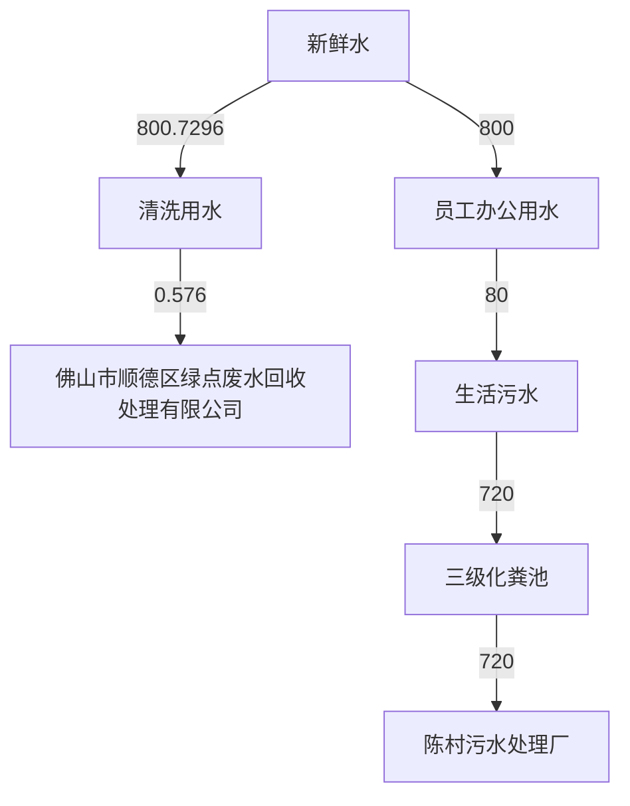
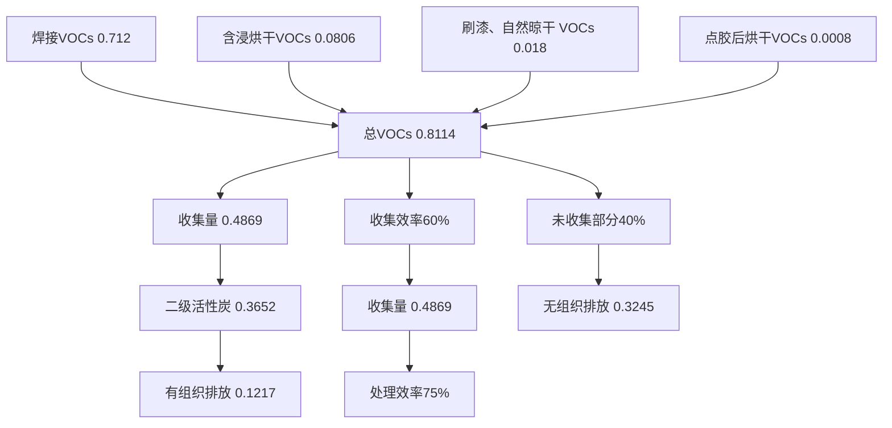
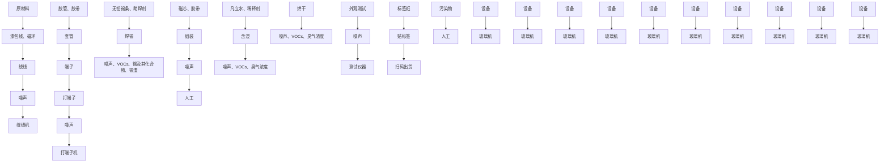
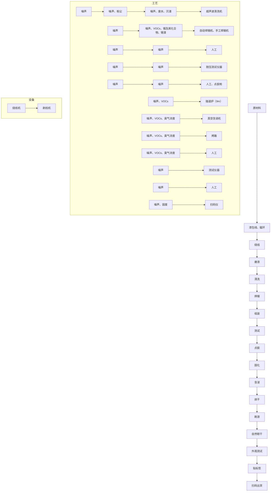
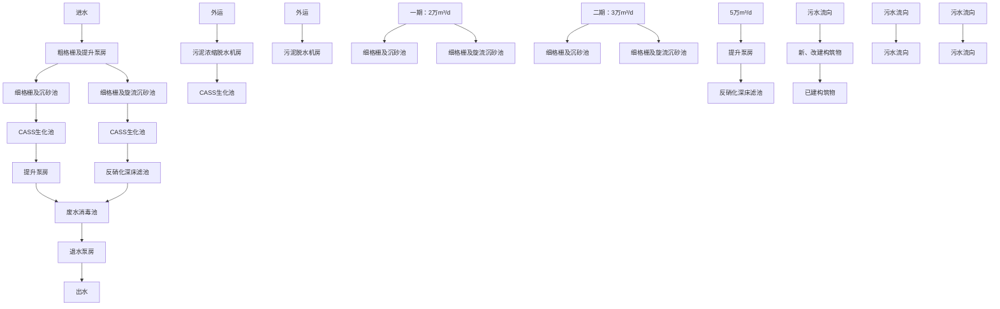
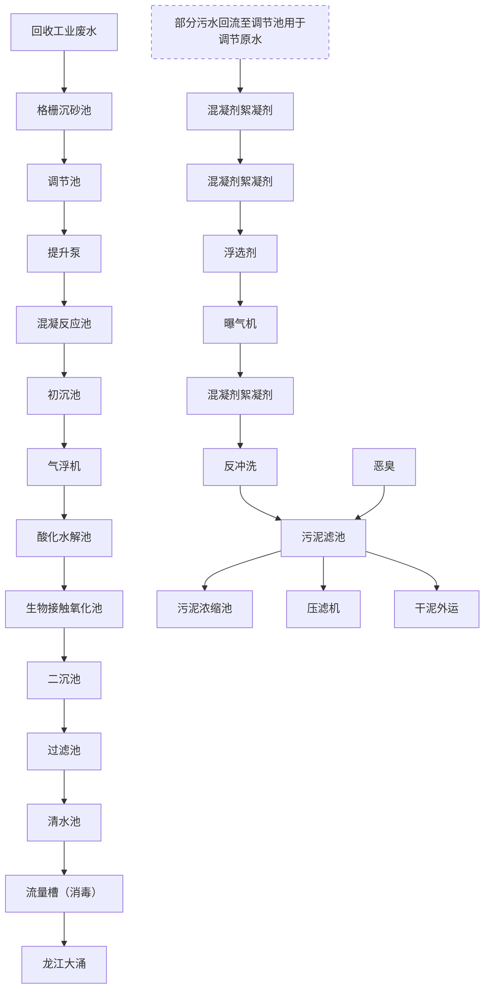

# 设项目环境影响报告表

# 染影响类）

名称： 佛山市凯琪威电子有限公司新建项目

单位（盖章）：佛山市凯琪威电子有限公司

日期： 年 月

中华人民共和国生态环境部制

编制单位和编制人员情况表

<table><tr><td>项目编号</td><td colspan="2">kb6653</td></tr><tr><td>建设项目名称</td><td colspan="2">佛山市凯琪威电子有限公司新建项目</td></tr><tr><td>建设项目类别</td><td colspan="2">35-077电机制造:输配电及控制设备制造:电线、电缆、光缆及电工器材制造:电池制造:家用电力器具制造:非电力家用器具制造:照明器具制造:其他电气机械及器材制造</td></tr><tr><td>环境影响评价文件类型</td><td colspan="2">报告表</td></tr><tr><td colspan="3">一、建设单位情况</td></tr><tr><td>单位名称(盖章)</td><td colspan="2">佛山市凯琪威电子有限公司</td></tr><tr><td>统一社会信用代码</td><td rowspan="4"></td><td></td></tr><tr><td>法定代表人(签章)</td><td></td></tr><tr><td>主要负责人(签字)</td><td></td></tr><tr><td>直接负责的主管人员(签字)</td><td></td></tr><tr><td colspan="3">二、编制单位情况</td></tr><tr><td>单位名称(盖章)</td><td colspan="2">广东祥和环保科技有限公司</td></tr><tr><td>统一社会信用代码</td><td colspan="2">91440606MA5196CQIA</td></tr><tr><td colspan="3">三、编制人员情况</td></tr><tr><td colspan="3">1.编制主持人</td></tr><tr><td colspan="3"></td></tr></table>


# 工江


<details>
<summary>text_image</summary>

广东祥和环保
和
回
</details>


<details>
<summary>text_image</summary>

中华人民共和国生态环境部
中华人民共和国
生态环境部
</details>


<details>
<summary>text_image</summary>

中华人民共和国人力资源和社会保障部
中华人民共和国
人力资源和社会保障部
</details>


# 目录

一、建设项目基本情况.

二、建设项目工程分析. . 15

三、区域环境质量现状、环境保护目标及评价标准 .35

四、主要环境影响和保护措施. .42

五、环境保护措施监督检查清单. .. 70

六、结论. . 74

附表.. . 75

建设项目污染物排放量汇总表. .75

附图 1 项目地理位置图. . 77

附图 2 项目环境四至图. . 78

附图 3 项目厂房及四至现状图. .80

附图 4 本项目生产车间、仓库平面布置图 .81

附图 5 项目大气补充监测点位图 ..83

附图 6 项目附近敏感点分布图 .84

附图 7 项目所在地地表水环境功能区划图 ..85

附图 8 项目所在地大气环境功能区划图. ..86

附图 9 项目所在地声环境功能区划图 ..87

附图 10 项目所在地佛山市顺德区环境管控单元图 ..88

附图 11 关于《佛山市顺德区 SD-D-03-03 编制单元（陈村镇广隆集约工业园区）控制性详细规划》（修编）地块开发细则批后公布.. .. 89

附件 1 营业执照. .. 90

附件 2 法人身份证. . 91

附件 3 厂房不动产权证.. . 92

附件 4 租赁合同. . 97

附件 5 原辅材料 MSDS. .. 98

附件 6 环保服务合同. . 116

附件 7 环境噪声监测报告. . 118

# 一、建设项目基本情况

<table><tr><td>建设项目名称</td><td colspan="4">佛山市凯琪威电子有限公司新建项目</td></tr><tr><td>项目代码</td><td colspan="4">无</td></tr><tr><td>建设单位联系人</td><td>毛</td><td>联系方式</td><td colspan="2">1</td></tr><tr><td>建设地点</td><td colspan="4">广东省(自治区)佛山市顺德县(区)陈村乡(街道)永兴社区广隆工业区兴业六路7号之一A2(具体地址)</td></tr><tr><td>地理坐标</td><td colspan="4">(东经113度13分35.475秒,北纬22度58分22.782秒)</td></tr><tr><td>国民经济行业类别</td><td>C3821变压器、整流器和电感器制造</td><td>建设项目行业类别</td><td colspan="2">三十五、电气机械和器材制造业38中的77、输配电及控制设备制造382-其他(仅分割、焊接、组装的除外;年使用非溶剂型低VOCs含量涂料10吨以下的除外)</td></tr><tr><td>建设性质</td><td>☑新建(迁建)□改建□扩建□技术改造</td><td>建设项目申报情形</td><td colspan="2">☑首次申报项目□不予批准后再次申报项目□超五年重新审核项目□重大变动重新报批项目</td></tr><tr><td>项目审批(核准/备案)部门(选填)</td><td>无</td><td>项目审批(核准/备案)文号(选填)</td><td colspan="2">无</td></tr><tr><td>总投资(万元)</td><td>100</td><td>环保投资(万元)</td><td colspan="2">15</td></tr><tr><td>环保投资占比(%)</td><td>15</td><td>施工工期</td><td colspan="2">2个月</td></tr><tr><td>是否开工建设</td><td>☑否□是:</td><td>用地(用海)面积( $m^{2}$ )</td><td colspan="2">4008.9</td></tr><tr><td>专项评价设置情况</td><td colspan="4">本项目危险物质最大存在总量与其临界量的比值Q=0.006422,Q&lt;1,无需设置环境风险专项评价。</td></tr><tr><td>规划情况</td><td colspan="4">无</td></tr><tr><td>规划环境影响评价情况</td><td colspan="4">无</td></tr><tr><td>规划及规划环境影响评价符合性分析</td><td colspan="4">无</td></tr><tr><td rowspan="5">其他符合性分析</td><td colspan="4">1、与产业政策相符性分析本项目年产方型电感5万个、环型电感5万个、硅钢类电感10万个,所属行业C3821变压器、整流器和电感器制造,属于《促进产业结构调整暂行规定》规定的允许类,不属于《珠三角洲地区产业结构调整优化和产业导向目录》(2011年本)和《产业结构调整指导目录(2019年本)》(中华人民共和国国家发展和改革委员会令第29号)规定的限制类和禁止(淘汰)类项目。因此,本项目的建设符合国家和地方的相关产业政策。2、广东省“三线一单”生态环境分区管控方案符合性分析根据《广东省人民政府关于印发广东省“三线一单”生态环境分区管控方案的通知》(粤府〔2020〕71号)发布的广东省环境管控单元图,项目所在区域为一般管控单元。表1-1 与“一核一带一区”区域管控要求的相符性</td></tr><tr><td>管控要求</td><td>与本项目相关的要求</td><td>符合性分析</td><td>相符性</td></tr><tr><td>区域布局管控要求</td><td>禁止新建、扩建燃煤燃油火电机组和企业自备电站,推进现有服役期满级落后老旧的燃煤火电机组有序退出;原则上不再新建燃煤锅炉,逐步淘汰生物质锅炉、集中供热管网覆盖区域内的分散供热锅炉,逐步推动高污染燃料禁燃区全覆盖;禁止新建、扩建水泥、平板玻璃、化学制浆、生皮制革以及国家规划外的钢铁、原油加工等项目。推广应用低挥发性有机物原辅材料,严格限制新建生产和使用高挥发性有机物原辅材料的项目,鼓励建设挥发性有机物共性工厂。</td><td>本项目位于珠三角核心区,主要进行电感器的加工制造,不属于区域布局管控要求中的禁止新建、扩建水泥、平板玻璃、化学制浆、生皮制革以及国家规划外的钢铁、原油加工等项目,符合区域布局管控要求。</td><td>符合</td></tr><tr><td>能源资源利用要求</td><td>科学实施能源消费总量和强度“双控”,新建高能耗项目单位产品(产值)能耗达到国际国内先进水平,实现煤炭消费总量负增长;推进工业节水减排,重点在高耗水行业开展节水改造,提高工业用水效率。加强江河湖库水量调度,保障生态流量。盘活存量建设用地,控制新增用地规模。</td><td>本项目属于C3821变压器、整流器和电感器制造,不属于高能耗行业,项目生产设备使用电能,生活用水由市政供水,不直接取用江河湖库水量,不会对项目所在地生态流量造成影响,项目租用已建成厂房,不涉及新增城市建设用地。</td><td>符合</td></tr><tr><td>污染</td><td>实行水污染物排放的行业标杆</td><td>本项目属于新建项目,生活污</td><td>符合</td></tr></table>

<table><tr><td>物排放管控要求</td><td>管理,严格执行茅洲河、淡水河、石马河、汾江河等重点流域水污染物排放标准。重点水污染物未达到环境质量改善目标的区域内,新建、改建、扩建项目实施减量替代。大力推进固体废物源头减量化、资源化利用和无害化处置,稳步推进“无废城市”试点建设。</td><td>水经三级化粪处理后达标后排至陈村污水处理厂,尾水排至陈村水道。根据《2021年度佛山市顺德区环境质量状况公报》的评价结果,陈村水道断面水质满足《地表水环境质量标准》(GB3838-2002)III水功能要求,水质较好。一般固体废物收集后交由资源回收公司回收,危险废物交由有危险废物处理资质的单位收集处置。</td><td></td></tr><tr><td>环境风险防控要求</td><td>加强惠州大亚湾石化区、广州石化、朱涵高栏港、珠西新材料集聚区等石化、化工重点园区环境风险防控,建立完善污染源在线监控系统,开展有毒有害气体监测,落实环境风险应急预案。提升危险废物监管能力,利用信息化手段,推进全过程跟踪管理。</td><td>本项目位于佛山市顺德区陈村镇永兴社区广隆工业区兴业六路7号之一A2,不属于石化、化工重点园区环境风险防控区域。项目产生的危险废物将定期委托危险废物交由有危险废物处理资质的单位收集处置,并通过信息系统登记转移计划和电子转移联单。</td><td>符合</td></tr></table>

表 1-2 与“三线一单”相符性分析表

<table><tr><td>内容</td><td>项目情况</td><td>相符性</td></tr><tr><td>生态保护红线及一般生态空间</td><td>本项目位于广东省佛山市顺德区陈村镇永兴社区广隆工业区兴业六路7号之一A2,属于工业用地,不涉及划定的生态红线区域,项目周边无自然保护区、饮用水水源保护区等生态保护目标。</td><td>符合</td></tr><tr><td>资源利用上线</td><td>本项目资源消耗量相对区域资源利用总量较少,不属于高耗能、污染资源型企业,项目的水、电等资源利用不会突破区域上。</td><td>符合</td></tr><tr><td>环境质量底线</td><td>本项目区域地表水环境和声环境能够满足相应标准要求,属于达标区;区域大气环境属于不达标区,超标因子为 $O_3$ 。本项目有机废气经集气罩收集后通过二级活性炭吸附处理后高空排放;生活污水经预处理后排至陈村污水处理厂处理后尾水排至陈村水道。经以上处理后,项目对区域内环境影响较小,质量可保持现有水平。</td><td>符合</td></tr><tr><td>环境准入负面清单</td><td>本项目行业类别为C3821变压器、整流器和电感器制造,根据《市场准入负面清单》(2022年版)的规定,项目不属于负面清单;根据《环境保护综合名录》(2021年版),本项目不属于“高污染、高环境风险”项目。</td><td>符合</td></tr></table>

# 3、与佛山市“三线一单”生态环境分区管控方案相符性分析

根据《佛山市人民政府关于印发佛山市“三线一单”生态环境分区管控方案的通知》（佛府[2021]11 号）的佛山市环境管控单元图，项目所在地属于陈村镇重点管控区（单元编码：ZH44060620010），具体分析见下表。

表 1-3 与佛山市“三线一单”相符性分析表

<table><tr><td>内容</td><td>要求</td><td>项目情况</td><td>相符性</td></tr><tr><td rowspan="5">区域布局管控</td><td>1-1【产业/鼓励引导类】重点发展智能装备制造、新一代电子信息、新材料等新兴产业;结合TOD片区开发,对接广深港资源,大力发展生产性服务业、高端商务服务业和中小企业总部集群;培育以花卉产业为特色,向电商、会展、文创旅游等延伸的现代农业产业链。</td><td>本项目不涉及。</td><td>/</td></tr><tr><td>1-2【产业/综合类】系统推进村级工业园升级改造,腾出连片空间,布局产业集聚区和主题产业园,推动工业项目入园集聚发展。新增工业制造业用地原则上安排在产业集聚区内,产业集聚区外原则上不鼓励工业及物流仓储用地的新建与改造。</td><td>本项目行业类别及代码为C3821变压器、整流器和电感器制造,选址位于广隆工业区内。</td><td>符合</td></tr><tr><td>1-3【产业/限制类】受纳水体或监控断面不达标的,不得新建、扩建向河涌直接排放废水的项目。新建、扩建含蚀刻工序的线路板生产项目和化工项目应在配套污水集中处置的工业园区或生活污水管网覆盖区域内建设;纯加工型印花项目,含酸洗、磷化的金属表面处理、金属制品项目(与自身高新技术企业配套的除外),含酸洗、喷涂、拉丝、表面抛光等工艺的不锈钢型材加工项目,应进入以此类项目为主导产业、有相应废水集中治理设施的工业园区,实现集中治污。</td><td>本项目行业类别及代码为C3821变压器、整流器和电感器制造,不属于限制类项目。项目加工过程的清洗废水循环使用,更换废水定期交由有能力的单位回收处理。</td><td>符合</td></tr><tr><td>1-4【大气/限制类】大气环境受体敏感重点管控区内,应严格限制新建储油库项目、产生和排放有毒有害大气污染物的建设项目以及使用溶剂型油墨、涂料、清洗剂、胶黏剂等高挥发性有机物原辅材料项目,鼓励现有该类项目搬迁退出。</td><td>本项目行业类别及代码为C3821变压器、整流器和电感器制造,不属于大气限制类项目,根据下文“项目主要涉VOCs原辅材料分析”可知,含浸使用的凡立水和稀释剂配比后不属于高挥发性有机物原辅材料,刷漆使用的凡立水和点胶使用的双组份粘结胶均不属于高挥发性有机物原辅材料。</td><td>符合</td></tr><tr><td>1-5【大气/限制类】大气环境布局敏感区重点管控区内,应严格限制新建生产和使用高挥发性有机物原辅材料项目,优先开展低VOCs含量原辅材料替代,强化无组织排放控制。原则上不再新建、扩建新增氮氧化物、烟(粉)尘排放量较大的建设项目。</td><td>根据下文“项目主要涉VOCs原辅材料分析”可知,本项目含浸使用的凡立水和稀释剂配比后不属于高挥发性有机物原辅材料,刷漆使用的凡立水和点胶使用的双</td><td>符合</td></tr></table>

<table><tr><td rowspan="9"></td><td></td><td></td><td>组份粘结胶均不属于高挥发性有机物原辅材料。本项目不属于新增氮氧化物、烟(粉)尘排放量较大的建设项目。</td><td></td></tr><tr><td rowspan="6">能源资源利用</td><td>2-1【能源/鼓励引导类】推广节能技术,加快发展绿色货运与现代物流。</td><td>本项目不涉及。</td><td>/</td></tr><tr><td>2-2【能源/鼓励引导类】推广新能源汽车应用和充电基础设施建设,积极推动重卡LNG加气站、充电基础设施、加氢站建设。</td><td>本项目不涉及。</td><td>/</td></tr><tr><td>2-3【能源/综合类】科学实施能源消费总量和强度“双控”,新建高能耗项目单位产品(产值)能耗达到国际国内先进水平。</td><td>本项目不属于高能耗项目。</td><td>符合</td></tr><tr><td>2-4【水资源/综合类】贯彻落实“节水优先”方针,实行最严格水资源管理制度,陈村镇万元国内生产总值用水量、万元工业增加值用水量、用水总量、农田灌溉水有效利用系数等用水总量和效率指标达到区下达要求。</td><td>本项目清洗废水循环使用,更换废水定期交由有能力的单位回收处理。清洗用水量较少。</td><td>符合</td></tr><tr><td>2-5【土地资源/限制类】落实单位土地面积投资强度、土地利用强度等建设用地控制性指标要求,提高土地利用效率。</td><td>本项目租用已建成厂房作为经营场所,与实际用途相符合。</td><td>符合</td></tr><tr><td>2-6【岸线-禁止类】严格水域岸线用途管制,新建项目一律不得违规占用水域。严禁破坏生态的岸线利用行为和不符合其功能定位的开发建设活动,严禁以各种名义侵占河道、围垦湖泊、非法采砂等。</td><td>本项目不涉及。</td><td>/</td></tr><tr><td rowspan="2">污染物排放管控</td><td>3-1【水/限制类】城镇新区建设实行雨污分流。住宅、商业体、学校、市场等城镇开发建设项目应当配套或者同步计划建设公共排水设施,公共排水设施或自建排污水设施未能投产运行的,以上涉水项目不得投入使用。新建小区严格实施雨污分流,阳台、露台等污水接入污水收集系统,将生活污水“应截尽截”。做好大型楼盘、集贸市场、餐饮以及学校等4大类排水户污水接入市政管网工作。</td><td>本项目不涉及。</td><td>/</td></tr><tr><td>3-2【水/综合类】陈村镇重点河涌水质上年度未达到水环境环境质量目标的,需组织编制、系统实施、向社会公开区域重点水污染物减排计划并明确“替代量”,本年度新建、改建、扩建项目新增水环境重点污染物实行区域“减二增一”替代(工业、生活或综合集中废水处理设施、民生项目除外)。</td><td>本项目不涉及。</td><td>/</td></tr><tr><td rowspan="5"></td><td rowspan="3"></td><td>3-3【水/综合类】结合村级工业园改造,全面提升产业层次与集聚度,促进污染集中整治。</td><td>本项目不涉及。</td><td>/</td></tr><tr><td>3-4【水/综合类】稳步推进排水设施“三个一体化”管理模式,补齐城乡污水收集和处理短板,推动陈村污水处理厂提质增效,加快消除城中村、老旧城区、城乡结合部等污水收集管网空白区,逐步实现城乡污水收集处理全覆盖。2025年前完成陈村污水处理厂扩建,尾水应执行《城镇污水处理厂污染物排放标准》(GB18918-2002)一级A标准及《广东省水污染物排放限值》(DB44/26-2001)的较严值。</td><td>本项目选址位置属于陈村污水处理厂纳污范围,员工生活污水经三级化粪池预处理后排至陈村污水处理厂处理,尾水排至陈村水道,执行《城镇污水处理厂污染物排放标准》(GB18918-2002)一级A标准及《广东省水污染物排放限值》(DB44/26-2001)的较严值。清洗废水循环使用,更换废水定期交由有能力的单位回收处理。</td><td></td></tr><tr><td>3-5【水/综合类】完善污水管网建设,逐步取消现状农村污水处理站点,有条件的区域实施雨污分流改造;至2030年全面雨污分流,农村生活污水纳入陈村城镇污水处理系统。</td><td>本项目不涉及。</td><td>/</td></tr><tr><td rowspan="2">环境风险防控</td><td>4-1【水/综合类】陈村污水处理厂、工业污水集中处理设施应采临取有效措施,防止事故废水直接排入水体。完善污水处理厂在线监控系统联网,实现污水处理厂的实时、动态监管。</td><td>本项目选址位置属于陈村污水处理厂纳污范围,员工生活污水经三级化粪池预处理后排至陈村污水处理厂处理。</td><td>符合</td></tr><tr><td>4-2【风险/综合类】加强环境风险分级分类管理,强化金属制品、有色金属和压延加工、化学原料和化学品制造业等涉重金属、化工行业企业及工业园区等重点环境风险源的环境风险防控。</td><td>本项目行业类别为C3821变压器、整流器和电感器制造,不属于金属制品、有色金属和压延加工、化学原料和化学品制造业等涉重金属、化工行业企业。</td><td>符合</td></tr><tr><td colspan="5">4、与顺德区“三线一单”生态环境分区管控方案相符性分析根据《佛山市顺德区人民政府关于印发佛山市顺德区“三线一单”生态环境分区管控方案的通知》(顺府发[2021]11号)的佛山市顺德区环境管控单元图,项目所在地属于陈村镇重点管控区(单元编码:ZH44060620010),具体分析见下表。</td></tr></table>

表 1-4 项目与顺德区“三线一单”符合性分析

<table><tr><td>内容</td><td>要求</td><td>项目情况</td><td>相符性</td></tr><tr><td rowspan="6">区域布局管控</td><td>1-1【产业/鼓励引导类】重点发展智能装备制造、新一代电子信息、新材料等新兴产业;结合TOD片区开发,对接广深港资源,大力发展生产性服务业、高端商务服务业和中小企业总部集群;培育以花卉产业为特色,向电商、会展、文创旅游等延伸的现代农业产业链。</td><td>本项目不涉及。</td><td>/</td></tr><tr><td>1-2【产业/综合类】系统推进村级工业园升级改造,腾出连片空间,布局产业集聚区和主题产业园,推动工业项目入园集聚发展。新增工业制造业用地原则上安排在产业集聚区内,产业集聚区外原则上不鼓励工业及物流仓储用地的新建与改造。</td><td>本项目行业类别及代码为C3821变压器、整流器和电感器制造,选址位于广隆工业区内。</td><td>符合</td></tr><tr><td>1-3【产业/综合类】产业聚集区所属地块内的工业用地或企业与村庄、学校等环境敏感点之间应设置合理的大气环境防护距离,并通过绿化带进行有效隔离;聚集区规划布局应注重大气污染排放企业应尽量避免布局在居住用地的常年主导风向的上风向。</td><td>本项目选址位于广隆工业区内,属于工业用地,厂界外500m范围内的大气环境保护目标为距离最近的为东侧20米的屯教村。</td><td>符合</td></tr><tr><td>1-4【产业/限制类】受纳水体或监控断面不达标的,不得新建、扩建向河涌直接排放废水的项目。新建、扩建含蚀刻工序的线路板生产项目和化工项目应在配套污水集中处置的工业园区或生活污水管网覆盖区域内建设;纯加工型印花项目,含酸洗、磷化的金属表面处理、金属制品项目(与自身高新技术企业配套的除外),含酸洗、喷涂、化学抛光、电解等涉及废水排放工艺的不锈钢型材加工项目(与自身高新技术企业配套的除外),应进入以此类项目为主导产业、有相应废水集中治理设施的工业园区,实现集中治污。</td><td>本项目行业类别及代码为C3821变压器、整流器和电感器制造,不属于限制类项目。项目加工过程的清洗废水循环使用,更换废水定期交由有能力的单位回收处理。</td><td>符合</td></tr><tr><td>1-5【产业/综合类】划定家具生产优先发展区域,优先发展区外不再新建涉及涂装工艺的木质家具制造项目。</td><td>本项目不涉及。</td><td>/</td></tr><tr><td>1-6【大气/限制类】大气环境受体敏感重点管控区内,应严格限制新建储油库项目、产生和排放有毒有害大气污染物的建设项目以及使用溶剂型油墨、涂料、清洗剂、胶黏剂等高挥发性有机物原辅材料项目,鼓励现有该类项目搬迁退出。</td><td>本项目行业类别及代码为C3821变压器、整流器和电感器制造,不属于大气限制类项目,根据下文“项目主要涉VOCs原辅材料分析”可知,含浸使用的凡立水和稀释剂配</td><td>符合</td></tr></table>

<table><tr><td rowspan="9"></td><td rowspan="2"></td><td></td><td>比后不属于高挥发性有机物原辅材料,刷漆使用的凡立水和点胶使用的双组份粘结胶均不属于高挥发性有机物原辅材料。</td><td></td></tr><tr><td>1-7【大气/限制类】大气环境布局敏感区重点管控区内,应严格限制新建生产和使用高挥发性有机物原辅材料项目,优先开展低VOCs含量原辅材料替代,强化无组织排放控制。原则上不再新建、扩建新增氮氧化物、烟(粉)尘排放量较大的建设项目。</td><td>根据下文“项目主要涉VOCs原辅材料分析”可知,本项目含浸使用的凡立水和稀释剂配比后不属于高挥发性有机物原辅材料,刷漆使用的凡立水和点胶使用的双组份粘结胶均不属于高挥发性有机物原辅材料。</td><td>符合</td></tr><tr><td rowspan="6">能源资源利用</td><td>2-1【能源/鼓励引导类】推广节能技术,加快发展绿色货运与现代物流。</td><td>本项目不涉及。</td><td>/</td></tr><tr><td>2-2【能源/鼓励引导类】推广新能源汽车应用和充电基础设施建设,积极推动重卡LNG加气站、充电基础设施、加氢站建设。</td><td>本项目不涉及。</td><td>/</td></tr><tr><td>2-3【能源/综合类】科学实施能源消费总量和强度“双控”,新建高能耗项目单位产品(产值)能耗达到国际国内先进水平。</td><td>本项目不属于高能耗项目。</td><td>符合</td></tr><tr><td>2-4【水资源/综合类】贯彻落实“节水优先”方针,实行最严格水资源管理制度,陈村镇万元国内生产总值用水量、万元工业增加值用水量、用水总量、农田灌溉水有效利用系数等用水总量和效率指标达到区下达要求。</td><td>本项目清洗废水循环使用,更换废水定期交由有能力的单位回收处理。清洗用水量较少。</td><td>符合</td></tr><tr><td>2-5【土地资源/限制类】落实单位土地面积投资强度、土地利用强度等建设用地控制性指标要求,提高土地利用效率。</td><td>本项目租用已建成厂房作为经营场所,与实际用途相符合。</td><td>符合</td></tr><tr><td>2-6【岸线/禁止类】严格水域岸线用途管制,新建项目一律不得违规占用水域。严禁破坏生态的岸线利用行为和不符合其功能定位的开发建设活动,严禁以各种名义侵占河道、围垦湖泊、非法采砂等。</td><td>本项目不涉及。</td><td>/</td></tr><tr><td>污染物排放管控</td><td>3-1【水/限制类】城镇新区建设实行雨污分流。住宅、商业体、学校、市场等城镇开发建设项目应当配套或者同步计划建设公共排水设施,公共排水设施或自建排污水设施未能投产运行的,以上涉水项目不得投入使用。新建小区严格实施雨污分流,阳台、露台等污水接入污水收集系统,将生活污水“应截尽截”。做好大型楼盘、集贸市场、餐饮以及学校等4大类排水户污水接入市政管网工作。</td><td>本项目不涉及。</td><td>/</td></tr><tr><td rowspan="7"></td><td rowspan="5"></td><td>3-2【水/综合类】陈村镇重点河涌水质上年度未达到水环境环境质量目标的,需组织编制、系统实施、向社会公开区域重点水污染物减排计划并明确“替代量”,本年度新建、改建、扩建项目新增水环境重点污染物实行区域“减二增一”替代(工业、生活或综合集中废水处理设施、民生项目除外)。</td><td>本项目不涉及。</td><td>/</td></tr><tr><td>3-3【水/综合类】结合村级工业园改造,全面提升产业层次与集聚度,促进污染集中整治。</td><td>本项目不涉及。</td><td>/</td></tr><tr><td>3-4【水/综合类】稳步推进排水设施“三个一体化”管理模式,补齐城乡污水收集和处理短板,推动陈村污水处理厂提质增效,加快消除城中村、老旧城区、城乡结合部等污水收集管网空白区,逐步实现城乡污水收集处理全覆盖。2025年前完成陈村污水处理厂扩建,尾水应执行《城镇污水处理厂污染物排放标准》(GB18918-2002)一级A标准及《广东省水污染物排放限值》(DB44/26-2001)的较严值。</td><td>本项目选址位置属于陈村污水处理厂纳污范围,员工生活污水经三级化粪池预处理后排至陈村污水处理厂处理,尾水排至陈村水道,执行《城镇污水处理厂污染物排放标准》(GB18918-2002)一级A标准及《广东省水污染物排放限值》(DB44/26-2001)的较严值。清洗废水循环使用,更换废水定期交由有能力的单位回收处理。</td><td>符合</td></tr><tr><td>3-5【水/综合类】完善污水管网建设,逐步取消现状农村污水处理站点,有条件的区域实施雨污分流改造;至2030年全面雨污分流,农村生活污水纳入陈村城镇污水处理系统。</td><td>本项目不涉及。</td><td>/</td></tr><tr><td>3-6【水/综合类】产业集聚区和主题园区内做好污水管网和污水集中处理设施的配套保障,确保废水收集到城镇污水处理厂、园区污水处理厂或分散式污水处理设施集中处置。</td><td>本项目不涉及。</td><td>/</td></tr><tr><td rowspan="2">环境风险防控</td><td>4-1【水/综合类】陈村污水处理厂、工业污水集中处理设施应采取有效措施,防止事故废水直接排入水体。完善污水处理厂在线监控系统联网,实现污水处理厂的实时、动态监管。</td><td>本项目选址位置属于陈村污水处理厂纳污范围,员工生活污水经三级化粪池预处理后排至陈村污水处理厂处理。</td><td>符合</td></tr><tr><td>4-2【风险/综合类】加强环境风险分级分类管理,强化金属制品、有色金属和压延加工、化学原料和化学品制造业等涉重金属、化工行业企业及工业园区等重点环境风险源的环境风险防控。</td><td>本项目行业类别为C3821变压器、整流器和电感器制造,不属于金属制品、有色金属和压延加工、化学原料和化学品制造业等涉重金属、化工行业企业。</td><td>符合</td></tr></table>

综上，本项目符合国家产业政策的要求，同时符合广东省、佛山市以及顺德区产业政策和相关规范的要求。

# 5、相关生态环境保护法律法规政策、生态环境保护规划的相符性分析

表 1-5 项目与挥发性有机物排放相关环保政策相符性分析

<table><tr><td>序号</td><td>政策要求</td><td>本项目内容</td><td>符合性</td></tr><tr><td colspan="4">1、《中华人民共和国大气污染防治法》(2018年10月26日第二次修订)</td></tr><tr><td>1.1</td><td>第四十五条 产生含挥发性有机物废气的生产和服务活动,应当在密闭空间或者设备中进行,并按照规定安装、使用污染防治设施;无法密闭的,应当采取措施减少废气排放。</td><td>本项目南侧生产区域废气经收集后通过南面的二级活性炭吸附处理后引至楼顶15m排气筒DA001高空排放;北侧生产区域废气经收集后通过北面的二级活性炭吸附处理后引至楼顶15m排气筒DA002高空排放。</td><td>符合</td></tr><tr><td colspan="4">2、《广东省生态环境保护“十四五”规划》(粤环[2021]10号)</td></tr><tr><td>2.1</td><td>大力推进低VOCs含量原辅材料源头替代,严格落实国家和地方产品VOCs含量限值质量标准,禁止建设生产和使用高VOCs含量的溶剂型涂料、油墨、胶粘剂等项目。</td><td>根据下文“项目主要涉VOCs原辅材料分析”可知,本项目含浸使用的凡立水和稀释剂配比后不属于高挥发性有机物原辅材料,刷漆使用的凡立水和点胶使用的双组份粘结胶均不属于高挥发性有机物原辅材料。</td><td>符合</td></tr><tr><td>2.2</td><td>强化对企业涉VOCs生产车间/工序废气的收集管理,推动企业开展治理设施升级改造。</td><td>本项目南侧生产区域废气经收集后通过南面的二级活性炭吸附处理后引至楼顶15m排气筒DA001高空排放;北侧生产区域废气经收集后通过北面的二级活性炭吸附处理后引至楼顶15m排气筒DA002高空排放。</td><td>符合</td></tr><tr><td colspan="4">3、《佛山市生态环境保护“十四五”规划》(佛环[2022]3号)</td></tr><tr><td>3.1</td><td>加强VOCs源头替代和无组织排放管控。大力推进低VOCs含量原辅材料替代,将全面使用低VOCs含量原辅材料</td><td>根据下文“项目主要涉VOCs原辅材料分析”可知,本项目含浸使用的凡</td><td>符合</td></tr></table>

<table><tr><td rowspan="4"></td><td></td><td>的企业纳入证明清单和政府绿色采购清单。加强对含VOCs物料储存、转移和运输、设备与管线组件泄漏、敞开液面逸散以及工艺过程等五类排放源的管控。</td><td>立水和稀释剂配比后不属于高挥发性有机物原辅材料,刷漆使用的凡立水和点胶使用的双组份粘结胶均不属于高挥发性有机物原辅材料;南侧生产区域废气经收集后通过南面的二级活性炭吸附处理后引至楼顶15m排气筒DA001高空排放;北侧生产区域废气经收集后通过北面的二级活性炭吸附处理后引至楼顶15m排气筒DA002高空排放。</td><td colspan="2"></td></tr><tr><td>3.2</td><td>强化涉VOCs排放,涉工业炉窑等重点污染源自动监测,推动重点工业园区建立挥发性有机物、颗粒物监测体系。</td><td>本项目不涉及工业炉窑等重点污染源,所在园区不属于重点工业园区,无需建立挥发性有机物、颗粒物监测体系。</td><td colspan="2">符合</td></tr><tr><td colspan="5">4、关于印发《重点行业挥发性有机物综合治理方案》的通知(环大气[2019]53号)</td></tr><tr><td>4.14.2</td><td>重点对含VOCs物料(包括含VOCs原辅材料、含VOCs产品、含VOCs废料以及有机聚合物材料等)储存、转移和输送、设备与管线组件泄漏、敞开液面逸散以及工艺过程等五类排放源实施管控,通过采取设备与场所密闭、工艺改进、废气有效收集等措施,削减VOCs无组织排放。提高废气收集率,遵循“应收尽收、分质收集”的原则,科学设计废气收集系统,将无组织排放转变为有组织排放进行控制。采用全密闭集气罩或密闭空间的,除行业有特殊要求外,应保持微负压状态,并根据相关规范合理设置通风量。采用局部集气罩的,距集气罩开口面最远处的VOCs无组织排放位置,控制风速应不低于0.3米/秒,有行业要求的按相关规定执行。</td><td>涉及挥发性有机物的原辅材料均储存于密闭容器中存放在化学品仓库内,在转移或使用时均采用密闭容器进行转移。本项目南侧生产区域废气经收集后通过南面的二级活性炭吸附处理后引至楼顶15m排气筒DA001高空排放;北侧生产区域废气经收集后通过北面的二级活性炭吸附处理后引至楼顶15m排气筒DA002高空排放。项目有机废气采用集气罩的方式收集,集气罩周边配备胶帘,废气收集系统保持在负压状态下运行,南侧废气治理设施装置配套风机风量为 $19000m^{3}/h$ ,北侧废气治理设施装置配套风机风量为 $18000m^{3}/h$ ,,集气罩开口面控制风速大于0.3m/s。</td><td colspan="2">符合符合</td></tr><tr><td rowspan="8"></td><td colspan="5">5、《广东省生态环境厅关于做好重点行业建设项目挥发性有机物总量指标管理工作的通知》(粤环发[2019]2号)</td></tr><tr><td>5.1</td><td>建设项目新增VOCs排放量,实行本行政区域内污染源“点对点”2倍量削减替代,原则上不得接受其他区域VOCs“可替代总量指标”。</td><td>本项目建议挥发性有机物(VOCs)排放总量控制指标为0.1217t/a,由区、镇两级环保主管部门核查总量指标。</td><td colspan="2">符合</td></tr><tr><td colspan="5">6、《佛山市生态环境局顺德分局关于做好重点行业建设项目挥发性有机物总量指标管理工作的通知》(佛顺环函[2019]56)</td></tr><tr><td>6.1</td><td>涉VOCs排放项目,实现本行政区域内污染源“点对点”2倍量削减替代,由项目所在镇街分局出具VOCs总量指标来源及替代削减方案的意见,开展总量替代。</td><td>本项目建议挥发性有机物(VOCs)排放总量控制指标为0.1217t/a,由区、镇两级环保主管部门核查总量指标。</td><td colspan="2">符合</td></tr><tr><td colspan="5">7、《广东省2021年大气、水、土壤污染防治工作方案》(粤办函[2021]58号)</td></tr><tr><td>7.1</td><td>严格落实国家产品VOCs含量限值标准要求,除现阶段确无法实施替代的工序外,禁止新建生产和使用高VOCs含量原辅材料项目。鼓励在生产和流通消费环节推广使用低VOCs含量原辅材料。</td><td>根据下文“项目主要涉VOCs原辅材料分析”可知,本项目含浸使用的凡立水和稀释剂配比后不属于高挥发性有机物原辅材料,刷漆使用的凡立水和点胶使用的双组份粘结胶均不属于高挥发性有机物原辅材料。</td><td colspan="2">符合</td></tr><tr><td colspan="5">8、《广东省涉挥发性有机物(VOCs)重点行业治理指引》(粤环办[2021]43号)</td></tr><tr><td>8.1</td><td>采用外部集气罩的,距集气罩开口面最远处的VOCs无组织排放位置,控制风速不低于0.3m/s。</td><td>项目有机废气采用集气罩的方式收集,南侧废气治理设施装置配套风机风量为 $19000m^{3}/h$ ,北侧废气治理设施装置配套风机风量为 $18000m^{3}/h$ ,集气罩开口面控制风速</td><td colspan="2">符合</td></tr><tr><td rowspan="8"></td><td></td><td colspan="2"></td><td>大于0.3m/s。</td><td></td></tr><tr><td>8.2</td><td colspan="2">废气收集系统的输送管道应密闭。废气收集系统应在负压下运行,若处于正压状态,应对管道组件的密封点进行泄漏检测,泄漏检测值不应超过500μmol/mol,亦不应有感官可察觉泄漏。</td><td>项目废气收集系统保持在负压状态下运行。</td><td>符合</td></tr><tr><td>8.3</td><td colspan="2">VOCs治理设施应与生产工艺设备同步运行,VOCs治理设施发生故障或检修时,对应的生产工艺设备应停止运行,待检修完毕后同步投入使用;生产工艺设备不能停止运行或不能及时停止运行的,应设置废气应急处理设施或采取其他替代措施。</td><td>项目生产过程会开启风机,有效减少废气无组织排放;废气收集处理系统发生故障或检修时,所有产生废气的工序停止运行,待检修完毕后再投入生产。</td><td>符合</td></tr><tr><td colspan="5">9、《固定污染源挥发性有机物综合排放标准》(DB44/2367-2022)</td></tr><tr><td>9.1</td><td rowspan="2">有组织排放控制要求</td><td>收集的废气中NMHC初始排放速率≥3kg/h时,应当配置VOCs处理设施,处理效率不应当低于80%。对于重点地区,收集的废气NMHC初始排放速率≥2kg/h时,应当配置VOCs处理设施,处理效率不应当低于80%;采用的原辅材料符合国家有关低VOCs含量产品规定的除外。</td><td>本项目位于重点地区,项目两套废气治理设施有机废气初始排放速率分别为0.09kg/h和0.072kg/h,均小于3kg/h,均已配置废气收集处理设施;根据下文“项目主要涉VOCs原辅材料分析”可知,本项目含浸使用的凡立水和稀释剂配比后不属于高挥发性有机物原辅材料,刷漆使用的凡立水和点胶使用的双组份粘结胶均不属于高挥发性有机物原辅材料。</td><td>符合</td></tr><tr><td>9.2</td><td>排气筒高度不低于15m(因安全考虑或有特殊工艺要求的除外),具体高度以及与周围建筑物的相对高度关系应根据环境影响评价文件确定。</td><td>本项目两套废气治理设施装置的排气筒设计排放高度均为15m。</td><td>符合</td></tr><tr><td>9.3</td><td>VOCs物料存储无组织排放控制要求</td><td>VOCs物料应储存于密闭的容器、包装袋、储罐、储存、料仓中,盛装VOCs物料的容器或包装袋应存放于室内,或存放于设置有雨棚、遮阳和防渗设施的专用场地。盛装VOCs物料的容器或包装袋在非取用状态时应加盖、封口,保持密闭。</td><td>涉及挥发性有机物的原辅材料均储存于密闭容器中存放在化学品仓库内,在转移或使用时均采用密闭容器进行转移。</td><td>符合</td></tr><tr><td colspan="5">6、用地性质相符性分析本项目位于广东省佛山市顺德区陈村镇永兴社区广隆工业区兴业六</td></tr></table>

路7号之一A2，根据关于《佛山市顺德区SD-D-03-03 编制单元（陈村镇广隆集约工业园区）控制性详细规划》（修编）地块开发细则批后公布（批复文号：顺府办函[2023]34 号）（详见附图11），项目所在地块的土地规划用途为 M1 一类工业用地；根据项目所在地不动产权房产证（见附件 3），所在地为工业用地用途性质，土地功能符合要求。

# 7、与广东省发展改革委关于印发《广东省“两高”项目管理目录（2022年版）》的通知（粤发改能源函〔2022〕1363号）相符性分析

本项目行业类别及代码为C3821 变压器、整流器和电感器制造，根据广东省发展改革委关于印发《广东省“两高”项目管理名录（2022年版）》的通知（粤发改能源函〔2022〕1363号），本项目不属于“两高”项目。

# 8、与《环境保护综合名录》（2021年版）相符性分析

本项目行业类别及代码为C3821 变压器、整流器和电感器制造，根据《环境保护综合名录》（2021 年版），本项目不属于“高污染、高环境风险”项目。

# 二、建设项目工程分析

# 1、建设内容

本项目属于新建项目，租赁已建成的工业厂房作为经营场所，具体为租用一栋 3 层工业厂房的第 2 层、第 3 层，一栋 3 层办公楼进行经营，总占地面积为1819.2m2，总建筑面积为4008.9m2，其具体布置情况详见下表2-1。

表 2-1 本项目工程组成一览表

<table><tr><td>项目</td><td>工程名称</td><td>工程内容</td></tr><tr><td>主体工程</td><td>生产车间</td><td>总建筑面积为 $1580m^{2}$ ,共1层,层高约4m,位于所在租赁厂房的第2层,主要功能包括扁平线圈加工车间(内设绕线区、清洗区以及浸锡区),方型线包、磁环加工车间(内设绕线区和焊锡区),组装车间(包括点胶、浸锡、焊锡、刷漆、物理脱漆、测试等工序)、2个6m隧道炉、1个9m隧道炉、2个含浸烘干房等</td></tr><tr><td>辅助工程</td><td>办公室</td><td>占地面积为 $245.2m^{2}$ ,共3层,每层高4米,建筑面积为 $848.9m^{2}$ </td></tr><tr><td rowspan="3">储运工程</td><td>仓库</td><td>位于所在租赁厂房的第3层,建筑面积为 $1580m^{2}$ </td></tr><tr><td>一般固废暂存间</td><td>位于生产车间内,建筑面积为 $10m^{2}$ </td></tr><tr><td>危废暂存间</td><td>位于生产车间内,建筑面积为 $5m^{2}$ </td></tr><tr><td rowspan="3">公用工程</td><td>给水系统</td><td>与市政供水管网接驳</td></tr><tr><td>排水系统</td><td>员工生活污水经三级化粪池预处理后通过市政污水管网引至陈村污水处理厂进一步处理</td></tr><tr><td>供能</td><td>接市政供电系统</td></tr><tr><td rowspan="6">环保工程</td><td>废水处理</td><td>员工生活污水经三级化粪池预处理后通过市政污水管网引至陈村污水处理厂进一步处理;清洗废水循环使用,更换废水定期交由有能力的单位回收处理,不外排</td></tr><tr><td>废气处理</td><td>南侧生产区域废气经收集后通过南面的二级活性炭吸附处理后引至楼顶15m排气筒DA001高空排放;北侧生产区域废气经收集后通过北面的二级活性炭吸附处理后引至楼顶15m排气筒DA002高空排放</td></tr><tr><td>噪声</td><td>高噪声设备基础减振、局部隔声降噪措施</td></tr><tr><td rowspan="3">固体废物</td><td>危险废物:暂存于生产车间内设置的危废暂存间( $5m^{2}$ ),定期交由有资质单位接收处置</td></tr><tr><td>一般固体废物:交相应回收单位回收处理</td></tr><tr><td>生活垃圾:交环卫部门及时清运处理</td></tr></table>

# 2、项目主要产品及年产量

表 2-2 本项目生产规模一览表

<table><tr><td>序号</td><td>产品名称</td><td>单位</td><td>生产规模</td></tr><tr><td>1</td><td>方型电感</td><td>万个/年</td><td>5</td></tr><tr><td>2</td><td>环型电感</td><td>万个/年</td><td>5</td></tr><tr><td>3</td><td>硅钢类电感</td><td>万个/年</td><td>10</td></tr></table>

# 3、原辅材料使用

# （1）项目原辅材料用量

表2-3 本项目主要原辅材料使用量一览表

<table><tr><td>序号</td><td>名称</td><td>单位</td><td>年用量</td><td>最大存储量</td><td>包装规格/储存方式</td><td>性状</td><td>备注/制得产品</td></tr><tr><td>1</td><td>硅钢片</td><td>万个/a</td><td>20</td><td>2</td><td>箱装</td><td>固体</td><td>硅钢类电感</td></tr><tr><td>2</td><td>磁环</td><td>万个/a</td><td>20</td><td>2</td><td>箱装</td><td>固体</td><td>方型、环型、硅钢类电感</td></tr><tr><td>3</td><td>磁芯</td><td>万个/a</td><td>5</td><td>1</td><td>箱装</td><td>固体</td><td>方型电感</td></tr><tr><td>4</td><td>螺栓、螺帽</td><td>万套/a</td><td>20</td><td>1</td><td>袋装</td><td>固体</td><td>硅钢类电感</td></tr><tr><td>5</td><td>夹条</td><td>万条/a</td><td>120</td><td>2</td><td>袋装</td><td>固体</td><td>硅钢类电感</td></tr><tr><td>6</td><td>漆包线</td><td>t/a</td><td>10</td><td>1</td><td>袋装</td><td>金属线材</td><td>方型、环型、硅钢类电感</td></tr><tr><td>7</td><td>胶带</td><td>卷/a</td><td>1000</td><td>100</td><td>袋装</td><td>固体</td><td>方型、环型电感</td></tr><tr><td>8</td><td>端子</td><td>万套/a</td><td>5</td><td>2</td><td>袋装</td><td>固体</td><td>方型电感</td></tr><tr><td>9</td><td>胶管</td><td>轴/a</td><td>30</td><td>2</td><td>袋装</td><td>固体</td><td>方型、环型电感</td></tr><tr><td>10</td><td>标签纸</td><td>卷/a</td><td>50</td><td>5</td><td>袋装</td><td>固体</td><td>方型、环型、硅钢类电感</td></tr><tr><td>11</td><td>无铅锡条</td><td>t/a</td><td>5</td><td>0.1</td><td>袋装</td><td>固体</td><td>方型、环型、硅钢类电感</td></tr><tr><td>12</td><td>助焊剂</td><td>t/a</td><td>0.8</td><td>0.082</td><td>20L/桶,密封</td><td>液体</td><td>方型、环型、硅钢类电感</td></tr><tr><td>13</td><td>凡立水</td><td>t/a</td><td>0.215</td><td>0.057</td><td>20L/桶,密封</td><td>液体</td><td>方型、硅钢类电感</td></tr><tr><td>14</td><td>稀释剂</td><td>t/a</td><td>0.013</td><td>0.016</td><td>20L/桶,密封</td><td>液体</td><td>方型、硅钢类电感</td></tr><tr><td>15</td><td>双组份粘接胶</td><td>t/a</td><td>0.5</td><td>0.01</td><td>1kg/支,密封</td><td>液体</td><td>环型、硅钢类电感</td></tr><tr><td>16</td><td>包装材料</td><td>t/a</td><td>0.5</td><td>0.1</td><td>/</td><td>固体</td><td>方型、环型、硅钢类电感产品包装</td></tr><tr><td>17</td><td>机油</td><td>t/a</td><td>0.05</td><td>0.05</td><td>5kg/桶,密封</td><td>液体</td><td>机修使用</td></tr></table>

# （2）项目主要涉 VOCs 原辅材料分析

表 2-4 主要涉 VOCs原辅材料一览表

<table><tr><td>序号</td><td>名称</td><td>理化性质</td><td>稀释比</td><td>VOCs含量</td><td>国家标准限值</td><td>是否属于低VOCs原辅料</td></tr><tr><td>1</td><td>凡立水</td><td>绝缘油、绝缘漆。淡黄色透明液体,相对密度0.95±0.02,闪点12°C,固态成分55%,主要用于高频变压器、电感线圈等电子元件表面涂覆或浸渍用。主要成分为改性丙烯酸树脂35-48%,高绝缘添加剂3-7%,醚酯溶剂5-8%,醇类溶剂35-35%,助剂1-2%。</td><td rowspan="2">1刷漆工序凡立水单独使用无需进行稀释;2含浸工序中凡立水:稀释剂按13:1进行质量比例配比。</td><td rowspan="2">1凡立水:380g/L;2凡立水与稀释剂配比后:412g/L。</td><td rowspan="2">《低挥发性有机化合物含量涂料产品技术要求》(GB/T38597-2020)表2工业防护涂料-机械设备涂料-工程机械和农业机械涂料(含零部件涂料)中底漆VOCs限值420g/L。</td><td rowspan="2">是</td></tr><tr><td>2</td><td>稀释剂</td><td>无色透明液体、易挥发、易燃烧,主要用来稀释绝缘油(凡立水)使用。相对密度(25°C):0.80±0.02,闪点12°C,燃点390°C。主要成分为醇类溶剂70-80%,醚酯溶剂10-15%,助剂1-5%。</td></tr><tr><td>3</td><td>助焊剂</td><td>松香水,混合物。黄色透明液体,相对密度:0.820±0.02,沸点(°C):80±2,闪点(°C):16,引燃温度(°C)399,溶于醇及大部分有机溶剂,主要成分为混合醇80-85%,精致松香10%,活性剂1-4%,其他助剂0-1%。助焊剂主要是保证焊接过程顺利进行的辅助材料,其主要作用是清除焊料和被焊母料表面的氧化物,使金属表面达到必要的清洁度。它防止焊接时表面的再次氧化,降低焊料表面张力,提供焊接性能。</td><td>/</td><td>730g/L</td><td>/</td><td>/</td></tr><tr><td>4</td><td>双组份粘</td><td>黄色/白色/灰色/黑色/透明无味液体,闪点225°C,闭口杯230°C,相对密度(水=1):1.5g/cm3(25°C,AB混合),沸点&gt;203°C,引燃温度350°C。主要用于</td><td>/</td><td>1.539g/kg</td><td>《胶黏剂挥发性有机化合物限量》(GB33372-2020)中表3本体型胶黏剂</td><td>是</td></tr></table>

建设内容

<table><tr><td rowspan="2"></td><td></td><td>结胶</td><td>电子元器件、模块电源等的灌封保护,不溶于水,避免明火、高热和强光照,有轻微毒性。主要成分为双酚A环氧树脂20~50%,氢氧化铝30~60%,阻燃剂10~20%,助剂1~7%,二氧化硅3~5%,改性胺20~50%。</td><td></td><td></td><td>VOC含量限值其他应用领域限量值(≤50g/kg)</td><td></td></tr><tr><td colspan="7"></td></tr></table>

# 建设内容

①本项目刷漆工序使用到凡立水：结合上表凡立水的理化性质和供应商提供的核实资料可知，凡立水中改性丙烯酸树脂属于大分子树脂类，基本不挥发；高绝缘添加剂成分为大分子聚乙烯类聚合物，同属于大分子树脂类，基本不挥发；按最不利情况下易挥发有机物醚酯溶剂、醇类溶剂和助剂全部挥发，根据凡立水MSDS，醚酯溶剂、醇类溶剂和助剂总质量百分含量为 40%，则凡立水VOCs 百分含量为40%，凡立水密度为 $0 . 9 5 \mathrm { g } / \mathrm { c m } ^ { 3 } ;$ ，折合 VOCs 含量=VOCs 百分含量×密$\underbrace { \vec { \mathbb { E } } } _ { \times } = 4 0 \% \times 0 . 9 5 \mathrm { g / c m } ^ { 3 } = 0 . 3 8 \mathrm { g / c m } ^ { 3 }$ ，换算单位后 $( 0 . 3 8 \times 1 0 0 0 )$ 为 380g/L，符合《佛山市生态环境局关于印发涉 VOCs 重点行业建设项目环评文件编制技术参考指南的通知》（2022-0174（环评））附件 6《佛山市不锈钢喷涂行业建设项目环评文件编制技术参考指南（试行）》中表6引用的《低挥发性有机化合物含量涂料产品技术要求》（GB/T38597-2020）文件中表2工业防护涂料-机械设备涂料-工程机械和农业机械涂料（含零部件涂料）中底漆VOCs 限值420g/L 的要求。②本项目含浸工序中凡立水：稀释剂按 13:1质量比例调配，根据《低挥发性有机化合物含量涂料产品技术要求》（GB/T38597-2020），溶剂型涂料VOCs含量按产品明示的施工状态下的施工配比混合后测定，本项目溶剂型涂料原料配比如下表：

表 2-5 溶剂型涂料原料配比一览表

<table><tr><td>油漆类型</td><td>1kg油漆凡立水所需稀释剂(kg)</td><td>油漆凡立水VOCs百分含量(%)</td><td>稀释剂VOCs百分含量(%)</td><td>油漆凡立水密度(g/L)</td><td>稀释剂密度(g/L)</td><td>配比后油漆密度(g/L)</td><td>配比后油漆VOCs百分含量(%)</td><td>配比后油漆VOCs质量含量(g/L)</td></tr><tr><td>凡立水</td><td>0.077</td><td>40</td><td>100</td><td>950</td><td>800</td><td> $937^{[1]}$ </td><td> $44^{[2]}$ </td><td> $412^{[3]}$ </td></tr></table>

备注：[1]配比后油漆密度=（凡立水质量比例份数+稀释剂质量比例份数）÷配比后总体积=（13+1）÷（13÷950+1÷800）=937g/L。  
[2]配比后油漆 VOCs 百分含量=（凡立水 VOCs 百分含量×比例份数+稀释剂百分含量×比例份数）÷配比后总比例份数=（40%×13+100%×1）÷14=44%。  
[3]配比后油漆 VOCs 质量含量=配比后 VOCs 百分含量×配比后油漆密度=44%×937g/L=412g/L。  
根据上表分析可知，本项目含浸工序中使用的溶剂型涂料配比完成后符合《佛山市生态环境局关于印发涉VOCs 重点行业建设项目环评文件编制技术参考指南的通知》（2022-0174（环评））附件6《佛山市不锈钢喷涂行业建设项目环评文件编制技术参考指南（试行）》中表6引用的《低挥发性有机化合物含量涂料产品技术要求》（GB/T38597-2020）文件中表2工业防护涂料-机械设备

涂料-工程机械和农业机械涂料（含零部件涂料）中底漆VOCs 限值420g/L 的要求。

③本项目点胶工序使用双组份粘结胶：点胶过程工作温度为常温，但工件经加工完成后需送至隧道炉进行烘干，烘干加热温度为130℃。根据表2-4 理化性质和供应商提供的核实资料说明，双组份粘结胶中双酚A环氧树脂、氢氧化铝、阻燃剂、二氧化硅均不属于易挥发组分；同时根据供应商提供的资料，双组份粘结胶成分中的助剂具体组分是色浆，由树脂和炭黑组成，不含有机溶剂；改性胺为固化交联剂，由环氧树脂和进口的聚醚胺交联剂进行接枝反应而成，固化交联剂和环氧树脂可以 100%完全交联反应成为热固性复合材料，不添加有机溶剂挥发成分。根据上述组分说明，本项目使用的双组份粘接胶中基本为大分子树脂和无机物，大分子树脂沸点较高，常温下使用不易挥发，因此点胶过程中基本不会产生挥发性有机物。另外点胶后需烘干固化，烘干过程由于受热会产生少量未聚合的游离单体释放，其原理与注塑类似，考虑参考《排放源统计调查产排污核算方法和系数手册》“2929塑料零件及其他塑料制品制造行业系数表（续表 1）”，本项目双组份粘接胶中类树脂成分双酚 A 环氧树脂、助剂、改性胺受热粘合挥发性有机物产污系数取 2.7 千克/吨-产品，即挥发系数为 0.27%，按最不利情况即双组份粘接胶中双酚 A 环氧树脂、助剂、改性胺含量为 57%，经计算本项目双组份粘接胶总挥发系数为 $5 7 \% \times 0 . 2 7 \% { = } 0 . 1 5 3 9 \%$ ，符合《胶黏剂挥发性有机化合物限量》（GB33372-2020）中表3本体型胶黏剂VOC 含量限值其他应用领域限量值（≤50g/kg）。

④本项目焊接工序使用助焊剂：结合上表助焊剂的理化性质和核实供应商提供资料，精致松香沸点约300℃，活性剂为合成树脂表面活性剂（大分子聚合物沸点较高），参考世界卫生组织（WHO）的定义，VOCs 是指在常温下，沸点50℃至260℃的各种有机化合物；按最不利情况下易挥发有机物混合醇和其他助剂全部挥发，VOCs 产生系数为89%计。本项目使用的助焊剂不属于工业防护涂料、油墨、清洗剂等，无相关现行低挥发性有机物含量涂料产品技术要求标准。

<table><tr><td rowspan="7">建设内容</td><td colspan="11">(3)项目涂料用量核算和匹配性分析本项目含浸工序需要凡立水和稀释剂,刷漆工艺需要凡立水,根据本项目提供的相关资料,参照《涂装工艺与设备》中公式核算涂料用量。表2-6 项目油漆用量估算一览表</td></tr><tr><td>工序</td><td>产品</td><td>涂装产品(万个/年)</td><td>涂料品种</td><td>[1]单位产品涂装厚度( $\mu m$ )</td><td>涂料密度( $kg/m^3$ )</td><td>[2]涂料利用率(%)</td><td>[3]固体分(%)</td><td>单位产品涂装面积( $m^2$ )</td><td>单位产品涂料消耗量(kg)</td><td>年消耗量(t/a)</td></tr><tr><td rowspan="2">含浸</td><td>硅钢类电感</td><td>10</td><td rowspan="2">凡立水与稀释剂调配完成后涂料</td><td>60</td><td>937</td><td>90%</td><td>56%</td><td>0.0064</td><td>0.00071</td><td>0.071</td></tr><tr><td>方型电感</td><td>5</td><td>60</td><td>937</td><td>90%</td><td>56%</td><td>0.02</td><td>0.00223</td><td>0.112</td></tr><tr><td>刷漆</td><td>硅钢类电感</td><td>10</td><td>凡立水</td><td>40</td><td>950</td><td>90%</td><td>60%</td><td>0.0064</td><td>0.00045</td><td>0.045</td></tr><tr><td>合计</td><td colspan="9">/</td><td>[4]0.228</td></tr><tr><td colspan="11">备注:1单位产品涂料消耗量=[单位产品涂装面积×单位产品喷涂厚度/(涂料利用率×固体分)]×密度。[1]单位产品涂装厚度和[2]涂料利用率选取参考其他同类型产品行业的经验参数。2[3]根据凡立水MSDS,凡立水固体分含量为60%,根据稀释剂MSDS,稀释剂全部挥发,固体分为0%。凡立水与稀释剂按13:1质量比例配比后固体分=(凡立水固体分含量×质量比例分数+稀释剂固体分含量×质量比例分数)÷配比后总质量比例分数=(60%×13+0%×1)÷(13+1)=56%。3[4]指的含浸工序和刷漆工序合计使用的涂料总用量。其中含浸工序中凡立水+稀释剂总用量合计为0.183t/a,凡立水:稀释剂按13:1质量比例调配施工,即该工序凡立水使用量为0.17t,稀释剂使用量为0.013t;刷漆工序仅使用凡立水即可施工,根据表2-6估算情况,该工序凡立水使用量为0.045t。综上,本项目凡立水年使用量为0.215t,稀释剂年使用量为0.013t。4根据企业生产工艺,生产方型电感和硅钢类电感涉及含浸工序,生产环型电感不涉及含浸工序,不使用凡立水和稀释剂。结合企业生产经验,本项目运营后实际生产使用凡立水和稀释剂用量基本与以上分析年使用量相符,即凡立水年使用量为0.215t,稀释剂年使用量为0.013t。满足生产要求。</td></tr></table>

# 3、主要设备

本项目主要生产设备种类及数量见下表。

备注：[1]采用剥线机进行物理脱漆，利用剥线机中的锥形剥漆轮的高速运转，将漆包线的绝缘层或氧化物磨掉的原理，属于物理脱漆。[2]超声波清洗工序仅使用自来水对工件进行清洗，不添加其他清洗剂。  
表 2-7 主要生产设备清单

<table><tr><td>序号</td><td>名称</td><td>设备数量</td><td>单位</td><td>使用工序</td><td>规格参数</td><td>备注</td><td>位置</td></tr><tr><td>1</td><td>隧道炉</td><td>1</td><td>台</td><td>烘干</td><td>长度9m</td><td>使用电能,点胶后固化</td><td rowspan="10">组装车间</td></tr><tr><td>2</td><td>隧道炉</td><td>2</td><td>台</td><td>烘干</td><td>长度均为6m</td><td>使用电能,点胶后固化</td></tr><tr><td>3</td><td>外观测试仪器</td><td>10</td><td>台</td><td>测试</td><td>/</td><td>使用电能,外观测试</td></tr><tr><td>4</td><td>耐压测试仪器</td><td>10</td><td>台</td><td>测试</td><td>/</td><td>使用电能,压力测试</td></tr><tr><td>5</td><td>点胶枪</td><td>2</td><td>支</td><td>点胶</td><td>/</td><td>/</td></tr><tr><td>6</td><td>打端子机</td><td>1</td><td>台</td><td>打端子</td><td>/</td><td>使用电能</td></tr><tr><td>7</td><td>手工焊锡机</td><td>6</td><td>台</td><td>焊锡</td><td>/</td><td>使用电能</td></tr><tr><td>8</td><td>[1]剥线机</td><td>1</td><td>台</td><td>物理脱漆</td><td>/</td><td>使用电能</td></tr><tr><td>9</td><td>扫码仪</td><td>1</td><td>台</td><td>扫码记录</td><td>/</td><td>使用电能</td></tr><tr><td>10</td><td>全自动电动折弯机</td><td>1</td><td>台</td><td>折弯</td><td>/</td><td>使用电能</td></tr><tr><td>11</td><td>自动焊锡机</td><td>3</td><td>台</td><td>焊锡</td><td>/</td><td>使用电能</td><td>2台拟设置在组装车间,1台拟设置在方形线包、磁环加工车间</td></tr><tr><td>12</td><td>焊锡炉</td><td>9</td><td>个</td><td>浸锡</td><td>/</td><td>使用电能</td><td>2个拟设置在组装车间,5个拟设置在扁平线圈加工车间2个拟设置在方形线包、磁环加工车间</td></tr><tr><td>13</td><td>真空含浸机</td><td>2</td><td>台</td><td>含浸</td><td>1.7kw</td><td>使用电能</td><td>含浸烘烤房</td></tr><tr><td>14</td><td>烤箱</td><td>4</td><td>台</td><td>烘干</td><td>900mm×600mm</td><td>使用电能</td><td>含浸烘烤房</td></tr><tr><td>15</td><td>大绕线机</td><td>6</td><td>台</td><td>绕线</td><td>/</td><td>使用电能</td><td rowspan="2">扁平线圈加工车间</td></tr><tr><td>16</td><td>[2]超声波清洗机</td><td>1</td><td>台</td><td>清洗</td><td>共3个槽,每个槽尺寸均为:400mm×200mm×200mm</td><td>使用电能</td></tr><tr><td>17</td><td>小绕线机</td><td>17</td><td>台</td><td>绕线</td><td>/</td><td>使用电能</td><td>方形线包、磁环加工车间</td></tr><tr><td>18</td><td>空压机</td><td>1</td><td>台</td><td>辅助设备</td><td>/</td><td>使用电能</td><td>楼道</td></tr></table>

# 4、劳动定员及工作制度

表 2-8 项目劳动定员及工作制度一览表

<table><tr><td>序号</td><td>名称</td><td>内容</td></tr><tr><td>1</td><td>劳动定额</td><td>员工人数80人</td></tr><tr><td>2</td><td>工作制度</td><td>一班制,10小时/天,年工作时间为300天</td></tr><tr><td>3</td><td>食宿情况</td><td>厂区内不设置食宿</td></tr></table>

# 5、能耗分析

表 2-9 本项目能源消耗一览表

<table><tr><td>序号</td><td>名称</td><td>单位</td><td>年用量</td><td>用途</td><td>备注</td></tr><tr><td rowspan="2">1</td><td rowspan="2">水</td><td>吨/年</td><td>800</td><td>办公、生活用水</td><td rowspan="2">市政供水</td></tr><tr><td>吨/年</td><td>0.7296</td><td>生产用水</td></tr><tr><td>2</td><td>电</td><td>kW·h/a</td><td>10万</td><td>生产、生活用电</td><td>市政供电</td></tr></table>

# 6、产能匹配性分析

表 2-10 真空含浸机产能分析表

<table><tr><td>序号</td><td>设备名称</td><td>规格/型号参数</td><td>产品类型</td><td>单批次产品量(个/批)</td><td>单批次加工时间(h)</td><td>工作时间(h)</td><td>产能(个/a)</td></tr><tr><td>1</td><td>真空含浸机</td><td>功率1.7kw</td><td>方型电感</td><td>72</td><td>4</td><td>3000</td><td>54000</td></tr><tr><td>2</td><td>真空含浸机</td><td>功率1.7kw</td><td>硅钢类电感</td><td>68</td><td>2</td><td>3000</td><td>102000</td></tr></table>

备注：设 2台真空含浸机，每台每年工作时间为 3000h，每种产品单独放入 1台真空含浸机内加工操作。根据企业生产工艺，生产方型电感和硅钢类电感涉及含浸工序（使用到凡立水、稀释剂），使用设备为真空含浸机。

项目方型电感和硅钢类电感需要通过含浸工序加工，年产量分别为 5万个、10 万个，经校核上表设备合计产能，本项目申报方型电感和硅钢电感年产量 5万个和10万个产能规模基本符合设备设计合计5.4万个和10.2万个产能规模。

# 7、水平衡分析

# （1）供水：

生活用水：本项目从业人员共80人，均不在厂内食宿，年工作时间为 300天。根据广东省地方标准《用水定额 第3部分：生活》（DB44/T1461.3-2021）表 1 中国家机构的办公楼（无食堂和浴室）的用水定额的先进值（10m3/人·a）计算，污水排放量按用水量的90%算，则本项目生活用水量为800m3/a，生活污

# 建设内容

水排放量约 720m3/a。

清洗用水：本项目超声波清洗机共设 3 个槽进行清洗，每个清洗槽尺寸均为 0.4m×0.2m×0.2m，有效高度按清洗槽高度 80%计，则单个槽有效容积为0.0128m3，由于清洗过程会损耗水量以及清洗槽需定期换水，需要补充新鲜水，按平均每天损耗率为5%计算，则用水损耗0.00192m3 /d，年生产300天，则总损耗水量为 0.576m3 /a，此部分水量需在清洗作业时进行补充。根据建设单位提供的资料，清洗槽废水每3个月更换一次，更换时将油渣与水进行分离。建设单位拟配置 1 个 0.2t 的加盖塑料水桶暂存更换出来的清洗废水，每次更换水量为0.0384m3，则清洗废水产生量为 0.1536m3 /a。综上，本项目清洗用水量为0.7296m3 /a，清洗废水定期佛山市顺德区绿点废水回收处理有限公司处理，清洗沉渣经收集后定期交有相应危险废物处理资质单位进行处理。

项目用水全部由市政自来水厂供给，生活和生产用水量合计 800.7296m3/a。

（2）排水：生活污水经三级化粪池预处理后通过市政管网引至陈村污水处理厂进一步处理，尾水排入陈村水道，生活污水排放量为720m3/a。  
（3）本项目水平衡图


<details>
<summary>flowchart</summary>


</details>

图2-1 本项目水平衡图（单位 m3/a）

（4）供电：项目用电全部由市政供电供给，生活和生产用电量合计 10 万kW·h/a。

# 8、有机废气（VOCs）平衡分析

根据工程分析本项目有机废气非甲烷总烃平衡图见图 2-2：


<details>
<summary>flowchart</summary>


</details>

图2-2 本项目 VOCs 平衡图（单位 t/a）

# 9、项目四至及平面布置情况

本项目选址位于佛山市顺德区陈村镇永兴社区广隆工业区兴业六路 7 号之一A2，项目东面隔工业铁棚和路为屯教村居民居住区，南面是佛山市新华威钢结构工程有限公司，西面隔路为明治金属厂和聚辉煌不锈钢厂，北面是佛山市东淼金属制品有限公司（项目四至图见附图2）。

本项目主要包括1栋3层办公楼，一栋3层厂房的第2层和第3层，另外所在厂房的第1层为闲置厂房。不归属本项目使用。厂区平面布局详见附图2。

本项目使用第2层作为生产车间，生产车间包括组装生产线（含有点胶固化、浸锡、刷漆、测试等工序）、绕线区、含浸烘干区等，使用第3层作为仓库主要存放原料和成品，厂区生产车间和仓库具体平面布置详见附图4。

工艺流程和产排污环节

# 一、工艺流程简述（图示）：

本项目生产 3 种不同规格类别的电感产品，生产工艺流程图如下：

1、项目方型电感生产流程图：  


<details>
<summary>flowchart</summary>


</details>

图 2-3 项目方型电感生产流程及产污环节图

# 生产工艺流程说明：

绕线：以磁环为支架，按照要求利用绕线机将漆包线绕在磁环上。此工序会产生噪声。

套管：采用人工方式将胶管套在已绕线完成的磁环工件上，并使用胶带粘贴固定。

打端子：将工件的需焊接部分与端子利用打端子机中的冲压模具将其二者卯压在一起，使其能传递电信号或导电。此工序会产生噪声。

焊锡：利用手工焊锡机将需要焊接的产品进行部分焊锡，焊锡过程中使用助焊剂和无铅锡条，焊锡加工温度约为240\~250℃，使用电加热。此工序会产生少量有机废气VOCs、锡及其化合物、噪声及锡渣。

组装：采用人工方式将磁芯利用胶带固定安装在完成焊锡的工件中。此工序会产生噪声。

测试：利用耐压测试仪器对工件进行耐压测试。此工序会产生噪声。

含浸：将凡立水根据真空含浸机槽内刻度按量倒入槽内，再根据槽内刻度按量倒入稀释剂，槽内配套设备自动搅拌完成调配，将测试好的成品针脚朝上，整齐摆放于真空含浸机配套的铁筛上，再放入真空含浸槽内，通过此工序将调配好的凡立水和稀释剂溶剂渗透、填充到线圈的空隙和气孔中，通过此工序将线圈导线粘结为绝缘整体，并在其表面形成连续的绝缘层，含浸时间约 4 小时一批次。此过程会产生少量有机废气 VOCs、臭气浓度及噪声。

烘干：将绝缘处理后的产品针脚朝上整齐摆放于烤盘上再放入烤箱烘干处理，烘干温度约130℃，使用电能，烘干时间约5小时一批次，目的是将经含浸的产品表面绝缘层进行固化。此过程会产生少量有机废气VOCs、臭气浓度及噪声。

外观测试：利用测试仪器对工件进行外观测试。此工序会产生噪声。

贴标签：采用人工方式将外购的标签纸贴在产品对应位置上。

扫码出货：利用扫码仪对每个产品进行扫码记录，记录完成即可包装出货。此过程会产生噪声和废包装材料。

2、项目环型电感生产流程图：  


<details>
<summary>flowchart</summary>

```mermaid
graph TD
    A["原材料"] --> B["磁环、双组份粘接胶"]
    B --> C["粘环"]
    C --> D["固化"]
    D --> E["绕线"]
    E --> F["拉环整形"]
    F --> G["套管"]
    G --> H["测试"]
    H --> I["磨漆"]
    I --> J["浸锡"]
    J --> K["点胶"]
    K --> L["固化"]
    L --> M["切脚"]
    M --> N["外观测试"]
    N --> O["贴标签"]
    O --> P["扫码出货"]

    subgraph 工艺
        C1["噪声"] --> C2["噪声、VOCs"]
        C2 -.-> C3["噪声"]
        C3 -.-> C4["噪声"]
        C4 -.-> C5["噪声"]
        C5 -.-> C6["噪声"]
        C6 -.-> C7["噪声"]
        C7 -.-> C8["噪声"]
        C8 -.-> C9["噪声"]
        C9 -.-> C10["噪声"]
        C10 -.-> C11["噪声"]
        C11 -.-> C12["噪声"]
        C12 -.-> C13["噪声"]
        C13 -.-> C14["噪声"]
        C14 -.-> C15["噪声"]
        C15 -.-> C16["噪声"]
        C16 -.-> C17["噪声"]
        C17 -.-> C18["噪声"]
        C18 -.-> C19["噪声"]
        C19 -.-> C20["噪声"]
        C20 -.-> C21["噪声"]
        C21 -.-> C22["噪声"]
        C22 -.-> C23["噪声"]
        C23 -.-> C24["噪声"]
        C24 -.-> C25["噪声"]
        C25 -.-> C26["噪声"]
        C26 -.-> C27["噪声"]
        C27 -.-> C28["噪声"]
        C28 -.-> C29["噪声"]
        C29 -.-> C30["噪声"]
        C30 -.-> C31["噪声"]
        C31 -.-> C32["噪声"]
        C32 -.-> C33["噪声"]
        C33 -.-> C34["噪声"]
        C34 -.-> C35["噪声"]
        C35 -.-> C36["噪声"]
        C36 -.-> C37["噪声"]
        C37 -.-> C38["噪声"]
        C38 -.-> C39["噪声"]
        C39 -.-> C40["噪声"]
        C40 -.-> C41["噪声"]
        C41 -.-> C42["噪声"]
        C42 -.-> C43["噪声"]
        C43 -.-> C44["噪声"]
        C44 -.-> C45["噪声"]
        C45 -.-> C46["噪声"]
        C46 -.-> C47["噪声"]
        C47 -.-> C48["噪声"]
        C48 -.-> C49["噪声"]
        C49 -.-> C50["噪声"]
        C50 -.-> C51["噪声"]
        C51 -.-> C52["噪声"]
        C52 -.-> C53["噪声"]
        C53 -.-> C54["噪声"]
        C54 -.-> C55["噪声"]
        C55 -.-> C56["噪声"]
        C56 -.-> C57["噪声"]
        C57 -.-> C58["噪声"]
        C58 -.-> C59["噪声"]
        C59 -.-> C60["噪声"]
        C60 -.-> C61["噪声"]
        C61 -.-> C62["噪声"]
        C62 -.-> C63["噪声"]
        C63 -.-> C64["噪声"]
        C64 -.-> C65["噪声"]
        C65 -.-> C66["噪声"]
        C66 -.-> C67["噪声"]
        C67 -.-> C68["噪声"]
        C68 -.-> C69["噪声"]
        C69 -.-> C70["噪声"]
        C70 -.-> C71["噪声"]
        C71 -.-> C72["噪声"]
        C72 -.-> C73["噪声"]
        C73 -.-> C74["噪声"]
        C74 -.-> C75["噪声"]
        C75 -.-> C76["噪声"]
        C76 -.-> C77["噪声"]
        C77 -.-> C78["噪声"]
        C78 -.-> C79["噪声"]
        C79 -.-> C80["噪声"]
        C80 -.-> C81["噪声"]
        C81 -.-> C82["噪声"]
        C82 -.-> C83["噪声"]
        C83 -.-> C84["噪声"]
        C84 -.-> C85["噪声"]
        C85 -.-> C86["噪声"]
        C86 -.-> C87["噪声"]
        C87 -.-> C88["噪声"]
        C88 -.-> C89["噪声"]
        C89 -.-> C90["噪声"]
        无铅锡条、助焊剂 --> J
    end

    subgraph 设备
    A1["人工"] --> A2["隧道炉(6m)"]
    A2 --> A3["绕线机"] --> A4["人工、全自动电动折弯机"] --> A5["人工"] --> A6["耐压测试仪器"] --> A7["剥线机"] --> A8["焊锡炉"] --> A9["人工、点胶枪"] --> A10["隧道炉(6m)"] --> A11["剪刀"] --> A12["测试仪器"] --> A13["人工"] --> A14["扫码仪"] --> A15
    end
```
</details>

图 2-4 项目环型电感生产流程及产污环节图

# 生产工艺流程说明：

粘环：根据产品要求，利用人工将每 3 个磁环使用双组份粘接胶粘接在一起。此工序会产生噪声。

固化：将粘环后的工件整齐摆放于烤盘上再放入隧道炉（6m）加热固化处理，加热温度约130℃，使用电能，烘干时间约1小时一批次。此工序会产生少量有机废气VOCs 和噪声。

绕线：以磁环为支架，按照要求利用绕线机将漆包线绕在粘接完成的磁环上。此工序会产生噪声。

拉环整形：采用人工方式将和全自动电动折弯机已绕线完成的磁环工件按要求进行拉环整形。

套管：采用人工方式将胶管套在已完成拉环整形的工件上，并使用胶带粘贴固定。

测试：利用耐压测试仪器对工件进行耐压测试。此工序会产生噪声。

磨漆：利用剥线机中的锥形剥漆轮的高速运转，将产品针脚部分漆包线的绝缘层或氧化物磨掉。此工序会产生噪声和粉尘 。

浸锡：利用焊锡炉将需要焊接的产品进行部分浸锡，浸锡过程中使用助焊剂和无铅锡条，浸锡加工温度约为450\~470℃，使用电加热。此工序会产生少量有机废气VOCs、锡及其化合物、噪声及锡渣。

点胶：利用点胶枪或人工操作按照产品要求对工件进行点胶，点胶过程中使用双组份粘接胶。此工序会产生噪声。

固化：将点胶后的产品整齐摆放于烤盘上再放入隧道炉（6m）加热固化处理，加热温度约130℃，使用电能，烘干时间约1\~2小时一批次。此工序会产生少量有机废气VOCs 和噪声。

切脚：利用剪刀将针脚剪齐整。此工序会产生少量边角料。

外观测试：利用测试仪器对工件进行外观测试。此工序会产生噪声。

贴标签：采用人工方式将外购的标签纸贴在产品对应位置上。

扫码出货：利用扫码仪对每个产品进行扫码记录，记录完成即可包装出货。此过程会产生噪声和废包装材料。

3、项目硅钢类电感生产流程图：  


<details>
<summary>flowchart</summary>


</details>

图 2-5 项目硅钢类电感生产流程及产污环节图

# 生产工艺流程说明：

绕线：以磁环为支架，按照要求利用绕线机将漆包线绕在磁环上。此工序会产生噪声。

磨漆：利用剥线机中的锥形剥漆轮的高速运转，将产品针脚部分漆包线的绝缘层或氧化物磨掉。此工序会产生噪声和粉尘。

清洗：根据产品要求，需要将工件经过超声波清洗机进行清洗，清洗过程使用自来水；该过程会产生清洗废水、清洗沉渣和噪声。

焊锡：利用自动焊锡机或者手工焊锡机（一般为补焊工序）将需要焊接的产品进行部分焊锡，焊锡过程中使用助焊剂和无铅锡条，焊锡加工温度约为240\~250℃，使用电加热。此工序会产生少量有机废气 VOCs、锡及其化合物、噪声及锡渣。

组装：利用人工将工件与外购的硅钢片用螺栓、螺帽以及夹条进行组装加工。此工序会产生噪声。

测试：利用耐压测试仪器对工件进行耐压测试。此工序会产生噪声。

点胶：利用点胶枪或人工操作按照产品要求对工件进行点胶，点胶过程中使用双组份粘接胶。此工序会产生噪声。

固化：将点胶后的产品整齐摆放于烤盘上再放入隧道炉（9m）加热固化处理，加热温度约130℃，使用电能，烘干时间约1\~2小时一批次。此工序会产生少量有机废气VOCs 和噪声。

含浸：将凡立水根据真空含浸机槽内刻度按量倒入槽内，再根据槽内刻度按量倒入稀释剂，槽内配套设备自动搅拌完成调配，将点胶固化完成的成品针脚朝上，整齐摆放于真空含浸机配套的铁筛上，再放入真空含浸槽内，通过此工序将调配好的凡立水和稀释剂溶剂渗透、填充到线圈的空隙和气孔中，通过此工序将线圈导线粘结为绝缘整体，并在其表面形成连续的绝缘层，含浸时间约2小时一批次。此过程会产生少量有机废气VOCs、臭气浓度及噪声。

烘干：将绝缘处理后的产品针脚朝上整齐摆放于烤盘上再放入烤箱烘干处理，烘干温度约130℃，使用电能，烘干时间约5小时一批次，目的是将经含浸的产品表面绝缘层进行固化。此过程会产生少量有机废气VOCs、臭气浓度及噪声。

刷漆：对含浸烘干好的成品按照产品的要求利用人工操作进行刷漆，此工序使用凡立水。此过程会产生少量有机废气VOCs、臭气浓度及噪声。

自然晾干：刷漆后的产品整齐放置于架子上进行自然晾干。此过程会产生少量有机废气VOCs、臭气浓度及噪声。

外观测试：利用测试仪器对工件进行外观测试。此工序会产生噪声。

贴标签：采用人工方式将外购的标签纸贴在产品对应位置上。

扫码出货：利用扫码仪对每个产品进行扫码记录，记录完成即可包装出货。此过程会产生噪声和废包装材料。

补充说明：根据企业提供资料，真空含浸机内部设有刻度，利用刻度按照比例先倒入凡立水，再倒入稀释剂，再利用槽内配套的设备完成搅拌调配，无需设另外的调配工位。

# 二、主要产污环节说明

表 2-11 项目废水产污情况一览表

<table><tr><td>产生工序</td><td>污染物排放特征</td><td>特征污染物</td></tr><tr><td>员工办公生活</td><td>生活污水</td><td> $COD_{Cr}$ 、 $BOD_5$ 、SS、氨氮</td></tr><tr><td>清洗工序</td><td>清洗废水</td><td> $COD_{Cr}$ 、SS、氨氮、石油类</td></tr></table>

表 2-12 项目废气产污情况一览表

<table><tr><td>生产工序</td><td>废气主要污染物</td></tr><tr><td>含浸及烘干、固化、刷漆及自然晾干</td><td>VOCs、臭气浓度</td></tr><tr><td>浸锡、焊锡</td><td>VOCs、锡及其化合物</td></tr><tr><td>磨漆</td><td>颗粒物</td></tr></table>

表 2-13 项目固体废物产生情况一览表

<table><tr><td>产生环节</td><td>主要污染物</td><td>污染物类型</td></tr><tr><td>原料使用、包装过程</td><td>一般废包装材料</td><td>一般固废</td></tr><tr><td>生产过程</td><td>边角料、锡渣</td><td>一般固废</td></tr><tr><td>清洗过程</td><td>清洗沉渣</td><td>危险废物</td></tr><tr><td>设备维修</td><td>废机油、废机油桶、废化学品包装物、废含油抹布和手套</td><td>危险废物</td></tr><tr><td>废气处理设施</td><td>废活性炭</td><td>危险废物</td></tr></table>

表 2-14 项目噪声产污情况一览表

<table><tr><td>产污环节</td><td>污染来源</td></tr><tr><td>各生产设备</td><td>隧道炉、绕线机、烤箱、点胶枪、测试仪器、焊锡炉、真空含浸机、自动焊锡机、剥线机等</td></tr></table>

<table><tr><td rowspan="2"></td><td>辅助设备</td><td>空压机、风机</td></tr><tr><td colspan="2"></td></tr><tr><td>与项目有关的原有环境污染问题</td><td colspan="2">本项目为新建项目,租用已建成的空置厂房作为生产场所,无原有环境污染问题。</td></tr></table>

# 三、区域环境质量现状、环境保护目标及评价标准

<table><tr><td rowspan="9">区域环境质量现状</td><td colspan="6">1、大气环境(1)顺德区空气质量达标区判定根据《佛山市顺德区人民政府办公室关于&lt;佛山市顺德区生态环境保护“十四五”规划(2021-2025)&gt;的通知》(顺府办发[2021]16号),项目所在地属二类功能区,执行《环境空气质量标准》(GB3095-2012)及2018年修改单中的二级标准。本报告引用《2021年度佛山市顺德区环境质量状况公报》作为大气质量现状评价依据。根据《2021年度佛山市顺德区生态环境状况公报》,2021年顺德区(国控测点)环境空气污染物浓度及达标评价情况如下表。表3-1 2021年顺德区(国控测点)环境空气污染物达标判定情况</td></tr><tr><td>污染物</td><td>评价指标</td><td>全年浓度均值( $\mu g/m^3$ )</td><td>评价标准( $\mu g/m^3$ )</td><td>占标率(%)</td><td>达标情况</td></tr><tr><td> $SO_2$ </td><td>年平均质量浓度</td><td>6</td><td>60</td><td>10</td><td>达标</td></tr><tr><td> $NO_2$ </td><td>年平均质量浓度</td><td>33</td><td>40</td><td>82.5</td><td>达标</td></tr><tr><td> $PM_{10}$ </td><td>年平均质量浓度</td><td>42</td><td>70</td><td>60</td><td>达标</td></tr><tr><td> $PM_{2.5}$ </td><td>年平均质量浓度</td><td>22</td><td>35</td><td>62.86</td><td>达标</td></tr><tr><td>CO</td><td>年内日平均值的第95百分位数</td><td>1000</td><td>4000</td><td>25</td><td>达标</td></tr><tr><td> $O_3$ </td><td>年内日最大8小时平均值的第90百分位数</td><td>173</td><td>160</td><td>108.1</td><td>不达标</td></tr><tr><td colspan="6">根据表3-1可知,2021年顺德区全区 $SO_2$ 、 $NO_2$ 、 $PM_{10}$ 、 $PM_{2.5}$ 年平均质量浓度、CO年内日平均值的第95百分位数均达到《环境空气质量标准》(GB3095-2012)及其修改单(生态环境部公告2018年第19号)的二级标准, $O_3$ 年内日最大8小时平均值的第90百分位数尚未达到《环境空气质量标准》(GB3095-2012)及其修改单(生态环境部公告2018年第19号)的二级标准。因此,顺德区判定为不达标区,超标因子为 $O_3$ 。(2)特征因子补充监测为评价区域内VOCs、TSP、臭气浓度的现状情况,本报告引用江门市信安环境监测检测有限公司于2020年11月27日~12月3日对文海村的监测(报告编号:XJ2011210501)。引用监测点位置说明见表3-2,特征污染物现状监</td></tr></table>

测结果见表3-3。

表3-2 其他污染物补充监测点基本信息

<table><tr><td>监测点名称</td><td>监测因子</td><td>监测时段</td><td>相对厂址方位</td><td>相对厂址最近距离/m</td></tr><tr><td>文海村</td><td>VOCs、TSP、臭气浓度</td><td>2020.11.27~12.3</td><td>西北</td><td>1774</td></tr></table>

表3-3 特征污染物大气环境质量现状监测结果表

<table><tr><td>监测点名称</td><td>监测因子</td><td>监测时段</td><td>评价标准(mg/m3)</td><td>监测浓度范围(mg/m3)</td><td>最大浓度占标率/%</td><td>超标率/%</td><td>达标情况</td></tr><tr><td rowspan="3">文海村</td><td>VOCs</td><td>8小时均值</td><td>0.6</td><td>0.06~0.093</td><td>15.5</td><td>0</td><td>达标</td></tr><tr><td>TSP</td><td>日均值</td><td>0.3</td><td>0.092~0.205</td><td>68.3</td><td>0</td><td>达标</td></tr><tr><td>臭气浓度</td><td>小时均值</td><td>20(无量纲)</td><td>10L</td><td>25</td><td>0</td><td>达标</td></tr></table>

备注：监测结果低于检出限以“L”表示。

根据监测结果可知，在监测期间，大气监测点文海村处VOCs监测结果满足《环境影响评价技术导则 大气环境（HJ2.2-2018）》附录D相关浓度限值要求；TSP监测结果满足《环境空气质量标准》（GB3095-2012）及2018年修改单的二级标准要求；臭气浓度监测结果满足《恶臭污染物排放标准》（GB14554-93）二级新改扩建标准浓度限值要求。

# 2、地表水环境

生活污水经过三级化粪池预处理后通过市政管网引至陈村污水处理厂进一步处理，尾水排入陈村水道。根据《佛山市顺德区人民政府办公室关于<佛山市顺德区生态环境保护“十四五”规划（2021-2025）>的通知》（顺府办发[2021]16号），陈村水道执行《地表水环境质量标准》（GB3838-2002）中的Ⅲ类标准。

根据《佛山市生态环境局顺德分局关于2021年度佛山市顺德区环境质量状况公报的通知》（佛环顺函[2022]13号）可知，陈村水道江口断面2021年的水质定类为Ⅲ类，符合《地表水环境质量标准》（GB3838-2002）的Ⅲ类标准的要求，故水质较好。

表3-4 2021 年度佛山市顺德区环境质量状况公报（节选）

<table><tr><td rowspan="2">序号</td><td rowspan="2">河流名称</td><td rowspan="2">断面</td><td colspan="2">断面定类</td><td rowspan="2">水质评价</td><td colspan="2">河流定类</td></tr><tr><td>2021年</td><td>2020年</td><td>2021年</td><td>2020年</td></tr><tr><td>4</td><td>陈村水道</td><td>江口</td><td>III</td><td>II</td><td>III</td><td>III</td><td>II</td></tr></table>

# 3、声环境

根据《关于印发佛山市声环境功能区划分方案的通知》（佛府函[2015]72号），本项目所在地属于 2301 顺德区，为2 类声环境功能区，执行《声环境质量标准》（GB3096-2008）中的 2 类标准（昼间≤60dB(A)、夜间≤50dB(A)）。

本项目所在地东面相距20米为屯教村居民居住区，属于50米范围内有居民点声环境保护目标。为了解本项目周边及50米范围内敏感点的声环境现状，本次评价委托佛山市灏景检测技术有限公司对本项目所在地东面相距20米的屯教村居民居住区（N1）于2022年12月19日至12月20日进行声环境质量现状监测（报告编号：灏景检字（2022）第22121904号）（详见附件7），监测结果见下表：

表3-5 噪声现状监测数据一览表 单位：dB（A）

<table><tr><td>监测点位置</td><td>监测日期</td><td>昼间</td><td>夜间</td><td>备注</td></tr><tr><td>项目东侧20m处(屯教村)监测点N1</td><td>2022-12-19、2022-12-20</td><td>57.4</td><td>47.0</td><td>执行GB3096-2008中2类标准:昼间≤60dB(A)、夜间≤50dB(A)</td></tr></table>

根据监测结果可知，本项目50米范围内敏感点屯教村昼、夜间声环境能满足《声环境质量标准》（GB3096-2008）2类标准。

# 4、生态环境

本项目不属于产业园外新增用地，且用地范围内无生态环境保护目标，无需开展生态现状调查。

# 5、电磁辐射

本项目不属于电磁辐射类项目，无需开展电磁辐射现状监测与评价。

# 6、土壤、地下水环境

本项目是租用现有厂房进行建设，现有厂房和周边环境地面已做好水泥面硬化防渗措施，不存在土壤、地下水环境污染途径，无需开展土壤、地下水环境质量现状调查。

<table><tr><td rowspan="9">环境保护目标</td><td colspan="7">1、大气环境本项目厂界外500米范围内的大气环境保护目标分布情况详见下表。表3-6 大气环境保护目标一览表</td><td></td></tr><tr><td>序号</td><td>名称</td><td>保护内容</td><td>相对厂址方位</td><td colspan="3">与厂界最近距离/m</td><td></td></tr><tr><td>1</td><td>屯教村</td><td>约300人</td><td>东侧</td><td colspan="3">20</td><td></td></tr><tr><td>2</td><td>屯教村</td><td>约5000人</td><td>南侧</td><td colspan="3">202</td><td></td></tr><tr><td>3</td><td>镇北村</td><td>约500人</td><td>西侧</td><td colspan="3">440</td><td></td></tr><tr><td colspan="7">2、声环境本项目厂界外50米范围内的声环境保护目标分布情况详见下表。表3-7 声环境保护目标一览表</td><td></td></tr><tr><td>序号</td><td>名称</td><td>保护内容</td><td>相对厂址方位</td><td colspan="3">与厂界最近距离/m</td><td></td></tr><tr><td>1</td><td>屯教村</td><td>约300人</td><td>东侧</td><td colspan="3">20</td><td></td></tr><tr><td colspan="7">3、地下水环境本项目厂界外500米范围内无地下水集中式饮用水水源和热水、矿泉水、温泉等特殊地下水资源保护目标。4、生态环境本项目是租用现有厂房进行建设,不属于产业园外新增用地,无原始植被生长和珍贵野生动物活动,用地范围内无生态环境保护目标。</td><td></td></tr><tr><td rowspan="4">污染物排放控制标准</td><td colspan="7">1、废水排放标准员工的生活污水经三级化粪池预处理达到广东省地方标准《水污染物排放限值》(DB44/26-2001)第二时段三级标准后,通过市政管网引至陈村污水处理厂进一步处理,处理达到《城镇污水处理厂污染物排放标准》(GB18918-2002)一级A标准及广东省地方标准《水污染物排放限值》(DB44/26-2001)第二时段一级标准的较严值后,尾水排入陈村水道。表3-8 本项目废水排放标准(单位:mg/L,pH除外)</td><td></td></tr><tr><td>类别</td><td colspan="2">标准</td><td>pH</td><td> $COD_{Cr}$ </td><td> $BOD_5$ </td><td>SS</td><td>氨氮</td></tr><tr><td>生活污水排放标准</td><td colspan="2">广东省地方标准《水污染物排放限值》(DB44/26-2001)第二时段三级标准</td><td>6~9</td><td>≤500</td><td>≤300</td><td>≤400</td><td>/</td></tr><tr><td>陈村污水处理厂尾水</td><td colspan="2">广东省地方标准《水污染物排放限值》(DB44/26-2001)第二时段一级标准</td><td>6~9</td><td>≤40</td><td>≤20</td><td>≤20</td><td>≤10</td></tr></table>

<table><tr><td rowspan="2">排放标准</td><td>《城镇污水处理厂污染物排放标准》(GB18918-2002)一级A标准</td><td>6~9</td><td>≤50</td><td>≤10</td><td>≤10</td><td>≤5</td></tr><tr><td>尾水排放执行标准</td><td>6~9</td><td>≤40</td><td>≤10</td><td>≤10</td><td>≤5</td></tr></table>

# 2、废气排放标准

（1）项目含浸烘干、刷漆和自然晾干、固化、浸锡以及焊锡（使用助焊剂）工序均会产生有机废气（VOCs），执行广东省地方标准《固定源挥发性有机物综合排放标准》（DB44/2367--2022）中表1挥发性有机物排放限值。  
（2）浸锡、焊锡工序产生的锡及其化合物有组织排放执行广东省地方标准《大气污染物排放限值》（DB44/27-2001）中表2工艺废气大气污染物排放限值第二时段二级标准；磨漆工序产生的颗粒物、焊锡以及浸锡工序产生的锡及其化合物无组织排放执行广东省地方标准《大气污染物排放限值》（DB44/27-2001）中表2工艺废气大气污染物排放限值第二时段无组织排放监控浓度限值的要求。  
（3）生产异味以臭气浓度表征，执行《恶臭污染物排放标准》（GB14554-93）表 1 恶臭污染物厂界标准值及表 2 恶臭污染物排放标准值要求。  
（4）厂区内挥发性有机物的无组织排放浓度执行广东省地方标准《固定污染源挥发性有机物综合排放标准》（DB44/2367-2022）中表3厂区内VOCs无组织排放限值。

\*备注：(1)有机废气主要污染因子为 VOCs，应执行广东省地方标准《固定污染源挥发性有机物综合排放标准》(DB44/2367-2022)表 1 挥发性有机物排放限值中的 TVOC 限值，由于TVOC 暂无相关国家监测方法标准，TVOC 排放标准待国家监测方法标准发布后实施，发布前 VOCs 执行 NMHC 排放标准。(2)根据广东省地方标准《大气污染物排放限值》（DB44/27-2001）相关规定，排气筒未高出周围 200m 半径范围的最高建筑 5m以上，污染物最高允许排放速率按排放限值的 50%执行。本项目排气筒高度未能高出周围 200m 半径范围的最高建筑 5米以上，污染物最高允许排放速率按排放限值的 50%计算。  
表 3-9 本项目废气污染物排放执行标准

<table><tr><td rowspan="2">排气筒编号</td><td colspan="2" rowspan="2">污染物</td><td colspan="2">有组织排放</td><td rowspan="2">无组织排放监控浓度限值(mg/m3)</td><td rowspan="2">执行标准</td></tr><tr><td>最高允许排放浓度(mg/m3)</td><td>最高允许排放速率(kg/h)</td></tr><tr><td rowspan="3">DA001(15m)DA002(15m)</td><td rowspan="2">挥发性有机物</td><td>TVOC</td><td>*100</td><td rowspan="2">/</td><td rowspan="2">/</td><td rowspan="2">《固定污染源挥发性有机物综合排放标准》(DB44/2367-2022)中表1挥发性有机物排放限值</td></tr><tr><td>NMHC</td><td>*80</td></tr><tr><td colspan="2">锡及其化合物</td><td>8.5</td><td>*0.125</td><td>0.24</td><td>广东省地方标准《大气污染物排放限值》(DB44/27-2001)中表2工艺废气大气污</td></tr><tr><td rowspan="2"></td><td></td><td></td><td></td><td></td><td colspan="2">染物排放限值第二时段二级标准及无组织排放监控浓度限值要求</td></tr><tr><td>臭气浓度</td><td>2000(无量纲)</td><td>/</td><td>20(无量纲)</td><td colspan="2">《恶臭污染物排放标准》(GB14554-93)表1恶臭污染物厂界标准值及表2恶臭污染物排放标准值</td></tr><tr><td>/</td><td>颗粒物</td><td>/</td><td>/</td><td>1.0</td><td colspan="2">广东省地方标准《大气污染物排放限值》(DB44/27-2001)中表2工艺废气大气污染物排放限值无组织排放监控浓度限值要求</td></tr></table>

表 3-10 厂区内 VOCs无组织排放标准

<table><tr><td>污染因子</td><td>执行标准</td><td>排放限值(mg/m3)</td><td>限值含义</td><td>无组织排放监控位置</td></tr><tr><td rowspan="2">NMHC</td><td rowspan="2">《固定污染源挥发性有机物综合排放标准》(DB44/2367-2022)中表3厂区内VOCs无组织排放限值</td><td>6</td><td>监控点1h平均浓度值</td><td rowspan="2">在厂房外设置监控点</td></tr><tr><td>20</td><td>监控点处任意一次浓度值</td></tr></table>

# 3、厂界噪声排放标准

本项目厂界四周边界噪声排放执行《工业企业厂界环境噪声排放标准》（GB12348-2008）2 类标准限值要求。

表 3-11 本项目噪声执行标准

<table><tr><td>项目位置</td><td>昼间(6:00~22:00)</td><td>夜间(22:00~6:00)</td></tr><tr><td>厂界四周边界1米外</td><td>≤60dB(A)</td><td>≤50dB(A)</td></tr></table>

# 4、固体废物

固体废物管理应遵照《中华人民共和国固体废物污染环境防治法》、《广东省固体废物污 染环境防治条例》、《一般固体废物分类与代码》（GB/T39198-2020）中的有关规定。一般工业固体废物执行《一般工业固体废物贮存和填埋污染控制标准》（GB18599-2020）中储存周转场地需要满足防渗漏、防雨淋、防扬尘等环境保护要求；危险废物执行《国家危险废物名录》

<table><tr><td></td><td colspan="5">(2021年版)、《危险废物贮存污染控制标准》(GB18597-2001)及其2013年修改单和《危险废物收集贮存运输技术规范》(HJ2025-2012)相关要求。</td></tr><tr><td rowspan="10">总量控制指标</td><td colspan="5">1、水污染物排放总量控制指标本项目产生的生活污水经三级化粪池处理达标后经市政污水管网排入陈村污水处理厂处理,尾水排入陈村水道。根据《佛山市排污权有偿使用和交易管理试行办法》(佛府办2020年第19号),本项目生活污水 $COD_{Cr}$ 、 $NH_{3}-N$ 不分配总量。2、大气污染物排放总量控制指标本项目无二氧化硫和氮氧化物的总量控制指标,全厂挥发性有机物(VOCs)排放量为0.4462t/a(有组织排放量为0.1217t/a,无组织排放量0.3245t/a)。根据《佛山市生态环境局顺德分局关于做好重点行业建设项目挥发性有机物总量指标管理工作的通知》(佛顺环函[2019]56号)要求,建议挥发性有机物总量控制指标为0.1217t/a,由区、镇两级主管部门核定。表3-12 总量控制指标一览表</td></tr><tr><td colspan="3">要素</td><td>排放量(t/a)</td><td>需分配的总量(t/a)</td></tr><tr><td rowspan="3">废水</td><td colspan="2">废水排放量</td><td>0</td><td>0</td></tr><tr><td colspan="2"> $COD_{Cr}$ </td><td>0</td><td>0</td></tr><tr><td colspan="2">氨氮</td><td>0</td><td>0</td></tr><tr><td rowspan="5">废气</td><td colspan="2">二氧化硫</td><td>0</td><td>0</td></tr><tr><td colspan="2">氮氧化物</td><td>0</td><td>0</td></tr><tr><td rowspan="3">挥发性有机物(VOCs)</td><td>有组织</td><td>0.1217</td><td>0.1217</td></tr><tr><td>无组织</td><td>0.3245</td><td>0</td></tr><tr><td>合计</td><td>0.4462</td><td>0.1217</td></tr></table>

# 四、主要环境影响和保护措施

<table><tr><td>施工期环境保护措施</td><td colspan="15">本项目为新建项目,租用已建成厂房进行生产,只需在现有车间内进行机械设备的安装和调试,主要为人工作业,无大型机械入内,施工期的环境影响主要为施工人员生活污水、设备安装和调试噪声、施工人员生活垃圾等。1、废水:主要为施工人员的生活用水,依托厂区现有卫生间和生活污水处理设施进行处理;2、噪声:白天进行设备的安装和调试,通过墙体隔声、距离衰减等措施减少噪声对周边环境影响;3、固体废物:施工人员生活垃圾定期交由环卫部门清运。</td></tr><tr><td rowspan="5">运营期环境影响和保护措施</td><td colspan="15">一、废气根据《污染源源强核算技术指南 准则》(HJ884-2018)的要求对污染源强及治理情况进行分析;本项目废气排放主要为有机废气(VOCs)、焊锡废气(锡及其化合物)、恶臭气体。项目废气污染物排放情况、废气污染源源强核算结果及相关参数见下表:表4-1 废气污染物排放情况一览表</td></tr><tr><td rowspan="2">产排污环节</td><td rowspan="2">生产单元</td><td rowspan="2">废气排放口</td><td rowspan="2">污染物种类</td><td colspan="2">污染物产生情况</td><td rowspan="2">排放形式</td><td colspan="4">治理措施</td><td colspan="4">污染物排放情况</td></tr><tr><td>产生量(t/a)</td><td>产生浓度(mg/m3)</td><td>处理能力(m3/h)</td><td>收集效率(%)</td><td>处理工艺</td><td>去除率(%)</td><td>是否可行技术</td><td>排放浓度(mg/m3)</td><td>排放速率(kg/h)</td><td>排放量(t/a)</td></tr><tr><td rowspan="2">含浸及烘干、刷漆和自然晾干、固化、焊锡和浸锡工序</td><td rowspan="2">南侧生产区域</td><td rowspan="2">南侧DA001废气排放口</td><td rowspan="2">VOCs</td><td>0.2701</td><td>4.74</td><td>有组织</td><td>19000</td><td>60</td><td>二级活性炭吸附</td><td>75</td><td>是</td><td>1.18</td><td>0.0225</td><td>0.0675</td></tr><tr><td>0.18</td><td>/</td><td>无组织</td><td>/</td><td>/</td><td>/</td><td>/</td><td>/</td><td>/</td><td>0.06</td><td>0.18</td></tr><tr><td rowspan="2">焊锡、浸锡工序</td><td rowspan="2"></td><td rowspan="2"></td><td rowspan="2">锡及其化合物</td><td>0.0007</td><td>0.0122</td><td>有组织</td><td>19000</td><td>60</td><td>二级活性炭吸附</td><td>0</td><td>/</td><td>0.0122</td><td> $2.3 \times 10^{-4}$ </td><td>0.0007</td><td rowspan="2">3000</td></tr><tr><td>0.0004</td><td>/</td><td>无组织</td><td>/</td><td>/</td><td>/</td><td>/</td><td>/</td><td>/</td><td> $1.3 \times 10^{-4}$ </td><td>0.0004</td></tr><tr><td rowspan="2">含浸及烘干、固化、焊锡和浸锡工序</td><td rowspan="4">北侧生产区域</td><td rowspan="4">北侧DA002废气排放口</td><td rowspan="2">VOCs</td><td>0.2168</td><td>4.01</td><td>有组织</td><td>18000</td><td>60</td><td>二级活性炭吸附</td><td>75</td><td>是</td><td>1.00</td><td>0.0181</td><td>0.0542</td><td rowspan="2">3000</td></tr><tr><td>0.1445</td><td>/</td><td>无组织</td><td>/</td><td>/</td><td>/</td><td>/</td><td>/</td><td>/</td><td>0.048</td><td>0.1445</td></tr><tr><td rowspan="2">焊锡、浸锡工序</td><td rowspan="2">锡及其化合物</td><td>0.0005</td><td>0.0088</td><td>有组织</td><td>18000</td><td>60</td><td>二级活性炭吸附</td><td>0</td><td>/</td><td>0.0088</td><td> $1.7 \times 10^{-4}$ </td><td>0.0005</td><td rowspan="2">3000</td></tr><tr><td>0.0004</td><td>/</td><td>无组织</td><td>/</td><td>/</td><td>/</td><td>/</td><td>/</td><td>/</td><td> $1.3 \times 10^{-4}$ </td><td>0.0004</td></tr></table>

备注：根据《排污许可证申请与核发规范 电子工业》（HJ1031-2019）表 B.1 电子工业排污单位废气防治可行技术参考表，本项目采用的“二级活性炭吸附”处理工艺属于可行技术。

表 4-2 废气排放口信息一览表

<table><tr><td rowspan="2">排放口编号及名称</td><td colspan="4">排放口基本情况</td><td rowspan="2">地理坐标</td></tr><tr><td>高度(m)</td><td>内径(m)</td><td>温度(°C)</td><td>类型</td></tr><tr><td>DA001 废气排放口</td><td>15</td><td>0.6</td><td>常温</td><td>一般排放口</td><td>E113.226704°,N22.972944°</td></tr><tr><td>DA002 废气排放口</td><td>15</td><td>0.6</td><td>常温</td><td>一般排放口</td><td>E113.226639°,N22.973129°</td></tr></table>

备注：根据《排污单位自行监测技术指南 电子工业》（HJ 1253-2022）制定监测计划。  
表 4-3 废气监测计划一览表

<table><tr><td>监测点位</td><td>监测指标</td><td>监测频次</td><td>执行标准</td></tr><tr><td>DA001 废气排放口</td><td>VOCs锡及其化合物</td><td>1 次/年1次/年</td><td>(DB44/2367-2022)表 1 挥发性有机物排放限值(DB44/27-2001)中表2工艺废气大气污染物排放限值第二时段二级标准</td></tr><tr><td></td><td>臭气浓度</td><td>1次/年</td><td>(GB 14554-93)表2 恶臭污染物排放标准值二级(新扩改建)排放限值</td></tr><tr><td rowspan="3">DA002 废气排放口</td><td>VOCs</td><td>1次/年</td><td>(DB44/2367-2022)表1 挥发性有机物排放限值</td></tr><tr><td>锡及其化合物</td><td>1次/年</td><td>(DB44/27-2001)中表2工艺废气大气污染物排放限值第二时段二级标准</td></tr><tr><td>臭气浓度</td><td>1次/年</td><td>(GB 14554-93)表2 恶臭污染物排放标准值二级(新扩改建)排放限值</td></tr><tr><td rowspan="3">厂界</td><td>锡及其化合物</td><td>1次/年</td><td>(DB44/27-2001)中表2工艺废气大气污染物排放限值无组织排放监控浓度限值</td></tr><tr><td>颗粒物</td><td>1次/年</td><td>(DB44/27-2001)中表2工艺废气大气污染物排放限值无组织排放监控浓度限值</td></tr><tr><td>臭气浓度</td><td>1次/年</td><td>(GB14554-93)表1 恶臭污染物厂界标准值</td></tr><tr><td>厂区内</td><td>NMHC</td><td>1次/年</td><td>(DB44/2367-2022)表3 厂区内VOCs无组织排放限值</td></tr></table>

<table><tr><td>运营期环境影响和保护措施</td><td>本项目租用已建成的厂房作为生产车间,生产车间所在厂房天花已有行吊设施,为现有厂房配套设施,本项目不便南北铺设废气收集管道,为了本项目废气有较好的收集效率,结合本项目平面规划设置,本项目拟在南面和北面分别设置1套废气治理设施(均为二级活性炭吸附),从生产车间门口为界限,对半划分区域收集生产过程中产生的废气,下文称为“南侧生产区域”和“北侧生产区域”。南侧生产区域废气经收集后通过南面的二级活性炭吸附处理后引至楼顶15m排气筒DA001高空排放;北侧生产区域废气经收集后通过北面的二级活性炭吸附处理后引至楼顶15m排气筒DA002高空排放。根据企业的规划以及不同产品间更有效生产,南侧生产区域拟拟设置1个含浸烘烤房(内有1台真空含浸机和2台烤箱),1台6m隧道炉,1台自动焊锡机,2台手工焊锡机,6个焊锡炉以及6个刷漆工位。北侧生产区域拟设置1个含浸烘烤房(内有1台真空含浸机和2台烤箱),1台6m隧道炉,1台9m隧道炉,2台自动焊锡机,4台手工焊锡机以及3个焊锡炉。1、废气污染物排放源核算情况如下:(1)焊接烟尘本项目焊接过程(包含焊锡炉、自动焊锡机、手工焊锡机)中,需要用到无铅锡条进行焊接,焊接过程中会产生少量的焊接烟尘,污染因子为锡及其化合物。锡的熔点为231.9°C,沸点为2260°C,焊锡工作时温度约为240~250°C,浸锡工作时温度约为450~470°C,故焊锡烟尘中锡及其化合物的产生量比较少。参考《排放源统计调查产排污核算方法和系统手册》“38-40电子电气行业系数手册”中“焊接—手工焊(无铅焊料)”的产污系数为 $4.023 \times 10^{-1}$ 克/千克-焊料,本项目年使用无铅锡条5吨。两侧生产区域由于拟设置的焊锡机(包含自动焊锡机、手动焊锡机)、焊锡炉的数量不同,南北两侧使用的无铅锡条比例为5.5:4.5,则南侧生产区域年使用无铅锡条2.75吨,锡及其化合物的产生量为1.1kg/a,产生速率为 $3.7 \times 10^{-4}$ kg/h;北侧生产区域年使用无铅锡条2.25吨,锡及其化合物的产生量为0.9kg/a,产生速率为 $3.0 \times 10^{-4}$ kg/h。合计本项目焊接工序锡及其化合物产生量为2kg/a,产生速率为 $6.7 \times 10^{-4}$ kg/h。本项目焊接工序年工作300天,每天工作10小时。本项目拟在焊接工序设备上方设置集气罩对焊接产生的废气进行收集,南</td></tr></table>

侧生产区域焊接设备焊接废气收集后与南侧生产区域有机废气一并通过南面的“二级活性炭吸附”处理后引至楼顶 15m 排气筒 DA001 高空排放；北侧生产区域焊接设备焊接废气收集后与北侧生产区域有机废气一并通过北面的“二级活性炭吸附”处理后引至楼顶15m 排气筒DA002高空排放（不考虑二级活性炭吸附对锡及其化合物处理效果，仅考虑收集装置的收集作用）。

# （2）有机废气

本项目含浸及烘干、刷漆及烘干、固化、焊接（浸锡和焊锡）工序均会产生有机废气，主要污染因子为 VOCs，在以上工序设备上方设置集气罩收集后，拟设置位于南侧的产污设备经收集后通过南面的“二级活性炭吸附”处理后引至楼顶15m 排气筒DA001 高空排放，拟设置位于北侧的产污设备经收集后通过北面的“二级活性炭”处理后引至楼顶15m 排气筒DA002 高空排放。参考《广东省家具制造行业挥发性有机物废气治理技术指南》（粤环〔2014〕116号），活性炭吸附法对挥发性有机物的去除效率可达 50\~80%，结合有机废气产生浓度以及当前行业有机废气治理设施工程的实际运行经验，一级活性炭吸附装置处理效率取50%，本次评价二级活性炭吸附装置的处理效率为 75%。

# ①焊接有机废气

本项目焊接过程需要使用到助焊剂，根据前文分析可知，助焊剂中VOCs产生系数按89%计。本项目年使用助焊剂0.8吨，结合上文焊接烟尘的分析，两侧生产区域由于拟设置的焊锡机（包含自动焊锡机、手动焊锡机）、焊锡炉的数量不同，南北两侧使用的助焊剂比例为5.5：4.5。则南侧生产区域年使用助焊剂 0.44 吨，VOCs 的产生量为 0.3916t/a，产生速率为 0.131kg/h；北侧生产区域年使用助焊剂 0.36 吨，VOCs 的产生量为 0.3204t/a，产生速率为0.107kg/h。合计本项目焊接工序 VOCs 产生量为 0.712t/a，产生速率为0.237kg/h。本项目焊接工序年工作300天，每天工作10小时。

# ②含浸烘干有机废气

本项目在含浸过程中会使用凡立水和稀释剂，在使用过程中会产生一定量的有机废气，烘干过程由于受热也会挥发少量的有机废气，主要污染因子为VOCs。根据表2-5 可知，配比后的溶剂VOCs 含量为44%，结合表2-6，项目含浸过程年使用凡立水和稀释剂配比溶剂共 0.183t，两侧生产车间均设置1个含浸烘烤房（内有1台真空含浸机），则两侧生产区域的真空含浸机使用的凡立水和稀释剂配比溶剂比例为 1:1。则南侧和北侧真空含浸机均年使用凡立水和稀释剂配比溶剂 0.0915 吨，VOCs 的产生量为 0.0403t/a，产生速率为0.013kg/h。合计本项目含浸工序 VOCs 产生量为 0.0806t/a，产生速率为0.027kg/h。本项目含浸工序年工作300 天，每天工作10小时。

# ③刷漆、自然晾干有机废气

本项目在刷漆过程中会使用凡立水，在使用过程中会产生一定量的有机废气，自然晾干过程也会伴随挥发少量的有机废气，主要污染因子为VOCs。本项目仅南侧生产区域拟设置刷漆工位（共6个），北侧生产区域不设置刷漆工位，根据前文分析可知，凡立水中 VOCs 产生系数为 40%计。结合表2-6，项目刷漆过程年使用凡立水 0.045t，则刷漆、自然晾干过程中 VOCs 产生量为0.018t/a，产生速率为 0.006kg/h（年工作 300 天，每天工作 10 小时）。

# ④固化有机废气

本项目在点胶过程中会使用双组份粘接胶，点胶过程工作温度为常温，常温下不挥发，但工件经加工完成后需送至隧道炉进行加热固化，固化过程由于受热会挥发少量的有机废气，主要污染因子为VOCs。根据前文分析可知，本项目双组份粘接胶挥发性有机物（VOCs）产生系数为 0.1539%，项目合计使用双组份粘接胶量 0.5t/a，根据企业提供的资料，南北两侧生产区域进入固化工段所含双组份粘接胶比例为 1:3。则南侧生产区域进入固化工段所含双组份粘接胶 0.125t/a，VOCs 的产生量为 0.0002t/a，产生速率为 $6 . 6 7 \times 1 0 ^ { - 5 } \mathrm { k g / h }$ ；北侧生产区域进入固化工段所含双组份粘接胶 0.375t/a，VOCs 的产生量为0.0006t/a，产生速率为 $2 \times 1 0 ^ { - 4 } \mathrm { k g / h }$ 。合计本项目固化过程中 VOCs 产生量为0.0008t/a，产生速率为 $2 . 6 6 \times 1 0 ^ { - 4 } \mathrm { k g / h }$ 。本项目固化过程年工作300天，每天工作10小时。

综上，本项目南侧生产区域有机废气VOCs 产生量共计0.4501t/a，产生速率约为 0.15kg/h，北侧生产区域有机废气 VOCs 产生量共计 0.3613t/a，产生速率约为 0.12kg/h。合计本项目有机废气 VOCs 产生量为 0.8114t/a，产生速率为0.27kg/h。本项目年工作300天，每天工作10小时。

# （3）磨漆粉尘

本项目利用剥线机中的锥形剥漆轮的高速运转，将漆包线的绝缘层或氧化物磨掉，需要磨漆的工件接触面积小，单次磨漆工作时间极短，因此该过程产生的颗粒物极微量，本次环评只做定性分析，对周边环境敏感点影响很小。

# （4）恶臭气体

本项目在生产时产生少量的异味，该异味污染物以臭气浓度为表征。本文引用张欢等在《恶臭污染评价分级方法》中基于韦伯-费希纳公式所建立的臭气强度与臭气浓度的关系，将国外臭气强度6级法与我国《恶臭污染物排放标准》（GB14554-93）结合（详见下表），该分级法以臭气强度的嗅觉感觉和实验经验为分级依据，对臭气浓度进行等级划分，提高了分级的准确程度。

表 4-4 与臭气对应的臭气浓度限值

<table><tr><td>分级</td><td>臭气强度(无量纲)</td><td>臭气浓度(无量纲)</td><td>嗅觉感受</td></tr><tr><td>0</td><td>0</td><td>10</td><td>未闻到有任何气味,无任何反应</td></tr><tr><td>1</td><td>1</td><td>23</td><td>勉强能闻到有气味,但不宜辨认气味性质(感觉阈值)认为无所谓</td></tr><tr><td>2</td><td>2</td><td>51</td><td>能闻到气味,且能辨认气味的性质(识别阈值),但感到很正常</td></tr><tr><td>3</td><td>3</td><td>117</td><td>很容易闻到气味,有所不快,但不反感</td></tr><tr><td>4</td><td>4</td><td>265</td><td>有很强的气味,很反感,想离开</td></tr><tr><td>5</td><td>5</td><td>600</td><td>有极强的气味,无法忍受,立即逃跑</td></tr></table>

本项目臭气为勉强能闻到有气味，但在感到很正常范围内，根据上表可知本项目恶臭强度一般在1\~2 级，折合臭气浓度为23\~51（无量纲），恶臭气体随 VOCs 一起收集后，南侧生产区域废气经收集后通过南面的二级活性炭吸附处理后引至楼顶15m 排气筒DA001 高空排放；北侧生产区域废气经收集后通过北面的二级活性炭吸附处理后引至楼顶 15m 排气筒DA002高空排放。

# （5）风机风量计算

根据《广东省工业源挥发性有机物减排量核算方法（试行）》（2021 年12月27日）中P8-9 表4.5-1 废气收集集气效率参考值，如下表所示：

表 4-5 废气收集效率参考值

<table><tr><td>废气收集类型</td><td>废气收集方式</td><td>情况说明</td><td>集气效率(%)</td></tr><tr><td rowspan="2">全密封设备/空间</td><td>单层密闭负压</td><td>VOCs产生源设置在密闭车间、密闭设备(含反应釜)、密闭管道内,所在开口处,包括人员或物料进出口处呈负压。</td><td>95</td></tr><tr><td>单层密闭正压</td><td>VOCs产生源设置在密闭车间内,所在开口处,包括人员或无聊进出口处呈正压,且无</td><td>85</td></tr></table>

<table><tr><td rowspan="13"></td><td rowspan="3"></td><td></td><td>明显泄漏点。</td><td></td></tr><tr><td>双层密闭空间</td><td>内层空间密闭正压,外层空间密闭负压。</td><td>99</td></tr><tr><td>设备废气排口直连</td><td>设备有固定排放管(或口)直接与风管连接,设备整体密闭只留产品进出口,且出口处</td><td>95</td></tr><tr><td rowspan="6">包围型集气设备</td><td rowspan="3">污染物产生点(或生产设施)四周及上下有围挡设施,符合以下三种情况:1、仅保留1个操作工位面;2、仅保留物料进出通道,通道敞开面小于1个操作工位面;3、通过软质垂帘四周围挡(偶有部分敞开)。</td><td>敞开面控制风速不小于0.5m/s;</td><td>80</td></tr><tr><td>敞开面控制风速在0.3~0.5m/s之间;</td><td>60</td></tr><tr><td>敞开面控制风速小于0.3m/s;</td><td>0</td></tr><tr><td rowspan="3">污染物产生点(或生产设施)四周及上下有围挡设施,符合以下情况:通过软质垂帘四周围挡(偶有部分敞开)</td><td>敞开面控制风速不小于0.5m/s;</td><td>60</td></tr><tr><td>敞开面控制风速在0.3~0.5m/s之间;</td><td>40</td></tr><tr><td>敞开面控制风速小于0.3m/s。</td><td>0</td></tr><tr><td rowspan="3">外部型集气设备</td><td rowspan="3">顶式集气罩、槽边抽风、侧式集气罩等</td><td>相应工位所有VOCs逸散点控制风速不小于0.5m/s;</td><td>40</td></tr><tr><td>相应工位所有VOCs逸散点控制风速在0.3~0.5m/s;</td><td>20~40</td></tr><tr><td>相应工位所有VOCs逸散点控制风速小于0.3m/s,或存在强对流干扰。</td><td>0</td></tr><tr><td>无集气设施</td><td>/</td><td>1、无集气设施;2、集气设施运行不正常</td><td>0</td></tr><tr><td colspan="5">结合上文分析,本项目拟在真空含浸机、烤箱、自动焊锡机、焊锡炉、手工焊锡机、刷漆工位上方,隧道炉进出口上方设置矩形有边集气罩,并在集气罩四周用软胶帘进行局部围蔽形成相对密闭空间,集气罩的敞开面控制风速为0.5m/s,结合实际情况,本项目集气罩废气收集效率取值60%。参考《废气处理工程技术手册》(王纯、张殿印主编,化学工业出版社,2013版)中“矩形及圆形集气罩-有边形式”排气量计算公式为: $Q=0.75(10x^{2}+F)V_{x}$ 式中:Q为集气罩排风量, $m^{3}/s$ ;x——污染物产生点至罩口的距离,m;F——罩口面积, $m^{2}$ ;</td></tr></table>

Vx——最小控制风速，m/s，本项目取0.5。

结合上文分析，本项目拟在南面和北面分别设置1套废气治理设施（均为二级活性炭吸附），即分为两套集气系统，以下分开每套收集系统的风量进行计算。

表 4-6 南侧生产区域矩形有边集气罩收集系统风量计算

<table><tr><td>产污设备</td><td>设备数量(台)</td><td>集气罩数量(个)</td><td>操作口实际开启面积(m2)</td><td>污染物产生点至罩口的距离(m)</td><td>单个排气罩排风量(m3/s)</td><td>总理论排风量(m3/h)</td></tr><tr><td>[1]隧道炉(6m)</td><td>1</td><td>2</td><td>0.3</td><td>0.2</td><td>0.2625</td><td>1890</td></tr><tr><td>真空含浸机</td><td>1</td><td>1</td><td>1</td><td>0.2</td><td>0.525</td><td>1890</td></tr><tr><td>[2]烤箱</td><td>2</td><td>1</td><td>2</td><td>0.2</td><td>0.9</td><td>3240</td></tr><tr><td>手工焊锡机</td><td>2</td><td>2</td><td>0.3</td><td>0.2</td><td>0.2625</td><td>1890</td></tr><tr><td>自动焊锡机</td><td>1</td><td>1</td><td>0.6</td><td>0.2</td><td>0.375</td><td>1350</td></tr><tr><td>焊锡炉</td><td>6</td><td>6</td><td>0.24</td><td>0.2</td><td>0.24</td><td>5184</td></tr><tr><td>刷漆工位</td><td>6</td><td>6</td><td>0.015</td><td>0.2</td><td>0.155625</td><td>3361.5</td></tr><tr><td colspan="6">合计</td><td>18805.5</td></tr><tr><td colspan="7">备注:[1]隧道炉的进出口各设置一个集气罩。[2]烤箱拟并排摆放,设计一个大的集气罩一并收集。</td></tr></table>

结合表4-6，南侧生产区域集气罩收集系统风量合计为18805.5m3/h，考虑管道阻力等损失因素，南侧生产区域废气收集设施的设计风量为19000m3/h。

表 4-7 北侧生产区域矩形有边集气罩收集系统风量计算

<table><tr><td>产污设备</td><td>设备数量(台)</td><td>集气罩数量(个)</td><td>操作口实际开启面积(m2)</td><td>污染物产生点至罩口的距离(m)</td><td>单个排气罩排风量(m3/s)</td><td>总理论排风量(m3/h)</td></tr><tr><td>[1]隧道炉(6m)</td><td>1</td><td>2</td><td>0.3</td><td>0.2</td><td>0.2625</td><td>1890</td></tr><tr><td>[1]隧道炉(9m)</td><td>1</td><td>2</td><td>0.3</td><td>0.2</td><td>0.2625</td><td>1890</td></tr><tr><td>真空含浸机</td><td>1</td><td>1</td><td>1</td><td>0.2</td><td>0.525</td><td>1890</td></tr><tr><td>[2]烤箱</td><td>2</td><td>1</td><td>1.6</td><td>0.2</td><td>0.75</td><td>2700</td></tr><tr><td>手工焊锡机</td><td>4</td><td>4</td><td>0.3</td><td>0.2</td><td>0.2625</td><td>3780</td></tr><tr><td>自动焊锡机</td><td>2</td><td>2</td><td>0.6</td><td>0.2</td><td>0.375</td><td>2700</td></tr><tr><td>焊锡炉</td><td>3</td><td>3</td><td>0.24</td><td>0.2</td><td>0.24</td><td>2592</td></tr><tr><td colspan="6">合计</td><td>17442</td></tr><tr><td colspan="7">备注:[1]隧道炉的进出口各设置一个集气罩。[2]烤箱拟并排摆放,设计一个大的集气罩一并收集。</td></tr></table>

结合表4-7，北侧生产区域集气罩收集系统风量合计为17442m3/h，考虑管道阻力等损失因素，北侧生产区域废气收集设施的设计风量为18000m3/h。

运营期环境影响和保护措施

本项目废气污染产生及排放情况见表4-8。

表 4-8 废气污染物产生及排放情况一览表

<table><tr><td rowspan="3">生产区域</td><td rowspan="3">污染源</td><td rowspan="3">污染物</td><td rowspan="2">产生量</td><td rowspan="2">产生速率</td><td colspan="6">有组织</td><td colspan="2">无组织</td></tr><tr><td>收集量</td><td>产生浓度</td><td>排放量</td><td>排放浓度</td><td>排放速率</td><td>排放风量</td><td>排放量</td><td>排放速率</td></tr><tr><td>t/a</td><td>kg/h</td><td>t/a</td><td> $mg/m^3$ </td><td>t/a</td><td> $mg/m^3$ </td><td>kg/h</td><td> $m^3/h$ </td><td>t/a</td><td>kg/h</td></tr><tr><td rowspan="2">南侧生产区域</td><td>含浸及烘干、刷漆和自然晾干、固化、焊锡和浸锡工序</td><td>VOCs</td><td>0.4501</td><td>0.15</td><td>0.2701</td><td>4.74</td><td>0.0675</td><td>1.18</td><td>0.0225</td><td rowspan="2">19000</td><td>0.18</td><td>0.06</td></tr><tr><td>焊锡、浸锡工序</td><td>锡及其化合物</td><td>0.0011</td><td> $3.7×10^{-4}$ </td><td>0.0007</td><td>0.0122</td><td>0.0007</td><td>0.0122</td><td> $2.3×10^{-4}$ </td><td>0.0004</td><td> $1.3×10^{-4}$ </td></tr><tr><td rowspan="2">北侧生产区域</td><td>含浸及烘干、固化、焊锡和浸锡工序</td><td>VOCs</td><td>0.3613</td><td>0.12</td><td>0.2168</td><td>4.01</td><td>0.0542</td><td>1.00</td><td>0.0181</td><td rowspan="2">18000</td><td>0.1445</td><td>0.048</td></tr><tr><td>焊锡、浸锡工序</td><td>锡及其化合物</td><td>0.0009</td><td> $3.0×10^{-4}$ </td><td>0.0005</td><td>0.0088</td><td>0.0005</td><td>0.0088</td><td> $1.7×10^{-4}$ </td><td>0.0004</td><td> $1.3×10^{-4}$ </td></tr><tr><td rowspan="2">合计</td><td>含浸及烘干、刷漆和自然晾干、固化、焊锡和浸锡工序</td><td>VOCs</td><td>0.8114</td><td>/</td><td>0.4869</td><td>/</td><td>0.1217</td><td>/</td><td>/</td><td rowspan="2">/</td><td>0.3245</td><td>/</td></tr><tr><td>焊锡、浸锡工序</td><td>锡及其化合物</td><td>0.002</td><td>/</td><td>0.0012</td><td>/</td><td>0.0012</td><td>/</td><td>/</td><td>0.0008</td><td>/</td></tr></table>

<table><tr><td>运营期环境影响和保护措施</td><td>2、大气环境影响分析本项目所在行政区顺德区的大气环境质量属不达标区,超标因子为 $O_{3}$ ,本项目不涉及 $O_{3}$ 的产生和排放,厂界外500m范围内的大气环境保护目标为距离东侧20米的屯教村、距离南侧202米的屯教村和距离西侧440米的镇北村。磨漆粉尘于车间内无组织排放,颗粒物的排放符合广东省地方标准《大气污染物排放限值》(DB44/27-2001)中表2工艺废气大气污染物排放限值第二时段无组织排放监控浓度限值的要求。本项目拟在南面和北面分别设置1套废气治理设施(均为二级活性炭吸附),南侧生产区域废气经收集后通过南面的二级活性炭吸附处理后引至楼顶15m排气筒DA001高空排放;北侧生产区域废气经收集后通过北面的二级活性炭吸附处理后引至楼顶15m排气筒DA002高空排放。南侧生产区域VOCs的有组织排放速率为0.0225kg/h,有组织排放浓度为 $1.18mg/m^{3}$ ,北侧生产区域VOCs的有组织排放速率为0.0181kg/h,有组织排放浓度为 $1.00mg/m^{3}$ ,均符合广东省地方标准《固定污染源挥发性有机物综合排放标准》(DB44/2367-2022)中表1挥发性有机物排放限值的要求,厂区内挥发性有机物的无组织排放符合《固定污染源挥发性有机物综合排放标准》(DB44/2367-2022)中表3厂区内VOCs无组织排放限值要求。臭气浓度的排放符合《恶臭污染物排放标准》(GB14554-93)表1恶臭污染物厂界标准值及表2恶臭污染物排放标准值要求。南侧生产区域锡及其化合物的有组织排放速率为 $2.3\times10^{-4}kg/h$ ,有组织排放浓度为 $0.0122mg/m^{3}$ ,无组织排放速率为 $1.3\times10^{-4}kg/h$ ,北侧生产区域锡及其化合物的有组织排放速率为 $1.7\times10^{-4}kg/h$ ,有组织排放浓度为 $0.0088mg/m^{3}$ ,无组织排放速率为 $1.3\times10^{-4}kg/h$ ,均符合广东省地方标准《大气污染物排放限值》(DB44/27-2001)中表2工艺废气大气污染物排放限值第二时段二级标准及无组织排放监控浓度限值要求。本环评认为项目的大气环境影响是可以接受的。</td></tr></table>

<table><tr><td rowspan="12">运营期环境影响和保护措施</td><td colspan="14">二、废水表4-9 废水污染物排放情况一览表</td></tr><tr><td rowspan="2">产排污环节</td><td rowspan="2">污染源</td><td rowspan="2">污染物</td><td colspan="3">污染物产生</td><td colspan="4">治理措施</td><td colspan="3">污染物排放</td><td rowspan="2">排放形式</td></tr><tr><td>废水产生量(t/a)</td><td>产生浓度(mg/L)</td><td>产生量(t/a)</td><td>处理能力</td><td>治理工艺</td><td>工艺治理效率(%)</td><td>是否可行技术</td><td>废水排放量(t/a)</td><td>排放浓度(mg/L)</td><td>排放量(t/a)</td></tr><tr><td rowspan="4">生活办公</td><td rowspan="4">生活废水</td><td> $COD_{Cr}$ </td><td rowspan="4">720</td><td>250</td><td>0.18</td><td rowspan="4">/</td><td rowspan="4">化粪池</td><td>8</td><td rowspan="4">是</td><td rowspan="4">720</td><td>230</td><td>0.1656</td><td rowspan="4">间接排放</td></tr><tr><td> $BOD_5$ </td><td>150</td><td>0.108</td><td>13</td><td>130</td><td>0.0936</td></tr><tr><td>SS</td><td>150</td><td>0.108</td><td>20</td><td>120</td><td>0.0864</td></tr><tr><td>氨氮</td><td>30</td><td>0.0216</td><td>0</td><td>30</td><td>0.0216</td></tr><tr><td colspan="14">备注:根据《排污许可证申请与核发规范 电子工业》(HJ1031-2019),化粪池属于生活污水治理可行技术。表4-10 废水排放口基本情况一览表</td></tr><tr><td rowspan="2" colspan="2">排放口编号</td><td rowspan="2">排放口类型</td><td colspan="3">排放口地理坐标</td><td rowspan="2" colspan="2">废水排放量(万t/a)</td><td rowspan="2" colspan="2">排放去向</td><td rowspan="2" colspan="2">排放规律</td><td rowspan="2" colspan="2">排放标准</td></tr><tr><td colspan="2">东经</td><td>北纬</td></tr><tr><td colspan="2">DW001生活污水排放口</td><td>一般排放口</td><td colspan="2">113.226938°</td><td>22.973061°</td><td colspan="2">0.072</td><td colspan="2">陈村污水处理厂</td><td colspan="2">间断排放,排放期间流量不稳定且无规律,但不属于冲击型排放</td><td colspan="2">《水污染物排放限值》(DB44/26-2001)中第二时段三级标准</td></tr><tr><td colspan="14"></td></tr></table>

运营期环境影响和保护措施

根据《排污许可证申请与核发规范 电子工业》（HJ1031-2019），制定本项目水污染物监测计划如下：

表 4-11 废水监测计划一览表

<table><tr><td>监测点位</td><td>监测指标</td><td>监测频次</td><td>执行标准</td></tr><tr><td rowspan="6">DW001生活污水排放口</td><td>流量</td><td>/</td><td rowspan="6">《水污染物排放限值》(DB44/26-2001)中第二时段三级标准</td></tr><tr><td>pH值</td><td>/</td></tr><tr><td> $COD_{Cr}$ </td><td>/</td></tr><tr><td> $BOD_5$ </td><td>/</td></tr><tr><td>SS</td><td>/</td></tr><tr><td>氨氮</td><td>/</td></tr><tr><td colspan="4">备注:项目生活污水排至陈村污水处理厂处理,因此不需监测频次。</td></tr></table>

# 1、废水污染物排放源核算情况如下：

本项目营运期的水污染主要为厂内职工日常办公的生活污水。生活污水主要污染因子为 $\mathrm { \Delta \mathrm { / C O D _ { C r } \circ \mathrm { B O D } _ { 5 \setminus } \mathrm { \nabla { S S } _ { \star } \mathrm { \nabla { N H } _ { 3 \cdot } N ^ { \ } } } } }$ 等，经三级化粪池预处理后排入陈村污水处理厂处理，尾水排入陈村水道。根据水平衡分析可知，生活污水排放量为 $7 2 0 \mathrm { m } ^ { 3 } / \mathrm { a }$ ，生活污水污染物产排情况详见表4-12。

表 4-12 本项目生活污水主要污染物产排情况一览表

<table><tr><td colspan="2">污染物</td><td> $COD_{Cr}$ </td><td> $BOD_5$ </td><td> $NH_3-N$ </td><td>SS</td></tr><tr><td colspan="2">产生浓度(mg/L)</td><td>250</td><td>150</td><td>30</td><td>150</td></tr><tr><td colspan="2">年产生量(t)</td><td>0.18</td><td>0.108</td><td>0.0216</td><td>0.108</td></tr><tr><td rowspan="2">三级化粪池预处理后</td><td>排放浓度(mg/L)</td><td>230</td><td>130</td><td>30</td><td>120</td></tr><tr><td>年产生量(t/a)</td><td>0.1656</td><td>0.0936</td><td>0.0216</td><td>0.0864</td></tr><tr><td colspan="2">纳管排放执行标准(mg/L)</td><td>≤500</td><td>≤300</td><td>--</td><td>≤400</td></tr><tr><td rowspan="2">陈村污水处理厂</td><td>排放浓度(mg/L)</td><td>40</td><td>10</td><td>5</td><td>10</td></tr><tr><td>年排放量(t)</td><td>0.0288</td><td>0.0072</td><td>0.0036</td><td>0.0072</td></tr></table>

使用超声波清洗机对工件进行清洗，清洗水循环使用，但清洗过程中要定期补充新鲜水以及定期换水，清洗废水的主要污染因子为 $\mathrm { C O D } _ { \mathrm { C r } } \mathrm { \phantom { - } S S } , \ \mathrm { N H } _ { 3 - } \mathrm { N } ,$ 、石油类等，更换的清洗废水定期佛山市顺德区绿点废水处理回收有限公司处理。

表 4-13 项目超声波清洗机容积计算一览表

<table><tr><td rowspan="2">清洗设施</td><td colspan="4">规格</td><td rowspan="2">清洗水量 $m^3$ (占水槽容积的80%)</td><td rowspan="2">更换量 $m^3$ </td><td rowspan="2">更换周期</td></tr><tr><td>长(m)</td><td>宽(m)</td><td>高(m)</td><td>容积( $m^3$ )</td></tr><tr><td rowspan="3">[1]超声波清洗机</td><td>0.4</td><td>0.2</td><td>0.2</td><td>0.016</td><td>0.0128</td><td>0.0512</td><td rowspan="4">每3个月更换一次,更换的清洗废水定期佛山市顺德区绿点废水回收处理有限公司处理。</td></tr><tr><td>0.4</td><td>0.2</td><td>0.2</td><td>0.016</td><td>0.0128</td><td>0.0512</td></tr><tr><td>0.4</td><td>0.2</td><td>0.2</td><td>0.016</td><td>0.0128</td><td>0.0512</td></tr><tr><td colspan="6">合计</td><td>0.1536</td></tr></table>

备注：[1]本项目超声波清洗机共设 3个槽进行清洗。

# 2、生活污水依托陈村污水处理厂可行性分析

本项目属于陈村污水处理厂的服务范围内，且已接通市政管网。顺德区陈村镇污水处理厂位于佛山市顺德区陈村镇广隆工业区东北侧，中心地理坐标为东经 113.242191°，北纬 22.979769°。现状合计建设规模共 5 万 m3/d，共分两期建设，均由佛山市顺德区浩源水务环保有限公司以BOT 形式建设、投资和运营管理。建设总投资为 4997.24 万元，其中一期项目于2007年1月试运行，2007年 11 月通过环保验收，其处理规模为 2 万 m3 /d。二期项目于 2012 年通过环保部门的审批，在 2014 年年底建成，于2015 年10 月通过环保验收（编号：环验陈[2015]A019），处理规模为 3 万 m3 /d。在 2018 年对一二期进行提标改造，二级处理主体采用 CASS 工艺作为生物处理工艺，深度处理工艺采用反硝化深床滤池工艺，紫外线消毒作为消毒工艺，提标改造后陈村污水处理厂的出水水质按照国家标准《城镇污水处理厂污染物排放标准》（GB18918-2002）一级A标准和广东省地方标准《水污染物排放限值》（DB44/26-2001）第二时段一级标准的较严值执行，经处理达标后的尾水排入陈村水道。

陈村污水处理厂提标改造后工艺流程见图 4-1。


<details>
<summary>flowchart</summary>


</details>

图4-1 陈村污水处理厂废水处理工艺流程图

①纳管范围和管网建设进度：项目所在地位于陈村污水处理厂纳污范围，项目生活可接入工业区的现状污水管网。  
②接管水质角度：项目生活污水通过三级化粪池预处理后能够达到广东省地方标准《水污染物排放限值》（DB44/26-2001）中第二时段三级标准，与陈村污水处理厂接管水质要求相符。  
③处理工艺角度：陈村污水处理厂至今已建成投入运营多年，技术和管理比较成熟，处理效果良好。本项目外排废水的主要污染因子CODCr、BOD5、SS、氨氮等，无有毒有害的污染物质，成分相对简单，处理工艺基本满足要求。

综上分析，项目生活污水排放量为 720m³/a（日均 2.4m3 /d），占陈村污水处理厂处理能力的 0.0048%，项目的污水排放量占设计流量的比例较少，不会对污水处理厂运行造成明显影响。生活污水经三级化粪池处理后排入陈村污水处理厂处理是可行的。

# 3、清洗废水依托佛山市顺德区绿点废水回收处理有限公司处理的可行性分析

佛山市顺德区绿点废水回收处理有限公司位于佛山市顺德区龙江镇龙江居委会隔高工业区（北华路南侧，龙江生活污水处理厂东侧地块）。佛山市顺德区绿点废水回收处理有限公司建设项目环评文件已通过顺德区环境运输和城市管理局审批（顺管环审（2014）271 号），该项目规划设计处理规模为 3000t/d，分两期，一期设计处理能力为 1500t/d，二期设计处理能力为1500t/d。一期工程已于 2016 年2 月通过环保部门竣工验收，服务年限为 25 年。主要服务对象为顺德区内印刷、家具制造及食品加工等工业企业的高浓度有机废水（不含镍、铬等一类污染物）。

佛山市顺德区绿点废水回收处理有限公司工业废水集中处理项目采用标准防渗防腐罐式槽车收集和运输，采用“混凝沉淀—气浮—水解酸化—生物接触氧化—沉淀过滤”组合工艺。废水处理工艺流程见下图。


<details>
<summary>flowchart</summary>


</details>

图 4-2 佛山市顺德区绿点废水回收处理有限公司废水处理工艺流程图

项目清洗废水的主要污染因子为 $| \mathrm { C O D } _ { \mathrm { C r } }$ 、SS、NH3-N、石油类等，属于佛山市顺德区绿点废水回收处理有限公司可接受处理工业废水范围，且项目产生量仅0.1536m3 /a，绿点公司尚有足够处理余量，项目清洗废水不会对绿点公司的稳定运行造成冲击。因此，清洗废水依托佛山市顺德区绿点废水回收处理有限公司外运处理在环境上是可行的。

# 4、水环境影响分析结论

综上，项目生活污水经三级化粪池预处理后排放浓度可以达到陈村污水处理厂进水水质要求，通过市政污水管网排入陈村污水处理厂处理，尾水最终排入陈村水道。生活污水排放满足相应的废水排放要求，依托陈村污水处理厂具有环境可行性；清洗废水依托佛山市顺德区绿点废水回收处理有限公司外运处理具有环境可行性，项目废水排放最终对地表水体造成的环境影响不大，其地表水环境影响是可接受的。

# 三、噪声

本项目噪声主要来自隧道炉、绕线机、烤箱、测试仪器、打端子机、自动焊锡机、真空含浸机、剥线机等生产设备运行时产生的噪声，噪声级约为65\~90dB（A）。项目生产设备噪声源强情况见下表：

备注：降噪措施中“厂房隔声”和“隔声间”的降噪水平分别为 10dB（A）\~20dB（A），本项目取 15dB（A），其中空压机在单独的空压机隔声间内，隔声量为“厂房隔声”和“隔声间”之和，取 30dB。  
表 4-14 噪声源强一览表

<table><tr><td rowspan="2">声源</td><td colspan="4">噪声产生情况</td><td rowspan="2">持续时间(h/d)</td></tr><tr><td>单台设备外1m处声源产生强度dB(A)</td><td>数量</td><td>降噪措施</td><td>排放强度dB(A)</td></tr><tr><td>隧道炉</td><td>70</td><td>1台</td><td>基础减振、墙体隔声</td><td>55</td><td rowspan="18">10</td></tr><tr><td>隧道炉</td><td>70</td><td>2台</td><td>基础减振、墙体隔声</td><td>55</td></tr><tr><td>外观测试仪器</td><td>70</td><td>10台</td><td>基础减振、墙体隔声</td><td>55</td></tr><tr><td>耐压测试仪器</td><td>70</td><td>10台</td><td>基础减振、墙体隔声</td><td>55</td></tr><tr><td>点胶枪</td><td>65</td><td>2支</td><td>基础减振、墙体隔声</td><td>50</td></tr><tr><td>打端子机</td><td>75</td><td>1台</td><td>基础减振、墙体隔声</td><td>60</td></tr><tr><td>手工焊锡机</td><td>70</td><td>6台</td><td>基础减振、墙体隔声</td><td>55</td></tr><tr><td>剥线机</td><td>75</td><td>1台</td><td>基础减振、墙体隔声</td><td>60</td></tr><tr><td>扫码仪</td><td>70</td><td>1台</td><td>基础减振、墙体隔声</td><td>55</td></tr><tr><td>全自动电动折弯机</td><td>75</td><td>1台</td><td>基础减振、墙体隔声</td><td>60</td></tr><tr><td>自动焊锡机</td><td>75</td><td>3台</td><td>基础减振、墙体隔声</td><td>60</td></tr><tr><td>焊锡炉</td><td>75</td><td>9个</td><td>基础减振、墙体隔声</td><td>60</td></tr><tr><td>真空含浸机</td><td>70</td><td>2台</td><td>基础减振、墙体隔声</td><td>55</td></tr><tr><td>烤箱</td><td>75</td><td>4台</td><td>基础减振、墙体隔声</td><td>60</td></tr><tr><td>大绕线机</td><td>75</td><td>6台</td><td>基础减振、墙体隔声</td><td>60</td></tr><tr><td>超声波清洗机</td><td>75</td><td>1台</td><td>基础减振、墙体隔声</td><td>60</td></tr><tr><td>小绕线机</td><td>70</td><td>17台</td><td>基础减振、墙体隔声</td><td>55</td></tr><tr><td>空压机</td><td>90</td><td>1台</td><td>基础减振、墙体隔声、放置于单独隔声间内</td><td>60</td></tr><tr><td>废气处理设备风机</td><td>85</td><td>1套</td><td>基础减振、墙体隔声、放置于单独隔声间内</td><td>55</td><td></td></tr></table>

本项目距离居民较近，拟采取有效的噪声防治措施，降低噪声对周围环境的影响：

（1）将生产车间层辅助仓库噪声较小区域布置在东侧距离居民一侧，从源头上控制噪声。  
（2）空压机放置于单独隔声间内。  
（3）风机设置消声器或隔声罩。  
（4）生产设备设置基础减振措施，将生产设备噪声源布置尽量远离居民区一侧。

经上述措施处理后，噪声经墙体和窗户隔声及距离衰减后，本项目厂界噪声排放可达到《工业企业厂界环境噪声排放标准》（GB12348-2008）中的2类标准，即昼间≤60dB(A)（夜间不生产）。距离东侧20 米涉及屯教村噪声敏感点，营运噪声对周围声环境和敏感点影响较小。

表 4-15 噪声监测计划表

<table><tr><td>监测点位</td><td>监测指标</td><td>监测频次</td><td>执行标准</td></tr><tr><td>西面厂界外1m处</td><td>等效连续A声级</td><td>1季度/次</td><td>《工业企业厂界环境噪声排放标准》(GB12348-2008)2类标准</td></tr><tr><td colspan="4">备注:1项目东侧、南侧、北侧均与邻厂共墙,无法布设监测点。2根据《排污单位自行监测技术指南 总则》(HJ 819-2017)中的5.4.2监测频次,厂界环境噪声每季度至少开展一次监测。</td></tr></table>

# 四、固体废物

本项目固体废物产生及处置情况见下表 4-16\~表4-18：

表 4-16 一般固体废物一览表

<table><tr><td>序号</td><td>产生环节</td><td>废物名称</td><td>固废属性</td><td>固废代码</td><td>物理性状</td><td>产生量(t/a)</td><td>贮存处置方式</td></tr><tr><td>1</td><td>员工生活</td><td>生活垃圾</td><td>生活垃圾</td><td>/</td><td>固态</td><td>12</td><td>桶装,交由环卫部门处理</td></tr><tr><td>2</td><td>原料使用、包装过程</td><td>一般废包装材料</td><td rowspan="2">一般固体废物</td><td>382-001-07</td><td>固态</td><td>0.0105</td><td>捆扎,整齐堆放,交相应回收单位回收处理</td></tr><tr><td>3</td><td>生产过程</td><td>边角料</td><td>382-001-10</td><td>固态</td><td>0.0001</td><td>袋装,交相应回收单位回收处理</td></tr><tr><td>4</td><td>焊锡、浸锡过程</td><td>锡渣</td><td></td><td>382-001-99</td><td>固态</td><td>0.25</td><td>袋装,交相应回收单位回收处理</td></tr></table>

表 4-17 危险废物一览表

<table><tr><td>序号</td><td>危险废物名称</td><td>危险废物类别</td><td>危险废物代码</td><td>产生量(t/a)</td><td>产生工序及装置</td><td>形态</td><td>主要成分</td><td>有害成分</td><td>产废周期</td><td>危险特性</td><td>污染防治措施</td></tr><tr><td>1</td><td>废机油</td><td>HW08</td><td>900-214-08</td><td>0.025</td><td>设备维修</td><td>液态</td><td>矿物油</td><td>矿物油</td><td>6个月</td><td>T, I</td><td rowspan="6">分类分区收集,暂存于第2层生产车间内的危废暂存间,交由有资质的危废单位处理</td></tr><tr><td>2</td><td>废机油桶</td><td>HW08</td><td>900-249-08</td><td>0.005</td><td>设备维修</td><td>固态</td><td>铁、矿物油</td><td>矿物油</td><td>6个月</td><td>T/I</td></tr><tr><td>3</td><td>废含油抹布及手套</td><td>HW49</td><td>900-041-49</td><td>0.1</td><td>设备维修</td><td>固态</td><td>纤维、矿物油</td><td>矿物油</td><td>1天</td><td>T/In</td></tr><tr><td>4</td><td>废化学品包装物</td><td>HW49</td><td>900-041-49</td><td>0.143</td><td>原料使用</td><td>固态</td><td>有机溶剂</td><td>挥发性有机物</td><td>1个月</td><td>T/In</td></tr><tr><td>5</td><td>清洗沉渣</td><td>HW17</td><td>336-064-17</td><td>0.001</td><td>清洗工序</td><td>固态</td><td>矿物油、金属沉渣</td><td>矿物油</td><td>3个月</td><td>T/C</td></tr><tr><td>6</td><td>废活性炭</td><td>HW49</td><td>900-039-49</td><td>11.4532</td><td>废气治理设施</td><td>固态</td><td>活性炭、挥发性有机物</td><td>挥发性有机物</td><td>1个月</td><td>T</td></tr></table>

表 4-18 危险废物贮存场所（设施）基本情况一览表

<table><tr><td>序号</td><td>贮存场所(设施)名称</td><td>危险废物名称</td><td>危险废物类别</td><td>危险废物代码</td><td>位置</td><td>占地面积</td><td>贮存方式</td><td>贮存能力</td><td>贮存周期</td></tr><tr><td rowspan="6">1</td><td rowspan="6">危险废物暂存区</td><td>废机油</td><td>HW08</td><td>900-214-08</td><td rowspan="6">第2层生产车间东南侧位置</td><td rowspan="6"> $5m^{2}$ </td><td>塑料桶装(100L/桶)</td><td>0.05t</td><td>1年</td></tr><tr><td>废含油抹布及手套</td><td>HW49</td><td>900-041-49</td><td>塑料桶装(100L/桶)</td><td>0.1t</td><td>1年</td></tr><tr><td>废机油桶</td><td>HW08</td><td>900-249-08</td><td>整齐堆放</td><td>0.01t</td><td>1年</td></tr><tr><td>废化学品包装物</td><td>HW49</td><td>900-041-49</td><td>整齐堆放、袋装</td><td>0.2t</td><td>1年</td></tr><tr><td>清洗沉渣</td><td>HW17</td><td>336-064-17</td><td>袋装</td><td>0.05t</td><td>1年</td></tr><tr><td>废活性炭</td><td>HW49</td><td>900-039-49</td><td>塑料袋装(25kg/袋)</td><td>3t</td><td>3个月</td></tr></table>

# 1、生活垃圾

本项目劳动定员为 80 人，均不在厂内食宿。根据《社会区域类环境影响评价》（中国环境出版社）中固体废物污染源推荐数据，办公生活垃圾产生量按每人每天 0.5 kg 计，项目年工作 300 天，则生活垃圾产生量 40kg/d、12t/a，在厂内统一收集后交由环卫部门集中清运处理。

# 2、一般工业固体废物

# （1）一般废包装材料

本项目在使用完原料后会产生废包装材料，包装工序会产生废包装材料。根据企业提供的资料，部分原料采用塑料袋或者包装纸包装，使用完会产生废包装材料，产生量约为0.01t/a；在包装过程中包装材料的损坏率为0.1%，项目年使用包装材料0.5吨，则产生的废包装材料0.0005t/a。

本项目一般废包装材料产生量约为0.0105t/a，按照《一般固体废物分类与代码》（GB/T 39198-2020）规定，一般废包装材料代码为382-001-07，经收集后交由相应回收单位回收利用。

# （2）边角料

本项目切脚过程会产生漆包线边角料，根据企业提供的资料，切脚过程产生的边角料为极少量，约0.0001t/a。按照《一般固体废物分类与代码》（GB/T39198-2020）规定，边角料代码为382-001-99，经收集后回收后可外售给回收单位。

# （3）锡渣

项目浸锡、焊锡工序使用的无铅锡条，焊接会残留一些锡浆，锡浆凝固后会形成一定量的锡渣，锡渣产生系数取值为无铅锡条使用量的5%，项目年使用无铅焊条5t，则产生的锡渣约为0.25t/a。按照《一般固体废物分类与代码》（GB/T39198-2020）规定，锡渣代码为382-001-10，经收集后回收后可外售给回收单位。

# 3、危险废物

本项目产生的危险废物主要包括废机油、废含油抹布及手套、废机油桶、废化学品包装物、清洗沉渣和废活性炭。

# （1）废机油

本项目各机械设备维修和拆解过程中产生的废机油，属于《国家危险废物名录（2021年版）》中的HW08废矿物油与含矿物油废物，代码为900-214-08。生产设备一般半年检修一次，机油损耗量为50%，项目机油使用量为0.05t/a，预计废机油产生量约为0.025t/a。

# （2）废含油抹布及手套

本项目使用抹布清理废机油会产生废含油抹布及手套，属于《国家危险废物名录》（2021年版）中的HW49 其他废物，代码为900-041-49，预计废含油抹布及手套产生量为0.1t/a。

# （3）废机油桶

本项目的机械设备维护过程会产生废机油桶，属于《国家危险废物名录》（2021年版）中的HW08废矿物油与含矿物油废物，代码为900-249-08。本项目机油的使用量为 0.05t/a，包装规格为 5kg/桶，空桶重量约为 0.5kg/个，则废机油桶产生量约为 0.005t/a。

# （4）废化学品包装物

本项目原材料中的化学品（助焊剂、凡立水、稀释剂以及双组份粘接胶）使用后会产生废化学品包装物，属于《国家危险废物名录》（2021年版）中的HW49其他废物，代码为 900-041-49。根据项目原料使用情况估算，项目废化学品包装物产生为 0.143t/a。

表 4-19 作为危险废物的废包装材料产生量估算表

<table><tr><td>序号</td><td>材料名称</td><td>年用量(t/a)</td><td>包装规格</td><td>密度(g/cm3)</td><td>形态</td><td>单桶/支重量(t)</td><td>包装数量(个)</td><td>空包装重量(kg/个)</td><td>总重(t/a)</td></tr><tr><td>1</td><td>助焊剂</td><td>0.8</td><td>20L/桶</td><td>0.82</td><td>液态</td><td>0.0164</td><td>49</td><td>1.5</td><td>0.0735</td></tr><tr><td>2</td><td>凡立水</td><td>0.215</td><td>20L/桶</td><td>0.95</td><td>液态</td><td>0.019</td><td>12</td><td>1.5</td><td>0.018</td></tr><tr><td>3</td><td>稀释剂</td><td>0.013</td><td>20L/桶</td><td>0.8</td><td>液态</td><td>0.016</td><td>1</td><td>1.5</td><td>0.0015</td></tr><tr><td>4</td><td>双组份粘接胶</td><td>0.5</td><td>1kg/支</td><td>/</td><td>液态</td><td>0.001</td><td>500</td><td>0.1</td><td>0.05</td></tr><tr><td colspan="9">合计</td><td>0.143</td></tr></table>

# （5）清洗沉渣

本项目清洗工序会产生少量的金属沉渣，经沉淀后与清洗废水分离，属于《国家危险废物名录》（2021年版）中的HW17类其他废物，代码为336-064-17，根据建设单位提供的资料，清洗沉渣的产生量约0.001t/a，收集后定期交有相应危险废物处理资质单位进行处理。

# （6）废活性炭

根据上文核算得出项目南侧废气治理设施所需风机风量为 19000m3/h，北侧废气治理设施所需风机风量为 18000m3 /h，项目有机废气处理装置工艺参数见下表：

表 4-20 项目南侧二级活性炭装置工艺参数一览表

<table><tr><td colspan="2">设施名称</td><td>参数指标</td><td>主要参数</td></tr><tr><td rowspan="11">二级活性炭装置</td><td colspan="2">设计风量</td><td> $19000m^{3}/h$ </td></tr><tr><td rowspan="8">一级</td><td>装置尺寸</td><td>1400*1300*800mm</td></tr><tr><td>活性炭尺寸</td><td>1100*1100*100mm</td></tr><tr><td>活性炭类型</td><td>蜂窝</td></tr><tr><td>活性炭密度</td><td> $500kg/m^{3}$ </td></tr><tr><td>炭层数量</td><td>4层</td></tr><tr><td>过滤风速</td><td>1.09m/s</td></tr><tr><td>停留时间</td><td>0.37s</td></tr><tr><td>活性炭数量</td><td>0.242t</td></tr><tr><td rowspan="2">二级</td><td>装置尺寸</td><td>1400*1300*800mm</td></tr><tr><td>活性炭尺寸</td><td>1100*1100*100mm</td></tr><tr><td rowspan="6"></td><td rowspan="6"></td><td>活性炭类型</td><td>蜂窝</td></tr><tr><td>活性炭密度</td><td> $500kg/m^{3}$ </td></tr><tr><td>炭层数量</td><td>4层</td></tr><tr><td>过滤风速</td><td>1.09m/s</td></tr><tr><td>停留时间</td><td>0.37s</td></tr><tr><td>活性炭数量</td><td>0.242t</td></tr><tr><td colspan="3">二级活性炭装炭量</td><td>0.484t</td></tr><tr><td colspan="3">年需更换频次</td><td>12次(每月更换一次)</td></tr><tr><td colspan="3">活性炭更换量</td><td>5.808t</td></tr><tr><td colspan="3">废活性炭量(更换量+吸附量)</td><td>6.0106t</td></tr></table>

表 4-21 项目北侧二级活性炭装置工艺参数一览表

<table><tr><td colspan="2">设施名称</td><td>参数指标</td><td>主要参数</td></tr><tr><td rowspan="15">二级活性炭装置</td><td colspan="2">设计风量</td><td> $18000\mathrm{m}^3/\mathrm{h}$ </td></tr><tr><td rowspan="8">一级</td><td>装置尺寸</td><td>1400*1300*800mm</td></tr><tr><td>活性炭尺寸</td><td>1100*1000*100mm</td></tr><tr><td>活性炭类型</td><td>蜂窝</td></tr><tr><td>活性炭密度</td><td> $500\mathrm{kg/m^3}$ </td></tr><tr><td>炭层数量</td><td>4层</td></tr><tr><td>过滤风速</td><td>1.14m/s</td></tr><tr><td>停留时间</td><td>0.35s</td></tr><tr><td>活性炭数量</td><td>0.22t</td></tr><tr><td rowspan="6">二级</td><td>装置尺寸</td><td>1400*1300*800mm</td></tr><tr><td>活性炭尺寸</td><td>1100*1000*100mm</td></tr><tr><td>活性炭类型</td><td>蜂窝</td></tr><tr><td>活性炭密度</td><td> $500\mathrm{kg/m^3}$ </td></tr><tr><td>炭层数量</td><td>4层</td></tr><tr><td>过滤风速</td><td>1.14m/s</td></tr><tr><td rowspan="7"></td><td rowspan="7"></td><td></td><td></td></tr><tr><td></td><td></td></tr><tr><td></td><td></td></tr><tr><td></td><td></td></tr><tr><td></td><td></td></tr><tr><td></td><td></td></tr><tr><td></td><td></td></tr><tr><td colspan="3"></td><td></td></tr><tr><td colspan="3"></td><td></td></tr><tr><td colspan="3"></td><td></td></tr><tr><td colspan="3"></td><td></td></tr></table>

根据《佛山市塑胶行业建设项目环评文件编制技术参考指南（试行）》，

蜂窝状活性炭吸附比例取值20%，本项目经南面的二级活性炭吸附的有机废气量为0.2026t/a，则理论需要活性炭量为1.013t/a。由表4-20可知，项目活性炭更换量为6.0106t/a＞1.013t/a（理论需要的活性炭量），满足要求。经北面的二级活性炭吸附的有机废气量为0.1626t/a，则理论需要活性炭量为0.813t/a。由表4-21可知，项目活性炭更换量为5.4426t/a＞0.813t/a（理论需要的活性炭量），满足要求。

根据表4-20和表4-21可知，本项目废活性炭产生量合计为11.4532t/a，废活性炭属于《国家危险废物名录》（2021年版）中的HW49其他废物，废物代码为900-039-49。

# 4、污染防治措施

表 4-22 固体废物污染防治可行技术一览表

<table><tr><td>序号</td><td>类别</td><td>固体废物</td><td>可行技术</td></tr><tr><td>1</td><td rowspan="3">一般工业固体废物</td><td>一般废包装材料</td><td rowspan="3">交相应回收单位回收处理</td></tr><tr><td>2</td><td>边角料</td></tr><tr><td>3</td><td>锡渣</td></tr><tr><td>4</td><td rowspan="6">危险废物</td><td>废机油</td><td rowspan="6">有危险废物处理资质的单位利用处置</td></tr><tr><td>5</td><td>废机油桶</td></tr><tr><td>6</td><td>废含油抹布及手套</td></tr><tr><td>7</td><td>废化学品包装物</td></tr><tr><td>8</td><td>清洗沉渣</td></tr><tr><td>9</td><td>废活性炭</td></tr></table>

# 5、固体废物环境管理要求

# （1）生活垃圾、一般工业固体废物

根据《中华人民共和国固体废物污染环境防治法》要求，建设单位应做好以下防治措施：

①建设单位和个人应当依法在指定的地点分类投放生活垃圾。禁止随意倾倒、抛撒、 堆放或者焚烧生活垃圾。  
②建设单位应当建立健全工业固体废物产生、收集、贮存、运输、利用、处置全过程的污染环境防治责任制度，在室内建设一个占地面积≥10m2的一般工业固废暂存间，建立工业固体废物管理台账，如实记录产生工业固体废物的种类、数量、流向、贮存、利用、处置等信息，实现工业固体废物可追溯、可查

询，并采取防治工业固体废物污染环境的措施。

③禁止向生活垃圾收集设施中投放工业固体废物。  
④建设单位委托他人运输、利用、处置工业固体废物的，应当对受托方的主体资格和技术能力进行核实，依法签订书面合同，在合同中约定污染防治要求。  
⑤建设单位应当向所在地生态环境主管部门提供工业固体废物的种类、数量、流向、贮存、利用、处置等有关资料，以及减少工业固体废物产生、促进综合利用的具体措施，并执行排污许可管理制度的相关规定。

# （2）危险废物

项目拟在第 2 层生产车间内建设一个占地面积 5m2的危险废物暂存间，具体情况如下表：

针对危险废物提出环境管理要求如下：

①设置独立的危险废物暂存间并有专人负责管理，危险废物暂存间应做到防风、防雨、防渗漏，门口处设置围堰，内部地面和墙裙做耐腐蚀硬化处理。  
②危险废物应采取分类收集，按类别放入相应的容器内，禁止生活垃圾、一般固体废物与危险废物混放，不相容的危险废物分开存放并设有隔离间隔断。  
③在收集、运输、贮存危险废物的设施、场所设置规范的警示标志、标识、标牌。  
④制定危险废物管理计划，清晰描述危险废物的产生环节、种类、危害特性、产生量、利用处置方式等。  
⑤按要求如实申报登记危险废物的种类、产生量、贮存、处置等有关情况。  
⑥建设单位必须严格执行危险废物转移计划报批和依法运行危险废物转移联单，并通过信息系统登记转移计划和电子转移联单。企业还需健全产生单位内部管理制度，包括落实危险废物产生信息公开制度，建立员工培训和固体废物管理员制度，完善危险废物相关档案管理制度；建立和完善突发危险废物环境应急预案，并报当地环保部门备案。  
⑦建设单位须根据管理台账和近年生产计划，制订危险废物管理计划，并报当地环保部门备案。台帐应如实记载产生危险废物的种类、数量、利用、贮存、处置、流向等信息，以此作为向当地环保部门申报危险废物管理计划的编

制依据。

# 5、固体废物环境影响分析结论

综上所述，项目固体废物经上述“减量化、资源化、无害化”处置后，可将固废对周围环境产生的影响减少到最低限度，不会对周围环境产生明显的影响。

# 五、地下水、土壤

本项目属于污染影响型，影响时段为运营期。本项目的生活污水经三级化粪池预处理后通过市政污水管网引至陈村污水处理厂进一步处理；同时厂区内清洗废水需设置专门收集容器收集；危险废物分类暂存于危废暂存间内，危废暂存间按照《危险废物贮存污染控制标准》（GB18597-2001）及其2013年修改单要求落实好“防雨、防渗、防泄漏”等措施，定期交由有处理资质的单位接收处置，租用的厂房和周边环境地面已做好水泥面硬化防渗措施，对地下水环境和土壤环境不存在污染途径，因此项目不需对地下水、土壤进行追踪监测。

根据《关于发布<有毒有害大气污染物名录（2018 年）>的公告》（公告2019年第4号）、《土壤环境建设用地土壤污染风险管控标准（试行）》（GB36600-2018）和《土壤环境农用地土壤污染风险管控标准（试行）》（GB15618-2018），本项目产生的废气污染物为VOCs、锡及其化合物、臭气浓度和颗粒物均不属于土壤污染物评价指标。

综上所述，本项目不存在地下水、土壤污染途径，也不涉及土壤环境影响评价因子，因此，本项目不开展地下水、土壤环境影响评价。

# 六、生态

本项目对周边生态环境无明显影响。

# 七、环境风险

# 1、危险物质分布情况

根据《建设项目环境风险评价技术导则》（HJ169-2018）附录B，本项目使用、转运或储存的危险物质主要为原料中的助焊剂、凡立水、稀释剂、双组份粘接胶、机油、清洗废水以及危险废物中的废机油、清洗沉渣，经计算 Q值小于1，详见下表。

表 4-23 项目危险物质识别情况表

<table><tr><td>编号</td><td>物质名称</td><td>危险类别</td><td>使用量/产生量(t/a)</td><td>最大储存量qn(t)</td><td>临界量Qn(t)</td><td>危险物质数量与临界量比值qn/Qn</td></tr><tr><td>1</td><td>助焊剂</td><td rowspan="6">健康危险急性毒性物质(类别2,类别3)</td><td>0.8</td><td>0.082</td><td>50</td><td>0.00164</td></tr><tr><td>2</td><td>凡立水</td><td>0.215</td><td>0.057</td><td>50</td><td>0.00114</td></tr><tr><td>3</td><td>稀释剂</td><td>0.013</td><td>0.016</td><td>50</td><td>0.00032</td></tr><tr><td>4</td><td>双组份粘接胶</td><td>0.5</td><td>0.01</td><td>50</td><td>0.0002</td></tr><tr><td>5</td><td>清洗废水</td><td>0.1536</td><td>0.1536</td><td>50</td><td>0.003072</td></tr><tr><td>6</td><td>清洗沉渣</td><td>0.001</td><td>0.001</td><td>50</td><td>0.00002</td></tr><tr><td>7</td><td>机油</td><td rowspan="2">油类物质</td><td>0.05</td><td>0.05</td><td>2500</td><td>0.00002</td></tr><tr><td>8</td><td>废机油</td><td>0.025</td><td>0.025</td><td>2500</td><td>0.00001</td></tr><tr><td colspan="6">合计Q</td><td>0.006422</td></tr></table>

本项目使用和暂存的危险物质中助焊剂、凡立水、稀释剂、双组份粘接胶、机油储存于化学品仓库内；清洗废水暂存于车间的加盖胶桶中；废机油、清洗沉渣分类存放于危废暂存间内。

# 2、环境影响途径和风险防范措施

表 4-24 项目环境影响途径和风险防范措施一览表

<table><tr><td>环境风险类型</td><td>环境风险单元</td><td>环境影响途径</td><td>风险防范措施</td></tr><tr><td>危险物质泄漏</td><td>化学品仓库、清洗废水暂存区、危废暂存间</td><td>地表水流散/垂直渗入</td><td>1助焊剂、凡立水、稀释剂、双组份粘接胶、机油的储存需远离火种和热源,避免阳光直射;原料暂存区设置“危险”、“禁止烟火”等警示标志,定期检查机油的包装桶是否损坏或泄漏,及时通知相关人员进行维修;设置助焊剂、凡立水、稀释剂、双组份粘接胶以及机油的进出台账及管理制度,做好处理危险物质泄漏的应急物资等储备。2清洗废水设置加盖的塑料胶桶进行暂存,放置厂区阴凉位置,存放位置需做好相关的防渗措施,定期检查包装桶是否损坏或泄漏,及时通知相关人员进行维修,经收集的清洗废水委托有能力的单位回收处理。3危险废物按照规范设置专门收集容器和储存场所,储存场所采取硬底化处理,刷地坪漆,设置围堰以及遮雨措施,并按照规范设置有围堰和标志牌,收集的危险废物均委托有资质单位专门收运和处置。</td></tr><tr><td>废气治理设施故障</td><td>废气治理设施</td><td>大气扩散</td><td>1定期对废气治理设施进行检测和维修,降低因设备故障造成生产废气事故排放的概率。2一旦发生设备故障,生产车间应立即停止生产,待故障点抢修完毕后恢复生产。</td></tr><tr><td>火灾/爆炸事故引起的伴生/次生污染</td><td>生产车间和仓库</td><td>大气扩散、地表水流散/垂直渗入</td><td>1严格企业内部安全生产管理体系、加强质量管理体系的监督、对操作工人进行生产前的安全培训,制定严格的生产操作流程,任何违规和违章操作即刻进行处理,加强各种辅助化学品的安全管理工作;2加强防火安全管理,对进出厂区的人员进行认真登记和管理;原料和危险废物要分类储存,项目厂区要做好防火措施,远离一切火源,禁止堆放其他易燃物品和杂物,配置相应的应急设施,定期对应急设施进行检查;3采取防静电防爆措施,每年对防雷接地装置以及电气设备的接地保护线进行检测,保证防火防爆安全装置完好,使静电和雷电能够及时得到地释放,生产区域设置火灾报警仪;4保证灭火降温装置(消防系统)完好,起到防火的效果;5厂区内设置雨水总排口应急闸门,防止发生事故时事故废水或消防废水通过雨水管网流入附近地表水体。</td></tr><tr><td>其他风险防范措施</td><td>/</td><td>/</td><td>建设单位健全应急组织,落实应急器材,定期开展应急演练;设置安全管理机构或配备专职安全管理人员,建立健全各岗位安全生产责任制、安全操作规程及其他各项规章制度,定期对从业人员进行专业技术培训、安全教育培训。</td></tr></table>

# 3、风险控制措施及应急要求

①根据《关于发布<突发环境事件应急预案备案行业名录（指导性意见）>的通知》（粤环[2018]44 号）、《佛山市生态环境局关于印发危险废物产生单位突发环境事件应急预案备案的指导意见（试行）》（佛环[2020]54 号），本项目属于符合简化备案程序的产废单位，应实施简化备案程序，向相应生态环境部门进行备案。  
②建设单位健全应急组织，落实应急器材，定期开展应急演练；设置安全管理机构或配备专职安全管理人员，建立健全各岗位安全生产责任制、安全操作规程及其他各项规章制度，定期对从业人员进行专业技术培训、安全教育培训。

# 4、评价小结

本项目的风险等级为一般环境风险，在落实相应风险防范和控制措施的情况下，总体环境风险可控。

# 五、环境保护措施监督检查清单

<table><tr><td>内容要素</td><td>排放口(编号、名称)/污染源</td><td>污染物项目</td><td>环境保护措施</td><td>执行标准</td></tr><tr><td rowspan="10">大气环境</td><td rowspan="3">DA001废气排放口(有组织)</td><td>VOCs</td><td rowspan="3">通过集气罩收集经“二级活性炭吸附”处理后由15米高排气筒排放</td><td>《固定污染源挥发性有机物综合排放标准》(DB44/2367-2022)中表1挥发性有机物排放限值</td></tr><tr><td>锡及其化合物</td><td>《大气污染物排放限值》(DB44/27-2001)中表2工艺废气大气污染物排放限值第二时段二级标准</td></tr><tr><td>臭气浓度</td><td>《恶臭污染物排放标准》(GB14554-93)中表2恶臭污染物排放标准值</td></tr><tr><td rowspan="3">DA002废气排放口(有组织)</td><td>VOCs</td><td rowspan="3">通过集气罩收集经“二级活性炭吸附”处理后由15米高排气筒排放</td><td>《固定污染源挥发性有机物综合排放标准》(DB44/2367-2022)中表1挥发性有机物排放限值</td></tr><tr><td>锡及其化合物</td><td>《大气污染物排放限值》(DB44/27-200I)中表2工艺废气大气污染物排放限值第二时段二级标准</td></tr><tr><td>臭气浓度</td><td>《恶臭污染物排放标准》(GB14554-93)中表2恶臭污染物排放标准值</td></tr><tr><td rowspan="4">生产车间(无组织)</td><td>VOCs</td><td rowspan="4">加强车间通风</td><td>《固定污染源挥发性有机物综合排放标准》(DB44/2367-2022)中表3厂区内VOCs无组织排放限值要求</td></tr><tr><td>臭气浓度</td><td>《恶臭污染物排放标准》(GB14554-93)表1恶臭污染物厂界标准值</td></tr><tr><td>锡及其化合物</td><td rowspan="2">《大气污染物排放限值》(DB44/27-2001)中表2工艺废气大气污染物排放限值无组织排放监控浓度限值要求</td></tr><tr><td>颗粒物</td></tr><tr><td rowspan="2">地表水环境</td><td>DW001生活污水排放口</td><td>pH、 $COD_{Cr}$ 、 $BOD_5$ 、SS、氨氮</td><td>经三级化粪池预处理达标后通过市政管网引至陈村污水处理厂深度处理</td><td>《水污染物排放限值》(DB44/26-2001)中第二时段三级标准</td></tr><tr><td>清洗废水</td><td colspan="3">主要污染因子为 $COD_{Cr}$ 、SS、 $NH_3-N$ 、石油类等。循环使用,更换废水暂存于企业配备的加盖塑料水罐(0.2吨/个,共1个)中,定期交由佛山市顺德区绿点废水回收处理有限公司回收处理,不外排</td></tr><tr><td>声环境</td><td>生产设备噪声</td><td>等效连续A声级</td><td>厂房隔声、风机消声、设备减振</td><td>《工业企业厂界环境噪声排放标准》(GB12348-2008)中的2类标准</td></tr><tr><td>电磁辐射</td><td>/</td><td>/</td><td>/</td><td>/</td></tr><tr><td>固体废物</td><td colspan="4">(1)员工生活垃圾定期交由环卫部门清理;(2)要求项目在室内建设一个占地面积 $\geq 10m^2$ 的一般工业固废暂存间。建设单位需在暂存场所上空设有防雨淋设施,地面采取防渗措施;根据生产需要合理设置贮存量,尽量减少厂区内物料贮存量;一般固废暂存间需要设置明显环境保护图形标志。(3)要求项目在室内建设一个占地面积 $\geq 5m^2$ 的危废暂存间。建设单位须根据废物特性设置符合《危险废物贮存污染控制标准》(GB18597-2001)及其2013年修改单要求的危险废物暂存场所,且在暂存场所上空设有防雨淋设施,地面采取防渗措施,危险废物收集后分别临时贮存于废物中转罐内;根据生产需要合理设置贮存量,尽量减少厂区内的物料贮存量;严禁将危险废物混入生活垃圾;堆放危险废物的地方要有明显的标志,堆放点要防雨、防渗、防漏,按要求进行包装贮存。</td></tr><tr><td>土壤及地下水污染防治措施</td><td colspan="4">生产厂房和周边环境地面已做好水泥面硬化防渗措施,危险废物分类暂存于危废暂存间,危废暂存间按照《危险废物贮存污染控制标准》(GB18597-2001)及其2013年修改单要求落实好“防雨、防渗、防泄漏”等措施。</td></tr><tr><td>生态保护措施</td><td colspan="4">无</td></tr><tr><td>环境风险防范措施</td><td colspan="4">(1)危废物质泄漏风险防范措施1助焊剂、凡立水、稀释剂、双组份粘接胶、机油的储存需远离火种和热源,</td></tr></table>

避免阳光直射；原料暂存区设置“危险”、“禁止烟火”等警示标志，定期检查机油的包装桶是否损坏或泄漏，及时通知相关人员进行维修；设置助焊剂、凡立水、稀释剂、双组份粘接胶和机油的进出台账及管理制度，做好处理危险物质泄漏的应急物资等储备。

②清洗废水设置加盖的塑料胶桶进行暂存，放置厂区阴凉位置，存放位置需做好相关的防渗措施，定期检查包装桶是否损坏或泄漏，及时通知相关人员进行维修，经收集的清洗废水委托有能力的单位回收处理。

③危险废物按照规范设置专门收集容器和储存场所，储存场所采取硬底化处理，刷地坪漆，设置围堰以及遮雨措施，并按照规范设置有围堰和标志牌，收集的危险废物均委托有资质单位专门收运和处置。

# （2）废气治理设施故障风险防范措施

①制定废气治理设施管理制度，设置专职环保人员负责管理，定期进行巡视和保养，记录废气治理设施的运行情况；

②对废气治理设施排放的废气进行定期监测，并接受环保部分的监督性监测，监控废气治理设施的运行效果。

# （3）火灾/爆炸事故引起的伴生/次生污染排放风险防范措施

①严格企业内部安全生产管理体系、加强质量管理体系的监督、对操作工人进行生产前的安全培训，制定严格的生产操作流程，任何违规和违章操作即刻进行处理，加强各种辅助化学品的安全管理工作；

②加强防火安全管理，对进出厂区的人员进行认真登记和管理；原料和危险废物要分类储存，项目厂区要做好防火措施，远离一切火源，禁止堆放其他易燃物品和杂物，配置相应的应急设施，定期对应急设施进行检查；

③采取防静电防爆措施，每年对防雷接地装置以及电气设备的接地保护线进行检测，保证防火防爆安全装置完好，使静电和雷电能够及时得到地释放，生产区域设置火灾报警仪；

④保证灭火降温装置（消防系统）完好，起到防火的效果；

⑤厂区内设置雨水总排口应急闸门，防止发生事故时事故废水或消防废水通过雨水管网流入附近地表水体。

# （4）其他风险防范措施

<table><tr><td></td><td>建设单位健全应急组织,落实应急器材,定期开展应急演练;设置安全管理机构或配备专职安全管理人员,建立健全各岗位安全生产责任制、安全操作规程及其他各项规章制度,定期对从业人员进行专业技术培训、安全教育培训。</td></tr><tr><td>其他环境管理要求</td><td>1本项目建设应执行配套建设的环境保护设施预主体工程同时设计、同时施工、同时投产使用的“三同时”制度。根据《关于发布&lt;突发环境事件应急预案备案行业名录(指导性意见)&gt;的通知》(粤环[2018]44号)、《佛山市生态环境局关于印发危险废物产生单位突发环境事件应急预案备案的指导意见(试行)》(佛环[2020]54号),本项目属于符合简化备案程序的产废单位,应实施简化备案程序,向相应生态环境部门进行备案。项目竣工后,根据《固定污染源排污许可分类管理名录》(2019年版)及《排污许可管理条例(试行)》,需按要求办理国家排污许可登记表。根据《建设项目竣工环境保护验收暂行办法》(国环规环评[2017]4号),严格依照国家有关法律法规、建设项目竣工环境保护验收技术规范等要求对本项目进行竣工环境保护验收,验收合格后方可投入生产或使用。2废活性炭需按照核算过程,每年每套装置需更换活性炭12次,企业需按照本报告要求定期更换活性炭,以保证废气治理设施的有效运作处理生产工艺过程产生的有机废气。3VOCs物料储存、转移、输送以及工艺过程无组织排放控制要求:涉及挥发性有机物的原辅材料均储存于密闭容器中存放在化学品仓库内,在转移或使用时均采用密闭容器进行转移。4各危险废物需放置于贴有“危险废物”标识的包装袋或包装桶内,保持密闭,并委托有资质的单位及时转运、处置,减少在危废暂存间中的存放时间。</td></tr></table>

# 六、结论

本项目与周边环境功能区划相符，符合相关产业政策，选址合理可行。本项目所在区域水、气、声环境质量现状良好，营运期采取的废水、废气、噪声及固废污染防治措施及各种生态环境保护措施技术可靠、经济可行，项目产生的污染物通过生产工艺替代或污染防治措施得到有效削减，达到排放标准要求，不会对周围环境质量造成明显影响。因此建设单位应切实落实本评价提出的各项有关环保措施，保证污染治理工程与主体工程执行“三同时”制度，并确保各种治理设施正常运转的前提下，确保污染物达标排放、固体废弃物安全处置，项目在正常运营状况下不会对周边环境产生大的污染影响。

从环保角度分析，项目的建设是合理可行的。

附表  
建设项目污染物排放量汇总表  
注：⑥=①+③+④-⑤；⑦=⑥-①；单位：t/a 

<table><tr><td>分类\项目</td><td colspan="2">污染物名称</td><td>现有工程排放量(固体废物产生量)1</td><td>现有工程许可排放量2</td><td>在建工程排放量(固体废物产生量)3</td><td>本项目排放量(固体废物产生量)4</td><td>以新带老削减量(新建项目不填)5</td><td>本项目建成后全厂排放量(固体废物产生量)6</td><td>变化量7</td></tr><tr><td rowspan="4">废气</td><td rowspan="2">VOCs(合计)</td><td>有组织</td><td>0</td><td>0</td><td>0</td><td>0.1217</td><td>0</td><td>0.1217</td><td>+0.1217</td></tr><tr><td>无组织</td><td>0</td><td>0</td><td>0</td><td>0.3245</td><td>0</td><td>0.3245</td><td>+0.3245</td></tr><tr><td rowspan="2">锡及其化合物(合计)</td><td>有组织</td><td>0</td><td>0</td><td>0</td><td>0.0012</td><td>0</td><td>0.0012</td><td>+0.0012</td></tr><tr><td>无组织</td><td>0</td><td>0</td><td>0</td><td>0.0008</td><td>0</td><td>0.0008</td><td>+0.0008</td></tr><tr><td rowspan="4">废水</td><td colspan="2"> $COD_{Cr}$ </td><td>0</td><td>0</td><td>0</td><td>0.0288</td><td>0</td><td>0.0288</td><td>+0.0288</td></tr><tr><td colspan="2"> $BOD_5$ </td><td>0</td><td>0</td><td>0</td><td>0.0072</td><td>0</td><td>0.0072</td><td>+0.0072</td></tr><tr><td colspan="2"> $NH_3-N$ </td><td>0</td><td>0</td><td>0</td><td>0.0036</td><td>0</td><td>0.0036</td><td>+0.0036</td></tr><tr><td colspan="2">SS</td><td>0</td><td>0</td><td>0</td><td>0.0072</td><td>0</td><td>0.0072</td><td>+0.0072</td></tr><tr><td>生活垃圾</td><td colspan="2">生活垃圾</td><td>0</td><td>0</td><td>0</td><td>12</td><td>0</td><td>12</td><td>+12</td></tr><tr><td rowspan="3">一般工业固体废物</td><td colspan="2">一般废包装材料</td><td>0</td><td>0</td><td>0</td><td>0.0105</td><td>0</td><td>0.0105</td><td>+0.0105</td></tr><tr><td colspan="2">边角料</td><td>0</td><td>0</td><td>0</td><td>0.0001</td><td>0</td><td>0.0001</td><td>+0.0001</td></tr><tr><td colspan="2">锡渣</td><td>0</td><td>0</td><td>0</td><td>0.25</td><td>0</td><td>0.25</td><td>+0.25</td></tr><tr><td rowspan="3">危险废物</td><td colspan="2">废机油</td><td>0</td><td>0</td><td>0</td><td>0.025</td><td>0</td><td>0.025</td><td>+0.025</td></tr><tr><td colspan="2">废含油抹布及手套</td><td>0</td><td>0</td><td>0</td><td>0.1</td><td>0</td><td>0.1</td><td>+0.1</td></tr><tr><td colspan="2">废机油桶</td><td>0</td><td>0</td><td>0</td><td>0.005</td><td>0</td><td>0.005</td><td>+0.005</td></tr><tr><td rowspan="3"></td><td>废化学品包装物</td><td>0</td><td>0</td><td>0</td><td>0.143</td><td>0</td><td>0.143</td><td colspan="2">+0.143</td></tr><tr><td>清洗沉渣</td><td>0</td><td>0</td><td>0</td><td>0.001</td><td>0</td><td>0.001</td><td colspan="2">+0.001</td></tr><tr><td>废活性炭</td><td>0</td><td>0</td><td>0</td><td>11.4532</td><td>0</td><td>11.4532</td><td colspan="2">+11.4532</td></tr></table>


<details>
<summary>text_image</summary>

佛山市
禅城区
禅城区
石湾镇街道
佛山新港
柳桂花城
大都
仙涌
广州南站
石壁街道
钟村街道
东环街
乐从镇
小市
平步
腾冲
荷村
大嫩
小酒
上饶
岳步
水口
沙湖
新隆
道路
道教
劳村
良村
乌龙
龙涌
北滘镇
林头
北滘站
桃村
西湾
顺江
黄龙
三洪寺
燕石
三洲
南海站
沙头街道
桥南街
沙湾街道
龙江镇
九龙江镇
勒流街道
新塘
常敦
嘉村
上涌
江村
桂海
扶阁
黄湾
江义
羊颍
新塘
儒村
松江
新桥
云路
文秀
大良街道
金榜
中区
府又
开平
大良街道中心区
仁溪路
通沙路
顺连亭路
2km
</details>

附图1 项目地理位置图


<details>
<summary>text_image</summary>

本项目生产车间
佛山市东瓷金属制品有限公司
本项目办公楼
明治金属和聚辉不锈钢
工业铁硼
佛山市新华威钢结构工程有限公司
屯教村
图例
■ 本项目生产车间
■ 本项目办公楼
■ 本项目四周
</details>

附图 2 项目环境四至图和平面布局示意图


<details>
<summary>text_image</summary>

检验、包舞区
时间: 2022.11.08 16:19:50
地点: 佛山市·百利佳模具厂
经纬度: 22.972856°N,113.225922°E
今日水印
一相机一
真实时间
翻倍 DNRBLNNACHKR6H
</details>

项目空厂房（2层）  


<details>
<summary>text_image</summary>

时间: 2022.11.08 16:21:26
地点: 佛山市·百利佳模具厂
经纬度: 22.972957°N,113.226265°E
</details>

项目空厂房（3层）

  
附图3 项目厂房及四至现状图


<details>
<summary>text_image</summary>

6700
15370
23400
6000
6000
3000
DA002 废气排放口
方型线包、磁环加工车间
焊锡炉
焊锡炉
自动焊锡机
组装生产线①
6m 隧道炉
真空含浸机
含浸 烘烤
烤箱
烤箱
焊锡炉
组装生产线⑤
组装生产线②
9m 隧道炉
组装车间
自动焊锡机
组装生产线⑥
工模夹具仓库
安全出入楼梯
安全通道
安全通道
安装通道
安装通道
扁平线圈加工车间
焊锡炉
焊锡炉
焊锡炉
焊锡炉
焊锡炉
组装车间
组装生产线③
6m 隧道炉
组装生产线⑦
组装生产线⑧
6m 隧道炉
组装生产线④
真空含浸机
含浸 烘烤
烤箱
烤箱
自燃焊锡机
自动焊锡机
DW001 生活污水 排放口
综合办公室
吸烟室 茶水间
甲卫
女卫
DW001
</details>


<details>
<summary>text_image</summary>

图例
焊锡炉	自动焊锡机	手工焊锡机
真空含浸机	烤箱	刷漆工位
一般固废暂存间	危废暂存间	废气排放口
生活污水排放口	北侧生产区域
南侧生产区域	2m	比例尺
</details>

附图 4-1 本项目生产车间平面布置图


<details>
<summary>text_image</summary>

6000
来料检验区
半成品放置区
成品放置区
磁芯（整板）料放置区
扁平铜线放置区
包装材料放置区
工模夹具加工房
安全通道
安全通道
物流通道
物流通道
物流通道
物流通道
安全出入口楼梯
成品检验区
塑胶材料放置区
塑胶材料放置区
塑胶材料放置区
塑胶材料放置区
绝缘材料放置区
绝缘材料放置区
绝缘材料放置区
五金材料放置区
五金材料放置区
五金材料放置区
磁芯材料放置区
磁芯材料放置区
磁芯材料放置区
呆滞物料放置区
吊装物料放置区
化学品仓库
男卫
女卫
仓库办公室
质量办公室
4000
2m 比例尺
</details>

附图4-2 本项目仓库平面布置图


<details>
<summary>text_image</summary>

文海村
1774m
本项目
图例
项目厂界红线
大气补充监测点位置
500米
</details>

附图 5 项目大气补充监测点位图


<details>
<summary>text_image</summary>

镇北村
20m
屯教村
202m
440m
图例
■ 本项目厂界
□ 厂界外 500 米
■ 厂界外 50 米
■ 周边敏感点
</details>

附图6 项目附近敏感点分布图


<details>
<summary>text_image</summary>

顺德区地表水环境功能区划及水质监控断面分布图
0.51 2 3 4 千米
陈村镇
乐从镇
北滘镇
项目所在地
龙江镇
勒流街道
伦教街道
大良街道
容桂街道
杏坛镇
均安镇
镇街边界
Ⅰ类水环境质量功能区
国控断面
TIT类水环境质量功能区
省控断面
Ⅳ类（内河涌）
市控断面
图例
</details>

附图 7 项目所在地地表水环境功能区划图


<details>
<summary>text_image</summary>

顺德区环境空气质量功能区划及环境空气监测点分布图
N
W E
S
0.51 2 3 4 千米
陈村镇
乐从镇
北 edge
项目所在地
龙江镇
伦教街道
勒流街道
大良街道
杏坛镇
容桂街道
均安镇
图例
● 国控监测点
○ 省控监测点
◆ 粤港联网监测点
◆ 市控监测点
△ 镇街监测点（待核）
◆ 优化对照监测点
环境空气质量2类功能区
</details>

附图8 项目所在地大气环境功能区划图

佛山市声环境功能区划分（2012-2020）顺德区  


<details>
<summary>text_image</summary>

项目所在地
图例
1类
2类
3类
4a类 航道
4a类 道路
4b类
建成区
0 2 4 千米
</details>

附图9 项目所在地声环境功能区划图

佛山市顺德区环境管控单元图  


<details>
<summary>text_image</summary>

项目所在地
图例
地市界
区县界
镇界
优先保护单元
重点管理单元
一般管控单元
南海区
ZH44060620010
ZH44060610002
ZH44060610010
ZH44060620004
北碚镇
乐从镇
ZH44060610001
ZH44060620003
ZH44060630001
伦敦街道
ZH44060610009
ZH44060610008
ZH44060620002
大良街道
ZH44060610007
ZH44060620011
ZH44060620001
香柱街道
ZH44060610003
均安镇 ZH44060620008
ZH44060610006
ZH44060630002
中山市
南海区
龙江镇
和流街道
ZH44060620006
ZH44060610011
ZH44060620009
ZH44060610005
ZH44060610004
ZH44060620005
ZH44060620012
江门市
中山市
N
W E S
S
113° 9' 9"E  113° 5' 9"E  113° 18' 9"E  113° 35' 9"E  113° 28' 9"E
113° 9' 9"E  113° 5' 9"E  113° 18' 9"E  113° 35' 9"E  113° 28' 9"E
113° 9' 9"E  113° 5' 9"E  113° 18' 9"E 113° 35' 9"E
N
W E S
</details>

附图10 项目所在地佛山市顺德区环境管控单元图

# 《佛山市顺德区SD-D-03-03编制单元(陈村镇广隆集约工业园区)控制性详细规划》

# （修编）地块开发细则批后公布

批复文号：顺府办函〔2023]34号

审批单位：佛山市顺德区人民政府

批准日期：2023年01月28日

# 规划范围

顺德区SD-D-03-03编制单元，东至陈村行政界线，南至佛山横五路、潭洲水道，西至文海河，北至文海河、兴隆十路，总面积701.41公顷，涉及永兴、弼教、石洲、赤花、仙涌、勒竹、旧圩、锦龙8个社区。

# 发展目标

充分发挥良好的区位条件与自身产业优势，突出产业升级、与城的联系、绿色创新、三生融合，打造三龙湾片区产城融合示范区。

# 功能定位

三龙湾产业新高地、顺德产城融合示范片。

# 发展规模

规划建设用地面积为581.86公顷，规划人口规模为2.25万人，规划住宅建筑规模为57.65万平方米。

用地布局规划 

<table><tr><td colspan="8">上周有限售股总成</td></tr><tr><td colspan="3">周内机构</td><td rowspan="2">周内简称</td><td rowspan="2">变化前(申万)</td><td rowspan="2">涨跌幅(%)</td><td rowspan="2">近5日涨幅(%)</td><td rowspan="2">近10日涨幅(%)</td></tr><tr><td>单位:元</td><td>大单</td><td>中止数</td></tr><tr><td rowspan="3">1</td><td rowspan="3">B2</td><td>原油连续</td><td>原油连续</td><td>26.64</td><td>6.37</td><td>5.70</td><td>198001.30</td></tr><tr><td>二焦油连续</td><td>原油连续</td><td>16.98</td><td>6.58</td><td>5.56</td><td>208942.56</td></tr><tr><td>螺纹钢连续</td><td>原油连续</td><td>1.47</td><td>0.20</td><td>0.23</td><td>100000.00</td></tr><tr><td rowspan="5">2</td><td rowspan="5">A</td><td>综合铜价与美元/盎司</td><td>综合铜价与美元/盎司</td><td>6.31</td><td>8.92</td><td>8.79</td><td>62071.72</td></tr><tr><td>锌</td><td>锌</td><td>5.31</td><td>0.02</td><td>0.01</td><td>301.79</td></tr><tr><td>铝</td><td>铝连续三次连续</td><td>2.13</td><td>0.02</td><td>0.19</td><td>19965.92</td></tr><tr><td>铝+锌连续</td><td>铝连续三次连续</td><td>2.39</td><td>0.04</td><td>0.04</td><td>19965.92</td></tr><tr><td>锌</td><td>锌连续三次连续</td><td>8.10</td><td>-0.01</td><td>0.02</td><td>3048.11</td></tr><tr><td rowspan="9">3</td><td rowspan="9">A</td><td>棉花连续</td><td>棉花连续</td><td>8.10</td><td>0.02</td><td>0.02</td><td>210684.41</td></tr><tr><td>黄金连续</td><td>黄金连续</td><td>21.08</td><td>5.62</td><td>4.91</td><td>334048.41</td></tr><tr><td>早籼稻连续</td><td>早籼稻连续</td><td>104.44</td><td>1.64</td><td>1.61</td><td>10448.41</td></tr><tr><td>棉花连续</td><td>棉花连续</td><td>102.10</td><td>1.60</td><td>1.54</td><td>102438.23</td></tr><tr><td>糖11连续</td><td>糖11连续</td><td>178.12</td><td>20.59</td><td>25.64</td><td>191120.58</td></tr><tr><td>豆</td><td>豆连续</td><td>108.14</td><td>27.51</td><td>10.32</td><td>191168.03</td></tr><tr><td>菜籽连续</td><td>菜籽连续</td><td>3.47</td><td>0.06</td><td>0.47</td><td>191168.03</td></tr><tr><td>小麦连续等效</td><td>小麦连续等效</td><td>8.17</td><td>0.06</td><td>0.00</td><td>1985.01</td></tr><tr><td>小麦连续等效</td><td>小麦连续等效</td><td>8.22</td><td>0.06</td><td>0.02</td><td>1985.26</td></tr><tr><td rowspan="6">4</td><td rowspan="6">B3</td><td>综合铜价连续</td><td>综合铜价连续</td><td>11.70</td><td>5.90</td><td>1.67</td><td>117515.86</td></tr><tr><td>豆</td><td>豆连续</td><td>2.27</td><td>0.01</td><td>0.01</td><td>100000.00</td></tr><tr><td>棉花连续</td><td>棉花连续</td><td>1.17</td><td>0.55</td><td>0.10</td><td>11152.07</td></tr><tr><td>豆粕连续</td><td>豆粕连续</td><td>6.90</td><td>0.04</td><td>0.04</td><td>88055.30</td></tr><tr><td>玉米连续</td><td>玉米连续</td><td>8.54</td><td>0.04</td><td>0.01</td><td>1013.90</td></tr><tr><td>豆油连续</td><td>豆油连续</td><td>6.16</td><td>0.07</td><td>0.00</td><td>1868.70</td></tr><tr><td rowspan="4">5</td><td rowspan="4">C3</td><td>棉花连续</td><td>棉花连续</td><td>2.70</td><td>0.01</td><td>0.39</td><td>25740.07</td></tr><tr><td>棉花连续</td><td>棉花连续</td><td>80.10</td><td>11.88</td><td>11.88</td><td>8330.87</td></tr><tr><td>豆粕连续</td><td>豆粕连续</td><td>106.11</td><td>0.88</td><td>9.72</td><td>50114.50</td></tr><tr><td>豆油连续</td><td>豆油连续</td><td>11.18</td><td>1.58</td><td>1.50</td><td>111784.41</td></tr><tr><td rowspan="3">6</td><td rowspan="3">C4</td><td>棉花连续</td><td>棉花连续</td><td>101.90</td><td>188.96</td><td>18.88</td><td>102000.00</td></tr><tr><td>磅/公斤</td><td>磅/公斤</td><td>232.22</td><td>35.16</td><td>31.55</td><td>232755.59</td></tr><tr><td>磅/公斤</td><td>磅/公斤</td><td>18.18</td><td>0.41</td><td>7.10</td><td>103986.18</td></tr><tr><td rowspan="3">7</td><td rowspan="3">C5</td><td>棉花连续</td><td>棉花连续</td><td>118.66</td><td>17.68</td><td>17.68</td><td>1189658.98</td></tr><tr><td>磅/公斤</td><td>磅/公斤</td><td>16.90</td><td>0.41</td><td>7.10</td><td>1189658.98</td></tr><tr><td>豆粕连续</td><td>豆粕连续</td><td>75.47</td><td></td><td>10.79</td><td>796831.68</td></tr><tr><td>10</td><td colspan="3">合计</td><td>785.41</td><td></td><td>100.00</td><td>581106.78</td></tr></table>


<details>
<summary>text_image</summary>

项目所在地
19#区
B-0-03-04-01
B-0-03-04-02
B-0-03-04-03
B-0-03-04-04
B-0-03-04-05
B-0-03-04-06
B-0-03-04-07
B-0-03-04-08
B-0-03-04-09
B-0-03-04-10
B-0-03-04-11
B-0-03-04-12
B-0-03-04-13
B-0-03-04-14
B-0-03-04-15
B-0-03-04-16
B-0-03-04-17
B-0-03-04-18
B-0-03-04-19
B-0-03-04-20
B-0-03-04-21
B-0-03-04-22
B-0-03-04-23
B-0-03-04-24
B-0-03-04-25
B-0-03-04-26
B-0-03-04-27
B-0-03-04-28
B-0-03-04-29
B-0-03-04-30
B-0-03-04-31
B-0-03-04-32
B-0-03-04-33
B-0-03-04-34
B-0-03-04-35
B-0-03-04-36
B-0-03-04-37
B-0-03-04-38
B-0-03-04-39
B-0-03-04-40
B-0-03-04-41
B-0-03-04-42
B-0-03-04-43
B-0-03-04-44
B-0-03-04-45
B-0-03-04-46
B-0-03-04-47
B-0-03-04-48
B-0-03-04-49
B-0-03-04-50
B+1地块
</details>

区位图  


<details>
<summary>text_image</summary>

SD-D-03-03
</details>

指北针  


图例

<table><tr><td>20</td><td>二级市场用地</td><td>余电用地</td><td>准水保护设施</td></tr><tr><td>82</td><td>服务设施用地</td><td>余煤气用地</td><td>空中保障区</td></tr><tr><td>13</td><td>行政办公用地</td><td>排水用地</td><td>编制机关</td></tr><tr><td>47</td><td>文化及用地</td><td>环卫用地</td><td>财政</td></tr><tr><td>43</td><td>中小学用地</td><td>湖泊用地</td><td>行政部</td></tr><tr><td>59</td><td>学校用地</td><td>自治用地</td><td>规划项目管理</td></tr><tr><td>69</td><td>商业用地</td><td>村庄建设用地</td><td>一级通风管道</td></tr><tr><td>81</td><td>一工及用地</td><td>公园用地</td><td>二级通风管道</td></tr><tr><td>80</td><td>城市轨道交通用地</td><td>维护用地</td><td>城市补偿期间</td></tr><tr><td>81</td><td>公共交通用地</td><td>水域</td><td>禁止机动车开口段</td></tr><tr><td>82</td><td>电力停车场用地</td><td>农林用地</td><td>建筑道路</td></tr><tr><td colspan="4">开放区用地</td></tr><tr><td>附属绿地</td><td>小学</td><td>东西省府</td><td>东郊经济</td></tr><tr><td>旅游路</td><td>幼儿园</td><td>乡教教育</td><td>交通部</td></tr><tr><td>协调通道</td><td>社区卫生服务中心</td><td>公交未交局</td><td>公共停车场(库)</td></tr><tr><td>城镇地</td><td>社区卫生服务中心</td><td>立体社区街道</td><td>立体社区街道</td></tr><tr><td>城市绿化(二级管廊)</td><td>社区居民服务中心</td><td>变电站</td><td>变电站</td></tr><tr><td>城市绿化(产业用地)</td><td>社区配套室</td><td>开关房</td><td>邮政局</td></tr><tr><td>生活用地(二级管制区)</td><td>智慧校园运动场</td><td>通信基站</td><td>通信基站</td></tr><tr><td>城市绿化(园规地)</td><td>智慧校园运动场</td><td>天然气管网站</td><td>天然气管网站</td></tr><tr><td>城市绿化(环境保护地)</td><td>环保管理中心</td><td>污水站</td><td>污水厂</td></tr><tr><td>城市绿地</td><td>居民环</td><td>质量监测站</td><td>质量监测站</td></tr><tr><td>绿地编码</td><td>居民环</td><td>控制阀</td><td></td></tr><tr><td>用地用途</td><td>四环一环卫设院</td><td></td><td></td></tr><tr><td>一般农地区</td><td>一般铁路设施</td><td></td><td></td></tr><tr><td>居民用电用地</td><td>居民电网</td><td></td><td></td></tr><tr><td>尺寸12m</td><td>测站</td><td></td><td></td></tr></table>

附图 11 关于《佛山市顺德区 SD-D-03-03 编制单元（陈村镇广隆集约工业园区）控制性详细规划》（修编）地块开发细则批后公布

附件 1 营业执照  


<details>
<summary>text_image</summary>

营业执照
(副本)
(副本号:1-1)

名称 佛山市凯琪威电子有限公司
类型 有限责任公司(自然人独资)
法定代表人

经营范围 加工、制造：电子元器件、变压器、小电源。（除依法须经批准的项目外，凭营业执照依法自主开展经营活动）

注册资本 壹佰万元人民币
成立日期 2015年01月08日
住所 广东省佛山市顺德区陈村镇永兴社区广隆工业区兴业六路7号之一A2（住所申报）

登记机关
2022 年 12 月 08 日

国家企业信用信息公示系统网址：http://www.gsxt.gov.cn
市场主体应当于每年1月1日至6月30日通过
国家企业信用信息公示系统报送公示年度报告
国家市场监督管理总局监制
</details>

附件 2 法人身份证  


<details>
<summary>text_image</summary>

姓名
性别
出生
住址
公民身
</details>


<details>
<summary>text_image</summary>

中华人民共和国
居民身份证
签发机关  收县公安局
有效期限 2006.10.26-2026.10.26
</details>

附件 3 厂房不动产权证  


<details>
<summary>text_image</summary>

不识严实世界
扫码全能王 创建
</details>

根据《中华人民共和国物权法》等法律法规，为保护不动产权利人合法权益，对不动产权利人申请登记的本证所列不动产权利，经审查核实，准予登记，颁发此证。


<table><tr><td></td><td></td></tr><tr><td>权利性质</td><td>出让/市场化商品房</td></tr><tr><td>用途</td><td>工业用地/工业</td></tr><tr><td colspan="2"></td></tr></table>


<details>
<summary>text_image</summary>

附记

扫描全能王 创建
</details>


<details>
<summary>text_image</summary>

附图页
唐山市自然
动产
附件仅供评审使用。
扫描全能王 创建
</details>

# 场地租赁合同

出租方位于广东省佛山市顺德区陈村镇永兴社区广隆工业区兴业六路7号之一A2（住所申报），车间1的二楼和三楼厂房，办公楼整栋，总占地面积1819.20平方米，总建筑面积4008.9平方米，租赁给乙方使用，根据双方协定如下：

一、租赁期（由2022年12月01日至2028年10月31日止）。  
乙方租赁厂房用于经营加工制造电子元器件，变压器，小电源等使用，并依照工商营业执照规定的营业范围依法进行经营。  
三、在租赁期内有关规定的房产租赁税等一切税项由乙方支付，甲方概不负责。  
四、在租赁期内乙方未经甲方同意不得将铺转租给他人作其它用  
五、因政府要求拆迁或搬迁，合同期内甲方不作赔偿任何费用。  
六、在租赁期满后，乙方不得把铺内固定装修材料拆走，以上条款双方应共同遵守执行。本合同甲乙方各一份。如有一方违约，必须承担赔偿对方一切损失。 大凯琪

# （1）凡立水

# 物质安全技术说明书（MSDS）PAGE1

# 第一部分：化学品及企业标识

化学品中文名称： E788绝缘漆

化学品俗名或商品名：凡立水绝缘油

化学品英文名称： Varnish

混合物

企业名称： 珠海长先新材料科技股份有限公司

ZHUHAI CHANGXIAN CHEMIACL TECHNOLOGY CO.,LTD

地址： 珠海市高栏港经济区精细化工区浪湾路

Langwan Road，JingxichemicelZone,GaolangangEconomic

Region,ZhuhaiCity,GuangProvince,P.R,China

邮编： 519050

电子邮件地址： szwkb@changxiankeji.com

传真号码： +86-755-26689087

电话号码： +86-755-26852596 +86-755-26852597 +86-755-26864069

企业应急电话： +86-13802269905

国家应急电话： +86-532-83889090

# 第二部分：危险性概述

紧急情况概述：易燃液体和蒸气

GHS危险性类别：易燃液体，类别2

标签要素根据GB15258-2009（化学品安全标签编写规定）

象形图：


易燃

警示词：危险

危险性说明：易燃液体和蒸气

预防说明：

预防措施远离火种、热源，避光、阴凉、通风，容器保持密封。仓库内照明，通风设

施采用防爆型.禁止使用易产生火花的机械设备和工具。采取防静电措施

事故响应可用泡沫、二氧化碳、干粉扑火，喷水保持火场容器冷却，直至灭火结束。

如皮肤（或头发）接触：立即脱去污染的衣着，用肥皂水及清水彻底冲洗，淋浴。

安全存储储存于避光、阴凉、通风库房，远离火种、热源。容器保持密封。

废弃处置处置前应参阅国家和地方有关法规，或用楚烧法处理。

物理和化学危险：

易燃，其蒸气与空气形成爆炸性混合物，遇明火、高热能引起燃烧爆炸。

# 物质安全技术说明书（MSDS）

PAGE2

健康危害：

中枢神经抑制剂，首先引起兴奋，随后抑制。长期接触高浓度蒸气出现头痛、头晕、恶心，可引起眼、鼻、喉刺激症状，皮肤长期接触可引起干燥、玻裂和皮炎。

第三部分：成分/组成信息

<table><tr><td>纯品□</td><td colspan="2">混合物■浓</td></tr><tr><td>物质成分</td><td>度(W/W, %)</td><td>CAS. NO</td></tr><tr><td>改性丙烯酸树脂</td><td>51%</td><td>9003-01-4</td></tr><tr><td>高绝缘添加剂</td><td>9%</td><td>/</td></tr><tr><td>醚酯溶剂</td><td>8%</td><td>108-65-6</td></tr><tr><td>醇类溶剂</td><td>30%</td><td>64-17-5</td></tr><tr><td>助剂</td><td>2</td><td>/</td></tr></table>

# 第四部分：急救措施

吸入：迅速脱离现场至空气新鲜处。

皮肤接触：脱去污染的衣着，用肥皂水及清水彻底冲洗皮肤。

眼睛接触：立即翻开上下眼睑，用流动清水或生理盐水冲洗至少15min，就医。

食入：用清水漱口，就医。

# 第五部分消防措施

灭火剂：可用泡沫、二氧化碳、干粉、砂土灭火

特别危险性：易燃，其蒸气与空气形成爆炸性混合物。与氧化剂能发生反应。

灭火注意事项及防护措施：消防人员须佩戴防毒面具、穿全身消防服，在上风向灭火。尽可能将容器从火场移至空旷处。喷水保持火场容器冷却，直至灭火结束。容器突然发出异常声音或出现异常现象，应立即撤离。

有害燃烧产物：C0CO2

# 第六部分泄漏应急处理

作业人员防护措施：迅速撤离泄漏污染区人员至上风处，并进行隔离，严格限制出入。切断火源。建议应急处理人员戴自给正压式呼吸器，穿防静电工作服。尽可能切断泄漏源

环境保护措施：防止泄漏物进入水体、下水道、地下室或有限空间。

泄漏化学品收容、清除方法及所使用的处置材料

小量泄漏用砂土或其它不燃材料吸附或吸收。

大量泄漏构筑围堤或挖坑收容：用泡沫覆盖，降低蒸气灾害。

# 物质安全技术说明书（MSDS）PAGE3

# 第七部分操作处置与储存

操作注意事项：密闭操作，提供充分的局部排风和全面通风。操作人员必须经过专门培训，严格遵守操作规程。建议操作人员佩戴自吸过滤式防毒面具（半面罩），穿防静电工作服。远离火种、热源，工作场所严禁吸烟。使用防爆型的通风系统和设备。防止蒸气泄漏到工作场所空气中。避免与氧化剂、碱类接触。配备相应品种和数量的消防器材及泄漏应急处理设备。工作现场严禁吸烟。避免高浓度吸入。

储存注意事项：储存于避光、阴凉、通风库房。远离火种、热源。容器保持密封，保质期一般为25℃以下自生产之日起半年。仓库内照明，通风设施采用防爆型，开关设在仓库外，禁止使用易产生火花的机械设备和工具。储区应备有泄漏应急处理设备。

# 第八部分接触控制/个体防护

接触限值：中国未制定标准

生物接触限值：未制定标准

监测方法：空气中有毒物质测定方法未制定标准：生物检测检测方法未制定标准工程控制：生产过程密闭，全面通风。提供安全的淋浴和洗眼设备。

呼吸系统防护：一般不需特殊防护，长期、高浓度接触时可佩戴过滤式半面罩

眼睛防护：戴防护眼镜

身体防护：穿防静电工作服

手防护：戴一般防护手套

其他防护：工作现场禁止吸烟、进食和饮水，注意个人卫生

# 第九部分：理化特性

外观与性状：淡黄色透明液体

粘度（涂4杯，秒，25℃）：30-40

相对密度（20℃/4℃）：0.95±0.02

（一般温度升高1℃，比重降低约0.001，反之，温度降低1℃，比重升高约0.001。）

固态成分（%）：60

干燥时间90℃3\~5H

100℃

主要用途：主要用于高频变压器、电感线圈等电子元器件表面涂覆或浸渍用。

# 第十部分：稳定性和反应性

稳定性：稳定

禁配物：强氧化剂、强酸

避免接触的条件：明火，高热，静电

聚合危害：不聚合

分解产物：一氧化碳、二氧化碳

3/5

# 物质安全技术说明书（MSDS）

第十一部分：毒理学信息

<table><tr><td>名称</td><td>结果</td><td>种类</td><td>剂量</td><td>暴露</td></tr><tr><td>异丙醇</td><td>LD50,经口</td><td>大鼠</td><td>5000mg/kg</td><td>10H</td></tr><tr><td>醚酯溶剂</td><td>LC50,吸入</td><td>大鼠</td><td>1500ppm</td><td>7H</td></tr></table>

结论/概述

皮肤刺激或腐蚀：家免经皮：500mg，轻度刺激

眼睛刺激或腐蚀：家免经眼：100mg（24H），中度刺激

呼吸或皮肤过敏：无资料

致突变性：无规定。

致癌性：无资料

生殖毒性：大鼠、小鼠、家畜孕后不同时间经口、静脉内给予不同剂量，致神经系统，

泌尿生殖系统，呼吸系统，面部发育畸形

吸入资料：无资料

第十二部分：生态学信息

<table><tr><td>名称</td><td>结果</td><td>种类</td><td>暴露</td></tr><tr><td>异丙醇</td><td>LC50 750-1650mg/L</td><td>虾</td><td>96H</td></tr><tr><td>醚酯溶剂</td><td>LC50&gt;10000 mg/L</td><td>太阳鱼</td><td>96H</td></tr></table>

持久性和降解性：生物降解性：易快速生物降解

非生物降解性：水中光氧化半衰期（H）：4726-1.9\*10

空气中光氧化半衰期（H）：6.2-72

潜在生物累积性：根据Kow值预测，该物质的生物累积性可能较弱

土壤中的迁移性：根据Kow值预测，该物质可能发生迁移

# 第十三部分：废弃处置

废弃化学品：用烧法处理

产品废弃方法：应尽可能避免或减少废物的产生。显著数量的残留产品废物经由特许的废弃物处理合同商处理剩余物与非再生产品。产品、溶液和其副产品的处置应符合环境保护、废弃物处理法规和当地相关法规的要求。

污染包装物：将容器返还生产商或按国家和地方有关法规处置

废弃注意事项：请参阅国家和地方有关法规

# 物质安全技术说明书（MSDS）

# 第十四部分：运输信息

危险货物编号：32198

UN编号：

包装类别： Ⅱ

包装标志：


包装方法：20L/桶

运输注意事项：运输时运输车辆应配备相应品种和数量的消防器材及泄漏应急处理设备。夏季最好早晚运输。运输时所用的槽（罐）车应有接地链，槽内可设孔隔板以减少震荡产生静电。严禁与氧化剂、酸类、碱金属、胺类、食用化学品等混装混运。运输途中应防曝晒、雨淋，防高温。中途停留时应远离火种、热源、高温区。装运该物品的车辆排气管必须配备阻火装置，禁止使用易产生火花的机械设备和工具装卸。公路运输时要按规定路线行驶，勿在居民区和人口稠密区停留。铁路运输时要禁止溜放。

# 第十五部分：法规信息

下列法律、法规、规章和标准，对该化学品的管理作了相应的规定。

中华人民共和国职业病防治法职业病分类和目录：未列入

危险化学品安全管理条例危险化学品目录：列入。易制爆危险化学品名录：未列入。重点监管的危险化学品名录：未列入。GB18218-2018《危险化学品重大危险源辨识》（表1）：列入。类别：易燃液体，临界量（t）：500

使用有毒物品作业场所劳动保护条例高毒物品目录：未列入

易制毒化学品管理条例易制毒化学品的分类和品种目录：未列入

国际公约斯德哥尔摩公约：未列入。鹿特丹公约：未列人。蒙特利尔议定书：未列入

# 第十六部分：其他信息

编写和修订信息：2021.6技术部

培训建议：请对使用人员进行相关培训

免责声明：以上资料并非专属于本产品的规格，仅供参考，并不负责担保责任，相信在一般情况下，上述建议之工业安全与卫生处理程序是可行的。但使用者仍需自行考量以上之建议事项在其使用时之个别状况是否适当。

# （2）稀释剂

# 物质安全技术说明书（MSDS）

PAGE1

# 第一部分：化学品及企业标识

化学品中文名称： X-08稀释剂

化学品俗名或商品名：天那水

化学品英文名称： Thinner

化学式： 混合物

企业名称： 珠海长先新材料科技股份有限公司

ZHUHAI CHANGXIAN CHEMIACL TECHNOLOGY CO.,LTD

地址： 珠海市高栏港经济区精细化工区浪湾路

LangwanRoad,Jingxichemice1Zone,GaolangangEconomic

Region,ZhuhaiCity,Guang Province,P.R,China

邮编： 519050

电子邮件地址： szwkbechangxiankeji.com

传真号码： +86-755-26689087

电话号码： +86-755-26852596+86-755-26852597 +86-755-26864069

企业应急电话： +86-13802269905

国家应急电话： +86-532-83889090

# 第二部分：危险性概述

紧急情况概述：易燃液体和蒸汽，可能引起昏昏欲睡或眩晕，吸入有害

GHS危险性类别：易燃液体，类别2；皮肤刺激/腐蚀：类别2，生殖毒性：类别2；特异性 靶器官毒性：一次接触，类别3（麻醉效应）：特异性靶器官毒性：反复接触，类别2：吸 入危害：类别1皮肤刺激/腐蚀：类别2，危害水生环境-急性危害，类别2；危害水生环境 -长期危害，类别3

标签要素根据GB15258-2009（化学品安全标签编写规定）

象形图：


警示词：危险

危险性说明：易燃液体和蒸汽，吞咽有害，吸入有害，造成皮肤刺激，对水生物有害预防说明：

预防措施远离火花、明火、热源。容器保持密封。使用防爆电器，通风，照明设备，使用不产生电火花的机械设备和工具。采取防静电措施。戴防护手套，防护眼镜，防护面罩。避免接触眼睛，皮肤，操作后彻底清洗。避免吸入蒸气。雾。禁止排入环境

事故响应：火灾时，使用泡沫、二氧化碳、千粉、砂土灭火。如吸入，转入空气清新处休息。喷水保持火场容器冷却，直至灭火结束。如皮肤（或头发）接触：立即脱去污染的衣着，用肥皂水及清水彻底冲洗，淋浴。

# 物质安全技术说明书（MSDS）

PAGE2

安全存储储存于避光、阴凉、通风库房。容器保持密封。保持低温。

废弃处置处置前应参阅国家和地方有关法规，或用焚烧法处理。

物理和化学危险：

易燃，其蒸气与空气混合，能形成爆炸性混合物

健康危害：对皮肤、粘膜有刺激作用，高浓度对中枢神经有麻醉作用。

急性中毒：短时间内吸入较高浓度本品可出现眼和上呼吸道明显刺激症状，头痛、头晕、

恶心等症状。

慢性影响：长期接触有神经衰弱综合症，皮肤长期接触可引起干燥、皸裂和皮炎。

第三部分：成分/组成信息

<table><tr><td>纯品□</td><td>混合物■</td><td></td></tr><tr><td>物质成分</td><td>浓度</td><td>CAS. NO</td></tr><tr><td>醇类溶剂</td><td>70-80%</td><td>64-17-5</td></tr><tr><td>醚酯溶剂</td><td>10-15%</td><td>107-98-2</td></tr><tr><td>助剂</td><td>1-5%</td><td>--</td></tr></table>

# 第四部分：急救措施

皮肤接触：脱去污染的衣着，用肥皂水及清水冲洗皮肤

眼睛接触：立即翻开上下眼睑，用流动清水或生理盐水冲洗。

吸入：迅速脱离现场至空气新鲜处。

食入：用清水漱口，就医。

# 第五部分消防措施

灭火剂：可用泡沫、二氧化碳、干粉、砂土灭火

特别危险性：易燃，其蒸气与空气形成爆炸性混合物。与氧化剂能发生反应。

灭火注意事项及防护措施：消防人员须佩戴防毒面具、穿全身消防服，在上风向灭火。尽可能将容器从火场移至空旷处。喷水保持火场容器冷却，直至灭火结束。容器突然发出异常声音或出现异常现象，应立即撒离。

有害燃烧产物：COCO

# 第六部分泄漏应急处理

作业人员防护措施：迅速撤离泄漏污染区人员至上风处，并进行隔离，严格限制出入。切断火源。建议应急处理人员戴自给正压式呼吸器，穿防静电工作服。尽可能切断泄漏源。

环境保护措施：防止泄漏物进入水体、下水道、地下室或有限空间。

泄漏化学品收容、清除方法及所使用的处置材料：

# 物质安全技术说明书（MSDS）

PAGE3

小量泄漏用砂土或其它不燃材料吸附或吸收。

大量泄漏构筑围堤或挖坑收容；用泡沫覆盖，降低蒸气灾害。

# 第七部分操作处置与储存

操作注意事项：密闭操作，加强通风。操作人员必须经过专门培训，严格遵守操作规程。建议操作人员佩戴自吸过滤式防毒面具（半面罩），穿防静电工作服。远离火种、热源，工作场所严禁吸烟。使用防爆型的通风系统和设备。防止蒸气泄漏到工作场所空气中。避免与氧化剂、碱类接触。配备相应品种和数量的消防器材及泄漏应急处理设备。工作现场严禁吸烟。避免高浓度吸入。

储存注意事项：储存于避光、阴凉、通风库房。远离火种、热源。容器保持密封，保质期一般为25℃以下自生产之日起半年。仓库内照明，通风设施采用防爆型，开关设在仓库外，禁止使用易产生火花的机械设备和工具。储区应备有泄漏应急处理设备。

# 第八部分接触控制/个体防护

接触限值：50mg/m3

生物接触限值：1.5g/g（肌肝）

监测方法：空气中有毒物质测定方法

工程控制：生产过程密闭，加强通风

呼吸系统防护：高浓度接触时应该佩戴自吸过滤式防毒面罩（半面罩）。

眼睛防护： 必要时戴化学防护眼镜。

身体防护： 必要时穿防静电工作服。

戴橡胶耐油手套。

其他防护：工作现场禁止吸烟、进食和饮水。注意个人卫生防护。

# 第九部分：理化特性

外观与性状：无色透明液体

相对密度（25℃）：0.80±0.02

主要用途：主要用于E788系列环保绝缘油配套使用。用作其它用途需先测试。

# 物质安全技术说明书（MSDS）

PAGE3

# 第十部分：稳定性和反应性

稳定性：稳定

禁配物：强氧化剂、强酸。

避免接触的条件：明火，高热，静电

聚合危害：不能发生

分解产物：一氧化碳、二氧化碳。

第十一部分：毒理学资料

<table><tr><td>名称</td><td>结果</td><td>种类</td><td>剂量</td><td>暴露</td></tr><tr><td>乙醇溶剂</td><td>LC50, 吸入</td><td>大鼠</td><td>20000ppm</td><td>10H</td></tr><tr><td>醚酯溶剂</td><td>LC50, 吸入</td><td>大鼠</td><td>1500ppm</td><td>7H</td></tr></table>

结论/概述

结论/概述

皮肤刺激或腐蚀：家兔经皮：20mg（24h）中度刺激

眼睛刺激或腐蚀：家免经眼：500mg，重度刺激

呼吸或皮肤过敏：无资料

致突变性：无规定。

致癌性：IARC致癌性评论：组1（酒精饮料）确认人类致癌物

生殖毒性：大鼠、小鼠、家畜孕后不同时间经口、静脉内给予不同剂量，致神经系统，泌

尿生殖系统，呼吸系统，面部发育畸形

吸入资料：无危害

第十二部分：生态学信息

<table><tr><td>名称</td><td>结果</td><td>种类</td><td>暴露</td></tr><tr><td>乙醇</td><td>LC50 9268-14221mg/L</td><td>水蚤</td><td>48 H</td></tr><tr><td>醚酯溶剂</td><td>LC50&gt;10000 mg/L</td><td>太阳鱼</td><td>96H</td></tr></table>

持久性和降解性：生物降解性：好氧生物降解（H）：6.5-26

厌氧生物降解（H）：26-104

非生物降解性：水中光氧化半衰期（H）：8020-3.20\*105

空气中光氧化半衰期（H）：12.2-122

潜在生物累积性：根据Ko值预测，该物质的生物累积性可能较弱

土壤中的迁移性：根据Kow值预测，该物质可能发生迁移

# 物质安全技术说明书（MSDS）

PAGE5

# 第十三部分：废弃处置

废弃化学品：用烧法处理

污染包装物：将容器返还生产商或按国家和地方有关法规处置

废弃处置方法：处置前应参阅国家和地方有关法规

# 第十四部分：运输信息

UN编号：

包装类别： 1

包装标志：


包装方法：20L/桶

运输注意事项：运输时运输车辆应配备相应品种和数量的消防器材及泄漏应急处理设备。夏季最好早晚运输。运输时所用的槽（罐）车应有接地链，槽内可设孔隔板以减少震荡产生静电。严禁与氧化剂、酸类、碱金属、胺类、食用化学品等混装混运。运输途中应防曝晒、雨淋，防高温。中途停留时应远离火种、热源、高温区。装运该物品的车辆排气管必须配备阻火装置，禁止使用易产生火花的机械设备和工具装卸。公路运输时要按规定路线行驶，勿在居民区和人口稠密区停留。铁路运输时要禁止溜放。

# 第十五部分：法规信息

下列法律、法规、规章和标准，对该化学品的管理作了相应的规定。

中华人民共和国职业病防治法

危险化学品安全管理条例

使用有毒物品作业场所劳动保护条例

易制毒化学品管理条例

国际公约

# 第十六部分：其他信息

编写和修订信息：2021.2技术部

培训建议：使用人员进行相关培训

免责声明：以上资料并非专属于本产品的规格，仅供参考，并不负责担保责任。相信在一般情况下，上述建议之工业安全与卫生处理程序是可行的。但使用者仍需自行考量以上之建议事项在其使用时之个别状况是否适当。

# （3）助焊剂

# 物质安全技术说明书（MSDS）

PAGE1

第一部分：化学品及企业标识

<table><tr><td>化学品中文名称:</td><td>527C 免洗助焊剂</td></tr><tr><td>化学品俗名或商品名:</td><td>松香水</td></tr><tr><td>化学品英文名称:</td><td>NO-CLEAN FLUX 527C</td></tr><tr><td>化学式:</td><td>混合物</td></tr><tr><td>企业名称:</td><td>珠海长先新材料科技股份有限公司ZHUHAI CHANGXIAN NEW MATERIALS TECHNOLOGY CO.,LTD</td></tr><tr><td>地址:</td><td>广东省珠海市高栏港经济区精细化工区浪湾路Langwan Road, Fine Chemical Zone, GaolangangEconomic Region, Zhuhai, GuangDong, P. R, China</td></tr><tr><td>邮编:</td><td>519050</td></tr><tr><td>电子邮件地址:</td><td>szwkb@changxiankeji.com</td></tr><tr><td>传真号码:</td><td>+86-755-26689087</td></tr><tr><td>电话号码:</td><td>+86-755-26852596 +86-755-26852597 +86-755-26864069</td></tr><tr><td>企业应急电话:</td><td>+86-13802269905</td></tr><tr><td>国家应急电话:</td><td>+86-532-3889090</td></tr></table>

第二部分：成分/组成信息

<table><tr><td>纯品口</td><td>混合物■</td><td></td></tr><tr><td>物质成分</td><td>浓度 W/W, %)</td><td>CAS</td></tr><tr><td>混合醇</td><td>(80-85)</td><td>64-17-5, 67-63-0</td></tr><tr><td>精致松香</td><td>10</td><td>65997-06-0</td></tr><tr><td>活性剂</td><td>1-4</td><td>/</td></tr><tr><td>其它助剂</td><td>0-1</td><td>/</td></tr></table>

第三部分：危险性概述

<table><tr><td>侵入途径:</td><td>吸入 食入 经皮吸收</td></tr><tr><td>健康危害:</td><td>对中枢神经有抑制,皮肤长期接触可引起干燥、皲裂和皮炎。</td></tr><tr><td>燃爆危险:</td><td>易燃。</td></tr></table>

第四部分：急救措施

<table><tr><td>皮肤接触:脱去污染的衣着,用肥皂水及清水彻底冲洗皮肤。眼睛接触:立即翻开上下眼睑,用流动清水或生理盐水冲洗吸入:迅速脱离现场至空气新鲜处。食入:饮足量温水,催吐,就医。</td></tr></table>

# 物质安全技术说明书（MSDS）

PAGE2

# 第五部分消防措施

危险特性：其蒸气与空气形成爆炸性混合物，遇明火、高热能引起燃烧爆炸。

有害燃烧产物：CoCO

灭火方法及灭火剂：可用泡沫、二氧化碳、干粉扑火。

# 第六部分泄漏应急处理

小量泄漏：尽可能将溢漏液收集在密闭容器内，用砂土或其它惰性材料吸收残液，洗液稀释后放入废水系统。

大量泄漏：构筑围堤或挖坑收容。用泡沫覆盖，降低蒸气灾害。回收或运至废物处理场所处理。

# 第七部分操作处置与储存

操作注意事项：易燃，密闭操作，加强通风。搬运时要轻装轻卸，防止包装及容器损坏。储存注意事项：储存在5-30℃的避光、阴凉、通风库房。远离火种、热源。容器保持密封，保质期为自生产之日起半年，客户使用时请遵循先入先出的原则。仓库内照明，通风设施采用防爆型，开关设在仓库外，禁止使用易产生火花的机械设备和工具。

# 第八部分接触控制/个体防护

监测方法：气相色谱法

工程控制： 生产过程需配备良好通风设备，密切加强通风

呼吸系统防护：一般不需要特殊防护，高浓度接触时可佩戴过滤式口罩。

眼睛防护：必要时戴防护眼镜。

身体防护：穿防静电工作服。

手防护：戴一般作业防护手套。

其他防护：工作现场严禁吸烟。保持良好的卫生习惯。

# 第九部分：理化特性

外观与性状：黄色透明液体。

沸点（℃。101.3kPa）：80±2

相对密度（20℃/4℃）：0.820±0.02

（一般温度升高1℃，比重降低约0.001，反之，温度降低1℃，比重升高约0.001。）

饱和蒸气压：（mmHg）：34mmHg

16

引燃温度： 399

溶解性： 能够与醇混溶。

# 物质安全技术说明书（MSDS）

PAGE3

# 第十部分：稳定性和反应性

稳定性：稳定

禁配物：强氧化剂、强酸。

避免接触的条件：明火，高热，静电

聚合危害：不能发生

分解产物：一氧化碳、二氧化碳

# 第十一部分：毒理学资料

LC50:37620mg/m3，10小时（大鼠吸入）

# 第十二部分：环境资料

应注意对水体的危害。

# 第十三部分：废弃处置

处置前应参阅国家和地方有关法规，用控制焚烧法处置。

# 第十四部分：运输信息

危险货物编号：32199

UN编号：

包装标志：

包装类别：

包装方法： 用塑料桶包装，20L/桶

运输注意事项：容器必须密封，与火种、氧化剂隔离开。

# 第十五部分：法规信息

1.《化学危险物品安全管理条例》1987-02-17发布

2.《常用危险化学品的分类及标志》（GB13690-92）

3.《常用危险化学品贮存通则》（GB15603-1995）

# 第十六部分：其他信息

资料整理部门：技术部

整理日期：2014.10

# （4）双组份粘接胶


# 东莞市佳迪新材料有限公司

# 化学品物质安全性数据表

# Material Safety Data Sheet

Section1：化学品及企业标识

<table><tr><td>化学品中文名称:双组份粘接胶</td><td rowspan="3">公司地址:东莞市横沥镇水边工业区升平一路</td></tr><tr><td>型号:JD-322</td></tr><tr><td>公司名称:东莞市佳迪新材料有限公司</td></tr><tr><td>电话:0769-82963828传真:0769-82963827</td><td>邮编:523460</td></tr><tr><td>生效日期:2021年10月20日</td><td>公司网址:WWW.JD-XC.COM</td></tr></table>

Section2：成份/组成信息

<table><tr><td>项目</td><td>成分</td><td>CAS NO :</td><td>含量%</td></tr><tr><td>1</td><td>双酚A环氧树脂</td><td>1675-54-3</td><td>20~50</td></tr><tr><td>2</td><td>氢氧化铝</td><td>21645-51-2</td><td>30~60</td></tr><tr><td>3</td><td>阻燃剂</td><td>----</td><td>10~20</td></tr><tr><td>4</td><td>助剂</td><td>----</td><td>1~7</td></tr><tr><td>5</td><td>二氧化硅</td><td>14808-60-7</td><td>3~5</td></tr><tr><td>6</td><td>改性胺</td><td>----</td><td>20~50</td></tr></table>

Section3：危险性概述

<table><tr><td colspan="2">危险性类别:无</td><td>侵入途径:吸入 食入 经皮吸收</td></tr><tr><td>健康危害</td><td colspan="2">在高温蒸气下使人呼吸系统感觉非常呛。</td></tr><tr><td>环境危害</td><td colspan="2">该物质对环境无危害</td></tr><tr><td>安全危害</td><td colspan="2">本产品可燃但不易燃,不会爆炸。</td></tr><tr><td>皮肤接触</td><td colspan="2">脱去污染的衣着,用水清洗后再用肥皂水彻底冲洗皮肤。</td></tr><tr><td>眼睛接触</td><td colspan="2">立即提起眼睑,用大量流动清水冲洗至少10分钟,就医。</td></tr><tr><td>食入</td><td colspan="2">立即漱口,饮足量温水,急送医院就医。</td></tr><tr><td>吸入</td><td colspan="2">迅速脱离现场至空气新鲜处,保持呼吸通畅。呼吸困难时给予吸入碳合物(氧气和6%二氧化碳的混合气);呼吸停止,立即进行人工呼吸。</td></tr></table>

Section4：急救措施

Section5：消防措施

<table><tr><td>危险特性</td><td>无</td></tr><tr><td>有害燃烧产物</td><td>一氧化碳(CO)</td></tr><tr><td>灭火方法及灭火剂</td><td>使用合适的灭火器,比如泡沫、干粉、二氧化碳、砂土灭火。</td></tr><tr><td>灭火注意事项</td><td>没有配备化学防护衣和供养设备请不要待在危险区。喷水以降低蒸汽危害,防止化学品进去地表水和地下水。</td></tr></table>

Section6：泄露应急处理

<table><tr><td>泄露应急处理</td><td>个人防护:避免产生和吸入尘土,当粉尘浓度过高时,应急处理人员 必须穿戴安全防护用具进去现场。环境保护措施:防止污染土壤和水,用砂、土防止进入水沟、江河清洁/吸收措施:采用安全的方法将泄漏物收集回收或运至废物处理 场所处理。清理污染区:洗液排入废水处理池。</td></tr></table>

Section7：操作处理与储存 

<table><tr><td>操作处置注意事项</td><td>避免潮湿</td></tr><tr><td>储存注意事项</td><td>干燥、密封、常温储存。</td></tr></table>

Section8：接触控制与个体防护

<table><tr><td>最高容许浓度</td><td>中国</td></tr><tr><td>监测方法</td><td>气相色谱法</td></tr><tr><td>工程控制</td><td>密封操作,局部排风,提供安全淋浴和洗眼设备。</td></tr><tr><td>呼吸系统防护</td><td>当空气中粉尘浓度过高时,建议佩戴过滤式防尘呼吸器,必要时,佩戴空气呼吸器。</td></tr><tr><td>眼睛防护</td><td>呼吸系统防护中已作防护。</td></tr><tr><td>身体防护</td><td>穿防化学品工作服或相应工作服。</td></tr><tr><td>手防护</td><td>戴防化学品手套</td></tr><tr><td>其他防护</td><td>工作现场严禁吸烟,保持良好卫生习惯,工作完毕,洗手,淋浴更衣。</td></tr></table>

Section9:理化特性

<table><tr><td>外观与性状</td><td colspan="2">黄色/白色/灰色/黑色/透明,无味流体</td></tr><tr><td>主要用途</td><td colspan="2">用于电子元器件、模块电源等的灌封保护。</td></tr><tr><td colspan="2">闪点(°C):225</td><td>相对密度(水=1):1.5(25°C AB混合)</td></tr><tr><td colspan="2">沸点(°C):&gt;203</td><td>闪点(闭口杯)(°C):230</td></tr><tr><td colspan="2">饱和蒸汽压(Kpa):无</td><td>爆炸上限(v/v):无</td></tr><tr><td colspan="2">引燃温度(°C):350</td><td>爆炸下限(v/v):无</td></tr><tr><td colspan="2">辛醇/水分配系数的对数值:log P(oct)</td><td></td></tr><tr><td colspan="2">溶解性:水不可溶</td><td></td></tr></table>

Section10：稳定性和反应性

<table><tr><td>稳定性:稳定</td><td>避免接触的条件:明火、高热、强光照</td></tr><tr><td>聚合危害</td><td>不能发生</td></tr><tr><td>禁配物</td><td>不要接触 Sn、Pb、Hg、As 等离子化合物。</td></tr></table>

Section11:毒性数据

<table><tr><td>急性口服毒性</td><td>有轻微毒性</td></tr><tr><td>急性皮肤毒性</td><td>有皮肤过敏者,对皮肤有刺激性</td></tr><tr><td>眼睛刺激性</td><td>无(在室温下)</td></tr></table>

<table><tr><td>生态效应</td><td>无</td></tr></table>

Section12:生态学资料

<table><tr><td>其他生态数据</td><td>正确使用下不会产生危害。</td></tr></table>

Section13:废弃处置 

<table><tr><td>废弃物性质</td><td>危险废物</td></tr><tr><td>废弃处置方法</td><td>对化学品残存物的处置没有统一的国家法规,化学残存物一般作特殊废物,处置前应参阅国家和地方有关法规。我们建议您联系相关机构或认可的废物处置公司,他们会建议您如何处置特殊废物。</td></tr><tr><td>废弃注意事项</td><td>防止废弃物流入水沟</td></tr></table>

Section14:运输信息

<table><tr><td>危险货物编号</td><td>UN 编号:无</td></tr><tr><td>包装标志:不易燃液体</td><td>无</td></tr><tr><td>运输注意事项</td><td>防止日光曝晒和撞击,与氧化剂、酸类隔离储运;包装应密封;搬运时轻装轻卸,保持容器完整。</td></tr><tr><td>包装方法</td><td>胶桶</td></tr></table>

Section15:法规信息

受限的法律条款和标准：无

Section16:其它信息

<table><tr><td>附加资料</td><td>本资料仅为健康、安全和环保要求为目的,处于本公司实际情况,对此资料精确度、完整度不作任何承诺,用户自己必须根据自己的应用对该资料的适用性和完整性负责。</td></tr><tr><td>填表部门</td><td>东莞市佳迪新材料有限公司研发中心环氧研发部</td></tr><tr><td>数据审核单位</td><td>东莞市佳迪新材料有限公司安全部</td></tr><tr><td>填表时间:2021.10.20</td><td>修改说明:第一版</td></tr></table>

# 东莞市佳迪新材料有限公司

关于客户金特信对于MSDS成份表的VOC问题中提到的列表1和6的答疑：

<table><tr><td>项目</td><td>成分</td><td>CAS NO:</td><td>含量%</td></tr><tr><td>1</td><td>双酚A环氧树脂</td><td>1675-54-3</td><td>20~50</td></tr><tr><td>2</td><td>氢氧化铝</td><td>21645-51-2</td><td>30~60</td></tr><tr><td>3</td><td>阻燃剂</td><td>----</td><td>10~20</td></tr><tr><td>4</td><td>助剂</td><td>----</td><td>1~7</td></tr><tr><td>5</td><td>二氧化硅</td><td>14808-60-7</td><td>3~5</td></tr><tr><td>6</td><td>改性胺</td><td>----</td><td>20~50</td></tr></table>

如上，环氧胶JD-322由以上树脂，粉料，色浆，固化交联剂等材料组成

答一：列表4中的助剂为是色浆，由树脂和炭黑组成，不含有剂溶剂

答二：列表6中的改性胺为固化交联剂：由环氧树脂和进口的聚醚胺交联剂进行接枝反应而成。固化交联剂和环氧树脂可以100%完全交联反应成为热固性复合材料，不添加如油漆中的有机溶剂挥发成分，其味道为高分子的特殊气味。

综上述：无溶剂环氧胶的固化是由环氧树脂和固化剂进行交联固化，其中添加功能性粉料，不存在不参与反应的可


<details>
<summary>text_image</summary>

挥发有肥溶剂 为
东莞市佳迪新材料有限公司
2022.11.18
研发中心-环氧部门
</details>

合同编号：

# 环保服务合同

# 一、服务范围： 服务范围：

# 二、履行期限 履行期限

# 承 诺

# 四、保密职责 保密职责

# 七、甲、乙双方责任：

#

#

八、本合同一式贰份，甲、乙双方各执一份，具同等法律效力。  
九、本合同如有未尽事宜，由双方协商解决，所达成之条款作本合同的附件，与本合同具同等法律效力。

<table><tr><td rowspan="2"></td><td colspan="2">2017年12月31日</td></tr><tr><td>金额</td><td>比例</td></tr><tr><td>资产总额</td><td>4,568,911.00</td><td>100.00%</td></tr><tr><td>负债总额</td><td>4,568,911.00</td><td>100.00%</td></tr><tr><td>净资产</td><td>3,623,477.00</td><td>89.99%</td></tr><tr><td>所有者权益(或股东权益)</td><td>4,568,911.00</td><td>100.00%</td></tr><tr><td>归属于母公司所有者权益(或股东权益)</td><td>4,568,911.00</td><td>100.00%</td></tr><tr><td>少数股东权益</td><td>3,623,477.00</td><td>89.99%</td></tr><tr><td>所有者权益(或股东权益)合计</td><td>4,568,911.00</td><td>100.00%</td></tr><tr><td>负债和所有者权益(或股东权益)总计</td><td>4,568,911.00</td><td>100.00%</td></tr></table>


<details>
<summary>text_image</summary>

MA
2010/7/1-24/35
</details>


# 佛山市灏景检测技术有限公司

# 检测报告


委托单位： 佛山市凯琪威电子有限公司

单位名称： 佛山市凯琪威电子有限公司

广东省佛山市顺德区陈村镇永兴社区检测地址：广隆工业区兴业六路7号之一A2

检测类别： 环境噪声

报告类别： 环评监测

# 检测报告说明

1.本报告无本公司MA专用章、检验检测专用章和骑缝章  
2.本报告涂改、增删无效，无审核、签发者签字无效。  
3.委托方如对本报告有异议，可在收到本报告之日起十日内向本公司提出，逾期不予受理。无法保存、复现的样品不受理复检申请。  
4.受检剩余样品务必在收到本检测报告十日内领取，逾期不领者，本公司将自行处理。（适用时）  
5.由委托单位自行采集的样品，仅对送检样品检测数据和结果负责，不对样品来源负责。  
6.本报告及本公司名称未经同意不得用于产品标签、广告及商品宣传，违者必究。  
7.未经本公司书面批准，不得部分复制本报告。  
8.本报告解释权归本公司所有。

# 佛山市灏景检测技术有限公司

地址：佛山市顺德区北滘镇马龙村马现路中段东侧二楼

邮箱：fshjcjs@163.com

一、检测概况

<table><tr><td>委托单位</td><td colspan="3">佛山市凯琪威电子有限公司</td></tr><tr><td>受测单位</td><td colspan="3">佛山市凯琪威电子有限公司</td></tr><tr><td>受测单位地址</td><td colspan="3">广东省佛山市顺德区陈村镇永兴社区广隆工业区兴业六路7号之一A2</td></tr><tr><td>联系人</td><td>王根玉</td><td>联系电话</td><td>13928650309</td></tr><tr><td>检测类别</td><td colspan="3">环境噪声</td></tr><tr><td>采样监测人员</td><td colspan="3">黄宇豪、李燕芳</td></tr></table>


# 二、检测项目、检测方法及检测仪器一览表

<table><tr><td>监测项目</td><td>检测方法</td><td>主要检测仪器</td><td>仪器测量范围</td></tr><tr><td>环境噪声</td><td>《声环境质量标准》(GB 3096-2008)</td><td>多功能声级计AWA5688</td><td>27-132dB</td></tr></table>

# 三、检测结果

<table><tr><td colspan="6">单位名称:佛山市凯琪威电子有限公司</td></tr><tr><td>监测日期</td><td>监测点位名称</td><td>监测时间</td><td>监测结果Leq dB(A)</td><td>标准限值Leq dB(A)</td><td>结果评价</td></tr><tr><td rowspan="4">2022.12.19-20</td><td rowspan="2">项目东侧20m处(屯教材)监测点N1</td><td>16:50</td><td>57.4</td><td>60</td><td>合格</td></tr><tr><td>00:29</td><td>47.0</td><td>50</td><td>合格</td></tr><tr><td>昼间气象条件</td><td colspan="4">天气状况:晴 风向:北 风速:2.1m/s</td></tr><tr><td>夜间气象条件</td><td colspan="4">天气状况:晴 风向:北 风速:2.2m/s</td></tr><tr><td>备注</td><td colspan="5">1、执行标准:《声环境质量标准》(GB 3096-2008)表1环境噪声限值中2类标准限值。2、监测点位由客户指定。</td></tr></table>


<details>
<summary>text_image</summary>

道路
邻厂区
公共区域
邻厂
本项目
（凯琪威）
邻厂区
居民区
NI
北
注：噪声监测点用“▲”表示。
</details>


# 声明

我单位提供的佛山市凯琪威电子有限公司新建项目环境影响报