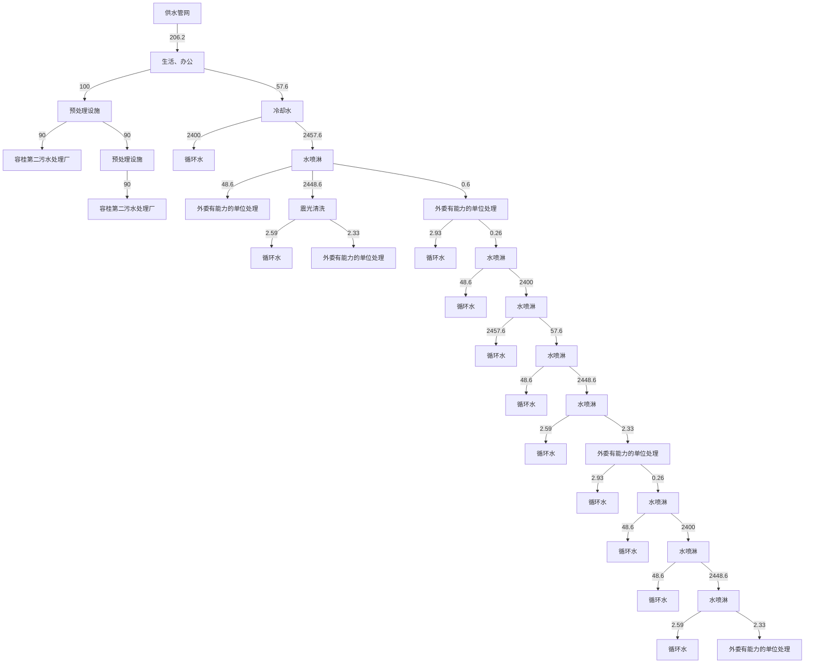
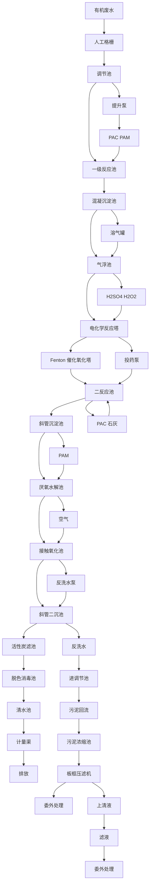

# 建设项目环境影响报告表

(污染影响类)

项目名称：佛山市品聚五金有限公司

年产五金配件50万新建项目

建设单位（盖章）：佛山安鑫品聚五金有限公司

编制日期：2022年09月

中华人民 竞部制

text_image

北京市鑫茂环和
共和国生态环境

编制单位和编制人员情况表

<table><tr><td colspan="2">项目编号</td><td colspan="3">hpk529</td></tr><tr><td colspan="2">建设项目名称</td><td colspan="3">佛山市鑫品聚五金有限公司年产五金配件50万套新建项目</td></tr><tr><td colspan="2">建设项目类别</td><td colspan="3">30-068铸造及其他金属制品制造</td></tr><tr><td colspan="2">环境影响评价文件类型</td><td colspan="3">报告:</td></tr><tr><td colspan="5">一、建设单位情况</td></tr><tr><td colspan="2">单位名称(盖章)</td><td colspan="3">佛山</td></tr><tr><td colspan="2">统一社会信用代码</td><td colspan="3">91440</td></tr><tr><td colspan="2">法定代表人(签章)</td><td rowspan="3" colspan="3"></td></tr><tr><td colspan="2">主要负责人(签字)</td></tr><tr><td colspan="2">直接负责的主管人员(签字)</td></tr><tr><td colspan="5">二、编制单位情况</td></tr><tr><td colspan="2">单位名称(盖章)</td><td colspan="3">深圳</td></tr><tr><td colspan="2">统一社会信用代码</td><td colspan="3">91440</td></tr><tr><td colspan="5">三、编制人员情况</td></tr><tr><td colspan="5">1.编制主持人</td></tr><tr><td>姓名</td><td colspan="2">职业资格证书管理号</td><td>信用编号</td><td>签字</td></tr><tr><td></td><td colspan="2"></td><td></td><td></td></tr></table>

# 一、建设项目基本情况

<table><tr><td>建设项目名称</td><td colspan="3">佛山市鑫品聚五金有限公司年产五金配件50万套新建项目</td></tr><tr><td>项目代码</td><td colspan="3">/</td></tr><tr><td>建设单位联系人</td><td>江*</td><td>联系方式</td><td>186**</td></tr><tr><td>建设地点</td><td colspan="3">广东省佛山市顺德区容桂街道华口社区华天南一路16号B座首层之五</td></tr><tr><td>地理坐标</td><td colspan="3">东经113度20分30.193秒,北纬22度45分54.866秒</td></tr><tr><td>国民经济行业类别</td><td>C3399其他未列明金属制品制造</td><td>建设项目行业类别</td><td>三十、金属制品业;68铸造及其他金属制品制造</td></tr><tr><td>建设性质</td><td>☑新建(迁建)□改建☑扩建□技术改造</td><td>建设项目申报情形</td><td>☑首次申报项目□不予批准后再次申报项目□超五年重新审核项目□重大变动重新报批项目</td></tr><tr><td>项目审批(核准/备案)部门(选填)</td><td>/</td><td>项目审批(核准/备案)文号(选填)</td><td>/</td></tr><tr><td>总投资(万元)</td><td>100</td><td>环保投资(万元)</td><td>10</td></tr><tr><td>环保投资占比(%)</td><td>10</td><td>施工工期</td><td>2个月</td></tr><tr><td>是否开工建设</td><td>☑否□是: _</td><td>用地(用海)面积(m2)</td><td>1000</td></tr><tr><td>专项评价设置情况</td><td colspan="3">无</td></tr><tr><td>规划情况</td><td colspan="3">无</td></tr><tr><td>规划环境影响评价情况</td><td colspan="3">无</td></tr><tr><td>规划及规划环境影响评价符合性分析</td><td colspan="3">无</td></tr><tr><td>其他符合性分析</td><td colspan="3">1、产业政策符合性分析根据国家《产业结构调整指导目录(2019年本)》,项目不属于上述目录所列的鼓励类、限制类和禁止(淘汰)类项目,符合国家有关法律、法规和政策规定。2、选址符合性分析根据《顺德高新技术产业开发区综合加工园第五期控制性详细规划》可知,该项目选址所在地为工业区,用地符合规划要求。</td></tr></table>

# 3、与《顺德区“三线一单”生态环境分区管控方案》相符性分析生态保护红线：

根据《广东省人民政府关于印发广东省“三线一单”生态环境分区管控方案的通知》（粤府〔2020〕71号）、《佛山市人民政府关于印发佛山市“三线一单”生态环境分区管控方案的通知》（佛府〔2021〕11号)以及《佛山市顺德区人民政府关于印发佛山市顺德区“三线一单”生态环境分区管控方案的通知》(顺府发〔2021〕11 号）三个文件，广东省、佛山市、顺德区三级生态保护红线均暂时采用2020年广东省人民政府报送自然资源部、生态环境部的版本；一般生态空间与后续发布的生态保护红线进行衔接。

经查阅2020年广东省人民政府报送自然资源部、生态环境部的生态保护红线版本，本项目不涉及生态保护红线。

# 环境质量底线：

根据2021年全区的大气环境质量状况公报，除O3年均浓度超过《环境空气质量标准》（GB3095-2012）及 2018年修改单二级标准限值外，其余五项基本污染物指标浓度均能达到《环境空气质量标准》（GB3095-2012）及2018 年修改单二级标准限值；项目纳污水体鸡鸦水道南头大桥断面监测的水质达到《地表水环境质量标准》（GB3838-2002）Ⅲ类标准。

本项目生活污水经预处理设施处理达标后排至容桂第二污水处理厂处理，尾水排入鸡鸦水道，然后汇入洪奇沥水道。压铸熔炉烟尘与脱模废气收集后经水喷淋进行处理，处理达标后通过排气筒G1（15m）引至楼顶排放；去毛刺、机加工粉尘在车间自然沉降；打砂粉尘经布袋除尘后在车间无组织排放，以上废水废气均可达标排放，因此本项目的建设不会突破当地环境质量底线。

综合分析，本项目的建设不会突破当地环境质量底线。

# 资源利用上线：

本项目运营期所用的资源主要为水资源、电能。

本项目给水由市政供水接入，电能由区域电网供应，符合《佛山市顺德区人民政府关于印发佛山市顺德区“三线一单”生态环境分区管控方案的通知》（顺府发〔2021〕11号）文件中的能源资源利用要求，不会突破当地的资源利用上线。项目所在地用途为工业用途，符合当地土地规划要求。

# 生态环境准入清单：

本项目不在《产业结构调整指导目录（2019年本》限制类、淘汰类之列，不属于《市场准入负面清单（2022 年版）》中规定的禁止和许可准入的行业类别。项目产品不属于《环境保护综合名录》（2021年版）中“高污染、高环境风险”产品，不属于《促进产业结构调整暂行规定》中限制类、淘汰类之列，符合规定要求。项目不属于《顺德区村级工业园升级改造项目产业准入负面清单》（2019年本）中限制类和禁止类。

本项目属于重点管控区（环境管控单元编码：ZH44060620001）。根据项目产品、原材料、工艺等分析，本项目不属于单元“空间布局约束”中产业/限制类、大气/限制类，不属于单元“能源资源利用”中土地资源/限制类、岸线/禁止类，不属于单元“污染物排放管控”中的水/限制类。

综上，本项目符合“三线一单”要求。

# 4、与佛山市“三线一单”生态环境分区管控方案相符性分析

根据《佛山市人民政府关于印发佛山市“三线一单”生态环境分区管控方案的通知》（佛府〔2021〕11号）发布的佛山市环境管控单元图，项目属于重点管控区（环境管控单元编码：ZH44060620001）。项目总体符合重点管控单元的要求。具体分析详见与佛山市顺德区“三线一单”生态环境分区管控方案相符性分析。

# 5、与广东省“三线一单”生态环境分区管控方案相符性分析

根据《广东省人民政府关于印发广东省“三线一单”生态环境分区管控方案的通知》（粤府〔2020〕71号），广东省将以环境管控单元为基础，实施生态环境分区管控，精细化管理、保护生态环境。本项目与广东省“三线一单”生态环境分区管控方案相符性分析如下：

①与“一核一带一区”区域管控要求的相符性

1）项目位于珠三角核心区，主要从事五金配件生产，不属于区域布局管控要求中的禁止新建、扩建水泥、平板玻璃、化学制浆、生皮制革以及国家规划外的钢铁、原油加工等项目。项目不涉及使用高挥发性原辅材料，不属于新建生产和使用高挥发性有机物原辅材料的项目，符合区域布局管控要求。  
2）本项目全部生产设备使用电能，生产用水由市政供水，不直接取用江河湖库水量，不会对项目所在地生态流量造成影响，符合能源利用要求。  
3）项目产生的生活污水经预处理设施处理达标后排至容桂第二污水处理厂处理，尾水排入鸡鸦水道。鸡鸦水道南头大桥断面水质均达到《地表水环境质量标准》（GB3838 -2002）之Ⅲ类水功能要求。CODCr、NH3-N无需实施本行政区域内减量替代，总量纳入污水处理厂的总量指标内，符合污染物排放管控要求。  
4）项目位于佛山市顺德区容桂街道，不属于石化、化工重点园区环境风险防控区域。项目产生的危险废物拟定期委托有资质的处置公司进行收集处理，并通过信息系统登记转移计划和电子转移联单，符合危险废物全过程跟踪管理的防控要求。

# ②与环境管控单元总体管控要求的相符性

根据《广东省人民政府关于印发广东省“三线一单”生态环境分区管控方案的通知》（粤府〔2020〕71号）发布的广东省环境管控单元图，项目所在地为重点管控单元，项目产生的生活污水经预处理设施处理达标后排至容桂第二污水处理厂处理；压铸熔炉烟尘与脱模废气收集后经水喷淋进行处理，处理达标后通过排气筒G1（15m）引至楼顶排放；去毛刺、机加工粉尘在车间自然沉降；打砂粉尘经布袋除尘后在车间无组织排放，符合重点管控单元的要求。

项目总体符合重点管控单元的要求。具体分析详见与佛山市顺德区“三线一单”生态环境分区管控方案相符性分析。

表 1-1 项目与广东省佛山市顺德区重点管控单元 1 准入清单的相符性分析（ZH44060620001）

<table><tr><td>管控维度</td><td>管控要求</td><td>项目情况</td><td>符合性</td></tr><tr><td rowspan="5">区域布局管控</td><td>1-1.【产业/鼓励引导类】重点发展芯片、智能家电、高端装备制造、高端新型电子信息、新材料、生命健康等制造业和金融、科技服务、高端商贸等现代服务业,建设科技研发、创新创业基地、上市企业总部聚集区、企业品牌总部基地。</td><td>本项目不涉及。</td><td>符合</td></tr><tr><td>1-2.【产业/综合类】系统推进村级工业园升级改造,腾出连片空间,布局产业集聚区和主题产业园,推动工业项目入园集聚发展。新增工业制造业用地原则上安排在产业集聚区内,产业集聚区外原则上不鼓励工业及物流仓储用地的新建与改造。新增工业制造业用地原则上安排在产业集聚区内,产业集聚区外原则上不鼓励工业及物流仓储用地的新建与改造。</td><td>本项目不涉及。</td><td>符合</td></tr><tr><td>1-3.【产业/限制类】受纳水体或监控断面不达标的,不得新建、扩建向河涌直接排放废水的项目。新建、扩建含蚀刻工序的线路板生产项目和化工项目应在配套污水集中处置的工业园区或生活污水管网覆盖区域内建设;纯加工型印花项目,含酸洗、磷化的金属表面处理、金属制品项目(与自身高新技术企业配套的除外),含酸洗、喷涂、拉丝、表面抛光等工艺的不锈钢型材加工项目,应进入以此类项目为主导产业、有相应废水集中治理设施的工业园区,实现集中治污。</td><td>1项目产生的生活污水经预处理设施处理达标后排至容桂第二污水处理厂处理,尾水排入鸡鸦水道。鸡鸦水道南头大桥断面水质均达到《地表水环境质量标准》(GB3838-2002)之III类水功能要求。2项目所属C3399其他未列明金属制品制造,不属于以下项目:含蚀刻工序的线路板生产项目和化工项目;纯加工型印花项目,含酸洗、磷化的金属表面处理、金属制品项目(与自身高新技术企业配套的除外),含酸洗、喷涂、拉丝、表面抛光等工艺的不锈钢型材加工项目。</td><td>符合</td></tr><tr><td>1-4.【大气/限制类】大气环境受体敏感重点管控区内,应严格限制新建储油库项目、产生和排放有毒有害大气污染物的建设项目以及使用溶剂型油墨、涂料、清洗剂、胶黏剂等高挥发性有机物原辅材料项目,鼓励现有该类项目搬迁退出。</td><td>本项目不涉及。</td><td>符合</td></tr><tr><td>1-5.【大气/鼓励引导类】大气环境高排放重点管控区内,应强化达标监管,引导工业项目落地集聚发展,有序推进区域内行业企业提标改造。</td><td>本项目不涉及。</td><td>符合</td></tr><tr><td></td><td>1-6.【土壤/禁止类】禁止新建、扩建增加重点防控的重金属污染物排放的建设项目。</td><td>本项目不涉及。</td><td>符合</td></tr><tr><td rowspan="6">能源资源利用</td><td>2-1【能源/鼓励引导类】推广节能技术,加快发展绿色货运与现代物流。</td><td>本项目不涉及。</td><td>符合</td></tr><tr><td>2-2【能源/鼓励引导类】推广新能源汽车应用和充电基础设施建设,积极推动重卡LNG加气站、充电基础设施、加氢站建设。</td><td>本项目不涉及。</td><td>符合</td></tr><tr><td>2-3.【能源/综合类】科学实施能源消费总量和强度“双控”,新建高能耗项目单位产品(产值)能耗达到国际国内先进水平。</td><td>本项目不涉及。</td><td>符合</td></tr><tr><td>2-4.【水资源/综合类】贯彻落实“节水优先”方针,实行最严格水资源管理制度,容桂街道万元国内生产总值用水量、万元工业增加值用水量、用水总量、农田灌溉水有效利用系数等用水总量和效率指标达到区下达要求。</td><td>本项目不涉及。</td><td>符合</td></tr><tr><td>2-5.【土地资源/限制类】落实单位土地面积投资强度、土地利用强度等建设用地控制性指标要求,提高土地利用效率。</td><td>本项目不涉及。</td><td>符合</td></tr><tr><td>2-6.【岸线/禁止类】严格水域岸线用途管制,新建项目一律不得违规占用水域。严禁破坏生态的岸线利用行为和不符合其功能定位的开发建设活动,严禁以各种名义侵占河道、围垦湖泊、非法采砂等。</td><td>项目所在厂房已建成,项目未违规占用水域,不会破坏生态的岸线利用行为和做不符合其功能定位的开发建设活动,不以侵占河道、围垦湖泊、非法采砂等。</td><td>符合</td></tr><tr><td rowspan="3">污染物排放管控</td><td>3-1.【水/限制类】城镇新区建设实行雨污分流,逐步推进初期雨水收集、处理和资源化利用。住宅、商业体、学校、市场等城镇开发建设项目应当配套或者同步计划建设公共排水设施,公共排水设施或自建排污水设施未能投产运行的,以上涉水项目不得投入使用。新建小区严格实施雨污分流,阳台、露台等污水接入污水收集系统,将生活污水“应截尽截”。做好大型楼盘、集贸市场、餐饮以及学校等4大类排水户污水接入市政管网工作。</td><td>本项目不涉及。</td><td>符合</td></tr><tr><td>3-2.【水/综合类】容桂街道重点河涌水质上年度未达到水环境环境质量目标的,需组织编制、系统实施、向社会公开区域重点水污染物减排计划并明确“替代量”,本年度新建、改建、扩建项目新增水环境重点污染物实行区域“减二增一”替代(工业、生活或综合集中废水处理设施、民生项目除外)。</td><td>项目产生的生活污水经处理达标后排入容桂第二污水处理厂,尾水排入鸡鸦水道后汇入洪奇沥水道</td><td></td></tr><tr><td>3-3.【水/综合类】区域内应合理规划建设工业或综合集中废水处理设施。逐步推进工业集聚区“污水零直排区”建设,开展排水单元工业废水、生活污水、雨水分类收集、分质处理,确保园区“管网全覆盖、雨污全分流、污水全收集、处理全达标”。</td><td>本项目不涉及。</td><td>符合</td></tr><tr><td rowspan="3"></td><td>3-4.【水/综合类】结合村级工业园改造,全面提升产业层次与集聚度,促进污染集中整治。</td><td>本项目不涉及。</td><td>符合</td></tr><tr><td>3-5.【水/综合类】稳步推进排水设施“三个一体化”管理模式,补齐城乡污水收集和处理短板,推动容桂第一、第二污水处理厂提质增效,加快消除城中村、老旧城区、城乡结合部等污水收集管网空白区,逐步实现城乡污水收集处理全覆盖。2025年前完成容桂第一、第二污水处理厂扩建,尾水应执行《城镇污水处理厂污染物排放标准》(GB18918-2002)一级A标准及《广东省水污染物排放限值》(DB44/26-2001)的较严值。</td><td>本项目不涉及。</td><td>符合</td></tr><tr><td>3-6.【水/综合类】近期保留马东、马南两处污水处理站,到2030年将马冈村居污水接入市政污水管网,纳入杏坛城镇污水处理系统;其余行政村(社区)污水均通过市政管网和农村支管纳入容桂城镇污水处理处理系统。</td><td>项目产生的生活污水经处理达标后排入容桂第二污水处理厂,尾水排入鸡鸦水道后汇入洪奇沥水道。</td><td>符合</td></tr><tr><td rowspan="2">环境风险防控</td><td>4-1.【水/综合类】容桂第一、第二污水处理厂、工业污水集中处理设施应采取有效措施,防止事故废水直接排入水体。完善污水处理厂在线监控系统联网,实现污水处理厂的实时、动态监管。</td><td>本项目不涉及。</td><td>符合</td></tr><tr><td>4-2.【风险/综合类】加强环境风险分级分类管理,强化金属制品、有色金属和压延加工、化学原料和化学品制造业等涉重金属、化工行业企业及工业园区等重点环境风险源的环境风险防控。</td><td>项目通过采取防止泄漏措施,在火灾和爆炸事故次生灾害时,可通过封堵厂区门口,采取紧急疏散等措施,其环境风险总体是可控的。</td><td>符合</td></tr></table>

# 二、建设项目工程分析

<table><tr><td rowspan="11">建设内容</td><td colspan="4">佛山市鑫品聚五金有限公司拟建于广东省佛山市顺德区容桂街道华口社区华天南一路16号B座首层之五,所在地中心地理坐标为东经113度20分30.193秒,北纬22度45分54.866秒。项目所使用的经营和生产场所为租赁厂房。本项目主要从事五金配件生产,年产五金配件50万套。项目占地面积和经营面积均为 $1000m^{2}$ ,项目所在建筑共1层。项目东面为佛山市优普电器科技有限公司,南面为佛山市灶宝电器科技有限公司,西面为华天西三路,北面为佛山市顺德区千牧电器有限公司。2.1项目组成项目具体工程组成见下表:表2-1项目工程组成</td></tr><tr><td>项目</td><td>内容</td><td>规模</td><td>用途</td></tr><tr><td>主体工程</td><td>生产车间</td><td>1个,面积约 $1000m^{2}$ </td><td>从事生产活动</td></tr><tr><td>仓储工程</td><td>仓库</td><td>--</td><td>在生产车间内,用于存放原料和成品</td></tr><tr><td>辅助工程</td><td>办公室</td><td>--</td><td>在生产车间内,用于办公用途</td></tr><tr><td rowspan="2">公用工程</td><td>配电系统</td><td>一套</td><td>供应生产和生活用电</td></tr><tr><td>给排水系统</td><td>各一套</td><td>供水来源为市政自来水,生活污水经预处理设施处理达标后排至容桂第二污水处理厂处理</td></tr><tr><td rowspan="4">环保工程</td><td>预处理设施</td><td>一套</td><td>对生活污水进行处理</td></tr><tr><td>水喷淋</td><td>一套</td><td>压铸熔炉烟尘与脱模废气收集后经水喷淋进行处理,处理达标后通过排气筒G1(15m)引至楼顶排放</td></tr><tr><td>布袋除尘器</td><td>一套</td><td>打砂粉尘经布袋除尘后在车间无组织排放</td></tr><tr><td>危险废物暂存点</td><td>一个</td><td>危险废物暂存</td></tr></table>

# 2、主要产品及产能

项目主要产品及年产量见下表 2-2。

表 2-2 项目主要产品种类及规模

<table><tr><td>类别</td><td>名称</td><td>单位</td><td>数量</td></tr><tr><td>产品产量</td><td>五金配件</td><td>万套/年</td><td>50</td></tr></table>

# 3、主要设备

本项目主要设备见表 2-3。

表 2-3 项目主要设备一览表

<table><tr><td rowspan="2">项目</td><td rowspan="2">名称</td><td rowspan="2">单位</td><td rowspan="2">数量</td><td colspan="3">设施参数</td><td rowspan="2">备注</td></tr><tr><td>参数名称</td><td>设计值</td><td>计量单位</td></tr><tr><td rowspan="11">主要设备</td><td rowspan="2">压铸机</td><td rowspan="2">台</td><td rowspan="2">3</td><td>功率</td><td>5</td><td>kw</td><td rowspan="2"></td></tr><tr><td>每小时最大工况</td><td>22</td><td>kg/h</td></tr><tr><td>电熔炉</td><td>台</td><td>3</td><td>功率</td><td>5</td><td>kw</td><td></td></tr><tr><td>冷却塔</td><td>台</td><td>1</td><td>/</td><td>/</td><td>/</td><td>辅助设备,对压铸设备进行冷却</td></tr><tr><td>打砂机</td><td>台</td><td>1</td><td>功率</td><td>5</td><td>kw</td><td></td></tr><tr><td>滚筒机</td><td>台</td><td>1</td><td>功率</td><td>1</td><td>kw</td><td>用于工件去毛刺工序</td></tr><tr><td>钻机</td><td>台</td><td>3</td><td>功率</td><td>1</td><td>kw</td><td></td></tr><tr><td>数控机</td><td>台</td><td>6</td><td>功率</td><td>1</td><td>kw</td><td></td></tr><tr><td>钻床</td><td>台</td><td>9</td><td>功率</td><td>1</td><td>kw</td><td></td></tr><tr><td>空压机</td><td>台</td><td>1</td><td>/</td><td>/</td><td>/</td><td>辅助设备</td></tr><tr><td>震光机</td><td>台</td><td>1</td><td>功率</td><td>5</td><td>kw</td><td>配套清洗槽1个,清洗槽尺寸为:长1m×宽0.9m×深0.9m</td></tr></table>

# 4、项目原辅材料

项目主要原辅材料的种类和用量见表2-4。

表 2-4 主要原辅材料情况一览表

<table><tr><td>项目</td><td>名称</td><td>单位</td><td>数量</td><td>备注</td></tr><tr><td rowspan="3">主要原辅材料用量</td><td>铝锭</td><td>吨/年</td><td>138</td><td></td></tr><tr><td>锌锭</td><td>吨/年</td><td>20</td><td></td></tr><tr><td>铜件</td><td>吨/年</td><td>100</td><td></td></tr><tr><td></td><td>脱模剂</td><td>吨/年</td><td>1</td><td>10kg/桶,最大储存量为0.05t</td></tr></table>

表 2-5 本项目化学品主要组分一览表

<table><tr><td>原辅材料</td><td>性质</td><td>备注</td></tr><tr><td>脱模剂</td><td>1、主要成份为:改性硅油 15%,有机脂肪酯类 1-5%,乳化剂 8-11%,氧化聚乙烯蜡 5%,水 65%,其它有效成分 5%。2、脱模性优良,对于喷雾脱模剂表面张力在 17~23 N/m 之间。具有耐热性,受热不发生分解。化学性能稳定,不与成型产品发生化学反应。不影响塑料的二次加工性能。不腐蚀模具,不污染制品,气味和毒性小。外观光滑美观,易涂布,生产效率高。(用于压铸工序)</td><td>按改性硅油、有机脂肪酯、氧化聚乙烯蜡 100%挥发成油雾颗粒物,则颗粒物产生系数按 25%算</td></tr></table>

# 5、劳动定员和工作制度

从业人数为 10 人，年工作 300天，每天工作 8 小时，每天工作时间为 08:00-12:00，14:00-18:00，项目不设宿舍，不设饭堂。

# 6、能源及水耗

表 2-6 能源及水耗一览表

<table><tr><td>类别</td><td>名称</td><td>单位</td><td>数量</td></tr><tr><td rowspan="3">能源及水耗</td><td>电</td><td>万千瓦时/年</td><td>5</td></tr><tr><td>生活用水</td><td>吨/年</td><td>100</td></tr><tr><td>生产用水</td><td>吨/年</td><td>106.2</td></tr></table>

flowchart

图 2-1 项目水平衡图

<table><tr><td></td><td>7、厂区平面布置项目各生产区相对独立,互不干扰,每个生产区按照工艺流程布置设备,因此,项目平面布置做到了生产、办公分开,车间内布置流畅,总体来说项目平面布置紧凑有序,布局合理。项目平面布置图详见附图4。</td></tr><tr><td>工艺流程和产排污环节</td><td>图2-1 项目产品生产工艺流程工艺流程说明:本项目将外购回来的铝锭、锌锭在熔炉中熔炼成熔融状态,熔炉用电加热至430-630°C,然后往压铸机中分少量加入熔炼后的液态金属,用压铸机将液态金属压铸成型。再去除工件上的毛刺,接着工件进入打砂加工工序,打砂的原理是借助压缩空气动力,将磨料喷射到工件表面进行冲击研磨,把表面的杂质、杂色及氧化层清除掉,同时使介质表面粗化,使基材表面残余应力和提高基材表面硬度的作用。根据产品需要对压铸件、外购的铜材进行钻孔、切削等机械加工,加工后得到</td></tr></table>

压铸件、铜件。机加工后的工件，部分直接进入装配工序，部分需经震光机进行清洗，去除工件表面的金属边角料，清洗过程不需添加药剂。以上工件经装配后得到成品。

表2-7 项目产污环节汇总表

<table><tr><td>序号</td><td>污染类别</td><td>排放口(编号、名称)/污染源</td><td>主要污染因子</td><td>产生环节</td><td>处理排放方式</td></tr><tr><td rowspan="3">1</td><td rowspan="3">废气</td><td>有组织排放(G1排放口)</td><td>颗粒物</td><td>压铸熔炉与脱模</td><td>压铸熔炉烟尘与脱模废气收集后经水喷淋进行处理,处理达标后通过排气筒G1(15m)引至楼顶排放</td></tr><tr><td>无组织排放</td><td>颗粒物</td><td>去毛刺、机加工</td><td>自然沉降</td></tr><tr><td>无组织排放</td><td>颗粒物</td><td>打砂</td><td>经布袋除尘后在车间无组织排放</td></tr><tr><td rowspan="2">2</td><td rowspan="2">废水</td><td>生活污水</td><td> $COD_{Cr}$ 、 $BOD_5$ 、 $NH_3-N$ 和SS</td><td>生活</td><td>经预处理设施进行处理达标后排至容桂第二污水处理厂处理</td></tr><tr><td>生产废水</td><td> $COD_{Cr}$ 、SS、 $BOD_5$ 、石油类等</td><td>水喷淋、震光清洗</td><td>水喷淋的水循环使用,多次循环后需定期更换,清洗废水定期更换,建设单位将生产废水收集于胶罐中,并委托有处理能力的单位定期处理,不外排</td></tr><tr><td rowspan="5">3</td><td rowspan="5">固废</td><td>生活垃圾</td><td>/</td><td>生活</td><td>生活垃圾由环卫部门及时清运</td></tr><tr><td>次品及边角料</td><td rowspan="2">一般工业固体废物</td><td>生产过程</td><td rowspan="2">分类收集后外卖给回收商</td></tr><tr><td>收集的粉尘</td><td>生产过程</td></tr><tr><td>废机油</td><td rowspan="2">危险废物</td><td>设备维修</td><td rowspan="2">定期交有相应资质的危废单位回收处理</td></tr><tr><td>废含油抹布</td><td>设备维修</td></tr><tr><td>4</td><td>噪声</td><td>噪声</td><td>等效A声级</td><td>全厂设备</td><td>车间设备合理布局,厂房建筑隔声;采取降噪措施</td></tr></table>

与项目有关的原有环境污染问题

本项目为新建，租赁已建的工业厂房简单装修后进行生产，没有与项目有关的原有环境污染问题。

# 三、区域环境质量现状、环境保护目标及评价标准

<table><tr><td rowspan="10">区域环境质量现状</td><td colspan="4">建设项目所在地区域环境现状及主要环境问题(环境空气、地面水、地下水、声环境、生态环境等)本项目拟选址环境功能属性表表3-1 建设项目所在地环境功能属性</td></tr><tr><td>编号</td><td>功能区名称</td><td>功能区确定依据</td><td>功能区类别及属性</td></tr><tr><td>1</td><td>水环境功能区</td><td>《关于同意实施广东省地表水环境功能区划的批复》(粤府函[2011]29号)</td><td>鸡鸦水道(编号21942)、洪奇沥水道(编号36700)为III类水体功能,主要功能为工农渔</td></tr><tr><td>2</td><td>环境空气质量功能区</td><td>《关于调整顺德区环境空气质量功能区划的复函》(佛府办函〔2014〕494号)</td><td>大气环境二类功能区</td></tr><tr><td>3</td><td>声环境功能区</td><td>《关于印发佛山市声环境功能区划分方案的通知》(佛府函〔2015〕72号)</td><td>容桂东部工业片区,3类功能区,编号3303</td></tr><tr><td>4</td><td>基本农田保护区</td><td>《顺德区土地利用总体规划(2010-2020)》(粤府函[2011]37号)</td><td>否</td></tr><tr><td>5</td><td>风景名胜区、自然保护区、森林公园、重点生态功能区</td><td>《广东省主体功能区划》(粤府〔2012〕120号)</td><td>否</td></tr><tr><td>6</td><td>重点文物保护单位</td><td>《顺德区文物保护单位名录》</td><td>否</td></tr><tr><td>7</td><td>是否属于水源保护区</td><td>《广东省人民政府关于调整佛山市部分饮用水水源保护区的批复》(粤府函〔2018〕426号),《关于广州市南洲水厂顺德水道取水口水源保护区划定方案批复》(粤府函[2004]95号)等</td><td>否</td></tr><tr><td>8</td><td>是否污水处理厂纳污范围</td><td>---</td><td>是,属于容桂第二污水处理厂纳污范围</td></tr></table>

# 1、大气环境

根据《佛山市生态环境局顺德分局关于发布 2021 年度佛山市顺德区生态环境状况公报的通知》（佛环顺函〔2022〕13 号），2021 年顺德区空气质量综合指数为3.48，比2020 年上升5.5%，在全市五区中排名第二。

2021 年全区二氧化硫 $( \mathrm { S O } _ { 2 } )$ 、二氧化氮（NO2）、可吸入颗粒物 $\left( \mathrm { P M } _ { 1 0 } \right)$ 、细颗粒物 $\left( \mathbf { P M } _ { 2 . 5 } \right)$ 平均浓度分别为 6、33、42、22 微克/立方米，臭氧年评价浓度为 173 微克/立方米，一氧化碳（CO）年评价浓度为1.0 毫克/立方米。详见下表。

表3-2 2021年顺德区（国控测点）环境空气污染物达标判定情况

<table><tr><td>污染物</td><td>浓度均值</td><td>评价标准</td><td>达标情况</td></tr><tr><td> $SO_{2}$ (μg/m3)</td><td>6</td><td>60</td><td>达标</td></tr><tr><td> $NO_{2}$ (μg/m3)</td><td>33</td><td>40</td><td>达标</td></tr><tr><td> $PM_{10}$ (μg/m3)</td><td>42</td><td>70</td><td>达标</td></tr><tr><td> $PM_{2.5}$ (μg/m3)</td><td>22</td><td>35</td><td>达标</td></tr><tr><td> $CO^{*}$ (mg/m3)</td><td>1.0</td><td>4</td><td>达标</td></tr><tr><td> $O_{3}-8H^{*}$ (μg/m3)</td><td>173</td><td>160</td><td>超标</td></tr></table>

\*注：（1）表中 CO 为年内日平均值的第 95 百分位数， $\mathrm { O } _ { 3 }$ 为年内日最大 8 小时平均值的第 90 百分位数。（2）2020 年公报中的环境空气质量统计分析数据均采用实况数据。

根据 2021年全区的大气环境质量状况公报 $\mathrm { O } _ { 3 }$ （臭氧）浓度超过了《环境空气质量标准》（GB3095-2012）及 2018 年修改单中的二级标准限值，故顺德区大气环境质量属不达标区。

为了解评价区域周围地区TSP的现状情况，项目引用《佛山市顺德区铿润五金电器有限公司新建项目环境影响报告书》（佛环03环审〔2021〕第0013号）委托江门市中环检测技术有限公司于 2020年7月16日\~22 日在颐安御景湾的特征污染物监测数据。监测点距离本项目边界最近距离约4.5m，监测点位位置说明见表3-3示。

表 3-3 各特征污染物引用监测点位基本信息

<table><tr><td>监测点名称</td><td>监测因子</td><td>监测时段</td><td>相对厂址方位</td><td>相对厂界距离/km</td></tr><tr><td>G1颐安御景湾</td><td>TSP</td><td>24小时</td><td>西北面</td><td>4.5</td></tr></table>

根据监测报告，项目所在区域各特征污染物现状监测结果见表3-4所示。

表 3-4 各特征污染物现状监测结果

<table><tr><td>监测点名称</td><td>监测因子</td><td>监测时段</td><td>评价标准(mg/m3)</td><td>监测浓度范围(mg/m3)</td><td>最大浓度占标率/%</td><td>超标率/%</td><td>达标情况</td></tr><tr><td>G1颐安御景湾</td><td>TSP</td><td>24小时</td><td>0.3</td><td>0.128~0.155</td><td>51.67</td><td>0</td><td>达标</td></tr></table>

在 7 天的监测时间内，监测点 TSP 监测结果达到了《环境空气质量标准》（GB3095-2012）的二级标准要求。

# 2、地表水

生活污水经预处理设施处理达标后排至容桂第二污水处理厂处理，尾水排入鸡鸦水道后汇入洪奇沥水道，鸡鸦水道、洪奇沥水道水质执行《地表水环境质量标准》（GB3838-2002）Ⅲ类水质标准。

桂洲水道南头大桥断面属21943鸡鸦水道河段范围内，为评价鸡鸦水道水质，参考《佛山市生态环境局顺德分局关于发布 2021年度佛山市顺德区生态环境状况公报的通知》（佛环顺函〔2022〕13号），2021年全区地表水环境质量保持稳定，4个饮用水源监控断面每月均达标，年均值水质均达到Ⅱ类；3个国控断面（科研断面羊额、考核断面乌洲、顺德港）、3 个省控断面（杨滘、海凌、飞鹅山）均达到相应的水质目标。项目纳污水体鸡鸦水道南头大桥断面监测的水质达到了Ⅲ类标准要求，水质良好。

# 3、声环境

本项目为新建项目，项目厂界外50m 范围内无环境敏感目标，无需开展声环境现状调查。

# 4、生态环境

项目用地范围内无生态环境保护目标，无需开展生态现状调查。

# 5、电磁辐射

项目不涉及电磁辐射，无需开展电磁辐射现状调查。

# 6、土壤、地下水环境

项目不存在土壤、地下水环境污染途径，不开展土壤、地下水环境质量现状调查。

<table><tr><td rowspan="4">环境保护目标</td><td colspan="7">1、大气环境项目周围主要大气环境保护目标见表3-5。表3-5 主要环境保护目标</td></tr><tr><td>序号</td><td>名称</td><td>保护对象</td><td>保护内容</td><td>环境功能区</td><td>相对厂址方位</td><td>相对厂界距离/m</td></tr><tr><td>1</td><td>中山市黄圃镇</td><td>住宅</td><td>人群</td><td>大气二类</td><td>南面</td><td>197</td></tr><tr><td colspan="7">2、声环境本项目厂界外50米范围内无声环境保护目标。3、地下水环境本项目厂界外500米范围内无地下水集中式饮用水水源和热水、矿泉水、温泉等特殊地下水资源。4、生态环境项目用地范围内无生态环境保护目标。</td></tr><tr><td rowspan="5">污染物排放控制标准</td><td colspan="7">1、水污染物排放标准:生活污水经处理达标后执行广东省地方标准《水污染物排放限值》(DB44/26-2001)第二时段三级标准,后排入容桂第二污水处理厂处理。根据2013年7月11日颁布的《顺德区环境运输和城市管理局关于全区城镇污水处理厂尾水排放执行标准的通知》规定:新、扩和改建城镇污水处理厂尾水应符合《城镇污水处理厂污染物排放标准》(GB18918-2002)一级A标准及广东省地方标准《水污染物排放限值》(DB44/26-2001)第二时段一级标准的较严值。表3-6 生活污水污染物排放标准限值 单位:pH值无量纲,其余为mg/L</td></tr><tr><td>指标</td><td>pH</td><td> $COD_{Cr}$ </td><td> $BOD_5$ </td><td> $NH_3-N$ </td><td>SS</td><td></td></tr><tr><td>厂区排放口标准</td><td>6~9</td><td>500</td><td>300</td><td>--</td><td>400</td><td></td></tr><tr><td>污水处理厂尾水排放标准</td><td>6~9</td><td>40</td><td>10</td><td>5</td><td>10</td><td></td></tr><tr><td colspan="7">2、大气污染物排放标准:项目金属件熔融压铸和脱模会产生少量烟尘、油雾颗粒物等,主要污染因子为颗粒物;去毛刺、打砂、机加工工序会产生少量粉尘,主要污染因子为颗粒物。压铸熔炉烟尘与脱模废气收集后经水喷淋进行处理,处理达标后通过排气筒G1</td></tr></table>

（15m）引至楼顶排放；去毛刺、机加工粉尘在车间自然沉降；打砂粉尘经布袋除尘后在车间无组织排放。

（1）项目有组织排放的颗粒物执行《铸造工业大气污染物排放标准》(GB39726—2020)表1大气污染物排放限值中的其他熔炼（化）炉限值；无组织排放颗粒物执行广东省地方标准《大气污染物排放限值》（DB44/27-2001）无组织排放监控点浓度限值。

根据《铸造工业大气污染物排放标准》(GB39726—2020)，颗粒物无组织排放控制要求如下：

表 3-7 颗粒物无组织排放控制要求

<table><tr><td>序号</td><td>政策要求</td><td>项目情况</td></tr><tr><td colspan="3">1.物料储存</td></tr><tr><td>1.1</td><td>煤粉、膨润土等粉状物料和硅砂应袋装或罐装,并储存于封闭储库或半封闭料场(堆棚)中。半封闭料场(堆棚)应至少两面有围墙(围挡)及屋顶</td><td>本项目不使用煤粉、膨润土等粉状物料和硅砂,其余原料均暂存在厂区生产车间内,生产车间有四面围墙及屋顶</td></tr><tr><td>1.2</td><td>生铁、废钢、焦炭和铁合金等粒状、块状散装物料应储存于封闭储库、料仓中,或储存于半封闭料场(堆棚)中,或四周设置防风抑尘网、挡风墙,或采取覆盖措施。半封闭料场(堆棚)应至少两面有围墙(围挡)及屋顶;防风抑尘网、挡风墙高度应不低于堆存物料高度的1.1倍</td><td>项目压铸工序使用的铝锭、锌锭为块状,暂存在厂区生产车间内,生产车间有四面围墙及屋顶</td></tr><tr><td colspan="3">2.物料转移和输送</td></tr><tr><td>2.1</td><td>粉状、粒状等易散发粉尘的物料厂内转移、输送过程,应封闭或采取覆盖等抑尘措施;转移、输送、装卸过程中产尘点应采取集气除尘措施,或喷淋(雾)等抑尘措施</td><td>项目压铸工序使用的铝锭为块状,转移、输送过程不会散发粉尘。</td></tr><tr><td>2.2</td><td>除尘器卸灰口应采取遮挡等抑尘措施,除尘灰不得直接卸落到地面。除尘灰采取袋装、罐装等密闭措施收集、存放和运输</td><td>本项目除尘器卸灰口应采取遮挡等抑尘措施,除尘灰不得直接卸落到地面。除尘灰采取袋装、罐装等密闭措施收集、存放和运输</td></tr><tr><td>2.3</td><td>厂区道路应硬化,并采取定期清扫、洒水等措施,保持清洁</td><td>厂区道路已硬化,并采取定期清扫,保持清洁</td></tr><tr><td colspan="3">3.铸造</td></tr><tr><td>3.1</td><td>孕育、变质、炉外精炼等金属液处理工序产尘点应安装集气罩,并配备除尘设施</td><td>本项目于压铸脱模工序产尘点安装集气罩,并配备除尘设施</td></tr><tr><td>3.2</td><td>造型、制芯、浇注工序产尘点应安装集气罩并配备除尘设施,或采取喷淋(雾)等抑尘措施</td><td>本项目于压铸脱模工序产尘点安装集气罩,并配备除尘设施</td></tr><tr><td>3.3</td><td>落砂、打砂清理、砂处理工序应在封闭空间内操作,废气收集至除尘设施;未在封闭空间内操作的,应采用固定式、移动式集气设备,并配备除尘设施</td><td>本项目设有打砂工序,打砂工序采用固定式集气设备,并配备除尘设施</td></tr><tr><td>3.4</td><td>清理(去除浇冒口、铲飞边毛刺等)和浇包、渣包的维修工序应在封闭空间内操作,废气收集至除尘设施;未在封闭空间内操作的,应采</td><td>本项目工件需去毛刺,去毛刺应在封闭空间内操作</td></tr></table>

<table><tr><td rowspan="2"></td><td></td><td colspan="3">用固定式、移动式集气设备并配备除尘设施,或采取喷淋(雾)等抑尘措施</td><td colspan="2"></td></tr><tr><td>3.5</td><td colspan="3">车间外不得有可见烟粉尘外逸</td><td colspan="2">车间外不得有可见烟粉尘外逸</td></tr><tr><td colspan="7">表3-8项目废气排放标准(有组织排放)</td></tr><tr><td rowspan="2" colspan="2">排气筒</td><td rowspan="2">工序</td><td rowspan="2">污染因子</td><td colspan="2">有组织</td><td rowspan="2">执行标准</td></tr><tr><td>最高允许排放浓度mg/m3</td><td>排放速率kg/h</td></tr><tr><td colspan="2">G1(15m)</td><td>压铸熔炉、脱模</td><td>颗粒物</td><td>30</td><td>/</td><td>GB39726-2020</td></tr><tr><td colspan="7">表3-9项目废气排放标准(无组织排放)</td></tr><tr><td colspan="3">项目</td><td>污染因子</td><td colspan="2">无组织排放浓度限值(mg/m3)</td><td>执行标准</td></tr><tr><td colspan="3">压铸熔炉、脱模、打砂</td><td>颗粒物</td><td colspan="2">1.0</td><td>DB44/27-2001</td></tr><tr><td colspan="7">3、噪声排放标准项目厂界执行《工业企业厂界环境噪声排放标准》(GB12348-2008)3类标准:(昼间≤65dB(A),夜间≤55dB(A))。4、固体废物控制标准固体废物执行《一般工业固体废物贮存和填埋污染控制标准》(GB18599-2020)。危险废物执行《国家危险废物名录》(2021年版)以及《危险废物贮存污染控制标准》(GB18597-2001)和2013年修改单。</td></tr><tr><td>总量控制指标</td><td colspan="6">本项目生活污水排放量为90m3/a,CODCr排放量为0.004t/a,NH3-N排放量为0.0005t/a。生活污水经预处理设施处理达标后排至容桂第二污水处理厂处理。根据《佛山市人民政府办公室关于印发佛山市排污权有偿使用和交易管理办法的通知》(佛府办〔2020〕19号),生活污水CODCr、NH3-N不分配总量。</td></tr></table>

# 四、主要环境影响和保护措施

<table><tr><td>施工期环境保护措施</td><td colspan="8">项目租用已经建设完毕的工业厂房,不涉及厂房建设,施工过程主要是内部装修和设备安装,没有基建工程,因此施工期间基本不存在大型土建工程,施工期间产生的影响主要是由于设备运输、安装时产生的噪声等。施工期建设方应严格遵守有关建筑施工的环境保护条例,防止运输扬尘,建筑垃圾、废物等及时清运,降低施工过程对周围环境造成的影响。施工期较短,因此如果项目建设方加强施工管理,那么项目施工时不会对周围环境造成较大的影响。</td></tr><tr><td rowspan="10">运营期环境影响和保护措施</td><td colspan="8">1、废气表4-1 项目废气产污环节、污染物种类、排放形式及污染防治设施一览表</td></tr><tr><td rowspan="2">生产工艺</td><td rowspan="2">产排污环节</td><td rowspan="2">污染物种类</td><td rowspan="2">排放形式</td><td colspan="2">污染防治设施</td><td rowspan="2">排放口类型</td><td></td></tr><tr><td>污染防治设施名称及工艺</td><td>是否为可行性技术</td><td></td></tr><tr><td>去毛刺、机加工</td><td>去毛刺、机加工</td><td>颗粒物</td><td>无组织</td><td>/</td><td>/</td><td>/</td><td></td></tr><tr><td>打砂</td><td>打砂</td><td>颗粒物</td><td>无组织</td><td>布袋除尘器</td><td>是</td><td>/</td><td></td></tr><tr><td>压铸熔炉与脱模</td><td>压铸熔炉与脱模</td><td>油雾颗粒物</td><td>有组织</td><td>水喷淋</td><td>是</td><td>一般排放口</td><td></td></tr><tr><td colspan="8">1.1 废气影响分析根据《通风设计手册》,采用上吸伞型罩,罩口排风量为L,L的计算公式如下:L=1.4*P*h*Vk*3600P—污染源周长,m;h—有害物至罩口的距离,m;Vk—罩口截面风速,m/s。表4-2项目车间风机风量一览表</td></tr><tr><td>排气筒</td><td>收集区域</td><td>收集方式</td><td>单个集气罩周长(m)</td><td>集气罩个数(个)</td><td>有害物至罩口的距离(m)</td><td>罩口截面风速(m/s)</td><td>罩口排风量(m3/h)</td></tr><tr><td>G1</td><td>电熔炉、压铸机</td><td>上吸罩</td><td>2</td><td>6</td><td>0.4</td><td>0.35</td><td>8467</td></tr><tr><td colspan="8">由上表可知,项目所需的风机风量为8467m3/h,考虑到收集管道弯道和接口损失,设计风量应预留余量,所以选用的风机风量为9000m3/h。本项目年工作日300天,每天工作8小时,因此废气年排放量为:</td></tr></table>

$$
9 0 0 0 \mathrm{m} ^ {3} / \mathrm{h} \times 3 0 0 \mathrm{d} \times 8 \mathrm{h} / \mathrm{d} = 9 0 0 0 \text {万} \mathrm{m} ^ {3} / \mathrm{a} 。
$$

综上，本项目废气收集效率按 80%核算。

# （二）上吸式排风

排风罩设在工艺设备上方时，罩口的流场分布及安装尺寸如图5-19所示。为避免横向气流影响，要求H尽可能小于或等于0.3a（a一罩口长边尺寸）。排风量按下式计算。

$$
L = K \cdot P \cdot H \cdot v _ {x} \quad \mathrm{m} ^ {4} / \mathrm{s} \tag {5-9}
$$

式中P——排风罩敞开面的周长，m；

H—罩口至有害物源的距离，m；

-边缘控制点的控制风速，m/s；

K——考虑沿高度分布不均匀的安全系数，通常取K=1.4。

图 4-1 引用相关手册原文截图（上吸式排风罩风量计算）

◇去毛刺粉尘

项目生产的压铸件需经滚筒去毛刺，去毛刺过程会产生少量的金属粉尘，其污染因子为颗粒物。

参考《排放源统计调查产排污核算方法和系数手册》中的机械行业系数手册（核算环节为预处理，产品为干式预处理件，原料为钢材（含板材、构件等）、铝材（含板材、构件等）、铝合金（含板材、构件等）、铁材、其它金属材料，工艺为抛丸、喷砂、打磨、滚筒，规模为所有规模），颗粒物产生系数为2.19kg/吨原料。项目压铸件小时最大去毛刺量为100kg/h，年去毛刺量为158t/a，则项目颗粒物产生速率为0.219kg/h，颗粒物产生量为 0.346t/a。

由于金属颗粒物比重较大，易于沉降，约90%可在操作区域附近沉降，沉降粉尘定期清理收集后作为一般工业废物回收处理，其余粉尘以无组织形式在车间内排放。项目去毛刺粉尘的产生及排放情况核算见表 4-4。

◇打砂粉尘

项目生产的压铸件需经打砂加工改善工件的性能，打砂过程会产生少量的金属粉尘，其污染因子为颗粒物。

参考《排放源统计调查产排污核算方法和系数手册》中的机械行业系数手册（核算环节为预处理，产品为干式预处理件，原料为钢材（含板材、构件等）、铝材（含板材、构件等）、铝合金（含板材、构件等）、铁材、其它金属材料，工艺为抛丸、喷砂、打磨、滚筒，规模为所有规模），颗粒物产生系数为2.19kg/吨原料。项目压铸件小时最大打砂量为 100kg/h，年打砂量为 158t/a-0.346t/a=157.654t/a，则项目颗粒物产生速率为 0.219kg/h，颗粒物产生量为 0.345t/a。

打砂粉尘经布袋除尘后在车间无组织排放，布袋除尘器对颗粒物的处理效率按

照99%计算，项目打砂粉尘的产生及排放情况核算见表 4-4。

<table><tr><td>工段名称</td><td>产品名称</td><td>原料名称</td><td>工艺名称</td><td>规模等级</td><td colspan="2">污染物指标</td><td>单位</td><td>产污系数</td><td>末端治理技术名称</td><td>末端治理技术效率(%)</td><td>参考k值计算公式</td></tr><tr><td rowspan="8">预处理</td><td rowspan="8">干式预处理件</td><td rowspan="8">钢材（含板材、构件等）、铝材（含板材、构件等）、铝合金（含板材、构件等）、铁材、其它金属材料</td><td rowspan="8">抛丸、喷砂、打磨、滚筒</td><td rowspan="8">所有规模</td><td rowspan="8">废气</td><td>工业废气量</td><td>立方米/吨-原料</td><td>8500</td><td>/</td><td>/</td><td>/</td></tr><tr><td rowspan="7">颗粒物</td><td rowspan="7">千克/吨-原料</td><td rowspan="7">2.19</td><td>单筒（多筒并联）旋风</td><td>60</td><td rowspan="7">k-除尘设备耗电量（千瓦时）/(除尘设备额定功率（千瓦）×除尘设备运行时间（小时）</td></tr><tr><td>板式</td><td>95</td></tr><tr><td>管式</td><td>95</td></tr><tr><td>直排</td><td>0</td></tr><tr><td>喷淋塔/冲击水浴</td><td>85</td></tr><tr><td>袋式除尘</td><td>95</td></tr><tr><td>多管旋风</td><td>70</td></tr><tr><td></td><td></td><td></td><td></td><td></td><td></td><td>工业废水量</td><td>吨/吨-产品</td><td>0.0100</td><td>/</td><td>/</td><td>/</td></tr></table>

图 4-2 引用相关手册原文截图（去毛刺粉尘、打砂粉尘系数来源）

◇压铸熔炉烟尘

在熔融和压铸过程中，电炉高温加热铝锭并使其形成熔融态时，会产生含少量的烟尘，主要污染物为颗粒物。

参考《排放源统计调查产排污核算方法和系数手册》中的机械行业系数手册（核算环节为铸造，产品为铸件，原料为铝合金锭、镁合金锭、铜合金锭、锌合金锭、铝锭、铜锭、镁锭、锌锭、中间合金锭、其他金属材料、精炼剂、变质剂，工艺为熔炼(感应电炉/电阻炉及其他)，规模为所有规模），颗粒物产生系数为 0.525kg/吨产 品 。 本 项 目 压 铸 件 产 品 小 时 最 大 生 产 量 为 66kg/h ， 年 生 产 量 约158t/a-7.9t/a-0.346t/a-0.345t/a=149.409t/a（产品产量=铝锭、锌锭原材料用量-次品、边角料产生量-去毛刺粉尘产生量-打砂粉尘产生量），则项目颗粒物产生速率为0.035kg/h，产生量为0.078t/a。压铸熔炉烟尘与脱模废气收集后经水喷淋进行处理，处理达标后通过排气筒 G1（15m）引至楼顶排放，水喷淋对颗粒物的处理效率按照80%计算，压铸熔炉烟尘产生和排放情况如表4-4所示。

<table><tr><td>工段名称</td><td>产品名称</td><td>原料名称</td><td>工艺名称</td><td>规模等级</td><td colspan="2">污染物指标</td><td>单位</td><td>产污系数</td><td>末端治理技术名称</td><td>末端治理技术效率(%)</td><td>参考k值计算公式1</td></tr><tr><td rowspan="9"></td><td rowspan="9"></td><td rowspan="9">铝合金锭、镁合金锭、铜合金锭、锌合金锭、铝锭、铜锭、镁锭、锌锭、中间合金锭、其他金属材料、精炼剂、变质剂</td><td rowspan="9"></td><td rowspan="9">所有规模</td><td rowspan="9">废气</td><td>工业废气量</td><td>立方米/吨-产品</td><td>21951</td><td>/</td><td>/</td><td>/</td></tr><tr><td rowspan="8">颗粒物</td><td rowspan="8">千克/吨-产品</td><td rowspan="8">0.525</td><td>文丘里</td><td>85</td><td rowspan="8">k=除尘设备耗电量（千瓦时）/(除尘设备额定功率（千瓦）×除尘设备运行时间（小时）)</td></tr><tr><td>板式</td><td>95</td></tr><tr><td>管式</td><td>95</td></tr><tr><td>直排</td><td>0</td></tr><tr><td>喷淋塔/冲击水浴</td><td>85</td></tr><tr><td>单筒（多筒并联）旋风</td><td>60</td></tr><tr><td>多管旋风</td><td>70</td></tr><tr><td>袋式除尘</td><td>95</td></tr></table>

图 4-3 引用相关手册原文截图（压铸废气系数来源）

# ◇脱模废气

压铸工序结束后工件脱模时需要喷洒脱模剂使压铸件与模具分离，会产生脱模废气，主要污染物为颗粒物。根据厂家提供脱模剂的MSDS，按改性硅油、有机脂肪酯、氧化聚乙烯蜡 100%挥发成油雾颗粒物，颗粒物的产生量占脱模剂总使用量的25%。本项目脱模剂小时最大使用量为0.6kg/h，年使用量约1t/a，则项目颗粒物产生速率为 0.150kg/h，产生量为 0.250t/a。压铸熔炉烟尘与脱模废气收集后经水喷淋进行处理，处理达标后通过排气筒 G1（15m）引至楼顶排放，水喷淋对颗粒物的处理效率按照80%计算，脱模废气产生和排放情况如表4-4所示。

# ◇机加工粉尘

项目金属件机加工过程会产生少量的金属粉尘，其污染因子为颗粒物。项目金属件小时最大加工量为 160kg/h，年用量为 257.309t/a，根据建设单位提供的资料及《机加工行业环境影响评价中常见污染物源强估算及污染治理》（许海萍等，湖北大学学报（自然科学版），2010 年 3 月版）有关金属加工粉尘产量的计算公式（M=M1/1000）可知，则项目颗粒物产生速率为 0.160kg/h，颗粒物产生量为 0.257t/a。由于金属颗粒物比重较大，易于沉降，约90%可在操作区域附近沉降，沉降粉尘定期清理收集后作为一般工业废物回收处理，其余粉尘以无组织形式在车间内排放。项目机加工粉尘的产生及排放情况核算见表 4-4。

表 4-3 项目废气产生情况一览表

<table><tr><td rowspan="2">工序</td><td colspan="4">原料使用情况/产品生产情况</td><td rowspan="2">污染因子</td><td colspan="3">污染物产生情况</td></tr><tr><td>类别</td><td>名称</td><td>小时使用(生产)量kg/h</td><td>年使用(生产)量t/a</td><td>产污系数</td><td>产生速率kg/h</td><td>产生量t/a</td></tr><tr><td>压铸熔炉</td><td>产品</td><td>铝锭、锌锭</td><td>66</td><td>149.409</td><td>颗粒物</td><td>0.525kg/吨产品</td><td>0.035</td><td>0.078</td></tr><tr><td>脱模</td><td>原料</td><td>脱模剂</td><td>0.6</td><td>1</td><td>颗粒物</td><td>25%</td><td>0.150</td><td>0.250</td></tr><tr><td>去毛刺</td><td>原料</td><td>压铸件</td><td>100</td><td>158</td><td>颗粒物</td><td>2.19kg/吨原料</td><td>0.219</td><td>0.346</td></tr><tr><td>打砂</td><td>原料</td><td>压铸件</td><td>100</td><td>157.654</td><td>颗粒物</td><td>2.19kg/吨原料</td><td>0.219</td><td>0.345</td></tr><tr><td rowspan="3">机加工</td><td rowspan="3">原料</td><td>压铸件</td><td>100</td><td>157.309</td><td>颗粒物</td><td>0.10%</td><td>0.100</td><td>0.157</td></tr><tr><td>铜材</td><td>60</td><td>100</td><td>颗粒物</td><td>0.10%</td><td>0.060</td><td>0.100</td></tr><tr><td>小计</td><td>/</td><td>/</td><td>颗粒物</td><td>/</td><td>0.160</td><td>0.257</td></tr></table>

表 4-4 项目废气产生及排放情况

<table><tr><td rowspan="2">工序</td><td rowspan="2">装置</td><td rowspan="2">污染物</td><td rowspan="2">核算方法</td><td rowspan="2">总产生量t/a</td><td rowspan="2">污染源</td><td rowspan="2">收集效率(%)</td><td colspan="3">产生情况</td><td colspan="2">治理措施</td><td colspan="3">排放情况</td><td rowspan="2">排放时间(h)</td></tr><tr><td>产生速率kg/h</td><td>产生浓度mg/m3</td><td>产生量t/a</td><td>工艺</td><td>处理效率(%)</td><td>排放速率kg/h</td><td>排放浓度mg/m3</td><td>排放量t/a</td></tr><tr><td rowspan="2">压铸</td><td rowspan="2">压铸机、熔炉</td><td rowspan="2">颗粒物</td><td rowspan="2">系数法</td><td rowspan="2">0.078</td><td>G1排气筒</td><td>80</td><td>0.028</td><td>3.08</td><td>0.063</td><td>水喷淋</td><td>80</td><td>0.006</td><td>0.62</td><td>0.013</td><td>2264</td></tr><tr><td>生产车间</td><td>/</td><td>0.007</td><td>/</td><td>0.016</td><td>/</td><td>/</td><td>0.007</td><td>/</td><td>0.016</td><td>2264</td></tr><tr><td rowspan="2">脱模</td><td rowspan="2">/</td><td rowspan="2">颗粒物</td><td rowspan="2">系数法</td><td rowspan="2">0.25</td><td>G1排气筒</td><td>80</td><td>0.120</td><td>13.33</td><td>0.200</td><td>水喷淋</td><td>80</td><td>0.024</td><td>2.67</td><td>0.040</td><td>1667</td></tr><tr><td>生产车间</td><td>/</td><td>0.030</td><td>/</td><td>0.050</td><td>/</td><td>/</td><td>0.030</td><td>/</td><td>0.050</td><td>1667</td></tr><tr><td>抛光</td><td>抛光机</td><td>颗粒物</td><td>系数法</td><td>0.346</td><td>生产车间</td><td>/</td><td>0.219</td><td>/</td><td>0.346</td><td>自然沉降</td><td>90</td><td>0.022</td><td>/</td><td>0.035</td><td>1580</td></tr><tr><td>机加工</td><td>机加工设备</td><td>颗粒物</td><td>系数法</td><td>0.345</td><td>生产车间</td><td>/</td><td>0.219</td><td>/</td><td>0.345</td><td>布袋除尘</td><td>99</td><td>0.002</td><td>/</td><td>0.003</td><td>1577</td></tr><tr><td>打砂</td><td>打砂机</td><td>颗粒物</td><td>系数法</td><td>0.437</td><td>生产车间</td><td>/</td><td>0.160</td><td>/</td><td>0.257</td><td>自然沉降</td><td>90</td><td>0.016</td><td>/</td><td>0.026</td><td>1608</td></tr><tr><td rowspan="2">合计</td><td>有组织</td><td>颗粒物</td><td>公式法</td><td>风量6000m3/h</td><td>G1排气筒</td><td>/</td><td>0.148</td><td>16.41</td><td>0.263</td><td>/</td><td>/</td><td>0.030</td><td>3.28</td><td>0.053</td><td>/</td></tr><tr><td>无组织</td><td>颗粒物</td><td>公式法</td><td>/</td><td>生产车间</td><td>/</td><td>0.635</td><td>/</td><td>1.014</td><td>/</td><td>/</td><td>0.077</td><td>/</td><td>0.129</td><td>/</td></tr></table>

# 1.2废气达标分析

# （1）排气筒废气达标分析

在熔融和压铸过程中，电炉高温加热铝锭并使其形成熔融态时，会产生含少量的烟尘，主要污染物为颗粒物；压铸工序结束后工件脱模时需要喷洒脱模剂使压铸件与模具分离，会产生脱模废气，主要污染物为颗粒物。压铸熔炉烟尘与脱模废气收集后经水喷淋进行处理，处理达标后通过排气筒G1（15m）引至楼顶排放。

根据计算分析，颗粒物达到《铸造工业大气污染物排放标准》(GB39726—2020)表 1 大气污染物排放限值中的其他熔炼（化）炉限值，对周围环境影响不明显。

表 4-5 项目排气筒污染物排放达标情况一览表

<table><tr><td>污染源</td><td>污染物</td><td>排放速率 kg/h</td><td>排放浓度 mg/m3</td><td>执行标准</td><td>速率限值*kg/h</td><td>浓度限值 mg/m3</td><td>达标情况</td></tr><tr><td>排气筒 G1</td><td>颗粒物</td><td>0.030</td><td>3.28</td><td>GB39726—2020</td><td>/</td><td>30</td><td>达标</td></tr></table>

# （2）厂界废气达标分析

项目金属件去毛刺、打砂、机加工过程会产生少量的金属粉尘，污染物为颗粒物，去毛刺粉尘、机加工粉尘在车间自然沉降；打砂粉尘经布袋除尘后在车间无组织排放；压铸熔炉烟尘、脱模废气经集气罩收集后仍有少量的废气在车间无组织排放。

根据计算及根据导则推荐的面源估算模型进行计算分析，颗粒物无组织厂界浓度可达到广东省地方标准《大气污染物排放限值》（DB44/27-2001）无组织排放监控点浓度限值，对周围环境影响不明显。

表 4-6 项目厂界污染物排放达标情况一览表

<table><tr><td>污染物</td><td>厂界浓度 mg/m3</td><td>厂界监控浓度限值 mg/m3</td><td>标准来源</td><td>达标分析</td></tr><tr><td>颗粒物</td><td>&lt;1.0</td><td>1.0</td><td>DB44/27-2001</td><td>达标</td></tr></table>

# 1.3废气治理设施可行性分析

布袋除尘器是基于过滤原理的过滤式除尘设备，利用有机纤维或无机纤维过滤布将气体中的粉尘过滤出来。除尘器由灰斗、上箱体、中箱体、下箱体等部分组成，上、中、下箱体为分室结构。工作时，含尘气体由进风道进入灰斗，粗尘粒直接落入灰斗底部，细尘粒随气流转折向上进入中、下箱体，粉尘积附在滤袋外表面，过滤后的气体进入上箱体至净气集合管-排风道，经排风机排至大气。清灰过程是先切断该室的净气出口风道，使该室的布袋处于无气流通过的状态。然后开启脉冲阀用压缩空气进行脉冲喷吹清灰，切断阀关闭时间足以保证在喷吹后从滤袋上剥离的粉尘沉降至灰斗，避免了粉尘在脱离滤袋表面后又随气流附集到相邻滤袋表面的现象，使滤袋清灰彻底，并由可编程序控制仪对排气阀、脉冲阀及卸灰阀等进行全自动控制。布袋除尘器一般处理效率可达到99%以上。经核算，粉尘经过处理后可达标排放。布袋除尘器收集处理粉尘废气处理工艺属于成熟工艺，其工艺简单，安装维修方便，处理效率较高，具有技术经济可行性。

水喷淋净化塔是使特定容器内含水率增加并改变气流方向、降低气流速度，让其与含尘气体充分混合，使尘的比重增加并粘附，水尘由空气中脱离出来的一种除尘装置。当其有一定进气速度的含尘气体经进气管进入后，冲击水层并改变了气体的运动方向，而尘粒由于惯性则继续按原方向运动，其中大部分尘粒与水粘附后便停留在水中，在冲击水浴后，有一部分尘粒随气体运动，与冲击水雾并与循环喷淋水相结合，在主体内进一步充分混合作用，此时含尘气体中的尘粒便被水捕集，尘水径离心或过滤脱离，因重力经塔壁流入循环池，净化气体外排。水喷淋净化塔一般处理效率可达到80%以上。经核算，粉尘经过处理后可达标排放。

压铸熔炉烟尘与脱模废气收集后经水喷淋进行处理，处理达标后通过排气筒 G1（15m）引至楼顶排放；打砂粉尘经布袋除尘后在车间无组织排放，采用的废气处理设施分别为《排污许可证申请与核发技术规范 金属铸造工业》（HJ 1115-2020）“表10 排污单位废气产污环节名称、污染物项目、排放形式及污染治理设施表”中的“静电除尘器、袋式除尘器”，故本项目废气治理设施可行。根据工程计算，颗粒物有组织排放浓度远低于《铸造工业大气污染物排放标准》(GB39726—2020)表 1大气污染物排放限值中的其他熔炼（化）炉限值：30 mg/m3，因此，颗粒物可稳定达标排放。

综上，本项目废气治理设施可行。

# 1.4非正常工况下废气排放情况

表 4-7污染源非正常排放量核算表

<table><tr><td>序号</td><td>污染源</td><td>非正常排放原因</td><td>污染物</td><td>非正常排放速率(kg/h)</td><td>非正常排放浓度(mg/m3)</td><td>单次持续时间/h</td><td>年发生频次</td><td>应对措施</td></tr><tr><td>1</td><td>排气筒</td><td>废气处理设施失常</td><td>颗粒物</td><td>0.148</td><td>16.41</td><td>1</td><td>1</td><td>立刻停止相关作业,杜绝废气继续产生,避免导致附近大气环境</td></tr><tr><td>2</td><td>生产车间(打砂粉尘)</td><td>废气治理设施失常</td><td>颗粒物</td><td>0.219</td><td>/</td><td>1</td><td>1</td><td>质量的恶化,并立刻对废气收集设施进行维修,直至废气收集设施能有效运行时,才可恢复作业。</td></tr><tr><td colspan="9">注:1)项目设专门人员对废气处理设施进行日常巡查及检修,巡查人员日常检修频率不低于1h/次,当废气处理设施异常时,则立即反馈信息,停止相关作业,故单次持续时间保守按1h计。2)对于项目其他无组织排放的污染源,由于其排放情况与是否发生事故情形一致,因此不作为非正常排放污染源。</td></tr></table>

# 1.5环境监测

根据《排污单位自行监测技术指南 总则》（HJ819-2017），本项目运营期废气污染源自行监测计划如下表 4-9 所示。

表 4-8 项目大气排放口基本情况表

<table><tr><td rowspan="2">序号</td><td rowspan="2">排放口编号</td><td rowspan="2">排放口名称</td><td rowspan="2">污染物种类</td><td colspan="2">排放口地理坐标</td><td rowspan="2">排气筒高度/m</td><td rowspan="2">排气筒出口内径m</td><td rowspan="2">排气温度°C</td><td rowspan="2">其他</td></tr><tr><td>东经</td><td>北纬</td></tr><tr><td>1</td><td>G1</td><td>废气排放口</td><td>颗粒物</td><td>113度20分30.193秒</td><td>22度45分54.866秒</td><td>15</td><td>0.5</td><td>25</td><td>一般排放口</td></tr></table>

表 4-9 运营期大气环境自行监测计划一览表

<table><tr><td>序号</td><td>监测点位</td><td>监测因子</td><td>监测频次</td><td>排放标准</td></tr><tr><td>1</td><td>G1排气筒</td><td>颗粒物</td><td>1次/年</td><td>《铸造工业大气污染物排放标准》(GB39726—2020)表1大气污染物排放限值中的其他熔炼(化)炉限值</td></tr><tr><td>2</td><td>厂界上下风向</td><td>颗粒物</td><td>1次/年</td><td>《大气污染物排放限值》(DB44/27-2001)第二时段无组织排放监控浓度限值</td></tr></table>

# 2、水环境影响分析和保护措施

# 2.1水污染源强核算

◇ 生活污水

本项目从业人数为 10 人，厂区内不设置食堂和员工宿舍。员工生活用水定额参照国家机构办公楼无食堂和浴室，按10m3 /（人•a）计，则生活用水100m3/a；排放系数按 90%计，则生活污水产生量约为 $9 0 \mathrm { m } ^ { 3 } / \mathrm { a }$ ，本项目生活污水的主要污染物因子为CODCr、BOD5、氨氮和SS等。生活污水经预处理设施处理达标后排至容桂第二污水

处理厂处理。

生活污水污染物浓度取值依据描述：参考环境保护部环境工程技术评估中心编制《环境影响评价（社会区域类）》教材（表5-18），结合项目实际，污染物产排放浓度计算如下表：

表 4-10 项目生活污水的产生及排放情况

<table><tr><td>项目</td><td>污染物</td><td>产生浓度(mg/L)</td><td>产生量(t/a)</td><td>排放浓度(mg/L)</td><td>排放量(t/a)</td></tr><tr><td rowspan="4">生活污水90m3/a</td><td>CODcr</td><td>250</td><td>0.023</td><td>40</td><td>0.004</td></tr><tr><td>BOD5</td><td>100</td><td>0.009</td><td>10</td><td>0.001</td></tr><tr><td>SS</td><td>100</td><td>0.009</td><td>10</td><td>0.001</td></tr><tr><td>NH3-N</td><td>30</td><td>0.003</td><td>5</td><td>0.0005</td></tr></table>

# ◇ 循环冷却水

本项目压铸成型需要使用自来水进行冷却，冷却水在高温下蒸发，需要定期补充新鲜水，不外排。项目使用 1 台冷却塔。冷却塔蒸发水量约占循环水量的 2.4%，本项目生产时间约8h/d，年工作日300天，循环水量为1m3 / h，则总循环水量为2400m3/a，新鲜水补充量为 57.6m3/a。

# ◇水喷淋废水

项目压铸熔炉烟尘与脱模废气收集后经水喷淋进行处理，水喷淋的水循环使用，多次循环后需定期更换。水喷淋的水按照1m3 /h循环，每天工作时间为8小时，年工作300天，则循环水流量为 2400m3 /a。损失水量按循环水量的2%计，则年补充水量约为 48m3/a。

项目共设 1 个水喷淋储水箱，水箱储水量约0.3m3，根据建设单位提供的资料，水喷淋的水每年更换2次，则水喷淋废水排放量为0.6 m3 /a。废水内的污染物是CODCr、SS、BOD5、石油类等。建设单位将水喷淋废水收集于胶罐中，并委托有处理能力的单位定期处理，不外排。

$) K W t + F C l \times \frac { 1 } { 4 4 } = K W \frac { 1 2 \div 4 \times 6 \times 7 \times 4 } { 7 5 \times 8 \times 7 \times 8 } + \frac { 1 2 \times 1 } { 7 5 \times 8 \times 7 \times 5 \times 4 } + \frac { 1 2 \times 1 } { 7 5 \times 2 } \times \frac { 1 2 } { 1 5 \times 1 5 } = 4 8 \mathrm { m } ^ { 3 } / \mathrm { a } + 0 . 6 \mathrm { m } ^ { 3 } / \mathrm { a } = 4 8 . 6 \mathrm { m } ^ { 3 } / \mathrm { a }$

# ◇清洗废水

项目震光过程中利用水作为介质对工件进行加工，这部分废水的主要污染物为CODCr、SS、BOD5、石油类等。

根据建设方提供的资料，震光机配套清洗槽一个，清洗槽容积为0.81m3（长1m×宽0.9m×深0.9m），水槽充满系数为0.8，则清洗槽有效容积为0.65m3，每年更换4次，则震光机年用水量为 $2 . 5 9 \mathrm { m } ^ { 3 } / \mathrm { a } ,$ ，产生系数按90%计算，废水产生量为 $2 . 3 3 ~ \mathrm { m } ^ { 3 } / \mathrm { a } _ { \mathrm { c } }$ 。

清洗废水定期更换，建设单位将生产废水收集于胶罐中，并委托有处理能力的单位定期处理，不外排。

# 2.2 项目废水污染物排放情况

项目废水类别、污染物及污染治理设施信息见表 4-11，废水污染物排放执行标准见表4-12，废水间接排放口基本情况见表 4-13。

表 4-11 废水类别、污染物及污染治理设施信息表

<table><tr><td rowspan="2">序号</td><td rowspan="2">废水类别</td><td rowspan="2">污染物种类</td><td rowspan="2">排放去向</td><td rowspan="2">排放规律</td><td colspan="3">污染治理设施</td><td rowspan="2">排放口编号</td><td rowspan="2">排放口设置是否符合要求</td><td rowspan="2">排放口类型</td></tr><tr><td>污染治理设施编号</td><td>污染治理设施名称</td><td>污染治理设施工艺</td></tr><tr><td>1</td><td>员工生活污水</td><td> $COD_{Cr}$  $BOD_5$  SS氨氮</td><td>排入容桂第二污水厂</td><td>间断排放</td><td>/</td><td>生活污水预处理设施</td><td>三级化粪池</td><td>水-01</td><td>/</td><td>☑企业总排□雨水排放□清净下水排放□温排水排放□车间或车间处理设施排放口</td></tr></table>

表 4-12 废水污染物排放执行标准表

<table><tr><td rowspan="2">序号</td><td rowspan="2">排放口编号</td><td rowspan="2">污染物种类</td><td colspan="2">国家或地方污染物排放标准及其他按规定商定的排放协议</td></tr><tr><td>名称</td><td>浓度限值/(mg/L)</td></tr><tr><td rowspan="4">1</td><td rowspan="4">水-01</td><td>CODcr</td><td rowspan="4">《水污染物排放限值》(DB44/26-2001)中的三级标准(第二时段)</td><td>500</td></tr><tr><td>BOD5</td><td>300</td></tr><tr><td>SS</td><td>400</td></tr><tr><td>NH3-N</td><td>--</td></tr></table>

表 4-13 废水间接排放口基本情况表

<table><tr><td rowspan="2">序号</td><td rowspan="2">排放口编号</td><td rowspan="2">废水排放量/(万t/a)</td><td rowspan="2">排放去向</td><td rowspan="2">排放规律</td><td rowspan="2">间歇排放时段</td><td colspan="3">受纳污水处理厂信息</td></tr><tr><td>名称</td><td>污染物种类</td><td>国家或地方污染物排放标准浓度限值/(mg/L)</td></tr><tr><td>1</td><td>水-01</td><td>0.0009</td><td>排入容桂第二污水厂</td><td>间断排放</td><td>工作日08:00-12:00, 14:00-18:00</td><td>容桂第二污水厂</td><td>CODcrBOD5</td><td>4010</td></tr><tr><td rowspan="2"></td><td rowspan="2"></td><td rowspan="2"></td><td rowspan="2"></td><td rowspan="2"></td><td rowspan="2"></td><td rowspan="2"></td><td>SS</td><td>10</td></tr><tr><td>NH3-N</td><td>5</td></tr></table>

# 2.3水环境影响分析

# ◇生活污水

项目厂区内不设饭堂和宿舍，生活污水主要是项目的从业人员在工作过程中产生生活污水，主要为洗手废水和冲便废水。生活污水主要含 CODCr、BOD5、NH3-N、SS 等污染物。生活污水经预处理达到广东省地方标准《水污染物排放限值》(DB44/26-2001)第二时段三级标准后排入容桂第二污水处理厂，尾水排入鸡鸦水道，对周围水环境影响不大。

# ◇循环冷却水

压铸成型时需要使用自来水对生产设备进行冷却，本项目使用冷却塔对自来水进行冷却，冷却水在高温下蒸发，需要定期补充新鲜水，不外排，对周围水环境影响不大。

# ◇水喷淋废水

项目压铸熔炉烟尘与脱模废气收集后经水喷淋进行处理，水喷淋的水循环使用，多次循环后需定期更换，水喷淋废水内的污染物主要是CODCr、SS、BOD5、石油类等。建设单位将水喷淋废水收集于胶罐中，并委托有处理能力的单位定期处理，不外排，对周围水环境没有影响。

# ◇清洗废水

项目震光过程中利用水作为介质对工件进行加工，这部分废水的主要污染物为CODCr、SS、BOD5、石油类等。清洗废水定期更换，建设单位将生产废水收集于胶罐中，并委托有处理能力的单位定期处理，不外排，对周围水环境没有影响。

# 2.4 生活污水依托容桂第二污水处理厂的可行性分析

# A.容桂第二污水处理厂概况

容桂第二污水处理厂服务范围为眉蕉河与碧桂路连接线以东区域，包括小黄圃、高黎、华口、扁滘四个居委及大汕岛，顺德区高新技术产业开发总公司下辖的碧桂路以东工业区、眉蕉河以北碧桂路以西工业区，东逸湾及美的等新开发的高尚住宅区等，本项目位于容桂第二污水处理厂的服务范围，且已接通市政管网。

容桂第二污水处理厂现已建成规模 3 万 t/d，近期建设规模为 5 万 t/d，远期为 8万t/d。目前该污水处理厂首期3万t/d 已投入运行并完成提标改造工程验收，污水处理工艺为：粗格栅+细格栅+曝气沉砂池+CASS（Cyclic Activated Sludge System）+精细格栅+连续流砂滤池+紫外消毒工艺，该工艺是近年来国际公认的处理生活污水及工业废水的先进工艺，污水能够稳定达标排放。目前该污水厂实际污水处理量 2.8万m3 /d，尚有余量，能够满足本项目废水处理量的要求。

B.容桂第二污水处理厂接纳本项目废水量的可行性分析

本项目属于容桂第二污水处理厂的纳污范围，目前容桂第二污水处理厂现有工程污水处理能力为2.8万立方米/日，目前容桂第二污水处理厂处理能力还未饱和，本项目产生的污水量极少，生活污水排放量很少，远远低于容桂第二污水处理厂现有的处理规模，不会对容桂第二污水处理厂的处理规模造成影响。

C.本项目污水水质的进厂处理可行性分析

本项目外排废水主要为生活污水，生活污水主要污染物为 $\mathrm { \Delta C O D _ { C r } }$ 、 $\mathrm { B O D } _ { 5 }$ 、SS、NH3-N等，根据生态环境部会同卫生健康委制定了《有毒有害水污染物名录(第一批)》，本项目不排放有毒有害的特征水污染物，容桂第二污水处理厂可接纳本项目生活污水，该污水处理厂进水水质要求如下表所示。本项目生活污依托所在厂房的处理设施处理后，排放浓度达到容桂第二污水处理厂设计进水水质要求，不会对容桂第二污水处理厂的处理工艺造成影响。

表 4-14 容桂第二污水处理厂进水水质要求

<table><tr><td>序号</td><td>项目</td><td>单位</td><td>污水厂进水</td><td>本项目外排浓度</td></tr><tr><td>1</td><td> $COD_{Cr}$ </td><td>mg/L</td><td>≤500</td><td>250</td></tr><tr><td>2</td><td> $BOD_5$ </td><td>mg/L</td><td>≤300</td><td>100</td></tr><tr><td>3</td><td>SS</td><td>mg/L</td><td>≤400</td><td>100</td></tr><tr><td>4</td><td> $NH_3-N$ </td><td>mg/L</td><td>——</td><td>30</td></tr></table>

项目生活污水经预处理达到广东省地方标准《水污染物排放限值》（DB44/26-2001）第二时段三级标准后再排至容桂第二污水处理厂处理，满足污水厂的纳管要求，不会对污水厂造成冲击负荷，也不会影响其正常运行，因此本项目生活污水依托容桂第二污水处理厂处理是可行的。

# 2.5生产废水委外处理的可行性

项目压铸熔炉烟尘与脱模废气收集后经水喷淋进行处理，水喷淋的水循环使用，多次循环后需定期更换；项目震光过程中利用水作为介质对工件进行加工，清洗废水定期更换。水喷淋废水（0.6m3 /a）、震光清洗废水（2.33m3 /a）拟交给中山市宝绿环

境技术发展有限公司进行处理。

中山市宝绿环境技术发展有限公司（环评批复编号为：中（榄）环建表[2020]0002号）主要处理印刷废水、涂料废水、食品废水、生产洗涤用品生产废水、喷漆水帘柜废水、印花废水、振光研磨废水、碱性脱脂除油废水处理（不含一类污染物），废水处理设施设计处理规模为360t/d（10.8万m3 /a），本项目水喷淋废水含有少量油污，与碱性脱脂除油废水水质类似，碱性脱脂除油废水、震光清洗废水属于中山市宝绿环境技术发展有限公司可处理的废水类别，因此本项目产生的生产废水交给中山市宝绿环境技术发展有限公司进行处理是可行的。

flowchart

图 4-3 中山市宝绿环境技术发展有限公司废水处理工艺

# 2.6环境监测

根据《排污单位自行监测技术指南 总则》（HJ819-2017），“单独排入公共污水处理系统的生活污水无需开展自行监测”，本项目废水总排口属于一般排放口，因生活污水排入污水处理厂处理，运营期不再对厂区内生活污水单独排放口进行监测。

# 3、噪声污染物环境影响分析和保护措施

# 3.1噪声污染源强分析

本项目噪声源为生产设备运行时产生的机械噪声，源强为65\~85dB(A)。

表 4-15 本项目生产设备噪声源强度

<table><tr><td>序号</td><td>噪声源</td><td>源强 dB(A)</td><td>持续时间</td></tr><tr><td>1</td><td>钻机、滚筒机、数控机、钻床等</td><td>65~75</td><td>昼间</td></tr><tr><td>2</td><td>打砂机、电炉、压铸机、冷却塔、</td><td>75~80</td><td>昼间</td></tr><tr><td>3</td><td>空压机、震光机等</td><td>80~85</td><td>昼间</td></tr><tr><td>4</td><td>风机</td><td>80~85</td><td>昼间</td></tr></table>

# 3.2噪声环境影响分析

项目采用低噪声设备，对设备进行防振、减振处理，生产噪声通过距离的衰减和厂房的声屏障效应。采取以上措施后，厂界外1米处达到《工业企业厂界环境噪声排放标准》（GB12348-2008）中的3类标准，不会对周围环境造成大的影响。

# 3.3 噪声污染防治措施可行性分析

①生产设备噪声源合理布置在生产车间内，同时企业加强生产区域门窗的隔声性能，考虑到车间建筑门窗基本关闭情况，该车间的整体降噪能力可达 20dB(A)以上。

②废气处理风机加装减振垫，隔声量可达 25dB(A)。

③选用低噪声设备，从源头控制噪声。

以上噪声治理措施容易实施，技术成熟可靠，投资费用较少，在经济上是可行的。

# 3.3噪声环境管理和环境监测计划

为了及时了解和掌握建设项目主要污染源的污染物排放状况，建设单位必须定期委托有资质的环境监测部门对项目所在区域质量及各污染源主要污染物的排放源强进行监测。详细运营期监测计划见表 4-16。

表 4-16 营运期环境监测计划一览表

<table><tr><td>监测点</td><td>监测位置</td><td>监测项目</td><td>监测频次</td><td>监测单位</td></tr><tr><td>厂界</td><td>厂界围墙外1米</td><td>昼间、夜间等效声级Ld、Ln</td><td>1次/季度</td><td>有资质的监测单位监测</td></tr></table>

# 4、固体废物环境影响和保护措施

# 4.1固体废物污染源强分析

①一般工业固废

◇ 次品及边角料

项目产品加工过程会产生一定量的次品及边角料，次品及边角料产生量约为5%，则次品及边角料产生量约为12.9t/a，其中，压铸件次品及边角料产生量约为7.9t/a，压铸件次品及边角料产生量约为5t/a。次品及边角料分类收集后外卖给回收商。

◇收集的粉尘

项目工件去毛刺、机加工过程会产生少量的金属粉尘，由于金属颗粒物比重较大，易于沉降，约 90%可在操作区域附近沉降。根据废气计算可知，沉降的粉尘为0.543t/a。

项目打砂过程会产生少量的金属粉尘，打砂粉尘经布袋除尘后在车间无组织排放。根据废气计算可知，收集的粉尘为 0.342t/a。

综上，粉尘收集量为 0.543t/a+0.342t/a=0.885t/a，收集的粉尘定期外卖给回收商。

②员工生活垃圾

项目员工共 10人，不在项目内食宿。根据《社会区域类环境影响评价》（中国环境出版社）中固体废物污染源推荐数据，员工生活垃圾产生量按 0.5kg/（人·d）计算。年工作日 300 天，则项目生活垃圾产生量约 1.5t/a。生活垃圾由环卫部门及时清运。

③危险废物

项目产生的危险废物主要为废机油、废含油抹布等。

◇废机油

项目生产设备需要定期维修，此时会产生少量的废机油，根据建设单位提供的资料，机油年使用量为0.01t/a，预计废机油年产生量为0.01t/a。

◇废含油抹布

项目机械设备维修操作时会产生含油废抹布，因抹布表面残留废油，具有一定危险性，建议企业在前期做好分类，与生活垃圾分开收集，此时应按照危险废物进行管理，集中收集后定期交资质单位进行处理处置，预计废含油抹布产生量为0.01t/a。各种危险废物种类、产生量、废物类别、代码见表 4-17。

表 4-17 项目固体废物产生情况

<table><tr><td>序号</td><td colspan="2">种类</td><td>产生环节</td><td>本项目(t/a)</td><td>废物类别</td><td>废物代码</td><td>形态</td><td>危险成分</td><td>危险特性*</td><td>贮存方式</td><td>利用处置方式及去向</td><td>利用或处置量</td><td>环境管理要求</td></tr><tr><td>1</td><td colspan="2">生活垃圾</td><td>员工生活</td><td>1.5</td><td>---</td><td>---</td><td>固体</td><td>---</td><td>---</td><td>桶装</td><td>由环卫部门集中处理</td><td>1.5</td><td>分类收集,定期清运</td></tr><tr><td>2</td><td rowspan="2">一般工业固废</td><td>次品及边角料</td><td>生产过程</td><td>12.9</td><td>06</td><td>339-001-06</td><td>固体</td><td>---</td><td>---</td><td>袋装</td><td rowspan="2">分类收集后外卖给回收商</td><td>12.9</td><td rowspan="2">分类收集储存在一般工业固体废物暂存间内、妥善处置</td></tr><tr><td>3</td><td>收集的粉尘</td><td>生产过程</td><td>0.885</td><td>06</td><td>339-001-06</td><td>固体</td><td>---</td><td>---</td><td>袋装</td><td>0.885</td></tr><tr><td>4</td><td rowspan="2">危险废物</td><td>废机油</td><td>设备维修</td><td>0.01</td><td>HW08</td><td>900-214-08</td><td>液体</td><td>机油</td><td>T、I</td><td>桶装</td><td rowspan="2">定期交有相应资质的危废单位回收处理</td><td>0.01</td><td rowspan="2">根据生产需要合理设置贮存量,尽量减少厂内的物料贮存量;严禁将危险废物混入生活垃圾;堆放危险废物的地方要有明显的标志,堆放点要防雨、防渗、防漏,应按要求进行包装贮存。</td></tr><tr><td>5</td><td>废含油抹布</td><td>设备维修</td><td>0.01</td><td>HW49</td><td>900-041-49</td><td>固体</td><td>机油</td><td>T/In</td><td>袋装</td><td>0.01</td></tr><tr><td colspan="3">危险废物合计</td><td>---</td><td>0.020</td><td>---</td><td>---</td><td>---</td><td>---</td><td>---</td><td>---</td><td>---</td><td>0.020</td><td>---</td></tr></table>

注：危险特性中 T 表示毒性，C 表示腐蚀性、I 表示易燃性，R 表示反应性，In 表示感染性。

危险废物、一般工业固废在厂内暂存应分别符合《危险废物贮存污染控制标准》（GB18597-2001）、《一般工业固体废物贮存和填埋污染控制标准》（GB18599-2020）以及《关于发布〈一般工业固体废物贮存、处置场污染控制标准〉（GB18599-2001）等3项国家污染物控制标准修改单的公告》（环境保护部公告2013年第36号）的要求；固体废物暂存于一般固体废物仓库，仓库应满足防渗漏、防雨淋、防扬尘等要求。生活垃圾交由环卫部门处理，本项目次品及边角料、粉尘收集后外卖给回收商。项目拟建一个危险废物暂存间，各类危险废物的产生，视情况定期委外处置，暂存间贮存能力可满足危险废物的存储需求。

根据《关于发布《危险废物规范化管理指标体系》的通知》（环办【2015】99号）、《危险废物贮存污染控制标准》（GB18597－2001）及其2013年修改单，建设单位对危险废物的管理应做到：

I）、建立责任制度，明确负责人及具体管理人员。

II）、按照《危险废物贮存污染控制标准》（GB18597—2001）要求，合理、安全贮存危险废物，贮存时限一般不得超过一年。危险废物贮存场所应当有防风、防雨、防渗漏等措施，不同特性废物进行分类收集，且不同类废物间有明显的间隔（如过道、隔墙等）。用以存放装载液体、半固体危险废物容器的地方，必须有耐腐蚀的硬化地面，且表面无裂隙。在收集、贮存、运输、利用、处置危险废物的设施、场所设置规范的警示标志、标识、标牌。

III）、制定危险废物管理计划，清晰描述危险废物的产生环节、种类、危害特性、产生量、利用处置方式等。

IV）、按要求如实申报登记危险废物的种类、产生量、贮存、处置等有关情况。

V）、建设单位应按照《危险废物转移联单管理办法》的要求，严格执行转移联单制度，除贮存和自行利用处置外，危险废物必须委托给具有相应资质的危险废物经营单位进行处置。

项目各类固体废物经分类收集储存、妥善处置，对区域环境和周围敏感点影响不大。

# 5、环境风险

# 5.1风险调查

 风险源调查

根据《建设项目环境风险评价技术导则》（HJ169-2018）附录 B，识别项目

使用的危险化学品和风险物质如下表所示。

表4-18 危险物质风险识别表

<table><tr><td>序号</td><td>名称</td><td>有害成分</td><td>危险性类别</td><td>危化品序号</td><td>储存地/储存方式</td><td>使用量(t/a)</td><td>储存量(t)</td><td>临界量(t)</td><td>q/Q</td></tr><tr><td>1</td><td>废机油</td><td>机油</td><td>--</td><td>--</td><td>危废间/桶装</td><td>--</td><td>0.01</td><td>2500</td><td> $4 \times 10^{-6}$ </td></tr></table>

生产过程风险识别

化工原料及危险废物等包装破损或浸泡雨水等原因外流至周围水体，造成水体环境污染。在暂存化学品及危险废物过程中可能会发生泄露及火灾等环境风险事故，泄漏的化学品及危险废物流至附近水体，可能污染地下水、地表水；发生火灾时燃烧产生的烟气逸散到大气对环境造成影响，消防废水未能收集可能污染地表水和地下水。

# 5.2环境风险分析

本项目风险源及泄漏途径、后果分析见下表。

表4-19 风险分析内容表

<table><tr><td>事故起因</td><td>环境风险描述</td><td>涉及化学品(污染物)</td><td>风险类别</td><td>途径及后果</td><td>工序</td><td>风险防范措施</td></tr><tr><td>化学品泄漏</td><td>泄漏化学品进入水体</td><td>脱模剂等</td><td rowspan="2">水环境地下水环境</td><td rowspan="2">通过雨水管排放到附近水体,影响内河涌水质,影响水生环境</td><td>生产过程</td><td>化工原料储存在仓库中,控制储存量。现场配置泄漏吸附收集等应急器材</td></tr><tr><td>危险废物泄漏</td><td>泄漏危险废物污染地表水及地下水</td><td>危险废物</td><td>危废间</td><td>危险废物暂存间设置围堰,做好防渗措施</td></tr><tr><td rowspan="2">火灾、爆炸</td><td>燃烧烟尘及污染物污染周围大气环境</td><td>CO</td><td>大气环境</td><td>通过燃烧烟气扩散,对周围大气环境造成短时污染</td><td>生产车间</td><td rowspan="2">落实防止火灾措施,发生火灾时可封堵厂区门口</td></tr><tr><td>消防废水进入附近水体</td><td>COD等</td><td>水环境</td><td>通过雨水管对附近内河涌水质造成影响。</td><td>生产车间</td></tr></table>

# 5.3风险影响分析

# 1）火灾事故后果分析

当原材料使用和管理不善，生产过程中原材料出现大量泄漏而遇火源时可能产生火灾。火灾事故散发的烟气对周围大气直接造成影响。原材料现场火灾扑救主要采用干粉，大的火灾扑救产生消防水可能进入内河涌对水体造成危害。考虑到本项目使用及储存的物料量不多，加强管理和采取措施情况下，不会对周边水环境造成危害。项目的火灾事故风险可控。

# 2）原料和半成品泄漏风险分析

为避免化学品泄漏后进入水体，要求在化学品原料储存区现场配置泄漏吸附收集等应急器材，将泄漏物控制在储存区范围内，不会对周围水体造成威胁。

综合以上分析，项目原料泄漏风险通过采取措施后完全可控，不会对周围大气和水体造成威胁。

# 3）危险废物泄漏

危险废物暂存处废液出现大量泄漏时，可能进入水体，对环境造成危害。类比顺德同类型的企业安全管理，在加强管理和采取措施情况下是风险是可控的。

# 5.4风险控制措施建议

根据风险源采取的风险控制措施见上表，建议企业根据生态环境部《企业事业单位突发环境事件应急预案备案管理办法（试行）》、关于发布《突发环境事件应急预案备案行业名录（指导性意见）》的通知（粤环〔2018〕44 号）的相关要求，编制突发环境事件应急预案，健全应急组织，落实应急器材，并对预案进行演练。

# 5.5评价小结

通过简单风险分析，项目主要风险废机油泄漏，其泄漏量和挥发后果影响较小，不会对周边大气和水环境造成明显威胁。

项目通过采取防止泄漏措施，在火灾和爆炸事故次生灾害时，可通过封堵厂区门口，采取紧急疏散等措施，其环境风险总体是可控的。

# 6、土壤

项目生产过程中不涉及《土壤环境质量 建设用地土壤污染风险管控标准（试行）》（GB36600-2018）中表 1 所列物质，对环境生态危害较小。周边用地以工业用地和道路为主，且已进行硬化处理，土壤环境敏感程度为不敏感。根据《环境影响评价技术导则 土壤环境（试行）》（HJ964-2018）附录B，项目无污染途径，可不开展土壤环境影响评价工作。

# 7、地下水

生产过程中各环节液体物料的“跑、冒、滴、漏”渗入地下污染地下水；液体物料储存区（原辅材料存放区）的渗漏，尤其危险废物渗液（如被雨淋等情况）渗漏进入地下污染地下水。

项目租用已建成标准化工业厂房，厂区地面全部采用混凝土硬化；在生产车间为水泥硬化地表；运营期项目产生的生活垃圾交由环卫部门清理运走处理，次品及边角料收集后外卖给回收商，危险废物分类收集，妥善存放于危险废物暂存间内，定期委托资质单位处理。危废暂存间已做好了防渗、防风及防雨等措施，因此本项目固废不会产生淋滤液进入含水层。因此，没有地下水污染途径，本项目造成地下水污染的风险较小，可以忽略不计。

# 五、环境保护措施监督检查清单

<table><tr><td>内容要素</td><td>排放口(编号、名称)/污染源</td><td>污染物项目</td><td>环境保护措施</td><td>执行标准</td></tr><tr><td rowspan="3">大气环境</td><td>压铸熔炉烟尘与脱模废气</td><td>颗粒物</td><td>压铸熔炉烟尘与脱模废气收集后经水喷淋进行处理,处理达标后通过排气筒G1(15m)引至楼顶排放</td><td>《铸造工业大气污染物排放标准》(GB39726-2020)表1大气污染物排放限值中的其他熔炼(化)炉限值</td></tr><tr><td>去毛刺粉尘、机加工粉尘</td><td>颗粒物</td><td>自然沉降</td><td>《大气污染物排放限值》(DB44/27-2001)第二时段无组织排放监控浓度限值</td></tr><tr><td>打砂粉尘</td><td>颗粒物</td><td>经布袋除尘后在车间无组织排放</td><td>《大气污染物排放限值》(DB44/27-2001)第二时段无组织排放监控浓度限值</td></tr><tr><td rowspan="2">地表水环境</td><td>生活污水</td><td> $COD_{Cr}$ 、 $BOD_5$ 、 $NH_3-N$ 、SS等</td><td>经预处理设施处理达标后排至容桂第二污水处理厂处理</td><td>广东省地方标准《水污染物排放限值》(DB44/26-2001)第二时段三级标准</td></tr><tr><td>生产废水</td><td> $COD_{Cr}$ 、SS、 $BOD_5$ 、石油类等</td><td>水喷淋的水循环使用,多次循环后需定期更换,清洗废水定期更换,建设单位将生产废水收集于胶罐中,并委托有处理能力的单位定期处理,不外排</td><td>/</td></tr><tr><td>声环境</td><td>生产设备运行噪声</td><td>噪声</td><td>应选用效率高、噪声低的设备,定期对设备进修检修保养,合理布置车间等</td><td>《工业企业厂界环境噪声排放限值》(GB12348-2008)中3类标准</td></tr><tr><td>电磁辐射</td><td colspan="4">/</td></tr><tr><td>固体废物</td><td colspan="4">次品及边角料、收集的粉尘定期外卖给回收商;生活垃圾集中堆放,委托环卫部门及时清运处置;厂区内有固定的固废堆放处;危险废物经收集后委托有资质单位进行处理,厂区设有危废暂存间,并做好“三防”处理</td></tr><tr><td>土壤及地下水污染防治措施</td><td colspan="4">厂区地面进行硬底化处理,废水处理设施、危废暂存间做好防渗、防风及防雨等措施</td></tr><tr><td>生态保护措施</td><td colspan="4">不涉及</td></tr><tr><td>环境风险防范措施</td><td colspan="4">化学品和危险废物贮存时要严格检查包装,防止泄漏;化工原料储存在仓库中,控制储存量。现场配置泄漏吸附收集等应急器材,危废暂存间设置围堰,做好防渗措施;在火灾和爆炸事故次生灾害时,可通过封堵厂区门口,采取紧急疏散等措施。</td></tr><tr><td>其他环境管理要求</td><td colspan="4">/</td></tr></table>

# 六、结论

本项目符合产业政策及相关规划要求，产生的各种污染因素经过治理后可达到相关环境标准和环保法规的要求，对周围水环境、大气环境、声环境、土壤环境的影响较小。在本项目实施过程中，严格落实本报告表提出的各项污染防治措施和相关管理规定。严格执行“三同时”制度，确保环保设施正常运转，杜绝事故发生。在此前提下，从环境保护角度考虑，本项目的建设是可行的。

# 附表

建设项目污染物排放量汇总表  
单位：t/a 

<table><tr><td>项目分类</td><td>污染物名称</td><td>现有工程排放量(固体废物产生量)1</td><td>现有工程许可排放量2</td><td>在建工程排放量(固体废物产生量)3</td><td>本项目排放量(固体废物产生量)4</td><td>以新带老削减量(新建项目不填)5</td><td>本项目建成后全厂排放量(固体废物产生量)6</td><td>变化量7</td></tr><tr><td rowspan="2">废气</td><td>颗粒物(有组织)</td><td>0</td><td>/</td><td>0</td><td>0.053</td><td>0</td><td>0.053</td><td>0.053</td></tr><tr><td>颗粒物(无组织)</td><td>0</td><td>/</td><td>0</td><td>0.129</td><td>0</td><td>0.129</td><td>0.129</td></tr><tr><td rowspan="4">生活污水</td><td> $COD_{Cr}$ </td><td>0</td><td>/</td><td>0</td><td>0.004</td><td>0</td><td>0.004</td><td>0.004</td></tr><tr><td> $BOD_5$ </td><td>0</td><td>/</td><td>0</td><td>0.001</td><td>0</td><td>0.001</td><td>0.001</td></tr><tr><td>SS</td><td>0</td><td>/</td><td>0</td><td>0.001</td><td>0</td><td>0.001</td><td>0.001</td></tr><tr><td> $NH_3-N$ </td><td>0</td><td>/</td><td>0</td><td>0.0005</td><td>0</td><td>0.0005</td><td>0.0005</td></tr><tr><td rowspan="3">一般工业固体废物</td><td>生活垃圾</td><td>0</td><td>/</td><td>0</td><td>1.5</td><td>0</td><td>1.5</td><td>1.5</td></tr><tr><td>次品及边角料</td><td>0</td><td>/</td><td>0</td><td>7.9</td><td>0</td><td>7.9</td><td>7.9</td></tr><tr><td>收集的粉尘</td><td>0</td><td>/</td><td>0</td><td>0.885</td><td>0</td><td>0.885</td><td>0.885</td></tr><tr><td rowspan="2">危险废物</td><td>废机油</td><td>0</td><td>/</td><td>0</td><td>0.01</td><td>0</td><td>0.01</td><td>0.01</td></tr><tr><td>废含油抹布</td><td>0</td><td></td><td>0</td><td>0.01</td><td>0</td><td>0.01</td><td>0.01</td></tr></table>

注：⑥=①+③+④-⑤；⑦=⑥-①

text_image

项目所在地
华天路
华天北四路
华天西三路
华天路
佛山市贝添精密模具有限公司
佛山市顺德区飞美电器有限公司
美力菲家具有限公司
华天路
正臻灯饰制造有限公司
广东创迪电器有限公司
华天路
正大门
华天西三路
展景誉霖容器
佛山顺德区容桂御品五金制品厂
强盈交通设备实业有限公司
佛山市铨业塑料制品有限公司
大观橡胶厂
惠洁宝安格尔
希骏电子有限公司
仙宇电子有限公司
惠洁宝安格尔
惠洁宝安格尔
惠洁宝安格尔
惠洁宝安格尔
惠洁宝安格尔
惠洁宝安格尔
惠洁宝安格尔
惠洁宝安格尔
惠洁宝安格尔
惠洁宝安格尔
惠洁宝安格尔
惠洁宝安格尔
惠洁宝安格尔
惠洁宝安格尔
惠洁宝安格尔
惠洁宝安格尔
惠洁宝安格尔
惠洁宝安格尔
惠洁宝安格尔
惠洁宝安格尔
惠洁宝安标准
惠洁宝安标准
惠洁宝安标准
惠洁宝安标准
惠洁宝安标准
惠洁宝安标准
惠洁宝安标准
惠洁宝安标准
惠洁宝安标准
惠洁宝安标准
惠洁宝安标准
惠洁宝安标准
惠洁宝安标准
惠洁宝安标准
惠洁宝安标准
惠洁宝安标准
惠洁宝安标准
惠洁宝安标准
惠洁宝安标准
惠洁宝安标准
惠洁宝安标牌号：甲测资字11111342 - 京ICP证030173号 版权信息 百度首页 服务条款 隐私政策 高业合作 地图开放平台 品牌/商户认领 意见建议 下载地图客户端 新景地点 百度营销

附图 1 项目地理位置图

text_image

500m
197m
中山市黄圃镇
图例
项目所在地
敏感点范围

附图2 项目厂界 500米范围内敏感点图

text_image

华天南一路
佛山市顺德区丰收电器有限公司
华天西三路
华天西三路
佛山市优惠电器科技有限公司
佛山市杜宝电器科技有限公司
外环路
图例
项目所在地

附图 3 建设项目四至图

佛山市顺德区千牧电器有限公司  

text_image

华天西三路
物料放置区
震光清洗
装配区
机加工区
办公区
物料放置区
危废暂存点
打砂区
去毛刺区
废气排气筒(G1)
压铸区
佛山市优普电器科技有限公司
N
佛山市
优普电器科技有限公司

附图 4 项目平面布置图

text_image

优普网电
经度：113.341732
纬度：22.765601
地址：广东省佛山市顺德区华天南一路16号佛山市优普
电器科技有限公司
时间：2022-09-17 10:07:59
海拔：1.0米
天气：30~36℃ 西北风
备注：长按水印编辑备注

text_image

经度: 113.341719
纬度: 22.764960
地址: 广东省佛山市顺德区华天西三路16号佛山市优普
电器科技有限公司
时间: 2022-09-17 10:05:24
海拔: 0.3米
天气: 30~36℃ 西北风
备注: 长按水印编辑备注

项目东面（佛山市优普电器科技有限公司）

text_image

经度: 113.341439
纬度: 22.765401
地址: 广东省佛山市顺德区华天西三路16号佛山市优普
电器科技有限公司
时间: 2022-09-17 10:04:29
海拔: -1.5米
天气: 30 ~ 36℃ 西北风
备注: 长按水印编辑备注

项目西面（华天西三路）

项目南面（佛山市灶宝电器科技有限公司）  

text_image

千兆电器
经度：113.341352
纬度：22.765433
地址：广东省佛山市顺德区华天西三路16号佛山市优普
电器科技有限公司
时间：2022-09-17 10:04:12
海拔：-0.9米
天气：30~36℃西北风
备注：长按水印编辑备注

项目北面（佛山市顺德区千牧电器有限公司）  
附图5 项目周围环境示意图

text_image

1050601
1050602
吉利涌
1039301
海河
文
1050603
潭
洲
陈村
陈村
1054003
村
1037801
远口大河
渤海道
1037802
德水道
1037803
龙江大涌
顺
松江
竹
新杏河
水流
1037804
鸡洲大涌
桂畔
大良河
1037805
1037806
1037807
1037808
1037809
1037810
1037811
1037812
1037813
1037814
1037815
1037816
1037817
1037818
1037819
1037820
1037821
1037822
987622
东
西
江
687025
987625
1054201
海道
1054202
986901
1054203
1054204
1054205
1054206
1054207
1054208
1054209
1054210
1054211
项目所在地
Ⅰ类水质目标 Ⅱ类水质目标 Ⅳ类水质目标 Ⅴ类水质目标 Ⅵ类水质目标 Ⅶ类水质目标 Ⅹ类水质目标 Ⅺ类水质目标 Ⅻ类水质目标 Ⅸ类水质目标 Ⅹ类水质目标 Ⅺ类水质目标 Ⅻ类水质目标 Ⅸ类水质目标 Ⅹ类水质目标 Ⅺ类水质目标 Ⅴ类水质目标 Ⅸ类水质目标 Ⅹ类水质目标 Ⅺ类水质目标 Ⅴ类水质目标 Ⅸ类水质目标 Ⅹ类水质目标 Ⅺ类水质目标 Ⅴ类水质目标 Ⅸ类水质目标 Ⅹ类水质目标 Ⅺ类水质目标 Ⅴ类水质目标 Ⅸ类水质目标 Ⅹ类水质目标 Ⅺ类水质目标 Ⅴ类水质目标

附图6 项目纳污水体水环境功能区划图

佛山市环境空气质量功能区划分图  

text_image

项目所在地
图例
1 类区
2 类区
1、2 类区缓冲带

附图7 项目所在地大气环境功能区划图

佛山市声环境功能区划分（2012-2020）顺德区  

text_image

项目所在地
图例
1类
2类
3类
4a类 航道
4a类 道路
4b类
建成区
0 2 4 千米

附图8 项目所在地声环境功能区划图

text_image

顺德高新技术产业开发区综合加工园第五期控制性详细规划
用地规划图
1:3000
对预期发展用地
27.33公顷
(410亩)
项目所在地
规划用地平衡表
主要技术经济指标表
项目
车位
数值
111.12
10.57
6.68
153.97
98.90
2.69
0.70
31.75
20.62
18.97
15.97
主要技术经济指标表
工业区规划用地
总线
133.97
100
64.21
1.75
238.60
20.30
1.04
4.9
37.9
36.43

附图 9 项目所在地控制性规划

text_image

4.3km
项目所在地
100米

附图 10 项目与引用监测点位位置关系图

附件 1 营业执照  

natural_image

Official emblem of the Chinese People's Republic of China featuring national flag, Tiananmen Gate, and stars (no text or symbols)

统一社会信用代码

91440606MA7N3C5YXY

# 营业执照

（副本）

扫描二维码登录“国家企业信用信息公示系统了解更多登记、备案、许可、监管信息

名

类

法定代表

经营范

称佛山市鑫品聚五金有限公司

text_image

型
人
围

（自然人独资）

金产品制造：金属制日用品器制造；电器辅件制造；五金属制品销售；家用电器销零配件销售。（除依法须经凭营业执照依法自主开展

（副本号：1-1）

注册资本壹佰万元人民币

成立日期2022年04月19日

住 所广东省佛山市顺德区容桂街道华口社区华天南一路16号B座首层之五（住所申报）

登记机关

2022

text_image

山市顺德区市场监督管理局
年 09 月 07 日

家企业信用信息公示系统网址：

http://www.gsxt.gov.cn

市场主体应当于每年1月1日至6月30日通过国家企业信用信息公示系统报送公示年度报告

国家市场监督管理总局监制

附件 2 法人代表身份证  

text_image

姓名
性别
出生
住址
公民身份

text_image

中华人民共和国
居民身份证
签发机关 云梦县公安局
有效期限 2016.10.27-2036.10.27

# 附件 3 用地资料

# （1）房产证

<table><tr><td colspan="2">房地产权属人</td><td colspan="4">佛山市顺德区丽丰玻璃钢有限公司</td></tr><tr><td colspan="2">身份证明号</td><td colspan="4"></td></tr><tr><td colspan="2">房屋性质</td><td></td><td colspan="2">规划用途</td><td>房屋:工业土地:工业用地</td></tr><tr><td colspan="2">房屋所有权取得方式</td><td>自建</td><td colspan="2">共有情况</td><td>全部</td></tr><tr><td colspan="2">房屋编号</td><td></td><td colspan="2">登记时间</td><td>2011年09月07日</td></tr><tr><td rowspan="3">房屋情况</td><td colspan="2">房屋坐落</td><td colspan="3">佛山市顺德区容桂街道办事处华口社区居民委员会华天河一路16号</td></tr><tr><td colspan="2">房屋结构</td><td>框架</td><td>层数</td><td>6</td></tr><tr><td colspan="2">建筑面积(m2)</td><td>9759.30</td><td>套内建筑面积(m2)</td><td>9759.30</td></tr><tr><td rowspan="3">土地情况</td><td colspan="2">地号</td><td>093129-002</td><td>土地性质</td><td>国有</td></tr><tr><td colspan="2">共用面积(m2)</td><td></td><td>自用面积(m2)</td><td>6481.92</td></tr><tr><td colspan="2">土地使用权取得方式</td><td>出让</td><td>土地使用年限</td><td>年月日取得使用年限 年至2057年06月29</td></tr></table>

<table><tr><td colspan="2">附记</td></tr><tr><td colspan="2">本地块履行410606-2007-000529号和410606-2007-000529补01号合同权利和义务 该房于2011年1月规划核实 原土地证号:佛府(顺)国用(2008)第1002800号</td></tr></table>

text_image

市顺德区人民路
单位：（盖章）

# 宗地图

地号：092129-002

房产号：

落：华口委会华天南一路16号

上地用：21

总高度：21.61

号：093-129

原宗地号：

字号

发证情况：

第二级高度20.48米

权人

用地积：54612平方

国积27元10平方

筑总面积930830平方

外高度：0.00米

UID:1500AA54-0004-4529-9040-A70008

text_image

宗地房产测绘成果专用章
单位: 广西第一测绘院
证书编号: 甲测青字45002013
佛山市顺德区测绘产品专业管理所监测
佛山市顺德区测绘产品质量管理所
宗地测量图审核(入库)章
注: 建筑面积计算校(GB/T17980.1-2000)房产测量流程执行.
2011年 08 1 08

量：

图员家

员单

改费

日期：01-11-01

日期：2010-F1-02

失补办通日期：2011-0B-08

改日期：2011-08-10

11000

13页

日期

# （2）租赁合同

#

一、租期为六年：由2022年10月1日起至2028年9月30日止。免租期为9月30号之前，于2022年10月1日开始计租。

二、出租金额：每月租金为人民币24000元含租赁税。

三、本合同自签定之日起，乙方须缴付叁个月的租金人民币 柒万贰仟元整￥72000元）作为押金，及第一个月的租金贰万肆仟元整 （小写：￥24000元）合计：玖万陆仟元整 （小写：96000元）。合同期满，乙方缴清一切费用后，该押金全额无息退还给乙方。

#

1、合同期间，甲方提供用水用电，水费、电费对公  
2、租赁期内，如果遇到不可抗力的自然灾害造成损毁的或建筑物本身工程质量造成结构性损坏，导致乙方不能对该建筑物正常使用，甲方应及时进行修复，其维修费用由甲方负责。  
3、甲方应当提供相关资料给乙方办理营业执照、税务登记等证件，有关的费用由乙方承担。

#

1、每月租金乙方必须在当月10号前一次性付清，不得拖欠，乙方过期10天不交，甲方有权每天加收1%滞纳金，若超期壹个月仍未付清租金的，甲方有权终止合同，并保留使用其它合法的追缴权力。  
  
好安全生产措施，其环保、消防要符合本地区规定，井须负责缴交国家法规规定经营者经营过程中应缴

#

租赁期内，如遇国家征用土地或者拆迁等政府行为，甲、乙双方应服从，合同解除，不作为任何一方违约。乙方无条件按时迁出，甲方退回乙方所交的押金：国家赔偿项中的搬迁费归乙方所有，土地及建筑费归甲方。遇搭建建筑物拆除，甲方提供新场地给乙方使用。

八、本合同自签定之日起生效，如有未尽事宜经双方协商后补充。

九、本合同一式两份，甲、乙双方各持一份具有同等法律效力。

十、在本合同执行过程中发生的争议，甲、乙双方经协商不能解决，依法向本出租建筑物所在地人民法院提出诉讼。

签约日期：

收款账号：中国农业银行6228481456

# 塘泽脱模剂物料安全报告

text_image

(MSDS)
香港有限公司
香港有限公司

塘泽铝合金压铸离型剂

一、产品简述和公司识别

产品名称：铝合金压铸离型剂

产品类型：混合型有机物

栋南二楼

# 二、成份辨识数据

组成成份：改性硅油15%，有机脂肪酯类1-5%，乳化剂：8-11%，

氧化聚乙烯蜡：5%水：65%，其它有效成份5%：

产品性能：在铝合金金属脱模过程中起润滑，冷却作用，抗氧化等作用。

危害物质成份（成份百分比）：无

三、危害辨识数据健康危害效应：吞服可能造成腹泻。

环境影响：化学物易分解，对土壤及植物无害。

物理性及化学性危害：无此报告。

特殊危害：无显著危害效应报告。

吸入：无显著危害效应资料皮肤：无眼睛：无食入：肠胃不适

# 四、急救措施

吸入：无此资料。

皮肤接触：清水冲洗。

吞食：清洗肠胃。对急救人员之防护：无特别要求对医师之提示：无特别要求

# 五、灭火措施

适用灭火剂：小火---干粉灭火器；大火---二氧化碳、泡沫灭火器。

灭火时可能遭遇之特殊危害：烟气污染环境。

特殊灭火程序：适用水灭火。

# 六、泄漏处理方法

个人应注意事项：

1、确定清理工作由受训人员负责。

2、穿戴适当的个人防护装备。

环境注意事项：勿将废油倾倒进下水道及河流、土壤。使用密封容器妥善保存。

清理方法：用水冲洗或用沙掩埋。

# 七、安全处置与储存方法

处置：防止有灰尘及杂物进入。

储存：置于室内环境，保持产品密封。

# 八、暴露预防措施

工程控制：

1、使用适当设计及保养的机械通风系统，如整体换气装置或局部排气装置。  
2、以局部排气装置及必要的制程隔离以控制雾滴及蒸汽量。  
3、供给充分新鲜空气以补充排气系统抽出的空气。

控制参数：

8小时日时量平均容许浓度：无特别要求

短时间时量平均容许浓度：无特别要求

最高允许浓度：无此资料

生物指针：无此资料

Tel：025-83766072 市场支持：13912961442

Web:www.tangzechem.com Email:njtangze@163.com

个人防护设备：

呼吸防护：无特别要求

手部防护：操作完毕，清洗即可或戴防油手套

眼部防护：无特别要求

皮肤及身体防护：无特别要求

#

1、工作后尽快脱掉受污染衣物，洗净后才可再穿戴或丢弃。  
2、工作场所严禁饮食。  
3、维持作业场所清洁。  
4、严禁用口虹吸油品。

# 九、物理及化学特性

物质状态：乳白色液体 形状：低粘流体

颜色（原液）：乳白色 气味：温和

分解温度：无数据 自燃温度：无资料

密度：0.98

水中溶解度：易溶

# 十、安定性及反应性

特殊状况下可能之危害反应：无。

应避免之状况：阳光暴晒，油桶不密封，呈于露天环境中。

应避免之物质：水及任何杂物，不可与其它油品混合。

# 十一、毒性资料

皮肤接触：用水清洗干净即可

眼睛接触：立即用大量清水冲洗，再用消炎药水清洗。

局部效应：无

致敏感性：无

慢毒性或长期毒性：无

特殊效应：无

# 十二、生态资料

可能之环境影响：废液会造成土壤污染，未经处理会污染水源。

# 十三、废弃处置办法

废弃处置办法：

1、交由政府许可之回收商处理。  
2、参考相关法规处理。依仓储条件贮存待处理的废弃物。

# 十四、运送资料

1、IATA/ICAO分级：6.1（国际航运组织）  
2、IMDG分级：6.1（国际海运组织）

国内通送规定：

1、道路交通安全规则第84条。

2、船舶非危险品装载规则。

特殊运送方式及注意事项：无

# 十五、法规资料

适用法规：劳工安全卫生设施规则、道路交通安全规则、劳工作业环境空气中有害物质容许浓度标准、作业废弃物贮存清除处理方法及设施标准。

# 十六、其它数据

参考文献：劳工安全卫生研究所网站

制表单位元名称：南京塘泽化工有限公司技术部

制表日期：2018-10-10

Tel:025-83766072 市场支持：13912961442

Web: www.tangzechem.comEmail:njtangze@163.com

附件 5 环境空气检测数据（摘录自《佛山市顺德区铿润五金电器有限公司新建项目环境影响报告书》）

<table><tr><td>佛山市顺德区镗润五金电器有限公司新建项目</td><td>4. 环境现状调查与评价</td></tr></table>

# 附件 6 中山市宝绿环境技术发展有限公司环评批复

#

# 中山市生态环境局关于《中山市宝绿环境技术发展有限公司技改项目环境影响报告表》的批复

中（榄）环建表（2020）0002号

中山市宝绿环境技术发展有限公司（2019-442000-77-03-052472）：

报来的《中山市宝绿环境技术发展有限公司技改项目（以下简称“该项目”）环境影响报告表》已收悉。经审核，批复如下：

一、根据《中华人民共和国环境影响评价法》等环保相关法律法规、该项目环境影响报告表评价结论及专家技术评估意见，同意该项目环境影响报告表所列的项目性质、规模、经113°15'46.45”，北纬22°34‘48.38）及采用的防治污染、防止生态破坏的措施。  
二、你司技改后用地面积4000平方米，建筑面积3400平方米，废水设计处理规模为360吨/日，年处理工业废水

你司技改后主要从事印刷废水、涂料废水、食品废水、研磨废水、碱性脱脂除油废水处理（不含一类污染物）。

你司技改前后主要以附件1（技改前后主要原材料列表）列出的物料作原材料。你司技改前后主要设有附件2（技改

前后主要设备列表）列出的设备。你司技改前后主要设有附件3（技改前后主要构筑物列表）列出的构筑物。

你司技改后污水处理工艺流程为：（印刷废水、涂料废水、生产洗涤废水、印花废水→油墨废水收集池）、振光研磨废水、（碱性脱脂除油废水→pH调节池）→油水反应池→聚铝反应槽→聚丙反应槽→竖流沉淀池→气浮处理系统→（接纳食品废水）综合均质池→综合初沉破乳池→综合初沉碱调池→综合初沉提升池→管道混合反应器→综合初沉池→综合二沉硫酸池→综合二沉聚铝池→综合二沉PAM池→综合二沉池→综合清水池→亚铁酸调反应池→芬顿反应系统→芬顿一沉碱调槽1#→芬顿一沉碱调槽2#→芬顿一沉聚丙槽→芬顿一沉池→芬顿二沉聚铝槽→芬顿二沉聚丙槽→芬顿二沉池→一级水解酸化池→一级接触氧化池→一级生化聚铝池→一级生化聚丙池→一级生化沉淀池→协氧进水提升池→双氧水混合反应池→协氧反应罐→曝气脱氧罐→二级接触反应池→MBR膜反应池→一级纳滤→排放。

三、根据该项目环境影响报告表，你司技改后营运期排

生活污水经预处理达标后排入城镇污水处理厂。在确保将生活污水纳入城镇污水处理厂处理的前提下，生活污水污染物排放执行广东省地方标准《水污染物排放限值》（DB44/26-2001）第二时段三级标准。

排放须明确管道走向设置，防止渗、滴、漏现象，生产废水排放口须按规范设置。生产废水污染物排放执行广东省地方

四、根据该项目环境影响报告表，准许该项目营运期排

运营过程有组织排放恶臭排放执行《恶臭污染物排放标准》（GB14554-93）表2排放标准；无组织排放恶臭排放执行《恶臭污染物排放标准》（GB14554-93）表1排放标准。

五、根据该项目环境影响报告表，你司须落实隔声、消声等各项噪声污染防治措施，营运期噪声排放执行《工业企业厂界环境噪声排放标准》（GB12348一2008）2类标准。

六、根据该项目环境影响报告表，你司技改后营运期产生污水处理站污泥、废纳膜等危险废物。

对固体废物的管理须符合《中华人民共和国固体废物污染环境防治法》、《广东省固体废物污染环境防治条例》相关规定，其中对危险废物的管理须符合《中华人民共和国固体废物污染环境防治法》中危险废物污染环境防治的特别规

危险废物贮存设施的建设和运行管理须符合《危险废物贮存污染控制标准》（GB18597-2001）及原环境保护部《关于发布（一般工业固体废物贮存、处置场污染控制标准）（GB18599-2001）等3项国家污染物控制标准修改单的公告》中相关规定。

一般工业固体废物贮存设施的建设和运行管理须符合《一般工业固体废物贮存、处置场污染控制标准》（GB18599-2001）及原环境保护部《关于发布（一般工业固体废物贮存、处置场污染控制标准）（GB18599-2001）等3项国家污染物控制标准修改单的公告》中相关规定。

七、你司须建立完善的环境风险防范及应急管理体系。

你司须按《企业事业单位突发环境事件应急预案备案管理办法（试行）》要求制定该项目的环境应急预案，并备案。你司突发环境事件应急预案须与《中山市突发环境事件应急预案》相协调。

须参照《化工建设项目环境保护设计规范》（GB50483）等国家标准和规范要求，设计有效防止泄漏化学物质、消防废水、污染雨水等扩散至外环境的拦截、收集设施，相关设施须符合防渗、防漏要求。

八、该项目必须在满足环境质量要求和实行总量控制的前提下排放污染物。

你司技改后营运期生产废水化学需氧量排放总量不得 大于9.72吨/年，技改后营运期生产废水氨氮排放总量不得

九、该项目环保投资应纳入工程投资概算并予以落实。

十、该项目须按环境影响报告表及本批复所确定的内容规模进行建设及营运，落实各项环境保护措施。若该项目环境影响报告表经批准后，建设项目的性质、规模、地点、采用的生产工艺或者防治污染、防止生态破坏的措施发生重大变动的，你司应当重新报批建设项目的环境影响评价文件。

十一、本批复作出后，新颁布实施或新修订实施的污染物排放标准适用于该项目的，则该项目应在适用范围内执行相关排放标准。

十二、该项目中防治污染的设施须与主体工程同时设计、同时施工、同时投产使用。该项目须经峻工环境保护验收，须按照排污许可制度要求申领排污许可证并按证排污。违反上述规定属违法行为，建设单位须承担由此产生的法律

#

1、技改前后主要原材料列表  
2、技改前后主要设备列表  
3、技改前后主要构筑物列表

text_image

市生态环境局
中山市生态环境局
2020年1月1日
业务专用章

附件1：  
技改前后主要原材料列表

<table><tr><td>序号</td><td>原材料</td><td>技改前年用量</td><td>技改后年用量</td><td>增减量</td></tr><tr><td>1</td><td>工业废水</td><td>108000吨</td><td>108000吨</td><td>0</td></tr><tr><td>2</td><td>烧碱</td><td>21.6吨</td><td>21.6吨</td><td>0</td></tr><tr><td>3</td><td>PAC</td><td>3.5吨</td><td>3.5吨</td><td>0</td></tr><tr><td>4</td><td>PAM</td><td>1吨</td><td>1吨</td><td>0</td></tr><tr><td>5</td><td>H2O2</td><td>1.6吨</td><td>1.6吨</td><td>0</td></tr><tr><td>6</td><td>H2SO4</td><td>4.5吨</td><td>4.5吨</td><td>0</td></tr><tr><td>7</td><td>石灰</td><td>视实际情况而定</td><td>视实际情况而定</td><td>0</td></tr><tr><td>8</td><td>硫酸亚铁</td><td>80吨</td><td>80吨</td><td>0</td></tr><tr><td>9</td><td>酸性破乳剂</td><td>0</td><td>4.5吨</td><td>+4.5吨</td></tr><tr><td>10</td><td>复合营养源</td><td>0</td><td>20吨</td><td>+20吨</td></tr><tr><td>11</td><td>次氯酸钠</td><td>0</td><td>4.5吨</td><td>+4.5吨</td></tr></table>

附件2：

技改前后主要设备列表

<table><tr><td>序号</td><td>设备</td><td>技改前数量</td><td>技改后数量</td><td>增减量</td></tr><tr><td>1</td><td>钢格栅</td><td>2台</td><td>0</td><td>-2台</td></tr><tr><td>2</td><td>废水提升泵</td><td>2台</td><td>12台</td><td>+10台</td></tr><tr><td>3</td><td>搅拌机</td><td>1台</td><td>19台</td><td>+18台</td></tr><tr><td>4</td><td>PAC加药泵</td><td>2台</td><td>6台</td><td>+4台</td></tr><tr><td>5</td><td>PAM加药泵</td><td>2台</td><td>6台</td><td>+4台</td></tr><tr><td>6</td><td>流量计</td><td>3台</td><td>3台</td><td>0</td></tr><tr><td>7</td><td>斜管</td><td>16平方米</td><td>78平方米</td><td>+62平方米</td></tr><tr><td>8</td><td>气浮回流泵</td><td>2台</td><td>1台</td><td>-1台</td></tr><tr><td>9</td><td>气浮配空压</td><td>2台</td><td>1台</td><td>-1台</td></tr><tr><td>10</td><td>气浮刮泥机</td><td>1台</td><td>1台</td><td>0</td></tr><tr><td>11</td><td>气浮配溶气</td><td>1台</td><td>1台</td><td>0</td></tr><tr><td>12</td><td>溶气释放器</td><td>6个</td><td>1个</td><td>-5台</td></tr><tr><td>13</td><td>软性填料</td><td>252立方米</td><td>252立方米</td><td>0</td></tr><tr><td>14</td><td>组合填料</td><td>180立方米</td><td>180立方米</td><td>0</td></tr><tr><td>15</td><td>罗茨风机</td><td>2台</td><td>3台</td><td>+1台</td></tr><tr><td>16</td><td>曝气头</td><td>180个</td><td>260个</td><td>+80个</td></tr><tr><td>17</td><td>反洗水泵</td><td>1台</td><td>1台</td><td>0</td></tr><tr><td>18</td><td>活性碳虑系统</td><td>1套</td><td>0</td><td>-1套</td></tr><tr><td>19</td><td>污泥提升泵</td><td>2台</td><td>1台</td><td>-1台</td></tr><tr><td>20</td><td>污泥压滤泵</td><td>1台</td><td>3台</td><td>+2台</td></tr><tr><td>21</td><td>板框压滤机</td><td>2台</td><td>1台</td><td>-1台</td></tr><tr><td>22</td><td>物化处理系统</td><td>1套</td><td>7套</td><td>+6套</td></tr><tr><td>23</td><td>电化学处理系统</td><td>1套</td><td>0</td><td>-1套</td></tr><tr><td>24</td><td>絮凝搅拌反应器</td><td>1台</td><td>5台</td><td>+4台</td></tr><tr><td>25</td><td>芬顿氧化</td><td>1台</td><td>2台</td><td>+1台</td></tr><tr><td>26</td><td>膜生化反应器</td><td>0</td><td>2套</td><td>+2套</td></tr></table>

附件3：  
技改前后主要构筑物列表

<table><tr><td>序号</td><td>构筑物名称</td><td>技改前数量</td><td>技改后数量</td><td>增减量</td></tr><tr><td>1</td><td>调节池</td><td>1座</td><td>2座</td><td>+1座</td></tr><tr><td>2</td><td>pH调节池</td><td>0</td><td>2座</td><td>+2座</td></tr><tr><td>3</td><td>一级反应池</td><td>1座</td><td>4座</td><td>+3座</td></tr><tr><td>4</td><td>混凝沉淀池</td><td>1座</td><td>4座</td><td>+3座</td></tr><tr><td>5</td><td>气浮池</td><td>1座</td><td>1座</td><td>0</td></tr><tr><td>6</td><td>厌氧水解池</td><td>1座</td><td>1座</td><td>0</td></tr><tr><td>7</td><td>接触氧化池</td><td>1座</td><td>1座</td><td>0</td></tr><tr><td>8</td><td>二级反应池</td><td>0</td><td>1座</td><td>+1座</td></tr><tr><td>9</td><td>二沉池</td><td>1座</td><td>0</td><td>-1座</td></tr><tr><td>10</td><td>污泥池</td><td>2座</td><td>1座</td><td>-1座</td></tr><tr><td>11</td><td>污泥浓缩池</td><td>2座</td><td>0</td><td>-2座</td></tr><tr><td>12</td><td>活性炭滤池</td><td>1座</td><td>0</td><td>-1座</td></tr><tr><td>13</td><td>脱色消毒池</td><td>1座</td><td>1座</td><td>0</td></tr><tr><td>14</td><td>溶药池</td><td>4座</td><td>4座</td><td>0</td></tr><tr><td>15</td><td>电化学塔</td><td>2座</td><td>0</td><td>-2座</td></tr><tr><td>16</td><td>Fenton反应罐</td><td>2座</td><td>0</td><td>-2座</td></tr><tr><td>17</td><td>絮凝搅拌反应器</td><td>1座</td><td>6座</td><td>+5座</td></tr><tr><td>18</td><td>臭氧发生器</td><td>0</td><td>1座</td><td>+1座</td></tr></table>

# 声 明

根据《中华人民共和国环境影响评价法》、《中华人民共和国行政许可法》、《新建项目环境影响评价政府信息公开指南（试行）》（环办[2013]103号）、《环境影响评价公众参与办法》（生态环境部令第4号），特对环境影响评价文件（公开版）作出如下声明：

我单位提供的佛山市鑫品聚五金有限公司年产五金配件50万套新建项目环境影响报告表（公开版）不含国家秘密、商业秘密和个人隐私，同意按照相关规定予以公开。

本声明书原件交环保审批部门，声明单位可保留复印件

环境影响报告表协议书

<table><tr><td rowspan="4"></td><td>不评相关</td></tr><tr><td>求,客、且环境</td></tr><tr><td>提交环</td></tr><tr><td>工作,</td></tr></table>

日期：20年1月日