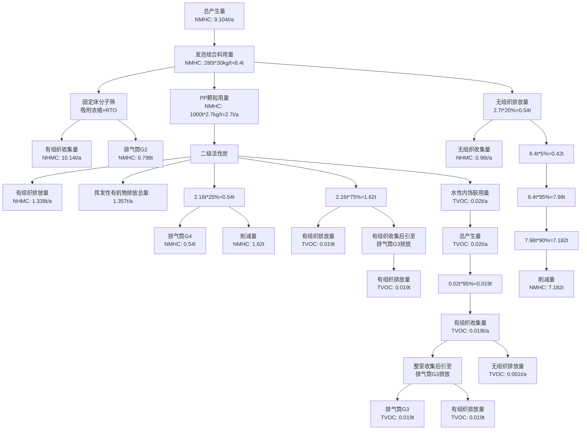
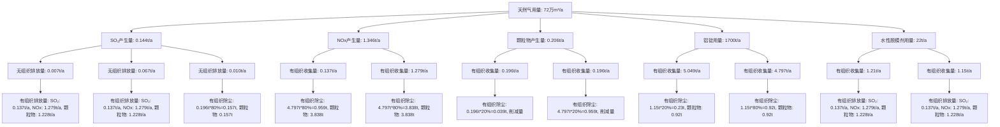
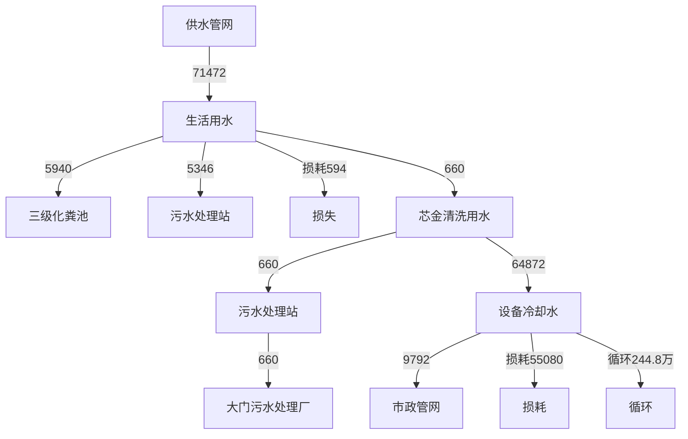
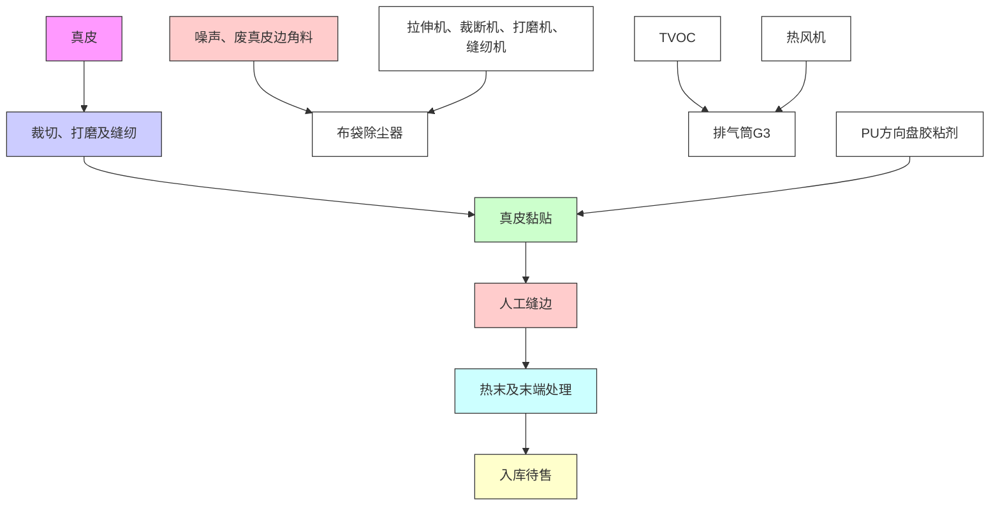
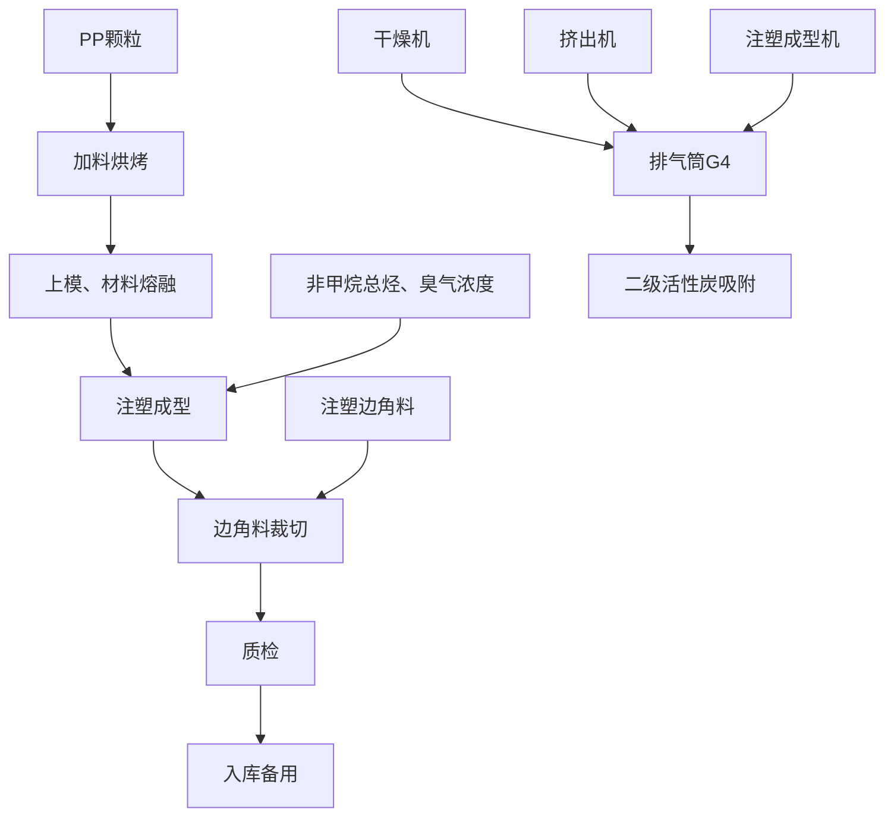
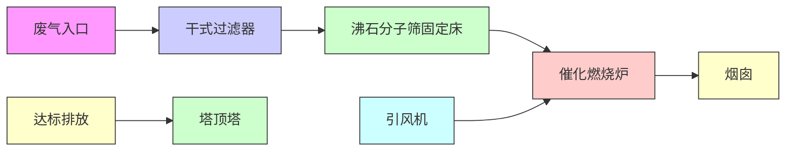

#

#


<details>
<summary>text_image</summary>

Gosei (foshan) Auto Parts Co.
丰田合成(佛山)汽车用品
有限公司
10702 14406054303227
</details>

项目名称：丰田合成（佛山）汽车部品有限公司（红岗）新工厂新建项目

建设单位（盖章）：丰田合成（佛山）汽车部品有限公司编制日期：2023年3月

不境部制


<details>
<summary>text_image</summary>

民共和国生态环境科学研究院
440606936132
</details>

编制单位和编制人员情况表

<table><tr><td colspan="2">项目编号</td><td colspan="4">m1aj71</td></tr><tr><td colspan="2">建设项目名称</td><td colspan="4">丰田合成(佛山)汽车部品有限公司(红岗)新工厂新建项目</td></tr><tr><td colspan="2">建设项目类别</td><td colspan="4">33--071汽车整车制造;汽车用发动机制造;改装汽车制造;低速汽车制造;电车制造;汽车车身、挂车制造;汽车零部件及配件制造</td></tr><tr><td colspan="2">环境影响评价文件类型</td><td colspan="4">报告表</td></tr><tr><td colspan="2">一、建设单位情况</td><td rowspan="6" colspan="4"></td></tr><tr><td colspan="2">单位名称(盖章)</td></tr><tr><td colspan="2">统一社会信用代码</td></tr><tr><td colspan="2">法定代表人(签章)</td></tr><tr><td colspan="2">主要负责人(签字)</td></tr><tr><td colspan="2">直接负责的主管人员(签字)</td></tr><tr><td colspan="6">二、编制单位情况</td></tr><tr><td colspan="2">单位名称(盖章)</td><td rowspan="2" colspan="4"></td></tr><tr><td colspan="2">统一社会信用代码</td></tr><tr><td colspan="6">三、编制人员情况</td></tr><tr><td colspan="6">1.编制主持人</td></tr><tr><td>姓名</td><td colspan="2">职业资格证书管理号</td><td colspan="2">信用编号</td><td>签字</td></tr><tr><td colspan="6"></td></tr><tr><td colspan="6">2.主要编制人员</td></tr><tr><td>姓名</td><td colspan="2">主要编写内容</td><td colspan="2">信用编号</td><td>签字</td></tr><tr><td colspan="6"></td></tr></table>


#

开中


<details>
<summary>text_image</summary>

中华人民共和国人力资源和社会保障部
中华人民共和国
人力资源和社会保障部
中华人民共和国环境保护部
环境保护部
</details>

# 目 录

一、建设项目基本情况.

二、建设项目工程分析.

三、区域环境质量现状、环境保护目标及评价标准 28

四、主要环境影响和保护措施.. . 34

五、环境保护措施监督检查清单 . 65

六、结论... 68

附表. . 69

建设项目污染物排放量汇总表.. . 69

附图. 71

附图1 项目地理位置图. 错误！未定义书签。

附图2 周边环境状况图. 71

附图3 项目平面布置图. . 75

附图4 环境管控单元图. 76

附图5 水环境功能区划分图. 77

附图6 空气质量功能区划分图. . 78

附图7 声环境功能区划分图. 79

附图8 项目污水管网图. 80

附图9 项目周边环境图. 81

附件1 营业执照. . 82

附件2 建设用地规划许可证.. 83

附件 3 MSDS. . 85

附件4 水性内饰胶检测报告. . 130

附件5 法人身份证. . 132

附件6 环评编制委托合同. . 133

# 一、建设项目基本情况

<table><tr><td>建设项目名称</td><td colspan="4">丰田合成(佛山)汽车部品有限公司(红岗)新工厂新建项目</td></tr><tr><td>项目代码</td><td colspan="4">无</td></tr><tr><td>建设单位联系人</td><td></td><td>联系方式</td><td colspan="2"></td></tr><tr><td>建设地点</td><td colspan="4">广东省佛山市顺德区大良街道伦桂路以东,横三路以北地块</td></tr><tr><td>地理坐标</td><td colspan="4">(22度50分7.543秒,113度12分55.980秒)</td></tr><tr><td>国民经济行业类别</td><td>C3670汽车零部件及配件制造</td><td>建设项目行业类别</td><td colspan="2">71汽车零部件及配件制造—其他(年用非溶剂型低VOCs含量涂料10吨以下的除外)</td></tr><tr><td>建设性质</td><td>☑新建(迁建)□改建□扩建□技术改造</td><td>建设项目申报情形</td><td colspan="2">☑首次申报项目□不予批准后再次申报项目□超五年重新审核项目□重大变动重新报批项目</td></tr><tr><td>项目审批(核准/备案)部门(选填)</td><td>/</td><td>项目审批(核准/备案)文号(选填)</td><td colspan="2">/</td></tr><tr><td>总投资(万元)</td><td></td><td>环保投资(万元)</td><td colspan="2"></td></tr><tr><td>环保投资占比(%)</td><td>8</td><td>施工工期</td><td colspan="2">6个月</td></tr><tr><td>是否开工建设</td><td>☑否□是:</td><td>用地(用海)面积( $m^{2}$ )</td><td colspan="2">54103.18</td></tr><tr><td>专项评价设置情况</td><td colspan="4">无</td></tr><tr><td>规划情况</td><td colspan="4">无</td></tr><tr><td>规划环境影响评价情况</td><td colspan="4">无</td></tr><tr><td>规划及规划环境影响评价符合性分析</td><td colspan="4">无</td></tr><tr><td rowspan="8">其他符合性分析</td><td colspan="4">1、项目与“三线一单”生态环境分区管控方案相符性分析项目位于广东省佛山市顺德区大良街道伦桂路以东,横三路以北地块。根据《广东省人民政府关于印发广东省“三线一单”生态环境分区管控方案的通知》(粤府〔2020〕71号)和《佛山市人民政府关于印发佛山市“三线一单”生态环境分区管控方案的通知》(佛府〔2021〕11号),项目符合广东省和佛山市的“三线一单”生态环境分区管控方案要求。根据《佛山市顺德区人民政府关于印发佛山市顺德区“三线一单”生态环境分区管控方案的通知》(顺府发〔2021〕11号)发布的佛山市顺德区环境管控单元图,项目所在的佛山市顺德区大良街道为佛山市顺德区重点管控单元2(编码为ZH44060620002,名称为大良街道重点管控区),项目与广东省佛山市顺德区重点管控单元2准入清单的相符性分析如表1-1。2、项目与环保相关法律法规相符性本项目与广东省的有机污染物治理政策的相符性分析见表1-2:表1-2 项目与有机污染物治理政策的相符性</td></tr><tr><td>序号</td><td>政策要求</td><td>本项目</td><td>符合性</td></tr><tr><td colspan="4">1.《珠江三角洲地区严格控制工业企业挥发性有机物(VOCs)排放的意见》(粤环[2012]18号)</td></tr><tr><td>1.1</td><td>在自然保护区、水源保护区、风景名胜区、森林公园、重要湿地、生态敏感区和其他重生态功能区实行强制性保护,禁止新建VOCs污染企业。</td><td>本项目选址不在禁止区域。</td><td>符合</td></tr><tr><td colspan="4">2.《挥发性有机物(VOCs)污染防治技术政策》(环保部公告2013第31号)</td></tr><tr><td>2.1</td><td>含VOCs产品的使用过程中,应采取废气收集措施,提高废气收集效率,减少废气的无组织排放与逸散。</td><td>项目所有产生VOCs的工序均配套有收集设施。发泡成型区和方向盘包裹区产生的有机废气经负压整室收集,收集效率约为95%;注塑成型区产生的有机废气经密闭集气罩收集,收集效率约为80%。</td><td>符合</td></tr><tr><td colspan="4">3.关于印发《重点行业挥发性有机物综合治理方案》的通知(环大气[2019]53号)</td></tr><tr><td>3.13.2</td><td>重点对含VOCs物料(包括含VOCs原辅材料、含VOCs产品、含VOCs废料以及有机聚合物材料等)储存、转移和输送、设备与管线组件泄漏、敞开液面逸散以及工艺过程等五类排放源实施管控,通过采取设备与场所密闭、工艺改进、废气有效收集等措施,削减VOCs无组织排放。提高废气收集率。遵循“应收尽收、分质收集”的原则,科学设计废气收集系统,将无组织排放转变为有组织排放进行控制。采用全密闭集气罩或密闭空间的,除行业有特殊要求外,应保持微负压状态,并根据相关规范合理设置通风量。采用局部集气罩的,距集气罩开口面最远处的VOCs无组织排放位置,控制风速应不低于0.3米/秒,有行业要求的按相关规定执行。</td><td>项目涉VOCs的原料主要是胶粘剂,常温状态下属于液态物料,均采用桶装储存,置于化学品仓库中,仓库进行防渗和设置围堰处理,一旦发现液态物质泄露能有效收集于仓库内,基本不存在下渗进入地下水的通道,对地下水环境影响较小。项目产生VOCs的工序均配套有收集设施。发泡和胶粘工序产生的有机废气经负压整室收集,收集效率约95%。压铸成型区、发泡成型区和方向盘包裹区产生的有机废气经负压整室收集。注塑成型区产生的有机废气经密闭集气罩收集,罩口截面风速为0.6m/s。</td><td>符合符合</td></tr><tr><td rowspan="5"></td><td colspan="4">4.《广东省生态环境厅关于印发&lt;广东省生态环境保护“十四五”规划&gt;的通知(粤环[2021]10号)</td></tr><tr><td>4.1</td><td>大力推进低VOCs含量原辅材料源头替代,严格落实国家和地方产品VOCs含量限值质量标准,禁止建设生产和使用高VOCs含量的溶剂型涂料、油墨、胶粘剂等项目。</td><td>项目拟使用的水性内饰胶属于低VOCs含量的原料,符合《胶粘剂挥发性有机化合物限值》(GB3372-2020)相关要求。</td><td>符合</td></tr><tr><td colspan="4">5.《佛山市生态环境局关于印发&lt;佛山市生态环境保护“十四五”规划&gt;的通知》佛环[2022]3号</td></tr><tr><td>5.1</td><td>加强VOCs源头替代和无组织排放管控。大力推进低VOCs含量原辅材料替代,将全面使用低VOCs含量原辅材料的企业纳入正面清单和政府绿色采供清单。鼓励重点行业企业开展生产工艺和设备水性化改造,推广使用水性、高固体分,无溶剂、粉末等低VOCs含量涂料。严格落实《挥发性有机物无组织排放控制标准》,开展厂区无组织排放浓度监测。加强对含VOCs物料储存、转移和运输、设备与管线组件泄漏、敞开页面逸散以及工艺过程等五类排放源的管控。</td><td>项目使用低VOCs含量原辅材料,VOCs有组织和无组织排放量较少。VOCs经整室收集后通过15m排气筒G3排放。含VOCs物料要求在储存、转移和运输过程中密封。</td><td>符合</td></tr><tr><td>5.2</td><td>推进VOCs高排放企业治理设施提升改造,淘汰光催化、光氧化、低温等离子等现有低效治理设施。</td><td>项目铝锭燃气熔化浇注废气整室收集后经“静电除尘、除油”废气处理设施处理,随后引至15m排气筒G1排放;发泡废气经整室收集后引至“沸石分子筛固定床浓缩+RCO”废气处理设施处理,最后通过15m排气筒G2排放;胶粘废气经整室收集后引至15m排气筒G3排放;注塑废气经密闭集气罩收集后引至“二级活性炭”废气处理设施处理,最后通过15m排气筒G4排放;食堂废气经集气罩收集后引至“复合式静电油烟净化”处理设施处理,最后通过15m高排气筒G5排放。</td><td>符合</td></tr></table>

<table><tr><td colspan="4">6.《广东省生态环境厅关于做好重点行业建设项目挥发性有机物总量指标管理工作的通知》(粤环发〔2019〕2号)</td></tr><tr><td>6.1</td><td>对VOCs排放量大于300公斤/年的新、改、扩建项目,进行总量替代,按照要求填报VOCs指标来源说明。其他排放量规模需要总量替代的,由本级生态环境主管部门自行确定范围,并按照要求审核总量指标来源,填写VOCs总量指标来源说明。</td><td>项目非甲烷总烃的有组织排放量为 $1.338t/a$ ,TVOC的有组织排放量为 $0.019t/a$ ,将非甲烷总烃纳入TVOC进行管理,则本项目有机废气的有组织排放量合计为 $1.357t/a$ 。根据《关于做好建设项目挥发性有机物(VOCs)排放削减替代工作的补充通知》(粤环函〔2021〕537号)文件要求,待项目审批时由生态环境部门核定VOCs总量来源。</td><td>符合</td></tr><tr><td colspan="4">7.关于印发《广东省涉挥发性有机物(VOCs)重点行业治理指引》的通知(粤环办[2021]43号)</td></tr><tr><td>7.1</td><td>废气收集系统的输送管道应密闭。废气收集系统应在负压下运行,若处于正压状态,应对管道组件的密封点进行泄漏检测,泄漏检测值不应超过 $500\mu mol/mol$ ,亦不应有感官可察觉泄漏。</td><td>压铸成型区、发泡成型区和方向盘包裹区产生的废气经负压整室收集,注塑成型区产生的废气经密闭集气罩收集。</td><td>符合</td></tr><tr><td>7.2</td><td>VOCs治理设施应与生产工艺设备同步运行,VOCs治理设施发生故障或检修时,对应的生产工艺设备应停止运行,待检修完毕后同步投入使用;生产工艺设备不能停止运行或不能及时停止运行的,应设置废气应急处理设施或采取其他替代措施。</td><td>项目压铸、发泡、注塑和胶粘过程必须开启风机,有效减少无组织排放废气。废气收集处理系统发生故障或检修时,压铸、发泡、注塑和胶粘工序停止运行,待检修完毕后再投入生产。</td><td>符合</td></tr><tr><td>7.3</td><td>58-管理台账-建立废气收集处理设施台账,记录废气处理设施进出口的监测数据(废气量、浓度、温度、含氧量等)、废气收集与处理设施关键参数、废气处理设施相关耗材(吸收剂、吸附剂、催化剂等)购买和处理记录。</td><td>项目建立废气收集处理设施台账,根据《排污许可证申请与核发技术规范金属铸造工业》(HJ1115-2020)、《排污许可证申请与核发技术规范橡胶和塑料制品工业》(HJ1122-2020)等相关要求定期自行监测,并且记录相关监测数据和废气处理设施中活性炭的购买量和处理记录。</td><td>符合</td></tr><tr><td>7.4</td><td>59-管理台账-建立危废台账,整理危废处置合同、转移联单及危废处理方式资质佐证材料。</td><td>项目建立危险废物台账,定期将废机油、废乳化液、废液压油、废原料包装桶、废活性炭等危险废物交给有资质的单位处理,整理危废处理合同、转移联单等资料。</td><td>符合</td></tr><tr><td colspan="4">3、项目与控制性规划的相符性分析项目位于广东省佛山市顺德区大良街道伦桂路以东,横三路以北地块。根据《中华人民共和国建设用地规划许可证》(地字第440606202200029号),项目所在地性质为工业用地(见附件2)。符合土地功能规划要求,选址合理。</td></tr></table>

表1-1 项目与广东省佛山市顺德区重点管控单元 2准入清单的相符性分析

<table><tr><td>管控维度</td><td>管控要求</td><td>项目情况</td><td>符合性</td></tr><tr><td>区域布局管控</td><td>1-1.【产业/鼓励引导类】重点发展电子信息、5G设备、装备制造及机器人产业、汽车配件产业,打造顺德智造创新服务中心;重点发展高端商贸、金融、科技服务、文创旅游等现代服务业,建设顺德新城城市CBD。1-2.【产业/综合类】系统推进村级工业园升级改造,腾出连片空间,布局产业集聚区和主题产业园,推动工业项目入园集聚发展。新增工业制造业用地原则上安排在产业集聚区内,产业集聚区外原则上不鼓励工业及物流仓储用地的新建与改造。1-3.【产业/限制类】受纳水体或监控断面不达标的,不得新建、扩建向河涌直接排放废水的项目。新建、扩建含蚀刻工序的线路板生产项目和化工项目应在配套污水集中处置的工业园区或生活污水管网覆盖区域内建设;纯加工型印花项目,含酸洗、磷化的金属表面处理、金属制品项目(与自身高新技术企业配套的除外),含酸洗、喷涂、拉丝、表面抛光等工艺的不锈钢型材加工项目,应进入以此类项目为主导产业、有相应废水集中治理设施的工业园区,实现集中治污。1-4.【大气/限制类】大气环境受体敏感重点管控区内,应严格限制新建储油库项目、产生和排放有毒有害大气污染物的建设项目以及使用溶剂型油墨、涂料、清洗剂、胶粘剂等高挥发性有机物原辅材料项目,鼓励现有该类项目搬迁退出。1-5.【大气/鼓励引导类】大气环境高排放重点管控区内,应强化达标监管,引导工业项目落地集聚发展,有序推进区域内行业企业提标改造。</td><td>1、项目属于重点发展的汽车配件产业。2、项目属于新建项目,所在地符合规划要求。3、项目不属于【产业/限制类】所包含的项目。4、项目位于大气环境受体敏感重点管控区内,属于新建的项目,使用的胶粘剂属于低挥发性有机物原辅材料。5、项目位于大气环境高排放重点管控区内,公司加强废气处理设施的管理,定期进行监测,必要时根据环境监管部门要求安装自动监测设备,确保废气达标排放。</td><td>符合</td></tr><tr><td>能源资源利用</td><td>2-1【能源/鼓励引导类】推广节能技术,加快发展绿色货运与现代物流。2-2【能源/鼓励引导类】推广新能源汽车应用和充电基础设施、加氢站建设。2-3.【能源/综合类】科学实施能源消费总量和强度“双控”,新建高能耗项目单位产品(产值)能耗达到国际国内先进水平。2-4.【水资源/综合类】贯彻落实“节水优先”方针,实行最严格水资源管理制度,大良街道万元国内生产总值用水量、万元工业增加值用水量、用水总量、农田灌溉水有效利用系数等用水总量和效率指标达到区下达要求。2-5.【土地资源/限制类】落实单位土地面积投资强度、土地利用强度等建设用地控制性指标要求,提高土地利用效率。2-6.【岸线/禁止类】严格水域岸线用途管制,新建项目一律不得违规占用水域。严禁破坏生态的岸线利用行为和不符合其功能定位的开发建设活动,严禁以各种名义侵占河道、围垦湖泊、非法采砂等。</td><td>1、项目推广节能技术,加快发展绿色货运与现代物流。2、项目不涉及新能源汽车应用和充电基础设施、加氢站建设。3、项目科学实施能源消费总量和强度“双控”,不属于新建高能耗项目,单位产品(产值)能耗达到国际国内先进水平。4、项目严格贯彻落实“节水优先”方针,实行最严格水资源管理制度,大良街道万元国内生产总值用水量、万元工业增加值用水量、用水总量、农田灌溉水有效利用系数等用水总量和效率指标达到区下达要求。5、项目单位土地面积投资强度、土地利用强度等建设用地控制性指标均满足相关标准要求,土地利用效率较高。6、项目属于新建项目,不占用水域,不会破坏生态的岸线利用和做不符合其功能定位的开发建设活动,不侵占河道、围垦湖泊、非法采砂等。</td><td>符合</td></tr><tr><td>污染物排放管控</td><td>3-1.【水/限制类】城镇新区建设实行雨污分流。住宅、商业体、学校、市场等城镇开发建设项目应当配套或者同步计划建设公共排水设施,公共排水设施或自建排污水设施未能投产运行的,以上涉水项目不得投入使用。新建小区严格实施雨污分流,阳台、露台等污水接入污水收集系统,将生活污水“应截尽截”。做好大型楼盘、集贸市场、餐饮以及学校等4大类排水户污水接入市政管网工作。3-2.【水/综合类】大良街道重点河涌水质上年度未达到水环境环境质量目标的,需组织编制、系统实施、向社会公开区域重点水污染物减排计划并明确“替代量”,本年度新建、改建、扩建项目新增水环境重点污染物实行区域“减二增一”替代(工业、生活或综合集中废水处理设施、民生项目除外)。3-3.【水/综合类】结合村级工业园改造,全面提升产业层次与集聚度,促进污染集中整治。3-4.【水/综合类】稳步推进排水设施“三个一体化”管理模式,补齐城乡污水收集和处理短板,推动逢沙污水处理厂、大门污水处理厂提质增效,加快消除城中村、老旧城区、城乡结合部等污水收集管网空白区,逐步实现城乡污水收集处理全覆盖。2025年前逢沙污水处理厂根据片区的污水排放收集情况,进行扩建工作,尾水应执行《城镇污水处理厂污染物排放标准》(GB18918-2002)一级A标准及《广东省水污染物排放限值》(DB44/26-2001)的较严值。2025年城市生活污水集中收集率达到75%以上。3-5.【水/综合类】逢沙村、红岗村、大门村、顺峰村和南江村等行政村(社区)继续完善污水管网建设,实现农村污水100%收集进入市政污水系统,有条件的区域实施雨污分流改造,到2030年全面雨污分流,污水纳入大良街道污水处理系统。3-6.【大气/综合类】大力推进低VOCs含量原辅材料替代,加快涉VOCs重点行业的生产工艺升级改造,推行自动化生产工艺,对达不到要求的VOCs收集及治理设施进行整治提升,逐步淘汰低效VOCs治理设施。</td><td>1、项目不属于城镇新区建设。2、项目的生活污水和生产废水分别经三级化粪预处理和自建污水处理站处理达标后,排放到大门污水处理厂,尾水排至顺德支流,顺德支流水质2021年达到水环境质量目标,且属于工业项目,无需实施本年度改建、扩建项目新增水环境重点污染物区域“减二增一”替代。3、项目所在地产业层次与集聚度较高,污染集中整治。4、项目位于大门污水处理厂处理范围,尾水执行《城镇污水处理厂污染物排放标准》(GB18918-2002)一级A标准及《广东省水污染物排放限值》(DB44/26-2001)的较严值。5、项目所在地已经实施雨污分流,污水纳入大良街道污水处理系统。6、【大气/综合类】项目使用的水基型胶粘剂为液态物料,根据企业提供的MSDS和检测报告,水基型胶粘剂的VOCs含量为3g/L。属于低挥发性物质。项目铝锭燃气熔化浇注废气整室收集后经“静电除尘、除油”废气处理设施处理,随后引至15m排气筒G1排放;发泡废气经整室收集后引至“沸石分子筛固定床浓缩+RCO”废气处理设施处理,最后通过15m排气筒G2排放;胶粘废气经整室收集后引至15m排气筒G3排放;注塑废气经密闭集气罩收集后引至“二级活性炭”废气处理设施处理,最后通过15m排气筒G4排放;饭堂油烟经集气罩收集后引至“复合式静电油烟净化”处理设施处理,最后通过15m高排气筒G5排放。</td><td>符合</td></tr><tr><td>环境风险防控</td><td>4-1.【水/综合类】大门污水处理厂、逢沙污水处理厂、工业污水集中处理设施应采临取有效措施,防止事故废水直接排入水体。完善污水处理厂在线监控系统联网,实现污水处理厂的实时、动态监管。4-2.【风险/综合类】加强环境风险分级分类管理,强化金属制品、有色金属和压延加工、化学原料和化学品制造业等涉重金属、化工行业企业及工业园区等重点环境风险源的环境风险防控。</td><td>1、项目所在地位于大门污水处理厂纳污范围,污水处理厂已在线监控系统联网,实现污水处理厂的实时、动态监管。2、项目不涉及重金属排放。</td><td>符合</td></tr></table>

# 二、建设项目工程分析

# 1、项目工程组成

丰田合成（佛山）汽车部品有限公司（红岗）新工厂新建项目位于广东省佛山市顺德区大良街道伦桂路以东，横三路以北地块，主要从事汽车零部件的生产。项目年产真皮方向盘 57万件、PU 方向盘 53万件、安全气囊 1000万件、安全气囊装饰盖 420万件、车厢盖顶起制动器 90 万件。项目生产工艺包括压铸成型、发泡成型、注塑成型、真皮胶粘、安全部品组装加工等。

项目为在建厂房，占地面积约 54103.18m2，经营面积为 67675m2。项目设有食堂，不设员工宿舍。已建设的建筑有事务栋（16.1m）、生产车间（20.9m）、原料仓库（6.1m）和危废间（5.3m），未建设的建筑有污水处理站。项目工程组成见表 2-1。

表 2-1 项目工程组成  
建设内容

<table><tr><td rowspan="2">工程</td><td colspan="2" rowspan="2">内容</td><td rowspan="2">建筑高度(m)</td><td colspan="3">工程组成</td></tr><tr><td>面积/ $m^2$ </td><td>区域</td><td>备注</td></tr><tr><td rowspan="12">主体工程</td><td rowspan="12">生产车间</td><td rowspan="8">1F</td><td rowspan="12">20.9</td><td>1435</td><td>测试区</td><td>产品测试及办公</td></tr><tr><td>910</td><td>机加工区</td><td>模具机加工及保养</td></tr><tr><td>2870</td><td>压铸成型区</td><td>方向盘芯金压铸成型</td></tr><tr><td>2100</td><td>发泡成型区</td><td>方向盘发泡成型</td></tr><tr><td>2400</td><td>注塑成型区</td><td>生产安全气囊装饰盖</td></tr><tr><td>2000</td><td>方向盘包裹区</td><td>方向盘真皮粘贴</td></tr><tr><td>1200</td><td>皮革裁剪区</td><td>对完成真皮粘贴的方向盘进行裁剪与缝边加工</td></tr><tr><td>1160</td><td>方向盘检查区</td><td>对方向盘成品进行检查</td></tr><tr><td rowspan="4">2F</td><td>2400</td><td>组装配件放置区</td><td>放置气体发生器、钢材等配件</td></tr><tr><td>2400</td><td>成品仓库</td><td>放置安全气囊、车厢顶起制动器等汽车零部件成品</td></tr><tr><td>2750</td><td>安全气囊组装区</td><td>将气袋、气体发生器、其他配件和注塑成型的安全气囊装饰盖组装成安全气囊</td></tr><tr><td>1000</td><td>车厢顶起制动器组装区</td><td>将钢材件、气体发生器和其他配件组装成车厢盖顶起制动器</td></tr><tr><td rowspan="2">辅助工程</td><td rowspan="2">事务栋</td><td>1F</td><td rowspan="2">16.1</td><td>1290</td><td colspan="2">包含食堂、接待室和会议室。用于员工用餐、日常接待和会议讨论</td></tr><tr><td>2F</td><td>1290</td><td colspan="2">包含办公室。用于员工日常办公</td></tr><tr><td>仓储工程</td><td colspan="2">化学品仓库</td><td>5.3</td><td>60</td><td colspan="2">用于储存发泡原料和胶粘剂</td></tr><tr><td></td><td colspan="2">原料仓库</td><td>6.1</td><td>410</td><td colspan="2">用于储存原辅材料</td></tr><tr><td rowspan="6">公用工程</td><td colspan="2">消防给水池及泵房</td><td>7.4</td><td>540</td><td colspan="2">用于储存消防用水,保证消防系统管道供水</td></tr><tr><td>空压机房</td><td>6.1</td><td>150</td><td colspan="3">用于储存空气压缩机</td></tr><tr><td>污水处理站</td><td>/</td><td>30</td><td colspan="3">面积约 $50m^{2}$ ,芯金清洗废水经自建污水处理站处理后排入大门污水处理厂处理.</td></tr><tr><td>配电系统</td><td>/</td><td colspan="4">通过市电引入厂区,通过配电线路引至各用电设施。</td></tr><tr><td>给排水系统</td><td>/</td><td colspan="4">供水来源为市政自来水,生活污水经三级化粪池处理,生产废水经自建污水处理站处理后排入大门污水处理厂</td></tr><tr><td>供气系统</td><td>/</td><td colspan="4">天然气通过市政管网引入厂区</td></tr><tr><td rowspan="9">环保工程</td><td>生活污水</td><td>/</td><td colspan="4">经三级化粪池处理后通过市政管道排入大门污水处理厂</td></tr><tr><td>芯金清洗废水</td><td>/</td><td colspan="4">经“低温蒸发+反渗透”处理后排入大门污水处理厂</td></tr><tr><td>设备冷却水</td><td>/</td><td colspan="4">作为清净下水定期通过市政污水管网排入大门污水处理厂</td></tr><tr><td>铝锭燃气熔化浇注废气</td><td>/</td><td colspan="4">铝锭燃气熔化浇注废气整室收集后经“静电除尘、除油”废气处理设施处理后,合并收集引至15m排气筒G1排放。</td></tr><tr><td>发泡废气</td><td>/</td><td colspan="4">发泡废气经整室收集后引至“沸石分子筛固定床浓缩+RCO”废气处理设施处理,最后通过15m排气筒G2排放</td></tr><tr><td>胶粘废气</td><td>/</td><td colspan="4">胶粘废气经整室收集后引至15m排气筒G3排放</td></tr><tr><td>注塑废气</td><td>/</td><td colspan="4">注塑废气经密闭集气罩收集后引至“二级活性炭”废气处理设施处理,最后通过15m排气筒G4排放</td></tr><tr><td>饭堂油烟</td><td>/</td><td colspan="4">饭堂油烟经集气罩收集后引至“复合式静电油烟净化”处理设施处理,最后通过15m高排气筒G5排放</td></tr><tr><td>危险废物暂存间</td><td>5.3</td><td colspan="4">面积约 $50m^{2}$ ,危险废物收集暂存于危废间并委托有资质的单位定期处理</td></tr></table>

# 2、主要产品及产能

项目主要从事汽车方向盘、安全气囊装饰盖、安全气囊、车厢顶起制动器等汽车零部件的生产，主要产品及产能见表 2-2。

表 2-2 产品及产能一览表

<table><tr><td>序号</td><td>产品名称</td><td>设计年产量</td><td>单位</td></tr><tr><td>1</td><td>真皮方向盘</td><td>57</td><td>万个/年</td></tr><tr><td>2</td><td>PU方向盘</td><td>53</td><td>万个/年</td></tr><tr><td>3</td><td>安全气囊</td><td>1000</td><td>万个/年</td></tr><tr><td>4</td><td>安全气囊装饰盖</td><td>420</td><td>万个/年</td></tr><tr><td>5</td><td>车厢盖顶起制动器</td><td>90</td><td>万个/年</td></tr></table>

表 2-3 产品图样及尺寸一览表

<table><tr><td>产品名称</td><td colspan="2">图片</td><td>产品规格</td><td>备注</td></tr><tr><td>真皮方向盘</td><td></td><td></td><td>1.905kg/个,φ382.3mm</td><td>由芯金、PU发泡体和真皮组成(芯金:1.55kg、发泡体:0.255kg、真皮:0.1kg);芯金表面积约为 $1000cm^{2}$ 。</td></tr><tr><td>PU方向盘</td><td></td><td></td><td>1.805kg/个,φ381.83mm</td><td>由芯金和PU发泡体组成(芯金:1.55kg、发泡体:0.255kg);芯金表面积约为 $1000cm^{2}$ 。</td></tr><tr><td>车厢盖顶起制动器</td><td></td><td></td><td>60cm×2cm×2cm/个</td><td>由外购的钢材件、气体发生器和其他配件组装而成。</td></tr><tr><td>安全气囊</td><td></td><td></td><td>0.20~0.30kg/个</td><td>中间产品,作为安全气囊组装配件使用。</td></tr><tr><td>安全气囊装饰盖</td><td></td><td></td><td>60cm×2cm×2cm/个</td><td>由外购的钢材件、气体发生器和其他配件组装而成。</td></tr></table>

# 3、项目设备清单

主要生产单元、主要工艺、生产设施及设施参数见下表。

表 2-4 主要生产单元、主要工艺、生产设施一览表

<table><tr><td>序号</td><td>所属生产区</td><td>设备名称</td><td>单位</td><td>数量</td><td>备注</td><td>单台功率(kW)</td></tr><tr><td>1</td><td rowspan="3">压铸成型区</td><td>熔化炉</td><td>台</td><td>4</td><td>独立配备“静电除尘”装置年工作时间:7200h单台功率:15万大卡单台平均每小时天然气使用量: $25Nm^{3}$ 容积:700W*1600H*350D</td><td>---</td></tr><tr><td>2</td><td>压铸成型机</td><td>台</td><td>4</td><td>独立配备“静电除油”装置年工作时间:7200h单台设计生产能力:38个/h</td><td>40</td></tr><tr><td>3</td><td>冷却装置</td><td>台</td><td>4</td><td>用水来源于冷却塔,用于控制模具温度</td><td>15</td></tr></table>

<table><tr><td rowspan="38"></td><td>4</td><td rowspan="15"></td><td>保温炉</td><td>台</td><td>4</td><td rowspan="15">/</td><td>20</td></tr><tr><td>5</td><td>加铝锭装置</td><td>台</td><td>4</td><td>8</td></tr><tr><td>6</td><td>模温机</td><td>台</td><td>4</td><td>60</td></tr><tr><td>7</td><td>离型剂涂布装置</td><td>台</td><td>4</td><td>1</td></tr><tr><td>8</td><td>修边机</td><td>台</td><td>4</td><td>3</td></tr><tr><td>9</td><td>NC 加工机</td><td>台</td><td>5</td><td>15</td></tr><tr><td>10</td><td>NC 加工机(cancel 孔)</td><td>台</td><td>5</td><td>15</td></tr><tr><td>11</td><td>洗净装置</td><td>台</td><td>4</td><td>53</td></tr><tr><td>12</td><td>除毛边机</td><td>台</td><td>4</td><td>2</td></tr><tr><td>13</td><td>高度检查机</td><td>台</td><td>4</td><td>1</td></tr><tr><td>14</td><td>QR 码刻印机</td><td>台</td><td>4</td><td>5</td></tr><tr><td>15</td><td>履历管理系统</td><td>台</td><td>4</td><td>4</td></tr><tr><td>16</td><td>工件搬送机械手(5 台+自动化)</td><td>台</td><td>20</td><td>5</td></tr><tr><td>17</td><td>BOSS 供给装置</td><td>台</td><td>4</td><td>2</td></tr><tr><td>18</td><td>按扣弹簧组装机</td><td>台</td><td>4</td><td>5</td></tr><tr><td>19</td><td rowspan="10">发泡成型区</td><td>发泡成型机</td><td>台</td><td>12</td><td>年工作时间:4800h单台设计生产能力:19个/h</td><td>100</td></tr><tr><td>20</td><td>冷却装置</td><td>台</td><td>4</td><td>用水来源于冷却塔,用于控制模具温度</td><td>15</td></tr><tr><td>21</td><td>发泡液注入机</td><td>台</td><td>4</td><td rowspan="8">/</td><td>20</td></tr><tr><td>22</td><td>搅拌机</td><td>台</td><td>6</td><td>2</td></tr><tr><td>23</td><td>ARIM 装置</td><td>台</td><td>12</td><td>8</td></tr><tr><td>24</td><td>金型温调机</td><td>台</td><td>12</td><td>6</td></tr><tr><td>25</td><td>Air 吹风机(0.2%)</td><td>台</td><td>12</td><td>3</td></tr><tr><td>26</td><td>水口剪切机</td><td>台</td><td>12</td><td>6</td></tr><tr><td>27</td><td>离型剂桶(1 桶/3 台)PA-50SB</td><td>台</td><td>4</td><td>1</td></tr><tr><td>28</td><td>离型剂涂布机械手</td><td>台</td><td>12</td><td>5</td></tr><tr><td>29</td><td rowspan="6">真皮裁剪区</td><td>验皮机</td><td>台</td><td>5</td><td rowspan="6">真皮机加工</td><td>2</td></tr><tr><td>30</td><td>裁切机</td><td>台</td><td>5</td><td>9</td></tr><tr><td>31</td><td>片皮机</td><td>台</td><td>5</td><td>6</td></tr><tr><td>32</td><td>薄边机</td><td>台</td><td>5</td><td>6</td></tr><tr><td>33</td><td>压花机</td><td>台</td><td>2</td><td>8</td></tr><tr><td>34</td><td>BOSS 加工机</td><td>台</td><td>2</td><td>15</td></tr><tr><td>35</td><td rowspan="7">注塑成型区</td><td>注塑成型机</td><td>台</td><td>14</td><td>自带干燥机和挤出机年工作时间:7200h单台消耗PP 颗粒的量:9.93kg/h</td><td>40</td></tr><tr><td>36</td><td>取出机</td><td>台</td><td>14</td><td rowspan="6">/</td><td>2</td></tr><tr><td>37</td><td>液压锁模夹</td><td>台</td><td>14</td><td>1</td></tr><tr><td>38</td><td>模温机</td><td>台</td><td>28</td><td>5</td></tr><tr><td>39</td><td>供料机</td><td>台</td><td>14</td><td>3</td></tr><tr><td>40</td><td>加料防呆装置</td><td>台</td><td>14</td><td>2</td></tr><tr><td>41</td><td>自动搬运装置</td><td>台</td><td>8</td><td>8</td></tr><tr><td rowspan="40"></td><td>42</td><td></td><td>自动抓取机器人</td><td>台</td><td>8</td><td></td><td>5</td></tr><tr><td>43</td><td rowspan="39">安全部品组装区</td><td>车缝机</td><td>台</td><td>4</td><td rowspan="15">用于安全部品组装</td><td>1</td></tr><tr><td>44</td><td>方向盘组装检查机</td><td>台</td><td>6</td><td>4</td></tr><tr><td>45</td><td>DAB铭牌熔接机</td><td>台</td><td>6</td><td>5</td></tr><tr><td>46</td><td>DAB触点开关组装机</td><td>台</td><td>6</td><td>5</td></tr><tr><td>47</td><td>DAB铭牌熔接机</td><td>台</td><td>6</td><td>5</td></tr><tr><td>48</td><td>PAB螺丝锁付机</td><td>台</td><td>5</td><td>5</td></tr><tr><td>49</td><td>KAB螺母锁付机</td><td>台</td><td>8</td><td>5</td></tr><tr><td>50</td><td>KAB饰盖组装机</td><td>台</td><td>8</td><td>3</td></tr><tr><td>51</td><td>SAB胶带组装机</td><td>台</td><td>7</td><td>2</td></tr><tr><td>52</td><td>SAB-后螺母锁付机</td><td>台</td><td>2</td><td>5</td></tr><tr><td>53</td><td>PUC螺母锁付机</td><td>台</td><td>2</td><td>5</td></tr><tr><td>54</td><td>PUC E环组装机</td><td>台</td><td>2</td><td>5</td></tr><tr><td>55</td><td>PUC活塞杆压入机</td><td>台</td><td>2</td><td>5</td></tr><tr><td>56</td><td>PUC线束压入机</td><td>台</td><td>2</td><td>5</td></tr><tr><td>57</td><td>PUC铁圈组装机</td><td>台</td><td>2</td><td>2</td></tr><tr><td>58</td><td>DAB缔结机</td><td>台</td><td>6</td><td rowspan="14">用于安全部品机加工</td><td>5</td></tr><tr><td>59</td><td>DAB打印机</td><td>台</td><td>6</td><td>1</td></tr><tr><td>60</td><td>CAB铆接机</td><td>台</td><td>8</td><td>5</td></tr><tr><td>61</td><td>CAB打印机</td><td>台</td><td>8</td><td>1</td></tr><tr><td>62</td><td>PAB打印机</td><td>台</td><td>5</td><td>1</td></tr><tr><td>63</td><td>KAB打印机</td><td>台</td><td>8</td><td>1</td></tr><tr><td>64</td><td>SAB铆接机</td><td>台</td><td>7</td><td>5</td></tr><tr><td>65</td><td>SAB打印机</td><td>台</td><td>7</td><td>1</td></tr><tr><td>66</td><td>SAB-后打印机</td><td>台</td><td>2</td><td>1</td></tr><tr><td>67</td><td>PUCO圈涂油机</td><td>台</td><td>2</td><td>1</td></tr><tr><td>68</td><td>PUC八方铆接机</td><td>台</td><td>2</td><td>6</td></tr><tr><td>69</td><td>PUC环状铆接机</td><td>台</td><td>2</td><td>7</td></tr><tr><td>70</td><td>PUC靴套涂油机</td><td>台</td><td>2</td><td>1</td></tr><tr><td>71</td><td>PUC打印机</td><td>台</td><td>2</td><td>1</td></tr><tr><td>72</td><td>DAB履历系统</td><td>台</td><td>6</td><td rowspan="10">用于安全部品测试</td><td>7</td></tr><tr><td>73</td><td>DAB拿取机器人(UR)</td><td>台</td><td>6</td><td>5</td></tr><tr><td>74</td><td>DAB点检架</td><td>台</td><td>6</td><td>1</td></tr><tr><td>75</td><td>DAB拍照检查设备</td><td>台</td><td>6</td><td>2</td></tr><tr><td>76</td><td>CAB检查机</td><td>台</td><td>8</td><td>5</td></tr><tr><td>77</td><td>CAB履历系统</td><td>台</td><td>8</td><td>7</td></tr><tr><td>78</td><td>PAB履历系统</td><td>台</td><td>5</td><td>7</td></tr><tr><td>79</td><td>KAB拍照检查设备</td><td>台</td><td>8</td><td>2</td></tr><tr><td>80</td><td>KAB履历系统</td><td>台</td><td>8</td><td>7</td></tr><tr><td>81</td><td>SAB履历系统</td><td>台</td><td>7</td><td>7</td></tr><tr><td rowspan="39"></td><td>82</td><td rowspan="7"></td><td>SAB-后电阻检查机</td><td>台</td><td>2</td><td rowspan="7"></td><td>5</td></tr><tr><td>83</td><td>PUC螺母,套头自动供给机</td><td>台</td><td>2</td><td>2</td></tr><tr><td>84</td><td>PUC MGG 供给设备</td><td>台</td><td>2</td><td>3</td></tr><tr><td>85</td><td>PUC线束检查机</td><td>台</td><td>2</td><td>1</td></tr><tr><td>86</td><td>PUC电阻检查机</td><td>台</td><td>2</td><td>5</td></tr><tr><td>87</td><td>PUC履历系统</td><td>台</td><td>2</td><td>7</td></tr><tr><td>88</td><td>PUC UR机器人</td><td>台</td><td>8</td><td>5</td></tr><tr><td>89</td><td rowspan="9">机加工区</td><td>金型反转机</td><td>台</td><td>1</td><td rowspan="9">用于芯金件机加工;加工过程中需要添加少量切削液进行冷却降温,不涉及钢材表面清洗和喷涂处理。切削液使用时定期更换,废切削液集中收集定期交资质单位进行处理。</td><td>8</td></tr><tr><td>90</td><td>铣床</td><td>台</td><td>1</td><td>11</td></tr><tr><td>91</td><td>研磨機</td><td>台</td><td>1</td><td>5</td></tr><tr><td>92</td><td>钻孔机</td><td>台</td><td>1</td><td>5</td></tr><tr><td>93</td><td>磨床</td><td>台</td><td>1</td><td>8</td></tr><tr><td>94</td><td>电焊</td><td>台</td><td>1</td><td>5</td></tr><tr><td>95</td><td>激光焊</td><td>台</td><td>1</td><td>2</td></tr><tr><td>96</td><td>金型搬运台车(5t)</td><td>台</td><td>1</td><td>10</td></tr><tr><td>97</td><td>车床 车床平面切削</td><td>台</td><td>1</td><td>2</td></tr><tr><td>98</td><td rowspan="23">测试区</td><td>X线检查装置</td><td>台</td><td>1</td><td>属于放射性装置,需办理辐射类环评报批手续</td><td>8</td></tr><tr><td>99</td><td>表皮烘烤装置</td><td>台</td><td>10</td><td rowspan="22">产品测试</td><td>6</td></tr><tr><td>100</td><td>包付工程排气装置</td><td>台</td><td>1</td><td>5</td></tr><tr><td>101</td><td>物流叠货设备</td><td>台</td><td>2</td><td>40</td></tr><tr><td>102</td><td>完成品搬运出货设备</td><td>台</td><td>1</td><td>5</td></tr><tr><td>103</td><td>水分率测量仪器</td><td>台</td><td>1</td><td>0.2</td></tr><tr><td>104</td><td>重量计</td><td>台</td><td>1</td><td>0.2</td></tr><tr><td>105</td><td>落槌试验机</td><td>台</td><td>1</td><td>1</td></tr><tr><td>106</td><td>发光分析装置</td><td>台</td><td>1</td><td>1</td></tr><tr><td>107</td><td>三次元测量机</td><td>台</td><td>1</td><td>1</td></tr><tr><td>108</td><td>压缩·疲劳试验机</td><td>台</td><td>1</td><td>1</td></tr><tr><td>109</td><td>K模放大器</td><td>台</td><td>1</td><td>1</td></tr><tr><td>110</td><td>光谱仪 发光分析实验</td><td>台</td><td>1</td><td>1</td></tr><tr><td>111</td><td>粗糙仪 BOSS 粗糙度</td><td>台</td><td>1</td><td>1</td></tr><tr><td>112</td><td>轮廓测量仪 倒角/BOSS 相关尺寸</td><td>台</td><td>1</td><td>1</td></tr><tr><td>113</td><td>耐久疲劳试验机</td><td>台</td><td>1</td><td>3</td></tr><tr><td>114</td><td>显微镜 外观/细微厚度确认</td><td>台</td><td>1</td><td>1</td></tr><tr><td>115</td><td>喇叭操作耐久测试机</td><td>台</td><td>1</td><td>1</td></tr><tr><td>116</td><td>耐光试验机</td><td>台</td><td>1</td><td>1</td></tr><tr><td>117</td><td>恒温槽(耐久用)</td><td>台</td><td>1</td><td>10</td></tr><tr><td>118</td><td>磨耗试验机</td><td>台</td><td>1</td><td>2</td></tr><tr><td>119</td><td>惯性力矩测定器</td><td>台</td><td>1</td><td>2</td></tr><tr><td>120</td><td>PAD负载耐久试验机</td><td>台</td><td>1</td><td>2</td></tr><tr><td rowspan="9"></td><td>121</td><td rowspan="8"></td><td>温湿度试验机(-75~150°C)</td><td>台</td><td>1</td><td rowspan="8"></td><td>6</td></tr><tr><td>122</td><td>高温试验机(10~260°C)</td><td>台</td><td>1</td><td>6</td></tr><tr><td>123</td><td>温湿度试验机+振动试验机</td><td>台</td><td>1</td><td>6</td></tr><tr><td>124</td><td>展开试验点火器</td><td>台</td><td>1</td><td>1</td></tr><tr><td>125</td><td>恒温槽(白车身)</td><td>台</td><td>1</td><td>10</td></tr><tr><td>126</td><td>高速摄像机</td><td>台</td><td>1</td><td>1</td></tr><tr><td>127</td><td>智能仓库</td><td>台</td><td>2</td><td>120</td></tr><tr><td>128</td><td>部品自动分拣装置</td><td>台</td><td>2</td><td>8</td></tr><tr><td>129</td><td>其他</td><td>冷却水塔</td><td>台</td><td>2</td><td>循环水量分别为 $220m^{3}/h$ 和 $120m^{3}/h$ </td><td>/</td></tr></table>

# 4、项目原辅材料

# （1）项目原辅材料使用情况

主要原辅材料及燃料的种类和用量见下表。

表 2-5 主要原辅材料及燃料参数一览表

<table><tr><td>序号</td><td>原辅材料名称</td><td>性状</td><td>使用量</td><td>单位</td><td>包装规格</td><td>最大储存量(吨)</td><td>备注</td></tr><tr><td>1</td><td>PP颗粒</td><td>颗粒</td><td>1000</td><td>吨/年</td><td>25kg/袋</td><td>50</td><td>/</td></tr><tr><td>2</td><td>铝锭</td><td>块状</td><td>1700</td><td>吨/年</td><td>600kg/托</td><td>48</td><td>/</td></tr><tr><td>3</td><td>水性脱模剂</td><td>液态</td><td>22</td><td>吨/年</td><td>20kg/桶</td><td>0.2</td><td>用于压铸和发泡前处理工序</td></tr><tr><td>4</td><td>触媒(DABCO 33-LV)</td><td>液态</td><td>5</td><td>吨/年</td><td>20kg/桶</td><td>0.4</td><td rowspan="10">发泡用原料</td></tr><tr><td>5</td><td>1,6己二醇共聚物(P-200)</td><td>液态</td><td>3.6</td><td>吨/年</td><td>200kg/桶</td><td>0.5</td></tr><tr><td>6</td><td>光稳定剂(Eversorb 93)</td><td>液态</td><td>0.5</td><td>吨/年</td><td>20kg/桶</td><td>0.1</td></tr><tr><td>7</td><td>二乙二醇</td><td>液态</td><td>2.4</td><td>吨/年</td><td>200kg/桶</td><td>0.2</td></tr><tr><td>8</td><td>乙二醇</td><td>液态</td><td>8.0</td><td>吨/年</td><td>200kg/桶</td><td>1.2</td></tr><tr><td>9</td><td>聚醚多元醇</td><td>液态</td><td>115.0</td><td>吨/年</td><td>200kg/桶</td><td>3</td></tr><tr><td>10</td><td>异氰酸酯组合料(MDI)</td><td>液态</td><td>120.0</td><td>吨/年</td><td>200kg/桶</td><td>3</td></tr><tr><td>11</td><td>抗氧化剂(Irganox®1135)</td><td>液态</td><td>2.5</td><td>吨/年</td><td>20kg/桶</td><td>0.04</td></tr><tr><td>12</td><td>表面活性剂(L-5302)</td><td>液态</td><td>3.0</td><td>吨/年</td><td>20kg/桶</td><td>0.1</td></tr><tr><td>13</td><td>聚氨酯色浆</td><td>液态</td><td>20.0</td><td>吨/年</td><td>20kg/桶</td><td>0.15</td></tr><tr><td>14</td><td>水性内饰胶</td><td>液态</td><td>7.0</td><td>吨/年</td><td>20kg/桶</td><td>0.2</td><td>用于真皮方向盘粘贴工序</td></tr><tr><td>15</td><td>真皮</td><td>固态</td><td>57.5</td><td>吨/年</td><td>/</td><td>3</td><td>真皮方向盘包覆皮</td></tr><tr><td>16</td><td>气体发生器</td><td>/</td><td>1090</td><td>万个/年</td><td>/</td><td>/</td><td>用于安全气囊和车厢盖顶起制动器的组装</td></tr><tr><td>17</td><td>安全气囊气袋</td><td>/</td><td>1000</td><td>万个/年</td><td>/</td><td>/</td><td rowspan="2">外购安全气囊组装零件</td></tr><tr><td>18</td><td>安全气囊配件</td><td>/</td><td>1000</td><td>万套/年</td><td>/</td><td>/</td></tr><tr><td>19</td><td>钢材件</td><td>/</td><td>90</td><td>万个/年</td><td>/</td><td>/</td><td rowspan="2">外购车厢盖顶起制动器组装零件</td></tr><tr><td>20</td><td>车厢盖顶起制动器配件</td><td>/</td><td>90</td><td>万套/年</td><td>/</td><td>/</td></tr><tr><td>21</td><td>模具</td><td>/</td><td>150</td><td>套/年</td><td>/</td><td>/</td><td>用于发泡、注塑和压铸工序</td></tr><tr><td>22</td><td>机油</td><td>液态</td><td>0.5</td><td>吨/年</td><td>20kg/桶</td><td>0.2</td><td>用于设备保养维修</td></tr><tr><td>23</td><td>切削液</td><td>液态</td><td>0.5</td><td>吨/年</td><td>20kg/桶</td><td>0.2</td><td>用于芯金机加工</td></tr><tr><td>24</td><td>液压油</td><td>液态</td><td>2</td><td>吨/年</td><td>20kg/桶</td><td>0.5</td><td>用于设备保养维修</td></tr><tr><td>25</td><td>天然气</td><td>/</td><td>72</td><td>万 $m^3$ /年</td><td>/</td><td>/</td><td>用于芯金生产线的加热燃料</td></tr><tr><td>26</td><td>新鲜水</td><td>/</td><td>71472</td><td> $m^3$ /年</td><td>/</td><td>/</td><td>/</td></tr></table>

项目使用的主要原辅料成分组成及理化性质情况见下表。

表 2-6 主要原辅材料特征表

<table><tr><td>原辅材料名称</td><td>成分组成</td><td>理化特性</td><td>燃烧爆炸性</td><td>毒性毒理</td></tr><tr><td>触媒(DABCO 33-LV)</td><td>叔胺&gt;25%(CAS:102-70-5)</td><td>液体、无色、带有胺味、pH:10.2、密度:1.03、</td><td>/</td><td>急性毒性:小鼠经口LD50为3200mg/kg,兔子经皮LD50为2000mg/kg。</td></tr><tr><td>1,6己二醇共聚物(P-200)</td><td>1,6己二醇共聚物100%(CAS:629-11-8)</td><td>黄色至透明褐色液体,熔点-30°C,闪点290摄氏度,蒸气压100Pa(60°C)。</td><td>/</td><td>急性毒性:白鼠经口LD50&gt;2000mg/kg。</td></tr><tr><td>光稳定剂(Eversorb 93)</td><td>癸二酸(1,2,2,6,6-五甲基-4-哌啶基)甲酯(CAS:818-88-2)、癸二酸双(1,2,2,6,6-五甲基-4-哌啶基)酯(CAS:106-79-6)</td><td>淡黄色透明的非挥发性液体,无味,pH8.4,沸点&gt;350°C,分解温度&gt;250°C,闪点250°C,自燃温度380°C,蒸汽压&lt;0.0001Pa(20°C)。</td><td>强氧化剂或强酸或强碱可能导致起火及爆炸。</td><td>急性毒性:大鼠食入LD50&gt;5000mg/kg。</td></tr><tr><td>二乙二醇</td><td> $C_4H_{10}O_3$ (CAS:111-46-6)</td><td>无色,极淡黄色透明液体,熔点-7°C,沸点245°C,相对密度(水=1)1.12,相对蒸气密度(空气=1)3.66,蒸气压1.33Pa(20°C),闪点(°C)124,自燃温度(°C)229。</td><td>遇明火、高热可燃。</td><td>急性毒性:LD50:16600mg/kg(大鼠经口);26500mg/kg(小鼠经口);11900mg/kg(兔经皮)。</td></tr><tr><td>乙二醇</td><td> $(CH_2OH)_2$ (CAS:107-21-1)</td><td>无色无味液体,熔点-13°C,沸点197.6°C,相对密度:1.1,闪点111°C。</td><td>遇明火、高热或与氧化剂接触,有引起燃烧爆炸的危险。</td><td>急性毒性:LD50为4~5.89g/kg(大鼠经口);10.6g/kg(兔经皮)。</td></tr><tr><td>聚醚多元醇</td><td>1,2-乙二醇(CAS:27968-28-1)、2,2&#x27;-氧基二(N,N-二甲基乙胺)(CAS:598-56-1)等混合物</td><td>白色液体、有弱特殊气味、沸点&gt;140°C、闪点&gt;200°C、密度1.02g/cm3(20°C)、燃烧温度&gt;250°C</td><td>不自燃,无爆炸性。</td><td>半致死浓度(96h)0.97mg/L,虹鳟;半致死浓度(96h)0.9mg/L,斑马鱼。</td></tr><tr><td>异氰酸酯组合料(MDI)</td><td>二苯基甲烷-4,4&#x27;-二异氰酸酯10-70%(CAS:101-68-8),异氰酸聚亚甲基聚亚苯基酯</td><td>褐色、霉味液体,闪点253.5°C,蒸汽压0.01Pa(25°C),密度1.22g/cm3(20°C)。</td><td>有爆裂危险;有放热和聚合反应危险。</td><td>半致死浓度(96h)1000mg/L,斑马鱼。</td></tr></table>

<table><tr><td rowspan="7"></td><td></td><td>10-90%(CAS: 9016-87-9)</td><td></td><td></td><td></td></tr><tr><td>抗氧化剂(Irganox®1135)</td><td>3,5-双(1,1-二甲基乙基)-4-羟基-苯甲酸(CAS:1421-49-4),C7-C9侧链烷基酯100%</td><td>黄色至褐色液体,淡淡的香味,熔点:&lt;-30°C,沸点:240°C,闪点:152°C,蒸气压:0.0015Pa (25°C),相对密度:0.9674 (20°C),自燃温度:365°C。</td><td>无爆炸性。</td><td>急性毒性:大鼠食入LD50&gt;2000mg/kg。</td></tr><tr><td>表面活性剂(L-5302)</td><td>混合物</td><td>半透明、带有轻微气味液体,沸点&gt;35°C、闪电&gt;100°C、相对密度:1.02(水=1)</td><td>与强氧化剂反应。在空气中加热高于150°C会产生甲醛蒸汽。</td><td>毒性非常低,少量吞食未见有危害性。</td></tr><tr><td>聚氨酯色浆</td><td>混合物</td><td>黑色液体,黏度:1.5-3.5pa.s</td><td>/</td><td>/</td></tr><tr><td>水性内饰胶</td><td>聚氨酯混合乳液100%</td><td>乳白色液体,具有轻微气味,沸点约100°C,相对密度1.05-1.10,溶于水。</td><td>常温下稳定。</td><td>/</td></tr><tr><td>水性脱模剂</td><td>乙二醇(CAS:107-21-1)2-4%、有机硅乳液2.5-5%、蜡乳液0.3-0.5%、表面活性剂0.3-0.6%、去离子水90-96%</td><td>乳白色无味流动性液体,闪点&gt;100°C</td><td>正常使用条件下稳定</td><td>/</td></tr><tr><td>切削液</td><td>精致矿物油35-45%、烷醇胺衍生物10-20%、表面活性剂5-15%、有机防锈剂10-20%、其它添加剂10-20%、去离子水15-25%</td><td>淡黄色透明的弱气味液体,pH:9.3-9.5</td><td>/</td><td>/</td></tr></table>

# （2）匹配性分析

项目产能匹配性分析见下表。

表2-7 项目产能匹配性分析一览表

<table><tr><td colspan="2">产品</td><td>方向盘芯金</td><td>PU发泡体</td><td>安全气囊装饰盖</td></tr><tr><td colspan="2">工艺</td><td>熔铸</td><td>发泡</td><td>注塑</td></tr><tr><td colspan="2">主要原材料</td><td>铝锭</td><td>发泡组合料</td><td>PP颗粒</td></tr><tr><td colspan="2">设备(数量)</td><td>压铸机(4台)</td><td>发泡机(12台)</td><td>注塑机(14台)</td></tr><tr><td colspan="2">年生产时间(h/a)</td><td>7200</td><td>4800</td><td>7200</td></tr><tr><td colspan="2">单台设备原材料使用量(kg/h)</td><td>59</td><td>4.86</td><td>9.93</td></tr><tr><td colspan="2">单台设备生产能力(个/h)</td><td>38</td><td>19</td><td>41.64</td></tr><tr><td colspan="2">单位产品主要原材料使用量(kg/个)</td><td>1.55</td><td>0.255</td><td>0.238</td></tr><tr><td colspan="2">单位时间主要原材料使用量(kg/h)</td><td>236</td><td>58.3</td><td>139</td></tr><tr><td colspan="2">单位时间产品量(个/h)</td><td>153</td><td>229</td><td>583</td></tr><tr><td colspan="2">年产品量(个/a)</td><td>110万</td><td>110万</td><td>420万</td></tr><tr><td colspan="2">主要原材料年使用量(t/a)</td><td>1700</td><td>280</td><td>1000</td></tr><tr><td rowspan="2">污染物产量(t/a)</td><td>颗粒物</td><td>5.049</td><td>---</td><td>---</td></tr><tr><td>NMHC</td><td>---</td><td>8.43</td><td>2.7</td></tr></table>

# （3）物料平衡

项目挥发性有机物平衡图见下图。


<details>
<summary>flowchart</summary>


</details>

图 2-2 项目挥发性有机物平衡图


<details>
<summary>flowchart</summary>


</details>

图 2-3 项目其余废气污染物平衡图

# 5、给水与排水

# （1）给水：

项目用水由市政给水管网供应。用水主要为生产用水及员工生活用水。

# ①生活用水

本项目劳动定员300人，年工作日330天，项目内设食堂，不设员工宿舍。根据广东省《用水定额 第三部分：生活》（DB44/T 1461.3-2021）表A.1中国家机构办公楼有食堂和浴室的先进值按15m3 /（人·a）计。由于国家机关年工作日只有250天，人均年生活用水量应乘以系数330/250=1.32，为19.8m3 /（人·a），则生活用水量约为5940m3/a。

# ②生产用水

项目生产用水主要为芯金清洗废水，根据水污染源强分析可知，芯金清洗用水量约为660m3 /a，生产用水量合计约为660m3/a。

# （2）排水：

项目生活污水经三级化粪池预处理后通过市政管道排入大门污水处理厂处理，尾水排至顺德支流。生活污水排污系数取0.9，生活污水产生量为5346m3/a。

生产废水主要为芯金清洗废水，废水产生量约为 660m3 /a，经污水处理站处理后通过市政管道排入大门污水处理厂处理，尾水排至顺德支流。

项目冷却塔定期排水，设备冷却水作为净下水通过市政污水管网排入大门污水处理厂，定期排水量约为 9792m3 /a。本项目水平衡图见下图。


<details>
<summary>flowchart</summary>


</details>

图 2-4 项目水平衡图

# 6、能源供应

本项目生产设备使用电能，用电由市政电网接入，年用电量约为1200万kW·h。铝锭熔化炉使用天然气作为燃料，天然气由市政管道接入，年用天然气量约为72万m3/a。

<table><tr><td></td><td>7、劳动动员及工作制度项目从业人数为300人,年工作日330天,全天实行三班倒的工作制。每天工作24小时,厂区内设食堂,不设员工宿舍。8、厂区平面布置项目占地面积约 $54103.18m^{2}$ ,经营面积为 $67675m^{2}$ 。项目的主要建筑为事务栋、生产车间、原料仓库、危废间和污水处理站。生产车间一楼北面包含测试区、机加工区、压铸成型区;中部包含发泡成型区、方向盘包裹区、皮革裁剪区和方向盘检查区;南面为物流区。生产车间二楼为安全部品组装区和成品仓库,部分区域为预留车间;危废间位于厂区的西北面。项目平面布局图如附图3所示。</td></tr><tr><td>工艺流程和产排污环节</td><td>1、生产工艺项目主要从事汽车方向盘、安全气囊装饰盖、安全气囊、车厢顶起制动器等汽车零部件的生产,生产工艺包括铝锭熔铸、发泡成型、注塑成型、真皮胶粘、安全部品组装加工等。具体生产线如下:(1)方向盘芯金的生产工艺流程芯金生产线生产工艺流程及产排污节点如下图。图2-5 方向盘芯金生产工艺流程图1金属熔化将外购的铝锭加入熔化炉内进行熔化,熔化炉工作温度在700°C左右。熔化后的铝水通过钢勺自动舀入压铸机,熔化炉与压铸机之间紧邻,且在钢勺转移路径在集气罩覆盖范围内。熔化炉采用天然气作为加热燃料。产生的铝灰渣返回熔化炉做原料使用。天然气燃烧废气和金属熔化烟尘经整室收集引至熔化炉配备的“静电除尘”废气处理</td></tr></table>

设施处理后，通过 15m排气筒 G1排放。

此工序会产生铝灰渣。

②压铸成型

本项目芯金成型生产工艺属于压力铸造。使用压铸成型机自动进行芯金成型加工生产，成型机首先对模具喷水性脱模剂，然后向模具内注入铝水，通过模具内循环水间接冷却系统进行冷却降温。冷却水循环使用，定期排放少量的浓水。本项目使用模具为耐热合金钢模具，多次重复使用，每生产 600 个芯金进行一次更换，更换后的金属模具交由模具公司进行维护维修。根据建设单位提供脱模剂的 MSDS，压铸会产生油烟颗粒。

熔铸烟尘经整室收集引至压铸机配备的“静电除油”废气处理设施处理后，通过 15m排气筒 G1 排放。

③冷却

采用间接水冷方式，冷却水循环使用，定期补充新鲜用水。冷却塔定期更换水，可作为清净下水通过市政污水管网排入大门污水处理厂。

此工序会产生设备噪声。

④机加工

对冷却后的芯金工件使用刻刀进行刻边，使用锉刀进行人工去毛刺，去除芯金工件多余部分及表面毛刺。对完成去毛刺的芯金工件使用打孔机进行打孔，打孔为切削液湿式加工，不产生粉尘。机加工的边角料返回熔化炉做原料使用。

此工序会产生废包装桶、废切削液以及噪声。

⑤清洗

对完成打孔的芯金工件使用温水进行洗涤，主要去除芯金表面残余的切削液。清洗方式为工件在清洗槽内温水浸没清洗，不涉及脱脂剂的使用。产生的清洗废水采用吨桶收集，收集后运输至厂区污水处理站进行处理；清洗槽底产生的少量清洗槽渣定期进行人工清理，产生的清洗槽渣与清洗废水处理污泥一起作为危险废物暂存于危废暂存间内，定期交由有资质单位进行处理。

此工序产生清洗废水和清洗槽渣。清洗废水经污水处理站处理后，通过市政管网排入大门污水处理厂处理，尾水排至顺德支流。

⑥烘干

对完成清洗的工件采用电加热热风进行烘干。

⑦检验探伤

对完成烘干后的工件人工检验，经检验探伤合格的成品入库备用。不合格芯金返回熔化炉做原料使用。X 线检查装置属于放射性装置，需办理辐射类环评报批手续。

# （2）PU方向盘的生产工艺流程

PU方向盘的生产工艺流程及产排污节点如下图。

```mermaid
graph TD
    A["原辅材料"] --> B["称量配料"]
    C["工艺流程"] --> B
    D["主要产污情况"] --> E["废包装桶"]
    F["污染治理设备"] --> G["沸石分子筛固定床浓缩设+RCO"]
    G --> H["排气筒G2"]
    I["相关设备"] --> J["200L铁桶"]
    K["模具"] --> L["发泡成型"]
    M["发泡成型机"] --> N["非甲烷总烃、噪声"]
    O["废包装桶"] --> P["废包装桶"]
    Q["废包装桶"] --> R["废包装桶"]
    S["废包装桶"] --> T["废包装桶"]
    U["废包装桶"] --> V["废包装桶"]
    W["废包装桶"] --> X["废包装桶"]
    Y["废包装桶"] --> Z["废包装桶"]
    AA["废包装桶"] --> AB["废包装桶"]
    AC["废包装桶"] --> AD["废包装桶"]
    AE["废包装桶"] --> AF["废包装桶"]
    AG["废包装桶"] --> AH["废包装桶"]
    AI["废包装桶"] --> AJ["废包装桶"]
    AK["废包装桶"] --> AL["废包装桶"]
    AM["废包装桶"] --> AN["废包装桶"]
    AO["废包装桶"] --> AP["废包装桶"]
    AQ["废包装桶"] --> AR["废包装桶"]
    AS["废包装桶"] --> AT["废包装桶"]
    AU["废包装桶"] --> AV["废包装桶"]
    AW["废包装桶"] --> AX["废包装桶"]
    AY["聚醚多元醇等（A料）"] --> B
    AZ["MDI（B料）"] --> B
    BA["水性脱模剂"] --> BB["发泡前处理"]
    BC["方向盘芯金"] --> BD["发泡成型"]
    BE["去除发泡层"] --> BF["人工检验"]
    BG["不合格"] --> BF
    BH["入库待售"] --> BF
    BI["真皮方向盘装配"] --> BF
```


<details>
<summary>flowchart</summary>


</details>

图 2-6 PU 方向盘生产工艺流程图

①称量配料

发泡成型原料包括：聚醚多元醇混合料（A 料）、异氰酸酯（MDI）（B 料）。完成称量的 A 料倒入 200L 铁桶内送至发泡成型机 A 料罐旁，A 料与发泡成型机 A 料罐直接通过管道密闭输送。外购的 B 料直接送至发泡成型机 B 料罐旁，B 料与发泡成型机 B 料罐直接通过管道密闭输送。

②发泡前处理

为防止芯金骨架与后续加工时模具粘合，在发泡前对模具均匀手工喷水性脱模剂。

③发泡成型

发泡成型机 A 料罐和 B 料罐内原料通过自带的电加热设备加热到 30-40℃，将 2 个原料罐内的原料分别通过管道按比例注入已安置芯金骨架的模具内部进行反应，模具内已安置芯金骨架，反应在常压条件下进行。模温机-冷水机采用循环热水形式保持模具内温度为65℃。由设备自带电加热系统对水进行加热，循环热水再对模具进行加热。此时聚氨酯发生交联固化成型，并在模具温度 65℃的情况下发泡。

发泡成型发泡工艺原理：发泡过程主反应原料为聚醚多元醇和异氰酸酯（MDI）。水作为链增长剂，同时也是产生二氧化碳气泡的原料来源（即发泡剂）。水与异氰酸酯（TDI/MDI）反应，生成不稳定的氨基甲酸，然后立即分解成伯胺与二氧化碳气体，二氧化碳对泡沫制品的物化性质无影响，而且能通过控制催化剂投入量来控制气体释放的速度。聚氨酯软泡沫（海绵）的发泡反应主要为凝胶、发泡、终止及熟化等 4个过程。

# （1）凝胶过程（0.5-1.5mins）

聚氨酯泡沫的形成包括连续反应的复杂过程。凝胶反应产生聚氨基甲酸酯、发泡反应产生二氧化碳，导致泡沫膨胀，同时生成聚脲。

凝胶反应：物料经过搅拌后，转入发泡装置内，异氰酸酯与聚醚多元醇反应，生成聚氨基甲酸酯：

$$
\begin{array}{c c c} \mathrm{R-NCO} & + & \mathrm {R^ {\prime} -OH} \xrightarrow {\text {催化剂}} \\ \text {异氰酸酯} & & \text {多元醇} \\ & & \text {聚氨基甲酸酯} \end{array} \tag {I}
$$

发泡及聚脲反应：异氰酸酯与水反应，生成不稳定的氨基甲酸，然后立即分解成伯胺与二氧化碳气体：

$$
\begin{array}{c c c c} \mathrm{R-NCO} + & \mathrm{H-OH} & \xrightarrow {\text {放热反应}} & \mathrm {R - NH_ {2}} + \mathrm {CO_ {2}} \\ \text {异氰酸酯} & \text {水} & & \text {伯胺} \quad \text {二氧化碳} \end{array} \tag {II}
$$

分解出的伯胺分子中，胺基上的氢原子仍然较活泼，进一步的与异氰酸酯基团反应，生成含有脲基的高聚物（取代脲）：

$$
\begin{array}{c c c} \mathrm{R-NCO} + & \mathrm {R - NH_ {2}} \xrightarrow {\text {放热反应}} & \mathrm{R-NHCONH-R} \\ \text {异氰酸酯} & \text {伯胺} & \text {取代脲} \end{array} \tag {III}
$$

反应（I）、（II）、（III）都属于链增长反应，其中反应（II）是放热反应，使体系温度迅速提高，产生的 CO 扩散到体系中的小气核内并逐渐扩大。由于气体向气核内扩散，同时反应（I）的进行，使体系变成有粘性的乳状混合物，混合体系由无色变成乳白色，这一过程就是凝胶过程。

# （2）发泡过程（15-30mins）

在聚氨酯软泡沫生产过程中，借助于催化剂，能够加速多元醇与异氰酸酯（MDI）的反应和异氰酸酯与水的反应，并使得反应速度达到均衡。

水与异氰酸酯的反应比多元醇与异氰酸酯的反应快。反应活性的不等导致两种不同微相畴的形成，最终产生相分离。多元醇具有较高的分子量，通常在 1000～6000g/mol。聚氨酯泡沫中聚脲硬段相区分散在聚氨酯软段相区中。

在催化剂的作用下，反应（I）迅速的进行，使聚合物的分子量迅速增大，粘度逐渐增大。同时，反应（II）、（III）也迅速进行，产生二氧化碳气体，并且放出反应热，气泡膨胀，泡沫体迅速升起。在整个升起过程中，气泡的总数目恒定不变，等于加入的空气通过搅拌形成的气核数目。

在这个过程中，硅油（硅-碳共聚物）起到稳定泡孔的作用，通过延缓聚脲的分离，防止气泡结合并形成大的气泡而产生破裂，使气泡的泡梗获得足够的强度支撑及抗拒除泡作用，从而防止泡沫体系出现沸腾和泡沫倒塌。

# （3）终止过程（1.5-2mins）

随着反应的进行，气泡逐渐增大，泡壁变薄，又由于脲的最终分离，承受不了内部气体的压力，气泡壁破裂，聚合物紧缩成泡梗。当气体从开裂的气泡中逸出时，泡梗已有足够的强度站立起来。混合后大约两分钟，连续的聚合增强了制品的强度，气体发生反应终止。最终的泡沫体积大约为原料液体积的 30\~50倍。

# （4）熟化过程（12-24h）

混合后经过大约两分钟，气体发泡反应终止，反应（I）中生产的聚氨酯甲基酸酯分子中 N 原子上的氢原子仍较活泼，能够进一步与游离的异氰酸酯反应，生成脲基甲酸酯：


<details>
<summary>chemical</summary>

Chemical reaction equation showing conversion of R-NCO to R'-N-COOR' with amine and amino acids, labeled as (IV)
</details>

此外，反应（III）生成的取代脲中 N 原子上也有仍较活泼的氢，能进一步与游离的异氰酸酯反应生产缩二脲：


<details>
<summary>chemical</summary>

Chemical reaction equation showing conversion of 2R-NCO to R'-NHCONH-R'' via RHNOC and CONHR, with diethylamine as base
</details>

催化剂对反应（V）无催化作用，因此（V）反应较慢。发泡后，需在常温下放置 12小时后，海绵制品才能达到最终的物理性能，这一过程即为熟化过程。

发泡废气经整室收集后引至“沸石分子筛固定床浓缩+RCO”废气处理设施处理，最后通过 15m 排气筒 G2 排放。

# ④边角修剪

对发泡成型后的方向盘半成品进行人工边角修剪。

此工序产生废发泡料。

# ⑤人工检验

对完成修剪的方向盘进行人工检验，不合格的产品去除发泡层后返回发泡成型前端进行重新加工，经检验合格后入库待售，部分用于真皮方向盘装配。

此工序产生废发泡料。

# （3）真皮方向盘的装配工艺流程

真皮方向盘装配生产线生产工艺流程及产排污节点如下图。


<details>
<summary>flowchart</summary>


</details>

图 2-7 真皮方向盘装配工艺流程图

①真皮裁切、打磨和缝纫

对外购的真皮皮革使用裁切机按照设计尺寸进行裁切，使用打磨机进行打磨，然后使用缝纫机进行缝纫加工。原皮打磨在打磨机内进行，生产过程打磨机封闭运行，打磨碎屑通过布袋除尘器进行处理。

此工序会产生废真皮边角料。

②真皮粘贴

对完成缝制的真皮人工使用水性内饰胶粘贴到方向盘半成品上，粘贴工序常温下进行。

胶粘废气经整室收集后引至 15m 排气筒 G3 排放。

③人工缝边

对完成真皮粘贴的方向盘人工进行缝边加工。

④热末及末端处理

对完成人工缝边的方向盘使用热风机（温度为 300℃，电加热）人工进行加工，以便加速水性内饰胶固化。完成热末处理后的方向盘人工进行整理，去除毛边等末端处理。完成末端处理的成品入库待售。

# （4）注塑工艺流程

注塑工艺流程及产排污节点如下图。


<details>
<summary>flowchart</summary>


</details>

图 2-8 注塑生产线工艺流程图

# ①加料烘烤

注塑机自带吸料装置，将 PP 颗粒加入料斗，颗粒粒径为 3-5mm，夹杂细微颗粒极少，因此上料工序无粉尘逸散。原料在干燥机中通过电加热（温度在 85-100℃条件下）对 PP颗粒进行干燥，去除 PP 颗粒中的水分，干燥过程中有少量水蒸气产生。

# ②上模、材料熔融

干燥后的物料进入挤出机螺杆套筒内，在螺杆旋转作用下，通过料筒内壁和螺杆表面摩擦剪切作用向前输送到加料段，在输送同时被压实，同时在料筒外加热（电加热，加热温度 190-230℃，停留时间 1 分钟）和螺杆与料筒内壁摩擦剪切作用，料温升高开始熔融。

# ③注塑成型

塑化后的熔融态塑料经多孔滤板沿一定的流道通过机头流入机头配套的成型模具，模具适当配合，经过模具挤出产品。注射机加热机筒至模具全程密闭，无熔融塑胶的外溅。模具上有冷却孔，可以通过冷却水使模具降温，从而使模具内的熔融塑料成型固化，采用间接水冷方式，冷却水循环使用，定期补充新鲜用水。冷却塔定期更换水，可作为清净下水通过市政污水管网排入大门污水处理厂。

注塑废气经密闭集气罩收集后引至“二级活性炭”废气处理设施处理，最后通过 15m排气筒 G4 排放。

④边角料裁切

冷却后，打开模具，机械手自动取出注塑件，同时去除边角料。

此工序产生注塑边角料。注塑边角料定期交由回收商，不回用。

⑥质检

产品经质检合格后送入半成品库等待进入装配工序。注塑边角料和次品经破碎后回用于生产。

# （5）安全部品（安全气囊、车厢盖顶起制动器）组装工艺流程

安全部品组装工艺流程及产排污节点如下图。


<details>
<summary>flowchart</summary>

```mermaid
graph TD
    A["原材料、气囊发生器、其他配件"] --> C["组装"]
    B["气囊底盖、气囊发生器、其他配件"] --> C
    C --> D["检测"]
    D --> E["车厢盖顶起制动器"]
    D --> F["安全气囊"]
    G["噪声"] --> D
    style G stroke-dasharray: 5 5
    note right of G 铆接机、组装机、胶带机等
```
</details>

图 2-9 安全部品组装工艺流程图

项目将外购的气袋、气体发生器、其他配件和注塑成型的安全气囊装饰盖组装成安全气囊，将外购的钢材件、气体发生器和其他配件组装成车厢盖顶起制动器，经检测合格后即成为成品。

项目的安全气囊生产完毕后少量需在项目内的实验室进行抽检，检测时需点燃气囊发生器里面的火药，以观察安全气囊在发生意外时是否能正常打开。其他发生器有 2 种，一种安装在车厢顶起制动器中，每个气体发生器火药含量为 625mg，另一种安装在安全气囊里，每个气体发生器火药含量为 35\~80g。气体发生器的火药含量极少，同时项目采样抽样检测频次较低，样品数较少，最终产生气体为 N 、CO ，检测时对周围环境基本无影响。安全部品组装过程没有废水和废气产生，会产生一定设备噪声，噪声级不超过 65dB（A）。

# 2、产污环节

表 2-8 项目产污环节汇总表

<table><tr><td>序号</td><td>污染类别</td><td>污染物名称</td><td>主要污染因子</td><td>产生环节</td><td>处理排放方式</td></tr><tr><td>1</td><td rowspan="8">废气</td><td>天然气燃烧废气</td><td>颗粒物、 $SO_{2}$ 、 $NO_{x}$ </td><td>金属熔化</td><td rowspan="2">整室收集后经“静电除尘、除油”处理,随后合并收集引至15m排气筒G1排放</td></tr><tr><td>2</td><td>熔铸烟尘</td><td>颗粒物</td><td>压铸成型</td></tr><tr><td>3</td><td>发泡废气</td><td>非甲烷总烃</td><td>发泡成型</td><td>整室收集后引至“沸石分子筛固定床浓缩+RCO”设施处理,最后通过15m排气筒G2排放</td></tr><tr><td>4</td><td>打磨粉尘</td><td>颗粒物</td><td>真皮裁切、打磨及缝纫</td><td>通过布袋除尘器进行收集</td></tr><tr><td>5</td><td>胶粘废气</td><td>TVOC</td><td>真皮粘贴、热末处理</td><td>整室收集后引至15m排气筒G3排放</td></tr><tr><td>6</td><td>注塑废气</td><td>非甲烷总烃、臭气浓度</td><td>注塑成型</td><td>密闭集气罩收集后引至“二级活性炭”设施处理,最后通过15m排气筒G4排放</td></tr><tr><td>7</td><td>恶臭</td><td>臭气浓度</td><td>污水处理</td><td>加强通风,车间无组织排放</td></tr><tr><td>8</td><td>食堂废气</td><td>油烟</td><td>饭堂烹饪</td><td>集气罩收集后引至“复合式静电油烟净化”设施处理,最后通过15m高排气筒G5排放</td></tr><tr><td>9</td><td rowspan="3">废水</td><td>生活污水</td><td> $COD_{Cr}$ 、 $BOD_{5}$ 、SS、 $NH_{3}-N$ </td><td>员工生活</td><td>经“三级化粪池”处理后排入大门污水处理厂</td></tr><tr><td>10</td><td>芯金清洗废水</td><td> $COD_{Cr}$ 、 $BOD_{5}$ 、 $NH_{3}-N$ 、SS、TP、石油类等</td><td>芯金清洗</td><td>经自建污水处理站处理后排入大门污水处理厂</td></tr><tr><td>11</td><td>设备冷却水</td><td> $COD_{Cr}$ 、 $BOD_{5}$ 、SS、 $NH_{3}-N$ </td><td>设备冷却</td><td>作为清净下水通过市政污水管网排入大门污水处理厂</td></tr><tr><td>12</td><td rowspan="12">固废</td><td>生活垃圾</td><td>生活垃圾</td><td>员工生活</td><td>集中收集交由环卫部门处理</td></tr><tr><td>13</td><td>压铸边角料</td><td rowspan="8">一般工业固体废物</td><td>压铸机加工</td><td rowspan="2">回用于生产</td></tr><tr><td>14</td><td>压铸不合格品</td><td>芯金成型</td></tr><tr><td>15</td><td>发泡废边角料</td><td>边角修剪</td><td rowspan="6">集中收集后外售给物资回收部门</td></tr><tr><td>16</td><td>发泡不合格品</td><td>人工检验</td></tr><tr><td>17</td><td>废真皮边角料</td><td>裁切、打磨、缝纫</td></tr><tr><td>18</td><td>废原料包装袋</td><td>注塑成型</td></tr><tr><td>19</td><td>注塑边角料</td><td>边角料裁切</td></tr><tr><td>20</td><td>注塑不合格品</td><td>质检</td></tr><tr><td>21</td><td>废机油</td><td rowspan="3">危险废物</td><td>设备维修</td><td rowspan="3">定期交有相应资质的危废单位回收处理</td></tr><tr><td>22</td><td>废切削液</td><td>机加工</td></tr><tr><td>23</td><td>废液压油</td><td>成型机液压油更换</td></tr></table>

<table><tr><td rowspan="8"></td><td>24</td><td rowspan="7"></td><td>含油废抹布</td><td rowspan="7"></td><td>设备维修</td><td rowspan="7"></td></tr><tr><td>25</td><td>废矿物油桶</td><td>生产过程</td></tr><tr><td>26</td><td>废原料包装桶</td><td>生产过程</td></tr><tr><td>27</td><td>铝灰渣</td><td>金属熔化</td></tr><tr><td>28</td><td>废槽渣污泥</td><td>废水处理</td></tr><tr><td>29</td><td>废过滤棉</td><td>废气处理</td></tr><tr><td>30</td><td>废活性炭</td><td>废气处理</td></tr><tr><td>31</td><td>噪声</td><td>噪声</td><td>等效A声级</td><td>全厂设备</td><td>车间设备合理布局,厂房建筑隔声;废气/废水处理设施采取降噪措施</td></tr><tr><td>与项目有关的原有环境污染问题</td><td colspan="6">本项目为新建,没有与项目有关的原有环境污染问题。</td></tr></table>

# 三、区域环境质量现状、环境保护目标及评价标准

# 1、大气环境

根据《关于调整顺德区环境空气质量过功能区划的复函》（佛府函﹝2014﹞494号），项目所在区域属于大气环境二类功能区。

根据《佛山市生态环境局顺德分局关于发布 2021 年度佛山市顺德区生态环境状况公报的通知》（佛环顺函〔2022〕13号），2021年顺德区空气质量综合指数为 3.48，比 2020年上升 5.5%，在全市五区中排名第二。

2021年，按照《环境空气质量标准》评价，顺德区二氧化硫 $( \mathsf { S O } _ { 2 } )$ ）、二氧化氮 $\left( \mathbf { N O } _ { 2 } \right)$ ）、可吸入颗粒物 $\left( \mathrm { P M } _ { 1 0 } \right)$ 、细颗粒物 $\left( \mathbf { P M } _ { 2 . 5 } \right)$ 、一氧化碳（CO）五项污染物年评价浓度均达到二级标准，臭氧 $\left( \mathbf { O } _ { 3 } \right)$ 超标。

2021年顺德区 AQI 达标率为 84.7%，较 2020年减少 5.7 个百分点。首要污染物主要为臭氧（占首要污染物比例为 63.4%），其次为 $\mathrm { N O } _ { 2 }$ （占 30.1%）、 $\mathrm { P M } _ { 1 0 }$ （占 3.2%）和$\mathrm { P M } _ { 2 . 5 }$ （占 3.2%）。

2021年顺德区（国控测点）环境空气污染物达标判定情况详见下表。

表3-12021年顺德区（国控测点）环境空气污染物达标判定情况

<table><tr><td>污染物</td><td>浓度均值</td><td>评价标准</td><td>达标情况</td></tr><tr><td> $SO_{2}$ (μg/m3)</td><td>6</td><td>60</td><td>达标</td></tr><tr><td> $NO_{2}$ (μg/m3)</td><td>33</td><td>40</td><td>达标</td></tr><tr><td> $PM_{10}$ (μg/m3)</td><td>42</td><td>70</td><td>达标</td></tr><tr><td> $PM_{2.5}$ (μg/m3)</td><td>22</td><td>35</td><td>达标</td></tr><tr><td> $CO^{*}$ (mg/m3)</td><td>1.0</td><td>4</td><td>达标</td></tr><tr><td> $O_{3}-8H^{*}$ (μg/m3)</td><td>173</td><td>160</td><td>超标</td></tr></table>

\*注：表中 CO 为年内日平均值的第 95百分位数， ${ { \mathrm O } _ { 3 } }$ 为年内日最大 8小时平均值的第 90百分位数。

根据 2021年顺德区的大气环境质量状况公报， ${ { \mathrm O } _ { 3 } }$ 浓度超过了《环境空气质量标准》（GB3095-2012，2018年修改单）二级标准限值，故顺德区大气环境质量属不达标区。

# 2、地表水

本项目所在地块属于大门污水处理厂的纳污范围，运营期间，本项目员工生活污水经三级化粪池预处理后通过市政管网排入大门污水处理厂处理，尾水排至顺德支流。顺德支流水质执行《地表水环境质量标准》（GB3838-2002）之Ⅲ类标准。

为评价顺德支流水质，参照《佛山市生态环境局顺德分局关于发布 2020 年度佛山市顺德区环境质量状况公报的通知》（佛顺环函〔2021〕19 号），2020年全区地表水环境质量保持稳定，4 个饮用水源监控断面每月均达标，年均值水质均达到Ⅱ类；2 个国控断面（科研断面羊额、考核断面乌洲）、4 个省控断面（杨滘、顺德港、海凌、飞鹅山）均达到相应的水质目标，纳污水体顺德支流飞鹅山断面监测的水质达到了Ⅲ类标准要求，水质良好。

<table><tr><td></td><td colspan="6">3、声环境根据《佛山市人民政府关于印发佛山市声环境功能区划分方案的通知》(佛府函〔2015〕72号),项目西面紧邻伦桂路,该路段采用一级公路标准兼顾城市道路功能,执行《声环境质量标准》(GB3096-2008)中的4a类标准:昼间≤70 dB(A)、夜间≤55 dB(A)。其余区域执行《声环境质量标准》(GB3096-2008)中的2类标准:昼间≤60 dB(A)、夜间≤55 dB(A)。本项目为新建,项目厂界外50m范围内无环境敏感目标,无需开展声环境现状调查。4、生态环境项目用地范围内无生态环境保护目标,无需开展生态现状调查。5、电磁辐射项目不涉及电磁辐射,无需开展电磁辐射现状调查。6、土壤、地下水环境项目不存在土壤、地下水环境污染途径,不开展土壤、地下水环境质量现状调查。</td></tr><tr><td rowspan="5">环境保护目标</td><td colspan="6">1、大气环境本项目所在地为大气环境二类功能区,大气环境保护目标为确保项目所在区域的空气质量不因本项目的建设造成明显不利的影响,不因本项目的建设改变现在的质量等级状况。厂界外500米范围内保护目标见表3-2。表3-2 主要大气环境保护目标</td></tr><tr><td>名称</td><td>保护对象</td><td>保护内容</td><td>环境功能区</td><td>相对厂址方位</td><td>相对厂界距离/m</td></tr><tr><td>古鉴社区</td><td>住宅</td><td>人群健康</td><td>大气二类</td><td>东</td><td>330</td></tr><tr><td>梁錶琚职业教育中心</td><td>学校</td><td>人群健康</td><td>大气二类</td><td>东</td><td>220</td></tr><tr><td colspan="6">2、地表水项目所在地距离羊额北滘水厂饮用水源保护区最近距离为7500m。生产废水经自建的污水处理设施进行处理,生活污水经“三级化粪池”预处理后排入大门污水处理厂,大门污水处理厂纳污水体为顺德支流,顺德支流为III类水体环境功能区。3、声环境本项目所在地西面为伦桂路属于4a类声环境功能区,其余区域属于2类声环境功能区,厂界外50米范围内无声环境保护目标。4、地下水环境本项目厂界外500米范围内无地下水集中式饮用水水源和热水、矿泉水、温泉等特殊地下水资源。5、生态环境项目用地范围内无生态环境保护目标。</td></tr><tr><td>污染物排放控制标准</td><td colspan="6">1、大气污染物排放标准项目产生的大气污染物主要为铝锭燃气熔化浇注废气、发泡废气、胶粘废气、注塑废气、食堂废气和污水处理站恶臭。(1)铝锭燃气熔化浇注废气(排气筒G1)项目使用天然气作为燃料加热熔化炉熔解铝锭,随后进行熔铸,完成芯金加工。该工序会产生铝锭燃气熔化浇注废气,污染因子为颗粒物、 $SO_{2}$ 、NOx。铝锭燃气熔化浇注废气整室收集后经“静电除尘”废气处理设施处理,随后合并收集引至15m排气筒G1排放。颗粒物、 $SO_{2}$ 、NOx有组织排放执行《铸造工业大气污染物排放标准》(GB39726—2020)表1排放限值标准。无组织排放执行广东省地方标准《大气污染物排放限值》(DB44/27-2001)表2第二时段二级无组织排放监控点浓度限值。(2)发泡废气(排气筒G2)项目发泡工序会产生有机废气,有机废气污染因子主要为非甲烷总烃。发泡废气经整室收集后引至“沸石分子筛固定床浓缩+RCO”废气处理设施处理,最后通过15m排气筒G2排放。非甲烷总烃排放限值参照执行《合成树脂工业污染物排放标准》(GB31572-2015)表4排放限值标准、厂界无组织排放执行表9规定的排放限值标准。(3)胶粘废气(排气筒G3)项目真皮粘贴和热末处理工序会产生有机废气,胶粘废气污染因子主要为TVOC。有机废气经整室收集后引至15m排气筒G3排放。TVOC有组织排放执行《固定污染源挥发性有机物综合排放标准》(DB44/2367-2022)表1规定的排放限值。(4)注塑废气(排气筒G4)项目注塑工序会产生有机废气,主要污染因子为非甲烷总烃和臭气浓度。注塑废气经密闭集气罩收集后引至“二级活性炭”废气处理设施处理,最后通过15m排气筒G4排放。非甲烷总烃有组织排放执行《合成树脂工业污染物排放标准》(GB31572-2015)表4排放限值标准、厂界无组织排放执行表9规定的排放限值标准。臭气浓度执行《恶臭污染物排放标准》(GB14554-93)表1二级新扩改建恶臭污染物厂界标准值及表2恶臭污染物排放标准值。(5)食堂废气(排气筒G5)项目设员工饭堂,污染因子主要为油烟。食堂废气经集气罩收集后通过管道引至“复合式静电油烟净化”处理设施处理,最后通过15m高排气筒G5排放。食堂油烟执行《饮</td></tr></table>

食业油烟排放标准（试行）》（GB18483-2001）表 2中型规模排放限值。

# （6）污水处理站恶臭

项目污水处理站在处理生产废水过程中会产生少量恶臭气体，污染因子主要为臭气浓度等，以无组织形式排放，执行《恶臭污染物排放标准》（GB14554-93）恶臭污染物厂界标准值的新改扩建二级标准。

（7）厂区内非甲烷总烃无组织排放监控点浓度应满足《固定污染源挥发性有机物综合排放标准》（DB44/2367-2022）表 3 规定的排放限值。

项目大气污染物排放限值如下表所示。

表 3-3 大气污染物有组织排放标准

<table><tr><td rowspan="2">排气筒</td><td rowspan="2">污染源</td><td rowspan="2">污染因子</td><td colspan="2">有组织</td><td rowspan="2">执行标准</td></tr><tr><td>最高允许排放浓度 $mg/m^3$ </td><td>排放速率kg/h</td></tr><tr><td rowspan="3">G1(15m)</td><td rowspan="3">铝锭燃气熔化浇注废气</td><td>颗粒物</td><td>30</td><td>2.55</td><td rowspan="3">GB39726—2020</td></tr><tr><td> $SO_2$ </td><td>100</td><td>---</td></tr><tr><td>NOx</td><td>400</td><td>---</td></tr><tr><td>G2(15m)</td><td>发泡废气</td><td>非甲烷总烃</td><td>100</td><td>---</td><td>GB31572-2015</td></tr><tr><td>G3(15m)</td><td>胶粘废气</td><td>TVOC</td><td>100</td><td>1.45</td><td>DB44/2367-2022</td></tr><tr><td rowspan="2">G4(15m)</td><td rowspan="2">注塑废气</td><td>非甲烷总烃</td><td>100</td><td>---</td><td>GB31572-2015</td></tr><tr><td>臭气浓度</td><td>40000(无量纲)</td><td>---</td><td>GB14554-93</td></tr><tr><td>G5(15m)</td><td>食堂废气</td><td>油烟</td><td>2.0</td><td>---</td><td>GB18483-2001</td></tr></table>

备注：1、项目排气筒高度没有高出周围 200m 半径范围内的建筑 5m 以上，需要按排放速率限值的 50%执行。

表 3-4 厂界大气污染物无组织排放标准

<table><tr><td>污染因子</td><td>厂界无组织排放监控浓度限值 mg/m3</td><td>执行标准</td></tr><tr><td>颗粒物</td><td>1.0</td><td rowspan="3">DB44/27-2001</td></tr><tr><td>SO2</td><td>0.40</td></tr><tr><td>NOx</td><td>0.12</td></tr><tr><td>非甲烷总烃</td><td>4.0</td><td>GB31572-2015</td></tr><tr><td>臭气浓度</td><td>20(无量纲)</td><td>GB14554-93</td></tr></table>

表 3-5 厂区内挥发性有机物无组织排放标准

<table><tr><td>污染物</td><td>厂区内排放限值 mg/m3</td><td>限值含义</td><td>执行标准</td></tr><tr><td rowspan="2">非甲烷总烃</td><td>6</td><td>监控点处 1h 平均浓度值</td><td rowspan="2">DB44/2367-2022</td></tr><tr><td>20</td><td>监控点处任意一次浓度值</td></tr></table>

# 2、水污染物排放标准

（1）项目生活污水经三级化粪预处理后达到广东省地方标准《水污染物排放限值》（DB44/26-2001）第二时段三级标准后排入大门污水处理厂，尾水排入顺德支流。  
（2）生产废水经自建的污水处理站处理后达到广东省地方标准《水污染物排放限值》（DB44/26-2001）第二时段二级标准排放至大门污水处理厂，尾水排入顺德支流。大门污水处理厂尾水执行《城镇污水处理厂污染物排放标准》（GB18918-2002）一级 A 标准及广东省地方标准《水污染物排放限值》（DB44/26-2001）第二时段一级标准的较严值。具体排放标准如下表所示。

表 3-6 项目水污染物排放浓度限值  
单位：pH无量纲，其余mg/L

<table><tr><td>污染物</td><td>pH</td><td> $COD_{Cr}$ </td><td> $BOD_5$ </td><td> $NH_3-N$ </td><td>SS</td><td>磷酸盐(以P计)</td><td>石油类</td><td>动植物油</td></tr><tr><td>生活污水排放口执行标准限值</td><td>6~9</td><td>500</td><td>300</td><td>--</td><td>400</td><td>--</td><td>20</td><td>100</td></tr><tr><td>生产废水排放口执行标准限值</td><td>6~9</td><td>100</td><td>30</td><td>15</td><td>100</td><td>1.0</td><td>8.0</td><td>15</td></tr><tr><td>大门污水处理厂尾水执行标准限值</td><td>6~9</td><td>40</td><td>10</td><td>5</td><td>10</td><td>0.5</td><td>1</td><td>1</td></tr></table>

# 3、噪声排放标准

项目西面紧邻伦桂路，该路段采用一级公路标准兼顾城市道路功能，执行《工业企业厂界环境噪声排放标准》（GB12348-2008）中的 4 类标准；其余区域执行《工业企业厂界环境噪声排放标准》（GB12348-2008）中的 2 类标准。

# 4、固体废物污染控制标准

固体废物管理应遵照《中华人民共和国固体废物污染环境防治法》、《广东省固体废物污染环境防治条例》的要求；一般固体废物暂存于一般固体废物仓库，仓库应满足防渗漏、防雨淋、防扬尘等要求。危险废物执行《国家危险废物名录（2021年版）》以及《危险废物贮存污染控制标准》（GB18597-2001）及 2013年修改单。

<table><tr><td>总量控制指标</td><td>(1)生活污水项目生活污水排放量为5346t/a, $COD_{Cr}$ 排放量为0.214t/a, $NH_{3}-N$ 排放量为0.027t/a。生活污水经三级化粪池预处理后排入大门污水处理厂,尾水排至顺德支流。根据《佛山市排污权有偿使用和交易管理办法》(佛府办〔2020〕19号),生活污水 $COD_{Cr}$ 、 $NH_{3}-N$ 不分配总量。(2)生产废水项目生产废水经自建污水处理站处理后排入大门污水处理厂,生产废水排放量为660t/a, $COD_{Cr}$ 排放量为0.418t/a, $NH_{3}-N$ 排放量为0.003t/a。根据《佛山市排污权有偿使用和交易管理办法》(佛府办〔2020〕19号),生产废水 $COD_{Cr}$ 建议分配总量为0.418t/a, $NH_{3}-N$ 建议分配总量为0.003t/a,需在环评获批后排污许可申领(变更)前通过排污权交易获得。(3)TVOC项目TVOC总排放量为0.020t/a,其中有组织排放总量为0.019t/a,无组织排放总量为0.001t/a;非甲烷总烃总排放量为2.298t/a,其中有组织排放总量为1.338t/a,无组织排放总量为0.960t/a,将非甲烷总烃纳入TVOC进行管理,建议本次项目TVOC控制总量指标为2.318t/a,根据《关于做好建设项目挥发性有机物(VOCs)排放削减替代工作的补充通知》(粤环函〔2021〕537号)文件要求,待项目审批时由生态环境部门核定TVOC总量来源。(4)燃烧废气项目天然气燃烧废气中 $SO_{2}$ 排放量为0.137t/a, $NOx$ 排放量为1.279t/a。根据《佛山市排污权有偿使用和交易管理办法》(佛府办〔2020〕19号), $SO_{2}$ 建议分配总量为0.137t/a, $NOx$ 建议分配总量为1.279t/a,需在环评获批后排污许可申领(变更)前通过排污权交易获得。</td></tr></table>

# 四、主要环境影响和保护措施

<table><tr><td>施工期环境保护措施</td><td colspan="10">项目使用已经建设完毕的工业厂房,不涉及厂房建设,仅需要对生产设备进行安装即可。因此施工期间基本不存在大型土建工程,施工期间产生的影响主要是设备运输、安装时产生的噪声。由于本项目施工期比较运营期而言是短期行为,如果项目建设方加强施工管理,那么项目施工时不会对周围环境造成较大的影响。</td></tr><tr><td rowspan="15">运营期环境影响和保护措施</td><td colspan="10">1、废气项目废气产污环节、污染物种类、排放形式及污染防治设施如下表所示。表4-1 项目废气产污环节、污染物种类、排放形式及污染防治设施一览表</td></tr><tr><td rowspan="2">产污环节</td><td rowspan="2">生产设施</td><td rowspan="2">污染物种类</td><td rowspan="2">排放形式</td><td colspan="5">污染防治设施</td><td rowspan="2">排放口类型</td></tr><tr><td>收集方式</td><td>收集效率</td><td>处理效率</td><td>污染防治设施名称及工艺</td><td>是否为可行性技术</td></tr><tr><td rowspan="3">金属熔化</td><td rowspan="3">熔化炉</td><td>颗粒物</td><td rowspan="3">有组织</td><td rowspan="3">整室收集</td><td rowspan="3">95%</td><td>80%</td><td rowspan="3">静电除尘</td><td rowspan="3">☑是☐否</td><td rowspan="3">一般排放口</td></tr><tr><td> $SO_2$ </td><td>/</td></tr><tr><td>NOx</td><td>/</td></tr><tr><td>芯金成型</td><td>压铸成型机</td><td>颗粒物</td><td>有组织</td><td>整室收集</td><td>95%</td><td>80%</td><td>静电除油</td><td>☑是☐否</td><td>一般排放口</td></tr><tr><td>发泡成型</td><td>发泡成型机</td><td>非甲烷总烃</td><td>有组织</td><td>整室收集</td><td>95%</td><td>90%</td><td>沸石分子筛固定床浓缩+催化燃烧</td><td>☑是☐否</td><td>一般排放口</td></tr><tr><td rowspan="2">真皮黏贴</td><td>裁切工位</td><td>颗粒物</td><td>无组织</td><td>布袋收集</td><td>99%</td><td>/</td><td>布袋除尘</td><td>☑是☐否</td><td>/</td></tr><tr><td>胶粘工位</td><td>TVOC</td><td>有组织</td><td>整室收集</td><td>95%</td><td>/</td><td>/</td><td>☑是☐否</td><td>一般排放口</td></tr><tr><td>注塑成型</td><td>注塑机</td><td>非甲烷总烃</td><td>有组织</td><td>密闭集气罩</td><td>80%</td><td>75%</td><td>二级活性炭</td><td>☑是☐否</td><td>一般排放口</td></tr><tr><td rowspan="4">员工用餐</td><td rowspan="4">灶头</td><td>油烟</td><td rowspan="4">有组织</td><td rowspan="4">集气罩</td><td>80%</td><td>75%</td><td rowspan="4">复合式静电油烟净化</td><td>☑是☐否</td><td>一般排放口</td></tr><tr><td>颗粒物</td><td>80%</td><td>/</td><td>☑是☐否</td><td>一般排放口</td></tr><tr><td> $SO_2$ </td><td>80%</td><td>/</td><td>☑是☐否</td><td>一般排放口</td></tr><tr><td>NOx</td><td>80%</td><td>/</td><td>☑是☐否</td><td>一般排放口</td></tr></table>

# 1）废气收集措施分析

# （1）压铸成型区

项目熔化炉和压铸机独立配备“静电除尘、除油”废气处理设施，在熔化炉和压铸机的上方采用框架结构对废气进行收集，形成局部的整室密闭空间。建设单位拟采用整室收集的方式将铝锭燃气熔化浇注废气收集后，引至“静电除尘、除油”装置处理，随后合并收集通过 15m排气筒 G1 排放。项目共设 4 台熔化炉和 4 台压铸机，按照局部密闭空间体积和 240 次/小时换气次数计算新风量。废气收集率按下式计算：

车间所需新风量=换气次数\*车间面积\*车间高度

表 4-2 压铸成型区所需的风量计算

<table><tr><td>序号</td><td>设备</td><td>密闭空间尺寸(m)</td><td>体积( $m^3$ )</td><td>所需风量( $m^3/h$ )</td><td>数量(台)</td><td>总风量( $m^3/h$ )</td></tr><tr><td>1</td><td>熔化炉</td><td>2.8m*2.2m*1.6m</td><td>9.856</td><td>2365.44</td><td>4</td><td>9461.76</td></tr><tr><td>2</td><td>压铸机</td><td>2.8m*2.2m*1.6m</td><td>9.856</td><td>2365.44</td><td>4</td><td>9461.76</td></tr></table>

根据计算，4 台熔化炉和 4台压铸机的废气合并收集后，所需总风量为 18923.52m3/h。车间实际有组织排气量按 20000m3 /h 设计，则废气收集效率可达 95%以上，本次评价按 95%计。

# （2）发泡成型区

项目共设 12 个发泡车间，建设单位拟采用整室收集的方式，将发泡成型区产生的废气收集后引至“沸石分子筛固定床浓缩+催化燃烧”废气处理设施处理，最后通过 15m 排气筒 G2 排放。按照车间空间体积和 180次/小时换气次数计算发泡车间新风量。废气收集率按下式计算：

车间所需新风量=换气次数\*车间面积\*车间高度

表4-3 发泡车间所需的风量计算

<table><tr><td>车间</td><td>数量(个)</td><td>密闭场所尺寸(m)</td><td>体积( $m^3$ )</td><td>所需风量( $m^3/h$ )</td></tr><tr><td>发泡车间</td><td>12</td><td> $2.8 \times 2.8 \times 2.3$ </td><td>18.032</td><td>38949.12</td></tr></table>

根据计算，得出 2 个发泡车间所需总风量为 38949.12m3 /h。车间实际有组织排气量按 40000m3/h设计，则废气收集效率可达 95%以上，本次评价按 95%计。

# （3）方向盘包裹区

建设单位拟采用整室收集的方式，将方向盘包裹区产生的废气收集后引至15m排气筒G3排放。按照车间空间体积和 12次/小时换气次数计算发泡车间新风量，以有组织排放的实际风量与车间所需新风量的比值作为废气收集率。废气收集率按下式计算：

车间所需新风量=换气次数\*车间面积\*车间高度

表4-4 胶粘车间所需的风量计算

<table><tr><td>序号</td><td>密闭场所尺寸(m)</td><td>体积( $m^3$ )</td><td>所需风量( $m^3/h$ )</td></tr><tr><td>1</td><td> $15×10×3.5$ </td><td>525</td><td>6300</td></tr></table>

根据计算，得出胶粘车间所需总风量为 6300m3 /h。车间实际有组织排气量按 7000m3/h 设计，则废气收集效率可达 95%以上，本次评价按 95%计。

# （4）注塑成型区

项目将注塑生产线产生的废气，经密闭集气罩收集后引至“二级活性炭”废气处理设施处理，最后通过 15m 排气筒 G4 排放。项目拟在注塑机上方设置一个 0.5m×0.3m的密闭集气罩，项目共设有 14 台注塑机。根据《通风设计手册》，密闭集气罩罩口排风量 L 的计算公式如下：

$$
L = 1. 4 ^ {*} P ^ {*} h ^ {*} V _ {k} ^ {*} 3 6 0 0
$$

P—污染源周长，m，根据企业提供资料，注塑机集气罩平均周长为 1.2m（0.5m×0.3m）；

h—有害物至罩口的距离，m，距离取 0.2m；

Vk—罩口截面风速，m/s，取 0.6m/s；

经核算，单个集气罩所需风量为 967.7m3 /h，则 14 台注塑机集气罩所需风量为 13547.5m3/h，取整为 15000m3/h。

# 2）污染源强分析

# （1）天然气燃烧废气（排气筒 G1）

项目熔化炉以管道天然气为燃料，天然气属于清洁能源，燃烧过程会产生少量燃烧废气，主要污染因子为颗粒物、 ${ \mathrm { S O } } _ { 2 } .$ 、NOx。天然气燃烧废气经“静电除尘”废气处理设施处理后，引至 15m排气筒 G1排放。

参照《排放源统计调查产排污核算方法和系数手册》（公告 2021年第 24号）中《33-37,431-434机械行业系数手册》的产污系数，天然气燃烧产生的工业废气量为 13.6 万 Nm3 /万 m3原料，颗粒物的产生系数是 2.86kg/万 $\mathrm { m } ^ { 3 }$ 原料， $\mathrm { N O } _ { \mathrm { x } }$ 的产生系数是 $1 8 . 7 \mathrm { k g } / \mathcal { F } \mathrm { m } ^ { 3 }$ 原料， $\mathrm { S O } _ { 2 }$ 的产生系数为 0.02Skg/万 m3原料，其中 S 为燃料中的含硫量，根据《强制性国家标准<天然气>》（GB17820-2018），项目使用的天然气（二类）含硫率不高于 $1 0 0 \mathrm { m g } / \mathrm { m } ^ { 3 }$ ，按含 S 量最高不超 $1 0 0 \mathrm { m g } / \mathrm { m } ^ { 3 }$ 计算，则 $\mathrm { S O } _ { 2 }$ 产污系数为 2kg/万 m3天然气。

项目共有 4 台熔化炉，每台熔化炉每小时燃料的最大使用量为 25Nm3，年工作时长均为 7200h，则天然气的年用量约为 72万 $\mathrm { N m } ^ { 3 }$ 。天然气燃烧废气首先引至独立配备的“静电除尘”装置进行预处理，废气产生情况如下表所示：

表 4-5 天然气废气经“静电除尘”处理后的产生情况

<table><tr><td>设备</td><td>产生烟气量</td><td>污染物</td><td>产生速率(kg/h)</td><td>年产生量(t/a)</td><td>收集效率(%)</td><td>预处理设施</td><td>处理效率(%)</td><td>排放速率(kg/h)</td><td>处理后排放量(t/a)</td></tr><tr><td rowspan="3">4台熔化炉</td><td rowspan="3"> $1360m^{3}/h$ 979.2万 $m^{3}/h$ </td><td>颗粒物</td><td>0.029</td><td>0.206</td><td rowspan="3">95</td><td rowspan="3">静电除尘</td><td>80</td><td>0.005</td><td>0.039</td></tr><tr><td> $SO_{2}$ </td><td>0.020</td><td>0.144</td><td>0</td><td>0.019</td><td>0.137</td></tr><tr><td>NOx</td><td>0.187</td><td>1.346</td><td>0</td><td>0.178</td><td>1.279</td></tr></table>

备注：排气筒 G1 风量为 20000m3/h。

# （2）熔铸烟尘（排气筒 G1）

项目铝锭经熔化炉熔化后形成高温铝液，再经压铸机进行压铸成型。压铸前要喷洒水性脱模剂，方便压铸完成后脱模取出。熔铸过程中产生的污染物主要为颗粒物。

根据建设单位提供脱模剂的 MSDS，油烟颗粒物的产生量约占脱模剂总用量的 5.5%，本项目脱模剂年使用量为 22 t/a，脱模剂最大使用量约为 3 kg/h，则压铸时颗粒物的产生量是 1.21t/a，颗粒物产生速率为 0.165 kg/h。

根据《排放源统计调查产排污核算方法和系数手册》（公告 2021 年第 24 号）中《3252 铝压延加工行业系数手册》的产污系数，参照其中铝型材（铝合金锭：熔铸+挤压）中颗粒物产污系数2.970 kg/吨产品。项目方向盘芯金的年产量为 1700t/a，方向盘芯金生产线的年工作时长约为 7200h，则颗粒物的产生量为 5.049t/a，产生速率为 0.701kg/h，熔铸烟尘引至独立配备的“静电除油”装置进行预处理。

综上所述，废气产生情况如下表所示：

表 4-6 天然气废气经“静电除油”处理后的产生情况

<table><tr><td>设备</td><td>污染物</td><td>产生速率(kg/h)</td><td>年产 生量(t/a)</td><td>收集效率(%)</td><td>预处理设施</td><td>处理 效率(%)</td><td>排放 速率(kg/h)</td><td>处理后排放量(t/a)</td></tr><tr><td>4台压铸机</td><td>颗粒物</td><td>0.866</td><td>6.259</td><td>95</td><td>静电除油</td><td>80</td><td>0.133</td><td>0.959</td></tr></table>

熔铸烟尘经“静电除油”处理后与天然气燃烧废气合并收集，引至 15m排气筒 G1 排放。

# （3）发泡废气（排气筒 G2）

项目在发泡过程中，将配制好的聚醚多元醇与其他组分的混合料（A 料）和异氰酸酯组合料（B料）分别装于不同的加料罐中，从各自加料罐通过计量泵按配比精确计量后经密封管道输送至灌注机模具内，各物质在模具内完成发泡。为防止芯金骨架与后续加工时模具粘合，在发泡前对模具均匀喷洒水性脱模剂，发泡完成后打开模具。发泡过程中产生的污染物主要为发泡成型产生的非甲烷总烃。

根据生态环境部《排放源统计调查产排污核算方法和系数手册》（公告 2021年第 24 号）的“292塑料制品行业系数手册”中“泡沫塑料制造行业”产污系数中的“有机物产污系数：30kg/吨产品”，项目发泡成型工序各种原料总用量约为 280t/a，发泡成型工序年生产时间为 4800h，则发泡废气中的非甲烷总烃产生量为 8.4t/a，产生速率为 1.751kg/h。

发泡废气经整室收集后引至“沸石分子筛固定床浓缩+催化燃烧”废气处理设施处理，最后通过 15m排气筒 G2排放。

# （4）胶粘废气（排气筒 G3）

项目在常温条件下，将完成缝制的真皮人工使用水性内饰胶粘贴到 PU 方向盘半成品上，随后使用电热风机对完成胶粘的方向盘进行人工热末处理，以便加速水性内饰胶固化。胶粘过程中产生的污染物主要为水性内饰胶常温挥发和受热固化产生的 TVOC。

本项目使用的水性内饰胶属于水基型胶粘剂，根据建设单位提供的胶粘剂 MSDS（附件 6）和检测报告（附件 7），本项目使用的胶粘剂 TVOC 含量≤3g/L。根据《胶粘剂挥发性有机化合物限值》（GB3372-2020）表 2，本项目使用的胶粘剂的 TVOC 最大含量低于“交通运输—聚氨酯类”的规定限值（50g/L）。项目水性内饰胶的使用量为 7t/a、密度为 1.10kg/L，则胶粘剂中 TVOC≤0.02t/a，真皮粘贴和热末处理的年生产时间为 4800h，按最不利全部挥发考虑，则 TVOC 的产生量为 0.02t/a，产生速率为 0.004kg/h。

胶粘废气经整室收集后引至 15m 排气筒 G3 排放。

# （5）注塑废气（排气筒 G4）

# ①非甲烷总烃

项目注塑成型过程中会产生有机废气，主要污染因子为非甲烷总烃。

根据生态环境部《排放源统计调查产排污核算方法和系数手册》（公告 2021年第 24 号）的“292塑料制品行业系数手册”中“塑料零件制造行业”产污系数表中的“挥发性有机物产污系数：2.70kg/吨产品”，项目注塑用 PP 颗粒总用量为 1000t/a，注塑工序年生产时间为 7200h，则非甲烷总烃产生量为 2.7t/a，产生速率为 0.375kg/h。

注塑废气经密闭集气罩收集后引至“二级活性炭”废气处理设施处理，最后通过 15m 排气筒G4 排放。

# ②臭气浓度

项目注塑过程中，塑料热熔会产生轻微的恶臭，主要污染因子为臭气浓度等。由于恶臭的产生比例与操作温度、原料性能等诸多因素有关，较难进行准确定量计算，塑料的分解温度为328\~410℃，在注塑成型的过程中未达到分解温度，本次评价不对恶臭的产生做定量分析。本项目注塑废气经密闭集气罩收集，引入二级活性炭废气处理设施处理，最后通过排气筒 G4排放。未收集的臭气浓度在车间无组织排放。建议建设单位加强车间通风，在采取上述控制措施情况下，注塑工序产生的恶臭气体量不大，厂界臭气浓度排放可满足《恶臭污染物排放标准》（GB14554-93）厂界二级新扩改建标准要求。

# （6）饭堂油烟（排气筒 G5）

项目内设有员工饭堂，内设炉灶 5 个，饭堂炉灶每天工作 5h，就餐人数约为 300 人，饭堂炉灶产生的油烟由集气罩收集后经管道引至“复合式静电油烟净化”处理设施处理，最后通过 15m高排气筒 G5 排放。根据《饮食业油烟排放标准（试行）》（GB18483-2001）表 1 饮食单位规模的划分，项目属于中型饮食单位，并根据表 2 规定的最低去除效率要求，项目油烟处理设施的处理效率应不低于 75%，本项目按 75%计。

类比同类型餐饮行业，一个基准灶头油烟的收集风量约为 800m3 /h，则项目 5个灶头对应的风量为 4000m3 /h，考虑到处理设备及风管阻力损失，建议设计风量取 4500m3 /h。项目饭堂炉灶烹饪过程中油烟产生量根据《环境影响评价工程师职业资格登记培训系列教材（社会区域）》推荐的参数计算，油烟产生量为 3.815kg/吨油。项目饭堂油烟污染物的产生及排放情况见下表。

表 4-7 项目饭堂油烟产生与排放情况

<table><tr><td rowspan="2">就餐人数/人</td><td colspan="2">食用油使用量</td><td colspan="3">油烟产生情况</td><td rowspan="2">收集效率</td><td colspan="2">治理措施</td><td colspan="3">油烟排放情况</td></tr><tr><td>系数g/d</td><td>用量kg/d</td><td>产生系数kg/t·油</td><td>产生量kg/a</td><td>产生速率kg/h</td><td>工艺</td><td>除油效率</td><td>排放速率kg/h</td><td>排放浓度mg/m3</td><td>排放量kg/a</td></tr><tr><td>300</td><td>30</td><td>9</td><td>3.815</td><td>10.30</td><td>0.007</td><td>80%</td><td>复合式静电油烟净化</td><td>75%</td><td>0.001</td><td>0.305</td><td>2.060</td></tr></table>

# （7）恶臭废气（无组织）

项目废水处理站在处理生产废水过程中会产生少量恶臭气体，污染因子主要为臭气浓度。本项目仅对废水处理站产生的恶臭进行定性分析。建议建设单位对拟建的废水处理系统加强管理，采取有效措施减少恶臭气体的排放。

表 4-8 废气污染源强核算结果及相关参数一览表

<table><tr><td rowspan="2">污染源</td><td rowspan="2">工作时长h</td><td rowspan="2">污染物</td><td rowspan="2">核算方法</td><td rowspan="2">总产生量t/a</td><td rowspan="2">排放类型</td><td rowspan="2">收集效率</td><td colspan="3">产生情况</td><td colspan="2">治理措施</td><td colspan="3">排放情况</td></tr><tr><td>产生速率kg/h</td><td>产生浓度 $mg/m^3$ </td><td>产生量t/a</td><td>工艺</td><td>处理效率%</td><td>排放速率kg/h</td><td>排放浓度 $mg/m^3$ </td><td>排放量t/a</td></tr><tr><td rowspan="6">天然气燃烧废气</td><td rowspan="6">7200</td><td rowspan="2">颗粒物</td><td rowspan="16">系数法</td><td rowspan="2">0.206</td><td>G1</td><td>95%</td><td>0.027</td><td>1.36</td><td>0.196</td><td rowspan="8">静电除尘、除油</td><td>80%</td><td>0.005</td><td>0.27</td><td>0.039</td></tr><tr><td>无组织</td><td>/</td><td>0.001</td><td>/</td><td>0.010</td><td>/</td><td>/</td><td>/</td><td>0.010</td></tr><tr><td rowspan="2"> $SO_2$ </td><td rowspan="2">0.144</td><td>G1</td><td>95%</td><td>0.019</td><td>0.95</td><td>0.137</td><td>/</td><td>0.019</td><td>0.95</td><td>0.137</td></tr><tr><td>无组织</td><td>/</td><td>0.001</td><td>/</td><td>0.007</td><td>/</td><td>/</td><td>/</td><td>0.007</td></tr><tr><td rowspan="2">NOx</td><td rowspan="2">1.346</td><td>G1</td><td>95%</td><td>0.178</td><td>8.88</td><td>1.279</td><td>/</td><td>0.178</td><td>8.88</td><td>1.279</td></tr><tr><td>无组织</td><td>/</td><td>0.009</td><td>/</td><td>0.067</td><td>/</td><td>/</td><td>/</td><td>0.067</td></tr><tr><td rowspan="2">熔铸烟尘</td><td rowspan="2">7200</td><td rowspan="2">颗粒物</td><td rowspan="2">6.259</td><td>G1</td><td>95%</td><td>0.826</td><td>41.29</td><td>5.946</td><td>80%</td><td>0.165</td><td>8.26</td><td>1.189</td></tr><tr><td>无组织</td><td>/</td><td>0.043</td><td>/</td><td>0.313</td><td>/</td><td>/</td><td>/</td><td>0.313</td></tr><tr><td rowspan="2">发泡废气</td><td rowspan="2">4800</td><td rowspan="2">非甲烷总烃</td><td rowspan="2">8.4</td><td>G2</td><td>95%</td><td>1.663</td><td>13.85</td><td>7.980</td><td rowspan="2">沸石分子筛固定床浓缩+RCO</td><td>90%</td><td>0.166</td><td>4.16</td><td>0.798</td></tr><tr><td>无组织</td><td>/</td><td>0.088</td><td>/</td><td>0.420</td><td>/</td><td>/</td><td>/</td><td>0.420</td></tr><tr><td rowspan="2">胶粘废气</td><td rowspan="2">4800</td><td rowspan="2">TVOC</td><td rowspan="2">0.02</td><td>G3</td><td>95%</td><td>0.004</td><td>0.57</td><td>0.019</td><td rowspan="2">/</td><td>/</td><td>0.004</td><td>0.57</td><td>0.019</td></tr><tr><td>无组织</td><td>/</td><td>0.0002</td><td>/</td><td>0.001</td><td>/</td><td>0.0002</td><td>/</td><td>0.001</td></tr><tr><td rowspan="2">注塑废气</td><td rowspan="2">7200</td><td rowspan="2">非甲烷总烃</td><td rowspan="2">2.7</td><td>G4</td><td>80%</td><td>0.300</td><td>20.00</td><td>2.160</td><td rowspan="2">二级活性炭</td><td>75%</td><td>0.075</td><td>5.00</td><td>0.540</td></tr><tr><td>无组织</td><td>/</td><td>0.075</td><td>/</td><td>0.540</td><td>/</td><td>/</td><td>/</td><td>0.540</td></tr><tr><td rowspan="2">饭堂烹饪废气</td><td rowspan="2">1650</td><td rowspan="2">油烟</td><td rowspan="2">0.010</td><td>G5</td><td>80%</td><td>0.005</td><td>1.11</td><td>0.008</td><td rowspan="2">复合式静电油烟净化</td><td>75%</td><td>0.001</td><td>0.28</td><td>0.002</td></tr><tr><td>无组织</td><td>/</td><td>0.001</td><td>/</td><td>0.002</td><td>/</td><td>/</td><td>/</td><td>0.002</td></tr><tr><td rowspan="7">有组织小计</td><td rowspan="7">/</td><td>颗粒物</td><td rowspan="3">/</td><td>6.465</td><td rowspan="3">G1</td><td rowspan="3">/</td><td>0.853</td><td>42.65</td><td>6.142</td><td rowspan="3">/</td><td rowspan="3">/</td><td>0.171</td><td>8.53</td><td>1.228</td></tr><tr><td> $SO_2$ </td><td>0.144</td><td>0.019</td><td>0.95</td><td>0.137</td><td>0.019</td><td>0.95</td><td>0.137</td></tr><tr><td>NOx</td><td>1.346</td><td>0.178</td><td>8.88</td><td>1.279</td><td>0.178</td><td>8.88</td><td>1.279</td></tr><tr><td>非甲烷总烃</td><td></td><td>8.4</td><td>G2</td><td></td><td>1.663</td><td>13.85</td><td>7.980</td><td></td><td></td><td>0.166</td><td>1.39</td><td>0.798</td></tr><tr><td>TVOC</td><td>/</td><td>0.02</td><td>G3</td><td>/</td><td>0.004</td><td>0.57</td><td>0.019</td><td>/</td><td>/</td><td>0.004</td><td>0.57</td><td>0.019</td></tr><tr><td>非甲烷总烃</td><td>/</td><td>2.7</td><td>G4</td><td>/</td><td>0.300</td><td>20.00</td><td>2.160</td><td>/</td><td>/</td><td>0.075</td><td>5.00</td><td>0.540</td></tr><tr><td>油烟</td><td>/</td><td>0.0103</td><td>G5</td><td>/</td><td>0.005</td><td>1.11</td><td>0.008</td><td>/</td><td>/</td><td>0.001</td><td>0.28</td><td>0.002</td></tr><tr><td rowspan="10">合计</td><td rowspan="10">/</td><td rowspan="2">TVOC</td><td rowspan="10">/</td><td rowspan="2">0.02</td><td>有组织</td><td>/</td><td>/</td><td>/</td><td>0.019</td><td>/</td><td>/</td><td>/</td><td>/</td><td>0.019</td></tr><tr><td>无组织</td><td>/</td><td>/</td><td>/</td><td>0.001</td><td>/</td><td>/</td><td>/</td><td>/</td><td>0.001</td></tr><tr><td rowspan="2">非甲烷总烃</td><td rowspan="2">11.1</td><td>有组织</td><td>/</td><td>/</td><td>/</td><td>10.140</td><td>/</td><td>/</td><td>/</td><td>/</td><td>1.338</td></tr><tr><td>无组织</td><td>/</td><td>/</td><td>/</td><td>0.960</td><td>/</td><td>/</td><td>/</td><td>/</td><td>0.960</td></tr><tr><td rowspan="2">颗粒物</td><td rowspan="2">6.465</td><td>有组织</td><td>/</td><td>/</td><td>/</td><td>6.142</td><td>/</td><td>/</td><td>/</td><td>/</td><td>1.228</td></tr><tr><td>无组织</td><td>/</td><td>/</td><td>/</td><td>0.323</td><td>/</td><td>/</td><td>/</td><td>/</td><td>0.323</td></tr><tr><td rowspan="2"> $SO_2$ </td><td rowspan="2">0.144</td><td>有组织</td><td>/</td><td>/</td><td>/</td><td>0.137</td><td>/</td><td>/</td><td>/</td><td>/</td><td>0.137</td></tr><tr><td>无组织</td><td>/</td><td>/</td><td>/</td><td>0.007</td><td>/</td><td>/</td><td>/</td><td>/</td><td>0.007</td></tr><tr><td rowspan="2">NOx</td><td rowspan="2">1.346</td><td>有组织</td><td>/</td><td>/</td><td>/</td><td>1.279</td><td>/</td><td>/</td><td>/</td><td>/</td><td>1.279</td></tr><tr><td>无组织</td><td>/</td><td>/</td><td>/</td><td>0.067</td><td>/</td><td>/</td><td>/</td><td>/</td><td>0.067</td></tr></table>

备注：1、各排气筒风量为：G1（20000m3 /h）、G2（40000m3 /h）、G3（7000m3 /h）、G4（15000m3 /h）、G5（4500m3/h）。  
2、本项目食堂烹饪时使用的天然气属于清洁能源，燃烧产生的污染物属于生活污染源，对大气环境影响不明显，不纳入总量控制指标中。

运营期环境影响和保护措施

# 2）废气达标分析

# （1）有组织废气达标分析

项目共设置 4 个排气筒。项目有组织排放污染物达标情况如下表所示：

表 4-9 有组织废气污染物达标情况一览表

<table><tr><td>污染源</td><td>污染物</td><td>排放浓度 $mg/m^3$ </td><td>排放速率kg/h</td><td>执行标准</td><td>浓度限值 $mg/m^3$ </td><td>速率限值kg/h</td><td>达标情况</td></tr><tr><td rowspan="3">排气筒 G1</td><td>颗粒物</td><td>8.53</td><td>0.171</td><td rowspan="3">GB39726—2020</td><td>30</td><td>2.55</td><td>达标</td></tr><tr><td> $SO_2$ </td><td>0.95</td><td>0.019</td><td>100</td><td>---</td><td>达标</td></tr><tr><td>NOx</td><td>8.88</td><td>0.178</td><td>400</td><td>---</td><td>达标</td></tr><tr><td>排气筒 G2</td><td>非甲烷总烃</td><td>4.16</td><td>0.166</td><td>GB31572-2015</td><td>100</td><td>---</td><td>达标</td></tr><tr><td>排气筒 G3</td><td>TVOC</td><td>0.57</td><td>0.004</td><td>DB44/2367-2022</td><td>30</td><td>1.45</td><td>达标</td></tr><tr><td>排气筒 G4</td><td>非甲烷总烃</td><td>5.00</td><td>0.075</td><td>GB31572-2015</td><td>100</td><td>---</td><td>达标</td></tr><tr><td>排气筒 G5</td><td>油烟</td><td>0.28</td><td>0.001</td><td>GB18483-2001</td><td>2.0</td><td>---</td><td>达标</td></tr></table>

由上表可知，项目有组织排放的颗粒物、 ${ \mathrm { S O } } _ { 2 } .$ 、NOx、TVOC、非甲烷总烃和食堂油烟均可达到相关排放限值，对周围大气环境和附近敏感点影响不大。

表 4-10 项目主要点源正常工况参数表

<table><tr><td>排放口名称</td><td>排气筒编号</td><td>设计风量/ $(m^3/h)$ </td><td>排气筒高度/m</td><td>排气筒内径/m</td><td>烟气流速/(m/s)</td><td>烟气温度/°C</td><td>类型</td><td>达标情况</td></tr><tr><td>压铸成型区排放口</td><td>G1</td><td>20000</td><td>15</td><td>0.35</td><td>14.4</td><td>60</td><td>一般排放口</td><td>达标</td></tr><tr><td>发泡成型区排放口</td><td>G2</td><td>40000</td><td>15</td><td>0.5</td><td>14.1</td><td>45</td><td>一般排放口</td><td>达标</td></tr><tr><td>方向盘包裹区排放口</td><td>G3</td><td>7000</td><td>15</td><td>0.2</td><td>15.5</td><td>45</td><td>一般排放口</td><td>达标</td></tr><tr><td>注塑成型区排放口</td><td>G4</td><td>15000</td><td>15</td><td>0.3</td><td>14.7</td><td>50</td><td>一般排放口</td><td>达标</td></tr><tr><td>厨房油烟排放口</td><td>G5</td><td>4500</td><td>15</td><td>0.15</td><td>17.7</td><td>60</td><td>一般排放口</td><td>达标</td></tr></table>

# （2）厂界废气达标分析

根据上述分析，项目各废气污染物均得到有效收集处理，无组织排放量不大，预计颗粒物、$\mathrm { S O } _ { 2 }$ 和 NOx 无组织厂界监控点浓度可达到广东省《大气污染物排放限值》（DB44/27-2001）第二时段无组织排放监控点浓度限值；非甲烷总烃厂界无组织排放可达到《合成树脂工业污染物排放标准》（GB31572-2015）表 9 规定的排放限值标准；非甲烷总烃厂区内挥发性有机物无组织排放监控点浓度可达到《固定污染源挥发性有机物综合排放标准》（DB44/2367-2022）表 3 规定的排放限值，对周围大气环境和附近敏感点影响不大。

# （3）废气治理设施可行性分析

# ◇静电除尘、除油

本项目铝锭燃气熔铸会产生烟尘，压铸前喷洒水性脱模剂会产生油烟颗粒物。项目熔化炉和压铸机独立配备的“静电除尘、除油”设备整室收集的方式进行废气的收集。废气收集装置采用框架结构，在熔化炉和压铸机的上方形成局部的整室密闭空间。废气收集设备如下图所示。


<details>
<summary>natural_image</summary>

Interior view of a large industrial factory with robotic arms and machinery (no visible text or symbols)
</details>

设备外观


<details>
<summary>natural_image</summary>

Interior view of a mechanical testing chamber with blue and metallic components (no visible text or symbols)
</details>

废气收集密闭空间


<details>
<summary>text_image</summary>

全体構成図：
出风口
風出口
除尘浄化器
除塵清浄機
动模烟尘罩
可動式スモッグカバー
进风口
風入口
定模烟尘罩
固定式スモークカバー
动、定模平台
定型作業台
动模烟尘罩移动減速电机
可動型スモッグ用移動減速付モーター
</details>

设备整体构架  
图4-1 熔化炉和压铸机废气收集设备

本项目拟采用“静电除尘、除油”工艺对铝锭燃气熔化浇注废气进行预处理处理，静电除尘烟设施通过风机将油雾吸入设施内部，当气流进入高压静电场时，在高压电场的作用下，油烟气体电离，油雾荷电，大部分得以降解炭化；少部分微小油粒在吸附电场的电场力及气流作用下向电场的正负极板运动被收集在极板上并在自身重力的作用下流到集油盘，经排油通道排出，余下的微米级油雾被电场降解成二氧化碳和水，最终排出洁净空气；同时在高压发生器的作用下，电场内空气产生臭氧，除去了烟气中大部分的气味。

经过降温、干燥、除油烟后的废气能高效地去除废气中的颗粒物等污染物。

# ◇二级活性炭

本项目拟采用“二级活性炭”吸附工艺对注塑废气进行处理，废气精处理达标后引至 15m排气筒（G4）排放。

项目所使用的吸附法处理设施及工艺为《排污许可证申请与核发技术规范 橡胶和塑料制品工业》（HJ1122-2020）推荐的可行技术，故本项目废气治理设施可行。活性炭是一种由含碳材料制成的外观呈黑色，内部孔隙结构发达、比表面积大、吸附能力强的一类微晶质碳素材料。活性炭材料中有大量肉眼看不见的微孔，1 克活性炭材料中微孔的总内表面积可高达700-2300m2。正是这些微孔使得活性炭能“捕捉”各种有毒有害气体和杂质。由于气相分子和吸附剂表面分子之间的吸引力，使气相分子吸附在吸附剂表面。吸附剂表面积越大，单位质量吸附剂所能吸附的物质越多。建议项目采用蜂窝状活性炭，比表面积 900\~1500m2/g，具有非常良好的吸附特性，其吸附量比活性炭颗粒一般大 20-100 倍，吸附容量为 25wt%。当吸附载体吸附饱和时，可考虑更换。采用活性炭进行有机尾气的净化，其去除效率会因活性炭吸附废气的饱和程度而不同，净化效率为 50%\~90%（本报告二级活性炭吸附净化效率取 75%）。

表 4-11 排气筒 G4 的活性炭吸附装置的基本参数

<table><tr><td colspan="2">设施名称</td><td>参数指标</td><td>主要参数</td></tr><tr><td rowspan="17">二级活性炭吸附装置</td><td rowspan="9">一级</td><td>风量( $m^3/h$ )</td><td>40000</td></tr><tr><td>装置尺寸(mm)</td><td>1500*1500*1500</td></tr><tr><td>单层活性炭尺寸(mm)</td><td>1200*1200*280</td></tr><tr><td>活性炭类型</td><td>蜂窝</td></tr><tr><td>活性炭密度( $kg/m^3$ )</td><td>450</td></tr><tr><td>过滤风速(m/s)</td><td>0.48</td></tr><tr><td>炭层数量(层)</td><td>4</td></tr><tr><td>停留时间(s)</td><td>2.32</td></tr><tr><td>活性炭数量(t)</td><td>0.726</td></tr><tr><td rowspan="8">二级</td><td>装置尺寸(mm)</td><td>1500*1500*1500</td></tr><tr><td>单层活性炭尺寸(mm)</td><td>1200*1200*280</td></tr><tr><td>活性炭类型</td><td>蜂窝</td></tr><tr><td>活性炭密度( $kg/m^3$ )</td><td>450</td></tr><tr><td>过滤风速(m/s)</td><td>0.48</td></tr><tr><td>炭层数量 (层)</td><td>4</td></tr><tr><td>停留时间(s)</td><td>2.32</td></tr><tr><td>活性炭数量(t)</td><td>0.726</td></tr><tr><td colspan="3">二级活性炭箱装炭量(t)</td><td>1.45</td></tr><tr><td colspan="3">更换频次(次/月)</td><td>一个月换一炭箱</td></tr><tr><td colspan="3">活性炭更换量(t/a)</td><td>8.7</td></tr></table>

根据《附件 1：广东省工业源挥发性有机物减排量核算方法（试行）》要求，“活性炭年更换量”ד活性炭吸附比例”=削减量，项目蜂窝炭取值 20%作为废气处理设施的削减量，并进行复核。因此，G4 排气筒对应的活性炭吸附装置的活性炭年更换量（8.7t）可削减 VOCs的量为 1.74t/a。根据表 4-3，G2 排气筒的 VOCs 收集量为 2.16t/a，则项目拟设置的二级活性炭吸附处理效率可达到 80.56%（1.74/2.16\*100%）。为保守起见，评价取二级活性炭吸附处理效率为 75%进行核算。

# ◇沸石分子筛固定床浓缩+RCO

本项目发泡废气净化设备拟采用先进的“干式过滤器+沸石分子筛固定床浓缩备+脱附+催化 燃烧”的工艺，利用干式过滤器对废气中产生的颗粒物进行处理，通过上述前处理去除废气中颗粒物后废气采用沸石分子筛固定床吸附，吸附饱和后废气通过小风量的高温将沸石分子筛固定床上的 VOC 分子脱附出来，形成高浓度废气，送入后端的催化燃烧炉氧化处理，净化后的废气从排气筒 G2排出。发泡废气的处理工艺如下图所示。


<details>
<summary>flowchart</summary>


</details>

图 4-2 发泡废气处理工艺

# 1）干式过滤器

发泡废气含有一定的颗粒物，为防止有机废气中粉尘及其他易凝结的微小颗粒物堵塞分子筛表面的微孔，增加废气通过活性炭的阻力、降低分子筛对废气中有机物的去除率、影响分子的正常寿命，必须在分子筛箱体前设置过滤器。干式过滤器设备如下图所示。


<details>
<summary>text_image</summary>

进风口
中效安装板
高效安装框
高效过滤器
中效板式过滤器
槽钢底座
中效袋式过滤器
固定件
排气口
</details>

图 4-3 干式过滤器设备图

工作原理：多级干式过滤器能较完全地去除粉尘、黏性物质，气体中 0.5μm 以上的粉尘净化效率≧99%。它的原理是通过材料纤维改变漆雾颗粒的惯性力方向从而将其从废气中分离出来，材料逐渐加密的多重纤维经增加撞击率，提高过滤效率。过滤时能有效通过不同过滤材料组合，利用材料空间容纳粉尘等，达到更高的过滤效率。

在每一级过滤材料设置压差变送器，对每级设置两级压差报警值，一级压差报警为提醒客户进行更换过滤材料，报警信号接入中央控制室，提醒操作人员更换滤材。二级压差为系统连锁控制报警，当过滤系统压力达到设定的二级报警值时，报警系统发出报警信号，并切换至应急排空模式。

# 2）沸石分子筛吸附床

大风量、低浓度的有机废气的燃烧或回收，不仅需要非常大规模的设备，而且会造成巨额运行成本。对于该问题，通过使用沸石分子筛吸附浓缩装置可以将低浓度大风量的有机废气浓缩成高浓度小风量，从而减低设备投资费用和运行成本，从而实现经济有效有机废气处理。沸石分子筛吸附床设备如下图所示。


<details>
<summary>natural_image</summary>

3D rendering of an industrial processing facility with green and black components, no visible text or symbols
</details>

图 4-4 沸石分子筛吸附床设备图

沸石分子筛固定床吸附浓缩系统利用吸附-脱附浓缩-冷却这一连续性过程，对 VOCs 废气进行吸附浓缩。其基本原理如下：

当沸石分子筛固定床吸附快达到饱和时停止吸附操作，关闭吸附阀，打开脱附阀，热空气流将有机物从沸石分子筛吸附装置上脱附下来使其再生，一般浓缩倍数 10—25 倍。脱附后的高浓度有机物经催化反应形成二氧化碳和水，其工序为：加热后的气体→沸石分子筛脱附→催化氧化→风机→达标排放。氧化后的尾气—部分排往大气，一部分循环回沸石箱进行脱附，用于吸附材料的脱附再生，达到节能的效果。

# 3）催化燃烧炉

该装置主要利用高效换热材料，通过废气气流的程序切换，将燃烧废气的热能贮存在换热材料中，用于对下一阶段进入的废气预热，提高废气进气温度，回收热能，进出口废气平均温差 30～50℃， 与传统的高温焚化以及催化燃烧等工艺相比，具有热效率高（最高可达 95%）、运行可靠、能处理大风量、低浓度废气等特点。

催化燃烧炉的工作原理：把有机废气加热升温至 220-300℃ 左右，使废气中的 VOC 在催化剂表面上进行氧化分解为无害的 $\mathrm { C O } _ { 2 }$ 和 $\mathrm { H } _ { 2 } \mathrm { O } ;$ ；氧化时高温气体的热量被换热器“贮存”起来，用于预热新进入的有机废气，从而节省升温所需要的燃料消耗，降低运行成本。

# ◇复合式静电油烟净化

“复合式静电油烟净化器”具有机械净化和静电净化双重作用，油烟由风机吸入净化器，其中部分较大的油雾滴、油污颗粒在均流板上由于机械碰撞、阻留而被捕集。当气流进入高压静电场时，在高压电场的作用下，油烟气体电离，油雾荷电，大部分得以降解炭化；部分微小油粒在吸附电场的电场力及气流作用下向电场的正负极板运动，被收集在极板上后在自身重力的作用下流到集油盘，经排油通道排出；余下的微米级油雾被电场降解成二氧化碳和水，最终排出洁净空气同时在高压发生器的作用下，电场内空气产生臭氧，除去了烟气中大部分的气味。静电式油烟净化器的电场使用圆筒蜂窝式结构，使静电场能均匀地达到最大的平均电场强度，极大的增加了电场净化面积，使电场与油烟粒子结合作用的时间更长，从而决定了设备具有极高的除油烟效率。

# （4）废气污染源监测计划

项目属新建项目，参照简化管理排污单位进行管理。本项目压铸、发泡、注塑、胶粘等工序，根据《排污许可证申请与核发技术规范 金属铸造工业》（HJ1115-2020）、《排污单位自行监测技术指南 金属铸造工业》（HJ1251-2022）、《排污许可证申请与核发技术规范 橡胶和塑料制品工业》（HJ1122-2020）、《排污单位自行监测技术指南 总则》（HJ819-2017）、《排污单位自行监测技术指南 橡胶和塑料制品》（HJ 1207—2021）、《工业炉窑大气污染物排放标准》（GB9078-1996），《大气污染物排放限值》（DB44/27-2001）等相关要求，本项目运营期废气污染源自行监测计划如下表所示。

表 4-12 运营期废气污染源监测计划一览表

<table><tr><td>序号</td><td>监测点位</td><td>监测指标</td><td>最低监测频次</td><td>执行排放标准</td></tr><tr><td colspan="5">有组织废气</td></tr><tr><td>1</td><td>排气筒G1</td><td>颗粒物、 $SO_{2}$ 、NOx</td><td>1次/年</td><td>《铸造工业大气污染物排放标准》(GB 39726—2020)表1排放限值标准</td></tr><tr><td>2</td><td>排气筒G2</td><td>非甲烷总烃</td><td>1次/半年</td><td>《合成树脂工业污染物排放标准》(GB31572-2015)中表4大气污染物排放标准</td></tr><tr><td>3</td><td>排气筒G3</td><td>TVOC</td><td>1次/年</td><td>《固定污染源挥发性有机物综合排放标准》(DB44/2367-2022)表1规定的排放标准</td></tr><tr><td rowspan="2">4</td><td rowspan="2">排气筒G4</td><td>非甲烷总烃</td><td>1次/半年</td><td>《合成树脂工业污染物排放标准》(GB31572-2015)中表4大气污染物排放标准</td></tr><tr><td>臭气浓度</td><td>1次/年</td><td>《恶臭污染物排放标准》(GB14554-93)</td></tr><tr><td colspan="5">无组织废气</td></tr><tr><td>5</td><td rowspan="2">厂界上下风向</td><td>非甲烷总烃</td><td>1次/年</td><td>《合成树脂工业污染物排放标准》(GB31572-2015)中表9规定的排放限值标准</td></tr><tr><td>6</td><td>臭气浓度</td><td>1次/年</td><td>《恶臭污染物排放标准》(GB14554-93)</td></tr><tr><td>7</td><td>厂区内</td><td>NMHC</td><td>1次/年</td><td>《固定污染源挥发性有机物综合排放标准》(DB44/2367-2022)表A.1规定的特别排放限值,监控点处1h平均浓度值≤6mg/m3,监控点处任意一次浓度值≤20mg/m3。</td></tr></table>

# 2、废水

项目废水类别、污染物种类、排放形式及污染防治设施如下表所示。

表4-13 项目废水类别、污染物种类、排放形式及污染防治设施一览表

<table><tr><td rowspan="2">废水类别</td><td rowspan="2">污染物种类</td><td colspan="2">污染防治设施</td><td rowspan="2">排放去向</td><td rowspan="2">排放方式</td><td rowspan="2">排放规律</td><td rowspan="2">排放口名称</td><td rowspan="2">排放口类型</td></tr><tr><td>污染防治设施名称及工艺</td><td>是否为可行性技术</td></tr><tr><td>生活污水</td><td> $COD_{Cr}$ 、 $BOD_5$ 、 $NH_3-N$ 、SS、TP、动植物油</td><td>三级化粪池预处理</td><td>☑是☐否</td><td>大门污水处理厂</td><td>间接排放</td><td>间歇</td><td>水-01</td><td>一般排放口</td></tr><tr><td>生产废水</td><td> $COD_{Cr}$ 、 $BOD_5$ 、 $NH_3-N$ 、SS、TP、石油类</td><td>低温蒸发+反渗透</td><td>☑是☐否</td><td>大门污水处理厂</td><td>间接排放</td><td>间歇</td><td>水-02</td><td>一般排放口</td></tr></table>

# 1）污染源强分析

# ◇生活污水

项目从业人数为 300人，年工作日 330天，厂区内设置食堂，不设置员工宿舍。参考广东省地方标准《用水定额 第 3 部分：生活》（DB44/T1461.3-2021）表 A.1国家行政机构办公楼（有食堂和浴室）用水定额先进值，生活用水按照 15m3 /（人·a）计。由于国家机关年工作日只有 250天，人均年生活用水量应乘以系数 330/250=1.32，为 19.8m3 /（人·a），则员工生活用水为 5940m3 /a；生活污水产生系数按 90%计，则生活污水产生量约为 5346m3/a，主要污染物因子为 CODCr、BOD5、NH3-N 和 SS 等。参考原环境保护部环境工程技术评估中心编制《环境影响评价（社会区域类）》教材，结合项目实际，生活污水污染物产生和排放情况如下表所示。

表 4-14 项目生活污水产生和排放情况

<table><tr><td>项目</td><td>污染物</td><td>产生浓度(mg/L)</td><td>产生量(t/a)</td><td>排放浓度(mg/L)</td><td>排放量(t/a)</td></tr><tr><td rowspan="6">生活污水 $5346m^{3}/a$ </td><td> $COD_{Cr}$ </td><td>250</td><td>1.337</td><td>40</td><td>0.214</td></tr><tr><td> $BOD_{5}$ </td><td>100</td><td>0.535</td><td>10</td><td>0.053</td></tr><tr><td> $NH_{3}-N$ </td><td>30</td><td>0.160</td><td>5</td><td>0.027</td></tr><tr><td>SS</td><td>150</td><td>0.802</td><td>10</td><td>0.053</td></tr><tr><td>TP</td><td>5</td><td>0.027</td><td>0.5</td><td>0.003</td></tr><tr><td>动植物油</td><td>30</td><td>0.160</td><td>1</td><td>0.005</td></tr></table>

# ◇芯金清洗废水

项目对压铸后的芯金件进行钻孔等机加工，机加工后的芯金工件表面会附着较多的油污。项目设置一个清洗槽，用于暂存芯金清洗废水。清洗方式为工件在清洗槽内用温水浸没清洗，不使用脱脂剂。项目每个芯金的表面积约为 $1 0 0 0 \mathrm { c m } ^ { 2 } ,$ ，计划年生产 110万个方向盘芯金件，则芯金件的总表面积约为 $1 1 0 0 0 0 \mathrm { m } ^ { 2 }$ 。项目的芯金清洗用水量约为 $6 \mathrm { L } / \mathrm { m } ^ { 2 } ;$ ，清洗槽内产生的清洗废水采用吨桶收集，芯金清洗产生的废水量约为 660m3 /a。项目年生产 330天，故产生的清洗废水量约为 2m3 /d，定期将废水排入自建污水处理站。芯金清洗废水的主要污染物为 $\mathrm { C O D } _ { \mathrm { C r } } ,$ 、BOD5、NH3-N、TP、SS 及石油类等。清洗废水经自建污水处理站处理后排入大门污水处理厂处理。

# ◇设备冷却水

项目压铸、发泡和注塑生产过程中需使用自来水进行冷却，冷却用水通过循环冷水机冷却后循环使用，需适当地加入新鲜水补充因蒸发而损失的水分。项目使用 2 台循环冷水机，循环水流量分别为 220m3 /h 和 120m3 /h。项目生产时间约 7200h/a。因此冷却塔的总循环水量为2448000m3 /a。根据《工业循环冷却水处理设计规范》（GB/T50050-2017），开放式系统蒸发水量计算公式为：

$$
\mathbf {Q} \mathbf {c} = \mathbf {k} ^ {*} \Delta t ^ {*} \mathbf {Q r}
$$

式中：Qc－蒸发水量（m3/h）；

k－蒸发损失系数（1/℃），需根据进塔大气温度取值；

Δt－循环冷却水进塔温度差（℃），项目进塔温度差约 15℃；

Qr－循环冷却水量（m3/h）。

项目冷却塔参照开式系统，进塔大气温度平均约 45℃，根据《工业循环冷却水处理设计规范》（GB/T50050-2017）表5.0.6，冷却塔的蒸发损耗系数取值0.0015，则蒸发水量为55080m3/a。项目冷却塔定期排水，排水量约占循环水量的 0.4%，定期排水量为 9792m3 /a，作为清净下水通过市政污水管网排入大门污水处理厂。

项目芯金清洗废水经“低温蒸发+反渗透”处理后达到广东省地方标准《水污染物排放限值》（DB44/26-2001）第二时段二级标准后排入大门污水处理厂，尾水排至顺德支流。

芯金生产设备型号、生产规模、生产工艺参考天津丰田合成有限公司的生产现状。天津丰田合成有限公司于 2021年 4 月 26 日至 27 日委托天津泰硕安诚安全卫生评价监测有限公司对现有芯金生产线产生的清洗废水水质进行取样检测（检测报告编号：TSHP2104-04-01），故本评价类比天津丰田合成有限公司已运行的同类型生产废水的产生情况，确定本项目芯金生产线清洗废水水质。本项目生产废水产生及排放情况见下表。

表 4-15 项目芯金清洗废水产生和排放情况

<table><tr><td>项目</td><td>污染物</td><td>产生浓度(mg/L)</td><td>产生量(t/a)</td><td>排放浓度(mg/L)</td><td>排放量(t/a)</td></tr><tr><td rowspan="6">芯金清洗废水 $660m^{3}/a$ </td><td> $COD_{Cr}$ </td><td>426</td><td>0.281</td><td>40</td><td>0.026</td></tr><tr><td> $BOD_{5}$ </td><td>168</td><td>0.111</td><td>10</td><td>0.007</td></tr><tr><td> $NH_{3}-N$ </td><td>30.3</td><td>0.020</td><td>5</td><td>0.003</td></tr><tr><td>SS</td><td>90</td><td>0.059</td><td>10</td><td>0.007</td></tr><tr><td>TP</td><td>25.1</td><td>0.017</td><td>0.5</td><td>0.0003</td></tr><tr><td>石油类</td><td>4.36</td><td>0.003</td><td>1</td><td>0.001</td></tr><tr><td rowspan="2">循环冷却水 $9792m^{3}/a$ </td><td> $COD_{Cr}$ </td><td>250</td><td>2.448</td><td>40</td><td>0.392</td></tr><tr><td>SS</td><td>100</td><td>0.979</td><td>10</td><td>0.098</td></tr><tr><td rowspan="6">合计</td><td> $COD_{Cr}$ </td><td>/</td><td>2.729</td><td>40</td><td>0.418</td></tr><tr><td> $BOD_{5}$ </td><td>/</td><td>0.111</td><td>10</td><td>0.007</td></tr><tr><td> $NH_{3}-N$ </td><td>/</td><td>0.02</td><td>5</td><td>0.003</td></tr><tr><td>SS</td><td>/</td><td>1.038</td><td>10</td><td>0.105</td></tr><tr><td>TP</td><td>/</td><td>0.017</td><td>0.5</td><td>0.0003</td></tr><tr><td>石油类</td><td>/</td><td>0.003</td><td>1</td><td>0.001</td></tr></table>

# 2）废水排放达标分析

项目设员工饭堂，不设员工宿舍，生活污水主要为员工生活用手和饭堂废水。生活污水排放量为 5346m3 /a，主要污染因子为 CODCr、BOD5、NH3-N 和 SS 等。项目外排生产废水主要为芯金清洗废水和设备冷却水，废水排放量为 10452m3 /a，主要污染因子为 CODCr、BOD5、NH -N、SS、TP、石油类等。

项目生活污水利用三级化粪池处理，生产废水排入自建“低温蒸发+反渗透”污水处理站处理，废水达到广东省《水污染物排放限值》（DB44/26-2001）第二时段二级标准后排至大门污水处理厂处理，尾水排至顺德支流，对周围水环境影响不大。

# 3）废水治理设施可行性分析

建设单位拟自建污水处理站将生产废水处理达标后排入大门污水处理厂处理。根据企业提供的资料，废水处理工艺为“低温蒸发+反渗透”，具体工艺流程见图 4-1。

```mermaid
graph LR
    A["进水口"] --> B["①蒸馏罐"]
    B --> C["②冷凝器"]
    C --> D["③冷凝器"]
    D --> E["④压缩机"]
    E --> F["⑤水泵"]
    F --> G["⑥再生水箱"]
    G --> H["⑦水箱"]
    H --> I["多介质过滤器"]
    H --> J["消性泵过滤器"]
    I --> K["水箱"]
    J --> L["水泵"]
    K --> M["储水箱"]
    L --> N["保变过滤器"]
    N --> O["高压泵"]
    O --> P["长渗透主机"]
    P --> Q["⑧水泵"]
    Q --> R["⑨冷凝器"]
    R --> S["⑩压缩机"]
    S --> T["⑪冷凝器"]
    T --> U["⑫水泵"]
    U --> V["⑬压缩机"]
    V --> W["⑭水泵"]
    W --> X["⑮压缩机"]
    X --> Y["⑯水泵"]
    Y --> Z["⑰压缩机"]
```


<details>
<summary>flowchart</summary>


</details>

图 4-5 生产废水处理工艺流程图

低温蒸发器+RO 工艺说明：

低温蒸发的工作原理是物料的沸点随着压强的降低而降低，由真空泵将蒸发室抽成真空状态，真空度约为-96%\~98%，在此压强下，水的沸点为 28\~30℃，溶液通过强制循环泵将物料连续循环雾化至换热器上，物料中水分被蒸发，蒸发的水份流入到反渗透装置进一步净化。

本设备为全自动，使用电作为能源，经过收集的原液进入中转桶，水泵运行产生真空(真光度为-97kpa)，蒸发器自动进水，压缩机运行产生热量给蒸发罐内沸水加热，在真空状态下，废水温度上升到 30℃左右，废水开始蒸发。

蒸发浓缩过程，蒸发温度设定为 28\~30℃，压缩机压缩冷媒产生热量，水分快速蒸发的同时，冷媒通过膨胀阀气化后吸收热量制冷，蒸气上升遇冷液液化进入储水罐，冷媒吸收了热量，通过压缩机压缩制热，给废水再加热，如果在蒸发的过程中有气泡上升，传感器检测到后 消泡剂自动加进消泡，一个周期完成开始排出浓缩液。一个蒸发周期完成后，压缩泵停止工作，浓缩液管路气动阀打开，将浓缩液压入浓缩桶内。反渗的原理为：对透过的物质具有选择性的薄膜称为半透膜，一般将只能透过溶剂而不能透过溶液的薄膜称之为理想的半透膜。当半透膜把不同浓度的溶液隔开后，在自然情况下，水流是从低浓度盐水侧往高浓度盐水侧流动；当在高浓度盐水侧加上一个适当的压力后，也会将水从高浓度侧压到低浓度侧，反渗透就是利用该原理，用高压泵将水增压后，借助半透膜的选择截留作用来除去水中的无机离子得到较干净的水。

污水处理站的综合废水处理设施设计的年处理能力为 1000m3 /a。综合废水产生量为660m3 /a，废水处理设施设计处理能力满足要求。

项目生产废水产生浓度不高，采用的废水处理工艺相对简单，运行成熟，已得到广泛应用，具有技术可行性，处理后的生产废水出水浓度可稳定达到广东省《水污染物排放限值》（DB44/26-2001）第二时段二级标准，生产废水处理后再排入大门污水处理厂进一步处理，对区域水环境影响不大。

根据《佛山市环境保护局关于全面推进工业企业污水排放口及给排水系统规范化管理的通知》（佛环〔2018〕66 号）以及佛山市环境保护局关于印发《佛山市工业企业污水治理设施规范化整治技术要求和指南》的通知（佛环函〔2015〕324号）要求，建议项目在建设过程中落实好以下措施：

①厂区的排水系统执行“雨污分流、清污分流、明管输送”原则，生产污（废）水必须以明管输送，不得隐藏于地面以下；

②厂区内雨水必须采用防渗明沟或暗涵（盖板镂空）收集输送；

③污水处理设施建设完成后，详细绘制厂区雨水、污（废）水管网、生产车间、厂区道路及污染治理设施平面布置图，明确标明雨水和污水管道、各污染治理设施工艺管道、阀门、管井、提升泵等设备的位置和流向、阀门常开/闭状况。平面布置图需报环保部门备案并张贴在厂门口，接受群众监督；

④厂区内的各项污（废）水处理设施、设备，必须在显著位置对以下内容进行标注：构筑物、设施及设备的名称、规格、作用、流向、重要运行参数，并与现场工艺流程图一一对应。污（废）水管道、处理设施工艺管道，应该严格按照《工业管道颜色及标识规范》并参照《城市污水处理厂管道和设备色标》进行色环和文字标识。阀门要加挂“常开”或“常关”标识牌；

⑤项目设置污水排放口和雨水排放口各 1 个。污水排放口按要求安装流量计，建立统计台账；排污口必须按照规定设置与排污口相对应的环境保护图形标志牌。

# 4）废水依托大门污水处理厂的可行性

顺德大门污水处理厂由佛山市顺德区华清源环保有限公司投资建设，其纳污范围为云近东地区、105 国道以北区域与 105国道以南区域三个片区和红岗片区、凤翔片区，本项目位于大门污水处理厂的纳污范围内，且已接通市政管网。

大门污水处理厂现已建成规模一期二期 6 万 t/d，三期 5万 t/d，已投入运行并完成提标改造工程验收，污水处理工艺为粗格栅+细格栅+CASS（或+氧化沟+二沉池）+精细格栅+连续流砂滤池+紫外消毒工艺，这是近年来国际公认的处理生活污水及工业废水的先进工艺，污水能够稳定达标排放。

项目生活污水和生产废水分别经处理达到广东省地方标准《水污染物排放限值》（DB44/26-2001）第二时段三级标准后再排至大门污水处理厂处理，满足污水厂的纳管要求，不会对污水厂造成冲击负荷，也不会影响其正常运行，因此本项目生活污水依托大门污水处理厂处理是可行的。

# 5）废水监测计划

项目废水总排口属于一般排放口，基本情况如下表所示：

表 4-16 废水间接排放口基本情况表

<table><tr><td rowspan="2">排放口编号</td><td rowspan="2">排放口名称</td><td rowspan="2">排放去向</td><td rowspan="2">排放规律</td><td rowspan="2">间接排放时段</td><td colspan="3">受纳污水处理厂信息</td></tr><tr><td>名称</td><td>污染物种类</td><td>排放浓度限值mg/L</td></tr><tr><td rowspan="6">水-01</td><td rowspan="6">生活污水排放口</td><td rowspan="6">进入城市污水处理厂</td><td rowspan="6">间断排放,排放期间流量不稳定且无规律,但不属于冲击型排放</td><td rowspan="6">工作日8:00~12:00,13:00~19:00</td><td rowspan="6">大门污水处理厂</td><td> $COD_{Cr}$ </td><td>40</td></tr><tr><td> $BOD_5$ </td><td>10</td></tr><tr><td> $NH_3-N$ </td><td>5</td></tr><tr><td>SS</td><td>10</td></tr><tr><td>TP</td><td>0.5</td></tr><tr><td>动植物油</td><td>1</td></tr><tr><td rowspan="6">水-02</td><td rowspan="6">生产废水排放口</td><td rowspan="6">进入城市污水处理厂</td><td rowspan="6">间断排放,排放期间流量不稳定且无规律,但不属于冲击型排放</td><td rowspan="6">工作日8:00~12:00,13:00~19:00</td><td rowspan="6">大门污水处理厂</td><td> $COD_{Cr}$ </td><td>40</td></tr><tr><td> $BOD_5$ </td><td>10</td></tr><tr><td> $NH_3-N$ -N</td><td>5</td></tr><tr><td>SS</td><td>10</td></tr><tr><td>TP</td><td>0.5</td></tr><tr><td>石油类</td><td>1</td></tr></table>

项目属新建项目，参照简化管理排污单位进行管理，根据《排污许可证申请与核发技术规范 金属铸造工业》（HJ1115-2020）、《排污许可证申请与核发技术规范 橡胶和塑料制品工业》（HJ1122-2020）等相关要求，间接排放的生活污水不要求开展自行监测，生产废水污染源自行监测计划如下表所示。

表 4-17 运营期废水污染源监测计划一览表

<table><tr><td>监测对象</td><td>监测点位</td><td>监测指标</td><td>监测频次</td><td>执行排放标准</td></tr><tr><td>生产废水</td><td>水-02</td><td> $COD_{Cr}$ 、 $BOD_5$ 、 $NH_3-N$ 、SS、TP、石油类</td><td>1次/年</td><td>《水污染物排放限值》(DB44/26-2001)第二时段二级标准</td></tr></table>

# 3、噪声

# 1）污染源强分析

项目噪声源为生产设备、废气治理设施及抽排风系统等设备运行时产生的机械噪声，其噪声级约 70～85 dB（A），主要噪声源强如下表所示。

表 4-18 项目主要噪声源及源强一览表

<table><tr><td>序号</td><td>噪声源</td><td>源强(dB(A))</td><td>降噪设施</td><td>排放强度(dB(A))</td><td>持续时间</td></tr><tr><td>1</td><td>钻孔机、组装机等机加工设备</td><td>75~85</td><td rowspan="2">车间设备合理布局,厂房建筑隔声(隔声量≥25dB(A))</td><td>45~55</td><td rowspan="3">(8:00~12:00;14:00~18:00)</td></tr><tr><td>2</td><td>冷却装置、压铸成型机、废水处理设施等</td><td>70~80</td><td>45~55</td></tr><tr><td>3</td><td>空压机、废水处理设施、废气处理设施风机等</td><td>80~85</td><td>风机外安装隔声罩,下方加装减振垫等,隔声量不小于25 dB(A)</td><td>55~60</td></tr></table>

# 2）噪声影响及达标分析

本项目噪声源为主要来自于空压机、机加工设备、废气处理设施风机等设备运行过程中产生的机械噪声，源强为 70\~85dB(A)。

项目属于新建项目，空压机、机加工设备等设备全部安装在车间内部，设备做好减振，墙体做好隔声降噪处理，此时必然使设备的噪声产生衰减。项目产生较大噪声的废水处理设施和废气处理设施等安装于远离居民区的区域，与东面最近的敏感点（梁銶琚职业教育中心）距离可达 150 m 以上，经墙体与外环境相隔，厂房和外环境必然使上述设备的噪声产生衰减。根据表 4-13 采取措施后的排放强度较低，本项目通过合理安排厂房布局，采用低噪声设备，所有设备安装时进行恰当的减振降噪处理，运行过程加强对设备的维护保养，加强车间的密闭性，降低噪声向厂房外的传播。通过采取以上降噪措施，以及建筑物的阻隔作用和距离的衰减，项目对周围环境和敏感点的影响不大。

# 3）噪声污染防治措施可行性分析

①生产设备噪声源合理布置在生产车间内，同时企业加强生产区域门窗的隔声性能，考虑到车间建筑门窗基本关闭情况，车间的整体降噪能力可达 25dB(A)以上。

②选用低噪声设备，从源头控制噪声。

以上噪声治理措施容易实施，技术成熟可靠，投资费用较少，在经济技术上是可行的。

# 4）噪声监测计划

根据《环境影响评价技术导则 声环境》（HJ2.4-2009）中噪声防治措施要求，项目运营期应制定监测计划，在边界设 4 个监测点，监测边界昼间和夜间噪声，监测计划如下表。项目西面紧邻伦桂路，该路段采用一级公路标准兼顾城市道路功能，执行《工业企业厂界环境噪声排放标准》（GB12348-2008）中的 4 类标准；其余区域执行《工业企业厂界环境噪声排放标准》（GB12348-2008）中的 2 类标准。

表 4-19 噪声环境监测计划一览表

<table><tr><td rowspan="2">监测点位</td><td rowspan="2">监测时段</td><td rowspan="2">监测频次</td><td rowspan="2">执行排放标准名称</td><td colspan="2">厂界噪声排放限值</td></tr><tr><td>昼间,dB(A)</td><td>夜间,dB(A)</td></tr><tr><td>项目东面N1</td><td>昼间、夜间</td><td>1次/季度</td><td rowspan="3">《工业企业厂界环境噪声排放标准》(GB12348-2008)中的2类标准</td><td>60</td><td>50</td></tr><tr><td>项目南面N2</td><td>昼间、夜间</td><td>1次/季度</td><td>60</td><td>50</td></tr><tr><td>项目北面N3</td><td>昼间、夜间</td><td>1次/季度</td><td>60</td><td>50</td></tr><tr><td>项目西面N4</td><td>昼间、夜间</td><td>1次/季度</td><td>《工业企业厂界环境噪声排放标准》(GB12348-2008)中的4类标准</td><td>70</td><td>55</td></tr></table>

# 4、固体废物

# 1）一般工业固体废物

# （1）员工生活垃圾

项目员工人数为 300人，厂区内设食堂，不设员工宿舍。生活垃圾产生源为办公垃圾、餐厨垃圾（含隔油隔渣池产生的废渣）。根据《社会区域类环境影响评价》（中国环境出版社）中固体废物污染源推荐数据，办公垃圾产生量按 0.5kg/（人•d）计算，参考《广东省严控废物处理行政许可实施办法》，餐厨垃圾按 0.2kg/（人•d）计。

项目年工作日 330 天，则项目办公生活垃圾产生量约 49.5t/a，餐厨垃圾产生量约 19.8t/a，员工生活垃圾产生量合计为 69.3t/a，由环卫部门统一清运处理。

# （2）废原料包装袋

项目 PP 颗粒的包装规格为 25kg/袋，每个包装物重约 0.2kg，粉末涂料年用量为 1000t/a，则废包装产生量约为 8t/a。废包装收集后外卖给回收商。

# （3）压铸边角料与不合格品

本项目压铸生产过程中会产生一定的边角料和不合格产品，生产过程中使用的原料为铝锭，总用量为 1700t/a，压铸边角料和不合格产品约占原料的 1%，则产生量为 17t/a。压铸边角料和不合格产品返回熔化炉做原料使用。

# （4）发泡边角料与不合格品

本项目清理模具、方向盘半成品边角修剪和发泡过程中滴落或溢出的物料反应生成聚氨酯泡沫或其他有机化合物，会产生边角料以及不合格产品。生产过程中发泡的原料总用量为

280t/a，发泡边角料和不合格产品约占原料的 0.2%，则产生量约为 0.56t/a，定期交由回收商进行处理。

# （5）废真皮边角料

真皮裁切过程中会产生废真皮边角料，产生量约为 0.5t/a，集中收集后定期交由回收商进行处理。

# （6）注塑边角料与不合格品

本项目注塑生产过程中会产生一定的边角料和不合格产品，生产过程中使用的原料为 PP颗粒，总用量为 1000t/a，注塑边角料和不合格产品约占原料的 1%，则产生量为 10t/a，定期交由回收商进行处理。

# 2）危险废物

# （1）废机油

项目生产设备需要定期维护保养，保养过程中会产生少量的废机油，对照《国家危险废物名录》属于危险废物（编号为 HW08 废矿物油，代码为 900-249-08），产生量约 0.5t/a。项目废机油采用铁桶储存，定期转移并交给资质单位进行处理。项目应加强管理，防止废机油下渗，对周围内河涌等水体产生威胁。

# （2）废切削液

项目芯金打孔工序切削液使用过程中会产生废切削液，对照《国家危险废物名录》属于危险废物（编号为 HW09 油/水、烃/水混合物或乳化液，代码为 900-006-09），产生量约为 0.5t/a。项目废切削液采用铁桶储存，定期转移并交给资质单位进行处理。

# （3）废液压油

项目液压设备需定期更换液压油，更换过程中会产生少量的废液压油，对照《国家危险废物名录》属于危险废物（编号为 HW08 废矿物油，代码为 900-218-08），产生量约 2t/a。项目废液压油采用铁桶储存，定期转移并交给资质单位进行处理。

# （4）含油废抹布

企业在设备维修过程中会产生含油抹布，对照《国家危险废物名录》属于危险废物（编号为 HW49 其他废物，代码为 900-041-49），产生量约 0.2t/a。含油抹布使用带盖铁桶收集，暂存在厂区内的危险废物暂存间，定期交由具有相关处理资质的单位处理处置。

# （5）废矿物油桶

项目的机油、液压油和切削液在使用过程中会产生废矿物油桶，属于《国家危险废物名录（2021 年版）》中的“HW49 其他废物”类别，危险废物代码 900-249-08。废矿物油桶产生量核算如下表所示。

表 4-20 废矿物油桶产生情况

<table><tr><td>原辅材料名称</td><td>年用量(t/a)</td><td>包装规格</td><td>单个包装物重量(t)</td><td>包装物产生量(t/a)</td></tr><tr><td>机油</td><td>0.5</td><td>20kg/桶</td><td>0.002</td><td>0.05</td></tr><tr><td>切削液</td><td>0.5</td><td>20kg/桶</td><td>0.002</td><td>0.05</td></tr><tr><td>液压油</td><td>2</td><td>20kg/桶</td><td>0.002</td><td>0.2</td></tr></table>

根据上表可知，废矿物油桶的产生量约 0.3t/a，废矿物油桶放置于铁托盘上，暂存在厂区内的危险废物暂存间，定期交由具有相关处理资质的单位处理处置。

# （6）废原料包装桶

项目的水性脱模剂、发泡原料和水性内饰胶等液体原料使用过程中会产生废包装桶，废原料包装桶产生量核算如下表所示。

表 4-21 废原料废包装桶产生情况

<table><tr><td>原辅材料名称</td><td>年用量(t/a)</td><td>包装规格</td><td>单个包装物重量(t)</td><td>包装物产生量(t/a)</td></tr><tr><td>水性脱模剂</td><td>22</td><td>20kg/桶</td><td>0.002</td><td>2.2</td></tr><tr><td>触媒(DABCO 33-LV)</td><td>5</td><td>20kg/桶</td><td>0.002</td><td>0.5</td></tr><tr><td>1,6己二醇共聚物(P-200)</td><td>3.6</td><td>200kg/桶</td><td>0.015</td><td>0.27</td></tr><tr><td>光稳定剂(Eversorb 93)</td><td>0.5</td><td>20kg/桶</td><td>0.002</td><td>0.05</td></tr><tr><td>二乙二醇</td><td>2.4</td><td>200kg/桶</td><td>0.015</td><td>0.18</td></tr><tr><td>乙二醇</td><td>8</td><td>200kg/桶</td><td>0.015</td><td>0.6</td></tr><tr><td>聚醚多元醇</td><td>115</td><td>200kg/桶</td><td>0.015</td><td>8.625</td></tr><tr><td>异氰酸酯组合料(MDI)</td><td>120.0</td><td>200kg/桶</td><td>0.015</td><td>9</td></tr><tr><td>抗氧化剂(Irganox®1135)</td><td>2.5</td><td>20kg/桶</td><td>0.002</td><td>0.25</td></tr><tr><td>表面活性剂(L-5302)</td><td>3.0</td><td>20kg/桶</td><td>0.002</td><td>0.3</td></tr><tr><td>聚氨酯色浆</td><td>20.0</td><td>20kg/桶</td><td>0.002</td><td>2</td></tr><tr><td>水性内饰胶</td><td>7.0</td><td>20kg/桶</td><td>0.002</td><td>0.7</td></tr></table>

根据上表可知，废原料包装桶的产生量约 24.675t/a，属于《国家危险废物名录（2021 年版）》中的“HW49 其他废物”类别，危险废物代码 900-041-49。废包装桶放置于铁托盘上，暂存在厂区内的危险废物暂存间，定期交由具有相关处理资质的单位处理处置。

# （7）铝灰渣

本项目金属熔融过程中产生的产生的铝灰渣属于危险废物中的 HW48 有色金属采选和冶炼废物，代码为 321-034-48，产生量约占原料的 0.01%，废铝灰的收集量为 0.17t/a。

# （8）废槽渣污泥

项目芯金清洗槽的槽渣和污水处理站的污泥，属于《国家危险废物名录（2021 年版）》中的“HW17 表面处理废物”类别，危险废物代码 336-064-17。槽渣污泥量按经验估算为 0.001t干污泥/1m3废水。项目芯金清洗废水年处理量是 660m3，则槽渣污泥的产生量约为 0.66t。项目产生的废槽渣污泥暂存在厂区内的危险废物暂存间，定期交由具有相关处理资质的单位处理处置。

# （9）废过滤棉

项目“沸石分子筛固定床浓缩+RCO”废气治理设施中的过滤棉需要定期更换，确保过滤后的湿度不高于 80%。根据本项目的工程设计资料和同类型项目的运行经验，预计过滤棉每半月更换 1 次，每次更换产生的废过滤棉的量约为 0.05t，则废过滤棉的产生量约为 1.2t/a。

# （10）废活性炭

项目的有机废气治理设施中的活性炭需要定期更换，活性炭对有机废气的吸附量约占收集量的 75%，根据表废气污染源强核算结果大气污染源强核算结果，以及活性炭吸附装置的基本参数，项目废活性炭的产生量如下表所示。

表 4-22 废活性炭的产生情况

<table><tr><td>排气筒</td><td>活性炭更换量(t/a)</td><td>挥发性有机废气收集量(t/a)</td><td>项目有机废气削减量(t/a)</td><td>废活性炭产生量</td></tr><tr><td>G4</td><td>8.7</td><td>2.160</td><td>1.620</td><td>10.32</td></tr><tr><td>合计</td><td>8.7</td><td>2.160</td><td>1.620</td><td>10.32</td></tr></table>

项目废活性炭的产生量约为 10.32t/a。

表 4-23 项目固体废物产生及处置情况一览表

<table><tr><td>序号</td><td colspan="2">种类</td><td>产生环节</td><td>数量(t/a)</td><td>废物类别</td><td>废物代码</td><td>形态</td><td>危险成分</td><td>危险特性*</td><td>贮存方式</td><td>利用处置方式及去向</td><td>利用或处置量</td><td>环境管理要求</td></tr><tr><td>1</td><td rowspan="5">一般固废</td><td>生活垃圾</td><td>员工生活</td><td>69.3</td><td>---</td><td>---</td><td>固体</td><td>---</td><td>---</td><td>垃圾桶</td><td>由环卫部门集中处理</td><td>69.3</td><td rowspan="5">分类收集储存、妥善处置</td></tr><tr><td>2</td><td>发泡边角料与不合格品</td><td>生产过程</td><td>0.56</td><td>---</td><td>---</td><td>固体</td><td>---</td><td>---</td><td>---</td><td>外卖给回收商</td><td>0.56</td></tr><tr><td>3</td><td>废原料包装袋</td><td>生产过程</td><td>8</td><td>---</td><td>---</td><td>固体</td><td>---</td><td>---</td><td>---</td><td>外卖给回收商</td><td>8</td></tr><tr><td>4</td><td>废真皮边角料</td><td>生产过程</td><td>0.5</td><td>---</td><td>---</td><td>固体</td><td>---</td><td>---</td><td>---</td><td>外卖给回收商</td><td>0.5</td></tr><tr><td>5</td><td>注塑边角料与不合格品</td><td>生产过程</td><td>10</td><td>---</td><td>---</td><td>固体</td><td>---</td><td>---</td><td>---</td><td>外卖给回收商</td><td>10</td></tr><tr><td colspan="3">一般固废小计</td><td>---</td><td>88.36</td><td>---</td><td>---</td><td>---</td><td>---</td><td>---</td><td>---</td><td>---</td><td>88.36</td><td>---</td></tr><tr><td>1</td><td rowspan="9">危险废物</td><td>废机油</td><td>设备维修</td><td>0.5</td><td>HW08</td><td>900-249-08</td><td>液体</td><td>机油</td><td>T,I</td><td>铁桶装</td><td rowspan="9">定期交有相应资质的危废单位处理</td><td>0.5</td><td rowspan="10">根据生产需要合理设置贮存量,尽量减少厂内的物料贮存量;严禁将危险废物混入生活垃圾;堆放危险废物的地方要有明显的标志,堆放点要防雨、防渗、防漏,应按要求进行包装贮存。</td></tr><tr><td>2</td><td>废切削液</td><td>生产过程</td><td>0.5</td><td>HW09</td><td>900-006-09</td><td>液体</td><td>切削液</td><td>T,I</td><td>铁桶装</td><td>0.5</td></tr><tr><td>3</td><td>废液压油</td><td>设备维修</td><td>2</td><td>HW08</td><td>900-218-08</td><td>液体</td><td>液压油</td><td>T,I</td><td>铁桶装</td><td>2</td></tr><tr><td>4</td><td>含油废抹布</td><td>设备维修</td><td>0.2</td><td>HW49</td><td>900-041-49</td><td>固体</td><td>机油</td><td>T/In</td><td>防渗袋</td><td>0.2</td></tr><tr><td>5</td><td>废矿物油桶</td><td>生产过程</td><td>0.3</td><td>HW49</td><td>900-249-08</td><td>固体</td><td>矿物油</td><td>T/In</td><td>---</td><td>0.3</td></tr><tr><td>6</td><td>废原料包装桶</td><td>生产过程</td><td>24.675</td><td>HW49</td><td>900-041-49</td><td>固体</td><td>化学品</td><td>T/In</td><td>---</td><td>24.675</td></tr><tr><td>7</td><td>铝灰渣</td><td>生产过程</td><td>0.17</td><td>HW48</td><td>321-034-48</td><td>固体</td><td>铝灰</td><td>T</td><td>---</td><td>0.17</td></tr><tr><td>8</td><td>废槽渣污泥</td><td>废水处理</td><td>0.66</td><td>HW17</td><td>336-064-17</td><td>固体</td><td>污泥</td><td>T/C</td><td>防渗袋</td><td>0.66</td></tr><tr><td>9</td><td>废过滤棉</td><td>废气处理</td><td>1.2</td><td>HW49</td><td>900-041-49</td><td>固体</td><td>VOC</td><td>T/In</td><td>防渗袋</td><td>1.2</td></tr><tr><td>10</td><td></td><td>废活性炭</td><td>废气处理</td><td>10.32</td><td>HW49</td><td>900-039-49</td><td>固体</td><td>VOC</td><td>T/In</td><td>防渗袋</td><td></td><td>10.32</td></tr><tr><td colspan="3">危险废物合计</td><td>---</td><td>40.525</td><td>---</td><td>---</td><td>---</td><td>---</td><td>---</td><td>---</td><td>---</td><td>40.525</td><td>---</td></tr></table>

\*备注：危险特性中T 表示毒性，I 表示易燃性，In表示感染性，C 表示腐蚀性。

<table><tr><td>运营期环境影响和保护措施</td><td>项目产生的一般工业固废分类收集,固体废物管理应遵照《中华人民共和国固体废物污染环境防治法》、《广东省固体废物污染环境防治条例》的要求;固体废物暂存于一般固体废物仓库,仓库应满足防渗漏、防雨淋、防扬尘等要求。项目一般固废产生量为88.36t/a。其中收集的粉末涂料废包装袋收集后定期交给废品回收商进行处理;生活垃圾集中堆放,并由环卫部门及时清运。项目拟设置一个危险废物暂存间,各类危险废物的产生量为40.525t/a,视情况1-3个月委外处置1次,暂存间贮存能力可满足危险废物的存储需求。根据《关于发布&lt;危险废物规范化管理指标体系&gt;的通知》(环办〔2015〕99号)、《危险废物贮存污染控制标准》(GB18597-2001)及其2013年修改单,建设单位对危险废物的管理应做到:I)、建立责任制度,明确负责人及具体管理人员。II)、按照《危险废物贮存污染控制标准》(GB18597-2001)及其2013年修改单要求,合理、安全贮存危险废物,贮存时限一般不得超过一年。危险废物贮存场所应当有防风、防雨、防渗漏等措施,不同特性废物进行分类收集,且不同类废物间有明显的间隔(如过道、隔墙等)。用以存放装载液体、半固体危险废物容器的地方,必须有耐腐蚀的硬化地面,且表面无裂隙。在收集、贮存、运输、利用、处置危险废物的设施、场所设置规范的警示标志、标识、标牌。III)、制定危险废物管理计划,清晰描述危险废物的产生环节、种类、危害特性、产生量、利用处置方式等。IV)、按要求如实申报登记危险废物的种类、产生量、贮存、处置等有关情况。V)、建设单位应按照《危险废物转移管理办法》的要求,并相应拟定企业危废转移过程的管理责任,除贮存和自行利用处置外,危险废物必须委托给具有相应资质的危险废物经营单位进行处置。项目各类固体废物经分类收集储存、妥善处置,对区域环境和周围敏感点影响不大。5、地下水、土壤项目生活污水经三级化粪池预处理后排入大门污水处理厂处理,生产废水经自建污水处理站处理后排入大门污水处理厂处理,废水处理池、收集池做好防渗、防泄漏措施;危废间做好防泄漏、防渗、防雨等措施。通过以上分析,项目不存在土壤、地下水环境污染途径,不会对地下水及土壤造成影响。6、环境风险简要分析(1)物质风险根据《建设项目环境风险评价技术导则》(HJ169-2018)附录B,本项目涉及的主要危险物</td></tr></table>

质包括机油、废机油、切削液、废切削液、液压油、废液压油、甲烷（天然气），不包括其他物质成分（二乙二醇、乙二醇等）。风险识别如下表。

表4-24 危险物质风险识别表

<table><tr><td>序号</td><td>名称</td><td>CAS号</td><td>储存地/储存方式</td><td>最大存在量(t)</td><td>临界量(t)</td><td>q/Q</td></tr><tr><td>1</td><td>机油</td><td>/</td><td>原料仓库/20kg桶装</td><td>0.2</td><td>2500</td><td>0.00008</td></tr><tr><td>2</td><td>废机油</td><td>/</td><td>危废暂存间/20kg桶装</td><td>0.2</td><td>2500</td><td>0.00008</td></tr><tr><td>3</td><td>切削液</td><td>/</td><td>原料仓库/20kg桶装</td><td>0.2</td><td>2500</td><td>0.00008</td></tr><tr><td>4</td><td>废切削液</td><td>/</td><td>危废暂存间/20kg桶装</td><td>0.2</td><td>2500</td><td>0.00008</td></tr><tr><td>5</td><td>液压油</td><td>/</td><td>原料仓库/20kg桶装</td><td>0.5</td><td>2500</td><td>0.0002</td></tr><tr><td>6</td><td>废液压油</td><td>/</td><td>危废暂存间/20kg桶装</td><td>0.5</td><td>2500</td><td>0.0002</td></tr><tr><td>7</td><td>天然气1</td><td>/</td><td>管道运输</td><td>0</td><td>10</td><td>0</td></tr><tr><td colspan="6">合计Σq/Q</td><td>0.00072</td></tr></table>

备注：①厂区内天然气输送管道压力低于 0.1MPa，输送管道较小，天然气在线量较少，忽略计算。

根据表 4-29 可知，项目使用的风险物质 Q=0.00072＜1，无需开展专项评价。

# （2）环境风险源分析

本项目风险源及泄漏途径、后果分析见下表。

表4-25 风险分析内容表

<table><tr><td>事故起因</td><td>环境风险描述</td><td>涉及化学品(污染物)</td><td>风险类别</td><td>途径及后果</td><td>工序</td><td>风险防范措施</td></tr><tr><td>化学品泄漏</td><td>泄漏化学品通过雨水管进入水体</td><td>聚醚多元醇、异氰酸酯(MDI)、聚氨酯色浆、水性内饰胶</td><td>水环境</td><td>影响内河涌水质,影响水生环境</td><td>称量配料、真皮粘贴</td><td>化学品储存在化学品仓库里,控制储存量。现场配置泄漏吸附收集等应急器材,防止泄漏物挥发以及泄漏范围扩大</td></tr><tr><td>危险废物泄漏</td><td>泄漏危险废物通过雨水管进入水体</td><td>废机油、废切削液等</td><td>水环境</td><td>影响内河涌水质,影响水生环境</td><td>危废间</td><td>危险废物暂存间设置围堰,做好防渗措施</td></tr><tr><td>天然气泄漏</td><td>泄漏的天然气进入大气环境,遇明火发生火灾甚至爆炸</td><td>甲烷等</td><td>大气环境、水环境</td><td>对周围大气环境、水环境造成污染</td><td>运输管道</td><td>做好管道、生产装置、各种检测、报警装置等的定期检查和保养维修;对天然气使用单元及设备定期检查</td></tr><tr><td rowspan="3">事故排放</td><td>废气事故排放</td><td>VOCs、非甲烷总烃、颗粒物、 $SO_2$ 、NOx等</td><td>大气环境</td><td>对周围大气环境造成影响</td><td>废气处理设施</td><td>定期做好废气处理设施的检修和维护,事故发生后停止生产,维修设备</td></tr><tr><td>槽液泄漏</td><td> $COD_{Cr}$ 等</td><td>水环境、土壤环境</td><td>芯金清洗废水进入附近水体,污染水环境和土壤环境</td><td>清洗槽</td><td>定期做好清洗槽的检修和维护,事故发生后停止生产,维修槽体</td></tr><tr><td>废水事故排放</td><td> $COD_{Cr}$ 等</td><td>水环境、土壤环境</td><td>生产废水进入附近水体,污染水环境和土壤环境</td><td>废水处理设施</td><td>定期做好废水处理设施的检修和维护,事故发生后停止生产,维修设备</td></tr><tr><td rowspan="2">火灾、爆炸</td><td>燃烧烟尘及污染物污染周围大气环境</td><td>CO、颗粒物等</td><td>大气环境</td><td>对周围大气环境造成影响</td><td>生产车间</td><td rowspan="2">落实防止火灾措施,保证厂区内的消防给水池时刻有充足的水量,定期做好消防水泵的检修与维护,发生火灾及时灭火并封堵雨水井</td></tr><tr><td>消防废水通过雨水管进入附近水体</td><td> $COD_{Cr}$ 等</td><td>水环境</td><td>消防废水进入附近水体,污染水环境和土壤环境</td><td>生产车间</td></tr></table>

# （3）风险控制措施及应急要求

①为防止突发事件后的环境风险，企业应根据《突发环境事件应急预案备案行业名录（指导性意见）》（粤环[2018]44 号）、《佛山市生态环境局关于印发<佛山市企业事业单位突发环境事件应急预案备案管理实施办法>的通知》（佛环[2019]140 号）、《佛山市生态环境局关于印发危险废物产生单位突发环境事件应急预案备案的指导意见（试行）的通知》（佛环〔202054 号）编制应急预案并备案，严格执行应急预案提出的风险防范和事故应急措施，配备应急器材，防止危险废物发生泄漏进入下水道。  
②定期做好废气收集设施的检修和维护，对操作人员进行定期培训。  
③公司应严格按照《危险废物贮存污染控制标准》（（GB18597-2001）及 2013年修改单）对危险废物暂存场进行设计和建设，同时按相关法律法规将危险废物交有相关资质单位处理，做好供应商的管理。同时严格按《危险废物转移联单管理办法》做好转移记录。  
④液态原材料仓库设置泄漏物收集装置，现场配置泄漏吸附收集等应急器材，防止泄漏范围扩大。压铸成型区地面、清洗槽、污水处理站等做好防渗漏措施。  
⑤事故应急池

当企业发生火灾或爆炸事故时，园区内会产生消防废水（或火灾扑灭后冲洗地面产生的废水）。消防废水含高浓度的原辅材料，因此不能直接排放。参照《建筑设计防火规范》（GB50016-2014，2018 年修订）、《事故状态下水体污染的预防与控制技术要求》（QSY1190-2013）、《消防给水及消防栓系统技术规范》（GB50974-2014）、《化工建设项目环境保护工程设计标准》（GB/T 50483-2019）、《水体污染防控紧急措施设计导则》等，项目应设置事故应急池用于消防废水的收集，事故应急池的总有效容积应满足：

$$
\mathrm{V} _ {\text {总}} = \left(\mathrm{V} _ {1} + \mathrm{V} _ {2} - \mathrm{V} _ {3}\right) _ {\max} + \mathrm{V} _ {4} + \mathrm{V} _ {5}
$$

其中： $\left( \mathrm { { V } _ { 1 } \mathrm { { + } \mathrm { { V } _ { 2 } \mathrm { { - } \mathrm { { V } _ { 3 } } } } } } \right) \mathrm { { \Omega _ { m a x } } }$ 是指对收集系统范围内不同罐组或装置分别计算 ${ \bf V } _ { 1 } \mathrm { + } { \bf V } _ { 2 } \mathrm { - } { \bf V } _ { 3 }$ ，取其中最大值。

$\mathrm { V } _ { 1 } .$ ——收集系统范围内发生事故的一个罐组或一套装置的物料量， $\mathrm { m } ^ { 3 } .$ 。储存相同物料的罐组按一个最大储罐计，装置物料量按存留最大物料量的一台反应器或中间储罐计；根据企业实际情况，企业最大的物料为（200kg/桶）的异氰酸酯组合料，体积约为 ${ \mathrm { V } } _ { 1 } { = } 0 . 2 { \mathrm { m } } ^ { 3 } ,$ 。

$\mathrm { V } _ { 2 ^ { - } }$ ——发生事故的储罐或装置的消防水量 $\mathrm { m } ^ { 3 } \mathrm { . }$ 。

根据《消防给水及消防栓系统技术规范》（GB50974-2014）有关规定，工厂占地面积≤100ha，附有居住区人数≤1.5 万人，同一时间内的火灾起数按 1 起确定。各风险单元消防水量见下表：

表 4-26 厂区建筑物消防水量 $\left( \mathbf { V } _ { 2 } \right)$ 

<table><tr><td>风险单元</td><td>类别</td><td>室外消防水量(L/s)</td><td>室内消防水量(L/s)</td><td>火灾时间(h)</td><td>室外消防水量(m3)</td><td>室内消防水量(m3)</td><td>消防水量合计(m3)</td></tr><tr><td>1楼生产车间</td><td>丙类</td><td>40</td><td>20</td><td>3</td><td>432</td><td>216</td><td>648</td></tr><tr><td>2楼组装车间</td><td>丙类</td><td>40</td><td>20</td><td>3</td><td>432</td><td>216</td><td>648</td></tr><tr><td>化学品仓库</td><td>甲类</td><td>15</td><td>10</td><td>3</td><td>162</td><td>108</td><td>270</td></tr><tr><td>原料仓库</td><td>丙类</td><td>15</td><td>15</td><td>3</td><td>162</td><td>162</td><td>324</td></tr><tr><td>危废间</td><td>丙类</td><td>15</td><td>10</td><td>3</td><td>162</td><td>108</td><td>270</td></tr></table>

根据以上计算结果， $\mathrm { V } _ { 2 } = 6 4 8 \mathrm { m } ^ { 3 } \mathrm { . }$ 。

V3——发生事故时可以转输到其他储存或处理设施的物料量 $\mathrm { m } ^ { 3 } ;$ ；事故发生时，企业没有可以转输到其他储存或处理设施的物料量， $\mathrm { V } _ { 3 } = 0$ 。

$\mathrm { V } _ { 4 }$ ——发生事故时仍必须进入该收集系统的生产废水量 $\mathbf { m } ^ { 3 } \mathbf { ; }$ ；事故发生时，企业处于停产状态，不会产生生产废水，故 $\mathrm { V } _ { 4 } { = } 0 \mathrm { m } ^ { 3 }$ 。

$\mathrm { V } _ { 5 ^ { - } }$ ——发生事故时可能进入该收集系统的降雨量 $\mathrm { m } ^ { 3 } .$ 。

根据顺德地区的年平均降水量 1797.3mm，年平均降水天数 145天，事故发生持续时间为 3h，项目集水区面积约为 7500m2，则 $\mathrm { V } _ { 5 }$ 约为 $1 2 \mathrm { m } ^ { 3 } .$ 。

根据事故应急池计算公式计算，本项目事故应急池应设计的总容积是 $\mathrm { ~ V ~ } _ { \ast } =$ （0.2+648-0）$+ 0 { + } 1 2 = 6 6 0 . 2 \mathrm { ~ m } ^ { 3 } \mathrm { ~ }$ 。

根据以上关于事故储存设施总有效容积计算公式，可以计算得出现有项目事故应急池有效容积最小为： $\mathrm { ~ V ~ } _ { _ { \perp } } { = } 6 6 0 . 2 \ \mathrm { m } ^ { 3 } .$ 。企业在生产车间、化学品仓库和原料仓库进出口设置可拆卸挡板，同时并配备沙包，当事故发生时，雨水截止阀关闭，安装好挡板，通过应急泵将泄漏物或消防废水引至车间暂存。厂区建筑物的应急容积见下表：

表 4-27 厂区建筑物的应急容积

<table><tr><td>应急单元</td><td>占地面积( $m^2$ )</td><td>围堰高度(m)</td><td>围堰容积( $m^3$ )</td></tr><tr><td>生产车间</td><td>42083.4</td><td>0.2</td><td>4208.34</td></tr><tr><td>化学品仓库</td><td>60</td><td>0.35</td><td>21</td></tr><tr><td>原料仓库</td><td>410</td><td>0.35</td><td>143.5</td></tr></table>

根据以上计算结果，厂区建筑物的应急总容积为 8581.18m2，.可满足收集要求，故无需设置事故应急池。

厂内生产废水管网和雨水管网可设置截断阀，当发生风险事故时切断生产废水管网和雨水管网汇入口，可避免厂内消防废水的外排，截断阀由专人管理，并定期检查维护、应急演练，可确保事故时能正常启用，同时，厂区各生产车间设置漫坡，可确保将消防废水限制于企业厂区内。当事故处理完（火灾扑灭后）再将厂区内的消防废水收集送至污水处理站处理。因此，项目的火灾爆炸事故风险可控。因此项目事故废水进入水体的可能性较小。

本项目不属于水源保护区，发生事故时厂区内设有足够容量对事故废水进行收集，不会对周边地表水造成严重影响。厂区本身为硬化地面，在做好储罐、污水处理设施防渗的基础上，项目发生事故时不会对厂区地下水造成明显影响。

# （5）评价小结

项目风险物质主要为环己烷、乙酸乙酯、机油和废机油等，主要危险单元为仓库和危险废物暂存间。项目主要风险类型为环己烷和乙酸乙酯等液态原材料泄漏；废机油、废液压油等液态危险废物泄漏；生产废水泄漏；液压油、机油等遇明火发生火灾或爆炸；废气事故排放等。通过风险分析，项目在落实相应风险防范和控制措施的情况下，项目总体环境风险可控。

# 7、生态影响

本项目用地范围内无生态环境保护目标，不需开展生态保护措施。

# 五、环境保护措施监督检查清单

<table><tr><td>要素\内容</td><td>排放口(编号、名称)/污染源</td><td>污染物项目</td><td>环境保护措施</td><td colspan="2">执行标准</td></tr><tr><td rowspan="9">大气环境</td><td>排气筒G1(压铸成型区)</td><td>颗粒物、 $SO_2$ 、NOx</td><td>“静电除尘、除油”处理后引至15m排气筒G1排放</td><td colspan="2">《铸造工业大气污染物排放标准》(GB39726—2020)表1规定的排放限值。</td></tr><tr><td>排气筒G2(发泡成型区)</td><td>非甲烷总烃</td><td>“沸石分子筛固定床浓缩+RCO”处理后引至15m排气筒G2排放</td><td colspan="2">非甲烷总烃排放限值参照执行《合成树脂工业污染物排放标准》(GB31572-2015)表4规定的大气污染物排放限值。</td></tr><tr><td>排气筒G3(方向盘包裹区)</td><td>TVOC</td><td>整室收集后引至15m排气筒G3排放</td><td colspan="2">TVOC执行《固定污染源挥发性有机物综合排放标准》(DB44/2367-2022)表1规定的排放限值。</td></tr><tr><td>排气筒G4(注塑成型区)</td><td>非甲烷总烃</td><td>“二级活性炭”处理后引至15m排气筒G4排放</td><td colspan="2">非甲烷总烃排放限值参照执行《合成树脂工业污染物排放标准》(GB31572-2015)表4规定的大气污染物排放限值。</td></tr><tr><td>排气筒G5(食堂)</td><td>油烟</td><td>“复合式静电油烟净化”处理后引至15m排气筒G5排放</td><td colspan="2">食堂油烟执行《饮食业油烟排放标准(试行)》(GB18483-2001)表2中型规模排放限值。</td></tr><tr><td rowspan="3">厂界无组织</td><td>颗粒物、 $SO_2$ 、NOx</td><td>加强废气收集效果</td><td colspan="2">厂区内无组织执行《大气污染物排放限值》(DB44/27-2001)中第二时段无组织排放监控点浓度限值。</td></tr><tr><td>臭气浓度</td><td>加强废气收集效果</td><td colspan="2">《恶臭污染物排放标准》(GB14554-93)恶臭污染物厂界标准值的新改扩建二级标准</td></tr><tr><td>非甲烷总烃</td><td>加强废气收集效果</td><td colspan="2">《合成树脂工业污染物排放标准》(GB31572-2015)厂界无组织排放执行表9规定的排放限值标准。</td></tr><tr><td>厂区内无组织</td><td>非甲烷总烃</td><td>加强废气收集效果</td><td colspan="2">厂区内挥发性有机物无组织排放监控点浓度应满足《固定污染源挥发性有机物综合排放标准》(DB44/2367-2022)表A.1规定的特别排放限值。</td></tr><tr><td>要素\内容</td><td colspan="2">排放口(编号、名称)/污染源</td><td>污染物项目</td><td>环境保护措施</td><td>执行标准</td></tr><tr><td rowspan="3">地表水环境</td><td colspan="2">生活污水</td><td> $COD_{Cr}$ 、 $BOD_5$ 、 $NH_3-N$ 、SS、TP、动植物油</td><td>三级化粪池预处理后排入大门污水处理厂</td><td>《水污染物排放限值》(DB44/26-2001)第二时段三级标准</td></tr><tr><td rowspan="2">生产废水</td><td>芯金清洗废水</td><td> $COD_{Cr}$ 、 $BOD_5$ 、 $NH_3-N$ 、SS、TP、石油类</td><td>自建污水处理站处理后排入大门污水处理厂</td><td rowspan="2">《水污染物排放限值》(DB44/26-2001)第二时段二级标准</td></tr><tr><td>冷却循环水</td><td> $COD_{Cr}$ 、SS</td><td>作为清净下水通过市政污水管网排入大门污水处理厂</td></tr><tr><td>声环境</td><td colspan="3">设备噪声</td><td>使用低噪声设备,设备减振、墙体隔声</td><td>《工业企业厂界环境噪声排放标准》(GB12348-2008)中的2类和4a类标准</td></tr><tr><td>电磁辐射</td><td colspan="5">不涉及</td></tr><tr><td>固体废物</td><td colspan="5">收集的发泡边角料、废原料包装袋、废真皮边角料、注塑边角料分类收集后定期交给回收商进行处理;生活垃圾集中堆放,并由环卫部门及时清运。项目废机油、废切削液、废液压油、含油废抹布、废矿物油桶、废原料包装桶、铝灰渣、废槽渣污泥、废过滤棉和废活性炭等危险废物做好前期分类,在危险废物暂存间内暂存后定期交由具有相应危险废物处理资质的单位进行处理。固体废物管理应遵照《中华人民共和国固体废物污染环境防治法》、《广东省固体废物污染环境防治条例》的要求;固体废物暂存于一般固体废物仓库,仓库应满足防渗漏、防雨淋、防扬尘等要求。根据《关于发布&lt;危险废物规范化管理指标体系&gt;的通知》(环办〔2015〕99号)、《危险废物贮存污染控制标准》(GB18597-2001)及其2013年修改单,建设单位对危险废物的管理应满足相关的要求。</td></tr><tr><td>土壤及地下水污染防治措施</td><td colspan="5">不涉及</td></tr><tr><td>生态保护措施</td><td colspan="5">不涉及</td></tr></table>

<table><tr><td>要素\内容</td><td>排放口(编号、名称)/污染源</td><td>污染物项目</td><td>环境保护措施</td><td>执行标准</td></tr><tr><td>环境风险防范措施</td><td colspan="4">液态原辅材料按规范储存在专用仓库,控制储存量,现场配置泄漏吸附收集等应急器材,防止泄漏范围扩大;对危险废物进行分类暂存,危险废物暂存间设置围堰,做好防渗措施;各生产车间地面、清洗槽、自建污水处理站做好防渗漏措施并设置围堰和慢坡;在发生火灾和爆炸事故次生灾害时,可通过封堵雨水井,采取紧急疏散等措施。当事故处理完(火灾扑灭后)再将厂区内的消防废水收集送至污水处理站处理。定期做好废气处理设施的检修和维护,事故发生后停止生产,维修设备。</td></tr><tr><td>其他环境管理要求</td><td colspan="4">1根据国家环保总局《排污口规范整治要求(试行)》(环监[1996]470号)、《广东省污染源排污口规范化设置导则》(粤发[2008]42号)等要求,要求企业设置规范化废气排放口排放口,设置采样口和采样平台。2制定各环保设施操作规程,定期维修制度,使各项环保设施在生产过程中处于良好的运行状态,如环保设施出现故障,应立即停产检修,严禁非正常排放。3加强环境监测工作,重点是各污染源的监测,注意做好记录,不弄虚作假。4建立污染事故报告制度。当污染事故发生时,必须在事故发生二十四小时内,向区环境主管部门作出事故发生的时间、地点、类型和排放污染物的数量、经济损失等情况的初步报告,事故查清后,向区环境主管部门报告事故的原因,采取的措施,处理结果,并附有关证明。若发生污染事故,则有责任排除危害,同时对直接受到损害的单位或个人赔偿损失。5建立公司的环境保护档案。档案包括:a、与污染有关的生产工艺、原材料使用方面的资料;b、污染物排放情况;c、污染治理设施运行、操作、管理、活性炭更换等情况;d、事故情况及有关记录;e、限期治理执行情况;f、其他与污染防治有关的情况和资料等。6根据《固定污染源排污许可分类管理名录(2019年版)》办理排污许可(登记)手续。项目竣工后,根据《建设项目竣工环境保护验收暂行办法》(国环规环评[2017]4号)、《建设项目竣工环境保护验收技术指南 污染影响类》(生态环境部令第9号)等文件开展竣工环保验收。7项目竣工环保验收合格后,企业应根据监测计划,定期对污染源进行监测,监测结果按排污许可相关管理要求进行公示公开。8企业应将监测数据和报告存档,作为编制排污许可执行报告基础材料。监测数据应长期保存,并定期接受当地环保主管部门的考核。</td></tr></table>

# 六、结论

总体而言，项目符合产业政策，所在区域环境容量许可。如项目在建设和运行期间能够按照本报告的要求落实各项污染控制措施，所产生的污染物能达标排放，则该项目建成及投入运行后对周围环境影响不大，从环境保护角度分析该项目是可行的。

附表  
建设项目污染物排放量汇总表  
注：⑥=①+③+④-⑤；⑦=⑥-① 

<table><tr><td colspan="2">分类\项目</td><td>污染物名称</td><td>现有工程排放量(固体废物产生量)1</td><td>现有工程许可排放量2</td><td>在建工程排放量(固体废物产生量)3</td><td>本项目排放量(固体废物产生量)4</td><td>以新带老削减量(新建项目不填)5</td><td>本项目建成后全厂排放量(固体废物产生量)6</td><td>变化量7</td></tr><tr><td rowspan="8">废气</td><td rowspan="4">有组织</td><td>颗粒物(t/a)</td><td>/</td><td>/</td><td>/</td><td>1.228</td><td>/</td><td>1.228</td><td>+1.228</td></tr><tr><td> $SO_2(t/a)$ </td><td>/</td><td>/</td><td>/</td><td>0.137</td><td>/</td><td>0.137</td><td>+0.137</td></tr><tr><td>NOx(t/a)</td><td>/</td><td>/</td><td>/</td><td>1.279</td><td>/</td><td>1.279</td><td>+1.279</td></tr><tr><td>TVOC(含非甲烷总烃)(t/a)</td><td>/</td><td>/</td><td>/</td><td>1.357</td><td>/</td><td>1.357</td><td>+1.357</td></tr><tr><td rowspan="4">无组织</td><td>颗粒物(t/a)</td><td>/</td><td>/</td><td>/</td><td>0.323</td><td>/</td><td>0.323</td><td>+0.323</td></tr><tr><td> $SO_2(t/a)$ </td><td>/</td><td>/</td><td>/</td><td>0.007</td><td>/</td><td>0.007</td><td>+0.007</td></tr><tr><td>NOx(t/a)</td><td>/</td><td>/</td><td>/</td><td>0.067</td><td>/</td><td>0.067</td><td>+0.067</td></tr><tr><td>TVOC(含非甲烷总烃)(t/a)</td><td>/</td><td>/</td><td>/</td><td>0.961</td><td>/</td><td>0.961</td><td>+0.961</td></tr><tr><td rowspan="10">废水</td><td rowspan="6">生活污水</td><td> $COD_{Cr}(t/a)$ </td><td>/</td><td>/</td><td>/</td><td>0.214</td><td>/</td><td>0.214</td><td>+0.214</td></tr><tr><td> $BOD_5(t/a)$ </td><td>/</td><td>/</td><td>/</td><td>0.053</td><td>/</td><td>0.053</td><td>+0.053</td></tr><tr><td> $NH_3-N(t/a)$ </td><td>/</td><td>/</td><td>/</td><td>0.027</td><td>/</td><td>0.027</td><td>+0.027</td></tr><tr><td>SS(t/a)</td><td>/</td><td>/</td><td>/</td><td>0.053</td><td>/</td><td>0.053</td><td>+0.053</td></tr><tr><td>TP(t/a)</td><td>/</td><td>/</td><td>/</td><td>0.027</td><td>/</td><td>0.027</td><td>+0.027</td></tr><tr><td>动植物油(t/a)</td><td>/</td><td>/</td><td>/</td><td>0.005</td><td>/</td><td>0.005</td><td>+0.005</td></tr><tr><td rowspan="4">生产废水</td><td> $COD_{Cr}(t/a)$ </td><td>/</td><td>/</td><td>/</td><td>0.418</td><td>/</td><td>0.418</td><td>+0.418</td></tr><tr><td> $BOD_5(t/a)$ </td><td>/</td><td>/</td><td>/</td><td>0.007</td><td>/</td><td>0.007</td><td>+0.007</td></tr><tr><td> $NH_3-N(t/a)$ </td><td>/</td><td>/</td><td>/</td><td>0.003</td><td>/</td><td>0.003</td><td>+0.003</td></tr><tr><td>SS(t/a)</td><td>/</td><td>/</td><td>/</td><td>0.105</td><td>/</td><td>0.105</td><td>+0.105</td></tr><tr><td rowspan="2"></td><td rowspan="2"></td><td>TP(t/a)</td><td>/</td><td>/</td><td>/</td><td>0.0003</td><td>/</td><td>0.0003</td><td>+0.0003</td></tr><tr><td>石油类(t/a)</td><td>/</td><td>/</td><td>/</td><td>0.001</td><td>/</td><td>0.001</td><td>+0.001</td></tr><tr><td colspan="2" rowspan="5">一般工业固体废物</td><td>生活垃圾(t/a)</td><td>/</td><td>/</td><td>/</td><td>69.3</td><td>/</td><td>69.3</td><td>+69.3</td></tr><tr><td>发泡边角料与不合格品(t/a)</td><td>/</td><td>/</td><td>/</td><td>0.56</td><td>/</td><td>0.56</td><td>+0.56</td></tr><tr><td>废原料包装袋(t/a)</td><td>/</td><td>/</td><td>/</td><td>8</td><td>/</td><td>8</td><td>+8</td></tr><tr><td>废真皮边角料(t/a)</td><td>/</td><td>/</td><td>/</td><td>0.5</td><td>/</td><td>0.5</td><td>+0.5</td></tr><tr><td>注塑边角料与不合格品(t/a)</td><td>/</td><td>/</td><td>/</td><td>10</td><td>/</td><td>10</td><td>+10</td></tr><tr><td colspan="2" rowspan="10">危险废物</td><td>废机油(t/a)</td><td>/</td><td>/</td><td>/</td><td>0.5</td><td>/</td><td>0.5</td><td>+0.5</td></tr><tr><td>废切削液(t/a)</td><td>/</td><td>/</td><td>/</td><td>0.5</td><td>/</td><td>0.5</td><td>+0.5</td></tr><tr><td>废液压油(t/a)</td><td>/</td><td>/</td><td>/</td><td>2</td><td>/</td><td>2</td><td>+2</td></tr><tr><td>含油废抹布(t/a)</td><td>/</td><td>/</td><td>/</td><td>0.2</td><td>/</td><td>0.2</td><td>+0.2</td></tr><tr><td>废矿物油桶(t/a)</td><td>/</td><td>/</td><td>/</td><td>0.3</td><td>/</td><td>0.3</td><td>+0.3</td></tr><tr><td>废原料包装桶(t/a)</td><td>/</td><td>/</td><td>/</td><td>24.675</td><td>/</td><td>24.675</td><td>+24.675</td></tr><tr><td>铝灰渣(t/a)</td><td>/</td><td>/</td><td>/</td><td>0.17</td><td>/</td><td>0.17</td><td>+0.17</td></tr><tr><td>废槽渣污泥(t/a)</td><td>/</td><td>/</td><td>/</td><td>0.66</td><td>/</td><td>0.66</td><td>+0.66</td></tr><tr><td>废过滤棉(t/a)</td><td>/</td><td>/</td><td>/</td><td>1.2</td><td>/</td><td>1.2</td><td>+1.2</td></tr><tr><td>废活性炭(t/a)</td><td>/</td><td>/</td><td>/</td><td>10.32</td><td>/</td><td>10.32</td><td>+10.32</td></tr></table>

附图  


<details>
<summary>text_image</summary>

龙眼工业区
凤翔工业区
古鉴社区
500m
古鉴工业区
220m
梁錦琚职业
教育中心
后岗工业区
伦桂路
连杜社区
图例
项目所在地
500m范围
</details>

附图2 周边环境状况图


<details>
<summary>text_image</summary>

伦
危废间
生产废水排放口
污水处理站
内河涌
横二路
路
纵
路
G5
事务栋
1F
芯金生产区
测试区
机加工区
1F
注塑成型区
发泡成型区
方向盘包裹区
真皮裁剪区
空压机房
2F
安全部品组装区
G4
生活污水排放口
原料仓库 消防水池
及泵房
化学品仓库
横三路
图例
规划用地
主要构筑物
厂区出入口
排气筒
</details>

（1）厂区整体平面布置图


<details>
<summary>text_image</summary>

整室收集：压铸成型区、发泡成型区、方向盘包裹区
集气罩收集：注塑成型区、食堂

G1（15m）：静电除尘、除油
G2（15m）：沸石分子筛固定床浓缩+RCO
G3（15m）：整室收集后直排
G4（15m）：二级活性炭
G3（15m）：复合式静电油烟净化

事务栋
（食堂）
测试区
注塑成型区
G4
机加工区
压铸成型区
发泡成型区
方向盘
包裹区
方向盘检查区
物流区
真皮裁剪区
G1
G2
G3
N
</details>

（2）1F 平面布置图


<details>
<summary>text_image</summary>

事务栋
测试区
注塑成型区
机加工区
压铸成型区
发泡成型区
方向盘包裹区
真皮裁剪区
物流区
</details>

（3）1F 工程设计图


<details>
<summary>text_image</summary>

事务栋
生产车间上空
组装配件放置区
成品仓库
安全气囊组装区
车厢顶起制动器
组装区
预留车间
</details>

（4）2F 工程设计图  
附图3 项目平面布置图


<details>
<summary>text_image</summary>

图例
地市界
区县界
镇界
优先保护单元
重点管理单元
一般管控单元
南海区
23° 0'0"E
113° 5'0"E
113° 10'0"E
113° 15'0"E
113° 20'0"E
113° 25'0"E
23° 0'0"N
22° 55'0"N
南海区
ZH44060620007
乐从镇
ZH44060620004
北滘镇
ZH44060620007
陈村镇 ZH44060620010
ZH44060610002
ZH44060610010
ZH44060620001
ZH44060620006
ZH44060620003
ZH44060620009
ZH44060610001
ZH44060620009
ZH44060610005
ZH44060610008
ZH44060620002
ZH44060610009
ZH44060610008
大良街道
ZH44060620002
ZH44060620011
ZH44060620012
容桂街道 ZH44060620001
ZH44060620005
ZH44060620011
ZH44060620012
ZH4406061003
ZH4406062008
ZH44060610006
均安镇 ZH4406062008
ZH44060630002
ZH44060630011
项目所在地
龙江镇 ZH44060610011
ZH44060620006
勒波街道 ZH4406062009
ZH44060615°E
中山市
江门市
22° 45' 5"N
22° 55' 5"N
W E S
N
S
23° 55' 5"N
22° 55' 5"N
22° 55' 5"N
22° 55' 5"N
22° 55' 5"N
</details>

附图4 环境管控单元图


<details>
<summary>text_image</summary>

顺德区地表水环境功能区划及水质监控断面分布图
0.51 2 3 4 千米
陈村镇
乐从镇
北滘镇
龙江镇
勒流街道
伦教街道
大良街道
容桂街道
杏坛镇
均安镇
图例
镇街边界
II类水环境质量功能区
区控断面
III类水环境质量功能区
省控断面
IV类（内河涌）
市控断面
</details>

附图 5 水环境功能区划分图

顺德区环境空气质量功能区划及环境空气监测点分布图  


<details>
<summary>text_image</summary>

0.51 2 3 4
千米
陈村镇
乐从镇
北滘镇
龙江镇
勒流街道
伦教街道
大良街道
杏坛镇
容柱街道
灼安镇
项目所在地
图例
● 国控监测点
○ 省控监测点
● 粤港联网监测点
◆ 市控监测点
▲ 镇街监测点（待核）
◆ 优化对照监测点
环境空气质量2类功能区
</details>

附图6 空气质量功能区划分图

佛山市声环境功能区划分（2012-2020）顺德区  


<details>
<summary>text_image</summary>

项目所在地
(2类区)
图例
1类
2类
3类
4a类 航道
4a类 道路
4b类
建成区
0 2 4 千米
</details>

附图 7 声环境功能区划分图


<details>
<summary>text_image</summary>

大良污水管网图
项目所在地
镇界
现状河道
在建管道
已设计招标的污水管工程
污水处理厂
污水泵站(现状)
现状农村分散式污水处理站
原截支流水道
现状规模: 11万m³/天
远期规模: 11万m³/天
大门污水处理厂
容桂水道
现状规模: 5万m³/天
远期规模: 11万m³/天
透沙污水处理厂
现状规模: 1.5万m³/天
远期规模: 6万m³/天
五沙污水处理厂
</details>

附图8 项目污水管网图


<details>
<summary>text_image</summary>

经度: 113°43'8"
纬度: 22°50'0"
地址: 广东省佛山市
大棋档
时间: 2022-10-17 16:52:55
</details>

南面


<details>
<summary>text_image</summary>

经度：113°13
纬度：22°50
地址：广东省
大排档
时间：2022-
</details>

东面


<details>
<summary>text_image</summary>

经度: 113°13'7"
纬度: 22°50'4"
地址: 广东省佛山市顺德区良
大排档
时间: 2022-10-17 16:55:28
</details>

北面


<details>
<summary>text_image</summary>

经度: 113°13'14"
纬度: 22°49'51"
地址: 广东省佛山市顺德区后岗工业路15号伦
桂路
时间: 2022-10-17 16:48:33
</details>

西面


<details>
<summary>text_image</summary>

拓创优
经度：113°13'9"
纬度：22°49'59"
地址：广东省佛山市顺德区良勒路
胶板有限公司
时间：2022-10-17 16:51:08
</details>

正门照片  
附图 9 项目周边环境图

附件1 营业执照   


<details>
<summary>text_image</summary>

营业执照
2021 年 04 月 09 日
</details>

# 附件2 建设用地规划许可证


#

# 建设用地规划许可证


根据《中华人民共和国土地管理法》《中华人民共和国城乡规划法》和国家有关规定，经审核，本建设用地符合国土空间规划和用途管制要求，颁发此证。


发证机关


<details>
<summary>text_image</summary>

佛山市自然资源局
业务专用章
2022/03/29
</details>

<table><tr><td>用地单位</td><td>丰田合成(佛山)汽车部品有限公司</td></tr><tr><td>项目名称</td><td>丰田合成(佛山)汽车部品有限公司(红岗)新工厂项目</td></tr><tr><td>批准用地机关</td><td>佛山市顺德区人民政府</td></tr><tr><td>批准用地文号</td><td></td></tr><tr><td>用地位置</td><td>大良街道伦桂路以东、横三路以北地块</td></tr><tr><td>用地面积</td><td>54103.18平方米</td></tr><tr><td>土地用途</td><td>工业用地</td></tr><tr><td>建设规模</td><td>54103.18平方米</td></tr><tr><td>土地取得方式</td><td>挂牌出让</td></tr><tr><td colspan="2">附图及附件名称</td></tr></table>


<details>
<summary>text_image</summary>

业务专用章
(3-1)
1
北
2
3
4
5
6
7
8
9
10
11
12
13
14
15
16
17
18
19
20
21
22
23
24
25
26
27
28
29
30
31
32
33
34
35
36
37
38
39
40
41
42
43
44
45
46
47
48
49
50
51
52
53
54
55
56
57
58
59
60
61
62
63
64
65
66
67
68
69
70
71
72
73
74
75
76
77
78
79
80
81
82
83
84
85
86
87
88
89
90
91
92
93
94
95
96
97
98
99
100
</details>

# 附件 3 MSDS

# （1）触媒（DABCO 33-LV）

<table><tr><td>安全資料表
版次 1.4</td><td>MSDS編號 300000008661
列印日期 16.02.2013</td></tr><tr><td></td><td></td></tr><tr><td colspan="2">2. 危害辨識資料</td></tr><tr><td colspan="2">物品危害分類
急毒性 - 吞食 第5級
急毒性 - 皮膚 第5級
急毒性 - 吸入 第4級
腐蝕/刺激皮膚物質 - 第2級
嚴重損傷/刺激眼睛物質 - 第2A級</td></tr><tr><td colspan="2">標示內容
象徵符號
驚嘆號</td></tr><tr><td colspan="2">警示語: 警告</td></tr><tr><td colspan="2">危害警告訊息:
吞食可能有害
皮膚接觸可能有害
造成皮膚刺激
造成嚴重眼睛刺激
吸入有害</td></tr><tr><td colspan="2">危害防範措施:</td></tr></table>

Air Products and Chemicals (S) Pte Ltd   
1/9   
DABCO 33 LVCataiyst

<table><tr><td colspan="2">安全資料表</td></tr><tr><td>版次 1.4 改版日期 19.07.2011</td><td>MSDS編號 300000008661 列印日期 16.02.2013</td></tr><tr><td>預防:</td><td>避免吸入粉塞/煙氣/氣體/水氣/蒸氣/噴霧操作後要徹底洗手,只能在室外或通風良好場所使用,穿戴防護手套/防護衣/安全眼鏡/面罩,穿戴防護手套</td></tr><tr><td>應變:</td><td>若在皮膚上:使用大量肥皂及清水清洗若吸入:將傷者移到空氣新鮮處,保持舒服的姿勢方便呼吸。若按觸眼睛:小心的清洗眼睛數分鐘,若有戴隱型眼鏡,在可能的情況下摘除,持續清洗眼睛,通知毒物中心或醫師/醫生特定的處置(閱讀標籤或安全資料表)若皮膚感到刺激,尋求醫療照顧/建議若眼鏡持續有刺激感,尋求醫療照顧/建議脫去受污染的衣物並在下次使用前清洗</td></tr><tr><td>貯存:</td><td>不適用.</td></tr><tr><td>廢棄:</td><td>不適用.</td></tr><tr><td colspan="2">其他危害</td></tr><tr><td colspan="2">中度刺激眼睛,中度刺激皮膚,</td></tr></table>

<table><tr><td>眼睛接觸</td><td>:角膜炎可能會造成看光源的週圍有“藍霧”或“霧”現象。曝露者可能會看到明亮的光圈,這個短暫的現象,而且不會有後遺症.在該環境眼睛會吸收產品蒸氣會造成緣內障症状(角膜炎).刺激眼睛,立即用大量的水沖眼皮以下的部分至少20分鐘.摘掉隱型眼鏡.</td></tr><tr><td>皮膚接觸</td><td>:立即用大量的水沖洗至少20分鐘.如果有可能,要立即毫不遲疑的脫掉被污染的衣服,除掉所有溶化的化學品.</td></tr><tr><td>吸入</td><td>:移到空氣新鮮處.</td></tr><tr><td>食入</td><td>:千萬不要向失去意識的人嘴裏放任何東西.防止嘔吐,將傷者的頭側輸.</td></tr><tr><td>最重要症狀及危害效應</td><td>:徵求醫生的意見.如果呼吸停止或吃力,給與輔助呼吸。可能需要輸氧。若心跳停</td></tr></table>

Air Products and Chemicals (S) Pte Ltd   
DABCO 33LVCatalyst

安全资料表

<table><tr><td colspan="2">版次 1.4改版日期 19.07.2011</td><td>MSDS編號 30000008661列印日期 16.02.2013</td></tr><tr><td></td><td>止,由受過訓練的人員立即施以心肺復甦術.</td><td></td></tr><tr><td>對急救人員之防護</td><td>:請參考第8項個人防護裝備</td><td></td></tr><tr><td>對醫生之提示沒有資料.</td><td></td><td></td></tr></table>

5.溅火措施 

<table><tr><td>適用滅火劑</td><td>:抗醇型泡沫.二氧化碳(CO2).乾粉滅火器,乾沙.石灰粉.</td></tr><tr><td>滅火時可能遭遇之特殊危害</td><td>:不完全的燃燒會產生一氧化碳.可能產生氨氣.可能產生有毒的氮氧化物氣體.燃 燒會產生難聞的有毒燜霧,必須疏散下風處的人員.</td></tr><tr><td>危害之燃燒產物</td><td>:硝酸.氨.氮氧化物(NOx).氮的氧化物會與水蒸氣反應生成腐蝕性的硝酸.一氧化碳.二氧化碳(CO2).醛易燃的濕的碎片.在強鹼環境中加熱超過65摄氏度,可釋放出易燃的碳氫化合物碎片。碳氧化物.</td></tr><tr><td>消防人員之特殊防護設備</td><td>:使用個人防護用品.如有必要,在滅火時要使用自給式呼吸器.</td></tr></table>

6.洩漏處理方法

<table><tr><td>個人應注意事項</td><td>:使用適當的防護服,手套和眼睛/面部防護.使用自給式呼吸器和化學防護服.將人員疏散到安全的區域.</td></tr><tr><td>環境注意事項</td><td>:建一個防溢堤防止擴散.</td></tr><tr><td>清理方法</td><td>:如有必要,請聯繫Air Products緊急應變處理中心以獲得更多建議。小心地進入懷疑發生洩漏的區域,放入適當的化學廢物容器.</td></tr><tr><td>其它建議</td><td>:疏散區域中的人員,不要靠近溢出的產品.如果可能,關閉氣源.</td></tr></table>

7.安全處置與儲存方法

3/9

Air Products and Chemicals（S) Pte Ltd

DABCO 33 LV Catalyst

安全资料表

<table><tr><td>版次 1.4</td><td>MSDS編號 300000008661</td></tr><tr><td>改版日期 19.07.2011</td><td>列印日期 16.02.2013</td></tr></table>

處置

聚急淋浴器和洗眼器應該隨時可用，違守政府規定的工作方法，避免接觸眼睛，使用個人防護用品，使用時，禁止飲食或吸煙

储存

不要儲存在酸附近，將容器關緊並保存在乾燥、涼爽、通風良好的地方

技術方法/存條件

没有资料

# 8.暴露預防措施

工程控制

提供随時可用的冲洗洗眼器，

提供足鉤的自然或防爆排風，確保精累的濃度低於暴露極限

個人防護设備

呼吸防護 ：不需要通風良好的區域，

手部防護 ：丁基橡手套

丁晴橡胶

氯丁橡手套

聚乙烯醇手套

防渗透手套

選用的手套的穿透時間一定要大於估計的使用時間，

眼睛防護 ：必须使用防化學眼鏡

皮膚及身體防護 ：有鬆聚束口的長袖襯衣和長裤

衛生措施 ：處理掉被污染的皮革製品，在每班工作後：吃東西，吸煙或去廊所前要洗手.提供随時可用的冲洗洗眼器

9物理及化學性算

AirProducts and Chemicals(S） Pte Ltd

DABCO 33 LV Catalyst

安全资料表

版次1.4

改版日期19.07.2011

MSDS编號300000008661

列印日期16.02.2013

10.安定性及反應性

<table><tr><td>安定性</td><td>:在正常情況下安定.</td></tr><tr><td>特殊狀況下可能之危害反應</td><td>:沒有資料.</td></tr><tr><td>應避免之狀況</td><td>:沒有資料.</td></tr><tr><td>應避免之物質</td><td>:活性金屬(例如鈉,鈣,鋅等).該物質與維基化合物反應.脫水劑.有機酸(例如醋酸,棒櫟酸等).無機酸.次氯酸鈉.該產品般慢腐蝕銅,鋁,鋅和電鍍的表面.</td></tr></table>

Air Products and Chemicals (S） Pte Ltd

DABCO 33 LVCatalyst

安全資料表

<table><tr><td colspan="2">版次 1.4改版日期 19.07.2011</td><td>MSDS編號 300000008661列印日期 16.02.2013</td></tr><tr><td>危害分解物</td><td colspan="2">: 硝酸.氮.氮氧化物(NOx).氮的氧化物會與水蒸氣反應生成腐蝕性的硝酸.一氧化碳.二氧化碳(CO2).醛易燃的捏的碎片.在強鹼環境中加熱超過65攝氏度,可釋放出易燃的碳氫化合物碎片。碳氧化物.</td></tr><tr><td colspan="3">11. 毒性資料</td></tr><tr><td colspan="3">暴露途徑</td></tr><tr><td>眼睛接觸</td><td colspan="2">: 角膜炎可能會造成看光源的週圍有&quot;藍霧&quot;或&quot;霧&quot;現象.曝露者可能會看到明亮的光圈.這個短暫的現象,而且不會有後遺症.在該環境眼睛會吸收產品蒸氣會造成緣內障症狀(角膜炎).刺激眼睛.</td></tr><tr><td>皮膚接觸</td><td colspan="2">: 刺激皮膚.</td></tr><tr><td>吸入影響</td><td colspan="2">:</td></tr><tr><td>食入</td><td colspan="2">: 沒有資料.</td></tr><tr><td>症狀</td><td colspan="2">: 沒有資料.</td></tr><tr><td colspan="3">急毒性</td></tr><tr><td>急性口服毒性</td><td colspan="2">: LD50 : 3,200 mg/kg 種類:大鼠.</td></tr><tr><td>吸入</td><td colspan="2">: LC50 (1 h) : &gt; 10.1 mg1 種類:大鼠.(如氣溶膠)</td></tr><tr><td>急性皮膚毒性</td><td colspan="2">: LD50 : &gt; 2,000 mg/kg 種類:兔.未觀察到死亡.</td></tr><tr><td>腐蝕/刺激皮膚物質</td><td colspan="2">: 中度刺激皮膚.</td></tr><tr><td>嚴重損傷/刺激眼睛物質</td><td colspan="2">: 中度刺激眼睛.</td></tr><tr><td>致過敏性</td><td colspan="2">: 沒有資料.</td></tr><tr><td colspan="3">慢毒性或長期毒性</td></tr></table>

Air Products and Chemicals (S) Pte Ltd

DABCO 33 LV Catalyst

安全资料表

<table><tr><td>版次 1.4</td><td>MSDS編號 300000008661</td></tr><tr><td>改版日期 19.07.2011</td><td>列印日期 16.02.2013</td></tr></table>

致癌物的 ：没有资料

生殖毒性 ：產品本身無资料

生殖細胞致突性物質 ：AMES试驗中未發現誘性

特定標的器官系統毒性物質一：眼晴.，皮膚.，腎. 單一暴露

特定標的器官系統毒性物質一：沒有资料重夜暴露

吸入性危害物質 ：没有资料

# 12.生態资料

生態毒性

<table><tr><td>水中毒性</td><td>:產品本身無資料</td></tr></table>

對魚有毒-危害物質成分之中英文名稱

<table><tr><td>Tertiary amine 叔胺</td><td>LC50 (96 h):&gt;100 mg1</td><td>種類:鯉魚.</td></tr></table>

對水蚤有毒-危害物質成分之中英文名稱

<table><tr><td>Tertiary amine 叔胺</td><td>EC50 (48 h): &gt; 92 mg1</td><td>種類:大型藻.</td></tr></table>

對水藻有毒-危書物質成分之中英文名稱

<table><tr><td>Tertiary amine 叔胺</td><td>EC50 (72 h): 180 mg1</td><td>種類:月牙藻</td></tr><tr><td>對其它有機物的毒性</td><td>:產品本身無資料</td><td></td></tr></table>

持久性及降解性

<table><tr><td>沒有資料。</td></tr></table>

生物蓄積性

<table><tr><td>產品本身無資料</td></tr></table>

土壤中之流動性

<table><tr><td>沒有資料.</td></tr></table>

其他不良效應

<table><tr><td>沒有資料。</td></tr></table>

# 13.廢棄處置方法

Air Products and Chemicals (S) Pte Ltd

DABCO 33 LV Catalyst

安全资料表

<table><tr><td>版次 1.4</td><td>MSDS編號 300000008661</td></tr><tr><td>改版日期 19.07.2011</td><td>列印日期 16.02.2013</td></tr></table>

<table><tr><td>廢棄處置方法</td><td>:如需指導,請聯繫供應商.</td></tr><tr><td>廢棄注意事項</td><td>:根據聯邦,州和當地的要求處理容器和不用的產品.</td></tr></table>

# 14.運送资料

ADR

不是危險货物

IATA

不是危險货物

IMDG

不是危險货物

在連結運送或運輸工具時，使用者必須知道或必須遵守特別的防護措施

不是危險貨物運輸資訊不旨在傅送與此物質相關的所有特定管理資料。若要獲取完整的運輸資訊，請聯AirProducts客戶服務代表。

# 15.法规资料

道路交通安全規則

勞工安全衛生設施規則

危險物與有害物標示及通識規則

<table><tr><td>國家</td><td>法規目錄</td><td>申報書</td></tr><tr><td>USA</td><td>TSCA</td><td>已列入化學品庫存清單.</td></tr><tr><td>EU</td><td>EINECS</td><td>包含在EINECS清單中或是聚合物質,單體包含在EINECS清單中或不在屬於聚合物.</td></tr><tr><td>Canada</td><td>DSL</td><td>已列入化學品庫存清單.</td></tr><tr><td>Australia</td><td>AICS</td><td>已列入化學品庫存清單.</td></tr><tr><td>Japan</td><td>ENCS</td><td>已列入化學品庫存清單.</td></tr><tr><td>韓國</td><td>BCL</td><td>已列入化學品庫存清單.</td></tr><tr><td>中國</td><td>SEPA</td><td>已列入化學品庫存清單.</td></tr><tr><td>Philippines</td><td>PICCS</td><td>已列入化學品庫存清單.</td></tr></table>

# 16.其它资料

製表人 ：APCI全球產品安全部門

8/9

Air Products and Chemicals (S) Pte Ltd

DABCO 33LV Catalyst

安全資料表

<table><tr><td>版次 1.4</td><td>MSDS編號 300000008661</td></tr><tr><td>改版日期 19.07.2011</td><td>列印日期 16.02.2013</td></tr></table>

電話號磚

：800448 1755

列印日期

：16.02.2013

改版日期

：19.07.2011

更詳細资料請到本公司產品安全網站查詢：http://www.airproducts.com/productstewardship/

# （2）1，6己二醇共聚物（P-200）


<details>
<summary>text_image</summary>

技术说明书 GN000515-18
KAOLIZER P200
Kao Corporation
修订日 December 29, 2009
作成日期 December 26, 2009
[2. 危险性概述]
最严重危害性及其影响 : 腐蚀性
GN8分类
物理化学上的危险性
金属腐蚀性物质 : 第1类
对健康的危害性
急性毒性—口服 : 第5类
急性毒性—皮肤 : 不能分类
急性毒性—吸入 : 特级对象以外(蒸汽)
皮肤腐蚀性/刺激性 : 第1类
对眼睛的严重损伤/刺激性 : 第1类
致敏性—呼吸器官 : 不能分类
致敏性—皮肤 : 不能分类
生殖细胞的变异原性 : 不分类
致癌性 : 不能分类
生殖毒性 : 不能分类
特定和器官·全身惰性—一次性暴露 : 不能分类
特定靶器官·全身惰性—反复暴露 : 第2类(消化器官)
抽吸性呼吸器官危害性 : 不能分类
对环境的危害性
水性环境危害性—急性 危害性 : 第2类
水性环境危害性—侵蚀 危害性 : 第2类
标签内容
图示或标识 :
引起注意提示语 : 危险
危害性信息 : 可能腐蚀金属
音唱可能有害
造成严重皮肤灼伤和眼损伤
造成严重眼损伤
长期或重复接触, 可能对器官造成损害(消化器官)
对水生生物有毒
对水生生物有毒且具长期持续影响
注意事项
</details>

<table><tr><td colspan="2">技术说明书 CK000515-18 KAOLIZER P200 2 /6
Kao Corporation 修订日 December 29, 2009</td></tr><tr><td>预防措施</td><td>只能在原容器中存放
不要吸入粉尘/烟/气体/烟雾/蒸汽/喷塑。
避免排放到环境中
操作后彻底清洗
裁防拆手套和拆眼/面具。根据制造商/供应商或主管当局的规定。</td></tr><tr><td>应对</td><td>如误吸入：转移到空气新鲜处，保持呼吸舒适的休息姿势。
如误咽吞：漱口，不要诱导呕吐。
如进入眼睛：用水小心冲洗几分钟。如敲隐形眼镜并可方便地取出，取出隐形眼镜。继续冲洗。
如皮肤（或头发）沾染：立即脱掉沾染的衣服。用水冲洗皮肤/淋浴。用大量水和肥皂清洗。
立即呼叫解毒中心或医生
如感觉不适，须求医。
吸收泄出物，防止材料损坏。
收集泄出物</td></tr><tr><td>保管</td><td>贮存于抗腐蚀/带抗腐蚀衬里的容器中。
存放处须加锁</td></tr><tr><td>废弃</td><td>用适当的烧炉进行燃烧处理或委托专业废弃物处理部门进行处理
一专业废弃物处理部门须有区域政府的许可执照</td></tr><tr><td>使用注意事项</td><td>请参见产品安全数据单(MSDS)
贮存条件会导致整体或局部固化。加温/溶解，使其均一化后使用。</td></tr><tr><td>吸入</td><td>如误吸入：转移到空气新鲜处，保持呼吸舒适的休息姿势。
如感觉不适，须求医。
如感觉不适，须求医。</td></tr><tr><td>皮肤接触</td><td>立即脱掉所有沾染的衣服。用水冲洗皮肤/淋浴。用大量水和肥皂清洗。</td></tr><tr><td>眼睛接触</td><td>如感觉不适，须求医。
用水小心清洗数分钟。如果隐形眼镜容易摘下就摘下隐形眼镜，继续清洗眼睛，并立即呼叫医生。</td></tr><tr><td>食入</td><td>如误咽吞：漱口，不要诱导呕吐。
如感觉不适，须求医。</td></tr><tr><td colspan="2">[5. 消防措施]</td></tr><tr><td>灭火剂</td><td>粉末灭火剂、泡沫灭火剂、二氧化碳、沙</td></tr><tr><td>禁用灭火剂</td><td>无相受信息。</td></tr><tr><td>危险特性</td><td>火灾时放出刺激性或有毒气体。</td></tr><tr><td>灭火方法</td><td>切断起火处的燃烧源，用适当的灭火剂灭火。尽可能在上风处进行灭火作业。
在灭火放水时应采取适当措施以避免对环境有不良影响的物质流出。</td></tr><tr><td>消防人员的防护</td><td>在灭火作业时，应穿戴适当的保护用具（手套、眼镜、口罩等）。
燃烧气体中含有一氧化碳、氧化氮等气体的毒气，在灭火时应注意避免吸入烟尘。</td></tr><tr><td colspan="2">[6. 洗湿应急措施]</td></tr><tr><td>对人体的注意事项、保护用具和紧急措施</td><td>在操作时、必须穿戴保护用具（手套、眼镜等）。大量时应让人员安全避暑。
必要时应确保通风。</td></tr><tr><td>对环境的注意事项</td><td>避免排放到环境中</td></tr></table>

<table><tr><td>技术说明书 CH000515-18</td><td>KAOLIZER P200 Kao Corporation</td><td>修订日 December 29, 2009</td></tr><tr><td>消除方法</td><td colspan="2">:少量时用吸附剂(锯屑、土、沙、破布等)吸附并除去后再用破布毛巾等擦去残留物。 大量时、填土围住防止流出、引导至安全处后处理。</td></tr><tr><td>二次灾害的防范</td><td colspan="2">:迅速除去附近的着火源并做好灭火准备。</td></tr><tr><td>[7.操作及储存]</td><td></td><td></td></tr><tr><td>操作注意事项</td><td></td><td></td></tr><tr><td>技术对策</td><td colspan="2">:在使用场所附近设置洗眼及身体冲洗装置。</td></tr><tr><td>注意事项</td><td colspan="2">:注意烟火。 避免接触眼睛及皮肤。 因储存条件而异,全部或者一部分会凝固。使用时,加温/溶解,使其均一化。</td></tr><tr><td>安全操作注意事项</td><td colspan="2">:充分通风换气操作现场。穿戴保护手套、保护眼镜。使用后洗净手脸并漱口。 不要吸入粉尘/烟/气体/烟雾/蒸汽/喷雾。 避免接触酸。</td></tr><tr><td>储存注意事项</td><td></td><td></td></tr><tr><td>合适的保管条件</td><td colspan="2">:密封容器,在换气良好处贮存。贮存于抗腐蚀/带抗腐蚀衬里的容器中。存放处须加锁 注意烟火。 不可与酸性物质一起保管。</td></tr><tr><td>安全的容器包装</td><td colspan="2">:无相关信息。</td></tr><tr><td>[8.接触控制及个人防护]</td><td></td><td></td></tr><tr><td>设备对策</td><td colspan="2">:在使用场所附近设置洗眼及身体冲洗装置。 使用适当的通风排气装置。 会使铁生锈。在设备上有必要进行防锈加工。</td></tr><tr><td>最高容许浓度</td><td></td><td></td></tr><tr><td>ACGIH(TLV)(容许浓度)</td><td colspan="2">:未设定</td></tr><tr><td>OSHA(PEL)(最大呼吸流量)</td><td colspan="2">:未设定</td></tr><tr><td>防护用具</td><td></td><td></td></tr><tr><td>呼吸系统防护</td><td colspan="2">:必要时使用碱用防毒口罩</td></tr><tr><td>手防护</td><td colspan="2">:耐碱性防护手套</td></tr><tr><td>眼睛防护</td><td colspan="2">:护目镜或全面防护眼镜</td></tr><tr><td>身体防护</td><td colspan="2">:耐碱性防护衣</td></tr><tr><td>合适的卫生对策</td><td colspan="2">:无相关信息。</td></tr></table>

[9.理化特性]

<table><tr><td>水溶解性</td><td>:不溶</td></tr><tr><td>溶剂溶解性</td><td>:溶于甲醇、乙醇</td></tr><tr><td>n-辛醇/水分配系数</td><td>:无相关信息。</td></tr><tr><td>引燃温度</td><td>:无相关信息。</td></tr><tr><td>分解浓度</td><td>:无相关信息。</td></tr><tr><td>气味最低限值</td><td>:无相关信息。</td></tr><tr><td>蒸发速度</td><td>:无相关信息。</td></tr><tr><td>燃烧性(固体、气体)</td><td>:无相关信息。</td></tr><tr><td>粘度</td><td>:600 mPa.s (40 °C)(104 °F)200 mPa.s (60 °C)(140 °F)85 mPa.s (80 °C)(176 °F)</td></tr><tr><td>其他</td><td>:无相关信息。</td></tr><tr><td colspan="2">[10.稳定性及反应活性]</td></tr><tr><td>化学的 稳定性</td><td>:无相关信息。</td></tr><tr><td>危险的分解产物</td><td>:无自反应性。与酸反应。</td></tr><tr><td>避免接触的条件</td><td>:无相关信息。</td></tr><tr><td>避免接触的材料</td><td>:无相关信息。</td></tr><tr><td>危险的分解产物</td><td>:无相关信息。</td></tr><tr><td>其他</td><td>:无相关信息。</td></tr><tr><td colspan="2">[11.毒性学资料]</td></tr><tr><td>急性毒性(口服)</td><td></td></tr><tr><td>产品相关信息(皮肤)</td><td>:白鼠, LD50 : &gt; 2000 mg/kg (雌、雌)</td></tr><tr><td>产品相关信息(吸入)</td><td>:无相关信息。</td></tr><tr><td>产品相关信息皮肤腐蚀性/刺激性</td><td>:无相关信息。</td></tr><tr><td>产品相关信息对眼睛的严重损伤/刺激性</td><td>:无相关信息。</td></tr><tr><td>产品相关信息致敏性(皮肤,呼吸器官)</td><td>:无相关信息。</td></tr><tr><td>呼吸器官</td><td></td></tr><tr><td>产品相关信息皮肤</td><td>:无相关信息。</td></tr><tr><td>产品相关信息变异原性(生殖细胞的变异原性)</td><td>:无相关信息。</td></tr><tr><td>产品相关信息</td><td>:沙门氏菌回变试验(Ames)(TA98, TA100, TA1535, TA1537, WP2uvrA):阴性染色体异常检验(CHL细胞):阴性(in the absence of S9 mix)阳性(in the presence of S9 mix : D20 = 1.079 mg/kg)小核试验:阴性</td></tr><tr><td colspan="2">致癌性</td></tr><tr><td>产品相关信息</td><td>:无相关信息。</td></tr><tr><td>国际癌症研究机构(IARC)</td><td>:未设定</td></tr><tr><td>NTP</td><td>:未设定</td></tr><tr><td>EU</td><td>:未设定</td></tr></table>

<table><tr><td>技术说明书 CH000515-18</td><td>KAOLIZER P200 Kao Corporation</td><td>修订日</td><td>5 / 6 December 29, 2009</td><td>技术说明书 CH000515-18</td><td>KAOLIZER P200 Kao Corporation</td><td>修订日</td><td>6 / 6 December 29, 2009</td></tr><tr><td>(美国劳动安全卫生局)(OSHA)</td><td>未设定</td><td></td><td></td><td></td><td>EINECS (欧洲联盟)</td><td>有(高分子)</td><td></td></tr><tr><td>生殖毒性</td><td></td><td></td><td></td><td></td><td>AICS (澳大利亚)</td><td>无</td><td></td></tr><tr><td>产品相关信息</td><td>无相关信息。</td><td></td><td></td><td></td><td>DSL (加拿大)</td><td>无</td><td></td></tr><tr><td>特定靶器官·全身毒性-一次性暴露</td><td></td><td></td><td></td><td></td><td>ECL (韩国)</td><td>无</td><td></td></tr><tr><td>产品相关信息</td><td>无相关信息。</td><td></td><td></td><td></td><td>PICCS (菲律宾)</td><td>无</td><td></td></tr><tr><td>特定靶器官·全身毒性-反复暴露</td><td></td><td></td><td></td><td></td><td>IECSC(中题)</td><td>有</td><td></td></tr><tr><td>产品相关信息</td><td>白鼠,28日连续投与毒性试验: NOEL = 100mg/kg/day (雌),20mg/kg/day (雌)</td><td></td><td></td><td colspan="4">花王株式会社不可能遍查贵公司所在国及地区的关于化学物质的所有法规、故敬请贵公司在此问题上自行负责加以补充完善。</td></tr><tr><td>抽吸性呼吸器官危害性</td><td></td><td></td><td></td><td colspan="4">[16. 其他信息]</td></tr><tr><td>产品相关信息</td><td>无相关信息。</td><td></td><td></td><td rowspan="2">参考文献</td><td rowspan="2" colspan="3">化学品安全技术说明书(CSDS)一第一部:内容及项目的顺序(ISO 11014-1)</td></tr><tr><td>其他</td><td>无相关信息。</td><td></td><td></td></tr><tr><td>[12. 生态学资料]</td><td></td><td></td><td></td><td></td><td rowspan="2" colspan="3">国际化学物质安全性汇编(ICSC)编修者指南 日语版国立卫生试验所化学物质情报部编、化学工业日报社、1994年</td></tr><tr><td>生态毒性</td><td>虹鳟,48h, LC50 : 1.08 mg/L</td><td></td><td></td><td></td></tr><tr><td>残留性/降解性</td><td>Modified MITI test (OECD301C) : Not readily biodegradable</td><td></td><td></td><td rowspan="7" colspan="3">就制造业者的知识范围而言,本单中所含的信息是正确的。但是,关于本单中所含信息的准确性或完整性,(无论明示或暗示),制造业者或任何相关人员将都不进行说明或保障。另外,将不负法律责任(包括直接的、附随的、间接的、及对其他损害的责任)。如果特定物质与其他物质并用,在特定过程中、或在不同于通常条件下使用时,这些信息(没有限制)是无效的。因此,无论用于任何目的,对于所有物质的适应性的决定,应以了解所有危险性和责任的使用者的单独责任来作。所有物质可能会产生未知的危害,使用时必须适当加以注意。制造业者不能保障也不保障本单中所记载的所有危险。</td><td rowspan="7"></td></tr><tr><td>土壤内的移动性</td><td>无相关信息。</td><td></td><td></td></tr><tr><td>生物富集性</td><td>无相关信息。</td><td></td><td></td></tr><tr><td>其他 有害影响</td><td>无相关信息。</td><td></td><td></td></tr><tr><td>[13. 废弃处理]</td><td></td><td></td><td></td></tr><tr><td>废弃物性质</td><td>无数据</td><td></td><td></td></tr><tr><td>废弃处置方法及注意事项</td><td>参照“使用及保管上的注意”章 委托工业废弃物处理企业(或部门)处理。焚烧处理时会产生一氧化碳、氧化氮等气体、应一点一点少量焚烧处理。</td><td></td><td></td></tr></table>

[14运输信自]

# （3）光稳定剂（Eversorb 93）

物質安全資料表  
序號：EV93\_4.0GHS   
第1頁3  
物品具联商料

<table><tr><td></td></tr></table>

四急致措施

<table><tr><td>不同羣毒途徑之急救方法：
吸 入：1.若吸入大量，應立即將患者移到斷鮮空氣處。2.若有不適立即就醫。
皮膚後醫：1.如果直接檢察到皮膚，立刻以大量水清洗患部。2.若有不適立即就醫。
眼睛後醫：1.立刻以大量水清洗眼頭並不時地擋開上下眼皮。2.若有不適立即就醫。
食 入：1.若患者意識痛醒，立刻給予患者大量的水唾輪酵胃中濃度。2.若有不適立即就醫。</td></tr><tr><td>最重要症狀及危害效應，輕微刺激，吸入肺部可能引起肺炎。</td></tr><tr><td>對急救人員之防護：緊防護手套，以免侵壞污染物。</td></tr><tr><td>對醫節之提示：</td></tr><tr><td>五、滅火措施</td></tr><tr><td>適用滅火劑：水霧，泡沫、化學乾粉、二氧化碳
滅火時可能遭遇之特殊危害：1.避免授權塵感及層壓，否則必須配戴具頭罩之化學品防護衣及供
氣式空氣面具。</td></tr><tr><td>特殊滅火程序：火災時以水霧滅火 effectiveness。</td></tr><tr><td>消防人員之特殊防護設備：配戴A級氣密式化學防護衣及空氣呼吸器（必要時外加抗閃火鉛質被
護外事）。</td></tr></table>


Everlight

Chemical

物質安全資料表  
序號：EV93\_4.0GHS   
第2頁  
六澳漏處理方法

<table><tr><td>個人應注意事項:1.未穿戴防護装置及衣物者,禁止進入洩漏區,直到外洩清理完畢。</td></tr><tr><td>環境注意事項:1.除去所有發火源。2.對洩漏區域進行通風換氣。</td></tr><tr><td>清理方法:掃入容器並送到焚化爐處理。</td></tr></table>

七、安全處重與儲存方法

<table><tr><td>處置:1.不可在工作區域飲食或吸煙。2.空桶應回收,不可沖洗。3.避免強氧化劑、強酸,強酸接觸。</td></tr><tr><td>儲存:貯存於陰凉、乾燥處。</td></tr></table>

八、暴鑫预防措施

<table><tr><td colspan="4">工程控制:整體換氣装置。</td></tr><tr><td colspan="4">控制參數</td></tr><tr><td rowspan="3">八小時日時量平均容許濃度TWA(溜、皮)</td><td rowspan="3">短時間時量平均容許濃度STEL(溜、皮)</td><td rowspan="3">最高容許濃度CEILING</td><td rowspan="3">生物指標BEIs</td></tr><tr></tr><tr></tr><tr><td colspan="4">個人防護設備:呼吸防護:任何可偵測到的濃度:正壓式全面型自備式呼吸防護具、正壓式全面型供氣式呼吸防護具軸以正壓型自備式呼吸防護具。逃生:含有微蒸氣潤暖之氣體面罩、逃生型自備式呼吸防護具。手部防護:化學防護手套,材質以丁基橡膠為佳。眼睛防護:安全防護服目網,面罩。皮膚及身體防護:工作服、防護衣。衛生措施:1.工作後儘速脫掉污染之衣物,洗淨後才可再穿戴或套餐,且須告知洗衣人員污染物之危害性。2.工作場所最察曲層或飲食。3.處理此物後,須徹底洗手。4.維持作業場所信潔。</td></tr></table>

物马化

<table><tr><td rowspan="8"></td><td>使</td></tr><tr><td></td></tr><tr><td></td></tr><tr><td></td></tr><tr><td></td></tr><tr><td></td></tr><tr><td></td></tr><tr><td></td></tr></table>

特殊状況下可能之危害反應：1強氧化或強酸或強龄可能導致起火及爆炸

<table><tr><td>應避免之狀況:一</td></tr><tr><td>應避免之物質:類氧化劑,類酸,類餘。</td></tr><tr><td>危害分解物:一</td></tr></table>

十一·毒性料

<table><tr><td>急毒性:吸入:吸入可能引起咳嗽,咳嗽不舒服</td></tr><tr><td>皮膚:無刺激</td></tr><tr><td>眼睛:無刺激</td></tr><tr><td>食入:基本上為無毒</td></tr><tr><td>LD 50(測試動物:暴霧途徑:&gt;5000mgKg(大鼠,食入)</td></tr></table>


Everlight

Chemical

# 物質安全資料表

序號：EV93\_4.0GHS   
第33

<table><tr><td>局部效應:一</td></tr><tr><td>致敏感性:輕微過敏</td></tr><tr><td>慢毒性或長期毒性:尚無證據顯示具有危害性。</td></tr><tr><td>特殊效應:一</td></tr></table>

十二生郎料

<table><tr><td>可能之環境影響/環境流佈:</td></tr><tr><td>1.在中性水中幾乎不會水解。</td></tr><tr><td>2.在空氣中,會隨雨降而四散。</td></tr><tr><td>3.因不具吸附性,故會滲入土裡去,而幾乎不會水解。</td></tr><tr><td>4.對水中生物有劇毒,並可能對水中生態造成長期不良之影響。</td></tr><tr><td>LC50: zebra fish (96 hrs): 0.97mg/L</td></tr></table>

十三棄處置方法

<table><tr><td>廢棄處置方法:掃入容器並送到焚化爐處理。</td></tr></table>

十四運逸資料

<table><tr><td>國際運搬規定:1.DOT 49 CFR:無(美國交通部)2.IATAICAO 分級:無(國際航運組織)3.IMDG 分級:無(國際海運組織)</td></tr><tr><td>聯合國編號:-</td></tr><tr><td>國內運輸規定:1. 道略交通安全規則第84條2. 船舶危険品裝載規則3. 台灣鐵路局危険品裝卸運輸實施細則</td></tr><tr><td>特殊運搬方法及注意事項:一</td></tr></table>

十五·法規料

<table><tr><td colspan="2">適用法規:</td></tr><tr><td>勞工安全衛生設施規則</td><td>危險物及有害物通鐵規則</td></tr><tr><td>特定化學物質中毒預防規則</td><td>勞工作業環境空氣中有害物容許濃度標準</td></tr><tr><td>道路交通安全規則</td><td>事業廢棄物貯存清除處理方法及設施標準</td></tr><tr><td>毒性化學物質管理法</td><td></td></tr></table>

十六其他料

<table><tr><td>參考文獻</td><td colspan="2">危害化學物質中文資料庫,環保署</td></tr><tr><td>製表者單位</td><td colspan="2">名稱:台灣永光化學工業股份有限公司 特化技術處地址/電話:桃園縣嚴音鄉成功路二段937號 03-4837682</td></tr><tr><td>製表人</td><td>職稱:副處長</td><td>姓名(簽章):黃耀興</td></tr><tr><td>製表日期</td><td colspan="2">2012.8.16</td></tr><tr><td>備註</td><td colspan="2">上述資料中符號“一”代表目前查無相關資料,而符號“”代表此欄位對該物質並不適用。</td></tr></table>

106壶北市大安区敦化南路二段77號6楼


Everlight

Chemical

# （4）二乙二醇


A Group Company o

BRENNTAG


# 化学品安全技术说明书

# (MATERIAL SAFETY DATA SHEET)

产品中文名称：二乙二醇

编号：ZY-HXP1211

版本：第二版

产品英文名称：Diethylene Glycol

生效日期：2017年05月30日

# 第二部分危害性概述

GHS分类

物理性危害

未分类

易燃液体

第4级

第1页共5页

产品中文名称：二乙二醇

编号：ZY-HXP1211

版本：第二版

# 健康危寄

严重损伤/刺激眼睛

2B类

-单一按触[第3级]

环境危害

未分类

GHS标签元素

图标或危客标志


信号词 警告

危险描述 吞咽有害。造成轻微皮肤刺激。造成眼刺激

防范说明使用本产品时切勿吃东西，喝水或吸烟。处理前要彻底清洗双手。

急救措施 吸入：将受害者移到新鲜空气处，在呼吸舒适的地方保持休息。求医/就诊。

食入：若感不适，呼叫解毒中心/医生。漱口

眼睛接触：用水小心清洗几分钟。如果方便，易操作，摘除隐形眼镜。继续冲洗。求医/就诊

皮肤接触：求医/就诊

储存 保持容器密闭。存放于凉爽、阴暗处。存放于惰性气体环境中。防湿。远离不相容的材料比如氧化剂存放。

康弃处置 根据当地政府规定把物品/容器交与工业废弃处理机构

八八

# 第四都分急救措施

皮肤接触 立即去除/脱掉所有被污染的衣物。用大量肥皂和水轻轻洗。若皮肤刺激或发生皮疹：求医/就诊

眼睛接触用水小心清洗几分钟。如果方便，易操作，摘除隐形眼镜。求医/就诊

原入 将受害者移到新鲜空气处，保持呼吸通畅，休息。求医/就诊

第2页共5页

食入 立即就诊。漱口

危害迹象咳嗽，眩晕，腹痛，错乱，嗜睡，恶心，意识丧失，呕吐

紧急救助者的防护救援者需要穿戴个人防护用品，比如橡胶手套和气密性护目镜

# 第五部分消防措施

合适的灭火剂干粉，泡沫、二氧化碳，大量水

特定方法从上风处灭火，根据周围环境选择合适的灭火方法。非相关人员应该撤离至安全地方

# 消防员的特殊防护用具

周围一旦着火：如果安全，消除一切火源。灭火时，一定要穿戴个人防护用品

# 第六部分泄漏应急处理

# 个人防护措施，防护用具，紧急措施

使用特殊的个人防护用品（自携式呼吸器）。远离溢出物/泄露处并处在上风处。确保足够通风。泄露区应该用安全带等圈起来，控制非相关人员进入

环保措施防止进入下水道

# 控制和清洗的方法和材料

用合适的吸收剂（如：旧布，干砂，土，锯屑）吸收泄漏物。一旦大量泄漏，筑堤控制。附着物或收 集物应该立即根据合适的法律法规废弃处置

# 第七部分操作处置与储存

技术措施在通风良好处进行处理。穿戴合适的防护用具。防止烟雾产生。处理后彻底清洗双手和脸

注意事项如果可能，使用封闭系统。如果蒸气或浮质产生，使用通风、局部排气

操作处置注意事项避免接触皮肤、眼睛和衣物

# 第八部分接触控制和个体防护

工程控制尽可能安装封闭体系或局部排风系统。操作人员切勿直接接触。同时安装淋浴器和洗眼器

呼吸系统防护防毒面具。依据当地和政府法规

眼睛防护安全防护镜。如果情况需要，佩戴面具

皮肤和身体防护防护服。如果情况需要，穿戴防护靴

手部防护防护手套

# 第九部分物理化学性质

外观与性状无色-极淡的黄色透明液体

pH值无资料

熔点（C）-7℃

沸点（℃）245℃

相对密度（水=1）1.12

相对蒸气密度（空气=1）3.66

饱和蒸气压（kPa））2/20℃

燃烧热（kJ/mol）无资料

第3页共5页

log水分配系数 -1.98

闪点（℃）124℃

爆炸下限（%）1.8

爆炸上限（%）12.2

溶解性 混和：水

自燃温度（C）229℃

# 第十部分稳定性和反应性

稳定性一般情况下稳定

须避免接触的物质氧化剂

危险的分解产物一氧化碳、二氧化碳

反应性未报道特殊反应性。

避免接触的物质氧化剂

避免接触的条件易湿

# 第十一部分毒理学信息

急性毒性 LD50:12565mg/kg

LD50:18800 mg/kg

LD50:7700 mg/kg

致癌性

IARC 无资料

NTP无资料

生殖毒性 无资料

RTECS号码ID5950000

# 第十二部分生态学信息

生态毒性

鱼类无资料

甲壳类无资料

藻类无资料

生物降解性

90%（by BOD)，88%(by TOC)，90%(by GC)

潜在生物累积（BCF） 无资料

土壤中移动性

log水分配系数

土壤吸收系数（Koc）

无资料

亨利定律无资料

# 第十三部分废弃处置

废弃物性质如果可能，回收处理。请咨询当地管理部门。建议在装有后燃和洗涤装置的化学烧炉中焚烧。废弃处置时请遵守国家、地区和当地的所有法规

# 第十四部分运输信息

联合国分类与联合国分类标准不一致

UN编号未列明

# 第十五部分法规信息

中华人民共和国安全生产法（2014年8月31日第九届全国人大常委会第二十八次会议通过），自2014年12月1日起施行；

中华人共和国职业病防治法（2011年12月31日第十一届全国人民代表大会常务委员会第二十四次会议通过）；

中华人民共和国环境保护法（中华人民共和国第十二届全国人民代表大会常务委员会第八次会议于2014年4月24日修订通过）；

危险化学品安全管理条例（危险化学品安全管理条例（国务院令第591号）2013年修正本

安全生产许可证条例（2004年1月7日国务院第34次常务会议通过）；

第4页共5页

常用危险化学品的分类及标志（GB13690-2009）；

工作场所有害因素职业接触限值（GBZ2.1-2007）；

危险货物运输包装通用技术条件（GB12463-2009）；

危险化学品名录（2015版）

# 第十六部分其他信息

参考文献1，《作业场所化学品安全管理》，国家经贸委安全生产局，2000

2，《新编危险物品安全手册》，化学工业出版社，2001  
3，《危险化学品安全技术全书》，化学工业出版社，2008  
4，《危险化学品登记注册管理规定》，国家经贸委，2000年10月1日

填表时间2017年05月30日

填表部门中荣（国际）化学品有限公司

数据审核单位中荣（国际）化学品有限公司技术部

修改说明根据化学品安全技术说明书编写规定（GB/T16483-2008）修订编写。

其它信息此份资料所提供的信息并非产品指标：它对特定性质不作担保。所包含的信息是基于我们在产品的操作、储存和使用中的认识所提供的对健康和安全的一般指导。它不适用于本产品特殊或非标准以及不按指示和建议的使用。

本资料所参考的技术资料当前是可靠的。当获得其它知识和经验时，应重新修订。

# （5）乙二醇

<table><tr><td>SDS 版本号:1.0 CN编制日期:2017年05月18日</td><td>化学品安全技术说明书</td><td>名称:乙二醇</td></tr></table>

依照GB/T16483-2008、GB/T17519-2013编制

编制日期：2017年05月18日

<table><tr><td>兹,初八</td><td>兆兆日光大兆仁和</td></tr></table>

第2部分---危险性概述  
紧急情况概述：  
无色液体，无味。对肾脏、中枢神经系统造成损害，可能引起呼吸道刺激。  
-GHS危害性类别：

<table><tr><td></td><td>危害分类</td><td>类别</td></tr><tr><td>物理危害</td><td>爆炸物</td><td>不适用</td></tr><tr><td></td><td>易燃气体</td><td>不适用</td></tr><tr><td></td><td>气溶胶</td><td>不适用</td></tr><tr><td></td><td>氧化性气体</td><td>不适用</td></tr><tr><td></td><td>加压气体</td><td>不适用</td></tr><tr><td></td><td>易燃液体</td><td>不分类</td></tr><tr><td></td><td>易燃固体</td><td>不适用</td></tr><tr><td></td><td>自反应物质和混合物</td><td>不适用</td></tr><tr><td></td><td>自燃液体</td><td>不分类</td></tr><tr><td></td><td>自燃固体</td><td>不适用</td></tr><tr><td></td><td>自热物质和混合物</td><td>不能分类</td></tr><tr><td></td><td>遇水放出易燃气体的物质和混合物</td><td>不适用</td></tr><tr><td></td><td>氧化性液体</td><td>不适用</td></tr><tr><td></td><td>氧化性固体</td><td>不适用</td></tr><tr><td></td><td>有机过氧化物</td><td>不适用</td></tr><tr><td></td><td>金属腐蚀物</td><td>不能分类</td></tr><tr><td>健康危害</td><td>急性毒性-经口</td><td>不分类</td></tr><tr><td></td><td>急性毒性-经皮</td><td>不分类</td></tr><tr><td></td><td>急性毒性-吸入:气体</td><td>不适用</td></tr><tr><td></td><td>急性毒性-吸入:蒸气</td><td>不能分类</td></tr><tr><td></td><td>急性毒性-吸入:粉尘/烟雾</td><td>不能分类</td></tr><tr><td></td><td>皮肤腐蚀/刺激</td><td>不能分类</td></tr><tr><td></td><td>严重眼损伤/眼刺激</td><td>不能分类</td></tr></table>

页码：1/7

# 架桥

<table><tr><td>SDS 版本号:1.0 CN编制日期:2017年05月18日</td><td>化学品安全技术说明书</td><td>名称:乙二醇</td></tr></table>

<table><tr><td></td><td>呼吸道致敏</td><td>不能分类</td></tr><tr><td></td><td>皮肤致敏</td><td>不能分类</td></tr><tr><td></td><td>生殖细胞致突变性</td><td>不分类</td></tr><tr><td></td><td>致癌性</td><td>不能分类</td></tr><tr><td></td><td>生殖毒性</td><td>不能分类</td></tr><tr><td></td><td>特异性靶器官毒性-一次接触</td><td>类别1(肾脏、中枢神经系统)类别3(呼吸道刺激)</td></tr><tr><td></td><td>特异性靶器官毒性-反复接触</td><td>不能分类</td></tr><tr><td></td><td>吸入危害</td><td>不能分类</td></tr><tr><td>环境危害</td><td>危害水生环境-急性</td><td>不分类</td></tr><tr><td></td><td>危害水生环境-长期</td><td>不能分类</td></tr><tr><td></td><td>危害臭氧层</td><td>不能分类</td></tr></table>

上述分类之外的危害，不适用、不分类或不能分类。

# -GHS标签要素：


# 象形图：

警示词：危险

危险性说明：

对器官造成损害（肾脏、中枢神经系统）；

可能引起呼吸道刺激。

防范说明：

预防措施：

避免吸入粉尘、烟气、气体、烟雾、蒸气、喷雾。

仅在室外或通风良好处使用。

不要吸入粉尘、烟气、气体、烟雾、蒸气、喷雾。

操作后彻底洗手。

使用本品时，禁止进食、吸烟。

事故响应：

吸入：转移至空气新鲜处，保持利于呼吸的体位休息。如感不适，就医。

如暴露、感觉不适或担心，就医。

安全储存：储存在通风良好处。保持容器密闭。上锁保管

废弃处置：本品及其容器遵照国家和地方法规处置。

第部公成分组成信自

页码：2/7

<table><tr><td>SDS 版本号:1.0 CN编制日期:2017年05月18日</td><td>化学品安全技术说明书</td><td>名称:乙二醇</td></tr></table>

# 第4部分---急救措施

-吸入：转移至空气新鲜处，保持利于呼吸的体位休息。如感不适，就医。  
-皮肤接触：用大量水和肥水冲洗。如发生皮肤刺激，就医。  
-眼睛接触：用水仔细冲洗眼睛几分钟。如戴隐形眼镜且容易取下，取下继续冲洗。如眼睛刺激持续，就医。  
-食入：漱口。禁止催吐。如感不适，就医。避免呕吐物进入气管。   
-主要症状、急性和迟发效应：无信息。  
-对保护施救者的忠告：无信息。  
-对医生的特别提示：对症治疗。

# 第5部分---消防措施

-适用灭火剂：水溶性泡沫、二氧化碳、干砂、白云石、干粉、二氧化碳、抗溶性泡沫、水喷雾。  
-不合适的灭火剂：水(柱状水、高压水)。  
-特别危险性：无信息。  
-特殊灭火方法和灭火注意事项：  
初期火灾时，用干粉、二氧化碳等灭火剂灭火。  
大规模火灾时，用泡沫灭火剂阻隔空气。  
在上风向灭火。  
灭火后，彻底冷却容器。  
禁止无关人员进入火场周边，防止发生次生灾害。  
-保护消防人员特殊的防护装备：  
灭火时，穿戴合适的防护装备（手套、眼镜、面罩)，避免吸入有害气体。

# 第6部分---泄漏应急处理

-作业人员防护措施、防护装备和应急处理程序：  
立即清除附近的点火源、高温物和可燃物。  
泄漏区域附近禁止无关人员进入，防止发生次生灾害。  
-环境保护措施：  
用大量水稀释时，对污水采取合适的处理，防止流入环境中。  
防止泄漏物和消防污水流入河流等。  
-泄漏化学品的收容、清除方法及所使用的处置材料：  
使用不产生火花的安全工具。  
小量泄漏：用于砂、土等其他不燃材料吸附，用瓢、废布等回收。  
大量泄漏：构筑围堤防止外流。防止清洗用水排入河流等影响环境。  
-防止发生次生灾害的预防措施：无信息。

# 第7部分-操作处置与储存

操作处置：

技术措施：

每次使用后都要保持容器密闭。

安全操作注意事项：

穿戴合适的防护装备。

<table><tr><td>SDS 版本号:1.0 CN编制日期:2017年05月18日</td><td>化学品安全技术说明书</td><td>名称:乙二醇</td></tr></table>

严禁烟火。

使用不产生火花的工具。

远离热源/火花/明火/高温物等点火源。一禁止吸烟

接触回避：无信息。

卫生措施：

戴防护手套和防护眼镜/防护面具。

操作后彻底洗手。

除了指定的场地外，禁止进食、吸烟。

#

安全储存的条件：

使用相关法律法规规定的储存设备，保持通风，防止蒸气滞留。

远离有烟火的其他危险场所。

注意通风、温度、湿度、避光。储存于阴暗处。

本品有吸湿性，储存于密封的容器中。

远离火焰、热源。

严禁烟火。

安全容器包装材料：

建议用不锈钢容器，碳钢容器可以接受

# 第8部分--接触控制和个体防护

-职业接触限值：

GBZ 2.1-2007:

乙二醇：PC-TWA 20 mg/m，PC-STEL40 mg/m

监测方法：参照GB/T160.48中规定的溶剂解吸-气相色谱法。

-生物限值：未设置

-工程控制：

采取密闭容器，局部通风等工程控制措施已保持空气中的浓度低于暴露限值。

设置通风装置，防止蒸气滞留。

避免作业人员直接接触或暴露。

-个体防护设备：

呼吸系统防护：戴合适的防毒面具。

手防护：戴防护手套。

眼睛防护：戴防护眼镜。

皮肤和身体防护：穿防护服。穿静电靴。

<table><tr><td>SDS 版本号:1.0 CN编制日期:2017年05月18日</td><td>化学品安全技术说明书</td><td>名称:乙二醇</td></tr></table>

# 第10部分--稳定性和反应性

-稳定性： 在正常环境下储存和使用，本品稳定。  
-危险反应： 无信息  
-应避免的条件：无信息  
-不相容的物质：无信息  
-危险的分解产物：无信息

# 第11部分--毒理学信息

急性毒性（经口）： 大鼠经口LD50=4000mg/kg6大鼠经口 LD50=5890mg/kg  
-急性毒性（经皮)：兔经皮LD50=10600mg/kg8)  
-皮肤腐蚀/刺激：无资料  
-眼睛刺激或腐蚀：无资料  
-呼吸/皮肤致敏：无资料  
-生殖细胞突变性：无资料   
-致癌性： 无资料  
-生殖毒性： 无资料   
-STOT-一次接触：类别1（肾脏、中枢神经系统)类别3(呼吸道刺激)  
-STOT-反复接触：无资料  
-吸入危害： 无资料  
注：STOT-特异性靶器官毒性

# 第12部分--生态学信息

生态毒性： 甲壳类（水蚤）48-hr L(E)Cso>1120mg/L 藻类（羊角月牙藻）72-hr L(E）C50>1000mg/L） 鱼类（青）96-hr L(E）C5>100mg/L

<table><tr><td>SDS 版本号:1.0 CN编制日期:2017年05月18日</td><td>化学品安全技术说明书</td><td>名称:乙二醇</td></tr></table>

持久性和降解性： 无资料  
-生物累积性： 无资料  
-土壤中的迁移性： 无资料  
-破坏臭氧层： 无资料

# 第13部分---废弃处置

# -废弃处置方法：

废弃化学品；尽可能回收利用。如果不能回收利用，建议采用焚烧方法进行处置。尽可能维持高温荧烧；产生的尾气应该进行中和处理。不得采用排放到下水道的方式废弃处置本品。

受污染的包装：不得重复利用未经处置或废弃盛装过本品的空容器。如果要重复利用和废弃污染的空容器，应该彻底清洗，直到不存在本品为止：清洗液应该进行无害化处理。不得对空容器进行切割、焊接等热作业，以防止残余化学品受热引起爆炸。

废弃注意事项：废弃处置前应参阅国家和地方有关法规。

# 第14部分---运输信息

# -联合国运输分类：

联合国危险货物编号（UN号）：无

联合国危险性分类： 不适用

联合国运输名称： 不适用

包装类别： 不适用

海洋污染物（是/否）： 否

# -运输注意事项：

运输作业必须符合所在国家和地区的法律法规

# 第15部分--法规信息

# -适用法规：

下列法律法规和标准，对化学品的安全使用、储存、运输、装卸、进出口、分类和标志等方面作了相应的规定：

中国《危险化学品安全管理条例》（国务院令第591号）

化学品分类和标签规范系列标准（GB30000.x-2013)：

《危险货物品名表》（GB12268-2012): 未列入；  
《危险化学品目录》（2015版） 未列入；  
《中国严格限制进出口的有毒化学品目录》(2014年)： 未列入；  
《中国受控消耗臭氧层物质清单》（环保部公告2010年第72号)：未列入；  
《重点监管的危险化学品名录》（2013版）： 未列入；  
《易制毒化学品的分类和品种目录》（国务院令第445号)： 未列入；  
《易制爆危险化学品名录》（2011年版）： 未列入；  
《各类监控化学品名录》（国务院令第190号）： 未列入。

# -标签信息：见第2部分

-请注意当地废弃处置法规和其它适用法规。

<table><tr><td>SDS版本号:1.0CN编制日期:2017年05月18日</td><td>化学品安全技术说明书</td><td>名称:乙二醇</td></tr></table>

# 第16部分-其它信息

# -参考文献：

[1] The Merck Index   
[2]美国国立医学图书馆(NLM）：Hazardous Substances Data Bank (HSDB)  
[3]IPCS:International Chemical Safety Cards（ICSC)（日本语版）  
[4]CRC:CRCHandbook ofChemistry and Physics,84th   
[5] PHYSPROP Database   
[6]CERI·NITE：化学物质初期风险的评估书  
[7]Patty's Toxicology 5th   
[8]IPCS:Concise International Chemical Assessment Documents (CICAD)   
[9]CERI·NITE：化学物质初期风险的评估书2007

# -缩略语和首字母缩写：

GHS:化学品分类及标记全球协调制度(Globally Harmonized System ofClassification and Labelling of Chemicals)

PC-TWA：时间加权平均容许浓度(permissble concentration-timeweighted average)，指以时间为权数规定的8h工作日、40h工作周的平均容许接触浓度。

PC-STEL：短时间接触容许浓度(permissibleconcentration-short term exposure limit)，指在遵守PC-TWA前提下允许短时间(15min）接触的浓度。

LD50:半数致死量(LethalDose 50%)。

LC50:半数致死浓度(Lethal Concentration 50%)。

EC50：半数效应浓度(Median effective concentration）。

-本SDS的信息仅适用于所指定的产品，除非特别指明，对于本产品与其他物质的混合物等情况不适用。本SDS只为那些受过适当专业训练的该产品的使用人员提供产品使用安全方面的资料。本SDS的使用者，在特殊的使用条件下必须对该SDS的适用性作出独立判断。在特殊的使用场合下，由于使用本SDS所导致的伤害，本SDS的编写者将不负任何责任。

本SDS由‘上海兰迪商务咨询有限公司’依据日文版SDS编写。网址：wwW.randis.cn

# （6）聚醚多元醇

# □ -BASF

We create chemistry

安全技术说明书

<table><tr><td colspan="2">页: 1/12</td></tr><tr><td>巴斯夫 安全技术说明书</td><td></td></tr><tr><td>日期/修订: 25.02.2020</td><td>版本: 5.0</td></tr><tr><td>产品: 多元醇组合料 CI 4510/136/LD C-A</td><td></td></tr><tr><td>Product Elastofoam CI 4510/136/LD C-A Polyol Blend</td><td></td></tr><tr><td></td><td>(30582506/SDS_GEN_CN/ZH)</td></tr><tr><td></td><td>印刷日期: 26.02.2020</td></tr></table>

1.化学品及企业标识

# 2.危险性概述

纯物质和混合物的分类

皮肤致敏物：分类1

标签要素和警示性说明

图形符号：

<table><tr><td colspan="2">页:2/12</td></tr><tr><td>巴斯夫 安全技术说明书</td><td></td></tr><tr><td>日期/修订:25.02.2020</td><td>版本:5.0</td></tr><tr><td>产品:多元醇组合料 CI 4510/136/LD C-A</td><td></td></tr><tr><td>Product Elastofoam CI 4510/136/LD C-A Polyol Blend</td><td></td></tr><tr><td></td><td>(30582506/SDS_GEN_CN/ZH)</td></tr><tr><td></td><td>印刷日期 26.02.2020</td></tr></table>


警示词：

危险性说明

H317

可能造成皮肤过敏反应。

警示性说明（预防）

避免吸入粉尘/烟/气体/烟雾/蒸气/喷雾

受沾染的工作服不得带出工作场地。

戴防护手套/穿防护服/戴防护眼罩/戴防护面具。

警示性说明（响应）

P303+P352

如皮肤（或头发）沾染：用大量肥皂水和流水清洗。

具体治疗（见本标签）。

P333 + P313

如发生皮肤刺激或皮疹：求医/就诊。

沾染的衣服清洗后方可重新使用。

警示性说明（废弃物处置）

内装物/容器应按照地方/区域/国家/国际规章处置或（交危险废物或特殊废物收集公司进行处置）。

其它危害但是不至于归入分类

见第12章-PBT和vPvB的评估结果。

# 3.成分/组成信息

页：3/12

巴斯夫安全技术说明书

日期/修订：25.02.2020

版本：5.0

产品：多元醇组合料CI4510/136/LDC-A

Product:Elastofoam CI 4510/136/LD C-A Polyol Blend

(30582506/SDS\_GEN\_CN/ZH)

印刷日期26.02.2020

# 4.急救措施

一般建议：

脱掉受污染的衣物。

如吸入：

保持病人冷静，移至空气新鲜处，就医诊治。

皮肤接触：

用肥皂和清水彻底清洗。

眼睛接触

翻转眼睑，用流动清水清洗受沾染眼睛至少15分钟以上。

摄食：

立即清洗口腔，然后饮200-300毫升水，就医诊治.

医生注意事项：

症状：过敏性症状

危害：症状会随后产生。

处理：对症治疗（清除污物，注意生命体症），无特效解毒剂。

# 5.消防措施

适宜的灭火介质：

水喷雾，干粉末，泡沫，二氧化碳

特殊危害：

一氧化碳，二氧化碳，氮氧化物

特殊火情下，可能产生痕量其它有毒物质。遇火会释放出所提及的物质/物质基团。

页：4/12

巴斯夫安全技术说明书

日期/修订：25.02.2020

版本：5.0

产品：多元醇组合料CI4510/136/LDC-A

Product:Elastofoam CI 4510/136/LD C-A Polyol Blend

(30582506/SDS\_GEN\_CN/ZH

印刷日期26.02.2020

特殊保护设备：

戴自给式呼吸器。

更多信息

按照官方条例处置火灾残骸和受污染的消防水。

# 6.泄漏应急处理

个人预防措施：

穿着个人防护服。

环境污染预防：

禁止排入下水道。不得排入下土层/土壤中。

清理或收集方法

少量：选择合适的器械处理。

大量：选择合适的器械处理。

补充说明（信息）：产品渗漏/溢出有高度致滑危险。

# 7.操作处置与储存

操作处置

确保存储和工作地点通风良好。

防火防爆

无需特殊防护措施。

储存

与食品和动物饲料隔离。与酸隔离。与氧化剂隔离。

适于作容器的材料：碳钢（铁），高密度聚乙烯，低密度聚乙烯，锡（锡板），不锈钢1.4301（V2）

关于存储条件的详细信息：容器应严格密封，存于干燥处。

# 8.接触控制和个体防护

职业接触限值要求的要素

1,2-乙二醇，107-21-1；

页：5/12

巴斯夫安全技术说明书

日期/修订：25.02.2020

版本：5.0

产品：多元醇组合料CI4510/136/LDC-A

Product:Elastofoam CI 4510/136/LD C-A Polyol Blend

(30582506/SDS\_GEN\_CN/ZH)

印刷日期26.02.2020

# 个人防护设施

呼吸防护：

如通风不畅，戴呼吸保护器。适用于固体及液体颗粒的中效过滤器（如EN143或149，P2或FFP2型过滤器）

双手保护

适宜的耐化学品防护手套（EN374）及适于长时间直接接触的手套（推荐：在保护索引6中，按EN374规定，相应的防渗透时间>480分钟）如：工晴橡胶手套（0.4毫米）、氢工二烯手套（0.5毫米）聚氢乙烯手套（0.7毫米）及其它手套

眼睛保护

双边有框架的安全眼镜（框架式护目镜）（EN166）

身体保护

身体保护用品必须根据活动和可能的暴露部位选择，如围裙、保护靴、化学防护服（根据EN14605防止弹着或根据IS013982防止灰尘）

一般安全及卫生措施

避免沾及皮肤、眼睛和衣物。除了指定的个人保护用品外，还需穿密闭式工作服。使用过程中，切勿进食、饮水或吸烟。下班或小憩前应洗手洗脸。下班后应清洗皮肤、使用护肤品。

# 9.理化特性

(闭杯。）

<table><tr><td colspan="2">页: 6/12</td></tr><tr><td>巴斯夫 安全技术说明书</td><td></td></tr><tr><td>日期 / 修订: 25.02.2020</td><td>版本: 5.0</td></tr><tr><td>产品: 多元醇组合料 CI 4510/136/LD C-A</td><td></td></tr><tr><td>Product: Elastofoam CI 4510/136/LD C-A Polyol Blend</td><td></td></tr><tr><td></td><td>(30582506/SDS_GEN_CN/ZH)</td></tr><tr><td></td><td>印刷日期 26.02.2020</td></tr></table>


<details>
<summary>natural_image</summary>

Blank white image with no visible content, text, or symbols
</details>

其他信息

若有必要，其它理化性质参数将在这一部分列明。

# 10.稳定性和反应性

页：7/12

巴斯夫安全技术说明书

日期/修订：25.02.2020

产品：多元醇组合料CI4510/136/LDC-A

Product:Elastofoam CI 4510/136/LD C-A Polyol Blend

版本：5.0

(30582506/SDS\_GEN\_CN/ZH)

印刷日期26.02.2020

需避免的情况：

温度：<0°C

热分解

如按照规定/指示存储和操作，不会分解。

需避免的物质：

酸类，氧化剂，异氰酸酯

对金属的腐蚀性： 对金属无腐蚀性。

危险反应：

按规定/说明贮存处理无危险反应。

产品化学性质稳定。

如按照规定/指示存储和操作，无危险分解产物。

# 11.毒理学信息

# 急性毒性

急性毒性评价：

实际上单次皮肤接触是无毒的。实际上吸入无毒。实际上单次摄食是无毒的。

物质信息：1,2-乙二醇

急性毒性评价：

一次摄取后有中度毒性。实际上单次皮肤接触是无毒的。实际上吸入无毒。

吸入危险测试（IRT）：动物试验表明，8小时内无致死现象。吸入高度饱和的蒸气-空气混合物表现出没有急性危害。

# 刺激性

刺激效应的评价：

对眼睛无刺激性。对皮肤无刺激性。

# 呼吸/皮肤过敏

致敏性的评价：

接触皮肤可能造成过敏。

物质信息：癸二酸双(1,2,2,6,6-五甲基哌啶醇）酯与1-（甲基）-8-（1,2,2,6,6-五甲基-4-哌啶）癸二酸酯的反应物料

实验/计算所得数据

天竺鼠：皮肤过敏(OECD测试导则406)

页：8/12

巴斯夫安全技术说明书

日期/修订：25.02.2020

产品：多元醇组合料CI4510/136/LDC-A

Product:Elastofoam CI 4510/136/LD C-A Polyol Blend

(30582506/SDS\_GEN\_CN/ZH)

印刷日期26.02.2020

# 生殖细胞突变性

诱变性评价：

化学结构没有表现出对于此种效应的特殊警惕性。

# 致癌性

致癌性评价：

化学结构没有表现出对于此种效应的特殊警惕性。

# 生殖毒性

生殖毒性评价：

化学结构没有表现出对于此种效应的特殊警惕性。

# 发展性毒性

致畸形评价：

化学结构没有表现出对于此种效应的特殊警惕性。

# 特异性靶器官系统毒性（一次接触）：

一次接触特异性靶器官系统毒性评估：

根据已有的信息，没有一次接触的特异性靶器官毒性。

# 重复剂量毒性和特异性靶器官系统毒性（重复接触）

反复给药毒性

反复的皮肤吸收该物质并没有出现与该物质有关的影响。反复吸入该物质没有出现该物质有关的影响。

反复口服摄取物质不会导致与物质相关的影响。

# 吸入性危害

预计没有吸入伤害，

# 其它相关毒性资料

产品未经测试。本声明基于单个组分的性质。

# 12.生态学信息

# 生态毒性

页：9/12

巴斯夫安全技术说明书

日期/修订：25.02.2020

版本：5.0

产品：多元醇组合料CI4510/136/LDC-A

Product:Elastofoam CI 4510/136/LD C-A Polyol Blend

(30582506/SDS\_GEN\_CN/ZH)

印刷日期26.02.2020

水生毒性评价：

产品很可能对水生生物不具急性危害。

物质信息：癸二酸双(1,2,2,6,6-五甲基哌啶醇)酯与1-（甲基)-8-(1,2,2,6,6-五甲基-4-哌啶)癸二酸酯的反应物料

对鱼类的毒性

半致死浓度(96h)0.97mg/1,Lepomismacrochirus(经济合作开发组织203纲领)

半致死浓度（96h）7.9mg/1，虹（Oncorhynchusmykiss）（经济合作开发组织203纲领）

半致死浓度（96h)0.9mg/1，斑马鱼（经济合作开发组织203纲领，半静电的）

毒性效应的详情与额定浓度有关。通过测试利用加溶剂配置的水溶液，发现产品在测试系统中有较低的溶解度。

物质信息：癸二酸双（1,2,2.6,6-五甲基哌啶醇）酯与1-（甲基）-8-（1,2,2,6,6-五甲基-4-哌啶）癸二酸酯的反应物料

水生无脊椎动物：

半有效浓度(24h)20mg/1,大型蚤(经济合作开发组织方针202第1部分)

物质信息：癸二酸双(1,2,2,6,6-五甲基哌啶醇）酯与1-（甲基）-8-（1,2,2,6,6-五甲基-4-哌啶）癸二酸酯的反应物料

对微生物/活性污泥的活性：

半有效浓度(3h)>100mg/1,生活污水活性污泥(经济合作开发组织方针209好氧的)

# 迁移率

对化学品在不同环境介质间转换的评估：

未预见到对固态土壤相的吸附性。

# 持续性和可降解性

生物降解和消除评价（H20）

难于生物降解。

消除信息

难于生物降解。

# 生物积累潜势

潜在生物体内积累评定：

无显著的生物积累效应。

页：10/12

巴斯夫安全技术说明书

日期/修订：25.02.2020

产品：多元醇组合料CI4510/136/LDC-A

Product:Elastofoam CI 4510/136/LD C-A Polyol Blend

(30582506/SDS\_GEN\_CN/ZH

印刷日期26.02.2020

# 其它不利影响

可吸附的有机结合卤（AOX）

产品不含有机结合卤素

# 补充说明（信息）

其它生态毒性建议：

不允许排入土壤，水路和废水渠。若正确地以较低浓度引入，未预见到对活性污泥降解活性抑制性。该产品未经测试。说明来自于成分或结构相似的物质或产品。

# 13.废弃处置

在合适的化厂中焚烧，遵守当地权威条例。

受污染的包装：

受污染的包装材料应尽量清空：经彻底清洗后方可送往回收再利用。

# 14.运输信息

# 陆地运输

道路运输

根据运输规则，不列入危险货物

铁路运输

根据运输规则，不列入危险货物，

# 内河运输

根据运输规则，不列入危险货物

# 海洋运输

# Sea transport

IMDG

根据运输规则，不列入危险货物

# 航空运输

IATA/ICAO

# Air transport

IATA/ICAO

<table><tr><td></td><td>页: 11/12</td></tr><tr><td>巴斯夫 安全技术说明书</td><td></td></tr><tr><td>日期 / 修订: 25.02.2020</td><td>版本: 5.0</td></tr><tr><td>产品: 多元醇组合料 CI 4510/136/LD C-A</td><td></td></tr><tr><td>Product: Elastofoam CI 4510/136/LD C-A Polyol Blend</td><td></td></tr><tr><td></td><td>(30582506/SDS_GEN_CN/ZH)</td></tr><tr><td></td><td>印刷日期 26.02.2020</td></tr></table>

根据运输规则，不列入危险货物。

# 15.法规信息

需标示的主要危害成分：癸二酸双（1，2,2,6，6-五甲基哌啶醇）酯与1-（甲基）-8-（1,2,2.6，6-五甲基-4-哌啶）癸二酸酯的反应物料

对于混合物的分类，应用了以下方法：根据测试结果和专家评估后对有害物质的浓度水平进行外推。所使用的方法在相应的测试结果中提及。

# 其它法规

如果打算将材料用于制造消费品（例如与食品或皮肤，玩具接触的产品），则必须遵守国家和国际法规。如果没有法规，消费品或医疗产品必须至少符合欧洲法规。我们建议您联系我们的销售部门和产品安全部门。

如果本安全技术说明书的其它部分没有提供适用于此产品的法规信息，将在这一部分进行描述。

# 登记情况：

IECSC,CN

已列入或豁免。

本安全技术说明书是根据《化学品分类和危险性公示通则》制作。

如果本产品根据GHS规则定义为危险化学品，须遵守《危险化学品安全管理条例》规定。

本产品须遵守《中华人民共和国药品管理法》（如果产品应用于药品），《饲料和饲料添加剂管理条例》（如果产品应用于饲料）和《中华人民共和国食品安全法》（如果产品应用于食品）。

# 16.其他信息

对于混合物的分类，应用了以下方法：根据测试结果和专家评估后对有害物质的浓度水平进行外推。所使用的方法在相应的测试结果中提及。

左边边缘划斜线的部分注明对前版本的修正。

页：12/12

<table><tr><td colspan="2">巴斯夫 安全技术说明书</td></tr><tr><td>日期/修订:25.02.2020</td><td>版本:5.0</td></tr><tr><td colspan="2">产品:多元醇组合料 CI 4510/136/LD C-A</td></tr><tr><td colspan="2">Product Elastofoam CI 4510/136/LD C-A Polyol Blend</td></tr><tr><td></td><td>(30582506/SDS_GEN_CN/ZH)</td></tr><tr><td></td><td>印刷日期 26.02.2020</td></tr></table>

此安全技术说明书中资料是依据我们的现有知识和经验编写，且仅对产品的安全要求进行了描述。安全技术说明书既不是（COA）也不是技术数据表。不得被误认为是规范的协议。这个安全数据表确定的用途既不代表有关物质/混合物的相应合同的质量的协议，也没有合同指定的用途。本产品的接收人有责任确保遵守所有权和现行的法律法规。

# （7）异氰酸酯组合料（MDI）

# □-BASF

We create chemistry

# 安全技术说明书

<table><tr><td></td><td>页: 1/14</td></tr><tr><td>巴斯夫 安全技术说明书</td><td></td></tr><tr><td>日期 / 修订: 03.05.2019</td><td>版本: 2.0</td></tr><tr><td>产品: ELASTOFOAM CI 3507 C-B</td><td></td></tr><tr><td></td><td>(30661519/SDS_GEN_CN/ZH)</td></tr><tr><td></td><td>印刷日期 11.03.2020</td></tr></table>

# 1.化学品及企业标识

# 2.危险性概述

纯物质和混合物的分类

急性毒性：分类4（吸入-蒸汽）

严重损伤/刺激眼睛：分类2A

皮肤腐蚀/刺激：分类2

特异性靶器官毒性-一次接触：分类3(对呼吸道系统有刺激性)

皮肤致敏物：分类1

呼吸道致敏物：分类1

致癌性：分类2

页：2/14

<table><tr><td colspan="2">巴斯夫 安全技术说明书</td></tr><tr><td>日期/修订:03.05.2019</td><td>版本:2.0</td></tr><tr><td>产品:ELASTOFOAM CI 3507 C-B</td><td>(30661519/SDS_GEN_CN/ZH)</td></tr><tr><td></td><td>印刷日期 11.03.2020</td></tr></table>

特异性靶器官毒性-反复接触：分类2（吸入-蒸汽）

标签要素和警示性说明：

图形符号：


警示词：

危险

危险性说明：

<table><tr><td>H315</td><td>造成皮肤刺激。</td></tr><tr><td>H317</td><td>可能造成皮肤过敏反应。</td></tr><tr><td>H319</td><td>造成严重眼刺激。</td></tr><tr><td>H332</td><td>吸入有害。</td></tr><tr><td>H334</td><td>吸入可能导致过敏或哮喘病症状或呼吸困难。</td></tr><tr><td>H335</td><td>可能造成呼吸道刺激。</td></tr><tr><td>H351</td><td>怀疑致癌。</td></tr><tr><td>H373</td><td>长期或反复接触(吸入)可能损害器官(呼吸系统)。</td></tr></table>

警示性说明（预防）

<table><tr><td>P201</td><td>在使用前取得专用说明。</td></tr><tr><td>P202</td><td>在读懂所有安全防范措施之前切勿搬动。</td></tr><tr><td>P260</td><td>不要吸入喷雾。</td></tr><tr><td>P261</td><td>避免吸入喷雾。</td></tr><tr><td>P264</td><td>作业后先用聚乙二醇、然后用大量水彻底清洗。</td></tr><tr><td>P271</td><td>只能在室外或通风良好之处使用。</td></tr><tr><td>P272</td><td>受沾染的工作服不得带出工作场地。</td></tr><tr><td>P280</td><td>戴防护手套/穿防护服/戴防护眼罩/戴防护面具。</td></tr><tr><td>P281</td><td>使用必要的个体防护装备。</td></tr><tr><td>P284</td><td>[在通风不足的情况下]戴呼吸防护装置。</td></tr></table>

警示性说明（响应）：

页：3/14

巴斯夫安全技术说明书

日期/修订：03.05.2019

产品：ELASTOFOAMCI 3507C-B

版本：2.0

(30661519/SDS\_GEN\_CN/ZH)

印刷日期11.03.2020

P302+P352 如皮肤沾染：用大量肥皂和水清洗。

P304+P340 如误吸入：将受害人转移到空气新鲜处，保持呼吸舒适的休息姿势。

P304+P341 如误吸入：将受害人转移到空气新鲜处，保持呼吸舒适的休息姿势。

P305 + P351 + P338 如进入眼睛：用水小心冲洗几分钟。如戴隐形眼镜并可方便地取出，取出隐形眼镜。继续冲洗。

P308 + P313 如接触到或有疑虑：求医/就诊。

P312 如感觉不适，呼叫解毒中心或医生。

P314 如感觉不适，求医/就诊。

P321 具体治疗（见本标签）

P332 + P313 如发生皮肤刺激：求医/就诊。

P333+P313 如发生皮肤刺激或皮疹：求医/就诊。

P337+P313 如仍觉眼刺激：求医/就诊。

P342+P311 如有呼吸系统病症：呼叫解毒中心或医生。

P362 + P364 脱掉所有沾染的衣服，清洗后方可重新使用。

P363 沾染的衣服清洗后方可重新使用。

警示性说明（储存）：

P403+P233 存放在通风良好的地方。保持容器密闭。

存放处须加锁。

警示性说明（废弃物处置）

P501 内装物/容器应按照地方/区域/国家/国际规章处置或（交危险废物或特殊废物收集公司进行处置）。

其它危害但是不至于归入分类：

见第12章-PBT和vPvB的评估结果。

含异氰酸酯。可能产生过敏反应。

页：4/14

巴斯夫安全技术说明书

日期/修订：03.05.2019

产品：ELASTOFOAM CI 3507C-B

版本：2.0

(30661519/SDS\_GEN\_CN/ZH)

印刷日期11.03.2020

# 4.急救措施

一般建议：

急救人员应注意自身安全。如果伤员失去意识，以侧卧位安置和转移（恢复体位）。立即脱掉受污染的衣物。

如吸入

保持病人冷静，移至空气新鲜处，就医诊治。

皮肤接触

立即用肥皂和水彻底清洗，就医诊治。

眼睛接触

翻转眼睑，用流动清水清洗受影响的眼睛至少15分钟以上，咨询眼科专家。

摄食：

立即清洗口腔，然后饮200-300毫升水，就医诊治。

医生注意事项：

症状：眼睛刺激，皮肤刺激性。，过敏性症状

页：5/14

巴斯夫安全技术说明书

日期/修订：03.05.2019

产品：ELASTOFOAMCI 3507C-B

版本：2.0

(30661519/SDS\_GEN\_CN/ZH)

印刷日期11.03.2020

危害：症状会随后产生。

处理：对症治疗（清除污物，注意生命体症），无特效解毒剂，给予皮质类固醇气雾剂防止肺水肿。

# 5.消防措施

适宜的灭火介质：

干粉末，二氧化碳，抗溶性泡沫，水喷雾

基于安全原因不适用的灭火介质

直流水喷射

特殊危害：

二氧化碳，一氧化碳.氰化氢，氮氧化物，异氰酸酯

遇火会释放出所提及的物质/物质基团。

特殊保护设备

戴自给式呼吸器，穿化学防护服。

更多信息：

使用水喷雾冷却暴露于火中的容器。按照官方条例处置火灾残骸和受污染的消防水。

# 6.泄漏应急处理

个人预防措施

穿着个人防护服。关于个人保护措施的信息参见第8节确保通风良好。在有蒸气/粉尘/烟雾存在条件下使用呼吸保护器。

环境污染预防：

禁止排入下水道。不得排入下土层/土壤中。

清理或收集方法：

大量：用泵清除产品

残余物：用吸收材料吸取（如黄砂，锯屑，通用绑带等）.按照条例处置被吸收的材料。

用5-10%碳酸钠，0.2-2%清洁剂和90-95%的水溶液来中和..

# 7.操作处置与储存

# 操作处置

在加工机器上设置适当的排气通风装置。确保存储和工作地点通风良好。避免形成烟雾。当操作热产品时，应排除产品蒸气，使用呼吸保护。喷雾时戴呼吸保护器。气密性存储可能爆裂。防潮。污染发生后应尽快处理。为员工提供基本的培训以避免或减少接触的可能性。由异氰酸酯新制得的产品会包含未完全反应的异氰酸酯和其他危险物质，例如：初级芳香胺。使用非质子极性溶剂（符合IUPAC定义）进行工业清洗可能会生成初级芳香胺（>0.1%）。见第11章。

页：6/14

巴斯夫安全技术说明书

日期/修订：03.05.2019

产品：ELASTOFOAM CI 3507C-B

版本：2.0

(30661519/SDS\_GEN\_CN/ZH)

印刷日期11.03.2020

防火防爆

无需特殊防护措施。

# 储存

防水。与食品和动物饲料隔离。与酸碱隔离。

适于作容器的材料：碳钢（铁），高密度聚乙烯，低密度聚乙烯，锡（锡板），不锈钢1.4301（V2）关于存储条件的详细信息：保持容器密封并在阴凉、通风良好处保存。防潮。形成二氧化碳，内压可能升高。气密性存储可能爆裂。

存储稳定性：

如果潮气进入异氰酸酯容器，会形成二氧化碳使内压升高。

# 8.接触控制和个体防护

# 职业接触限值要求的要素

二苯基甲烷-4,4'-二异氰酸酯(MDI），101-68-8

TWA值：0.005ppm（ACGIHTLV）

TWA值：0.05mg/m3（OEL（CN））

STEL值0.1mg/m3（OEL （CN））

# 个人防护设施

呼吸防护：

如有蒸气/烟雾释放，需采取呼吸保护。(联合式过滤器EN14387A-P2)

双手保护：

耐化学防护手套（EN374）

适合长时间、直接接触的材料（推荐：在保护索引6中，按照EN374规定相应的防渗透时间>480分钟）：

丁基橡胶（丁基）-0.7毫米涂层厚

丁腈橡胶（NBR）-0.4毫米涂层厚

氯丁二烯橡胶（CR）-0.5毫米涂层厚

不适合的物料

聚氯乙烯（PVC）-0.7毫米涂层厚

聚乙烯片（PE片）-ca.0.1毫米涂层厚

<table><tr><td></td><td>页: 7/14</td></tr><tr><td>巴斯夫 安全技术说明书</td><td></td></tr><tr><td>日期 / 修订: 03.05.2019</td><td>版本: 2.0</td></tr><tr><td>产品: ELASTOFOAM CI 3507 C-B</td><td>(30661519/SDS_GEN_CN/ZH)</td></tr></table>

印刷日期11.03.2020

为使用非质子极性溶剂（符合IUPAC定义）进行的工业清洗提供充足保护的合适材料：

丁基橡胶（丁基）-0.7毫米涂层厚

丁腈橡胶（NBR）-0.4毫米涂层厚

氯丁二烯橡胶（CR）-0.5毫米涂层厚

眼睛保护：

双边有框架的安全眼镜（框架式护目镜）（EN166）

身体保护：

身体保护用品必须根据活动和可能的暴露部位选择，如围裙、保护靴、化学防护服（根据EN14605防止弹着或根据IS013982防止灰尘）

一般安全及卫生措施

不要吸入蒸气/喷雾。处理由异氰酸酯新生产产品时，建议进行身体保护和穿化学防护服。除了指定的个人保护用品外，还需穿密闭式工作服。工作地点切勿进食、饮水、吸烟。立即脱去所有污染的衣着。下班或小憩前应洗手洗脸。下班后应清洗皮肤、使用护肤品。

# 9.理化特性

<table><tr><td colspan="2">页:8/14</td></tr><tr><td>巴斯夫 安全技术说明书</td><td></td></tr><tr><td>日期/修订:03.05.2019</td><td>版本:2.0</td></tr><tr><td>产品:ELASTOFOAM CI 3507 C-B</td><td>(30661519/SDS_GEN_CN/ZH)</td></tr><tr><td></td><td>印刷日期 11.03.2020</td></tr></table>


<details>
<summary>natural_image</summary>

Empty white rectangle with black border (no text or symbols)
</details>

其他信息

若有必要，其它理化性质参数将在这一部分列明。

# 10.稳定性和反应性

需避免的情况：

温度：<15°C

防潮。

热分解：

需避免的物质：

酸类，醇类，胺类，水，碱类。

对金属的腐蚀性 对金属无腐蚀性。

危险反应

与水反应，生成二氧化碳。有爆裂危险。与含有活性氢的物质反应。

产品化学性质稳定。

与水反应，生成二氧化碳。有爆裂危险。与醇类反应。与酸反应。与碱类反应。与碱反应。有放热反应危险。有聚合反应危险。与某些橡胶和塑料接触后物质/产品会变脆，继而丧失强度。

产品化学性质稳定。

如按照规定/指示存储和操作，无危险分解产物。

<table><tr><td colspan="2">页: 9/14</td></tr><tr><td>巴斯夫 安全技术说明书</td><td></td></tr><tr><td>日期 / 修订: 03.05.2019</td><td>版本: 2.0</td></tr><tr><td>产品: ELASTOFOAM CI 3507 C-B</td><td>(30661519/SDS_GEN_CN/ZH)</td></tr><tr><td></td><td>印刷日期 11.03.2020</td></tr></table>

# 11.毒理学信息

# 急性毒性

急性毒性评价：

在短期吸入后有中度毒性。实际上单次皮肤接触是无毒的。实际上单次摄食是无毒的。

物质信息：二苯基甲烷-4，4'-二异氰酸酯实验/计算所得数据：

半致死剂量大鼠(口服)：>2.000mg/kg(欧洲经济共同体84/449/EEC指引，B.1)

物质信息：二苯基甲烷-4,4'-二异氰酸酯实验/计算所得数据：

半致死剂量兔（皮肤）：>9,400mg/kg

# 刺激性

刺激效应的评价：

眼睛接触会导致刺激。皮肤接触有刺激性。

物质信息：二苯基甲烷-4,4'-二异氰酸酯刺激效应的评价：

对眼睛和皮肤有刺激性。

物质信息：二苯基甲烷-4,4'-二异氰酸酯实验/计算所得数据：

皮肤腐蚀性/刺激性兔：有刺激性的。(经济合作开发组织方针404)

物质信息：二苯基甲烷-4,4'-二异氰酸酯实验/计算所得数据：

眼睛严重损害/刺激兔：非刺激性(经济合作开发组织方针405）欧盟已经将此物质规为“刺激眼睛”物质（R36）

# 呼吸/皮肤过敏

致敏性的评价：

接触皮肤可能造成过敏。该物质可引起呼吸道过敏。

物质信息：二苯基甲烷-4,4'-二异氰酸酯致敏性的评价：

该物质可引起呼吸道过敏。接触皮肤可能造成过敏。动物试验表明皮肤接触会导致肺部过敏。然而，与之相关的人类结果尚不清楚。

页：10/14

<table><tr><td colspan="2">巴斯夫 安全技术说明书</td></tr><tr><td>日期/修订:03.05.2019</td><td>版本:2.0</td></tr><tr><td>产品:ELASTOFOAM CI 3507 C-B</td><td>(30661519/SDS_GEN_CN/ZH)</td></tr><tr><td></td><td>印刷日期 11.03.2020</td></tr></table>

物质信息：二苯基甲烷-4，4'-二异氰酸酯

实验/计算所得数据

Buehler测试天竺鼠：皮肤过敏

鼠类局部淋巴节试验（LLNA）小鼠：皮肤过敏

天竺鼠：呼吸过敏

# 生殖细胞突变性

诱变性评价：

化学结构没有表现出对于此种效应的特殊警惕性。

# 致癌性

致癌性评价：

不能完全排除致癌的影响。

使用非质子极性溶剂（符合IUPAC定义）进行工业清洗可能会生成具有危害的初级芳香胺(>0.1%）。基于动物试验，初级芳香胺被认为是潜在的人体致癌物。其中一些是已知的人体致癌物。如果采用推荐的个人保护用品和工业卫生措施，预计不会产生不利影响

物质信息：二苯基甲烷-4，4'-二异氰酸酯(MDI）

致癌性评价：

动物测试中表现出有致癌可能性。然而，与之相关的人类结果尚不清楚。IARC第3组（未归类为人体致癌物）。

# 生殖毒性

生殖毒性评价：

化学结构没有表现出对于此种效应的特殊警惕性。

# 发展性毒性

致畸形评价：

化学结构没有表现出对于此种效应的特殊警惕性。

物质信息：二苯基甲烷-4,4'-二异氰酸酯

致畸形评价：

动物研究中物质没有促使畸形；然而，在高剂量下亲代的动物有毒性的产生情况

# 特异性靶器官系统毒性（一次接触）：

一次接触特异性靶器官系统毒性评估：

<table><tr><td></td><td>页: 11/14</td></tr><tr><td>巴斯夫 安全技术说明书</td><td></td></tr><tr><td>日期 / 修订: 03.05.2019</td><td>版本: 2.0</td></tr><tr><td>产品: ELASTOFOAM CI 3507 C-B</td><td>(30661519/SDS_GEN_CN/ZH)</td></tr><tr><td></td><td>印刷日期 11.03.2020</td></tr></table>

导致呼吸道短暂刺激。

# 重复剂量毒性和特异性靶器官系统毒性（重复接触）

反复给药毒性：

反复吸入接触该物质可致器官的特殊伤害。反复皮肤接触该物质会导致与单次接触相似的效果。反复□服接触该物质可导致与单次接触相似的效果。

# 吸入性危害

预计没有吸入伤害

# 其它相关毒性资料

产品未经测试。本声明基于单个组分的性质。

物质信息：二苯基甲烷-4，4'-二异氰酸酯

当浓度在MAK最高限之内，不用担心对胚胎或胎儿的危害

# 12.生态学信息

# 生态毒性

水生毒性评价：

产品很可能对水生生物不具急性危害。

物质信息：二苯基甲烷-4，4'-二异氰酸酯水生毒性评价：

产品很可能对水生生物不具急性危害。若以适当的低浓度引入到生物处理系统中，未预见到对活性污泥降解活性的抑制作用。

产品可能水解。测试结果可能部分由降解产物得出。该产品未经测试。说明来自于成分或结构相似的物质或产品。

物质信息：二苯基甲烷-4，4'-二异氰酸酯对鱼类的毒性：

非致死浓度(96h)>1,000mg/1,斑马鱼(经济合作开发组织203纲领，静态的，静电的)

物质信息：二苯基甲烷-4,4'-二异氰酸酯水生无脊椎动物：

半有效浓度(24h)>1,000mg/1,大水蚤(经济合作开发组织方针202第1部分，静态的，静电的)

物质信息：二苯基甲烷-4,4-二异氰酸酯

页：12/14

<table><tr><td colspan="2">巴斯夫 安全技术说明书</td></tr><tr><td>日期/修订:03.05.2019</td><td>版本:2.0</td></tr><tr><td>产品:ELASTOFOAM CI 3507 C-B</td><td>(30661519/SDS_GEN_CN/ZH)</td></tr><tr><td></td><td>印刷日期 11.03.2020</td></tr></table>

水生植物

无效浓度(72h)1,640mg/1(生长率)，Scenedesmus subspicatus(经济合作开发组织方针201，静态的，静电的）

物质信息：二苯基甲烷-4,4'-二异氰酸酯

对微生物/活性污泥的活性

半有效浓度（3h)>100mg/1,活性污泥，生活污水中，好氧的（经济合作开发组织方针209，水生的）

# 迁移率

对化学品在不同环境介质间转换的评估：

未预见到对固态土壤相的吸附性。

# 持续性和可降解性

生物降解和消除评价（H20）

水解形成不溶于水的化合物。经验表明，产品是惰性的，不可降解。

物质信息：二苯基甲烷-4,4'-二异氰酸酯

物质信息：二苯基甲烷-4,4'-二异氰酸酯消除信息：

10%理论需氧量中生化需氧量。(28天)(经济合作开发组织指引302C)(好氧的，活性污泥)难于生物降解。

物质信息：二苯基甲烷-4,4'-二异氰酸酯关于水中稳定性的信息（水解）：

t220h（PH值：7（中性），25度）（其它）

# 生物积累潜势

潜在生物体内积累评定

无显著的生物积累效应

物质信息：二苯基甲烷-4,4'-二异氰酸酯生物积累潜势

生物浓缩因子：200(28天).Cyprinuscarpio(经济合作开发组织指引305E)

# 其它不利影响

可吸附的有机结合卤（AOX)

产品不含有机结合卤素

<table><tr><td></td><td>页: 13/14</td></tr><tr><td>巴斯夫 安全技术说明书</td><td></td></tr><tr><td>日期 / 修订: 03.05.2019</td><td>版本: 2.0</td></tr><tr><td>产品: ELASTOFOAM CI 3507 C-B</td><td>(30661519/SDS_GEN_CN/ZH)</td></tr><tr><td></td><td>印刷日期 11.03.2020</td></tr></table>

# 补充说明（信息）

其它生态毒性建议：

不得将未处理的产品排入自然水系。不允许排入土壤，水路和废水渠。

# 13.废弃处置

在合适的焚化厂中烧，遵守当地权威条例。

在干燥的容其中处置异氰酸酯废弃物，切勿与其它废弃物混合（反应，危险压力增加）

受污染的包装：

受污染的包装材料应尽量清空：经彻底清洗后方可送往回收再利用。

采用安全的方法处理本品及其容器。

# 14.运输信息

陆地运输   
道路运输

<table><tr><td></td><td>根据运输规则,不列入危险货物。</td></tr><tr><td>铁路运输</td><td></td></tr><tr><td></td><td>根据运输规则,不列入危险货物。</td></tr></table>

内河运输

<table><tr><td></td><td>根据运输规则,不列入危险货物。</td></tr></table>

海洋运输  
IMDG   
根据运输规则，不列入危险货物。  
Sea transport   
IMDG   
Not classified as a dangerous good under transportregulations   
航空运输  
IATA/ICAO   
根据运输规则，不列入危险货物。  
Air transport   
IATA/ICAC   
Not classified asa dangerous good under transportregulations

页：14/14

<table><tr><td colspan="2">巴斯夫 安全技术说明书</td></tr><tr><td>日期/修订:03.05.2019</td><td>版本:2.0</td></tr><tr><td>产品:ELASTOFOAM CI 3507 C-B</td><td>(30661519/SDS_GEN_CN/ZH)</td></tr><tr><td></td><td>印刷日期 11.03.2020</td></tr></table>

# 15.法规信息

需标示的主要危害成分：二苯基甲烷-4,4'-二异氰酸酯，异氰酸聚亚甲基聚亚苯基酯(P-MDI)

对于混合物的分类，应用了以下方法：根据测试结果和专家评估后对有害物质的浓度水平进行外推。所使用的方法在相应的测试结果中提及。

# 其它法规

产品需遵守中国的法律/法规

# 登记情况：

IECSC,CN

已列入或豁免。

本安全技术说明书是根据《化学品分类和危险性公示通则》制作。

如果本产品根据GHS规则定义为危险化学品，须遵守《危险化学品安全管理条例》规定。

本产品须遵守《中华人民共和国药品管理法》（如果产品应用于药品），《饲料和饲料添加剂管理条例》（如果产品应用于饲料）和《中华人民共和国食品安全法》（如果产品应用于食品）。

# 16.其他信息

对于混合物的分类，应用了以下方法：根据测试结果和专家评估后对有害物质的浓度水平进行外推。所使用的方法在相应的测试结果中提及。

左边边缘划斜线的部分注明对前版本的修正。

此安全技术说明书中资料是依据我们的现有知识和经验编写，且仅对产品的安全要求进行了描述。安全技术说明书既不是（COA）也不是技术数据表。不得被误认为是规范的协议。这个安全数据表确定的用途既不代表有关物质/混合物的相应合同的质量的协议，也没有合同指定的用途。本产品的接收人有责任确保遵守所有权和现行的法律法规。

# （8）抗氧化剂（Irganox®1135）

<table><tr><td>SDS编号:30140266 CN修订日期:2014年2月21日</td><td>化学品安全技术说明书</td><td>名称:Irganox® 1135</td></tr></table>

编制日期：2012年04月17日

第2部分--危险性概述  
-GHS危害性类别：

<table><tr><td></td><td>危害分类</td><td>类别</td></tr><tr><td>环境危害</td><td>对水环境的慢性危害</td><td>类别4</td></tr></table>

上述分类之外的危害，不适用、不分类或不能分类。

# -GHS标签要素：

象形图：无

警示词：无

危险性说明：可能对水生生物产生长期持续的有害影响。

防范说明：

预防措施：避免释放到环境中。

事故响应：

吸入：立即移至空气新鲜处休息。

皮肤接触：用水和肥皂彻底清洗。

眼睛接触：立即用流水冲洗眼晴至少15分钟。

食入：立即漱口，饮用大量水。

如暴露、感觉不适或担心，就医。

收集泄漏物。

火灾时，用喷雾、干粉、泡沫灭火。

安全储存：容器密闭储存在阴凉、通风良好的库房内。

废弃处置：本品及其容器建议烧法处置。

第3部分---成分/组成信息

<table><tr><td>SDS编号:30140266CN修订日期:2014年2月21日</td><td>化学品安全技术说明书</td><td>名称:Irganox® 1135</td></tr></table>

# -一般措施：替换受污染的衣物。

-吸入：如吸入蒸气/喷雾感觉不适时，移至空气新鲜处休息，就医。  
-皮肤接触：用水和肥皂彻底清洗。  
-眼睛接触：立即用流水冲洗眼睛至少15分钟，就医   
-食入：立即漱口，饮用大量水。  
-主要症状、急性和迟发效应：

最重要的症状和影响记载于11部分。其他重要的症状和影响至今未知。

-对保护施救者的忠告：无信息。  
-对医生的特别提示：对症治疗(洗净/恢复机能)。无特殊的解毒剂

# 第5部分--消防措施

-灭火剂：喷雾、干粉、泡沫。  
-不合适的灭火剂：直流水。  
-特别危险性：火灾时，可能产生有害的蒸气、烟雾或雾。  
-特殊灭火方法和灭火注意事项：无信息。  
-保护消防人员特殊的防护装备：

佩戴自给式呼吸器。

-附加信息：

燃烧产物依据火情不同而改变。

消防污水遵循有关的法律法规。

# 第6部分---泄漏应急处理

-作业人员防护措施、防护装备和应急处理程序：  
穿戴适当的防护装备。  
佩戴呼吸防护装备。  
-环境保护措施：  
收集容器污水和消防废水。  
防止流入下水道。  
-泄漏化学品的收容、清除方法及所使用的处置材料：  
大量泄漏：用泵收集至容器中。  
小量泄漏：用合适的吸附剂吸附，吸附剂的废置要遵循相关的法律法规。  
-防止发生次生灾害的预防措施：无信息

# 第7部分--操作处置与储存

# -操作处置：

技术措施：

SDS编号：30140266CN

修订日期：2014年2月21日

# 化学品安全技术说明书

名称：Irganox?1135

操作时，采取必要的措施。

采取防止静电措施。

安全操作注意事项：无信息。

特殊安全操作注意事项：无信息。

# -储存：

安全储存的条件：

容器密闭储存在阴凉、通风良好的库房内。

# 第8部分---接触控制和个体防护

# -接触限值：

GBZ2.1-2007:未设置。

-生物限值：未设置。

-工程控制方法：无信息。

# -个体防护设备：

呼吸系统防护：空气中浓度较高或工作时间较长时，佩戴合适的呼吸防护装备。防有机化合物（沸点65℃以上）的气体/蒸气的气体过滤器EN14387A型。

手防护：戴耐化学品的标准手套。

眼睛防护：佩戴带护翼的安全眼镜。

皮肤和身体防护：建议穿连体式工作服。

卫生措施：遵循相关的法律法规。


<details>
<summary>text_image</summary>

页码：3/6
</details>

SDS编号：30140266CN

修订日期：2014年2月21日

# 化学品安全技术说明书

名称，Iroanov®1135

# 第10部分---稳定性和反应性

# -稳定性：

在正常环境温度下储存和使用，本品稳定。

# 危险反应：

在正常环境下使用无危险反应。

# 应避免的条件：

远离点火源（热、火花、明火)。采取静电防护措施。

# 不相容的物质

强酸、强碱、强氧化剂。

# 危险的分解产物：

无危险的分解产物。

# 第11部分---毒理学信息

# 急性毒性（经口）：

大鼠经口LD5>2000 mg/kg (OECD guideline 401)

# 急性毒性（经皮）

大鼠经皮 LD50>2000 mg/kg (OECD guideline 402)

# 皮肤腐蚀/刺激：

兔：无刺激性(OECD guideline 404)

# 眼睛刺激或腐蚀

兔：无刺激性(OECD guideline 405)

# 呼吸/皮肤过敏：

豚鼠：无过敏性(OECD guideline 406)

# 生殖细胞突变性

哺乳类试验显示无致突变性。本品在微生物中无致突变性。

# 致癌性：

无数据

# 生殖毒性：

本品在试验动物中无致畸性。高剂量对亲代动物有生殖毒性。

# STOT-一次接触：

基于已知的信息，无一次接触特异性靶器官系统毒性。

# STOT-反复接触：

无数据

# 吸入危险：

无数据

注：STOT-特异性靶器官系统毒性

# 第12部分--生态学信息

# 生态毒性：

# 鱼类：

斑马鱼LC50(96h）>74mg/L

（学名：Brachydanio reri(OECD guideline 203))

# 水生无脊椎动物：

大型蚤EC50（(24h）>100mg/L

（学名：Daphnia magna(OECD guideline 202-1))

# 水生植物：

鼓藻EC50（72h）>3mg/L

（学名：Scenedesmus sp.(OECD guideline 201))

# 微生物/活性污泥影响

活性污泥EC5o(3h）>100mg/L

页码：4/6

SDS编号：30140266CN

修订日期：2014年2月21日

# 化学品安全技术说明书

名称：Irganox®1135

# -持久性和降解性：

(OECD guideline 209)

本品不溶于水，用污水处理设施、机械的方法分离。

本品无生物降解性。（(OECD guideline 301B、ISO 9439、92/69/EEC,C.))

# -生物累积性：

基于正辛醇/水分配系数(logPow)数据，本品有生物累积性。

生物浓缩系数：260（35天）

虹鱼(学名：Oncorhynchus mykiss)(OECD guideline 305)

# -土壤中的迁移性：

本品不在水面和大气中挥发。可能被固态土壤吸附。

# -其他信息：

未经处理避免流入河流。

# 第13部分---废弃处置

# -废弃处置方法：

废弃化学品：尽可能回收利用。如果不能回收利用，建议采用焚烧方法进行处置。尽可能维持高温荧烧；产生的尾气应该进行中和处理。

不得采用排放到下水道的方式废弃处置本品。

受污染的包装：不得重复利用未经处置或废弃盛装过本品的空容器。如果要重复利用和废弃污染的空容器，应该彻底清洗，直到不存在本品为止；清洗液应该进行无害化处理。

-废弃注意事项：废弃处置前应参阅国家和地方有关法规。

# 第14部分--运输信息

# -联合国运输分类：

联合国危险货物编号（UN号）：

联合国危险性分类：

不适用

联合国运输名称：

不适用

包装类别：

不适用

海洋污染物（是/否）：

否

-运输注意事项：运输作业必须符合国家和地方的法律法规。

# 第15部分---法规信息

# -适用法规：

下列法律法规和标准，对化学品的安全使用、储存、运输、装卸、进出口、分类和标志等方面作了相应的规定：

化学品分类、警示标签和警示性说明规范系列标准(GB20576-2006-GB20602-2006)：

《危险货物品名表》（GB12268-2012)

未列入；

《职业病危害因素分类目录》（卫法监发[2002]63号）：

未列入：

《中国严格限制进出口的有毒化学品目录》（2014年）：

《中国受控消耗臭氧层物质清单》(环保部公告2010年第72号)：

未列入：

《易制毒化学品的分类和品种目录》（国务院令第445号）：

未列入；

《剧毒化学品目录》（2002版)：

未列入；

《高毒物品目录》（卫法监发[2003]142号)：

未列入；

《易制爆危险化学品名录》（2011年版）

未列入；

《两用物项和技术进出口许可证管理目录》(2013版)：

未列入：

SDS编号：30140266CN

修订日期：2014年2月21日

# 化学品安全技术说明书

名称：IrganoxR1135

《重点监管的危险化学品名录》（2013版）：

未列入：

《各类监控化学品名录》（国务院令第190号）：

未列入。

标签信息：见第2部分

请注意当地废弃处置法规和其它适用法规。

# 第16部分--- 其它信息

-本SDS的信息仅适用于所指定的产品，除非特别指明，对于本产品与其他物质的混合物等情况不适用。本SDS只为那些受过适当专业训练的该产品的使用人员提供产品使用安全方面的资料。本SDS的使用者，在特殊的使用条件下必须对该SDS的适用性作出独立判断。在特殊的使用场合下，由于使用本SDS所导致的伤害，本SDS的编写者将不负任何责任。

本SDS由‘上海兰迪商务咨询有限公司’依据日文版SDS编写。网址：wWW.randis.cn

参考标准：GB/T16483-2008：化学品安全技术说明书内容和项目顺序

页码：6/6

# （9）表面活性剂（L-5302）

<table><tr><td>SDS 版本号:1.0 CN编制日期:2018年12月25日</td><td>化学品安全技术说明书</td><td>名称:VORASURFTM L-5302Additive</td></tr></table>


<details>
<summary>natural_image</summary>

Empty white rectangle with black border (no text or symbols)
</details>

# 第2部分-危险性概述

# -GHS危害性类别：

不适用、不分类或不能分类。

# -GHS标签要素：

象形图：无

警示词：无

危险性说明：无

防范说明：

预防措施：-

事故响应：

安全储存：-

废弃处置：-

# 第4部分---急救措施

-吸入：立即转移到空气新鲜处，如感觉不适，就医。

-皮肤接触：用大量水冲洗

-眼睛接触：用水彻底冲洗眼睛几分钟。洗眼1或2分钟后取下隐形眼镜，继续清洗几分钟。如产生症状，就医。

-食入：一般无须急救。

-主要症状、急性和退发效应：无信息

-对保护施救者的忠告：无信息

-对医生的特别提示：没有特别的解毒剂。对症治疗。

<table><tr><td>SDS版本号:1.0 CN编制日期:2018年12月25日</td><td>化学品安全技术说明书</td><td>名称:VORASURFTM L-5302Additive</td></tr></table>

# 第5部分--消防措施

-适用灭火剂：水喷雾、抗溶泡沫、二氧化碳、干粉。

-不合适的灭火剂：无信息

# -特别危险性：

化学品燃烧可能产生碳氧化物、硅氧化物。

接触燃烧产物会对健康造成危害

# -特殊灭火方法和灭火注意事项

根据现场情况和周围环境使用适当的灭火措施

喷水冷却未开封的容器

如安全，从火场移除未损坏的容器。

从火场撤离。

# -保护消防人员特殊的防护装备：

灭火时，戴必要的自给式呼吸装置和防护装备。

# 第6部分--泄漏应急处理

# -作业人员防护措施、防护装备和应急处理程序：

遵循操作处置和推荐的个体防护防护装备事项

如无危险，阻止泄漏或溢漏。

# -环境保护措施：

避免释放至环境中。

防止大范围扩散。

处理污染的洗涤水。

如果大量泄漏无法回收，应通知有关部门。

# -泄漏化学品的收容、清除方法及所使用的处置材料

用惰性吸附剂吸收。

排出、废弃本品要遵循相关法律法规。同样适用于其释放的物质。

大量泄漏时，采取如构筑防堤等合适的控制措施，防止扩散

如果防堤的材料可以被泵输送，将回收的物质储存于合适的容器中。

用合适的吸附剂去除泄漏物质。

-防止发生次生灾害的预防措施：无信息。

# 第7部分--操作处置与储存

# -操作处置：

技术措施：

尽可能减少泄漏物和废弃物排入环境。

遵循操作安全规定，采取适当的卫生措施。

仅在有合适的通风装置时使用。

暴露防护和防护装备参考第8部分

安全操作注意事项

搬运时要轻装轻卸，防止包装及容器损坏。

避免摔落、坠落、碰撞或拖拽容器。

# -储存：

安全储存的条件：

<table><tr><td>SDS 版本号:1.0 CN编制日期:2018 年 12 月 25 日</td><td>化学品安全技术说明书</td><td>名称:VORASURFTM L-5302Additive</td></tr></table>

储存于合适的带标签的容器中。

遵循各国的法律法规。

建议的包装材料：无信息。

# 第8部分---接触控制和个体防护

# -职业接触限值：

GBZ2.1-2007:未设置

# -生物限值：未设置

# -工程控制：

使用局部排风系统或其他通风系统来保持空气浓度低于容许浓度和管理浓度。

未设定容许浓度和管理浓度的情况下，一般作业时采取全面通风即可。

某些作业时有必要设置局部通风装置。

# -个体防护设备：

呼吸系统防护：在正常操作条件下，不需要呼吸防护装备。

手防护：使用防化学品手套（丁基橡胶、天然橡胶（乳胶）、氯丁橡胶、丁晴丁二烯橡胶（睛或丁腈橡胶)、乙烯乙烯醇(EVAL)、聚乙烯醇(PVA)、聚氯乙烯(PVC)等材质)。眼睛防护：戴安全眼镜（带侧翼的）。

皮肤和身体防护：穿耐化学腐蚀的防护服。根据作业内容，选择面罩、鞋子、围裙、全身防护服等防护装备。

<table><tr><td>SDS 版本号:1.0 CN</td><td>化学品安全技术说明书</td><td>名称:VORASURFTM L-5302</td></tr></table>

# 第10部分---稳定性和反应性

稳定性： 在正常环境下储存和使用，本品稳定。

危险反应： 与强氧化剂反应。在空气中加热高于150℃会产生甲醛蒸气。

应避免的条件： 高温。

不相容的物质： 氧化剂

危险的分解产物：甲醛。

# 第11部分---毒理学信息

急性毒性： 毒性非常低，少量吞食未见有危害性。皮肤长时间接触预计不会通过皮肤吸收达到危害数量的产品。室温时挥发性低，蒸气暴露低，一次接触预计无危害性。

皮肤腐蚀/刺激： 皮肤接触可能引起轻微皮肤刺激，导致局部皮肤发红

眼睛刺激或腐蚀：可能引起轻微眼睛刺激。不会引起角膜损伤。

呼吸/皮肤致敏： 豚鼠试验未见皮肤致敏性。无呼吸致敏资料。

生殖细胞突变性：体外遗传毒性试验，结果为阴性。动物遗传毒性试验，结果为阴性。

致癌性： 无资料

生殖毒性： 无资料

-STOT-一次接触：依据现有信息，本品无一次接触危害性。

-STOT-反复接触：无资料

-吸入危害： 吸入危害很低

注：STOT-特异性靶器官毒性

# 第12部分--生态学信息

生态毒性： 无资料

持久性和降解性： 无资料

生物累积性： 无资料

土壤中的迁移性： 无资料

破坏臭氧层： 无资料

# 第13部分---废弃处置

# 废弃处置方法：

废弃化学品：尽可能回收利用。如果不能回收利用，遵照国家和地方法规处置不得采用排放到下水道的方式废弃处置本品。

受污染的包装：不得重复利用未经处置或随意废弃盛装过本品的空容器。如果要重复利用和废弃污染的空容器，应该彻底清洗，直到不存在本品为止；清洗液应该进行无害化处理。

废弃注意事项：废弃处置前应参阅国家和地方有关法规

# 第14部分---运输信息

# 联合国运输分类：

<table><tr><td>SDS 版本号:1.0 CN编制日期:2018年12月25日</td><td>化学品安全技术说明书</td><td>名称:VORASURFTM L-5302Additive</td></tr></table>

联合国危险货物编号（UN号）：无

联合国危险性分类： 不适用

包装标志： 不适用

联合国运输名称： 不适用

包装类别： 不适用

海洋污染物（是/否）：

# 运输注意事项：

运输作业必须符合所在国家和地区的法律法规

# 第15部分--法规信息

# -适用法规：

下列法律法规和标准，对化学品的安全使用、储存、运输、装卸、进出口、分类和标志等方面作了相应的规定：

中国《职业病防治法》(2017年修订）；

化学品分类和标签规范系列标准(GB30000.x-2013)；

《危险货物品名表》（GB12268-2012）： 未列入；

《危险化学品目录》（2015版）： 未列入；

《中国严格限制进出口的有毒化学品目录》（2018版） 未列入；

《中国受控消耗臭氧层物质清单》(环保部公告2010年第72号)：未列入；

《重点监管的危险化学品名录》（2013版）： 未列入；

《易制毒化学品的分类和品种目录》（国务院令第445号)： 未列入；

《易制爆危险化学品名录》(2017年版)： 未列入；

《各类监控化学品名录》（国务院令第190号）： 未列入。

-标签信息：见第2部分

-请注意当地废弃处置法规和其它适用法规。

# 第16部分--- 其它信息

-本SDS的信息是基于现有的信息并仅适用于所指定的产品，除非特别指明，对于本产品与其他物质的混合物等情况不适用。本SDS只为那些受过适当专业训练的该产品的使用人员提供产品使用安全方面的资料。本SDS的使用者，在特殊的使用条件下必须对该SDS的适用性作出独立判断。在特殊的使用场合下，由于使用本SDS所导致的伤害，本SDS的编写者将不负任何责任。

本SDS由‘上海兰迪商务咨询有限公司’依据日文版SDS编写。网址：wWW.randis.cn

# （10）聚氨酯色浆

# 化学品安全技术说明书

（依据GB/T16483-2008）

编制日期：2019-06-24

编制版本：18-1-CN

# 2.危险性概述

本品依据化学品分类和危险性公示-通则（GB13690-2009）和欧盟法规：（EC）No1272/2008[CLP].规定不被分类为危险品。

# GHS危害性分类：

易燃液体 不分类   
  
急性毒性（经皮） 类别5   
皮肤腐蚀/刺激 类别3  
眼睛腐蚀/刺激 类别2B   
皮肤过敏 不分类  
生殖细胞突变型  
致癌性 不分类   
对水生环境的急性危害 不分类  
对水生环境的慢性危害 不分类

# GHS标签要素：

象形图：


警示词： 警告

危害说明：

吞咽有害  
√皮肤接触可能有害  
√造成轻微皮肤刺激  
√造成眼刺激


BOMEX

BERLACGROUP

# 化学品安全技术说明书

（依据GB/T16483-2008）


BOMEX

BERLACGROUP

产品名称： 036-913930

编制日期：2019-06-24

编制版本：18-1-CN

# 若吸入：

将患者转移到空气新鲜处休息，保持利于呼吸的体位。若感觉不适，呼叫中毒控制中心或就医。

# 若食入：

用水冲洗口腔。将患者转移到空气新鲜处休息，保持利于呼吸的体位。如物质已被吞下且患者保持清醒，可饮少量水。禁止催吐，除非有专业医疗人士指导。若感觉不适，呼叫中毒控制中心或就医。

# 若皮肤接触：

用大量水冲洗受污染的皮肤。脱去受污染的衣服和鞋子。如果出现症状寻求医疗救护。

# 若眼睛接触：

用水细心地冲洗数分钟。如戴隐形眼镜并可方便地取出，则取出隐形眼镜。继续冲洗。若眼晴刺激感持续，请即就医。

# 急救人员防护：

如果有任何人身危险或尚未接受适当培训的，不可采取行动或救援。

# 医生注意事项：

对症处理。如果被大量摄入或吸入，立即联系中毒处置专家。

# 5.消防措施

# 灭火介质：

合适的： 使用适合扑灭周围火灾的灭火剂，二氧化碳，干粉等。不适用的： 水。

# 特别危险性：

在燃烧或加热情况下，会发生压力增加与容器爆裂。

# 灭火注意措施及防护措施：

消防人员须穿戴适当的空气呼吸器并穿防护服。火灾后保持场所的通风换气。

# 6.泄露应急处理

# 个体防护措施：

如果有任何人身危险或尚未接受适当培训的，不可采取行动或救援。疏散周围区域人员。防止无关人员和无防护的人员进入。禁止接触或走过溢出物质。穿戴适当的个人防护设备。

# 环境预防措施：

避免溢出物扩散和流走，避免溢出物接触进入土壤、河流、下水道和污水管道。如产品已经导致环境污染（下水道，水道，土壤或空气），请通知有关当局。

# 大量泄漏防护措施：

若无危险，阻止泄漏。将容器移离泄漏区域。防止进入下水道、水道、地下室或密闭区域。将溅出物冲洗交至废水处理工厂或者依照下述方法处理：用不燃吸收剂如沙、土、

# 化学品安全技术说明书

（依据GB/T16483-2008）

编制日期：2019-06-24

编制版本：18-1-CN

产品名称： 036-913930

蛭石、硅藻土来控制收集泄漏物，并装在容器内，以根据当地的法规要求处理。经由特许的废弃品处理商处置。注：有关应急联系信息，请参阅第1部分；有关废弃物处理，请参阅第13部分。

# 小量泄漏防护措施：

若无危险，阻止泄漏。将容器移离泄漏区域。用水稀释并擦洗，或者用干燥的惰性物质吸收并放在适当的废物处理容器中。经由特许的废弃品处理合同商处置。

# 7.使用操作与存贮

# 使用操作注意事项：

操作人员必须接受过相关培训，严格遵守操作程序。避免接触眼睛、皮肤。按要求使用个体防护装备。戴防护手套、防护眼镜、防护面罩。禁止在本物质的处理、储存和加工区域饮食和抽烟。工作人员应在饮食和抽烟之前洗手。

# 储存注意事项：

防止直接光照，置于干燥、凉爽和通风良好的区域，远离禁忌物（见第10部分）、食品和饮料。使用容器前，保持容器关紧与密封。已开封的容器必须小心地再封好，并保持直立以防止漏出。请勿储存在未加标签的容器中。采用合适的收容方式以防止污染环境。

# 8.接触控制和个体防护

# 最高容许浓度：

无已知的接触限值。

# 工程控制方法：

工作场所应提供充足的通风以保证现场浓度不超过职业接触限值。

# 个体防护设备：

呼吸系统防护：

√通风不足时，请使用合适的呼吸器。

眼睛防护：

安全护目镜。

皮肤和身体防护：

防护服或围裙。

手防护：

防护手套。

其他防护：

根据专业的工业卫生及安全措施进行操作。  
√工作场所严谨吸烟和饮食。  
工作完毕，洗手更衣。

# 化学品安全技术说明书

（依据GB/T16483-2008）

产品名称： 036-913930

编制日期：2019-06-24

编制版本：18-1-CN

细度：

# 10.稳定性和反应性

化学稳定性（在20C时）：本产品稳定

有害化学反应的可能性：在正常状态下储存与使用不会发生危险化学反应

应避免的条件： 明火，高热。

禁配物： 强氧化剂，强还原剂

危险的分解产物： 在通常的储存和使用条件下，不会产生危险的分解产物

# 11.毒理学资料

# 潜在的急性健康影响：

吸入： 无明显的已知作用或严重危害  
餐入： 无明显的已知作用或严重危害  
皮肤接触： 无明显的已知作用或严重危害  
眼睛接触： 无明显的已知作用或严重危害

# 潜在的慢性健康影响：

慢性毒性： 结论/概述  
慢性影响： 无明显的已知作用或严重危害  
致癌性： 无明显的已知作用或严重危害  
致突变性： 无明显的已知作用或严重危害  
致畸性： 无明显的已知作用或严重危害  
生育影响： 无明显的已知作用或严重危害

# 过度接触征兆/症状

吸入： 无具体数据  
餐入： 无具体数据  
皮肤接触： 无具体数据  
眼睛接触： 无具体数据  
目标器官含有会对下列器官导致伤害的物质：  
肺、上呼吸道、皮肤、中输神经系统、眼睛、眼镜或角膜

# 12.生态影响

生态毒性： 无明显的已知作用或严重危害

# 13.废弃处理

# 废弃处置方法：

废弃产品：

√按照国家和地方相关废弃物法规进行废弃物处置。

受污染的包装

建议将洗净后的容器回收利用，或按照国家和地方相关法规进行废弃物处置

# 废弃注意事项

处置前应参阅国家和地方有关法规。处置过程中应避免污染环境

# 14.运输信息

在用户场地内运输时始终采用密封的容器并保持直立固定。应确定运输人员明白在发生事故或发生泄漏时应采取的措施。

# 化学品安全技术说明书

（依据GB/T16483-2008）

编制日期：2019-06-24

编制版本：18-1-CN

产品名称： 036-913930

# 海运：

特殊规定： 不适用  
海洋污染物：

#

特殊规定： 不适用

# 15.法规信息

下列法律法规，对化学品的安全使用、储存、运输、装卸、分类和标志等方面均作了相应规定

中国法规信息：化学品分类、警示标签和警示性说明安全规范（GB20576-GB20602-2006），化学品分类和危险性公示-通则（GB13690-2009）：欧盟法规信息：（EC）No1272/2008[CLP].按照中国和欧盟法规，该物质不包含受中国或欧盟法规严格控制的化学成分。

# 16.其它信息

# 免责申明：

本SDS中全面真实的提供了所有相关资料，但我们并不能保证其绝对的广泛性和精确性，不承担因此处包含的信息的准确度或完整性而带来的任何责任。用户负责最终判断所有物质是否适合。

# （11）水性内饰胶

生产商：SUNSTAR技研株式会社

生产地址：日本国山梨县南阿尔卑斯市宫泽181-1号/400-0415（日本）

化学品名称：水性内饰胶

SDS编号：SC-SDS-455

编制日期：2022年08月16日

第2部分——危险性概述  
乳白色液体，吞咽有害，可能会刺激眼晴

<table><tr><td>GBS危险性类别</td><td>类别</td><td>信号词</td><td>危险性说明:</td></tr><tr><td>物理危害</td><td>分类外</td><td>-</td><td>-</td></tr><tr><td>修缮危害</td><td></td><td></td><td></td></tr><tr><td>急性毒性(口服)</td><td>-</td><td>-</td><td>-</td></tr><tr><td>急性毒性(皮肤)</td><td>-</td><td>-</td><td>-</td></tr><tr><td>急性毒性(吸入)</td><td>-</td><td>-</td><td>-</td></tr><tr><td>皮肤腐蚀/刺激</td><td>-</td><td>-</td><td>-</td></tr><tr><td>严重眼睛损伤/脱落刺激性</td><td>-</td><td>-</td><td>-</td></tr><tr><td>皮肤过敏</td><td>-</td><td>-</td><td>-</td></tr><tr><td>呼吸过敏</td><td>-</td><td>-</td><td>-</td></tr><tr><td>生殖细胞突变性</td><td>-</td><td>-</td><td>-</td></tr><tr><td>致癌性</td><td>-</td><td>-</td><td>-</td></tr><tr><td>生殖毒性</td><td>-</td><td>-</td><td>-</td></tr><tr><td>特异性靶器官系统毒性</td><td>-</td><td>-</td><td>-</td></tr><tr><td>特异性靶器官系统毒性 反复接触</td><td>-</td><td>-</td><td>-</td></tr><tr><td>吸入危害</td><td>-</td><td>-</td><td>-</td></tr><tr><td>环境危害</td><td></td><td></td><td></td></tr><tr><td>对水环境的急性危害</td><td>-</td><td>-</td><td>-</td></tr><tr><td>对水环境的慢性危害</td><td>-</td><td>-</td><td>-</td></tr></table>

象形图

无

防范说明：

预防措施 无

事故响应 无

安全储存 在干燥、通风良好处储存，容器应避免日光直射、强热或低温冷冻；（5\~35℃储存）

第4部分——急救措施

<table><tr><td>吸入</td><td>·如误吸入,将受害人转移到空气新鲜处,保持呼吸舒适的休息姿势。如感觉不适,呼叫解毒中心或医生如果感觉不适,就医。</td></tr><tr><td>皮肤接触</td><td>·鹿蜕沾染的衣服,清洗后方可重新使用;如皮肤沾染,以本来肥皂水和水清洗;如发生皮肤刺激;求医/就诊;</td></tr><tr><td>眼睛接触</td><td>·进入足眼腔,用小心冲心冲透几何几寸,如戴隐形腰臀并可方便地取出,取出现形眼镜缝,继续冲洗;如自觉眼侧刺激;求医/就诊</td></tr><tr><td>食入</td><td>·漱口。不要要导呕吐。如感觉不适,呼叫解毒中心或医生发生呕吐时,应倾斜身体,避免呕吐物流入气管。</td></tr></table>

生产商：SUNSTAR技研株式会社

生产地址：日本国山梨县南阿尔卑斯市官泽181-1号/400-0415（日本）

化学品名称水性内饰胶

SD5编号：SC-SD5-455

编制日期：2022年08月16日

# 化学品安全技术说明书（SDS）

第5部分—消防措施

<table><tr><td>灭火方法和灭火剂</td><td>·二氧化碳、干粉灭火器、泡沫灭火剂、水;</td></tr><tr><td>特别危险性</td><td>·无</td></tr><tr><td></td><td>·火灾现场图示,禁止无关人员入内。消防作业应从上风口进行。因灭火而放水等,须采取适当措施。避免会对环境造成影响的物质就出</td></tr><tr><td>特殊灭火方法</td><td>·大型灭火时使用泡沫灭火剂隔断空气。若无危险,移走容器隔开火灾区域。无法移动时,对容器及周围进行洒水冷却。灭火后,也要用大量的水充分冷却容器。</td></tr><tr><td>保护消防人员特殊的防护装备</td><td>·进行消防作业时,应该穿含空气呼吸器的适当的化学用防护服。将附近的易燃物转移。</td></tr></table>

第6部分——泄漏应急处理

<table><tr><td>困境方法</td><td>• 立即全方位拉开适当距离作为推露区域进行隔离,无人员禁止入内。</td></tr><tr><td>清理程序</td><td>• 滚量少量时,用于橡土、砂和成蜡材料吸附或盖起来回收到能够密闭的空容器中,随后进行废弃处理。泄露量多时,用土堆构筑围墙阻止溢流,并引导到安全场所后进行回收。毫无危险可以进行堵漏。</td></tr><tr><td>疏散程序</td><td>• 立即全方位拉开适当距离作为推露区域进行隔离,无人员禁止入内。</td></tr><tr><td>特别说明</td><td>• 作业人员忌飘爽适当的防护用具(参照“第3部分 接触控制和个体防护”),避免接触到眼部、皮肤,避免吸入气体。不可触摸泄露物,不可在其中走动。</td></tr><tr><td colspan="2">第7部分——操作处置与储存</td></tr><tr><td>操作处置</td><td>• 穿载防护手套、衣服及眼睛、面部用的防护用具,禁止使容器翻制、坠落、受撞击或采取拖曳等方式操作处理。</td></tr><tr><td>储存</td><td>• 远离火焰、火花和热感:操作后彻底清液。不使用时请保存容器密闭;仅在室外或通风良好处操作。在干燥、通风良好处储存。容器应避免自光直射或放热(5~35°C储存)。上锁紧管。</td></tr></table>

第8部分——接触控制和个体防护

<table><tr><td colspan="3">职业接触限值</td></tr><tr><td>NO.</td><td>危险组分</td><td>ACGIH(2007,TWA)</td></tr><tr><td>1)</td><td>聚氨酯混合乳液</td><td>-</td></tr></table>

<table><tr><td>工程控制措施</td><td>·建议设置通风换气装置及洗眼、淋浴设备等</td></tr><tr><td>呼吸系统防护</td><td>·根据需要佩戴防毒面具。封闭场所佩戴装置有呼吸器面具</td></tr><tr><td>手防护</td><td>·佩戴耐溶剂防护手套</td></tr><tr><td>眼部防护</td><td>·戴防护眼镜。</td></tr></table>

·急性毒性

1） 聚氨酯混合乳液

·皮肤刺激或廣蚀：分类外

·眼睛刺激或廣蚀：分类外

·皮肤过敏：分类外

·致癌性：分类外

·生殖毒性：分委外

·特异性靶器官系统毒性一次性接触：分类外

·特异性靶器官系统毒性反复接触：分类外

生产商：SUNSTAR技研株式会社

生产地址：日本国山梨县南阿尔卑斯市官泽181-1号/400-0415（日本）

化学品名称：水性内饰胶

SD5编号：SC-SD5-455

# 化学品安全技术说明书（SDS）

第12部分—生态学信息

<table><tr><td rowspan="2">生态毒性</td><td>对水环境的急性危害</td><td>分类外</td></tr><tr><td>对水环境的慢性危害</td><td>分类外</td></tr><tr><td>持久性和降解性</td><td>无可提供数据</td><td></td></tr><tr><td>潜在的生物累积性</td><td>无可提供数据</td><td></td></tr><tr><td>土壤中的迁移性</td><td>无可提供数据</td><td></td></tr></table>

# 第13部分—废弃处置

·残余废弃物：

关于废弃，应遵循相关法规及地方政府的条例执行，

委托给取得地方政府等许可的工业废弃物处理商，或当地行政机构在处理此业务时，即委托代为处置。

委托处理废弃物时，须对处理商等充分告知危险性、有害性的基础上进行委托

·受污染的容器和包装：

容器是否洗净后回收再利用，须遵循相关法规及地方政府的备例进行适当的处置，

废弃空容器时，须彻底清除内容物。

第14部分——运输信息

<table><tr><td>联合国危险货物编号</td><td>不适用</td></tr><tr><td>联合国运送名称</td><td>不适用</td></tr><tr><td>联合国危险性分类</td><td>不适用</td></tr><tr><td>海洋污染物</td><td>否</td></tr><tr><td>包装组</td><td>-</td></tr></table>

运输时防止强热及低温冷冻：避免日光直射：装载时应避免容器破损、腐蚀、泄漏，并捆绑结实，防止货物散架；禁止与食品或饲料一起运送。切勿在上方装载重物。

# 第15部分—法规信息

下列中国的法律、法规、规章、标准及其他要求，对化学品的安全生产、储存、运输、使用、废弃化学品的安全处置、分类等方而均作出了相应的规定：

本MSDS按照《GB/T16483-2008化学品安全技术说明书内容和项目顺序和《GB/T17519-2013化学品安全技术说明书编写指南》等标准进行修订，其中，化学品GHS分

类依据《危险化学品目录（2015版）实施指南（试行）及《化学品分类和标签规范》（GB3000.2GB3000.29-2013）系列标准。

【A】 《危险化学品目录（2015版），安监总局2015年第5号公告  
【B】 《重点环境管理危险化学品目录》，环保部办公厅2014年第33号文  
【c】 《中国严格限制进出口的有毒化学品目录》，环保部2013年第85号公告  
【D】 《重点监管的危险化学品名录（第1批和第2批）》安监总局2011年第95号和2013年第12号通知  
【E】 《中国进出口受控消耗臭氧层物质名录（第1到6批）》，环保部2000年至2012系列公告  
【F】 《易制爆危险化学品名录（2011年版》，公安部2011年11月25日公告  
【G】 《高毒物品目录》，卫生部2003年第142号通知

# 第16部分—其他信息

参考文献 化学物质的危险有害性变览（中央灾害防止协会）

容许浓度等的劝告（2005年、日本产业卫生学会）

ACGIH（2007年）

注意

本SDS所记载的内容是基于可靠的调查并根据目前所得到的信息制作而成的，但对于理化性质及危险有害性等不提供任何保证。使用者在参照本SDS的前提下，应本着使用操作者的责任合理使用本品。而目，所有的注意事项均以常规使用为对象，特殊处置时请在采取适合的用途，用法的安全措施后再使用此外，本SDS有可能随着法律法规的修改及新的见解，在无事先通知的情况下而进行修订。

# （12）水性脱模剂

Safety Data Sheet

# WA138A水性脱模剂


第一部分/Part1

化学品及企业标识/Commercial product nameand firm information

<table><tr><td>健康危害/Healthy damage:</td><td>就目前掌握的信息,无明显的危险 / Due to the present information, not dangerous</td></tr><tr><td>烟燃危险 / Exposure:</td><td>不属易燃品 / No flammable.</td></tr><tr><td>环境危害/Harmful to environment:</td><td>对水生生物有害,如长期接触,易对水生环境造成有害影响 / Harmful to aquatic organisms. May cause adverse effects in the aquatic environment with long-term contact.</td></tr></table>

第四部分/Part4  
急救措施/Firstaidmeasures 

<table><tr><td>吸入/After swallowing:</td><td>移至新鲜空气处,如不适,需即就医/Move to fresh air. Obtain medical attention.</td></tr><tr><td>皮肤接触/After contacting with skin:</td><td>如皮肤接触测脱掉衣服,并用肥皂水清洗皮肤,如不适,需即就医/Remove contaminated clothing. Wash-off thoroughly with plenty of water and soap. Obtain medical attention.</td></tr><tr><td>眼睛接触/After eye contact:</td><td>如果眼睛接触,则尽快用清水冲洗。如不适,需即就医/Immediately irrigate carefully with plenty of water until irritation is declined. Obtain medical attention.</td></tr><tr><td>食入/After swallowing:</td><td>禁止催吐,即进行医学观察/Do not induce vomiting. Obtain medical attention.</td></tr><tr><td>其它信息/Other information:</td><td>如发生皮肤过敏并且发病的原因确认由接触等此物质引起,应避免进一步接触/The fact, such as skin irritation can be sure to contact with these material, avoid contact further.</td></tr></table>

第五部分/Part5  
消防措施/Fire-fighting measures  
上海拜乐新材料科技有限公司  
Shanghai BilorNMTCo.Ltd

1

Safety Data Sheet


WA138A水性脱模剂

<table><tr><td>危险特性 / Dangerous characteristic:</td><td>不属危险品. 不完全燃烧时可能产生一氧化碳 /No flammable. Producing carbon monoxide when incomplete combustion.</td></tr><tr><td>灭火剂 / Extinguishing media:</td><td>可采用干粉,二氧化碳,泡沫,雾状水,砂土等灭火 /dry-extinguishing media, CO, alcohol-resistant foam, spraying with water, sand etc.</td></tr><tr><td>不适用的灭火剂 / Unsuitable Extinguishing media:</td><td>直流水 / Jet of water.</td></tr><tr><td>防护设备 / Protective equipment:</td><td>全身防护服和自绘式呼吸器 / Protective clothing and supplied air respirator.</td></tr><tr><td>其它信息 / Other information:</td><td>喷水降低附近容器冷却 / Cool container in fire zones with water.</td></tr></table>

第六部分/Part6  
泄露应急处理/Measures incase of unintentionalrelease 

<table><tr><td>注意事项 / Paying attention:</td><td>避免与皮肤、眼睛和衣服接触 / Avoid contact with skin, eyes and clothing.</td></tr><tr><td>身体防护 / Personal protection measures:</td><td>穿戴防护服(参见第八部分) / Protective clothing (see Part 8).</td></tr><tr><td>环境保护 / Environmental protection measures:</td><td>防止污染土壤和水,用砂石或其它合适材料防止流入地下水道、沟渠或河流 / Prevent seeping into ground water or drainage with sand stone or other suitable material.</td></tr><tr><td>泄漏消除办法 / Methods for cleaning / absorption:</td><td>用砂土或泄露控制材料吸收或收回溶液, 跲起后放置于标识容器中等待安全处置。用清洁剂擦洗被污染的地面,洗液按污染废物处理,把泄漏的容器放入有标签的桶或桶套中 / Soak up waste material with sand and absorbing material to container marked. Cleaning pollution land with clean agent, Dealing the cleaner as waster material. Put the container of unintentional release into barrel or barrel Sleeve marked.</td></tr><tr><td>其它信息 / Other information:</td><td>参见第十三部分 / See part 13</td></tr></table>

第七部分/Part7  
操作处置与贮存/Handlingand storage 

<table><tr><td>操作注意事项 / Handling:</td><td>避免与皮肤、眼睛和衣服接触.操作区域采取局部排风设施 / Avoid contact with skin, eyes and clothing.Ensure good ventilation and extraction in operation area.</td></tr><tr><td>贮存注意事项 / Storage:</td><td>保持容器密封,并置于干燥处.托板装载高度不超4层 / Keeping close container in dry area.Height of support plate no more than four layers</td></tr><tr><td>贮存温度 / Store conditions:</td><td>室温 / Room temperature.</td></tr></table>

第八部分/Part8  
接触控制/个人防护/Personal protective equipment 

<table><tr><td>工程控制 / Environment control:</td><td>采取局部排风装置 / Ventilation respiratory protection is necessary.</td></tr><tr><td>呼吸系统防护 / Respiratory protection:</td><td>正常情况下不需要。在限制性空间内作业;需佩戴防有剂蒸汽、防尘的过滤式半面罩呼吸器。喷雾作业时,佩戴自给式呼吸器。No need under normal condition. Advise to wear half face breathing apparatus of anti-dust and anti-organic vapors in limited space. Wearing self-contained breathing apparatus in vapors condition</td></tr><tr><td>手保护 / Hand protection:</td><td rowspan="2">戴长型丁基橡胶或丁腈橡胶手套 / Wearing long butyl rubber gloves or butyronitrile rubber gloves.无需 / No need.</td></tr><tr><td>眼睛防护 / Eye protection:</td></tr><tr><td>身体防护 / Body protection:</td><td>穿戴标准配置的工作服。穿防化学品,无鞋带孔的安全鞋 /</td></tr></table>

# 上海拜乐新材料科技有限公司

# Shanghai BilorNMTCo.,Ltd

2

Tel电话：+862157608Fat传真：+86297670/7662Web网址：htp//wbilorchinacomEmal:bilr@6.cm

Safety Data Sheet

WA138A水性脱模剂  


<table><tr><td>第九部分 / Part 9</td><td>Wearing protective clothing and safety boots without belt holes against chemical.理化特性 / Physical and chemical properties</td></tr><tr><td>外观与性状 / Appearance and Characteristic:颜色 / Color:闪点 / Flash point:水溶性 / Soluble in water:其它信息 / Other information:</td><td>液体,有流动性,几乎无味 / Liquid, fluiting, but no smell.乳白色 / milky&gt;100°C可溶 / soluble上述信息仅为典型特性.如需详细说明请与供应商联系 / The up information is typical characteristic. Please contact supplier for detail information.</td></tr><tr><td>第十部分 / Part 10</td><td>稳定性和反应性 / Stability and reactivity</td></tr><tr><td>稳定性 / Stable:</td><td>正常使用条件下稳定,内含水份与异氰酸根反应./ Stable at normal conditions, reaction with Isocyanine.放热,火焰及火花./ Release heat, flame and spark.</td></tr><tr><td>避免接触的条件 / Condition to be avoided:禁忌物 / Substances to be avoided:</td><td>正常贮存中,不会产生有害物质 / In case of proper storage and handling - none.</td></tr><tr><td>有害分解产物 / Hazardous decomposition products:</td><td>不明/ None</td></tr><tr><td>第十一部分 / Part 11</td><td>毒理学资料 / Information on toxicity</td></tr><tr><td>评定依据 / Standard:</td><td>以产品,组份资料和相似产品毒理资料提供的数据为依据 / Taking the data or experience of the product, component and similar product as standard.</td></tr><tr><td>急性毒性(吸入) / Acute toxicity (After swallowing):皮肤刺激作用 / Skin stimulation:皮肤过敏反应 / Skin irritation:眼睛刺激作用 / Eye stimulation:重量剂量毒性 / Weigh dose toxicity:</td><td>如吸入蒸汽,对呼吸道有轻微的刺激作用 / Swallowing vapours may cause irritation.可能有轻微刺激性 / May cause slightly stimulation.可能引起皮肤过敏 / May cause skin irritation.可能有轻微刺激性 / May cause slightly irritation.反复接触无明显的中毒现象 / No remarkable poisoning phenomenon when contact repeatedly.</td></tr><tr><td>第十二部分 / Part 12</td><td>生态学资料 / Information on the ecological effect</td></tr><tr><td>评定依据 / Standard:</td><td>以产品,组份资料和相似产品毒理资料提供的数据为依据 / Taking the data of the product, component and similar product as standard..</td></tr><tr><td>迁移性 / Migration:</td><td>沉积水中,如产品进入土壤,一种或多种成份将迁移,并可能污染地下水 / Sedimentary under water. One or more components will migrate when getting into soil and maybe pollute groundwater.</td></tr><tr><td>降解性 / Degradation:</td><td>目前未有资料显示可发生生物降解或易发生生物降解 / No data which show degradation or degraded easily at hand.</td></tr><tr><td>生物蓄积 / Bioaccumulation:污水处理 / Sewage disposal:</td><td>可能发生生物蓄积 / Maybe cause bioaccumulation.按一般性污水处理方法处理 / Disposal according to normal sewage.</td></tr><tr><td>第十三部分 / Part 13</td><td>废弃处理 / Information on waste disposal</td></tr><tr><td>预防措施 / :</td><td>详见第八部分.处理产品或容器请参第七部分 / See Part上海拜乐新材料科技有限公司Shanghai Billor NMT Co., Ltd</td></tr></table>

Tel电话：+621-7608Fax传真：+625976739/3765692Web网址：htp/wwwblorchnacomEmal:bilr006.com

Safety Data Sheet

WA138A水性脱模剂  


<table><tr><td>废弃物处理 / Waste dispose:</td><td>8. Dealing product or container please see part 7. 尽可能回收或循环使用,否则焚烧掉。让有废物处理许可资格的承包商处理 / Recycling practicable as possible, otherwise burning.Delivery to authorized disposal company.</td></tr><tr><td>包装废弃 / Package dispose:</td><td>将容器彻底排空,用合适的溶剂清洗三遍,清洗液按产品废弃处理。容器排空后,应在远离火源的地方排气通风。送交回收再生商处理 / Contaminated packages must be completely emptied.Cleaning three times with properly solvent. Cleaning solution classified as product waste. Empty containers must be far away fire when they need to exhaust and ventilate. Dispose by recycling company recommended.</td></tr><tr><td>地方法规 / Local laws:</td><td>推荐使用的法规对安全处理是合适的。但如果地方法规严格于推荐的方法,应执行地方法规 / The recommend rules are suitable for safety disposaling. Should perform local laws when local laws are stricter than the rules.</td></tr></table>

第十四部分/Part14 运输信息/Infommationontransport

<table><tr><td>公路/铁路运输 ADR/RID:</td><td>无 / None</td></tr><tr><td>海上运输 IMO:</td><td>无 / None</td></tr><tr><td>空中运输 ICAO/IATA:</td><td>无 / None</td></tr><tr><td>第十五部分 / Part 15</td><td>法规信息 /Information</td></tr><tr><td></td><td>无 / None</td></tr><tr><td>第十六部分 / Part 16</td><td>其它信息 / Other information</td></tr><tr><td>用途和限定 / Usage and limited:</td><td>用于自结皮聚氨酯发泡过程中脱模,尤其适用于复杂结构模具,不拉环聚氨酯发泡料。 /Demoulding in the process of Integral Skin polyurethane foaming, especially suitable for the mold with complex structure and does not damage the polyurethane.</td></tr></table>

# Specialremarks/特说

f intended for coesenercial use / processig ondy, fbr safety lealth character and ervironmest reguiremert

本资料内容为目前所掌掘的最新信息，仅用于措述产品的有关安全，健康特性与环填要求，不得解释为产品特性说明并不对此作担保

修订日期： 8-Mar-2021

版本级： 01

# 上海拜乐新材料科技有限公司

# Shanghai BilorNMT Co.,Ltd

4

Tel电话：+6-21-5976738Fax传真：+62197670/376622Web网址：htp//brchinacmEmaii10@126.com

# （13）切削液

MSDSofMF2035

# 材料安全资料表（MSDS）

三、 危险性概述

<table><tr><td>危险级别</td><td>金属加工介质,属于一般化学品</td></tr><tr><td>易燃易爆性</td><td>不可燃、无爆炸危险性</td></tr><tr><td>浸入人体途径</td><td>吸入、食入、长时间直接与皮肤接触造成皮肤吸收</td></tr><tr><td>健康危害影响</td><td>食入会造成肠胃不适,对健康危害较大,长时间接触可能会引起皮肤过敏。</td></tr><tr><td>环境影响</td><td>直接排放会造成水体富营养化,处理后排放对环境无影 响。</td></tr></table>

四、急救措施

<table><tr><td>眼睛接触</td><td>少量接触立即用清水冲洗至眼睛无明显干涩,接触较多时先用清水冲洗,若不适症状无法缓解则需要及时前往医院医治。</td></tr><tr><td>皮肤接触</td><td>用清水冲洗即可,必要时使用洗手液清洗。</td></tr><tr><td>吸入</td><td>到空气流通场所呼吸新鲜空气,情况严重时应及时就医。</td></tr><tr><td>食入</td><td>饮大量水,呕吐,将食入物吐出,情况严重时应及时就医。</td></tr></table>

1

MSDS of MF2035

五、消防措施

<table><tr><td>燃烧性</td><td>难燃性液体,一般情况下不会燃烧</td></tr><tr><td>燃烧(分解)产物</td><td>水、二氧化碳、氮氧化物</td></tr><tr><td>灭火要领</td><td>将灭火剂喷射于火焰的上方进行灭火,不宜直接用水喷射灭 火。</td></tr><tr><td>灭火器</td><td>二氧化碳、干粉、泡沫灭火器、消防沙,请勿直接用水喷射灭 火,以免带来环境污染。</td></tr></table>

六、泄漏应急处理

<table><tr><td rowspan="2">应急处理</td><td>大量泄露的场合,非相关人员迅速撤离泄露污染区,严格限制人员出入,切断附近电源、火源,尽可能切断泄漏源,用消防沙或泥土等围堵防止泄漏扩散,避免进入下水道及河道,回收液体过滤后继续使用,若污染较严重应交环保部门处理。</td></tr><tr><td>少量泄漏的场合,用抹布、黄沙、泥土等吸干后弃置。应急处理人员操作时穿戴工作服,耐油手套,防滑鞋等劳保用品。</td></tr></table>

七、操作处置与储存

<table><tr><td>使用操作注意事项</td><td>避免接触眼睛,长时间接触皮肤,长时间接触场合应佩戴防护眼镜和防油手套或勤洗手。避免食入和吸入,尽可能在宽旷的场所进行操作,并佩戴口罩和眼镜。操作时禁止接触明火、电源、高温物体、强氧物质、强酸强碱等环境。</td></tr><tr><td>储存注意事项</td><td>密闭的金属容器中保存,5-40°C室内贮存,避免接触极端低温、日光曝晒和雨淋,远离热源、火源、强氧化物质、强酸强碱。</td></tr><tr><td>搬运处置注意事项</td><td>防止跌落和碰撞,以免造成包装损坏污染环境。</td></tr></table>

八、接触控制/个人防护

<table><tr><td>最高容许浓度</td><td>无相关标准,我司建议长时间接触者使用浓度不宜超过20%。</td></tr><tr><td>检测方法</td><td>无相关标准</td></tr><tr><td>使用环境要求</td><td>环境通风,并有淋浴和洗眼设备</td></tr><tr><td>呼吸系统防护</td><td>口罩,密闭空间佩戴呼吸保护器具</td></tr><tr><td>身体防护</td><td>穿工作服、防滑鞋</td></tr><tr><td>手防护</td><td>长时间接触场合应佩戴防油手套,频繁接触应勤洗手,尽可能不要佩戴纱手套。</td></tr><tr><td>眼睛防护</td><td>飞溅环境下应佩戴眼镜或眼罩</td></tr><tr><td>其他防护</td><td>工作场所禁止明火,饮食、抽烟。接触后用清水冲洗手及皮肤,</td></tr></table>

2

MSDSofMF2035 

<table><tr><td></td><td>若有需要,使用防油性围裙或保护性工作服。</td></tr></table>

十、稳定性和反应活性

<table><tr><td>稳定性</td><td>原液、稀释液均稳定</td></tr><tr><td>聚合性</td><td>不聚合</td></tr><tr><td>禁配物</td><td>高温、强氧化物质、强酸强碱、活泼金属</td></tr></table>

十一、毒理学资料

<table><tr><td>急性毒性(LD50, rat)</td><td>无相关数据</td></tr><tr><td>刺激性</td><td>超过20%使用时可能会产生皮肤刺激,正常使用无刺激风险(过敏性皮肤者除外)</td></tr><tr><td>过敏性</td><td>产品本身无过敏性,过敏性皮肤可能会产生过敏</td></tr></table>

十二、生态学资料

<table><tr><td>生态毒性</td><td>无相关资料</td></tr><tr><td>生物降解性</td><td>微生物易降解</td></tr><tr><td>迁移性</td><td>无相关资料</td></tr><tr><td>持久性/降解性</td><td>一定时间内和条件下稳定,具有生物降解性</td></tr><tr><td>其它有害特性</td><td>暂无相关资料</td></tr></table>

十三、废弃处理

<table><tr><td>废弃处置方法</td><td>由专门的废液处理人员处理,或交由有资质的废物处理单位处理</td></tr><tr><td>废弃注意事项</td><td>受污染的容器、设备,应彻底冲洗干净,避免与皮肤接触,避免进入口腔和呼吸道</td></tr></table>

MSDSofMF2035   
十四、运输信息

<table><tr><td>危险性分类及编号</td><td>一般化学品</td></tr><tr><td>安全标签</td><td>无</td></tr><tr><td>包装标志</td><td>无特别标志</td></tr><tr><td>包装类型</td><td>200L钢桶或18L塑料桶</td></tr><tr><td>运输注意事项</td><td>避免碰撞和跌落,长途运输应考虑必要的减震措施</td></tr></table>

十五、法规信息

<table><tr><td>中华人民共和国水污染防治法</td><td>禁止向水体排放油类</td></tr><tr><td>中华人民共和国环境保护法</td><td>禁止任意排放油类或含油液体</td></tr><tr><td>中华人民共和国海洋环境保护法</td><td>禁止向海域排放油类</td></tr><tr><td>常用危险化学品的分类及标志</td><td>不适用</td></tr><tr><td>工作场所安全使用化学品规定</td><td>适用</td></tr><tr><td>危险品运输规定</td><td>不适用</td></tr></table>

十六、其它资料

<table><tr><td>参考文献</td><td>ASTM、STELL、金属加工液</td></tr><tr><td>地方法规</td><td>实际使用和排放情况请遵守地方法律法规</td></tr><tr><td>使用维护规范</td><td>详见专业应用工程师推荐使用方案</td></tr><tr><td>制作时间</td><td>2021-01-01</td></tr></table>

说明：所有上述所涉及的信息是基于公司的正确数据。但是不保证阅读者在阅读本资料时产生的暗示性或特别说明用途的准确性。

# 附件4 水性内饰胶检测报告

# SGS

# 测试报告

No.CANAUTO2016005801

日期：2020年09月17日第1页，共3页

盛势达（广州）化工有限公司

广州开发区西区东晖广场沿河路1号4楼

以下测试之样品是由申请者所提供及确认：#1911A-C

SGS工作编号： GZAT2009012999NM-GZ

水基型胶粘剂交通运输聚氨酯类

包装日期：

样品寄出日期：

收到包裹日期：

样品接收日期： 2020年09月11日

测试周期： 2020年09月11日-2020年09月17日

测试要求： 根据客户要求测试

测试结果概要：

<table><tr><td>测试要求</td><td>结论</td></tr><tr><td>GB 33372-2020- 挥发性有机化合物(VOC)</td><td>符合</td></tr></table>

通标标准技术服务有限公司广州分公司

授权签名


UnlessheisegreedinwitinghsdocumenissudbytheCmyubecttoisealCondiiosfSviceprinted tctltt rasactionfroexerisnalthitdbtiudterasctdumtTdutnterodu futedtUsed esults shownin this test eportreferonly othe samplesested

中国·广州·经济技术开发区科学城科珠路198号 邮编：51066t（86-20）821555f（86-20）820751sgs.c.co

Memberofthe SGS Group(SGS SA)

# SGS

# 测试报告

No.CANAUTO2016005801

日期：2020年09月17日第2页，共3页

测试结果：

测试样品描述：

样品编号

SN1

SGS样品ID

CAN20-160058.001

描述

白色液体

（1）1mg/kg=0.0001%

（2）MDL=方法检测限

（3）ND=未检出（<MDL）

（4）=未规定

# GB33372-2020-挥发性有机化合物（VOC）

参考GB33372-2020附录D。

测试项目

挥发性有机化合物（VOC）

评论

限值

50

单位

g/

MDI

2

001

3

符合

除非另有说明，此报告结果仅对测试的样品负责。本报告未经本公司书面许可，不可部分复制。检测报告仅用于客户科研、教学、内部质量控制、产品研发等目的，仅供内部参考。


UnlessheriseagreedinwriingthisdcumetissuedytheCompanysubecttoisGeealCondtionsofSererinted A sddetsdte ClntssrifCsspsistse tinrorcnllhgsndgiosndtheraantTintntbepduc ptinCAt pancefthdotslnedrotdtotefltttfUot esusshownin this test reportreeronly to thesampes)ested.

AtetionThttfepeot&etfileottsttelep-144

中国·广州·经济技术开发区科学城科珠路198号 邮编：50655f8651

Memberof the SGS Group(SGS SA)

# 测试报告

No.CANAUTO2016005801

日期：2020年09月17日第3页，共3页

样品照片：


<details>
<summary>text_image</summary>

CANAUTO2016005801
样品标签
数量：7.0000
质量：100%
备注：无
CAN20-160058.001
</details>

此照片仅限于随SGS正本报告使用


Unlessotherwiseagreedinwritingthisdcumenisissued bytheCopanysubecttoisGeneaConditionsofServieprinted vo ubecttoTesandCondosforElectcDocuswsoend-Condiiss-Docutsp idiCitte tscTCsps rifrgedt exeptnful，tpilfeCoaAdlairaiottr pnceofhsountnwulandendproecutedoheflsttentofthlwUsothidth resultsshownin this testreportreferonly to the sample(s)tested. 5t1 中国·广州·经济技术开发区科学城科珠路198号 邮编：51066t(80）82555f86-20）82511eshas.m

Memberof the SGS Group(SGS SA)

附件5 法人身份证  


<details>
<summary>text_image</summary>

改航先

This passport is valid for all countries and areas
unless otherwise endorsed
</details>

合同编号：NB220019

# 建设项目环境影响报告表编制委托合同

项目名称：丰田合成（佛山）汽车部品有限公司(红岗)新工厂项目

委托单位(甲方)：丰田合成（佛山）汽车部品有限公司

受托单位(乙方)：广东顺德环境科学研究院有限公司

签订时间： 年月日

签订地点：\_ 广东省佛山市顺德区


委托方（甲法定代表人：项目联系人：通讯地址：电话：1电子信箱：受托方（乙）企业规模：法定代表人：项目联系人：通讯地址：电话：电子信箱：

本合同甲方委托乙方就丰田合成（佛山）汽车部品有限公司(红岗)新工厂项目进行技术咨询，编制完成《丰田合成（佛山）汽车部品有限公司红岗工业区新建项目环境影响报告表》，并支付技术咨询费用。双方经过平等协商，在真实、充分地表达各自意愿的基础上，根据《中华人民共和国民法典》的规定，达成如下协议，并由双方共同恪守。

第一条乙方进行技术咨询的内容、要求和方式：

1．咨询内容：受甲方的委托，乙方按照国家相关法律、法规、标准，以及地方政府相关法规、标准、规定和要求，编制丰田合成（佛山）汽车部品有限公司（红岗）新工厂项目环境影响报告表（以下简称报告表）。  
2.咨询要求和方式：乙方在甲方提供完整资料及本合同生效后，开始编制报告表。乙方编制的报告表应符合环境影响评价技术导则和相关技术规范，同时满足政府委托的技术评估单位评估要求和政府主管部门的审批要求。

第二条乙方应当按照下列进度要求进行本合同项目的技术咨询工作：自签订合同、收到首期费用且按乙方的资料清单提交相关资料之日起30个工作日内完成

# 报告表编制。

第三条为保证技术咨询工作有效进行，甲方应当向乙方提供下列协作事项：

1．提供技术资料：

（1）合同生效五天内按乙方的环评资料清单提交相关资料。

（2）提交资料时间延长，则第二条的报告表编制完成日期顺延。

2．提供工作条件：

（1）为乙方进行现场环境监测提供条件及协助。

（2）为乙方现场勘察、测量等提供条件及协助（包括安全告知和提供安全条件）。

第四条咨询费用及其支付方式：

1.报告表编制咨询费用总金额：编制费用（含环保审批手续跟踪服务，含税，税率6%）金额：肆万捌仟元整（￥

环评费用明细 

<table><tr><td>编号</td><td>内容</td><td>经费(万元)</td></tr><tr><td>1</td><td>踏勘现场及资料收集</td><td rowspan="9"></td></tr><tr><td>2</td><td>工程分析</td></tr><tr><td>3</td><td>环境质量现状评价</td></tr><tr><td>4</td><td>环境影响预测、评价</td></tr><tr><td>5</td><td>污染防治措施及可行性分析</td></tr><tr><td>6</td><td>评价综合结论</td></tr><tr><td>7</td><td>环保审批手续跟踪服务</td></tr><tr><td>8</td><td>税金6%</td></tr><tr><td>9</td><td>总计</td></tr></table>

2．支付付款方式如下：

（1)甲方应在签订协议后五个日历天内支付人民币 整（￥

（2）甲方在领取环境影响报告表前向乙方支付其余费用，合共人民币元整（￥


<details>
<summary>text_image</summary>

研發有限公司
Auto Par
(四川)汽车廠
有限公司
</details>

（3）乙方收到款项后，按付款方式分期开具相应金额的发票给甲方。乙方按甲方需求提供增值税专用发票，甲方在开具发票前根据发票种类提供以下开票信息：（1）.付款单位名称；（2）.国税纳税人识别号；（3）.单位地址、电话；（4）.开户行及账号。

<table><tr><td>责</td><td>院有限公司(网银付款选择:大良支行)的保密义务如下:::甲方对乙方提供的咨询报告有保密信息转让或泄露给第三方。-°.-°:乙方对甲方提供的技术资料、经营信</td></tr></table>

息有保密责任，无甲方许可，不能将甲方的资料转让或泄露给第三方。

2.保密期限：永久。

3．泄密责任：按国家有关规定执行

第六条本合同的变更必须由双方协商一致，并以书面形式确定。一方可以向另一方提出变更合同权利与义务的请求。涉及甲方建设内容变更，导致乙方工作量增加，乙方可提出变更合同并对合同金额进行相应调整。

第七条双方确定，按以下标准及方式对乙方提交的技术咨询工作成果进行验收：

1．乙方向甲方提交技术咨询工作成果的形式：提交《丰田合成（佛山）汽车部品有限公司（红岗）新工厂项目环境影响报告表》一式伍份。

2．技术咨询工作成果的验收标准：报告表达到了本合同第一条第2款要求。

# 第八条违约责任

1．甲方逾期3个月还未按照合同约定提供或补充必要的数据和资料，导致乙方无法正常完成报告表编制工作，项目终止，所支付的报酬不得追回。  
2．甲方逾期3个月不领取报告表成果，所支付的报酬不得追回，未支付的报酬应当如数支付。  
3．如甲方拖欠合同进度款项逾3个月，乙方有权单方解除合同，或向人民法院提出诉讼，甲方应承担乙方由此产生的包括诉讼费、律师费等一切费用。

# 第九条转让

未经另一方事先书面同意，甲方和乙方均不得将其合同权利或义务转让或转包给第三方。

# 第十条双方确定：

1．在本合同有效期内，技术咨询成果，归双方所有。  
2．若因国家或地方相关政策限制导致建设项目环境影响报表无法审批或甲方提出终止项目时，则合同自然终止，前期甲方支付的费用乙方不予退还。合同签订后，若国家或地方出台有关环境影响评价的新要求或政策，导致该项目环境影响评价工作内容增加，乙方可根据所增加的工作量，向甲方追加相应的费用，并另签订补充协议。  
3．甲方知晓《中华人民共和国环境影响评价法》第二十五条内容：“第二十五条建设项目的环境影响评价文件未依法经审批部门审查或者审查后未予批准的，建设单位不得开工建设。”，在报告表审批前擅自开工建设所造成的法律后果由甲方自行负责。  
4．本合同生效起，如任何一方违约，守约方为维护权益向违约方追偿的律师费、公证费、鉴定费、保全费和诉讼费等一切费用由违约方承担。

第十一条双方确定，在本合同有效期内，甲方指定李支军为工作联系人，乙方指定赵崇敬为工作联系人，双方遵守如下事项：

1．双方工作联系人负责协调项目实施过程中所有问题，并向双方单位负责人汇报及时解决有关问题；  
2．一方变更工作联系人的，应当及时以书面形式通知另一方。未及时通知并

影响本合同履行或造成损失的，变更方应承担相应的责任。

第十二条双方因履行本合同而发生的争议，应协商、调解解决。协商、调解不成的，同意以乙方所在地的人民法院为管辖法院。

# 第十三条

1．本合同一式肆份，双方各执两份，具有同等法律效力。  
2．本合同若有未尽事宜，甲、乙双方以补充协议另行约定；补充协议与本合同附件为本合同不可分割的部分，与本合同具有相同的法律效力。  
3．本合同经双方授权代表签字并加盖公司公章且甲方支付乙方首期款之日起生效，甲、乙双方履行完规定条款，合同即可终止。


<details>
<summary>text_image</summary>

甲方（盖章）成（佛山）汽车部品
丰田合成（佛山）汽车部品有
代表：
</details>

日期：


<details>
<summary>text_image</summary>

乙方（盖章）
广东顺德环境科学研究院有限公司
代表：
日期： 年 月 日
</details>


# 责任声明

广东顺德环境科学研究院有限公司声明：该环评文件由我单位编制完成，环评内容和数据是真实、客观、科学的，我单位对评价内容、评价结论负责并承担相应的法律责任。


<details>
<summary>text_image</summary>

广东顺德环境科学研究院有限公司
年 月 日
</details>

# 责任声明

丰田合成（佛山）汽车部品有限公司郑重声明：我单位已详细阅读和准确的理解环评内容，并确认环评提出的污染防治措施及其环评结论，承诺将在项目建设和运行过程中严格按环评要求落实各项污染防治和生态保护措施，对项目建设产生的环境影响及其相应的环保措施承担法律责任。


<details>
<summary>text_image</summary>

Castei (Foshan) Auto Parts Co.
(中国合成(唐山)汽车制品
2017)
汽车部品有限公司
</details>

# 声明

根据《中华人民共和国环境影响评价法》、《中华人民共和国行政许可法》、《建设项目环境影响评价政府信息公开指南（试行)》（环办〔2013）103号）、《环境影响评价公众参与办法》（部令第4号），特对环境影响评价文件（公开版）作出如下声明：

我单位提供的丰田合成（佛山）汽车部品有限公司（红岗）新工厂新建项目环境影响报告表（公开版）不含国家秘密、商业秘密和个人隐私，同意按照相关规定予以公开。


<details>
<summary>text_image</summary>

建设单位（盖章）
法定代表人（签名）
年 月 日
本声明书原件交环保审批部门，声明单位可保留复印件
评价单位（盖章）
法定代表人（签名）
东顺德环境科学研究院
</details>