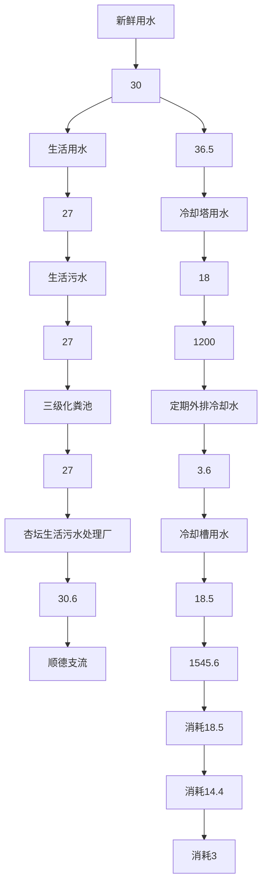
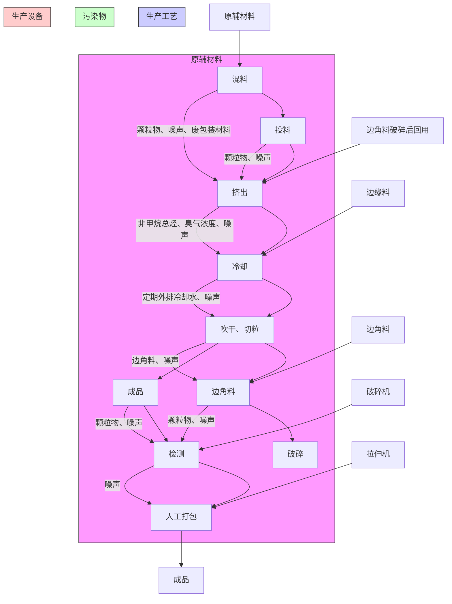
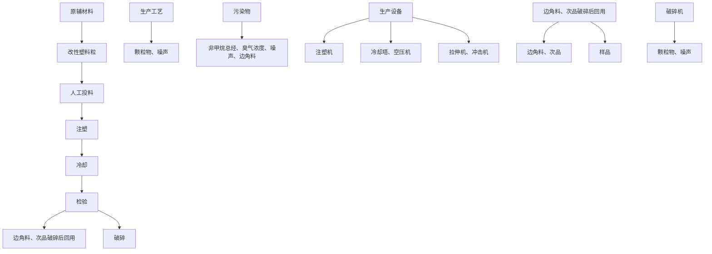
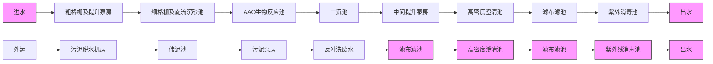

# 建设项目环境影响报告表

2023年3月

编制单位和编制人员情况表

<table><tr><td>项目编号</td><td>gqq5j1</td></tr><tr><td>建设项目名称</td><td>佛山市顺德区准一电器有限公司造粒车间新建项目</td></tr><tr><td>建设项目类别</td><td>26--053塑料制品业</td></tr><tr><td>环境影响评价文件类型</td><td>报告表</td></tr></table>

一、建设单位情况

<table><tr><td>单位名称(盖章)</td></tr><tr><td>统一社会信用代码</td></tr><tr><td>法定代表人(签章)</td></tr><tr><td>主要负责人(签字)</td></tr><tr><td>直接负责的主管人员(签字)</td></tr></table>

二、编制单位情况

<table><tr><td>单位名称(盖章)</td></tr><tr><td>统一社会信用代码</td></tr></table>

三、编制人员情况

<table><tr><td colspan="2">1.编制主持人</td></tr><tr><td>姓名</td><td>职业资</td></tr><tr><td>郭小雄</td><td>0735</td></tr><tr><td colspan="2">2.主要编制人员</td></tr><tr><td>姓名</td><td>主</td></tr><tr><td>郭小雄</td><td></td></tr><tr><td>黎静仪</td><td>建设项目基本析、区域环境标及评价标准措施、环境保</td></tr></table>

natural_image

Portrait of a man wearing glasses and a suit (no visible text or symbols)

text_image

Date:2007年05月13日
壹元
2007 年08 月14

text_image

中华人民共和国
by
My Ministry of Personnel

text_image

家环境保护
国
APPROVED & AUTHORIZED
State Environmental Protection Administration
The People's Republic of China

# 目 录

一、建设项目基本情况.  
二、建设项目工程分析. . 16  
三、区域环境质量现状、环境保护目标及评价标准. .28  
四、主要环境影响和保护措施 .35  
五、环境保护措施监督检查清单 .63  
六、结论.. .65

附图1 项目地理位置. .68

附图2 项目引用大气监测点位图. .69

附图3 厂区平面布置图 .70

附图4 环境保护目标分布图.. .71

附图5 项目四至实景图 .72

附图6 项目四至图. .73

附图7 项目所在地声环境功能区划图. .74

附图8 项目所在地环境空气质量功能区划图. .75

附图9 项目所在地表水环境功能区划图 .76

附图10 项目空厂房图.. .77

附图11 项目所在地环境管控单元图 .78

附图12 广东省三线一单应用平台查询截图.. .79

附图13 佛山市环境管控单元图. ..80

附图14 广东省环境管控单元图. .81

附图15 《＜顺德西部生态产业新区中小企业园片区控制性详细规划＞局部调整》的批后通知》 .82

附件1 项目营业执照. ..85

附件2 法人代表身份证 ..86

附件3 房产证.. .87

附件4 环评合同. .88声明

# 一、建设项目基本情况

<table><tr><td>建设项目名称</td><td colspan="4">佛山市顺德区准一电器有限公司造粒车间新建项目</td></tr><tr><td>项目代码</td><td colspan="4">无</td></tr><tr><td>建设单位联系人</td><td>***</td><td>联系方式</td><td colspan="2">***</td></tr><tr><td>建设地点</td><td colspan="4">佛山市顺德区杏坛镇高赞村委会二环路8号顺德智富园13栋403</td></tr><tr><td>地理坐标</td><td colspan="4">113度11分27.060秒,22度46分19.888秒</td></tr><tr><td>国民经济行业类别</td><td>C2929塑料零件及其他塑料制品制造</td><td>建设项目行业类别</td><td colspan="2">二十六、橡胶和塑料制品业-53塑料制品业292-其他</td></tr><tr><td>建设性质</td><td>☑新建(迁建)□改建□扩建□技术改造</td><td>建设项目申报情形</td><td colspan="2">☑首次申报项目□不予批准后再次申报项目□超五年重新审核项目□重大变动重新报批项目</td></tr><tr><td>项目审批(核准/备案)部门(选填)</td><td>无</td><td>项目审批(核准/备案)文号(选填)</td><td colspan="2">无</td></tr><tr><td>总投资(万元)</td><td>100</td><td>环保投资(万元)</td><td colspan="2">20</td></tr><tr><td>环保投资占比(%)</td><td>20</td><td>施工工期</td><td colspan="2">2个月</td></tr><tr><td>是否开工建设</td><td>☑否□是: _</td><td>用地(用海)面积(m2)</td><td colspan="2">905</td></tr><tr><td>专项评价设置情况</td><td colspan="4">无</td></tr><tr><td>规划情况</td><td colspan="4">无</td></tr><tr><td rowspan="3">规划环境影响评价情况</td><td colspan="4">本项目位于佛山市顺德高新技术产业开发区扩区,与《佛山市顺德高新技术产业开发区扩区规划环境影响报告书审查意见》相符性分析如下。表1-1 项目与规划环评相符性分析</td></tr><tr><td>清单类型</td><td>总体准入要求</td><td>项目情况</td><td>符合性</td></tr><tr><td>空间布局约束</td><td>1、引入产业应符合现行有效的《产业结构调整指导目录》、《市场准入负面清单》等相关产业政策的要求。</td><td>1、本项目属于C2929其他塑料制品制造不属于《市场准入负</td><td>符合</td></tr><tr><td></td><td></td><td>2、禁止引入新增排放重点防控重金属污染物(铅(Pb)、汞(Hg)、镉(Cd)、铬(Cr)和类金属砷(As))、持久性有机污染物的项目。3、饮用水源准保护区内不得新建、扩建对水体污染严重、排放一类水污染物和持久性有机污染物的项目,改扩建项目不得新增水污染物。4、禁止引入达不到清洁生产国际先进水平的企业。5、在污水管网建设滞后或所依托的污水处理厂处理能力不能满足废水处理需求的区域,不应引入废水排放量较大的项目。扩区应控制废水排放量较大企业的引入,引入涉水排放企业的规模应与区域污水处理厂处理能力相匹配,严格控制废水排放量较大的项目及新增一类水污染物排放项目的引入,避免对下游饮用水源保护区产生不良影响。6、禁止新建、扩建燃煤燃油火电机组和企业自备电站,逐步淘汰生物质锅炉、集中供热管网覆盖区域内的分散供热锅炉,集中供热管网覆盖地区禁止新建、扩建分散供热锅炉,规划区应全部按高污染燃料禁燃区进行管理;禁止新建、扩建水泥、平板玻璃、化学制浆、炼化、炼钢炼铁、电解铝、焦炭、金属冶炼、制浆造纸、鞣革、铅酸蓄电池、专业电镀、木质家具涂装、印染项目;不再新建陶瓷厂(新型特种陶瓷项目除外)。化工项目按照“入园管理”原则合理布局,提高准入门槛,不得新建、扩建纳入国家“高污染、高环境风险”产品名录的生产项目。7、严格控制日用玻璃制造、家具制造、废塑料回收加工再生(列入国家“城市矿产”示范基地项目除外)、专业金属表面处理(铝及铝合金的阳极氧化、铝的表面铬酸盐转化、锌的铬酸盐钝化和金属酸洗、磷化、喷漆、喷涂)等项目建设;严格限制新建生产和使用高挥发性有机物原辅材料的项目,鼓励建设挥发性有机物共性工厂。8、工业企业禁止选址城镇生活空间,生产空间禁止建设居民住宅等敏感建筑;园区工业用地或企业与村庄、学校等环境敏感点之间应设置合理的防护距离,并通过绿化带进行有效隔离,该</td><td>面清单(2022年版)》(发改体改规[2022]397号)中禁止和许可事项。2、本项目不涉及重金属污染物和持久性有机污染物排放。3、本项目不涉及饮用水源保护区4、本项目不属于达不到清洁生产国际先进水平的企业。5、本项目冷却水循环使用不外排,生活污水处理达标后排放至杏坛污水处理厂处理。6、本项目不属于“高污染、高环境风险”行业。7、本项目属于C2929其他塑料制品制造,不涉及高挥发性有机物原辅材料使用。8、本项目50米范围内无声环境敏感点,100米范围内无居住区、学校、医院等敏感用地。</td></tr></table>

<table><tr><td rowspan="2"></td><td></td><td>距离内不得规划新建居民点、办公楼和学校等环境敏感目标。9、现有及规划居住区、学校、医院等敏感用地周边50米范围内禁止新建、扩建高噪声排放生产项目;现有及规划居住区、学校、医院等敏感用地周边100米范围内禁止新建、扩建纳入国家“高污染、高环境风险”产品名录的生产项目,不引入酸洗、涂装、注塑、排放恶臭气味的生产工艺和生产设施。10、结合《顺德区高质量推动村级工业园升级改造总体规划》,推进区域村级工业园改造工作,禁止重复低水平建设。</td><td></td><td></td></tr><tr><td>污染物排放管控控</td><td>1、污染物排放总量不得突破“污染物排放总量管控限值清单”的总量管控要求;重点对重点污染物(重点污染物包括化学需氧量、氨氮、氮氧化物及挥发性有机物等)实施总量控制;上年度重点河涌水质未达到水环境质量目标的管控分区所在镇(街道),须组织编制、系统实施、向社会公开区域重点水污染物减排计划并明确“替代量”,本年度新建、改建、扩建项目新增水环境重点污染物实行区域“减二增一”替代(废水集中处理设施、民生项目除外);在可核查、可监管的基础上,全区新建、改建、扩建项目新增大气重点污染物实行“减二增一”替代。2、未完成环境质量改善目标的区域,新改扩建项目重点污染物实施减量替代。3、未接入污水管网的新建建筑小区或公共建筑,不得交付使用。新建城区生活污水收集处理设施要与城市发展同步规划、同步建设。4、规划区内建设项目废污水原则上应接入各片区集中式污水处理厂进行集中处理、达标排放;受纳水体或监控断面不达标的,不得新建、扩建向河涌直接排放废水的项目;对于暂时无法接入市政污水管网、且废水量较少的项目,生活污水处理后立足回用,不能回用的,应处理达到《城镇污水处理厂污染物排放标准》(GB18918-2002)后排入政策法规允许排放且有环境容量的水域;生产废水应立足于回用,不能回用的,可考虑委外处置,确需要外排的,应处理达到行业直接排放标准或广东省《水污染物排放限值》(DB44/26-2001)后排入政策法规允许排放且有环境容量的水域。5、向工业集聚区污水集中处理设施或者城镇污水集中处理设施排放工业废水的,应当按照有关规定进行预处理,达到集中处理设施处理工艺要求后方可以排入市政管网进入各片区污水处理厂。企业生活污水达到广东省《水污染物排放限值》(DB44/26-2001)第二时段三级标准后通过污水管线进入各片区所依托的城镇污水处理厂。6、规划区依托的集中式污水处理设施排放标准应达到或优于《城镇污水处理厂污染物排放标准》(GB18918-2002)一级标准的A标准和广东省《水污染物排放限值》(DB44/26-2001)第二时段一级标准的较严者。7、挤出等合成树脂加工生产环节和生产设备其执行《合成树脂工业污染物排放标准》(GB31572-2015)表5规定的大气污染物特别排放限值(涉及PVC树脂的不执行)、合成树脂工业污染物排放标准及其他污染控制要求;厂区内VOCs无组织排放监控点浓度应符合GB37822-2019中表A.1规别排放限值。8、重点加强涉VOCs排放的工业项目的挥发性有机物的源头替代和无组织排放管控,大力推进低VOCs含量原辅材料替代。</td><td>1、项目产生的生活污水经三级化粪池处理后排入杏坛污水处理厂,根据《佛山市排污权有偿使用和交易管理试行办法(佛府办2016第63号),生活污水 $COD_{Cr}$ 、 $NH_{3}-N$ 不单独分配总量。2、项目VOCs排放量为1.2880t/a(有组织为0.6440t/a,无组织为0.6440t/a),VOCs总量在镇街中列支。3、挤出、注塑产生的非甲烷总烃执行《合成树脂工业污染物排放标准》(GB31572-2015)表5规定的大气污染物特别排放限值;厂区内VOCs无组织排放监控点浓度应符合《固定污染源挥发性有机物综合排放标准》(DB44-2367-2022)表3厂区内VOCs无组织排放限值。</td><td></td></tr><tr><td rowspan="3"></td><td>环境风险防控</td><td>生产性废水较多的企业需配套有效措施,防止事故废水和第一类污染物直排污染地表水体,防止因渗漏污染地下水。</td><td>项目冷却水循环使用不外排。</td><td>符合</td></tr><tr><td>资源开发利用要求</td><td>禁止使用高污染燃料。</td><td>本想项目不使用燃料。</td><td>符合</td></tr><tr><td colspan="4"></td></tr><tr><td>规划及规划环境影响评价符合性分析</td><td colspan="4">本项目符合《佛山市顺德高新技术产业开发区扩区规划环境影响报告书审查意见》</td></tr><tr><td>其他符合性分析</td><td colspan="4">(1)选址用地相符性项目位于佛山市顺德区杏坛镇高赞村委会二环路8号顺德智</td></tr><tr><td></td><td colspan="4">富园13栋403,根据项目用地资料(详见附件3、附图15)可知,项目所在地为工业用地,因此本项目的选址符合佛山市顺德区总体规划的要求,符合所在地块的土地利用性质,因此建设项目的选址与土地利用规划基本相符。(2)与产业政策符合性分析根据国家发展改革委商务部关于印发《市场准入负面清单(2022年版)》的通知(发改体改规〔2022〕397号),项目不属于上述目录所列的鼓励类、限制类、禁止(淘汰)类严控类项目,也不属于《市场准入负面清单(2022年版)》所列的禁止准入及需许可准入事项。根据《促进产业结构调整暂行规定》(国发〔2005〕40号)第十三条,项目符合国家有关法律、法规和政策规定,项目属于允许类。根据《产业结构调整指导目录》(2021年修订)》(中华人民共和国国家发展和改革委员会令第49号),项目属于允许类。因此,本项目的建设符合国家和地方的相关产业政策。本项目为塑料制品业,年产改性塑料粒700吨。不属于《环境保护综合名录(2021年版)》“高污染、高环境风险”、“高环境风险”产品名录内的产品,符合产业政策要求。根据《佛山市发展和改革局 佛山市生态环境局转发关于《广东省禁止、限制生产、销售和使用的塑料制品目录》(2020年版)的通知(佛发改资环函〔2020〕16号),本项目主要产品为PE自粘共挤保护膜,不属于一、禁止生产、销售的塑料制品,二、禁止、限制使用的塑料制品。(3)与广东省、佛山市、顺德区“三线一单”生态环境分区管控方案相符性分析1)与广东省“三线一单”相符性分析根据《广东省人民政府关于印发广东省“三线一单”生态环境分区管控方案的通知》(粤府〔2020〕71号)发布的广东省环境</td></tr></table>

管控单元图，详见附图14，项目所在佛山市顺德区杏坛镇高赞村委会二环路8号顺德智富园13栋403为珠三角核心区的重点管控单元。

表 1-2 与广东省“三线一单”相符性分析

<table><tr><td>管控要求</td><td>与本项目有关的相关要求(摘录)</td><td>相符性分析</td><td>是否符合</td></tr><tr><td>区域布局管控</td><td>禁止新建、扩建水泥、平板玻璃、化学制浆、生皮制革以及国家规划外的钢铁、原油加工等项目。推广应用低挥发性有机物原辅材料,严格限制新建生产和使用高挥发性有机物原辅材料的项目,鼓励建设挥发性有机物共性工厂</td><td>项目不属于水泥、平板玻璃、化学制浆、生皮制革、钢铁、原油加工等行业。项目使用的原辅材料有PBT塑料粒、PET塑料粒、玻璃纤维粗纱均不属于高VOCs含量原辅材料。</td><td>符合</td></tr><tr><td>能源资源利用</td><td>科学实施能源消费总量和强度“双控”,新建高能耗项目单位产品(产值)能耗达到国际国内先进水平,实现煤炭消费总量负增长。推进工业节水减排,重点在高耗水行业开展节水改造,提高工业用水效率。加强江河湖库水量调度,保障生态流量。盘活存量建设用地,控制新增建设用地规模。</td><td>项目所属塑料制品业,不属于高能耗行业,项目全部生产设备使用电能,生产用水由市政供水,不直接取用江河湖库或地下水水量,不会对项目所在地生态流量造成影响,符合能源利用要求。项目为新购厂房,不涉及新增城市建设用地。</td><td>符合</td></tr><tr><td>污染物排放管控</td><td>重点水污染物未达到环境质量改善目标的区域内,新建、改建、扩建项目实施减量替代。大力推进固体废物源头减量化、资源化利用和无害化处置,稳步推进“无废城市”试点建设。</td><td>项目属于新建项目,项目生活污水经三级化粪池预处理达标后汇入市政污水管网排入杏坛生活污水处理厂处理,尾水排入顺德支流;杏坛生活污水处理厂尾水达到《城镇污水处理厂污染物排放标准(GB18918-2002)一级A标准及广东省地方标准《水污染物排放限值》(DB44/26-2001)第二时段一级标准的较严值,排入顺德支流。项目经营过程产生的固体废弃物分类收集,一般包装废弃物由物资回收公司回收,危险废物交有危废资质单位进行处理。固体废质单位物分类减量化、资源化利用和无害化处置。</td><td>符合</td></tr><tr><td>环境风险管控</td><td>加强惠州大亚湾石化区、广州石化、珠海高栏港、珠西新材料集聚区等石化、化工重点园区环境风险防控,建立完善污染源在线监控系统,开展有毒有害气体监测,落实环境风险应急预案。提升危险废物监管能力,利用信息化手段,推进全过程跟踪管理。</td><td>项目所在地不属于石化、化工重点园区环境风险防控区域。项目产生的危险废物将定期委托有资质的处置公司进行收集处理,并通过信息系统登记转移计划和电子转移联单,符合危险废物全过程跟踪管理的防控要求。</td><td>符合</td></tr></table>

# 2）与佛山市“三线一单”相符性分析

根据《佛山市人民政府关于印发佛山市“三线一单”生态环境分区管控方案的通知》（佛府〔2021〕11 号）发布的佛山市环境管控单元图，详见附图13，项目所在佛山市顺德区杏坛镇高赞村委会二环路8号顺德智富园13栋403为珠三角核心区的重点管控单元。环境管控单元编号为 ZH44060620011，单元名称为顺德高新技术产业开发区。

表 1-3 与佛山市“三线一单”相符性分析

<table><tr><td>管控要求</td><td>与本项目有关的相关要求(摘录)</td><td>相符性分析</td><td>是否符合</td></tr><tr><td>区域布局管控</td><td>禁止新建、扩建水泥、平板玻璃、化学制浆、生皮制革以及国家规划外的钢铁、原油加工等项目。专业电镀、印染等项目进入定点园区集中管理。推广应用低挥发性有机物原辅材料,严格限制新建生产和使用高挥发性有机物原辅材料的项目,鼓励建设共性工厂、活性炭集中再生中心等挥发性有机物第三方治理项目,推动挥发性有机物集中高效处理。</td><td>项目不属于水泥、平板玻璃、化学制浆、生皮制革、钢铁、原油加工等行业。项目使用的原辅材料有PBT塑料粒、PET塑料粒、玻璃纤维粗纱均不属于高VOCs含量原辅材料。</td><td>符合</td></tr><tr><td>能源资源利用</td><td>科学实施能源消费总量和强度“双控”,新建高能耗项目单位产品(产值)能耗达到国际国内先进水平,实现煤炭消费总量负增长。</td><td>项目所属塑料制品业,不属于高能耗行业,项目全部生产设备使用电能,项目用水由市政供水,不直接取用江河湖库或地下水水量,不会对项目所在地</td><td>符合</td></tr></table>

<table><tr><td rowspan="3"></td><td></td><td>贯彻落实“节水优先”方针,实行最严格水资源管理制度,提高工业用水效率,加强江河湖库水量调度,保障生态流量。强化自然岸线保护,优化岸线开发利用格局,严格水域岸线用途管制,新建项目一律不得违规占用水域。</td><td>生态流量造成影响,符合能源利用要求。</td><td></td></tr><tr><td>污染物排放管控</td><td>上年度重点河涌水质未达到水环境质量目标的管控分区所在镇(街道),须组织编制、系统实施、向社会公开区域重点水污染物减排计划并明确“替代量”,本年度新建、改建、扩建项目新增水环境重点污染物实行区域“减二一”替代(废水集中处理设施、民生项目除外)。推进挥发性有机物源头替代,全面加强无组织排放控制,深入实施精细化治理。推进石化化工溶剂使用及挥发性有机液体储运销的挥发性有机物减排,全过程实施反应活性物质、有毒有害物质、恶臭物质的协同控制。将全面使用低VOCs含量原辅材料的企业纳入正面清单和政府绿色采购清单。开展“无废城市”建设,推动固体废物源头减量、资源化利用和安全处置。</td><td>项目属于新建项目,项目生活污水经三级化粪池预处理达标后汇入市政污水管网排入杏坛生活污水处理厂处理,尾水排入顺德支流;杏坛生活污水处理厂尾水达到《城镇污水处理厂污染物排放标准(GB18918-2002)一级A标准及广东省地方标准《水污染物排放限值》(DB44/26-2001)第二时段一级标准的较严值,排入顺德支流。项目属于塑料制品业,项目使用的原辅材料有PBT塑料粒、PET塑料粒、玻璃纤维粗纱均不属于高VOCs含量原辅材料。项目经营过程产生的固体废弃物分类收集,一般包装废弃物由物资回收公司回收,危险废物交有危废资质单位进行处理。固体废物分类减量化、资源化利用和无害化处置。</td><td>符合</td></tr><tr><td>环境风险管控</td><td>强化地表水、地下水和土壤污染风险协同防控,建立完善突发环境事件应急管理体系。重点加强环境风险分级分类管理,应用全省环境风险源在线监控预警系统,强化化工企业、涉重金属行业、工业园区等重点环境风险源的环境风险防控。提升危险废物监管能力,利用信息化手段,推动全过程跟踪管理。健全危险废物收</td><td>项目所在地不属于石化、化工重点园区环境风险防控区域。项目产生的危险废物将定期委托有危废资质单位进行收集处理,并通过信息系统登记转移计划和电子转移联单。</td><td>符合</td></tr></table>

<table><tr><td></td><td>集体系,推进危险废物利用处置能力优化提升。全力避免因各类安全事故(事件)引发的次生环境风险事故(事件)。</td><td></td><td></td></tr></table>

# 3）与顺德区“三线一单”相符性分析

根据《佛山市顺德区人民政府关于印发佛山市“三线一单”生态环境分区管控方案的通知》（顺府发〔2021〕11号）发布的佛山市顺德区环境管控单元图（见附图11），项目所在地属于顺德高新技术产业开发区（编码为 ZH44060620011）。项目在广东省“三线一单”应用平台查询结果详见附图 12。

表 1-4 与顺德区“三线一单”相符性分析

<table><tr><td>管控要求</td><td>与本项目有关的相关要求(摘录)</td><td>相符性分析</td><td>是否符合</td></tr></table>

顺德高新技术产业开发区（编码为 ZH44060620011）

<table><tr><td>区域布局管控</td><td>1-1【产业/鼓励引导类】园区重点发展家用电器具制造、装备制造等产业。1-2.【产业/禁止类】新入园项目不得引入专业电镀、印染等污染物排放量大或排放一类水污染物、持久性有机污染物的项目,不得引进园区规划环评及批复(审查意见)禁止引进项目。1-3.【产业/禁止类】严格生产空间和生活空间管控,工业企业原则上禁止选址生活空间,生产空间原则上禁止建设居民住宅等敏感建筑。1-4.【产业/综合类】园区工业用地或企业与村庄、学校等环境敏感点之间的区域应合理设置控制开发区域(产业控制带),产业控制带内优先引进无污染的生产性服务业,或可适当布置废气排放量小、工业噪声影响小的产业。1-5.【产业/限制类】严格限制不符合园区发展定位的项目入驻。1-6.【产业/限制类】受纳水体或监控断面不达标的,不得新建、扩建向河涌直接排放废水的项目。新建、扩建含蚀刻工序的线路板生产项目和化工项目应在配套污水集中处置的工业园区或生活污水管网覆盖区域内建设;纯加工型印花项目,含酸洗、磷化的金属表面处理、金属制品项目(与自身高新技术企</td><td>1-1 本项目不涉及家用电器具制造、装备制造等产业。1-2 项目为塑料制品业,不是专业电镀、印染等污染物排放量大或排放一类水污染物、持久性有机污染物的项目。1-3 本项目选址于工业用地,不占用其他生活空间。1-4 项目500米范围内存在敏感点,距离项目最近的敏感点为高赞村,距离为410m,距离较远。1-5 项目为塑料制品业,不属于不符合园区发展定位的项目。1-6 本项目属于塑料制品业,项目生活污水经三级化粪池预处理达标后汇入市政污水管网排入杏坛生活污水处理厂处理,尾水排入顺德支流;不涉及蚀刻工序的线路板生产、酸洗、喷涂、化学抛光、电解等涉</td><td>符合</td></tr></table>

<table><tr><td rowspan="6"></td><td></td><td>业配套的除外),含酸洗、喷涂、化学抛光、电解等涉及废水排放工艺的不锈钢型材加工项目(与自身高新技术企业配套的除外),应进入以此类项目为主导产业、有相应废水集中治理设施的工业园区,实现集中治污。1-7.【产业/综合类】划定家具生产优先发展区域,优先发展区外不再新建涉及涂装工艺的木质家具制造项目。1-8.【产业/综合类】系统推进村级工业园升级改造,腾出连片空间,布局产业集聚区和主题产业园,推动工业项目入园集聚发展。新增工业制造业用地原则上安排在产业集聚区内,产业集聚区外原则上不鼓励工业及物流仓储用地的新建与改造。</td><td>及废水排放工艺的不锈钢型材加工项目。1-7 本项目不涉及家具生产、涂装工艺的木质家具制造。1-8 项目位于产业集聚区内。</td><td></td></tr><tr><td>能源资源利用</td><td>2-1.【能源/综合类】科学实施能源消费总量和强度“双控”,新建高能耗项目单位产品(产值)能耗达到国际国内先进水平。2-2.【水资源/综合类】提高园区水资源利用效率,提升污水回用比例。2-3【土地资源/综合类】落实单位土地面积投资强度、土地利用强度等建设用地控制性指标要求,提高土地利用效率。2-4.【其他/综合类】有行业清洁生产标准的新引进项目清洁生产水平须达到本行业国际先进水平。</td><td>2-1 本项目属于塑料制品业,不属于高能耗项目。2-2 本项目冷却槽冷却水循环使用不外排。2-3 本项目外购厂房,不新增建设用地。2-4 本项目属于塑料制品业,没有行业清洁生产标准。</td><td>符合</td></tr><tr><td>污染物排放管控</td><td>3-1.【其他/综合类】园区各项污染物排放总量不得突破规划环评核定的污染物排放总量管控要求。3-2.【水/综合类】完善污水管网建设,有条件的区域实施雨污分流改造。</td><td>3-1 项目污染物排放总量较小,不会突破规划环评核定的污染物排放总量管控要求。3-2 项目位于工业园区内,园区已设置雨污分流管网。</td><td>符合</td></tr><tr><td>环境风险管控</td><td>4-1.【风险/综合类】园区应建立企业、园区、区域三级环境风险防控体系,加强园区及入园企业环境应急设施整合共享,建立有效的拦截、降污、导流、暂存等工程措施,防止泄漏物、消防废水等进入园区外环境。建立园区环境应急监测机制,强化园区风险防控。</td><td>4-1 建设单位将严格采取切实可行环境风险防范措施,可有效防止项目产生的污染物进入环境,有效降低了对周围环境存在的风险影响。</td><td>符合</td></tr><tr><td colspan="4">(4)项目与有机污染物治理政策的相符性分析表1-5 本项目与有机污染物治理政策的相符性</td></tr><tr><td>序号</td><td>政策要求</td><td>工程内容</td><td>符合性</td></tr><tr><td rowspan="7"></td><td colspan="4">1、关于印发《重点行业挥发性有机物综合治理方案》的通知(环大气[2019]53号)</td></tr><tr><td>1.1</td><td>企业采用符合国家有关低VOCs含量产品规定的涂料、油墨、胶粘剂等,排放浓度稳定达标且排放速率、排放绩效等满足相关规定的,相应生产工序可不要求建设末端治理设施。使用的原辅材料VOCs含量(质量比)低于10%的工序,可不要求采取无组织排放收集措施。</td><td>项目挤出、注塑废气收集效率为80%;项目挤出、注塑废气经“集气罩+帘幕”收集后汇入“二级活性炭吸附装置”处理达标后汇入35米G1排气筒排放。</td><td>符合</td></tr><tr><td colspan="4">2.《固定污染源挥发性有机物综合排放标准(DB44/2367-2022)》</td></tr><tr><td>2.1</td><td>排气筒高度不低于15m(因安全考虑或者有特殊工艺要求的除外),具体高度以及与周围建筑物的相对高度关系应当根据环境影响评价文件确定。</td><td>本项目排气筒高度为35米</td><td>符合</td></tr><tr><td>2.2</td><td>企业应当建立台账,记录废气收集系统、VOCs处理设施的主要运行和维护信息,如运行时间、废气处理量、操作温度、停留时间、吸附剂再生/更换周期和更换量、催化剂更换周期和更换量、吸收液pH值等关键运行参数。台账保存期限不少于3年。</td><td>项目废气治理设施安排专人维护并定期建立台账,记录相关废气数据。</td><td>符合</td></tr><tr><td>2.3</td><td>VOCs物料应当储存于密闭的容器、储罐、储库、料仓中;盛装VOCs物料的容器应当存放于室内,或者存放于设置有雨棚、遮阳和防渗设施的专用场地。盛装VOCs物料的容器或者包装袋在非取用状态时应当加盖、封口,保持密闭。</td><td>本项目液体原辅材料均采用密封存放桶内,原辅材料放置于厂房内的仓库</td><td>符合</td></tr><tr><td>2.4</td><td>废气收集系统排风罩(集气罩)的设置应当符合GB/T16758的规定。采用外部排风罩的,应当按GB/T16758、WS/T757—2016规定的方法测量控制风速,测量点应当选取在距排风罩开口面最远处的VOCs无组织排放位置,控制风速不应当低于0.3m/s(行业相关规范有具体规定的,按相关规定执行)。</td><td>项目挤出、注塑废气收集效率为80%,项目挤出、注塑废气经“集气罩+帘幕”收集,控制风速为0.75m/s</td><td>符合</td></tr><tr><td rowspan="7"></td><td colspan="4">3.新《广东省大气污染防治条例》(2018年11月29日修订)</td></tr><tr><td>3.1</td><td>珠江三角洲区域禁止新建、扩建国家规划外的钢铁、原油加工、乙烯生产、造纸、水泥、平面玻璃、除特种陶瓷以外的陶瓷、有色金属冶炼等大气重污染项目</td><td>本项目为塑料制品业,不在珠江三角洲区域禁止新建、扩建的大气重污染项目</td><td>符合</td></tr><tr><td>3.2</td><td>新建、改建、扩建排放挥发性有机物的建设项目,应当使用污染防治先进可行技术。下列产生含挥发性有机物废气的生产和服务活动,应当优先使用低挥发性有机物含量的原材料和低排放环保工艺,在确保安全条件下,按照规定在密闭空间或者设备中进行,安装、使用满足防爆、防静电要求的治理效率高的污染防治设施;无法密闭或者不适宜密闭的,应当采取有效措施减少废气排放:(一)石油、化工、煤炭加工与转化等含挥发性有机物原料的生产;(二)燃油、溶剂的储存、运输和销售;(三)涂料、油墨、胶粘剂、农药等以挥发性有机物为原料的生产;(四)涂装、印刷、粘合、工业清洗等使用含挥发性有机物产品的生产活动;(五)其他产生挥发性有机物的生产和服务活动。</td><td>项目挤出、注塑废气收集方式为“集气罩+帘幕”,通过“二级活性炭吸附”装置处理后引至35m排气筒高空排放,可有效减少有机废气排放,减少异味影响。</td><td>符合</td></tr><tr><td>3.3</td><td>产生恶臭污染物的化工、石化、制药、制革、骨胶炼制、生物发酵、饲料加工、家具制造等行业应当科学选址,设置合理的防护距离,并安装净化装置或者采取其他措施,防止排放恶臭污染物。</td><td>项目所属塑料制品业,选址位于工业区内,项目设置独立密闭幕帘,恶臭经局部点对点密闭集气罩收集,通过“二级活性炭吸附”装置处理后引至35m排气筒高空排放,恶臭污染物对附近大气环境影响较小。</td><td></td></tr><tr><td colspan="4">4.《广东省人民政府办公厅关于印发广东省2021年大气、水、土壤污染防治工作方案的通知》(粤办函[2021]58号)</td></tr><tr><td>4.1</td><td>涉VOCs重点行业新建、改建和扩建见项目不推荐使用光催化、低温等离子等低效治理设施。</td><td>项目挤出、注塑废气经“集气罩+帘幕”收集后汇入“二级活性炭吸附装置”处理达标后汇入35米G1排气筒排放;</td><td>符合</td></tr><tr><td colspan="4">5.广东省“十四五”环境保护规划的相符性分析</td></tr><tr><td rowspan="9"></td><td>5.1</td><td>在石化、化工、包装印刷、工业涂装等重点行业建立完善源头、过程和末端的VOCs全过程控制体系。大力推进低VOCs含量原辅材料源头替代,严格落实国家和地方产品VOCs含量限值质量标准,禁止建设生产和使用高VOCs含量的溶剂型涂料、油墨、胶粘剂等项目。</td><td>项目所属行业为塑料制品业;项目使用的原辅材料有PBT塑料粒、PET塑料粒、玻璃纤维粗纱均不属于高VOCs含量原辅材料。项目挤出、注塑废气经“集气罩+帘幕”收集后汇入“二级活性炭吸附装置”处理达标后汇入35米G1排气筒排放;</td><td>符合</td></tr><tr><td colspan="4">6.佛山市生态环境保护“十四五”规划的相符性分析</td></tr><tr><td>6.1</td><td>严格控制“高耗能、高排放”项目的发展,禁止新建、扩建水泥、平板玻璃、化学制浆、生皮制革以及国家规划外的钢铁、原油加工等项目。</td><td>项目为塑料制品业,不属于“高耗能、高排放”项目</td><td>符合</td></tr><tr><td>6.2</td><td>鼓励重点行业企业开展生产工艺和设备水性化改造,推广使用水性、高固体分、无溶剂、粉末等低VOCs含量涂料。</td><td>项目使用的原辅材料有PBT塑料粒、PET塑料粒、玻璃纤维粗纱均不属于高VOCs含量原辅材料。</td><td>符合</td></tr><tr><td colspan="4">7.《2020年挥发性有机物治理攻坚方案》(环发〔2020〕33号)</td></tr><tr><td>7.1</td><td>采用符合国家有关低VOCs含量产品规定的涂料、油墨、胶粘剂等,排放浓度稳定达标且排放速率满足相关规定的,相应生产工序可不要求建设末端治理设施。使用的原辅材料VOCs含量(质量比)均低于10%的工序,可不要求采取无组织排放收集和处理措施。</td><td>项目有机废气经集气罩(集气罩外围安装软帘形成局部围闭)收集,通过“二级活性炭吸附”装置处理后引至35m排气筒高空排放。项目使用的原辅材料有PBT塑料粒、PET塑料粒、玻璃纤维粗纱均不属于高VOCs含量原辅材料。项目挤出、注塑废气经“集气罩+帘幕”收集后汇入“二级活性炭吸附装置”处理达标后汇入35米G1排气筒排放;</td><td>符合</td></tr><tr><td colspan="4">8、关于印发《广东省涉挥发性有机物(VOCs)重点行业治理指引》的通知(粤环办〔2021〕43号)</td></tr><tr><td>8.1</td><td>研发和生产低VOCs含量涂料、油墨、粘胶剂等产品。使用低(无)VOCs含量、低反应活性的原辅材料。</td><td>项目使用的原辅材料有PBT塑料粒、PET塑料粒、玻璃纤维粗纱均不属于高VOCs含量原辅材料。</td><td>符合</td></tr><tr><td>8.2</td><td>粉状、粒状VOCs物料采用气力输送设备、管状带式输送机、螺旋输送机等密闭输送方式,或者采用密闭的包装袋、容器或罐车进行物料转移。</td><td>项目原辅料采用密封包装容器进行运输与储存。</td><td>符合</td></tr><tr><td rowspan="7"></td><td>8.3</td><td>VOCs 治理设施应与生产工艺设备同步运行,VOCs 治理设施发生故障或检修时,对应的生产工艺设备应停止运行,待检修完毕后同步投入使用;生产工艺设备不能停止运行或不能及时停止运行的,应设置废气应急处理设施或采取其他替代措施。</td><td>已要求企业 VOCs 治理设施应与生产工艺设备同步运行,日常安排专门人员对治理设备进行定期巡查和检修,避免故障情况的出现。</td><td>符合</td></tr><tr><td>8.4</td><td>建立废气收集处理设施台账,记录废气处理设施进出口的监测数据(废气量、浓度、温度、含氧量等)、废气收集与处理设施关键参数、废气处理设施相关耗材(吸收剂、吸附剂、催化剂等)购买和处理记录。</td><td>项目废气治理设施安排专人维护并定期建立台账,记录相关废气数据。</td><td>符合</td></tr><tr><td>8.5</td><td>建立危废台账,整理危废处置合同、转移联单及危废处理方资质佐证材料。</td><td>企业严格执行危险废物转移计划报批、依法建立危险废物转移联单,并通过信息系统登记转移计划和电子转移联单。</td><td>符合</td></tr><tr><td>8.6</td><td>要求建设单位需对有机废气有组织和无组织废气、噪声每年监测1次</td><td>已要求企业对项目废气、噪声进行自行监测。</td><td>符合</td></tr><tr><td colspan="4">9、《佛山市顺德区生态环境保护“十四五”规划(2021—2025)》</td></tr><tr><td>9.1</td><td>严格控制“高耗能、高排放”项目盲目发展,禁止新建、扩建水泥、平板玻璃、化学制浆、生皮制革以及国家规划外的钢铁、原油加工等项目;专业电镀、印染等项目进入定点园区集中管理</td><td>项目属于塑料制品业,不属于水泥、平板玻璃、化学制浆、生皮制革以及国家规划外的钢铁、原油加工等项目。</td><td>符合</td></tr><tr><td>9.2</td><td>大力推进低 VOCs 含量、低反应活性的原辅材料替代,将全面使用低 VOCs 含量原辅材料的企业纳入正面清单和政府绿色采购清单。鼓励重点行业企业开展生产工艺和设备水性化改造,推广使用水性、高固体分、无溶剂、粉末等低 VOCs 含量涂料。严格落实《挥发性有机物无组织排放控制标准》,开展厂区内无组织排放浓度监测,加强对含 VOCs 物料储存、转移和运输、设备与管线组件泄漏、敞开页面逸散以及工艺过程等五类排放源的管控。加强储油库、加油站等VOCs排放治理,推动油品储运销体系安装油气回收自动监控系统。</td><td>本项目使用的物料不属于禁止使用的高 VOCs 含量原辅材料,符合政策要求。建设单位严格落实《固定污染源挥发性有机物综合排放标准》,开展厂区内无组织排放浓度监测。</td><td>符合</td></tr><tr><td rowspan="7"></td><td colspan="4">10、《挥发性有机物无组织排放控制标准》(GB27822-2019)</td></tr><tr><td rowspan="4">10.1</td><td>VOCs物料应储存于密闭的容器、包装袋、储罐、储库、料仓中。</td><td rowspan="4">本项目使用的物料采用密封容器存放在厂房内的仓库;厂房为已建成工业厂房,拥有完整的维护结构,地面已经全部混凝土硬化处理。</td><td rowspan="4">符合</td></tr><tr><td>盛装VOCs物料的容器或包装袋应存放于室内,或存放与设置雨棚、遮阳和防渗设施的专用场地。盛装VOCs物料的容器或包装袋在非取用状态时应加盖、封口,保持密闭。</td></tr><tr><td>VOCs物料储存、料仓应满足3.6条对密闭空间的要求。</td></tr><tr><td>VOCs物料应储存于密闭的容器、包装袋、储罐、储库、料仓中。</td></tr><tr><td>10.2</td><td>粉状、粒状VOCs物料应采用气力输送设备、管状带式输送机、螺旋输送机等密闭输送方式,或采用密闭的包装袋、容器或罐车进行物料转移。</td><td>本项目VOCs物料使用时采用密闭包装容器进行转移。</td><td>符合</td></tr><tr><td>10.3</td><td>VOCs物料卸(出、放)料过程密闭,卸料废气应排至VOCs废气收集处理系统;无法密闭的,应采取局部气体收集措施,废气应排至VOCs废气收集处理系统。</td><td>建设单位在每台注塑机、拉粒机上方设置集气罩收集废气,集气罩外围安装软帘形成局部围闭,加强收集效率。项目挤出、注塑废气经“集气罩+帘幕”收集后汇入“二级活性炭吸附装置”处理达标后汇入35米G1排气筒排放。</td><td>符合</td></tr></table>

# 二、建设项目工程分析

# 1、项目概括

佛山市顺德区准一电器有限公司位于广东省佛山市顺德区杏坛镇齐杏社区杏坛工业区科技五路1号华康楼 4栋703（以下简称“华康楼4栋703”），建设单位于华康楼4栋703内进行石英发热管生产，行业类别属于电气机械和器材制造，生产活动仅有组装工序，根据《广东省豁免环境影响评价手续办理的建设项目名录（2020年版）》的通知，于华康楼4栋703内进行的生产活动属于豁免项目。企业为了更好的发展，新增改性塑料粒的生产，由于华康楼 4栋703生产布局规划等原因，建设单位新购佛山市顺德区杏坛镇高赞村委会二环路8号顺德智富园（以下简称“智富园”）13栋403生产改性塑料粒，华康楼4栋703位于本项目西北面，约1800米，详见附图1。

佛山市顺德区准一电器有限公司造粒车间新建项目（以下简称“本项目”）位于佛山市顺德区杏坛镇高赞村委会二环路8 号顺德智富园13栋403。建设单位外购顺德智富园13栋403作为本项目生产场所。智富园13栋共8层，首层为7米，2-8层为 4米，建筑总高度为35米。本项目位于第4层，占地面积为905 平方米，建筑面积为 905 平方米。本项目主体工程包括打样区、生产区、测试室等，并配有办公室、物料、成品暂存区等辅助工程，废气处理设施和危险废物暂存房等环保工程，项目组成详见下表。

表 2-1 项目工程组成表

<table><tr><td>工程类别</td><td>项目名称</td><td>数量/建筑规模</td><td>主要用途</td></tr><tr><td rowspan="3">主体工程</td><td>打样区</td><td>1个100平方米</td><td>用于打样工序</td></tr><tr><td>生产区</td><td>1个200平方米</td><td>用于挤出工序</td></tr><tr><td>测试室</td><td>1个35平方米</td><td>用于测试工序</td></tr><tr><td>辅助工程</td><td>办公室</td><td>1个35平方米</td><td>用于员工办公</td></tr><tr><td>储运工程</td><td>成品、物料暂存区</td><td>1个300平方米</td><td>用于贮存原料、成品</td></tr><tr><td rowspan="2">公用工程</td><td>供水系统</td><td>一套,与市政供水管网</td><td>供水水源</td></tr><tr><td>排水</td><td>生活污水经三级化粪池处理后进入市政污水管道,排入杏坛生活污水处理厂处理</td><td>/</td></tr></table>

<table><tr><td rowspan="13"></td><td colspan="2" rowspan="2"></td><td colspan="2"></td><td colspan="2">定期外排冷却水作为清净下水定期通过污水管网排入杏坛生活污水处理厂,尾水排入顺德支流</td><td>/</td></tr><tr><td colspan="2">供电系统</td><td colspan="2">一套,接市政供电系统</td><td>供应生产用电和办公生活用电</td></tr><tr><td colspan="2" rowspan="8">环保工程</td><td colspan="2">生活污水处理</td><td colspan="2">生活污水经三级化粪池处理后进入市政污水管道,排入杏坛生活污水处理厂处理</td><td>/</td></tr><tr><td colspan="2" rowspan="2">冷却水处理</td><td colspan="2">定期外排冷却水作为清净下水定期通过污水管网排入杏坛生活污水处理厂,尾水排入顺德支流</td><td>/</td></tr><tr><td colspan="2">拉粒机冷却槽内冷却水循环使用不外排。</td><td>/</td></tr><tr><td rowspan="2">废气处理设施</td><td>有机废气、恶臭</td><td colspan="2">项目挤出、注塑废气经“集气罩+帘幕”收集后汇入“二级活性炭吸附装置”处理达标后汇入35米G1排气筒排放</td><td>/</td></tr><tr><td>塑料粉尘</td><td colspan="2">混料、投料、破碎产生的粉尘经简易布袋除尘器处理后通过无组织排放至大气环境</td><td>/</td></tr><tr><td colspan="2">噪声治理</td><td colspan="2">合理调整设备布置,设备定期维护与保养,采用墙体隔声、距离衰减等治理措施</td><td>/</td></tr><tr><td colspan="2">一般固体废物暂存房</td><td colspan="2">1个3平方米</td><td>/</td></tr><tr><td colspan="2">危险废物暂存房</td><td colspan="2">1个5平方米</td><td>/</td></tr><tr><td colspan="2" rowspan="2">依托工程</td><td colspan="2">废水治理</td><td colspan="2">生活污水经三级化粪池处理后进入市政污水管道,排入杏坛生活污水处理厂处理</td><td>/</td></tr><tr><td colspan="2">冷却水处理</td><td colspan="2">定期外排冷却水作为清净下水定期通过污水管网排入杏坛生活污水处理厂,尾水排入顺德支流</td><td>/</td></tr><tr><td colspan="2">备注:</td><td colspan="5">1、项目建筑面积组成详见表2-1,剩余的建筑面积企业预留用作运货使用的通道。</td></tr><tr><td colspan="8">2、主要产品及产能项目主要产品及产能见下表:表2-2 项目产品方案</td></tr><tr><td colspan="2">序号</td><td colspan="2">名称</td><td>单位</td><td>数量</td><td colspan="2">备注</td></tr><tr><td colspan="2">1</td><td colspan="2">改性塑料粒</td><td>吨/年</td><td>700</td><td colspan="2">颗粒状</td></tr></table>

# 3、主要生产工艺、生产设施、设施参数

本项目主要生产工艺、生产设施、设施参数及计量单位见表 2-3。

表 2-3 项目主要生产工艺、生产设施、设施参数及计量单位一览表

<table><tr><td rowspan="2">生产单元</td><td rowspan="2">生产设施名称</td><td>数量</td><td colspan="3">设备型号/参数</td><td rowspan="2">生产工序</td></tr><tr><td>台/条</td><td>参数名称</td><td>设计值</td><td>计量单位</td></tr><tr><td>混料</td><td>混料机</td><td>1</td><td>功率</td><td>5</td><td>KW</td><td>混料</td></tr><tr><td rowspan="2">挤出</td><td rowspan="2">大拉粒机</td><td rowspan="2">1</td><td>功率</td><td>20</td><td>KW</td><td rowspan="2">挤出、吹干、切粒</td></tr><tr><td>设计加工量</td><td>336</td><td>Kg/h</td></tr><tr><td>冷却</td><td>冷却塔</td><td>1</td><td>循环流量</td><td>0.5</td><td> $m^3/h$ </td><td>冷却</td></tr><tr><td>检验</td><td>拉伸机</td><td>1</td><td>功率</td><td>5</td><td>KW</td><td>检验</td></tr><tr><td>检验</td><td>冲击机</td><td>1</td><td>功率</td><td>0.5</td><td>KW</td><td>检验</td></tr><tr><td rowspan="2">试生产</td><td rowspan="2">细拉粒机</td><td rowspan="2">1</td><td>功率</td><td>10</td><td>KW</td><td rowspan="2">挤出、切粒</td></tr><tr><td>设计加工量</td><td>4</td><td>Kg/h</td></tr><tr><td>测试</td><td>注塑机</td><td>1</td><td>合模力</td><td>80</td><td>t</td><td>注塑</td></tr><tr><td>破碎</td><td>破碎机</td><td>1</td><td>功率</td><td>5</td><td>KW</td><td>破碎</td></tr><tr><td>辅助</td><td>空压机</td><td>1</td><td>功率</td><td>25</td><td>KW</td><td>辅助</td></tr></table>

备注：上表设施参数均为单台设备的参数，同种生产设施，参数相同归纳在一起，不再一一列举。

# 4、主要原辅材料

表 2-4 项目主要原辅材料及年用量情况一览表

<table><tr><td>类别</td><td colspan="2">名称</td><td>单位</td><td>数量</td><td>原料状态</td><td>包装规格</td><td>最大存储量</td><td>备注</td></tr><tr><td rowspan="5">原辅材料</td><td colspan="2">PBT塑料粒</td><td>吨/年</td><td>254</td><td>固态</td><td>25kg/袋</td><td>21</td><td>新料</td></tr><tr><td colspan="2">PET塑料粒</td><td>吨/年</td><td>254</td><td>固态</td><td>25kg/袋</td><td>21</td><td>新料</td></tr><tr><td colspan="2">玻璃纤维粗纱</td><td>吨/年</td><td>200</td><td>固态</td><td>25kg/袋</td><td>17</td><td>新料</td></tr><tr><td colspan="2">机油</td><td>吨/年</td><td>0.01</td><td>液态</td><td>10kg/桶</td><td>0.01</td><td>设备维修</td></tr><tr><td colspan="2">塑料袋</td><td>吨/年</td><td>0.4</td><td>固态</td><td>/</td><td>0.1</td><td>用于成品包装</td></tr><tr><td rowspan="3">能耗</td><td rowspan="2">新鲜用水</td><td>生活用水</td><td>吨/年</td><td>30</td><td>液体</td><td>/</td><td>/</td><td>市政供水</td></tr><tr><td>生产用水</td><td>吨/年</td><td>36.5</td><td>液体</td><td>/</td><td>/</td><td>市政供水</td></tr><tr><td colspan="2">电</td><td>万kW·h/a</td><td>20</td><td>/</td><td>/</td><td>/</td><td>市政供电</td></tr></table>

部分原辅材料主要理化性质：

PBT 塑料粒：聚对苯二甲酸丁二酯（PBT），是对苯二甲酸和 1,4-丁二醇缩聚制成的聚酯，是重要的热塑性聚酯，五大工程塑料之一。聚对苯二甲酸丁二酯为乳白色半透明到不透明、半结晶型热塑性聚酯，具有高耐热性。不耐强酸、强碱，能耐有机溶剂，可燃，高温下分解。聚对苯二甲酸丁二酯在汽车、机械设备、精密仪器部件、电子电器、纺织等领域得到广泛的应用。

PET 塑料粒：聚对苯二甲酸乙二醇酯（PET），化学式为 $( \mathbf { C } _ { 1 0 } \mathbf { H } _ { 8 } \mathbf { O } _ { 4 } ) \mathbf { n }$ ，是由对苯二甲酸二甲酯与乙二醇酯交换或以对苯二甲酸与乙二醇酯化先合成对苯二甲酸双羟乙酯，然后再进行缩聚反应制得。属结晶型饱和聚酯，为乳白色或浅黄色、高度结晶的聚合物，表面平滑有光泽，是生活中常见的一种树脂，可以分为 APET、RPET 和 PETG。

玻璃纤维粗纱：是一种性能优异的无机非金属材料，种类繁多，优点是绝缘性好、耐热性强、抗腐蚀性好、机械强度高，但缺点是性脆，耐磨性较差。它是以叶腊石、石英砂、石灰石、白云石、硼钙石、硼镁石六种矿石为原料经高温熔制、拉丝、络纱、织布等工艺制造成的，其单丝的直径为几个微米到二十几个微米，相当于一根头发丝的 1/20-1/5 ，每束纤维原丝都由数百根甚至上千根单丝组成。玻璃纤维通常用作复合材料中的增强材料，电绝缘材料和绝热保温材料，电路基板等国民经济各个领域。

表 2-5 项目主要物料平衡一栏表

<table><tr><td colspan="2">投入</td><td colspan="3">产出</td></tr><tr><td>原料名称</td><td>用量(t)</td><td colspan="2">产品名称</td><td>产出量(t)</td></tr><tr><td>PBT塑料粒</td><td>254</td><td colspan="2">改性塑料粒</td><td>700</td></tr><tr><td>PET塑料粒</td><td>254</td><td rowspan="2">废气</td><td>非甲烷总烃</td><td>3.22</td></tr><tr><td>玻璃纤维粗纱</td><td>200</td><td>颗粒物</td><td>4.795</td></tr><tr><td>合计</td><td>708</td><td colspan="2">合计</td><td>708</td></tr></table>

表 2-6 项目原辅材料使用量合理性分析一览表

<table><tr><td>生产工序</td><td>生产设备</td><td>数量(台)</td><td>使用原料</td><td>单台设备加工量设计参数(kg/h)</td><td>生产周期(h)</td><td>物料设计使用量(t)</td><td>物料实际使用量(t)</td><td>设计最大年产量(吨/年)</td><td>申报产能(吨/年)</td><td>是否在产量范围内</td></tr><tr><td>挤出</td><td>大拉粒机</td><td>1</td><td rowspan="2">PBT塑料粒、PET塑料粒、玻璃纤维粗纱</td><td>336</td><td>2400</td><td rowspan="2">825.3</td><td rowspan="2">708</td><td rowspan="2">816</td><td rowspan="2">700</td><td rowspan="2">是</td></tr><tr><td>挤出</td><td>细拉粒机</td><td>1</td><td>4</td><td>2400</td></tr></table>

# 5、公用、配套工程

# （1）给水：

项目给水均由市政给水管网供应。用水主要为员工生活用水、生产用水。

①生活用水

项目员工3人，厂区不提供食宿，根据《广东省用水定额第3部分：生活》（DB44/T 1461.3-2021），项目参照国家行政机构中办公楼，无食堂和浴室的生活用水定额（先进值），即为10立方米/（人.年）计，则项目员工生活用水为30t/a。

# ②生产用水

# 1）冷水塔用水

项目生产过程中需要使用自来水对大拉粒机、细拉粒机、注塑机进行间接冷却，冷却水通过冷却塔冷却后循环使用，需要适当地加入新鲜水补充因蒸发而损失的水分。项目使用1台冷却塔，循环水流量为0.5m3/h。根据本报告第四章节主要环境影响和保护措施 营期环境影响和保护措施 2.1 废水排放源强描述可知，项目生产时间为8h/d，年工作日300 天，总循环水量为1200m3/a，补充的蒸发损耗的水量 14.4m3/a，总新鲜水补充量为 18m3/a，即定期外排冷却水为 3.6m3/a。

# 2）冷却槽用水

项目挤出过程会使用自来水对挤出材料进行直接冷却，挤出材料首先经过冷却槽进行冷却，大拉粒机的冷却槽尺寸为 $\mathsf { 5 m } { \times } 0 . 5 \mathrm { m } { \times } 0 . 2 5 \mathrm { m } { = } 0 . 6 2 5 \mathrm { m } ^ { 3 }$ （使用时有效容积为 0.5m3），细拉粒机的冷却槽尺寸为 3m×0.3m×0.2m=0.18m3（使用时有效容积为0.144m3），冷却水通过冷却槽冷却后循环使用，需要适当地加入新鲜水补充因蒸发而损失的水分。项目使用 1 台大拉粒机，循环水流量为0.5m3/h；使用 1 台细拉粒机，循环水流量为 0.144m3/h。

根据工程分析可知，项目生产时间为8h/d，年工作日300天，总循环水量为 1545.6m3/a，补充的蒸发损耗的水量 18.5m3/a，总新鲜水补充量为 18.5m3/a。拉粒机冷却槽内冷却水循环使用不外排。

# （2）排水

# ①生活污水

项目运营期生活污水排放量为27t/a，经三级化粪池处理达到《水污染物排放限值》（DB44/26-2001）中的第二时段三级标准后，通过市政管网排入杏坛生活污水处理厂处理，尾水排入顺德支流。

②定期外排冷却水

项目生产过程中需要使用自来水对拉粒机、细拉粒机进行间接冷却，定期外排冷却水为 3.6m3/a，循环冷却水主要污染物为 SS，较为干净，此类废水作为清净下水通过污水管网排入杏坛生活污水处理厂处理，尾水排入顺德支流。

flowchart

图2-1 项目水平衡图 单位t/a

# （3）能源

项目不设备用柴油发电机，项目生产设备使用电能，电能由市政电网供给。建设单位年用电量约20万kw•h。

# 6、工作制度和劳动定员

表 2-7 项目人员、工作制度变化一览表

<table><tr><td colspan="2">项目</td></tr><tr><td>职工人数</td><td>3人</td></tr><tr><td>每天工作时数</td><td>8小时(8:00-12:00,14:00-18:00)</td></tr><tr><td>年工作日</td><td>300天</td></tr><tr><td>职工食宿</td><td>厂区不提供食宿</td></tr></table>

# 7、环保投资

项目总投资为 100 万元，其中环保投资为 20 万元，环保投资占比 20%，具体详见下表：

表 2-8 项目环保投资一览表

<table><tr><td>项目</td><td>环保措施</td><td>投资金额(万元)</td><td>备注</td></tr><tr><td>废水治理</td><td>三级化粪池</td><td>2</td><td>新建</td></tr><tr><td>废气治理</td><td>1套“两级活性炭吸附装置”、简易布袋除尘</td><td>17</td><td>新建</td></tr><tr><td>噪声治理</td><td>减振、隔声措施等</td><td>0.5</td><td>新建</td></tr><tr><td>固废治理</td><td>设置固废、危废收集间</td><td>0.5</td><td>新建</td></tr><tr><td>合计</td><td colspan="3">20</td></tr></table>

# 8、项目四至情况

项目位于佛山市顺德区杏坛镇高赞村委会二环路 8 号顺德智富园 13 栋403，东面为智富园13栋其他车间，南面为智富园14栋，西面为工业区道路，北面为智富园12栋，详见附图6。

# 1、工艺流程简述（图示）

本项目主要从事改性塑料粒的生产，具体生产工艺及产污流程如下图。

# 1）产品生产、试生产工艺流程：

产品生产、试生产工序：  

flowchart

图 2-2 产品生产、试生产工艺流程图

工艺流程说明：

本项目产品生产与试生产工艺流程一致，只是主要的生产设备不同，生产使用的设备主要为大拉粒机，试生产使用的设备为细拉粒机，其余设备均相同。

①混料：项目将外购的PBT 塑料粒、PET塑料粒、玻璃纤维租纱，经混

料机搅拌混合后，可进行投料。此过程会产生颗粒物、噪声、废包装材料。

②投料：混合后的物料，通过管道进入投入拉粒机中。此过程会产生颗粒物、噪声。  
③挤出：原料在拉粒机内挤出成型，项目挤出机使用电能，挤出温度250℃。此过程会产生非甲烷总烃、臭气浓度、噪声。  
④冷却：项目冷却主要分为两部分。一部分主要是挤出过程中，由于拉粒机温度较高，需要使用自来水对拉粒机进行间接冷却，不接触物料，冷却水循环使用，定期外排。另外一部分是挤出过程会使用自来水对挤出材料进行冷却，挤出材料首先经过冷却槽进行冷却，冷却水循环使用，不外排。此过程会产生噪声、定期外排冷却水。  
⑤吹干、切粒：冷却后的物料，经切粒机配套的冷风机通过电吹风方式，把物料吹干后，进入切粒机进行切粒工序。此过程会产生边角料、噪声。  
⑥边角料/成品：切粒后的物料，会产生少量的边角料。成品即进入人工打包工序。  
⑦破碎：切粒后产生的边角料收集后，经破碎机破碎后回用于拉粒机。此过程会产生颗粒物、噪声。  
⑧检测：物料产出后，需要通过拉伸机、冲击机对物料的拉深性、承压性进行判断，性能无误后，即可打包。  
⑨人工打包：成品经塑料袋打包工序即得改性塑料粒。

# 2）样品测试生产工艺流程：

样品测试工序：  

flowchart

图 2-3 样品测试工艺流程图

工艺流程说明：

①人工投料：项目按照一定的比例，人工投入自行生产的物料到注塑机，此过程会产生颗粒物、噪声。  
②注塑：项目使用新生产的改性塑料粒进行样品测试，故改性塑料粒在空气中停留时间比较短，故不需要对物料进行烘干。注塑机通过电加热至 250℃将原料熔融至液体状态后进行注塑成型，此过程会产生非甲烷总烃、臭气浓度、噪声、边角料。  
③冷却：注塑过程中，由于注塑机温度较高，需要使用自来水对注塑机进行间接冷却，不接触物料，冷却水循环使用定期排放。此过程会产生噪声、定期外排冷却水。  
④人工检查：注塑后的样品，通过人工检查出次品及样品，样品为塑料零件，小量的塑料零件会放置于改性塑料粒产品中，与产品一并销售。此过程会产生噪声。  
⑤破碎：次品、边角料需要通过破碎机进行破碎处理后回用于混料中。此过程会产生颗粒物、噪声。

备注：项目使用的生产使用的设备均使用电能，不使用其他燃料进行升温。

# 2、主要产污工序

（1）废水：员工生活污水、定期外排冷却水。  
（2）废气：项目混料、投料、破碎产生的粉尘；挤出、注塑产生的非甲烷总烃、臭气浓度。  
（3）噪声：车间设备运行时产生的机械噪声。  
（4）固废：职工生活垃圾、一般工业固体废物、危险废物。

<table><tr><td>与项目有关的原有环境污染问题</td><td>本项目为新建项目,拟选址于佛山市顺德区杏坛镇高赞村委会二环路8号顺德智富园13栋403。项目东面为智富园13栋其他车间,南面为智富园14栋,西面为工业区道路,北面为智富园12栋,详见附图6。项目利用现有厂房建设,不涉及土建施工,没有与项目有关的原有环境污染问题。</td></tr></table>

# 三、区域环境质量现状、环境保护目标及评价标准

区域
环
境
质
量
现状

# 1、地表水环境质量现状

项目生活污水经三级化粪池处理后经市政管网排至杏坛生活污水处理厂处理，处理后尾水排入顺德支流；定期外排冷却水通过污水管网排入杏坛生活污水处理厂处理，尾水排入顺德支流；拉粒机冷却槽内冷却水循环使用不外排。

根据《顺德区生态环境保护规划（2011\~2020）》（顺府办函[2013]41 号）可知，顺德支流水质执行《地表水环境质量标准》（GB3838-2002）之Ⅲ类标准。为评价顺德支流水环境质量现状，引用《佛山市生态环境局顺德分局关于发布2021年度佛山市顺德区环境质量状况公报的通知》（佛环顺函[2022]13号）中附件《2021年度佛山市顺德区环境质量状况公报》可知，顺德支流新涌断面 2021 年的水质定类为Ⅲ类，符合《地表水环境质量标准》（GB3838-200）之Ⅲ类标准的要求，故水质较好。

表 3-1 2021年顺德区主河道质量评价及年度对比  
单位：水温：℃，pH 值无量纲，粪大肠菌群：个/L，其余 mg/L

<table><tr><td rowspan="2">序号</td><td rowspan="2">河流名称</td><td rowspan="2">断面</td><td colspan="2">断面定类</td><td rowspan="2">水质评价</td><td colspan="2">河流定类</td></tr><tr><td>2021年</td><td>2020年</td><td>2021年</td><td>2020年</td></tr><tr><td>1</td><td>吉利涌</td><td>平步</td><td>II</td><td>II</td><td>III</td><td>II</td><td>II</td></tr><tr><td>2</td><td>潭洲水道上游</td><td>潭村</td><td>II</td><td>II</td><td>II</td><td>II</td><td>II</td></tr><tr><td>3</td><td>潭洲水道下游</td><td>西海</td><td>II</td><td>II</td><td>III</td><td>II</td><td>II</td></tr><tr><td>4</td><td>陈村水道</td><td>江口</td><td>III</td><td>II</td><td>III</td><td>III</td><td>II</td></tr><tr><td>5</td><td>陈村涌</td><td>四方磨</td><td>III</td><td>III</td><td>III</td><td>III</td><td>III</td></tr><tr><td>6</td><td rowspan="4">顺德水道</td><td>杨滘</td><td>II</td><td>II</td><td>II</td><td rowspan="4">II</td><td rowspan="4">II</td></tr><tr><td>7</td><td>大闸</td><td>II</td><td>II</td><td>II</td></tr><tr><td>8</td><td>羊额</td><td>II</td><td>II</td><td>II</td></tr><tr><td>9</td><td>乌洲</td><td>II</td><td>II</td><td>II</td></tr><tr><td>10</td><td>李家沙水道</td><td>五沙</td><td>III</td><td>II</td><td>III</td><td>III</td><td>II</td></tr><tr><td>11</td><td>西江干流</td><td>甘竹滩</td><td>II</td><td>II</td><td>III</td><td>II</td><td>II</td></tr><tr><td>12</td><td rowspan="2">顺德支流</td><td>新涌</td><td>III</td><td>III</td><td>III</td><td rowspan="2">III</td><td rowspan="2">III</td></tr><tr><td>13</td><td>飞鹅山</td><td>III</td><td>III</td><td>III</td></tr><tr><td>14</td><td rowspan="2">容桂水道</td><td>穗香围</td><td>II</td><td>II</td><td>III</td><td rowspan="2">II</td><td rowspan="2">II</td></tr><tr><td>15</td><td>顺德港</td><td>II</td><td>II</td><td>III</td></tr><tr><td>16</td><td rowspan="2">东海水道</td><td>天连</td><td>II</td><td>II</td><td>III</td><td rowspan="2">II</td><td rowspan="2">II</td></tr><tr><td>17</td><td>海凌</td><td>II</td><td>II</td><td>II</td></tr><tr><td>18</td><td></td><td>星槎</td><td>II</td><td>II</td><td>III</td><td></td><td></td></tr><tr><td>19</td><td>鸡鸦水道</td><td>细滘大桥</td><td>II</td><td>II</td><td>II</td><td>II</td><td>II</td></tr><tr><td>20</td><td>桂州水道</td><td>南头大桥</td><td>II</td><td>II</td><td>III</td><td>II</td><td>II</td></tr><tr><td>21</td><td>洪奇沥</td><td>高黎</td><td>III</td><td>II</td><td>III</td><td>III</td><td>II</td></tr><tr><td>22</td><td>古镇水道</td><td>鹅洋沙</td><td>II</td><td>II</td><td>III</td><td>II</td><td>II</td></tr><tr><td>23</td><td>凫洲河</td><td>均安大桥</td><td>II</td><td>III</td><td>IV</td><td>II</td><td>III</td></tr><tr><td rowspan="4">统计</td><td colspan="2">II</td><td>17</td><td>19</td><td rowspan="4">—</td><td>11</td><td>13</td></tr><tr><td colspan="2">II</td><td>74%</td><td>83%</td><td>69%</td><td>81%</td></tr><tr><td colspan="2">III</td><td>6</td><td>4</td><td>5</td><td>3</td></tr><tr><td colspan="2">III</td><td>26%</td><td>17%</td><td>31%</td><td>19%</td></tr></table>

根据表3-1评价结果，2021年顺德支流新涌断面水质指标均满足《地表水环境质量标准》（GB3838-2002）的Ⅱ类水质标准，水质良好。

# 2、空气环境质量现状

本项目位于佛山市顺德区杏坛镇高赞村委会二环路8号顺德智富园13栋403，根据佛山市人民政府办公室《关于调整顺德区空气质量功能区划的复函》（佛府办函[2014]494号）及《顺德区生态环境规划（2011\~2020年）》，顺德区全境为大气环境二类区，因此本项目所在区域属二类环境空气质量功能区，执行《环境空气质量标准》（GB3095-2012）二级标准及其2018年修改单的要求。

# （1）空气质量达标区判定

根据《佛山市生态环境局顺德分局关于发布 2021 年度佛山市顺德区环境质量状况公报的通知》（佛环顺函[2022]13 号），2021 年，按照《环境空气质量标准》评价，顺德区二氧化硫 $( \mathbf { S O } _ { 2 } )$ 、二氧化氮 $( \mathrm { N O } _ { 2 } )$ 、可吸入颗粒物 $\left( \mathrm { P M } _ { 1 0 } \right)$ ）、细颗粒物 $\left( \mathbf { P M } _ { 2 . 5 } \right)$ 、一氧化碳（CO）五项污染物年评价浓度均达到《环境空气质量标准》（GB3095-2012）及2018年修改单二级标准，臭氧 $( { \bf O } _ { 3 } )$ 超标，本项目所在的顺德区为大气环境质量不达标区。

表 3-2 2021年顺德区（国控测点）环境空气质量现状评价表

<table><tr><td>污染物</td><td>年评价指标</td><td>现状浓度</td><td>标准值</td><td>占标率/%</td><td>达标情况</td></tr><tr><td> $SO_{2}$ (ug/m3)</td><td>年平均质量浓度</td><td>6</td><td>60</td><td>10</td><td>达标</td></tr><tr><td> $NO_{2}$ (ug/m3)</td><td>年平均质量浓度</td><td>33</td><td>40</td><td>82.5</td><td>达标</td></tr><tr><td> $PM_{10}$ (ug/m3)</td><td>年平均质量浓度</td><td>42</td><td>70</td><td>60</td><td>达标</td></tr><tr><td> $PM_{2.5}$ (ug/m3)</td><td>年平均质量浓度</td><td>22</td><td>35</td><td>62.9</td><td>达标</td></tr><tr><td>CO (mg/m3)</td><td>95 百分位数日平均质量浓度</td><td>1.0</td><td>4</td><td>25</td><td>达标</td></tr><tr><td>O3(ug/m3)</td><td>90 百分位数最大 8 小时平均质量浓度</td><td>173</td><td>160</td><td>108</td><td>不达标</td></tr></table>

bar

| 污染物 | 2020年 | 2021年 |
| :--- | :--- | :--- |
| SO₂ | 7 | 6 |
| NO₂ | 30 | 33 |
| PM₁₀ | 43 | 42 |
| PM₂.₅ | 21 | 22 |
| O₃ | 155 | 173 |
| CO | 1.0 | 1.0 |

图 3-1 2021年顺德区（国控测点）环境空气污染物浓度水平年度比较

根据 2021 年全区的大气环境质量状况公报，二氧化硫 $\left( \mathbf { S O } _ { 2 } \right)$ ）、二氧化氮$\left( \mathrm { N O } _ { 2 } \right)$ ）、可吸入颗粒物 $\left( \mathrm { P M } _ { 1 0 } \right)$ 、细颗粒物 $\left( \mathbf { P M } _ { 2 . 5 } \right)$ ）、一氧化碳（CO）五项污染物年评价浓度均达到《环境空气质量标准》（GB3095-2012）及2018年修改单二级标准，臭氧 $( \mathrm { O } _ { 3 } )$ 超标，故顺德区大气环境质量属不达标区。

# （2）其他污染物

本次环境空气质量现状调查选取臭气浓度、非甲烷总烃、TSP作为其他污染物的评价项目。臭气浓度、非甲烷总烃、TSP引用广东顺德环境科学研究院有限公司分析测试中心于 2020 年 12 月 4 日～12 月 10 日对《广东康宝电器股份有限公司》（G2点）的历史监测数据，监测点分别位于本项目西北面约2873m处（详见附图2）。引用数据位置均位于本项目5公里范围内，且数据在3年有效期内。因此本报告引用上述监测点的环境空气质量监测数据评价本项目所在区域环境空气现状质量具有合理性，具体数据及统计结果见表3-3、表3-4。

表 3-3 环境空气质量现状监测布点位置说明

<table><tr><td rowspan="2">监测点名称</td><td colspan="2">监测点坐标/m</td><td rowspan="2">监测因子</td><td rowspan="2">监测日期</td><td rowspan="2">相对厂址方位</td><td rowspan="2">相对厂界距离m</td></tr><tr><td>X</td><td>Y</td></tr><tr><td rowspan="3">广东康宝电器股份有限公司</td><td rowspan="3">-1851</td><td rowspan="3">2238</td><td>臭气浓度</td><td rowspan="3">2020年12月4日~12月10日</td><td rowspan="3">西北</td><td rowspan="3">2873</td></tr><tr><td>非甲烷总烃</td></tr><tr><td>TSP</td></tr></table>

表 3-4 监测点特征污染物监测数据和结果

<table><tr><td>监测点位</td><td>污染物</td><td>评价时间</td><td>评价标准(mg/m3)</td><td>监测浓度范围(mg/m3)</td><td>最大浓度占标率(%)</td><td>超标频率(%)</td><td>达标情况</td></tr><tr><td rowspan="3">广东康宝电器股份有限公司</td><td>TSP</td><td>24小时</td><td>0.3</td><td>0.085-0.141</td><td>47</td><td>0</td><td>达标</td></tr><tr><td>臭气浓度</td><td>1小时</td><td>20(无量纲)</td><td>11-12(无量纲)</td><td>60</td><td>0</td><td>达标</td></tr><tr><td>非甲烷总烃</td><td>1小时</td><td>2.0</td><td>0.73-0.78</td><td>78</td><td>0</td><td>达标</td></tr></table>

监测结果表明，项目周围区域空气中特征污染物TSP的日平均浓度达到《环境空气质量标准》（GB3095-2012）及其修改单的二级标准；非甲烷总烃监测结果达到了《大气污染物综合排放标准详解》中的推荐值的要求；臭气浓度的瞬时质量浓度达到《恶臭污染物排放标准》（GB14554-93）的厂界标准值。

# 3、声环境质量现状

本项目位于佛山市顺德区杏坛镇高赞村委会二环路8号顺德智富园13栋403，根据《佛山市人民政府关于印发佛山市声环境功能区划分方案的通知》（佛府函[2015]72号），环境噪声功能区划，项目为3类声环境功能区，（声环境执行《声环境质量标准》（GB3096-2008）3类标准，即昼间≤65dB（A），夜间≤55dB（A）。项目厂界外50m内无环境敏感目标，无需开展声环境质量现状调查。

# 4、生态环境

项目用地范围内无生态环境保护目标，无需开展生态现状调查。

# 5、电磁辐射

项目不涉及电磁辐射，无需开展电磁辐射现状调查。

# 6、土壤、地下水环境

项目位于佛山市顺德区杏坛镇高赞村委会二环路8号顺德智富园13栋403，且项目车间已进行硬底化，不存在土壤、地下水环境污染途径，不开展土壤、地下水环境质量现状调查。

<table><tr><td rowspan="4">环境保护目标</td><td colspan="9">1、大气环境本项目厂界外500米范围内存在大气环境保护目标,为410米的高赞村。2、声环境本项目厂界外50米范围内无声环境保护目标。3、地下水环境厂界外500米范围内无地下水集中式饮用水水源和热水、矿泉水、温泉等特殊地下水资源。4、生态环境项目用地范围内无生态环境保护目标。表3-5 主要环境保护目标</td></tr><tr><td rowspan="2">名称</td><td colspan="2">中心坐标</td><td rowspan="2">保护对象</td><td rowspan="2">保护内容</td><td rowspan="2" colspan="2">环境功能区</td><td rowspan="2">相对厂址方位</td><td rowspan="2">相对厂界距离(m)</td></tr><tr><td>X</td><td>Y</td></tr><tr><td>高赞村</td><td>0</td><td>-410</td><td>居民</td><td>人群</td><td colspan="2">《环境空气质量标准》(GB3095-2012)二级标准及其2018年修改单、《声环境质量标准》(GB3096-2008)2类标准</td><td>南</td><td>约410m</td></tr><tr><td colspan="10"></td></tr><tr><td rowspan="4">污染物排放控制标准</td><td colspan="9">1、水污染物排放标准:项目生活污水经三级化粪池处理后经市政管网排至杏坛生活污水处理厂处理,处理后尾水排入顺德支流。项目生活污水经三级化粪池处理后达到广东省地方标准《水污染物排放限值》(DB44-26-2001)中第二时段三级标准后排至杏坛生活污水处理厂,尾水排至顺德支流。根据2013年7月11日颁布的《顺德区环境运输和城市管理局关于全区城镇污水处理厂尾水排放执行标准的通知》规定:提标改造后执行国家标准《城镇污水处理厂污染物排放标准》(GB18918-2002)一级A标准及广东省地方标准《水污染物排放限值》(DB44/26-2001)第二时段一级标准的较严值。表3-6 水污染物排放标准 (单位:mg/L)</td></tr><tr><td rowspan="2">排污位置</td><td rowspan="2" colspan="4">标准</td><td colspan="4">污染物及排放限值</td></tr><tr><td>CODcr</td><td>BOD5</td><td>SS</td><td>NH3-N</td></tr><tr><td>厂区</td><td colspan="4">《水污染物排放限值》(DB44/26-2001)第二时段三级标准</td><td>500</td><td>300</td><td>400</td><td>--</td></tr></table>

<table><tr><td>污水处理厂</td><td>《城镇污水处理厂污染物排放标准》(GB18918-2002)一级A标准及广东省地方标准《水污染物排放限值》(DB44/26-2001)第二时段一级标准</td><td>40</td><td>10</td><td>10</td><td>5</td></tr></table>

# 2、大气污染物排放标准：

（1）项目挤出、注塑废气经“集气罩+帘幕”收集后汇入“二级活性炭吸附装置”处理达标后汇入35米 G1排气筒排放。

项目挤出、注塑产生的非甲烷总烃执行《合成树脂工业污染物排放标准（GB31572-2015）》中表4大气污染物排放限值；无组织排放的非甲烷总烃执行《合成树脂工业污染物排放标准（GB31572-2015）》表9企业边界大气污染物浓度限值。

产生的臭气浓度执行《恶臭污染物排放标准》（GB14554-93）表 2 恶臭污染物排放标准值；无组织排放执行表1恶臭污染物厂界标准值二级新扩建标准。

（2）项目混料、投料、破碎产生的粉尘经简易布袋除尘器处理后通过无组织排放至大气环境，产生的粉尘经简易布袋除尘后无组织排放，颗粒物执行《合成树脂工业污染物排放标准（GB31572-2015）》表9企业边界大气污染物浓度限值。  
（3）厂区内NMHC无组织排放监控点浓度执行广东省地方标准《固定污染源挥发性有机物综合排放标准》（DB44/2367-2022）中表3厂区内VOCs无组织排放限值。

表 3-7 项目大气污染物排放标准表

<table><tr><td rowspan="3">污染源</td><td rowspan="3">工序</td><td rowspan="3">污染物名称</td><td colspan="3">排放标准限值</td><td rowspan="3">执行标准</td></tr><tr><td>有组织排放浓度</td><td>排放速率</td><td>无组织排放浓度</td></tr><tr><td> $mg/m^3$ </td><td>kg/h</td><td> $mg/m^3$ </td></tr><tr><td rowspan="2">G1排气筒(35m)</td><td rowspan="2">挤出、注塑</td><td>臭气浓度</td><td>15000(无量纲)</td><td>/</td><td>20(无量纲)</td><td>《恶臭污染物排放标准》(GB14554-93)</td></tr><tr><td>非甲烷总烃</td><td>100</td><td>/</td><td>4.0</td><td>《合成树脂工业污染物排放标准(GB31572-2015)》</td></tr><tr><td>/</td><td>混料、投料、破碎</td><td>颗粒物</td><td>/</td><td>/</td><td>1.0</td><td>《合成树脂工业污染物排放标准(GB31572-2015)》</td></tr></table>

表 3-8 厂区内挥发性有机物无组织排放限值

<table><tr><td>工序</td><td>污染物名称</td><td>排放限值</td><td>限值意义</td><td>执行标准</td></tr></table>

<table><tr><td rowspan="4"></td><td></td><td></td><td>mg/m3</td><td></td><td></td></tr><tr><td rowspan="2">挤出、注塑</td><td rowspan="2">NMHC</td><td>6</td><td>监控点处1h平均浓度值</td><td rowspan="2">DB44/2367-2022</td></tr><tr><td>20</td><td>监控点处任意一次浓度值</td></tr><tr><td colspan="5">3、噪声排放标准:项目厂界执行《工业企业厂界环境噪声排放标准》(GB12348-2008)中的3类标准,即昼间≤65dB(A),夜间≤55dB(A)。4、固体废物:危险废物、一般工业固废在厂区内暂存应符合《危险废物贮存污染控制标准》(GB 18597-2001)、《关于发布〈一般工业固体废物贮存、处置场污染控制标准〉(GB 18599-2001)等3项国家污染物控制标准修改单的公告》(环境保护部公告2013年第36号)以及《广东省固体废物污染环境防治条例》等要求。</td></tr><tr><td>总量控制指标</td><td colspan="5">(1)废水:项目生活污水CODcr总量为0.0011t/a,NH3-N总量为0.0001t/a,生活污水经三级化粪池处理后进入市政污水管道,排入杏坛生活污水处理厂处理;根据《佛山市人民政府办公室关于印发佛山市排污权有偿使用和交易管理办法的通知》(佛府办〔2020〕19号),水污染物总量控制指标纳入杏坛生活污水处理厂的总量控制指标内,不再另设总量控制指标。(2)废气:项目挤出、注塑工序产生的非甲烷总烃总排放量为1.2880t/a,其中有组织排放量为0.6440t/a,无组织排放量为0.6440t/a。根据《佛山市排污权有偿使用和交易管理试行办法》(佛府办【2020】第19号),按照非甲烷总烃和VOCs以1:1比例等量换算。根据《广东省生态环境厅关于做好重点行业建设项目挥发性有机物总量指标管理工作的通知》(粤环发〔2019〕2号),建议本项目VOCs控制总量指标为1.2880t/a,从佛山市顺德区杏坛镇总量中列支。</td></tr></table>

# 四、主要环境影响和保护措施

<table><tr><td>施工期环境保护措施</td><td colspan="9">本项目使用新购厂房,项目只是需要在厂房内进行机械设备的安装和调试,主要是人工作业,无大型机械入内,施工期无废水、废气产生;设备安装调试过程产生的废包装材料,收集后交废品回收商回收利用;机械噪声也较小,可忽略。</td></tr><tr><td rowspan="6">运营期环境影响和保护措施</td><td colspan="9">1、废气生产过程中混料、投料、破碎产生的粉尘;挤出、注塑产生的非甲烷总烃、臭气浓度。项目废气产污环节、污染物项目、排放形式及污染防治设施见下表。表4-1 项目废气产污环节、污染物项目、排放形式及污染防治设施一览表</td></tr><tr><td rowspan="2">行业类别</td><td rowspan="2">主要生产单元</td><td rowspan="2">生产设施</td><td rowspan="2">废气产污环节</td><td rowspan="2">污染物项目</td><td rowspan="2">排放方式</td><td colspan="2">污染防治设施</td><td rowspan="2">排放口类型</td></tr><tr><td>污染防治设施名称及工艺</td><td>是否为可行性技术</td></tr><tr><td rowspan="2">塑料制品业</td><td>混料、投料、破碎</td><td>混料机、破碎机</td><td>混料、投料、破碎</td><td>颗粒物</td><td>无组织</td><td>简易布袋除尘</td><td>☑是☐否</td><td>/</td></tr><tr><td>挤出、注塑</td><td>大拉粒机、注塑机、细拉粒机</td><td>挤出、注塑</td><td>非甲烷总烃、臭气浓度</td><td>G1排气筒(35m)</td><td>二级活性炭吸附装置</td><td>☑是☐否</td><td>一般排放口</td></tr><tr><td colspan="9">1.1废气源强核算(1)挤出、注塑产生的有机废气1注塑:项目进行改性塑料生产后,需要使用注塑机进行样品测试,样品测试的目的是为了测试产品是否能达到客户使用要求,注塑样品主要为塑料零件。样品测试中的注塑工艺操作时间较短,使用的物料较少,故将打样中的注塑工艺产生的污染物量并入到改性塑料生产的废气中计算,不作另外计算。2挤出:项目在进行改性塑料生产、试生产时,需要使用拉粒机挤出物料,挤出过程会产生有机废气,污染因子为非甲烷总烃。根据《排放源统计调查产排污核算方法和系数手册》中</td></tr></table>

“292塑料制品行业系数手册”中2929 塑料零件及其他塑料制品制造行业系数表-改性粒料的产污系数可知，项目非甲烷总烃产污系数为 4.6kg/t-产品。项目年产改性塑料粒 700 吨，则非甲烷总烃产生量为3.22t/a，按年作业时间为2400h（每天8小时，年工作300天），则挤出工序非甲烷总烃产生速率为 1.3417kg/h。

项目挤出、注塑废气经“集气罩+帘幕”收集后汇入“二级活性炭吸附装置”处理达标后汇入35米 G1排气筒排放，挤出、注塑废气收集效率为80%，处理效率约75%。

# 1.2 风量设计：

项目拟在挤出、注塑工位处设置“集气罩+帘幕”对废气进行收集，通过软质垂帘四周围挡（偶有部分敞开），“集气罩+帘幕”与单层负压收集原理一致，本项目“集气罩+帘幕”收集效率参照《广东省工业源挥发性有机物减排核算方法（试行）》中单层负压，考虑到帘幕开合问题，本项目收集效率为80%，按照《环境工程设计手册（修订版）》（湖南科学技术出版社），顶部吸气罩排风量的计算得出项目集气罩风量：

$$
\mathrm{L} = 3 6 0 0 \mathrm{KPHVx}
$$

L—集气罩风量，m3/h；

K—风险系数1.4；

P—罩口周长，m；

H—污染源至罩口距离，m；

Vx—控制风速，0.5m/s\~1.0m/s。本项目风速取 0.75 m/s。

表 4-2 集气罩设置一览表

<table><tr><td rowspan="2">使用设备</td><td>设备数量</td><td>单台设备集气罩数量</td><td>集气罩长</td><td>集气罩宽</td><td>单个集气罩周长</td><td>污染源至罩口距离</td><td>单个集气罩风量</td><td>设计风量</td></tr><tr><td>台/条</td><td>个</td><td>米</td><td>米</td><td>米</td><td>米</td><td> $m^3/h$ </td><td> $m^3/h$ </td></tr><tr><td>大拉粒机</td><td>1</td><td>1</td><td>0.6</td><td>0.6</td><td>2.4</td><td>0.2</td><td>1814.4</td><td>1814.4</td></tr><tr><td>细拉粒机</td><td>1</td><td>1</td><td>0.3</td><td>0.3</td><td>1.2</td><td>0.2</td><td>907.7</td><td>907.7</td></tr><tr><td>注塑机</td><td>1</td><td>1</td><td>0.3</td><td>0.3</td><td>1.2</td><td>0.2</td><td>907.7</td><td>907.7</td></tr><tr><td colspan="8">设计风量</td><td>3628.8</td></tr><tr><td colspan="8">建议风量</td><td>4500</td></tr></table>

项目挤出、注塑风量为 3628.8m3/h，根据《吸附法工业有机废气治理工程技术规范》（HJ2026-2013）。设计风量宜按照最大废气排放量的120%进行设计，考虑漏风等损失因素，挤出、注塑工位需要风量为4354.56m3/h的风量。项目应安装风量为4500m3/h的离心风机对废气进行收集。

参考《佛山市塑胶行业建设项目环评文件编制技术参考指南（试行）》，采用包围形集气设备对废气进行捕集，敞开面控制风速不少于 0.5m/s 时，集气效率为 80%，因此，本项目废气收集效率按80%核算。

本项目参考广东省环境保护厅发布《广东省印刷行业挥发性有机化合物废气治理技术指南》（粤环[2013]79 号）并结合《生态环境部关于印发<2020 年挥发性有机物治理攻坚方案>的通知》（环大气[2020]33 号），吸附法治理效率为 50%\~80%（本评价取 50%），即项目拟采用的“二级活性炭吸附”设施对有机废气的处理效率取75%，污染物排放情况见下表：

表 4-3 有机废气产生及排放情况一览表

<table><tr><td rowspan="3" colspan="2">污染物</td><td rowspan="2">产生量</td><td rowspan="2">产生速率</td><td colspan="6">有组织</td><td colspan="2">无组织</td></tr><tr><td>产生量</td><td>产生浓度</td><td>产生速率</td><td>排放量</td><td>排放浓度</td><td>排放速率</td><td>排放量</td><td>排放速率</td></tr><tr><td>t/a</td><td>kg/h</td><td>t/a</td><td> $mg/m^3$ </td><td>kg/h</td><td>t/a</td><td> $mg/m^3$ </td><td>kg/h</td><td>t/a</td><td>kg/h</td></tr><tr><td>挤出、注塑</td><td>非甲烷总烃</td><td>3.2200</td><td>1.3417</td><td>2.5760</td><td>239</td><td>1.0733</td><td>0.6440</td><td>59.6</td><td>0.2683</td><td>0.6440</td><td>0.2683</td></tr><tr><td colspan="2">备注</td><td colspan="10">项目挤出、注塑废气经“集气罩+帘幕”收集后汇入“二级活性炭吸附装置”处理达标后汇入35米G1排气筒排放,项目挤出、注塑的收集效率为80%,处理效率为75%,风机风量为 $4500m^3/h$ 。</td></tr></table>

# （2）混料、投料、破碎产生的粉尘

①混料、投料：项目在投料过程和混料设备进出口会产生少量粉尘，主要污染因子为颗粒物。由于《排放源统计调查产排污核算方法和系数手册》中“292 塑料制品行业系数手册”中，2929塑料零件机其他塑料制品制造行业系数中-改性粒料未对混料、投料工序产生的颗粒物进行描述，混料、投料与配料、混合均为挤出的前处理工序，故项目参考《排放源统计调查产排污核算方法和系数手册》中“292 塑料制品行业系数手册”中，2922塑料板、管、型材制造行业系数表中颗粒物的产污系数，即颗粒物产污系数为6kg/t-产品。项目年产改性塑料粒700吨，则项目混料、投料粉尘产生量约4.2t/a，按年生产2400h（每天8小时，年工作300天）计算，投料、混料粉尘产生速率为 1.75kg/h。

②破碎：项目在切粒过程产生的边角料回用到生产，注塑过程产生的次品经破碎机破碎后重新投入生产，根据建设单位提供资料可知，边角料、次品产生量约占产品的 0.2%，即边角料、次品产生量为1.4吨/年。颗粒物产生系数参考《排放源统计调查产排污核算方法和系数手册》（公告 2021 年第 24 号）中 42 废弃资源综合利用行业系数手册，未作规定的原料，按照手册中最不利因素分析。

表 4-4 项目破碎粉尘产生一栏表

<table><tr><td>使用原料</td><td>产品 t/a</td><td>边角料、次品产生系数(产品)</td><td>产生量</td><td>颗粒物产生系数</td><td>颗粒物产生量 t/a</td></tr><tr><td>改性塑料</td><td>700</td><td>0.2%</td><td>1.4</td><td>425 克/吨-原料</td><td>0.5950</td></tr></table>

项目破碎工序每天工作2小时，则颗粒物产生量约为0.5950t/a，产生速率为0.4760kg/h。建设单位拟设置简易布袋除尘器对塑料粉尘进行收集处理。废气收集方式为管道收集，除尘后的气体直接在车间内以无组织的形式排放。参考《关于指导大气污染治理项目入库工作的通知》（粤环办〔2021〕92号）附件1.《广东省工业源挥发性有机物减排量核算方法（试行）》中表 4.5-1 可知，管道废气直连收集可达到 95%，为保守估计，本项目收集率按 80%计算，未被收集的20%粉尘以无组织的形式排放。根据《袋式除尘工程通用技术规范》（HJ2020-2012）布袋除尘设备处理效率为99%，污染物排放情况见下表：

表 4-5 项目粉尘产生及排放情况一览表

<table><tr><td rowspan="2">工序</td><td>产生量</td><td>集气罩收集量</td><td>布袋除尘处理量</td><td>收集部分排放量</td><td>未收集部分排放量</td><td>无组织排放量</td><td>无组织排放速率</td></tr><tr><td>t/a</td><td>t/a</td><td>t/a</td><td>t/a</td><td>t/a</td><td>t/a</td><td>kg/h</td></tr><tr><td>混料、投料</td><td>4.2000</td><td>3.3600</td><td>3.3264</td><td>0.0336</td><td>0.8400</td><td>0.8736</td><td>0.3640</td></tr><tr><td>破碎</td><td>0.5950</td><td>0.4760</td><td>0.4712</td><td>0.0048</td><td>0.1190</td><td>0.1238</td><td>0.2063</td></tr><tr><td>合计</td><td>4.7950</td><td>3.8360</td><td>3.7976</td><td>0.0384</td><td>0.9590</td><td>0.9974</td><td>0.5703</td></tr></table>

# （3）恶臭

项目挤出、注塑过程会产生一定的恶臭，主要污染因子为臭气浓度。恶臭随有机废气统一汇入“二级活性炭吸附装置”处理达标后汇入35米G1排气筒排放，建设单位加强车间通风。其产生量较少，故不作定量分析。

# 1.3废气措施可行性分析

活性炭吸附法是以活性炭作为吸附剂，把废气中有机物溶剂的蒸汽吸附到固相表面进行吸附浓缩，从而达到净化废气的方法。活性炭是一种具有非极性表面、疏水性、亲有机物的吸附剂。所以活性炭常常被用来吸附回收空气中的有机溶剂和恶臭物质，它可以根据需要制成不同性状和粒度，如粉末活性炭、颗粒活性炭及柱状活性炭。活性炭是由各种含碳物质（如木材、泥煤、果核、椰壳等原料）在高温下炭化后，再用水蒸气或化学药品（如氯化锌、氯化锰、氯化钙和磷酸等）进行活化处理，然后制成的孔隙十分丰富的吸附剂，其孔径平均为（10～40）$\times 1 0 ^ { - 8 } \mathrm { c m }$ ，比表面积一般在 $6 0 0 { \sim } 1 5 0 0 \mathrm { m } ^ { 2 } / \mathrm { g }$ 范围内，具有优良的吸附能力。活性炭密度一般都在 $0 . 4 5 \mathrm { g } \mathrm { - } 0 . 6 5 \mathrm { g } / \mathrm { c m } ^ { 3 }$ ，活性炭碘值一般为 800\~1100mg/g。

除尘器或除尘设备就是把粉尘从烟气中分离出来的设备。而布袋除尘器也称为过滤式除尘器,是一种干式高效除尘器，它是利用纤维编制物制作的袋式过滤元件来捕集含尘气体中固体颗粒物的除尘装置。其作用原理是尘粒在绕过滤布纤维时因惯性力作用与纤维碰撞而被拦截。粉尘是附着在滤袋的外表面。含尘气体经过除尘器时，粉尘被捕集在滤袋的外表面，而干净气体通过滤料进入滤袋内部。滤袋内部的笼架用来支撑滤袋，防止滤袋塌陷，同时它有助于尘饼的清除和重新分布。

项目挤出、注塑废气经“集气罩+帘幕”收集后汇入“二级活性炭吸附装置”处理达标后汇入 35 米 G1 排气筒排放。混料、投料、破碎产生的粉尘经简易布袋除尘器处理后通过无组织排放至大气环境根据《排污许可证申请与核发技术规范 橡胶和塑料制品工业》（HJ1124-2020）可知，活性炭吸附、袋式除尘属于可行技术，故本项目废气治理设施可行。

表 4-6 项目废气污染源强核算结果及相关参数一览表

<table><tr><td rowspan="3">工序</td><td rowspan="3">装置</td><td rowspan="3">污染物</td><td rowspan="3">核算方法</td><td rowspan="3">污染源</td><td rowspan="2">收集效率</td><td colspan="3">产生情况</td><td colspan="2">治理措施</td><td colspan="3">排放情况</td><td rowspan="2">风机风量</td><td rowspan="2">工作时间</td></tr><tr><td>产生量</td><td>产生浓度</td><td>产生速率</td><td>工艺</td><td>处理效率</td><td>排放量</td><td>排放浓度</td><td>排放速率</td></tr><tr><td>%</td><td>t/a</td><td> $mg/m^3$ </td><td>kg/h</td><td>/</td><td>%</td><td>t/a</td><td> $mg/m^3$ </td><td>kg/h</td><td> $m^3/h$ </td><td>h/d</td></tr><tr><td rowspan="4">挤出、注塑</td><td rowspan="4">大拉粒机、注塑机、细拉粒机</td><td rowspan="2">非甲烷总烃</td><td rowspan="2">系数法</td><td>G1排气筒</td><td>80</td><td>2.5760</td><td>239</td><td>1.0733</td><td>二级活性炭吸附装置</td><td>75</td><td>0.6440</td><td>59.6</td><td>0.2683</td><td>4500</td><td rowspan="4">8</td></tr><tr><td>无组织</td><td>/</td><td>0.6440</td><td>/</td><td>0.2683</td><td>/</td><td>/</td><td>0.6440</td><td>/</td><td>0.2683</td><td>/</td></tr><tr><td rowspan="2">臭气浓度</td><td rowspan="2">类比法</td><td>G1排气筒</td><td>80</td><td>/</td><td>/</td><td>/</td><td>二级活性炭吸附装置</td><td>/</td><td>/</td><td>≤15000(无量纲)</td><td>/</td><td>4500</td></tr><tr><td>无组织</td><td>/</td><td>/</td><td>/</td><td>/</td><td>/</td><td>/</td><td>/</td><td>≤20(无量纲)</td><td>/</td><td>/</td></tr><tr><td>混料、投料、破碎</td><td>混料机、破碎机</td><td>颗粒物</td><td>系数法</td><td>无组织</td><td>/</td><td>4.7950</td><td>/</td><td>3.8360</td><td>/</td><td>/</td><td>0.9974</td><td>/</td><td>0.5703</td><td>/</td><td>混料、投料:8;破碎:2</td></tr></table>

# 1.4非正常工况下废气达标分析

根据本项目生产特点，项目处理设施“两级活性炭吸附装置”失效为非正常情况，核算情况见下表：

表4-7 污染源非正常排放量核算表

<table><tr><td>序号</td><td>污染源</td><td>非正常排放原因</td><td>污染物</td><td>非正常排放浓度/(mg/m3)</td><td>非正常排放速率/(kg/h)</td><td>单次持续时间/h</td><td>年发生频次/次</td></tr><tr><td>1</td><td>G1排气筒</td><td>设施失效</td><td>非甲烷总烃</td><td>239</td><td>1.0733</td><td>1</td><td>1</td></tr></table>

根据分析，企业需要做好废气设施的巡检，定期更换活性炭，按照管理要求定期监测有机废气，确保处理设施能正常运行，发生异常时，应及时停止生产，待处理设备运行稳定正常后，才恢复生产，通过上述措施，项目运营过程非正常工况下对大气环境影响是可以接受。

# 1.5正常工况下废气达标分析

# （1）排气筒废气达标分析

本项目设置 1 个排气筒，高度约 35m，排气筒污染物排放情况见下表。

表 4-8 项目大气排放口基本情况表

<table><tr><td rowspan="2">排放口编号</td><td rowspan="2">排放口名称</td><td rowspan="2">污染物种类</td><td colspan="2">排放口地理坐标</td><td rowspan="2">排气筒高度/m</td><td rowspan="2">排气筒出口内径/m</td><td rowspan="2">排气筒温度/°C</td><td rowspan="2">其他信息</td></tr><tr><td>经度</td><td>纬度</td></tr><tr><td>G1</td><td>有机废气排放口</td><td>非甲烷总烃、臭气浓度</td><td>113°11&#x27;27.219&quot;</td><td>22°46&#x27;20.332&quot;</td><td>35</td><td>0.35</td><td>常温</td><td>一般排放口</td></tr></table>

表 4-9 项目排气筒污染物排放达标情况一览表

<table><tr><td>污染源</td><td>污染物</td><td>排放浓度(mg/m3)</td><td>排放速率(kg/h)</td><td>执行标准</td><td>最高允许排放浓度(mg/m3)</td><td>最高允许排放速率(kg/h)</td><td>达标情况</td></tr><tr><td rowspan="2">G1</td><td>非甲烷总烃</td><td>59.6</td><td>0.2683</td><td>《合成树脂工业污染物排放标准(GB31572-2015)》中表4大气污染物排放限值</td><td>100</td><td>/</td><td>达标</td></tr><tr><td>臭气浓度</td><td>/</td><td>极少量</td><td>《恶臭污染物排放标准》(GB14554-93)表2恶臭污</td><td>15000(无量纲)</td><td>/</td><td>达标</td></tr><tr><td></td><td></td><td></td><td></td><td>染物排放标准值</td><td></td><td></td><td></td></tr></table>

项目 G1 非甲烷总烃有组织排放浓度符合《合成树脂工业污染物排放标准（GB31572-2015）》中表 4 大气污染物排放限值；臭气浓度符合《恶臭污染物排放标准》（GB14554-93）表2恶臭污染物排放标准值。

# （2）厂界废气达标分析

表 4-10 项目无组织污染物排放达标情况一览表

<table><tr><td>产生工序</td><td>污染物</td><td>排放量(t/a)</td><td>排放速率(kg/h)</td><td>执行标准</td><td>达标情况</td></tr><tr><td>混料、投料、破碎</td><td>颗粒物</td><td>0.9974</td><td>0.5703</td><td>《合成树脂工业污染物排放标准(GB31572-2015)》表9企业边界大气污染物浓度限值</td><td>达标</td></tr><tr><td rowspan="2">挤出、注塑</td><td>非甲烷总烃</td><td>0.6440</td><td>0.2683</td><td>《合成树脂工业污染物排放标准(GB31572-2015)》表9企业边界大气污染物浓度限值</td><td>达标</td></tr><tr><td>臭气浓度</td><td>少量</td><td>/</td><td>《恶臭污染物排放标准》(GB14554-93)表1恶臭污染物厂界标准值二级新扩建标准</td><td>达标</td></tr></table>

非甲烷总烃、颗粒物无组织排放符合《合成树脂工业污染物排放标准（GB31572-2015）》表 9 企业边界大气污染物浓度限值；臭气浓度无组织排放达到《恶臭污染物排放标准》（GB14554-93）中表 1 恶臭污染物厂界标准值的二级新扩改建标准；厂区内的有机废气排放符合广东省地方标准《固定污染源挥发性有机物综合排放标准》（DB44/2367-2022）中表3厂区内VOCs无组织排放限值。

# 1.6 环境监测

项目属于新建项目，所属行业为 C2929 塑料零件及其他塑料制品制造，根据《固定污染源排污许可分类管理名录（2019版）》，项目属于登记管理。根据《排污许可证申请与核发技术规范 橡胶和塑料制品工业（HJ1122—2020）》，本项目废气排放口属于一般排放口，运营期环境自行监测计划按照《排污单位自行监测计技术指南 橡胶和塑料制品工业（HJ1207-2021）》制定，如下表所示。

表 4-11 运营期大气环境自行监测计划一览表

<table><tr><td rowspan="3">序号</td><td rowspan="3">监测点位</td><td rowspan="3">监测因子</td><td rowspan="3">监测频次</td><td colspan="3">排放标准</td></tr><tr><td rowspan="2">名称</td><td>浓度限值</td><td>速率限值</td></tr><tr><td> $mg/m^3$ </td><td>kg/h</td></tr><tr><td rowspan="2">1</td><td rowspan="2">G1排气筒</td><td>臭气浓度</td><td>1次/年</td><td>《恶臭污染物排放标准》(GB 14554-1993)表2恶臭污染物排放标准值</td><td>15000(无量纲)</td><td>/</td></tr><tr><td>非甲烷总烃</td><td>1次/半年</td><td>《合成树脂工业污染物排放标准(GB31572-2015)》中表4大气污染物排放限值</td><td>100</td><td>/</td></tr><tr><td rowspan="3">2</td><td rowspan="3">厂界上下风向</td><td>臭气浓度</td><td>1次/年</td><td>《恶臭污染物排放标准》(GB14554-93)厂界新扩改建二级标准要求</td><td>20(无量纲)</td><td>/</td></tr><tr><td>非甲烷总烃</td><td>1次/年</td><td>《合成树脂工业污染物排放标准(GB31572-2015)》表9企业边界大气污染物浓度限值</td><td>4.0</td><td>/</td></tr><tr><td>颗粒物</td><td>1次/年</td><td>《合成树脂工业污染物排放标准(GB31572-2015)》表9企业边界大气污染物浓度限值</td><td>1.0</td><td>/</td></tr><tr><td rowspan="2">3</td><td rowspan="2">厂区内</td><td rowspan="2">NMHC</td><td rowspan="2">1次/年</td><td rowspan="2">广东省地方标准《固定污染源挥发性有机物综合排放标准》(DB44/2367-2022)中表3厂区内VOCs无组织排放限值</td><td>6(监控点处1h平均浓度值)</td><td>/</td></tr><tr><td>20(监控点处任意一次浓度值)</td><td>/</td></tr></table>

# 1.7、结论

根据 2021 年顺德区的大气环境质量状况公报，二氧化硫（SO2）、二氧化氮$\left( \mathrm { N O } _ { 2 } \right)$ 、可吸入颗粒物 $\left( \mathrm { P M } _ { 1 0 } \right)$ 、细颗粒物 $\left( \mathbf { P M } _ { 2 . 5 } \right)$ 、一氧化碳（CO）五项污染物年评价浓度均达到《环境空气质量标准》（GB3095-2012）及 2018 年修改单二级标准，臭氧 $\left( \mathbf { O } _ { 3 } \right)$ 超标，故顺德区大气环境质量属不达标区。

项目挤出、注塑废气经“集气罩+帘幕”收集后汇入“二级活性炭吸附装置”

处理达标后汇入 35 米 G1 排气筒排放；产生的非甲烷总烃排放量为 0.6440t/a，排放浓度为 44.7mg/m3，达到《合成树脂工业污染物排放标准（GB31572-2015）》中表 4 大气污染物排放限值；无组织排放浓度达到表 9 企业边界大气污染物浓度限值。厂区内的有机废气排放符合广东省地方标准《固定污染源挥发性有机物综合排放标准》（DB44/2367-2022）中表 3 厂区内 VOCs 无组织排放限值。

臭气浓度可达到《恶臭污染物排放标准》（GB 14554-93）中表2恶臭污染物排放标准值及无组织排放执行表1恶臭污染物厂界标准值二级新扩建标准。

建设单位生产过程中必须加强管理，保证废气收集设施正常运行，避免事故发生，同时加强车间通风，强化厂区内绿化建设，选择种植能吸收废气的绿化树种。

项目最近敏感居民点为高赞村，距离本项目410米，距离较远，由于项目污染物产生量较少，通过上述措施，项目运营过程对高赞村居民影响不大，本环评认为项目的环境影响可以接受。

# 2、废水

项目生产过程废水主要生活污水、定期外排冷却水，外排的废水有生活污水、定期外排冷却水。项目废水类别、污染物项目及污染防治设施见下表。

表 4-12 废水类别、污染物项目及污染防治设施一览表

<table><tr><td rowspan="2">废水类别</td><td rowspan="2">排放口名称</td><td colspan="2">排放口地理坐标</td><td rowspan="2">污染物项目</td><td colspan="2">污染防治设施</td><td rowspan="2">流向/排放去向</td><td rowspan="2">排放方式</td><td rowspan="2">排放规律</td><td rowspan="2">对应排放口</td><td rowspan="2">排放口类型</td></tr><tr><td>经度</td><td>纬度</td><td>污染防治设施名称及工艺</td><td>否为可行性技术</td></tr><tr><td>生活污水</td><td>生活污水排放口</td><td>113°11'26.225"</td><td>22°46'19.965"</td><td> $COD_{Cr}$ 、 $BOD_5$ 、 $NH_3-N$ 、SS</td><td rowspan="2">三级化粪池</td><td rowspan="2">☑是□否</td><td rowspan="2">杏坛生活污水处理厂</td><td rowspan="2">间接排放</td><td rowspan="2">间断排放,排放期间流量不稳定且无规律,</td><td rowspan="2">DW001</td><td rowspan="2">一般排放口</td></tr><tr><td>定期外排冷却水</td><td>生活污水排放口</td><td>113°11'26.225"</td><td>22°46'19.965"</td><td> $COD_{Cr}$ 、SS</td></tr><tr><td></td><td></td><td></td><td></td><td></td><td></td><td></td><td></td><td></td><td>但不属于冲击型排放</td><td></td><td></td></tr></table>

# 2.1 废水排放源强

# （1）生活污水

项目员工 3 人，厂区不提供食宿，根据《广东省用水定额第 3 部分：生活》（DB44/T 1461.3-2021），项目参照国家行政机构中办公楼，无食堂和浴室的生活用水定额（先进值），即为10立方米/（人.年）计，则项目员工生活用水为30t/a。办公用水排污系数为0.9，废水排放量为27t/a。

项目生活污水经三级化粪池处理达到广东省地方标准《水污染物排放限值》（DB44/26-2001）第二时段三级标准后，通过市政集污管网排至杏坛生活污水处理厂，污水厂尾水达标排至顺德支流。

参考环境保护部环境工程技术评估中心编制《环境影响评价（社会区域类）》教材（表5-18），结合项目实际，生活污水的主要污染物因子为CODcr、BOD5、SS、氨氮等。

表 4-13 生活污水产生及排放情况一览表

<table><tr><td rowspan="2">生活污水</td><td rowspan="3">污染物</td><td colspan="2">产生情况</td><td colspan="2">经三级化粪池处理后情况</td><td colspan="2">经污水厂处理后情况</td></tr><tr><td>产生浓度</td><td>产生量</td><td>排放浓度</td><td>排放量</td><td>排放浓度</td><td>排放量</td></tr><tr><td>t/a</td><td>mg/L</td><td>t/a</td><td>mg/L</td><td>t/a</td><td>mg/L</td><td>t/a</td></tr><tr><td rowspan="4">27</td><td>CODcr</td><td>200</td><td>0.0054</td><td>150</td><td>0.0041</td><td>40</td><td>0.0011</td></tr><tr><td>BOD $_{5}$ </td><td>100</td><td>0.0027</td><td>90</td><td>0.0024</td><td>10</td><td>0.0003</td></tr><tr><td>SS</td><td>150</td><td>0.0041</td><td>100</td><td>0.0027</td><td>10</td><td>0.0003</td></tr><tr><td>氨氮</td><td>30</td><td>0.0008</td><td>25</td><td>0.0007</td><td>5</td><td>0.0001</td></tr></table>

# （2）定期外排冷却水

# ①冷却塔用水

项目生产过程中需要使用自来水对拉粒机、细拉粒机、注塑机进行间接冷却，冷却水通过冷却塔冷却后循环使用，需要适当地加入新鲜水补充因蒸发而损失的水分。项目使用1台冷却塔，循环水流量为0.5m3/h。根据《工业循环冷却水处理设计规范》（GB50050-2017），开式系统蒸发水量计算公式为：

$$
\mathrm{Qe} = \mathrm{k} \times \Delta t \times \mathrm{Qr}
$$

式中：Qe— 蒸发水量（m3/h）；

Qr— —循环冷却水量（m3/h）；

Δt——循环冷却水进、出冷水塔温差（℃）；

k——蒸发损失系数（1/℃），气温为中间时采用内插法计算。

表 4-14 蒸发损失系数 k

<table><tr><td>进塔大气温度(°C)</td><td>-10</td><td>0</td><td>10</td><td>20</td><td>30</td><td>40</td></tr><tr><td>k(1/°C)</td><td>0.0008</td><td>0.0010</td><td>0.0012</td><td>0.0014</td><td>0.0015</td><td>0.0016</td></tr></table>

根据建设单位提供资料可知，该冷却塔进水温度约45℃，出水温度为35℃。查表可知 k 为 0.0012，设备生产使用时间约 8h/d，年工作日 300 天；总循环水量为1200t/a，根据公式核算出蒸发水量为14.4t/a。

根据《工业循环冷却水处理设计规范》（GB50050-2017），开式系统补充水量计算公式为：

$$
\mathrm{Qm} = \mathrm{Qe} \times \mathrm{N} / (\mathrm{N} - 1)
$$

式中：Qm— 补充水量 $\mathrm { ( m ^ { 3 } / h ) }$ ；

Qe— 蒸发水量 $\mathrm { ( m ^ { 3 } / h ) }$ ；

N——浓缩倍数；根据《工业循环冷却水处理设计规范》（GB50050-2017）3.1.11，间冷开式系统的设计浓缩倍数不宜小于5.0，直冷开式系统设计浓缩倍数不宜小于3.0。

根据公式核算出补充水量为 18t/a。而定期外排冷却水=补充水量-蒸发水量=3.6t/a，定期外排冷却水属于清净下水，通过污水管网排入杏坛生活污水处理厂处理，尾水排入顺德支流。

②冷却槽用水

项目挤出过程会使用自来水对挤出材料进行冷却，挤出材料首先经过冷却槽进行冷却，大拉粒机的冷却槽尺寸为 $\mathsf { 5 m } { \times } 0 . 5 \mathrm { m } { \times } 0 . 2 5 \mathrm { m } { = } 0 . 6 2 5 \mathrm { m } ^ { 3 }$ （使用时有效容积为 $0 . 5 \mathrm { m } ^ { 3 } )$ ），细拉粒机的冷却槽尺寸为 $3 \mathrm { m } { \times } 0 . 3 \mathrm { m } { \times } 0 . 2 \mathrm { m } { = } 0 . 1 8 \mathrm { m } ^ { 3 }$ （使用时有效容积为$0 . 1 4 4 \mathrm { m } ^ { 3 } )$ ），冷却水通过冷却槽冷却后循环使用，需要适当地加入新鲜水补充因蒸发而损失的水分。项目使用1台大拉粒机，循环水流量为 $0 . 5 \mathrm { m } ^ { 3 } / \mathrm { h }$ ；使用1台细拉粒机，循环水流量为 $0 . 1 4 4 \mathrm { m } ^ { 3 } / \mathrm { h }$ 。根据建设单位提供资料可知，该冷水塔进水温度约45℃，出水温度为 $3 5 \mathrm { { ^ \circ C } . }$ 。查表4-10可知k 为 0.0012，设备生产使用时间约8h/d，年工作日 300 天；总循环水量为 1545.6t/a，根据公式核算出蒸发水量为 18.5t/a。项目拉粒机冷却槽内冷却水循环使用不外排，即总新鲜水补充量为 18.5t/a。

# 2.2废水污染防治措施

本项目定期外排冷却水、生活污水排放情况及污染治理措施见下表。

表 4-15 废水类别、污染物及污染治理设施信息表

<table><tr><td rowspan="2">废水类别</td><td>废水量</td><td rowspan="2">污染物种类</td><td>产生浓度</td><td>产生量</td><td rowspan="2">治理设施</td><td>排放浓度</td><td>排放量</td><td rowspan="2">排放方式</td><td rowspan="2">排放去向</td><td rowspan="2">排放规律</td><td rowspan="2">排放口编号</td></tr><tr><td>t/a</td><td>mg/L</td><td>t/a</td><td>mg/L</td><td>t/a</td></tr><tr><td rowspan="4">生活污水</td><td rowspan="4">27</td><td> $COD_{Cr}$ </td><td>200</td><td>0.0054</td><td rowspan="4">三级化粪池</td><td>40</td><td>0.0011</td><td rowspan="5">间接排放</td><td rowspan="5">杏坛生活污水处理厂</td><td rowspan="5">间断排放,排放期间流量不稳定且无规律,但不属于冲击型排放</td><td rowspan="5">DW001</td></tr><tr><td> $BOD_5$ </td><td>100</td><td>0.0027</td><td>10</td><td>0.0003</td></tr><tr><td>SS</td><td>150</td><td>0.0041</td><td>10</td><td>0.0003</td></tr><tr><td>氨氮</td><td>30</td><td>0.0008</td><td>5</td><td>0.0001</td></tr><tr><td>定期外排冷却水</td><td>3.6</td><td>CODcr、SS</td><td>/</td><td>少量</td><td>/</td><td>/</td><td>少量</td></tr></table>

备注：污染物排放信息为污水厂处理后的排放量。

# 2.3废水排放达标分析

项目运营期间项目不设饭堂和宿舍，生活污水主要为员工洗手和冲便废水。项目生活污水排放量为27t/a，生活污水内的污染物主要是 $\mathrm { C O D } _ { \mathrm { C r } } , \ \mathrm { B O D } _ { 5 } , \ \mathrm { N H } _ { 3 } \mathrm { - N }$ 和SS等。项目生活污水经三级化粪预处理可达到《水污染物排放限值》（DB44/26-2001）第二时段三级标准，达标后通过市政污水管网排入杏坛生活污水处理厂，尾水排至顺德支流，对周围水环境影响不大。

# （2）定期外排冷却水

项目使用自来水对细拉粒机进行间接冷却、使用自来水对挤出材料进行直接冷却，定期外排冷却水为3.6m3/a，循环冷却水主要污染物为SS，较为干净，此类废水作为清净下水通过污水管网排入杏坛生活污水处理厂处理，尾水排入顺德支流，对周围水环境影响不大。

# （3）拉粒机循环冷却水

项目挤出过程会使用自来水对挤出材料进行冷却，挤出材料首先经过冷却槽进行冷却，冷却水通过冷却槽冷却后循环使用不外排，不会对周围水环境。

# 2.4生活污水依托污水处理厂的可行性分析

杏坛生活污水处理厂一期服务范围为杏坛镇区，包括齐杏、雁园、马齐、杏坛、吕 地、罗水六个居委会的全部用地和桑麻、西北、龙潭三个村的部分用地；二期扩建完成 后污水收集范围为以下几大区域的生活污水及经过预处理的工业废水：①顺德浦项钢板有限公司片区；②美的工业园片区；③大型村居片区，包括高赞村、上地村、昌教村、光辉村、西登村和河北路以北河涌收纳的村庄；④杏坛工业园二期片区；⑤大型楼盘片区，包括金海岸、佳兆业、中博兆业、银座、海俊达上苑和敬老院东侧地块等。本项目位于杏坛生活污水处理厂的服务范围，且已接通市政管网。污水处理工艺为“改良A2/O处理工艺”，该工艺是近年来国际公认的处理生活污水及工业废水的先进工艺，污水能够稳定达标排放。杏坛生活污水处理厂一期工程日处理规模2万吨/日，二期工程日处理规模为4万吨/日，合计 6万吨/日，尚有余量，能够满足本项目废水处理量的要求。污水厂具体处理工艺见下图：

flowchart

图 4-1 杏坛污水处理厂污水处理工艺

项目生活污水经三级化粪池处理后达到广东省地方标准《水污染物排放限值》（DB44/26-2001）第二时段三级标准后排至杏坛生活污水处理厂，满足污水厂的纳污要求，不会对污水厂造成冲击负荷，也不会影响其正常运行。

# 2.5环境监测

项目属新建项目，所属行业为C2929塑料零件及其他塑料制品制造，根据《固定污染源排污许可分类管理名录（2019 版）》，项目属于登记管理。根据《排污许可证申请与核发技术规范 橡胶和塑料制品工业（HJ1122—2020）》，本项目废水排放口属于一般排放口，因生活污水、定期外排冷却水均排入杏坛生活污水处理厂处理，运营期不再对厂区内生活污水单独排放口进行监测。

# 2.6 结论

本项目生活污水经三级化粪预处理可达到《水污染物排放限值》（DB44/26-2001）第二时段三级标准，达标后通过市政污水管网排入杏坛生活污水处理厂，尾水排至顺德支流，对周围水环境影响不大。定期外排冷却水主要污染物为 CODcr、SS，较为干净，此类废水作为清净下水通过污水管网排入杏坛生活污水处理厂处理，尾水排入顺德支流。拉粒机冷却槽内冷却水循环使用不外排。综上，采取有效的污染治理措施后，本项目对地表水环境的影响是可以接收的。

# 3、噪声

# 3.1 噪声源强

本项目噪声主要为机械设备运转时候产生的噪声，其源强排放值55-85dB（A），详细情况见表 4-16。噪声污染严重时可危害人的神经系统，心血管系统，长期工作在高噪声的工作环境中，会产生噪声性耳聋，听力显著下降。

根据项目平面布局可知，项目生产车间生产设备排放区可分为打样区、生产区、测试室等，各区域与各方向边界的最近距离如下表4-17所示。

表 4-16 项目主要声源及噪声源强一览表

<table><tr><td rowspan="2">噪声设备</td><td rowspan="2">数量(台)</td><td rowspan="2">声源类型</td><td rowspan="2">产生源强(dB(A))</td><td rowspan="2">与声源距离</td><td colspan="3">降噪措施(dB(A))</td><td rowspan="2">持续时间(h/d)</td></tr><tr><td>工艺</td><td>降噪效果</td><td>降噪后的噪声源强</td></tr><tr><td>混料机</td><td>1</td><td rowspan="9">频发</td><td>55-60</td><td rowspan="9">1m</td><td rowspan="9">墙体隔声</td><td>25</td><td>30-35</td><td>8</td></tr><tr><td>大拉粒机</td><td>1</td><td>60-65</td><td>25</td><td>35-440</td><td>8</td></tr><tr><td>冷却塔</td><td>1</td><td>60-65</td><td>25</td><td>35-40</td><td>8</td></tr><tr><td>拉伸机</td><td>1</td><td>60-65</td><td>25</td><td>35-40</td><td>8</td></tr><tr><td>冲击机</td><td>1</td><td>65-70</td><td>25</td><td>40-45</td><td>8</td></tr><tr><td>细拉粒机</td><td>1</td><td>60-65</td><td>25</td><td>35-40</td><td>8</td></tr><tr><td>注塑机</td><td>1</td><td>60-65</td><td>25</td><td>35-40</td><td>8</td></tr><tr><td>破碎机</td><td>1</td><td>65-70</td><td>25</td><td>40-45</td><td>2</td></tr><tr><td>空压机</td><td>1</td><td>70-85</td><td>25</td><td>45-50</td><td>8</td></tr></table>

表 4-17 各区域与各方向边界

<table><tr><td rowspan="2" colspan="2">各区域所含设备\各方向边界</td><td>东面</td><td>南面</td><td>西面</td><td>北面</td></tr><tr><td>m</td><td>m</td><td>m</td><td>m</td></tr><tr><td>生产车间</td><td>全部设备</td><td>2</td><td>2</td><td>12</td><td>3</td></tr></table>

# 3.2噪声影响及达标分析

根据《环境影响评价技术导则声环境》（HJ2.4-2021）推荐的方法，在用倍频带声压级计算噪声传播衰减有困难时，可用 A 声级计算，预测模式计算公式及噪声影响分析如下：

（1）生产设备全部开动时的噪声源强计算公式如下：

$$
L _ {T} = 1 0 \lg (\sum_ {i = 1} ^ {n} 1 0 ^ {0. 1 L i})
$$

式中：

LT－噪声源叠加 A 声级，dB(A)；

Li－每台设备最大 A 声级，dB(A)；

n－设备总台数。

本环评按最不利原则，以每种生产设备噪声源强的最大值来计算本项目各区域的噪声源叠加值，计算结果详见下表。

表 4-18 生产车间各区域设备的噪声叠加值 dB(A)

<table><tr><td>生产车间各区域</td><td>噪声叠加值</td></tr><tr><td>生产车间</td><td>85.5</td></tr></table>

# （2）噪声预测模式

噪声点源户外传播衰减计算的替代方法，在倍频带声压级测试有困难时，可用A声级计算：

$$
\mathrm{L} _ {\mathrm{A} (\mathrm{r})} = \mathrm{L} _ {\mathrm{A} (\mathrm{r} 0)} - \left(\mathrm{A} _ {\text {div}} + \mathrm{A} _ {\text {bar}} + \mathrm{A} _ {\text {atm}} + \mathrm{A} _ {\text {exe}}\right)
$$

式中：

LA(r)－距声源 r 处预测点声压级，dB(A)；

LA(r0)－距声源 r0 处的声源声压级，当 r0=1m 时，即声源的声压级，dB(A)；

Adiv－声波几何发散时引起的 A 声级衰减量，dB(A)；Adiv=20lg(r/r0)，当 r0=1时，Adiv=20lg(r)。

$\mathbf { A } _ { \mathrm { b a r } } \cdot$ －遮挡物引起的 A 声级衰减量， $\mathrm { { d B } ( A ) ; }$

$\mathbf { A } _ { \mathrm { a t m } } \cdot$ －空气吸收引起的 A 声级衰减量，dB(A)；

Aexe－附加 A 声级衰减量，dB(A)。

根据《噪声污染控制工程》（高等教育出版社，洪宗辉）一书中第 151页“表8-1 一些常见单层隔声墙的隔声量”中的资料显示：砖墙为双面粉刷的车间墙体，实测的隔声量为 49dB（A）；考虑到门窗面积和开门开窗对隔声的负面影响，本项目东、南、西、北面墙体的隔声量以25dB（A）计。

根据上述公式计算，本项目车间各区域设备噪声经距离衰减和墙体隔声后在各方向边界的贡献值详见下表。

表 4-19 各区域设备对各方向边界的昼间噪声贡献值 dB(A)

<table><tr><td>各方向边界设备所在区域</td><td>东面</td><td>南面</td><td>西面</td><td>北面</td></tr><tr><td>生产车间</td><td>46.6</td><td>46.6</td><td>31.1</td><td>43.1</td></tr><tr><td>全部设备同时运行时的噪声贡献值 dB(A)</td><td>46.6</td><td>46.6</td><td>31.1</td><td>43.1</td></tr><tr><td>昼间排放标准</td><td>65</td><td>65</td><td>65</td><td>65</td></tr><tr><td>是否符合要求</td><td>符合</td><td>符合</td><td>符合</td><td>符合</td></tr><tr><td>备注</td><td colspan="4">1、注:为保证一定的可靠系数,本预测忽略  $A_{atm}$  和  $A_{exe}$ 。</td></tr></table>

根据建设单位提供的资料，项目夜间 22:00 后不生产，由上表的计算结果可知，经距离衰减和墙体隔声后，项目生产设备同时运行时，项目四周边界噪声值均可达到《工业企业厂界环境噪声排放标准》（GB12348-2008）3类区的标准要求；

而实际上，本项目生产设备不同时工作，噪声影响不是连续性或持久性的，生产过程中产生的噪声比计算所得的噪声源叠加值要小，因此预测项目四周边界噪声值均可达到《工业企业厂界环境噪声排放标准》（GB12348-2008）3类区的标准要求。项目最近敏感居民点为高赞村，距离本项目 410 米，对附近居民区及周围环境的声环境质量影响可以接受。

# 3.3噪声污染防治措施可行性分析

为了进一步减少本项目产生的噪声对周围环境造成的影响，对此建议建设单位：

①优先选用低噪声型号的设备，采取隔声、基础减振等处理措施；  
②合理布局生产设备，生产设备噪声源合理布置在生产车间内，对产生噪声较大的设备尽量布置于远离高赞村的一侧，同时企业加强生产区域门窗的隔声性能，考虑到车间建筑门窗基本关闭情况，该车间的整体降噪能力可达 25dB(A)以上。  
③提高机械设备装配精度，加强维护和检修，适时添加润滑油防止机械磨损以降低噪声；提高润滑度，减少机械振动和摩擦产生的噪声，防止共振等。

以上噪声治理措施容易实施，技术成熟可靠，投资费用较少，在经济上是可行的，对项目所在区域的声环境影响很小。

# 3.4环境监测

运营期项目可布设 4 个环境噪声监测点，监测边界昼间噪声。项目生产设备

每天运行8小时，夜间不生产，故不作监测，噪声自行监测计划如下表。

表 4-20 项目噪声自行监测计划一览表

<table><tr><td rowspan="2">监测点位</td><td rowspan="2">监测时段</td><td rowspan="2">监测频次</td><td rowspan="2">执行排放标准名称</td><td>厂界噪声排放限值</td></tr><tr><td>昼间 dB(A)</td></tr><tr><td>厂界东面厂界外1米N1</td><td>昼</td><td>1次/季度</td><td rowspan="4">厂界执行《工业企业厂界环境噪声排放标准》(GB12348-2008)中的3类标准</td><td>65</td></tr><tr><td>厂界南面厂界外1米N2</td><td>昼</td><td>1次/季度</td><td>65</td></tr><tr><td>厂界西面厂界外1米N3</td><td>昼</td><td>1次/季度</td><td>65</td></tr><tr><td>厂界北面厂界外1米N4</td><td>昼</td><td>1次/季度</td><td>65</td></tr></table>

# 4、固体废物

# （1）员工生活垃圾

项目员工共3人，生活垃圾产生系数按0.5kg/人•天核算，项目年生产天数300天，则项目生活垃圾产生量为0.45t/a，经统一收集后可交由环卫部门清运处理。

# （2）一般工业固体废物

# 1）收集粉尘

项目混料、投料、破碎产生的粉尘经简易布袋除尘器处理，根据工程分析可知，收集的粉尘量为 3.7976t/a。根据《一般固体废物分类与代码》（GB/T39198-2020）可知，收集的粉尘一般固体废物代码为：292-001-06，全部收集分类，经收集后外卖给回收商。

# 2）废包装材料

项目外购原材料使用后产生废包装物材料，项目PBT 塑料粒、PET 塑料粒、玻璃纤维粗纱包装规格均为25kg/袋，根据表2-4可知，项目生产后会产生个塑料袋。根据企业提供的资料，每个包装袋重量约为0.1kg，则废包装材料产生量约为2.832t/a；根据《一般固体废物分类与代码》（GB/T39198-2020）可知，废包装材料一般固体废物代码为：292-001-07。

# （3）其他废物

# 1）次品及边角料

项目挤出和注塑打样过程会产生少量的次品及边角料。根据建设单位提供资料可知，边角料、次品产生量约占产品的0.2%，即边角料、次品产生量为1.4吨/年。边角料、次品投入破碎机破碎后回用于生产线，不纳入一般固体废物总量中。

# （4）危险废物

# 1）废机油

项目在生产过程中需要使用机油对机械设备进行维护，此过程中会产生废机油。迁扩建后，根据建设单位提供资料可知，年使用机油为0.01t/a，一般情况下，废机油的产污系数按 90%算，因此废机油产生量约为 0.0090t/a。根据《国家危险废物名录》（2021 年版）可知，废机油属于危险废物，类别为 HW08，废物代码900-249-08，全部收集后，定期交有相应资质的危废单位回收处理。

# 2）含油废抹布和手套

项目各种生产机械设备，在使用过程中均需用到抹布粘上机油擦拭机械设备，此过程会产生含油废弃抹布，员工工作穿戴的手套也会因粘有油污和破损被遗弃。根据建设单位提供资料可知，手套及抹布为 0.05kg/月，粘有油污后手套及抹布约增重 0.15kg/月，即每月产生的含油抹布和手套的量约为 0.2kg。项目一年生产 12个月，则项目含油抹布和手套的产生量约为0.0024t/a，全部收集后，定期交有相应资质的危废单位回收处理。含油废抹布和手套属危险废物，废物类别为HW49，废物代码900-041-49，全部收集后，定期交有相应资质的危废单位回收处理。

# 3）废机油桶

本项目使用的机油为桶装，净含量10kg/桶。根据上文可知，项目使用机油0.01吨/年，故废机油桶的产生量共 1 个。空桶质量为 2.5kg/个，则项目年产生废机油桶0.0025t/a，废机油桶属危险废物，废物类别为HW49，废物代码900-041-49，全部收集后，定期交有相应资质的危废单位回收处理。

# 4）废活性炭

项目使用“二级活性炭吸附装置”对废气进行吸附处理，对照《国家危险废物名录》（2021年版），废活性炭属于危险废物，编号为HW49其他废物，代码为900-039-49，全部收集后，定期交有相应资质的危废单位回收处理。

根据工程分析可知，项目有机废气有组织收集量为 2.5760t/a，废气处理后有机废气的有组织排放总量为 0.6440t/a，活性炭吸附去除效率按 75%计，则活性炭吸附的有机废气的量约为 1.9320t/a。根据《广东省塑料制品与制造业挥发性有机物综合整治技术指南》7（5）可知，1 吨活性炭通常只能吸附 0.1\~0.2 吨 VOCs，本项目按照，1 吨活性炭通常只能吸附 0.2 吨 VOCs。即处理本项目的有机废气需要9.66性炭。单个活性炭吸附塔内活性炭装载量为0.41t，项目吸附塔内的活性炭每个月更换一次。则项目活性炭年更换量为 9.84t。本项目废饱和活性炭产生量约为 11.772t/a。

为保障治理设施维护频次，活性炭每月度维护、更换活性炭一次。项目废活性炭量为11.772t/a。项目各类固体废物产生、利用处置方式等情况见下表。

表 4-21 项目固体废物产生及处置情况一览表

<table><tr><td>序号</td><td colspan="2">种类</td><td>产生环节</td><td>数量t/a</td><td>废物类别</td><td>废物代码</td><td>形态</td><td>危险成分</td><td>危险特性*</td><td>贮存方式</td><td>利用处置方式及去向</td><td>利用或处置量t/a</td><td>环境管理要求</td></tr><tr><td>1</td><td>生活垃圾</td><td>生活垃圾</td><td>员工生活</td><td>0.45</td><td>/</td><td>/</td><td>固体</td><td>/</td><td>/</td><td>垃圾桶</td><td>由环卫部门集中处理</td><td>0.45</td><td>交环卫部门处理</td></tr><tr><td rowspan="2">2</td><td rowspan="2">一般固废</td><td>收集粉尘</td><td>生产</td><td>3.7976</td><td>/</td><td>292-001-06</td><td>固体</td><td>/</td><td>/</td><td rowspan="2">集中堆放</td><td rowspan="2">定期交由废品回收商处理</td><td>3.7976</td><td rowspan="2">分类收集储存在一般工业固体废物暂存间内、妥善处置</td></tr><tr><td>废包装材料</td><td>生产</td><td>2.832</td><td>/</td><td>292-001-07</td><td>固体</td><td>/</td><td>/</td><td>2.832</td></tr><tr><td colspan="3">一般固废合计</td><td>/</td><td>6.6296</td><td>/</td><td>/</td><td>/</td><td>/</td><td>/</td><td>/</td><td>/</td><td>6.6296</td><td>/</td></tr><tr><td rowspan="4">3</td><td rowspan="4">危险废物</td><td>废机油</td><td>维修</td><td>0.0090</td><td>HW08</td><td>900-249-08</td><td>固体</td><td>机油</td><td>T/In</td><td>25kg/塑料桶</td><td rowspan="4">定期交有相应资质的危废单位回收处理</td><td>0.0090</td><td rowspan="4">根据生产需要合理设置贮存量,尽量减少厂内的物料贮存量;严禁将危险废物混入生活垃圾;堆放危险废物的地方要有明显的标志,堆放点要防雨、防渗、防漏,应按要求进行包装贮存</td></tr><tr><td>含油废抹布和手套</td><td>维修</td><td>0.0024</td><td>HW49</td><td>900-041-49</td><td>固体</td><td>机油</td><td>T/In</td><td>25kg/塑料桶</td><td>0.0024</td></tr><tr><td>废机油桶</td><td>维修</td><td>0.0025</td><td>HW49</td><td>900-041-49</td><td>固体</td><td>机油</td><td>T/In</td><td>堆放</td><td>0.0025</td></tr><tr><td>废活性炭</td><td>废气治理</td><td>11.772</td><td>HW49</td><td>900-039-49</td><td>固体</td><td>有机废气</td><td>T</td><td>1t/塑料袋</td><td>11.772</td></tr><tr><td colspan="3">危险废物合计</td><td>/</td><td>11.7859</td><td>/</td><td>/</td><td>/</td><td>/</td><td>/</td><td>/</td><td>/</td><td>11.7859</td><td>/</td></tr></table>

注：危险特征中T表示毒性、I表示易燃性、In表示感染性。

# 4.1固废管理：

# ① 收集、贮存

项目产生的一般工业固废分类收集，存储于一般固废暂存间内（约3平方米），一般固废暂存间的建设应满足防渗漏、防雨淋、防扬尘相关要求，加盖雨棚，地面采取水泥面硬化防渗措施等。项目一般固废产生量为6.6296t/a。其中生活垃圾交由环卫部门处理，其他一般固体废物定期交由回收商处理或供应商回收利用，项目建设一个面积约为5平方米的危险废物暂存间，各类危险废物的产生，视情况每月委外处置1次，暂存间贮存能力可满足危险废物的存储需求。

表 4-22 项目危险废物贮存场所（设施）基本情况

<table><tr><td>序号</td><td>贮存场所(设施)名称</td><td>危险废物名称</td><td>废物类别</td><td>危险废物代码</td><td>位置</td><td>占地面积</td><td>贮存方式</td><td>贮存能力</td><td>贮存周期</td></tr><tr><td>1</td><td rowspan="4">危险废物贮存间</td><td>废机油</td><td>HW08</td><td>900-249-08</td><td rowspan="4">厂房北面</td><td rowspan="4">5平方米</td><td>25kg/塑料桶</td><td rowspan="4">12t/a</td><td rowspan="4">1年</td></tr><tr><td>2</td><td>含油废抹布和手套</td><td>HW49</td><td>900-041-49</td><td>25kg/塑料桶</td></tr><tr><td>3</td><td>废机油桶</td><td>HW49</td><td>900-041-49</td><td>堆放</td></tr><tr><td>4</td><td>废活性炭</td><td>HW49</td><td>900-039-49</td><td>1t/塑料袋</td></tr></table>

从上表可知，项目危险废物暂存间选址可行，场所贮存能力满足要求。

根据《关于发布《危险废物规范化管理指标体系》的通知》（环办【2015】99号）、《危险废物贮存污染控制标准》（GB18597－2001）及其2013年修改单。

# ②转移

建设单位拟将危险废物拟交由有危废处置资质单位处理。类比分析可知，本项目危险废物防治措施在技术经济上是可行的。根据《危险废物转移管理办法》（部令 第23号），转移危险废物的，应当通过国家危险废物信息管理系统（以下简称信息系统）填写、运行危险废物电子转移联单，并依照国家有关规定公开危险废物转移相关污染环境防治信息。

移出人应当履行以下义务：①对承运人或者接受人的主体资格和技术能力进行核实，依法签订书面合同，并在合同中约定运输、贮存、利用、处置危险废物的污染防治要求及相关责任；②制定危险废物管理计划，明确拟转移危险废物的种类、重量（数量）和流向等信息；③建立危险废物管理台账，对转移的危险废物进行计量称重，如实记录、妥善保管转移危险废物的种类、重量（数量）和接受人等相关信息；④填写、运行危险废物转移联单，在危险废物转移联单中如实填写移出人、承运人、接受人信息，转移危险废物的种类、重量（数量）、危险特性等信息，以及突发环境事件的防范措施等；⑤及时核实接受人贮存、利用或者处置相关危险废物情况；⑥法律法规规定的其他义务。⑦移出人应当按照国家有关要求开展危险废物鉴别。禁止将危险废物以副产品等名义提供或者委托给无危险废物经营许可证的单位或者其他生产经营者从事收集、贮存、利用、处置活动。

企业还需健全产生单位内部管理制度，包括落实危险废物产生信息公开制度，建立员工培训和固体废物管理员制度，完善危险废物相关档案管理制度；建立和完善突发危险废物环境应急预案（简化），并报当地环保部门备案。综上，本项目固体废物按要求妥善处理后，对环境影响不明显。

# 5、地下水、土壤

# 5.1影响途径

# （1）大气沉降

大气沉降是指大气中的污染物通过一定的途径被沉降至地面或水体的过程，分为干沉降和湿沉降，是土壤污染的重要途径之一。

本项目属于塑料制品业，行业类别为 C2929 塑料零件及其他塑料制品制造，本项目大气污染因子主要是非甲烷总烃、臭气浓度、颗粒物等，均为非持久性污染物，可以在大气中被稀释和降解，项目已作硬底化处理，因此不考虑大气沉降的影响。

# （2）液态物质泄漏

原料泄露：项目原料仓库的机油存在泄露风险。物料均使用托盘存放，储存在专用物料区，控制储存量，车间地面进行防渗处理，设置防渗墙裙，现场配置泄露吸附收集等应急器材，防止泄露范围扩大，原料仓库作硬底化处理。

危险废物泄漏：项目废机油存在泄漏风险。项目废机油的储罐应做好防风、防雨、防渗漏等措施，废机油产生量较少，运营期间做好巡查工作，不会存在废机油泄漏污染土壤、地下水的情况。

# 5.2分区防控措施

建议项目对各区域分别采取防控措施，以水平防渗为主，对地面进行硬化。根据《环境影响评价技术导则 地下水环境》（HJ 610-2016）中“表7地下水污染防渗分区参照表”，项目防渗分区见下表。

表 4-23 项目分区防控情况表

<table><tr><td>项目区域</td><td>天然包气带防污性能</td><td>污染控制难易程度</td><td>污染物类型</td><td>防渗区域</td><td>防渗技术要求</td></tr><tr><td>危险废物暂存间</td><td>中-强</td><td>难</td><td>持久性污染物</td><td>重点防渗区</td><td>等效黏土防渗层 $Mb \geq 6.0m$ , $K \leq 1 \times 10^{-7}cm/s$ ;或参照GB18598执行</td></tr><tr><td>生产车间、成品及一般原辅材料仓库</td><td>中-强</td><td>难</td><td>其他污染物</td><td>一般防渗区</td><td>等效黏土防渗层 $Mb \geq 1.5m$ , $K \leq 1 \times 10^{-7}cm/s$ ;或参照GB16889执行</td></tr><tr><td>办公室</td><td>中-强</td><td>易</td><td>其他类型</td><td>简单防渗区</td><td>一般地面硬化</td></tr></table>

针对防渗分区的划分，主要采取以下措施：

# 1）危险废物暂存间

①项目危险废物暂存间位于生产车间内。危险废物暂存间是地下水重点防治区，地面进行防渗处理，防渗层采用 2mm 厚高密度聚乙烯膜，或至少 2mm 厚的其它人工材料，渗透系数≤ $1 0 ^ { - 7 } \mathrm { c m / s } ,$ ，可避免泄漏液态危险废物下渗，避免对地下水的影响。  
②选用符合标准的容器盛装危险废物，有效减少物料的泄漏。  
③危险废物暂存间内设置铲子、收集桶等应急吸收材料，及时清理泄漏的危险废物。  
④危险废物暂存间内设置围堰，收集泄漏的危险废物。  
⑤加强厂区检查维护，防止危险废物泄漏引起地下水污染。

据调查，一般情况下一旦发现物料泄漏时及时进行处理，污染源的存在只是短时的间断存在，只要及时发现，及时处理，污染物作用时间短，很难穿透基础防渗层，因此，其对地下水影响不大。

# 2）生产车间、成品及一般原辅材料仓库

①项目成品及一般原辅材料仓库位于生产车间内，厂房所在地已做硬底化处理，车间地面进行防渗处理，防渗层渗透系数建议 $\leq 1 0 ^ { - 7 } \mathrm { c m / s } ,$ ，同时设置防渗墙裙、楼道门口设漫坡。

②定期对生产线员工进行应急泄漏培训，建立各级风险控制机构，各成员应有明确的分工与职责范围。

# 3）办公室

项目办公室位于生产车间内。厂房所在地已做硬底化处理，因此无需再做其他防渗措施。

4）对于生活垃圾，建设单位应做到日产日清，同时对堆放点做防腐、防渗措施，则生活垃圾不会对地下水产生污染。

由污染途径及对应措施分析可知，项目对可能产生地下水、土壤影响的各项途径均进行有效预防，在做好各项防渗措施，并加强维护和厂区环境管理的基础上，可有效控制厂区内的液态危险废物等污染物下渗现象，不会出现污染地下水、土壤的情况。

# 5.3跟踪监测

经上述土壤及地下水环境影响途径分析，项目运行期间对地下水和土壤无污染影响途径，不再布设跟踪监测点。

# 6、生态

本项目选址位于佛山市顺德区杏坛镇高赞村委会二环路 8号顺德智富园13栋403，新购现有厂房作为生产场所，项目用地范围内无生态环境保护目标，对周边生态环境无明显影响。

# 7、环境风险

# 7.1风险物质

根据《建设项目环境风险评价技术导则》（HJ169-2018）附录B，识别项目使用的风险物质，其中，风险物质的临界值来源于《建设项目环境风险评价技术导则》（HJ169-2018）附录 B 中表 B.1、B.2、《企业突发环境事件风险分级方法》（HJ941-2018）突发环境事件风险物质及临界量。

表 4-24 本项目风险物质识别表

<table><tr><td rowspan="2">名称</td><td rowspan="2">百分比%</td><td rowspan="2">成分</td><td rowspan="2">CAS号</td><td>最大储存量</td><td>纯物质最大存在总量</td><td>临界量</td><td rowspan="2">该种危险物质Q值</td></tr><tr><td>(t)</td><td>qn(t)</td><td>Q(t)</td></tr><tr><td>机油</td><td colspan="2">/</td><td>/</td><td>0.01</td><td>0.01</td><td>2500</td><td>0.000004</td></tr><tr><td>废机油</td><td colspan="2">/</td><td>/</td><td>0.009</td><td>0.009</td><td>2500</td><td>0.0000036</td></tr></table>

<table><tr><td>合计</td><td>0.0000076</td></tr></table>

根据计算结果可知，本项目Q＜1，值根据导则附录C.1.1规定，当Q＜1时，该项目环境风险潜势为Ⅰ，因此本项目的环境风险潜势为Ⅰ，只需要进行简单分析。

# 7.2影响途径

本项目风险源分布、可能影响的途径如下表所示。

表 4-25 风险源分布、可能影响的途径一览表

<table><tr><td>事故起因</td><td>环境风险描述</td><td>涉及化学品(污染物)</td><td>风险类别</td><td>途径及后果</td><td>位置</td><td>风险防范措施</td></tr><tr><td>原料、危废泄露</td><td>泄露化学品进入水体</td><td>机油、废机油</td><td>水环境、地下水环境</td><td>通过雨水管排放到附近水体,影响内河涌水质,影响水生环境</td><td>原料仓库、危废仓</td><td>储存在专用仓库,控制储存量。现场配置泄露吸附收集等应急器材,防止泄露范围扩大</td></tr><tr><td rowspan="2">火灾、爆炸</td><td>燃烧烟尘及污染物污染周围大气环境</td><td>颗粒物、CO、NOx、VOCs(非甲烷总烃)</td><td>大气环境</td><td>通过燃烧烟气扩散,对周围大气环境造成短时污染</td><td>生产车间</td><td rowspan="2">落实防止火灾措施,发生火灾时可封堵雨水井</td></tr><tr><td>消防废水进入附近水体</td><td> $COD_{Cr}$ 等</td><td>水环境</td><td>通过雨水管对附近内河涌水质造成影响</td><td>生产车间</td></tr><tr><td>环境保护设施失效事故排放</td><td>废气直接进入大气</td><td>非甲烷总烃、臭气浓度</td><td>大气环境</td><td>通过无组织直接排入大气,对周围大气环境造成短时污染</td><td>废气处理设施</td><td>定期维护风机、每月更换活性炭</td></tr></table>

环境风险分析：

①化学品泄漏风险分析

仓库、生产区出现机油、液压油、水性树脂泄漏时，泄漏的化学品可能进入可能进入水体，对环境造成危害。建议建设单位按规范将液态原料储存在专用仓库，控制储存量，现场配置泄漏吸附收集等应急器材，防止泄漏范围扩大，预计泄漏对水环境产生污染可能性不大，其风险可控。

②危险废物泄漏风险分析

危险废物暂存处废机油、废液压油出现大量泄漏时，可能进入水体，对水环境造成危害。考虑到本项目危险废物储存量较少，危险废物分类暂存，危险废物暂存间设置有围堰，且危险废物暂存间做好防渗和硬底化处理，项目的危险废物泄漏风险可控。

③火灾事故后果分析

当机油、废机油、液压油、废液压油、水性树脂等泄漏，遇明火可能引发火灾甚至爆炸。火灾事故散发的烟气对周围大气直接造成影响。大的火灾扑救产生消防水可能进入内河涌对水体造成危害。消防废水中含有各种化工原材料，但考虑到本项目使用及储存的化工原料量较少，其进入水体后经稀释后，不会造成较大的危害。项目的火灾事故风险可控。

④废气处理设施故障风险分析

项目运营期间，废气处理设施发生故障导致废气污染物通过无组织直接排入大气，对周边居民、大气环境造成污染影响。建设单位定期对废气治理设施进行检测和维修，降低因设备故障造成的事故排放的概率。一旦发生设备故障，生产线立即停机，直到故障点完成维修为止，项目的环境保护设施失效事故风险可控。

# 7.3风险防范措施及应急要求

# 1）环境风险应急预案

根据《广东省环境保护厅关于发布突发环境事件应急预案备案行业名录（指导性意见）的通知》（粤环〔2018〕44号）和《佛山市生态环境局关于印发危险废物产单位突事件应急预案备案的指导意见（试行）通知》（佛环〔2020〕54号），本项目属于橡胶和塑料制品业，项目主要工序主要为挤出、注塑，项目不属于上述名录所列的突发环境事件应急预案备案行业，但项目需报主管部门进行简易应急预案备案。

# 2）风险防范措施：

企业的事故预防措施内容如下表：

表 4-26 主要预防措施

<table><tr><td colspan="2">危险源类型</td><td>主要防范措施</td></tr><tr><td rowspan="3">泄漏</td><td>仓库</td><td>1、化学品存放区具有防雷、防静电设施,液体化学品储存区下方设有防渗漏托盘。</td></tr><tr><td>生产区域</td><td>生产工序均在车间内进行,若废液漏出槽体,先漏至地板,工作人员会将流出的槽液围堵,来不及围堵的槽液,使用应急泵,泵入临时废水暂存池。</td></tr><tr><td>危险废物暂存间</td><td>危险废物暂存间暂存有废机油、含油废抹布和手套、废机油桶、废活性炭等危险废物,危险废物暂存间储存区下方设有防渗涂层;设置围堰,墙面地面做好防渗,可防止外逸。</td></tr><tr><td>事故排放</td><td>废气事故排放</td><td>定期检修废气处理设施,专人维护。</td></tr><tr><td colspan="2">消防废水</td><td>企业总出入口处设施漫坡,发生事故时形成一个临时废水暂存池,消防废水可有效收集在临时废水暂存池。</td></tr><tr><td colspan="2">火灾</td><td>1、车间配备各种消防器材;2、加强车间的通风、换气;3、做好生产装置、报警装置等的定期检查和保养维修。</td></tr></table>

企业需按照《佛山市企业事业单位突发环境事件应急预案备案管理实施办法》（佛环〔2019〕140号）编制突发环境事件应急预案，健全应急组织，落实应急器材，并对预案进行演练。

①组织机构及职责：建立各级风险控制机构，各成员应有明确的分工与职责范围，各级成员的电话 24 小时开通过。②应急设备、材料：仓库和现场应配备必要的应急设备、材料，如砂土、铲、消防水枪等。③应急培训及演练：制定培训计划，对各岗位员工进行应急培训及演练，熟悉各自的职责和职能，熟悉应急设施的使用方法，事故处理方式，以及事故发生时的应急处理技能。

④记录和报告：设置应急事故专门记录，建立档案的报告制度，并由专门部门负责管理，以便总结经验，改善应急计划和提高处理应急的综合能力。

# 7.4环境风险分析结论

建设单位应严格按照消防及安监部门的要求，做好防范措施，制定完善的管理制度及相应的应急处理措施，设立以建设单位为环境风险责任主体的突发环境事故应急组织机构，以便采取更有效的措施来监测灾情及防止污染事故的进一步扩散。在采取有效措施的情况下，本项目风险事故发生概率很低，本项目环境风险在可接受的范围内。

# 8.电磁辐射

无。

五、环境保护措施监督检查清单

<table><tr><td>内容要素</td><td>排放口(编号、名称)/污染源</td><td>污染物项目</td><td>环境保护措施</td><td>执行标准</td></tr><tr><td rowspan="6">大气环境</td><td rowspan="2">有组织(G1排气筒)</td><td>臭气浓度</td><td rowspan="2">项目挤出、注塑废气经“集气罩+帘幕”收集后汇入“二级活性炭吸附装置”处理达标后汇入35米G1排气筒排放</td><td>《恶臭污染物排放标准》(GB14554-1993)表2恶臭污染物排放标准值</td></tr><tr><td>非甲烷总烃</td><td>《合成树脂工业污染物排放标准(GB31572-2015)》中表4大气污染物排放限值</td></tr><tr><td rowspan="3">无组织</td><td>臭气浓度</td><td rowspan="3">加强车间通风排气</td><td>《恶臭污染物排放标准》(GB14554-93)厂界新扩改建二级标准要求</td></tr><tr><td>非甲烷总烃</td><td>《合成树脂工业污染物排放标准(GB31572-2015)》表9企业边界大气污染物浓度限值</td></tr><tr><td>颗粒物</td><td>《合成树脂工业污染物排放标准(GB31572-2015)》表9企业边界大气污染物浓度限值</td></tr><tr><td>厂区内</td><td>NMHC</td><td>加强车间通风排气</td><td>广东省地方标准《固定污染源挥发性有机物综合排放标准》(DB44/2367-2022)中表3厂区内VOCs无组织排放限值</td></tr><tr><td rowspan="6">地表水环境</td><td rowspan="4">生活污水</td><td>CODcr</td><td rowspan="4">经三级化粪池预处理后排入杏坛生活污水处理厂,尾水排入顺德支流</td><td rowspan="4">《水污染物排放限值》(DB44/26-2001)第二时段三级标准</td></tr><tr><td> $BOD_5$ </td></tr><tr><td> $NH_3-N$ </td></tr><tr><td>SS</td></tr><tr><td>定期外排冷却水</td><td>CODcr、SS</td><td>定期外排冷却水通过污水管网排入均安生活污水处理厂处理,尾水排入海洲水道</td><td>/</td></tr><tr><td>拉粒机冷却槽内冷却水</td><td>CODcr</td><td>拉粒机冷却槽内冷却水循环使用不外排。</td><td>/</td></tr><tr><td rowspan="4">声环境</td><td>厂界南面</td><td rowspan="4">等效A声级</td><td rowspan="4">车间设备合理布局,厂房建筑隔声</td><td rowspan="4">厂界执行《工业企业厂界环境噪声排放标准》(GB12348-2008)中的3类标准</td></tr><tr><td>厂界东面</td></tr><tr><td>厂界西面</td></tr><tr><td>厂界北面</td></tr><tr><td>电磁辐射</td><td>/</td><td>/</td><td>/</td><td>/</td></tr><tr><td>固体废物</td><td colspan="4">生活垃圾交由环卫部门统一清运处理,一般工业固废暂存于一般工业固废暂存间(约3平方米),其中收集的粉尘、废包装材料分类收集后定期交由回收商回收利用或供应商回收利用;危险废物做好前期分类,在危险废物暂存间内暂存后定期交由具有相应危险废物处理资质的单位进行处理</td></tr><tr><td>土壤及地下水污染防治措施</td><td colspan="4">采取分区防渗措施,危险废物暂存间进行重点防渗处理,并配备应急吸收材料,液态危险废物少量泄漏采用吸收材料处置;危险废物暂存间内设置防泄漏围堰或漫坡,收集泄漏的液态危险废物。生产车间作为一般防渗区,建议地面进行防渗处理。</td></tr><tr><td>生态保护措施</td><td colspan="4">不涉及</td></tr><tr><td>环境风险防范措施</td><td colspan="4">1加强防火安全管理,采取防静电防爆措施,保证防火防爆安全装置完好,生产区域设置可燃气体监测报警仪及火灾报警仪;保证灭火降温装置(消防系统)完好。2定期对废气治理设施进行检测和维修,降低因设备故障造成的事故排放的概率。一旦发生设备故障,生产线立即停机,直到故障点完成维修为止。3危险废物按照规范设置专门收集容器和储存场所,储存场所采取硬底化处理,刷地坪漆,设置围堰以及遮雨措施,并按照规范设置标志牌。收集的危险废物均委托有资质单位专门收运和处置。4建立环境风险应急预案,开展环境应急预案的培训、宣传和必要的应急演练。5建立液态化学品的储存需远离火种和热源,避免阳光直射;原料仓库设置“危险”、“禁止烟火”等警示标志,定期检查液态化学品储罐是否损坏或泄漏,及时通知相关人员进行维修;设置液态化学品的进出台账及管理制度,做好处理液态化学品泄漏的应急物资等储备。6根据《广东省环境保护厅关于发布突发环境事件应急预案备案行业名录(指导性意见)的通知》(粤环〔2018〕44号)和《佛山市生态环境局关于印发危险废物产单位突事件应急预案备案的指导意见(试行)通知》(佛环〔2020〕54号),本项目属于橡胶和塑料制品业,项目主要工序主要为挤出、注塑,项目不属于上述名录所列的突发环境事件应急预案备案行业,但项目需报主管部门进行简易应急预案备案。</td></tr><tr><td>其他环境管理要求</td><td colspan="4">建立环境保护管理组织和机构,指定专人或兼职环保管理人员,落实各级环保责任;制定各环保设施操作规程,定期维修制度,使各项环保设施特别是危险废物收集储存设备,使其处于良好的状态;建立污染事故报告制度;建立相关记录台账。项目竣工后,申请竣工环保验收时,按《建设项目竣工环境保护验收技术指南污染影响类》(生态环境部令第9号)要求进行监测。建设项目发生实际排污行为之前,排污单位应当按照国家环境保护相关法律法规以及《固定污染源排污许可分类管理名录(2019年版)》、《排污许可证申请与核发技术规范 橡胶和塑料制品工业(HJ1122-2020)》要求进行办理固定污染源排污登记管理,不得无证排污或不按证排污。根据《排污许可管理条例》(中华人民共和国国务院令第736号),项目应当在全国排污许可证管理信息平台上填报基本信息、污染物排放去向、执行的污染物排放标准以及采取的污染防治措施等信息;填报的信息发生变动的,应当自发生变动之日起20日内进行变更填报。</td></tr></table>

# 六、结论

本项目符合产业政策，选址环境合理，项目区域周边无大的环境制约因素。营运期产生的废水、废气、噪声及固废污染防治措施及各种生态环境保护措施技术可靠、经济可行，污染物经过处理后区域内环境质量不会受到太大影响。只要项目认真落实报告中提出的各项污染防治对策措施，严格执行“三同时”制度，确保污染物达标排放、固体废弃物安全处置，则从环境保护角度出发，建设项目环境影响可行。

# 附表

建设项目污染物排放量汇总表  
注：⑥=①+③+④-⑤；⑦=⑥-① 项目废气、废水、一般工业固体废物、危险废物填报单位均为 t/a，其中臭气浓度为无量纲

<table><tr><td colspan="3">项目分类\项目名称</td><td>现有工程排放量(固体废物产生量)1</td><td>现有工程许可排放量2</td><td>在建工程排放量(固体废物产生量)3</td><td>本项目排放量(固体废物产生量)4</td><td>以新带老削减量(新建项目不填)5</td><td>本项目建成后全厂排放量(固体废物产生量)6</td><td>变化量7</td></tr><tr><td rowspan="3">废气(风机风量:4500m3/h)</td><td colspan="2">非甲烷总烃(有组织)</td><td>0</td><td>0</td><td>0</td><td>0.6440</td><td>0</td><td>0.6440</td><td>0.6440</td></tr><tr><td colspan="2">非甲烷总烃(无组织)</td><td>0</td><td>0</td><td>0</td><td>0.6440</td><td>0</td><td>0.6440</td><td>0.6440</td></tr><tr><td colspan="2">臭气浓度</td><td>0</td><td>0</td><td>0</td><td>少量</td><td>0</td><td>少量</td><td>少量</td></tr><tr><td>废气</td><td colspan="2">颗粒物(无组织)</td><td>0</td><td>0</td><td>0</td><td>0.9974</td><td>0</td><td>0.9974</td><td>0.9974</td></tr><tr><td rowspan="5">废水(生活污水)</td><td rowspan="5">生活污水</td><td>水量</td><td>0</td><td>0</td><td>0</td><td>27</td><td>0</td><td>27</td><td>27</td></tr><tr><td> $COD_{Cr}$ </td><td>0</td><td>0</td><td>0</td><td>0.0011</td><td>0</td><td>0.0011</td><td>0.0011</td></tr><tr><td> $BOD_5$ </td><td>0</td><td>0</td><td>0</td><td>0.0003</td><td>0</td><td>0.0003</td><td>0.0003</td></tr><tr><td>SS</td><td>0</td><td>0</td><td>0</td><td>0.0003</td><td>0</td><td>0.0003</td><td>0.0003</td></tr><tr><td> $NH_3-N$ </td><td>0</td><td>0</td><td>0</td><td>0.0001</td><td>0</td><td>0.0001</td><td>0.0001</td></tr><tr><td rowspan="2">废水(定期外排冷却水)</td><td rowspan="2">定期外排冷却水</td><td>水量</td><td>0</td><td>0</td><td>0</td><td>3.6</td><td>0</td><td>3.6</td><td>3.6</td></tr><tr><td> $COD_{cr}$ 、SS</td><td>0</td><td>0</td><td>0</td><td>少量</td><td>0</td><td>少量</td><td>少量</td></tr><tr><td>生活垃圾</td><td colspan="2">生活垃圾</td><td>0</td><td>0</td><td>0</td><td>0.45</td><td>0</td><td>0.45</td><td>0.45</td></tr><tr><td rowspan="2">一般工业固体废物</td><td colspan="2">收集粉尘</td><td>0</td><td>0</td><td>0</td><td>3.7976</td><td>0</td><td>3.7976</td><td>3.7976</td></tr><tr><td colspan="2">废包装材料</td><td>0</td><td>0</td><td>0</td><td>2.832</td><td>0</td><td>2.832</td><td>2.832</td></tr><tr><td rowspan="2">危险废物</td><td colspan="2">废机油</td><td>0</td><td>0</td><td>0</td><td>0.0090</td><td>0</td><td>0.0090</td><td>0.0090</td></tr><tr><td colspan="2">含油废抹布和手套</td><td>0</td><td>0</td><td>0</td><td>0.0024</td><td>0</td><td>0.0024</td><td>0.0024</td></tr><tr><td rowspan="2"></td><td>废机油桶</td><td>0</td><td>0</td><td>0</td><td>0.0025</td><td>0</td><td>0.0025</td><td colspan="2">0.0025</td></tr><tr><td>废活性炭</td><td>0</td><td>0</td><td>0</td><td>11.772</td><td>0</td><td>11.772</td><td colspan="2">11.772</td></tr></table>

附图 1 项目地理位置  

text_image

佛山市顺德区准一
电器有限公司
广东省佛山市顺德区科技区五路
1800米
项目所在位置（佛山市顺德区
准一电器有限公司造粒车间）
广东省佛山市顺德区科技区十一路
173号 版权信息 百度首页 服务条款 隐私政策 商业合作 地图开挖平台 品牌/商户认领 意见建议 下载地图客户端 新增地点 百度营销

附图 2 项目引用大气监测点位图  

text_image

康宝 2873 米
广东省佛山市顺德区
项目所在位置
惠字11111342 - 京ICP证030173号 版权信息 百度首页 服务条款 隐私政策 商业合作 地图开放平台 品牌/商户认领 意见建议 下载地图客户端 新增地点 百度营销

附图 3 厂区平面布置图  

text_image

厕所
物料、成品暂存区
打样区
生产区
测试室 办公室
N

text_image

备注：
比例尺：1：520
废气排放口：
污水排放口：
危废暂存间：
一般固废暂存区：

附图 4 环境保护目标分布图  

500 米范围

上地村 520米

备注：

比例尺：1:8324

本项目：

敏感点：

text_image

高赞村 410 米

附图 5 项目四至实景图

<table><tr><td>东面:智富园13栋其他车间</td><td>南面:智富园14栋</td></tr><tr><td></td><td></td></tr><tr><td>西面:工业区道路</td><td>北面:智富园12栋</td></tr><tr><td></td><td></td></tr></table>

附图 6 项目四至图  

radar

| Direction | Value |
| :--- | :--- |
| N | 100 |
| M | 85 |
| N | 70 |
| S | 95 |
| E | 65 |
| V | 50 |
| W | 45 |
| H | 30 |

附图 7 项目所在地声环境功能区划图  
佛山市声环境功能区划分（2012-2020）顺德区  

text_image

项目所在位置
图例
1类
2类
3类
4a类 航道
4a类 道路
4b类
建成区
0 2 4 千米

附图 8 项目所在地环境空气质量功能区划图  
顺德区环境空气质量功能区划及环境空气监测点分布图  

text_image

陈村镇
乐从镇
北滘镇
伦教街道
龙江镇
勒流街道
大良街道
杏坛镇
容桂街道
均安镇
项目所在位置
图例
● 国控监测点
● 省控监测点
● 粤港联网监测点
◆ 市控监测点
▲ 镇街监测点（待核）
◇ 优化对照监测点
环境空气质量2类功能区
0.51 2 3 4 千米

附图 9 项目所在地表水环境功能区划图  

text_image

顺德区地表水环境功能区划及水质监控断面分布图
0.51 2 3 4 千米
陈村镇
乐从镇
北滘镇
龙江镇
勒流街道
伦敦街道
大良街道
杏坛镇
容桂街道
项目所在位置
镇街边界
II类水环境质量功能区
国控断面
III类水环境质量功能区
省控断面
IV类（内河涌）
市控断面
图例

附图 10 项目空厂房图  

附图 11 项目所在地环境管控单元图  
佛山市顺德区环境管控单元图  

text_image

图例
地市界
区县界
镇界
优先保护单元
重点管理单元
一般管控单元
南海区
陈村镇 ZH44060620010
ZH44060610002
ZH44060610010
ZH44060620007
乐从镇
北滘镇 ZH44060620004
ZH44060610001
伦敦街道
ZH44060620003 ZH44060630001
ZH44060610011
龙江镇 ZH44060620006
勒波街道 ZH44060620009
ZH44060610005
ZH44060610009 ZH44060610008 ZH44060620002
ZH44060610007
容坛镇 ZH44060620011 ZH44060620012
容柱街道 ZH44060620001
ZH44060610003
均安镇 ZH44060620008
ZH44060610006
ZH44060630002
中山市
江南市
江门市
N
W
E
S
N
113° 0' 0"E 113° 5' 0"E 113° 10' 0"E 113° 15' 0"E 113° 20' 0"E 22"
-35° 35° 35° 35° 35° 35° 35° 35° 35° 35° 35° 35° 35° 35° 35° 35° 35° 35° 35° 35° 35° 35° 35° 35° 35° 35°
-35° 35° 35° 35° 35° 35° 35° 35° 35° 35° 35° 35° 35° 35° 35° 35° 35° 35° 35° 35° 35° 35° 35° 35° 35
-35° 35° 35° 35° 35° 35° 35° 35° 35° 35° 35° 35° 35° 35° 35° 35° 35° 35° 35° 35° 35°

# 附图 12 广东省三线一单应用平台查询截图

项目所在位置

附图 13 佛山市环境管控单元图  
佛山市环境管控单元图  

text_image

112°40'0"东
113°0'0"东
113°20'0"东
图例
优先保护单元
重点管控单元
一般管控单元
区县界
镇界
地市界
清远市
23°20'0"北
肇庆市
广州市
23°0'0"北
23°40'0"北
云浮市
江门市
中山市
项目所在位置
0 5 10 20 30 40 50 千米
112°40'0"东
113°0'0"东
113°20'0"东

附图 14 广东省环境管控单元图  
广东省环境管控单元图  

text_image

图例
● 广州市 省级行政中心
○ 东莞市 地级行政中心
● 黄城区 县级行政中心
● 机场
3714658800
山峰及高程
—— 省级行政区界线
—— 特别行政区界线
—— 地级行政区界线
—— 县级行政区界线
①河流②水库
陆域管控单元
优先保护单元
重点管控单元
一般管控单元
海域管控单元
优先保护单元
重点管控单元
一般管控单元
注：本图界线不作为权属争议的依据。
黄港市○
110°
23°
110°
111°
112°
113°
114°
115°
116°
117°
南海
北23°
东北部
广西壮族自治区
福建省
福建省龙岩市
福建省龙岩市
福建省龙岩市
福建省龙岩市
福建省龙岩市
福建省龙岩市
福建省龙岩市
福建省龙岩市
福建省龙岩市
福建省龙岩市
福建省龙岩市
福建省龙岩市
福建省龙岩市
福建省龙岩市
福建省龙岩市
福建省龙岩市
福建省龙岩市
福建省龙岩市
福建省龙岩市
福建省龙岩市
福建省龙岩县
福建省龙岩县
福建省龙岩县
福建省龙岩县
福建省龙岩县
福建省龙岩县
福建省龙岩县
福建省龙岩县
福建省龙岩县
福建省龙岩县
福建省龙岩县
福建省龙岩县
福建省龙岩县
福建省龙岩县
福建省龙岩县
福建省龙岩县
福建省龙岩县
福建省龙岩县
福建省龙岩县
福建省龙岩县
福建省龙岩市
福建省龙岩市
福建省龙岩市
福建省龙岩市
福建省龙岩市
福建省龙岩市
福建省龙岩市
福建省龙岩市
福建省龙岩市
福建省龙岩市
福建省龙岩市
福建省龙岩市
福建省龙岩市
福建省龙岩市
福建省龙岩市
福建省龙岩市
福建省龙岩市
福建省龙岩市
福建省龙岩市
福建省龙岩省
福建省龙岩省
福建省龙岩省
福建省龙岩省
福建省龙岩省
福建省龙岩省
福建省龙岩省
福建省龙岩省
福建省龙岩省
福建省龙岩省
福建省龙岩省
福建省龙岩省
福建省龙岩省
福建省龙岩省
福建省龙岩省
福建省龙岩省
福建省龙岩省
福建省龙岩省
福建省龙岩省
福建省龙岩省
福建省龙岩市
福建省龙岩市
福建省龙岩市
福建省龙岩市
福建省龙岩市
福建省龙岩市
福建省龙岩市
福建省龙岩市
福建省龙岩市
福建省龙岩市
福建省龙岩市
福建省龙岩市
福建省龙岩市
福建省龙岩市
福建省龙岩市
福建省龙岩市
福建省龙岩市
福建省龙岩市
福建省龙岩市
福建省龙岩城市

广东省地图出版社制作  
比例尺1:2400000 24 8   
本图陆域管控单元、海城管控单元资料截止时间为2020年12月审图号：粤S（2020）149号

# 附图 15 《＜顺德西部生态产业新区中小企业园片区控制性详细规划＞局部调整》的批后通知》

# 关于《<顺德西部生态产业新区中小企业园片区控制性详细规划>局部调整》的批后通告

《顺德西部生态产业新区中小企业园片区控制性详细规划》局部调整  

text_image

中部企业港
园区
沿海西部生态产业园
马南片区
启业区
昭德快递干桥（高富路）
苗南区
二厢

图1-1中小企业园区位

text_image

上地村
高贵村

图1-2《中小企业园控规》土地利用规划图

批准文件：佛山市顺德区人民政府关于同意顺德西部生态产业新区中小企业园片区控制性详细规划局部调整的批复（顺府复[2016]131号）。

实施时间：自批准之日（2016年9月30日）起。

# 一、规划范围

本次规划主要涉及《顺德西部生态产业新区中小企业园片区控制性详细规划》C、D两个街区的局部调整。

# 二、规划编制的主要依据

（3）《广东省城市控制性详细规划管理条例》；  
  
（5）《佛山市城市规划管理技术规定（2015年修订版）》：  
  
（7）《佛山市绿地绿线整合规划（2013-2020）》：  
  
（9）国家、广东省及佛山市相关规范和政策文件。

# 三、规划主要内容简介

# （1）道路交通调整

不涉及主次干路的调整，在保持原控规路网结构的基础上，结合现状权属，对部分支路线位进行了优化。调整后规划范围内道路网密度并未减少，能保证片区道路交通的运行通畅。

# （2）用地性质调整

在符合地块权属人诉求的基础上进行用地调整，调整前后的用地性质基本类同，对周边地块未

绿地的调整在符合《佛山市绿地绿线整合规划（2015-2020）》的基础上，遵循“等量、同质、就近、可操作性”的原则，调整后的绿地使工业与居住有更好隔离，且更方便服务周边村民。

# （3）河涌线位调整

在满足片区防洪排涝的前提下，规划对原控规的河涌线位进行优化，使河涌线位更具可操作性。

# （4）控制指标调整

本次控制指标调整符合国家、省和市相关规范要求。规划调整后，并未增加片区的人口容量不会增加对周边配套设施的负担。

# 关于《<顺德西部生态产业新区中小企业园片区控制性详细规划>局部调整》的批后通告

四、土地使用现状图  

text_image

——土地使用现状图
上地村
高贯村

图

例

text_image

A1行政办公用地
B1商业设施用地
A4体育用地
A3教育科研用地
M1一类工业用地
M2二类工业用地
M3三类工业用地
U1供应设施用地
G2防护绿地
G3广场用地
H14村庄建设用地
H6平整地
规划范围
E1水域
E2农林用地
幼 幼儿园 S 广场 市 肉菜市场 管 社区警务室
小 小学 变电站 11 公共厕所
社区卫生服务站 社区居委会 祠 祠堂

五、土地利用规划图  

text_image

项目所在位置
——土地利用规划图

图

text_image

R2 二类居住用地
B1 商业设施用地
B4 公用营业设施用地
A5 医疗卫生用地
A3 教育科研用地
M1 一类工业用地
U1 供应设施用地
G1 公园绿地
G2 防护绿地
E1 水域
H14 村庄建设用地
U2 环卫设施用地
规划道路
指导性道路
普通河涌
城际轨道线
规划范围

公共区生务站民 （中

# 关于《<顺德西部生态产业新区中小企业园片区控制性详细规划>局部调整》的批后通告

# 六、管理图则

《顺德西部生态产业新区中小企业园片区控制性详细规划》局部调整  

text_image

项目所在位置
——管理图则(调整后)
N
100 MB

地块指标控制表

<table><tr><td rowspan="2">公司/公司名称</td><td rowspan="2">银行/关联方</td><td rowspan="2">金融机构/关联人</td><td rowspan="2">工程单位名称</td><td rowspan="2">业务性质及内容</td><td rowspan="2">期末余额(元)</td><td rowspan="2">自筹交易额(万元)</td><td rowspan="2">存货</td><td rowspan="2">期初往来款</td><td rowspan="2">坏账准备</td><td rowspan="2">计提减值比例</td><td rowspan="2">占当期收入的比例</td><td colspan="2">已计提的存货</td><td colspan="2">单独或合计</td><td rowspan="2">小计/本期金额(不含税)</td><td rowspan="2">会计估计/本期金额(含税)</td><td rowspan="2">投资单位</td><td rowspan="2">备注</td></tr><tr><td>日期</td><td>准则口径</td><td>日期</td><td>准则口径</td></tr><tr><td rowspan="5">1</td><td>国信中证</td><td>B</td><td>三花集团有限公司</td><td>F1C2015</td><td>3,688.79</td><td>800.1,491</td><td>2.3</td><td>33</td><td>30</td><td>--</td><td>100</td><td colspan="2">主要为商品、物资、运输、仓储等产品,以销售量为计量产品。</td><td>--</td><td>应收款项</td><td>--</td><td>计提减值</td><td>租赁房屋</td><td>代扣代缴</td></tr><tr><td>国信中证12</td><td>A2</td><td>保利商贸有限公司</td><td>--</td><td>3,685.56</td><td>--</td><td>--</td><td>--</td><td>--</td><td>--</td><td>--</td><td>本期</td><td>--</td><td>--</td><td>--</td><td>--</td><td>--</td><td>--</td><td></td></tr><tr><td>国信中证13</td><td>B2</td><td>恒信商贸有限公司</td><td>--</td><td>4,048.32</td><td>--</td><td>--</td><td>--</td><td>--</td><td>--</td><td>--</td><td>本期</td><td>--</td><td>货款品</td><td>未付利息</td><td>--</td><td>--</td><td>租赁房屋</td><td>--</td></tr><tr><td>国信中证14</td><td>C</td><td>保利商贸有限公司</td><td>--</td><td>4,085.79</td><td>4,085.79</td><td>1.2</td><td>--</td><td>--</td><td>--</td><td>--</td><td>本期</td><td>--</td><td>--</td><td>--</td><td>--</td><td>--</td><td>计提资产</td><td>--</td></tr><tr><td>国信中证15</td><td>D</td><td>三花集团有限公司</td><td>F1C2015</td><td>3,662.47</td><td>6,062.47</td><td>2.3</td><td>33</td><td>30</td><td>--</td><td>100</td><td>--</td><td>--</td><td>--</td><td>--</td><td>--</td><td>计提资产</td><td>计提费用</td><td>--</td></tr><tr><td rowspan="79">2</td><td rowspan="79">国信中证16</td><td>E1</td><td>一花土地有限公司</td><td>--</td><td>421.45</td><td>--</td><td>--</td><td>--</td><td>--</td><td>--</td><td>--</td><td>--</td><td>--</td><td>--</td><td>--</td><td>--</td><td>--</td><td>未划转贷</td><td>--</td></tr><tr><td>E2</td><td>一花土地有限公司</td><td>--</td><td>4,211.21</td><td>--</td><td>--</td><td>--</td><td>--</td><td>--</td><td>--</td><td>--</td><td>--</td><td>--</td><td>--</td><td>--</td><td>--</td><td>未划转贷</td><td>--</td></tr><tr><td>E3</td><td>一花土地有限公司</td><td>--</td><td>3,636.90</td><td>--</td><td>--</td><td>--</td><td>--</td><td>--</td><td>--</td><td>--</td><td>--</td><td>--</td><td>--</td><td>--</td><td>--</td><td>未划转贷</td><td>--</td></tr><tr><td>E4</td><td>一花土地有限公司</td><td>--</td><td>3,636.90</td><td>--</td><td>--</td><td>--</td><td>--</td><td>--</td><td>--</td><td>--</td><td>--</td><td>--</td><td>--</td><td>--</td><td>--</td><td>未划转贷</td><td>--</td></tr><tr><td>E5</td><td>一花土地有限公司</td><td>--</td><td>3,636.90</td><td>--</td><td>--</td><td>--</td><td>--</td><td>--</td><td>--</td><td>--</td><td>--</td><td>--</td><td>--</td><td>--</td><td>--</td><td>未划转贷</td><td>--</td></tr><tr><td>E6</td><td>一花土地有限公司</td><td>--</td><td>3,636.90</td><td>--</td><td>--</td><td>--</td><td>--</td><td>--</td><td>--</td><td>--</td><td>--</td><td>--</td><td>--</td><td>--</td><td>--</td><td>未划转贷</td><td>--</td></tr><tr><td>E7</td><td>一花土地有限公司</td><td>--</td><td>3,636.90</td><td>--</td><td>--</td><td>--</td><td>--</td><td>--</td><td>--</td><td>--</td><td>--</td><td>--</td><td>--</td><td>--</td><td>--</td><td>未划转贷</td><td>--</td></tr><tr><td>E8</td><td>一花土地有限公司</td><td>--</td><td>3,636.90</td><td>--</td><td>--</td><td>--</td><td>--</td><td>--</td><td>--</td><td>--</td><td>--</td><td>--</td><td>--</td><td>--</td><td>--</td><td>未划转贷</td><td>--</td></tr><tr><td>E9</td><td>一花土地有限公司</td><td>--</td><td>3,636.90</td><td>--</td><td>--</td><td>--</td><td>--</td><td>--</td><td>--</td><td>--</td><td>--</td><td>--</td><td>--</td><td>--</td><td>--</td><td>未划转贷</td><td>--</td></tr><tr><td>E10</td><td>一花土地有限公司</td><td>--</td><td>3,636.90</td><td>--</td><td>--</td><td>--</td><td>--</td><td>--</td><td>--</td><td>--</td><td>--</td><td>--</td><td>--</td><td>--</td><td>--</td><td>未划转贷</td><td>--</td></tr><tr><td>E11</td><td>一花土地有限公司</td><td>--</td><td>3,636.90</td><td>--</td><td>--</td><td>--</td><td>--</td><td>--</td><td>--</td><td>--</td><td>--</td><td>--</td><td>--</td><td>--</td><td>--</td><td>未划转贷</td><td>--</td></tr><tr><td>E12</td><td>一花土地有限公司</td><td>--</td><td>3,636.90</td><td>--</td><td>--</td><td>--</td><td>--</td><td>--</td><td>--</td><td>--</td><td>--</td><td>--</td><td>--</td><td>--</td><td>--</td><td>未划转贷</td><td>--</td></tr><tr><td>E13</td><td>一花土地有限公司</td><td>--</td><td>3,636.90</td><td>--</td><td>--</td><td>--</td><td>--</td><td>--</td><td>--</td><td>--</td><td>--</td><td>--</td><td>--</td><td>--</td><td>--</td><td>未划转贷</td><td>--</td></tr><tr><td>E14</td><td>一花土地有限公司</td><td>--</td><td>3,636.90</td><td>--</td><td>--</td><td>--</td><td>--</td><td>--</td><td>--</td><td>--</td><td>--</td><td>--</td><td>--</td><td>--</td><td>--</td><td>未划转贷</td><td>--</td></tr><tr><td>E15</td><td>一花土地有限公司</td><td>--</td><td>3,636.90</td><td>--</td><td>--</td><td>--</td><td>--</td><td>--</td><td>--</td><td>--</td><td>--</td><td>--</td><td>--</td><td>--</td><td>--</td><td>未划转贷</td><td>--</td></tr><tr><td>E16</td><td>一花土地有限公司</td><td>--</td><td>3,636.90</td><td>--</td><td>--</td><td>--</td><td>--</td><td>--</td><td>--</td><td>--</td><td>--</td><td>--</td><td>--</td><td>--</td><td>--</td><td>未划转贷</td><td>--</td></tr><tr><td>E17</td><td>一花土地有限公司</td><td>--</td><td>3,636.90</td><td>--</td><td>--</td><td>--</td><td>--</td><td>--</td><td>--</td><td>--</td><td>--</td><td>--</td><td>--</td><td>--</td><td>--</td><td>未划转贷</td><td>--</td></tr><tr><td>E18</td><td>一花土地有限公司</td><td>--</td><td>3,636.90</td><td>--</td><td>--</td><td>--</td><td>--</td><td>--</td><td>--</td><td>--</td><td>--</td><td>--</td><td>--</td><td>--</td><td>--</td><td>未划转贷</td><td>--</td></tr><tr><td>E19</td><td>一花土地有限公司</td><td>--</td><td>3,636.90</td><td>--</td><td>--</td><td>--</td><td>--</td><td>--</td><td>--</td><td>--</td><td>--</td><td>--</td><td>--</td><td>--</td><td>--</td><td>未划转贷</td><td>--</td></tr><tr><td>E20</td><td>一花土地有限公司</td><td>--</td><td>3,636.90</td><td>--</td><td>--</td><td>--</td><td>--</td><td>--</td><td>--</td><td>--</td><td>--</td><td>--</td><td>--</td><td>--</td><td>--</td><td>未划转贷</td><td>--</td></tr><tr><td>E21</td><td>一花土地有限公司</td><td>--</td><td>3,636.90</td><td>--</td><td>--</td><td>--</td><td>--</td><td>--</td><td>--</td><td>--</td><td>--</td><td>--</td><td>--</td><td>--</td><td>--</td><td>未划转贷</td><td>--</td></tr><tr><td>E22</td><td>一花土地有限公司</td><td>--</td><td>3,636.90</td><td>--</td><td>--</td><td>--</td><td>--</td><td>--</td><td>--</td><td>--</td><td>--</td><td>--</td><td>--</td><td>--</td><td>--</td><td>未划转贷</td><td>--</td></tr><tr><td>E23</td><td>一花土地有限公司</td><td>--</td><td>3,636.90</td><td>--</td><td>--</td><td>--</td><td>--</td><td>--</td><td>--</td><td>--</td><td>--</td><td>--</td><td>--</td><td>--</td><td>--</td><td>未划转贷</td><td>--</td></tr><tr><td>E24</td><td>一花土地有限公司</td><td>--</td><td>3,636.90</td><td>--</td><td>--</td><td>--</td><td>--</td><td>--</td><td>--</td><td>--</td><td>--</td><td>--</td><td>--</td><td>--</td><td>--</td><td>未划转贷</td><td>--</td></tr><tr><td>E25</td><td>一花土地有限公司</td><td>--</td><td>3,636.90</td><td>--</td><td>--</td><td>--</td><td>--</td><td>--</td><td>--</td><td>--</td><td>--</td><td>--</td><td>--</td><td>--</td><td>--</td><td>未划转贷</td><td>--</td></tr><tr><td>E26</td><td>一花土地有限公司</td><td>--</td><td>3,636.90</td><td>--</td><td>--</td><td>--</td><td>--</td><td>--</td><td>--</td><td>--</td><td>--</td><td>--</td><td>--</td><td>--</td><td>--</td><td>未划转贷</td><td>--</td></tr><tr><td>E27</td><td>一花土地有限公司</td><td>--</td><td>3,636.90</td><td>--</td><td>--</td><td>--</td><td>--</td><td>--</td><td>--</td><td>--</td><td>--</td><td>--</td><td>--</td><td>--</td><td>--</td><td>未划转贷</td><td>--</td></tr><tr><td>E28</td><td>一花土地有限公司</td><td>--</td><td>3,636.90</td><td>--</td><td>--</td><td>--</td><td>--</td><td>--</td><td>--</td><td>--</td><td>--</td><td>--</td><td>--</td><td>--</td><td>--</td><td>未划转贷</td><td>--</td></tr><tr><td>E29</td><td>一花土地有限公司</td><td>--</td><td>3,636.90</td><td>--</td><td>--</td><td>--</td><td>--</td><td>--</td><td>--</td><td>--</td><td>--</td><td>--</td><td>--</td><td>--</td><td>--</td><td>未划转贷</td><td>--</td></tr><tr><td>E30</td><td>一花土地有限公司</td><td>--</td><td>3,636.90</td><td>--</td><td>--</td><td>--</td><td>--</td><td>--</td><td>--</td><td>--</td><td>--</td><td>--</td><td>--</td><td>--</td><td>--</td><td>未划转贷</td><td>--</td></tr><tr><td>E31</td><td>一花土地有限公司</td><td>--</td><td>3,636.90</td><td>--</td><td>--</td><td>--</td><td>--</td><td>--</td><td>--</td><td>--</td><td>--</td><td>--</td><td>--</td><td>--</td><td>--</td><td>未划转贷</td><td>--</td></tr><tr><td>E32</td><td>一花土地有限公司</td><td>--</td><td>3,636.90</td><td>--</td><td>--</td><td>--</td><td>--</td><td>--</td><td>--</td><td>--</td><td>--</td><td>--</td><td>--</td><td>--</td><td>--</td><td>未划转贷</td><td>--</td></tr><tr><td>E33</td><td>一花土地有限公司</td><td>--</td><td>3,636.90</td><td>--</td><td>--</td><td>--</td><td>--</td><td>--</td><td>--</td><td>--</td><td>--</td><td>--</td><td>--</td><td>--</td><td>--</td><td>未划转贷</td><td>--</td></tr><tr><td>E34</td><td>一花土地有限公司</td><td>--</td><td>3,636.90</td><td>--</td><td>--</td><td>--</td><td>--</td><td>--</td><td>--</td><td>--</td><td>--</td><td>--</td><td>--</td><td>--</td><td>--</td><td>未划转贷</td><td>--</td></tr><tr><td>E35</td><td>一花土地有限公司</td><td>--</td><td>3,636.90</td><td>--</td><td>--</td><td>--</td><td>--</td><td>--</td><td>--</td><td>--</td><td>--</td><td>--</td><td>--</td><td>--</td><td>--</td><td>未划转贷</td><td>--</td></tr><tr><td>E36</td><td>一花土地有限公司</td><td>--</td><td>3,636.90</td><td>--</td><td>--</td><td>--</td><td>--</td><td>--</td><td>--</td><td>--</td><td>--</td><td>--</td><td>--</td><td>--</td><td>--</td><td>未划转贷</td><td>--</td></tr><tr><td>E37</td><td>一花土地有限公司</td><td>--</td><td>3,636.90</td><td>--</td><td>--</td><td>--</td><td>--</td><td>--</td><td>--</td><td>--</td><td>--</td><td>--</td><td>--</td><td>--</td><td>--</td><td>未划转贷</td><td>--</td></tr><tr><td>E38</td><td>一花土地有限公司</td><td>--</td><td>3,636.90</td><td>--</td><td>--</td><td>--</td><td>--</td><td>--</td><td>--</td><td>--</td><td>--</td><td>--</td><td>--</td><td>--</td><td>--</td><td>未划转贷</td><td>--</td></tr><tr><td>E39</td><td>一花土地有限公司</td><td>--</td><td>3,636.90</td><td>--</td><td>--</td><td>--</td><td>--</td><td>--</td><td>--</td><td>--</td><td>--</td><td>--</td><td>--</td><td>--</td><td>--</td><td>未划转贷</td><td>--</td></tr><tr><td>E40</td><td>一花土地有限公司</td><td>--</td><td>3,636.90</td><td>--</td><td>--</td><td>--</td><td>--</td><td>--</td><td>--</td><td>--</td><td>--</td><td>--</td><td>--</td><td>--</td><td>--</td><td>未划转贷</td><td>--</td></tr><tr><td>E41</td><td>一花土地有限公司</td><td>--</td><td>3,636.90</td><td>--</td><td>--</td><td>--</td><td>--</td><td>--</td><td>--</td><td>--</td><td>--</td><td>--</td><td>--</td><td>--</td><td>--</td><td>未划转贷</td><td>--</td></tr><tr><td>E42</td><td>一花土地有限公司</td><td>--</td><td>3,636.90</td><td>--</td><td>--</td><td>--</td><td>--</td><td>--</td><td>--</td><td>--</td><td>--</td><td>--</td><td>--</td><td>--</td><td>--</td><td>未划转贷</td><td>--</td></tr><tr><td>E43</td><td>一花土地有限公司</td><td>--</td><td>3,636.90</td><td>--</td><td>--</td><td>--</td><td>--</td><td>--</td><td>--</td><td>--</td><td>--</td><td>--</td><td>--</td><td>--</td><td>--</td><td>未划转贷</td><td>--</td></tr><tr><td>E44</td><td>一花土地有限公司</td><td>--</td><td>3,636.90</td><td>--</td><td>--</td><td>--</td><td>--</td><td>--</td><td>--</td><td>--</td><td>--</td><td>--</td><td>--</td><td>--</td><td>--</td><td>未划转贷</td><td>--</td></tr><tr><td>E45</td><td>一花土地有限公司</td><td>--</td><td>3,636.90</td><td>--</td><td>--</td><td>--</td><td>--</td><td>--</td><td>--</td><td>--</td><td>--</td><td>--</td><td>--</td><td>--</td><td>--</td><td>未划转贷</td><td>--</td></tr><tr><td>E46</td><td>一花土地有限公司</td><td>--</td><td>3,636.90</td><td>--</td><td>--</td><td>--</td><td>--</td><td>--</td><td>--</td><td>--</td><td>--</td><td>--</td><td>--</td><td>--</td><td>--</td><td>未划转贷</td><td>--</td></tr><tr><td>E47</td><td>一花土地有限公司</td><td>--</td><td>3,636.90</td><td>--</td><td>--</td><td>--</td><td>--</td><td>--</td><td>--</td><td>--</td><td>--</td><td>--</td><td>--</td><td>--</td><td>--</td><td>未划转贷</td><td>--</td></tr><tr><td>E48</td><td>一花土地有限公司</td><td>--</td><td>3,636.90</td><td>--</td><td>--</td><td>--</td><td>--</td><td>--</td><td>--</td><td>--</td><td>--</td><td>--</td><td>--</td><td>--</td><td>--</td><td>未划转贷</td><td>--</td></tr><tr><td>E49</td><td>一花土地有限公司</td><td>--</td><td>3,636.90</td><td>--</td><td>--</td><td>--</td><td>--</td><td>--</td><td>--</td><td>--</td><td>--</td><td>--</td><td>--</td><td>--</td><td>--</td><td>未划转贷</td><td>--</td></tr><tr><td>E50</td><td>一花土地有限公司</td><td>--</td><td>3,636.90</td><td>--</td><td>--</td><td>--</td><td>--</td><td>--</td><td>--</td><td>--</td><td>--</td><td>--</td><td>--</td><td>--</td><td>--</td><td>未划转贷</td><td>--</td></tr><tr><td>E51</td><td>一花土地有限公司</td><td>--</td><td>3,636.90</td><td>--</td><td>--</td><td>--</td><td>--</td><td>--</td><td>--</td><td>--</td><td>--</td><td>--</td><td>--</td><td>--</td><td>--</td><td>未划转贷</td><td>--</td></tr><tr><td>E52</td><td>一花土地有限公司</td><td>--</td><td>3,636.90</td><td>--</td><td>--</td><td>--</td><td>--</td><td>--</td><td>--</td><td>--</td><td>--</td><td>--</td><td>--</td><td>--</td><td>--</td><td>未划转贷</td><td>--</td></tr><tr><td>E53</td><td>一花土地有限公司</td><td>--</td><td>3,636.90</td><td>--</td><td>--</td><td>--</td><td>--</td><td>--</td><td>--</td><td>--</td><td>--</td><td>--</td><td>--</td><td>--</td><td>--</td><td>未划转贷</td><td>--</td></tr><tr><td>E54</td><td>一花土地有限公司</td><td>--</td><td>3,636.90</td><td>--</td><td>--</td><td>--</td><td>--</td><td>--</td><td>--</td><td>--</td><td>--</td><td>--</td><td>--</td><td>--</td><td>--</td><td>未划转贷</td><td>--</td></tr><tr><td>E55</td><td>一花土地有限公司</td><td>--</td><td>3,636.90</td><td>--</td><td>--</td><td>--</td><td>--</td><td>--</td><td>--</td><td>--</td><td>--</td><td>--</td><td>--</td><td>--</td><td>--</td><td>未划转贷</td><td>--</td></tr><tr><td>E56</td><td>一花土地有限公司</td><td>--</td><td>3,636.90</td><td>--</td><td>--</td><td>--</td><td>--</td><td>--</td><td>--</td><td>--</td><td>--</td><td>--</td><td>--</td><td>--</td><td>--</td><td>未划转贷</td><td>--</td></tr><tr><td>E57</td><td>一花土地有限公司</td><td>--</td><td>3,636.90</td><td>--</td><td>--</td><td>--</td><td>--</td><td>--</td><td>--</td><td>--</td><td>--</td><td>--</td><td>--</td><td>--</td><td>--</td><td>未划转贷</td><td>--</td></tr><tr><td>E58</td><td>一花土地有限公司</td><td>--</td><td>3,636.90</td><td>--</td><td>--</td><td>--</td><td>--</td><td>--</td><td>--</td><td>--</td><td>--</td><td>--</td><td>--</td><td>--</td><td>--</td><td>未划转贷</td><td>--</td></tr><tr><td>E59</td><td>一花土地有限公司</td><td>--</td><td>3,636.90</td><td>--</td><td>--</td><td>--</td><td>--</td><td>--</td><td>--</td><td>--</td><td>--</td><td>--</td><td>--</td><td>--</td><td>--</td><td>未划转贷</td><td>--</td></tr><tr><td>E60</td><td>一花土地有限公司</td><td>--</td><td>3,636.90</td><td>--</td><td>--</td><td>--</td><td>--</td><td>--</td><td>--</td><td>--</td><td>--</td><td>--</td><td>--</td><td>--</td><td>--</td><td>未划转贷</td><td>--</td></tr><tr><td>E61</td><td>一花土地有限公司</td><td>--</td><td>3,636.90</td><td>--</td><td>--</td><td>--</td><td>--</td><td>--</td><td>--</td><td>--</td><td>--</td><td>--</td><td>--</td><td>--</td><td>--</td><td>未划转贷</td><td>--</td></tr><tr><td>E62</td><td>一花土地有限公司</td><td>--</td><td>3,636.90</td><td>--</td><td>--</td><td>--</td><td>--</td><td>--</td><td>--</td><td>--</td><td>--</td><td>--</td><td>--</td><td>--</td><td>--</td><td>未划转贷</td><td>--</td></tr><tr><td>E63</td><td>一花土地有限公司</td><td>--</td><td>3,636.90</td><td>--</td><td>--</td><td>--</td><td>--</td><td>--</td><td>--</td><td>--</td><td>--</td><td>--</td><td>--</td><td>--</td><td>--</td><td>未划转贷</td><td>--</td></tr><tr><td>E64</td><td>一花土地有限公司</td><td>--</td><td>3,636.90</td><td>--</td><td>--</td><td>--</td><td>--</td><td>--</td><td>--</td><td>--</td><td>--</td><td>--</td><td>--</td><td>--</td><td>--</td><td>未划转贷</td><td>--</td></tr><tr><td>E65</td><td>一花土地有限公司</td><td>--</td><td>3,636.90</td><td>--</td><td>--</td><td>--</td><td>--</td><td>--</td><td>--</td><td>--</td><td>--</td><td>--</td><td>--</td><td>--</td><td>--</td><td>未划转贷</td><td>--</td></tr><tr><td>E66</td><td>一花土地有限公司</td><td>--</td><td>3,636.90</td><td>--</td><td>--</td><td>--</td><td>--</td><td>--</td><td>--</td><td>--</td><td>--</td><td>--</td><td>--</td><td>--</td><td>--</td><td>未划转贷</td><td>--</td></tr><tr><td>E67</td><td>一花土地有限公司</td><td>--</td><td>3,636.90</td><td>--</td><td>--</td><td>--</td><td>--</td><td>--</td><td>--</td><td>--</td><td>--</td><td>--</td><td>--</td><td>--</td><td>--</td><td>未划转贷</td><td>--</td></tr><tr><td>E68</td><td>一花土地有限公司</td><td>--</td><td>3,636.90</td><td>--</td><td>--</td><td>--</td><td>--</td><td>--</td><td>--</td><td>--</td><td>--</td><td>--</td><td>--</td><td>--</td><td>--</td><td>未划转贷</td><td>--</td></tr><tr><td>E69</td><td>一花土地有限公司</td><td>--</td><td>3,636.90</td><td>--</td><td>--</td><td>--</td><td>--</td><td>--</td><td>--</td><td>--</td><td>--</td><td>--</td><td>--</td><td>--</td><td>--</td><td>未划转贷</td><td>--</td></tr><tr><td>E70</td><td>一花土地有限公司</td><td>--</td><td>3,636.90</td><td>--</td><td>--</td><td>--</td><td>--</td><td>--</td><td>--</td><td>--</td><td>--</td><td>--</td><td>--</td><td>--</td><td>--</td><td>未划转贷</td><td>--</td></tr><tr><td>E71</td><td>一花土地有限公司</td><td>--</td><td>3,636.90</td><td>--</td><td>--</td><td>--</td><td>--</td><td>--</td><td>--</td><td>--</td><td>--</td><td>--</td><td>--</td><td>--</td><td>--</td><td>未划转贷</td><td>--</td></tr><tr><td>E72</td><td>一花土地有限公司</td><td>--</td><td>3,636.90</td><td>--</td><td>--</td><td>--</td><td>--</td><td>--</td><td>--</td><td>--</td><td>--</td><td>--</td><td>--</td><td>--</td><td>--</td><td>未划转贷</td><td>--</td></tr><tr><td>E73</td><td>一花土地有限公司</td><td>--</td><td>3,636.90</td><td>--</td><td>--</td><td>--</td><td>--</td><td>--</td><td>--</td><td>--</td><td>--</td><td>--</td><td>--</td><td>--</td><td>--</td><td>未划转贷</td><td>--</td></tr><tr><td>E74</td><td>一花土地有限公司</td><td>--</td><td>3,636.90</td><td>--</td><td>--</td><td>--</td><td>--</td><td>--</td><td>--</td><td>--</td><td>--</td><td>--</td><td>--</td><td>--</td><td>--</td><td>未划转贷</td><td>--</td></tr><tr><td>E75</td><td>一花土地有限公司</td><td>--</td><td>3,636.90</td><td>--</td><td>--</td><td>--</td><td>--</td><td>--</td><td>--</td><td>--</td><td>--</td><td>--</td><td>--</td><td>--</td><td>--</td><td>未划转贷</td><td>--</td></tr><tr><td>E76</td><td>一花土地有限公司</td><td>--</td><td>3,636.90</td><td>--</td><td>--</td><td>--</td><td>--</td><td>--</td><td>--</td><td>--</td><td>--</td><td>--</td><td>--</td><td>--</td><td>--</td><td>未划转贷</td><td>--</td></tr><tr><td>E77</td><td>一花土地有限公司</td><td>--</td><td>3,636.90</td><td>--</td><td>--</td><td>--</td><td>--</td><td>--</td><td>--</td><td>--</td><td>--</td><td>--</td><td>--</td><td>--</td><td>--</td><td>未划转贷</td><td>--</td></tr><tr><td>E78</td><td>一花土地有限公司</td><td>--</td><td>3,636.90</td><td>--</td><td>--</td><td>--</td><td>--</td><td>--</td><td>--</td><td>--</td><td>--</td><td>--</td><td>--</td><td>--</td><td>--</td><td>未划转贷</td><td>--</td></tr><tr><td>E79</td><td>一花土地有限公司</td><td>--</td><td></td><td></td><td></td><td></td><td></td><td></td><td></td><td></td><td></td><td></td><td></td><td></td><td></td><td></td><td></td></tr></table>

text_image

图例
规划区在生态产业新区的位置
B2 二类居住用地
B3 商业设施用地
B4 公用管道设施用地
B5 医疗卫生用地
B6 教育科研用地
B7 一类工业用地
B8 供应设施用地
B9 环卫设施用地
B10 一般工业用地
B11 一般工业用地
B12 环卫设施用地
B13 环卫设施用地
B14 村庄建设用地
B15 沂流河道
B16 城乡河道
B17 沂流河道
B18 沂流河道
B19 沂流河道
B20 沂流河道
B21 沂流河道
B22 沂流河道
B23 沂流河道
B24 沂流河道
B25 沂流河道
B26 沂流河道
B27 沂流河道
B28 沂流河道
B29 沂流河道
B30 沂流河道
B31 沂流河道
B32 沂流河道
B33 沂流河道
B34 沂流河道
B35 沂流河道
B36 沂流河道
B37 沂流河道
B38 沂流河道
B39 沂流河道
B40 沂流河道
B41 沂流河道
B42 沂流河道
B43 沂流河道
B44 沂流河道
B45 沂流河道
B46 沂流河道
B47 沂流河道
B48 沂流河道
B49 沂流河道
B50 沂流河道
B51 沂流河道
B52 沂流河道
B53 沂流河道
B54 沂流河道
B55 沂流河道
B56 沂流河道
B57 沂流河道
B58 沂流河道
B59 沂流河道
B60 沂流河道
B61 沂流河道
B62 沂流河道
B63 沂流河道
B64 沂流河道
B65 沂流河道
B66 沂流河道
B67 沂流河道
B68 沂流河道
B69 沂流河道
B70 沂流河道
B71 沂流河道
B72 沂流河道
B73 沂流河道
B74 沂流河道
B75 沂流河道
B76 沂流河道
B77 沂流河道
B78 沂流河道
B79 沂流河道
B80 沂流河道
B81 沂流河道
B82 沂流河道
B83 沂流河道
B84 沂流河道
B85 沂流河道
B86 沂流河道
B87 沂流河道
B88 沂流河道
B89 沂流河道
B90 沂流河道
B91 沂流河道
B92 沂流河道
B93 沂流河道
B94 沂流河道
B95 沂流河道
B96 沂流河道
B97 沂流河道
B98 沂流河道
B99 沂流河道

佛山市顺德区发展规划和统计局  
佛山市城市规划勘测设计研究院

附件 1 项目营业执照  

text_image

国家企业信用信息公示系统网址：http://www.gsxt.gov.cn
市场主体应当于每年1月1日至6月30日通过
国家企业信用信息公示系统报送公示年度报告
国家市场监督管理总局监制

附件 2 法人代表身份证  

bar

| Category | Value |
|---|---|
| Category 1 | 100 |
| Category 2 | 100 |
| Category 3 | 100 |
| Category 4 | 100 |
| Category 5 | 100 |
| Category 6 | 100 |
| Category 7 | 100 |
| Category 8 | 100 |
| Category 9 | 100 |
| Category 10 | 100 |
| Category 11 | 100 |
| Category 12 | 100 |
| Category 13 | 100 |
| Category 14 | 100 |
| Category 15 | 100 |
| Category 16 | 100 |
| Category 17 | 100 |
| Category 18 | 100 |
| Category 19 | 100 |
| Category 20 | 100 |
| Category 21 | 100 |
| Category 22 | 100 |
| Category 23 | 100 |
| Category 24 | 100 |
| Category 25 | 100 |
| Category 26 | 100 |
| Category 27 | 100 |
| Category 28 | 100 |
| Category 29 | 100 |
| Category 30 | 100 |
| Category 31 | 100 |
| Category 32 | 100 |
| Category 33 | 100 |
| Category 34 | 100 |
| Category 35 | 100 |
| Category 36 | 100 |
| Category 37 | 100 |
| Category 38 | 100 |
| Category 39 | 100 |
| Category 40 | 100 |
| Category 41 | 100 |
| Category 42 | 100 |
| Category 43 | 100 |
| Category 44 | 100 |
| Category 45 | 100 |
| Category 46 | 100 |
| Category 47 | 100 |
| Category 48 | 100 |
| Category 49 | 100 |
| Category 50 | 100 |
| Category 51 | 100 |
| Category 52 | 100 |
| Category 53 | 100 |
| Category 54 | 100 |
| Category 55 | 100 |
| Category 56 | 100 |
| Category 57 | 100 |
| Category 58 | 100 |
| Category 59 | 100 |
| Category 60 | 100 |
| Category 61 | 100 |
| Category 62 | 100 |
| Category 63 | 100 |
| Category 64 | 100 |
| Category 65 | 100 |
| Category 66 | 100 |
| Category 67 | 100 |
| Category 68 | 100 |
| Category 69 | 100 |
| Category 70 | 100 |
| Category 71 | 100 |
| Category 72 | 100 |
| Category 73 | 100 |
| Category 74 | 100 |
| Category 75 | 100 |
| Category 76 | 100 |
| Category 77 | 100 |
| Category 78 | 100 |
| Category 79 | 100 |
| Category 80 | 100 |
| Category 81 | 100 |
| Category 82 | 100 |
| Category 83 | 100 |
| Category 84 | 100 |
| Category 85 | 100 |
| Category 86 | 100 |
| Category 87 | 100 |
| Category 88 | 100 |
| Category 89 | 100 |
| Category 90 | 100 |
| Category 91 | 100 |
| Category 92 | 100 |
| Category 93 | 100 |
| Category 94 | 100 |
| Category 95 | 100 |
| Category 96 | 100 |
| Category 97 | 100 |
| Category 98 | 100 |
| Category 99 | 100 |
| Total (Total) = [sum of bars] / [values] * (sum of bars + bars) * (sum of bars + bars) * (sum of bars + bars). The values in the table represent the sum of the bars and the corresponding sum of the bars. There is no additional data series or categories specified.

附件 3 房产证  

bar

| 年份 | 营业收入 (亿元) | 同比增速 (%) |
|---|---|---|
| 2017 | 1.5 | - |
| 2018 | 1.6 | - |
| 2019 | 1.7 | - |
| 2020 | 1.8 | - |
| 2021 | 1.9 | - |
| 2022 | 2.0 | - |
| 2023 | 2.1 | - |

# 建 设 项 目

# 技 术 咨 询 合 同

依据《中华人民共和国合同法》的规定，合同双方就甲方委托乙方对佛山市顺德区准一电器有限公司造粒车间新建项目环评进行技术咨询事宜，经双方协商一致，签订本合同。

# 一、咨询内容、形式和要求

佛山市顺德区准一电器有限公司（甲方)委托佛山市顺德区汇绩环保服务有限公司（乙方）承担该项目环境影响报告表编制。

# 二、双方责任

# 1、甲方责任

（1）甲方负责提供对该项目环境影响报告表编制有关的资料("资料清单”由乙方向甲方列出）。  
(2）向乙方提供有关该工程技术资料、数据等和必要的工作条件以及审批部门所需其他必要条件。  
（3）对评价过程中，需要整改的地方，需及时完成实施。

# 2、乙方责任

（1）完成该项目环境影响报告表的编制。  
(2）在甲方提供资料齐全后，按相关环评技术导则要求，完成项目环境影响报告表编制。  
(3）对甲方提供的资料负保密责任。  
(4）如乙方环境影响报告表编制因技术原因，需要变更修改，由乙方负责完成，确保评价报告符合环保标准。

# 三、履行期限、地点

#

#

#

natural_image

Solid blue rectangular background with no visible text, symbols, or patterns.

#