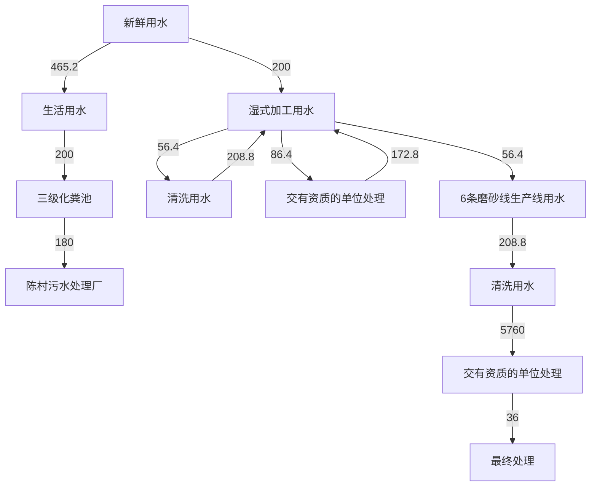
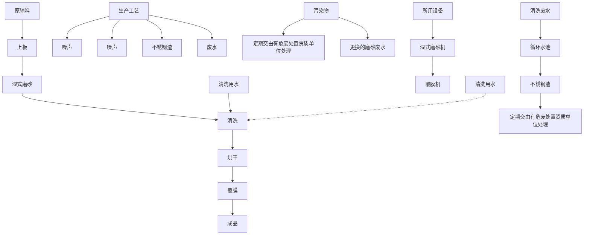
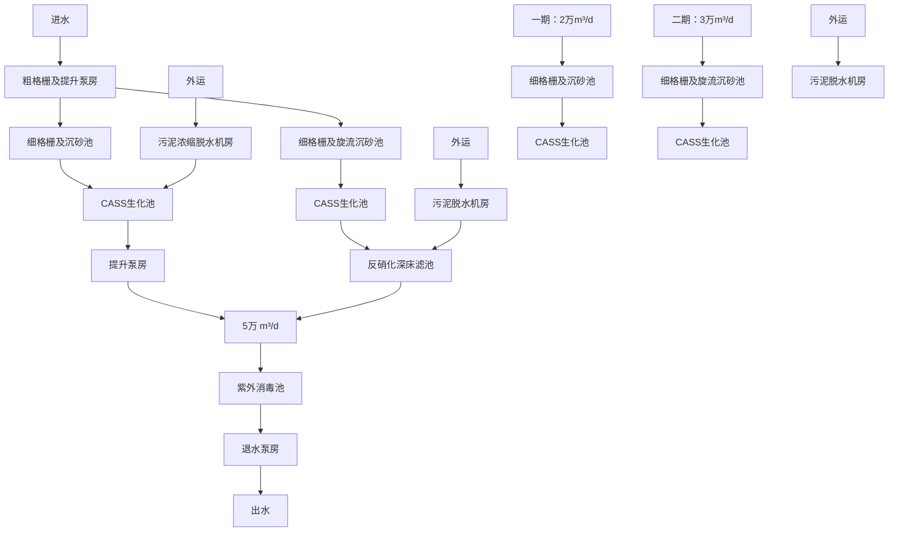

# 建设项目环境影响报告表

（污染影响类）

项目名称：佛山市顺德区鑫诚众不锈钢磨砂厂年加工不锈钢板2 万吨迁扩建项目

建设单位（盖章）：佛山市顺德区鑫诚众不锈钢磨砂厂

编制日期：2022 年12 月

中华人民共和国生态环境部制

编制单位和编制人员情况表

<table><tr><td>项目编号</td><td colspan="3">hreaai</td></tr><tr><td>建设项目名称</td><td colspan="3">佛山市顺德区鑫诚众不锈钢磨砂厂年加工不锈钢板2万吨迁扩建项目</td></tr><tr><td>建设项目类别</td><td colspan="3">30-067金属表面处理及热处理加工</td></tr><tr><td>环境影响评价文件类型</td><td colspan="3">报告表</td></tr><tr><td colspan="4">一、建设单位情况</td></tr><tr><td>单位名称(盖章)</td><td>佛山市顺德区鑫诚众不锈钢</td><td rowspan="5"></td><td></td></tr><tr><td>统一社会信用代码</td><td>91440606MA56A6ER2E</td><td></td></tr><tr><td>法定代表人(签章)</td><td rowspan="3"></td><td></td></tr><tr><td>主要负责人(签字)</td><td></td></tr><tr><td>直接负责的主管人员(签字)</td><td></td></tr><tr><td colspan="4">二、编制单位情况</td></tr><tr><td>单位名称(盖章)</td><td colspan="3">广东顺德环境科学研究院有限公司</td></tr><tr><td>统一社会信用代码</td><td colspan="3">91440606768407545Y</td></tr><tr><td colspan="4">三、编制人员情况</td></tr><tr><td>1.编制主持人</td><td rowspan="7" colspan="3"></td></tr><tr><td>姓名</td></tr><tr><td>张序翔</td></tr><tr><td>2.主要编制人员</td></tr><tr><td>姓名</td></tr><tr><td>罗昕朗</td></tr><tr><td>张序翔</td></tr></table>

# 目录

一、建设项目基本情况····  
二、建设项目工程分析···  
三、区域环境质量现状、环境保护目标及评价标准···· 15  
四、主要环境影响和保护措施··· 19  
五、环境保护措施监督检查清单 · 31  
六、结论 ···· ··33

建设项目污染物排放量汇总表· ·· 34

# 一、建设项目基本情况

<table><tr><td>建设项目名称</td><td colspan="3">佛山市顺德区鑫诚众不锈钢磨砂厂年加工不锈钢板2万吨迁扩建项目</td></tr><tr><td>项目代码</td><td colspan="3">无</td></tr><tr><td>建设单位联系人</td><td>刘**</td><td>联系方式</td><td>1591812****</td></tr><tr><td>建设地点</td><td colspan="3">广东省佛山市顺德区陈村镇石洲村白陈公路文海路段文海工业区18号之二A车间</td></tr><tr><td>地理坐标</td><td colspan="3">(22度58分59.336秒,113度13分40.242秒)</td></tr><tr><td>国民经济行业类别</td><td>C3360金属表面处理及热处理加工</td><td>建设项目行业类别</td><td>三十、金属制品业33,67-金属表面处理及热处理加工,其他(年用非溶剂型低VOCs含量涂料10吨以下的除外)</td></tr><tr><td>建设性质</td><td>☑新建(迁建)□改建☑扩建□技术改造</td><td>建设项目申报情形</td><td>☑首次申报项目□不予批准后再次申报项目□超五年重新审核项目□重大变动重新报批项目</td></tr><tr><td>项目审批(核准/备案)部门(选填)</td><td>/</td><td>项目审批(核准/备案)文号(选填)</td><td>/</td></tr><tr><td>总投资(万元)</td><td>100</td><td>环保投资(万元)</td><td>10</td></tr><tr><td>环保投资占比(%)</td><td>10%</td><td>施工工期</td><td>1个月</td></tr><tr><td>是否开工建设</td><td>☑否□是:</td><td>用地(用海)面积(m2)</td><td>1100</td></tr><tr><td>专项评价设置情况</td><td colspan="3">无</td></tr><tr><td>规划情况</td><td colspan="3">无</td></tr><tr><td>规划环境影响评价情况</td><td colspan="3">无</td></tr><tr><td>规划及规划环境影响评价符合性分析</td><td colspan="3">无</td></tr><tr><td>其他符合性分析</td><td colspan="3">1、本项目与顺德区“三线一单”相符性分析生态保护红线:根据《广东省人民政府关于印发广东省“三线一单”生态环境分区管控方案的通知》(粤府〔2020〕71号)和《佛山市南海区人民政府办公室关于印发佛山市南海区“三线一单”生态环境分区管控方案的通知》(南府办〔2021〕18号),本项目选址位于省管控单元中的“重点管控单元”,属于陈村镇重点管控区(编号:ZH44060620010)。项目选址单元不属于“涵盖生态保护红线、一般生态空间、饮用水水源保护区、环境空气质量一类功能区等区域的优先保护区”。因此,项目不涉及生态保护红线。环境质量底线:根据2021年全区的大气环境质量状况公报,除O3年均浓度超过《环境空气质量标准》(GB3095-2012)及2018年修改单二级标准限值外,其余五项污染物指标浓度均能达到《环境空气质量标准》(GB3095-2012)及2018年修改单二级标准限值;地表水陈村水道各项水质指标均达到《地表水环境质量标准》(GB3838-2002)III类标准。本项目生活污水经三级化粪池预处理达到广东省《水污染物排放限值》(DB44/26-2001)第二时段三级标准后排入陈村污水处理厂处理,不直接向地表水体排放。清洗废水循环使用,需定期清理沉淀后的不锈钢渣,并定期补充蒸发水量,清洗废水循环一段时间后更换至湿式磨砂循环水使用,不外排。定期更换的湿式磨砂废水(含乳化液)属于危险废物,交由有资质的单位处理,生产废水不外排。因此本项目的建设不会突破当地环境质量底线。(1)与大气环境功能区的分析本项目所在地为大气环境二类功能区,本项目无大气污染物排放,不会对周围大气环境造成影响。(2)与水环境功能区的分析项目纳污水体陈村水道为III类水体功能,项目生活污水经三级化粪池处理后,排入陈村污水处理厂处理,尾水排入陈村水道,项目废水排放对纳污水体影响较少。综合分析,本项目的建设不会突破当地环境质量底线。资源利用上线:本项目运营期所用的资源主要为水资源、电能。本项目给水由市政供水接入,电能由区域电网供应,符合《佛山市顺德区人民政府关于印发佛山市顺德区“三线一单”生态环境分区管控</td></tr></table>

方案的通知》（顺府发〔2021〕11号）文件中的能源资源利用要求，同时本项目所用以上资源占比极少，不会突破当地的资源利用上线。项目所在地用途为工业用途，符合当地土地规划要求。

生态环境准入清单：本项目不在《产业结构调整指导目录（2019年本》限制类、淘汰类之列，不属于《市场准入负面清单（2022 年版）》中规定的禁止和许可准入的行业类别。项目产品不属于《环境保护综合名录》（2021 年版）中“高污染、高环境风险”产品，不属于《促进产业结构调整暂行规定》中限制类、淘汰类之列，符合规定要求。项目不属于《顺德区村级工业园升级改造项目产业准入负面清单》（2019年本）中限制类和禁止类。因此项目符合相关产业政策、规划的要求。

本项目所在区域属于顺德区三线一单中“广东省佛山市顺德区陈村镇重点管控区”，编号：ZH44060620010。根据项目生产产品、原材料、工艺等分析，本项目不属于单元“空间布局约束”中产业/限制类、大气/限制类、大气/限制类，不属于单元“能源资源利用”中土地资源/限制类、岸线/禁止类，不属于单元“污染物排放管控”中的水/限制类。

表1-1 与顺德区三线一单相符性分析

<table><tr><td>管控单元编码及名称</td><td>管控维度</td><td>管控要求</td><td>本项目概况</td><td>相符性</td></tr><tr><td>陈村镇重点管控区,编号:ZH44060620010(重点管控单元10)</td><td>空间布局约束</td><td>1-1.【产业/鼓励引导类】重点发展智能装备制造、新一代电子信息、新材料等新兴产业;结合TOD片区开发,对接广深港资源,大力发展生产性服务业、高端商务服务业和中小企业总部集群;培育以花卉产业为特色,向电商、会展、文创旅游等延伸的现代农业产业链。1-2.【产业/综合类】系统推进村级工业园升级改造,腾出连片空间,布局产业集聚区和主题产业园,推动工业项目入园集聚发展。新增工业制造业用地原则上安排在产业集聚区内,产业集聚区外原则上不鼓励工业及物流仓储用地的新建与改造。1-3.【产业/综合类】产业聚集区所属地块内的工业用地或企业与村庄、学校等环境敏感点之间应设置合理的大气环境防护距离,并通过绿化带进行有效隔离;聚集区规划布局应注重大气污染排放企业应尽量避免布局在居住用地的常年主导风向的上风向。</td><td>1-1 本项目不属于。1-2 本项目所在地不属于村级工业园升级改造区域。1-3 本项目与最近敏感点距离为63m,项目无废气产生和排放,对周围环境和敏感点的影响不大。项目生产设备做减振处理,墙体隔音。</td><td>符合</td></tr></table>

<table><tr><td rowspan="2"></td><td></td><td></td><td>1-4.【产业/限制类】受纳水体或监控断面不达标的,不得新建、扩建向河涌直接排放废水的项目。新建、扩建含蚀刻工序的线路板生产项目和化工项目应在配套污水集中处置的工业园区或生活污水管网覆盖区域内建设;纯加工型印花项目,含酸洗、磷化的金属表面处理、金属制品项目(与自身高新技术企业配套的除外),含酸洗、喷涂、化学抛光、电解等涉及废水排放工艺的不锈钢型材加工项目(与自身高新技术企业配套的除外),应进入以此类项目为主导产业、有相应废水集中治理设施的工业园区,实现集中治污。1-5.【产业/综合类】划定家具生产优先发展区域,优先发展区外不再新建涉及涂装工艺的木质家具制造项目。1-6.【大气/限制类】大气环境受体敏感重点管控区内,应严格限制新建储油库项目、产生和排放有毒有害大气污染物的建设项目以及使用溶剂型油墨、涂料、清洗剂、胶黏剂等高挥发性有机物原辅材料项目,鼓励现有该类项目搬迁退出。1-7.【大气/限制类】大气环境布局敏感区重点管控区内,应严格限制新建生产和使用高挥发性有机物原辅材料项目,优先开展低VOCs含量原辅材料替代,强化无组织排放控制。原则上不再新建、扩建新增氮氧化物、烟(粉)尘排放量较大的建设项目。</td><td>1-4本项目含湿式磨砂工艺,属于物理性质表面抛光工艺,无生产废水排放,项目不属于上述限制类项目。1-5本项目不涉及。1-6项目无有毒有害大气污染物产生和排放,不使用溶剂型油墨、涂料、清洗剂、胶黏剂等高挥发性有机物原辅材料。1-7项目无氮氧化物、颗粒物产生和排放,不使用溶剂型油墨、涂料、清洗剂、胶黏剂等高挥发性有机物原辅材料。</td><td></td></tr><tr><td>陈村镇重点管控区,编号:ZH44060620010(重点管控单元10)</td><td>能源资源利用</td><td>2-1.【能源/鼓励引导类】推广节能技术,加快发展绿色货运与现代物流。2-2.【能源/鼓励引导类】推广新能源汽车应用和充电基础设施建设,积极推动重卡LNG加气站、充电基础设施、加氢站建设。2-3.【能源/综合类】科学实施能源消费总量和强度“双控”,新建高能耗项目单位产品(产值)能耗达到国际国内先进水平。2-4.【水资源/综合类】贯彻落实“节水优先”方针,实行最严格水资源管理制度,陈村镇万元国内生产总值用水量、万元工业增加值用水量、用水总量、农田灌溉水有效利用系数等用水总量和效率指标达到区下达要求。2-5.【土地资源/限制类】落实单位土地面积投资强度、土地利用强度等建设用地控制性指标要求,提高土地利用效率。2-6.【岸线/禁止类】严格水域岸线用途管制,新建项目一律不得违规占用水域。严禁破坏生态的岸线利用行为和不符合其功能定位的开发建设活动,严禁以各种名义侵占河道、围垦湖泊、非法采砂等。</td><td>2-1本项目不适用。2-2本项目不适用。2-3本项目不属于高能耗项目。2-4本项目磨砂清洗废水循环使用,更换的清洗废水加入磨砂冷却水用,用水量较少。2-5本项目满足政府提出的投资强度、利用强度等指标要求。2-6本项目不适用。</td><td>符合</td></tr><tr><td></td><td>陈村镇重点管控区,编号:ZH44060620010(重点管控单元10)</td><td>污染物排放管控</td><td>3-1.【水/限制类】城镇新区建设实行雨污分流。住宅、商业体、学校、市场等城镇开发建设项目应当配套或者同步计划建设公共排水设施,公共排水设施或自建排污水设施未能投产运行的,以上涉水项目不得投入使用。新建小区严格实施雨污分流,阳台、露台等污水接入污水收集系统,将生活污水“应截尽截”。做好大型楼盘、集贸市场、餐饮以及学校等4大类排水户污水接入市政管网工作。3-2.【水/综合类】陈村镇重点河涌水质上年度未达到水环境质量目标的,需组织编制、系统实施、向社会公开区域重点水污染物减排计划并明确“替代量”,本年度新建、改建、扩建项目新增水环境重点污染物实行区域“减二增一”替代(工业、生活或综合集中废水处理设施、民生项目除外)。3-3.【水/综合类】结合村级工业园改造,全面提升产业层次与集聚度,促进污染集中整治。3-4.【水/综合类】稳步推进排水设施“三个一体化”管理模式,补齐城乡污水收集和处理短板,推动陈村污水处理厂提质增效,加快消除城中村、老旧城区、城乡结合部等污水收集管网空白区,逐步实现城乡污水收集处理全覆盖。2025年前完成陈村污水处理厂扩建,尾水应执行《城镇污水处理厂污染物排放标准》(GB18918-2002)一级A标准及《广东省水污染物排放限值》(DB44/26-2001)的较严值。3-5.【水/综合类】完善污水管网建设,逐步取消现状农村污水处理站点,有条件的区域实施雨污分流改造;至2030年全面雨污分流,农村生活污水纳入陈村城镇污水处理系统。3-6.【水/综合类】产业集聚区和主题园区内做好污水管网和污水集中处理设施的配套保障,确保废水收集到城镇污水处理厂、园区污水处理厂或分散式污水处理设施集中处置。</td><td>3-1本项目实行雨污分流,项目生活污水经三级化粪池处理后,排入陈村污水处理厂处理;清洗废水循环使用,需定期清理沉淀后的不锈钢渣,并定期补充蒸发水量,清洗废水循环一段时间后更换至湿式磨砂循环水使用,不外排。定期更换的湿式磨砂废水(含乳化液)属于危险废物,需交由有资质的单位处理。3-2本项目无生产废水外排。3-3本项目所在地不属于村级工业园。3-4本项目不适用。3-5本项目实行雨污分流,无生产废水外排。生活污水纳入陈村城镇污水处理系统。3-6本项目实行雨污分流,无生产废水外排。生活污水纳入陈村城镇污水处理系统。</td><td>相符</td></tr><tr><td rowspan="2"></td><td>陈村镇重点管控区,编号:ZH44060620010(重点管控单元10)</td><td>环境风险防控</td><td>4-1.【水/综合类】陈村污水处理厂、工业污水集中处理设施应采取有效措施,防止事故废水直接排入水体。完善污水处理厂在线监控系统联网,实现污水处理厂的实时、动态监管。4-2.【风险/综合类】加强环境风险分级分类管理,强化金属制品、有色金属和压延加工、化学原料和化学品制造业等涉重金属、化工行业企业及工业园区等重点环境风险源的环境风险防控。</td><td>4-1本项目无生产废水外排,生活污水经预处理后排入陈村城镇污水处理系统。4-2本项目风险防控措施具备可行性,整体风险可控。</td><td>相符</td></tr><tr><td colspan="5">综上,本项目符合“三线一单”要求。2、选址合理性分析:项目位于广东省佛山市顺德区陈村镇石洲村白陈公路文海路段文海工业区18号之二A车间,根据项目所在地土地房产证(见附件3),项目所在地现状用途为工业用地,土地功能符合要求。根据佛山市顺德区人民政府关于同意《顺德区陈村镇广隆集约工业园区控制性详细规格》局部调整的批复(顺府复[2018]31号),项目所在地土地利用规划为工业用地(详见附图9)。</td></tr></table>

# 二、建设项目工程分析

# 1、项目工程组成

佛山市顺德区鑫诚众不锈钢磨砂厂原址位于广东省佛山市顺德区陈村镇岗北集约工业园伟业大道 6 号之一厂房自编西 4-5 号车间，主要从事不锈钢磨砂加工生产。原项目于 2022年 5 月23日以环境影响报告表形式取得《佛山市生态环境局关千佛山市顺德区鑫诚众不锈钢磨砂厂迁扩建项目环境影响报告表的批复》（批复号：佛环 0305 环审[2022]第 0031号），详见附件 4。原项目批准设备规模为湿式磨砂生产线 6 条，其中包括湿式磨砂机 6 台、清洗风干机 6 台、覆膜机 6 台，年加工不锈钢板 5000 吨。原项目现已拆除。

由于生产发展需要，企业拟搬迁至广东省佛山市顺德区陈村镇石洲村白陈公路文海路段文海工业区 18 号之二 A 车间（项目地理位置见附图 1）。迁扩建后项目中心位置地理坐标为北纬22 度 58 分 22.372 秒，东经 113 度 12 分 40.535 秒。项目占地面积 1100m2，经营面积 1100m2。本项目主要从事不锈钢板的加工生产，设备数量不变，规模为湿式磨砂生产线 6 条，其中包括湿式磨砂机 6 台、清洗风干机 6 台、覆膜机 6 台，单台湿式磨砂生产线生产设备的设计产能增加，年加工不锈钢 20000 吨。

根据《中华人民共和国环境保护法》、《中华人民共和国环境影响评价法》、国务院令第682 号《国务院关于修改〈建设项目环境保护管理条例〉的决定》等有关法律法规的规定，本项目须执行环境影响审批制度。根据《建设项目环境影响评价分类管理名录（2021 版》（自 2021年 1 月 1 日起施行），本项目属于“三十、金属制品业 33，67-金属表面处理及热处理加工，其他（年用非溶剂型低 VOCs 含量涂料 10吨以下的除外）”，需编制建设项目环境影响报告表。

迁扩建前，项目占地面积 1300m2，经营面积 1300m2，从业总人数为 20 人，年工作 300天，每天工作 8 小时，工作时间为 8：30\~12：00，13：00\~17：30，不设员工饭堂和宿舍。

迁扩建后，项目占地面积 1100m2，经营面积 1100m2，从业总人数为 30人，年工作 300天，每天工作 8 小时，工作时间为 8：30\~12：00，13：00\~17：30，不设员工饭堂和宿舍。项目工程组成如表 2-1 所示。

表 2-1 项目工程组成

<table><tr><td>项目</td><td colspan="2">工程内容</td><td>迁扩建前审批内容</td><td>迁扩建后工程</td></tr><tr><td rowspan="2">主体工程</td><td colspan="2">生产厂房</td><td>单层生产厂房一座,高8m,内含仓库、办公室,总面积约 $1300m^{2}$ </td><td>单层生产厂房一座,高8m,内含仓库、办公室,面积约 $1100m^{2}$ ,内含湿式磨砂车间。</td></tr><tr><td>磨砂车间</td><td>位于生产厂房内中部及南部,面积为约 $1000m^{2}$ </td><td colspan="2">位于生产厂房内中部及南部,面积为约 $950m^{2}$ </td></tr><tr><td>辅助工程</td><td colspan="2">办公室</td><td>包含在生产车间内,位于厂房西侧,总面积约 $20m^{2}$ </td><td>包含在生产车间内,位于厂房南侧,总面积约 $20m^{2}$ </td></tr><tr><td>储运工程</td><td colspan="2">仓库</td><td>产品、原料存放区,位于生产厂房内中部</td><td>产品、原料存放区,原料仓库、成品仓库位于生产厂房内中部</td></tr><tr><td>公用工程</td><td colspan="2">供水、供电系统</td><td>生活和生产用水由市政管网供应,通过市电引入厂区,通过配电线路至各车间。</td><td>生活和生产用水由市政管网供应,通过市电引入厂区,通过配电线路至各车间。</td></tr><tr><td>环保工程</td><td colspan="2">生活污水</td><td>生活污水经三级化粪池处理后,经市政</td><td>生活污水经三级化粪池处理后,经市</td></tr><tr><td rowspan="6"></td><td colspan="2"></td><td>管道排入陈村污水处理厂处理</td><td>政管道排入陈村污水处理厂处理</td></tr><tr><td rowspan="2">生产废水</td><td>清洗废水</td><td>清洗废水循环使用,需定期清理沉淀后的不锈钢渣,并定期补充蒸发水量,清洗废水循环一段时间后更换至湿式磨砂循环水使用,不外排。</td><td>清洗废水循环使用,需定期清理沉淀后的不锈钢渣,并定期补充蒸发水量,清洗废水循环一段时间后更换至湿式磨砂循环水使用,不外排。</td></tr><tr><td>磨砂废水</td><td>磨砂废水循环使用,每年整池更换一次,定期更换的湿式磨砂废水(含乳化液)属于危险废物,需交由有资质的单位处理</td><td>磨砂废水循环使用,每年整池更换一次,定期更换的湿式磨砂废水(含乳化液)属于危险废物,需交由有资质的单位处理</td></tr><tr><td colspan="2">生产噪声</td><td>生产设备做减振处理,墙体隔音、距离衰减</td><td>生产设备做减振处理,墙体隔音、距离衰减</td></tr><tr><td colspan="2" rowspan="2">固体废物</td><td>保护膜边角料等一般固废分类收集,暂存在规范的一般固废暂存场所内,交由回收商处理,一般固废暂存间占地约 $5m^{2}$ </td><td>保护膜边角料等一般固废分类收集,暂存在规范的一般固废暂存场所内,交由回收商处理,一般固废暂存间占地约 $10m^{2}$ </td></tr><tr><td>危险废物暂存在规范的危险废物暂存设施内,定期交由有相应危废处置资质单位处理,危险废物暂存间占地约 $5m^{2}$ </td><td>废机油、含油废抹布、更换出的磨砂冷却水、含乳化液的磨砂沉渣、含油废桶、废磨头危险废物暂存在规范的危险废物暂存设施内,定期交由有相应危废处置资质单位处理,危险废物暂存间占地约 $5m^{2}$ </td></tr></table>

# 2、主要产品及产能

迁扩建前后项目产品及产能情况见下表2-2。

表 2-2 迁扩建前后产品及产能一览表

<table><tr><td>类别</td><td>名称</td><td>单位</td><td>迁扩建前审批数量</td><td>迁扩建后</td><td>增减量</td></tr><tr><td>产品产量</td><td>不锈钢板</td><td>吨/年</td><td>5000</td><td>20000</td><td>+15000</td></tr></table>

# 3、项目设备清单

本次迁扩建项目主要生产单元、主要工艺、生产设施及设施参数见表2-3。

表 2-3 主要生产单元、主要工艺、生产设施及设施参数一览表

<table><tr><td>序号</td><td>主要生产单元</td><td>主要工艺</td><td colspan="2">名称</td><td>单位</td><td>迁扩建前审批数量</td><td>迁扩建后数量</td><td>增减量</td><td>备注</td></tr><tr><td>1</td><td rowspan="4">湿式磨砂工序</td><td>湿式磨砂</td><td colspan="2">湿式磨砂线</td><td>条</td><td>6</td><td>6</td><td>0</td><td rowspan="4">6条湿式磨砂一体线各自配备1个冷却循环沉淀水池,项目共有冷却循环沉淀水池共6个,每个尺寸均为: $1m \times 2m \times 0.6m$ 。6条湿式磨砂一体线各自配备1个清洗水循环水池,项目共有清洗水循环水池6个,每个尺寸均为:: $1m \times 1m \times 0.6m$ 。</td></tr><tr><td>2</td><td>湿式磨砂</td><td rowspan="3">其中</td><td>湿式磨砂机</td><td>台</td><td>6</td><td>6</td><td>0</td></tr><tr><td>3</td><td>吹干</td><td>清洗风干机</td><td>台</td><td>6</td><td>6</td><td>0</td></tr><tr><td>4</td><td>覆膜</td><td>覆膜机</td><td>台</td><td>6</td><td>6</td><td>0</td></tr></table>

项目外购的不锈钢板尺寸为1.2m\*2.5m\*3mm/张，不锈钢板密度约为7.9g/cm3，则对应厚度的单块板重量分别约为71.1kg，磨砂机生产线进口宽度约1400mm，单块板加工时间与不锈钢板长度及客户所需的磨砂纹路复杂程度有关，磨砂机可连续生产，每台湿式磨砂生产线工作时间为8h/d。项目湿式磨砂生产线产能匹配分析如下表。

表 2-4 项目产能匹配性分析一览表

<table><tr><td>设备名称</td><td>不锈钢原材料</td><td>数量</td><td>磨砂机加工速度(m/min)</td><td>长度(m/块)</td><td>每件加工时间(件/min)</td><td>实际运行时间(h/d)</td><td>年工作天数(d/a)</td><td>每天每条生产线加工长度(m/d)</td><td>工件重量(t/件)</td><td>每条线日加工板数(块/天)</td><td>每条线日加工量(t/d)</td><td>合共设计生产量(t/a)</td><td>本项目预计实际产能</td></tr><tr><td>磨砂生产线</td><td>不锈钢板</td><td>6条</td><td>1</td><td>2.5</td><td>2.5</td><td>8</td><td>330</td><td>480</td><td>0.0711</td><td>192.00</td><td>13.65</td><td>27029.4</td><td>20000</td></tr></table>

根据上表可知，设备最大产能可达到27029.4吨/年，大于本项目预计产能20000吨/年，项目设备能满足生产需要。

# 4、项目原辅材料

主要原辅材料及燃料的种类和用量见表2-5。

表 2-5 主要原辅材料及燃料参数一览表

<table><tr><td>类别</td><td>名称</td><td>单位</td><td>迁扩建前</td><td>迁扩建后</td><td>增减量</td><td>性状</td><td>包装规格</td><td>最大储存量</td><td>备注</td></tr><tr><td rowspan="4">主要原辅材料</td><td>不锈钢板</td><td>吨/年</td><td>5000</td><td>20000</td><td>+15000</td><td>银亮色固体</td><td>1.2m*2.5m/张</td><td>350</td><td>用于磨砂</td></tr><tr><td>乳化液</td><td>吨/年</td><td>0.8</td><td>1.6</td><td>+0.8</td><td>黄红色液体</td><td>200kg/桶</td><td>0.4</td><td>用于磨砂</td></tr><tr><td>保护膜</td><td>吨/年</td><td>8</td><td>32</td><td>+24</td><td>透明固体</td><td>100米/卷</td><td>1</td><td>用于磨砂</td></tr><tr><td>磨头</td><td>个/年</td><td>12</td><td>48</td><td>+36</td><td>黑色固体</td><td>柄径6毫米</td><td>6(个)</td><td>用于磨砂</td></tr><tr><td rowspan="3">能源</td><td>电</td><td>万千瓦时/年</td><td>5</td><td>8</td><td>0</td><td>/</td><td>/</td><td>/</td><td>/</td></tr><tr><td>生活用水</td><td> $m^3/a$ </td><td>200</td><td>200</td><td>0</td><td>/</td><td>/</td><td>/</td><td>/</td></tr><tr><td>生产用水</td><td> $m^3/a$ </td><td>200</td><td>200</td><td>0</td><td>/</td><td>/</td><td>/</td><td>/</td></tr><tr><td colspan="10">备注:1项目外购的不锈钢板尺寸为1.2m*2.5m*3mm/张,不锈钢板密度约为7.9g/ $cm^3$ ,则对应厚度的单块板重量分别约为71.4kg;2项目不锈钢板湿式磨砂平均约乳化液消耗为5g/张,共约140000张不锈钢板需进行湿式磨砂,则理论所需乳化液约1.4t,因实际使用过程可能会有不可预计的其他损耗,因此本项目预计年使用1.6t乳化液。</td></tr></table>

# 主要原辅料理化性质

乳化液：乳化液是一种高性能的半合成金属加工液，特别适用于铝金属及其合金的加工，但不适用于含铅的材料，比如一些黄铜和锡类金属。产品使用寿命很长，完全不受渗漏油、混入油的影响，其主要化学成分包括：水、基础油（矿物油、植物油、合成酯或它们的混合物）。

# 5、给水与排水

# （1）给水：

项目用水由市政给水管网供应。用水主要为生产用水及员工生活用水。

# ①生活用水

迁扩建后，项目使用已建成厂房，项目占地面积为1100m2，经营面积1100m2，从业人数为30人，年工作300天，每天工作8小时，厂内不设员工宿舍及饭堂。生活污水主要为员工办公产生的生活污水。根据下文工程分析，项目生活用水量为200m³/a。

# ②生产用水

项目湿式磨砂需要定期补充新鲜水，新鲜水补充量为288.32m³/a。其中清洗工序用水量为226.08m³/a，损耗水量为190.08m³/a，更换出进入磨砂冷却用的水量为36m³/a；磨砂冷却水新鲜用水量为62.24m³/a，损耗水量为95.04m³/a，更换出的冷却废水量为3.2m³/a，更换出的磨砂冷却水作为危废交由有资质的公司处理。

# （2）排水：

本项目无生产废水外排，生活污水经三级化粪池处理后，经市政管网排入陈村污水处理厂处理，污水处理厂尾水排入陈村水道。项目生活污水排放量为180m³/a。

# 6、劳动动员及工作制度

迁扩建前，项目从业人数为20人，年工作日300天，每天工作8小时（工作时间为8：30\~12：00，13：00\~17：30）。

迁扩建后，项目从业人数不变为20人，年工作日300天，每天工作8小时（工作时间为8：30\~12：00，13：00\~17：30）。

# 7、厂区平面布置

迁扩建后，项目占地面积1100m2，经营面积1100m2，于一座单层生产厂房内，高8m，内含生产车间及仓库，其中生产车间主要为磨砂车间，项目磨砂区域约950平方米，每条磨砂线尺寸为4m×20m，占地面积为80平方米/条，项目磨砂区域可满足6条磨砂生产线安放。仓库位于车间中部，办公室位于车间东面，项目平面布置合理。项目平面布置见附图2。

# 8、项目水平衡图

flowchart

图2-1 迁扩建后项目水平衡图

迁扩建后项目主要从事不锈钢湿式磨砂加工，工艺流程如下：

flowchart

图 2-2 湿式磨砂工艺流程图

# 工艺流程简述

将不锈钢板放置于生产线上板，接着进入磨砂机进行磨砂，磨砂机内设有砂磨头,当不锈钢板平铺着以一定速度通过磨砂机时,通过磨头的自身运转,摩擦不锈钢板表面,从而达到磨砂的效果。磨砂后进行清洗，经吹热风烘干后覆膜得到成品。

磨砂机采用湿式磨砂，磨砂时喷洒冷却水，一方面使钢材降温，不会由于磨砂摩擦产生热量而影响产品质量，另一方面有效抑制磨砂产生粉尘。每台磨砂机分别设 1 个冷却循环水池，从磨砂机出来的冷却水首先经过冷却循环水池处理后回用于生产，沉淀池的尺寸均为1m×2m×0.6m（有效容积为 1m3）。项目磨砂工序需使用清水进行冷却，冷却水中需加入少量乳化液。冷却水循环使用，定期补充由于蒸发损失的水分，一年更换一次，更换出来的水作为定期委外处理。

湿式磨砂完后，进行清洗工序，清洗采用清洗水。清洗采用自来水清洗，不添加其他清洗剂、不使用酸洗。为了加强清洗效果，清洗水通过吹热风烘干。每台磨砂机配套清洗水箱一个，尺寸均为 1m×1m×0.6m（有效容积为 1m3）。清洗水循环使用，每个月更换一次，换出来的水回用于沉淀池中补充冷却水。

项目覆膜工序为将外购回厂的保护膜直接附着到产品表面上，生产过程无加热工序，因此覆膜工序无 VOCs 产生。

根据工艺流程及产污图，主要污染工序见下表。

<table><tr><td rowspan="12"></td><td colspan="7">表2-6 主要污染工序</td></tr><tr><td>类别</td><td colspan="2">产生工序</td><td colspan="2">名称</td><td colspan="2">主要污染物</td></tr><tr><td rowspan="3">废水</td><td colspan="2">员工生活</td><td colspan="2">生活污水</td><td colspan="2">pH、 $COD_{Cr}$ 、 $BOD_5$ 、氨氮、SS</td></tr><tr><td colspan="2">磨砂清洗</td><td colspan="2">清洗废水</td><td colspan="2">pH、SS</td></tr><tr><td colspan="2">磨砂冷却</td><td colspan="2">磨砂废水</td><td colspan="2">pH、石油类、SS</td></tr><tr><td>噪声</td><td colspan="6">各类生产设备运行时产生的噪声</td></tr><tr><td rowspan="5">固废</td><td rowspan="4" colspan="2">磨砂</td><td colspan="2">含乳化液的磨砂沉渣</td><td colspan="2">磨砂沉渣</td></tr><tr><td colspan="2">含油废桶</td><td colspan="2">废包装桶</td></tr><tr><td colspan="2">废磨头</td><td colspan="2">磨头、砂带</td></tr><tr><td colspan="2">更换出的磨砂冷却水</td><td colspan="2">磨砂冷却水</td></tr><tr><td colspan="2">员工生活</td><td colspan="4">生活垃圾</td></tr><tr><td>危废</td><td colspan="2">设备维修</td><td colspan="2">废机油、含油废抹布、含油废桶</td><td colspan="2">机油</td></tr><tr><td rowspan="8">与项目有关的原有环境污染问题</td><td colspan="7">佛山市顺德区鑫诚众不锈钢磨砂厂原址位于广东省佛山市顺德区陈村镇岗北集约工业园伟业大道6号之一厂房自编西4-5号车间,主要从事不锈钢磨砂加工生产。原项目于2022年5月23日以环境影响报告表形式取得《佛山市生态环境局关千佛山市顺德区鑫诚众不锈钢磨砂厂迁扩建项目环境影响报告表的批复》(批复号:佛环0305环审[2022]第0031号),详见附件4。原项目批准设备规模为湿式磨砂生产线6条,其中包括湿式磨砂机6台、清洗风干机6台、覆膜机6台,年产不锈钢板5000吨。原项目现已拆除。迁扩建前项目主要从事不锈钢湿式磨砂,工艺流程与迁扩建后一致,详见:“工艺流程和产排污环节”章节分析。由于原项目现已拆除且无实测数据,本次环评采用系数法重新进行核算,重新对原项目污染物源强进行核算。1、废水:生活污水:迁扩建前,项目从业人数为20人,生活废水主要为员工如厕、上班期间洗手等产生的废水,主要污染物为 $COD_{Cr}$ 、 $NH_3-N$ 、 $BOD_5$ 、SS,原项目生活污水处理达到广东省《水污染物排放限值》(DB44/26-2001)中的三级标准(第二时段)后输送至陈村污水处理厂处理。迁扩建前项目不设有员工宿舍和食堂。根据《广东省用水定额》(DB44/T 1461.3-2021)办公楼无食堂无浴室按用水量 $10m^3$ /人·年,则原项目生活用水量为 $200m^3$ /a,排污系数取0.9,则迁扩建前项目生活污水产生量为 $180m^3$ /a。表2-7 迁扩建前项目生活污水产生排放情况</td></tr><tr><td rowspan="2">污染物</td><td colspan="2">产生情况</td><td colspan="2">项目排放口排放情况</td><td colspan="2">污水厂排放情况</td></tr><tr><td>产生浓度(mg/L)</td><td>产生量(t/a)</td><td>产生浓度(mg/L)</td><td>产生量(t/a)</td><td>排放浓度(mg/L)</td><td>排放量(t/a)</td></tr><tr><td> $COD_{Cr}$ </td><td>250</td><td>0.045</td><td>200</td><td>0.036</td><td>40</td><td>0.007</td></tr><tr><td> $BOD_5$ </td><td>100</td><td>0.018</td><td>50</td><td>0.009</td><td>10</td><td>0.002</td></tr><tr><td> $NH_3-N$ </td><td>30</td><td>0.005</td><td>25</td><td>0.004</td><td>5</td><td>0.001</td></tr><tr><td>SS</td><td>200</td><td>0.036</td><td>100</td><td>0.018</td><td>10</td><td>0.002</td></tr><tr><td colspan="7">2、噪声:生产设备运行时产生的噪声约65~80dB(A),厂界噪声排放达到《工业企业厂</td></tr></table>

界环境噪声排放标准》(GB12348-2008)中的 2类标准。

3、固体废物：员工生活垃圾交由环卫部门集中处理；塑料膜边角料外卖回收商；含油废抹布、废机油、含切削液的沉渣、更换出的冷却水等危险废物委托有资质的公司处理处置，不会对周围环境产生影响。

# （1）一般固体废物

# 1）生活垃圾

迁扩建前项目有员工 20 人，厂内不设食宿。根据《社会区域类环境影响评价》（中国环境出版社）中固体废物污染源推荐数据，办公垃圾产生量按 0.5kg/（人•d）计算，生活垃圾产生量3t/a，交环卫部门处理。

# 2）保护膜边角料

迁扩建前项目进行覆膜工序时会有少量保护膜边角料产生，项目保护膜边角料产生量为0.2t/a，边角料外卖回收商。

# （2）危险废物

# 1）废机油

迁扩建前项目生产设备需要定期维护保养，保养过程中会产生少量的废机油，设备每年维修 2 次，废机油每年产生量 0.06t。

# 2）含油废抹布

迁扩建前项目进行维修操作时会产生含油废抹布，根据建设方提供的资料，产生量约0.01t/a。

# 3）更换出的湿式磨砂废水（含乳化液）

项目磨砂冷却水需要定期更换，每年更换一次，项目 6 个磨砂冷却水循环水池共 6m³，则项目磨砂冷却水年更换量为 6t/a。

# 4）含乳化液的磨砂沉渣

项目磨砂冷却水经三级沉淀池处理后循环使用，会有沉渣产生，项目定期对三级沉淀池中捞出沉渣，由于含乳化液的磨砂沉渣可能沾染有乳化液，此类废物作为危废处理，根据生产实践，该类危险废物产生量为 0.1t/a。

# 5）含油废桶

项目使用的机油、乳化液会产生含油废桶，由于包装桶沾染油类物质，此类废物作为危废处理，此类危险废物产生量为 0.05t/a。

# 6）废磨头

迁扩建前项目磨砂使用的磨头需要定期更换，磨头可能沾染有乳化液，此类废物作为危废处理。迁扩建前项目每年更换的磨头数为 12 个，每个重量为 0.005t，则废磨头产生量为 0.06t/a。

迁扩建前，项目各污染物的排放情况见表 2-8所示。

迁扩建前项目已拆除，未对周围环境造成明显影响。  
表 2-8 项目迁扩建前污染物排放情况及存在的环境问题

<table><tr><td>内</td><td>排放源</td><td>污染物</td><td colspan="2">产生浓度和产生</td><td colspan="2">排放浓度及排放量</td><td>污染防治措施</td><td>与环</td></tr><tr><td rowspan="2">容类型\容</td><td rowspan="2">编号</td><td rowspan="2">名称</td><td colspan="2">量</td><td colspan="2"></td><td rowspan="3"></td><td rowspan="3">评批复和验收意见的相符性</td></tr><tr><td>浓度</td><td>产生量</td><td>浓度</td><td>排放量</td></tr><tr><td rowspan="6">废水</td><td colspan="2">单位</td><td>mg/L</td><td>t/a</td><td>mg/L</td><td>t/a</td></tr><tr><td rowspan="4">生活污水 $180m^{3}/a$ </td><td> $COD_{Cr}$ </td><td>250</td><td>0.045</td><td>40</td><td>0.007</td><td rowspan="4">项目生活污水处理达到广东省《水污染物排放限值》(DB44/26-2001)中的三级标准(第二时段)后输送至陈村污水处理厂处理</td><td rowspan="4">符合</td></tr><tr><td> $BOD_{5}$ </td><td>100</td><td>0.018</td><td>10</td><td>0.002</td></tr><tr><td> $NH_{3}-N$ </td><td>30</td><td>0.005</td><td>5</td><td>0.001</td></tr><tr><td>SS</td><td>200</td><td>0.036</td><td>10</td><td>0.002</td></tr><tr><td>磨砂、清洗废水</td><td colspan="6">清洗废水循环使用,需定期清理沉淀后的不锈钢渣,并定期补充蒸发水量,清洗废水循环一段时间后更换至湿式磨砂循环水使用,不外排。定期更换的湿式磨砂废水(含乳化液)属于危险废物,需交由有资质的单位处理</td><td>符合</td></tr><tr><td>噪声</td><td>生产设备</td><td>噪声</td><td colspan="4">70~85dB(A)</td><td>厂界噪声达到《工业企业厂界环境噪声排放标准》(GB12348-2008)中的2类标准</td><td>符合</td></tr><tr><td rowspan="8">固体废物</td><td colspan="2">办公及生活垃圾</td><td colspan="2">3t/a</td><td colspan="2">0</td><td>收集后交环卫部门处理</td><td>符合</td></tr><tr><td colspan="2">不锈钢边角料</td><td colspan="2">0.2t/a</td><td colspan="2">0</td><td>外卖回收商</td><td>符合</td></tr><tr><td rowspan="6">危险废物</td><td>废机油</td><td colspan="2">0.06t/a</td><td colspan="2">0</td><td rowspan="6">收集后交有危废处置资质的公司回收处理</td><td>符合</td></tr><tr><td>含油废抹布</td><td colspan="2">0.01t/a</td><td colspan="2">0</td><td>符合</td></tr><tr><td>更换出的湿式磨砂废水(含乳化液)</td><td colspan="2">6t/a</td><td colspan="2">0</td><td>符合</td></tr><tr><td>含乳化液的磨砂沉渣</td><td colspan="2">0.1t/a</td><td colspan="2">0</td><td>符合</td></tr><tr><td>含油废桶</td><td colspan="2">0.05t/a</td><td colspan="2">0</td><td>符合</td></tr><tr><td>废磨头</td><td colspan="2">0.06t/a</td><td colspan="2">0</td><td>符合</td></tr></table>

迁扩建后，佛山市顺德区鑫诚众不锈钢磨砂厂拟建于广东省佛山市顺德区陈村镇石洲村白陈公路文海路段文海工业区 18 号之二 A 车间，项目利用已建厂房，不新建厂房。项目东面为白陈路，南面为广东联兴锻压机床实业有限公司，西面为广东联兴锻压机床实业有限公司，北面为烨兴磨砂厂，详见附图 8。

周围污染源主要来自附近工厂在生产过程中产生的废气、废水、固体废物、噪声和工业区内道路的交通噪声、尾气等。

# 三、区域环境质量现状、环境保护目标及评价标准

# 1、大气环境：

根据《佛山市生态环境局顺德分局关于发布 2021 年度佛山市顺德区生态环境状况公报的通知》（佛环顺函〔2022〕13号），2021年顺德区空气质量综合指数为 3.48，比 2020年上升 5.5%，在全市五区中排名第二。

2021年，按照《环境空气质量标准》评价，顺德区二氧化硫 $( \mathsf { S O } _ { 2 } )$ 、二氧化氮 $\left( \mathbf { N O } _ { 2 } \right)$ 、可吸入颗粒物 $\left( \mathrm { { P M } _ { 1 0 } } \right)$ 、细颗粒物 $\left( \mathbf { P M } _ { 2 . 5 } \right)$ 、一氧化碳（CO）五项污染物年评价浓度均达到二级标准，臭氧（O3）超标。详见下表。

表3-1 2021年顺德区（国控测点）环境空气污染物达标判定情况

<table><tr><td rowspan="2">污染物</td><td>浓度均值</td><td rowspan="2">评价标准</td><td rowspan="2">占标率</td><td rowspan="2">达标情况</td></tr><tr><td>2021年</td></tr><tr><td> $SO_{2}$ (μg/m3)</td><td>6</td><td>60</td><td>10%</td><td>达标</td></tr><tr><td> $NO_{2}$ (μg/m3)</td><td>33</td><td>40</td><td>83%</td><td>达标</td></tr><tr><td> $PM_{10}$ (μg/m3)</td><td>42</td><td>70</td><td>60%</td><td>达标</td></tr><tr><td> $PM_{2.5}$ (μg/m3)</td><td>22</td><td>35</td><td>63%</td><td>达标</td></tr><tr><td> $CO^{*}$ (mg/m3)(年评价浓度)</td><td>1.0</td><td>4</td><td>25%</td><td>达标</td></tr><tr><td> $O_{3}-8H^{*}$ (μg/m3)(年评价浓度)</td><td>173</td><td>160</td><td>108%</td><td>超标</td></tr></table>

bar

| Category | 2020年 | 2021年 |
|---|---|---|
| SO₂ | 7 | 6 |
| NO₂ | 30 | 33 |
| PM₁₀ | 43 | 42 |
| PM₂.₅ | 21 | 22 |
| O₃ | 155 | 173 |
| CO | 1.0 | 1.0 |

顺德区城市空气各项污染物年评价浓度  
（CO单位为毫克/立方米，其余为微克/立方米）  
图 3-12021年顺德区（国控测点）环境空气污染物浓度水平年度比较图

根据 2021 年全区的大气环境质量状况公报，除 ${ { \mathrm O } _ { 3 } }$ 年均浓度超过《环境空气质量标准》（GB3095-2012）及 2018 年修改单二级标准限值外，其余五项污染物指标浓度均能达到《环境空气质量标准》（GB3095-2012）及 2018 年修改单二级标准限值，顺德区大气环境质量属不达标区。

顺德区设置了环境空气质量达标规划的目标，并通过优化产业结构和布局，推进能源结构调整，不断巩固火电行业超低排放和工业锅炉整治成果，深化机动车船等移动污染源污染控制，加快推进挥发性有机物综合整治，提高扬尘、餐饮业管理水平，促进多污染物协同控制及区域联防联控，提升大气污染精细化防控能力。届时，佛山市顺德区的环境空气质量将得到较大改善。

# 2、地表水

根据《广东省地表水功能区划》（粤环[2011]14号），陈村水道属于 III 类水环境功能区，水环境质量执行《地表水环境质量标准》（GB3838-2002）中的 III 类水质标准。

为评价陈村水道水环境质量现状，引用顺德区环境保护监测站 2020 年第四季度对陈村水道江口断面的常规监测数据进行评价，监测结果见表 3-2。

表 3-2 2020年第四季度陈村水道江口断面的常规监测数据

<table><tr><td colspan="3">潭州水道</td><td>水温(°C)</td><td>pH值</td><td>溶解氧</td><td>高锰酸盐指</td><td>化学需氧量</td><td>生化需氧量</td><td>氨氮</td><td>总磷</td><td>石油类</td><td>粪大肠菌群(个/L)</td></tr><tr><td rowspan="6">江口断面监测结果</td><td rowspan="2">10月(10.10)</td><td>涨潮</td><td>25.8</td><td>7.44</td><td>6.17</td><td>1.9</td><td>9</td><td>1.5</td><td>0.305</td><td>0.06</td><td>0.01</td><td>2400</td></tr><tr><td>退潮</td><td>25.5</td><td>7.42</td><td>6.05</td><td>1.9</td><td>10</td><td>1.5</td><td>0.319</td><td>0.06</td><td>0.02</td><td>3500</td></tr><tr><td rowspan="2">11月(11.04)</td><td>涨潮</td><td>23.9</td><td>7.61</td><td>5.44</td><td>2.3</td><td>7</td><td>2.7</td><td>0.479</td><td>0.08</td><td>0.01</td><td>2400</td></tr><tr><td>退潮</td><td>23.7</td><td>7.54</td><td>5.7</td><td>2.</td><td>9</td><td>2.5</td><td>0.462</td><td>0.09</td><td>0.02</td><td>3500</td></tr><tr><td rowspan="2">12月(12.02)</td><td>涨潮</td><td>20.2</td><td>7.55</td><td>7.34</td><td>2.1</td><td>9</td><td>2.4</td><td>0.589</td><td>0.08</td><td>0.02</td><td>3500</td></tr><tr><td>退潮</td><td>20.3</td><td>7.53</td><td>7.46</td><td>2.1</td><td>9</td><td>2.7</td><td>0.572</td><td>0.07</td><td>0.01</td><td>3500</td></tr><tr><td rowspan="5">评价</td><td colspan="2">最大值</td><td>25.8</td><td>7.61</td><td>7.46</td><td>2.3</td><td>10</td><td>2.7</td><td>0.589</td><td>0.09</td><td>0.02</td><td>3500</td></tr><tr><td colspan="2">最小值</td><td>20.2</td><td>7.42</td><td>5.44</td><td>1.9</td><td>7</td><td>1.5</td><td>0.305</td><td>0.06</td><td>0.01</td><td>2400</td></tr><tr><td colspan="2">III类水质标</td><td>--</td><td>6.0-9.0</td><td>5</td><td>6</td><td>20</td><td>4</td><td>1</td><td>0.2</td><td>0.05</td><td>10000</td></tr><tr><td colspan="2">最大标准指数</td><td>--</td><td>--</td><td>--</td><td>0.38</td><td>0.50</td><td>0.68</td><td>0.59</td><td>0.45</td><td>0.40</td><td>0.35</td></tr><tr><td colspan="2">最低检出限L</td><td>0.1</td><td>0.01</td><td>0.01</td><td>0.5</td><td>5.0</td><td>0.5</td><td>0.025</td><td>0.010</td><td>0.01</td><td>200</td></tr><tr><td colspan="13">备注:未列指标铜、锌、氟化物、硒、砷、汞、镉、六价铬、铅、氰化物、挥发酚、阴离子表面活性剂、硫化物等均达标。</td></tr></table>

从监测结果可知，陈村水道江口断面水质指标满足《地表水环境质量标准》（GB3838-2002）之Ⅲ类水功能要求。陈村水道水质现状良好。

2021 年顺德区 3 个国控断面（科研断面羊额，考核断面乌洲、顺德港）、3 个省控断面（杨滘、海凌、飞鹅山）均达到相应的水质目标，水质优良率（Ⅰ～Ⅲ类）为 100%，与 2020

<table><tr><td></td><td colspan="7">年持平。流经我区及周边城市交界水域16条主要河流的23个功能区监测断面水质均为优良,全年平均值达标率为100%。23个断面中,II类和III类分别占74%、26%。与2020年相比,II类比例下降9个百分点,III类比例上升9个百分点。3、声环境迁扩建后,项目所在地属于2类声环境功能区,项目厂界外50m范围内无环境敏感目标,无需开展声环境质量现状调查。4、生态环境项目用地范围内无生态环境保护目标,无需开展生态现状调查。5、土壤环境、地下水环境项目所在厂房已进行硬底化处理,不存在地下水环境、土壤环境污染途径,不开展地下水环境、土壤环境质量现状调查。</td></tr><tr><td rowspan="4">环境保护目标</td><td colspan="7">1、地表水环境项目纳污水体陈村水道为III类水体功能,地表水环境保护目标为保证纳污水体不因本项目的建设而改变其水环境功能区类别。2、大气环境本项目所在地为大气环境二类功能区,大气环境保护目标为确保项目所在区域的空气质量不因本项目的建设造成明显不利的影响,不因本项目的建设改变现在的质量等级状况。厂界外500米范围内保护目标见表3-3。表3-3 厂界外500米范围内主要大气环境保护目标</td></tr><tr><td>名称</td><td>保护对象</td><td>保护内容</td><td>环境功能区</td><td>相对厂址方位</td><td colspan="2">相对厂界距离/m</td></tr><tr><td>文海村</td><td>居民</td><td>人群健康</td><td>大气二类</td><td>北面、东面</td><td colspan="2">63</td></tr><tr><td colspan="7">2、声环境本项目所在地东面为白陈路,属于4a类声环境功能区,则项目所在地东面执行《声环境质量标准》(GB3096-2008)4a类标准:昼间≤70dB(A),夜间≤55dB(A),项目所在地其他厂界属于2类声环境功能区,执行《声环境质量标准》(GB3096-2008)4a类标准:昼间≤60dB(A),夜间≤50dB(A)。3、地下水环境本项目厂界外500米范围内无地下水集中式饮用水水源和热水、矿泉水、温泉等特殊地下水资源。4、生态环境项目用地范围内无生态环境保护目标。</td></tr><tr><td rowspan="5">污染物排放控制标准</td><td colspan="7">1、水污染物排放标准:项目外排废水为生活污水,无生产废水外排。生活污水经三级化粪池处理后,经市政管道排入陈村污水处理厂处理。项目生活污水处理达到广东省《水污染物排放限值》(DB44/26-2001)中的三级标准(第二时段)后输送至陈村污水处理厂处理,尾水排入陈村水道,污水处理厂尾水执行《城镇污水处理厂污染物排放标准》(GB18918-2002)一级A标准和广东省地方标准《水污染物排放限值》(DB44/26-2001)第二时段一级标准的较严者,见表3-4;表3-4 生活污水排放标准限值一览表</td></tr><tr><td>类别</td><td>污染物标准</td><td>CODcr</td><td>BOD5</td><td>SS</td><td>NH3-N</td><td>单位</td></tr><tr><td rowspan="2">生活污水</td><td>(DB44/26-2001)第二时段三级标准</td><td>500</td><td>300</td><td>400</td><td>---</td><td>mg/L</td></tr><tr><td>陈村污水处理厂尾水</td><td>40</td><td>10</td><td>10</td><td>5</td><td>mg/L</td></tr><tr><td colspan="7">2、噪声排放标准:项目东面边界执行《工业企业厂界环境噪声排放标准》(GB12348-2008)中的4类标准:昼间≤70dB(A)、夜间≤55dB(A),其他厂界执行《工业企业厂界环境噪声排放标准》(GB12348-2008)中的4类标准:昼间≤60dB(A)、夜间≤50dB(A)。3、固体废物控制标准:固体废物管理应遵照《中华人民共和国固体废物污染环境防治法》、《广东省固体废物污染环境防治条例》的要求;固体废物暂存于一般固体废物仓库,仓库应满足防渗漏、防雨淋、防扬尘等要求;危险废物执行《国家危险废物名录(2021年版)》(生态环境部令第15号)以及《危险废物贮存污染控制标准》(GB18597-2001)及其2013年修改单。</td></tr><tr><td>总量控制指标</td><td colspan="7">迁扩建前,本项目生活污水排放量为 $180m^{3}/a$ , $COD_{Cr}$ 排放量为0.007t/a, $NH_{3}-N$ 排放量为0.001t/a。生活经三级化粪池处理后排入陈村污水处理厂。迁扩建后,本项目生活污水排放量为 $180m^{3}/a$ , $COD_{Cr}$ 排放量为0.007t/a, $NH_{3}-N$ 排放量为0.001t/a。生活经三级化粪池处理后排入陈村污水处理厂。根据《佛山市人民政府办公室关于印发&lt;佛山市排污权有偿使用和交易管理办法&gt;的通知》(佛府办[2020]19号),生活污水 $COD_{Cr}$ 、 $NH_{3}-N$ 不单独分配总量。本项目无大气总量控制指标污染物排放。</td></tr></table>

# 四、主要环境影响和保护措施

本项目依托已建成厂房，不涉及厂房建设，施工过程主要是内部装修和设备安装，没有基建工程，因此施工期间不存在大型土建工程，施工期间产生的影响主要是由于设备运输、安装时产生的噪声等。

施工期较短，因此如果项目建设方加强施工管理，那么项目施工时不会对周围环境造成较大的影响。

1、废水  
表4-1 项目废水类别、污染物项目及污染防治设施

<table><tr><td rowspan="2">序号</td><td rowspan="2">废水类别</td><td rowspan="2">污染物项目</td><td colspan="3">污染治理设施</td><td rowspan="2">污染物排放方式</td><td rowspan="2">排放规律</td><td rowspan="2">流向/排放去向</td><td rowspan="2">编号及名称</td><td rowspan="2">排放口类型</td><td colspan="2">坐标</td></tr><tr><td>污染防治设施名称及工艺</td><td>处理能力</td><td>是否为可行性技术</td><td>经度</td><td>纬度</td></tr><tr><td>1</td><td>员工生活污水</td><td>pH、 $COD_{Cr}$ 、 $BOD_5$ 、 $NH_3-N$ 、SS</td><td>三级化粪</td><td>0.1 $m^3/h$ </td><td>☑是☐否</td><td>间接排放</td><td>间断排放,排放期间流量不稳定</td><td>陈村污水处理厂</td><td>水-01:生活污水排放口</td><td>一般排放口</td><td>113.22814519</td><td>22.98320933</td></tr></table>

# 1.1 水污染物源强核算

# ◇生活污水

迁扩建后项目从业人数为 20 人，年工作日 300天，项目不设有员工宿舍和食堂。根据《广东省用水定额》（DB44/T1461.3-2021）无食堂无浴室按用水量 10m3 /人·年，则项目生活用水量为 200m3 /a，排污系数取 0.9，则生活污水产生量为 180 m3/a。

项目生活污水经三级化粪池处理后，排入陈村污水处理厂，生活污水处理达到广东省《水污染物排放限值》（DB44/26-2001）中的三级标准（第二时段），即 CODcr≤500mg/L，BOD5≤300mg/L，SS≤400mg/L 后，输送至陈村污水处理厂处理，尾水排入陈村水道，污水处理厂尾水执行《城镇污水处理厂污染物排放标准》（GB18918-2002）一级 A 标准和广东省地方标准《水污染物排放限值》（DB44/26-2001）第二时段一级标准的较严者后排放，尾水排入陈村水道。

参考环境保护部环境工程技术评估中心编制《环境影响评价（社会区域类）》教材中表5-18，类比同类型项目，计算迁扩建后项目生活污水污染物产生及排放情况，详见表 4-2。

表 4-2 项目生活污水产生排放情况

<table><tr><td rowspan="2">污染物</td><td colspan="2">产生情况</td><td colspan="2">项目排放口排放情况</td><td colspan="2">污水厂排放情况</td></tr><tr><td>产生浓度(mg/L)</td><td>产生量(t/a)</td><td>产生浓度(mg/L)</td><td>产生量(t/a)</td><td>排放浓度(mg/L)</td><td>排放量(t/a)</td></tr><tr><td> $COD_{Cr}$ </td><td>250</td><td>0.045</td><td>200</td><td>0.036</td><td>40</td><td>0.007</td></tr><tr><td>BOD5</td><td>100</td><td>0.018</td><td>50</td><td>0.009</td><td>10</td><td>0.002</td></tr><tr><td>NH3-N</td><td>30</td><td>0.005</td><td>25</td><td>0.004</td><td>5</td><td>0.001</td></tr><tr><td>SS</td><td>200</td><td>0.036</td><td>100</td><td>0.018</td><td>10</td><td>0.002</td></tr></table>

表4-3 项目废水污染防治设施一览表

<table><tr><td rowspan="2">排放口序号</td><td rowspan="2">污染源</td><td rowspan="2">排放量(m3/a)</td><td rowspan="2">污染物种类</td><td rowspan="2">流向/排放去向</td><td colspan="2">污染防治设施</td><td rowspan="2" colspan="2">防治设施处理效率</td><td rowspan="2" colspan="2">污染物排放浓度(mg/L)</td><td rowspan="2" colspan="2">排放量(t/a)</td><td rowspan="2">排放口类型</td></tr><tr><td>污染防治设施名称及工艺</td><td>是否为可行性技术</td></tr><tr><td rowspan="4">水-01</td><td rowspan="4">员工生活污水</td><td rowspan="4">180</td><td rowspan="4"> $COD_{Cr}$ 、 $BOD_5$ 、 $NH_3-N$ 、SS</td><td rowspan="4">陈村污水处理厂</td><td rowspan="4">三级化粪池</td><td rowspan="4">是</td><td> $COD_{Cr}$ </td><td>20%</td><td> $COD_{Cr}$ </td><td>200</td><td> $COD_{Cr}$ </td><td>0.036</td><td rowspan="4">一般排放口</td></tr><tr><td> $BOD_5$ </td><td>50%</td><td> $BOD_5$ </td><td>50</td><td> $BOD_5$ </td><td>0.009</td></tr><tr><td> $NH_3-N$ </td><td>17%</td><td> $NH_3-N$ </td><td>25</td><td> $NH_3-N$ </td><td>0.004</td></tr><tr><td>SS</td><td>50%</td><td>SS</td><td>100</td><td>SS</td><td>0.018</td></tr></table>

生活污水成分简单、排放量小，类比顺德区工业企业生活污水的处理经验，项目的生活污水浓度较低，经过三级化粪池处理后，生活污水可达到广东省《水污染物排放限值》（DB44/26-2001）中的三级标准（第二时段）。结合陈村污水处理厂的运行情况，陈村污水处理厂出水可达到《城镇污水处理厂污染物排放标准》（GB18918-2002）一级 A 标准和广东省地方标准《水污染物排放限值》（DB44/26-2001）第二时段一级标准的较严者。

# ◇湿式磨砂废水

项目 6 条湿式磨砂线共配套 6 个冷却水循环水池，每个有效容积均为 1m3（尺寸为：1m×2m×0.6m），每条湿式磨砂工序产生的废水三级沉淀池处理后循环使用，项目定期捞出不锈钢渣。根据建设方提供资料可知，项目使用的磨砂冷却水水管内径为 10mm，流速为 0.07m/s，流量为 0.2m3 /h。项目每条湿式磨砂生产线的循环流量约为 0.2m3 /h，生产时间每天 8 小时，年工作 300 天，因此 1 条生产线的循环用水量为 480m3 /a，6 条磨砂线的总循环水量为 2880m3/a，根据原项目（原项目于 2020年以环境影响报告表形式取得《佛山市生态环境局关于佛山市顺德区鑫诚众不锈钢磨砂厂建设项目环境影响报告表的批复》（批复号：佛环 0305环审〔2020〕第 0033号），损失量约为循环水量的 3%，则年损失水量为 86.4m3 /a。由于湿式磨砂的冷却和润滑过程对水质要求不高，项目湿式磨砂冷却用水可沉淀后回用于湿式磨砂工序中，湿式磨砂冷却水循环使用不外排，只需补充新用水和定期清理循环水池中的不锈钢渣。

磨砂冷却废水中主要污染物为 SS 及乳化液，乳化液主要起到润滑冷却的作用，但乳化液含量极少，定期清理静置沉淀后冷却水池中的不锈钢渣，只需补充消耗的用水及少量乳化液，冷却水可循环使用，对水质要求不高。考虑到项目磨砂冷却循环用水到一定时间确需更换水箱底部的磨砂冷却废水，根据项目迁扩建前运行生产实际情况（原项目于 2020 年以环境影响报告表形式取得《佛山市生态环境局关于佛山市顺德区鑫诚众不锈钢磨砂厂建设项目环境影响报告表的批复》（批复号：佛环 0305 环审〔2020〕第 0033 号）），原项目湿式磨砂线每年更换一次，可满足湿式磨砂生产需求，则本项目磨砂冷却废水 1 年更换 1 次即可满足生产要求。

湿式磨砂冷却水在循环使用一定时间后进行整池更换，更换频率为每年整池更换 1 次，更换的湿式磨砂废水（含乳化液）属于危险废物，需交由有资质的单位处理，每个磨砂冷却水池每年更换一次，共 6 个磨砂冷却水池，每个有效容积为 1 立方米，则每年需委外处理的湿式磨砂废水量为 1t/a×6=6t/a，磨砂废水不外排。，磨砂废水不外排。

# ◇清洗用水

项目 6 条湿式磨砂生产线的清洗工序配备 6 个清洗水循环水箱，每个湿式磨砂清洗水循环水箱的尺寸为 1m×1m×0.6m，有效容积为 0.5m3，循环水量为 0.4m3 /h，按每年工作 300 天，每天工作 8 小时计，每条磨砂线清洗水总循环用水量为 960m3 /a；根据原项目（原项目于 2020年以环境影响报告表形式取得《佛山市生态环境局关于佛山市顺德区鑫诚众不锈钢磨砂厂建设项目环境影响报告表的批复》（批复号：佛环 0305 环审〔2020〕第 0033 号），清洗循环水损失水量按循环水量 3%计算，项目每条磨砂线损失水量总共为 28.8m3 /a，则项目 6 条磨砂线循环水量为 5760m3 /a，损失水量为 172.8m3 /a。项目清洗过程无需添加清洗剂，仅使用水进行清洗。清洗水经沉淀后循环使用，清洗用水每月整池更换一次，则每年更换出的清洗废水量为 36m3，回用作为湿式磨砂冷却用水，不外排。

# 1.2废水排放达标分析

迁扩建后项目仅外排生活污水，项目外排生活污水成分简单、排放量小，类比顺德区工业企业生活污水的处理经验，项目的生活污水浓度较低，经过三级化粪池处理后，生活污水可达到广东省《水污染物排放限值》（DB44/26-2001）中的三级标准（第二时段）。结合陈村污水处理厂的处理工艺及实际运行情况，陈村污水处理厂出水可达到《城镇污水处理厂污染物排放标准》（GB18918-2002）一级 A 标准和广东省地方标准《水污排染物放限值》（DB44/26-2001）第二时段一级标准的较严者，尾水排入陈村水道。

# ◇依托陈村污水处理厂的可行性分析

顺德区陈村镇污水处理厂建设于 2012 年，位于佛山市顺德区陈村镇广隆工业区东北侧，中心地理坐标为东经 113.242191°，北纬 22.979769°。共分两期建设，均由佛山市顺德区浩源水务环保有限公司以 BOT 形式建设、投资和运营管理。建设总投资为 4997.24 万元，其中一期项目于 2007 年 1 月试运行，2007 年 11 月通过环保验收，其处理规模为 2 万 m3/d。二期项目于 2012 年通过环保部门的审批，在 2014 年年底建成，于 2015 年 10 月通过环保验收(编号：环验陈[2015]A019），处理规模为 3 万 m3 /d。目前总体处理规模为 5 万 m3 /d，使用 CASS 工艺作为生物处理工艺，反硝化深床滤池工艺作为深度处理工艺，紫外线消毒作为消毒工艺。陈村污水处理厂的出水水质按照国家标准《城镇污水处理厂污染物排放标准》（GB18918-2002）一级 A 标准和广东省地方标《水污染排放限值》（DB44/26-2001）第二时段一级标准的较严者执行，经处理达标后的尾水排入陈村水道。目前陈村污水处理厂正在进行扩容工程，拟新增污水处理能力 5 万 m3 /d；扩容后污水处理能力为 10 万 m3 /d，处理工艺为“粗格栅+细格栅及旋流沉砂池+AAO 氧化沟+混凝+沉淀+紫外消毒”。

陈村污水处理厂工艺流程见图 4-1。

flowchart

图4-1 陈村污水处理厂废水处理工艺流程图

项目生活污水产生量为180m3 /a，产生量较少，污染物成分简单，浓度较低，满足污水厂的纳管要求，不会对污水厂造成冲击负荷，也不会影响其正常运行，因此本项目生活污水依托陈村污水处理厂处理是可行的。

根据《排污许可证申请与核发技术规范指南 总则》（HJ942-2018）及《排污单位自行监测技术指南 总则》（HJ819-2017），单独排入公共污水处理系统的生活污水无需开展自行监测。

# 2、噪声

项目噪声源为湿式磨砂机、清洗风干机、覆膜机等生产设备运行时产生的机械噪声，噪声级约为 65～80dB（A），主要设备噪声源强如表 4-4。

表 4-4 项目主要声源及噪声源强一览表

<table><tr><td rowspan="2">工序/生产线</td><td rowspan="2">装置</td><td rowspan="2">噪声源</td><td rowspan="2">声源类型(频发、偶发等)</td><td colspan="2">噪声源强</td><td colspan="2">降噪措施</td><td colspan="2">噪声排放值</td><td rowspan="2">持续时间/h</td></tr><tr><td>核算方法</td><td>噪声值</td><td>工艺</td><td>降噪效果</td><td>核算方法</td><td>噪声值</td></tr><tr><td>湿式磨砂</td><td>湿式磨砂机</td><td>湿式磨砂机</td><td>频发</td><td>类比法</td><td>65~80</td><td rowspan="2">减振处理、距离衰减</td><td>5</td><td>类比法</td><td>75</td><td>2400</td></tr><tr><td>吹干</td><td>清洗烘干机</td><td>清洗风干机</td><td>频发</td><td>类比法</td><td>65~75</td><td>5</td><td>类比法</td><td>70</td><td>2400</td></tr><tr><td>覆膜</td><td>覆膜机</td><td>覆膜机</td><td>频发</td><td>类比法</td><td>65~75</td><td></td><td>5</td><td>类比法</td><td>70</td><td>2400</td></tr></table>

本项目噪声主要来自生产设备，生产过程叠加噪声平均声级为 65-80dB（A）。根据建设单位提供的资料，本项目采用 8 小时工作制度，工作时间为 8：30\~12：00，13：00\~17：30，项目只在白天进行工作，夜间时间不进行工作，则夜间时间不产生噪声污染，夜间时间不会对敏感点及周围环境造成影响，因此本报告仅对项目在昼间生产加工时段内进行噪声预测。

将项目各设备噪声作点源处理，本报告评价采用点源噪声距离衰减公式和噪声叠加公式预测各主要设备噪声对环境的影响。

点源衰减公式：

$$
L _ {2} = L _ {1} - 2 0 \lg \left(\frac {r _ {2}}{r _ {1}}\right) - \Delta L
$$

噪声叠加公式：

$$
L _ {e q s} = 1 0 \lg \left(\sum_ {i = 1} ^ {n} 1 0 ^ {0. 1 L e q i}\right)
$$

式中：L1、L2—— r1、 $r _ { 2 ^ { \prime } }$ 处的噪声值，dB（A）；

r1、r2— 距噪声源的距离，m；

L ——房屋、树木等对噪声的衰减值，dB（A）；

$\mathrm { L _ { e q s ^ { - } } }$ Leqs— 预测点处的等效声级，dB（A）；

$\mathrm { L _ { e q i ^ { - } } }$ ——第 i 个点声源对预测点的等效声级，dB（A）。

建设单位拟划分生产区，同种设备置于同一生产区内生产，因此本环评拟将各生产区内的设备叠加后作为源强进行估算。项目各生产区噪声源强噪声值见下表：

表4-5 生产区域拟采取的降噪措施及降噪后噪声源强

<table><tr><td>生产区域</td><td>设备/工序名称</td><td>距声源1m处声级值dB(A)</td><td>拟采用的降噪措施</td><td>降噪效果dB(A)</td><td>采取降噪措施后距声源1m处声级值dB(A)</td><td>设备数量(台)</td><td>采取降噪措施后分区设备叠加噪声源强dB(A)</td></tr><tr><td rowspan="3">磨生产间</td><td>湿式磨砂机</td><td>65~80</td><td rowspan="3">生产设备做减振处理,墙体隔音、距离衰减</td><td>5</td><td>75</td><td>6</td><td rowspan="3">84.9</td></tr><tr><td>清洗风干机</td><td>65~75</td><td>5</td><td>70</td><td>6</td></tr><tr><td>覆膜机</td><td>65~75</td><td>5</td><td>70</td><td>6</td></tr></table>

表4-6 采取降噪措施及考虑墙体隔声情况下厂界噪声预测贡献值

<table><tr><td rowspan="2">生产区域</td><td rowspan="2">采取降噪措施后设备叠加噪声源强dB(A)</td><td rowspan="2">考虑墙体隔音后噪声源强dB(A)</td><td colspan="4">与项目边界最近距离(m)</td><td colspan="4">考虑墙体隔声后厂界室外噪声预测贡献值dB(A)</td></tr><tr><td>东</td><td>南</td><td>西</td><td>北</td><td>东</td><td>南</td><td>西</td><td>北</td></tr><tr><td>生产车间</td><td>84.9</td><td>59.9</td><td>8</td><td>2</td><td>4</td><td>2</td><td>41.8</td><td>53.9</td><td>47.9</td><td>53.9</td></tr><tr><td colspan="7">项目边界噪声排放值(昼间)</td><td>41.8</td><td>53.9</td><td>47.9</td><td>53.9</td></tr><tr><td colspan="11">备注:本项目墙体主要为单层墙,根据《噪声污染控制工程》(高等教育出版社,洪宗辉)中资料,单层墙实测的隔声量为49dB(A),考虑到门窗面积和开门开窗对隔声的负面影响,实际隔声量为25dB左右。</td></tr></table>

从上表结果可知，项目运营期间，设备采取降噪措施后，项目东面边界外噪声排放值能够达到《工业企业厂界环境噪声排放标准》（GB12348-2008）中 4 类排放标准，其余边界外噪声排放值均能够达到《工业企业厂界环境噪声排放标准》（GB12348-2008）中 2 类排放标准。

项目选址位于工业园区内，周围主要以工业企业厂房为主，距最近敏感点东面文海村63m。建议项目采用低噪声设备，所有设备安装时进行恰当的减振降噪处理，运行过程加强对设备的维护保养，加强车间的密闭性，降低噪声向厂房外的传播。通过采取以上降噪措施，以及建筑物的阻隔作用和距离的衰减，项目对周围环境和敏感点的影响不大。

根据《排污许可证申请与核发技术规范 总则》（HJ942-2018）、《排污单位自行监测技术指南 总则》（HJ 819-2017），本项目制定了噪声污染源环境自行监测计划，详见下表。

表 4-7 噪声污染源环境监测计划一览表

<table><tr><td>序号</td><td>监测点位</td><td>监测指标</td><td>最低监测频次</td><td>执行排放标准</td></tr><tr><td colspan="5">噪声</td></tr><tr><td>1</td><td>厂界四周</td><td>噪声</td><td>1次/季度</td><td>东面厂界达到《工业企业厂界环境噪声排放标准》(GB12348-2008)中的4类标准,其余厂界达到《工业企业厂界环境噪声排放标准》(GB12348-2008)中的2类标准</td></tr></table>

# 3、固体废物

# （1）生活垃圾

迁扩建项目共有员工 20 人，厂内不设食宿。根据《社会区域类环境影响评价》（中国环境出版社）中固体废物污染源推荐数据，办公垃圾产生量按 0.5kg/（人•d）计算，生活垃圾新增产生量 3t/a，交环卫部门处理。

# （2）保护膜边角料

扩建项目进行覆膜工序时会有少量保护膜边角料产生，项目保护膜边角料产生量为0.2t/a，边角料外卖回收商。

表 4-8 迁扩建项目一般固体废物产生情况

<table><tr><td>序号</td><td>种类</td><td>类别代码</td><td>产生量(t/a)</td><td>产生工序及装置</td><td>形态</td><td>主要成分</td><td>产废周期</td><td>贮储方式</td><td>利用处置方式和去向</td><td>环境管理要求</td></tr><tr><td>1</td><td>生活垃圾</td><td>/</td><td>3</td><td>办公</td><td>固体</td><td>生活垃圾</td><td>每天</td><td rowspan="2">暂存于一般固体废物暂存场所</td><td>交环卫部门处理</td><td rowspan="2">暂存在一般固体废物暂存间,不得随意丢弃、堆放</td></tr><tr><td>2</td><td>保护膜边角料</td><td>336-001-06</td><td>0.2</td><td>覆膜</td><td>固体</td><td>塑料</td><td>每天</td><td>外卖回收商</td></tr></table>

排污单位应建立环境管理台账制度，一般工业固体废物环境管理台账记录应符合生态环境部规定的一般工业固体废物环境管理台账相关标准及管理文件要求。建设单位拟将保护膜边角料分类收集后外卖回收商，生活污水处理产生的污泥交由有处理能力的单位处理，生活垃圾交环卫部门处理。项目一般工业固废暂存在规范的一般固废暂存场所内，定期交由有相关处理能力单位处理，对周围环境影响不大。

# （2）危险废物

# 1）废机油

项目生产设备需要定期维护保养，保养过程中会产生少量的废机油，设备预计每年维修 2次，废机油每年产生量 0.06t。定期转移并交给资质单位进行处理。危险废物类别代码：HW08，900-214-08。

# 2）含油废抹布

项目进行维修操作时会产生含油废抹布，产生量约 0.01t/a。因含油废抹布表面残留废油，具有一定危险性，建议企业在前期做好分类，与生活垃圾分开收集，应按照危险废物进行管理，集中收集后定期交资质单位进行处理处置。危险废物类别代码：HW08，900-249-08。

# 3）更换出的湿式磨砂废水

项目磨砂冷却水需要定期更换，每年更换一次，项目 6个磨砂冷却水循环水池共 6m³，则项目磨砂冷却水年更换量为 6t/a。危险废物类别代码：HW09，900-006-09。

# 4）含乳化液的磨砂沉渣

项目磨砂冷却水经三级沉淀池处理后循环使用，会有沉渣产生，项目定期对三级沉淀池中捞出沉渣，由于含乳化液的磨砂沉渣可能沾染有乳化液，此类废物作为危废处理。根据生产实践，磨砂加工 10 吨不锈钢会产生 0.0002t 不锈钢渣，项目年加工不锈钢 20000 吨，则含乳化液的磨砂沉渣产生量为 0.4t/a。危险废物类别代码：HW49，900-041-49。

# 5）含油废桶

项目使用的机油、乳化液会产生含油废桶，由于包装桶沾染油类物质，此类废物作为危废处理，此类危险废物产生量为 0.1t/a。危险废物类别代码：HW49，900-041-49。

# 6）废磨头

迁扩建项目磨砂使用的磨头需要定期更换，磨头可能沾染有乳化液，此类废物作为危废处理。项目每年更换的磨头数为 48 个，每个重量为 0.005t，则废磨头产生量为 0.24t/a。综上，项目废磨头产生量为 0.24t/a。危险废物类别代码：HW49，900-041-49。

运营期间危险废物的具体产生情况如表 4-9所示。

表4-9 危险废物产生情况

<table><tr><td>序号</td><td>种类</td><td>危险废物类别</td><td>危险废物代码</td><td>产生量(t/a)</td><td>产生工序及装置</td><td>形态</td><td>主要成分</td><td>危险成分</td><td>产废周期</td><td>危险特性</td><td>污染防治措施</td></tr><tr><td>1</td><td>废机油</td><td>HW08</td><td>900-214-08</td><td>0.06</td><td>设备维修</td><td>液体</td><td>机油</td><td>机油</td><td>半年</td><td>T, I</td><td rowspan="6">交有危废处置资质的公司处理</td></tr><tr><td>2</td><td>含油废抹布</td><td>HW49</td><td>900-041-49</td><td>0.01</td><td>设备维修</td><td>固体</td><td>机油、布</td><td>机油</td><td>半年</td><td>T, I</td></tr><tr><td>3</td><td>更换出的湿式磨砂废水</td><td>HW09</td><td>900-006-09</td><td>6</td><td>湿式磨砂</td><td>液体</td><td>乳化液</td><td>乳化液</td><td>每年</td><td>T</td></tr><tr><td>4</td><td>含乳化液的磨砂沉渣</td><td>HW49</td><td>900-041-49</td><td>0.4</td><td>湿式磨砂</td><td>固体</td><td>不锈钢</td><td>乳化液</td><td>每月</td><td>T</td></tr><tr><td>5</td><td>含油废桶</td><td>HW49</td><td>900-041-49</td><td>0.1</td><td>湿式磨砂</td><td>固体</td><td>不锈钢</td><td>油类物质</td><td>每月</td><td>T</td></tr><tr><td>6</td><td>废磨头</td><td>HW49</td><td>900-041-49</td><td>0.24</td><td>湿式磨砂</td><td>固体</td><td>不锈钢</td><td>乳化液</td><td>每月</td><td>T</td></tr></table>

注：危险特性中T 表示毒性，C表示腐蚀性，I 表示易燃性，In 表示感染性。

危险废物从产生、收集、贮运、转运、处置等各个环节都可能因管理不善而进入环境，因此在各个环节中，抛落、渗漏、丢弃等不完善问题都可能存在，为了使各种危险废物能更好的达到合法合理处置的目的，本评价拟按照《危险废物贮存污染控制标准》等国家相关法律，提出相应的治理措施，以进一步规范项目在收集、贮运、处置方式等操作过程。

①收集、贮存

根据上述分析，项目的危险废物主要为废机油、含油废抹布、更换出的磨砂冷却水、含乳化液的磨砂沉渣、含油废桶、废磨头、砂带。因此，建设单位应根据废物特性设置符合《危险废物贮存污染控制标准》（GB18597-2001）要求的危险废物暂存场所，且在暂存场所上空设有防雨淋设施，地面采取防渗措施，危险废物收集后分别临时贮存于废物储罐内；根据生产需要合理设置贮存量，尽量减少厂内的物料贮存量；严禁将危险废物混入生活垃圾；堆放危险废物的地方应配置规范危险废物识别标志，有独立的暂存间（面积 5 平方米），并确保暂存间防风、防雨、防渗漏，应按要求进行包装贮存。项目危险废物贮存场所基本情况见表4-10。

表4-10 项目危险废物贮存场所（设施）基本情况表

<table><tr><td>序号</td><td>种类</td><td>危险废物类别</td><td>危险废物代码</td><td>产生量(t/a)</td><td>产生工序及装置</td><td>贮存要求</td><td>贮存周期</td><td>危险特性</td><td>危废间面积</td><td>污染防治措施</td></tr><tr><td>1</td><td>废机油</td><td>HW08</td><td>900-214-08</td><td>0.06</td><td>设备维修</td><td rowspan="6">要求的危险废物暂存场所,且在暂存场所上空设有防雨淋设施,地面采取防渗措施,危险废物收集后分别临时贮存于废物储罐内</td><td>1年</td><td>T,I</td><td rowspan="6"> $5m^{2}$ </td><td rowspan="6">交有危废处置资质的公司回收处理</td></tr><tr><td>2</td><td>含油废抹布</td><td>HW49</td><td>900-041-49</td><td>0.001</td><td>设备维修</td><td>1年</td><td>T,I</td></tr><tr><td>3</td><td>更换出的湿式磨砂废水</td><td>HW09</td><td>900-006-09</td><td>6</td><td>湿式磨砂</td><td>1年</td><td>T</td></tr><tr><td>4</td><td>含乳化液的磨砂沉渣</td><td>HW49</td><td>900-041-49</td><td>0.4</td><td>湿式磨砂</td><td>1年</td><td>T</td></tr><tr><td>5</td><td>含油废桶</td><td>HW49</td><td>900-041-49</td><td>0.1</td><td>湿式磨砂</td><td>1年</td><td>T</td></tr><tr><td>6</td><td>废磨头</td><td>HW49</td><td>900-041-49</td><td>0.24</td><td>湿式磨砂</td><td>1年</td><td>T</td></tr></table>

# ②运输

对危险废物的运输要求安全可靠，要严格按照危险废物运输的管理规定进行危险废物的运输，减少运输过程中的二次污染和可能造成的环境风险，运输车辆需有特殊标志。

# ③处置

建设单位拟将危险废物拟交由有危废处置资质单位处理。

根据《关于发布《危险废物规范化管理指标体系》的通知》（环办〔2015〕99号）、《危险废物贮存污染控制标准》（GB18597－2001）及其2013年修改单，建设单位对危险废物的管理应做到：

A、建立责任制度，明确负责人及具体管理人员。  
B、按照《危险废物贮存污染控制标准》（GB18597—2001）要求，合理、安全贮存危险

废物，贮存时限一般不得超过一年。危险废物贮存场所应当有防风、防雨、防渗漏等措施，不同特性废物进行分类收集，且不同类废物间有明显的间隔（如过道、隔墙等）。用以存放装载液体、半固体危险废物容器的地方，必须有耐腐蚀的硬化地面，且表面无裂隙。在收集、贮存、运输、利用、处置危险废物的设施、场所设置规范的警示标志、标识、标牌。

C、制定危险废物管理计划，清晰描述危险废物的产生环节、种类、危害特性、产生量、利用处置方式等。  
D、按要求如实申报登记危险废物的种类、产生量、贮存、处置等有关情况。  
E、按照《危险废物转移联单管理办法》的要求，严格执行转移联单制度，除贮存和自行利用处置外，危险废物必须委托给具有相应资质的危险废物经营单位进行处置。

建设单位应建立环境管理台账，危险废物环境管理台账记录应符合《危险废物产生单位管理计划制定指南》等标准及管理文件的相关要求。危险废物按要求妥善处理后，对环境影响不明显。

# 4、环境风险

# （1）风险物质识别

项目风险物质识别范围包括：主要原辅材料、燃料、中间产品、最终产品以及生产过程排放的“三废”污染物等。

本项目在磨砂工序需要使用乳化液、维修过程中会产生少量废机油，对照《建设项目环境风险评价技术导则》（HJ169-2018）中附录 B 和《危险化学品分类信息表》（2015版），本项目涉及的风险物质及其临界量见下表 4-11。经下表 4-11 计算，项目危险物质存在量及其临界量比值 Q=0.000168＜1，不需开展环境风险专项评价。

表4-11 危险物质风险识别表

<table><tr><td>序号</td><td>名称</td><td>有害成分</td><td>危险性类别</td><td>CAS 号</td><td>储存地/储存方式</td><td>使用量(t/a)</td><td>储存量(t)</td><td>临界量(t)</td></tr><tr><td>1</td><td>废机油</td><td>机油</td><td>/</td><td>/</td><td>危废场所</td><td>/</td><td>0.06</td><td>2500</td></tr><tr><td>2</td><td>乳化液</td><td>乳化液</td><td>/</td><td>/</td><td>生产车间</td><td>2</td><td>0.4</td><td>2500</td></tr><tr><td>3</td><td>含乳化液的磨砂废水</td><td>乳化液</td><td>/</td><td>/</td><td>危废场所</td><td>/</td><td>6</td><td>2500</td></tr><tr><td colspan="7">Q 值</td><td colspan="2">0.002584</td></tr></table>

# （2）环境敏感目标概况

建设项目周围主要环境敏感目标分布情况，详见附图 3 及表 3-3。

# （3）环境风险识别及环境风险分析

风险识别主要分为物质危险性识别、生产系统危险性识别和危险物质向环境转移的途径识别。 本项目环境风险识别具体如下：

表 4-12 风险分析内容表

<table><tr><td>事故起因</td><td>环境风险描述</td><td>涉及化学品(污染物)</td><td>风险类别</td><td>途径及后果</td><td>工序</td><td>风险防范措施</td></tr><tr><td rowspan="2">火灾</td><td>燃烧烟尘及污染物污染周围大气环境</td><td>CO</td><td>大气环境</td><td>通过燃烧烟气扩散,对周围大气环境造成短时污染</td><td>生产车间</td><td rowspan="2">落实防止火灾措施,发生火灾时可封堵雨水井。建议在生产厂房四周出口设置曼坡,建议企业在厂区雨水管出口设置截止阀</td></tr><tr><td>消防废水进入附近水体</td><td>COD等</td><td>水环境</td><td>通过雨水管对附近内河涌水质造成影响。</td><td>生产车间</td></tr><tr><td>危险废物泄漏</td><td>泄漏危险废物污染地表水及地下水</td><td>废机油</td><td>水环境</td><td>危险废物储存场所浸漏、危险废物未处置随意丢弃等</td><td>危险废物贮存间</td><td>危险废物暂存间设置曼坡,做好防渗措施</td></tr><tr><td>磨砂水池泄漏</td><td>泄漏废水污染地表水及地下水</td><td>COD、SS等</td><td>水环境</td><td>磨砂水池破裂、损坏</td><td>磨砂水池</td><td>磨砂水池做好防渗措施</td></tr></table>

# （4）环境风险分析

a.危险废物泄漏泄漏引起风险分析

危险废物暂存处废液出现大量泄漏时，可能进入水体，对环境造成危害。类比顺德同类型的企业安全管理，在加强管理和采取措施情况下是风险是可控的。

综合以上分析，项目危险废物泄漏风险通过采取措施后完全可控，不会对周围大气和水体造成威胁。

b.火灾、爆炸等引发的伴生/次生污染物排放风险分析

灾爆炸事故处理过程中引发的污染主要包括燃烧时产生的烟气、扑灭火灾产生的消防水。由于发生火灾或爆炸后，燃料的急剧燃烧所需的供氧量不足，属于典型的不完全燃烧，因此燃烧过程中产生的 CO 量相对较大，且 CO 有一定的毒性，而 SO2、烟尘产生量很少。因此，火灾过程中产生的污染物主要为 CO。CO 中毒常见于通风差的情况下，如室内煤气中毒、矿井中的 CO 吸入而致中毒。项目周边没有高大建筑物遮挡，通风条件良好。因此，火灾爆炸事故情况下产生的 CO 不会对周边环境和人群健康产生明显的影响。

c.磨砂水池泄漏风险分析

磨砂水池出现泄漏时，泄漏废水可能进入附近水体，对环境造成危害，磨砂水池做好防渗措施，加强管理和采取必要措施情况下是风险是可控的。

# （5）环境风险防范措施及应急要求

①物料泄漏的防范

防范泄漏事故是生产和储运过程中最重要的环节，发生泄漏事故可能引起火灾和爆炸等一系列重大事故，由此会带来环境风险问题。

项目必须严格落实安监、消防部门对物料泄漏的相关防范要求，同时自觉接受安监、消防部门的监督管理。同时，应设置雨水外排口截断阀，在火灾、泄漏等事故情况下关闭截断阀门，防止消防废水、泄漏的废水通过雨水管道排入外环境。

②火灾事故后果及消防废水控制措施分析

当项目用电设施漏电、短路可能引发火灾事故。火灾事故散发的烟气对周围大气直接造成影响。原材料现场火灾扑救主要采用干粉，大的火灾扑救产生消防水可能进入附近水体造成危害。

在厂房发生火灾事故时将产生的消防废水收集在厂房内，并通过手持移动潜水泵收集进废水罐中。收集的消防废水应进行水质检测，按突发环境事件进行处理。委托有资质的专业处理公司，将废水运外处理。同时，建议企业在厂区生活污水管、雨水管出口设置截止阀，防止消防废水、生产废水泄漏进入下水道。

因此项目在采取以上消防废水控制措施后，其消防废水对外环境的威胁较小，其风险是可控的。

# （6）分析结论

项目环境风险物质主要为废机油、乳化液，经核算 Q 值为 0.002584。通过简单风险分析，项目主要风险为废机油、乳化液泄漏、火灾事故、磨砂水池泄漏。项目周围环境敏感程度一般，通过采取设置曼坡、配备吸附材料等环境风险防范措施，不会对周围环境造成大的影响。在发生火灾事故时，可采取封堵雨水井，紧急疏散等措施。项目的环境风险总体是可控的。

# 5、土壤、地下水

项目厂区采取的防腐防渗措施如下：

表4-13 项目全厂地下水污染防治措施表

<table><tr><td>防渗分区</td><td>污染控制难易程度</td><td>污染物类型</td><td>区域</td><td>防渗技术要求</td></tr><tr><td>一般防渗区</td><td>难</td><td>其他类型</td><td>一般固废暂存场、湿式磨砂设施区域、危险废物暂存场所</td><td>等效黏土防渗层 $Mb \geq 1.5m$ , $K \leq 1.0 \times 10^{-7}cm/s$ ;或参照GB16889执行</td></tr><tr><td>简单防渗区</td><td>易</td><td>其他类型</td><td>其余空地</td><td>一般地面硬化,正常粘土夯实</td></tr></table>

项目所在厂房已进行硬底化处理，在采取上述防治措施后不存在地下水环境、土壤环境污染途径，不会出现污染地下水、土壤的情况。

# 6、生态环境

本项目属于广隆工业区内，且用地范围内含没有生态环境保护目标，对周围物种多样性影响程度小，不涉及特殊生态敏感区及重要生态敏感区。

# 7、电磁辐射

本项目不涉及电磁辐射。

# 五、环境保护措施监督检查清单

<table><tr><td>要素\内容</td><td>排放口(编号、名称)/污染源</td><td>污染物项目</td><td>环境保护措施</td><td>执行标准</td></tr><tr><td rowspan="2">水环境</td><td>生活污水</td><td> $COD_{Cr}$ 、 $BOD_5$ 、氨氮、SS、pH</td><td>项目生活污水经三级化粪池处理后排入陈村污水处理厂处理</td><td>生活污水处理达到广东省《水污染物排放限值》(DB44/26-2001)中的三级标准(第二时段)输送至陈村污水处理厂处理,尾水排入陈村水道,污水处理厂尾水执行《城镇污水处理厂污染物排放标准》(GB18918-2002)一级A标准和广东省地方标准《水污排染物放限值》(DB44/26-2001)第二时段一级标准的较严者</td></tr><tr><td>磨砂、清洗废水</td><td colspan="3">清洗废水循环使用,需定期清理沉淀后的不锈钢渣,并定期补充蒸发水量,清洗废水循环一段时间后更换至湿式磨砂循环水使用,不外排。定期更换的湿式磨砂废水(含乳化液)属于危险废物,需交由有资质的单位处理</td></tr><tr><td>声环境</td><td colspan="2">设备噪声</td><td>生产设备做减振处理,墙体隔音、距离衰减</td><td>东面厂界执行《工业企业厂界环境噪声排放标准》(GB12348-2008)中的4类标准,其余厂界执行《工业企业厂界环境噪声排放标准》(GB12348-2008)中的2类标准</td></tr><tr><td>电磁辐射</td><td colspan="4">不涉及</td></tr><tr><td>固体废物</td><td colspan="4">固体废物管理应遵照《中华人民共和国固体废物污染环境防治法》、《广东省固体废物污染环境防治条例》的要求;固体废物暂存于一般固体废物仓库,仓库应满足防渗漏、防雨淋、防扬尘等要求;危险废物执行《国家危险废物名录(2021年版)》(生态环境部令第15号)以及《危险废物贮存污染控制标准》(GB18597-2001)及其2013年修改单。保护膜边角料分类收集后定期交给回收商进行处理,生活垃圾收集后交由环卫部门处理。各类危险废物必须交有相应类别危险废物处理资质单位的处理。</td></tr><tr><td>土壤及地下水污染防治措施</td><td colspan="4">项目所在厂房已进行硬底化处理,在采取防渗防腐防治措施后项目不存在地下水环境、土壤环境污染途径。</td></tr><tr><td>生态保护措施</td><td colspan="4">不涉及</td></tr><tr><td>环境风险防范措施</td><td colspan="4">危险废物暂存间设置曼坡,做好防渗措施。落实防止火灾措施,发生火灾时可封堵雨水井,建议企业在厂区生活污水管、雨水管出口设置截止阀。湿式磨砂水池做好防渗措施。</td></tr><tr><td>其他环境管理要求</td><td colspan="4">项目初步判定为登记管理的排污单位(若运营后纳入当地环境主管部门划定的重点排污单位名录,则按重点管理的排污要求管理),根据《排污许可证申请与核发技术规范 总则》(HJ942-2018)、《排污单位自行监测技术指南 总则》(HJ 819-2017),制定运营期环境自行监测计划。项目竣工后,申请竣工环境保护验收时,按《建设项目竣工环境保护验收技术指南 污染影响类》(生态环境部令第9号)要求进行监测。项目竣工环境保护验收合格后,企业应根据监测计划,定期对污染源进行监测,监测结果按排污许可相关管理要求进行公示公开。企业应将监测数据和报告存档,作为编制排污许可执行报告基础材料。监测数据应长期保存,并定期接受当地环保主管部门的考核。</td></tr></table>

# 六、结论

总体而言，项目符合产业政策，土地功能符合规划要求，所在区域环境容量许可。如项目在建设和运行期间能够按照本报告的要求落实各项污染控制措施，所产生的污染物能达标排放，则该项目建成及投入运行后对周围环境影响不大，项目采取的污染防治措施和风险管控措施从技术上和经济上分析均具有可行性。从环境影响、环境保护角度分析该项目是可行的。

# 附表

建设项目污染物排放量汇总表

<table><tr><td colspan="2">分类\项目</td><td>污染物名称</td><td>现有工程排放量(固体废物产生量)1</td><td>现有工程许可排放量2</td><td>在建工程排放量(固体废物产生量)3</td><td>本项目排放量(固体废物产生量)4</td><td>以新带老削减量(新建项目不填)5</td><td>本项目建成后全厂排放量(固体废物产生量)6</td><td>变化量7=6-1</td></tr><tr><td rowspan="4">废水</td><td rowspan="4">生活污水</td><td> $COD_{Cr}(t/a)$ </td><td>0.007</td><td>/</td><td>0</td><td>0.007</td><td>0.007</td><td>0.007</td><td>0</td></tr><tr><td> $BOD_5(t/a)$ </td><td>0.002</td><td>/</td><td>0</td><td>0.002</td><td>0.002</td><td>0.002</td><td>0</td></tr><tr><td> $NH_3-N(t/a)$ </td><td>0.001</td><td>/</td><td>0</td><td>0.001</td><td>0.001</td><td>0.001</td><td>0</td></tr><tr><td>SS(t/a)</td><td>0.002</td><td>/</td><td>0</td><td>0.002</td><td>0.002</td><td>0.002</td><td>0</td></tr><tr><td colspan="2">一般工业固体废物</td><td>保护膜边角料(t/a)</td><td>0.2</td><td>/</td><td>0</td><td>0.4</td><td>0.2</td><td>0.4</td><td>+0.2</td></tr><tr><td rowspan="6" colspan="2">危险废物</td><td>废机油(t/a)</td><td>0.06</td><td>/</td><td>0</td><td>0.06</td><td>0.06</td><td>0.06</td><td>0</td></tr><tr><td>含油废抹布(t/a)</td><td>0.01</td><td>/</td><td>0</td><td>0.01</td><td>0.01</td><td>0.01</td><td>0</td></tr><tr><td>更换出的湿式磨砂废水(含乳化液)(t/a)</td><td>6</td><td>/</td><td>0</td><td>6</td><td>6</td><td>6</td><td>0</td></tr><tr><td>含乳化液的磨砂沉渣(t/a)</td><td>0.1</td><td>/</td><td>0</td><td>0.4</td><td>0.1</td><td>0.4</td><td>+0.3</td></tr><tr><td>含油废桶(t/a)</td><td>0.05</td><td>/</td><td>0</td><td>0.1</td><td>0.05</td><td>0.1</td><td>+0.05</td></tr><tr><td>废磨头(t/a)</td><td>0.06</td><td>/</td><td>0</td><td>0.24</td><td>0.06</td><td>0.24</td><td>+0.18</td></tr></table>

注：⑥=①+③+④-⑤；⑦=⑥-①

#

根据《中华人民共和国环境影响评价法》《中华人民共和国行政许可法》、《建设项目环境影响评价政府信息公开指南（试行）》（环办[2013]103号）、《环境影响评价公众参与办法》（部令第4号），特对环境影响评价文件（公开版）作出如下声明：

我单位提供的《佛山市顺德区鑫诚众不锈钢磨砂厂年加工不锈钢板2万吨迁扩建项目环境影响评价报告表》（公开版）不含国家秘密、商业秘密和个人隐私，同意按照相关规定予以公开。

text_image

16019208
年 月 日

本声明原件交环保审批部门，声明单位可保留复印件