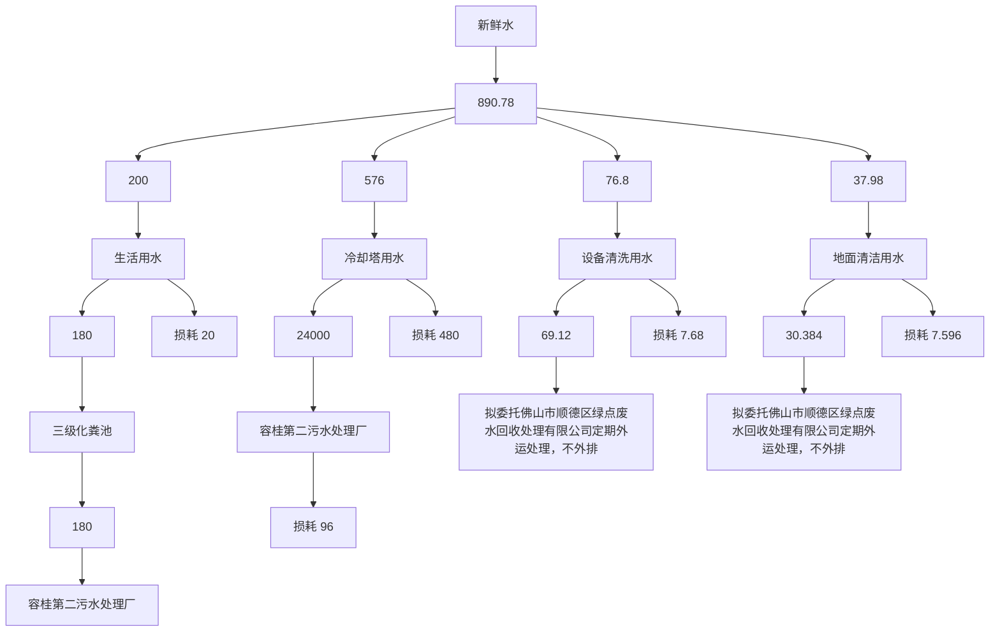
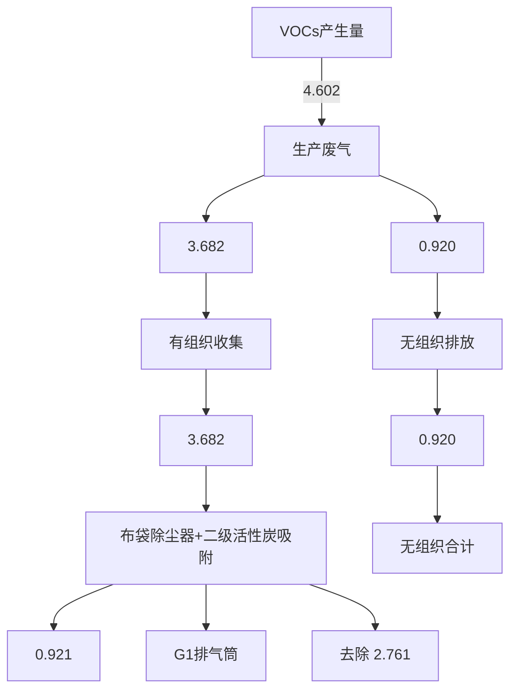
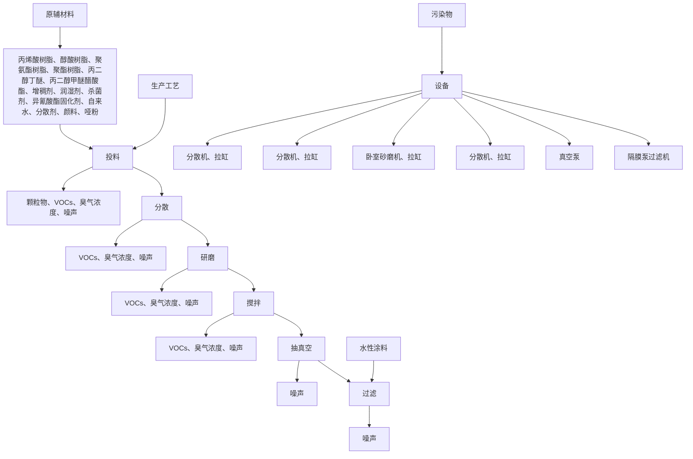
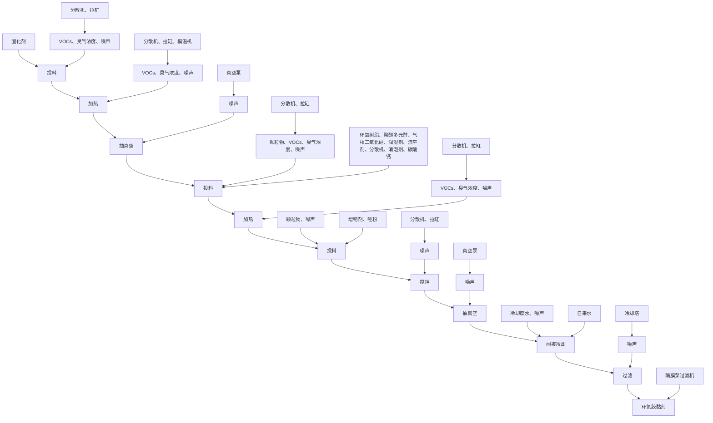
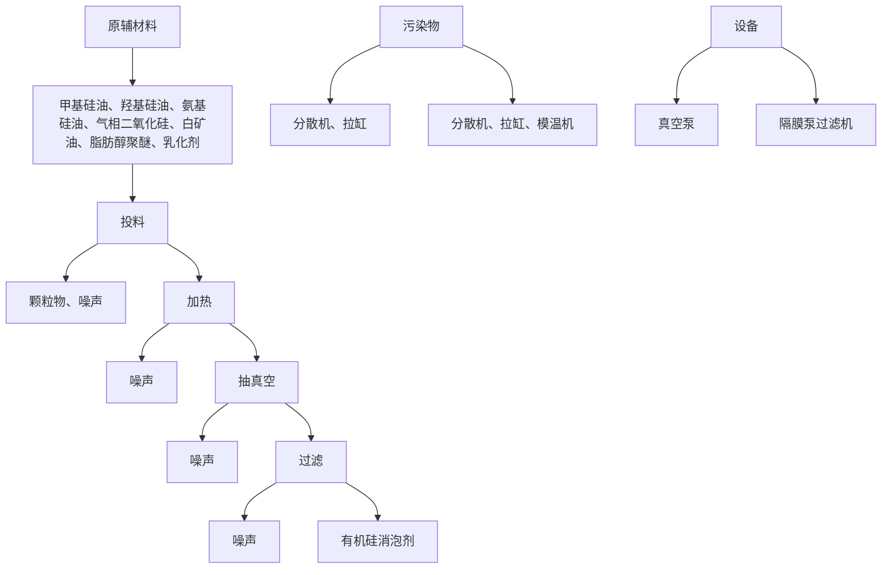
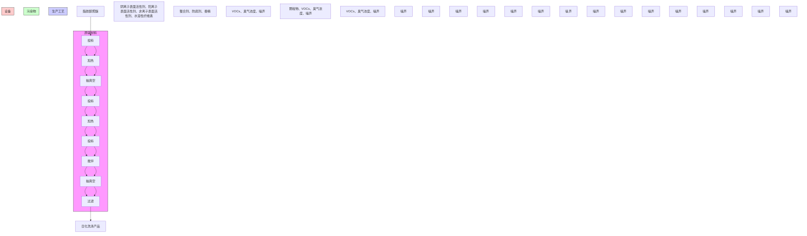
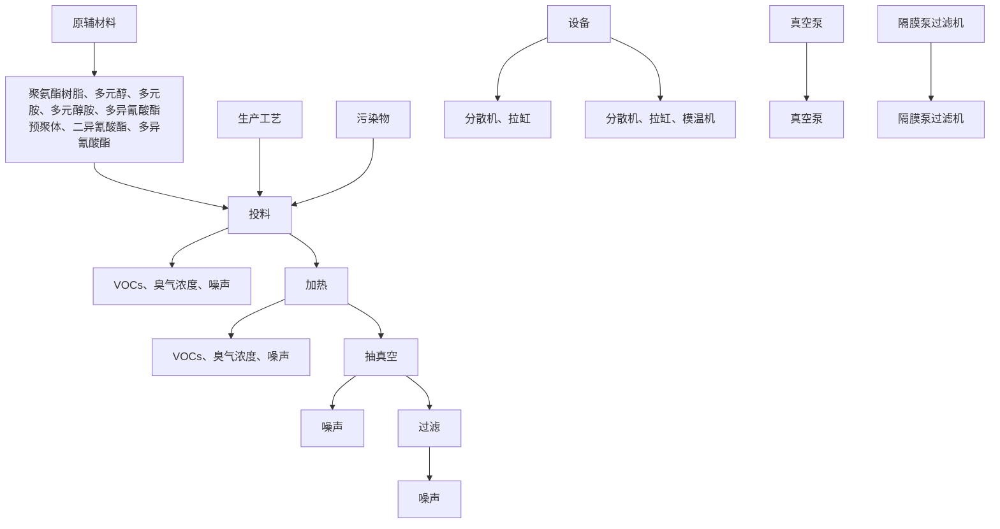
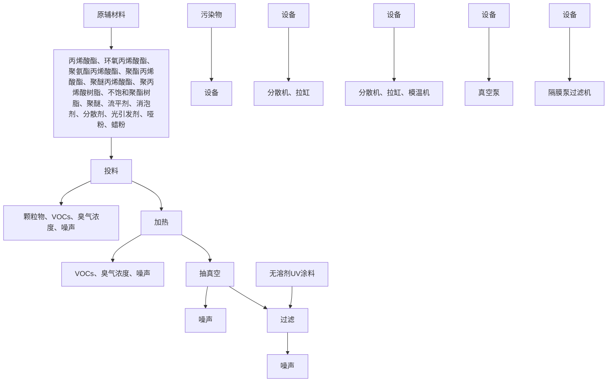
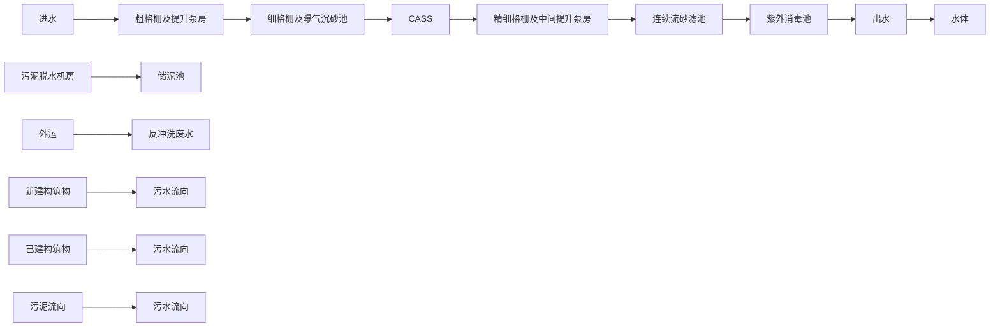
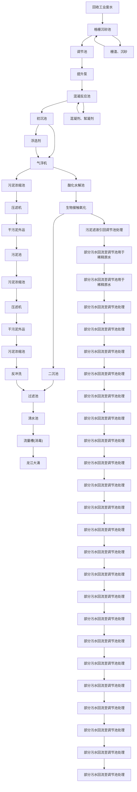

# 建设项目环境影响报告表

(污染影响类)

text_image

锦欣环保科技有限公司
西缔欣环保科技有

项目名称：佛山市 限公司新建项目建设单位（盖章）：佛山市缔欣环保科技有限公司编制日期：2023年3月

中华人民共和

text_image

佛山市顺德区
生态环境部制
广东省东莞市

# 目录

一、建设项目基本情况.  
二、建设项目工程分析.. . 17  
三、区域环境质量现状、环境保护目标及评价标准. . 42  
四、主要环境影响和护措施 . 49  
五、环境保护措施监督检查清单. . 77  
六、结论... .. 80

附图1 项目地理位置图  
附图2 项目环境四至图  
附图3 项目四至及周围环境示意图  
附图4 项目平面布置图  
附图5 项目空厂房照片  
附图6 项目周边主要环境敏感点分布图  
附图7 项目大气引用监测点图  
附图8 地表水环境功能区划图  
附图8 大气环境功能区划图

附图10 声环境功能区划图

附图11 佛山市环境管控单元图

附图12 佛山市顺德区环境管控单元图

附图13 《佛山市顺德区容桂华口扁滘片（SD-B-05-02、SD-B-05-03 编制单元）控制性详细规划》SD-B-05-03-01、SD-B-05-03-02、SD-B-05-03-03、SD-B-05-03-04 街坊局部调整批后公布

附件1 营业执照

附件2 法人身份证

附件3 购房合同

附件 4 螯合剂 msds

附件5 非离子表面活性剂msds

附件 6 固化剂 msds

附件7 光引发剂msds

附件 8 流平剂 msds

附件 9 润湿剂 msds

附件 10 增稠剂 msds

附件11 阳离子表面活性剂msds

附件12 阴离子表面活性剂msds

附件13 环评编写协议书

附件14 公示声明

# 一、建设项目基本情况

<table><tr><td>建设项目名称</td><td colspan="4">佛山市缔欣环保科技有限公司新建项目</td></tr><tr><td>项目代码</td><td colspan="4">无</td></tr><tr><td>建设单位联系人</td><td></td><td>联系方式</td><td></td><td></td></tr><tr><td>建设地点</td><td colspan="4">广东省佛山市顺德区容桂街道华口社区华大南路2号杰森家电智造中心8栋102号</td></tr><tr><td>地理坐标</td><td colspan="4">(113度20分54.205秒,22度46分4.540秒)</td></tr><tr><td>国民经济行业类别</td><td>C2641涂料制造C2669其他专用化学产品制造C2681肥皂及洗涤剂制造</td><td>建设项目行业类别</td><td colspan="2">二十三、化学原料和化学制品制造业26-44涂料、油墨、颜料及类似产品制造264-单纯物理分离、物理提纯、混合、分装的(不产生废水或挥发性有机物的除外)二十三、化学原料和化学制品制造业26-44专用化学产品制造266-单纯物理分离、物理提纯、混合、分装的(不产生废水或挥发性有机物的除外)二十三、化学原料和化学制品制造业26-46日用化学产品制造268</td></tr><tr><td>建设性质</td><td>☑新建(迁建)□改建□扩建□技术改造</td><td>建设项目申报情形</td><td colspan="2">☑首次申报项目□不予批准后再次申报项目□超五年重新审核项目□重大变动重新报批项目</td></tr><tr><td>项目审批(核准/备案)部门(选填)</td><td>无</td><td>项目审批(核准/备案)文号(选填)</td><td colspan="2">无</td></tr><tr><td>总投资(万元)</td><td>200</td><td>环保投资(万元)</td><td colspan="2">10</td></tr><tr><td>环保投资占比(%)</td><td>5</td><td>施工工期</td><td colspan="2">2个月</td></tr><tr><td>是否开工建设</td><td>☑否□是:____</td><td>用地面积(m2)</td><td colspan="2">1055.03</td></tr><tr><td>专项评价设置情况</td><td colspan="4">无</td></tr><tr><td>规划情况</td><td colspan="4">审查文件名称:《佛山市顺德区容桂华口扁滘片(SD-B-05-02、SD-B-05-03编制单元)控制性详细规划》SD-B-05-03-01、SD-B-05-03-02、SD-B-05-03-03、SD-B-05-03-04街坊局部调整批后公布审查机关:佛山市人民政府批复文号:佛府办函〔2021〕32号</td></tr><tr><td>规划环境影响</td><td colspan="4">无</td></tr><tr><td colspan="2">评价情况</td><td colspan="3"></td></tr><tr><td colspan="2">规划及规划环境影响评价符合性分析</td><td colspan="3">根据《佛山市顺德区容桂华口扁滘片(SD-B-05-02、SD-B-05-03编制单元)控制性详细规划》SD-B-05-03-01、SD-B-05-03-02、SD-B-05-03-03、SD-B-05-03-04街坊局部调整批后公布(附图13)可知,该场址用地性质为工业用地。因此,本项目建设符合规划。</td></tr><tr><td rowspan="4">其他符合性分析</td><td colspan="4">(1)产业政策相符性分析本项目所属行业为C2641涂料制造、2669其他专用化学产品制造、2681肥皂及洗涤剂制造,根据国家发展改革委商务部关于印发《市场准入负面清单(2022年版)》的通知(发改体改规(2022)397号),项目不属于上述目录所列的鼓励类、限制类、禁止(淘汰)类严控类项目,也不属于《市场准入负面清单(2022年版)》所列的禁止准入及需许可准入事项。根据《产业结构调整指导目录(2021年修订版)》,项目符合国家有关法律、法规和政策规定,项目属于允许类。因此,本项目的建设符合国家和地方的相关产业政策。项目产品不涉及《环境保护综合名录》(2021年版)中“高污染、高环境风险”产品,符合《环境保护综合名录》(2021年版)的相关规定。(2)用地相符性分析项目选址位于广东省佛山市顺德区容桂街道华口社区华天南一路2号杰森家电智造中心8栋102号,使用已建厂房进行生产。根据所在厂房取得的商品房买卖合同(附件3),选址属于工业用地。因此,本项目建设符合当地城市规划。(3)与挥发性有机污染物相关政策的相符性分析表1-1项目与挥发性有机污染物排放规定相符性分析</td></tr><tr><td>序号</td><td>政策要求</td><td>项目情况</td><td>符合性</td></tr><tr><td colspan="4">1、《中华人民共和国大气污染防治法》(2018年10月26日修正)</td></tr><tr><td>1.1</td><td>第四十四条 生产、进口、销售和使用含挥发性有机物的原材料和产品的,其挥发性有机物含量应当符合质量标准或者要求。国家鼓励生产、进口、销售和使用低毒、低挥发性有机溶剂。</td><td>项目使用的物料均不属于高挥发性有机物原辅材料,符合政策要求。</td><td>符合</td></tr><tr><td rowspan="6"></td><td>1.2</td><td>第四十五条 产生含挥发性有机物废气的生产和服务活动,应当在密闭空间或者设备中进行,并按照规定安装、使用污染防治设施;无法密闭的,应当采取措施减少废气排放。</td><td>建设单位在每台分散机、卧室砂磨机上方设置集气罩收集废气,集气罩外围安装软帘形成局部围闭,加强收集效率。投料、搅拌、分散、研磨、加热工序产生的粉尘和有机废气经有效收集后,通过“布袋除尘器+二级活性炭吸附”装置处理后引至45m排气筒G1高空排放。</td><td>符合</td></tr><tr><td colspan="4">2、《广东省大气污染防治条例》(2019年3月1日起施行)</td></tr><tr><td>2.1</td><td>第十七条 珠江三角洲区域禁止新建、扩建燃煤燃油火电机组或者企业燃煤燃油自备电站。珠江三角洲区域禁止新建、扩建国家规划外的钢铁、原油加工、乙烯生产、造纸、水泥、平板玻璃、除特种陶瓷以外的陶瓷、有色金属冶炼等大气重污染项目。</td><td>项目属于化学制品制造业,不属于禁止建设的大气重污染项目。</td><td>符合</td></tr><tr><td>2.2</td><td>第二十六条 新建、扩建、扩建排放挥发性有机物的建设项目,应当使用污染防治先进可行技术。下列产生含挥发性有机物废气的生产和服务活动,应当优先使用低挥发性有机物含量的原材料和低排放环保工艺,在确保安全条件下,按照规定在密闭空间或者设备中进行,安装、使用满足防爆、防静电要求的治理效率高的污染防治设施;无法密闭或者不适宜密闭的,应当采取有效措施减少废气排放:(一)石油、化工、煤炭加工与转化等含挥发性有机物原料的生产;(二)燃油、溶剂的储存、运输和销售;(三)涂料、油墨、粘合剂、农药等以挥发性有机物为原料的生产;(四)涂装、印刷、粘合、工业清洗等使用含挥发性有机物产品的生产活动;(五)其他产生挥发性有机物的生产和服务活动。</td><td>建设单位在每台分散机、卧室砂磨机上方设置集气罩收集废气,集气罩外围安装软帘形成局部围闭,加强收集效率。投料、搅拌、分散、研磨、加热工序产生的粉尘和有机废气经有效收集后,通过“布袋除尘器+二级活性炭吸附”装置处理后引至45m排气筒G1高空排放,减少异味影响。</td><td>符合</td></tr><tr><td>2.3</td><td>第三十条 产生恶臭污染物的化工、石化、制药、制革、骨胶炼制、生物发酵、饲料加工、家具制造等行业应当科学选址,设置合理的防护距离,并安装净化装置或者采取其他措施,防止排放恶臭污染物。</td><td>本项目属于化学制品制造业,选址位于工业区内,恶臭污染物经集气罩收集,通过“布袋除尘器+二级活性炭吸附”装置处理后,引至45m排气筒高空排放,恶臭污染物对附近大气环境影响较小。</td><td>符合</td></tr><tr><td colspan="4">3、关于印发《重点行业挥发性有机物综合治理方案》的通知(环大气[2019]53号)</td></tr><tr><td rowspan="10"></td><td>3.1</td><td>企业采用符合国家有关低VOCs含量产品规定的涂料、油墨、胶粘剂等,排放浓度稳定达标且排放速率、排放绩效等满足相关规定的,相应生产工序可不要求建设末端治理设施。使用的原辅材料VOCs含量(质量比)低于10%的工序,可不要求采取无组织排放收集措施。</td><td>建设单位在每台分散机、卧室砂磨机上方设置集气罩收集废气,集气罩外围安装软帘形成局部围闭,加强收集效率。投料、搅拌、分散、研磨、加热工序产生的粉尘和有机废气经有效收集后,通过“布袋除尘器+二级活性炭吸附”装置处理后引至45m排气筒G1高空排放。</td><td>符合</td></tr><tr><td colspan="4">4、关于印发《广东省涉挥发性有机物(VOCs)重点行业治理指引》的通知(粤环办〔2021〕43号)</td></tr><tr><td>4.1</td><td>研发和生产低VOCs含量涂料、油墨、粘胶剂等产品。使用低(无)VOCs含量、低反应活性的原辅材料。</td><td>项目不使用高VOCs含量原辅材料,符合政策要求。</td><td>符合</td></tr><tr><td>4.2</td><td>粉状、粒状VOCs物料采用气力输送设备、管状带式输送机、螺旋输送机等密闭输送方式,或者采用密闭的包装袋、容器或罐车进行物料转移。</td><td>项目原辅料采用密封包装容器进行运输与储存。</td><td>符合</td></tr><tr><td>4.3</td><td>VOCs治理设施应与生产工艺设备同步运行,VOCs治理设施发生故障或检修时,对应的生产工艺设备应停止运行,待检修完毕后同步投入使用;生产工艺设备不能停止运行或不能及时停止运行的,应设置废气应急处理设施或采取其他替代措施。</td><td>已要求企业VOCs治理设施应与生产工艺设备同步运行,日常安排专门人员对治理设备进行定期巡查和检修,避免故障情况的出现。</td><td>符合</td></tr><tr><td>4.4</td><td>建立废气收集处理设施台账,记录废气处理设施进出口的监测数据(废气量、浓度、温度、含氧量等)、废气收集与处理设施关键参数、废气处理设施相关耗材(吸收剂、吸附剂、催化剂等)购买和处理记录。</td><td>项目废气治理设施安排专人维护并定期建立台账,记录相关废气数据。</td><td>符合</td></tr><tr><td>4.5</td><td>建立危废台账,整理危废处置合同、转移联单及危废处理方资质佐证材料。</td><td>企业严格执行危险废物转移计划报批、依法建立危险废物转移联单,并通过信息系统登记转移计划和电子转移联单。</td><td>符合</td></tr><tr><td>4.6</td><td>要求建设单位需对有机废气有组织和无组织废气、噪声每年监测1次</td><td>已要求企业对项目废气、噪声进行自行监测。</td><td>符合</td></tr><tr><td colspan="4">5、《广东省人民政府办公厅关于印发广东省2021年大气、水、土壤污染防治工作方案的通知》(粤办函[2021]58号)</td></tr><tr><td>5.1</td><td>严格落实国家产品VOCs含量限值标准要求,除现阶段确无法实施替代的工序外,禁止新建生产和使用高VOCs含量原辅材料项目。鼓励在生产和流通消费环节推广使用低VOCs含量原辅材料。</td><td>本项目使用物料符合低挥发性有机化合物含量规范,符合政策要求。</td><td>符合</td></tr><tr><td rowspan="6"></td><td>5.2</td><td>指导企业使用适宜高效的治理技术,涉VOCs重点行业新建、扩建、和扩建项目不推荐使用光氧化、光催化、低温等离子等低效治理设施,已建项目逐步淘汰光氧化、光催化、低温等离子治理设施。</td><td>项目属于新建项目,建设单位在每台分散机、卧室砂磨机上方设置集气罩收集废气,集气罩外围安装软帘形成局部围闭,加强收集效率。投料、搅拌、分散、研磨、加热工序产生的粉尘和有机废气经有效收集后,通过“布袋除尘器+二级活性炭吸附”装置处理后引至45m排气筒G1高空排放。</td><td>符合</td></tr><tr><td colspan="4">6、《广东省生态环境保护“十四五”规划》(粤环[2021]10号)</td></tr><tr><td>6.1</td><td>大力推进低VOCs含量原辅材料源头替代,严格落实国家和地方产品VOCs含量限值质量标准,禁止建设生产和使用高VOCs含量的溶剂型涂料、油墨、胶粘剂等项目。</td><td>本项目不涉及使用高挥发性有机物原辅材料。</td><td>符合</td></tr><tr><td>6.2</td><td>强化对企业涉VOCs生产车间/工序废气的收集管理,推动企业开展治理设施升级改造。</td><td>建设单位在每台分散机、卧室砂磨机上方设置集气罩收集废气,集气罩外围安装软帘形成局部围闭,加强收集效率。投料、搅拌、分散、研磨、加热工序产生的粉尘和有机废气经有效收集后,通过“布袋除尘器+二级活性炭吸附”装置处理后引至45m排气筒G1高空排放。</td><td>符合</td></tr><tr><td colspan="4">7、《佛山市生态环境保护“十四五”规划》(佛环[2022]3号)</td></tr><tr><td>7.1</td><td>加强VOCs源头替代和无组织排放管控。大力推进低VOCs含量原辅材料替代,将全面使用低VOCs含量原辅材料的企业纳入证明清单和政府绿色采购清单。加强对含VOCs物料储存、转移和运输、设备与管线组件泄漏、敞开液面逸散以及工艺过程等五类排放源的管控。</td><td>本项目使用物料符合低挥发性有机化合物含量规范,建设单位在每台分散机、卧室砂磨机上方设置集气罩收集废气,集气罩外围安装软帘形成局部围闭,加强收集效率。投料、搅拌、分散、研磨、加热工序产生的粉尘和有机废气经有效收集后,通过“布袋除尘器+二级活性炭吸附”装置处理后引至45m排气筒G1高空排放。</td><td>符合</td></tr><tr><td rowspan="11"></td><td>7.2</td><td>强化涉VOCs排放,涉工业炉窑等重点污染源自动监测,推动重点工业园区建立挥发性有机物、颗粒物监测体系。</td><td>本项目不涉及工业炉窑等重点污染源,项目有机废气经有效收集处理后达标排放,定期开展废气监测。</td><td>符合</td></tr><tr><td colspan="4">8、《佛山市顺德区生态环境保护“十四五”规划(2021—2025)》</td></tr><tr><td>8.1</td><td>严格控制“高耗能、高排放”项目盲目发展,禁止新建、扩建水泥、平板玻璃、化学制浆、生皮制革以及国家规划外的钢铁、原油加工等项目;专业电镀、印染等项目进入定点园区集中管理</td><td>项目属于化学制品制造业,不属于水泥、平板玻璃、化学制浆、生皮制革以及国家规划外的钢铁、原油加工等项目。</td><td>符合</td></tr><tr><td>8.2</td><td>大力推进低VOCs含量、低反应活性的原辅材料替代,将全面使用低VOCs含量原辅材料的企业纳入正面清单和政府绿色采购清单。鼓励重点行业企业开展生产工艺和设备水性化改造,推广使用水性、高固体分、无溶剂、粉末等低VOCs含量涂料。严格落实《挥发性有机物无组织排放控制标准》,开展厂区内无组织排放浓度监测,加强对含VOCs物料储存、转移和运输、设备与管线组件泄漏、敞开页面逸散以及工艺过程等五类排放源的管控。加强储油库、加油站等VOCs排放治理,推动油品储运销体系安装油气回收自动监控系统。</td><td>本项目使用的物料不属于禁止使用的高VOCs含量原辅材料,符合政策要求。建设单位严格落实《挥发性有机物无组织排放控制标准》,开展厂区内无组织排放浓度监测。</td><td>符合</td></tr><tr><td colspan="4">9、《挥发性有机物无组织排放控制标准》(GB37822-2019)</td></tr><tr><td rowspan="3">9.1</td><td>VOCs物料应储存于密闭的容器、包装袋、储罐、储库、料仓中。</td><td rowspan="3">本项目使用的物料采用密封容器存放在厂房内的仓库;厂房为已建成工业厂房,拥有完整的维护结构,地面已经全部混凝土硬化处理。</td><td rowspan="3">符合</td></tr><tr><td>盛装VOCs物料的容器或包装袋应存放于室内,或存放与设置雨棚、遮阳和防渗设施的专用场地。盛装VOCs物料的容器或包装袋在非取用状态时应加盖、封口,保持密闭。</td></tr><tr><td>VOCs物料储存、料仓应满足3.6条对密闭空间的要求。</td></tr><tr><td>9.2</td><td>粉状、粒状VOCs物料应采用气力输送设备、管状带式输送机、螺旋输送机等密闭输送方式,或采用密闭的包装袋、容器或罐车进行物料转移。</td><td>本项目VOCs物料使用时采用密闭包装容器进行转移。</td><td>符合</td></tr><tr><td>9.3</td><td>VOCs物料卸(出、放)料过程密闭,卸料废气应排至VOCs废气收集处理系统;无法密闭的,应采取局部气体收集措施,废气应排至VOCs废气收集处理系统。</td><td>建设单位在每台分散机、卧室砂磨机上方设置集气罩收集废气,集气罩外围安装软帘形成局部围闭,加强收集效率。投料、搅拌、分散、研磨、加热工序产生的粉尘和有机废气经有效收集后,通过“布袋除尘器+二级活性炭吸附”装置处理后引至45m排气筒G1高空排放。</td><td>符合</td></tr><tr><td colspan="4">10、《固定污染源挥发性有机物综合排放标准(DB44/2367-2022)》</td></tr><tr><td rowspan="9"></td><td>10.1</td><td>排气筒高度不低于15m(因安全考虑或者有特殊工艺要求的除外),具体高度以及与周围建筑物的相对高度关系应当根据环境影响评价文件确定。</td><td>建设单位在每台分散机、卧室砂磨机上方设置集气罩收集废气,集气罩外围安装软帘形成局部围闭,加强收集效率。投料、搅拌、分散、研磨、加热工序产生的粉尘和有机废气经有效收集后,通过“布袋除尘器+二级活性炭吸附”装置处理后引至45m排气筒G1高空排放。</td><td>符合</td></tr><tr><td>10.2</td><td>企业应当建立台账,记录废气收集系统、VOCs处理设施的主要运行和维护信息,如运行时间、废气处理量、操作温度、停留时间、吸附剂再生/更换周期和更换量、催化剂更换周期和更换量、吸收液pH值等关键运行参数。台账保存期限不少于3年。</td><td>项目废气治理设施安排专人维护并定期建立台账,记录相关废气数据。</td><td>符合</td></tr><tr><td>10.3</td><td>VOCs物料应当储存于密闭的容器、储罐、储库、料仓中;盛装VOCs物料的容器应当存放于室内,或者存放于设置有雨棚、遮阳和防渗设施的专用场地。盛装VOCs物料的容器或者包装袋在非取用状态时应当加盖、封口,保持密闭。</td><td>本项目使用的物料采用密封容器存放在厂房内的仓库;厂房为已建成工业厂房,拥有完整的维护结构,地面已经全部混凝土硬化处理。</td><td>符合</td></tr><tr><td>10.4</td><td>废气收集系统排风罩(集气罩)的设置应当符合GB/T16758的规定。采用外部排风罩的,应当按GB/T 16758、WS/T 757—2016规定的方法测量控制风速,测量点应当选取在距排风罩开口面最远处的VOCs无组织排放位置,控制风速不应当低于0.3m/s(行业相关规范有具体规定的,按相关规定执行)。</td><td>建设单位在每台分散机、卧室砂磨机上方设置集气罩收集废气,集气罩外围安装软帘形成局部围闭,加强收集效率。投料、搅拌、分散、研磨、加热工序产生的粉尘和有机废气经有效收集后,通过“布袋除尘器+二级活性炭吸附”装置处理后引至45m排气筒G1高空排放。控制风速大于0.3m/s。</td><td>符合</td></tr><tr><td colspan="4">11、《工业防护涂料中有害物质限量》(GB30981-2020)</td></tr><tr><td>11.1</td><td>各类工业防护涂料中除VOC含量以外其他有害物质含量的限量值应符合表5的要求。</td><td>项目生产的水性涂料、UV涂料中有害物质仅为VOC,不含其他有害物质及重金属。</td><td>符合</td></tr><tr><td colspan="4">12、《佛山市生态环境局顺德分局关于做好重点行业建设项目挥发性有机物总量指标管理工作的通知》(佛顺环函[2019]56号)</td></tr><tr><td>12.1</td><td>涉VOCs排放项目,实现本行政区域内污染源“点对点”2倍量削减替代,由项目所在镇街分局出具VOCs总量指标来源及替代削减方案的意见,开展总量替代。</td><td>项目VOCs排放总量指标为1.841t/a,由容桂街道出具VOCs总量指标来源及替代削减方案的意见。</td><td>符合</td></tr><tr><td colspan="4">(4)“三线一单”符合性分析1、《广东省人民政府关于印发广东省“三线一单”生态环境分区管控方</td></tr></table>

# 案的通知》（粤府〔2020〕71号）

根据《广东省人民政府关于印发广东省“三线一单”生态环境分区管控方案的通知》（粤府〔2020〕71 号），广东省将以环境管控单元为基础，实施生态环境分区管控，精细化管理、保护生态环境。本项目与广东省“三线一单” 生态环境分区管控方案相符性分析如下：

# 与“一核一带一区”区域管控要求的相符性

项目位于珠三角核心区，主要从事水性涂料、环氧胶黏剂、有机硅消泡剂、日化洗涤产品、聚氨酯胶黏剂、无溶剂UV 涂料的产销，不属于区域布局管控要求中的禁止新建、扩建水泥、平板玻璃、化学制浆、生皮制革以及国家规划外的钢铁、原油加工等项目。项目不涉及使用高挥发性原辅材料，不属于新建生产和使用高挥发性有机物原辅材料的项目，符合区域布局管控要求。

项目所属 C2641 涂料制造、C2669 其他专用化学产品制造、C2681 肥皂及洗涤剂制造，不属于高能耗行业，项目生产设备使用电能，生产用水由市政供水，不直接取用江河湖库水量，不会对项目所在地生态流量造成影响，符合能源利用要求。

项目生活污水经三级化粪池预处理后由市政管网排入容桂第二污水处理厂，尾水排至鸡鸦水道；冷却水循环使用，定期通过市政污水管网排入容桂第二污水处理厂，尾水排入鸡鸦水道；设备清洗废水、地面清洁废水收集后暂存于单独容器内，拟委托佛山市顺德区绿点废水回收处理有限公司定期外运处理，不外排。根据《佛山市生态环境局顺德分局关于发布2021年度佛山市顺德区环境质量状况公报的通知》附件《2021 年佛山市顺德区环境质量状况公报》中“表 3-3 2021 年顺德区主河道质量评价及年度对比”的评价结果，纳污水体水质较好。

项目位于广东省佛山市顺德区容桂街道华口社区华天南一路 2 号杰森家电智造中心8栋102号，不属于石化、化工重点园区环境风险防控区域。项目产生的危险废物拟定期委托有资质的处置公司进行收集处理，并通过信息系统登记转移计划和电子转移联单，符合危险废物全过程跟踪管理的防控要求。

# 与环境管控单元总体管控要求的相符性

根据《广东省人民政府关于印发广东省“三线一单”生态环境分区管控方案的通知》（粤府〔2020〕71 号）发布的广东省环境管控单元图，项目所在区域为重点管控单元，重点管控单元以推动产业转型升级、强化污染减排、提升资源利用效率为重点，加快解决资源环境负荷大、局部区域生态环境质量差、生态环境风险高等问题。并且严格限制新建钢铁、燃煤燃油火电、石化、储油库等项目，产生和排放有毒有害大气污染物项目，以及使用溶剂型油墨、涂料、清洗剂、胶粘剂等高挥发性有机物原辅材料的项目；鼓励现有该类项目逐步搬迁退出。项目不属于上述限制类项目，符合重点管控单元要求。

# “三线一单”的相符性

# ①生态保护红线

项目地址位于广东省佛山市顺德区容桂街道华口社区华天南一路2号杰森家电智造中心8栋102号，据佛山市顺德区人民政府办公室关于印发《佛山市顺德区生态环境保护“十四五”规划（2021-2025）》的通知，项目所在区域不处于生态红线内。因此，本项目建设满足生态保护红线管理要求。

# ②环境质量底线

本项目所在地区属于大气环境不达标区；项目纳污水体为鸡鸦水道，水质满足水环境功能区划要求。

本项目废气污染物产生量较小，经过有效收集后达标排放，对周边环境影响很小，不会加剧空气环境质量影响；生活污水经三级化粪池预处理后由市政管网排入容桂第二污水处理厂，尾水排至鸡鸦水道；冷却水循环使用，定期通过市政污水管网排入容桂第二污水处理厂，尾水排入鸡鸦水道；设备清洗废水、地面清洁废水收集后暂存于单独容器内，拟委托佛山市顺德区绿点废水回收处理有限公司定期外运处理，不外排；不会导致纳污水体水质超标。因此，本项目建设满足环境质量底线要求。

# ③资源利用上线

本项目生产过程中会消耗一定量的电源、水资源等资源消耗，资源消耗量相对区域资源利用总量较少，符合资源利用上限要求。

# ④环保准入负面清单

本项目所属行业为 C2641 涂料制造、C2669 其他专用化学产品制造、C2681 肥皂及洗涤剂制造，根据国家发展改革委商务部关于印发《市场准入负面清单（2022 年版）》的通知（发改体改规﹝2022﹞397 号），项目不属于上述目录所列的鼓励类、限制类、禁止（淘汰）类严控类项目，也不属于《市场准入负面清单（2022 年版）》所列的禁止准入及需许可准入事项。根据《产业结构调整指导目录（2021 年修订版）》，项目符合国家有关法律、法规和政策规定，项目属于允许类。因此，本项目的建设符合国家和地方的相关产业政策。

# 2、《佛山市人民政府关于印发佛山市“三线一单”生态环境分区管控方案的通知》（佛府〔2021〕11号）

根据《佛山市人民政府关于印发佛山市“三线一单”生态环境分区管控方案的通知》（佛府〔2021〕11 号）的附件 1 佛山市环境管控单元图，项目所在地属于重点管控单元（环境管控单元编码：ZH44060620001，环境管控单元名称：容桂街道重点管控区，详见附图 11）。相关管控要求的相符性分析如下：

表 1-2 项目与佛山市“三线一单”的相符性分析

<table><tr><td>管控维度</td><td>管控要求</td><td>工程内容</td><td>符合性</td></tr><tr><td rowspan="3">区域布局管控</td><td>【产业/综合类】系统推进村级工业园升级改造,腾出连片空间,布局产业集聚区和主题产业园,推动工业项目入园集聚发展。新增工业制造业用地原则上安排在产业集聚区内,产业集聚区外原则上不鼓励工业及物流仓储用地的新建与改造。</td><td>项目选址位于广东省佛山市顺德区容桂街道华口社区华天南一路2号杰森家电智造中心8栋102号,属于产业集聚区。</td><td>符合</td></tr><tr><td>【产业/综合类】产业聚集区所属地块内的工业用地或企业与村庄、学校等环境敏感点之间应设置合理的大气环境防护距离,并通过绿化带进行有效隔离;聚集区规划布局应注重大气污染排放企业应尽量避免布局在居住用地的常年主导风向的上风向。</td><td>项目500米范围内大气环境保护目标为大岑村,大气污染物经有效收集处理后达标排放,对周围环境影响不大</td><td>符合</td></tr><tr><td>【产业/限制类】受纳水体或监控断面不达标的,不得新建、扩建向河涌直接排放废水的项目。新建、扩建含蚀刻工序的线路板生产项目和化工项目应在配套污水集中处置的工业园区或生活污水管网覆盖区域内建设;纯加工型印花项目,含酸洗、磷化的金属表面处理、金属制品项目(与自</td><td>项目属C2641涂料制造、C2669其他专用化学产品制造、C2681肥皂及洗涤剂制造,属于化学制品制造业,生活污水经三级化粪池预处理后引至容桂第二污水处理厂深度</td><td>符合</td></tr></table>

<table><tr><td rowspan="9"></td><td rowspan="4"></td><td>身高新技术企业配套的除外),含酸洗、喷涂、化学抛光、电解等涉及废水排放工艺的不锈钢型材加工项目(与自身高新技术企业配套的除外),应进入以此类项目为主导产业、有相应废水集中治理设施的工业园区,实现集中治污。</td><td>处理,不涉及使用不锈钢原材料,不属于线路板生产项目,不属于含酸洗、喷涂、拉丝、表面抛光等工艺的不锈钢型材加工项目。</td><td></td></tr><tr><td>【产业/综合类】划定家具生产优先发展区域,优先发展区外不再新建涉及涂装工艺的木质家具制造项目。</td><td>项目属于化学制品制造业,不属于涉及涂装工艺的木质家具制造项目。</td><td>符合</td></tr><tr><td>【大气/限制类】大气环境受体敏感重点管控区内,应严格限制新建储油库项目、产生和排放有毒有害大气污染物的建设项目以及使用溶剂型油墨、涂料、清洗剂、胶粘剂等高挥发性有机物原辅材料项目,鼓励现有该类项目搬迁退出。</td><td>项目原料不使用高VOCs含量原辅材料。</td><td>符合</td></tr><tr><td>【土壤/禁止类】禁止新建、扩建增加重点防控的重金属污染物排放的建设项目。</td><td>不属于重点防控的重金属污染物排放类建设项目。</td><td>符合</td></tr><tr><td rowspan="3">能源资源利用</td><td>【水资源/综合类】贯彻落实“节水优先”方针,实行最严格水资源管理制度,容桂街道万元国内生产总值用水量、万元工业增加值用水量、用水总量、农田灌溉水有效利用系数等用水总量和效率指标达到区下达要求。</td><td>项目用水主要为员工生活用水、冷却塔用水、设备清洗用水和地面清洁用水,内部实行节约用水,合理使用水资源。</td><td>符合</td></tr><tr><td>【土地资源/限制类】落实单位土地面积投资强度、土地利用强度等建设用地控制性指标要求,提高土地利用效率。</td><td>项目建设用地属于工业用地。</td><td>符合</td></tr><tr><td>【岸线/禁止类】严格水域岸线用途管制,新建项目一律不得违规占用水域。严禁破坏生态的岸线利用行为和不符合其功能定位的开发建设活动,严禁以各种名义侵占河道、围垦湖泊、非法采砂等。</td><td>项目建设在陆域上,不属于占用水域和破坏生态的岸线利用行为。</td><td>符合</td></tr><tr><td rowspan="2">污染物排放管控</td><td>【水/限制类】城镇新区建设实行雨污分流,逐步推进初期雨水收集、处理和资源化利用。住宅、商业体、学校、市场等城镇开发建设项目应当配套或者同步计划建设公共排水设施,公共排水设施或自建排污水设施未能投产运行的,以上涉水项目不得投入使用。新建小区严格实施雨污分流,阳台、露台等污水接入污水收集系统,将生活污水“应截尽截”。做好大型楼盘、集贸市场、餐饮以及学校等4大类排水户污水接入市政管网工作。</td><td>建设单位实行雨污分流,且生产车间位于厂房内,不存在露天作业。项目生活污水经三级化粪池预处理后引至容桂第二污水处理厂深度处理,尾水达标排放。</td><td>符合</td></tr><tr><td>【水/综合类】容桂街道重点河涌水质上年度未达到水环境环境质量目标的,需组织编制、系统实施、向社会公开区域重点水污染物减排计划并明确“替代量”,本年度新建、改建、扩建项目新增水环境重点污染物实行区域“减二增一”替代(工业、生活或综合集中废水处理设施、民生项目除外)。</td><td>项目已接驳市政管网。不排放水环境重点污染物。</td><td>符合</td></tr><tr><td rowspan="7"></td><td rowspan="7"></td><td>【水/综合类】区域内应合理规划建设工业或综合集中废水处理设施。逐步推进工业集聚区“污水零直排区”建设,开展排水单元工业废水、生活污水、雨水分类收集、分质处理,确保园区“管网全覆盖、雨污全分流、污水全收集、处理全达标”</td><td>项目已接驳市政管网。生活污水经三级化粪池预处理后引至容桂第二污水处理厂深度处理,尾水达标排放;冷却水循环使用,定期通过市政污水管网排入容桂第二污水处理厂,尾水排入鸡鸦水道;设备清洗废水、地面清洁废水收集后暂存于单独容器内,拟委托佛山市顺德区绿点废水回收处理有限公司定期外运处理,不外排。</td><td>符合</td></tr><tr><td>【水/综合类】结合村级工业园改造,全面提升产业层次与集聚度,促进污染集中整治。</td><td>项目选址位于广东省佛山市顺德区容桂街道华口社区华天南一路2号杰森家电智造中心8栋102号,属于产业集聚区。</td><td>符合</td></tr><tr><td>【水/综合类】稳步推进排水设施“三个一体化”管理模式,补齐城乡污水收集和处理短板,推动容桂第二、第二污水处理厂提质增效,加快消除城中村、老旧城区、城乡结合部等污水收集管网空白区,逐步实现城乡污水收集处理全覆盖。2025年前完成容桂第二、第二污水处理厂扩建,尾水应执行《城镇污水处理厂污染物排放标准》(GB18918-2002)一级A标准及《广东省水污染物排放限值》(DB44/26-2001)的较严值。</td><td rowspan="3">项目已接驳市政管网。生活污水经三级化粪池预处理后引至容桂第二污水处理厂深度处理;冷却水循环使用,定期通过市政污水管网排入容桂第二污水处理厂,尾水排入鸡鸦水道。</td><td>符合</td></tr><tr><td>【水/综合类】近期保留马东、马南两处污水处理站,到2030年将马冈村居污水接入市政污水管网,纳入杏坛城镇污水处理系统;其余行政村(社区)污水均通过市政管网和农村支管纳入容桂城镇污水处理处理系统。</td><td>符合</td></tr><tr><td>【水/综合类】产业集聚区和主题园区内做好污水管网和污水集中处理设施的配套保障,确保废水收集到城镇污水处理厂、园区污水处理厂或分散式污水处理设施集中处置。</td><td>符合</td></tr><tr><td>【大气/综合类】大力推进低VOCs含量原辅材料替代,加快涉VOCs重点行业的生产工艺升级改造,推行自动化生产工艺,对达不到要求的VOCs收集及治理设施进行整治提升,逐步淘汰低效VOCs治理设施</td><td>项目不使用高VOCs含量原辅材料,有机废气经有效收集处理后达标排放。</td><td>符合</td></tr><tr><td>【土壤气/综合类】作为重金属污染重点防控区,区域内重点重金属排放总量只减不</td><td>不属于重点防控的重金属污染物排放类建设项</td><td>符合</td></tr></table>

<table><tr><td></td><td>增。</td><td>目。</td><td></td></tr><tr><td rowspan="2">环境风险防控</td><td>【水/综合类】容桂第二、第二污水处理厂、工业污水集中处理设施应采取有效措施,防止事故废水直接排入水体。完善污水处理厂在线监控系统联网,实现污水处理厂的实时、动态监管。</td><td rowspan="2">建设单位加强环境风险分级分类管理,强化环境风险管控。</td><td>符合</td></tr><tr><td>【风险/综合类】加强环境风险分级分类管理,强化金属制品、有色金属和压延加工、化学原料和化学品制造业等涉重金属、化工行业企业及工业园区等重点环境风险源的环境风险防控。</td><td>符合</td></tr></table>

# 3、《佛山市顺德区人民政府关于印发佛山市顺德区“三线一单”生态环境分区管控方案的通知》（顺府发〔2021〕11号）

对照《佛山市顺德区人民政府关于印发佛山市顺德区“三线一单”生态环境分区管控方案的通知》（顺府发〔2021〕11 号）的附件 2佛山市顺德区环境管控单元图，项目所在地属于重点管控单元（环境管控单元编码：ZH44060620001，环境管控单元名称：容桂街道重点管控区，详见附图12）。相关管控要求的相符性分析如下：

表 1-3 项目与顺德区“三线一单”的相符性分析

<table><tr><td>管控维度</td><td>管控要求</td><td>工程内容</td><td>符合性</td></tr><tr><td rowspan="3">区域布局管控</td><td>【产业/综合类】系统推进村级工业园升级改造,腾出连片空间,布局产业集聚区和主题产业园,推动工业项目入园集聚发展。新增工业制造业用地原则上安排在产业集聚区内,产业集聚区外原则上不鼓励工业及物流仓储用地的新建与改造。</td><td>项目选址位于广东省佛山市顺德区容桂街道华口社区华天南一路2号杰森家电智造中心8栋102号,属于产业集聚区。</td><td>符合</td></tr><tr><td>【产业/综合类】产业聚集区所属地块内的工业用地或企业与村庄、学校等环境敏感点之间应设置合理的大气环境防护距离,并通过绿化带进行有效隔离;聚集区规划布局应注重大气污染排放企业应尽量避免布局在居住用地的常年主导风向的上风向。</td><td>项目500米范围内大气环境保护目标为大岑村,项目大气污染物经有效的收集处理后可达标排放,对周围大气环境影响较小。</td><td>符合</td></tr><tr><td>【产业/限制类】受纳水体或监控断面不达标的,不得新建、扩建向河涌直接排放废水的项目。新建、扩建含蚀刻工序的线路板生产项目和化工项目应在配套污水集中处置的工业园区或生活污水管网覆盖区域内建设;纯加工型印花项目,含酸洗、磷化的金属表面处理、金属制品项目(与自身高新技术企业配套的除外),含酸洗、喷涂、化学抛光、电解等涉及废水排放工艺的不锈钢型材加工项目(与自身高新技术企业配套的除外),应进入以此类项目</td><td>项目属C2641涂料制造、C2669其他专用化学产品制造、C2681肥皂及洗涤剂制造,属于化学制品制造业,生活污水经三级化粪池预处理后引至容桂第二污水处理厂深度处理,不涉及使用不锈钢原材料,不属于线路板生产项目,不属于含酸洗、喷涂、拉丝、表面抛光等工艺的</td><td>符合</td></tr></table>

<table><tr><td rowspan="10"></td><td rowspan="4"></td><td>为主导产业、有相应废水集中治理设施的工业园区,实现集中治污。</td><td>不锈钢型材加工项目。</td><td></td></tr><tr><td>【产业/综合类】划定家具生产优先发展区域,优先发展区外不再新建涉及涂装工艺的木质家具制造项目。</td><td>项目属于化学制品制造业,不属于涉及涂装工艺的木质家具制造项目。</td><td>符合</td></tr><tr><td>【大气/限制类】大气环境受体敏感重点管控区内,应严格限制新建储油库项目、产生和排放有毒有害大气污染物的建设项目以及使用溶剂型油墨、涂料、清洗剂、胶粘剂等高挥发性有机物原辅材料项目,鼓励现有该类项目搬迁退出。</td><td>项目不使用高VOCs含量原辅材料。</td><td>符合</td></tr><tr><td>【土壤/禁止类】禁止新建、扩建增加重点防控的重金属污染物排放的建设项目。</td><td>不属于重点防控的重金属污染物排放类建设项目。</td><td>符合</td></tr><tr><td rowspan="3">能源资源利用</td><td>【水资源/综合类】贯彻落实“节水优先”方针,实行最严格水资源管理制度,容桂街道万元国内生产总值用水量、万元工业增加值用水量、用水总量、农田灌溉水有效利用系数等用水总量和效率指标达到区下达要求。</td><td>项目用水主要为员工生活用水、冷却塔用水、设备清洗用水和地面清洁用水,内部实行节约用水,合理使用水资源。</td><td>符合</td></tr><tr><td>【土地资源/限制类】落实单位土地面积投资强度、土地利用强度等建设用地控制性指标要求,提高土地利用效率。</td><td>项目建设用地属于工业用地。</td><td>符合</td></tr><tr><td>【岸线/禁止类】严格水域岸线用途管制,新建项目一律不得违规占用水域。严禁破坏生态的岸线利用行为和不符合其功能定位的开发建设活动,严禁以各种名义侵占河道、围垦湖泊、非法采砂等。</td><td>项目建设在陆域上,不属于占用水域和破坏生态的岸线利用行为。</td><td>符合</td></tr><tr><td rowspan="3">污染物排放管控</td><td>【水/限制类】城镇新区建设实行雨污分流,逐步推进初期雨水收集、处理和资源化利用。住宅、商业体、学校、市场等城镇开发建设项目应当配套或者同步计划建设公共排水设施,公共排水设施或自建排污水设施未能投产运行的,以上涉水项目不得投入使用。新建小区严格实施雨污分流,阳台、露台等污水接入污水收集系统,将生活污水“应截尽截”。做好大型楼盘、集贸市场、餐饮以及学校等4大类排水户污水接入市政管网工作。</td><td>建设单位实行雨污分流,且生产车间位于厂房内,不存在露天作业。项目生活污水经三级化粪池预处理后引至容桂第二污水处理厂深度处理,尾水达标排放。</td><td>符合</td></tr><tr><td>【水/综合类】容桂街道重点河涌水质上年度未达到水环境环境质量目标的,需组织编制、系统实施、向社会公开区域重点水污染物减排计划并明确“替代量”,本年度新建、改建、扩建项目新增水环境重点污染物实行区域“减二增一”替代(工业、生活或综合集中废水处理设施、民生项目除外)。</td><td>项目已接驳市政管网。不排放水环境重点污染物。</td><td>符合</td></tr><tr><td>【水/综合类】区域内应合理规划建设工业或综合集中废水处理设施。逐步推进工业集聚区“污水零直排区”建设,开展排水单元工业废水、生活污水、雨水分类收集、分质处理,确保园区“管网全覆盖、雨污全分流、污水全收集、处理全达标”。</td><td>项目已接驳市政管网。生活污水经三级化粪池预处理后引至容桂第二污水处理厂深度处理,尾水达标排放;冷却水循环使用,定期通过市政污水管网排入容桂第二污水处理厂,尾水排入鸡鸦水道;设备清洗废水、地面清洁废水收集后暂存于单独容器内,拟委托佛山市顺德区绿点废水回收处理有限公司定期外运处理,不外排。</td><td>符合</td></tr><tr><td rowspan="8"></td><td rowspan="6"></td><td>【水/综合类】结合村级工业园改造,全面提升产业层次与集聚度,促进污染集中整治。</td><td>项目选址位于广东省佛山市顺德区容桂街道华口社区华天南一路2号杰森家电智造中心8栋102号,属于产业集聚区。</td><td>符合</td></tr><tr><td>【水/综合类】稳步推进排水设施“三个一体化”管理模式,补齐城乡污水收集和处理短板,推动容桂第二、第二污水处理厂提质增效,加快消除城中村、老旧城区、城乡结合部等污水收集管网空白区,逐步实现城乡污水收集处理全覆盖。2025年前完成容桂第二、第二污水处理厂扩建,尾水应执行《城镇污水处理厂污染物排放标准》(GB18918-2002)一级A标准及《广东省水污染物排放限值》(DB44/26-2001)的较严值。</td><td rowspan="3">项目已接驳市政管网。生活污水经三级化粪池预处理后引至容桂第二污水处理厂深度处理;冷却水循环使用,定期通过市政污水管网排入容桂第二污水处理厂,尾水排入鸡鸦水道。</td><td>符合</td></tr><tr><td>【水/综合类】近期保留马东、马南两处污水处理站,到2030年将马冈村居污水接入市政污水管网,纳入杏坛城镇污水处理系统;其余行政村(社区)污水均通过市政管网和农村支管纳入容桂城镇污水处理处理系统。</td><td>符合</td></tr><tr><td>【水/综合类】产业集聚区和主题园区内做好污水管网和污水集中处理设施的配套保障,确保废水收集到城镇污水处理厂、园区污水处理厂或分散式污水处理设施集中处置。</td><td>符合</td></tr><tr><td>【大气/综合类】大力推进低VOCs含量原辅材料替代,加快涉VOCs重点行业的生产工艺升级改造,推行自动化生产工艺,对达不到要求的VOCs收集及治理设施进行整治提升,逐步淘汰低效VOCs治理设施。</td><td>项目不使用高VOCs含量原辅材料,有机废气经有效收集处理后达标排放。</td><td>符合</td></tr><tr><td>【土壤/限制类】作为重金属污染重点防控区,区域内重点重金属排放总量只减不增。</td><td>项目不排放重金属污染物。</td><td>符合</td></tr><tr><td rowspan="2">环境风险防控</td><td>【水/综合类】容桂第二、第二污水处理厂、工业污水集中处理设施应采取有效措施,防止事故废水直接排入水体。完善污水处理厂在线监控系统联网,实现污水处理厂的实时、动态监管。</td><td rowspan="2">建设单位加强环境风险分级分类管理,强化环境风险管控。</td><td>符合</td></tr><tr><td>【风险/综合类】加强环境风险分级分类管</td><td>符合</td></tr><tr><td></td><td></td><td>理,强化金属制品、有色金属和压延加工、化学原料和化学品制造业等涉重金属、化工行业企业及工业园区等重点环境风险源的环境风险防控。</td><td></td><td></td></tr></table>

# 二、建设项目工程分析

# 1、工程组成及平面布置

佛山市缔欣环保科技有限公司位于广东省佛山市顺德区容桂街道华口社区华天南一路2号杰森家电智造中心8栋102号。

佛山市缔欣环保科技有限公司新建项目（以下称“本项目”）使用已建成厂房，项目所在厂房位于一栋 9 层建筑物，首层高度为7.9m，其余楼层高4.4m，楼层总高43.1m；项目位于首层，占地面积为1055.03平方米，建筑面积为1055.03平方米。本项目主体工程包括投料区、搅拌区、分散区、研磨区、过滤区等，并配有仓库等储运工程。

项目建设工程组成见下表2-1：

表 2-1 项目主要工程组成情况

<table><tr><td>类别</td><td colspan="2">工程名称</td><td>面积及内容</td><td>备注</td></tr><tr><td colspan="3">占地面积</td><td> $1055.03m^{2}$ </td><td rowspan="2">项目所在厂房位于一栋9层建筑物,首层高度为7.9m,其余楼层高4.4m,楼层总高43.1m;项目位于首层。</td></tr><tr><td colspan="3">建筑面积</td><td> $1055.03m^{2}$ </td></tr><tr><td rowspan="5">主体工程</td><td rowspan="5">生产车间</td><td>投料区</td><td> $64m^{2}$ </td><td>用于投料工序</td></tr><tr><td>搅拌区</td><td> $64m^{2}$ </td><td>用于搅拌工序</td></tr><tr><td>分散区</td><td> $64m^{2}$ </td><td>用于分散工序</td></tr><tr><td>研磨区</td><td> $140m^{2}$ </td><td>用于研磨工序</td></tr><tr><td>过滤区</td><td> $104m^{2}$ </td><td>用于过滤工序</td></tr><tr><td>储运工程</td><td colspan="2">仓库</td><td> $500m^{2}$ </td><td>用于原辅材料、成品的贮存</td></tr><tr><td>辅助工程</td><td colspan="2">通道</td><td> $119.03m^{2}$ </td><td>用于物料运输及人行通道</td></tr><tr><td rowspan="2">依托工程</td><td colspan="2">生活污水治理</td><td>生活污水经三级化粪池处理后排入容桂第二污水处理厂,尾水排入鸡鸦水道</td><td>依托所在厂房已有设施</td></tr><tr><td colspan="2">冷却废水治理</td><td>冷却水循环使用,定期通过市政污水管网排入容桂第二污水处理厂,尾水排入鸡鸦水道</td><td>依托所在厂房已有设施</td></tr><tr><td rowspan="3">公用工程</td><td colspan="2">供电</td><td>由市政供电系统提供</td><td>依托所在厂房已有设施</td></tr><tr><td colspan="2">供水</td><td>由市政自来水供给</td><td>依托所在厂房已有设施</td></tr><tr><td colspan="2">排水</td><td>生活污水经三级化粪池处理后排入容桂第二污水处理厂,尾水排入鸡鸦水道;冷却水循环使用,定期通过市政污水管网排入容桂第二污水处理厂,尾水排入鸡鸦水道;</td><td>依托所在厂房已有排水系统</td></tr><tr><td rowspan="2">环保工程</td><td colspan="2">生活污水治理</td><td>生活污水经三级化粪池处理后排入容桂第二污水处理厂,尾水排入鸡鸦水道</td><td>/</td></tr><tr><td colspan="2">冷却废水治理</td><td>冷却水循环使用,定期通过市政污水管网排入容桂第二污水处理厂,尾水排入鸡鸦水道</td><td>/</td></tr><tr><td rowspan="6"></td><td>生产废水治理</td><td>设备清洗废水、地面清洁废水收集后暂存于单独容器内,拟委托佛山市顺德区绿点废水回收处理有限公司定期外运处理,不外排</td><td colspan="2">/</td></tr><tr><td>噪声治理</td><td>选用低噪声设备,并采取减振、隔声、消声、降噪措施</td><td colspan="2">/</td></tr><tr><td>废气处理</td><td>建设单位在每台分散机、卧室砂磨机上方设置集气罩收集废气,集气罩外围安装软帘形成局部围闭,加强收集效率。投料、搅拌、分散、研磨、加热工序产生的粉尘和有机废气经有效收集后,通过“布袋除尘器+二级活性炭吸附”装置处理后引至45m排气筒G1高空排放;</td><td colspan="2">/</td></tr><tr><td>固体废物治理</td><td>生活垃圾委托环卫部门清运处理;一般工业固体废物分类收集外卖给废品回收单位回收利用;危险废物单独收集后放置于厂区危废暂存间,定期交由有资质单位外运处理</td><td colspan="2">/</td></tr><tr><td>危险废物暂存间</td><td>约 $7m^{2}$ </td><td colspan="2">位于厂房内</td></tr><tr><td>一般固废暂存间</td><td>约 $5m^{2}$ </td><td colspan="2">位于厂房内</td></tr></table>

# 2、主要产品及产能

项目主要产品年产量见下表：

表 2-2 产品及产量一览表

<table><tr><td>序号</td><td>产品名称</td><td>年产量</td><td>包装规格</td><td>最大储存量</td><td>密度</td></tr><tr><td>1</td><td>水性涂料</td><td>500吨/年</td><td>1t/桶</td><td>10吨</td><td> $1.0 \sim 1.2g/cm^{3}$ </td></tr><tr><td>2</td><td>环氧胶黏剂</td><td>1000吨/年</td><td>30kg/桶</td><td>9吨</td><td> $0.9 \sim 1.1g/cm^{3}$ </td></tr><tr><td>3</td><td>有机硅消泡剂</td><td>2000吨/年</td><td>200kg/桶</td><td>5吨</td><td> $0.9 \sim 1.1g/cm^{3}$ </td></tr><tr><td>4</td><td>日化洗涤产品</td><td>500吨/年</td><td>200kg/桶</td><td>10吨</td><td> $0.9 \sim 1.1g/cm^{3}$ </td></tr><tr><td>5</td><td>聚氨酯胶黏剂</td><td>1000吨/年</td><td>30kg/桶</td><td>6吨</td><td> $0.9 \sim 1.1g/cm^{3}$ </td></tr><tr><td>6</td><td>无溶剂UV涂料</td><td>1000吨/年</td><td>200kg/桶</td><td>5吨</td><td> $0.8 \sim 1.0g/cm^{3}$ </td></tr></table>

# 3、原辅材料及能源消耗

项目主要原辅材料及能源消耗见下表：

表 2-3 项目各产品主要原辅材料消耗一览表

<table><tr><td>序号</td><td>类别</td><td>原辅材料名称</td><td>配比(%)</td><td>用量(t/a)</td><td>最大暂存量(t)</td><td>备注</td></tr><tr><td colspan="7">水性涂料</td></tr><tr><td>1</td><td>成膜物质</td><td>丙烯酸树脂</td><td>10</td><td>50</td><td>5</td><td>液态/200kg 桶装包装</td></tr><tr><td>2</td><td>成膜物质</td><td>醇酸树脂</td><td>10</td><td>50</td><td>5</td><td>液态/200kg 桶装包装</td></tr><tr><td>3</td><td>成膜物质</td><td>聚氨酯树脂</td><td>5</td><td>25</td><td>5</td><td>液态/200kg 桶装包装</td></tr><tr><td>4</td><td>成膜物质</td><td>聚酯树脂</td><td>10</td><td>50</td><td>5</td><td>液态/200kg 桶装包装</td></tr><tr><td>5</td><td>助剂</td><td>丙二醇丁醚</td><td>5</td><td>25</td><td>0.6</td><td>液态/200kg 桶装包装</td></tr><tr><td>6</td><td>助剂</td><td>丙二醇甲醚醋酸酯</td><td>1</td><td>5</td><td>0.4</td><td>液态/200kg 桶装包装</td></tr><tr><td>7</td><td>助剂</td><td>增稠剂</td><td>5</td><td>25</td><td>1</td><td>液态/200kg 桶装包装</td></tr><tr><td>8</td><td>助剂</td><td>润湿剂</td><td>10</td><td>50</td><td>5</td><td>液态/200kg 桶装包装</td></tr><tr><td>9</td><td>助剂</td><td>分散剂</td><td>10</td><td>50</td><td>2</td><td>液态/200kg 桶装包装</td></tr><tr><td>10</td><td>助剂</td><td>杀菌剂</td><td>5</td><td>25</td><td>1</td><td>液态/200kg 桶装包装</td></tr></table>

<table><tr><td rowspan="48"></td><td>11</td><td>助剂</td><td>异氰酸酯固化剂</td><td>1</td><td>5</td><td>1</td><td>液态/200kg桶装包装</td></tr><tr><td>12</td><td>颜料</td><td>颜料</td><td>10</td><td>50</td><td>2</td><td>粉末状固体/50kg袋装</td></tr><tr><td>13</td><td>填料</td><td>哑粉</td><td>5</td><td>25</td><td>5</td><td>粉末状固体/50kg袋装</td></tr><tr><td>14</td><td>溶剂</td><td>自来水</td><td>13</td><td>66.1</td><td>/</td><td>液态/200kg桶装包装</td></tr><tr><td colspan="3">小计</td><td>100</td><td>501.1</td><td>/</td><td>/</td></tr><tr><td colspan="7">环氧胶黏剂</td></tr><tr><td>1</td><td>成膜物质</td><td>环氧树脂</td><td>40</td><td>400</td><td>10</td><td>液态/200kg桶装包装</td></tr><tr><td>2</td><td>成膜物质</td><td>聚醚多元醇</td><td>40</td><td>400</td><td>15</td><td>液态/200kg桶装包装</td></tr><tr><td>3</td><td>助剂</td><td>固化剂</td><td>0.5</td><td>5</td><td>0.6</td><td>液态/200kg桶装包装</td></tr><tr><td>4</td><td>助剂</td><td>增韧剂</td><td>2.5</td><td>25</td><td>0.4</td><td>液态/200kg桶装包装</td></tr><tr><td>5</td><td>助剂</td><td>气相二氧化硅</td><td>1.2</td><td>12.5</td><td>10</td><td>粉末状固体/50kg袋装</td></tr><tr><td>6</td><td>助剂</td><td>润湿剂</td><td>5</td><td>50</td><td>5</td><td>液态/200kg桶装包装</td></tr><tr><td>7</td><td>助剂</td><td>流平剂</td><td>0.3</td><td>3.4075</td><td>1</td><td>液态/200kg桶装包装</td></tr><tr><td>8</td><td>助剂</td><td>分散剂</td><td>2.5</td><td>25</td><td>2</td><td>液态/200kg桶装包装</td></tr><tr><td>9</td><td>助剂</td><td>消泡剂</td><td>2.5</td><td>25</td><td>0.2</td><td>液态/200kg桶装包装</td></tr><tr><td>10</td><td>填料</td><td>碳酸钙</td><td>0.5</td><td>5</td><td>1</td><td>粉末状固体/50kg袋装</td></tr><tr><td>11</td><td>填料</td><td>哑粉</td><td>5</td><td>50</td><td>5</td><td>粉末状固体/50kg袋装</td></tr><tr><td colspan="3">小计</td><td>100</td><td>1000.9075</td><td>/</td><td>/</td></tr><tr><td colspan="7">有机硅消泡剂</td></tr><tr><td>1</td><td>原材料</td><td>甲基硅油</td><td>22.5</td><td>450</td><td>10</td><td>液态/200kg桶装包装</td></tr><tr><td>2</td><td>原材料</td><td>羟基硅油</td><td>22.5</td><td>450</td><td>5</td><td>液态/200kg桶装包装</td></tr><tr><td>3</td><td>原材料</td><td>氨基硅油</td><td>22.5</td><td>450</td><td>5</td><td>液态/200kg桶装包装</td></tr><tr><td>4</td><td>助剂</td><td>气相二氧化硅</td><td>12.5</td><td>250</td><td>10</td><td>粉末状固体/50kg袋装</td></tr><tr><td>5</td><td>助剂</td><td>白矿油</td><td>9.5</td><td>190</td><td>0.2</td><td>液态/200kg桶装包装</td></tr><tr><td>6</td><td>助剂</td><td>脂肪醇聚醚</td><td>10.2</td><td>205</td><td>0.6</td><td>液态/200kg桶装包装</td></tr><tr><td>7</td><td>助剂</td><td>乳化剂</td><td>0.3</td><td>5.35</td><td>1</td><td>液态/200kg桶装包装</td></tr><tr><td colspan="3">小计</td><td>100</td><td>2000.35</td><td>/</td><td>/</td></tr><tr><td colspan="7">日化洗涤产品</td></tr><tr><td>1</td><td>原材料</td><td>阴离子表面活性剂</td><td>20</td><td>100</td><td>5</td><td>液态/200kg桶装包装</td></tr><tr><td>2</td><td>原材料</td><td>阳离子表面活性剂</td><td>20</td><td>100</td><td>5</td><td>液态/200kg桶装包装</td></tr><tr><td>3</td><td>原材料</td><td>非离子表面活性剂</td><td>20</td><td>100</td><td>5</td><td>液态/200kg桶装包装</td></tr><tr><td>4</td><td>助剂</td><td>水溶性纤维素</td><td>20</td><td>100</td><td>10</td><td>粉末状固体/50kg袋装</td></tr><tr><td>5</td><td>助剂</td><td>螯合剂</td><td>5</td><td>25</td><td>2</td><td>液态/200kg桶装包装</td></tr><tr><td>6</td><td>助剂</td><td>防腐剂</td><td>5</td><td>25.147</td><td>2</td><td>液态/200kg桶装包装</td></tr><tr><td>7</td><td>助剂</td><td>香精</td><td>1</td><td>5</td><td>1</td><td>液态/200kg桶装包装</td></tr><tr><td>8</td><td>助剂</td><td>脂肪醇聚醚</td><td>9</td><td>45</td><td>0.6</td><td>液态/200kg桶装包装</td></tr><tr><td colspan="3">小计</td><td>100</td><td>500.147</td><td>/</td><td>/</td></tr><tr><td colspan="7">聚氨酯胶黏剂</td></tr><tr><td>1</td><td>原材料</td><td>聚氨酯树脂</td><td>2.5</td><td>25</td><td>5</td><td>液态/200kg桶装包装</td></tr><tr><td>2</td><td>助剂</td><td>多元醇</td><td>1.5</td><td>15</td><td>2</td><td>液态/200kg桶装包装</td></tr><tr><td>3</td><td>助剂</td><td>多元胺</td><td>1.5</td><td>15</td><td>5</td><td>液态/200kg桶装包装</td></tr><tr><td>4</td><td>助剂</td><td>多元醇胺</td><td>2</td><td>20</td><td>5</td><td>液态/200kg桶装包装</td></tr><tr><td>5</td><td>原材料</td><td>多异氰酸酯预聚体</td><td>86.9</td><td>870</td><td>5</td><td>液态/200kg桶装包装</td></tr><tr><td>6</td><td>助剂</td><td>二异氰酸酯</td><td>5</td><td>50</td><td>0.5</td><td>液态/200kg桶装包装</td></tr><tr><td>7</td><td>助剂</td><td>多异氰酸酯</td><td>0.6</td><td>5.84</td><td>1</td><td>液态/200kg桶装包装</td></tr><tr><td colspan="3">小计</td><td>100</td><td>1000.84</td><td>/</td><td>/</td></tr><tr><td colspan="7">无溶剂UV涂料</td></tr><tr><td>1</td><td>成膜物质</td><td>丙烯酸酯</td><td>5</td><td>50</td><td>5</td><td>液态/200kg桶装包装</td></tr><tr><td rowspan="48"></td><td>2</td><td>成膜物质</td><td>环氧丙烯酸酯</td><td>5</td><td>50</td><td>5</td><td>液态/200kg桶装包装</td></tr><tr><td>3</td><td>成膜物质</td><td>聚氨酯丙烯酸酯</td><td>5</td><td>50</td><td>5</td><td>液态/200kg桶装包装</td></tr><tr><td>4</td><td>成膜物质</td><td>聚酯丙烯酸酯</td><td>5</td><td>50</td><td>5</td><td>液态/200kg桶装包装</td></tr><tr><td>5</td><td>成膜物质</td><td>聚醚丙烯酸酯</td><td>5</td><td>50</td><td>5</td><td>液态/200kg桶装包装</td></tr><tr><td>6</td><td>成膜物质</td><td>聚丙烯酸树脂</td><td>24.9</td><td>250</td><td>5</td><td>液态/200kg桶装包装</td></tr><tr><td>7</td><td>成膜物质</td><td>不饱和聚酯树脂</td><td>24.9</td><td>250</td><td>5</td><td>液态/200kg桶装包装</td></tr><tr><td>8</td><td>助剂</td><td>聚醚</td><td>13.5</td><td>135</td><td>2</td><td>液态/200kg桶装包装</td></tr><tr><td>9</td><td>助剂</td><td>流平剂</td><td>0.5</td><td>4.625</td><td>1</td><td>液态/200kg桶装包装</td></tr><tr><td>10</td><td>助剂</td><td>消泡剂</td><td>0.2</td><td>2.5</td><td>0.2</td><td>液态/200kg桶装包装</td></tr><tr><td>11</td><td>助剂</td><td>分散剂</td><td>2.5</td><td>25</td><td>2</td><td>液态/200kg桶装包装</td></tr><tr><td>12</td><td>助剂</td><td>光引发剂</td><td>1</td><td>10</td><td>2</td><td>液态/200kg桶装包装</td></tr><tr><td>13</td><td>填料</td><td>哑粉</td><td>2.5</td><td>25</td><td>5</td><td>粉末状固体/50kg袋装</td></tr><tr><td>14</td><td>颜料</td><td>蜡粉</td><td>5</td><td>50</td><td>5</td><td>粉末状固体/50kg袋装</td></tr><tr><td colspan="3">小计</td><td>100</td><td>1002.125</td><td>/</td><td>/</td></tr><tr><td colspan="7">生产用原辅材料汇总</td></tr><tr><td>1</td><td rowspan="10">成膜物质</td><td>丙烯酸树脂</td><td>/</td><td>50</td><td>5</td><td>液态/200kg桶装包装</td></tr><tr><td>2</td><td>醇酸树脂</td><td>/</td><td>50</td><td>5</td><td>液态/200kg桶装包装</td></tr><tr><td>3</td><td>聚酯树脂</td><td>/</td><td>50</td><td>5</td><td>液态/200kg桶装包装</td></tr><tr><td>4</td><td>丙烯酸酯</td><td>/</td><td>50</td><td>5</td><td>液态/200kg桶装包装</td></tr><tr><td>5</td><td>环氧丙烯酸酯</td><td>/</td><td>50</td><td>5</td><td>液态/200kg桶装包装</td></tr><tr><td>6</td><td>聚氨酯丙烯酸酯</td><td>/</td><td>50</td><td>5</td><td>液态/200kg桶装包装</td></tr><tr><td>7</td><td>聚酯丙烯酸酯</td><td>/</td><td>50</td><td>5</td><td>液态/200kg桶装包装</td></tr><tr><td>8</td><td>聚醚丙烯酸酯</td><td>/</td><td>50</td><td>5</td><td>液态/200kg桶装包装</td></tr><tr><td>9</td><td>聚丙烯酸树脂</td><td>/</td><td>250</td><td>5</td><td>液态/200kg桶装包装</td></tr><tr><td>10</td><td>不饱和聚酯树脂</td><td>/</td><td>250</td><td>5</td><td>液态/200kg桶装包装</td></tr><tr><td>11</td><td rowspan="2">颜料</td><td>颜料</td><td>/</td><td>50</td><td>2</td><td>粉末状固体/50kg袋装</td></tr><tr><td>12</td><td>蜡粉</td><td>/</td><td>50</td><td>5</td><td>粉末状固体/50kg袋装</td></tr><tr><td>13</td><td rowspan="2">填料</td><td>哑粉</td><td>/</td><td>100</td><td>5</td><td>粉末状固体/50kg袋装</td></tr><tr><td>14</td><td>碳酸钙</td><td>/</td><td>5</td><td>1</td><td>粉末状固体/50kg袋装</td></tr><tr><td>15</td><td rowspan="19">助剂</td><td>丙二醇丁醚</td><td>/</td><td>25</td><td>0.6</td><td>液态/200kg桶装包装</td></tr><tr><td>16</td><td>丙二醇甲醚醋酸酯</td><td>/</td><td>5</td><td>0.4</td><td>液态/200kg桶装包装</td></tr><tr><td>17</td><td>增稠剂</td><td>/</td><td>25</td><td>1</td><td>液态/200kg桶装包装</td></tr><tr><td>18</td><td>润湿剂</td><td>/</td><td>100</td><td>5</td><td>液态/200kg桶装包装</td></tr><tr><td>19</td><td>分散剂</td><td>/</td><td>100</td><td>2</td><td>液态/200kg桶装包装</td></tr><tr><td>20</td><td>杀菌剂</td><td>/</td><td>25</td><td>1</td><td>液态/200kg桶装包装</td></tr><tr><td>21</td><td>异氰酸酯固化剂</td><td>/</td><td>5</td><td>1</td><td>液态/200kg桶装包装</td></tr><tr><td>22</td><td>固化剂</td><td>/</td><td>5</td><td>0.6</td><td>液态/200kg桶装包装</td></tr><tr><td>23</td><td>增韧剂</td><td>/</td><td>25</td><td>0.4</td><td>液态/200kg桶装包装</td></tr><tr><td>24</td><td>气相二氧化硅</td><td>/</td><td>262.5</td><td>10</td><td>粉末状固体/50kg袋装</td></tr><tr><td>25</td><td>流平剂</td><td>/</td><td>8.0325</td><td>1</td><td>液态/200kg桶装包装</td></tr><tr><td>26</td><td>消泡剂</td><td>/</td><td>27.5</td><td>0.2</td><td>液态/200kg桶装包装</td></tr><tr><td>27</td><td>白矿油</td><td>/</td><td>190</td><td>0.2</td><td>液态/200kg桶装包装</td></tr><tr><td>28</td><td>脂肪醇聚醚</td><td>/</td><td>250</td><td>0.6</td><td>液态/200kg桶装包装</td></tr><tr><td>29</td><td>乳化剂</td><td>/</td><td>5.35</td><td>1</td><td>液态/200kg桶装包装</td></tr><tr><td>30</td><td>水溶性纤维素</td><td>/</td><td>100</td><td>10</td><td>粉末状固体/50kg袋装</td></tr><tr><td>31</td><td>螯合剂</td><td>/</td><td>25</td><td>2</td><td>液态/200kg桶装包装</td></tr><tr><td>32</td><td>防腐剂</td><td>/</td><td>25.147</td><td>2</td><td>液态/200kg桶装包装</td></tr><tr><td>33</td><td>香精</td><td>/</td><td>5</td><td>1</td><td>液态/200kg桶装包装</td></tr></table>

<table><tr><td>34</td><td rowspan="7"></td><td>二异氰酸酯</td><td>/</td><td>50</td><td>0.5</td><td>液态/200kg桶装包装</td></tr><tr><td>35</td><td>多异氰酸酯</td><td>/</td><td>5.84</td><td>1</td><td>液态/200kg桶装包装</td></tr><tr><td>36</td><td>光引发剂</td><td>/</td><td>10</td><td>2</td><td>液态/200kg桶装包装</td></tr><tr><td>37</td><td>多元醇</td><td>/</td><td>15</td><td>2</td><td>液态/200kg桶装包装</td></tr><tr><td>38</td><td>多元胺</td><td>/</td><td>15</td><td>5</td><td>液态/200kg桶装包装</td></tr><tr><td>39</td><td>多元醇胺</td><td>/</td><td>20</td><td>5</td><td>液态/200kg桶装包装</td></tr><tr><td>40</td><td>聚醚</td><td>/</td><td>135</td><td>2</td><td>液态/200kg桶装包装</td></tr><tr><td>41</td><td>溶剂</td><td>自来水</td><td>/</td><td>66.1</td><td>/</td><td>市政供水</td></tr><tr><td>42</td><td rowspan="10">原材料</td><td>环氧树脂</td><td>/</td><td>400</td><td>10</td><td>液态/200kg桶装包装</td></tr><tr><td>43</td><td>聚氨酯树脂</td><td>/</td><td>50</td><td>5</td><td>液态/200kg桶装包装</td></tr><tr><td>44</td><td>聚醚多元醇</td><td>/</td><td>400</td><td>15</td><td>液态/200kg桶装包装</td></tr><tr><td>45</td><td>甲基硅油</td><td>/</td><td>450</td><td>10</td><td>液态/200kg桶装包装</td></tr><tr><td>46</td><td>羟基硅油</td><td>/</td><td>450</td><td>5</td><td>液态/200kg桶装包装</td></tr><tr><td>47</td><td>氨基硅油</td><td>/</td><td>450</td><td>5</td><td>液态/200kg桶装包装</td></tr><tr><td>48</td><td>多异氰酸酯预聚体</td><td>/</td><td>870</td><td>5</td><td>液态/200kg桶装包装</td></tr><tr><td>49</td><td>阴离子表面活性剂</td><td>/</td><td>100</td><td>5</td><td>液态/200kg桶装包装</td></tr><tr><td>50</td><td>阳离子表面活性剂</td><td>/</td><td>100</td><td>5</td><td>液态/200kg桶装包装</td></tr><tr><td>51</td><td>非离子表面活性剂</td><td>/</td><td>100</td><td>5</td><td>液态/200kg桶装包装</td></tr><tr><td colspan="7">设备维修</td></tr><tr><td>1</td><td colspan="2">机油</td><td>/</td><td>0.2</td><td>0.2</td><td>外购,液态,25kg/桶,用于设备维护</td></tr><tr><td colspan="7">其他能源消耗</td></tr><tr><td>1</td><td colspan="2">电能</td><td>/</td><td>25万千瓦时/年</td><td>/</td><td>市政供电</td></tr><tr><td>2</td><td colspan="2">生活用水</td><td>/</td><td>200立方米/年</td><td>/</td><td>市政供水</td></tr><tr><td>3</td><td colspan="2">生产用水</td><td>/</td><td>690.78立方米/年</td><td>/</td><td>市政供水</td></tr></table>

表 2-4 原辅材料理化性质一览表

<table><tr><td>序号</td><td>名称</td><td>理化性质</td><td>状态</td><td>CAS号</td></tr><tr><td>1</td><td>丙烯酸树脂</td><td>丙烯酸树脂(acrylic resin)是丙烯酸、甲基丙烯酸及其衍生物聚合物的总称。丙烯酸树脂涂料就是以(甲基)丙烯酸酯、苯乙烯为主体,同其他丙烯酸酯共聚所得丙烯酸树脂制得的热塑性或热固性树脂涂料或丙烯酸辐射涂料。密度约 $1.09g/cm^{3}$ ,熔点 $106^{\circ}C$ 。</td><td>液态</td><td>9003-01-4</td></tr><tr><td>2</td><td>醇酸树脂</td><td>由多元醇、邻苯二甲酸酐和脂肪酸或油(甘油三脂肪酸酯)缩合聚合而成的油改性聚酯树脂。按脂肪酸(或油)分子中双键的数目及结构,可分为干性、半干性和非干性三类。干性醇酸树脂可在空气中固化;非干性醇酸树脂则要与氨基树脂混合,经加热才能固化。另外也可按所用脂肪酸(或油)或邻苯二甲酸酐的含量,分为短、中、长和极长四种油度的醇酸树脂。醇酸树脂固化成膜后,有光泽和韧性,附着力强,并具有良好的耐磨性、耐候性和绝缘性等。</td><td>液态</td><td>63148-69-6</td></tr><tr><td>3</td><td>聚氨酯树脂</td><td>聚氨酯(PU),全名为聚氨基甲酸酯,是一种高分子化合物。聚氨酯有聚酯型和聚醚型二大类。他们可制成聚氨酯塑料(以泡沫塑料为主)、聚氨酯纤维(中国称为氨纶)、聚氨酯橡胶及弹性体。耐油,耐磨,耐低温,耐老化,硬度高,有弹性。</td><td>液态</td><td>/</td></tr><tr><td>4</td><td>聚酯树脂</td><td>聚酯树脂是由二元醇或二元酸或多元醇和多元酸缩聚而成的高分子化合物的总称。聚酯树脂分为饱和聚酯树脂和不饱和聚酯树脂。不饱和聚酯胶粘剂主要由不饱和聚</td><td>液态</td><td>/</td></tr></table>

<table><tr><td rowspan="10"></td><td></td><td></td><td>酯树脂、颜填料、引发剂等助剂组成。胶粘剂粘度小、易润湿、工艺性好,固化后的胶层硬度大、透明性好、光亮度高、可室温加压快速固化、耐热性较好,电性能优良。缺点是收缩率大、胶粘韧度不高,耐化学介质性和耐水性较差,用于非结构胶粘剂。主要用于胶粘玻璃钢、硬质塑料、混凝土、电气罐封等。</td><td></td><td></td></tr><tr><td>5</td><td>丙二醇丁醚</td><td>无色透明液体,一般作为溶剂、分散剂或稀释剂,熔点-100°C,沸点170.1°C,溶于乙醇、乙醚、苯。20°C时,水中的溶解度6.4%,用于涂料、油墨、印染、农药、纤维素、丙烯酸酯等工业。也可用作燃料抗冻剂、清洗剂、萃取剂、有色金属选矿等。还可用于有机合成原料。</td><td>液态</td><td>5131-66-8</td></tr><tr><td>6</td><td>丙二醇甲醚醋酸酯</td><td>丙二醇甲醚醋酸酯(PGMEA),也叫丙二醇单甲醚乙酸酯,分子式为 $C_6H_{12}O_3$ ,无色吸湿液体,有特殊气味,是一种具有多官能团的非公害溶剂。主要用于油墨、油漆、墨水、纺织染料、纺织油剂的溶剂,也可用于液晶显示器生产中的清洗剂。易燃,高于42°C时可能形成爆炸性蒸汽/空气混合物,无色透明液体,密度为0.96g/cm3,闪点为47.9°C,熔点为-87°C。</td><td>液态</td><td>108-65-6</td></tr><tr><td>7</td><td>增稠剂</td><td>又称胶凝剂,是一种能增加胶乳、液体黏度的物质,用于食品时又称糊料。增稠剂可以提高物系黏度,使物系保持均匀稳定的悬浮状态或乳浊状态,或形成凝胶;大多数增稠剂兼具乳化作用。主要成分为水80%、缔合性聚氨酯20%。pH6.5-7.0,沸点&gt;100°C,密度约1.02g/cm3。</td><td>液态</td><td>/</td></tr><tr><td>8</td><td>润湿剂</td><td>白色液体,主要成分为:Ethyl acrylate/methacrylic acid CD559 copolymer20~30%、醋酸钠1~10%、十二烷基硫酸钠1~2.5%、2-溴-2-硝基-1,3-丙二醇0.0025~0.025%。能使固体物理更易被水浸湿的物质。通过降低其表面张力或界面张力,使水能展开在固体物料表面上,或透入其表面,而把固体物料润湿。</td><td>液态</td><td>/</td></tr><tr><td>9</td><td>分散剂</td><td>分散剂(Dispersant)是一种在分子内同时具有亲油性和亲水性两种相反性质的界面活性剂。可均一分散那些难于溶解于液体的无机,有机颜料的固体及液体颗粒,同时也能防止颗粒的沉降和凝聚,形成安定悬浮液所需的两亲性试剂。</td><td>液态</td><td>/</td></tr><tr><td>10</td><td>颜料</td><td>颜料(Pigment)用来着色的粉末状物质。在水、油脂、树脂、有机溶剂等介质中不溶解,但能均匀地在这些介质中分散并能使介质着色,而又具有一定的遮盖力。是制造涂料、油墨、油画色膏、化妆油彩、彩色纸张等不可缺少的原料。也用于塑料、橡胶制品以及合成纤维原液等的填充和着色。</td><td>粉末状固体</td><td>/</td></tr><tr><td>11</td><td>哑粉</td><td>以二氧化硅主要原料,配以少量功能性矿物敷料,并经过不同的偶合架桥剂、脂肪酸、阴离子界面活性剂等混合处理而成的、具有一定补强消光功能的粉体填料,哑粉其形状是白色蓬松的绒毛状粉末,无毒,无味,不燃烧,不溶于酸,碱和各种有机溶剂,性质稳定。</td><td>粉末状固体</td><td>/</td></tr><tr><td>12</td><td>杀菌剂</td><td>杀菌剂又称杀生剂、杀菌灭藻剂、杀微生物剂等,通常是指能有效地控制或杀死水系统中的微生物——细菌、真菌和藻类的化学制剂。在国际上,通常是作为防治各类病原微生物的药剂的总称。</td><td>液态</td><td>/</td></tr><tr><td>13</td><td>异氰酸酯固化剂</td><td>透明粘稠液体,常温下可与水性树脂(水性聚氨酯、水性丙烯酸酯、有机硅乳液等)长期稳定共存。</td><td>液态</td><td>/</td></tr><tr><td rowspan="10"></td><td>14</td><td>环氧树脂</td><td>黄色或透明固体或液体,密度 $1.2g/cm^{3}$ ,环氧树脂是一种高分子聚合物,分子式为 $(C_{11}H_{12}O_{3})n$ ,是指分子中含有两个以上环氧基团的一类聚合物的总称。它是环氧氯丙烷与双酚A或多元醇的缩聚产物。由于环氧基的化学活性,可用多种含有活泼氢的化合物使其开环,固化交联生成网状结构,因此它是一种热固性树脂。</td><td>液态</td><td>/</td></tr><tr><td>15</td><td>固化剂</td><td>用于树脂固化,同时也具有酸性树脂发泡的作用,用于有机中间体。项目使用的固化剂主要成分为异氟尔酮二异氰酸酯 $\geqslant 10\%$ 、三异氰酸酯 $\leqslant 90\%$ 。</td><td>液态</td><td>/</td></tr><tr><td>16</td><td>增韧剂</td><td>增韧剂,是指能增加胶黏剂膜层柔韧性的物质。某些热固性树脂胶黏剂,如环氧树脂、酚醛树脂和不饱和聚酯树脂胶黏剂固化后伸长率低,脆性较大,当粘接部位承受外力时很容易产生裂纹,并迅速扩展,导致胶层开裂,不耐疲劳,不能作为结构粘接之用。</td><td>液态</td><td>/</td></tr><tr><td>17</td><td>气相二氧化硅</td><td>气相二氧化硅(气相白碳黑)是极其重要的高科技超微细无机新材料之一,由于其粒径很小,因此比表面积大,表面吸附力强,表面能大,化学纯度高、分散性能好、热阻、电阻等方面具有特异的性能,以其优越的稳定性、补强性、增稠性和触变性,在众多学科及领域内独具特性,有着不可取代的作用。</td><td>粉末状固体</td><td>/</td></tr><tr><td>18</td><td>流平剂</td><td>流平剂是一种常用的涂料助剂,它能促使涂料在干燥成膜过程中形成一个平整、光滑、均匀的涂膜。能有效降低涂饰液表面张力,提高其流平性和均匀性的一类物质。可改善涂饰液的渗透性,能减少刷涂时产生斑点和斑痕的可能性,增加覆盖性,使成膜均匀、自然。项目使用的流平剂主要成分为聚醚改性聚硅氧烷100%。</td><td>液态</td><td>67674-67-3</td></tr><tr><td>19</td><td>消泡剂</td><td>消泡剂,也称消沫剂,是在食品加工过程中降低表面张力,抑制泡沫产生或消除已产生泡沫的食品添加剂。</td><td>液态</td><td>/</td></tr><tr><td>20</td><td>碳酸钙</td><td>白色固体,不溶于水,碳酸钙( $CaCO_{3}$ )是一种无机化合物,俗称灰石、石灰石、石粉、大理石等。碳酸钙呈中性,难溶于水,溶于盐酸。它是地球上常见物质之一,存在于霰石、方解石、白垩、石灰岩、大理石、石灰华等岩石内,亦为动物骨骼或外壳的主要成分。碳酸钙也是重要的建筑材料,工业上用途甚广。</td><td>粉末状固体</td><td>/</td></tr><tr><td>21</td><td>聚醚多元醇</td><td>聚醚多元醇(简称聚醚)是由起始剂(含活性氨基团的化合物)与环氧乙烷(EO)、环氧丙烷(PO)、环氧丁烷(BO)等在催化剂存在下经加聚反应制得。聚醚产量最大者为以甘油(丙三醇)作起始剂和环氧化物(一般是PO与EO并用),通过改变PO和EO的加料方式(混合加或分开加)、加量比、加料次序等条件,生产出各种通用的聚醚多元醇,密度约1.095g/mL。</td><td>液态</td><td>/</td></tr><tr><td>22</td><td>甲基硅油</td><td>是一种不同聚合度链状结构的聚有机硅氧烷。它是由二甲基二氯硅烷加水水解制得初缩聚环体,环体经裂解、精馏制得低环体,然后把环体、封头剂、催化剂放在一起调聚就可得到各种不同聚合度的混合物,经减压蒸馏除去低沸物就可制得硅油,密度为 $0.963g/cm^{3}$ ,熔点为 $-50^{\circ}C$ 。</td><td>液态</td><td>/</td></tr><tr><td>23</td><td>羟基硅油</td><td>端基为羟基的线性聚二甲基硅氧烷,油状液体。具有甲基硅油的特点。低粘度的羟基硅油是硅橡胶加工中的优良结构控制剂,可代替二苯基硅二醇,简化工艺,提高工艺性能。还用作织物、皮革、纸张的防水、柔软和防粘处理剂。</td><td>液态</td><td>/</td></tr><tr><td rowspan="11"></td><td>24</td><td>氨基硅油</td><td>氨基硅油是专门用於纺织品柔软整理剂的基本成份。它具有最佳的吸附性、相容性及易乳化性。使用混合器或均质机,氨基硅油容易被适当的表面活性剂乳化成稳定、透明的微乳液。它可以单独使用,也可以与其它有机硅或有机柔软剂组合成为特殊的柔软整理剂,适用於各种纺织品的柔软整理。</td><td>液态</td><td>/</td></tr><tr><td>25</td><td>白矿油</td><td>无色透明液体,密度0.877g/cm3,不溶于水、甘油、冷乙醇,溶于苯、乙醚、氯仿、二硫化碳、热乙醇,与除蓖麻油外大多数脂肪油能任意混合。</td><td>液态</td><td>/</td></tr><tr><td>26</td><td>脂肪醇聚醚</td><td>脂肪醇与环氧乙烷的缩合物,易溶于水,具有优良的乳化、净洗、润湿性能。在毛纺工业中作羊毛净洗剂及脱脂剂,织物的净洗剂。在液体洗涤剂中作为重要成份,可配制家庭,工业各种洗涤剂。一般工业中作乳化剂。</td><td>液态</td><td>/</td></tr><tr><td>27</td><td>乳化剂</td><td>乳化剂是能使两种或两种以上互不相溶的组分的混合液体形成稳定的乳状液的一类物质。其作用原理是在乳化过程中,分散相以微滴(微米级)的形式分散在连续相中,乳化剂降低了混合体系中各组分的界面张力,并在微滴表面形成较坚固的薄膜或由于乳化剂给出的电荷而在微滴表面形成双电层,阻止微滴彼此聚集,而保持均匀的乳状液。</td><td>液态</td><td>/</td></tr><tr><td>28</td><td>阴离子表面活性剂</td><td>阴离子表面活性剂是表面活性剂中发展历史最悠久、产量最大、品种最多的一类产品。阴离子表面活性剂按其亲水基团的结构分为:磺酸盐和硫酸酯盐,是阴离子表面活性剂的主要类别。项目使用的阴离子表面活性剂主要成分为十二烷基硫酸钠≥86%。</td><td>液态</td><td>151-21-3</td></tr><tr><td>29</td><td>阳离子表面活性剂</td><td>阳离子表面活性剂主要是含氮的有机胺衍生物,由于其分子中的氮原子含有孤对电子,故能以氢键与酸分子中的氢结合,使氨基带上正电荷。因此,它们在酸性介质中才具有良好的表面活性;而在碱性介质中容易析出而失去表面活性。项目使用的阳离子表面活性剂主要成分为十八烷基三甲基溴化铵。</td><td>液态</td><td>1120-02-1</td></tr><tr><td>30</td><td>非离子表面活性剂</td><td>非离子表面活性剂是分子中含有在水溶液中不离解的醚基为主要亲水基的表面活性剂,其表面活性由中性分子体现出来。非离子表面活性剂具有很高的表面活性,良好的增溶、洗涤、抗静电、钙皂分散等性能,刺激性小,还有优异的润湿和洗涤功能。项目使用的非离子表面活性剂主要成分为聚乙二醇山梨醇酐单硬脂酸酯≥98%。</td><td>液态</td><td>9005-67-8</td></tr><tr><td>31</td><td>水溶性纤维素</td><td>能在水中溶解或遇水缓慢水解成水溶性分子(或化合物)的纤维,是一种很有价值的功能性差别化纤维。</td><td>粉末状固体</td><td>/</td></tr><tr><td>32</td><td>螯合剂</td><td>金属原子或离子与含有两个或两个以上配位原子的配位体作用,生成具有环状结构的络合物,该络合物叫做螯合物。能生成螯合物的这种配体物质叫螯合剂,也称为络合剂。项目使用的螯合剂主要成分为乙二胺四乙酸四钠100%。</td><td>液态</td><td>13235-36-4</td></tr><tr><td>33</td><td>防腐剂</td><td>防腐剂是能抑制微生物活动,防止物品腐败变质的一类添加剂。</td><td>液态</td><td>/</td></tr><tr><td>34</td><td>香精</td><td>香精是一种由人工调配出来的含有两种以上乃至几十种香料(有时也含有合适的溶剂或载体),具有一定香气的混合物。</td><td>液态</td><td>/</td></tr><tr><td rowspan="12"></td><td>35</td><td>多元醇</td><td>多元醇一般溶于水,大多数多元醇都是具有沸点高,对极性物质溶解能力强,毒性和挥发性小等特性的黏性液体或结晶状固体。其沸点、黏度、相对密度和熔点等随分子量增加而增加。</td><td>液态</td><td>/</td></tr><tr><td>36</td><td>多元胺</td><td>多元胺是分子中含有三个或三个以上氨基(-NH2)的胺,多元胺虽不属多羟基化合物,但它在聚氨酯合成中与多羟基化合物起得作用相似。</td><td>液态</td><td>/</td></tr><tr><td>37</td><td>多元醇胺</td><td>作为碱性环境下的优异络合剂,能提水化产物的强度。</td><td>液态</td><td>/</td></tr><tr><td>38</td><td>多异氰酸酯预聚体</td><td>多异氰酸酯预聚体与聚醚多元醇或聚酯多元醇以2:1(物质的量比)反应,如果两个组分都是双官能团,则反应产物为二异氰酸酯二氨基甲酸酯,可视为一种最简单的预聚体,在双组分聚氨酯胶黏剂中常用作固化剂</td><td>液态</td><td>/</td></tr><tr><td>39</td><td>二异氰酸酯</td><td>脂肪族和脂环族二异氰酸酯(ADI)是一类具有-N=C=O官能团的特殊化学品,主要用作制造聚氨酯材料的原料。聚氨酯材料由二异氰酸酯与聚醚多元醇或聚酯多元醇经聚合而制得,具有不黄变和良好的应用性能,被广泛用作工业和汽车的聚氨酯涂料。</td><td>液态</td><td>584-84-9</td></tr><tr><td>40</td><td>多异氰酸酯</td><td>多异氰酸酯是聚氨酯胶黏剂的主要原料之一,多异氰酸酯分子中含有两个或两个以上的活性部位,因此在发生聚合反应时,可向二端或三向延伸成线型或交联(体型)聚合物。</td><td>液态</td><td>/</td></tr><tr><td>41</td><td>光引发剂</td><td>光引发剂又称光敏剂或光固化剂,是一类能在紫外光区(250~420nm)或可见光区(400~800nm)吸收一定波长的能量,产生自由基、阳离子等,从而引发单体聚合交联固化的化合物。项目使用的光引发剂主要成分为2-甲基-1-(4-甲硫基苯基)-2-吗啉基-1-丙酮。</td><td>液态</td><td>71868-10-5</td></tr><tr><td>42</td><td>丙烯酸酯</td><td>丙烯酸及其同系物的酯类的总称。比较重要的有丙烯酸甲酯、丙烯酸乙酯、2-甲基丙烯酸甲酯和2-甲基丙烯酸乙酯等。能自聚或和其他单体共聚,是制造胶粘剂、合成树脂、特种橡胶和塑料的单体。</td><td>液态</td><td>/</td></tr><tr><td>43</td><td>环氧丙烯酸酯</td><td>环氧丙烯酸酯树脂又称乙烯基酯树脂,是环氧树脂和丙烯酸进行反应后溶解于苯乙烯中的变性环氧树脂,环氧丙烯酸酯树脂具有环氧树脂的优良特性,但是固化性和成型性方面更为出色,不象环氧树脂那样烦琐,是一种热固化性树脂。它具有优异的耐水性、耐热水性、耐药物性、粘结性、韧性。</td><td>液态</td><td>/</td></tr><tr><td>44</td><td>聚氨酯丙烯酸酯</td><td>聚氨酯丙烯酸酯(PUA)的分子中含有丙烯酸官能团和氨基甲酸酯键,固化后的胶黏剂具有聚氨酯的高耐磨性、粘附力、柔韧性、高剥离强度和优良的耐低温性能以及聚丙烯酸酯卓越的光学性能和耐候性,是一种综合性能优良的辐射固化材料。</td><td>液态</td><td>/</td></tr><tr><td>45</td><td>聚酯丙烯酸酯</td><td>由聚氨酯改性(如接枝、嵌段等)的聚丙烯酸酯称为聚氨酯丙烯酸酯,属于固化材料。</td><td>液态</td><td>/</td></tr><tr><td>46</td><td>聚醚丙烯酸酯</td><td>聚醚丙烯酸酯是光固化涂料低聚物的一种,主要指聚乙二醇和聚丙二醇结构的丙烯酸酯,聚醚丙烯酸酯的柔韧性和耐黄变性好,但机械强度、硬度和耐化学性差,因此,在光固化涂料、油墨中不作为主体树脂使用,但其黏度低、稀释性好,所以用作活性稀释。</td><td>液态</td><td>/</td></tr><tr><td>47</td><td>聚丙烯酸树脂</td><td>聚丙烯酸树脂主要用作片剂、丸剂、颗粒剂肠溶型的包衣材料和肠溶性胶囊壳的成膜剂、微囊成膜剂等,也可用于缓释制剂中的包衣材料和骨架材料。</td><td>液态</td><td>/</td></tr><tr><td>48</td><td>聚醚</td><td>聚醚是由起始剂(含活性氢基团的化合物)与环氧乙烷(EO)、环氧丙烷(PO)、环氧丁烷(BO)等在催化剂存在下经加聚反应制得。</td><td>液态</td><td>/</td></tr><tr><td>49</td><td>不饱和聚酯树脂</td><td>一般是由不饱和二元酸与二元醇或者饱和二元酸与不饱和二元醇缩聚而成的具有酯键和不饱和双键的线型高分子化合物。通常,聚酯化缩聚反应是在190~220°C进行,直至达到预期的酸值(或粘度),在聚酯化缩聚反应结束后,趁热加入一定量的乙烯基单体,配成粘稠的液体,这样的聚合物溶液称之为不饱和聚酯树脂。密度约1.11~1.20g/cm3,介电性能良好。</td><td>液态</td><td>/</td></tr><tr><td>50</td><td>蜡粉</td><td>蜡粉,外观是白色粉状的超细改性微粉化PE蜡,密度约0.93g/cm3,白色粉状。</td><td>粉末状固体</td><td>/</td></tr></table>

表 2-5 项目水性涂料产品原料占比及其 VOCs含量分析表

<table><tr><td>序号</td><td>原辅材料名称</td><td>VOCs含量占比(%)</td><td>使用量(t/a)</td><td>配比(%)</td><td>VOCs含量</td><td>标准限值(g/L)</td></tr><tr><td>1</td><td>丙烯酸树脂</td><td>/</td><td>50</td><td>10</td><td rowspan="15">7.0025%(77.0275g/L)</td><td rowspan="15">250</td></tr><tr><td>2</td><td>醇酸树脂</td><td>/</td><td>50</td><td>10</td></tr><tr><td>3</td><td>聚氨酯树脂</td><td>/</td><td>25</td><td>5</td></tr><tr><td>4</td><td>聚酯树脂</td><td>/</td><td>50</td><td>10</td></tr><tr><td>5</td><td>丙二醇丁醚</td><td>100</td><td>25</td><td>5</td></tr><tr><td>6</td><td>丙二醇甲醚醋酸酯</td><td>100</td><td>5</td><td>1</td></tr><tr><td>7</td><td>增稠剂</td><td>/</td><td>25</td><td>5</td></tr><tr><td>8</td><td>润湿剂(2-溴-2-硝基-1,3-丙二醇)</td><td>0.025</td><td>50</td><td>10</td></tr><tr><td>9</td><td>分散剂</td><td>/</td><td>50</td><td>10</td></tr><tr><td>10</td><td>杀菌剂</td><td>/</td><td>25</td><td>5</td></tr><tr><td>11</td><td>异氰酸酯固化剂</td><td>100</td><td>5</td><td>1</td></tr><tr><td>12</td><td>颜料</td><td>/</td><td>50</td><td>10</td></tr><tr><td>13</td><td>哑粉</td><td>/</td><td>25</td><td>5</td></tr><tr><td>14</td><td>自来水</td><td>/</td><td>66.1</td><td>13</td></tr><tr><td colspan="2">合计</td><td>/</td><td>501.1</td><td>100</td></tr><tr><td colspan="7">备注:(1)根据建设单位提供的资料,水性涂料的密度为 $1.0 \sim 1.2g/cm^{3}$ ,本项目取中值 $1.1g/cm^{3}$ 。(2)根据计算可知水性涂料涂料产品VOC含量为7.0025%(77.0275g/L)。(3)项目生产的水性涂料符合《低挥发性有机化合物含量涂料产品技术要求》(GB/T38597-2020)中表1水性工业防护机械设备涂料的VOCs含量限值( $\leqslant 250g/L$ )。</td></tr></table>

表 2-6 项目无溶剂 UV 涂料产品原料占比及其 VOCs 含量分析表

<table><tr><td>序号</td><td>原辅材料名称</td><td>VOCs含量占比(%)</td><td>使用量(t/a)</td><td>配比(%)</td><td>VOCs含量</td><td>标准限值(g/L)</td></tr><tr><td>1</td><td>丙烯酸酯</td><td>/</td><td>50</td><td>5</td><td rowspan="7">1%(9g/L)</td><td rowspan="7">60</td></tr><tr><td>2</td><td>环氧丙烯酸酯</td><td>/</td><td>50</td><td>5</td></tr><tr><td>3</td><td>聚氨酯丙烯酸酯</td><td>/</td><td>50</td><td>5</td></tr><tr><td>4</td><td>聚酯丙烯酸酯</td><td>/</td><td>50</td><td>5</td></tr><tr><td>5</td><td>聚醚丙烯酸酯</td><td>/</td><td>50</td><td>5</td></tr><tr><td>6</td><td>聚丙烯酸树脂</td><td>/</td><td>250</td><td>24.9</td></tr><tr><td>7</td><td>不饱和聚酯树脂</td><td>/</td><td>250</td><td>24.9</td></tr><tr><td>8</td><td>聚醚</td><td>/</td><td>135</td><td>13.5</td><td rowspan="8"></td><td rowspan="8"></td></tr><tr><td>9</td><td>流平剂</td><td>/</td><td>4.625</td><td>0.5</td></tr><tr><td>10</td><td>消泡剂</td><td>/</td><td>2.5</td><td>0.2</td></tr><tr><td>11</td><td>分散剂</td><td>/</td><td>25</td><td>2.5</td></tr><tr><td>12</td><td>光引发剂</td><td>100</td><td>10</td><td>1</td></tr><tr><td>13</td><td>哑粉</td><td>/</td><td>25</td><td>2.5</td></tr><tr><td>14</td><td>蜡粉</td><td>/</td><td>50</td><td>5</td></tr><tr><td colspan="2">合计</td><td>/</td><td>1002.125</td><td>100</td></tr><tr><td colspan="7">备注:(1)根据建设单位提供的资料,无溶剂UV涂料的密度为 $0.8 \sim 1.0g/cm^{3}$ ,本项目取中值 $0.9g/cm^{3}$ 。(2)根据计算可知无溶剂UV涂料产品VOC含量为 $1\%$ (9g/L)。(3)项目生产的无溶剂UV涂料符合《低挥发性有机化合物含量涂料产品技术要求》(GB/T38597-2020)中表3无溶剂型涂料的VOCs含量限值( $\leq 60g/L$ )。</td></tr></table>

表 2-7 项目环氧胶黏剂产品原料占比及其 VOCs含量分析表

<table><tr><td>序号</td><td>原辅材料名称</td><td>VOCs含量占比(%)</td><td>使用量(t/a)</td><td>配比(%)</td><td>VOCs含量</td><td>标准限值(g/L)</td></tr><tr><td>1</td><td>环氧树脂</td><td>/</td><td>400</td><td>40</td><td rowspan="12">0.50125%(5.0125g/L)</td><td rowspan="12">50</td></tr><tr><td>2</td><td>聚醚多元醇</td><td>/</td><td>400</td><td>40</td></tr><tr><td>3</td><td>固化剂(异氟尔酮二异氰酸酯)</td><td>10</td><td>5</td><td>0.5</td></tr><tr><td>4</td><td>增韧剂</td><td>/</td><td>25</td><td>2.5</td></tr><tr><td>5</td><td>气相二氧化硅</td><td>/</td><td>12.5</td><td>1.2</td></tr><tr><td>6</td><td>润湿剂(2-溴-2-硝基-1,3-丙二醇)</td><td>0.025</td><td>50</td><td>5</td></tr><tr><td>7</td><td>流平剂</td><td>/</td><td>3.4075</td><td>0.3</td></tr><tr><td>8</td><td>分散剂</td><td>/</td><td>25</td><td>2.5</td></tr><tr><td>9</td><td>消泡剂</td><td>/</td><td>25</td><td>2.5</td></tr><tr><td>10</td><td>碳酸钙</td><td>/</td><td>5</td><td>0.5</td></tr><tr><td>11</td><td>哑粉</td><td>/</td><td>50</td><td>5</td></tr><tr><td colspan="2">合计</td><td>/</td><td>1000.9075</td><td>100</td></tr><tr><td colspan="7">备注:(1)根据建设单位提供的资料,环氧胶黏剂的密度为 $0.9 \sim 1.1 \text{g/cm}^{3}$ ,本项目取中值 $1.0 \text{g/cm}^{3}$ 。(2)VOCs含量占比数据来源于相应原料的MSDS报告。(3)根据计算可知环氧胶黏剂产品VOC含量为 $0.50125\%$ (5.0125g/L)。(4)项目生产的环氧胶黏剂既不属于以挥发性有机溶剂为主体分散介质的胶粘剂,也不属于以水为主体分散介质的胶粘剂,根据《胶粘剂挥发性有机化合物限量》(GB33372-2020)可知,分散介质含量占总量的5%以内的胶粘剂为本体型胶粘剂,本项目生产的环氧胶粘剂分散介质为分散剂,含量为2.5%,因此项目生产的环氧胶黏剂判断为本体型胶粘剂。项目生产的环氧胶黏剂符合《胶粘剂挥发性有机化合物限量》(GB33372-2020)中表3本体型环氧树脂类(其他)的VOCs含量限值( $\leq 50 \text{g/L}$ )。</td></tr></table>

表 2-8 项目聚氨酯胶黏剂产品原料占比及其 VOCs 含量分析表

<table><tr><td>序号</td><td>原辅材料名称</td><td>VOCs含量占比(%)</td><td>使用量(t/a)</td><td>配比(%)</td><td>VOCs含量</td><td>标准限值(g/L)</td></tr><tr><td>1</td><td>聚氨酯树脂</td><td>/</td><td>25</td><td>2.5</td><td rowspan="7">5%(50g/L)</td><td rowspan="7">50</td></tr><tr><td>2</td><td>多元醇</td><td>100</td><td>15</td><td>1.5</td></tr><tr><td>3</td><td>多元胺</td><td>100</td><td>15</td><td>1.5</td></tr><tr><td>4</td><td>多元醇胺</td><td>100</td><td>20</td><td>2</td></tr><tr><td>5</td><td>多异氰酸酯预聚体</td><td>/</td><td>870</td><td>86.9</td></tr><tr><td>6</td><td>二异氰酸酯</td><td>/</td><td>50</td><td>5</td></tr><tr><td>7</td><td>多异氰酸酯</td><td>/</td><td>5.84</td><td>0.6</td></tr></table>

<table><tr><td>合计</td><td>/</td><td>1000.17</td><td>100</td><td></td><td></td></tr><tr><td colspan="6">备注:(1)根据建设单位提供的资料,聚氨酯胶黏剂的密度为 $0.9 \sim 1.1g/cm^{3}$ ,本项目取中值 $1.0g/cm^{3}$ 。(2)VOCs含量占比数据来源于相应原料的MSDS报告。(3)根据计算可知聚氨酯胶黏剂产品VOC含量为 $4.996\%$ ( $49.96g/L$ )。(4)项目生产的聚氨酯胶黏剂既不属于以挥发性有机溶剂为主体分散介质的胶粘剂,也不属于以水为主体分散介质的胶粘剂,根据《胶粘剂挥发性有机化合物限量》(GB33372-2020)可知,分散介质含量占总量的 $5\%$ 以内的胶粘剂为本体型胶粘剂,本项目生产的聚氨酯胶粘剂分散介质为多元胺( $1.5\%$ )、多元醇胺( $2\%$ ),含量合共 $3.5\%$ ,因此项目生产的聚氨酯胶黏剂判断为本体型胶粘剂。项目生产的聚氨酯胶黏剂符合《胶粘剂挥发性有机化合物限量》(GB33372-2020)中表3本体型聚氨酯类(其他)的VOCs含量限值( $\leq 50g/L$ )。</td></tr></table>

# 4、主要设备清单

项目主要设备及设施详见下表：

表 2-9 项目主要生产设备情况

<table><tr><td>生产单元名称</td><td>主要工艺</td><td>生产设施</td><td>单位</td><td>数量</td><td>设施参数</td><td>位置</td></tr><tr><td rowspan="9">生产车间</td><td>分散搅拌</td><td>分散机(带真空盖)</td><td>台</td><td>40</td><td>功率33KW</td><td>投料区、搅拌区、分散区</td></tr><tr><td>过滤</td><td>隔膜泵过滤机</td><td>台</td><td>10</td><td>功率18KW</td><td>过滤区</td></tr><tr><td>研磨</td><td>卧室砂磨机</td><td>台</td><td>10</td><td>功率22KW</td><td>研磨区</td></tr><tr><td>抽真空</td><td>真空泵</td><td>台</td><td>10</td><td>功率为30KW</td><td rowspan="6">生产厂房内</td></tr><tr><td rowspan="4">辅助设备</td><td>冷却塔</td><td>台</td><td>1</td><td>循环水量 $5m^{3}/h$ </td></tr><tr><td>冰机</td><td>台</td><td>2</td><td>功率为15KW</td></tr><tr><td>空压机</td><td>台</td><td>2</td><td>功率28KW</td></tr><tr><td>模温机</td><td>台</td><td>20</td><td>功率25KW</td></tr><tr><td>容器</td><td>拉缸(带保温夹层)</td><td>个</td><td>40</td><td>单个拉缸容量为2t</td></tr></table>

# 注：项目产能匹配性分析

项目生产过程中专缸专用，每批次作业单个拉缸最大容量按容积的70%计算，项目年工作300天，实行2班制，每班次工作8小时，每天工作16小时，

根据建设单位提供资料，项目每生产一批次产品，单个拉缸的投料时长为 3h，搅拌、分散、研磨工序时长约 8h，剩余时间用于过滤、打包工序、清洗设备或清洁地面。满负荷情况下，每个拉缸一天仅可生产一批次。

根据建设单位提供资料，项目年产水性涂料 500吨、环氧胶黏剂 1000吨、有机硅消泡剂 2000 吨、日化洗涤产品 500 吨、聚氨酯胶黏剂 1000 吨、无溶剂 UV 涂料 1000吨，合共产品6000吨/年，项目设备满负荷工作的情况下能满足设计产能需求。具体数据见下表：

表 2-10 项目关键设备满负荷产能核算表

<table><tr><td>设备</td><td>设备数量</td><td>单批次产量(kg/批)</td><td>每天生产时间(h)</td><td>全年生产批次(次)</td><td>关键设备年产量(t/a)</td></tr><tr><td>2t拉缸</td><td>40</td><td>56000</td><td>16</td><td>300</td><td>16800</td></tr></table>

# 5、劳动定员及工作制度

项目劳动定员 20 人，实行 2 班制，年工作 300 天，每天工作 16 小时，每天工时为

6:00-14:00，14:00-22:00。项目厂区内不设员工宿舍和饭堂。

# 6、公用工程

# （1）给水系统

项目用水由市政供水系统提供，用水主要为员工生活用水、冷却用水、设备清洗用水和地面清洁用水。

项目员工人数为20人，根据《广东省用水定额》（DB44/T1461.3-2021）中国家行政机构办公楼“无食堂和浴室”的生活用水定额，员工办公生活用水定额取 10m3/人·a，项目全年用水量为200m3/a。

项目配备1台冷却塔，循环水量为5m3 /h，按年工作300天，每天工作16小时计算，项目冷却塔循环水量为24000m3 /a，根据《工业循环冷却水处理设计规范》（GB50050-2017）说明，循环冷却水补充量约占总循环水量的 2.0%（480m3 /a），排水量约占循环水量的0.4%，因此新鲜水补充量约占总循环水量的2.4%，项目新鲜水补充量为576m3/a。

企业使用自来水对拉缸内部进行清洗，加入自来水后启动设备进行冲刷拉缸内壁上的残留物 $( \mathrm { C O D } _ { \mathrm { C r } } \mathrm { \phantom { - } B O D } _ { 5 \setminus } \mathrm { \ N H } _ { 3 ^ { - } } \mathrm { N } , \mathrm { \ S S } )$ 。根据业主提供资料，清洗用水量按搅拌桶容量（40个搅拌桶共80t）的2%计，设备清洗频率为一个月四次，则清洗用水使用量为6.4吨/月（76.8t/a）。

项目定期采用拖把对生产区域地面进行拖地清洁，拖把清洗的过程会产生一定量的拖地废水，清洁废水主要污染物为 $\mathrm { C O D } _ { \mathrm { C r } }$ 、BOD5、NH3-N、SS。根据《建筑给水排水设计标准》（GB50015-2019）地面冲洗用水按 $2 { \sim } 3 \mathrm { L } / \mathrm { m } ^ { 2 . }$ ·次计算，项目营运期拖地用水取值按3L/m2·次计，项目车间面积为 1055.03m2，则每次拖地用水量约3.165m3，清洁频率为一月一次，每年清洁次数为12次，即地面清洁水用量为37.98m3/a。

# （2）排水系统

项目生活污水经三级化粪池处理后排入容桂第二污水处理厂，尾水排入鸡鸦水道，生活污水排放系数按0.9计，生活污水排放量为180m3/a。

根据《工业循环冷却水处理设计规范》（GB50050-2017）说明，冷却水排水量约占循环水量的0.4%，因此项目冷却水排放量为96m3 /a，通过市政污水管网排入容桂第二污水处理厂，尾水排入鸡鸦水道。

设备清洗废水产生系数按90%计，则生产废水产生量为69.12m3 /a，项目设备清洗废水收集后暂存于单独容器内，拟委托佛山市顺德区绿点废水回收处理有限公司定期外运处理，不外排，设备清洗废水周转频率为一月一次。

拖地过程拖把带走的水量较多，造成的损失也较大，废水产生系数按0.8计，则地面清洁废水产生量约 30.384m3 /a。拖地废水主要成分为灰尘、散落的粉末原料和滴落的液体原料，建设单位将地面清洁废水收集后暂存于厂房内的废水收集桶，地面清洁废水周转频率为一月一次，交由佛山市顺德区绿点废水回收处理有限公司处理，不外排。

# （3）供电工程

项目不设置备用发电机，用电由市政供电系统提供。根据企业提供资料，年用电量约 25 万 kW·h。

flowchart

图 2-1 项目水平衡图（单位 m3/a）

# 7、VOCs 平衡

项目VOCs 平衡如下图所示：

flowchart

图 2-2 项目 VOCs 平衡图（单位 t/a）

# 8、物料平衡

表 2-11 物料平衡一览表

<table><tr><td>产品</td><td>投入</td><td>产出(t/a)</td></tr></table>

<table><tr><td rowspan="49"></td><td>名称</td><td>原材料</td><td>使用量</td><td colspan="2"></td></tr><tr><td rowspan="15">水性涂料</td><td>丙烯酸树脂</td><td>50</td><td>产品</td><td>500</td></tr><tr><td>醇酸树脂</td><td>50</td><td>粉尘</td><td>0.075</td></tr><tr><td>聚氨酯树脂</td><td>25</td><td>滤渣</td><td>0.025</td></tr><tr><td>聚酯树脂</td><td>50</td><td>VOCs</td><td>1</td></tr><tr><td>丙二醇丁醚</td><td>25</td><td>/</td><td>/</td></tr><tr><td>丙二醇甲醚醋酸酯</td><td>5</td><td>/</td><td>/</td></tr><tr><td>增稠剂</td><td>25</td><td>/</td><td>/</td></tr><tr><td>润湿剂</td><td>50</td><td>/</td><td>/</td></tr><tr><td>分散剂</td><td>50</td><td>/</td><td>/</td></tr><tr><td>杀菌剂</td><td>25</td><td>/</td><td>/</td></tr><tr><td>异氰酸酯固化剂</td><td>5</td><td>/</td><td>/</td></tr><tr><td>颜料</td><td>50</td><td>/</td><td>/</td></tr><tr><td>哑粉</td><td>25</td><td>/</td><td>/</td></tr><tr><td>自来水</td><td>66.1</td><td>/</td><td>/</td></tr><tr><td>合计</td><td>501.1</td><td>合计</td><td>501.1</td></tr><tr><td rowspan="15">无溶剂UV涂料</td><td>丙烯酸酯</td><td>50</td><td>产品</td><td>1000</td></tr><tr><td>环氧丙烯酸酯</td><td>50</td><td>粉尘</td><td>0.075</td></tr><tr><td>聚氨酯丙烯酸酯</td><td>50</td><td>VOCs</td><td>2</td></tr><tr><td>聚酯丙烯酸酯</td><td>50</td><td>滤渣</td><td>0.05</td></tr><tr><td>聚醚丙烯酸酯</td><td>50</td><td>/</td><td>/</td></tr><tr><td>聚丙烯酸树脂</td><td>250</td><td>/</td><td>/</td></tr><tr><td>不饱和聚酯树脂</td><td>250</td><td>/</td><td>/</td></tr><tr><td>聚醚</td><td>135</td><td>/</td><td>/</td></tr><tr><td>流平剂</td><td>4.625</td><td>/</td><td>/</td></tr><tr><td>消泡剂</td><td>2.5</td><td>/</td><td>/</td></tr><tr><td>分散剂</td><td>25</td><td>/</td><td>/</td></tr><tr><td>光引发剂</td><td>10</td><td>/</td><td>/</td></tr><tr><td>哑粉</td><td>25</td><td>/</td><td>/</td></tr><tr><td>蜡粉</td><td>50</td><td>/</td><td>/</td></tr><tr><td>合计</td><td>1002.125</td><td>合计</td><td>1002.125</td></tr><tr><td rowspan="12">环氧胶黏剂</td><td>环氧树脂</td><td>400</td><td>产品</td><td>1000</td></tr><tr><td>聚醚多元醇</td><td>400</td><td>粉尘</td><td>0.0675</td></tr><tr><td>固化剂</td><td>5</td><td>VOCs</td><td>0.79</td></tr><tr><td>增韧剂</td><td>25</td><td>滤渣</td><td>0.05</td></tr><tr><td>气相二氧化硅</td><td>12.5</td><td>/</td><td>/</td></tr><tr><td>润湿剂</td><td>50</td><td>/</td><td>/</td></tr><tr><td>流平剂</td><td>3.4075</td><td>/</td><td>/</td></tr><tr><td>分散剂</td><td>25</td><td>/</td><td>/</td></tr><tr><td>消泡剂</td><td>25</td><td>/</td><td>/</td></tr><tr><td>碳酸钙</td><td>5</td><td>/</td><td>/</td></tr><tr><td>哑粉</td><td>50</td><td>/</td><td>/</td></tr><tr><td>合计</td><td>1000.9075</td><td>合计</td><td>1000.9075</td></tr><tr><td rowspan="6">聚氨酯胶黏剂</td><td>聚氨酯树脂</td><td>25</td><td>产品</td><td>1000</td></tr><tr><td>多元醇</td><td>15</td><td>VOCs</td><td>0.79</td></tr><tr><td>多元胺</td><td>15</td><td>滤渣</td><td>0.05</td></tr><tr><td>多元醇胺</td><td>20</td><td>/</td><td>/</td></tr><tr><td>多异氰酸酯预聚体</td><td>870</td><td>/</td><td>/</td></tr><tr><td>二异氰酸酯</td><td>50</td><td>/</td><td>/</td></tr></table>

<table><tr><td rowspan="2"></td><td>多异氰酸酯</td><td>5.84</td><td>/</td><td>/</td></tr><tr><td>合计</td><td>1000.84</td><td>合计</td><td>1000.84</td></tr><tr><td rowspan="8">有机硅消泡剂</td><td>甲基硅油</td><td>450</td><td>产品</td><td>2000</td></tr><tr><td>羟基硅油</td><td>450</td><td>粉尘</td><td>0.25</td></tr><tr><td>氨基硅油</td><td>450</td><td>滤渣</td><td>0.1</td></tr><tr><td>气相二氧化硅</td><td>250</td><td>/</td><td>/</td></tr><tr><td>白矿油</td><td>190</td><td>/</td><td>/</td></tr><tr><td>脂肪醇聚醚</td><td>205</td><td>/</td><td>/</td></tr><tr><td>乳化剂</td><td>5.35</td><td>/</td><td>/</td></tr><tr><td>合计</td><td>2000.35</td><td>合计</td><td>2000.35</td></tr><tr><td rowspan="9">日化洗涤产品</td><td>阴离子表面活性剂</td><td>100</td><td>产品</td><td>500</td></tr><tr><td>阳离子表面活性剂</td><td>100</td><td>粉尘</td><td>0.1</td></tr><tr><td>非离子表面活性剂</td><td>100</td><td>VOCs</td><td>0.022</td></tr><tr><td>水溶性纤维素</td><td>100</td><td>滤渣</td><td>0.025</td></tr><tr><td>螯合剂</td><td>25</td><td>/</td><td>/</td></tr><tr><td>防腐剂</td><td>25.147</td><td>/</td><td>/</td></tr><tr><td>香精</td><td>5</td><td>/</td><td>/</td></tr><tr><td>脂肪醇聚醚</td><td>45</td><td>/</td><td>/</td></tr><tr><td>合计</td><td>500.147</td><td>合计</td><td>500.147</td></tr></table>

# 9、项目四至情况及平面布置情况

项目所在厂房东面为工业厂房，南面为工业厂房，西面为工业厂房，北面为华天南一路。项目四至情况详见附图2。

项目所在厂房位于一栋9层建筑物，首层高度为7.9m，其余楼层高4.4m，楼层总高43.1m，厂房内设置投料区、搅拌区、分散区、研磨区、过滤区、仓库、一般固废暂存间和危险废物暂存间，具体平面布置图见附图4。

# 一、工艺流程简述（图示）：

# 1、项目生产工艺流程及产污环节

①水性涂料生产工艺流程  

flowchart

图 2-3 项目水性涂料生产工艺流程及产污环节示意图

生产工艺流程说明：

生产过程仅为单纯的混合分装，不涉及化学分解或化学反应。原料均采用密封包装桶/袋静置存放，生产设备上方加盖防止组份的逸散、遗洒及挥发。液体原料采用管道泵入生产设备内，固体原料采用人工投料，生产设备密闭作业，进料及出料前采用抽真空排气。项目生产过程中专缸专用。

本项目外购的包装桶均为新品，不需要对包装桶进行清洗及消毒，项目定期采用拖把对生产区域地面进行拖地清洁，地面清洁废水、设备清洗废水收集后暂存于单独容器内，拟委托佛山市顺德区绿点废水回收处理有限公司定期外运处理，不外排。

投料：工人按照产品配方，将丙烯酸树脂、醇酸树脂、聚氨酯树脂、聚酯树脂、丙二醇丁醚、丙二醇甲醚醋酸酯、增稠剂、润湿剂、杀菌剂、异氰酸酯固化剂、自来水、分散剂、颜料、哑粉投放至分散机、拉缸中，此过程会产生少量粉尘、有机废气、臭气浓度、噪声。

分散：在常温常压条件下，利用分散机对物料进行充分搅拌，使物料产生一定的粘稠度后留待后续工序使用，项目搅拌设备均带有搅拌锅盖子，投料工序完成后将盖子盖住，防止废气逸散，在常温常压下搅拌，项目固体物料投料方式均为人工倾倒，液体物料投料方式均采用泵和密闭管道输送。分散过程会产生少量有机废气、臭气浓度和设备噪声。

研磨：在常温常压条件下，利用卧室砂磨机对物料进行充分研磨至产品要求的细度。此过程会产生少量有机废气、臭气浓度和设备噪声。

搅拌：在常温常压条件下，使用分散机、拉缸对完成分散工序和研磨工序的物料进行充分混合后即为半成品。此过程会产生少量有机废气、臭气浓度和设备噪声。

抽真空：使用真空泵对半成品进行脱除因搅拌混入的空气。此过程会产生少量噪声。

过滤：使用隔膜泵过滤机将完成抽真空的产品进行过滤后即为成品，此过程会产生少量设备噪声。

②环氧胶黏剂生产工艺流程  

flowchart

图 2-4 项目环氧胶黏剂生产工艺流程及产污环节示意图

生产工艺流程说明：

生产过程仅为单纯的混合分装，不涉及化学分解或化学反应。原料均采用密封包装桶/袋静置存放，生产设备上方加盖防止组份的逸散、遗洒及挥发。液体原料采用管道泵入生产设备内，固体原料采用人工投料，生产设备密闭作业，进料及出料前采用抽真空排气。项目生产过程中专缸专用。

本项目外购的包装桶均为新品，不需要对包装桶进行清洗及消毒，项目定期采用拖把对生产区域地面进行拖地清洁，地面清洁废水、设备清洗废水收集后暂存于单独容器内，拟委托佛山市顺德区绿点废水回收处理有限公司定期外运处理，不外排。

投料：工人将固化剂投放至分散机、拉缸中，此过程会产生少量有机废气、臭气浓度、噪声。

加热：使用模温机对固化剂进行电加热至110℃，使其具有良好的流动性后留待后续工序使用。此过程会产生少量有机废气、臭气浓度、噪声。

抽真空：使用真空泵对固化剂进行抽真空处理，此过程会产生少量噪声。

投料：工人按照产品配方，将环氧树脂、聚醚多元醇、气相二氧化硅、润湿剂、流平剂、分散机、消泡剂、碳酸钙投放至分散机、拉缸中，此过程会产生少量粉尘、噪声。

加热：使用模温机对物料进行电加热至 60℃，使其具有良好的流动性后留待后续工序使用。此过程会产生少量有机废气、臭气浓度、噪声。

投料：工人将一定比例的增韧剂、哑粉投放至分散机、拉缸中，此过程会产生少量粉尘、噪声。

搅拌：在常温常压条件下，使用分散机、拉缸对完成所有物料进行充分混合后即为半成品。此过程会产生少量有机废气、臭气浓度和设备噪声。

抽真空：使用真空泵对半成品进行脱除因搅拌混入的空气。

间接冷却：项目生产过程中冷却塔用于降低物料的温度，冷却过程为间接冷却，冷却水循环使用，定期排放，由于冷却水在高温下蒸发，需要定期补充新鲜水。此过程会产生少量噪声、冷却废水。

过滤：使用隔膜泵过滤机将完成抽真空的产品进行过滤后即为成品，此过程会产生少量设备噪声。

③有机硅消泡剂生产工艺流程  

flowchart

图 2-5 项目有机硅消泡剂生产工艺流程及产污环节示意图

生产工艺流程说明：

生产过程仅为单纯的混合分装，不涉及化学分解或化学反应。原料均采用密封包装桶/袋静置存放，生产设备上方加盖防止组份的逸散、遗洒及挥发。液体原料采用管道泵入生产设备内，固体原料采用人工投料，生产设备密闭作业，进料及出料前采用抽真空排气。项目生产过程中专缸专用。

本项目外购的包装桶均为新品，不需要对包装桶进行清洗及消毒，项目定期采用拖把对生产区域地面进行拖地清洁，地面清洁废水、设备清洗废水收集后暂存于单独容器内，拟委托佛山市顺德区绿点废水回收处理有限公司定期外运处理，不外排。

投料：工人按照产品配方，将甲基硅油、羟基硅油、氨基硅油、气相二氧化硅、白矿油、脂肪醇聚醚、乳化剂投放至分散机、拉缸中，此过程会产生少量粉尘、噪声。

加热：使用模温机对物料进行电加热至 120℃，使其具有良好的流动性。此过程会产生少量噪声。

抽真空：使用真空泵对物料进行抽真空处理即为半成品，此过程会产生少量噪声。

过滤：使用隔膜泵过滤机将完成抽真空的产品进行过滤后即为成品，此过程会产生少量设备噪声。

④日化洗涤产品生产工艺流程  

flowchart

图 2-6 项目日化洗涤产品生产工艺流程及产污环节示意图

生产工艺流程说明：

生产过程仅为单纯的混合分装，不涉及化学分解或化学反应。原料均采用密封包装桶/袋静置存放，生产设备上方加盖防止组份的逸散、遗洒及挥发。液体原料采用管道泵入生产设备内，固体原料采用人工投料，生产设备密闭作业，进料及出料前采用抽真空排气。项目生产过程中专缸专用。

本项目外购的包装桶均为新品，不需要对包装桶进行清洗及消毒，项目定期采用拖把对生产区域地面进行拖地清洁，地面清洁废水、设备清洗废水收集后暂存于单独容器内，拟委托佛山市顺德区绿点废水回收处理有限公司定期外运处理，不外排。

投料、加热：工人将脂肪醇聚醚投放至分散机、拉缸中。使用模温机对脂肪醇聚醚进行电加热至100℃以下，使其具有良好的流动性后留待后续工序使用。此过程会产生少量有机废气、臭气浓度、噪声。

抽真空：使用真空泵对脂肪醇聚醚进行抽真空处理，此过程会产生少量噪声。

投料：工人按照产品配方，将阴离子表面活性剂、阳离子表面活性剂、非离子表面活性剂、水溶性纤维素投放至分散机、拉缸中，此过程会产生少量粉尘、VOCs、臭气浓度、噪声。

加热：使用模温机对物料进行电加热至 100℃以下。此过程会产生少量有机废气、臭气浓度、噪声。

投料：工人将一定比例的螯合剂、防腐剂、橡胶投放至分散机、拉缸中，此过程会产生少量粉尘、噪声。

搅拌：在常温常压条件下，使用分散机、拉缸对完成所有物料进行充分混合后即为半成品。此过程会产生少量有机废气、臭气浓度和设备噪声。

抽真空：使用真空泵对半成品进行脱除因搅拌混入的空气。

过滤：使用隔膜泵过滤机将完成抽真空的产品进行过滤后即为成品，此过程会产生少量设备噪声。

⑤聚氨酯胶黏剂生产工艺流程  

flowchart

图 2-7 项目聚氨酯胶黏剂生产工艺流程及产污环节示意图

生产工艺流程说明：

生产过程仅为单纯的混合分装，不涉及化学分解或化学反应。原料均采用密封包装桶/袋静置存放，生产设备上方加盖防止组份的逸散、遗洒及挥发。液体原料采用管道泵入生产设备内，固体原料采用人工投料，生产设备密闭作业，进料及出料前采用抽真空排气。项目生产过程中专缸专用。

本项目外购的包装桶均为新品，不需要对包装桶进行清洗及消毒，项目定期采用拖把对生产区域地面进行拖地清洁，地面清洁废水、设备清洗废水收集后暂存于单独容器内，拟委托佛山市顺德区绿点废水回收处理有限公司定期外运处理，不外排。

投料：工人按照产品配方，将聚氨酯树脂、多元醇、多元胺、多元醇胺、多异氰酸酯预聚体、二异氰酸酯、多异氰酸酯投放至分散机、拉缸中，此过程会产生少量 VOCs、臭气浓度、噪声。

加热：使用模温机对物料进行电加热至 80℃，使其具有良好的流动性。此过程会产生少量噪声。

抽真空：使用真空泵对物料进行抽真空处理即为半成品，此过程会产生少量噪声。

过滤：使用隔膜泵过滤机将完成抽真空的产品进行过滤后即为成品，此过程会产生少量设备噪声。

⑥无溶剂UV 涂料生产工艺流程  

flowchart

图 2-8 项目无溶剂 UV 涂料生产工艺流程及产污环节示意图

生产工艺流程说明：

生产过程仅为单纯的混合分装，不涉及化学分解或化学反应。原料均采用密封包装桶/袋静置存放，生产设备上方加盖防止组份的逸散、遗洒及挥发。液体原料采用管道泵入生产设备内，固体原料采用人工投料，生产设备密闭作业，进料及出料前采用抽真空排气。项目生产过程中专缸专用。

本项目外购的包装桶均为新品，不需要对包装桶进行清洗及消毒，项目定期采用拖把对生产区域地面进行拖地清洁，地面清洁废水、设备清洗废水收集后暂存于单独容器内，拟委托佛山市顺德区绿点废水回收处理有限公司定期外运处理，不外排。

投料：工人按照产品配方，将丙烯酸酯、环氧丙烯酸酯、聚氨酯丙烯酸酯、聚酯丙烯酸酯、聚醚丙烯酸酯、聚丙烯酸树脂、不饱和聚酯树脂、聚醚、流平剂、消泡剂、分散剂、光引发剂、哑粉、蜡粉投放至分散机、拉缸中，此过程会产生少量VOCs、臭气浓度、噪声。有良好的流动性后留待后续工序使用。此过程会产生少量有机废气、臭气浓度、噪声。

加热：使用模温机对物料进行电加热至 80℃，使其具有良好的流动性。此过程会产生少量噪声。

抽真空：使用真空泵对物料进行抽真空处理即为半成品，此过程会产生少量噪声。

过滤：使用隔膜泵过滤机将完成抽真空的产品进行过滤后即为成品，此过程会产生少量设备噪声。

# 二、主要产污工序

项目厂内不设食堂、宿舍，其主要产污工序如下：

（1）废水：员工办公生活产生的生活污水（CODCr、BOD5、NH3-N、SS、TP）、冷却塔冷却废水、设备清洗废水、地面清洁废水。  
（2）废气：投料、搅拌、分散、研磨、加热工序产生的少量挥发性有机物（VOCs）和臭气浓度、投料工序产生的少量粉尘（TSP）。  
（3）噪声：车间各设备运行时产生的机械噪声。  
（4）固废：员工生活垃圾；废机油、废含油抹布、废油桶、废饱和活性炭、含化学原料的废桶罐、废滤网、废滤渣、废拖把；废包装材料、布袋收集粉尘。

<table><tr><td>与项目有关的原有环境污染问题</td><td>本项目为新建项目,使用已建成的空置厂房作为生产场所,无原有环境污染问题。</td></tr></table>

# 三、区域环境质量现状、环境保护目标及评价标准

# 1、大气环境质量现状

根据《佛山市人民政府办公室关于调整顺德区环境空气质量功能区划的功能》（佛府办函[2014]494号），本项目所在区域（顺德区）属二类环境空气质量功能区，执行《环境空气质量标准》（GB3095-2012）二级标准及其2018年修改单的要求。

# （1）空气质量达标区判定

根据《2021 年佛山市顺德区生态环境状况公报》，顺德区2021年SO2、NO2、$\mathrm { P M } _ { 1 0 } . \mathrm { P M } _ { 2 . 5 }$ 年平均质量浓度和 CO 日平均质量浓度第 95 百分位数可达到《环境空气质量标准》（GB3095-2012）二级标准， ${ { \mathrm O } _ { 3 } }$ 最大8小时平均值第90百分位数浓度尚未达到《环境空气质量标准》（GB3095-2012）二级标准要求，具体数据见下表，具体数据见表 3-1。

表 3-1 区域空气质量现状评价表（2021年）

<table><tr><td>所在区域</td><td>污染物</td><td>年评价指标</td><td>现状浓度(ug/m3)</td><td>标准值(ug/m3)</td><td>占标率/%</td><td>达标情况</td></tr><tr><td rowspan="6">顺德区</td><td>SO2</td><td>年平均质量浓度</td><td>6</td><td>60</td><td>10</td><td>达标</td></tr><tr><td>NO2</td><td>年平均质量浓度</td><td>33</td><td>40</td><td>82.5</td><td>达标</td></tr><tr><td>PM10</td><td>年平均质量浓度</td><td>42</td><td>70</td><td>60</td><td>达标</td></tr><tr><td>PM2.5</td><td>年平均质量浓度</td><td>22</td><td>35</td><td>62.86</td><td>达标</td></tr><tr><td>CO</td><td>第95百分位数日平均质量浓度</td><td>1000</td><td>4000</td><td>25</td><td>达标</td></tr><tr><td>O3</td><td>第90百分位数最大8小时平均值</td><td>173</td><td>160</td><td>108.1</td><td>不达标</td></tr></table>

因此，项目所在行政区顺德区判定为不达标区，超标因子为 $\mathrm { O } _ { 3 }$ 。

# （2）其他污染物环境质量现状评价

为了解评价区域内臭气浓度、TSP、TVOC 的现状情况，本报告引用《佛山市顺德区悭润五金电器有限公司新建项目环境影响评价报告书》（佛环03环审[2021]第0013号）中的环境质量现状检测报告中检测TVOC、臭气浓度、TSP的数据，本项目引用其中 G1颐安·灏景湾大气环境质量监测点的现状监测数据进行评价。监测点G1距离本项目边界最近距离约 4880m，监测单位为江门中环检测技术有限公司，监测时间为 2020年7月16日\~7月22日。监测点位基本信息见表3-2、监测结果统计见表 3-3。

表3-2 其他污染物补充监测点基本信息

<table><tr><td rowspan="2">监测点名称</td><td colspan="2">监测点坐标/m</td><td rowspan="2">监测因子</td><td rowspan="2">监测时段</td><td rowspan="2">相对厂址方位</td><td rowspan="2">相对厂址距离</td></tr><tr><td>X</td><td>Y</td></tr><tr><td></td><td></td><td></td><td></td><td></td><td></td><td>/m</td></tr><tr><td>G1颐安·灏景湾</td><td>-4879</td><td>876</td><td>TSP、臭气浓度、TVOC</td><td>2020.7.16~2020.7.22</td><td>西北</td><td>4880</td></tr><tr><td colspan="7">注:坐标点取距离厂址最近点位位置,正北、正东方向分别为Y、X轴</td></tr></table>

表3-3 其他污染物环境质量现状（监测结果表）

<table><tr><td rowspan="2">监测点位</td><td colspan="2">监测点坐标/m</td><td rowspan="2">污染物</td><td rowspan="2">平均时间</td><td rowspan="2">评价标准/ $(mg/m^3)$ </td><td rowspan="2">监测浓度范围/ $(mg/m^3)$ </td><td rowspan="2">最大占标率/%</td><td rowspan="2">超标率/%</td><td rowspan="2">达标情况</td></tr><tr><td>X</td><td>Y</td></tr><tr><td rowspan="3">G1颐安·灏景湾</td><td rowspan="3">-4879</td><td rowspan="3">876</td><td>TVOC</td><td>8小时</td><td>0.6</td><td>0.106-0.137</td><td>22.83</td><td>0</td><td>达标</td></tr><tr><td>臭气浓度</td><td>一次值</td><td>20(无量纲)</td><td>10(L)-12</td><td>60</td><td>0</td><td>达标</td></tr><tr><td>TSP</td><td>24小时</td><td>0.3</td><td>0.128-0.155</td><td>51.67</td><td>0</td><td>达标</td></tr></table>

备注：L 为低于检出限。

从监测数据结果分析，颗粒物监测结果满足《环境空气质量标准》（GB3095-2012）及2018修改单的二级标准的浓度限值，TVOC 达到《环境影响评价技术导则-大气环境》（HJ2.2-2018）中附录D 其他污染物空气质量浓度参考限值，臭气浓度均低于《恶臭污染物排放标准》（GB14554-93）表1恶臭污染物厂界新改扩建二级标准最高值。

# 2、水环境质量现状

项目外排废水主要为员工生活污水。生活污水经三级化粪池处理后排入容桂第二污水处理厂，尾水排入鸡鸦水道。根据《关于同意实施广东省地表水环境功能区划的批复》（粤府函[2011]29 号），鸡鸦水道水质执行《地表水环境质量标准》（GB3838-2002）之Ⅲ类标准。

为了解项目所在区域地表水环境质量现状，本报告引用《佛山市生态环境局顺德分局关于发布2021年度佛山市顺德区环境质量状况公报的通知》附件《2021年佛山市顺德区生态环境状况公报》中“表3-3 2021年顺德区主河道质量评价及年度对比”的评价结果，见下表：

表3-4 2021年顺德区主河道质量评价及年度对比  
单位：水温：℃，pH 值无量纲，粪大肠菌群：个/L，其余 mg/L

<table><tr><td rowspan="2">序号</td><td rowspan="2">河流名称</td><td rowspan="2">断面</td><td colspan="2">断面定类</td><td rowspan="2">水质评价</td><td colspan="2">河流定类</td></tr><tr><td>2021年</td><td>2020年</td><td>2021年</td><td>2020年</td></tr><tr><td>1</td><td>吉利涌</td><td>平步</td><td>II</td><td>II</td><td>III</td><td>II</td><td>II</td></tr><tr><td>2</td><td>潭洲水道上游</td><td>潭村</td><td>II</td><td>II</td><td>II</td><td>II</td><td>II</td></tr><tr><td>3</td><td>潭洲水道下游</td><td>西海</td><td>II</td><td>II</td><td>III</td><td>II</td><td>II</td></tr><tr><td>4</td><td>陈村水道</td><td>江口</td><td>III</td><td>II</td><td>III</td><td>III</td><td>II</td></tr><tr><td>5</td><td>陈村涌</td><td>四方磨</td><td>III</td><td>III</td><td>III</td><td>III</td><td>III</td></tr><tr><td>6</td><td rowspan="2">顺德水道</td><td>杨滘</td><td>II</td><td>II</td><td>II</td><td rowspan="2">II</td><td rowspan="2">II</td></tr><tr><td>7</td><td>大闸</td><td>II</td><td>II</td><td>II</td></tr><tr><td>8</td><td rowspan="2"></td><td>羊额</td><td>II</td><td>II</td><td>II</td><td rowspan="2"></td><td rowspan="2"></td></tr><tr><td>9</td><td>乌洲</td><td>II</td><td>II</td><td>II</td></tr><tr><td>10</td><td>李家沙水道</td><td>五沙</td><td>III</td><td>II</td><td>III</td><td>III</td><td>II</td></tr><tr><td>11</td><td>西江干流</td><td>甘竹滩</td><td>II</td><td>II</td><td>III</td><td>II</td><td>II</td></tr><tr><td>12</td><td rowspan="2">顺德支流</td><td>新涌</td><td>III</td><td>III</td><td>III</td><td rowspan="2">III</td><td rowspan="2">III</td></tr><tr><td>13</td><td>飞鹅山</td><td>III</td><td>III</td><td>III</td></tr><tr><td>14</td><td rowspan="2">容桂水道</td><td>穗香围</td><td>II</td><td>II</td><td>III</td><td rowspan="2">II</td><td rowspan="2">II</td></tr><tr><td>15</td><td>顺德港</td><td>II</td><td>II</td><td>III</td></tr><tr><td>16</td><td rowspan="3">东海水道</td><td>天连</td><td>II</td><td>II</td><td>III</td><td rowspan="3">II</td><td rowspan="3">II</td></tr><tr><td>17</td><td>海凌</td><td>II</td><td>II</td><td>II</td></tr><tr><td>18</td><td>星槎</td><td>II</td><td>II</td><td>III</td></tr><tr><td>19</td><td>鸡鸦水道</td><td>细滘大桥</td><td>II</td><td>II</td><td>II</td><td>II</td><td>II</td></tr><tr><td>20</td><td>桂州水道</td><td>南头大桥</td><td>II</td><td>II</td><td>III</td><td>II</td><td>II</td></tr><tr><td>21</td><td>洪奇沥</td><td>高黎</td><td>III</td><td>II</td><td>III</td><td>III</td><td>II</td></tr><tr><td>22</td><td>古镇水道</td><td>鹅洋沙</td><td>II</td><td>II</td><td>III</td><td>II</td><td>II</td></tr><tr><td>23</td><td>凫洲河</td><td>均安大桥</td><td>II</td><td>III</td><td>IV</td><td>II</td><td>III</td></tr><tr><td rowspan="4">统计</td><td colspan="2">II</td><td>17</td><td>19</td><td rowspan="4">—</td><td>11</td><td>13</td></tr><tr><td colspan="2">II</td><td>74%</td><td>83%</td><td>69%</td><td>81%</td></tr><tr><td colspan="2">III</td><td>6</td><td>4</td><td>5</td><td>3</td></tr><tr><td colspan="2">III</td><td>26%</td><td>17%</td><td>31%</td><td>19%</td></tr></table>

根据表3-4 评价结果，2021年鸡鸦水道水质指标均满足《地表水环境质量标准》（GB3838-2002）的Ⅲ类水质标准，水质良好。

# 3、声环境质量现状

根据《佛山市人民政府关于印发佛山市声环境功能区划分方案的通知》（佛府函[2015]72号），环境噪声功能区划，项目为3类声环境功能区，（声环境执行《声环境质量标准》（GB3096-2008）3类标准，即昼间≤65dB（A），夜间≤55dB（A）。

项目厂界外50m内无环境敏感目标，无需开展声环境质量现状调查。

# 4、生态环境

项目用地范围内无生态环境保护目标，无需开展生态现状调查。

# 5、电磁辐射

项目属于化学制品制造业，不属于电磁辐射类项目，无需开展电磁辐射现状监测与评价。

# 6、地下水、土壤环境

本项目厂房和周边环境地面已做好水泥面硬化防渗措施，项目做好生产车间防渗防漏，危废暂存间防渗、防风、防雨等措施，并设置局部围堰，可认为项目没有土壤及地下水污染途径，可不开展环境质量现状调查。

<table><tr><td rowspan="4">环境保护目标</td><td colspan="8">1、大气环境保护目标本项目厂界外500米范围内的大气环境保护目标分布情况详见下表所示:表3-5项目周围主要环境敏感点</td></tr><tr><td>名称</td><td>保护对象</td><td>保护内容</td><td>环境功能区</td><td colspan="2">相对厂址方位</td><td colspan="2">相对厂界距离/m</td></tr><tr><td>大岑村</td><td>住宅</td><td>人群健康</td><td>大气二类</td><td colspan="2">南面</td><td colspan="2">约210m</td></tr><tr><td colspan="8">2、声环境保护目标项目厂界外50米内无声环境保护目标。本项目所在地属3类声环境功能区,营运期应注意控制噪声的排放,确保项目边界噪声符合《声环境质量标准》(GB3096-2008)3类标准。3、地下水环境保护目标本项目厂界外500米范围内无地下水集中式饮用水水源和热水、矿泉水、温泉等特殊地下水资源保护目标。4、生态环境保护目标本项目使用现有厂房进行建设,不属于产业园外新增用地,无原始植被生长和珍贵野生动物活动,用地范围内无生态环境保护目标。</td></tr><tr><td rowspan="5">污染物排放控制标准</td><td colspan="8">1、水污染物排放标准:生活污水经三级化粪池处理后,达到广东省《水污染物排放限值》(DB44/26-2001)中第二时段三级标准后通过市政污水管网排入容桂第二污水处理厂,尾水排入鸡鸦水道。容桂第二污水处理厂尾水排放执行《城镇污水处理厂污染物排放标准》(GB18918-2002)中的一级A标准及《水污染物排放限值》(DB44/26-2001)第二时段一级标准的较严者。表3-6水污染物排放限值(单位:mg/L,pH除外)</td></tr><tr><td colspan="2">标准</td><td>pH</td><td> $COD_{Cr}$ </td><td> $BOD_5$ </td><td>氨氮</td><td>SS</td><td>总磷</td></tr><tr><td colspan="2">广东省《水污染物排放限值》(DB44/26-2001)第二时段三级标准</td><td>6~9</td><td>≤500</td><td>≤300</td><td>--</td><td>≤400</td><td>--</td></tr><tr><td colspan="2">《城镇污水处理厂污染物排放标准》(GB18918-2002)已建污水厂一级A标准及《水污染物排放限值》(DB44/26-2001)第二时段一级标准的较严值</td><td>6~9</td><td>≤40</td><td>≤10</td><td>≤5</td><td>≤10</td><td>0.5</td></tr><tr><td colspan="8">2、大气污染物排放标准:本项目属于化工行业,根据《广东省生态环境厅关于化工、有色金属冶炼行业</td></tr></table>

执行大气污染物特别排放限值的公告》（粤环发[2020]2 号），本项目需执行大气污染物特别排放限值。

项目颗粒物有组织排放浓度执行广东省地方标准《大气污染物排放限值》（DB44/27-2001）第二时段二级标准和《涂料、油墨及胶粘剂工业大气污染物排放标准》（GB37824-2019）表2大气污染物特别排放限值的较严值。

VOCs 有组织排放浓度执行广东省地方标准《固定污染源挥发性有机物综合排放标准》（DB44/2367-2022）中表 1挥发性有机物排放限值和《涂料、油墨及胶粘剂工业大气污染物排放标准》（GB37824-2019）表2大气污染物特别排放限值的较严值。

颗粒物无组织厂界排放浓度参照执行广东省地方标准《大气污染物排放限值》（DB44/27-2001）第二时段无组织排放监控浓度限值。

VOCs 无组织厂界排放浓度参照执行广东省地方标准《家具制造行业挥发性有机化合物排放标准》（DB44/814-2010）表2 无组织排放监控点浓度限值。

根据《广东省生态环境厅关于实施厂区内挥发性有机物无组织排放监控要求的通告》（粤环发〔2021〕4 号），厂区内挥发性有机物无组织排放监控点浓度应满足《涂料、油墨及胶粘剂工业大气污染排放标准》（GB37824-2019）表B.1 规定的特别排放限值。

投料、搅拌、分散、研磨、加热过程有异味产生，以臭气浓度为表征，执行《恶臭污染物排放标准》（GB14554-93）表1恶臭污染物厂界标准值二级新改扩建项目标准限值及表 2恶臭污染物排放标准值。

项目污染物排放标准具体见表3-7。

表 3-7 项目废气排放执行标准

<table><tr><td rowspan="2">污染源</td><td rowspan="2">污染因子</td><td colspan="2">有组织</td><td rowspan="2">无组织排放监控浓度限值 mg/m3</td><td colspan="2" rowspan="2">执行标准</td><td rowspan="2">排气筒编号</td><td rowspan="2">排气筒高度</td></tr><tr><td>最高允许排放浓度 mg/m3</td><td>排放速率 kg/h</td></tr><tr><td>投料、搅拌、分散、加热</td><td>VOCs</td><td>80</td><td>--</td><td>2.0</td><td>有组织无组织</td><td>广东省地方标准《固定污染源挥发性有机物综合排放标准》(DB44/2367-2022)中表1挥发性有机物排放限值和《涂料、油墨及胶粘剂工业大气污染物排放标准》(GB37824-2019)表2大气污染物特别排放限值的较严值广东省地方标准《家具制造行业挥发性有机化合物排放标准》(DB44/814-2010)无组织排放监控点浓度限值</td><td>G1</td><td>45</td></tr><tr><td rowspan="4"></td><td rowspan="2">颗粒物</td><td rowspan="2">20</td><td rowspan="2">--</td><td rowspan="2">1.0</td><td>有组织</td><td>广东省地方标准《大气污染物排放限值》(DB44/27-2001)第二时段二级标准和《涂料、油墨及胶粘剂工业大气污染物排放标准》(GB37824-2019)表2大气污染物特别排放限值的较严值</td><td rowspan="4"></td><td rowspan="4"></td></tr><tr><td>无组织</td><td>广东省地方标准《大气污染物排放限值》(DB44/27-2001)第二时段无组织排放监控浓度限值</td></tr><tr><td rowspan="2">臭气浓度</td><td rowspan="2">20000(无量纲)</td><td rowspan="2">--</td><td rowspan="2">20(无量纲)</td><td>有组织</td><td>《恶臭污染物排放标准》(GB14554-93)表2恶臭污染物排放标准值</td></tr><tr><td>无组织</td><td>《恶臭污染物排放标准》(GB14554-93)表1恶臭污染物厂界标准值二级新改扩建项目标准限值</td></tr></table>

表 3-8 厂区内 VOCs 无组织特别排放限值（浓度单位：mg/m3）

<table><tr><td>污染物项目</td><td>特别排放限值</td><td>限值含义</td><td>无组织排放监控位置</td></tr><tr><td rowspan="2">NMHC</td><td>6</td><td>监控点处1h平均浓度值</td><td rowspan="2">在厂房外设置监控点</td></tr><tr><td>20</td><td>监控点处任意一次浓度值</td></tr></table>

# 3、环境噪声排放标准:

项目厂界噪声排放执行《工业企业厂界环境噪声排放标准》（GB12348-2008）中的 3 类标准，昼间≤65dB（A），夜间≤55dB（A）。

# 4、固体废物：

（1）固体废物管理应遵照《中华人民共和国固体废物污染环境防治法》、《广东省固体废物污染环境防治条例》、《一般固体废物分类与代码》（GB/T39198-2020），固体废物暂存于一般固体废物仓库，仓库应满足防渗漏、防雨淋、防扬尘等要求。  
（2）危险废物执行《国家危险废物名录》（2021 年版）、《危险废物贮存污染控制标准》（GB18597-2001）及其 2013 年修改单，2023 年 7 月 1 日起，按照《危险废物贮存污染物控制标准》（GB18597-2023）执行。

#

# 1、废水

项目生活污水排放量为 $1 8 0 \mathrm { m } ^ { 3 } / \mathrm { a }$ ，生活污水经三级化粪池处理后经市政管网排入容桂第二污水处理厂处理。 $\mathrm { C O D } _ { \mathrm { C r } }$ 排放量为 0.007t/a，NH3-N 排放量为 0.0009t/a，根据《佛山市排污权有偿使用和交易管理试行办法》（佛府办 2020 年第19 号），生活污水 $\mathrm { C O D } _ { \mathrm { C r } } \setminus \mathrm { N H } _ { 3 ^ { - } } \mathrm { N }$ 不分配总量指标。

# 2、废气

项目无二氧化硫、氮氧化物排放。

项目 VOCs 有组织排放量为 0.921t/a，无组织排放量为 0.920t/a。根据《佛山市生态环境局顺德分局关于做好重点行业建设项目挥发性有机物总量指标管理工作的通知》 (佛顺环函[2019]56号)，建议挥发性有机物排放总量控制指标为1.841t/a，由区镇两级环保主管部门核查总量指标。

# 四、主要环境影响和护措施

<table><tr><td>施工期环境保护措施</td><td colspan="7">本项目建设场所使用已建成厂房,生产设备购买后进行简单安装后可直接生产,施工期间环境保护措施如下:废水:施工人员生活污水依托附近的公共设施处理。噪声:尽量白天装修作业,采用低噪声设备,通过隔声减振减少噪声对周边环境影响。固体废物:施工人员生活垃圾定期交由环卫部分清运,废包装材料收集后交由回收单位回收处理。</td></tr><tr><td rowspan="7">运营期环境影响和保护措施</td><td colspan="7">一、废气1、废气污染物排放源表4-1项目废气产污环节、污染物种类、排放形式及污染防治设施一览表</td></tr><tr><td rowspan="2">产污环节</td><td rowspan="2">生产设施</td><td rowspan="2">污染物种类</td><td rowspan="2">排放形式</td><td colspan="2">污染防治设施</td><td rowspan="2">排放口类型</td></tr><tr><td>污染防治设施名称及工艺</td><td>是否为可行性技术</td></tr><tr><td rowspan="3">投料、搅拌、分散、研磨、加热</td><td rowspan="3">分散机、卧室砂磨机、拉缸</td><td>VOCs</td><td rowspan="3">有组织</td><td rowspan="3">布袋除尘器+二级活性炭吸附(排气筒G1)</td><td rowspan="3">☑是☐否</td><td rowspan="3">一般排放口</td></tr><tr><td>颗粒物</td></tr><tr><td>臭气浓度</td></tr><tr><td colspan="7">2、废气污染物产排污情况:(1)投料粉尘、生产过程中产生的有机废气1投料粉尘项目生产过程年使用粉料的投放量为567.5t(颜料50吨、蜡粉50吨、哑粉100吨、气相二氧化硅262.5吨、碳酸钙5吨、水溶性纤维素100吨),项目袋式原材料均通过人工倾斜倒入至混合搅拌桶中,投料过程难免会有少量粉尘产生,根据《环境影响评价实用技术指南》(李爱贞等编著):“四、无组织排放源强的确定(一)估算法:投料粉尘产生量按粉状原料用量0.1%~0.4%计算”,由于项目所使用的粉末原料为固体状以及细微状,不是使用全细微粉末,故粉尘产生量按粉状原料的0.1%计算,则项目粉尘产生量约0.5675t/a,根据项目产能匹配性分析,按投料工序年作业900h计算,则投料粉尘产生速率为0.631kg/h。2水性涂料、无溶剂UV涂料生产过程中产生的有机废气项目生产水性涂料、无溶剂UV涂料时会产生少量的有机废气,其主要污染因子为VOCs。参考《排放源统计调查产排污核算方法和系数手册》中“2641涂料制造行业系数手册”可知,工业涂料生产过程挥发性有机物产污系数为2kg/t-产品。项目年产水性涂料</td></tr></table>

500吨、无溶剂UV 涂料1000吨，则生产过程中VOCs 产生量为 3t/a，根据项目产能匹配性分析，按搅拌、分散、研磨、加热工序年作业2400h计算，生产过程VOCs 产生速率为 1.25kg/h。

# ③环氧胶黏剂、聚氨酯胶黏剂生产过程中产生的有机废气

项目生产环氧胶黏剂、聚氨酯胶黏剂时会产生少量的有机废气，其主要污染因子为VOCs。参考《排放源统计调查产排污核算方法和系数手册》中“2669 其他专用化学品制造行业系数手册”可知，反应性胶黏剂过程挥发性有机物产污系数为0.79kg/t-产品。项目年产环氧胶黏剂 1000 吨、聚氨酯胶黏剂 1000 吨，则生产过程中VOCs 产生量为1.58t/a，根据项目产能匹配性分析，按搅拌、分散、研磨、加热工序年作业2400h计算，生产过程 VOCs 产生速率为 0.658kg/h。

# ④日化洗涤产品生产过程中产生的有机废气

项目生产日化洗涤产品时会产生少量的有机废气，其主要污染因子为 VOCs。参考《排放源统计调查产排污核算方法和系数手册》中“268 日用化学产品制造行业系数手册”可知，日化洗涤产品过程挥发性有机物产污系数为44g/t-产品。项目年产日化洗涤产品500吨，则生产过程中VOCs 产生量为0.022t/a，根据项目产能匹配性分析，按搅拌、分散、研磨、加热工序年作业 2400h 计算，生产过程VOCs 产生速率为0.009kg/h。

# 集气风量计算：

建设单位在每台分散机、卧室砂磨机上方设置集气罩收集废气，集气罩外围安装软帘形成局部围闭，加强收集效率。投料、搅拌、分散、研磨、加热工序产生的粉尘和有机废气经有效收集后，通过“布袋除尘器+二级活性炭吸附”装置处理后引至 45m 排气筒G1高空排放。

按照《环境工程设计手册（修订版）》（湖南科学技术出版社），顶部吸气罩排风量的计算得出项目集气罩风量：

$$
\mathrm{L} = 3 6 0 0 \mathrm{KPHVx}
$$

L—集气罩风量，m3/h；

K—风险系数1.4；

P—罩口周长，m；

H—污染源至罩口距离，m；

Vx—控制风速，0.5m/s\~1.0m/s。本项目风速取 0.6m/s；

根据前文排气量计算公式，估算作业区的集风量见表4-2。

表 4-2 项目工位集气罩设置一览表

<table><tr><td rowspan="2">使用设备</td><td>设备数量</td><td>集气罩数量</td><td>集气罩长</td><td>集气罩宽</td><td>单个集气罩周长</td><td>污染源至罩口距离</td><td>单个集气罩风量</td><td>设计风量</td></tr><tr><td>台</td><td>个</td><td>m</td><td>m</td><td>m</td><td>m</td><td> $m^3/h$ </td><td> $m^3/h$ </td></tr><tr><td>分散机</td><td>40</td><td>40</td><td>0.4</td><td>0.4</td><td>1.6</td><td>0.2</td><td>967.68</td><td>38707.2</td></tr><tr><td>卧室砂磨机</td><td>10</td><td>10</td><td>0.4</td><td>0.4</td><td>1.6</td><td>0.2</td><td>967.68</td><td>9676.8</td></tr><tr><td colspan="8">理论总排风量</td><td>48384</td></tr><tr><td colspan="8">设计总排风量</td><td>60000</td></tr><tr><td colspan="9">备注:根据《吸附法工业有机废气治理工程技术规范》(HJ2026-2013),设计风量为最大废气排放量的120%。</td></tr></table>

根据《关于指导大气污染治理项目入库工作的通知》（粤 环办〔2021〕92号）附件1.《广东省工业源挥发性有机物减排量核算方法（试行）》中表4.5-1，VOCs 效率见下表。

表 4-3 VOCs 认定收集效率表

<table><tr><td>废气收集类型</td><td>废气收集方式</td><td>情况说明</td><td>集气效率%</td></tr><tr><td rowspan="4">全密封设备/空间</td><td>单层密闭负压</td><td>VOCs产生源设置在密闭车间、密闭设备(含反应釜)、密闭管道内,所有开口处,包括人员或物料进出口处呈负压</td><td>95</td></tr><tr><td>单层密闭正压</td><td>VOCs产生源设置在密闭车间内,所有开口处,包括人员或物料进出口处呈正压,且无明显泄漏点</td><td>85</td></tr><tr><td>双层密闭空间</td><td>内层空间密闭正压,外层空间密闭负压</td><td>99</td></tr><tr><td>设备废气排口直连</td><td>设备有固定排放管(或口)直接与风管连接,设备整体密闭只留产品进出口,且进出口处有废气收集措施,收集系统运行时周边基本无VOCs散发。</td><td>95</td></tr><tr><td rowspan="6">包围型集气设备</td><td rowspan="3">污染物产生点(或生产设施)四周及上下有围挡设施,符合以下情况:1、仅保留1个操作工位面;2、仅保留物料进出通道,通道敞开面小于1个操作工位面。</td><td>敞开面控制风速不小于0.5m/s;</td><td>80</td></tr><tr><td>敞开面控制风速在0.3~0.5m/s之间;</td><td>60</td></tr><tr><td>敞开面控制风速小于0.3m/s</td><td>0</td></tr><tr><td rowspan="3">污染物产生点(或生产设施)四周及上下有围挡设施,符合以下情况:通过软质垂帘四周围挡(偶有部分敞开)</td><td>敞开面控制风速不小于0.5m/s;</td><td>60</td></tr><tr><td>敞开面控制风速在0.3~0.5m/s之间;</td><td>40</td></tr><tr><td>敞开面控制风速小于0.3m/s</td><td>0</td></tr><tr><td rowspan="3">外部型集气设备</td><td rowspan="3">顶式集气罩、槽边抽风、侧式集气罩等</td><td>相应工位所有VOCs逸散点控制风速不小于0.5m/s</td><td>40</td></tr><tr><td>相应工位所有VOCs逸散点控制风速在0.3~0.5m/s之间</td><td>20-40</td></tr><tr><td>相应工位所有VOCs逸散点控制风速小于0.3m/s,或存在强对流干扰</td><td>0</td></tr><tr><td>无集气设施</td><td>/</td><td>1、无集气设施;2、集气设施运行不正常</td><td>0</td></tr><tr><td>备注</td><td colspan="3">1、如果采用多种方式对同一工艺实施废气收集,则取值按最好的集气方式;</td></tr></table>

参考《广东省工业源挥发性有机物减排量核算方法（试行）》中表 4.5-1 废气收集集气效率参考值可知，包围型集气设备通过软质垂帘四周围挡（偶有部分敞开），敞开面控制风速不小于 0.5m/s，集气效率为80%。项目在每台分散机、卧室砂磨机上方设置集气罩收集废气，集气罩外围安装软帘形成局部围闭，加强收集效率。因此可认为本项目废气得到有效收集，本项目集气罩的收集效率预计可达到80%，本环评按80%核算。

本项目参考广东省环境保护厅发布《广东省印刷行业挥发性有机化合物废气治理技术指南》（粤环[2013]79 号）并结合《生态环境部关于印发<2020 年挥发性有机物治理攻坚方案>的通知》（环大气[2020]33 号），吸附法治理效率为50%\~80%（本评价取50%），考虑到项目设备在实际运行过程中去除效率可能因为产污设备、废气污染物浓度及性质、温度等的差异有所浮动，为保守起见，项目拟采用的“二级活性炭吸附”设施对有机废气的处理效率取 75%。根据《大气污染控制工程》（郝吉明、马广大主编，第二版），袋式除尘器处理效率为99.7%，本评价处理效率取95%。项目废气污染物产生及排放情况见下表。

表 4-4 项目 G1排气筒颗粒物产排一览表

<table><tr><td rowspan="2">排气量 $m^3/h$ </td><td rowspan="2">产生量t/a</td><td colspan="6">有组织</td><td colspan="2">无组织</td></tr><tr><td>收集量t/a</td><td>产生速率kg/h</td><td>产生浓度 $mg/m^3$ </td><td>排放量t/a</td><td>排放速率 kg/h</td><td>排放浓度 $mg/m^3$ </td><td>排放量t/a</td><td>排放速率 kg/h</td></tr><tr><td>60000</td><td>0.5675</td><td>0.454</td><td>0.504</td><td>8.4</td><td>0.023</td><td>0.026</td><td>0.43</td><td>0.114</td><td>0.127</td></tr></table>

表 4-5 项目 G1 排气筒 VOCs产排一览表

<table><tr><td rowspan="2">排气量 $m^3/h$ </td><td rowspan="2">产生量t/a</td><td colspan="6">有组织</td><td colspan="2">无组织</td></tr><tr><td>收集量t/a</td><td>产生速率kg/h</td><td>产生浓度 $mg/m^3$ </td><td>排放量t/a</td><td>排放速率 kg/h</td><td>排放浓度 $mg/m^3$ </td><td>排放量t/a</td><td>排放速率 kg/h</td></tr><tr><td>60000</td><td>4.602</td><td>3.682</td><td>1.534</td><td>25.57</td><td>0.921</td><td>0.384</td><td>6.4</td><td>0.920</td><td>0.383</td></tr></table>

# （3）臭气浓度

项目在投料、搅拌、分散、研磨、加热工序中会产生轻微异味，以臭气浓度表征，生产过程产生的废气经收集后通过“布袋除尘器+二级活性炭吸附”装置处理，引至排气筒高空排放。

恶臭为人们对恶臭物质所感知的一种污染指标。其主要物质种类达上万种之多。由于其各种物质之间的相互作用（相加、协同、抵消及掩饰作用等），加之人类的嗅觉功能和恶臭物质取样分析等因素，迄今还难以对大多数恶臭物质作出浓度标准，目前我国只规定了8种恶臭污染物的一次最大排放限值、复合恶臭物质的臭气浓度限值及无组织排放源的厂界浓度限值，即《恶臭污染物排放标准》（GB14554-93）。

类比同类项目，其排气筒臭气排放浓度可低于 20000（无量纲），厂界排放浓度≤20（无量纲），满足《恶臭污染物排放标准》（GB14554-93）臭气浓度排放限值标准要求，不会对周围环境空气和敏感目标产生明显影响。

# 3、废气措施可行性分析

布袋除尘器可行性分析：除尘器或除尘设备就是把粉尘从烟气中分离出来的设备。而布袋除尘器也称为过滤式除尘器,是一种干式高效除尘器，它是利用纤维编制物制作的袋式过滤元件来捕集含尘气体中固体颗粒物的除尘装置。其作用原理是尘粒在绕过滤布纤维时因惯性力作用与纤维碰撞而被拦截。粉尘是附着在滤袋的外表面。含尘气体经过除尘器时，粉尘被捕集在滤袋的外表面，而干净气体通过滤料进入滤袋内部。滤袋内部的笼架用来支撑滤袋，防止滤袋塌陷，同时它有助于尘饼的清除和重新分布。

有机废气治理设施可行性分析：活性炭是一种含碳材料制成的外观呈黑色，内部孔隙结构发达、比表面积大、吸附能力强的一类微晶质碳素材料。活性炭材料中有大量肉眼看不到的微孔，1克活性炭材料中微孔的总内表面积可高达 700-2300m2。正是这些微孔使得活性炭能“捕捉”各种有毒有害气体和杂质。由于气相分子和吸附剂表面分子之间的吸引力，使气相分子吸附在吸附剂表面。吸附剂表面面积愈大、单位质量吸附剂所能吸附的物质愈多。活性炭是一种具有非极性表面、疏水性、亲有机物的吸附剂，所以活性炭常常被用来吸附回收空气中的有机溶剂和恶臭物质。它可以根据需要制成不同性状和粒度，如粉末活性炭、颗粒活性炭及柱状活性炭。活性炭是由各种含碳物质（如木材、泥煤、果核、椰壳等原料）在高温下炭化后，再用水蒸气或化学药品（如氯化锌、氯化锰、氯化钙和磷酸等）进行活化处理，然后制成的孔隙十分丰富的吸附剂，其孔径平均为（ $( 1 0 { \sim } 4 0 ) \ \times 1 0 ^ { - 8 } \mathrm { c m }$ ，比表面积一般在 $6 0 0 { \sim } 1 5 0 0 \mathrm { m } ^ { 2 } / \mathrm { g }$ 范围内，具有优良的吸附能力，吸附容量为25wt%。气体经管道进入吸收塔后，在两个不同相界面之间产生扩散过程，扩散结束，气体被风机吸出并排放出去，从而达到净化废气的目的。当吸附载体吸附饱和时，可考虑更换。采用活性炭进行有机废气的净化，其去除效率会因活性炭吸附废气的饱和程度而不同。项目采用碘值不低于800mg/g 的蜂窝状活性炭。

表 4-6 二级活性炭装置工艺参数一览表

<table><tr><td colspan="2">设施名称</td><td>参数指标</td><td>主要参数</td></tr><tr><td rowspan="4">二级活性炭装置</td><td colspan="2">设计风量</td><td>60000m3/h</td></tr><tr><td rowspan="3">一级</td><td>装置尺寸</td><td>4000*3000*1500mm</td></tr><tr><td>活性炭尺寸</td><td>3800*2700*300mm</td></tr><tr><td>活性炭类型</td><td>蜂窝</td></tr><tr><td rowspan="13"></td><td rowspan="5"></td><td>活性炭密度</td><td> $500kg/m^{3}$ </td></tr><tr><td>炭层数量</td><td>2层</td></tr><tr><td>过滤风速</td><td>0.81m/s</td></tr><tr><td>停留时间</td><td>0.37s</td></tr><tr><td>活性炭数量</td><td>3.078t</td></tr><tr><td rowspan="8">二级</td><td>装置尺寸</td><td>4000*3000*1500mm</td></tr><tr><td>活性炭尺寸</td><td>3800*2700*300mm</td></tr><tr><td>活性炭类型</td><td>蜂窝</td></tr><tr><td>活性炭密度</td><td> $500kg/m^{3}$ </td></tr><tr><td>炭层数量</td><td>2层</td></tr><tr><td>过滤风速</td><td>0.81m/s</td></tr><tr><td>停留时间</td><td>0.37s</td></tr><tr><td>活性炭数量</td><td>3.078t</td></tr><tr><td colspan="3">二级活性炭装炭量</td><td>6.156t</td></tr></table>

参考《排污许可证申请与核发技术规范涂料、油墨、颜料及类似产品制造业》（HJ1116-2020），本项目使用“二级活性炭吸附”处理有机废气（VOCs）、“袋式除尘器”处理颗粒物属于可行技术。

# 4、大气环境影响分析

根据 2021 年全区的大气环境质量状况公报，二氧化硫 $\left( \mathsf { S O } _ { 2 } \right)$ 、二氧化氮（NO2）、可吸入颗粒物 $\left( \mathrm { P M } _ { 1 0 } \right)$ 、细颗粒物 $\left( \mathbf { P M } _ { 2 . 5 } \right)$ ）、一氧化碳（CO）五项污染物年评价浓度均达到《环境空气质量标准》（GB3095-2012）及2018 年修改单二级标准，臭氧 $( \mathbf { O } _ { 3 } )$ ）超标，故顺德区大气环境质量属不达标区。项目500米范围内大气环境保护目标为大岑村。

建设单位在每台分散机、卧室砂磨机上方设置集气罩收集废气，集气罩外围安装软帘形成局部围闭，加强收集效率。投料、搅拌、分散、研磨、加热工序产生的粉尘和有机废气经有效收集后，通过“布袋除尘器+二级活性炭吸附”装置处理后引至 45m 排气筒G1高空排放。设计废气收集效率取80%，总风量为60000m3/h。

# 正常工况下废气达标分析

# （1）有组织废气达标分析

项目有组织排放污染物达标情况如表4-76所示：

表 4-7 项目有组织废气污染物达标情况一览表

<table><tr><td>污染源</td><td>污染物</td><td>排放浓度 $mg/m^3$ </td><td>排放速率kg/h</td><td>执行标准</td><td>浓度限值  $mg/m^3$ </td><td>达标情况</td></tr><tr><td rowspan="3">排气筒 G1</td><td>VOCs</td><td>6.4</td><td>0.384</td><td>GB37824-2019DB44/2367-2022</td><td>80</td><td>达标</td></tr><tr><td>颗粒物</td><td>0.43</td><td>0.026</td><td>DB44/27-2001GB37824-2019</td><td>20</td><td>达标</td></tr><tr><td>臭气浓度</td><td>/</td><td>/</td><td>GB14554-93</td><td>20000(无量纲)</td><td>达标</td></tr></table>

由上表可知，VOCs 排放浓度可达到广东省地方标准《固定污染源挥发性有机物综合排放标准》（DB44/2367-2022）中表1挥发性有机物排放限值和《涂料、油墨及胶粘剂工业大气污染物排放标准》（GB37824-2019）表2大气污染物特别排放限值的较严值；颗粒物排放浓度可达到广东省地方标准《大气污染物排放限值》（DB44/27-2001）第二时段二级标准和《涂料、油墨及胶粘剂工业大气污染物排放标准》（GB37824-2019）表2 大气污染物特别排放限值的较严值；臭气浓度可达到《恶臭污染物排放标准》（GB14554-93）表2恶臭污染物排放标准值。对周围大气环境和附近敏感点影响不大。

# 项目排放口基本情况如下表所示：

表4-8 项目废气排放口基本情况汇总

<table><tr><td>排放口名称</td><td>排放口编号</td><td>排放口地理坐标</td><td>排气筒高度/m</td><td>排气筒内径/m</td><td>烟气流速/(m/s)</td><td>烟气温度/°C</td><td>排放口类型</td><td>达标情况</td></tr><tr><td>废气排放口</td><td>G1</td><td>北纬:22°46&#x27;4.902&quot;东经:113°20&#x27;53.927&quot;</td><td>45</td><td>1</td><td>21.23</td><td>30</td><td>一般排放口</td><td>达标</td></tr></table>

# （2）厂界废气达标分析

根据上述分析，项目各废气污染物均得到有效收集处理，无组织排放量不大，颗粒物无组织排放量为 0.114t/a、VOCs 无组织排放量为0.920t/a，对周围大气环境影响不大；VOCs 无组织厂界浓度可达到广东省地方标准《家具制造行业挥发性有机化合物排放标准》（DB44/814-2010）表 2 无组织排放监控点浓度限值；颗粒物无组织厂界浓度可达到广东省地方标准《大气污染物排放限值》（DB44/27-2001）第二时段无组织排放监控浓度限值；厂区内挥发性有机物无组织排放监控点浓度可达到《涂料、油墨及胶粘剂工业大气污染排放标准》（GB37824-2019）表B.1 规定的特别排放限值。

# 非正常情况下废气排放情况

表4-9 非正常排放参数表

<table><tr><td>非正常排放源</td><td>非正常排放原因</td><td>污染物</td><td>非正常排放浓度/(mg/m3)</td><td>非正常排放速率/(kg/h)</td><td>单次持续时间/h</td><td>年发生频次/次</td><td>应对措施</td></tr><tr><td rowspan="2">投料、搅拌、分散、研磨、加热</td><td rowspan="2">治理设施故障</td><td>颗粒物</td><td>8.4</td><td>0.504</td><td rowspan="2">0.5</td><td rowspan="2">1</td><td rowspan="2">定期检查设备,发现问题立即停止生产</td></tr><tr><td>VOCs</td><td>25.57</td><td>1.534</td></tr><tr><td colspan="8">注:非正常排放按颗粒物、VOCs治理效率为0%。</td></tr></table>

根据工程分析，企业需要做好废气设施的巡检，定期更换活性炭，按照管理要求定期监测废气，确保处理设施能正常运行，发生异常时，应及时停止生产，待处理设备运行稳定正常后，才恢复生产，预计废气污染物排放对区域大气环境和环境敏感目标影响不大。

# （4）废气污染源监测计划

参考《排污单位自行监测技术指南 涂料油墨制造》（HJ1087-2020）等相关要求，本项目运营期废气污染源自行监测计划如下表4-10所示。

表 4-10 运营期废气污染源监测计划一览表

<table><tr><td>序号</td><td>监测点位</td><td>监测指标</td><td>监测频次</td><td>执行排放标准</td></tr><tr><td colspan="5">有组织废气</td></tr><tr><td rowspan="3">1</td><td rowspan="3">排气筒G1</td><td>VOCs</td><td>1次/半年</td><td>广东省地方标准《固定污染源挥发性有机物综合排放标准》(DB44/2367-2022)中表1挥发性有机物排放限值和《涂料、油墨及胶粘剂工业大气污染物排放标准》(GB37824-2019)表2大气污染物特别排放限值的较严值</td></tr><tr><td>颗粒物</td><td>1次/季度</td><td>广东省地方标准《大气污染物排放限值》(DB44/27-2001)第二时段二级标准和《涂料、油墨及胶粘剂工业大气污染物排放标准》(GB37824-2019)表2大气污染物特别排放限值的较严值</td></tr><tr><td>臭气浓度</td><td>1次/半年</td><td>《恶臭污染物排放标准》(GB14554-93)表2恶臭污染物排放标准值</td></tr><tr><td colspan="5">无组织废气</td></tr><tr><td rowspan="3">2</td><td rowspan="3">厂界上下风向</td><td>VOCs</td><td>1次/年</td><td>广东省地方标准《家具制造行业挥发性有机化合物排放标准》(DB44/814-2010)无组织排放监控点浓度限值</td></tr><tr><td>颗粒物</td><td>1次/年</td><td>广东省地方标准《大气污染物排放限值》(DB44/27-2001)第二时段无组织排放监控浓度限值</td></tr><tr><td>臭气浓度</td><td>1次/年</td><td>《恶臭污染物排放标准》(GB14554-93)表1恶臭污染物厂界标准值二级新改扩建项目标准限值</td></tr><tr><td>3</td><td>厂区内</td><td>NMHC</td><td>1次/年</td><td>《固定污染源挥发性有机物综合排放标准》(DB44/2367-2022)表3厂区内VOCs无组织排放限值</td></tr></table>

# 二、废水

项目产生的废水主要为生活污水、冷却塔废水、设备清洗废水和地面清洁废水。项目废水类别、污染物项目及污染防治设施见表4-11。

表 4-11 废水类别、污染物项目、排放去向及污染防治设施等信息一览表

<table><tr><td rowspan="2">废水类别</td><td rowspan="2">污染物项目</td><td colspan="2">污染防治设施</td><td rowspan="2">排放去向</td><td rowspan="2">排放方式</td><td rowspan="2">排放规律</td><td rowspan="2">排放口名称</td><td rowspan="2">排放口类型</td></tr><tr><td>污染防治设施名称及工艺</td><td>是否为可行技术</td></tr><tr><td>生活污水</td><td>pH值、化学需氧量、五日生化需氧量、氨氮、悬浮物、总磷</td><td>三级化粪池</td><td>☑是□否</td><td>容桂第二污水处理厂</td><td>间接排放</td><td>间歇</td><td>DW001</td><td>一般排放口</td></tr></table>

# （1）污染源强分析

# ①生活污水

项目生活污水经三级化粪池处理后由市政管网排入容桂第二污水处理厂集中处理，容桂第二污水处理厂尾水执行《城镇污水处理厂污染物排放标准》（GB18918-2002）一级 A 标准及广东省地方标准《水污染物排放限值》（DB44/26-2001）第二时段一级标准的较严值，尾水排入鸡鸦水道。

项目员工人数为 20 人，根据《广东省用水定额第 3 部分：生活》（DB 44/ T1461.3-2021）的相关规定，参照办公楼中“无食堂和浴室（先进值）”的生活用水定额10m3 /人·a 计，则项目员工用水量为 200m3 /a，排放系数取 0.9，则生活污水产生量为180m3 /a。生活污水主要污染物为 CODCr、BOD5、NH3-N、SS、TP。

参考环境保护部环境工程技术评估中心编制《社会区域类环境影响评价》教材（表5-18 居民生活污水、生活垃圾产生和排放系数）的生活污水排放系数，结合项目实际，并类比同类项目，生活污水产排情况见表4-12。

表 4-12 项目生活污水产生及排放情况一览表

<table><tr><td>水量</td><td colspan="2">项目</td><td> $COD_{Cr}$ </td><td> $BOD_5$ </td><td>SS</td><td> $NH_3-N$ </td><td>总磷</td></tr><tr><td rowspan="6">排放量180 $m^3/a$ </td><td colspan="2">产生浓度(mg/L)</td><td>250</td><td>100</td><td>150</td><td>30</td><td>3.5</td></tr><tr><td colspan="2">产生量(t/a)</td><td>0.045</td><td>0.018</td><td>0.027</td><td>0.005</td><td>0.0006</td></tr><tr><td rowspan="2">经三级化粪池预处理后</td><td>排放浓度(mg/L)</td><td>210</td><td>90</td><td>70</td><td>29</td><td>3</td></tr><tr><td>排放量(t/a)</td><td>0.038</td><td>0.016</td><td>0.013</td><td>0.005</td><td>0.0005</td></tr><tr><td rowspan="2">经容桂第二污水处理厂处理后</td><td>排放浓度(mg/L)</td><td>40</td><td>10</td><td>10</td><td>5</td><td>0.5</td></tr><tr><td>排放量(t/a)</td><td>0.007</td><td>0.002</td><td>0.002</td><td>0.0009</td><td>0.0001</td></tr></table>

# ②冷却废水

项目生产过程中需要自来水对物料进行间接冷却，冷却用水通过冷却塔冷却后循环使用，需适当地加入新鲜水补充因蒸发而损失的水分。项目配备1台冷却塔，循环水量为 5m3 /h，年工作 300 天，每天工作 16 小时，因此冷却水箱年循环水量为 24000m3/a。根据《工业循环冷却水处理设计规范》（GB50050-2007）说明，循环冷却水系统蒸发水量约占循环水量的 2.0%，排水量约占循环水量的 0.4%，因此新鲜水补充量约占总循环水量的2.4%。通过计算得，项目新鲜水补充量为576m3 /a，定期排水量为 96m3/a，通过市政污水管网排入容桂第二污水处理厂，本项目冷却循环水系统定期排水可作为清净下水通过市政污水管道排放，不计入污水排放量。

# ③设备清洗废水

为确保产品质量，企业使用自来水对拉缸内部进行清洗，加入自来水后启动设备进行冲刷拉缸内壁上的残留物（CODCr、BOD5、NH3-N、SS）。根据业主提供资料，清洗用水量按搅拌桶容量（40 个搅拌桶共 80t）的2%计，设备清洗频率为一个月四次，则清洗用水使用量为6.4 吨/月（76.8t/a），设备清洗废水产生系数按 90%计，则生产废水产生量为 69.12m3 /a，项目设备清洗废水收集后暂存于单独容器内，拟委托佛山市顺德区绿点废水回收处理有限公司定期外运处理，不外排，设备清洗废水周转频率为一月一次。

# ④地面清洁废水

项目定期采用拖把对生产区域地面进行拖地清洁，拖把清洗的过程会产生一定量的拖地废水，清洁废水主要污染物为 CODCr、BOD5、NH3-N、SS。根据《建筑给水排水设计标准》（GB50015-2019）地面冲洗用水按 2\~3L/m2·次计算，项目营运期拖地用水取值按3L/m2·次计，项目车间面积为1055.03m2，则每次拖地用水量约3.165m3，清洁频率为一月一次，每年清洁次数为 12次，即地面清洁水用量为 37.98m3 /a。拖地过程拖把带走的水量较多，造成的损失也较大，废水产生系数按 0.8 计，则地面清洁废水产生量约30.384m3 /a。拖地废水主要成分为灰尘、散落的粉末原料和滴落的液体原料，建设单位将地面清洁废水收集后暂存于厂房内的废水收集桶，地面清洁废水周转频率为一月一次，交由佛山市顺德区绿点废水回收处理有限公司处理，不外排。

（2）依托容桂第二污水处理厂的可行性评价  

flowchart

图 4-1 容桂第二污水处理厂处理工艺流程图

容桂第二污水处理厂服务范围为容桂第二污水处理厂纳污范围内可划分穗香-大福基片、龙涌口片、幸福-桂洲片、红旗片、卫红-德胜片、振华-容新片、红星-海尾片、细滘片、容里-工业园片、南区-容边片共10个片区，本项目位于容桂第二污水处理厂的服务范围，且已接通市政管网。

容桂第二污水处理厂现已建成规模 8 万t/d，远期为11 万t/d。目前该污水处理厂8万t/d 已投入运行并完成提标改造工程验收，污水处理工艺为粗格栅+细格栅+旋流沉砂池+A2 /O 微曝氧化沟+精细格栅+连续流砂滤池+紫外消毒工艺，该工艺是近年来国际公认的处理生活污水及工业废水的先进工艺，污水能够稳定达标排放。

本项目生活污水排放量为 180m³/a（日均0.6m3 /d），占容桂第二污水处理厂处理能力的 0.00075%，本项目的污水排放量占设计流量的比例较少，不会对污水处理厂运行造成明显影响。因此本项目生活污水经三级化粪池处理后排入容桂第二污水处理厂处理是可行的。

# （3）设备清洗废水、地面清洁废水外运处理技术的可行性评价

佛山市顺德区绿点废水回收处理有限公司高浓度有机工业废水回收处理项目（以下简称龙江工业废水集中处理项目）位于佛山市顺德区龙江镇龙江居委会隔高工业区（北华路南侧，龙江生活污水处理厂东侧地块）。龙江工业废水集中处理项目环评文件已通过顺德区环境运输和城市管理局审批（顺管环审〔2014〕271号），龙江工业废水集中处理项目分两期建设，一期设计日处理高浓度有机废水 1500 吨，一期工程正试运营，服务年限为 25 年。主要服务对象为顺德区内印刷、家具制造及食品加工等工业企业的高浓度有机废水（不含镍、铬等一类污染物）。

龙江工业废水集中处理项目采用标准防渗防腐罐式槽车收集和运输，采用“混凝沉淀—气浮—水解酸化—生物接触氧化—沉淀过滤”组合工艺。如下图4-1所示。

flowchart

图 4-4 龙江工业废水集中处理项目处理工艺

该污水处理项目设计进水和出水水质如下表4-13 所示。项目废水处理达到广东省地方标准《水污染物排放限值》（DB44/26-2001）第二时段一级标准后通过专用管道排入龙江大涌。

表 4-13 佛山市顺德区绿点废水回收处理有限公司设计进水和出水水质一览表

<table><tr><td>项目</td><td>PH</td><td> $COD_{Cr}$ </td><td> $BOD_5$ </td><td>SS</td><td>色度</td><td>石油类</td></tr><tr><td>单位</td><td>无量纲</td><td>mg/L</td><td>mg/L</td><td>mg/L</td><td>倍</td><td>mg/L</td></tr><tr><td>设计进水</td><td>8-9</td><td>≤3800</td><td>≤850</td><td>≤200</td><td>≤50000</td><td>≤120</td></tr><tr><td>设计出水</td><td>6-9</td><td>≤90</td><td>≤20</td><td>≤60</td><td>≤40</td><td>≤5.0</td></tr></table>

本项目生产废水委托处理量较少，佛山市顺德区绿点废水回收处理有限公司工业废水集中处理项目一起设计日处理高浓度有机废水 1500 吨，现剩余容量约 500 吨，能够满足本项目废水量的要求。建设单位计划将本项目产生的设备清洗废水、地面清洁废水委托佛山市顺德区绿点废水回收处理有限公司处理，决不直接排入自然水体或者市政管网中，以免对周边环境造成污染则其环境影响不明显。项目的设备清洗废水、地面清洁废水泄漏、渗漏的风险极低，本项目产生的设备清洗废水、地面清洁废水不外排，故本项目的建设对环境影响不大。

# （4）废水排放达标分析

项目不设员工饭堂和宿舍，生活污水主要为员工洗手和冲便废水，生活污水排放量为 180m3 /a，主要污染因子为 CODCr、BOD5、NH3-N、SS、TP 等。生活污水经三级化粪池预处理后达到广东省地方标准《水污染物排放限值》（DB44/26-2001）第二时段三级标准后通过市政污水管网排入容桂第二污水处理厂处理，尾水排入鸡鸦水道；冷却水循环使用，定期通过市政污水管网排入容桂第二污水处理厂，尾水排入鸡鸦水道；设备清洗废水、地面清洁废水收集后暂存于单独容器内，拟委托佛山市顺德区绿点废水回收处理有限公司定期外运处理，不外排，对周围水环境影响不大。

# （5）废水监测计划

项目生活污水排放口基本情况如下表所示：

表 4-14 废水间接排放口基本情况表

<table><tr><td rowspan="2">排放口编号</td><td rowspan="2">排放口名称</td><td colspan="2">排放口地理坐标</td><td rowspan="2">排放去向</td><td rowspan="2">排放规律</td><td rowspan="2">间接排放时段</td><td colspan="3">受纳污水处理厂信息</td></tr><tr><td>经度</td><td>纬度</td><td>名称</td><td>污染物种类</td><td>排放浓度限值mg/L</td></tr><tr><td rowspan="5">DW001</td><td rowspan="5">生活污水排放口</td><td rowspan="5">113°20&#x27;54.477&quot;</td><td rowspan="5">22°46&#x27;4.632&quot;</td><td rowspan="5">进入容桂第二污水处理厂</td><td rowspan="5">间断排放,排放期间流量不稳定且无规律,但不属于冲击型排放</td><td rowspan="5">6:00~12:00,12:00-18:00</td><td rowspan="5">容桂第二污水处理厂</td><td>COD</td><td>40</td></tr><tr><td>BOD $_{5}$ </td><td>10</td></tr><tr><td>SS</td><td>10</td></tr><tr><td>氨氮</td><td>5</td></tr><tr><td>总磷</td><td>0.5</td></tr></table>

参考《排污单位自行监测技术指南 涂料油墨制造》（HJ1087-2020），间接排放的生活污水排放口无需开展自行监测。

# 三、噪声

# （1）噪声源强及降噪措施

项目噪声源主要为生产设备以及废气处理设施运行时产生的机械噪声，其噪声的强度值为 65\~75dB(A)。项目生产设备均合理布置在生产车间内，厂房为钢混结构，同时企业加强生产区域门窗的隔声性能，废气处理设施风机外安装隔声罩，下方加装减震垫等，隔声量可达25dB（A）。

表 4-15 噪声污染源源强核算结果及相关参数一览表

<table><tr><td rowspan="2">工序</td><td rowspan="2">噪声源</td><td rowspan="2">数量(台)</td><td rowspan="2">声源类型(偶发、频发等)</td><td colspan="2">噪声源强</td><td colspan="2">降噪措施</td><td colspan="2">噪声排放量</td><td rowspan="2">持续时间(h)</td></tr><tr><td>核算方法</td><td>单台声源值(dB(A))</td><td>工艺</td><td>降噪效果(dB(A))</td><td>核算方法</td><td>声源值(dB(A))</td></tr><tr><td>分散搅拌</td><td>分散机</td><td>40</td><td rowspan="9">频发</td><td rowspan="9">类比</td><td>70</td><td rowspan="8">隔声窗隔声</td><td>25</td><td rowspan="9">类比</td><td>45</td><td rowspan="9">2400</td></tr><tr><td>过滤</td><td>隔膜泵过滤机</td><td>10</td><td>65</td><td>25</td><td>40</td></tr><tr><td>抽真空</td><td>真空泵</td><td>10</td><td>70</td><td>25</td><td>45</td></tr><tr><td>研磨</td><td>卧室砂磨机</td><td>10</td><td>70</td><td>25</td><td>45</td></tr><tr><td rowspan="4">辅助设备</td><td>冷却塔</td><td>1</td><td>65</td><td>25</td><td>40</td></tr><tr><td>冰机</td><td>2</td><td>65</td><td>25</td><td>40</td></tr><tr><td>空压机</td><td>2</td><td>65</td><td>25</td><td>40</td></tr><tr><td>模温机</td><td>20</td><td>65</td><td>25</td><td>40</td></tr><tr><td>废气处理设施</td><td>废气治理设施风机</td><td>1</td><td>75</td><td>风机外安装隔声罩,下方加装减震垫</td><td>25</td><td>50</td></tr></table>

# （2）噪声影响及达标分析

噪声预测采用HJ2.4-2021附录 B.1工业噪声预测模式，本项目设备声源均为室内声源，本次预测将室内声源等效成室外声源（即声源等效为生产车间），然后按室外声源方法计算预测点处的 A声级。声环境影响预测模式如下：

①室内声源等效室外声源声功率级计算方法

如下图所示，声源位于室内，室内声源可采用等效室外声源声功率级法进行计算。设靠近开口处（或窗户）室内、室外某倍频带的声压级分别为 $L _ { p 1 }$ 、 $L _ { p 2 }$ 。若声源所在室内声场为近似扩散声场，则室外的倍频带声压级可按下式近似求出：

$$
L _ {P 2} = L _ {p 1} - (T L + 6)
$$

式中：TL— 隔墙（或窗户）倍频带的隔声量，dB。

text_image

声源
r
Lp1
Lp2

# 室内声源等效为室外声源图例

也可按下式计算某一室内声源靠近围护结构处产生的倍频带声压级：

$$
L _ {P 1} = L _ {W} + 1 0 \lg \left(\frac {Q}{4 \pi r ^ {2}} + \frac {4}{R}\right)
$$

式中：Q——指向性因素；通常对无指向性声源，当声源放在房间中心时，Q=1；当放在一面墙的中心时，Q=2；当放在两面墙夹角处时，Q=4；当放在三面墙夹角处时，Q=8。

R——房间常数； $R = S \alpha / ( 1 - \alpha )$ ，S为房间内表面面积， $\mathbf { m } ^ { 2 } ;$ ； 为平均吸声系数。

r 声源到靠近维护结构某点处距离，m。

然后按下式计算出所有室内声源在围护结构处产生的i 倍频带叠加声压级：

$$
L _ {P 1 i} (T) = 1 0 \lg \left(\sum_ {j = 1} ^ {N} 1 0 ^ {0. 1 L _ {P 1 i j}}\right)
$$

式中： $L _ { p 1 i } ( T )$ — 靠近围护结构处室内N 个声源i 倍频带的叠加声压级，dB(A)；

$L _ { p 1 i j }$ — 室内 j 声源 i 倍频带的声压级，dB(A)；

N ——室内声源总数。

在室内近似为扩散声场时，按下式计算出靠近室外围护结构处的声压级：

$$
L _ {P 2 i} (T) = L _ {P 1 i} (T) - \left(T L _ {i} + 6\right)
$$

式中： $L _ { p 2 i } ( T )$ ——靠近围护结构处室外N 个声源i 倍频带的叠加声压级，dB(A)；

$T L _ { _ i }$ — 围护结构i 倍频带的隔声量， $\mathrm { d B } ( \mathrm { A } )$ 。

然后按下式将室外声源的声压级和透过面积换算成等效的室外声源，计算出中心位置位于透声面积（S）处的等效声源的倍频带声功率级：

$$
L _ {W} = L _ {P 2} (T) + 1 0 \lg s
$$

然后按室外声源预测方法计算预测点处的A声级。

（3）对两个以上多个声源同时存在时，多点源叠加计算总源强，采用如下公式：

$$
L _ {e q} = 1 0 \log {\sum 1 0 ^ {0. 1 l i}}
$$

式中：Leq—预测点的总等效声级，dB(A)；

Li—第i 个声源对预测点的声级影响， $\mathrm { d B } ( \mathrm { A } ) { \mathrm { ; } }$ ；

项目最大噪声源是生产设备和风机运行时产生的噪声，且噪声源均处于生产车间内。因此，本报告将车间内的声源通过叠加后进行预测。在未采取治理措施并同时运行所有设备的情况下，经叠加后生产车间噪声约为 88.70dB(A)，根据点声源距离衰减公式：$\mathrm { L } _ { 2 } { = } \mathrm { L } _ { 1 } { - } 2 0 \mathrm { l g } ( \mathrm { r } _ { 2 } / \mathrm { r } _ { 1 } )$ ，并根据《隔声窗》（HJ/T17-1996），设备降噪及墙体隔声等综合隔声量取25dB(A)，则噪声源在不同距离处噪声值如下表4-16所示：

表 4-16 噪声源在不同距离处的噪声值 单位：dB(A)

<table><tr><td rowspan="2">叠加后噪声值</td><td colspan="5">距声源不同距离处的噪声值</td></tr><tr><td>5m</td><td>10m</td><td>15m</td><td>20m</td><td>30m</td></tr><tr><td>88.70</td><td>74.7</td><td>68.7</td><td>65.2</td><td>62.7</td><td>59.2</td></tr><tr><td colspan="6">采取设备降噪及墙体隔声等措施后噪声值</td></tr><tr><td>贡献值</td><td>49.7</td><td>43.7</td><td>40.2</td><td>37.7</td><td>34.2</td></tr></table>

根据等效噪声源到四周厂界的距离、并考虑采取隔声降噪措施后，项目夜间不生产，故预测项目运营期昼间噪声贡献值见表4-17。

表 4-17 等效噪声源对四周厂界噪声贡献值

<table><tr><td>序号</td><td>噪声源到厂界距离(m)</td><td>预测点位</td><td>预测时段</td><td>贡献值/dB(A)</td><td>标准限值/dB(A)</td><td>达标情况</td></tr><tr><td>1</td><td>15</td><td>厂界东</td><td>昼间</td><td>40.2</td><td rowspan="4">65</td><td>达标</td></tr><tr><td>2</td><td>9</td><td>厂界南</td><td>昼间</td><td>44.61</td><td>达标</td></tr><tr><td>3</td><td>18</td><td>厂界西</td><td>昼间</td><td>38.59</td><td>达标</td></tr><tr><td>4</td><td>10</td><td>厂界北</td><td>昼间</td><td>43.7</td><td>达标</td></tr></table>

# （3）噪声影响及达标分析

项目选址位于工业区内，周围主要以工业企业厂房为主，50m 范围内没有环境敏感点。建议项目采用低噪声设备，所有设备安装时进行恰当的减振降噪处理，运行过程加强对设备的维护保养，加强车间的密闭性，做好墙体隔声，降低噪声向厂房外的船舶。通过采取以上降噪措施，以及建筑物的阻隔作用和距离的衰减，边界噪声可以达到《工业企业厂界环境噪声排放标准》（GB12348-2008）中的3类区标准（昼间等效声级≤65dB（A）），项目噪声对周围环境影响不大。

# （4）噪声污染防治措施可行性分析

①生产设备噪声源合理布置在生产车间内，同时企业加强生产区域门窗的隔声性能，考虑到车间建筑门窗基本关闭情况，车间的整体降噪能力可到25dB（A）以上。  
②选用低噪声设备，从源头控制噪声。

以上噪声治理措施容易实施，技术成熟可靠，投资费用较少，在经济技术上市可行的。

# （5）噪声监测计划

项目生产设备每天运行 16 小时，夜间不生产，根据《排污单位自行监测技术指南 涂料油墨制造》（HJ1087-2020），项目边界噪声自行监测计划如下表所示。

表 4-18 厂界环境噪声监测计划

<table><tr><td>监测点位</td><td>监测指标</td><td>监测时段</td><td>监测频次</td><td>执行排放标准</td></tr><tr><td>东侧、南侧、北侧厂界</td><td>Leq(A)</td><td>昼间</td><td>1次/季度</td><td>《工业企业厂界环境噪声排放标准》(GB12348-2008)中的3类标准</td></tr><tr><td colspan="5">注:项目所在厂房西侧边界与其他厂房紧邻,故无法进行布点监测。</td></tr></table>

# 四、固体废物

# ①员工生活垃圾

根据《社会区域类环境影响评价》（中国环境出版社）中固体废物污染源推荐数据，非住宿人员办公垃圾产生量按每人每天 0.5kg 计。项目有员工20 人，不在项目内食宿，年工作日 300 天，则项目的生活垃圾产生量约 3t/a。办公生活垃圾收集后交由地方环卫部门清运处理。

# ②一般工业废物

废包装材料：外购固态粉末原辅材料（颜料、蜡粉、哑粉、气相二氧化硅、碳酸钙、水溶性纤维素）使用后会产生废包装物，主要为废塑料袋等可回收物资，属于《一般固体废物分类与代码》（GB/T39198-2020）中的 06 类别中的 264-001-06、266-009-06、268-001-06 废塑料制品。本项目固体粉料的包装规格为50kg/袋，项目固体粉料外购用量为 567.5 吨/年，50kg 规格的废包装袋产生量为 11350 个/年，按50kg规格的包装袋重量约 0.05kg/个，则项目废包装材料产生量为0.5675t/a。收集后交废品回收单位处理。

布袋收集粉尘：项目粉尘经布袋除尘器处理，根据工程分析，布袋除尘器粉尘处理量为 0.4313t/a，属于《一般固体废物分类与代码》（GB/T39198-2020）中的 66 类别中的 264-001-06、266-009-06、268-001-06 工业粉尘。收集后交废品回收单位处理。

# ③危险废物

项目产生危险废物包括废机油、废含油抹布、废油桶、废饱和活性炭、含化学原料的废桶罐、废滤网、废滤渣、废拖把。

废机油：项目各机械设备维修和拆解过程中产生的废机油，属于《国家危险废物名录（2021年版）》中的HW08废矿物油与含矿物油废物，代码为900-214-08。按照机油损耗量为50%，生产设备一般一年检修一次，机油年使用量为0.2t，废机油产生量约为0.1t/a，收集后定期交有相应危险废物处理资质单位进行处理。

废含油抹布：因机械设备维护及生产操作会产生的含油废抹布，废含油抹布属于《国家危险废物名录》（2021年版）中的HW49其他废物，代码为900-041-49。按照抹布重0.1kg/条，一年使用抹布约200条，则含油废抹布的产生量为0.02t/a，收集后定期交有相应危险废物处理资质单位进行处理。

废油桶：项目使用的机油会产生废油桶，属于《国家危险废物名录（2021年版）》中的 HW08 废矿物油与含矿物油废物，代码为 900-249-08。项目包装规格为 25kg/桶，按照25kg包装空桶重0.3kg/个，机油一年共使用8桶，则产生包装桶约0.0024t/a，收集后定期交有相应危险废物处理资质单位进行处理。

废滤网：项目过滤工序会产生少量的废过滤网，属于《国家危险废物名录（2021年版）》中的HW49其他废物，代码为900-041-49。根据建设单位提供资料，预计本项目废过滤网的产生量为0.01t/a，收集后定期交由有相应危险废物处理资质的单位进行处理。

废滤渣：项目过滤工序会产生少量的废滤渣，属于《国家危险废物名录（2021年版）》中的HW49其他废物，代码为900-041-49，根据建设单位提供资料，每过滤1t 产品会产生50g废滤渣，项目产品量约合6000吨，则废滤渣产生量为0.3t/a，收集后定期交由有相应危险废物处理资质的单位进行处理。

废拖把：项目地面采用拖把清洁，根据建设单位提供资料，项目废拖把产生量为0.006t/a。属于《国家危险废物名录（2021 年版）》中的 HW49 其他废物，代码为900-041-49。，收集后定期交由有相应危险废物处理资质的单位进行处理。

废饱和活性炭：项目有机废气采用“二级活性炭吸附”废气处理设施，处理效率为75%，有机废气收集量为 3.682t/a，削减量为 3.682t×75%=2.761t。项目废气处理设施装填的活性炭采用蜂窝状、碘值不低于800mg/g 的活性炭，比表面积 900\~1500m2g，堆积密度 500kg/m3。根据《关于指导大气污染治理项目入库工作的通知》（粤环办[2021]92号）附件 1.广东省工业源挥发性有机物减排量核算方法（试行）中活性炭（蜂窝状）的吸附比例为20%，则项目活性炭使用量至少为 13.805t。由于长时间运行活性炭的吸附性能容易受到影响，为保证活性炭吸附装置的运行效果，建议建设单位每季度更换一次新鲜活性炭，每次更换一级活性炭箱，废活性炭产生量=活性炭负载量×一年活性炭更换次数+活性炭削减废气量，根据前文分析，项目两个活性炭吸附箱装载量合共 6.156t，则废饱和活性炭产生量=6.156t/次×4 次/年+2.761t/a=27.385t/a。

# ④其他废物

项目使用的液态原料包装桶均由供应商回收利用，根据《固体废物鉴别标准通则》（GB343302017），任何不需要修复和加工即可用于原始用途的物质，或者在产生点经修复和加工后满足国家、地方制定或行业通行的产品质量标准并且用于其原始用途的物质，不作为固体废物管理，但需按危险废物进行贮存。则项目液态原料包装桶不属于固体废物，建设单位应按照危险废物对含化工原料废包桶罐进行管理，定期交供应商回收重新利用。

本项目使用液态原辅料后产生的废包装桶含有残留的化学原料，因此废包装桶属于《国家危险废物名录》（2021年版）中的HW49类其他废物，代码为900-041-49。根据项目原料使用情况，本项目液态原辅料的包装规格均为200kg/桶，项目液态原辅料用量为 5371.8695 吨/年，则 200kg 规格的废包装桶产生量为 26859 个/年，按 200kg 规格的包装桶重量约 0.6kg/个计算，则项目含化学原料的废包装桶产生量为16.1154t/a。

# 1、固体废物污染物排放源

表 4-19 固体废物污染源源强核算结果及相关参数一览表

<table><tr><td rowspan="2">工序</td><td rowspan="2">产生源</td><td rowspan="2">固体废物名称</td><td rowspan="2">固废属性</td><td colspan="2">产生量</td><td rowspan="2">处置措施</td><td rowspan="2">最终去向</td><td rowspan="2">贮存方式</td><td rowspan="2">环境管理要求</td></tr><tr><td>核算方法</td><td>产生量(t/a)</td></tr><tr><td>办公</td><td>工作人员</td><td>生活垃圾</td><td>生活垃圾</td><td>系数法</td><td>3</td><td rowspan="11">分类分区收集贮存</td><td>交环卫部门处置</td><td>垃圾桶</td><td>交环卫部门处置</td></tr><tr><td>原材料包装</td><td>原材料包装</td><td>废包装材料</td><td>第I类一般工业固体废物</td><td>类比法</td><td>0.5675</td><td>交废品回收单位处理</td><td>整齐堆放</td><td rowspan="2">分类收集储存在一般工业固体废物暂存间内、妥善处置</td></tr><tr><td>废气治理设施</td><td>废气治理设施</td><td>布袋收集粉尘</td><td>第I类一般工业固体废物</td><td>类比法</td><td>0.4313</td><td>交废品回收单位处理</td><td>整齐堆放</td></tr><tr><td rowspan="3">设备维保</td><td rowspan="3">设备维保</td><td>废含油抹布</td><td>危险废物</td><td>类比法</td><td>0.02</td><td rowspan="7">交由有危废资质单位处置</td><td>塑料桶装(200L/桶)</td><td rowspan="8">根据生产需要合理设施贮存量,尽量减少厂内的物料贮存量;严禁将危险废物混入生活垃圾;堆放危险废物的地方要有明显的标志,堆放点要防雨、防渗、防漏,应按要求进行包装贮存</td></tr><tr><td>废机油</td><td>危险废物</td><td>类比法</td><td>0.1</td><td>塑料桶装(200L/桶)</td></tr><tr><td>废油桶</td><td>危险废物</td><td>类比法</td><td>0.0024</td><td>整齐堆放</td></tr><tr><td>废气治理设施</td><td>废气治理设施</td><td>废饱和活性炭</td><td>危险废物</td><td>系数法</td><td>27.385</td><td>塑料袋装(1t/袋)</td></tr><tr><td rowspan="2">过滤</td><td rowspan="2">过滤</td><td>废滤网</td><td>危险废物</td><td>类比法</td><td>0.01</td><td>塑料桶装(200L/桶)</td></tr><tr><td>废滤渣</td><td>危险废物</td><td>系数法</td><td>0.3</td><td>塑料桶装(200L/桶)</td></tr><tr><td>地面清洁</td><td>地面清洁</td><td>废拖把</td><td>危险废物</td><td>系数法</td><td>0.006</td><td>整齐堆放</td></tr><tr><td>原材料包装</td><td>原材料包装</td><td>含化学原料的废桶罐</td><td>/</td><td>系数法</td><td>16.1154</td><td>交供应商回收利用</td><td>整齐堆放</td></tr><tr><td colspan="5">危险废物合计</td><td>43.9388</td><td colspan="4">/</td></tr></table>

表 4-20 危险废物产生情况

<table><tr><td>废物名称</td><td>废物类别</td><td>废物代码</td><td>产生量(吨/年)</td><td>产生工序及装置</td><td>形态</td><td>主要成分</td><td>有害成分</td><td>产废周期</td><td>危险特性</td><td>污染防治措施</td></tr><tr><td>废机油</td><td rowspan="2">HW08废矿物油与含矿物油废物</td><td>900-214-08</td><td>0.1</td><td rowspan="3">生产过程、设备维护</td><td>液态</td><td colspan="2">机油</td><td>1年</td><td>T, I</td><td rowspan="6">分类分区收集,交由有资质危废单位处理</td></tr><tr><td>废油桶</td><td>900-249-08</td><td>0.0024</td><td>固态</td><td colspan="2">机油</td><td>1年</td><td>T, I</td></tr><tr><td>废含油抹布</td><td rowspan="4">HW49其他废物</td><td>900-041-49</td><td>0.02</td><td>固态</td><td colspan="2">矿物油</td><td>1年</td><td>T/In</td></tr><tr><td>废滤网</td><td>900-041-49</td><td>0.01</td><td>过滤</td><td>固态</td><td colspan="2">有机物</td><td>1年</td><td>T/In</td></tr><tr><td>废滤渣</td><td>900-041-49</td><td>0.3</td><td>过滤</td><td>固态</td><td colspan="2">有机物</td><td>1年</td><td>T/In</td></tr><tr><td>废饱和活性炭</td><td>900-039-49</td><td>27.385</td><td>废气处理</td><td>固态</td><td colspan="2">有机物</td><td>1个月</td><td>T</td></tr><tr><td>废拖把</td><td></td><td>900-041-49</td><td>0.006</td><td>地面清洁</td><td>固态</td><td>拖把、有机物</td><td>1年</td><td>T/In</td><td colspan="2" rowspan="2"></td></tr><tr><td>含化学原料的废包装桶</td><td>/</td><td>/</td><td>16.1154</td><td>原材料包装</td><td>固态</td><td>有机物</td><td>1周</td><td colspan="2">T</td></tr><tr><td colspan="11">注:危险特性中 T:毒性、I:易燃性、In:感染性、C:腐蚀性</td></tr></table>

表 4-21 建设项目危险废物贮存场所（设施）基本情况表

<table><tr><td>序号</td><td>贮存场所名称</td><td>危险废物名称</td><td>危险废物类别</td><td>危险废物代码</td><td>位置</td><td>占地面积</td><td>贮存方式</td><td>贮存能力</td><td>贮存周期</td></tr><tr><td rowspan="8">1</td><td rowspan="8">危险废物暂存区</td><td>废机油</td><td>HW08 废矿物油与含矿物油废物</td><td>900-214-08</td><td rowspan="8">厂区内</td><td rowspan="8"> $7m^{2}$ </td><td>塑料桶装(200L/桶)</td><td>0.1t</td><td>一年</td></tr><tr><td>废油桶</td><td>HW08 废矿物油与含矿物油废物</td><td>900-249-08</td><td>整齐堆放</td><td>0.1t</td><td>一年</td></tr><tr><td>废滤网</td><td>HW49 其他废物</td><td>900-041-49</td><td>塑料桶装(200L/桶)</td><td>0.1t</td><td>一年</td></tr><tr><td>废滤渣</td><td>HW49 其他废物</td><td>900-041-49</td><td>塑料桶装(200L/桶)</td><td>0.1t</td><td>一年</td></tr><tr><td>废含油抹布</td><td>HW49 其他废物</td><td>900-041-49</td><td>塑料桶装(200L/桶)</td><td>0.1t</td><td>一年</td></tr><tr><td>含化学原料的废桶罐</td><td>/</td><td>/</td><td>整齐堆放</td><td>0.5t</td><td>1周</td></tr><tr><td>废饱和活性炭</td><td>HW49 其他废物</td><td>900-039-49</td><td>塑料袋装(1t/袋)</td><td>7t</td><td>3个月</td></tr><tr><td>废拖把</td><td>HW49 其他废物</td><td>900-041-49</td><td>整齐堆放</td><td>0.006t</td><td>一年</td></tr></table>

# 2、固体废物管理要求

# （1）一般工业固体废物

根据《中华人民共和国固体废物污染环境防治法》（2020年4月29日修订）和《广东省固体废物污染环境防治条例》，产生工业固体废物的单位应当建立健全工业固体废物产生、收集、贮存、运输、利用、处置全过程的污染环境防治责任制度，建立工业固体废物管理台账，如实记录产生工业固体废物的种类、数量、流向、贮存、利用、处置等信息，实现工业固体废物可追溯、可查询，并采取防治工业固体废物污染环境的措施。

# （2）危险废物

危险废物从产生、收集、贮存、转运、处置等各个环节都可能因管理不善而进入环境，因此在各个环节中抛落、渗漏、丢弃等不完善问题都可能存在。为使各种危险废物能够得到合法合理处置，本评价拟按照《危险废物贮存污染控制标准》（GB18597-2001）及其 2013 年修改单提出相应的治理措施，以进一步规范收集、贮运、处置方式等操作过程。

# ①收集、贮存

危险废物暂存场所设置防风、防雨、防晒、防渗透等防渗漏措施，地面采取防渗措施。危险废物收集后分别临时贮存于收集容器内。根据生产需要合理设置贮存量，尽量减少厂区内的物料贮存量；严禁将危险废物混入生活垃圾；堆放危险废物的地方要有明显的标志，按要求进行包装贮存，符合危险废物的暂存要求。

# ②运输

危险废物的运输要严格按照危险废物运输的管理规定进行，减少运输过程中的二次污染和可能造成的环境风险，运输车辆需有特殊标志。

# ③处置

建设单位拟将危险废物交有危废处置资质单位处理。根据《广东省危险废物产生单位危险废物规范化管理工作实施方案》，企业须根据管理台账和近年生产计划制订危险废物管理计划，并报当地环保部门备案。台帐应如实记载产生危险废物的种类、数量、利用、贮存、处置、流向等信息，以此作为向当地环保部门申报危险废物管理计划的编制依据。危险废物分类收集后置于贮存设施内，贮存时限一般不得超过一年，并设专人管理。盛装危险废物的容器和包装物以及产生、收集、贮存、运输、处置危险废物的场所必须依法设置相应标识、警示标志和标签，标签上应注明贮存的废物类别、危害性以及开始贮存时间等内容。企业必须严格执行危险废物转移计划报批、依法运行危险废物转移联单，并通过信息系统登记转移计划和电子转移联单。企业还需健全产生单位内部管理制度，包括落实危险废物产生信息公开制度、建立员工培训和固体废物管理员制度、完善危险废物相关档案管理制度、建立和完善突发危险废物环境应急预案并报当地环保部门备案。根据《中华人民共和国固体废物污染环境防治法》（2020年4月29日修订）和《广东省固体废物污染环境防治条例》，产生危险废物的单位，应当按照国家有关规定制定危险废物管理计划；建立危险废物管理台账，如实记录有关信息，并通过国家危险废物信息管理系统向所在地生态环境主管部门申报危险废物的种类、产生量、流向、贮存、处置等有关资料。

# 3、固体废物环境影响分析结论

综上所述，本项目固体废物经上述“减量化、资源化、无害化”处置后，可将固废对周围环境产生的影响减少到最低限度，不会对周围环境产生明显的影响。

# 五、地下水、土壤

# （1）影响途径

# ①大气沉降

大气沉降是指大气中的污染物通过一定的途径被沉降至地面或水体的过程，分为干沉降和湿沉降，是土壤污染的重要途径之一，本项目主要从事水性涂料、环氧胶黏剂、有机硅消泡剂、日化洗涤产品产品、聚氨酯胶黏剂、无溶剂UV 涂料的产销，行业类别为 C2641 涂料制造、C2669 其他专用化学产品制造、C2681 肥皂及洗涤剂制造，根据《农用地土壤污染状况详查点位布设技术规定》附件1土壤污染重点行业分类及企业筛选原则，本项目不在土壤污染重点行业范围内，本项目大气污染因子主要是TSP、VOCs、臭气浓度等。项目产生的大气污染物不涉及《农用地土壤污染状况详查 点位布设技术规定》附件3 中“附表 3-1 农用地土壤和农产品样品必测项目”中无机及有机污染物，因此不考虑大气沉降的影响。

# ②液态物质泄漏

# A.废水渗漏分析和影响

一般情况下，废水渗漏主要考虑水池容纳构筑物（如化粪池）底部破损渗漏和排水管渗漏两个方面。

本项目涉及生产废水的贮存及排放。建设单位应认真做好管道外观监测和通水试验，检查排水管设计，根据管径尺寸、设定固定垂直、水平支架，避免管道偏心、变形而渗水；地下埋管应设置砖墩支撑，回填土时应两侧同时回填避免管道侧向变形，回填土前必须先做通水试验。只要采用优良品质的管道，在实际生产过程中及时做好排查工作，不会存在排水管道泄漏污染土壤、地下水的情况。

# B.液体原料泄漏

项目液体物料采用密封包装容器储存在专用化学品仓库中，同时设置防渗墙裙、门口设漫坡，对化学品仓库地面进行涂地坪漆处理，并且液态物料容器底部设置托盘，运营期间控制厂区储存量，现场配置泄漏吸附收集等应急器材，防止泄露物挥发以及泄漏范围扩大。原料入库时，严格检验物品质量、数量、包装情况、有无泄漏。入库后采取适当的保护措施，在贮存期内，定期检查，发现其品质变化、包装破损、渗漏等，及时进行处理，采用堵漏或转移等方式，切断泄漏源。项目做好巡查工作，制定防止发生次生环境污染事件的处置措施，做好巡查工作，不会存在液体原料泄漏情况。

# ③固体废物泄漏

项目一般工业固体均不属于存在泄漏风险的物质。项目建设单位地面采取水泥面硬化防渗措施，一般固体废物及时交由供应商回收，控制厂区储存量；项目危险废物暂存间做好防风、防雨、防渗漏等措施。项目危险废物产生量较少，运营期间需做好巡查工作。且项目车间地面已进行防渗处理，不会存在危险废物泄漏污染土壤、地下水的情况。

# （2）分区防控措施

建议项目对各区域分别采用防控措施，以水平防渗为主，对地面进行硬化，根据《环境影响评价技术导则 地下水环境》（HJ610-2016）中“表 7 地下水污染防渗分区参照表”，项目防渗分区见下表。

表 4-22 建设项目危险废物贮存场所（设施）基本情况表

<table><tr><td>项目区域</td><td>天然包气带防污性能</td><td>污染控制难易程度</td><td>污染物类型</td><td>防渗分区</td><td>防渗技术要求</td></tr><tr><td>危险废物暂存间</td><td>中-强</td><td>难</td><td>持久性有机物</td><td>重点防渗区</td><td>等效黏土防渗层 $Mb \geq 6.0m, K \leq 1 \times 10^{-7}cm/s$ ;或参照 GB18598 执行</td></tr><tr><td>生产车间、仓库</td><td>中-强</td><td>难</td><td>其他类型</td><td>一般防渗区</td><td>等效黏土防渗层 $Mb \geq 1.5m, K \leq 1 \times 10^{-7}cm/s$ ;或参照 GB16889 执行</td></tr></table>

针对防渗分区的划分，主要采取以下措施：

# 1）危废暂存间

a.选用符合标准的容器盛装危险废物，有效减少物料渗漏。  
b.危险废物暂存间内设置毛毡、木屑、抹布等应急吸收材料，及时清理泄漏的危险废物。  
c.危险废物暂存间内设收集渠或围堰，收集泄漏的危险废物。  
d.危险废物暂存间设置漫坡，高20cm，防止仓库内泄漏物料外流，同时防止雨水流入仓库内。  
e.定期对污水管道、阀门等进行检查维修；定期检查排水管的情况，若发现墙体或管道出现裂痕等问题，应立即进行抢修或翻新。

据调查，一般情况下一旦发现物料泄漏时及时进行处理，污染源的存在只是短时的间断存在，只要及时发现，及时处理，污染物作用时间短，很难穿透基础防渗层，因此，其对地下水影响较小。

# 2）生产车间、仓库

a.生产车间、仓库地面进行防渗处理，防渗层渗透系数建议≤10-7cm/s，同时设置防渗墙裙、门口设漫坡。  
b.定期对生产线员工进行应急泄漏培训，建立各级风险控制机构，各成员应有明确

的分工与职责范围。

由污染途径及对应措施分析可知，项目对可能产生地下水、土壤影响的各项途径均进行有效预防，在做好各项防渗措施，并加强维护和厂区环境管理的基础上，可有效控制厂区内的液态危险废物等污染物下渗现象，不会出现污染地下水、土壤的情况。

# （3）跟踪监测

经上述土壤及地下水环境影响途径分析，项目运行期间对地下水和土壤无污染影响途径，不再布设跟踪监测点。

# 六、生态

本项目选址位于工业园区内，用地范围内无生态环境保护目标，对周边生态环境无明显影响。

# 七、环境风险

# （1）风险调查

项目使用的二异氰酸酯属于附录B表B.1 突发环境风险物质，二异氰酸酯最大贮存量为 0.5t/a，低于 HJ169-2018 规定的甲苯-2,4-二异氰酸酯（TDI）临界量（5t）。

项目运营过程产生的废机油、机油，为矿物油类，属于《建设项目环境风险评价技术导则》（HJ 169-2018）附录 B 中的危险物质，临界量 Qn 为 2500t；

项目生产过程中使用的丙烯酸树脂、醇酸树脂、聚酯树脂、丙烯酸酯、环氧丙烯酸酯、聚氨酯丙烯酸酯、聚酯丙烯酸酯、聚醚丙烯酸酯、聚丙烯酸树脂、不饱和聚酯树脂、丙二醇丁醚、丙二醇甲醚醋酸酯、增稠剂、润湿剂、分散机、杀菌剂、异氰酸酯固化剂、固化剂、增韧剂、流平剂、消泡剂、白矿油、脂肪醇聚醚、乳化剂、螯合剂、防腐剂、香精、多异氰酸酯、光引发剂、多元醇、多元胺、多元醇胺、聚醚、环氧树脂、聚氨酯树脂、聚醚多元醇、甲基硅油、羟基硅油、氨基硅油、多异氰酸酯预聚体、阴离子表面活性剂、阳离子表面活性剂、非离子表面活性剂属于《企业突发环境事件风险分级方法》（HJ941-2018）中第八部分 其他类物质及污染物危害水环境物质（慢性毒性类别：慢性2），临界量 Qn 为 200t。

根据导则附录C规定，当存在多种危险废物时，则按下式计算物质总量与其临界量比值。

$$
Q = \frac {q _ {1}}{Q _ {1}} + \frac {q _ {2}}{Q _ {2}} + \dots \frac {q _ {n}}{Q _ {n}}
$$

式中：q1，q2，....，qn——每种危险物质的最大存在总量，t；

$\mathrm { Q _ { l } , \Delta Q _ { 2 } , . . . , \Delta Q _ { n } ^ { - } }$ — 每种危险物质的临界量，t。

表 4-23 建设项目危险物质识别情况

<table><tr><td>序号</td><td>危险品名称</td><td>CAS 号</td><td>临界量(吨)</td><td>最大储存量(吨)</td><td>贮存量占临界量比值Q</td></tr><tr><td>1</td><td>机油</td><td>/</td><td>2500</td><td>0.2</td><td>0.00008</td></tr><tr><td>2</td><td>废机油</td><td>/</td><td>2500</td><td>0.1</td><td>0.00004</td></tr><tr><td>3</td><td>二异氰酸酯</td><td>584-84-9</td><td>5</td><td>0.5</td><td>0.1</td></tr><tr><td>4</td><td>丙烯酸树脂</td><td>/</td><td>200</td><td>5</td><td>0.025</td></tr><tr><td>5</td><td>醇酸树脂</td><td>/</td><td>200</td><td>5</td><td>0.025</td></tr><tr><td>6</td><td>聚酯树脂</td><td>/</td><td>200</td><td>5</td><td>0.025</td></tr><tr><td>7</td><td>丙烯酸酯</td><td>/</td><td>200</td><td>5</td><td>0.025</td></tr><tr><td>8</td><td>环氧丙烯酸酯</td><td>/</td><td>200</td><td>5</td><td>0.025</td></tr><tr><td>9</td><td>聚氨酯丙烯酸酯</td><td>/</td><td>200</td><td>5</td><td>0.025</td></tr><tr><td>10</td><td>聚酯丙烯酸酯</td><td>/</td><td>200</td><td>5</td><td>0.025</td></tr><tr><td>11</td><td>聚醚丙烯酸酯</td><td>/</td><td>200</td><td>5</td><td>0.025</td></tr><tr><td>12</td><td>聚丙烯酸树脂</td><td>/</td><td>200</td><td>5</td><td>0.025</td></tr><tr><td>13</td><td>不饱和聚酯树脂</td><td>/</td><td>200</td><td>5</td><td>0.025</td></tr><tr><td>14</td><td>丙二醇丁醚</td><td>/</td><td>200</td><td>0.6</td><td>0.003</td></tr><tr><td>15</td><td>丙二醇甲醚醋酸酯</td><td>/</td><td>200</td><td>0.4</td><td>0.002</td></tr><tr><td>16</td><td>增稠剂</td><td>/</td><td>200</td><td>1</td><td>0.005</td></tr><tr><td>17</td><td>润湿剂</td><td>/</td><td>200</td><td>5</td><td>0.025</td></tr><tr><td>18</td><td>分散剂</td><td>/</td><td>200</td><td>2</td><td>0.01</td></tr><tr><td>19</td><td>杀菌剂</td><td>/</td><td>200</td><td>1</td><td>0.005</td></tr><tr><td>20</td><td>异氰酸酯固化剂</td><td>/</td><td>200</td><td>1</td><td>0.005</td></tr><tr><td>21</td><td>固化剂</td><td>/</td><td>200</td><td>0.6</td><td>0.003</td></tr><tr><td>22</td><td>增韧剂</td><td>/</td><td>200</td><td>0.4</td><td>0.002</td></tr><tr><td>23</td><td>流平剂</td><td>/</td><td>200</td><td>1</td><td>0.005</td></tr><tr><td>24</td><td>消泡剂</td><td>/</td><td>200</td><td>0.2</td><td>0.001</td></tr><tr><td>25</td><td>白矿油</td><td>/</td><td>200</td><td>0.2</td><td>0.001</td></tr><tr><td>26</td><td>脂肪醇聚醚</td><td>/</td><td>200</td><td>0.6</td><td>0.003</td></tr><tr><td>27</td><td>乳化剂</td><td>/</td><td>200</td><td>1</td><td>0.005</td></tr><tr><td>28</td><td>螯合剂</td><td>/</td><td>200</td><td>2</td><td>0.01</td></tr><tr><td>29</td><td>防腐剂</td><td>/</td><td>200</td><td>2</td><td>0.01</td></tr><tr><td>30</td><td>香精</td><td>/</td><td>200</td><td>1</td><td>0.005</td></tr><tr><td>31</td><td>多异氰酸酯</td><td>/</td><td>200</td><td>1</td><td>0.005</td></tr><tr><td>32</td><td>光引发剂</td><td>/</td><td>200</td><td>2</td><td>0.01</td></tr><tr><td>33</td><td>多元醇</td><td>/</td><td>200</td><td>2</td><td>0.01</td></tr><tr><td>34</td><td>多元胺</td><td>/</td><td>200</td><td>5</td><td>0.025</td></tr><tr><td>35</td><td>多元醇胺</td><td>/</td><td>200</td><td>5</td><td>0.025</td></tr><tr><td>36</td><td>聚醚</td><td>/</td><td>200</td><td>2</td><td>0.01</td></tr><tr><td>37</td><td>环氧树脂</td><td>/</td><td>200</td><td>10</td><td>0.05</td></tr><tr><td>38</td><td>聚氨酯树脂</td><td>/</td><td>200</td><td>5</td><td>0.025</td></tr><tr><td>39</td><td>聚醚多元醇</td><td>/</td><td>200</td><td>15</td><td>0.075</td></tr><tr><td>40</td><td>甲基硅油</td><td>/</td><td>200</td><td>10</td><td>0.05</td></tr><tr><td>41</td><td>羟基硅油</td><td>/</td><td>200</td><td>5</td><td>0.025</td></tr><tr><td>42</td><td>氨基硅油</td><td>/</td><td>200</td><td>5</td><td>0.025</td></tr><tr><td>43</td><td>多异氰酸酯预聚体</td><td>/</td><td>200</td><td>5</td><td>0.025</td></tr><tr><td>44</td><td>阴离子表面活性剂</td><td>/</td><td>200</td><td>5</td><td>0.025</td></tr><tr><td>45</td><td>阳离子表面活性剂</td><td>/</td><td>200</td><td>5</td><td>0.025</td></tr><tr><td>46</td><td>非离子表面活性剂</td><td>/</td><td>200</td><td>5</td><td>0.025</td></tr><tr><td colspan="5">合计</td><td>0.88512</td></tr></table>

经识别计算，本项目的危险物质数量与临界量比值（Q=0.88512）<1。根据《建设项目环境风险评价技术导则》（HJ169-2018）、《企业突发环境事件风险分级方法》（HJ941-2018），本项目环境风险潜势为Ⅰ级，评价工作等级为“简单分析”，即只需对危险物质、环境影响途径、环境危害后果、风险防范措施等方面给出定性的说明。

# （2）环境影响途径

表 4-24 本项目风险源分布、可能影响的途径一览表

<table><tr><td>事故起因</td><td>环境风险描述</td><td>涉及化学品(污染物)</td><td>风险类别</td><td>途径及后果</td><td>位置</td><td>风险防范措施</td></tr><tr><td>原料泄露、危险废物泄漏</td><td>泄露化学品进入水体</td><td>机油、废机油、化学原辅料</td><td>水环境、地下水环境</td><td>通过雨水管排放到附近水体,影响内河涌水质,影响水生环境</td><td>原料仓库</td><td>储存在专用仓库,控制储存量。现场配置泄露吸附收集等应急器材,防止泄露范围扩大</td></tr><tr><td rowspan="2">火灾、爆炸</td><td>燃烧烟尘及污染物污染周围大气环境</td><td>烟尘、CO、NOx、VOCs</td><td>大气环境</td><td>通过燃烧烟气扩散,对周围大气环境造成短时污染</td><td>生产车间</td><td rowspan="2">落实防止火灾措施,发生火灾时可封堵雨水井</td></tr><tr><td>消防废水进入附近水体</td><td> $COD_{Cr}$ 等</td><td>水环境</td><td>通过雨水管对附近内河涌水质造成影响</td><td>生产车间</td></tr><tr><td>环境保护设施失效事故排放</td><td>废气直接进入大气</td><td>VOCs、臭气浓度、TSP</td><td>大气环境</td><td>通过无组织直接排入大气,对周围大气环境造成短时污染</td><td>废气处理设施</td><td>定期维护风机和治理设施</td></tr></table>

# （3）环境风险分析

# ①化学品泄漏风险分析

仓库、生产区出现化学品泄漏时，泄漏的化学品可能进入可能进入水体，对环境造成危害。建议建设单位按规范将液态原料储存在专用仓库，控制储存量，现场配置泄漏吸附收集等应急器材，防止泄漏范围扩大，预计泄漏对水环境产生污染可能性不大，其风险可控。

# ②危险废物泄漏风险分析

危险废物暂存处废机油出现大量泄漏时，可能进入水体，对水环境造成危害。考虑到本项目危险废物储存量较少，危险废物分类暂存，危险废物暂存间设置有围堰，且危险废物暂存间做好防渗和硬底化处理，项目的危险废物泄漏风险可控。

# ③火灾事故后果分析

当机油、化学品等泄漏，遇明火可能引发火灾甚至爆炸。火灾事故散发的烟气对周围大气直接造成影响。大的火灾扑救产生消防水可能进入内河涌对水体造成危害。消防废水中含有各种化工原材料，但考虑到本项目使用及储存的化工原料量较少，其进入水体后经稀释后，不会造成较大的危害。项目的火灾事故风险可控。

④废气处理设施故障风险分析

项目运营期间，废气处理设施发生故障导致废气污染物通过无组织直接排入大气，对周边居民、大气环境造成污染影响。建设单位定期对废气治理设施进行检测和维修，降低因设备故障造成的事故排放的概率。一旦发生设备故障，生产线立即停机，直到故障点完成维修为止，项目的环境保护设施失效事故风险可控。

⑤生产废水泄漏风险分析

生产废水储存容器出现破损时，造成废水外溢，污染附近水环境。项目生产废水贮存容器采用 200L/桶的带卡箍盖塑料桶，生产废水贮存车间设于车间内，为了避免泄漏的生产废水泄漏渗透到地下，项目设置地面硬底化和防腐处理，并铺设 2mm 厚高密度聚乙烯或至少2mm厚的其他人工材料防腐防渗。

佛山市缔欣环保科技有限公司废水贮存车间安排专人管理、定期巡视及保养；废水贮存容器废水一旦外漏，将及时联络相关部门进行维修，若在短时间内无法修复，应通知现场停止废水的排放，防止废水外漏。同时立即用挡板或沙子将渗漏的废水围起来，防止废水的扩散，戴好安全防护用品将废水收集到其他容器中。立即堵住所有可能导致废水直接进入纳污水体的污水管口。项目的生产废水泄漏风险可控。

# （4）风险控制措施及应急要求

①项目属于化学制品制造业，根据关于发布《突发环境事件应急预案备案行业名录（指导性意见）》的通知（粤环〔2018〕44号），项目属于需要突发环境事件应急预案备案的行业，企业突发环境事件应急预案需提交生态环境部门备案。  
②企业需按照《佛山市企业事业单位突发环境事件应急预案备案管理实施办法》（佛环〔2019〕140 号）编制突发环境事件应急预案，健全应急组织，落实应急器材，并对预案进行演练。  
③组织机构及职责：建立各级风险控制机构，各成员应有明确的分工与职责范围，各级成员的电话 24小时开通过。  
④应急设备、材料：仓库和现场应配备必要的应急设备、材料，如砂土、铲、消防

水枪等。

⑤应急培训及演练：制定培训计划，对各岗位员工进行应急培训及演练，熟悉各自的职责和职能，熟悉应急设施的使用方法，事故处理方式，以及事故发生时的应急处理技能。  
⑥记录和报告：设置应急事故专门记录，建立档案的报告制度，并由专门部门负责管理，以便总结经验，改善应急计划和提高处理应急的综合能力。

# （5）分析结论

项目环境风险类型为泄漏、废气处理设施故障、火灾引起的伴生/次生污染物排放。影响途径主要是泄漏化学品和危险废物发生火灾时的消防废水通过车间排水系统进入周边水体。在采取有效的防泄漏、防火措施后，项目的环境风险可控。

# 八、电磁辐射

无。

# 五、环境保护措施监督检查清单

<table><tr><td>要素\内容</td><td colspan="2">排放口(编号、名称)/污染源</td><td>污染物项目</td><td>环境保护措施</td><td>执行标准</td></tr><tr><td rowspan="7">大气环境</td><td rowspan="3" colspan="2">G1废气排放口/投料、搅拌、分散、研磨、加热工序</td><td>VOCs</td><td rowspan="3">建设单位在每台分散机、卧室砂磨机上方设置集气罩收集废气,集气罩外围安装软帘形成局部围闭,加强收集效率。投料、搅拌、分散、研磨、加热工序产生的粉尘和有机废气经有效收集后,通过“布袋除尘器+二级活性炭吸附”装置处理后引至45m排气筒G1高空排放</td><td>广东省地方标准《固定污染源挥发性有机物综合排放标准》(DB44/2367-2022)中表1挥发性有机物排放限值和《涂料、油墨及胶粘剂工业大气污染物排放标准》(GB37824-2019)表2大气污染物特别排放限值的较严值</td></tr><tr><td>颗粒物</td><td>广东省地方标准《大气污染物排放限值》(DB44/27-2001)第二时段二级标准和《涂料、油墨及胶粘剂工业大气污染物排放标准》(GB37824-2019)表2大气污染物特别排放限值的较严值</td></tr><tr><td>臭气浓度</td><td>《恶臭污染物排放标准》(GB14554-93)表2恶臭污染物排放标准值</td></tr><tr><td rowspan="4" colspan="2">无组织</td><td>颗粒物</td><td rowspan="4">加强车间通风换气</td><td>广东省地方标准《大气污染物排放限值》(DB44/27-2001)第二时段无组织排放监控浓度限值</td></tr><tr><td>厂区内VOCs</td><td>《涂料、油墨及胶粘剂工业大气污染物排放标准》(GB37824-2019)表B.1规定的特别排放限值</td></tr><tr><td>厂界VOCs</td><td>广东省地方标准《家具制造行业挥发性有机化合物排放标准》(DB44/814-2010)无组织排放监控点浓度限值</td></tr><tr><td>臭气浓度</td><td>《恶臭污染物排放标准》(GB14554-93)表1恶臭污染物厂界标准值二级新扩建项目标准限值</td></tr><tr><td>地表水环境</td><td>DW001</td><td>生活污水</td><td>pH值、化学需氧量、五日生化需氧量、氨氮、悬浮物、总磷</td><td>生活污水处理设施:三级化粪池</td><td>广东省地方标准《水污染物排放限值》(DB44/26-2001)第二时段三级标准</td></tr></table>

<table><tr><td rowspan="3"></td><td>冷却塔废水</td><td>SS</td><td>冷却水循环使用,定期通过市政污水管网排入容桂第二污水处理厂,尾水排入鸡鸦水道</td><td>/</td></tr><tr><td>设备清洗废水</td><td> $COD_{Cr}$ 、 $BOD_5$ 、 $NH_3-N$ 、SS</td><td>收集后暂存于单独容器内,拟委托佛山市顺德区绿点废水回收处理有限公司定期外运处理,不外排</td><td>/</td></tr><tr><td>地面清洁废水</td><td> $COD_{Cr}$ 、 $BOD_5$ 、 $NH_3-N$ 、SS</td><td>收集后暂存于单独容器内,拟委托佛山市顺德区绿点废水回收处理有限公司定期外运处理,不外排</td><td>/</td></tr><tr><td>声环境</td><td>生产设备噪声</td><td>等效连续A声级</td><td>厂房隔声、风机消声、设备减振</td><td>《工业企业厂界环境噪声排放限值》(GB3096-2008)3类标准</td></tr><tr><td>电磁辐射</td><td>/</td><td>/</td><td>/</td><td>/</td></tr><tr><td>固体废物</td><td colspan="4">(1)职工生活垃圾定期交由环卫部门清理;(2)项目产生的废包装材料、布袋收集粉尘参照《中华人民共和国固体废物污染环境防治法》、《广东省固体废物污染环境防治条例》规范收集后交废品回收单位处理;(3)建设单位须根据废物特性设置符合《危险废物贮存污染控制标准》(GB18597-2001)及其2013年修改单要求的废机油、废含油抹布、废油桶、废饱和活性炭、含化学原料的废桶罐、废滤网、废滤渣、废拖把等危险废物暂存场所,且在暂存场所上空设有防雨淋设施,地面采取防渗措施,危险废物收集后分别临时贮存于废物储罐内;根据生产需要合理设置贮存量,尽量减少厂区内的物料贮存量;严禁将危险废物混入生活垃圾;堆放危险废物的地方要有明显的标志,堆放点要防雨、防渗、防漏,按要求进行包装贮存。</td></tr><tr><td>土壤及地下水污染防治措施</td><td colspan="4">项目使用现有生产厂房作为生产场所,厂房和周边环境地面已做好水泥面硬化防渗措施,项目做好生产车间防渗防漏,危废暂存间防渗、防风、防雨等措施,并设置局部围堰等措施。</td></tr><tr><td>生态保护措施</td><td colspan="4">无</td></tr><tr><td>环境风险防范措施</td><td colspan="4">1加强防火安全管理,采取防静电防爆措施,保证防火防爆安全装置完好,生产区域设置可燃气体监测报警仪及火灾报警仪;保证灭火降温装置(消防系统)完好。2定期对废气治理设施进行检测和维修,降低因设备故障造成的事故排放的概率。一旦发生设备故障,生产线立即停机,直到故障点完成维修为止。3危险废物按照规范设置专门收集容器和储存场所,储存场所采取硬底化处理,刷地坪漆,设置围堰以及遮雨措施,并按照规范设置标志牌。收集的危险废物均委托有资质单位专门收运和处置。</td></tr><tr><td></td><td colspan="4">4建立环境风险应急预案,开展环境应急预案的培训、宣传和必要的应急演练。5建立液态化学品的储存需远离火种和热源,避免阳光直射;原料仓库设置“危险”、“禁止烟火”等警示标志,定期检查液态化学品储罐是否损坏或泄漏,及时通知相关人员进行维修;设置液态化学品的进出台账及管理制度,做好处理液态化学品泄漏的应急物资等储备。6按照《企业事业单位突发环境事件应急预案备案管理办法(试行)》(环发【2015】4号)和《企业突发环境事件风险评估指南》,根据存在的风险源项,编制突发环境事件应急预案及风险评估。</td></tr><tr><td>其他环境管理要求</td><td colspan="4">建立环境保护管理组织和机构,指定专人或兼职环保管理人员,落实各级环保责任;制定各环保设施操作规程,定期维修制度,使各项环保设施特别是危险废物收集储存设备,使其处于良好的状态;建立污染事故报告制度;建立相关记录台账。项目竣工后,申请竣工环保验收时,按《建设项目竣工环境保护验收技术指南污染影响类》(生态环境部令第9号)要求进行监测。根据《固定污染源排污许可分类管理名录》(2019年版),项目属于“二十一-化学原料和化学制品制造业26-48涂料、油墨、颜料及类似产品制造264中“单纯混合或者分装的涂料制造2641”,属于简化管理的排污单位;根据《排污许可证申请与核发技术规范涂料、油墨、颜料及类似产品制造业》(HJ 1116-2020)申领排污许可证。项目竣工环保验收合格后,企业应根据监测计划,定期对污染源进行监测,监测结果按排放许可相关管理要求进行公示公开。企业应将监测数据和报告存档,作为编制排污许可执行报告基础材料。监测数据应长期保存,并定期接受当地环保主管部门的考核。</td></tr></table>

# 六、结论

本项目建设合法且符合佛山市和国家的相关产业政策。本项目产生的污染物（源），可以通过污染防治措施进行削减，达到排放标准的要求，对环境可能产生不良的影响较小。只要加强环境管理，严格执行“三同时”制度，落实好相关的环境保护和治理措施，确保污染物达标排放，则本项目在正常运营状况下不会对周边环境产生大的污染影响。从环保角度分析，本项目的建设是合理可行的。

附表  
建设项目污染物排放量汇总表  
注：⑥=①+③+④-⑤；⑦=⑥-①；单位：t/a 

<table><tr><td>项目分类\项目</td><td colspan="2">污染物名称</td><td>现有工程排放量(固体废物产生量)1</td><td>现有工程许可排放量2</td><td>在建工程排放量(固体废物产生量)3</td><td>本项目排放量(固体废物产生量)4</td><td>以新带老削减量(新建项目不填)5</td><td>本项目建成后全厂排放量(固体废物产生量)6</td><td>变化量7</td></tr><tr><td rowspan="6">废气</td><td rowspan="2">VOCs</td><td>有组织</td><td>0</td><td>0</td><td>0</td><td>0.921</td><td>0</td><td>0.921</td><td>+0.921</td></tr><tr><td>无组织</td><td>0</td><td>0</td><td>0</td><td>0.920</td><td>0</td><td>0.920</td><td>+0.920</td></tr><tr><td rowspan="2">颗粒物</td><td>有组织</td><td>0</td><td>0</td><td>0</td><td>0.023</td><td>0</td><td>0.023</td><td>+0.023</td></tr><tr><td>无组织</td><td>0</td><td>0</td><td>0</td><td>0.114</td><td>0</td><td>0.114</td><td>+0.114</td></tr><tr><td rowspan="2">臭气浓度</td><td>有组织</td><td>0</td><td>0</td><td>0</td><td>少量</td><td>0</td><td>少量</td><td>少量</td></tr><tr><td>有组织</td><td>0</td><td>0</td><td>0</td><td>少量</td><td>0</td><td>少量</td><td>少量</td></tr><tr><td rowspan="8">废水</td><td rowspan="5">生活污水</td><td> $COD_{Cr}$ </td><td>0</td><td>0</td><td>0</td><td>0.007</td><td>0</td><td>0.007</td><td>+0.007</td></tr><tr><td> $BOD_5$ </td><td>0</td><td>0</td><td>0</td><td>0.002</td><td>0</td><td>0.002</td><td>+0.002</td></tr><tr><td>SS</td><td>0</td><td>0</td><td>0</td><td>0.002</td><td>0</td><td>0.002</td><td>+0.002</td></tr><tr><td>氨氮</td><td>0</td><td>0</td><td>0</td><td>0.0009</td><td>0</td><td>0.0009</td><td>+0.0009</td></tr><tr><td>总磷</td><td>0</td><td>0</td><td>0</td><td>0.0001</td><td>0</td><td>0.0001</td><td>+0.0001</td></tr><tr><td>冷却塔废水</td><td>SS</td><td colspan="7">冷却水循环使用,定期通过市政污水管网排入容桂第二污水处理厂,尾水排入鸡鸦水道</td></tr><tr><td>地面清洁废水</td><td> $COD_{Cr}$ 、 $BOD_5$ 、 $NH_3-N$ 、SS</td><td colspan="7" rowspan="2">设备清洗废水、地面清洁废水收集后暂存于单独容器内,拟委托佛山市顺德区绿点废水回收处理有限公司定期外运处理,不外排</td></tr><tr><td>设备清洗废水</td><td> $COD_{Cr}$ 、 $BOD_5$ 、 $NH_3-N$ 、SS</td></tr><tr><td>生活垃圾</td><td colspan="2">生活垃圾</td><td>0</td><td>0</td><td>0</td><td>3</td><td>0</td><td>3</td><td>+3</td></tr><tr><td>一般工业</td><td colspan="2">废包装材料</td><td>0</td><td>0</td><td>0</td><td>0.5675</td><td>0</td><td>0.5675</td><td>+0.5675</td></tr><tr><td>固体废物</td><td colspan="2">布袋收集粉尘</td><td>0</td><td>0</td><td>0</td><td>0.4313</td><td>0</td><td>0.4313</td><td>+0.4313</td></tr><tr><td rowspan="8">危险废物</td><td colspan="2">废含油抹布</td><td>0</td><td>0</td><td>0</td><td>0.02</td><td>0</td><td>0.02</td><td>+0.02</td></tr><tr><td>废油桶</td><td>0</td><td>0</td><td>0</td><td>0.0024</td><td>0</td><td>0.0024</td><td colspan="2">+0.0024</td></tr><tr><td>废机油</td><td>0</td><td>0</td><td>0</td><td>0.1</td><td>0</td><td>0.1</td><td colspan="2">+0.1</td></tr><tr><td>废滤网</td><td>0</td><td>0</td><td>0</td><td>0.01</td><td>0</td><td>0.01</td><td colspan="2">+0.01</td></tr><tr><td>废滤渣</td><td>0</td><td>0</td><td>0</td><td>0.3</td><td></td><td>0.3</td><td colspan="2">+0.3</td></tr><tr><td>废饱和活性炭</td><td>0</td><td>0</td><td>0</td><td>27.385</td><td>0</td><td>27.385</td><td colspan="2">+27.385</td></tr><tr><td>含化学原料的废桶罐</td><td>0</td><td>0</td><td>0</td><td>16.1154</td><td>0</td><td>16.1154</td><td colspan="2">+16.1154</td></tr><tr><td>废拖把</td><td>0</td><td>0</td><td>0</td><td>0.006</td><td>0</td><td>0.006</td><td colspan="2">+0.006</td></tr></table>

红印编号：1675909180000

编制单位和编制人员情况表

<table><tr><td>项目编号</td><td>6d543j</td></tr><tr><td>建设项目名称</td><td>佛山市缔欣环保科技有限公司新建项目</td></tr><tr><td>建设项目类别</td><td>23-044基础化学原料制造;农药制造;涂料、油墨、颜料及类似产品制造;合成材料制造;专用化学产品制造;炸药、火工及焰火产品制造</td></tr><tr><td>环境影响评价文件类型</td><td>报告表</td></tr></table>

一、建设单位情况

<table><tr><td>单位名称(盖章)</td><td colspan="2">佛山市缔欣环保科技有限公司</td></tr><tr><td>统一社会信用代码</td><td rowspan="4"></td><td rowspan="4"></td></tr><tr><td>法定代表人(签章)</td></tr><tr><td>主要负责人(签字)</td></tr><tr><td>直接负责的主管人员(签字)</td></tr></table>

text_image

有限公司
深圳市
证券交易所
深圳市
证券交易所
40608067-1234

二、编制单位情况

<table><tr><td>单位名称(盖章)</td><td rowspan="2"></td><td>同</td></tr><tr><td>统一社会信用代码</td><td></td></tr></table>

三、编制人员情况

<table><tr><td rowspan="2"></td><td>职业资格证书管理号</td><td>信用编号</td></tr><tr><td>07354443505440626</td><td>BH014324</td></tr><tr><td colspan="3">员</td></tr><tr><td></td><td>主要编写内容</td><td>信用编号</td></tr><tr><td></td><td>附件</td><td>BH014324</td></tr><tr><td></td><td>建设项目基本情况、建设项目工程分析、区域环境质量现状、环境保护目标及评价标准、主要环境影响和保护措施、环境保护措施监督检查清单、结论、附表、附图</td><td>BH014152</td></tr></table>

text_image

项目所在地
© 2023 Baidu - GS(2021)6026号 - 甲测资字11111342 - 京ICP证030173号 版权信息 百度首页 服务条款 稳私政策 商业合作 地图开放平台 品牌/商户认领 意见建议 下载地图客户端 新增地点 百度营销

附图1 项目地理位置图

text_image

华天南一路
工业厂房
工业厂房
工业厂房
图例
本项目位置
项目四至情况
20米
Custom (241) 设置
高德卫星地图-

附图2 项目环境四至图

<table><tr><td></td><td></td></tr><tr><td>东面:工业厂房</td><td>南面:工业厂房</td></tr><tr><td></td><td></td></tr><tr><td>西面:工业厂房</td><td>北面:华天南一路</td></tr><tr><td colspan="2"></td></tr><tr><td colspan="2">工程师现场照片</td></tr></table>

附图 3 项目四至及周围环境示意图

text_image

投料区
搅拌区
分散区
过滤区
仓库
研磨区
危废暂存间
一般固废
暂存间
门口
5m
G1 排气筒

  
附图4 项目平面布置图

natural_image

Interior view of a large industrial warehouse with metal beams and workers (no visible text or symbols)

natural_image

Interior view of a large industrial warehouse with exposed steel beams and concrete floors, featuring two men standing in the foreground (no visible text or signage)

附图5 项目空厂房照片

text_image

500m
210m
大岑村
图例
本项目位置
500米范围
100米
Cust-11(241) 设置
高德卫星地图-

附图6 项目周边主要环境敏感点分布图

text_image

G1 颐安·灏景湾
4880m
图例
本项目位置
大气引用监测点
© 2022 Baidu - GS(2021)6026号 - 甲利资字11111342 - 京ICP证030173号 版权信息 百度首页 服务条款 隐私政策 高山合作 地图开放平台 品牌商户认领 意见建议 下载地图客户端 新闻地点 百度营销

附图7 项目大气引用监测点图

text_image

顺德区地表水环境功能区划及水质监控断面分布图
0.51 2 3 4 千米
陈村镇
乐从镇
北滘镇
龙江镇
勒流街道
伦教街道
大良街道
容桂街道
杏坛镇
均安镇
项目所在地
镇街边界
Ⅰ类水环境质量功能区
国控断面
ITI类水环境质量功能区
省控断面
Ⅳ类（内河涌）
市控断面
图例

附图8 地表水环境功能区划图

顺德区环境空气质量功能区划及环境空气监测点分布图  

text_image

陈村镇
乐从镇
北滘镇
伦教街道
龙江镇
勒流街道
大良街道
杏坛镇
容桂街道
均安镇
项目所在地
图例
● 国控监测点
● 省控监测点
● 粤港联网监测点
◆ 市控监测点
△ 镇街监测点（待核）
◆ 优化对照监测点
环境空气质量2类功能区
0.51 2 3 4 千米

附图 9 大气环境功能区划图

佛山市声环境功能区划分（2012-2020）顺德区  

text_image

项目所在地
图例
1类
2类
3类
4a类 航道
4a类 道路
4b类
建成区
0 2 4 千米

附图10 声环境功能区划图

text_image

图例
优先保护单元
重点管控单元
一般管控单元
区县界
镇界
地市界
23°20'0"北
清远市
23°20'0"北
肇庆市
广州市
23°00'0"北
云浮市
江门市
中山市
本项目
112°40'0"东
113°00'东
113°20'0"东
22°40'0"北
0 5 10 20 30 40 50 千米

附图11 佛山市环境管控单元图

text_image

图例
地市界
区县界
镇界
优先保护单元
重点管理单元
一般管控单元
南海区
ZH44060620010
ZH44060610002
ZH44060610010
北碚镇
ZH44060620004
乐从镇
ZH44060610001
伦敦街道
ZH44060620003
ZH44060630001
南海区
ZH44060610011
龙江镇
ZH44060620006
新流街道
ZH44060620009
ZH44060610005
ZH44060610009
ZH44060610008
大良街道
ZH4406062
香坛镇
ZH44060620005
ZH44060620011
容桂街道
ZH44060620001
ZH44060618003
均安镇 ZH44060620008
ZH44060610006
ZH44060630002
中山市
本项目
Jiangmen
中山市
N
W E
S
C U R T1
C U R T1
113° 5' 0"E
113° 15' 0"E
113° 35' 0"E
113° 15' 5'E
113° 35' 5'E
113° 25' 5'E
113° 25' 5'E
113° 25' 5'E

附图12 佛山市顺德区环境管控单元图

批复文号：佛府办函〔2021]32号

审批单位：佛山市人民政府

批准日期：2021年4月16日

# 1、规划调整范围

本次局部调整范围北邻眉蕉河、南至桂洲水道、西靠华发路、东接天九围工业区，调整范围用地面积约为129.74公顷，其中控规未覆盖面积21.91公顷。

# 2、调整内容简介

(1)优化用地布局及指标控制。

(2)落实交通建设项目—外环路快速化工程。

(3)完善道路交通组织及交叉口控制形式.

(4)提升片区公共服务设施品质。

(5)落实控规全覆盖及新增控制线要求。

附图 13 《佛山市顺德区容桂华口扁滘片（SD-B-05-02、SD-B-05-03 编制单元）控制性详细规划》SD-B-05-03-01、SD-B-05-03-02、SD-B-05-03-03、SD-B-05-03-04 街坊局部调整批后公布

# 附件 1 营业执照

# 统一社会信用代码

# （副本)

扫描二维码登

录“国家企业信用信息公示系统了

解更多登记、备许可、监 息。

名 称佛山市缔欣环保科技有限公司

类 型有限责任公司（自然人投资或控股）

法定代表人

经营范围环保技术领域内的技术开发、技术推广、技术转让及技术咨询：研发、制造、销售：动力电池、高性能膜材料、纳米材料、生态环境材料、光电子产品、水性涂料、油墨用表面活性剂，水性树脂、水性色浆、水性色精、乳液助剂；除以上项目外的国内商业、物资供销业；货物或技术进出口（国家禁止或涉及行政审批的货物和技术进出口除外）（以上所有项目不含危险化学品）：涂料技术转让。（依法须经批准的项目，经相关部门批准后方可开展经营活动）

注册资本贰佰万元人民币

成立日期2（19年01月14日

经营期限长期

住 所广东省佛山市顺德区容桂街道华□社区华天南一路2号杰森家电智造中心2栋502号（住所申报）

登记机关

text_image

山市顺德区市场监督管理局
2021年08月12日

# 附件 2 法人身份证

姓

性别男 男

民族汉

1988

8月1日

江西省吉安市万安县百加镇夏江村半陂5号

natural_image

Portrait photo of a man wearing a green and white shirt (no visible text or symbols)

公民身份号码

# 中华人民共和国

# 居民身份证

签发机关万安县公安局

有效期限2015.02.17-2035.02.17

GF-2014-0171

单元编号：094132-001F0080002

合同编号：Y20220413031403

版本编号：2022041301340

房屋坐落：广东省佛山市顺德区容桂

街道华口社区华天南一路2号杰森家电

智造中心8栋102号

# 商品房买卖合同（预售）

出卖人

买受人：

natural_image

Empty white rectangle with black border (no text or symbols)

中华人民共和国住房和城乡建设部

中华人民共和国国家工商行政管理总局

二〇一四年四月

制定

# 目录

说明

专业术语解释

第一章合同当事人

第二章商品房基本状况

第三章商品房价款

第四章商品房交付条件和交付手续

第五章面积差异处理方式

第六章规划设计变更

第七章商品房质量及保修责任

第八章合同备案与房屋（不动产）登记

第九章前期物业管理

第十章其他事项

# 说明

1.本合同文本为示范文本，由中华人民共和国住房和城乡建设部、中华人民共和国国家工商行政管理总局共同制定。各地可在有关法律法规、规定的范围内，结合实际情况调整合同相应内容。

2.签订本合同前，出卖人应当向买受人出示《商品房预售许可证》及其他有关证书和证明文件。

3.出卖人应当就合同重大事项对买受人尽到提示义务。买受人应当审慎签订合同，在签订本合同前，要仔细阅读合同条款，特别是审阅其中具有选择性、补充性、修改性的内容，注意防范潜在的市场风险和交易风险。

4.本合同文本【】中选择内容、空格部位填写内容及其他需要删除或添加的内容，双方当事人应当协商确定。【】中选择内容，以划√方式选定；对于实际情况未发生或双方当事人不作约定时，应当在空格部位打×，以示删除。

5.出卖人与买受人可以针对本合同文本中没有约定或者约定不明确的内容，根据所售项目的具体情况在相关条款后的空白行中进行补充约定，也可以另行签订补充协议。

6.双方当事人可以根据实际情况决定本合同原件的份数，并在签订合同时认真核对，以确保各份合同内容一致；在任何情况下，出卖人和买受人都应当至少持有一份合同原件。

# 专业术语解释

1.商品房预售：是指房地产开发企业将正在建设中的取得《商品房预售许可证》的商品房预先出售给买受人，并由买受人支付定金或房价款的行为。

2.法定代理人：是指依照法律规定直接取得代理权的人。

3.套内建筑面积：是指成套房屋的套内建筑面积，由套内使用面积、套内墙体面积、套内阳台建筑面积三部分组成。

4.房屋的建筑面积：是指房屋外墙（柱）勒脚以上各层的外围水平投影面积，包括阳台、挑廊、地下室、室外楼梯等，且具备有上盖，结构牢固，层高2.20M以上（含2.20M）的永久性建筑。

5.不可抗力：是指不能预见、不能避免并不能克服的客观情况。

6.民用建筑节能：是指在保证民用建筑使用功能和室内热环境质量的前提下，降低其使用过程中能源消耗的活动。民用建筑是指居住建筑、国家机关办公建筑和商业、服务业、教育、卫生等其他公共建筑。

7.房屋（不动产）登记：是指房屋登记机构（不动产登记经办）机构依法将房屋（不动产）权利和其他应当记载的事项在房屋（不动产）登记簿上予以记载的行为。

8.所有权转移登记：是指商品房所有权从出卖人转移至买受人所办理的登记类型。

9.房屋登记机构：是指直辖市、市、县人民政府建设（房地产）主管部门或者其设置的负责房屋登记工作的机构。

10.不动产登记经办机构：是指市、县人民政府设置的负责承办不动产登记工作的机构。

11.分割拆零销售：是指房地产开发企业将成套的商品住宅分割为数部分分别出售给买受人的销售方式。

12.返本销售：是指房地产开发企业以定期向买受人返还购房款的方式销售商品房的行为。

13.售后包租：是指房地产开发企业以在一定期限内承租或者代为出租买受人所购该企业商品房的方式销售商品房的行为。

# 商品房买卖合同

# (预售）

出卖人向买受人出售其开发建设的房屋，双方当事人应当在自愿、平等、公平及诚实信用的基础上，根据《中华人民共和国合同法》、《中华人民共和国物权法》、《中华人民共和国城市房地产管理法》等法律、法规的规定，就商品房买卖相关内容协商达成一致意见，签订本商品房买卖合同。

# 第一章合同当事人

text_image

出
通
员
邮
营
企
法
委
托代理人：△ 联系电话：△

委托销售经纪机构：×

通讯地址：区

邮政编码：区

经纪机构营业执照注册号：×

经纪机构备案证明号：×

法定代表人：×联系电话：×

text_image

买
货
国
证
出
通
邮
共
购
姓 名：^

证件类型：身份证证号：×

出生日期：×性别：×

通讯地址：区

邮政编码：区联系电话：×

# 第二章商品房基本状况

# 第一条项目建设依据

1.出卖人以出让方式取得坐落于佛山市顺德区容桂街道办事处华口

1.该商品房的规划用途为工业。  
2.该商品房所在建筑物的主体结构为钢筋混凝土结构，建筑总层数为9层，其中地上9层，地下0层。

text_image

口
发
面
面
为
非封闭式。阳台是台到闭以规划设计文件为准。

# 第四条抵押情况

与该商品房有关的抵押情况为未抵押。

抵押类型：，抵押人：∠。

抵押权人：/，抵押登记机构：/。

抵押登记日期：区，债务履行期限：区。

抵押类型：，抵押人：∠

抵押权人：，抵押登记机构：∠。

抵押登记日期：×，债务履行期限：×。

抵押权人同意该商品房转让的证明及关于抵押的相关约定见附件三。

# 第五条房屋权利状况承诺

1.出卖人对该商品房享有合法权利；  
2.该商品房没有出售给除本合同买受人以外的其他人；  
3.该商品房没有司法查封或其他限制转让的情况；

如该商品房权利状况与上述情况不符，导致不能完成本合同登记备案或房屋所有权转移登记的，买受人有权解除合同。买受人解除合同的，应当书面通知出卖人。出卖人应当自解除合同通知送达之日起15日内退还买受人已付全部房款(含已付贷款本金及利息部分)，并自买受人付款之日起，按照中国人民银行公布的同期贷款基准利率%（不低于中国人民银行公布的同期贷款基准利率)计算给付利息。给买受人造成损失的，由出卖人支付买受人全部损失的赔偿金。

# 第三章商品房价款

# 第六条计价方式与价款

出卖人与买受人按照下列第2种方式计算主商品房价款及其他商品房价款：

1.按照建筑面积计算，该商品房单价为每平方米为人民币（币种）×

natural_image

Empty rectangular frame with no text, numbers, or symbols inside the frame (pure diagram)

# 第七条付款方式及期限

natural_image

Empty white rectangle with black border (no text or symbols)

金（人民币）

时抵作商品房

# （二）买受人采取下列第3种方式付款：

# 1．一次性付款：

买受人应于×前支付该商品房全部价款，总金额（×）×元（大写：×）。

# 2．分期付款：

买受人应当在×前分×期支付该商品房全部价款，首期房价款（×）×元（大写：×），应当于×前支付：房价款（×）元（大写：×），应当于×前支付；

# 3.贷款方式付款：

text_image

元
30.0
于20
照按

工程
开户
为广
8011
直接存入了账户。)

该商品房价款的计价方式、总价款的其它约定见附件四。

# 第八条逾期付款责任

除不可抗力外，买受人未按照约定时间付款的，双方同意按照下列第2种方式处理：

1.按照逾期时间，分别处理((1)和(2)不作累加)。

(1)逾期在/日之内，买受人按日计算向出卖人支付逾期应付款万分 之/的违约金。

(2)逾期超过/日(该期限应当与本条第(1)项中的期限相同)后，出卖人有权解除合同。出卖人解除合同的，应当书面通知买受人。买受人应当自解除合同通知送达之日起/日内按照累计应付款的/%向出卖人支付违约金，同时，出卖人退还买受人已付全部房款（含已付贷款部分）。

出卖人不解除合同的，买受人按日计算向出卖人支付逾期应付款

万分之/(该比率不低于第(1)项中的比率)的违约金。

本条所称逾期应付款是指依照第七条及附件四约定的到期应付款与该期实际已付款的差额；采取分期付款的，按照相应的分期应付款与该期的实际已付款的差额确定。

2.详见补充协议第六条

# 第四章商品房交付条件与交付手续

# 第九条商品房交付条件

该商品房交付时应当符合下列第1、2、、/项所列条件：

1.该商品房已取得建设工程竣工验收备案证明文件；

2.该商品房已取得房屋测绘报告；

该商品房为住宅的，出卖人还需提供《住宅使用说明书》和《住宅质量保证书》。

# 第十条商品房相关设施设备交付条件

# （一）基础设施设备

1.供水、排水：交付时供水、排水配套设施齐全，并与城市公共供水、排水管网连接。使用自建设施供水的，供水的水质符合国家规定的饮用水卫生标准，

详见补充协议第八条。

2.供电：交付时纳入城市供电网络并正式供电，

买受人（或其使用人）由出卖人的供电设备设施统一供电，详见补充协议第八条。

3.供暖：交付时供热系统符合供热配建标准，使用城市集中供热的，纳入城市集中供热管网，

由于南方城市没有集中供热管理网，买受人同意无需由出卖人铺设、配建任何供暖设施设备。

4.燃气：交付时完成室内燃气管道的敷设，并与城市燃气管网连接，保证燃气供应，

燃气铺设至每幢厂房首层处。

5.电话通信：交付时线路敷设到户；

6.有线电视：交付时线路敷设到户；

7.宽带网络：交付时线路敷设到户。

以上第1、2、3项由出卖人负责办理开通手续并承担相关费用；第4、

5、6、7项需要买受人自行办理开通手续。

如果在约定期限内基础设施设备未达到交付使用条件，双方同意按照下列第（2）种方式处理：

（1）以上设施中第1、2、3、4项在约定交付日未达到交付条件的，出卖人按照本合同第十二条的约定承担逾期交付责任。

第5项未按时达到交付使用条件的，出卖人按日向买受人支付/元的违约金；第6项未按时达到交付使用条件的，出卖人按日向买受人支付/元的违约金；第7项未按时达到交付使用条件的，出卖人按日向买受人支付/元的违约金。出卖人采取措施保证相关设施于约定交付日后日之内达到交付使用条件。

（2）详见补充协议第八条。

（二）公共服务及其他配套设施（以建设工程规划许可为准）

1.小区内绿地率：2022-10-31达到杰森家电智造中心规划条件；  
2.小区内非市政道路：2022-10-31达到杰森家电智造中心规划条件；  
3.规划的车位、车库：2022-10-31达到杰森家电智造中心规划条件；

4.物业服务用房：2022-10-31达到杰森家电智造中心规划条件；

5.×医疗卫生机构：×达到/；

6.×幼儿园：×达到；

7.×学校：区达到∠；

以上设施未达到上述条件的，双方同意按照以下方式处理：

1.小区内绿地率未达到上述约定条件的，协商处理。  
2.小区内非市政道路未达到上述约定条件的，协商处理。  
3.规划的车位、车库未达到上述约定条件的，协商处理。  
4.物业服务用房未达到上述约定条件的，协商处理。  
5.其他设施未达到上述约定条件的，协商处理。

关于本项目内相关设施设备的具体约定见附件五。

# 第十一条交付时间和手续

（一）出卖人应当在2022-10-31前向买受人交付该商品房。

（二）该商品房达到第九条、第十条约定的交付条件后，出卖人应当在交付日期届满前10日（不少于10日）将查验房屋的时间、办理交付手续的时间地点以及应当携带的证件材料的通知书面送达买受人。买受人未收到交付通知书的，以本合同约定的交付日期届满之日为办理交付手续的时间，以该商品房所在地为办理交付手续的地点。

由于买受人原因未能按期交付的，双方同意视同按期交付，且由此造成的损失由买受人承担，与出卖人无关。

交付该商品房时，出卖人应当出示满足第九条约定的证明文件。出卖人不出示证明文件或者出示的证明文件不齐全，不能满足第九条约定条件的，买受人有权拒绝接收，由此产生的逾期交付责任由出卖人承担，并按照第十二条处理

# （三）查验房屋

1.办理交付手续前，买受人有权对该商品房进行查验，出卖人不得以缴纳相关税费或者签署物业管理文件作为买受人查验和办理交付手续的前提条件。

2.买受人查验的该商品房存在下列除地基基础和主体结构外的其他质量问题的，由出卖人按照有关工程和产品质量规范、标准自查验次日起60日内负责修复，并承担修复费用，修复后再行交付。

（1）屋面、墙面、地面渗漏或开裂等；

（2）管道堵塞；

（3）门窗翘裂、五金件损坏；

（4）灯具、电器等电气设备不能正常使用；

（5）毛坏房交付标准没有上述（4）的设备；

3.查验该商品房后，双方应当签署商品房交接单。由于买受人原因导致该商品房未能按期交付的双方同意按照以下方式处理：

（1）详见补充协议第九条；

# 第十二条逾期交付责任

除不可抗力外，出卖人未按照第十一条约定的时间将该商品房交付买受人的双方同意按照下列第2种方式处理：

1.按照逾期时间，分别处理((1)和(2)不作累加)

(1)逾期在/日之内(该期限应当不多于第八条第1(1)项中的期限)，自第十一条约定的交付期限届满之次日起至实际交付之日止，出卖人按日计算向买受人支付全部房价款万分之/的违约金(该违约金比率应当不低于第八条第1(1)项中的比率）。

(2)逾期超过/日(该期限应当与本条第(1)项中的期限相同)后，买受人有权解除合同。买受人解除合同的，应当书面通知出卖人。出卖人应当自解除合同通知送达之日起15日内退还买受人已付全部房款(含已付贷款部分），并自买受人付款之日起，按照/%（不低于中国人民银行公布的同期贷款基准利率)计算给付利息；同时，出卖人按照全部房价款的/%向买受人支付违约金。

买受人要求继续履行合同的，合同继续履行，出卖人按日计算向买受人支付全部房价款万分之/（该比率应当不低于本条第1（1）项中的比率）的违约金。

# 2.详见补充协议第十条

# 第五章面积差异处理方式

# 第十三条面积差异处理

该商品房交付时，出卖人应当向买受人出示房屋测绘报告，并向买受人提供该商品房的面积实测数据（以下简称实测面积）。实测面积与第三条载明的预测面积发生误差的，双方同意按照第4种方式处理。

1.根据第六条按照套内建筑面积计价的约定，双方同意按照下列原则处理：

（1）套内建筑面积误差比绝对值在3%以内（含3%）的，据实结算房价款；

（2）套内建筑面积误差比绝对值超出3%时，买受人有权解除合同。

买受人解除合同的，应当书面通知出卖人。出卖人应当自解除合同通知送达之日起15日内退还买受人已付全部房款（含已付贷款部分），并自买受人付款之日起，按照/%（不低于中国人民银行公布的同期贷款基准利率）计算给付利息。

买受人选择不解除合同的，实测套内建筑面积大于预测套内建筑面积时，套内建筑面积误差比在3%以内（含3%）部分的房价款由买受人补足；超出3%部分的房价款由出卖人承担，产权归买受人所有。实测套内建筑面积小于预测套内建筑面积时，套内建筑面积误差比绝对值在3%以内（含3%）部分的房价款由出卖人返还买受人；绝对值超出3%部分的房价款由出卖人双倍返还买受人。

$$
\mathrm{套内建筑面积误差比} = \frac {\mathrm{实测套内建筑面积一预测套内建筑面积}}{\mathrm{预测套内建筑面积}} \times 100
$$

2.根据第六条按照建筑面积计价的约定，双方同意按照下列原则处理：

（1）建筑面积、套内建筑面积误差比绝对值均在3%以内（含3%）的，根据实测建筑面积结算房价款；

（2）建筑面积、套内建筑面积误差比绝对值其中有一项超出3%时，买受人有权解除合同。

买受人解除合同的，应当书面通知出卖人。出卖人应当自解除合同通知送达之日起15日内退还买受人已付全部房款（含已付贷款部分），并自买受人付款之日起，按照/%（不低于中国人民银行公布的同期贷款基准利率）计算给付利息。

买受人选择不解除合同的，实测建筑面积大于预测建筑面积时，建筑面积误差比在3%以内（含3%）部分的房价款由买受人补足，超出3%部分的房价款由出卖人承担，产权归买受人所有。实测建筑面积小于预测建筑面积时，建筑面积误差比绝对值在3%以内（含3%）部分的房价款由出卖人返还买受人；绝对值超出3%部分的房价款由出卖人双倍返还买受人。

$$
\mathrm{建筑面积误差比} = \frac {\mathrm{实测建筑面积一预测建筑面积}}{\mathrm{预测建筑面积}} \times 100
$$

（3）因设计变更造成面积差异，双方不解除合同的，应当签署补充协

3.根据第六条按照套计价的，出卖人承诺在房屋平面图中标明详细尺寸，并约定误差范围。该商品房交付时，套型与设计图纸不一致或者相关尺寸超出约定的误差范围，双方约定如下：

4.双方自行约定：

详见补充协议第十一条。

# 第六章规划设计变更

# 第十四条规划变更

（一）出卖人应当按照城乡规划主管部门核发的建设工程规划许可证规定的条件建设商品房，不得擅自变更。

双方签订合同后，涉及该商品房规划用途、面积、容积率、绿地率、基础设施、公共服务及其他配套设施等规划许可内容经城乡规划主管部门批准变更的，出卖人应当在变更确立之日起10日内将书面通知送达买受人。出卖人未在规定期限内通知买受人的，买受人有权解除合同。

（二）买受人应当在通知送达之日起15日内做出是否解除合同的书面答复。买受人逾期未予以书面答复的，视同接受变更。

（三）买受人解除合同的，应当书面通知出卖人。出卖人应当自解除合同通知送达之日起15日内退还买受人已付全部房款（含已付贷款部分），并自买受人付款之日起，按照中国人民银行公布的同期贷款基准利率%（不低于中国人民银行公布的同期贷款基准利率）计算给付利息；同时，出卖人按照全部房价款的0.02%向买受人支付违约金。

买受人不解除合同的，有权要求出卖人赔偿由此造成的损失，双方约

定如下：

详见补充协议第十二条。

# 第十五条设计变更

（一）双方签订合同后，出卖人按照法定程序变更建筑工程施工图设计文件涉及下列可能影响买受人所购商品房质量或使用功能情形的，出卖人应当在变更确立之日起10日内将书面通知送达买受人。出卖人未在规定期限内通知买受人的，买受人有权解除合同。

1.该商品房结构形式、户型、空间尺寸、朝向；

2.供热、采暖方式；

（二）买受人应当在通知送达之日起15日内做出是否解除合同的书面答复。买受人逾期未予以书面答复的，视同接受变更。

（三）买受人解除合同的，应当书面通知出卖人。出卖人应当自解除合同通知送达之日起15日内退还买受人已付全部房款（含已付贷款部分），并自买受人付款之日起，按照中国人民银行公布的同期货款基准利率%（不低于中国人民银行公布的同期贷款基准利率）计算给付利息；同时，出卖人按照全部房价款的0.02%向买受人支付违约金。

买受人不解除合同的，有权要求出卖人赔偿由此造成的损失，双方约定

详见补充协议第十二条。

# 第七章商品房质量及保修责任

# 第十六条商品房质量

# （一）地基基础和主体结构

出卖人承诺该商品房地基基础和主体结构合格，并符合国家及行业标准。经有资质的检测机构检测不合格的，买受人有权解除合同。买受人解除合同的，应当书面通知出卖人。出卖人应当自解除合同通知送达之日起15日内退还买受人已付全部房款（含已付贷款部分），并自买受人付款之日起，按照中国人民银行公布的同期贷款基准利率%（不低于中国人民银行公布的同期贷款基准利率）计算给付利息。给买受人造成损失的，由出卖人支付【买受人全部损失】的赔偿金。因此而发生的检测费用由出卖人承担。

买受人不解除合同的，详见补充协议第十三条。

# （二）其他质量问题

该商品房质量应当符合有关工程质量规范、标准和施工图设计文件的要求。发现除地基基础和主体结构外质量问题的，双方按照以下方式处理：

（1）及时更换、修理；如给买受人造成损失的，还应当承担相应赔偿责任。

（2）经过更换、修理，仍然严重影响正常使用的，买受人有权解除合同买受人解除合同的，应当书面通知出卖人。出卖人应当自解除合同通知送达之日起15日内退还买受人已付全部房款（含已付贷款部分），并自买受人付款之日起，按照中国人民银行公布的同期贷款基准利率%（不低于中国人民银行公布的同期贷款基准利率）计算给付利息。给买受人造成损失的，由出卖人承担相应赔偿责任。因此而发生的检测费用由出卖人承担。

买受人不解除合同的，详见补充协议第十三条。

# （三）装饰装修及设备标准

该商品房应当使用合格的建筑材料、构配件和设备，装置、装修、装饰所用材料的产品质量必须符合国家的强制性标准及双方约定的标准。

不符合上述标准的，买受人有权要求出卖人按照下列第（1）、（3）、∠方式处理（可多选）：

（1）及时更换、修理；

（2）出卖人赔偿双倍的装饰、设备差价；

（3）详见补充协议第十三条

具体装饰装修及相关设备标准的约定见附件六。

（四）室内空气质量、建筑隔声和民用建筑节能措施

1.该商品房室内空气质量符合国家标准，标准名称：民用建筑工程室内环境污染控制规范，标准文号：GB50325-2010。

该商品房为住宅的，建筑隔声情况符合国家标准，标准名称：民用建筑隔声设计规范，标准文号：GB50118-2010。

该商品房室内空气质量或建筑隔声情况经检测不符合标准，由出卖人负责整改，整改后仍不符合标准的，买受人有权解除合同。买受人解除合同的，应当书面通知出卖人。出卖人应当自解除合同通知送达之日起15日内退还买受人已付全部房款（含已付贷款部分），并自买受人付款之日起，按照中国人民银行公布的同期贷款基准利率%（不低于中国人民银行公布的同期贷款基准利率）计算给付利息。给买受人造成损失的，由出卖人承担相应赔偿责任。经检测不符合标准的，检测费用由出卖人承担，整改后再次检测发生的费用仍由出卖人承担。因整改导致该商品房逾期交付的，出卖人应当承担逾期交付责任。

2.该商品房应当符合国家有关民用建筑节能强制性标准的要求。未达到标准的，出卖人应当按照相应标准要求补做节能措施，并承担全部费用；给买受人造成损失的，出卖人应当承担相应赔偿责任。

# 第十七条保修责任

（一）商品房实行保修制度。该商品房为住宅的，出卖人自该商品房交付之日起，按照《住宅质量保证书》承诺的内容承担相应的保修责任。该商品房为非住宅的，双方应当签订补充协议详细约定保修范围、保修期限和保修责任等内容。具体内容见附件七。

（二）下列情形，出卖人不承担保修责任：

1.因不可抗力造成的房屋及其附属设施的损害；  
2.因买受人不当使用造成的房屋及其附属设施的损害；

3.因买受人原因造成的其他影响商品房质量的情况

（三）在保修期内，买受人要求维修的书面通知送达出卖人/日内，出卖人既不履行保修义务也不提出书面异议的，买受人可以自行或委托他人进行维修，维修费用及维修期间造成的其他损失由出卖人承担。

# 第十八条质量担保

出卖人不按照第十六条、第十七条约定承担相关责任的，由/承担连带责任。

关于质量担保的证明见附件八。

# 第八章合同备案与房屋（不动产）登记

# 第十九条预售合同备案

（一）出卖人应当自本合同签订之日起30日内（不超过30日）办理商品房预售合同登记备案手续，并将本合同登记备案情况告知买受人。

（二）有关预售合同登记备案的其他约定如下：

# 第二十条房屋登记

（一）双方同意共同向房屋登记机构申请办理该商品房的房屋所有权转移登记。  
（二）因出卖人的原因，买受人未能在该商品房交付之日起365日内取得该商品房的房屋所有权证书的，双方同意按照下列第2种方式处理：

1.买受人有权解除合同。买受人解除合同的，应当书面通知出卖人。出卖人应当自解除合同通知送达之日起15日内退还买受人已付全部房款（含已付贷款部分）并自买受人付款之日起，按照/%（不低于中国人民银行公布的同期贷款基准利率）计算给付利息。买受人不解除合同的，自买受人应当完成房屋所有权转移登记的期限届满之次日起至实际完成房屋所有权登记之日止，出卖人按日计算向买受人支付全部房价款万分之/的违约金。

2.详见补充协议第十四条。

（三）因买受人的原因未能在约定期限内完成该商品房的房屋所有权转移登记的，出卖人不承担责任。

# 第九章前期物业管理

# 第二十一条前期物业管理

（一）出卖人依法选聘的前期物业服务企业为佛山市骏愉物业管理有限公司。

（二）物业服务时间从2022-11-01到业主大会选聘其他物业服务企业之日。

（三）物业服务期间，物业收费计费方式为包干制。物业服务费为2.5元/月·平方米（建筑面积）

（四）买受人同意由出卖人选聘的前期物业服务企业代为查验并承接物业共用部位、共用设施设备，出卖人应当将物业共用部位、共用设施设备承接查验的备案情况书面告知买受人。

（五）买受人已详细阅读前期物业服务合同和临时管理规约，同意由出卖人依法选聘的物业服务企业实施前期物业管理，遵守临时管理规约。业主委员会成立后，由业主大会决定选聘或续聘物业服务企业。

该商品房前期物业服务合同、临时管理规约见附件九。

# 第十章其他事项

# 第二十二条建筑物区分所有权

（一)买受人对其建筑物专有部分享有占有、使用、收益和处分的权利。

(二)以下部位归业主共有：

1.建筑物的基础、承重结构、外墙、屋顶等基本结构部分，通道、楼梯、大堂等公共通行部分，消防、公共照明等附属设施、设备，避难层、设备层或者设备间等结构部分；

2.该商品房所在建筑区划内的道路（属于城镇公共道路的除外）、绿地（属于城镇公共绿地或者明示属于个人的除外）、占用业主共有的道路或者其他场地用于停放汽车的车位、物业服务用房；

（三）双方对其他配套设施约定如下：

1.规划的车位车库：/；  
  
3.详见补充协议第十六条；

# 第二十三条税费

双方应当按照国家的有关规定，向相应部门缴纳因该商品房买卖发生的税费。因预测面积与实测面积差异，导致买受人不能享受税收优惠政策而增加的税收负担，由买受人承担。

# 第二十四条销售和使用承诺

1.出卖人承诺不采取分割拆零销售、返本销售或者变相返本销售的方式销售商品房不采取售后包租或者变相售后包租的方式销售未竣工商品房。  
2.出卖人承诺按照规划用途进行建设和出售，不擅自改变该商品房使用性质，并按照规划用途办理房屋（不动产）登记。出卖人不得擅自改变与该商品房有关的共用部位和设施的使用性质。  
3.出卖人承诺对商品房的销售，不涉及依法或者依规划属于买受人共有的共用部位和设施的处分。  
4.出卖人承诺已将遮挡或妨碍房屋正常使用的情况告知买受人。具体内容见附件十。  
5.买受人使用该商品房期间，不得擅自改变该商品房的用途、建筑主体结构和承重结构。  
6.买受人有权与其他权利人共同使用与该商品房相关共用部位和共用设备，与其他业主共同承担维护、维修共用部位和共用设施设备义务。。

# 第二十五条送达

出卖人和买受人保证在本合同中记载的通讯地址、联系电话均真实有效。任何根据本合同发出的文件，均应采用书面形式，以邮政快递方式送达对方。任何一方变更通讯地址、联系电话的，应在变更之日起7日内书面通知对方。变更的一方未履行通知义务导致送达不能的，应承担相应的法律责任。

# 第二十六条买受人信息保护

出卖人对买受人信息负有保密义务。非因法律、法规规定或国家安全机关、公安机关、检察机关、审判机关、纪检监察部门执行公务的需要，未经买受人书面同意，出卖人及其销售人员和相关工作人员不得对外披露买受人信息，或将买受人信息用于履行本合同之外的其他用途。

# 第二十七条争议解决方式

本合同在履行过程中发生的争议，由双方当事人协商解决，也可通过消费者协会等相关机构调解；或按照下列第1种方式解决：

1.依法向房屋所在地人民法院起诉。

2.提交/仲裁委员会仲裁。

# 第二十八条补充协议

对本合同中未约定或约定不明的内容，双方可根据具体情况签订书面补充协议（补充协议见附件十一）。

补充协议中含有不合理的减轻或免除本合同中约定应当由出卖人承担的责任，或不合理的加重买受人责任、排除买受人主要权利内容的，仍以本合同为准。

# 第二十九条合同生效

本合同自双方签字或盖章之日起生效。本合同的解除应当采用书面形式。

本合同及附件共41页，一式肆份，其中出卖人叁份，买受人壹份，∠份，份。合同附件与本合同具有同等法律效力。

出卖人

【法定代

【委托代理人】：

（签章）

【委托代理人】：

（签章）

【法定代理人】：

（签章）

【监护人】：

（签章）

签订时间：2022年04月13日

签订时间：2022年04月13日

签订地点：顺德容桂

签订地点：顺德容桂

# 附件一房屋平面图（应当标明方位）

1.房屋分层分户图（应当标明详细尺寸，并约定误差范围）

text_image

首层平面图 1.10
S. 14000000000000000000000000000000000000000000000000000000000000000000000000000000000
①
②
③
④
⑤
⑥
⑦
⑧
⑨
⑩
⑪
⑫
⑬
⑭
⑮
⑯
⑰
⑱
⑲
⑳
㉑
㉒
㉓
㉔
㉕
㉖
㉗
㉘
㉙
㉚
㉛
㉜
㉝
㉞
㉟
㉳
㉟
㉟
㉟
㉟
㉟
㉟
㉟
㉟
㉟
㉟
㉟
㉟
㉟
㉟
㉟
㉟
㉟
㉟
㉟
㉟
㉟
㉟
㉟
㉟
㉟
㉟
㉟
㉟
㉟
㉟
㉟
㉟
㉟
㉟

natural_image

Empty white rectangle with black border (no text or symbols)

2.建设工程规划方案总平面  

text_image

华天第一路
（一）第二路
（二）第三路
（三）第四路
（五）第五路
（六）第六路
（七）第七路
（八）第八路
（九）第九路
（十）第十路
（十一）十一路
（十二）十二路
（十三）十三路
（十四）十四路
（十五）十五路
（十六）十六路
（十七）十七路
（十八）十八路
（十九）十九路
（二十）二十路
（二十一）二十二路
（二十二）二十三路
（二十四）二十四路
（二十五）二十五路
（二十六）二十六路
（二十七）二十七路
（二十八）二十七路
（二十九）二十七路
（三十）二十七路
（三十一）二十七路
（三十二）二十七路
（三十三）二十七路
（三十四）二十七路
（三十五）二十七路
（三十六）二十七路
（三十七）二十七路
（三十八）二十七路
（三十九）二十七路
（四十）二十七路
（四十一）二十七路
（四十二）二十七路
（四十三）二十七路
（四十四）二十七路
（四十五）二十七路
（四十六）二十七路
（四十七）二十七路
（四十八）二十七路
（四十九）二十七路
（五十）二十七路
（五十一）二十七路
（五十二）二十七路
（五十三）二十七路
（五十四）二十七路
（五十五）二十七路
（五十六）二十七路
（五十七）二十七路
（五十八）二十七路
（五十九）二十七路
（六十）二十七路
（六十一）二十七路
（六十二）二十七路
（六十三）二十七路
（六十四）二十七路
（六十五）二十七路
（六十六）二十七路
（六十七）二十七路
（六十八）二十七路
（六十九）二十七路
（七十）二十七路
（七十一）二十七路
（七十二）二十七路
（七十三）二十七路
（七十四）二十七路
（七十五）二十七路
（七十六）二十七路
（七十七）二十七路
（七十八）二十七路
（七十九）二十七路
（八十）二十七路
（八十一）
(八十二)
(八十三)
(八十四)
(八十五)
(八十六)
(八十七)
(八十八)
(八十九)
(九十)
(九十一)
(九十二)
(九十三)
(九十四)
(九十五)
(九十六)
(九十七)
(九十八)
(九十九)
(一百)
(一百零一) (一百零一) (一百零一) (一百零一) (一百零一) (一百零一) (一百零一) (一百零一) (一百零一) (一百零一) (一百零一) (一百零一) (一百零一) (一百零一) (一百零一) (一百零一) (一百零一) (一百零一) (一百零一) (一百零一) (一百零一)<nl>

# 附件 4 螯合剂 msds

# 丽水博瑞特化工有限公司

地址：浙江省丽水市七里金弄西路121号

电话：0086-0578-3210363

传真：0086-0578-3125797

邮编：321400

乙二胺四乙酸四钠安全技术说明书

<table><tr><td colspan="2">第一部分:化学品名称</td></tr><tr><td>化学品中文名称:</td><td>乙二胺四乙酸四钠</td></tr><tr><td>化学品英文名称:</td><td>Ethylenediaminetetraacetic acid tetrasodium salt</td></tr><tr><td>中文别名:</td><td>乙二胺四乙酸四钠,乙二胺四乙酸四钠四水合物,EDTA 四钠。</td></tr><tr><td>英文别名:</td><td>Ethylenediaminetetraacetic acid tetrasodium salt hydrate; EDTA tetrasodium salt hydrate</td></tr><tr><td>EINECS:</td><td>200-573-9</td></tr><tr><td>CAS号.:</td><td>13235-36-4</td></tr><tr><td>分子式:</td><td> $C_{10}H_{12}N_{2}O_{8}Na_{4} \cdot 4H_{2}O$ </td></tr><tr><td>分子量:</td><td>452.23</td></tr><tr><td colspan="2">第二部分:成分/组成信息</td></tr><tr><td>成分名称:</td><td>乙二胺四乙酸四钠</td></tr><tr><td>成分含量:</td><td>≥99.0%</td></tr><tr><td colspan="2">第三部分:危险性概述</td></tr><tr><td>危险性类别:</td><td>无数据资料</td></tr><tr><td>危险性概述:</td><td>警告!吞食有害或吸入。会造成皮肤,眼睛和呼吸道刺激。健康状况:1 - 轻微可燃性等级:1 - 轻微反应性评价:0 - 无触点容量:1 - 轻微</td></tr><tr><td>其它危害物:</td><td>无</td></tr><tr><td colspan="2">第四部分:急救措施</td></tr><tr><td>皮肤接触:</td><td>用肥皂和大量的水冲洗。请教医生。</td></tr><tr><td>眼睛接触:</td><td>用大量水彻底冲洗至少15分钟并请教医生。</td></tr><tr><td>吸入:</td><td>如果吸入,请将患者移到新鲜空气处。如呼吸停止,进行人工呼吸。请教医生。</td></tr><tr><td>食入:</td><td>饮足量温水,不要给失去知觉者从嘴里喂食任何东西,催吐。就医。</td></tr><tr><td colspan="2">第五部分:消防措施</td></tr><tr><td>消防:</td><td>不认为是火灾的危险。</td></tr><tr><td>爆炸:</td><td>不认为爆炸的危险。</td></tr><tr><td>灭火方法:</td><td>消防人员须佩戴防毒面具、穿全身消防服,在上风向灭火。灭火剂:雾状水、泡沫、干粉、二氧化碳、砂土。</td></tr><tr><td colspan="2">第六部分:泄漏应急处理</td></tr><tr><td>应急处理:</td><td>使用个人防护用品。避免粉尘生成。避免吸入蒸气、烟雾或气体。保证充分的通风。人员疏散到安全区域。避免吸入粉尘。</td></tr><tr><td colspan="2">第七部分:操作处置与储存</td></tr><tr><td>操作注意事项:</td><td>避免接触皮肤和眼睛。避免形成粉尘和气溶胶。在有粉尘生成的地方,提供合适的排风设备。</td></tr><tr><td>安全储存的条件,包括任何不兼容性:</td><td>储存于阴凉、通风的库房。防止物理损伤。应与氧化剂、碱类分开存放,切忌混储。配备相应品种和数量的消防器材。储区应备有合适的材料收容泄漏物。</td></tr><tr><td>特定用途:</td><td>无数据资料</td></tr><tr><td colspan="2">第八部分:接触控制/个体防护</td></tr><tr><td>容许浓度:</td><td>没有已知的国家规定的暴露极限。</td></tr><tr><td>暴露控制:</td><td>OSHA容许接触限值(PEL):15mg/m3总粉尘,5mg/m3接触可吸入颗粒的有害粉尘。ACGIH阈限值(TLV):10mg/m3总尘不含石棉及&lt;1%晶体硅微粒未分类(PNOC)。</td></tr><tr><td>眼睛防护:</td><td>戴化学安全防护眼镜。</td></tr><tr><td>呼吸系统防护:</td><td>空气中粉尘浓度超标时,必须佩戴自吸过滤式防尘口罩。紧急事态抢救或撤离时,应该佩戴空气呼吸器。</td></tr><tr><td>身体防护:</td><td>穿防毒物渗透工作服。</td></tr><tr><td>手防护:</td><td>戴橡胶手套。</td></tr><tr><td colspan="2">第九部分:理化特性</td></tr><tr><td>主要成分:</td><td>纯品</td></tr><tr><td>外观与性状:</td><td>液态</td></tr><tr><td>pH:</td><td>无数据资料</td></tr><tr><td>熔点/凝固点:</td><td>252°C(486F)分解。</td></tr><tr><td>沸点、初沸点和沸程:</td><td>无数据资料</td></tr><tr><td>溶解性:</td><td>无数据资料</td></tr><tr><td>蒸气密度(空气=1):</td><td>无数据资料</td></tr><tr><td>蒸气压(毫米汞柱):</td><td>无数据资料</td></tr><tr><td>饱和蒸气压(kPa):</td><td>无数据资料</td></tr><tr><td>燃烧热(kJ/mol):</td><td>无数据资料</td></tr><tr><td>临界压力(MPa):</td><td>无数据资料</td></tr><tr><td>引燃温度(°C):</td><td>无数据资料</td></tr><tr><td>主要用途:</td><td>螯合剂和螯合剂;建设者在合成洗涤剂和清洁剂。</td></tr><tr><td colspan="2">第十部分:稳定性和反应活性</td></tr><tr><td>稳定性和反应活性:</td><td>稳定使用和储存的一般条件下。</td></tr><tr><td>危险反应:</td><td>无数据资料</td></tr><tr><td>应避免的条件:</td><td>无数据资料</td></tr><tr><td>不相容的物质:</td><td>强氧化剂,强碱</td></tr><tr><td>危险的分解产物:</td><td>一氧化碳,二氧化碳,氮氧化物。</td></tr><tr><td colspan="2">第十一部分:毒理学资料</td></tr><tr><td>急性毒性:</td><td>LD50:2000mg/kg(大鼠经口)</td></tr><tr><td>皮肤刺激或腐蚀:</td><td>无数据资料</td></tr><tr><td>眼睛刺激或腐蚀:</td><td>无数据资料</td></tr><tr><td>呼吸道或皮肤过敏:</td><td>无数据资料</td></tr><tr><td>生殖细胞致突变性:</td><td>无数据资料</td></tr><tr><td>致癌性:</td><td>无数据资料</td></tr><tr><td colspan="2">第十二部分:生态学资料</td></tr><tr><td>生态毒性:</td><td>无数据资料</td></tr><tr><td>持久性和降解性:</td><td>无数据资料</td></tr><tr><td>潜在的生物累积性:</td><td>无数据资料</td></tr><tr><td>土壤中的迁移性:</td><td>无数据资料</td></tr><tr><td>其它不良影响:</td><td>无数据资料</td></tr><tr><td colspan="2">第十三部分:废弃处置</td></tr><tr><td>废弃物性质:</td><td>无数据资料</td></tr><tr><td>废物处理方法:</td><td>处置前应参阅国家和地方有关法规。建议用焚烧法处置。焚烧炉排出的氮氧化物通过洗涤器除去。</td></tr><tr><td colspan="2">第十四部分:运输信息</td></tr><tr><td>联合国危险货物编号:</td><td>欧洲陆运危规:-国际海运危规:-国际空运危规:</td></tr><tr><td>联合国运输名称:</td><td>欧洲陆运危规:非危险货物国际海运危规:非危险货物国际空运危规:非危险货物</td></tr><tr><td>运输危险类别:</td><td>欧洲陆运危规(是/否):否海洋污染物(是/否):否国际空运危规(是/否):否</td></tr><tr><td>运输注意事项:</td><td>起运时包装要完整,装载应稳妥。运输过程中要确保容器不泄漏、不倒塌、不坠落、不损坏。严禁与氧化剂、碱类、食用化学品等混装混运。运输途中应防曝晒、雨淋,防高温。车辆运输完毕应进行彻底清扫。</td></tr><tr><td colspan="2">第十五部分:法规信息</td></tr><tr><td>法规信息:</td><td>化学危险物品安全管理条例(1987年2月17日国务院发布),化学危险物品安全管理条例实施细则(化劳发[1992]677号),工作场所安全使用化学品规定([1996]劳部发423号)等法规,针对化学危险品的安全使用、生产、储存、运输、装卸等方面均作了相应规定。</td></tr></table>

# 附件 5 非离子表面活性剂 msds

十二烷基硫酸钠 SCRCCSDS301664-1-

聚乙二醇山梨醇酐单硬脂酸酯

MSDS

编制日期：2009-12-28

# 1．化学品及企业标识

化学品中文名称：非离子表面活性剂

化学成分：聚乙二醇山梨醇酐单硬脂酸酯

化学品英文名称：polyethylene glycol sorbitan

中文名称2：

英文名称2：polyethylene glycol sorbitan

生产商：国药集团化学试剂有限公司 Sinopharm Chemical Reagent Co.,Ltd

地址：上海市宁波路52号

邮编：200002

传真：86-021-63214037

应急电话：86-021-62679090

电子邮件地址：qc@reagent.com.cn

公司网址：http://www.reagent.com.cn

生效日期：2009-12-28

# 2.危险性概述

2.1危险性类别：无

2.2侵入途径：吸入、食入。

2.3健康危害：对眼、上呼吸道和皮肤有刺激作用。可引起呼吸系统过敏性反应。

2.4环境危害：对环境有害。

2.5燃爆危险：可燃，其粉体与空气混合，能形成爆炸性混合物。

# 3.成分/组成信息

<table><tr><td>纯品 ■</td><td colspan="2">混合物 ☐</td></tr><tr><td>主要成分</td><td>CAS RN</td><td>含量(%)</td></tr><tr><td>聚乙二醇山梨醇酐单硬脂酸酯</td><td>9005-67-8</td><td>≥98.0</td></tr></table>

# 4.急救措施

4.1皮肤接触：脱去污染的衣着，用肥皂水和清水彻底冲洗皮肤。如有不适感，就医。

4.2眼睛接触；提起眼睑，用流动清水或生理盐水冲洗。如有不适感，就医。

4.3吸入：脱离现场至空气新鲜处。如呼吸困难，给输氧。就医。

4.4食入：饮足量温水，催吐。就医。

# 5.消防措施

5.1危险特性：遇明火、高热可燃。受高热分解放出有毒的气体。

5.2有害燃烧产物；一氧化碳、硫化物、氧化钠。

5.3灭火方法：用雾状水、泡沫、干粉、二氧化碳、砂土灭火。

5.4灭火注意事项及措施：消防人员须佩戴防毒面具、穿全身消防服，在上风向灭火。尽可能将容器从火场移至空旷处。喷水保持火场容器冷却，直至灭火结束。

# 6.泄漏应急措施

应急处理：隔离泄漏污染区，限制出入。消除所有点火源。建议应急处理人员戴防尘口罩，穿防毒服。穿上适当的防护服前严禁接触破裂的容器和泄漏物。尽可能切断泄漏源。用塑料布覆盖泄漏物，减少飞散。勿使水进入包装容器内。用洁净的铲子收集泄漏物，置于干净、干燥、盖子较松的容器中，将容器移离泄漏区。

# 7.操作处置与储存

7.1操作注意事项：密闭操作，加强通风。操作人员必须经过专门培训，严格遵守操作规程。建议操作人员佩戴自吸过滤式防尘口罩，戴化学安全防护眼镜，穿防毒物渗透工作服，戴橡胶手套。远离火种、热源，工作场所严禁吸烟。使用防爆型的通风系统和设备。避免产生粉尘。避免与氧化剂接触。搬运时要轻装轻卸，防止包装及容器损坏。配备相应品种和数量的消防器材及泄漏应急处理设备，倒空的容器可能残留有

# 8.接触控制/个体防护

# 9.理化特性

# 10.稳定性和反应性

# 11.毒理学信息

# 12.生态学信息

12.3非生物降解性：无

12.4生物富集或生物积累性：无

12.5其它有害作用：无资料。

# 13．废弃处置

13.1废弃物性质：工业固体废物

13.2废弃处置方法：建议用烧法处置。烧炉排出的硫氧化物通过洗涤器除去。

13.3废弃注意事项：处置前应参阅国家和地方有关法规。

# 14.运输信息

14.1危规号：无资料

14.2UN编号：无资料

14.3包装标志：无资料

14.4包装类别：无资料

14.5包装方法：无资料。

14.6运输注意事项：起运时包装要完整，装载应稳妥。运输过程中要确保容器不泄漏、不倒塌、不坠落、不损坏。严禁与氧化剂、食用化学品、等混装混运。运输途中应防曝晒、雨淋，防高温。车辆运输完毕应进行彻底清

# 15.法规信息

法规信息：危险化学品安全管理条例(2002年1月26日国务院第344号令颁布，2002年3月15日起施行)，工作场所安全使用化学品规定（[1996]劳部发423号)等法规，针对危险化学品的安全使用、生产、储存、运输、装卸等方面均作了相应规定。

# 16.其他信息

参考文献： 安全文化网相关资料。

填表时间： 2009-12-28。

填表部门： 国药集团化学试剂有限公司质量管理检测中心。

数据审核： 国药集团化学试剂有限公司。

修改说明： 每5年修订一次或有国家新的相关法律法规出台时。

# 附件 6 固化剂 msds

固化剂(MSDS)

<table><tr><td>一</td><td>产品标识</td><td>商品名:MD、MD-1、MD-2、MD-T固化剂</td></tr><tr><td rowspan="3">二</td><td rowspan="3">主要成分</td><td>主要组分 CAS RN 含量%</td></tr><tr><td>异氟尔酮二异氰酸酯 -- ≥10</td></tr><tr><td>三异氰酸酯 --- ≤90</td></tr><tr><td rowspan="4">三</td><td rowspan="4">危险性概述</td><td>危险性类别:第3.3类 健康危害:</td></tr><tr><td>侵入途径:吸入、皮肤、眼、误服 眼接触:可引起眼睛刺激、发红、流泪、视力模糊。</td></tr><tr><td>吸入:吸入蒸气可引起鼻和呼吸道刺激、头昏、虚弱、疲倦、恶心、头痛,严重者意识丧失。</td></tr><tr><td>皮肤:可引起皮肤刺激、皮炎、持续接触可引起皮肤皲裂和脱脂。 误服:可引起胃肠道刺激、恶心、呕吐、腹泻。</td></tr><tr><td rowspan="3">四</td><td rowspan="3">急救措施</td><td>眼睛接触:用流动清水冲洗15分钟,如仍感刺激,就医。 误服:饮足量温水,不要催吐,就医。</td></tr><tr><td>吸 入:迅速脱离现场至空气新鲜处,保持呼吸道通畅,如呼吸困难,给输氧,如呼吸停止,立即进行人工呼吸。就医。</td></tr><tr><td>皮肤接触:立即脱去污染的衣着,用大量流动清水和肥皂水或专用洗涤剂冲洗。</td></tr><tr><td rowspan="3">五</td><td rowspan="3">消防措施</td><td>燃烧性:易燃。 灭火剂:二氧化碳、干粉、泡沫。</td></tr><tr><td>灭火注意事项:用水喷雾冷却火场中的容器。消防员必须佩带通气式面罩或正压自给式呼吸器。</td></tr><tr><td>有害燃烧物:一氧化碳、二氧化碳、NOx等有毒烟雾。</td></tr><tr><td>六</td><td>泄漏应急措施</td><td>对泄漏区进行通风,排除火种,避免吸入蒸气,大量泄漏用泡沫覆盖,降低蒸汽危害。用砂土或其它类似物质吸收。按环保部门的要求处置。</td></tr><tr><td>七</td><td>作业与储存</td><td>操作注意事项:采用合理的通风,避免眼和皮肤接触。储存温度不宜超过30°C。空容器禁止动火切割。远离热源、火种,防止阳光直射。避免与强酸、强碱和氧化剂接触。分开存放,搬运时要轻装轻放,防止包装及容器损坏。</td></tr><tr><td rowspan="5">八</td><td rowspan="5">防护措施</td><td>作业场所职业接触限值</td></tr><tr><td>工程控制:全面通风或局部排风。 身体防护:穿一般作业防护服。</td></tr><tr><td>呼吸系统防护:一般不需要特殊防护,高浓度接触时可佩戴通气式面罩或自吸过滤式防毒面具。</td></tr><tr><td>眼睛防护:戴化学安全防护眼镜。 手防护:戴防化学品手套。</td></tr><tr><td>其它防护:工作毕,淋浴更衣,避免长期反复接触。</td></tr><tr><td rowspan="2">九</td><td rowspan="2">理化特性</td><td>外观与性状:浅黄色 闪点(°C):24</td></tr><tr><td>相对密度(水=1,g/cm3)约1.0 溶解性:可混溶于有机溶剂</td></tr><tr><td rowspan="3">十</td><td rowspan="3">稳定性和反应性</td><td>稳定性:稳定 禁忌物:强氧化剂、强酸、强碱。</td></tr><tr><td>聚合危害:不聚合 燃烧(分解)产物:一氧化碳、二氧化碳、NOx等有毒烟雾。</td></tr><tr><td>避免接触的条件:高温,火种。</td></tr><tr><td rowspan="6">十一</td><td rowspan="6">毒理学信息</td><td>急性毒性:</td></tr><tr><td>人经口 LDL0:50 mg/kg。</td></tr><tr><td>大鼠经口 LD50:4300 mg/kg。 无数据。</td></tr><tr><td>小鼠经口 LDL0:6 mg/kg。</td></tr><tr><td>兔经皮 LD50:&gt;1700 mg/kg。 大鼠经口 LD50:4360 mg/kg;吸入LC50:24240mg/m3。</td></tr><tr><td>本品对皮肤粘膜的刺激作用较甲苯为强,高浓度时对中枢神经系统有麻醉作用。 兔经皮 LD50:3400 mg/kg。</td></tr><tr><td>十二</td><td>生态学信息</td><td>无资料</td></tr><tr><td rowspan="2">十三</td><td rowspan="2">废弃处置</td><td>废弃物性质:危险废物 废弃处置方法:用控制焚烧法处理</td></tr><tr><td>废弃注意事项:废弃物和容器必须按照国家固废法的一般要求弃置。</td></tr><tr><td rowspan="3">十四</td><td rowspan="3">运输</td><td>包装类别:III类</td></tr><tr><td>包装标志:易燃液体 包装方法:聚丙烯塑料桶</td></tr><tr><td>运输注意事项:远离火种、热源。与氧化剂隔离储运。轻装轻卸,防止容器渗漏。</td></tr><tr><td rowspan="3">十五</td><td rowspan="3">法规信息</td><td>危险化学品安全管理条例(国务院令第344号) 常用危险化学品的分类及标志(GB13690-92)</td></tr><tr><td>工作场所安全使用化学品的规定([1996]劳化部) 危险货物运输包装通用技术条件(GB12463-90)</td></tr><tr><td>中华人民共和国固体废物污染环境防治法</td></tr><tr><td rowspan="3">十六</td><td rowspan="3">其它信息</td><td>参考文献:1、危险化学品安全管理条例,国务院,2002</td></tr><tr><td>2、工作场所安全使用化学品的规定,劳动部、化工部,1996</td></tr><tr><td>3、危险化学品登记管理办法,国家经贸委,2002</td></tr></table>

# 附件 7 光引发剂 msds

# 化学品安全技术说明书

# 1化学品

# 1.1名称

2-甲基-1-(4-甲硫基苯基)-2-吗啉基-1-丙酮

# 1.2鉴别的其他方法

无数据资料

# 2危险性概述

# 2.1GHS危险性类别

急性毒性，经口(类别4)

急性毒性，经皮(类别5)

生殖毒性 (类别1B)

急性水生毒性(类别2)

慢性水生毒性 (类别2)

# 2.2GHS标签要素，包括防范说明

<table><tr><td>象形图</td><td></td></tr><tr><td>信号词</td><td>危险</td></tr><tr><td>危险声明</td><td>H302 吞咽有害。H313 皮肤接触可能有害。H360 可能对生育能力或胎儿造成伤害。H411 对水生生物有毒并具有长期持续影响。</td></tr><tr><td>警告声明</td><td>无数据资料</td></tr><tr><td>预防措施</td><td>P201 在使用前取得专用说明。P202 在读懂所有安全防范措施之前请勿搬动。P264 作业后彻底清洗皮肤。P270 使用本产品时不要进食、饮水或吸烟。P273 避免释放到环境中。P280 戴防护手套/穿防护服/戴防护眼罩/戴防护面具。</td></tr><tr><td>事故响应</td><td>P301 + P312 + P330 如果吞咽并觉不适:立即呼叫解毒中心或就医。漱口。P312 如感觉不适,呼叫解毒中心或医生。P391 收集溢出物。</td></tr><tr><td>储存</td><td>P405 存放处须加锁。</td></tr><tr><td>废弃处置</td><td>P501 将内装物/容器送到批准的废物处理厂处理。只限于专业使用者。</td></tr></table>

# 2.3其它危害物

无数据资料

# 3成分/组成信息

分子量：279.40g/mol

<table><tr><td>组分</td><td>浓度或浓度范围</td></tr><tr><td colspan="2">2-甲基-1-[4-(甲基硫代)苯基]-2-(4-吗啉基)-1-丙酮</td></tr></table>

<table><tr><td colspan="2">组分</td><td>浓度或浓度范围</td></tr><tr><td>CAS No.</td><td>71868-10-5</td><td>&lt;= 100 %</td></tr><tr><td>EC-编号</td><td>400-600-6</td><td></td></tr></table>

# 4急救措施

# 41必要的急救措施描述

<table><tr><td>一般的建议</td></tr><tr><td>请教医生。向到现场的医生出示此安全技术说明书。</td></tr><tr><td>吸入</td></tr><tr><td>如果吸入,请将患者移到新鲜空气处。如呼吸停止,进行人工呼吸。请教医生。</td></tr><tr><td>皮肤接触</td></tr><tr><td>用肥皂和大量的水冲洗。请教医生。</td></tr><tr><td>眼睛接触</td></tr><tr><td>谨慎起见用水冲洗眼睛。</td></tr><tr><td>食入</td></tr><tr><td>切勿给失去知觉者喂食任何东西。用水漱口。请教医生。</td></tr></table>

# 4.2最重要的症状和健康影响

据我们所知，此化学，物理和毒性性质尚未经完整的研究。

# 4.3及时的医疗处理和所需的特殊处理的说明和指示

无数据资料

# 5.消防措施

# 5.1灭火介质

灭火方法及灭火剂

用水雾，耐醇泡沫，干粉或二氧化碳灭火。

# 5.2源于此物质或混合物的特别的危害

无数据资料

# 5.3给消防员的建议

如有必要，佩戴自给式呼吸器进行消防作业。

# 5.4进一步信息

无数据资料

# 6泄露应急处理

# 6.1人员防护措施、防护装备和应急处置程序

使用个人防护装备。避免粉尘生成。避免吸入蒸气、气雾或气体。保证充分的通风。将人员疏散到安全区域。避免吸入粉尘。

# 6.2环境保护措施

如能确保安全，可采取措施防止进一步的泄漏或溢出。不要让产品进入下水道。避免排放到周围环境中。

# 6.3泄漏化学品的收容、清除方法及所使用的处置材料

收集和处置时不要产生粉尘。扫掉和铲掉。放入合适的封闭的容器中待处理。

# 6.4参考其他部分

丢弃处理请参阅第13节。

# 7.操作处置与储存

# 7.1安全操作的注意事项

避免接触皮肤和眼睛。避免形成粉尘和气溶胶。避免曝露：使用前需要获得专门的指导。

在有粉尘生成的地方，提供合适的排风设备。

# 7.2安全储存的条件，包括任何不兼容性

贮存在阴凉处。使容器保持密闭，储存在干燥通风处

#

无数据资料

# 8.接触控制和个体防护

# 8.1控制参数

职业接触限值

不含有职业接触限值的物质。

# 8.2暴露控制

适当的技术控制

个体防护装备 

<table><tr><td>眼面防护</td><td>带有防护边罩的安全眼镜符合EN 166要求请使用经官方标准如N IOSH(美国)或EN 166(欧盟)检测与批准的设备防护眼部。</td></tr><tr><td>皮肤保护</td><td>戴手套取手套在使用前必须受检查。请使用合适的方法脱除手套(不要接触手套外部表面),避免任何皮肤部位接触此产品.使用后请将被污染过的手套根据相关法律法规和有效的实验室规章程序谨慎处理.请清洗并吹干双手所选择的保护手套必须符合EU的89/686/EEC规定和从它衍生出来的EN 376标准。</td></tr><tr><td>身体保护</td><td>全套防化学试剂工作服,防护设备的类型必须根据特定工作场所中的危险物的浓度和数量来选择。</td></tr><tr><td>呼吸系统防护</td><td>如危险性评测显示需要使用空气净化的防毒面具,请使用全面罩式多功能微粒防毒面具N100型(US)或P3型(EN 143)防毒面具简作为工程控制的候补。如果防毒面具是保护的唯一方式,则使用全面罩式送风防毒面具。呼吸器使用经过测试并通过政府标准如N IOSH(US)或C EN(EU)的呼吸器和零件。</td></tr></table>

# 9.理化特性

9.1基本的理化特性的信息

<table><tr><td>外观与性状</td><td>形状液态颜色:灰白色或米色</td></tr><tr><td>气味</td><td>无数据资料</td></tr><tr><td>气味阈值</td><td>无数据资料</td></tr><tr><td>pH值</td><td>无数据资料</td></tr><tr><td>熔点/凝固点</td><td>熔点/熔点范围 $74-76^{\circ}C$ -lit</td></tr><tr><td>初沸点和沸程</td><td> $210^{\circ}C$ 在 $1,013.0hPa$ </td></tr><tr><td>闪点</td><td> $165^{\circ}C$ 在大约 $1,013.0hPa$ -德国工业标准(D IN)51758</td></tr><tr><td>蒸发速率</td><td>无数据资料</td></tr><tr><td>易燃性(固体,气体)</td><td>无数据资料</td></tr><tr><td>高的/低的燃烧性或爆炸性限度</td><td>无数据资料</td></tr><tr><td>蒸气压</td><td>无数据资料</td></tr><tr><td>蒸气密度</td><td>无数据资料</td></tr><tr><td>密度/相对密度</td><td>无数据资料</td></tr><tr><td>水溶性</td><td>0.0179 g/l 在 20°C-微溶</td></tr><tr><td>正辛醇/水分配系数</td><td>log Pow: 3.09 在 25°C</td></tr><tr><td>自燃温度</td><td>大约75°C在1,013.0 hPa</td></tr><tr><td>分解温度</td><td>无数据资料</td></tr><tr><td>黏度</td><td>无数据资料</td></tr></table>

# 10.稳定性和反应活性

# 10.1反应性

无数据资料

# 10.2稳定性

无数据资料

# 10.3危险反应

无数据资料

# 10.4应避免的条件

无数据资料

# 10.5禁配物

强氧化剂

# 10.6危险的分解产物

在着火情况下，会分解生成有害物质。-碳氧化物，氮氧化物，硫氧化物

其他分解产物-无数据资料

# 11.毒理学资料

# 11.1毒理学影响的信息

<table><tr><td>急性毒性</td></tr><tr><td>LD50经口-大鼠-雄性和雌性-1,984mg/kgLD50经皮-大鼠-雄性和雌性-&gt;2,000mg/kg</td></tr><tr><td>皮肤腐蚀/刺激</td></tr><tr><td>皮肤-家兔-无皮肤刺激-4h-OECD测试导则404</td></tr><tr><td>严重眼睛损伤/眼刺激</td></tr><tr><td>眼睛-家兔-无眼睛刺激-OECD测试导则405</td></tr><tr><td>呼吸或皮肤过敏</td></tr><tr><td>最大反应试验-豚鼠-不引起皮肤过敏。</td></tr><tr><td>生殖细胞致突变性</td></tr><tr><td>无数据资料体外基因毒性-Ames试验-鼠伤寒沙门氏菌-有或没有代谢活化作用-阴性体内基因毒性-仓鼠-阴性</td></tr><tr><td>致癌性</td></tr><tr><td>无数据资料IARC:此产品中没有大于或等于0.1%含量的组分被IARC鉴别为可能的或肯定的人类致癌物。</td></tr><tr><td>生殖毒性</td></tr><tr><td>假设的人类生殖毒物</td></tr><tr><td>特异性靶器官系统毒性(一次接触)</td></tr><tr><td>无数据资料</td></tr><tr><td>特异性靶器官系统毒性(反复接触)</td></tr><tr><td>无数据资料</td></tr><tr><td>吸入危害</td></tr><tr><td>无数据资料</td></tr><tr><td>潜在的健康影响</td></tr><tr><td>吸入 吸入可能有害。 可能引起呼吸道刺激。食入 吞咽有害。皮肤 通过皮肤吸收可能有害。 可能引起皮肤刺激。眼睛 可能引起眼睛刺激。</td></tr><tr><td>接触后的征兆和症状</td></tr><tr><td>据我们所知,此化学,物理和毒性性质尚未经完整的研究。</td></tr><tr><td>附加说明</td></tr><tr><td>重复染毒毒性 - 大鼠 - 未观察到有害效果的水平 - 75 mg/kg化学物质毒性作用登记:无数据资料</td></tr></table>

# 12生态学资料

# 12.1生态毒性

<table><tr><td>对鱼类的毒性</td><td>半静态试验 LC50 - Daniorerio (斑马鱼) - 9 mg/1 - 96 h方法: OECD测试导则203</td></tr><tr><td>对水溞和其他水生无脊椎动物的毒性</td><td>半静态试验 EC50 - Daphnia magna (水溞) - 15.3 mg/1 - 24 h方法: OECD测试导则202</td></tr><tr><td>对藻类的毒性</td><td>生长抑制 EC50 - Desmodesmus subspicatus (近具刺链带藻) - 1.6 mg/1 - 72 h方法: OECD测试导则201</td></tr><tr><td>细菌毒性</td><td>呼吸抑制 EC50 - 污泥处理 -&gt; 100 mg/1 - 30 min方法: OECD测试导则209</td></tr></table>

# 12.2持久性和降解性

<table><tr><td>生物降解性</td><td>结果:1%-不易快速生物降解的。</td></tr></table>

# 12.3潜在的生物累积性

无数据资料

# 12.4土壤中的迁移性

无数据资料

# 12.5PBT和vPvB的结果评价

无数据资料

# 12.6其他环境有害作用

对水生生物有毒并具有长期持续影响。

# 13.废弃处置

# 13.1废物处理方法

<table><tr><td>产品</td></tr><tr><td>将剩余的和不可回收的溶液交给有许可证的公司处理。与易燃溶剂相溶或者相混合,在备有燃烧后处理和洗刷作用的化学焚化炉中燃烧</td></tr><tr><td>污染包装物</td></tr><tr><td>按未用产品处置。</td></tr></table>

14运输信息

<table><tr><td>信息</td><td>欧洲陆运危规</td><td>国际海运危规</td><td>国际空运危规</td></tr><tr><td>联合国编号</td><td>3077</td><td>3077</td><td>3077</td></tr><tr><td>联合国运输名称</td><td>ENVIRONMENTALLYHAZARDOUSSUBSTANCE, SOLID, N. O.S.(2-甲基-1-[4-(甲基硫代)苯基]-2-(4-吗啉基)-1-丙酮)</td><td>ENVIRONMENTALLYHAZARDOUSSUBSTANCE, SOLID, N. O.S.(2-甲基-1-[4-(甲基硫代)苯基]-2-(4-吗啉基)-1-丙酮)</td><td>Environmentallyhazardoussubstance,solid,n.o.s.(2-甲基-1-[4-(甲基硫代)苯基]-2-(4-吗啉基)-1-丙酮)</td></tr><tr><td>运输危险类别</td><td>9</td><td>9</td><td>9</td></tr><tr><td>包裹组</td><td>III</td><td>III</td><td>III</td></tr><tr><td>环境危害</td><td>是(是/</td><td>是否)</td><td>是</td></tr><tr><td>特殊防范措施</td><td colspan="3">进一步信息危险品独立包装,液体5升以上或固体5公斤以上,每个独立包装外和独立内包装合并后的外包装上都必须有EHS标识(根据欧洲ADR法规2.2.9.1.10, IMDG法规2.10.3),</td></tr></table>

# 15.法规信息

15.1专门对此物质或混合物的安全，健康和环境的规章/法规

<table><tr><td>适用法规</td></tr><tr><td>请注意废物处理也应该满足当地法规的要求。若适用,该化学品满足《危险化学品安全管理条例》(2002年1月9号国务院通过)的要求。</td></tr></table>

# 1.化学品及企业标识

产品名称：

流平剂

化学品成分：

聚醚改性聚硅氧烷100%

产品推荐及限制用途

推荐用途：工业用途

限制用途：未知。

制造商/进口商/供应商/经销商信息

<table><tr><td>企业名称</td><td>:佛山市十而立新材料有限公司佛山市顺德区容桂昌宝东路12号</td></tr><tr><td>联系电话</td><td>:+86 0757-2932 1894</td></tr><tr><td>传真</td><td>:+86 0757-2932 172</td></tr></table>

化学事故应急咨询电话：

<table><tr><td>24小时应急电话</td><td>:+86532 8388-9090(中国,24小时)</td></tr></table>

<table><tr><td>发布日期:</td><td>2021.06.08</td></tr></table>

<table><tr><td>版本 #:</td><td>1.0</td></tr></table>

<table><tr><td>修订日期:</td><td>2021.06.08</td></tr></table>

<table><tr><td>最初编制日期:</td><td>2020.05.23</td></tr></table>

# 2.危险性概述

外观与性状：液体

颜色：淡棕

气味：不明显

非危险物质或混合物。

# GHS危险性类别

依据 GHS(中国)的分类标准，不被分类为具有GHS 特定危害的产品。

# 标签要素

依据GHS，该物质或产品不需要危害警示标签。

象形图：

警示词：

无符号

无信号词。

  
关注士而立公众号获取精彩解决方案

# 佛山市十而立新材料有限公司

联系电话：0757-29321894

传真：0757-29321721

技术咨询：18934308097（肖工）

官方网址：www.shierli.com

公司地址：佛山市顺德区容桂镇华口居委会昌宝东路12号A

修以口期：0o.00.2U21

打印日期：08.06.2021

版本：1-0/CHI

危险性说明： 不适用

物理和化学危险： 蒸气可能与空气形成爆炸性混合物。无物理和化学危害。

健康危害： 无健康危害。

环境危害： 无环境危害。

没有分类的其他危害：

# 3.成分/组成信息

化学品名称：

<table><tr><td>成分名称</td><td>化学文摘登记号(CAS No.)</td><td>含量百分比(%)*</td></tr><tr><td>甲基(丙基氢氧化物,乙氧基化物)双(三甲基甲硅烷氧基)硅烷</td><td>67674-67-3</td><td>100%</td></tr></table>

\*除气体外，所有组分的浓度均为重量百分比。气体浓度是体积百分比。

危险性分类 

<table><tr><td>化学品名称</td><td>危险性分类</td><td>注意事项</td></tr><tr><td>二甘醇一丁醚</td><td>急性毒性:类别5;急性毒性:类别5;严重眼损伤/眼刺激:类别2A;</td><td>无可得到的数据</td></tr></table>

# 4.急救措施

# 不同接触方式的急救措施

一般信息： 立即去除被污染或浸湿的衣物

吸入： 确保新鲜空气供应。如有症状，寻求医疗咨询

皮肤接触： 若接触皮肤，使用肥皂和水进行清洗如有症状，寻求医疗咨询

眼睛接触： 若不慎接触眼睛，使用水进行彻底冲洗如有症状，寻求医疗咨询

食入： 使用水彻底清洁口腔如有症状，寻求医疗咨询

对保护施救者的忠告： 不要吸入爆炸性和/或可燃性气体，自给式呼吸设备

最重要的症状和健康影响

症状: 无特殊提示。

危害： 无可得到的数据

  
关注十而立公众号获取精彩解决方案

# 佛山市十而立新材料有限公司

联系电话：0757-29321894

传真：0757-29321721

技术咨询：18934308097（肖工）

官方网址：www.shierli.com

公司地址：佛山市顺德区容桂镇华口居委会昌宝东路12号A

对医生的特别提示

处理：

根据症状处理。

# 5.消防措施

合适的（和不合适的）灭火剂

适用的灭火剂：

泡沫、二氧化碳、干粉、水喷雾。

不适用的灭火剂：

大量水喷射

从化学品产生的具体危险：

一旦发生火灾，下列物质可能释放出来：－一氧化碳、二氧化碳、二氧化硅

灭火注意事项及防护措施

灭火注意事项：

无特定防范措施。

防护措施：

不要吸入爆炸性和/或可燃性气体自给式呼吸设备

# 6.泄漏应急处理

作业人员防护措施、防护装备和应急处置程序：

使用个人防护设备。确保足够的通风

泄漏化学品的收容、清除方法及所使用的处置材料：

使用吸收性材料（如沙子、硅藻土、通用粘合剂）收集根据法规处理已吸收的材料。

环境保护措施：

不可使其进入下水道或水路中。不要排放至底土/土壤中

防止发生次生灾害的预防措施：

不要使产品进入土壤、水路或废水管。消除点火源;在危险地区禁止一切闪光、吸烟或火焰。

# 7.操作处置与储存

操作处置

技术措施（例如局部和整体排风）：

提供随时可用的洗眼器和安全淋浴

安全处置建议：

不可吸入气体/蒸气/气雾。避免皮肤和眼睛接触。工作区域内提供良好的通风措施（若有必要可进行局部的排气通风）。

避免接触的措施：

无可得到的数据

卫生措施：

工作期间内不可饮食或吸烟。休息以前和操作过此产品之后立即洗手。立即去除被污染或浸湿的衣物。

安全储存

安全储存条件：

保持容器严格密闭，置于通风良好的场所。

安全包装材料：

无可得到的数据

  
关注十而立公众号获取精彩解决方案

# 佛山市十而立新材料有限公司

联系电话：0757-29321894

传真：0757-29321721

技术咨询：18934308097（肖工）

官方网址：www.shierli.com

公司地址：佛山市顺德区容桂镇华口居委会昌宝东路12号A

修以口期：00.00.2021

打印日期：08.06.2021

版本：1-0/CHI

# 8.接触控制和个体防护

# 控制参数

职业接触限值： 所有组分均未被定义接触限值。

生物接触限值： 不含有具有生物限值的物质（中国)

适当的工程控制： 提供随时可用的洗眼器和安全淋浴

监测方法： 无可得到的数据

# 个人防护措施，如个体防护装备

眼睛/面部防护： 安全眼镜

皮肤和身体防护： 物料：氯丁烯制成的手套，（CR，如氯丁橡胶）

手防护： 溶剂渗透时间：480分钟

手套厚度：0.65mm

物料：腈基橡胶（NBR）制成的手套

溶剂渗透时间：480分钟

手套厚度：0.11mm

物料：丁基橡胶（IIR）制成的手套

溶剂渗透时间:480分钟

手套厚度：0.3mm

皮肤和身体防护： 防护服

呼吸系统防护： 当有蒸气/气雾生成时：短期：过滤器装置，A-P2类组合过滤器

卫生措施： 工作期间内不可饮食或吸烟。休息以前和操作过此产品之后立即洗手。

立即去除被污染或浸湿的衣物。

# 9.理化特性

# 外观

物理状态： 液体

性状： 液体

颜色： 微黄透明液

气味： 具有微弱气味

气味阈值： 未测定。

pH值： 5.5-7.5(40g/l20℃)水。

凝固点： 未测定

  
关注十而立公众号获取精彩解决方案

# 佛山市十而立新材料有限公司

联系电话：0757-29321894

传真：0757-29321721

技术咨询：18934308097（肖工）

官方网址：www.shierli.com

公司地址：佛山市顺德区容桂镇华口居委会昌宝东路12号A

修以口期：00.00.2021

打印日期：08.06.2021

版本：1-0/CHI

沸点： 未测定

闪点： 124℃

蒸发速率： 未测定。

易燃性（固体、气体）： 无可得到的数据

爆炸极限-上限： 未测定

爆炸极限-下限： 未测定

蒸气压： 未测定

蒸气密度（空气=1）： 未测定

密度： 1.01 克/cm3 (25C) (DIN 51757)

相对密度： 无可得到的数据

在水中的溶解度： 可溶

溶解度（其它）： 未测定

分配系数（辛醇/水）： 未测定

自燃温度： 未测定。

分解温度： 未测定

运动粘度： 无可得到的数据

动力粘度： 1,700-3,000 mPa.s (25C,DIN 53015 (Hoppler))

其他信息

爆炸性： 未测定。

氧化性质： 无氧化性

最低的着火温度： 未测定

金属腐蚀： 不腐蚀金属。

# 10.稳定性和反应性

反应性： 见"危险反应可能性"部分

化学稳定性： 该产品在常规条件下稳定。

可能的危险反应： 当储存和操作适当时，无危险反应。

应避免的条件： 不明的，未知的

禁配物： 不明的，未知的

危险的分解产物： 无，当储存和操作适当时。

# 11.毒理学信息

可能的接触途径信息

  
关注十而立公众号获取精彩解决方案

# 佛山市十而立新材料有限公司

联系电话：0757-29321894

传真：0757-29321721

技术咨询：18934308097（肖工）

官方网址：www.shierli.com

公司地址：佛山市顺德区容桂镇华口居委会昌宝东路12号A

修以口期：0o.00.2U21

打印日期：08.06.2021

版本：1-0/CHI

吸入： 有关影响的信息如下。

皮肤接触： 有关影响的信息如下。

眼睛接触： 有关影响的信息如下。

食入： 有关影响的信息如下。

与物理，化学和毒理特性相关的症状

<table><tr><td>吸入:</td><td>无可得到的数据</td></tr><tr><td>皮肤接触:</td><td>无可得到的数据</td></tr><tr><td>眼睛接触:</td><td>无可得到的数据</td></tr><tr><td>食入:</td><td>无可得到的数据</td></tr></table>

毒理学效应信息

急性毒性（列出所有可能的接触途径）

<table><tr><td>经口产品:</td><td>无可得到的数据</td></tr><tr><td></td><td>混合物急性毒性评估: 2,434.59 mg/kg</td></tr><tr><td>经皮产品:</td><td>无可得到的数据</td></tr><tr><td></td><td>混合物急性毒性评估 55,280mg/kg</td></tr><tr><td>吸入产品:</td><td>可得到的数据基于可用数据未分类为急性毒性。无可得到的数据</td></tr><tr><td>重复剂量毒性产品:</td><td>无可得到的数据</td></tr><tr><td>皮肤腐蚀/刺激产品:</td><td>无可得到的数据</td></tr><tr><td>严重眼损伤/眼刺激产品:</td><td>无可得到的数据</td></tr><tr><td>呼吸或皮肤过敏产品:</td><td>无可得到的数据</td></tr><tr><td>致癌性产品:</td><td>无可得到的数据</td></tr></table>

生殖细胞致突变性 

<table><tr><td>体外产品:</td><td>无可得到的数据</td></tr><tr><td>体内产品:</td><td>无可得到的数据</td></tr></table>

生殖毒性产品： 无可得到的数据

特异性靶器官毒性-一次接触产品：无可得到的数据

特异性靶器官毒性-反复接触产品：无可得到的数据

吸入危害产品： 未分类

其它影响： 据我们目前所知，倘若使用得当，不会对健康造成负面影响。眼睛接触可能导致眼球盖一层油膜，从而引起无害可逆的短期的视力下降。

# 12.生态学信息

  
关注十而立公众号获取精彩解决方案

# 佛山市十而立新材料有限公司

联系电话：0757-29321894

传真：0757-29321721

技术咨询：18934308097（肖工）

官方网址：www.shierli.com

公司地址：佛山市顺德区容桂镇华口居委会昌宝东路12号A

修以口期：00.00.2021

打印日期：08.06.2021

版本：1-0/CHI

# 生态毒性：

对水生环境的急性危害：

鱼产品：

无可得到的数据

水生无脊椎动物产品：

无可得到的数据

对微生物的毒性产品：

无可得到的数据

# 慢性水生毒性：

鱼产品：

无可得到的数据

水生无脊椎动物产品：

无可得到的数据

对水生植物的毒性产品：

无可得到的数据

持久性和降解性生物降解产品：

无可得到的数据

BOD/COD比值产品：

无可得到的数据

潜在的生物累积性生物富集系数(BCF产品：无可得到的数据

n-辛醇/水分配系数（logKow）产品：

LogKow:未测定

土壤中的迁移性：

无可得到的数据

其它不良影响：

该产品被分类为对水有轻微危害（根据"德国有毒物质分类法规”（WwSV）。不要使产品进入土壤、水路或废水管。

# 13.废弃处置

# 废弃处置方法：

不应释放入环境，勿倒入任何下水道，地面，或倒入任何水体中。请遵循当地和国家的法律及规章，不同地区的法规可能不同。化学废物的鉴定和后续遵循相关法律规定是废物产生者的主体责任，列入国家危险废物名录的废物，需委托具有相关资质的废物处理机构进行处置。化学废物产生者必须确定废弃的化学品是否是归类为一般废物或危险废物。作为化学产品的供应商，无法得知使用单位的具体用途、加工过程和工艺来源，故不能提供产品废弃后的废物归类信息。

# 污染包装物：

未受污染的包装可以回收再利用。已沾染内容物的包装应按与其内容物相同的处理方式，需要委托具有相关资质的废物处理机构进行回收或处置。请遵循当地和国家的法律及规章，不同地区的法规可能不同。不能作为生活垃圾处理。

# 14.运输信息

国内法规

陆运(GB 6944/12268):

不作为危险货物管理

国际法规

  
关注十而立公众号获取精彩解决方案

# 佛山市十而立新材料有限公司

联系电话：0757-29321894

传真：0757-29321721

技术咨询：18934308097（肖工）

官方网址：www.shierli.com

公司地址：佛山市顺德区容桂镇华口居委会昌宝东路12号A

修以口期：00.00.2021

打印日期：08.06.2021

版本：1-0/CHI

陆运(UNRTDG): 不作为危险货物管理

空运(IATA-DGR): 不作为危险货物管理

海运(IMDG-Code): 不作为危险货物管理

按《MARPOL73/78公约》

附则ⅡI和IBC规则： 不适用于供应的产品。

特殊防范措施： 不适用

# 15.法规信息

危险化学品目录（2015版）

不受管控

易制毒化学品管理条例国务院令第445号附表：易制毒化学品的分类和品种目录第一类，第二类，第三类不受管控

易制爆危险化学品名录(2017年版)

不受管控

首批重点监管的危险化学品名录（2011）

不受管控

第二批重点监管的危险化学品名录（2013）

不受管控

下列法律、法规、规章和标准，对化学品的管理作了相应的规定：

危险化学品安全管理条例（第591号令）

工业场所有害因素职业接触限值化学有害因素（GBZ2.1)

危险货物品名表（GB12268）

危险货物分类和品名编号（GB6944）

化学品安全技术说明书--内容和项目顺序（GB/T16483）

化学品安全技术说明书编写指南（GB/T17519）

化学品安全标签编写规定（GB

15258）国家危险废物名录

名录状态：

中国现有化学物质名录（IECSC）：已列入名录

应遵守有关本产品的当地法规。

# 16.其他信息

  
关注十而立公众号获取精彩解决方案

佛山市十而立新材料有限公司

联系电话：0757-29321894

传真：0757-29321721

技术咨询：18934308097（肖工）

官方网址：www.shierli.com

公司地址：佛山市顺德区容桂镇华口居委会昌宝东路12号A

修以口期：00.00.2021

打印日期：08.06.2021

版本：1-0/CHI

最初编制日期： 2020.05.23

发布日期： 2021.06.08

版本#: 1.0

修订日期： 2021.06.08

# 缩略语和简称

ASTM: 美国材料试验协会

ATP: 基于技术进步的更新改编

BCF: 生物富集系数

BOD: 生化需氧量

c.c.: 闭杯

CAS: 化学文摘服务索引号

CESIO: 有机表面活性剂及其中间体欧洲委员会

CMR: 致癌-致突变生殖毒性

COD: 化学需氧量

DIN: 德国标准化研究所

EC50: 半最高作用浓度

GHS: 全球化学品统一分类和标签制度

GLP: 药物非临床研究质量管理规范

GMO: 转基因

IARC: 国际癌症研究中心

IATA: 国际航空运输协会

ICAO: 国际民用航空组织

IMDG: 国际海运危险物

ISO: 国际标准化组织

LC50: 半致死浓度

LD50: 半致死剂量

L(E)C50: LC50 orEC50

LOAEL: 最低可观察到的负面作用剂量

LOEL: 最低可观察到的作用剂量

MAC: 最高容许浓度

NOAEL: 无观察到负面作用计量

NOEC: 无可观察到的作用浓度

NOEL: 无可观察到的作用剂量

0.c.: 开杯

OECD: 经济合作及发展组织

OEL: 职业接触限值

PC-TWA: 时间加权平均容许浓度

PC-STEL: 短时间接触容许浓度

PEC: 预计作用浓度

PNEC: 预计无作用浓度。

REACH: REACH注册

RID: 关于国际铁路车辆的公约

STOT: 特异性靶器官毒性

TA: 技术指导

  
关注十而立公众号获取精彩解决方案

# 佛山市十而立新材料有限公司

联系电话：0757-29321894

传真：0757-29321721

技术咨询：18934308097（肖工）

官方网址：www.shierli.com

公司地址：佛山市顺德区容桂镇华口居委会昌宝东路12号A

修以口期：0o.00.2U21

打印日期：08.06.2021

版本：1-0/CHI

TPR: 第三方代表（Art.4)

VOC: 挥发性有机化合物

WHO: 世界卫生组织

培训建议：

依照国家法律法规和就业限制。依照国家法律法规和就业限制。

补充信息：

无可得到的数据

参考文献：

有关手册和刊物。

自查

自行进行的毒理学和生态毒理学研究

其他厂商的毒理学和生态毒理学研究

SIAR

OECD-SIDS

RTK公开文件

中国相关法规和名录

修订信息

对上一版本的所有的改动将在页边处注明。这一本版本取代所有以前的版本。

免责声明：

本信息以及所有进一步的技术建议均是基于我们目前的知识和经验。然而，该等信息并不意味我方应承担任何债务或其他法律责任，包括有关第三方的知识产权尤指专利权。特别是，不存在任何法律意义上的对产品属性的任何明示或暗示的担保或保证。我们保留由于技术进步或进一步开发而作出改进的权利。客户对产品进行仔细检验和测试的义务不予以免除。本信息所述的产品性能应经过测试方能确定，该等测试应当由客户单位中唯一具有检测职能并且合格的专家进行。我方不推荐参考其他公司使用的商号，也不暗示可以使用相类似产品。

  
关注十而立公众号获取精彩解决方案

佛山市十而立新材料有限公司

联系电话：0757-29321894

传真：0757-29321721

技术咨询：18934308097（肖工）

官方网址：www.shierli.com

公司地址：佛山市顺德区容桂镇华口居委会昌宝东路12号A

# 化学品安全技术说明书

# ALCOGUML 344

版本2

修订日期：13.11.2017

最初编制日期：02.01.2014

打印日期：24.04.2020

# 一化学品及企业标识

产品信息

贸易名称

：ALCOGUML 344

物质/混合物的使用

：主要用途：

流变改性剂

制造商或供应商名称

Stenunge Alle3

SE 444 85 Stenungsund

瑞典

电话号码

：+4630385000

传真

：+4630384659

电子邮件地址

:Regulatory.Affairs@nouryon.com

应急咨询电话

：020996000Kemiakuten,SE+3157067921124 hours

emergency response number

# 2.危险性概述

紧急情况概述

<table><tr><td>外观与性状</td><td></td></tr><tr><td>形状</td><td>液体</td></tr><tr><td>颜色</td><td>白色</td></tr><tr><td>气味</td><td>略微的</td></tr><tr><td>GB 6944/12268</td><td>不作为危险品管理</td></tr><tr><td>危险性概述</td><td></td></tr><tr><td>一般的建议</td><td>无需特别急救措施的危害。</td></tr><tr><td>物理和化学危险</td><td>产品未被分类为物理和化学危险品。</td></tr><tr><td>健康危害</td><td></td></tr><tr><td>吸入</td><td>预计不会有刺激性。</td></tr><tr><td>皮肤</td><td>造成轻微皮肤刺激。</td></tr><tr><td>眼睛</td><td>可能引起眼睛刺激。</td></tr><tr><td>食入</td><td>预计不会有刺激性。</td></tr></table>

# 环境危害

未见报道。

# GHS危险性类别

皮肤腐蚀/刺激，类别3

# GHS标签要素

信号词

危险性说明

：H316造成轻微皮肤刺激。

防范说明

：事故响应：

P332+P313如发生皮肤刺激：求医/就诊。

# 物理和化学危险

产品未被分类为物理和化学危险品。

# 健康危害

吸入

：预计不会有刺激性。

皮肤

：造成轻微皮肤刺激。

眼睛

：可能引起眼睛刺激。

：预计不会有刺激性。

其他信息

：无进一步资料。

# 测试结果

急性经口毒性

：急性毒性估计值：>5，000mg/kg方法：计算方法

急性吸入毒性

：急性毒性估计值：>40mg/1暴露时间：4h测试环境：蒸气方法：计算方法

# 环境危害

未见报道。

# 其他危害

无进一步资料。

# 3.成分/组成信息

产品类别

：混合物

危险物质 

<table><tr><td>化学品名称</td><td>化学文摘登记号 (CAS No.)</td><td>分类</td><td>浓度或浓度范围 [%]</td></tr><tr><td>Ethyl acrylate/methacrylic acid CD559 copolymer</td><td>70879-60-6</td><td>Acute Tox. 5;H303</td><td>&gt;= 20 - &lt; 30</td></tr><tr><td>醋酸钠</td><td>127-09-3</td><td>Acute Tox. 5; H303</td><td>&gt;= 1 - &lt; 10</td></tr><tr><td>十二烷基硫酸钠</td><td>151-21-3</td><td>Flam. Sol. 2; H228 Acute Tox. 4; H302 Acute Tox. 4; H332 Skin Corr./Irrit. 2;H315 Eye Dam./Irrit. 1;H318 STOT SE 3;H335 Aquatic Acute 2;H401 Aquatic Chronic 3;H412</td><td>&gt;= 1 - &lt; 2.5</td></tr><tr><td>2-溴-2-硝基-1,3-丙二醇</td><td>52-51-7</td><td>Acute Tox. 4;H302 Acute Tox. 4;H312 Skin Corr./Irrit. 2;H315 Eye Dam./Irrit. 1;H318 STOT SE 3;H335 Aquatic Acute 1;H400 M-因子(急性的):10</td><td>&gt;= 0.0025 - &lt; 0.025</td></tr></table>

本部分提及的健康说明（H-）全文请见第16部分。

# 4.急救措施

一般的建议

：无需特别急救措施的危害。

吸入

：如果吸入，请将患者移到新鲜空气处。大量接触后，请教医生。

皮肤接触

：立即脱掉被污染的衣服和鞋。立即用大量清水冲洗。

眼睛接触

：用大量水冲洗。取下隐形眼镜。保护未受伤害的眼睛。冲洗时保持眼睛睁开。如果眼睛刺激持续，就医。

ALCOGUML344 

<table><tr><td>版本2</td><td>修订日期:13.11.2017</td><td>打印日期:24.04.2020</td><td>CN/ZH</td></tr></table>

<table><tr><td>食入</td><td>:用水嗽口,然后大量饮水。切勿给失去知觉者喂食任何东西。如果症状持续,请就医。</td></tr></table>

对医生的特别提示

<table><tr><td>症状</td><td>: 症状和影响如第2章所述危害。无特定产品相关的症状是已知的。</td></tr><tr><td>风险</td><td>: 造成轻微皮肤刺激。</td></tr><tr><td>处理</td><td>: 对症治疗。</td></tr></table>

5.消防措施

<table><tr><td>灭火方法及灭火剂</td><td>:根据当时情况和周围环境采用适合的灭火措施。</td></tr><tr><td>特别危险性/由此化学品引发的特殊的危害</td><td>:无特别提及的危险。</td></tr><tr><td>燃烧产物</td><td>:碳氧化物硫氧化物</td></tr><tr><td>消防人员的特殊保护装备</td><td>:在着火情况下,佩戴自给式呼吸器。</td></tr><tr><td>其他信息</td><td>:化学火灾的标准程序。</td></tr></table>

6.泄漏应急处理  
人员防护措施、防护装备和应急处置程序

<table><tr><td>个人的预防措施</td><td>:无特别的条件要求。</td></tr><tr><td>应急处理</td><td>:将人员疏散到安全区域。只有有资格的配备有合适的防护设备的人才能进入。防止未得到允许的人进入此区域。</td></tr><tr><td>环境保护措施</td><td>:不容许物料污染地下水系统。防止产品进入下水道。</td></tr><tr><td>清除方法/围堵的方法</td><td>:围堵溢出,用非可燃性材料吸收(如砂子,泥土,硅藻土,蛭石)收集溢出物,放置到容器中,根据当地的或国家的规定处理。放入合适的封闭的容器中待处理。被污染的表面将非常滑。</td></tr><tr><td>参考其他部分</td><td>:关于处理问题,详见第13部分。有关个人防护,请看第8部分。</td></tr></table>

7.操作处置与储存   
操作处置 

<table><tr><td>安全处置注意事项</td><td>:有关个人防护,请看第8部分。 无需特殊操作建议。</td></tr><tr><td>防火防爆的建议</td><td>:一般性的防火保护措施。</td></tr><tr><td>储存</td><td></td></tr><tr><td>储存区域和容器的要求</td><td>:使容器保持密闭,储存在干燥通风处。 不要冷冻。</td></tr><tr><td>一般贮存建议</td><td>:与其它产品贮存在一起时无特殊的限制。</td></tr><tr><td>其他理化性质</td><td>:按指导方法贮存和使用不会产生分解。</td></tr></table>

# 8.接触控制和个体防护

# 危害组成及职业接触限值

不含有职业接触限值的物质。

# 适当的技术控制

有效的排气通风系统

个体防护装备 

<table><tr><td>呼吸系统防护</td><td>:一般来说无需个人呼吸防护设备。</td></tr><tr><td>手防护</td><td>:如长期的或重复的接触,要戴防护手套。符合EN 374的防护手套。</td></tr><tr><td>眼面防护</td><td>:紧密装配的防护眼镜</td></tr><tr><td>皮肤和身体防护</td><td>:防护服</td></tr><tr><td>卫生措施</td><td>:按照良好的工业卫生和安全规范进行操作。休息前及工作结束时洗手。</td></tr><tr><td>环境暴露控制</td><td></td></tr><tr><td>一般的建议</td><td>:不容许物料污染地下水系统。防止产品进入下水道。</td></tr></table>

# 9.理化特性

# 外观与性状

ALCOGUML344 

<table><tr><td>版本2</td><td>修订日期:13.11.2017</td><td>打印日期:24.04.2020</td><td>CN/ZH</td></tr><tr><td>形状</td><td colspan="3">:液体</td></tr><tr><td>颜色</td><td colspan="3">:白色</td></tr><tr><td>气味</td><td colspan="3">:略微的</td></tr><tr><td>气味阈值</td><td colspan="3">:无数据资料</td></tr><tr><td colspan="4">安全数据</td></tr><tr><td>pH值</td><td colspan="3">:4在100%溶液</td></tr><tr><td>熔点/凝固点</td><td colspan="3">:0°C</td></tr><tr><td>沸点/沸程</td><td colspan="3">:&gt;100°C</td></tr><tr><td>闪点</td><td colspan="3">:&gt;100°C方法:闭杯</td></tr><tr><td>蒸发速率</td><td colspan="3">:1</td></tr><tr><td>易燃性(固体,气体)</td><td colspan="3">:不适用</td></tr><tr><td>易燃(液体)</td><td colspan="3">:不属于易燃性危险物品</td></tr><tr><td>爆炸下限</td><td colspan="3">:无数据资料</td></tr><tr><td>爆炸上限</td><td colspan="3">:无数据资料</td></tr><tr><td>蒸气压</td><td colspan="3">:&lt;23 hPa在20°C</td></tr><tr><td>蒸气密度</td><td colspan="3">:&gt;1(空气=1.0)</td></tr><tr><td>密度/相对密度</td><td colspan="3">:无数据资料</td></tr><tr><td>水溶性</td><td colspan="3">:可溶</td></tr><tr><td>其它溶剂中的溶解度</td><td colspan="3">:无数据资料</td></tr><tr><td>正辛醇/水分配系数</td><td colspan="3">:无数据资料</td></tr><tr><td>自燃温度</td><td colspan="3">:无数据资料</td></tr><tr><td>分解温度</td><td colspan="3">:无数据资料</td></tr><tr><td>动力黏度</td><td colspan="3">:无数据资料</td></tr><tr><td>运动黏度</td><td colspan="3">:无数据资料</td></tr><tr><td>爆炸特性</td><td colspan="3">:无爆炸性</td></tr><tr><td>氧化性</td><td colspan="3">:此物质或混合物不被分类为氧化剂。</td></tr></table>

此安全技术说明书仅包含有关安全的信息，不能代替任何产品信息或产品指标。

10.稳定性和反应性

<table><tr><td>应避免的条件</td><td>:避免温度超过 ${60}^{ \circ }\mathrm{C}$ 、直接日照和接触热源。</td></tr><tr><td>禁配物</td><td>:低碳钢氧化剂</td></tr><tr><td>危险的分解产物</td><td>:没有危险的分解产物。</td></tr><tr><td>热分解</td><td>:无数据资料</td></tr><tr><td>反应性</td><td>:正常条件下稳定。</td></tr><tr><td>稳定性</td><td>:在建议的贮存条件下是稳定的。</td></tr><tr><td>危险反应</td><td>:正常使用的条件下未见有危险反应。</td></tr></table>

# 11.毒理学信息

# 产品信息：

危险性概述

<table><tr><td>急性毒性</td><td>: 根据现有信息无需进行分类。</td></tr><tr><td>皮肤腐蚀/刺激</td><td>: 造成轻微皮肤刺激。</td></tr><tr><td>严重眼睛损伤/眼刺激</td><td>: 根据现有信息无需进行分类。</td></tr><tr><td>呼吸或皮肤过敏</td><td>: 呼吸过敏: 根据现有信息无需进行分类。皮肤过敏: 根据现有信息无需进行分类。</td></tr><tr><td>生殖细胞致突变性</td><td>: 根据现有信息无需进行分类。</td></tr><tr><td>致癌性</td><td>: 根据现有信息无需进行分类。</td></tr><tr><td>生殖毒性</td><td>: 根据现有信息无需进行分类。</td></tr><tr><td>特异性靶器官系统毒性-一次接触</td><td>: 根据现有信息无需进行分类。</td></tr><tr><td>特异性靶器官系统毒性-反复接触</td><td>: 根据现有信息无需进行分类。</td></tr><tr><td>吸入危害</td><td>: 根据现有信息无需进行分类。</td></tr><tr><td colspan="2">潜在的健康影响</td></tr><tr><td>吸入</td><td>: 预计不会有刺激性。</td></tr><tr><td>皮肤</td><td>: 造成轻微皮肤刺激。</td></tr></table>

ALCOGUML344 

<table><tr><td>版本2</td><td>修订日期:13.11.2017</td><td>打印日期:24.04.2020</td><td>CN/ZH</td></tr></table>

<table><tr><td>眼睛</td><td>: 可能引起眼睛刺激。</td></tr><tr><td>食入</td><td>: 预计不会有刺激性。</td></tr><tr><td>医疗状况恶化</td><td>: 未见报道。</td></tr><tr><td>过度暴露的症状</td><td>: 症状和影响如第2章所述危害。无特定产品相关的症状是已知的。</td></tr></table>

毒物学评估 

<table><tr><td>其他信息</td><td>:无进一步资料。</td></tr></table>

测试结果

<table><tr><td>急性经口毒性</td><td>: 急性毒性估计值: &gt; 5,000 mg/kg方法: 计算方法</td></tr><tr><td>急性吸入毒性</td><td>: 急性毒性估计值: &gt; 40 mg/l暴露时间: 4 h测试环境: 蒸气方法: 计算方法</td></tr></table>

# 成分的毒性资料：

# 测试结果

组分：Ethyl acrylate/methacrylic acid CD559copolymer 

<table><tr><td>急性经口毒性</td><td>: LD50: &gt;2,000 mg/kg种属:大鼠交叉参照(类推法)</td></tr><tr><td>皮肤刺激</td><td>:结果:无皮肤刺激交叉参照(类推法)</td></tr><tr><td>眼睛刺激</td><td>:结果:无眼睛刺激交叉参照(类推法)</td></tr><tr><td>致敏性</td><td>:结果:无过敏.交叉参照(类推法)</td></tr><tr><td>生殖细胞致突变性</td><td></td></tr><tr><td>体外基因毒性</td><td>:结果:非致变物的.交叉参照(类推法)</td></tr></table>

组分：醋酸钠 

<table><tr><td>急性经口毒性</td><td>: LD50: &gt;2,000 mg/kg种属:大鼠文献数据.</td></tr></table>

组分：十二烷基硫酸钠 

<table><tr><td>急性经口毒性</td><td>: LD50: 1,200 mg/kg 种属: 大鼠 方法: OECD测试导则401 文献数据.</td></tr><tr><td>急性吸入毒性</td><td>:(大鼠):  $>3,{900}\mathrm{{mg}}/\mathrm{m}3$  暴露时间:  $1\mathrm{\;h}$  测试环境: 粉尘/烟雾 评估: 此成分/混合物短期吸入后毒性中等。</td></tr><tr><td>皮肤刺激</td><td>: 结果: 刺激皮肤。 文献数据.</td></tr><tr><td>眼睛刺激</td><td>: 种属: 家兔 结果: 可对眼睛造成严重损伤。 文献数据.</td></tr><tr><td>特异性靶器官系统毒性 一次 接触</td><td>: 接触途径: 吸入 可能造成呼吸道刺激。</td></tr></table>

组分：2-溴-2-硝基-1，3-丙二醇

<table><tr><td>急性经口毒性</td><td>: LD50: &gt;300 - 2,000 mg/kg种属: 大鼠</td></tr><tr><td>急性经皮毒性</td><td>: LD50: 1,600 mg/kg种属: 大鼠</td></tr><tr><td>皮肤刺激</td><td>: 结果: 刺激皮肤。</td></tr><tr><td>眼睛刺激</td><td>: 结果: 可对眼睛造成严重损伤。</td></tr><tr><td>特异性靶器官系统毒性 一次接触</td><td>: 可能造成呼吸道刺激。</td></tr></table>

# 12.生态学信息

产品信息：

生态毒理评估

<table><tr><td>其它生态信息</td><td>:未见报道。</td></tr></table>

成分：

# 测试结果

组分：Ethylacrylate/methacrylicacid CD559 copolymer   
生态毒理作用

<table><tr><td>对鱼类的毒性</td><td>: LC50: &gt; 100 mg/l暴露时间: 96 h种属: 鱼交叉参照(类推法)</td></tr></table>

处置信息（持久性和降解性）

<table><tr><td>生物蓄积</td><td>:不太可能生物蓄积。</td></tr><tr><td>迁移性</td><td>:无数据资料</td></tr><tr><td>生物降解性</td><td>:结果:不易快速生物降解的。交叉参照(类推法)</td></tr></table>

其他生态学信息

<table><tr><td>生物耗氧量(BOD)</td><td>:无数据资料</td></tr></table>

# 组分：醋酸钠

生态毒理作用

<table><tr><td rowspan="4">对鱼类的毒性</td><td>: LC50: &gt;100 mg/l</td></tr><tr><td>暴露时间: 96 h</td></tr><tr><td>种属: 鱼</td></tr><tr><td>文献数据.</td></tr></table>

处置信息（持久性和降解性）

<table><tr><td>生物降解性</td><td>: 结果: 快速生物降解的。</td></tr></table>

# 组分：十二烷基硫酸钠

生态毒理作用

<table><tr><td>对水溞和其他水生无脊椎动物的毒性</td><td>: EC50: &gt;1 - 10 mg/l暴露时间: 48 h种属: Daphnia magna (水溞)</td></tr><tr><td>对水溞和其他水生无脊椎动物的毒性(慢性毒性)</td><td>: NOEC: 0.684 mg/l暴露时间: 7 d</td></tr></table>

种属：Daphnia magna（水泽）

处置信息（持久性和降解性）

<table><tr><td>生物蓄积</td><td>:无数据资料</td></tr><tr><td>迁移性</td><td>:无数据资料</td></tr><tr><td>生物降解性</td><td>:结果:快速生物降解的。交叉参照(类推法)</td></tr></table>

其他生态学信息

<table><tr><td>生物耗氧量(BOD)</td><td>:无数据资料</td></tr></table>

组分：2-溴-2-硝基-1.3-丙二醇  
生态毒理作用

<table><tr><td>对鱼类的毒性</td><td>: LC50: 8.6 mg/l 暴露时间:  ${96}\mathrm{\;h}$  种属: Brachydaniorerio (斑马鱼)</td></tr><tr><td>对水溞和其他水生无脊椎动物 的毒性</td><td>: EC50: 1.4 mg/1 暴露时间:  ${48}\mathrm{\;h}$  种属: Daphnia magna (水溞)</td></tr><tr><td>对藻类的毒性</td><td>: EC50: &gt; 0.4 mg/1 暴露时间:  ${72}\mathrm{\;h}$  种属: 藻</td></tr><tr><td>M-因子(急性的)</td><td>: 10</td></tr></table>

处置信息（持久性和降解性）

<table><tr><td>生物蓄积</td><td>:不太可能生物蓄积。</td></tr><tr><td>迁移性</td><td>:无数据资料</td></tr><tr><td>生物降解性</td><td>:结果:快速生物降解的。</td></tr></table>

其他生态学信息

<table><tr><td>生物耗氧量(BOD)</td><td>:无数据资料</td></tr></table>

# 13.废弃处置

ALCOGUML 344 

<table><tr><td>版本2</td><td>修订日期:13.11.2017</td><td>打印日期:24.04.2020</td><td>CN/ZH</td></tr><tr><td>产品</td><td></td><td>:不要将废水排入下水道。不要用化学物质或使用过的容器去污染水池,水道和沟渠。根据当地的法规处理该物质/容器。</td><td></td></tr><tr><td>污染包装物</td><td></td><td>:倒空剩余物。按未用产品处置。应将空容器送至许可的废弃物处理场所循环利用或处置。</td><td></td></tr></table>

# 14.运输信息

# 国际法规

# ADR

不作为危险品管理

# UNRTDG

不作为危险品管理

# IATA-DGR

不作为危险品管理

# IMDG-Code

不作为危险品管理

# 按《MARPOL73/78公约》附则II和IBC规则

不适用于供应的产品。

# 有关运输的详细信息

根据运输法规，未被分类为危险品。

# 国内法规

GB6944/12268

不作为危险品管理

# 15.法规信息

# 状态通知

<table><tr><td>DSL</td><td>:是.本品中的所有成分都在加拿大DSL清单中</td></tr><tr><td>AICS</td><td>:是.存在于或符合现有名录</td></tr><tr><td>NZIoC</td><td>:是.存在于或符合现有名录</td></tr><tr><td>ENCS</td><td>:否.不符合现有名录</td></tr><tr><td>ISHL</td><td>:否.不符合现有名录</td></tr><tr><td>KECI</td><td>:是.存在于或符合现有名录</td></tr><tr><td>PICCS</td><td>:是.存在于或符合现有名录</td></tr><tr><td>IECSC</td><td>:是.存在于或符合现有名录</td></tr><tr><td>TCSI</td><td>:是.存在于或符合现有名录</td></tr><tr><td>TSCA</td><td>:是.本品中的所有化学物质或者列于 TSCA 目录中,或者符合TSCA目录的豁免要求。</td></tr></table>

有关缩写词的解释，请参阅第16部分。

# 适用法规

其他信息

无

# 16.其他信息

H-说明的全文

<table><tr><td>H228</td><td>:易燃固体。</td></tr><tr><td>H302</td><td>:吞咽有害。</td></tr><tr><td>H303</td><td>:吞咽可能有害。</td></tr><tr><td>H312</td><td>:皮肤接触有害。</td></tr><tr><td>H315</td><td>:造成皮肤刺激。</td></tr><tr><td>H318</td><td>:造成严重眼损伤。</td></tr><tr><td>H332</td><td>:吸入有害。</td></tr><tr><td>H335</td><td>:可能造成呼吸道刺激。</td></tr><tr><td>H400</td><td>:对水生生物毒性极大。</td></tr><tr><td>H401</td><td>:对水生生物有毒。</td></tr><tr><td>H412</td><td>:对水生生物有害并具有长期持续影响。</td></tr></table>

# 缩略语和首字母缩写

AICS-澳大利亚化学物质名录：ANTT－巴西国家陆路运输机构：ASTM-美国材料实验协会：bw-体重；CMR－致癌、致突变性或生殖毒性物质；CPR-受管制产品法规；DIN－德国标准化学会；DSL-加拿大国内化学物质名录；ECx-引起x%效应的浓度；ELx－引起x%效应的负荷率；EmS-应急措施：ENCS-日本现有和新化学物质名录：ErCx-引起x%生长效应的浓度：ERG-应急指南：GHS-全球化学品统一分类和标签制度；GLP－合格实验室规范；IARC－国际癌症研究机构；IATA－国际航空运输协会：IBC－国际散装运输危险化学品船舶构造和设备规则：IC50－半抑制浓度：ICAO-国际民用航空组织；IECSC－中国现有化学物质名录；IMDG－国际海运危险货物；IMO－国际海事组织：ISHL－日本工业安全和健康法案；ISO－国际标准化组织；KECI－韩国现有化学物质名录；LC50-测试人群半数致死浓度；LD50－测试人群半数致死量（半数致死量）；MARPOL－国际防止船舶造成污染公约；n.O.s.-未另列明的；Nch-智利认证；NO(A)EC-无可见（有害）作用浓度；NO(A)EL－无可见（有害）作用剂量：NOELR－无可见作用负荷率：NOM－墨西哥安全认证：NTP-国家毒理学规划处：NZIoC-新西兰化学物质名录：OECD-经济合作与发展组织：OPPTS-污染防治、杀虫剂和有毒物质办公室；PBT－持久性、生物累积性和毒性的物质；PICCS－菲律宾化学品与化学物质名录；（Q)SAR－（定量）结构一活性关系；REACH－欧洲议会和理事会关于化学品的注册、评估、授权和限制法规（EC）1907/2006号；SADT－自加速分解温度；SDS－安全技术说明书；TCSI-台湾既有化学物质清册；TDG－危险货物运输；TSCA－美国有毒物质控制法；UN－联合国；UNRTDG－联合国关于危险货物运输的建议书；vPvB－高持久性和高生物累积性物质；WHMIS－工作场所危险品信息系统

# 其他信息

文件左侧双垂直线：表示对前一版本内容进行了修订。

此安全技术说明书提供的信息在其发布之日是准确无误的，所给出的信息仅作为安全搬运，储存，运输，处理等的指导，而不能被作为担保和质量指标，此信息仅用于指定的物质而不能用于其它相关的物质，除非特别指明。

物质安全资料表

Material Safety Data

修改日期：2020.05.23

打印日期：2020.05.23

十而立 高品质践行者

推动中国添加剂高品质发展

版本：1.0

# 1.化学品及企业标识

化学品标示：

增稠剂

化学品成分：

缔合型聚氨酯

化学品的推荐用途及限制用途：

涂料添加剂，流变改性剂

公司介绍

制造商/供应商名称：

佛山市十而立新材料有限公司

地址：

佛山市顺德区容桂镇华口居委会华天南一路杰森家电智造中心2栋501室

电话：

0757-29321894

传真电话：

0757-29321721

化学事故应急咨询电话：

24小时应急电话：+865328388-9090（中国，24小时）

# 2．危险性概述

外观与形状：

液体

颜色：

乳白粘稠液

无特殊气味

对水生生物有害。对水生生物有害并具有长期持续影响。

H303－吞咽可能有害

H312－皮肤接触有害

H331－吸入会中毒

H316-造成轻微皮肤刺激

GHS危险性类别

非危险物质或混合物。

GHS标签要素

非危险物质或混合物。

物理和化学危险

根据现有信息无需进行分类。

健康危害

根据现有信息无需进行分类。

环境危害

根据现有信息无需进行分类。

GHS未包括的其他危害

无适用资料。

# 3.成分/组成信息

纯物质/混合物：

混合物

  
关注十而立公众号获取精彩解决方案

佛山市十而立新材料有限公司

公司地址：佛山市顺德区容桂镇华口杰森家电智造中心2栋501

工作时间：8：30-—17:30（单休）

技术咨询：18934308097（肖工）

售后电话：0757-29321894

传真：0757-29321721

成分信息：

<table><tr><td>化学品名称</td><td>重量百分含量</td></tr><tr><td>水</td><td>80%</td></tr><tr><td>缔合性聚氨酯</td><td>20%</td></tr></table>

# 4.急救措施

一般建议：

吸入：

皮肤接触：

眼睛接触：

摄入：

如果出现症状，立即就医治疗．出示此安全技术说明书给现场的医生

如吸入：将患者转移至空气新鲜处，保持呼吸舒畅的姿势休息.如呼吸困难，吸氧

立即用肥皂和大量清水进行清洗.如病人感到不适或皮肤刺激的症状出现，请教医生。

立即用洗眼杯或水小心并彻底冲洗眼睛．如果眼睛受刺激症状持续，请及时就医。

如果有吞食，请立即就医，并出示本SDS或标签.没有医疗建议切勿催吐.不可对无意识的患者经由嘴巴喂服任何东西.

最重要的症状与效应：

对应急响应人员的建议：

对医生的备注：

严重眼睛刺激性．刺激粘膜．呼吸困难．眩晕．困倦．发红．头痛．组织的肿胀.

避免接触皮肤和眼睛，

对症治疗.

# 5.消防措施

灭火剂：

二氧化碳(CO）、干粉、耐醇泡沫；

用水喷雾或水雾；不得用直流水

基于安全原因而

不得使用的灭火剂：

特别危险性：

危害性燃烧产物：

无特定信息

不寻常的火灾和爆炸危险：

一氧化碳、二氧化碳(CO2)、氮氧化物(NO)

爆炸特性：

火灾时可能会释放有毒烟气

灭火注意事项及防护措施：

无资料

如有必要，请佩戴自给式呼吸器进行灭火

# 6.泄漏应急处理

个人预防措施：

人员须远离溢出/泄露区域，或处于上风口．使用个人防护设备。

环境注意事项：

在安全可行的情况下，防止进一步的泄漏或溢出，不得冲入地表水或污水排放系统，

  
关注十而立公众号获取精彩解决方案

# 佛山市十而立新材料有限公司

公司地址：佛山市顺德区容桂镇华口杰森家电智造中心2栋501

工作时间：8：30-17:30（单休）

技术咨询：18934308097（肖工）

售后电话：0757-29321894

传真：0757-29321721

打印日期：2020.05.23

版本：1.0

清洗方法：

用惰性吸收材料(如沙子、硅胶、酸粘结剂、通用粘结剂、锯末)吸收．清扫并铲到合适的容器中进行处置，防止产品进入排水管，彻底清洗受污染的表面，如果有大量溢出物无法被控制，则应通知地方当局.

# 7.操作处置与储存

安全操作：

避免与皮肤、眼睛和衣服接触。避免吸入烟雾、粉尘和蒸汽.作业后彻底清洗双手.不要冻结.保持容器密闭，并置于阴凉、通风良好的地方，存放在原来的容器中，置于室温下。

储存条件：

# 8.接触控制和个体防护

暴露限值：

无可用信息.

工程控制：

保持充分的工程控制和/或通风，以保持危险成分低于法定限制。超过接触限值时，请使用经认可的呼吸器

卫生措施：

依照良好的工业卫生和安全实践进行操作

环境暴露控制：

无可用信息.

个人防护

呼吸防护：

在通风不良的情况下，戴合适的呼吸设备。

手部防护：

防护手套

眼睛防护：

聚乙烯醇或丁腈橡胶防化手套

皮肤和身体防护：

安全眼镜.

根据危险物质的类型，浓度和量，以及特定的工作场所来选择人体保护措施。

# 9.理化特性

外观：

液体

颜色：

乳白粘稠液

气味：

刺激的

气味阈值：

无资料

pH:

熔点/熔点范围：

无资料

凝固点：

  
关注十而立公众号获取精彩解决方案

# 佛山市十而立新材料有限公司

公司地址：佛山市顺德区容桂镇华口杰森家电智造中心2栋501

工作时间：8：30-17:30（单休）

技术咨询：18934308097（肖工）

售后电话：0757-29321894

传真：0757-29321721

打印日期：2020.05.23

版本：1.0

沸点/沸程： >100（°C）

闪点： 闭杯(CC)

蒸发率： 无资料

爆炸极限： UEL:12.7 Vo1% (135°C) (Ethylene glycol monobutyl ether)

蒸气压：

蒸气密度：

密度：

水溶性： 水可溶的

在其他溶剂中的溶解度： 无资料

分配系数：正辛醇/水： 无资料

自燃温度： 无资料

分解温度： 无资料

粘度：

爆炸特性： 无资料

氧化性： 无可用信息

堆积密度： 无资料

# 10.稳定性和反应性

反应性： 正常使用的条件下未见有危险反应。

稳定性： 在推荐的储存条件下稳定

爆炸数据： 无资料

危险反应： 未知

应避免的条件： 热源、火焰和火花

不相容材料： 氧化剂

危险分解产物： 无合理可预见的

# 11.毒理学信息

急性毒性

产品信息： 此产品本身无数据资料。

  
关注十而立公众号  
获取精彩解决方案

# 佛山市十而立新材料有限公司

公司地址：佛山市顺德区容桂镇华口杰森家电智造中心2栋501

工作时间：8：30-17:30（单休）

技术咨询：18934308097（肖工）

售后电话：0757-29321894

传真：0757-29321721

# 关于可能的暴露途径的

吸入： 无资料.

眼睛接触： 无资料.

皮肤接触： 无资料.

摄入： 无资料.

# 迟发和即时效应以及来自短期和长期暴露的慢性效应

腐蚀性： 无资料

致敏性： 无资料

诱变效应： 无资料.

致癌影响： 本品没有已知的致癌化学物质

生殖毒性： 无资料

发育毒性： 无资料.

慢性毒性

慢性的毒性： 此产品本身无数据资料。

靶器官影响： 眼睛，皮肤，呼吸系统。

# 12.生态学信息

产品信息： 对此产品无可提供的信息资料。

生态毒性： 本品对环境的影响尚未完全研究清楚。

持久存留性和降解性： 无资料

生物积累的潜在可能性： 无资料

生物降解性： 无资料

迁移性： 无资料

一般说明： 不要让产品接触地下水、水道或污水系统。即使少量渗入地面都会造成饮用水危险

# 13.废弃处置

残渣废料/未用掉的产品：

不要用化学物质或使用过的容器去污染水池，水道和沟渠。遵照联邦、州和当地法规进行废弃处置.

受沾染的包装：

空容器应送到经批准的废弃物处理场所进行回收或处置

  
关注十而立公众号获取精彩解决方案

# 佛山市十而立新材料有限公司

公司地址：佛山市顺德区容桂镇华口杰森家电智造中心2栋501

工作时间：8：30-17:30（单休）

技术咨询：18934308097（肖工）

售后电话：0757-29321894

传真：0757-29321721

# 14.运输信息

国内法规

陆运（GB6944/12268）： 不作为危险货物管理

国际法规

陆运（UNRTDG）： 不作为危险货物管理

空运（IATA-DGR）： 不作为危险货物管理

海运（IMDG-Code)： 不作为危险货物管理

按《MARPOL73/78公约》附

则II和IBC规则： 不适用于供应的产品。

特殊防范措施： 不适用

# 15.法规信息

下列法规、条例和标准对化学品的管理做了相应的规定

新化学物质环境管理办法

工作场所安全使用化学品规定

工作场所有害因素职业接触限值-化学有害因素

GB/T17519-2013化学品安全技术说明书

编写指南国际目录

美国毒性物质管制法（TSCA）

欧洲现有化学物质名录（EINECS）

加拿大国内物质清单（DSL）

非加拿大物质清单（NDSL）

日本现有及新化学物质名录（ENCS）不符合

澳大利亚现有化学物质名录（AICS）不符合

中国（中国现有化学物质名录（IECSC）符合

韩国既有化学品名录（KOREA）

新西兰化学品名录（NZIoC）

菲律宾已列名化学品清单（PICCS）

  
关注十而立公众号获取精彩解决方案

佛山市十而立新材料有限公司

公司地址：佛山市顺德区容桂镇华口杰森家电智造中心2栋501

工作时间：8：30-17:30（单休）

技术咨询：18934308097（肖工）

售后电话：0757-29321894

传真：0757-29321721

台湾既有及新化学物质名录（NECI）符合

# 免责声明：

本信息以及所有进一步的技术建议均是基于我们目前的知识和经验。然而，该等信息并不意味我方应承担任何债务或其他法律责任，包括有关第三方的知识产权尤指专利权。特别是，不存在任何法律意义上的对产品属性的任何明示或暗示的担保或保证。我们保留由于技术进步或进一步开发而作出改进的权利。客户对产品进行仔细检验和测试的义务不予以免除。本信息所述的产品性能应经过测试方能确定，该等测试应当由客户单位中唯一具有检测职能并且合格的专家进行。我方不推荐参考其他公司使用的商号，也不暗示可以使用相类似产品。

  
关注十而立公众号获取精彩解决方案

# 佛山市十而立新材料有限公司

公司地址：佛山市顺德区容桂镇华口杰森家电智造中心2栋501

工作时间：8：30-17:30（单休）

技术咨询：18934308097（肖工）

售后电话：0757-29321894

传真：0757-29321721

# 附件 11 阳离子表面活性剂 msds

# 化学品安全技术说明书

# 1化学品

# 1.1名称

十八烷基三甲基溴化铵

# 1.2鉴别的其他方法

Octadecyltrimethylammonium bromide

# 2危险性概述

# 2.1GHS危险性类别

皮肤刺激 (类别2)

眼刺激 (类别2A)

特异性靶器官系统毒性（一次接触） (类别3)

# 2.2GHS标签要素，包括防范说明

<table><tr><td>象形图</td><td></td></tr><tr><td>信号词</td><td>警告</td></tr><tr><td>危险声明</td><td>H315造成皮肤刺激。H319造成严重眼刺激。H335可能引起呼吸道刺激。</td></tr><tr><td>警告声明</td><td>无数据资料</td></tr><tr><td>预防措施</td><td>P261避免吸入粉尘/烟/气体/烟雾/蒸气/喷雾.P264操作后彻底清洁皮肤。P271只能在室外或通风良好之处使用。P280穿戴防护手套/眼保护罩/面部保护罩。</td></tr><tr><td>事故响应</td><td>P302+P352如与皮肤接触,用大量肥皂和水冲洗受感染部位.P304+P340如吸入,将患者移至新鲜空气处并保持呼吸顺畅的姿势休息.P305+P351+P338如与眼睛接触,用水缓慢温和地冲洗几分钟。如戴隐形眼镜并可方便地取出,取出隐形眼镜,然后继续冲洗.P312如感觉不适,呼救中毒控制中心或医生.P321具体治疗(见本标签上提供的急救指导)。P332+P313如发生皮肤刺激:求医/就诊。P337+P313如仍觉眼睛刺激:求医/就诊。如仍觉眼睛刺激:求医/就诊.P362脱掉沾染的衣服,清洗后方可重新使用。</td></tr><tr><td>储存</td><td>P403+P233存放于通风良的地方。保持容器密闭。P405存放处须加锁。</td></tr><tr><td>废弃处置</td><td>P501将内容物/容器处理到得到批准的废物处理厂。</td></tr></table>

# 2.3其它危害物

无数据资料

# 3成分/组成信息

常用名：Octadecyltrimethylammonium bromide

分子量： 392.50 g/mol

<table><tr><td>组分</td><td>浓度或浓度范围</td></tr><tr><td colspan="2">Trimethyloctadecylammonium bromide</td></tr></table>

<table><tr><td colspan="2">组分</td><td>浓度或浓度范围</td></tr><tr><td>CAS No.</td><td>1120-02-1</td><td>-</td></tr><tr><td>EC-编号</td><td>214-294-5</td><td></td></tr></table>

# 4急救措施

# 41必要的急救措施描述

<table><tr><td>一般的建议</td></tr><tr><td>请教医生。出示此安全技术说明书给到现场的医生看。</td></tr><tr><td>吸入</td></tr><tr><td>如果吸入,请将患者移到新鲜空气处。如果停止了呼吸,给予人工呼吸。请教医生。</td></tr><tr><td>皮肤接触</td></tr><tr><td>用肥皂和大量的水冲洗。请教医生。</td></tr><tr><td>眼睛接触</td></tr><tr><td>用大量水彻底冲洗至少15分钟并请教医生。</td></tr><tr><td>食入</td></tr><tr><td>切勿给失去知觉者从嘴里喂食任何东西。用水漱口。请教医生。</td></tr></table>

# 4.2最重要的症状和健康影响

据我们所知，此化学，物理和毒性性质尚未经完整的研究。

# 4.3及时的医疗处理和所需的特殊处理的说明和指示

无数据资料

# 5.消防措施

# 5.1灭火介质

灭火方法及灭火剂

用水雾，耐醇泡沫，干粉或二氧化碳灭火。

# 5.2源于此物质或混合物的特别的危害

碳氧化物，氮氧化物，溴化氢气

# 5.3给消防员的建议

如必要的话，戴自给式呼吸器去救火。

# 5.4进一步信息

无数据资料

# 6泄露应急处理

# 6.1人员防护措施、防护装备和应急处置程序

使用个人防护设备。防止粉尘的生成。防止吸入蒸汽、气雾或气体。保证充分的通风。

将人员撤离到安全区域。避免吸入粉尘。

# 6.2环境保护措施

不要让产物进入下水道。

# 6.3泄漏化学品的收容、清除方法及所使用的处置材料

收集、处理泄漏物，不要产生灰尘。扫掉和铲掉。存放进适当的闭口容器中待处理。

# 6.4参考其他部分

丢弃处理请参阅第13节。

# 7.操作处置与储存

# 7.1安全操作的注意事项

避免接触皮肤和眼睛。防止粉尘和气溶胶生成。

在有粉尘生成的地方，提供合适的排风设备。一般性的防火保护措施。

# 7.2安全储存的条件，包括任何不兼容性

贮存在阴凉处。容器保持紧闭，储存在干燥通风处。

吸湿的

# 7.3特定用途

无数据资料

# 8接触控制和个体防护

# 8.1容许浓度

# 最高容许浓度

没有已知的国家规定的暴露极限。

# 8.2暴露控制

# 适当的技术控制

按照良好工业和安全规范操作。休息前和工作结束时洗手。

个体防护装备 

<table><tr><td>眼面防护</td><td>带有防护边罩的安全眼镜符合EN166要求请使用经官方标准如NIOSH(美国)或EN 166(欧盟)检测与批准的设备防护眼部。</td></tr><tr><td>皮肤保护</td><td>戴手套取手套在使用前必须受检查。请使用合适的方法脱除手套(不要接触手套外部表面),避免任何皮肤部位接触此产品.使用后请将被污染过的手套根据相关法律法规和有效的实验室规章程序谨慎处理.请清洗并吹干双手所选择的保护手套必须符合EU的89/686/EEC规定和从它衍生出来的EN 376标准。沉浸保护联合国运输名称:丁腈橡胶最小的层厚度0.11mm溶剂渗透时间:&gt;480min测试过的物质Dermatril (Aldrich Z677272,规格M)飞溅保护联合国运输名称:丁腈橡胶最小的层厚度0.11mm溶剂渗透时间:&gt;30min测试过的物质Dermatril (Aldrich Z677272,规格M)数据来源KCL GmbH, D-36124 Eichenzell,电话号码+49 (0)6659 873000, e-mail sales@kcl.de,测试方法EN374如果以溶剂形式应用或与其它物质混合应用,或在不同于EN374规定的条件下应用,请与EC批准的手套的供应商联系。这个推荐只是建议性的,并且务必让熟悉我们客户计划使用的特定情况的工业卫生学专家评估确认才可.这不应该解释为在提供对任何特定使用情况方法的批准.</td></tr><tr><td>身体保护</td><td>防渗透的衣服,防护设备的类型必须根据特定工作场所中的危险物的浓度和含量来选择。</td></tr><tr><td>呼吸系统防护</td><td>如须暴露于有害环境中,请使用P95型(美国)或P1型(欧盟英国143)防微粒呼吸器。如需更高级别防护,请使用OV/AG/P99型(美国)或ABEK-P2型(欧盟英国143)防毒罐。呼吸器使用经过测试并通过政府标准如NIOSH(US)或CEN(EU)的呼吸器和零件。</td></tr></table>

# 9理化特性

9.1基本的理化特性的信息

<table><tr><td>外观与性状</td><td>形状:液态颜色:白色</td></tr><tr><td>气味</td><td>无数据资料</td></tr><tr><td>气味阈值</td><td>无数据资料</td></tr><tr><td>pH值</td><td>无数据资料</td></tr><tr><td>熔点/凝固点</td><td>熔点/凝固点: $250^{\circ}C$ </td></tr><tr><td>初沸点和沸程</td><td>无数据资料</td></tr><tr><td>闪点</td><td>无数据资料</td></tr><tr><td>蒸发速率</td><td>无数据资料</td></tr><tr><td>易燃性(固体,气体)</td><td>无数据资料</td></tr><tr><td>高的/低的燃烧性或爆炸性限度</td><td>无数据资料</td></tr><tr><td>蒸气压</td><td>无数据资料</td></tr><tr><td>蒸气密度</td><td>无数据资料</td></tr><tr><td>密度/相对密度</td><td>无数据资料</td></tr><tr><td>水溶性</td><td>无数据资料</td></tr><tr><td>正辛醇/水分配系数</td><td>无数据资料</td></tr><tr><td>自燃温度</td><td>无数据资料</td></tr><tr><td>分解温度</td><td>无数据资料</td></tr><tr><td>黏度</td><td>无数据资料</td></tr></table>

# 10稳定性和反应活性

# 10.1反应性

# 10.2稳定性

# 10.3危险反应

# 10.4应避免的条件

# 10.5禁配物

# 10.6危险的分解产物

# 11毒理学资料

11.1毒理学影响的信息

<table><tr><td>急性毒性</td></tr><tr><td>无数据资料</td></tr><tr><td>皮肤腐蚀/刺激</td></tr><tr><td>无数据资料</td></tr><tr><td>严重眼睛损伤/眼刺激</td></tr><tr><td>无数据资料</td></tr><tr><td>呼吸或皮肤过敏</td></tr><tr><td>无数据资料</td></tr><tr><td>生殖细胞致突变性</td></tr><tr><td>无数据资料</td></tr><tr><td>致癌性</td></tr><tr><td>IARC:此产品中没有大于或等于0.1%含量的组分被IARC鉴别为可能的或肯定的人类致癌物。</td></tr><tr><td>生殖毒性</td></tr><tr><td>无数据资料</td></tr><tr><td>特异性靶器官系统毒性(一次接触)</td></tr><tr><td>吸入-可能引起呼吸道刺激。</td></tr><tr><td>特异性靶器官系统毒性(反复接触)</td></tr><tr><td>无数据资料</td></tr><tr><td>吸入危害</td></tr><tr><td>无数据资料</td></tr><tr><td>潜在的健康影响</td></tr><tr><td>吸入吸入可能有害。引起呼吸道刺激。摄入如服入是有害的。皮肤如果通过皮肤吸收可能是有害的。造成皮肤刺激。眼睛造成严重眼刺激。</td></tr><tr><td>接触后的征兆和症状</td></tr><tr><td>据我们所知,此化学,物理和毒性性质尚未经完整的研究。</td></tr><tr><td>附加说明</td></tr><tr><td>化学物质毒性作用登记:无数据资料</td></tr></table>

# 12.生态学资料

# 12.1生态毒性

无数据资料

# 12.2持久性和降解性

无数据资料

# 12.3潜在的生物累积性

无数据资料

# 12.4土壤中的迁移性

无数据资料

# 12.5PBT和vPvB的结果评价

无数据资料

# 12.6其他环境有害作用

无数据资料

# 13.废弃处置

# 13.1废物处理方法

<table><tr><td>产品</td></tr><tr><td>将剩余的和未回收的溶液交给处理公司。联系专业的拥有废弃物处理执照的机构来处理此物质。与易燃溶剂相溶或者相混合,在备有燃烧后处理和洗刷作用的化学焚化炉中燃烧</td></tr><tr><td>污染包装物</td></tr><tr><td>作为未用过的产品弃置。</td></tr></table>

14运输信息

<table><tr><td>信息</td><td>欧洲陆运危规</td><td>国际海运危规</td><td>国际空运危规</td></tr><tr><td>联合国编号</td><td>-</td><td>-</td><td>-</td></tr><tr><td>联合国运输名称</td><td>非危险货物</td><td>非危险货物</td><td>非危险货物</td></tr><tr><td>运输危险类别</td><td>-</td><td>-</td><td>-</td></tr><tr><td>包裹组</td><td>-</td><td>-</td><td>-</td></tr><tr><td>环境危害</td><td>否</td><td>否</td><td>否</td></tr><tr><td>特殊防范措施</td><td colspan="3">无数据资料</td></tr></table>

# 15.法规信息

15.1专门对此物质或混合物的安全，健康和环境的规章/法规

<table><tr><td>适用法规</td></tr><tr><td>请注意废物处理也应该满足当地法规的要求。若适用,该化学品满足《危险化学品安全管理条例》(2002年1月9号国务院通过)的要求。</td></tr></table>

# 附件 12 阴离子表面活性剂 msds

十二烷基硫酸钠 SCRCCSDS301664 -1-

十二烷基硫酸钠

MSDS

编制日期：2009-12-28

# 1．化学品及企业标识

化学品中文名称：阴离子表面活性剂

化学成分：十二烷基硫酸钠

化学品英文名称：sodium lauryl sulfate

中文名称2：

英文名称2：sodium dodecyl sulfate

生产商：国药集团化学试剂有限公司 Sinopharm Chemical Reagent Co.,Ltd

地址：上海市宁波路52号

邮编：200002

传真：86-021-63214037

应急电话：86-021-62679090

电子邮件地址：qc@reagent.com.cn

公司网址：http://www.reagent.com.cn

生效日期：2009-12-28

# 2.危险性概述

2.1危险性类别：无

2.2侵入途径：吸入、食入。

2.3健康危害：对眼、上呼吸道和皮肤有刺激作用。可引起呼吸系统过敏性反应。

2.4环境危害：对环境有害。

2.5燃爆危险：可燃，其粉体与空气混合，能形成爆炸性混合物。

3.成分/组成信息

<table><tr><td>纯品 ■</td><td>混合物 □</td><td></td></tr><tr><td>主要成分</td><td>CAS RN</td><td>含量(%)</td></tr><tr><td>十二烷基硫酸钠</td><td>151-21-3</td><td> $\geqslant$ 86.0</td></tr></table>

# 4.急救措施

4.1皮肤接触：脱去污染的衣着，用肥皂水和清水彻底冲洗皮肤。如有不适感，就医。  
4.2眼睛接触：提起眼睑，用流动清水或生理盐水冲洗。如有不适感，就医。   
4.3吸入：脱离现场至空气新鲜处。如呼吸困难，给输氧。就医。   
4.4食入：饮足量温水，催吐。就医。

# 5.消防措施

5.1危险特性：遇明火、高热可燃。受高热分解放出有毒的气体。  
5.2有害燃烧产物：一氧化碳、硫化物、氧化钠。  
5.3灭火方法；用雾状水、泡沫、干粉、二氧化碳、砂土灭火。  
5.4灭火注意事项及措施：消防人员须佩戴防毒面具、穿全身消防服，在上风向灭火。尽可能将容器从火场移至空旷处。

喷水保持火场容器冷却，直至灭火结束。

# 6.泄漏应急措施

应急处理：隔离泄漏污染区，限制出入。消除所有点火源。建议应急处理人员戴防尘口罩，穿防毒服。穿上适当的防护服前严禁接触破裂的容器和泄漏物。尽可能切断泄漏源。用塑料布覆盖泄漏物，减少飞散。勿使水进入包装容器内。用洁净的铲子收集泄漏物，置于干净、干燥、盖子较松的容器中，将容器移离泄漏区。

# 7.操作处置与储存

7.1操作注意事项：密闭操作，加强通风。操作人员必须经过专门培训，严格遵守操作规程。建议操作人员佩戴自吸过滤式防尘口罩，戴化学安全防护眼镜，穿防毒物渗透工作服，戴橡胶手套。远离火种、热源，工作场所严禁吸烟。使用防爆型的通风系统和设备。避免产生粉尘。避免与氧化剂接触。搬运时要轻装轻卸，防止包装及容器损坏。配备相应品种和数量的消防器材及泄漏应急处理设备，倒空的容器可能残留有

# 8.接触控制/个体防护

# 9.理化特性

# 10.稳定性和反应性

# 11.毒理学信息

# 12.生态学信息

12.3非生物降解性：无   
12.4生物富集或生物积累性：无  
12.5其它有害作用：无资料。

# 13．废弃处置

13.1废弃物性质：工业固体废物  
13.2废弃处置方法：建议用烧法处置。焚烧炉排出的硫氧化物通过洗涤器除去。  
13.3废弃注意事项：处置前应参阅国家和地方有关法规。

# 14.运输信息

14.1危规号：无资料  
14.2UN编号：无资料  
14.3包装标志：无资料  
14.4包装类别：无资料  
14.5包装方法：无资料。  
14.6运输注意事项：起运时包装要完整，装载应稳妥。运输过程中要确保容器不泄漏、不倒塌、不坠落、不损坏。严禁与氧化剂、食用化学品、等混装混运。运输途中应防曝晒、雨淋，防高温。车辆运输完毕应进行彻底清

# 15.法规信息

法规信息：危险化学品安全管理条例(2002年1月26日国务院第344号令颁布，2002年3月15日起施行)，工作场所安全使用化学品规定（[1996]劳部发423号)等法规，针对危险化学品的安全使用、生产、储存、运输、装卸等方面均作了相应规定。

# 16.其他信息

参考文献： 安全文化网相关资料。

填表时间： 2009-12-28。

填表部门： 国药集团化学试剂有限公司质量管理检测中心。

数据审核： 国药集团化学试剂有限公司。

修改说明： 每5年修订一次或有国家新的相关法律法规出台时。

# 附件 13 环评编写协议书

# 建 设 项 目技 术 咨询 合 同

依据《中华人民共和国合同法》的规定，合同双方就甲方委托乙方对佛山市缔欣环保料技有限公司新建项目环评进行技术咨询事宜，经双方协商一致，签订本合同。

# 一、咨询内容、形式和要求

佛山市缔欣环保科技有限公司（甲方）委托佛山市顺德区汇绩环保服务有限公司（乙方）承担该项目环境影响报告表编制。

# 二、双方责任

# 1、甲方责任

（1）甲方负责提供对该项目环境影响报告表编制有关的资料（“资料清单”由乙方向甲方列出）。  
（2）向乙方提供有关该工程技术资料、数据等和必要的工作条件以及审批部门所需其他必要条件。  
（3）对评价过程中，需要整改的地方，需及时完成实施。

# 2、乙方责任

（1）完成该项目环境影响报告表的编制。  
（2）在甲方提供资料齐全后，按相关环评技术导则要求，完成项目环境影响报告表编制。  
（3）对甲方提供的资料负保密责任。（4）如乙方环境影响报告表编制因技术原因，需要变更修改，由乙方负责完成，确保评价报告符合环保标准。

# 三、履行期限、地点

本合同有效期为：合同签订之日起至合同费用全部付清时止。履行地点为佛山市顺德区。

# 四、技术情报和资料的保密

双方均对对方提供的技术情报、资料等承担保密义务，不论本合同是否变更、解除、终止，本条款长期有效。

# 五、合同费用及其支付方式

（1）本合同费用为人民币壹万元整（￥10000.00元）。

（2）支付方式：一次性支付

提交生态环境局后5日内，甲方向乙方支付合同金额人民币壹万元整（￥10000.00元）。

# 六、违约责任

违反本合同约定，违约方应当按照《中华人民共和国合同法》有关条款的规定承担违约责任。违约金额上限于合同金额的.10%。

七、对本合同任何条款的修改、补充或变更，双方必须签订书面协议并签字盖章后方可生效。

八、其它未尽事宜，双方协商解决。

text_image

九、
效力。
甲方：佛
公司
代表人（签）
日期： 2a
法律
呆服

# 声 明

根据《中华人民共和国环境影响评价法》、《中华人民共和国行政许可法》、《建设项目环境影响评价政府信息公开指南（试行》》（环办（2013）103号）、《环境影响评价公众参与办法》（生态环境部令第4号)，特对环境影响评价文件（公开版）作出如下声明：

我单位提供的佛山市缔欣环保科技有限公司新建项目环境影响报告表（公开版）不含国家秘密、商业秘密和个人隐私，同意按照相关规定予以公开。

<table><tr><td>建设单位
佛山市缔欣环保
法定代表人</td><td></td></tr></table>

2023年3月一日

大言照书原件交环保审批部门，声明单位可保留复印件