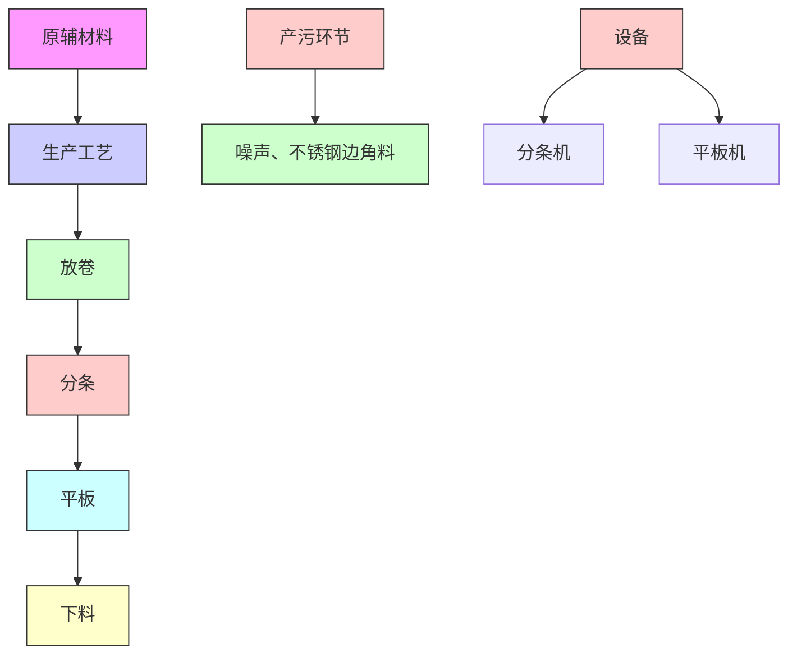
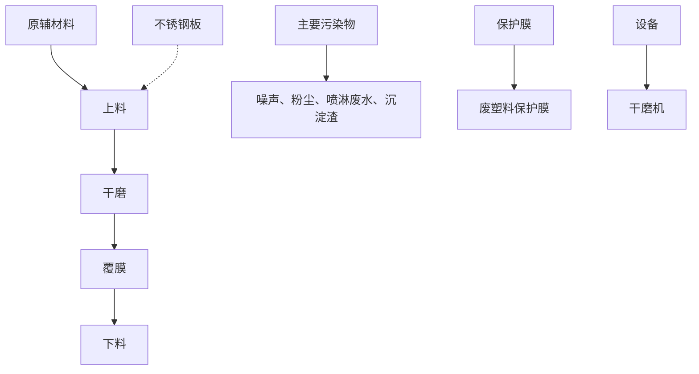
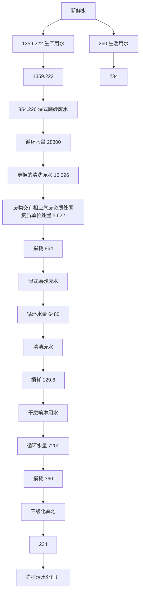
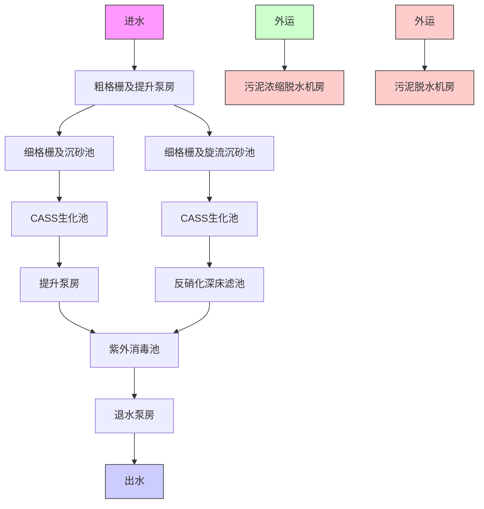
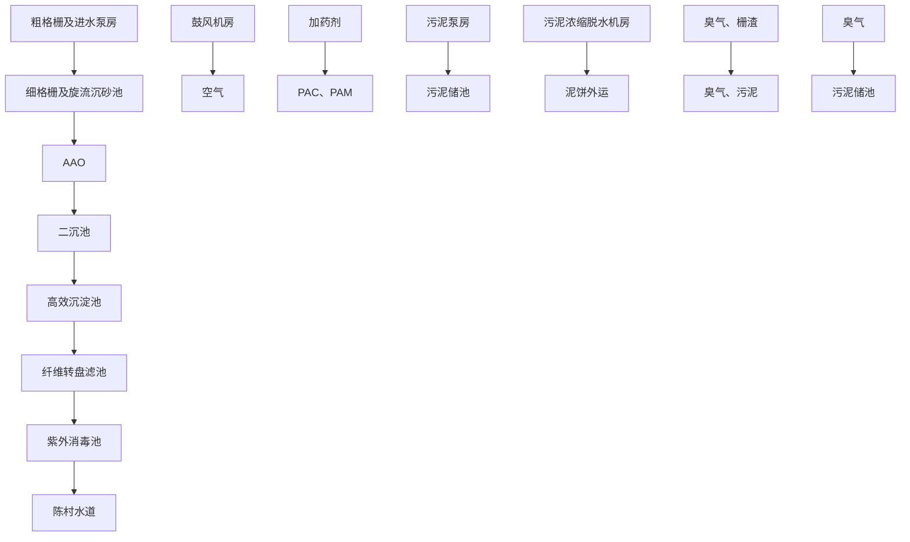

# 建设项目环境影响报告表

（污染影响类）

项目名称：佛山市源众来金属制品限公司重新报批建设项目

建设单位（盖章）：佛山市源众来金属制品有限公司编 年2月

text_image

制日期：2023年

中华人民共和国生态环境部制

# 目录

一、建设项目基本情况.

二、建设项目工程分析.. 8

三、区域环境质量现状、环境保护目标及评价标准 . 24

四、主要环境影响和保护措施. . 29

五、环境保护措施监督检查清单 . 50

六、结论.. . 52

建设项目污染物排放量汇总表.. . 53

附图1 项目地理位置图. 错误！未定义书签。

附图2 项目四至状况图. .错误！未定义书签。

附图3 项目平面布置图. . 55

附图4 项目四至实拍图. . 58

附图5 项目环境敏感点范围图. 错误！未定义书签。

附图6 项目水系图. . 错误！未定义书签。

附图7 水环境功能区划图 错误！未定义书签。

附图8 大气环境功能区划图. 错误！未定义书签。

附图9 声环境功能区划图. 错误！未定义书签。

附图10 顺德区陈村镇广隆集约工业园区控制性详细规划图. ..错误！未定义书签。

附图11 佛山市顺德区环境管控单元图 .错误！未定义书签。

附件1营业执照及核准变更通知书. .错误！未定义书签。

附件2法人身份证.. .错误！未定义书签。

附件3租赁合同. .错误！未定义书签。

附件4产权证. .错误！未定义书签。

附件5磨砂冷却液MSDS报告及产品技术说明书 错误！未定义书签。

附件6原环评批复. 错误！未定义书签。

附件7排污登记资料. .错误！未定义书签。

附件8自主验收意见及全国竣工环保验收系统申报截图 .错误！未定义书签。

附件9自主验收检测报告. .错误！未定义书签。

附件10受托人身份证复印件. 错误！未定义书签。

附件11环评文件同意公示声明. . 59

附件12环评技术咨询合同. 错误！未定义书签。

# 一、建设项目基本情况

<table><tr><td>建设项目名称</td><td colspan="5">佛山市源众来金属制品有限公司重新报批建设项目</td></tr><tr><td>项目代码</td><td colspan="5">无</td></tr><tr><td>建设单位联系人</td><td></td><td>联系方式</td><td colspan="3"></td></tr><tr><td>建设地点</td><td colspan="5">佛山市顺德区陈村镇弼教村广隆工业区兴隆十一路1号A6、A9仓之二、B9仓之三</td></tr><tr><td>地理坐标</td><td colspan="5">东经: 113°12'48.885", 北纬: 22°59'10.575"</td></tr><tr><td>国民经济行业类别</td><td>C3360金属表面处理及热处理加工</td><td>建设项目行业类别</td><td colspan="3">30-67金属表面处理及热处理加工中的“其他(年用非溶剂型低VOCs含量涂料10吨以下的除外)”</td></tr><tr><td>建设性质</td><td>☑新建(迁建)□改建□扩建□技术改造</td><td>建设项目申报情形</td><td colspan="3">□首次申报项目□不予批准后再次申报项目□超五年重新审核项目☑重大变动重新报批项目</td></tr><tr><td>项目审批(核准/备案)部门(选填)</td><td>无</td><td>项目审批(核准/备案)文号(选填)</td><td colspan="3">无</td></tr><tr><td>总投资(万元)</td><td>380</td><td>环保投资(万元)</td><td colspan="3">20</td></tr><tr><td>环保投资占比(%)</td><td>5.26</td><td>施工工期</td><td colspan="3">1个月</td></tr><tr><td>是否开工建设</td><td>☑否□是</td><td>用地(用海)面积(m2)</td><td colspan="3">3775</td></tr><tr><td>专项评价设置情况</td><td colspan="5">无</td></tr><tr><td>规划情况</td><td colspan="5">无</td></tr><tr><td>规划环境影响评价情况</td><td colspan="5">无</td></tr><tr><td>规划及规划环境影响评价符合性分析</td><td colspan="5">无</td></tr><tr><td rowspan="4">其他符合性分析</td><td colspan="5">(1)选址合理性分析本项目位于佛山市顺德区陈村镇弼教村广隆工业区兴隆十一路1号A6、A9仓之二、B9仓之三,根据顺德区陈村镇广隆集约工业区控制性详细规划调整总平面图(见附图11),项目所在区域地块为M1一类工业用地,同时根据项目产权证(见附件4),租用的厂房土地用途为工业用地,项目系租用已建成的工业厂房,未改变用地和房屋性质。且项目不在自然保护区、饮用水水源保护区、风景名胜区、森林公园、重要湿地、生态敏感区和其他重要生态功能区,符合土地规划和利用的要求。(2)产业政策符合性分析根据国家发展和改革委员会发布的《产业结构调整指导目录(2019年本)》及2021年修改单,项目不属于上述目录所列的鼓励类、限制和禁止(淘汰)项目;根据《促进产业结构调整暂行规定》第十三条,属于允许建设项目。同时,根据国家发展改革委商务部《关于印发&lt;市场准入负面清单(2022年版)的通知&gt;》(发改体改规[2022]397号)可知,项目不在市场准入负面清单禁止和许可两类项目范围内,可依法平等进入。根据《顺德区村级工业园升级改造项目产业准入负面清单》(2019年本),项目不属于上述负面清单中所列的限制类和禁止类项目。因此,项目符合相关的产业政策要求。因此,项目符合相关的产业政策要求。通过对照《环境保护综合名录》(2021年版),本项目不属于“高污染、高环境风险”项目。(3)与佛山市顺德区“三线一单”符合性分析本项目与佛山市顺德区“三线一单”生态环境分区管控方案(顺府发[2021]11号)文件相符性分析见下表。表1-1 项目与佛山市顺德区“三线一单”生态环境分区管控方案相符性分析</td></tr><tr><td colspan="2">内容</td><td>项目情况</td><td colspan="2">相符性</td></tr><tr><td>生态保护红线</td><td>佛山市顺德区环境管控单元图(附图12)</td><td>项目所在地属于陈村镇重点管控区(ZH44060620010)范围(见附图12),不属于优先保护单元及一般管控单元,因此本项目不涉及生态保护红线。</td><td colspan="2">符合</td></tr><tr><td>环境质量底</td><td>水环境质量持续改善,国控、省控、水功能区断面达到国家、省和市下达的水质目标要求;乡镇级及以上集中式饮用水水源地水质稳定达标。空气质量持续改善,</td><td>项目区域声环境、地表水环境均能满足相应的标准要求,属于达标区,区域大气环境质量属于不达标区;生活污水经</td><td colspan="2">符合</td></tr><tr><td rowspan="5"></td><td>线</td><td colspan="2">细颗粒物(PM2.5)年均浓度、空气质量优良天数比例(AQI)主要指标达到省、市下达的目标要求,臭氧污染得到有效遏制。土壤环境质量稳中向好,土壤环境风险得到管控。</td><td>三级化粪池预处理达标后,通过工业区污水管网排入陈村污水处理厂集中处理,生产废水均不外排,对周围水环境影响不大,危废暂存间基础建设必须按相关要求防风、防雨、防渗漏,一般工业固废交由物资单位回收,危废交由有危废资质单位处置,固体废物可得到妥善处理。经以上处理后,本项目对区域内环境影响较小,质量可保持现有水平。</td><td></td></tr><tr><td>资源利用上线</td><td colspan="2">强化节约集约利用,持续提升资源能源利用效率,水资源、土地资源、岸线资源、能源消耗等达到或优于省和市下达的总量、强度等目标要求,按省、市规定年限实现碳达峰。</td><td>本项目不属于高耗能、污染资源型企业,项目的水、电等资源利用不会突破区域上线。</td><td>符合</td></tr><tr><td rowspan="3">环境管控单元准入清单</td><td rowspan="3">空间布局约束</td><td>1-1.【产业/鼓励引导类】重点发展智能装备制造、新一代电子信息、新材料等新兴产业;结合TOD片区开发,对接广深港资源,大力发展生产性服务业、高端商务服务业和中小企业总部集群;培育以花卉产业为特色,向电商、会展、文创旅游等延伸的现代农业产业链。</td><td>本项目主要从事不锈钢湿式磨砂、干式磨砂、分条、平板加工,属于金属制造及表面处理行业,虽不属于产业鼓励引导类,但也不属于产业限制类。</td><td>符合</td></tr><tr><td>1-2.【产业/综合类】系统推进村级工业园升级改造,腾出连片空间,布局产业集聚区和主题产业园,推动工业项目入园集聚发展。新增工业制造业用地原则上安排在产业集聚区内,产业集聚区外原则上不鼓励工业及物流仓储用地的新建与改造。</td><td>本项目系租用已建成厂房,选址位于广隆工业园集聚区。</td><td>符合</td></tr><tr><td>1-3.【产业/综合类】产业聚集区所属地块内的工业用地或企业与村庄、学校等环境敏感点之间应设置合理的大气环境防护距离,并通过绿化带进行有效隔离;聚集区规划布局应注重大气污染排放企业应尽量避免布局在居住用地的常年主导风向的上风向。</td><td>项目厂界最近距离的环境敏感点为北侧100m处的文教村,且项目生产废气主要为颗粒物,经集气管+二级喷淋塔收集处理后高空排放,不属于有毒有害污染物,对周边环境敏感点影响不大,经采取隔声、减振、选用高效低噪声设备等降噪措施后噪声对周边环境及敏感点影响不大。</td><td>符合</td></tr><tr><td rowspan="4"></td><td rowspan="4"></td><td rowspan="4"></td><td>1-4.【产业/限制类】受纳水体或监控断面不达标的,不得新建、扩建向河涌直接排放废水的项目。新建、扩建含蚀刻工序的线路板生产项目和化工项目应在配套污水集中处置的工业园区或生活污水管网覆盖区域内建设;纯加工型印花项目,含酸洗、磷化的金属表面处理、金属制品项目(与自身高新技术企业配套的除外),含酸洗、喷涂、化学抛光、电解等涉及废水排放工艺的不锈钢型材加工项目(与自身高新技术企业配套的除外),应进入以此类项目为主导产业、有相应废水集中治理设施的工业园区,实现集中治污。</td><td>项目外排废水主要为生活污水,生活污水经三级化粪池处理的生活污水最终纳入城市污水处理厂处理,且纳污水体水质达标。项目属于不锈钢加工,主要涉及工艺为湿式磨砂、干式磨砂、分条、平板,且不涉及酸洗、喷涂、化学抛光、电镀等工艺,此外,项目生产废水均不外排,不属于产业限制类项目。</td><td>符合</td></tr><tr><td>1-5.【产业/综合类】划定家具生产优先发展区域,优先发展区外不再新建涉及涂装工艺的木质家具制造项目。</td><td>项目不属于木质家具制造项目。</td><td>符合</td></tr><tr><td>1-6.【大气/限制类】大气环境受体敏感重点管控区内,应严格限制新建储油库项目、产生和排放有毒有害大气污染物的建设项目以及使用溶剂型油墨、涂料、清洗剂、胶黏剂等高挥发性有机物原辅材料项目,鼓励现有该类项目搬迁退出。</td><td>项目属于不锈钢湿式磨砂、干式磨砂、分条、平板加工,不使用溶剂型油墨、涂料、清洗剂、胶黏剂等高挥发性有机物原辅材料,生产废气主要为颗粒物,不属于有毒有害污染物。</td><td>符合</td></tr><tr><td>1-7.【大气/限制类】大气环境布局敏感区重点管控区内,应严格限制新建生产和使用高挥发性有机物原辅材料项目,优先开展低VOCs含量原辅材料替代,强化无组织排放控制。原则上不再新建、扩建新增氮氧化物、烟(粉)尘排放量较大的建设项目。</td><td>项目属于不锈钢湿式磨砂、干式磨砂、分条、平板加工,不使用溶剂型油墨、涂料、清洗剂、胶黏剂等高挥发性有机物原辅材料,生产废气主要为颗粒物,且排放量少。</td><td>符合</td></tr><tr><td rowspan="7"></td><td rowspan="7"></td><td rowspan="6">能源资源利用</td><td>2-1.【能源/鼓励引导类】推广节能技术,加快发展绿色货运与现代物流。</td><td>项目为工业型企业,不涉及货运与现代物流。</td><td>符合</td></tr><tr><td>2-2.【能源/鼓励引导类】推广新能源汽车应用和充电基础设施建设,积极推动重卡LNG加气站、充电基础设施、加氢站建设。</td><td>项目为工业型企业,不涉及新能源的建设。</td><td>符合</td></tr><tr><td>2-3.【能源/综合类】科学实施能源消费总量和强度“双控”,新建高能耗项目单位产品(产值)能耗达到国际国内先进水平。</td><td>项目不属于高耗水项目,主要用水为生活用水及冷却清洗等工业用水,磨砂用水循环使用,提高用水利用率。</td><td>符合</td></tr><tr><td>2-4.【水资源/综合类】贯彻落实“节水优先”方针,实行最严格水资源管理制度,陈村镇万元国内生产总值用水量、万元工业增加值用水量、用水总量、农田灌溉水有效利用系数等用水总量和效率指标达到区下达要求。</td><td>项目不属于高耗水项目,主要用水为生活用水及冷却清洗等工业用水,磨砂用水循环使用,提高用水利用率。</td><td>符合</td></tr><tr><td>2-5.【土地资源/限制类】落实单位土地面积投资强度、土地利用强度等建设用地控制性指标要求,提高土地利用效率。</td><td>本项目租用已建成工业厂房,不新增用地,提高土地利用率。</td><td>符合</td></tr><tr><td>2-6.【岸线/禁止类】严格水域岸线用途管制,新建项目一律不得违规占用水域。严禁破坏生态的岸线利用行为和不符合其功能定位的开发建设活动,严禁以各种名义侵占河道、围垦湖泊、非法采砂等。</td><td>项目选址不占用水域,租用已建厂房,不存在基建基础施工。</td><td>符合</td></tr><tr><td>污染物排放管控</td><td>3-1.【水/限制类】城镇新区建设实行雨污分流。住宅、商业体、学校、市场等城镇开发建设项目应当配套或者同步计划建设公共排水设施,公共排水设施或自建排污水设施未能投产运行的,以上涉水项目不得投入使用。新建小区严格实施雨污分流,阳台、露台等污水接入污水收集系统,将生活污水“应截尽截”。做好大型楼盘、集贸市场、餐饮以及学校等4大类排水户污水接入市政管网工作。</td><td>项目实行雨污分流制,雨水经雨水管道入雨水井,外排废水为生活污水,经三级化粪池预处理达标通过市政污水管网排入陈村污水处理厂进一步处理,生产废水循环使用,不外排,水污染可得到有效治理。</td><td>符合</td></tr><tr><td rowspan="5"></td><td rowspan="5"></td><td rowspan="5"></td><td>3-2.【水/综合类】陈村镇重点河涌水质上年度未达到水环境环境质量目标的,需组织编制、系统实施、向社会公开区域重点水污染物减排计划并明确“替代量”,本年度新建、改建、扩建项目新增水环境重点污染物实行区域“减二增一”替代(工业、生活或综合集中废水处理设施、民生项目除外)。</td><td>本项目纳污水体水质达到水环境质量目标。</td><td>符合</td></tr><tr><td>3-3.【水/综合类】结合村级工业园改造,全面提升产业层次与集聚度,促进污染集中整治。</td><td>本项目不涉及村级工业园改造。</td><td>符合</td></tr><tr><td>3-4.【水/综合类】稳步推进排水设施“三个一体化”管理模式,补齐城乡污水收集和处理短板,推动陈村污水处理厂提质增效,加快消除城中村、老旧城区、城乡结合部等污水收集管网空白区,逐步实现城乡污水收集处理全覆盖。2025年前完成陈村污水处理厂扩建,尾水应执行《城镇污水处理厂污染物排放标准》(GB18918-2002)一级A标准及《广东省水污染物排放限值》(DB44/26-2001)的较严值。</td><td>本项目为工业型项目,不涉及城镇污水处理厂的建设。</td><td>符合</td></tr><tr><td>3-5.【水/综合类】完善污水管网建设,逐步取消现状农村污水处理站点,有条件的区域实施雨污分流改造;至2030年全面雨污分流,农村生活污水纳入陈村城镇污水处理系统。</td><td>项目实施雨污分流制,雨水经雨水井收集纳入周边城市下水道,生活污水经三级化粪池预处理后通过市政污水管网纳入陈村污水处理厂处理。</td><td>符合</td></tr><tr><td>3-6.【水/综合类】产业集聚区和主题园区内做好污水管网和污水集中处理设施的配套保障,确保废水收集到城镇污水处理厂、园区污水处理厂或分散式污水处理设施集中处置。</td><td>项目生活污水经三级化粪池预处理后通过市政污水管网纳入陈村污水处理厂处理。生产废水循环使用,不外排。</td><td>符合</td></tr><tr><td rowspan="2"></td><td rowspan="2"></td><td rowspan="2">环境风险防控</td><td>4-1.【水/综合类】陈村污水处理厂、工业污水集中处理设施应采取有效措施,防止事故废水直接排入水体。完善污水处理厂在线监控系统联网,实现污水处理厂的实时、动态监管。</td><td>项目生活污水经三级化粪池预处理后通过市政污水管网纳入陈村污水处理厂进一步处理,陈村污水处理厂已设置有在线监控系统并联网。生产废水循环使用,不外排。</td><td>符合</td></tr><tr><td>4-2.【风险/综合类】加强环境风险分级分类管理,强化金属制品、有色金属和压延加工、化学原料和化学品制造业等涉重金属、化工行业企业及工业园区等重点环境风险源的环境风险防控。</td><td>项目不涉及金属制品、有色金属和压延加工、化学原料和化学品制造业等涉重金属、化工行业企业及工业园区等重点环境风险源,但项目运营后将加强环境风险分级分类管理。</td><td>符合</td></tr><tr><td colspan="6">综上表所述,项目与《佛山市顺德区人民政府关于印发佛山市顺德区“三线一单”生态环境分区管控方案的通知》(顺府发[2021]11号)的管理要求是相符的。</td></tr></table>

# 二、建设项目工程分析

<table><tr><td rowspan="6">建设内容</td><td colspan="4">1、项目由来佛山市源众来金属制品有限公司(简称“源众来”)原址位于佛山市顺德区陈村镇弼教村广隆工业区兴隆十一路1号A6车间、B6-B8车间。源众来于2022年1月委托广东蓝灏环保科技有限公司编写了《佛山市源众来金属制品有限公司新建项目》,并于2022年4月29日取得环境影响报告表批复(批复文号:佛环0305环审[2022]第0019号),原有项目总投资400万元,主要从事不锈钢板磨砂、分条、平板、干磨等加工,审批规模为:加工不锈钢磨砂板4万t/a、不锈钢平板4万t/a、不锈钢分条板4万t/a、不锈钢干磨板4万t/a。2022年5月11日在全国排污许可证管理信息平台进行了排污登记(登记编号:91440606MA58E3CP95001P),并取得排污登记回执及排污登记表(见附件7),排污登记的规模与环评批复一致。源众来公司于2022年9月开工建设,同年12月期间完成了A6车间的竣工环保自主验收(自主验收意见见附件8),由于企业内部管理层人员的变动,目前只在A6仓车间运行生产(已投产规模:加工不锈钢平板3万t/a、不锈钢分条板4万t/a),B6-B8车间尚未投产,尚有不锈钢磨砂板4万t/a、不锈钢平板1万t/a及不锈钢干磨板4万t/a均未投产建设,验收过程实际建设规模为:实际加工不锈钢平板3万t/a、不锈钢分条板4万t/a,实际建设项目占地面积约 $2077m^{2}$ ,总建筑面积为 $2077m^{2}$ ,实际总投资200万元,环保投资2.5万元。源众来公司的历史环评、竣工环保自主验收、排污许可等汇总情况见表2-1所示。表2-1 企业历史环评、排污许可、验收等情况汇总表</td></tr><tr><td>项目名称</td><td>时间</td><td>批文或编号</td><td>建设规模</td></tr><tr><td rowspan="3">佛山市源众来金属制品有限公司新建项目</td><td>2022.4.29</td><td>环评批复:佛环0305环审[2022]第0019号</td><td>加工不锈钢磨砂板4万t/a、不锈钢平板4万t/a、不锈钢分条板4万t/a、不锈钢干磨板4万t/a</td></tr><tr><td>2022.5.11</td><td>排污登记:91440606MA58E3CP95001P</td><td>加工不锈钢磨砂板4万t/a、不锈钢平板4万t/a、不锈钢分条板4万t/a、不锈钢干磨板4万t/a</td></tr><tr><td>2022.12.16</td><td>竣工环保自主验收</td><td>加工不锈钢平板3万t/a、不锈钢分条板4万t/a</td></tr><tr><td colspan="4">因2022年企业内部管理层人员变动,目前佛山市源众来金属制品有限公司仅A6仓车间正式投产(已投产规模:加工不锈钢平板3万t/a、不锈钢分条板4万t/a),其余的B6-B8车间尚未投产(其余规模:加工不锈钢磨砂板4万t/a、不锈钢平板1万t/a及不锈钢干磨板4万t/a),因2023年公司发展需要,本次保留原环评批复并已投产的A6仓厂房,不再租赁B6-B8车间,并拟重新租赁新厂房(位于A6仓附近的A9仓之二、</td></tr></table>

B9 仓之三）作为干式磨砂、湿式磨砂等的生产区域，较原环评而言，本项目建设后除减少不锈钢平板的生产规模，其他生产规模及生产工艺保持不变。本项目中心地理坐标（以占地面积最大的 A6 仓所在位置为准）为：113°12′48.885″，北纬：22°59′10.575″，工作制度不变，每班工作 8h（白班：08:30-12:00，13:30-18:00），工作时间 300d/a，重新租赁后全厂总占地面积约 3775m2，总建筑面积约 3775m2。约本项目建设后产品产能为加工不锈钢磨砂板 4万 t/a、不锈钢平板 3 万 t/a、不锈钢分条板 4 万 t/a、不锈钢干磨板 4 万 t/a。

根据《中华人民共和国环境影响评价法》（2018年 12月 29 日，第十三届全国人民代表大会常务委员会第七次会议第二次修正）：“第二十四条 建设项目的环境影响评价文件经批准后，建设项目的性质、规模、地点、采用的生产工艺或者防治污染、防止生态破坏的措施发生重大变动的，建设单位应当重新报批建设项目的环境影响评价文件”，项目原环境影响评价文件已取得环境保护主管部门批准，部分车间已建设投产，由于其他车间建设地址已构成重大变动，故建设单位拟在“佛山市源众来金属制品有限公司新建项目”环评审批基础上进行重新报批“佛山市源众来金属制品有限公司建设项目”环境影响评价文件。同时依据《建设项目环境影响评价分类管理目录》（2021年版，部令第 16 号），本项目属于“三十、金属制品业”中“67 金属表面处理及热处理加工中的“其他（年用非溶剂低 VOCs 含量涂料 10 吨以下的除外）”类别，该项目应编制环境影响报告表。

# 2、项目工程组成

重新报批前后具体工程组成见下表。

表 2-2 项目工程组成

<table><tr><td>项目</td><td>重新报批前</td><td>实际建设</td><td>重新报批后</td><td>重新报批前后变化情况</td></tr><tr><td rowspan="4">主体工程</td><td>总占地面积和总建筑面积均为 $8987m^{2}$ </td><td>总占地面积和总建筑面积均为 $2077m^{2}$ </td><td>总占地面积 $3775m^{2}$ ,总建筑面积 $3775m^{2}$ 。</td><td rowspan="4">总占地面积及建筑面积均减少,平面重新布局</td></tr><tr><td>A6仓:建筑面积 $2077m^{2}$ ,层高9m,主要设置湿式磨砂区(西侧)</td><td>A6仓:建筑面积 $2077m^{2}$ ,层高9m,主要设置分条(东侧)、平板区(东侧)</td><td>A6仓:建筑面积 $2077m^{2}$ ,层高9m,主要设置分条(东侧)、平板区(东侧)、湿磨区(西侧)</td></tr><tr><td rowspan="2">B6-B8仓:建筑面积 $6910m^{2}$ ,层高9m,B6仓空置,B7仓主要设置平板区(东侧)、干磨区(西侧)、B8仓主要设置分条区</td><td rowspan="2">未建设B6-B8仓</td><td>A9仓之二:建筑面积 $1092m^{2}$ ,层高9m,主要设置分条(南侧)、干磨区(西北侧)、湿磨区(东北侧)</td></tr><tr><td>B9仓之三:建筑面积 $606m^{2}$ ,层高9m,主</td></tr></table>

<table><tr><td rowspan="16"></td><td colspan="2"></td><td colspan="2"></td><td></td><td colspan="2">要设置分条(东北侧)、干磨区(西北侧)、湿磨区(东侧)、平板区(西南侧)</td><td></td></tr><tr><td rowspan="3" colspan="2">辅助工程</td><td rowspan="3" colspan="2">办公室 $80m^{2}1$ 间,位于A6仓</td><td rowspan="3">办公室 $80m^{2}1$ 间,位于A6仓</td><td rowspan="3">办公室</td><td>A6仓: $80m^{2}$ </td><td rowspan="3">新增2间办公室</td></tr><tr><td>A9仓: $20m^{2}$ </td></tr><tr><td>B9仓: $20m^{2}$ </td></tr><tr><td rowspan="4" colspan="2">储运工程</td><td>原料区</td><td> $350m^{2}$ </td><td> $150m^{2}$ </td><td colspan="2"> $350m^{2}$ </td><td>不变</td></tr><tr><td>成品区</td><td> $350m^{2}$ </td><td> $150m^{2}$ </td><td colspan="2"> $350m^{2}$ </td><td>不变</td></tr><tr><td>一般固废暂存区</td><td>B7仓: $10m^{2}$ </td><td>A6仓: $10m^{2}$ </td><td colspan="2">A6仓: $10m^{2}$ </td><td>位置变化</td></tr><tr><td>危废房</td><td>A6仓: $6m^{2}$ </td><td>A6仓: $6m^{2}$ </td><td colspan="2">A9仓: $6m^{2}$ </td><td>位置变化</td></tr><tr><td rowspan="3">公用工程</td><td>供水</td><td colspan="2">由市政供水管网供给,主要为生活用水和生产用水</td><td>由市政供水管网供给,主要为生活用水</td><td colspan="2">由市政供水管网供给,主要为生活用水和生产用水</td><td>不变</td></tr><tr><td>供电</td><td colspan="2">由市政供电管网供给,项目内不设备用发电机</td><td>由市政供电管网供给,项目内不设备用发电机</td><td colspan="2">由市政供电管网供给,项目内不设备用发电机</td><td>不变</td></tr><tr><td>排水</td><td colspan="2">采取雨污分流制</td><td>采取雨污分流制</td><td colspan="2">采取雨污分流制</td><td>不变</td></tr><tr><td rowspan="5">环保工程</td><td rowspan="4">污水治理工程</td><td colspan="2">生活污水经三级化粪池处理后最终排入陈村污水处理厂</td><td>生活污水经三级化粪池处理后最终排入陈村污水处理厂</td><td colspan="2">生活污水经三级化粪池处理后最终排入陈村污水处理厂</td><td>不变</td></tr><tr><td colspan="2">清洗废水循环使用,定期排入到项目磨砂冷却水池内作为补充用水,不外排。</td><td>不产生清洗废水</td><td colspan="2">清洗废水循环使用,每月更换并回用于项目磨砂冷却水池内作为补充用水,不外排。</td><td>不变</td></tr><tr><td colspan="2">磨砂废水经沉淀后循环使用,定期更换的磨砂废水(含切削液)作为危废处置,交由具有危险废物处置资质的单位处置,不外排。</td><td>不产生磨砂废水</td><td colspan="2">磨砂废水经沉淀后循环使用,定期更换的磨砂废水(含切削液)作为危废处置,交由具有危险废物处置资质的单位处置,不外排。</td><td>不变</td></tr><tr><td colspan="2">喷淋塔废水循环使用,定期捞渣,不外排。</td><td>不产生喷淋塔废水</td><td colspan="2">循环使用,喷淋废水经过滤沉淀后回用于喷淋用水,不外排</td><td>基本不变</td></tr><tr><td>废气治理工程</td><td colspan="2">干磨粉尘经集气罩收集经1套喷淋塔处理后通过1根15mG1排气筒排放</td><td>不产生干磨粉尘</td><td colspan="2">A9车间和B9车间干磨粉尘分别经集气管收集各采用1套二级喷淋塔处理后分别通过15mG1排气筒和15mG2排气筒</td><td>新增1套二级喷淋塔及1根排气筒</td></tr></table>

<table><tr><td rowspan="5"></td><td></td><td></td><td></td><td>排放</td><td></td></tr><tr><td>噪声治理工程</td><td>合理调整设备布置,主要生产设备安装隔震垫,采用隔声、距离衰减等治理措施</td><td>合理调整设备布置,主要生产设备安装隔震垫,采用隔声、距离衰减等治理措施</td><td>合理调整设备布置,主要生产设备安装隔震垫,采用隔声、距离衰减等治理措施</td><td>不变</td></tr><tr><td rowspan="3">固废处理工程</td><td>废塑料保护膜、不锈钢边角料、水喷淋沉淀渣、干磨废砂带(含磨头)一般固体废物分类收集后交由物资单位回收</td><td>废塑料保护膜、不锈钢边角料一般固体废物分类收集后交由物资单位回收</td><td>废塑料保护膜、不锈钢边角料、水喷淋沉淀渣、干磨废砂带(含磨头)一般固体废物分类收集后交由物资单位回收</td><td rowspan="3">不变</td></tr><tr><td>生活垃圾定期委托环卫部门收集处理</td><td>生活垃圾定期委托环卫部门收集处理</td><td>生活垃圾定期委托环卫部门收集处理;</td></tr><tr><td>设立危废间,废机油、废油桶、含油废抹布和手套、磨砂废液、废包装桶、含切削液不锈钢渣、湿磨废砂带(含磨头)危废暂存于危废间定期交由有资质单位处理</td><td>设立危废间,废机油、废油桶、含油废抹布和手套危废暂存于危废间定期交由有资质单位处理</td><td>设立危废间,废机油、废油桶、含油废抹布和手套、磨砂废液、废包装桶、含切削液不锈钢渣、湿磨废砂带(含磨头)危废暂存于危废间定期交由有资质单位处理</td></tr><tr><td colspan="2">工作时间及定员</td><td>共30名员工,300d/a(8h/d),1班制。</td><td>共10名员工,300d/a(8h/d),1班制。</td><td>共26名员工,生产300d/a(8h/d),1班制。</td><td>减少4名员工,工作制度不变</td></tr><tr><td colspan="2">项目总投资</td><td>400万元</td><td>200万元</td><td>380万元</td><td>减少20万元</td></tr></table>

# 2、项目产品方案

表 2-3 项目产品规模

<table><tr><td rowspan="2">产品名称</td><td colspan="4">加工量(t/a)</td><td rowspan="2">规格/尺寸</td></tr><tr><td>重新报批前</td><td>实际投产</td><td>重新报批后</td><td>重新报批前后变化量</td></tr><tr><td>不锈钢磨砂板</td><td>4万</td><td>0</td><td>4万</td><td>0</td><td>1.219m*2.438m*3mm/张(70.7kg/张)、1.219m*2.438m*4mm/张(94.3kg/张)</td></tr><tr><td>不锈钢平板</td><td>4万</td><td>3万</td><td>3万</td><td>-1万</td><td>1.219m*2.438m*3mm/张(70.7kg/张)、1.219m*2.438m*4mm/张(94.3kg/张)</td></tr><tr><td>不锈钢分条板</td><td>4万</td><td>4万</td><td>4万</td><td>0</td><td>1.219m*2.438m*3mm/张(70.7kg/张)、1.219m*2.438m*6mm/张(141.4kg/张)</td></tr><tr><td>不锈钢干磨板</td><td>4万</td><td>0</td><td>4万</td><td>0</td><td>1.219m*2.438m*2mm/张(47.1kg/张)、1.219m*2.438m*6mm/张(141.4kg/张)</td></tr><tr><td colspan="6">注:不锈钢密度为 $7.93g/cm^{3}$ 。</td></tr></table>

# 3、项目主要生产设备

项目主要生产设备及其对应产能匹配性分析表见表2-4及表2-5。

表 2-4 项目主要生产设备一览表

<table><tr><td rowspan="2">序号</td><td rowspan="2" colspan="2">设备名称</td><td colspan="4">数量</td><td rowspan="2">规格参数</td><td rowspan="2">对应工艺</td><td rowspan="2">所在位置</td></tr><tr><td>重新报批前</td><td>实际建设投产</td><td>重新报批后</td><td>重新报批前后变化量</td></tr><tr><td>1</td><td colspan="2">湿式磨砂生产线</td><td>4条</td><td>0</td><td>4条</td><td>0</td><td>单条生产线尺寸:36m*1.8m*2.5m</td><td>/</td><td>A6仓2条:西侧、A9仓1条:东北侧、B9仓1条:东侧</td></tr><tr><td>2</td><td rowspan="5">其中</td><td>湿式磨砂机</td><td>4台</td><td>0</td><td>4台</td><td>0</td><td>/</td><td>湿式磨砂</td><td>/</td></tr><tr><td>3</td><td>圆边机</td><td>6台</td><td>0</td><td>4台</td><td>-2台</td><td>/</td><td>湿式磨砂,与湿式磨砂机同步进行</td><td>/</td></tr><tr><td>4</td><td>覆膜机</td><td>4台</td><td>0</td><td>4台</td><td>0</td><td>/</td><td>覆膜</td><td>/</td></tr><tr><td>5</td><td>磨砂冷却水池</td><td>4个</td><td>0</td><td>4个</td><td>0</td><td>单个尺寸及用水流量:1.22m*1.2m*0.9m,4m3/h</td><td>湿式磨砂</td><td>/</td></tr><tr><td>6</td><td>清洗水箱</td><td>4个</td><td>0</td><td>4个</td><td>0</td><td>单个尺寸及用水流量:1.22m*0.45m*0.73m,0.9m3/h</td><td>清洗</td><td>/</td></tr><tr><td>7</td><td colspan="2">分条机</td><td>6台</td><td>1台</td><td>6台</td><td>0</td><td>/</td><td>分条</td><td>A6仓1台:东北侧A9仓4台:南侧B9仓1台:东北侧</td></tr><tr><td>8</td><td colspan="2">平板机</td><td>3台</td><td>2台</td><td>2台</td><td>-1台</td><td>/</td><td>平板</td><td>A6仓1台:东南侧B9仓1台:西南侧</td></tr><tr><td>9</td><td colspan="2">干磨机</td><td>2台</td><td>0台</td><td>2台</td><td>0</td><td>/</td><td>干磨</td><td>A9仓1台:西北侧B9仓1台:西北侧</td></tr><tr><td>10</td><td colspan="2">喷淋塔</td><td>1台</td><td>0台</td><td>2台</td><td>+1台</td><td>单个水池尺寸1.5m×1.0m×1.0m/个</td><td>干磨粉尘除尘</td><td></td></tr><tr><td>11</td><td colspan="2">沉淀池</td><td>0个</td><td>0个</td><td>2个</td><td>+2个</td><td>单个沉淀池尺寸:1m×1.5m×1.8m/个</td><td>废水沉淀</td><td></td></tr><tr><td colspan="10">备注:每条生产线共配备有1个磨砂冷却水池和1个清洗水箱;湿式磨砂机具备普通砂磨、雪花砂磨、拉丝、清洗、烘干一体功能。</td></tr></table>

建设内容  
表 2-5 项目产能匹配性分析一览表

<table><tr><td>设备名称</td><td>数量</td><td>对应产品尺寸</td><td>每张工件加工耗时</td><td>每条/台加工数量(张/d)</td><td>每天加工总重量(t/d)</td><td>理论加工总重量(t/a)</td><td>本项目预计产能(t/a)</td></tr><tr><td rowspan="3">湿式磨砂生产线</td><td>2条</td><td>1.219m*2.438m*3mm</td><td>48s</td><td>6*60*60/48=450</td><td>450*70.7*2/1000=63.6</td><td>63.6*300=19080</td><td rowspan="2">40000</td></tr><tr><td>2条</td><td>1.219m*2.438m*4mm</td><td>48s</td><td>6*60*60/48=450</td><td>450*94.3*2/1000=84.9</td><td>84.9*300=25470</td></tr><tr><td colspan="5">合计</td><td>44550</td><td>40000</td></tr><tr><td rowspan="3">干磨机</td><td rowspan="3">2台</td><td>1.219m*2.438m*2mm</td><td>30s</td><td>6*60*60/30=720</td><td>720*47.1*1/1000=33.9</td><td>33.9*300=10170</td><td rowspan="2">40000</td></tr><tr><td>1.219m*2.438m*6mm</td><td>30s</td><td>6*60*60/30=720</td><td>720*141.4*1/1000=101.8</td><td>101.8*300=30540</td></tr><tr><td colspan="4">合计</td><td>40710</td><td>40000</td></tr><tr><td colspan="8">注:1项目磨砂工艺均为单面磨砂,本项目的单台设备加工速率耗时设定依据均来源于建设单位的生产计划、生产经验以及客户所需的磨砂纹路工艺及复杂程度有关。2考虑厂内物流周转、装卸货时间及客户订单数量等因素,湿式磨砂、干式磨砂生产线每天实际工作时间约6h。厚度为3mm、4mm的不锈钢板每天进行湿式磨砂工作时间均约为6h,厚度为2mm、6mm的不锈钢板每天进行干式磨砂工作时间均约为6h。</td></tr></table>

根据上表可知，湿式磨砂生产线、干磨机设备最大产能分别可达到 44550t/a、40710t/a，大于本项目的预计产能分别为 40000t/a、40000t/a，这 2 种设备均能满足生产需要。

# 4、项目主要原辅材料及能源消耗量

表 2-6 项目主要原辅材料及能源消耗量

<table><tr><td rowspan="2">类别</td><td rowspan="2">名称</td><td colspan="4">年使用量</td><td rowspan="2">最大储存量</td><td rowspan="2">型号/规格</td><td rowspan="2">性状</td><td rowspan="2">备注</td></tr><tr><td>重新报批前</td><td>实际建设投产</td><td>重新报批后</td><td>重新报批前后变化情况</td></tr><tr><td rowspan="6">原辅材料</td><td rowspan="2">不锈钢板</td><td>40001t/a</td><td>0</td><td>40001t/a</td><td>0</td><td rowspan="2">120t</td><td>1.219m*2.438m*3/4mm(张)</td><td>固态</td><td>湿式磨砂</td></tr><tr><td>40010t/a</td><td>0</td><td>40010t/a</td><td>0</td><td>1.219m*2.438m*2/6mm(张)</td><td>固态</td><td>干式磨砂</td></tr><tr><td>不锈钢卷</td><td>80001t/a</td><td>32001t/a</td><td>70001t/a</td><td>-10000t/a</td><td>80t</td><td>1.7m*250/125m*3/6mm(卷)</td><td>固态</td><td>平板、分条</td></tr><tr><td>保护膜</td><td>8t/a</td><td>4t/a</td><td>7t/a</td><td>-1t/a</td><td>50卷</td><td>60kg/卷</td><td>固态</td><td>覆膜</td></tr><tr><td>磨砂冷却液</td><td> $0.6^{1}$ t/a</td><td>0</td><td> $1t/a^{1}$ </td><td>+0.4t/a</td><td>0.4t</td><td>400kg/桶</td><td>液态</td><td>湿式磨砂</td></tr><tr><td>机油</td><td>0.24t/a</td><td>0.09t/a</td><td>0.24t/a</td><td>0</td><td>0.04t</td><td>20kg/桶</td><td>液态</td><td>设备润滑</td></tr><tr><td rowspan="4"></td><td>砂带 $^{2}$ </td><td>/</td><td>/</td><td>0.036t/a</td><td>/</td><td>90条</td><td>1.2m*2.4m/条,0.1kg/条,共360条</td><td rowspan="2">固态</td><td rowspan="2">湿式磨砂</td></tr><tr><td>磨头</td><td>/</td><td>/</td><td>0.08t/a</td><td>/</td><td>20个</td><td>2kg/个</td></tr><tr><td>砂带</td><td>/</td><td>/</td><td>0.018t/a</td><td>/</td><td>45条</td><td>1.5m*3m/条,0.1kg/条,共180条</td><td rowspan="2">固态</td><td rowspan="2">干式磨砂</td></tr><tr><td>磨头</td><td>/</td><td>/</td><td>0.04t/a</td><td>/</td><td>10个</td><td>2kg/个</td></tr><tr><td rowspan="3">能源</td><td>电</td><td>30万kwh/a</td><td>9万kwh/a</td><td>27万kwh/a</td><td>-3万kwh/a</td><td colspan="4">电缆输送</td></tr><tr><td>生活用水</td><td>300t/a</td><td>100t/a</td><td>260t/a</td><td>-40t/a</td><td colspan="4">管道输送</td></tr><tr><td>生产用水</td><td>2454.247t/a</td><td>0</td><td>1359.222t/a</td><td>-1095.025t/a</td><td colspan="4">因重新报批后类比的产污系数发生变化,造成水量减少</td></tr><tr><td colspan="10">备注:1本项目湿式磨砂过程使用自来水兑切削液(磨砂冷却液)进行湿磨冷却,水与切削液的配比为: $1\mathrm{\;m}^{3}$ 水勾兑30mL切削液,根据附件5磨砂冷却液MSDS报告可知,磨砂冷却液密度为1.07g/mL,换算成质量比为1t水勾兑32.1g切削液,根据下文水平衡图可知,湿式磨砂冷却水池总循环水量为 $28800\mathrm{m}^{3}/\mathrm{a}$ ,计算可知( $32.1\mathrm{\;g}/\mathrm{t}*28800\mathrm{m}^{3}/\mathrm{a}=0.924\mathrm{t}/\mathrm{a}$ ),则需要约0.924t/a切削液,因实际使用过程可能会有不可预计的其他损耗,因此本项目预计使用1t/a切削液。2砂带和磨头用量在原环评中未提及,本次补充该内容。</td></tr></table>

表 2-7 主要原辅材料主要成份及其理化性质一览表

<table><tr><td>序号</td><td>材料名称</td><td>主要成份及其理化性质</td></tr><tr><td>1</td><td>磨砂冷却液(也称切削液)</td><td>根据磨砂冷却液MSDS报告及产品技术说明书(见附件5),本项目所使用的磨砂冷却液为水溶性金属加工液,是一种高性能、排油型的全合成磨削和切削液。该产品不含亚硝酸盐,在硬水和软水中都有出色的表现。黄色液体,轻微气味,呈碱性,闪点大于 $100^{\circ}C$ ,密度: $1.07g/cm^{3}$ ,溶于水,主要成分为:三乙醇胺(10~25%)、氧化硼钠五水合物(3%),聚氯季铵(1%),其他均为水。本产品适用于对表面加工要求较高的所有黑色金属,适合于大多数的磨削加工,包括无芯膜,主要优点:具有非常长的使用寿命,极好的抗菌能力,极低的冷却液带出量,减少了添加量,极佳的抗杂油污染能力,使其处于最佳状态;极低的泡沫性,可用于最新的高速加工技术;良好的冲洗性能,能保持刀具及砂轮的清洁,卓越的表面加工效果;出色的防锈性能;可用于多种磨削加工方式;低气味,低泡沫;不破坏油漆,与通常使用的机床密封件相容。</td></tr></table>

# 5、公用工程

（1）供电：重新报批后，项目用电主要由市政电网供给，用电量约为 27 万 kw/a，不配备发电机等燃油设备、供热系统、供气系统。  
（2）给水：重新报批后，项目用水全部由市政自来水厂供给，主要用水为职工生活用水、生产用水。  
（3）排水去向：重新报批后，项目采取雨污分流，污污分流制，依托出租方雨污

分流管网系统，生活污水经化粪池处理达标后通过工业区污水管网排入陈村污水处理集中处理；清洗废水循环使用，定期更换和补充蒸发损耗水量，更换的清洗废水全部回用于磨砂冷却用水，不外排；磨砂冷却水循环使用，定期更换，更换含切削液的磨砂废水全部交由持有相应资质的危险废物处置资质单位处置，不外排；喷淋废水循环使用，喷淋废水经过滤沉淀后回用于喷淋用水，不外排。

# 6、平面布置

重新报批后，厂房布局主要分为 3大区域，分别为 A6 仓、A9 仓之二、B9 仓之三，A6 仓主要设置 2 条湿式磨砂生产线（36m 长/条）、1 台分条机（20m 长）、1 台平板机（30m长），A9 仓之二主要设置 1条湿式磨砂生产线（36m长）、4 台分条机（20m长）、1 台干磨机（20m 长），B9 仓之三主要设置 1 条湿式磨砂生产线（36m 长）、1台分条机（20m 长）、1 台平板机（30m 长）、1 台干磨机（20m 长）。每个车间仓均设置 1 个办公区，分别位于 A6 仓西侧（入口旁）、A9 仓之二西北侧、B9 仓之三东南侧，材料堆放区设置在车间中部，主要贮存不锈钢原材料及其产品，危废房拟设置于A9仓西北侧。综上，项目厂房布局基本能做到办公与生产区独立，总体布置较为简单，功能分区明确，平面布置基本合理。厂房平面布置见附图 3。

# 7、劳动定员及工作制度

职工人数：重新报批后，项目职工人数减少 4 人，职工人数为 26 人，均不在厂区内食宿。

工作制度：重新报批前后工作制度不变，1天1班制，每班工作8h（白班：08:30-12:00，13:30-18:00），工作时间 300d/a。

<table><tr><td>工艺流程和产排污环节</td><td>1、工艺流程重新报批前后项目生产工艺基本一致。不锈钢的加工共分为4类加工工艺,分别为湿式磨砂、平板、分条、干磨,各类加工工艺如下图2-1至图2-4所示。1湿式磨砂工艺流程图2-1 项目湿式磨砂生产工艺流程及产污环节图2平板工艺流程原辅材料 生产工艺 产污环节 设备不锈钢卷 → 放卷 → 边丝 → 噪声、不锈钢边角料 → 平板机平板收料图2-2 项目平板生产工艺流程及产污环节图</td></tr></table>

③分条工艺流程  

flowchart

图2-3 项目分条生产工艺流程及产污环节图

④干磨工艺流程  

flowchart

图2-4 项目干磨生产工艺流程及产污环节图

# 2、工艺流程简介

# ①湿式磨砂

将外购不锈钢材料放置在生产线上，然后根据客户需求对不锈钢材表面进行湿式普通砂磨、雪花砂磨、拉丝，均单面磨砂，每条湿式磨砂生产线共配备1个规格为3.22m\*1.7m\*2.3m的冷却水池，其水池内为水和切削液的混合液（1m3水勾兑30mL切削液），3个水池分别进行的是湿式普通砂磨、拉丝、雪花砂磨，湿式普通砂磨、雪花砂磨、拉丝操作过程需一边作业一边用加有切削液的水循环淋洗对加工过程的板材进行冷却和润滑，湿式磨砂机配有砂带，当不锈钢平铺着以75张/h的速度通过设备时，通过砂带的自身运转，摩擦不锈钢的表面，使不锈钢板表面形成一层有规则的纹路，在磨砂过程的同时采用圆边机进行磨边工序，然后对不锈钢板进行淋洗，主要去除不锈钢板表面的不锈钢渣等，再经设备自带的烘干系统进行烘干（通过电加热灯进行烘干），主要去除不锈钢板表面水分，接着利用覆膜机上的辊轮将保护膜直接辊附在不锈钢板表面上即可，覆膜过程无加热无胶粘，不产生有机废气，即为成品。

根据不锈钢板长度及下单客户所需的磨砂纹路复杂程度，本项目1张不锈钢板从人工上料到进入磨砂机再到人工下料整个过程耗时48s。覆膜过程会产生废塑料保护膜，该湿式磨砂生产线过程主要产生磨砂废水、清洗废水、废砂带，以及需定期对磨砂水池打捞的不锈钢渣等危险废物。

# ②平板

将外购不锈钢卷解包后放卷平摊在生产线上，采用配套的圆盘刀对不锈钢板进行边丝修边整平，然后上辊对不锈钢板施加压力矫正变得平直，即完成。平板过程主要产生噪声及不锈钢边角料。

# ③分条

将外购不锈钢卷解包后放卷平摊在生产线上，将不锈钢卷通过分条机的分条刀片，剪刃刀片作用下将不锈钢卷分成所需宽度，然后经过平板机矫正变得平直即完成。分条过程主要产生噪声及不锈钢边角料。

# ④干磨

用砂带在不锈钢表面上直接抛研，即干磨砂，仅单面磨砂，使不锈钢板表面形成一层纹路，该过程不使用水和任何润滑剂，因此干磨会产生干磨粉尘、噪声等。下料后，利用保护膜附着在干式磨砂后的不锈钢板表面上即为成品，此过程无加热无胶粘，不会产生有机废气，本项目 1张不锈钢板从人工上料到进入干磨机再到人工下料整个过程耗时 30s。

干磨粉尘经集气管收集通过水喷淋塔处理后通过 15m 高排气筒排放，干磨工艺流程主要产生噪声、金属粉尘、干磨喷淋废水、不锈钢渣、废塑料保护膜等。

# 3、产污环节分析

根据工程分析，主要生产工艺为湿式磨砂、清洗、覆膜等，主要污染源产排污环节情况分析见表 2-8 所示。

表 2-8 项目主要产污环节一览表

<table><tr><td>序号</td><td colspan="2">类别</td><td>污染源</td><td>主要污染物</td><td>去向</td></tr><tr><td>1</td><td rowspan="4">废水</td><td>生活污水</td><td>职工生活</td><td> $COD_{Cr}$ 、 $NH_{3}-N$ 等</td><td>进入三级化粪池处理最终排入陈村污水处理厂</td></tr><tr><td>2</td><td>清洗废水</td><td>清洗</td><td>SS</td><td>循环使用,每月更换并回用于项目磨砂冷却水池内作为补充用水,不外排。</td></tr><tr><td>3</td><td>磨砂废水</td><td>磨砂</td><td>SS、石油类</td><td>经沉淀后循环使用,定期更换的磨砂废水(含切削液)作为危废,交由具有危险废物处置资质的单位处置,不外排。</td></tr><tr><td>4</td><td>干磨喷淋废水</td><td>干磨粉尘水喷淋</td><td>SS</td><td>循环使用,喷淋废水经过滤沉淀后回用于干磨喷淋用水,不</td></tr></table>

<table><tr><td rowspan="15"></td><td></td><td></td><td></td><td></td><td></td><td>外排</td></tr><tr><td>5</td><td>废气</td><td>干磨粉尘</td><td>干磨</td><td>颗粒物</td><td>分别经集气管+水喷淋塔收集处理后通过2根均15m高排气筒分别排放</td></tr><tr><td>6</td><td>噪声</td><td>设备噪声</td><td>机械设备运行</td><td>Leq(A)</td><td>主要采取隔声、减振、选用高效低噪声设备等降噪措施</td></tr><tr><td>7</td><td colspan="2">生活垃圾</td><td>职工生活</td><td>/</td><td>环卫部门清运</td></tr><tr><td>8</td><td rowspan="4">一般工业固废</td><td>废塑料保护膜</td><td>覆膜</td><td>/</td><td rowspan="4">收集、暂存,交由物资单位回收</td></tr><tr><td>9</td><td>不锈钢边角料</td><td>边丝、分条</td><td>/</td></tr><tr><td>10</td><td>水喷淋沉淀渣</td><td>干磨喷淋除尘</td><td>/</td></tr><tr><td>11</td><td>干磨废砂带(含磨头)</td><td>干式磨砂</td><td>/</td></tr><tr><td>12</td><td rowspan="7">危废废物</td><td>废油桶</td><td>机修保养</td><td>/</td><td rowspan="7">分类收集、暂存,定期交给有相应危废处理能力的单位处置</td></tr><tr><td>13</td><td>含油废抹布和手套</td><td>机修保养</td><td>/</td></tr><tr><td>14</td><td>废机油</td><td>机修保养</td><td>/</td></tr><tr><td>15</td><td>磨砂废液</td><td>磨砂</td><td>/</td></tr><tr><td>16</td><td>废切削液包装桶</td><td>磨砂</td><td></td></tr><tr><td>17</td><td>含切削液不锈钢渣</td><td>磨砂、清洗</td><td>/</td></tr><tr><td>18</td><td>湿磨废砂带(含磨头)</td><td>磨砂</td><td>/</td></tr><tr><td rowspan="3">与项目有关的原有环境污染问题</td><td colspan="6">1、现有项目与原环评批复、排污许可手续及竣工验收等文件落实情况根据现有项目的相关环评手续,现有项目履行环评情况如下:表2-9 现有项目落实环评要求情况</td></tr><tr><td colspan="2">内容</td><td colspan="2">环评要求</td><td>实际执行情况</td><td>差距分析</td></tr><tr><td colspan="2">建设内容(地址、规模、性质等)</td><td colspan="2">选址:佛山市顺德区陈村镇弼教村广隆工业区兴隆十一路1号A6车间、B6-B8车间,总占地面积8987m2,总建筑面积8987m2。其中A6仓面积2077m2,B6、B7、B8仓总面积为6910m2。加工不锈钢磨砂板4万t/a、不锈钢平板4万t/a、不锈钢分条板4万t/a、不锈钢干磨板4万t/a,主要设备为:湿式磨砂生产线4条,分条机6台、平板机3台、干磨机2</td><td>选址:佛山市顺德区陈村镇弼教村广隆工业区兴隆十一路1号A6车间,占地面积约2077m2,建筑面积为2077m2,加工不锈钢平板3万t/a、不锈钢分条板4万t/a,主要设备为:分条机1台、平板机2台。</td><td>产品不锈钢磨砂板与不锈钢干磨板尚未建设,部分设备(湿式磨砂生产线4条,分条机5台、平板机1台、干磨机2台)尚未建设。</td></tr><tr><td rowspan="11"></td><td rowspan="11"></td><td></td><td>台。</td><td></td><td colspan="2"></td></tr><tr><td>生态保护设施和措施</td><td>无具体要求</td><td>项目厂区内均已经进行硬底化和绿化工作,没有裸露的地面</td><td colspan="2">/</td></tr><tr><td rowspan="4">废水污染防止设施和措施</td><td>生活污水经三级化粪池处理达标后通过市政污水管网排入陈村污水处理厂。</td><td>生活污水经化粪池后达到广东省地方标准《水污染物排放限值》(DB44/26-2001)的第二时段三级标准后经工业区污水管网纳入陈村污水处理厂处理。</td><td colspan="2">/</td></tr><tr><td>清洗废水循环使用,定期排入到项目磨砂冷却水池内作为补充用水,不外排。</td><td>不产生清洗废水</td><td colspan="2">未建设湿式磨砂生产线</td></tr><tr><td>磨砂废水循环使用,定期更换的磨砂废水作为危废处置,交由有相应资质单位进行处置,不外排。</td><td>不产生磨砂废水</td><td colspan="2">未建设湿式磨砂生产线</td></tr><tr><td>喷淋塔废水循环使用,定期捞渣,不外排。</td><td>不产喷淋塔废水</td><td colspan="2">未建设干式磨砂生产线</td></tr><tr><td>废气污染防止设施和措施</td><td>干磨粉尘经集气罩收集经喷淋塔处理后通过1根15m排气筒排放</td><td>不产生干磨粉尘</td><td colspan="2">未建设干式磨砂生产线</td></tr><tr><td>噪声污染控制设施和措施</td><td>厂界噪声执行《工业企业厂界环境噪声排放标准》(GB12348-2008)2类标准。</td><td>根据验收检测报告(见附件9),厂界噪声的排放可满足《工业企业厂界环境噪声排放标准》(GB12348-2008)2类标准。</td><td colspan="2">/</td></tr><tr><td>固废污染控制设施和措施</td><td>危险废物、一般工业固废在厂内暂存应分别符合《危险废物贮存污染控制标准》(GB18597-2001)、《一般工业固体废物贮存和填埋污染控制标准》(GB18599-2020)、《一般固体废物分类及代码》(GB/T39198-2020)以及《关于发布〈一般工业固体废物贮存、处置场污染控制标准〉(GB18599-2001)等3项国家污染物控制标准修改单的公告》(环境保护部公告2013年第36号)的要求</td><td>一般固废及危废贮存场所的建设分别可符合《一般工业固体废物贮存、处置场污染控制标准》(GB18599-2001)及其2013年修改单、《危险废物贮存污染控制标准》(GB18597-2001)及其2013年修改单的要求。</td><td colspan="2">/</td></tr><tr><td>环境风险防范措施</td><td>危废暂存间地面应硬底化,做好防渗防漏措施。</td><td>已建设1间危废暂存间,其地面已硬底化,可起到防渗防漏措施。</td><td colspan="2">/</td></tr><tr><td colspan="5">备注:现有工程污染物及防止措施统计一览表见表2-10。</td></tr></table>

<table><tr><td></td><td>综上可知,现有项目基本落实了污染防治措施,污染物均能够达标排放,也未收到环保方面的投诉,基本履行了原环评手续等文件内容。2、现有项目存在的环境问题及整改措施现有项目各项污染治理措施处于正常运行状态,建成至今未收到关于环保方面的投诉,同时,现有项目无明显的环境问题。</td></tr></table>

表 2-10 重新报批前项目工程污染物排放及防治措施统计一览表

<table><tr><td rowspan="2">类别</td><td rowspan="2">排放源</td><td rowspan="2">主要污染因子</td><td rowspan="2">产生量t/a</td><td rowspan="2">最终排放量t/a</td><td rowspan="2">排放浓度 $mg/m^3$ </td><td colspan="2">排放标准</td><td rowspan="2">执行标准</td><td rowspan="2">污染防治措施</td></tr><tr><td>排放速率kg/h</td><td>排放浓度 $mg/m^3$ </td></tr><tr><td rowspan="7">水污染物</td><td rowspan="4">生活污水(270 $m^3$ /a)</td><td>COD</td><td>——</td><td>0.011</td><td>40</td><td>——</td><td>40</td><td rowspan="4">《水污染物排放限值》(DB44/26-2001)“城镇二级污水处理厂”第二时段一级标准和《城镇污水处理厂污染物排放标准》(GB18918-2002)一级A标准这两者中的较严值</td><td rowspan="4">三级化粪池</td></tr><tr><td> $BOD_5$ </td><td>——</td><td>0.003</td><td>10</td><td>——</td><td>10</td></tr><tr><td>SS</td><td>——</td><td>0.003</td><td>10</td><td>——</td><td>10</td></tr><tr><td> $NH_3-N$ </td><td>——</td><td>0.0014</td><td>5</td><td>——</td><td>5</td></tr><tr><td>清洗废水</td><td>SS</td><td colspan="7">循环使用,定期排入到项目磨砂冷却水池内作为补充用水,不外排。</td></tr><tr><td>磨砂废水</td><td>SS、石油类</td><td colspan="7">经沉淀后循环使用,定期更换的磨砂废水(含切削液)作为危废处置,交由具有危险废物处置资质的单位处置,不外排。</td></tr><tr><td>喷淋废水</td><td>SS</td><td colspan="7">循环使用,定期捞渣,不外排。</td></tr><tr><td rowspan="2">大气污染物</td><td rowspan="2">干磨粉尘</td><td>颗粒物(有组织)</td><td>9.671</td><td>0.097</td><td>2.5</td><td>1.45</td><td>120</td><td rowspan="2">《大气污染物排放限值》(DB44/27-2001)第二时段二级标准及其无组织排放限值</td><td rowspan="2">水喷淋塔</td></tr><tr><td>颗粒物(无组织)</td><td>0.509</td><td>0.509</td><td>/</td><td>/</td><td>1.0</td></tr><tr><td>噪声</td><td>设备噪声</td><td>Leq</td><td colspan="3">昼间:&lt;60dB(A)夜间:&lt;50dB(A)</td><td colspan="2">昼间:60dB(A)夜间:50dB(A)</td><td>《工业企业厂界环境噪声排放标准》(GB12348-2008)2类标准</td><td>设备基础减振、隔声、距离衰减等</td></tr><tr><td rowspan="5">固体废物</td><td colspan="2">生活垃圾</td><td>4.5</td><td>0</td><td>——</td><td>——</td><td>——</td><td>——</td><td>收集后交环卫部门处理</td></tr><tr><td rowspan="4">一般工业固废</td><td>废塑料保护膜</td><td>0.08</td><td>0</td><td>——</td><td>——</td><td>——</td><td rowspan="4">一般工业固废暂存间的建设应符合《一般工业固体废物贮存和填埋污染控制标准》(GB18599-2020)及《一般工业固体废物贮存、处置场污染控制标准》(GB18599-2001)的2013年修改单要求</td><td rowspan="4">收集后交由物资单位回收</td></tr><tr><td>不锈钢边角料</td><td>1.0</td><td>0</td><td>——</td><td>——</td><td>——</td></tr><tr><td>水喷淋沉淀渣</td><td>9.574</td><td>0</td><td>——</td><td>——</td><td>——</td></tr><tr><td>干磨废砂带(含磨头)</td><td>0.058</td><td>0</td><td>——</td><td>——</td><td>——</td></tr><tr><td rowspan="7"></td><td rowspan="7">危险废物</td><td>废机油</td><td>0.02</td><td>0</td><td>——</td><td>——</td><td>——</td><td rowspan="7">《危险废物贮存污染控制标准》(GB18597-2001)及其2013年修改单规定</td><td rowspan="7">分类收集后交由有危废处置资质单位安全处置</td></tr><tr><td>废油桶</td><td>0.01</td><td></td><td>——</td><td>——</td><td>——</td></tr><tr><td>含油废抹布和手套</td><td>0.01</td><td>0</td><td>——</td><td>——</td><td>——</td></tr><tr><td>磨砂废液</td><td>1.447</td><td>0</td><td>——</td><td>——</td><td>——</td></tr><tr><td>废切削液包装桶</td><td>0.040</td><td>0</td><td>——</td><td>——</td><td>——</td></tr><tr><td>含切削液不锈钢渣</td><td>0.82</td><td>0</td><td>——</td><td>——</td><td>——</td></tr><tr><td>湿磨废砂带(含磨头)</td><td>0.116</td><td>0</td><td>——</td><td>——</td><td>——</td></tr></table>

# 三、区域环境质量现状、环境保护目标及评价标准

# 1、地表水环境质量现状

项目外排废水为生活污水，经三级化粪池处理后，通过工业区污水管网排入陈村污水处理厂，尾水排入陈村水道。根据《顺德区生态环境保护规划（2011～2020）》（顺府办函[2013]41号）可知，纳污水体陈村水道的水环境功能区等级为Ⅲ类水质。

为了解陈村水道水质，本报告引用《佛山市生态环境局顺德分局关于发布 2021 年度佛山市顺德区环境质量状况公报的通知》（佛环顺函〔2022〕13 号），2021 年全区地表水环境质量保持稳定，水源达标率为 100%，4 个饮用水源水质全优；3 个国控断面（科研断面羊额、考核断面乌洲、顺德港）、3 个省控断面（杨滘、海凌、飞鹅山）均达到相应的水质目标。项目纳污水体陈村水道江口断面监测的水质达到了Ⅲ类标准要求，水质良好。

表 3-1 2021年顺德区陈村水道水环境质量评价表

<table><tr><td rowspan="2">序号</td><td rowspan="2">河流名称</td><td rowspan="2">断面</td><td colspan="2">评价标准</td><td rowspan="2">水质评价标准</td><td colspan="2">河流定类</td></tr><tr><td>2021年</td><td>2020年</td><td>2021年</td><td>2020年</td></tr><tr><td>1</td><td>吉利涌</td><td>平步</td><td>II</td><td>II</td><td>III</td><td>II</td><td>II</td></tr><tr><td>2</td><td>潭州水道上游</td><td>潭村</td><td>II</td><td>II</td><td>II</td><td>II</td><td>II</td></tr><tr><td>3</td><td>潭州水道下游</td><td>西海</td><td>II</td><td>II</td><td>III</td><td>II</td><td>II</td></tr><tr><td>4</td><td>陈村水道</td><td>江口</td><td>III</td><td>II</td><td>III</td><td>III</td><td>II</td></tr></table>

# 2、大气环境质量现状

# （1）空气质量达标区判断

# 基本污染物环境质量现状：

根据佛山市生态环境局顺德分局发布的《2021年佛山市顺德区环境质量状况公报》（佛环顺函〔2022〕13 号）中的数据和结论，2021 年全区空气质量综合指数为 3.48，比2020 年上升 5.5%，在全市五区中排名第二。

2021年，按照《环境空气质量标准》评价，顺德区二氧化硫 $( \mathsf { S O } _ { 2 } )$ ）、二氧化氮 $\left( \mathbf { N O } _ { 2 } \right)$ 、可吸入颗粒物 $\left( \mathrm { P M } _ { 1 0 } \right)$ 、细颗粒物 $\left( \mathbf { P M } _ { 2 . 5 } \right)$ ）、一氧化碳（CO）五项污染物年评价浓度均达到二级标准，臭氧 $( \mathbf { O } _ { 3 } )$ 超标。项目所在区域环境空气为不达标区。

2021 年顺德区 AQI 达标率为 84.7%，较 2020 年减少 5.7 个百分点。首要污染物主要为臭氧（占首要污染物比例为 63.4%），其次为 $\mathrm { N O } _ { 2 }$ （占 30.1%）、 $\mathrm { P M } _ { 1 0 }$ （占 3.2%）和 $\mathrm { P M } _ { 2 . 5 }$ （占 3.2%）。2021 年全区 $\mathrm { S O } _ { 2 }$ 年平均浓度为 $6 \mu \mathrm { g } / \mathrm { m } ^ { 3 }$ ，较 2020 年下降 14.3%。$\Nu { 0 } _ { 2 }$ 年平均浓度为 $3 3 \mu \mathrm { g } / \mathrm { m } ^ { 3 }$ ，较 2020 年上升 10.0%。 $\mathrm { P M } _ { 1 0 }$ 年平均浓度为 $4 2 \mu \mathrm { g } / \mathrm { m } ^ { 3 }$ ，较 2020年下降 2.3%。 $\mathrm { P M } _ { 2 . 5 }$ 年平均浓度为 $2 2 \mu \mathrm { g } / \mathrm { m } ^ { 3 }$ ，较 2020 年上升 4.8%。 ${ { \bf O } _ { 3 } }$ 年评价浓度为$1 7 3 \mu \mathrm { g } / \mathrm { m } ^ { 3 }$ ，较 2020 年上升 11.6%。CO 年评价浓度为 $1 . 0 \mathrm { m g } / \mathrm { m } ^ { 3 }$ ，与 2020年持平。

表 3-2 2021 年顺德区（国控测点）环境空气污染物浓度水平年度比较一览表

区域 环境 质量 现状

<table><tr><td rowspan="2">污染物</td><td colspan="2">浓度均值</td><td rowspan="2">评价标准</td><td rowspan="2">变化</td></tr><tr><td>2020年</td><td>2021年</td></tr><tr><td> $SO_{2}$ (μg/m3)</td><td>7</td><td>6</td><td>60</td><td>-14.3%</td></tr><tr><td> $NO_{2}$ (μg/m3)</td><td>30</td><td>33</td><td>40</td><td>10.0%</td></tr><tr><td> $PM_{10}$ (μg/m3)</td><td>43</td><td>42</td><td>70</td><td>-2.3%</td></tr><tr><td> $PM_{2.5}$ (μg/m3)</td><td>21</td><td>22</td><td>35</td><td>4.8%</td></tr><tr><td> $CO^{*}$ (mg/m3)</td><td>1.0</td><td>1.0</td><td>4</td><td>0</td></tr><tr><td> $O_{3}-8H^{*}$ (μg/m3)</td><td>155</td><td>173(超标)</td><td>160</td><td>11.6%</td></tr></table>

bar

| 污染物 | 2020年 | 2021年 |
| :--- | :--- | :--- |
| SO₂ | 7 | 6 |
| NO₂ | 30 | 33 |
| PM₁₀ | 43 | 42 |
| PM₂.₅ | 21 | 22 |
| O₃ | 155 | 173 |
| CO | 1.0 | 1.0 |

图 3-12021 年顺德区（国控测点）环境空气污染物浓度水平年度比较图

# 3、声环境质量现状

根据《关于印发佛山市声环境功能区划分方案的通知》（佛府函[2015]72 号）及佛山市声环境功能区划（2012-2020）顺德区图（见附图 10），项目区域属于 2 类声功能区，执行《声环境质量标准》（GB3096-2008）2类标准。

本项目厂界四周主要为工业厂房，厂界外 50m 范围内无声环境敏感目标，无需进行现状监测。

# 4、生态环境质量现状

项目系租用已建成厂房作为经营场所，工业区内，处于人类活动频繁区，无原始植被生长和珍贵野生动物活动，区域生态系统敏感程度较低，无需开展生态现状调查。

# 5、电磁辐射

新建或改建、扩建广播电台、差转台、电视塔台、卫星地球上行站、雷达等电磁辐射类项目，应根据相关技术导则对项目电磁辐射现状开展监测与评价；项目不属于上述行业，无需开展电磁辐射现状监测与评价。

<table><tr><td></td><td colspan="8">6、地下水和土壤环境项目不存在土壤、地下水环境污染途径,本次不开展地下水和土壤环境质量现状调查。</td></tr><tr><td rowspan="8">环境保护目标</td><td colspan="8">1、大气环境保护目标本项目厂界500m范围内主要大气环境敏感目标为农村地区中人群较集中的区域,大气环境保护目标见表3-3,项目敏感点分布图详见附图5。表3-3 项目主要大气环境保护目标</td></tr><tr><td rowspan="2">名称</td><td colspan="2">坐标/m</td><td rowspan="2">保护对象</td><td rowspan="2">保护内容</td><td rowspan="2">环境功能区</td><td rowspan="2">相对厂址方向</td><td rowspan="2">相对厂界距离/m</td></tr><tr><td>X</td><td>Y</td></tr><tr><td>文教村</td><td>-23</td><td>112</td><td>居民(400人)</td><td rowspan="3">大气环境</td><td rowspan="3">二类</td><td>北侧</td><td>100</td></tr><tr><td>文海村</td><td>114</td><td>41</td><td>居民(1600人)</td><td>东侧</td><td>125</td></tr><tr><td>宇宙围</td><td>-107</td><td>-504</td><td>居民(400人)</td><td>西南侧</td><td>496</td></tr><tr><td colspan="8">备注:本项目坐标系以项目中心为原点,以南北向为Y轴(北向为正向),以东西向为X轴(东向为正向)进行设立。敏感点的坐标为距离厂址中心点位位置。</td></tr><tr><td colspan="8">2、声环境保护目标本项目厂界外50m范围内无声环境保护目标。3、地表水环境保护目标本项目最终纳污水体为陈村水道,厂界附近无饮用水水源保护区、饮用水取水口,涉水的自然保护区、风景名胜区,重要湿地、重点保护与珍稀水生生物的栖息地、重要水生生物的自然产卵场及索饵场、越冬场和洄游通道,天然渔场等渔业水体及水产种质资源保护区等地表水环境保护目标。4、地下水环境保护目标本项目厂界外500m范围内无地下水集中式饮用水水源和热水、矿泉水、温泉等特殊地下水资源。5、生态环境保护目标项目位于工业区内,厂区内无生态环境保护目标。</td></tr><tr><td>污染物排放控制标准</td><td colspan="8">1、水污染物排放标准项目所在片区属于陈村污水处理厂的纳污范围,生产废水均不外排,生活污水经三级化粪池预处理后达到广东省地方标准《水污染物排放限值》(DB44/26-2001)的第二时段三级标准后经工业区污水管网纳入陈村污水处理厂集中处理。陈村污水处理厂尾水执行广东省地方标准《水污染物排放限值》(DB44/26-2001)“城镇二级污水处理厂”第二时段一级标准和《城镇污水处理厂污染物排放标准》(GB18918-2002)一级A标准这两者中的较严值,排放限值见下表3-4。</td></tr></table>

表 3-4 废水排放执行标准

<table><tr><td>类别</td><td>执行标准</td><td>污染物</td><td>最高允许排放浓度(mg/L)</td><td>污染物排放监控位置</td></tr><tr><td rowspan="5">生活污水</td><td rowspan="5">《水污染物排放限值》(DB44/26-2001)第二时段三级标准</td><td>pH(无量纲)</td><td>6~9</td><td rowspan="5">生活污水排放口</td></tr><tr><td>COD</td><td>500</td></tr><tr><td>BOD $_{5}$ </td><td>300</td></tr><tr><td>SS</td><td>400</td></tr><tr><td>NH $_{3}$ -N</td><td>/</td></tr><tr><td rowspan="5" colspan="2">陈村污水处理厂出水水质标准</td><td>pH(无量纲)</td><td>6~9</td><td rowspan="5">陈村污水处理厂总排放口</td></tr><tr><td>COD</td><td>40</td></tr><tr><td>BOD $_{5}$ </td><td>10</td></tr><tr><td>SS</td><td>10</td></tr><tr><td>NH $_{3}$ -N</td><td>5</td></tr></table>

# 2、大气污染物排放标准

干磨粉尘的排放执行广东省地方标准《大气污染物排放限值》（DB44/27-2001）第二时段二级标准及无组织排放监控浓度限值，排放限值见表 3-5。

表 3-5 大气污染物排放标准

<table><tr><td rowspan="2">污染因子</td><td rowspan="2">排气筒高度</td><td colspan="2">有组织</td><td rowspan="2">无组织排放监控浓度限值</td><td rowspan="2">执行标准</td></tr><tr><td>最高允许排放浓度</td><td>最高允许排放速率</td></tr><tr><td>颗粒物</td><td>15m</td><td> $120mg/m^{3}$ </td><td>1.45kg/h</td><td> $1.0mg/m^{3}$ </td><td>DB44/27-2001</td></tr><tr><td colspan="6">备注:根据《大气污染物排放限值》(DB44/27-2001)的要求,项目排气筒高度应高于周边半径200m范围内最高建筑5m以上,否则排放速率限值应按其高度对应的排放速率限值的50%执行。项目2根排气筒拟设高度均为15m,未能高于周边半径200m范围内最高建筑5m以上,故本项目2根15m高排气筒排放的颗粒物对应排放速率为1.45kg/h。</td></tr></table>

# 3、噪声排放标准

项目属于 2 类声功能区，厂界噪声排放执行《工业企业厂界环境噪声排放标准》（GB12348-2008）中的 2 类标准。

表 3-6 噪声排放标准

<table><tr><td>类别</td><td>昼间</td><td>夜间</td></tr><tr><td>2类</td><td>≤60</td><td>≤50</td></tr></table>

# 4、固体废物控制标准

危险废物、一般工业固废在厂内暂存应分别符合《危险废物贮存污染控制标准》（GB18597-2001）、《一般工业固体废物贮存和填埋污染控制标准》（GB18599-2020）、《一般固体废物分类及代码》（GB/T39198-2020）以及《关于发布〈一般工业固体废物贮存、处置场污染控制标准〉（GB18599-2001）等 3 项国家污染物控制标准修改单的公告》（环境保护部公告 2013年第 36 号）的要求。

<table><tr><td>总量控制指标</td><td>1、水污染物总量控制分析项目外排废水主要为生活污水,重新报批前,生活污水排放量约 $270m^{3}/a$ ,最终通过市政污水管网纳入陈村污水处理厂, $COD_{Cr}$ 排放量为 $0.011t/a$ 、氨氮排放量为 $0.0014t/a$ ;重新报批后,生活污水排放量约 $234m^{3}/a$ ,最终通过市政污水管网纳入陈村污水处理厂, $COD_{Cr}$ 排放量为 $0.009t/a$ 、氨氮排放量为 $0.0012t/a$ ,根据《佛山市人民政府办公室关于印发佛山市排污权有偿使用和交易管理办法的通知》(佛府办〔2020〕19号),生活污水 $COD_{Cr}$ 、 $NH_{3}-N$ 不分配总量,不纳入建设项目主要污染物排放总量指标管理范围。2、大气污染物总量控制分析项目不涉及大气污染物总量控制指标。</td></tr></table>

# 四、主要环境影响和保护措施

<table><tr><td>施工期环境保护措施</td><td colspan="7">项目租用已经建设完毕的工业厂房,不涉及厂房建设,施工过程主要是内部装修和设备安装,无基建工程,因此施工期间基本不存在大型土建工程,施工期间产生的污染源主要是由于设备运输、安装时产生的噪声等,建议建设单位应加强安装调试工作管理,设备搬运尽量轻放,夜间禁止搬运和调试设备。</td></tr><tr><td rowspan="19">运营期环境影响和保护措施</td><td colspan="7">(1)废水1、废水污染源强重新报批后,项目废水主要为生活污水、清洗废水、湿式磨砂废水、干磨喷淋废水。1生活污水重新报批后,项目员工减少至26人,年工作300天,均不在厂区内食宿,参照广东省地方标准《用水定额第3部分:生活》(DB44/T1461.3-2021)中表A.1办公楼(无食堂和浴室)用水定额先进值(适用新建(改、扩建)项目)的有关规定,无食堂和浴室生活用水量按 $10m^{3}/a \cdot$ 人计,则项目员工生活用水年耗量为260t/a,排污系数按0.9计算,则生活污水排放量为0.78t/d(234t/a)。生活污水主要包括冲厕、洗手等生活污水,其主要污染物因子为pH、 $COD_{Cr}$ 、 $BOD_{5}$ 、SS、氨氮等。生活污水水质参考《建设项目环境影响评价培训教材》我国城市生活污水水质统计数据,项目运营期间生活污水污染物产排情况详见表4-1。表4-1 项目生活污水污染源源强核算结果一览表</td></tr><tr><td colspan="2">工序/生产线</td><td colspan="5">职工生活</td></tr><tr><td colspan="2">装置</td><td colspan="5">—</td></tr><tr><td colspan="2">污染源</td><td colspan="5">生活污水</td></tr><tr><td colspan="2">污染物</td><td>pH</td><td> $COD_{Cr}$ </td><td> $BOD_{5}$ </td><td>SS</td><td> $NH_{3}-N$ </td></tr><tr><td rowspan="4">污染物产生</td><td>核算方法</td><td colspan="5">产污系数法</td></tr><tr><td>产生废水量 $m^{3}/a$ </td><td colspan="5">234</td></tr><tr><td>产生浓度mg/L</td><td>6-9</td><td>250</td><td>100</td><td>200</td><td>25</td></tr><tr><td>产生量t/a</td><td>—</td><td>0.059</td><td>0.023</td><td>0.047</td><td>0.006</td></tr><tr><td rowspan="2">收集措施</td><td>方式</td><td colspan="5">管道</td></tr><tr><td>效率</td><td colspan="5">100%</td></tr><tr><td rowspan="2">治理措施</td><td>工艺</td><td colspan="5">三级化粪池</td></tr><tr><td>效率</td><td>—</td><td>15%</td><td>9%</td><td>30%</td><td>3%</td></tr><tr><td colspan="2">是否为可行技术</td><td colspan="5">是</td></tr><tr><td rowspan="4">污染物排放</td><td>核算方法</td><td colspan="5">产污系数法</td></tr><tr><td>排放废水量 $m^{3}/a$ </td><td colspan="5">234</td></tr><tr><td>排放浓度mg/L</td><td>6-9</td><td>212.5</td><td>91</td><td>140</td><td>24</td></tr><tr><td>排放量t/a</td><td>—</td><td>0.050</td><td>0.021</td><td>0.033</td><td>0.006</td></tr><tr><td colspan="2">排放时间/h</td><td colspan="5">2400</td></tr></table>

<table><tr><td colspan="2">排放方式</td><td>间接排放</td></tr><tr><td colspan="2">排放去向</td><td>陈村污水处理厂</td></tr><tr><td colspan="2">排放规律</td><td>间断排放,排放期间流量稳定</td></tr><tr><td rowspan="4">排放口基本情况</td><td>编号</td><td>DW001</td></tr><tr><td>名称</td><td>生活污水排放口</td></tr><tr><td>类型</td><td>企业总排</td></tr><tr><td>地理坐标</td><td>东经 113°12&#x27;47.127&quot;,北纬 22°59&#x27;10.397&quot;</td></tr><tr><td rowspan="2">排放标准</td><td>纳管标准</td><td>广东省地方标准《水污染物排放限值》(DB44/26-2001)的第二时段三级标准</td></tr><tr><td>最终标准</td><td>广东省地方标准《水污染物排放限值》(DB44/26-2001)“城镇二级污水处理厂”第二时段一级标准和《城镇污水处理厂污染物排放标准》(GB18918-2002)一级A标准这两者中的较严值</td></tr></table>

# ②清洗废水

重新报批前后，项目清洗废水的产生来源、回用情况等均不发生变化。项目用自来水对进行湿式磨砂后的不锈钢表面进行清洗，不使用清洗剂，清洗用水循环使用，定期回用于湿式磨砂机冷却用水。

项目共 4 台湿式磨砂机，共配套 4 个规格均 1.22m\*0.45m\*0.73m 的清洗水箱，容积为0.401m3 /个，总容积为 1.604m3，有效容积均按 80%计算，有效容积约为 0.321m3/个，总有效容积为 1.283m3，每个清洗水箱的清洗用水流量约 0.9m3 /h，湿式磨砂生产线日工作时间按 6h，实际年工作 1800h，则总循环水量 6480m3/a。

参考同行实际生产经验（《佛山市聚创盛五金制品有限公司迁改建项目环境影响报告表》（审批编号：佛环 0305环审[2021]第 0022号）），聚创盛公司主要生产不锈钢板（湿磨、干磨），湿式磨砂产品对应的主要生产工艺为湿式磨砂（以水和切削液为磨砂冷却介质）、清洗、电烘干、覆膜等，该项目的不锈钢磨砂清洗用水的蒸发损耗率约为循环水量的 2%，清洗废水的更换频次为每个月更换 1次，更换的清洗废水全部回用到湿式磨砂工序，不外排。因此，本项目的湿磨产品、生产工艺及主要原料与聚创盛公司涉及的湿磨产品、生产工艺及主要原料类型一致，具有可类比性。因此本项目参照同类型项目，湿磨清洗用水损失水量按循环水量 2%计算，则新鲜水补充用量为 129.6m3 /a，湿磨清洗废水更换频次为每个月整箱更换 1 次，更换的清洗废水全部回用到湿式磨砂工序作为冷却用水，不外排，则每个水箱更换的清洗废水量为 0.321m3 /次，共有 4 个清洗水箱废水需更换，4 个清洗水箱每次更换的水量为 1.283m3 /月，故清洗废水产生量为 15.396m3 /a。因此，项目湿磨清洗水箱用水总补充水量为 144.996m3/a。

# ③湿式磨砂废水

项目采用新鲜水勾兑切削液对不锈钢表面进行研磨，湿式磨砂过程的磨砂冷却用水循环使用，定期补充蒸发等损耗水量。每条湿式磨砂生产线共配套1个规格为1.22m\*1.2m\*0.9m的冷却水池，容积为2.196m3 /个，有效容积按80%计算，则4条湿式磨砂生产线冷却水池总有效总容积为7.027m3。单个冷却水池循环流量为4m3 /h，冷却用水循环总流量为16m3/h，湿磨生产线实际日工作时间按6h，年工作为1800h，总循环水量28800m3 /a。参考同行实际生产经验（《佛山市聚创盛五金制品有限公司迁改建项目环境影响报告表》（审批编号：佛环0305环审[2021]第0022号）），聚创盛公司主要生产不锈钢板（湿磨、干磨），湿式磨砂产品对应的主要生产工艺为湿式磨砂（以水和切削液为磨砂冷却介质）、清洗、电烘干、覆膜等，该项目的不锈钢湿式磨砂用水的蒸发损耗率约为循环水量的2%。本项目的湿磨产品、生产工艺及主要原料与聚创盛公司涉及的湿磨产品、生产工艺及主要原料类型一致，具有可类比性。但因，湿式磨砂过程是摩擦产热过程，湿式磨砂用水的蒸发损耗会比清洗工序蒸发损耗率（2%）更高，因此，本项目湿式磨砂用水的蒸发损失水量按循环水量3%计算，则蒸发损失水量为864m3 /a（2.88m3/d）。

磨砂冷却废水中主要污染物为SS及切削液，切削液主要起到润滑冷却的作用，每个月在冷却水池内静置沉淀捞渣，只需补充消耗的用水及少量切削液，冷却水可循环使用，对水质要求不高。考虑到项目磨砂冷却循环用水到一定时间确需更换水箱底部的磨砂冷却废水，参考同行生产经验（《佛山市聚创盛五金制品有限公司迁改建项目环境影响报告表》（审批编号：佛环0305环审[2021]第0022号）），湿式磨砂废水经静置沉淀后水池上清液仍可继续循环使用，沉淀后水池底部的磨砂冷却废水（约占水池有效容积的80%）1年更换1次。因此，本项目参照同类型项目，湿式磨砂废水经过沉淀后水池的上清液可继续循环使用，其更换的废水约占冷却水池有效容积的80%。项目每条湿式磨砂生产线共设置1个冷却水池，共4条湿式磨砂生产线，4条湿式磨砂生产线冷却水池总有效总容积为7.027m3，则磨砂废液产生量约5.622m3 /a，磨砂废液中含有切削液，拟交由具有危险废物处置资质的单位处置。

此外，上述清洗水箱中的清洗废水主要污染因子为 SS（不锈钢渣），湿磨清洗废水含有少量切削液，由于湿式磨砂冷却过程对水质要求不高，每月更换的清洗废水总量为1.283m3，而磨砂冷却水池每天需补充 2.88m3，因此，更换的清洗废水可回用作为湿式磨砂的冷却补充用水，清洗废水年回用到磨砂冷却水池的量为 15.396m3，综上，项目磨砂冷却水池实际需补充的新鲜用水量为 854.226m3/a。

# ④干磨喷淋废水

干磨喷淋用水中主要污染因子为悬浮物（SS），定期捞渣可循环使用，循环过程只需补充蒸发损耗的新鲜水量，每年排 1 次循环废水（整池排放），共设置 2 个喷淋塔，喷淋塔中水池尺寸为 1.5m×1.0m×1.0m/个（容积 1.5m3 /个），则喷淋废水总量大致约为水池的有效容积（80%）量即 2.4t/a，废水中主要污染因子为 SS（不锈钢渣），每个喷淋塔排放的喷淋废水分别经沉淀池（尺寸 1m×1.5m×1.8m/个，共设 2 个）过滤沉淀后回用于干磨喷淋用水，不外排。干磨粉尘喷淋过程年工作时间为 1800h，根据企业积累的生产经验，单个喷淋塔内循环水量约 2m3 /h，喷淋塔内总循环水量约 4m3 /h，则年循环水量为 7200m3。参考同行实际生产经验（《佛山市盛之泰金属材料有限公司搬迁项目环境影响报告表》（审批编号：佛环 0305环审[2022]57号）），聚创盛公司主要生产不锈钢板（湿磨、干磨），干式磨砂产品对应的主要生产工艺为分条平板、干式磨砂、覆膜等，其不锈钢干磨除尘用水的蒸发损耗率约为循环水量的 5%。本项目的干磨产品材质、生产工艺及主要原料与聚创盛公司涉及的干磨产品材质、生产工艺及主要原料类型一致，具有可类比性。因此，本项目参考同类型项目，干磨除尘用水的蒸发损耗率按循环水量的 5%计，蒸发损耗补充水量为360m3/a。

项目水平衡图见下图：

flowchart

图 4-1 重新报批后项目水平衡图（t/a）

# 2、废水达标分析

项目生产废水均不外排；生活污水经三级化粪池处理后各类污染物的排放浓度均可达到广东省地方标准《水污染物排放限值》（DB44/26-2001）的第二时段三级标准（pH：6-9（无量纲）、CODCr：500mg/L、BOD5：300mg/L、SS：400mg/L），然后通过工业区市政污水管网纳入陈村污水处理厂处理。陈村污水处理厂尾水执行广东省地方标准《水污染物排放限值》(DB44/26-2001)“城镇二级污水处理厂”第二时段一级标准和《城镇污水处理厂污染物排放标准》（GB18918－2002）一级A标准这两者中的较严值，最终排入陈村水道。

# 3、废水治理设施可行性分析

# ①生产废水

清洗废水：项目清洗用水主要用于湿式磨砂后的清洗，清除表面残余的不锈钢渣，主要污染物为SS、切削液，清洗废水每月整池更换1次，并回用到磨砂冷却水池中作为补充水，同时清洗水箱内的用水均会补充蒸发损耗，保证水质，因湿式磨砂过程对磨砂用水水质要求也不高，定期更换的清洗废水可回用到湿式磨砂冷却水池内作为补充用水，不外排。

湿式磨砂废水：根据磨砂同行生产经验（《佛山市聚创盛五金制品有限公司迁改建项目环境影响报告表》（审批编号：佛环0305环审[2021]第0022号））：湿式磨砂废水经静置沉淀后水池上清液仍可继续循环使用。因此本项目磨砂废水采用静置沉淀处理，沉淀后的上清液可继续循环使用，沉淀主要目的是处理磨砂过程产生的不锈钢渣，因不锈钢密度较大，具有很好的沉降性能，且磨砂过程对用水水质要求不高。此外，项目冷却水池底部的磨砂废水1年更换1次，定期捞渣，且磨砂冷却水池用水均会补充蒸发损耗，保证水质。因此，磨砂废水经静置沉淀后取上层清液可以回用到磨砂冷却水池中循环使用。1年更换1次的湿式磨砂废水由于含有切削液，则作为危废处置，交由有相应危废资质单位进行处置，不外排。

干磨喷淋废水：项目干磨喷淋废水循环使用，定期捞渣，每年排1次循环废水（整池排），因喷淋废水主要污染物为SS（不锈钢渣），产生的废水经过滤沉淀处理后污染物SS大部分被处理掉，可回用到喷淋用水中，不外排。

# ②生活污水

生活污水主要治理设施为三级化粪池。粪便废水中含有大量粪便、纸屑、病原虫等，化粪池是一种利用沉淀和厌氧发酵的原理，去除生活污水中悬浮性有机物的处理设施，属于初级的过渡性生活处理构筑物，污水在进入化粪池时，细菌会对污物进行无氧分解，并会使固体废物体积减少，再经过沉淀后排出，水质污染程度就会降低。项目生活污水水质简单，污染物浓度较低，故采用三级化粪池处理后可达到广东省地方标准《水污染物排放限值》（DB44/26-2001）的第二时段三级标准。

参照《排污许可证申请与核发技术规范总则》（HJ942-2018）的4.5.3.1有关规定，项目生活污水采用三级化粪池处理，主要涉及工艺为过滤沉淀、厌氧生物处理，磨砂废水采用静置沉淀处理回用，主要涉及工艺为沉淀，均属于可行技术。

# 4、项目废水依托陈村污水处理厂处理的环境可行性分析

顺德区陈村镇污水处理厂位于佛山市顺德区陈村镇广隆工业区东北侧，中心地理坐标为东经 113.242191°，北纬 22.979769°，建设总投资为 4997.24 万元，其中一期项目于 2007年 1 月试运行，2007年 11月通过环保验收，其处理规模为 2 万 m3 /d。二期项目于 2012 年通过环保部门的审批，在 2014 年年底建成，于 2015 年 10 月通过环保验收(编号：环验陈[2015]A019），处理规模为 3 万 m3 /d。在 2018 年对一二期进行提标改造，二级处理主体采用 CASS 工艺作为生物处理工艺，深度处理工艺采用反硝化深床滤池工艺，紫外线消毒作为消毒工艺，目前陈村污水处理厂正在进行扩容工程，拟新增污水处理能力 5 万 m3/d；扩容后污水处理能力为 10 万 m3 /d，处理工艺为“粗格栅+细格栅及旋流沉砂池+AAO 氧化沟+混凝+沉淀+紫外消毒”，陈村污水处理厂的出水水质均按照国家标准《城镇污水处理厂污染物排放标准》（GB18918-2002）一级 A 标准和广东省地方标《水污染排放限值》（DB44/26-2001）第二时段一级标准的较严者执行，经处理达标后的尾水排入陈村水道。

陈村污水处理厂现状污水处理工艺流程见图4-2及扩容过程污水处理工艺流程见图4-3。

flowchart

图 4-2 陈村污水处理厂现状污水处理工艺流程图

flowchart

图 4-3 陈村污水处理厂扩容过程污水处理工艺流程图

项目废水排放总量为 0.78t/d，主要包括生活污水，本身水质简单，不含有毒有害物质，且在陈村污水处理厂集水范围内，满足污水处理厂的纳污要求，污水日排放量占陈村污水处理厂处理总规模（5 万 m3 /d）的 0.00156%，基本不会对污水厂造成冲击负荷，也不会影响其正常运行，对周边水环境影响不大。因此，项目对地表水环境影响是可以接受的。

因此，项目经预处理达标的废水纳入陈村污水处理厂是可行的。

# 5、废水自行监测计划

项目外排的生活污水经市政污水管道排入陈村污水处理厂处理，由于项目所属行业尚未出台排污单位自行监测技术指南，故参照《排污许可证申请与核发技术规范指南 总则》（HJ942-2018）及《排污单位自行监测技术指南 总则》（HJ819-2017），单独排污公共污水处理系统的生活污水无需开展自行监测。

# （2）废气

项目湿式磨砂生产线配套的烘干系统是通过电加热灯对清洗过的钢板进行烘干，主要去除不锈钢板表面水分，该过程不产生废气。项目主要废气为干磨粉尘。

项目废气产污环节、污染物种类、排放方式及污染防治设施见表 4-2，废气源强核算结果见表 4-3。

表 4-2 废气产污环节、污染物种类、排放形式及污染防治设施一览表

<table><tr><td rowspan="2">主要生产单元</td><td rowspan="2">生产设施</td><td rowspan="2">产污环节</td><td rowspan="2">污染物种类</td><td rowspan="2">排放形式</td><td colspan="2">污染防治设施</td><td rowspan="2">排放口类型</td></tr><tr><td>污染防治设施名称及工艺</td><td>是否为可行性技术</td></tr><tr><td>不锈钢干磨板</td><td>干式磨砂生产线</td><td>干磨</td><td>金属粉尘</td><td>有组织</td><td>集气管+水喷淋</td><td>是</td><td>一般排放口</td></tr></table>

表 4-3 项目干磨砂粉尘废气污染源源强核算结果一览表

<table><tr><td colspan="2">工序/生产线</td><td colspan="2">干磨</td><td>干磨</td></tr><tr><td colspan="2">装置</td><td>干磨机(A9车间)</td><td>干磨机(B9车间)</td><td>干磨机</td></tr><tr><td colspan="2">污染源</td><td colspan="2">有组织排放</td><td>无组织排放</td></tr><tr><td colspan="2">污染物</td><td colspan="3">颗粒物</td></tr><tr><td rowspan="5">污染物产生</td><td>核算方法</td><td colspan="2">产污系数法</td><td>产污系数法</td></tr><tr><td>废气产生量 $m^3/h$ </td><td>5000</td><td>5000</td><td>—</td></tr><tr><td>产生量t/a</td><td>4.500</td><td>4.500</td><td>1.000</td></tr><tr><td>产生速率kg/h</td><td>2.500</td><td>2.500</td><td>—</td></tr><tr><td>产生浓度 $mg/m^3$ </td><td>500.0</td><td>500.0</td><td>—</td></tr><tr><td rowspan="2">收集措施</td><td>方式</td><td>集气管</td><td>集气管</td><td>—</td></tr><tr><td>效率</td><td>90%</td><td>90%</td><td>—</td></tr><tr><td rowspan="2">治理措施</td><td>工艺</td><td>水喷淋</td><td>水喷淋</td><td>—</td></tr><tr><td>效率</td><td>85%</td><td>85%</td><td>—</td></tr><tr><td colspan="2">是否为可行技术</td><td>是</td><td>是</td><td>—</td></tr><tr><td rowspan="5">污染物排放</td><td>核算方法</td><td>产污系数法</td><td>产污系数法</td><td>产污系数法</td></tr><tr><td>废气排放量 $m^3/h$ </td><td>5000</td><td>5000</td><td>—</td></tr><tr><td>排放量t/a</td><td>0.675</td><td>0.675</td><td>1.000</td></tr><tr><td>排放速率kg/h</td><td>0.375</td><td>0.375</td><td>—</td></tr><tr><td>排放浓度 $mg/m^3$ </td><td>75.0</td><td>75.0</td><td>—</td></tr><tr><td colspan="2">排放时间/h</td><td>1800</td><td>1800</td><td>1800</td></tr><tr><td rowspan="6">排放口基本情况</td><td>编号</td><td>DA001</td><td>DA002</td><td>—</td></tr><tr><td>地理坐标</td><td>东经113°12&#x27;46.829&quot;北纬22°59&#x27;12.728&quot;</td><td>东经113°12&#x27;52.748&quot;北纬22°59&#x27;14.321&quot;</td><td>—</td></tr><tr><td>高度m</td><td>15</td><td>15</td><td>—</td></tr><tr><td>内径m</td><td>0.3</td><td>0.3</td><td>—</td></tr><tr><td>温度°C</td><td>25</td><td>25</td><td>—</td></tr><tr><td>类型</td><td>一般排放口</td><td>一般排放口</td><td>—</td></tr></table>

# 1、废气污染源强核算

干磨砂过程会产生金属粉尘，污染因子为颗粒物，干磨砂过程不锈钢板使用量约40010t/a，干磨加工后的不锈钢板重量为 40000t/a，根据物料平衡，干磨产生的金属粉尘产生量约为 10t/a（40010t/a-40000t/a=10t/a）。因本项目共设有 3 个车间，干磨机共 2 台，分别设置在 A9 车间和 B9 车间，则 A9 车间和 B9 车间的粉尘产生量分别约为 5t/a、5t/a。A9车间和 B9 车间干磨粉尘分别经集气管与干式磨砂机设备废气排口直连收集各采用 1 套喷淋塔处理后分别通过 15mG1 排气筒和 15mG2 排气筒排放。

根据《简明通风设计手册》，参照四周无边的圆形排风口风量确定计算公式：

$$
\mathrm{L} = (1 0 \mathrm{x} ^ {2} + \mathrm{F}) \mathrm{V} _ {\mathrm{x}}
$$

式中：L----罩口排风量，m3/s；

F----排风罩口面积，m2，本项目集气管直径约 0.3m，单个集气管罩口面积约0.07m2；

x----罩口至有害物源的距离，m，本项目干磨粉尘设置的圆形集气管与废气排口直连，即 x 为 0；

Vx---罩口风速，m/s，本项目污染物排放情况为以较低的初速放散到尚属平静的空气中，一般取 0.5\~1.0m/s，为确保收集率，本项目罩口风速取 2.0m/s。

$$
\mathrm{L} = (1 0 \times 0 ^ {2} + 0. 0 7) \times 2. 0 * 3 6 0 0 * 1 = 5 0 4 \mathrm{m} ^ {3} / \mathrm{h} (1 \text {台干磨砂机废气排口共} 1 \text {个})
$$

综上，计算得理论风机风量为 504m3 /h，因风机抽风过程可能会有损失，为保证集气管收集效率，项目单个风机设计风量为 5000m3/h 计算。

收集效率：参照《广东省工业源挥发性有机物减排量核算方法（试行）》（2021年 12月 27 日）中 P8-9 表 4.5-1 废气收集集气效率参考值，如下表。

本项目干磨砂工位采用集气管与干式磨砂机设备废气排口直连收集方式，且设备运行过程整体密闭只留产品进出口，则本项目干磨砂工位收集系统的收集效率对照“设备废气排口直连”对应的集气效率，即 95%，因干磨砂工位进出口处没有设置废气收集措施，因此本项目干磨砂集气管收集效率取 90%核算。

表 4-4 废气收集集气效率参考值

<table><tr><td>废气收集类型</td><td>废气收集方式</td><td>情况说明</td><td>集气效率(%)</td></tr><tr><td rowspan="4">全密封设备/空间</td><td>单层密闭负压</td><td>VOCs产生源设置在密闭车间、密闭设备(含反应釜)、密闭管道内,所有开口处,包括人员或物料进出口处呈负压。</td><td>95</td></tr><tr><td>单层密闭正压</td><td>VOCs产生源设置在密闭车间内,所有开口处,包括人员或物料进出口处呈正压,且无明显泄漏点。</td><td>85</td></tr><tr><td>双层密闭空间</td><td>内层空间密闭正压,外层空间密闭负压</td><td>99</td></tr><tr><td>设备废气排口直连</td><td>设备有固定排放管(或口)直接与风管连接,设备整体密闭只留产品进出口,且进出口处有废气收集措施,收集系统运行时周边基本无VOCs散发。</td><td>95</td></tr><tr><td rowspan="6">包围型集气设备</td><td rowspan="6">污染物产生点(或生产设施)四周及上下有围挡设施,符合以下三种情况:1、仅保留1个操作工位面;2、仅保留物料进出通道,通道敞开面小于1个操作工位面。3、通过软质垂帘四周围挡(偶有部分敞开)</td><td>敞开面控制风速不小于0.5m/s</td><td>80</td></tr><tr><td>敞开面控制风速在0.3-0.5m/s之间</td><td>60</td></tr><tr><td>敞开面控制风速小于0.3m/s</td><td>0</td></tr><tr><td>敞开面控制风速不小于0.5m/s</td><td>60</td></tr><tr><td>敞开面控制风速在0.3-0.5m/s之间</td><td>40</td></tr><tr><td>敞开面控制风速小于0.3m/s</td><td>0</td></tr><tr><td rowspan="3">外部型集气设备</td><td rowspan="3">顶式集气罩、槽边抽风、侧式集气罩等</td><td>相应工位所有VOCs逸散点控制风速不小于0.5m/s</td><td>40</td></tr><tr><td>相应工位所有VOCs逸散点控制风速在0.3-0.5m/s之间</td><td>20-40</td></tr><tr><td>相应工位所有VOCs逸散点控制风速小于0.3m/s,或存在强对流干扰</td><td>0</td></tr><tr><td>无集气设施</td><td>/</td><td>1、无集气设施;2、集气设施运行不正常</td><td>0</td></tr><tr><td colspan="4">备注:1、如果采用多种方式对同一工艺实施废气收集,则取值按最好的集气方式;2、企业在确保安全生产的情况下,选择规范、适用的废气收集和治理措施。</td></tr></table>

处理效率：参照《排放源统计调查产排污核算方法和系数手册》（环境部公告 2021年第 24 号）的机械行业系数手册中 06预处理表格的打磨工艺废气采用喷淋塔对应的处理效率为 85%，本项目干磨砂粉尘采用喷淋塔处理效率取 85%核算。

项目干磨工艺实际日工作时间为 6h，年工作 300 天，粉尘产排情况见上表 4-3。

# 项目非正常情况下排放情况

非正常排放是指非正常工况下的污染物排放，如生产设施开停炉（机）等非正常情况，结合本项目特点，本项目无非正常排放情况。

# 2、废气达标分析

项目 DA001 和 DA002 排气筒颗粒物有组织排放浓度约 75.0g/m3，排放速率为0.375kg/h，符合广东省地方标准《大气污染物排放限值》（DB44/27-2001）第二时段二级标准（排放浓度≤120mg/m3、排放速率≤1.45kg/h），在充分有效收集废气后，厂界无组织颗粒物的排放可符合《大气污染物排放限值》（DB44/27-2001）第二时段无组织排放监控浓度限值。

# 3、废气治理设施可行性分析

项目干磨粉尘的废气治理设施及工艺为水喷淋。

水喷淋塔工作原理：水通过喷嘴喷成雾状，当废气通过雾状空间时，因废气与液滴之间产生碰撞、拦截和凝聚的作用，达到降温效果，该处理设施无毒、无可燃性、无腐蚀性、

无二次污染，是绿色环保处理设施。

参照《排污许可证申请与核发技术规范 总则》（HJ942-2018）4.5.2.1“废气产排污环节、污染物种类、排放形式及污染治理设施”章节、其他废气收集处理设施包括活性炭吸附、生物滤塔、洗涤、吸收、燃烧、氧化、过滤、其他等。项目干磨粉尘采用水喷淋净化处理后排放，属于可行技术的“其他”。

# 4、大气环境影响分析

项目所在行政区顺德区环境空气质量为不达标区域，项目排放的大气污染物主要是颗粒物，DA001 和 DA002 排气筒有组织排放浓度均为 75.0mg/m3，排放速率为 0.375kg/h，颗粒物的排放符合广东省地方标准《大气污染物排放限值》（DB44/27-2001）第二时段二级标准及无组织排放监控浓度限值，经大气稀释、扩散后对周边环境和大气环境敏感目标（北侧 100m 处文教村）影响较小，因此，项目的建成对周边大气环境影响是可接受的。

# 5、废气自行监测计划

项目废气自行监测因子及频次参照《排污单位自行监测技术指南 总则》（HJ819-2017）表 1 中“其他排放口、非重点排污单位”对应的监测频次，待行业自行监测技术指南发布后，从其规定。项目废气污染源自行监测计划见下表。

表 4-5 废气污染源自行监测计划表

<table><tr><td>监测位置</td><td>监测指标</td><td>监测频次</td><td>执行标准</td></tr><tr><td>DA001 排气筒</td><td>颗粒物</td><td>1 次/年</td><td>广东省地方标准《大气污染物排放限值》(DB44/27-2001)第二时段二级标准</td></tr><tr><td>DA002 排气筒</td><td>颗粒物</td><td>1 次/年</td><td>广东省地方标准《大气污染物排放限值》(DB44/27-2001)第二时段二级标准</td></tr><tr><td>厂界</td><td>颗粒物</td><td>1 次/年</td><td>广东省地方标准《大气污染物排放限值》(DB44/27-2001)第二时段无组织排放监控点浓度限值</td></tr></table>

# （3）噪声

# 1、噪声污染源强

项目噪声源为湿式磨砂生产线（包括湿式磨砂机、覆膜机等）、分条机、平板机、干磨机等生产设备运行时产生的机械噪声，主要生产设备噪声源强见下表。

表 4-6 项目噪声源情况一览表

<table><tr><td rowspan="2">车间</td><td rowspan="2">噪声源</td><td rowspan="2">位置</td><td rowspan="2">声源类型</td><td colspan="3">产生强度</td><td rowspan="2">排放持续时间(h/a)</td></tr><tr><td>单台设备外1m处等效声级dB(A)</td><td>数量(台)</td><td>叠加源强dB(A)</td></tr><tr><td rowspan="4">A6仓</td><td rowspan="2">湿式磨砂生产线</td><td>湿式磨砂生产线1#</td><td>频发</td><td>85</td><td>1条</td><td>85</td><td>1800</td></tr><tr><td>湿式磨砂生产线2#</td><td>频发</td><td>85</td><td>1条</td><td>85</td><td>1800</td></tr><tr><td>平板机</td><td>平板区</td><td>频发</td><td>75</td><td>1台</td><td>75</td><td>2400</td></tr><tr><td>分条机</td><td>分条区</td><td>频发</td><td>75</td><td>1台</td><td>75</td><td>2400</td></tr><tr><td rowspan="3">A9仓</td><td>湿式磨砂生产线</td><td>湿式磨砂生产线3#</td><td>频发</td><td>85</td><td>1条</td><td>85</td><td>1800</td></tr><tr><td>分条机</td><td>分条区</td><td>频发</td><td>75</td><td>4台</td><td>81</td><td>2400</td></tr><tr><td>干磨机</td><td>干磨区</td><td>频发</td><td>80</td><td>1台</td><td>80</td><td>1800</td></tr><tr><td rowspan="4">B9仓</td><td>湿式磨砂生产线</td><td>湿式磨砂生产线4#</td><td>频发</td><td>85</td><td>1条</td><td>85</td><td>1800</td></tr><tr><td>平板机</td><td>平板区</td><td>频发</td><td>75</td><td>1台</td><td>75</td><td>2400</td></tr><tr><td>分条机</td><td>分条区</td><td>频发</td><td>75</td><td>1台</td><td>75</td><td>2400</td></tr><tr><td>干磨机</td><td>干磨区</td><td>频发</td><td>80</td><td>1台</td><td>80</td><td>1800</td></tr></table>

# 2、降噪措施

为减少项目噪声对周边环境的影响，企业拟采取以下治理措施：

（1）选用低噪声设备，并对噪声设备进行合理布局，对高噪声设备还应采取必要的隔声、吸声、减振等措施，优化设备布局，将高噪声设备置于独立车间内，并远离保护目标。  
（2）高噪声设备建议置于专用机房，并采取防震、隔声措施等。  
（3）重视厂房的使用状况，尽量采用密闭形式，除必要的消防门、物流门之外，在生产时项目将车间门窗关闭。  
（4）使用中要加强维修保养，适时添加润滑剂防止设备老化，使设备处于良好的运行状态，避免因不正常运行所导致的噪声增大。  
（5）加强职工环保意识教育，提倡文明生产，防止人为噪声。

项目噪声治理效果参考《环境噪声与振动控制工程技术导则》（HJ2034-2013）。

表 4-7 设备降噪效果一览表

<table><tr><td>序号</td><td>降噪方式</td><td>降噪效果 dB(A)</td><td>取值 dB(A)</td></tr><tr><td>1</td><td>墙体隔声</td><td>10-40</td><td>20</td></tr><tr><td>2</td><td>加装减振垫</td><td>5</td><td>5</td></tr></table>

表 4-8 项目主要噪声设备采取隔声、减振措施后的噪声声级值情况表

<table><tr><td colspan="2" rowspan="2">声源位置</td><td rowspan="2">噪声源强 dB(A)</td><td colspan="3">降噪措施</td><td rowspan="2">噪声排放值 dB(A)</td><td rowspan="2">排放持续时间(h/a)</td></tr><tr><td colspan="2">措施</td><td>降噪效果dB(A)</td></tr><tr><td rowspan="4">A6仓</td><td>湿式磨砂生产线 1#</td><td>85</td><td rowspan="9">选用高效低噪声设备、合理布局、加强维修保养等</td><td>墙体隔声+减振垫</td><td>25</td><td>60</td><td>1800</td></tr><tr><td>湿式磨砂生产线 2#</td><td>85</td><td>墙体隔声+减振垫</td><td>25</td><td>60</td><td>1800</td></tr><tr><td>平板区</td><td>75</td><td>墙体隔声+减振垫</td><td>25</td><td>50</td><td>2400</td></tr><tr><td>分条区</td><td>75</td><td>墙体隔声+减振垫</td><td>25</td><td>50</td><td>2400</td></tr><tr><td rowspan="3">A9仓</td><td>湿式磨砂生产线 3#</td><td>85</td><td>墙体隔声+减振垫</td><td>25</td><td>60</td><td>1800</td></tr><tr><td>分条区</td><td>81</td><td>墙体隔声+减振垫</td><td>25</td><td>56</td><td>2400</td></tr><tr><td>干磨区</td><td>80</td><td>墙体隔声+减振垫</td><td>25</td><td>55</td><td>1800</td></tr><tr><td rowspan="2">B9仓</td><td>湿式磨砂生产线 4#</td><td>85</td><td>墙体隔声+减振垫</td><td>25</td><td>60</td><td>1800</td></tr><tr><td>平板区</td><td>75</td><td>墙体隔声+减振垫</td><td>25</td><td>50</td><td>2400</td></tr><tr><td rowspan="2"></td><td>分条区</td><td>75</td><td rowspan="2"></td><td>墙体隔声+减振垫</td><td>25</td><td>50</td><td>2400</td></tr><tr><td>干磨区</td><td>80</td><td>墙体隔声+减振垫</td><td>25</td><td>55</td><td>1800</td></tr></table>

# 3、噪声达标情况

为了解项目噪声对厂界噪声的影响，本次评价采用预测模式对其影响进行了预测，具体预测方法如下：

①声级计算

建设项目声源在预测点产生的等效声级贡献值(Leqg)计算公式：

$$
\mathrm{L} _ {\mathrm{eqg}} = 1 0 \lg \left(\frac {1}{\mathrm{T}} \sum_ {\mathrm{i}} t _ {\mathrm{i}} 1 0 ^ {0. 1 \mathrm{L} _ {\mathrm{Ai}}}\right)
$$

式中：Leqg—建设项目声源在预测点的等效声级贡献值，dB(A)；

LAi—i 声源在预测点产生的 A 声级，dB(A)；

T—预测计算的时间段，s；

ti—i 声源在 T 时段内的运行间，s。

②预测点的预测等效声级(Leqg)计算公式：

$$
\mathrm{L} _ {\mathrm{eq}} = 1 0 \lg (1 0 ^ {0. 1 \mathrm{L} _ {\mathrm{eqg}}} + 1 0 ^ {0. 1 \mathrm{L} _ {\mathrm{eqh}}})
$$

式中：Leqg—建设项目声源在预测点的等效声级贡献值，dB(A)；

Leqb—预测点的背景值，dB(A)。

③户外声传播衰减计算

户外声传播衰减包括几何发散（Adiv）、大气吸收（Aatm）、地面效应（Agr）、屏障屏蔽（Abar）、其他多方面效应（Amisc）引起的衰减。距声源点 r 处的 A 声级按下式计算：

$$
\mathrm{L} _ {\mathrm{p}} (\mathrm{r}) = \mathrm{L} _ {\mathrm{p}} \left(\mathrm{r} _ {0}\right) \quad \left(\mathrm{A} _ {\text {div}} + \mathrm{A} _ {\text {atm}} + \mathrm{A} _ {\text {gr}} + \mathrm{A} _ {\text {misc}}\right)
$$

在预测中考虑反射引起的修正、屏障引起的衰减、双绕射、室内声源等效室外声源等影响和计算方法。

根据模式预测结果，噪声源对厂界声环境的贡献值如下:

表 4-9 项目厂界噪声预测结果一览表

<table><tr><td rowspan="2">受纳点声源</td><td colspan="2">东厂界</td><td colspan="2">南厂界</td><td colspan="2">西厂界</td><td colspan="2">北厂界</td></tr><tr><td>声源与厂界距离m</td><td>贡献值dB(A)</td><td>声源与厂界距离m</td><td>贡献值dB(A)</td><td>声源与厂界距离m</td><td>贡献值dB(A)</td><td>声源与厂界距离m</td><td>贡献值dB(A)</td></tr><tr><td colspan="9">A6仓</td></tr><tr><td>湿式磨砂生产线1#</td><td>77</td><td>22.3</td><td>17</td><td>35.4</td><td>17</td><td>35.4</td><td>4</td><td>48</td></tr><tr><td>湿式磨砂生产线2#</td><td>77</td><td>22.3</td><td>4</td><td>48</td><td>17</td><td>35.4</td><td>17</td><td>35.4</td></tr><tr><td>平板区</td><td>35</td><td>19.1</td><td>17</td><td>25.4</td><td>59</td><td>14.6</td><td>4</td><td>38</td></tr><tr><td>分条区</td><td>33</td><td>19.6</td><td>4</td><td>38</td><td>61</td><td>14.3</td><td>17</td><td>25.4</td></tr><tr><td>贡献值</td><td>/</td><td>27.1</td><td>/</td><td>48.7</td><td>/</td><td>38.5</td><td>/</td><td>48.7</td></tr><tr><td>标准限值</td><td>/</td><td>60</td><td>/</td><td>60</td><td>/</td><td>60</td><td>/</td><td>60</td></tr><tr><td>达标情况</td><td>/</td><td>达标</td><td>/</td><td>达标</td><td>/</td><td>达标</td><td>/</td><td>达标</td></tr><tr><td colspan="9">A9仓</td></tr><tr><td>湿式磨砂生产线3#</td><td>10</td><td>40</td><td>40</td><td>28</td><td>33</td><td>29.6</td><td>3</td><td>50.5</td></tr><tr><td>分条区</td><td>21</td><td>29.6</td><td>12</td><td>34.4</td><td>22</td><td>29.2</td><td>13</td><td>33.7</td></tr><tr><td>干磨区</td><td>19</td><td>29.4</td><td>40</td><td>23</td><td>24</td><td>27.4</td><td>3</td><td>45.5</td></tr><tr><td>贡献值</td><td>/</td><td>40.7</td><td>/</td><td>35.5</td><td>/</td><td>33.6</td><td>/</td><td>51.8</td></tr><tr><td>标准限值</td><td>/</td><td>60</td><td>/</td><td>60</td><td>/</td><td>60</td><td>/</td><td>60</td></tr><tr><td>达标情况</td><td>/</td><td>达标</td><td>/</td><td>达标</td><td>/</td><td>达标</td><td>/</td><td>达标</td></tr><tr><td colspan="9">B9仓</td></tr><tr><td>湿式磨砂生产线4#</td><td>14</td><td>37.1</td><td>11</td><td>39.2</td><td>14</td><td>37.1</td><td>10</td><td>40</td></tr><tr><td>平板区</td><td>18</td><td>24.9</td><td>8</td><td>31.9</td><td>10</td><td>30</td><td>13</td><td>27.7</td></tr><tr><td>分条区</td><td>2</td><td>44</td><td>18</td><td>24.9</td><td>25</td><td>22.0</td><td>3</td><td>40.5</td></tr><tr><td>干磨区</td><td>25</td><td>27.0</td><td>18</td><td>29.9</td><td>2</td><td>49</td><td>3</td><td>45.5</td></tr><tr><td>贡献值</td><td>/</td><td>44.9</td><td>/</td><td>40.5</td><td>/</td><td>49.3</td><td>/</td><td>47.6</td></tr><tr><td>标准限值</td><td>/</td><td>60</td><td>/</td><td>60</td><td>/</td><td>60</td><td>/</td><td>60</td></tr><tr><td>达标情况</td><td>/</td><td>达标</td><td>/</td><td>达标</td><td>/</td><td>达标</td><td>/</td><td>达标</td></tr><tr><td colspan="9">备注:项目夜间不生产,本次仅预测昼间噪声。</td></tr></table>

项目生产设备噪声经过厂房隔音、减震垫等降噪措施、墙体的阻隔和距离的自然衰减厂界噪声，3 个车间仓的四周厂界昼间噪声均可达到《工业企业厂界环境噪声排放标准》(GB12348-2008)2 类标准：昼间≤60dB(A)，夜间不生产，对周边声环境影响不大，可接受。

# 4、噪声自行监测计划

参照《排污单位自行监测技术指南总则》（HJ819-2017）的相关规定执行，项目厂界噪声自行监测计划见下表。

表 4-10 噪声自行监测计划表

<table><tr><td>监测位置</td><td>监测时段</td><td>监测项目</td><td>执行标准</td><td>监测频率</td></tr><tr><td>厂界四周</td><td>昼间</td><td>等效连续A声级</td><td>《工业企业厂界环境噪声排放标准》(GB12348-2008)2类标准</td><td>1季度/次</td></tr></table>

# （4）固体废物

# 1、固体废物污染源强

项目固体废物主要来源于职工生活垃圾、一般工业固废及危险废物。

# ①生活垃圾

重新报批后，项目员工 26 人，全年工作 300 天。根据《第一次全国污染源普查城镇生活源产排污系数手册》，员工生活垃圾系数按 0.5kg/d·人计，则本项目生活垃圾产生量为3.9t/a。根据《一般固体废物分类与代码》（GB/T39198-2020），生活垃圾属于Ⅵ非特定行业生产过程中产生的一般固体废物-900-999-99 其他废物，经收集后交由物资单位回收处理。

# ②一般工业固废

项目一般工业固废主要为废塑料保护膜、不锈钢边角料、水喷淋沉淀渣、干磨废砂带（含磨头）。

A：废塑料保护膜：项目在覆膜过程产生一定的废塑料保护膜，废塑料保护膜约占原料用量的 1%，重新报批前后不锈钢加工量分别约为 16 万 t/a、15 万 t/a，重新报批前保护膜用量为 8t/a，重新报批前后不锈钢的产品类型不变，通过类比分析，重新报批后保护膜用量约为 7.5t/a，则废塑料保护膜产生量 0.075t/a。根据《一般固体废物分类与代码》（GB/T39198-2020），废塑料保护膜属于 I 废弃资源-336-001-07 废复合包装，经收集后交由物资单位回收处理。

B：不锈钢边角料：项目平板机上圆盘刀边丝及分条过程会产生一定量的不锈钢边角料，平板和分条工艺对应的不锈钢板使用总量约 70001t/a，平板和分条加工后的不锈钢板重量为 70000t/a，根据不锈钢平板与分条的物料平衡，不锈钢边角料产生量约为 1t/a（70001t/a-70000t/a=1t/a）。根据《一般固体废物分类与代码》（GB/T39198-2020），不锈钢边角料属于 I 废弃资源-336-001-09 废钢铁，经收集后交由物资单位回收处理。

C：水喷淋沉淀渣：项目水喷淋塔主要处理干磨粉尘，沉淀渣主要成分为不锈钢渣，定期打捞清理水喷淋塔，保证粉尘处理效率，根据表 4-3 干磨粉尘源强核算可知，被水喷淋塔净化的沉淀渣约 7.65t/a，因此，项目打捞沉淀渣的产生量约 7.65t/a。根据《一般固体废物分类与代码》（GB/T39198-2020），水喷淋沉淀渣属于Ⅵ非特定行业生产过程中产生的一般固体废物-900-999-66 工业粉尘，经收集后交由物资单位回收处理。

D：干磨废砂带（含磨头）：项目干式磨砂工序利用自带的砂带对不锈钢工件进行加工，加工过程会损耗砂带和磨头，根据表 2-6 干式磨砂过程砂带（含磨头）使用量约 0.058t/a，则干磨废砂带（含磨头）年产生量为 0.058t/a。根据《一般固体废物分类与代码》（GB/T39198-2020），干磨废砂带（含磨头）属于Ⅵ非特定行业-900-999-99 的其他废物，经收集后交由物资单位回收处理。

项目一般固废类汇总情况见表 4-11。

表 4-11 项目一般固体废物类汇总一览表

<table><tr><td>序号</td><td>产生环节</td><td>职工生活</td><td>覆膜</td><td>边丝</td><td>水喷淋塔</td><td>干式磨砂</td></tr><tr><td>1</td><td>一般固废名称</td><td>生活垃圾</td><td>废塑料保护膜</td><td>不锈钢边角料</td><td>水喷淋沉淀渣</td><td>干磨废砂带(含磨头)</td></tr><tr><td>2</td><td>属性</td><td>其他废物</td><td>废复合包装</td><td>废钢铁</td><td>工业粉尘</td><td>其他废物</td></tr><tr><td>3</td><td>代码</td><td>900-999-99</td><td>336-001-07</td><td>336-001-09</td><td>900-999-66</td><td>900-999-99</td></tr><tr><td>4</td><td>主要有毒有害物质名称</td><td>无</td><td>无</td><td>无</td><td>无</td><td>无</td></tr><tr><td>5</td><td>物理性状</td><td>固态</td><td>固态</td><td>固态</td><td>半固态</td><td>固态</td></tr><tr><td>6</td><td>环境危险特性</td><td>In、I</td><td>I</td><td>/</td><td>/</td><td>/</td></tr><tr><td>7</td><td>年度产生量t/a</td><td>3.9</td><td>0.075</td><td>1</td><td>7.65</td><td>0.058</td></tr><tr><td>8</td><td>贮存方式</td><td>塑料垃圾桶</td><td>包装袋</td><td>包装袋</td><td>包装桶</td><td>包装袋</td></tr><tr><td>9</td><td>利用处置方式及去向</td><td>交由环卫部门统一清运</td><td colspan="4">交由物资回收单位回收利用</td></tr><tr><td>10</td><td>利用或处置量</td><td>3.9</td><td>0.075</td><td>1</td><td>7.65</td><td>0.058</td></tr><tr><td colspan="7">备注:环境危险特性,包括腐蚀性(Corrosivity,C)、毒性(Toxicity,T)、易燃性(Ignitability,I)、反应性(Reactivity,R)和感染性(Infectivity,In)。</td></tr></table>

# ③危险废物

重新报批后，项目危险废物主要为含油废抹布和手套、废机油、废油桶、磨砂废液、废包装桶、含切削液不锈钢渣、湿磨废砂带（含磨头）。

A、废机油：项目在设备保养维修时更换产生的废机油，产生量约为 0.02t/a。根据《国家危险废物名录》（2021 年版），废机油属于废物类别为 HW08 废矿物油与含矿物油废物，废物代码为 900-249-08的危险废物，交由有危险废物处理处置资质单位处置。  
B、废油桶：项目设备保养维修使用机油过程会产生废油桶，产生量约 0.01t/a。根据《国家危险废物名录》（2021年版），废油桶属于废物类别为 HW08 废矿物油与含矿物油废物，废物代码为 900-249-08的危险废物，交由有危险废物处理处置资质单位处置。  
C、含油废抹布和手套：项目营运过程需对生产机械设备进行维护保养，该过程产生少量含油废抹布和手套，产生量约 0.01t/a。根据《国家危险废物名录》（2021年版），含油废抹布和手套属于废物类别为 HW49 其他废物，废物代码为 900-041-49 的危险废物，根据《国家危险废物名录》（2021 年）相关规定，建议做好废抹布与手套的分类收集和存放。结合顺德区生态环境部门要求，企业应做好分类收集与处置，不得随意混入生活垃圾，独立分类收集应按照危险废物进行管理，集中收集后定期交由有危险废物处理处置资质单位处置。  
D、磨砂废液：根据工程分析水污染源强分析可知，项目产生的磨砂废液产生量为5.622t/a，含有切削液，根据《国家危险废物名录》（2021 年版），磨砂废液属于废物类别

为 HW09油/水、烃/水混合物或乳化液，废物代码为 900-006-09的危险废物，交由有危险废物处理处置资质单位处置。

E、废包装桶：项目生产过程使用磨砂冷却液，会产生废包装桶，根据表 2-6 项目磨砂冷却液使用量为 1t/a，包装规格为 400kg/桶，按 1 年产生按最大 3 个磨砂冷却液包装桶计算，废包装桶重约 20kg，则废包装桶产生量约为 0.060t/a。根据《国家危险废物名录》（2021年版），废包装桶属于废物类别为 HW49 其他废物，废物代码为 900-041-49 的危险废物，交由有危险废物处理处置资质单位处置。  
F、含切削液不锈钢渣：项目磨砂生产线拟建设的冷却水池及清洗水箱循环过程将产生含有切削液的不锈钢沉淀渣（主要成分为不锈钢渣），约 1 个月打捞 1次，根据不锈钢湿磨的物料平衡，不锈钢沉渣产生量约为 1t/a（40001t/a-40000t/a=1t/a）。根据《国家危险废物名录》（2021年版），含切削液不锈钢渣属于废物类别为 HW09 油/水、烃/水混合物或乳化液，废物代码为 900-006-09的危险废物，交由有危险废物处理处置资质单位处置。  
G、湿磨废砂带（含磨头）：项目湿式磨砂工序利用自带的砂带对不锈钢工件进行加工，加工过程会损耗砂带，根据表 2-6 湿式磨砂过程砂带（含磨头）使用量约 0.116t/a，则湿磨废砂带（含磨头）（含磨头）年产生量为 0.116t/a，因其表面含有切削液，根据《国家危险废物名录》（2021 年版），废砂带属于废物类别为 HW49 其他废物，废物代码为900-041-49 的危险废物，交由具有危险废物处置资质的单位处置。

项目危险废物产生汇总情况如下表。

表 4-12 项目危废汇总情况一览表

<table><tr><td>1</td><td>危废名称</td><td>废机油</td><td>废油桶</td><td>含油废抹布和手套</td><td>磨砂废液</td><td>废包装桶</td><td>含切削液不锈钢渣</td><td>湿磨废砂带(含磨头)</td></tr><tr><td>2</td><td>危废类别</td><td>HW08</td><td>HW08</td><td>HW49</td><td>HW09</td><td>HW49</td><td>HW09</td><td>HW49</td></tr><tr><td>3</td><td>危废代码</td><td>900-249-08</td><td>900-249-08</td><td>900-041-49</td><td>900-006-09</td><td>900-041-49</td><td>900-006-09</td><td>900-041-49</td></tr><tr><td>4</td><td>产生量t/a</td><td>0.02</td><td>0.01</td><td>0.01</td><td>5.622</td><td>0.060</td><td>1</td><td>0.116</td></tr><tr><td>5</td><td>产生工序及装置</td><td>生产设备保养维修</td><td>生产设备保养维修</td><td>生产设备保养维修</td><td>磨砂</td><td>磨砂</td><td>磨砂、清洗</td><td>磨砂</td></tr><tr><td>6</td><td>形态</td><td>液态</td><td>固态</td><td>固态</td><td>液态</td><td>固态</td><td>半固态</td><td>固态</td></tr><tr><td>7</td><td>主要成分</td><td>机油</td><td>机油</td><td>机油</td><td>切削液</td><td>切削液</td><td>切削液</td><td>切削液</td></tr><tr><td>8</td><td>有害成分</td><td>机油</td><td>机油</td><td>机油</td><td>切削液</td><td>切削液</td><td>切削液</td><td>切削液</td></tr><tr><td>9</td><td>产废周期</td><td>1季度</td><td>1季度</td><td>1个月</td><td>1年</td><td>4个月</td><td>1个月</td><td>10天</td></tr><tr><td>10</td><td>危险特性</td><td>I</td><td>I</td><td>I、In</td><td>T</td><td>T/In</td><td>T/In</td><td>T/In</td></tr><tr><td>11</td><td>污染防治措施</td><td colspan="7">1、贮存方式:废油桶等危废分类存放于不同料桶/袋中并加盖封存,料桶/袋上粘贴危险废物类别、代码、特性等标签,暂存于危废间,危废</td></tr><tr><td></td><td></td><td colspan="7">间底部应作防渗处理结构,危废间设置为密闭车间,起到防风、防雨、防渗漏作用。2、处置方式:项目危废间暂存到一定量时交由有相应危废资质单位转运处置。</td></tr><tr><td colspan="9">备注:环境危险特性,包括腐蚀性(Corrosivity,C)、毒性(Toxicity,T)、易燃性(Ignitability,I)、反应性(Reactivity,R)和感染性(Infectivity,In)。</td></tr></table>

# 2、固体废物环境管理要求

# （1）一般固体废物

一般固体废物分类集中收集暂存于厂区内一般固废间，一般工业固体废物在厂内采用库房或包装工具贮存，其贮存过程应满足相应防渗漏、防雨淋、防扬尘等环境保护要求。一般固废将进行定期清运，对周边环境影响不大。

# （2）危险废物

建设单位应加强危险废物的管理，确保防风、防雨、防渗漏，必须交由有资质的危险废物处理处置中心进行安全处置，对废物的产生、利用、收集、运输、贮存、处置等环节都要有追踪的账目和手续，由专用运输工具运至有资质的单位进行焚烧或无害化处置，使本项目固体废弃物由产生至无害化的整个过程都得到控制，保证每个环节均对环境不产生污染危害。

# ①收集、贮存

建设单位拟在 A9 车间西北侧设 1 座危废贮存间，暂存场所必须按照《危险废物贮存污染控制标准》（GB18579-2001）及其修改单（环保部公告 2013 年第 36 号）要求进行建设，企业必须对危险废物进行分类收集，要采用专用容器，明确各类废弃物标识，分类包装，分类堆放，使用有效的封口方式，使包装物或者容器的封口紧实、严密。对危险废物进行分类收集后，按要求贮存于危废贮存间，危险废物委托有相应处理能力的资质单位进行清运处置，危废暂存间设置可行。

表 4-13 危险废物贮存场所基本情况表

<table><tr><td>序号</td><td>贮存场所(设施)名称</td><td>危险废物名称</td><td>危险废物类别</td><td>危险废物代码</td><td>位置</td><td>占地面积</td><td>贮存方式</td><td>贮存能力(t/a)</td><td>贮存周期</td></tr><tr><td>1</td><td rowspan="5">危废贮存间</td><td>废机油</td><td>HW08</td><td>900-249-08</td><td rowspan="5">车间西北侧</td><td rowspan="5"> $6m^{2}$ </td><td>铁桶密封</td><td>0.02</td><td>1年</td></tr><tr><td>2</td><td>废油桶</td><td>HW08</td><td>900-249-08</td><td>/</td><td>/</td><td>1年</td></tr><tr><td>3</td><td>含油废抹布和手套</td><td>HW49</td><td>900-041-49</td><td>包装袋密封</td><td>0.01</td><td>1年</td></tr><tr><td>4</td><td>磨砂废液</td><td>HW09</td><td>900-006-09</td><td>铁桶密封</td><td>6</td><td>1年</td></tr><tr><td>5</td><td>废包装桶</td><td>HW49</td><td>900-041-49</td><td>/</td><td>0.06</td><td>1年</td></tr><tr><td>6</td><td rowspan="2"></td><td>含切削液不锈钢渣</td><td>HW09</td><td>900-006-09</td><td rowspan="2"></td><td rowspan="2"></td><td>铁桶密封</td><td>1</td><td>1年</td></tr><tr><td>7</td><td>湿磨废砂带(含磨头)</td><td>HW49</td><td>900-041-49</td><td>包装袋密封</td><td>0.3</td><td>1年</td></tr><tr><td colspan="10">备注:废油桶等体积较大的废包装桶,可加盖密封放置在危废贮存间做有防渗地面的围堰内。</td></tr></table>

# ②转移要求

1）建设单位应按照《危险废物转移管理办法》（2021年版，部令第 23号）的要求，严格执行转移联单制度，除贮存和自行利用处置外，危险废物必须委托给具有相应资质的危险废物经营单位进行处置。跨省、自治区、直辖市转移处置危险废物的，应当以转移至相邻或者开展区域合作的省、自治区、直辖市的危险废物处置设施，以及全国统筹布局的危险废物处置设施为主。  
2）危险废物移出人、危险废物承运人、危险废物接受人在危险废物转移过程中应当采取防扬散、防流失、防渗漏或者其他防止污染环境的措施，不得擅自倾倒、堆放、丢弃、遗撒危险废物，并对所造成的环境污染及生态破坏依法承担责任。移出人、承运人、接受人应当依法制定突发环境事件的防范措施和应急预案，并报有关部门备案；发生危险废物突发环境事件时，应当立即采取有效措施消除或者减轻对环境的污染危害，并按相关规定向事故发生地有关部门报告，接受调查处理。同时危险废物移出人、承运人、接受人应当履行相应得义务。  
3）危险废物移出人须按照国家有关规定制定包含危险废物转移计划在内的危险废物管理计划，建立危废管理台账，如实记录、妥善保管转移危险废物的种类、重量（数量）、接受人等相关信息。填写、运行危废转移联单，及时核实接受人贮存、利用或者处置相关危险废物情况等。移出人应当按照国家有关要求开展危险废物鉴别。禁止将危险废物以副产品等名义提供或者委托给无危险废物经营许可证的单位或者其他生产经营者从事收集、贮存、利用、处置活动。  
4）危险废物承运人应核实危险废物转移联单，没有转移联单得，应当拒绝运输。填写、运行危废转移联单，如实填写承运人等运输相关信息。按相关规定运输危废等。  
5）危险废物接受人应核实拟接受得危废种类、重量（数量）、包装、识别标志等相关信息，填写、运行危废转移联单，如实填写是否接受的意见，及利用、处置方式和接受量等信息。  
6）危险废物转移联单应当根据危险废物管理计划中填报的危险废物转移等备案信息填写、运行。  
7）危险废物电子转移联单数据应当在信息系统中至少保存十年。因特殊原因无法运行危险废物电子转移联单的，可以先使用纸质转移联单，并于转移活动完成后十个工作日内

在信息系统中补录电子转移联单。

# ③处置

企业须根据管理台账和近年生产计划，制订危险废物管理计划，并报当地环保部门备案。台帐应如实记载产生危险废物的种类、数量、利用、贮存、处置、流向等信息，以此作为向当地环保部门申报危险废物管理计划的编制依据。产生的危险废物实行分类收集后置于贮存设施内，贮存时限一般不得超过一年，并设专人管理。盛装危险废物的容器和包装物以及产生、收集、贮存、运输、处置危险废物的场所，必须依法设置相应标识、警示标志和标签，标签上应注明贮存的废物类别、危害性以及开始贮存时间等内容。企业必须严格执行危险废物转移计划报批和依法运行危险废物转移联单，并通过信息系统登记转移计划和电子转移联单。企业还需健全产生单位内部管理制度，包括落实危险废物产生信息公开制度，建立员工培训和固体废物管理员制度，完善危险废物相关档案管理制度；建立和完善突发危险废物环境应急预案，并报当地环保部门备案。

企业在加强管理，并落实好各项污染防治措施和固体废物安全处置措施的前提下，项目产生的固体废物对周围环境的影响较小。

# （5）地下水及土壤环境

# 5.1影响途径

# （1）大气沉降

大气沉降是指大气中的污染物通过一定的途径被沉降至地面或水体的过程，分为干沉降和湿式沉降，是土壤污染的重要途径。项目生产过程中主要废气污染物为颗粒物，不考虑大气沉降的影响。

# （2）地面漫流及垂直入渗

①废水泄漏：项目厂区内已进行硬底化建设，生产过程磨砂冷却水池、清洗水箱池体均为砖混或者不锈钢制，拟设计了防渗防腐功能，建设单位应认真做好通水试验，同时生产过程加强检修排查工作，不存在生产废水水池渗漏污染土壤、地下水的情况。  
②固体废物泄漏：项目拟建设的一般工业固体废物暂存间设置在厂区内，地面采取水泥面硬化防渗措施，控制厂区储存量；危险废物暂存间拟设置在厂区内，并将做好防风、防雨、防渗漏等措施，并根据危废类别进行分类暂存，采取隔段存储，并设置围堰，危险废物废机油等的产生量较少，即使泄漏也能被围堰截留，不会发生地面漫流甚至垂直入渗以致于扩散到周边土壤环境，且下渗到地下水环境的可能性不大，同时运营期间做好巡查工作，不会存在废机油等泄漏污染土壤、地下水的情况。  
③液态原材料泄漏：项目液态原材料主要为切削液等，暂存处应做好围堰、防渗漏等措施，切削液贮存量不大，一般最大储存 1 桶，即使泄漏也能被围堰截留，不会发生地面漫流甚至垂直入渗以致于扩散到周边土壤环境，且下渗到地下水环境的可能性不大，同时运营期间做好巡查工作，不会存在切削液等泄漏污染土壤、地下水的情况。

综上，项目的建设对土壤及地下水环境影响不大，不需制定跟踪监测计划。

# 5.2分区防控措施

项目位于已建厂房，营运期不涉及大气污染物排放，生活污水、生产废水通过下渗是有可能污染土壤和地下水环境的途径。根据建设项目可能泄漏至地面区域污染物的性质和生产单元的构筑方式，将建设场地划分为重点污染防治区、一般污染防治区和非污染防治区。

项目不设重点污染防治区域。

一般污染防治区：是指裸露于地面的生产功能单元，污染地下水环境的物料泄漏后，容易被及时发现和处理的区域。本项目主要包括危险废物暂存间及生产工艺池（冷却水池、清洗水箱），物料储存仓在加强管理，防止物料泄漏的条件下，没有污染源的产生，发生破裂时，及时处理，污染源为短时存在。一般污染防治区防渗要求：基础必须防渗，防渗层为至少 1.5m厚等效黏土防渗层（渗透系数 $\leq 1 0 ^ { - 7 } \mathrm { c m / s } )$ ，或 2mm 厚高密度聚乙烯，或 2mm厚其它人工材料，保证渗透系数 $\mathrm { \ell { \leq } 1 0 ^ { - 1 0 } c m / s }$ 。

非污染防治区：指不会对地下水环境造成污染的区域。本项目主要包括办公区、物料储存仓等。对于基本上不产生污染物的非污染防治区，不采取专门针对地下水污染的防治措施。只需做好一般地面硬化即可。

根据不同防治区域落实地下水防渗措施，并加强维护和厂区环境管理的前提下，可避免污染地下水、土壤情况的发生。

以上措施均为目前成熟、普遍使用的防治措施和技术。地下水、土壤污染防治措施在技术经济上是可行的。

# （6）环境风险

# 1、是否开展环境风险专项评价判别

项目主要原料包括不锈钢板、切削液等，根据《建设项目环境风险评价技术导则》（HJ169-2018）附录 B，以及项目产品、三废等进行识别可知，磨砂废液、机油属于《建设项目环境风险评价技术导则》（HJ169-2018）表 B.1 突发环境事件风险物质中的 53 号CODcr 浓度≥10000mg/L 有机废液、381 号“油类物质”，因此项目主要危险物质为磨砂废液、机油。

经下表 4-12 计算，项目危险物质存在量及其临界量比值 Q=0.562696＜1，不需开展环境风险专项评价。

表 4-14 项目危险物质储存情况一览表

<table><tr><td>序号</td><td>名称</td><td>形态</td><td>最大贮存量(t)</td><td>临界量(t)</td><td> $q_{i}/Q_{i}$ </td></tr><tr><td>1</td><td>机油</td><td>液体</td><td>0.24</td><td>2500</td><td>0.000096</td></tr><tr><td>2</td><td>磨砂废液</td><td>液体</td><td>5.622</td><td>10</td><td>0.5622</td></tr><tr><td>3</td><td>切削液</td><td>液体</td><td>1</td><td>2500</td><td>0.0004</td></tr><tr><td colspan="5">合计Q值</td><td>0.562696</td></tr></table>

# 2、环境风险识别及分析

表 4-15 项目环境风险识别及分析一览表

<table><tr><td>事故起因</td><td>环境风险描述</td><td>涉及化学品或污染物</td><td>风险类型</td><td>途径及后果</td><td>分布情况</td></tr><tr><td>物料泄漏</td><td>泄漏物料进入地表水或大气</td><td>(废)机油、磨砂废液、切削液</td><td>泄漏</td><td>通过地面漫流、车间排水系统进入市政管网或周边水体或大气环境</td><td rowspan="2">(废)机油、切削液均存放在原料仓,磨砂废液存放在危废房</td></tr><tr><td>遇明火、高热或与氧化剂接触,有引起燃烧的危险</td><td>燃烧烟尘及污染物污染周围大气环境,消防废水污染周边地表水环境</td><td>机油</td><td>火灾、爆炸引发的伴生/次生污染物排放</td><td>通过燃烧烟气扩散,对周围大气环境造成短时污染;引起火灾,随消防废水进入市政管网或周边水体</td></tr></table>

# 3、环境风险防范措施

①物质泄漏风险防范措施

A、企业应设置 1 处原料贮存区及 1 处危废暂存间，并做好防风防雨措施，其包装容器周围应设置围堰，且暂存区域地面应铺设防渗层，危废暂存间还应设置门锁。  
B、企业应加强对原料贮存区及危废房的管理，定期对包装容器进行检查，避免包装容器破裂引起物质泄漏。  
C、企业应将相应废水池体设置为砖混或不锈钢制，并做好防渗防腐功能，同时池体四周设置围堰，可截留泄漏的废水。

②火灾事故风险防范措施

A、应将机油等易燃品尽量储存于阴凉、通风、远离火种热源的区域，未使用期间保持容器密封。  
B、项目生产车间、办公室等各建筑物均应严格按照消防要求进行规划设计，配置足够种类及数量的灭火器、消防栓、消防沙箱等设施。

建议企业设立相关突发环境事故应急处理组织机构，人员的组成和职责从公司的现状出发，建立健全的公司突发环境事故应急组织机构，并组织应急演练。

# 4、环境风险小结

本项目危险物质的数量较少，环境风险潜势为Ⅰ级，存在的主要环境风险为危险房、原料仓库、湿磨区等泄漏造成突发环境污染事故以及厂房发生火灾事故引起次生环境污染；在落实相应风险防范和控制措施的情况下，总体环境风险是可控的。

# 五、环境保护措施监督检查清单

<table><tr><td>要素\内容</td><td>排放口(编号、名称)/污染源</td><td>污染物项目</td><td>环境保护措施</td><td>执行标准</td></tr><tr><td rowspan="3">大气环境</td><td>1#面源</td><td>干磨粉尘(颗粒物)</td><td>加强车间通风</td><td>《大气污染物排放限值》(DB44/27-2001)第二时段无组织排放监控浓度限值</td></tr><tr><td>G1排气筒</td><td>干磨粉尘(颗粒物)</td><td>集气管+水喷淋塔+15m高排气筒</td><td>《大气污染物排放限值》(DB44/27-2001)第二时段二级标准限值</td></tr><tr><td>G2排气筒</td><td>干磨粉尘(颗粒物)</td><td>集气管+水喷淋塔+15m高排气筒</td><td>《大气污染物排放限值》(DB44/27-2001)第二时段二级标准限值</td></tr><tr><td rowspan="4">地表水环境</td><td>生活污水</td><td>pH、 $COD_{Cr}$ 、 $BOD_5$ 、 $NH_3-N$ 、SS</td><td>三级化粪池处理最终排入陈村污水处理厂</td><td>《水污染物排放限值》(DB44/26-2001)第二时段三级标准</td></tr><tr><td>清洗废水</td><td>SS</td><td colspan="2">循环使用,每月更换并回用于磨砂冷却水池内作为补充用水,不外排。</td></tr><tr><td>湿式磨砂废水</td><td>SS、石油类</td><td colspan="2">经沉淀后循环使用,定期更换的磨砂废水(含切削液)作为危废处置,交由具有危险废物处置资质的单位处置,不外排。</td></tr><tr><td>干磨喷淋废水</td><td>SS</td><td colspan="2">循环使用,喷淋废水经过滤沉淀后回用于喷淋用水,不外排。</td></tr><tr><td>声环境</td><td>生产设备、风机</td><td>等效A声级</td><td>选用高效低噪声设备、合理布局、加强维修保养、墙体隔声、安装减震垫等</td><td>《工业企业厂界环境噪声排放标准》(GB12348-2008)2类标准</td></tr><tr><td>电磁辐射</td><td>/</td><td>/</td><td>/</td><td>/</td></tr><tr><td>固体废物</td><td colspan="4">1、一般工业固废(废塑料保护膜、不锈钢边角料、水喷淋沉淀渣、干磨废砂带(含磨头)等)暂存于一般工业固废暂存间,定期交由物资回收单位回收利用,且一般工业固废暂存间的建设应符合《一般工业固体废物贮存和填埋污染控制标准》(GB18599-2020)、《一般固体废物分类及代码》(GB/T39198-2020)以及《关于发布〈一般工业固体废物贮存、处置场污染控制标准〉(GB18599-2001)等3项国家污染物控制标准修改单的公告》(环境保护部公告2013年第36号)的要求;2、生活垃圾交由环卫部门统一清运处理;3、危险废物(含油废抹布和手套、废机油、废油桶、废包装桶、磨砂废液、含切削液不锈钢渣、湿磨废砂带(含磨头)等)分类收集暂存暂存于危废暂存间,定期交由有资质的单位处理,且危废暂存间的建设应符合《危险废物贮存污染控制标准》(GB18597-2001)及2013年修改单要求。</td></tr><tr><td>土壤及地下水污染防治措施</td><td colspan="4">1、危废暂存间加强防风挡雨、防渗漏、围堰等措施;2、机油切削液暂存处做好防渗漏、围堰等措施;3、磨砂冷却水池、清洗水箱做好防渗等措施。</td></tr><tr><td>生态保护措施</td><td colspan="4">不涉及</td></tr><tr><td>环境风险防范措施</td><td colspan="4">主要措施为:1、企业应设置1处原料贮存区(暂存机油、切削液等)及1处危废暂存间,并做好防风防雨措施,其包装容器周围应设置围堰,且地面应铺设防渗层,危废暂存间还应设置门锁;2、企业应加强对原料贮存区及危废间的管理,定期对包装容器进行检查,避免包装容器破裂引起物质泄漏;3、企业应将相应废水池体设置为砖混或不锈钢制,并做好防渗防腐功能,同时池体四周设置围堰,可截留泄漏的废水。4、企业应将机油等易燃品尽量储存于阴凉、通风、远离火种热源的区域,未使用期间保持容器密封;5、项目生产车间、办公室等各建筑物均应严格按照消防要求进行规划设计,配置足够种类及数量的灭火器、消防栓、消防沙箱等设施。6、建议企业设立相关突发环境事故应急处理组织机构,人员的组成和职责从公司的现状出发,建立健全的公司突发环境事故应急组织机构,并组织应急演练。</td></tr><tr><td>其他环境管理要求</td><td colspan="4">1、环境管理要求1企业应做好环境教育和技术培训,提高员工的环保意识和技术水平,对员工定期进行环保培训,提高全员的安全和环境保护意识。2建设污染治理设施的管理、运行环境管理记录制度。建立健全岗位责任制,制定正确的操作规程、建立管理台帐,制定环境保护工作的长期规划。3必须确保污染治理设施长期、稳定、有效地运行,不得擅自拆除或者闲置污染治理设施,不得故意不正常使用污染治理设施。定期对污染物处理排放设备进行维修、保养,严格控制污染物的排放。2、排污口及环保图形标识规范设置各污染排放口应按规范实施,遵守《国家环境保护总局办公厅关于印发排放口标志牌技术规格的通知》(环办[2003]第95号)相关规定。明确采样口位置,设立环保图形标志、废气污染治理设施进出口均设置采样孔及采样平台;废水处理设施出口应设置采样点;一般工业固体废物暂存区及危废暂存区设置环保图形标志;设置噪声相关环保图形标志。3、排污许可证制度执行要求本项目属于C3360金属表面处理及热处理加工,根据《固定污染源排污许可分类管理名录(2019年版)》(部令第11号),应实行排污许可登记管理;建设单位应在全国排污许可证管理信息平台申请变更排污登记表,登记基本信息、污染物排放去向、执行的污染物排放标准以及采取的污染防治措施等信息。4、竣工验收项目竣工后,建设单位应按环保部规定的标准和程序验收环保设施,自行委托有资质的环境监测单位进行验收监测,编写自主验收监测报告,并向社会公开,验收合格后方可投产使用,同时项目环保措施落实情况受环保主管部门监督检查。5、管理文件记录废气运行设施台账、危废及一般工业固废台账,相关台账保存5年;制定环境管理制度,提高员工环保意识,加强日常维护,落实污染物达标排放监督与考核。</td></tr></table>

# 六、结论

佛山市源众来金属制品有限公司重新报批建设项目，选址于佛山市顺德区陈村镇弼教村广隆工业区兴隆十一路1号A6、A9仓之二、B9仓之三，中心地理位置坐标为：东经：113°12′48.885″，北纬：22°59′10.575″，其建设符合国家产业政策，符合区域规划要求，选址合理可行，符合“三线一单”管控要求。项目建设具有良好的社会与经济效益，将促进当地的经济发展。各污染物经处理后均可做到达标排放，并符合总量控制要求。项目区域环境容量满足项目建设的需要，应严格执行我国建设项目环境保护“三同时制度”。

从环境保护角度出发，该项目的建设是可行的。

# 附表

建设项目污染物排放量汇总表

<table><tr><td>项目分类</td><td colspan="2">污染物名称</td><td>现有工程排放量(固体废物产生量)1</td><td>现有工程许可排放量2</td><td>在建工程排放量(固体废物产生量)3</td><td>本项目排放量(固体废物产生量)4</td><td>以新带老削减量(新建项目不填)5</td><td>本项目建成后全厂排放量(固体废物产生量)6</td><td>变化量7</td></tr><tr><td rowspan="2">废气</td><td colspan="2">颗粒物(有组织)</td><td>0.097</td><td>/</td><td>/</td><td>1.350</td><td>0.097</td><td>1.350</td><td>+1.253</td></tr><tr><td colspan="2">颗粒物(无组织)</td><td>0.509</td><td>/</td><td>/</td><td>1.000</td><td>0.509</td><td>1.000</td><td>+0.491</td></tr><tr><td rowspan="4">废水</td><td rowspan="4">生活污水</td><td>COD</td><td>0.011</td><td>/</td><td>/</td><td>0.009</td><td>0.011</td><td>0.009</td><td>-0.002</td></tr><tr><td>BOD5</td><td>0.003</td><td>/</td><td>/</td><td>0.002</td><td>0.003</td><td>0.002</td><td>-0.001</td></tr><tr><td>SS</td><td>0.003</td><td>/</td><td>/</td><td>0.002</td><td>0.003</td><td>0.002</td><td>-0.001</td></tr><tr><td>NH3-N</td><td>0.0014</td><td>/</td><td>/</td><td>0.0012</td><td>0.0014</td><td>0.0012</td><td>-0.0002</td></tr><tr><td rowspan="4">一般工业固体废物</td><td colspan="2">废塑料保护膜</td><td>0.08</td><td>/</td><td>/</td><td>0.075</td><td>0.08</td><td>0.075</td><td>-0.005</td></tr><tr><td colspan="2">不锈钢边角料</td><td>1.0</td><td>/</td><td>/</td><td>1.0</td><td>1.0</td><td>1.0</td><td>0</td></tr><tr><td colspan="2">水喷淋沉淀渣</td><td>9.574</td><td>/</td><td>/</td><td>7.65</td><td>9.574</td><td>7.65</td><td>-1.924</td></tr><tr><td colspan="2">干磨废砂带(含磨头)</td><td>0.058</td><td>/</td><td>/</td><td>0.058</td><td>0.058</td><td>0.058</td><td>0</td></tr><tr><td rowspan="7">危险废物</td><td colspan="2">废机油</td><td>0.02</td><td>/</td><td>/</td><td>0.02</td><td>0.02</td><td>0.02</td><td>0</td></tr><tr><td colspan="2">废油桶</td><td>0.01</td><td>/</td><td>/</td><td>0.01</td><td>0.01</td><td>0.01</td><td>0</td></tr><tr><td colspan="2">含油废抹布和手套</td><td>0.01</td><td>/</td><td>/</td><td>0.01</td><td>0.01</td><td>0.01</td><td>0</td></tr><tr><td colspan="2">磨砂废液</td><td>1.447</td><td>/</td><td>/</td><td>5.622</td><td>1.447</td><td>5.622</td><td>+4.175</td></tr><tr><td colspan="2">废包装桶</td><td>0.040</td><td>/</td><td>/</td><td>0.060</td><td>0.040</td><td>0.060</td><td>+0.020</td></tr><tr><td colspan="2">含切削液不锈钢渣</td><td>0.82</td><td>/</td><td>/</td><td>1.000</td><td>0.82</td><td>1.000</td><td>+0.18</td></tr><tr><td colspan="2">湿磨废砂带(含磨头)</td><td>0.116</td><td>/</td><td>/</td><td>0.116</td><td>/</td><td>0.116</td><td>+0.116</td></tr></table>

注：⑥=①+③+④-⑤；⑦=⑥-①

text_image

A6仓
生活污水
排放口
办公室
湿式磨砂 1#
材料堆放区
分条机
成品堆放区
平板机
一般废物
暂存间
入口
N

冷却水池：

比例尺： 20m

text_image

A9 仓之二
G1 排气筒
危废房
生活污水
排放口
办公室
干磨机
湿式磨砂 3#
材料堆放区
分条机
分条机
分条机
分条机
产品堆放区
入口

text_image

B9 仓之三
G2 排气筒
干磨机
分条机
材料堆放区
湿式磨砂 4#
材料
堆放区
平板机
产品堆放区
入口
办公室
生活污水
排放口
N

text_image

喷淋塔：
沉淀池：
冷却水池：
比例尺： 10

附图 3 项目平面布置图

text_image

A
京
5
经办：113.21
纬度：22.98
地址：广东省佛山市顺德区兴隆十路1号
中亚金属物流城
时间：2023-02-08 16:13:57
备注：长按水印编辑备注

A6仓北面：久亮钢业公司

text_image

顺通
经度：113
纬度：22.
广东省佛山市顺德区兴隆十路1号
中亚金属物流城
时间：2023-02-08 16:20:54
备注：长按水印编辑备注

A6 仓东面：颖顺通物流仓

text_image

慢
不锈钢有限公司
行人系统股
货车过磅通道
经度：17.217587
纬度：21.982038
地址：广东省佛山市顺德区仙涌大道2号
佛山市科迅达不锈钢有限公司
时间：2023-02-06 16:34:44
备注：长按水印编辑备注

A6 仓西面：利迅达机器人系统等公司

项目A6 仓位置  

text_image

金骏达
经度: 113.219403
纬度: 22.983694
地址: 广东省佛山市顺德区兴隆十路1号
中亚金属物流城
时间: 2023-02-08-16 19:57
备注: 长按水印编辑备注

A6 仓南面：金骏达平板分条厂

text_image

源众来
源沙 分社 平视园边
经度：115-270400
纬度：22.983384
地址：广东省佛山市顺德区兴隆十路1号
中亚金属物流城
时间：2023-02-08 16:09:37
备注：长按水印编辑备注

项目A6 仓所在厂房

text_image

华油
经度: 113.218167
纬度: 22.984120
地址: 广东省佛山市顺德区兴隆十路1号
中亚金属物流城
时间: 2023-02-08 16:15:22
备注: 长按水印编辑备注

A9 仓北面：华坤达金属贸易公司

text_image

鸿利恒
经度: 13.219049
纬度: 22.984649
地址: 广东省佛山市顺德区兴隆十路1号
中亚金属物流城
时间: 2023-02-08 16:18:03
备注: 长按水印编辑备注

A9 仓东面：鸿利恒金属制品公司

text_image

慢
货车过磅通道
经度: 113.217587.4
纬度: 22.982038
地址: 广东省佛山市顺德区仙涌大道2号
佛山市利迅达不锈钢有限公司
时间: 2023-02-06 16:34:44
备注: 长按水印编辑注

A9 仓西面：利迅达机器人系统等公司

text_image

青泰
经度: 113.219207
纬度: 22.984416
地址: 广东省佛山市顺德区兴隆十路1号
中亚金属物流城
时间: 2023-02-08 16:18:28
备注: 长投水印编辑备注

A9仓南面：青泰金属公司

项目A9 仓位置  

text_image

源政来
经度: 113.218295
纬度: 22.983853
地址: 广东省佛山市顺德区兴隆十路1号
中亚金属物流
时间: 2023-02-06 16:14:53
备注: 长按水印结算备法

项目A9 仓所在厂房

text_image

B10
经度：113.2191772
纬度：22.9534328
地址：广东省佛山市顺德区红兴路十路1号
中亚金属物流城
时间：2028-00-16 16:219
备注：长按

B9 仓北面：万美成不锈钢等公司

text_image

建記
2013-02-08
建記
2013-02-08
建記
2013-02-08
建記
2013-02-08
建記
2013-02-08
建記
2013-02-08
建記
2013-02-08
建記
2013-02-08
建记
2013-02-08
建记
2013-02-08
建记
2013-02-08
建记
2013-02-08
建记
2013-02-08
建记
2013-02-08
建记
2013-02-08
建记
1997.12.19
1997.12.19
1997.12.19
1997.12.19
1997.12.19
1997.12.19
1997.12.19
1997.12.19
1997.12.19
1997.12.19

B9 仓东面：花圃

text_image

利辛蓝®
CHUANG JIN LI
中
地
中
地
中
地
中
地
中
地
中
地
中
地
中
地
中
地
中
地
中
地
中
地
中
地
中
地
中
地
中
地
中
地
中
地
中
地
中
地
中
地
中
地
中
地
中
地
中
地
中
车
车
车
车
车
车
车
车
车
车
车
车
车
车
车
车
车
车
车
车
车
车
车
车
车
车
车
车
车
车
车
车
车
车
车
车
车
车
车
车
车
车

B9仓西面：创丰益金属公司

text_image

经度: 113.219875
纬度: 22.984624
地址: 广东省佛山市顺德区兴隆十路1号
中亚金属物流城
时间: 2023-02-08 16:26:27
备注: 长按水印编辑备注

B9 仓南面：空厂房

项目B9 仓位置  

text_image

源众来
圆通厂
113219922
纬度: 100.00
地点: 中国
回岛: 大连
共

项目 B9仓所在厂房  
附图 4 项目四至实拍图

# 声明

根据《中华人民共和国环境影响评价法》、《中华人民共和国行政许可法》、《建设项目环境影响评价政府信息公开指南（试行）》（环办（2013）103号）、《环境影响评价公众参与办法》（生态环境部令第4号），特对环境影响评价文件（公开版）做出如下声明：

我单位提供的佛山市源众来金属制品有限公司重新报批建设项目环境影响报告表（公开版）不含国家秘密、商业秘密和个人隐私。同意按照相关规定予以

text_image

建设单位（盖章）
佛山市顺德区
有限公司
40806433511
佛山市顺德区
佛山市顺德区
佛山市顺德区

评价单位  

text_image

共聚环保科技有限公司
(盖章)
4406064320221

法定代表人（签

日

本申明书原件交环保审批部门，声明单位可保留复印件