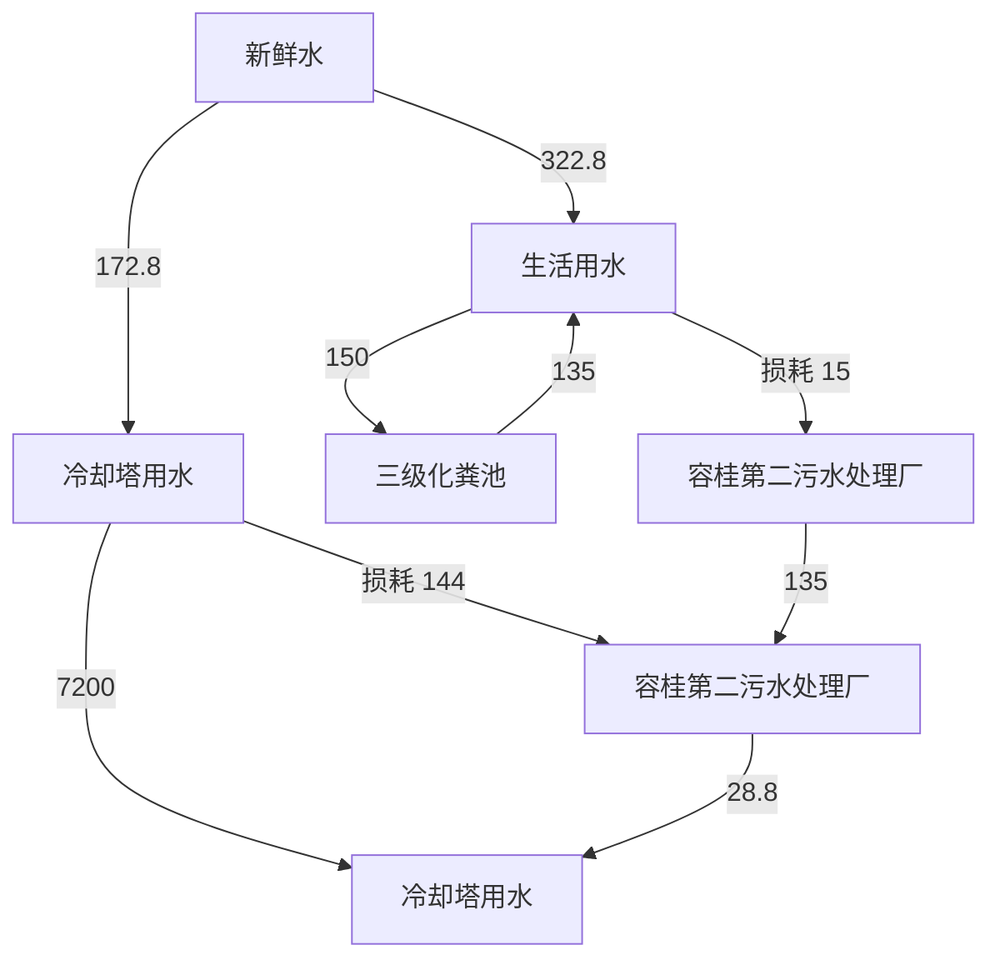
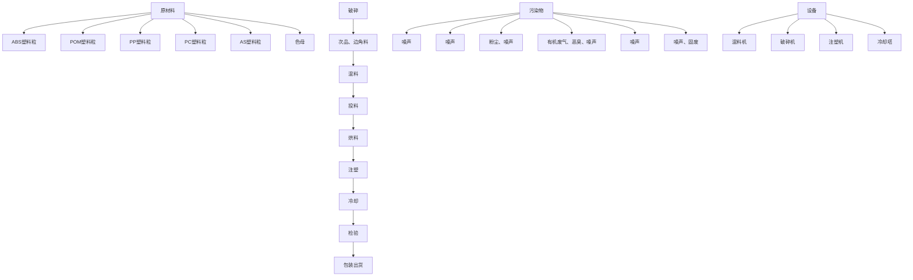
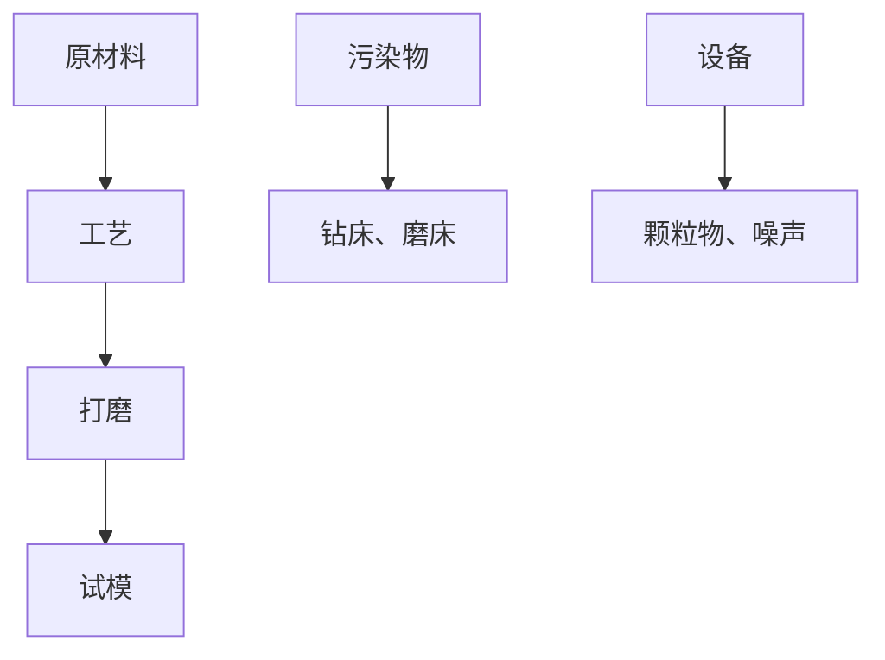

# 建设项目环境影响报告表

（污染影响类）

项目名称：佛山市顺德区奥圣塑料五金制品有限公司搬迁扩建项目

建设单位（盖章）：佛山市顺德区奥圣塑料五金制品有限公司

编制日期： 2023年2

中华人民共和国生态环境部制

编制单位和编制人员情况表

<table><tr><td>项目编号</td><td>2aw16s</td></tr><tr><td>建设项目名称</td><td>佛山市顺德区奥圣塑料五金制品有限公司搬迁扩建项目</td></tr><tr><td>建设项目类别</td><td>25-053塑料制品业</td></tr><tr><td>环境影响评价文件类型</td><td>报告表</td></tr><tr><td colspan="2">一、建设单位情况</td></tr><tr><td>单位名称(盖章)</td><td>佛山市顺德区奥圣塑料五金制品有限公司</td></tr><tr><td>统一社会信用代码</td><td rowspan="4"></td></tr><tr><td>法定代表人(签章)</td></tr><tr><td>主要负责人(签字)</td></tr><tr><td>直接负责的主管人员(签字)</td></tr><tr><td colspan="2">二、编制单位情况</td></tr><tr><td>单位名称(盖章)</td><td>佛山市顺德区汇绩环保服务有限公司</td></tr><tr><td>统一社会信用代码</td><td></td></tr><tr><td colspan="2">三、编制人员情况</td></tr></table>

<table><tr><td>1.编制主持人</td></tr><tr><td></td></tr></table>

# 一、建设项目基本情况

<table><tr><td>建设项目名称</td><td colspan="4">佛山市顺德区奥圣塑料五金制品有限公司搬迁扩建项目</td></tr><tr><td>项目代码</td><td colspan="4">无</td></tr><tr><td>建设单位联系人</td><td></td><td></td><td colspan="2"></td></tr><tr><td>建设地点</td><td colspan="4">广东省佛山市顺德区容桂街道华口社区华天南一路2号杰森家电智造中心3栋201号之一</td></tr><tr><td>地理坐标</td><td colspan="4">(113度20分55.444秒,22度46分4.367秒)</td></tr><tr><td>国民经济行业类别</td><td>C2929塑料零件及其塑料制品制造</td><td>建设项目行业类别</td><td colspan="2">二十六、橡胶和塑料制品业29-53塑料制品业292-其他(年用非溶剂型低VOCs含量涂料10吨以下的除外)</td></tr><tr><td>建设性质</td><td>√新建(迁建)□改建☑扩建□技术改造</td><td>建设项目申报情形</td><td colspan="2">√首次申报项目□不予批准后再次申报项目□超五年重新审核项目□重大变动重新报批项目</td></tr><tr><td>项目审批(核准/备案)部门(选填)</td><td>——</td><td>项目审批(核准/备案)文号(选填)</td><td colspan="2">——</td></tr><tr><td>总投资(万元)</td><td>100</td><td>环保投资(万元)</td><td colspan="2">10</td></tr><tr><td>环保投资占比(%)</td><td>10</td><td>施工工期</td><td colspan="2">1个月</td></tr><tr><td>是否开工建设</td><td>√否□是: _</td><td>用地(用海)面积(m2)</td><td colspan="2">751.54(建筑面积)</td></tr><tr><td>专项评价设置情况</td><td colspan="4">无</td></tr><tr><td>规划情况</td><td colspan="4">审查文件名称:《佛山市顺德区容桂华口扁滘片(SD-B-05-02、SD-B-05-03编制单元)控制性详细规划》SD-B-05-03-01、SD-B-05-03-02、SD-B-05-03-03、SD-B-05-03-04街坊局部调整批后公布审查机关:佛山市人民政府批复文号:佛府办函〔2021〕32号</td></tr><tr><td>规划环境影响评价情况</td><td colspan="4">无</td></tr><tr><td>规划及规划环境影响评价符合性分析</td><td colspan="4">根据《佛山市顺德区容桂华口扁滘片(SD-B-05-02、SD-B-05-03编制单元)控制性详细规划》SD-B-05-03-01、SD-B-05-03-02、SD-B-05-03-03、SD-B-05-03-04街坊局部调整批后公布(附图10)可知,该场址用地性质为工业用地。因此,本项目建设符合规划。</td></tr><tr><td rowspan="3">其他符合性分析</td><td colspan="4">1、与产业政策符合性分析本项目属于“C2929塑料零件及其塑料制品制造”行业,主要从事生产家电配件。根据国家发展改革委商务部关于印发《市场准入负面清单(2022年版)》的通知(发改体改规〔2022〕397号),项目不属于上述目录所列的鼓励类、限制类、禁止(淘汰)类严控类项目,也不属于《市场准入负面清单(2022年版)》所列的禁止准入及需许可准入事项。根据《促进产业结构调整暂行规定》(国发〔2005〕40号)第十三条,项目符合国家有关法律、法规和政策规定,项目属于允许类。根据《产业结构调整指导目录》(2021年修订)》(中华人民共和国国家发展和改革委员会令第49号),项目属于允许类。因此,本项目的建设符合国家和地方的相关产业政策。2、与《环境保护综合名录(2021年版)》的相符性分析:本项目主要经营家电配件生产,生产的产品及使用的原辅材料均不属于《环境保护综合名录(2021年版)》中“高污染、高环境风险”产品名录,符合要求。3、与《广东省人民政府关于印发广东省“三线一单”生态环境分区管控方案的通知》(粤府〔2020〕71号)相符性分析根据《广东省人民政府关于印发广东省“三线一单”生态环境分区管控方案的通知》(粤府〔2020〕71号)的要求,本项目与所在区域的生态保护红线、环境质量底线、资源利用上线和生态环境准入清单(“三线一单”)进行对照分析,见下表:表1“三线一单”相符性</td></tr><tr><td>管控要求</td><td>与本项目有关的相关要求(摘录)</td><td>相符性分析</td><td>符合性</td></tr><tr><td>区域布局管控</td><td>禁止新建、扩建水泥、平板玻璃、化学制浆、生皮制革以及国家规划外的钢铁、原油加工等项目。推广应用低挥发性有机物原辅材料,严格限制新建生产和使用高挥发性有机物原辅材料的项目,鼓励建设挥发性有机物共性工厂</td><td>项目不属于水泥、平板玻璃、化学制浆、生皮制革、钢铁、原油加工等行业。项目使用的原辅材料不属于高挥发性原料。</td><td>符合</td></tr><tr><td rowspan="3"></td><td>能源资源利用</td><td>科学实施能源消费总量和强度“双控”,新建高能耗项目单位产品(产值)能耗达到国际国内先进水平,实现煤炭消费总量负增长。推进工业节水减排,重点在高耗水行业开展节水改造,提高工业用水效率。加强江河湖库水量调度,保障生态流量。盘活存量建设用地,控制新增建设用地规模。</td><td>项目所属塑料零件及其塑料制品制造业,不属于高能耗行业,项目全部生产设备使用电能,生产用水由市政供水,不直接取用江河湖库或地下水水量,不会对项目所在地生态流量造成影响,符合能源利用要求。项目为自有厂房,已控制建设用地规模。</td><td>符合</td></tr><tr><td>污染物排放管控</td><td>重点水污染物未达到环境质量改善目标的区域内,新建、改建、扩建项目实施减量替代。大力推进固体废物源头减量化、资源化利用和无害化处置,稳步推进“无废城市”试点建设。</td><td>项目属于迁扩建项目,搬迁后项目的生活污水经三级化粪池预处理达标后汇入市政污水管网排入容桂第二污水处理厂处理,尾水排入鸡鸦水道;容桂第二污水处理厂尾水达到《城镇污水处理厂污染物排放标准(GB18918-2002)一级A标准及广东省地方标准《水污染物排放限值》(DB44/26-2001)第二时段一级标准的较严值,排入鸡鸦水道。项目经营过程产生的固体废弃物分类收集,一般包装废弃物由物资回收公司回收,危险废物交有危废资质单位进行处理。固体废质单位物分类减量化、资源化利用和无害化处置。</td><td>符合</td></tr><tr><td>环境风险管控</td><td>加强惠州大亚湾石化区、广州石化、珠海高栏港、珠西新材料集聚区等石化、化工重点园区环境风险防控,建立完善污染源在线监控系统,开展有毒有害气体监测,落实环境风险应急预案。提升危险废物监管能力,利用信息化手段,推进全过程跟踪管理。</td><td>项目所在地不属于石化、化工重点园区环境风险防控区域。项目产生的危险废物将定期委托有资质的处置公司进行收集处理,并通过信息系统登记转移计划和电子转移联单,符合危险废物全过程跟踪管理的防控要求。</td><td>符合</td></tr><tr><td colspan="5">4、与《佛山市人民政府关于印发佛山市“三线一单”生态环境分区管控方案的通知》(佛府〔2021〕11号)相符性分析根据《佛山市人民政府关于印发佛山市“三线一单”生态环境分区管控方案的通知》(佛府〔2021〕11号)发布的佛山市环境管控单元图,详见附图3,项目所在为珠三角核心区的重点管控单元。环境管控单元编号为ZH44060620001,单元名称为容桂街道重点管控区。表2“三线一单”相符性</td></tr><tr><td colspan="2">管控要求</td><td>与本项目有关的相关要求(摘录)</td><td>相符性分析</td><td>符合性</td></tr><tr><td rowspan="4"></td><td>区域布局管控</td><td>禁止新建、扩建水泥、平板玻璃、化学制浆、生皮制革以及国家规划外的钢铁、原油加工等项目。专业电镀、印染等项目进入定点园区集中管理。推广应用低挥发性有机物原辅材料,严格限制新建生产和使用高挥发性有机物原辅材料的项目,鼓励建设共性工厂、活性炭集中再生中心等挥发性有机物第三方治理项目,推动挥发性有机物集中高效处理</td><td>项目不属于水泥、平板玻璃、化学制浆、生皮制革、钢铁、原油加工等行业。项目使用的原辅材料不属于高挥发性原料。</td><td>符合</td></tr><tr><td>能源资源利用</td><td>科学实施能源消费总量和强度“双控”,新建高能耗项目单位产品(产值)能耗达到国际国内先进水平,实现煤炭消费总量负增长。贯彻落实“节水优先”方针,实行最严格水资源管理制度,提高工业用水效率,加强江河湖库水量调度,保障生态流量。强化自然岸线保护,优化岸线开发利用格局,严格水域岸线用途管制,新建项目一律不得违规占用水域。</td><td>项目所属塑料零件及其塑料制品制造业,不属于高能耗行业,项目全部生产设备使用电能,项目用水由市政供水,不直接取用江河湖库或地下水水量,不会对项目所在地生态流量造成影响,符合能源利用要求。</td><td>符合</td></tr><tr><td>污染物排放管控</td><td>上年度重点河涌水质未达到水环境质量目标的管控分区所在镇(街道),须组织编制、系统实施、向社会公开区域重点水污染物减排计划并明确“替代量”,本年度新建、改建、扩建项目新增水环境重点污染物实行区域“减二一”替代(废水集中处理设施、民生项目除外)。推进挥发性有机物源头替代,全面加强无组织排放控制,深入实施精细化治理。推进石化化工溶剂使用及挥发性有机液体储运销的挥发性有机物减排,全过程实施反应活性物质、有毒有害物质、恶臭物质的协同控制。将全面使用低VOCs含量原辅材料的企业纳入正面清单和政府绿色采购清单。开展“无废城市”建设,推动固体废物源头减量、资源化利用和安全处置。</td><td>项目属于迁扩建项目,搬迁后项目生活污水经三级化粪池预处理达标后汇入市政污水管网排入容桂第二污水处理厂处理,尾水排入鸡鸦水道;容桂第二污水处理厂尾水达到《城镇污水处理厂污染物排放标准(GB18918-2002)一级A标准及广东省地方标准《水污染物排放限值》(DB44/26-2001)第二时段一级标准的较严值,排入鸡鸦水道。项目属于塑料零件及其塑料制品制造业,项目使用的原辅材料不属于高挥发性原料。项目经营过程产生的固体废弃物分类收集,一般包装废弃物由物资回收公司回收,危险废物交有危废资质单位进行处理。固体废质单位物分类减量化、资源化利用和无害化处置。</td><td>符合</td></tr><tr><td>环境风险管控</td><td>强化地表水、地下水和土壤污染风险协同防控,建立完善突发环境事件应急管理体系。重点加强环境风险分级分类管理,应用全省环境风险源在线监控预警系统,强化化工企业、涉重金属行业、工业园区等重点环境风险源的环境风险防控。</td><td>项目所在地不属于石化、化工重点园区环境风险防控区域。项目产生的危险废物将定期委托有危废资质单位进行收集处理,并通过信息系统登记转移计划和电子转移联单。</td><td>符合</td></tr></table>

<table><tr><td></td><td>提升危险废物监管能力,利用信息化手段,推动全过程跟踪管理。健全危险废物收集体系,推进危险废物利用处置能力优化提升。全力避免因各类安全事故(事件)引发的次生环境风险事故(事件)。</td><td></td><td></td></tr></table>

综上所述，本项目符合《佛山市人民政府关于印发佛山市“三线一单”生态环境分区管控方案的通知》（佛府〔2021〕11 号）的要求。

# 5、与《佛山市顺德区人民政府关于印发佛山市顺德区“三线一单”生态环境分区管控方案的通知》（顺府发[2021]11号）相符性分析

本项目所在区域属于容桂街道重点管控区，编号：ZH44060620001。根据项目生产产品、原材料、工艺等分析，本项目不属于单元“区域布局管控”中生态/禁止类、产业/限制类、水/限制类等。项目生活污水、雨水分类收集，生活污水经三级化粪池预处理后排至容桂第二污水处理厂，满足水/综合类管控要求。本项目对照分析《佛山市顺德区人民政府关于印发佛山市顺德区“三线一单”生态环境分区管控方案的通知》（顺府发〔2021〕11号）的相符性，详见表4，所在环境管控单元见附图11，符合佛山市顺德区“三线一单”要求。

综上所述，本项目与《佛山市顺德区人民政府关于印发佛山市顺德区“三线一单”生态环境分区管控方案的通知》（顺府发[2021]11号）是相符的。

# 6、挥发性有机物（VOCs）排放符合性分析

表 3 项目与挥发性有机物（VOCs）排放规定相符性分析

<table><tr><td>序号</td><td>政策要求</td><td>工程内容</td><td>符合性</td></tr><tr><td colspan="4">1.佛山市生态环境局顺德分局关于做好重点行业建设项目挥发性有机物总量指标管理工作的通知》(佛顺环函[2019]56号)</td></tr><tr><td>1.1</td><td>涉VOCs排放项目,实现本行政区域内污染源“点对点”2倍量削减替代,由项目所在镇街分局出具VOCs总量指标来源及替代削减方案的意见,开展总量替代。</td><td>项目VOCs排放总量指标(VOCs:0.108t/a)由容桂街道出具VOCs总量指标来源及替代削减方案的意见。</td><td>符合</td></tr><tr><td colspan="4">2.《广东省人民政府办公厅关于印发广东省2021年大气、水、土壤污染防治工作方案的通知》(粤办函〔2021〕58号)</td></tr><tr><td>2.1</td><td>严格落实国家产品VOCs含量限值标准要求,除现阶段确无法实施替代的工序外,禁止新建生产和使用高VOCs含量原辅材料项目。鼓励在生产和流通消费环节推广使用低VOCs含量原辅材料。</td><td>项目使用的原辅料均为不属于高VOCs含量原辅材料。</td><td>符合</td></tr><tr><td colspan="4">3.《关于印发《广东省涉挥发性有机物(VOCs)重点行业治理指引》的通知》(粤环办〔2021〕43号)</td></tr></table>

<table><tr><td rowspan="7"></td><td>3.1</td><td>VOCs物料转移和输送:粉状、粒状VOCs物料采用气力输送设备、管状带式输送机、螺旋输送机等密闭输送方式,或者采用密闭的包装袋、容器或罐车进行物料转移。</td><td>项目原料均为固态,在转移过程中均使用密闭的包装袋封装</td><td>符合</td></tr><tr><td>3.2</td><td>工艺过程:在混合/混炼、塑炼/塑化/熔化、加工成型(注塑、注射、压制、压延、发泡、纺丝等)、硫化等作用中应采用密闭设备或在密闭空间中操作,废气应排至VOCs废气收集处理系统;无法密闭的,应采取局部气体收集措施,废气排至VOCs废气收集处理系统。</td><td>项目废气经集气措施收集后通过二级活性炭处理后引至45m排气筒排放。</td><td>符合</td></tr><tr><td>3.3</td><td>废气收集:采用外部集气罩的,距集气罩开口面最远处的VOCs无组织排放位置,控制风速不低于0.3m/s。</td><td>项目集气罩置于废气产生点的合理位置,保证罩口截面风速为0.7m/s。</td><td>符合</td></tr><tr><td>3.4</td><td>废气收集:废气收集系统的输送管道应密闭。废气收集系统应在负压下运行,若处于正压状态,应对管道组件的密封垫进行泄漏检测,泄漏检测值不应超过500μmol/mol,亦不应有感官可察觉泄漏。</td><td>项目废气收集系统的输送管均密闭,废气收集系统在负压下运行。</td><td>符合</td></tr><tr><td>3.5</td><td>排放水平:塑料制品行业:a)有机废气排气筒排放浓度不高于广东省《大气污染物排放限值》(DB4427-2001)第II时段排放限值,合成革和人造革企业排放浓度不高于《合成革与人造革工业污染物排放标准》(GB21902-2008)排放限值,若国家和我省出台并实施适用于塑料制品制造业的大气污染物排放标准,则有机废气排气筒排放浓度不高于相应的排放限值;车间或生产设施排气中NMHC初始排放速率≥3kg/h时,建设VOCs处理设施且处理效率≥80%;b)厂区内无组织排放监控点NMHC的小时平均浓度值不超过6mg/m3,任意一次浓度值不超过20mg/m3。</td><td>项目所属行业为塑料制品业,生产过程有机废气达到《合成树脂工业污染物排放标准》(GB31572-2015)相关标准限值;有机废气厂区内无组织排放满足平均浓度值不超过6mg/m3,任意一次浓度值不超过20mg/m3。</td><td>符合</td></tr><tr><td>3.6</td><td>管理台账:建立废气收集处理设施台账,记录废气处理设施进出口的监测数据(废气量、浓度、温度、含氧量等)、废气收集与处理设施关键参数、废气处理设施相关耗材(吸收剂、吸附剂、催化剂等)购买和处理记录。</td><td>项目建立废气收集处理设施台账,根据《排污单位自行监测技术指南总则》(HJ819-2017)等相关要求定期自行监测,并且记录相关监测数据</td><td>符合</td></tr><tr><td>3.7</td><td>管理台账:建立危废台账,整理危废处置合同、转移联单及危废处理方式资质佐证材料。</td><td>项目建立危险废物台账,定期将废机油、废活性炭等危险废物交给有资质的单位处理,整理危废处理合同、转移联单等资料。</td><td>符合</td></tr></table>

4.《固定污染源挥发性有机物综合排放标准》(DB44/ 2367-2022)

<table><tr><td>5.1</td><td>VOCs物料储存无组织排放控制要求</td><td rowspan="3">项目含VOCs物料主要为ABS塑料粒、POM塑料粒、PP塑料粒、PC塑料粒、AS塑料粒、色母,原料常温下不挥发,储存在仓库内,工艺生产过程产生的有机废气通过设置集气措施并采用二级活性炭吸附处理后高空排放,减少无组织排放。</td><td>符合</td></tr><tr><td>5.2</td><td>VOCs物料转移和输送无组织排放控制要求</td><td>符合</td></tr><tr><td>5.3</td><td>工艺过程VOCs无组织排放控制要求</td><td>符合</td></tr></table>

6.关于印发《重点行业挥发性有机物综合治理方案》的通知（环大气[2019]53 号）

<table><tr><td>7.1</td><td>通过使用水性、粉末、高固体分、无溶剂、辐射固化等低VOCs含量的涂料,水性、辐射固化、植物等低VOCs含量的油墨,水基、热熔、无溶剂、辐射固化、改性、生物降解等低VOCs含量的胶粘剂,以及低VOCs含量、低反应活性的清洗剂等,替代溶剂型涂料、油墨、胶粘剂、清洗剂等,从源头减少VOCs产生。</td><td>本项目使用的原材料无自然状态下可挥发性的物料,满足相关标准要求。</td><td>符合</td></tr><tr><td>7.2</td><td>重点对含VOCs物料(包括含VOCs原辅材料、含VOCs产品、含VOCs废料以及有机聚合物材料等)储存、转移和输送、设备与管线组件泄漏、敞开液面逸散以及工艺过程等五类排放源实施管控,通过采取设备与场所密闭、工艺改进、废气有效收集等措施,削减VOCs无组织排放。</td><td>项目注塑过程产生的废气,已设置集气措施收集。集气罩置于废气产生点的合理位置,保证罩口截面风速为0.7m/s。</td><td>符合</td></tr><tr><td>7.3</td><td>提高废气收集率,遵循“应收尽收、分质收集”的原则,科学设计废气收集系统,将无组织排放转变为有组织排放进行控制。采用全密闭集气罩或密闭空间的,除行业有特殊要求外,应保持微负压状态,并根据相关规范合理设置通风量。采用局部集气罩的,距集气罩开口面最远处的VOCs无组织排放位置,控制风速应不低于0.3米/秒,有行业要求的按相关规定执行。</td><td>项目注塑过程产生的废气,已设置集气措施收集。集气罩置于废气产生点的合理位置,保证罩口截面风速为0.7m/s。</td><td>符合</td></tr></table>

# 7、项目与控制性规划的相符性分析

根据《顺德高新技术产业开发区综合加工园第五期控制性详细规划调整SD-B-05-3-01、SD-B-05-3-02 街坊技术修正》（FS(2020)007），项目所在地属于 M1类工业用地，符合佛山市顺德区土地利用规划。

表 4 本项目与佛山市顺德区“三线一单”生态环境分区管控方案相符性分析

<table><tr><td>管控维度</td><td>管控要求</td><td>本项目情况</td><td>符合性</td></tr><tr><td>区域布局管控</td><td>1-1.【产业/鼓励引导类】重点发展芯片、智能家电、高端装备制造、高端新型电子信息、新材料、生命健康等制造业和金融、科技服务、高端商贸等现代服务业,建设科技研发、创新创业基地、上市企业总部聚集区、企业品牌总部基地。1-2.【产业/综合类】系统推进村级工业园升级改造,腾出连片空间,布局产业集聚区和主题产业园,推动工业项目入园集聚发展。新增工业制造业用地原则上安排在产业集聚区内,产业集聚区外原则上不鼓励工业及物流仓储用地的新建与改造。1-3.【产业/综合类】产业聚集区所属地块内的工业用地或企业与村庄、学校等环境敏感点之间应设置合理的大气环境防护距离,并通过绿化带进行有效隔离;聚集区规划布局应注重大气污染排放企业应尽量避免布局在居住用地的常年主导风向的上风向。1-4.【产业/限制类】受纳水体或监控断面不达标的,不得新建、扩建向河涌直接排放废水的项目。新建、扩建含蚀刻工序的线路板生产项目和化工项目应在配套污水集中处置的工业园区或生活污水管网覆盖区域内建设;纯加工型印花项目,含酸洗、磷化的金属表面处理、金属制品项目(与自身高新技术企业配套的除外),含酸洗、喷涂、化学抛光、电解等涉及废水排放工艺的不锈钢型材加工项目(与自身高新技术企业配套的除外),应进入以此类项目为主导产业、有相应废水集中治理设施的工业园区,实现集中治污。1-5.【产业/综合类】划定家具生产优先发展区域,优先发展区外不再新建涉及涂装工艺的木质家具制造项目。1-6.【大气/限制类】大气环境受体敏感重点管控区内,应严格限制新建储油库项目、产生和排放有毒有害大气污染物的建设项目以及使用溶剂型油墨、涂料、清洗剂、胶黏剂等高挥发性有机物原辅材料项目,鼓励现有该类项目搬迁退出。1-7.【大气/鼓励引导类】大气环境高排放重点管控区内,应强化达标监管,引导工业项目落地集聚发展,有序推进区域内行业企业提标改造。1-8.【土壤/禁止类】禁止新建、扩建增加重点防控的重金属污染物排放的建设项目。</td><td>1-1.项目主要从事塑料零件及其塑料制品制造,符合国家产业政策规定。1-2.项目所在地位于工业园区,符合工业用地规划要求,不属于新建工业及物流仓储用地。1-3.项目与环境敏感点已设置合理的大气环境防护距离。1-4.项目主要从事塑料零件及其塑料制品制造,不属于上述行业。1-5.项目主要从事塑料零件及其塑料制品制造,不属于木质家具制造项目。1-6.项目主要从事塑料零件及其塑料制品制造,不属于新建使用溶剂型涂料、清洗剂等高挥发性有机物原辅材料项目。1-7.项目主要从事塑料零件及其塑料制品制造,废气经集气措施收集后通过二级活性炭处理后引至45m排气筒排放。公司加强废气处理设施的管理,定期进行监测,必要时根据环境监管部门要求安装自动监测设备,确保废气达标排放。1-8.项目主要从事塑料零件及其塑料制品制造,不属于重金属污染物排放的建设项目。</td><td>符合</td></tr><tr><td>能源资源利用</td><td>2-1【能源/鼓励引导类】推广节能技术,加快发展绿色货运与现代物流。2-2【能源/鼓励引导类】推广新能源汽车应用和充电基础设施建设,积极推动重卡LNG加气站、充电基础设施、加氢站建设。2-3.【能源/综合类】科学实施能源消费总量和强度“双控”,新建高能耗项目单位产品(产值)能耗达到国际国内先进水平。2-4.【水资源/综合类】贯彻落实“节水优先”方针,实行最严格水资源管理制度,容桂街道万元国内生产总值用水量、万元工业增加值用水量、用水总量、农田灌溉水有效利用系数等用水总量和效率指标达到区下达要求。2-5.【土地资源/限制类】落实单位土地面积投资强度、土地利用强度等建设用地控制性指标要求,提高土地利用效率。2-6.【岸线/禁止类】严格水域岸线用途管制,新建项目一律不得违规占用水域。严禁破坏生态的岸线利用行为和不符合其功能定位的开发建设活动,严禁以各种名义侵占河道、围垦湖泊、非法采砂等。</td><td>2-1.项目推广节能技术,加快发展绿色货运与现代物流。2-2.项目不属于新能源汽车应用和充电基础设施、加氢站建设。2-3.项目科学实施能源消费总量和强度“双控”,不属于新建高能耗项目,单位产品(产值)能耗达到国际国内先进水平。2-4.项目严格贯彻落实“节水优先”方针,实行最严格水资源管理制度,容桂街道万元国内生产总值用水量、万元工业增加值用水量、用水总量、农田灌溉水有效利用系数等用水总量和效率指标达到区下达要求。2-5.项目单位土地面积投资强度、土地利用强度等建设用地控制性指标均满足相关标准要求,土地利用效率较高。2-6.项目属于租用工业厂房新建项目,不占用水域,不会破坏生态的岸线利用和做不符合其功能定位的开发建设活动,不侵占河道、围垦湖泊、非法采砂等</td><td>符合</td></tr><tr><td>污染物排放管控</td><td>3-1.【水/限制类】城镇新区建设实行雨污分流,逐步推进初期雨水收集、处理和资源化利用。住宅、商业体、学校、市场等城镇开发建设项目应当配套或者同步计划建设公共排水设施,公共排水设施或自建排污水设施未能投产运行的,以上涉水项目不得投入使用。新建小区严格实施雨污分流,阳台、露台等污水接入污水收集系统,将生活污水“应截尽截”。做好大型楼盘、集贸市场、餐饮以及学校等4大类排水户污水接入市政管网工作。3-2.【水/综合类】容桂街道重点河涌水质上年度未达到水环境环境质量目标的,需组织编制、系统实施、向社会公开区域重点水污染物减排计划并明确“替代量”,本年度新建、改建、扩建项目新增水环境重点污染物实行区域“减二增一”替代(工业、生活或综合集中废水处理设施、民生项目除外)。3-3.【水/综合类】区域内应合理规划建设工业或综合集中废水处理设施。逐步推进工业集聚区“污水零直排区”建设,开展排水单元工业废水、生活污水、雨水分类收集、分质处理,确保园区“管网全覆盖、雨污全分流、污水全收集、处理全达标”。3-4.【水/综合类】结合村级工业园改造,全面提升产业层次与集聚度,促进污染集中整治。3-5.【水/综合类】稳步推进排水设施“三个一体化”管理模式,补齐城乡污水收集和处理短板,推动容桂第一、第二污水处理厂提质增效,加快消除城中村、老旧城区、城乡结合部等污水收集管网空白区,逐步实现城乡污水收集处理全覆盖。360年前完成容桂第一、第二污水处理厂扩建,尾水应执行《城镇污水处理厂污染物排放标准》(GB18918-2002)一级A标准及《广东省水污染物排放限值》(DB44/26-2001)的较严值。3-6.【水/综合类】近期保留马东、马南两处污水处理站,到2030年将马冈村居污水接入市政污水管网,纳入杏坛城镇污水处理系统;其余行政村(社区)污水均通过市政管网和农村支管纳入容桂城镇污水处理处理系统。3-7.【水/综合类】产业集聚区和主题园区内做好污水管网和污水集中处理设施的配套保障,确保废水收集到城镇污水处理厂、园区污水处理厂或分散式污水处理设施集中处置。3-8.【大气/综合类】大力推进低VOCs含量原辅材料替代,加快涉VOCs重点行业的生产工艺升级改造,推行自动化生产工艺,对达不到要求的VOCs收集及治理设施进行整治提升,逐步淘汰低效VOCs治理设施。3-9.【土壤/限制类】作为重金属污染重点防控区,区域内重点重金属排放总量只减不增。</td><td>3-1.项目不属于城镇新区建设。3-2.项目生活污水经三级化粪预处理达标后排放至容桂第二污水处理厂,尾水排至鸡鸦水道,鸡鸦水道水质2021年达到水环境质量目标,无需实施本年度改建、扩建项目新增水环境重点污染物区域“减二增一”替代。3-3.项目生活污水经三级化粪预处理达标后排放至容桂第二污水处理厂,尾水排至鸡鸦水道。3-4.项目所在地产业层次与集聚度较高,污染集中整治。3-5.项目位于容桂第二污水处理厂处理范围,尾水执行《城镇污水处理厂污染物排放标准》(GB18918-2002)一级A标准及《广东省水污染物排放限值》(DB44/26-2001)的较严值。3-6.项目位于容桂第二污水处理厂处理范围。3-7.项目所在地已经实施雨污分流,污水纳入容桂街道污水处理系统。3-8.项目不使用含VOCs的原辅材料。3-9.项目不属于重金属污染物排放的建设项目。</td><td>符合</td></tr><tr><td>环境风险防控</td><td>4-1【水/综合类】容桂第一、第二污水处理厂、工业污水集中处理设施应采取有效措施,防止事故废水直接排入水体。完善污水处理厂在线监控系统联网,实现污水处理厂的实时、动态监管。4-2【风险/综合类】加强环境风险分级分类管理,强化金属制品、有色金属和压延加工、化学原料和化学品制造业等涉重金属、化工行业企业及工业园区等重点环境风险源的环境风险防控。</td><td>4-1.项目所在地位于容桂第二污水处理厂纳污范围,污水处理厂已在线监控系统联网,实现污水处理厂的实时、动态监管。4-2.项目不属于金属制品、有色金属和压延加工、化学原料和化学品制造业等涉重金属、化工行业企业及工业园区等重点环境风险源,项目不排放重金属。</td><td>符合</td></tr></table>

# 二、建设项目工程分析

# 1. 项目组成

佛山市顺德区奥圣塑料五金制品有限公司原址位于广东省佛山市顺德区容桂街道容边社区天河工业区星河西路 5 号首层之二，中心位置地理坐标为东经 113.302077°，北纬 22.746247°，主要从事家电配件的加工和生产。

现企业根据发展需要，拟搬迁到广东省佛山市顺德区容桂街道华口社区华天南一路 2 号杰森家电智造中心 3 栋 201号之一，占地面积为 751.54m2，经营面积为 751.54m2。

表 5 项目建设内容一览表

<table><tr><td colspan="3">工程类别</td><td>搬迁前</td><td>变化情况</td><td>搬迁后</td></tr><tr><td>主体工程</td><td colspan="2">生产车间</td><td>约400m2,用于家电配件的加工生产</td><td>增加生产设备</td><td>约751.54m2,所在楼层高为5.9米,总共高44米,主要用于塑料制品的加工生产</td></tr><tr><td>仓储工程</td><td colspan="2">仓库</td><td>约100m2,在车间内,用于储存产品以及原辅材料</td><td>增加原辅材料</td><td>在车间内,用于储存产品以及原辅材料</td></tr><tr><td rowspan="2">公用工程</td><td colspan="2">配电系统</td><td>通过市电引入厂区,通过配电线路至车间,供应生产用电和办公生活用电</td><td>不变</td><td>通过市电引入厂区,通过配电线路至车间,供应生产用电和办公生活用电</td></tr><tr><td colspan="2">给排水系统</td><td>供水为市政自来水,生活污水经三级化粪池预处理后排入容桂第一污水处理厂处理</td><td>增加生产用水量,排放量增加,生活污水处理后排入容桂第二污水处理厂处理</td><td>供水为市政自来水,生活污水经三级化粪池预处理后排入容桂第二污水处理厂处理</td></tr><tr><td rowspan="2">依托工程</td><td colspan="2">生活污水治理</td><td>生活污水经三级化粪池预处理后排入容桂第一污水处理厂处理</td><td>依托所在厂房已有设施</td><td>生活污水经三级化粪池处理后排入容桂第二污水处理厂,尾水排入鸡鸦水道</td></tr><tr><td colspan="2">冷却废水治理</td><td>冷却水循环使用,定期通过市政污水管网排入容桂第一污水处理厂</td><td>依托所在厂房已有设施</td><td>冷却水循环使用,定期通过市政污水管网排入容桂第二污水处理厂,尾水排入鸡鸦水道</td></tr><tr><td rowspan="2">环保工程</td><td>废水</td><td>生活污水</td><td>生活污水经三级化粪池预处理后排入容桂第一污水处理厂处理</td><td>生活污水处理后排入容桂第二污水处理厂处理</td><td>生活污水经三级化粪池预处理后排入容桂第二污水处理厂处理</td></tr><tr><td>废气</td><td>生产废气</td><td>设置集气、排气系统,注塑废气经集气罩收集后通过二级活性炭处理后引至15m高排气筒排放</td><td>注塑产生的废气经集气措施收集后引至二级活性炭吸附装置处理后通过45m排气筒DA001排放</td><td>注塑产生的废气经集气措施收集后引至二级活性炭吸附装置处理后通过45m排气筒DA001排放</td></tr><tr><td rowspan="4"></td><td>噪声</td><td>选用低噪设备,并进行合理放置,对产生较大噪声的生产设备采取相应的减振处理</td><td>增加负荷</td><td>选用低噪设备,并进行合理放置,对产生较大噪声的生产设备采取相应的减振处理</td></tr><tr><td>生活垃圾</td><td>由环卫部门统一清运处理</td><td>产生量增加</td><td colspan="2">由环卫部门统一清运处理</td></tr><tr><td>一般工业固废</td><td>由专业回收公司回收处理</td><td>产生量增加</td><td colspan="2">由专业回收公司回收处理</td></tr><tr><td>危险废物</td><td>由专门容器收集后暂存于危废池,统一交由取得相应《危险废物经营许可证》的单位处置。</td><td>产生量增加</td><td colspan="2">由专门容器收集后暂存于危废池,统一交由取得相应《危险废物经营许可证》的单位处置。</td></tr></table>

# 2. 项目产品和产能

表 6 产品产能一览表

<table><tr><td rowspan="2">产品名称</td><td rowspan="2">单位</td><td colspan="3">年产量</td></tr><tr><td>搬迁前</td><td>搬迁后</td><td>增减量</td></tr><tr><td>家电配件</td><td>万件/年</td><td>50</td><td>80(约200吨)</td><td>+30</td></tr><tr><td colspan="5">注:项目家电配件主营为电器托盘、吹风机外壳等,产品前后不发生改变,重量约为 $250 \pm 0.1$ g/个。</td></tr></table>

# 3. 项目生产设备

表 7 生产设备一览表

<table><tr><td rowspan="2">生产设施名称</td><td colspan="4">数量</td><td rowspan="2">单位</td><td colspan="3">设施参数</td><td rowspan="2">主要工艺</td></tr><tr><td>搬迁前审批</td><td>验收规模</td><td>搬迁后</td><td>增减量</td><td>参数名称</td><td>设计值</td><td>单位</td></tr><tr><td>注塑机</td><td>15</td><td>14</td><td>16</td><td>+1</td><td>台</td><td>处理能力</td><td>5-6</td><td>kg/h</td><td>注塑</td></tr><tr><td>烘料机</td><td>0</td><td>0</td><td>2</td><td>+2</td><td>台</td><td>功率</td><td>2.5</td><td>kW</td><td>烘干</td></tr><tr><td>混料机</td><td>4</td><td>3</td><td>4</td><td>0</td><td>台</td><td>处理能力</td><td>0.02</td><td>t/h</td><td>混料</td></tr><tr><td>破碎机</td><td>4</td><td>4</td><td>4</td><td>0</td><td>台</td><td>处理能力</td><td>0.02</td><td>t/h</td><td>破碎</td></tr><tr><td>冷却塔</td><td>1</td><td>1</td><td>1</td><td>0</td><td>台</td><td>循环水量</td><td>3</td><td> $m^3/h$ </td><td>冷却</td></tr><tr><td>龙门吊</td><td>2</td><td>2</td><td>2</td><td>0</td><td>台</td><td>承重</td><td>2.8</td><td>T</td><td>辅助</td></tr><tr><td>空压机</td><td>2</td><td>1</td><td>2</td><td>0</td><td>台</td><td>容量</td><td>1.6</td><td> $m^3/min$ </td><td>压缩空气</td></tr><tr><td>铣床</td><td>2</td><td>0</td><td>0</td><td>-2</td><td>台</td><td>/</td><td>/</td><td>/</td><td>/</td></tr><tr><td>钻床</td><td>1</td><td>1</td><td>1</td><td>0</td><td>台</td><td>功率</td><td>3</td><td>kW</td><td>机加工</td></tr><tr><td>磨床</td><td>1</td><td>0</td><td>1</td><td>0</td><td>台</td><td>功率</td><td>3.5</td><td>kW</td><td>机加工</td></tr></table>

# 4. 原辅材料及能源消耗

表 8项目原辅材料及能源消耗一览表

<table><tr><td rowspan="2">名称</td><td rowspan="2">单位</td><td colspan="3">数量</td><td rowspan="2">最大存储量</td><td rowspan="2">包装规格</td><td rowspan="2">备注</td></tr><tr><td>搬迁前</td><td>搬迁后</td><td>增减量</td></tr><tr><td>ABS 塑料粒</td><td>吨</td><td>65</td><td>80</td><td>+15</td><td>10</td><td>25kg/袋</td><td>新料、粒状</td></tr><tr><td>POM 塑料粒</td><td>吨</td><td>10</td><td>10</td><td>0</td><td>1</td><td>25kg/袋</td><td>新料、粒状</td></tr><tr><td>PP 塑料粒</td><td>吨</td><td>30</td><td>30</td><td>0</td><td>2</td><td>25kg/袋</td><td>新料、粒状</td></tr><tr><td>PC 塑料粒</td><td>吨</td><td>0</td><td>48</td><td>+48</td><td>5</td><td>25kg/袋</td><td>新料、粒状</td></tr><tr><td>AS 塑料粒</td><td>吨</td><td>30</td><td>30</td><td>0</td><td>5</td><td>25kg/袋</td><td>新料、粒状</td></tr><tr><td>色母</td><td>吨</td><td>1.5</td><td>2</td><td>+0.5</td><td>0.5</td><td>25kg/袋</td><td>新料、粒状</td></tr><tr><td>机油</td><td>吨/年</td><td>0.2</td><td>0.3</td><td>+0.1</td><td>0.1</td><td>25kg/桶</td><td>液体</td></tr><tr><td>模具</td><td>套/年</td><td>0</td><td>300</td><td>+300</td><td>100</td><td>100kg/套</td><td>固体</td></tr></table>

表 9项目生产设施设计产能与原辅料用量、产品产能相符性分析一览表

<table><tr><td>设备名称</td><td>设备参数(kg/h)</td><td>设备数量(台)</td><td>单个模具容量(g)</td><td>单件产品生产时间(min)</td><td>产能(g)</td><td>作业时间(min)</td><td>理论年产量(t)</td><td>预计年产量(t)</td></tr><tr><td>注塑机</td><td>5-6</td><td>16</td><td>90</td><td>1</td><td>1440</td><td>144000</td><td>207.36</td><td>200</td></tr><tr><td colspan="9">注:设备年产量较申报产能偏大主要受生产过程中设备调试、维护、维修等情况影响,用量偏差在可接受范围内。</td></tr></table>

表 10项目 VOCs物料平衡一览表

<table><tr><td colspan="4">投入 t/a</td><td rowspan="2" colspan="2">产出 t/a</td></tr><tr><td>原材料</td><td>使用量</td><td>VOCs产污系数</td><td>VOCs产生量</td></tr><tr><td>ABS 塑料粒</td><td>80</td><td rowspan="6">2.7kg-t 原料</td><td rowspan="6">0.54</td><td>废气有组织排放</td><td>0.108</td></tr><tr><td>POM 塑料粒</td><td>10</td><td>废气无组织排放</td><td>0.108</td></tr><tr><td>PP 塑料粒</td><td>30</td><td>二级活性炭吸附</td><td>0.324</td></tr><tr><td>PC 塑料粒</td><td>48</td><td>/</td><td>/</td></tr><tr><td>AS 塑料粒</td><td>30</td><td>/</td><td>/</td></tr><tr><td>色母</td><td>2</td><td>/</td><td>/</td></tr><tr><td>合计</td><td>200</td><td>/</td><td>0.54</td><td>合计</td><td>0.54</td></tr></table>

ABS：丙烯腈－丁二烯－苯乙烯共聚物是一种强度高、韧性好、易于加工成型的热塑型高分子材料结构。 ABS树脂是丙烯腈、1，3－丁二烯、苯乙烯的三元共聚物。可以在－25℃\~60℃的环境下表现正常，而且有很好的成型性，加工出的产品表面光洁，易于染色和电镀。

PP：聚丙烯，是丙烯加聚反应而成的聚合物。系白色蜡状材料，外观透明而轻。相对密度为0.89～0.91g/cm3，易燃，熔点165℃，在155℃左右软化，使用温度范围为-30～140℃，热分解温度在328℃以上。

PC：聚碳酸酯无色透明，耐热，抗冲击，阻燃BI级，在普通使用温度内都有良好的机械性能。同性能接近聚甲基丙烯酸甲酯相比，聚碳酸酯的耐冲击性能好，折射率高，加工性能好，不需要添加剂就具有UL94 V-0级阻燃性能。项目注塑过程中会产生非甲烷总烃。

AS：由丙烯腈与苯乙烯共聚而成的高分子化合物。一般含苯乙烯 15%-50%。透明而带黄色至琥珀针色的固体。密度 1.06。有热塑性。不易变色。不受稀酸、稀碱、稀醇和汽油的影响。但溶于丙酮、乙酸乙酯、二氯乙烯等中。可用作工程塑料。加工温度在 150\~220℃之间。

POM：聚甲醛是一种表面光滑、有光泽的硬而致密的材料，淡黄或白色，薄壁部分呈半透明。燃烧特性为容易燃烧，离火后继续燃烧，火焰上端呈黄色，下端呈蓝色，发生熔融滴落，有强烈的刺激性甲醛味、鱼腥臭。比重 1.41-1.43 克/立方厘米，成型收缩率 1.2-3.0%，多聚甲醛可在 170～200 ℃的温度下加工，如注射、挤出、吹塑等。主要用作工程塑料，用于汽车、机械部件等。POM 分解温度为 240℃，分解时有刺激性和腐蚀性气体发生。

色母：颗粒状，一种新型高分子材料专用着色剂，主要用在塑料上。色母由颜料或染料、载体和添加剂三种基本要素所组成，是把超常量的颜料均匀载附于树脂之中而制得的聚集体。常用的有机颜料有：酞菁红、酞菁蓝、酞菁绿、耐晒大红、大分子红、大分子黄、永固黄、永固紫、偶氮红等；常用的无机颜料有：镉红、镉黄、钛白粉、炭黑、氧化铁红、氧化铁黄等。载体即是色母粒的基体，专用色母一般选择与制品树脂相同的树脂作为载体，两者的相容性最好，但同时也要考虑载体的流动性。添加剂主要为分散剂，是促使颜料均匀分散并不再凝聚，分散剂的熔点应比树脂低，与树脂有良好的相容性，和颜料有较好的亲和力。最常用的分散剂为：聚乙烯低分子蜡、硬脂酸盐。

机油：密度约为0.91×103kg/m3，闪点约为180℃，能对机械设备到润滑减磨、辅助冷却降温、密封防漏、防锈防蚀、减震缓冲等作用。机油由基础油和添加剂两部分组成。基础油是机油的主要成分，决定着机油的基本性质，添加剂则可弥补和改善基础油性能方面的不足，赋予某些新的性能，是机油的重要组成部分。

# 5. 公用配套工程

# 迁扩建前：

# （1）给水

①冷却水

搬迁前项目冷却系统循环水量为28.8m3 /d，8640m3 /a，蒸发耗损量约占循环水量的2%，蒸发耗损量为 0.576m3 /d，172.8m3 /a，因高温而蒸发的补充水量为 0.576m3 /d，172.8m3/a。

②生活用水

搬迁前项目员工人数为20 人，年工作300 天，不在项目内食宿。根据《广东省用水定额》（DB44T1461-2014）的用水定额，不在项目内食宿的每人用水量为40L/d，生活用水量为240m3/a。

# （2）排水

搬迁前项目冷却水循环使用，不外排，生活污水经三级化粪池处理后排入容桂第一污水处理厂，尾水排入鸡鸦水道，生活废水产生系数按用水量的 0.9计算，则生活废水排放量为 216m3/a。

# （3）能源

搬迁前年用电量为 40万 kw•h，供电由市政电网统一供给。

# 迁扩建后：

# （1）给水

# ①冷却水

搬迁后项目配备 1 台冷却塔，循环水量为 3m3 /h，按年工作 300 天，每天工作 8 小时计算，冷却塔循环水量为 7200m3 /a，根据《工业循环冷却水处理设计规范》（GB50050-2017）说明，循环冷却水补充量约占总循环水量的 2.0%（144m3 /a），排水量约占循环水量的 0.4%，因此新鲜水补充量约占总循环水量的 2.4%，项目新鲜水补充量为 172.8m3/a。

# ②生活用水

搬迁后项目员工人数为 15 人，根据《广东省用水定额》（DB 44/ T 1461.3-2021）中国家行政机构办公楼“无食堂和浴室”的生活用水定额，员工办公生活用水定额取 10m3 /人·a，项目全年用水量为150m3/a。

# （2）排水

搬迁后项目生活污水经三级化粪池处理后排入容桂第二污水处理厂，尾水排入鸡鸦水道，生活污水排放系数按 0.9计，生活污水排放量为 135m3/a。

根据《工业循环冷却水处理设计规范》（GB50050-2017）说明，冷却水排水量约占循环水量的0.4%，因此搬迁后项目冷却水排放量为 28.8m3 /a，通过市政污水管网排入容桂第二污水处理厂，尾水排入鸡鸦水道。

flowchart

图 1 水平衡图（t/a）

# （3）能源

搬迁后年用电量为 43 万 kw•h，供电由市政电网统一供给。

表 11项目搬迁前后公用工程对比

<table><tr><td>内容</td><td>搬迁前</td><td>搬迁后</td><td>增减量</td></tr><tr><td>生活污水用水量( $m^3/a$ )</td><td>240</td><td>150</td><td>-90</td></tr><tr><td>生活污水排水量( $m^3/a$ )</td><td>216</td><td>135</td><td>-81</td></tr><tr><td>冷却水用水量( $m^3/a$ )</td><td>172.8</td><td>172.8</td><td>0</td></tr><tr><td>冷却水排水量( $m^3/a$ )</td><td>0</td><td>28.8</td><td>+28.8</td></tr><tr><td>用电量(万 $kw\cdot h$ )</td><td>40</td><td>43</td><td>+3</td></tr></table>

# 6. 劳动动员及工作制度

（1）劳动定员：搬迁前项目从业人数为 25 人，搬迁后项目从业人数为 15 人，搬迁前后员工均不在厂内就餐和住宿。  
（2）工作制度：年工作日 300天，每天工作 8 小时，每天工时为 8:00-12:00，14:00-18:00。搬迁前后不变。

# 7. 总图布置及四至情况

佛山市顺德区奥圣塑料五金制品有限公司搬迁扩建项目位于广东省佛山市顺德区容桂街道华口社区华天南一路 2 号杰森家电智造中心 3 栋 201 号之一，项目东面为佛山市普量电子有限公司，南面为园区 5 栋厂房，西面为园区 8 栋厂房，北面为园区 1 栋厂房。

项目主体工程设有注塑区、原料仓、模具维修区、破碎混料区，夹层为办公室和成品仓。DA001排气筒设置于车间厂房楼顶，危废间设置于西北侧。各生产区相对独立，互不干扰，每个生产区按照工艺流程布置设备，因此，项目平面布置做到了生产、办公分开，车间内布置流畅，总体来说项目平面布置紧凑有序，布局合理。项目平面布置图详见附图 2。

# 8. 环境影响经济损益分析

针对本项目情况，提出如下环保项目和投资：

表 12建设项目环保投资一览表

<table><tr><td colspan="2">污染源</td><td>主要环保措施</td><td>投资金额</td></tr><tr><td colspan="2">废水</td><td>三级化粪池</td><td>0.5万元</td></tr><tr><td colspan="2">废气</td><td>注塑工序产生的废气经集气措施收集后引至二级活性炭处理后通过45m排气筒(DA001)排放</td><td>5.5万元</td></tr><tr><td rowspan="3">固体废物</td><td>生活垃圾</td><td>垃圾桶,环卫部门处理</td><td>0.5万元</td></tr><tr><td>一般工业固废</td><td>固废临时摆放场所,定期交由具有相应处理能力的固废处理单位处理。</td><td>0.5万元</td></tr><tr><td>危险废物</td><td>由专门容器收集后暂存于危废贮存池( $3m^{2}$ )内,统一交由取得相应《危险废物经营许可证》或《危险废物收集中转贮存试点备案证》的单位。</td><td>2.5万元</td></tr><tr><td colspan="2">噪声</td><td>采取墙体隔音、距离衰减,对高噪声设备进行机械阻尼隔振(如在底部安装减震垫座)</td><td>0.5万元</td></tr><tr><td colspan="3">合计</td><td>10万元</td></tr></table>

# 1. 工艺流程

节   

flowchart

图 2项目塑料制品生产工艺流程及产污环节示意图

# （1）塑料制品生产工艺：

混料：项目将外购的塑料粒等按比例混合后投入混料机进行混料均匀。项目利用空压机为辅助设备，塑料投料采用气力输送方式密闭投加，且混料过程为加盖密闭搅拌。此过程会产生噪声。

烘干：项目利用烘料机将混料后的原材料进行烘干，使用电加热，加热温度约80\~90℃，此过程会产生噪声。项目烘干工序加热的温度还达不到塑料原料的熔点，此过程无废气排放。

注塑成型：将混合均匀后的原辅材料注塑成型。注塑温度控制在160℃范围，使用电能，不涉及其他能源消耗。然后控制注射的压力和速度将塑料注入模具，产品成型需用水进行间接冷却。项目使用的原料具有良好的化学稳定性和耐热性能。项目生产中塑料粒子的熔融温度不会导致这些塑料粒子的分解，一般情况下不会产生塑料粒子焦炭链焦化气体。注塑成型产生的边角料经破碎后重新回用到生产中，注塑过程会产生噪声、少量非甲烷总烃和臭气浓度。

循环冷却水：本项目设置冷却塔为注塑机模具提供冷却水，冷却水对模具进行冷却，属于间接冷却塑料产品，冷却水循环使用。

破碎：次品和塑料边角料全部经过破碎机破碎并与塑料粒新料混合后重新回用于注塑成型工序，不外排，此过程会产生噪声、少量塑料粉尘、次品碎块和边角料碎块。

检验：经人工检验合格后包装后出货。

# （2）模具维修工艺：

flowchart

图 3项目模具维修工艺流程及产污环节示意图

注塑过程使用的模具经长时间使用后会出现磨损，需要定期对磨损的模具进行维修。利用钻床、磨床对磨损模具进行打磨，打磨后的模具磨损部位变得平整，可再次使用。根据实际生产情况，模具大约每半年维修一次，打磨过程中产生的颗粒物量较少，本次评价不对模具维修过程中产生的颗粒物做定量分析。

表 13 项目产污环节

<table><tr><td>名称</td><td>产污环节</td><td>污染源名称</td><td>主要污染物</td></tr><tr><td rowspan="2">废水</td><td>办公生活过程</td><td>办公生活污水</td><td>COD、氨氮、SS、BOD5</td></tr><tr><td>注塑机冷却</td><td>冷却水</td><td>COD、氨氮等</td></tr><tr><td rowspan="2">废气</td><td>破碎</td><td>粉尘</td><td>颗粒物</td></tr><tr><td>注塑工序</td><td>有机废气、恶臭</td><td>非甲烷总烃、恶臭</td></tr><tr><td rowspan="7">固体废物</td><td>检验</td><td rowspan="3">一般工业固体废物</td><td>次品</td></tr><tr><td>生产过程</td><td>边角料</td></tr><tr><td>原料使用</td><td>废包装物</td></tr><tr><td>设备维修</td><td rowspan="3">危险废物</td><td>废机油</td></tr><tr><td>设备维修</td><td>废油桶</td></tr><tr><td>设备维修</td><td>含油废抹布</td></tr><tr><td>办公生活过程</td><td>生活垃圾</td><td>生活垃圾</td></tr><tr><td>噪声</td><td colspan="2">混料机、破碎机、冷却塔、注塑机等设备</td><td>Leq(dB(A))</td></tr></table>

# 1. 现有项目环保审批和验收情况

表 14公司历年环保手续履行情况表

<table><tr><td>环评时间</td><td>环评批准号</td><td>项目名称</td><td>批准的设备规模</td><td>验收时间</td><td>已验收的设备规模</td></tr><tr><td>2018年11月1日</td><td>顺管容环审[2018]第0445号</td><td>《佛山市顺德区奥圣塑料五金制品有限公司年产冰淇淋机配件30万只建设项目》</td><td>注塑机11台、混料机3台、破碎机3台、冷却塔1台、龙门吊1台</td><td>2019年11月14日</td><td>佛环0302环验【2019】A207号:注塑机9台、混料机3台、破碎机3台、冷却塔1台、龙门吊1台</td></tr><tr><td>2021年3月16日</td><td>佛环0302环审[2021]第0016号</td><td>《佛山市顺德区奥圣塑料五金制品有限公司年产小家电配件50万只搬迁项目》</td><td>注塑机15台、混料机4台、破碎机4台、冷却塔1台、龙门吊1台、空压机2台、铣床2台、钻床1台、磨床1台</td><td>2022年1月7日</td><td>与审批规模一致(环验(容)[2017]A271号):注塑机14台、混料机3台、破碎机4台、冷却塔1台、龙门吊1台、空压机1台、铣床0台、钻床1台、磨床0台</td></tr></table>

根据《固定污染源排放许可分类管理名录》（2019 年版）可知，企业属于登记管理类别，已于2020 年 8 月 18 日取得固定污染源排污登记回执，回执号为：91440606678812061W001Z，因此项目无排污许可证执行报告和执行报告中无相关内容的。本次环评结合企业原有环评报告和竣工验收检测报告等对现有项目进行阐述。

# 2. 现有工程污染物产排情况

# （1）项目搬迁前工艺流程：

项目工艺流程搬迁前后一致。

# （2）搬迁前污染源强及治理措施

根据现有工程环境影响评价报告和竣工环境保护验收监测报告（见附件 5），各污染物的排放情况见下表所示。

表 15搬迁前各污染物的排放情况

<table><tr><td>项目</td><td>污染工序</td><td>主要污染因子</td><td>产生量t/a</td><td>排放量t/a</td><td>排放标准</td><td>排放浓度</td><td>污染防治措施</td><td>效果评价</td></tr><tr><td rowspan="5">水污染物</td><td rowspan="4">生活污水270m3/a</td><td>CODcr</td><td>0.0675</td><td>0.0108</td><td>40mg/L</td><td>≤40mg/L</td><td rowspan="4">经预处理后排入容桂第一污水处理厂处理</td><td rowspan="4">DB44/26-2001第二时段三级标准</td></tr><tr><td>BOD5</td><td>0.027</td><td>0.0027</td><td>10mg/L</td><td>≤10mg/L</td></tr><tr><td>SS</td><td>0.027</td><td>0.0027</td><td>10mg/L</td><td>≤10mg/L</td></tr><tr><td>NH3-N</td><td>0.0081</td><td>0.00135</td><td>5mg/L</td><td>≤5mg/L</td></tr><tr><td>冷却水259.2m3/a</td><td>/</td><td>/</td><td>/</td><td>/</td><td>/</td><td>循环使用</td><td>---</td></tr><tr><td>项目</td><td>污染工序</td><td>主要污染因子</td><td>产生量</td><td>排放量</td><td>排放标准</td><td>排放浓度</td><td>污染防治措施</td><td>效果评价</td></tr><tr><td rowspan="2">大气污染物</td><td rowspan="2">车间无组织</td><td>颗粒物</td><td>/</td><td>/</td><td>1.0 mg/m3</td><td>0.25mg/m3</td><td rowspan="2">加强车间通风</td><td>符合环评要求达到(GB31572-2015)(DB44/27-2001)两者的较严值</td></tr><tr><td>非甲烷总烃</td><td>/</td><td>/</td><td>4.0 mg/m3</td><td>2.43mg/m3</td><td>符合环评要求达到(GB 31572-2015)表9企业边界大气</td></tr><tr><td rowspan="4"></td><td rowspan="2"></td><td></td><td></td><td></td><td></td><td></td><td rowspan="2"></td><td>污染物浓度限值</td></tr><tr><td>臭气浓度</td><td>/</td><td>/</td><td>20(无量纲)</td><td>&lt;10(无量纲</td><td>符合环评要求达到(GB14554-93)表1中新改扩建项目厂界二级标准</td></tr><tr><td rowspan="2">注塑工序</td><td>非甲烷总烃</td><td>0.081</td><td>0.027</td><td> $100mg/m^3$ </td><td> $1.3mg/m^3$ </td><td rowspan="2">经集气罩收集后通过二级活性炭处理后引至15米高空排放</td><td>符合环评要求达到(GB31572-2015)表4大气污染物排放限值</td></tr><tr><td>臭气浓度</td><td>549(无量纲)</td><td>173(无量纲)</td><td>2000(无量纲)</td><td>173(无量纲</td><td>符合环评要求达到(GB14554-93)表2中15米高排气筒排放标准值</td></tr><tr><td>噪声</td><td>设备噪声</td><td>噪声</td><td colspan="2">70~95dB(A)</td><td>昼间≤65dB(A)夜间≤55dB(A)</td><td>昼间≤65dB(A)夜间≤55dB(A)</td><td>设备减振、隔音,隔声和距离衰减</td><td>符合环评要求达到(GB 12348-2008)表1中3类标准限值要求</td></tr><tr><td colspan="3">单位</td><td>t/a</td><td>t/a</td><td colspan="3">污染防治措施</td><td>效果评价</td></tr><tr><td rowspan="5">固体废物</td><td colspan="2">生活垃圾</td><td>3.75</td><td>0</td><td colspan="3">交环卫部门处理</td><td>符合</td></tr><tr><td colspan="2">收集的金属粉尘、次品、边角料</td><td>0.18</td><td>0</td><td colspan="3">交由废品回收公司</td><td>符合</td></tr><tr><td colspan="2" rowspan="3">废机油、废含油抹布、废机油桶、废活性炭</td><td rowspan="3">1.5425</td><td>0</td><td colspan="3" rowspan="3">交由佛山市绿家园环保科技有限公司外运处理</td><td>符合</td></tr><tr><td>0</td><td>符合</td></tr><tr><td>0</td><td>符合</td></tr></table>

# （3）项目搬迁前主要环境问题

A.原环评审批意见及落实情况

表 16项目搬迁前环评审批意见及落实情况一览表

<table><tr><td>原环评报告和审批意见</td><td>验收落实情况</td></tr><tr><td>项目冷却水循环使用,不外排;生活污水经三级化粪池预处理后经污水管网排入容桂第二污水处理厂。</td><td>已落实。项目冷却水循环使用,不外排。生活污水经三级化粪池预处理后满足广东省《水污染物排放限值》(DB44/26-2001)第二时段三级排放标准,后经污水管网排入容桂第二污水处理厂。</td></tr><tr><td>项目注塑的有机废气经集气罩收集后通过两级活性炭吸附处理后引至15m高排气筒排放。非甲烷总烃执行《合成树脂工业污染排放标准》(GB31572-2015)中表4大气污染物排放限值和表9企业边界大气污染物浓度限值,以及单位非甲烷烃排放量0.5kg/t产品的限值;VOCs无组织排放监控点浓度执行《挥发性有机物无组织排放控制标准》(GB37822-2019)中表A.1厂区内VOCs无组织排放限值恶臭达到《恶臭污染物排放标准》(GB14554-93)表2排放标准和表1恶臭污染物厂界标准值中的二级新扩改建标准</td><td>已落实。项目注塑的有机废气经集气罩收集后通过两级活性炭吸附处理后引至15m高排气筒FQ-10307高空排放;有组织非甲烷总烃达到《合成树脂工业污染排放标准》(GB31572-2015)中表4大气污染物排放限值;无组织非甲烷总烃达到《合成树脂工业污染排放标准》(GB31572-2015)表9企业边界大气污染物浓度限值;VOCs无组织排放监控点浓度执行《挥发性有机物无组织排放控制标准》(GB37822-2019)中表A.1厂区内VOCs无组织排放限值有组织恶臭达到《恶臭污染物排放标准》(GB14554-93)表2排放标准;无组织恶臭达到《恶</td></tr></table>

<table><tr><td rowspan="4"></td><td>限。颗粒物执行广东省地方标准《大气污染物排放限值》(DB44/27-2001)第二时段无组织排放监控浓度限值和《合成树脂工业污染物排放标准》(GB31572-2015)表9企业边界大气污染物浓度限值的较严值.</td><td>臭污染物排放标准》(GB14554-93)表1恶臭污染物厂界标准值中的二级新扩改建标准限值;无组织颗粒物达到广东省地方标准《大气污染物排放限值》(DB44/27-2001)第二时段无组织排放监控浓度限值和《合成树脂工业污染物排放标准》(GB31572-2015)表9企业边界大气污染物浓度限值的较严值。</td></tr><tr><td>通过消声、隔音、距离衰减等措施降低生产设备产生的噪声。项目边界执行《工业企业厂界环境噪声排放标准》(GB12348-2008)中的3类标准。</td><td>已落实。本项目设备在生产过程中产生噪声,通过隔声、消声和减振处理,并利用距离衰减、墙体隔声等措施来降低噪声。企业厂界所测噪声满足《工业企业厂界环境噪声排放标准》(GB 12348-2008)表1中3类标准限值要求。</td></tr><tr><td>《危险废物贮存污染控制标准》(GB18597-2001)、《一般工业固体废物贮存和填埋污染控制标准》(GB 18599-2001)以及《关于发布〈一般工业固体废物贮存和填埋污染控制标准〉(GB 18599-2001)等3项国家污染物控制标准修改单的公告》(环境保护部公告2013年第36号)的要求。</td><td>已落实。本项目产生的危险废物包括废矿物油、废包装桶、含油抹布、废活性炭。项目设置危废暂存场所对危险废物进行规范化缓存,后交由佛山市绿家园环保科技有限公司并拉运处理;塑料边角料、次品回用于生产;金属边角料、废原料包装袋收集后定期交由专业公司回收;生活垃圾交由环卫部门处理。</td></tr><tr><td colspan="2">B.主要环境问题项目所在地周围无重污染的大型企业或重工业,存在主要污染物为这些企业在生产运营过程中产生的废气、废水、噪声及固废,但这些污染物通过采取措施治理后,对周围环境没有产生明显的影响。附近的工业区间路行驶的汽车排放少量的汽车尾气和交通噪声,对周围环境影响较小。项目搬迁前不存在环境污染、环境违法等问题的处罚及信访投诉。</td></tr></table>

# 三、区域环境质量现状、环境保护目标及评价标准

# 1. 环境空气现状调查与评价

根据《佛山市人民政府办公室关于调整顺德区环境空气质量功能区划的复函》（佛府办函[2014]494 号，2014年 8 月）和佛山市顺德区人民政府办公室关于印发《佛山市顺德区生态环境保护“十四五”规划（2021\~360 年）》的通知，顺德区全境为大气环境二类区，因此本项目所在区域属二类环境空气质量功能区，执行《环境空气质量标准》（GB3095-2012）二级标准及其2018年修改单的要求。

根据佛山市生态环境局顺德分局发布的《2021 年佛山市顺德区环境质量状况公报》中的数据和结论，2021 年全区空气质量综合指数为 3.48，比 2020 年上升 5.5%，在全市五区中排名第二。2021 年，按照《环境空气质量标准》评价，顺德区二氧化硫 $( \mathrm { S O } _ { 2 } )$ 、二氧化氮 $\left( \mathrm { N O } _ { 2 } \right)$ ）、可吸入颗粒物 $\left( \mathrm { P M } _ { 1 0 } \right)$ ）、细颗粒物 $\left( \mathbf { P M } _ { 2 . 5 } \right)$ ）、一氧化碳（CO）五项污染物年评价浓度均达到二级标准，臭氧 $( \mathrm { O } _ { 3 } )$ 超标。项目所在区域环境空气为不达标区。2021 年顺德区 AQI 达标率为84.7%，较 2020年减少 5.7个百分点。首要污染物主要为臭氧（占首要污染物比例为 63.4%），其次为 $\mathrm { N O } _ { 2 }$ （占 30.1%）、 $\mathrm { P M } _ { 1 0 }$ （占 3.2%）和 $\mathrm { P M } _ { 2 . 5 }$ （占 3.2%）。2021 年全区 $\mathrm { S O } _ { 2 }$ 年平均浓度为 6 微克/立方米，较 2020 年下降 14.3%。 $\mathrm { N O } _ { 2 }$ 年平均浓度为 33 微克/立方米，较 2020 年上升10.0%。 $\mathrm { P M } _ { 1 0 }$ 年平均浓度为 42 微克/立方米，较 2020年下降 2.3%。 $\mathrm { P M } _ { 2 . 5 }$ 年平均浓度为 22 微克/立方米，较 2020 年上升 4.8%。 $\mathrm { O } _ { 3 }$ 年评价浓度为 173 微克/立方米，较 2020 年上升 11.6%。CO年评价浓度为 1.0 毫克/立方米，与 2020年持平。

表 17 2021 年顺德区（国控测点）环境空气污染物浓度水平年度比较一览表

<table><tr><td rowspan="2">所在区域</td><td rowspan="2">污染物</td><td colspan="2">浓度均值(ug/m3)</td><td rowspan="2">标准值(ug/m3)</td><td rowspan="2">变化(%)</td><td rowspan="2">达标情况</td></tr><tr><td>2020年</td><td>2021年</td></tr><tr><td rowspan="6">顺德区</td><td>SO2</td><td>7</td><td>6</td><td>60</td><td>-14.3</td><td>达标</td></tr><tr><td>NO2</td><td>30</td><td>33</td><td>40</td><td>10%</td><td>达标</td></tr><tr><td>PM10</td><td>43</td><td>42</td><td>70</td><td>-2.3%</td><td>达标</td></tr><tr><td>PM2.5</td><td>21</td><td>22</td><td>35</td><td>4.8%</td><td>达标</td></tr><tr><td>CO</td><td>1000</td><td>1000</td><td>4000</td><td>0</td><td>达标</td></tr><tr><td>O3</td><td>155</td><td>173</td><td>160</td><td>11.6%</td><td>不达标</td></tr></table>

# 2. 地表水环境质量现状

本项目属于容桂第二污水处理厂纳污范围，生活污水经三级化粪池预处理后排入容桂第二污水处理厂，尾水排入鸡鸦水道后汇入洪奇沥水道。参照《佛山市生态环境局顺德分局关于发布 2021年度佛山市顺德区环境质量状况公报的通知》（佛环顺函〔2022〕13号），2021 年全区地表水环境质量保持稳定，4 个饮用水源水质全优，与 2020 年相比，水质保持稳定；3 个国控断面（科研断面羊额、考核断面乌洲、顺德港）、3 个省控断面（杨滘、海凌、飞鹅山）均达到相应的水质目标。纳污水体鸡鸦水道细滘大桥监测的水质达到了Ⅱ类标准要求，洪奇沥水

<table><tr><td rowspan="6"></td><td colspan="7">道高黎监测的水质达到了III类标准要求,水质良好。表18 2021年度佛山市顺德区环境质量状况公报(节选)</td></tr><tr><td rowspan="2">河流名称</td><td rowspan="2">断面</td><td colspan="2">断面定类</td><td rowspan="2">水质评价标准</td><td colspan="2">河流定类</td></tr><tr><td>2021</td><td>2020</td><td>2021</td><td>2020</td></tr><tr><td>鸡鸦水道</td><td>细滘大桥</td><td>II</td><td>II</td><td>II</td><td>II</td><td>II</td></tr><tr><td>洪奇沥</td><td>高黎</td><td>III</td><td>II</td><td>III</td><td>III</td><td>II</td></tr><tr><td colspan="7">3.声环境质量现状根据《佛山市人民政府关于印发&lt;佛山市声环境功能区划分方案&gt;的通知》(佛府函〔2015〕72号),项目所在地属于3类声环境功能区,声环境质量执行《声环境质量标准》(GB3096-2008)中的3类标准:昼间≤65dB(A)、夜间≤55dB(A)。项目厂界外50m范围内无环境敏感目标。4.生态环境项目用地范围内无生态环境保护目标,无需开展生态现状调查。5.电磁辐射项目不涉及电磁辐射,无需开展电磁辐射现状调查。6.土壤、地下水环境现状本项目厂房和周边环境地面已做好水泥面硬化防渗措施,基本不会发生泄漏液下渗污染地下水或土壤的情况,因此项目不存在土壤、地下水环境污染途径,不存在地下水、土壤污染,故不开展土壤、地下水环境质量现状调查。</td></tr><tr><td rowspan="4">环境保护目标</td><td colspan="7">1.环境空气保护目标为建设区域周围空气环境质量,本项目所在地的环境空气质量标准保护级别为《环境空气质量标准》(GB3095-2012)及其修改单二级标准。根据调查,项目厂界外500米范围内的环境空气保护目标如下表所示:表19项目厂界外500米范围内主要环境空气保护目标</td></tr><tr><td>名称</td><td>保护对象</td><td>保护内容</td><td>环境功能区</td><td>相对厂址方位</td><td colspan="2">相对厂界距离</td></tr><tr><td>大岑村</td><td>居民区</td><td>人群(约5000人)</td><td>大气二类</td><td>南</td><td colspan="2">222m</td></tr><tr><td colspan="7">2.声环境本项目厂界外50米范围内无声环境保护目标。本项目声环境保护目标为该区域的声环境质量,本项目所在区域保护级别为《声环境质量标准》(GB3096-2008)3类。3.地下水环境本项目厂界外500米范围内无地下水集中式饮用水水源和热水、矿泉水、温泉等特殊地下水资源。</td></tr><tr><td></td><td colspan="7">4.生态环境项目用地范围内无生态环境保护目标。</td></tr><tr><td rowspan="11">污染物排放控制标准</td><td colspan="7">1.大气污染物排放标准(1)项目注塑会产生有机废气和恶臭,主要污染因子为非甲烷总烃(NMHC)和臭气浓度。非甲烷总烃的排放浓度执行《合成树脂工业污染物排放标准》(GB31572-2015)表4、表9规定的大气污染物排放限值。臭气浓度执行《恶臭污染物排放标准》(GB14554-1993)表1二级新扩改建恶臭污染物厂界标准值及表2恶臭污染物排放标准值。(2)破碎工序会产生粉尘,主要污染因子为颗粒物。塑料粉尘执行《合成树脂工业污染物排放标准》(GB31572-2015)表9规定的大气污染物排放限值。(3)根据《广东省地方标准批准发布公告(《固定污染源挥发性有机物综合排放标准》强制性地方标准)》(2022第4号(总第222号)),新建项目自2022年9月1日起,企业厂区内无组织排放监控点浓度执行表3规定的限值。故本项目厂区内VOCs无组织排放监控点浓度执行《固定污染源挥发性有机物综合排放标准》(DB44/2367-2022)中表3厂区内VOCs无组织排放限值。表20项目大气污染物排放标准</td></tr><tr><td rowspan="2">污染物名称</td><td rowspan="2">排气筒高度(m)</td><td colspan="2">有组织</td><td colspan="3" rowspan="2">无组织排放监测浓度限值(mg/m3)</td></tr><tr><td>最高允许排放浓度(mg/m3)</td><td colspan="3">排放速率(kg/h)</td></tr><tr><td>颗粒物</td><td>/</td><td>/</td><td>/</td><td colspan="3">1.0</td></tr><tr><td>非甲烷总烃</td><td>45m</td><td>100</td><td>/</td><td colspan="3">4.0</td></tr><tr><td>臭气浓度</td><td>45m</td><td>40000(无量纲)</td><td>/</td><td colspan="3">20(无量纲)</td></tr><tr><td colspan="7">表21《固定污染源挥发性有机物综合排放标准》(DB44/2367-2022)</td></tr><tr><td>污染物项目</td><td>特别排放限值(mg/m3)</td><td colspan="2">限值含义</td><td colspan="3">无组织排放监控位置</td></tr><tr><td rowspan="2">NMHC</td><td>6</td><td colspan="2">监控点处1h平均浓度值</td><td colspan="3" rowspan="2">在厂房外设置监控点</td></tr><tr><td>20</td><td colspan="4">监控点处任意一次浓度值</td></tr><tr><td colspan="7">2.水污染物排放标准项目生活污水经三级化粪预处理后达到广东省地方标准《水污染物排放限值》(DB44/26-2001)第二时段三级标准后排入容桂第二污水处理厂,尾水排入鸡鸦水道。根据2013年7月11日颁布的《顺德区环境运输和城市管理局关于全区城镇污水处理厂尾水排放标准执行标准的通知》规定:新、扩和改建城镇污水处理厂尾水应符合《城镇污水处理厂污染物排放标准》(GB18918-2002)一级A标准及广东省地方标准《水污染物排放标准》(DB44/26-2001)第二时段一级标准的较严值,具体排放限值见该文件的附件2《新扩改和已建城镇污水处理厂尾水限值》。具体排放标准如下表。表22 水污染物排放标准(单位mg/L)</td></tr><tr><td rowspan="7"></td><td>污染物</td><td>BOD5</td><td>CODcr</td><td>SS</td><td colspan="3">氨氮</td></tr><tr><td>项目排污口排放标准</td><td>300</td><td>500</td><td>400</td><td colspan="3">--</td></tr><tr><td>容桂第二污水处理厂排放标准</td><td>10</td><td>40</td><td>10</td><td colspan="3">5.0</td></tr><tr><td colspan="7">3.噪声排放标准厂界噪声排放执行《工业企业厂界环境噪声排放标准》(GB12348-2008)中的3类标准。表23 《工业企业厂界环境噪声排放标准》(GB12348-2008)(摘录)</td></tr><tr><td>类别</td><td>昼间</td><td>夜间</td><td colspan="4">单位</td></tr><tr><td>3类区</td><td>65</td><td>55</td><td colspan="4">dB(A)</td></tr><tr><td colspan="7">4.固体废物排放标准固体废物管理应遵照《中华人民共和国固体废物污染环境防治法》、《广东省固体废物污染环境防治条例》中的有关规定,一般工业固体废物在厂内贮存过程应满足相应防渗漏、防雨淋、防扬尘等环境保护要求,危险废物执行《国家危险废物名录》(2021版)以及《危险废物贮存污染控制标准》(GB18597-2001),同时执行《关于发布&lt;一般工业固体废物贮存、处置场污染控制标准&gt;(GB18599-2001)等3项国家污染物控制标准修改单的公告》(2013年第36号)。</td></tr><tr><td>总量控制指标</td><td colspan="7">1.水污染物排放总量控制指标:搬迁前,根据环评可知,项目生活污水排放量为270t/a,CODCr总量为0.0108t/a,NH3-N总量为0.00135t/a。生活污水经预处理后通过污水管网排入容桂第二污水处理厂进行处理,无需分配总量指标。项目的生活污水经生活污水预处理设施处理后,经市政管网排入容桂第二污水处理厂处理,尾水排入鸡鸦水道。生活污水排放量为135t/a,CODCr排放量为0.005t/a;NH3-N排放量为0.00675t/a。根据《佛山市人民政府办公室关于印发佛山市排污权有偿使用和交易管理办法的通知》(佛府办〔2020〕19号),生活污水CODCr、NH3-N不单独分配总量。2.大气污染物排放总量控制指标:本迁扩建项目有机废气有组织排放量为0.108t/a,根据《佛山市生态环境局顺德分局关于做好重点行业建设项目挥发性有机物总量指标管理工作的通知》(佛顺环函〔2019〕56号),建议本项目迁扩建后挥发性有机物控制总量指标为0.108t/a,现有项目已批挥发性有机物控制总量指标为0.088t/a,则新增挥发性有机物控制总量指标为0.02t/a,项目总VOCs总量实行倍量削减替代(减二增一)。</td></tr></table>

# 四、主要环境影响和保护措施

<table><tr><td>施工期环境保护措施</td><td colspan="13">本项目依托已建成厂房,不涉及厂房建设,施工过程主要是内部装修和设备安装,无基建工程,因此施工期间基本不存在大型土建工程,施工期间产生的污染源主要是由于设备运输、安装时产生的噪声等,建议建设单位应加强安装调试工作管理,设备搬运尽量轻放,夜间禁止搬运和调试设备。</td></tr><tr><td rowspan="7">运营期环境影响和保护措施</td><td colspan="13">1、废水1.1 废水产排污环节、污染物种类、污染物产排情况及污染防治设施一览表表24 项目废水产排污环节、污染物种类、污染物产排情况及污染防治设施一览表</td></tr><tr><td rowspan="2">产排污环节</td><td rowspan="2">污染源</td><td rowspan="2">污染物种类</td><td colspan="3">产生情况</td><td colspan="4">污染防治设施</td><td colspan="2">排放情况</td><td rowspan="2">排放形式</td></tr><tr><td>废水产生量 $m^3/a$ </td><td>产生浓度 $mg/m^3$ </td><td>产生量t/a</td><td>处理能力 $m^3/a$ </td><td>各级治理工艺</td><td>各级治理工艺治理效率%</td><td>是否可行性技术</td><td>废水排放量 $m^3/a$ </td><td>排放浓度 $mg/m^3$ </td></tr><tr><td rowspan="4">员工生活</td><td rowspan="4">生活污水</td><td>CODcr</td><td rowspan="4">135</td><td>250</td><td>0.03375</td><td rowspan="4">135</td><td rowspan="4">三级化粪池</td><td>20</td><td rowspan="4">是</td><td rowspan="4">135</td><td>200</td><td>0.027</td></tr><tr><td> $BOD_5$ </td><td>100</td><td>0.0135</td><td>21</td><td>79</td><td>0.010665</td></tr><tr><td>SS</td><td>200</td><td>0.027</td><td>50</td><td>100</td><td>0.0135</td></tr><tr><td> $NH_3-N$ </td><td>30</td><td>0.00405</td><td>3</td><td>29</td><td>0.003915</td></tr></table>

注：根据《排污许可证申请与核发技术规范橡胶及塑料制品工业》（HJ1122-2020）附录 A 表 A.4 塑料制品工业排污单位废水污染防治可行技术参考表可知，生活污水处理设施可行技术有隔油池、化粪池、调节池、厌氧-好氧、兼性-好氧、好氧生物处理，因此，本项目生活污水采用三级化粪池进行预处理属于可行技术。

# 1.2废水排放口基本情况表

表 25 项目废水排放口基本情况表

<table><tr><td>排放口编号</td><td>排放口类型</td><td>排放口地理坐标</td><td>废水排放量(t/a)</td><td>排放去向</td><td>排放规律</td><td>排放标准</td></tr><tr><td>DW001</td><td>一般排放口</td><td>东经 113.3486°北纬 22.7678°</td><td>135</td><td>容桂第二污水处理厂</td><td>间断排放,排放期间流量稳定</td><td>广东省地方标准《水污染物排放限值》(DB44/26-2001)的第二时段三级标准</td></tr></table>

# 1.3废水监测计划

项目生活污水经市政污水管道排入容桂第二污水处理厂处理，项目属于非重点排污单位，根据《排污单位自行监测技术指南 橡胶和塑料制品》（HJ 1207-2021）表 2 非重点排污单位间接排放的相关规定，单独排污公共污水处理系统的生活污水无需开展自行监测。

# 1.4废水排放源强

# （1）冷却循环水

项目生产过程中需要自来水对设备进行间接冷却，冷却用水通过冷却塔冷却后循环使用，需适当地加入新鲜水补充因蒸发而损失的水分。项目配备1台冷却塔，循环水量为3m3/h，年工作300天，每天工作8小时，因此冷却水箱年循环水量为7200m3 /a。根据《工业循环冷却水处理设计规范》（GB50050-2007）说明，循环冷却水系统蒸发水量约占循环水量的2.0%，排水量约占循环水量的0.4%，因此新鲜水补充量约占总循环水量的2.4%。通过计算得，项目新鲜水补充量为172.8m3 /a，定期排水量为28.8m3 /a，通过市政污水管网排入容桂第二污水处理厂，本项目冷却循环水系统定期排水可作为清净下水通过市政污水管道排放，不计入污水排放量。

# （2）生活污水

本项目劳动定员 15 人，根据广东省《用水定额 第三部分：生活》（DB44/T1461.3-2021）表 A.1 中国家机构办公楼无食堂和浴室，生活用水按先进值 10m3 /（人·a）计，则项目生活用水量为 150m³/a。

生活污水排放量按用水量的 90%计算，则项目生活污水排放量为 135m³/a，此类污水主要污染物为 CODCr、BOD5、SS、NH3-N 等。参考《建设项目环境影响评价培训教材》我国城市生活污水水质统计数据和对同类水质类比调查测算，项目生活污水主要污染物产排情况见下表。

表 26 项目生活污水污染物产生及排放情况

<table><tr><td rowspan="2">废水量</td><td rowspan="2">污染物名称</td><td colspan="2">产生情况</td><td colspan="2">三级化粪池预处理后</td><td colspan="2">污水厂处理后</td></tr><tr><td>产生浓度(mg/L)</td><td>产生量(t/a)</td><td>排放浓度(mg/L)</td><td>排放量(t/a)</td><td>排放浓度(mg/L)</td><td>排放量(t/a)</td></tr><tr><td rowspan="4">生活污水 $135m^3/a$ </td><td> $COD_{Cr}$ </td><td>250</td><td>0.03375</td><td>200</td><td>0.027</td><td>40</td><td>0.0054</td></tr><tr><td> $BOD_5$ </td><td>100</td><td>0.0135</td><td>79</td><td>0.010665</td><td>10</td><td>0.00135</td></tr><tr><td>SS</td><td>200</td><td>0.027</td><td>100</td><td>0.0135</td><td>10</td><td>0.00135</td></tr><tr><td> $NH_3-N$ </td><td>30</td><td>0.00405</td><td>29</td><td>0.003915</td><td>5</td><td>0.000675</td></tr><tr><td colspan="8">注:项目三级化粪池对各污染物去除效率参照《第一次全国污染源普查城镇生活源产排污系数手册》中“二区一类城市”: $COD_{Cr}$ 为20%、 $BOD_5$ 为21%、氨氮为3%。SS去除效率参考《从污水处理探讨化粪池存在必要性》(程宏伟等),污水经化粪池12h~24h沉淀后,可去除50%~60%的悬浮物,本项目SS去除率取50%。</td></tr></table>

# 1.5生活污水依托容桂第二污水处理厂的可行性分析：

容桂第二污水处理厂服务范围为眉蕉河与碧桂路连接线以东区域，包括小黄圃、高黎、华口、扁滘四个居委及大汕岛，顺德区高新技术产业开发总公司下辖的碧桂路以东工业区、眉蕉河以北碧桂路以西工业区，东逸湾及美的等新开发的高尚住宅区等。可见，本项目属于容桂第二污水处理厂的服务范围内。

容桂第二污水处理厂选用粗格栅+细格栅+曝气沉砂池+CASS（Cyclic Activated SludgeSystem）+精细格栅+连续流砂滤池+紫外消毒工艺。容桂第二污水处理厂现已建成规模3万t/d，近期建设规模为 5 万 t/d，远期为 8 万 t/d。目前该污水处理厂首期 3 万 t/d 已投入运行并完成提标改造工程验收。目前该污水厂实际污水处理量 2.8 万 m³/d，项目年排放生活污水 135m3/a（0.45t/d），约占该污水站日处理量 0.0016%，尚有余量，能够满足本项目废水处理量的要求。因此本项目生活污水依托容桂第二污水处理厂处理是可行的。本项目生活污水经三级化粪池预处理达到广东省地方标准《水污染物排放限值》（DB44/26-2001）第二时段三级标准后再排至容桂第二污水处理厂处理，满足污水厂的纳管要求，不会对污水厂造成冲击负荷，也不会影响其正常运行，因此本项目生活污水依托容桂第二污水处理厂处理是可行的。

# 2、废气

# 2.1废气产排污环节、污染物种类、污染物产排情况及污染防治设施一览表

表 27 项目废气产排污环节、污染物种类、污染物产排情况及污染防治设施一览表

<table><tr><td rowspan="2">产排污环节</td><td rowspan="2">排放形式</td><td rowspan="2">污染物种类</td><td colspan="3">产生情况</td><td colspan="4">污染防治设施</td><td colspan="3">排放情况</td></tr><tr><td>产生浓度 $mg/m^3$ </td><td>产生速率kg/h</td><td>产生量t/a</td><td>工艺</td><td>处理能力 $m^3/h$ </td><td>去除效率%</td><td>是否可行性技术</td><td>排放浓度 $mg/m^3$ </td><td>排放速率kg/h</td><td>排放量t/a</td></tr><tr><td rowspan="4">注塑</td><td rowspan="2">有组织DA001</td><td>非甲烷总烃</td><td>20</td><td>0.18</td><td>0.432</td><td rowspan="2">二级活性炭吸附</td><td rowspan="2">9000</td><td>75</td><td>是</td><td>5</td><td>0.045</td><td>0.108</td></tr><tr><td>臭气浓度</td><td colspan="3">&lt;40000(无量纲)</td><td>/</td><td>/</td><td colspan="3">&lt;40000(无量纲)</td></tr><tr><td rowspan="2">无组织</td><td>非甲烷总烃</td><td>/</td><td>0.045</td><td>0.108</td><td>/</td><td>/</td><td>/</td><td>/</td><td>/</td><td>0.045</td><td>0.108</td></tr><tr><td>臭气浓度</td><td colspan="3">&lt;20(无量纲)</td><td>/</td><td>/</td><td>/</td><td>/</td><td colspan="3">&lt;20(无量纲)</td></tr><tr><td>破碎</td><td>无组织</td><td>颗粒物</td><td>/</td><td>0.00225</td><td>0.00135</td><td>/</td><td>/</td><td>/</td><td>/</td><td>/</td><td>0.00225</td><td>0.00135</td></tr></table>

# 2.2废气排放口基本情况表

表 28 项目废气排放口基本情况表

<table><tr><td rowspan="2">排放口编号</td><td rowspan="2">工序</td><td rowspan="2">污染物种类</td><td rowspan="2">排放口地理坐标</td><td rowspan="2">排放浓度 $mg/m^3$ </td><td rowspan="2">排放速率kg/h</td><td rowspan="2">排放量t/a</td><td rowspan="2">排气筒高度m</td><td rowspan="2">排气筒出口内径m</td><td rowspan="2">烟气温度°C</td><td rowspan="2">排放口类型</td><td colspan="2">排放标准</td></tr><tr><td>名称</td><td>排放浓度 $mg/m^3$ </td></tr><tr><td>DA001</td><td>注塑</td><td>非甲烷总烃</td><td>E113.348734569°N22.767734945°</td><td>5</td><td>0.045</td><td>0.108</td><td>45</td><td>0.4</td><td>25</td><td>一般排放口</td><td>《合成树脂工业污染物排放限值》(GB31572-2015)表4排放限值</td><td>100</td></tr></table>

<table><tr><td></td><td></td><td>臭气浓度</td><td></td><td>&lt;40000(无量纲)</td><td>45</td><td>0.5</td><td>25</td><td></td><td>《恶臭污染物排放标准》(GB14554-93)表2标准</td><td>&lt;40000(无量纲)</td></tr></table>

# 2.3废气监测计划

项目废气自行监测因子及频次根据《排污单位自行监测技术指南 橡胶和塑料制品》（HJ1207-2021）表 4 对照“非重点排污单位使用除聚氯乙烯以外的树脂生产的塑料零件及其他塑料制品制造”及表 6 的相关规定。项目废气污染源自行监测计划见下表。

表 29 大气污染物自行监测计划

<table><tr><td>监测点位</td><td>监测指标</td><td>监测频次</td><td>排放标准</td></tr><tr><td rowspan="2">废气排放口 DA001</td><td>非甲烷总烃</td><td>半年一次</td><td>《合成树脂工业污染物排放限值》(GB31572-2015)表4排放限值</td></tr><tr><td>臭气浓度</td><td>每年一次</td><td>《恶臭污染物排放标准》(GB14554-93)表2标准</td></tr><tr><td rowspan="3">厂界外上风向1个点下风向3个点</td><td>颗粒物</td><td>每年一次</td><td>《合成树脂工业污染物排放标准》(GB31572-2015)表9规定的大气污染物排放限值</td></tr><tr><td>非甲烷总烃</td><td>每年一次</td><td>《合成树脂工业污染物排放限值》(GB31572-2015)表9企业边界排放限值</td></tr><tr><td>臭气浓度</td><td>每年一次</td><td>《恶臭污染物排放标准》(GB14554-93)表1标准</td></tr><tr><td>厂房外</td><td>NMHC</td><td>每年一次</td><td>《固定污染源挥发性有机物综合排放标准》(DB44/2367-2022)中表3厂区内VOCs无组织排放限值</td></tr></table>

# 2.4废气源强核算

# （1）破碎工序

本项目检验工序产生的次品和塑料边角料全部经过破碎机破碎并与塑料粒新料混合后重新回用于注塑成型工序，不外排。项目破碎工序会产生少量的塑料粉尘，参考《排放源统计调查产排污核算方法和系数手册》42废弃资源综合利用行业系数手册中，见下表：

表 30C4220 非金属废料和碎屑加工处理行业系数表（摘录）

<table><tr><td>原料名称</td><td>工艺名称</td><td>规模等级</td><td>污染物指标</td><td>系数单位</td><td>产污系数</td></tr><tr><td>废 PET</td><td>干法破碎</td><td>所有规模</td><td>颗粒物</td><td>克/吨-原料</td><td>375</td></tr><tr><td>废 PVC</td><td>干法破碎</td><td>所有规模</td><td>颗粒物</td><td>克/吨-原料</td><td>450</td></tr><tr><td>废 PE/PP</td><td>干法破碎</td><td>所有规模</td><td>颗粒物</td><td>克/吨-原料</td><td>375</td></tr><tr><td>废 PS/ABS</td><td>干法破碎</td><td>所有规模</td><td>颗粒物</td><td>克/吨-原料</td><td>425</td></tr></table>

项目原材料主要为 ABS 塑料粒、POM 塑料粒、PP 塑料粒、PC 塑料粒、AS塑料粒、色母，次品的产生量为原辅材料使用量的 1%，边角料的产生量为原辅材料使用量的 0.5%，项目原辅材料总用量为 200t/a，因此次品和塑料边角料总产生量为 3t，按最不利因素分析，项目破碎工序的粉尘产污系数取 450 克/吨-原料计算。则项目破碎工序粉尘的产生量为：3t/a×450 克/吨=1.35kg/a，呈无组织排放。根据建设单位提供的资料，项目年工作日 300天，每天工作 8 小时，其中破碎机每天约工作 2小时，则项目塑料粉尘排放情况见下表。

表 31破碎工序塑料粉尘排放情况

<table><tr><td>工序</td><td>粉尘排放速率(kg/h)</td><td>粉尘排放量(t/a)</td></tr><tr><td>破碎工序</td><td>0.00225</td><td>0.00135</td></tr></table>

# （2）注塑工序有机废气

本项目注塑成型工序会产生少量的有机废气，以非甲烷总烃计。参考《排放源统计调查产排污核算方法和系数手册》中附表 1 工业行业产排污系数手册“292塑料制品业系数手册”的挥发性有机物排放系数，本项目按 2.7kg/t 产品用量进行计算，本项目塑胶产品重量近似于原料用量，因此项目非甲烷总烃产生量为：200t×2.7kg/t=0.54t/a。

# （3）恶臭

本项目注塑过程会产生少量的异味，其污染因子为臭气浓度。原辅材料挥发产生的异味浓度因用量、生产规模、设备参数等而有较大差异，废气量产生较少，难以定量确定，本报告仅作定性分析。项目产生臭气浓度产生量较小，与废气一起收集后通过二级活性炭处理后引至45m高的排气筒高空排放，未收集的在车间内以无组织形式排放，预计项目臭气浓度有组织排放值≤40000（无量纲），厂界臭气浓度≤20（无量纲）。

# （4）废气治理

①废气收集风量设计

由于生产车间空间较大，整室密闭负压收集废气所需风量较大，负压收集效果不佳，因此项目不采用整室密闭负压收集废气。项目拟在注塑机上方安装密闭集气罩进行点对点收集废气，共设 16 个点对点密闭集气罩，尺寸为：0.6m\*0.3m。参考《佛山市塑胶行业建设项目环评文件编制技术参考指南（试行）》中附表 5的计算公式：

$$
\mathrm{Q} = \mathrm{W} \times \mathrm{H} \times \mathrm{Vx} \times 3 6 0 0
$$

其中：Q—集气罩排风量，m3/h

W—罩口长度，m，取0.6m

H—污染源至罩口距离，m，取 0.3m

Vx——截面风速，0.25\~2.5m/s，取 0.7m/s

按操作要求

（1）侧面无围挡时

$$
Q = 1. 4 \mathrm{pHv} _ {\mathrm{x}}
$$

（2）两侧有围挡时

$$
Q = (W + B) H v _ {\mathrm{x}}
$$

(3）三侧有围挡时

$$
Q = W H \mathrm{v} _ {\mathrm{x}} \text {或} Q = B H \mathrm{v} _ {\mathrm{x}}
$$

p为罩口周长，m；

W为罩口长度，m；

B为罩口宽度，m；

H为污染源至罩口距离，m；

$$
\mathrm{v} _ {\mathrm{x}} = 0. 2 5 \sim 2. 5 \mathrm{m/s};
$$

$$
\zeta = 0. 2 5
$$

图 4《佛山市塑胶行业建设项目环评文件编制技术参考指南（试行）》-附表 5

由此可以计算 Q=0.6×0.3×0.7×3600=453.6m3 /h，得出单台设备所需风量为 453.6m3/h，16个集气罩的总风量为 7257.6m3 /h。根据《吸附法工业有机废气治理工程技术规范》（HJ2026-2013），设计风量宜按照最大废气排放量的 120%进行设计，按《吸附法工业有机废气治理工程技术规范》（HJ2026-2013）要求的风量为 8709.12m3 /h，取整后建议设计 9000m3/h。

②收集效率分析

根据《佛山市塑胶行业建设项目环评文件编制技术参考指南（试行）》中表 23 废气收集集气效率参考值一览表，如下表。本项目注塑机集气罩采用顶式集气罩，同时在集气罩的四周设置围挡设施并于集气罩形成一体式，每台注塑机进料口进料后为密闭操作，出料口工位仅保留 1 个操作工位面，且敞开面控制风速为 0.7m/s，大于 0.5m/s，则本项目注塑机集气罩收集效率对照“包围型集气罩设备中敞开面控制风速不小于 0.5m/s”对应的集气效率，即 80%。

③废气治理设施可行性分析  
表 32废气收集集气效率参考值一览表

<table><tr><td>废气收集类型</td><td>废气收集方式</td><td>情况说明</td><td>集气效率%</td></tr><tr><td rowspan="3">全密封设备/空间</td><td>单层密闭负压</td><td>VOCs产生源设置在密闭车间、密闭设备(含反应釜)、密闭管道内,所有开口处,包括人员或物料进出口处呈负压。</td><td>95</td></tr><tr><td>单层密闭正压</td><td>VOCs产生源设置在密闭车间内,所有开口处,包括人员或物料进出口处呈正压,且无明显泄漏点。</td><td>85</td></tr><tr><td>双层密闭空间</td><td>内层空间密闭正压,外层空间密闭负压</td><td>99</td></tr><tr><td></td><td>设备废气排口直连</td><td>设备有固定排放管(或口)直接与风管连接,设备整体密闭只留产品进出口,且进出口处有废气收集措施,收集系统运行时周边基本无VOCs散发。</td><td>95</td></tr><tr><td rowspan="6">包围型集气设备</td><td rowspan="3">污染物产生点(或生产设施)四周及上下有围挡设施,符合以下三种情况:1、仅保留1个操作工位面;2、仅保留物料进出通道,通道敞开面小于1个操作工位面。3、通过软质垂帘四周围挡(偶有部分敞开)</td><td>敞开面控制风速不小于0.5m/s</td><td>80</td></tr><tr><td>敞开面控制风速在0.3-0.5m/s之间</td><td>60</td></tr><tr><td>敞开面控制风速小于0.3m/s</td><td>0</td></tr><tr><td rowspan="3">污染物产生点(或生产设施)四周及上下有围挡设施,符合以下情况:通过软质垂帘四周围挡(偶有部分敞开)</td><td>敞开面控制风速不小于0.5m/s</td><td>60</td></tr><tr><td>敞开面控制风速在0.3-0.5m/s之间</td><td>40</td></tr><tr><td>敞开面控制风速小于0.3m/s</td><td>0</td></tr><tr><td rowspan="3">外部型集气设备</td><td rowspan="3">顶式集气罩、槽边抽风、侧式集气罩等</td><td>相应工位所有VOCs逸散点控制风速不小于0.5m/s</td><td>40</td></tr><tr><td>相应工位所有VOCs逸散点控制风速在0.3-0.5m/s之间</td><td>20-40</td></tr><tr><td>相应工位所有VOCs逸散点控制风速小于0.3m/s,或存在强对流干扰</td><td>0</td></tr><tr><td>无集气设施</td><td>/</td><td>1、无集气设施;2、集气设施运行不正常</td><td>0</td></tr></table>

根据《排污许可证申请与核发技术规范橡胶和塑料制品工业（HJ1122—2020）》中的“表A.2塑料制品工业排污单位废气污染防治可行技术参考表”，项目采用的活性炭吸附工艺处理有机废气，符合采用排污许可技术规范中的可行技术。

活性炭吸附的基本原理如下：吸附法是用固体吸附剂吸附处理废气中有害气体的一种方法。选择吸附剂的原则是比表面积大，容易吸附和脱附再生，来源容易，价格较低。有机废气适宜采用活性炭作吸附剂。活性炭是一种由含碳材料制成的外观呈黑色，内部孔隙结构发达、比表面积大、吸附能力强的一类微晶质碳素材料。活性炭材料中有大量肉眼看不见的微孔，1g活性炭材料中微孔的总内表面积可高达 700～2300m2。正是这些微孔使得活性炭能“捕捉”各种有毒有害气体和杂质。由于气相分子和吸附剂表面分子之间的吸引力，使气相分子吸附在吸附剂表面。吸附剂表面积愈大、单位质量吸附剂吸附物质愈多。

项目有机废气治理设施处理风量为 9000m3 /h（折算为 2.5m3 /s），建议项目废气治理设施每级活性炭吸附装置规格为 1.4m\*1.0m\*1.0m（其中每层活性炭箱尺寸为 1.2m\*0.8m\*0.1m），使用碘值不低于 800mg/g 的蜂窝炭，单个活性炭碳箱均设置 4 层活性炭层。有机废气进入活性炭箱后分成 4 股尺寸废气，有机废气每股废气通过过滤面积 0.96m2厚度 0.1m的活性炭层，每个活性炭箱 4 层活性炭，则每个有机废气治理设施活性炭箱过滤面积约为 3.84m2，有机废气治

理设施过滤风速=2.5m3 /s÷3.84m2≈0.651m/s。

表 33项目废气治理设施活性炭箱情况一览表

<table><tr><td>废气治理设施</td><td>处理风量( $m^3/h$ )</td><td>参数指标</td><td>主要参数</td></tr><tr><td rowspan="17">二级活性炭吸附装置</td><td colspan="2">设计风量</td><td> $9000m^3/h$ </td></tr><tr><td rowspan="8">一级</td><td>装置尺寸</td><td> $1.4m*1.0m*1.0m$ </td></tr><tr><td>活性炭尺寸</td><td> $1.2m*0.8m*0.1m$ </td></tr><tr><td>活性炭类型</td><td>蜂窝炭</td></tr><tr><td>活性炭密度</td><td> $0.45g/cm^3$ </td></tr><tr><td>炭层数量</td><td>4层</td></tr><tr><td>过滤风速</td><td> $0.651m/s$ </td></tr><tr><td>停留时间</td><td> $0.1536s$ </td></tr><tr><td>活性炭数量</td><td> $0.1728t$ </td></tr><tr><td rowspan="8">二级</td><td>装置尺寸</td><td> $1.4m*1.0m*1.0m$ </td></tr><tr><td>活性炭尺寸</td><td> $1.2m*0.8m*0.1m$ </td></tr><tr><td>活性炭类型</td><td>蜂窝炭</td></tr><tr><td>活性炭密度</td><td> $0.45g/cm^3$ </td></tr><tr><td>炭层数量</td><td>4层</td></tr><tr><td>过滤风速</td><td></td></tr><tr><td>停留时间</td><td> $0.1536s$ </td></tr><tr><td>活性炭数量</td><td> $0.1728t$ </td></tr><tr><td colspan="3">二级活性炭箱装炭量</td><td> $0.3456t$ </td></tr><tr><td colspan="3">更换频次</td><td>一月一换一炭箱</td></tr><tr><td colspan="3">废活性炭产生量</td><td> $2.0736t/a$ </td></tr></table>

根据《附件 1：广东省工业源挥发性有机物减排量核算方法（试行）》要求，“活性炭年更换量”ד活性炭吸附比例”=VOCs削减量，项目蜂窝炭取值20%作为废气处理设施VOCs削减量，并进行复核。因此，本项目活性炭年更换量（2.0736t）可削减 VOCs 的量为 0.41472t/a，根据注塑集气罩收集效率 80%计算可知，注塑废气中非甲烷总烃收集量为 0.432t/a，则项目拟设置的二级活性炭吸附处理效率可达到 96%（0.41472/0.432\*100%≈96%）。

根据《广东省家具行业挥发性有机化合物废气治理技术指南》，采用活性炭吸附处理器处理效率为 50%\~90%（本报告取 50%）。因此本项目采用二级活性炭吸附的综合处理效率为：

$$
1 - (1 - 50\%) \times (1 - 50\%) \times 100\% = 75\%
$$

# 2.5正常工况下废气达标分析

# （1）排气筒废气达标分析

本项目共设置 1 个排气筒，排气筒污染物排放情况见下表。

表 34 项目排气筒污染物达标情况表

<table><tr><td>排放口编号</td><td>污染物</td><td>排放浓度/(mg/m3)</td><td>核算排放速率/(kg/h)</td><td>年排放量/(t/a)</td><td>执行标准</td><td>浓度限值(mg/m3)</td><td>达标情况</td></tr><tr><td colspan="8">一般排放口</td></tr><tr><td rowspan="2">DA001</td><td>非甲烷总烃</td><td>5</td><td>0.045</td><td>0.108</td><td>GB31572-2015</td><td>100</td><td rowspan="2">达标</td></tr><tr><td>臭气浓度</td><td>/</td><td colspan="2">40000(无量纲)</td><td>GB14554-93</td><td>40000(无量纲)</td></tr></table>

从上表可知，非甲烷总烃达到《合成树脂工业污染物排放标准》（GB31572-2015）中表 4大气污染物排放限值；臭气浓度达到《恶臭污染物排放标准》（GB14554-1993）表 2恶臭污染物排放标准值。

# （2）厂界废气达标分析

本项目所在位置属于环境空气二类区，根据 2021 年全区的大气环境质量状况公报，顺德区大气环境质量属不达标区。本项目无组织排放各污染物产生量较少，非甲烷总烃无组织排放浓度可达到《合成树脂工业污染物排放标准》（GB31572-2015）中表 9 企业边界大气污染物浓度限值要求。臭气浓度无组织排放浓度可达到《恶臭污染物排放标准》（GB14554-1993）表 1二级新扩改建恶臭污染物厂界标准值。颗粒物无组织排放浓度可达到《合成树脂工业污染物排放标准》（GB31572-2015）表 9规定的大气污染物排放限值。

根据《固定污染源挥发性有机物综合排放标准》(DB44/ 2367-2022)中“对于重点地区，收集的废气 NMHC 初始排放速率≥2kg/h 的，应配置 VOCs 处理设施，处理效率不应低于 80%”、“排风罩开口面控制风速不应低于 0.3m/s”的规定，项目产生的有机废气初始排放速率低于2kg/h，同时通过集气罩（控制风速为 0.7m/s）收集并配套有二级活性炭对有机废气进行处理，处理效率为 75%，综上，本项目采取的措施均符合《固定污染源挥发性有机物综合排放标准》(DB44/ 2367-2022)相应要求，因此本评价认为厂区内 NMHC 无组织排放可符合《固定污染源挥发性有机物综合排放标准》(DB44/ 2367-2022)中表 3厂区内 VOCs 无组织排放限值规定。

# 2.6正常工况下废气达标分析

表 35非正常排放参数表

<table><tr><td>非正常排放源</td><td>非正常排放原因</td><td>污染物</td><td>非正常排放浓度/(mg/m3)</td><td>非正常排放速率/(kg/h)</td><td>单次持续时间/h</td><td>年发生频次/次</td><td>应对措施</td></tr><tr><td>注塑</td><td>治理设施故障</td><td>非甲烷总烃</td><td>20</td><td>0.18</td><td>0.5</td><td>1</td><td>定期检查设备,发现问题立即停止生产</td></tr><tr><td colspan="8">注:非正常排放按非甲烷总烃治理效率为0%。</td></tr></table>

根据工程分析，企业需要做好废气设施的巡检，定期更换活性炭，按照管理要求定期监测废气，确保处理设施能正常运行，发生异常时，应及时停止生产，待处理设备运行稳定正常后，才恢复生产，预计废气污染物排放对区域大气环境和环境敏感目标影响不大。

# 3、噪声

# 3.1噪声源强及降噪措施

项目噪声源主要为生产设备以及废气处理设施运行时产生的机械噪声，其噪声的强度值为65\~75dB(A)。项目生产设备均合理布置在生产车间内，厂房为钢混结构，同时企业加强生产区域门窗的隔声性能，废气处理设施风机外安装隔声罩，下方加装减震垫等，隔声量可达 25dB（A）。

表 36噪声污染源源强核算结果及相关参数一览表

<table><tr><td rowspan="2">噪声源</td><td rowspan="2">数量(台)</td><td rowspan="2">声源类型(偶发、频发等)</td><td colspan="2">噪声源强</td><td colspan="2">降噪措施</td><td colspan="2">噪声排放量</td><td rowspan="2">持续时间(h)</td></tr><tr><td>核算方法</td><td>单台声源值(dB(A))</td><td>工艺</td><td>降噪效果(dB(A))</td><td>核算方法</td><td>声源值(dB(A))</td></tr><tr><td>注塑机</td><td>16</td><td>频发</td><td>类比</td><td>75</td><td>隔声窗隔声</td><td>25</td><td>类比</td><td>50</td><td>8h/d</td></tr><tr><td>烘料机</td><td>2</td><td>频发</td><td>类比</td><td>65</td><td>隔声窗隔声</td><td>25</td><td>类比</td><td>40</td><td>8h/d</td></tr><tr><td>混料机</td><td>4</td><td>偶发</td><td>类比</td><td>65</td><td>隔声窗隔声</td><td>25</td><td>类比</td><td>40</td><td>2h/d</td></tr><tr><td>破碎机</td><td>4</td><td>偶发</td><td>类比</td><td>70</td><td>隔声窗隔声</td><td>25</td><td>类比</td><td>45</td><td>2h/d</td></tr><tr><td>冷却塔</td><td>1</td><td>偶发</td><td>类比</td><td>85</td><td>隔声窗隔声</td><td>25</td><td>类比</td><td>60</td><td>8h/d</td></tr><tr><td>龙门吊</td><td>2</td><td>频发</td><td>类比</td><td>85</td><td>隔声窗隔声</td><td>25</td><td>类比</td><td>60</td><td>8h/d</td></tr><tr><td>空压机</td><td>2</td><td>偶发</td><td>类比</td><td>85</td><td>隔声窗隔声</td><td>25</td><td>类比</td><td>60</td><td>8h/d</td></tr><tr><td>钻床</td><td>1</td><td>偶发</td><td>类比</td><td>85</td><td>隔声窗隔声</td><td>25</td><td>类比</td><td>60</td><td>96h/a</td></tr><tr><td>磨床</td><td>1</td><td>偶发</td><td>类比</td><td>85</td><td>隔声窗隔声</td><td>25</td><td>类比</td><td>60</td><td>96h/a</td></tr><tr><td>废气治理设施风机</td><td>1</td><td>偶发</td><td>类比</td><td>85</td><td>风机外安装隔声罩,下方加装减震垫</td><td>25</td><td>类比</td><td>60</td><td>8h/d</td></tr></table>

# 3.2噪声影响及达标分析

噪声预测采用 HJ2.4-2021附录 B.1 工业噪声预测模式，本项目设备声源均为室内声源，本次预测将室内声源等效成室外声源（即声源等效为生产车间），然后按室外声源方法计算预测点处的 A 声级。声环境影响预测模式如下：

①室内声源等效室外声源声功率级计算方法

如下图所示，声源位于室内，室内声源可采用等效室外声源声功率级法进行计算。设靠近开口处（或窗户）室内、室外某倍频带的声压级分别为 $L _ { p 1 } \setminus \ L _ { p 2 }$ 。若声源所在室内声场为近似扩散声场，则室外的倍频带声压级可按下式近似求出：

$$
L _ {P 2} = L _ {p 1} - (T L + 6)
$$

式中：TL——隔墙（或窗户）倍频带的隔声量，dB。

text_image

声源
r
Lp1
Lp2

# 室内声源等效为室外声源图例

也可按下式计算某一室内声源靠近围护结构处产生的倍频带声压级：

$$
L _ {P 1} = L _ {W} + 1 0 \lg \left(\frac {Q}{4 \pi r ^ {2}} + \frac {4}{R}\right)
$$

式中：Q ——指向性因素；通常对无指向性声源，当声源放在房间中心时，Q=1；当放在面墙的中心时，Q=2；当放在两面墙夹角处时，Q=4；当放在三面墙夹角处时，Q=8。

R——房间常数； $R = S \alpha / ( 1 - \alpha )$ ，S 为房间内表面面积， $\mathrm { m } ^ { 2 } { \mathrm { ; } }$ ； 为平均吸声系数。

r 声源到靠近维护结构某点处距离，m。

然后按下式计算出所有室内声源在围护结构处产生的 i 倍频带叠加声压级：

$$
L _ {P 1 i} (T) = 1 0 \lg \left(\sum_ {j = 1} ^ {N} 1 0 ^ {0. 1 L _ {P 1 i j}}\right)
$$

式中： $L _ { p 1 i } ( T )$ — 靠近围护结构处室内 N 个声源 i 倍频带的叠加声压级， $\cdot$ ；

$L _ { p 1 i j }$ Lp1i j 室内 j 声源 i 倍频带的声压级， $\mathrm { d B } ( \mathrm { A } )$

N ——室内声源总数。

在室内近似为扩散声场时，按下式计算出靠近室外围护结构处的声压级：

$$
L _ {P 2 i} (T) = L _ {P 1 i} (T) - \left(T L _ {i} + 6\right)
$$

式中： $L _ { p 2 i } ( T )$ — 靠近围护结构处室外 N 个声源 i 倍频带的叠加声压级， $\mathrm { d B } ( \mathrm { A } )$ ；

$T L _ { _ i }$ — 围护结构 i 倍频带的隔声量， $\cdot$ 。

然后按下式将室外声源的声压级和透过面积换算成等效的室外声源，计算出中心位置位于透声面积（S）处的等效声源的倍频带声功率级：

$$
L _ {W} = L _ {P 2} (T) + 1 0 \lg s
$$

然后按室外声源预测方法计算预测点处的 A 声级。

（3）对两个以上多个声源同时存在时，多点源叠加计算总源强，采用如下公式：

$$
L _ {e q} = 1 0 \log \sum 1 0 ^ {0. 1 l i}
$$

式中：Leq—预测点的总等效声级， $\mathrm { d B } ( \mathrm { A } ) { \mathrm { : } }$ ；

Li—第 i 个声源对预测点的声级影响， $\mathrm { { d B } ( A ) ; }$ ；

项目最大噪声源是生产设备和风机运行时产生的噪声，且噪声源均处于生产车间内。因此，本报告将车间内的声源通过叠加后进行预测。在未采取治理措施并同时运行所有设备的情况下，经叠加后生产车间噪声约为 81.81dB(A)，根据点声源距离衰减公式：L2=L1-20lg(r2/r1)，并根据《隔声窗》（HJ/T17-1996），设备降噪及墙体隔声等综合隔声量取 25dB(A)，则噪声源在不同距离处噪声值如下表所示：

表 37噪声源在不同距离处的噪声值 单位：dB(A)

<table><tr><td rowspan="2">叠加后噪声值</td><td colspan="5">距声源不同距离处的噪声值</td></tr><tr><td>5m</td><td>10m</td><td>15m</td><td>20m</td><td>30m</td></tr><tr><td>81.81</td><td>67.83</td><td>61.81</td><td>58.29</td><td>55.79</td><td>52.27</td></tr><tr><td colspan="6">采取设备降噪及墙体隔声等措施后噪声值</td></tr><tr><td>贡献值</td><td>42.83</td><td>36.81</td><td>33.29</td><td>30.79</td><td>27.27</td></tr></table>

根据等效噪声源到四周厂界的距离、并考虑采取隔声降噪措施后，项目夜间不生产，故预测项目运营期昼间噪声贡献值见下表。

表 38等效噪声源对四周厂界噪声贡献值

<table><tr><td>序号</td><td>噪声源到厂界距离(m)</td><td>预测点位</td><td>预测时段</td><td>贡献值/dB(A)</td><td>标准限值/dB(A)</td><td>达标情况</td></tr><tr><td>1</td><td>16</td><td>厂界东</td><td>昼间</td><td>32.73</td><td rowspan="4">65</td><td>达标</td></tr><tr><td>2</td><td>50</td><td>厂界南</td><td>昼间</td><td>22.83</td><td>达标</td></tr><tr><td>3</td><td>18</td><td>厂界西</td><td>昼间</td><td>31.71</td><td>达标</td></tr><tr><td>4</td><td>49</td><td>厂界北</td><td>昼间</td><td>23.01</td><td>达标</td></tr></table>

# 3.3噪声影响及达标分析

项目选址位于工业区内，周围主要以工业企业厂房为主，50m 范围内没有环境敏感点。建议项目采用低噪声设备，所有设备安装时进行恰当的减振降噪处理，运行过程加强对设备的维护保养，加强车间的密闭性，做好墙体隔声，降低噪声向厂房外的船舶。通过采取以上降噪措施，以及建筑物的阻隔作用和距离的衰减，边界噪声可以达到《工业企业厂界环境噪声排放标准》（GB12348-2008）中的 3 类区标准（昼间等效声级≤65dB（A）），项目噪声对周围环境影响不大。

# 3.4噪声污染防治措施可行性分析

①生产设备噪声源合理布置在生产车间内，同时企业加强生产区域门窗的隔声性能，考虑到车间建筑门窗基本关闭情况，车间的整体降噪能力可到 25dB（A）以上。

②选用低噪声设备，从源头控制噪声。

以上噪声治理措施容易实施，技术成熟可靠，投资费用较少，在经济技术上市可行的。

# 3.5噪声监测计划

项目生产设备每天运行 8 小时，夜间不生产，根据《排污单位自行监测技术指南 橡胶和塑料制品》（HJ1207-2021），项目边界噪声自行监测计划如下表所示。

表 39厂界环境噪声监测计划

<table><tr><td>监测点位</td><td>监测指标</td><td>监测时段</td><td>监测频次</td><td>执行排放标准</td></tr><tr><td>厂界</td><td>Leq(A)</td><td>昼间</td><td>1次/季度</td><td>《工业企业厂界环境噪声排放标准》(GB12348-2008)中的3类标准</td></tr></table>

# 4、固体废物

# （1）生活垃圾

项目共有员工 15 人，不在项目内食宿。根据《社会区域类环境影响评价》（中国环境出版社）中固体服务污染源推荐数据，员工生活垃圾产生量按 0.5kg/（人·d）计算。年工作 300天，则项目生活垃圾产生量为 2.25t/a，生活垃圾定点收集，交由环卫部门处理。

# （2）一般固体废物

◇次品和塑料边角料

项目生产过程中会产生少量塑料边角料和次品，根据“废气源强分析”小节内容可知，次品的产生量为原辅材料使用量的1%，边角料的产生量为原辅材料使用量的0.5%，因此次品和塑料边角料总产生量为3t。次品和塑料边角料经破碎机处理后回用于生产，不计入固体废物。

◇废包装物

项目原料使用过程中会产生一定量的废包装物。根据下表，废包装物的总产生量为0.8t/a。

表 40 包装固废产生量一览表

<table><tr><td>名称</td><td>单位</td><td>数量</td><td>包装规格</td><td>空袋重量</td><td>个数</td><td>总重量(t)</td></tr><tr><td>ABS 塑料粒</td><td>吨/年</td><td>80</td><td>25kg/袋</td><td>100g</td><td>3200</td><td>0.32</td></tr><tr><td>POM 塑料粒</td><td>吨/年</td><td>10</td><td>25kg/袋</td><td>100g</td><td>400</td><td>0.04</td></tr><tr><td>PP 塑料粒</td><td>吨/年</td><td>30</td><td>25kg/袋</td><td>100g</td><td>1200</td><td>0.12</td></tr><tr><td>PC 塑料粒</td><td>吨/年</td><td>48</td><td>25kg/袋</td><td>100g</td><td>1920</td><td>0.192</td></tr><tr><td>AS 塑料粒</td><td>吨/年</td><td>30</td><td>25kg/袋</td><td>100g</td><td>1200</td><td>0.12</td></tr><tr><td>色母</td><td>吨/年</td><td>2</td><td>25kg/袋</td><td>100g</td><td>80</td><td>0.008</td></tr></table>

# （3）危险废物

◇废机油

项目设备维修会产生一定量的废机油，按照机油损耗量为 50%，项目机油年使用量为0.3t/a，则废机油产生量约为 0.15t/a，属于危险废物，编号为 HW08 废矿物油与含矿物油废物，代码为 900-249-08。

◇废油桶

项目使用机油会产生一定量的废油桶，本项目油桶规格为 25kg/桶，25kg 空桶重 2kg/个，因此项目废油桶产生量为 0.024t/a，属于危险废物，编号为 HW08 废矿物油与含矿物油废物，代码为 900-249-08。

◇含油废抹布

因含油废抹布表面残留废油，具有一定危险性，建议企业在前期做好分类，与生活垃圾分开收集，应按照危险废物进行管理，集中收集后定期交有相应危险废物处理资质单位进行处理处置，根据企业提供资料，项目生产设备半年维护清理一次，每次含油废抹布产生量为 0.01t，故含油废抹布产生量为 0.02t/a，属于危险废物，编号为 HW49 其他废物，代码为 900-041-49。

◇废活性炭

本项目有机废气处理设施中活性炭吸附装置在吸附有机废气时，待活性炭吸附饱和，需更换，产生废活性炭。根据废气源强分析表 27 可知，被活性炭吸附装置吸附的有机废气量约为0.324t/a，根据表 33 计算，活性炭的年更换量为 2.0763t/a，则废活性炭产生量约为 2.3976t/a。属于《国家危险废物名录》中的 HW49 其他废物，废物代码为 900-039-49，需委托资质单位处置。

表 41固废产生与处理处置情况一览表

<table><tr><td>名称</td><td>类别</td><td>代码</td><td>产生量t/a</td><td>产生环节</td><td>形态</td><td>主要成分</td><td>有害成分</td><td>危险特性</td><td>污染防治措施</td><td>贮存方式</td><td>自行贮存量t/a</td><td>自行利用t/a</td><td>自行处置t/a</td><td>委外利用t/a</td><td>委外处置t/a</td></tr><tr><td>废机油</td><td>HW08</td><td>900-249-08</td><td>0.15</td><td>机械维修</td><td>液态</td><td>机油</td><td>机油</td><td>T, I</td><td rowspan="4">设专门容器收集后暂存于厂内危废贮存池内,定期交由有相应资质的单位处理处置</td><td>25kg铁桶</td><td>0</td><td>0</td><td>0</td><td>0</td><td>0.15</td></tr><tr><td>废油桶</td><td>HW08</td><td>900-249-08</td><td>0.024</td><td>生产维修</td><td>固态</td><td>机油</td><td>机油</td><td>T/In</td><td>/</td><td>0</td><td>0</td><td>0</td><td>0</td><td>0.024</td></tr><tr><td>废含油抹布</td><td>HW49</td><td>900-041-49</td><td>0.02</td><td>机械维修</td><td>液态</td><td>机油</td><td>机油</td><td>T, I</td><td>防渗袋</td><td>0</td><td>0</td><td>0</td><td>0</td><td>0.02</td></tr><tr><td>废活性炭</td><td>HW49</td><td>900-039-49</td><td>2.3976</td><td>废气治理</td><td>固态</td><td>有机物</td><td>有机物</td><td>T</td><td>袋装</td><td>0</td><td>0</td><td>0</td><td>0</td><td>2.3976</td></tr><tr><td>次品和塑料边角料</td><td>/</td><td>/</td><td>3</td><td>生产过程</td><td>固态</td><td>塑料</td><td>/</td><td>/</td><td>回用</td><td>/</td><td>0</td><td>3</td><td>0</td><td>0</td><td>0</td></tr><tr><td>废包装袋</td><td>/</td><td>292-009-07</td><td>0.8</td><td>生产过程</td><td>固态</td><td>塑料</td><td>/</td><td>/</td><td>交给回收商外运处理</td><td>捆绑打包</td><td>0</td><td>0</td><td>0</td><td>0</td><td>0.8</td></tr></table>

# 5、固体废物环境管理要求

# （1）生活垃圾

员工生活垃圾应按指定地点堆放，每天由环卫部门清理运走。

# （2）一般工业固废

边角料及次品经破碎后回用，废包装材料交由相关处理能力的单位处理。对周围环境影响不大。根据《中华人民共和国固体废物污染环境防治法》（2020年 4月 29日修订），产生工业固体废物的单位应当建立健全工业固体废物产生、收集、贮存、运输、利用、处置全过程的污染环境防治责任制度，建立工业固体废物管理台账，如实记录产生工业固体废物的种类、数量、流向、贮存、利用、处置等信息，实现工业固体废物可追溯、可查询，并采取防治工业固

体废物污染环境的措施。

# （3）危险废物

危险废物从产生、收集、贮存、转运、处置等各个环节都可能因管理不善而进入环境，因此在各个环节中抛落、渗漏、丢弃等不完善问题都可能存在。为使各种危险废物能够得到合法合理处置，本评价拟按照《危险废物贮存污染控制标准》（GB18597-2001）及其 2013年修改单提出相应的治理措施，以进一步规范收集、贮运、处置方式等操作过程。

# ①收集、贮存

危险废物暂存场所设置防风、防雨、防晒、防渗透等防渗漏措施，地面采取防渗措施。危险废物收集后分别临时贮存于收集容器内。根据生产需要合理设置贮存量，尽量减少厂区内的物料贮存量；严禁将危险废物混入生活垃圾；堆放危险废物的地方要有明显的标志，按要求进行包装贮存，符合危险废物的暂存要求。

# ②转移

危险废物的运输要严格按照危险废物运输的管理规定进行，减少运输过程中的二次污染和可能造成的环境风险，运输车辆需有特殊标志。根据《危险废物转移管理办法》，转移危险废物的，应当通过国家危险废物信息管理系统（以下简称信息系统）填写、运行危险废物电子转移联单，并依照国家有关规定公开危险废物转移相关污染环境防治信息。对承运人或者接受人的主体资格和技术能力进行核实，依法签订书面合同，并在合同中约定运输、贮存、利用、处置危险废物的污染防治要求及相关责任；制定危险废物管理计划，明确拟转移危险废物的种类、重量（数量）和流向等信息；建立危险废物管理台账，对转移的危险废物进行计量称重，如实记录、妥善保管转移危险废物的种类、重量（数量）和接受人等相关信息；填写、运行危险废物转移联单，在危险废物转移联单中如实填写移出人、承运人、接受人信息，转移危险废物的种类、重量（数量）、危险特性等信息，以及突发环境事件的防范措施等；及时核实接受人贮存、利用或者处置相关危险废物情况；移出人应当按照国家有关要求开展危险废物鉴别。禁止将危险废物以副产品等名义提供或者委托给无危险废物经营许可证的单位或者其他生产经营者从事收集、贮存、利用、处置活动。

# ③处置

建设单位拟将危险废物交有危废处置资质单位处理。根据《广东省危险废物产生单位危险废物规范化管理工作实施方案》，企业须根据管理台账和近年生产计划制订危险废物管理计划，并报当地环保部门备案。台帐应如实记载产生危险废物的种类、数量、利用、贮存、处置、流向等信息，以此作为向当地环保部门申报危险废物管理计划的编制依据。危险废物分类收集后置于贮存设施内，贮存时限一般不得超过一年，并设专人管理。盛装危险废物的容器和包装物以及产生、收集、贮存、运输、处置危险废物的场所必须依法设置相应标识、警示标志和标签，标签上应注明贮存的废物类别、危害性以及开始贮存时间等内容。企业必须严格执行危险废物转移计划报批、依法运行危险废物转移联单，并通过信息系统登记转移计划和电子转移联单。

企业还需健全产生单位内部管理制度，包括落实危险废物产生信息公开制度、建立员工培训和固体废物管理员制度、完善危险废物相关档案管理制度、建立和完善突发危险废物环境应急预案并报当地环保部门备案。根据《中华人民共和国固体废物污染环境防治法》（2020 年 4 月29日修订）和《广东省固体废物污染环境防治条例》，产生危险废物的单位，应当按照国家有关规定制定危险废物管理计划；建立危险废物管理台账，如实记录有关信息，并通过国家危险废物信息管理系统向所在地生态环境主管部门申报危险废物的种类、产生量、流向、贮存、处置等有关资料。

# 6、环境风险

# （1）风险物质

项目主要原料包括塑料原料、机油等，根据《建设项目环境风险评价技术导则》（HJ169-2018）附录 B，以及项目产品、三废等进行识别可知，机油属于《建设项目环境风险评价技术导则》（HJ169-2018）表 B.1 突发环境事件风险物质中的 381 号“油类物质”，因此项目主要危险物质为机油、废机油。经对照《建设项目环境风险评价技术导则》（HJ169-2018）附录 B 中的表 B.1 突发环境事件风险物质及临界量，项目涉及的主要危险化学品最大储存量与临界量见下表所示。

表 42 危险物质风险识别表

<table><tr><td>序号</td><td>化学品</td><td>最大贮存量(t)</td><td>临界量(t)</td><td>q/Q值</td></tr><tr><td>1</td><td>机油</td><td>0.1</td><td>2500</td><td>0.00004</td></tr><tr><td>2</td><td>废机油</td><td>0.15</td><td>2500</td><td>0.00006</td></tr><tr><td colspan="5"> $\sum q/Q=0.0001$ </td></tr></table>

综上所述，Q＜1，因此判定环境风险潜势为Ⅰ，根据《建设项目环境风险评价技术导则》（HJ169-2018）可知，本项目仅需作简单分析即可。根据《建设项目环境影响报告表编制技术指南（污染影响类）》规定，项目可不开展环境风险专项分析。

# （2）影响途径

本项目风险源及泄漏途径见下表。

表 43 风险分析内容表

<table><tr><td>事故起因</td><td>环境风险描述</td><td>涉及化学品(污染物)</td><td>风险类别</td><td>途径及后果</td><td>工序</td></tr><tr><td>原料泄漏</td><td>泄漏油品进入水体</td><td>机油</td><td rowspan="2">水环境、土壤环境</td><td rowspan="2">通过雨水管排放到附近水体,污染水环境和土壤环境</td><td>仓库、生产车间</td></tr><tr><td>危险废物泄漏</td><td>泄漏危险废物进入水体</td><td>废机油等</td><td>危废暂存间</td></tr><tr><td rowspan="2">泄漏遇明火发生火灾、爆炸</td><td>燃烧烟尘及污染物污染周围大气环境</td><td>机油(CO、颗粒物、 $SO_2$ 、NOx等)</td><td>大气环境</td><td>对周围大气环境造成短时污染</td><td rowspan="2">原料仓库、生产车间</td></tr><tr><td>消防废水通过雨水管进入附近水体</td><td>CODcr等</td><td>水环境、土壤环境</td><td>消防废水进入附近水体,污染水环境和土壤环境</td></tr><tr><td>废气事故排放</td><td>非甲烷总烃等未经收集直接进入大气</td><td>非甲烷总烃、臭气浓度</td><td>大气环境</td><td>废气收集系统出现故障,非甲烷总烃、臭气未经收集直接无组织进入大气,对环境及人群健康造成危害</td><td>废气处理系统</td></tr></table>

# （3）环境风险防范措施及应急要求

①根据关于发布《突发环境事件应急预案备行业名录（指导性意见）》的通知（粤环〔202044号）及佛山市生态环境局顺德分局关于转发《佛山市生态环境局关于危险废物产生单位突发环境事件应急预案备案的指导意见（试行）》的通知，本项目不属于《突发环境事件应急预案备行业名录（指导性意见）》的通知（粤环〔2018〕44号）中编制突发环境事件应急预案并备案的建设项目，属于简化备案项目，向相应生态环境部门备案。

企业需按照《佛山市企业事业单位突发环境事件应急预案备案管理实施办法》（佛环〔2019140号）编制突发环境事件应急预案，健全应急组织，落实应急器材，并对预案进行演练。

组织机构及职责：建立各级风险控制机构，各成员应有明确的分工与职责范围，各级成员的电话 24 小时开通过。

应急设备、材料：仓库和现场应配备必要的应急设备、材料，如砂土、铲、消防水枪等。

应急培训及演练：制定培训计划，对各岗位员工进行应急培训及演练，熟悉各自的职责和职能，熟悉应急设施的使用方法，事故处理方式，以及事故发生时的应急处理技能。

记录和报告：设置应急事故专门记录，建立档案的报告制度，并由专门部门负责管理，以便总结经验，改善应急计划和提高处理应急的综合能力。

②风险防范措施

表 44 主要预防措施

<table><tr><td colspan="2">危险源类型</td><td>主要防范措施</td></tr><tr><td rowspan="3">泄漏</td><td>仓库</td><td>1、化学品存放区具有防雷、防静电设施,化学品储存区下方设有防渗漏托盘。</td></tr><tr><td>生产区域</td><td>生产工序均在车间内进行,若废液漏出槽体,先漏至地板,工作人员会将流出的槽液围堵,来不及围堵的槽液,使用应急泵,泵入应急储罐。</td></tr><tr><td>危险废物暂存间</td><td>危险废物暂存间暂存有废机油、废机油桶、含油废抹布、废活性炭等危险废物,危险废物暂存间储存区下方设有防渗涂层;设置围堰,墙面地面做好防渗,可防止外逸。</td></tr><tr><td>事故排放</td><td>废气事故排放</td><td>定期检修废气处理设施,专人维护。</td></tr><tr><td colspan="2">消防废水</td><td>企业总出入口处设施漫坡,发生事故时形成一个临时废水暂存池,消防废水可有效收集在临时废水暂存池。</td></tr><tr><td colspan="2">火灾</td><td>1、车间配备各种消防器材;2、加强车间的通风、换气;3、做好生产装置、报警装置等的定期检查和保养维修。</td></tr></table>

# 7、地下水、土壤

本项目，厂房地面已进行硬底化处理，对土壤、地下水无直接影响，故本项目对土壤、地下水不存在地面漫流、垂直入渗的污染途径；本项目产生的大气污染物为颗粒物、非甲烷总烃、臭气浓度，颗粒物、非甲烷总烃、臭气浓度不属于《重金属及有毒害化学物质污染防治“十三五”规划》、《最高人民法院最高人民检察院关于办理环境污染刑事案件适用法律若干问题的解释》(法释(2016)29号)、《有毒有害大气污染物名录(2018年)》的公告(生环部公告 2019年：第 4 号)、《土壤环境质量建设用地士壤污染风险管控标准(试行)》(GB36600-2018)文件标准所述的土壤污染物质，因此，本项目没有地下水、土壤污染源。

# 8、电磁辐射

项目无电磁辐射源。

# 9、生态

本项目在已建成的工业厂房进行建设，无需进行土建施工，厂区占地范围内及管线周边无生态环境保护目标，因此，项目建成投产后对周围生态环境的影响可以满足环境功能要求。

# 五、环境保护措施监督检查清单

<table><tr><td>要素\内容</td><td>排放口(编号、名称)/污染源</td><td>污染物项目</td><td>环境保护措施</td><td>执行标准</td></tr><tr><td rowspan="3">大气环境</td><td>DA001</td><td>非甲烷总烃、臭气浓度</td><td>注塑工序产生的废气经集气措施收集后通过二级活性炭处理后引至45m排气筒排放</td><td>非甲烷总烃执行《合成树脂工业污染物排放标准》(GB31572-2015)中表4大气污染物排放限值;臭气浓度执行《恶臭污染物排放标准》(GB14554-93)中表2中45m高排气筒排放标准值</td></tr><tr><td>厂界</td><td>非甲烷总烃、臭气浓度、颗粒物</td><td>加强车间通风换气</td><td>非甲烷总烃执行广东省《合成树脂工业污染物排放标准》(GB31572-2015)中表9企业边界大气污染物浓度限值要求;颗粒物排放执行《合成树脂工业污染物排放标准》(GB31572-2015)表9规定的大气污染物排放限值;臭气浓度执行《恶臭污染物排放标准》(GB14554-93)中表1恶臭污染物厂界标准值</td></tr><tr><td>厂区内</td><td>非甲烷总烃</td><td>加强车间通风换气</td><td>《固定污染源挥发性有机物综合排放标准》(DB44/2367-2022)中表3厂区内VOCs无组织排放限值</td></tr><tr><td rowspan="2">地表水环境</td><td>生活污水DW001</td><td> $COD_{cr}$ 、 $BOD_5$ 、SS、氨氮</td><td>经三级化粪池处理后排入容桂第二污水处理厂处理</td><td>广东省《水污染物排放限值标准》(DB4426-2001)第二时段三级标准</td></tr><tr><td>冷却水</td><td> $COD_{Cr}$ 、SS</td><td colspan="2">定期排水,可作为清净下水通过市政污水管道排放</td></tr><tr><td>声环境</td><td>生产过程</td><td>噪声</td><td>加强设备维护、保养;产噪设备安装隔振垫等;高噪声设备远离敏感目标;墙体衰减、距离衰减。</td><td>《工业企业厂界环境噪声排放标准》(GB12348-2008)3类标准</td></tr><tr><td>电磁辐射</td><td>/</td><td>/</td><td>/</td><td>/</td></tr><tr><td>固体废物</td><td colspan="4">生活垃圾交由环卫部门统一清运处理,一般工业固废暂存于一般工业固废暂存间,原材料废包装物交由回收商回收利用;次品和塑料边角料破碎后回用于生产;危险废物做好前期分类,在危险废物暂存间内暂存后定期交由具有相应危险废物处理资质的单位进行处理。</td></tr><tr><td>土壤及地下水污染防治措施</td><td colspan="4">危废暂存间做好防风挡雨、防渗漏、围堰等措施;油类暂存处做好防渗漏、围堰等措施。并配备毛毡、木屑、抹布等吸收材料,液态危险废物少量泄漏采用吸收材料处置。生产运营期间,做好各项防渗措施,并加强维护和厂区环境管理。</td></tr><tr><td>生态保护措施</td><td colspan="4">本项目地块内无珍稀名贵物种,该建设项目的实施不会对生物栖息环境造成敏感影响。建设完毕后产生的各污染物种类废气、噪声经处理后均能达排放,固废交由环卫部门和回收商处理,危险废物交由有资质的危废处理单位处理、生活污水达标排放,项目的建设实施不会对生态环境造成明显影响,周围生态环境基本可维持现状,不会造成区域内生态环境的明显改变,对整个区域生态环境影响不大。</td></tr><tr><td>环境风险防范措施</td><td colspan="4">1泄漏预防措施1)定期检查原料包装桶是否完整,避免包装桶破裂引起易燃液体泄漏。2)严格执行安全和消防规范。车间内合理布置各生产装置,预留足够的安全距离,以利于消防和疏散。3)加强车间通风,避免造成有害物质的聚集。2环境风险应急措施:1)明确泄漏点位和具体泄漏物质,切断污染源;2)立即封堵雨水和污水管道,以防止泄露的泄漏油品进入外部环境;3)采取有效措施妥善收集,规范各项操作要求;4)穿戴必要的防护设备,制定防止发生次生环境污染事件的处置措施;5)明确可能受影响区域及区域环境状况;6)制定监测方案,开展应急监测;7)做好现场的清洗工作。</td></tr><tr><td>其他环境管理要求</td><td colspan="4">1、环境管理要求1企业应做好环境教育和技术培训,提高员工的环保意识和技术水平,对员工定期进行环保培训,提高全员的安全和环境保护意识。2建设污染治理设施的管理、运行环境管理记录制度。建立健全岗位责任制,制定</td></tr><tr><td></td><td colspan="4">正确的操作规程、建立管理台帐,制定环境保护工作的长期规划。3必须确保污染治理设施长期、稳定、有效地运行,不得擅自拆除或者闲置污染治理设施,不得故意不正常使用污染治理设施。定期对污染物处理排放设备进行维修、保养,严格控制污染物的排放。2、排污口及环保图形标识规范设置各污染排放口应按规范实施,遵守《国家环境保护总局办公厅关于印发排放口标志牌技术规格的通知》(环办[2003]第95号)相关规定。明确采样口位置,设立环保图形标志、废气污染治理设施进出口均设置采样孔及采样平台;废水处理设施出口应设置采样点;一般工业固体废物暂存区及危废暂存区设置环保图形标志;设置噪声相关环保图形标志。3、排污许可证制度执行要求本项目属于C2929塑料零件及其塑料制品制造,根据《固定污染源排污许可分类管理名录(2019年版)》(部令第11号),项目属于登记管理;建设单位应在全国排污许可证管理信息平台申请排污许可证,填写基本信息、污染物排放去向、执行的污染物排放标准以及采取的污染防治措施等信息。4、竣工验收项目竣工后,建设单位应按环保部规定的标准和程序验收环保设施,自行委托有资质的环境监测单位进行验收监测,编写自主验收监测报告,并向社会公开,验收合格后方可投产使用,同时项目环保措施落实情况受环保主管部门监督检查。5、管理文件记录废气运行设施台账、危废及一般工业固废台账,相关台账保存5年;制定环境管理制度,提高员工环保意识,加强日常维护,落实污染物达标排放监督与考核。</td></tr></table>

# 六、结论

综上所述，项目建设合法且符合佛山市和国家的相关产业政策。项目产生的污染物可以通过污染防治措施进行削减，达到排放标准的要求，对环境可能产生不良的影响较小。只要加强环境管理，严格执行“三同时”制度，落实好相关的环境保护和治理措施，确保污染物达标排放，则项目在正常运营状况下不会对周边环境产生大的污染影响。从环保角度分析，项目的建设是合理可行的。

附表  
建设项目污染物排放量汇总表

<table><tr><td>分类\项目</td><td colspan="2">污染物名称</td><td>现有工程排放量(固体废物产生量)1</td><td>现有工程许可排放量2</td><td>在建工程排放量(固体废物产生量)3</td><td>本项目排放量(固体废物产生量)4</td><td>以新带老削减量(新建项目不填)5</td><td>本项目建成后全厂排放量(固体废物产生量)6</td><td>变化量7</td></tr><tr><td rowspan="5">废气</td><td rowspan="2">非甲烷总烃</td><td>有组织</td><td>0.088</td><td>0.088</td><td>0</td><td>0.108</td><td>0.088</td><td>0.108</td><td>+0.02</td></tr><tr><td>无组织</td><td>0.0389</td><td>/</td><td>0</td><td>0.108</td><td>0.0389</td><td>0.108</td><td>+0.0691</td></tr><tr><td rowspan="2">臭气浓度</td><td>有组织</td><td>少量</td><td>/</td><td>0</td><td>少量</td><td>/</td><td>少量</td><td>少量</td></tr><tr><td>无组织</td><td>少量</td><td>/</td><td>0</td><td>少量</td><td>/</td><td>少量</td><td>少量</td></tr><tr><td>颗粒物</td><td>无组织</td><td>0.03365</td><td>/</td><td>0</td><td>0.00135</td><td>0.03365</td><td>0.00135</td><td>-0.0323</td></tr><tr><td rowspan="4">废水</td><td colspan="2"> $COD_{Cr}$ </td><td>0.0108</td><td>0.0108</td><td>0</td><td>0.0054</td><td>0.0108</td><td>0.0054</td><td>-0.0054</td></tr><tr><td colspan="2"> $BOD_5$ </td><td>0.0027</td><td>0.0027</td><td>0</td><td>0.00135</td><td>0.0027</td><td>0.00135</td><td>-0.00135</td></tr><tr><td colspan="2">SS</td><td>0.0027</td><td>0.0027</td><td>0</td><td>0.00135</td><td>0.0027</td><td>0.00135</td><td>-0.00135</td></tr><tr><td colspan="2"> $NH_3-N$ </td><td>0.00135</td><td>0.00135</td><td>0</td><td>0.000675</td><td>0.00135</td><td>0.000675</td><td>-0.000675</td></tr><tr><td rowspan="3">一般工业固体废物</td><td colspan="2">生活垃圾</td><td>3.75</td><td>/</td><td>0</td><td>2.25</td><td>3.75</td><td>2.25</td><td>-1.5</td></tr><tr><td colspan="2">次品和塑料边角料</td><td>/</td><td>/</td><td>0</td><td>3</td><td>/</td><td>3</td><td>+3</td></tr><tr><td colspan="2">废包装袋</td><td>/</td><td>/</td><td>0</td><td>0.8</td><td>/</td><td>0.8</td><td>+0.8</td></tr><tr><td rowspan="4">危险废物</td><td colspan="2">废机油</td><td>0.06</td><td>/</td><td>0</td><td>0.15</td><td>0.06</td><td>0.15</td><td>+0.09</td></tr><tr><td colspan="2">废油桶</td><td rowspan="2">0.02</td><td>/</td><td>0</td><td>0.024</td><td rowspan="2">0.02</td><td>0.024</td><td rowspan="2">+0.024</td></tr><tr><td colspan="2">废含油抹布</td><td>/</td><td>0</td><td>0.02</td><td>0.02</td></tr><tr><td colspan="2">废活性炭</td><td>1.4625</td><td>/</td><td>0</td><td>2.3976</td><td>1.4625</td><td>2.3976</td><td>+0.9351</td></tr></table>

注：⑥=①+③+④-⑤；⑦=⑥-①

附图 1 项目地理位置图  

text_image

东一城
广东实验中学顺德
学校附属小学
万丰坊
外环路加油站
青台坊
顺德市裕安
彩印有限公司
容桂总商会
高黎小学
美的·御海东郡
沙仔
圭沙
S39
广东顺威精密
塑料股份公司
广东威博厨卫
电器有限公司
水岸珑庭
美的御海东
郡东畔岛
广东东亚电器
有限公司
广东伊之密精密
机械股份有限公司
乐善塑料五金厂
广东正力精密
机械有限公司
广东容声电器股份有
限公司厨卫分公
华天市场
展景誉霖容器
顺德科技创新中心
顺德恒鼎工业园
华口中心公园
黄圃镇大岑小学
康美迪办公
中山市心连心
电器有限公司
中山市稳信
实业有限
广东华润涂料
有限公司
100米
100米
公司所在地

text_image

公司所在地
华天南一路
华天南三路
华天南三路
华天南一路
华天南三路

附图 2 项目平面布置图  

text_image

DA001
北
注塑区
模具维修区
夹层办公室
原料仓
混料破碎
空压机
冷却塔
危废暂
存场所
固废暂
存场所
夹层成品仓
1m

附图 3 佛山市环境管控单元图  

text_image

112°40'0"东
113°0'0"东
113°20'0"东
图例
优先保护单元
重点管控单元
一般管控单元
区县界
镇界
地市界
23°20'0"北
肇庆市
清远市
广州市
23°20'0"北
23°0'0"北
项目所在地
云浮市
江门市
中山市
0 5 10 20 30 40 50 千米
112°40'0"东
113°0'0"东
113°20'0"东
Z114486730003
Z114486730004
Z114486730005
Z114486730006
Z114486730007
Z114486730008
Z114486730009
Z114486730010
Z114486730011
Z114486730012
Z114486730013
Z114486730014
Z114486730015
Z114486730016
Z114486730017
Z114486730018
Z114486730019
Z114486730020
Z114486730022
Z114486730023
Z114486730024
Z114486730025
Z114486730026
Z114486730027
Z114486730028
Z114486730029
Z114486730030
Z114486730032
Z114486730033
Z114486730034
Z114486730035
Z114486730036
Z114486730037
Z114486730038
Z114486730039
Z114486730040
Z114486730041
Z114486730042
Z114486730043
Z114486730044
Z114486730045
Z114486730046
Z114486730047
Z114486730048
Z114486730049
Z114486730050
Z114486730051
Z114486730052
Z114486730053
Z114486730054
Z114486730055
Z114486730056
Z114486730057
Z114486730058
Z114486730059
Z114486730060
Z114486730061
Z114486730062
Z114486730063
Z114486730064
Z114486730065
Z114486730066
Z114486730067
Z114486730068
Z114486730069
Z114486730070
Z114486730071
Z114486730072
Z114486730073
Z114486730074
Z114486730075
Z114486730076
Z114486730077
Z114486730078
Z114486730079
Z114486730080
Z114486730081
Z114486730082
Z114486730083
Z114486730084
Z114486730085
Z114486730086
Z114486730087
Z114486730088
Z114486730089
Z114486730090
Z114486730091
Z114486730092
Z114486730093
Z114486730094
Z114486730095
Z114486730096
Z114486730097
Z114486730098
Z114486730099
Z1145                                                                                                    <nl>

附图 4 项目四至现状图  

text_image

华天南一路
园区1栋厂房
项目
3栋其他厂房
8栋
园区5栋厂房
图例
□ 公司所在地
□ 四至情况
道路
比例：1:1040

附图 6 项目环境保护目标分布图  

text_image

项目所在地
桂州水道
(377m)
大岑沥
(158m)
大岑村
(222m)
图例
内河涌
村庄
项目所在地
比例：1:4162
纬度 22.04/2014/19
影像级别：10级 分布率：1.00米/像素 当前图层类型：百度地图 星航（有偏移）

附图 7 项目四至及周围环境示意图  

text_image

经度: 113.354
纬度: 22.7652
地址: 广东省佛
广东若川科技有
时间: 2023-02
备注: 长按水印

经度: 113.354
纬度: 22.7652
地址: 广东省佛
广东若川科技有
时间: 2023-02
备注: 长按水印

经度: 113.354744
纬度: 22.765376
地址: 广东省佛山市顺德区华天南二路2号
广东若川科技有限公司
时间: 2023-02-17 11:09:10
备注: 长按水印编辑备注

项目门口

附图 8 项目所在地地表水环境功能区划图  

text_image

顺德区地表水环境功能区划及水质监控断面分布图
0.51 2 3 4 千米
陈村镇
乐从镇
北滘镇
龙江镇
勒流街道
伦敦街道
大良街道
容桂街道
杏坛镇
项目所在地
镇街边界
II类水环境质量功能区
国控断面
TTT类水环境质量功能区
省控断面
IV类（内河涌）
市控断面
图例

附图 9 项目所在地大气环境功能区划图  
顺德区环境空气质量功能区划及环境空气监测点分布图  

text_image

陈村镇
乐从镇
北滘镇
龙江镇
勒流街道
化教街道
大良街道
杏坛镇
容桂街道
均安镇
项目所在地
图例
● 国控监测点
● 省控监测点
● 粤港联网监测点
◆ 市控监测点
△ 镇街监测点（待核）
◆ 优化对照监测点
环境空气质量2类功能区
0.51 2 3 4 千米

附图 10 《佛山市顺德区容桂华口扁滘片（SD-B-05-02、SD-B-05-03 编制单元）控制性详细规划》SD-B-05-03-01、SD-B-05-03-02、SD-B-05-03-03、SD-B-05-03-04 街坊局部调整批后公布  

text_image

《佛山市顺德区容桂华口扁滘片（SD-B-05-02、SD-B-05-03编制单元）控制性详细规划》
SD-B-05-03-01、SD-B-05-03-02、SD-B-05-03-03、SD-B-05-03-04街坊局部调整批后公布
批复文号：佛府办函〔2021〕32号
审批单位：佛山市人民政府
批准日期：2021年4月16日
1、规划调整范围
本次局部调整范围北邻眉蕉河、南至桂洲水道、西靠华发路、东接天九围工业区，调整范围用地面积约为129.74公顷，其中控规未覆盖面积21.91公顷。
2、调整内容简介
(1)优化用地布局及指标控制。
(2)落实交通建设项目——外环路快速化工程。
(3)完善道路交通组织及交叉口控制形式。
(4)提升片区公共服务设施品质。
(5)落实控规全覆盖及新增控制线要求。
3、规划地块控制指标一览表
区位图
大关街道
指北针
N
图例
项目所在地
调整前控制图则
调整后控制图则

附图 11 佛山市顺德区环境管控单元图  

text_image

图例
地市界
区县界
镇界
优先保护单元
重点管理单元
一般管控单元
南海区
神城区
ZH44060620010
ZH44060610002
ZH44060610010
北京镇
ZH44060620004
ZH44060610001
伦敦街道
ZH44060620003
ZH44060630001
南海区
ZH44060610011
龙江镇
ZH44060620006
勒波街道
ZH44060620009
ZH44060610009
ZH44060610008
大公街道
ZH44060620002
ZH44060610005
ZH44060610004
香坛镇
ZH44060620005
ZH44060620011
香柱街道
ZH44060620001
ZH44060610003
均安镇 ZH44060620008
ZH44060610006
ZH44060630002
中山市
项目所在地
江门市
113° 0' 0"E  113° 5' 0"E  113° 10' 0"E  113° 15' 0"E  113° 20' 0"E
N
W E S
S

# 附件 1 营业执照

# 营业执照

（副本）

（副本号：1-1）

统一社会信用代码

名

称佛山市顺德区奥圣塑料五金制品有限公司

类

型有限责任公司（自然人投资或控股）

法定代表人

经营范围

一般项目：五金产品制造；塑料制品制造：家用电器制造；通用零部件制造：五金产品批发：五金产品零售；塑料制品销售：家用电器零配件销售：国内贸易代理。（除依法须经批准的项目外，凭营业执照依法自主开展经营活动）

注册资本贰拾万元人民币

成立日期2008年08月08日

住 所广东省佛山市顺德区容桂街道华□社区华天南一路2号杰森家电智造中心3栋201号之一（住所申报）

登记机关

2022

年

12

月

02

# 附件 2 法人身份证

<table><tr><td rowspan="2"></td><td colspan="2">单位:元</td></tr><tr><td>2017</td><td>2016</td></tr><tr><td>总资产</td><td>3,458.9</td><td>3,458.9</td></tr><tr><td>总负债</td><td>1,000.0</td><td>1,000.0</td></tr></table>

单元编号：094132-001F00030010

合同编号：Y20210519013603

版本编号：W202105190449

单元流水号：20200319030035

# 商品房买卖合同（预售）

出卖人：广东依佛拉家居有限公司

买受人

中华人民共和国住房和城乡建设部

中华人民共和国国家工商行政管理总局

# 商品房买卖合同

（预售）

出卖人向买受人出售其开发建设的房屋，双方当事人应当在自愿、平等、公平及诚实信用的基础上，根据《中华人民共和国合同法》、《中华人民共和国物权法》、《中华人民共和国城市房地产管理法》等法律、法规的规定，就商品房买卖相关内容协商达成一致意见，签订本商品房买卖合同。

# 第一章合同当事人

出卖人：广东依佛拉家居有限公司

通讯地址：佛山市顺德区容桂街道办事处华口社区居民委员会高新区（容桂）

华天南一路2号

邮政编码：528300

营业执照注册号：914406063453936392

企业资质证书号：粤房开证字暂1300012

委托代理人：联系电话：

委托销售经纪机构：

邮政编码：

经纪机构营业执照注册号：

经纪机构备案证明号：L

法定代表人：/联系电话：/

委托代理人姓名：×

证件类型：身份证证号：区

共有性质：单独所有

# 第二章商品房基本状况

# 第一条项目建设依据

1.出卖人以【出让】方式取得坐落于容桂街道华口社区华天南一路2号杰森家电智造中心地块的建设用地使用权。该地块【国有土地使用证号】为粤（2020）佛顺不动产权第0245098号，土地使用权面积为68166.72平方米。买受人购买的商品房（以下简称该商品房）所占用的土地用途为061工业用地，土地使用权终止日期为2070/06/23。  
2.出卖人经批准，在上述地块上建设的商品房项目核准名称杰森家电智造中心，建设工程规划许可证号为建字第440606202005207号，建筑工程施工许可证号为440606202007200101

# 第二条预售依据

该商品房已由佛山市住房和城乡建设局批准预售，预售许可证号为顺预许字第2020031903号

# 第三条商品房基本情况

1.该商品房的规划用途为工业。  
2.该商品房所在建筑物的主体结构为钢筋混凝土结构，建筑总层数为9层，其中地上9层，地下0层。  
3.该商品房为第一条规定项目中的容桂街道华口社区华天南一路2号杰森家电智造中心3栋201号。房屋竣工后，如房号发生改变，不影响该商品房的特定位置。该商品房的平面图见附件一。  
4.该商品房的房产测绘机构为佛山市广建测绘有限公司：其预测建筑面积共919.71平方米，其中套内建筑面积751.54平方米，分摊共有建筑面积168.17平方米。该商品房共用部位见附件二。

该商品房层高为5.9米，有0个阳台，其中0个阳台为封闭式，0个阳台为非封闭式。阳台是否封闭以规划设计文件为准。

# 第四条抵押情况

与该商品房有关的抵押情况为未抵押。

抵押类型：，抵押人：。

抵押权人：，抵押登记机构：。

# 附件一房屋平面图（应当标明方位）

1.房屋分层分户图（应当标明详细尺寸，并约定误差范围）

text_image

Architectural floor plan with room labels, dimensions, and structural annotations in Chinese

2.建设工程规划方案总平面  

text_image

Architectural site plan with labeled buildings, roads, and surrounding areas in Chinese

# 佛山市顺德区环境运输和城市管理局（环境保护）

主动公开

顺管容环审[2018]第0445号

# 佛山市顺德区环境运输和城市管理局关于佛山市顺德区奥圣塑料五金制品有限公司年产冰淇淋机配件30万只建设项目环境影响报告表的批复

佛山市顺德区奥圣塑料五金制品有限公司：

你单位报来由宁夏智诚安环技术咨询有限公司（环评资质证书编号：国环评证乙字第3804号）编制的《佛山市顺德区奥圣塑料五金制品有限公司年产冰淇淋机配件30万只建设项目环境影响报告表》（以下简称《报告表》）等材料收悉。经研究，批复如

一、佛山市顺德区奥圣塑料五金制品有限公司年产冰淇淋机配件30万只建设项目选址于佛山市顺德区容桂街道海尾居委会文海中路30号首层之二。按照《报告表》，项目主要从事年产冰淇淋机配件的生产制造，年产冰淇淋机配件30万只。

根据《报告表》的评价结论，在全面落实《报告表》提出的各项污染防治和环境风险防范等环境保护措施，并确保污染物排放稳定达标且符合总量控制要求的前提下，项目按照《报告表》中所列的性质、规模、地点进行建设，从环境保护角度可行。

二、你单位应按照《报告表》内容组织实施。营运期生活污水排放执行广东省地方标准《水污染物排放限值》DB44/26-2001）第二时段三级标准。废气执行《合成树脂工业污染物排放标准》（GB31572-2015）表4大气污染物排放限值和表9企业边界大气污染物浓度限值、《恶臭污染物排放标准》（GB14554-93）表2恶臭污染物排放标准值和表1恶臭污染物厂界标准值。噪声排放执行《工业企业厂界环境噪声排放标准》（GB12348－2008）3类标准。一般工业固体废物在厂区内暂存应符合《一般工业固体废物贮存、处置场污染控制标准》（GB18599-2001）以及《关于发布（一般工业固体废物贮存、处置场污染控制标准〉（GB18599-2001）等3项国家污染物控制标准修改单的公告》（环境保护部公告2013年第36号）等要求。

三、根据《佛山市排污权有偿使用和交易管理试行办法》（佛府办[2016]63号），本批复中需要新增排污总量指标大于或等于0.005吨的，应当在依法申领（或变更）排污许可证前，通过排污权交易取得，其新增的排污总量指标数量按本批复意见确定。

四、环境影响报告表经批准后，该工程的性质、规模、地点、生产工艺和环境保护措施发生重大变动，且可能导致环境影响显著变化（特别是不利环境影响加重）的，应当重新报批环境影响报告表。自环境影响报告表批复文件批准之日起，工程超过5年方决定开工建设的，环境影响报告表应当报我局重新审核。

五、项目建设应严格执行配套建设的环境保护设施与主体工程同时设计、同时施工、同时投产使用的“三同时”制度。项目竣工并具备试生产（运行）条件后，你单位须向所在地环保部门进行排污申报登记，领取排污许可证或报送备案后，方可投入试生产（运行），并应在规定期限内申请竣工环境保护验收。

佛山市顺德区环境 局

20

text_image

省交通运输和城市
建设单位
专用章
(2)
2018年11月1日

抄送：宁夏智诚安环技术咨询有限公司

# 佛山市生态环境局

主动公开

佛环0302环验【2019]A207号

# 佛山市生态环境局关于佛山市顺德区奥圣塑料五金制品有限公司年产冰淇淋机配件30万只建设项目固体废物污染防治设施竣工环境保护验收意见的函

佛山市顺德区奥圣塑料五金制品有限公司：

你公司的《佛山市顺德区奥圣塑料五金制品有限公司年产冰淇淋机配件30万只建设项目固体废物污染防治设施竣工环境保护验收申请》及相关材料收悉。经研究，现函复如下：

一、你公司的佛山市顺德区奥圣塑料五金制品有限公司年产冰淇淋机配件30万只建设项目固体废物污染防治设施基本符合环境影响评价文件及其批复的要求，我局同意该项目固体

二、项目投入运行后须严格执行《危险废物转移联单管理办法》的有关规定，落实危险废物的处理处置去向，做好日常

text_image

山市生
业务专
(3)

四、申请行政复议或提起行政诉讼的途径和期限：如果不服本行政许可，你公司意见可在接到本行政许可之日起60日内向佛山市人民政府行政复议委员会（地址：佛山市禅城区汾江中路211号市公共法律服务中心，市司法局一楼南侧，电话：0757-83382285，邮政编码：528000）或广东省生态环境厅提出行政复议申请，也可在接到本行政许可之日起六个月内直接向佛山市人民法院提起行政诉讼。

text_image

佛山市生态环境局
2019年11月14日
业务专用章
(3)

# 佛山市生态环境局

主动公开

# 佛山市生态环境局关于佛山市顺德区奥圣塑料五金制品有限公司年产小家电配件50万只搬迁项目环境影响报告表的批复

佛山市顺德区奥圣塑料五金制品有限公司：

你单位报批的《佛山市顺德区奥圣塑料五金制品有限公司年产小家电配件50万只搬迁项目环境影响报告表》（以下简称“报告表”）等材料收悉。经研究，批复如下：

一、你单位对报告表的内容和结论负责，深圳市联都环保科技有限公司对报告表承担相应责任。  
二、佛山市顺德区奥圣塑料五金制品有限公司年产小家电配件50万只搬迁项目选址于广东省佛山市顺德区容桂街道容边社区天河工业区星河西路5号首层之二。项目年产小家电配件50万只。项目的规模和工艺见报告表内容。

根据报告表的评价结论，在全面落实报告表提出的各项污染防治和环境风险防范等环境保护措施，并确保污染物排放稳定达标且符合总量控制要求的前提下，项目按照报告表中所列的性质、规模、地点进行建设，从环境保护角度可行。

三、你单位应按照报告表内容组织实施。营运期生活污水排放执行广东省地方标准《水污染物排放限值》（DB44/26-2001）第二时段三级标准。项目混料、破碎等工序产生废气（颗粒物）执行《合成树脂工业污染物排放标准》（GB31572-2015）中表9大气污染物排放限值；注塑工序中产生的有机废气（非甲烷总烃）执行《合成树脂工业污染物排放标准》（GB31572-2015）中表4大气污染物排放限值和表9大气污染物排放限值；厂区内有机废气无组织排放监控点浓度应满足《挥发性有机物无组织排放控制标准》（GB37822-2019）；注塑等工序产生的恶臭气体执行《恶臭污染物排放标准》（GB14554-93）表2恶臭污染物排放标准值和表1恶臭污染物厂界标准值；噪声排放执行《工业企业厂界环境噪声排放标准》（GB12348－2008）3类标准。危险废物、一般工业固体废物在厂区内暂存应符合《一般工业固体废物贮存、处置场污染控制标准》（GB18599-2001）以及《关于发布〈一般工业固体废物贮存、处置场污染控制标准〉（GB18599-2001）等3项国家污染物控制标准修改单的公告》（环境保护部公告2013年第36号）等要求。

四、本项目V0Cs年排放量为0.088吨（本次新增0.054吨）。

五、根据《佛山市人民政府办公室关于印发佛山市排污权有偿使用和交易管理办法的通知》（佛府办[2020]19号），本批复中需要新增排污总量指标大于或等于0.005吨的，应当在依法申领（或变更）排污许可证前，通过排污权交易取得，其新增的排污总量指标数量按本批复意见确定。

text_image

生态
业务专用
(3)

六、环境影响报告表经批准后，该工程的性质、规模、地点、生产工艺和环境保护措施发生重大变动，且可能导致环境影响显著变化（特别是不利环境影响加重）的，应当重新报批环境影响报告表。自环境影响报告表批复文件批准之日起，工程超过5年方决定开工建设的，环境影响报告表应当报我局重新审核。

七、项目建设应严格执行配套建设的环境保护设施与主体工程同时设计、同时施工、同时投产使用的“三同时”制度。项目竣工后，你单位应当按照有关规定向所在地生态环境部门申请领取排污许可证，并在配套建设的环境保护设施验收合格后，方可投入生产或者使用。

text_image

佛山市生态环境局
2021年3月16日

抄送：深圳市联都环保科技有限公司佛山市顺德区奥圣塑料五金制品有限公司年产小家电配件50万只搬项（一期验收）竣工环境保护验收意见

22年1月7日，佛山市顺路区奥圣塑村五金制有限公司根据佛山市照国家有关法律法规、建设项目竣工环境保护验收技术规范/指南、本项目环境

# 一、工程建设基本情况

# （一）建设地点、规模、主要建设内容

佛山市顺德区奥圣塑料五金制品有限公司位于广东省佛山市顺德区容桂街加工生产，环评审批年产小家电配件50万只；本次验收属于部分验收，年产小家电配件50万只。

表1本项目的建设内容

<table><tr><td>工程类别</td><td>环评及批复阶段建设内容</td><td>实际建设内容</td></tr><tr><td>主体工程</td><td>约400m2,用于小家电配件的加工生产</td><td>与环评基本一致,部分设备暂未进驻</td></tr><tr><td>辅助工程</td><td>办公室,供日常办公使用</td><td>与环评基本一致。</td></tr><tr><td>储运工程</td><td>在车间内,用于储存产品以及原辅材料</td><td>与环评基本一致。</td></tr><tr><td rowspan="2">公用工程</td><td>配电系统:通过市电引入厂区,通过配电线路至各车间。</td><td rowspan="2">与环评一致,通过市电引入厂区,供应生产用电和办公生活用电;供水来源为市政自来水。</td></tr><tr><td>供水系统:生活用水由市政管网提供。</td></tr><tr><td>环保工程</td><td>生活污水经化粪池预处理设施处理后,通过污水管网进入容桂第一污水处理厂处理</td><td>与环评基本一致。项目生活污水经预处理后经污水管网排入容桂第一污水处理厂,尾水排入鸡鸭水道。</td></tr></table>

验收组成员签名：

<table><tr><td rowspan="3"></td><td>有机废气经集气罩收集后通过两级活性炭吸附处理后引至15m高排气筒排放</td><td>与环评基本一致。有机废气经集气罩收集后通过两级活性炭吸附处理后引至15m高排气筒FQ-10307高空排放。</td></tr><tr><td>合理安排加工作业区,墙体隔音、距离衰减</td><td>与环评基本一致。合理安排加工作业区,墙体隔音、距离衰减</td></tr><tr><td>生活垃圾交由环卫站处理。一般固体废物交由回收公司回用;危险废弃物设立危废暂存间,危险废物集中收集后交由有危废处理资质的公司进行处理。</td><td>与环评基本一致。生活垃圾交由环卫站处理。一般固体废物交由回收公司回用;危险废弃物设立危废暂存间,危险废物集中收集后交由佛山市绿家园环保科技有限公司进行处理。</td></tr><tr><td>紫扎工程</td><td>无</td><td>无</td></tr></table>

表2本项目主要设备一览表

<table><tr><td>序号</td><td>设备名称</td><td>单位</td><td>搬迁后审批数量</td><td>本次验收现场数量</td><td>实际较审批增减量</td><td>备注</td></tr><tr><td>1</td><td>注塑机</td><td>台</td><td>15</td><td>14</td><td>-1</td><td></td></tr><tr><td>2</td><td>混料机</td><td>台</td><td>4</td><td>3</td><td>-1</td><td></td></tr><tr><td>3</td><td>破碎机</td><td>台</td><td>4</td><td>4</td><td>0</td><td></td></tr><tr><td>4</td><td>冷却塔</td><td>台</td><td>1</td><td>1</td><td>0</td><td></td></tr><tr><td>5</td><td>龙门吊</td><td>台</td><td>2</td><td>2</td><td>0</td><td></td></tr><tr><td>6</td><td>空压机</td><td>台</td><td>2</td><td>1</td><td>-1</td><td></td></tr><tr><td>7</td><td>铣床</td><td>台</td><td>2</td><td>0</td><td>-2</td><td></td></tr><tr><td>8</td><td>钻床</td><td>台</td><td>1</td><td>1</td><td>0</td><td></td></tr><tr><td>9</td><td>磨床</td><td>台</td><td>1</td><td>0</td><td>-1</td><td></td></tr></table>

# （二）建设过程及环保审批情况

佛山市顺德区奥圣塑料五金制品有限公司年产小家电配件50万只搬迁项目环境影响报告表由深圳市联都环保科技有限公司编写，并于2021年3月16日取得佛山市生态环境局的批复（批复文号：佛环0302环审[2021]第0016号）。

项目于2021年10月12日已依法取得固定污染源排污登记表，登记编号：

项目从立项至调试过程中无环境投诉、违法或处罚记录等。

# （三）投资情况

项目实际总投资为20万元，其中环保投资10万元

验收组成员签名：

# （四）验收范围

及其所配套的污染治理设施进行验收。

# 二、工程变动情况

项目现场已建成投产的生产设备规模、产品产量、污染物排放种类和总量、固体废物产生量均符合环评报告表及批复要求，规模不存在重大变动情况。

# 三、环境保护设施建设情况

#

生活污水：项目员工日常洗手、如厕会产生生活污水，主要污染物为悬浮物、COcr、BOD5、氨氮，生活污水经三级化粪池预处理后通过市政管网汇至容桂第一污水处理厂，对周围环境影响不大。

生产废水：项目冷却水循环使用不外排，定期补充新鲜水。

#

项目混料、破碎、机加工维修过程中会产生极少量粉尘，污染因子为颗粒物，颗粒物在车间内排放，最后通过车间内的换气系统无组织排放到厂界外。

项目注塑过程中会产生少量的有机废气，污染因子为非甲烷总烃、臭气浓度。项目将非甲烷总烃、臭气浓度经集气罩收集后通过两级活性炭吸附处理后引至15m高排气筒FQ-10307高空排放。

# （三）噪声

项目主要噪声源来自生产设备运行时产生的机械噪声。项目选用低噪声设备，做好厂房隔音、设备减振、防振处理，降低噪声源强，减少噪声对周围环境影响，项目厂界附近无噪声敏感目标。

# （四）固体废物

本项目产生的危险废物包括废矿物油、废包装桶、含油抹布、废活性炭。项目设置危废暂存场所对危险废物进行规范化缓存，后交由佛山市绿家园环保科技有限公司并拉运处理：塑料边角料、次品回用于生产：金属边角料、废原料包装装收集后定期交由专业公司回收；生活垃圾交由环卫部门处理。

验收组成员签名：

# （五）辐射

项目无辐射源项。

#

根据广东省环境保护厅关于发布《突发环境事件应急预案备案行业名录（指急预案的备案的行业，因此本项目不需要进行区局备案；根据《佛山市生态环境局关于危险废物产生单位突发环境事件应急预案备案的指导意见（试行）》的通知，项目应按要求实施简化备案程序。

本项目组建了针对环境污染事故的专项指挥机构和救治小组，由公司主管领导任总指挥，规定了潜在危险品储存管理及风险防范和事故应急措施，项目基本具备了处理环境风险事故的能力。

# 四、环境保护设施调试效果

# （一）环保设施处理效率

# 1.废水治理设施

项目员工日常洗手、如厕产生的生活污水经三级化粪池预处理后经污水管网排入容桂第一污水处理厂，对周围环境影响不大，符合环评及审批要求。

# 2.废气治理设施

项目注塑过程中会产生少量的有机废气，污染因子为非甲烷总烃、臭气浓度。项目将非甲烷总烃、臭气浓度经集气罩收集后通过两级活性炭吸附处理后引至15m高排气筒FQ-10307高空排放，所上的设施符合验收要求。

# 3.厂界噪声治理设施

本项目设备在生产过程中产生噪声，企业对产生较大噪声的生产设备做相应的隔声、消声和减振处理，并利用距离衰减、墙体隔声等措施来降低噪声，符合环评及批复要求。

# 4.固体废物治理设施

本项目产生的危险废物包括废矿物油、废包装桶、含油抹布、废活性炭。项目设置危废暂存场所对危险废物进行规范化缓存，后交由佛山市绿家园环保科技有限公司并拉运处理；塑料边角料、次品回用于生产：金属边角料、废原料

验收组成员签

# （二）污染物排放情况

#

#

有组织排放：

根据广东波谱检测科技有限公司关于佛山市顺德区奥圣塑料五金制品有限公司的《建设项目竣工环境保护验收监测报告》（报告编号：WT-P2111040）表明，该企业有组织废气所排放的非甲烷总经符合《合成树脂工业污染物排放标准》（CB31572-2015）表4大气污染物排放限值；有组织废气所排放的臭气浓度符合《恶臭污染物排放标准》（GB14554-1993）表2恶臭污染物排放标准值的要求。

无组织排放：

根据广东波谱检测科技有限公司关于佛山市顺德区奥圣塑料五金制品有限公司的《建设项目竣工环境保护验收监测报告》（报告编号：VT-B2111040）表明，经无组织散逸的非甲烷总烃符合《合成树脂工业污染物排放标准》（GB31572-2015）表9企业边界大气污染物浓度限值；经无组织散逸的颗粒物符合广东省地方标准《大气污染物排放限值》（DB44/27-2001）第二时段无组织排放监控浓度限值和《合成树脂工业污染物排放标准》（GB31572-2015）表9企业边界大气污染物浓度限值的较严值；经无组织散逸的臭气浓度符合《怒臭污染物排放标准》（GB14554-1993）表1恶具污染物厂界标准值中的二级新扩改建标准限值的要求；厂房外所测非甲烷总烃符合《挥发性有机物无组织排放控制标准》（GB37822-2019）表A.1厂区内VOCs无组织排放限值中特别排放限值（监控点处1h平均浓度值）要求。

# 3.厂界噪声

根据广东波谱检测科技有限公司关于佛山市顺德区奥圣塑料五金制品有限

验收组成员签名：

中的3类标准限值要求。

# 4.固体废物

目设置危废存场所对危险废物进行规范化缓存，后交由佛山市绿家园环保科技有限公司并拉运处理；塑料边角料、次品回用于生产：金属边角料、废原料

# 5.辐射

# 6.污染物排放总量

根据佛山市生态环境局《关于佛山市顺德区奥圣塑料五金制品有限公司年产小家电配件50万只撒迁项目环境影响报告表的批复》：本项目非甲烷总经年排放总量为0.088t/a。

验收监测期间，项目非甲烷总烃（VOCs）的两日平均排放速率为0.01075kg/h。合项目总量控制要求。

# 五、工程建设对环境的影响

根据验收监测结果及现场调查情况，项目营运期污染物达标排放，对周边地

# 六、验收结论

按《建设项目竣工环境保护验收暂行办法》要求，佛山市顺德区奥圣塑料五金制品有限公司年产小家电配件50万只搬迁项目实施过程中按照环评及其批复要求落实了相关环保措施，建立了相应的环保管理制度，废水、废气、噪声排放达到国家相关排放标准，固体废物合规处置，项目符台环境保护竣工验收要求，同意通过本次项目验收。

# 七、后续要求

1、加强污染治理设施的维护及管理，严格按照环评文件及批复要求落实好

验收组成员签

， ，加安全，，风的发生

生产要建，新建设境电价件 ，要批的进行生产，不得自扩大生产规，  
3、完善环境护管理档案，包括企业基本情况资料、项目建设管理资料，环应管理资料、环计资料、污染防治设施行料物置况资料、环境统计和排污中报资料、环保部门监整检资料写环境 护管理相关的资料。

# 八、验收人员信息

参加验收的单位及人员名单，验收负责人，验收人员信息包括人员的姓名。

text_image

市順德區奧圣塑料五金制品有限公司
2002年1月

佛山市顺德 限公司

验收组成员签名

<table><tr><td>序</td><td rowspan="6" colspan="5"></td></tr><tr><td></td></tr><tr><td></td></tr><tr><td></td></tr><tr><td></td></tr><tr><td></td></tr><tr><td>6</td><td></td><td></td><td></td><td></td><td></td></tr><tr><td>7</td><td></td><td></td><td></td><td></td><td></td></tr><tr><td>8</td><td></td><td></td><td></td><td></td><td></td></tr></table>

# 广东波谱检测科技有限公司

# 检测报告

报告编号：WT-BP2111040

委托单位名称：

被测单位名称：

检测类型：

报告编制日期：

广东波谱检测科技有限公司

# 报告编制说明

# 本公司通讯资料：

# 一、检测目的

# 二、检测信息

<table><tr><td>委托单位名称:</td><td>佛山市顺德区奥圣塑料五金制品有限公司</td></tr><tr><td>委托单位地址:</td><td>广东省佛山市顺德区容桂街道容边社区天河工业区星河西路5号首层之二</td></tr><tr><td>被测单位名称:</td><td>佛山市顺德区奥圣塑料五金制品有限公司</td></tr><tr><td>被测单位地址:</td><td>广东省佛山市顺德区容桂街道容边社区天河工业区星河西路5号首层之二</td></tr><tr><td>采样人员:</td><td>黎永恒、练臻颖、朱鹏东、郭新</td></tr><tr><td>分析人员:</td><td>黄翠红、蒋金桃、赖星雨、陈海璇、潘栩莹、何双、詹彤芝、胡泽祥、于少珍</td></tr><tr><td>被测单位工况:</td><td>工况正常</td></tr><tr><td>环保设施基本情况:</td><td>运行正常</td></tr></table>

<table><tr><td>采样日期</td><td>产品名称</td><td>已审批生产能力</td><td>验收期间日产量</td><td>生产负荷</td></tr><tr><td>2021.11.18</td><td rowspan="2">小家电配件</td><td rowspan="2">小家电配件50万只/年(即小家电配件1667只/天)</td><td>小家电配件1580只/天</td><td>94.8%</td></tr><tr><td>2021.11.19</td><td>小家电配件1585只/天</td><td>95.1%</td></tr><tr><td>备注</td><td colspan="4">1、全厂全年工作300天,每天工作时间为8小时;2、生产工况信息、工作时间由委托单位提供。</td></tr></table>

# 三、检测内容

<table><tr><td>检测类别</td><td>检测点位</td><td>检测项目</td><td>检测频次/周期</td><td>检测/采样日期</td><td>样品状态</td><td>分析日期</td></tr><tr><td rowspan="2">有组织废气</td><td>废气处理前检测口1#</td><td rowspan="2">烟气参数、非甲烷总烃、臭气浓度</td><td rowspan="2">3次/天共2天;4次/天共2天</td><td rowspan="9">2021.11.18-2021.11.19</td><td rowspan="2">气袋:标识清楚、密封完好、数量齐全</td><td rowspan="2">2021.11.18-2021.11.20</td></tr><tr><td>废气处理后检测口2#(FQ-10307)</td></tr><tr><td rowspan="5">无组织废气</td><td>厂界上风向1#</td><td rowspan="4">总悬浮颗粒物、非甲烷总烃、臭气浓度</td><td rowspan="4">3次/天共2天;4次/天共2天</td><td rowspan="4">滤膜:标识清楚、密封完好、数量齐全气袋:标识清楚、密封完好、数量齐全</td><td rowspan="4">2021.11.18-2021.11.24</td></tr><tr><td>厂界下风向2#</td></tr><tr><td>厂界下风向3#</td></tr><tr><td>厂界下风向4#</td></tr><tr><td>厂房门口外1米5#</td><td>非甲烷总烃</td><td>3次/天共2天</td><td>气袋:标识清楚、密封完好、数量齐全</td><td>2021.11.19-2021.11.20</td></tr><tr><td rowspan="2">噪声</td><td>厂界西方向外1米1#</td><td rowspan="2">工业企业厂界环境噪声</td><td rowspan="2">2次(昼夜)/天共2天</td><td rowspan="2">-</td><td rowspan="2">-</td></tr><tr><td>厂界北方向外1米2#</td></tr></table>

<table><tr><td>检测类型</td><td>检测项目</td><td>检测方法</td><td>仪器设备</td><td>检出限</td></tr><tr><td rowspan="3">有组织废气</td><td>烟气参数</td><td>《固定污染源排气中颗粒物测定与气态污染物采样方法》GB/T 16157-1996及其修改单(生态环境部公告2017年第87号)</td><td>一体式烟气流速湿度直误仪/ZR-3063型/BP-SB-104B/BP-SB-104C</td><td>--</td></tr><tr><td>李甲烷总烃</td><td>《固定污染源废气 总烃、甲烷和非甲烷总烃的测定 气相色谱法》HJ 38-2017</td><td>气相色谱仪/GC9790II/BP-SB-016A</td><td>0.07mg/m3(以碳计)</td></tr><tr><td>臭气浓度</td><td>《空气质量 恶臭的测定 三点比较式臭袋法》GB/T 14675-1993</td><td>无臭气体制备系统/SOW-01型/BP-SB-044A</td><td>10(无量纲)</td></tr><tr><td rowspan="3">无组织废气</td><td>非甲烷总烃</td><td>《环境空气 总烃、甲烷和非甲烷总烃的测定 直接进样-气相色谱法》HJ 604-2017</td><td>气相色谱仪/GC9790II/BP-SB-016A</td><td>0.07mg/m3(以碳计)</td></tr><tr><td>总悬浮颗粒物</td><td>《环境空气 总悬浮颗粒物的测定 重量法》及其修改单(生态环境部公告2018年第31号)GB/T 15432-1995</td><td>恒温恒湿称重系统/CES-M型/BP-SB-022A;分析天平(十万分之一精度)/AUW120D/BP-SB-023C</td><td>0.001mg/m3</td></tr><tr><td>臭气浓度</td><td>《空气质量 恶臭的测定 三点比较式臭袋法》GB/T 14675-1993</td><td>无臭气体制备系统/SOW-01型/BP-SB-044A</td><td>10(无量纲)</td></tr><tr><td>噪声</td><td>工业企业厂界环境噪声</td><td>《工业企业厂界环境噪声排放标准》GB 12348-2008</td><td>多功能声级计/AWA5688/BP-SB-055D</td><td>--</td></tr></table>

# 四、检测结果

#

<table><tr><td>采样日期</td><td>天气状况</td><td>气温(°C)</td><td>风向</td><td>风速(m/s)</td><td>气压(kPa)</td></tr><tr><td>2021.11.18</td><td>晴</td><td>23.1</td><td>南风</td><td>0.8</td><td>101.1</td></tr><tr><td>2021.11.19</td><td>晴</td><td>21.0</td><td>南风</td><td>0.9</td><td>101.2</td></tr></table>

<table><tr><td rowspan="2">检测点位</td><td rowspan="2">烟囱高度</td><td rowspan="2" colspan="2">检测项目</td><td rowspan="2">采样日期</td><td colspan="5">检测结果</td><td rowspan="2">标准限值</td></tr><tr><td>第一次</td><td>第二次</td><td>第三次</td><td>平均值</td><td>最大值</td></tr><tr><td rowspan="6">废气处理前检测口1#</td><td rowspan="6">-</td><td rowspan="2">烟气参数</td><td rowspan="2">标干流量</td><td>2021.11.18</td><td>8656</td><td>8574</td><td>8718</td><td>8649</td><td>8718</td><td rowspan="2">-</td></tr><tr><td>2021.11.19</td><td>8383</td><td>8344</td><td>8408</td><td>8378</td><td>8408</td></tr><tr><td rowspan="4">非甲烷总烃</td><td rowspan="2">排放浓度</td><td>2021.11.18</td><td>3.79</td><td>3.93</td><td>3.83</td><td>3.85</td><td>3.93</td><td rowspan="2">-</td></tr><tr><td>2021.11.19</td><td>4.06</td><td>3.96</td><td>3.98</td><td>4.00</td><td>4.06</td></tr><tr><td rowspan="2">排放速率</td><td>2021.11.18</td><td> $3.28 \times 10^{-2}$ </td><td> $3.37 \times 10^{-2}$ </td><td> $3.34 \times 10^{-2}$ </td><td> $3.33 \times 10^{-2}$ </td><td> $3.37 \times 10^{-2}$ </td><td rowspan="2">-</td></tr><tr><td>2021.11.19</td><td> $3.40 \times 10^{-2}$ </td><td> $3.30 \times 10^{-2}$ </td><td> $3.35 \times 10^{-2}$ </td><td> $3.35 \times 10^{-2}$ </td><td> $3.40 \times 10^{-2}$ </td></tr><tr><td rowspan="6">废气处理后检测口2#(FQ-10307)</td><td rowspan="6">15m</td><td rowspan="2">烟气参数</td><td rowspan="2">标干流量</td><td>2021.11.18</td><td>8718</td><td>8650</td><td>8750</td><td>8706</td><td>8750</td><td rowspan="2">-</td></tr><tr><td>2021.11.19</td><td>8530</td><td>8574</td><td>8514</td><td>8539</td><td>8574</td></tr><tr><td rowspan="4">非甲烷总烃</td><td rowspan="2">排放浓度</td><td>2021.11.18</td><td>1.22</td><td>1.26</td><td>1.24</td><td>1.24</td><td>1.26</td><td rowspan="2">100</td></tr><tr><td>2021.11.19</td><td>1.23</td><td>1.23</td><td>1.30</td><td>1.25</td><td>1.30</td></tr><tr><td rowspan="2">排放速率</td><td>2021.11.18</td><td> $1.06 \times 10^{-2}$ </td><td> $1.09 \times 10^{-2}$ </td><td> $1.08 \times 10^{-2}$ </td><td> $1.08 \times 10^{-2}$ </td><td> $1.09 \times 10^{-2}$ </td><td rowspan="2">-</td></tr><tr><td>2021.11.19</td><td> $1.05 \times 10^{-2}$ </td><td> $1.05 \times 10^{-2}$ </td><td> $1.11 \times 10^{-2}$ </td><td> $1.07 \times 10^{-2}$ </td><td> $1.11 \times 10^{-2}$ </td></tr></table>

<table><tr><td rowspan="2">检测点位</td><td rowspan="2">烟囱高度</td><td rowspan="2">检测项目</td><td rowspan="2">采样日期</td><td colspan="5">检测结果</td><td rowspan="2">标准限值</td></tr><tr><td>第一次</td><td>第二次</td><td>第三次</td><td>第四次</td><td>最大值</td></tr><tr><td rowspan="2">废气处理前检测口1#</td><td rowspan="2">-</td><td rowspan="2">臭气浓度</td><td>2021.11.18</td><td>416</td><td>416</td><td>549</td><td>549</td><td>549</td><td rowspan="2">-</td></tr><tr><td>2021.11.19</td><td>549</td><td>549</td><td>416</td><td>416</td><td>549</td></tr><tr><td rowspan="2">废气处理后检测口2#(FQ-10307)</td><td rowspan="2">15m</td><td rowspan="2">臭气浓度</td><td>2021.11.18</td><td>131</td><td>97</td><td>173</td><td>131</td><td>173</td><td rowspan="2">2000</td></tr><tr><td>2021.11.19</td><td>173</td><td>131</td><td>131</td><td>97</td><td>173</td></tr><tr><td>执行标准</td><td colspan="9">1. 臭气浓度执行《恶臭污染物排放标准》(GB 14554-1993)表2 恶臭污染物排放标准值。</td></tr><tr><td>备注</td><td colspan="9">1. 处理设施:二级活性炭;2. 该执行标准由企业提供。</td></tr></table>

#

<table><tr><td rowspan="2">检测项目</td><td rowspan="2" colspan="2">采样日期</td><td colspan="2">检测点位和检测结果</td><td rowspan="2">标准限值</td></tr><tr><td>厂房门口外1米50</td><td>最大值</td></tr><tr><td rowspan="8">非甲烷总烃</td><td rowspan="4">2021.11.18</td><td>第一次</td><td>1.32</td><td rowspan="4">1.36</td><td rowspan="8">6</td></tr><tr><td>第二次</td><td>1.36</td></tr><tr><td>第三次</td><td>1.34</td></tr><tr><td>平均值</td><td>1.34</td></tr><tr><td rowspan="4">2021.11.19</td><td>第一次</td><td>1.33</td><td rowspan="4">1.33</td></tr><tr><td>第二次</td><td>1.30</td></tr><tr><td>第三次</td><td>1.32</td></tr><tr><td>平均值</td><td>1.32</td></tr><tr><td>执行标准</td><td colspan="5">1. 非甲烷总烃执行《挥发性有机物无组织排放控制标准》(GB 37822-2019)表A.1厂区内VOCs无组织排放限值中特别排放限值(监控点处1h平均浓度值)。</td></tr><tr><td>备注</td><td colspan="5">1. 无组织废气检测点位位置见附图;2. 该执行标准由企业提供。</td></tr></table>

<table><tr><td rowspan="2">检测项目</td><td rowspan="2" colspan="2">采样日期</td><td colspan="5">检测点位和检测结果</td><td rowspan="2">标准限值</td></tr><tr><td>厂界上风向1#</td><td>厂界下风向2#</td><td>厂界下风向3#</td><td>厂界下风向4#</td><td>最大值</td></tr><tr><td rowspan="8">总悬浮颗粒物</td><td rowspan="4">2021.11.18</td><td>第一次</td><td>0.083</td><td>0.117</td><td>0.150</td><td>0.134</td><td rowspan="4">0.184</td><td rowspan="8">1.0</td></tr><tr><td>第二次</td><td>0.100</td><td>0.150</td><td>0.167</td><td>0.167</td></tr><tr><td>第三次</td><td>0.117</td><td>0.134</td><td>0.184</td><td>0.150</td></tr><tr><td>平均值</td><td>0.100</td><td>0.134</td><td>0.167</td><td>0.150</td></tr><tr><td rowspan="4">2021.11.19</td><td>第一次</td><td>0.167</td><td>0.184</td><td>0.200</td><td>0.200</td><td rowspan="4">0.250</td></tr><tr><td>第二次</td><td>0.200</td><td>0.234</td><td>0.234</td><td>0.217</td></tr><tr><td>第三次</td><td>0.184</td><td>0.217</td><td>0.250</td><td>0.250</td></tr><tr><td>平均值</td><td>0.184</td><td>0.212</td><td>0.228</td><td>0.222</td></tr><tr><td rowspan="8">非甲烷总烃</td><td rowspan="4">2021.11.18</td><td>第一次</td><td>1.04</td><td>1.17</td><td>1.66</td><td>2.43</td><td rowspan="4">2.43</td><td rowspan="8">4.0</td></tr><tr><td>第二次</td><td>1.04</td><td>1.18</td><td>1.62</td><td>2.38</td></tr><tr><td>第三次</td><td>1.06</td><td>1.16</td><td>1.64</td><td>2.36</td></tr><tr><td>平均值</td><td>1.05</td><td>1.17</td><td>1.64</td><td>2.39</td></tr><tr><td rowspan="4">2021.11.19</td><td>第一次</td><td>1.03</td><td>1.17</td><td>1.59</td><td>2.38</td><td rowspan="4">2.42</td></tr><tr><td>第二次</td><td>1.05</td><td>1.15</td><td>1.60</td><td>2.36</td></tr><tr><td>第三次</td><td>1.03</td><td>1.19</td><td>1.64</td><td>2.42</td></tr><tr><td>平均值</td><td>1.04</td><td>1.17</td><td>1.61</td><td>2.39</td></tr><tr><td rowspan="8">臭气浓度</td><td rowspan="4">2021.11.18</td><td>第一次</td><td>&lt;10</td><td>&lt;10</td><td>&lt;10</td><td>&lt;10</td><td rowspan="4">&lt;10</td><td rowspan="8">20</td></tr><tr><td>第二次</td><td>&lt;10</td><td>&lt;10</td><td>&lt;10</td><td>&lt;10</td></tr><tr><td>第三次</td><td>&lt;10</td><td>&lt;10</td><td>&lt;10</td><td>&lt;10</td></tr><tr><td>第四次</td><td>&lt;10</td><td>&lt;10</td><td>&lt;10</td><td>&lt;10</td></tr><tr><td rowspan="4">2021.11.19</td><td>第一次</td><td>&lt;10</td><td>&lt;10</td><td>&lt;10</td><td>&lt;10</td><td rowspan="4">&lt;10</td></tr><tr><td>第二次</td><td>&lt;10</td><td>&lt;10</td><td>&lt;10</td><td>&lt;10</td></tr><tr><td>第三次</td><td>&lt;10</td><td>&lt;10</td><td>&lt;10</td><td>&lt;10</td></tr><tr><td>第四次</td><td>&lt;10</td><td>&lt;10</td><td>&lt;10</td><td>&lt;10</td></tr><tr><td>执行标准</td><td colspan="8">1. 非甲烷总烃执行《合成树脂工业污染物排放标准》(GB 31572-2015)表9企业边界大气污染物浓度限值;2. 总悬浮颗粒物执行《合成树脂工业污染物排放标准》(GB 31572-2015)表9企业边界大气污染物浓度限值和广东省地方标准《大气污染物排放限值》(DB 44/27-2001)表2工艺废气大气污染物排放限值中无组织排放监控浓度限值二者的较严值;3. 臭气浓度执行《恶臭污染物排放标准》(GB 14554-1993)表1形臭污染物厂界标准值中的二级新扩改建标准限值。</td></tr><tr><td>备注</td><td colspan="8">1. 无组织废气检测点位位置见附图;2. 该执行标准由企业提供。</td></tr></table>

#

<table><tr><td rowspan="2">检测点位</td><td rowspan="2">采样日期</td><td colspan="3">昼间</td><td colspan="3">夜间</td></tr><tr><td>测量值</td><td>标准限值</td><td>主要声源</td><td>测量值</td><td>标准限值</td><td>主要声源</td></tr><tr><td rowspan="2">厂界西方向外1米1#</td><td>2021.11.18</td><td>63.6</td><td rowspan="4">65</td><td rowspan="4">生产噪声</td><td>51.3</td><td rowspan="4">55</td><td rowspan="4">环境噪声</td></tr><tr><td>2021.11.19</td><td>62.6</td><td>54.5</td></tr><tr><td rowspan="2">厂界北方向外1米2#</td><td>2021.11.18</td><td>63.3</td><td>53.0</td></tr><tr><td>2021.11.19</td><td>62.0</td><td>54.2</td></tr><tr><td>执行标准</td><td colspan="7">1. 工业企业厂界环境噪声执行《工业企业厂界环境噪声排放标准》(GB 12348-2008)表1工业企业厂界环境噪声排放限值中3类标准限值。</td></tr><tr><td>备注</td><td colspan="7">1. 工业企业厂界环境噪声检测点位位置见附图;2. 该企业南面、东面与邻厂共墙,未设检测点位;3. 该企业夜间不生产,夜间噪声值为环境噪声;4. 该执行标准由企业提供。</td></tr></table>

附图：  

text_image

邻厂
▲2#
道路
○ 1#
○ 3#
▲1#
○ 5#
○ 2#
木项目
● 2#
邻厂
邻厂
道路
南风
图例及其说明：
◎：排气筒位置
○：无组织废气点位
▲：噪声点位

# 五、检测分析过程中的质量保证和质量控制 五、检测分析过程

# 六、结论

#

#

# 七、采样照片

natural_image

Person working inside an industrial facility with machinery and pipes (no visible text or symbols)

natural_image

Interior scene with a person working at a desk near a camera setup, no visible text or symbols

text_image

奥圣专业注塑
对外承揽注意事项
电话：1372 26209181

text_image

Street photo showing a person in red jacket standing near a blue door with visible Chinese signage above the door.

编制：

text_image

上海检测科技有限公司
2021年10月29日

# 建 项 目

#

方对佛山市顺德区奥圣塑料五金制品有限公司搬迁扩建项目环评进

#

佛山市顺德区奥圣塑料五金制品有限公司（甲方）委托佛山市顺

#

#

#

#

#

#

#

乙方：佛山原德保服

金制品有

#