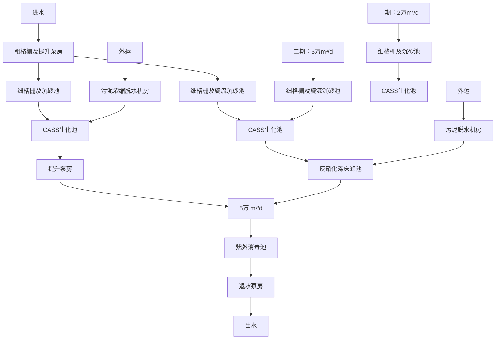

# 建设项目环境影响报告表

（污染影响类）

项目名称：睿得新材料科技（佛山）有限公司建设项目建设单位（盖章）：睿得新材料科技（佛山）有限公司

编制日期：2023年 4月

中华人民共和国生态环境部制

编制单位和编制人员情况表

<table><tr><td colspan="2">项目编号</td><td>gj8649</td></tr><tr><td colspan="2">建设项目名称</td><td>睿得新材料科技(佛山)有限公司建设项目</td></tr><tr><td colspan="2">建设项目类别</td><td>26-053塑料制品业</td></tr><tr><td colspan="2">环境影响评价文件类型</td><td>报告表</td></tr><tr><td colspan="3">一、建设单位情况</td></tr><tr><td colspan="2">单位名称(盖章)</td><td>睿得新材料科技(佛山)有限公司</td></tr><tr><td colspan="2">统一社会信用代码</td><td rowspan="15"></td></tr><tr><td colspan="2">法定代表人(签章)</td></tr><tr><td colspan="2">主要负责人(签字)</td></tr><tr><td colspan="2">直接负责的主管人员(签字)</td></tr><tr><td colspan="2">二、编制单位情况</td></tr><tr><td colspan="2">单位名称(盖章)</td></tr><tr><td colspan="2">统一社会信用代码</td></tr><tr><td colspan="2">三、编制人员情况</td></tr><tr><td colspan="2">1.编制主持人</td></tr><tr><td>姓名</td><td>职业员</td></tr><tr><td>张序翔</td><td>202205</td></tr><tr><td colspan="2">2.主要编制人员</td></tr><tr><td>姓名</td><td>主</td></tr><tr><td>罗昕朗</td><td>建设项目基本状、环境保护督检查清</td></tr><tr><td>张序翔</td><td>建设项目工程环境影响</td></tr></table>

# 环境影响评价工程师

Environmental Impact Assessment Engineer

本证书由中华人民共和国人力资源和社会保障部、生态环境部批准颁发，表明持证人通过国家统一组织的考试，取得环境影响评价工程师职业资格。

text_image

中华人民共和国人力资源和社会保障部

人民共部

text_image

中华人民共和国生态环境部

境部

# 目录

一、建设项目基本情况···

二、建设项目工程分析

三、区域环境质量现状、环境保护目标及评价标准 12

四、主要环境影响和保护措施· 17

五、环境保护措施监督检查清单 32

六、结论·· ··35

附表· ··36

建设项目污染物排放量汇总表···· ···· 36

# 一、建设项目基本情况

<table><tr><td>建设项目名称</td><td colspan="3">睿得新材料科技(佛山)有限公司建设项目</td></tr><tr><td>项目代码</td><td colspan="3">无</td></tr><tr><td>建设单位联系人</td><td>崔**</td><td>联系方式</td><td>1348029****</td></tr><tr><td>建设地点</td><td colspan="3">佛山市顺德区陈村镇顺智科创园5栋601室</td></tr><tr><td>地理坐标</td><td colspan="3">(22度58分43.620秒,113度14分17.071秒)</td></tr><tr><td>国民经济行业类别</td><td>C2929塑料零件及其他塑料制品制造</td><td>建设项目行业类别</td><td>二十六、橡胶和塑料制品业29,53、塑料制品业292”中的“其他(年用非溶剂型低VOCs含量涂料10吨以下的除外)</td></tr><tr><td>建设性质</td><td>☑新建(迁建)□改建□扩建□技术改造</td><td>建设项目申报情形</td><td>☑首次申报项目□不予批准后再次申报项目□超五年重新审核项目□重大变动重新报批项目</td></tr><tr><td>项目审批(核准/备案)部门(选填)</td><td>/</td><td>项目审批(核准/备案)文号(选填)</td><td>/</td></tr><tr><td>总投资(万元)</td><td>620</td><td>环保投资(万元)</td><td>31</td></tr><tr><td>环保投资占比(%)</td><td>5%</td><td>施工工期</td><td>1个月</td></tr><tr><td>是否开工建设</td><td>√否□是:</td><td>用地(用海)面积(m2)</td><td>1239.68</td></tr><tr><td>专项评价设置情况</td><td colspan="3">无</td></tr><tr><td>规划情况</td><td colspan="3">无</td></tr><tr><td>规划环境影响评价情况</td><td colspan="3">无</td></tr><tr><td>规划及规划环境影响评价符合性分析</td><td colspan="3">无</td></tr><tr><td>其他符合性分析</td><td colspan="3">1、本项目与顺德区“三线一单”相符性分析(1)生态保护红线:根据《广东省人民政府关于印发广东省“三线一单”生态环境分区管控方案的通知》(粤府〔2020〕71号)和《佛山市顺德区人民政府关于印发佛山市顺德区“三线一单”生态环境分区管控方案的通知》(顺府发〔2021〕11号),本项目选址位于省管控单元中的“重点管控单元”,属于陈村镇重点管控区(编号:ZH44060620010)。项目选址单元不属于“涵盖生态保护红线、一般生态空间、饮用水水源保护区、环境空气质量一类功能区等区域的优先保护区”。因此,项目不涉及生态保护红线。环境质量底线:根据《佛山市生态环境局顺德分局关于发布2021年度佛山市顺德区生态环境状况公报的通知》(佛环顺函〔2022〕13号),顺德区除 $O_{3}$ 年均浓度超过《环境空气质量标准》(GB3095-2012)及2018年修改单二级标准限值外,其余五项污染物指标浓度均能达到《环境空气质量标准》(GB3095-2012)及2018年修改单二级标准限值,顺德区大气环境质量属不达标区;地表水陈村水道各项水质指标均达到《地表水环境质量标准》(GB3838-2002)III类标准。(1)与大气环境功能区的分析本项目所在地为大气环境二类功能区,本项目生产过程产生的有机废气、恶臭经“两级活性炭吸附”处理后达标排放,不会对周围大气环境造成影响。(2)与水环境功能区的分析项目纳污水体陈村水道为III类水体功能,项目生活污水经园区三级化粪池处理后,排入陈村污水处理厂处理,尾水排入陈村水道,项目无生产废水排放,生活污水经园区三级化粪池预处理达到广东省《水污染物排放限值》(DB44/26-2001)第二时段三级标准后排入陈村污水处理厂,经对纳污水体影响较少。综合分析,本项目的建设不会突破当地环境质量底线。资源利用上线:本项目运营期所用的资源主要为水资源、电能。本项目给水由市政供水接入,电能由区域电网供应,符合《佛山市顺德区人民政府关于印发佛山市顺德区“三线一单”生态环境分区管控方案的通知》(顺府发〔2021〕11号)文件中的能源资源利用要求,同时本项目所用以上资源占比极少,不会突破当地的资源利用上线。项目所在地用途为工业用途,符合当地土地规划要求。</td></tr></table>

生态环境准入清单：本项目不在《产业结构调整指导目录（2019年本》及 2021 年修改单限制类、淘汰类之列，不属于《市场准入负面清单（2022 年版）》中规定的禁止和许可准入的行业类别。项目产品不属于《环境保护综合名录》（2021 年版）中“高污染、高环境风险”产品，不属于《促进产业结构调整暂行规定》中限制类、淘汰类之列，符合规定要求。项目不属于《顺德区村级工业园升级改造项目产业准入负面清单》（2019 年本）中限制类和禁止类。因此项目符合相关产业政策、规划的要求。

本项目所在区域属于顺德区三线一单中“广东省佛山市顺德区陈村镇重点管控区”，编号：ZH44060620010。根据项目生产产品、原材料、工艺等分析，本项目不属于单元“空间布局约束”中产业/限制类、大气/限制类、大气/限制类，不属于单元“能源资源利用”中土地资源/限制类、岸线/禁止类，不属于单元“污染物排放管控”中的水/限制类。

表1-1 与顺德区三线一单相符性分析

<table><tr><td>管控单元编码及名称</td><td>管控维度</td><td>管控要求</td><td>本项目概况</td><td>相符性</td></tr><tr><td>陈村镇重点管控区,编号:ZH44060620010(重点管控单元10)</td><td>空间布局约束</td><td>1-1.【产业/鼓励引导类】重点发展智能装备制造、新一代电子信息、新材料等新兴产业;结合TOD片区开发,对接广深港资源,大力发展生产性服务业、高端商务服务业和中小企业总部集群;培育以花卉产业为特色,向电商、会展、文创旅游等延伸的现代农业产业链。1-2.【产业/综合类】系统推进村级工业园升级改造,腾出连片空间,布局产业集聚区和主题产业园,推动工业项目入园集聚发展。新增工业制造业用地原则上安排在产业集聚区内,产业集聚区外原则上不鼓励工业及物流仓储用地的新建与改造。1-3.【产业/综合类】产业聚集区所属地块内的工业用地或企业与村庄、学校等环境敏感点之间应设置合理的大气环境防护距离,并通过绿化带进行有效隔离;聚集区规划布局应注重大气污染排放企业应尽量避免布局在居住用地的常年主导风向的上风向。1-4.【产业/限制类】受纳水体或监控断面不达标的,不得新建、扩建向河涌直接排放废水的项目。新建、扩建含蚀刻工</td><td>1-1 本项目不属于。1-2 本项目所在地不属于村级工业园升级改造区域。1-3 本项目与最近敏感点距离为324m,本项目不需要设置大气环境防护距离,项目对周围环境和敏感点的影响不大。1-4 项目不属于上述限制类项目。</td><td>符合</td></tr></table>

<table><tr><td rowspan="2"></td><td></td><td></td><td>序的线路板生产项目和化工项目应在配套污水集中处置的工业园区或生活污水管网覆盖区域内建设;纯加工型印花项目,含酸洗、磷化的金属表面处理、金属制品项目(与自身高新技术企业配套的除外),含酸洗、喷涂、化学抛光、电解等涉及废水排放工艺的不锈钢型材加工项目(与自身高新技术企业配套的除外),应进入以此类项目为主导产业、有相应废水集中治理设施的工业园区,实现集中治污。1-5.【产业/综合类】划定家具生产优先发展区域,优先发展区外不再新建涉及涂装工艺的木质家具制造项目。1-6.【大气/限制类】大气环境受体敏感重点管控区内,应严格限制新建储油库项目、产生和排放有毒有害大气污染物的建设项目以及使用溶剂型油墨、涂料、清洗剂、胶黏剂等高挥发性有机物原辅材料项目,鼓励现有该类项目搬迁退出。1-7.【大气/限制类】大气环境布局敏感区重点管控区内,应严格限制新建生产和使用高挥发性有机物原辅材料项目,优先开展低VOCs含量原辅材料替代,强化无组织排放控制。原则上不再新建、扩建新增氮氧化物、烟(粉)尘排放量较大的建设项目。</td><td>1-5本项目不涉及。1-6项目无有毒有害大气污染物产生和排放,不使用溶剂型油墨、涂料、清洗剂、胶黏剂等高挥发性有机物原辅材料。1-7项目无氮氧化物、颗粒物产生和排放,不使用溶剂型油墨、涂料、清洗剂、胶黏剂等高挥发性有机物原辅材料。</td><td></td></tr><tr><td>陈村镇重点管控区,编号:ZH44060620010(重点管控单元10)</td><td>能源资源利用</td><td>2-1.【能源/鼓励引导类】推广节能技术,加快发展绿色货运与现代物流。2-2.【能源/鼓励引导类】推广新能源汽车应用和充电基础设施建设,积极推动重卡LNG加气站、充电基础设施、加氢站建设。2-3.【能源/综合类】科学实施能源消费总量和强度“双控”,新建高能耗项目单位产品(产值)能耗达到国际国内先进水平。2-4.【水资源/综合类】贯彻落实“节水优先”方针,实行最严格水资源管理制度,陈村镇万元国内生产总值用水量、万元工业增加值用水量、用水总量、农田灌溉水有效利用系数等用水总量和效率指标达到区下达要求。2-5.【土地资源/限制类】落实单位土地面积投资强度、土地利用强度等建设用地控制性指标要求,提高土地利用效率。2-6.【岸线/禁止类】严格水域岸线用途管制,新建项目一律不得违规占用水域。严禁破坏生态的岸线利用行为和不符合其功能定位的开发建设活动,严禁以各种名义侵占河道、围垦湖泊、非法采砂等。</td><td>2-1本项目不适用。2-2本项目不适用。2-3本项目不属于高能耗项目。2-4本项目冷却水循环使用,用水量较少。2-5本项目满足政府提出的投资强度、利用强度等指标要求。2-6本项目不适用。</td><td>符合</td></tr><tr><td></td><td>陈村镇重点管控区,编号:ZH44060620010(重点管控单元10)</td><td>污染物排放管控</td><td>3-1.【水/限制类】城镇新区建设实行雨污分流。住宅、商业体、学校、市场等城镇开发建设项目应当配套或者同步计划建设公共排水设施,公共排水设施或自建排污水设施未能投产运行的,以上涉水项目不得投入使用。新建小区严格实施雨污分流,阳台、露台等污水接入污水收集系统,将生活污水“应截尽截”。做好大型楼盘、集贸市场、餐饮以及学校等4大类排水户污水接入市政管网工作。3-2.【水/综合类】陈村镇重点河涌水质上年度未达到水环境质量目标的,需组织编制、系统实施、向社会公开区域重点水污染物减排计划并明确“替代量”,本年度新建、改建、扩建项目新增水环境重点污染物实行区域“减二增一”替代(工业、生活或综合集中废水处理设施、民生项目除外)。3-3.【水/综合类】结合村级工业园改造,全面提升产业层次与集聚度,促进污染集中整治。3-4.【水/综合类】稳步推进排水设施“三个一体化”管理模式,补齐城乡污水收集和处理短板,推动陈村污水处理厂提质增效,加快消除城中村、老旧城区、城乡结合部等污水收集管网空白区,逐步实现城乡污水收集处理全覆盖。2025年前完成陈村污水处理厂扩建,尾水应执行《城镇污水处理厂污染物排放标准》(GB18918-2002)一级A标准及《广东省水污染物排放限值》(DB44/26-2001)的较严 值。3-5.【水/综合类】完善污水管网建设,逐步取消现状农村污水处理站点,有条件的区域实施雨污分流改造;至2030年全面雨污分流,农村生活污水纳入陈村城镇污水处理系统。3-6.【水/综合类】产业集聚区和主题园区内做好污水管网和污水集中处理设施的配套保障,确保废水收集到城镇污水处理厂、园区污水处理厂或分散式污水处理设施集中处置。</td><td>3-1本项目实行雨污分流,项目生活污水经园区三级化粪池处理后,排入陈村污水处理厂处理,冷却水循环使用,定期排水,作清净下水排放。3-2本项目无生产废水外排。3-3本项目所在地不属于村级工业园。3-4本项目不适用。3-5本项目实行雨污分流,无生产废水外排。生活污水纳入陈村城镇污水处理系统。3-6 本项目实行雨污分流,无生产废水外排。生活污水纳入陈村城镇污水处理系统。</td><td>符合</td></tr><tr><td rowspan="2"></td><td>陈村镇重点管控区,编号:ZH44060620010(重点管控单元10)</td><td>环境风险防控</td><td>4-1.【水/综合类】陈村污水处理厂、工业污水集中处理设施应采取有效措施,防止事故废水直接排入水体。完善污水处理厂在线监控系统联网,实现污水处理厂的实时、动态监管。4-2.【风险/综合类】加强环境风险分级分类管理,强化金属制品、有色金属和压延加工、化学原料和化学品制造业等涉重金属、化工行业企业及工业园区等重点环境风险源的环境风险防控。</td><td>4-1 本项目无生产废水外排,生活污水经预处理后排入陈村城镇污水处理系统。4-2 本项目风险防控措施具备可行性,整体风险可控。</td><td>符合</td></tr><tr><td colspan="5">综上,本项目符合“三线一单”要求。2、选址合理性分析:项目位于佛山市顺德区陈村镇顺智科创园5栋601室,根据项目房产预售合同(见附件3),项目所在地块【国有土地使用证号】为粤(2020)佛顺不动产权第0072474号,项目所在地现状用途为工业用地,土地功能符合要求。根据佛山市顺德区人民政府关于同意《顺德区陈村镇广隆集约工业园区控制性详细规格》局部调整的批复(顺府复[2018]31号),项目所在地土地利用规划为工业用地(详见附图9)。</td></tr></table>

# 二、建设项目工程分析

# 1、项目工程组成

睿得新材料科技（佛山）有限公司建设项目拟建于佛山市顺德区陈村镇顺智科创园 5 栋 601室，所在地中心地理坐标为 22 度 58 分 43.620秒，113度 14分 17.071秒，详见附图 1。项目占地面积 1239.68m2，经营面积 1239.68m2。本项目主要从事氟树脂塑料的加工生产，年产聚氟乙烯塑料产品 60 吨、聚四氟乙烯塑料产品 20 吨。

根据《中华人民共和国环境保护法》、《中华人民共和国环境影响评价法》、国务院令第682 号《国务院关于修改〈建设项目环境保护管理条例〉的决定》等有关法律法规的规定，本项目须执行环境影响审批制度。根据《建设项目环境影响评价分类管理名录（2021 版》（自 2021年 1 月 1 日起施行），本项目属于“二十六、橡胶和塑料制品业 29，53、塑料制品业 292”中的“其他（年用非溶剂型低 VOCs 含量涂料 10 吨以下的除外）”，需编制建设项目环境影响报告表。

项目占地面积 1239.68m2，经营面积 1239.68m2，从业总人数为 10 人，年工作 300 天，每天工作 8 小时，工作时间为 8：30\~12：00，13：00\~17：30，不设员工饭堂和宿舍。项目工程组成如表 2-1 所示。

表 2-1 项目工程组成

<table><tr><td>项目</td><td>工程内容</td><td>工程</td></tr><tr><td>主体工程</td><td>生产车间</td><td>项目位于一座六层生产厂房内,层高6m,本项目位于其五层东侧一半,总面积1239.68平方米。项目生产厂房内含生产车间,其中生产车间面积为650平方米。项目所在生产厂房一层为隆深机器人生产车间,其余楼层为空厂房。</td></tr><tr><td>辅助工程</td><td>办公室</td><td>位于厂房南侧,总面积约200平方米</td></tr><tr><td>储运工程</td><td>仓库</td><td>产品、原料存放区(位于厂房内南侧、东侧),总面积约175平方米</td></tr><tr><td>公用工程</td><td>供水、供电系统</td><td>生活和生产用水由市政管网供应,通过市电引入厂区,通过配电线路至各车间。</td></tr><tr><td rowspan="6">环保工程</td><td>生活污水</td><td>生活污水经园区三级化粪池处理后,经市政管道排入陈村污水处理厂处理</td></tr><tr><td>生产废水</td><td>冷却水循环使用,定期排水,作清净下水排放,需补充新鲜用水</td></tr><tr><td>生产废气</td><td>生产过程产生的废气收集经一套“两级活性炭吸附”装置处理后,由36m高排气筒G1排放</td></tr><tr><td>生产噪声</td><td>生产设备做减振处理,墙体隔音、距离衰减</td></tr><tr><td rowspan="2">固体废物</td><td>生活垃圾交环卫部门处理。边角料等一般固废分类收集,暂存在规范的一般固废暂存场所内,交由回收商处理,一般固废暂存间位于厂房东北侧,占地约 $10m^{2}$ </td></tr><tr><td>废包装桶、废活性炭等危险废物暂存在规范的危险废物暂存设施内,定期交由有相应危废处置资质单位处理,危险废物暂存间位于厂房西北侧,占地约 $8m^{2}$ </td></tr></table>

# 2、主要产品及产能

项目产品及产能情况见下表2-2。

表 2-2 项目产品及产能一览表

<table><tr><td>类别</td><td>名称</td><td>单位</td><td>数量</td><td>备注</td></tr><tr><td rowspan="2">产品产量</td><td>聚氟乙烯塑料产品</td><td>吨/年</td><td>60</td><td>白色,为塑料薄膜,厚度约50μm</td></tr><tr><td>聚四氟乙烯塑料产品</td><td>吨/年</td><td>20</td><td>白色,为塑料薄膜,厚度约50μm</td></tr></table>

# 3、项目设备清单

项目主要生产单元、主要工艺、生产设施及设施参数见表2-3。

表 2-3 主要生产单元、主要工艺、生产设施及设施参数一览表

<table><tr><td>序号</td><td>主要生产单元</td><td>主要工艺</td><td>名称</td><td>单位</td><td>数量</td><td>备注</td></tr><tr><td>1</td><td>双螺杆挤出机组</td><td>挤出</td><td>双螺杆挤出机组</td><td>套</td><td>5</td><td>用于挤出,用于生产聚氟乙烯</td></tr><tr><td>2</td><td>聚四氟乙烯推挤组</td><td>挤出、熟成、压延、高温处理、烧结</td><td>聚四氟乙烯推挤组</td><td>套</td><td>2</td><td>用于挤出,用于生产聚四氟乙烯</td></tr><tr><td>3</td><td>单螺杆挤出机组</td><td>挤出</td><td>单螺杆挤出机组</td><td>套</td><td>2</td><td>用于挤出,用于生产聚氟乙烯</td></tr><tr><td>4</td><td>冷却塔</td><td>冷却</td><td>冷却塔</td><td>台</td><td>3</td><td>用于冷却</td></tr></table>

# 4、项目原辅材料

主要原辅材料及燃料的种类和用量见表2-4。

表 2-4 主要原辅材料及燃料参数一览表

<table><tr><td>类别</td><td colspan="2">名称</td><td>单位</td><td>数量</td><td>性状</td><td>包装规格</td><td>最大储存量</td><td>备注</td></tr><tr><td rowspan="6">主要原辅材料</td><td colspan="2">氟树脂</td><td>吨/年</td><td>80</td><td>白色透明颗粒</td><td>50kg/袋</td><td>8</td><td>用于挤出</td></tr><tr><td rowspan="4">其中包括</td><td>ETFE(乙烯—四氟乙烯共聚物)</td><td>吨/年</td><td>20</td><td>淡黄色颗粒</td><td>50kg/袋</td><td>2</td><td>用于挤出,用于生产聚氟乙烯</td></tr><tr><td>PFA(全氟丙基全氟乙烯基醚与聚四氟乙烯的共聚物)</td><td>吨/年</td><td>20</td><td>白色颗粒</td><td>50kg/袋</td><td>2</td><td>用于挤出,用于生产聚氟乙烯</td></tr><tr><td>FEP(氟化乙烯丙烯共聚物)</td><td>吨/年</td><td>20</td><td>透明颗粒</td><td>50kg/袋</td><td>2</td><td>用于挤出,用于生产聚氟乙烯</td></tr><tr><td>PTFE(聚四氟乙烯)</td><td>吨/年</td><td>20</td><td>透明颗粒</td><td>50kg/袋</td><td>2</td><td>用于挤出,用于生产聚氟乙烯</td></tr><tr><td colspan="2">异烷烃</td><td>吨/年</td><td>1</td><td>无色透明液体</td><td>150kg/桶</td><td>0.3</td><td>用于挤出,用于生产聚四氟乙烯,项目使用的异烷烃为异构十六烷烃</td></tr><tr><td rowspan="3">能源</td><td colspan="2">电</td><td>万千瓦时/年</td><td>30</td><td>/</td><td>/</td><td>/</td><td>/</td></tr><tr><td colspan="2">生活用水</td><td> $m^3/a$ </td><td>100</td><td>/</td><td>/</td><td>/</td><td>/</td></tr><tr><td colspan="2">生产用水</td><td> $m^3/a$ </td><td>558</td><td>/</td><td>/</td><td>/</td><td>/</td></tr></table>

# 主要原辅料理化性质

ETFE：乙烯—四氟乙烯共聚物，是四氟乙烯与乙烯，以1比1比例共聚而成，是一种耐高温的氟塑料。也是氟塑料中比重最轻者，呈半透明，淡黄～褐色，具有良好的耐辐射性能。熔点260℃～280℃，分解温度>350℃，平均线胀系数4.0×10-5 /℃，具有良好的耐热、耐磨、耐化学性，其冲击强度和电绝缘性能也很好。

PFA：PFA塑料为少量全氟丙基全氟乙烯基醚与聚四氟乙烯的共聚物。熔融粘结性增强，溶 体粘度下降，而性能与聚四氟乙烯相比无变化。

FEP：全称为Fluorinated ethylene propylene，翻译为氟化乙烯丙烯共聚物（全氟乙烯丙烯共聚物） 英文商品名：Teflon\*FEP，是一类化学物质。FEP是四氟乙烯和六氟丙烯共聚而成的。FEP结晶熔化点为304℃，密度为2.15g/CC（克/立方厘米）。

PTFE：聚四氟乙烯（Poly tetra fluoroethylene，简写为 PTFE），俗称“塑料王”，是一种以四氟乙烯作为单体聚合制得的高分子聚合物，化学式为(C2F4)n，耐热、耐寒性优良，可在-180～260ºC 长期使用。这种材料具有抗酸抗碱、抗各种有机溶剂的特点，几乎不溶于所有的溶剂。

异烷烃：异构烃的来源之一是生物合成，与正构烷烃共生。在高等植物的蜡、海生植物和细菌的类脂物以及动物的毛中都发现有此类异构烷烃。密度 0.76g/cm3，清亮、无色、无味、蒸发速度快，相溶性非常好，密度、粘度小，油感极轻，辅展性及涂抹感优异，易生物降解，无残留感，肤感清爽，性质稳定，具有丝般滑爽的肤感。本项目使用的为异构十六烷烃，中度油感，润滑性高，耐酸碱，抗氧化的润滑剂，具有极低的雾点(-40℃)；蒸发速度非常快，能完全代替挥发性硅油。

# 5、给水与排水

# （1）给水：

项目用水由市政给水管网供应。用水主要为生产用水及员工生活用水。

# ①生活用水

项目使用已建成厂房，项目占地面积为1239.68m2，经营面积1239.68m2，从业人数为10人，年工作300天，每天工作8小时，厂内不设员工宿舍及饭堂。生活污水主要为员工办公产生的生活污水。根据下文工程分析，项目生活用水量为100m³/a。

# ②生产用水

项目挤出过程需使用水对其降温冷却。冷却水循环使用，定期补充新鲜用水，定期排水，排水作为清净下水外排。根据下文分析，项目三台冷却塔日均蒸发补充水量为 0.96m3/d（约合288m3 /a），三台冷却塔排水量为 0.9m³/d，则项目冷却塔补充新鲜用水为 558m3/a。

# （2）排水：

本项目无生产废水外排，生活污水经园区三级化粪池处理后，经市政管网排入陈村污水处理厂处理，污水处理厂尾水排入陈村水道。项目生活污水排放量为90m³/a。

# 6、劳动动员及工作制度

<table><tr><td></td><td>项目从业人数为10人,年工作日300天,每天工作8小时(工作时间为8:30~12:00,13:00~17:30)。7、厂区平面布置项目占地面积 $1239.68m^{2}$ ,经营面积 $1239.68m^{2}$ ,项目位于一座六层生产厂房内,本项目位于其五层东侧一半,项目生产厂房内含生产车间,项目生产车间约650平方米,每条双螺杆挤出机组、单螺杆挤出机组挤出线尺寸为 $3m\times8m$ ,占地面积为24平方米/条,聚四氟乙烯推出组尺寸为 $3m\times15m$ ,占地面积为45平方米/条,项目可满足9条挤出线安放。仓库(占地175平方米)位于车间东南部,办公室(占地200平方米)位于车间东南部,项目平面布置合理。项目平面布置见附图2。</td></tr><tr><td>工艺流程和产排污环节</td><td>项目主要从事聚氟乙烯塑料产品、聚四氟乙烯塑料产品生产,工艺流程如下:图2-1 聚氟乙烯产品生产工艺流程图工艺流程简述项目主要使用氟树脂(ETFE、PFA、FEP、PTFE等)作为原材料,外购的原材料在按照一定比例投入进行挤出,挤出温度为 $260^{\circ}C$ ,挤出成型时需使用冷却塔的自来水对其降温冷却,冷却水循环使用,定期补充新鲜用水。挤出分切加工后即为成品。经查聚氟乙烯分解温度为372-480°C,因此加工过程中基本不会产生除非甲烷总烃外其他特征污染物。</td></tr></table>

图 2-2 聚四氟乙烯产品工艺流程图

项目主要使用氟树脂（PTFE）、异烷烃作为原材料，外购的原材料在按照一定比例投入进行挤出，氟树脂（PTFE）、异烷烃混合后先进行低温熟成，熟成温度为30\~40℃，然后继续进行低温糊状挤出及低温压延，温度为120\~150℃，然后进行高温处理，蒸发异烷烃，蒸发温度为250℃，高温处理后成品进行高温烧结，烧结温度为360℃，烧结完成后即为成品。PTFE成型温度为320-360℃，PTFE分解温度为508-538℃，因此加工过程中基本不会产生除非甲烷总烃外其他特征污染物。

根据工艺流程及产污图，主要污染工序见下表2-5。

表2-5 主要污染工序

<table><tr><td>类别</td><td>产生工序</td><td>名称</td><td>主要污染物</td></tr><tr><td rowspan="2">废水</td><td>员工生活</td><td>生活污水</td><td>pH、 $COD_{Cr}$ 、 $BOD_5$ 、氨氮、SS</td></tr><tr><td>冷却塔冷却</td><td>冷却废水</td><td>pH、SS、盐分</td></tr><tr><td>废气</td><td>挤出、熟成、压延、高温处理、烧结</td><td>生产废气</td><td>非甲烷总烃、臭气浓度、氟化氢</td></tr><tr><td>噪声</td><td colspan="3">各类生产设备运行时产生的噪声</td></tr><tr><td>固体废物</td><td>员工生活</td><td colspan="2">生活垃圾</td></tr><tr><td>一般工业固废</td><td>挤出分切</td><td colspan="2">边角料</td></tr><tr><td rowspan="3">危废</td><td rowspan="2">维修过程</td><td>废机油</td><td>废机油</td></tr><tr><td>含油废抹布及手套</td><td>废机油</td></tr><tr><td>生产过程</td><td>废活性炭</td><td>饱和活性炭</td></tr></table>

本项目为新建项目，无与项目有关的原有环境污染问题。

# 三、区域环境质量现状、环境保护目标及评价标准

# 1、大气环境：

根据《佛山市生态环境局顺德分局关于发布 2021 年度佛山市顺德区生态环境状况公报的通知》（佛环顺函〔2022〕13号），2021年顺德区空气质量综合指数为 3.48，比 2020年上升 5.5%，在全市五区中排名第二。

2021年，按照《环境空气质量标准》评价，顺德区二氧化硫 $( \mathsf { S O } _ { 2 } )$ 、二氧化氮 $\left( \mathbf { N O } _ { 2 } \right)$ 、可吸入颗粒物 $\left( \mathrm { { P M } _ { 1 0 } } \right)$ 、细颗粒物 $\left( \mathbf { P M } _ { 2 . 5 } \right)$ 、一氧化碳（CO）五项污染物年评价浓度均达到二级标准，臭氧（O3）超标。详见下表。

表3-1 2021年顺德区（国控测点）环境空气污染物达标判定情况

<table><tr><td rowspan="2">污染物</td><td>浓度均值</td><td rowspan="2">评价标准</td><td rowspan="2">占标率</td><td rowspan="2">达标情况</td></tr><tr><td>2021年</td></tr><tr><td> $SO_{2}$ (μg/m3)</td><td>6</td><td>60</td><td>10%</td><td>达标</td></tr><tr><td> $NO_{2}$ (μg/m3)</td><td>33</td><td>40</td><td>83%</td><td>达标</td></tr><tr><td> $PM_{10}$ (μg/m3)</td><td>42</td><td>70</td><td>60%</td><td>达标</td></tr><tr><td> $PM_{2.5}$ (μg/m3)</td><td>22</td><td>35</td><td>63%</td><td>达标</td></tr><tr><td> $CO^{*}$ (mg/m3)(年评价浓度)</td><td>1.0</td><td>4</td><td>25%</td><td>达标</td></tr><tr><td> $O_{3}-8H^{*}$ (μg/m3)(年评价浓度)</td><td>173</td><td>160</td><td>108%</td><td>超标</td></tr></table>

bar

| Category | 2020年 | 2021年 |
|---|---|---|
| SO₂ | 7 | 6 |
| NO₂ | 30 | 33 |
| PM₁₀ | 43 | 42 |
| PM₂.₅ | 21 | 22 |
| O₃ | 155 | 173 |
| CO | 1.0 | 1.0 |

顺德区城市空气各项污染物年评价浓度  
（CO单位为毫克/立方米，其余为微克/立方米）  
图 3-12021年顺德区（国控测点）环境空气污染物浓度水平年度比较图

根据 2021 年全区的大气环境质量状况公报，除 ${ { \mathrm O } _ { 3 } }$ 年均浓度超过《环境空气质量标准》（GB3095-2012）及 2018 年修改单二级标准限值外，其余五项污染物指标浓度均能达到《环境空气质量标准》（GB3095-2012）及 2018 年修改单二级标准限值，顺德区大气环境质量属不达标区。

顺德区设置了环境空气质量达标规划的目标，并通过优化产业结构和布局，推进能源结构调整，不断巩固火电行业超低排放和工业锅炉整治成果，深化机动车船等移动污染源污染控制，加快推进挥发性有机物综合整治，提高扬尘、餐饮业管理水平，促进多污染物协同控制及区域联防联控，提升大气污染精细化防控能力。届时，佛山市顺德区的环境空气质量将得到较大改善。

# 2、地表水

根据《广东省地表水功能区划》（粤环[2011]14号），陈村水道属于 III 类水环境功能区，水环境质量执行《地表水环境质量标准》（GB3838-2002）中的 III 类水质标准。

为评价陈村水道水环境质量现状，引用顺德区环境保护监测站 2020 年第四季度对陈村水道江口断面的常规监测数据进行评价，监测结果见表 3-2。

表 3-2 2020年第四季度陈村水道江口断面的常规监测数据

<table><tr><td colspan="3">潭州水道</td><td>水温(°C)</td><td>pH值</td><td>溶解氧</td><td>高锰酸盐指</td><td>化学需氧量</td><td>生化需氧量</td><td>氨氮</td><td>总磷</td><td>石油类</td><td>粪大肠菌群(个/L)</td></tr><tr><td rowspan="6">江口断面监测结果</td><td rowspan="2">10月(10.10)</td><td>涨潮</td><td>25.8</td><td>7.44</td><td>6.17</td><td>1.9</td><td>9</td><td>1.5</td><td>0.305</td><td>0.06</td><td>0.01</td><td>2400</td></tr><tr><td>退潮</td><td>25.5</td><td>7.42</td><td>6.05</td><td>1.9</td><td>10</td><td>1.5</td><td>0.319</td><td>0.06</td><td>0.02</td><td>3500</td></tr><tr><td rowspan="2">11月(11.04)</td><td>涨潮</td><td>23.9</td><td>7.61</td><td>5.44</td><td>2.3</td><td>7</td><td>2.7</td><td>0.479</td><td>0.08</td><td>0.01</td><td>2400</td></tr><tr><td>退潮</td><td>23.7</td><td>7.54</td><td>5.7</td><td>2.</td><td>9</td><td>2.5</td><td>0.462</td><td>0.09</td><td>0.02</td><td>3500</td></tr><tr><td rowspan="2">12月(12.02)</td><td>涨潮</td><td>20.2</td><td>7.55</td><td>7.34</td><td>2.1</td><td>9</td><td>2.4</td><td>0.589</td><td>0.08</td><td>0.02</td><td>3500</td></tr><tr><td>退潮</td><td>20.3</td><td>7.53</td><td>7.46</td><td>2.1</td><td>9</td><td>2.7</td><td>0.572</td><td>0.07</td><td>0.01</td><td>3500</td></tr><tr><td rowspan="5">评价</td><td colspan="2">最大值</td><td>25.8</td><td>7.61</td><td>7.46</td><td>2.3</td><td>10</td><td>2.7</td><td>0.589</td><td>0.09</td><td>0.02</td><td>3500</td></tr><tr><td colspan="2">最小值</td><td>20.2</td><td>7.42</td><td>5.44</td><td>1.9</td><td>7</td><td>1.5</td><td>0.305</td><td>0.06</td><td>0.01</td><td>2400</td></tr><tr><td colspan="2">III类水质标</td><td>--</td><td>6.0-9.0</td><td>5</td><td>6</td><td>20</td><td>4</td><td>1</td><td>0.2</td><td>0.05</td><td>10000</td></tr><tr><td colspan="2">最大标准指数</td><td>--</td><td>--</td><td>--</td><td>0.38</td><td>0.50</td><td>0.68</td><td>0.59</td><td>0.45</td><td>0.40</td><td>0.35</td></tr><tr><td colspan="2">最低检出限L</td><td>0.1</td><td>0.01</td><td>0.01</td><td>0.5</td><td>5.0</td><td>0.5</td><td>0.025</td><td>0.010</td><td>0.01</td><td>200</td></tr><tr><td colspan="13">备注:未列指标铜、锌、氟化物、硒、砷、汞、镉、六价铬、铅、氰化物、挥发酚、阴离子表面活性剂、硫化物等均达标。</td></tr></table>

从监测结果可知，陈村水道江口断面水质指标满足《地表水环境质量标准》（GB3838-2002）之Ⅲ类水功能要求。陈村水道水质现状良好。

2021 年顺德区 3 个国控断面（科研断面羊额，考核断面乌洲、顺德港）、3 个省控断面（杨滘、海凌、飞鹅山）均达到相应的水质目标，水质优良率（Ⅰ～Ⅲ类）为 100%，与 2020

<table><tr><td></td><td colspan="6">年持平。流经我区及周边城市交界水域16条主要河流的23个功能区监测断面水质均为优良,全年平均值达标率为100%。23个断面中,II类和III类分别占74%、26%。与2020年相比,II类比例下降9个百分点,III类比例上升9个百分点。3、声环境项目所在地属于2类声环境功能区,项目厂界外50m范围内无环境敏感目标,无需开展声环境质量现状调查。4、生态环境项目用地范围内无生态环境保护目标,无需开展生态现状调查。5、土壤环境、地下水环境项目所在厂房已进行硬底化处理,不存在地下水环境、土壤环境污染途径,不开展地下水环境、土壤环境质量现状调查。</td></tr><tr><td rowspan="6">环境保护目标</td><td colspan="6">1、地表水环境项目纳污水体陈村水道为III类水体功能,地表水环境保护目标为保证纳污水体不因本项目的建设而改变其水环境功能区类别。2、大气环境本项目所在地为大气环境二类功能区,大气环境保护目标为确保项目所在区域的空气质量不因本项目的建设造成明显不利的影响,不因本项目的建设改变现在的质量等级状况。厂界外500米范围内保护目标见表3-3。表3-3 厂界外500米范围内主要大气环境保护目标</td></tr><tr><td>名称</td><td>保护对象</td><td>保护内容</td><td>环境功能区</td><td>相对厂址方位</td><td>相对厂界距离/m</td></tr><tr><td>勒竹社区</td><td>居民</td><td>人群健康</td><td>大气二类</td><td>西南面</td><td>324</td></tr><tr><td>星盛花园</td><td>居民</td><td>人群健康</td><td>大气二类</td><td>西南面</td><td>412</td></tr><tr><td>新希望悦珑湾</td><td>居民</td><td>人群健康</td><td>大气二类</td><td>西南面</td><td>494</td></tr><tr><td colspan="6">2、声环境本项目所在地属于2类声环境功能区,项目所在地执行《声环境质量标准》(GB3096-2008)2类标准:昼间≤60dB(A),夜间≤50dB(A)。3、地下水环境本项目厂界外500米范围内无地下水集中式饮用水水源和热水、矿泉水、温泉等特殊地下水资源。4、生态环境项目用地范围内无生态环境保护目标。</td></tr></table>

# 1、水污染物排放标准：

项目外排废水为生活污水，无生产废水外排。生活污水经园区三级化粪池处理后，经市政管道排入陈村污水处理厂处理。项目生活污水处理达到广东省《水污染物排放限值》（DB44/26-2001）中的三级标准（第二时段）后输送至陈村污水处理厂处理，尾水排入陈村水道，污水处理厂尾水执行《城镇污水处理厂污染物排放标准》（GB18918-2002）一级 A 标准和广东省地方标准《水污染物排放限值》（DB44/26-2001）第二时段一级标准的较严者，见表 3-4；

表 3-4 生活污水排放标准限值一览表

<table><tr><td>类别</td><td>污染物标准</td><td> $COD_{Cr}$ </td><td> $BOD_5$ </td><td>SS</td><td> $NH_3-N$ </td><td>单位</td></tr><tr><td rowspan="2">生活污水</td><td>(DB44/26-2001)第二时段三级标准</td><td>500</td><td>300</td><td>400</td><td>---</td><td>mg/L</td></tr><tr><td>陈村污水处理厂尾水</td><td>40</td><td>10</td><td>10</td><td>5</td><td>mg/L</td></tr></table>

# 2、大气污染物排放标准：

项目挤出、熟成、压延、高温处理、烧结过程排放的非甲烷总烃执行《合成树脂工业污染物排放标准》（GB31572-2015）中表 4 大气污染物排放限值和表 9 企业边界大气污染物排放限值。

项目加工过程可能会产生微量氟化氢废气，氟化氢有组织排放执行《合成树脂工业污染物排放标准》（GB31572-2015）中表 4 大气污染物排放限值，氟化物无组织排放执行广东省地方标准《大气污染物排放限值》（DB44/27-2001）第二时段无组织排放监控浓度限值。

挤出、熟成、压延、高温处理、烧结过程产生的臭气浓度执行《恶臭污染物排放标准》（GB 14554-93）中表 1 恶臭污染物厂界标准值的二级新扩改建标准和表 2 恶臭污染物排放标准值，具体如下。

表 3-5 项目废气排放标准（有组织）

<table><tr><td rowspan="2">工序</td><td rowspan="2">排气筒(m)</td><td rowspan="2">污染因子</td><td colspan="2">有组织</td><td rowspan="2">执行标准</td></tr><tr><td>最高允许排放浓度 $(mg/m^3)$ </td><td>最高允许排放速率(kg/h)</td></tr><tr><td rowspan="3">挤出、熟成、压延、高温处理、烧结</td><td rowspan="3">G1(36m)</td><td>非甲烷总烃</td><td>100</td><td>---</td><td>GB31572-2015</td></tr><tr><td>氟化氢</td><td>5</td><td>---</td><td>GB31572-2015</td></tr><tr><td>臭气浓度</td><td>20000(无量纲)</td><td>---</td><td>GB 14554-93</td></tr></table>

表 3-6 项目废气排放标准（无组织）

<table><tr><td>工序</td><td>污染因子</td><td>无组织排放浓度限值(mg/m3)</td><td>执行标准</td></tr><tr><td rowspan="3">挤出、熟成、压延、高温处理、烧结</td><td>非甲烷总烃</td><td>4.0</td><td>GB31572-2015</td></tr><tr><td>氟化物</td><td>0.02</td><td>DB44/27-2001</td></tr><tr><td>臭气浓度</td><td>20(无量纲)</td><td>GB 14554-93</td></tr></table>

根据《固定污染源挥发性有机物综合排放标准》（DB44/2367-2022），企业厂区内挥发

<table><tr><td rowspan="5"></td><td colspan="4">性有机物执行《固定污染源挥发性有机物综合排放标准》(DB44/2367-2022)表3厂区内VOCs无组织排放限值。表3-7厂区内VOCs无组织排放限值单位:mg/m3</td></tr><tr><td>污染物项目</td><td>排放限值</td><td>限值含义</td><td>无组织排放监控位置</td></tr><tr><td rowspan="2">NMHC</td><td>6</td><td>监控点处1h平均浓度值</td><td rowspan="2">在厂房外设置监控点</td></tr><tr><td>20</td><td>监控点处任意一次浓度值</td></tr><tr><td colspan="4">3、噪声排放标准:项目边界执行《工业企业厂界环境噪声排放标准》(GB12348-2008)中的2类标准:昼间≤60dB(A)、夜间≤50dB(A)。4、固体废物控制标准:项目产生的一般工业固体废物应分类收集,并暂存在规范的一般固废暂存场所,贮存过程应做好防渗漏、防雨淋、防扬尘措施,定期交由相关单位处理。危险废物执行《国家危险废物名录》以及《危险废物贮存污染控制标准》(GB18597-2023)。</td></tr><tr><td>总量控制指标</td><td colspan="4">本项目生活污水排放量为90m3/a,CODCr排放量为0.004t/a,NH3-N排放量为0.001t/a。生活经园区三级化粪池处理后排入陈村污水处理厂。根据《佛山市人民政府办公室关于印发&lt;佛山市排污权有偿使用和交易管理办法&gt;的通知》(佛府办[2020]19号),生活污水CODCr、NH3-N不单独分配总量。经核算,项目VOCs有组织排放量为0.228t/a,VOCs无组织排放为0.290t/a,建议项目新增分配VOCs总量指标0.518t/a。</td></tr></table>

# 四、主要环境影响和保护措施

本项目使用已建成厂房，不涉及厂房建设，施工过程主要是内部装修和设备安装，没有基建工程，因此施工期间不存在大型土建工程，施工期间产生的影响主要是由于设备运输、安装时产生的噪声等。

施工期较短，因此如果项目建设方加强施工管理，那么项目施工时不会对周围环境造成较大的影响。

# 1、废水

表4-1 项目废水类别、污染物项目及污染防治设施

<table><tr><td rowspan="2">序号</td><td rowspan="2">废水类别</td><td rowspan="2">污染物项目</td><td colspan="3">污染治理设施</td><td rowspan="2">污染物排放方式</td><td rowspan="2">排放规律</td><td rowspan="2">流向/排放去向</td><td rowspan="2">编号及名称</td><td rowspan="2">排放口类型</td><td colspan="2">坐标</td></tr><tr><td>污染防治设施名称及工艺</td><td>处理能力</td><td>是否为可行性技术</td><td>经度</td><td>纬度</td></tr><tr><td>1</td><td>员工生活污水</td><td>pH、 $COD_{Cr}$ 、 $BOD_5$ 、 $NH_3-N$ 、SS</td><td>三级化粪</td><td>0.1 $m^3/h$ </td><td>☑是☐否</td><td>间接排放</td><td>间断排放,排放期间流量不稳定</td><td>陈村污水处理厂</td><td>水-01:生活污水排放口</td><td>一般排放口</td><td>113.238132°</td><td>22.978387°</td></tr></table>

# 1.1 水污染物源强核算

# ◇生活污水

项目从业人数为 10人，年工作日 300天，项目不设有员工宿舍和食堂。根据《广东省用水定额》（DB44/T 1461.3-2021）无食堂无浴室按用水量 10m3 /人·年，则项目生活用水量为100m3 /a，排污系数取 0.9，则生活污水产生量为 90m3/a。

项目生活污水经园区三级化粪池处理后，排入陈村污水处理厂，生活污水处理达到广东省《水污染物排放限值》（DB44/26-2001）中的三级标准（第二时段），即 CODcr≤500mg/L，BOD5≤300mg/L，SS≤400mg/L 后，输送至陈村污水处理厂处理，尾水排入陈村水道，污水处理厂尾水执行《城镇污水处理厂污染物排放标准》（GB18918-2002）一级 A 标准和广东省地方标准《水污染物排放限值》（DB44/26-2001）第二时段一级标准的较严者后排放，尾水排入陈村水道。

参考环境保护部环境工程技术评估中心编制《环境影响评价（社会区域类）》教材中表5-18，类比同类型项目，计算项目生活污水污染物产生及排放情况，详见表 4-2。

表 4-2 项目生活污水产生排放情况

<table><tr><td rowspan="2">污染物</td><td colspan="2">产生情况</td><td colspan="2">项目排放口排放情况</td><td colspan="2">污水厂排放情况</td></tr><tr><td>产生浓度(mg/L)</td><td>产生量(t/a)</td><td>产生浓度(mg/L)</td><td>产生量(t/a)</td><td>排放浓度(mg/L)</td><td>排放量(t/a)</td></tr><tr><td> $COD_{Cr}$ </td><td>250</td><td>0.023</td><td>200</td><td>0.018</td><td>40</td><td>0.004</td></tr><tr><td> $BOD_5$ </td><td>100</td><td>0.009</td><td>50</td><td>0.005</td><td>10</td><td>0.001</td></tr><tr><td> ${\mathrm{{NH}}}_{3} - \mathrm{N}$ </td><td>30</td><td>0.003</td><td>25</td><td>0.002</td><td>5</td><td>0.001</td></tr><tr><td>SS</td><td>200</td><td>0.018</td><td>100</td><td>0.009</td><td>10</td><td>0.001</td></tr></table>

表4-3 项目废水污染防治设施一览表

<table><tr><td rowspan="2">排放口序号</td><td rowspan="2">污染源</td><td rowspan="2">排放量(m3/a)</td><td rowspan="2">污染物种类</td><td rowspan="2">流向/排放去向</td><td colspan="2">污染防治设施</td><td rowspan="2" colspan="2">防治设施处理效率</td><td rowspan="2" colspan="2">污染物排放浓度(mg/L)</td><td rowspan="2" colspan="2">排放量(t/a)</td><td rowspan="2">排放口类型</td></tr><tr><td>污染防治设施名称及工艺</td><td>是否为可行性技术</td></tr><tr><td rowspan="4">水-01</td><td rowspan="4">员工生活污水</td><td rowspan="4">90</td><td rowspan="4">pH、 $COD_{Cr}$ 、 $BOD_5$ 、 $NH_3-N$ 、SS</td><td rowspan="4">陈村污水处理厂</td><td rowspan="4">园区三级化粪池</td><td rowspan="4">是</td><td> $COD_{Cr}$ </td><td>20%</td><td> $COD_{Cr}$ </td><td>200</td><td> $COD_{Cr}$ </td><td>0.018</td><td rowspan="4">一般排放口</td></tr><tr><td> $BOD_5$ </td><td>50%</td><td> $BOD_5$ </td><td>50</td><td> $BOD_5$ </td><td>0.005</td></tr><tr><td> $NH_3-N$ </td><td>17%</td><td> $NH_3-N$ </td><td>25</td><td> $NH_3-N$ </td><td>0.002</td></tr><tr><td>SS</td><td>50%</td><td>SS</td><td>100</td><td>SS</td><td>0.009</td></tr></table>

生活污水成分简单、排放量小，类比顺德区工业企业生活污水的处理经验，项目的生活污水浓度较低，经过园区三级化粪池处理后，生活污水可达到广东省《水污染物排放限值》（DB44/26-2001）中的三级标准（第二时段）。结合陈村污水处理厂的运行情况，陈村污水处理厂出水可达到《城镇污水处理厂污染物排放标准》（GB18918-2002）一级 A 标准和广东省地方标准《水污染物排放限值》（DB44/26-2001）第二时段一级标准的较严者。

# ◇冷却循环水补充水

项目挤出过程需使用水对其降温冷却。冷却水循环使用，定期补充新鲜用水，冷却水定期排水，作清净下水排放。根据《工业循环冷却水处理设计规范（GB/T 50050-2017）》条文说明中表 4 在浓缩倍数 1.5\~10 条件下（本项目浓缩倍数取 5），可得补充水量占循环冷却水量的百分比为 2%，项目使用的冷却塔循环水量为 2m3 /h，共三台冷却塔，工作时间为每天 8小时，则日均补充水量为 0.96m3 /d（约合 288m3 /a）。项目冷却塔需要定期排水，每台冷却塔排水为 0.3m³/d，共三台冷却塔，则冷却水排水为 0.9m³/d，折合 270m³/a，冷却水作清净下水排放。冷却水循环使用，定期排水，作清净下水排放。

# 1.2废水排放达标分析

项目仅外排生活污水，项目外排生活污水成分简单、排放量小，类比顺德区工业企业生活污水的处理经验，项目的生活污水浓度较低，经过园区三级化粪池处理后，生活污水可达到广东省《水污染物排放限值》（DB44/26-2001）中的三级标准（第二时段）。结合陈村污水处理厂的处理工艺及实际运行情况，陈村污水处理厂出水可达到《城镇污水处理厂污染物排放标准》（GB18918-2002）一级 A 标准和广东省地方标准《水污排染物放限值》（DB44/26-2001）第二时段一级标准的较严者，尾水排入陈村水道。

# ◇依托陈村污水处理厂的可行性分析

顺德区陈村镇污水处理厂建设于 2012年，位于佛山市顺德区陈村镇广隆工业区东北侧，中心地理坐标为东经 113.242191°，北纬 22.979769°。共分两期建设。建设总投资为 4997.24万元，其中一期项目于 2007年 1月试运行，2007年 11月通过环保验收，其处理规模为 2万m3 /d。二期项目于 2012年通过环保部门的审批，在 2014年年底建成，于 2015年 10月通过环保验收(编号：环验陈[2015]A019），处理规模为 3 万 m3 /d。目前总体处理规模为 5万 m3/d，使用 CASS 工艺作为生物处理工艺，反硝化深床滤池工艺作为深度处理工艺，紫外线消毒作为消毒工艺。陈村污水处理厂的出水水质按照国家标准《城镇污水处理厂污染物排放标准》（GB18918-2002）一级 A 标准和广东省地方标《水污染排放限值》（DB44/26-2001）第二时段一级标准的较严者执行，经处理达标后的尾水排入陈村水道。目前陈村污水处理厂正在进行扩容工程，拟新增污水处理能力 5 万 m3 /d；扩容后污水处理能力为 10万 m3/d，处理工艺为“粗格栅+细格栅及旋流沉砂池+AAO 氧化沟+混凝+沉淀+紫外消毒”。

陈村污水处理厂工艺流程见图 4-1。

flowchart

图4-1 陈村污水处理厂废水处理工艺流程图

项目生活污水产生量为90m3 /a，产生量较少，污染物成分简单，浓度较低，满足污水厂的纳管要求，不会对污水厂造成冲击负荷，也不会影响其正常运行，因此本项目生活污水依托陈村污水处理厂处理是可行的。

根据《排污许可证申请与核发技术规范指南总则》（HJ942-2018）及《排污单位自行监测技术指南总则》（HJ819-2017），单独排入公共污水处理系统的生活污水无需开展自行监测。

# 2、废气

表4-4 项目废气产污环节、污染物种类、排放形式及污染防治设施一览表

<table><tr><td rowspan="2">主要生产单元</td><td rowspan="2">生产工艺</td><td rowspan="2">产排污环节</td><td rowspan="2">污染物种类</td><td rowspan="2">排放形式</td><td colspan="2">污染防治设施</td><td rowspan="2">排放口类型</td></tr><tr><td>污染防治设施名称及工艺</td><td>是否为可行性技术</td></tr><tr><td>生产车间</td><td>挤出</td><td>双螺杆挤出机组、单螺杆挤出机组</td><td>非甲烷总烃、臭气浓度、氟化氢</td><td rowspan="4">有组织G1</td><td rowspan="4">两级活性炭吸附</td><td rowspan="4">是</td><td rowspan="4">一般排放口</td></tr><tr><td>生产车间</td><td>挤出</td><td>聚四氟乙烯推挤组</td><td>非甲烷总烃、臭气浓度、氟化氢</td></tr><tr><td>生产车间</td><td>高温处理</td><td>聚四氟乙烯推挤组</td><td>非甲烷总烃、臭气浓度、氟化氢</td></tr><tr><td>生产车间</td><td>烧结</td><td>聚四氟乙烯推挤组</td><td>非甲烷总烃、臭气浓度、氟化氢</td></tr></table>

# （1）排气筒风量计算

项目挤出、高温处理、烧结工序会产生非甲烷总烃，项目在双螺杆挤出机组、聚四氟乙烯推挤组、单螺杆挤出机组上方设置集气罩收集挤出、高温处理、烧结产生的有机废气，收集后的废气由楼顶 36m 排气筒 G1 排放。

项目每套双螺杆挤出机组设置1个集气罩收集，每个集气罩面积为0.5m2，共5台挤出机；每台聚四氟乙烯推挤组设置5个集气罩收集，每个集气罩面积为0.25m2，共2台聚四氟乙烯推挤组；每台单螺杆挤出机组设置1 个集气罩收集，每个集气罩面积为0.5m2，共2 台单螺杆挤出机组。则项目G1排气筒共设置17 个集气罩，集气罩总面积为6m2。根据《环境工程设计手册》中的有关公式，其废气收集系统的控制风速要在 0.6m/s 以上，依据以下经验公式核算得出排气筒所需的风量L。

$$
\mathrm{L} = 3 6 0 0 \mathrm{SV}
$$

其中：S-集气罩口面积；

V-断面平均风速（取 0.6m/s）。

高温蒸发工序采用密闭抽风收集废气，每台四氟乙烯推挤组高温蒸发机抽风量为500m³/h，共两台，则项目 G1 排气筒风量合计 13960m³/h，考虑风管漏风及弯管损失，排气筒风量取 15000m³/h。项目大气污染物产排情况见下表 4-5。

# （2）挤出、熟成、压延、高温处理、烧结生产废气

本项目产品主要为氟树脂薄膜，参考《排放源统计调查产排污核算方法和系数手册》（292塑料制品业系数手册），塑料薄膜挥发性有机物（以非甲烷总烃计）产生系数为 2.5 千克/吨产品，项目氟树脂加工量为 80 吨/年，则项目非甲烷总烃产生量为 0.2t/a。经查，聚氟乙烯分解温度为 372-480℃，挤出温度为 260℃，PTFE 分解温度为 508-538℃，烧结温度为 360℃，均未超过塑料分解温度，本项目挤出时基本不会有除非甲烷总烃污染物外其他特征污染物产生。

# （3）异烷烃蒸发废气

由于项目聚四氟乙烯产品生产时需要加入异烷烃作为辅料，高温蒸发工序采用密闭抽风收集废气，异烷烃在低温糊状挤出、低温压延、高温处理阶段会蒸发，污染因子为非甲烷总烃，本次按异烷烃在加工过程全部蒸发计算，项目异烷烃用量为 1t/a，则项目异烷烃蒸发产生的有机废气量为 1t/a。

# （4）挤出过程产生的异味

项目挤出、熟成、压延、高温处理、烧结过程中会产生轻微恶臭气味，其污染因子为臭气浓度。挤出、熟成、压延、高温处理、烧结过程产生的恶臭废气和有机废气一并收集后，通过排气筒 G1（36m）排放。生产过程产生的恶臭废气和有机废气一并收集后，通过排气筒G1（36m）排放。

类比同类型项目，本项目臭气浓度产生量不大，预计 G1 排气筒臭气浓度有组织排放浓度≤20000（无量纲），无组织排放≤20（无量纲）。

# （5）加工过程产生的氟化氢

经查，聚氟乙烯分解温度为 372-480℃，挤出温度为 260℃，PTFE 分解温度为 508-538℃，烧结温度为 360℃，均未超过塑料分解温度，则本项目加工时基本不会有除非甲烷总烃污染物外其他特征污染物产生。由于项目使用氟树脂加工，项目挤出、熟成、压延、高温处理、烧结过程中温度较高，可能会产生微量氟化氢，但由于加工温度不会超过氟树脂的分解温度，氟化氢产生量极少，因此本次只作定量分析，产生的氟化氢与有机废气、恶臭一并收集后，通过排气筒 G1（36m）排放。

本项目处理设施使用两级活性炭吸附工艺处理，有机废气处理效率保守按 50%计算。参照《广东省工业源挥发性有机物减排量核算方法（试行）》，相应工位所有非甲烷总烃逸散点控制风速不小于 0.5m/s 情况下，顶式集气罩收集效率按 40%计算，本项目集气罩往吸入口方向的控制风速大于 0.5m/s，可达到收集效率上限条件，本项目采用集气罩收集的有机废气保守按 30%核算。高温蒸发设备采用密闭收集，VOCs 产生源设置在密闭设备内，所有开口处，包括人员或物料进出口处呈负压，参照《广东省工业源挥发性有机物减排量核算方法（试行）》，收集效率为 95%，本次高温蒸发设备收集效率保守按 85%计算。部分未收集到的废气无组织排放。

项目挤出、熟成、压延、高温处理、烧结产生的非甲烷总烃废气、恶臭、氟化氢废气收集后，统一经一套“两级活性炭吸附”处理后于 36m高 G1 排气筒排放。项目废气产排情况见下表。

$\yen 4-5$ 

<table><tr><td>污</td><td>装置</td><td>污染</td><td>核</td><td>总</td><td>污染源</td><td>收</td><td>产生情况</td><td>治理措施</td><td>排放情况</td><td>排放</td></tr></table>

<table><tr><td>染源</td><td></td><td>物</td><td>算方法</td><td>产生量t/a</td><td></td><td>集效率(%)</td><td>产生速率kg/h</td><td>产生浓度mg/m3</td><td>产生量t/a</td><td>工艺</td><td>处理效率(%)</td><td>最大排放速率kg/h</td><td>排放浓度mg/m3</td><td>排放量t/a</td><td>时间(h)</td></tr><tr><td rowspan="2">G1</td><td rowspan="2">双螺杆挤出机组、聚四氟乙烯推挤组、单螺杆挤出机组</td><td rowspan="2">非甲烷总烃</td><td rowspan="2">系数法</td><td rowspan="2">0.2</td><td>有组织</td><td>30</td><td>0.025</td><td>/</td><td>0.060</td><td>/</td><td>75</td><td>0.006</td><td>/</td><td>0.015</td><td>2400</td></tr><tr><td>无组织</td><td>/</td><td>0.058</td><td>/</td><td>0.140</td><td>/</td><td>/</td><td>0.058</td><td>/</td><td>0.140</td><td>2400</td></tr><tr><td rowspan="2">G1</td><td rowspan="2">异烷烃蒸发</td><td rowspan="2">非甲烷总烃</td><td rowspan="2">系数法</td><td rowspan="2">1</td><td>有组织</td><td>85</td><td>0.354</td><td>/</td><td>0.850</td><td>/</td><td>75</td><td>0.089</td><td>/</td><td>0.213</td><td>2400</td></tr><tr><td>无组织</td><td>/</td><td>0.063</td><td>/</td><td>0.150</td><td>/</td><td>/</td><td>0.063</td><td>/</td><td>0.150</td><td>2400</td></tr><tr><td>G1</td><td rowspan="2">合计</td><td>非甲烷总烃</td><td>/</td><td>/</td><td>有组织</td><td>/</td><td>0.379</td><td>25.28</td><td>0.910</td><td>/</td><td>/</td><td>0.095</td><td>6.32</td><td>0.228</td><td>/</td></tr><tr><td>无组织</td><td>非甲烷总烃</td><td>/</td><td>/</td><td>无组织</td><td>/</td><td>0.121</td><td>/</td><td>0.290</td><td>/</td><td>/</td><td>0.121</td><td>/</td><td>0.290</td><td>/</td></tr></table>

根据上表核算，项目 G1 排气筒非甲烷总烃有组织排放浓度可达到《合成树脂工业污染物排放标准》（GB31572-2015）中表 4 大气污染物排放限值。

项目挤出、熟成、压延、高温处理、烧结过程中可能会产生微量氟化氢，氟化氢产生量极少，预计氟化氢有组织排放可达到《合成树脂工业污染物排放标准》（GB31572-2015）中表 4 大气污染物排放限值。

项目挤出、熟成、压延、高温处理、烧结过程中会产生轻微恶臭气味，其污染因子为臭气浓度。挤出、吸塑过程产生的恶臭废气和有机废气一并收集后，通过排气筒 G1（36m）排放。预计 G1 排气筒臭气浓度有组织排放浓度≤20000（无量纲），无组织排放≤20（无量纲），可达到《恶臭污染物排放标准》（GB 14554-93）中表 1 恶臭污染物厂界标准值的二级新扩改建标准和表 2 恶臭污染物排放标准值。

项目无组织排放的非甲烷总烃、氟化物量较少，预计厂界非甲烷总烃排放可达到《合成树脂工业污染物排放标准》（GB31572-2015）中表 9企业边界大气污染物排放限值，厂界氟化物可达到广东省地方标准《大气污染物排放限值》（DB44/27-2001）第二时段无组织排放监控浓度限值。

# （2）废气环境监测计划

根据《排污许可证申请与核发技术规范 橡胶和塑料制品工业》（HJ1122—2020）、《排污单位自行监测技术指南 橡胶和塑料制品》（HJ 1207—2021），本项目制定了废气污染源环境自行监测计划，详见下表。

表4-6 废气污染源环境监测计划一览表

<table><tr><td>序号</td><td>监测点位</td><td>监测指标</td><td>最低监测频次</td><td>执行排放标准</td></tr><tr><td colspan="5">有组织排放</td></tr><tr><td>1</td><td>排气筒 G1</td><td>非甲烷总烃臭气浓度</td><td>半年 1 次每年1次</td><td>非甲烷总烃参照执行《合成树脂工业污染物排放标准》(GB31572-2015)中表 4 大气污染物排放限值臭气浓度执行《恶臭污染物排放标准》(GB 14554-93)中表2恶臭污染物排放标准值</td></tr><tr><td>2</td><td></td><td>氟化氢(氟化物)</td><td>每年1次</td><td>非甲烷总烃参照执行《合成树脂工业污染物排放标准》(GB31572-2015)中表4大气污染物排放限值</td></tr><tr><td colspan="5">无组织排放</td></tr><tr><td>3</td><td rowspan="3">厂界外</td><td>非甲烷总烃</td><td>每年1次</td><td>《合成树脂工业污染物排放标准》(GB31572-2015)表9企业边界大气污染物排放限值</td></tr><tr><td>4</td><td>臭气浓度</td><td>每年1次</td><td>执行《恶臭污染物排放标准》(GB 14554-93)中表1恶臭污染物厂界标准值的二级新扩改建标准</td></tr><tr><td>5</td><td>氟化物</td><td>每年1次</td><td>执行广东省地方标准《大气污染物排放限值》(DB44/27-2001)第二时段无组织排放监控浓度限值</td></tr><tr><td>6</td><td>厂区内</td><td>非甲烷总烃</td><td>每年1次</td><td>执行《挥发性有机物无组织排放控制标准》(GB37822-2019)特别排放限值</td></tr></table>

# 3、噪声

项目噪声源为双螺杆挤出机组、聚四氟乙烯推挤组、单螺杆挤出机组、冷却塔等生产设备运行时产生的机械噪声，噪声级约为 65～80dB（A），主要设备噪声源强如表 4-7。

表4-7 项目主要声源及噪声源强一览表

<table><tr><td rowspan="2">工序/生产线</td><td rowspan="2">装置</td><td rowspan="2">噪声源</td><td rowspan="2">声源类型(频发、偶发等)</td><td colspan="2">噪声源强</td><td colspan="2">降噪措施</td><td colspan="2">噪声排放值</td><td rowspan="2">持续时间/h</td></tr><tr><td>核算方法</td><td>噪声值</td><td>工艺</td><td>降噪效果</td><td>核算方法</td><td>噪声值</td></tr><tr><td>挤出</td><td>双螺杆挤出机组</td><td>双螺杆挤出机组</td><td>频发</td><td>类比法</td><td>65~80</td><td rowspan="4">减振处理、距离衰减</td><td>5</td><td>类比法</td><td>75</td><td>2400</td></tr><tr><td>挤出、熟成、压延、高温处理、烧结</td><td>聚四氟乙烯推挤组</td><td>聚四氟乙烯推挤组</td><td>频发</td><td>类比法</td><td>65~75</td><td>5</td><td>类比法</td><td>70</td><td>2400</td></tr><tr><td>挤出</td><td>单螺杆挤出机组</td><td>单螺杆挤出机组</td><td>频发</td><td>类比法</td><td>65~75</td><td>5</td><td>类比法</td><td>70</td><td>2400</td></tr><tr><td>冷却</td><td>冷却塔</td><td>冷却塔</td><td>频发</td><td>类比法</td><td>65~75</td><td>5</td><td>类比法</td><td>70</td><td>2400</td></tr></table>

本项目噪声主要来自生产设备，生产过程叠加噪声平均声级为 65-80dB（A）。根据建设单位提供的资料，本项目采用 8 小时工作制度，工作时间为 8：30\~12：00，13：00\~17：30，项目只在白天进行工作，夜间时间不进行工作，则夜间时间不产生噪声污染，夜间时间不会对敏感点及周围环境造成影响，因此本报告仅对项目在昼间生产加工时段内进行噪声预测。

将项目各设备噪声作点源处理，本报告评价采用点源噪声距离衰减公式和噪声叠加公式预测各主要设备噪声对环境的影响。

点源衰减公式：

$$
L _ {2} = L _ {1} - 2 0 \lg \left(\frac {r _ {2}}{r _ {1}}\right) - \Delta L
$$

噪声叠加公式：

$$
L _ {e q s} = 1 0 \lg \left(\sum_ {i = 1} ^ {n} 1 0 ^ {0. 1 L e q i}\right)
$$

式中： $\mathrm { L 1 } \setminus \mathrm { L 2 } \overline { { \mathrm { - } r _ { 1 } \setminus r _ { 2 } } }$ 处的噪声值，dB（A）；

r1、r2— 距噪声源的距离，m；

L ——房屋、树木等对噪声的衰减值，dB（A）；

Leqs— 预测点处的等效声级，dB（A）；

Leqi——第 i 个点声源对预测点的等效声级，dB（A）。

建设单位拟划分生产区，同种设备置于同一生产区内生产，因此本环评拟将各生产区内的设备叠加后作为源强进行估算。项目各生产区噪声源强噪声值见下表：

表4-8 生产区域拟采取的降噪措施及降噪后噪声源强

<table><tr><td>生产区域</td><td>设备/工序名称</td><td>距声源1m处声级值dB(A)</td><td>拟采用的降噪措施</td><td>降噪效果dB(A)</td><td>采取降噪措施后距声源1m处声级值dB(A)</td><td>设备数量(台)</td><td>采取降噪措施后分区设备叠加噪声源强dB(A)</td></tr><tr><td rowspan="4">磨生产间</td><td>双螺杆挤出机组</td><td>65~80</td><td rowspan="4">生产设备做减振处理,墙体隔音、距离衰减</td><td>5</td><td>75</td><td>5</td><td rowspan="4">83.6</td></tr><tr><td>聚四氟乙烯推挤组</td><td>65~75</td><td>5</td><td>70</td><td>2</td></tr><tr><td>单螺杆挤出机组</td><td>65~75</td><td>5</td><td>70</td><td>2</td></tr><tr><td>冷却塔</td><td>65~75</td><td>5</td><td>70</td><td>3</td></tr></table>

表4-9 采取降噪措施及考虑墙体隔声情况下厂界噪声预测贡献值

<table><tr><td rowspan="2">生产区域</td><td rowspan="2">采取降噪措施后设备叠加噪声源强 dB (A)</td><td rowspan="2">考虑墙体隔音后噪声源强 dB (A)</td><td colspan="4">与项目边界最近距离(m)</td><td colspan="4">考虑墙体隔声后厂界室外噪声预测贡献值 dB (A)</td></tr><tr><td>东</td><td>南</td><td>西</td><td>北</td><td>东</td><td>南</td><td>西</td><td>北</td></tr><tr><td>生产车间</td><td>83.6</td><td>58.6</td><td>15</td><td>10</td><td>5</td><td>2</td><td>35.1</td><td>38.6</td><td>44.6</td><td>52.6</td></tr><tr><td colspan="7">项目边界噪声排放值(昼间)</td><td>35.1</td><td>38.6</td><td>44.6</td><td>52.6</td></tr><tr><td colspan="11">备注:本项目墙体主要为单层墙,根据《噪声污染控制工程》(高等教育出版社,洪宗辉)中资料,单层墙实测的隔声量为 49dB(A),考虑到门窗面积和开门开窗对隔声的负面影响,实际隔声量为 25dB左右。项目只在白天进行工作,夜间时间不进行工作,则夜间时间不产生噪声污染。</td></tr></table>

从上表结果可知，项目运营期间，设备采取降噪措施后，项目边界外噪声排放值均能够

达到《工业企业厂界环境噪声排放标准》（GB12348-2008）中 2 类排放标准。

项目选址位于工业园区内，周围主要以工业企业厂房为主，距最近敏感点西北面勒竹社区 324m。建议项目采用低噪声设备，所有设备安装时进行恰当的减振降噪处理，运行过程加强对设备的维护保养，加强车间的密闭性，降低噪声向厂房外的传播。通过采取以上降噪措施，以及建筑物的阻隔作用和距离的衰减，项目对周围环境和敏感点的影响不大。

根据《排污许可证申请与核发技术规范 橡胶和塑料制品工业》（HJ1122—2020）、《排污单位自行监测技术指南 橡胶和塑料制品》（HJ 1207—2021），本项目制定了噪声污染源环境自行监测计划，详见下表。

表 4-10 噪声污染源环境监测计划一览表

<table><tr><td>序号</td><td>监测点位</td><td>监测指标</td><td>最低监测频次</td><td>执行排放标准</td></tr><tr><td colspan="5">噪声</td></tr><tr><td>1</td><td>厂界四周</td><td>噪声</td><td>1次/季度</td><td>达到《工业企业厂界环境噪声排放标准》(GB12348-2008)中的2类标准</td></tr></table>

# 3、固体废物

# （1）生活垃圾

项目共有员工 10 人，年工作 300天，厂内不设食宿。根据《社会区域类环境影响评价》（中国环境出版社）中固体废物污染源推荐数据，办公垃圾产生量按 0.5kg/（人•d）计算，生活垃圾产生量 1.5t/a，交环卫部门处理。

# （2）边角料

项目在挤出过程中会产生一定量的边角料，边角料外卖给回收商。边角料按产品的 0.1%核算，则边角料的产生量约 0.08t/a，边角料收集后外卖给回收商，作为一般工业固体废物管理。

# （3）废异烷烃包装桶

项目使用异烷烃会有废异烷烃包装桶产生，项目异烷烃使用量为 1t/a，异烷烃包装桶为0.005t/个，项目异烷烃包装桶包装规格为 150kg/桶，项目废异烷烃包装桶产生量按 7 个/年计算，则项目废异烷烃包装桶产生量为 0.035t/a。废异烷烃包装桶交由供应商回收利用，不作为固体废物管理。

表 4-11 项目一般固体废物产生情况

<table><tr><td>序号</td><td>种类</td><td>类别代码</td><td>产生量(t/a)</td><td>产生工序及装置</td><td>形态</td><td>主要成分</td><td>产废周期</td><td>贮储方式</td><td>利用处置方式和去向</td><td>环境管理要求</td></tr><tr><td>1</td><td>生活垃圾</td><td>/</td><td>1.5</td><td>办公</td><td>固体</td><td>生活垃圾</td><td>每天</td><td>暂存于生活垃圾箱</td><td>交环卫部门处理</td><td>交环卫部门处理</td></tr><tr><td>2</td><td>边角料</td><td>392-001-05</td><td>0.08</td><td>挤出</td><td>固体</td><td>树脂</td><td>每天</td><td>暂存于一般固体废物暂存场所</td><td>外卖回收商</td><td>暂存在一般固体废物暂存间,不得随意丢弃、堆放</td></tr></table>

排污单位应建立环境管理台账制度，一般工业固体废物环境管理台账记录应符合生态环境部规定的一般工业固体废物环境管理台账相关标准及管理文件要求。建设单位拟将边角料分类收集后外卖回收商，生活垃圾交环卫部门处理。项目一般工业固废暂存在规范的一般固废暂存场所内，定期交由有相关处理能力单位处理，对周围环境影响不大。

# （4）危险废物

# 1）废机油

项目生产设备需要定期维护保养，保养过程中会产生少量的废机油，设备预计每年维修2次，废机油每年产生量 0.02t。定期转移并交给资质单位进行处理。废机油危险废物类别代码：HW08，900-214-08。

# 2）含油废抹布

项目进行维修操作时会产生含油废抹布，产生量约 0.01t/a。因含油废抹布表面残留废油，具有一定危险性，建议企业在前期做好分类，与生活垃圾分开收集，应按照危险废物进行管理，集中收集后定期交资质单位进行处理处置。含油废抹布危险废物类别代码：HW08，900-249-08。

# 3）废活性炭

项目工艺产生的有机废气需采用“活性炭吸附”处理设施，活性炭需要定期更换，会产生废活性炭。本项目使用蜂窝活性炭，排气筒风量为 30000m3 /h，本项目采用的活性炭吸附装置共有 6 层碳层，每级活性炭炭层尺寸为 1000mm×1000mm×200mm，单层活性炭层体积为0.1m³，活性炭炭层总尺寸为 1000mm×1000mm×1200mm，则活性炭装置炭层总体积为0.6m3。

活性炭填装密度为 0.3g/cm3，则单层活性炭碳层拟设的活性炭填料量为 0.06t，则活性炭箱活性炭填料量为 0.36t，活性炭装置每月整箱更换一次，则全年活性炭装置更换量为 4.32t。

参照《简明通风设计手册》表 10-40，1g 活性炭 VOCs 平衡吸附量为 0.12～0.37g，则活性炭吸附量取 0.24gVOCs/1g 活性炭，项目有机废气吸附量为 0.682t/a，需要的新活性炭量为2.84t/a，项目年更换活性炭量为 4.32t/a，符合要求。

综上所述，活性炭可满足废气吸附要求，废活性炭产生量为活性炭装置更换量加上吸附的有机废气量（0.682t/a），故项目废活性炭产生量约为 5.002t/a。废活性炭属于《国家危险废物名录（2021 版）》中的 HW49 其他废物，废物代码为“900-041-49”，应委托有资质的危废处理单位进行回收处理。废活性炭危险废物类别代码：HW49，900-039-49。

运营期间危险废物的具体产生情况如表 4-12所示。

表 4-12 危险废物产生情况

<table><tr><td>序号</td><td>种类</td><td>危险废物类别</td><td>危险废物代码</td><td>产生量(t/a)</td><td>产生工序及装置</td><td>形态</td><td>主要成分</td><td>危险成分</td><td>产废周期</td><td>危险特性</td><td>处置周期</td><td>最大储存量(t/a)</td><td>污染防治措施</td></tr><tr><td>1</td><td>废机油</td><td>HW08</td><td>900-214-08</td><td>0.02</td><td>设备维修</td><td>液体</td><td>机油</td><td>机油</td><td>半年</td><td>T, I</td><td>一年</td><td>0.02</td><td rowspan="3">交有危废处置资质的公司回收处理</td></tr><tr><td>2</td><td>含油废抹布</td><td>HW08</td><td>900-249-08</td><td>0.01</td><td>设备维修</td><td>固体</td><td>机油、布</td><td>机油</td><td>半年</td><td>T, I</td><td>一年</td><td>0.01</td></tr><tr><td>3</td><td>废活性炭</td><td>HW09</td><td>900-039-49</td><td>5.002</td><td>废气处理</td><td>液体</td><td>水</td><td>有机物</td><td>每年</td><td>T</td><td>一年</td><td>5.002</td></tr></table>

注：危险特性中 T 表示毒性，C 表示腐蚀性，I 表示易燃性，In 表示感染性。

危险废物从产生、收集、贮运、转运、处置等各个环节都可能因管理不善而进入环境，因此在各个环节中，抛落、渗漏、丢弃等不完善问题都可能存在，为了使各种危险废物能更好的达到合法合理处置的目的，本评价拟按照《危险废物贮存污染控制标准》等国家相关法律，提出相应的治理措施，以进一步规范项目在收集、贮运、处置方式等操作过程。

①收集、贮存

根据上述分析，项目的危险废物主要为废机油、含油废抹布、废活性炭。因此，建设单位应根据废物特性设置符合《危险废物贮存污染控制标准》（GB18597-2023）要求的危险废物暂存场所，且在暂存场所上空设有防雨淋设施，地面采取防渗措施，危险废物收集后分别临时贮存于废物储罐内；根据生产需要合理设置贮存量，尽量减少厂内的物料贮存量；严禁将危险废物混入生活垃圾；堆放危险废物的地方应配置规范危险废物识别标志，有独立的暂存间（面积 8 平方米），并确保暂存间防风、防雨、防渗漏，应按要求进行包装贮存。项目危险废物贮存场所基本情况见表 4-13。

表 4-13 项目危险废物贮存场所（设施）基本情况表

<table><tr><td>序号</td><td>种类</td><td>危险废物类别</td><td>危险废物代码</td><td>产生量(t/a)</td><td>产生工序及装置</td><td>贮存要求</td><td>贮存周期</td><td>危险特性</td><td>危废间面积</td><td>污染防治措施</td></tr><tr><td>1</td><td>废机油</td><td>HW08</td><td>900-214-08</td><td>0.02</td><td>设备维修</td><td rowspan="3">要求的危险废物暂存场所,且在暂存场所上空设有防雨淋设施,地面采取防渗措施,危险废物收集后分别临时贮存于废物储存场所内</td><td>1年</td><td>T,I</td><td rowspan="3"> $8m^{2}$ </td><td rowspan="3">交有危废处置资质的公司回收处理</td></tr><tr><td>2</td><td>含油废抹布</td><td>HW08</td><td>900-249-08</td><td>0.01</td><td>设备维修</td><td>1年</td><td>T</td></tr><tr><td>3</td><td>废活性炭</td><td>HW09</td><td>900-039-49</td><td>5.002</td><td>废气处理</td><td>1年</td><td>T</td></tr></table>

②运输

对危险废物的运输要求安全可靠，要严格按照危险废物运输的管理规定进行危险废物的运输，减少运输过程中的二次污染和可能造成的环境风险，运输车辆需有特殊标志。

③处置

建设单位拟将危险废物拟交由有危废处置资质单位处理。

根据《关于发布《危险废物规范化管理指标体系》的通知》（环办〔2015〕99号）、《危险废物贮存污染控制标准》（GB18597-2023），建设单位对危险废物的管理应做到：

A、建立责任制度，明确负责人及具体管理人员。  
B、按照《危险废物贮存污染控制标准》（GB18597—2001）要求，合理、安全贮存危险废物，贮存时限一般不得超过一年。危险废物贮存场所应当有防风、防雨、防渗漏等措施，不同特性废物进行分类收集，且不同类废物间有明显的间隔（如过道、隔墙等）。用以存放装载液体、半固体危险废物容器的地方，必须有耐腐蚀的硬化地面，且表面无裂隙。在收集、贮存、运输、利用、处置危险废物的设施、场所设置规范的警示标志、标识、标牌。  
C、制定危险废物管理计划，清晰描述危险废物的产生环节、种类、危害特性、产生量、利用处置方式等。  
D、按要求如实申报登记危险废物的种类、产生量、贮存、处置等有关情况。  
E、按照《危险废物转移管理办法》的要求，严格执行转移联单制度，除贮存和自行利用处置外，危险废物必须委托给具有相应资质的危险废物经营单位进行处置。

建设单位应建立环境管理台账，危险废物环境管理台账记录应符合《危险废物产生单位管理计划制定指南》等标准及管理文件的相关要求。危险废物按要求妥善处理后，对环境影响不明显。

# 4、环境风险

# （1）风险物质识别

项目风险物质识别范围包括：主要原辅材料、燃料、中间产品、最终产品以及生产过程排放的“三废”污染物等。

本项目维修过程中会产生少量废机油，对照《建设项目环境风险评价技术导则》（HJ169-2018）中附录 B 和《危险化学品分类信息表》（2015版），本项目涉及的风险物质及其临界量见下表 4-14。经下表 4-14 计算，项目危险物质存在量及其临界量比值 Q=0.000006＜1，不需开展环境风险专项评价。

表 4-14 危险物质风险识别表

<table><tr><td>序号</td><td>名称</td><td>有害成分</td><td>危险性类别</td><td>CAS号</td><td>储存地/储存方式</td><td>使用量(t/a)</td><td>储存量(t)</td><td>临界量(t)</td></tr><tr><td>1</td><td>废机油</td><td>机油</td><td>/</td><td>/</td><td>危废场所</td><td>/</td><td>0.02</td><td>2500</td></tr><tr><td colspan="7">Q值</td><td colspan="2">0.000006</td></tr><tr><td colspan="9">备注:项目使用的异构十六烷烃有9种同分异构体,包括庚烷、2-甲基己烷、3-甲基己烷、2,2-二甲基戊烷、3,3-二甲基戊烷、2,3-二甲基戊烷、2,4-二甲基戊烷、3-乙基戊烷、2,2,3-三甲基丁烷,均不属于HJ169-2018附录B中风险物质。</td></tr></table>

# （2）环境敏感目标概况

建设项目周围主要环境敏感目标分布情况，详见附图 3 及表 3-3。

# （3）环境风险识别及环境风险分析

风险识别主要分为物质危险性识别、生产系统危险性识别和危险物质向环境转移的途径识别。 本项目环境风险识别具体如下：

表 4-15 风险分析内容表

<table><tr><td>事故起因</td><td>环境风险描述</td><td>涉及化学品(污染物)</td><td>风险类别</td><td>途径及后果</td><td>工序</td><td>风险防范措施</td></tr><tr><td>异烷烃等化学品泄漏</td><td>泄漏化学品污染地表水及地下水</td><td>COD、SS等</td><td>水环境</td><td>异烷烃包装破损</td><td>生产车间、化学品储存场所</td><td>化学品储存场所做好防渗措施,控制异烷烃储存量</td></tr><tr><td rowspan="2">火灾</td><td>燃烧烟尘及污染物污染周围大气环境</td><td>CO</td><td>大气环境</td><td>通过燃烧烟气扩散,对周围大气环境造成短时污染</td><td>生产车间</td><td rowspan="2">落实防止火灾措施,发生火灾时可封堵雨水井。建议在生产厂房四周出口设置曼坡,建议企业在厂区雨水管出口设置截止阀</td></tr><tr><td>消防废水进入附近水体</td><td>COD等</td><td>水环境</td><td>通过雨水管对附近内河涌水质造成影响。</td><td>生产车间</td></tr><tr><td>危险废物泄漏</td><td>泄漏危险废物污染地表水及地下水</td><td>废机油</td><td>水环境</td><td>危险废物储存场所浸漏、危险废物未处置随意丢弃等</td><td>危险废物贮存间</td><td>危险废物暂存间设置围堰,做好防渗措施</td></tr></table>

# （4）环境风险分析

a.危险废物泄漏泄漏引起风险分析

危险废物暂存处废液出现大量泄漏时，可能进入水体，对环境造成危害。类比顺德同类型的企业安全管理，在加强管理和采取措施情况下是风险是可控的。

综合以上分析，项目危险废物泄漏风险通过采取措施后完全可控，不会对周围大气和水体造成威胁。

b.火灾、爆炸等引发的伴生/次生污染物排放风险分析

灾爆炸事故处理过程中引发的污染主要包括燃烧时产生的烟气、扑灭火灾产生的消防水。由于发生火灾或爆炸后，燃料的急剧燃烧所需的供氧量不足，属于典型的不完全燃烧，因此燃烧过程中产生的 CO 量相对较大，且 CO 有一定的毒性，而 SO2、烟尘产生量很少。因此，火灾过程中产生的污染物主要为 CO。CO 中毒常见于通风差的情况下，如室内煤气中毒、矿井中的 CO 吸入而致中毒。项目周边没有高大建筑物遮挡，通风条件良好。因此，火灾爆炸事故情况下产生的 CO 不会对周边环境和人群健康产生明显的影响。

c.原料泄漏风险分析

化学品储存、使用过程会发生异烷烃等原料泄漏，泄露化学品可能进入水体，对环境造成危害，在加强管理和采取措施情况下是风险是可控的。异烷烃泄漏后物质泄漏、挥发基本控制在车间内，因此对周围大气、水体环境的影响不大。

# （5）环境风险防范措施及应急要求

①物料泄漏的防范

防范泄漏事故是生产和储运过程中最重要的环节，发生泄漏事故可能引起火灾和爆炸等一系列重大事故，由此会带来环境风险问题。

项目必须严格落实安监、消防部门对物料泄漏的相关防范要求，同时自觉接受安监、消防部门的监督管理。同时，可通过采取设置围堰或漫坡、配备吸附材料等环境风险防范措施，在火灾、泄漏等事故情况下防止消防废水、泄漏的废水通过雨水管道排入外环境。

②火灾事故后果及消防废水控制措施分析

当项目用电设施漏电、短路可能引发火灾事故。火灾事故散发的烟气对周围大气直接造成影响。原材料现场火灾扑救主要采用干粉，大的火灾扑救产生消防水可能进入附近水体造成危害。

落实防止火灾措施，发生火灾时可封堵车间四周，建议企业过采取设置围堰或漫坡、配备吸附材料等环境风险防范措施。同时，建议企业加强和园区联系与协作，督促园区在生活污水管、雨水管出口设置截止阀，防止消防废水泄漏进入下水道。

因此项目在采取以上消防废水控制措施后，其消防废水对外环境的威胁较小，其风险是可控的。

# （6）分析结论

项目环境风险物质主要为废机油，经核算 Q 值为 0.000006。通过简单风险分析，项目主要风险为废机油泄漏、火灾事故、化学品泄漏。项目周围环境敏感程度一般，通过采取设置围堰或漫坡、配备吸附材料等环境风险防范措施，不会对周围环境造成大的影响。在发生火灾事故时，可采取封堵车间四周，紧急疏散等措施。项目的环境风险总体是可控的。

# 5、土壤、地下水

项目厂区采取的防腐防渗措施如下：

表 4-16 项目全厂地下水污染防治措施表

<table><tr><td>防渗分区</td><td>污染控制难易程度</td><td>污染物类型</td><td>区域</td><td>防渗技术要求</td></tr><tr><td>一般防渗区</td><td>难</td><td>其他类型</td><td>一般固废暂存场、生产设施区域、危险废物暂存场所</td><td>等效黏土防渗层 $Mb \geq 1.5m$ , $K \leq 1.0 \times 10^{-7}cm/s$ ;或参照GB16889执行</td></tr><tr><td>简单防渗区</td><td>易</td><td>其他类型</td><td>其余地面</td><td>一般地面硬化,正常粘土夯实</td></tr></table>

项目所在厂房已进行硬底化处理，在采取上述防治措施后不存在地下水环境、土壤环境污染途径，不会出现污染地下水、土壤的情况。

# 6、生态环境

本项目属于广隆工业区内，且用地范围内含没有生态环境保护目标，对周围物种多样性影响程度小，不涉及特殊生态敏感区及重要生态敏感区。

# 7、电磁辐射

本项目不涉及电磁辐射。

# 五、环境保护措施监督检查清单

<table><tr><td>要素\内容</td><td>排放口(编号、名称)/污染源</td><td>污染物项目</td><td>环境保护措施</td><td>执行标准</td></tr><tr><td rowspan="2">水环境</td><td>生活污水</td><td>pH、 $COD_{Cr}$ 、 $BOD_5$ 、氨氮、SS、pH</td><td>项目生活污水经园区三级化粪池处理后排入陈村污水处理厂处理</td><td>生活污水处理达到广东省《水污染物排放限值》(DB44/26-2001)中的三级标准(第二时段)输送至陈村污水处理厂处理,尾水排入陈村水道,污水处理厂尾水执行《城镇污水处理厂污染物排放标准》(GB18918-2002)一级A标准和广东省地方标准《水污排污染物放限值》(DB44/26-2001)第二时段一级标准的较严者</td></tr><tr><td>冷却塔循环水</td><td colspan="3">冷却水循环使用,定期补充新鲜用水,冷却水定期排水,作为清静下水排放</td></tr><tr><td rowspan="2">废气</td><td>G1</td><td>非甲烷总烃、臭气浓度、氟化氢</td><td>挤出、熟成、压延、高温处理、烧结产生的有机废气、恶臭、氟化氢收集经一套“两级活性炭吸附”装置处理后,由36m高排气筒G1排放</td><td>非甲烷总烃执行《合成树脂工业污染物排放标准》(GB31572-2015)中表4大气污染物排放限值,臭气浓度执行《恶臭污染物排放标准》(GB14554-93)中表2恶臭污染物排放标准值,氟化氢执行《合成树脂工业污染物排放标准》(GB31572-2015)中表4大气污染物排放限值</td></tr><tr><td>无组织</td><td>非甲烷总烃、臭气浓度、氟化物</td><td>加强车间通风</td><td>非甲烷总烃执行《合成树脂工业污染物排放标准》(GB31572-2015)中表9企业边界大气污染物排放限值,臭气浓度执行《恶臭污染物排放标准》(GB14554-93)中表1恶臭污染物厂界标准值的二级新扩改建标准,氟化物执行广东省地方标准《大气污染物排放限值》(DB44/27-2001)第二时段无组织排放监控浓度限值</td></tr><tr><td></td><td>厂区内</td><td>非甲烷总烃</td><td>提高收集效率</td><td>执行《固定污染源挥发性有机物综合排放标准》(DB44/2367-2022)表3厂区内VOCs无组织排放限值</td></tr><tr><td>声环境</td><td colspan="2">设备噪声</td><td>生产设备做减振处理,墙体隔音、距离衰减</td><td>《工业企业厂界环境噪声排放标准》(GB12348-2008)中的2类标准</td></tr><tr><td>电磁辐射</td><td colspan="4">不涉及</td></tr><tr><td>固体废物</td><td colspan="4">项目产生的一般工业固体废物应分类收集,并暂存在规范的一般固废暂存场所,贮存过程应做好防渗漏、防雨淋、防扬尘措施,定期交由相关单位处理。危险废物执行《国家危险废物名录》以及《危险废物贮存污染控制标准》(GB18597-2023)。边角料分类收集后定期交给回收商进行处理,生活垃圾收集后交由环卫部门处理。各类危险废物必须交有相应类别危险废物处理资质单位的处理。</td></tr><tr><td>土壤及地下水污染防治措施</td><td colspan="4">项目所在厂房已进行硬底化处理,在采取防渗防腐防治措施后项目不存在地下水环境、土壤环境污染途径。</td></tr><tr><td>生态保护措施</td><td colspan="4">不涉及</td></tr><tr><td>环境风险防范措施</td><td colspan="4">危险废物暂存间设置围堰,做好防渗措施。落实防止火灾措施,发生火灾时可采取封堵车间四周,紧急疏散等措施。建议企业过采取设置围堰或漫坡、配备吸附材料等环境风险防范措施。同时,建议企业加强和园区联系与协作,督促园区在生活污水管、雨水管出口设置截止阀,防止消防废水泄漏进入下水道。</td></tr><tr><td>其他环境管理要求</td><td colspan="4">项目初步判定为简化管理的排污单位(若运营后纳入当地环境主管部门划定的重点排污单位名录,则按重点管理的排污要求管理),根据《排污许可证申请与核发技术规范 橡胶和塑料制品工业》(HJ1122—2020)、《排污单位自行监测技术指南 橡胶和塑料制品》(HJ 1207—2021),制定运营期环境自行监测计划。项目竣工后,申请竣工环境保护验收时,按《建设项目竣工环境保护验收技术指南 污染影响类》(生态环境部令第9号)要求进行监测。项目竣工环境保护验收合格后,企业应根据监测计划,定期对污染源进行监测,监测结果按排污许可相关管理要求进行公示公开。企业应将监测数据和报告存档,作为编制排污许可执行报告基础材料。监测数据应长期保存,并定期接受当地环保主管部门的考核。</td></tr></table>

# 六、结论

总体而言，项目符合产业政策，土地功能符合规划要求，所在区域环境容量许可。如项目在建设和运行期间能够按照本报告的要求落实各项污染控制措施，所产生的污染物能达标排放，则该项目建成及投入运行后对周围环境影响不大，项目采取的污染防治措施和风险管控措施从技术上和经济上分析均具有可行性。从环境影响、环境保护角度分析该项目是可行的。

# 附表

建设项目污染物排放量汇总表

<table><tr><td colspan="2">分类\项目</td><td>污染物名称</td><td>现有工程排放量(固体废物产生量)1</td><td>现有工程许可排放量2</td><td>在建工程排放量(固体废物产生量)3</td><td>本项目排放量(固体废物产生量)4</td><td>以新带老削减量(新建项目不填)5</td><td>本项目建成后全厂排放量(固体废物产生量)6</td><td>变化量7=6-1</td></tr><tr><td rowspan="2" colspan="2">废气</td><td>非甲烷总烃(有组织)(t/a)</td><td>/</td><td>/</td><td>/</td><td>0.228</td><td>/</td><td>0.228</td><td>+0.228</td></tr><tr><td>非甲烷总烃(无组织)(t/a)</td><td>/</td><td>/</td><td>/</td><td>0.290</td><td>/</td><td>0.290</td><td>+0.290</td></tr><tr><td rowspan="4">废水</td><td rowspan="4">生活污水</td><td> $COD_{Cr}(t/a)$ </td><td>/</td><td>/</td><td>/</td><td>0.004</td><td>/</td><td>0.004</td><td>+0.004</td></tr><tr><td> $BOD_5(t/a)$ </td><td>/</td><td>/</td><td>/</td><td>0.001</td><td>/</td><td>0.001</td><td>+0.001</td></tr><tr><td> $NH_3-N(t/a)$ </td><td>/</td><td>/</td><td>/</td><td>0.001</td><td>/</td><td>0.001</td><td>+0.001</td></tr><tr><td>SS(t/a)</td><td>/</td><td>/</td><td>/</td><td>0.001</td><td>/</td><td>0.001</td><td>+0.001</td></tr><tr><td colspan="2">一般工业固体废物</td><td>边角料(t/a)</td><td>/</td><td>/</td><td>/</td><td>0.08</td><td>/</td><td>0.08</td><td>+0.08</td></tr><tr><td rowspan="3" colspan="2">危险废物</td><td>废机油(t/a)</td><td>/</td><td>/</td><td>/</td><td>0.02</td><td>/</td><td>0.02</td><td>+0.02</td></tr><tr><td>含油废抹布(t/a)</td><td>/</td><td>/</td><td>/</td><td>0.01</td><td>/</td><td>0.01</td><td>+0.01</td></tr><tr><td>废活性炭(t/a)</td><td>/</td><td>/</td><td>/</td><td>5.002</td><td>/</td><td>5.002</td><td>+5.002</td></tr></table>

注：⑥=①+③+④-⑤；⑦=⑥-①

#

根据《中华人民共和国环境影响评价法》、《中华人民共和国行政许可法》、《建设项目环境影响评价政府信息公开指南（试行）》（环办

我单位提供的《睿得新材料科技（佛山）有限公司建设项目环境影响评价报告表》（公开版）不含国家秘密、商业秘密和个人隐私，同意按照相关规定予以公开。

科技（佛

年月日

本声明原件交环保审批部门，声明单位可保留复印件