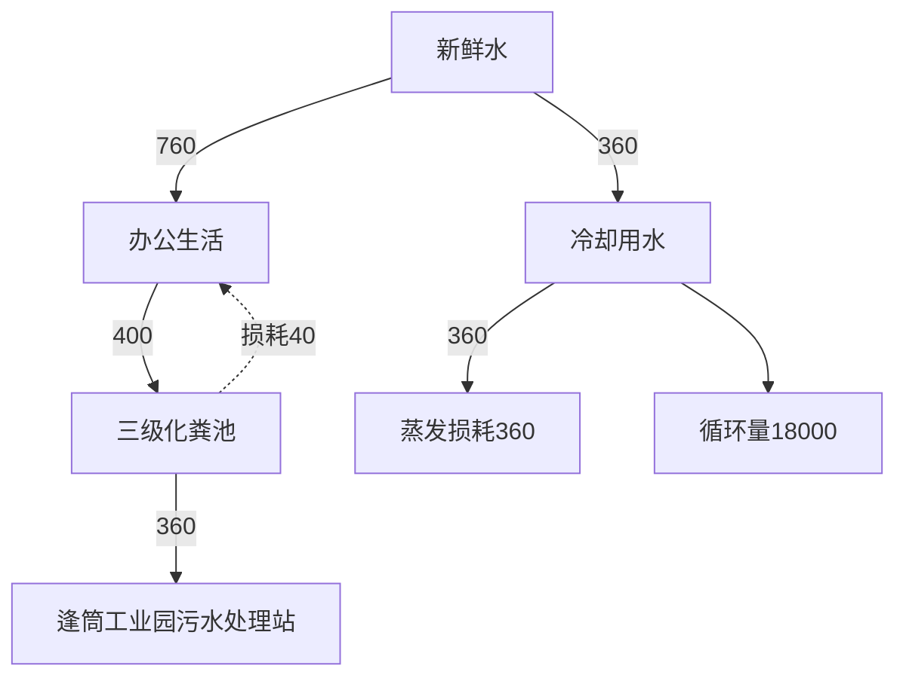
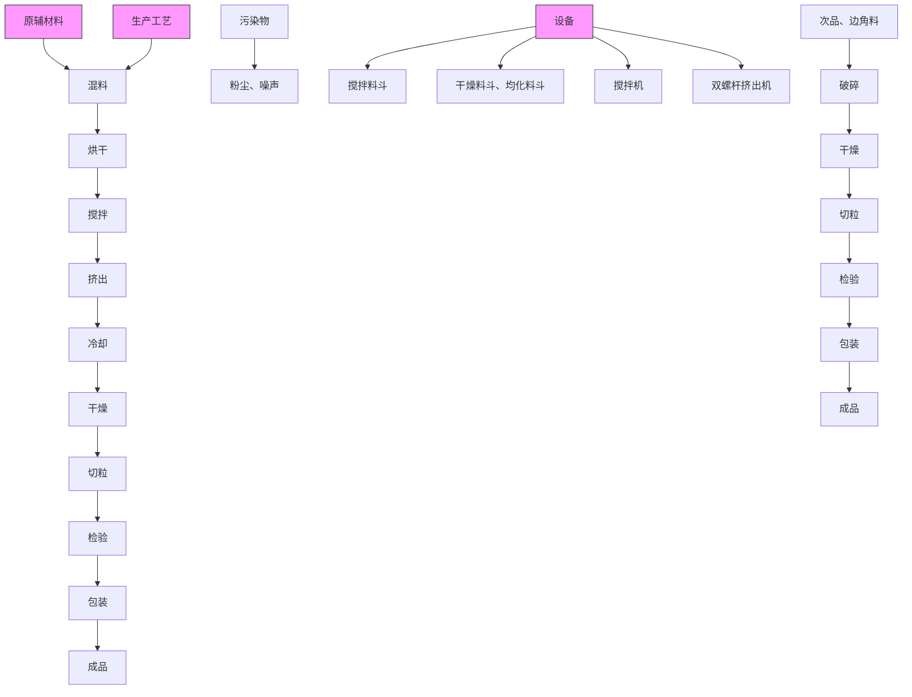
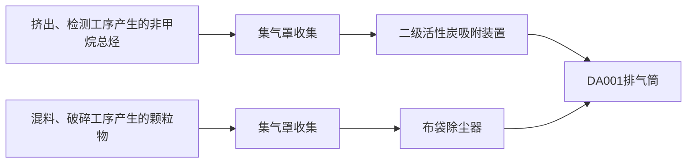

# （污染影响类）

（污染影响类）

项目名称：佛山市顺德区华隆宝利材料科技有限公司

建项

建设单位（盖章）：佛山市顺德区华隆宝利材料科技有

编制日期：2023年3月

中华人民共和国生态环境部制

打印编号：1673420478000

编制单位和编制人员情况表

<table><tr><td colspan="2">项目编号</td><td colspan="3">dkek0f</td></tr><tr><td colspan="2">建设项目名称</td><td colspan="3">佛山市顺德区华隆宝利材料科技有限公司搬迁扩建项目</td></tr><tr><td colspan="2">建设项目类别</td><td colspan="3">26-053塑料制品业</td></tr><tr><td colspan="2">环境影响评价文件类型</td><td colspan="3">报</td></tr><tr><td colspan="5">一、建设单位情况 </td></tr><tr><td colspan="2">单位名称(盖章)</td><td colspan="3">佛 科技有限公司</td></tr><tr><td colspan="2">统一社会信用代码</td><td rowspan="4" colspan="3"></td></tr><tr><td colspan="2">法定代表人(签章)</td></tr><tr><td colspan="2">主要负责人(签字)</td></tr><tr><td colspan="2">直接负责的主管人员(签字)</td></tr><tr><td colspan="2">二、编制单位情况</td><td colspan="3"></td></tr><tr><td colspan="2">单位名称(盖章)</td><td colspan="3">厂</td></tr><tr><td colspan="2">统一社会信用代码</td><td colspan="3">9</td></tr><tr><td colspan="5">三、编制人员情况</td></tr><tr><td colspan="5">1.编制主持人</td></tr><tr><td>姓名</td><td colspan="2">职业资格证书管理号</td><td>信用编号</td><td>签字</td></tr><tr><td>张朝</td><td colspan="2">2016035230352015230004000247</td><td>BH006416</td><td>张朝</td></tr><tr><td colspan="5">2.主要编制人员</td></tr><tr><td>姓名</td><td colspan="2">主要编写内容</td><td>信用编号</td><td>签字</td></tr><tr><td>张朝</td><td colspan="2">全文</td><td>BH006416</td><td>张朝</td></tr></table>

本证书由中华人民共和国人力资源和社会保障部、环境保护部批准颂发。它表明持证人通过国家统一组织的考试，取得环境影响评价工程师的职业资格。

This is tocertifythatthebeareroftheCertificate has passed national examination organized bythe Chinese government departmentsand has obtained qualifications for Environmental Impact Assessment Engineer.

text_image

中华人民共和国人力资源和社会保障部
approved by authorized by

Ministry ofHuman Resources andSocial Security The People's kepublic of China

text_image

中华人民共和国环保部
approved & authorized

Ministry of Environmental Protection The People's Republie of China

HP00018486

持证人签名：Signature of the Bearer

张朝

管理号： N2016035230352015230004000247

姓名：

FullName 张朝

性别：

Sex 男

出生年月：

DateofBirth1984年10月

专业类别： Professional Type

批准日期：AprovalDate2016年5月22日

签发单位盖章：

Issued by

签发日期： Issued.on

# 一、建设项目基本情况

<table><tr><td>建设项目名称</td><td colspan="3">佛山市顺德区华隆宝利材料科技有限公司搬迁扩建项目</td></tr><tr><td>项目代码</td><td colspan="3">/</td></tr><tr><td>建设单位联系人</td><td></td><td>联系方式</td><td></td></tr><tr><td>建设地点</td><td colspan="3">佛山市顺德区杏坛镇逢简工业区工业横四路2号之8</td></tr><tr><td>地理坐标</td><td colspan="3">(113度8分23.720秒,22度48分41.776秒)</td></tr><tr><td>国民经济行业类别</td><td>C2929塑料零件及其他制品制造</td><td>建设项目行业类别</td><td>53.塑料制品业292</td></tr><tr><td>建设性质</td><td>☑新建(搬迁扩建)□改建☑扩建□技术改造</td><td>建设项目申报情形</td><td>☑首次申报项目□不予批准后再次申报项目□超五年重新审核项目□重大变动重新报批项目</td></tr><tr><td>项目审批(核准/备案)部门(选填)</td><td>/</td><td>项目审批(核准/备案)文号(选填)</td><td>/</td></tr><tr><td>总投资(万元)</td><td>500</td><td>环保投资(万元)</td><td>40</td></tr><tr><td>环保投资占比(%)</td><td>8</td><td>施工工期</td><td>1月</td></tr><tr><td>是否开工建设</td><td>☑否□是:____</td><td>用地(用海)面积(m2)</td><td>3500</td></tr><tr><td>专项评价设置情况</td><td colspan="3">无</td></tr><tr><td>规划情况</td><td colspan="3">无</td></tr><tr><td>规划环境影响评价情况</td><td colspan="3">无</td></tr><tr><td>规划及规划环境影响评价符合性分析</td><td colspan="3">无</td></tr><tr><td>其他符合性分析</td><td colspan="3">1、产业政策符合性项目主要从事玻纤增强PP、阻燃PBT、玻纤增强PA等改性塑料粒制造,项目产品、设备、工艺不在《产业结构调整指导目录(2019年本,2021年修订版)》中的淘汰类和限制类目录中,也不属于《市场准入负面清单(2022年版)》(发改体改规[2022]397号)中的禁止准入事项。2、选址符合性分析根据附件4用地资料中可知,该项目选址所在地为集体建设用地,用地符合规划要求。3、与环境功能区划相符性分析根据《广东省人民政府关于调整佛山市部分饮用水水源保护区的批复》(粤府函〔2018〕426号),项目所在地不属于顺德区一、二级水源保护区,符合饮用水源保护条例的有关要求。项目所在区域为环境空气质量二类功能区,不属于环境空气质量一类功能区中的自然保护区风景名胜区和其它需要特殊保护的区域。项目所在区域为声环境2类区,不属于声环境1类区。项目有机废气经处理达标后排放,对周围影响较小,不改变原有的功能区规划。项目对生产过程中产生的噪音设备采取了有效的隔声防治措施,对周围环境影响较小。4、“三线一单”符合性分析“三线一单”是指生态保护红线、环境质量底线、资源利用上线以及负面清单。1生态保护红线本项目位于佛山市顺德区杏坛镇逢简工业区工业横四路2号之8,根据《广东省人民政府关于调整佛山市部分饮用水水源保护区的批复(粤府函[2018]426号)》、《广东省生态环境厅关于对佛山市人民政府申请校正部分饮用水水源保护区图件的意见的函》(粤环函〔2019〕1167号)可知,本项目不在水源保护区范围内,另外,根据《广东省生态环境厅关于优化调整严格控制区管控工作的通知》(粤环函[2021]179号),“不再执行《广东省环境保护规划纲要(2006-2020年)》规定的严格控制区及其管控要求,以《广东省生态保护红线划定方案》、</td></tr></table>

《广东省“三线一单”生态环境分区管控方案》管控全省生态空间”。因此，本报告不再分析项目与《广东省环境保护规划纲要（2006-2020 年）》严格控制区的相符性，且项目不在《广东省“三线一单”生态环境分区管控方案》所划定的“优先保护单元”内，因此符合生态红线保护要求。

# ②环境质量底线

本项目声环境质量能满足相应的标准要求，属于达标区；项目周边水体地表水环境满足相应的标准要求，属于达标区。项目无生产废水排放；本项目废气经有效收集处理后排放，对周边大气环境影响很小，故符合环境质量底线要求。

# ③资源利用上线

资源利用上线：按照水、大气、土壤环境质量不断优化的原则，结合环境质量现状和相关规划、功能区划要求，考虑环境质量改善潜力，确定的分区域分阶段环境质量目标及相应的环境管控、污染物排放控制等要求。

本项目营运过程中消耗一定量的电能、水资源，项目资源消耗量相对区域资料利用总量较少，符合资源利用上限的要求。

# ④环境准入负面清单

根据国家发展和改革委员会发布的《产业结构调整指导目录（2019年本，2021 年修订版）》，本项目不属于上述目录所列的鼓励类、限制和禁止（淘汰）项目，根据《促进产业结构调整暂行规定》第十三条，项目属于允许类。根据国家发展改革委商务部《关于印发<市场准入负面清单（2022年版〉>的通知》（发改体改规[2022]397号〉，本项目不属于禁止类项目，因此，项目符合相关的产业政策要求。

# 5、与《佛山市人民政府关于印发佛山市“三线一单”生态环境分区管控方案的通知》（佛府[2021]11号）与《佛山市顺德区人民政府关于印发佛山市顺德区“三线一单”生态环境分区管控方案的通知》（顺府发[2021]11号）相符性分析

根据《佛山市人民政府关于印发佛山市“三线一单”生态环境分区管控方案的通知（佛府[2021]11号）》、《佛山市顺德区人民政府关于印发佛山市顺德区“三线一单”生态环境分区管控方案的通知》（顺府发[2021]11号），本项目位于佛山市顺德区杏坛镇逢简工业区工业横四路2号之8，属于杏坛镇重点管控区（环境管控单元编码：ZH44060620005）（见附图9），相符性分析见下表。

表1-1 与佛山市“三线一单”相符性分析

<table><tr><td colspan="2">佛府(2021)11号的相关规定</td><td>本项目情况</td><td>相符性</td></tr><tr><td>生态保护红线</td><td>环境管控单元分为优先保护、重点管控和一般管控单元三类。重点管控单元:以推动产业转型升级、强化污染减排、提升资源利用效率为重点,加快解决资源环境负荷大、局部区域生态环境质量差、生态环境风险高等问题。</td><td>本项目位于佛山市顺德区杏坛镇逢简工业区工业横四路2号之8,所在区域位于杏坛镇,属于重点管控单元,项目所在建设用地不涉及划定的生态红线区域,项目周边无自然保护区、饮用水源保护区等生态保护目标,符合生态保护红线要求。</td><td>相符</td></tr><tr><td>环境质量底线</td><td>水环境质量持续改善,国考、省考、水功能区断面达到国家和省下达的水质目标要求;市控断面全面消除劣V类,力争达到我市确定的水质目标要求;乡镇级及以上集中式饮用水水源地水质稳定达标。空气质量持续改善,细颗粒物(PM2.5)年均浓度、空气质量优良天数比例(AQI)主要指标达到省下达的目标要求,臭氧污染得到有效遏制。土壤环境质量稳中向好,土壤环境风险得到管控。</td><td>根据环境质量现状监测和周边现状监测数据,项目区地表水环境、声环境质量均未能满足相应标准要求,大气环境质量臭氧不达标;根据佛山市主干河涌2021年1-12月水质监测情况,杏坛镇内河涌均足《地表水环境质量标准》(GB3838-2002)之V类水功能要求,则本项目地表水环境属于达标区。项目排放的各项污染物经相应措施处理后均能达标,对环境影响很小,环境风险可控,未超出环境质量底线,项目的建设基本符合环境质量底线要求。</td><td>相符</td></tr><tr><td>资源利用上线</td><td>强化节约集约循环利用,持续提升资源能源利用效率,水资源、土地资源、岸线资源、能源消耗等达到或优于国家和省下达的总量、强度等目标要求,按省规定年限实现碳达峰。</td><td>项目生产过程中的电能、自来水等消耗量较少,区域水、电资源较充足,项目消耗量没有超出资源负荷,没有超出资源利用上线。</td><td>相符</td></tr><tr><td>生态环境准入清单</td><td>《市场准入负面清单(2022年版)》(发改体改规〔2022〕397号)</td><td>本项目不属于禁止准入事项。</td><td>相符</td></tr></table>

表 1-2与顺德区“三线一单”态环境分区管控方案相符性分析

<table><tr><td colspan="2">顺府发(2021)11号</td><td>本项目情况</td><td>相符性</td></tr><tr><td>区域布局管控要求</td><td>全区生态保护红线面积27.71平方公里,占全区国土面积的3.44%;一般生态空间面积30.62平方公里,占全区国土面积的3.8%。</td><td>本项目位于佛山市顺德区杏坛镇逢简工业区工业横四路2号之8,所在区域位于杏坛镇,属于重点管控单元,项目所在建设用地不涉及划定的生态红线区域,项目周边无自然保护区、饮用水源保护区等生态保护目标,符合生态保护红线要求。</td><td>相符</td></tr><tr><td>环境质量底线</td><td>水环境质量持续改善,国考、省考、市考、水功能区断面达到国家、省和市下达的水质目标要求;市控断面全面消除劣V类,力争达到上级确定的水质目标要求;乡镇级及以上集中式饮用水水源地水质稳定达标。空气质量持续改善,细颗粒物( $PM_{2.5}$ )年均浓度、空气质量优良天数比例(AQI)主要指标达到省、市下达的目标要求,臭氧污染得到有效遏制。土壤环境质量稳中向好,土壤环境风险得到管控。</td><td>根据环境质量现状监测和周边现状监测数据,项目区地表水环境、声环境质量均未能满足相应标准要求,大气环境质量臭氧不达标;根据佛山市主干河涌2021年1-12月水质监测情况,杏坛镇内河涌均足《地表水环境质量标准》(GB3838-2002)之V类水功能要求,则本项目地表水环境属于</td><td>相符</td></tr></table>

<table><tr><td rowspan="4"></td><td></td><td></td><td>达标区。项目排放的各项污染物经相应措施处理后均能达标,对环境影响很小,环境风险可控,未超出环境质量底线,项目的建设基本符合环境质量底线要求。</td><td></td></tr><tr><td>资源利用上线</td><td>强化节约集约循环利用,持续提升资源能源利用率效率,水资源、土地资源、岸线资源、能源消耗等达到或优于国家和省下达的总量、强度等目标要求,按省规定年限实现碳达峰。</td><td>项目生产过程中的电能、自来水等消耗量较少,区域水、电资源较充足,项目消耗量没有超出资源负荷,没有超出资源利用上线。</td><td>相符</td></tr><tr><td rowspan="2">区域布局管控要求</td><td>优先保护生态空间,筑牢生态保护底线,构建生态空间保护格局。强化水源地空间管控,严格限制饮用水水源汇水区内的生态保护与水源涵养区域变更土地利用方式。持续深入推进产业、能源、交通运输结构调整。按照“两心·一带·四轴”发展格局,调整优化产业集群发展空间布局,推动城市功能定位、空间布局与产业发展高质量协同匹配。深入推进制造业高质量发展,推动智能家电、高端装备制造等两大主导产业高端化,促进珠宝、纺织服装、家具和五金等四大特色产业高级化,培育新一代电子信息、智能机器人、新材料、生物医药与健康等四大战略性产业集群。全面攻坚村级工业园升级改造,腾出连片空间,布局产业集聚区和主题产业园,推动工业项目入园集聚发展。通过城市更新实现公共设施“补短板”、产业空间“再聚集”、重点片区“强统筹”,盘活存量建设用地。依法依规关停落后产能,全面实施产业绿色化改造,培育壮大循环经济。新建、改建、扩建的项目应当符合国家产业政策规定。环境质量不达标区域,新建、扩建项目需符合环境质量改善要求。全区为高污染燃料禁燃区,禁止新建、扩建燃用高污染燃料的燃烧设施。加快推进天然气产供储销体系建设,逐步淘汰生物质锅炉、集中供热管网覆盖区域内的分散供热锅炉和有机热载体锅炉,纺织行业新增定型机应选用集中供热热源,逐步改造定型机,促进用热企业向园区集聚。禁止新建、扩建水泥、平板玻璃、化学制浆、生皮制革以及国家规划外的钢铁、原油加工等项目。专业电镀、印染等项目进入定点园区集中管理。推广应用低挥发性有机物原辅材料,严格限制新建生产和使用高挥发性有机物原辅材料的项目,鼓励建设共性工厂、活性炭集中再生中心等挥发性有机物第三方治理项目,推动挥发性有机物集中高效处理。优化交通结构,发展多式联运,推进公路、水路等交通运输燃料清洁化,推广新能源物流车辆,积极推动设立“绿色物流”片区。</td><td>项目不涉及划定的生态红线区域,项目周边无自然保护区、饮用水源保护区等生态保护目标。项目根据环境质量现状监测和周边现状监测数据,项目区声环境质量能满足相应标准要求,项目区地表水环境、声环境质量均未能满足相应标准要求,大气环境质量臭氧不达标;根据佛山市主干河涌2021年1-12月水质监测情况,杏坛镇内河涌均足《地表水环境质量标准》(GB3838-2002)之V类水功能要求,则本项目地表水环境属于达标区。项目排放的各项污染物经相应措施处理后均能达标。项目无新建高污染燃料的燃烧设施,不涉及锅炉等供热设备。项目主要从事塑料制品的生产,不属于化学制浆、生皮制革以及国家规划外的钢铁、原油加工等项目。专业电镀、印染等禁止行业。项目不涉及高挥发性原辅助材料。</td><td>相符</td></tr><tr><td>能源资源利用要求。积极发展氢能源、天然气发电等清洁能源,逐步提高可再生能源与低碳清洁能源比例,建立现代化能源体系。科学实施能源消费总量和强度“双控”,新建高能耗项</td><td>项目不涉及高污染燃料销售点,项目用水均由市政供水,严格控制用水,杜绝浪费;能源主要依托当地电网供电。本项目建设土</td><td>相符</td></tr><tr><td rowspan="2"></td><td rowspan="2"></td><td>目单位产品(产值)能耗达到国际国内先进水平,实现煤炭消费总量负增长。加快城镇燃气基础设施优化布局,落实天然气大用户直供和“瓶改管”。禁止新增高污染燃料销售点,加强全区高污染燃料监督管理。新建、改建、扩建“两高”项目须符合产业准入相关法律法规和法定规划,满足污染物区域削减、重点污染物排放总量控制、碳排放达峰目标、相关规划环评和相应行业建设项目环境准入条件、环评文件审批原则要求。依法依规强化油品生产、流通、使用、贸易等全流程监管,合理优化储油库、加油站布局。加快新能源汽车推广使用,实现全区公交车新能源化,加快充电桩、加气站、加氢站以及综合性能源补给站建设,积极推动机动车和非道路移动机械电动化或实现清洁燃料替代。大力推进绿色港口和公用码头建设,提升岸电使用率,引导船舶、港作机械等“油改气”“油改电”,降低港口柴油使用比例。贯彻落实“节水优先”方针,实行最严格水资源管理制度,提高工业用水效率,加强江河湖库水量调度,保障生态流量。强化自然岸线保护,优化岸线开发利用格局,严格水域岸线用途管制,新建项目一律不得违规占用水域。落实单位土地面积投资强度、土地利用强度等建设用地控制性指标要求,提高土地利用效率。全区禁止矿产资源开发开采。积极发展农业资源利用节约化、生产过程清洁化、废弃物利用资源化等生态循环农业模式。</td><td>地不涉及基本农田、土地资源消耗。</td><td></td></tr><tr><td>污染物排放管控要求。实施重点污染物总量控制,重点污染物排放总量指标优先向重大发展平台、重点建设项目、重点工业园区、战略性产业集群倾斜。加快建立以排污许可制为核心的固定污染源监管制度,聚焦重点行业和重点区域,强化环境监管执法。规范工业排水管理,依法开展排水许可。合理建设工业废水或综合废水集中处理设施,推进工业集聚区“污水零直排区”试点。稳步推进排水设施“三个一体化”管理模式,补齐城乡污水收集和处理短板,推动污水处理设施提质增效,加快消除城中村、老旧城区、城乡结合部等污水收集管网空白区,逐步实现城乡污水收集处理全覆盖。城镇新区建设均实行雨污分流。推进建设大型现代化畜禽养殖场,加强畜禽养殖废水处理及废弃物资源化利用,推广水产生态健康养殖模式,防治农村面源污染。禁止在地表水I、II类水域新建排污口,已建排污口不得增加污染物排放量。实行水污染物的行业标杆管理。实施水生态系统保护修复,推进河涌水系连通、环保清淤,加强湿地建设及河心岛生态修复。上年度重点河涌水质未达到水环境质量目标的管控分区所在镇(街道),须组织编制、系统实施、向社会公开区域重点水污染物减排计划并明确“替代量”,本年度新建、改建、扩建项目新增水环境重点污染物实行区域“减二增一”替代(废水集中处理设施、民生项目除外)。在可核查、可监管的基础上,全区新建、改建、扩建项目新增大气重点污染物实行“减二增一”替代。巩固燃煤锅炉超低排放整治成效。深化炉窑分级管控,实施工业炉窑大气污染综合治理。推进挥发性有机物源头替代,全面加强无组织排放控制,深入实施精细化治理。推进石化化工、溶剂使用及挥发性有机液体储运销的挥发性有机物减排,全过程实施反应活性物质、有毒有害物质、恶臭物质的协同控制。将全面使用低VOCs含量原辅材料的企业纳入正面清单和政府绿色采购清单。严格落实船舶大气污染物排放控制区要求。加强扬尘、餐饮油烟等污染防治。重金属污染重点防控区内,重点重金属排放总量只减不增。重金属污染物排放企业清洁生产逐步达到国际或国内先进水平。打造近零碳排放示范项目,推进有色金属等重点能源消耗行业二氧化碳排放控制。开展“无废城市”建设,推动固体废物源头减量、资源化利用和安全处置。</td><td>项目涉及VOCs产生及排放,实施两倍削减量替代。项目不涉及生产废水排放。</td><td>相符</td></tr><tr><td></td><td></td><td>环境风险防控要求。加强西江、北江等供水通道干流沿岸以及饮用水水源地、备用水源环境风险防控,完善城市双水源联网供水格局。强化地表水、地下水和土壤污染风险协同防控,建立完善突发环境事件应急管理体系。重点加强环境风险分级分类管理,应用全省环境风险源在线监控预警系统,强化化工企业、涉重金属行业、工业园区等重点环境风险源的环境风险防控。推动企业将低温等离子、UV光解、RTO燃烧炉等有机废气治理设施纳入全厂安全风险辨识范围,加强安全管理。禁止在规划专门用于危险化学品生产、储存的区域(包括化工园区)外新建、扩建危险化学品生产、储备建设项目(加油站、加气站、加氢站、港口及铁路、航空危险化学品储存建设项目、危险化学品输送管道及危险化学品使用单位的配套项目除外)。实施农用地分类管理,依法划定特定农产品禁止生产区域。严格建设用地再开发建设管理,对纳入建设用地土壤环境联动监管地块,未达到土壤污染风险评估报告确定的风险管控、修复目标的建设用地地块,禁止开工建设任何与风险管控、修复无关的项目。提升危险废物监管能力,利用信息化手段,推动全过程跟踪管理。健全危险废物收集体系,推进危险废物利用处置能力优化提升,开展工业园区危险废物集中收集贮存试点。全力避免因各类安全事故(事件)引发的次生环境风险事故(事件)。</td><td>本项目位于佛山市顺德区杏坛镇逢简工业区工业横四路2号之8,所在区域位于杏坛镇,不涉及划定的饮用水源保护区等生态保护目标。项目主要从事塑料零件及其他塑料制品制造的生产制造,不涉及重金属行业工业园区等重点环境风险源的环境风险防控。项目采用“二级活性炭”处理有机废气,不属于低治理效率的有机废气治理措施。</td><td>相符</td></tr></table>

表 1-3 本项目与文件（顺府发[2021]11 号）相符性分析

<table><tr><td rowspan="2">环境管控单元编码</td><td rowspan="2">环境管控单元名称</td><td colspan="3">行政区划</td><td rowspan="2">管控单元分类</td><td rowspan="2" colspan="2">要素细类</td></tr><tr><td>省</td><td>市</td><td>区</td></tr><tr><td>ZH44060620005</td><td>杏坛镇重点管控区</td><td>广东省</td><td>佛山市</td><td>顺德区</td><td>重点管控单元5</td><td colspan="2">一般生态空间、水环境城镇生活污染重点管控区、水环境工业—城镇污染重点管控区、水环境其他重点管控区、大气环境一般管控区、江河湖库岸线重点管控区</td></tr><tr><td>管控维度</td><td colspan="5">管控要求</td><td rowspan="2">工程内容</td><td rowspan="2">符合性</td></tr><tr><td>共性要求</td><td colspan="5">单元内各环境要素细类管控区内,按该环境要素细类管控要求执行。</td></tr><tr><td>区域布局管控</td><td colspan="5">1-1【生态/禁止类】单元内的一般生态空间,主导生态功能为水土保持,禁止在25度以上的陡坡地开垦种植农作物,禁止在崩塌、滑坡危险区、泥石流易发区从事采石、取土、采砂等可能造成水土流失的活动。1-2.【产业/鼓励引导类】重点发展新材料、智能家居、先进装备制造业、汽车配件等产业以及军民融合产业,提升发展塑料专业市场,培育智能家居创新创业产业链,依托顺德新港发展临港加工和物流产业,发展现代农业。1-3.【产业/综合类】系统推进村级工业园升级改造,腾出连片空间,布局产业集聚区和主题产业园,推动工业项目入园集聚发展。新增工业制造业用地原则上安排在产业集聚区内,产业集聚区外原则上不鼓励工业及物流仓储用地的新建与改造。1-4.【产业/限制类】受纳水体或监控断面不达标的,不得新建、扩建向河涌直接排放废水的项目。新建、扩建含蚀刻工序的线路板生产项目和化工项目应在配套污水集中处置的工业园区或生活污水管网覆盖区域内建设;纯加工型印花项目,含酸洗、磷化的金属表面处理、金属制品项目(与自身高新技术企业配套的除外),含酸洗、喷涂、拉丝、表面抛光等工艺的不锈钢型材加工项目,应进入以此类项目为主导产业、有相应废水集中治理设施的工业园区,实现集中治污。1-5.【水/限制类】严格限制在右滩水厂、均安水厂饮用水水源保护区上游和周边区域建设列入“高污染、高环境风险”产品名录等可能影响水环境安全的项目。1-6.【土壤/禁止类】禁止新建、扩建增加重点防控的重金属污染物排放的建设项目。</td><td>项目主要从事改性塑料制造,项目产品、设备、工艺不在《产业结构调整指导目录(2019年本,2021年修订版)》中的淘汰类和限制类目录中,也不属于《市场准入负面清单(2022年版)》中的禁止准入事项。不属于上述禁止类企业、限制类企业;本项目位于佛山市顺德区杏坛镇逢简工业区工业横四路2号之8,位于产业集聚区内;根据佛山市主干河涌2021年1-12月水质监测情况,杏坛镇内河涌均足《地表水环境质量标准》(GB3838-2002)之V类水功能要求,则本项目地表水环境属于达标区。本项目不属于加工印花项目,不含有酸洗、磷化工艺。近期:本项目外排废水为生活污水。本项目生活污水经三级化粪池预处理后,通过工业区管网排至逢简工业园废水处理站,处理达标后排入逢简大涌。本项目不包含条款中提及的限制类项目和工序。本项目不在右滩水厂、均安水厂饮用水水源保护区上游和周边区域;本项目不涉及重金属</td><td>相符</td></tr></table>

<table><tr><td rowspan="3"></td><td></td><td></td><td>污染物的排放</td><td></td></tr><tr><td>能源资源利用</td><td>2-1【能源/鼓励引导类】推广节能技术,加快发展绿色货运与现代物流。2-2【能源/鼓励引导类】推广新能源汽车应用和充电基础设施建设,积极推动重卡LNG加气站、充电基础设施、加氢站建设。2-3.【能源/综合类】科学实施能源消费总量和强度“双控”,新建高能耗项目单位产品(产值)能耗达到国际国内先进水平。2-4.【水资源/综合类】贯彻落实“节水优先”方针,实行最严格水资源管理制度,杏坛镇万元国内生产总值用水量、万元工业增加值用水量、用水总量、农田灌溉水有效利用系数等用水总量和效率指标达到区下达要求。2-5.【土地资源/限制类】落实单位土地面积投资强度、土地利用强度等建设用地控制性指标要求,提高土地利用效率。2-6.【岸线/禁止类】严格水域岸线用途管制,新建项目一律不得违规占用水域。严禁破坏生态的岸线利用行为和不符合其功能定位的开发建设活动,严禁以各种名义侵占河道、围垦湖泊、非法采砂等。</td><td>本项目位于佛山市顺德区杏坛镇逢简工业区工业横四路2号之8,位于产业集聚区内;不占用水域岸线</td><td>相符</td></tr><tr><td>污染物排放管控</td><td>3-1.【水/限制类】城镇新区建设实行雨污分流,逐步推进初期雨水收集、处理和资源化利用。住宅、商业体、学校、市场等城镇开发建设项目应当配套或者同步计划建设公共排水设施,公共排水设施或自建排污水设施未能投产运行的,以上涉水项目不得投入使用。新建小区严格实施雨污分流,阳台、露台等污水接入污水收集系统,将生活污水“应截尽截”。做好大型楼盘、集贸市场、餐饮以及学校等4大类排水户污水接入市政管网工作。3-2.【水/综合类】杏坛镇重点河涌水质上年度未达到水环境环境质量目标的,需组织编制、系统实施、向社会公开区域重点水污染物减排计划并明确“替代量”,本年度新建、改建、扩建项目新增水环境重点污染物实行区域“减二增一”替代(工业、生活或综合集中废水处理设施、民生项目除外)。3-3.【水/综合类】区域内应合理规划建设工业或综合集中废水处理设施。逐步推进工业集聚区“污水零直排区”建设,开展排水单元工业废水、生活污水、雨水分类收集、分质处理,确保园区“管网全覆盖、雨污全分流、污水全收集、处理全达标”。3-4.【水/综合类】结合村级工业园改造,全面提升产业层次与集聚度,促进污染集中整治。3-5.【水/综合类】稳步推进排水设施“三个一体化”管理模式,补齐城乡污水收集和处理短板,推动逢简工业园污水处理站提质增效,加快消除城中村、老旧城区、城乡结合部等污水收集管网空白区,逐步实现城乡污水收集处理全覆盖。2025年前完成逢简工业园污水处理站扩建,尾水应执行《城镇污水处理厂污染物排放标准》(GB18918-2002)一级A标准及《广东省水污染物排放限值》(DB44/26-2001)的较严值。3-6.【水/综合类】近期保留桑麻村、逢简村、吉祐村、安富村等现状农村污水分散式处理设施,继续完善污水支管网建设,提高污水收集处理率,新建龙潭村、吉祐村、右滩村、南朗村、光华村、东村、北水村等农村分散式生活污水处理设施,其余行政村(社区)继续完善污水管网建设,收集农村污水进入市政污水系统,有条件的区域实施雨污分流改造,到2030年全面雨污分流,污水纳入杏坛城镇污水处理系统。3-7.【大气/综合类】大力推进低VOCs含量原辅材料替代,加快涉VOCs重点行业的生产工艺升级改造,推行自动化生产工艺,对达不到要求的VOCs收集及治理设施进行整治提升,逐步淘汰低效VOCs治理设施。3-8.【土壤/限制类】作为重金属污染重点防控区,区域内重点重金属排放总量只减不增。</td><td>本项目污染物排放量未超过规划环评核定的污染物排放总量管控要求;项目不属于加工印花项目,不含有酸洗、磷化工艺。本项目外排废水为生活污水。本项目生活污水经三级化粪池预处理后,通过工业区管网排至逢简工业园废水处理站,处理达标后排入逢简大涌。本项目使用聚丙烯(PP)、PBT、尼龙(PA)、阻燃剂、抗氧剂、色母均为低VOCs含量的原料</td><td>相符</td></tr><tr><td></td><td>环境风险防控</td><td>4-1.【水/综合类】加强单元内右滩水厂、均安水厂饮用水水源保护区周边环境风险源管控,完善突发环境事件应急管理体系。4-2.【水/综合类】逢简工业园污水处理站、工业污水集中处理设施应采临取有效措施,防止事故废水直接排入水体。完善污水处理厂在线监控系统联网,实现污水处理厂的实时、动态监管。4-3.【风险/综合类】加强环境风险分级分类管理,强化金属制品、有色金属和压延加工、化学原料和化学品制造业等涉重金属、化工行业企业及工业园区等重点环境风险源的环境风险防控。</td><td>本项目危险物质贮存量占临界量比值Q&lt;1,通过严格执行国家的防火安全设计规范,采取合理的风险防范措施,制定完善的环境风险事故应急预案等措施本项目的风险水平是可以接受的</td><td>相符</td></tr><tr><td colspan="5">本项目不属于“两高”项目,符合区域布局管控要求。本项目建设在陆域上,不属于占用水域和破坏生态的岸线利用行为,符合能源资源利用要求。6、与《佛山市顺德区生态环境保护“十四五”规划》(2021-2025)的相符性分析根据《佛山市顺德区生态环境保护“十四五”规划》(2021-2025),“大力推进低VOCs含量、低反应活性的原辅材料替代,将全面使用低VOCs含量原辅材料的企业纳入正面清单和政府绿色采购清单。鼓励重点行业企业开展生产工艺和设备水性化改造,推广使用水性、高固体分、无溶剂、粉末等低VOCs含量</td></tr></table>

涂料。严格落实《挥发性有机物无组织排放控制标准》，开展厂区内无组织排放浓度监测”。

本项目不使用溶剂型油墨、涂料、清洗剂、胶黏剂等高挥发性有机物原辅材料，严格落实《挥发性有机物无组织排放控制标准》，开展厂区内无组织排放浓度监测，因此，本项目的建设符合《佛山市顺德区生态环境保护“十四五”规划》（2021-2025）相关要求。

# 7、有机废气政策相符性分析

本项目有机物治理政策的相符性分析见表1-4。

表1-4 项目与有机污染物治理政策的相符性

<table><tr><td>序号</td><td>政策要求</td><td>本项目</td><td>符合性</td></tr><tr><td colspan="4">1.《珠江三角洲地区严格控制工业企业挥发性有机物(VOCs)排放的意见》(粤环[2012]18号)</td></tr><tr><td>1.1</td><td>在自然保护区、水源保护区、风景名胜区、森林公园、重要湿地、生态敏感区和其他重生态功能区实行强制性保护,禁止新建VOCs污染企业。</td><td>本项目选址不在禁止区域。</td><td>符合</td></tr><tr><td colspan="4">2.《挥发性有机物(VOCs)污染防治技术政策》(环保部公告2013第31号)</td></tr><tr><td>2.1</td><td>含VOCs产品的使用过程中,应采取废气收集措施,提高废气收集效率,减少废气的无组织排放与逸散。</td><td>项目有机废气经收集处理达标后高空排放</td><td>符合</td></tr><tr><td colspan="4">3.关于印发《重点行业挥发性有机物综合治理方案》的通知(环大气[2019]53号)</td></tr><tr><td>3.1</td><td>含VOCs物料应储存于密闭容器、包装袋,高效密封储罐,封闭式储库、料仓等。含VOCs物料生产和使用过程,应采取有效收集措施或在密闭空间中操作。</td><td>本项目满足相关标准要求。</td><td>符合</td></tr><tr><td>3.2</td><td>通过采取设备与场所密闭、工艺改进、废气有效收集等措施,削减VOCs无组织排放。</td><td>项目有机废气经收集处理达标后高空排放</td><td>符合</td></tr><tr><td>3.3</td><td>提高废气收集率。遵循“应收尽收、分质收集”的原则,科学设计废气收集系统,将无组织排放转变为有组织排放进行控制。采用全密闭集气罩或密闭空间的,除行业有特殊要求外,应保持微负压状态,并根据相关规范合理设置通风量。采用局部集气罩的,距集气罩开口面最远处的VOCs无组织排放位置,控制风速应不低于0.3米/秒,有行业要求的按相关规定执行。</td><td>项目有机废气经收集处理达标后高空排放,控制风速为0.5米/秒。</td><td>符合</td></tr><tr><td>3.4</td><td>鼓励企业采用多种技术的组合工艺,提高VOCs治理效率。低浓度、大风量废气,宜采用沸石转轮吸附、活性炭吸附、减风增浓等浓缩技术,提高VOCs浓度后净化处理;高浓度废气,优先进行溶剂回收,难以回收的,宜采用高温焚烧、催化燃烧等技术</td><td>挤出、检测废气经集气罩收集后通过二级活性炭吸附废气处理设施进行处理,处理达标后通过排气筒DA001(15m)引至楼顶排放</td><td>符合</td></tr><tr><td colspan="4">4.《挥发性有机物无组织排放控制标准》(GB37822-2019)2019.05.24发布,2019.07.01实施</td></tr><tr><td>4.1</td><td>VOCs质量占比大于等于10%的含VOCs产品,</td><td>项目有机废气经收集处理</td><td>符合</td></tr></table>

<table><tr><td rowspan="13"></td><td></td><td>其使用过程应采用密闭设备或在密闭空间内操作,废气应排至VOCs废气处理收集系统;无法密闭的,应采取局部收集措施,废气应排至VOCs废气收集处理系统。</td><td>达标后高空排放</td><td></td></tr><tr><td>4.2</td><td>VOCs废气收集处理系统应与生产工艺设备同步运行。VOCs废气收集处理系统发生故障或检修时,对应的生产工艺设备应停止运行,待检修完毕后同步投入使用。</td><td>项目产生VOCs的加工过程必须开启风机,有效减少无组织排放废气。废气收集处理系统发生故障或检修时,产生VOCs的工序停止运行,待检修完毕后再投入生产</td><td>符合</td></tr><tr><td>4.3</td><td>企业应建立台账,记录含VOCs原辅材料和含VOCs产品的名称、使用量、回收量、废弃量、去向以及VOCs含量等信息。台账保存期限不少于3年。</td><td>企业拟建立台账,记录含VOCs原辅材料和含VOCs产品的名称、使用量、回收量、废弃量、去向以及VOCs含量等信息。台账保存期限不少于3年。</td><td>符合</td></tr><tr><td>4.4</td><td>VOCs废气收集处理系统应与生产工艺设备同步运行。VOCs废气收集处理系统发生故障或检修时,对应的生产工艺设备应停止运行,待检修完毕后同步投入使用;生产工艺设备不能停止运行或不能及时停止运行的,应设置废气应急处理设施或采取其他替代措施。</td><td>VOCs废气收集处理系统应与生产工艺设备同步运行。VOCs废气收集处理系统发生故障或检修时,对应的生产工艺设备应停止运行,待检修完毕后同步投入使用。</td><td>符合</td></tr><tr><td>4.5</td><td>废气收集系统排风罩(集气罩)的设置应符合GB/T16758的规定。</td><td>废气收集系统集气罩的设置符合GB/T16758的规定。</td><td>符合</td></tr><tr><td colspan="4">5.《关于做好建设项目挥发性有机物(VOCs)排放削减替代工作的补充通知》(粤环函〔2021〕537号)</td></tr><tr><td>5.1</td><td>各地生态环境部门要健全建设项目VOCs排放总量管理台账,严格核定VOCs可替代总量指标,重点核查用作替代的削减量是否为企业达标排放后采取治理措施的削减量、或淘汰关停后的削减量,是否有削减量重复使用等情况,进一步规范VOCs削减替代工作。新改扩建项目环评审批时,应逐级出具VOCs总量替代来源审核意见,确保总量指标管理扎实有效</td><td>待项目审批时由生态环境部门根据《关于做好建设项目挥发性有机物(VOCs)排放削减替代工作的补充通知》(粤环函〔2021〕537号)文件要求核定VOCs总量来源。</td><td>符合</td></tr><tr><td colspan="4">6.《广东省大气污染防治条例》广东省第十三届人民代表大会常务委员会公告(第20号)</td></tr><tr><td>6.1</td><td>应当优先使用低挥发性有机物含量的原材料和低排放环保工艺</td><td>本项目不使用溶剂型油墨、涂料、清洗剂、胶黏剂等高挥发性有机物原辅材料</td><td>符合</td></tr><tr><td colspan="4">7.《佛山市生态环境局顺德分局关于加强臭氧污染防治工作的通知(佛顺环函〔2021〕69号)》</td></tr><tr><td>7.1</td><td>加强VOCs废气无组织排放收集</td><td>项目有机废气经收集处理达标后高空排放</td><td>符合</td></tr><tr><td>7.2</td><td>做好VOCs废气无组织排放监测</td><td>项目建成后,按监测频次进行监测</td><td>符合</td></tr><tr><td colspan="4">8、关于印发《广东省挥发性有机物(VOCs)整治与减排工作方案(2018-2020年)》的通知(粤环发〔2018〕6号)</td></tr><tr><td rowspan="10"></td><td>8.1</td><td>推广使用低毒、低(无)VOCs含量的油墨、胶黏剂、清洗剂、润版剂、洗车水、涂布液等原辅材料。</td><td>本项目不使用溶剂型油墨、涂料、清洗剂、胶黏剂等高挥发性有机物原辅材料。</td><td>符合</td></tr><tr><td>8.2</td><td>加强废气收集与处理。规范油墨、胶黏剂等有机原辅材料的调配和使用环节,采取车间环境负压改造、安装高效集气装置等措施,提高VOCs产生环节的废气收集率。优化烘干技术,减少无组织排放、因地制宜采用回收、焚烧等有机废气末端治理技术,确保稳定达标排放。</td><td>项目有机废气经集气罩收集,经处理达标后高空排放。</td><td>符合</td></tr><tr><td colspan="4">9、《广东省人民政府办公厅关于印发广东省2021年大气、水、土壤污染防治工作方案的通知》(粤办函〔2021〕58号)</td></tr><tr><td>9.1</td><td>《广东省2021年大气污染防治工作方案》指出:“8、实施低VOCs含量产品源头替代工程。严格落实国家产品VOCs含量限值标准要求,除现阶段无法实施替代的工序外,禁止新建生产和使用高VOCs含量原辅材料项目。鼓励在生产和流通消费环节推广使用低VOCs含量原辅材料。”</td><td>本项目不使用溶剂型油墨、涂料、清洗剂、胶黏剂等高挥发性有机物原辅材料。</td><td>符合</td></tr><tr><td>9.2</td><td>《广东省2021年水污染防治工作方案》指出:“(三)深入推进工业污染治理。推动工业废水资源化利用,加快中水回用及再生水循环利用设施建设,选取重点用水企业开展用水审计、水效对标和节水改造,推进企业内部工业用水循环利用。”</td><td>项目员工生活污水经三级化粪池处理后进入逢简工业园废水处理站,处理达标后排入逢简大涌</td><td>符合</td></tr><tr><td>9.3</td><td>《广东省2021年土壤污染防治工作方案》指出:“(二)加强工业污染风险防控。严格执行重金属污染物排放标准,持续落实相关总量控制指标。补充涉隔等重金属点行业企业重点排查区域,更新污染源整治清单,督促责任主体制定并落实整治方案。”</td><td>项目产生污染物不涉及重金属污染物,且运营期厂内地面按规定做好防渗措施。</td><td>符合</td></tr><tr><td colspan="4">10、《广东省大气污染防治条例》</td></tr><tr><td>10.1</td><td>含挥发性有机物废气的生产和服务活动,应当优先使用低挥发性有机物含量的原材料和低排放环保工艺,在确保安全条件下,按照规定在密闭空间或者设备中进行,安装、使用满足防爆、防静电要求的治理效率高的污染防治设施;无法密闭或者不适宜密闭的,应当采取有效措施减少废气排</td><td>挤出、检测废气经集气罩收集后通过二级活性炭吸附废气处理设施进行处理,处理达标后通过排气筒DA001(15m)引至楼顶排放</td><td>符合</td></tr><tr><td colspan="4">11.佛山市顺德区人民政府办公室关于印发《佛山市顺德区生态环境保护“十四五”规划、(2021-2025)》的通知</td></tr><tr><td>11.1</td><td>持续推进重点行业VOCs整治。持续开展挥发性有机物专项整治,继续推进重点行业企业开展销号式综合整治,建立VOC重点监管企业名单并动态更新,督促企业建立VOCs管控台账清单;持续探寻高效节能的VOCs治理技术,对采用低温等离子、光氧化、光催化等低效治理工艺的企业在臭氧污染天气应对期间实施停限产或错峰生产,并推动企业逐步淘汰低效治理工艺。</td><td>本项目不使用溶剂型油墨、涂料、清洗剂、胶黏剂等高挥发性有机物原辅材料。挤出、检测废气经集气罩收集后通过二级活性炭吸附废气处理设施进行处理,处理达标后通过排气筒DA001(15m)引至楼顶排放。</td><td>符合</td></tr><tr><td rowspan="6"></td><td>11.2</td><td>加强VOCs源头替代和无组织排放管控。大力推进低VOCs含量、低反应活性的原辅材料替代,将全面使用低VOCs含量原辅材料的企业纳入正面清单和政府绿色采购清单。鼓励重点行业企业开展生产工艺和设备水性化改造,推广使用水性、高固体分、无溶剂、粉末等低VOCs含量涂料。严格落实《挥发性有机物无组织排放控制标准》,开展厂区内无组织排放浓度监测,加强对含VOCs物料储存、转移和运输、设备与管线组件泄漏、敞开页面逸散以及工艺过程等五类排放源的管控。</td><td>本项目不使用溶剂型油墨、涂料、清洗剂、胶黏剂等高挥发性有机物原辅材料。挤出、检测废气经集气罩收集后通过二级活性炭吸附废气处理设施进行处理,处理达标后通过排气筒DA001(15m)引至楼顶排放。</td><td>符合</td></tr><tr><td colspan="4">13、佛山市生态环境局关于印发《佛山市生态环境保护“十四五”规划》的通知</td></tr><tr><td>13.1</td><td>加强VOCs源头替代和无组织排放管控。大力推进低VOCs含量原辅材料替代,将全面使用低VOCs含量原辅材料的企业纳入正面清单和政府绿色采购清单。鼓励重点行业企业开展生产工艺和设备水性化改造,推广使用水性、高固体分、无溶剂、粉末等低VOCs含量涂料。</td><td>本项目不使用溶剂型油墨、涂料、清洗剂、胶黏剂等高挥发性有机物原辅材料。挤出、检测废气经集气罩收集后通过二级活性炭吸附废气处理设施进行处理,处理达标后通过排气筒DA001(15m)引至楼顶排放。</td><td>符合</td></tr><tr><td colspan="4">14、广东省生态环境保护“十四五”规划</td></tr><tr><td>14.1</td><td>大力推进低VOCs含量原辅材料源头替代,严格落实国家和地方产品VOCs含量限值质量标准,禁止建设生产和使用高VOCs含量的溶剂型涂料、油墨、胶粘剂等项目。推进工业园区、企业集群因地制宜统筹规划建设一批集中喷涂中心(共性工厂)、活性炭集中再生中心,实现VOCs集中高效处理。开展无组织排放源排查,加强含VOCs物料全方位、全链条、全环节密闭管理,深入推进泄漏检测与修复(LDAR)工作。</td><td>本项目不使用溶剂型油墨、涂料、清洗剂、胶黏剂等高挥发性有机物原辅材料。挤出、检测废气经集气罩收集后通过二级活性炭吸附废气处理设施进行处理,处理达标后通过排气筒DA001(15m)引至楼顶排放。</td><td>符合</td></tr><tr><td colspan="4">综合以上分析,项目总体符合文件要求。</td></tr></table>

# 二、建设项目工程分析

# 1、项目由来

佛山市顺德区华隆宝利材料科技有限公司原址位于佛山市顺德区杏坛镇七滘工业区八路 20 号之三，公司已于 2015 年 4 月以项目名称为“佛山市顺德区华隆宝利材料科技有限公司建设项目”取得环境影响报告表批复（编号：杏 20150052）。2015年11月11日，通过原佛山市顺德区环境运输和城市管理局验收（顺环杏【2015】051号），同意该项目（规模含：双螺杆挤出机5台，干燥料斗6台，搅拌机8台，冷却水槽 6 条、干燥风机 10 台、台式切粒机 6 台、破碎机 6 台、搅拌料斗 8 台、注塑机2台、实验双螺杆试验机1台、冷却塔1个)投入生产。生产规模为玻纤增强PP800 吨/年、阻燃 ABS500 吨/年、玻纤增强 PA1000 吨/年、阻燃 PA700 吨/年。于2020 年 3 月 26 日 办 理 了 固 定 污 染 源 排 污 登 记 （ 登 记 编 号 ：91440606345498916E001X）。

现由于七滘工业园实施“三旧改造”拟进行拆迁，因此佛山市顺德区华隆宝利材料科技有限公司拟搬迁于佛山市顺德区杏坛镇逢简工业区工业横四路2号之8，项目租赁已建厂房为生产场所，占地面积3500m2，经营面积为3500m2。搬迁后项目产能进行扩增及改造，项目扩建后产能为玻纤增强PP2000吨/年、玻纤增强PA1000 吨/年、阻燃 PBT350 吨/年。

根据《中华人民共和国环境保护法》、《中华人民共和国环境影响评价法》、《建设项目环境保护管理条例》和《建设项目环境影响评价分类管理名录》（2021年版）规定，本项目属于二十六“53.塑料制品业292”，需编制环境影响报告表，佛山市顺德区华隆宝利材料科技有限公司委托我公司承担环境影响评价工作。

# 2、项目工程组成

搬迁扩建后主要工程包括建筑物生产车间，并配有成品区、原料储存区、办公区等辅助工程。项目组成详见下表：

表2-1 搬迁扩建后项目工程组成

<table><tr><td rowspan="2">项目</td><td colspan="2">搬迁扩建前</td><td colspan="2">搬迁扩建后</td><td colspan="2" rowspan="2">变化情况</td></tr><tr><td>内容</td><td>规模</td><td>内容</td><td colspan="2">规模</td></tr><tr><td colspan="2">主体工程</td><td>生产车间</td><td>1个,单层,建筑面积约 $2350m^{2}$ </td><td>生产车间</td><td>1个,建筑面积约为 $3500m^{2}$ </td><td>面积增加 $1150m^{2}$ </td></tr><tr><td colspan="2" rowspan="2">辅助工程</td><td>办公室</td><td>1个,建筑面积约为 $100m^{2}$ </td><td>办公室</td><td>1个,位于生产车间内,建筑面积为 $100m^{2}$ </td><td>不变</td></tr><tr><td>仓库</td><td>1个,建筑面积约为 $700m^{2}$ </td><td>成品区、原料区</td><td>成品区面积为 $350m^{2}$ ,位于生产车间内,原料区面积为 $350m^{2}$ </td><td>不变</td></tr><tr><td colspan="2" rowspan="2">公共工程</td><td>配电系统</td><td>一套,接市政供电系统</td><td>配电系统</td><td>一套,接市政供电系统</td><td>不变</td></tr><tr><td>给排水系统</td><td>一套,与市政供水及排水管网接驳</td><td>给排水系统</td><td>一套,与市政供水及排水管网接驳</td><td>不变</td></tr><tr><td rowspan="5">环保工程</td><td>废水</td><td colspan="2">项目职工生活污水经独立生活污水处理设施处理后排入附近内河涌</td><td colspan="2">本项目员工生活污水经三级化粪池处理后进入逢简工业园废水处理站,处理达标后排入逢简大涌</td><td>生活污水排放排放方式由直接排放,变化为间接排放</td></tr><tr><td rowspan="2">废气</td><td colspan="2">挤出工序设置集气、排气系统,集气后经低温等离子处理,尾气通过风管引至15m高排气筒排放</td><td colspan="2" rowspan="2">本项目混料、破碎废气经集气罩收集与挤出工序设置集气罩收集,经布袋除尘器+二级活性炭吸附装置处理,尾气通过风管引至15m高DA001排气筒排放</td><td rowspan="2">废气处理设施以新带老</td></tr><tr><td colspan="2">破碎、混料粉尘通过设置挡板、经沉降后无组织排放</td></tr><tr><td>固废</td><td colspan="2">设置危险废物暂存点,建筑面积约 $5m^{2}$ </td><td colspan="2">设置危险废物暂存点,建筑面积约 $30m^{2}$ </td><td>面积增加 $25m^{2}$ </td></tr><tr><td>噪声</td><td colspan="2">合理布局、墙体阻隔采取减振措施;定期检修</td><td colspan="2">合理布局、墙体阻隔采取减振措施;定期检修</td><td>不变</td></tr></table>

# 3、项目生产规模

根据业主提供的资料，搬迁扩建后项目主要产品产量见下表。

表2-2 搬迁扩建后项目产品产量

<table><tr><td>序号</td><td>产品名称</td><td>单位</td><td>搬迁扩建前</td><td>搬迁扩建后</td><td>增减量</td></tr><tr><td>1</td><td>玻纤增强 PP</td><td>吨/年</td><td>800</td><td>2000</td><td>+1200</td></tr><tr><td>2</td><td>阻燃 ABS</td><td>吨/年</td><td>500</td><td>0</td><td>-500</td></tr><tr><td>3</td><td>玻纤增强 PA</td><td>吨/年</td><td>1000</td><td>1000</td><td>0</td></tr><tr><td>4</td><td>阻燃 PA</td><td>吨/年</td><td>700</td><td>0</td><td>-700</td></tr><tr><td>5</td><td>阻燃 PBT</td><td>吨/年</td><td>0</td><td>350</td><td>+350</td></tr></table>

# 4、项目主要生产设备

根据业主提供的资料，项目主要生产设备详见下表。

表2-3 搬迁扩建后项目主要生产设备一览表

<table><tr><td rowspan="2">位置</td><td rowspan="2">序号</td><td rowspan="2">设备名称</td><td rowspan="2">型号</td><td colspan="3">设备参数</td><td rowspan="2">单位</td><td rowspan="2">搬迁扩建前</td><td rowspan="2">搬迁扩建后</td><td rowspan="2">增减量</td></tr><tr><td>参数名称</td><td>设计值</td><td>计量单位</td></tr><tr><td rowspan="5">生产车间</td><td>1</td><td>双螺杆挤出机</td><td>XH-432-15</td><td>生产能力</td><td>0.15</td><td>t/h</td><td>台</td><td>5</td><td>8</td><td>+3</td></tr><tr><td>2</td><td>均化料斗</td><td>/</td><td>生产能力</td><td>0.15</td><td>t/h</td><td>台</td><td>0</td><td>8</td><td>+8</td></tr><tr><td>3</td><td>干燥料斗</td><td>/</td><td>生产能力</td><td>0.15</td><td>t/h</td><td>台</td><td>6</td><td>8</td><td>+2</td></tr><tr><td>4</td><td>搅拌机</td><td>JZC-120</td><td>生产能力</td><td>0.12</td><td>t/h</td><td>台</td><td>8</td><td>10</td><td>+2</td></tr><tr><td>5</td><td>冷却水槽</td><td>/</td><td>/</td><td>/</td><td>/</td><td>条</td><td>6</td><td>8</td><td>+2</td></tr><tr><td rowspan="9"></td><td>6</td><td>干燥风机</td><td>/</td><td>/</td><td>/</td><td>/</td><td>台</td><td>10</td><td>12</td><td>+2</td></tr><tr><td>7</td><td>台式切粒机</td><td>QL-150</td><td>生产能力</td><td>0.15</td><td>t/h</td><td>台</td><td>6</td><td>8</td><td>+2</td></tr><tr><td>8</td><td>破碎机</td><td>50型</td><td>生产能力</td><td>0.02</td><td>t/h</td><td>台</td><td>6</td><td>6</td><td>0</td></tr><tr><td>9</td><td>搅拌料斗</td><td>/</td><td>/</td><td>/</td><td>/</td><td>台</td><td>8</td><td>8</td><td>0</td></tr><tr><td>10</td><td>注塑机</td><td>HC-05</td><td>生产能力</td><td>0.05</td><td>t/h</td><td>台</td><td>2</td><td>3</td><td>+1</td></tr><tr><td>11</td><td>冷却塔</td><td>DBNL-2</td><td>/</td><td>/</td><td>/</td><td>个</td><td>1</td><td>3</td><td>+2</td></tr><tr><td>12</td><td>实验室检测设备</td><td>/</td><td>/</td><td>/</td><td>/</td><td>套</td><td>1</td><td>1</td><td>0</td></tr><tr><td>13</td><td>实验室塑料灰粉测定仪</td><td>/</td><td>/</td><td>/</td><td>/</td><td>台</td><td>0</td><td>2</td><td>+2</td></tr><tr><td>14</td><td>实验室塑料燃烧测试机</td><td>/</td><td>/</td><td>/</td><td>/</td><td>台</td><td>0</td><td>1</td><td>+1</td></tr></table>

# 产能匹配性分析：

项目建设后，生产车间内设有8台双螺杆挤出机。根据建设单位提供资料，功能性改性塑料颗粒物为连续性生产，单台挤出机挤出生产线小时出料量为0.15t/h，根据市场需求，每天连续工作时间为 10 小时。全年上班 300 天，则年最大产能=0.15t/h×10h×300 天×8 台=3600 吨。考虑设备维护保养时间，本次申报的功能性改性塑料颗粒物产能为 3350吨可满足生产要求。

# 5、项目主要原辅材料

根据建设单位提供的资料，搬迁扩建后项目使用的原辅材料详见下表。

表2-4 搬迁扩建后项目主要原辅材料

<table><tr><td>序号</td><td>名称</td><td>单位</td><td>搬迁扩建前</td><td>搬迁扩建后</td><td>增减量</td><td>最大储存量</td><td>性状</td><td>贮存位置</td><td>备注</td></tr><tr><td>1</td><td>聚丙烯(PP)</td><td>吨/年</td><td>650</td><td>1020</td><td>+370</td><td>150</td><td>颗粒状</td><td rowspan="12">原料仓库</td><td>聚丙烯颗粒</td></tr><tr><td>2</td><td>PBT</td><td>吨/年</td><td>0</td><td>180</td><td>+180</td><td>29</td><td>颗粒状</td><td>聚对苯二甲酸丁二醇酯颗粒</td></tr><tr><td>3</td><td>尼龙(PA)</td><td>吨/年</td><td>1500</td><td>240</td><td>-1260</td><td>35</td><td>颗粒状</td><td>聚酰胺颗粒</td></tr><tr><td>4</td><td>ABS</td><td>吨/年</td><td>450</td><td>0</td><td>-450</td><td>0</td><td>颗粒状</td><td>丙烯腈-丁二烯-苯乙烯塑料</td></tr><tr><td>5</td><td>玻璃纤维</td><td>吨/年</td><td>380</td><td>1400</td><td>+1020</td><td>200</td><td>长条状</td><td>/</td></tr><tr><td>6</td><td>阻燃剂</td><td>吨/年</td><td>0</td><td>150</td><td>+150</td><td>15</td><td>粉末</td><td>/</td></tr><tr><td>7</td><td>抗氧剂</td><td>吨/年</td><td>0</td><td>150</td><td>+150</td><td>17</td><td>粉末</td><td>/</td></tr><tr><td>8</td><td>色母</td><td>吨/年</td><td>20</td><td>30</td><td>+10</td><td>4</td><td>粉末</td><td>/</td></tr><tr><td>9</td><td>滑石粉</td><td>吨/年</td><td>0</td><td>180</td><td>+180</td><td>5</td><td>粉末</td><td>/</td></tr><tr><td>10</td><td>硫酸钡</td><td>吨/年</td><td>100</td><td>0</td><td>-100</td><td>0</td><td>粉末</td><td>/</td></tr><tr><td>11</td><td>碳纤维</td><td>吨/年</td><td>10</td><td>0</td><td>-10</td><td>0</td><td>长条状</td><td>/</td></tr><tr><td>12</td><td>机油</td><td>吨/年</td><td>0.1</td><td>0.1</td><td>0</td><td>0.1</td><td>液体</td><td>/</td></tr></table>

聚丙烯（PP）：半结晶的热塑性塑料。具有较高的耐冲击性，机械性质强韧，抗多种有机

溶剂和酸碱腐蚀。在工业界有广泛的应用，是平常常见的高分子材料之一。澳大利亚的钱币也使用聚丙烯制作。

PBT：聚对苯二甲酸丁二醇酯，英文名 polybutylene terephthalate(简称 PBT)，属于聚酯系列，是由 1.4-pbt 丁二醇(1.4-Butylene glycol)与对苯二甲酸(PTA)或者对苯二甲酸酯(DMT)聚缩合而成，并经由混炼程序制成的乳白色半透明到不透明、结晶型热塑性聚酯树脂。与 PET 一起统称为热塑性聚酯，或饱和聚酯。

尼龙（PA）：PA塑料(尼龙，聚酰胺)，英文名称:Polyamide PA的品种繁多，有 PA6、PA66、PAll、PAl2、PA46、PA610、PA612、PA1010 等，以及近几年开发的半芳香族尼龙 PA6T 和特种尼龙等很多新品种。PA 塑料是历史悠久、用途广泛的通用工程塑料，2000年世界工程塑料市场分配为 PA35%、PC32%、POM11%、PBT1O%、PPO3%、PET2%、UHMWPE2%，高性能工程塑料(PPS 聚酰胺、LCP、PEEK、PEI、PESU、PVDF、其它含氟塑料等)2%。

色母：全称叫色母粒，也叫色种，是一种新型高分子材料专用着色剂，亦称颜料制备物(Pigment Preparation)。色母主要用在塑料上。色母由颜料或染料、载体和添加剂三种基本要素所组成，是把超常量的颜料均匀载附于树脂之中而制得的聚集体，可称颜料浓缩物(PigmentConcentration)，所以它的着色力高于颜料本身。加工时用少量色母料和未着色树脂掺混，就可达到设计颜料浓度的着色树脂或制品。

玻璃纤维：玻璃纤维(Fiberglass)，是一种性能优异的无机非金属材料，种类繁多，优点是绝缘性好、耐热性强、抗腐蚀性好、机械强度高，但缺点是性脆，耐磨性较差。它是以叶腊石、石英砂、石灰石、白云石、硼钙石、硼镁石六种矿石为原料经高温熔制、拉丝、络纱、织布等工艺制造成的，其单丝的直径为几个微米到二十几个微米，相当于一根头发丝的 1/20-1/5 ，每束纤维原丝都由数百根甚至上千根单丝组成。玻璃纤维通常用作复合材料中的增强材料，电绝缘材料和绝热保温材料，电路基板等国民经济各个领域。

阻燃剂：赋予易燃聚合物难燃性的功能性助剂，主要是针对高分子材料的阻燃设计的；阻燃剂有多种类型，按使用方法分为添加型阻燃剂和反应型阻燃剂。添加型阻燃剂是通过机械混合方法加入到聚合物中，使聚合物具有阻燃性的，目前添加型阻燃剂主要有有机阻燃剂和无机阻燃剂，卤系阻燃剂(有机氯化物和有机溴化物)和非卤。有机是以溴系、磷氮系、氮系和红磷及化合物为代表的一些阻燃剂，无机主要是三氧化二锑、氢氧化镁、氢氧化铝，硅系等阻燃体系。反应型阻燃剂则是作为一种单体参加聚合反应，因此使聚合物本身含有阻燃成分的，其优点是对聚合物材料使用性能影响较小，阻燃性持久。

抗氧剂：抗氧剂是一类化学物质，当其在聚合物体系中仅少量存在时，就可延缓或抑制聚合物氧化过程的进行，从而阻止聚合物的老化并延长其使用寿命，又被称为"防老剂"。

滑石粉：本品为硅酸镁盐类矿物滑石族滑石，主要成分为含水硅酸镁，经粉碎后，用盐酸处理，水洗，干燥而成。

机油：是用在各种类型汽车、机械设备上以减少摩擦，保护机械及加工件的液体或半固体润滑剂，主要起润滑、冷却、防锈、清洁、密封和缓冲等作用(Roab)。

# 6、劳动定员及工作制度

职工人数：搬迁扩建前项目职工人数为32人，搬迁扩建后职工人数为40人，员工人数增加8人，员工均不在厂区内食宿。

工作制度：项目搬迁扩建前年工作时间300天，项目搬迁扩建后年工作时间300天，均实行一天一班制，每天工作10小时。

# 7、资源、能源消耗

# （1）生活用水

根据建设单位提供的资料，本项目搬迁扩建后员工共40人，，均不在厂区内食宿，年工作时间 300天。根据广东省地方标准《用水定额第3部分生活》

（DB44/T1461.3-2021），项目员工生活用水量按国家行政机构（无食堂和浴室）采用先进值10m3 /（人•a）计算，则生活用水400t/a，由市政供水。

本项目生活用水量为 400t/a，排放系数为0.9，生活污水排放量约360t/a，员工生活污水经三级化粪池预处理达标后，通过市政管网引至逢简工业园污水处理站进一步处理。

# （2）冷却塔冷却循环用水

项目冷却塔均需要用水对产品进行直接冷却，冷却水循环使用不外排，定期补充。本项目共设置 3 个冷却塔，循环用水量约 2t/h，根据《工业循环冷却水处理设计规范》（GB/T50050-2017）说明，循环冷却水系统蒸发水量约占循环水量的2.0%，则每小时损失水量为 0.12t，根据建设单位提供资料，冷却塔每年工作时间 3000 小时，则因蒸发损失的水量约为 360t/a，即补充新水量为360t/a。

flowchart

图2-1 搬迁扩建后项目水平衡图 单位：t/a

# （3）供电

本项目不设置备用发电机等设备，生产及办公生活用电由市政供电系统提供。根据建设单位提供的资料，项目年用电量约150万kW·h。

# 8、厂区平面布置

搬迁扩建后项目地址为佛山市顺德区杏坛镇逢简工业区工业横四路2 号之 8。厂区内设有办公室、原料区、成品库、破碎区、挤出区、危废暂存间。项目东面为工业横四路，西面为水之源管道有限公司，北面为宝之力冷链设备公司，南面为宇峰塑料五金公司。项目平面布置图见附图2，四至图见附图4。

# 项目搬迁扩建后生产工艺如下：

# 1、工艺流程

本项目项目主要从事玻纤增强PP、玻纤增强PA、阻燃PBT 制造，项目三种产品生产工艺基本一致，项目工艺流程如下：

flowchart

图2-2 本项目生产工艺流程图

# 2、工艺流程说明

混料：本项目将外购的聚丙烯（PP）、PBT、尼龙（PA）、玻璃纤维、阻燃剂、抗氧剂、色母、滑石粉等原辅材料按照一定的比例投入混料机中混合均匀，该工序主要产生粉尘、噪声。

烘干：混料后的原料，进入干燥料斗、烘料机进行烘干，烘干温度 $6 0 ^ { \circ } \mathrm { C }$ ，主要为电加热，该工序基本无废气噪声。

搅拌、挤出、冷却、切粒：将混料后的原辅料投入双螺旋挤出机中挤出成型，挤出温度约为 200℃，主要为电加热，然后经过冷却水直接冷却成型后，再通过台式切粒机切成塑料粒，塑料粒经检验合格后便成为成品。冷却过程产品经循环冷却水冷却，循环水定期补充，不外排。该工序主要产生有机废气、臭气、边角料、噪声。

检验：项目挤出后的塑料颗粒抽样后，通过注塑机加热融化后，形成板材，再经实验室塑料灰粉测定仪、实验室塑料燃烧测试机，检验产品质量是否符合要求，符合要求产品进行包装，放入成品仓库中。该工序主要产生有机废气、次品、噪声。

破碎：检验过程中产生的次品、边角料经破碎机破碎后重新投入生产。该工序主要产生粉尘、噪声。

# 3、主要产污工序

本项目主要的产污环节和排污特征见表 2-5。

表2-5 主要产污环节和排污特征

<table><tr><td>类别</td><td>产生点</td><td>污染物</td><td>去向</td></tr><tr><td rowspan="2">废水</td><td>职工生活</td><td> $COD_{Cr}$ 、SS、氨氮、 $BOD_5$ </td><td>项目生活污水经三级化粪池预处理通过污水管网进入逢简工业园污水处理站,处理后排入逢简大涌</td></tr><tr><td>冷却水</td><td> $COD_{Cr}$ 、SS</td><td>循环使用,不外排</td></tr><tr><td rowspan="4">废气</td><td>破碎过程</td><td>颗粒物</td><td rowspan="2">经布袋除尘器处理后与有机废气合并一根经15m高排气筒DA001排放</td></tr><tr><td>混料工序</td><td>颗粒物</td></tr><tr><td>挤出工序</td><td>非甲烷总烃、臭气浓度</td><td rowspan="2">有机废气经“二级活性炭”处理后废气经15m高排气筒DA001排放</td></tr><tr><td>检验工序</td><td>非甲烷总烃</td></tr><tr><td>噪声</td><td>设备运行</td><td>噪声</td><td>隔声减振措施</td></tr><tr><td rowspan="6">固废</td><td colspan="2">废包装袋</td><td>交由资源回收公司回收利用</td></tr><tr><td colspan="2">次品、边角料</td><td>经破碎后回用于生产</td></tr><tr><td colspan="2">含机油的废抹布</td><td rowspan="4">定期交由有资质单位处理</td></tr><tr><td colspan="2">废机油</td></tr><tr><td colspan="2">废机油桶</td></tr><tr><td colspan="2">废活性炭</td></tr></table>

# 1、现有项目搬迁扩建前环保手续情况：

现有项目原址位于佛山市顺德区杏坛镇七滘工业区八路 20 号之三，公司已于2015年4月以项目名称为“佛山市顺德区华隆宝利材料科技有限公司建设项目”取得环境影响报告表批复（编号：杏 20150052）。2015 年 11 月 11 日，通过原佛山市顺德区环境运输和城市管理局验收（顺环杏【2015】051 号），现有项目于 2020年 3 月 26 日办理了固定污染源排污登记（登记编号：91440606345498916E001X）。

# 2、现有项目实际污染物排放情况

# （1）现有项目搬迁扩建前项目废水分析

生活污水：现有项目搬迁扩建前项目定员 32 人，厂内不设食宿，均不在厂区内食宿。现有项目生活污水实际排放量为1.44t/d（403.2t/a）。项目生活污水主要为职工的洗手、冲厕废水，主要水污染物为CODcr、BOD5、SS和氨氮。项目产生的生活污水经独立污水处理设施处理后，排入内河涌，对纳污水体环境影响较小。

表 2-6 搬迁扩建前项目生活污水产排情况一览表

<table><tr><td>产污环节</td><td>污染因子</td><td>产生浓度(mg/L)</td><td>产生量(t/a)</td><td>排放浓度(mg/L)</td><td>排放量(t/a)</td></tr><tr><td rowspan="4">生活污水(403.2t/a)</td><td> $COD_{Cr}$ </td><td>250</td><td>0.1008</td><td>100</td><td>0.0403</td></tr><tr><td> $BOD_5$ </td><td>100</td><td>0.0403</td><td>30</td><td>0.0121</td></tr><tr><td>SS</td><td>100</td><td>0.0403</td><td>30</td><td>0.0121</td></tr><tr><td> $NH_3-N$ </td><td>30</td><td>0.0121</td><td>25</td><td>0.0101</td></tr></table>

生产废水：现有项目挤出冷却用水循环使用不外排，由于冷却用水在循环使用过程中不断蒸发造成损失，平时需添加蒸发损失水量，平均每天补充蒸发损耗量约0.3t（84t/a）。故项目生产过程无生产废水排放。

# （2）现有项目搬迁扩建前项目废气分析

现有项目破碎工序产生少量的粉尘，属于无组织排放，应在破碎机上加盖板，尽可能减少粉尘的产生，其排放浓度能够达到广东省地方标准《大气污染物排放限值》（DB44/27-2001）中的第二时段无组织排放监控浓度限值。

现有项目双螺杆挤出机生产运行时会产生的有机废气主要污染物为非甲烷总烃。现有项目非甲烷总烃的产生量为 910kg/a，产生速率为0.406kg/h，产生浓度为40.625mg/m3（换气量按 10000m3/h 计）。

现有项目在产生废气工序上方设置集气罩，有机废气经集中收集后（收集效率为90%），通过风管引至低温等离子设备（处理效率为70%）处理后引至楼顶高空排放。现有项目有机废气有组织排放量为 0.819t/a，经处理后非甲烷总烃排放量为0.2457t/a，排放浓度为 15.03mg/m3。无组织排放量为 0.091t/a，排放速率为 0.0406kg/h。有机废气排放可达到广东省地方标准《家具制造行业挥发性有机化合物排放标准》（DB44/814-2010）二时段标准。

表 2-7 搬迁扩建前项目废气处理前排放情况

<table><tr><td rowspan="2" colspan="2">污染物</td><td colspan="2">产生情况</td><td colspan="6">有组织排放情况</td><td colspan="2">无组织排放情况</td></tr><tr><td>产生量t/a</td><td>产生速率kg/h</td><td>收集量 t/a</td><td>处理量 t/a</td><td>风量 $m^3/h$ </td><td>排放量t/a</td><td>排放速率kg/h</td><td>排放浓度 $mg/m^3$ </td><td>无组织排放量t/a</td><td>排放速率kg/h</td></tr><tr><td>非甲烷总烃</td><td>挤出工序</td><td>0.910</td><td>0.406</td><td>0.819</td><td>0.5733</td><td>10000</td><td>0.4757</td><td>0.1024</td><td>15.03</td><td>0.091</td><td>0.0406</td></tr></table>

# （3）搬迁扩建前污染源强及治理措施

表 2-8 搬迁扩建前项目原有污染源及防治措施效果评价

<table><tr><td>项目</td><td>污染工序</td><td>污染因子</td><td>产生量(t/a)</td><td>排放量(t/a)</td><td>排放标准(限值)</td><td>污染防治措施</td><td>效果评价</td></tr><tr><td rowspan="3">水污染物</td><td rowspan="3">生活污水(403.2t/a)</td><td> $COD_{Cr}$ </td><td>0.1008</td><td>0.0403</td><td>100mg/L</td><td rowspan="3">生活污水经独立污水处理设施处理后,排入内河涌</td><td rowspan="3">达标排放</td></tr><tr><td> $BOD_5$ </td><td>0.0403</td><td>0.0121</td><td>30mg/L</td></tr><tr><td>SS</td><td>0.0403</td><td>0.0121</td><td>30mg/L</td></tr><tr><td></td><td></td><td>NH3-N</td><td>0.0121</td><td>0.0101</td><td>25mg/L</td><td></td><td></td></tr><tr><td rowspan="3">大气污染物</td><td>投料、混料、破碎</td><td>颗粒物(无组织)</td><td>-</td><td>-</td><td>1.0mg/m3</td><td>加强通风</td><td>达标排放</td></tr><tr><td rowspan="2">挤出</td><td>非甲烷总烃(有组织)</td><td>0.819</td><td>0.2457</td><td>100mg/m3</td><td rowspan="2">集气罩收集后通过“低温等离子”处理后通过15米排气筒排放</td><td>达标排放</td></tr><tr><td>非甲烷总烃(无组织)</td><td>0.091</td><td>0.091</td><td>4.0mg/m3</td><td>达标排放</td></tr><tr><td>噪声</td><td>生产设备</td><td>噪声</td><td colspan="2">60~80</td><td>昼间≤60dB(A)夜间≤50dB(A)</td><td>选用低噪设备、加强设备保养、合理安排设备位置</td><td>达标排放</td></tr><tr><td rowspan="2">固体废物</td><td colspan="2">生活垃圾</td><td>4.48t/a</td><td>0</td><td>——</td><td>交环卫部门统一清运</td><td>符合要求</td></tr><tr><td colspan="2">一般工业固废</td><td>0.01t/a</td><td>0</td><td>——</td><td>回用于生产</td><td>符合要求</td></tr></table>

# 3、现有项目搬迁扩建前存在的问题以及“以新带老措施”

现有项目搬迁扩建前严格按照要求落实好环保设施，生活污水、废气、一般固体废物均落实相应治理措施。到现在为止，项目未收到环保方面的投诉，未对周围环境造成明显影响。

# 主要的以新带老措施：

（1）搬迁扩建后项目有机废气配套废气处理措施进行升级改造，以新带老后：二级活性炭处理措施。  
（2）项目搬迁扩建后，拟危废暂存间面积增加至30m2。

# 三、区域环境质量现状、环境保护目标及评价标准

# 1、大气环境

本项目位于佛山市顺德区杏坛镇逢简工业区工业横四路 2 号之 8，根据《关于调整顺德区环境空气质量功能区划的变函》（佛府办函[2014]494号），项目所在位置属于二类环境空气质量功能区，执行《环境空气质量标准》（GB3095-2012）及其2018 年修改单二级标准。

# （1）空气质量达标区判定

根据《佛山市生态环境局顺德分局关于发布2021年度佛山市顺德区环境质量状况公报的通知》，2021年全区空气质量综合指数为3.48，比2020年上升5.5%，在全市五区中排名第二。2021年全区二氧化硫 $( \mathrm { S O } _ { 2 } )$ 、二氧化氮 $\left( \mathrm { N O } _ { 2 } \right)$ 、可吸入颗粒物 $\left( \mathrm { P M } _ { 1 0 } \right)$ ）、细颗粒物 $\left( \mathbf { P M } _ { 2 . 5 } \right)$ ）平均浓度分别为6、33、42、22微克/立方米，一氧化碳（CO）日浓度的第95百分位数为1.0毫克/立方米，五项污染物指标浓度均达到《环境空气质量标准》（GB3095-2012）二级标准限值。臭氧日最大8小时滑动平均$( \mathrm { O } _ { 3 } { - } 8 \mathrm { h } )$ ）浓度的第90百分位数为173微克/立方米，臭氧指标浓度超过《环境空气质量标准》（GB3095-2012）二级标准限值

2021年顺德区AQI达标率为84.7%，较2020年减少5.7个百分点。首要污染物主要为臭氧（占首要污染物比例为63.4%），其次为 $\mathrm { N O } _ { 2 }$ （占30.1%）、 $\mathrm { P M } _ { 1 0 }$ （占3.2%）和PM2.5（占3.2%），具体情况见图3-1和表3-1。

bar

| 氧化物 | 2020年 | 2021年 |
| :--- | :--- | :--- |
| SO₂ | 7 | 6 |
| NO₂ | 30 | 33 |
| PM₁₀ | 43 | 42 |
| PM₂.₅ | 21 | 22 |
| O₃ | 155 | 175 |
| CO | 1.0 | 1.0 |

图 3-1 2021 年顺德区（国控测点）环境空气污染物浓度水平年度比较表 3-1 2021 年顺德区（国控测点）环境空气污染物浓度水平年度比较

<table><tr><td rowspan="2">污染物</td><td colspan="2">浓度均值</td><td rowspan="2">评价标准</td><td rowspan="2">变化</td></tr><tr><td>2020年</td><td>2021年</td></tr><tr><td> $SO_{2}$ (μg/m3)</td><td>7</td><td>6</td><td>60</td><td>达标</td></tr><tr><td> $NO_{2}$ (μg/m3)</td><td>30</td><td>33</td><td>40</td><td>达标</td></tr><tr><td> $PM_{10}$ (μg/m3)</td><td>43</td><td>42</td><td>70</td><td>达标</td></tr><tr><td> $PM_{2.5}$ (μg/m3)</td><td>21</td><td>22</td><td>35</td><td>达标</td></tr><tr><td>CO*(μg/m3)</td><td>1.0</td><td>1.0</td><td>4</td><td>达标</td></tr><tr><td>O3-8*(μg/m3)</td><td>155</td><td>173(超标)</td><td>160</td><td>超标</td></tr><tr><td colspan="5">*注:(1)表中CO为年内日平均值的第95百分位数, O3为年内日最大8小时平均值的第90百分位数。(2)2020年公报与2021年公报中的环境空气质量统计分析数据均采用实况数据。</td></tr></table>

根据2021年全区的大气环境质量状况公报，五项污染物指标浓度均达到了质量标准限值，一项超标，故顺德区大气环境质量属不达标区。

# （2）区域环境空气质量达标规划

根据《佛山市人民政府办公室关于印发<佛山市大气环境质量达标规划>的通知》（佛府办函[2018]537号），佛山市大气环境质量达标规划目标为：以控制颗粒物、二氧化氮、臭氧等污染物为重点，以工业源、移动源、面源污染防治为着力点，实施多手段多污染物协同减排，推动区域大气污染防治工作上新台阶，力争空气质量排名有所提升，到2020年空气质量达到国家空气环境质量二级标准。2020年为中远期规划年，要求空气质量实现全面达标，空气质量优良率达到90%以上。

表3-2 佛山市空气质量达标规划指标

<table><tr><td rowspan="2">环境质量指标</td><td>目标值</td><td rowspan="2">国家空气质量标准</td><td rowspan="2">属性</td></tr><tr><td>中远期2020年</td></tr><tr><td>二氧化硫年均浓度</td><td>≤15</td><td>≤60</td><td>约束</td></tr><tr><td>二氧化氮年均浓度</td><td>≤40</td><td>≤40</td><td>约束</td></tr><tr><td>PM10年均浓度</td><td>≤60</td><td>≤70</td><td>约束</td></tr><tr><td>PM2.5年均浓度</td><td>≤35</td><td>≤35</td><td>约束</td></tr><tr><td>一氧化碳日均浓度第95位百分数</td><td>≤2</td><td>≤4</td><td>约束</td></tr><tr><td>臭氧日最大8小时平均浓度第90百分数</td><td>≤160</td><td>≤160</td><td>约束</td></tr><tr><td>空气质量达标天数比例(%)</td><td>≥90</td><td>——</td><td>预期</td></tr></table>

# （3）其他污染物环境质量现状

为评价本项目所在的区域特征污染物非甲烷总烃和 TSP，现状数据引用《佛山市顺德区杏坛赛盈金属表面处理厂技改项目环境影响报告表》于 2021 年 03 月 08日\~2021 年 03 月 14 日在项目所在地 TSP，非甲烷总烃的现状监测数据（报告编号：QF20200382）。监测点位位置说明见表 3-3示。监测分析按照《环境空气质量监测规范》及有关规范、标准进行采样、分析。监测结果及评价如下表 3-3所示。

表3-3 引用监测点位基本信息

<table><tr><td>报告编号</td><td>监测点名称</td><td>监测日期</td><td>监测因子</td><td>监测时段</td><td>相对厂址方位</td><td>相对厂界距离</td><td>是否符合编制指南要求</td></tr><tr><td>QF20200382</td><td>佛山市顺德区杏坛赛盈金属表面处理厂</td><td>2021年03月08日-03月14日</td><td>TSP/非甲烷总烃</td><td>日均值,小时值</td><td>西南</td><td>1.8km</td><td>是</td></tr></table>

根据监测报告，项目所在区域其他污染现状监测结果见表 3-3 所示。

表3-4 其他污染现状监测结果

<table><tr><td>监测点名称</td><td>监测因子</td><td>监测时段</td><td>评价标准(mg/m3)</td><td>监测浓度范围(mg/m3)</td><td>超标率/%</td><td>达标情况</td></tr><tr><td rowspan="2">佛山市顺德区杏坛赛盈金属表面处理厂</td><td>非甲烷总烃</td><td>小时均值</td><td>2</td><td>0.114-0.241</td><td>0</td><td>达标</td></tr><tr><td>TSP</td><td>日均值</td><td>0.9</td><td>0.073-0.088</td><td>0</td><td>达标</td></tr></table>

上表监测数据统计结果显示，评价范围内佛山市顺德区杏坛赛盈金属表面处理厂监测点的 TSP 的 24 小时平均浓度低于《环境空气质量标准》（GB3095-2012 及其2018 年修改单）中的二级标准；非甲烷总烃小时均值低于《大气污染物综合详解》中要求。总体而言，评价范围内的环境空气质量良好。

# 2、地表水环境

本项目生活污水经三级化粪池预处理后，通过工业区管网排至逢简工业园废水处理站，处理达标后排入逢简大涌。根据《佛山市“十四五”水环境治理排名办法（附件）》，杏坛内河涌 2021 年水质目标为Ⅴ类，水质执行《地表水环境质量标准》(GB3838-2002) Ⅴ类标准。

根据佛山市主干河涌 2021 年 1-12 月水质监测情况，杏坛镇内河涌均足《地表水环境质量标准》（GB3838-2002）之Ⅴ类水功能要求，则本项目地表水环境属于达标区。

表 3-5 2021 年顺德区主河道质量评价及年度对比（截图）  
顺德区主河道质量评价及年度对比

<table><tr><td rowspan="2">序号</td><td rowspan="2">河流名称</td><td rowspan="2">断面</td><td colspan="2">断面定类</td><td rowspan="2">水质评价标准</td><td colspan="2">河流定类</td></tr><tr><td>2021年</td><td>2020年</td><td>2021年</td><td>2020年</td></tr><tr><td>1</td><td>吉利涌</td><td>平步</td><td>II</td><td>II</td><td>III</td><td>II</td><td>II</td></tr><tr><td>2</td><td>潭洲水道上游</td><td>潭村</td><td>II</td><td>II</td><td>II</td><td>II</td><td>II</td></tr><tr><td>3</td><td>潭洲水道下游</td><td>西海</td><td>II</td><td>II</td><td>III</td><td>II</td><td>II</td></tr><tr><td>4</td><td>陈村水道</td><td>江口</td><td>III</td><td>II</td><td>III</td><td>III</td><td>II</td></tr><tr><td>5</td><td>陈村涌</td><td>四方磨</td><td>III</td><td>III</td><td>III</td><td>III</td><td>III</td></tr><tr><td>6</td><td rowspan="4">顺德水道</td><td>杨滘</td><td>II</td><td>II</td><td>II</td><td rowspan="4">II</td><td rowspan="4">II</td></tr><tr><td>7</td><td>大闸</td><td>II</td><td>II</td><td>II</td></tr><tr><td>8</td><td>羊额</td><td>II</td><td>II</td><td>II</td></tr><tr><td>9</td><td>乌洲</td><td>II</td><td>II</td><td>II</td></tr><tr><td>10</td><td>李家沙水道</td><td>五沙</td><td>III</td><td>II</td><td>III</td><td>III</td><td>II</td></tr><tr><td>11</td><td>西江干流</td><td>甘竹滩</td><td>II</td><td>II</td><td>III</td><td>II</td><td>II</td></tr><tr><td>12</td><td rowspan="2">顺德支流</td><td>新涌</td><td>III</td><td>III</td><td>III</td><td rowspan="2">III</td><td rowspan="2">III</td></tr><tr><td>13</td><td>飞鹤山</td><td>III</td><td>III</td><td>III</td></tr><tr><td>14</td><td rowspan="2">容桂水道</td><td>穗香围</td><td>II</td><td>II</td><td>III</td><td rowspan="2">II</td><td rowspan="2">II</td></tr><tr><td>15</td><td>顺德港</td><td>II</td><td>II</td><td>III</td></tr><tr><td>16</td><td rowspan="3">东海水道</td><td>天连</td><td>II</td><td>II</td><td>III</td><td rowspan="3">II</td><td rowspan="3">II</td></tr><tr><td>17</td><td>海凌</td><td>II</td><td>II</td><td>II</td></tr><tr><td>18</td><td>星槎</td><td>II</td><td>II</td><td>III</td></tr><tr><td>19</td><td>鸡鸦水道</td><td>细滘大桥</td><td>II</td><td>II</td><td>II</td><td>II</td><td>II</td></tr><tr><td>20</td><td>桂州水道</td><td>南头大桥</td><td>II</td><td>II</td><td>III</td><td>II</td><td>II</td></tr><tr><td>21</td><td>洪奇沥</td><td>高黎</td><td>III</td><td>II</td><td>III</td><td>III</td><td>II</td></tr><tr><td>22</td><td>古镇水道</td><td>鹅洋沙</td><td>II</td><td>II</td><td>III</td><td>II</td><td>II</td></tr><tr><td>23</td><td>凫洲河</td><td>均安大桥</td><td>II</td><td>III</td><td>IV</td><td>II</td><td>III</td></tr><tr><td rowspan="4">统计</td><td colspan="2">II类(个)</td><td>17</td><td>19</td><td rowspan="4">—</td><td>11</td><td>13</td></tr><tr><td colspan="2">II类占比</td><td>74%</td><td>83%</td><td>69%</td><td>81%</td></tr><tr><td colspan="2">III类(个)</td><td>6</td><td>4</td><td>5</td><td>3</td></tr><tr><td colspan="2">III类占比</td><td>26%</td><td>17%</td><td>31%</td><td>19%</td></tr></table>

# 3、声环境

<table><tr><td></td><td colspan="6">本项目位于佛山市顺德区杏坛镇逢简工业区工业横四路2号之8,根据《佛山市人民政府关于印发佛山市声环境功能区划分方案的通知》(佛府函[2015]72号),环境噪声功能区划,项目为2类声环境功能区,(声环境执行《声环境质量标准》(GB3096-2008)2类标准,即昼间≤60dB(A),夜间≤50dB(A)。项目厂界外周边50米范围内不存在声环境保护目标,无需开展声环境质量现状调查。4、生态环境项目用地范围内无生态环境保护目标,无需开展生态现状调查。5、电磁辐射项目不涉及电磁辐射,无需开展电磁射现状调查。6、地下水、土壤环境项目地面已进行硬底化处理,不会造成地下水污染,土壤污染途径,不存在地下水、土壤环境污染途径的,不开展现状调查。</td></tr><tr><td rowspan="4">环境保护目标</td><td colspan="6">1、环境空气保护目标环境空气保护目标是使本项目所在地周边地区的空气环境在本项目建设后不受明显影响,厂界外500米范围内的保护目标见下表。表3-6 项目大气环境保护目标</td></tr><tr><td>名称</td><td>保护对象</td><td>保护内容</td><td>环境功能区</td><td>相对厂址方位</td><td>相对厂界距离/m</td></tr><tr><td>逢简村</td><td>居民区</td><td>人群</td><td>二类环境空气质量功能区</td><td>东北</td><td>420</td></tr><tr><td colspan="6">2、地下水环境保护目标本项目厂界外500米范围内无地下水集中式饮用水水源和热水、矿泉水、温泉等特殊地下水资源。3、声环境保护目标本项目厂界外50米范围内无声环境保护目标。4、生态环境项目用地范围内无生态环境保护目标。</td></tr><tr><td>污染物排放控制</td><td colspan="6">1、废水项目所在片区属于逢简工业园污水处理站的纳污范围。项目外排废水主要为员工生活污水,经相应预处理达标后排入工业区污水管网。生活污水执行广东省《水污染物排放限值》(DB44/26-2001)第二时段三级标准。本项目排放标准见表4-4。项目达标处理废水由工业区污水管网汇入逢简工业园污水处理站集中处理。污水站尾</td></tr></table>

标准

水水质执行《顺德区人民政府办公室关于印发顺德区污水治理工程和运营管理暂行办法的通知》（顺府办【2013】19号文）中规定的顺德区农村分散生活污水治理工程出水水质标准《城镇污水处理厂污染物排放标准》（GBl8918-2002）一级B 标准及广东省地方标准《水污染物排放限值》（DB44/26-2001）第二时段一级标准的较严值。有关污染物及其浓度限值见表3-7。

表 3-7 项目水污染物排放浓度限值（单位：mg/L，pH除外）

<table><tr><td>排污位置</td><td>项目</td><td> $COD_{Cr}$ </td><td> $BOD_5$ </td><td>氨氮</td><td>SS</td><td>pH</td></tr><tr><td>厂区污水排放标准</td><td>广东省地方标准《水污染物排放限值》(DB44/26-2001)第二时段三级标准</td><td>500</td><td>300</td><td>-</td><td>400</td><td>6-9</td></tr><tr><td>逢简工业园污水处理站排放标准</td><td>《城镇污水处理厂污染物排放标准》(GB18918-2002)一级B标准及广东省地方标准《水污染物排放限值》(DB44/26-2001)第二时段一级标准的较严值</td><td>40</td><td>20</td><td>8(15)</td><td>20</td><td>6~9</td></tr><tr><td colspan="7">注:括号外数值为水温&gt;12°C时的控制指标,括号内数值为水温≤12°C时的控制值。</td></tr></table>

# 2、废气

项目产生的大气污染物主要为混料、破碎工序产生的粉尘；挤出、检测工序产生的非甲烷总烃、臭气。

（1）项目混料、破碎过程产生的颗粒物执行《合成树脂工业污染物排放标准》（GB31572-2015）表4大气污染物排放限值和表9企业边界大气污染物浓度限值。  
（2）项目挤出、检测过程产生的非甲烷总烃执行《合成树脂工业污染物排放标准》（GB31572-2015）表4大气污染物排放限值和表9企业边界大气污染物浓度限值。  
（3）项目挤出过程中会产生臭气，执行《恶臭污染物排放标准》（GB14554-93）恶臭污染物厂界标准值的二级（新改迁扩建）标准和恶臭污染物排放标准值（15m排气筒）的要求。  
（4）厂区内挥发性有机物无组织排放监控点浓度执行广东省地方标准《固定污染源挥发性有机物综合排放标准》（DB44/2367-2022）中表3厂区内VOCs 无组织排放限值。

表3-8 项目大气污染物排放标准

<table><tr><td rowspan="2">污染源</td><td rowspan="2">污染因子</td><td rowspan="2">排气筒高度</td><td colspan="2">有组织</td><td rowspan="2">无组织排放监控浓度限值 mg/m3</td><td rowspan="2">执行标准</td></tr><tr><td>最高允许排放浓度 mg/m3</td><td>排放速率kg/h</td></tr><tr><td>投料、混料、破碎</td><td>颗粒物</td><td rowspan="2">15m</td><td>30</td><td>/</td><td>1.0</td><td rowspan="2">GB31572-2015</td></tr><tr><td>挤出、检测</td><td>非甲烷总烃</td><td>100</td><td>/</td><td>4.0</td></tr></table>

<table><tr><td></td><td></td><td>臭气浓度</td><td></td><td>2000(无量纲)</td><td>/</td><td>20(无量纲)</td><td>GB14554-93</td></tr><tr><td colspan="8">表3-9 厂区内无组织特别排放限值(摘录)</td></tr><tr><td colspan="2">污染物项目</td><td colspan="2">排放限值(mg/m3)</td><td colspan="2">限值含义</td><td colspan="2">无组织排放监控位置</td></tr><tr><td rowspan="2" colspan="2">NMHC</td><td colspan="2">6</td><td colspan="2">监控点处1h平均浓度值</td><td rowspan="2" colspan="2">在厂房外设置监控点</td></tr><tr><td colspan="2">20</td><td colspan="2">监控点任意一次浓度值</td></tr><tr><td colspan="8">3、噪声营运期厂界噪声执行《工业企业厂界环境噪声排放标准》(GB12348-2008)中2类标准。表3-10 《工业企业厂界环境噪声排放标准》(GB12348-2008)</td></tr><tr><td rowspan="2" colspan="3">类别</td><td colspan="5">等效声级Leq(dB(A))</td></tr><tr><td colspan="2">昼间</td><td colspan="3">夜间</td></tr><tr><td colspan="3">2类区</td><td colspan="2">60</td><td colspan="3">50</td></tr><tr><td colspan="8">4、固体废物本项目一般固体废物贮存过程应满足相应防渗漏、防雨淋、防扬尘等环境保护要求;危险废物执行《中华人民共和国固体废物污染环境防治法》(2020修订)、《国家危险废物名录》(2021年)、《固体废物鉴别标准通则》(GB34330-2017)、《危险废物贮存污染控制标准》(GB18597-2023)的规定。</td></tr><tr><td>总量控制指标</td><td colspan="7">1、水污染物总量控制分析:搬迁扩建后项目生活污水经三级化粪池预处理后排入逢简工业园污水处理站处理,处理达标后排入逢简大涌。项目的生活污水排放量为360m3/a,CODCr排放量为0.0144t/a;氨氮排放量为0.0029t/a。本项目CODCr和NH3-N总量指标纳入逢简工业园污水处理站总量中。根据《佛山市排污权有偿使用和交易管理办法》(佛府办[2020]第19号),生活污水的CODCr、NH3-N总量指标纳入逢简工业园污水处理站总量中,不另外分配总量。2、大气污染物总量控制分析:根据《佛山市顺德区华隆宝利材料科技有限公司项目环境影响报告表》及《批准证》,现有项目VOCs(非甲烷总烃)有组织排放量约为0.2457t/a,无组织排放量约为0.091t/a,合计排放量0.3367t/a。本项目搬迁扩建后VOCs(非甲烷总烃)有组织排放量为0.735t/a,无组织排放量为1.259t/a,合计排放量1.994t/a。根据《佛山市生态环境局顺德分局关于做好重点行业建设项目挥发性有机物总量指标管理工作的通知》(佛顺环函〔2019〕56号),建议分配挥发性有机物总量控制指标为1.6573t/a。</td></tr></table>

# 四、主要环境影响和保护措施

<table><tr><td>施工期环境保护措施</td><td colspan="9">项目租用已建设完毕的工业厂房,不涉及厂房建设,施工过程主要是内部装修和设备安装,没有基建工程,因此施工期基本不存在大型土建工程,施工期间产生的影响主要是由于设备运输,安装时产生的噪声等。施工期建设单位应严格遵守有关建筑施工的环境保护条例,防止运输扬尘,建筑垃圾、废物等及时清运,降低施工过程对周围环境造成的影响。项目施工期较短,因此若建设单位加强施工管理,项目施工时不会对周围环境产生较大影响。因此本报告不对其进行论述。</td></tr><tr><td rowspan="7">运营期环境影响和保护措施</td><td colspan="9">1、大气污染源搬迁扩建后项目生产过程中大气污染主要为破碎、混料过程中产生的粉尘;挤出、检测过程中产生的非甲烷总烃、臭气浓度。项目废气产污环节、污染物项目、排放形式及污染防治设施见下表。表4-1 项目废气产污环节、污染物项目、排放形式及污染防治设施一览表</td></tr><tr><td rowspan="2">行业类别</td><td rowspan="2">主要生产单元</td><td rowspan="2">生产设施</td><td rowspan="2">废气产污环节</td><td rowspan="2">污染物项目</td><td rowspan="2">排放形式</td><td colspan="2">污染防治设施</td><td rowspan="2">排放口类型</td></tr><tr><td>污染防治设施名称及工艺</td><td>是否为可行性技术</td></tr><tr><td rowspan="3">橡胶和塑料制品业</td><td rowspan="3">生产车间</td><td>混料机</td><td>混料</td><td>颗粒物</td><td>有组织</td><td rowspan="2">集气罩收集经布袋除尘器吸附处理后引至15m排气筒DA001排放(与有机废气合并),收集效率为70%,粉尘处理效率为99%</td><td>是☑否□</td><td rowspan="3">一般排放口</td></tr><tr><td>破碎机</td><td>破碎</td><td>颗粒物</td><td>有组织</td><td>是☑否□</td></tr><tr><td>双螺杆挤出机、注塑机</td><td>挤出、检测</td><td>非甲烷总烃、臭气浓度</td><td>有组织</td><td>集气罩收集经二级活性炭吸附处理后引至15m排气筒DA001排放,收集效率为70%,有机废气处理效率为75%</td><td>是☑否□</td></tr><tr><td colspan="9">(1)废气源强核算分析1挤出工序、检测工序产生的非甲烷总烃A、废气量核算项目原辅材料中聚丙烯(PP)、PBT、尼龙(PA)、玻璃纤维、阻燃剂、抗氧剂、色母、滑石粉等塑料均为固体粒料。上述原辅料经混料后,加入双螺杆挤出机后,挤</td></tr></table>

出工序会产生一定量的有机废气。同时，项目检测工序中需利用注塑机对抽样的样品进行注塑检测。项目挤出、注塑操作温度约为200℃，未达到原材料的分解温度，项目挤出工序工艺温度均未达到聚丙烯（PP）、PBT、尼龙（PA）新料等的热分解峰值温度，理论上不会产生丙烯/碳酸酯等单体废气。因此挤出、检验工序产生的废气主要为少量气体，污染因子以非甲烷总烃计。

本项目主要产品为玻纤增强PP2000吨/年、玻纤增强PA1000吨/年、阻燃PBT350吨/年，合计产品量为3350t/a。根据广东省生态环境厅 2022 年 6 月发布的《广东省塑料制品与制造业、人造石制造业、电子元件制造业挥发性有机化合物排放系数使用指南》，塑料制品与制造业成型工序VOCs 排放系数为2.368kg/t 塑胶原料用量。根据建设单位提供资料，主要塑胶原料用量分别为聚丙烯（PP）1020吨/年、PBT180吨/年、尼龙（PA）240吨/年、玻璃纤维1400吨/年、阻燃剂150吨/年、抗氧剂150吨/年、色母30吨/年、滑石粉180 吨/年。其中根据玻璃纤维、滑石粉的理化性质分析，均为无机物，属于不含有挥发性物质塑胶原料，则其他含有挥发性塑料原料用量为1770 吨。本项目用于检测（注塑机）工序样品用量约为3t/a，合计含挥发性塑料原料用量为 1773t/a。则非甲烷总烃的年产生量为 4.198t/a，产生速率为1.399kg/h，本项目年工作时间 3000小时。

# B、废气风量核算过程

建设单位拟在双螺杆挤出机、注塑机上方设置集气罩+垂帘。有机废气经集气罩统一收集后交由“二级活性炭”吸附装置处理达标后通过 15m排气筒DA001 排放，未收集的废气经加强通风后以无组织形式排放。

根据《三废处理工程技术手册（废气卷）》，本项目顶部的集气罩按照以下经验公式计算得出单个集气罩所需的风量L。

$$
\mathrm{L} = 3 6 0 0 (5 \mathrm{X} ^ {2} + \mathrm{F}) \times \mathrm{Vx}
$$

式中：L—集气罩排风量（m3/s）；

X—集气罩至污染源的距离（取0.3m）；

F—集气罩口面积；

Vx—最小控制风速（本项目污染物排放情况以较低的速度散发到较平静的空气中，一般取 0.25-0.5m/s，本项目取 0.5m/s）

表4-2 按有害物散发条件选择的吸入速度

<table><tr><td>有害物散发条件</td><td>举例</td><td>最小吸入速度(m/s)</td></tr><tr><td>以轻微的速度散发到几乎是</td><td>蒸汽的蒸发,气体或者烟从敞口容器中外</td><td>0.25~0.5</td></tr><tr><td>静止的空气中</td><td>逸,槽子的液面蒸发,如脱油槽浸槽等</td><td></td></tr><tr><td>以较低的速度散发到较平静的空气中</td><td>喷漆室内喷漆,间断粉料装袋,焊接台,低速皮带机运输,电镀槽,酸洗</td><td>0.5~1.0</td></tr><tr><td>以相当大的速度散发到空气运动迅速的区域</td><td>高压喷漆,快速装袋或装桶,往皮带机上装料,破碎机破碎,冷落砂机</td><td>1.0-2.5</td></tr><tr><td>以高速散发到空气运动很迅速的区域</td><td>磨床,重破碎机,在岩石表面工作,砂轮机,喷砂,热落砂机</td><td>2.5-10</td></tr></table>

根据表 2-3，本项目设有3台注塑机、8台双螺杆挤出机，双螺杆挤出机为同一种型号设备。在每台设备上方设置一个集气罩，共设置11个集气罩，具体参数如下所示。

表4-3 有机废气设计抽风量汇总表

<table><tr><td>设备</td><td>距离X(m)</td><td>集气罩长度(m)</td><td>集气罩宽度(m)</td><td>面积F(m2)</td><td>控制风速Vx(m/s)</td><td>单台集气罩风量(m3/s)</td><td>设备数)量(台)</td><td>理论计算风量(m3/h)</td><td>设计风量(m3/h)</td></tr><tr><td>注塑机</td><td>0.3</td><td>1</td><td>0.5</td><td>0.5</td><td>0.5</td><td>1710</td><td>3</td><td>5130</td><td rowspan="2">23000</td></tr><tr><td>双螺杆</td><td>0.3</td><td>1</td><td>0.5</td><td>0.5</td><td>0.5</td><td>1710</td><td>8</td><td>13680</td></tr></table>

则项目集气罩计算收集风量为18810m3 /h，根据《吸附法工业有机废气治理工程技术规范》（HJ2026-2013），治理工程的处理能力应根据废气的处理量确定，设计风量宜按照最大废气排放量的 120%进行设计，故设计总风量为 23000m3/h，每年工作时间为 3000h。收集后的气体利用二级活性炭吸附处理系统处理后引至 15米高排气筒高空排放。未被集气系统收集的有机废气在车间内以无组织形式排放。

# C、废气收集率可达性分析：

参考《广东省工业源挥发性有机物减排量核算方法（试行）》中表4.5-1 废气收集集气效率参考值，VOCs 收集效率见下表：

表 4-4 VOCs 认定收集效率表

<table><tr><td>废气收集类型</td><td>废气收集方式</td><td>情况说明</td><td>集气效率(%)</td></tr><tr><td rowspan="4">全密封设备/空间</td><td>单层密闭负压</td><td>VOCs产生源设置在密闭车间、密闭设备(含反应釜)、密闭管道内,所有开口处,包括人员或物料进出口处呈负压</td><td>95</td></tr><tr><td>单层密闭正压</td><td>VOCs产生源设置在密闭车间内,所有开口处,包括人员或物料进出口处呈正压,且无明显泄漏点</td><td>85</td></tr><tr><td>双层密闭空间</td><td>内层空间密闭正压,外层空间密闭负压</td><td>99</td></tr><tr><td>设备废气排口直连</td><td>设备有固定排放管(或口)直接与风管连接,设备整体密闭只留产品进出口,且进出口处有废气收集措施,收集系统运行时周边基本无VOCs散发。</td><td>95</td></tr><tr><td rowspan="4">包围型集气设备</td><td rowspan="4">污染物产生点(或生产设施)四周及上下有围挡设施,符合以下三种情况:1、仅保留1个操作工位面;2、</td><td>敞开面控制风速不小于0.5m/s;</td><td>80</td></tr><tr><td>敞开面控制风速在0.3~0.5m/s之间;</td><td>60</td></tr><tr><td>敞开面控制风速小于0.3m/s</td><td>0</td></tr><tr><td>敞开面控制风速不小于0.5m/s;</td><td>60</td></tr><tr><td rowspan="2"></td><td rowspan="2">仅保留物料进出通道,通道敞开面小于1个操作工位面。3、通过软质垂帘四周围挡(偶有部分敞开)</td><td>敞开面控制风速在0.3~0.5m/s之间;</td><td>40</td></tr><tr><td>敞开面控制风速小于0.3m/s</td><td>0</td></tr><tr><td rowspan="3">外部型集气设备</td><td rowspan="3">顶式集气罩、槽边抽风、侧式集气罩等</td><td>相应工位所有VOCs逸散点控制风速不小于0.5m/s</td><td>40</td></tr><tr><td>相应工位所有VOCs逸散点控制风速在0.3~0.5m/s之间</td><td>20~40</td></tr><tr><td>相应工位所有VOCs逸散点控制风速小于0.3m/s,或存在强对流干扰</td><td>0</td></tr><tr><td>无集气设施</td><td>/</td><td>1、无集气设施;2、集气设施运行不正常</td><td>0</td></tr><tr><td colspan="4">备注:1、如果采用多种方式对同一工艺实施废气收集,则取值按最好的集气方式;2、企业在确保安全生产的情况下,选择规范、适用的废气收集和治理措施</td></tr></table>

建设单位拟在注塑机和双螺杆挤出机上方设置集气罩，并在集气罩周边用软质垂帘四周围挡。有机废气经集气罩统一收集后交由“二级活性炭吸附装置”处理达标后通过 15m 排气筒DA001 排放，未收集的废气经加强通风后以无组织形式排放，收集效率为 80%，同时根据实际运行情况，收集集气效率应预留（10%）的余量，不宜取理论最高值，则本项目收集效率取70%。

集气罩的收集效率与收集方式、集气罩大小、距污染源距离、收集风速和风量等有关，设备产污口上方做顶部集气罩，并在集气罩周边用软帘围闭，废气产生源位于顶部集气罩内，废气产生源与集气罩的距离30cm，且敞开面控制风速不小于0.5m/s，设计风量较大，可减少废气扩散；因此可认为本项目废气得到有效收集，参考《广东省工业源挥发性有机物减排量核算方法（试行）》，本项目恶臭及有机废气的收集效率按 70%计，是可行的。

# D、处理效率分析

本项目在双螺杆挤出机、注塑机上设置集气罩，非甲烷总烃收集后经二级活性炭吸附装置处理后通过 15m 高 DA001 排气筒排放。参照《广东省家具制造行业挥发性有机废气治理技术指南》，活性炭吸附净化效率约为50\~80%，并结合同类行业的废气处理经验，本项目取活性炭吸附净化效率为 50%，总处理效率为1-（1-50%）×（1-50%）=75%，按最不利情况考虑，本项目有机废气处理效率按 75%计算。

# ②破碎工序产生的颗粒物

根据厂家实际生产运营经验，项目需破碎的不合格品及边角料产生量约为33.5t。根据《排放源统计调查产排污核算方法和系数手册》中“42废弃资源综合利用行业系数手册”，废PE/PP干法破碎工艺产生颗粒物的系数为375g/t-原料，则粉尘产生量为

0.012t/a，按每个月破碎机使用10天，每次10小时计，则粉尘排放速率为0.01kg/h。破碎粉尘经车间经集气罩收集后，经布袋除尘器处理后通过15m排气筒DA001排放（与有机废气合并一根）。

# ③混料工序产生的颗粒物

本项目的原料中含有阻燃剂、抗氧剂、色母、滑石粉等粉料，其混料工序会产生一定量的粉尘。混料机为密闭操作，混料过程产生的粉尘较少，根据《环境影响评价实用技术指南》（李爱贞等编著）：“四、无组织排放源强的确定（一）估算法：投料粉尘产生量按粉状原料用量0.1%\~0.4%计算”，本项目逸散的粉尘以投料量的0.4%计算。项目粉状物料年用量为530t/a，则粉尘产生量约为2.12t/a。按年运行300天，每次2小时计，则粉尘排放速率为3.53kg/h。混料粉尘经车间经集气罩收集后，经布袋除尘器处理后通过15m排气筒DA001排放（与有机废气合并一根）。

项目设有 8台均化料斗、10台搅拌机，在每台设备上方设置一个集气罩，共设18个集气罩，具体参数如下所示。

表4-5 废气设计抽风量汇总表

<table><tr><td>设备</td><td>距离X(m)</td><td>集气罩长度(m)</td><td>集气罩宽度(m)</td><td>面积F(m2)</td><td>控制风速Vx(m/s)</td><td>单台集气罩风量(m3/s)</td><td>设备数)量(台)</td><td>理论计算风量(m3/h)</td><td>设计风量(m3/h)</td></tr><tr><td>均化料斗</td><td>0.3</td><td>0.4</td><td>0.4</td><td>0.16</td><td>0.5</td><td>1098</td><td>8</td><td>8784</td><td rowspan="2">20000</td></tr><tr><td>搅拌机</td><td>0.3</td><td>0.4</td><td>0.4</td><td>0.16</td><td>0.5</td><td>1098</td><td>10</td><td>10980</td></tr></table>

则项目集气罩计算风量为 19764m3 /h，设计风量为 20000m3 /h。收集后的气体利用布袋除尘器吸附处理系统处理后与有机废气合并一根经 15m 高排气筒 DA001 排放。参照表4-4VOCs 认定收集效率表，本项目均化料斗和搅拌机上方设计集气罩收集，收集集气效率应预留（10%）的余量，不宜取理论最高值，则本项目收集效率取 70%，未被集气系统收集的有机废气在车间内以无组织形式排放。根据《袋式除尘工程通用技术规范》（HJ 2020-2012）。布袋除尘设备处理效率为 99%。

# ④臭气浓度

项目挤出和注塑过程会产生少量的异味，以臭气浓度为表征。本文引用张欢等在《恶臭污染评价分级方法》中基于韦伯-费希纳公式所建立的臭气强度与臭气浓度的关系，将国外臭气强度 6 级法与我国《恶臭污染物排放标准》（GB14554-1993）结合（详见表 5-9），该分级法以臭气强度的嗅觉感觉和实验经验为分级依据，对臭气浓度进行等级划分，提高了分级的准确程度。

表4-6 与臭气强度相对应的臭气浓度限值

<table><tr><td>分级</td><td>臭气强度(无量纲)</td><td>臭气强度(无量纲)</td><td>嗅觉感觉</td></tr><tr><td>1</td><td>0</td><td>10</td><td>未闻到有任何气味,无任何反应</td></tr><tr><td>2</td><td>1</td><td>23</td><td>勉强能闻到有气味,但不宜辨认气味性质(感觉阈值)认为无所谓</td></tr><tr><td>3</td><td>2</td><td>51</td><td>能闻到气味,且能辨认气味的性质(识别阈值),但感到很正常</td></tr><tr><td>4</td><td>3</td><td>117</td><td>很容易闻到气味,有所不快,但不反感</td></tr><tr><td>5</td><td>4</td><td>265</td><td>有很强的气味,很反感,想离开</td></tr><tr><td>6</td><td>5</td><td>600</td><td>有极强的气味,无法忍受,立即逃跑</td></tr></table>

本项目臭气强度一般在 1\~2 级，折合臭气浓度为 23\~51（无量纲），恶臭与有机废气一起收集后经一套二级活性炭吸附设施处理后引至15米排气筒DA001排放。项目废气产排情况如下表 4-7所示。

表4-7 项目颗粒物、非甲烷总烃产排情况

<table><tr><td rowspan="2">污染物</td><td colspan="2">产生情况</td><td colspan="6">有组织排放情况</td><td colspan="2">无组织排放情况</td><td rowspan="2">排放时间h/a</td></tr><tr><td>产生量 t/a</td><td>产生速率 kg/h</td><td>收集量t/a</td><td>处理量 t/a</td><td>风量 $m^3/h$ </td><td>排放量t/a</td><td>排放速率kg/h</td><td>排放浓度 $mg/m^3$ </td><td>无组织排放量t/a</td><td>排放速率kg/h</td></tr><tr><td>混料颗粒物</td><td>2.12</td><td>3.533</td><td>1.484</td><td>1.469</td><td>20000</td><td>0.015</td><td>0.025</td><td>1.237</td><td>0.636</td><td>1.060</td><td>600</td></tr><tr><td>破碎颗粒物</td><td>0.012</td><td>0.010</td><td>0.0084</td><td>0.0083</td><td>20000</td><td>0.0001</td><td>0.0001</td><td>0.0035</td><td>0.004</td><td>0.003</td><td>1200</td></tr><tr><td>合计</td><td>2.132</td><td>3.546</td><td>1.492</td><td>1.477</td><td>/</td><td>0.015</td><td>0.025</td><td>1.240</td><td>0.640</td><td>1.063</td><td>/</td></tr><tr><td>挤出、检验工序非甲烷总烃</td><td>4.198</td><td>1.399</td><td>2.939</td><td>2.204</td><td>23000</td><td>0.735</td><td>0.245</td><td>10.647</td><td>1.259</td><td>0.420</td><td>3000</td></tr></table>

# （2）排气筒废气达标分析

本项目共设置 1个排气筒，设在车间厂房楼顶，高度约15m，排气筒污染物排放情况见下表。

表 4-8 项目排气筒污染物排放达标情况一览表

<table><tr><td>污染源</td><td>污染物</td><td>排放浓度 $(mg/m^3)$ </td><td>排放速率(kg/h)</td><td>执行标准</td><td>浓度限值 $(mg/m^3)$ </td><td>速率限值(kg/h)</td><td>达标情况</td></tr><tr><td rowspan="2">排气筒DA001</td><td>非甲烷总烃</td><td>10.647</td><td>0.245</td><td rowspan="2">GB31572-2015</td><td>100</td><td>/</td><td>达标</td></tr><tr><td>颗粒物</td><td>1.240</td><td>0.025</td><td>30</td><td>/</td><td>达标</td></tr></table>

由上表可知，项目排气筒排放的非甲烷总烃、颗粒物均可达到《合成树脂工业污染物排放标准》（GB31572-2015）中的表4有组织排放限值和表9企业边界大气污染物排放限值，对大气环境影响较小。

# （3）非正常排放情况

在非正常排放情况下，即废气未经处理直接排放（废气处理设施出现故障或完全失效），项目各污染源大气污染物排放情况见下表。

表4-9 大气污染物非正常工况排放量核算表

<table><tr><td>排气筒编号</td><td>污染源</td><td>非正常排放原因</td><td>污染物</td><td>非正常排放速率/(kg/h)</td><td>非正常排放浓度/(mg/m3)</td><td>单次持续时间/h</td><td>年发生频次/次</td><td>应对措施</td></tr><tr><td rowspan="2">DA001</td><td>挤出检测</td><td>废气治理设施失效</td><td>非甲烷总烃</td><td>0.980</td><td>42.588</td><td>1</td><td>1</td><td>停机检修</td></tr><tr><td>混料、破碎</td><td>废气治理设施失效</td><td>颗粒物</td><td>2.456</td><td>122.777</td><td>1</td><td>1</td><td>停机检修</td></tr></table>

由上表可知，在非正常工况下，排气筒DA001 排放的颗粒物排放浓度超标，当企业单位废气处理设施故障的情况下应立即停产检修，日常需做好环保设施的巡检维修工作，定期更换活性炭，避免出现尾气处理设施故障或完全失效的情况。

# （4）废气处理设施可行性分析

flowchart

图 4-1 废气收集及处理措施图

本项目挤出、检测工序产生的非甲烷总烃经集气罩收集后，进入二级活性炭吸附装置处理后通过 15m高DA001 排放；混料、破碎工序产生的颗粒物经集气罩收集，通过布袋除尘器装置处理，与有机废气合并一根15m 高排气筒DA001 排放（同一个排放口）。项目颗粒物不经过二级活性炭吸附装置，基本不会产生影响。项目使用的废气治理设施二级活性炭吸附工艺、布袋除尘器均为《排污许可证申请与核发技术规范橡胶和塑料制品工业》（HJ1122-2020）表A.2 中的可行性技术，故本项目废气治理设施可行。

综上，本项目废气污染源源强核算结果及相关参数一览表详见表 4-10所示。

表 4-10 本项目废气污染源源强核算结果及相关参数一览表

<table><tr><td rowspan="2">工序/生产线</td><td rowspan="2">装置</td><td rowspan="2">污染源</td><td rowspan="2">污染物</td><td colspan="4">污染物产生</td><td colspan="2">治理措施</td><td colspan="4">污染物排放</td></tr><tr><td>核算方法</td><td>废气产生量 $m^3/h$ </td><td>产生浓度 $/mg/m^3$ </td><td>产生量/t/a</td><td>工艺</td><td>处理效率%</td><td>核算方法</td><td>排放量t/a</td><td>排放速率kg/h</td><td>排放浓度 $mg/m^3$ </td></tr><tr><td rowspan="2">破碎、混料</td><td rowspan="2">破碎机、混料机</td><td>排气筒DA001</td><td>颗粒物</td><td>系数核算法</td><td>20000</td><td>122.777</td><td>1.492</td><td>布袋除尘器</td><td>99</td><td>系数核算法</td><td>0.015</td><td>0.025</td><td>1.240</td></tr><tr><td>无组织排放</td><td>颗粒物</td><td>系数核算法</td><td>/</td><td>/</td><td>0.640</td><td>/</td><td>/</td><td>系数核算法</td><td>0.640</td><td>1.063</td><td>/</td></tr><tr><td rowspan="2">挤出、检测</td><td rowspan="2">挤出机、注塑机</td><td>排气筒DA001</td><td>非甲烷总烃</td><td>系数核算法</td><td>23000</td><td>42.588</td><td>2.939</td><td>二级活性炭吸附</td><td>75</td><td>系数核算法</td><td>0.735</td><td>0.245</td><td>10.647</td></tr><tr><td>无组织排放</td><td>非甲烷总烃</td><td>系数核算法</td><td>/</td><td>/</td><td></td><td>/</td><td>/</td><td>系数核算法</td><td>1.259</td><td>0.420</td><td>/</td></tr></table>

# （5）排放口情况

项目废气排放口基本情况见下表：

表 4-11 大气排放口基本情况表

<table><tr><td rowspan="2">编号</td><td rowspan="2">排放口名称</td><td rowspan="2">污染物种类</td><td colspan="2">排放口地理坐标</td><td rowspan="2">排气筒度</td><td rowspan="2">排气筒出口内</td><td rowspan="2">烟气流速/m/s)</td><td rowspan="2">烟气温度(°C)</td><td rowspan="2">类型</td></tr><tr><td>经度</td><td>纬度</td></tr><tr><td></td><td></td><td></td><td></td><td></td><td>(m)</td><td>径 m</td><td></td><td></td><td></td></tr><tr><td>1</td><td>排气筒DA001</td><td>非甲烷总烃、颗粒物、臭气浓度</td><td>113.116538°</td><td>22.818728°</td><td>15</td><td>1.0</td><td>13.75</td><td>25</td><td>一般排放口</td></tr></table>

# （6）监测要求

根据《排污许可证申请与核发技术规范 橡胶和塑料制品工业》（HJ1122-2020），本项目监测计划详见下表。

表4-12 废气监测计划一览表

<table><tr><td>序号</td><td>监测点</td><td>监测位置</td><td>监测项目</td><td>监测频次</td><td>执行排放标准</td></tr><tr><td>1</td><td>生产车间</td><td>排气筒DA001</td><td>非甲烷总烃、颗粒物、臭气浓度</td><td>1次/年</td><td>《合成树脂工业污染物排放标准》(GB31572-2015)</td></tr><tr><td>2</td><td>厂界</td><td>厂界上下风向</td><td>颗粒物、非甲烷总烃、臭气浓度</td><td>1次/年</td><td>《合成树脂工业污染物排放标准》(GB31572-2015)</td></tr><tr><td>5</td><td>厂区</td><td>厂区内</td><td>非甲烷总烃</td><td>1次/年</td><td>广东省地方标准《固定污染源挥发性有机物综合排放标准》(DB44/2367-2022)中表3厂区内VOCs无组织排放限值</td></tr></table>

# （7）总结

由于本项目所在区域顺德区的大气环境质量符合《环境空气质量标准》（GB3095-2012）二级标准及2018 年修改单要求，项目所采用的废气污染防治设施可行。项目挤出、检测工序产生的非甲烷总烃经集气罩收集，经二级活性炭吸附处理后引至 15m 高排气筒 DA001 高空排放，非甲烷总烃可达到《合成树脂工业污染物排放标准》（GB31572-2015）中的表 4 有组织排放限值和表9企业边界大气污染物排放限值；混料和破碎工序产生的粉尘经集气罩收集，经布袋除尘器吸附处理后引至 15m 高排气筒 DA001 高空排放（与有机废气合并一根），可达到《合成树脂工业污染物排放标准》（GB31572-2015）中的表4有组织排放限值和表9企业边界大气污染物排放限值；厂区内无组织排放的 VOCs 可达到《挥发性有机物无组织排放控制标准》（GB37822-2019）表A.1 中特别排放限值要求，故本新建项目所排放的废气对周边大气环境影响不大。

# 2、废水

本项目生产过程中废水主要为生活污水。项目废水类别、污染物项目及污染防治措施见下表。

表 4-13 项目废水类别、污染物项目及污染防治设施一览表

<table><tr><td rowspan="2">废水类别</td><td rowspan="2">污染物种类</td><td colspan="2">污染物防治设施名称</td><td rowspan="2">流向/排放去向</td><td rowspan="2">对应排放口</td><td rowspan="2">排放口类型</td></tr><tr><td>污染物防治设施工艺及设施</td><td>是否为可行性技术</td></tr><tr><td>生活污水</td><td> $COD_{Cr}$ 、SS、 $BOD_{5}$ 、氨氮</td><td>三级化粪池;厌氧</td><td>☑是☐否</td><td>逢简工业园污水处理站</td><td>生活污水单独排放口</td><td>一般排放口</td></tr></table>

# （1）冷却水

项目冷却塔均需要用水对产品进行直接冷却，冷却水循环使用不外排，定期补充。本项目共设置 3 个冷却塔，循环用水量约 2t/h，根据《工业循环冷却水处理设计规范》（GB/T50050-2017）说明，循环冷却水系统蒸发水量约占循环水量的2.0%，则每小时损失水量为 0.12t，根据建设单位提供资料，冷却塔每年工作时间 3000 小时，则因蒸发损失的水量约为 360t/a，即补充新水量为360t/a。

# （2）生活污水

项目共有员工为40人，不设置员工宿舍和饭堂，年工作300天。生活污水主要为员工上班期间洗手、冲厕产生的废水。根据广东省地方标准《用水定额 第3部分 生活》（DB44/T 1461.3-2021），项目员工生活用水量按国家行政机构（无食堂和浴室）10m3 /（人•a）计算，生活用水量为400t/a，生活污水产生系数按90%计，则生活污水排放量为360t/a。生活污水的主要污染物因子为CODCr、BOD5、SS、氨氮等。项目生活污水经三级化粪池预处理后排入逢简工业园污水处理站处理，处理后排入逢简大涌。生活污水产污系数参考《建设项目环境影响评价培训教材》我国城市生活污水水质统计数据，项目运营期间水污染物产排情况详见表4-14。

表4-14 废水污染源源强核算结果及相关参数一览表

<table><tr><td rowspan="2">工序</td><td rowspan="2">污染物</td><td colspan="3">污染物产生情况</td><td colspan="2">治理设施</td><td colspan="6">污染物排放情况</td><td rowspan="2">排放时间/h</td></tr><tr><td>产生废水量/ $(m^3/a)$ </td><td>产生浓度/mg/L</td><td>产生量/(t/a)</td><td>工艺</td><td>综合处理效率/%</td><td>核算方法</td><td>排放废水量/ $(m^3/a)$ </td><td>化粪池出口排放浓度(mg/L)</td><td>排放量(t/a)</td><td>污水处理厂排放浓度(mg/L)</td><td>排放量(t/a)</td></tr><tr><td rowspan="4">生活污水</td><td> $COD_{Cr}$ </td><td rowspan="4">360</td><td>250</td><td>0.0900</td><td rowspan="4">三级化粪池</td><td>/</td><td rowspan="4">系数核算法</td><td rowspan="4">360</td><td>230</td><td>0.0828</td><td>40</td><td>0.0144</td><td rowspan="4">3000</td></tr><tr><td> $BOD_5$ </td><td>100</td><td>0.0360</td><td>/</td><td>80</td><td>0.0288</td><td>20</td><td>0.0072</td></tr><tr><td>SS</td><td>150</td><td>0.0540</td><td>/</td><td>130</td><td>0.0468</td><td>20</td><td>0.0072</td></tr><tr><td>氨氮</td><td>30</td><td>0.0108</td><td>/</td><td>30</td><td>0.0108</td><td>8</td><td>0.0029</td></tr></table>

根据《排污许可证申请与核发技术规范 橡胶和塑料制品工业》（HJ1122-2020）中附录 A.3，生活污水采用化粪池处理属于可行技术。

表4-15 废水间接排放口基本情况表

<table><tr><td rowspan="2">序号</td><td rowspan="2">排放口编号</td><td colspan="2">排放口地理坐标</td><td rowspan="2">废水排放量(万t/a)</td><td rowspan="2">排放去向</td><td rowspan="2">排放规律</td><td rowspan="2">间歇排放时段</td><td colspan="3">受纳污水处理厂信息</td></tr><tr><td>经度</td><td>纬度</td><td>名称</td><td>污染物种类</td><td>国家或地方污染物排放标准限值</td></tr><tr><td></td><td></td><td></td><td></td><td></td><td></td><td></td><td></td><td></td><td></td><td>mg/L</td></tr><tr><td rowspan="4">1</td><td rowspan="4">DW001</td><td rowspan="4">113.199936°</td><td rowspan="4">22.758258°</td><td rowspan="4">0.0360</td><td rowspan="4">进入逢简工业园污水处理站</td><td rowspan="4">间断排放,排放期间流量不稳定且无规律,但不属于冲击型排放</td><td rowspan="4">9:00-17:00</td><td rowspan="4">逢简工业园污水处理站</td><td> $COD_{Cr}$ </td><td>≤40</td></tr><tr><td> $BOD_5$ </td><td>≤20</td></tr><tr><td>SS</td><td>≤20</td></tr><tr><td>氨氮</td><td>≤8</td></tr></table>

根据《排污许可证申请与核发技术规范 橡胶和塑料制品工业》（HJ1122-2020）的4.4.3.3 和5.4.3.3废水监测可知，单独排入公共污水处理系统的生活污水无需开展自行监测，但需要说明排放去向。

本项目生活污水经三级化粪池预处理后排入逢简工业园污水处理站处理，处理后排入逢简大涌。

# 3、生活污水进入污水处理厂纳污可行性分析

本项目属于逢简工业园污水处理站服务范围内。杏坛镇逢简水乡河涌治理项目于 2012 年建成 4 个小型的污水处理站（逢简工业区污水处理站为其中一个，还有三个分别在居民区内），分片铺设截污管网，将生活污水收集后集中处理。逢简工业区污水处理站纳污范围为逢简工业区内各工业企业，处理能力为 1000 吨/日。逢简工业区污水处理站主体工艺采用水解酸化+接触氧化（A/O 法），能有效的去除污水中的 CODcr、BOD、SS、 $\mathrm { N H } _ { 3 ^ { - } } \mathrm { N }$ 等。污水经过逢简工业区污水处理站处理后可达到《城镇污水处理厂污染物排放标准》（GB18918-2002）一级B 标准，尾水排入逢简大涌。本项目位于逢简工业区污水处理站的服务范围，且已接驳市政污水管网。本项目生活污水经三级化粪池处理后可达到广东省地方标准《水污染物排放限值》第二时段三级标准，满足逢简工业区污水处理站的进水水质要求，本扩建项目不新增废水排放，不会对逢简工业区污水处理站造成冲击，因此本项目生活污水纳入逢简工业区污水处理站处理是可行的。

# 4、结论

本项目主要为员工生活污水，生活污水经三级化粪池预处理达到广东省地方标准《水污染物排放限值》（DB44/26-2001）第二时段三级标准后，经市政污水管网引入逢简工业区污水处理站处理达到《城镇污水处理厂污染物排放标准》（GB18918-2002）一级 B 标准及《水污染物排放限值》（DB44/26-2001）第二时段一级标准中的较严值后排入逢简大涌，则本项目水污染物经上述水污染控制措施后，可将废水排放对周围环境产生的影响减少到最低限度，不会对周围环境产生明显的影响。

# 3、噪声

# （1）噪声源强分析

项目噪声主要来自生产设备等机器运行时产生的噪声，声源噪声级约为75\~90dB（A）。噪声可以引起人的听力损失、引起心脏血管伤害、使人体内分泌紊乱、影响人的睡眠质量、致使人的情绪激动。

建议建设单位采取在噪声较大的机械设备上安装减震垫等基础减震措施，厂房内使用隔声材料进行降噪，可在其表面铺覆一层吸声材料。经基础减震、隔声以及距离衰减后一般能降低 30\~40dB（A），本项目取 30dB（A）。本项目噪声污染源源强核算结果及相关参数一览表详见下表4-16所示。

表 4-16 项目噪声源一览表

<table><tr><td rowspan="2">序号</td><td rowspan="2">噪声源</td><td rowspan="2">声源类型</td><td colspan="2">噪声源强</td><td colspan="2">降噪措施</td><td colspan="2">噪声排放值</td><td rowspan="2">持续时间h/d</td></tr><tr><td>核算方法</td><td>噪声值/dB(A)</td><td>工艺</td><td>降噪效果/dB(A)</td><td>核算方法</td><td>噪声值/dB(A)</td></tr><tr><td>1</td><td>双螺杆挤出机</td><td>频发</td><td>类比</td><td>80</td><td rowspan="7">基础减振、隔声、距离衰减</td><td>30</td><td>类比</td><td>50</td><td>10</td></tr><tr><td>2</td><td>搅拌机</td><td>频发</td><td>类比</td><td>85</td><td>30</td><td>类比</td><td>55</td><td>10</td></tr><tr><td>3</td><td>干燥风机</td><td>频发</td><td>类比</td><td>80</td><td>30</td><td>类比</td><td>50</td><td>10</td></tr><tr><td>4</td><td>台式切粒机</td><td>频发</td><td>类比</td><td>75</td><td>30</td><td>类比</td><td>45</td><td>10</td></tr><tr><td>5</td><td>冷却塔</td><td>频发</td><td>类比</td><td>80</td><td>30</td><td>类比</td><td>50</td><td>10</td></tr><tr><td>6</td><td>注塑机</td><td>频发</td><td>类比</td><td>85</td><td>30</td><td>类比</td><td>55</td><td>10</td></tr><tr><td>7</td><td>破碎机</td><td>频发</td><td>类比</td><td>75</td><td>30</td><td>类比</td><td>45</td><td>10</td></tr></table>

# （2）预测模式

按《环境影响评价技术导则 声环境》（HJ2.4-2021）的要求，可选择点声源预测模式，来模拟预测本项目主要设备声源产生噪声随距离的衰减变化规律。

对室外噪声源主要考虑噪声的几何发散衰减及环境因素衰减：

$$
\mathrm{L} _ {\text { o   c   t }} (\mathrm{r}) = \mathrm{L} _ {\text { o   c   t }} \left(\mathrm{r} _ {0}\right) - 2 0 \lg \left(\mathrm{r} / \mathrm{r} _ {0}\right) - \triangle \mathrm{L} _ {\text { o   c   t }}
$$

式中：

Loct(r)点声源在预测点产生的倍频带声压级；

Loct(r0)参考位置r0处的倍频带声压级；

r预测点距声源的距离，m；

r0参考位置距声源的距离，m；r0=1

△Loct各种因素引起的衰减量(包括几何发散、空气吸收、地面效应、屏障屏蔽等)。

当两个以上多个声源同时存在时，多点源叠加计算总源强，采用如下公式

$$
\mathrm{L} _ {\mathrm{eq}} = 1 0 \lg (\sum_ {i = 1} ^ {n} 1 0 ^ {0. 1 L _ {i}}) \tag {1}
$$

式中：Leq—预测点的总等效声级，dB(A)；

Li — 第i 个声源对预测点的声级影响，dB(A)；

n— 噪声源数。

# （3）噪声影响预测结果

本项目机械噪声在户外传播过程中，只考虑几何发散情况下，噪声预测结果见下表 4-17。

表 4-17 项目厂界噪声叠加预测结果

<table><tr><td rowspan="2">噪声源</td><td rowspan="2">处理后源强(dB(A))</td><td colspan="4">距厂界最近距离(m)</td><td colspan="4">厂界噪声预测值(dB(A))</td></tr><tr><td>东</td><td>南</td><td>西</td><td>北</td><td>东</td><td>南</td><td>西</td><td>北</td></tr><tr><td>双螺杆挤出机</td><td>50</td><td>10</td><td>38</td><td>8</td><td>2</td><td>30.0</td><td>18.4</td><td>31.9</td><td>44.0</td></tr><tr><td>搅拌机</td><td>55</td><td>7</td><td>9</td><td>12</td><td>5</td><td>38.1</td><td>35.9</td><td>33.4</td><td>41.0</td></tr><tr><td>干燥风机</td><td>50</td><td>12</td><td>55</td><td>56</td><td>12</td><td>34.2</td><td>17.5</td><td>16.5</td><td>34.2</td></tr><tr><td>台式切粒机</td><td>45</td><td>9</td><td>29</td><td>8</td><td>11</td><td>25.9</td><td>14.6</td><td>28.2</td><td>30.5</td></tr><tr><td>冷却塔</td><td>50</td><td>2</td><td>9</td><td>15</td><td>9</td><td>44.0</td><td>30.9</td><td>26.5</td><td>30.9</td></tr><tr><td>注塑机</td><td>55</td><td>9</td><td>6</td><td>7</td><td>39</td><td>35.9</td><td>39.4</td><td>38.1</td><td>23.2</td></tr><tr><td>破碎机</td><td>45</td><td>10</td><td>30</td><td>5</td><td>10</td><td>25.0</td><td>15.5</td><td>31.0</td><td>25.0</td></tr><tr><td colspan="6">厂界叠加值</td><td>47.5</td><td>47.2</td><td>42.0</td><td>46.2</td></tr><tr><td colspan="6">标准值</td><td>60</td><td>60</td><td>60</td><td>60</td></tr><tr><td colspan="6">达标情况</td><td colspan="4">达标</td></tr><tr><td colspan="10">注:本项目不安排夜间生产。</td></tr></table>

为减轻本项目噪声对周围声环境的影响，建设单位应加强噪声防治工作。噪声防治措施如下：

合理布设生产车间，使高噪声设备远离厂界；

各类强噪声设备基座设置隔振垫以减少振动，并设置在隔声良好的机房内；

选用低噪声设备，并加强设备检修，使其保持良好的工作状态；

设置有效隔声、密闭的厂房，加强厂区绿化，种植高大树木；

严格控制工作时间，夜间不进行噪音大的工序。

本项目各种设备进行恰当的防振、减振处理，合理布局，并加强对设备的维护保养，则噪声通过隔墙和距离衰减后，对厂界噪声贡献值不大，经上述措施治理后，厂界噪声排放值达到《工业企业厂界环境噪声排放标准》（GB12348-2008）2 类标准限值要求；项目周边 50m 范围内无声环境保护目标，故项目所排放的噪声不会对周围声环境造成明显的不利影响。

# （4）环境监测

运营期四周厂界可布设 1 个环境噪声监测点，监测边界昼间噪声。噪声自行监测计划如下表。

表4-18 噪声监测计划表

<table><tr><td>监测点位</td><td>监测指标</td><td>监测频次</td><td>执行排放标准</td></tr><tr><td>厂界</td><td>噪声</td><td>每季度一次</td><td>《工业企业厂界环境噪声排放标准》(GB12348-2008)中的2类标准</td></tr></table>

# 4、固体废物

# （1）固废源强分析

# ①生活垃圾

项目员工 40人，参考《社会区域类环境影响评价》（中国环境科学出版社），办公垃圾为 0.5\~1.0kg/人·d，项目员工不在厂区内食宿，生活垃圾产生系数按 0.5kg/人·d 估算，本项目年工作 300 天，生活垃圾产生量 40 人\*0.5kg/人·d\*300d/1000=6t/a，委托环卫部门清运。

# ②一般工业固体废物

项目生产过程中产生的一般工业固体废物主要为生产过程产生边角料及不合格产品、废包装材料。

边角料及不合格产品：根据建设单位提供的资料，边角料及不合格产品产生量约为原料使用量的 1%，本项目原材料使用量为 3350t/a，则项目边角料产生量约为3350t/a\*1%=33.5t/a，破碎后，回用于生产。

废包装材料：该项目废包装材料产生量约为 2t/a，均属于一般工业固体废物，收集后交物资回收公司回收处理。

# （2）危险废物

# ①废含油手套和抹布

项目设备保养会产生废含油手套和抹布，该废物产生量约为 0.01t/a。根据《国家危险废物名录》（2021 年版）中的相关规定，含油废手套和抹布属于 HW49（含有或沾染毒性、感染性危险废物的废弃包装物、容器、过滤吸附介质），危废代码900-041-49，定期交有危险废物处理资质的单位处置。

# ②废活性炭

根据上文核算得出项目废气治理设施所需风机风量为 23000m3 /h，项目有机废气处理装置工艺参数见下表

表4-19 二级活性炭装置工艺参数一览表

<table><tr><td colspan="2">设施名称</td><td>参数指标</td><td>主要参数</td></tr><tr><td rowspan="17">二级活性炭装置</td><td colspan="2">设计风量</td><td> $23000m^{3}/h$ </td></tr><tr><td rowspan="8">一级</td><td>装置尺寸</td><td> $2000 \times 2000 \times 1500mm$ </td></tr><tr><td>活性炭尺寸</td><td> $1800 \times 1800 \times 300mm$ </td></tr><tr><td>活性炭类型</td><td>蜂窝</td></tr><tr><td>活性炭密度</td><td> $500kg/m^{3}$ </td></tr><tr><td>炭层数量</td><td>2层</td></tr><tr><td>过滤风速</td><td>0.99m/s</td></tr><tr><td>停留时间</td><td>0.3s</td></tr><tr><td>活性炭数量</td><td>0.972t</td></tr><tr><td rowspan="8">二级</td><td>装置尺寸</td><td> $2000 \times 2000 \times 1500mm$ </td></tr><tr><td>活性炭尺寸</td><td> $1800 \times 1800 \times 300mm$ </td></tr><tr><td>活性炭类型</td><td>蜂窝</td></tr><tr><td>活性炭密度</td><td> $500kg/m^{3}$ </td></tr><tr><td>炭层数量</td><td>2层层</td></tr><tr><td>过滤风速</td><td>0.99m/s</td></tr><tr><td>停留时间</td><td>0.3s</td></tr><tr><td>活性炭数量</td><td>0.972t</td></tr><tr><td colspan="3">二级活性炭装炭量</td><td>1.944t</td></tr><tr><td colspan="3">年更换频次</td><td>6次(2个月更换一次)</td></tr><tr><td colspan="3">活性炭更换量</td><td>11.664t</td></tr><tr><td colspan="3">废活性炭量(更换量+吸附量)</td><td>13.868t</td></tr></table>

过滤风速=废气量÷3600÷炭层宽度÷炭层长度÷炭层数=23000÷3600÷1.8÷1.8÷2=0.99（m/s），满足蜂窝状吸附剂气流宜低于 1.2m/s。

过滤停留时间=碳层厚度÷过滤风速=0.3÷0.99=0.3s，满足污染物在活性炭塔内的接触吸附时间 0.2s\~2s。

单套吸附装置活性炭装载量=炭层宽度×炭层长度×炭层厚度×堆积密度×炭层数=1.8×1.8×0.3×500×2÷1000=0.972（t）

根据《佛山市塑胶行业建设项目环评文件编制技术参考指南(试行)》，蜂窝状活性炭吸附比例取值 20%，本项目经废气收集系统的收集的有机废气量约2.939t/a，“二级活性炭吸附”工艺的处理效率为75%，则二级活性炭吸附装置吸附总VOCs 的量为2.939×75%=2.204t/a，则废活性炭理论用量为 11.02t/a。由表 4-19 可知，项目活性炭更换量为 11.664t/a>11.02t/a(理论需要的活性炭量)，则本项目设置活性炭吸附装置较为合理。废活性炭属于《国家危险废物名录》(2021 年版)中的HW49 其他废物，废物代码为900-039-49，应委托有危险废物处置资质的单位进行处理。

# ③废机油

根据《国家危险废物名录》（2021年版）中相关规定，项目机械维修过程产生的废机油属于危险废物，废机油类别为 HW08 类危险废物，代码为 900-249-08，根据建设单位提供的资料，废机油的产生量为0.1t/a；分类收集后定期交由具有危废处置资质的公司处理。

# ④废机油桶

根据《国家危险废物名录》（2021年版）中相关规定，废机油桶属于危险废物，类别为 HW08 其他废物，代码为 900-249-08。根据上述工艺分析，废机油桶机械日常维护过程产生的废机油桶。根据建设单位提供的资料，废机油桶的产生量为0.01t/a，分类收集后定期交由具有危废处置资质的公司处理。

项目危险废物产生情况见表 4-20所示。

表4-20 项目危险废物产生情况

<table><tr><td>序号</td><td>危险废物名称</td><td>危险废物类别</td><td>危险废物代码</td><td>产生量t/a</td><td>产生工序及装置</td><td>形态</td><td>主要成分</td><td>有害成分</td><td>产废周期</td><td>危险特性</td><td>污染防治措施</td></tr><tr><td>1</td><td>废含油抹布</td><td>HW49</td><td>900-041-49</td><td>0.01</td><td>设备维修</td><td>固体</td><td>机油、布料</td><td>机油</td><td>一年</td><td>T, I</td><td rowspan="4">交有危废处置资质的公司回收处理</td></tr><tr><td>2</td><td>废活性炭</td><td>HW49</td><td>900-039-49</td><td>13.868</td><td>废气处理设施</td><td>固态</td><td>有机废气</td><td>有机废气</td><td>2个月</td><td>T, I</td></tr><tr><td>3</td><td>废机油</td><td>HW08</td><td>900-249-08</td><td>0.1</td><td>设备维修</td><td>固体</td><td>机油</td><td>机油</td><td>一年</td><td>T, I</td></tr><tr><td>4</td><td>废机油桶</td><td>HW08</td><td>900-249-08</td><td>0.01</td><td>包装物</td><td>固体</td><td>机油</td><td>机油</td><td>一年</td><td>T, I</td></tr></table>

表 4-21 固体废物污染源源强核算结果一览表

<table><tr><td colspan="2" rowspan="2">工序/生产线</td><td rowspan="2">装置</td><td rowspan="2">固体废物名称</td><td rowspan="2">固废属性</td><td colspan="2">产生情况</td><td colspan="2">处置情况</td><td rowspan="2">最终去向</td></tr><tr><td>核算方法</td><td>产生量/t/a</td><td>工艺</td><td>处置量/t/a</td></tr><tr><td rowspan="3">本项目</td><td>生产过程</td><td>/</td><td>边角料及不合格产品</td><td>一般工业固废</td><td>系数核算法</td><td>33.5</td><td>/</td><td>33.5</td><td>经破碎后回用于生产</td></tr><tr><td>生产过程</td><td>/</td><td>废包装材料</td><td>一般工业固废</td><td>系数核算法</td><td>2</td><td>/</td><td>2</td><td>交由物资回收单位回收利用</td></tr><tr><td>员工生活</td><td>/</td><td>生活垃圾</td><td>生活垃圾</td><td>系数核算法</td><td>6</td><td>/</td><td>6</td><td>交由环卫部门清运</td></tr><tr><td rowspan="5"></td><td></td><td></td><td></td><td></td><td></td><td></td><td></td><td></td><td>处理</td></tr><tr><td rowspan="3">设备维护</td><td rowspan="3">生产设备</td><td>废含油抹布</td><td>危险废物,900-041-49</td><td>系数核算法</td><td>0.01</td><td>/</td><td>0.01</td><td rowspan="4">交由有相应处理资质的单位外运处理</td></tr><tr><td>废机油</td><td>危险废物,900-249-08</td><td>系数核算法</td><td>0.1</td><td>/</td><td>0.1</td></tr><tr><td>废机油桶</td><td>危险废物,900-249-08</td><td>系数核算法</td><td>0.01</td><td>/</td><td>0.01</td></tr><tr><td>环保工程</td><td>二级活性炭吸附装置</td><td>废活性炭</td><td>危险废物,900-039-49</td><td>系数核算法</td><td>13.868</td><td>/</td><td>13.868</td></tr></table>

对于固体废物的管理和贮存应做好以下工作：

# （1）一般固体废物

设立专用一般固废堆放场地，堆场应有防渗漏、防雨、防风设施，并且堆放周期不应过长，原则上日产日清，并做好运输途中方泄漏、洒落措施。

# （2）危险废物

建设单位应加强危险废物的管理，必须交由有资质的危险废物处理处置中心进行安全处置，对废物的产生、利用、收集、运输、贮存、处置等环节都要有追踪的账目和手续，由专用运输工具运至有资质的单位进行焚烧或无害化处置，使本项目固体废弃物由产生至无害化的整个过程都得到控制，保证每个环节均对环境不产生污染危害。

# ①收集、贮存

根据上述分析，项目的危险废物主要为含油废抹布、废机油、废机油桶和废活性炭等。因此，建设单位应根据废物特性设置符合《危险废物贮存污染控制标准》（GB18597-2023）要求的危险废物暂存场所，且在暂存场所上空设有防雨淋设施，地面采取防渗措施，危险废物收集后分别临时贮存于废物储罐内；根据生产需要合理设置贮存量，尽量减少厂内的物料贮存量；严禁将危险废物混入生活垃圾；堆放危险废物的地方要有明显的标志，堆放点要防雨、防渗、防漏，应按要求进行包装贮存。项目危险废物贮存场所基本情况见表4-22。

表 4-22 项目危险废物贮存场所（设施）基本情况一览表

<table><tr><td>贮存场所名称</td><td>危险废物名称</td><td>危险废物类别</td><td>危险废物代码</td><td>位置</td><td>占地面积(m2)</td><td>贮存方式</td><td>贮存能力</td><td>贮存周期</td></tr><tr><td rowspan="2">危废暂存间</td><td>含油废抹布和废手套</td><td>HW49</td><td>900-041-49</td><td rowspan="2">危废暂存间,位于生产</td><td rowspan="2">30</td><td>桶装</td><td>0.2t</td><td>1年</td></tr><tr><td>废活性炭</td><td>HW49</td><td>900-039-49</td><td>袋装</td><td>25t</td><td>2个月</td></tr><tr><td rowspan="2"></td><td>废机油</td><td>HW08</td><td>900-249-08</td><td rowspan="2">车间西南角</td><td rowspan="2"></td><td>桶装</td><td>1.0t</td><td>1年</td></tr><tr><td>废机油桶</td><td>HW08</td><td>900-249-08</td><td>桶装</td><td>1.0t</td><td>1年</td></tr></table>

注：危险废物暂存点见附图 2厂区平面布置总图

②运输

对危险废物的运输要求安全可靠，要严格按照危险废物运输的管理规定进行危险废物的运输，减少运输过程中的二次污染和可能造成的环境风险，运输车辆需有特殊标志。

③处置

建设单位拟将危险废物拟交由有危废处置资质单位处理。

本项目设置的危险废物暂存点，应采取防雨、防风、防渗透等防泄漏措施；各种危险废物必须使用符合标准的容器盛装；盛装危险废物的容器上必须粘贴标签，标签内容应包括废物类别、行业来源、废物代码、危险废物和危险特性以及符合防风、防雨、放晒、放渗透的要求。另外，根据《广东省环境保护厅关于印发固体废物污染防治三年行动计划（2018-2020 年）的通知》（粤环发〔2018〕5号），企业须根据管理台账和近年生产计划，制订危险废物管理计划，并报当地环保部门备案。台帐应如实记载产生危险废物的种类、数量、利用、贮存、处置、流向等信息，以此作为向当地环保部门申报危险废物管理计划的编制依据。产生的危险废物实行分类收集后置于贮存设施内，贮存时限一般不得超过一年，并设专人管理。盛装危险废物的容器和包装物以及产生、收集、贮存、运输、处置危险废物的场所，必须依法设置相应标识、警示标志和标签，标签上应注明贮存的废物类别、危害性以及开始贮存时间等内容。企业必须严格执行危险废物转移计划报批和依法运行危险废物转移联单，并通过信息系统登记转移计划和电子转移联单。企业还需健全产生单位内部管理制度，包括落实危险废物产生信息公开制度，建立员工培训和固体废物管理员制度，完善危险废物相关档案管理制度；建立和完善突发危险废物环境应急预案。危险废物经妥善处理后，对环境影响不明显。

建设单位需设置危险废物暂存场所，暂存场所的危险废物的贮存必须按照《危险废物贮存污染控制标准》（GB18579-2023）的设计要求建设，具体要求如下：

危险废物存入贮存设施前应对危险废物类别和特性与危险废物标签等危险废物识别标志的一致性进行核验，不一致的或类别、特性不明的不应存入。

应定期检查危险废物的贮存状况，及时清理贮存设施地面，更换破损泄漏的危险废物贮存容器和包装物，保证堆存危险废物的防雨、防风、防扬尘等设施功能完好。

作业设备及车辆等结束作业离开贮存设施时，应对其残留的危险废物进行清理，清理的废物或清洗废水应收集处理。

贮存设施运行期间，应按国家有关标准和规定建立危险废物管理台账并保存。

贮存设施所有者或运营者应建立贮存设施环境管理制度、管理人员岗位职责制度、设施运行操作制度、人员岗位培训制度等。

贮存设施所有者或运营者应依据国家土壤和地下水污染防治的有关规定，结合贮存设施特点建立土壤和地下水污染隐患排查制度，并定期开展隐患排查；发现隐患应及时采取措施消除隐患，并建立档案。

贮存设施所有者或运营者应建立贮存设施全部档案，包括设计、施工、验收、运行、监测和环境应急等，应按国家有关档案管理的法律法规进行整理和归档。

只要建设单位认真按《危险废物贮存污染控制标准》（GB18579-2023）的要求。进行危险废物贮存场所及贮存措施的建设、运行管理，本项目危险废物的贮存对环境的影响可得到有效地控制。

经过上述处理后，项目产生的固体废物不会对周围环境造成影响。

# 5、环境风险分析

# （1）风险调查

本项目使用、贮存过程涉及的原辅材料以及危险废物中，根据《建设项目环境风险评价技术导则》（HJ169-2018）表B.1 突发环境事件风险物质中：机油、废机油属于油类物质（临界量为2500t），本项目使用的危险化学品和风险物质如下表所示。

表4-23 危险物质风险识别表

<table><tr><td>序号</td><td>名称</td><td>最大存储量q(t)</td><td>临界量Q(t)</td><td>q/Q</td></tr><tr><td>1</td><td>废机油</td><td>0.1</td><td>2500</td><td>0.00004</td></tr><tr><td>2</td><td>机油</td><td>0.1</td><td>2500</td><td>0.00004</td></tr><tr><td colspan="4">总计</td><td>0.00008</td></tr></table>

根据上表，当 $0 \mathrel { \mathop : } = 0 . 0 0 0 0 8 { < } 1$ 时，该项目环境风险潜势为Ⅰ，因此本项目的环境风险潜势为Ⅰ。

# （2）主要危险物质及分布情况

本项目废机油储存在危废暂存间内。

# （3）可能影响环境的途径

项目生产设施（过程）环境风险产生岗位（工序）、风险事故类型和可能造成的环境影响因素识别见表 4-24。

表4-24 环境风险防范措施一览表

<table><tr><td>危险目标</td><td>事故类型</td><td>事故引发可能原因及后果</td><td>措施</td></tr><tr><td>危险废物暂存点</td><td>泄漏</td><td>装卸或存储过程中废机油可能会发生泄漏可能污染地表水、地下水、土壤,或可能由于恶劣天气影响,导致雨水渗入等</td><td>储存液体危险废物必须严实包装,储存场地硬底化和做防渗措施,设置漫坡围堰,储存场地选择室内或设置遮雨措施</td></tr><tr><td>二级活性炭吸附处理系统</td><td>故障</td><td>废气处理系统设备故障,造成废气未经有效处理,而直接排放,造成周边大气污染和影响工作人员的身体健康</td><td>加强废气处理系统的检修维护,按设计要求定期更换活性炭,并加强车间内的通风换气</td></tr><tr><td>原料储存点</td><td>火灾爆炸</td><td>项目所用的塑料原料物质若遇明火热源,会造成火灾爆炸,产生火灾废气和消防废水,造成周边大气环境、水环境的污染</td><td>加强原辅材料储存点的检修维护,生产车间内严禁烟火</td></tr></table>

# （4）环境风险防范措施

为预防和减少突发环境事件的发生，控制、减轻和消除突发环境事件引起的危害，规范突发环境事件应急管理工作，保障公众生命、环境和财产的安全。针对上述风险，建设单位应该采取以下防范措施：

① 存放液体原料的原料堆放区应以混凝土硬化地面作为基础，设置围堰并做好防渗措施。

② 存放液体原料的原料堆放区应设置围堰。

③ 安排专人定期对原料进行排查。

④ 车间内准备足够的沙包，以应对突发的泄漏。

⑤ 加强废气收集排放设施的检修维护，定期更换活性炭，并加强车间通风；当废气收集处理系统故障时，应立刻停止生产，减少故障废气的排放。

⑥ 定期对三级化粪池及管道进行检修维护。

⑦ 加强员工的岗前培训，强化安全意识，指定操作规程。

⑧ 车间严禁烟火

⑨ 本项目应按照《关于发布<广东省企业事业单位突发环境事件应急预案编制指南(试行)>的通知》(粤环办〔2020〕51号)的相关要求编制应急预案，发生泄漏、火灾、爆炸事故，单位主要负责人应当按照本单位制定的应急预案，立即组织救援，

并立即报告当地管理部门。

# 6、地下水、土壤

本项目可能存在的对地下水和土壤的污染源有：机油等液态物料的泄漏、固废储存时浸出液、储存装置的泄漏。

表 4-25 本项目污染源情况

<table><tr><td>污染源名称</td><td>途径</td><td>成分</td></tr><tr><td>液态物料</td><td>泄漏</td><td>机油</td></tr><tr><td>固废储存、储存装置</td><td>泄漏、渗透</td><td>废机油</td></tr></table>

运营期正常工况下，物料经包装桶运输储存，不会出现跑、冒、滴、漏现象。正常工况下，项目不存在地下水、土壤污染途径，对地下水、土壤影响很小。

非正常工况下可能存在的地下水、土壤污染途径为：贮存液态物料的容器发生泄漏外流，防渗层破损，固废储存时浸出液的污染物可能泄漏接进入地下水、土壤，对地下水、土壤造成污染。

因此，本项目遵循“源头控制，分区防治，污染监控、风险应急”的原则，拟采取的地下水、土壤防护措施如下：

# （1）生产车间、仓库

生产车间的地面采取粘土铺底，再在上层铺设 10-15cm 的水泥进行硬化，不存在地下水污染途径。不同种类原材料独立包装，加强巡查，及时发现破裂的容器，并及时进行维护为修补，防止物料腐蚀地面基础层，造成地下水污染；仓库的地面采取粘土铺底，再在上层铺设 10-15cm 的水泥进行硬化，不存在地下水污染途径。

# （2）一般固废暂存间

一般固废暂存间必须防雨、防晒、防风，设置防渗地坪，该防渗地坪的具体技术要求为“等效黏土防渗层 Mb≥1.5m，渗透系数≤10-7cm/s”。不同种类原材料独立包装，加强巡查，及时发现破裂的容器，并及时进行维护为修补，防止物料腐蚀地面基础层，造成地下水污染。

# （3）危险废物暂存间

危险废物暂存间，按照《危险废物贮存污染控制标准》（GB18597-2023）的相关要求进行设计并采取了相应的防渗措施，包括：

贮存设施地面与裙脚应采取表面防渗措施；表面防渗材料应与所接触的物料或污染物相容，可采用抗渗混凝土、高密度聚乙烯膜、钠基膨润土防水毯或其他防渗性能等效的材料。贮存的危险废物直接接触地面的，还应进行基础防渗，防渗层为至少 1m 厚黏土层（渗透系数不大于 10-7cm/s），或至少 2mm 厚高密度聚乙烯膜等人工防渗材料（渗透系数不大于10-10cm/s），或其他防渗性能等效的材料。

同一贮存设施宜采用相同的防渗、防腐工艺（包括防渗、防腐结构或材料），防渗、防腐材料应覆盖所有可能与废物及其渗滤液、渗漏液等接触的构筑物表面；采用不同防渗、防腐工艺应分别建设贮存分区。

综上所述，项目在生产车间、仓库、一般固废暂存间和危险废物暂存间均采取措施后，不存在地下水污染途径。

综上所述，项目运营期不存在地下水、土壤污染途径，故不提出跟踪监测的相关要求。

# 7、生态

项目租用已建成厂房，周边主要为工厂及道路，无大面积植被群落及珍稀动植物资源等，无生态环境保护目标。

# 五、环境保护措施监督检查清单

<table><tr><td>要素内容</td><td>排放口(编号、名称)/污染源</td><td>污染物项目</td><td>环境保护措施</td><td>执行标准</td></tr><tr><td rowspan="4">大气环境</td><td>排气筒DA001</td><td>非甲烷总烃、颗粒物、臭气浓度</td><td>集气罩+布袋除尘器+二级活性炭吸附装置+15m排气筒DA001</td><td>《合成树脂工业污染物排放标准》(GB31572-2015)中的表4有组织排放限值、《恶臭污染物排放标准》(GB14554-93)</td></tr><tr><td rowspan="3">无组织</td><td>颗粒物</td><td rowspan="3">加强车间通风</td><td>《合成树脂工业污染物排放标准》(GB31572-2015)中的表9企业边界大气污染物排放限值</td></tr><tr><td>臭气浓度</td><td>《恶臭污染物排放标准》(GB14554-93)恶臭污染物厂界标准值的二级(新改迁扩建)标准</td></tr><tr><td>非甲烷总烃</td><td>《合成树脂工业污染物排放标准》(GB31572-2015)中的表9企业边界大气污染物排放限值;厂区内无组织排放的VOCs可达到广东省地方标准《固定污染源挥发性有机物综合排放标准》(DB44/2367-2022)中表3厂区内VOCs无组织排放限值</td></tr><tr><td>地表水环境</td><td>生活污水</td><td> $COD_{Cr}$ 、 $BOD_5$ 、SS、 $NH_3-N$ 等</td><td>员工生活污水经三级化粪池预处理达标后,通过市政管网引至逢简工业园污水处理站进一步处理。</td><td>《城镇污水处理厂污染物排放标准》(GB18918-2002)一级B标准及广东省地方标准《水污染物排放限值》(DB44/26-2001)第二时段一级标准的较严值</td></tr><tr><td>声环境</td><td>厂界</td><td>等效A声级</td><td>合理布局、隔声、吸声、减震、墙体隔声;距离衰减</td><td>达到《工业企业厂界环境噪声排放标准》(GB12348-2008)2类标准</td></tr><tr><td>电磁辐射</td><td>/</td><td>/</td><td>/</td><td>/</td></tr><tr><td>固体废物</td><td colspan="4">危险废物(废机油、含油废抹布、废机油桶、废活性炭)交由有资质的单位处理;一般工业固废(废包装材料)收集后交由物资回收单位外运</td></tr><tr><td></td><td colspan="4">处理;一般工业固废(边角料和不合格品)收集后经破碎后回用于生产;生活垃圾交由环卫部门统一收集处理。</td></tr><tr><td>土壤及地下水污染防治措施</td><td colspan="4">采取的分区防控措施:危险废物暂存间基础设置防渗地坪,该防渗地坪的具体技术要求为“等效黏土防渗层 $Mb \geq 6.0m$ ,渗透系数 $\leq 10^{-7}cm/s$ ”。一般固废暂存间必须防雨、防晒、防风,设置防渗地坪,该防渗地坪的具体技术要求为“等效黏土防渗层 $Mb \geq 1.5m$ ,渗透系数 $\leq 10^{-7}cm/s$ ”。生产车间、仓库的地面采取粘土铺底,再在上层铺设10-15cm的水泥进行硬化。</td></tr><tr><td>生态保护措施</td><td colspan="4">不涉及</td></tr><tr><td>环境风险防范措施</td><td colspan="4">1储存液体危险废物必须严实包装,储存场地硬底化,设置漫坡围堰,储存场选择室内或设置遮雨措施2加强设备维护保养和巡视;严格操作规程,防止人为泄漏;加强车间通风,防止泄漏物积聚;防止意外泄漏3建立应急预案,出现事故时应立即停止生产,抢修废气收集装置,加强装置维护保养</td></tr><tr><td>其他环境管理要求</td><td colspan="4">1)建设期的环境管理1建设单位应按照“三同时”管理制度的要求,依法依规进行竣工环保验收。2建设单位应按照《排污许可管理办法(试行)》(环境保护部令第48号)、《固定污染源排污许可分类管理名录(2019年版)》(生态环境部令第11号)、《关于做好固定污染源排污许可清理整顿和2020年排污许可发证登记工作的通知》(环办环评函〔2019〕939号)、《关于印发〈固定污染源排污登记工作指南(试行)〉的通知》(环办环评函〔2020〕9号)的要求,进行排污许可证的申领或排污登记。2)营运期的环境管理1建立环境保护管理组织和机构,指定专人或兼职环保管理人员,落实各级环保责任。2制定各环保设施操作规程,定期维修制度,使各项环保设施处于良好的运行状态,如环保设施出现故障,应立即停产检修,严禁非正常排放。3对产污工序的工人和班组长进行上岗前的环保知识法规教育及操作规程的培训,使各项环保设施的操作规范化,保证环保设施的正常运转。4实施环境监测工作,重点是各污染源的监测,并注意做好记录,不弄虚做假,设置规范的采样平台用于环境监测。5建立相关记录台账:a、非甲烷总烃和颗粒物排放情况;b、废气收集、排放装置巡检记录,维修保养记录;c、危险废物收集交接记录,转运交接记录;d、突发环境事件记录;e、污染物监测记录;f、原辅材料使用记录;g、每月记录污染物排放量核算的数据资料,以供主管单位核查污染物排放量控制情况。6建立污染事故报告制度。当污染事故发生时,必须在事故发生二十四小时内,向区环境主管部门作出事故发生的时间、地点、类型和排放污染物的数量、经济损失等情况的初步报告,事故查清后,向区环境主管部门面报告事故的原因,采取的措施,处理结果,并附有关证明。若发生污染事故,则有责任排除危害,同时对直接受到损害的单位或个人赔偿损失。7建立突发环境事件应急预案,配备相关应急器材,定期开展演练。</td></tr></table>

# 六、结论

本项目选址符合区域环境功能区划要求，选址是合理的，并且符合产业政策的相关要求。环评认为，项目严格执行“三同时”制度，严格控制污染物排放量，将产生的各项污染物按报告中提出的污染治理措施进行治理，加强污染治理设施和设备的运行管理，则项目营运期对周围环境不会产生明显的影响。从环境保护角度分析，建设项目环境影响是可行的。

# 附表

建设项目污染物排放量汇总表

<table><tr><td>项目分类</td><td colspan="2">污染物名称</td><td>现有工程排放量(固体废物产生量)1</td><td>现有工程许可排放量2</td><td>在建工程排放量(固体废物产生量)3</td><td>本项目排放量(固体废物产生量)4</td><td>以新带老削减量(新建项目不填)5</td><td>本项目建成后全厂排放量(固体废物产生量)6</td><td>变化量7</td></tr><tr><td rowspan="4">废气</td><td colspan="2">颗粒物(有组织)</td><td>0</td><td>0</td><td>0</td><td>0.0853t/a</td><td>0</td><td>0.0853t/a</td><td>+0.0853t/a</td></tr><tr><td colspan="2">颗粒物(无组织)</td><td>0</td><td>0</td><td>0</td><td>0.4264t/a</td><td>0</td><td>0.4264t/a</td><td>+0.4264t/a</td></tr><tr><td colspan="2">非甲烷总烃(有组织)</td><td>0.2457t/a</td><td>0.2457t/a</td><td>0</td><td>0.735t/a</td><td>0.2457t/a</td><td>0.735t/a</td><td>+0.4893t/a</td></tr><tr><td colspan="2">非甲烷总烃(无组织)</td><td>0.091t/a</td><td>0.091t/a</td><td>0</td><td>1.259t/a</td><td>0.091t/a</td><td>1.259t/a</td><td>+1.168t/a</td></tr><tr><td rowspan="5">废水</td><td colspan="2">废水量</td><td>403.2t/a</td><td>403.2t/a</td><td>0</td><td>360t/a</td><td>403.2t/a</td><td>360t/a</td><td>-43.2t/a</td></tr><tr><td rowspan="4">生活污水</td><td> $COD_{Cr}$ </td><td>0.0403t/a</td><td>0.0403t/a</td><td>0</td><td>0.0144t/a</td><td>0.0403t/a</td><td>0.0144t/a</td><td>-0.0259t/a</td></tr><tr><td> $BOD_5$ </td><td>0.0121t/a</td><td>0.0121t/a</td><td>0</td><td>0.0072t/a</td><td>0.0121t/a</td><td>0.0072t/a</td><td>-0.0049t/a</td></tr><tr><td>SS</td><td>0.0121t/a</td><td>0.0121t/a</td><td>0</td><td>0.0072t/a</td><td>0.0121t/a</td><td>0.0072t/a</td><td>-0.0049t/a</td></tr><tr><td> $NH_3-N$ </td><td>0.0101t/a</td><td>0.0101t/a</td><td>0</td><td>0.0029t/a</td><td>0.0101t/a</td><td>0.0029t/a</td><td>-0.0072t/a</td></tr><tr><td rowspan="3">一般工业固体废物</td><td colspan="2">生活垃圾</td><td>4.48t/a</td><td>4.48t/a</td><td>0</td><td>6t/a</td><td>4.48t/a</td><td>6t/a</td><td>+1.52t/a</td></tr><tr><td colspan="2">边角料及不合格产品</td><td>0.01t/a</td><td>0.01t/a</td><td>0</td><td>33.5t/a</td><td>0.01t/a</td><td>33.5t/a</td><td>53.49t/a</td></tr><tr><td colspan="2">废包装材料</td><td>0</td><td>0</td><td>0</td><td>2t/a</td><td>0</td><td>2t/a</td><td>+2t/a</td></tr><tr><td rowspan="4">危险废物</td><td colspan="2">废机油</td><td>0</td><td>0</td><td>0</td><td>0.1t/a</td><td>0</td><td>0.1t/a</td><td>+0.1t/a</td></tr><tr><td colspan="2">废含油手套和抹布</td><td>0</td><td>0</td><td>0</td><td>0.01t/a</td><td>0</td><td>0.01t/a</td><td>+0.01t/a</td></tr><tr><td colspan="2">废机油桶</td><td>0</td><td>0</td><td>0</td><td>0.01t/a</td><td>0</td><td>0.01t/a</td><td>+0.01t/a</td></tr><tr><td colspan="2">废活性炭</td><td>0</td><td>0</td><td>0</td><td>13.868t/a</td><td>0</td><td>13.868t/a</td><td>+13.868t/a</td></tr></table>

注：6=1+3+4-5；7=6-1

text_image

里海立交
新世纪农业园
龙江大金山
森林公园
龙洲
沙南
西江
左滩市场
三圣宫
甘竹溪
顺番公路
东村市场
右滩工业区
象山
江顺大桥
安富市场
西源
水灵坊
古朗工业区
百安北路
杏坛伍蒋惠芳中学
南朗小学
项目位置
龙潭小学
逢简水乡
二环路
桑麻市场
佛山市顺德区软包装材料
和泰居
杏坛镇政府
顺宝花园
512
312
光华综合市场
智文楼
东海河
100米
1:27,864

附图1 项目地理位置图

other

| 履间 | 容量 (m) |
| --- | --- |
| 水池 | 4000*6500*1800 |
| 破碎房 | 3000*3000 |
| 试验机 | 5500 |
| 主机 | 3000 |
| 原材料仓 | 3000 |
| 变货通道 | 11500 |
| 助剂仓 | 4000 |
| 配电房 | - |
| 机修房 | - |

附图2项目平面布置图

500 米范围

text_image

逢简村
420m

附图3项目环境保护目标分布图

text_image

水之源管道有限公司
宝之力冷链设备公司
项目位置
广之通科技园
宇峰塑料五金公司
二环路
10米
1:2,080

附图4项目四至图

<table><tr><td></td><td></td><td></td><td colspan="2"></td></tr><tr><td colspan="3">东工业横四路</td><td colspan="2">南宇峰塑料五金公司</td></tr><tr><td></td><td></td><td></td><td colspan="2"></td></tr><tr><td colspan="3">西水之源管道有限公司</td><td colspan="2">北宝之力冷链设备公司</td></tr><tr><td colspan="2"></td><td colspan="2"></td><td></td></tr><tr><td colspan="5">企业现状</td></tr></table>

附图 5项目四周现场照片

佛山市声环境功能区划分（2012-2020）顺德区  

text_image

项目所在地
图例
1类
2类
3类
4a类 航道
4a类 道路
4b类
建成区
0 2 4 千米

附图6项目声环境功能区划图

text_image

顺德区地表水环境功能区划及水质监控断面分布图
0.51 2 3 4 千米
陈村镇
乐从镇
北滘镇
龙江镇
勒流街道
伦教街道
大良街道
容桂街道
杏坛镇
项目所在地
均安镇
镇街边界
Ⅰ类水环境质量功能区
国控断面
Ⅱ类水环境质量功能区
省控断面——Ⅳ类（内河涌）
市控断面
图例

附图7项目水环境功能区划图

顺德区环境空气质量功能区划及环境空气监测点分布图  

text_image

N
W E
S
0.51 2 3 4
千米
陈村镇
乐从镇
北滘镇
龙江镇
项目所在地
勒流街道
伦教街道
大良街道
杏坛镇
容桂街道
均安镇
图例
● 国控监测点
○ 省控监测点
● 粤港联网监测点
◆ 市控监测点
△ 镇街监测点（待核）
◆ 优化对照监测点
环境空气质量2类功能区

附图8项目大气环境功能区划图

text_image

图例
地市界
区县界
镇界
优先保护单元
重点管理单元
一般管控单元
南海区
陈村镇 ZH44060620010
ZH44060610002
ZH44060610010
北滘镇 ZH44060620004
ZH44060610001
伦教街道
ZH44060630001
ZH44060620003
ZH44060620009
ZH44060610008
良街道 ZH44060620002
ZH44060610005
ZH44060610004
ZH44060620005
ZH44060610007
ZH44060620011
容桂街道 ZH44060620001
ZH44060610003
均安镇 ZH44060620008
ZH44060610006
ZH44060630002
项目所在地
江门市
中山市
N
W E S
23° 55° 22° 50° 22° 45° 22° 40° 22° 45° 22° 55° 22° 55° 22° 55° 22° 55° 22° 55° 22° 55° 22° 55° 22° 55° 22° 55° 22° 55° 22° 55° 22° 55° 22° 55° 55° 55° 55° 55° 55° 55° 55° 55° 55° 55° 55° 55° 55° 55° 55° 55° 55° 55° 55° 55° 55° 55° 55° 55° 5

附图 9 顺德区环境管控单元图

附件 1 营 业 执 照  

统一社会信用代码

# 营业执照

（副本）

扫描二维码登录“国家企业信用信息公示系统了可、监信 解更多登记、备

名称佛山市顺德区华隆宝利材料科技有限公司

型有限责任公司（自然人投资或控股）

法定

经营范围产销、加工、研发：全新环保改性工程材料、汽车配件材料、家电配件材料、建筑材料：经营和代理各类商品及技术的进出□业务。（依法须经批准的项目，经相关部门批准后方可开展经营活动。）

（副本号：1-1）

注册资本贰佰万元人民币

成立日期2015年03月30日

住 所广东省佛山市顺德区杏坛镇逢简工业区工业横四路2号之8

登记机关

2023

text_image

山市顺德区市场监督管理局
01月10日

国家企业信用信息公示系统网址：

http://www.gsxt.gov.cn

市场主体应当于每年1月1日至6月30日通过

国家企业信用信息公示系统报送公示年度报告

国家市场监督管理总局监制

附件2 法人身份证复印件  

natural_image

Blank white rectangular fields on a light background, no text or symbols present

# 附件3 租赁合同

# 租赁合同

出租方（简称甲方）：承租方（简称乙方）：佛山市顺德区华隆宝利材料科技有限公司

经甲、乙双方友好协商，就厂房租赁事宜达成以下协议：

1．现甲方将座落于佛山市顺德区杏坛镇逢简工业区工业四横路2号之三的建筑物，租给乙方作经营用途，厂房建筑面积约为3500m。租用期由2023年1月1日至2031年12月31日，共9年。装修期间免二个月租金。第四年开始上浮10%租金。  
2．乙方向甲方每月支付的租金为人民币45500元正。乙方应于每月5日前向甲方交纳租金，如乙方拖欠租金壹个月，甲方有权收回出租厂房。协议签订时，乙方向甲方先交壹个月租金为按金，并同时交纳壹个月租金。如乙方中途退租厂房，不得向甲方索还按金。合同期满，如乙方无违约行为，甲方退还乙方按金。  
3．租赁期间，乙方不得擅自出租或转租给第三方。  
4．租赁期间，厂房的水费、电费、门户卫生费、治安费办理一切证照费等一 切费用由乙方负责。   
5．租赁期间，乙方不得擅自改动厂房内的结构和原有设备，乙方如造成厂房内结构和设备的毁损，应负责恢复原状或赔偿所有经济损失。  
6．租赁期间乙方不得在厂房内进行违法行为，若因此造成一切刑事、民事责任或被罚款，由乙方负责。若因自然灾害或政府征收，甲方有权终止合同，乙方不得追究责任。合同期满或合同解除后，乙方必须准时搬出，如仍有余物视为乙方放弃所有物权。  
7．本合同一式两份，甲、乙双方各执一份，希各自遵守。

text_image

甲方签名：
乙方签名（盖章）：

签订日期：2023年1月，日

# 佛山市国土资源局文件

佛国土资顺用地[2010]207号

text_image

五

# 关于同意使用集体建设用地的批复

顺德区杏坛镇人民政府：

你镇《关于办理建设用地手续的请示》（杏府[2010]101号）收悉。依据杏坛镇土地利用总体规划和土地利用现状分幅图，经我局审查，并报市人民政府批准，批复如下：

一、同意你镇逢简村民委员会使用本村股份合作社所有的7744.27平方米土地（界址点坐标见附表）作该村委会建设集体用地，土地用途由城镇建设规划确定，具体项目供地按有关规定办理。  
二、按规定缴纳耕地开垦费和相关税费。  
三、用地补偿及安置按《使用土地及补偿安置方案公告》（佛

国土资顺公[2010]124号）的有关内容执行，并由你镇政府负责监督实施。

text_image

二〇一〇年八月三十一日
(3)专用章

主题词：城乡建设 建设用地 收回用地 批复

抄送：广东省国土资源厅，顺德区人民政府、发展规划和统计局、财税局，杏坛镇逢简村民委员会、逢简村股份合作社。

佛山市顺德区国土城建和水利局办公室2010年9月6日印发

附表

界址点座标为：

<table><tr><td>点号</td><td>X坐标</td><td>Y坐标</td><td>圆弧标记</td></tr><tr><td>1</td><td>2524064.93</td><td>411709.79</td><td>0</td></tr><tr><td>2</td><td>2524087.41</td><td>411657.22</td><td>0</td></tr><tr><td>3</td><td>2524075.92</td><td>411650.46</td><td>0</td></tr><tr><td>4</td><td>2524065.81</td><td>411644.46</td><td>0</td></tr><tr><td>5</td><td>2523984.77</td><td>411596.90</td><td>0</td></tr><tr><td>6</td><td>2523960.65</td><td>411638.05</td><td>0</td></tr><tr><td>7</td><td>2523955.95</td><td>411646.07</td><td>0</td></tr><tr><td>8</td><td>2523955.69</td><td>411650.19</td><td>1</td></tr><tr><td>9</td><td>2523957.23</td><td>411654.02</td><td>0</td></tr><tr><td>10</td><td>2523959.23</td><td>411655.19</td><td>0</td></tr><tr><td>11</td><td>2523968.66</td><td>411660.84</td><td>0</td></tr><tr><td>12</td><td>2523978.69</td><td>411666.59</td><td>0</td></tr><tr><td>13</td><td>2523987.73</td><td>411671.91</td><td>0</td></tr><tr><td>14</td><td>2524000.69</td><td>411679.54</td><td>0</td></tr><tr><td>15</td><td>2524009.70</td><td>411684.87</td><td>0</td></tr><tr><td>16</td><td>2524020.05</td><td>411690.91</td><td>0</td></tr><tr><td>17</td><td>2524029.03</td><td>411696.24</td><td>0</td></tr></table>

<table><tr><td>18</td><td>2524039.96</td><td>411702.61</td><td>0</td></tr><tr><td>19</td><td>2524050.39</td><td>411708.58</td><td>0</td></tr><tr><td>20</td><td>2524057.47</td><td>411711.47</td><td>1</td></tr></table>

# 土地使用合同

text_image

出让人：逢简村民委员会 （以下简称甲方）
承让
（以下简称乙方）
让给乙方使用，为明确双方

的权益和义务，经双方同意订立本合同如下条款，共同遵守执行。甲方将座落本村工业区内的土地一块面积/4 亩，每亩5650D元。转让给乙方使用。面积包括落水坑、防火通道绿化道路（附地块图形与丈量数据一张）。

大地转让使用期限为50年，从2006年6月1日起至2056年5月31日止。

一乙方按使用面积的95%计算，每年向甲方缴交土地使用费，计筑办法：每亩1500元人民币为基数，每5年递增10%的比例计缴。（每；年递增后的每年应缴土地使用费明细附反）第一年乙方免缴土地使用费每亩1500元。从2007年起每年应缴的十地使用费必须在当年的6月1日前缴交清。在逾期缴交的从逾期之日起，乙方按欠交款额向甲方计缴违作念每天2%，逾期达6个月后作为乙方自动违约，合向日对位人，金部土地由甲方收回使用，乙方要无条件将工地文还甲方。 还甲方。 使用地额应得的土地补

定作用期内，若被政府征用土地的，使用地额应得的上地伴在款师中用，乙又方协商处理。其它及地上一切财产的科么款额均归乙方所有。

五、甲方要方便协助乙方依法使用土地工作的开展，不能借故留难乙方。乙方使用土地必须依法使用，遵守有关法律规定，在使用期内，乙方若有违反国家法律法规的，责任与甲方无关。

六、现有的逢简村民委员会，如因政策改革、解体或合并、更名等，或因负责人的更换均由接管的机构和接班的负责人负责履行本合后。

七、如五十年后期满时，乙方征得小组同意，优先乙方继续使用土地。建筑物归还乙方使用。届时双方协商另立合同。但乙方不再使土地，就土地上的建筑物归甲方所有。本合同自双方签字盖章后即生效，合同一式三份，甲、乙方

工业区务镇

甲方：出民

text_image

代表

乙方：承让人

text_image

230h

text_image

2007年4月
創民委員会社

# 建设项目环境影响报告表

项目名称：佛山市顺德区华隆宝利材料科技有限公司

建设单位（盖章）：佛山市顺德区华隆宝利材料科技有限公司

编制日期：2015年04月

国家环境保护部制

<table><tr><td rowspan="2"></td><td></td><td></td><td>2类</td><td>60</td><td>50</td><td></td></tr><tr><td colspan="6"></td></tr><tr><td>总量控制指标</td><td colspan="6">结合《国家环境保护“十二五”规划》、《广东省珠江三角洲地区大气污染防治“十二五”规划2013年度实施方案》及本项目的具体情况,确定项目总量控制指标为VOCs、CODcr、氨氮。根据《国家环境保护“十二五”规划》可知,总量控制为同时,根据“清洁生产、污染物排放总量控制、达标排放”的原则(VOCs≤30mg/m3; CODcr≤100mg/L;氨氮≤25mg/L; ),结合本项目实际情况,经核算,项目生活污水排放量为403.2t/a,CODcr排放量为0.04032t/a;氨氮排放量为0.01008t/a。项目产生的有机废气,VOCs排放量为0.3367t/a。综上所述,项目总量控制指标: CODcr≤0.04032t/a;氨氮≤0.01008t/a;VOCs≤0.3367t/a。</td></tr></table>

预审意见：

原则上同意该报表，重能是有机废气须经低温甘离子

text_image

佛山市顺德区环境运输和城市管理局
建设项目审批专用章
( ) 2015年6月18日

同意承办人意见

20

text_image

山市顺德区环境运输和城市管理局
公章
建设项目审批
(9) 126912

1（）

<table><tr><td colspan="2">项目名称</td><td colspan="7">佛山市顺德区华隆宝利材料科技有限公司</td><td colspan="2">建设地点</td><td colspan="6">佛山市顺德区杏坛镇七滘工业区八路20号之三</td></tr><tr><td colspan="2">建设内容及规模</td><td colspan="7">年产玻纤增强PP800吨、阻燃ABS500吨、玻纤增强PA1000吨、阻燃PA700吨</td><td colspan="2">建设性质</td><td colspan="6">■新建 □改扩建 □技术改造</td></tr><tr><td colspan="2">行业类别</td><td colspan="7">C202塑料制造业</td><td colspan="2">环境保护管理类别</td><td colspan="6">□编制报告书 ▪编制报告表 □填报登记表</td></tr><tr><td colspan="2">总投资(万元)</td><td colspan="7">500</td><td colspan="2">环保投资(万元)</td><td colspan="3">80</td><td>所占比例(%)</td><td colspan="2">16</td></tr><tr><td colspan="2">单位名称</td><td colspan="3">佛山市顺德区华隆宝利材料科技有限公司</td><td colspan="2">联系电话</td><td colspan="2">13923241381</td><td rowspan="3">评价单位</td><td>单位名称</td><td colspan="3">广州环发环保工程有限公司</td><td>联系电话</td><td colspan="2">18823138848</td></tr><tr><td colspan="2">通讯地址</td><td colspan="3">佛山市顺德区杏坛镇七滘工业区八路20号之三</td><td colspan="2">邮政编码</td><td colspan="2">528325</td><td>通讯地址</td><td colspan="3">广州市越秀区光塔路84号</td><td>邮政编码</td><td colspan="2">51300</td></tr><tr><td colspan="2">法人代表</td><td colspan="3">陈显辉</td><td colspan="2">联系人</td><td colspan="2">陈显辉</td><td>证书编号</td><td colspan="3">国环评证乙字第2854号</td><td>评价经费</td><td colspan="2">1.0万</td></tr><tr><td colspan="2">环境质量等级</td><td colspan="15">环境空气:执行(GB3095-2012)二级标准 地表水:执行(GB3838-2002)中的IV类标准 地下水:执行(GB14848-1993)V类 环境噪声:执行(GB3096-2008)2类</td></tr><tr><td colspan="2">环境敏感特征</td><td colspan="15">□饮用水水源保护区 □自然保护区 □风景名胜区 □森林公园 □基本农田保护区 □生态功能保护区□水土流失重点防治区 □生态敏感与脆弱区 □人口密集区 □重点文物保护单位 ▪两控区 □三峡库区</td></tr><tr><td rowspan="2" colspan="2">污染物</td><td colspan="4">现有工程(已建+在建)</td><td colspan="6">本工程(拟建)</td><td colspan="5">总体工程(已建+在建+拟建)</td></tr><tr><td>实际排放浓度(1)</td><td>允许排放浓度(2)</td><td>实际排放总量(3)</td><td>核定排放总量(4)</td><td>预测排放浓度(5)</td><td>允许排放浓度(6)</td><td>产生量(7)</td><td>自身削减量(8)</td><td>预测排放总量(9)</td><td>核定排放总量(10)</td><td>“以新带老”削减量(11)</td><td>区域平衡替代本工程削减量(12)</td><td>预测排放总量(13)</td><td>核定排放总量(14)</td><td>排放增减量(15)</td></tr><tr><td colspan="2">生活污水</td><td>—</td><td>—</td><td>—</td><td>—</td><td>—</td><td>—</td><td>0.04032</td><td>0</td><td>0.04032</td><td>0.04032</td><td>0</td><td>0</td><td>0.04032</td><td>0.04032</td><td>+0.04032</td></tr><tr><td colspan="2">化学需氧量</td><td>—</td><td>—</td><td>—</td><td>—</td><td>100</td><td>100</td><td>0.1008</td><td>0.06048</td><td>0.04032</td><td>0.04032</td><td>0</td><td>0</td><td>0.04032</td><td>0.04032</td><td>+0.04032</td></tr><tr><td colspan="2">五日生化需氧量</td><td>—</td><td>—</td><td>—</td><td>—</td><td>30</td><td>30</td><td>0.04032</td><td>0.02822</td><td>0.0121</td><td>0.0121</td><td>0</td><td>0</td><td>0.0121</td><td>0.0121</td><td>+0.0121</td></tr><tr><td colspan="2">氨氮</td><td>—</td><td>—</td><td>—</td><td>—</td><td>25</td><td>25</td><td>0.0121</td><td>0.00202</td><td>0.01008</td><td>0.01008</td><td>0</td><td>0</td><td>0.01008</td><td>0.01008</td><td>+0.01008</td></tr><tr><td colspan="2">废气</td><td>—</td><td>—</td><td>—</td><td>—</td><td>—</td><td>—</td><td>—</td><td>—</td><td>—</td><td>—</td><td>—</td><td>—</td><td>—</td><td>—</td><td>—</td></tr><tr><td colspan="2">二氧化硫</td><td>—</td><td>—</td><td>—</td><td>—</td><td>—</td><td>—</td><td>—</td><td>—</td><td>—</td><td>—</td><td>—</td><td>—</td><td>—</td><td>—</td><td>—</td></tr><tr><td colspan="2">氮氧化物</td><td>—</td><td>—</td><td>—</td><td>—</td><td>—</td><td>—</td><td>—</td><td>—</td><td>—</td><td>—</td><td>—</td><td>—</td><td>—</td><td>—</td><td>—</td></tr><tr><td colspan="2">粉尘</td><td>—</td><td>—</td><td>—</td><td>—</td><td>—</td><td>—</td><td>—</td><td>—</td><td>—</td><td>—</td><td>—</td><td>—</td><td>—</td><td>—</td><td>—</td></tr><tr><td colspan="2">工业固体废物</td><td>—</td><td>—</td><td>—</td><td>—</td><td>—</td><td>—</td><td>0.0001</td><td>0.0001</td><td>0</td><td>0</td><td>/</td><td>/</td><td>0</td><td>0</td><td>0</td></tr><tr><td rowspan="3">它特征污染物与项目有关的其</td><td>VOCs</td><td>—</td><td>—</td><td>—</td><td>—</td><td>—</td><td>30</td><td>0.91</td><td>0.5733</td><td>0.3367</td><td>0.3367</td><td>/</td><td>/</td><td>0.3367</td><td>0.3367</td><td>+0.3367</td></tr><tr><td>—</td><td>—</td><td>—</td><td>—</td><td>—</td><td>—</td><td>—</td><td>—</td><td>—</td><td>—</td><td>—</td><td>—</td><td>—</td><td>—</td><td>—</td><td>—</td></tr><tr><td>—</td><td>—</td><td>—</td><td>—</td><td>—</td><td>—</td><td>—</td><td>—</td><td>—</td><td>—</td><td>—</td><td>—</td><td>—</td><td>—</td><td>—</td><td>—</td></tr></table>

+   
任/草

<table><tr><td>试产批注</td><td>(盖章) 年 月 日</td></tr><tr><td>投产批注</td><td>同意该项目(规模含:双螺杆挤出机5台、干燥料斗6台、搅拌机8台、冷却水槽6条、干燥风机10台、台式切粒机6台、破碎机6台、搅拌料斗8台、注塑机2台、实验双螺杆试验机1台、冷却塔1个)投入生产。</td></tr></table>

<table><tr><td>项目名称</td><td colspan="5">佛山市顺德区华隆宝利材料科技有限公司项目</td></tr><tr><td>选址地点</td><td colspan="5">杏坛七滘工业区八路20号之三</td></tr><tr><td rowspan="2">四至情况</td><td>东</td><td colspan="2">厂房</td><td>南</td><td>厂房</td></tr><tr><td>西</td><td colspan="2">厂房</td><td>北</td><td>厂房</td></tr><tr><td colspan="6"></td></tr><tr><td>负责人</td><td colspan="2">陈显辉</td><td>经济性质</td><td colspan="2">有限公司</td></tr><tr><td>负责人</td><td colspan="5">陈显辉</td></tr><tr><td>审批意见</td><td colspan="5">编号:杏20150052批准本项目环境影响报告表,按《顺德区建设项目环境影响报告批准证说明及基本要求》1-8条执行。排放废水执行DB44/26-2001第二时段的二级标准,废气执行DB44/27-2001第二时段的二级标准,噪声执行GB 12348-2008 2类标准(昼间内需GB 1),夜间≤50dB(A))。要求:(一)员工生活污水经独立的生活污水处理设施处理后经下水道纳入附近的内河涌。(二)有机废气经曝后,经低温等离子设备处理后,引至楼顶高空排放,排气筒高度不低于5m。(三)噪声源采取适当隔音、降噪措施和距离衰减,经处理后项目产生的噪声在厂界达标。(四)金属粉末、边角料、废包装材料等(盖章)2015年6月30日</td></tr><tr><td>经营范围</td><td colspan="5">产销、加工、研发:全新环保改性工程材料、汽车配件材料、家电配件材料、建筑材料;经营和代理各类商品及技术的进出口业务。</td></tr><tr><td rowspan="2">规模</td><td>占地面积</td><td colspan="2">3780 $m^{2}$ </td><td>经营面积</td><td> $m^{2}$ </td></tr><tr><td colspan="5">双螺杆挤出机5台、干燥料斗6台、搅拌机8台、冷却水槽6条、干燥风机10台、台式切粒机6台、破碎机6台、搅拌料斗8台、注塑机2台、实验双螺杆试验机1台、冷却塔1个。</td></tr></table>

# 建设项目竣工环境保护验收申请

项目名称佛山市顺德区华隆宝利材料科技有

建设单位佛山市顺德区华隆宝利材料科技有

联系电话13923241381

邮政编码528000

邮寄地址佛山市顺德区杏坛镇七滘工业区八路20号之三

text_image

限公司
限公司（盖章）

中华人民共和国环境保护部制

#

1.本验收申请替代我部环发（2001）214号文件和环发（2002）97号文件中适用于编制环境影响报告书、表建设项目的环保验收申请。编制环境影响登记表建设项目的环保验收申请仍执行环发（2001）214号文件和环发（2002）97号文件。  
2.本验收申请表一、表二由建设单位在申请环保验收前填写，表三、表四、表五由负责建设项目竣工环保验收的环保行政主管部门在验收现场检查后填写。  
3.表格中填不下或仍需另加说明的内容可以另加附页补充说明。  
4.本验收申请一式两份，由负责建设项目竣工环保验收的环保行政主管部门随验收审批文件一并存档。

表一基本信息

<table><tr><td>建设项目名称(验收申请)</td><td>佛山市顺德区华隆宝利材料科技有限公司</td></tr><tr><td>建设项目名称(环评批复)</td><td>佛山市顺德区华隆宝利材料科技有限公司</td></tr><tr><td>建设地点</td><td>佛山市顺德区杏坛镇七滘工业区八路20号之三</td></tr><tr><td>行业主管部门或隶属集团</td><td>顺德区环境运输和城市管理</td></tr><tr><td>建设项目性质(新建、改扩建、技术改造)</td><td>新建</td></tr><tr><td>环境影响报告书(表)审批机关及批准文号、时间</td><td>顺德区环境运输和城市管理;杏20150052;2015年6月30日</td></tr><tr><td>审批、核准、备案机关及批准文号、时间</td><td>顺德区环境运输和城市管理;杏20150052;2015年6月30日</td></tr><tr><td>环境影响报告书(表)编制单位</td><td>广州环发环保工程有限公司</td></tr><tr><td>项目设计单位</td><td>广州环发环保工程有限公司</td></tr><tr><td>环境监理单位</td><td></td></tr><tr><td>环保验收调查或监测单位</td><td>佛山市顺德区科信检测有限公司</td></tr><tr><td>工程实际总投资(万元)</td><td>500万元</td></tr><tr><td>环保投资(万元)</td><td>总投资:80万元;其中废水治理_万元、废气治理_万元、噪声治理_万元、固废治理_万元、绿化生态_万元;其他_万元</td></tr><tr><td>建设项目开工日期</td><td></td></tr><tr><td>同意试生产(试运行)的环境保护行政主管部门及审查决定文号、日期</td><td>无</td></tr><tr><td>建设项目投入试生产(试运行)日期</td><td>2015年6月30日投入试运行</td></tr></table>

境保护执行情况

<table><tr><td></td><td>环评及其批复情况</td><td>实际执行情况</td><td>备注</td></tr><tr><td>建设内容(地点、规模、性质等)</td><td>项目情况:佛山市顺德区华隆宝利材料科技有限公司位于佛山市顺德区杏坛镇七滘工业区八路20号之三,项目中心点地理位置为N22°46'44.48"、E113°06'30.58",主要经营范围为研发、加工、生产、产销全新环保工程材料、汽车配件材料、家电配件材料、建筑材料。项目占地面积3780平方米,经营面积2350平方米,项目总投资500万元。项目设备有双螺杆挤出机5台、干燥料斗6台、搅拌机8台、冷却水槽6条、干燥风机10台、台式切粒机6台、破碎机6台、搅拌料斗8台、注塑机2台、实验双螺杆试验机1台、冷却塔1个。年产玻纤增强PP800吨、阻燃ABS500吨、玻纤增强PA1000吨、阻燃PA700吨。</td><td>基本落实。佛山市顺德区华隆宝利材料科技有限公司位于佛山市顺德区杏坛镇七滘工业区八路20号之三,项目中心点地理位置为N22°46'44.48"、E113°06'30.58",主要经营范围为研发、加工、生产、产销全新环保工程材料、汽车配件材料、家电配件材料、建筑材料。项目占地面积3780平方米,经营面积2330平方米,项目总投资500万元。项目设备有双螺杆挤出机5台、干燥料斗6台、搅拌机8台、冷却水槽6条、干燥风机10台、台式切粒机6台、破碎机6台、搅拌料斗8台、注塑机2台、实验双螺杆试验机1台、冷却塔1个。年产玻纤增强PP800吨、阻燃ABS50O吨、玻纤增强PA1000吨、阻燃PA700吨。</td><td></td></tr><tr><td>生态保护设施和措施</td><td></td><td></td><td></td></tr><tr><td>污染防治设施和措施</td><td>运营期1、废气:挤出工序产生的有机废气经低温等离子处理后通过15米排气筒高空排放,废气排放标准执行《家具制造行业挥发性有机化合物排放标准》(DB 44/814-2010)表1排气筒VOCs排放限值II时段标准。混料工序产生的颗粒物经布袋除尘处理后通过15米排气筒高空排放废气排放标准执行广东省地方标准《大气污染物排放限值》DB 44/27-2001)表2工艺废气大气污染物排放限值第二时段二级标准。2、噪声:采取合理安排设备位置、加强设备保养等措施,厂界噪声达到《工业企业厂界环境噪声排放标准》(GB12348-2008)2类标准。</td><td>运营期1、已落实。项目挤出工序配套建设1座废气治理治理设施,废气治理设施采用低温等离子净化处理工艺,处理能力为10000立方米/小时。挤出工序废气收集后经该套废气治理设施处理,最后引15米排放筒排放。经监测废气污染物总VOCs排放浓度和排放速率符合《家具制造行业挥发性有机化合物排放标准》(DB 44/814-2010)表1排气筒VOCs排放限值II时段标准。项目混料工序配套建设1座废气治理治理设施,废气治理设施采用经布袋除尘处理工艺,处理能力为10000立方米/小时。混料工序废气收集后经该套废气治理设施处理,最后引15米排放筒排放。经监测废气污染物颗粒物排放浓度和排放速率符合《大气污染物排放限值》(DB 44/27-2001)表2工艺废气大气污染物排放限值第二时段二级标准。2、已落实。项目对主要生产设备等安装隔震垫,优化车间布局,对设备定期保养维修,减少噪声对外环境影响。经验收监测,我司本项目厂界噪声达到《工业企业厂界环境噪声排放标准》(GB12348-2008)2类标准。</td><td>具体废气、噪声监测数据见监测报告编号:(科)环境检测验字(2015)第309号</td></tr><tr><td>其他相关环保要求</td><td></td><td></td><td></td></tr></table>

# 验收组成员名单及验收意见

项目名称：佛山市顺德区华隆宝利材料科技有限公司项目

<table><tr><td rowspan="2"></td><td rowspan="2" colspan="2">验收组成员</td><td rowspan="2">单位及职务</td><td colspan="2">验收表决签名</td></tr><tr><td>同意</td><td>不同意</td></tr><tr><td>组长</td><td rowspan="13" colspan="4"></td><td></td></tr><tr><td>(副组长)</td><td></td></tr><tr><td rowspan="11">成员</td><td></td></tr><tr><td></td></tr><tr><td></td></tr><tr><td></td></tr><tr><td></td></tr><tr><td></td></tr><tr><td></td></tr><tr><td></td></tr><tr><td></td></tr><tr><td></td></tr><tr><td></td></tr></table>

# 验收组意见

顺环杏[2015]051号

根据佛山市顺德区华隆宝利材料科技有限公司的申请，2015年11月11日顺德区环境运输和城市管理局杏坛分局组织验收组（名单附后），

粉尘配套布袋除尘器，有机废气配套低温等离子治理设施，验收监测合格，同意该项目（规模含：双螺杆挤出机5台、干燥料斗6台、搅拌机8台、冷却水槽6条、干燥风机10台、台式切粒机6台、破碎机6台、

佛山市顺德区华隆宝利材料科技有限公司日后需加强环保管理，确

顺德区环境运输 分局

20

text_image

和城市管理局杏坛分
15年11月11日

# 固定污染源排污登记回执

登记编号：91440606345498916E001X

排污单位名称：佛山市顺德区华隆宝利材料科技有限公司生产经营场所地址：佛山市顺德区杏坛镇七滘工业区八路2

统一社会信用代码：91440606345498916E

登记类型：首次口延续口变更

登记日期：2020年03月26日

有效期：2020年03月26日至2025年03月25日

# 注意事项：

（一）你单位应当遵守生态环境保护法律法规、政策、标准等，依法履行生态环境保护责任和义务，采取措施防治环境污染，做到污染物稳定达标排放。  
（二）你单位对排污登记信息的真实性、准确性和完整性负责，依法接受生态环境保护检查和社会公众监督。  
（三）排污登记表有效期内，你单位基本情况、污染物排放去向、污染物排放执行标准以及采取的污染防治措施等信息发生变动的，应当自变动之日起二十日内进行变更登记。  
（四）你单位若因关闭等原因不再排污，应及时注销排污登记表。  
（五）你单位因生产规模扩大、污染物排放量增加等情况需要申领排污许可证的，应按规定及时提交排污许可证申请表，并同时注销排污登记表。  
（六）若你单位在有效期满后继续生产运营，应于有效期满前二十日内进行延续登记。

# 附件 8 技术合同

# 技术咨询合同

项目名称：佛山市顺德区华隆宝利材料科技有限公司搬迁扩建项目

甲方（委托方）：佛山市顺德区华隆宝利材料科技有限公司

乙方（受托方)：广东润环环境科技有限公司

根据《中华人民共和国合同法》以及相关法律、法规的规定，甲乙双方在平等、自愿、诚实信用的基础上，就乙方为甲方编制佛山市顺德区华隆宝利材料科技有限公司搬迁扩建项目的环境影响评价报告表的相关事项达成如下协议：

# 一、技术咨询服务内容

1、乙方负责项目现场勘察和相关资料收集；

2、乙方负责根据国家和地方的有关法律法规、政策、标准和技术导则的要求编制本项目的环境影响评价报告表；

3、乙方负责与环境保护行政主管部门进行沟通，并按时间节点向环境保护行政主管部门报送；

4、乙方负责遵照环境保护行政主管部门的要求，对项目的环境影响评价报告表进行修改，直到报告表质量符合环境保护行政主管部门要求。

# 二、履约要求

在甲方提供齐全环境影响评价报告表编制所需资料及首期款后20个工作日内，乙方完成环境影响评价报告表的编制，并报送环境保护行政主管部门。但有以下情况的除外：

（1）甲方项目建设内容有重大调整需要重新申报；

（2）在评价过程中国家、省或地方管理部门出台新的政策影响项目的进展；

（3）项目建设内容是国家及地方产业政策中禁止或限制的；

（4）建设项目与当地规划不符或甲方无法提供项目环评所需的区域规划资料；

（5)项目所在地公众对项目建设强烈反对的；

(6其它影响项目进展及审批的政策因素。

# 三、合同金额及支付要求

# 1、合同金额

本项目环评技术咨询服务报酬金额为大写人民币捌仟元整（￥8000.00元整)。此金额仅为环境影响评价报告表编制费用。

# 2、支付要求

# 四、双方责任

# 1、甲方责任：

(1）合同正常履行期间，因国家法律、法规、政策改变造成项目无法批复或因甲方原因无故中途中断咨询，由甲方自行承担责任，所支付的预收款不予退回。若乙方已完成环境影响评价报告表编制的，甲方应按约定支付全额咨询费给乙方。

(2）甲方保证向乙方所提供的所有资料都是真实的、准确的，因甲方提供的资料不真实、不准确导致乙方所编制的环境影响评价报告表不能取得相关部门的批复的，乙方不承担责任，甲方应当将合同支付全额咨询费给乙方。

（3）甲方未按合同约定期限支付报酬的，每延期一天，承担本合同总金额的1%的违约金。

#

（1）因乙方原因导致未能在合同规定的时间向甲方交付技术咨询成果，每延期一天应向甲方支付本合同总金额的1%的违约金。  
（2）乙方所提供的技术咨询成果质量若不符合合同规定质量，应当无条件负责补充、修改完善至符合本合同约定要求为止。

# 五、其他

1、其它未尽事宜由双方另行协商解决；协商不成，双方均可向当地法院提起诉讼。  
2、本合同一式肆份，甲方执贰份，乙方执贰份，本合同若有附件，则附件同样视为本合同有效组成部分。  
3、本合同经方签字并盖章后生效党成合同规定义务后自动终止

甲方（盖佛山市顺德区华乙盖章）：广东润环环境科技有限公司

隆宝利材料料法定代表人/签

# 附件 9 声明

# 声明

我单位提供的佛山市顺德区华隆宝利材料科技有限公司搬迁扩建项目（公开版）不含国家秘密、商业秘密和个人隐私，同意按照相关规定予以公开。

text_image

建设单位（盖章）：
评价单位（盖章）：
法定代表人：

