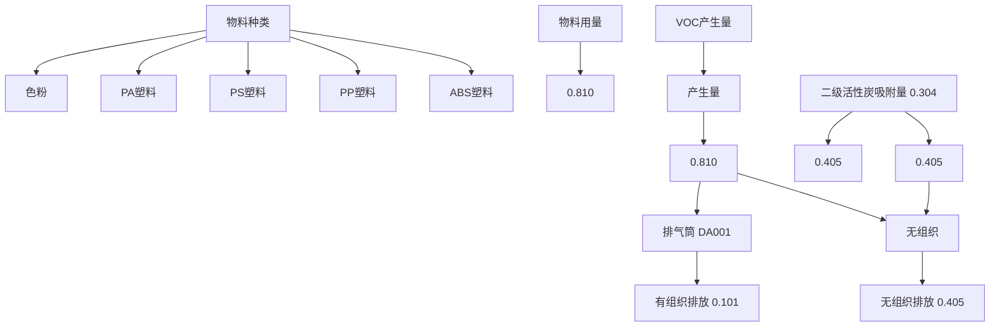
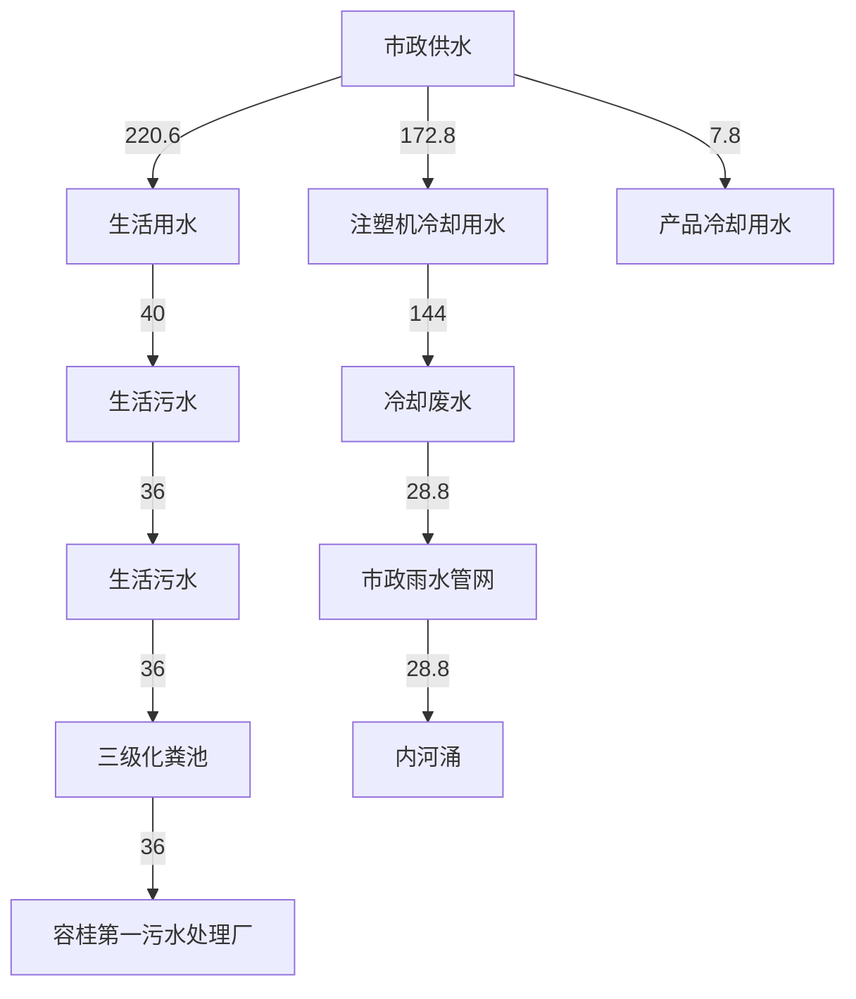
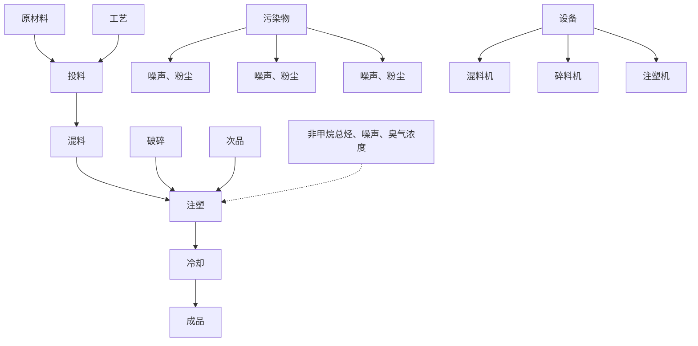
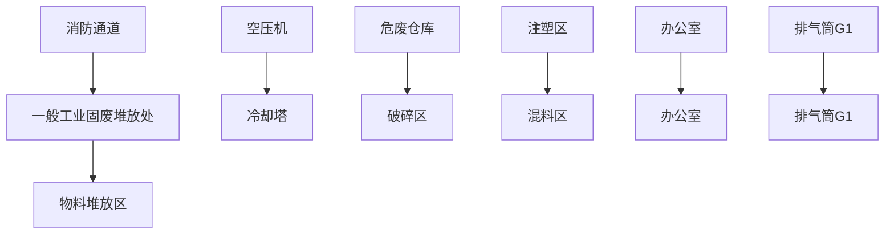

# 建设项目环境影响报告表

# （污染影响类）

项目名称：佛山市顺德区英礼纳五金塑胶制品有限公司新建项目建设单位（盖章)：佛山市顺德区英礼纳五金塑胶制品有限公司

编制日期：2023年4月

中华人民 境部制

text_image

民共和国生态环境
4403070177496

编制单位和编制人员情况表

<table><tr><td>项目编号.</td><td colspan="2">b40qn2</td></tr><tr><td>建设项目名称.</td><td colspan="2">佛山市顺德区英礼纳五金塑胶制品有限公司新建项目</td></tr><tr><td>建设项目类别</td><td colspan="2">26-053塑料制品业</td></tr><tr><td>环境影响评价文件类型</td><td>报告表</td><td rowspan="2"></td></tr><tr><td colspan="2">一、建设单位情况</td></tr><tr><td>单位名称(盖章)</td><td>佛山市</td><td>品有限公司</td></tr><tr><td>统一社会信用代码</td><td>91440</td><td></td></tr></table>

N

# 目录

一、建设项目基本情况 .  
二、建设项目工程分析 .. 8  
三、区域环境质量现状、环境保护目标及评价标准 . 15  
四、主要环境影响和保护措施 .. 21  
五、环境保护措施监督检查清单 . 43  
六、结论.. 45  
建设项目污染物排放量汇总表 . 46  
附图1项目地理位置图 . 47  
附图2 项目四至图 48  
附图3 项目平面布置图 49   
附图4 项目所在地环境管控单元划分 . 50  
附图5项目周围环境概况图 . 51  
附图6 项目声环境功能区划图 52  
附图7项目水环境功能区划图 53  
附图8项目大气环境功能区划图 . 54  
附图9 项目厂界500米范围内敏感点图 .. 55  
附图10 项目所在地控制性详细规划图 . 56  
附件1 营业执照 57   
附件2 法人代表身份证 . 58  
附件3 项目厂房购房合同 . 59  
附件4 项目厂房租赁合同 . 63  
附件5 环评协议 68   
附件6 同意公示声明. 69

# 一、建设项目基本情况

<table><tr><td>建设项目名称</td><td colspan="4">佛山市顺德区英礼纳五金塑胶制品有限公司新建项目</td></tr><tr><td>项目代码</td><td colspan="4">/</td></tr><tr><td>建设单位联系人</td><td>李**</td><td>联系方式</td><td colspan="2">139**1902</td></tr><tr><td>建设地点</td><td colspan="4">佛山市顺德区容桂街道四基社区华基路5号锦腾集成电路制造中心9栋302之二</td></tr><tr><td>地理坐标</td><td colspan="4">(东经113度14分23.776秒,北纬22度46分24.457秒)</td></tr><tr><td>国民经济行业类别</td><td>C2929塑料零件及其他塑料制品制造</td><td>建设项目行业类别</td><td colspan="2">二十六、橡胶和塑料制品业29-53、塑料制品业292-其他(年使用非溶剂型低VOCs含量10吨以下的除外)</td></tr><tr><td>建设性质</td><td>☑新建(迁建)□改建□扩建□技术改造</td><td>建设项目申报情形</td><td colspan="2">☑首次申报项目□不予批准后再次申报项目□超五年重新审核项目□重大变动重新报批项目</td></tr><tr><td>项目审批(核准/备案)部门(选填)</td><td>/</td><td>项目审批(核准/备案)文号(选填)</td><td colspan="2">/</td></tr><tr><td>总投资(万元)</td><td>50</td><td>环保投资(万元)</td><td colspan="2">10</td></tr><tr><td>环保投资占比(%)</td><td>20</td><td>施工工期</td><td colspan="2">2个月</td></tr><tr><td>是否开工建设</td><td>☑否□是</td><td>用地(用海)面积( $m^{2}$ )</td><td colspan="2">590</td></tr><tr><td>专项评价设置情况</td><td colspan="4">无</td></tr><tr><td>规划情况</td><td colspan="4">本项目位于顺德区容桂街道锦腾集成电路制造中心内,根据《佛山市顺德区容桂西部片区控制性详细规划修编》,详见附图10,该土地利用规划为工业用地,符合佛山市顺德区土地利用规划</td></tr><tr><td>规划环境影响评</td><td colspan="4">无</td></tr><tr><td>价情况</td><td colspan="4"></td></tr><tr><td>规划及规划环境影响评价符合性分析</td><td colspan="4">无</td></tr><tr><td rowspan="6">其他符合性分析</td><td colspan="4">1.选址合理合法性分析佛山市顺德区英礼纳五金塑胶制品有限公司位于佛山市顺德区容桂街道四基社区华基路5号锦腾集成电路制造中心9栋302之二,根据《佛山市顺德区容桂西部片区控制性详细规划修编》(详见附图10),项目所在地土地利用规划为工业用地,不属于一般农地区、水利用地区、生态环境安全控制区、风景旅游用地区等区域,项目所在地为工业用地,未改变用地性质。因此,项目用地符合当地规划。2.与《环境保护综合名录(2021年版)》的相符性分析本项目属于塑料制品制造行业,主要生产塑料配件,不属于《环境保护综合名录(2021年版)》中“高污染、高环境风险”产品名录。3.与地区有机物治理政策相符性分析本项目生产过程中注塑工序会产生一定量的有机废气,有机废气治理与地区的治理政策符合性分析见下表。表1-1 项目与有机污染物治理政策的相符性</td></tr><tr><td>序号</td><td>政策要求</td><td>工程内容</td><td>符合性</td></tr><tr><td colspan="4">1.与《广东省生态环境保护“十四五”规划》(粤环(2021)10号)的相符性分析</td></tr><tr><td>1.1</td><td>大力推进低VOCs含量原辅材料源头替代,严格落实国家和地方产品VOCs含量限值质量标准,禁止建设生产和使用高VOCs含量的溶剂型涂料、油墨、胶粘剂等项目。严格实施VOCs排放企业分级管控,全面推进涉VOCs排放企业深度治理。开展中小型企业废气收集和治理设施建设、运行情况的评估,强化对企业涉VOCs生产车间/工序废气的收集管理,推动企业开展治理设施升级改造。</td><td>本项目不使用高VOCs含量的溶剂型涂料、油墨、胶粘剂。</td><td>符合</td></tr><tr><td colspan="4">2.与《挥发性有机物(VOCs)污染防治技术政策》(环保部公告2013第31号)相符性分析</td></tr><tr><td>2.1</td><td>含VOCs产品的使用过程中,应采取废</td><td>项目对注塑工艺有机废气采用包围型集气罩收集,减少废</td><td>符合</td></tr></table>

<table><tr><td></td><td>气收集措施,提高废气收集效率,减少废气的无组织排放与逸散,并对收集后的废气进行回收或处理后达标排放。</td><td>气的无组织排放与逸散。然后通过收集管道引至“两级活性炭”吸附装置处理。</td><td></td></tr><tr><td colspan="4">3.与《广东省生态环境厅关于做好重点行业建设项目挥发性有机物总量指标管理工作的通知》(粤环发〔2019〕2号)相符性分析</td></tr><tr><td>3.1</td><td>对VOCs排放量大于300公斤/年的新、改、扩建项目,进行总量替代,按照附表1填报VOCs指标来源说明。其他排放量规模需要总量替代的,由本级生态环境主管部门自行确定范围,并按照要求审核总量指标来源,填写VOCs总量指标来源说明</td><td>本项目VOCs总量指标为0.506t/a,VOCs总量指标由顺德区容桂街道分配划拨。</td><td>符合</td></tr><tr><td colspan="4">4.与《广东省塑料制品与制造业挥发性有机物综合整治技术指南》(2022年6月5日)相符性</td></tr><tr><td>4.1</td><td>塑炼/塑化/熔化、挤出、注塑、吹膜等成型工序可采取局部气体收集措施,且满足控制风速不低于0.3m/s的要求。</td><td>本项目注塑工序采用包围型集气罩等局部气体收集措施,且满足控制风速不低于0.3m/s的要求</td><td>符合</td></tr><tr><td>4.2</td><td>车间或生产设施排气中NMHC初始排放速率≥3kg/h时,建设VOCs处理设施且处理效率≥80%,采用的原辅材料符合国家有关低VOCs含量产品规定的除外</td><td>本项目车间或生产设施排气中NMHC初始排放速率小于3kg/h。</td><td>符合</td></tr><tr><td colspan="4">5.与《重点行业挥发性有机物综合治理方案》的通知(环大气〔2019〕53号)相符性</td></tr><tr><td>5.1</td><td>通过使用水性、粉末、高固体分、无溶剂、辐射固化等低VOCs含量的涂料,水性、辐射固化、植物基等低VOCs含量的油墨,水基、热熔、无溶剂、辐射固化、改性、生物降解等低VOCs含量的胶粘剂,以及低VOCs含量、低反应活性的清洗剂等,替代溶剂型涂料、油墨、胶粘剂、清洗剂等,从源头减少VOCs产生。工业涂装、包装印刷等行业要加大源头替代力度。</td><td>本项目涉及VOCs原料主要为塑料粒,不使用高VOCs含量原辅材料。</td><td>符合</td></tr><tr><td>5.2</td><td>重点对含VOCs物料(包括含VOCs原辅材料、含VOCs产品、含VOCs废料以及有机聚合物材料等)储存、转移和输送、设备与管线组件泄漏、敞开液面逸散以及工艺过程等五类排放源实施管控,通过采取设备与场所密闭、工艺改进、废气有效收集等措施,削减VOCs无组织排放。</td><td>本项目注塑工艺产生的有机废气采用包围型集气罩收集措施,削减VOCs无组织排放。</td><td>符合</td></tr><tr><td>5.3</td><td>车间或生产设施收集排放的废气,VOCs初始排放速率大于等于3千克/小时、重点区域大于等于2千克/小时的,应加大控制力度,除确保排放浓度稳定达标外,还应实行去除效率控制,去除效率不低于80%;采用的原辅材料符合国家有关低VOCs含量产品规定的除外,有行业排放标准的按其相关规定执行。</td><td>本项目位于佛山市,属于重点区域,VOCs初始排放速率小于2千克/小时。</td><td>符合</td></tr><tr><td colspan="4">6.与《挥发性有机物无组织排放控制标准》(GB37822—2019)相符性</td></tr><tr><td>6.1</td><td>VOCs物料应储存于密闭的容器、包装袋、储罐、储库、料仓中。</td><td rowspan="3">本项目塑料原料均采用塑料袋密闭包装,在非取用状态下,保持密封,储存在原料区</td><td>符合</td></tr><tr><td>6.2</td><td>盛装VOCs物料的容器或包装袋应存放于室内,或存放于设置有雨棚、遮阳和防渗设施的专用场地。盛装VOCs物料的容器或包装袋在非取用状态时应加盖、封口,保持密闭。</td><td>符合</td></tr><tr><td>6.3</td><td>VOCs物料储库、料仓应利用完整的围护结构将污染物质、作业场所等与周围空间阻隔所形成的封闭区域或封闭式建筑物。该封闭区域或封闭式建筑物除人员、车辆、设备、物料进出时,以及依法设立的排气筒、通风口外,门窗及其他开口(孔)部位应随时保持关闭状态。</td><td>符合</td></tr><tr><td colspan="4">7.与《佛山市顺德区生态环境保护“十四五”规划(2021-2025)》(顺府办发(2022)16号)相符性</td></tr><tr><td>7.1</td><td>大力推进低VOCs含量、低反应活性的原辅材料替代,将全面使用低VOCs含量原辅材料的企业纳入正面清单和政府绿色采购清单。鼓励重点行业企业开展生产工艺和设备水性化改造,推广使用水性、高固体分、无溶剂、粉末等低VOCs含量涂料。</td><td>本项目不涉及高VOCs含量原辅材料</td><td>符合</td></tr></table>

# 4. 本项目与“三线一单”相符性分析

# （1）生态保护红线

项目位于佛山市顺德区容桂街道四基社区华基路 5号锦腾集成电路制造中心9栋302之二，根据《广东省人民政府关于印发广东省“三线一单”生态环境分区管控方案的通知》（粤府〔2020〕71 号）、《佛山市人民政府关于印发佛山市“三线一单”生态环境分区管控方案的通知》（佛府【2021】11 号)以及《佛山市顺德区人民政府关于印发佛山市顺德区“三线一单”生态环境分区管控方案的通知》(顺府发【2021】11 号）三个文件，项目所在地属于广东省佛山市顺德区重点管控单元 1（ZH44060620001，容桂街道重点管控区）内，不在划定的生态保护红线区域，不属于涵盖生态保护红线、一般生态空间、饮用水水源保护区、环境空气质量一类功能区等区域的“优先保护单元”。因此，本项目不涉及生态保护红线。

# （2）环境质量底线

根据《佛山市“三线一单”生态环境分区管控方案》（佛府【2021】11 号），污染物排放管控要求：稳步推进排水设施“三个一体化”[“三个一体化”指“建管一体化、厂网一体化、城乡一体化”。]管理模式，补齐城乡污水收集和处理短板，推动污水处理设施提质增效，加快消除城中村、老旧城区、城乡结合部等污水收集管网空白区，逐步实现城乡污水收集处理全覆盖。

根据《2022 年度佛山市顺德区生态环境状况公报》中的数据和结论，O3（臭氧）浓度超过了质量标准限值，故顺德区大气环境质量属非达标区；根据《佛山市生态环境局顺德分局关于发布 2022年度佛山市顺德区环境质量状况公报的通知》（佛环顺函〔2023〕26 号）监测数据，2022年鸡鸦水道水质满足《地表水环境质量标准》（GB3838-2002）之Ⅲ类水功能要求。

本项目属于容桂第一污水处理厂的纳污范围内，本项目生活污水经三级化粪池预处理后由市政污水管网排入容桂第一污水处理厂处理，尾水排入鸡鸦水道，对周围水环境影响不大。

因此本项目的建设不会突破当地环境质量底线。

# （3）资源利用上线

根据《广东省人民政府关于印发广东省“三线一单”生态环境分区管控方案的通知》（粤府〔2020〕71 号）关于“珠三角核心区”的能源资源利用要求：科学实施能源消费总量和强度“双控”，新建高能耗项目单位产品（产值）能耗达到国际国内先进水平，实现煤炭消费总量负增长。率先探索建立二氧化碳总量管理制度，加快实现碳排放达峰。依法依规科学合理优化调整储油库、加油站布局，加快充电桩、加气站、加氢站以及综合性能源补给站建设，积极推动机动车和非道路移动机械电动化（或实现清洁燃料替代）。大力推进绿色港口和公用码头建设，提升岸电使用率；有序推动船舶、港作机械等“油改气”、“油改电”，降低港口柴油使用比例。鼓励天然气企业对城市燃气公司和大工业用户直供，降低供气成本。推进工业节水减排，重点在高耗水行业开展节水改造，提高工业用水效率。加强江河湖库水量调度，保障生态流量。盘活存量建设用地，控制新增建设用地规模。

根据《佛山市“三线一单”生态环境分区管控方案》（佛府【2021】11 号），能源资源利用管控要求：积极发展氢能源、天然气发电等清洁能源，逐步提高可再生能源与低碳清洁能源比例，建立现代化能源体系。

本项目施工过程中所用的资源主要为水资源和电能，运营期所用的资源主要为水资源、电能。其消耗量均很小，不会突破当地资源利用上线。

# （4）环保准入负面清单

根据国家发展改革委、商务部关于印发《市场准入负面清单（2022年版）》、《产业结构调整指导目录（2019年本）》的规定，项目不属于上述目录所列的鼓励类、限制类、禁止（淘汰）类严控类项目和负面清单。

# （5）环境管控单元准入清单

本项目位于广东省佛山市顺德区重点管控单元 1（ZH44060620001，容桂街道重点管控区）内，属于水环境工业污染重点管控区、水环境工业-城镇生活重点管控区、大气环境受体敏感重点管控区、大气环境高排放重点管控区、江河湖库岸线重点管控区。本项目与佛山市顺德区环境管控单元准入清单相符性分析如下表 1-2 所示。

表1-2 与顺德区“三线一单”的相符性分析

<table><tr><td>管控维度</td><td>管控要求</td><td>本项目内容</td><td>符合性</td></tr><tr><td rowspan="3">区域布局管控</td><td>系统推进村级工业园升级改造,腾出连片空间,布局产业集聚区和主题产业园,推动工业项目入园集聚发展。新增工业制造业用地原则上安排在产业集聚区内,产业集聚区外原则上不鼓励工业及物流仓储用地的新建与改造。</td><td>本项目位于佛山市顺德区容桂街道四基社区华基路5号锦腾集成电路制造中心9栋302之二,属于产业集聚区,不属于村改范围</td><td>符合</td></tr><tr><td>受纳水体或监控断面不达标的,不得新建、扩建向河涌直接排放废水的项目。新建、扩建含蚀刻工序的线路板生产项目和化工项目应在配套污水集中处置的工业园区或生活污水管网覆盖区域内建设;纯加工型印花项目,含酸洗、磷化的金属表面处理、金属制品项目(与自身高新技术企业配套的除外),含酸洗、喷涂、化学抛光、电解等涉及废水排放工艺的不锈钢型材加工项目(与自身高新技术企业配套的除外),应进入以此类项目为主导产业、有相应废水集中治理设施的工业园区,实现集中治污。</td><td>本项目外排废水为生活污水,属于间接排放。污水经预处理后进入容桂第一污水处理厂处理;本项目不包含条款中提及的限制类项目和工序。</td><td>符合</td></tr><tr><td>大气环境受体敏感重点管控区内,应严格限制新建储油库项目、产生和排放有毒有害大气污染物的建设项目以及使用溶剂型油墨、涂料、清洗剂、胶黏剂等高挥发性有机物原辅材料项目,鼓励现有该类项目搬迁退出。</td><td>本项目不属于产生和排放有毒有害大气污染物的建设项目,不使用溶剂型油墨、涂料、清洗剂、胶黏剂等高挥发性有机物原辅材料。</td><td>符合</td></tr><tr><td rowspan="2">能源资源利用</td><td>科学实施能源消费总量和强度“双控”,新建高能耗项目单位产品(产值)能耗达到国际国内先进水平</td><td rowspan="2">本项目生产设备均使用电能作为能源。项目位于佛山市顺德区容桂街道四基社区华基路5号锦腾集成电路制造中心9栋302之二,不占用水域。</td><td>符合</td></tr><tr><td>严格水域岸线用途管制,新建项目一律不得违规占用水域。严禁破坏生态的岸线利用行为和不符合其功能定位的开发建设活动,严禁以各种名义侵占河道、围垦湖泊、非法采砂等</td><td>符合</td></tr><tr><td rowspan="2">污染物排放管控</td><td>大力推进低VOCs含量原辅材料替代,加快涉VOCs重点行业的生产工艺升级改造,推行自动化生产工艺,对达不到要求的VOCs收集及治理设施进行整治提升,逐步淘汰低效VOCs治理设施。</td><td>本项目不生产和使用高VOCs含量原辅材料项目,不使用低效VOCs治理设施</td><td>符合</td></tr><tr><td>作为重金属污染重点防控区,区域内重点重金属排放总量只减不增。</td><td>本项目不排放重金属污染物</td><td>符合</td></tr><tr><td>环境风险防控</td><td>加强环境风险分级分类管理,强化金属制品、有色金属和压延加工、化学原料和化学品制造业等涉重金属、化工行业企业及工业园区等重点环境风险源的环境风险防控。</td><td>本项目不属于金属制品、有色金属和压延加工、化学原料和化学品制造业等涉重金属、化工行业企业项目</td><td>符合</td></tr></table>

# 二、建设项目工程分析

# 1. 项目概况

本项目建设性质为新建，项目生产车间位于佛山市顺德区容桂街道四基社区华基路 5号锦腾集成电路制造中心 9 栋 302 之二，项目所在建筑共 10 层，第 1-4 层层高约 6米，5-10 层层高约 4.5 米，项目生产车间所在建筑物高度约 51 米，本项目设置 1 个排气筒，排气筒高度取 52 米，占地面积 590m2，建筑面积 590m2。根据建设单位提供的资料，建设项目主要建设内容见表 2-1。

表 2-1 项目主要建设内容一览表

<table><tr><td>分类</td><td>内容</td><td>功能或规模</td><td>依托</td></tr><tr><td>主体工程</td><td>生产区域</td><td>项目生产车间仅1层,占地面积约200m2,从事生产活动,包括注塑区(约150m2)、破碎区(约30m2)、混料区(约20m2)等。</td><td rowspan="6">现有已建厂房</td></tr><tr><td rowspan="3">储运工程</td><td>原料堆放区</td><td>用于储存ABS塑料、PP塑料等原材料,面积约200m2。</td></tr><tr><td>成品堆放区</td><td>用于储存项目产品,面积约60m2。</td></tr><tr><td>危废仓库</td><td>用于储存本项目产生的危险废物,面积约5m2。</td></tr><tr><td rowspan="2">辅助工程</td><td>办公区域</td><td>项目在车间东侧,设置一间办公室,面积约占10m2。</td></tr><tr><td>其他</td><td>包含废气处理区域、洗手间等,面积约占115m2。</td></tr><tr><td rowspan="3">公用工程</td><td>供水</td><td>项目主要用水全部由市政自来水厂供给,主要为生活用水和注塑冷却用水,用水量约220.6t/a。</td><td rowspan="3">市政公用设施</td></tr><tr><td>排水</td><td>项目外排废水主要为生活污水,生活污水排放量约36t/a。项目注塑冷却循环水系统定期排水,作为清净下水通过市政雨水管道排入附近内河涌。项目产品冷却水循环使用,定期补水,不外排。</td></tr><tr><td>供电</td><td>项目用电由市政电网供给,不设备用发电机。</td></tr><tr><td rowspan="4">环保工程</td><td>废水处理</td><td>生活污水经三级化粪池预处理达标后排入容桂第一污水处理厂进一步深度处理,尾水排入鸡鸦水道。</td><td>现有已建厂房</td></tr><tr><td>固废处置</td><td>一般工业固废进行统一收集后交物资回收单位处理;生活垃圾集中堆放,委托环卫部门及时清运处置;厂区内有固定的固废堆放处(面积约10m2);危险废物经收集后委托有资质单位进行处理,厂区设有危废仓库(面积约5m2),并做好“三防”处理。</td><td>新建</td></tr><tr><td>废气处理</td><td>注塑工序产生的非甲烷总烃以及臭气浓度收集后通过收集管道引至“两级活性炭”吸附装置处理,通过52m高排气筒DA001高空排放。</td><td>新建</td></tr><tr><td>噪声</td><td>主要生产设备安装隔振垫、安装隔声门窗、合理调整设备布置、加强设备维护、强化管理、合理安排工作时间等措施。</td><td>新建</td></tr></table>

# 2. 产品方案

根据建设单位提供的资料，本项目的产品产量见表2-2。

表 2-2 项目产品一览表

<table><tr><td>产品类型</td><td>年产量</td><td>备注</td></tr><tr><td>塑料配件</td><td>300 吨</td><td>主要为电器塑料零配件</td></tr></table>

建设内容

# 3. 主要生产设备

根据建设单位提供的资料，本项目主要生产设备见表2-3。

表 2-3 主要生产设备一览表

<table><tr><td>序号</td><td>设备名称</td><td>规格参数</td><td>数量</td><td>单位</td><td>工艺</td><td>位置</td></tr><tr><td>1</td><td>注塑机</td><td>120T</td><td>3</td><td>台</td><td rowspan="5">注塑</td><td rowspan="5">注塑区</td></tr><tr><td>2</td><td>注塑机</td><td>150T</td><td>1</td><td>台</td></tr><tr><td>3</td><td>注塑机</td><td>180T</td><td>1</td><td>台</td></tr><tr><td>4</td><td>注塑机</td><td>200T</td><td>2</td><td>台</td></tr><tr><td>5</td><td>注塑机</td><td>300T</td><td>1</td><td>台</td></tr><tr><td>6</td><td>混料机</td><td>/</td><td>2</td><td>台</td><td>混料</td><td>注塑区</td></tr><tr><td>7</td><td>破碎机</td><td>/</td><td>2</td><td>台</td><td>破碎</td><td>破碎区</td></tr><tr><td>8</td><td>空压机</td><td>/</td><td>1</td><td>台</td><td>辅助生产设备</td><td>/</td></tr><tr><td>9</td><td>冷却塔</td><td>循环水量 $2m^{3}/h$ </td><td>1</td><td>台</td><td>注塑冷却</td><td>/</td></tr><tr><td>10</td><td>吊机</td><td>/</td><td>1</td><td>台</td><td>吊装模具</td><td>注塑区</td></tr></table>

# 4. 主要原辅材料

（1）项目主要消耗的原辅材料及用量如表2-4所示。

2-4 项目主要原辅材料用量一览表

<table><tr><td>序号</td><td>名称</td><td>年用量</td><td>最大储存量</td><td>性状</td><td>包装规格</td></tr><tr><td>1</td><td>ABS 塑料</td><td>100 吨</td><td>3 吨</td><td>颗粒状</td><td>袋装,25kg/袋</td></tr><tr><td>2</td><td>PP 塑料</td><td>100 吨</td><td>3 吨</td><td>颗粒状</td><td>袋装,25kg/袋</td></tr><tr><td>3</td><td>PS 塑料</td><td>100 吨</td><td>3 吨</td><td>颗粒状</td><td>袋装,25kg/袋</td></tr><tr><td>4</td><td>PA 塑料</td><td>4 吨</td><td>0.5 吨</td><td>颗粒状</td><td>袋装,25kg/袋</td></tr><tr><td>5</td><td>色粉</td><td>50kg</td><td>1kg</td><td>粉状</td><td>袋装,50g/袋</td></tr><tr><td>6</td><td>液压油</td><td>0.18 吨</td><td>0.18 吨</td><td>液态</td><td>桶装,180kg/桶</td></tr></table>

（2）原辅材料理化性质见表2-5。

表 2-5 主要原辅材料理化性质一览表

<table><tr><td>序号</td><td>名称</td><td>理化性质</td></tr><tr><td>1</td><td>ABS塑料</td><td>ABS树脂是五大合成树脂之一,其抗冲击性、耐热性、耐低温性、耐化学药品性及电气性能优良,还具有易加工、制品尺寸稳定、表面光泽性好等特点,容易涂装、着色,还可以进行表面喷镀金属、电镀、焊接、热压和粘接等二次加工,广泛应用于机械、汽车、电子电器、仪器仪表、纺织和建筑等工业领域,是一种用途极广的热塑性工程塑料。丙烯腈-丁二烯-苯乙烯共聚物是由丙烯腈,丁二烯和苯乙烯组成的三元共聚物。</td></tr><tr><td>2</td><td>PP塑料</td><td>中文名为聚丙烯,为无毒、无臭、无味的乳白色高结晶的聚合物,密度只0.90~0.91g/cm3,是目前所有塑料中最轻的品种之一。它对水特别稳定,在水中的吸水率仅为0.01%,分子量约8万~15万。成型性好,但因收缩率大(为1%~2.5%),厚壁制品易凹陷,对一些尺寸精度较高零件,很难于达到要求,制品表面光泽好。</td></tr><tr><td>3</td><td>PS塑料</td><td>聚苯乙烯系塑料,是指大分子链中包括苯乙烯基的一类塑料,包括苯乙烯及其共聚物,具体品种包括普通聚苯乙烯(GPPS)、高抗冲聚苯乙烯(HIPS)、可发性聚苯乙烯(EPS)和茂金属聚苯乙烯(SPS)等。电绝缘性(尤其高频绝缘性)优良,无色透明,透光率仅次于有机玻璃,着色性耐水性,化学稳定性良好,强度一般,但质脆,易产生应力脆裂,不耐苯、汽油等有机溶剂.适于制作绝缘透明件.装饰件及化学仪器.光学仪器等零件</td></tr><tr><td>4</td><td>PA塑料</td><td>聚酰胺,英文名称:Polyamide(简称PA),比重:1.05-1.15 g/cm3,成型温度:220°C--300°C。特点:具有良好的综合性能,包括力学性能、耐热性、耐磨损性、耐化学药品性和自润滑性,且摩擦系数低,有一定的阻燃性,易于加工,适于用玻璃纤维和其它填料填充增强改性,提高性能和扩大应用范围。</td></tr><tr><td>5</td><td>色粉</td><td>是一种新型高分子材料专用着色剂,亦称颜料制备物,粉状。主要用在塑料上。由颜料或染料、载体和添加剂三种基本要素所组成,是把超常量的颜料均匀载附于树脂之中而制得的聚集体,可称颜料浓缩物,所以它的着色力高于颜料本身。加工时用少量色母料和未着色树脂掺混,就可达到设计颜料浓度的着色树脂或制品。</td></tr></table>

# （3）塑料用量校核分析

# ①塑料理论用量核算

本项目设有8台注塑机，根据项目注塑机型号不同，单位时间内塑料的消耗量不同，本项目塑料理论用量情况见下表。

表 2-6 项目塑料理论用量估算一览表

<table><tr><td>序号</td><td>机台型号</td><td>数量(台)</td><td>理论射出最大重量(g)</td><td>实际用量/模(g)</td><td>成型周期(S)</td><td>用量/台12h/d(kg)</td><td>日用量合计(kg)</td><td>每月用量25天/月(t)</td><td>年度用量300天/年(t)</td></tr><tr><td>1</td><td>120T</td><td>3</td><td>60.00</td><td>39.00</td><td>45</td><td>37.44</td><td>112.32</td><td>2.81</td><td>33.70</td></tr><tr><td>2</td><td>150T</td><td>1</td><td>150.00</td><td>97.50</td><td>50</td><td>84.24</td><td>84.24</td><td>2.11</td><td>25.27</td></tr><tr><td>3</td><td>180T</td><td>1</td><td>300.00</td><td>195.00</td><td>60</td><td>140.40</td><td>140.40</td><td>3.51</td><td>42.12</td></tr><tr><td>4</td><td>200T</td><td>2</td><td>500.00</td><td>325.00</td><td>60</td><td>234.00</td><td>468.00</td><td>11.70</td><td>140.40</td></tr><tr><td>5</td><td>300T</td><td>1</td><td>800.00</td><td>520.00</td><td>90</td><td>249.60</td><td>249.60</td><td>6.24</td><td>74.88</td></tr><tr><td>6</td><td>/</td><td>8</td><td>/</td><td>/</td><td>/</td><td>/</td><td colspan="2">总计用量(t)</td><td>316.37</td></tr><tr><td colspan="10">说明:机台按最大射出量的65%(产品重量60%+流道重量5%)计算。</td></tr></table>

②塑料理论用量与拟用量校核

偏差率：（316.37-304.05）÷304.05×100%= 4%。

根据上述计算可知，塑料的拟用量较理论用量偏不大，偏差率约为 4%，拟用量较理论用量偏大主要受生产过程中物料损耗、注塑机设备稳定情况，用量偏差在可接受范围内。

（4）项目物料平衡见下表 2-7所示。

表 2-7 项目投产后全年生产物料平衡表

<table><tr><td colspan="2">投入</td><td colspan="2">产出</td></tr><tr><td>原材料</td><td>数量(吨)</td><td>产物</td><td>数量(吨)</td></tr><tr><td>ABS 塑料</td><td>100</td><td>塑料配件(产品)</td><td>300</td></tr><tr><td>PP 塑料</td><td>100</td><td>非甲烷总烃</td><td>0.810</td></tr><tr><td>PS 塑料</td><td>100</td><td>颗粒物</td><td> $1.275 \times 10^{-3}$ </td></tr><tr><td>PA 塑料</td><td>4</td><td>物料损耗</td><td>3.239</td></tr><tr><td>色粉</td><td>0.05</td><td>/</td><td>/</td></tr><tr><td>Σ投入</td><td>304.05</td><td>Σ产出</td><td>304.05</td></tr></table>

flowchart

图 2-1 本项目 VOCs 平衡图（t/a）

# 5. 劳动定员及工作制度

表 2-8 工作制度一览表

<table><tr><td>序号</td><td>名称</td><td>内容</td></tr><tr><td>1</td><td>劳动定额</td><td>项目设员工4人</td></tr><tr><td>2</td><td>工作制度</td><td>年工作300天,每天1班,每班工作12小时,具体工作时间为8:00~20:00,年工作3600小时</td></tr><tr><td>3</td><td>食宿情况</td><td>不设食宿</td></tr></table>

# 6. 项目能耗水耗情况

表 2-9 能耗水耗一览表

<table><tr><td>序号</td><td>名称</td><td>单位</td><td>年用量</td><td>用途</td><td>备注</td></tr><tr><td>1</td><td rowspan="2">水</td><td>吨/年</td><td>40</td><td>办公、生活</td><td rowspan="2">市政供水</td></tr><tr><td>2</td><td>吨/年</td><td>180.6</td><td>生产用水</td></tr><tr><td>4</td><td>电</td><td>万度/年</td><td>12</td><td>生产、生活</td><td>市政供电</td></tr></table>

flowchart

图 2-2 本项目水平衡图（m3/a)

# 7. 总平面布置

项目位于佛山市顺德区容桂街道四基社区华基路5号锦腾集成电路制造中心9栋302之二，东面为其他工业厂房，南面隔工业区空地为四基村，西面为佛山市顺德区高铭威塑料科技有限公司，北面为西滘路。

项目经营场所为建成厂房，项目占地面积 590平方米。本项目有机废气排放的工序集中设置，成品设置于厂房其他位置。项目的车间、设备工序安排合理，物资流转相对方便。该平面布置集中了大气污染的排放，设备考虑项目噪声的距离衰减，从环保角度来看，该项目平面布置较为合理，详见附图4。

# 1. 工艺流程

# （1）生产工艺流程：

flowchart

图 2-3 生产工艺流程图

# （2）工艺流程说明：

本项目外购PP、ABS、PS、PA、色粉等原料，按比例要求投入混料机中混合，混料过程混料机为密闭状态，混料后的塑料粒经电加热的方式通过注塑机注塑成型，注塑机加热温度为 $1 6 0 ^ { \circ } \mathrm { C } { \cdot } 1 8 0 ^ { \circ } \mathrm { C } ,$ ，注塑完的工件经冷却成型后再包装后即为成品。

本项目注塑后将产生的塑料边角料与次品进行破碎后回用于生产；混料机工作过程中密闭，基本不会有粉尘的外逸。

备注：项目注塑机定期维护，更换添加液压油，更换后的废液压油储存在液压油桶内。

表 2-10 项目废水产污环节情况表

<table><tr><td>产生工序</td><td>污染物排放特征</td><td>特征污染物</td></tr><tr><td>员工办公生活</td><td>生活污水</td><td> $COD_{Cr}$ 、 $BOD_5$ 、 $NH_3-N$ 、SS</td></tr><tr><td>注塑机冷却</td><td>冷却废水</td><td>/</td></tr><tr><td>产品冷却</td><td>冷却水</td><td>/</td></tr></table>

表 2-11 项目废气产污环节情况表

<table><tr><td>产生工序</td><td>废气主要污染物</td></tr><tr><td>注塑</td><td>非甲烷总烃、臭气浓度</td></tr><tr><td>投料、混料、破碎</td><td>颗粒物</td></tr></table>

表 2-12 项目固废产污环节情况表

<table><tr><td>产污环节</td><td>主要污染物</td><td>污染物类型</td></tr><tr><td>员工办公生活</td><td>生活垃圾</td><td>一般固废</td></tr><tr><td>注塑过程</td><td>次品及边角料</td><td>一般固废</td></tr><tr><td>产品包装</td><td>废包装材料</td><td>一般固废</td></tr><tr><td>设备维护</td><td>废含油抹布、废液压油、废油桶</td><td>危险废物</td></tr><tr><td>废气治理系统</td><td>废活性炭</td><td>危险废物</td></tr></table>

表 2-13 项目噪声产污环节情况表

<table><tr><td>产污环节</td><td>污染来源</td></tr><tr><td>各生产设备</td><td>注塑机、混料机、破碎机、冷却塔等</td></tr><tr><td>辅助设备</td><td>引风机、空压机、吊机等</td></tr></table>

与项目有关的原有环境污染问题

本项目属于新建项目，租用已有厂房，不存在原有污染情况。项目所在区域主要环境问题为附近企业生产过程中排放的少量废气、废水、固体废物及机械设备噪声。对周围环境有一定的影响。

# 三、区域环境质量现状、环境保护目标及评价标准

# 1. 环境空气质量现状

根据《佛山市顺德区生态环境保护“十四五”规划（2021-2025）》（顺府办发〔202216 号），项目所在地为大气环境二类功能区，执行《环境空气质量标准》（GB3095-2012）及2018年修改单二级标准。

为评价本项目所在区域的环境空气质量现状，引用《佛山市生态环境局顺德分局关于发布2022年度佛山市顺德区环境质量状况公报的通知》（佛环顺函〔2023〕26 号）附件《2022年佛山市顺德区环境质量状况公报》中的数据和结论如下。

2022年顺德区全区二氧化硫 $( \mathrm { S O } _ { 2 } )$ 、二氧化氮 $\left( \mathbf { N O } _ { 2 } \right)$ 、可吸入颗粒物 $\left( \mathrm { P M } _ { 1 0 } \right)$ 、细颗粒物 $\left( \mathbf { P M } _ { 2 . 5 } \right)$ 平均浓度分别为 5、29、32、19微克/立方米，臭氧年评价浓度为190微克/立方米，一氧化碳（CO）年评价浓度为1.1毫克/立方米。顺德区二氧化硫 $( \mathsf { S O } _ { 2 } )$ 、二氧化氮 $\left( \mathbf { N O } _ { 2 } \right)$ 、可吸入颗粒物 $\left( \mathrm { P M } _ { 1 0 } \right)$ 、细颗粒物 $\left( \mathbf { P M } _ { 2 . 5 } \right)$ 、一氧化碳（CO）五项污染物年评价浓度均达到《环境空气质量标准》（GB3095-2012）二级标准限值2018年修改单二级标准，臭氧 $( \mathbf { O } _ { 3 } )$ 超标。具体情况见图3-1。

bar

| Category | 2021年 (毫克/立方米) | 2022年 (毫克/立方米) |
|---|---|---|
| SO2 | 6 | 5 |
| NO2 | 33 | 29 |
| PM10 | 42 | 32 |
| PM2.5 | 22 | 19 |
| O3 | 173 | 190 |
| CO | 1.0 | 1.1 |
(CO 单位为毫克/立方米, 其余为微克/立方米)

图 3-1 2022 年顺德区城市空气各项污染物年评价浓度

区域 环境 质量 现状

根据图 3-1 可知，2022 年顺德区二氧化硫（SO2）、二氧化氮 $( \mathrm { N O } _ { 2 } )$ 、可吸入颗粒物 $\left( \mathrm { P M } _ { 1 0 } \right)$ 、细颗粒物 $\left( \mathbf { P M } _ { 2 . 5 } \right)$ 、一氧化碳（CO）五项污染物年评价浓度均达到《环境空气质量标准》（GB3095-2012）二级标准限值2018年修改单二级标准，臭氧 $( \mathbf { O } _ { 3 } )$ 超标，判定顺德区为不达标区。

# 2. 地表水环境质量现状

本项目所处位置属于容桂第一污水处理厂纳污范围，纳污水体为鸡鸦水道。鸡鸦水道水质执行《地表水环境质量标准》 （GB3838-2002）之III 类标准。

为评价鸡鸦水道水质，参考《佛山市生态环境局顺德分局关于发布 2022年度佛山市顺德区环境质量状况公报的通知》（佛环顺函〔2023〕26 号），2022 年顺德区 2个国控断面（乌洲、顺德港）、3 个省控断面（杨滘、海凌、飞鹅山）均达到相应的水质目标，水质优良率（Ⅰ～Ⅲ类）为 100%，与2021 年持平。项目纳污水体鸡鸦水道细滘大桥断面监测的水质达到了Ⅱ类标准要求，水质良好。

表3-1 2022 年度佛山市顺德区环境质量状况公报（节选）

<table><tr><td rowspan="2">河流名称</td><td rowspan="2">断面</td><td colspan="2">断面定类</td><td rowspan="2">水质评价标准</td><td colspan="2">河流定类</td></tr><tr><td>2022年</td><td>2021年</td><td>2022年</td><td>2021年</td></tr><tr><td>鸡鸦水道</td><td>细滘大桥</td><td>II</td><td>II</td><td>II</td><td>II</td><td>II</td></tr></table>

# 3. 声环境质量现状

根据《关于印发佛山市声环境功能区划分方案的通知》（佛府函〔2015〕72号），项目位于声环境 2 类功能区，本项目厂界外周边 50 米范围内不存在声环境保护目标，无需监测声环境质量现状。

# 4.生态环境

本项目用地范围内不含有生态环境保护目标，无需进行生态现状调查。

# 5.地下水、土壤环境

本项目不存在土壤、地下水环境污染途径。根据《建设项目环境影响报告表编制技术指南（污染影响类）》，原则上不开展环境质量现状调查。

<table><tr><td rowspan="6">环境保护目标</td><td colspan="6">1.大气环境环境空气质量需符合《环境空气质量标准》(GB3095-2012)中的二级标准要求。本项目边界外500米范围内存在居住区、学校等人群较集中的区域等保护目标。表3-2 大气环境保护目标</td></tr><tr><td>名称</td><td>保护对象</td><td>保护内容</td><td>环境功能区</td><td>相对厂址方位</td><td>距离/m</td></tr><tr><td>四基村</td><td>居民</td><td>大气环境</td><td>环境空气二类</td><td>南面</td><td>88</td></tr><tr><td>四基中学</td><td>居民</td><td>大气环境</td><td>环境空气二类</td><td>西面</td><td>183</td></tr><tr><td colspan="6">备注:表中距离表示距离本项目最近距离。</td></tr><tr><td colspan="6">2.地下水环境项目评价区内地下水环境质量标准执行《地下水质量标准》(GB/T4848-2017)IV类标准,保护该区域地下水环境质量,使项目评价区内地下水环境质量不因项目运营而遭受不良影响;项目厂界500米范围内无地下水集中式饮用水水源和热水、矿泉水、温泉等特殊地下水资源。3.声环境声环境质量需符合《声环境质量标准》(GB3096-2008)中的2类标准。控制各种噪声声源,要求项目边界噪声达《工业企业厂界环境噪声排放标准》(GB12348-2008)2类标准;厂界外50米范围内无声环境保护目标。4.生态环境本项目利用已有建筑物作为生产经营场所,不涉及新增用地,周边的生态环境由于人为开发活动,已由自然生态环境转为城市人工生态环境。该区域属于非重要生境,没有特别受保护的生境和生物区系及水产资源。</td></tr><tr><td>污染物排放控制标准</td><td colspan="6">1.废水排放标准本项目运营期间产生的生活污水经预处理后的达到广东省地方标准《水污染物排放限值》(DB44/26-2001)第二时段三级标准后,排入容桂第一污水处理厂处理,尾水排入鸡鸦水道。根据2013年7月11日颁布的《顺德区环境运输和城市管理局关于全区城镇污水处理厂尾水排放执行标准的通知》规定:新、扩和改建城镇污水处理厂尾水应符合《城镇污水处理厂污染物排放标准》(GB18918-2002)一级A标准及广东省地方标准《水污染物排放限值》(DB44/26-2001)第二时段一级标准的较严值,具体排放限值见表3-3。</td></tr></table>

表 3-3 水污染物排放标准限值（单位：mg/L）

<table><tr><td>类型</td><td>pH</td><td> $COD_{Cr}$ </td><td> $BOD_5$ </td><td>SS</td><td>氨氮</td><td>标准</td></tr><tr><td>生活污水预处理标准</td><td>6-9</td><td>500</td><td>300</td><td>400</td><td>——</td><td>(DB44/26-2001)第二时段三级标准</td></tr><tr><td>容桂第一污水处理厂排放限值</td><td>6-9</td><td>40</td><td>10</td><td>10</td><td>5</td><td>(GB18918-2002)一级A标准及(DB44/26-2001)第二时段一级标准的较严值</td></tr></table>

# 2. 废气排放标准

①项目注塑过程会产生非甲烷总烃，主要污染因子为非甲烷总烃，执行《合成树脂工业污染物排放标准》（GB31572-2015）中表4 规定的大气污染物排放限值以及表9企业边界大气污染物浓度限值。  
②项目生产过程中臭气浓度执行《恶臭污染物排放标准》（GB14554-93）中表2恶臭污染物排放标准值（臭气浓度≤40000（无量纲），排气筒高度52m）及表1新改扩建项目厂界二级标准值（二级标准中新改扩建：≤20（无量纲））。  
③项目投料、混料、破碎过程会产生塑料粉尘，主要污染因子为颗粒物，执行《合成树脂工业污染物排放标准》（GB31572-2015）中表9 企业边界大气污染物浓度限值。  
④项目厂区内VOCs 无组织排放监控点浓度应满足广东省地方标准《固定污染源挥发性有机化合物综合排放标准》（DB44/2367-2022）中表3厂区内VOCs 无组织排放限值。

表 3-4 废气排放标准

<table><tr><td>产生源</td><td>污染物</td><td>排气筒高度</td><td>有组织最高允许排放浓度</td><td>无组织排放监控浓度限值</td><td>标准来源</td></tr><tr><td rowspan="6">注塑</td><td>非甲烷总烃</td><td rowspan="6">52m</td><td>100 mg/m3</td><td>4.0 mg/m3</td><td rowspan="6">GB 31572-2015</td></tr><tr><td>苯乙烯</td><td>50mg/m3</td><td>/</td></tr><tr><td>丙烯腈</td><td>0.5mg/m3</td><td>/</td></tr><tr><td>甲苯</td><td>15mg/m3</td><td>/</td></tr><tr><td>乙苯</td><td>100mg/m3</td><td>/</td></tr><tr><td>氨</td><td>30mg/m3</td><td>/</td></tr><tr><td>注塑</td><td>臭气浓度</td><td>52m</td><td>40000(无量纲)</td><td>20(无量纲)</td><td>GB14554-93</td></tr><tr><td>混料、破碎</td><td>颗粒物</td><td>/</td><td>/</td><td>1.0mg/m3</td><td>GB 31572-2015</td></tr></table>

备注：根据《恶臭污染物排放标准》（GB14554-93）6.1.2：“凡在表2所列两种高度之间的排气筒，采用四舍五入方法计算其排气筒的高度。”本项目排气筒高度 52米，按照排气筒高度 50 米标准值为 40000（无量纲）。

表 3-5 厂区内 VOCs 无组织排放限值

<table><tr><td>工序</td><td>污染因子</td><td>排放限值(mg/m3)</td><td>限值意义</td></tr><tr><td rowspan="2">注塑</td><td rowspan="2">NMHC</td><td>6</td><td>监控点处1h平均浓度值</td></tr><tr><td>20</td><td>监控点处任意一次浓度值</td></tr></table>

# 3. 噪声排放标准

项目各厂界噪声排放执行《工业企业厂界环境噪声排放标准》（GB12348-2008）2类标准：即昼间≤ 60dB（A）、夜间≤50dB（A）。

# 4. 固体废物

固体废物管理遵照《中华人民共和国固体废物污染环境防治法》、《广东省固体废物污染环境防治条例》执行，其贮存过程应满足相应防渗漏、防雨淋、防扬尘等环境保护要求；危险废物执行《国家危险废物名录》（2021版）以及《危险废物贮存污染控制标准》（GB18597-2001），同时执行《关于发布<一般工业固体废物贮存、处置场污染控制标准>（GB18599-2001）等 3 项国家污染物控制标准修改单的公告》（2013年第 36号）。

<table><tr><td rowspan="8">总量控制指标</td><td colspan="5">1.水污染物排放总量控制指标项目生活污水排放量为36t/a,CODcr排放量为0.0014t/a,氨氮排放量为0.0002t/a;根据《佛山市排污权有偿使用和交易管理试行办法》(佛府办2020第19号),生活污水的CODcr、氨氮不分配总量,本项目废水纳入容桂第一污水处理厂处理,无需分配总量。2.大气污染物排放总量控制指标本项目非甲烷总烃排放总量为0.506t/a,其中有组织排放量为0.101t/a,无组织排放量为0.405t/a。根据《广东省生态环境厅关于做好重点行业建设项目挥发性有机物总量指标管理工作的通知》(粤环发〔2019〕2号),项目产生的非甲烷总烃应纳入VOCs排放总量一并管理。表3-6 总量控制指标一览表</td></tr><tr><td colspan="3">要素</td><td>排放量</td><td>需分配的总量</td></tr><tr><td rowspan="3">废水</td><td colspan="2">生活废水排放量</td><td>36t/a</td><td>/</td></tr><tr><td colspan="2">CODcr</td><td>0.0014t/a</td><td>0</td></tr><tr><td colspan="2">氨氮</td><td>0.0002t/a</td><td>0</td></tr><tr><td rowspan="3">废气</td><td rowspan="3">挥发性有机物(非甲烷总烃)</td><td>有组织</td><td>0.101t/a</td><td rowspan="3">0.506t/a</td></tr><tr><td>无组织</td><td>0.405t/a</td></tr><tr><td>合计</td><td>0.506t/a</td></tr><tr><td colspan="6">综上,建议项目VOCs(含非甲烷总烃)排放总量控制指标为0.506t/a,由区镇级环保主管部门核查总量指标。</td></tr></table>

# 四、主要环境影响和保护措施

<table><tr><td>施工期环境保护措施</td><td colspan="16">本项目租赁现有的生产厂房,只是需要安装调试本项目生产设备,主要为室内人工作业,无大型机械入内,施工期基本无废水、废气、固废产生,主要影响为设备安装及调试过程中的机械噪声,此类噪声值较小,可忽略,所以施工期间基本无污染工序,不会对项目周围环境带来不良影响。</td></tr><tr><td rowspan="9">运营期环境影响和保护措施</td><td colspan="16">1、废气根据建设单位工艺流程可知,大气污染物主要有颗粒物、非甲烷总烃、臭气浓度等。参考《排污许可证申请与核发技术规范 橡胶和塑料制品工业》(HJ1122-2020)和《污染源源强核算技术指南 准则》(HJ884-2018),项目废气污染物排放情况见表4-1。表4-1 废气污染物排放情况一览表</td></tr><tr><td rowspan="2">产排污环节</td><td rowspan="2">生产单元</td><td rowspan="2">污染物种类</td><td rowspan="2">总产生量/t/a</td><td colspan="3">污染物产生情况</td><td rowspan="2">排放形式</td><td colspan="5">治理措施</td><td colspan="3">污染物排放情况</td></tr><tr><td>产生量/t/a</td><td>产生速率/kg/h</td><td>产生浓度mg/m3</td><td>处理能力m3/h</td><td>收集率</td><td>处理工艺</td><td>去除率</td><td>是否可行技术</td><td>排放量/t/a</td><td>排放速率/kg/h</td><td>排放浓度/mg/m3</td></tr><tr><td rowspan="4">注塑</td><td rowspan="4">注塑区</td><td rowspan="2">非甲烷总烃</td><td rowspan="2">0.810</td><td>0.405</td><td>0.113</td><td>20.455</td><td>有组织</td><td>5500</td><td>50%</td><td>两级活性炭</td><td>75%</td><td>是</td><td>0.101</td><td>0.028</td><td>5.114</td></tr><tr><td>0.405</td><td>0.113</td><td>/</td><td>无组织</td><td>/</td><td>/</td><td>/</td><td>/</td><td>/</td><td>0.405</td><td>0.113</td><td>/</td></tr><tr><td rowspan="2">臭气浓度</td><td rowspan="2">/</td><td>/</td><td>/</td><td>/</td><td>有组织</td><td>5500</td><td>50%</td><td>/</td><td>/</td><td>/</td><td>/</td><td>/</td><td>≤40000(无量纲)</td></tr><tr><td>/</td><td>/</td><td>/</td><td>无组织</td><td>/</td><td>/</td><td>/</td><td>/</td><td>/</td><td>/</td><td>/</td><td>≤20(无量纲)</td></tr><tr><td>破碎</td><td>破碎区</td><td>颗粒物</td><td></td><td> $1.275 \times 10^{-3}$ </td><td>0.004</td><td>/</td><td>无组织</td><td>/</td><td>/</td><td>/</td><td>/</td><td>/</td><td> $1.275 \times 10^{-3}$ </td><td>0.004</td><td>/</td></tr><tr><td colspan="16">备注:参考《排污许可证申请与核发技术规范 橡胶和塑料制品工业》(HJ1122—2020),采用吸附法处理注非甲烷总烃属于废气污染防治可行技术,本项目使用两级活性炭吸附装置处理非甲烷总烃,故本项目废气治理设施是可行的。</td></tr></table>

项目废气排放口信息见表4-2。

表 4-2 废气排放口信息一览表

<table><tr><td rowspan="2">排放口编号及名称</td><td colspan="4">排放口基本情况</td><td colspan="2">地理坐标</td></tr><tr><td>高度(m)</td><td>内径(m)</td><td>温度(°C)</td><td>类型</td><td>经度</td><td>纬度</td></tr><tr><td>DA001</td><td>52</td><td>0.4</td><td>30</td><td>一般排放口</td><td>113.245340°</td><td>22.770464°</td></tr></table>

本项目废气排放口属于一般排放口，运营期环境自行监测计划参照《排污单位自行监测技术指南 橡胶和塑料制品》（HJ1207-2021）制定，详细运营期监测计划见表4-3。

表 4-3 营运期废气监测计划一览表

<table><tr><td rowspan="2">监测点位</td><td rowspan="2">监测指标</td><td rowspan="2">监测频次</td><td colspan="2">执行标准</td></tr><tr><td>名称</td><td>浓度限值</td></tr><tr><td rowspan="2">排气筒DA001</td><td>非甲烷总烃</td><td>1次/半年</td><td>《合成树脂工业污染物排放标准》(GB31572-2015)中表4规定的大气污染物排放限值</td><td> $100mg/m^3$ </td></tr><tr><td>臭气浓度</td><td>1次/半年</td><td>《恶臭污染物排放标准》(GB14554-93)中表2恶臭污染物排放标准值</td><td>40000(无量纲)</td></tr><tr><td rowspan="3">厂界上下风向</td><td>颗粒物</td><td rowspan="3">1次/年</td><td>《合成树脂工业污染物排放标准》(GB31572-2015)中表9企业边界大气污染物浓度限值</td><td> $1 mg/m^3$ </td></tr><tr><td>臭气浓度</td><td>《恶臭污染物排放标准》(GB14554-93)中表1新改扩建项目厂界二级标准值</td><td>20(无量纲)</td></tr><tr><td>非甲烷总烃</td><td>《合成树脂工业污染物排放标准》(GB31572-2015)中表9企业边界大气污染物浓度限值</td><td> $4 mg/m^3$ </td></tr><tr><td rowspan="2">厂区内</td><td rowspan="2">NMHC</td><td rowspan="2">1次/年</td><td rowspan="2">DB44/2367-2022表3厂区内VOCs无组织排放限值</td><td>6(监控点处1h平均浓度值)</td></tr><tr><td>20(监控点处任意一次浓度值)</td></tr></table>

# （1）废气污染物源强核算

# ①塑料颗粒物

本项目产生的粉尘主要来源于混料和破碎生产工序，主要污染物为颗粒物。项目使用的PP、PS、PA和ABS 等塑料新料为颗粒状，且混料机和破碎机均设有外盖，混料和破碎工序均在密闭状态下进行，仅在开盖和取料时会有少量的粉尘外逸，该操作过程为非连续操作，产生的粉尘量较少，且该塑料粉尘颗粒物粒径大及密度高，主要降落在设备附近，少量未能沉降的粉尘在车间无组织排放。根据建设单位提供的资料，项目塑料配件的年产量为300t/a，塑料次品、边角料的产生量为产品年产量的1%，即本项目回用破碎量为3t/a，参照《排放源统计调查产排污核算方法和系数手册》（42 废弃资源综合利用行业系数手册—4220 非金属废料和碎屑加工处理行业系数表），干法破碎工序产生的颗粒物按

0.425kg/t-原料计算，项目混料和破碎过程颗粒物的排放量为 1.275kg/a，排放速率为0.004kg/h（项目破碎工序年工作日300天，每天工作1小时）。

# ②注塑有机废气

项目注塑工序对塑料粒的加热熔融（工作温度在160℃-180℃左右，采用电加热），加热熔融过程因为高温会产生一定量的有机废气（主要为非甲烷总烃），参考《佛山市塑胶行业建设项目环评文件编制技术参考指南》中表22 塑胶制品工业污染物产污系数表-塑料零件（注塑）VOCs排放系数，非甲烷总烃的产污系数为2.7kg/t产品，根据建设单位提供的资料，本项目产品年产量约300t，则本项目非甲烷总烃产生量为0.810t/a。项目注塑工序产生的非甲烷总烃经有效的收集设施收集后通过收集管道引至“两级活性炭”吸附装置处理后通过52m高排气筒DA001高空排放。

# ◇配套治理设施风量参数：

项目拟委托废气治理工程单位对上述废气进行治理，注塑机废气产生区域（注塑机射出口）进行点对点局部围蔽收集有机废气，形成一个包围型式的收集罩（规格约30\*20cm），仅保留物料进出通道，通道敞开面小于1个操作工位面。根据《主要污染物总量减排核算技术指南（2022年修订）》中表2-3VOCs 废气收集率和治理设施去除率通用系数，包围型集气罩的集气效率取50%。

按照《废气处理工程技术手册》（王纯、张殿印主编，化学工业出版社，2013版）中整体密闭集气罩的排气量计算公式。

$$
\mathrm{Q} = 1. 4 \mathrm{PHVx}
$$

其中：P—罩口周长，m；

H—污染源至罩口距离，m；

Vx—控制风速。

项目集气罩至污染源的距离，集气罩规格、数量见下表。

表 4-4 废气治理工程所需风量

<table><tr><td>工序名称</td><td>H(m)</td><td>P(m)</td><td> $V_X$ (m/s)</td><td>单个集气罩风量</td><td>数量</td><td>总风量</td></tr><tr><td>注塑机</td><td>0.1</td><td>1.5</td><td>0.75</td><td> $567m^3/h$ </td><td>8个集气罩</td><td> $4536m^3/h$ </td></tr></table>

通过计算排气筒 DA001 合计风量为 Q=4536m3 /h，按照《吸附法工业有机废气治理工程技术规范》（HJ 2026-2013），吸附法设计风量应该取 120%，且考虑到收集管道和接口损失，额定风机风量应稍大于所需新风量，本报告设计风量按照所需风量的120%进行设计。本项目设计风量应为 4536m3 /h×120%=5443.2m3 /h，本项目取整为 5500m3/h。

参考《广东省家具制造行业挥发性有机废气治理技术指南》，活性炭吸附装置对有机废气的处理效率约为 50%-80%（本报告取 50%）；两级活性炭吸附装置对有机废气处理效率=1-（1-50%）×（1-50%）=75%，项目运行时间按 3600h/a 计算。

表 4-5 项目有机废气产生、排放情况

<table><tr><td rowspan="2">位置</td><td rowspan="2">污染物</td><td rowspan="2">产生量 t/a</td><td rowspan="2">排放方式</td><td rowspan="2">收集效率(%)</td><td colspan="3">产生情况</td><td colspan="3">排放情况</td></tr><tr><td>产生量 t/a</td><td>产生速率kg/h</td><td>产生浓度mg/m3</td><td>排放量 t/a</td><td>排放速率kg/h</td><td>排放浓度mg/m3</td></tr><tr><td rowspan="2">注塑区</td><td rowspan="2">非甲烷总烃</td><td rowspan="2">0.810</td><td>DA001</td><td>50</td><td>0.405</td><td>0.113</td><td>20.455</td><td>0.101</td><td>0.028</td><td>5.114</td></tr><tr><td>无组织</td><td>/</td><td>0.405</td><td>0.113</td><td>/</td><td>0.405</td><td>0.113</td><td>/</td></tr></table>

# ③恶臭

项目注塑过程中会产生轻微恶臭气味，其污染因子为臭气浓度。本文引用张欢等在《恶臭污染评价分级方法》中基于韦伯-费希纳公式所建立的臭气强度与臭气浓度的关系，将国外臭气强度6级法与我国《恶臭污染物排放标准》（GB14554-1993）结合（详见下表），该分级法以臭气强度的嗅觉感觉和实验经验为分级依据，对臭气浓度进行等级划分，提高了分级的准确程度。

表 4-6 与臭气对应的臭气浓度限值

<table><tr><td>分级</td><td>臭气强度(无量纲)</td><td>臭气浓度(无量纲)</td><td>嗅觉感受</td></tr><tr><td>0</td><td>0</td><td>10</td><td>未闻到有任何气味,无任何反应</td></tr><tr><td>1</td><td>1</td><td>23</td><td>勉强能闻到有气味,但不宜辨认气味性质(感觉阀值)认为无所谓</td></tr><tr><td>2</td><td>2</td><td>51</td><td>能闻到气味,且能辨认气味的性质(识别阀值),但感到很正常</td></tr><tr><td>3</td><td>3</td><td>117</td><td>很容易闻到气味,有所不快,但不反感</td></tr><tr><td>4</td><td>4</td><td>265</td><td>有很强的气味,很反感,想离开</td></tr><tr><td>5</td><td>5</td><td>600</td><td>有极强的气味,无法忍受,立即逃跑</td></tr></table>

本项目臭气为未闻到有任何气味，无任何反应，根据上表，可知本项目生产过程产生少量的异味强度一般在 0级，折合臭气浓度为10（无量纲），注塑过程产生的恶臭废气和有机废气一并收集然后通过收集管道引至“两级活性炭”吸附装置处理，通过排气筒排放，未收集部分无组织排放。臭气浓度达《恶臭污染物排放标准》（GB14554-93）中表2恶臭污染物排放标准值和表 1新改扩建项目厂界二级标准值。

# （2）正常工况下废气达标分析

# ①排气筒废气达标分析

本项目共设置1个排气筒，排气筒出口设置在车间厂房楼顶，高度为52m，排气筒污

染物排放达标情况见表4-7。

表 4-7 项目排气筒污染物排放达标情况一览表

<table><tr><td>污染源</td><td>污染物</td><td>排放浓度/mg/m3</td><td>浓度限值/mg/m3</td><td>执行标准</td><td>达标情况</td></tr><tr><td rowspan="2">排气筒DA001</td><td>非甲烷总烃</td><td>5.114</td><td>100</td><td>GB 31572-2015</td><td rowspan="2">达标达标</td></tr><tr><td>臭气浓度</td><td>&lt;40000(无量纲)</td><td>40000(无量纲)</td><td>GB14554-93</td></tr></table>

由上表可知：项目非甲烷总烃有组织排放符合《合成树脂工业污染物排放标准》（GB31572-2015）中表4 规定的大气污染物排放限值。项目臭气浓度有组织排放满足《恶臭污染物排放标准》（GB14554-93）中表2恶臭污染物排放标准值（臭气浓度≤40000（无量纲），排气筒高度52m）。

# ②无组织废气达标分析

根据《固定污染源挥发性有机物综合排放标准》（DB44/2367-2022）4.2中规定“对于重点地区，收集的废气NMHC初始排放速率≥2kg/h的，应配置VOCs处理设施，处理效率不应低于80%”、“排风罩开口面最远处的控制风速不应低于0.3m/s”的规定，本项目产生的有机废气初始排放速率低于2kg/h，同时通过整体密闭罩（控制风速为0.75m/s）收集并配套有活性炭对有机废气进行处理，两级活性炭处理效率为75%，综上，本项目采取的措施均符合《固定污染源挥发性有机物综合排放标准》（DB44/2367-2022）相应要求，故项目厂区内VOCs无组织排放监控点浓度满足广东省地方标准《固定污染源挥发性有机化合物综合排放标准》（DB44/2367-2022）中表3厂区内VOCs无组织排放限值。

本项目无组织排放各污染物产生量较少，非甲烷总烃厂界无组织排放浓度可达到《合成树脂工业污染物排放标准》（GB31572-2015）中表 9 企业边界大气污染物浓度限值。臭气浓度无组织达到《恶臭污染物排放标准》（GB14554-93）中表 1 新改扩建项目厂界二级标准值，污染物经环境大气稀释后对距离项目 88m 的最近大气环境敏感点四基村环境影响不大。

# （3）非正常情况排放

在非正常排放情况下，即废气未经处理直接排放（废气处理设施出现故障或完全失效），项目各污染源大气污染物排放情况见下表。

表 4-8 大气污染物非正常工况排放量核算表

<table><tr><td>污染源</td><td>污染工序</td><td>非正常排放原因</td><td>污染物</td><td>非正常排放速率kg/h</td><td>非正常排放浓度mg/m3</td><td>单次持续时间h</td><td>年发生频次</td><td>应对措施</td></tr><tr><td>DA001</td><td>注塑</td><td>废气治理设施失效</td><td>非甲烷总烃</td><td>0.113</td><td>20.455</td><td>1</td><td>1</td><td>停机检修</td></tr></table>

由上表可知，在非正常工况下，排气筒DA001排放的非甲烷总烃排放浓度增大但未超标，当企业单位废气处理设施故障的情况下应立即停产检修，日常需做好环保设施的巡检维修工作，定期更换活性炭，避免出现尾气处理设施故障或完全失效的情况。

# （4）治理设施可行性分析

活性炭是一种由含碳材料制成的外观呈黑色，内部孔隙结构发达、比表面积大、吸附能力强的一类微晶质碳素材料。活性炭材料中有大量肉眼看不见的微孔，1克活性炭材料中微孔的总内表面积可高达 700-2300m2。正是这些微孔使得活性炭能“捕捉”各种有毒有害气体和杂质。由于气相分子和吸附剂表面分子之间的吸引力，使气相分子吸附在吸附剂表面。吸附剂表面积越大，单位质量吸附剂所能吸附的物质越多。建议项目采用蜂窝状活性炭，比表面积 900\~1500m2 /g，具有非常良好的吸附特性，其吸附量比活性炭颗粒一般大20-100 倍。当吸附载体吸附饱和时，可考虑更换。参考《广东省家具制造行业挥发性有机废气治理技术指南》，活性炭吸附装置对有机废气的处理效率约为 50%-80%（本报告取50%），两级活性炭吸附装置对有机废气处理效率为75%。

表4-9 项目废活性炭产生情况一览表

<table><tr><td rowspan="2" colspan="2">设施名称</td><td rowspan="2">参数指标</td><td>主要参数</td></tr><tr><td>排气筒DA001</td></tr><tr><td rowspan="17">二级活性炭吸附装置</td><td colspan="2">设计风量</td><td>5500m3/h</td></tr><tr><td rowspan="8">一级</td><td>装置尺寸</td><td>1500*1200*800mm</td></tr><tr><td>活性炭尺寸</td><td>1200*1000*300mm</td></tr><tr><td>活性炭类型</td><td>蜂窝</td></tr><tr><td>填充的活性炭密度</td><td>500kg/m3</td></tr><tr><td>炭层数量</td><td>2层</td></tr><tr><td>过滤风速</td><td>0.64m/s</td></tr><tr><td>停留时间</td><td>0.47s</td></tr><tr><td>活性炭数量</td><td>0.36t</td></tr><tr><td rowspan="8">二级</td><td>装置尺寸</td><td>1500*1200*800mm</td></tr><tr><td>活性炭尺寸</td><td>1200*1000*300mm</td></tr><tr><td>活性炭类型</td><td>蜂窝</td></tr><tr><td>填充的活性炭密度</td><td>500kg/m3</td></tr><tr><td>炭层数量</td><td>2层</td></tr><tr><td>过滤风速</td><td>0.64m/s</td></tr><tr><td>停留时间</td><td>0.47s</td></tr><tr><td>活性炭数量</td><td>0.36t</td></tr><tr><td colspan="3">二级活性炭箱装碳量</td><td>0.72t</td></tr><tr><td colspan="3">更换频次</td><td>3个月更换一次</td></tr><tr><td colspan="3">更换的废活性炭量</td><td>2.88t</td></tr></table>

备注：过滤风速=风量÷活性炭的截面积÷3600÷活性炭层数=5500÷（1.2×1）÷3600÷2=0.64m/s。停留时间=活性炭装填厚度÷过滤风速=0.3m÷0.64m/s=0.47s。

本项目选用的两级活性炭吸附装置中活性炭为蜂窝状活性炭，碘值为850毫克/克，活性炭层装填厚度不低于300mm。废气在活性炭吸附塔内停留的时间在0.47s，过滤风速为0.64m/s。两级活性炭吸附塔的填充量为 0.72t，为确保活性炭吸附效率，需要对活性炭定期更换，本项目活性炭每 3个月更换一次。

参考《排污许可证申请与核发技术规范 橡胶和塑料制品工业》（HJ1122—2020），采用吸附法处理注非甲烷总烃属于废气污染防治可行技术，本项目使用两级活性炭吸附装置处理非甲烷总烃，故本项目废气治理设施是可行的。

# （5）大气环境影响分析

根据《佛山市生态环境局顺德分局关于发布 2022 年度佛山市顺德区环境质量状况公报的通知》（佛环顺函〔2023〕26 号）中的数据和结论，顺德区二氧化硫 $\left( \mathsf { S O } _ { 2 } \right)$ 、二氧化氮 $( \mathrm { N O } _ { 2 } )$ ）、可吸入颗粒物 $\left( \mathrm { P M } _ { 1 0 } \right)$ 、细颗粒物 $\left( \mathbf { P M } _ { 2 . 5 } \right)$ ）、一氧化碳（CO）五项污染物均满足《环境空气质量标准》（GB3095-2012）及 2018 修改单二级标准，臭氧 $( \mathbf { O } _ { 3 } )$ ）超标，项目所在区域判断为不达标区。距离项目最近的大气敏感点为南面 88m 处的四基村，距离项目较远。项目所排放的大气污染物不涉及臭氧 $\left( \mathbf { O } _ { 3 } \right)$ ）且能达到相应排放标准的要求，故本项目所排放的废气对周边大气环境及敏感点影响较小。

# 2、废水

根据项目工艺流程可知，本项目生产过程中外排废水主要为生活污水。项目废水类别、污染物项目及污染防治设施见下表 4-10。

表 4-10 废水污染物排放情况一览表

<table><tr><td rowspan="2">产排污环节</td><td rowspan="2">污染源</td><td rowspan="2">污染物种类</td><td colspan="3">污染物产生情况</td><td colspan="4">治理设施</td><td colspan="3">污染物排放</td><td rowspan="2">排放形式</td></tr><tr><td>废水产生量(t/a)</td><td>产生浓度(mg/L)</td><td>产生量(t/a)</td><td>处理能力</td><td>治理工艺</td><td>治理效率</td><td>是否可行技术</td><td>废水排放量(t/a)</td><td>排放浓度(mg/L)</td><td>排放量(t/a)</td></tr><tr><td rowspan="4">生活、办公</td><td rowspan="4">生活污水</td><td> $COD_{Cr}$ </td><td rowspan="4">36</td><td>250</td><td>0.0090</td><td rowspan="4">/</td><td rowspan="4">三级化粪池</td><td>20%</td><td rowspan="4">是</td><td rowspan="4">36</td><td>200</td><td>0.0072</td><td rowspan="4">间接排放</td></tr><tr><td> $BOD_5$ </td><td>150</td><td>0.0054</td><td>21%</td><td>118.5</td><td>0.0043</td></tr><tr><td>SS</td><td>200</td><td>0.0072</td><td>30%</td><td>140</td><td>0.0050</td></tr><tr><td> $NH_3-H$ </td><td>15</td><td>0.0005</td><td>3%</td><td>14.55</td><td>0.0005</td></tr></table>

注：①根据《第二次全国污染源普查生活污染源产排污系数手册》，参照其排放系数（化粪池和直排）可算出三级化粪池各污染物去除效率：CODcr 去除率为 20%，BOD5 去除率为 21%，NH3-N 去除率为 3%，SS 去除率取 30%，动植物油去除率取 30%；即生活污水排放浓度 CODCr 200mg/L、BOD5118.5mg/L、SS140mg/L、氨氮 14.55mg/L。②根据《排污许可证申请与核发技术规范 橡胶和塑料制品工业》（HJ1122-2020）A.4 塑料制品工业排污单位废水污染防治可行技术参考表，生活污水（单独排放）采用三级化粪池（厌氧）处理，属于可行性技术。

项目废水排放口信息见表4-11。

表 4-11 废水排放口基本情况表一览表

<table><tr><td rowspan="2">排放口编号</td><td rowspan="2">排放口类型</td><td colspan="2">排放口地理坐标</td><td rowspan="2">废水排放量</td><td rowspan="2">排放去向</td><td rowspan="2">排放规律</td><td rowspan="2">排放标准</td></tr><tr><td>东经</td><td>北纬</td></tr><tr><td>DW001</td><td>一般排放口</td><td>113.245385°</td><td>22.770509°</td><td>36t/a</td><td>容桂第一污水处理厂</td><td>间断排放,排放期间流量不稳定且无规律,但不属于冲击型排放</td><td>(DB44/26—2001)第二时段三级排放标准</td></tr></table>

# 环境监测：

根据《排污许可证申请与核发技术规范 橡胶和塑料制品工业》（HJ1122-2020）中规定：单独排向市政污水处理厂的生活污水不要求开展自行监测，本项目生活污水属于单独排向市政污水处理厂，故生活污水不开展自行监测。

# （1）废水污染物源强核算

# ①生活污水

本项目共有员工4名，年工作300天，不设宿舍和食堂，员工办公生活用水量根据广东省地方标准《用水定额 第3部分：生活》（DB44/T1461.3-2021）中“办公楼无食堂和浴室先进值10m3 /人·a”，则生活用水量为40t/a，产污系数取0.9，则生活污水排放量为36t/a。

生活污水主要污染物有 CODcr、BOD5、氨氮、SS、LAS 等。项目生活污水水质参考环境保护部环境工程评估中心编制的《社会区域类环境影响评价》（第三版），生活污水产生浓度 CODCr 250mg/L、BOD5150mg/L、SS200mg/L、氨氮 15mg/L。生活废水中污染物，详见表 4-12。

表 4-12 本项目生活污水污染物排放情况一览表

<table><tr><td colspan="2">污染物名称</td><td> $COD_{Cr}$ </td><td> $BOD_5$ </td><td>SS</td><td> $NH_3-N$ </td></tr><tr><td rowspan="6">生活污水36t/a</td><td>产生浓度(mg/L)</td><td>250</td><td>150</td><td>200</td><td>15</td></tr><tr><td>产生量(t/a)</td><td>0.0090</td><td>0.0054</td><td>0.0072</td><td>0.0005</td></tr><tr><td>厂区排放浓度(mg/L)</td><td>200</td><td>118.5</td><td>140</td><td>14.55</td></tr><tr><td>厂区排放量(t/a)</td><td>0.0072</td><td>0.0043</td><td>0.0050</td><td>0.0005</td></tr><tr><td>污水厂排放浓度(mg/L)</td><td>40</td><td>10</td><td>10</td><td>5</td></tr><tr><td>污水厂排放量(t/a)</td><td>0.0014</td><td>0.0004</td><td>0.0004</td><td>0.0002</td></tr></table>

# ②注塑冷却水

项目注塑成型需要使用冷却水对设备进行降温，冷却用水通过冷却塔冷却后循环使用。

本项目需适当地加入新鲜水补充因蒸发而损失的水分。项目设有1个循环水量为2m3/h 的冷却塔，根据《工业循环冷却水处理设计规范》（GB50050-2017）说明，循环冷却水系统蒸发水量约占循环水量的 2.0%，排水量约占循环水量的 0.4%，即本项目新水补充量约占循环水量的 2.4%。项目工作时间约 3600h/a，总循环水量为 7200m3 /a，新鲜补充水量为172.8m3 /a，定期排水量为 28.8m3/a。

根据《污水综合排放标准》（GB8978-1996）、《环境影响评价导则 地表水环境》（HJ/T2.3-2018）和《广东省水污染物排放限值》（DB44/26-2001）中的规定：“污水排放量中不包括间接冷却水”。因此，本项目冷却循环水系统定期排水可作为清净下水通过雨水管道排放，不计入污水排放量。

# ③项目产品冷却水

项目注塑成型出来的产品因厚度较大，带有余热，自然冷却成型较慢，且容易变形，为提升塑料件产品冷却成型效果，需要使用自来水对产品进行冷却成型。项目拟设置两个胶框盛装自来水用于冷却产品，规格长×宽×高： $1 . 2 \mathrm { m } \times 0 . 9 \mathrm { m } \times 0 . 6 \mathrm { m }$ ，储水量约占胶框容积的 80%，即每个胶框储水量为 0.65m3，每天因蒸发和产品带走损耗补充水量约为有效容积的2%，则项目损耗水量为 $0 . 6 5 \times 2 \% \times 3 0 0 \times 2 = 7 . 8 \mathrm { { m } ^ { 3 } / \mathrm { { a } } }$ 。

因项目产品本身较为洁净（注塑出来的产品立刻进行冷却，无其他杂物沾染），产品表面无任何污染物，冷却水在对项目产品进行冷却时几乎不产生水污染物，故冷却过后冷却水水质较好。且项目冷却水仅起冷却作用，不作为清洁产品使用，对水质要求不高，故项目冷却水可循环使用，项目冷却水无需定期更换和外排，仅需定期补充损耗水量。

# （2）治理设施可行性分析

根据《排污许可证申请与核发技术规范 橡胶和塑料制品工业》（HJ1122-2020）表 A.4塑料制品工业排污单位废水污染防治可行技术参考表，生活污水（单独排放）采用三级化粪池处理，属于可行性技术。

# （3）依托容桂第一污水处理厂的可行性评价

# ①容桂第一污水处理厂概况

容桂第一污水处理厂位于容桂大道南合胜围工业区工业路25号，由佛山市顺德区源润水务环保有限公司投资，主要接纳并处理穗香-大福基片、龙涌口片、幸福-桂洲片、红旗片、卫红-德胜片、振华-容新片、红星-海尾片、细滘片、容里-工业园片、南区-容边片共10个片区的生活污水。设计总处理能力为8万m3/d。

污水经粗格栅拦截污水中较大尺寸的漂浮物及大颗粒固体，后由提升泵提升至旋流沉砂池，沉砂池前设有一细格栅，拦截污水中较小尺寸的漂浮物及颗粒物，保证后续装置运行稳定。污水依次进入厌氧池、缺氧池、好氧池，经处理后的混合液排入沉淀池进行泥水分离，上清液经精细格栅过滤及提升泵提升后，进入连续流砂滤池进一步絮凝沉淀，最后经消毒池消毒后排入受纳水体。反冲洗废水回流到粗格栅跟污水一起处理后排放。沉淀下来的污泥部分经过污泥泵房的提升进入储泥池，经脱水间处理后外运。出水水质标准为《城镇污水处理厂污染物排放标准》（GB18918-2002）一级A 标准和广东省地方标准《水污染物排放限值》（DB44/26-2001）第二时段一级标准的较严值。

②容桂第一污水处理厂接纳本项目废水量的可行性分析

本项目属于容桂第一污水处理厂的纳污范围，废水排放量为0.12t/d，占容桂第一污水处理厂日处理量的0.00015%，远远低于容桂第一污水处理厂现有的处理规模，不会对容桂第一污水处理厂的处理规模造成影响。

③本项目污水水质的进厂处理可行性分析

污水厂可接纳生活污水，该污水处理厂进水水质要求如表4-12所示。本项目生活污水依托所在厂房的三级化粪池预处理设施处理后，排放浓度达到容桂第一污水处理厂设计进水水质要求，不会对容桂第一污水处理厂的处理工艺造成影响。

表 4-13 容桂第一污水处理厂进水水质要求

<table><tr><td>序号</td><td>项目</td><td>单位</td><td>污水厂进水</td><td>本项目生活污水外排浓度</td></tr><tr><td>1</td><td> $COD_{Cr}$ </td><td>mg/L</td><td>≤500</td><td>200</td></tr><tr><td>2</td><td> $BOD_5$ </td><td>mg/L</td><td>≤300</td><td>118.5</td></tr><tr><td>3</td><td>SS</td><td>mg/L</td><td>≤400</td><td>140</td></tr><tr><td>4</td><td> $NH_3-N$ </td><td>mg/L</td><td>——</td><td>14.55</td></tr></table>

# （4）地表水环境影响评价结论

本项目生活污水排放量为36t/a。生活污水经三级化粪池处理后的达到广东省地方标准《水污染物排放限值》（DB44/26-2001）第二时段三级标准后，排入容桂第一污水处理厂处理，尾水排入鸡鸦水道。本项目冷却循环水系统定期排水可作为清净下水通过雨水管道排放，不计入污水排放量。

综合以上分析，项目由于排放生活污水量不大，生活污水达标排放，通过区域水污染防治计划和方案实施后，对纳污水体的水质影响很小。

# 3、噪声

# （1）噪声源强

本项目主要噪声源为设备运行噪声。参考《噪声与振动控制工程手册》（马大猷主编，机械工业出版社）及类比调查分析，这些设备噪声值范围在为70\~90dB(A)之间，本次评价取中间噪声值。本项目各设备噪声源源强详见下表。

表 4-14 噪声源源强一览表

<table><tr><td>声源</td><td>单台设备距离生产设备1m处噪声源强</td><td>数量/台</td><td>降噪措施</td><td>排放强度</td><td>持续时间</td></tr><tr><td>注塑机</td><td>75</td><td>8</td><td rowspan="7">墙体隔声,选用低噪音设备、合理布局、隔声减震、加强操作管理和维护等措施</td><td>84</td><td rowspan="7">12h/d</td></tr><tr><td>混料机</td><td>80</td><td>2</td><td>83</td></tr><tr><td>破碎机</td><td>90</td><td>2</td><td>93</td></tr><tr><td>空压机</td><td>75</td><td>1</td><td>75</td></tr><tr><td>冷却塔</td><td>70</td><td>1</td><td>70</td></tr><tr><td>吊机</td><td>70</td><td>1</td><td>70</td></tr><tr><td>废气治理风机</td><td>85</td><td>1</td><td>85</td></tr></table>

# （2）环境监测

根据《排污单位自行监测技术指南 橡胶和塑料制品》（HJ1207-2021），项目运营期应制定监测计划，在项目边界四周设置监测点，监测边界昼间噪声，故噪声自行监测计划如表：

表 4-15 项目噪声自行监测计划一览表

<table><tr><td rowspan="2">监测点位</td><td rowspan="2">监测时段</td><td rowspan="2">监测频次</td><td rowspan="2">执行标准</td><td>厂界噪声排放限值</td></tr><tr><td>昼间 dB(A)</td></tr><tr><td>厂界北面外 1m 位置 N1</td><td rowspan="3">昼间</td><td rowspan="3">1次/季度</td><td rowspan="3">《工业企业厂界环境噪声排放标准》(GB12348-2008)2 类标准</td><td rowspan="3">60</td></tr><tr><td>厂界西面外 1m 位置 N2</td></tr><tr><td>厂界东面外 1m 位置 N3</td></tr></table>

注：①项目夜间不生产。②项目南面与其他厂相邻，无法设置。

# （3）噪声影响及达标分析

项目设备简单，通过对车间设备合理布局，做好厂房及废气处理设施的隔声降噪工作，充分利用距离衰减和屏障效应等措施降低噪声。本项目周围50m 范围内无环境敏感目标，最近敏感点为四基村，距离约 88 米，相对较远，中间有道路相隔，在做好噪声防护工作后，能使项目厂界噪声达到《工业企业厂界环境噪声排放标准》（GB12348-2008）中的2类标准，预计达标排放的噪声对周围环境影响不大。

# （4）防护设施

本项目产生的噪声做好防护设施后再经自然衰减后，可使项目厂界噪声达《工业企业厂界环境噪声排放标准》(GB12348—2008) 2类标准要求，对周围环境影响不大。建议拟建工程采取以下治理措施：

①在噪声源控制方面，优先选用低噪声设备，在技术协议中对厂家产品的噪声指标提出要求，使之满足噪声的有关标准。在设备选型上，尽量采用低噪声设备，设计上尽量使气、水、风管道布置合理，使介质流动顺畅，减少噪声。另外，由于设备的特性和生产的需要，建议业主将所有转动机械部位加装减振固肋装置，减轻振动引起的噪声，以尽量减小这些设备的运行噪声对周边环境的影响。  
②在传播途径控制方面，应尽量把噪声控制在生产车间内，可在生产车间安装隔声门窗，隔声量可达 20-35dB(A)。  
③在总平面布置上，项目尽量将高噪声设备布置在生产车间远离厂区办公区，远离厂界，以减小运行噪声对厂界处噪声的贡献值，同时加强场区及厂界的绿化，形成降噪绿化带。  
④加强设备维护，确保设备处于良好的运转状态，保持包装机转动传送带运转顺畅，杜绝因设备不正常运转时产生的高噪声现象。  
⑤加强职工环保意识教育，提倡文明生产，防止人为噪声；强化行车管理制度，设置降噪标准，严禁鸣号，进入厂区应低速行驶，最大限度减少流动噪声源。  
⑥项目生产安排在昼间进行生产，若特殊情况夜间必须生产应控制夜间生产时间，特别夜间应停止高噪声设备，减少机械的噪声影响，减少夜间交通运输活动。

# 4、固体废物

本项目运营期产生的固体废物主要有生活垃圾、一般工业固体废物和危险废物。项目一般固体废物产生情况见表 4-16，危险废物产生情况见表4-17，危险废物贮存场所（设施）基本情况见表4-18。

表 4-16 一般固体废物一览表

<table><tr><td>序号</td><td>产生环节</td><td>废物名称</td><td>固废属性</td><td>固废代码</td><td>物理性状</td><td>产生量(t/a)</td><td>贮存处置方式</td></tr><tr><td>1</td><td>办公生活</td><td>生活垃圾</td><td>一般固体废物</td><td>/</td><td>固态</td><td>0.6t/a</td><td>设生活垃圾收集点,交环卫部门清运</td></tr><tr><td>2</td><td>生产过程</td><td>次品及边角料</td><td rowspan="2">一般固体废物</td><td>292-999-99</td><td>固态</td><td>3t/a</td><td>破碎后回用于生产</td></tr><tr><td>3</td><td>生产过程</td><td>废包装材料</td><td>292-999-99</td><td>固态</td><td>1t/a</td><td>贮存在一般固体废物仓库,定期交由相关处理能力的单位处理</td></tr></table>

表 4-17 危险废物一览表

<table><tr><td>序号</td><td>危险废物名称</td><td>废物类别</td><td>废物代码</td><td>产生量(吨/年)</td><td>产生工序</td><td>形态</td><td>主要成分</td><td>有害成分</td><td>产废周期</td><td>危险特性</td><td>污染防治措施</td></tr><tr><td>1</td><td>废含油抹布</td><td>HW49</td><td>900-041-49</td><td>0.01</td><td>设备维护</td><td>固态</td><td>矿物油</td><td>矿物油</td><td>1个月</td><td>T/In</td><td rowspan="4">定期交有资质的单位转移处理</td></tr><tr><td>2</td><td>废矿物油</td><td>HW08</td><td>900-249-08</td><td>0.09</td><td>设备维护</td><td>液体</td><td>矿物油</td><td>矿物油</td><td>1个月</td><td>T, I</td></tr><tr><td>3</td><td>废矿物油桶</td><td>HW08</td><td>900-249-08</td><td>0.04</td><td>设备维护</td><td>固态</td><td>矿物油</td><td>矿物油</td><td>6个月</td><td>T, I</td></tr><tr><td>4</td><td>废活性炭</td><td>HW49</td><td>900-039-49</td><td>3.184</td><td>废气处理</td><td>固体</td><td>VOCs</td><td>VOCs</td><td>3个月</td><td>T</td></tr></table>

注：危险特性，包括腐蚀性（Corrosivity, C）、毒性（Toxicity, T）、易燃性（Ignitability, I）、反应性（Reactivity, R）和感染性（Infectivity,In）。

表 4-18 危险废物贮存场所（设施）基本情况一览表

<table><tr><td>序号</td><td>贮存场所</td><td>危险废物名称</td><td>类别</td><td>代码</td><td>位置</td><td>占地面积</td><td>贮存方式</td><td>贮存能力</td><td>贮存周期</td></tr><tr><td>1</td><td rowspan="4">危废仓库</td><td>废含油抹布</td><td>HW49</td><td>900-041-49</td><td rowspan="4">厂区西面</td><td rowspan="4"> $5m^{2}$ </td><td>袋装</td><td>1t</td><td>12个月</td></tr><tr><td>2</td><td>废矿物油</td><td>HW08</td><td>900-249-08</td><td>桶装</td><td>1t</td><td>12个月</td></tr><tr><td>3</td><td>废矿物油桶</td><td>HW08</td><td>900-249-08</td><td>/</td><td>1t</td><td>12个月</td></tr><tr><td>4</td><td>废活性炭</td><td>HW49</td><td>900-039-49</td><td>袋装</td><td>5t</td><td>12个月</td></tr></table>

# （1）固废源强核算

# ①员工生活垃圾

项目有工作人员4人，均不在厂内食宿，根据《社会区域类环境影响评价》（中国环境科学出版社），办公垃圾为 0.5\~1.0kg/人•d，本项目员工生活垃圾产生量按 0.5kg/人•d计，年工作日按 300 天计算，则产生的生活垃圾量为2kg/d，0.6t/a。

# ②次品及边角料

本项目在注塑过程中会产生少量的次品及边角料，根据前文源强计算，次品产生量约占原材料使用量的 1%，则本项目次品产生量约为3t/a，经破碎后回用于生产。

# ③废包装材料

本项目生产过程中会产生废包装材料，本项目废包装材料产生量约为 1t/a，收集后定期交由相关回收单位回收处理。

# ④废含油抹布

本项目机械设备维修等操作时会产生废含油抹布，根据自2021年1月1日起施行《国家危险废物名录》（2021版）相关规定，废含油抹布混入生活垃圾后全过程豁免，不按照危险废物进行管理。结合顺德区环境保护管理部门要求，企业应做好分类收集与处理处置，不得随意混入生活垃圾，独立分类收集应按照危险废物进行管理，集中收集后定期交给有该类处理能力的单位进行处理。废含油抹布对照《国家危险废物名录》（2021版），属于危险废物，废物类别为 HW49 其他废物，废物代码为900-041-49，预计本项目废抹布产生量为 0.01t/a。

# ⑤废矿物油

本项目各机械设备维修和养护过程中会产生废矿物油（废液压油），对照《国家危险废物名录》（2021 版），废矿物油属于危险废物，废物类别为 HW08 废矿物油与含矿物油废物，代码为900-249-08。根据企业提供的资料，预计本项目废矿物油的产生量为年用量的 50%，即为 0.09t/a，定期交由有相应处理资质的单位转移处理。

# ⑥废矿物油桶

本项目各机械设备维修和养护过程中会产生废矿物油桶，对照《国家危险废物名录》（2021 版），废矿物油桶属于危险废物，废物类别为 HW08 其他废物，废物代码为900-249-08，预计本项目废矿物油桶产生量为 0.04t/a，定期交由有相应处理资质的单位转移处理。

# ⑦废活性炭

根据前文非甲烷总烃源强分析，项目注塑过程非甲烷总烃产生量为 0.810t/a，注塑废气有组织产生量为 0.405t/a，两级级活性炭吸附装置处理效率为75%，两级活性炭吸附装置吸附有机废气量约为0.304t/a。

根据《关于指导大气污染治理项目入库工作的通知》（粤环办〔2021〕92 号）附件1.《广东省工业源挥发性有机物减排量核算方法（试行）》中表 4.5-2，蜂窝状活性炭吸附比例取值20%，注塑废气有组织产生量为 0.405t/a，则项目理论需要活性炭用量约2.025t/a，根据活性炭吸附塔的设计参数，项目两级活性炭吸附塔的填充量为0.72t，活性炭每3个月更换 1 次，1 年需更换 4 次，则项目更换的废活性炭量为 2.88t/a＞理论需要活性炭用量2.025t/a，项目最终产生的废活性炭量=更换的废活性炭量（2.88t/a）+吸附的有机废气量（0.304t/a）=3.184t/a。废活性炭属于《国家危险废物名录（2021）》中的 HW49 其他废物，废物代码为 900-039-49，统一收集后交由具有相应危险废物处理资质的公司处理。

# （2）污染防治措施

# ①一般固体废物收集贮存措施

根据《一般工业固体废物贮存和填埋污染控制标准》（GB18599-2020）中“本标准适用于新建、改建、扩建的一般工业固体废物贮存场和填埋场的选址、建设、运行、封场、土地复垦的污染控制和环境管理。采具用库房、包装工（罐、桶、包装袋等）贮存一般工业固体废物过程的污染控制，不适用本标准，其贮存过程应满足相应防渗漏、防雨淋、防扬尘等环境保护要求”，项目以上一般固废在厂区内采用一般固废房及包装工具（罐、桶、包装袋等）贮存，贮存过程应满足相应防渗漏、防雨淋、防扬尘等环境保护要求，并按有关规定落实工业固体废物申报登记制度。建设单位还应对产生的固废做好申报等规范化管理，具体如下：

项目一般工业固体申报管理应认真落实《中华人民共和国固体废物污染环境防治法》第三十二条：国家实行工业固体废物申报登记制度。产生工业固体废物的单位必须按照国务院生态环境行政主管部门的规定，向所在地县级以上人民政府生态环境行政主管部门提供工业固体废物种类、产生量、流向、贮存、处置等有关资料。

一般工业固体废物产生单位必须如实申报正常作业条件下工业固体废物的种类、产生量、流向、贮存、利用、处置状况等有关资料，以及执行有关法律、法规的真实情况，不得隐瞒不报或者虚报、谎报。一般工业固体废物产生单位应按要求在网上申报登记上一年度的信息，通过省固体废物管理信息平台依法申报固体废物的种类、产生量、流向、交接、贮存、利用、处置情况。申报企业要签署承诺书，依法向县级生态环境部门申报登记信息，确保申报数据的真实性、准确性和完整性。

一般工业固体废物的贮存设施、场所必须采取防扬散、防流失、防渗漏或者其他防止污染环境的措施，必须符合国家环境保护标准，并对未处理的固体废物做出妥善处理，安全存放。对暂时不利用或者不能回收利用的一般工业固体废物，必须配套建设防雨淋、防渗漏、易识别等符合环境保护标准和管理要求的贮存设施或场所，以及足够的流转空间，按照国家环境保护的技术和管理要求，有专人看管，建立便于核查的进、出物料的台账记录和固体废物明细表。

# ②危险废物收集贮存措施

1）采取室内贮存方式，设置环境保护图形标志和警示标志。房屋上设坡屋顶防雨。为防止暴雨径流进入室内，固体废物处置场周边设置导流渠，室内地坪高出室外地坪。  
2）固体废物袋装收集后，按类别放入相应的容器内，禁止一般废物与危险废物混放，不相容的危险废物分开存放并设有隔离间隔断。  
3）收集固体废物的容器放置在隔架上，其底部与地面相距一定距离，以保持地面干燥，盛装在容器内的同类危险废物可以堆叠存放，每个堆间应留有搬运通道。  
4）固体废物置场室内地面做耐腐蚀硬化处理，且表面无裂隙。  
5）固体废物置场内暂存的固体废物定期运至有关部门处置。

6）室内做积水沟收集渗漏液，积水沟设排积水泵坑。  
7）固体废物置场室内地面、裙脚和积水沟做防渗漏处理，所使用的材料要与危险废物相容。  
8）建立档案制度，对暂存的废物种类、数量、特性、包装容器类别、存放库位、存入日期、运出日期等详细记录在案并长期保存。建立定期巡查、维护制度。

总之，本项目实施后对固体废物的处置应本着减量化、资源化、无害化的原则，进行妥善处理，预计可以避免对环境造成二次污染，不会对环境造成不利影响。

危险废物储存间的渗漏及防治措施

项目生产过程中产生的危险废物主要为废含油抹布、废矿物油、废矿物油桶、废活性炭。项目设置1个约5m2的危险废物仓用于收集、存放危险废物，定期交给有资质单位回收处理。

对于危险废物储存间，拟在储存间周围设置0.2m 高的围堰，危险废物均已妥善储存，不会发现泄漏，但需对地面水泥砂浆抹面，找平、压实、抹光。

项目运营期产生的危险废物应委托具有危险废物经营资质的单位统一收集并妥善处置；同时，项目需设置专门的危险固废收集设施，与普通的城市生活垃圾区别开来。危险废物临时贮存设施要符合《危险废物贮存污染控制标准》(GB 18597-2001)及2013 年修改单的要求。且严格按环发《国家危险废物名录(2021 年版)》、关于《广东省危险废物经营许可证管理暂行规定》(粵环(97)177 号文)和《广东省危险废物转移报告联单管理暂行规定》中的有关要求实施。加强对危险废物的管理，对危险废物的产生、利用、收集、运输、贮存、处置等环节建立追踪性的帐目和手续，并纳入环保部门的监督管理。

根据《危险废物产生单位危险废物规范化管理工作指引》，本项目的危险废物转移报批程序如下：

危险废物产生单位必须将上年度危险废物的种类、产生量、流向、贮存、处置等有关资料向所在县级以上环保部门申报登记。不按照国家规定申报登记危险废物，或者在申报登记时弄虚作假的，各地环保部门要按《中华人民共和国固体废物污染环境防治法》第75条依法予以处罚。

通过广东省固体废物管理信息平台进行申报登记的工作程序为：平台注册——辖区环保分局激活账号——危险废物管理（申报登记）——添加——保存——提交——辖区环保分局网上审核。

管理台帐是指记录危险废物产生、贮存、利用、处置等环节废物类别、数量、流向、责任人等信息的资料。危险废物台账要求详见《危险废物产生单位管理计划制定指南》附件 3 危险废物产生单位建立台账的要求。广东省固体废物管理信息平台提供了危险废物产生台帐登记功能，台帐管理工作程序：平台注册——辖区环保分局激活账号——危险废物管理（产生台帐）——添加——保存——纸质打印——归档。

根据管理台帐和近年生产计划，制订危险废物管理计划，并报所在地县级以上地方环保部门备案。管理计划包括：减少危险废物产生量和危害性的措施以及危险废物贮存、利用、处置措施，危险废物环境污染防治责任制度、管理办法以及按月（季、年）转移（频次）计划。管理计划内容有重大改变的，应及时变更申报。危险废物管理计划可以通过广东省固体废物管理信息平台完成，危险废物管理计划样式详见《危险废物产生单位管理计划制定指南》。

危险废物管理计划备案程序：平台注册——辖区环保分局激活账号——危险废物管理（管理计划）——添加——保存——提交——辖区环保分局网上审核。

建有符合国家相关标准的贮存设施和场所，产生的危险废物实行分类收集后置于贮存设施内，并设专人管理。危险废物产生单位要选用合适的包装材料和包装物盛装危险废物，确保危险废物分类收集，不会发生渗漏或不相容反应。所有盛装危险废物的包装容器、包装袋必须按《危险废物贮存污染控制标准》（GB 18597-2001）（2013年修订）要求贴上危险废物标签，注明贮存的废物类别、危害性以及开始贮存时间等内容。所有危险废物贮存、利用和处置设施的入口处醒目的地方必须设置危险废物警告标志，危险废物分区存放场所应醒目设置说明废物名称和类别的标牌。

自建危险废物处置设施必须按建设项目环境管理有关规定进行审批建设和验收，每年通过广东省固体废物管理信息平台申报设施的运营情况，包括利用的技术、设备、产品以及利用过程中的污染防治情况。进入平台注册页面，单位注册类型选择危险废物产生源企业和危险废物处置企业。

# 5、地下水、土壤

# （1）污染源及污染途径分析

# ①地面漫流

地面漫流主要指由于占地范围内原有污染物质水平扩散造成污染范围水平扩大的影响途径。废水排入自然水体、含土壤污染物的初期雨水对外排放（不含通过污水管网纳入集中污水处理设置情况）等建设项目须考虑地面漫流污染途径。

本项目生活污水经三级化粪池处理达广东省地方标准《水污染物排放限值》（DB44/26—2001）第二时段三级排放标准，通过市政管网进入容桂第一污水处理厂；容桂第一污水处理厂尾水处理达《城镇污水处理厂污染物排放标准》（GB18918-2002）一级 A 标准及《水污染物排放限值》（DB44/26-2001）第二时段一级标准（城镇二级污水处理厂）的较严值排至鸡鸦水道。本项目设置完善废水和雨水收集系统，生产车间、危废仓库、原料仓库均采用防渗漏措施，在落实好厂区防渗漏措施前提下，项目生产过程对周围土壤影响很小，因此本项目正常情况下不考虑地面漫流。

# ②垂直入渗

生产过程中各环节液体物料的“跑、冒、滴、漏”渗入地下污染地下水；液体物料储存区（原辅材料存放区）的渗漏，尤其危险废物渗液（如被雨淋等情况）渗漏进入地下污染地下水。项目使用已建成标准化工业厂房，位于工业楼3楼，厂区地面全部采用混凝土硬化；在生产车间为水泥硬化地表；原辅材料堆放区、成品堆放区、危废暂存间均为硬化地表；运营期项目产生的生活垃圾交由环卫部门清理运走处理，一般工业固体废物外售给物资回收单位回收处理，危险废物分类收集，妥善存放于危险废物暂存间内，定期委托资质单位处理。危废暂存间已做好了防渗、防风及防雨等措施，因此本项目固废不会产生淋滤液进入含水层。因此，没有地下水、土壤污染途径。

# ③大气沉降

大气沉降主要指由于生产活动产生气体排放间接造成土壤环境污染的影响途径。本项目主要的污染途径是大气沉降，主要的污染因子是颗粒物、非甲烷总烃和臭气浓度 ，不属于《土壤环境质量——建设用地土壤污染风险管控标准（试行）》（GB36600-2018）中的污染物。

这些污染物能够改变土壤的组成和性质，对土壤的物理化学特性对土壤积盐、肥力和土壤发育有着明显的影响。本项目的大气污染物排放浓度和排放速率均没有超标，经扩散、降解等作用后，沉降到周边土壤环境的污染物较少。

根据以上的分析，本项目设置完善废水和雨水收集系统，采用防渗漏措施，在落实好厂区防渗漏措施前提下，可有效防止污水下渗到土壤和地下水；项目产生的废气经过有效处理后排放量不大，且不属于重金属等有毒有害物质，对土壤和地下水影响不大；一般固废仓和危废仓均做好防风挡雨、防渗漏等措施，因此可防止污染物泄露下渗到土壤和地下水，因此不存在土壤、地下水污染途径。

# （2）防控措施

# 1）源头控制措施

减少工程排放的废气、废水污染物对土壤的不利影响，关键在于尽量从源头减少污染物的产生量。

工艺、管道设备、污水储存及处理构筑物采取有效的污染控制措施，将污染物跑冒滴漏降到最低限。污水输送管道尽可能架空敷设，同时施工过程中保证高质量安装，运营过程中要加强管理，杜绝废水跑、冒、滴、漏现象。

另外，对职工加强环境保护意识的教育，采取严格的污染防治措施，对每个排污环节加强控制、管理，尽量将污染物排放降至最低限度。

# 2）过程防控措施

# ①厂区绿化

充分利用植物对污染物的净化作用，通过绿化来降低大气污染物通过大气沉降进入土壤中的量，在污染环境条件下生长的植物，都能不同程度地拦截、吸附和富集污染物质。有的污染物质被吸收后，经过植物代谢作用还能逐渐解毒。因此，植物对大气环境具有一定的净化作用。

# ②厂区防渗

根据厂区各生产功能单元可能泄漏至地面区域的污染物性质和生产单元的构筑方式，将全厂划分为一般防渗区、简单防渗区和重点防渗区，项目防渗分区方案见下表。

表 4-19 项目分区建议防渗方案一览表

<table><tr><td>防渗分区</td><td>工程内容</td><td>防渗措施</td><td>防渗要求</td></tr><tr><td>重点防渗区</td><td>危废仓库</td><td>采用防渗、防腐蚀材料建设,并设置明显的指示标志</td><td>等效黏土防渗层 Mb≥6m,防渗系数 K≤1×10-10cm/s</td></tr><tr><td>一般防渗区</td><td>生产车间</td><td>防渗墙裙、漫坡,设置明显的指示标志</td><td>等效黏土防渗层 Mb≥1.5m,防渗系数 K≤1×10-7cm/s</td></tr><tr><td>简易防渗区</td><td>办公区</td><td>水泥混凝土</td><td>一般地面硬化</td></tr></table>

加强厂区巡检，对跑冒滴漏做到及时发现、及时控制；严格装置区内污染防治区地面分区防渗以及地下污水管线及污水收集、储存、处理设施防渗措施；做好厂区危废暂存间、设备装置区地面防渗等的管理，防渗层破裂后及时补救、更换。

综上本项目在正常情况下，采取环评提出的措施后，对土壤和地下水不存在影响，同时大气沉降对土壤环境造成的影响较小。

# 6.生态影响分析和保护措施

本项目地块处于人类活动频繁区，无原始植被生长和珍贵野生动物活动，区域生态系统敏感程度较低，无需重点保护的生态环境。

# 7、环境风险

# （1）风险物质

本项目使用的原材料、产品及生产过程产生液压油、废液压油属于《建设项目环境风险评价技术导则》（HJ169-2018）表B.1突发环境事件风险物质中：油类物质（临界量为2500t）。本项目主要危险物质的最大储存量和临界量如下：

表4-20 贮存量占临界量比值Q

<table><tr><td>序号</td><td>危险品名称</td><td>临界量(吨)</td><td>最大储存量(吨)</td><td>贮存量占临界量比值Q</td></tr><tr><td>1</td><td>液压油</td><td>2500</td><td>0.09</td><td>0.000036</td></tr><tr><td>2</td><td>废液压油</td><td>2500</td><td>0.18</td><td>0.000072</td></tr><tr><td colspan="4">合计</td><td>0.000108</td></tr></table>

计算得 Q=0.000108；根据《建设项目环境影响报告表编制技术指南（污染影响类）》规定，可不进行专项分析。

# （2）风险源分布情况及可能影响途径

项目主要为危废仓库、原料仓库和废气处理设施存在环境风险。

表4-21 生产过程风险源识别

<table><tr><td>危险目标</td><td>事故类型</td><td>事故引发可能原因及后果</td><td>措施</td></tr><tr><td>原料、危废仓库</td><td>泄漏</td><td>装卸或存储过程液压油、废液压油等可能会发生泄漏可能污染地下水,或可能由于恶劣天气影响,导致雨水渗入等</td><td>储存液压油、废液压油等原辅材料必须严实包装,储存场地硬底化,设置漫坡围堰,储存场地选择室内或设置遮雨措施</td></tr><tr><td>废气治理系统</td><td>废气事故排放</td><td>设备故障,或管道损坏,会导致废气未经有效收集处理直接排放,影响周边大气环境</td><td>加强检修维护,确保废气收集系统的正常运行</td></tr><tr><td rowspan="2">火灾、爆炸</td><td>燃烧烟尘及污染物污染周围大气环境</td><td>通过燃烧烟气扩散,对周围大气环境造成短时污染</td><td rowspan="2">落实防止火灾措施,发生火灾时可封堵雨水井</td></tr><tr><td>消防废水进入附近水体</td><td>通过雨水管对附近内河涌水质及顺德水道造成影响</td></tr></table>

# （3）风险防范措施

①为加强建设项目的环境管理，建设单位应编制突发环境事件应急预案，根据关于发布《突发环境事件应急预案备行业名录（指导性意见）》的通知（粤环【2018】44号）及佛山市生态环境局顺德分局关于转发《佛山市生态环境局关于危险废物产生单位突发环境事件应急预案备案的指导意见（试行）》的通知，本项目属于塑料制造行业，属于简化备案程序，向相应生态环境部门备案。  
②制定严格的生产操作规程，制定严格的管理规定和岗位责任制度，加强职工的安全生产意识，提高风险意识，要求工人搬运及装卸化学品时轻拿轻放，防止撞击，并杜绝工作失误造成的事故。

③原辅材料分类储存，并在液体化学品储存区设置围堰，控制各类原辅材料的储存量。化学品原料仓现场配备泄漏吸附收集等应急物资，设置灭火器，安排专人管理化学品仓库，做好入库记录，并定期检查材料存储的安全状态，定期检查其包装有无破损，防止泄漏。  
④生产区域总出入口设置漫坡；生产车间现场配置泄漏吸附收集等应急器材。  
⑤危险废物分类暂存，危险废物暂存区设置围堰，做好防渗和硬底化处理，现场配备 泄漏吸附收集等应急物资。   
⑥原辅材料搬运过程发生泄漏、火灾等事故时应控制化学品、消防废水及事后消洗废物，防止其通过雨水管进入周围水体环境。液体化学品发生少量泄漏时及时利用车间或仓库内的吸附材料进行吸附收集；发生大量泄漏时仓库可利用围堰收容泄漏物料；生产车间可通过封堵车间废水口，利用车间围挡/漫坡及地面收容泄漏物料，及时转移泄漏物料并清理地面。

# （4）评价小结

项目物质不构成重大危险源。企业应编制突发环境事件应急预案，配备应急器材，定期组织应急演练。项目在落实相应风险防范和控制措施的情况下，总体环境风险可控。

五、环境保护措施监督检查清单

<table><tr><td>要素内容</td><td>排放口(编号、名称)/污染源</td><td>污染物项目</td><td>环境保护措施</td><td>执行标准</td></tr><tr><td rowspan="6">大气环境</td><td rowspan="2">注塑(DA001)</td><td>非甲烷总烃</td><td rowspan="2">收集后引至“两级活性炭”吸附装置处理后通过52米高排气筒DA001高空排放</td><td>《合成树脂工业污染物排放标准》(GB31572-2015)表4大气污染物排放限值</td></tr><tr><td>臭气浓度</td><td>《恶臭污染物排放标准》(GB14554-93)中表2恶臭污染物排放标准值</td></tr><tr><td rowspan="3">厂界</td><td>非甲烷总烃(无组织)</td><td rowspan="3">加强车间通风、大气逸散</td><td rowspan="2">《合成树脂工业污染物排放标准》(GB31572-2015)表9企业边界大气污染物浓度限值</td></tr><tr><td>颗粒物(无组织)</td></tr><tr><td>臭气浓度(无组织)</td><td>《恶臭污染物排放标准》(GB14554-93)中表1新改扩建项目厂界二级标准值</td></tr><tr><td>厂内</td><td>VOCs(无组织)</td><td>加强车间通风、大气逸散</td><td>广东省地方标准《固定污染源挥发性有机化合物综合排放标准》(DB44/2367-2022)中表3厂区内VOCs无组织排放限值</td></tr><tr><td rowspan="3">地表水环境</td><td>DW001废水排放口</td><td> $COD_{Cr}$ 、 $BOD_5$ 、SS、 $NH_3-N$ </td><td>三级化粪池</td><td>广东省地方标准《水污染物排放限值》(DB44/26—2001)第二时段三级排放标准</td></tr><tr><td>注塑冷却废水</td><td colspan="3">冷却废水可作为清净下水通过市政雨水管道排入内河涌,不计入污水总量</td></tr><tr><td>产品冷却水</td><td colspan="3">循环使用,不外排,定期补充损耗</td></tr><tr><td>声环境</td><td>生产车间</td><td>等效A声级</td><td>墙体隔声,选用低噪音设备、消声减震、合理布局、建筑隔声、加强操作管理和维护等措施</td><td>《工业企业厂界环境噪声排放标准》(GB12348-2008)2类标准</td></tr><tr><td>电磁辐射</td><td colspan="4">/</td></tr><tr><td>固体废物</td><td colspan="4">生活垃圾交由环卫部门定期清运;一般固废收集后外售或回用,收集后定期交由相关回收单位回收处理,危险废物收集后暂存于危废暂存间,定期交由有危险废物处理资质的单位处理。</td></tr><tr><td>土壤及地下水污染防治措施</td><td colspan="4">项目生产过程中不涉及危险化学品的使用,项目车间地面做好硬化、防渗漏处理;项目产生的固体废物均在室内堆放,一般工业固体废物经分类收集后交专业公司回收处理;危险废物储存间、场地地面做好硬化、防渗漏处理。</td></tr><tr><td>生态保护措施</td><td colspan="4">/</td></tr><tr><td>环境险防范措施</td><td colspan="4">1设置安全管理机构或配备专职安全管理人员,建立健全各岗位安全生产责任制、安全操作规程及其他各项规章制度,定期对从业人员进行专业技术培训、安全教育培训。2加强原辅料的仓储管理,按有关防火规范设置储存场所,配置泄漏物吸附收集材料。储存风险物质必须严实包装,储存场地硬底化,设置漫坡围堰,储存场地选择室内或设置遮雨措施。3项目厂房原材料、仓库设置围堰,发生火灾事故时有效收集消防废水。收集的消防废水须委托具有相应处理资质的单位进行安全转移处理,确保不外排。</td></tr><tr><td>其他环境管理要求</td><td colspan="4">1企业应依据《排污许可管理办法(试行)》(2018年,环境保护部令第48号)及其2019年修改单,并对照《固定污染源排污许可分类管理名录》(2019年版),本项目属于登记管理,排污前应当在全国排污许可证管理信息平台填报排污登记表,登记基本信息、污染物排放去向、执行的污染物排放标准以及采取的污染防治措施等信息。2项目竣工后,建设单位按验收暂行办法和验收技术规范自主开展环保验收,验收过程中发现存在问题应在整改完成后再通过验收,验收完成后,继续做好日常经营的环保管理,保持各项环保设施正常使用,达标排放。</td></tr></table>

# 六、结论

综上所述，佛山市顺德区英礼纳五金塑胶制品有限公司新建项目符合产业政策要求，选址符合地方环境规划和城市总体规划要求。项目运营期如能采取积极措施不断加大污染治理力度，并严格执行“三同时”制度，严格控制污染物排放量，将产生的各项污染物按报告中提出的污染治理措施进行治理，加强污染治理设施和设备的运行管理，则项目运营期对周围环境不会产生明显的影响。从环保的角度看，该项目的建设是可行的。

建设项目污染物排放量汇总表

<table><tr><td>项目分类</td><td>污染物名称</td><td>现有工程排放量(固体废物产生量)1</td><td>现有工程许可排放量2</td><td>在建工程排放量(固体废物产生量)3</td><td>本项目排放量(固体废物产生量)4</td><td>以新带老削减量(新建项目不填)5</td><td>本项目建成后全厂排放量(固体废物产生量)6</td><td>变化量7</td></tr><tr><td rowspan="2">废气</td><td>非甲烷总烃</td><td>/</td><td>/</td><td>/</td><td>0.506t/a</td><td>/</td><td>0.506t/a</td><td>+0.506t/a</td></tr><tr><td>颗粒物</td><td>/</td><td>/</td><td>/</td><td> $1.275 \times 10^{-3} \text{t/a}$ </td><td>/</td><td> $1.275 \times 10^{-3} \text{t/a}$ </td><td> $+1.275 \times 10^{-3} \text{t/a}$ </td></tr><tr><td rowspan="4">废水</td><td> $COD_{Cr}$ </td><td>/</td><td>/</td><td>/</td><td>0.0014t/a</td><td>/</td><td>0.0014t/a</td><td>+0.0014t/a</td></tr><tr><td> $BOD_5$ </td><td>/</td><td>/</td><td>/</td><td>0.0004t/a</td><td>/</td><td>0.0004t/a</td><td>+0.0004t/a</td></tr><tr><td>SS</td><td>/</td><td>/</td><td>/</td><td>0.0004t/a</td><td>/</td><td>0.0004t/a</td><td>+0.0004t/a</td></tr><tr><td> $NH_3-H$ </td><td>/</td><td>/</td><td>/</td><td>0.0002t/a</td><td>/</td><td>0.0002t/a</td><td>+0.0002t/a</td></tr><tr><td rowspan="3">一般固废</td><td>生活垃圾</td><td>/</td><td>/</td><td>/</td><td>0.6t/a</td><td>/</td><td>0.6t/a</td><td>+0.6t/a</td></tr><tr><td>次品</td><td>/</td><td>/</td><td>/</td><td>3t/a</td><td>/</td><td>3t/a</td><td>+3t/a</td></tr><tr><td>废包装材料</td><td>/</td><td>/</td><td>/</td><td>1t/a</td><td>/</td><td>1t/a</td><td>+1t/a</td></tr><tr><td rowspan="4">危险废物</td><td>废含油抹布</td><td>/</td><td>/</td><td>/</td><td>0.01t/a</td><td>/</td><td>0.01t/a</td><td>+0.01t/a</td></tr><tr><td>废矿物油</td><td>/</td><td>/</td><td>/</td><td>0.09t/a</td><td>/</td><td>0.09t/a</td><td>+0.09t/a</td></tr><tr><td>废矿物油桶</td><td>/</td><td>/</td><td>/</td><td>0.04t/a</td><td>/</td><td>0.04t/a</td><td>+0.04t/a</td></tr><tr><td>废活性炭</td><td>/</td><td>/</td><td>/</td><td>3.184t/a</td><td>/</td><td>3.184t/a</td><td>+3.184t/a</td></tr></table>

注：⑥=①+③+④-⑤；⑦=⑥-①

text_image

顺德校区
南方医科大学顺德校区-门诊部
道康苑
容桂特大桥
容桂水道
西堤三路
华兴二坊
川茜士多
穗龙庄饭店
新蕾学校
健一美食
佛山市顺德区日磊五金制品有限公司
佛山市顺德区容桂伟泰五金电器厂
佛山市顺德区圆丰制罐有限公司
四基中学
德胜河
和生路
碧堤湾
新谷奇医院
彩华屋
海纳方
怡景邻
建华路A座
宏利轩
广安小区
康富花园-九期
容山商
容桂街道办事处
花溪公园
容桂文化艺术中心
狮山公园
天佑城
文塔
领德国际
500米 快尔美机
庞兴制网有限公司
科顺防水科技股份有限公司
福龙路
红旗工业区
嘉和苑
乐园酒家
容桂育美教育集团瑞英小学(桂馨校区)
康桂育美教育集团瑞英小学(康富校区)
幸福陈占梅小学
祈璟苑
珠海明行
其通办公大楼
吉祥村
石家庄
幸福社区综合楼
新幸福家园
广发大厦
百代广场
幸福综合市场
新幸福家园
哥顿酒店
宜春园
仁寿公园
石门峡
石门峡
石门峡
石门峡
石门峡
石门峡
石门峡
石门峡
石门峡
石门峡
石门峡
石门峡
石门峡
石门峡
石门峡
石门峡
石门峡
石门峡
石门峡
石门峡
石门峡
石门峡
石门峡
石门峡
石门峡
石门海峡
石门海峡
石门海峡
石门海峡
石门海峡
石门海峡
石门海峡
石门海峡
石门海峡
石门海峡
石门海峡
石门海峡
石门海峡
石门海峡
石门海峡
石门海峡
石门海峡
石门海峡
石门海峡
石门海峡
石门海峡
石门海峡
石门海峡
石门海峡
石门海峡
石门峡

附图 1项目地理位置图

text_image

项目50米范围
西湾路
高铭威 本项目
塑料
工业厂房
四基村

附图 2 项目四至图

flowchart

附图3 项目平面布置图

# 佛山市顺德区环境管控单元图

text_image

图例
地市界
区县界
镇界
优先保护单元
重点管理单元
一般管控单元
南海区
神城区
ZH44060620010
ZH44060610002
ZH44060610010
北京镇
ZH44060620004
ZH44060610001
伦敦街道
ZH44060630001
ZH44060620003
ZH44060620009
ZH44060610008
大良街道
ZH44060620002
ZH44060610007
ZH44060620011
容桂街道
ZH44060620001
ZH44060610003
均安镇 ZH44060620008
ZH44060610006
ZH44060630002
中山市
江门市
 north arrow pointing to 25°E
 west arrow pointing to 25°E
 east arrow pointing to 25°E
 north arrow pointing to 25°E
 south arrow pointing to 25°E
 north arrow pointing to 25°E
 north arrow pointing to 25°E
 north arrow pointing to 25°E
 north arrow pointing to 25°E
 north arrow pointing to 25°E
 north arrow pointing to 25°E
 north arrow pointing to 25°E
 north arrow pointing to 25°E
 north arrow pointing to 25°E
 north arrow pointing to 25°E
 south arrow pointing to 25°E
 south arrow pointing to 25°E
 south arrow pointing to 25°E
 south arrow pointing to 25°E
 south arrow pointing to 25°E
 south arrow pointing to 25°E
 south arrow pointing to 25°E
 south arrow pointing to 25°E
 south arrow pointing to 25°E
 south arrow pointing to 25°E
 north arrow pointing to 25°E
 north arrow pointing to 25°E
 north arrow pointing to 25°E
 north arrow pointing to 25°E
 north arrow pointing to 25°E
 north arrow pointing to 25°E
 north arrow pointing to 25°E
 north arrow pointing to 25°E
 south arrow pointing to 25°E
 north arrow pointing to 25°E
 north arrow pointing to 25°E
 north arrow pointing to 25°E
 north arrow pointing to 25°E
 north arrow pointing to 25°E
 north arrow pointing to 25°E
 north arrow pointing to 25°E
 south arrow pointing to 25°E
 north arrow pointing to 25°E
 south arrow pointing to 25°E
 south arrow pointing to 25°E
 south arrow pointing to 25°E
 south arrow pointing to 25°E
 south arrow pointing to 25°E
 south arrow pointing to 25°E
 south arrow pointing to 25°E
 south arrow pointing to 25°E
 north arrow pointing to 25°E
 south arrow pointing to 25°E
 south arrow pointing to 25°E
 south arrow pointing to 25°E
 south arrow pointing to 25°E
 south arrow pointing to 25°E
 south arrow pointing to 25°E
 south arrow pointing to 25°E
 north arrow pointing to 25°E
 north arrow pointing to 25°E
 south arrow pointing to 25°E
 north arrow pointing to 25°E
 north arrow pointing to 25°E
 north arrow pointing to 25°E
 north arrow pointing to 25°E
 north arrow pointing to 25°E
 north arrow pointing to 25°E
 south arrow pointing to 25°E
 north arrow pointing to 25°E
 north arrow pointing to 25°E
 south arrow pointing to 25°E
 north arrow pointing to 25°E
 north arrow pointing to 25°E
 south arrow pointing to 25°E
 north arrow pointing to 25°E
 north arrow pointing to 25°E
 south arrow pointing to 25°E
 North arrow pointing to 25°E

附图 4 项目所在地环境管控单元划分

  
附图5 项目周围环境概况图

佛山市声环境功能区划分（2012-2020）顺德区  

text_image

图例
1类
2类
3类
4a类 航道
4a类 道路
4b类
建成区
本项目所在地
0 2 4 千米

附图6 项目声环境功能区划图

text_image

顺德区地表水环境功能区划及水质监控断面分布图
0.51 2 3 4 千米
陈村镇
乐从镇
北滘镇
龙江镇
勒流街道
伦教街道
大良街道
容桂街道
杏坛镇
项目所在地
镇街边界
Ⅰ类水环境质量功能区
国控断面
TIT类水环境质量功能区
省控断面
Ⅳ类（内河涌）
市控断面
图例

附图7 项目水环境功能区划图

顺德区环境空气质量功能区划及环境空气监测点分布图  

text_image

N
W E
S
0.51 2 3 4
千米
陈村镇
乐从镇
北滘镇
龙江镇
勒流街道
伦教街道
大良街道
项目所在地
杏坛镇
容桂街道
均安镇
图例
● 国控监测点
● 省控监测点
● 粤港联网监测点
◆ 市控监测点
△ 镇街监测点（待核）
◆ 优化对照监测点
环境空气质量2类功能区

附图 8项目大气环境功能区划图

text_image

内河涌兴石材
383米
500米
本项目
四基中学
佛山市顺德区
四基中学
金丰汽修厂
安能
福安花苑
小梅充电站
鱼迷秘境
东安路
登龙公园
四基村
康洋家电维修
四基社区
德食民信
西昌卫生站
福安市
顺德农商银行
幸福邸四季火
腾记美食
桂洲大道
大福基市场
军记私厨
高砍新路散盘
四基小学 宏泽豪轩
均少茶絮
雪皓数码 舒心公寓
百度卫星 级别：18 比例尺：1:4513 空间分辨率：12 小区 高程：2.00 坐标有偏移：113.23252224 22.77351561

附图9 项目厂界 500 米范围内敏感点图

text_image

佛山市顺德区容桂西部片区控制性详细规划修编
FOSHANSHI SHUNDEQURONGGUIXIBUPIANQUKONGZHIXINGXIANGXIGUIHUAXIUBIAN
项目所在地
香坛高赞
中山市东凤镇
图例
一、建筑用地
二、居住用地
村庄建设用地
垃圾用地
行政办公用地
文化设施用地
中小学用地
体育设施用地
医疗卫生用地
医疗卫生用地
社会福利设施用地
商业服务业设施用地
环境利用用地
排水用地
环卫用地
公共交通站用地
清洁生态用地
城市道路用地
地块闲置绿地
道路宽度（米）
人行天桥
图纸名称
土地利用规划图
图纸编号
3-2

附图 10 项目所在地控制性详细规划图

# 营业执照

（副本）副本号：1-1）

扫描二维码登量

国家企业信用

信息公示系统

了解更多登记

，许可

监管信息

名

称山顺德区英礼纳五金塑胶制品有

注册资本人民币贰拾伍万元

类

型有限责任公司（自然人独资）

成立日期2022年11月09日

法定代表人

住

所佛山市顺德区容街道四基社区基路5号锦腾集成电路制造中心9栋302之二（住所中报）

经营范围

一般项目：建筑用金属配件制造：塑料制品制：研发：日用品批发：国内贸易代除依经批准的项目外，营业执法自主开展经营活动）

text_image

电器五金家用
印染
山东省聊城区扎北街
印染

登记机关

text_image

市顺德区市场监督
2022年11月日

附件 2 法人代表身份证

text_image

Red official seal with Chinese characters and a five-pointed star, likely representing a state or organizational emblem.

中华人民共和国

居民身份证

W

发机关博白县公安局

有效期2008.08.29-2028.08.29

F-2014-0171

单元编号：098086-012F00080050

合同编号：Y20210622040203

版本编号：W202106220937

单元流水号：20200190030028

# 商品房买卖合同（预售）

出卖人：佛山市顺德区敢腾电子科技有限公司

买受人：佛山市正南永晖电子有限公司

中华人民共和国住房和城乡建设部

中华人民共和国国家工商行政管理总局

二〇一四年四月

制定

# 商品房买卖合同

（预售）

出卖人向买受人出售其开发建设的房屋，双方当事人应当在自愿、平等、公平及诚实信用的基础上，根据《中华人民共和国合同法》、《中华人民共和国物权法》、 《中华人民共和国城市房地产管理法》等法律、法规的规定，就商品房买卖相关内容协商达成一致意见，签订本商品房买卖合同。

路5号锦腾集成电路

委托代理人姓名：×

国籍：区

证件类型：身份证证号：×

出生日期：通讯地址：区联系电话： 通讯地址：区邮政性质：单独所有

# 第二章商品房基本状况

# 第一条项目建设依据

1.出卖人以【出让】方式取得坐落于容桂街道四基社区华基路5号锦腾集成电路制造中心地块的建设用地使用权。该地块【国有土地使用证方米。买受人购买的商品房（以下简称该商品房）所占用的土地用途为 为2020）佛顺不动产第005738号，土地使用权面积为使用0601工业用地，土地使用权终止日期为2070/04/21。  
2.出卖人经批准，在上述地块上建设的商品房项目核准名称锦腾集成电路制造中心，建设工程规划许可证号为建字第440606202003227号，建筑工程施工许可证号为440606202005270201

# 第二条预售依据

该商品房已由佛山市顺德区住房城乡建设和水利局批准预售，预售许可证号为顺预许字第2020019003号

# 第三条商品房基本情况

1.该商品房的规划用途为工业。  
2.该商品房所在建筑物的主体结构为钢筋混凝土结构，建筑总层数为10层，其中地上10层，地下0层。  
3.该商品房为第一条规定项目中的容桂街道四基社区华基路5号锦腾集成电路制造中心9栋302号。房屋竣工后，如房号发生改变，不影响该商品房的特定位置。该商品房的平面图见附件一。  
4.该商品房的房产测绘机构为佛山市顺德区建兴测绘有限公司，其预测建筑面积共586.74平方米，其中套内建筑面积468.95平方米，分摊共有建筑面积117.79平方米。该商品房共用部位见附件二。

该商品房层高为/米，有0个阳台，其中0个阳台为封闭式，0个阳台为非封闭式。阳台是否封闭以规划设计文件为准。

# 第四条抵押情况

与该商品房有关的抵押情况为未抵押。

抵押类型：×，抵押人：×。

抵押权人：×，抵押登记机构：×。

# 第二十七条争议解决履行本合同之外的其他用途。

# 本合同在履行过程中发生的

费者协会等相关机构程中发生的争议，由双方当事人协商解决，也可通过消

1.依法向房屋所在解；或按照下列第1种方式解决：  
室所在地人民法院起诉。  
2.提交/仲裁委员会仲裁。

# 第二十八条补充协议

对本合同中未约定或约定不明的内容，双方可根据具体情况签订书面补充协议（补充协议见附件十一）

补充协议中含有不合理的减轻或免除本合同中约定应当由出卖人承担的责任，或不合理的加重买受人责任、排除买受人主要权利内容的，仍以本合同为准。

# 第二十九条合同生效

本合同自双方签字或盖章之日起生效。本合同的解除应当采用书面形式。

本合同及附件共39页49条，一式四份、四份合同均具同等法律效力。

出卖人（签章）：

text_image

唐山市顺德区敬腾电子科技有限公司
460606416

买受人（签

text_image

电子有限公司
440600427161

【法定代表人

（

【委托代理人

（多

签订时间：2

签订地点：

合同编号：

方就租赁事项达成了以下协议：

# 第一条租赁用途

乙方承租甲方的厂房用于经营工业生产使用，乙方承诺上述约定厂房的租赁用途，立即办理工商营业执照，并依照工商营业执照规定的营业范围，依法进行经营。

# 第二条租赁地址：

乙方承租的厂房和场地，位于佛山市顺德区容桂街道四基社区华基路5号锦腾集成电路制造中心（华腾芯城）9栋302

# 第三条租赁面积和价格：

乙方自愿承租甲方的厂房面积约为589平方米，每月租金不含管理费总计为8000元。（为实收租金，不含税）。乙方需要开具租赁发票或根据法规政策规定必须开具发票的，乙方承担相应的开票税金。以上面积及租金由甲、乙、双方共同确认，租金不以面积差异调整。乙方经营实际发生的管理费、税费、水费、电费、电话费及其它杂费等全部费用及乙方租赁使用、经营过程中产生的全部税费，均由乙方自行承担。

# 第四条合同期限

1、从2022年12月15日起至2027年12月15日止（即：共5年）。

# 第五条租赁押金及租金事宜：

1、本合同签定的同时，乙方须向甲方交付两个月租赁押金￥16000元及第一个月租金8000元，共合计24000元，上述租赁押金用于确保乙方在租赁合同期间内，足额向甲方缴交租金及清缴费用。  
2、上述租赁押金，在合同期满，乙方没有违约且全面清缴甲方租金及费用（包括但不限于物业管理费、水电费、税费等），完好交付租赁厂房并注销工商及税务登记后，由甲方把押金无息退还乙方。  
3、上述租赁押金，甲方不对乙方以外的任何人办理退还手续。

# 第六条租金缴交

1、乙方必须在每月5号前向甲方支付本月应缴的租金和上月水电费，通过甲方提供的银行转帐或其他转账凭据后到账为准。  
2、如果乙方不按规定时间支付租金的，则按以下情况分别处理

若乙方不按本条第1点约定的时间支付租金、水电费的，则按以下情况分别处理：

（2）逾期满10天的，甲方除执行本条款第（1）小点外，还有权提前单方面解除《租赁合同》，没收乙方的租赁保证金，乙方应当在甲方书面解除通知后5个工作日内将租赁物完整交还甲方并注销工商、税务登记，结清所有债务。若逾期不移交的，租赁物内的一切设施、设备、物品等归甲方所有。

特别约定：乙方一旦违反上述约定，不管是否补交租金，均不影响甲方向乙方行使上述合同权利。

1、合同期内，乙方属自主经营、独立核算、自负盈亏的企业，甲、乙双方只属于租赁关系。  
2、乙方经营期间所发生的一切债权、债务均由乙方公司承担。  
3、对上级政府、部门规定乙方经营中应缴纳的税收、水利费、租赁税、治安费及水、电费、垃圾费等各种费用，乙方必须按时按数缴纳。  
4、物业管理费及乙方租赁使用场地产生的一切费用、税金均由乙方承担。  
5、甲方对租赁物只作现状交付，乙方使用过程中应自行配备符合消防、环评要求的设施设备，对消防，环评部门检查要求整改的由乙方自行完善负责，因未按要求进行整改而产生的停产、停业损失，中乙方承担如出现消防、环保问题引致的一切后果由乙方负责。因火灾及其他租赁期间产生的损失（包括用方损失乙方自身损失、第三方损失）均由乙方承担。

# 第八条遵纪守法

#

2、乙方在生产经营过程中，如有消防、环保及安全等问题（包括但不限于噪音、气味。震动等)影响他人的生产或生活从而收到投诉或者交涉。由主管部门对乙方进行处理。若乙方不能有效处理，用方有权解除中合同，无需退还租赁押金，且在处理期间乙方不得以任何理由拒付租金和费田

乙方因违反上述相关的法律法规或违规储存以上物资，甲方有权解除本合同，无需退还租赁押金，货物的存放要符合消防安全，否则造成事故，由乙方负责赔偿甲方在事故的一切损失及形成的一切经济和汰物

# 第九条租赁财产所有权界定：

1、合同期间，乙方不能把承租的厂房，作为抵押物进行抵押。  
2.合同期内，乙方无权将承租的厂房转租给第三人。  
3.乙方对租赁物的产权（性质及所有权）及建设、消防、环评状况已充分了解，乙方不得以租赁物的产权消防、环评等原因解除合同及要求赔偿。

#

合同期间，未经甲方书面同意，乙方一律不能加建夹层厂房。如果乙方一定要加建夹层厂房，经甲方书面同意后，必须加装消防喷淋系统，并且要承担上级消防部门规定的相应的消防安全责任，如果由于乙方加建夹层厂房造成甲方损失，由乙方负责赔偿甲方的一切损失，由此形成的一切经济和法律责任，由乙方负

合同期间，未经甲方书面同意，乙方一律不能改建厂房，否则须按以下情况处理。

1、造成甲方厂房毁损的，乙方要全额赔偿甲方损失。  
2、厂房损毁维修期间的租金，乙方要全额向甲方缴交。  
3、厂房损毁造成他方的一切损失，乙方要负责全额赔偿并承担一切的法律责任。  
4、厂房损毁造成乙方的人员、设备、材料等损失，均由乙方自行承担一切的经济和法律责任。

第十二条厂房维修保养

1、合同期间，租赁厂房的正常维修保养由乙方负责，维修保养的内容包括：水电设施、卷闸、铁闸、铁门、  
2、合同期间，属正常的维修保养，由甲方负责，但因乙方属于特种行业，例如化工、铸造、电镀、漂染等，造成上盖加速老化维修的，则上述的维修保养由乙方负责。

3、合同期满，乙方要确保承租的厂房、水电设施、卷闸、铁闸、铁门、窗锁、地面等完好交回甲方。

第十三条使用厂房的责任划分

1、如乙方租赁期间发生火灾、伤亡等事故，造成甲方厂房设施和乙方以及他方等损失，一切责任均由乙方  
2、特大的自然灾害致使厂房倒塌、损毁，则厂房的损失由甲方负责，在乙方租赁厂区范围内的一切设备。物资的损毁、人员的伤亡及由此引起的其他一切责任，则由乙方承担。  
3、如乙方超过原有地面额定承载力进行作业、停放物资等，造成地面损坏或引致的事故，所发生的一切经济及法律责任均由乙方负责承担。  
4、甲方只提供场地租赁，因乙方生产经营所需配备的消防、环保、电线电路、电房等设施维护及年审由乙方负责，费用由乙方承担。

第十四条基础设施和装修的划分：

1、甲方提供水、电源到厂房附近，并设置计量表，作计费依据，计量表后的所有水管电线管及设置中乙方负责。乙方应付的水、电费由计量表度数为依据并按照供水、供电公司的收费总额收取（电费含电量变损费）如多户使用，则按用量的比例分摊。抄表时间为每月30号，缴纳日期为下一个日5号前

2、合同期满或中途需终止合同的，乙方租赁厂房内的基础设施、室内装修、设备等划分如下。

（1）乙方安装的水电增容、水电基础设施（包括：电线、电表、水管、消防栓等），要无偿留绘用方。  
（2）乙方在室内外装修过程，安装的排气扇、防盗网、窗、门等，要无偿留给甲方  
（3）乙方建造的办公室、洗手间、车棚、间墙、夹层等，有经甲方确认无需拆除的、乙方不得折险、要于偿留给甲方；有经甲方确认需拆除清理的，乙方须进行拆除清理，恢复租赁厂房和场地的原貌

4）若乙方于合同期满或终止（含解除）后7天内未搬离的所有设施、装修及物品，视为乙方无偿留给甲

第十五条上级征地政策影响

如因上级政策、法规和市政建设规划，需征用上述租赁厂房和场地的，甲方需提前半年通知乙方，乙方自收到有关通知之日起，必须按上级规定时间无条件把租赁厂房和场地移交甲方，因上述征地造成乙方的一切损失，与甲方无关；甲、乙双方同时终止租赁关系，甲方不作任何补偿。

如因上级政策、法规和市政建设规划，造成乙方不能在上述租赁厂房和场地继续经营时，乙方自收到有关通知之日起，必须按时停产和搬迁，因搬迁停产而引起的一切经济损失由乙方自行承担，与甲方无关，甲、

合同期内，如果乙方需提前终止本合同的，乙方须提前二个月书面向甲方提出，同时不退还租赁押金给乙

合同期内，如果因甲方原因需提前终止本合同的，甲方须提前二个月书面向乙方提出，并经甲方同意，同

1、逾期缴纳租金或费用（包括但不限于水电费、物业管理费等费用）满10天的。

2、未经甲方书面同意，加建、改建、装修租赁物、开挖地面等。

3、经主管部门核定，乙方的生产经营违反消防、环保等管理部门规定且乙方未在部门规定时间内完成整改或经整改仍未达到要求的。

4、未经甲方书面同意，把租赁物抵押或转租给第三人。

5、乙方未遵照第一条的经营用途或无证经营或超出工商登记范围经营的。

# 第十八条合同期满处理

合同期满，本合同终止。乙方应在合同期满前一个月向甲方明确是否续租，由双方重新协商租金标准及租赁事宜，双方未于合同期满前一个月签订续租租赁合同的，视为乙方放弃续租及放弃优先承租权。

# 第十九条结束租赁程序

合同解除或合同期满后，乙方不移交租赁物、注销工商/税务等商事主体登记、结清租金/费用/税费等，均视为未完成交接，应按本合同约定租金标准的三倍向甲方支付场地占用费，同时甲方无需退还租赁押金。

甲、乙双方结束租赁关系，具体按以下程序执行。

1、全面结算应缴的租金和所有费用、税金。  
2、乙方停产和搬迁材料、设备，注销工商、税务。  
3、清理垃圾、清洁租赁厂房和场地。  
4、双方签订《终止租赁协议》、《退租厂房场地移交书》

第二十条管理及环境卫生清洁承诺：

石放地点,禁止乱堆乱放他单位,保持环境卫生清洁。乙方承诺把生活和生产过程的校极染到而及体作 放地点，禁止乱堆乱放。

均要进行签收，作、业务需要，甲方有文书资料，包括缴款通知、代上级政府部门发的各种通知策，乙方第一进行签收，乙方工作忙的，也可书面或口头委托相盖款通知、代上级政所第二十二条合同争议

2、如果乙方合同过程中，如发生争议，甲、乙双方应当协商解决，若协商不成可向租赁物所在地法院起诉。费标准挖方违约，造成甲方需通过诉讼解决，则诉讼费和律师费及办案支出的一切费用均在地法院起诉。费标准按上级司法部门文件核定的标准进行。第二十三条合同签订

本合同一式两份，甲、乙、双方各执一份，由甲、乙双方签名或盖章并支付租赁押金后生效，均具法律效力。未尽事宜，由双方签订补充协议约定。

第二十四条其他事宜：

1、本合同以甲、乙双方签名或盖章为准。2、乙方与甲方办理终止合同手续时，乙方必须将本合同正本交还甲方，若乙方遗失本合同正本，则双方程赁关系以签订终止租赁协议内的终止日期之日起自动解除。3、本合同的乙方义务及责任由乙方及本租赁物上设立的企业承担。本租赁物地址、工商登记地址、乙方自份证地址均为有效送达地址。甲方或法院按该送达地址送达文书、通知等均为有效送达，乙方于本合同提供的联系电话为有效联系方式，可通过短信、微信等方式送达文书、通知等。若乙方送达地址或联系内话变更的，应在变更后3天内书面通知甲方。

第二十五条特别明确：

1、租赁期内，乙方不能以财产被盗，错峰用电、停电、缺路灯照明、环境卫生差、下水道不通、网所堵塞泄洪不及时，水淹、行业管制、环保/消防整改、疫情或其他与甲方无关的事项，作为拖欠租金的理中2、甲、乙方明确疫情为乙方可预估及 承相的缘并非不可抗力或情势变更事由，乙方不得以疫情为由变更本合同的租金及其他

出租方（盖章）：正布永晖

text_image

预估应承担的经营风险，
条款：
D)有限公司

# 环境影响报告表协议书

甲方：佛山市顺德区英礼纳五金塑胶制品有限公司

乙方：深圳市广佳境环保科技有限公司

甲方因需要办理佛山市顺德区英礼纳五金塑胶制品有限公司新建项目环评相关手续，现委托乙方代为办理，甲乙双方协商如下：

# 一、工作内容：

在现场勘察，并研究核准甲方提供的项目资料后，乙方按照环境技术导则要求，客、观、公开、公正地编制《佛山市顺德区英礼纳五金塑胶制品有限公司新建项目环境影响报告表》。

# 二、费用及付款方式：

1、此项酬劳费用为人民币：壹万元整（￥10000元）。

2、双方签订协议后的三天内，甲方支付乙方伍仟元整预付款￥5000元，提交环评报告给甲方后三天内，支付乙方剩余伍仟元整款项￥5000元。

# 三、双方责任：

1、甲方应积极配合和提供工作所需要的相关资料；

2、在甲方提交资料齐全的情况下，乙方20个工作日内完成环评报告表的编写工作，乙方负责对环评报告按环境保护部门的意见进行修改，直至通过环保部门的审核。

四、本协议一式贰份，甲、乙双方各执一份代表签字后即为生效。

五、以上协议未尽事宜另行商

甲

甲

乙

乙

日期：年

公司

text_image

140307017749

# 声 明

根据《中华人民共和国环境影响评价法》、《中华人民共和国行政许可法》、《新建项目环境影响评价政府信息公开指南（试行）》（环办[2013]103号）、《环境影响评价公众参与办法》（生态环境部令第4号），特对环境影响评价文件（公开版）作出如下声明：

我单位提供的佛山市顺德区英礼纳五金塑胶制品有限公司新建项目环境影响报告表（公开版）不含国家秘密、商业秘密和个人隐私，同意按照相关规定予以公开。

建设单位（盖章

佛山市顺德区英礼纳五金塑胶制品有限公司

评价单位盖章

深圳市广佳境环保科技有限公司

法定代表人（

本声明书原件交环保审批部门，声明单位可保留复印件