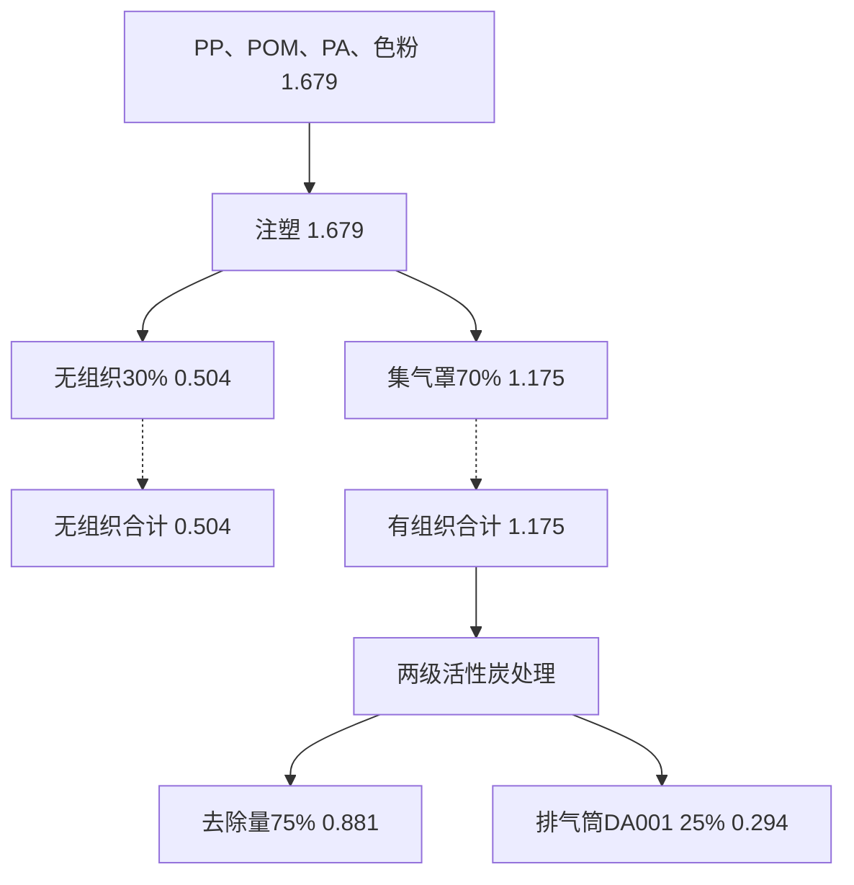
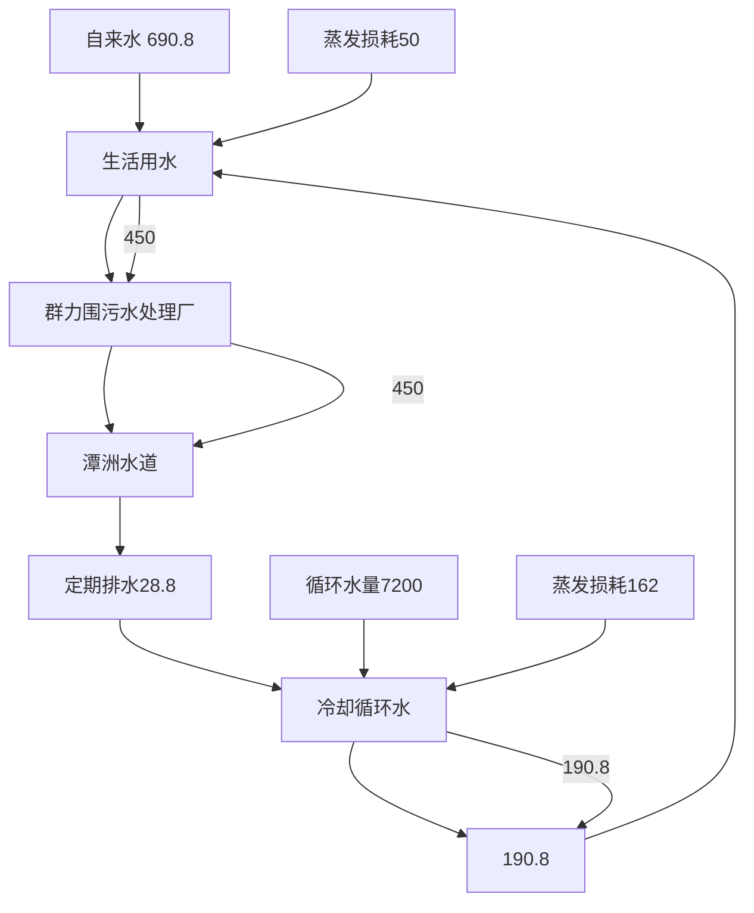
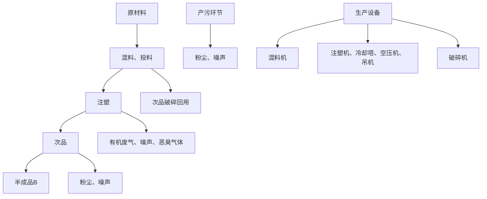
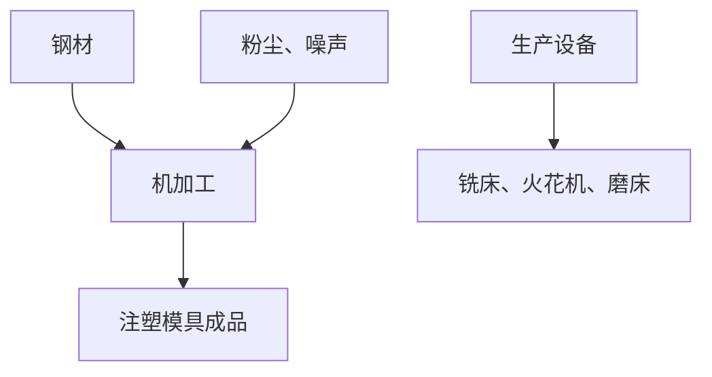
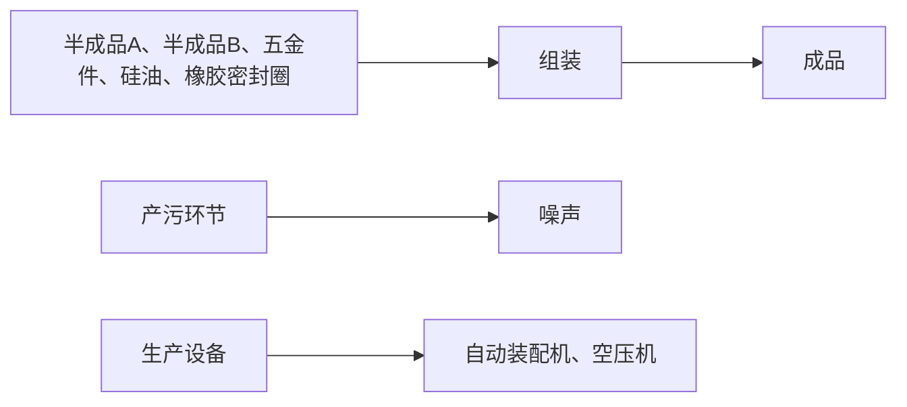

# 建设项目环境影响报告表

# （污染影响类）

项目名称：佛山欣达胜精密科限公司新建项目

建设单位（盖章）：佛山欣胜精密科技有限公司

编制日期： 2023年4

中华人民共 制

text_image

生态环境科
祖国生态环境部

打印编号：1675409004000

编制单位和编制人员情况表

<table><tr><td>项目编号</td><td colspan="2">u81c93</td></tr><tr><td>建设项目名称</td><td colspan="2">佛山欣达胜精密科技有限公司新建项目</td></tr><tr><td>建设项目类别</td><td colspan="2">26-053塑料制品业</td></tr><tr><td>环境影响评价文件类型</td><td>报告表</td><td></td></tr><tr><td colspan="2">一、建设单位情况</td><td></td></tr><tr><td>单位名称(盖章)</td><td>佛山欣达胜精密</td><td></td></tr><tr><td>统一社会信用代码</td><td>91440606MAA41</td><td></td></tr><tr><td>法定代表人(签章)</td><td></td><td></td></tr><tr><td>主要负责人(签字)</td><td></td><td></td></tr><tr><td>直接负责的主管人员(签字)</td><td></td><td></td></tr><tr><td colspan="2">二、编制单位情况</td><td></td></tr><tr><td>单位名称(盖章)</td><td>佛山</td><td></td></tr><tr><td>统一社会信用代码</td><td>91440</td><td></td></tr><tr><td colspan="2">三、编制人员情况</td><td></td></tr></table>

本证书由中华人民共和四人事部和国家环境保护总局批准发，它表明持证人通过国家统一组织的考试合格，取得环境影响许价工程师的职业资格。

This is to certify that the bearerofthe Cerificnte has passed national examinationorganized by the Chinese government departments and has obtained qualifications for Enviroomental Impact Assessment Engin

text_image

中华人民共和国
证书
approved & authorized
by
Ministry of Personnel

The People's Republic of China

text_image

家环保
国家环境保护部
State Environmental Protection Administration
The People's Republic of China

560

text_image

编号：
0003
有怡景环境科技

# 目录

一、建设项目基本情况.

二、建设项目工程分析. .11

三、区域环境质量现状、环境保护目标及评价标准. . 19

四、主要环境影响和保护措施 ..24

五、环境保护措施监督检查清单 ..43

六、结论.. ..45

附图 1 项目地理位置图

附图 2 项目平面布置图

附图 3 项目四至图

附图 4 项目敏感点分布图

附图 5 项目四至照片

附图 6 项目空厂房照片

附图 7 项目所在区域的地表水环境功能区划图

附图 8 项目所在区域的大气环境功能区划图

附图 9 项目所在区域的声环境功能区划图

附图 10 项目所在地环境管控单元图

附件 1 营业执照

附件 2 法人身份证

附件 3 用地资料

附件 4 环评技术咨询合同

# 一、建设项目基本情况

<table><tr><td>建设项目名称</td><td colspan="4">佛山欣达胜精密科技有限公司新建项目</td></tr><tr><td>项目代码</td><td colspan="4">无</td></tr><tr><td>建设单位联系人</td><td>方**</td><td>联系方式</td><td colspan="2">1364074****</td></tr><tr><td>建设地点</td><td colspan="4">广东省佛山市顺德区北滘镇西海村二支工业大道3号海创大族机器人智造中心15栋201室及202室</td></tr><tr><td>地理坐标</td><td colspan="4">(北纬 22 度 57 分 22.59 秒,东经 113 度 16 分 12.277 秒)</td></tr><tr><td>国民经济行业类别</td><td>C2929 塑料零件及其他塑料制品制造;C3311 金属结构制造</td><td>建设项目行业类别</td><td colspan="2">二十六、橡胶和塑料制品业53 塑料制品业 292-其他(年用非溶剂型低 VOCs 含量涂料 10 吨以下的除外);</td></tr><tr><td>建设性质</td><td>☑新建(迁建)□改建□扩建□技术改造</td><td>建设项目申报情形</td><td colspan="2">☑首次申报项目□不予批准后再次申报项目□超五年重新审核项目□重大变动重新报批项目</td></tr><tr><td>项目审批(核准/备案)部门(选填)</td><td>无</td><td>项目审批(核准/备案)文号(选填)</td><td colspan="2">无</td></tr><tr><td>总投资(万元)</td><td>100</td><td>环保投资(万元)</td><td colspan="2">10</td></tr><tr><td>环保投资占比(%)</td><td>10</td><td>施工工期</td><td colspan="2">1个月</td></tr><tr><td>是否开工建设</td><td>☑否□是: _</td><td>用地(用海)面积(m2)</td><td colspan="2">2230.19</td></tr><tr><td>专项评价设置情况</td><td colspan="4">无</td></tr><tr><td>规划情况</td><td colspan="4">无</td></tr><tr><td>规划环境影响评价情况</td><td colspan="4">无</td></tr><tr><td>规划及规划环境影响评价符合性分析</td><td colspan="4">无</td></tr><tr><td rowspan="3">其他符合性分析</td><td colspan="4">(1)项目选址合理性分析本项目位于广东省佛山市顺德区北滘镇西海村二支工业大道3号海创大族机器人智造中心15栋201室及202室。,根据【国有土地使用证号】为粤(2021)佛顺不动产权第0002721号可知,与该地块的土地使用用途一致,项目所在建筑为工业厂房,故项目用地符合规划要求。(2)产业政策相符性分析本项目所属行业为C2929塑料零件及其他塑料制品制造、C3311金属结构制造,经查本项目不属于《产业结构调整指导目录(2019年本)》鼓励类、限制类和淘汰类项目,属于允许类项目。核查《市场准入负面清单(2022年版)》,项目不属于《市场准入负面清单(2022版)》的禁止准入类项目,与政策不相冲突。项目不涉及《环境保护综合名录(2021年版)》中的“高污染、高环境风险”产品名录中的产品,符合《环境保护综合名录》(2021年版)的相关规定。本项目所属类别及生产产品不属于广东省发展改革委关于印发《广东省“两高”项目管理目录(2022年版)》的通知(粤发改能源函〔2022〕1363号)的附件广东省“两高”项目管理目录中的行业类别或产品,符合广东省发展改革委关于印发《广东省“两高”项目管理目录(2022年版)》的通知(粤发改能源函〔2022〕1363号)的相关规定。(3)与环境功能区域相符性分析根据《广东省人民政府关于调整佛山市部分饮用水水源保护区的批复》(粤府函〔2018〕426号)和《广东省生态环境厅关于对佛山市人民政府申请校正部分饮用水水源保护区图件的意见的函》(粤环函〔2019〕1167号),项目所在位置不在佛山市一、二级水源保护区范围内,符合饮用水源保护条例的有关要求。根据《佛山市顺德区人民政府办公室关于印发&lt;佛山市顺德区生态环境保护“十四五”规划(2021-2025)&gt;的通知》(顺府办发【2022】16号),项目所在区域为环境空气质量二类功能区,不属于环境空气质量一类功能区。根据《佛山市人民政府关于印发佛山市声环境功能区划分方案的通知》(佛府函〔2015〕72号),项目所在区域为声环境2类区,不属于声环境1类区。项目废水、废气、噪声在稳定达标排放的情况下,不改变原有的功能区规划,对周围环境影响较小。(4)本项目与挥发性有机污染物治理政策的相符性分析本项目与挥发性有机污染物治理政策的相符性分析见下表:表1-1 项目与有机污染物治理政策的相符性</td></tr><tr><td>序号</td><td>政策</td><td>工程内容</td><td>符合性</td></tr><tr><td>1</td><td colspan="3">《广东省涉挥发性有机物 (VOCS) 重点行业治理指引》的通知(粤环办[2021]43号)</td></tr></table>

<table><tr><td rowspan="7"></td><td rowspan="7"></td><td colspan="2">采用外部集气罩的,距集气罩开口面最远处的VOCs无组织排放位置,控制风速不低于0.3m/s。</td><td>项目注塑废气,通过集气罩点对点局部密闭收集,收集效率为70%。集气罩置于废气产生点的合理位置,保证罩口截面风速为0.6m/s。</td><td>符合</td></tr><tr><td colspan="2">废气收集系统的输送管道应密闭。废气收集系统应在负压下运行,若处于正压状态,应对管道组件的密封点进行泄漏检测,泄漏检测值不应超过500μmol/mol,亦不应有感官可察觉泄漏。</td><td>项目废气收集系统在负压下运行。</td><td>符合</td></tr><tr><td colspan="2">VOCs治理设施应与生产工艺设备同步运行,VOCs治理设施发生故障或检修时,对应的生产工艺设备应停止运行,待检修完毕后同步投入使用;生产工艺设备不能停止运行或不能及时停止运行的,应设置废气应急处理设施或采取其他替代措施。</td><td>项目生产必须开启风机,有效减少无组织排放废气。废气收集处理系统发生故障或检修时,所有产生废气的工序停止运行,待检修完毕后再投入生产。</td><td>符合</td></tr><tr><td rowspan="2">工艺过程</td><td>粉状、粒状VOCs物料采用气力输送方式或采用密闭固体投料器等给料方式密闭投加;无法密闭投加的,在密闭空间内操作,或进行局部气体收集,废气排至除尘设施、VOCs废气收集处理系统。</td><td>项目使用的塑料粒和色粉均为固态,常温条件下不会产生有机废气。在转移过程中均使用密闭的包装袋封装。</td><td>符合</td></tr><tr><td>在混合/混炼、塑炼/塑化/熔化、加工成型(挤出、注射、压制、压延、发泡、纺丝等)、硫化等作业中应采用密闭设备或在密闭空间中操作,废气应排至VOCs废气收集处理系统;无法密闭的,应采取局部气体收集措施,废气应排至VOCs废气收集处理系统。</td><td>项目注塑废气通过集气罩点对点局部密闭收集,经二级活性炭吸附装置处理后通过44m排气筒DA001达标排放</td><td>符合</td></tr><tr><td>排放水平</td><td>塑料制品行业:a)有机废气排气筒排放浓度不高于广东省《大气污染物排放限值》(DB4427-2001)第II时段排放限值,合成革和人造革制造企业排放浓度不高于《合成革与人造革工业污染物排放标准》(GB21902-2008)排放限值,若国家和我省出台并实施适用于塑料制品制造业的大气污染物排放标准,则有机废气排气筒排放浓度不高于相应的排放限值;车间或生产设施排气中NMHC初始排放速率≥3kg/h时,建设VOCs处理设施且处理效率≥80%;b)厂区内无组织排放监控点NMHC的小时平均浓度值不超过6mg/m3任意一次浓度值不超过20mg/m3。</td><td>项目生产过程有机废气达到《合成树脂工业污染物排放标准》(GB31572-2015);有机废气厂区内无组织排放满足平均浓度值不超过6mg/m3任意一次浓度值不超过20mg/m3。</td><td>符合</td></tr><tr><td>管理台账</td><td>建立废气收集处理设施台账,记录废气处理设施进出口的监测数据(废气量、浓度、温度、含氧量等)、废气收集与处理设施关键参数、废气处理设施相关耗材(吸收剂、吸附剂、催化剂等)购买和处理记录。</td><td>企业拟建立废气收集处理设施台账,根据《排污单位自行监测技术指南橡胶和塑料制品》(HJ1207-2021)等相关要求定期自行监测,并且记录相关监测数据和废气处理设施中活性炭的购买量和处理记录。</td><td>符合</td></tr><tr><td rowspan="12"></td><td></td><td></td><td>建立危废台账,整理危废处置合同、转移联单及危废处理方式资质佐证材料。</td><td>企业拟建立危险废物台账,定期将危险废物交给有资质的单位处理,整理危废处理合同、转移联单等资料。</td><td>符合</td></tr><tr><td rowspan="3">2</td><td colspan="4">《广东省人民政府办公厅关于印发广东省2021年大气、水、土壤污染防治工作方案的通知》(粤办函〔2021〕58号)</td></tr><tr><td colspan="2">严格落实国家产品VOCs含量限值标准要求,除现阶段确无法实施替代的工序外,禁止新建生产和使用高VOCs含量原辅材料项目。鼓励在生产和流通消费环节推广使用低VOCs含量原辅材料。</td><td>项目不使用高VOCs含量原辅材料,本项目VOCs的产生来源于固体塑料在作业过程产生。</td><td>符合</td></tr><tr><td colspan="2">涉VOCs重点行业新建、改建和扩建项目不推荐使用光氧化、光催化、低温等离子等低效治理设施,已建项目逐步淘汰光氧化、光催化、低温等离子治理设施。指导采用一次性活性炭吸附治理技术的企业,明确活性炭装载量和更换频次,记录更换时间和使用量。</td><td>项目有机废气治理采用“二级活性炭”处理。活性炭装载量和更换频次已在本报告内容中明确。</td><td>符合</td></tr><tr><td rowspan="4">3</td><td colspan="4">《固定污染源挥发性有机物综合排放标准》(DB44/2367-2022)</td></tr><tr><td colspan="2">VOCs物料储存无组织排放控制要求</td><td rowspan="3">项目含VOCs物料主要为塑料粒,常温下不挥发,储存在仓库内;工艺生产过程产生的有机废气通过设置集气罩点对点局部密闭收集并采用二级活性炭吸附处理后高空排放,减少无组织排放。</td><td>符合</td></tr><tr><td colspan="2">VOCs物料转移和输送无组织排放控制要求</td><td>符合</td></tr><tr><td colspan="2">工艺过程VOCs无组织排放控制要求</td><td>符合</td></tr><tr><td rowspan="4">4</td><td colspan="4">关于印发《重点行业挥发性有机物综合治理方案》的通知(环大气[2019]53号)</td></tr><tr><td colspan="2">通过使用水性、粉末、高固体分、无溶剂、辐射固化等低VOCs含量的涂料,水性、辐射固化、植物等低VOCs含量的油墨,水基、热熔、无溶剂、辐射固化、改性、生物降解等低VOCs含量的胶粘剂,以及低VOCs含量、低反应活性的清洗剂等,替代溶剂型涂料、油墨、胶粘剂、清洗剂等,从源头减少VOCs产生。</td><td>本项目使用的原材料无自然状态下可挥发性的物料,满足相关标准要求。</td><td>符合</td></tr><tr><td colspan="2">重点对含VOCs物料(包括含VOCs原辅材料、含VOCs产品、含VOCs废料以及有机聚合物材料等)储存、转移和输送、设备与管线组件泄漏、敞开液面逸散以及工艺过程等五类排放源实施管控,通过采取设备与场所密闭、工艺改进、废气有效收集等措施,削减VOCs无组织排放。</td><td rowspan="2">项目注塑过程产生的废气,通过集气罩点对点局部密闭收集,收集效率为70%。集气罩置于废气产生点的合理位置,保证罩口截面风速为0.6m/s。</td><td>符合</td></tr><tr><td colspan="2">提高废气收集率,遵循“应收尽收、分质收集”的原则,科学设计废气收集系统,将无组织排放转变为有组织排放进行控制。采用全密闭集气罩或密闭空间的,除行业有特殊要求外,应保持微负压状态,并根据相关规范合理设置通风量。采用局部集气罩的,距集气罩开口面最</td><td>符合</td></tr><tr><td rowspan="10"></td><td></td><td>远处的VOCs无组织排放位置,控制风速应不低于0.3米/秒,有行业要求的按相关规定执行。</td><td></td><td colspan="2"></td></tr><tr><td rowspan="2">5</td><td colspan="4">《佛山市生态环境局顺德分局关于做好重点行业建设项目挥发性有机物总量指标管理工作的通知》(佛顺环函[2019]56号)</td></tr><tr><td>涉VOCs排放项目,实现本行政区域内污染源“点对点”2倍量削减替代,由项目所在镇街分局出具VOCs总量指标来源及替代削减方案的意见,开展总量替代。</td><td>项目非甲烷总烃排放总量指标为0.798t/a,由北滘镇出具VOCs总量指标来源及替代削减方案的意见。</td><td colspan="2">符合</td></tr><tr><td rowspan="2">6</td><td colspan="4">佛山市发展和改革局佛山市生态环境局关于印发《佛山市关于进一步加强塑料污染治理的实施方案》的通知(2020-年11月09日发布)</td></tr><tr><td>全市范围内禁止生产和销售厚度小于0.025毫米的超薄塑料购物袋、厚度小于0.01毫米的聚乙烯农用地膜。禁止以医疗废物为原料制造塑料制品;禁止将回收利用的废塑料输液袋(瓶)用于原用途或用于制造餐饮容器以及玩具等儿童用品。加大禁止“洋垃圾”进口监管和打私力度,确保“全面禁止废塑料进口”落实到位。到2020年底,禁止生产和销售一次性发泡塑料餐具、一次性塑料棉签;禁止生产含塑料微珠的日化产品。到2022年底,禁止销售含塑料微珠的日化产品。国家《产业结构调整指导目录》和《市场准入负面清单》明确的属于淘汰类的塑料制品项目,禁止投资;属于限制类项目,禁止新建。</td><td>本项目使用新料,不属于禁止生产项目及限制类项目。</td><td colspan="2">符合</td></tr><tr><td rowspan="4">7</td><td colspan="4">《广东省塑料制品与制造业挥发性有机物综合整治技术指南》</td></tr><tr><td>粉状、粒状VOCs物料投加,宜采用气力输送方式或采用密闭固体投料器等给料方式密闭投加。</td><td>本项目塑料投料采用气力输送方式密闭投加。</td><td colspan="2">符合</td></tr><tr><td>塑炼/塑化/熔化、挤出、注塑、吹膜等成型工序可采取局部气体收集措施,且满足控制风速不低于0.3m/s的要求。</td><td>项目注塑废气,通过集气罩点对点局部密闭收集,收集效率为70%。集气罩置于废气产生点的合理位置,保证罩口截面风速为0.6m/s。</td><td colspan="2">符合</td></tr><tr><td>若采用活性炭吸附技术,采用颗粒活性炭作为吸附剂时,其碘值不宜低于800mg/g;采用蜂窝活性炭作为吸附剂时,其碘值不宜低650mg/g;采用活性炭纤维作为吸附剂时,其比表面积不低于1100m2/g(BET法)。工作温度和湿度应符合:温度T&lt;40°C、湿度RH&lt;60%;活性炭表面不应有积尘和积水;活性炭吸附箱是否足额装填活性炭(1吨活性炭通常只能吸附0.1~0.2吨VOCs</td><td>本项目采用碘值不宜低于800mg/g的颗粒状活性炭对有机废气进行吸附处理,且1吨活性炭按吸附0.2吨VOCs计算。</td><td colspan="2">符合</td></tr><tr><td colspan="5">(5)项目与“三线一单”相符性分析本项目位于广东省佛山市顺德区北滘镇西海村二支工业大道3号海创大族机器人智造中心15栋201室及202室及202室,根据《广东省人民政府关于印发广东省“三线一单”生态环境分区管控方案的通知》(粤府〔2020〕71号)和《佛山市人民政府关于印发佛山市“三线</td></tr><tr><td></td><td colspan="5">一单”生态环境分区管控方案的通知》(佛府〔2021〕11号),项目符合广东省和佛山市的“三线一单”生态环境分区管控方案要求。根据《佛山市顺德区人民政府关于印发佛山市顺德区“三线一单”生态环境分区管控方案的通知》(顺府发〔2021〕11号)发布的佛山市顺德区环境管控单元图(见附图11),项目所在的佛山市顺德区北滘镇为佛山市顺德区重点管控单元4(编码为ZH44060620004,名称为北滘镇重点管控区),项目与广东省佛山市顺德区重点管控单元4准入清单相符性分析如下表。</td></tr></table>

表1-2 项目与佛山市顺德区“三线一单”生态环境分区管控方案相符性分析

<table><tr><td>管控维度</td><td>管控要求</td><td>工程内容</td><td>相符性</td></tr><tr><td rowspan="7">区域布局管控</td><td>1-1.【生态/禁止类】单元内的一般生态空间,主导生态功能为水土保持,禁止在25度以上的陡坡地开垦种植农作物,禁止在崩塌、滑坡危险区、泥石流易发区从事采石、取土、采砂等可能造成水土流失的活动。</td><td>本项目不涉及</td><td>符合</td></tr><tr><td>1-2.【产业/鼓励引导类】重点发展机器人及配套产业、智能家用电器、高端新型电子信息、新材料等制造业和总部经济、电子商务、工业设计与文化创意、科技金融等现代服务业,打造智能制造和智慧家电示范区。</td><td>本项目不涉及</td><td>符合</td></tr><tr><td>1-3.【产业/综合类】产业聚集区所属地块内的工业用地或企业与村庄、学校等环境敏感点之间应设置合理的大气环境防护距离,并通过绿化带进行有效隔离;聚集区规划布局应注重大气污染排放企业应尽量避免布局在居住用地的常年主导风向的上风向。</td><td>项目与最近的敏感点相距290m,且通过绿化带有效隔离</td><td>符合</td></tr><tr><td>1-4.【产业/综合类】系统推进村级工业园升级改造,腾出连片空间,布局产业集聚区和主题产业园,推动工业项目入园集聚发展。新增工业制造业用地原则上安排在产业集聚区内,产业集聚区外原则上不鼓励工业及物流仓储用地的新建与改造。</td><td>本项目位于海创大族机器人智造中心</td><td>符合</td></tr><tr><td>1-5.【产业/限制类】受纳水体或监控断面不达标的,不得新建、扩建向河涌直接排放废水的项目。新建、扩建含蚀刻工序的线路板生产项目和化工项目应在配套污水集中处置的工业园区或生活污水管网覆盖区域内建设;纯加工型印花项目,含酸洗、磷化的金属表面处理、金属制品项目(与自身高新技术企业配套的除外),含酸洗、喷涂、化学抛光、电解等涉及废水排放工艺的不锈钢型材加工项目(与自身高新技术企业配套的除外),应进入以此类项目为主导产业、有相应废水集中治理设施的工业园区,实现集中治污。</td><td>本项目为塑料制品业,不属于含酸洗、喷涂、化学抛光、电解等涉及废水排放工艺的不锈钢型材加工项目</td><td>符合</td></tr><tr><td>1-6.【产业/综合类】划定家具生产优先发展区域,优先发展区外不再新建涉及涂装工艺的木质家具制造项目。</td><td>本项目家具制造项目</td><td>符合</td></tr><tr><td>1-7.【水/限制类】严格限制在佛山市禅城南庄紫洞水厂、佛山市禅城沙口(石湾)水厂、羊额—北滘水厂、广州市南洲水厂顺德水道取水口饮用水水源保护区上游和周边区域建设列入“高污染、高环境风险”产品名录等可能影响水环境安全的项目。</td><td>本项目不在水源保护区内</td><td>符合</td></tr><tr><td rowspan="2"></td><td>1-8.【大气/限制类】大气环境受体敏感重点管控区内,应严格限制新建储油库项目、产生和排放有毒有害大气污染物的建设项目以及使用溶剂型油墨、涂料、清洗剂、胶黏剂等高挥发性有机物原辅材料项目,鼓励现有该类项目搬迁退出。</td><td>本项目不属于储油库项目,不使用溶剂型油墨、涂料、清洗剂、胶黏剂等高挥发性有机物原辅材料项目</td><td>符合</td></tr><tr><td>1-9.【大气/鼓励引导类】大气环境高排放重点管控区内,应强化达标监管,引导工业项目落地集聚发展,有序推进区域内行业企业提标改造。</td><td>项目废气经收集处理后高空达标排放</td><td>符合</td></tr><tr><td rowspan="6">能源资料利用</td><td>2-1.【能源/鼓励引导类】推广节能技术,加快发展绿色货运与现代物流。</td><td>本项目不属于高耗能项目</td><td>符合</td></tr><tr><td>2-2.【能源/鼓励引导类】推广新能源汽车应用和充电基础设施建设,积极推动重卡LNG加气站、充电基础设施、加氢站建设。</td><td>本项目不涉及</td><td>符合</td></tr><tr><td>2-3.【能源/综合类】科学实施能源消费总量和强度“双控”,新建高耗能项目单位产品(产值)能耗达到国际国内先进水平。</td><td>本项目不属于高耗能项目</td><td>符合</td></tr><tr><td>2-4.【水资源/综合类】贯彻落实“节水优先”方针,实行最严格水资源管理制度,北滘镇万元国内生产总值用水量、万元工业增加值用水量、用水总量、农田灌溉水有效利用系数等用水总量和效率指标达到区下达要求。</td><td>本项目不涉及</td><td>符合</td></tr><tr><td>2-5.【土地资源/限制类】落实单位土地面积投资强度、土地利用强度等建设用地控制性指标要求,提高土地利用效率。</td><td>项目单位土地面积投资强度、土地利用强度等建设用地控制性指标均满足相关标准要求,土地利用效率较高。</td><td>符合</td></tr><tr><td>2-6.【岸线/禁止类】严格水域岸线用途管制,新建项目一律不得违规占用水域。严禁破坏生态的岸线利用行为和不符合其功能定位的开发建设活动,严禁以各种名义侵占河道、围垦湖泊、非法采砂等。</td><td>项目选址不占用水域,租用已建厂房,不存在基建基础施工,不会破坏生态的岸线利用和做不符合其功能定位的开发建设活动,不侵占河道围垦湖泊、非法采砂等。</td><td>符合</td></tr><tr><td>污染物排放管控</td><td>3-1.【水/限制类】城镇新区建设实行雨污分流。住宅、商业体、学校、市场等城镇开发建设项目应当配套或者同步计划建设公共排水设施,公共排水设施或自建排污水设施未能投产运行的,以上涉水项目不得投入使用。新建小区严格实施雨污分流,阳台、露台等污水接入污水收集系统,将生活污水“应截尽截”。做好大型楼盘、集贸市场、餐饮以及学校等4大类排水户污水接入市政管网工作。</td><td>本项目不涉及</td><td>符合</td></tr><tr><td rowspan="5"></td><td>3-2.【水/综合类】结合村级工业园改造,全面提升产业层次与集聚度,促进污染集中整治。</td><td>本项目位于海创大族机器人智造中心</td><td>符合</td></tr><tr><td>3-3.【水/综合类】稳步推进排水设施“三个一体化”管理模式,补齐城乡污水收集和处理短板,推动群力围污水处理厂提质增效,加快消除城中村、老旧城区、城乡结合部等污水收集管网空白区,逐步实现城乡污水收集处理全覆盖。2025年前完成群力围污水处理厂扩建,尾水应执行《城镇污水处理厂污染物排放标准》(GB18918-2002)一级A标准及《广东省水污染物排放限值》(DB44/26-2001)的较严值。</td><td>本项目生活污水经三级化粪池处理后排入群力围污水处理厂处理,尾水排至潭洲水道。</td><td>符合</td></tr><tr><td>3-4.【水/综合类】近期保留并完善水口村、三桂村、西滘村、马龙村等现状农村污水分散式处理设施,新建莘村、马龙村等分散式污水处理站建设,继续完善污水支管网建设,提高污水收集处理率,其余行政村(社区)继续完善污水管网建设,实现农村污水100%收集进入市政污水系统,有条件的区域实施雨污分流改造,到2030年全面雨污分流,污水纳入北滘城镇污水处理系统。</td><td>本项目不涉及</td><td>符合</td></tr><tr><td>3-5.【水/综合类】产业集聚区和主题园区内做好污水管网和污水集中处理设施的配套保障,确保废水收集到城镇污水处理厂、园区污水处理厂或分散式污水处理设施集中处置。</td><td>本项目生活污水经三级化粪池处理后排入群力围污水处理厂处理,尾水排至潭洲水道。</td><td>符合</td></tr><tr><td>3-6.【大气/综合类】大力推进低VOCs含量原辅材料替代,加快涉VOCs重点行业的生产工艺升级改造,推行自动化生产工艺,对达不到要求的VOCs收集及治理设施进行整治提升,逐步淘汰低效VOCs治理设施。</td><td>本项目不使用高VOCs含量原辅材料</td><td></td></tr><tr><td rowspan="2">环境风险防控</td><td>4-1.【水/综合类】加强单元内佛山市禅城南庄紫洞水厂、佛山市禅城沙口(石湾)水厂、羊额—北滘水厂、广州市南洲水厂顺德水道取水口饮用水水源保护区周边环境风险源管控,完善突发环境事件应急管理体系。</td><td>本项目不涉及</td><td>符合</td></tr><tr><td>4-2.【水/综合类】北滘污水处理厂、群力围污水处理厂、工业污水集中处理设施应采临取有效措施,防止事故废水直接排入水体。完善污水处理厂在线监控系统联网,实现污水处理厂的实时、动态监管。</td><td>本项目生活污水经三级化粪池处理后排入群力围污水处理厂处理,尾水排至潭洲水道,对水环境影响较小。</td><td>符合</td></tr><tr><td></td><td>4-3.【风险/综合类】加强环境风险分级分类管理,强化金属制品、有色金属和压延加工、化学原料和化学品制造业等涉重金属、化工行业企业及工业园区等重点环境风险源的环境风险防控。</td><td>本项目不属于重点环境风险源的环境风险行业</td><td>符合</td></tr></table>

# 二、建设项目工程分析

# 1、项目概况

根据《中华人民共和国环境保护法》、《中华人民共和国环境影响评价法》、《国务院关于修改〈建设项目环境保护管理条例〉的决定》（中华人民共和国国务院令第 682 号）中有关规定，建设项目必须执行环境影响评价制度。根据《建设项目环境影响评价分类管理名录》（2021版），本项目属于“二十六、橡胶和塑料制品业”中的“53 塑料制品业 292”中的“其他”类别，需编制环境影响报告表，因此本项目需编制环境影响报告表。佛山欣达胜精密科技有限公司委托我司承担本项目的环境影响评价工作。受委托后环评单位技术人员到现场勘察，并根据建设单位提供有关本项目的资料，编写了本环境影响报告表。

# 2、工程组成

根据建设单位提供资料，项目总投资 100 万元，项目工程组成如下表所示。

表 2-1 项目工程组成

<table><tr><td colspan="3">项目名称</td><td>工程组成</td></tr><tr><td rowspan="2">主体工程</td><td colspan="2">201</td><td>面积 $1132.53m^{2}$ ,一层,层高为5m,车间楼顶离地面高度为43m。其中包括注塑区域、碎料、混料区、磨具车间、原料仓、办公室。</td></tr><tr><td colspan="2">202</td><td>面积 $1097.66m^{2}$ ,一层,层高为5m,车间楼顶离地面高度为43m。其中包括五金配件仓、办公室、组装区、检验区、组装区、危废堆放点。</td></tr><tr><td rowspan="2">辅助工程</td><td colspan="2">办公室1</td><td>面积36平方米,一层,层高5米,所在建筑物高43米,位于201</td></tr><tr><td colspan="2">办公室2</td><td>面积250平方米,一层,层高5米,所在建筑物高43米,位于202</td></tr><tr><td rowspan="4">储运工程</td><td colspan="2">原料仓</td><td>面积36平方米,一层,层高5米,所在建筑物高43米,位于201</td></tr><tr><td colspan="2">成品仓</td><td>面积36平方米,一层,层高5米,所在建筑物高43米,位于202</td></tr><tr><td colspan="2">一般固废仓</td><td>面积4平方米,一层,层高5米,所在建筑物高43米,位于202</td></tr><tr><td colspan="2">危废仓</td><td>面积6平方米,一层,层高5米,所在建筑物高43米,位于202</td></tr><tr><td rowspan="2">公用工程</td><td colspan="2">给排水</td><td>由市政供水;本项目生活污水经三级化粪池处理后排入群力围污水处理厂处理,尾水排至潭洲水道。循环冷却水水系统定期排水可作为清净下水通过污水管道排放</td></tr><tr><td colspan="2">供能</td><td>由市政供电,依托所在厂房已有设施</td></tr><tr><td rowspan="10">环保工程</td><td rowspan="2">废水</td><td>生活污水</td><td>本项目生活污水经三级化粪池处理后排入群力围污水处理厂处理,尾水排至潭洲水道</td></tr><tr><td>循环冷却水</td><td>循环冷却水定期排水可作为清净下水通过污水管道排放</td></tr><tr><td rowspan="4">废气</td><td>塑料粉尘</td><td>本项目设置破碎、混料区,塑料粉尘以无组织形式排放</td></tr><tr><td>金属粉尘</td><td>机加工产生粉尘以无组织形式排放</td></tr><tr><td>有机废气</td><td rowspan="2">对注塑机设置点对点局部密闭集气罩收集有机废气,集气罩收集70%后经“二级活性炭处理系统”处理后通过一个44m排气筒DA001排放,未收集的20%以无组织形式排放到车间内</td></tr><tr><td>恶臭</td></tr><tr><td rowspan="3">固体废物</td><td>危废仓</td><td>1个,存放危险废物;危险废物收集后放置于危废仓(长×宽×高=3m×2m×2m),再交由有资质的单位进行处置</td></tr><tr><td>一般固废仓</td><td>1个,存放一般工业固体废物;一般工业固废收集后放置于一般固废仓(长×宽×高=2m×2m×1m)内,再由回收公司统一回收</td></tr><tr><td>生活垃圾</td><td>位于生产车间内,交由环卫部门定期进行统一清理</td></tr><tr><td>噪声</td><td>/</td><td>项目噪声为设备运行产生的噪声,采取选用低噪声设备、车间合理布局、安装减震基础、厂房隔声、距离衰减等措施削减。</td></tr></table>

# 3、主要产品及产量

本项目生产产品见下表。

表 2-2 项目产品方案一览表

<table><tr><td>序号</td><td>产品名称</td><td>年产量</td><td>规格尺寸</td></tr><tr><td>1</td><td>滑轨缓冲器</td><td>3500万个/年</td><td>20cm*4cm*2cm</td></tr></table>

# 4、主要生产设备

根据建设单位提供资料，项目主要生产设备见下表所示。

表 2-3 项目主要生产设备一览表

<table><tr><td>序号</td><td>名称</td><td>规格参数</td><td>数量</td><td>单位</td><td>工艺</td><td>位置</td></tr><tr><td>1</td><td>注塑机</td><td>15KW(200t)</td><td>20</td><td>台</td><td>注塑</td><td>201</td></tr><tr><td>2</td><td>烘料机</td><td>12KW</td><td>8</td><td>台</td><td>烘料</td><td>201</td></tr><tr><td>3</td><td>混料机</td><td>2KW</td><td>2</td><td>台</td><td>混料</td><td>201</td></tr><tr><td>4</td><td>破碎机</td><td>3KW</td><td>2</td><td>台</td><td>破碎</td><td>201</td></tr><tr><td>5</td><td>冷却塔</td><td>3t/h</td><td>1</td><td>台</td><td>辅助</td><td>201</td></tr><tr><td>6</td><td>空压机</td><td>25KW</td><td>2</td><td>台</td><td>辅助</td><td>202</td></tr><tr><td>7</td><td>自动装配机</td><td>3KW</td><td>20</td><td>台</td><td>装配</td><td>202</td></tr><tr><td>8</td><td>吊机</td><td>40KW</td><td>3</td><td>台</td><td>辅助</td><td>201/202</td></tr><tr><td>9</td><td>火花机</td><td>3KW</td><td>1</td><td>台</td><td>机加工</td><td>202</td></tr><tr><td>10</td><td>铣床</td><td>5KW</td><td>2</td><td>台</td><td>机加工</td><td>202</td></tr><tr><td>11</td><td>磨床</td><td>6KW</td><td>1</td><td>台</td><td>机加工</td><td>202</td></tr></table>

# 5、主要原辅材料

根据建设单位提供资料，项目主要原辅材料如下表所示。

表 2-4 项目主要原辅材料消耗量一览表

<table><tr><td>序号</td><td>名称</td><td>年用量/t</td><td>日常最大储存量/t</td><td>性状</td><td>包装规格</td></tr><tr><td>1</td><td>PP塑料粒</td><td>120</td><td>10</td><td>固体</td><td>1000KG/袋</td></tr><tr><td>2</td><td>POM塑料粒</td><td>450</td><td>20</td><td>固体</td><td>1000KG/袋</td></tr><tr><td>3</td><td>PA塑料粒</td><td>50</td><td>5</td><td>固体</td><td>1000KG/袋</td></tr><tr><td>4</td><td>色粉</td><td>2</td><td>0.4</td><td>固体</td><td>100g 袋装</td></tr><tr><td>5</td><td>钢材</td><td>5</td><td>1</td><td>固体</td><td>/</td></tr><tr><td>6</td><td>五金件</td><td>10500万个</td><td>200万个</td><td>固体</td><td>10万个/箱</td></tr><tr><td>7</td><td>橡胶密封圈</td><td>7000万个</td><td>100万个</td><td>固体</td><td>1万个/袋</td></tr><tr><td>8</td><td>硅油</td><td>15</td><td>1</td><td>液体</td><td>200kg/桶</td></tr><tr><td>9</td><td>机油</td><td>0.05</td><td>0.05</td><td>液体</td><td>25kg 密闭铁桶</td></tr><tr><td>10</td><td>液压油</td><td>0.02</td><td>0.02</td><td>液体</td><td>20kg 密闭铁桶</td></tr><tr><td>11</td><td>火花油</td><td>0.5</td><td>0.5</td><td>液体</td><td>25kg 密闭铁桶</td></tr></table>

注：塑料颗粒均为外购新料，钢材直接由供应商运送到厂区，不进行包装。

# 主要原辅材料理化性质：

PP：PP 是聚丙烯的简称，是聚α-烯烃的代表，由丙烯聚合而制得的一种热塑性树脂，其单体是丙烯$\mathrm { C H } _ { 2 } { = } \mathrm { C H } { - } \mathrm { C H } _ { 3 }$ 。聚丙烯具有良好的耐热性，制品能在 100℃以上温度进行消毒灭菌，在不受外力的条件下，150℃也不变形。脆化温度为-35℃，在低于-35℃会发生脆化，耐寒性不如聚乙烯。聚丙烯的化学稳定性很好，除能被浓硫酸、浓硝酸侵蚀外，对其它各种化学试剂都比较稳定。它有较高的介电系数，且随温度的上升，可以用来制作受热的电器绝缘制品。它的击穿电压也很高，适合用作电器配件等。抗电压、耐电弧性好，但静电度高，与铜接触易老化。

POM：POM（聚甲醛树脂）定义：聚甲醛是一种没有侧链、高密度、高结晶性的线型聚合物。按其分子链中化学结构的不同，可分为均聚甲醛和共聚甲醛两种。两者的重要区别是：均聚甲醛密度、结晶度、熔点都高，但热稳定性差，加工温度范围窄（约 10℃），对酸碱稳定性略低；而共聚甲醛密度、结晶度、熔点、强度都较低，但热稳定性好，不易分解，加工温度范围宽（约 50℃），对酸碱稳定性较好。是具有优异的综合性能的工程塑料。有良好的物理、机械和化学性能，尤其是有优异的耐摩擦性能。俗称赛钢或夺钢，为第三大通用工程塑料。 适于制作减磨耐磨零件，传动零件，以及化工，仪表等零件。

PA：PA塑料为聚酰胺，成型温度：220-300℃，坚韧、耐磨、耐油、耐水、抗酶菌。PA具有良好的综合性能，包括力学性能、耐热性、耐磨损性、耐化学药品性和自润滑性，且摩擦系数低，有一定的阻燃性，易于加工。

色粉：色粉是一种工业用品，只指赋于塑料各种颜色，以制成特定色泽的塑料制品。

硅油：硅油密度 0.963，熔点-50℃，闪点 300℃，具有卓越的耐热性、电绝缘性、耐候性、疏水性、生理惰性和较小的表面张力，此外还具有低的粘温系数、较高的抗压缩性）有的品种还具有耐辐射的性能。

机油：机油由基础油和添加剂两部分组成。基础油是润滑油的主要成分，决定着润滑油的基本性质，添加剂则可弥补和改善基础油性能方面的不足，赋予某些新的性能，是润滑油的重要组成部分。

液压油：液压油就是利用液体压力能的液压系统使用的液压介质，在液压系统中起着能量传递、抗磨、系统润滑、防腐、防锈、冷却等作用。其具有适宜的粘度及良好的粘温性能，以确保在工作温度发生变化的条件下能准确、灵敏地传递动力，并能保证液压元件的正常润滑。具有良好的防锈性及抗氧化安定性，在高温高压条件下不易氧化变质，使用寿命长。具有良好的抗泡沫性，使油品在受机械不断搅拌的工作条件下，产生的泡沫易于消失以使动力传递稳定，避免液压油的加速氧化。

电火花油：作为电火花机加工放电介质的液体。主要是低黏度、高闪点，以芳烃含量低的窄馏分矿物油。

# 6、原料用量与设备匹配性分析

项目设有20台注塑机，生产能力为15kg/h，每天注塑时间约为8小时，项目年工作300天，项目注塑机理论能注塑完成720t塑料，项目计划使用622t塑料，与生产设备产能匹配。

# 7、物料平衡

（1）VOCs 平衡

flowchart

图2-1 项目VOCs平衡图（单位：t/a）

项目水平衡见下图。

flowchart

图2-2 项目用水平衡图（单位：t/a）

# 8、工作制度和能耗水耗

项目年工作均为 300 天，每天工作 8 小时，员工 50 人，均不在项目内食宿。

表 2-5 项目劳动定员及工作制度一览表

<table><tr><td>序号</td><td>名称</td><td>内容</td></tr><tr><td>1</td><td>劳动定员</td><td>50人</td></tr><tr><td>2</td><td>工作制度</td><td>年工作300天,每天工作8小时</td></tr><tr><td>3</td><td>食宿情况</td><td>均不在项目内食宿</td></tr></table>

本项目用电主要来自市政用电，不设置备用发电机，年用量约为 100 万千瓦时/年

表 2-6 项目主要能源消耗量一览表

<table><tr><td>序号</td><td>名称</td><td>单位</td><td>年用量</td><td>用途</td><td>备注</td></tr><tr><td rowspan="2">1</td><td rowspan="2">水</td><td rowspan="2">吨/年</td><td>500</td><td>办公生活</td><td rowspan="2">市政供水</td></tr><tr><td>190.8</td><td>循环冷却</td></tr><tr><td>2</td><td>电</td><td>万 kW•h/年</td><td>100</td><td>生产、生活</td><td>市政供电</td></tr></table>

给水：

（1）生活用水：根据建设单位提供的资料，项目用水主要为员工生活用水，员工人数为 50 人，年工作 300 天，厂内不设置员工宿舍和饭堂，根据《用水定额 第 3 部分：生活》（DB44/T1461-2021）附录 A中“国家机构-国家行政机构-办公楼-无食堂和浴室”的先进值用水定额可知，本项目职工生活用水量按 10m3/人·a 计，则项目生活用水量约为 500m3/a。

（2）循环冷却水：项目注塑工艺使用冷却塔提供的循 45环冷却水进行间接冷却。循环冷却水通过冷却塔冷却后循环使用，需适当地加入新鲜水补充因蒸发而损失的水分。项目设有冷却塔 1 台（3t/h-台），循环水量为 3m3 /h，冷却塔每天工作 8 小时，年工作 300 天，因此冷却塔年循环水量为 7200m3，蒸发水量为 162m3 /a，定期排水量为 28.8m3 /a，新鲜水补充量 190.8m3/a。

排水：

（1）生活污水：根据《排放源统计调查产排污核算方法和系数手册》（公告 2021年第 24 号），生产污水产污系数按 0.9 计算，则生活污水排放量约为 450m3 /a，项目生活污水经三级化粪池处理后排入群力围污水处理厂处理，尾水排至潭洲水道。

（2）循环冷却水：项目循环冷却水定期排入市政管道，定期排水量为28.8m3/a。

# 9、平面布置

项目总用地面积约 2230.19 平方米，总建筑面积约 2230.19 平方米，项目位于一栋八层楼高厂房的第二层。该栋八层高厂房首层高 8 米，其余楼层高 5m。项目总平面布置详见附图 2。项目主要为两个生产车间，生产车间内包括办公室、注塑区、碎料、混料区、仓库、模具区、装配区。

项目东北面隔 10 米园区内道路为 14 栋工业厂房、东南面为园区内道路、西南面隔 10 米园区内道路为 16 栋工业厂房、西北面为园区内道路。项目地理位置详见附图 1，四至图详见附图 3。

# 10、环保工程

本项目总投资 100 万元，其中环保投资 10 万元，占工程总投资的 10%，项目环保投资情况见下表：

表 2-7 项目环保投资一览表

<table><tr><td>序号</td><td>工程类别</td><td>环保措施名称</td><td>环保投资/万元</td><td>环保占比</td></tr><tr><td>1</td><td>污水处理工程</td><td>三级化粪池(依托所在工业园区)</td><td>/</td><td>/</td></tr><tr><td>2</td><td>废气处理工程</td><td>管道、风机、排气筒、两级活性炭吸附装置</td><td>8</td><td>8%</td></tr><tr><td>3</td><td>噪声</td><td>设备防振、消声、隔声等降噪措施</td><td>1</td><td>1%</td></tr><tr><td>4</td><td>固废</td><td>危废暂存点及委托有资质单位回收处理</td><td>1</td><td>1%</td></tr><tr><td colspan="3">合计</td><td>10</td><td>10%</td></tr></table>

<table><tr><td rowspan="9">工艺流程和产排污环节</td><td colspan="4">1. 工艺流程简述(图示):(1)生产工艺流程图:项目半成品A注塑工艺流程见图2-3,项目半成品B注塑工艺流程见图2-4,项目注塑模具生产工艺流程见图2-5,项目成品装配工艺流程见图2-6。</td></tr><tr><td>原材料</td><td>生产工艺</td><td>产污环节</td><td>生产设备</td></tr><tr><td rowspan="5">PA、PP、色粉</td><td>混料、投料</td><td>粉尘、噪声</td><td>混料机</td></tr><tr><td>烘干</td><td>噪声、恶臭气体</td><td>烘料机</td></tr><tr><td>注塑</td><td>有机废气、噪声、恶臭气体</td><td>注塑机、冷却塔、空压机、吊机</td></tr><tr><td>次品</td><td>粉尘、噪声</td><td>破碎机</td></tr><tr><td>半成品A</td><td></td><td></td></tr><tr><td colspan="4">图2-3 项目半成品A 注塑工艺流程图</td></tr><tr><td colspan="4">本项目PP塑料、PA塑料与色粉通过混料机混合,经烘料机烘干(烘干温度约40°C),之后经注塑机注塑成半成品(注塑过程温度约为230°C),部分次品经破碎机破碎后回用。</td></tr></table>

flowchart

图 2-4 项目半成品 B 注塑工艺流程图

本项目 POM 塑料与色粉通过混料机混合，之后经注塑机注塑成半成品（注塑过程温度约为 200℃），部分次品经破碎机破碎后回用。

flowchart

图 2-5 注塑模具生产工艺流程图

项目制作注塑模具生产工艺如下：机加工机器设置在独立的模具部，将外购的钢材经过机加工制作成注塑模具，机加工过程会产生粉尘、噪声。

flowchart

图 2-6 项目成品装配工艺流程图

项目自动装配机设置于装配区，主要将半成品及各种配件进行组装成成品，组装过程会产生噪声。

表 2-8 产污环节分析

<table><tr><td>序号</td><td colspan="2">类别</td><td>污染源</td><td>主要污染物</td></tr><tr><td rowspan="4">1</td><td rowspan="4">废气</td><td>塑料粉尘</td><td>混料、破碎</td><td>颗粒物</td></tr><tr><td>金属粉尘</td><td>机加工</td><td>颗粒物</td></tr><tr><td>非甲烷总烃</td><td>注塑</td><td>非甲烷总烃</td></tr><tr><td>恶臭</td><td>注塑</td><td>臭气浓度</td></tr><tr><td rowspan="2">2</td><td rowspan="2">废水</td><td>生活污水</td><td>员工办公</td><td> $COD_{Cr}$ 、 $BOD_5$ 、 $NH_3-N$ 、SS</td></tr><tr><td>循环冷却水</td><td>冷却塔</td><td> $COD_{Cr}$ 、SS</td></tr><tr><td rowspan="2">3</td><td rowspan="2">固体废物</td><td>废包装材料</td><td>原料包装</td><td>原料</td></tr><tr><td>生活垃圾</td><td>员工办公</td><td>生活垃圾</td></tr><tr><td rowspan="6">4</td><td rowspan="6">危险废物</td><td>废含油抹布</td><td>设备维护</td><td>废含油抹布</td></tr><tr><td>废油桶罐</td><td>设备维护</td><td>废桶罐</td></tr><tr><td>废机油</td><td>设备维护</td><td>废机油</td></tr><tr><td>废液压油</td><td>设备维护</td><td>废液压油</td></tr><tr><td>废火花油</td><td>生产使用</td><td>废火花油</td></tr><tr><td>废活性炭</td><td>废气处理</td><td>废活性炭</td></tr><tr><td>5</td><td>噪声</td><td>噪声</td><td>设备工作</td><td>噪声</td></tr></table>

与项目有关的原有环境污染问题

本项目为新建项目，无与本项目有关的原有污染问题。项目所在区域存在主要污染物为附近企业在生产运营过程中产生的废气、噪声、废水、固废。

# 三、区域环境质量现状、环境保护目标及评价标准

<table><tr><td rowspan="9">区域环境质量现状</td><td colspan="6">1、环境空气质量现状根据《佛山市顺德区人民政府办公室关于印发&lt;佛山市顺德区生态环境保护“十四五”规划(2021-2025)&gt;的通知》(顺府办发【2022】16号),本项目所在区域属二类环境空气质量功能区,环境空气质量执行《环境空气质量标准》(GB3095-2012)及其2018年修改单二级标准。根据《佛山市生态环境局顺德分局关于发布2022年度佛山市顺德区环境质量状况公报的通知》(佛顺环函〔2023〕26号),2022年全区空气质量综合指数为3.27。2022年全区 $SO_2$ (二氧化硫)、 $NO_2$ (二氧化氮)、 $PM_{10}$ (可吸入颗粒物)、 $PM_{2.5}$ (细颗粒物)平均浓度分别为5、29、32、19微克/立方米, $O_3$ (臭氧)日最大8小时滑动平均( $O_3$ -8h)浓度的第90百分位数为190微克/立方米,CO(一氧化碳)日浓度的第95百分位数为1.1毫克/立方米,二氧化硫( $SO_2$ )、二氧化氮( $NO_2$ )、可吸入颗粒物( $PM_{10}$ )、细颗粒物( $PM_{2.5}$ )、一氧化碳(CO)五项污染物年评价浓度均达到《环境空气质量标准》(GB3095-2012)二级标准限值,臭氧( $O_3$ )超标。2022年度全区环境空气质量优良天数占有效天数的78.8%,同比去年减少5.9个百分点。顺德区(国控测点)环境空气污染物达标判定详见下表。表3-1 2022年顺德区区域空气质量现状评价表</td></tr><tr><td>所在区域</td><td>污染物</td><td>年评价指标</td><td>现状浓度( $μg/m^3$ )</td><td>标准值( $μg/m^3$ )</td><td>达标情况</td></tr><tr><td rowspan="6">顺德区</td><td> $SO_2$ </td><td>年平均质量浓度</td><td>5</td><td>60</td><td>达标</td></tr><tr><td> $NO_2$ </td><td>年平均质量浓度</td><td>29</td><td>40</td><td>达标</td></tr><tr><td> $PM_{10}$ </td><td>年平均质量浓度</td><td>32</td><td>70</td><td>达标</td></tr><tr><td> $PM_{2.5}$ </td><td>年平均质量浓度</td><td>19</td><td>35</td><td>达标</td></tr><tr><td>CO</td><td>95百分位数日平均质量浓度</td><td>1100</td><td>4000</td><td>达标</td></tr><tr><td> $O_3$ </td><td>90百分位数最大8小时平均质量浓度</td><td>190</td><td>160</td><td>超标</td></tr><tr><td colspan="6">根据2022年全区的大气环境质量状况公报,顺德区二氧化硫( $SO_2$ )、二氧化氮( $NO_2$ )、可吸入颗粒物( $PM_{10}$ )、细颗粒物( $PM_{2.5}$ )、一氧化碳(CO)五项污染物年评价浓度均达到《环境空气质量标准》(GB3095-2012)及2018年修改单二级标准限值,臭氧( $O_3$ )超标,故顺德区大气环境质量属不达标区。2、地表水环境质量现状项目生活污水经三级化粪处理达标后排至群力围污水处理厂处理,尾水排入潭洲水道,潭洲水道水质执行《地表水环境质量标准》(GB3838-2002)III类水质标准。为评价潭洲水道水质,参考《佛山市生态环境局顺德分局关于发布2022年度佛山市顺德区环境质量状况公报的通知》(佛顺环函〔2023〕26号),项目纳污水体潭洲水道西海断面监测的水质达到了III类标准要求,水质良好。</td></tr></table>

表22022年顺德区主河道质量评价及年度对比

<table><tr><td rowspan="2">序号</td><td rowspan="2">河流名称</td><td rowspan="2">断面</td><td colspan="2">断面定类</td><td rowspan="2">水质评价标准</td><td colspan="2">河流定类</td></tr><tr><td>2022年</td><td>2021年</td><td>2022年</td><td>2021年</td></tr><tr><td>1</td><td>吉利涌</td><td>平步</td><td>II</td><td>II</td><td>III</td><td>II</td><td>II</td></tr><tr><td>2</td><td>潭洲水道上游</td><td>潭村</td><td>II</td><td>II</td><td>II</td><td>II</td><td>II</td></tr><tr><td>3</td><td>潭洲水道下游</td><td>西海</td><td>II</td><td>II</td><td>III</td><td>II</td><td>II</td></tr><tr><td>4</td><td>陈村水道</td><td>江口</td><td>III</td><td>III</td><td>III</td><td>III</td><td>III</td></tr><tr><td>5</td><td>陈村涌</td><td>四方磨</td><td>III</td><td>III</td><td>III</td><td>III</td><td>III</td></tr><tr><td>6</td><td rowspan="2">顺德水道</td><td>杨滘</td><td>II</td><td>II</td><td>II</td><td rowspan="2">II</td><td rowspan="2">II</td></tr><tr><td>7</td><td>大闸</td><td>II</td><td>II</td><td>II</td></tr></table>

图 3-1 潭洲水道水质状况截图

从上图可知，2022年潭洲水道西海断面水质均能满足《地表水环境质量标准》（GB3838-2002）之Ⅲ类水功能要求，水质较好。

# 3、声环境质量现状

根据《关于印发佛山市声环境功能区划分方案的通知》（佛府函〔2015〕72号），本项目所在区域为 2 类声环境功能区，执行《声环境质量标准》（GB3096-2008）2类标准：昼间≤60dB（A）；夜间≤50dB（A）。项目厂界外 50米范围内没有声环境保护目标。

# 4、生态环境质量现状

该区域附近以城镇工业区景观为主，处于人类活动频繁区，无原始植被生长和珍贵野生动物活动，无需开展生态现状调查。

# 5、电磁辐射环境质量现状

项目不涉及电磁辐射，无需开展电磁辐射现状调查。

# 6、土壤、地下水环境质量现状

项目生产车间应做好硬化措施：一般固废仓应达到防渗漏、防雨淋、防扬尘等环境保护要求；危废仓严格按照《危险废物贮存污染控制标准》（GB18597-2001）及其 2013年修订单有关规范设计；废气治理措施均按照要求设计，并定期进行维护。在落实好上述措施的情况下，项目不存在土壤、地下水污染途径，故无需开展土壤、地下水跟踪监测。

<table><tr><td rowspan="5">环境保护目标</td><td colspan="6">1、环境空气保护目标根据《佛山市顺德区人民政府办公室关于印发&lt;佛山市顺德区生态环境保护“十四五”规划(2021-2025)&gt;的通知》(顺府办发【2022】16号),项目所在区域为二类功能区,环境空气质量执行《环境空气质量标准》(GB3095-2012)及其2018年修改单二级标准。环境空气保护目标是确保本项目建成运行不会对周围地区的环境空气质量产生影响。本项目500m范围内主要环境保护目标见下表。表3-2 主要环境保护目标</td></tr><tr><td>名称</td><td>保护对象</td><td>保护内容</td><td>环境功能区</td><td>相对厂址方位</td><td>相对厂界距离/m</td></tr><tr><td>西海东一村</td><td>居民区</td><td>人群</td><td>环境空气二类区</td><td>西北</td><td>290</td></tr><tr><td>西海二支村</td><td>居民区</td><td>人群</td><td>环境空气二类区</td><td>东南</td><td>400</td></tr><tr><td colspan="6">2、声环境保护目标根据《关于印发佛山市声环境功能区划分方案的通知》(佛府函〔2015〕72号),本项目所在区域为2类声环境功能区,执行《声环境质量标准》(GB3096-2008)2类标准。声环境保护目标是确保建设项目建设后其周围的区域有一个安静、舒适的工作及生活环境,使项目四周声环境质量不因项目的运行而受到不良影响。项目厂界外50米范围内没有声环境保护目标。3、地下水环境保护目标项目厂界外500米范围不存在地下水环境环境保护目标(地下水集中式饮用水源和热水、矿泉水、温泉等特殊地下水资源),因此本项目没有地下水主要环境保护目标。4、生态环境保护目标本项目位于广东省佛山市顺德区北滘镇西海村二支工业大道3号海创大族机器人智造中心15栋201室及202室,属于产业园区内建设项目,用地范围内无生态环境保护目标。</td></tr></table>

# 1、水污染物排放控制标准

项目生活污水经三级化粪池处理后纳入群力围污水处理厂集中处理，污水处理厂尾水排放执行执行《城镇污水处理厂污染物排放标准》（GB18918-2002）一级 A 标准及《水污染物排放限值》（DB44/26-2001）第二时段一级标准的较严值。

表3-3 污水排放标准（单位：mg/L ，pH除外）

<table><tr><td>标准</td><td>pH</td><td>CODcr</td><td>BOD5</td><td>氨氮</td><td>悬浮物</td></tr><tr><td>《水污染物排放限值》(DB44/26-2001)第二时段三级标准</td><td>6~9</td><td>≤500</td><td>≤300</td><td>——</td><td>≤400</td></tr><tr><td>《城镇污水处理厂污染物排放标准》(GB18918-2002)已建污水厂一级A标准及广东省地方标准《水污染物排放限值》(DB44/26-2001)第二时段一级标准的较严值</td><td>6~9</td><td>≤40</td><td>≤10</td><td>≤5</td><td>≤10</td></tr></table>

# 2、大气污染物排放标准

（1）本项目注塑工序排放的非甲烷总烃执行《合成树脂工业污染物排放标准》（GB31572-2015）表 4 大气污染物排放限值和表9 企业边界排放限值；厂区内无组织排放执行《固定污染源挥发性有机物综合排放标准》（DB44/2367-2022）表 3 厂区内 VOCs 无组织特别排放限值。  
（2）塑料粉尘主要污染物为颗粒物，无组织排放，执行《合成树脂工业污染物排放标准》（GB31572-2015）表 9 企业边界排放限值。  
（3）项目生产过程产生的恶臭执行《恶臭污染物排放标准》（GB14554-93）表 2 恶臭污染物排放标准值：当排气筒高度为 44 米时（按照 40 米排放标准），臭气浓度≤20000（无量纲）；表 1 恶臭污染物厂界标准值中臭气浓度厂界标准值的二级新扩改建标准：臭气浓度≤20（无量纲）。  
（4）项目机加工过程中产生金属粉尘，主要污染物为颗粒物，无组织排放，执行广东省地方标准《大气污染物排放限值》（DB44/27-2001）第二时段无组织排放监控浓度限值。

表3-4 废气排放标准摘录（浓度单位：mg/m3，臭气浓度无量纲）

<table><tr><td rowspan="2">污染物</td><td colspan="2">有组织</td><td rowspan="2">无组织排放监控浓度限值</td><td rowspan="2">执行标准</td></tr><tr><td>高度m</td><td>最高允许排放浓度</td></tr><tr><td>非甲烷总烃</td><td>44</td><td>100</td><td>4.0</td><td>《合成树脂工业污染物排放标准》(GB31572-2015)表4大气污染物排放限值和表9企业边界排放限值</td></tr><tr><td>塑料粉尘</td><td>——</td><td>——</td><td>1.0</td><td>《合成树脂工业污染物排放标准》(GB31572-2015)表9企业边界排放限值</td></tr><tr><td>金属粉尘</td><td>——</td><td>——</td><td>1.0</td><td>广东省地方标准《大气污染物排放限值》(DB44/27-2001)第二时段无组织排放监控浓度限值</td></tr><tr><td>臭气浓度</td><td>44</td><td>臭气浓度≤20000(无量纲)</td><td>臭气浓度≤20(无量纲)</td><td>《恶臭污染物排放标准》(GB14554-93)表2恶臭污染物排放标准值;表1恶臭污染物厂界标准值中臭气浓度的二级新扩改建标准</td></tr></table>

注：本项目所在建筑物总层数为 8层，底层高度约为 8 米，其余楼层高度约为5米每层，本项目排气筒于第 8层顶楼高出 1 米排放为 44m高。

表3-5 厂区内VOCs无组织排放限值

<table><tr><td>污染物</td><td>排放限值</td><td>限值含义</td><td>无组织排放监控位置</td><td>执行标准</td></tr><tr><td rowspan="2">NMHC</td><td>6</td><td>监控点处1小时平均浓度值</td><td rowspan="2">在厂房外设置监控点</td><td rowspan="2">广东省地方标准《固定污染源挥发性有机物综合排放标准》(DB44/2367-2022)</td></tr><tr><td>20</td><td>监控点处任意一次浓度值</td></tr></table>

# 3、噪声污染物排放标准

项目厂界噪声执行《工业企业厂界环境噪声排放标准》（GB12348-2008）2 类标准。

表3-6 噪声排放标准（单位dB（A））

<table><tr><td>类别</td><td>昼间</td><td>夜间</td></tr><tr><td>2类</td><td>≤60</td><td>≤50</td></tr></table>

# 4、固体废物排放标准

固体废物执行《中华人民共和国固体废物污染环境防治法》（2020 年修正）、《广东省固体废物污染环境防治条例》（2018年修订）中的有关规定，一般工业固体废物在厂内贮存过程应满足相应防渗漏、防雨淋、防扬尘等环境保护要求。

危险废物执行《国家危险废物名录》（2021年）、《建设项目危险废物环境影响评价指南》（环保部公告 2017年第 43号）、《危险废物贮存污染控制标准》（GB18597-2001）及 2013年修改单。

根据本项目的污染物排放总量，建议本项目的总量控制指标按以下执行：

# 1、水污染物总量控制分析：

项目生活污水经三级化粪池处理后排入群力围污水处理厂处理，尾水排至潭洲水道。项目全厂生活污水排放量为 450m3/a， $\mathrm { C O D } _ { \mathrm { c r } }$ 排放总量为 0.018t/a，NH3-N 排放总量 0.002t/a。根据《佛山市排污权有偿使用和交易管理试行办法》（佛府办[2016]第 63 号），建议生活污水 $\mathrm { C O D } _ { \mathrm { c r } } .$ 、氨氮不分配总量。

# 2、大气污染物总量控制指标：

项目非甲烷总烃有组织排放量 0.294t/a，无组织排放量 0.504t/a。根据《佛山市生态环境局顺德分局关于做好重点行业建设项目挥发性有机物总量指标管理工作的通知》（佛顺环函〔2019〕56 号）的要求，建议项目挥发性有机物总量控制指标为 0.798t/a。

表3-7 总量控制指标一览表 单位：吨/年

<table><tr><td rowspan="2" colspan="3">要素</td><td>排放量</td><td rowspan="2">需分配的总量</td></tr><tr><td>本项目</td></tr><tr><td rowspan="3">废水</td><td colspan="2">废水排放量</td><td>450</td><td rowspan="3">无需分配</td></tr><tr><td colspan="2"> $COD_{cr}$ </td><td>0.045</td></tr><tr><td colspan="2">氨氮</td><td>0.011</td></tr><tr><td rowspan="3">废气</td><td rowspan="3">挥发性有机物</td><td>有组织</td><td>0.294</td><td rowspan="3">0.798</td></tr><tr><td>无组织</td><td>0.504</td></tr><tr><td>合计</td><td>0.798</td></tr></table>

# 四、主要环境影响和保护措施

<table><tr><td>施工期环境保护措施</td><td colspan="3">本项目厂区为租用已建厂房,项目只是需要在车间内进行机械设备的安装和调试,主要是人工作业,无大型机械入内,施工期无废水、废气、固废产生,机械噪音也较小,可忽略,所以期间基本无污染工序,无需设置施工期环境保护措施。</td></tr><tr><td rowspan="3">运营期环境影响和保护措施</td><td colspan="3">1、废气1.1运营期废气污染源分析(1)排气筒风量核算按照《环境工程设计手册》(湖南科学技术出版社)风量计算公式L=kPHvr,且在较稳定状态下,产生较低扩散速度有害气体的集气罩风速可取0.5m/s~1.5m/s,本项目密闭集气罩风速取0.6m/s。集气罩几何尺寸为:长0.4m、宽0.4m,本项目集气罩设置在污染源上方,计算得出项目集气罩风量:L=kPHvr式中:P-排风罩口敞开面的周长,m,为1.6m;H-罩口至污染源距离,m,H应尽可能小于或等于0.3A(罩口长边尺寸),本项目H=0.3×0.4m=0.12m;vr-污染源边缘控制速度,m/s,取0.6m/s;k-考虑沿高度速度分布不均匀的安全系数,取1.4。由此计算得出项目一个密闭集气罩风量约为580.6m3/h。本项目拟在注塑机上方处各安装1个点对点局部密闭罩。本项目注塑机数量为20台,以项目一个密闭集气罩风量约为580.6m3/h计算,20个密闭集气罩风量为11612m3/h,根据《吸附法工业有机废气治理工程技术规范》(HJ2026-2013),设计风量宜按照最大废气排放量的120%进行设计,按《吸附法工业有机废气治理工程技术规范》(HJ2026-2013)要求的风量为13934.4m3/h,本报告建议设计排风量约15000m3/h。按平均每天1班,每班8小时,年工作300天,折合2400h/a。收集效率分析根据《广东省工业源挥发性有机物减排量核算方法(试行)》(2021年12月27日)中表4.5-1废气收集集气效率参考值,如下表。本项目集气罩采用顶式集气罩,同时在集气罩的四周设置围挡设施并于集气罩形成一体式,每台注塑机进料口进料后为密闭操作,出料口工位仅保留1个操作工位面,且敞开面控制风速为0.6m/s,大于0.5m/s,则本项目集气罩收集效率对照“包围型集气罩设备中敞开面控制风速不小于0.5m/s”对应的集气效率,另集气罩收集效率应预留10%以上(取10%),则本项目集气罩收集效率取70%。表4-1 废气收集设施收集效率参考值</td></tr><tr><td>废气收集类型</td><td>废气收集方式</td><td>情况说明</td></tr><tr><td>全密闭</td><td>单层密闭负压</td><td>VOCs产生源设置在密闭车间、密闭设备(含</td></tr></table>

<table><tr><td rowspan="13"></td><td rowspan="4">设备/空间</td><td></td><td>反应釜)、密闭管道内,所有开口处,包括人员或物料进出口呈负压。</td><td></td></tr><tr><td>单层密闭正压</td><td>VOCs产生源设置在密闭车间内,所有开口处,包括人员或物料进出口处呈正压,且无明显泄漏点。</td><td>85</td></tr><tr><td>双层密闭空间</td><td>内层空间密闭正压,外层空间密闭负压。</td><td>99</td></tr><tr><td>设备废气排口直连</td><td>设备有固定排放管(或口)直接与风管连接,设备整体密闭只留产品进出口,且进出口处有废气收集措施,收集系统运行时周边基本无VOCs散发。</td><td>95</td></tr><tr><td rowspan="3">包围型集气设备</td><td rowspan="3">污染物产生点(或生产设施)四周及上下有围挡设施,符合以下三种情况:1、仅保留1个操作工位面;2、仅保留物料进出通道,通道敞开面小于1个操作工位面。3、通过软质垂帘四周围挡(偶有部分敞开)</td><td>相应工位所有VOCs逸散点控制风速不小于0.5m/s</td><td>80</td></tr><tr><td>敞开面控制风速在0.3-0.5m/s之间</td><td>60</td></tr><tr><td>敞开面控制风速小于0.3m/s</td><td>0</td></tr><tr><td rowspan="3">外部型集气设备</td><td rowspan="3">顶式集气罩、槽边抽风、侧式集气罩等</td><td>相应工位所有VOCs逸散点控制风速不小于0.5m/s</td><td>40</td></tr><tr><td>相应工位所有VOCs逸散点控制风速在0.3-0.5m/s之间</td><td>20-40</td></tr><tr><td>相应工位所有VOCs逸散点控制风速小于0.3m/s,或存在强对流干扰</td><td>0</td></tr><tr><td>无集气设施</td><td>/</td><td>1、无集气设施;2、集气设施运行不正常</td><td>0</td></tr><tr><td colspan="4">备注:1、如果采用多种方式对同一工艺实施废气收集,则取值按最好的集气方式;2、企业在确保安全生产的情况下,选择规范、适用的废气收集和治理措施。</td></tr><tr><td colspan="4">处理效率分析项目有机废气治理设施为二级活性炭吸附,参考《广东省家具制造行业挥发性有机化合物废气治理技术指南》活性炭吸附的处理效率为50%~80%,本项目取50%,则二级活性炭处理效率=1-(1-50%)×(1-50%)=75%,有机废气净化效率为75%。(2)废气源强核算1塑料粉尘根据建设单位提供的资料,本项目PA塑料粒、PP塑料粒、POM塑料粒为固体颗粒,色粉为粉料,混料过程会产生塑料粉尘。本项目设置破碎、混料区进行混料工序,本项目PA塑料粒、PP塑料粒、POM塑料粒为固体颗粒,混料过程不考虑粉尘产生量,仅考虑粉状原材料混料过程产生粉尘量。本项目投料工序为密闭操作,产生粉尘量较少,不单独计算粉尘产生量。本项目色粉使用量为2t/a,根据《排放源统计调查产排污核算方法和系数手册》中“292塑料制品行业系数手册”可知,投料、混料等工序颗粒物产污系数为6kg/t-产品,则混料粉尘产生量为0.012t/a。项目年工作300日,混料机每天工作约2小时,混料粉尘产生速率为0.02kg/h。项目对破碎机设置独立的破碎、混料区,项目生产产生的次品及边角料全部经过破碎机破碎并与塑料</td></tr></table>

粒新料混合后重新回用于注塑工序，不外排。项目破碎工序会产生少量的塑料粉尘，参考《排放源统计调查产排污核算方法和系数手册》42 废弃资源综合利用行业系数手册中，见下表：

表4-2 C4220 非金属废料和碎屑加工处理行业系数表（摘录）

<table><tr><td rowspan="3">工段名称</td><td>原料名称</td><td>工艺名称</td><td>规模等级</td><td>污染物指标</td><td>系数单位</td><td>产污系数</td></tr><tr><td>废 PE/PP</td><td>干法破碎</td><td>所有规模</td><td>颗粒物</td><td>克/吨-原料</td><td>375</td></tr><tr><td>废 PVC</td><td>干法破碎</td><td>所有规模</td><td>颗粒物</td><td>克/吨-原料</td><td>450</td></tr></table>

根据企业提供资料，项目注塑工序的次品及边角料产生量约为原料使用量的 5%，项目 PP 塑料粒使用量为 120t/a，次品及边角料产生量约为 6t/a；POM 塑料粒使用量为 450t/a，PA塑料粒使用量为 50t/a，色粉使用量为 2t/a，次品及边角料产生量约为 25.1t/a；项目 PP 塑料粒参照废 PE/PP 产污系数 375克/吨-原料，因《排放源统计调查产排污核算方法和系数手册》42 废弃资源综合利用行业系数手册没有 POM、PA、色粉的颗粒物产污系数，故按照最不利影响，POM、PA、色粉均参照颗粒物产污系数最大的废 PVC 计算，即为 450 克/吨-原料，则项目破碎粉尘产生量为 0.014t/a，无组织排放。项目年工作 300 日，破碎机每天工作约 2 小时，破碎粉尘产生速率为 0.023kg/h。

综上，因此本项目塑料粉尘排放总量约为 0.026t/a，则项目以无组织形式排放的颗粒物排放速率为0.043kg/h。

# ②有机废气

本项目注塑工序会产生少量的有机废气，以非甲烷总烃计。参考《佛山市塑胶行业建设项目环评文件编制技术参考指南》中塑料零件挥发性有机物排放系数，即为 2.7千克/吨-产品，根据企业提供资料，注塑产品产量约 622t/a（单独核算滑轨缓冲器的塑料部分质量），则项目非甲烷总烃产生量为：622t/a×2.7kg/t≈1.679t/a。

项目注塑工艺产生的非甲烷总烃及恶臭经点对点局部密闭罩收集后经“二级活性炭处理系统”处理后通过一个 44m 排气筒 DA001 排放。本项目有机废气收集率为 70%，总的处理效率为 75%，则有机废气产生排放情况如下表。

表4-3 项目非甲烷总烃的产排情况

<table><tr><td rowspan="2">污染物</td><td rowspan="2">产生总量(t/a)</td><td colspan="6">有组织排放</td><td colspan="2">无组织排放</td></tr><tr><td>产生浓度(mg/m3)</td><td>产生量(t/a)</td><td>产生速率(kg/h)</td><td>排放浓度(mg/m3)</td><td>排放量(t/a)</td><td>排放速率(kg/h)</td><td>排放量(t/a)</td><td>排放速率(kg/h)</td></tr><tr><td>非甲烷总烃</td><td>1.679</td><td>32.7</td><td>1.175</td><td>0.49</td><td>8.2</td><td>0.294</td><td>0.123</td><td>0.504</td><td>0.21</td></tr><tr><td colspan="10">备注:收集效率70%,总的处理效率75%,风量15000m3/h,年工作2400小时。</td></tr></table>

# ③恶臭

本项目恶臭主要来自注塑工艺。由于产生量少，本次评价不做定量分析。本项目对注塑机设置点对点局部密闭集气罩收集恶臭废气，和有机废气合并收集后通过二级活性炭处理系统处理后引至 44m高排气筒DA001排放，另外未经有效收集的恶臭直接无组织排放至车间内。

# ④金属粉尘

项目机加工过程中会产生少量金属粉尘，主要污染因子为颗粒物。机加工日工作 5 小时，年工作 300天。金属粉尘比重较大，易于沉降，大部分可在操作区域附近沉降，只有极少量扩散到大气中形成粉尘，粉尘的无组织排放浓度≤1.0mg/m3，符合广东省地方标准《大气污染物排放限值》（DB44/27-2001）第二时段的无组织排放时周界外浓度最高点浓度限值，扩散金属粉尘在车间内无组织排放，对周围环境影响不大，故本评价仅作定性分析，不做定量分析。

表 4-4 废气污染物排放情况一览表

<table><tr><td rowspan="2">产排污环节</td><td rowspan="2">生产单元</td><td rowspan="2">污染物种类</td><td colspan="2">污染物产生情况</td><td rowspan="2">排放形式</td><td colspan="5">治理措施</td><td colspan="4">排放情况</td></tr><tr><td>产生量(t/a)</td><td>产生浓度(mg/m3)</td><td>处理能力(m3/h)</td><td>收集率</td><td>处理工艺</td><td>去除率</td><td>是否可行技术</td><td>排放浓度(mg/m3)</td><td>排放速率(kg/h)</td><td>排放量(t/a)</td><td>排放时间/h</td></tr><tr><td rowspan="2">注塑</td><td rowspan="2">注塑机</td><td rowspan="2">非甲烷总烃</td><td>1.175</td><td>/</td><td>有组织</td><td>15000</td><td>70%</td><td>二级活性炭</td><td>75%</td><td>是</td><td>8.2</td><td>0.123</td><td>0.294</td><td>2400</td></tr><tr><td>0.504</td><td>/</td><td>无组织</td><td>/</td><td>/</td><td>/</td><td>/</td><td>/</td><td>/</td><td>0.21</td><td>0.504</td><td>2400</td></tr><tr><td>混料、破碎</td><td>混料机、破碎机</td><td>颗粒物</td><td>0.026</td><td>/</td><td>无组织</td><td>/</td><td>/</td><td>/</td><td>/</td><td>/</td><td>/</td><td>0.043</td><td>0.026</td><td>600</td></tr><tr><td rowspan="2">注塑</td><td rowspan="2">注塑机</td><td rowspan="2">臭气浓度</td><td>少量</td><td>/</td><td>有组织</td><td>/</td><td>70%</td><td>二级活性炭</td><td>/</td><td>/</td><td>/</td><td>/</td><td>少量</td><td>2400</td></tr><tr><td>少量</td><td>/</td><td>无组织</td><td>/</td><td>/</td><td>/</td><td>/</td><td>/</td><td>/</td><td>/</td><td>少量</td><td>2400</td></tr><tr><td>机加工</td><td>火花机、铣床、磨床</td><td>颗粒物</td><td>少量</td><td>/</td><td>无组织</td><td>/</td><td>/</td><td>/</td><td>/</td><td>/</td><td>/</td><td>/</td><td>少量</td><td>1500</td></tr></table>

表 4-5 废气排放口信息一览表

<table><tr><td rowspan="2">排放口编号及名称</td><td colspan="4">排放口基本情况</td><td rowspan="2">地理坐标</td></tr><tr><td>高度</td><td>内径</td><td>温度</td><td>类型</td></tr><tr><td>DA001</td><td>44</td><td>0.6</td><td>25</td><td>一般排放口</td><td>北纬 22 度 57 分 22.59 秒,东经 113 度 16 分 12.277 秒</td></tr></table>

# 1.2大气环境影响分析

# （1）废气达标分析

# ①排气筒废气达标分析

项目注塑过程会产生有机废气，主要污染因子是非甲烷总烃，由局部围蔽集气罩收集后通过“两级活性炭吸附”处理设施处理，最后通过 44m高排气筒（G1）排放。根据分析，项目非甲烷总烃的有组织最大排放浓度可达到《合成树脂工业污染物排放标准》（GB31572-2015） 中表 4 大气污染物排放限值标准。

根据上述分析，本项目主要点源正常工况的参数如下表所示：

表4-6 项目排气筒污染物排放达标情况一览表

<table><tr><td>污染源</td><td>污染物</td><td>排放浓度</td><td>排放速率</td><td>执行标准</td><td>浓度限值</td><td>达标情况</td></tr><tr><td rowspan="2">排气筒DA001</td><td>非甲烷总烃</td><td>8.2</td><td>0.123</td><td>GB31572-2015</td><td> $100mg/m^{3}$ </td><td>达标</td></tr><tr><td>臭气浓度</td><td>≤20000(无量纲)</td><td>/</td><td>GB14554-93</td><td>20000(无量纲)</td><td>达标</td></tr></table>

由上表可知，项目排气筒排放的非甲烷总烃有组织排放浓度远低于《合成树脂工业污染物排放标准》（GB31572-2015）表 4 大气污染物排放限值；臭气浓度可达到《恶臭污染物排放标准》（GB14554-93）中表 2 恶臭污染物排放标准值。

# ②厂界废气达标分析

项目无组织排放塑料粉尘经加强车间通风等措施，塑料粉尘无组织厂界浓度可以达《合成树脂工业污染物排放标准》（GB31572-2015）表 9 企业边界排放限值；项目无组织排放金属粉尘经加强车间通风等措施，金属粉尘无组织厂界浓度可以达广东省地方标准《大气污染物排放限值》（DB44/27-2001）第二时段无组织排放监控浓度限值；项目无组织排放非甲烷总烃经加强车间通风等措施，厂界能达到《合成树脂工业污染物排放标准》（GB31572-2015）表 9 企业边界排放限值，厂区内无组织排放执行《固定污染源挥发性有机物综合排放标准》（DB44/2367-2022）表 3厂区内 VOCs 无组织特别排放限值；项目无组织排放恶臭废气通过加强车间通风等措施，厂界能达到《恶臭污染物排放标准》（GB14554-93）中表 1 厂界标准值二级标准，对周围大气环境和附近敏感点影响不大。

# （2）非正常工况下废气达标分析

在非正常排放情况下，即废气未经处理直接排放（废气处理设施出现故障或完全失效）， 项目大气污染源污染物排放情况见下表。

表 4-7 项目大气污染源非正常排放量核算表

<table><tr><td>序号</td><td>污染源</td><td>非正常排放原因</td><td>污染物</td><td>非正常排放速率(kg/h)</td><td>非正常排放浓度(mg/m3)</td><td>单次持续时间/h</td><td>年发生频次</td><td>应对措施</td></tr><tr><td>1</td><td>排气筒DA001</td><td>废气处理系统失常</td><td>非甲烷总烃</td><td>0.49</td><td>32.7</td><td>1</td><td>1</td><td>立刻停止相关作业,杜绝废气继续产生,避免导致附近大气环境质量的恶化,并立刻对废气收集设施进行维修,直至废气收集设施能有效运行时,才可恢复作业</td></tr></table>

注：项目设专门人员对废气收集系统进行日常巡查及维修，巡查人员日常检查频率不低于1h/次。当废气处理系统异常时，则立刻反馈信息，故单次持续时间保守按 1h计算。

# （3）废气收集治理设施可行性分析

项目注塑废气由局部围蔽集气罩收集，根据上文分析，收集效率可达 70%。项目所使用的废气收集设施可有效收集产生的废气，减少废气的无组织排放，故本项目废气收集设施可行。项目所使用的废气治理设施为“两级活性炭吸附”，废气处理设备为《排污许可证申请与核发技术规范橡胶和塑料制品工业》（HJ1122-2020）中附录表 A.2 中“吸附”处理技术，可用来处理塑料制品生产中产生的非甲烷总烃、臭气浓度等，故本项目废气治理设施可行。活性炭吸附原理：活性炭是一种由含碳材料制成的外观呈黑色，内部孔隙结构发达、比表面积大、吸附能力强的一类微晶质碳素材料。活性炭材料中有大量肉眼看不见的微孔，1g活性炭材料中微孔的总内表面积可高达 700-2300m2。正是这些微孔使得活性炭能“捕捉”各种有毒有害气体和杂质。由于气相分子和吸附剂表面分子之间的吸引力，使气相分子吸附在吸附剂表面。吸附剂表面面积愈大、单位质量吸附剂所能吸附的物质愈多。建议项目采用颗粒状、碘值不低于 800mg/g 的活性碳，比表面积 900～1500m2 /g，具有非常良好的吸附特性，其吸附量比活性炭颗粒一般大 20-100 倍，吸附容量为 15wt%。当吸附载体吸附饱和时，可考虑更换。根据上文分析，处理效率可达 75%。

# （4）大气环境影响分析

本项目位于大气环境二类区，项目厂界 500m 范围内的大气环境保护目标为西北侧的西海东一村及东南侧的西海二支村村民，相距分别为 290m 及 400m，厂界外 500 米范围内无自然保护区、风景名胜区等大气环境保护目标。项目所在行政区顺德区环境空气质量为不达标区域，项目排放的大气污染物主要是颗粒物、非甲烷总烃、臭气浓度，经收集并处理后污染物的排放均可达到相应排放标准要求，经大气稀释、扩散后对周边环境影响较小，因此，项目的建成对周边大气环境影响是可接受的。

# 1.3废气环境监测计划

项目为登记管理的排污单位，根据《排污许可证申请与核发技术规范橡胶和塑料制品工业》（HJ1122-2020）、《排污单位自行监测技术指南 橡胶和塑料制品》（HJ 1207-2021）等相关要求，制定运营期环境自行监测计划。

注：监测频次根据《排污单位自行监测技术指南 橡胶和塑料制品》（HJ1207-2021）确定。  
表 4-8 营运期废气环境监测计划一览表

<table><tr><td>监测点位</td><td>监测指标</td><td>监测频次</td><td>执行排放标准</td></tr><tr><td rowspan="2">排气筒DA001</td><td>非甲烷总烃</td><td>1次/半年</td><td>《合成树脂工业污染物排放标准》(GB31572-2015)表4大气污染物排放限值</td></tr><tr><td>臭气浓度</td><td>1次/年</td><td>《恶臭污染物排放标准》(GB14554-93)表2恶臭污染物排放标准值;</td></tr><tr><td rowspan="3">厂界上下风向</td><td>颗粒物</td><td rowspan="3">1次/年</td><td>《合成树脂工业污染物排放标准》(GB31572-2015)表9企业边界排放限值及广东省地方标准《大气污染物排放限值》(DB44/27-2001)第二时段无组织排放监控浓度限值较严值</td></tr><tr><td>非甲烷总烃</td><td>《合成树脂工业污染物排放标准》(GB31572-2015)表9企业边界排放限值</td></tr><tr><td>臭气浓度</td><td>《恶臭污染物排放标准》(GB14554-93)表1恶臭污染物厂界标准值中臭气浓度的二级新扩改建标准</td></tr><tr><td>厂区内厂房外</td><td>VOCs(以NMHC表示)</td><td>1次/年</td><td>《固定污染源挥发性有机物综合排放标准》(DB44/2367-2022)表3厂区内VOCs无组织特别排放限值</td></tr></table>

# 2、废水

# 2.1运营期废水污染源分析

项目废水类别、污染物项目及污染防治设施见下表。

表4-9 项目废水类型、污染物项目、排放形式及污染防治设施一览表

<table><tr><td rowspan="2">废水类型</td><td rowspan="2">污染物项目</td><td colspan="2">污染防治设施</td><td rowspan="2">排放规律</td><td rowspan="2">流向/排放去向</td><td rowspan="2">排放口编号</td><td rowspan="2">对应排放口</td><td rowspan="2">地理坐标</td><td rowspan="2">排放口类型</td></tr><tr><td>污染防治措施名称及工艺</td><td>是否可行性技术</td></tr><tr><td>生活污水</td><td> $COD_{Cr}$ 、 $BOD_5$ 、 $NH_3-N$ 、SS</td><td>三级化粪池</td><td>是</td><td rowspan="2">间断排放,排放期间流量不稳定且无规律,但不属于冲击型排放</td><td rowspan="2">群力围污水处理厂</td><td>WS-01</td><td>生活污水单独排放口</td><td rowspan="2">北纬22.956275°,东经113.270077°</td><td>企业总排</td></tr><tr><td>循环冷却水</td><td> $COD_{Cr}$ 、SS</td><td>--</td><td>--</td><td>--</td><td>--</td><td>/</td></tr></table>

# 2.2废水源强核算

# ①生活污水

项目运营期间外排废水为员工办公产生的生活污水，项目设员工 50 人，均不在厂区内食宿，根据《用水定额 第 3 部分：生活》（DB44/T1461.3-2021）不食宿职工生活用水量按 10m3 /(人·a)计，项目新鲜用水量约 500m3 /a（500t/a），排放系数为 0.9，生活污水排放量约 450t/a。生活污水主要污染物有 CODCr、BOD5、NH -N、SS 等，经三级化粪池预处理后纳入群力围污水处理厂，其尾水纳入潭洲水道，生活污水纳入群力围污水处理厂，其尾水达到《城镇污水处理厂污染物排放标准》（GB18918-2002）一级 A 标准及《水污染物排放限值》（DB44/26-2001）的第二时段一级标准的较严值排入潭洲水道。污染物浓度取值参考环境保护部环境工程技术评估中心编制《环境影响评价（社会区域类）》教材中表 5-18，并结合项目实际与类比同类型项目，一般生活污水中污染物浓度和污染负荷见下表。

表4-10 项目生活污水产排放情况一览表

<table><tr><td>废水类型</td><td>污染物</td><td>产生浓度(mg/L)</td><td>产生量(t/a)</td><td>项目排放浓度(mg/L)</td><td>项目排放量(t/a)</td><td>污水厂排放浓度(mg/L)</td><td>污水厂排放量(t/a)</td></tr><tr><td rowspan="4">生活污水(450t/a)</td><td> $COD_{Cr}$ </td><td>250</td><td>0.113</td><td>200</td><td>0.09</td><td>40</td><td>0.018</td></tr><tr><td> $BOD_5$ </td><td>100</td><td>0.045</td><td>80</td><td>0.036</td><td>10</td><td>0.005</td></tr><tr><td> $NH_3-N$ </td><td>30</td><td>0.014</td><td>16</td><td>0.007</td><td>5</td><td>0.002</td></tr><tr><td>SS</td><td>200</td><td>0.09</td><td>80</td><td>0.036</td><td>10</td><td>0.005</td></tr></table>

②循环冷却水

项目注塑成型工艺使用冷却塔提供的循环冷却水进行间接冷却。循环冷却水通过冷却塔冷却后循环使用，需适当地加入新鲜水补充因蒸发而损失的水分。项目设有冷却塔 1 座，循环水量为 3m3 /h，冷却塔每天工作 8小时，因此冷却塔年循环水量为 2400m3。根据《工业循环冷却水处理设计规范》（GB/T50050-2017），开式系统蒸发水量计算公式为：

$$
Q _ {\mathrm{c}} = \mathrm{k} \bullet \Delta t \bullet Q _ {\mathrm{r}}
$$

式中：Qc——蒸发水量（m3/h）；

k——蒸发损失系数（1/℃），需根据进塔大气温度取值。

△t——循环冷却水进出冷却塔温差（℃），项目进出冷却塔温差约 15℃。

Qr——循环冷却水量（m3 /h）。项目冷却塔参照开式系统，进塔大气温度平均约 31.5℃，根据《工业循环冷却水处理设计规范》（GB/T50050-2017）表 5.0.6，冷却塔的蒸发损耗系数取值 0.0015，则蒸发水量为162m3 /a。项目冷却塔定期排水，排水量约占循环水量的 0.4%，定期排水量为 28.8m3 /a，作为清净下水排入市政污水管网。可知项目新鲜水补充量为 190.8m3/a。

根据《污水综合排放标准》（GB8978-1996）、《环境影响评价导则 地表水环境》（HJ/T 2.3-2018）和广东省地方标准《水污染物排放限值》（DB44/26-2001）中的规定：“污水排放量中不包括间接冷却水”。因此，本项目循环冷却水系统定期排水可作为清净下水通过污水管道排放，清净下水是指生产装置区排出的未被污染废水，如间接冷却水的排水、溢流水等。

# 2.3废水排放达标分析

# ①生活污水

根据前文污染工序分析，项目生活污水排放量为 450t/a。生活污水主要污染物有 COD 、BOD 、NH -N、SS 等，项目生活污水经三级化粪池处理后排入群力围污水处理厂处理，尾水排至潭洲水道，对周围水环境影响不大。

# ②循环冷却水

项目注塑成型工艺过程中需用自来水对设备进行冷却。项目循环冷却水通过冷却塔冷却后循环使用，项目需适当地加入新鲜水补充因蒸发而损失的水分，新鲜水补充量为 190.8m3 /a，定期排水量为 28.8m3 /a。循环冷却水系统定期排水可作为清净下水通过污水管道排放。

# 2.4废水治理设施可行性分析

①项目使用三级化粪池处理生活污水可行性分析

项目外排废水主要为生活污水，项目生活污水经三级化粪池处理后排入群力围污水处理厂处理，尾水排至潭洲水道。生活污水处理采用化粪池，根据《排污许可证申请与核发技术规范橡胶和塑料制品工业》表A.4 塑料制品工业排污单位废水污染防治可行技术参考表，属于可行性技术。

# 2.5废水环境监测计划

根据《排污许可证申请与核发技术规范橡胶和塑料制品工业》（HJ1122—2020），单独排入公共污水处理系统的生活污水无需开展自行监测。

# 3、噪声

# 3.1运营期噪声污染源分析

本项目噪声源为生产设备运行时产生的机械噪声，其噪声级为 75-90dB（A）。项目主要设备噪声源强如下表。

表4-11 营运期主要噪声源强一览表 单位：dB（A）

<table><tr><td>序号</td><td>排放源</td><td>数量(台)</td><td>单台设备噪声源强(dB(A))</td><td>源强距离(m)</td><td>持续时间(h/d)</td><td>声音类型</td><td>拟采取的防治措施</td><td>降噪效果(dB(A))</td><td>噪声值(dB(A))</td></tr><tr><td>1</td><td>注塑机</td><td>20</td><td>80</td><td rowspan="11">1</td><td rowspan="11">8</td><td rowspan="11">频发</td><td rowspan="11">采购低噪声型设备源头降噪,置于生产车间内,车间墙体隔声,底座安装减震垫</td><td rowspan="11">25</td><td>55</td></tr><tr><td>2</td><td>烘料机</td><td>8</td><td>70</td><td>45</td></tr><tr><td>3</td><td>混料机</td><td>2</td><td>75</td><td>50</td></tr><tr><td>4</td><td>破碎机</td><td>2</td><td>85</td><td>60</td></tr><tr><td>5</td><td>冷却塔</td><td>1</td><td>75</td><td>50</td></tr><tr><td>6</td><td>空压机</td><td>2</td><td>80</td><td>55</td></tr><tr><td>7</td><td>自动装配机</td><td>20</td><td>70</td><td>45</td></tr><tr><td>8</td><td>吊机</td><td>3</td><td>80</td><td>55</td></tr><tr><td>9</td><td>火花机</td><td>1</td><td>80</td><td>55</td></tr><tr><td>10</td><td>铣床</td><td>2</td><td>85</td><td>60</td></tr><tr><td>11</td><td>磨床</td><td>1</td><td>85</td><td>60</td></tr></table>

# 3.2噪声影响及达标分析

将项目生产车间视为一个噪声源，各设备同时使用时噪声的叠加影响值可利用以下公式计算：

$$
L _ {\mathrm{eq}} = 1 0 \log \sum 1 0 ^ {0. 1 L _ {\mathrm{i}}}
$$

式中：Leq—预测点的总等效声级，dB(A)；

Li—第 i 个声源对预测点的声级影响，dB(A)。

通过以上公式计算各噪声源的影响值叠加（所有设备同时运行的情况下），在不考虑墙体隔声、距离衰减的情况下，预测最大叠加结果为：L 总=96.5dB（A）

根据《环境影响评价导则 声环境》（HJ2.4-2021），对室外噪声源主要考虑噪声的几何发散衰减及环境因素衰减：

$$
\mathrm{L} 2 = \mathrm{L} 1 - 2 0 \lg (\mathrm{r} 2 / \mathrm{r} 1) - \triangle \mathrm{L};
$$

式中：L2－点声源在预测点产生的声压级，dB（A）；

L1－点声源在参考点产生的声压级，dB（A）；

r2－预测点距声源的距离，m；

r1－参考点距声源的距离，m；

△L－各种因素引起的衰减量（经墙体隔声后，衰减至边界，衰减量为 25dB（A）

（参考文献：《环境工作手册》－环境噪声控制卷，高等教育出版社，2000 年）。

项目噪声预测见下表：

表4-12 采取治理措施后噪声源及源强 单位：dB（A）

<table><tr><td>测点编号</td><td>时段</td><td>车间噪声经过墙体隔声后声压级</td><td>厂界距离点源距离</td><td>贡献值</td><td>标准值</td><td>是否达标</td></tr><tr><td>东北厂界</td><td>昼间</td><td>71.5</td><td>6</td><td>55.9</td><td rowspan="4">昼间(6:00-22:00)≤60dB(A)</td><td>达标</td></tr><tr><td>东南厂界</td><td>昼间</td><td>71.5</td><td>8</td><td>53.4</td><td>达标</td></tr><tr><td>西南厂界</td><td>昼间</td><td>71.5</td><td>10</td><td>51.5</td><td>达标</td></tr><tr><td>西北厂界</td><td>昼间</td><td>71.5</td><td>12</td><td>49.9</td><td>达标</td></tr></table>

项目设备简单，通过对车间设备合理布局，做好厂房生产设备的隔声降噪工作，充分利用距离衰减和屏障效应等措施降低噪声，厂界噪声能达到《工业企业厂界环境噪声排放标准》（GB12348-2008）2 类标准，本项目周围 50m 范围内无环境敏感目标，厂界噪声对周边环境影响不大。

# 3.3 噪声污染防治措施可行性分析

为进一步减轻本项目运营对周边声环境的影响，本环评要求建设单位采取如下措施。

①尽量选用低噪声的设备从源头控制噪声；

②设备基础作减振设计；

③保证设备安装的精确、合理；

④对高噪声设备采取有效的防振隔声措施，优化厂区平面布置；

⑤定期维护，增强员工环保意识。

综上所述，以上噪声治理措施容易实施，技术成熟可靠，投资费用较少，在经济上是可行的；本项目厂界噪声经过墙体隔声及距离衰减后达到《工业企业厂界环境噪声排放标准》（GB12348-2008）2 类标准，对周围声环境的影响不大。

# 3.4环境监测计划

根据《排污单位自行监测技术指南 橡胶和塑料制品》（HJ 1207-2021），项目边界噪声自行监测计划如下表所示。

表 4-13 营运期噪声环境监测计划一览表

<table><tr><td>监测点位</td><td>监测指标</td><td>监测频次</td><td>执行排放标准</td></tr><tr><td>厂界</td><td>Leq(A)</td><td>每季度一次</td><td>《工业企业厂界环境噪声排放标准》(GB12348-2008)2类标准</td></tr></table>

# 4、固体废物

# 4.1运营期固废污染源分析

本项目产生的固体废物包括生活垃圾、一般固体废物及危险废物。

# ①生活垃圾

员工产生生活垃圾，本项目员工人数为 50 人，根据类比产生系统按 0.5kg/人·d 计，年工作日 300 天，产生量约 7.5t/a。

# ②一般固体废物

废包装材料：产生的废包装材料主要是原料拆除的包装袋，根据建设单位提供的资料可知，本项目废包装材料产生情况见下表。

表 4-14 废包装材料产生情况一览表

<table><tr><td>序号</td><td>名称</td><td>年用量(t)</td><td>规格</td><td>包装形式</td><td>单位重量</td><td>包装袋数量(个)</td><td>总重量(t)</td></tr><tr><td>1</td><td>PP塑料粒</td><td>120</td><td>1000KG/袋</td><td>袋装</td><td>1kg/个</td><td>120</td><td>0.12</td></tr><tr><td>2</td><td>POM塑料粒</td><td>450</td><td>1000KG/袋</td><td>袋装</td><td>1kg/个</td><td>450</td><td>0.45</td></tr><tr><td>3</td><td>PA塑料粒</td><td>50</td><td>1000KG/袋</td><td>袋装</td><td>1kg/个</td><td>50</td><td>0.05</td></tr><tr><td>4</td><td>色粉</td><td>2</td><td>100g袋装</td><td>袋装</td><td>0.01kg/个</td><td>20000</td><td>0.2</td></tr><tr><td>5</td><td>五金件</td><td>10500万个</td><td>10万个/箱</td><td>袋装</td><td>0.5kg/个</td><td>1050</td><td>0.525</td></tr><tr><td>6</td><td>橡胶密封圈</td><td>7000万个</td><td>1万个/袋</td><td>袋装</td><td>0.08kg/个</td><td>7000</td><td>0.56</td></tr><tr><td colspan="7">合计</td><td>0.5774</td></tr></table>

# ③危险废物

废含油抹布：根据建设单位提供资料，每三个月约产生 0.005t 的废含油抹布，则项目废含油抹布产生量为 0.02t/a，废含油抹布交由有相应危废资质的单位回收处理。

废油桶罐：项目使用机油 0.05t/a，按照机油单位重量 25kg/桶，项目产生废机油桶罐 2 个；项目使用液压油 0.02t/a，按照液压油单位重量 20kg/桶，项目产生废液压油桶罐 1 个；项目使用火花油 0.5t/a，按照火花油单位重量 25kg/桶，项目产生废火花油桶罐 20 个；项目使用硅油 15t/a，按照硅油单位重量 200kg/桶，项目产生废硅油桶罐 75个。按照废机油桶罐 0.001t/个、废液压油桶罐 0.0008t/个、废火花油桶罐 0.001t/个、废硅油桶罐 0.01t/个计算，则项目产生废油桶罐 0.7728t/a，废油桶罐交由有相应危险废物处理资质的单位回收处理。

废机油：本项目在设备维护会用到机油，根据建设单位提供资料，按照机油损耗量约为 50%，一年使用机油 0.05t/a 左右，则产生废机油约 0.025t/a，收集后定期交有相应危险废物处理资质的单位处理。

废液压油：本项目在设备维护时会用到液压油，根据建设单位提供资料，废液压油约为液压油使用量的90%，项目液压油使用量为 0.02t/a，则废液压油产生量为 0.018t/a。

废火花油：项目机加工过程因火花油效能下降会产生废火花油，火花油损耗率约 70%，火花油用量 0.5t/a，则产生 0.15t/a 废火花油。

废活性炭：本项目有机废气经收集后引入“二级活性炭吸附装置”处理后通过 44m 高的排气筒（DA001）引至高空排放，本项目有机废气有组织产生量为 1.175t/a，经二级活性炭吸附装置处理后，有机废气有组织总排放量为 0.294t/a，则有机废气削减量为 0.881t/a，有机废气削减量均被活性炭吸附，则被吸附的废气量约为 0.881t/a。其中二级活性炭吸附装置使用过程中会产生废活性炭，其设计参数见下表。

表 4-15 废活性炭产生量计算一览表

<table><tr><td colspan="2">设备名称</td><td>参数指标</td><td>主要参数</td></tr><tr><td rowspan="17">二级活性炭吸附装置</td><td colspan="2">设计风量</td><td> $15000\mathrm{m}^3/\mathrm{h}$ </td></tr><tr><td rowspan="8">一级</td><td>装置尺寸</td><td> $2\mathrm{m} \times 1.5\mathrm{m} \times 1\mathrm{m}$ </td></tr><tr><td>活性炭尺寸</td><td> $1.6\mathrm{m} \times 1.2\mathrm{m} \times 0.3\mathrm{m}$ </td></tr><tr><td>活性炭类型</td><td>蜂窝</td></tr><tr><td>活性炭密度</td><td> $500\mathrm{kg}/\mathrm{m}^3$ </td></tr><tr><td>炭层数量</td><td>2层</td></tr><tr><td>过滤风速</td><td>1.09m/s</td></tr><tr><td>停留时间</td><td>0.28s</td></tr><tr><td>活性炭数量</td><td>0.576t</td></tr><tr><td rowspan="8">二级</td><td>装置尺寸</td><td> $2\mathrm{m} \times 1.5\mathrm{m} \times 1\mathrm{m}$ </td></tr><tr><td>活性炭尺寸</td><td> $1.6\mathrm{m} \times 1.2\mathrm{m} \times 0.3\mathrm{m}$ </td></tr><tr><td>活性炭类型</td><td>蜂窝</td></tr><tr><td>活性炭密度</td><td> $500\mathrm{kg}/ \mathrm{m}^3$ </td></tr><tr><td>炭层数量</td><td>2层</td></tr><tr><td>过滤风速</td><td>1.09m/s</td></tr><tr><td>停留时间</td><td>0.28s</td></tr><tr><td>活性炭数量</td><td>0.576t</td></tr><tr><td colspan="2">二级活性炭箱装炭量</td><td colspan="2">1.152t</td></tr><tr><td colspan="2">更换频次</td><td colspan="2">3月/次·炭箱</td></tr><tr><td colspan="2">废活性炭产生量</td><td colspan="2">5.489</td></tr></table>

根据《广东省塑料制品与制造业挥发性有机物综合整治技术指南》可知，“1 吨活性炭通常只能吸附0.1\~0.2 吨 VOCs”，根据《关于指导大气污染治理项目入库工作的通知》（粤环办〔2021〕92 号）附件 1.广东省工业源挥发性有机物减排量核算方法（试行），本项目使用蜂窝状活性炭，取值为 0.2。根据上表可知，本项目活性炭总使用量为4.608t/（a 单级活性炭量×更换频次=1.152×4），故理论废气处理量可达到0.922t/a，废气实际削减量约为 0.881t/a；理论处理量>削减量，因此本项目的活性炭使用量满足废气处理需求。

表4-16 本项目危险废物汇总表

<table><tr><td>序号</td><td>危险废物名称</td><td>危险废物类别</td><td>危险废物代码</td><td>产生量(吨/年)</td><td>产生工序及装置</td><td>形态</td><td>主要成分</td><td>有害成分</td><td>产废周期</td><td>危险特性</td><td>污染防治措施</td></tr><tr><td>1</td><td>废含油抹布</td><td>HW49类其他废物</td><td>900-041-49</td><td>0.02</td><td>设备维护</td><td>固态</td><td>废机油、纤维</td><td>废机油</td><td>1个月</td><td>毒性、感染性</td><td rowspan="4">危险废物暂存于厂内危废暂存处,经收集后</td></tr><tr><td>2</td><td>废机油</td><td rowspan="3">HW08废矿物油与含矿物油废物</td><td>900-249-08</td><td>0.025</td><td rowspan="2">设备维护</td><td rowspan="3">液态</td><td>废机油</td><td>废机油</td><td rowspan="3">6个月</td><td rowspan="3">毒性、易燃性</td></tr><tr><td>3</td><td>废液压油</td><td>900-218-08</td><td>0.018</td><td>废液压油</td><td>废液压油</td></tr><tr><td>4</td><td>废火花油</td><td>900-249-08</td><td>0.15</td><td>生产使用</td><td>废火花油</td><td>废火花油</td></tr><tr><td>5</td><td>废油桶罐</td><td></td><td>900-249-08</td><td>0.7728</td><td>维修设备、生产使用</td><td>固态</td><td>铁、废机油、废液压油、废火花油</td><td>废机油、废液压油、废火花油</td><td>6个月</td><td>毒性、感染性</td><td rowspan="2">统一交由有相应危险废物资质单位回收处置</td></tr><tr><td>6</td><td>废活性炭</td><td>HW49其它废物</td><td>900-039-49</td><td>5.489</td><td>废气处理</td><td>固态</td><td>活性炭、非甲烷总烃</td><td>非甲烷总烃</td><td>1个月</td><td>毒性</td></tr></table>

# （2）运营期固废环境影响分析

生活垃圾：项目生产期间生活垃圾产生量为 1.5t/a。生活垃圾交由环卫部门定期进行统一清理。

一般工业固废物：项目运营期间产生的固体废物为 1.905t/a 废包装材料，属于一般固体废物，统一收集后由供应商回收。

危险废物：项目运营期间产生的 0.02t/a 废含油抹布、0.025t/a 废机油、0.018t/a 废液压油、废火花油 0.15t/a、0.7728t/a 废油桶罐、5.489t/a 废活性炭属于危险废物；危险废物经收集后交由有相应危险废物处理资质的单位回收处置。

根据《建设项目危险废物环境影响评价指南》，危险废物从产生、收集、贮运、转运、处置等各个环节都可能因管理不善而进入环境，因此在各个环节中，抛落、渗漏、丢弃等不完善问题都可能存在，为了使各种危险废物能更好的达到合法合理处置的目的，本评价拟按照《危险废物贮存污染控制标准》等国家相关法律，提出相应的治理措施，以进一步规范项目在收集、贮运、处置方式等操作过程。

# ①分类收集、贮存

根据上述分析，项目的危险废物主要为废含油抹布、废机油、废液压油、废火花油、废油桶罐、废活性炭，建设单位应根据废物特性设置符合《危险废物贮存污染控制标准》(GB18597-2001)要求的危险废物暂存场所，且在暂存场所上空设有防雨淋设施，地面采取防滲措施，危险废物收集后分别临时贮存于废物储罐内，且危险废物产生量不大，项目危险废物贮存场所占地面积 $6 \mathrm { m } ^ { 2 }$ ，能满足 12 个月周转一次的要求：根据生产需要合理设置贮存量，合理布局危险废物贮存场所空间，并尽量减少厂内的物料贮存量：严禁将危险废物混入生活垃圾及其他固体废物：堆放危险废物的地方要有明显的标志，堆放点要防雨、防渗、防漏，应按要求进行包装贮存。项目危险废物贮存场所基本情况见下表。

表4-17 建设项目危险废物贮存场所（设施）基本情况表

<table><tr><td>序号</td><td>贮存场所(设施)名称</td><td>危险废物名称</td><td>危险废物类别</td><td>危险废物代码</td><td>位置</td><td>占地面积</td><td>贮存方式</td><td>贮存能力</td><td>贮存周期</td></tr><tr><td>1</td><td rowspan="5">危险废物贮存场</td><td>废含油抹布</td><td>HW49类其他废物</td><td>900-041-49</td><td rowspan="5">厂内生产车间</td><td rowspan="5"> $6m^{2}$ </td><td rowspan="5">堆放</td><td>0.1t</td><td rowspan="5">12个月</td></tr><tr><td>2</td><td>废机油</td><td rowspan="4">HW08废矿物油与含矿物油废物</td><td>900-249-08</td><td>0.1t</td></tr><tr><td>3</td><td>废液压油</td><td>900-218-08</td><td>0.1t</td></tr><tr><td>4</td><td>废火花油</td><td>900-249-08</td><td>0.2t</td></tr><tr><td>5</td><td>废油桶罐</td><td>900-249-08</td><td>0.1t</td></tr><tr><td>6</td><td></td><td>废活性炭</td><td>HW49 其它废物</td><td>900-039-49</td><td></td><td></td><td></td><td>7t</td><td></td></tr></table>

综上，项目的危险废物贮存场所选址可行，场所贮存能力满足要求。项目危险废物通过各项污染防治措施，贮存符合相关要求，不会对周围环境空气、地表水、地下水、土壤以及环境敏感保护目标造成影响。

②运输

对危险废物的运输要求安全可靠，要严格按照危险废物运输的管理规定进行危险废物的运输，减少运输过程中的二次污染和可能造成的环境风险，运输车辆需有特殊标志。

③处置

建设单位拟将危险废物交由有相应危险废物处理资质的单位处理，项目的危险废物防治措施在技术经济上是可行的。

另外，根据《广东省危险废物产生单位危险废物规范化管理工作实施方案》，企业须根据管理台账和近年生产计划，制订危险废物管理计划，并报当地环保部门备案。台帐应如实记载产生危险废物的种类、数量、利用、贮存、处置、流向等信息，以此作为向当地环保部门申报危险废物管理计划的编制依据。产生的危险废物实行分类收集后置于贮存设施内，贮存时限一般不得超过一年，并设专人管理。盛装危险废物的容器和包装物以及产生、收集、贮存、运输、处置危险废物的场所，必须依法设置相应标识、警示标志和标签，标签上应注明贮存的废物类别、危害性以及开始贮存时间等内容。企业必须严格执行危险废物转移计划报批和依法运行危险废物转移联单，并通过信息系统登记转移计划和电子转移联单。企业还需健全产生单位内部管理制度，包括落实危险废物产生信息公开制度，建立员工培训和固体废物管理员制度，完善危险废物相关档案管理制度。

经过上述处理后，本项目产生的固体废物不会对周围环境造成影响。

# 5、土壤、地下水

# 5.1影响途径

①大气沉降

大气沉降是指大气中的污染物通过一定的途径被沉降至地面或水体的过程，分为干沉降和湿沉降，是土壤污染的重要途径之一，本项目行业类别为 C2929 塑料零件及其他塑料制品制造、C3311金属结构制造，根据《农用地土壤污染状况详查点位布设技术规定》附件 1 土壤污染重点行业分类及企业筛选原则，本项目不在土壤污染重点行业范围内，本项目大气污染因子主要是颗粒物、非甲烷总烃、臭气浓度等，均非持久性污染物，可以在大气中被稀释和降解。项目产生的大气污染物不涉及《农用地土壤污染状况详查点位布设技术规定》附件 3中“附表 3-1 农用地土壤和农产品样品必测项目”中无机及有机污染物，因此不考虑大气沉降的影响。

②液态物质泄漏

A.废水渗漏分析和影响

一般情况下，废水渗漏主要考虑水池容纳构筑物（如废水处理设施、化粪池等）底部破损渗漏和排水管

渗漏两个方面。

本项目不涉及生产废水的贮存及排放。不考虑水池容纳构筑物底部破损渗漏对地下水及土壤环境的产生影响。建设单位应认真做好管道外观监测和通水试验，检查排水管设计，根据管径尺寸、设定固定垂直、水平支架，避免管道偏心、变形而渗水；地下埋管应设置砖墩支撑，回填土时应两侧同时回填避免管道侧向变形，回填土前必须先做通水试验。只要采用优良品质的管道，在实际生产过程中及时做好排查工作，不会存在排水管道泄漏污染土壤、地下水的情况。

# B.固体废物泄漏

项目一般工业固体均不属于存在泄漏风险的物质。项目建设单位的一般工业固体废物暂存间应加盖雨棚，地面采取水泥面硬化防渗措施，一般固体废物及时交由供应商回收，控制厂区储存量；项目危险废物暂存间做好防风、防雨、防渗漏等措施。项目危险废物废机油、废液压油的产生量较少，运营期间需做好巡查工作。且项目车间地面已进行防渗处理，不会存在废机油泄漏污染土壤、地下水的情况。

# 5.2源头控制措施

由于本项目危险废物密封包装，仓库物料贮存。根据危险废物状态和属性，本项目按要求选用高质量标准容器，如带塞钢圆桶、孔塞塑料桶、带卡箍盖钢圆桶、带卡箍盖塑料桶、带塞塑料吨桶等进行密封包装，这些包装桶均为密封型、耐酸碱腐蚀、耐有机溶剂浸渍专用容器，可有效减少渗滤液及物料的泄漏。包装后放置于木质托盘上，非直接接触地面，防止和降低污染物跑、冒、滴、漏，将污染物泄漏的环境风险事故降到最低程度。

生产车间设置环形沟，防止发生泄漏后泄漏物直接从车间内流出，进入雨水管网或者到处漫流。

# 5.3跟踪监测

经上述土壤及地下水环境影响途径分析，项目运行期间对地下水和土壤无污染影响途径，不再布设跟踪监测点。

# 6、生态环境

本项目不属于产业园区外建设项目新增用地且用地范围内含没有生态环境保护目标的。

# 7、环境风险分析

# 7.1评价依据

项目使用的机油、液压油、火花油、废机油、废液压油、废火花油属于《建设项目环境风险评价技术导则》（HJ169-2018）表 B.1突发环境事件风险物质中的油类物质（临界量为 2500t）。

②风险潜势初判

根据《建设项目环境风险评价技术导则》（HJ169-2018），建设项目环境风险潜势划分为Ⅰ、Ⅱ、Ⅲ、Ⅳ/Ⅳ+级。根据建设项目涉及的物质和工艺系统的危险性（P）及其所在地的环境敏感程度（E），结合事故情形下环境影响途径，对建设项目潜在环境危害程度进行概化分析，并确定环境风险潜势。其中危险物质及工艺系统危险性（P）等级由危险物质数量与临界量的比值（Q）和所属行业及生产工艺特点（M）。

根据导则附录 C 规定，危险物质的总量与其临界量比值，即为 Q。

表4-18 项目危险化学品Q值计算列表

<table><tr><td>危险物质</td><td>q1</td><td>Q1</td><td>Q</td></tr><tr><td>机油</td><td>0.05</td><td>2500</td><td>0.00002</td></tr><tr><td>液压油</td><td>0.02</td><td>2500</td><td>0.000008</td></tr><tr><td>火花油</td><td>0.5</td><td>2500</td><td>0.0002</td></tr><tr><td>废机油</td><td>0.025</td><td>2500</td><td>0.00001</td></tr><tr><td>废液压油</td><td>0.018</td><td>2500</td><td>0.0000072</td></tr><tr><td>废火花油</td><td>0.15</td><td>2500</td><td>0.00006</td></tr><tr><td colspan="3">合计 Q</td><td>0.0003052</td></tr></table>

根据导则附录 C.1.1规定，当 Q＜1时，该项目环境风险潜势为Ⅰ，因此本项目的环境风险潜势为Ⅰ。

③评价等级

根据《建设项目环境风险评价技术导则》（HJ169-2018），风险潜势为Ⅰ，可开展简单分析。因此本报告对本项目开展环境风险简单分析。

# 7.2风险源分布情况及可能影响途径

本项目风险源分布、可能影响的途径如下表所示。

4-19 本项目风险源分布、可能影响的途径一览表

<table><tr><td>序号</td><td>危险单元</td><td>风险源</td><td>主要危险物质</td><td>环境风险类型</td><td>环境影响途径</td><td>可能受影响的环境敏感目标</td></tr><tr><td>1</td><td>原料仓库</td><td>油类物质</td><td>机油、液压油、火花油</td><td>地表水、地下水、土壤、燃烧爆炸</td><td>储存、使用不当,泄漏</td><td>地表水、地下水和土壤环境</td></tr><tr><td>2</td><td>厂房</td><td>电器、电路、生产设备</td><td>燃烧废气</td><td>大气、地表水</td><td>电器电路老化短路引起火灾;燃烧烟尘及污染物污染周围大气环境;消防废水可能污染附近水体</td><td>大气环境、地表水环境</td></tr><tr><td>3</td><td>危险废物暂存间</td><td>危险废物泄漏</td><td>废机油等危险废物</td><td>地表水、地下水、土壤</td><td>泄漏的危险废物可能造成附近水体和土壤污染</td><td>大气环境、地下水、地表水环境</td></tr><tr><td>4</td><td colspan="2">废气治理设施</td><td>生产废气</td><td>大气</td><td>废气治理设施发生故障、失效,导致生产废气未处理达标排放</td><td>大气环境</td></tr></table>

# 7.3环境风险分析及防治措施

1）原料仓库泄漏、爆炸风险防治措施

项目储存机油、液压油、火花油，为防止泄漏、火灾爆炸产生的风险，建设单位应采取如下措施:

A、原料入库时，严格检验物品质量、数量、包装情况、有无泄漏。入库后采取适当的养护措施，在贮存期内，定期检查，发现其品质变化、包装破损、渗漏等，及时进行处理。  
B、装卸和使用原料时，操作人员要轻拿轻放。  
C、对仓库工作人员进行培训，熟悉储存物品的分类、性质、保管业务知识和安全知识。  
D、配置沙土箱和适当的空容器、工具，以便发生泄漏时收集溢出的物料。

E、在仓库、车间等显眼的地方做好化学品的标识，应急物资、防范措施标示。

# 2）厂房火灾爆炸风险防治措施

为防止厂房火灾爆炸产生的风险，建设单位应采取如下措施：

A、规范原辅材料的存储，储存于阴凉处，远离热源、火源；储存及使用生产区应为禁烟区。

B、车间、原料仓库采用混凝土硬化防渗处理。

C、厂房保持通风良好，规划平面布局并设置消防通道。

D、定期检测生产设备、照明等电路，做好电气安全措施，设置防静电措施。

E、建设单位应按照消防部门的相关要求设置灭火器、消防栓等，消防措施须经相关部门验收合格，并定期检查消防器材的性能及使用期限。

# 3）危险废物泄漏风险防治措施

A、危废仓按照《危险废物贮存污染控制标准》（GB18597-2001）及其修改单、《危险废物收集、贮存、运输技术规范》（HJ2025-2012）相应的规范进行设置。危废仓地面采用混凝土硬化，并做防渗处理。

B、贮存危险废物时使用符合标准的容器盛装危险废物，装载危险废物的容器及材质要满足相应的强度要求。

# 4）废气处理设施事故排放风险防治措施

A、加强设备的检修及保养，提高管理人员素质，并设置机器事故应急措施及管理制度，确保设备长期处于良好状态，使设备达到预期的处理效果。

B、现场作业人员定时记录废气处理状况，对处理设施的系统进行点检工作，并派专人巡视，遇不良工作状况立即停止相关作业，检修正常并确认无障碍后再开始作业，杜绝事故性废气直排。

C、定期检查各种设备的运行情况和管道的密封性，尤其注意对接口的检查，采取有效措施及时排除漏气风险。

# 5）应急预案备案措施

根据《关于发布<突发环境事件应急预案备案行业名录（指导性意见）>的通知》（粤环〔2018〕44号），本项目不属于突发环境事件应急预案备案行业名录中的行业类别。根据《佛山市生态环境局关于印发危险废物产生单位突发环境事件应急预案备案的指导意见（试行）的通知》（佛环[2020]54号）中的分类管理要求，企业需按照《佛山市企业事业单位突发环境事件应急预案备案管理实施办法》（佛环[2019]140 号）要求编制（修订）企业环境应急预案备案，并向相应生态环境部门进行简化备案。

# 7.4分析结论

本项目环境风险在采取有效的防泄漏、防火措施、定期对废气处理设施检修和维护后，本项目的环境风险可控。

# 7.5建设项目环境风险简单分析内容表

表4-20 建设项目环境风险简单分析内容表

<table><tr><td>建设地点</td><td colspan="4">广东省佛山市顺德区北滘镇西海村二支工业大道3号海创大族机器人智造中心15栋201室及202室</td></tr><tr><td>地理坐标</td><td>经度</td><td>113度12分54.932秒</td><td>纬度</td><td>22度48分54.385秒</td></tr><tr><td>主要危险物质及分布</td><td colspan="4">机油、废机油、液压油、废液压油、火花油、废火花油,位于车间内</td></tr><tr><td>环境影响途径及危害后果(大气、地表水、地下水等)</td><td colspan="4">1)机油、废机油、液压油、废液压油、火花油、废火花油泄漏,通过车间排水系统进入市政管网或周边水体;2)因机油、废机油、液压油、废液压油、火花油、废火花油泄漏引起火灾,随消防废水进入市政管网或周边水体;3)废气治理设施事故或失效,导致废气未经处理直接排放。</td></tr><tr><td>风险防范措施要求</td><td colspan="4">1)危废暂存间地面需采用防渗材料处理,铺设防渗漏的材料。2)定期检查包装桶是否完整,避免包装桶破裂引起易燃液体泄漏。3)严格执行安全和消防规范。车间内合理布置各生产装置,预留足够的安全距离,以利于消防和疏散。4)加强车间通风,避免造成有害物质的聚集。5)严格按防火、防爆设计规范的要求进行设计,配置相应的灭火装置和设施,设置火灾报警系统,以便自动预警和及时组织灭火扑救。6)定期做好废气处理设施的检修和维护,对操作人员进行定期培训。</td></tr><tr><td colspan="5">填表说明(列出项目相关信息及评价说明):</td></tr></table>

# 8、电磁辐射

本项目不涉及电磁辐射影响，故本项目不进行电磁辐射分析。

五、环境保护措施监督检查清单

<table><tr><td>内容要素</td><td>排放口(编号、名称)/污染源</td><td>污染物项目</td><td>环境保护措施</td><td>执行标准</td></tr><tr><td rowspan="5">大气环境</td><td rowspan="2">有组织排放DA001</td><td>非甲烷总烃</td><td rowspan="2">废气收集后经“二级活性炭处理系统”处理后通过一个44m排气筒DA001排放</td><td>《合成树脂工业污染物排放标准》(GB31572-2015)表4大气污染物排放限值</td></tr><tr><td>臭气浓度</td><td>《恶臭污染物排放标准》(GB14554-93)表2恶臭污染物排放标准值</td></tr><tr><td rowspan="3">无组织排放(生产车间)</td><td>非甲烷总烃</td><td rowspan="2">加强车间通风</td><td>《合成树脂工业污染物排放标准》(GB31572-2015)表9企业边界排放限值;厂区内无组织排放执行《固定污染源挥发性有机物综合排放标准》(DB44/2367-2022)表3厂区内VOCs无组织特别排放限值</td></tr><tr><td>臭气浓度</td><td>《恶臭污染物排放标准》(GB14554-93)表1恶臭污染物厂界标准值中臭气浓度的二级新扩改建标准</td></tr><tr><td>颗粒物</td><td>加强车间通排风</td><td>《合成树脂工业污染物排放标准》(GB31572-2015)表9企业边界排放限值及广东省地方标准《大气污染物排放限值》(DB44/27-2001)第二时段无组织排放监控浓度限值较严</td></tr><tr><td rowspan="6">地表水环境</td><td rowspan="4">生活污水</td><td> $COD_{Cr}$ </td><td rowspan="4">经三级化粪池预处理后纳入群力围污水处理厂,其尾水纳入潭洲水道</td><td rowspan="4">预处理达到《水污染物排放限值》(DB44/26-2001)第二时段三级标准</td></tr><tr><td> $BOD_5$ </td></tr><tr><td> $NH_3-N$ </td></tr><tr><td>SS</td></tr><tr><td rowspan="2">循环冷却水</td><td> $COD_{Cr}$ </td><td rowspan="2">循环冷却水水系统定期排水可作为清净下水通过污水管道排放</td><td rowspan="2">循环冷却水系统定期排水可作为清净下水通过污水管道排放</td></tr><tr><td>SS</td></tr><tr><td rowspan="4">声环境</td><td>厂界东北面</td><td rowspan="4">等效A声级</td><td rowspan="4">尽量选用低噪声的设备;设备基础作减振设计;保证设备安装的精确、合理;对高噪声设备采取有效的防振隔声措施,优化厂区平面布置。</td><td rowspan="4">《工业企业厂界环境噪声排放标准》(GB12348-2008)2类标准</td></tr><tr><td>厂界西北面</td></tr><tr><td>厂界西南面</td></tr><tr><td>厂界东南面</td></tr><tr><td>电磁辐射</td><td>/</td><td>/</td><td>/</td><td>/</td></tr><tr><td>固体废物</td><td colspan="4">生活垃圾交由环卫部门定期进行统一清理,废包装材料一般固体废物统一收集后由供应商回收;废含油抹布、废机油、废液压油、废火花油、废油桶罐、废活性炭危险废物经收集后交由有相应危险废物处理资质的单位回收处置。</td></tr><tr><td>土壤及地下水污染防治措施</td><td colspan="4">生活污水应认真做好管道外观监测和通水试验,检查排水管设计,根据管径尺寸、设定固定垂直、水平支架,避免管道偏心、变形而渗水;地下埋管应设置砖墩支撑,回填土时应两侧同时回填避免管道侧向变形,回填土前必须先做通水试验。只要采用优良品质的管道,在实际生产过程中及时做好排查工作。车间地面做好防渗处理。选用符合标准的容器盛装危险废物,有效减少物料渗漏,危险废物暂存间内设置毛毡、木屑、抹布等应急吸收材料,及时清理泄漏的危险废物,危险废物暂存间内设收集渠或围堰,收集泄漏的危险废物,危险废物暂存间设置漫坡,高20cm,防治仓库内泄漏物料外流,同时防止雨水流入仓库内。</td></tr><tr><td>生态保护</td><td colspan="4">不涉及。</td></tr><tr><td>措施</td><td colspan="4"></td></tr><tr><td>环境风险防范措施</td><td colspan="4">危废暂存间地面需采用防渗材料处理,铺设防渗漏的材料。定期检查机油桶是否完整,避免包装桶破裂引起易燃液体泄漏。严格执行安全和消防规范。车间内合理布置各生产装置,预留足够的安全距离,以利于消防和疏散。加强车间通风,避免造成有害物质的聚集。严格按防火、防爆设计规范的要求进行设计,配置相应的灭火装置和设施,设置火灾报警系统,以便自动预警和及时组织灭火扑救。本项目需编制突发环境风险应急预案。</td></tr><tr><td>其他环境管理要求</td><td colspan="4">建立环境保护管理组织和机构,指定专人或兼职环保管理人员,落实各级环保责任;制定各环保设施操作规程,定期维修制度,使各项环保设施特别是危险废物收集储存设备,使其处于良好的运行状态;建立污染事故报告制度;建立相关记录台账。根据《排污单位自行监测技术指南 橡胶和塑料制品》(HJ 1207-2021),制定运营期环境自行监测计划。项目竣工后,申请竣工环保验收时,按《建设项目竣工环境保护验收技术指南污染影响类》(生态环境部令第9号)要求进行监测。项目竣工环保验收合格后,企业应根据监测计划,定期对污染源进行监测,监测结果按排污许可相关管理要求进行公示公开。企业应将监测数据和报告存档,作为编制排污许可执行报告基础材料。监测数据应长期保存,并定期接受当地环保主管部门的考核。企业应依据《排污许可管理办法(试行)》(2018年,环境保护部令第48号)及其2019年修改单,并对照《固定污染源排污许可分类管理名录》(2019年版),本项目属于登记管理,投产前应当在全国排污许可证管理信息平台填报排污登记表,登记基本信息、污染物排放去向、执行的污染物排放标准以及采取的污染防治措施等信息。</td></tr></table>

# 六、结论

总体而言，项目符合产业政策，所在区域环境容量许可。

如项目在建设和运行期间能够按照本报告的要求落实各项污染控制措施，所产生的污染物能达标排放，则该项目建成及投入运行后对周围环境影响不大，从环境保护角度分析该项目是可行的。

附表  
建设项目污染物排放量汇总表

<table><tr><td>项目分类</td><td>污染物名称</td><td>现有工程排放量(固体废物产生量)1</td><td>现有工程许可排放量2</td><td>在建工程排放量(固体废物产生量)3</td><td>本项目排放量(固体废物产生量)4</td><td>以新带老削减量(新建项目不填)5</td><td>本项目建成后全厂排放量(固体废物产生量)6</td><td>变化量7</td></tr><tr><td rowspan="2">废气</td><td>非甲烷总烃</td><td>0</td><td>0</td><td>0</td><td>0.798t/a</td><td>0</td><td>0.798t/a</td><td>+0.798t/a</td></tr><tr><td>颗粒物(无组织)</td><td>0</td><td>0</td><td>0</td><td>0.026t/a</td><td>0</td><td>0.026t/a</td><td>+0.026t/a</td></tr><tr><td rowspan="4">废水</td><td> $COD_{Cr}$ </td><td>0</td><td>0</td><td>0</td><td>0.018t/a</td><td>0</td><td>0.018t/a</td><td>+0.018t/a</td></tr><tr><td> $BOD_5$ </td><td>0</td><td>0</td><td>0</td><td>0.005t/a</td><td>0</td><td>0.005t/a</td><td>+0.005t/a</td></tr><tr><td> $NH_3-N$ </td><td>0</td><td>0</td><td>0</td><td>0.002t/a</td><td>0</td><td>0.002t/a</td><td>+0.002t/a</td></tr><tr><td>SS</td><td>0</td><td>0</td><td>0</td><td>0.005t/a</td><td>0</td><td>0.005t/a</td><td>+0.005t/a</td></tr><tr><td rowspan="2">一般工业固体废物</td><td>生活垃圾</td><td>0</td><td>0</td><td>0</td><td>7.5t/a</td><td>0</td><td>7.5t/a</td><td>+7.5t/a</td></tr><tr><td>废包装材料</td><td>0</td><td>0</td><td>0</td><td>1.905t/a</td><td>0</td><td>1.905t/a</td><td>+1.905t/a</td></tr><tr><td rowspan="6">危险废物</td><td>废含油抹布</td><td>0</td><td>0</td><td>0</td><td>0.02t/a</td><td>0</td><td>0.02t/a</td><td>+0.02t/a</td></tr><tr><td>废油桶罐</td><td>0</td><td>0</td><td>0</td><td>0.7728t/a</td><td>0</td><td>0.7728t/a</td><td>+0.7728t/a</td></tr><tr><td>废机油</td><td>0</td><td>0</td><td>0</td><td>0.025t/a</td><td>0</td><td>0.025t/a</td><td>+0.025t/a</td></tr><tr><td>废液压油</td><td>0</td><td>0</td><td>0</td><td>0.018t/a</td><td>0</td><td>0.018t/a</td><td>+0.018t/a</td></tr><tr><td>废火花油</td><td>0</td><td>0</td><td>0</td><td>0.15t/a</td><td>0</td><td>0.15t/a</td><td>+0.15t/a</td></tr><tr><td>废活性炭</td><td>0</td><td>0</td><td>0</td><td>5.489t/a</td><td>0</td><td>5.489t/a</td><td>+5.489t/a</td></tr></table>

注：⑥=①+③+④-⑤；⑦=⑥-①

text_image

项目所在地
广东省佛山市顺德区二支工业大道北一路6号

附图1 项目地理位置图

text_image

排气筒 G1
注塑区域
五金/
配件仓
办公室
组装区
201 车间
检验区
202 车间
一般固
废仓
危废仓
破碎、混料区
磨具车间
原料仓
办公室
楼梯
电梯
组装区

附图2 项目平面布置图

text_image

雅味园
西北面为园区内道路
东北面为14栋工业厂房
西南面为16栋工业厂房
项目所在地
西南面为园区内道路
图例
□ 项目所在地
□ 项目四至

附图3 项目四至图

text_image

梅源木器厂
肥仔峰冬瓜盅
雅味园
三乐路
北滘兆里
五金电器厂
家具制造厂
银河摩托
销售向市部
佛山市棋阁塑胶
制品实业有限公司
290米
利汶孚印务
北滘骏惠
金属制品厂
本项目
福达胜
有限公司
柏夫
福口大排档
威利厨用设备有限
公司冷柜制造厂
奇晟铝业
有限公司
好再来快餐店
400米
北滘长珠塑料厂
忠信叉车
配件维修部
二支村
西海大涌
燕阳大涌
永包装机械厂
摩根达斯
瑞依莱电器
有限公司
路尾围
尼家具公司
佛山市固得焊接
设备有限公司
奥玛健身器材
公司西海厂
常德牛肉粉
双城饭店
广源快餐店
科涛塑料五金厂
味利百货
福达胜
四海东一村
四海二支村
佛山市盈特
金属制品公司
逸勤塑料五金厂
天天美食
1:6,960
精艺办公大楼
543
543
丽安路
广珠西线高速
碧桂路
加油站
横沙园
大东海站
图例：
本项目
敏感点

附图 4 项目敏感点分布图

text_image

安全生产
人人有责
14
BLOCK
关爱生命
关爱安全
经度：113.263482
纬度：22.906470
地址：广东省佛山市顺德区北一路4号西海二支
工业区
时间：2023-02-06 14:43:31
备注：长按水印编辑备注

项目东北面（14 栋工业厂房）

text_image

16
BLOCK
经度: 113.263121
纬度: 22.906129
地址: 广东省佛山市顺德区北一路4号西海二支
工业区
时间: 2023-02-06 14:45:28
备注: 长按水印编辑备注

项目西南面（16 栋工业厂房）

text_image

经度: 113.263563
纬度: 22.905807
地址: 广东省佛山市顺德区北一路4号西海二支
工业区
时间: 2023-02-06 14:46:32
备注: 长按水印编辑备注

项目东南面（园区内道路）

text_image

现场拍
经度: 113.263152
纬度: 22.906603
地址: 广东省佛山市顺德区北一路4号西海二支
工业区
时间: 2023-02-06 14:44:24
备注: 长按水印编辑备注

项目西北面（园区内道路）  
附图5 项目四至照片

text_image

经度: 113.263174
纬度: 22.906150
地址: 广东省佛山市顺德区北一路4号西海二支
工业区
时间: 2023-02-06 14:52:35
备注: 长按水印编辑备注:

text_image

经度：113.263674
纬度：22.906195
地址：广东省佛山市顺德区北一路4号西海二支
工业区
时间：2023-02-06 14:50:56
备注：长按水印编辑备注

text_image

佛山欣达胜精密科技有限公司
Foshan Xindasheng Precision Technology Co.,Ltd
佛山市新韵家居科技有限公司
Foshan Xinyun Home Technology Co.,Ltd
经度：1
纬度：22.906020
地址：广东省佛山市顺德区北一路4号西海二支
工业区
时间：2023-02-06 14:48:14
备注：长按水印编辑备注

text_image

经度: 113.263174
纬度: 22.906150
地址: 广东省佛山市顺德区北一路4号西海二支
工业区
时间: 2023-02-06 14:52:31
备注: 长按水印编辑备注

附图6 项目空厂房照片

text_image

顺德区地表水环境功能区划及水质监控断面分布图
0.51 2 3 4 千米
陈村镇
北湾镇
项目位置
松江镇
勒流街道
伦敦街道
大良街道
容桂街道
苍坛镇
均安镇
镇街边界
Ⅺ类水环境质量功能区
国控断面
Ⅻ类水环境质量功能区
省控断面——Ⅳ类（内河涌）
市控断面
图例

附图7 项目所在区域的地表水环境功能区划图

顺德区环境空气质量功能区划及环境空气监测点分布图  

text_image

陈村镇
乐从镇
北滘镇
项目位置
龙江镇
勒流街道
伦敦街道
大良街道
容桂街道
杏坛镇
均安镇
图例
● 国控监测点
○ 省控监测点
● 粤港联网监测点
◆ 市控监测点
△ 镇街监测点（特核）
◆ 优化对照监测点
环境空气质量2类功能区
0.51 2 3 4 千米

附图8 项目所在区域的大气环境功能区划图

#

佛山市声环境功能区划分（2012-2020）顺德区  

text_image

项目位置
4002
11.5 仓前改造工程片区
39.6 机场调度室安装工程片区
39.6 机场调度室安装工程片区
39.6 机场调度室安装工程片区
39.6 机场调度室安装工程片区
39.6 机场调度室安装工程片区
39.6 机场调度室安装工程片区
39.6 机场调度室安装工程片区
39.6 机场调度室安装工程片区
39.6 机场调度室安装工程片区
4a类 航道
4a类 道路
4b类
建成区
图例
1类
2类
3类
4a类 航道
4a类 道路
4b类
建成区
0 2 4 千米

附图 9 项目所在区域的声环境功能区划图

text_image

图例
地市界
区县界
镇界
优先保护单元
重点管理单元
一般管控单元
项目位置
南海区
ZH44060620010
ZH44060620007
乐从镇
北滘镇
ZH44060620004
ZH44060610001
ZH44060620003
ZH44060630001
论教街道
ZH44060620009
ZH44060610009
ZH44060610008
大良街道
ZH44060620002
ZH44060610005
ZH44060610004
ZH44060620005
ZH44060620011
容桂街道
ZH44060620001
ZH44060610003
均安镇 ZH44060620008
ZH44060610006
ZH44060630002
中山市
南海区
龙江镇
鲁坛镇
ZH44060610011
ZH44060620006
ZH44060610011
ZH44060620011
ZH44060620012
江门市
22° 55' 55' 55' 55' 55' 55' 55' 55' 55' 55' 55' 55' 55' 55' 55' 55' 55' 55' 55' 55' 55' 55' 55' 55' 55' 55'
113° 113° 113° 113° 113° 113° 113° 113° 113° 113° 113° 113° 113° 113° 113° 113° 113° 113° 113° 113° 113°
22° 22° 22° 22° 22° 22° 22° 22° 22° 22° 22° 22° 22° 22° 22° 22° 22° 22° 22° 22° 22° 22° 22° 22° 22° 22°

附图 10 项目所在地管控单元图

# 营业执照

（副本）

扫描二维码登录“国家企业信用信息公示系统了解更多登记、备案、许可、监管信息

统一社会信用代码

91440606MAA4KDHU73

名

类

法定代表

经营范

称佛山欣达胜精密科技有限公司

text_image

型 有限责任公司
人
国
司、技术大机

（自然人投资或控股）

术服务、技术开发、技术咨、技术转让、技术推广；工统装置制造；工业自动控制；模具制造；模具销售；家家居用品销售；五金产品制批发；五金产品零售；塑料料制品销售；家用电器销代理；家用电器制造；货物进出口：物业管理；非居住（除依法须经批准的项目照依法自主开展经营活动）

（副本号：1-1）

注册资本叁佰贰拾万元人民币

成立日期2021年12月30日

经营期限长期

住

text_image

山欣达精密科技有限公司
44080943 登记

所广东省佛山市顺德区北滘镇西海村二支工业大道3号海创大族机器人智造中心15栋201室（住所申报）

text_image

市顺德区市场监督管理局
2022年05月12日

机关

附件 2 法人身份证  

text_image

姓名
性别
出生
住址
公民
中华人民共和国
居民身份证
签发机关 广州市公安局番禺分局
有效期限 2021.06.11-2041.06.11

text_image

姓名
性别
出生
住址
公民

text_image

佛山优达胜精密科技有限公司
406064348489

GF-2014-0171

单元编号：173095-009F00180003

合同编号：Y20220222020103

版本编号：2022022200975

房屋坐落：佛山市顺德区北滘镇西海

村二支工业大道3号海创大族机器人智

造中心15栋201室

# 商品房买卖合同（预售）

出卖人：广东海创大族机器人科技有限公司

实受人：佛山欣达胜精密科技有限公司

text_image

华信达胜精密科技有限公司
400084346...

中华人民共和国住房和城乡建设部中华人民共和国国家工商行政管理总局

二〇一四年四月

制定

# 目录

说明

专业术语解释

第一章合同当事人

第二章商品房基本状况

第三章商品房价款

第四章商品房交付条件和交付手续

第五章面积差异处理方式

第六章规划设计变更

第七章商品房质量及保修责任

第八章合同备案与房屋（不动产）登记

第九章前期物业管理

第十章其他事项

# 说明

1.本合同文本为示范文本，由中华人民共和国住房和城乡建设部、中华人民共和国国家工商行政管理总局共同制定。各地可在有关法律法规、规定的范围内，结合实际情况调整合同相应内容。

2.签订本合同前，出卖人应当向买受人出示《商品房预售许可证》及其他有关证书和证明文件。

3.出卖人应当就合同重大事项对买受人尽到提示义务。买受人应当审慎签订合同，在签订本合同前，要仔细阅读合同条款，特别是审阅其中具有选择性、补充性、修改性的内容，注意防范潜在的市场风险和交易风险。

4.本合同文本【】中选择内容、空格部位填写内容及其他需要删除或添加的内容，双方当事人应当协商确定。【中选择内容，以划方式选定；对于实际情况未发生或双方当事人不作约定时，应当在空格部位打×，以示删除。

5.出卖人与买受人可以针对本合同文本中没有约定或者约定不明确的内容，根据所售项目的具体情况在相关条款后的空白行中进行补充约定，也可以另行签订补充协议。

6.双方当事人可以根据实际情况决定本合同原件的份数，并在签订合同时认真核对，以确保各份合同内容一致；在任何情况下，出卖人和买受人都应当至少持有一份合同原件。

# 专业术语解释

1.商品房预售：是指房地产开发企业将正在建设中的取得《商品房预售1.商品房预商品房预先出售给买受人，并由买受人支付定金或房价款的行为。 的行为。 取得代理权的人

2.法定代理人，是指依照法律规定直接取得代理权的人。

2.法定代理人：是指依照3.套内建筑面积：是指成套房屋的套内建筑面积，由套内使用面积、套内墙体面积、套内阳台建筑面积三部分组成。 体面积、套

4.房屋的建筑面积：是指房屋外墙（柱）勒脚以上各层的外围水平投影面积，包括阳台、挑廊、地下室、室外楼梯等，且具备有上盖，结构牢固，层高2.20M以上（含2.20M）的永久性建筑。

5.不可抗力：是指不能预见、不能避免并不能克服的客观情况。

6.民用建筑节能：是指在保证民用建筑使用功能和室内热环境质量的前提下，降低其使用过程中能源消耗的活动。民用建筑是指居住建筑、国家机关办公建筑和商业、服务业、教育卫生等其他公共建筑。

7.房屋（不动产）登记：是指房屋登记机构（不动产登记经办）机构依法将房屋（不动产）权利和其他应当记载的事项在房屋（不动产）登记簿上予以记载的行为

8.所有权转移登记：是指商品房所有权从出卖人转移至买受人所办理的登记类型。。

9.房屋登记机构：是指直辖市、市、县人民政府建设（房地产）主管部门或者其设置的负责房屋登记工作的机构。

10.不动产登记经办机构：是指市、县人民政府设置的负责承办不动产登记工作的机构。

11分割拆零销售：是指房地产开发企业将成套的商品住宅分割为数部分分别出售给买受人的销售方式

12.返本销售：是指房地产开发企业以定期向买受人返还购房款的方式销售商品房的行为。

13.售后包租：是指房地产开发企业以在一定期限内承租或者代为出租买受人所购该企业商品房的方式销售商品房的行为。

# 商品房买卖合同

（预售）

出卖人向买受人出售其开发建设的房屋，双方当事人应当在自愿、平等、公平及诚实信用的基础上，根据《中华人民共和国合同法》、《中华人民共和国物权法》、《中华人民共和国城市房地产管理法》等法律、法规的规定，就商品房买卖相关内容协商达成一致意见，签订本商品房买卖合同。

第一章合同当事人  

text_image

族机器人

姓名：区

证件类型：身份证证号：区

出生日期：区性别：区

通讯地址：区

邮政编码：区联系电话：区

# 第二章商品房基本状况

# 第一条项目建设依据

1.出卖人以出让方式取得坐落于北滘镇三乐东路以南、烈士南路西侧地块地块的建设用地使用权。该地块【国有土地使用证号】为粤（2021）佛顺不动产权第0002721号，土地使用权面积为150340.83平方米。买受人购买的商品房（以下简称该商品房）所占用的土地用途为工业用地，土地使用权终止日期为2070-12-23。

2.出卖人经批准，在上述地块上建设的商品房项目核准名称海创大族机器人智造中心，建设工程规划许可证号为440606202101190，建筑工程施工许可证号为440606202103260101。

# 第二条预售依据

该商品房已由佛山市住房和城乡建设局批准预售，预售许可证号为顺房预字第2021027803号。

# 第三条商品房基本情况

1.该商品房的规划用途为工业。  
2.该商品房所在建筑物的主体结构为钢筋混凝土结构，建筑总层数为8层，其中地上8层，地下0层。  
3.该商品房为第一条规定项目中的佛山市顺德区北滘镇西海村二支工业大道3号海创大族机器人智造中心15栋201室。房屋竣工后，如房号发生改变，不影响该商品房的特定位置。该商品房的平面图见附件一。  
4.该商品房的房产测绘机构为山西省第六地质工程勘察院，其预测建筑面积共1297.83平方米，其中套内建筑面积1132.53平方米，分摊共有建筑面积165.3平方米。该商品房共用部位见附件二。

该商品房层高为6米，有0个阳台，其中0个阳台为封闭式，0个阳台为非封闭式。阳台是否封闭以规划设计文件为准。

# 第四条抵押情况

与该商品房有关的抵押情况为未抵押。

抵押类型：×，抵押人：区。

抵押权人：区，抵押登记机构：×。

抵押登记日期：×，债务履行期限：×。

抵押类型：×，抵押人：×。

抵押权人：×，抵押登记机构：×。

抵押登记日期：区，债务履行期限：×。

抵押权人同意该商品房转让的证明及关于抵押的相关约定见附件三。

# 第五条房屋权利状况承诺

1.出卖人对该商品房享有合法权利：  
2.该商品房没有出售给除本合同买受人以外的其他人：  
3.该商品房没有司法查封或其他限制转让的情况：

如该商品房权利状况与上述情况不符，导致不能完成本合同登记备案或房屋所有权转移登记的，买受人有权解除合同。买受人解除合同的，应当书面通知出卖人。出卖人应当自解除合同通知送达之日起15日内退还买受人已付全部房款（含已付贷款本金及利息部分），并自买受人付款之日起，按照不低于中国人民银行公布的同期贷款基准利率%（不低于中国人民银行公布的同期贷款基准利率)计算给付利息。给买受人造成损失的，由出卖人支付买受人全部损失的赔偿金。

# 第三章商品房价款

# 第六条计价方式与价款

出卖人与买受人按照下列第2种方式计算主商品房价款及其他商品房价款： A

1按照建筑面积计算，该商品房单价为每平方米为人民币（币种）×元，总价款为人民币（币种）区元（大写×）。  
2按照套内建筑面积计算，该商品房单价为每平方米为人民币（币种）6113.68元，总价款为人民币（币种）6923923.00元（大写陆佰玖拾贰万参仟玖佰贰拾叁元整）。  
3.按照套计算，该商品房总价款为人民币（币种）×元（大写×）。  
4.按照计算，该商品房总价款为人民币（币种）×元（大写×）。

# 第七条付款方式及期限

（一）签订本合同前，买受人已向出卖人支付定金（人民币）1384785元（大写壹佰叁拾捌万肆仟柒佰捌拾伍元整），该定全于交付首付款时抵作商品房价款。（一）买受人采取下列第3种方式付款：

# 1.一次性付款： 1.一次性付款：

买受人应于×前支付该商品房全部价款，总金额（×）×元（大写：×）。

# 2.分期付款： 2.分期付款：

买受人应当在×前分×期支付该商品房全部价款，首期房价款（×）×元（大写：×），应当于×前支付：房价款（×）元（大写：×），应当于×前支付；

# 3.贷款方式付款：

商业贷款

买受人应于2022年02月22日前支付首期房价款（人民币）2083923元（大写：贰佰零捌万叁仟玖佰贰拾叁元整，占全部房价款的30.1%。余款（人民币）4840000元（大写：肆佰捌拾肆万元整），应组行机构中请办理

# 第八条逾期付款责任

除不可抗力外，买受人未按照约定时间付款的，双方同意按照下列第2种方式处理：

1.按照逾期时间，分别处理（(1）和(2)不作累加）。

(1）逾期在×日之内，买受人按日计算向出卖人支付逾期应付款万分之×的违约金。  
（2）逾期超过×日（该期限应当与本条第（1）项中的期限相同）后，出卖人有权解除合同。出卖人解除合同的，应当书面通知买受人。买受人应当自解除合同通知送达之日起×日内按照累计应付款的×%向出卖人支付违约金，同时，出卖人退还买受人已付全部房款（含已付贷款部分）。

出卖人不解除合同的，买受人按日计算向出卖人支付逾期应付款

# 万分之（该比率不低于第(1）改中的比率）的违约金。

本条所称逾期应付款是指依照第七条及附件四约定的到期应付款与该期实际已付款的差额；采取分期付款的，按照相应的分期应付款与该期的实际已付款的差额确定。

2.按照补充协议的相关约定执行

# 第四章商品房交付条件与交付手续

# 第九条商品房交付条件

该商品房交付时应当符合下列第1、2、3、×项所列条件：

1.该商品房已取得建设工程竣工验收备案证明文件；

2.该商品房已取得房屋测绘报告：

3.按照补充协议约定的交付条件：

4.区。

该商品房为住宅的，出卖人还需提供《住宅使用说明书》和《住宅质量保证书》。

# 第十条商品房相关设施设备交付条件

# （一）基础设施设备

1.供水、排水：交付时供水、排永配套设施齐全，并与城市公共供水、排水管网连接。使用自建设施供水的，供水的水质符合国家规定的饮用水卫生标准，

2.供电：交付时纳入城市供电网络并正式供电，

区。

3.供暖：交付时供热系统符合供热配建标准，使用城市集中供热的，纳入城市集中供热管网，

该商品房无供暖设施。

4.燃气：交付时完成室内燃气管道的敷设，并与城市燃气管网连接，保证燃气供应，

该商品房无燃气设施。

5.电话通信：交付时线路敷设到户：

6.有线电视：交付时线路敷设到户；

7.宽带网络：交付时线路敷设到户。

以上第1、2、3项由出卖人负责办理开通手续并承担相关费用：第4、5、6、7项需要买受人自行办理开通手续。

如果在约定期限内基础设施设备未达到交付使用条件，双方同意按照下列

第（2）种方式处理： 第（2）种方式处理：

（1）以上设施中第1、2、3、4项在约定交付日未达到交付条件的，出卖人按照本合同第十二条的约定承担逾期交付责任。 出卖人按照本合同第十

第5项未按时达到交付使用条件的，出卖人按日向买受人支付×元的违约金：第6项未按时达到交付使用条件的，出卖人按日向买受人支付×元的违约金：第7项未按时达到交付使用条件的，出卖人按日向买受人支付×元的违约金。出卖人采取措施保证相关设施于约定交付日后区日之内达到交付使用条件。

（2）该商品房无供暖、燃气、有线电视设施。与该商品房正常使用直接关联的供水、供电、电话通信、宽带网络设施在该商品房交付之前按规划报建敷设到位，可使用的具体时间及条件以供应服务商提供的为准，并由买受人自行申请开通，买受人承诺不因此拒绝收楼。上述基础设施设备在约定交付日未敷设到位的，每逾期一日，出卖人应向买受人支付【10】元违约金，但出现约定的出卖人可据实延期的特殊情况除处。

# （二）公共服务及其他配套设施（以建设工程规划许可为准）

1.小区内绿地率：2025-12-31达到规划验收标准；  
2.小区内非市政道路：2025-12-31达到规划验收标准；  
3.规划的车位、车库：2025-12-31达到规划验收标准；  
4.物业服务用房：202512-31达到规划验收标准；

5.区医疗卫生机构达到

6.区幼儿园区达到区；

7.区学校：区达到区

8.X。

9区。

以上设施未达到上述条件的，双方同意按照以下方式处理：

1小区内绿地率未达到上述约定条件的，出卖人负责整改完善，但不承担其他责任。  
2.小区内非市政道路未达到上述约定条件的，出卖人负责整改完善，但不承担其他责任。  
3.规划的车位、车库未达到上述约定条件的，出卖人负责整改完善，但不承担其他责任。  
4.物业服务用房未达到上述约定条件的，出卖人负责整改完善，但不承担其他责任。  
5.其他设施未达到上述约定条件的，出卖人负责整改完善，但不承担其他责任。

关于本项目内相关设施设备的具体约定见附件五。

# 第十一条交付时间和手续

（一）出卖人应当在2022-06-30前向买受人交付该商品房。

（二）该商品房达到第九条、第十条约定的交付条件后，出卖人应当在交付日期届满前10日（不少于10日）将查验房屋的时间、办理交付手续的时间地点以及应当携带的证件材料的通知书面送达买受人。买受人未收到交付通知书的，以本合同约定的交付日期届满之日为办理交付手续的时间，以该商品房所在地为办理交付手续的地点。

区。

交付该商品房时，出卖人应当出示满足第九条约定的证明文件。出卖人不出示证明文件或者出示的证明文件不齐全，不能满足第九条约定条件的买受人有权拒绝接收，由此产生的逾期交付责任由出卖人承担，并按照第十二条处理

# （三）查验房屋

1.办理交付手续前，买受人有权对该商品房进行查验，出卖人不得以缴纳相关税费或者签署物业管理文件作为买受人查验和办理交付手续的前提条件。

2.买受人查验的该商品房存在下列除地基基础和主体结构外的其他质量问题的，由出卖人按照有关工程和产品质量规范、标准自查验次日起150日内负责修复，并承担修复费用，修复后再行交付。

（1）屋面、墙面、地面渗漏或开裂等；

（2）管道堵塞；

（3）门窗翘裂、五金件损坏；

（4）灯具、电器等电气设备不能正常使用；

（5）区

（6）区

3.查验该商品房后，双方应当签署商品房交接单。由于买受人原因导致该商品房未能按期交付的双方同意按照以下方式处理：

（1）出卖人发出书面收楼通知书的，买受人应按收楼通知书中载明的交付时间前往该商品房所在地办理收楼手续。因买受人原因导致该商品房未按期交付的，自本合同约定的交付期限届满之次日或出卖人书面收楼通知书中载明的交付期限届满之次日（以日期较前者为准，以下简称“视为交付之日”）起，视为出卖人已按期交付该商品房：

（2）自该商品房视为交付之日起，该商品房毁损、灭失、折旧等风险中买受人承担；与该商品房相关的所有费用[包括但不限于水费、电费，煤（燃）气费、物业费]全部由买受人承担。

第十二条逾期交付责任

除不可抗力处，出卖人未按照第十一条约定的时间将该商品房交付买受人的双方同意按照下列第2种方式处理：公别处理（（1）和（2）不作累加）

1、按照逾期时间，分别处理((1)和(2)(该期限应当不多于第八条第1(1)项中的期限)，

(1)逾期在×日之内（该期限应当不多于束自第（1)逾期在的交付期限届满之次日起至实际交付之日止，出卖人按日计算自第十一条付金部房价款万分之×的违约金(该违约金比率应当不低于第八条第1（1）项中的比率）。 八条第1（1）项中的比率）。 第（1）项由的期限相同)后，买

第2)逾期超过×日（该期限应当与本条第(1)项中的期限相同)后，买受人有权解除合同。买受人解除合同的，应当书面通知出卖人。出卖人应当自解除合同通知送达之日起15日内退还买受人已付全部房款（含已付贷款部分），并自买受人付款之日起，按照×%（不低于中国人民银行公布的同期贷款基准利率）计算给付利息；同时，出卖人按照全部房价款的%向买受人支付违约金。

买受人要求继续履行合同的，合同继续履行，出卖人按日计算向买受人支付全部房价款万分之区（该比率应当不低于本条第1（1）项中的比率）的违约金。

2.按照补充协议的相关约定执行

# 第五章面积差异处理方式

# 第十三条面积差异处理

该商品房交付时，出卖人应当向买受人出示房屋测绘报告，并向买受人提供该商品房的面积实测数据（以简称实测面积）。实测面积与第三条载明的预测面积发生误差的，双方同意按照第4种方式处理。

1.根据第六条按照套内建筑面积计价的约定，双方同意按照下列原则处理：

（1）套内建筑面积误差比绝对值在3%以内（含3%）的，据实结算房价款

（2）套内建筑面积误差比绝对值超出3%时，买受人有权解除合同。

买受人解除合同的，应当书面通知出卖人。出卖人应当自解除合同通知送达之日起15日内退还买受人已付全部房款（含已付贷款部分），并自买受人付款之日起，按照×%（不低于中国人民银行公布的同期贷款基准利率）计算给付利息。

买受人选择不解除合同的，实测套内建筑面积大于预测套内建筑面积时，套内建筑面积误差比在3%以内（含3%）部分的房价款由买受人补足：超出3%部分的房价款由出卖人承担，产权归买受人所有。实测套内建筑面积小于预测套内建筑面积时，套内建筑面积误差比绝对值在3%以内（含3%）部分的房价款由出卖人返还买受人；绝对值超出3%部分的房价款由出卖人双倍返还买受人。

$\frac { 4 5 } { 1 2 } \textcircled { 1 } \frac { 7 4 } { 1 4 } \textcircled { 1 } \frac { 7 } { 1 2 } \times \frac { 3 } { 2 5 } \textcircled { 1 } \frac { 1 4 } { 1 2 } = \frac { 3 5 . 0 1 \div 5 } { 1 2 } \textcircled { 1 } \frac { 7 4 } { 1 2 } \times \frac { 3 } { 2 5 } \textcircled { 1 } \frac { 7 4 } { 1 2 } - \frac { 7 9 } { 1 2 0 } \times \frac { 1 } { 1 2 } \frac { 5 } { 2 5 } \times \frac { 5 } { 2 5 } \times \frac { 1 } { 1 2 0 } \times \frac { 1 } { 1 2 } \frac { 4 5 } { 1 2 0 } \times \frac { 1 } { 1 2 0 } \times \frac { 1 } { 1 2 0 } \times \frac { 1 } { 1 2 0 } \times \frac { 1 } { 1 2 0 } \times \frac { 1 } { 1 2 0 } \times \frac { 1 } { 1 2 0 } \times \frac { 1 } { 1 2 0 } \times \frac { 1 } { 1 2 0 } \times \frac { 1 } { 1 2 0 } \times \frac { 1 } { 1 2 0 } \times \frac { 1 } { 1 2 0 } \times \frac { 1 } { 1 2 0 } \times \frac { 1 } { 1 2 0 } \times \frac { 1 } { 1 2 0 } \times \frac { 1 } { 1 2 0 } \times \frac { 1 } { 1 2 0 } \times \frac { 1 } { 1 2 0 } \times \frac { 1 } { 1 2 0 }$ 套内建筑面积误差比= 实测套内建筑面积一预测套内建筑面积

2.根据第六条按照建筑面积计价的约定，双方同意按照下列原则处理；原则处理：

（1）建筑面积、套内建筑面积误差比绝对值均在3%以内（含3%）的：根据实测建筑面积结算房价款：  
（2）建筑面积、套内建筑面积误差比绝对值其中有一项超出3%时，买受人有权解除合同。

买受人解除合同的，应当书面通知出卖人。出卖人应当自解除合同通知送达之日起15日内退还买受人已付全部房款（含已付贷款部分），并自买受人付款之日起，按照×%（不低于中国人民银行公布的同期贷款基准利率）计算给付利息。

买受人选择不解除合同的，实测建筑面积大于预测建筑面积时，建筑面积误差比在3%以内（含3%）部分的房价款由买受人补足超出3%部分的房价款中出买人承担，产权归买受人所有。实测建筑面积小于预测建筑面积时，建筑面积误差比绝对值在3%以内（含3%）部分的房价款由出卖人返还买受人：绝对值超出3%部分的房价款由出卖人双倍返还买受人

$\frac { 7 \pm \sqrt { 1 6 1 } + 1 5 \sqrt { 1 6 1 } \div \frac { 3 \pm } { 2 \pi } \vert c \vert } { \sqrt { 1 6 1 } \div \sqrt { 1 6 1 } } = \frac { 3 \times 3 \times \sqrt { 1 6 1 } \div \frac { 3 \times 1 } { 2 \pi } \times \sqrt { 1 6 1 } \div \frac { 3 \times 1 } { 2 \pi } \times 1 5 \times 1 5 \times 1 } { \sqrt { 1 6 1 } \times 1 5 \times 1 5 \times 1 } \times 1 0 0 \%$ 实测建筑面积一预测建筑面积预测建筑面积

（3）因设计变更造成面积差异，双方不解除合同的，应当签署补弃地议。  
3.根据第六条按照套计价的，出卖人承诺在房屋平面图中标明送细口寸，并约定误差范围。该商品房交付时，套型与设计图纸不一致或考相许细八超出约定的误差范围，双方约定如下：

区

4双方自行约定：

按照补充协议的相关约定执行。

# 第六章规划设计变更

# 第十四条规划变更

（一）出卖人应当按照城乡规划主管部门核发的建设工程规划许可证规定的条件建设商品房，不得擅自变更。

双方签订合同后，涉及该商品房规划用途、面积、容积率、绿地率、其础设施、公共服务及其他配套设施等规划许可内容经城乡规划主管部门批准变画的，出卖人应当在变更确立之日起10日内将书面通知送达买受人出史（二）买受人应当在通知达心～\~子以书面答复的，视同接受变更。

面签复，买受人逾期未予以书面答复的， 期未予以应当书面通知出卖人。出卖人应当自解除合同

（三）买受人解除合同的，应当书面通知（三）买受15日内退还买受人已付全部房款（含已付贷款部分），并自通知送达之之日起，按照×%（不低于中国人民银行公布的同期贷款基准买受人付款给付利息同时，出卖人按照全部房价款的×%向买受人支付违约金。 约金。 文偿中此造成的损失，双方约

妥受人不解除合同的，有权要求出卖人赔偿由此造成的损失，双方约定如下： 是如下

买受人同意出卖人的规划变更方案，合同继续履行，买受人同意不再 向出卖人主张规划变更造成的损失赔偿或违约责任。 4

# 第十五条设计变更

（一）双方签订合同后，出卖人按照法定程序变更建筑工程施工图设计文件涉及下列可能影响买受人所购商品房质量或使用功能情形的，出卖人应当在变更确立之日起10日内将书面通知送达买受人。出卖人未在规定期限内通知买受人的，买受人有权解除合同。

1.该商品房结构形式、户型、空间尽寸、朝向；

2.供热、采暖方式；

3.区。

4.区。

5.区。

（二）买受人应当在通知送达之日起15日内做出是否解除合同的书面答复。买受人逾期未予以书面答复的，视同接受变更。

（三）买受人解除合同的，应当书面通知出卖人。出卖人应当自解除合同通知送达之日起15日内退还买受人已付全部房款（含已付贷款部分），并自买受人付款之日起，按照×%（不低于中国人民银行公布的同期贷款基准利率）计算给付利息：同时，出卖人按照全部房价款的×%向买受人支付违约金。

买受人不解除合同的，有权要求出卖人赔偿由此造成的损失，双方约定如下：

买受人同意出卖人的设计变更方案，合同继续履行，买受人同意不再向出卖人主张设计变更造成的损失赔偿或违约责任。

# 第七章商品房质量及保修责任

# 第十六条商品房质量

# （一）地基基础和主体结构

出卖人承诺该商品房地基基础和主体结构合格，并符合国家及行业标准。经有资质的检测机构检测不合格的，买受人有权解除合同。买受人解除合同的，应当书面通知出人。出人应当自解除合同遇知送达之目起15日内退还买受人已付全部房款（含已付贷款部分），并自买受人付款之日起，按照不低于中国人民银行公布的同期贷款基准利率%（不低于中国人民银行公布的同期贷款基准利率）计算给付利息。给买受人造成损失的，由出卖人支付【买受人全部损失】的赔偿金。因此而发生的检测费用由出卖人承担。

买受人不解除合同的，由出卖人负责修复并承担修复费用，修复后方可交付给买受人。

# （二）其他质量问题

该商品房质量应当符合有关工程质量规范、标准和施工图设计文件的要求。发现除地基基础和主体结构外质量间题的，双方按照以下方式处理：

（1）及时更换、修理；如给买受人造成损失的，还应当承担相应赔偿责任。

（2）经过更换、修理，仍然严重影响正常使用的，买受人有权解除合同买受人解除合同的，应当书面通知出卖人。出卖人应当自解除合同通知送达之日起15日内退还买受人已付全部房款（含已付贷款部分），并自买受人付款之日起，按照不低于中国人民银行公布的同期贷款基准利率%（不低于中国人民银行公布的同期贷款基准利率）计算给付利息，给买受人造成损失的，由出卖人承担相应赔偿责任。因此而发生的检测费用中出卖人承担。

买受人不解除合同的，由出卖人负责修复并承担修复费用，修复后方可交付给买受人。

# （三）装饰装修及设备标准

该商品房应当使用合格的建筑材料、构配件和设备，装置、装修、装饰所用材料的产品质量必须符合国家的强制性标准及双方约定的标准。

不符合上述标准的，买受人有权要求出卖人按照下列第（1）、（3）、×方式处理（可多选）：

（1）及时更换、修理；

（2）出卖人赔偿双倍的装饰、设备差价：

（3）如市场供应变化，可以同等品质的材料设备代替原标准的材料

# 设备

（4）区 标准的约定见附件六。

具体装饰装修及相关设备标准的约定见附件）建筑隔声和民用建筑节能措施

（四）室内空气质量、建筑隔声和民用建 产标准，标准名称：×，标准文号：

区。

区。 该商品房为住宅的，建筑隔声情况符合×标准，标准名称：区，标 准文号：×。 中出卖人负责

该商品房室内空气质量或建筑隔声情况经检测不符合标准，由出卖人负责整改，整改后仍不符合标准的，买受人有权解除合同。买受人解除合同的，应当书面通知出卖人。出卖人应当自解除合同通知送达之日起15日内退还买受人已付全部房款（含已付贷款部分），并自买受人付款之日起，按照×%（不低于中国人民银行公布的同期贷款基准利率计算给付利息。给买受人造成损失的，由出卖人承担相应赔偿责任。经检测不符合标准的，检测费用由出卖人承担，整改后再次检测发生的费用仍由出卖人承担。因整改导致该商品A房逾期交付的，出卖人应当承担逾期交付责任。

2.该商品房应当符合国家有关民用建筑节能强制性标准的要求。未达到标准的，出卖人应当按照相应标准要求补做节能措施，并承担全部费用；给买受人造成损失的，出卖人应当承担相应赔偿责任。

# 第十七条保修责任

（一）商品房实行保修制度。该商品房为住宅的，出卖人自该商品房交付之日起，按照《住宅质量保证书》承诺的内容承担相应的保修责任。该商品房为非住宅的，双方应当签订补充协议详细约定保修范围、保修期限和保修责任等内容。具体内容见附件七。

（下列情形，出卖人不承担保修责任：

1.因不可抗力造成的房屋及其附属设施的损害：  
2.因买受人不当使用造成的房屋及其附属设施的损害：  
3.因第三人不当使用造成的房屋及其附属设施的损害

（三）在保修期内，买受人要求维修的书面通知送达出卖人150日内。出卖人既不履行保修义务也不提出书面异议的，买受人可以自行或委托他人进行维修，维修费用及维修期间造成的其他损失由出卖人承担。

# 第十八条质量担保

出卖人不按照第十六条、第十七条约定承担相关责任的，由×承担连带责任。

关于质量担保的证明见附件八。

# 第八章合同备案与房屋（不动产）登记

# 第十九条预售合同备案

（一）出卖人应当自本合同签订之日起30日内（不超过30日）办理商品房预售合同登记备案手续，并将本合同登记备案情况告知买受人。

（二）有关预售合同登记备案的其他约定如下：

若因买受人不配合或其他非出卖人原因导致预售合同登记备案手续延迟或无法办理的，出卖人无需对此承担任何责任

# 第二十条房屋登记

（一）双方同意共同向房屋登记机构申请办理该商品房的房屋所有权转移登记。  
（二）因出卖人的原因，买受人未能在该商品房交付之日起730日内取得该商品房的房屋所有权证书的，双方同意按照下列第2种方式处理：

1.买受人有权解除合同。买受人解除合同的，应当书面通知出卖人。出卖人应当自解除合同通知送达之日起15日内退还买受人已付全部房款（含已付贷款部分）并自买受人付款之日起，按照×%（不低于中国人民银行公布的同期贷款基准利率）计算给付利息。买受人不解除合同的，自买受人应当完成房屋所有权转移登记的期限届满之次日起至实际完成房屋所有权登记之日止，出卖人按日计算向买受人支付全部房价款万分之区的违约金。

2.买受人不解除合同。每逾期一日，出卖人向买受人支付人民币【10】元违约金。

（三）因买受人的原因未能在约定期限内完成该商品房的房屋所有权转移登记的，出卖人不承担责任。

# 第九章前期物业管理

# 第二十一条前期物业管理

（一）出卖人依法选聘的前期物业服务企业为广东海创物业管理有限公司。  
（二）物业服务时间从2021-07-20到业主委员会正式成立。  
（三）物业服务期间，物业收费计费方式为包干制。物业服务费为1.5元/月，平方米（建筑面积）。  
（四）买受人同意由出卖人选聘的前期物业服务企业代为查验并承接物业共用部位、共用设施设备，出卖人应当将物业共用部位、共用设施设备承接查验的备案情况书面告知买受人。

（五）买受人已详细阅读前期物业服务合同和临时管理规约，同业由出卖人依五买受人已细企业实施前期物业管理，遵守临时管理规约。业主委员会成立后，由业主大会决定选聘或续聘物业服务企业该商品房前期物业服务合同、临时管理规约见附件九。

# 第十章其他事项

# 第二十二条建筑物区分所有权

（一)买受人对其建筑物专有部分享有占有、使用、收益和处分的权利。

(二)以下部位归业主共有：

1.建筑物的基础、承重结构、外墙、屋顶等基本结构部分，通道、楼梯、大堂等公共通行部分，消方、公共照明等附属设施、设备，避难层、设备层或者设备间等结构部分；2.该商品房所在建筑区划内的道路（属于城镇公共道路的除外）绿地（属于城镇公共绿地或者明示属于个人的除外、占用业主共有的道路或者其他场地用于停放汽车的车位、物业服务用房；

3.区。

（三）双方对其他配套设施约定如下：

1.规划的车位车库：所有权及相应的土地使用权归属出卖人；  
2.会所：区；

# 第二十三条税费

双方应当按照国家的有关规定，向相应部门缴纳因该商品房买卖发生的税费。因预测面积与实测面积差异，导致买受人不能享受税收优惠政策而增加的税收负担，由买受人承担。

# 第二十四条销售和使用承诺

1出卖人承诺不采取分割拆零销售、返本销售或者变相返本销售的方式销售商品房不采取售后包租或者变相售后包租的方式销售未竣工商品房。  
2.出卖人承诺按照规划用途进行建设和出售，不擅自改变该商品房使用性质，并按照规划用途办理房屋（不动产）登记。出卖人不得擅自改变与该商品房有关的共用部位和设施的使用性质。  
3.出卖人承诺对商品房的销售，不涉及依法或者依规划属于买受人共有的共用部位和设施的处分。  
4.出卖人承诺已将遮挡或妨碍房屋正常使用的情况告知买受人。具体内容见附件十。  
5.买受人使用该商品房期间，不得擅自改变该商品房的用途、建筑主体结构和承重结构。

6.在买受人使用该商品房期间，若出卖人或物业服务公司因设施维护等需要进入买受人的专属空间，或因买受人所购商品房的相邻单元天花或墙体渗漏必须进入买受人所购商品房进行检查维修时，买受人应予配合。

7.对商品房的使用，应当为相邻权人提供必要便利并不得侵犯相邻权人的权益，买受人与相邻关系人、其他利害关系人的纠纷由买受人自行解决，与出卖人无关。

# 第二十五条送达

出卖人和买受人保证在本合同中记载的通讯地址、联系电话均真实有效。任何根据本合同发出的文件，均应采用书面形式，以邮政快递方式送达对方。任何一方变更通讯地址、联系电话的，应在变更之日起15日内书面通知对方。变更的一方未履行通知义务导致送达不能的，应承担相应的法律责任。

# 第二十六条买受人信息保护

出卖人对买受人信息负有保密义务。非因法律、法规规定或国家安全机关、公安机关、检察机关、审判机关、纪检监察部门执行公务的需要，未经买受人书面同意，出卖人及其销售人员和相关工作人员不得对外披露买受人信息，或将买受人信息用于履行本合同之外的其他用途。

# 第二十七条争议解决方式

本合同在履行过程中发生的争议，由双方当事人协商解决，也可通过消费者协会等相关机构调解：或按照下列第1种方式解决：

1.依法向房屋所在地人民法院起诉。  
2.提交×仲裁委员会仲裁。

# 第二十八条补充协议

对本合同中未约定或约定不明的内容，双方可根据具体情况签订书面补充协议（补充协议见附件十一）。

补充协议中含有不合理的减轻或免除本合同中约定应当由出卖人承担的责任，或不合理的加重买受人责任、排除买受人主要权利内容的，仍以本合同为准。

# 第二十九条合同生效

本合同自双方签字或盖章之日起生效。本合同的解除应当采用书面形式。

本合同及附件共53页，一式肆份，其中出卖人叁份，买受人壹份，区份，区份。合同附件与本合同具有同等法律效力。

natural_image

Solid blue background with no visible text, symbols, or objects

签订地点：顺德北滘

签订地点：顺德北滘

# 附件一房屋平面图（产当标明方位）

1.房屋分层分户图（应当标明详细尺寸，并约定误差范围）

text_image

永达胜精密科技有限公司
二层平面图

text_image

佛山欧达胜精密科技有限公司
60043188

2.建设工程规划方案总平面  

text_image

Historical map of a city with labeled districts, roads, and annotations in Chinese, including a circular seal with '山农达' and '有限公司'.

GF-2014-0171

单元编号：173095-009F00180004

合同编号：Y20220222020903

版本编号：2022022200997

房屋坐落：佛山市顺德区北滘镇西海

村二支工业大道3号海创大族机器人智

造中心15栋202室

# 商品房买卖合同（预售）

出卖人广东海创大族机器人科技有限公司

实受人：佛山欣达胜精密科技有限公司

text_image

公司
泰山欣达胜精密科技有限公司
20064348490

中华人民共和国住房和城乡建设部

中华人民共和国国家工商行政管理总局

二〇一四年四月

制定

# 目录

说明

专业术语解释

第一章合同当事人

第二章商品房基本状况

第三章商品房价款

第四章商品房交付条件和交付手续

第五章面积差异处理方式

第六章规划设计变更

第七章商品房质量及保修责任

第八章合同备案与房屋（不动产）登记

第九章前期物业管理

第十章其他事项

# 说明

1.本合同文本为示范文本，由中华人民共和国住房和城乡建设部、中华人民共和国国家工商行政管理总局共同制定。各地可在有关法律法规、规定的范围内，结合实际情况调整合同相应内容。

2.签订本合同前，出卖人应当向买受人出示《商品房预售许可证》及其他有关证书和证明文件。

3.出卖人应当就合同重大事项对买受人尽到提示义务。买受人应当审慎签订合同，在签订本合同前，要仔细阅读合同条款，特别是审阅其中具有选择性、补充性、修改性的内容，注意防范潜在的市场风险和交易风险。

4.本合同文本【】中选择内容、空格部位填写内容及其他需要删除或添加的内容，双方当事人应当协商确定。中选择内容，以划方式选定；对于实际情况未发生或双方当事人不作约定时，应当在空格部位打×，以示删除。

5.出卖人与买受人可以针对本合同文本中没有约定或者约定不明确的内容，根据所售项目的具体情况在相关条款后的空白行中进行补充约定，也可以另行签订补充协议。

6.双方当事人可以根据实际情况决定本合同原件的份数，并在签订合同时认真核对，以确保各份合同内容一致；在任何情况下，出卖人和买受人都应当至少持有一份合同原件。

# 专业术语解释

易指房地产开发企业将正在建设中的取得《商品房

1.商品房预售：是指房地产开发企业将预售许商品房预售：房预先出售给买受人，并由买受人支付定金或房价款的行为。 的行为。 共律规定直接取得代理权的人。 定直接取得代理权的人。

2.法定代理人：是指依照法律规定直接取得 照法律屋的套内建筑面积，由套内使用面积、

3.套内建筑面积：是指成套房屋的套内建筑面积，套内墙体面积、套内阳台建筑面积三部分组成。 套内墙体面积、套内阳台建筑面积二 此脚以上各层的外围水平

4.房屋的建镇面积：是指房屋外墙（柱）勒脚以上各层的外围水平投影面积，包括阳台、挑廊、地下室、室外楼梯等，且具备有上盖结构牢固，层高2.20M以上（含2.20M）的永久性建筑 服的客观情况

5.不可抗力：是指不能预见、不能避免并不能克服的客观情况。

6.民用建筑节能：是指在保证民用建筑使用功能和室内热环境质量的前提下，降低其使用过程中能源消耗的活动。民用建筑是指居住建筑、国家机关办公建筑和商业、服务业、教育卫生等其他公共建筑。

7.房屋（不动产）登记：是指房屋登记机构（不动产登记经办）机构依法将房屋（不动产）权利和其他应当记载的事项在房屋（不动产）登记簿上予以记载的行为

8.所有权转移登记，是指商品房所有权从出卖人转移至买受人所办理的登记类型。

9.房屋登记机构：是指直辖市、市、县人民政府建设（房地产）主管部门或者其设置的负责房屋登记工作的机构。

10.不动产登记经办机构：是指市、县人民政府设置的负责承办不动产登记工作的机构。

分割拆零销售：是指房地产开发企业将成套的商品住宅分割为数部分分别出售给买受人的销售方式。

12返本销售：是指房地产开发企业以定期向买受人返还购房款的方式销售商品房的行为。

13.售后包租：是指房地产开发企业以在一定期限内承租或者代为出租买受人所购该企业商品房的方式销售商品房的行为。

# 商品房买卖合同

（预售）

出卖人向买受人出售其开发建设的房屋，双方当事人应当在自愿、平等、公平及诚实信用的基础上，根据《中华人民共和国合同法》、《中华人民共和国物权法》、《中华人民共和国城市房地产管理法》等法律、法规的规定，就商品房买卖相关内容协商达成一致意见，签订本商品房买卖合同。

第一章合同当事人  

text_image

Scanned document fragment with vertical Chinese text on the left side, likely a form or official record.

姓名：区  
：区

证件类型：身份证证号：区

出生日期：区性别：区

通讯地址：区

邮政编码：区联系电话：区

# 第二章商品房基本状况

# 第一条项目建设依据

地块地出人以出方式取得地【国有土地使用证号】为粤2021）佛 1.出卖人以出让方式取得坐落于北滘镇三乐东路证 西侧地地的建设用地，土地使用权面积为150340.83方米。实受人购买的动产权第002721该商品房）所占用的土地用途为工业用地，土地 使用权终止日期为2070-12-23。 自核准名称海创大  
2.出卖人经批准，在上述地块上建设的商品房项目核准名称海创大族机器人智造中心，建设工程规划许可证号为440606202101190，建筑工程施工许可证号为440606202103260101。

# 第二条预售依据

该商品房已由佛山市住房和城乡建设局批准预售，预售许可证号为顺房预字第2021027803号。

# 第三条商品房基本情况

1.该商品房的规划用途为业。  
2.该商品房所在建筑物的主体结构为钢筋混凝土结构，建筑总层数为8层，其中地上8层，地下0层。  
3.该商品房为第一条规定项目中的佛山市顺德区北滘镇西海村二支工业大道3号海创大族机器人智造中心15栋202室。房屋竣工后，如房号发生改变不影响该商品房的特定位置。该商品房的平面图见附件一。  
4该商品房的房产测绘机构为山西省第六地质工程勘察院，其预测建筑面积共1257.87平方米，其中套内建筑面积1097.66平方米，分摊共有建筑面积160.21平方米。该商品房共用部位见附件二。

该商品房层高为6米，有0个阳台，其中0个阳台为封闭式，0个阳台为非封闭式。阳台是否封闭以规划设计文件为准。

# 第四条抵押情况

与该商品房有关的抵押情况为未抵押。

抵押类型：区，抵押人：区。

抵押权人：区，抵押登记机构：区。

抵押登记日期：×，债务履行期限：区。

抵押类型：区，抵押人：区。

抵押权人：×，抵押登记机构：区。

抵押登记日期：区，债务履行期限：×。

抵押权人同意该商品房转让的证明及关于抵押的相关约定见附件三。

# 第五条房屋权利状况承诺

1.出卖人对该商品房享有合法权利；

2.该商品房没有出售给除本合同买受人以外的其他人；

3.该商品房没有司法查封或其他限制转让的情况；

4.区；

如该商品房权利状况与上述情况不符，导致不能完成本合同登记备案或房屋所有权转移登记的，买受人有权解除合同。买受人解除合同的，应当书面通知出卖人。出卖人应当自解除合同通知送达之日起15日内退还买受人已付全部房款（含已付贷款本金及利息部分，并自买受人付款之日起，按照不低于中国人民银行公布的同期贷款基准利率%（不低于中国人民银行公布的同期贷款基准利率）计算给付利息。给买受人造成损失的，由出卖人支付买受人全部损失的赔偿金。

# 第三章商品房价款

# 第六条计价方式与价款

出卖人与买受人按照下列第2种方式计算主商品房价款及其他商品房价款：

按照建筑面积计算，该商品房单价为每平方米为人民币（币种）区元总价款为人民币（币种）区元（大写区）。

2按照套内建筑面积计算，该商品房单价为每平方米为人民币（币种）6113.67元，总价款为人民币（币种）6710736.00元（大写陆佰柒拾壹万零柒佰叁拾陆元整）。

3.按照套计算，该商品房总价款为人民币（币种）区元（大写区）。  
4.按照计算，该商品房总价款为人民币（币种）区元（大写×）。

# 第七条付款方式及期限

（一）签订本合同前，买受人已向出卖人支付定金（人民币）1342147元（大写壹佰叁拾肆万贰仟壹佰肆拾柒元整），该定金于交付首付款时抵作商品房价款。（一）买受人采取下列第3种方式付款：

1.一次性付前支付该商品房全部价款，总金额（X）×元（大 1.一次性付款：写：×）。

2.分期付款在×前分×期支付该商品房全部价款，期房款 2.分期付款：（x受应：剪分，当于×前支付：房价款（X）元（大 写：×），应当于×前支付； W

# 3.贷款方式付款：

商业贷款 商业贷款

商业人应于2022年02月22日前支付首期房价款（人民币）2020736元买人应于02万零柒佰叁拾陆元整全部房价款的元（大写：款（人民币）469000元（大写佰陆拾玖万元整），应.022年余月22日前向（贷款机构）最终审批的银行机构申请办理 银行按揭手续，并按照按揭方式付款

户 账

该商品房价款的计价方式、总价款的其它约定见附件四。

# 第八条逾期付款责任

除不可抗力外，买受人未按照约定时间付款的，双方同意按照下列第2种方式处理：

1.按照逾期时间，分别处理((1)和(2)不作累加)。

(1)逾期在×日之内，买受人按日计算向出卖人支付逾期应付款万分之区的违约金。  
(2)逾期超过×日(该期限应当与本条第(1)项中的期限相同)后，出卖人有权解除合同。出卖人解除合同的，应当书面通知买受人。买受人应当自解除合同通知送达之日起×日内按照累计应付款的×%向出卖人支付违约金；同时，出卖人退还买受人已付全部房款（含已付贷款部分）。

出卖人不解除合同的，买受人按日计算向出卖人支付逾期应付款

万分之×(该比率不低于第(1)项中的比率)的违约金。

本条所称逾期应付款是指依照第七条及附件四约定的到期应付款与该期实际已付款的差额；采取分期付款的，按照相应的分期应付款与该期的实际已付款的差额确定。

2.按照补充协议的相关约定执行

# 第四章商品房交付条件与交付手续

# 第九条商品房交付条件

该商品房交付时应当符合下列第1、2、3、×项所列条件：

1.该商品房已取得建设工程竣工验收备案证明文件：

2.该商品房已取得房屋测绘报告：

3.按照补充协议约定的交付条件；

4.区。

该商品房为住宅的，出卖人还需提供《住宅使用说明书》和《住宅质量保证书》。

# 第十条商品房相关设施设备交付条件

# （一）基础设施设备

1.供水、排水：交付时供水、排水配套设施齐全，并与城市公共供水、排水管网连接。使用自建设施供水的，供水的水质符合国家规定的饮用水卫生标准，

2.供电：交付时纳入城市供电网络并正式供电，

区。

3.供暖：交付时供热系统符合供热配建标准，使用城市集中供热的，纳入城市集中供热管网，

该商品房无供暖设施。

4燃气：交付时完成室内燃气管道的敷设，并与城市燃气管网连接，保证燃气供应，

该商品房无燃气设施。

5.电话通信：交付时线路敷设到户：

6.有线电视：交付时线路敷设到户；

7.宽带网络：交付时线路敷设到户。

以上第1、2、3项由出卖人负责办理开通手续并承担相关费用；第4、5、6、7项需要买受人自行办理开通手续。

如果在约定期限内基础设施设备未达到交付使用条件，双方同意按照下列第（2）种方式处理： 2.3、4项在约定交付日未达到交付条件的，

（1）以上设施中第1、2、3、4项出卖（1）以上设施第十二条的约定承担逾期交人按日 卖人按照本合同第使用条件的，出人按买人支受第5项未按时达时付达使交付使用条件的，出人按，向买受违约金；第6按时到按时达到交付使用条件关药人支付元的约金；第7项金。出卖人采取措施保证相关设施于约定交

付日后×日之内达到交付使用条件。 后日之内达到交使用气、有线电视设施。与该商品房正常使用直接关（2）该商品房无、电通信、宽带网络设施在该商品房交付之前按规接关联的供水、供、电话具体时间及条件以供应服务商退供的为准并划报建数设到位，可使用买受人承诺不因此拒绝收楼。上述基础设施设备由买受人自行申请开通，买，每逾期一日，出卖人应向买受人支付【10】在约定交，日出现约定的出卖人可据实延期的特殊情况除处。动不程规划许可为准）

# （二）公共服务及其他配套设施（以建设工程规划

1.小区内绿地率：2025-12-31达到规划验收标准；  
1.小区内2达到规划验收标准； 1.小区内绿  
2.小区内非市政道路：20253.规划的车位、车库：2025-12-31达到规划验收标准；  
4.物业服务用房：202512-31达到规划验收标准；  
5.区医疗卫生机构达到区   
6.区幼儿园达到区   
7区学校达到区

8.

以上设施未达到上述条件的，双方同意按照以下方式处理：

小区内绿地率未达到上述约定条件的，出卖人负责整改完善，但不承担其他责任。  
2.小区内非市政道路未达到上述约定条件的，出卖人负责整改完善，但不承担其他责任。  
3.规划的车位、车库未达到上述约定条件的，出卖人负责整改完善，但不承担其他责任。  
4.物业服务用房未达到上述约定条件的，出卖人负责整改完善，但不承担其他责任。  
5.其他设施未达到上述约定条件的，出卖人负责整改完善，但不承担其他责任。

关于本项目内相关设施设备的具体约定见附件五。

# 第十一条交付时间和手续

（一）出卖人应当在2022-06-30前向买受人交付该商品房。

（二）该商品房达到第九条、第十条约定的交付条件后，出卖人应当在交付日期届满前10日（不少于10日）将查验房屋的时间、办理交付手续的时间地点以及应当携带的证件材料的通知书面送达买受人。买受人未收到交付通知书的，以本合同约定的交付日期届满之日为办理交付手续的时间，以该商品房所在地为办理交付手续的地点。

交付该商品房时，出卖人应当出示满足第九条约定的证明文件。出卖人不出示证明文件或者出示的证明文件不齐全，不能满足第九条约定条件的，买受人有权拒绝接收，由此产生的逾期交付责任由出卖人承担，并按照第十二条处理

# （三）查验房屋

1.办理交付手续前，买受人有权对该商品房进行查验，出卖人不得以缴纳相关税费或者签署物业管理文件作为买受人查验和办理交付手续的前提条件。

2.买受人查验的该商品房存在下列除地基基础和主体结构外的其他质量问题的，由出卖人按照有关工程和产品质量规范、标准自查验次日起150日内负责修复，并承担修复费用，修复后再行交付。

（1）屋面、墙面、地面渗漏或开裂等；

（2）管道堵塞

（3）门窗翘裂、金件损坏；

（4）灯具电器等电气设备不能正常使用；

（5）

3查验该商品房后，双方应当签署商品房交接单。由于买受人原因导致该商品房未能按期交付的双方同意按照以下方式处理：

（1）出卖人发出书面收楼通知书的，买受人应按收楼通知书中载明的交付时间前往该商品房所在地办理收楼手续。因买受人原因导致该商品房未按期交付的，自本合同约定的交付期限届满之次日或出卖人书面收楼通知书中载明的交付期限届满之次日（以日期较前者为准，以下简称“视为交付之日”）起，视为出卖人已按期交付该商品房；

（2）自该商品房视为交付之日起，该商品房毁损、灭失、折旧等风险由买受人承担；与该商品房相关的所有费用「包括但不限于水费、电费，煤（燃）气费、物业费]全部由买受人承担。

# 第十二条逾期交付责任

除不可按力处：出卖人未按照第十一条约定的时间将该商品房交付买受人的双方同意按照下列第2种方式处理： 式处理：1)和(2)不作累加） （1）项由的期

1.按照逾期时间，分别处理（(1） （(1)不多于第八条第1(1）项中的期限），

（1）逾期在日之内（该满之次日起至实际交付之金比率应当不低于第 1）期在区日之内（该期限应当不多该违比率应当不于 向买受人

八条第1(1）项中的比率）。 期限应当与本条第(1)项中的期限相同)后，买 出卖人

（2）逾期超过日该期合同的，应当书面通知出款含已资应当 （2）逾期超过×日（该期限应当与本余受人有权解除合同。买受人解退还买受人已付全部房款（合的部分，解除合同通知送达之日起5照%（不低于中国人民银行的买变贷款并自买受人付款之日起，按时，出卖人按照全部房价款的向买受人支 付违约金。 法履行出卖人按日计算向买受人支

付全买受人要求分行的应当不低于条第（1）项中的比率） 买受人要求继续履行合同的，合同继续履行，出的违约金。

2.按照补充协议的相关约定执行

# 第五章面积差异处理方式

# 第十三条面积差异处理 第十三条面积差异处理

第商品房交付时，出卖人应当向买受人出示房屋测绘报告，并向买受人提供该商品房的面积实数据（以简称实测面积）。实测面积与第三条载明的预测面积发生误差的，双方同意按照第4种方式处理。 的预测面积发生误差

1.根据第六条按照套内建筑面积计价的约定，双方同意按照下列原则处理：

（1套内建筑面积误差比绝对值在3%以内（含3%）的，据实结算房价款  
2套内建筑面积误差比绝对值超出3%时，买受人有权解除合同。

买受人解除合同的，应当书面通知出卖人。出卖人应当自解除合同通 知送达之日起15日内退还买受人已付全部房款（含已付贷款部分），并自买受人付款之日起，按照×%（不低于中国人民银行公布的同期贷款基准利率）计算给付利息。

买受人选择不解除合同的，实测套内建筑面积大于预测套内建筑面积时，套内建筑面积误差比在3%以内（含3%）部分的房价款由买受人补足；超出3%部分的房价款由出卖人承担，产权归买受人所有。实测套内建筑面积小于预测套内建筑面积时，套内建筑面积误差比绝对值在3%以内（含3%）部分的房价款由出卖人返还买受人；绝对值超出3%部分的房价款由出卖人双倍返还买受人。

$\frac { 3 } { 2 0 } \times 1 7 5 \equiv 1 7 7 . 7 5 1 \equiv 1 7 . 7 5 1 \equiv 1 7 . 7 5 1 ( 1 7 ) \equiv 1 7 . 7 9 ( 1 7 ) \equiv 1 7 9 ( 1 7 ) \equiv 1 7 9 ( 1 7 ) \equiv 1 7 9 ( 1 7 ) \equiv 1 7 9 ( 1 7 ) \equiv 1 7 9 ( 1 7 ) \equiv 1 7 9 ( 1 7 ) \equiv 1 7 9 ( 1 7 ) \equiv 1 7 9 ( 1 7 ) \equiv 1 7 9 ( 1 7 ) \equiv 1 7 9 ( 1 7 ) \equiv 1 7 9 ( 1 7 ) \equiv 1 7 9 ( 1 7 ) \equiv 1 7 9 ( 1 7 ) \equiv 1 7 9 ( 1 7 ) \equiv 1 7 9 ( 1 7 ) \equiv 1 7 9 ( 1 7 ) \equiv 1 7 9 ( 1 7 ) \equiv 1 7 9 ( 1 7 ) \equiv 1 7 9 ( 1 7 ) \equiv 1 7 9 ( 1 7 ) \equiv 1 7 9 ( 1 7 ) \equiv 1 7 9 ( 1 7 ) \equiv 1 7 9 ( 1 7 ) \equiv 1 7 9 ( 1 7 ) \equiv 1 7 9 ( 1 7 ) \equiv 1 7 9 ( 1 7 ) \equiv 1 7 9 ( 1 7 ) \equiv 1 7 9 ( 1 7 ) \equiv 1 7 9 ( 1 7 ) \equiv 1 7 9 ( 1 7 ) \equiv 1 7 9 ( 1 7 ) \equiv 1 7 9 ( 1 7 ) \equiv 1 7 9 ( 1 7 ) \equiv 1 7 9 ( 1 7 ) \equiv 1 7 9 ( 1 7 ) \equiv 1 7 9 ( 1 7 ) \equiv 1 7 9 ( 1 7 ) \equiv 1 7 9 ( 1 7 ) \equiv 1 7 9 ( 1 7 ) \equiv 1 7 9 ( 1 7 ) \equiv 1 7 9 ( 1 7 ) \equiv 1 7 9 ( 1 7 ) \equiv 1 7 9 ( 1 7 )$ 套内建筑面积误差比= 实测套内建筑面积一预测套内建筑面积预测套内建筑面积 100%

2.根据第六条按照建筑面积计价的约定，双方同意按照下列原则处理； （1）建筑面积 价的约定，双方同意按照下列原则处理：

（1）建筑面积、套内建筑面积误差比绝对值均在3%以内（含3%）的：根据实测建筑面积结算房价款：  
（2）建筑面积、套内建筑面积误差比绝对值其中有一项超出3%时，买受人有权解除合同。

买受人解除合同的，应当书面通知出卖人。出卖人应当自解除合同通知送达之日起15日内退还买受人已付全部房款（含已付贷款部分），并自买受人付款之日起，按照×%（不低于中国人民银行公布的同期贷款基准利率）计算给付利息。

买受人选择不解除合同的，实测建筑面积大于预测建筑面积时，建筑面积误差比在3%以内（含3%）部分的房价款由买受人补足超出3%部分的房价款由出卖人承担，产权归买受人所有。实测建筑面积小于预测建筑面积时，建筑面积误差比绝对值在3%以内（含3%）部分的房价款由出卖人返还买受人：绝对值超出3%部分的房价款由出卖人双倍返还买受人。

$\frac { 7 \pm \sqrt { 1 6 1 } + 5 \sqrt { 1 6 1 } + 5 \sqrt { 1 6 1 } } { 1 9 1 } \div \frac { 3 \pm \sqrt { 1 6 1 } } { 1 5 } = \frac { 3 \pm \sqrt { 1 6 1 } \pm 3 \pm \sqrt { 1 6 1 } + 5 \pm 3 \sqrt { 1 6 1 } \pm 3 \pm 4 \sqrt { 1 6 1 } } { 1 9 1 } \times 1 0 0 \%$ 实测建筑面积一预测建筑面积

（3）因设计变更造成面积差异，双方不解除合同的，应当签署补充协议。

3.根据第六条按照套计价的，出卖人承诺在房屋平面图中标明详细尺寸，并约定误差范围。该商品房交付时，套型与设计图纸不一致或者相关尺寸超出约定的误差范围，双方约定如下：

4.双方自行约定：

按照补充协议的相关约定执行。

# 第六章规划设计变更

# 第十四条规划变更

（一）出卖人应当按照城乡规划主管部门核发的建设工程规划许可证规定的条件建设商品房，不得擅自变更。

双方签订合同后，涉及该商品房规划用途、面积、容积率、绿地率、基础设施、公共服务及其他配套设施等规划许可内容经城乡规划主管部门批准变更的，出卖人应当在变更确立之日起10日内将书面通知送达买受人。出卖

natural_image

Close-up of two brown, curved objects with a white line extending from them (no text or symbols visible)

人未在规定期限内通知买受人的，买受人有权解除合同。

在定买受人应当在通知送达之日起15日内做出是否解除合同的书面答复。买受人逾期未予以书面答复的，视同接受变更。  
（三）买受人解除合同的，应当书面通知出卖人。出卖人应当自解除合同通知送达之日起15日内退还买受人已付全部房款（含已付贷款部分），自买受人付款之日起，按照区%（不低于中国人民银行公布的同期贷款基准利率）计算给付利息同时，出卖人按照全部房价款的×%向买受人支付违约金。

买受人不解除合同的，有权要求出卖人赔偿由此造成的损失，双方约定如下：

买受人同意出卖人的规划变更方案，合同继续履行，卖受人同意不再向出卖人主张规划变更造成的损失赔偿或违约责任。

# 第十五条设计变更

（一）双方签订合同后，出卖人按照法定程序变更建筑工程施工图设计文件涉及下列可能影响买受人所购商品房质量或使用功能情形的，出卖人应当在变更确立之日起10日内将书面通知送达买受人出卖人未在规定期限内通知买受人的，买受人有权解除合同。

1.该商品房结构形式、户型、空间尺寸、朝向；  
2.供热、采暖方式；  
  
  
5.区。

（二）卖受人应当在通知送达之日起15日内做出是否解除合同的书面答复。买受人逾期未予以书面答复的，视同接受变更。  
买受人解除合同的，应当书面通知出卖人。出卖人应当自解除合同通知送达之日起15日内退还买受人已付全部房款（含已付贷款部分），并自买受人付款之日起，按照×%（不低于中国人民银行公布的同期贷款基准利率）计算给付利息：同时，出卖人按照全部房价款的×%向买受人支付违约金。

买受人不解除合同的，有权要求出卖人赔偿由此造成的损失，双方约定如下：

买受人同意出卖人的设计变更方案，合同继续履行，买受人同意不再向出卖人主张设计变更造成的损失赔偿或违约责任。

# 第七章商品房质量及保修责任

# 第十六条商品房质量

# （一）地基基础和主体结构

出卖人承诺该商品房地基基础和主体结构合格，并符合国家及行业标准。经有资质的检测机构检测不合格的，买受人有权解除合同。买受人解除合同的，应当书面通知出卖人。出卖人应当自解除合同通知送达之日起15日内退还买受人已付全部房款（含已付贷款部分），并自买受人付款之日起，按照不低于中国人民银行公布的同期贷款基准利率%（不低于中国人民银行公布的同期贷款基准利率）计算给付利息。给买受人造成损失的，由出卖人支付【买受人全部损失】的赔偿金。因此而发生的检测费用由出卖人承担。

买受人不解除合同的，由出卖人负责修复并承担修复费用，修复后方可交付给买受人。

# （二）其他质量问题

该商品房质量应当符合有关工程质量规范、标准和施工图设计文件的要求。发现除地基基础和主体结构外质量间题的，双方按照以下方式处理：

（1）及时更换、修理；如给买受人造成损失的，还应当承担相应赔偿责任。

（2）经过更换、修理仍然严重影响正常使用的，买受人有权解除合同买受人解除合同的，应当书面通知出卖人。出卖人应当自解除合解知送达之日起15内退还买受人已付全部房款（含已付贷款部分），并向买受人付款日起，按照不低于中国人民银行公布的同期贷款基准利率%日买任天中国人民银行公布的同期贷款基准利率）计算给付利息。给买（人造成损失的，由出卖人承担相应赔偿责任。因此而发生的检测费用由出卖人承担。 卖人承担。 14 复费用，修复后方

不解除合同的，由出卖人负责修复并承担修复费用，修复后方可交付给买受人。

# （三）装饰装修及设备标准 （三）装饰装修及

注产品房应当使用合格的建筑材料、构配件和设备，装置、装修、装饰所用材料的产品质量必须符合国家的强制性标准及双方约定的标准。科的产上述标准的，买受人有权要求出卖人按照下列第（1）、（3）、方式处理（可多选）：

（1）及时更换、修理；

（2）出卖人赔偿双倍的装饰、设备差价；

（3）如市场供应变化，可以同等品质的材料设备代替原标准的材料

# 设备

（4）×

具体装饰装修及相关设备标准的约定见附件六。

安气质是，建筑隔声和民用建筑节能措施

（四）室内空气质量、建筑隔声和 建筑会×标准，标准名称：×，标准文号：

区。 区

该商品房为住宅的，建筑隔声情况符合×标准，标准名称：×，标准文号：区。 准文号：×。 标准，由出卖人负责

：品房室内空气质量或建筑隔声情况经检测不符合标准，由出卖人负责整改，整改后仍不符合标准的，买受人有权解除合同。买受人解除合同的，应当书面通知出卖人，出卖人应当自解除合同通知送达之日起15日内退还买受人已付全部房款（含已付贷款部分），并自买受人付款之日起，按照×%（不低于中国人民银行公布的同期贷款基准利率）计算给付利息。给买受人造成损失的，由出卖人承担相应赔偿责任。经检测不符合标准的，检测费用由出卖人承担，整改后再次检测发生的费用仍由出卖人承担。因整改导致该商品房逾期交付的，出卖人应当承担逾期交付责任。

2.该商品房应当符合国家有关民用建筑节能强制性标准的要求。未达到标准的，出卖人应当按照相应标准要求补做节能措施，并承担全部费用；给买受人造成损失的，出卖人应当承担相应赔偿责任。

# 第十七条保修责任

（一）商品房实行保修制度。该商品房为住宅的，出卖人自该商品房交付之日起，按照《往宅质量保证书》承诺的内容承担相应的保修责任。该商品房为非住宅的，双方应当签订补充协议详细约定保修范围、保修期限和保修责任等内容。具体内容见附件七。

下列情形，出卖人不承担保修责任：

1.因不可抗力造成的房屋及其附属设施的损害；  
2.因买受人不当使用造成的房屋及其附属设施的损害；  
3.因第三人不当使用造成的房屋及其附属设施的损害

（三）在保修期内，买受人要求维修的书面通知送达出卖人150日内，出卖人既不履行保修义务也不提出书面异议的，买受人可以自行或委托他人进行维修，维修费用及维修期间造成的其他损失由出卖人承担。

# 第十八条质量担保

出卖人不按照第十六条、第十七条约定承担相关责任的，由×承担连带责任。

关于质量担保的证明见附件八。

# 第八章合同备案与房屋（不动产）登记

# 第十九条预售合同备案

（一）出卖人应当自本合同签订之日起30日内（不超过30日）办理商品房预售合同登记备案手续，并将本合同登记备案情况告知买受人。

（二）有关预售合同登记备案的其他约定如下：

若因买受人不配合或其他非出卖人原因导致预售合同登记备案手续延迟或无法办理的，出卖人无需对此承担任何责任

# 第二十条房屋登记

（一）双方同意共同向房屋登记机构申请办理该商品房的房屋所有权转移登记。

（二）因出卖人的原因，买受人未能在该商品房交付之日起730日内取得该商品房的房屋所有权证书的，双方同意按照下列第2种方式处理：

1.买受人有权解除合同。买受人解除合同的，应当书面通知出卖人。出卖人应当自解除合同通知送达之日起15日内退还买受人已付全部房款（含已付贷款部分）并自买受人付款之日起，按照×%（不低于中国人民银行公布的同期贷款基准利率）计算给付利息。买受人不解除合同的，自买受人应当完成房屋所有权转移登记的期限届满之次日起至实际完成房屋所有权登记之日止，出卖人按日计算向买受人支付全部房价款万分之×的违约金。

2.买受人不解除合同。每逾期一日，出卖人向买受人支付人民币【10】元违约金。

（三因买受人的原因未能在约定期限内完成该商品房的房屋所有权转移登记的，出卖人不承担责任。

# 第九章前期物业管理

# 第三十一条前期物业管理

（一）出卖人依法选聘的前期物业服务企业为广东海创物业管理有限公司。

（二）物业服务时间从2021-07-20到业主委员会正式成立

（三）物业服务期间，物业收费计费方式为包干制。物业服务费为1.5元/月.平方米（建筑面积）。

（四)买受人同意由出卖人选聘的前期物业服务企业代为查验并承接物业共用部位、共用设施设备，出卖人应当将物业共用部位、共用设施设备承接查验的备案情况书面告知买受人。

（五）买受人已详细阅读前期物业服务合同和临时管理规线约。业主卖人依五买受人已细读实施前期物业管理，遵守临时管理规约。业主委员会成立后，由业主大会决定选聘或续聘物业服务企业。临时管理规约见附件九。

该商品房前期物业服务合同、临时管理规约见附件九。

# 第十章其他事项

# 第二十二条建筑物区分所有权

（一)买受人对其建筑物专有部分享有占有、使用、收益和处

（二）以下部位归业主共有： （二）以下部位归业主共有：

1.建筑物的基础、承重结构、外墙、屋顶等基本结构部分，通道、楼梯、大堂等公共通行部分、消防、公共照明等附属设施、设备，避难层、设备层或者设备间等结构部分；  
2.该商品房所在建筑区划内的道路（属于城镇公共道路的除外）、绿地（属于城镇公共绿地或者明示属于个人的除外占用业主共有的道路或者其他场地用于停放汽车的车位、物业服务用房

3.区。

（三）双方对其他配套设施约定如下

1.规划的车位车库：所有权及相应的土地使用权归属出卖人；  
2.会所：区；  
3.区；

# 第二十三条税费

双方应当按照国家的有关规定，向相应部门缴纳因该商品房买卖发生的税费。因预测面积与实测面积差异，导致买受人不能享受税收优惠政策而增加的税收负担，由买受人承担。

# 第二十四条销售和使用承诺

1出卖人承诺不采取分割拆零销售、返本销售或者变相返本销售的方式销售商品房不采取售后包租或者变相售后包租的方式销售未竣工商品房。  
2.出卖人承诺按照规划用途进行建设和出售，不擅自改变该商品房使用性质，并按照规划用途办理房屋（不动产）登记。出卖人不得擅自改变与该商品房有关的共用部位和设施的使用性质。  
3.出卖人承诺对商品房的销售，不涉及依法或者依规划属于买受人共有的共用部位和设施的处分。  
4.出卖人承诺已将遮挡或妨碍房屋正常使用的情况告知买受人。具体内容见附件十。  
5.买受人使用该商品房期间，不得擅自改变该商品房的用途、建筑主体结构和承重结构。

6.在买受人使用该商品房期间，若出卖人或物业服务公司因设施维护等需要进入买受人的专属空间，或因买受人所购商品房的相邻单元天花或墙体渗漏必须进入买受人所购商品房进行检查维修时，买受人应予配合。

7.对商品房的使用，应当为相邻权人提供必要便利并不得侵犯相邻权人的权益，买受人与相邻关系人、其他利害关系人的纠纷由买受人自行解决，与出卖人无关。

# 第二十五条送达

出卖人和买受人保证在本合同中记载的通讯地址、联系电话均真实有效。任何根据本合同发出的文件，均应采用书面形式，以邮政快递方式送达对方。任何一方变更通讯地址、联系电话的，应在变更之日起15内书面通知对方。变更的一方未履行通知义务导致送达不能的，应承担相应的法律责任。

# 第二十六条买受人信息保护

出卖人对买受人信息负有保密义务。非因法律法规规定或国家安全机关、公安机关、检察机关、审判机关、纪检监察部门执行公务的需要，未经买受人书面同意，出卖人及其销售人员和相关工作人员不得对外披露买受人信息，或将买受人信息用于履行本合同之外的其他用途。

# 第二十七条争议解决方式

本合同在履行过程中发生的争议，由双方当事人协商解决，也可通过消费者协会等相关机构调解：或按照下列第1种方式解决：

1.依法向房屋所在地人民法院起诉。

2.提交×仲裁委员会仲裁。

# 第二十八条补充协议

对本合同中未约定或约定不明的内容，双方可根据具体情况签订书面补充协议（补充协议见附件十一）。

补充协议中含有不合理的减轻或免除本合同中约定应当由出卖人承担的责任，或不合理的加重买受人责任、排除买受人主要权利内容的，仍以本合同为准。

# 第二十九条合同生效

本合同自双方签字或盖章之日起生效。本合同的解除应当采用书面形式。

本合同及附件共53页，一式肆份，其中出卖人叁份，买受人壹份，区份，区份。合同附件与本合同具有同等法律效力。

text_image

密科
签

附件一房屋平面图（应当标明方位）

1.房屋分层分户图（应当标明详细尺寸，并约定误差范围）

text_image

27
二层平面图
精密科技有限公司

text_image

星精密科技有限公司
光正股份有限公司
440600

2.建设工程规划方案总平面  

text_image

Historical map of a city layout with labeled buildings, roads, and annotations in Chinese

# 建设项目环境影响评价委托合同

一、遵照《中华人民共和国环境影响评价法》及有关法律，法规要求，佛山欣达胜精密科技有限公司委托佛山市怡景环境科技有限公司对佛山欣达胜精密科技有限公司新建项目进行环境影响评价。环评文件编制造价根据国家《有关规范环境影响咨询费有关问题的通知》（计价格（2002）125号）标准规定拟定为10000（壹万）元（不含税）。

二、委托方应积极配合受委托方开展环境影响评价工作，并提供工作所需的有关资料文件和项目位置周围的环境情况。委托方应对所提供的资料文件，说明的真实性、合法性负责，因委托方配合不当、弄虚作假导致受委托方出具的环境影响评价报告表有偏差的，委托方应承担相关法律责任。

三、委托方应安排专人负责现场调查的组织协调和准备工作，协助受委托方做好现场环境影响评价调查。

四、受委托方应充分征询委托方的意见，严格遵循国家有关环境影响评价的有关规定，严谨、正确、客观、真实、科学地展开环境评价工作，并于本协议签订之日起30日内完成报批稿，向委托方提供合法有效的环境影响评价报告表。

五、正式的环境影响评价报告表编写完成后，委托方须确认环境影响评价报告表的内容和污染防治措施及其环评结论

六、本协议自双方签章后且受委托方收到委托方支付的首款后生效。

七、本协议一式两份，双方各热一 委托方：佛山欣达胜精密科技有限公司

受委托方：佛山市 公司

协议签订日期：20

text_image

怡泉环境科技有限公司
2015年1月2日

# 声明

根据《中华人民共和国环境影响评价法》、《中华人民共和国行政许可法》、《建设项目环境影响评价政府信息公开指南（试行）》（环办（2013）103号）、《环境影响评价公众参与办法》（生态环境部令第4号），特对环境影响评价文件（公开版）作出如下声明：

我单位提供的佛山欣达胜精密科技有限公司新建项目环境影响报告表（公开版）不含国家秘密、商业秘密和个人隐私，同意按照相关规定予以公开。

text_image

建设单位（盖章）
法定代表人（签名）
2023年4月14日
评价单位（盖章）
佛山市怡景环境科技有限公司

本声明书原件交环保审批部门，声明单位可保留复印件

# 责任声明

佛山市怡景环境科技有限公司声明：该环评文件由我单位编制完成，环评内容和数据是真实、客观、科学的，我单位对评价内容、评价结论负责并承担相应的法律责任。

佛山市怡

text_image

景环境科技有限公司
2023年8月

# 责任声明

佛山欣达胜精密科技有限公司郑重声明：我单位已详细阅读和准确的理解环评内容，并确认环评提出的污染防治措施及其环评结论，承诺将在项目建设和运行过程中严格按环评要求落实各项污染防治和生态保护措施，对项目建设生产的环境影响及相应的环保措施承担法律责任。

text_image

佛山欣达胜精密科技有限公司
2023年4月

