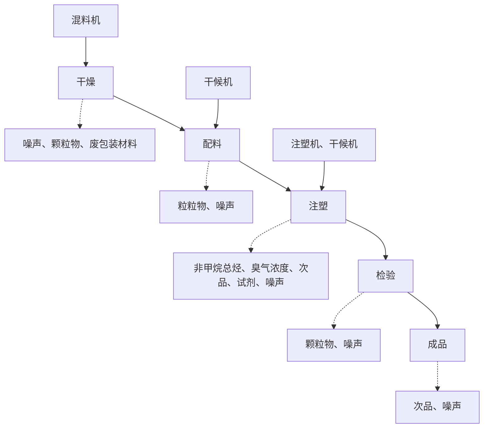
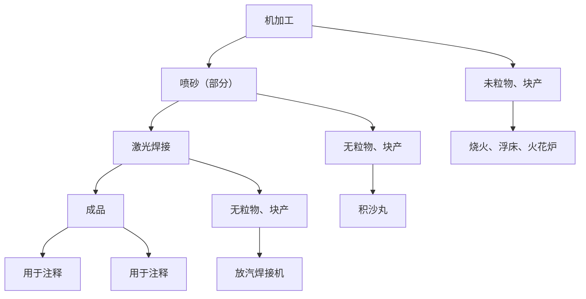

# 建设项目环境影响报告表

# （污染影响类）

目名称：佛山益洛信科技有限公司新建项目设单位（盖章）：佛山益洛信科技有限公司

编制日期：2023年 3月

华人民共和国生态环境部制

编制单位和编制人员情况表

<table><tr><td>项目编号</td><td></td></tr><tr><td>建设项目名称</td><td>佛山益源信科技有限公司新建项目</td></tr><tr><td>建设地点类别</td><td>5#-10#制制品</td></tr></table>

# 一、建设项目基本情况

<table><tr><td>建设项目名称</td><td colspan="3">佛山益洛信科技有限公司新建项目</td></tr><tr><td>项目代码</td><td colspan="3">无</td></tr><tr><td>建设单位联系人</td><td>万**</td><td>联系方式</td><td>13***95</td></tr><tr><td>建设地点</td><td colspan="3">广东省佛山市顺德区杏坛镇齐杏社区杏坛工业区科技四路新纺智慧园4号厂房501、601</td></tr><tr><td>地理坐标</td><td colspan="3">(113°10'37.99"E, 22°47'13.04"N)</td></tr><tr><td>国民经济行业类别</td><td>C2929塑料零件及其他塑料制品制造C3525模具制造</td><td>建设项目行业类别</td><td>“二十六、橡胶和塑料制品业29”中“53塑料制品业292”中“其他(年用非溶剂型低VOCs含量涂料10吨以下除外)”</td></tr><tr><td>建设性质</td><td>☑新建(迁建)□改建□扩建□技术改造</td><td>建设项目申报情形</td><td>☑首次申报项目□不予批准后再次申报项目□超五年重新审核项目□重大变动重新报批项目</td></tr><tr><td>项目审批(核准/备案)部门(选填)</td><td>/</td><td>项目审批(核准/备案)文号(选填)</td><td>/</td></tr><tr><td>总投资(万元)</td><td>800</td><td>环保投资(万元)</td><td>50</td></tr><tr><td>环保投资占比(%)</td><td>6.25</td><td>施工工期</td><td>1个月</td></tr><tr><td>是否开工建设</td><td>☑否□是: /</td><td>用地面积(m2)</td><td>2249.28</td></tr><tr><td>专项评价设置情况</td><td colspan="3">无</td></tr><tr><td>规划情况</td><td colspan="3">无</td></tr><tr><td>规划环境影响评价情况</td><td colspan="3">无</td></tr><tr><td>规划及规划环境影响评价符合性分析</td><td colspan="3">无</td></tr><tr><td>其他符合性分析</td><td colspan="3">1.1 项目选址合理性分析本项目位于广东省佛山市顺德区杏坛镇齐杏社区杏坛工业区科技四路新纺智慧园4号厂房501、601,根据附件3用地资料中的房产证、《顺德西部生态产业新区杏坛北片区控制性详细规划》(漂染城片区)可知,该项目选址所在地为工业用地,用地符合规划要求。1.2 与产业政策符合性分析根据国家《产业结构调整指导目录(2019年本)》及《国家发展改革委关于修改产业结构调整指导目录(2019年本)的决定》(国家发展和改革委员会令第49号),本项目不属于“限制”或“淘汰”类别;根据《环境保护综合名录(2021年版)》,本项目不属于“高污染、高环境风险”类别;根据《市场准入负面清单(2022年版)》,本项目不属于禁止准入类和许可准入类,属于市场准入负面清单以外的行业、领域、业务等。根据《广东省“两高”项目管理目录(2022版)》,本项目不属于严格控制的“两高”项目,不涉及“两高”产品或工序。因此,本项目建设符合国家产业政策的要求。1.3 项目与《国家发展改革委生态环境部印发关于进一步加强塑料污染治理的意见》(发改环资〔2020〕80号)的相符性分析根据《国家发展改革委生态环境部关于进一步加强塑料污染治理的意见》发改环资〔2020〕80号的要求:(四)禁止生产、销售的塑料制品:禁止生产和销售厚度小于0.025毫米的超薄塑料购物袋、厚度小于0.01毫米的聚乙烯农用地膜;禁止以医疗废物为原料制造塑料制品;全面禁止废塑料进口。到2020年底,禁止生产和销售一次性发泡色母颗粒、一次性塑料棉签;禁止生产含塑料微珠的日化产品。到2022年底,禁止销售含塑料微珠的日化产品。本项目主要生产塑料手机壳,不属于禁止生产、销售的塑料制品,本项目不使用医疗废物、进口废塑料为原料,因此符合文件要求。1.4 项目与《关于印发“十四五”塑料污染治理行动方案的通知》(发改环资〔2021〕1298号)的相符性分析</td></tr></table>

根据《关于印发“十四五”塑料污染治理行动方案的通知》（发改环资〔20211298号）的要求：禁止生产厚度小于0.025毫米的超薄塑料购物袋、厚度小于0.01毫米的聚乙烯农用地膜、含塑料微珠日化产品等部分危害环境和人体健康的产品。

本项目主要生产塑料手机壳，不属于塑料购物袋、农用地膜及含塑料微珠日化产品，因此符合文件要求。

# 1.5 项目与《关于印发〈广东省禁止、限制生产、销售和使用的塑料制品目录（2020年版）的通知》（粤发改资环函〔2020〕1747号）的相符性分析

根据《关于印发〈广东省禁止、限制生产、销售和使用的塑料制品目录〉（2020年版）的通知》（粤发改资环函〔2020〕1747号）文件要求：一、禁止生产、销售的塑料制品--厚度小于 0.025毫米的超薄塑料购物袋、厚度小于 0.01 毫米的聚乙烯农用地膜、以医疗废物为原料制造塑料制品、一次性发泡色母颗粒、一次性塑料棉签、含塑料微珠的日化产品。

本项目主要生产塑料手机壳，不属于禁止生产、销售的塑料制品，本项目不使用医疗废物、进口废塑料为原料，因此符合文件要求。

# 1.6 项目与《关于扎实推进塑料污染治理工作的通知》（发改环资〔2020〕1146号）相符性分析

根据《关于扎实推进塑料污染治理工作的通知》（发改环资〔2020〕1146号）要求，加强对禁止生产销售塑料制品的监督检查。各地市场监管部门要开展塑料制品质量监督检查，依法查处生产、销售厚度小于0.025毫米的超薄塑料购物袋和厚度小于0.01毫米的聚乙烯农用地膜等行为；按照《意见》规定的禁限期限，对纳入淘汰类产品目录的一次性发泡塑料餐具、一次性塑料棉签、含塑料微珠日化产品等开展执法工作。

本项目主要生产塑料手机壳，不属于禁止生产、销售的塑料制品，因此符合文件要求。

# 1.7 项目与《广东省人民政府关于印发广东省“三线一单”生态环境分区管控方案的通知》（粤府[2020]71 号）相符性分析

表 1-1 项目与粤府【2020】71号相符性分析

<table><tr><td>序号</td><td>项目</td><td>本项目情况</td><td>符合性</td></tr><tr><td>1</td><td>生态保护红线</td><td>本项目选址位于广东省佛山市顺德区杏坛镇齐杏社区杏坛工业区科技四路新纺智慧园4号厂房501、601,周边无自然保护区等生态保护目标,符合生态保护红线要求。</td><td>符合</td></tr><tr><td>2</td><td>环境质量底线</td><td>本项目生活污水经三级化粪池预处理后经市政污水管网排入杏坛污水处理厂作为后续处理,尾水排放至顺德支流;对周围水环境影响较小。项目所在区域判断为大气不达标区,臭氧( $O_3$ )不达标。注塑产生的有机废气收集后经二级活性炭处理后高空排放。本项目声环境质量能满足相应的标准要求。</td><td>符合</td></tr><tr><td>3</td><td>资源利用上线</td><td>本项目给水来自当地自来水公司供给,电能由区域电网供应,项目建设土地不涉及基本农田,水、电、土地资源消耗,基本能保障自然资源资产“数量不减少、质量不降低”。</td><td>符合</td></tr><tr><td>4</td><td>生态环境准入清单</td><td>本项目主要从事生产塑料手机壳,属于橡胶和塑料制品业,不属于《市场准入负面清单(2022年版)》的通知(发改体改规【2022】397号)中禁止和许可事项,符合准入清单的要求。</td><td>符合</td></tr></table>

# 1.8 项目与《佛山市“三线一单”生态环境分区管控方案》（佛府〔2021〕11 号）相符性分析

对照《佛山市人民政府关于印发佛山市“三线一单”生态环境分区管控方案的通知》（佛府〔2021〕11 号）的佛山市环境管控单元图，本项目所在地属于杏坛镇重点管控单元（环境管控单元编码：ZH44060620005）。

1.大气环境。 常规污染物引用与建设项目距离近的有效数据，包括近 3 年的规划环境

表 1-2 项目与佛山市“三线一单”生态环境分区管控方案的相符性分析

<table><tr><td>管控维度</td><td>政策要求</td><td>本项目情况</td><td>符合性</td></tr><tr><td>区域局管控</td><td>禁止新建、扩建水泥、平板玻璃、化学制浆、生皮制革以及国家规划外的钢铁、原油加工等项目。专业电镀、印染等项目进入定点园区集中管理。推广应用低挥发性有机物原辅材料,严格限制新建生产和使用高挥发性有机物原辅材料的项目,鼓励建设共性工厂、活性炭集中再生中心等挥发性有机物第三方治理项目,推动挥发性有机物集中高效处理</td><td>本项目不属于水泥、平板玻璃、化学制浆、生皮制革、钢铁、原油加工等行业。项目使用的原辅材料不属于高挥发性原料。</td><td>符合</td></tr><tr><td>生态保护</td><td>通过开展生态空间识别、水、大气、土壤环境评价、自然资源开发利用</td><td>本项目选址不在优先保护单元,在重点管控单元,不属于禁止开</td><td>符合</td></tr></table>

<table><tr><td rowspan="2"></td><td>红线</td><td>评估,确定生态环境及自然资源管控分区,综合各管控分区拟合行政村、乡镇、街道、省级以上产业园区等行政边界,顺德区共划定环境管控单元25个,分为优先保护单元和重点管控单元两类,实施分类管控。</td><td>发区域。</td><td></td></tr><tr><td>环境质量底线</td><td>水环境质量持续改善,国考、省考、水功能区断面达到国家和省下达的水质目标要求;市控断面全面消除劣V类,力争达到我市确定的水质目标要求;乡镇级及以上集中式饮用水水源地水质稳定达标。空气质量持续改善,细颗粒物( $PM_{2.5}$ )年均浓度、空气质量优良天数比例(AQI)主要指标达到省下达的目标要求,臭氧污染得到有效遏制。土壤环境质量稳中向好,土壤环境风险得到管控。</td><td>1本项目排放的为生活污水,生活污水经三级化粪池处理后纳入杏坛污水处理厂处理达标后外排;冷却水循环使用,不外排;本项目建设可满足水环境控制底线要求;2本项目选址地不属于大气环境保护区范围,项目生产过程中排放的颗粒物和有机废气均采取了相应的收集治理措施,可稳定达标排放,满足大气环境质量底线的管理要求;3本项目选址地为工业用地,项目生产车间地面均已硬体化处理,生产过程中无土壤污染因子。建设单位生产过程中应加强各环境的管控,防止对土壤环境造成影响。</td><td>符合</td></tr><tr><td colspan="5">1.9 项目与《顺德区“三线一单”生态环境分区管控方案》(顺府发【2021】11号)相符性分析(1)全区总体管控要求本项目不属于列入国家和省限制类建设项目:仅使用电能,属于清洁能源;项目属于C2929塑料零件及其他塑料制品制造、C3525模具制造,不属于水泥、平板玻璃、化学制浆、生皮制革以及国家规划外的钢铁、原油加工等项目,不属于限制行业,符合要求本项目产生外排的废水主要为生活污水。项目生活污水经三级化粪池处理后达标后由市政污水管网引至杏坛污水处理厂,尾水排入顺德支流;循环冷却水循环使用,不外排。注塑产生的有机废气经二级活性炭处理达标后高空排放,符合要求。本项目产生的危险废物缓存在危险废物暂存间,待缓存一定量后,交给有资</td></tr></table>

质的单位进行处理，符合区域布局管控要求。

# （2）环境管控单元总体管控要求（重点管控单元）

①水环境重点管控单元：“以工业污染为主的单元，大力推进涉水重点行业清洁化改造，降低单位工业增加值新鲜水耗，提高工业用水重复利用率和中水回用率；推行废水重点排污单位厂区废水输送明管化，实行水质和视频双监控，加强企业雨污分流、清污分流。”

本项目涉及生活用水及生产用水，根据项目水平衡图，不属于高耗行业，符合要求。

②大气环境重点管控单元：“以建筑陶瓷、有色金属等行业为重点，加快推动企业工业炉窑分级管理及废气治理设施升级改造。加快涉VOCs 重点行业的生产工艺升级改造，推行自动化生产工艺，逐步淘汰低效VOCs 治理设施。人口较集中的单元，严格限制新、扩建储油库、产生和排放有毒有害大气污染物以及使用高挥发性有机物原辅材料的项目，鼓励现有该类项目迁退出。布局敏感的单元，严格限制新建扩建生产和使用高挥发性有机物原辅材料的项目，优先开展低VOCs 含量原辅材料替代，强化无组织排放控制；限制建设新建、扩建新增氮氧化物、烟（粉）尘排放量较大的建设项目。扩散条件较差的单元，加大区域内大气污染物减排力度，严格控制“两高”项目建设。污染排放高的单元，强化达标监管，引导工业项目落地集聚发展，有序推进区域内行业企业提标改造。”

根据《佛山市顺德区人民政府关于印发佛山市顺德区“三线一单”生态环境分区管控方案的通知》（顺府发〔2021〕11号）的佛山市顺德区环境管控单元图，本项目所在地属于杏坛镇重点管控单元（环境管控单元编码：ZH44060620005），项目与佛山市顺德区环境管控单元准入清单相符性分析如下。

表 1-3 项目与佛山市顺德区环境管控单元准入清单相符性分析

<table><tr><td>管控维度</td><td>管控要求</td><td>项目情况</td><td>符合性</td></tr><tr><td rowspan="2">区域布局管控</td><td>1-1【生态/禁止类】单元内的一般生态空间,主导生态功能为水土保持,禁止在25度以上的陡坡地开垦种植农作物,禁止在崩塌、滑坡危险区、泥石流易发区从事采石、取土、采砂等可能造成水土流失的活动。</td><td>1-1.本项目不涉及。</td><td>/</td></tr><tr><td>1-2.【产业/鼓励引导类】重点发展新材料、智能家居、先进装备制造业、汽车配件等产</td><td>1-2.本项目不涉及。</td><td>/</td></tr></table>

<table><tr><td rowspan="8"></td><td rowspan="5"></td><td>业以及军民融合产业,提升发展塑料专业市场,培育智能家居创新创业产业链,依托顺德新港发展临港加工和物流产业,发展现代农业。</td><td></td><td></td></tr><tr><td>1-3.【产业/综合类】系统推进村级工业园升级改造,腾出连片空间,布局产业集聚区和主题产业园,推动工业项目入园集聚发展。新增工业制造业用地原则上安排在产业集聚区内,产业集聚区外原则上不鼓励工业及物流仓储用地的新建与改造。</td><td>1-3.本项目不涉及。</td><td>/</td></tr><tr><td>1-4.【产业/限制类】受纳水体或监控断面不达标的,不得新建、扩建向河涌直接排放废水的项目。新建、扩建含蚀刻工序的线路板生产项目和化工项目应在配套污水集中处置的工业园区或生活污水管网覆盖区域内建设;纯加工型印花项目,含酸洗、磷化的金属表面处理、金属制品项目(与自身高新技术企业配套的除外),含酸洗、喷涂、拉丝、表面抛光等工艺的不锈钢型材加工项目,应进入以此类项目为主导产业、有相应废水集中治理设施的工业园区,实现集中治污。</td><td>1-4 项目生活污水经三级化粪池处理,通过市政管网进入杏坛生活污水处理厂处理,尾水排入顺德支流。参考《佛山市生态环境局顺德分局关于发布2021年度佛山市顺德区生态环境状公报的通知》(佛环顺函〔2022〕13号),顺德支流新涌断面监测的水质达到了III类标准要求;项目所属塑料零件及其他塑料制品制造,不属于以下项目:线路板生产项目和化工项目;纯加工型印花项目,含酸洗、磷化的金属表面处理、金属制品项目,含酸洗、喷涂、拉丝、表面抛光等工艺的不锈钢型材加工项目。</td><td>符合</td></tr><tr><td>1-5.【水/限制类】严格限制在右滩水厂、均安水厂饮用水水源保护区上游和周边区域建设列入“高污染、高环境风险”产品名录等可能影响水环境安全的项目。</td><td>1-5.本项目不涉及。</td><td>/</td></tr><tr><td>1-6.【土壤/禁止类】禁止新建、扩建增加重点防控的重金属污染物排放的建设项目。</td><td>1-6.本项目不涉及。</td><td>/</td></tr><tr><td rowspan="3">能源资源利用</td><td>2-1【能源/鼓励引导类】推广节能技术,加快发展绿色货运与现代物流。</td><td>2-1.本项目不涉及。</td><td>/</td></tr><tr><td>2-2【能源/鼓励引导类】推广新能源汽车应用和充电基础设施建设,积极推动重卡LNG加气站、充电基础设施、加氢站建设。</td><td>2-2.本项目不涉及。</td><td>/</td></tr><tr><td>2-3.【能源/综合类】科学实施能源消费总量和强度“双控”,新建高能耗项目单位产品(产值)能耗达到国际国内先进水平。</td><td>2-3.根据《广东省“两高”项目管理目录(2022年版)》,六大高耗能行业分别为:化学原料和化学制品制造业;黑色金属冶炼及压延加工业;有色金属冶炼和压延加工业;非金属矿物制品业;石油、煤炭及其他燃料加工业;电力、热力生产和供应业,本项目行业类别为C2929塑料零件及其他塑料制品制造、C3525模具制造,不属于以上行业。</td><td>符合</td></tr><tr><td rowspan="6"></td><td rowspan="3"></td><td>2-4.【水资源/综合类】贯彻落实“节水优先”方针,实行最严格水资源管理制度,杏坛镇万元国内生产总值用水量、万元工业增加值用水量、用水总量、农田灌溉水有效利用系数等用水总量和效率指标达到区下达要求。</td><td>2-4.本项目不涉及。</td><td>/</td></tr><tr><td>2-5.【土地资源/限制类】落实单位土地面积投资强度、土地利用强度等建设用地控制性指标要求,提高土地利用效率。</td><td>2-5.本项目不涉及。</td><td>/</td></tr><tr><td>2-6.【.岸线/禁止类】严格水域岸线用途管制,新建项目一律不得违规占用水域。严禁破坏生态的岸线利用行为和不符合其功能定位的开发建设活动,严禁以各种名义侵占河道、围垦湖泊、非法采砂等。</td><td>2-6.项目所在厂房已建成,根据附件3用地资料,项目用地属于工业用地,项目未违规占用水域,不会破坏生态的岸线利用行为和做不符合其功能定位的开发建设活动,不以侵占河道、围垦湖泊、非法采砂等。因此项目符合能源资源利用的要求。</td><td>符合</td></tr><tr><td rowspan="3">污染物排放管控</td><td>3-1.【水/限制类】城镇新区建设实行雨污分流,逐步推进初期雨水收集、处理和资源化利用。住宅、商业体、学校、市场等城镇开发建设项目应当配套或者同步计划建设公共排水设施,公共排水设施或自建排污水设施未能投产运行的,以上涉水项目不得投入使用。新建小区严格实施雨污分流,阳台、露台等污水接入污水收集系统,将生活污水“应截尽截”。做好大型楼盘、集贸市场、餐饮以及学校等4大类排水户污水接入市政管网工作。</td><td>3-1.生活污水经三级化粪池处理,然后通过市政管网进入杏坛生活污水处理厂处理,尾水排入顺德支流。</td><td>符合</td></tr><tr><td>3-2.【水/综合类】杏坛镇重点河涌水质上年度未达到水环境质量目标的,需组织编制、系统实施、向社会公开区域重点水污染物减排计划并明确“替代量”,本年度新建、改建、扩建项目新增水环境重点污染物实行区域“减二增一”替代(工业、生活或综合集中废水处理设施、民生项目除外)。</td><td>3-2.生活污水经三级化粪池处理,然后通过市政管网进入杏坛生活污水处理厂处理,尾水排入顺德支流。参考《佛山市生态环境局顺德分局关于发布2021年度佛山市顺德区生态环境状况公报的通知》(佛环顺函〔2022〕13号),顺德支流新涌断面监测的水质达到了III类标准要求。</td><td>符合</td></tr><tr><td>3-3.【水/综合类】区域内应合理规划建设工业或综合集中废水处理设施。逐步推进工业集聚区“污水零直排区”建设,开展排水单元工业废水、生活污水、雨水分类收集、分质处理,确保园区“管网全覆盖、雨污全分流、污水全收集、处理全达标”。</td><td>3-3.本项目不涉及。</td><td>/</td></tr><tr><td rowspan="8"></td><td rowspan="5"></td><td>3-4.【水/综合类】结合村级工业园改造,全面提升产业层次与集聚度,促进污染集中整治。</td><td>3-4.本项目不涉及。</td><td>/</td></tr><tr><td>3-5.【水/综合类】稳步推进排水设施“三个一体化”管理模式,补齐城乡污水收集和处理短板,推动杏坛污水处理厂提质增效,加快消除城中村、老旧城区、城乡结合部等污水收集管网空白区,逐步实现城乡污水收集处理全覆盖。2025年前完成杏坛污水处理厂扩建,尾水应执行《城镇污水处理厂污染物排放标准》(GB18918-2002)一级A标准及《广东省水污染物排放限值》(DB44/26-2001)的较严值。</td><td>3-5.本项目不涉及。</td><td>/</td></tr><tr><td>3-6.【水/综合类】近期保留桑麻村、逢简村、吉祐村、安富村等现状农村污水分散式处理设施,继续完善污水支管网建设,提高污水收集处理率,新建龙潭村、吉祐村、右滩村、南朗村、光华村、东村、北水村等农村分散式生活污水处理设施,其余行政村(社区)继续完善污水管网建设,收集农村污水进入市政污水系统,有条件的区域实施雨污分流改造,到2030年全面雨污分流,污水纳入杏坛城镇污水处理系统。</td><td>3-6.本项目不涉及。</td><td>/</td></tr><tr><td>3-7.【大气/综合类】大力推进低VOCs含量原辅材料替代,加快涉VOCs重点行业的生产工艺升级改造,推行自动化生产工艺,对达不到要求的VOCs收集及治理设施进行整治提升,逐步淘汰低效VOCs治理设施。</td><td>3-4.本项目不使用溶剂型油墨、涂料、清洗剂、胶黏剂等高挥发性有机物原辅材料。</td><td>符合</td></tr><tr><td>3-8.【土壤/限制类】作为重金属污染重点防控区,区域内重点重金属排放总量只减不增。</td><td>3-5.本项目不涉及。</td><td>/</td></tr><tr><td rowspan="3">环境风险防控</td><td>4-1.【水/综合类】加强单元内右滩水厂、均安水厂饮用水水源保护区周边环境风险源管控,完善突发环境事件应急管理体系。</td><td>4-1.本项目不涉及。</td><td>/</td></tr><tr><td>4-2.【水/综合类】杏坛污水处理厂、工业污水集中处理设施应采临取有效措施,防止事故废水直接排入水体。完善污水处理厂在线监控系统联网,实现污水处理厂的实时、动态监管。</td><td>4-2.本项目不涉及。</td><td>/</td></tr><tr><td>4-3.【风险/综合类】加强环境风险分级分类理,强化金属制品、有色金属和压延加工、化学原料和化学品制造业等涉重金属、化工行业企业及工业园区等重点环境风险源的环境风险防控。</td><td>4-3.项目通过采取防止泄漏措施,在火灾和爆炸事故次生灾害时,可通过封堵厂区门口,采取紧急疏散等措施,其环境风险总体是可控的。</td><td>符合</td></tr></table>

# 1.10 项目与挥发性有机物相关政策文件规定的相符性分析

项目挥发性有机物排放符合性根据相关政策文件规定分析如下：

表 1-4 项目挥发性有机物排放规定相符性分析

<table><tr><td>序号</td><td>政策要求</td><td>本项目情况</td><td>符合性</td></tr><tr><td colspan="4">1.《广东省挥发性有机物(VOCs)整治与减排工作方案(2018-2020年)》的通知(粤环发〔2018〕6号)</td></tr><tr><td>1.1</td><td>加强有机废气收集与治理,有机废气收集率不低于80%,建设吸附燃烧等高效治理设施,实现达标排放。</td><td>注塑废气使用集气罩+垂帘收集,经过二级活性炭处理后达标排放,收集效率为80%。</td><td>符合</td></tr><tr><td colspan="4">2.《广东省人民政府办公厅关于印发广东省2021年大气、水、土壤污染防治方案的通知》(粤办函〔2021〕58号)</td></tr><tr><td>2.1</td><td>全面深化VOCs排放企业浓度治理。研究将《挥发性有机物无组织排放标准》(GB37822-2019)无组织排放要求作为强制性标准实施。涉VOCs重点行业新建、扩建和扩建项目不推荐使用光氧化、光催化、低温等离子治理设施。</td><td>项目采用“二级活性炭吸附”装置处理有机废气,未采用淘汰的低效治理设施。</td><td>符合</td></tr><tr><td colspan="4">3.关于印发《广东省涉挥发性有机物(VOCs)重点行业治理指引》的通知(粤环办【2021】43号)</td></tr><tr><td>3.1</td><td>采用外部集气罩的,距集气罩开口面最远处的VOCs无组织排放位置,控制风速不低于0.3m/s。</td><td>集气罩风速为0.6m/s。</td><td>符合</td></tr><tr><td colspan="4">4.关于印发《2020年挥发性有机物治理攻坚方案》的通知(环大气〔2020〕33号)</td></tr><tr><td>4.1</td><td>将无组织排放转变为有组织排放进行控制,优先采用密闭设备、在密闭空间中操作或采用全密闭集气罩收集方式;对于采用局部集气罩的,应根据废气排放特点合理选择收集点位,距集气罩开口面最远处的VOCs无组织排放位置,控制风速不低于0.3米/秒。</td><td>集气罩风速为0.6m/s。</td><td>符合</td></tr><tr><td colspan="4">5.《关于加快解决当前挥发性有机物治理突出问题的通知》(环大气【2021】65号)</td></tr><tr><td>5.1</td><td>对采用局部收集方式的企业,距废气收集系统排风罩开口面最远处的VOCs无组织排放位置控制风速不低于0.3m/s。</td><td>集气罩风速为0.6m/s。</td><td>符合</td></tr><tr><td colspan="4">6.《广东省生态环境保护“十四五”规划》(粤环【2021】10号)</td></tr><tr><td>6.1</td><td>严格实施VOCs排放企业分级管理,全面推进涉VOCs排放企业深度治理。开展中小型企业废气收集和治理设施建设、运行情况的评估,强化对企业涉VOCs生产车间/工序废气的收集管理,推动企业开展治理设施升</td><td>项目采用“二级活性炭吸附”装置处理有机废气,未采用淘汰的低效治理设施。</td><td>符合</td></tr></table>

<table><tr><td rowspan="6"></td><td></td><td>级改造。</td><td></td><td></td></tr><tr><td colspan="4">7.《佛山市生态环境保护“十四五”规划》</td></tr><tr><td>7.1</td><td>严格控制“高耗能、高排放”项目的发展,禁止新建、扩建水泥、平板玻璃、化学制浆、生皮制革以及国家规划外的钢铁、原油加工等项目。</td><td>本项目主要从事生产塑料手机壳,属于橡胶和塑料制品业。不属于“高耗能、高排放”项目。</td><td>符合</td></tr><tr><td colspan="4">8.《佛山市顺德区生态环境保护“十四五”规划(2021-2025)》(顺府办发〔2022〕16号)</td></tr><tr><td>81</td><td>持续探寻高效节能的VOCs治理技术,对采用低温等离子、光氧化、光催化等低效治理工艺的企业在臭氧污染天气应对期间实施停限产或错峰生产,并推动企业逐步淘汰低效治理工艺。</td><td>项目采用“二级活性炭吸附”装置处理有机废气,未采用淘汰的低效治理设施。</td><td>符合</td></tr><tr><td colspan="4">综上所述,项目建设符合国家、省、市的产业政策。</td></tr></table>

# 二、建设项目工程分析

<table><tr><td rowspan="8">建设内容</td><td colspan="3">根据《中华人民共和国环境影响评价法》(2018年修订,2018年12月29日起施行)、《建设项目环境保护管理条例》(中华人民共和国国务院令第682号)的有关规定,一切可能对环境产生影响的新建、改扩建和技术改造项目均必须执行环境影响评价制度。根据《建设项目环境影响评价分类管理名录》(2021年版),本项目工艺属于“二十六、橡胶和塑料制品业29”中“53塑料制品业292”中“其他(年用非溶剂型低VOCs含量涂料10吨以下除外)”,故应编制环境影响评价报告表。受建设单位委托,我司承担本项目的环境影响评价工作。在建设单位大力支持下,我司立即开展了详细的现场调查、资料收集工作,在对本项目的环境现状和可能造成的环境影响进行分析后,依照《建设项目环境影响报告表编制技术指南(污染影响类)(试行)》等技术规范的要求编制了环境影响评价报告表,报有审批权限的当地生态环境主管部门审批。1、项目建设内容本项目位于广东省佛山市顺德区杏坛镇齐杏社区杏坛工业区科技四路新纺智慧园4号厂房501、601。项目总占地面积约为 $1124.64m^{2}$ ,建筑面积为 $2249.28m^{2}$ ,4号厂房建筑高度为41.9m(该建筑首层高度为7.9米,2-3层高度为6米,4-7层高度为5.5米)。根据建设单位提供资料,项目总投资800万元,项目工程组成如表2-1所示。表2-1项目工程组成</td></tr><tr><td colspan="2">项目名称</td><td>主要内容</td></tr><tr><td rowspan="2">主体工程</td><td rowspan="2">生产车间</td><td>5F,建筑面积为 $1124.64m^{2}$ ,主要分为注塑区(放置44台注塑机)、混料区、成品区、原料区、模具维修区、破碎区等。</td></tr><tr><td>6F,建筑面积为 $1124.64m^{2}$ ,主要分为注塑区(放置76台注塑机)、中转区等。</td></tr><tr><td>辅助工程</td><td>办公室</td><td>办公室位于园区办公楼,主要用途办公、休息区。</td></tr><tr><td>仓储工程</td><td>原料区、成品区库</td><td>位于车间内,面积约为 $400m^{2}$ ,主要用于储存成品及原辅材料。</td></tr><tr><td rowspan="2">公用工程</td><td>给水工程</td><td>项目用水均由市政供水管道直接供水。</td></tr><tr><td>排水工程</td><td>排水采用雨、污分流制。生活污水经三级化粪池预处理后经市政污水管网排入杏坛污水处理厂作后续处理,尾水排</td></tr><tr><td rowspan="2"></td><td colspan="2"></td><td>放至顺德支流;冷却水循环使用,不外排。</td></tr><tr><td colspan="2">供电工程</td><td>厂区内电源由市政供电管网提供,年用电量为80万kW·h。</td></tr><tr><td rowspan="8">环保工程</td><td rowspan="2">废水</td><td>生活污水</td><td>排水采用雨、污分流制。生活污水经三级化粪池预处理后经市政污水管网排入杏坛污水处理厂作后续处理,尾水排放至顺德支流。</td></tr><tr><td>冷却塔循环冷却水</td><td>冷却水循环使用,不外排,定期补充新鲜水。</td></tr><tr><td rowspan="2">废气</td><td>有机废气治理设施</td><td>注塑废气经过集气罩+垂帘收集后,采用两套“二级活性炭吸附装置”处理后经43m高排气筒G1排放。</td></tr><tr><td>通风换气系统</td><td>加强车间通风换气</td></tr><tr><td rowspan="3">固体废物</td><td>生活垃圾</td><td>由环卫部门统一清运处理</td></tr><tr><td>一般工业固废</td><td>在生产车间设置一般固废暂存区,存放一般工业固体废物,定期交由回收公司进行处置。</td></tr><tr><td>危险废物</td><td>在5F生产车间设置1个危险废物暂存间,存放危险废物,定期交由有资质的单位进行处置。</td></tr><tr><td colspan="2">噪声</td><td>项目噪声为设备运行产生的噪声,尽量采用低噪声设备,加装减振固定装置,加强设备维护,生产安排在昼间进行,在生产车间安装隔声门窗等。</td></tr></table>

# 2、主要产品及产能

根据建设单位提供的资料，项目主要产品见下表。

表 2-2 项目主要产品及年产量

<table><tr><td>序号</td><td>产品名称</td><td>单位</td><td>年产量</td></tr><tr><td>1</td><td>TPU 塑料手机壳</td><td>万个/年</td><td>约 2000</td></tr><tr><td>2</td><td>PC 塑料手机壳</td><td>万个/年</td><td>约 666.6</td></tr><tr><td>3</td><td>模具</td><td>套/年</td><td>300</td></tr><tr><td>备注</td><td colspan="3">项目塑料手机壳成品平均单重约为30g</td></tr></table>

# 3、主要原辅材料的种类及用量

根据建设单位提供的资料，本项目主要原辅材料及用量详见下表。

表 2-3 本项目主要原材料用量一览表

<table><tr><td>序号</td><td>名称</td><td>单位</td><td>年用量</td><td>最大存储量</td><td>包装规格</td><td>备注</td></tr><tr><td>1</td><td>TPU 塑料粒</td><td>吨/年</td><td>600</td><td>20</td><td>25kg/袋</td><td>颗粒状,新料</td></tr><tr><td>2</td><td>PC 塑料粒</td><td>吨/年</td><td>200</td><td>5</td><td>25kg/袋</td><td></td></tr><tr><td>3</td><td>色粉</td><td>吨/年</td><td>2</td><td>0.5</td><td>30g/袋</td><td>粉末状,新料</td></tr><tr><td>4</td><td>模具</td><td>套/年</td><td>300</td><td>50</td><td>/</td><td>/</td></tr><tr><td>5</td><td>钢丸</td><td>吨/年</td><td>0.1</td><td>0.1</td><td>20kg/袋</td><td>颗粒物</td></tr><tr><td>6</td><td>电火花油</td><td>吨/年</td><td>0.2</td><td>0.2</td><td>25kg/桶</td><td>液态</td></tr><tr><td>7</td><td>机油</td><td>吨/年</td><td>0.2</td><td>0.2</td><td>25kg/桶</td><td>液态</td></tr></table>

表 2-4 项目生产设施设计产能与原辅料用量、产品产能相符性分析一览表

<table><tr><td>设备</td><td>数量</td><td>工作时间(h/a)</td><td>单次最大注塑量(kg)</td><td>单次成型时间(s)</td><td>单台生产能力(t/a)</td><td>注塑机最大产能合计(t/a)</td><td>注塑机实际产能(t/a)</td></tr><tr><td>注塑机</td><td>120</td><td>2400</td><td>0.04</td><td>45</td><td>7.68</td><td>921.6</td><td>800</td></tr><tr><td colspan="8">注:本项目注塑机理论产能可达到921.6t/a,本项目申报注塑机产能800t/a,占最大产能的86.8%,综合考虑设备注塑过程中日常维护及突发故障等情况下消耗时间,评价认为本项目产品产能规划情况与生产设备设置情况是相匹配的。</td></tr></table>

# 原辅材料理化性质：

表 2-5 本项目原材料理化性质一览表

<table><tr><td>序号</td><td>原料名称</td><td>理化性质</td><td>CAS号</td><td>是否为危险物质</td></tr><tr><td>1</td><td>TPU塑料粒</td><td>TPU名称为热塑性聚酯弹性体,是由二苯甲烷二异氰酸酯(MDI)等二异氰酸酯类分子和大分子多元醇、低分子多元醇(扩链剂)共同反应聚合而成的高分子材料。它硬度范围宽(60HA-85HD)、耐磨、耐油,透明,弹性好,在日用品、体育用品、玩具、装饰材料等领域得到广泛应用。硬度为70±3ShoreA,伸长率约为400%,分解温度250°C,熔点在200°C左右。</td><td>/</td><td>否</td></tr><tr><td>2</td><td>PC塑料粒</td><td>聚碳酸酯,是分子链中含有碳酸酯基的高分子聚合物,根据酯基的结构可分为脂肪族、芳香族、脂肪族-芳香族等多种类型。其中由于脂肪族和脂肪族-芳香族聚碳酸酯的机械性能较低,从而限制了其在工程塑料方面的应用。密度:1.18-1.22g/cm3,热变形温度为135°C,熔点为220°C,分解温度约为300°C。</td><td>25037-45-0</td><td>否</td></tr><tr><td>3</td><td>色粉</td><td>用于着色的粉末状物质,一般不溶于水,能分散于水、油、溶剂和树脂等介质中,具有遮盖力、着色力,对光相对稳定,常用于配制涂料、油墨、以及着色塑料和塑胶。</td><td>/</td><td>否</td></tr><tr><td>4</td><td>电火花油</td><td>是一种电火花机加工不可缺少的放电介质液体,电火花机油能够绝缘消电离、冷却电火花机加工时的高温、排除碳渣。主要成分是从煤油组分加氢后的产物,属于二次加氢产品。一般通过高压加氢及异构脱腊技术精练而成。不含有害成分,危险性低,加热至高于闪点的温度,或遇到明火会着火。外观呈清澈透明状,与皮肤接触过久,会引起皮肤炎。</td><td>/</td><td>是</td></tr><tr><td>5</td><td>机油</td><td>密度约为0.91×103kg/m3,闪点约为180°C,能对机械设备到润滑减磨、辅助冷却降温、密封防漏、防锈防蚀、减震缓冲等作用。机油由基础油和添加剂两部分组成。基础油是机油的主要成分,决定着机油的基本性质,添加剂则可弥补和改善基础油性能方面的不足,赋予某些新的性能,是机油的重要组成部分。</td><td>/</td><td>是</td></tr></table>

# 4、主要生产设施及设施参数

根据建设单位提供的资料，本项目主要生产设备见下表。

表 2-6 本项目主要生产设备一览表

<table><tr><td rowspan="2">序号</td><td rowspan="2">生产设施名称</td><td rowspan="2">数量</td><td rowspan="2">单位</td><td colspan="3">设施参数</td><td rowspan="2">所用工序</td><td rowspan="2">位置</td></tr><tr><td>名称</td><td>设计值</td><td>单位</td></tr><tr><td>1</td><td>干燥机(注塑机配套)</td><td>120</td><td>台</td><td>处理能力</td><td>50</td><td>kg/h</td><td>烘干</td><td rowspan="2">注塑区</td></tr><tr><td>2</td><td>干燥机</td><td>10</td><td>台</td><td>处理能力</td><td>500</td><td>kg/h</td><td>烘干</td></tr><tr><td>3</td><td>混料机</td><td>10</td><td>台</td><td>处理能力</td><td>500</td><td>kg/h</td><td>混料</td><td>注塑区</td></tr><tr><td rowspan="2">4</td><td rowspan="2">注塑机</td><td rowspan="2">120</td><td rowspan="2">台</td><td>处理能力</td><td>7.68</td><td>t/a</td><td>注塑</td><td>注塑区</td></tr><tr><td>尺寸</td><td>5.6×1.2×1.6</td><td>m</td><td>注塑</td><td>注塑区</td></tr><tr><td>5</td><td>铣床</td><td>7</td><td>台</td><td>功率</td><td>5</td><td>kW</td><td rowspan="7">模具维修</td><td rowspan="8">模具维修区</td></tr><tr><td>6</td><td>CNC数控铣床</td><td>6</td><td>台</td><td>功率</td><td>5.5</td><td>kW</td></tr><tr><td>7</td><td>磨床</td><td>7</td><td>台</td><td>功率</td><td>5</td><td>kW</td></tr><tr><td>8</td><td>火花机</td><td>3</td><td>台</td><td>功率</td><td>6.5</td><td>kW</td></tr><tr><td>9</td><td>打磨机</td><td>3</td><td>台</td><td>功率</td><td>2.5</td><td>kW</td></tr><tr><td>10</td><td>激光焊</td><td>1</td><td>台</td><td>功率</td><td>5.5</td><td>kW</td></tr><tr><td>11</td><td>喷砂机</td><td>6</td><td>台</td><td>功率</td><td>5</td><td>kW</td></tr><tr><td>12</td><td>空压机</td><td>5</td><td>台</td><td>容量</td><td>2</td><td> $m^3/min$ </td><td>辅助</td></tr><tr><td>13</td><td>破碎机</td><td>5</td><td>台</td><td>处理能力</td><td>100</td><td>kg/h</td><td>破碎</td><td>破碎区</td></tr><tr><td>14</td><td>冷却塔</td><td>2</td><td>台</td><td>循环水量</td><td>20</td><td> $m^3/h$ </td><td>冷却</td><td>楼顶</td></tr></table>

# 5、主要能源消耗情况

表 2-7 项目主要能源消耗量一览表

<table><tr><td>序号</td><td colspan="2">能源类型</td><td>消耗量</td><td>单位</td><td>来源</td></tr><tr><td rowspan="2">1</td><td rowspan="2">水</td><td>生活用水</td><td>500</td><td> $m^{3}/a$ </td><td rowspan="2">市政供水管网</td></tr><tr><td>生产用水</td><td>3600</td><td> $m^{3}/a$ </td></tr><tr><td>2</td><td colspan="2">电</td><td>80万</td><td>kW•h/年</td><td>市政电网</td></tr></table>

# 6、劳动定员及工作制度

根据建设单位提供资料，项目共设置员工 50人，年工作 300天，项目工作制

度的为每天1班制，每班工作8小时，员工均不在厂内食宿。

# 7、公用工程

# （1）物料储存

项目生产所需原材料由供应商直接提供，厂区已设置原材料区及成品区，物料分别存放。

# （2）给排水

# ①生活用水及生活污水

根据建设单位提供资料，项目用水均由市政水管道直接供水，主要用水为职工生活用水。项目共设置员工50人，均不在厂区内食宿。根据广东省地方标准《用水定额 第3部分：生活》（DB44/T1461.3-2021），用水量以“国家行政机构-办公楼”无食堂和浴室，用水量先用值计算，按10m3 /(人·a)计，则生活用水量为500t/a；排放系数为 0.9，生活污水排放量约 450t/a。生活污水经三级化粪池预处理后排入杏坛污水处理厂处理，尾水排入顺德支流。

# ②冷却塔循环冷却水

本项目设置2台冷却塔为注塑机模具提供冷却水，冷却水对模具进行冷却，属于间接冷却塑料产品，单台水泵流量为20m3 /h，2台配置的水泵流量约40m3/h，项目冷却塔年运行时间约 3000h，则年循环水量约 120000m3 /a。根据第四章-废水排放源强可知，新鲜补充水量为3600t/a。


<details>
<summary>flowchart</summary>

```mermaid
graph TD
    A["新鲜用水量 3680"] --> B["生产用水"]
    B --> C["3600"]
    C --> D["冷却用水"]
    D --> E["蒸发损失 3600"]
    D --> F["循环水量 120000"]
    B --> G["500"]
    G --> H["生活用水"]
    H --> I["450"]
    I --> J["三级化粪池"]
    J --> K["450"]
    K --> L["杏坛污水处理厂"]
    style B stroke-dasharray: 5 5
    style D stroke-dasharray: 5 5
    style H stroke-dasharray: 5 5
    note right of B
        损失 50
    end
```
</details>

图 2-1 项目全厂水平衡图（单位：t/a）

# （3）能源消耗

<table><tr><td></td><td>项目用电由市政电网提供,项目设备运行年耗电量为80万kW·h,未设置备用发电机。8、项目四至情况及平面布置情况项目位于广东省佛山市顺德区杏坛镇齐杏社区杏坛工业区科技四路新纺智慧园4号厂房501、601。4号厂房现状均为空厂房,项目东面为园区3号厂房,南面为4号厂房502、602,西面为佛山市顺德区环澳水务有限公司,北面为科技三路。项目生产车间内部按照要求进行分区,5F主要设置注塑区(放置44台注塑机)、混料区、成品区、原料区、模具维修区、破碎区等;6F主要设置注塑区(放置76台注塑机)、中转区等。项目车间内布置规划流畅,总体来说项目平面布置紧凑有序,布局合理,能够满足生产规模需求。平面布置图详见附图4。</td></tr><tr><td>工</td><td>项目塑料手机壳生产工艺流程说明:</td></tr></table>


<details>
<summary>flowchart</summary>


</details>

图 2-2 项目塑料手机壳生产工艺流程及产污环节图

①干燥：人工将外购TPU、PC 塑料粒投入干燥机中干燥，工作时间约为4h/d，干燥温度约为 $4 0 \mathrm { { } ^ { \circ } C }$ ，未达到塑料的熔融温度和分解温度，因此不会产生有机废气，该过程主要产生噪声和废包装材料；  
②混料：将 TPU、PC、色粉通过称重，按照一定的比例进行密闭式混料，混料在常温下进行，无有机废气产生；由于本项目为密闭混料，因此产生颗粒物极少。  
③注塑：混合料经配套的干燥机二次干燥后自动投送到注塑机料斗中，注塑机的工作原理与打针用的注射器相似，它是借助螺杆（或柱塞）的推力，将已经塑化好的熔融状态（加热至 $2 3 0 \mathrm { { } ^ { \circ } C }$ ，即粘流态）的塑料注射入闭合好的模腔内，经固化定型后取得制品的工艺过程，注射成型是一个循环的过程，每一周期主要包括：定量加料——熔融塑化——施压注射——充模冷却——启模取件。根据产品要求，注塑换色时需要清理设备，主要操作过程为将预换料投入注塑机料斗中，进行连续对空注射，直至料筒内的存留料清洗完毕后即可，该过程产生的塑料件按次品处理，另外注塑过程中需要用水对设备进行间接冷却，该工序主要产生有机废气、臭气浓度、噪声、塑料边角料及次品。

④检验：注塑得到的成品经检验合格即进行下一步工序，次品则经破碎后回用，此过程会产生次品、噪声。

⑤破碎：注塑工序会产生塑料边角料及次品，经破碎机（无粉尘处理措施）破碎后，回用于生产，该工序会产生粉尘及噪声。

项目模具维修流程说明：  


<details>
<summary>flowchart</summary>


</details>

图 2-3 本项目模具维修工艺流程及产污环节图

# 工艺描述：

项目损坏的模具经机加工、喷砂、焊接等维修后，再次用于注塑工序生产。

喷砂：模具放入喷砂机机仓内，工人手握喷枪喷射到工件表面的钢丸在工件表面进行冲击研磨，把工件表面的杂质及氧化皮清除掉，使表面积增大，可以分散结构体内的残余应力，达到硬化工件表面，增加零件表面对塑型变形和断裂的抵抗能力，并使工件表层产生压应力，提高其疲劳强度。

激光焊接：激光辐射加热待加工表面，表面热量通过热传导向内部扩散，通过控制激光脉冲的宽度、能量、峰功率和重复频率等激光参数，使工件熔化，形成特定的熔池，从而达到焊接效果。激光焊接速度快，温度集中，靠熔化母材形成焊缝，不需要熔化焊条或焊丝。

模具年维修时长约300小时，其中喷砂、焊接工序累计时间约为各100小时，不连续生产。此过程会产生颗粒物及噪声。

#

项目为新建项目，购买已建设好的厂房，故不存在与本项目有关的主要环境问题。

# 三、区域环境质量现状、环境保护目标及评价标准

# 1、环境空气质量现状

# （1）基准污染物

根据《佛山市人民政府办公室关于调整顺德区环境空气质量功能区划的复函》（佛府办函〔2014〕494号，2014 年 8 月）和《佛山市顺德区生态环境保护“十四五”规划（2021-2025）》，顺德区全境为大气环境二类区，因此本项目所在区域属二类环境空气质量功能区，执行《环境空气质量标准》（GB3095-2012）及 2018年修改单二级标准。

为评价本次环评的环境空气质量现状，引用《佛山市生态环境局顺德分局关于发布2022年度佛山市顺德区环境质量状况公报的通知》（佛环顺函〔2023〕26号）中的数据和结论如下。

2022 年顺德区空气质量综合指数为3.27，比2021 年下降6.0%，在全市五区中排名第二。

按照《环境空气质量标准》评价，2022年顺德区二氧化硫 $\cdot$ 、二氧化氮$\cdot$ 、可吸入颗粒物 $\left( \mathrm { P M } _ { 1 0 } \right)$ ）、细颗粒物 $\left( \mathrm { P M } _ { 2 . 5 } \right)$ 、一氧化碳（CO）五项污染物年评价浓度均达到二级标准，臭氧 $\cdot$ 超标。

2022 年顺德区 AQI 达标率为 78.8%，较 2021 年减少 5.9 个百分点。首要污染物主要为臭氧（占首要污染物天数比例为 71.4%），其次为二氧化氮（占26.0%）

2022 年全区 SO2 年平均浓度为 5 微克/立方米，较 2021 年下降 16.7%。

$\cdot$ 年平均浓度为29微克/立方米，较2021年下降12.1%。

$\cdot$ 年平均浓度为32 微克/立方米，较2021年下降23.8%。

$\mathrm { P M } _ { 2 . 5 }$ 年平均浓度为19微克/立方米，较2021年下降13.6%。

$\mathrm { O } _ { 3 }$ 年评价浓度为190微克/立方米，较2021年上升9.8%。

CO 年评价浓度为 1.1 毫克/立方米，较 2021 年上升 10.0%。


<details>
<summary>bar</summary>

| Category | 2021年 | 2022年 |
|---|---|---|
| SOD | 6 | 5 |
| NO2 | 21 | 29 |
| FMI | 34 | 32 |
| FMD, € | 27 | 15 |
| XXI | 172 | 190 |
| XXO | 1.6 | 1.4 |
</details>

图3-1 2022年顺德区（国控测点）环境空气污染物浓度水平年度比较

根据《佛山市生态环境局顺德分局关于发布2022年度佛山市顺德区环境质量状况公报的通知》（佛环顺函〔2023〕26 号）中的数据和结论，顺德区二氧化硫（SO2）、二氧化氮（NO2）、可吸入颗粒物（PM10）、细颗粒物（PM2.5）、一氧化碳（CO）五项污染物年评价浓度均达到二级标准，臭氧 $\cdot$ 超标，项目所在区域判断为不达标区。

# （2）其他污染物环境质量现状评价

为了解评价区域内 TSP和非甲烷总烃的现状情况，本报告项目引用《广东康宝电器股份有限公司改扩建项目环境影响报告书》在项目所在地附近（G2-广东康宝电器股份有限公司）的监测数据（2020 年12 月4 日\~12 月10日）。监测单位为广东顺德环境科学研究院有限公司，检测报告编号为（顺）研测字（2020）第W061502号，监测点 G2 距离本项目边界最近距离约 720m，符合《建设项目环境影响报告表编制技术指南（污染影响类）（试行）中“引用建设项目周围5千米范围内近三年的现有监测数据”。

表 3-2 其他污染物补充监测点基本信息

<table><tr><td rowspan="2">监测点名称</td><td colspan="2">监测点坐标/m</td><td rowspan="2">监测因子</td><td rowspan="2">监测时段</td><td rowspan="2">相对位置</td><td rowspan="2">相对厂界距离/m</td></tr><tr><td>X</td><td>Y</td></tr><tr><td>G2 广东康宝电器股份有限公司</td><td>-350</td><td>700</td><td>TSP、非甲烷总烃、臭气浓度</td><td>2020年12月4日~12月10日</td><td>东南面</td><td>720</td></tr></table>

表 3-3 特征污染物监测结果

<table><tr><td>监测点名称</td><td>监测因子</td><td>监测时段</td><td>评价标准 $(mg/m^3)$ </td><td>监测浓度 $(mg/m^3)$ </td><td>最大浓度占标率</td><td>超标率/%</td><td>达标情况</td></tr><tr><td rowspan="3">G2</td><td>TSP</td><td>24小时</td><td>0.3</td><td>0.085-0.141</td><td>0.47</td><td>0</td><td>达标</td></tr><tr><td>臭气浓度</td><td>1小时</td><td>20(无量纲)</td><td>11-12(无量纲)</td><td>/</td><td>0</td><td>达标</td></tr><tr><td>非甲烷总烃</td><td>1小时</td><td>2.0</td><td>0.73-0.78</td><td>0.39</td><td>0</td><td>达标</td></tr></table>

从监测数据结果分析，监测点G2 的TSP 监测结果均达到了《环境空气质量标准》（GB3095-2012）及其 2018 年修改单的二级标准要求、非甲烷总烃达到《大气污染物综合排放标准详解》中的推荐值。

# 2、水环境质量现状

项目属于杏坛生活污水处理厂纳污范围，生活污水经三级化粪池预处理后排入杏坛生活污水处理厂处理后尾水排入顺德支流。根据《佛山市顺德区生态环境保护“十四五”规划（2021-2025）》，顺德支流水质执行《地表水环境质量标准》（GB3838-2002）中的Ⅲ类标准。为评价顺德支流水道水质，引用《2022年度佛山市顺德区环境质量状况公报》中“2022 年顺德区主河道质量评价及年度对比”的评价结果，详见下表。

表 3-4 2022 年顺德区主河道质量评价及年度对比（节选顺德支流）

<table><tr><td rowspan="2">河流名称</td><td rowspan="2">断面</td><td colspan="2">断面定类</td><td rowspan="2">水质评价标准</td><td colspan="2">河流定类</td></tr><tr><td>2022年</td><td>2021年</td><td>2022年</td><td>2021年</td></tr><tr><td rowspan="2">顺德支流</td><td>新涌</td><td>III</td><td>III</td><td>III</td><td>III</td><td>III</td></tr><tr><td>飞鹅山</td><td>III</td><td>III</td><td>III</td><td>III</td><td>III</td></tr></table>

根据上表可知，2022 年顺德支流新涌断面、飞鹅山断面水质均满足《地表水环境质量标准》（GB3838-2002）之Ⅲ类水功能要求，则本项目地表水环境属于达标区。

# 3、声环境质量现状

根据《佛山市人民政府关于印发佛山市声环境功能区划分方案的通知》（佛府函[2015]72 号），环境噪声功能区划，项目为3 类声环境功能区，（声环境执行《声环境质量标准》（GB3096-2008）3 类标准，即昼间≤65dB（A），夜间≤55dB（A）。项目厂界外50m 内无环境敏感目标，无需开展声环境质量现状调查。

<table><tr><td></td><td colspan="6">4、生态环境质量现状项目用地范围内无生态环境保护目标,无需开展生态现状调查。5、地下水、土壤环境质量现状项目冷却水循环使用,不外排。生活污水经三级化粪池预处理后,由市政管网排入杏坛污水处理厂,不存在地下水污染途径。项目位于新纺智慧园4号厂房501、601,地面已进行硬底化处理,地面不存在断层、土壤裸露等情况,项目所有设备在厂房内生产,无露天堆放场。项目一般固废暂存区、危险废物暂存区均做好硬底化、防渗措施,其中危险废物暂存区按照《危险废物贮存污染控制标准》(GB18597-2023)和《危险废物收集、贮存、运输技术规范》(HJ2025-2012)的相关要求建设,正常情况下项目产生的污染物也不会渗入土壤环境。项目产生的废气污染物主要为非甲烷总烃、臭气浓度、颗粒物,不排放易在土壤中累积重金属等污染物,因此不存在大气沉降对项目所在区域的土壤环境造成影响。因此,项目不存在地下水土壤环境污染途径,不需要进行地下水、土壤环境质量现状调查。6、生态环境质量现状项目为新建项目,项目用地范围内不含有生态环境保护目标,无需进行生态现状调查。7、电磁辐射环境项目不涉及电磁辐射,无需开展电磁辐射现状调查。</td></tr><tr><td>环境保护目标</td><td colspan="6">1、大气环境项目厂界外500m范围无自然保护区、风景名胜区、文化区以及居民区。2、声环境项目厂界外50m范围内无声环境保护目标。3、地下水环境</td></tr><tr><td></td><td colspan="6">项目厂界外500m范围内无地下水集中式饮用水水源和热水、矿泉水、温泉等特殊地下水资源。4、地表水环境项目生活污水经三级化粪池预处理后排入杏坛生活污水处理厂处理后尾水排入顺德支流;距离项目最近的水体为北马涌。5、生态环境保护目标项目用地范围内无生态环境保护目标。</td></tr><tr><td rowspan="5">污染物排放控制标准</td><td colspan="6">1、水污染物排放标准本项目间接冷却废水循环使用不外排,外排废水为员工生活污水。生活污水经三级化粪池处理达到广东省地方标准《水污染物排放限值》(DB44/26-2001)第二时段三级标准后,通过市政管网排至杏坛污水处理厂处理,尾水排入顺德支流。杏坛污水处理厂出水执行《城镇污水处理厂污染物排放标准》(GB18918-2002)一级A标准及广东省地方标准《水污染物排放限值》(DB44/26-2001)第二时段一级标准的较严值。表3-5污水排放标准(单位mg/L,pH值除外)</td></tr><tr><td>污染物标准限值</td><td>pH值</td><td> $COD_{Cr}$ </td><td> $BOD_5$ </td><td>SS</td><td> $NH_3-N$ </td></tr><tr><td>广东省地方标准《水污染物排放限值》(DB44/26-2001)第二时段三级标准</td><td>6-9</td><td>≤500</td><td>≤300</td><td>≤400</td><td>/</td></tr><tr><td>《城镇污水处理厂污染物排放标准》(GB18918-2002)一级A标准及广东省地方标准《水污染物排放限值》(DB44/26-2001)第二时段一级标准的较严值</td><td>6-9</td><td>≤40</td><td>≤10</td><td>≤10</td><td>≤5</td></tr><tr><td colspan="6">2、大气污染物排放标准(1)项目注塑工序会产生有机废气和恶臭,主要污染因子为非甲烷总烃(NMHC)和臭气浓度。非甲烷总烃的排放浓度执行《合成树脂工业污染物排放标准》(GB31572-2015)表4大气污染物排放限值和表9企业边界大气污染物浓度限值。臭气浓度执行《恶臭污染物排放标准》(GB14554-1993)表1二级新扩改建恶臭污染物厂界标准值及表2恶臭污染物排放标准值。</td></tr></table>

（2）项目混料、破碎过程产生的塑料粉尘，模具机加工、喷砂过程中会产生金属粉尘，激光焊接产生的焊接烟尘，其污染因子均为颗粒物，排放浓度执行《合成树脂工业污染物排放标准》（GB31572-2015）中表 9 企大气污染物排放浓度限值和广东省地方标准《大气污染物排放限值》(DB4427-2001)无组织排放监控浓度限值周界外浓度最高点的较严值。  
（3）厂区内有机废气无组织排放监控点浓度应满足《固定污染源挥发性有机物综合排放标准》（DB44/2367-2022）表3 厂区内VOCs 无组织排放限值。

表 3-6 大气污染物排放标准

<table><tr><td rowspan="2">污染因子</td><td rowspan="2">排气筒高度</td><td colspan="2">有组织</td><td rowspan="2">无组织排放监控浓度限值</td><td rowspan="2">执行标准</td></tr><tr><td>最高允许排放浓度</td><td>排放速率</td></tr><tr><td>非甲烷总烃</td><td>43m</td><td>100mg/m3</td><td>/</td><td>4.0mg/m3</td><td>GB31572-2015</td></tr><tr><td>臭气浓度</td><td>43m</td><td>20000(无量纲)</td><td>/</td><td>20(无量纲)</td><td>GB14554-93</td></tr><tr><td>颗粒物</td><td>/</td><td>/</td><td>/</td><td>1.0mg/m3</td><td>DB44/27-2001和GB31572-2015的较严值</td></tr></table>

表3-7 项目厂区内无组织排放标准 单位mg/m3

<table><tr><td>污染物项目</td><td>排放限值</td><td>限值含义</td><td>无组织排放监控位置</td></tr><tr><td rowspan="2">NMHC</td><td>6</td><td>监控点 1h 平均浓度</td><td rowspan="2">在厂房外设置监测点</td></tr><tr><td>20</td><td>监控点处任意一次浓度值</td></tr></table>

# 3、噪声排放标准

项目营运期厂界噪声执行《工业企业厂界环境噪声排放标准》（GB12348-2008）3类标准。

表 3-8 《工业企业厂界环境噪声排放标准》

<table><tr><td>类别</td><td>昼间(6:00~22:00)</td><td>夜间(22:00~6:00)</td></tr><tr><td>3类</td><td>65dB(A)</td><td>55 dB(A)</td></tr></table>

# 4、固体废物控制标准

固体废物管理应遵照《中华人民共和国固体废物污染环境防治法》（2020 年修订版）、《广东省固体废物污染环境防治条例》的要求。

一般固体废物暂存于一般固体废物仓库，仓库应满足防渗漏、防雨淋、防扬尘等要求。一般工业固体废物参照《一般固体废物分类及代码》（GB/T39198-2020）

<table><tr><td></td><td colspan="5">进行鉴别。危险废物执行《国家危险废物名录》(2021年)、《危险废物贮存污染控制标准》(GB18597-2023)、《固体废物鉴别标准 通则》(GB34330-2017)。</td></tr><tr><td rowspan="8">总量控制指标</td><td colspan="5">1、水污染物总量控制指标本项目生活污水排放量为450t/a,CODcr排放量为0.018/a,NH3-N排放量0.0023t/a。根据《佛山市排污权有偿使用和交易管理试行办法》(佛府办2020第19号),生活污水的CODcr、氨氮不分配总量,其总量纳入杏坛污水处理厂。2、大气污染物总量控制指标根据《佛山市生态环境局顺德分局关于做好重点行业建设项目挥发性有机物总量指标管理工作的通知》(佛顺环函〔2019〕56号),非甲烷总烃按VOCs计入总量控制指标。项目运营期间有机废气(非甲烷总烃)有组织排放量为0.378t/a,无组织排放量0.648t/a,建议项目VOCs分配总量为1.026/a)。表3-8 总量控制指标一览表 单位:t/a</td></tr><tr><td colspan="3">要素</td><td>排放量</td><td>需分配的总量</td></tr><tr><td rowspan="3">废水</td><td rowspan="3">生活污水</td><td>废水排放量</td><td>450</td><td>/</td></tr><tr><td>CODcr</td><td>0.018</td><td>/</td></tr><tr><td>氨氮</td><td>0.0023</td><td>/</td></tr><tr><td rowspan="3">废气</td><td rowspan="3">挥发性有机物(非甲烷总烃)</td><td>有组织</td><td>0.378</td><td>0.378</td></tr><tr><td>无组织</td><td>0.648</td><td>0.648</td></tr><tr><td>合计</td><td>1.026</td><td>1.026</td></tr></table>

# 四、主要环境影响和保护措施

<table><tr><td>施工期环境保护措施</td><td>本项目在已建成的空置厂房基础上建设,没有基建工程,施工过程主要是内部装修和设备安装,施工过程会产生一定的设备废包装物、噪声等污染。施工期建设方应严格遵守有关建筑施工的环境保护条例,设备废包装物等及时清运,设备安装及调试过程中产生的噪声值较小,项目在生产车间安装隔声门窗等。</td></tr><tr><td>运营期环境影响和保护措施</td><td>一、废气项目废气污染源强核算结果及相关参数一览表4-1。</td></tr></table>

表4-1 项目废气污染源强核算结果及相关参数一览表

<table><tr><td rowspan="2">工序/生产线</td><td rowspan="2">装置</td><td rowspan="2">污染源</td><td rowspan="2">污染物</td><td rowspan="2">总产生量/t/a</td><td rowspan="2">收集效率/%</td><td rowspan="2">核算方法</td><td colspan="4">污染物产生</td><td colspan="2">治理措施</td><td colspan="4">污染物排放</td><td rowspan="2">排放时间/h</td></tr><tr><td>废气产生量/ $m^3/h$ </td><td>产生量/t/a</td><td>产生浓度/ $mg/m^3$ </td><td>产生速率/kg/h</td><td>工艺</td><td>效率/%</td><td>废气排放量/ $m^3/h$ </td><td>排放量/t/a</td><td>排放浓度/ $mg/m^3$ </td><td>排放速率/kg/h</td></tr><tr><td rowspan="4">注塑</td><td rowspan="4">注塑机</td><td>排气筒G1</td><td rowspan="2">非甲烷总烃</td><td rowspan="2">2.16</td><td rowspan="2">70</td><td rowspan="2">系数法</td><td>65000</td><td>1.512</td><td>9.69</td><td>0.63</td><td>二级活性炭吸附</td><td>75</td><td>65000</td><td>0.378</td><td>2.42</td><td>0.1576</td><td rowspan="2">2400</td></tr><tr><td>生产车间</td><td>/</td><td>0.648</td><td>/</td><td>0.27</td><td>/</td><td>/</td><td>/</td><td>0.648</td><td>/</td><td>0.27</td></tr><tr><td>排气筒G1</td><td rowspan="2">臭气浓度</td><td>少量</td><td>/</td><td>/</td><td>65000</td><td>/</td><td>/</td><td>/</td><td>二级活性炭吸附</td><td>/</td><td>65000</td><td>少量</td><td>/</td><td>/</td><td rowspan="2">2400</td></tr><tr><td>生产车间</td><td>少量</td><td>/</td><td>/</td><td>/</td><td>/</td><td>/</td><td>/</td><td>/</td><td>/</td><td>/</td><td>少量</td><td>/</td><td>/</td></tr><tr><td>破碎</td><td>破碎机</td><td>生产车间</td><td>颗粒物</td><td>0.0072</td><td>/</td><td>系数法</td><td>/</td><td>/</td><td>/</td><td>/</td><td>/</td><td>/</td><td>/</td><td>0.0072</td><td>/</td><td>0.012</td><td>600</td></tr><tr><td>混料</td><td>混料机</td><td>生产车间</td><td>颗粒物</td><td>0.02</td><td>/</td><td>系数法</td><td>/</td><td>/</td><td>/</td><td>/</td><td>/</td><td>/</td><td>/</td><td>0.02</td><td>/</td><td>0.0222</td><td>900</td></tr><tr><td>喷砂</td><td>喷砂机</td><td>生产车间</td><td>颗粒物</td><td>0.1095</td><td>90</td><td>系数法</td><td>/</td><td>/</td><td>/</td><td>/</td><td>/</td><td>/</td><td>/</td><td>0.0109</td><td>/</td><td>0.109</td><td>100</td></tr><tr><td>焊接</td><td>激光焊接机</td><td>生产车间</td><td>颗粒物</td><td>少量</td><td>/</td><td>/</td><td>/</td><td>/</td><td>/</td><td>/</td><td>/</td><td>/</td><td>/</td><td>少量</td><td>/</td><td>/</td><td>/</td></tr><tr><td>机加工</td><td>磨床、铣床、火花机</td><td>生产车间</td><td>颗粒物</td><td>0.0318</td><td>/</td><td>系数法</td><td>/</td><td>/</td><td>/</td><td>/</td><td>/</td><td>/</td><td>/</td><td>0.0318</td><td>/</td><td>0.106</td><td>300</td></tr><tr><td rowspan="3" colspan="2">合计</td><td>排气筒G1</td><td>非甲烷总烃</td><td>/</td><td>/</td><td>/</td><td>/</td><td>/</td><td>/</td><td>/</td><td>/</td><td>/</td><td>/</td><td>0.378</td><td>2.42</td><td>0.1576</td><td>/</td></tr><tr><td rowspan="2">生产车间</td><td>非甲烷总烃</td><td>/</td><td>/</td><td>/</td><td>/</td><td>/</td><td>/</td><td>/</td><td>/</td><td>/</td><td>/</td><td>0.648</td><td>/</td><td>0.27</td><td>/</td></tr><tr><td>颗粒物</td><td>/</td><td>/</td><td>/</td><td>/</td><td>/</td><td>/</td><td>/</td><td>/</td><td></td><td></td><td>0.0699</td><td>/</td><td>0.2492</td><td>/</td></tr></table>

# 1、废气源强分析

项目废气产污环节、污染物项目、排放形式及污染防治设施见下表。

表4-2 项目废气产污环节、污染物项目、排放形式及污染防治设施一览表

<table><tr><td rowspan="2">行业类别</td><td rowspan="2">主要生产单元</td><td rowspan="2">生产设施</td><td rowspan="2">废气产污环节</td><td rowspan="2">污染物因子</td><td rowspan="2">排放形式</td><td colspan="2">污染物防治措施</td><td rowspan="2">排放口类型</td></tr><tr><td>污染物防治设施名称及工艺</td><td>是否为可行性技术</td></tr><tr><td rowspan="2">塑料零件及其他塑料制品制造、模具制造</td><td>注塑</td><td>注塑机</td><td>注塑</td><td>非甲烷总烃、臭气浓度</td><td>有组织、无组织</td><td>注塑废气经集气罩收集后采用“二级活性炭吸附装置”处理后经43m高排气筒G1排放</td><td>是</td><td>一般排放口</td></tr><tr><td>混料、破碎、机加工、喷砂、焊接</td><td>混料机、破碎机、铣床、磨床、喷砂机、激光焊接机</td><td>混料、破碎、机加工、喷砂、焊接</td><td>颗粒物</td><td>无组织</td><td>加强车间内通风</td><td>/</td><td>/</td></tr></table>

# （1）有机废气

# a、产污情况：

本项目使用的 TPU 塑料粒及 PC 塑料粒属于热塑性聚酯树脂。根据前文可知，TPU分解温度为 250℃，PC分解温度约为 $\cdot$ 。为保证产品质量，本项目注塑加工温度严格控制在 $\cdot$ ，加工温度未达到分解温度，因此，本项目加工TPU塑料粒及PC 塑料粒不发生分解。

注塑工序会产生少量的有机废气，以非甲烷总烃计。参考《排放源统计调查产排污核算方法和系数手册》中附表1工业行业产排污系数手册“292 塑料制品业系数手册”的挥发性有机物排放系数，本项目按2.7千克/吨-产品进行计算，项目产品重量近似于原料用量，因此项目非甲烷总烃产生量为：800t×2.7kg/t=2.16t/a。

项目在注塑过程产生少量异味，以臭气浓度进行表征。臭气浓度随有机废气收集后，经“二级活性炭吸附”（TA001、TA002）处理后经43m排气筒DA001高空排放，其余无组织排放。臭气产生量较轻微，故本评价仅作定性分析，不做定量分析，预计项目排气筒G1臭气浓度≤20000（无量纲），厂界臭气浓度≤20（无量纲）。

# b、收集风量设计

为了有效地去除有机废气，建设单位拟在每台注塑机上方设置集气罩（通过软质垂帘四周围挡（偶有部分敞开）对非甲烷总烃进行收集。尺寸为：0.6m\*0.3m。参考《佛山市塑胶行业建设项目环评文件编制技术参考指南（试行）》中附表5的计算公式：

$$
\mathrm{Q} = \mathrm{W} \times \mathrm{H} \times \mathrm{V} _ {\mathrm{x}} \times 3 6 0 0
$$

其中：Q—集气罩排风量，m3/h

W—罩口长度，m，取0.6m

H—污染源至罩口距离，m，取0.3m

Vx— 截面风速，0.25\~2.5m/s，取0.6m/s

<table><tr><td>上部半季重</td><td>总态</td><td></td><td>按操作要求</td><td>(1) 则面无回档时
Q=1.4pHV,
(2) 两侧有回档时
Q=(W+B)Hr,
(3) 一回与回档时
Q=HVh,或Q=HHv,</td><td>p为旱门周长，m;
W为旱口长度，m;
B为旱口宽度，m;
H为污染源至草门距离，m;
v=-0.25-2.5m/s;
ζ=0.25</td></tr></table>

图4-1 《佛山市塑胶行业建设项目环评文件编制技术参考指南（试行）》-附表 5

本项目生产车间5F共设有注塑机44台，生产车间6F共设有注塑机76台，其中生产车间5F注塑机产生的有机废气经收集后引至“二级活性炭吸附”（TA001）治理设施处理，达标后通过43m高的排气筒DA001高空排放；生产车间6F注塑机产生的有机废气经收集后引至“二级活性炭吸附”（TA002）治理设施处理，达标后通过43m高的排气筒DA001高空。

根据上述公式计算得出，注塑机每个集气罩设计风量为388.8m3 /h。项目5F共设44个集气罩，则5F有机废气处理设计风量为17107m3 /h；项目6F共设76个集气罩，则6F有机废气处理设计风量为29549m3 /h。根据《吸附法工业有机废气治理工程技术规范》（HJ2026-2013），设计风量宜按照最大废气排放量的120%进行设计，按《吸附法工业有机废气治理工程技术规范》（HJ2026-2013）要求的风量为5F车间20528，6F车间35459m3/h，取整后建议设计分别为25000m3 /h和40000m3 /h，则DA001风量合计为65000m3/h。

c、收集治理效率分析：注塑机拟采用集气罩（通过软质垂帘四周围挡（偶有部分敞开））收集。根据《佛山市塑胶行业建设项目环评文件编制技术参考指南（试行）》中表23 废气收集集气效率参考值一览表，项目注塑机集气罩采用顶式集气罩，同时在集气罩的四周设置围挡设施并于集气罩形成一体式，每台注塑机进料口进料后为密闭操作，出料口工位仅保留 1个操作工位面，且敞开面控制风速为0.5m/s，则本项目注塑机集气罩收集效率对照“包围型集气罩设备中敞开面控制风速不小于 0.5m/s”对应的集气效率，即80%，预留(10%以上)余量，本环评取值70%。根据《广东省家具行业挥发性有机化合物废气治理技术指南》，采用活性炭吸附处理器处理效率为 50%\~90%（本报告取 50%）。因此本项目采用二级活性炭吸附的综合处理效率为：1-（1-50%）×（1-50%）×100%=75%。注塑工序年工作 300天，每天工作8小时，则注塑废气产排污情况如下表：

表4-3 注塑废气产排情况

<table><tr><td rowspan="3">污染物</td><td rowspan="3">楼层</td><td rowspan="2">产生量</td><td colspan="4">有组织</td><td colspan="2">无组织</td></tr><tr><td>产生量</td><td>产生速率</td><td>排放量</td><td>排放速率</td><td>排放量</td><td>排放速率</td></tr><tr><td>t/a</td><td>t/a</td><td>kg/h</td><td>t/a</td><td>kg/h</td><td>t/a</td><td>kg/h</td></tr><tr><td rowspan="2">非甲烷总烃</td><td>5F</td><td>0.792</td><td>0.5544</td><td>0.231</td><td>0.1386</td><td>0.0578</td><td>0.2376</td><td>0.099</td></tr><tr><td>6F</td><td>1.368</td><td>0.9576</td><td>0.399</td><td>0.2394</td><td>0.0998</td><td>0.4104</td><td>0.171</td></tr><tr><td colspan="2">合计</td><td>2.16</td><td>1.512</td><td>0.63</td><td>0.378</td><td>0.1576</td><td>0.648</td><td>0.27</td></tr><tr><td colspan="9">备注:收集效率按70%计,有机废气处理效率按75%计。</td></tr></table>

# （2）粉尘

# ①破碎粉尘

产污情况：本项目检验工序产生的次品和塑料边角料全部经过破碎机破碎并与塑料粒新料混合后重新回用于注塑成型工序，不外排。项目破碎工序会产生少量的塑料粉尘，污染因子为颗粒物，参考《排放源统计调查产排污核算方法和系数手册》4220 非金属废料和碎屑加工处理行业系数手册-4220 非金属废料和碎屑加工处理行业系数表中的系数，按最不利因素分析，项目破碎工序的粉尘产污系数取 450克/吨-原料计算，项目塑料边角料和次品产生量约占产量的2%，即16t。则破碎粉尘产生量约为0.0072t/a。项目破碎工序年工作时间累计约为600h，则破碎工序粉尘产生速率约为0.012kg/h，以无组织形式排放。

# ②混料粉尘

产污情况：混料过程中会产生粉尘，粉尘主要来自色粉的逸散，污染因子为颗粒物。色粉成分简单，基本不含重金属等有毒有害物质。粉尘产生量约为色粉使用量的 1%，项目年使用色粉 2t，粉尘产生量为 0.02t/a，混料工序年工作时间累计为 900h，则投料粉尘产生速率为 0.0222kg/h，以无组织形式排放。

# ③喷砂粉尘

产污情况：模具维修过程中，有部分模具需要进行喷砂处理，过程中会产生少量喷砂粉尘，污染因子为颗粒物。喷砂工序使用的高压手动喷砂机为一体化喷砂设备，设备由主机、压入式喷砂机系统、除尘箱、电气系统、空气压缩机、控制箱组成，工人使用喷枪在设备主机内的密闭喷砂室中对工件进行喷砂加工，参考《排放源统计调查产排污核算方法和系数手册》（公告2021年第24号）33 机械行业系数手册中“06 预处理工段”可知，项目喷砂粉尘产污系数按 2.19kg/t-原料计，详见下表：

表 4-4 《排放源统计调查产排污核算方法和系数手册》（33机械行业系数手册）（摘录）

<table><tr><td>工段名称</td><td>产品名称</td><td>原料名称</td><td>工艺名称</td><td>规模等级</td><td>污染物指标</td><td>系数单位</td><td>产污系数</td></tr><tr><td>预处理</td><td>干式预处理件</td><td>钢材(含板材、构件等)、铝材(含板材、构件等)、铝合金(含板材、构件等)、铁材、其它金属材料</td><td>抛丸、喷砂、打磨、滚筒</td><td>所有规模</td><td>颗粒物</td><td>千克/吨-原料</td><td>2.19</td></tr></table>

项目需要喷砂处理的模具约为50吨/年，则喷砂粉尘的产生量为0.1095t/a。除尘箱由高效滤组成，除尘箱粉末收集效率为 99.9%，预留(10%以上)余量，本环评取值 90%，未被收集的 10%粉尘在车间内无组织排放，则除尘箱收集的喷砂粉尘量为0.0986t/a，无组织排放的喷砂粉尘排放量约为 0.0109t/a。项目喷砂工序年工作时间累计约为 100h，排放速率为 0.109kg/h。

# ④机加工粉尘

产污情况：模具维修机加工的过程中会产生极少量的粉尘，污染因子为颗粒物。根据《排放源统计调查产排污核算方法和系数手册》附表 1 工业行业产排污系数手册中的“机械行业系数”有关的下料工段（锯床、砂轮切割、机切割工艺）的颗粒物产污系数 5.30kg千克/吨－原料，项目每年机加工的工件60吨，则金属粉尘的产生量约0.318/a。由于金属颗粒物比重较大，易于沉降，约90%可在操作区域附近沉降，沉降量为0.2862t/a，清理后可作为一般固废处理。只有极少部分扩散到大气中形成粉尘，扩散量约0.0318t/a，以无组织形式排放。项目模具机加工工序年工作时间累计约为300h，则排放速率为0.106kg/h。

# ⑤焊接烟尘

模具维修过程中，有部分模具需要进行激光焊接处理，过程中会产生少量焊接烟尘，污染因子为颗粒物。焊接工序不使用焊丝，持续时间极短，且使用频次较低，故本评价仅对焊接烟尘作定性分析，不做定量分析。

# 2、废气治理设施可行性分析

根据《排污许可证申请与核发技术规范橡胶和塑料制品工业（HJ1122—2020）》中的“表A.2 塑料制品工业排污单位废气污染防治可行技术参考表”，项目采用的活性炭吸附工艺处理有机废气，符合采用排污许可技术规范中的可行技术。

活性炭吸附的基本原理如下：吸附法是用固体吸附剂吸附处理废气中有害气体的一种方法。选择吸附剂的原则是比表面积大，容易吸附和脱附再生，来源容易，价格较低。有机废气适宜采用活性炭作吸附剂。活性炭是一种由含碳材料制成的外观呈黑色，内部孔隙结构发达、比表面积大、吸附能力强的一类微晶质碳素材料。活性炭材料中有大量肉眼看不见的微孔，1g活性炭材料中微孔的总内表面积可高达 700～2300m2。正是这些微孔使得活性炭能“捕捉”各种有毒有害气体和杂质。由于气相分子和吸附剂表面分子之间的吸引力，使气相分子吸附在吸附剂表面。吸附剂表面积愈大、单位质量吸附剂吸附物质愈多。

从活性炭的吸附原理和特点可以看出，活性炭吸附较适合处理有机废气，对有机废气净化效率较高，适合作为本项目的有机废气处理措施。

# 3、废气达标分析

# （1）排气筒废气达标分析

项目共设置1个排气筒，排气筒设置在车间厂房楼顶，高度为43米。排气筒污染物排放情况见下表。

表4-5 项目排气筒污染物排放达标情况一览表

<table><tr><td>污染源</td><td>工序</td><td>污染物</td><td>排放浓度/mg/m3</td><td>执行标准</td><td>速率限值/kg/h</td><td>浓度限值/mg/m3</td><td>达标情况</td></tr><tr><td rowspan="2">G1排气筒</td><td rowspan="2">注塑</td><td>非甲烷总烃</td><td>2.42</td><td>GB31572-2015</td><td>/</td><td>10</td><td>达标</td></tr><tr><td>臭气浓度</td><td>≤20000(无量纲)</td><td>GB14554-93</td><td>/</td><td>20000(无量纲)</td><td>达标</td></tr></table>

从上表可知，非甲烷总烃达到《合成树脂工业污染物排放标准》（GB31572-2015）中表4大气污染物排放限值；臭气浓度达到《恶臭污染物排放标准》（GB14554-1993）表2恶臭污染物排放标准值。

# （2）厂界和厂区废气达标分析

本项目所在位置属于环境空气二类区，根据2021年全区的大气环境质量状况公报，顺德区大气环境质量属不达标区。本项目无组织排放各污染物产生量较少，非甲烷总烃无组织排放浓度可达到《合成树脂工业污染物排放标准》（GB31572-2015）中表9企业边界大气污染物浓度限值要求；臭气浓度无组织排放浓度可达到《恶臭污染物排放标准》（GB14554-1993）表1二级新扩改建恶臭污染物厂界标准值；颗粒物无组织排放浓度可达到《合成树脂工业污染物排放标准》（GB31572-2015）中表9企大气污染物排放浓度限值和广东省地方标准《大气污染物排放限值》(DB44/27-2001)无组织排放监控浓度限值周界外浓度最高点的较严值；厂区内无组织排放符合广东省地方标准《固定污染源挥发性有机物综合排放标准》（DB44/2367-2022）表3厂区内VOCs无组织排放特别排放限值，对周边环境影响较小，因此，项目大气环境影响可接受。

# 4、非正常情况下废气排放情况

非正常情况指生产设施开停炉（机）等情况，不需考虑废气治理设施失效时的事故排放。本项目设备使用的能源为电能，设备停开机过程无新的污染物产生，故本项目无需做非正常工况下废气排放分析。

# 5、自行监测计划

参考《排污单位自行监测技术指南总则》（HJ819-2017）、《排污许可证申请与核发技术规范 橡胶和塑料制品工业》（HJ1122-2020）和《排污单位自行监测技术指南 橡胶和塑料制品》（HJ1207-2021），确定本项目的废气监测要求：

表 4-6 项目大气排放口基本情况表

<table><tr><td rowspan="2">序号</td><td rowspan="2">排放口编号</td><td rowspan="2">排放口名称</td><td rowspan="2">污染物种类</td><td colspan="2">排放口地理坐标</td><td rowspan="2">排气筒高度/m</td><td rowspan="2">排气筒出口内径m</td><td rowspan="2">排气温度°C</td><td rowspan="2">其他信息</td></tr><tr><td>经度</td><td>纬度</td></tr><tr><td>1</td><td>DA001</td><td>注塑废气排放口</td><td>非甲烷总烃、臭气浓度</td><td>E113.177221</td><td>N22.786957</td><td>43</td><td>1.2</td><td>45</td><td>一般排放口</td></tr></table>

表 4-7 本项目废气自行监测要求一览表

<table><tr><td>序号</td><td>监测点位</td><td>监测因子</td><td>监测频次</td><td>排放标准</td></tr><tr><td rowspan="2">1</td><td rowspan="2">排气筒 DA001</td><td>非甲烷总烃</td><td>半年一次</td><td>《合成树脂工业污染物排放标准》(GB31572-2015)表4大气污染物排放限值</td></tr><tr><td>臭气浓度</td><td rowspan="5">一年一次</td><td>《恶臭污染物排放标准》(GB14554-93)表2排放标准值</td></tr><tr><td rowspan="3">2</td><td rowspan="3">厂界外无组织排放监控点</td><td>非甲烷总烃</td><td>《合成树脂工业污染物排放标准》(GB31572-2015)表9大气污染物排放限值</td></tr><tr><td>颗粒物</td><td>《合成树脂工业污染物排放标准》(GB31572-2015)中表9企大气污染物排放浓度限值和广东省地方标准《大气污染物排放限值》(DB44/27-2001)无组织排放监控浓度限值周界外浓度最高点的较严值。</td></tr><tr><td>臭气浓度</td><td>《恶臭污染物排放标准》(GB14554-93)表1新扩改建二级厂界标准值</td></tr><tr><td>3</td><td>厂区内VOCs无组织排放监控点</td><td>NMHC</td><td>《固定污染源挥发性有机物综合排放标准》(DB44/2367-2022)中的表3厂区内VOCs无组织排放限值的标准</td></tr></table>

# 二、废水

# 1、运营期废水污染源分析

项目生活污水、循环冷却水，污染物项目及污染治理设施见下表。

表 4-8 项目废水类型、污染物项目、排放形式及污染防治设施一览表

<table><tr><td rowspan="2">废水类型</td><td rowspan="2">污染物项目</td><td rowspan="2">排放规律</td><td colspan="3">污染防治设施</td><td rowspan="2">流向/排放去向</td><td rowspan="2">排放口编号</td><td rowspan="2">排放口类型</td></tr><tr><td>污染治理设施编号</td><td>污染防治措施名称及工艺</td><td>是否可行性技术</td></tr><tr><td>生活污水</td><td> $COD_{Cr}$ 、 $BOD_5$ 、 $NH_3-N$ 、SS</td><td>间断排放,排放期间流量不稳定且无规律,但不属于冲击型排放</td><td>TW001</td><td>三级化粪池</td><td>是</td><td>通过市政管网排入杏坛污水处理厂</td><td>DW001</td><td>企业总排☑雨水排放□清净下水排放□温排水排放□车间或车间处理设施排放□□</td></tr><tr><td>循环冷却水</td><td> $COD_{Cr}$ 、SS</td><td>/</td><td>/</td><td>循环使用</td><td>/</td><td>不外排</td><td>/</td><td>/</td></tr></table>

# ①生活污水

项目劳动定员为 50 人，均不在厂区内食宿。根据建设单位提供资料，项目用水均由市政水管道直接供水，主要用水为职工生活用水。员工生活用水定额参照国家机构办公楼无食堂和浴室，按10m3 /（人•a）计，则生活用水 $5 0 0 \mathrm { m } ^ { 3 } / \mathrm { a }$ ；排放系数按90%计，则生活污水产生量约为 $4 5 0 \mathrm { m } ^ { 3 } / \mathrm { a }$ 。生活污水主要含 $\mathrm { C O D } _ { \mathrm { C } }$ 、 $\mathrm { B O D } _ { 5 }$ 、SS、 $\mathrm { N H } _ { 3 ^ { - } } \mathrm { N }$ 等污染物。生活污水经三级化粪池预处理后达到广东省地方标准《水污染物排放限值》（DB44/26-2001）中第二时段三级标准，后通过污水管网排至杏坛污水处理厂处理，尾水排至顺德支流。项目生活污水主要污染物产排情况见下表。

表 4-9 本项目生活污水主要污染物的产生和排放情况

<table><tr><td rowspan="2">项目</td><td rowspan="2">污染物</td><td colspan="2">产生浓度和产生量</td><td colspan="2">三级化粪池处理设施处理后排放浓度及排放量</td><td colspan="2">污水处理厂处理后排放浓度及排放量</td></tr><tr><td>产生浓度(mg/L)</td><td>产生量(t/a)</td><td>排放浓度(mg/L)</td><td>排放量(t/a)</td><td>排放浓度(mg/L)</td><td>排放量(t/a)</td></tr><tr><td rowspan="2">生活污水(450m3/a)</td><td> $COD_{Cr}$ </td><td>250</td><td>0.1123</td><td>200</td><td>0.09</td><td>40</td><td>0.018</td></tr><tr><td> $BOD_5$ </td><td>100</td><td>0.045</td><td>80</td><td>0.036</td><td>10</td><td>0.0045</td></tr><tr><td rowspan="2"></td><td>SS</td><td>100</td><td>0.045</td><td>80</td><td>0.036</td><td>10</td><td>0.0045</td></tr><tr><td> $NH_{3}-N$ </td><td>30</td><td>0.0135</td><td>27</td><td>0.0122</td><td>5</td><td>0.0023</td></tr></table>

# ②循环冷却水

本项目注塑工序中为了防止注塑机负荷运作而导致设备过热造成损坏，项目使用冷却塔作为散热用途，冷却循环水为间接冷却方式。本项目设置2台冷却塔，合计循环水量为$4 0 \mathrm { m } ^ { 3 } / \mathrm { h }$ ，每天工作 100 小时，年工作 300 天，则本项目循环水流量为120000m3/a。冷却水通过冷却塔冷却后循环使用，不外排，需适当补充新鲜水以补充因高温蒸发的部分冷却水。根据《工业循环冷却水处理设计规范》（GB50050-2017）中的公式：

$$
\mathbf {Q e} = \mathbf {k} \times \triangle t \times \mathbf {Q r}
$$

Qe— 蒸发水量 $\mathrm { ( m ^ { 3 } / h ) }$ ；

Qr— 循环冷却水量 $\mathrm { ( m ^ { 3 } / h ) }$ ；

Δt——循环冷却水进、出冷却塔温差 $( ^ { \circ } \mathrm { C } )$ ），项目设计循环冷却水进塔温度为 $6 0 \mathrm { { ^ \circ C } }$ ，出塔温度为 $4 0 \%$ ，则Δt=20；

k— 蒸发损失系数（1/℃），进塔大气温度取 $3 0 \mathrm { { } ^ { \circ } C }$ ，则 k=0.0015。

根据公式核算可知，冷却塔蒸发水量 $\mathrm { Q e }$ 为 $1 . 2 \mathrm { m } ^ { 3 } / \mathrm { h }$ （即 $3 6 0 0 \mathrm { m } ^ { 3 } / \mathrm { a } \mathrm { ~ , ~ }$ ），因此新鲜补充水量为 3600t/a。

# 2、废水治理设施可行性分析

本项目生活污水经三级化粪池预处理达标后由市政污水管网引至杏坛污水处理厂处理，参考《排污许可证申请与核发技术规范 橡胶和塑料制品工业》（HJ1122-2020），采用化粪池处理生活污水，属于废水污染防治可行技术，故本项目生活污水由三级化粪池预处理是可行的。

# 3、生活污水依托杏坛污水处理厂的可行性分析

杏坛生活污水处理厂一期服务范围为杏坛镇区，包括齐杏、雁园、马齐、杏坛、吕地、罗水六个居委会的全部用地和桑麻、西北、龙潭三个村的部分用地；二期改扩建完成后污水收集范围为以下几大区域的生活污水及经过预处理的工业废水：①顺德浦项钢板有限公司片区；②美的工业园片区；③大型村居片区，包括高赞村、上地村、昌教村、光辉村、西登村和河北路以北河涌收纳的村庄；④杏坛工业园二期片区；⑤大型楼盘片区，包括金海岸、佳兆业、中博兆业、银座、海俊达上苑和敬老院东侧地块等。污水厂处理纳污范围内的生活污水水质要求为满足广东省地方标准《水污染物排放限值》（DB44/26-2001）第二时段三级标准。本项目位于广东省佛山市顺德区杏坛镇齐杏社区杏坛工业区科技四路新纺智慧园，属于杏坛污水处理厂的服务范围，且已接通市政管网。

杏坛生活污水处理厂污水处理工艺为“改良A2 /O 处理工艺”，该工艺是近年来国际公认的处理生活污水及工业废水的先进工艺，污水能够稳定达标排放。杏坛生活污水处理厂一期工程日处理规模 2 万吨/日，二期工程日处理规模为4 万吨/日，合计6万吨/日，尚有余量，能够满足本项目废水处理量的要求。项目生活污水经处理后可满足污水厂的纳管要求，不会对污水厂造成冲击负荷，也不会影响其正常运行，因此本项目生活污水依托杏坛生活污水处理厂处理是可行的。

# 4、水环境影响评价结论

项目主要外排废水为生活污水，项目不设置员工宿舍和饭堂；项目的从业人员在工作过程中产生生活污水，主要为洗手废水、冲便废水。其主要污染物为CODCr、BOD5、SS、NH3-N等。本项目生活污水经三级化粪池处理后可达到广东省地方标准《水污染物排放限值》（DB44/26-2001）第二时段三级标准，生活污水水质简单，排入杏坛污水处理厂进一步处理达到《城镇污水处理厂污染物排放标准》（GB18918-2002）一级 A 标准及广东省地方标准《水污染物排放限值》（DB44/26-2001）第二时段一级标准的较严值后，尾水排至顺德支流。在污染物达标排放的前提下，污染物经自然扩散、稀释、降解后，对纳污水体影响较小；因此本项目排放的生活污水定期排水对纳污水体的影响是可以接受的。

# 5、水环境监测计划

根据《排污许可证申请核发技术规范总则》（HJ942-2018）、《排污单位自行监测技术指南 橡胶和塑料制品》（HJ 1207 -2021）表 2中非重点排污单位生活污水间接排放无需进行监测。

# 三、噪声

# 1、噪声源强

本项目噪声源为生产设备运行时产生的机械噪声，其噪声级为60-85dB（A）。根据建设单位提供的资料，本项目采用 10 小时工作制度，夜间时间不进行生产，则夜间时间不产生噪声污染，夜间时间不会对敏感点及周围环境造成影响，项目生产设备均放置在生产区域内，混凝土钢筋结构、门窗紧闭，综合隔声量可达25dB（A）以上；设备下方加装减震垫，配置消音箱，隔声量可达 5dB（A），考虑墙体隔声及采取降噪措施后，隔声量可达30dB（A）。

# 2、噪声影响及达标分析

根据《环境影响评价技术导则 声环境》（HJ2.4-2021）推荐的方法，在用倍频带声压级计算噪声传播衰减有困难时，可用A声级计算噪声影响分析如下：

①设备开动时的噪声源强计算公式如下：

$$
L _ {r} = 1 0 \lg \left(\sum_ {i = 1} ^ {n} 1 0 ^ {0. 1 L}\right)
$$

式中：

LT－噪声源叠加 A声级，dB（A）；

Li－每台设备最大A声级，dB（A）；

n－设备总台数。

②点声源户外传播衰减计算的替代方法，在倍频带声压级测试有困难时，可用A

$$
\mathrm{LA} (\mathrm{r}) - \mathrm{LA} (\mathrm{r0}) = (\text { Adiv } + \text { Abar } + \text { Aatm } + \text { Aexc })
$$

声级计算：

式中：

LA（r）－距声源r 处预测点声压级，dB（A）；

LA（r0）－距声源r0 处的声源声压级，当r0=1m 时，即声源的声压级，dB（A）；

Adiv－声波几何发散时引起的 A 声级衰减量，dB（A）；Adiv=20lg（r/r0），当r0=1

时，Adiv=20lg（r）。

Abar－遮挡物引起的A声级衰减量，dB（A）；

Aatm－空气吸收引起的 A声级衰减量，dB（A）；

Aexe－附加A声级衰减量，dB（A）。

建设单位拟划分生产区，同种设备置于同一生产区内生产，因此本环评拟将各生产区内的设备叠加后作为源强进行估算。项目各生产区噪声源强噪声值见下表：

表 4-10 项目运营期全厂主要噪声源一览表

<table><tr><td>位置</td><td>设备名称</td><td>数量/台</td><td>单台噪声值 dB(A)</td><td>设备叠加噪声源强 dB(A)</td><td>降噪措施</td><td>排放源强 dB(A)</td><td>持续时间</td></tr></table>

<table><tr><td rowspan="12">生产车间5F</td><td rowspan="2">混料区</td><td>干燥机</td><td>4</td><td>60-65</td><td rowspan="2">81.43</td><td rowspan="16">生产设备均放置在生产区域内,混凝土钢筋结构、门窗紧闭,综合隔声量可达25dB(A)以上;设备下方加装减震垫,配置消音箱,隔声量可达5dB(A);合计隔声量可达30dB(A)</td><td rowspan="2">51.43</td><td rowspan="16">昼间</td></tr><tr><td>混料机</td><td>4</td><td>70-75</td></tr><tr><td>破碎区</td><td>破碎机</td><td>5</td><td>75-85</td><td>91.99</td><td>61.99</td></tr><tr><td>注塑区</td><td>注塑机</td><td>45</td><td>70-75</td><td>91.99</td><td>61.99</td></tr><tr><td rowspan="8">维修区</td><td>铣床</td><td>7</td><td>70-80</td><td rowspan="8">94.36</td><td rowspan="8">64.36</td></tr><tr><td>CNC数控铣床</td><td>6</td><td>70-80</td></tr><tr><td>磨床</td><td>2</td><td>80-85</td></tr><tr><td>火花机</td><td>2</td><td>70-80</td></tr><tr><td>激光焊机</td><td>1</td><td>70-85</td></tr><tr><td>打磨机</td><td>3</td><td>80-85</td></tr><tr><td>喷砂机</td><td>6</td><td>70-80</td></tr><tr><td>空压机</td><td>2</td><td>75-85</td></tr><tr><td rowspan="4">生产车间6F</td><td rowspan="2">注塑区</td><td>干燥机</td><td>75</td><td>70-80</td><td rowspan="2">93.62</td><td rowspan="2">63.62</td></tr><tr><td>空压机</td><td>1</td><td>75-85</td></tr><tr><td rowspan="2">混料区</td><td>混料机</td><td>6</td><td>60-65</td><td rowspan="2">83.19</td><td rowspan="2">53.19</td></tr><tr><td>干燥机</td><td>6</td><td>70-75</td></tr></table>

注：各区域噪声源叠加计算时，各设备噪声取最大值。

表 4-11 运营期噪声预测结果

<table><tr><td rowspan="2" colspan="2">位置</td><td rowspan="2">考虑墙体隔声、采取降噪措施后设备叠加噪声源强 dB(A)</td><td colspan="4">与项目边界最近距离(m)</td><td colspan="4">考虑距离衰减后厂界室外噪声预测贡献值 dB(A)</td></tr><tr><td>东</td><td>南</td><td>西</td><td>北</td><td>东</td><td>南</td><td>西</td><td>北</td></tr><tr><td rowspan="4">生产车间5F</td><td>混料区</td><td>51.43</td><td>2</td><td>12</td><td>24</td><td>18</td><td>45.40</td><td>29.84</td><td>23.82</td><td>26.32</td></tr><tr><td>破碎区</td><td>61.99</td><td>2</td><td>18</td><td>24</td><td>10</td><td>55.96</td><td>36.88</td><td>34.38</td><td>41.99</td></tr><tr><td>注塑区</td><td>61.99</td><td>9</td><td>18</td><td>2</td><td>2</td><td>42.90</td><td>36.88</td><td>55.96</td><td>55.96</td></tr><tr><td>维修区</td><td>64.36</td><td>2</td><td>2</td><td>24</td><td>27</td><td>58.33</td><td>58.33</td><td>36.75</td><td>35.73</td></tr><tr><td colspan="7">叠加后项目边界噪声贡献值 dB(A)</td><td>60.53</td><td>58.4</td><td>56.04</td><td>56.17</td></tr><tr><td rowspan="2">生产车间6F</td><td>注塑区</td><td>63.62</td><td>2</td><td>12</td><td>2</td><td>2</td><td>57.59</td><td>42.03</td><td>57.59</td><td>57.59</td></tr><tr><td>混料区</td><td>53.19</td><td>2</td><td>12</td><td>24</td><td>18</td><td>47.16</td><td>31.60</td><td>25.58</td><td>28.08</td></tr><tr><td colspan="7">叠加后项目边界噪声贡献值 dB(A)</td><td>57.97</td><td>42.41</td><td>57.59</td><td>57.59</td></tr></table>

从上表结果可知，项目运营期间，经厂房墙壁及一定的距离削减作用及设备采取降噪措施后，项目各厂界噪声可达到《工业企业厂界环境噪声排放标准》（GB12348-2008）3类区标准：昼间≤65 dB(A)、夜间≤55 dB(A)。项目厂界外50m内无环境敏感目标，噪声受障碍物及随距离衰减明显，项目对外界噪声影响较小。

为了进一步降低生产过程中产生的噪声，本环评建议单位采取如下治理措施：

①尽量选择低噪声型设备，在高噪声设备上安装隔声垫，采用隔声、吸声、减振等措施；  
②根据厂区实际情况和设备产生的噪声值，对厂区设备进行合理布局，将噪声较大的设备远离厂界；  
③加强设备管理，对生产设备定期检查维护，加强设备日常保养，及时淘汰落后设备；加强员工操作的管理，制定严格的装卸作业操作规程，避免不必要的撞击噪声；  
④加强厂房密封性，有效削减噪声对外界的贡献值，减少对周围环境的影响。  
因此，本项目噪声经以上措施处理和距离衰减后，对其周边声环境影响很小。

# 3、自行监测计划

根据《排污单位自行监测技术指南 总则》（HJ819-2017），确定项目的噪声监测要求，详见下表：

表 4-12 本项目噪声监测要求一览表

<table><tr><td>序号</td><td>监测点位</td><td>监测频次</td><td>监测时段</td><td>执行标准</td></tr><tr><td>1</td><td>厂界外 1m</td><td>1 次/季度</td><td>昼间</td><td>《工业企业厂界环境噪声排放标准》(GB12348-2008)3 类标准</td></tr></table>

# 四、固体废物

# 1、营运期固废污染源分析

项目产生的固体废物包括生活垃圾、一般固体废物及危险废物。

# （1）生活垃圾

项目员工共50人，不在项目内食宿。根据《社会区域类环境影响评价》（中国环境出版社）中固体废物污染源推荐数据，员工生活垃圾产生量按0.5kg/（人·d）计算。年工作日300天，则项目生活垃圾产生量约7.5t/a。生活垃圾由环卫部门及时清运。

# （2）一般固体废物

◇次品和塑料边角料：项目生产过程中会产生少量塑料边角料和次品，根据“废气源强分析”小节内容可知，项目塑料边角料和次品产生量约占产量的 2%，即16t。次品和塑料边角料经破碎机处理后回用于生产，不计入固体废物。

◇废包装材料：项目在包装过程中会产生一定量的废包装材料，根据建设单位提供的资料，废包装材料年产生量约为 1t/a。废包装材料属于《一般固体废物分类与代码》（GB/T39198-2020）中的非特定行业生产过程中产生的其他废物，代码为 292-001-07。

◇回收粉尘（除尘箱收集粉尘、机加工沉降粉尘）：由上述源强核算可知，喷砂除尘箱收集粉尘为0.0986t/a，机加工沉降粉尘为0.2862t/a，合计0.3848t/a。该类粉尘属于《一般固体废物分类与代码》（GB/T39198-2020）中的非特定行业生产过程中产生的其他废物，代码为352-001-09。

项目次品和塑料边角料回用于生产，废包装材料及回收粉尘暂存于一般固体废物暂存区，定期交给专业固废公司进行回收。

# （3）危险废物

◇废电火花油：项目电火花油每年更换一次，每次更换量约为0.1t，则废电火花油产生量为0.1t/a，根据《国家危险废物名录》（2021版），废电火花油属于“HW08废矿物油与含矿物油废物”，废物代码为900-249-08。

◇废机油：项目设备维修会产生一定量的废机油，按照机油损耗量为50%，项目机油年使用量为0.2t/a，则废机油产生量约为0.1t/a，属于危险废物，编号为HW08废矿物油与含矿物油废物，代码为900-249-08。

◇废含油抹布：因含油废抹布表面残留废油，具有一定危险性，建议企业在前期做好分类，与生活垃圾分开收集，应按照危险废物进行管理，集中收集后定期交有相应危险废物处理资质单位进行处理处置，根据企业提供资料，项目生产设备半年维护清理一次，每次含油废抹布产生量为0.01t，故含油废抹布产生量为0.02t/a，属于危险废物，编号为HW49其他废物，代码为900-041-49。

◇废油包装桶：项目机油、电火花油规格为25kg/桶，根据建设单位提供资料，25kg包装桶空桶重 2kg/个。项目机油使用量为 0.2t/a，电火花油使用量为0.2/a，则产生废油包装桶 16 个，则产生 16 个×2kg/个=0.032t/a 废油包装桶，对照《国家危险废物名录》（2021年版），废油包装桶属于 HW08 废矿物油与含矿物油废物，代码为900-249-08。

◇废饱和活性炭：根据前面废气分析，项目拟设置两套“二级活性炭吸附”装置。参考《广东省工业源挥发性有机物减排量核算方法（试行）》中表4.5-2以及《佛山市塑胶行业建设项目环评文件编制技术参考指南（试行）》中表24废气去除效率参考值一览表，颗粒炭取值10%，纤维状活性炭取值15%；蜂窝状活性炭取值20%，本工程采用蜂窝状活性炭，则活性炭吸附比例取20%。

根据前文表4-3，项目TA001、TA002废气治理设施削减量分别为0.4158t/a、0.7182t/a，活性炭吸附比例取20%，理论活性炭用量分别为2.079t/a、3.591t/a，则理论活性炭用量合计5.67t/a。则二级活性炭吸附装置设计参数及废活性炭计算情况见下表。

表 4-13 项目二级活性炭吸附装置设计参数一览表

<table><tr><td rowspan="3">设施名称</td><td colspan="4">主要参数</td></tr><tr><td colspan="2">治理设施</td><td>TA001</td><td>TA002</td></tr><tr><td colspan="2">排气筒</td><td colspan="2">排气筒G1</td></tr><tr><td rowspan="17">二级活性炭吸附装置</td><td colspan="2">设计风量</td><td> $25000m^{3}/h$ </td><td> $40000m^{3}/h$ </td></tr><tr><td rowspan="8">一级</td><td>装置尺寸</td><td>2000*1800*1200mm</td><td>2500*1800*1200mm</td></tr><tr><td>活性炭尺寸</td><td>1600*1600*300mm</td><td>2200*1600*300mm</td></tr><tr><td>活性炭类型</td><td>蜂窝</td><td>蜂窝</td></tr><tr><td>活性炭密度</td><td> $500kg/m^{3}$ </td><td> $500kg/m^{3}$ </td></tr><tr><td>碳层数量</td><td>3层</td><td>3层</td></tr><tr><td>过滤风速</td><td>0.90m/s</td><td>1.05m/s</td></tr><tr><td>停留时间</td><td>0.33</td><td>0.29s</td></tr><tr><td>活性炭数量</td><td>1.152t</td><td>1.584t</td></tr><tr><td rowspan="8">二级</td><td>装置尺寸</td><td>2000*1800*1200mm</td><td>2500*1800*1200mm</td></tr><tr><td>活性炭尺寸</td><td>1600*1600*300mm</td><td>2200*1600*300mm</td></tr><tr><td>活性炭类型</td><td>蜂窝</td><td>蜂窝</td></tr><tr><td>活性炭密度</td><td> $500kg/\text{m}^{3}$ </td><td> $500kg/\text{m}^{3}$ </td></tr><tr><td>碳层数量</td><td>3层</td><td>3层</td></tr><tr><td>过滤风速</td><td>0.90m/s</td><td>1.05m/s</td></tr><tr><td>停留时间</td><td>0.33</td><td>0.29s</td></tr><tr><td>活性炭数量</td><td>1.152t</td><td>1.584t</td></tr><tr><td colspan="3">二级活性炭箱装碳量</td><td>2.304t</td><td>3.168t</td></tr><tr><td colspan="3">更换频次</td><td>每季度更换一次</td><td>每季度更换一次</td></tr><tr><td colspan="3">废活性炭产生量</td><td>9.216t/a</td><td>12.672t/a</td></tr></table>

根据表4-13，项目废活性炭产生量为21.888t/a。对照《国家危险废物名录》（2021年版），废饱和活性炭属于HW49其他废物，代码为900-039-49。

参考《广东省工业源挥发性有机物减排量核算方法（试行）》中表4.5-2以及《佛山市塑胶行业建设项目环评文件编制技术参考指南（试行）》中表24废气去除效率参考值一览表，将“活性炭年更换量×活性炭吸附比例”（颗粒炭取值10%，纤维状活性炭取值15%；蜂窝状活性炭取值20%）作为废气处理设施VOCs削减量。根据上表4-13，对废气治理设施VOCs削减量进行复核。

表 4-14 项目废气治理设施挥发性有机物削减量复核情况一览表

<table><tr><td>废气治理设施编号</td><td>设计风量/ $m^3/h$ </td><td>活性炭总装载量/t</td><td>更换周期/次/年</td><td>活性炭总使用量/t/a</td><td>活性炭吸附比例</td><td>理论废气削减量/t/a</td><td>废气收集量/t/a</td><td>是否满足处理要求</td><td>理论处理效率</td></tr><tr><td>TA001</td><td>25000</td><td>2.304</td><td>4</td><td>9.216</td><td>20%</td><td>1.8432</td><td>0.4518</td><td rowspan="2">是(理论处理量&gt;削减量)</td><td rowspan="2">100%</td></tr><tr><td>TA002</td><td>45000</td><td>3.168</td><td>4</td><td>12.672</td><td>20%</td><td>2.5344</td><td>0.7182</td></tr></table>

根据表 4-14 可知，“二级活性炭吸附”装置理论处理效率可达 100%，本报告“二级活性炭吸附”装置处理效率保守按 75%进行核算。

以上各类危险废物分类后，缓存在危险废物暂存间，定期交给有资质的单位进行处理。项目固体废物危害特性汇总如下表。

表 4-15 项目固体废物产生及处置情况一览表

<table><tr><td>序号</td><td colspan="2">种类</td><td>产生环节</td><td>数量(t/a)</td><td>废物类别</td><td>废物代码</td><td>形态</td><td>危险成分</td><td>危险特性</td><td>贮存方式</td><td>产废周期</td><td>利用处置方式及去向</td><td>利用或处置量</td><td>环境管理要求</td></tr><tr><td>1</td><td>员工垃圾</td><td>生活垃圾</td><td>员工生活</td><td>7.5</td><td>---</td><td>---</td><td>固体</td><td>---</td><td>---</td><td>垃圾桶</td><td>每日</td><td>由环卫部门集中处理</td><td>7.5</td><td>定期由环卫部门清运</td></tr><tr><td>2</td><td rowspan="3">一般固废</td><td>次品和塑料边角料</td><td>生产过程</td><td>16</td><td>---</td><td>---</td><td>固体</td><td>---</td><td>---</td><td>集中收集</td><td>每日</td><td>回用于生产</td><td>16</td><td>定期清理</td></tr><tr><td>3</td><td>废包装材料</td><td>生产过程</td><td>1</td><td>---</td><td>392-001-07</td><td>固体</td><td>---</td><td>---</td><td>集中收集</td><td>每日</td><td>定期交由废品回收商处理</td><td>1</td><td rowspan="2">收集储存在一般工业固体废物暂存间内、妥善处置</td></tr><tr><td>4</td><td>回收粉尘</td><td>生产过程</td><td>0.3092</td><td>---</td><td>352-001-09</td><td>固体</td><td>---</td><td>---</td><td>集中收集</td><td>每周</td><td>定期交由废品回收商处理</td><td>0.3092</td></tr><tr><td colspan="3">一般固废小计</td><td>---</td><td>32.8092</td><td>---</td><td>---</td><td>---</td><td>---</td><td>---</td><td>---</td><td>---</td><td>---</td><td>32.8092</td><td>---</td></tr><tr><td>5</td><td rowspan="5">危险废物</td><td>废火花油</td><td>生产过程</td><td>0.1</td><td>HW49</td><td>900-249-08</td><td>液体</td><td>矿物油</td><td>T</td><td>桶装</td><td>一年</td><td rowspan="5">定期交有相应资质的危废单位回收处理</td><td>0.1</td><td rowspan="5">根据生产需要合理设置贮存量,尽量减少厂内的物料贮存量;严禁将危险废物混入生活垃圾;堆放危险废物的地方要有明显的标志,堆放点要防雨、防渗、防漏,应按要求进行包装贮存。</td></tr><tr><td>6</td><td>废机油</td><td>设备维修过程</td><td>0.1</td><td>HW49</td><td>900-249-08</td><td>液体</td><td>矿物油</td><td>T/I</td><td>桶装</td><td>一年</td><td>0.05</td></tr><tr><td>7</td><td>废饱和活性炭</td><td>废气治理</td><td>21.888</td><td>HW49</td><td>900-039-49</td><td>固态</td><td>活性炭、VOCs</td><td>T</td><td>防渗袋</td><td>季度</td><td>21.888</td></tr><tr><td>8</td><td>废油包装桶</td><td>设备维修过程</td><td>0.032</td><td>HW08</td><td>900-249-08</td><td>固态</td><td>基础油及添加剂</td><td>T,I</td><td>桶装</td><td>季度</td><td>0.032</td></tr><tr><td>9</td><td>废含油抹布</td><td>设备维修、机械擦拭过程</td><td>0.02</td><td>HW49</td><td>900-041-49</td><td>固体</td><td>机油</td><td>T/I</td><td>防渗袋</td><td>季度</td><td>0.02</td></tr><tr><td colspan="3">危险废物合计</td><td>---</td><td>22.14</td><td>---</td><td>---</td><td></td><td></td><td>---</td><td>---</td><td>---</td><td>---</td><td>22.14</td><td>---</td></tr></table>

# 2、运营期固废环境影响分析

（1）生活垃圾：项目生产期间生活垃圾产生量为7.5t/a。生活垃圾交由环卫部门定期进行统一清理。  
（2）一般工业固体废物：项目营运期间次品和塑料边角料产生量约为 24t，回用于生产；废包装材料产生量为1t/a，回收粉尘0.3848，集中堆放在一般固体废物暂存区，定期交给专业固废公司进行回收。  
（3）危险废物：营运期间废火花油产生量为0.1t/a，废机油产生量0.01t/a，废饱和活性炭产生量为 20.448t/a，废含油抹布产生量为 0.02/a，废油包装桶产生量0.032t/a，危险废物分类收集后暂存于危险废物暂存区，定期交有相应资质的危废单位回收处理。

一般工业固体废物管理要求

项目产生的一般工业固体废物分类收集，存储于一般固废暂存间内。根据《中华人民共和国固体废物污染环境防治法》要求，建设单位应做好以下防治措施：

建设单位和个人应当依法在指定的地点分类投放生活垃圾。禁止随意倾倒、抛撒、堆放或者焚烧生活垃圾。

建设单位应当建立健全工业固体废物产生、收集、贮存、运输、利用、处置全过程的污染环境防治责任制度，建立工业固体废物管理台账，如实记录产生工业固体废物的种类、数量、流向、贮存、利用、处置等信息，实现工业固体废物可追溯、可查询，并采取防治工业固体废物污染环境的措施。

禁止向生活垃圾收集设施中投放工业固体废物。

建设单位委托他人运输、利用、处置工业固体废物的，应当对受托方的主体资格和技术能力进行核实，依法签订书面合同，在合同中约定污染防治要求。

建设单位应当向所在地生态环境主管部门提供工业固体废物的种类、数量、流向、贮存、利用、处置等有关资料，以及减少工业固体废物产生、促进综合利用的具体措施，并执行排污许可管理制度的相关规定。

危险废物管理要求

根据《建设项目危险废物环境影响评价指南》，危险废物从产生、收集、贮运、转运、处置等各个环节都可能因管理不善而进入环境，因此在各个环节中，抛落、渗漏、丢弃等不完善问题都可能存在，为了使各种危险废物能更好的达到合法合理处置的目的，本评价拟按照《危险废物贮存污染控制标准》等国家相关法律，提出相应的治理措施，以进一步规范项目在收集、贮运、处置方式等操作过程。

①分类收集、贮存

根据上述分析，项目的危险废物主要为废火花油、废机油、废饱和活性炭、废含油抹布、废油包装桶等，建设单位应根据废物特性设置符合《危险废物贮存污染控制标准》(GB18597-2001)要求的危险废物暂存场所，且在暂存场所上方设有防雨淋设施，地面采取防渗措施，危险废物收集后贮存于废物暂存间，且危险废物产生量不大，项目危险废物贮存场所占地面积10m2，各类危险废物的产生，视情况3-12个月委外处置1次，暂存间贮存能力可满足危险废物的存储需求：根据生产需要合理设置贮存量，合理布局危险废物贮存场所空间，并尽量减少厂内的物料贮存量：严禁将危险废物混入生活垃圾及其他固体废物：堆放危险废物的地方要有明显的标志，堆放点要防雨、防渗、防漏，应按要求进行包装贮存。项目危险废物贮存场所基本情况见下表。

表4-16 项目危险废物贮存场所（设施）基本情况表

<table><tr><td>序号</td><td>贮存场所(设施)名称</td><td>危险废物名称</td><td>危险废物类别</td><td>危险废物代码</td><td>位置</td><td>占地面积</td><td>贮存方式</td><td>贮存能力</td><td>贮存周期</td></tr><tr><td>1</td><td rowspan="5">危险废物贮存场</td><td>废火花油</td><td>HW49</td><td>900-249-08</td><td rowspan="5">生产车间东侧</td><td rowspan="5"> $10m^{2}$ </td><td>桶装</td><td>0.3t</td><td>12个月</td></tr><tr><td>2</td><td>废饱和活性炭</td><td>HW49</td><td>900-039-49</td><td>袋装</td><td>15t</td><td>6个月</td></tr><tr><td>3</td><td>废含油抹布</td><td>HW49</td><td>900-041-49</td><td>桶装</td><td>0.3t</td><td>12个月</td></tr><tr><td>4</td><td>废机油</td><td>HW08</td><td>900-214-08</td><td>桶装</td><td>0.3t</td><td>12个月</td></tr><tr><td>5</td><td>废油包装桶</td><td>HW08</td><td>900-249-08</td><td>桶装</td><td>0.1t</td><td>12个月</td></tr></table>

综上，项目的危险废物贮存场所选址可行，场所贮存能力满足要求。项目危险废物通过各项污染防治措施，贮存符合相关要求，不会对周围环境空气、地表水、地下水、土壤以及环境敏感保护目标造成影响。

# ②运输

对危险废物的运输要求安全可靠，要严格按照危险废物运输的管理规定进行危险废物的运输，减少运输过程中的二次污染和可能造成的环境风险，运输车辆需有特殊标志。

# ③处置

建设单位拟将危险废物交由有相应危险废物处理资质的单位处理，项目的危险废物防治措施在技术经济上是可行的。

另外，根据《广东省危险废物产生单位危险废物规范化管理工作实施方案》，企业须根据管理台账和近年生产计划，制订危险废物管理计划，并报当地生态环境部门备案。台账应如实记载产生危险废物的种类、数量、利用、贮存、处置、流向等信息，以此作为向当地生态环境部门申报危险废物管理计划的编制依据。产生的危险废物实行分类收集后置于贮存设施内，贮存时限一般不得超过一年，并设专人管理。盛装危险废物的容器和包装物以及产生、收集、贮存、运输、处置危险废物的场所，必须依法设置相应标识、警示标志和标签，标签上应注明贮存的废物类别、危害性以及开始贮存时间等内容。企业必须严格执行危险废物转移计划报批和依法运行危险废物转移联单，并通过信息系统登记转移计划和电子转移联单。企业还需健全产生单位内部管理制度，包括落实危险废物产生信息公开制度，建立员工培训和固体废物管理员制度，完善危险废物相关档案管理制度。

经过上述处理后，本项目产生的固体废物不会对周围环境造成影响。

# 五、地下水、土壤

# （1）地下水

1）本项目对地下水可能造成污染的途径如下：

①贮存的危险废物、污水管道等泄漏，污水下渗对地下水造成的污染；  
②原材料等存储管理不善，造成包装破裂或者随处倾倒，造成其下渗污染地下水；

2）地下水污染防治措施：

# ①源头控制

实施清洁生产及各类废物循环利用的具体方案，减少污染物的排放量，对工艺、管道、设备、污水储存及处理构筑物做好控制措施，防止污染物的跑冒滴漏，将污染物泄漏的环境风险降到最低限度。

# ②分区防治措施

结合建设项目各生产设备、管线、储存与运输装置，污染物储存与处理装置等的布局，根据可能进入地下水环境的各种有毒有害物质的泄漏及其性质、产生量和排放量，划分污染防治区，提出不同区域的地面防渗方案。本项目危险废物暂存间、冷却水塔及管网属均属于一般防渗区；其余区域均属于简单防渗区。

危险废物暂存间：危险废物暂存间的地面与裙脚应用坚固、防渗的材料建造，建筑材料与危险废物相容（即不相互反应），有泄漏液体收集装置、气体导出口及气体净化装置，设施内有安全照明设施和观察窗口，有耐腐蚀的硬化地面，且表面无裂隙，设计有堵截泄漏的裙脚，地面与裙脚所围建的容积不低于堵截最大容器的最大储量或总储量的五分之一。堆放基础需设防渗层，防渗层为至少1m 厚粘土层（渗透系数≤10-7 厘米/秒），或2毫米厚高密度聚乙烯，或至少2毫米厚的其它人工材料，渗透系数≤10-10 厘米/秒。同时，危险废物暂存设施的选址与设计、运行及管理、安全防护、环境监测及应急措施以及关闭等须遵循《危险废物贮存污染控制标准》（GB18597-2023）要求。

污水管网：定期检修本项目厂区内的污水管网，防止污水跑、冒、滴、漏；埋地的管网要设计合适的承压能力，防止因压力而爆裂，造成污水横流。

生产车间均需要进行水泥硬化，一方面便于清洁，另一方面亦可防止生产时原材料因撒漏到地面造成下渗。这些措施落实后，项目所使用的原料、产生的废料及生产、生活废水渗入地下水概率极小，对地下水影响较少。

采取上述措施后，本项目营运期基本不会对地下水水质造成影响。

# （2）土壤

# 1）本项目对土壤可能造成污染的途径如下：

本项目对土壤可能造成污染的途径主要为大气沉降，废气污染物主要为颗粒物、非甲烷总烃和臭气浓度，均不属于《重金属及有毒害化学物质污染防治“十三五”规划》、《两高司法解释的有毒有害物质》（法释〔2016〕29号）、《有毒有害大气污染物名录（2018年）》的公告（生环部公告2019年第4号）、《土壤环境质量建设用地土壤污染风险管控标准（试行）》（GB36600-2018）、《土壤环境质量农用地土壤污染风险管控标准（试行）》（GB15618-2018）文件标准所述的土壤污染物质。

# 2）土壤污染防治措施：

①从原料储存、生产等全过程控制各种原材料的泄漏（包括跑、冒、滴、漏），同时，对生产车间地面采取相应的防渗措施，阻止其进入土壤中，防止项目的建设对土壤造成污染。

从生产过程入手，在工艺、管道、设备、给排水等方面尽可能的采取泄漏控制措施，从源头上最大限度降低污染物质泄漏的可能性和泄漏量，使项目区污染物对土壤的影响降至最低，一旦出现泄漏等即可由区域内的各种配套措施进行收集处置，同时，地面防渗可以有效阻止污染物的下渗。

②危废暂存间加强防渗和防泄漏措施，避免对土壤环境造成污染。

采取上述措施后，本项目营运期基本不会对土壤环境造成影响。

# 六、生态

项目使用现有厂房作为生产场所，用地范围内不含有生态环境保护目标，对周边生态环境无明显影响，故不进行生态分析。

# 七、环境风险

# 1、环境风险识别

根据《建设项目环境风险评价技术导则》（HJ169-2018），建设项目环境风险潜势划分为Ⅰ、Ⅱ、Ⅲ、Ⅳ/Ⅳ+级。根据建设项目涉及的物质和工艺系统的危险性（P）及其所在地的环境敏感程度（E），结合事故情形下环境影响途径，对建设项目潜在环境危害程度进行概化分析，并确定环境风险潜势。其中危险物质及工艺系统危险性（P）等级由危险物质数量与临界量的比值（Q）和所属行业及生产工艺特点（M）。

根据导则附录C 规定，危险物质的总量与其临界量比值，即为Q，项目危险物质Q值计算列表如下表。

表4-17 项目危险物质Q值计算列表

<table><tr><td>序号</td><td>危险物质</td><td>q(t)</td><td>Q(t)</td><td>取值说明</td><td>q/Q</td></tr><tr><td>1</td><td>机油</td><td>0.2</td><td>2500</td><td rowspan="5">《建设项目环境风险评价技术导则》(HJ169-2018)表B.1突发环境事件风险物质</td><td>0.00008</td></tr><tr><td>2</td><td>火花油</td><td>0.2</td><td>2500</td><td>0.00008</td></tr><tr><td>3</td><td>废机油</td><td>0.1</td><td>2500</td><td>0.00004</td></tr><tr><td>4</td><td>废火花油</td><td>0.1</td><td>2500</td><td>0.00004</td></tr><tr><td>5</td><td>废饱和活性炭</td><td>21.888</td><td>100</td><td>0.21888</td></tr><tr><td colspan="5">合计Q</td><td>0.21912</td></tr></table>

根据导则附录 C.1.1 规定，当 Q=0.21912＜1 时，该项目环境风险潜势为Ⅰ，因此本项目的环境风险潜势为Ⅰ。

# 2、项目危险物质、风险源分布情况及可能影响途径

表 4-18 生产设施风险识别表

<table><tr><td>风险源</td><td>危险物质</td><td>危险特性</td><td>环境影响途径</td><td>可能受影响的环境敏感目标</td></tr><tr><td>原料区</td><td>机油、火花油</td><td>易燃,危害水生环境</td><td>储存、使用不当可能会导致泄漏。若遇明火或高热,有燃烧爆炸的危险。火灾燃烧会产生大气污染物。火灾爆炸事故次生灾害造成含危险化学品的消防废水泄露。</td><td>泄露污染地表水、地下水和土壤;火灾燃烧对周围大气环境造成短时污染;消防废水对附近地表水造成污染</td></tr><tr><td>危险废物贮存场所</td><td>废机油、废火花油</td><td>易燃,危害水生环境</td><td>装卸或暂存不当会导致泄露。若遇明火或高热,有燃烧爆炸的危险。火灾燃烧会产生大气污染物。火灾爆炸事故次生灾害造成含危险化学品的消防废水泄露。</td><td>泄露污染地表水、地下水和土壤;火灾燃烧对周围大气环境造成短时污染;消防废水对附近地表水造成污染。</td></tr><tr><td>废气收集管道、抽风系统、废气处理装置</td><td>非甲烷总烃、臭气浓度</td><td>/</td><td>废气收集管道破损、突然停电、生产时未开启抽风系统或未开启废气处理设施、抽风系统或废气处理设施故障导致废气泄漏。</td><td>污染室内空气环境,危害工作人员健康;污染周边大气环境。</td></tr></table>

# 3、环境风险防范措施

为了避免原料区、危险废物贮存场所、废气收集管道、抽风系统、废气处理装置、火灾爆炸等事故造成不良环境影响，本项目采取以下风险控制措施：

（1）项目原料区、危险废物暂存处需做硬化、防淋、防渗、防泄漏处理，并在原料区、危险废物暂存处位置周围设置截流沟或围堰，确保发生事故时，泄漏的机油、废机油能完全被收集。

（2）项目原料区、危险废物暂存处应设置在阴凉处，远离热源、火源，并设置为禁烟区。建设单位应按照消防部门的相关要求设置灭火器、消防栓等，消防措施须经相关部门验收合格，并定期检查消防器材的性能及使用期限。  
（3）必须定期检查原料区内油类包装桶存放情况及危险废物贮存场所内危险废物暂存情况，避免油桶破裂引起泄漏，以备在发生物料泄漏时能及时得到控制。  
（4）加强废气收集、处理、排放系统的巡视和检查，确保废气收集、处理、排放系统正常运行，并在发生废气泄漏或事故排放时，马上停止生产作业，控制事故的进一步恶化。  
（5）建立健全环境管理制度，防止类似事故发生。运营过程中加强监督检查，做到及时发现，立即处理，避免污染。  
（6）建立环境风险应急预案，开展环境应急预案的培训、宣传和必要的应急演练。项目不属于广东省环境保护厅发布《突发环境事件应急预案备案行业名录（指导性意见）》（粤环〔2018〕44 号）中的应急预案备案行业，根据《佛山市生态环境局关于危险废物产生单位突发环境事件应急预案备案的指导意见（试行）》的通知》，本项目应按照《佛山市企业事业单位突发环境事件应急预案备案管理实施办法》（佛环〔2019〕140 号）要求编制企业环境应急预案，并进行简化备案。

在做好上述各项防范措施后，项目生产过程的环境风险是可控的。

# 八、环保投资

根据《建设项目环境保护设计规定》中的有关条款和有关环境保护法规，结合本环境保护和污染防治工作拟采用的一些必要的工程措施，对本项目环保投资进行了估算，具体如下。

表 4-19 环保投资一览表

<table><tr><td>项目</td><td>内容</td><td>环保投资概算(万元)</td></tr><tr><td rowspan="2">废气治理投资</td><td>车间通风设施</td><td>5</td></tr><tr><td>注塑废气经过集气罩+垂帘收集后,采用“二级活性炭吸附装置”处理后经43m高排气筒G1排放。</td><td>27</td></tr><tr><td>废水治理投资</td><td>三级化粪池</td><td>1</td></tr><tr><td>噪声治理投资</td><td>隔声、防震措施等</td><td>5</td></tr><tr><td>固废治理投资</td><td>一般固体废物暂存区、危险废物暂存区的建立、与危险废物资质单位签订委托协议等</td><td>10</td></tr><tr><td>环境风险投资</td><td>车间缓坡、危废房围堰等</td><td>2</td></tr><tr><td colspan="2">合计</td><td>50</td></tr></table>

五、环境保护措施监督检查清单

<table><tr><td>要素\内容</td><td>排放口(编号、名称)/污染源</td><td>污染物项目</td><td>环境保护措施</td><td>执行标准</td></tr><tr><td rowspan="6">大气环境</td><td rowspan="2">DA001排气筒/注塑工序</td><td>非甲烷总烃</td><td rowspan="2">注塑废气经过集气罩+垂帘收集后,采用两套“二级活性炭吸附装置”处理后经43m高排气筒排放。</td><td>《合成树脂工业污染物排放标准》(GB31572-2015)表4的排放限值</td></tr><tr><td>臭气浓度</td><td>《恶臭污染物排放标准》(GB14554-93)表2排放标准值</td></tr><tr><td rowspan="3">生产车间(厂界外无组织排放监控点)/注塑、混料、破碎、模具维修工序</td><td>非甲烷总烃</td><td rowspan="4">加强车间通风,加强设备维护</td><td>《合成树脂工业污染物排放标准》(GB31572-2015)表9的排放限值</td></tr><tr><td>颗粒物</td><td>《合成树脂工业污染物排放标准》(GB31572-2015)中表9企大气污染物排放浓度限值和广东省地方标准《大气污染物排放限值》(DB44/27-2001)无组织排放监控浓度限值周界外浓度最高点的较严值。</td></tr><tr><td>臭气浓度</td><td>《恶臭污染物排放标准》(GB14554-93)表1新扩改建二级厂界标准值</td></tr><tr><td>生产车间(厂区内VOCs无组织排放监控点)/注塑工序</td><td>NMHC</td><td>《固定污染源挥发性有机物综合排放标准》(DB44/2367-2022)中表3排放限值</td></tr><tr><td rowspan="2">地表水环境</td><td>DW001污水总排口</td><td>CODBOD5SSNH3-N</td><td>三级化粪池</td><td>广东省《水污染物排放限值》(DB44/26-2001)第二时段三级标准后排入杏坛污水处理厂处理</td></tr><tr><td>循环冷却水</td><td>/</td><td>循环使用,不外排</td><td>/</td></tr><tr><td>声环境</td><td>厂界</td><td>噪声</td><td>(1)首选低噪声的设备;(2)设备基础作减振设计;(3)保证设备安装的精确、合理;(4)夜间不生产。</td><td>《工业企业厂界环境噪声排放标准》(GB12348-2008)中3类区排放限值【昼间65dB(A)】</td></tr></table>

<table><tr><td>固体废物</td><td>(1)本项目一般工业固体废物经统一收集后交由物质回收单位处理。(2)本项目危险废物存放危险废物暂存间,定期委托有资质的危险废物处理单位进行回收处理。</td></tr><tr><td>土壤及地下水污染防治措施</td><td>1、厂区地面采取分区防渗处理;危险废物暂存间、冷却水塔及管网属于一般防渗区;其余区域均属于简单防渗区;2、危险废物暂存间应按《危险废物贮存污染控制标准》(GB18597-2023)要求,采取相应的防渗措施。</td></tr><tr><td>生态保护措施</td><td>/</td></tr><tr><td>环境风险防范措施</td><td>本项目计算得出Q=0.21912&lt;1,环境风险潜势为I,评价工作等级为简单分析。项目运营期间,通过落实风险事故防治措施,建立完善的管理制度,加强安全生产管理,明确岗位责任制,提高环境风险意识,加强环境管理,可有效降低项目运营期间的环境风险,一旦发生意外时间,也能最大限度的减少环境污染危害和人们生命财产的损失。</td></tr><tr><td>其他环境管理要求</td><td>项目根据《排污单位自行监测技术指南 橡胶和塑料制品》(HJ1207-2021),制定运营期环境自行监测计划。项目竣工后,申请竣工环保验收时,按《建设项目竣工环境保护验收技术指南污染影响类》(生态环境部令第9号)要求进行监测。项目竣工环保验收合格后,企业应根据监测计划,定期对污染源进行监测。企业应将监测数据和报告存档,作为编制排污许可执行报告基础材料。监测数据应长期保存,并定期接受当地环保主管部门的考核。</td></tr></table>

# 六、结论

佛山益洛信科技有限公司新建项目须按照以上有关环保措施和建议，采取有效的治理措施，是可以减少其污染因素对周围环境的影响。

通过上述分析，建设单位在建设中必须认真执行环境保护的相关管理规定，切实落实本报告中的环保措施，尤其是做好项目环境风险防范措施。建设项目经验收合格后方可投入使用。投入使用后，建设单位应加强监控和运行管理，确保环保处理设施正常使用和运行，确保各污染物稳定达标排放，则本项目对环境的影响是可控的。在此前提条件下，从环境保护角度分析，本建设项目的建设是可行的。

附表  
建设项目污染物排放量汇总表

<table><tr><td>项目分类</td><td>污染物名称</td><td>现有工程排放量(固体废物产生量)1</td><td>现有工程许可排放量2</td><td>在建工程排放量(固体废物产生量)3</td><td>本项目排放量(固体废物产生量)4</td><td>以新带老削减量(新建项目不填)5</td><td>本项目建成后全厂排放量(固体废物产生量)6</td><td>变化量7</td></tr><tr><td rowspan="5">废气</td><td>非甲烷总烃(有组织)</td><td>0</td><td>0</td><td>0</td><td>0.378t/a</td><td>/</td><td>0.378t/a</td><td>+0.378t/a</td></tr><tr><td>非甲烷总烃(无组织)</td><td>0</td><td>0</td><td>0</td><td>0.648t/a</td><td>/</td><td>0.648t/a</td><td>+0.648t/a</td></tr><tr><td>臭气浓度(有组织)</td><td>0</td><td>0</td><td>0</td><td>少量</td><td>/</td><td>少量</td><td>/</td></tr><tr><td>臭气浓度(无组织)</td><td>0</td><td>0</td><td>0</td><td>少量</td><td>/</td><td>少量</td><td>/</td></tr><tr><td>颗粒物(无组织)</td><td>0</td><td>0</td><td>0</td><td>0.0699t/a</td><td>/</td><td>0.0699t/a</td><td>+0.0645t/a</td></tr><tr><td rowspan="3">废水(生活污水)</td><td>废水量</td><td>0</td><td>0</td><td>0</td><td> $450m^3/a$ </td><td>/</td><td> $450m^3/a$ </td><td> $+450m^3/a$ </td></tr><tr><td>化学需氧量</td><td>0</td><td>0</td><td>0</td><td>0.018t/a</td><td>/</td><td>0.018t/a</td><td>+0.018t/a</td></tr><tr><td>氨氮</td><td>0</td><td>0</td><td>0</td><td>0.0023t/a</td><td>/</td><td>0.0023t/a</td><td>+0.0023t/a</td></tr><tr><td rowspan="3">一般工业固体废物</td><td>生活垃圾</td><td>0</td><td>0</td><td>0</td><td>7.5t/a</td><td>/</td><td>7.5t/a</td><td>+7.5t/a</td></tr><tr><td>次品和塑料边角料</td><td>0</td><td>0</td><td>0</td><td>16/a</td><td>/</td><td>16t/a</td><td>+16t/a</td></tr><tr><td>收集粉尘</td><td>0</td><td>0</td><td>0</td><td>0.3848t/a</td><td>/</td><td>0.3848t/a</td><td>+0.3848t/a</td></tr><tr><td rowspan="5">危险废物</td><td>废火花油</td><td>0</td><td>0</td><td>0</td><td>0.1t/a</td><td>/</td><td>0.1t/a</td><td>+0.1t/a</td></tr><tr><td>废机油</td><td>0</td><td>0</td><td>0</td><td>0.1/a</td><td>/</td><td>0.1/a</td><td>+0.1t/a</td></tr><tr><td>废饱和活性炭</td><td>0</td><td>0</td><td>0</td><td>21.888t/a</td><td>/</td><td>21.888t/a</td><td>+21.888t/a</td></tr><tr><td>废油包装桶</td><td>0</td><td>0</td><td>0</td><td>0.032t/a</td><td></td><td>0.032t/a</td><td>+0.032t/a</td></tr><tr><td>废含油抹布</td><td>0</td><td>0</td><td>0</td><td>0.02t/a</td><td></td><td>0.02t/a</td><td>+0.02t/a</td></tr></table>

注：⑥=①+③+④-⑤；⑦=⑥-①


<details>
<summary>text_image</summary>

项目位置
南岗西路
广饶江滨高速
大黑河公园
南岗西路
南岗西段
青村至通达区所
天光增创意广场
东郊新大路
南岗西段
南岗西段
南岗西段
南岗西段
南岗西段
南岗西段
南岗西段
南岗西段
南岗西段
南岗西段
南岗西段
南岗西段
南岗西段
南岗西段
南岗西段
南岗西段
南岗西段
南岗西段
南岗西段
南岗西段
南岗西一段（北湖镇）
南岗西一段（北湖镇）
南岗西一段（北湖镇）
南岗西一段（北湖镇）
南岗西一段（北湖镇）
南岗西一段（北湖镇）
南岗西一段（北湖镇）
南岗西一段（北湖镇）
南岗西一段（北湖镇）
南岗西一段（北湖镇）
南岗西一段（北湖镇）
南岗西一段（北湖镇）
北湖山公园
文塔公园
红成中路
南岗白海里公园
南岗白海里公园
南岗白海里公园
南岗白海里公园
南岗白海里公园
南岗白海里公园
南岗白海里公园
南岗白海里公园
南岗白海里公园
南岗白海里公园
南岗白海里公园
南岗白海里公园
南岗白海里公园
南岗白海里公园
南岗白海里公园
北湖山公园
文塔公园
南岗白海里公园
南岗白海里公园
南岗白海里公园
南岗白海里公园
南岗白海里公园
南岗白海里公园
南岗白海里公园
南岗白海里公园
南岗白海里公园
南岗白海里公园
南岗白海里公园
南岗白海里公园
南岗白海里公园
南岗白海里公园
</details>

附图1 项目地理位置图


<details>
<summary>text_image</summary>

Street photo showing a person walking past a building with visible Chinese text overlay at the bottom.
</details>

东面：3#厂房


<details>
<summary>text_image</summary>

电话：113 18 2371
传真：22 29 3518
地址：广东省佛山市顺德区科技园区
10号阿尔依印务管理公司
时间：2023-03-28 12:43:30
</details>

南面：4#厂房其他单位


<details>
<summary>text_image</summary>

电话：(0)381450
传真：(0)2921577
地址：中国北京市朝阳区建国路
10号院 10楼商业广场A座16层
邮编：10053-03-23 12:55:00
</details>

西面：佛山市顺德区环澳水务有限公司


<details>
<summary>text_image</summary>

Street photo with visible store signboards and a person holding a document, overlaid with contact information and timestamp.
</details>

北面：科技三路


<details>
<summary>text_image</summary>

代码：112107203
种类：22785312
电话：广东省佛山市顺德区科陆街二巷12
与原电站业主有财务资
时间：2024-05-28 12:55:04
</details>


<details>
<summary>text_image</summary>

Street photo with visible store signboards and a person holding a document in an empty indoor space
</details>

项目现状  
附图3 项目四至现场及现状图


<details>
<summary>text_image</summary>

原料区
破碎区
混料区
危废间
模具维修区
休息区
成品区
</details>

附图4a 项目5F平面布置图


<details>
<summary>text_image</summary>

200
1533
900
781 1204 46C 380 482 800 522 177 640 104 24C 341 540 1M112 B 127
注塑区
10
200
300
400
500
600
700
800
900
100
110
120
130
140
150
160
170
180
190
200
210
220
230
240
250
260
270
280
290
300
310
320
330
340
350
360
370
380
390
400
410
420
430
440
450
460
470
480
490
500
510
520
530
540
550
560
570
580
590
600
610
620
630
640
650
660
670
680
690
700
710
720
730
740
750
760
770
780
790
800
810
820
830
840
850
860
870
880
890
900
</details>

601   
附图4b 项目6F平面布置图

顺德区地表水环境功能区划及水质监控断面分布图  


<details>
<summary>text_image</summary>

0.51 2 3 4
十米
图例
山类水环境质量功能区
围拉断面
11类水环境断层功能区
省控断面
11类（内河路）
点控断面
</details>

附图7 项目所在区域的地表水环境功能区划图

佛山市声环境功能区划分（2012-2020）顺德区  


<details>
<summary>text_image</summary>

项目位置
图例
1类
2类
3类
4a类 航道
4a类 通道
4b类
建成区
0 2 4千米
</details>

附图8 项目所在区域的声环境功能区划图

顺德区环境空气质量功能区划及环境空气监测点分布图  


<details>
<summary>text_image</summary>

陈西镇
东从镇
北京镇
北站镇
跳流街道
仓教街道
大营街道
吉居庄
蒋桂街道
西安镇
项目位置
图例
● 田径监测点
○ 马投监测点
● 舟港快照监测点
● 岳拉监测点
▲ 锦防监测点（待测）
● 优化对流监测点
环境空气流量检测区
</details>

附图9 项目所在区域的大气环境功能区划图

广东省环境管控单元图  


<details>
<summary>text_image</summary>

图例
图例名称：南海市南海区
图例类型：自然保护区中心
图例名称：南海市中心
图例类型：自然保护区中心
图例名称：南海市南海区
图例类型：自然保护区中心
图例名称：南海市南海区
图例类型：自然保护区中心
图例名称：南海市南海区
图例类型：自然保护区中心
图例名称：南海市南海区
图例类型：自然保护区中心
图例名称：南海市南海区
图例类型：自然保护区中心
图例名称：南海市南海区
图例类型：自然保护区中心
图例名称：南海县南海区
图例类型：自然保护区中心
图例名称：南海县南海区
图例类型：自然保护区中心
图例名称：南海县南海区
图例类型：自然保护区中心
图例名称：南海县南海区
图例类型：自然保护区中心
图例名称：南海县南海区
图例类型：自然保护区中心
图例名称：南海县南海区
图例类型：自然保护区中心
图例名称: 项目位置
佛山市南海区
海珠区
大洲区
海越秀区
神城区
南山区
鹤山市
蓬江区
海南岛市
海口市
三亚市
三亚市
三亚市
三亚市
三亚市
三亚市
三亚市
三亚市
三亚市
三亚市
三亚市
三亚市
三亚市
三亚市
三亚市
三亚市
三亚市
三亚市
三亚市
三亚市
三亚市
三亚市
三亚市
三亚市
三亚市
三亚市
三亚市
三亚市
三亚市
三亚市
三亚市
三亚市
三亚市
三亚县南海区
三亚县南海区
三亚县南海区
三亚县南海区
三亚县南海区
三亚县南海区
三亚县南海区
三亚县南海区
三亚县南海区
三亚县南海区
三亚县南海区
三亚县南海区
三亚县南海区
三亚县南海区
三亚县南海区
三亚县南海区
三亚县南海区
三亚县南海区
三亚县南海区
三亚县南海区
三亚县南海区内
</details>

附图10 项目广东省环境风险管控单元图


<details>
<summary>text_image</summary>

图例
优先保护单元
重点管控单元
一般管控单元
区县界
镇界
地市界
清远市
23°20'0"北
肇庆市
广州市
23°40'0"北
云浮市
江门市
中山市
112°40'0"东
113°0'0"东
113°20'0"东
22°40'0"北
项目位置
0 5 10 20 30 40 50 千米
</details>

附图11 项目佛山市环境风险管控单元图


<details>
<summary>text_image</summary>

比例
地市界
区界界
铜界
优先保护单元
重点管理单元
一般管业单元
ZH41060620007
ZH41060620007
ZH41060620007
ZH41060620007
ZH41060620007
ZH41060620007
ZH41060620007
ZH41060620007
B1-44060620004
B1-44060620004
B1-44060620004
B1-44060620004
B1-44060620004
B1-44060620004
B1-44060620004
B1-44060520003
B1-44060520003
B1-44060520003
B1-44060520003
B1-44060520003
B1-44060520003
B1-44060520003
B1-44060619999
B1-44060619999
B1-44060619999
B1-44060619999
B1-44060619999
B1-44060619999
B1-44060619999
B1-44060528888888888888888888888888888888888888888888888888888888888888888888888888888888888888888888888888888
ZH41060620011
ZH41060620011
ZH41060620011
ZH41060620011
ZH41060620011
ZH41060620011
ZH41060627999
ZH41060627999
ZH41060627999
ZH41060627999
ZH41060627999
ZH41060627999
ZH41060527999
ZH41060527999
ZH41060527999
ZH41060527999
ZH41060527999
ZH41060527999
ZH41060527999
ZH41060523999
ZH41060523999
ZH41060523999
ZH41060523999
ZH41060523999
ZH41060523999
ZH4106O527999
ZH41O527999
ZH41O527999
ZH41O527999
ZH41O527999
ZH41O527999
ZH41O527999
ZH41O527999
ZH41O527A3D3D3D3D3D3D3D3D3D3D3D3D3D3D3D3D3D3D3D3D3D3D3D3D3D3D3D3D3D3D3D3D3D3D3D3D3D3D3D3D3D3D3D3D3D3D3D3D3D3D3C
B1-44O527A3D3D3D3D3D3D3D3D3D3D3D3D3D3D3D3D3D3D3D3D3D3D3D3D3D3D3D3D3D3D3D3D3D3D3D3D3D3D3D3D3D3D3D3D3D3D3C
B1-45A5E5E5E5E5E5E5E5E5E5E5E5E5E5E5E5E5E5E5E5E5E5E5E5E5E5E5E5E5E5E5E5E5E5E5E5E5E5E5E5E5E5E5E5E5E5E5E5E5E5E5S
B1-4FQFQFQFQFQFQFQFQFQFQFQFQFQFQFQFQFQFQFQFQFQFQFQFQFQFQFQFQFQFQFQFQFQFQFQFQFQFQFQFQFQFQFQFQFQFQFQFQFQFQF<nl>
</details>

附图12 项目顺德区环境风险管控单元图

附件1 营业执照   


<details>
<summary>text_image</summary>

企业年度财务决算报告
10月27日（星期二）2007.03
上海浦东发展银行股份有限公司
中国银行股份有限公司上海市分行
上海浦东发展银行股份有限公司
</details>

附件2 法人身份证

附件3 用地资料  
《顺德西部生态产业新区杏坛北片区控制性详细规划》（漂染城片区）  


<details>
<summary>text_image</summary>

顺德西部生态产业新区杏坛北片区控制性详细规划
（漂染城片区）技术修正批后公布
批复文号：佛府办函〔2020〕25号
审批单位：佛山市人民政府
批准日期：2020年3月10日
调修内容：
1. 开发城市：佛山市南海区
2. 上市城市：佛山市南海区
3. 上海城市：佛山市南海区
4. 上海城市：佛山市南海区
5. 上海城市：佛山市南海区
6. 上海城市：佛山市南海区
7. 上海城市：佛山市南海区
8. 上海城市：佛山市南海区
9. 上海城市：佛山市南海区
10. 上海城市：佛山市南海区
11. 上海城市：佛山市南海区
12. 上海城市：佛山市南海区
13. 上海城市：佛山市南海区
14. 上海城市：佛山市南海区
15. 上海城市：佛山市南海区
16. 上海城市：佛山市南海区
17. 上海城市：佛山市南海区
18. 上海城市：佛山市南海区
19. 上海城市：佛山市南海区
20. 上海城市：佛山市南海区
21. 上海城市：佛山市南海区
22. 上海城市：佛山市南海区
23. 上海城市：佛山市南海区
24. 上海城市：佛山市南海区
25. 上海城市：佛山市南海区
26. 上海城市：佛山市南海区
27. 上海城市：佛山市南海区
28. 上海城市：佛山市南海区
29. 上海城市：佛山市南海区
30. 上海城市：佛山市南海区
31. 上海城市：佛山市南海区
32. 上海城市：佛山市南海区
33. 上海城市：佛山市南海区
34. 上海城市：佛山市南海区
35. 上海城市：佛山市南海区
36. 上海城市：佛山市南海区
37. 上海城市：佛山市南海区
38. 上海城市：佛山市南海区
39. 上海城市：佛山市南海区
40. 上海城市：佛山市南海区
41. 上海城市：佛山市南海区
42. 上海城市：佛山市南海区
43. 上海城市：佛山市南海区
44. 上海城市：佛山市南海区
45. 上海城市：佛山市南海区
46. 上海城市：佛山市南海区
47. 上海城市：佛山市南海区
48. 上海城市：佛山市南海区
49. 上海城市：佛山市南海区
50. 上海城市：佛山市南海区
51. 上海城市：佛山市南海区
52. 上海城市：佛山市南海区
53. 上海城市：佛山市南海区
54. 上海城市：佛山市南海区
55. 上海城市：佛山市南海区
56. 上海城市：佛山市南海区
57. 上海城市：佛山市南海区
58. 上海城市：佛山市南海区
59. 上海城市：佛山市南海区
60. 上海城市：佛山市南海区
61. 上海城市：佛山市南海区
62. 上海城市：佛山市南海区
63. 上海城市：佛山市南海区
64. 上海城市：佛山市南海区
65. 上海城市：佛山市南海区
66. 上海城市：佛山市南海区
67. 上海城市：佛山市南海区
68. 上海城市：佛山市南海区
69. 上海城市：佛山市南海区
70. 上海城市：佛山市南海区
71. 上海城市：佛山市南海区
72. 上海城市：佛山市南海区
73. 上海城市：佛山市南海区
74. 上海城市：佛山市南海区
75. 上海城市：佛山市南海区
76. 上海城市：佛山市南海区
77. 上海城市：佛山市南海区
78. 上海城市：佛山市南海区
79. 上海城市：佛山市南海区
80. 上海城市：佛山市南海区
81. 上海城市：佛山市南海区
82. 上海城市：佛山市南海区
83. 上海城市：佛山市南海区
84. 上海城市：佛山市南海区
85. 上海城市：佛山市南海区
86. 上海城市：佛山市南海区
87. 上海城市：佛山市南海区
88. 上海城市：佛山市南海区
89. 上海城市：佛山市南海区
90. 上海城市：佛山市南海区
91. 上海城市：佛山市南海区
92. 上海城市：佛山市南海区
93. 上海城市：佛山市南海区
94. 上海城市：佛山市南海区
95. 上海城市：佛山市南海区
96. 上海城市：佛山市南海区
97. 上海城市：佛山市南海区
98. 上海城市：佛山市南海区
99. 上海城市：佛山市南海区
100. 上海城市：佛山市南海区

地块规划控制指标表：

项目位置

项目名称

项目编号

项目类型

项目位置

项目名称

项目类型

项目位置

项目名称

项目类型

项目位置

项目名称

项目类型

项目位置

项目名称

项目类型

项目位置

项目名称

项目类型

项目位置

项目名称

项目类型

项目位置

项目名称

项目类型

项目位置

项目名称

项目类型

项目位置

项目名称

项目类型

项目位置

项目名称

项目类型

项目位置

项目名称

项目类型

项目位置

项目名称<fcel>项目名称<fcel>项目类型<fcel>项目位置<fcel>项目名称<fcel>项目类型<fcel>项目位置<nl>
</details>

<table><tr><td>收件人</td><td>佛山市南海区新纺纺织有限公司</td></tr><tr><td>共济轩讯</td><td>单轴解年</td></tr><tr><td>坐 营</td><td>吉辰锦齐南雨重会遗址工业园区科技区四路10号</td></tr><tr><td>政府联系电话</td><td>440606 185222 0800037 005000000</td></tr><tr><td>权利类型</td><td>国有建设用地使用权</td></tr><tr><td>政府补助</td><td>出让</td></tr><tr><td>用途</td><td>土地用地(套)、公司与业主</td></tr><tr><td>面积</td><td>独用宗地面积:25247.59m</td></tr><tr><td>使用期限</td><td>国有建设用地使用权2005年09月07日起,工业用地:3050年08月01日止;公司所定地:2055年08月01日止;</td></tr><tr><td colspan="2">取付方式:送红送件期市,营业收尾,回件号码:51440207584611945</td></tr></table>

<table><tr><td>张家港为指能重建“三阳”改造项目,李宝悦(2005)0636号。(2005)2654-补01合同及补充协议开发建设。</td></tr><tr><td>吴维民王连医用抽、眼肌准备重[北06]47号文法院办规[2002]80号文城免土地出让金(凤领)854437.8元。</td></tr><tr><td>徐国有土地竞证证号:0800746-2007年3月建</td></tr><tr><td>4.4230.4m2用于新竹智慧园共厂家的批发、删除土地面积共2947.19m2-批发、2020-03-06(2021)11:4</td></tr><tr><td>1.4230.4m2用于新竹智慧园大杨的批发、删除土地面积共997.5m2-批发、2020-03-06(2021)11:4</td></tr><tr><td>2.4260.5m2用于新竹智慧园大杨的批发、删除土地面积共1586.7m2-批发、2020-03-06(2021)11:4</td></tr><tr><td>3.4270.6m2用于新竹智慧园大杨的批发、删除土地面积1472.09m2-批发、2020-03-06(2021)11:4</td></tr><tr><td>4.5934.2m2用于新竹智慧园大杨的批发、删除土地面积8774.4m2-批发、2020-03-06(2021)12.31</td></tr></table>


宗地图  


<details>
<summary>text_image</summary>

Technical map with Chinese annotations and a legend, showing land use or zoning details.
</details>

n

# 购房合同（501室节选）


5-2014-0171


羊元号：1096-0E1F005137

合国号0926

版号，22082210

生，广东省山市

区坛工业区马号

新

# 商品房买卖合同（预售）

出山区新纺药级公司

中华人民共国住房和城乡建设部中人民大和国国家工行政管理总局

二

制走

# 商品房买卖合同

# （预色）

出人自买变人出售上开发起安的，双方当事人同三在，手公不及2用，银<中比共和国合出，<中华人民儿和国物法，牛华人民六同建市历管L等法，法的，向开房实相关为客办断标一定见，鉴本商品历头类合同。

# 第一章合同当事人

出卖人：山市顺德区新有公司

北广东省业路号

政编码，E2832

营业号

企业资正书

记机构业执照

经红机烟备让时

代人：

买受人，水

人

出十日

此政消码

共有方

方：全人购房

x：

正评调：价正，

邮政端×联希电话：

# 第二商品房斯本状况

# 第条项目建设核据 第条项目建设核据

第出方科百会业技出让【国有使用证】为四地地用权为为的动产下品房）所古用的土用为生月权终止日时为205 内现品灵项日精准名毛

出人经批准，在上

# 第二条报售依据

山生和准别，预售许可为房施字第221089303号

# 第三条商品基本情

.商品男规用  
有品为象的全地构为组五土社构，连筑总后数为儿-地上7  
3.该商孟房条程定项日中的广东省山市顺区运筑北区查技国路10号药省园4栋1室房里后，满号生不感占房前特定置，该商品房的平面见附件一  
品房的房产到打构为广王省地股物国院，其面积共12241方米，上中移内廷签面积112方米，分共有建17平方米：商房共车部位见附件

而品法层高为5米，有个阳，其中个阳台大封闭式，个台非封闭式，对有是否时以规划设计文件为准

# 四条抵押情况

与接商品房有关的排理行况为主报进。

班押共引，，长甲人

抵押权天；，武押登记机观；

P议（补充游设见件|一

补充厉义中合不合的轻成免降本合间中自定出人的任，或个合理的期虫买受人司付，陷买受的，以本合同

# 第二十条合同生效

本合同反方等盖之起车效，本合同的解冷应当十当式本全同及件美打惠，建份，其中山美入盈劳，买受人立分。，份合附与不全同具有得律效力


<details>
<summary>text_image</summary>

新華民國新聞社
新華民國新聞社
新華民國新聞社
新華民國新聞社
新華民國新聞社
新華民國新聞社
新華民國新聞社
新華民國新聞社
新華民國新聞社
新華民國新聞社
新華民國新聞社
新華民國新聞社
新華民國新聞社
新華民國新聞社
新華民國新聞社
新华民國新聞社
新華民國新聞社
新華民國新聞社
新華民國新聞社
新華民國新聞社
新華民國新聞社
新華民國新聞社
新華民國新聞社
新華民國新聞社
新華民國新聞社
新華民國新聞社
新華民國新聞社
新華民國新聞社
新華民國新聞社
新華民国新聞社
新華民國新聞社
新華民國新聞社
新華民國新聞社
新華民國新聞社
新華民國新聞社
新華民國新聞社
新華民國新聞社
新華民國新聞社
新華民國新聞社
新華民國新聞社
新華民國新聞社
新華民國新聞社
新華民國新聞社
新華民國新聞站
</details>


【代理人】

人签）


）

【此护人】：

签章）

计时22日日

订地点新查区

时20220月22H

订地点：古坛

# 购房合同（601室节选）


国893

号：23226523015

星，广市区

专坛工业科技用

# 商品房买卖合同（预售）

出人投德组有限公司

双米

人民共和面在房和城乡建设部华人民共家工行政管理总局

二〇一明

# 商品房买卖合同

# （批售）

出实人向实提人出售式开发建设的房，方当事人在愿。平尊公平及诚实会用的出1，准据中人民共国台同法3华人国物法？华入民共和国城员产管理法法律，规的自品房头卖打关内协而达法效意见，签本向品店英买分何

# 第一章合同当事人

出卖人：山市利区新路纺织有限公司

证地：广省梯区业技电8号

营业执

资质

法定代专人

代理人

销售

通

H码X

梅执江

经纪机核备证

壮定表人联

买费人，

人米

证信类

出生日

政

有方

方，全人构房

件类型：证号，

出生日期：，

开讯地址：

印码：联中话：

# 第二早商品房基本状况

# 第条项目建设依据

1人以山方武取街落于在镇委会运工业区科技区资地的建设用地用权地【国上地证号】为动号，上地用权为米人购的商品身以下简疾该商品房所占用的七为业地用权止日期-081

卖人经北准，在上述块上半设的商品项日准有新营，设迎可正为第2筑施工订号44006202061201 么

# 第条预售依据

品房己市山住房和交建设批准售：预证号为D 字202330号

# 第三条商品房基本情况

品房自观划出为收

2该南品房，而是重为的全结构为超游温查土构，建筑号层数为中地  
该向画房为药市圳目的广东省锦山市粮塘区街坛镇齐区杰业区科技西路10新纳智意园01室房星工后，如房发改变不国液商品房的特定位置，该极品房的平而乳见附作一  
品房的房产测会机为东省地桥物工程出察院，其预测英积276.1一方米，其中套内建筑面积112454平万米，分具有国积15177平方X，核品房共田部位附什二

品反高为5.5关，有0个射，其中个E台为封式，个阳为非封团式，阳是否封比以规划设文牛为准

# 第四条抵押情况

与该滴品房有关的抵理得犯务迅押。

抵挥类型：，抵柳人，x

抵押权人，，抵甲

按议（外充协议无配件十一）。

充协议中含有小合理减特u免降本合中约定应当山人承担的贡任，孩不合理的加以头受人定，踪头受人二双必内容的，以全同为准

# 第二十九条合同生效

本合司方签字成盖之E起牛效，本作购应当采用木合及附件其4页一式星段，其中出实人态份，买受人壹份。份。份，合同附件与本合同三同等律效

出共人落询：


<details>
<summary>text_image</summary>

山东省聊城区新站镇区有
山市
</details>


买受人


【A

签

（

【行人】

【监人】

（签章

签2年月日

签订地市声运

时间：2日

签地点：顺香烟

# 顺德环境科学研究院有限公司

# 检测报告

项目名称：地下水、环境空气，噪声、土壤检测

单位名称：广东康宝电器股份有限公司

单位地址：佛山市顺德区杏坛镇齐新路268号

单位名称：广东康宝电器股份有限公司

编

核：边子证子

核：汇兴曾兴

发：洗经琴领

质量责人

广东顺德环 有限公司


<details>
<summary>text_image</summary>

境科学研究院
检验检测专用章
</details>


表3环境空气质量现状检测内容一览表

<table><tr><td>检测项目</td><td>采样点位</td><td>采样日期和频次</td><td>采样设备</td><td>采样人员</td><td>检测日期</td></tr><tr><td>总悬浮颗粒物</td><td rowspan="10">G1-无辉村:G2-项目所在地。</td><td rowspan="10">2020-12-04至2020-12-10/频次:1次/天。</td><td>大气/颗粒物综合采样器YLB 2700E</td><td rowspan="10">周铭辉、杨镇刚、李一侠、梁泽宏、黄晓东、陈广庆、廖志强、李嘉俊.</td><td rowspan="10">2020-12-01至2020-12-13</td></tr><tr><td>非甲烷总烃</td><td>1)大气/颗粒物综合采样器YLB-2700E;2)真空采样箱。</td></tr><tr><td>甲苯</td><td rowspan="3">挥发性有机物采样器YLB-2360</td></tr><tr><td>苯</td></tr><tr><td>(对、间、邻)二甲苯</td></tr><tr><td>硫酸雾</td><td rowspan="3">大气/颗粒物综合采样器YLB-2700E</td></tr><tr><td>硫化氢</td></tr><tr><td>氨</td></tr><tr><td>锡</td><td>1)大气/颗粒物综合采样器YLB-2700E;2)智能空气采样器崂应2020型.</td></tr><tr><td>臭气浓度</td><td>真空瓶</td></tr></table>

表4土壤质量现状检测内容一览表

<table><tr><td>检测项目</td><td>采样日期和频次</td><td colspan="2">检测点位</td><td>采样人员</td><td>检测日期</td></tr><tr><td rowspan="4">六价铬、砷、汞、镉、铜、铅、镍</td><td rowspan="12">2020-12-07/频次:1次/天。</td><td>E1</td><td>0-0.2m</td><td rowspan="12">周铭辉、杨镇刚、李一怀、梁泽宏、黄晓东、陈广庆、廖志强、李嘉俊。</td><td rowspan="12">2020 12 07至2020-12-20</td></tr><tr><td rowspan="3">E2</td><td>0.2-0.5m</td></tr><tr><td>0.8-1.3m</td></tr><tr><td>2.0-2.5m</td></tr><tr><td rowspan="3">pH值、六价铬、砷、汞、镉、铜、铅、镍、阳离子交换量、土壤容重、总孔隙度、机械组成</td><td rowspan="3">E3</td><td>0.1-0.5m</td></tr><tr><td>1.1-1.5m</td></tr><tr><td>2.4-2.8m</td></tr><tr><td rowspan="5">六价铬、砷、汞、镉、铜、铅、镍</td><td rowspan="3">E4</td><td>0.1-0.5m</td></tr><tr><td>1.0-1.5m</td></tr><tr><td>2.3-2.7m</td></tr><tr><td>E5</td><td>0-0.2m</td></tr><tr><td>E6</td><td>0-0.2m</td></tr></table>

表7-2G2环境空气检测结果

<table><tr><td rowspan="2">检测项目采样时间</td><td>总悬浮颗粒物</td><td>锡</td><td>聚胺雾</td><td>苯</td><td>甲苯</td><td>(对、同、邻)二甲苯</td><td>非甲烷总烃</td><td>硫化氢</td><td>氨</td><td>臭气浓度(无量纲)</td></tr><tr><td>日均值</td><td>1小时均值</td><td>1小时均值</td><td>1小时均值</td><td>1小时均值</td><td>1小时均值</td><td>1小时均值</td><td>1小时均值</td><td>1小时均值</td><td>一次值</td></tr><tr><td>2020-12-04</td><td>0.195</td><td> $3 \times {10}^{-6}\left( L\right)$ </td><td>0.005(L)</td><td>0.0005(L)</td><td>0.0005(L)</td><td>0.0005(L)</td><td>0.78</td><td>0.002</td><td>0.12</td><td>11</td></tr><tr><td>2020-12-05</td><td>0.097</td><td> $3 \times {10}^{-6}\left( L\right)$ </td><td>0.005(L)</td><td>0.0005(L)</td><td>0.0005(L)</td><td>0.0005(L)</td><td>0.73</td><td>0.003</td><td>0.08</td><td>11</td></tr><tr><td>2020-12-06</td><td>0.085</td><td> $3 \times {10}^{-6}\left( L\right)$ </td><td>0.005(L)</td><td>0.0005(L)</td><td>0.0005(L)</td><td>0.0005(L)</td><td>0.73</td><td>0.006</td><td>0.13</td><td>12</td></tr><tr><td>2020-12-07</td><td>0.130</td><td> $3 \times {10}^{-6}\left( L\right)$ </td><td>0.005(L)</td><td>0.0005(L)</td><td>0.0005(L)</td><td>0.0005(L)</td><td>0.73</td><td>0.004</td><td>0.14</td><td>12</td></tr><tr><td>2020-12-08</td><td>0.108</td><td> $3 \times {10}^{-6}\left( L\right)$ </td><td>0.005(L)</td><td>0.0005(L)</td><td>0.0005(L)</td><td>0.0005(L)</td><td>0.74</td><td>0.002</td><td>0.05</td><td>11</td></tr><tr><td>2020-12-09</td><td>0.141</td><td> $3 \times {10}^{-6}\left( L\right)$ </td><td>0.005(L)</td><td>0.0005(L)</td><td>0.0005(L)</td><td>0.0005(L)</td><td>0.73</td><td>0.005</td><td>0.07</td><td>12</td></tr><tr><td>2020-12-10</td><td>0.126</td><td> $3 \times {10}^{-6}\left( L\right)$ </td><td>0.005(L)</td><td>0.0005(L)</td><td>0.0005(L)</td><td>0.0005(L)</td><td>0.74</td><td>0.002</td><td>0.10</td><td>11</td></tr></table>

备注：检副结果低于检出以“检出限（L）”表示。

# 编制环境影响评价报告协议书

力：楼山有科农有限公司

7方：广东前汇新聚科技有限公司

项目在用付款方我

三、成方只生：

按坏地主宁部门的霜现过行情我，真五过不现主管门构

四、本议一式雨份，甲已各改一，当订之日起生效

甲方：建山营洪省科北中限公司

艺方：广东江渠科汉有限公司

#

我華位描便的山普济信权有限公司新建项目环境影响报告


<details>
<summary>text_image</summary>

建设单位（盖章）
法定代表人（签名）
2023年3月6日
广东揭江投资公司
法定代表人（签名）
杜庆仁杰
</details>


<details>
<summary>text_image</summary>

辰山
(皇帝)
</details>


<details>
<summary>text_image</summary>

中国银行股份有限公司
深化单位（盖章）
</details>

