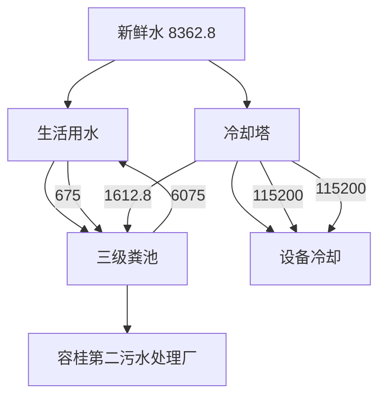
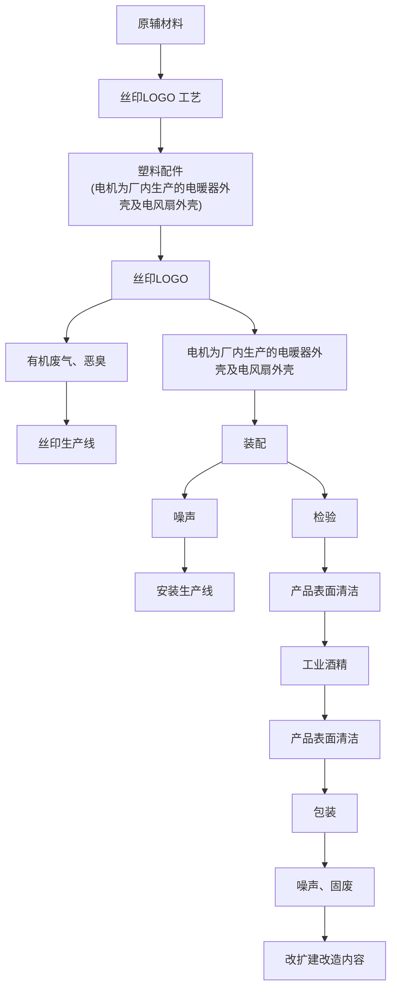
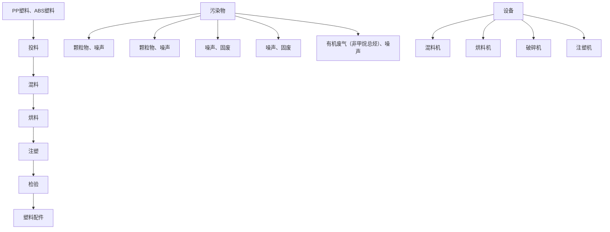
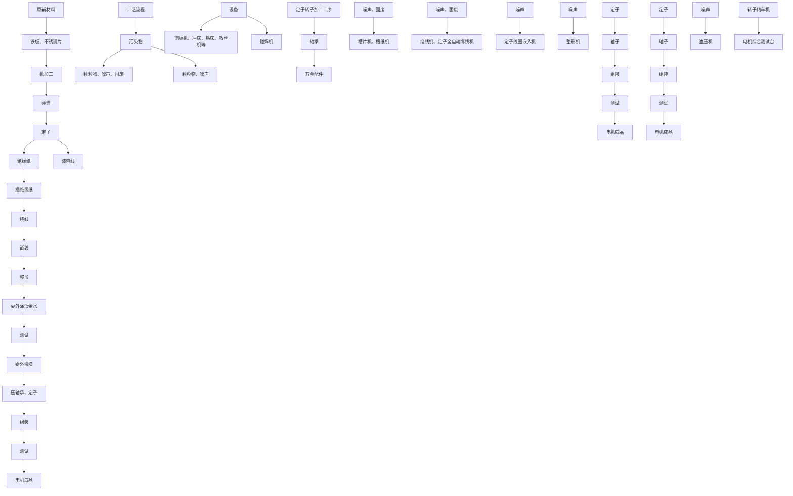
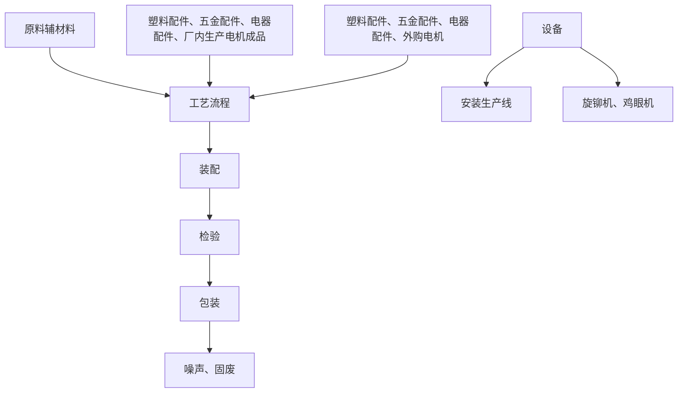

# 建设项目环境影响报告表

（污染影响类）

项目名称：佛山市顺德区天品电器科技有限公司改扩建项目

建设单位（盖章）：佛山市顺德区天品电器科技有限公司

编制日期：2023年5月

打印编号：1684643714000

编制单位和编制人员情况表

<table><tr><td colspan="2">项目编号</td><td colspan="3">8thbal</td></tr><tr><td colspan="2">建设项目名称</td><td colspan="3">佛山市顺德区天品电器科技有限公司改扩建项目</td></tr><tr><td colspan="2">建设项目类别</td><td colspan="3">35-077电机制造;输配电及控制设备制造;电线、电缆、光缆及电工器材制造;电池制造;家用电力器具制造;非电力家用器具制造;照明器具制造;其他电气机械及器材制造</td></tr><tr><td colspan="2">环境影响评价文件类型</td><td colspan="3">报告表</td></tr><tr><td colspan="2">一、建设单位情况</td><td rowspan="10" colspan="3"></td></tr><tr><td colspan="2">单位名称(盖章)</td></tr><tr><td colspan="2">统一社会信用代码</td></tr><tr><td colspan="2">法定代表人(签章)</td></tr><tr><td colspan="2">主要负责人(签字)</td></tr><tr><td colspan="2">直接负责的主管人员(签字)</td></tr><tr><td colspan="2">二、编制单位情况</td></tr><tr><td colspan="2">单位名称(盖章)</td></tr><tr><td colspan="2">统一社会信用代码</td></tr><tr><td colspan="2">三、编制人员情况</td></tr><tr><td colspan="5">1.编制主持人</td></tr><tr><td>姓名</td><td colspan="2">职业资格证书管理号</td><td>信用编号</td><td>签字</td></tr></table>

<table><tr><td colspan="5">2 主要编制人员</td></tr><tr><td colspan="2">姓名</td><td>主要编写内容</td><td>信用编号</td><td>签字</td></tr><tr><td></td><td rowspan="2"></td><td>建设项目工程分析;主要环境影响和保护措施;环境保护措施监督检查清单结论</td><td rowspan="2" colspan="2"></td></tr><tr><td></td><td>建设项目基本情况;区域环境质量现状;环境保护目标及评价标准</td></tr></table>


<details>
<summary>natural_image</summary>

Blank white image with no visible content, text, or symbols
</details>

# 目 录

一、建设项目基本情况 ..

二、建设项目工程分析 .. 10

三、区域环境质量现状、环境保护目标及评价标准 .. 35

四、主要环境影响和保护措施 .. 41

五、环境保护措施监督检查清单 .. 65

六、结论 .. 67

附表 建设项目污染物排放量汇总表 .. 68

附图 1 项目地理位置图. .错误！未定义书签。

附图 2 项目总平面布置图. ..错误！未定义书签。

附图 3 项目四至图. .错误！未定义书签。

附图 4 项目 500M 范围内敏感点分布图.. .错误！未定义书签。

附图 5 项目四至现状图. .错误！未定义书签。

附图 6 声功能区划图.. .错误！未定义书签。

附图 7 大气环境功能区划图. .错误！未定义书签。

附图 8 水环境功能规划图. ..错误！未定义书签。

附图 9 项目所在地环境管控单元图. .错误！未定义书签。

附图 10 广东省“三线一单”数据管理及应用平台关系截图.. .错误！未定义书签。

附图 11 《顺德高新技术产业开发区科技产业园控制性详细规划（修编）》.......错误！未定义书签。

附件 1 营业执照及法人身份证. .错误！未定义书签。

附件 2 用地证明.. .错误！未定义书签。

附件 3 现有项目批复（顺管容环审【2018】第 0385 号） .错误！未定义书签。

附件 4 现有项目竣工环境保护验收意见. ..错误！未定义书签。

附件 5 现有项目固体废物污染防治设施竣工环境保护验收.. .错误！未定义书签。

附件 6 现有项目固定污染源排污登记回执. .错误！未定义书签。

附件 7 现有项目验收监测报告.. ..错误！未定义书签。  
附件 8 危废处置合同.. .错误！未定义书签。  
附件 9 电机外购合同.. ..错误！未定义书签。  
附件 10 电机定子及转子委外处理合同.. 错误！未定义书签。  
附件 11 客户用料要求说明.. 错误！未定义书签。  
附件 12 绝缘漆 MSDS. ..错误！未定义书签。  
附件 13 绝缘漆稀释剂 MSDS.. ..错误！未定义书签。  
附件 14 丝印油墨 MSDS.... ..错误！未定义书签。  
附件 15 油墨稀释剂 MSDS.. ..错误！未定义书签。  
附件 16 洗网水 MSDS. ..错误！未定义书签。  
附件 17 淡金水 MSDS. ..错误！未定义书签。  
附件 18 工业酒精 MSDS... .错误！未定义书签。  
附件 19 环评协议.. .错误！未定义书签。  
附件 20 授权委托书及受委托人身份证 .. 错误！未定义书签。

# 一、建设项目基本情况

<table><tr><td>建设项目名称</td><td colspan="3">佛山市顺德区天品电器科技有限公司改扩建项目</td></tr><tr><td>项目代码</td><td colspan="3">无</td></tr><tr><td>建设单位联系人</td><td></td><td>联系方式</td><td></td></tr><tr><td>建设地点</td><td colspan="3">广东省佛山市顺德高新区(容桂)朝桂路7号之二</td></tr><tr><td>地理坐标</td><td colspan="3">北纬22度46分22.148秒,东经113度19分27.606秒</td></tr><tr><td>国民经济行业类别</td><td>C3853家用通风电器具制造</td><td>建设项目行业类别</td><td>三十五、电气机械和器材制造业38-77家用电力器具制造385-其他(年用非溶剂型低VOCs含量涂料10吨以下的除外)</td></tr><tr><td>建设性质</td><td>□新建(迁建)☑改建☑扩建□技术改造</td><td>建设项目申报情形</td><td>☑首次申报项目□不予批准后再次申报项目□超五年重新审核项目□重大变动重新报批项目</td></tr><tr><td>项目审批(核准/备案)部门(选填)</td><td>无</td><td>项目审批(核准/备案)文号(选填)</td><td>无</td></tr><tr><td>总投资(万元)</td><td>200</td><td>环保投资(万元)</td><td>40</td></tr><tr><td>环保投资占比(%)</td><td>20</td><td>施工工期</td><td>0</td></tr><tr><td>是否开工建设</td><td>☑否□是: _</td><td>用地(用海)面积(m2)</td><td>27412.95</td></tr><tr><td>专项评价设置情况</td><td colspan="3">无</td></tr><tr><td>规划情况</td><td colspan="3">无</td></tr><tr><td>规划环境影响评价情况</td><td colspan="3">无</td></tr><tr><td>规划及规划环境影响评价符合性分析</td><td colspan="3">无</td></tr><tr><td>其他符合性分析</td><td colspan="3">1、项目选址合理性及产业政策相符性分析(1)选址合理性分析佛山市顺德区天品电器科技有限公司改扩建项目(以下简称“本项目”)位于广东省佛山市顺德高新区(容桂)朝桂路7号之二,项目于现有厂房基础上进行改扩建,</td></tr></table>

中心地理坐标：北纬22度46分22.148秒，东经113度19分27.606秒，根据房地产权证（粤(2020)佛顺不动产权0036128号，附件2），项目所在地属于工业用地。

根据《顺德高新技术产业开发区科技产业园控制性详细规划（修编）》的批后通告可知，本项目所在地土地利用规划为工业用地（详见附图11）。

因此本项目的选址符合佛山市顺德区总体规划的要求，符合所在地块的土地利用性质，项目选址与土地利用规划基本相符。

# （2）产业政策相符性分析

本项目所属行业为 C3853家用通风电器具制造，根据国家发展和改革委员会发布的《产业结构调整指导目录（2019年本）》及 2021年修改单 、国家发展改革委商务部《关于引发<市场准入负面清单（2022 年版）>的通知》（发改体改规[2022]397号）、《珠江三角洲地区产业结构调整优化和产业导向目录》（2011年本），项目不属于上述目录所列的鼓励类、限制类和禁止（淘汰）类项目。根据《促进产业结构调整暂行规定》（国发[2005]40 号）第十三条，项目属于允许类，且符合国家有关法律、法规和政策规定。通过对照国家生态环境部《环境保护综合名录》（2021 年版），本项目不属于“高污染、高环境风险”项目。

# （3）环境功能区划相符性分析

本项目与环境保护规划相符性分析如下表：

表 1-1 项目与环境保护规划相符性分析

<table><tr><td>序号</td><td>环境功能区</td><td>规定</td><td>项目实际</td><td>符合判定</td></tr><tr><td>1</td><td>水环境功能区</td><td>项目最终纳污水体为鸡鸦水道、洪奇沥水道,其属于III类功能区,执行《地表水环境质量标准》(GB3838—2002)中的III类标准(详见附图8)</td><td>本项目选址位于容桂第二污水处理厂纳污范围,无生产废水产生、排放,排放的废水为生活污水。项目生活污水包括其他生活污水及食堂废水,其中食堂废水经隔油除渣池处理后与其他生活污水一并经三级化粪池处理,再通过生活污水排放口(DW001)接通市政管网后排入容桂第二污水处理厂处理,污水处理厂尾水处理达到《水污染物排放限值》(DB44/26-2001)“城镇二级污水处理厂”第二时段一级标准和《城镇污水处理厂污染物排放标准》(GB18918-2002)一级标准A标准这两者中的较严者后尾水排入鸡鸦水道,然后汇入洪奇沥水道</td><td>符合</td></tr><tr><td>2</td><td>大气环境功能区</td><td>《关于调整顺德区空气质量功能区划的复函》(佛府办函〔2014〕494号)</td><td>本项目所在区域空气环境功能区划为二类区(详见附图7),执行《环境空气质量标准》(GB3095-2012)及其2018年修改单二级标准。项目所在位置不属于自然保护区、风景名胜区和其它需要特殊保护的地区</td><td>符合</td></tr><tr><td>3</td><td>声环境功能区</td><td>《佛山市人民政府关于印发佛山市声环境功能区划分方案的通知》(佛府函[2015]72号)</td><td>本项目所在地属于声环境3类区(详见附图6),项目各边界执行《声环境质量标准》(GB3096-2008)3类标准。选址周围无国家、省、市、区重点保护的文物、古迹、无名胜风景区、自然保护区等</td><td>符合</td></tr></table>

# 2、“三线一单”符合性分析

项目与《顺德区“三线一单”生态环境分区管控方案》（顺府发〔2021〕11号）相符性分析

根据《佛山市顺德区人民政府关于印发佛山市顺德区“三线一单”生态环境分区管控方案的通知》（顺府发〔2021〕11号）的佛山市顺德区环境管控单元图，本项目所在地属于佛山高新技术产业开发区（容桂）（环境管控单元编码：ZH44060620012），详见附图 9，相关的管控要求相符性分析见下表：

表 1-2 项目与顺府发〔2021〕11号符合性分析

<table><tr><td>管控维度</td><td>政策要求</td><td>本项目工程内容</td><td>符合性</td></tr><tr><td rowspan="4">区域布局管控</td><td>1-1【产业/综合类】园区重点发展装备制造、智能家电、汽车零部件等产业。</td><td>本项目属于C3853家用通风电器具制造,属家用电力器具制造业,属装备制造产业,符合要求。</td><td>符合</td></tr><tr><td>1-2【产业/限制类】严格限制不符合园区发展定位的项目入驻。</td><td>本项目属于C3853家用通风电器具制造,属家用电力器具制造业,属装备制造产业,符合园区发展定位。</td><td>符合</td></tr><tr><td>1-3【产业/综合类】园区工业用地或企业与村庄、学校等环境敏感点之间的区域应合理设置控制开发区域(产业控制带),产业控制带内优先引进无污染的生产性服务业,或可适当布置废气排放量小、工业噪声影响小的产业。</td><td>本项目周边500米无环境敏感点,项目废气排放量较少,产生的噪声可达标排放。</td><td>符合</td></tr><tr><td>1-4【产业/禁止类】不得引入专业电镀、漂染等污染物排放量大或排放一类水污染物、持久性有机污染物的项目,不得引进园区规划环评及批复(审查意见)禁止引进项目。</td><td>本项属于C3853家用通风电器具制造,属家用电力器具制造业,不涉及要求所列项目。</td><td>符合</td></tr><tr><td>能源资源利用</td><td>2-1【水资源/综合类】提高园区水资源利用效率,提升污水回用比例。2-2【能源/综合类】科学实施能源消费总量和强度“双控”,新建高能耗项目单位产品(产值)能耗达到国际国内先进水平。2-3【土地资源/综合类】落实单位土地面积投资强度、土地利用强度等建设用地控制性指标要求,提高土地利用效率。</td><td>2-1本项目无生产废水排放,同时本项目严格执行《用水定额第3部分:生活》(DB44/T1461.3—2021),并且达先进定额标准,水资源利用效率较高。2-2本项目属于C3853家用通风电器具制造,属家用电力器具制造业,项目生产使用电能,不属于高耗能项目。2-3本项目单位土地面积投资强度、土地利用强度等建设用地控制性指标均满足相关标准要求,土地利用效率较高,满足政府提出的投资强度、利用强度等指标要求。</td><td>符合</td></tr><tr><td>污染物排放管控</td><td>3-1【其他/综合类】园区各项污染物排放总量不得突破规划环评核定的污染物排放总量管控要求。3-2【水/综合类】完善污水管网建设,有条件的区域实施雨污分流改造。</td><td>3-1园区各污染物排放总量由区镇两级环保主管部门核发总量指标。3-2项目所在地为容桂第二污水处理厂服务范围,污水处理厂已在线监控系统联网,实现污水处理厂的实时、动态监管。</td><td>符合</td></tr><tr><td>环境风险防控</td><td>4-1【风险/综合类】园区应建立企业、园区、区域三级环境风险防控体系,加强园区及入园企业环境应急设施整合共享,建立有效的拦截、降污、导流、暂存等工程措施,防止泄漏物、消防废水等进入园区外环境。建立园区环境应急监测机制,强化园区风险防控。</td><td>本项目属于C3853家用通风电器具制造,属家用电力器具制造业,无有毒有害气体产生,建设单位将严格采取切实可行环境风险防范措施,可有效防止项目产生的污染物进入环境,有效降低了对周围环境存在的风险影响。</td><td>符合</td></tr></table>

# 3、其他环保法律法规相符性分析

本项目与挥发性有机物（VOCs）相关政策相符性分析见下表：

表 1-3 项目与挥发性有机物（VOCs）排放规定的相符性分析

<table><tr><td>序号</td><td>文件</td><td>规定</td><td>项目实际</td><td>符合判定</td></tr><tr><td rowspan="3">1</td><td rowspan="3">《挥发性有机无组织排放控制标准》(GB 37822-2019)</td><td>2-1VOCs物料储存无组织排放控制要求,VOCs物料应储存于密闭的容器、包装袋、储罐、储库、料仓中。盛装VOCs物料的容器或包装袋应存放于室内,或存放于设置有雨棚、遮阳和防渗设施的专用场地。盛装VOCs物料的容器或包装袋在非取用状态时应加盖、封口,保持密闭。</td><td>2-1本项目的绝缘漆、稀释剂、丝印油墨、油墨稀释剂、洗网水、淡金水、工业酒精等用密闭的包装桶储存于室内,非取用时封口保持密闭。</td><td rowspan="2">符合</td></tr><tr><td>2-2工艺过程VOCs无组织排放控制要求,VOCs质量占比大于等于10%的含VOCs产品,其使用过程应采用密闭设备或在密闭空间内操作,废气应排至VOCs废气收集处理系统;无法密闭的,应采取局部气体收集措施,废气应排至VOCs废气收集处理系统。</td><td>2-2本项目丝印废气、浸漆废气、涂淡金水废气及涂工业酒精废气经集气罩收集后,一同引向1套二级活性炭吸附装置处理,经处理达标后,引向15米排气筒(G2)排放,即本项目对有机废气均能有效收集。</td></tr><tr><td>2-3VOCs无组织排放机器收集处理系统要求:10.2.1企业考虑生产工艺、操作方式、废气性质、处理方法等因素,对VOCs废气进行收集.10.2.2废气收集系统排风罩(集气罩)的设置应符合GB/T16758的规定。采用外部排风罩的,应按GB/T16578、AQ/T4274-2016规定的方法测量控制风速,测量点应选取在距排风罩开口面最远处的VOCs无组织排放位置,控制风速不应</td><td>2-3本项目丝印废气、浸漆废气、涂淡金水废气及涂工业酒精废气经集气罩收集后,一同引向1套二级活性炭吸附装置处理,经处理达标后,引向15米排气筒(G2)排放。项目集气罩控制风速不低于0.3m/s,本项目G2排气筒高度为15m,符合要求。</td><td></td></tr></table>

<table><tr><td rowspan="5"></td><td rowspan="2"></td><td rowspan="2"></td><td>低于0.3m/s(行业相关规范有具体规定的,按相关规定执行)。10.2.3废气收集系统的输送管道应密闭。废气收集系统应在负压下运行。10.3.1VOCs废气收集处理系统污染物排放应符合GB16297或相关行业排放标准规定。10.3.4排气筒高度不低于15m(因安全考虑或特殊工艺要求除外),具体高度以及周边建筑物的相对高度关系应根据环境影响评价文件确定</td><td></td><td></td></tr><tr><td>2-4企业厂区内及周边污染监控要求:11.1企业边界及周边VOCs监控要求执行GB16297或相关行业排放标准的规定。</td><td>2-4本项目厂界VOCs执行厂界无组织排放执行《印刷行业挥发性有机化合物排放标准》(DB44/815-2010)表3中无组织排放监控点浓度限值要求,厂区内VOCs(NMHC)执行《挥发性有机物无组织排放控制标准》(GB37822-2019)附录A“厂区内VOCs无组织排放监控要求”中表A.1厂区内VOCs无组织排放限值的特别排放限值要求。</td><td></td></tr><tr><td>2</td><td>《广东省生态环境厅关于做好重点行业建设项目挥发性有机物总量指标管理工作的通知》(粤环发〔2019〕2号)</td><td>新、改、扩建排放VOCs的重点行业建设项目应当执行总量替代制度,重点行业包括炼油与石化、化学原料和化学制品制造、化学药品原料药制造、合成纤维制造、表面涂装、印刷、制鞋、家具制造、人造板制造、电子元件制造、纺织印染、塑料制造及塑料制品等12个行业。</td><td>由于现有项目环评编制时非甲烷总烃未纳入挥发性有机物总量指标管理的范围,因此本次改扩建项目挥发性有机物总量指标申报需格额外补充现有项目非甲烷总烃的总量指标。本项目VOCs(不含非甲烷总烃)有组织排放量为1.074t/a,VOCs(不含非甲烷总烃)无组织排放量为1.840t/a,VOCs(不含非甲烷总烃)排放总量控制指标(有组织及无组织)为2.914t/a;现有项目非甲烷总烃有组织排放量为1.89t/a,无组织排放量为3.24t/a,非甲烷总烃排放总量控制指标(有组织及无组织)为5.13t/a;即本次挥发性有机物总量指标申报总量为8.044t/a,由区镇两级环保主管部门核查总量指标。</td><td>符合</td></tr><tr><td>3</td><td>《广东省涉挥发性有机物(VOCs)重点行业治理指引》的通知(粤环办〔2021〕43号)</td><td>液态VOCs物料采用密闭管道输送方式或采用高位槽(罐)、桶泵等给料方式密闭投加;无法密闭投加的,在密闭空间内操作,或进行局部气体收集,废气排至VOCs废气收集处理系统。</td><td>本项目的绝缘漆、稀释剂、丝印油墨、油墨稀释剂、洗网水、淡金水、工业酒精等用密闭的包装桶储存于室内,非取用时封口保持密闭。</td><td>符合</td></tr><tr><td>4</td><td>《广东省大气污染防治条例》(自2019年3月1日起施行)</td><td>下列产生含挥发性有机物废气的生产和服务活动,应当优先使用低挥发性有机物含量的原材料和低排放环保工艺,在确保安全条件下,按照规定在密闭空间或者设备中进行,安装、使用满足防爆、防静电要求的治理效率高的污染防治设施;无法密闭或者不适宜密闭的,应当采取有效措施减少废气排放:(一)石油、化工、煤炭加工与转化等含挥发性有机物原料的生产;(二)燃油、溶剂的储存、运输和销售;(三)涂料、油墨、胶粘剂、农药等以挥发性有机物为原料的生产;(四)涂装、印刷、粘合、工业清洗等使用含挥发性有机物产品的生产活动;(五)其他产生挥发性有机物的生产和服务活动。</td><td>本项目丝印废气、浸漆废气、涂淡金水废气及涂工业酒精废气经集气罩收集后,一同引向1套二级活性炭吸附装置处理,经处理达标后,引向15米排气筒(G2)排放。项目集气罩控制风速不低于0.3m/s,本项目G2排气筒高度为15m,符合要求。</td><td>符合</td></tr><tr><td rowspan="4"></td><td>5</td><td>《广东省生态环境保护“十四五”规划》(粤环〔2021〕10号)</td><td>强化对企业涉VOCs生产车间/工序废气的收集管理,推动企业开展治理设施升级改造。</td><td>本项目丝印废气、浸漆废气、涂淡金水废气及涂工业酒精废气经集气罩收集后,一同引向1套二级活性炭吸附装置处理,经处理达标后,引向15米排气筒(G2)排放。</td><td>符合</td></tr><tr><td>6</td><td>佛山市生态环境局关于印发《佛山市生态环境保护“十四五”规划》的通知(佛环〔2022〕3号)</td><td>大力推进低VOCs含量原辅材料替代,鼓励重点行业企业开展生产工艺和设备水性化改造,推广使用水性、高固体分、无溶剂、粉末等低VOCs含量涂料。推进VOCs高排放企业治理设施提升改造,淘汰光催化、光氧化、低温等离子等现有低效治理设施。</td><td>本项目所用的绝缘漆可满足《低挥发性有机化合物含量涂料产品技术要求》(GB 38597-2020)的限值要求;使用的丝印油墨可满足《油墨中可挥发性有机化合物(VOCs)含量的限值》(GB 38507-2020)的限值要求;洗网水可满足清洗剂挥发性有机化合物含量限值(GB 38508-2020)的限值要求;淡金水无挥发性有机物限值的标准。项目所用丝印油墨、洗网水、淡金水属不可替代原辅料。</td><td>符合</td></tr><tr><td>7</td><td>佛山市顺德区人民政府办公室关于印发《佛山市顺德区生态环境保护“十四五”规划(2021-2025)》的通知(顺府办发〔2022〕16号)</td><td>持续推进重点行业VOCs整治。持续开展挥发性有机物专项整治,继续推进重点行业企业开展销号式综合整治。加强VOCs源头替代和无组织排放管控。大力推进低VOCs含量、低反应活性的原辅材料替代。</td><td>本项目所用的绝缘漆可满足《低挥发性有机化合物含量涂料产品技术要求》(GB 38597-2020)的限值要求;使用的丝印油墨可满足《油墨中可挥发性有机化合物(VOCs)含量的限值》(GB 38507-2020)的限值要求;洗网水可满足清洗剂挥发性有机化合物含量限値(GB 38508-2020)的限值要求;淡金水无挥发性有机物限值的标准。项目所用丝印油墨、洗网水、淡金水属不可替代原辅料。</td><td>符合</td></tr><tr><td>8</td><td>《关于珠江三角洲地区严格控制工业企业挥发性有机物(VOCs)排放的意见》(粤[2012]18号)</td><td>在自然保护区、水源保护区、风景名胜区、森林公园、重要湿地、生态敏感区和其他重要生态功能区实行强制性保护,禁止新建VOCs污染企业。“新建汽车制造、家具及其他工业涂装项目必须采取有效的VOCs削减和控制措施,水性或低排放VOCs含量的涂料使用比例不得低于50%。新建机动车制造涂装项目,水性涂料等低排放VOCs含量涂料占总涂料使用量比例不得低于80%,所有排放VOCs的车间必须安装废气收集、回收/净化装置,收集率应大于90%。新建室内装修装饰用涂料以及溶剂型木器家具涂料生产企业的产品必须符合国家环境标志产品要求。”</td><td>1本项目选址位于广东省佛山市顺德高新区(容桂)朝桂路7号之二,不属于要求所列生态敏感区及重要生态功能区区域范围内。2本项目所用的绝缘漆可满足《低挥发性有机化合物含量涂料产品技术要求》(GB38597-2020)的限值要求;使用的丝印油墨可满足《油墨中可挥发性有机化合物(VOCs)含量的限值》(GB38507-2020)的限值要求;洗网水可满足清洗剂挥发性有机化合物含量限值(GB38508-2020)的限值要求;淡金水无挥发性有机物限值的标准。项目所用丝印油墨、洗网水、淡金水属不可替代原辅料。3本项目丝印废气、浸漆废气、涂淡金水废气及涂工业酒精废气经集气罩收集后,一同引向1套二级活性炭吸附装置处理,经处理达标后,引向15米排气筒(G2)排放。</td><td>符合</td></tr><tr><td rowspan="2"></td><td>9</td><td>《佛山市生态环境局顺德分局关于做好重点行业建设项目挥发性有机物总量指标管理工作的通知》(佛顺环函〔2019〕56号)</td><td>建设单位在编制建设项目环评文件时,应按照相关技术要求计算项目的VOCs产生量、处理量及有组织排放量等数据。其中有组织排放量小于0.1吨(不含0.1吨,下同)的建设项目,不需要申请VOCs排放总量指标,直接由环评文件审批部门在环保管理信息系统录入项目排放量,作为VOCs总量分配分配依据;有组织排放量大于0.1吨(含0.1吨,下同)的建设项目,须申请VOCs排放总量指标。</td><td>由于现有项目环评编制时非甲烷总烃未纳入挥发性有机物总量指标管理的范围,因此本次改扩建项目挥发性有机物总量指标申报需格额外补充现有项目非甲烷总烃的总量指标。本项目VOCs(不含非甲烷总烃)有组织排放量为1.074t/a,VOCs(不含非甲烷总烃)无组织排放量为1.840t/a,VOCs(不含非甲烷总烃)排放总量控制指标(有组织及无组织)为2.914t/a;现有项目非甲烷总烃有组织排放量为1.89t/a,无组织排放量为3.24t/a,非甲烷总烃排放总量控制指标(有组织及无组织)为5.13t/a;即本次挥发性有机物总量指标申报总量为8.044t/a,由区镇两级环保主管部门核查总量指标。</td><td>符合</td></tr><tr><td>1011</td><td>《广东省打赢蓝天保卫战实施方案(2018-2020年)》(粤府[2018]128号)《关于印发广东省2021年大气、水、土壤污染防治工作方案的通知》(粤办函〔2021〕58号)</td><td>重点推广使用低VOCs含量、低反应活性的原辅材料和产品,到2020年,印刷、家具制造、工业涂装重点工业企业的低毒、低(无)VOCs含量、高固份原辅材料使用比例大幅提升严格落实国家产品VOCs含量限值标准要求,除现阶段确无法实施替代的工序外,禁止新建生产和使用高VOCs含量原辅材料项目。鼓励在生产和流通消费环节推广使用低VOCs含量原辅材料。将全面使用符合国家、省要求的低VOCs含量原辅材料企业纳入正面清单和政府绿色采购清单。各地级以上市要制定低VOCs含量原辅材料替代计划,根据当地涉VOCs重点行业及物种排放特征,选取若干重点行业,通过明确企业数量和原辅材料替代比例,推进企业实施低VOCs含量原辅材料替代。</td><td>本项目所用的绝缘漆可满足《低挥发性有机化合物含量涂料产品技术要求》(GB38597-2020)的限值要求;使用的丝印油墨可满足《油墨中可挥发性有机化合物(VOCs)含量的限值》(GB38507-2020)的限值要求;洗网水可满足《清洗剂挥发性有机化合物含量限值》(GB38508-2020)的限值要求;淡金水无挥发性有机物限值的标准。项目所用丝印油墨、洗网水、淡金水属不可替代原辅料。本项目所用的绝缘漆可满足《低挥发性有机化合物含量涂料产品技术要求》(GB38597-2020)的限值要求;使用的丝印油墨可满足《油墨中可挥发性有机化合物(VOCs)含量的限值》(GB38507-2020)的限值要求;洗网水可满足清洗剂挥发性有机化合物含量限值(GB38508-2020)的限值要求;淡金水无挥发性有机物限值的标准。本项目丝印废气及浸漆废气经整室负压收集后,与经集气罩收集的涂淡金水废气一同引至1套二级活性炭吸附装置处理,经处理达标后,引向车间二楼顶15m排气筒(G2)排放。</td><td>符合符合</td></tr><tr><td></td><td></td><td></td><td>排放工业废水的企业应当采取有效措施,收集和处理产生的全部生产废水,防止污染水环境。含有毒有害水污染物的工业废水应当分类收集和处理,不得稀释排放。</td><td>本项目选址位于容桂第二污水处理厂纳污范围,无生产废水产生、排放,排放的废水为生活污水。项目生活污水包括其他生活污水及食堂废水,其中食堂废水经隔油除渣池处理后与其他生活污水一并经三级化粪池处理,再通过生活污水排放口(DW001)接通市政管网后排入容桂第二污水处理厂处理,污水处理厂尾水处理达到《水污染物排放限值》(DB44/26-2001)“城镇二级污水处理厂”第二时段一级标准和《城镇污水处理厂污染物排放标准》(GB18918-2002)一级标准A标准这两者中的较严者后尾水排入鸡鸦水道,然后汇入洪奇沥水道。</td><td></td></tr><tr><td colspan="6">4、项目使用溶剂型油墨不可替代论证分析(1)工艺技术上不可替代性虽然目前水性油墨得到广泛的应用,但现阶段与溶剂型油墨比较,仍存在如下问题:(1)水性油墨对环境温度、湿度敏感,固含量相对传统溶剂型油墨而言较低,由于水的表面张力较高,水性油墨的施工方式有别于油性油墨,对基材表面清洁度、施工环境的湿度要求较高,需要通过配方的技术改进和施工工艺的调整来协同解决。(2)改用水性油墨的话需要先进的技术,生产设备也需要改进。(3)水性油墨的干燥速度较慢,在非吸收性承印物或不相容基材(如塑料基材)</td></tr></table>

<table><tr><td></td><td>表面印刷时,其干燥速度比油性油墨要慢若干倍。为使墨层彻底干燥,往往需要提高干燥温度;在干燥温度无法提高时,就需要采取降低印刷速度、牺牲印刷效率的方法。综上,项目溶剂型油墨的使用在工艺技术上具有不可替代性。(2)市场上不可替代性佛山市顺德区天品电器科技有限公司改扩建项目使用的丝印油墨(属溶剂型油墨,年使用量0.55t/a)主要应用在根据重点客户要求、需要在电风扇外壳或电暖器外壳使用溶剂型油墨丝印LOGO的工艺上(客户用料要求说明见附件11)。佛山市顺德区天品电器科技有限公司主要生产、出口小家电,出口的所有产品必须按照客户要求使用相应的原材料,目前佛山市顺德区天品电器科技有限公司在产品市场占据一定的市场份额,得益于公司的产品在长期质量上和性能上的优秀表现,也得益于公司服务客户的理念,对客户在产品质量上、性能上的要求有及时、全面的服务表现。同时,使用水性油墨生产的产品质量仍不能与溶剂型油墨相比,因此,将对响应重点客户产生不利影响:(1)改用水性油墨,将对产品的质量产生影响,耐磨度、光泽丰满度上仍不能与油性油墨相比,导致不能满足客户特定产品的订单需求,而客户的采购一般都是整体产品供应打包采购的,极大可能会导致重点客户的流失。(2)水性材料的干燥条件与油性材料不一样,需要对生产线进行较大的改造、调试,效果未必能达到这些高端客户要求的质量水平之余,改造调试也需要一定的周期。在这段时间内公司必然失去了一定的订单,也会造成一些重要客户的流失。综上,项目油性油墨的使用在市场竞争规律上具有不可替代性。</td></tr></table>

# 二、建设项目工程分析

#

# 1、项目概况及任务由来

佛山市顺德区天品电器科技有限公司成立于 2007 年，位于广东省佛山市顺德高新区（容桂）朝桂路 7 号之二。原有项目占地面积 27412.95m2，主要从事家用通风电器具制造生产，年产电风扇 300万件（3600 吨）、电暖器 600 万件（7500 吨），其中部分电风扇、部分电暖器中的电机为原有项目厂内生产，部分电风扇、部分电暖器中的电机为外购（电机外购合同见附件 9）；主要生产工艺为注塑工艺、电机生产工艺（包括机加工、碰焊、定子转子加工、组装工序，其中电机的定子及转子外购，“定子转子加工工序”中“定子浸漆步骤”及“转子涂淡金水步骤”委外处理<电机定子及转子委外处理合同见附件 10>）、组装工艺（包括电风扇及电暖器的电机、塑料配等的组装）。

2008年 1月，佛山市顺德区天品电器科技有限公司取得《顺德区建设项目环境影响报告批准证》（编号：20080075），生产规模为年产风扇 30 万台、电暖器 10 万台、塑料配件 30 万套，并于 2010年 1月通过验收。

2018年 9月，取得《佛山市顺德区环境运输和城市管理局关于佛山市顺德区天品电器科技有限公司扩建项目环境影响报告表的批复》，批复编号：顺管容环审〔2018〕第 0385号（详见附件 3）。

2019年 7月，佛山市顺德区天品电器科技有限公司成立建设项目竣工环境保护验收工作组并委托广东中蓝检测技术有限公司进行验收监测，验收规模为年产电风扇 300 万件、电暖器 600 万件。主要生产设备注塑机 58台、混色机 5 台、破碎机 4 台、吸料机 30台、冷水机 16台、钻床 6 台、机械手 27台、安装生产线 12 条、攻丝机 3 台、绕线机 10 台、转子精车床 4 台、定子全自动绑线机 1 台、定子线圈嵌入机 1 台、槽片机 1 台、槽纸机 2 台、铆压机 1 台、整形机 3 台、电机综合测试台 6 个、定子综合测试台 3 个、旋铆机 2 台、鸡眼机 1 台。佛山市顺德区天品电器科技有限公司扩建项目通过建设单位自主验收，于 2019年 7 月 15 日出具竣工环境保护验收意见（见附件 4）。

2019年 9月，佛山市顺德区天品电器科技有限公司扩建项目通过佛山市生态环境局固体废物污染防治设施竣工环境保护验收，批复编号：佛环 0302环验〔2019〕第 A138 号（详见附件 5）。

2020年 8月 22日，佛山市顺德区天品电器科技有限公司扩建项目获得固定污染源排污登记回执，登记编号：914406066633804898001Z（详见附件 6）。

现企业根据生产产品质量发展需要，拟投资 200万，对原有电机生产工艺及组装工艺进行改造，改造内容为：①原有电机生产工艺中“定子转子加工工序”中的“定子浸漆步骤”及“转子涂淡金水步骤”不再委外处理，于项目内由建设单位自行加工处理；②于原有“组装工艺”中增加“电风扇外壳（部分）及电暖器外壳（部分）丝印 LOGO 工艺”。改扩建后电风扇及电暖器产品规格改变（注：年生产电风扇及电暖器的总重量不变），年产电风扇 110万件（3575吨）、电暖器 215万件（7525 吨）。

根据《建设项目环境影响评价分类管理名录（2021年版）》、《中华人民共和国环境保护法》、《中华人民共和国环境影响评价法》、中华人民共和国国务院令第 682 号《建设项目环境保护管理条例》中的有关规定，建设项目必须执行环境影响评价制度。根据《建设项目环境影响评价分类管理名录（2021年版）》，本项目属于三十五、电气机械和器材制造业 38-77 家用电力器具制造 385-其他（年用非溶剂型低 VOCs 含量涂料 10吨以下的除外），需编制环境影响报告表。佛山市顺德区天品电器科技有限公司委托佛山市景美环境科技有限公司承担本项目的环境影响评价工作。受委托后环评单位技术人员到现场勘察，并根据建设单位提供有关本项目的资料及《建设项目环境影响报告表编制技术指南（污染影响类）（试行）》的有关要求，编写了本环境影响报告表。

# 2、总图布置及四至情况

佛山市顺德区天品电器科技有限公司位于广东省佛山市顺德高新区（容桂）朝桂路 7 号之二，中心地理坐标为北纬 22 度 46 分 22.148 秒，东经 113 度 19 分 27.606 秒。

本项目主要构筑物共 7 座，分别为车间一（总层数为三层，总高度 12m，占地面积约 3000m2）、车间二（总层数为三层，总高度 12m，占地面积约 3011m2）、车间三（总层数为五层，总高度 20m，占地面积约 3793m2）、注塑车间（总层数为一层，总高度 4m，占地面积约 4120m2）、综合楼（总层数为三层，总高度 12m，占地面积约 412m2）、办公楼（总层数为三层，总高度 12m，占地面积约 812m2）、宿舍楼（总层数为五层，总高度 15m，占地面积约 625m2）。

本项目不增加原有项目面积，项目于现有厂房基础上进行改扩建（在现有厂房内调整布置），增加浸漆房、涂淡金水工作间、丝印房，其中：浸漆房位于车间二 1 楼东南面，建筑面积约 100m2；涂淡金水工作间设置在车间二 1 楼浸漆房北面相邻区域，建筑面积约 40m2；丝印房位于车间一 1楼的东南面，面积约 150m2；其余布局不变。

本项目总用地面积约 27412m2，建筑面积约 48205m2，项目所在位置北面间隔 15 米路为佛山市顺德区阿波罗环保器材有限公司，南面间隔 5 米路为佛山市顺德区博通光电有限公司，东面相邻朝桂南路，西面间隔 10 米路为广东美芝精密制造有限公司。项目地理位置详见附图 1，四至图详见附图 3。

本项目主要建筑及项目组成见下表 2-1，项目平面布置详见附图 2。

表 2-1 项目组成表

<table><tr><td colspan="3">工程名称</td><td>改扩建前</td><td>改扩建内容</td><td colspan="2">改扩建后</td></tr><tr><td rowspan="6">主体工程</td><td rowspan="2">车间一</td><td>总装一车间</td><td>位于车间一2楼、3楼,建筑面积:6000m2,用于组装和成品存储</td><td>不变</td><td colspan="2">位于车间一2楼、3楼,建筑面积:6000m2,用于组装和成品存储</td></tr><tr><td>丝印房</td><td>无</td><td>在车间一1楼划出150m2作为丝印房,用于丝印工序</td><td colspan="2">位于车间一1楼,建筑面积:150m2,用于丝印工序</td></tr><tr><td rowspan="4">车间二</td><td>电机车间</td><td>位于车间二1楼,建筑面积:2000m2,用于电机生产</td><td>不变</td><td colspan="2">位于车间二1楼,建筑面积:2000m2,用于电机生产</td></tr><tr><td>浸漆房</td><td>无</td><td>在车二间1楼-配件仓划出100m2作为浸漆房,用于浸漆工序</td><td colspan="2">位于车间二1楼,建筑面积:100m2,用于浸漆工序</td></tr><tr><td>涂淡金水操作间</td><td>无</td><td>在车间二1楼-配件仓划出40m2用作涂淡金水工序用</td><td colspan="2">位于车间二1楼,建筑面积:40m2,用于涂淡金水工序</td></tr><tr><td>总装二车间</td><td>位于车间二2楼、3楼,建筑面积:6022m2,用于组装和成品存储</td><td>不变</td><td colspan="2">位于车间二2楼、3楼,建筑面积:6022m2,用于组装和成品存储</td></tr><tr><td rowspan="15"></td><td></td><td colspan="2">注塑车间</td><td>1栋1层建筑,建筑面积:4120m2,用于塑料配件生产</td><td>不变</td><td>1栋1层建筑,建筑面积:4120m2,用于塑料配件生产</td></tr><tr><td rowspan="4">辅助工程</td><td colspan="2">办公楼</td><td>1栋3层建筑,建筑面积约为2436m2,用于日常办公</td><td>不变</td><td>1栋3层建筑,建筑面积约为2436m2,用于日常办公</td></tr><tr><td rowspan="2">综合楼</td><td>样板房</td><td>位于综合楼2楼,建筑面积:412m2,用于储存样板</td><td>不变</td><td>位于综合楼2楼,建筑面积:412m2,用于储存样板</td></tr><tr><td>测试房</td><td>位于综合楼3楼,建筑面积:412m2,用于测试</td><td>不变</td><td>位于综合楼3楼,建筑面积:412m2,用于测试</td></tr><tr><td colspan="2">宿舍楼</td><td>1栋5层建筑,建筑面积:3125m2,用于员工生活,其中员工食堂位于1楼,建筑面积约为625m2</td><td>不变</td><td>1栋5层建筑,建筑面积:3125m2,用于员工生活,其中员工食堂位于1楼,建筑面积约为625m2</td></tr><tr><td rowspan="7">仓储工程</td><td colspan="2">成品仓</td><td>位于车间一1楼,建筑面积:3000m2,用于贮存成品</td><td>建筑面积减少150m2,用作丝印房</td><td>位于车间一1楼,建筑面积:2850m2,用于贮存成品</td></tr><tr><td colspan="2">配件仓</td><td>位于车间二1楼,建筑面积:1011m2,用于配件存储</td><td>建筑面积减少140m2,分别用作浸漆房及涂淡金水操作间</td><td>位于车间二1楼,面积共871m2,用于配件存储</td></tr><tr><td rowspan="4">车间三</td><td>成品仓</td><td>位于车间三1楼建筑面积:3793m2,用于贮存注塑成品</td><td>不变</td><td>位于车间三1楼建筑面积:3793m2,用于贮存注塑成品</td></tr><tr><td>配件仓</td><td>位于车间三2楼,建筑面积:3793m2,用于配件储存</td><td>不变</td><td>位于车间三2楼,建筑面积:3793m2,用于配件储存</td></tr><tr><td>周转仓</td><td>位于车间三3楼,建筑面积:3793m2,用于注塑半成品储存</td><td>不变</td><td>位于车间三3楼,建筑面积:3793m2,用于注塑半成品储存</td></tr><tr><td>塑料原料仓</td><td>位于车间三4-5楼,建筑面积:7586m2,用于注塑原料储存</td><td>不变</td><td>位于车间三4-5楼,建筑面积:7586m2,用于注塑原料储存</td></tr><tr><td>综合楼</td><td>原料仓</td><td>位于综合楼1楼,建筑面积:412m2,用于原辅料的储存</td><td>不变</td><td>位于综合楼1楼,建筑面积:412m2,用于原辅料的储存</td></tr><tr><td rowspan="3">公用工程</td><td colspan="2">配电系统</td><td>市政供电(依托现有项目已有设施)</td><td>不变</td><td>市政供电(依托现有项目已有设施)</td></tr><tr><td colspan="2">给水系统</td><td>市政供水(依托现有项目已有设施)</td><td>不变</td><td>市政供水(依托现有项目已有设施)</td></tr><tr><td colspan="2">排水系统</td><td>本项目排放的废水主要为生活污水,生活污水包括其他生活污水及食堂废水,其中食堂废水经隔油除渣池处理后与其他生活污水一并经三级化粪池处理,再通过生活污水排放口(DW001)接通市政管网后排入容桂第二污水处理厂处理,污水处理厂尾水处理达标后尾水排入鸡鸦水道,然后汇入洪奇沥水道</td><td>排水方式不变</td><td>本项目排放的废水主要为生活污水,生活污水包括其他生活污水及食堂废水,其中食堂废水经隔油除渣池处理后与其他生活污水一并经三级化粪池处理,再通过生活污水排放口(DW001)接通市政管网后排入容桂第二污水处理厂处理,污水处理厂尾水处理达标后尾水排入鸡鸦水道,然后汇入洪奇沥水道</td></tr><tr><td rowspan="12"></td><td rowspan="12">环保工程</td><td rowspan="2">废水</td><td>生活污水</td><td>生活污水包括其他生活污水及食堂废水,其中食堂废水经隔油除渣池处理后与其他生活污水一并经三级化粪池处理,再通过生活污水排放口(DW001)接通市政管网后排入容桂第二污水处理厂处理</td><td>依托现有</td><td>生活污水包括其他生活污水及食堂废水,其中食堂废水经隔油除渣池处理后与其他生活污水一并经三级化粪池处理,再通过生活污水排放口(DW001)接通市政管网后排入容桂第二污水处理厂处理</td></tr><tr><td>冷却水</td><td>循环利用,定期补充新鲜水,无需更换,不对外排放</td><td>不变</td><td>循环利用,定期补充新鲜水,无需更换,不对外排放</td></tr><tr><td rowspan="6">废气</td><td>注塑废气</td><td>经集气罩收集后引入1套二级活性炭吸附装置处理,处理达标后引至15米排气筒(FQ-11419)排放</td><td>不变</td><td>经集气罩收集后引入1套二级活性炭吸附装置处理,处理达标后引至15米排气筒(FQ-11419)排放</td></tr><tr><td>丝印废气</td><td rowspan="4">无</td><td rowspan="4">新增丝印废气、浸漆废气、涂淡金水废气及涂工业酒精废气,均经集气罩收集后一同引向1套二级活性炭吸附装置处理,经处理达标后,引向15米排气筒(G2)排放</td><td rowspan="4">丝印废气、浸漆废气、涂淡金水废气及涂工业酒精废气经集气罩收集后,一同引向1套二级活性炭吸附装置处理,经处理达标后,引向15米排气筒(G2)排放</td></tr><tr><td>浸漆废气</td></tr><tr><td>涂淡金水废气</td></tr><tr><td>涂工业酒精废气</td></tr><tr><td>油烟废气</td><td>经集气罩收集后引至静电油烟处理设施处理达标后引至15米排气筒(G1)排放</td><td>不变</td><td>经集气罩收集后引至静电油烟处理设施处理达标后引至15米排气筒(G1)排放</td></tr><tr><td rowspan="3">固体废物</td><td>生活垃圾</td><td>包括一般生活垃圾、厨房废油脂、厨余垃圾,交由环卫部门清运处理</td><td>不变</td><td>包括一般生活垃圾、厨房废油脂、厨余垃圾,交由环卫部门清运处理</td></tr><tr><td>一般固体废物</td><td>包括废包装材料、边角料,设置一般固废暂存区(8m2),一般固体废物经分类收集后,暂存于一般固废暂存区,定期交由回收商处理</td><td>依托现有项目一般固废暂存区,其余不变</td><td>包括废包装材料、边角料,一般固体废物经分类收集后,暂存于一般固废暂存区(8m2,依托现有,位于厂区东北角),定期交由回收商处理</td></tr><tr><td>危险废物</td><td>包括含油废抹布和手套、含油废油桶罐、废机油、废活性炭,设置危废暂存区(10m2),位于厂区东北角,危险废物分类收集后,暂存于危废暂存区,定期交由佛山市万晴环保服务有限公司处理</td><td>依托现有项目危废暂存区,新增废清洁抹布、废化学品包装桶,其余不变</td><td>包括含油废抹布和手套、含油废油桶罐、废机油、废清洁抹布、废化学品包装桶、废活性炭,危险废物分类收集后,暂存于危废暂存区(10m2,依托现有,位于厂区东北角),定期交由佛山市万晴环保服务有限公司处理</td></tr><tr><td colspan="2">噪声</td><td>项目选用低噪声设备,采取减振、隔声、消声措施</td><td>不变</td><td>项目选用低噪声设备,采取减振、隔声、消声措施</td></tr></table>

# 3、建设内容及规模

本项目拟投资 200万，对原有电机生产工艺及组装工艺进行改造，改造内容为：①原有电机生产工艺中“定子转子加工工序”中的“定子浸漆步骤”及“转子涂淡金水步骤”不再委外处理，于项目内由建设单位自行加工处理；②于原有“组装工艺”中增加“电风扇外壳（部分）及电暖器外壳（部分）丝印 LOGO 工艺”。改扩建后电风扇及电暖器产品规格改变（注：年生产电风扇及电暖器的总重量不变），年产电风扇 110万件（3575吨）、电暖器 215万件（7525 吨）。

项目产品方案及产品生产情况如下表 2-2、表 2-3 所示所示。

表2-2 项目产品方案一览表

<table><tr><td rowspan="3">序号</td><td rowspan="3">名称</td><td colspan="3">改扩建前</td><td colspan="3">改扩建后</td><td rowspan="2" colspan="2">年产量增减量</td></tr><tr><td rowspan="2">产品重量规格</td><td colspan="2">年产量</td><td rowspan="2">产品重量规格</td><td colspan="2">年产量(万件)</td></tr><tr><td>万件</td><td>吨</td><td>万件</td><td>吨</td><td>万件</td><td>吨</td></tr><tr><td>1</td><td>电风扇</td><td>1.2 kg/件</td><td>300</td><td>3600</td><td>3.25 kg/件</td><td>110</td><td>3575</td><td>-190</td><td>+25</td></tr><tr><td>2</td><td>电暖器</td><td>1.25 kg/件</td><td>600</td><td>7500</td><td>3.5 kg/件</td><td>215</td><td>7525</td><td>-385</td><td>-25</td></tr></table>

注：改扩建后项目电风扇及电暖器的产品规格改变，但年生产电风扇及电暖器的总重量不变（改扩建前后所有产品总重量均为 1.11万吨），因此改扩建后除改造内容中涉及的原料外，其余原辅材料使用量与该扩建前相同。

表2-3 项目产品生产情况一览表

<table><tr><td rowspan="2">序号</td><td rowspan="2">名称</td><td colspan="2">改扩建前</td><td colspan="2">改扩建后</td></tr><tr><td>产品情况</td><td>年产量(万件)</td><td>产品情况</td><td>年产量(万件)</td></tr><tr><td rowspan="3">1</td><td rowspan="2">电风扇</td><td>电风扇中的电机为厂内生产,电机生产工艺中“定子浸漆步骤”及“转子涂淡金水步骤”委外处理</td><td>135</td><td>1电风扇中的电机为厂内生产,电机生产工艺中“定子浸漆步骤”及“转子涂淡金水步骤”自行加工处理2电机为厂内生产的电风扇外壳进行丝印LOGO工艺</td><td>50</td></tr><tr><td>电风扇中的电机为外购</td><td>165</td><td>电风扇中的电机为外购</td><td>60</td></tr><tr><td colspan="2">合计</td><td>300</td><td>/</td><td>110</td></tr><tr><td rowspan="3">2</td><td rowspan="2">电暖器</td><td>电暖器中的电机为厂内生产,电机生产工艺中“定子浸漆步骤”及“转子涂淡金水步骤”委外处理</td><td>280</td><td>1电暖器中的电机为厂内生产,电机生产工艺中“定子浸漆步骤”及“转子涂淡金水步骤”自行加工处理2电机为厂内生产的电暖器外壳进行丝印LOGO工艺</td><td>100</td></tr><tr><td>电暖器中的电机为外购</td><td>320</td><td>电暖器中的电机为外购</td><td>115</td></tr><tr><td colspan="2">合计</td><td>600</td><td>/</td><td>215</td></tr></table>

# 4、主要原辅材料及能源消耗

本项目主要原辅材料及用量如表 2-4 所示，项目主要能源年消耗如表 2-7 所示。

表2-4 项目主要原辅材料年消耗量一览表

<table><tr><td>序号</td><td>名称</td><td>单位</td><td>物料状态</td><td>改扩建前</td><td>改扩建后</td><td>变化量</td><td>最大储存量(t)</td><td colspan="2">使用情况</td><td>备注</td></tr><tr><td>1</td><td>ABS 塑料</td><td>吨/年</td><td>固体</td><td>3200</td><td>3200</td><td>0</td><td>200</td><td rowspan="2">塑料配件生产工艺</td><td rowspan="2">全过程</td><td rowspan="2">外购</td></tr><tr><td>2</td><td>PP 塑料</td><td>吨/年</td><td>固体</td><td>800</td><td>800</td><td>0</td><td>50</td></tr></table>

<table><tr><td>3</td><td>转子</td><td>万套/年</td><td>固体</td><td>900</td><td>900</td><td>0</td><td>50</td><td rowspan="8">电机生产工艺</td><td rowspan="2">全过程</td></tr><tr><td>4</td><td>定子</td><td>万套/年</td><td>固体</td><td>900</td><td>900</td><td>0</td><td>50</td></tr><tr><td>5</td><td>铁板、不锈钢片</td><td>吨/年</td><td>固体</td><td>1500</td><td>1500</td><td>0</td><td>100</td><td>机加工工序</td></tr><tr><td>6</td><td>绝缘纸</td><td>吨/年</td><td>固体</td><td>5</td><td>5</td><td>0</td><td>1</td><td>插绝缘纸工序</td></tr><tr><td>7</td><td>漆包线</td><td>吨/年</td><td>固体</td><td>300</td><td>300</td><td>0</td><td>20</td><td>绕线工序</td></tr><tr><td>8</td><td>淡金水</td><td>吨/年</td><td>液体</td><td>0</td><td>2.13</td><td>+2.13</td><td>0.5</td><td>涂淡金水工序</td></tr><tr><td>9</td><td>绝缘漆</td><td>吨/年</td><td>液体</td><td>0</td><td>6.04</td><td>+6.04</td><td>0.5</td><td rowspan="2">定子浸漆工序</td></tr><tr><td>10</td><td>绝缘漆稀释剂</td><td>吨/年</td><td>液体</td><td>0</td><td>1.81</td><td>+1.81</td><td>0.2</td></tr><tr><td>11</td><td>电器配件</td><td>万套/年</td><td>固体</td><td>900</td><td>900</td><td>0</td><td>50</td><td rowspan="3">组装工艺</td><td rowspan="2">全过程</td></tr><tr><td>12</td><td>五金配件</td><td>万套/年</td><td>固体</td><td>900</td><td>900</td><td>0</td><td>50</td></tr><tr><td>13</td><td>工业酒精</td><td>吨/年</td><td>液体</td><td>0</td><td>0.93</td><td>+0.93</td><td>0.1</td><td>产品表面清洁工序</td></tr><tr><td>14</td><td>丝印油墨</td><td>吨/年</td><td>液体</td><td>0</td><td>0.46</td><td>+0.46</td><td>0.1</td><td rowspan="3">丝印工艺</td><td rowspan="2">全过程</td></tr><tr><td>15</td><td>油墨稀释剂</td><td>吨/年</td><td>液体</td><td>0</td><td>0.09</td><td>+0.09</td><td>0.05</td></tr><tr><td>16</td><td>洗网水</td><td>吨/年</td><td>液体</td><td>0</td><td>0.36</td><td>+0.36</td><td>0.05</td><td>用于丝印机清洗</td></tr><tr><td>17</td><td>机油</td><td>吨/年</td><td>液体</td><td>1</td><td>1.1</td><td>+0.1</td><td>0.2</td><td colspan="2">用于设备保养</td></tr><tr><td>18</td><td>包装材料(纸箱)</td><td>吨/年</td><td>固体</td><td>1000</td><td>1000</td><td>0</td><td>50</td><td colspan="2">用于成品包装</td></tr></table>

注：改扩建后项目电风扇及电暖器的产品规格改变，但年生产电风扇及电暖器的总重量不变（改扩建前后所有产品总重量均为 1.11万吨），因此改扩建后除改造内容中涉及的原料外，其余原辅材料使用量与该扩建前相同。

# （1）主要原辅材料理化性质：

表2-5 项目主要原辅材料年消耗量一览表

<table><tr><td>名称</td><td>主要成分</td><td>理化性质</td><td>稀释比</td><td>VOCs含量(挥发率)</td><td>国家标准限值</td><td>是否符合标准要求</td></tr><tr><td rowspan="5">绝缘漆</td><td>环氧树脂(25-35%)</td><td rowspan="5">糊状物,有特殊气味,沸点108°C以上,闪点87°C,相对密度:0.91g/cm3,不溶于水</td><td rowspan="6">1:0.3</td><td rowspan="6">338g/L</td><td rowspan="6">420g/L</td><td rowspan="6">是</td></tr><tr><td>异丁醇(5-10%)</td></tr><tr><td>二甲苯(5-10%)</td></tr><tr><td>有机颜料(5-10%)</td></tr><tr><td>惰性填充料(35-45%)</td></tr><tr><td>绝缘漆稀释剂</td><td>烷烃的C4-C6(≥99%)</td><td>中文名为石脑油,又叫化工轻油、粗汽油。无色液体,密度0.788g/cm3,闪点≥40°C,作为油漆的溶剂</td></tr><tr><td rowspan="2">丝印油墨</td><td>4-羟基-4-甲基-2-戊酮(15-25%)</td><td rowspan="2">膏状,沸点153°C,闪点61°C,相对密度:1.12g/cm3,可部分溶于水</td><td rowspan="2">1:0.2</td><td rowspan="2">60.83%</td><td rowspan="2">75%</td><td rowspan="2">是</td></tr><tr><td>乙二醇丁醚醋酸酯(10-15%)</td></tr><tr><td rowspan="3"></td><td>环己酮(3-10%)</td><td rowspan="3"></td><td rowspan="4"></td><td rowspan="4"></td><td rowspan="4"></td><td rowspan="4"></td></tr><tr><td>羟基乙酸丁酯(1-3%)</td></tr><tr><td>丙烯酸树脂/颜料(47-60%)</td></tr><tr><td>油墨稀释剂</td><td>异佛尔酮(100%)</td><td>薄荷味液体,沸点215.3°C,闪点85°C,密度0.92g/cm3</td></tr><tr><td rowspan="2">洗网水</td><td>环己酮(20-30%)</td><td rowspan="2">无色透明液体,略带芳香气味,沸点176.1°C,密度0.876g/cm3,难溶于水</td><td rowspan="2">/</td><td rowspan="2">876g/L</td><td rowspan="2">900g/L</td><td rowspan="2">是</td></tr><tr><td>芳烃溶剂(70-80%)</td></tr><tr><td rowspan="6">淡金水</td><td>丙烯酸树脂(10-20%)</td><td rowspan="6">不溶于水,溶于有机溶剂。易挥发、遇热、明火、氧化剂有引起燃烧的危险。常用于大气金属防锈、高档家具油漆底层、漆包线涂层、电机转子防锈以及作为各色颜料的溶剂,密度0.85g/cm3</td><td rowspan="6">/</td><td rowspan="6">70%</td><td rowspan="6">/</td><td rowspan="6">/</td></tr><tr><td>绿色油性色精(5%)</td></tr><tr><td>防锈剂(0.3%)</td></tr><tr><td>二甲苯(5%)</td></tr><tr><td>乙酸丁酯(60%)</td></tr><tr><td>乙醇(5%)</td></tr><tr><td rowspan="2">工业酒精</td><td>乙醇(95%)</td><td rowspan="2">为无色透明液体,具有特殊气味,沸点78.3°C,闪点12°C,密度0.79g/cm3</td><td rowspan="2">/</td><td rowspan="2">100%</td><td rowspan="2">/</td><td rowspan="2">/</td></tr><tr><td>甲醇(5%)</td></tr><tr><td colspan="7">注:1工作状态的绝缘漆调配质量比例为绝缘漆:稀释剂=1:0.3,计得调漆后挥发系数=[(1×20%)+(0.3×100%)]÷(1+0.3)=38.46%;固含率约=100%-38.46%=61.54%。2绝缘漆密度为0.91g/cm3,稀释剂密度为0.788g/cm3,调漆的质量比例为绝缘漆:稀释剂=1:0.3;调漆后密度=(1+0.3)÷[(1÷0.91)+(0.3÷0.788)]=0.879g/cm3。3由上可知,调漆后绝缘漆密度为0.879t/m3,VOCs挥发系数为38.46%,单位体积VOCs含量=879g/L×38.46%=338g/L。4项目洗网水挥发率为100%,密度为密度0.876g/cm3,则VOCs含量为876g/L。5由上表可知本项目所用的绝缘漆(经调配)可满足《低挥发性有机化合物含量涂料产品技术要求》(GB 38597-2020)中表2“工业防护涂料-工程机械和农业机械涂料(含零部件涂料)-底漆”的限值要求;使用的丝印油墨可满足《油墨中可挥发性有机化合物(VOCs)含量的限值》(GB 38507-2020)中表1“溶剂油墨-网印油墨”的限值要求;洗网水可满足《清洗剂挥发性有机化合物含量限值》(GB 38508-2020)中表1“有机溶剂清洗剂”的限值要求;淡金水无挥发性有机物限值的标准。6各原料MSDS详见附件。</td></tr></table>

# （2）项目原辅材料使用量分析计算如下：

①绝缘漆：  
表2-6 项目绝缘漆使用量计算明细表

<table><tr><td>类型</td><td>涂层类型</td><td>浸漆量(万个/a)</td><td>单位产品浸漆面积( $m^2$ /个)</td><td>总浸漆面积( $m^2$ )</td><td>涂层厚度(μm)</td><td>涂层密度( $t/m^3$ )</td><td>固含率(%)</td><td>绝缘漆用量(t/a)</td></tr><tr><td>电风扇电机定子--电风扇电机为厂内生产</td><td rowspan="2">绝缘漆</td><td>50</td><td>0.06</td><td>30000</td><td rowspan="2">50</td><td rowspan="2">0.879</td><td rowspan="2">61.54</td><td>2.14</td></tr><tr><td>电暖器电机定子--电暖器电机为厂内生产</td><td>100</td><td>0.08</td><td>80000</td><td>5.71</td></tr><tr><td colspan="8">合计</td><td>7.85</td></tr><tr><td colspan="9">注:1本项目产品生产情况见表2-3。2定子绕组的内部及漆包线组比较密集且为不规则形状,而且浸漆时绝缘漆会填充整个定子绕组内部,因此各产品的浸漆面积由建设单位根据产品型号结合实际生产经验得出。3绝缘漆用量=浸漆面积×涂层厚度×涂层密度÷固含率。4根据上表计算,工作状态下绝缘漆用量为7.85t/a,按调漆比例折算出绝缘漆用量为6.04t/a,稀释剂用量为1.81t/a。</td></tr></table>

# ②丝印油墨：

表 2-7 项目丝印油墨使用量计算明细表

<table><tr><td>类型</td><td>涂层类型</td><td>丝印产品数量(万件/a)</td><td>单位产品印刷面积(m2/件)</td><td>总印刷面积(m2)</td><td>油墨厚度(μm)</td><td>固含率(%)</td><td>油墨密度(g/cm3)</td><td>丝印油墨用量(t/a)</td></tr><tr><td>电风扇外壳--电风扇电机为厂内生产</td><td rowspan="2">丝印油墨</td><td>50</td><td>0.004</td><td>2000</td><td rowspan="2">25</td><td rowspan="2">39.17</td><td rowspan="2">1.081</td><td>0.14</td></tr><tr><td>电暖器外壳--电暖器电机为厂内生产</td><td>100</td><td>0.006</td><td>6000</td><td>0.41</td></tr><tr><td colspan="8">合计</td><td>0.55</td></tr><tr><td colspan="9">注:1本项目产品生产情况见表2-3,本项目仅对“电机为厂内生产的电风扇外壳(50万件)”及“电机为厂内生产的电暖器外壳(100万件)”进行丝印LOGO工艺。2工作状态的丝印油墨调配质量比例为丝印油墨:油墨稀释剂=1:0.2,计得调漆后挥发系数(100%)=[(1×53%)+(0.2×100%)]÷(1+0.2)=60.83%;固含率约=100%-60.83%=39.17%。2丝印油墨密度为1.12g/cm3,稀释剂密度为0.92g/cm3,调漆的质量比例为绝缘漆:稀释剂=1:0.2;调漆后密度=(1+0.2)÷[(1÷0.1.12)+(0.2÷0.92)]=1.081g/cm3。3根据上表计算,调好的油墨用量为0.55t/a,按调配比例折算出丝印油墨用量为0.46t/a,稀释剂用量为0.09t/a。</td></tr></table>

# ③淡金水：

表2-8 项目淡金水使用量计算明细表

<table><tr><td>电机类型</td><td>涂层类型</td><td>涂淡金水产品数量(万个/a)</td><td>单位产品涂淡金水面积( $m^{2}$ /个)</td><td>总涂淡金水面积( $m^{2}$ )</td><td>涂层厚度( $\mu m$ )</td><td>涂层密度( $t/m^{3}$ )</td><td>淡金水用量(t/a)</td></tr><tr><td>电风扇电机转子--电风扇电机为厂内生产</td><td rowspan="2">淡金水</td><td>50</td><td>0.02</td><td>10000</td><td rowspan="2">50</td><td rowspan="2">0.85</td><td>0.43</td></tr><tr><td>电暖器电机转子--电暖器电机为厂内生产</td><td>100</td><td>0.04</td><td>40000</td><td>1.70</td></tr><tr><td colspan="7">合计</td><td>2.13</td></tr><tr><td colspan="8">注:1本项目产品生产情况见表2-3。2各产品的涂淡金水面积由建设单位根据产品型号结合实际生产经验得出。3淡金水用量=涂淡金水面积×涂层厚度×涂层密度。</td></tr></table>

# ④工业酒精：

本项目工业酒精用于组装工艺中“产品表面清洁工序”（人工操作），目的是在进行包装工序前抹去灰尘、清洁产品表面，从而保证出货产品质量。

根据建设单位提供资料，涂工业酒精的工件分别为：①110万件电风扇产品表面；②215万件电暖器产品表面。由于工业酒精的使用过程中存在较多不确定因素（如部分工件污渍较多从而使用的工业酒精量也较多），每个工件使用的工业酒精量也无精准数值，因此根据建设单位提供的信息进行估算，项目工业酒精使用量明细表如下表 2-9。

表 2-9 项目工业酒精使用量计算明细表

<table><tr><td>工件</td><td>产品数量(万件/a)</td><td>单位产品酒精用量(kg/件)</td><td>工业酒精用量(t/a)</td></tr><tr><td>电风扇产品表面</td><td>110</td><td>0.00028</td><td>0.31</td></tr><tr><td>电暖器产品表面</td><td>215</td><td>0.00029</td><td>0.62</td></tr><tr><td colspan="3">合计</td><td>0.93</td></tr></table>

⑤洗网水：

表 2-10 项目洗网水使用量计算明细表

<table><tr><td colspan="2">设备类型</td><td>原料类型</td><td>设备数量(台)</td><td>单台设备洗网水用量(kg/台)</td><td>清洗频率(次/年)</td><td>洗网水用量(t/a)</td></tr><tr><td rowspan="2">丝印生产线一</td><td>自动丝印机</td><td rowspan="4">洗网水</td><td>2</td><td rowspan="4">0.2</td><td rowspan="4">300</td><td>0.12</td></tr><tr><td>手动丝印机</td><td>1</td><td>0.06</td></tr><tr><td rowspan="2">丝印生产线二</td><td>自动丝印机</td><td>1</td><td>0.06</td></tr><tr><td>手动丝印机</td><td>2</td><td>0.12</td></tr><tr><td colspan="6">合计</td><td>0.36</td></tr><tr><td colspan="7">注:本项目每天工作后需用抹布沾上洗网水对丝印设备进行清洁,项目年工作时间300天。</td></tr></table>

表 2-11 项目主要能源年消耗量一览表

<table><tr><td>序号</td><td>名称</td><td>单位</td><td>用途</td><td>改建前</td><td>改建后</td><td>变化</td><td>备注</td></tr><tr><td rowspan="2">1</td><td rowspan="2">水</td><td>吨/年</td><td>办公</td><td>6750</td><td>6750</td><td>0</td><td rowspan="2">市政供水</td></tr><tr><td>吨/年</td><td>冷却塔用水</td><td>2764.8</td><td>2764.8</td><td>0</td></tr><tr><td>2</td><td>电</td><td>万度/年</td><td>生产、办公</td><td>300</td><td>350</td><td>+50</td><td>市政供电</td></tr></table>

# 5、主要设备清单

根据建设单位提供资料，项目主要生产设备如下表 2-12 所示。

设备与产能匹配性分析：  
表 2-12 项目主要生产设备一览表

<table><tr><td>类别</td><td colspan="2">名称</td><td>能源类型</td><td>改建前数量</td><td>改建后数量</td><td>增减量</td><td>备注</td></tr><tr><td rowspan="4">1</td><td colspan="2">丝印生产线一</td><td>/</td><td>0</td><td>1条</td><td>+1条</td><td rowspan="4">用于电暖器外壳丝印LOGO工序,其中丝印生产线一配置2台自动丝印机、1台手动丝印机、1条烘干线</td></tr><tr><td rowspan="3">包括</td><td>自动丝印机</td><td>电</td><td>0</td><td>2台</td><td>+2台</td></tr><tr><td>手动丝印机</td><td>电</td><td>0</td><td>1台</td><td>+1台</td></tr><tr><td>烘干线</td><td>电</td><td>0</td><td>1条</td><td>+1条</td></tr><tr><td rowspan="4">2</td><td colspan="2">丝印生产线二</td><td>/</td><td>0</td><td>1条</td><td>+1条</td><td rowspan="4">用于电风扇外壳丝印LOGO工序,其中丝印生产线二配置1台自动丝印机、2台手动丝印机、1条烘干线</td></tr><tr><td rowspan="3">包括</td><td>自动丝印机</td><td>电</td><td>0</td><td>1台</td><td>+1台</td></tr><tr><td>手动丝印机</td><td>电</td><td>0</td><td>2台</td><td>+2台</td></tr><tr><td>烘干线</td><td>电</td><td>0</td><td>1条</td><td>+1条</td></tr><tr><td>3</td><td colspan="2">浸漆池</td><td>电</td><td>0</td><td>2个</td><td>+2个</td><td>用于浸漆工序,分为两个尺寸:1大浸漆池尺寸为 $1.25m \times 1.17m \times 0.45m$ ,用于电暖器电机定子的浸漆;2小浸漆池尺寸为 $0.86m \times 0.75m \times 0.45m$ ,用于电风扇电机定子的浸漆</td></tr><tr><td>4</td><td colspan="2">烘干炉</td><td>电</td><td>0</td><td>1台</td><td>+1台</td><td>用于浸漆后烘干工序,尺寸: $2.4m \times 1.8m \times 2m$ ,烘干温度约 $90^{\circ}C$ </td></tr><tr><td>5</td><td colspan="2">涂淡金水机</td><td>电</td><td>0</td><td>5台</td><td>+5台</td><td>用于涂淡金水工序,其中包括:11台自动涂淡金水机(设有2个工位);24台手动涂淡金水机(每台设有1个工位)</td></tr><tr><td>6</td><td colspan="2">注塑机</td><td>电</td><td>58台</td><td>58台</td><td>0</td><td>用于注塑工序</td></tr><tr><td>7</td><td colspan="2">混色机</td><td>电</td><td>5台</td><td>5台</td><td>0</td><td>用于混料工序</td></tr><tr><td>8</td><td colspan="2">破碎机</td><td>电</td><td>4台</td><td>4台</td><td>0</td><td>用于破碎工序</td></tr><tr><td>9</td><td colspan="2">吸料机</td><td>电</td><td>30台</td><td>30台</td><td>0</td><td>用于塑料吸料</td></tr><tr><td>10</td><td colspan="2">钻床</td><td>电</td><td>6台</td><td>6台</td><td>0</td><td rowspan="6">用于机加工工序</td></tr><tr><td>11</td><td colspan="2">冲床</td><td>电</td><td>14台</td><td>14台</td><td>0</td></tr><tr><td>12</td><td colspan="2">剪板机</td><td>电</td><td>5台</td><td>5台</td><td>0</td></tr><tr><td>13</td><td colspan="2">攻丝机</td><td>电</td><td>3台</td><td>3台</td><td>0</td></tr><tr><td>14</td><td colspan="2">旋铆机</td><td>电</td><td>2台</td><td>2台</td><td>0</td></tr><tr><td>15</td><td colspan="2">鸡眼机</td><td>电</td><td>1台</td><td>1台</td><td>0</td></tr><tr><td>16</td><td colspan="2">碰焊机</td><td>电</td><td>3台</td><td>3台</td><td>0</td><td>用于碰焊工序</td></tr><tr><td>17</td><td colspan="2">机械手</td><td>电</td><td>27台</td><td>27台</td><td>0</td><td>用于组装工序</td></tr><tr><td>18</td><td colspan="2">绕线机</td><td>电</td><td>10台</td><td>10台</td><td>0</td><td>用于绕线工序</td></tr><tr><td>19</td><td colspan="2">油压机</td><td>电</td><td>2台</td><td>2台</td><td>0</td><td>用于压轴承、定子工序</td></tr><tr><td>20</td><td colspan="2">转子精车机</td><td>电</td><td>4台</td><td>4台</td><td>0</td><td>用于组装工序</td></tr><tr><td>21</td><td colspan="2">定子全自动绑线机</td><td>电</td><td>1台</td><td>1台</td><td>0</td><td>用于绕线工序</td></tr><tr><td>22</td><td colspan="2">定子线圈嵌入机</td><td>电</td><td>1台</td><td>1台</td><td>0</td><td>用于嵌线工序</td></tr><tr><td>23</td><td colspan="2">槽片机</td><td>电</td><td>1台</td><td>1台</td><td>0</td><td rowspan="2">用于插绝缘纸工序</td></tr><tr><td>24</td><td colspan="2">槽纸机</td><td>电</td><td>2台</td><td>2台</td><td>0</td></tr><tr><td>25</td><td colspan="2">铆压机</td><td>电</td><td>1台</td><td>1台</td><td>0</td><td>用于铆压</td></tr><tr><td>26</td><td colspan="2">整形机</td><td>电</td><td>3台</td><td>3台</td><td>0</td><td>用于整形工序</td></tr><tr><td>27</td><td colspan="2">电机综合测试台</td><td>电</td><td>6台</td><td>6台</td><td>0</td><td rowspan="2">用于测试工序</td></tr><tr><td>28</td><td colspan="2">定子综合测试台</td><td>电</td><td>3台</td><td>3台</td><td>0</td></tr><tr><td rowspan="3">29</td><td rowspan="3">安装生产线</td><td>普通</td><td>电</td><td>12条</td><td>8条</td><td>-4条</td><td rowspan="3">用于组装工序</td></tr><tr><td>设有涂工业酒精工位</td><td>电</td><td>0</td><td>4条</td><td>+4条</td></tr><tr><td colspan="2">合计</td><td>12条</td><td>12条</td><td>0</td></tr><tr><td>30</td><td colspan="2">冷却水塔</td><td>电</td><td>16台</td><td>16台</td><td>0</td><td>用于注塑冷却</td></tr></table>

# （1）浸漆

项目浸漆工序为人工操作浸漆，每次浸漆分别将电暖器电机定子及电风扇电机定子放入大浸漆池浸漆框及小浸漆池浸漆框中（其中大浸漆池浸漆框最多可容纳 150 个电暖器电机定子、小浸漆池浸漆框最多可容纳 100个电风扇电机定子），然后将浸漆框浸入浸漆池的绝缘漆中，浸漆时间约为 5 分钟，然后吊起沥干 15 分钟，项目年工作 300 天，浸漆日工作时间为 8小时。本项目浸漆设备与产能匹配性分析见表 2-13，由表 2-13 可知，本项目申报的“大浸漆池电暖器电机定子浸漆产量 100万个/年、小浸漆池电风扇电机定子浸漆产量 50万个/年”在设备的生产能力范围内。

表 2-13 项目浸漆设备与产能匹配性分析表

<table><tr><td rowspan="2">工艺</td><td colspan="2">设备情况</td><td rowspan="2">设备数量</td><td rowspan="2">年生产时间(h)</td><td colspan="4">设备参数</td><td rowspan="2">设备总生产能力(万个/a)</td><td rowspan="2">本项目申报产量(万个/a)</td></tr><tr><td>用途</td><td>设备名称</td><td>浸漆池尺寸</td><td>单批次浸漆电机定子量(个)</td><td>单批次浸漆沥干工作时长(min)</td><td>每小时生产批次</td></tr><tr><td rowspan="2">浸漆</td><td>电暖器电机定子浸漆</td><td>大浸漆池</td><td>1台</td><td rowspan="2">2400</td><td>1.25m×1.17m×0.45m</td><td>150</td><td rowspan="2">20</td><td rowspan="2">3</td><td>108</td><td>100</td></tr><tr><td>电风扇电机定子浸漆</td><td>小浸漆池</td><td>1台</td><td>0.86m×0.75m×0.45m</td><td>100</td><td>72</td><td>50</td></tr><tr><td colspan="11">注:1本项目产品生产情况见表2-3。2设备总生产能力=单批次浸漆电机定子量×每小时生产批次×年工作时间×设备数量。</td></tr></table>

# （2）丝印

项目丝印工序在丝印生产线上的自动丝印机及手动丝印机完成，其中电暖器外壳的丝印 LOGO 工艺在丝印生产线一上完成、电风扇外壳的丝印 LOGO 工艺在丝印生产线二上完成，项目年工作 300 天，丝印工艺日工作时间共 1 小时（其中电暖器外壳的丝印 LOGO 工艺日工作时间为 40min，电风扇外壳的丝印 LOGO 工艺日工作时间为 20min）。本项目丝印设备与产能匹配性分析见表 2-14，由表 2-14 可知，本项目申报的“电机为厂内生产的印刷面积为 6000m2的 100万件电暖器外壳、电机为厂内生产的印刷面积为 2000m2的 50万件电风扇外壳”在设备的生产能力范围内。

表 2-14 项目丝印设备与产能匹配性分析表

<table><tr><td rowspan="2">工艺</td><td colspan="3">设备情况</td><td rowspan="2">设备数量</td><td rowspan="2">年生产时间(h)</td><td colspan="2">设备参数</td><td rowspan="2">设备总生产能力( $m^2/a$ )</td><td rowspan="2">本项目申报产量( $m^2/a$ )</td></tr><tr><td>用途</td><td colspan="2">设备名称</td><td>印刷面积( $m^2$ )</td><td>印刷速度(印次/min)</td></tr><tr><td rowspan="6">丝印</td><td rowspan="3">用于电暖器外壳丝印LOGO工序</td><td rowspan="3">丝印生产线一</td><td>自动丝印机</td><td>2台</td><td rowspan="2">200</td><td>0.006</td><td>30</td><td>4320</td><td>4000</td></tr><tr><td>手动丝印机</td><td>1台</td><td>0.006</td><td>30</td><td>2160</td><td>2000</td></tr><tr><td colspan="5">合计</td><td>6480</td><td>6000</td></tr><tr><td rowspan="3">用于电风扇外壳丝印LOGO工序</td><td rowspan="3">丝印生产线二</td><td>自动丝印机</td><td>1台</td><td rowspan="2">100</td><td>0.004</td><td>30</td><td>720</td><td>500</td></tr><tr><td>手动丝印机</td><td>2台</td><td>0.004</td><td>30</td><td>1440</td><td>1000</td></tr><tr><td colspan="5">合计</td><td>2160</td><td>2000</td></tr><tr><td colspan="10">注:1本项目电风扇及电暖器外壳总印刷面积见表2-7。2设备总生产能力=印刷面积×印刷速度×60×年生产时间×设备数量。</td></tr></table>

# （3）涂淡金水

项目涂淡金水工序在涂淡金水机上完成，其中电暖器电机转子涂淡金水工序于 1 台自动涂淡金水机、1 台手动涂淡金水机上完成，电风扇电机转子涂淡金水工序于 3 台手动涂淡金水机上完成，项目年工作 300 天，涂淡金水工序日工作时间共 4 小时（其中电暖器电机转子于自动涂淡金水机上涂淡金水日工作时间为 2h、于手动涂淡金水机上涂淡金水日工作时间为 1h，电风扇电机转子于手动涂淡金水机上涂淡金水日工作时间为 1h）。本项目涂淡金水设备与产能匹配性分析见表 2-15，由表 2-15 可知，本项目申报的“涂淡金水设备电暖器电机转子涂淡金水产量 100 万个/年、涂淡金水设备电风扇电机转子涂淡金水产量 50 万个/年”在设备的生产能力范围内。

表 2-15 项目涂淡金水设备与产能匹配性分析表

<table><tr><td rowspan="2">工艺</td><td colspan="2">设备情况</td><td rowspan="2">设备数量</td><td rowspan="2">年生产时间(h)</td><td colspan="2">设备参数</td><td rowspan="2">设备总生产能力(万个/a)</td><td rowspan="2">本项目申报产量(万个/a)</td></tr><tr><td>用途</td><td>设备名称</td><td>单台设备工位数(个)</td><td>生产能力(个/s)</td></tr><tr><td rowspan="5">涂淡金水</td><td rowspan="3">电暖器转子涂淡金水</td><td>自动涂淡金水机</td><td>1台</td><td>600</td><td>2</td><td>4</td><td>108</td><td>85</td></tr><tr><td>手动涂淡金水机</td><td>1台</td><td>300</td><td>1</td><td>5</td><td>21.6</td><td>15</td></tr><tr><td colspan="5">合计</td><td>129.6</td><td>100</td></tr><tr><td rowspan="2">电风扇转子涂淡金水</td><td>手动涂淡金水机</td><td>3台</td><td>300</td><td>1</td><td>5</td><td>64.8</td><td>50</td></tr><tr><td colspan="5">合计</td><td>64.8</td><td>50</td></tr><tr><td colspan="9">注:1本项目产品生产情况见表2-3。2设备总生产能力=3600÷生产能力×年工作时间×单台设备工位数×设备数量。</td></tr></table>

# 6、劳动定员及工作制度

本项目不新增员工，工作时间、食宿情况不变，与改扩建前相同，本项目劳动定员及工作制度见下表所示：

表2-9 项目劳动定员及工作制度一览表

<table><tr><td>序号</td><td>名称</td><td>改扩建前</td><td>改扩建后</td><td>变化情况</td></tr><tr><td>1</td><td>劳动定员</td><td>600人</td><td>600人</td><td>不变</td></tr><tr><td>2</td><td>工作制度</td><td>年工作300天,日工作时间8小时(8:00-11:30,13:00-17:30)</td><td>年工作300天,日工作时间8小时(8:00-11:30,13:00-17:30)</td><td>不变</td></tr><tr><td>3</td><td>食宿情况</td><td>150人在厂区食宿,剩余450人均不在厂内食宿</td><td>150人在厂区食宿,剩余450人均不在厂内食宿</td><td>不变</td></tr><tr><td colspan="5">注:改扩建后,浸漆工序日工作时间8小时、丝印工艺日工作时间1小时、涂淡金水工序日工作时间4小时,其余工序日工作时间8小时。</td></tr></table>

# 7、公用、配套工程

# （1）给水：

本项目用水主要为员工用水及注塑工序冷却塔新鲜补充用水，由市政自来水公司直接供水。

本项目不新增员工，且工作时间、食宿情况不变，即生活用水量不变，与改扩建前相同，用水量为 22.5m3 /d（6750m3/a）。

本项目对原有电机生产工艺及组装工艺进行改造，改造内容为：①原有电机生产工艺中“定子转子加工”工序中的“定子浸漆步骤”及“转子涂淡金水步骤”不再委外处理，于项目内由建设单位自行加工处理；②于原有“组装工艺”中增加“电风扇外壳（部分）及电暖器外壳（部分）丝印 LOGO工艺”。改扩建后电风扇及电暖器产品规格改变（注：年生产电风扇及电暖器的总重量不变），年产电风扇 110万件（3575吨）、电暖器 215万件（7525吨），即注塑工序冷却塔新鲜补充用水量不变，与改扩建前相同，用水量为 5.4m3 /d（1612.8m3/a）。

本项目用水情况不变，与改扩建前相同，合计用水量为 27.9m3 /d（8362.8m3/a）。

# （2）排水：

本项目选址位于容桂第二污水处理厂纳污范围，其中生活污水包括其他生活污水及食堂废水，其中食堂废水经隔油除渣池处理后与其他生活污水一并经三级化粪池处理，再通过生活污水排放口（DW001）接通市政管网后排入容桂第二污水处理厂处理，污水处理厂尾水处理达到《水污染物排放限值》(DB44/26-2001)“城镇二级污水处理厂” 第二时段一级标准和《城镇污水处理厂污染物排放标准》（GB18918-2002）一级标准 A 标准这两者中的较严者后尾水排入鸡鸦水道，然后汇入洪奇沥水道。冷却水（注塑工序冷却塔）循环利用，定期补充新鲜水，无需更换，不对外排放。

本项目用水量情况不变，排水情况不变，仅排放生活污水，与改扩建前相同，生活污水产生量为20.3m3 /d（6075m3/a）。

# （4）供电：

项目用电由市政电网提供，年用电量约 350万 kW•h。

# （5）物料储存

本项目生产所需原材料均由供应商直接提供，厂区设置原材料区及成品区，物料分别存放。

# 8、物料平衡

# （1）水平衡：

项目水平衡见图 2-1。


<details>
<summary>flowchart</summary>


</details>

图 2-1 项目水平衡图（t/a）

# （2）VOCs 平衡：

项目 VOCs 平衡见下图 2-2。


<details>
<summary>flowchart</summary>

```mermaid
graph TD
    A["丝印房"] -->|VOCs 0.694 t/a| B["0.208 t/a (无组织)"]
    C["浸漆房"] -->|VOCs 3.019 t/a| D["0.906 t/a (无组织)"]
    E["涂淡金水操作间"] -->|VOCs(含二甲苯) 1.598 t/a| F["0.479 t/a (无组织)"]
    G["设有涂工业酒精工位的安装生产线"] -->|VOCs 0.930 t/a| H["0.279 t/a (无组织)"]
    B --> I["0.486 t/a (有组织)"]
    D --> J["2.113 t/a (有组织)"]
    F --> K["1.119 t/a (有组织)"]
    H --> L["0.651 t/a (有组织)"]
    I --> M["收集效率70% 4.294 t/a"]
    J --> N["二级活性炭吸附装置"]
    K --> O["无组织排放"]
    M --> P["去除量 3.277 t/a"]
    N --> Q["G2排气筒"]
    O --> R["无组织排放"]
```
</details>

图 2-2 项目 VOCs 平衡图（t/a）

# 一、工艺流程分析

本项目对原有电机生产工艺及组装工艺进行改造，改造内容为：①原有电机生产工艺中“定子转子加工”工序中的“定子浸漆步骤”及“转子涂淡金水步骤”不再委外处理，于项目内由建设单位自行加工处理；②于原有“组装工艺”中增加“电风扇外壳（部分）及电暖器外壳（部分）丝印 LOGO工艺”。改扩建后电风扇及电暖器产品规格改变（注：年生产电风扇及电暖器的总重量不变），年产电风扇 110万件（3575吨）、电暖器 215万件（7525吨）

# 1、电机生产工艺（改扩建后）流程图

```mermaid
graph TD
    A["原辅材料"] --> B["铁板、不锈钢片"]
    B --> C["机加工"]
    C --> D["碰焊"]
    D --> E["定子"]
    E --> F["绝缘纸"]
    F --> G["漆包线"]
    G --> H["涂淡金水"]
    H --> I["测试"]
    I --> J["浸漆"]
    J --> K["烘干"]
    K --> L["压轴承、定子"]
    L --> M["组装"]
    M --> N["测试"]
    N --> O["电机成品"]
    
    subgraph 工艺流程
        C --> P["颗粒物、噪声、固废"]
        D --> Q["颗粒物、噪声"]
        E --> R["噪声、固废"]
        F --> S["噪声、固废"]
        G --> T["噪声"]
        H --> U["有机废气、恶臭"]
        I --> V["噪声"]
        J --> W["有机废气、恶臭"]
        K --> X["有机废气、恶臭、燃烧废气"]
        L --> Y["噪声"]
    end
    
    subgraph 污染物
        C --> Z["剪板机、冲床、钻床、攻丝机等"]
        D --> AA["碰焊机"]
        E --> AB["槽片机、槽纸机"]
        F --> AC["绕线机、定子全自动绑线机"]
        G --> AD["定子线圈嵌入机"]
        H --> AE["整形机"]
        I --> AF["涂淡金水机"]
        J --> AG["浸漆池"]
        K --> AH["烘干炉"]
        L --> AI["油压机"]
        M --> AJ["转子精车机"]
        N --> AK["电机综合测试台"]
    end
    
    subgraph 设备
        C --> AL["磁焊机"]
        D --> AM["转子"]
        E --> AN["定子"]
        F --> AO["定子转子加工工序"]
        H --> AP["定子转子加工工序"]
        I --> AQ["定子综合测试平台"]
        J --> AR["绝缘漆、绝缘漆稀释剂"]
        K --> AS["轴承"]
        L --> AT["五金配件"]
    end
    
    style A fill:#f9f,stroke:#333
    style B fill:#ccf,stroke:#333
    style C fill:#cfc,stroke:#333
    style D fill:#cfc,stroke:#333
    style E fill:#cfc,stroke:#333
    style F fill:#cfc,stroke:#333
    style G fill:#cfc,stroke:#333
    style H fill:#cfc,stroke:#333
    style I fill:#cfc,stroke:#333
    style J fill:#cfc,stroke:#333
    style K fill:#cfc,stroke:#333
    style L fill:#cfc,stroke:#333
    style M fill:#cfc,stroke:#333
    style N fill:#cfc,stroke:#333
    style O fill:#cfc,stroke:#333
    style P fill:#cfc,stroke:#333
    style Q fill:#cfc,stroke:#333
    style R fill:#cfc,stroke:#333
    style S fill:#cfc,stroke:#333
    style T fill:#cfc,stroke:#333
    style U fill:#cfc,stroke:#333
    style V fill:#cfc,stroke:#333
    style W fill:#cfc,stroke:#333
    style X fill:#cfc,stroke:#333
    style Y fill:#cfc,stroke:#333
    style Z fill:#cfc,stroke:#333
    style AA fill:#cfc,stroke:#333
    style AB fill:#cfc,stroke:#333
    style AC fill:#cfc,stroke:#333
    style AD fill:#cfc,stroke:#333
    style AE fill:#cfc,stroke:#333
    style AF fill:#cfc,stroke:#333
    style AG fill:#cfc,stroke:#333
    style AH fill:#cfc,stroke:#333
    style AI fill:#cfc,stroke:#333
    style AJ fill:#cfc,stroke:#333
    style AK fill:#cfc,stroke:#333
    style AL fill:#cfc,stroke:#333
    style AM fill:#cfc,stroke:#333
    style AN fill:#cfc,stroke:#333
    style AO fill:#cfc,stroke:#333
    style AP fill:#cfc,stroke:#333
    style AQ fill:#cfc,stroke:#333
    style AR fill:#cfc,stroke:#333
    style AS fill:#cfc,stroke:#333
    style AT fill:#cfc,stroke:#333
    style AU fill:#cfc,stroke:#333
    style AV fill:#cfc,stroke:#333
    style AW fill:#cfc,stroke:#333
```


<details>
<summary>flowchart</summary>


</details>

图2-3 电机生产工艺流程图

# 生产工艺简述：

1、外购铁板、不锈钢板用开料机、钻床、冲床、攻丝机等进行一系列机加工，得到所需形状。  
2、机加工完成的工件利用碰焊机焊制成定子毛坯件和转子毛坯件。  
3、定子加工：外购回来的定子毛坯件通过槽片纸、槽纸机将绝缘纸自动插入定子毛坯件的内槽中；包漆线用绕线机按一定方式环绕一定圈数后成为一团有规格的线；线圈经定子线圈嵌入机嵌入定子毛

坯件中，再经整形机紧固整形，测试线圈的线圈电流和电压。

项目浸漆工序为人工操作浸漆，每次浸漆分别将电暖器电机定子及电风扇电机定子放入大浸漆池浸漆框及小浸漆池浸漆框中，然后将浸漆框浸入浸漆池的绝缘漆中，浸漆时间约为 5 分钟，然后吊起沥干 15 分钟，滴落的油漆回流到浸漆池内，然后将工件放入烘干炉内烘干固化，烘干炉使用电能加热，烘干温度控制在 90℃，烘干时间约 3小时。

浸漆后利用油压机压轴承、压定子即完成定子的加工。

4、转子加工（涂淡金水工序）：外购回来的转子于涂淡金水机上对转子进行涂抹淡金水，起防锈作用，即完成转子的加工。

5、组装、测试：将加工完成的定子、转子与其他五金配件进行组装完成电机的制造。

# 2、组装生产工艺（改扩建后）流程图

（于原有“组装工艺”中增加“电风扇外壳（部分）及电暖器外壳（部分）丝印 LOGO 工艺”）


<details>
<summary>flowchart</summary>


</details>

生产工艺简述：

在丝印生产线上对电机为厂内生产的电暖器及电风扇的外壳进行丝印 LOGO 工艺（包括烘干），再将厂内生产得到的电机、外购回来的电机及其他配件进行装配、检验后得到电风扇成品及电暖器成品，在成品包装前使用抹布沾上工业酒精抹去产品灰尘、清洁产品表面，从而保证出货产品质量。

# 二、项目产污环节分析

本项目产排污环节及污染治理措施见表 2-7（主要为本次改扩建新增的污染物）。

表 2-7 产污环节分析

<table><tr><td colspan="2">类型</td><td>产污环节</td><td colspan="2">主要污染物</td><td colspan="2">治理防护措施</td></tr><tr><td rowspan="5" colspan="2">大气污染物</td><td>丝印</td><td>丝印废气</td><td>VOCs</td><td rowspan="5">集气罩收集</td><td rowspan="5">丝印废气、浸漆废气、涂淡金水废气及涂工业酒精废气经集气罩收集后,一同引向1套二级活性炭吸附装置处理,经处理达标后,引向15米排气筒(G2)排放</td></tr><tr><td>浸漆</td><td>浸漆废气</td><td>VOCs</td></tr><tr><td rowspan="2">涂淡金水</td><td rowspan="2">涂淡金水废气</td><td>VOCs</td></tr><tr><td>二甲苯</td></tr><tr><td>涂工业酒精</td><td>涂工业酒精废气</td><td>VOCs</td></tr><tr><td colspan="2">水污染物</td><td colspan="2">员工办公</td><td>生活污水</td><td colspan="2">生活污水包括其他生活污水及食堂废水,其中食堂废水经隔油除渣池处理后与其他生活污水一并经三级化粪池处理,再通过生活污水排放口(DW001)接通市政管网后排入容桂第二污水处理厂处理,污水处理厂尾水处理达标后尾水排入鸡鸦水道,然后汇入洪奇沥水道</td></tr><tr><td rowspan="9">固体废物</td><td rowspan="6">危险废物</td><td rowspan="3" colspan="2">设备维修</td><td>含油废抹布和手套</td><td rowspan="6" colspan="2">分类收集后,暂存于危废暂存区(10m2,依托现有,位于厂区东北角),定期交由佛山市万晴环保服务有限公司处理</td></tr><tr><td>含油废油桶罐</td></tr><tr><td>废机油</td></tr><tr><td colspan="2">丝印机清洁</td><td>废清洁抹布</td></tr><tr><td colspan="2">生产</td><td>废化学品包装桶</td></tr><tr><td colspan="2">废气处理</td><td>废活性炭</td></tr><tr><td rowspan="2">一般固体废物</td><td colspan="2">包装</td><td>废包装材料</td><td rowspan="2" colspan="2">经分类收集后,暂存于一般固废暂存区(8m2,依托现有,位于厂区东北角),定期交由回收商处理</td></tr><tr><td colspan="2">生产</td><td>边角料</td></tr><tr><td>生活垃圾</td><td colspan="2">员工办公</td><td>生活垃圾</td><td colspan="2">生活垃圾交环卫部门及时清运处理</td></tr><tr><td colspan="2">噪声</td><td colspan="2">各类生产设备工作</td><td>噪声</td><td colspan="2">选用低噪声型设备,高噪声设备采取减振隔声措施,合理布局,加强管理,定期对设备进行检修</td></tr></table>

<table><tr><td>与项目有关的原有环境污染问题</td><td>根据现有工程环评报告、常规检测报告及验收监测报告核算改扩建现有工程污染源产排污情况。一、现有项目环评及验收手续佛山市顺德区天品电器科技有限公司成立于2007年,位于广东省佛山市顺德高新区(容桂)朝桂路7号之二。原有项目占地面积 $27412.95m^{2}$ ,主要从事家用通风电器具制造生产,年产电风扇300万件(3600吨)、电暖器600万件(7500吨),其中部分电风扇、部分电暖器中的电机为原有项目厂内生产,部分电风扇、部分电暖器中的电机为外购(电机外购合同见附件9);主要生产工艺为注塑工艺、电机生产工艺(包括机加工、碰焊、定子转子加工、组装工序,其中电机的定子及转子外购,“定子转子加工”工序中“定子浸漆步骤”及“转子涂淡金水步骤”委外处理&lt;电机定子及转子委外处理合同见附件10&gt;)、组装工艺(包括电风扇及电暖器的电机、塑料配等的组装)。2008年1月,佛山市顺德区天品电器科技有限公司取得《顺德区建设项目环境影响报告批准证》(编号:20080075),生产规模为年产风扇30万台、电暖器10万台、塑料配件30万套,并于2010年1月通过验收。2018年9月,取得《佛山市顺德区环境运输和城市管理局关于佛山市顺德区天品电器科技有限公司扩建项目环境影响报告表的批复》,批复编号:顺管容环审【2018】第0385号(详见附件3)。2019年7月,佛山市顺德区天品电器科技有限公司成立建设项目竣工环境保护验收工作组并委托广东中蓝检测技术有限公司进行验收监测,验收规模为年产电风扇300万件、电暖器600万件。主要生产设备注塑机58台、混色机5台、破碎机4台、吸料机30台、冷水机16台、钻床6台、机械手27台、安装生产线12条、攻丝机3台、绕线机10台、转子精车床4台、定子全自动绑线机1台、定子线圈嵌入机1台、槽片机1台、槽纸机2台、铆压机1台、整形机3台、电机综合测试台6个、定子综合测试台3个、旋铆机2台、鸡眼机1台。佛山市顺德区天品电器科技有限公司扩建项目通过建设单位自主验收,于2019年7月15日出具竣工环境保护验收意见(见附件4)。2019年9月,佛山市顺德区天品电器科技有限公司扩建项目通过佛山市生态环境局固体废物污染防治设施竣工环境保护验收,批复编号:佛环0302环验【2019】第A138号(详见附件5)。2020年8月22日,佛山市顺德区天品电器科技有限公司扩建项目获得固定污染源排污登记回执,登记编号:914406066633804898001Z(详见附件6)。二、现有项目工艺流程(一)注塑工艺现有项目电风扇、电暖器由电机和各种塑料配件、五金配件机及电器配件组装而成,其中塑料配件生产注塑生产工艺流程见下图:</td></tr></table>


<details>
<summary>flowchart</summary>


</details>

图 2-5 现有项目注塑工艺流程及产污环节示意图

工艺流程说明：

1、将 PP 塑料、ABS 塑料按比例投入混料机混合均匀。  
2、烘料：混料后的原料用吸料机输送入烘料机进行烘干，烘料主要是为了去除塑料原材料中的湿气，烘料机使用电能，其工作温度约为 80℃（未达到 PP 塑料、ABS 塑料、色母的熔点温度，故无有机废气产生）。  
3、注塑：烘干后的原料通过管道进入注塑机，注塑机利用高温将塑料加热至熔融状态，注塑温度控制在 180℃左右，然后控制注射的压力和速度将塑料注入模具，产品成型需用水进行间接冷却。  
4、破碎：产生的次品和边角料利用破碎机破碎后重新回用。

# （二）电机生产工艺

现有项目风扇、电暖器由电机和各种塑料配件、五金配件机及电器配件组装而成，其中电机生产工艺流程见下图：


<details>
<summary>flowchart</summary>


</details>

图 2-6 现有项目电机生产工艺流程及产污环节示意图

# 工艺流程说明：

1、将外购铁板、不锈钢板用开料机、钻床、冲床、攻丝机等进行一系列机加工，得到所需形状。  
2、机加工完成的工件利用碰焊机焊制成定子毛坯件和转子毛坯件。  
3、定子加工：外购回来的定子定子毛坯件通过槽片纸、槽纸机将绝缘纸自动插入定子毛坯件的内槽中；包漆线用绕线机按一定方式环绕一定圈数后成为一团有规格的线；线圈经定子线圈嵌入机嵌入定子毛坯件中，再经整形机紧固整形，测试线圈的线圈电流和电压；整形测试后委外进行浸漆，浸漆后利用油压机压轴承、压定子即完成定子的加工。  
4、转子加工：外购回来的转子委外进行涂淡金水，起防锈作用，即完成转子的加工。

5、组装、测试：将加工完成的定子、转子与其他五金配件进行组装完成电机的制造。

# （三）组装生产工艺

现有项目风扇、电暖器由电机各种塑料配件、五金配件机及电器配件组装而成，其中组装工艺流程见下图：


<details>
<summary>flowchart</summary>


</details>

图 2-7 现有项目组装工艺流程及产污环节示意图

# 工艺流程说明：

将厂内生产得到的电机、外购回来的电机及其他配件进行装配、检验后即得到电风扇成品及电暖器成品。

# 三、现有项目工艺流程

# （一）水环境影响分析

# 1、生活污水

现有项目共有职工 600人，其中 150人在厂区内食宿，年工作 300 天，参照广东省《用水定额 第三部分：生活》（DB44/T1461-2021）中办公楼：无食堂和浴室生活用水量按先进值 10m3/(人·a)计、有食堂和浴室生活用水量按先进值 15m3 /(人·a)计，则项目职工生活用水量为 6750t/a，排放系数按 0.9 计，本项目产生的生活污水量为 6075t/a。项目产生的生活污水包括其他生活污水及食堂废水，主要水污染物为 CODCr、BOD5、SS、氨氮和动植物油。污染物排放源强为：CODCr：250mg/L、BOD5：100mg/L、SS：200mg/L、氨氮：30mg/L、动植物油：20mg/L，其中食堂废水经隔油除渣池处理后与其他生活污水一并经三级化粪池处理，经三级化粪池预处理达到广东省《水污染物排放限值》（DB44/26-2001）中第二时段三级标准后，再通过生活污水排放口（DW001）接通市政管网后排入容桂第二污水处理厂处理，污水处理厂尾水处理达标后尾水排入鸡鸦水道，然后汇入洪奇沥水道，对周边环境影响较小。

表 2-8 现有项目已建成部分生活污水主要水污染物的总排放量

<table><tr><td rowspan="2">废水类别</td><td rowspan="2">产排情况</td><td colspan="5">污染物</td></tr><tr><td> $CODC_r$ </td><td> $BOD_5$ </td><td>SS</td><td>氨氮</td><td>动植物油</td></tr><tr><td rowspan="6">生活污水6075t/a</td><td>产生浓度 mg/L</td><td>250</td><td>100</td><td>200</td><td>30</td><td>20</td></tr><tr><td>年产生量 t/a</td><td>1.519</td><td>0.608</td><td>1.215</td><td>0.182</td><td>0.122</td></tr><tr><td>三级化粪池排放浓度mg/L</td><td>200</td><td>50</td><td>100</td><td>25</td><td>15</td></tr><tr><td>三级化粪池排放量 t/a</td><td>1.215</td><td>0.304</td><td>0.608</td><td>0.152</td><td>0.091</td></tr><tr><td>污水厂排放浓度 mg/L</td><td>40</td><td>10</td><td>10</td><td>5</td><td>1</td></tr><tr><td>污水厂排放量 t/a</td><td>0.243</td><td>0.061</td><td>0.061</td><td>0.030</td><td>0.006</td></tr></table>

# 2、冷却水（注塑工序冷却塔）

现有项目注塑过程温度较高，需要用水进行间接冷却，冷却水循环利用，项目使用 16台 3t/h 的冷却水塔。根据《工业循环冷却水处理设计规范》（GB50050-2017），开式系统蒸发水量计算公式为：

$$
\mathrm{Qe} = \mathrm{k} \times \Delta t \times \mathrm{Qr}
$$

式中：Qe——蒸发水量（m3/h）；

Qr— —循环冷却水量（m3/h）；

Δt——循环冷却水进、出冷水塔温差（℃）；

k——蒸发损失系数（1/℃），气温为中间时采用内插法计算。

根据建设单位提供资料，该冷却塔进水温度约 45℃，出水温度为 35℃。k 取进塔温度为 20℃对应系数 0.0014，项目年工作时间 2400 小时，则总循环水量为 115200t/a，计得蒸发水量为 1612.8t/a。

该冷却水（注塑工序冷却塔）循环利用，定期补充新鲜水，无需更换，不对外排放。

# （二）大气环境影响分析

# 1、颗粒物

# ①金属粉尘

现有项目机加工工序中会产生少量金属粉尘。由于项目机加工工艺较为简单，并且金属粉尘粒径较大，且有车间厂房阻拦，颗粒物散落范围很小，多在 5m 范围内沉降，飘逸至车间外环境的金属颗粒物极少，对周边环境影响极小，现有项目机加工产生的金属粉尘只做定性分析。

# ②碰焊烟尘

现有项目碰焊工序会产生烟尘，碰焊属于电阻焊的一种，施焊过程是电极对被焊接金属试压并通电，电流通过金属件紧贴的接触部位时，其电阻较大，发热并熔融接触点，在电极压力作用下，接触点处焊为一体。电阻焊无需焊材、焊剂，当被焊接材料焊接部位表面处理洁净时，基本没有焊接烟尘产生，只在工件表面有一些残留的污垢、杂质，焊接时因过热蒸发在空气中经氧化冷凝而产生少量烟尘逸散。项目生产车间宽敞，自然通风良好，项目生产过程产生的焊接烟尘在车间内无组织排放，可满足广东省地方标准《大气污染物排放限值》（DB44/27-2001）第二时段无组织排放限值：颗粒物≤1.0mg/m3的标准，现有项目产生的焊接烟尘只做定性分析。

# ③投料粉尘

现有项目塑料原料投料会产生少量粉尘，主要污染因子为颗粒物。项目所用塑料原料是固体粒料，投料时外逸的粉尘很少，而且混料在密闭混料机内进行，混料完成后通过管道由吸塑机吸入注塑机自带烘料机内，因此粉尘产生在投料阶段，粉尘产生系数以 0.01%计。项目所用塑料原料共 4000t/a，则粉尘产生量为 0.4t/a，现有项目年工作时间 2400小时，粉尘产生速率为 0.167kg/h，在车间内无组织排放。

# ④破碎粉尘

现有项目破碎机密闭工作，仅在出料时会产生小部分粉尘，而且破碎工序设置在独立的破碎室内进行，破碎粉尘粒径较大，大多数沉降在破碎工作室内，逸散到外界的粉尘极少，现有项目破碎粉尘只做定性分析。

根据广东中蓝检测技术有限公司于 2019 年 6 月 24-25 日对《佛山市顺德区天品电器科技有限公司扩建项目》的验收监测报告(报告编号：D190624-07)，现有项目厂界颗粒物无组织排放浓度为0.184mg/m3\~0.5mg/m3，满足《合成树脂工业污染物排放标准》（GB31572-2015）表 9 中“颗粒物”企业边界浓度排放限值：颗粒物≤1.0mg/m3。

# 2、有机废气

现有项目注塑工序会产生有机废气，主要污染因子为非甲烷总烃，参照参考《排放源统计调查产排污核算方法》中的 292 塑料制品业系数手册中 2929塑料零件及其他塑料制品制造行业系数表的塑料零件生产挥发性有机物产污系数为 2.7千克/吨-产品，现有项目使用的塑料原料用量为 4000t/a。项目注塑工序年工作时间 2400小时，则非甲烷总烃的年产生量为 10.8t/a，产生速率为 4.5kg/h。现有项目已对有机废气治理设施进行升级改造，取消原有机废气处理的 UV 光解工艺，改为二级活性炭吸附。注塑废气经集气罩收集后，经一套二级活性炭吸附设施处理后引至 15米排气筒 FQ11419排放（总收集风量35000m3 /h），废气收集效率达 70%，二级活性炭吸附设施处理效率为 75%，则现有项目非甲烷总烃产生及排放情况见下表。

表 2-9 现有项目非甲烷总烃产生及排放情况

<table><tr><td rowspan="2">工序</td><td rowspan="2">污染物</td><td colspan="2">产生情况</td><td colspan="3">有组织排放情况</td><td colspan="2">无组织排放情况</td></tr><tr><td>产生量t/a</td><td>产生速率kg/h</td><td>排放量t/a</td><td>排放速率kg/h</td><td>排放浓度mg/m3</td><td>排放量t/a</td><td>排放速率kg/h</td></tr><tr><td>注塑</td><td>非甲烷总烃</td><td>10.8</td><td>4.5</td><td>1.89</td><td>0.788</td><td>22.5</td><td>3.24</td><td>1.35</td></tr></table>

由验收监测结果可知，现有项目非甲烷总烃可达标排放。

# 3、恶臭

现有项目注塑工序会产生少量的异味，以臭气浓度为表征。臭气浓度随有机废气一起收集，后通过二级活性炭处理后引至 15 米高排气筒 FQ11419排放。

# 4、油烟废气

现有项目设有员工食堂，每天总用餐人数为 150 人，食堂设置 3 个炉灶，各炉灶均以电为能源，不产生燃烧废气。食堂废气主要是烹制过程中产生的油烟废气集气罩收集后经静电油烟处理设施处理后引至 15 米高排气筒 G1 排放，可满足《饮食业油烟排放标准》（GB18483-2001）的要求（油烟浓度≤2mg/Nm³）。

# （三）噪声环境影响分析

现有项目生产设备运行过程中产生噪声，主要设备噪声值约为60-90dB（A），对各生产设备采取基础减震、消声、隔声等综合降噪措施后可有效减少生产噪声对周边环境的影响。由验收监测结果可知，项目厂界噪声昼间58.2\~59.1dB（A），夜间项目不开工生产，现有项目噪声可达到《工业企业厂界环境噪声排放标准》（GB12348-2008）中的3类标准：昼间等效声级≤65dB（A），夜间等效声级≤55dB（A）。

# （四）固体环境影响分析

现有项目企业产生的固体废物主要为一般工业固废、危险废物两大类。一般工业固废主要为边角料、废包装材料和生活垃圾；危险废物主要是废机油、含油废桶罐、废含油抹布和手套、废活性炭。现有项目固废产生情况如下表（危废处置合同见附件 8）：

表 2-10 现有项目固废产生情况

<table><tr><td>序号</td><td colspan="2">类别</td><td>产生量 t/a</td><td>排放去向</td><td>废物类别、代码</td><td>危险特性</td></tr><tr><td>1</td><td rowspan="3">一般固废</td><td>生活垃圾</td><td>163.4</td><td>由环卫部门收集处理</td><td>——</td><td>——</td></tr><tr><td>2</td><td>废包装材料</td><td>10</td><td rowspan="2">交由有相关资质的单位回收处理</td><td>——</td><td>——</td></tr><tr><td>3</td><td>边角料</td><td>150</td><td>——</td><td>——</td></tr><tr><td>4</td><td rowspan="4">危险废物</td><td>含油废抹布和手套</td><td>0.2</td><td rowspan="4">定期交由佛山市万晴环保服务有限公司处理</td><td>HW49 其他废物,900-041-49</td><td>T/In</td></tr><tr><td>5</td><td>含油废油桶罐</td><td>0.04</td><td>HW08 废矿物油与含矿物油废物,900-249-08</td><td rowspan="2">T,I</td></tr><tr><td>6</td><td>废机油</td><td>0.5</td><td>HW08 废矿物油与含矿物油废物,900-214-08</td></tr><tr><td>7</td><td>废活性炭</td><td>55.7</td><td>HW49 其他废物,900-039-49</td><td>T</td></tr></table>

# 四、现有项目污染源强核实统计

现有项目产排污情况及防治措施见下表：

表 2-11 现有项目的污染物统计及防治措施

<table><tr><td>类型</td><td>排放源</td><td>污染物</td><td>产生量</td><td>排放量</td><td>排放标准</td><td>采取的措施</td></tr><tr><td rowspan="6">水污染物</td><td rowspan="5">生活污水(6075t/a)</td><td> $COD_{Cr}$ (t/a)</td><td>1.519</td><td>0.243</td><td>40mg/L</td><td rowspan="5">生活污水包括其他生活污水及食堂废水,其中食堂废水经隔油除渣池处理后与其他生活污水一并经三级化粪池处理,再通过生活污水排放口(DW001)接通市政管网后排入容桂第二污水处理厂处理,污水处理厂尾水处理达标后尾水排入鸡鸦水道,然后汇入洪奇沥水道</td></tr><tr><td> $BOD_5$ (t/a)</td><td>0.608</td><td>0.061</td><td>10mg/L</td></tr><tr><td>SS(t/a)</td><td>1.215</td><td>0.061</td><td>10mg/L</td></tr><tr><td> $NH_3-N$ (t/a)</td><td>0.182</td><td>0.030</td><td>5mg/L</td></tr><tr><td>动植物油(t/a)</td><td>0.122</td><td>0.006</td><td>1mg/L</td></tr><tr><td colspan="2">冷却塔用水</td><td colspan="4">循环利用,定期补充新鲜水,无需更换,不对外排放。</td></tr><tr><td rowspan="2">大气污染物</td><td>排气筒FQ11419</td><td>非甲烷总烃(有组织)(t/a)</td><td>7.56</td><td>1.89</td><td>100mg/m3</td><td>集气罩收集后经二级活性炭吸附处理后引至15米排气筒FQ11419排放</td></tr><tr><td>注塑车间</td><td>非甲烷总烃(无组织)(t/a)</td><td>3.24</td><td>3.24</td><td>4.0mg/m3</td><td>加强车间通风</td></tr><tr><td rowspan="3"></td><td>投料</td><td>颗粒物(无组织)(t/a)</td><td>0.4</td><td>0.4</td><td> $1.0mg/m^3$ </td><td></td></tr><tr><td>注塑</td><td>臭气浓度</td><td colspan="4">与注塑有机废气一起收集后经二级活性炭吸附处理后引至15米排气筒FQ11419排放,排气筒排放浓度≤2000(无量纲),厂界排放浓度≤20(无量纲)</td></tr><tr><td>员工食堂</td><td>油烟</td><td colspan="4">集气罩收集后经静电除油设施处理后引至15米排气筒G1排放,排放浓度≤ $2mg/Nm^3$ </td></tr><tr><td rowspan="7">固废</td><td rowspan="3">固体废物</td><td>生活垃圾(t/a)</td><td>164.3</td><td>0</td><td>——</td><td>由环卫部门收集处理</td></tr><tr><td>废包装材料(t/a)</td><td>10</td><td>0</td><td>——</td><td rowspan="2">交由有相关资质的单位回收处理</td></tr><tr><td>边角料(t/a)</td><td>150</td><td>0</td><td>——</td></tr><tr><td rowspan="4">危险废物</td><td>含油废抹布和手套</td><td>0.2</td><td>0</td><td>——</td><td rowspan="4">定期交由佛山市万晴环保服务有限公司处理</td></tr><tr><td>含油废油桶罐</td><td>0.04</td><td>0</td><td>——</td></tr><tr><td>废机油</td><td>0.5</td><td>0</td><td>——</td></tr><tr><td>废活性炭</td><td>55.7</td><td>0</td><td>——</td></tr><tr><td>噪声</td><td>生产设备运行时产生噪声</td><td colspan="5">通过隔声、减震、吸声等降噪等措施处理后,项达到(GB12348-2008)3类标准</td></tr></table>

根据广东中蓝检测技术有限公司于2019年6月24-25日对《佛山市顺德区天品电器科技有限公司扩建项目》的验收监测报告（报告编号：D190624-07，见附件7），现有项目各污染物均能达标排放。

# 五、现有项目主要环境问题

根据现有项目验收报告，现有项目生产产能及设备规模没有超出原环评批复批准规模，污染防治措施能满足原审批要求，各污染物均能达标排放，企业直至目前为止未收到环保方面的相关投诉。

由于现有项目环评编制时非甲烷总烃未纳入挥发性有机物总量指标管理的范围，因此现有项目未分配挥发性有机物总量指标。并且由于现有项目环评报告注塑有机废气所引用的产污系数偏小，本报告根据《排放源统计调查产排污核算方法和系数手册》中注塑工序的产污系数对现有项目的污染源强进行重新统计。

根据现有项目原环评要求和 2019年的验收情况，原有注塑机废气治理设施为 UV 光解设施，2020年公司进行技改，淘汰 UV 光解设施，改为使用二级活性炭吸附设施进行处理注塑有机废气。

# 三、区域环境质量现状、环境保护目标及评价标准

# 1、地表水环境

根据《广东省地表水功能区划》（粤环[2011]14 号），鸡鸦水道、洪奇沥水道属于Ⅲ类水环境功能区， 水环境质量执行《地表水环境质量标准》（GB3838-2002）中的Ⅲ类水质标准。

为评价鸡鸦水道、洪奇沥水道水环境质量现状，引用《佛山市生态环境局顺德分局关于发布2022 年度佛山市顺德区生态环境状况公报的通知》（佛环顺函〔2023〕26 号）中地表水环境主河道和数据可知，鸡鸦水道细滘大桥断面、洪奇沥水道高黎断面 2022 年的水质定类均为Ⅱ类，水质指标符合《地表水环境质量标准》（GB3838 -2002）之Ⅱ类水功能要求。陈村水道水质现状良好。

表22022年顺德区主河道质量评价及年度对比

<table><tr><td rowspan="2">序号</td><td rowspan="2">河流名称</td><td rowspan="2">断面</td><td colspan="2">断面定类</td><td rowspan="2">水质评价标准</td><td colspan="2">河流定类</td></tr><tr><td>2022年</td><td>2021年</td><td>2022年</td><td>2021年</td></tr><tr><td>1</td><td>吉利涌</td><td>平步</td><td>II</td><td>II</td><td>III</td><td>II</td><td>II</td></tr><tr><td>2</td><td>潭洲水道上游</td><td>潭村</td><td>II</td><td>II</td><td>II</td><td>II</td><td>II</td></tr><tr><td>3</td><td>潭洲水道下游</td><td>西海</td><td>II</td><td>II</td><td>III</td><td>II</td><td>II</td></tr><tr><td>4</td><td>陈村水道</td><td>江口</td><td>III</td><td>III</td><td>III</td><td>III</td><td>III</td></tr><tr><td>5</td><td>陈村涌</td><td>四方磨</td><td>III</td><td>III</td><td>III</td><td>III</td><td>III</td></tr><tr><td>6</td><td rowspan="2">顺德水道</td><td>杨滘</td><td>II</td><td>II</td><td>II</td><td rowspan="2">II</td><td rowspan="2">II</td></tr><tr><td>7</td><td>大闸</td><td>II</td><td>II</td><td>II</td></tr><tr><td>8</td><td rowspan="2"></td><td>羊额</td><td>II</td><td>II</td><td>II</td><td rowspan="2"></td><td rowspan="2"></td></tr><tr><td>9</td><td>乌洲</td><td>II</td><td>II</td><td>II</td></tr><tr><td>10</td><td>李家沙水道</td><td>五沙</td><td>II</td><td>III</td><td>III</td><td>II</td><td>III</td></tr><tr><td>11</td><td>西江干流</td><td>甘竹滩</td><td>II</td><td>II</td><td>III</td><td>II</td><td>II</td></tr><tr><td>12</td><td rowspan="2">顺德支流</td><td>新涌</td><td>III</td><td>III</td><td>III</td><td rowspan="2">III</td><td rowspan="2">III</td></tr><tr><td>13</td><td>飞鹅山</td><td>III</td><td>III</td><td>III</td></tr><tr><td>14</td><td rowspan="2">容桂水道</td><td>穗香围</td><td>II</td><td>II</td><td>III</td><td rowspan="2">II</td><td rowspan="2">II</td></tr><tr><td>15</td><td>顺德港</td><td>II</td><td>II</td><td>III</td></tr><tr><td>16</td><td rowspan="3">东海水道</td><td>天连</td><td>II</td><td>II</td><td>III</td><td rowspan="3">II</td><td rowspan="3">II</td></tr><tr><td>17</td><td>海凌</td><td>II</td><td>II</td><td>II</td></tr><tr><td>18</td><td>星槎</td><td>II</td><td>II</td><td>III</td></tr><tr><td>19</td><td>鸡鸦水道</td><td>细滘大桥</td><td>II</td><td>II</td><td>II</td><td>II</td><td>II</td></tr><tr><td>20</td><td>桂州水道</td><td>南头大桥</td><td>II</td><td>II</td><td>III</td><td>II</td><td>II</td></tr><tr><td>21</td><td>洪奇沥</td><td>高黎</td><td>II</td><td>III</td><td>III</td><td>II</td><td>III</td></tr><tr><td>22</td><td>古镇水道</td><td>鹅洋沙</td><td>II</td><td>II</td><td>III</td><td>II</td><td>II</td></tr><tr><td>23</td><td>凫洲河</td><td>均安大桥</td><td>III</td><td>II</td><td>IV</td><td>III</td><td>II</td></tr><tr><td rowspan="4">统计</td><td colspan="2">II类(个)</td><td>18</td><td>17</td><td rowspan="4">-</td><td>12</td><td>11</td></tr><tr><td colspan="2">II类占比</td><td>78%</td><td>74%</td><td>75%</td><td>69%</td></tr><tr><td colspan="2">III类(个)</td><td>5</td><td>6</td><td>4</td><td>5</td></tr><tr><td colspan="2">III类占比</td><td>22%</td><td>26%</td><td>25%</td><td>31%</td></tr></table>

图 3-1 2022年顺德区主河道质量评价及年度对比（截图）  
区域 环境 质量 现状

从《佛山市生态环境局顺德分局关于发布 2022 年度佛山市顺德区生态环境状况公报的通知》（佛环顺函〔2023〕26 号）中地表水环境主河道数据结果可知，本项目纳污水体鸡鸦水道细滘大桥断面、洪奇沥水道高黎断面 2022 年监测的水质达到《地表水环境质量标准》（GB3838-2002）Ⅱ类标准，水环境质量现状属于达标区。

# 2、大气环境

根据《环境影响评价技术导则—大气环境》（HJ2.2-2018）第 6.4.1.1 条规定，城市环境空气质量达标情况评价指标为 $\mathrm { S O _ { 2 } \cdot \ N O _ { 2 } \cdot \ P M _ { 1 0 } \cdot \ P M _ { 2 . 5 } }$ 、CO 和 ${ { \mathrm O } _ { 3 } }$ ，六项污染物全部达标即为城市环境空气质量达标。

根据《佛山市人民政府办公室关于调整顺德区环境空气质量功能区划的复函》（佛府办函[2014]494 号，2014 年 8 月）和《顺德区生态环境规划（2011\~2020 年）》，顺德区全境为大气环境二类区，因此本项目所在区域属二类环境空气质量功能区，执行《环境空气质量标准》（GB3095-2012）及 2018 年修改单二级标准。

为评价本次环评的环境空气质量现状，引用《佛山市生态环境局顺德分局关于发布 2022 年度佛山市顺德区生态环境状况公报的通知》（佛环顺函〔2023〕26 号）中的数据和结论如下。

2022 年顺德区空气质量综合指数为 3.27，比 2021 年下降 6.0%，在全市五区中排名第二。

按照《环境空气质量标准》评价，2021 年顺德区二氧化硫 $( \mathsf { S O } _ { 2 } )$ ）、二氧化氮 $\left( \mathbf { N O } _ { 2 } \right)$ 、可吸入颗粒物 $\left( \mathrm { P _ { M 1 0 } } \right)$ 、细颗粒物 $\left( \mathbf { P M } _ { 2 . 5 } \right)$ 、一氧化碳（CO）五项污染物年评价浓度均达到二级标准，臭氧（O3）超标。

2022 年顺德区 AQI 达标率为 78.8%，较 2021年减少 5.9 个百分点。首要污染物主要为臭氧（占首要污染物比例为 71.4%），其次为 $\Nu { 0 } _ { 2 }$ （占 26.0%）。详见下表 3-1、图 3-2。

表 3-1 2022 年顺德区（国控测点）环境空气污染物浓度水平年度比较

<table><tr><td rowspan="2">污染物</td><td colspan="2">浓度均值</td><td rowspan="2">评价标准</td><td rowspan="2">变化</td></tr><tr><td>2021年</td><td>2022年</td></tr><tr><td> $SO_2$ (μg/m3)</td><td>6</td><td>5</td><td>60</td><td>-16.7%</td></tr><tr><td> $NO_2$ (μg/m3)</td><td>33</td><td>29</td><td>40</td><td>-12.1%</td></tr><tr><td> $PM_{10}$ (μg/m3)</td><td>42</td><td>32</td><td>70</td><td>-23.8%</td></tr><tr><td> $PM_{2.5}$ (μg/m3)</td><td>22</td><td>19</td><td>35</td><td>-13.6%</td></tr><tr><td> $CO^*$ (mg/m3)</td><td>1.0</td><td>1.1</td><td>4</td><td>+10.0%</td></tr><tr><td> $O_3-8H^*$ (μg/m3)</td><td>173</td><td>190(超标)</td><td>160</td><td>+9.8%</td></tr></table>

注：1、表中 CO 为年内日平均浓度第95百分位数， ${ { \mathrm O } _ { 3 } }$ 为年内日最大 8小时滑动平均浓度第 90百分位数。2、2020 年公报与 2021 年公报中的环境空气质量统计分析数据均采用实况数据。


<details>
<summary>bar</summary>

| Category | 2021年 (毫克/立方米) | 2022年 (毫克/立方米) |
|---|---|---|
| SO2 | 6 | 5 |
| NO2 | 33 | 29 |
| PM10 | 42 | 32 |
| PM2.5 | 22 | 19 |
| O3 | 173 | 190 |
| CO | 1.0 | 1.1 |
(CO 单位为毫克/立方米, 其余为微克/立方米)
</details>

图2顺德区城市空气各项污染物年评价浓度  
图 3-2 2022 年顺德区（国控测点）环境空气污染物浓度水平年度比较

根据《佛山市生态环境局顺德分局关于发布 2022 年度佛山市顺德区生态环境状况公报的通知》（佛环顺函〔2023〕26 号）中的数据和结论，顺德区二氧化硫 $( \mathsf { S O } _ { 2 } )$ 、二氧化氮 $\left( \mathsf { N O } _ { 2 } \right)$ 、可吸入颗粒物 $\left( \mathrm { { P _ { M 1 0 } } } \right)$ ）、细颗粒物 $\left( \mathbf { P } \mathbf { M } _ { 2 . 5 } \right)$ ）、一氧化碳（CO）五项污染物年评价浓度均达到到《环境空气质量标准》（GB3095-2012）二级标准，臭氧（O3）超标，项目所在区域（顺德区）判断为大气环境不达标区。

顺德区设置了环境空气质量达标规划的目标，并通过优化产业结构和布局，推进能源结构调整，不断巩固火电行业超低排放和工业锅炉整治成果，深化机动车船等移动污染源污染控制，加快推进挥发性有机物综合整治，提高扬尘、餐饮业管理水平，促进多污染物协同控制及区域联防联控，提升大气污染精细化防控能力。届时，佛山市顺德区的环境空气质量将得到较大改善。

# 3、声环境

根据《佛山市人民政府关于印发佛山市声环境功能区划分方案的通知》(佛府函 [2015]72 号)声环境功能区划，项目所在区域为 3 类声环境功能区，执行《声环境质量标准》（GB3096-2008）3类标准，项目为新建项目，厂界外 50m 范围内无环境敏感目标，因此，不开展声环境质量现状调查与评价。

# 4、生态环境

项目用地范围内无生态环境保护目标，无需开展生态现状调查。

# 5、电磁辐射

项目不涉及电磁辐射，无需开展电磁辐射现状调查。

# 6、土壤、地下水环境

项目不存在土壤、地下水环境污染途径，不开展土壤、地下水环境质量现状调查。

<table><tr><td>环境保护目标</td><td colspan="7">1、地表水环境项目纳污水体鸡鸦水道、洪奇沥水道为III类水体,地表水环境保护目标为保证纳污水体不因本项目的建设而改变其水环境功能区类别。2、大气环境本项目所在地为大气环境二类功能区,大气环境保护目标为确保项目所在区域的空气质量不因本项目的建设造成明显不利的影响,不因本项目的建设改变现在的质量等级状况。本厂界外500米范围内无保护目标,具体见附图4。3、声环境本项目厂界外50米范围内无声环境保护目标。4、地下水环境本项目厂界外500米范围内无地下水集中式饮用水水源和热水、矿泉水、温泉等特殊地下水资源。5、生态环境项目用地范围内无生态环境保护目标。</td></tr><tr><td rowspan="5">污染物排放控制标准</td><td colspan="7">1、废水排放标准本项目选址位于容桂第二污水处理厂纳污范围,本项目在生产过程中没有生产废水产生、排放,排放的废水为生活污水。项目生活污水包括其他生活污水及食堂废水,其中食堂废水经隔油除渣池处理后与其他生活污水一并经三级化粪池处理,再通过生活污水排放口(DW001)接通市政管网后排入容桂第二污水处理厂处理,污水处理厂尾水处理达到《水污染物排放限值》(DB44/26-2001)“城镇二级污水处理厂”第二时段一级标准和《城镇污水处理厂污染物排放标准》(GB18918-2002)一级标准A标准这两者中的较严者后尾水排入鸡鸦水道,然后汇入洪奇沥水道。表3-2 污水排放标准(单位:mg/L,pH除外)</td></tr><tr><td>排污位置</td><td>标准</td><td> $COD_{cr}$ </td><td> $BOD_5$ </td><td>SS</td><td>氨氮</td><td>动植物油</td></tr><tr><td>生活污水经隔油除渣池、三级化粪池处理后排放标准</td><td>《水污染物排放限值》(DB44-26-2001)第二时段三级标准</td><td>≤500</td><td>≤300</td><td>≤400</td><td>---</td><td>≤100</td></tr><tr><td>容桂第二污水处理厂尾水标准</td><td>《城镇污水处理厂污染物排放标准》(GB18918-2002)一级A标准及广东省地方标准《水污染物排放限值》(DB44/26-2001)第二时段一级标准的较严值</td><td>≤40</td><td>≤10</td><td>≤10</td><td>≤5</td><td>≤1</td></tr><tr><td colspan="7">2、废气排放标准(1)有机废气本项目丝印废气、浸漆废气、涂淡金水废气及涂工业酒精废气经集气罩收集后,一同引向1套二级活性炭吸附装置处理,经处理达标后,引向15米排气筒(G2)排放。对于有组织排放的有机废气执行广东省《固定污染源挥发性有机物综合排放标准》(DB44/2367-2022)表1中TVOC最高允许浓度限值和《印刷行业挥发性有机化合物排放标准》</td></tr></table>

（DB44/815-2010）表 2 中丝网印刷的排气筒 VOCs 排放限值 II 时段标准的较严值。

本项目厂界 VOCs 执行厂界无组织排放执行《印刷行业挥发性有机化合物排放标准》（DB44/815-2010）表 3 中无组织排放监控点浓度限值要求。厂区内 VOCs（NMHC）执行《挥发性有机物无组织排放控制标准》（GB 37822-2019）附录 A“厂区内 VOCs 无组织排放监控要求”中表 A.1 厂区内 VOCs 无组织排放限值的特别排放限值要求。

# （2）臭气浓度

本项目产生的臭气浓度执行《恶臭污染物排放标准》（GB14554-93）表 1 恶臭污染物厂界标准值的二级标准新扩改建（臭气浓度）及表 2 恶臭污染物排放标准（臭气浓度）。

项目废气排放标准见下表。

表 3-3 本项目废气排放标准

<table><tr><td>工序</td><td>污染物</td><td>排气筒高度/排气筒编号</td><td>最高允许排放浓度 $mg/m^3$ </td><td>最高允许排放速率kg/h</td><td>无组织排放监控点浓度限值 $mg/m^3$ </td><td>执行标准</td></tr><tr><td rowspan="3">浸漆及烘干、丝印及烘干、涂淡金水、涂工业酒精</td><td>VOCs</td><td rowspan="4">15m/G2</td><td>100</td><td>2.55</td><td>2.0</td><td rowspan="3">DB44/2367-2022及DB44/815-2010的较严值</td></tr><tr><td>甲苯与二甲苯合计</td><td>15</td><td>0.8</td><td>——</td></tr><tr><td>二甲苯</td><td>——</td><td>——</td><td>0.2</td></tr><tr><td>浸漆、丝印、烘干</td><td>臭气浓度</td><td>≤2000(无量纲)</td><td>——</td><td>≤20(无量纲)</td><td>GB14554-93</td></tr><tr><td colspan="7">注:项目排气筒未能达到高出周围200m半径范围的建设5m以上的要求,根据《印刷行业挥发性有机化合物排放标准》(DB44/815-2010)的要求,应按最高允许排放速率限值的50%执行。上表有机废气的最高允许排放速率已折算。</td></tr></table>

表 3-4 厂区内无组织排放限值

<table><tr><td>执行标准</td><td>项目</td><td>排放限值(mg/m3)</td><td>限值含义</td><td>无组织排放监控位置</td></tr><tr><td rowspan="2">《固定污染源挥发性有机物综合排放标准》(DB44/2367-2022)表3厂区内VOCs无组织排放限值及《挥发性有机物无组织排放控制标准》(GB 37822-2019)附录A中表A.1厂区内VOCs无组织排放限值的特别排放限值</td><td rowspan="2">NMHC</td><td>6</td><td>监控点处1h平均浓度值</td><td rowspan="2">在厂房外设置监控点</td></tr><tr><td>20</td><td>监控点处任意一次浓度值</td></tr></table>

# 3、噪声排放标准

项目边界执行《工业企业厂界环境噪声排放标准》（GB12348-2008）中的 3类区标准。

表3-8 噪声排放标准（单位 dB（A））

<table><tr><td>类别</td><td>昼间</td><td>夜间</td></tr><tr><td>3 类区</td><td>≤65</td><td>≤55</td></tr></table>

# 4、固体废物排放标准

（1）固体废物管理应遵照《中华人民共和国固体废物污染环境防治法》、《广东省固体废物污染环境防治条例》中的有关规定，执行《一般工业固体废物贮存和填埋污染控制标准》（GB18599-2020）、《一般固体废物分类与代码》（GB/T39198-2020）的标准，一般固体废物贮存过程应满足相应防渗漏、防雨淋、防扬尘等环境保护要求。  
（2）危险废物执行《国家危险废物名录》（2021 年版）、《危险废物贮存污染控制标准》（GB18597-2023）。

<table><tr><td rowspan="7">总量控制指标</td><td colspan="10">根据本项目的污染物排放总量,建议本项目的总量控制指标按以下执行:1、水污染物总量控制分析本项目产生项目生活污水包括其他生活污水及食堂废水,其中食堂废水经隔油除渣池处理后与其他生活污水一并经三级化粪池处理,再通过生活污水排放口(DW001)接通市政管网后排入容桂第二污水处理厂处理,污水处理厂尾水处理达标后尾水排入鸡鸦水道,然后汇入洪奇沥水道。本项目无生产废水排放,项目废水主要为生活污水,其排放量约为 $6075m^{3}/a$ ,进入容桂第二污水处理厂的 $COD_{Cr}$ 排放量为 $1.215t/a$ , $NH_{3}-N$ 排放量为 $0.152t/a$ ,经污水处理厂处理后 $COD_{Cr}$ 排放量为 $0.243t/a$ , $NH_{3}-N$ 排放量为 $0.030t/a$ ,根据《佛山市排污权有偿使用和交易管理试行办法》(佛府办[2020]第19号),生活污水的 $COD_{Cr}$ 、氨氮不分配总量。2、大气污染物排放总量控制指标由于现有项目环评编制时非甲烷总烃未纳入挥发性有机物总量指标管理的范围,因此现有项目未分配挥发性有机物总量指标。并且由于现有项目环评报告注塑有机废气所引用的产污系数偏小,本报告根据《排放源统计调查产排污核算方法和系数手册》中注塑工序的产污系数对现有项目的污染源强进行重新统计,得到现有项目非甲烷总烃排放量排放量为 $5.13t/a$ ,其中有组织排放量为 $1.89t/a$ ,无组织排放量为 $3.24t/a$ 。经核算,本项目VOCs(不含非甲烷总烃)排放量为 $2.914t/a$ ,其中有组织(不含非甲烷总烃)排放量为 $1.074t/a$ ,无组织(不含非甲烷总烃)排放量为 $1.840t/a$ 。根据《广东省生态环境厅关于做好重点行业建设项目挥发性有机物总量指标管理工作的通知》(粤环发[2019]2号),建议改建后项目挥发性有机物排放总量控制指标为 $8.0442t/a$ (包括本项目及现有项目的所有挥发性有机物),由区镇两级环保主管部门核发总量指标。表3-9 本项目污染物总量控制指标核算表</td></tr><tr><td rowspan="2">污染因子</td><td colspan="3">有组织排放(t/a)</td><td colspan="3">无组织排放(t/a)</td><td colspan="3">合计(t/a)</td></tr><tr><td>改扩建前</td><td>改扩建后</td><td>增减量</td><td>改扩建前</td><td>改扩建后</td><td>增减量</td><td>改扩建前</td><td>改扩建后</td><td>增减量</td></tr><tr><td>非甲烷总烃</td><td>0</td><td>1.89</td><td>+1.89</td><td>0</td><td>3.24</td><td>+3.24</td><td>0</td><td>5.13</td><td>+5.13</td></tr><tr><td>VOCs(不含非甲烷总烃)</td><td>0</td><td>1.074</td><td>+1.074</td><td>0</td><td>1.840</td><td>+1.840</td><td>0</td><td>2.914</td><td>+2.914</td></tr><tr><td>TVOC(含非甲烷总烃)</td><td>0</td><td>2.964</td><td>+2.964</td><td>0</td><td>5.080</td><td>+5.080</td><td>0</td><td>8.044</td><td>+8.044</td></tr><tr><td colspan="10">注:由于现有项目环评编制时非甲烷总烃未纳入挥发性有机物总量指标管理的范围,因此本次改扩建项目挥发性有机物总量指标申报需格额外补充现有项目非甲烷总烃的总量指标。</td></tr></table>

# 四、主要环境影响和保护措施

<table><tr><td>施工期环境保护措施</td><td colspan="9">本项项目所在建筑为已建成厂房,本项目不涉及厂房建设、土建情况,生产设备购买后进行简单安装后可直接生产,故不涉及施工期建设,故无施工期的环境影响问题。</td></tr><tr><td rowspan="8">运营期环境影响和保护措施</td><td colspan="9">一、废气本项目生产过程中废气主要为丝印废气、浸漆废气、涂淡金水废气及涂工业酒精废气。项目废气产污环节、污染物项目、排放形式及污染防治设施见下表。表4-1 项目废气产污环节、污染物项目、排放形式及污染防治设施一览表</td></tr><tr><td rowspan="2">行业类别</td><td rowspan="2">主要生产单元</td><td rowspan="2">生产设施</td><td rowspan="2">废气产污环节</td><td rowspan="2">污染物项目</td><td rowspan="2">排放形式</td><td colspan="2">污染物防治措施</td><td rowspan="2">排放口类型</td></tr><tr><td>污染物防治设施名称及工艺</td><td>是否为可行性技术</td></tr><tr><td rowspan="4">C3853家用通风电器具制造</td><td>丝印生产线(丝印机、烘干线)</td><td>丝印生产线(丝印机、烘干线)</td><td>丝印工艺</td><td>VOCs</td><td rowspan="4">有组织</td><td rowspan="4">丝印废气、浸漆废气、涂淡金水废气及涂工业酒精废气经集气罩收集后,一同引向1套二级活性炭吸附装置处理,经处理达标后,引向15米排气筒(G2)排放</td><td rowspan="4">☑是☐否</td><td rowspan="4">/</td></tr><tr><td>浸漆池、沥干区域、烘干炉</td><td>浸漆池、烘干炉</td><td>浸漆工序</td><td>VOCs</td></tr><tr><td>涂淡金水机</td><td>涂淡金水机</td><td>涂淡金水工序</td><td>VOCs、二甲苯</td></tr><tr><td>设有涂工业酒精工位的安装生产线</td><td>设有涂工业酒精工位的安装生产线</td><td>涂工业酒精工序</td><td>VOCs</td></tr><tr><td colspan="9"></td></tr></table>

表 4-2 废气污染源强核算结果及相关参数一览表

<table><tr><td rowspan="2">工序/生产线</td><td rowspan="2">生产单元</td><td rowspan="2">污染源</td><td rowspan="2">污染物</td><td rowspan="2">核算方法</td><td rowspan="2">收集废气量 $m^3/h$ </td><td rowspan="2">收集效率%</td><td colspan="3">污染物产生情况</td><td colspan="2">治理措施</td><td rowspan="2">排放废气量 $m^3/h$ </td><td colspan="3">污染物排放情况</td><td rowspan="2">排放时间h/a</td></tr><tr><td>产生浓度 $mg/m^3$ </td><td>产生速率kg/h</td><td>产生量t/a</td><td>工艺</td><td>效率%</td><td>排放浓度 $mg/m^3$ </td><td>排放速率kg/h</td><td>排放量t/a</td></tr><tr><td rowspan="5">有组织</td><td>丝印生产线(丝印机、烘干线)</td><td rowspan="5">G2排气筒</td><td>VOCs</td><td rowspan="5">物料平衡法</td><td rowspan="5">25000</td><td rowspan="5">70</td><td>64.83</td><td>1.621</td><td>0.486</td><td rowspan="5">二级活性炭吸附装置</td><td rowspan="5">75</td><td rowspan="5">25000</td><td>16.21</td><td>0.405</td><td>0.122</td><td>300</td></tr><tr><td>浸漆池、沥干区域、烘干炉</td><td>VOCs</td><td>35.22</td><td>0.881</td><td>2.113</td><td>8.81</td><td>0.220</td><td>0.528</td><td>2400</td></tr><tr><td rowspan="2">涂淡金水机</td><td>VOCs</td><td>34.79</td><td>0.870</td><td>1.044</td><td>8.70</td><td>0.217</td><td>0.261</td><td rowspan="2">1200</td></tr><tr><td>二甲苯</td><td>2.49</td><td>0.062</td><td>0.075</td><td>0.62</td><td>0.016</td><td>0.019</td></tr><tr><td>设有涂工业酒精工位的安装生产线</td><td>VOCs</td><td>10.85</td><td>0.271</td><td>0.651</td><td>2.71</td><td>0.068</td><td>0.163</td><td>2400</td></tr><tr><td rowspan="5">无组织</td><td>丝印生产线(丝印机、烘干线)</td><td>/</td><td>VOCs</td><td rowspan="5">/</td><td rowspan="5">/</td><td rowspan="5">/</td><td>---</td><td>0.695</td><td>0.208</td><td rowspan="5">加强通风排气</td><td rowspan="5">/</td><td rowspan="5">/</td><td>---</td><td>0.695</td><td>0.208</td><td>300</td></tr><tr><td>浸漆池、沥干区域、烘干炉</td><td>/</td><td>VOCs</td><td>---</td><td>0.377</td><td>0.906</td><td>---</td><td>0.377</td><td>0.906</td><td>2400</td></tr><tr><td rowspan="2">涂淡金水机</td><td rowspan="2">/</td><td>VOCs</td><td>---</td><td>0.373</td><td>0.447</td><td>---</td><td>0.373</td><td>0.447</td><td rowspan="2">1200</td></tr><tr><td>二甲苯</td><td>---</td><td>0.027</td><td>0.032</td><td>---</td><td>0.027</td><td>0.032</td></tr><tr><td>设有涂工业酒精工位的安装生产线</td><td>/</td><td>VOCs</td><td>---</td><td>0.116</td><td>0.279</td><td>---</td><td>0.116</td><td>0.279</td><td>2400</td></tr><tr><td rowspan="4">合计</td><td rowspan="2">有组织</td><td>/</td><td>VOCs</td><td>/</td><td>/</td><td>/</td><td>/</td><td>3.643</td><td>4.294</td><td>/</td><td>/</td><td>/</td><td>/</td><td>0.910</td><td>1.074</td><td>/</td></tr><tr><td>/</td><td>二甲苯</td><td>/</td><td>/</td><td>/</td><td>/</td><td>0.062</td><td>0.075</td><td>/</td><td>/</td><td>/</td><td>/</td><td>0.016</td><td>0.019</td><td>/</td></tr><tr><td rowspan="2">无组织</td><td>/</td><td>VOCs</td><td>/</td><td>/</td><td>/</td><td>/</td><td>1.561</td><td>1.840</td><td>/</td><td>/</td><td>/</td><td>/</td><td>1.561</td><td>1.840</td><td>/</td></tr><tr><td>/</td><td>二甲苯</td><td>/</td><td>/</td><td>/</td><td>/</td><td>0.027</td><td>0.032</td><td>/</td><td>/</td><td>/</td><td>/</td><td>0.027</td><td>0.032</td><td>/</td></tr><tr><td rowspan="2" colspan="2">总计</td><td>/</td><td>VOCs</td><td>/</td><td>/</td><td>/</td><td>/</td><td>5.204</td><td>6.134</td><td>/</td><td>/</td><td>/</td><td>/</td><td>2.471</td><td>2.914</td><td>/</td></tr><tr><td>/</td><td>二甲苯</td><td>/</td><td>/</td><td>/</td><td>/</td><td>0.089</td><td>0.107</td><td>/</td><td>/</td><td>/</td><td>/</td><td>0.043</td><td>0.051</td><td>/</td></tr></table>

# 1.1废气源强核算

# 1、有机废气

本项目丝印废气、浸漆废气、涂淡金水废气及涂工业酒精废气经集气罩收集后，一同引向 1 套二级活性炭吸附装置处理，经处理达标后，引向 15 米排气筒（G2）排放。

# （1）丝印废气

本项目丝印工艺生产过程中会产生有机废气，其主要污染物为 VOCs。根据建设单位提供的丝印油墨的 MSDS，调配后丝印油墨挥发系数为 60.83%。根据上文分析，项目丝印工艺调配后的油墨用量为0.55t/a，则 VOCs 产生量为 0.63t/a。

每天工作后需用抹布沾上洗网水对丝印设备进行清洁，洗网水挥发会产生有机废气，主要污染因子为 VOCs。根据上文分析，项目洗网水用量为 0.36t/a，洗网水挥发系数为100%，则 VOCs 产生量为 0.36t/a。

由上文工作时间分析可知，本项目年工作 300天，丝印工艺日工作时间为 1 小时，因此，丝印房内VOCs 产生量合计为 0.694t/a（2.315kg/h）。

# （2）浸漆废气

本项目“定子转子加工工序”中的“定子浸漆步骤”生产过程中会产生有机废气，主要污染因子为VOCs。根据建设单位提供的绝缘漆的 MSDS 及上文分析，调配后的绝缘漆 VOCs 挥发系数为 38.46%，根据上文分析，项目“定子浸漆步骤”调配后的绝缘漆用量为 7.85t/a，本项目年工作 300天，浸漆工序日工作时间为 8 小时，则 VOCs 产生量为 3.019t/a（1.258kg/h）。

# （3）涂淡金水废气

本项目“定子转子加工工序”中的“转子涂淡金水步骤”生产过程中会产生有机废气，主要污染因子为 VOCs 及二甲苯，根据建设单位提供的淡金水 MSDS，淡金水 VOCs 挥发系数为 70%，二甲苯挥发系数为 5%。根据上文分析，项目“转子涂淡金水步骤”淡金水用量为 2.13t/a，本项目年工作 300 天，涂淡金水工序日工作时间为 4 小时，则 VOCs 产生量为 1.491t/a（1.243kg/h），二甲苯产生量为 0.11t/a（0.089kg/h）。

# （3）涂工业酒精废气

本项目组装工艺中“产品表面清洁工序”生产过程中会产生有机废气，主要污染因子为 VOCs。根据上文分析，项目工业酒精用量为 0.93t/a，工业酒精挥发系数为 100%，则 VOCs 产生量为 0.93t/a。由上文工作时间分析可知，本项目年工作 300天，除浸漆工序、丝印工艺、涂淡金水工序外其余工序日工作时间为 8 小时，因此，“产品表面清洁工序”VOCs 产生量为 0.930t/a（0.388kg/h）。

# （5）风量设计依据

项目对丝印废气、浸漆废气、涂淡金水废气及涂工业酒精设置集气罩收集。

根据建设单位提供的资料：

A、丝印工艺生产过程中，本项目拟于丝印生产线上每台丝印机、每条烘干线上方设置 1 个集气罩收集丝印废气。根据表 2-12，本项目共设置 6 台丝印机（包括自动丝印机及手动丝印机）、2 条烘干线，即收集丝印废气的集气罩数量共 8 个；

B、“定子转子加工工序”中的“定子浸漆步骤”生产过程中，先将电机定子放入浸漆框中，再将浸漆框浸入带有绝缘漆的浸漆池中，浸漆时间约为 5 分钟，然后吊起沥干 15 分钟。根据表 2-12，本项目共设置 2 个浸漆池、1台烘干炉，本项目拟于 2个浸漆池、沥干区域及烘干炉上方各设置 1 个集气罩收集浸漆废气，即收集浸漆废气的集气罩数量共 3 个；  
C、“定子转子加工工序”中的“转子涂淡金水步骤”生产过程中，本项目拟于涂淡金水机的每个工位上方设置 1 个集气罩收集涂淡金水废气。根据表 2-12，本项目共设置 5 台涂淡金水机（包括 1 台自动涂淡金水机及 4 台手动涂淡金水机），其中每台自动涂淡金水机设有 2 个工位、每台手动涂淡金水机设有 1 个工位，即收集涂淡金水废气的集气罩数量共 6 个；  
D、组装工艺中“产品表面清洁工序”生产过程中，本项目拟于安装生产线的每个涂工业酒精工位上方设置 1 个集气罩收集涂工业酒精废气。根据表 2-12，本项目共设置 4 条设有涂工业酒精工位的安装生产线，即收集涂工业酒精废气的集气罩数量共 4 个。

A\~D 由集气罩收集的丝印废气、浸漆废气、涂淡金水废气及涂工业酒精一同引向 1 套二级活性炭吸附装置处理，经处理达标后，引向 15米排气筒（G2）排放。

集气罩按照《环境工程设计手册》（湖南科学技术出版社）进行设计，且在较稳定状态下，产生较低扩散速度有害气体的集气罩风速可取 0.5m/s\~1.5m/s，本项目集气罩风速取 1.0m/s。按下式计算得出项目集气罩风量：

$$
\mathrm{Q} = 3 6 0 0 \mathrm{kPHv} _ {\mathrm{r}}
$$

式中：P – 排风罩口敞开面的周长，m；

H – 罩口至污染源距离，m，H 应尽可能小于或等于 0.3A（罩口长边尺寸），本项目 H=0.2m；

vr – 污染源边缘控制速度，m/s；

k – 考虑沿高度速度分布不均匀的安全系数，取 1.4。

项目集气罩设置情况如下表：

表 4-3 集气罩设置情况一览表

<table><tr><td>设备名称</td><td>集气数量</td><td colspan="2">产污种类</td><td>集气罩形式</td><td>长(m)</td><td>宽(m)</td><td>H(m)</td><td>Vr(m)</td><td>Q( $m^3/h$ )</td><td> $Q_{\text{总}}$ ( $m^3/h$ )</td></tr><tr><td>丝印机</td><td>6</td><td rowspan="2">丝印废气</td><td rowspan="2">VOCs</td><td rowspan="7">方形罩,设置在设备上方,四面装有可活动的塑料帘,工作时可放下</td><td>0.2</td><td>0.2</td><td>0.2</td><td>1.0</td><td>806.4</td><td>4839.4</td></tr><tr><td>烘干线</td><td>2</td><td>0.3</td><td>0.3</td><td>0.2</td><td>1.0</td><td>1209.6</td><td>2419.2</td></tr><tr><td>浸漆池</td><td>1</td><td rowspan="3">浸漆废气</td><td rowspan="3">VOCs</td><td>0.2</td><td>0.2</td><td>0.2</td><td>1.0</td><td>806.4</td><td>1612.8</td></tr><tr><td>沥干区域</td><td>1</td><td>0.2</td><td>0.2</td><td>0.2</td><td>1.0</td><td>806.4</td><td>1612.8</td></tr><tr><td>烘干炉</td><td>1</td><td>0.2</td><td>0.2</td><td>0.2</td><td>1.0</td><td>806.4</td><td>806.4</td></tr><tr><td>涂淡金水机</td><td>6</td><td>涂淡金水废气</td><td>VOCs二甲苯</td><td>0.15</td><td>0.15</td><td>0.2</td><td>1.0</td><td>604.8</td><td>3628.8</td></tr><tr><td>设有涂工业酒精工位的安装生产线</td><td>4</td><td>涂工业酒精废气</td><td>VOCs</td><td>0.5</td><td>0.4</td><td>0.2</td><td>1.0</td><td>1814.4</td><td>7257.6</td></tr><tr><td colspan="10">合计</td><td>20563.2</td></tr></table>

由此计算得出由集气罩收集的丝印废气、浸漆废气、涂淡金水废气及涂工业酒精废气的总收集风量约为 20563.2m3 /h，经收集后一同引向 1 套二级活性炭吸附装置处理，经处理达标后，引向 15 米排气筒（G2）排放。根据《吸附法工业有机废气治理工程技术规范》（HJ 2026-2013）要求，设计风量宜按照最大废气排放量的 120%进行设计，故本项目 G1 排气筒设计风量为 24675.8m3 /h，本项目取整为25000m3/h。

参考《广东省工业源挥发性有机物减排量核算方法（试行）》中表 4.5-1 废气收集集气效率参考值可知，包围型集气设备-通过软质垂帘四周围挡（偶有部分敞开）-敞开面控制风速不小于 0.5m/s，集气效率为 80%。本项目集气罩均属于方形罩，设置在设备上方，四面装有可活动的塑料帘，工作时可放下，因此本项目丝印废气、浸漆废气、涂淡金水废气及涂工业酒精废气可有效收集，按最不利情况，本项目集气罩收集效率取 70%。

根据《吸附法工业有机废气治理工程技术规范》（HJ2026-2013）、《广东省表面涂装（汽车制造业）挥发性有机废气治理技术指南》（广东省环保厅 2015 年 2 月）、《广东省印刷行业挥发性有机化合物废气治理技术指南》（广东省环保厅 2013年 11月）、《广东省制鞋行业挥发性有机废气治理技术指南》（广东省环保厅 2015 年 2 月）、《广东省家具制造行业挥发性有机废气治理技术指南》（广东省环保厅 2014 年 12 月）等提出的关于活性炭吸附有机废气的处理效率，基本在 50%\~90%之间。参考《广东省木质家具制造行业挥发性有机化合物排放系数使用指南》单级活性炭吸附对有机废气的处理效率约为 50%，项目二级活性炭装置处理效率取 75%

得到本项目废气产生及排放情况详见下表 4-5。

注：本项目年均工作时间为 300天，浸漆工序日工作时间 8小时、丝印工艺日工作时间 1小时、涂淡金水工序日工作时间 4 小时，涂工业酒精工序日工作时间 8 小时，集气罩收集效率为 70%。  
表4-4 项目废气产排情况

<table><tr><td rowspan="2">污染源</td><td rowspan="2">废气量 $m^3/h$ </td><td rowspan="2">污染因子</td><td colspan="3">产生情况</td><td rowspan="2">处理效率%</td><td colspan="3">排放情况</td></tr><tr><td>产生浓度 $mg/m^3$ </td><td>产生速率kg/h</td><td>产生量t/a</td><td>排放浓度 $mg/m^3$ </td><td>排放速率kg/h</td><td>排放量t/a</td></tr><tr><td rowspan="2">丝印废气</td><td rowspan="10">25000</td><td>VOCs(有组织)</td><td>64.83</td><td>1.621</td><td>0.486</td><td>75</td><td>16.21</td><td>0.405</td><td>0.122</td></tr><tr><td>VOCs(无组织)</td><td>---</td><td>0.695</td><td>0.208</td><td>---</td><td>---</td><td>0.695</td><td>0.208</td></tr><tr><td rowspan="2">浸漆废气</td><td>VOCs(有组织)</td><td>35.22</td><td>0.881</td><td>2.113</td><td>75</td><td>8.81</td><td>0.220</td><td>0.528</td></tr><tr><td>VOCs(无组织)</td><td>---</td><td>0.377</td><td>0.906</td><td>---</td><td>---</td><td>0.377</td><td>0.906</td></tr><tr><td rowspan="4">涂淡金水废气</td><td>VOCs(有组织)</td><td>34.79</td><td>0.870</td><td>1.044</td><td>75</td><td>8.70</td><td>0.217</td><td>0.261</td></tr><tr><td>VOCs(无组织)</td><td>---</td><td>0.373</td><td>0.447</td><td>---</td><td>---</td><td>0.373</td><td>0.447</td></tr><tr><td>二甲苯(有组织)</td><td>2.49</td><td>0.062</td><td>0.075</td><td>75</td><td>0.62</td><td>0.016</td><td>0.019</td></tr><tr><td>二甲苯(无组织)</td><td>---</td><td>0.027</td><td>0.032</td><td>---</td><td>---</td><td>0.027</td><td>0.032</td></tr><tr><td rowspan="2">涂工业酒精废气</td><td>VOCs(有组织)</td><td>10.85</td><td>0.271</td><td>0.651</td><td>75</td><td>2.71</td><td>0.068</td><td>0.163</td></tr><tr><td>VOCs(无组织)</td><td>---</td><td>0.116</td><td>0.279</td><td>---</td><td>---</td><td>0.116</td><td>0.279</td></tr><tr><td colspan="10">汇总</td></tr><tr><td rowspan="2">G2 排气筒</td><td rowspan="2">25000</td><td>VOCs(有组织)</td><td>145.69</td><td>3.643</td><td>4.294</td><td>/</td><td>36.42</td><td>0.910</td><td>1.074</td></tr><tr><td>二甲苯(有组织)</td><td>2.49</td><td>0.062</td><td>0.075</td><td>/</td><td>0.62</td><td>0.016</td><td>0.019</td></tr><tr><td rowspan="2">无组织废气</td><td rowspan="2">/</td><td>VOCs(有组织)</td><td>---</td><td>1.561</td><td>1.840</td><td>/</td><td>---</td><td>1.561</td><td>1.840</td></tr><tr><td>二甲苯(无组织)</td><td>---</td><td>0.027</td><td>0.032</td><td>/</td><td>---</td><td>0.027</td><td>0.032</td></tr></table>

# 2、臭气浓度

本项目浸漆及烘干、丝印后烘干、丝印设备清洗、涂淡金水、涂工业酒精等过程会产生少量的异味，以臭气浓度为表征。臭气和有机废气统一收集后，后通过二级活性炭处理后引至 15米高排气筒 G2 排放，处理后产生的异味很少，可满足《恶臭污染物排放标准》（GB14554-1993）中表 2 恶臭污染物排放标准（臭气浓度），即：臭气浓度排放标准值≤2000（无量纲），无组织排放厂界臭气浓度≤20（无量纲）。

# 1.2废气处理可行性分析

本项目丝印废气、浸漆废气、涂淡金水废气及涂工业酒精经集气罩收集后，一同引向 1 套二级活性炭吸附装置处理，经处理达标后，引向 15 米排气筒（G2）排放。

# 1.2.1 废气处理方式分析

活性炭吸附：活性炭是一种含碳材料制成的外观呈黑色，内部孔隙结构发达、比表面积大、吸附能力强的一类微晶质碳素材料。活性炭材料中有大量肉眼看不到的微孔，1 克活性炭材料中微孔的总内表面积可高达 700-2300m2。正是这些微孔使得活性炭能“捕捉”各种有毒有害气体和杂质。由于气相分子和吸附剂表面分子之间的吸引力，使气相分子吸附在吸附剂表面。吸附剂表面面积愈大、单位质量吸附剂所能吸附的物质愈多。活性炭是一种具有非极性表面、疏水性、亲有机物的吸附剂，所以活性炭常常被用来吸附回收空气中的有机溶剂和恶臭物质。它可以根据需要制成不同性状和粒度，如粉末活性炭、颗粒活性炭及柱状活性炭。活性炭是由各种含碳物质（如木材、泥煤、果核、椰壳等原料）在高温下炭化后，再用水蒸气或化学药品（如氯化锌、氯化锰、氯化钙和磷酸等）进行活化处理，然后制成的孔隙十分丰富的吸附剂，其孔径平均为（10～40）×10-8cm，比表面积一般在 600～1500m2 /g 范围内，具有优良的吸附能力，吸附容量为 25wt%。气体经管道进入吸收塔后，在两个不同相界面之间产生扩散过程，扩散结束，气体被风机吸出并排放出去，从而达到净化废气的目的行。

项目包含的丝印、浸漆、涂淡金水、涂工业酒精工序分别对应的行业类别为印刷及金属表面处理，参考《排污许可证申请与核发技术规范 铁路、船舶、航空航天和其他运输设备制造业》（HJ 1124—2020）表 A.6 表面处理（涂装）排污单位废气污染防治推荐可行技术，项目丝印废气、浸漆废气及涂淡金水废气采用的活性炭吸附处理属于推荐的可行技术。参考《印刷业污染防治可行技术指南》（HJ1089-2020）、《家具制造业污染防治可行技术指南》（HJ1180-2021），吸附技术（指利用吸附剂<活性炭等>吸附废气中的 VOCs，使之与废气分离的方法技术）适用于印刷、涂装工艺过程 VOCs 废气的治理。

因此，本项目对丝印废气、浸漆废气、涂淡金水废气及涂工业酒精过程中产生的有机废气（VOCs、二甲苯）治理设施是可行的。

# 1.2.2 达标分析

# （一）有机废气

# 1、排气筒达标分析

本项目丝印废气、浸漆废气、涂淡金水废气及涂工业酒精废气经集气罩收集后，一同引向 1 套二级活性炭吸附装置处理，经处理达标后，引向 15米排气筒（G2）排放，该排气筒污染物排放情况见下表。

表 4-5 项目排气筒污染物排放达标情况一览表

<table><tr><td>污染源</td><td>污染物</td><td>排放浓度 $mg/m^3$ </td><td>排放速率kg/h</td><td>执行标准</td><td>浓度限值 $mg/m^3$ </td><td>速率限值*kg/h</td><td>达标情况</td></tr><tr><td rowspan="2">G2</td><td>VOCs</td><td>36.42</td><td>0.911</td><td rowspan="2">DB44/2367-2022及DB44/815-2010的较严值</td><td>100</td><td>2.55</td><td>达标</td></tr><tr><td>二甲苯</td><td>0.62</td><td>0.016</td><td>15</td><td>0.8</td><td>达标</td></tr></table>

经过上述分析，项目有组织排放的 VOCs、二甲苯可达到《固定污染源挥发性有机物综合排放标准》（DB44/2367-2022）和《印刷行业挥发性有机化合物排放标准》（DB44/815-2010）的较严值。

# 2、无组织达标分析

根据表 4-4 可知，本项目丝印废气、浸漆废气、涂淡金水废气及涂工业酒精废气集气罩未收集到VOCs、二甲苯产生总量分别为 1.840t/a、0.016t/a，采取加强车间通风换气等措施后，厂界可达到《印刷行业挥发性有机化合物排放标准》（DB44/815-2010）无组织监控浓度限值。

表 4-6 项目颗粒物无组织排放达标情况一览表

<table><tr><td>污染源</td><td>污染物</td><td>排放浓度 $mg/m^3$ </td><td>排放量 t/a</td><td>执行标准</td><td>无组织排放监测浓度限值  $mg/m^3$ </td><td>达标情况</td></tr><tr><td rowspan="2">集气罩未收集的丝印废气、浸漆废气、涂淡金水废气、涂工业酒精废气</td><td>VOCs</td><td>---</td><td>1.840</td><td rowspan="2">DB44/815-2010</td><td>2.0</td><td>达标</td></tr><tr><td>二甲苯</td><td>---</td><td>0.016</td><td>0.2</td><td>达标</td></tr></table>

# （二）臭气浓度

本项目浸漆及烘干、丝印后烘干、丝印设备清洗、涂淡金水、涂工业酒精等过程会产生少量的异味，以臭气浓度为表征。臭气和有机废气统一收集后，后通过二级活性炭处理后引至 15米高排气筒 G2 排放，处理后产生的异味很少，可满足《恶臭污染物排放标准》（GB14554-1993）中表 2 恶臭污染物排放标准（臭气浓度），即：臭气浓度排放标准值≤2000（无量纲），无组织排放厂界臭气浓度≤20（无量纲）。

# 1.3非正常排放

表 4-7 项目大气污染物非正常排放量核算表

<table><tr><td>序号</td><td>污染源</td><td>非正常排放原因</td><td>污染物</td><td>非正常排放浓度(mg/m3)</td><td>非正常排放速率(kg/h)</td><td>单次持续时间(h)</td><td>年发生频次(次)</td><td>应对措施</td></tr><tr><td rowspan="2">1</td><td rowspan="2">G2</td><td rowspan="2">废气处理设施失效</td><td>VOCs</td><td>145.69</td><td>3.642</td><td rowspan="2">0.5</td><td rowspan="2">1</td><td rowspan="2">加强管理、巡查及维护</td></tr><tr><td>二甲苯</td><td>2.49</td><td>0.062</td></tr></table>

# 1.4环境监测

项目属改扩建建项目，所属行业为 C3853 家用通风电器具制造，根据《固定污染源排污许可分类管理名录（2019版）》，项目属于登记管理（若建成后当地环境管理部门将其纳入简化（或重点）排污单位名录，则进行简化（或重点）管理）。

参考《排污许可证申请与核发技术规范 铁路、船舶、航空航天和其他运输设备制造业》表 A.6 表面处理（涂装）、《排污许可证申请与核发技术规范 印刷工业》（HJ1066－2019）和《排污单位自行监测技术指南 总则》（HJ819-2017）等，本项目废气自行监测计划如下表所示。

表 4-8 项目大气排放口基本情况表

<table><tr><td rowspan="2">序号</td><td rowspan="2">排放口编号</td><td rowspan="2">排放口名称</td><td rowspan="2">污染物种类</td><td colspan="2">排放口地理坐标</td><td rowspan="2">排气口高度/m</td><td rowspan="2">排气口出口内径m</td><td rowspan="2">排气温度°C</td><td rowspan="2">其他信息</td></tr><tr><td>纬度</td><td>经度</td></tr><tr><td>1</td><td>G2</td><td>废气排放口(1#)</td><td>VOCs、二甲苯、臭气浓度</td><td>113.324394</td><td>22.772412</td><td>15</td><td>1</td><td>常温/25</td><td>一般排放口</td></tr></table>

表 4-9 运营大气环境自行监测计划一览表

<table><tr><td rowspan="2">序号</td><td rowspan="2">监测点位</td><td rowspan="2">监测因子</td><td rowspan="2">监测频次</td><td colspan="3">排放标准</td></tr><tr><td>名称</td><td>浓度限值 $mg/m^3$ </td><td>速度限值kg/h</td></tr><tr><td>1</td><td rowspan="2">G2</td><td>VOCs</td><td>1次/半年</td><td rowspan="2">广东省《固定污染源挥发性有机物综合排放标准》(DB44/2367-2022)表1中TVOC最高允许浓度限值和《印刷行业挥发性有机化合物排放标准》(DB44/815-2010)表2排气筒VOCs排放限值II时段标准的较严值</td><td>100</td><td>2.55</td></tr><tr><td>2</td><td>二甲苯</td><td>1次/半年</td><td>15</td><td>0.8</td></tr><tr><td rowspan="2">3</td><td rowspan="2">厂区内监控点</td><td rowspan="2">VOCs</td><td rowspan="2">1次/半年</td><td rowspan="2">《挥发性有机物无组织排放控制标准》(GB 37822-2019)附录A“厂区内VOCs无组织排放监控要求”中表A.1厂区内VOCs无组织排放限值的特别排放限值要求</td><td>监控点处1h平均浓度: $6mg/m^3$ </td><td rowspan="2">/</td></tr><tr><td>监控点处任意一次浓度: $20mg/m^3$ </td></tr><tr><td>4</td><td rowspan="2">厂界上下风向</td><td>VOCs</td><td>1次/半年</td><td rowspan="2">《印刷行业挥发性有机化合物排放标准》(DB44/815-2010)表3中无组织排放监控点浓度限值要求</td><td>2.0</td><td>/</td></tr><tr><td>5</td><td>二甲苯</td><td>1次/半年</td><td>0.2</td><td>/</td></tr></table>

备注：该企业将来若列入重点企业管理，则按重点排污单位监测要求进行管理。

# 二、废水

本项目废水排放情况与改扩建前相同，无生产废水产生、排放，项目废水主要为生活污水。项目废水类别、污染物项目及污染防治设施见下表。

表4-10 项目废水类别、污染物项目及污染防治设施一览表

<table><tr><td rowspan="2">废水类别</td><td rowspan="2">污染物项目</td><td colspan="2">污染防治设施</td><td rowspan="2">流向/排放去向</td><td rowspan="2">对应排放口</td><td rowspan="2">排放口类型</td></tr><tr><td>污染防治设施名称及工艺</td><td>是否可行性技术</td></tr><tr><td>生活污水</td><td> $COD_{Cr}$ 、 $BOD_5$ 、氨氮、SS、动植物油</td><td>隔油除渣池、三级化粪池</td><td>☑是□否</td><td>容桂第二污水处理厂</td><td>DW001:生活污水单独排放口</td><td>一般排放口</td></tr></table>

# 2.1废水排放源强

由上文分析可知，本项目本项目不新增员工，且工作时间、食宿情况不变，即生活用水量不变、排水情况不变，与改扩建前相同，用水量为 22.5m3 /d（6750m3 /a），生活污水产生量为 20.3m3 /d（6075m3/a）。

本项目生活污水包括其他生活污水及食堂废水，主要污染物有 $\mathrm { C O D _ { C r } \setminus \ B O D _ { 5 \setminus \ B H _ { 3 } - N _ { \setminus } \ B S S , } }$ 、动植物油等，其中食堂废水经隔油除渣池处理后与其他生活污水一并经三级化粪池处理，经三级化粪池处理后，可达到广东省《水污染物排放限值》（DB44/26-2001）中的三级标准（第二时段），再通过生活污水排放口（DW001）接通市政管网后排入容桂第二污水处理厂处理，污水处理厂尾水处理达到《水污染物排放限值》(DB44/26-2001)“城镇二级污水处理厂” 第二时段一级标准和《城镇污水处理厂污染物排放标准》（GB18918-2002）一级标准 A 标准这两者中的较严者后尾水排入鸡鸦水道，然后汇入洪奇沥水道。

参考环境保护部环境工程技术评估中心编制《环境影响评价（社会区域类）》教材（表 5-18），结合项目实际，并类比同类型项目，该类污水的主要污染物为 CODCr（250mg/L）、BOD5（100mg/L）、SS（200mg/L）、氨氮（30mg/L）、动植物油（20mg/L），项目生活污水各污染物产生情况见下表 4-11。

表 4-11 生活污水产排放情况一览表

<table><tr><td colspan="2">污染物名称</td><td> $COD_{Cr}$ </td><td> $BOD_5$ </td><td>SS</td><td> $NH_3-N$ </td><td>动植物油</td></tr><tr><td rowspan="7">生活污水6075 t/a</td><td>产生浓度(mg/L)</td><td>250</td><td>100</td><td>200</td><td>30</td><td>20</td></tr><tr><td>产生量(t/a)</td><td>0.243</td><td>0.061</td><td>0.061</td><td>0.030</td><td>0.006</td></tr><tr><td>处理措施</td><td colspan="5">隔油除渣池、三级化粪池 → 容桂第二污水处理厂</td></tr><tr><td>三级化粪池处理后浓度(mg/L)</td><td>200</td><td>50</td><td>100</td><td>25</td><td>15</td></tr><tr><td>排放量(t/a)</td><td>1.215</td><td>0.304</td><td>0.608</td><td>0.152</td><td>0.091</td></tr><tr><td>容桂第二污水处理厂处理后浓度(mg/L)</td><td>40</td><td>10</td><td>10</td><td>5</td><td>1</td></tr><tr><td>排放量(t/a)</td><td>0.243</td><td>0.061</td><td>0.061</td><td>0.030</td><td>0.006</td></tr></table>

# 2.2废水污染物防治措施

本项目生活污水经隔油除渣池、三级化粪池处理后，可达到广东省《水污染物排放限值》（DB44/26-2001）中的三级标准（第二时段），通过生活污水排放口（DW001）接通市政管网后排入容桂第二污水处理厂处理，污水处理厂处理达到《水污染物排放限值》(DB44/26-2001)“城镇二级污水处理厂” 第二时段一级标准和《城镇污水处理厂污染物排放标准》（GB18918-2002）一级标准 A 标准这两者中的较严者后尾水排入鸡鸦水道，然后汇入洪奇沥水道。

本项目生活污水排放情况及污染治理措施见下表。

表 4-12 废水类别、污染物及污染治理设施信息表

<table><tr><td>废水类别</td><td>本项目水量万t/a</td><td>污染物种类</td><td>产生浓度mg/L</td><td>产生量t/a</td><td>污染治理设施</td><td>排放浓度mg/L</td><td>排放量t/a</td><td>排放方式</td><td>排放去向</td><td>排放规律</td><td>排放口编号</td></tr><tr><td rowspan="5">生活污水</td><td rowspan="5">0.6075</td><td> $COD_{Cr}$ </td><td>250</td><td>1.519</td><td rowspan="5">隔油除渣池+三级化粪池</td><td>200</td><td>1.215</td><td rowspan="5">间接排放</td><td rowspan="5">容桂第二污水处理厂</td><td rowspan="5">间断排放,排放期间流量稳定且不属于冲击型排放</td><td rowspan="5">DW001:生活污水排放口</td></tr><tr><td> $BOD_5$ </td><td>100</td><td>0.608</td><td>50</td><td>0.304</td></tr><tr><td>氨氮</td><td>30</td><td>0.182</td><td>25</td><td>0.152</td></tr><tr><td>SS</td><td>200</td><td>1.215</td><td>100</td><td>0.608</td></tr><tr><td>动植物油</td><td>20</td><td>0.122</td><td>15</td><td>0.091</td></tr></table>

# 2.3废水处理可行性分析

本项目运营期间外排的废水仅为生活污水（包括其他生活污水及食堂废水），其中食堂废水经隔油除渣池处理后与其他生活污水一并经三级化粪池处理，再通过生活污水排放口（DW001）接通市政管网后排入容桂第二污水处理厂处理，污水处理厂尾水处理达到《水污染物排放限值》(DB44/26-2001)“城镇二级污水处理厂” 第二时段一级标准和《城镇污水处理厂污染物排放标准》（GB18918-2002）一级标准 A 标准这两者中的较严者后尾水排入鸡鸦水道，然后汇入洪奇沥水道，对周围水环境影响较小。

# 2.4生活污水依托容桂第二污水处理厂的可行性分析

容桂第二污水处理厂服务范围为眉蕉河与碧桂路连接线以东区域，包括小黄圃、高黎、华口、扁滘四个居委及大汕岛，顺德区高新技术产业开发总公司下辖的碧桂路以东工业区、眉蕉河以北碧桂路以西工业区，东逸湾及美的等新开发的高尚住宅区等，本项目位于容桂第二污水处理厂的服务范围，且已接通市政管网。

容桂第二污水处理厂现已建成规模 3 万 t/d，近期建设规模为 5 万 t/d，远期为 8 万 t/d。目前该污水处理厂首期 3 万 t/d 已投入运行，并完成提标改造工程验收，污水处理工艺为粗格栅+细格栅+曝气沉砂池+CASS（CyclicActivated Sludge System）+精细格栅+连续流砂滤池+紫外消毒工艺，该工艺是近年来国际公认的处理生活污水及工业废水的先进工艺，污水能够稳定达标排放。

目前市政污水管网已经铺设到项目所在区域，项目周边的排水管网实施雨、污分流制，雨水经收集后排入市政雨水管网，本项目生活污水包括其他生活污水及食堂废水，其中食堂废水经隔油除渣池处理后与其他生活污水一并经三级化粪池处理，再通过生活污水排放口（DW001）接通市政管网后排入容桂第二污水处理厂处理。

本项目的生活污水的污染物成分简单，主要污染物为 CODCr、BOD5、NH3-N、SS、动植物油，排入容桂第二污水处理厂时的进水水质浓度较低，可生化性好，符合容桂第二污水处理厂接纳污水的水质标准；项目生活污水排放量为 20.3m3 /d，占容桂第二污水处理厂首期处理规模的 0.068%，污水排放量较少，不会对污水厂的水量造成冲击。且目前该污水厂尚有余量，能够满足本项目废水处理量的要求。

本项目生活污水经隔油除渣池、三级化粪池处理能达到广东省《水污染物排放标准》（DB44/26-2001）第二时段三级标准，能达到容桂第二污水处理厂的纳污标准，不会对该污水处理厂的微生物造成不良影响，不会影响到污水厂的处理效果。且项目所产生的废水经容桂第二污水处理厂后续处理后，各污染物均可以得到进一步的削减，经处理能达到《城镇污水处理厂污染物排放标准》（GBl8918-2002）一级 A标准及广东省地方标准《水污染物排放限值》（DB44/26-2001）第二时段一级标准的较严者要求，从而有效减小对最终纳污水体（鸡鸦水道、洪奇沥水道）的水质影响。

因此，容桂第二污水处理厂接纳项目生活污水是可行的。

# 2.5环境监测

项目属改扩建建项目，所属行业为 C3853 家用通风电器具制造，根据《固定污染源排污许可分类管理名录（2019版）》，项目属于登记管理（若建成后当地环境管理部门将其纳入简化（或重点）排污单位名录，则进行简化（或重点）管理）。

本项目所有废水排放口均属于一般排放口，本项目排放的废水仅为生活污水，且排放去向为容桂第二污水处理厂，根据《排污单位自行监测技术指南总则》（HJ819-2017），单独排污公共污水处理系统的生活污水无需开展自行监测，

# 三、噪声

# 3.1噪声源强及降噪措施

项目噪声主要来自生产设施运行时产生的噪声，噪声级约为 70\~80dB(A)。根据建设单位提供的资料，本项目采用 8小时工作制度，只在白天进行工作，夜间时间不进行工作，则夜间时间不产生噪声污染，夜间时间不会对敏感点及周围环境造成影响，因此本报告仅对项目在昼间生产加工时段内进行噪声预测。项目主要设备噪声源强如下表。

表 4-13 营运期主要噪声源强一览表单位：dB（A）

<table><tr><td>序号</td><td>排放源</td><td>数量</td><td>源强(dB(A))</td><td>源强距离(m)</td></tr><tr><td>1</td><td>丝印机</td><td>6台</td><td rowspan="5">70~80</td><td rowspan="5">1</td></tr><tr><td>2</td><td>烘干线</td><td>2条</td></tr><tr><td>3</td><td>浸漆池</td><td>2个</td></tr><tr><td>4</td><td>烘干炉</td><td>1台</td></tr><tr><td>5</td><td>涂淡金水机</td><td>5台</td></tr></table>

# 3.2噪声影响及达标分析

项目生产设备均放置于生产区域内，钢混结构厂房、门窗密闭；其他高噪声设备外安装隔声罩，下方加装减振垫，配置消音箱。根据《环境影响评价技术导则—声环境》（HJ2.4-2009）推荐的方法，在用倍频带声压级计算噪声传播衰减有困难时，可用 A 声级计算噪声影响分析如下：

（1）设备全部开动时的噪声源强计算公式如下：

$$
L _ {T} = 1 0 \lg \left(\sum_ {i = 1} ^ {n} 1 0 ^ {0. 1 L i}\right)
$$

式中：

LT－噪声源叠加 A 声级，dB（A）；

Li－每台设备最大 A 声级，dB（A）；

n－设备总台数。

建设单位拟划分生产区，同种设备置于同一生产区内生产，因此本环评拟将各生产区内的设备叠加后作为源强进行估算。项目各生产区噪声源强噪声值见下表 4-20：

表 4-14 项目噪声源强噪声值一览表

<table><tr><td>生产区域</td><td>设备名称</td><td>距声源1m处声级值dB(A)</td><td>拟采用的降噪措施</td><td>降噪效果dB(A)</td><td>采取降噪措施后距声源1m处声级值dB(A)</td><td>设备数量</td><td>采取降噪措施后设备叠加噪声源强 dB(A)</td></tr><tr><td rowspan="5">丝印房、浸漆房、涂淡金水工作间</td><td>丝印机</td><td>70-80</td><td rowspan="5">生产设备做减振处理,墙体隔音、距离衰减</td><td rowspan="5">5</td><td>75</td><td>6台</td><td rowspan="5">86.8</td></tr><tr><td>烘干线</td><td>70-80</td><td>75</td><td>2条</td></tr><tr><td>浸漆池</td><td>70-80</td><td>75</td><td>2个</td></tr><tr><td>烘干炉</td><td>70-80</td><td>75</td><td>1台</td></tr><tr><td>涂淡金水机</td><td>70-80</td><td>75</td><td>5台</td></tr></table>

（2）点声源户外传播衰减计算的替代方法，在倍频带声压级测试有困难时，可用 A 声级计算：

$$
L _ {A} (r) = L _ {A} \left(r _ {0}\right) - \left(A _ {\text {div}} + A _ {\text {bar}} + A _ {\text {atm}} + A _ {\text {exe}}\right)
$$

式中：

LA r －距声源 r 处预测点声压级，dB（A）；

LA r0 －距声源 r0处的声源声压级，当 r0=1m 时，即声源的声压级，dB（A）；

Adiv－声波几何发散时引起的 A 声级衰减量，dB（A）；Adiv=20lg（r/r0），当 r0=1 时，Adiv=20lg（r）。

$A _ { b a r }$ －遮挡物引起的 A 声级衰减量，dB（A）；

$A _ { a t m }$ －空气吸收引起的 A 声级衰减量，dB（A）；

$A _ { e x e } .$ －附加 A 声级衰减量，dB（A）。

根据《噪声污染控制工程》（高等教育出版社，洪宗辉）中资料，本项目砖墙为双面粉刷的车间墙体，实测的隔声量为 49dB（A），考虑到门窗面积和开门开窗对隔声的负面影响，实际隔声量在 20dB（A）左右。

为保证一定的可靠系数，忽略 $A _ { a t m }$ 和 Aexe，则边界处的噪声预测值如下表。

表 4-15 噪声预测结果

<table><tr><td rowspan="2">生产区域</td><td rowspan="2">采取降噪措施后设备叠加噪声源强dB(A)</td><td rowspan="2">考虑墙体隔音后噪声源强dB(A)</td><td rowspan="2">预测位置</td><td rowspan="2">噪声源与厂界最近距离(m)</td><td rowspan="2">考虑车间隔声后厂界室外噪声预测贡献值dB(A)</td><td>评价标准</td><td rowspan="2">备注</td></tr><tr><td>昼间</td></tr><tr><td rowspan="4">丝印房、浸漆房、涂淡金水工作间</td><td rowspan="4">86.8</td><td rowspan="4">66.8</td><td>北边界</td><td>120</td><td>25.2</td><td rowspan="4">65</td><td rowspan="4">3类区</td></tr><tr><td>西边界</td><td>100</td><td>26.8</td></tr><tr><td>东边界</td><td>70</td><td>29.9</td></tr><tr><td>南边界</td><td>20</td><td>40.8</td></tr></table>

预测结果表明，项目产生噪声经墙体隔声、几何发散的衰减后，厂界噪声昼间（本项目夜间不生产，不考虑噪声夜间影响）能达到《工业企业厂界环境噪声排放标准》（GB12348-2008）3 类区标准（昼间等效声级≤65dB（A））。

项目设备简单，通过对车间设备合理布局，做好厂房及废气处理设施的隔声降噪工作，充分利用距离衰减和屏障效应等措施降低噪声。项目选址位于工业园区内，周围主要以工业企业厂房为主，周围 50m范围内无环境敏感目标，在做好噪声防护工作后，能使项目厂界噪声达到《工业企业厂界环境噪声排放标准》（GB12348-2008）3 类区标准，预计达标排放的噪声对周围环境影响不大。

# 3.3噪声污染防治措施可行性分析

（1）生产设备噪声源合理布置在生产车间内，同时企业加强生产区域门窗的隔声性能，考虑到车间建筑门窗基本关闭情况，该车间的整体降噪能力可达 20dB(A)以上。  
（2）高噪声设备外安装隔声罩，下方加装减振垫，配置消音箱。  
（3）选用低噪声设备，从源头控制噪声。以上噪声治理措施容易实施，技术成熟可靠，投资费用较少，在经济上是可行的。

# 3.4环境监测

项目运营期厂界可布设 4 个环境噪声监测点，监测边界昼、夜间噪声。根据《排污单位自行监测技术指南总则》（HJ819-2017），项目生噪声自行监测计划如下表。

表 4-16 项目噪声自行监测计划一览表

<table><tr><td rowspan="2">监测点位</td><td rowspan="2">监测时段</td><td rowspan="2">监测频次</td><td rowspan="2">执行排放标准名称</td><td colspan="2">厂界噪声排放限值</td></tr><tr><td>昼间 dB(A)</td><td>夜间 dB(A)</td></tr><tr><td>厂界北、东、南、西面</td><td>昼、夜</td><td>1 次/季度</td><td>《工业企业厂界环境噪声排放标准》(GB12348-2008)3类区标准</td><td>65</td><td>55</td></tr></table>

# 四、固体废物

# 1、生活垃圾

本项目不新增员工，工作时间、食宿情况不变，与改扩建前相同，生活垃圾产生量为 164.3t/a，与现有项目产生量相同，本次改扩建项目环评不再核算。

# 2、一般工业固体废物

# ◇废包装材料

改扩建后项目电风扇及电暖器的产品规格改变，但年生产电风扇及电暖器的总重量不变（改扩建前后所有产品总重量均为 1.11万吨），所需包装材料（纸箱）使用量不变，与改扩建前相同，废包装材料产生量为 10t/a，与现有项目产生量相同，本次改扩建项目环评不再核算。

# ◇边角料

边角料主要成分为铁板、不锈钢片、绝缘纸、配件等不涉及改扩建改造内容的原料，改扩建后项目电风扇及电暖器的产品规格改变，但年生产电风扇及电暖器的总重量不变（改扩建前后所有产品总重量均为 1.11万吨），产生的少量边角料量不变，为 150t/a，与现有项目产生量相同，本次改扩建项目环评不再核算。

# 3、危险废物

# ◇废机油

根据建设单位提供的资料，改扩建后新增机油使用量 0.1t/a，机油用于设备运行及维护过程，按照机油损耗量为 50%，则本项目产生 0.05t/a 废机油。根据《国家危险废物名录》（2021年版）属于 HW08废矿物油与含矿物油废物，危废编号为 900-217-08，分类收集后，暂存于危废暂存区（依托现有项目），定期交由佛山市万晴环保服务有限公司处理。

# ◇含油废桶罐

本项目使用的机油过程中会产生含油废桶罐（主要危险物质为机油），根据建设单位提供的资料，改扩建后新增机油使用量 0.1t/a，机油规格为 5kg/桶，空桶质量约为 0.2kg，则本项目含油废桶罐产生量约为 0.004t/a。根据《国家危险废物名录》（2021年版）属于 HW08 废矿物油与含矿物油废物，危废编号为 900-249-08，分类收集后，暂存于危废暂存区（依托现有项目），定期交由佛山市万晴环保服务有

限公司处理。

# ◇废含油抹布和手套

本项目设备维护后，员工会戴手套用抹布进行擦拭，会产生废含油抹布和手套（主要危险物质为机油），根据建设单位提供的资料，本项目废含油抹布和手套产生量约为 0.1t/a。根据《国家危险废物名录》（2021 年版）属于 HW49 类危险废物，危废编号 900-041-49，分类收集后，暂存于危废暂存区（依托现有项目），定期交由佛山市万晴环保服务有限公司处理。

# ◇废清洁抹布和手套

本项目员工会戴手套用抹布定期对丝印设备进行清洁，同时成品包装前使用抹布沾上工业酒精抹去产品灰尘、清洁产品表面，过程中会产生废清洁抹布和手套（主要危险物质为洗网水、废油墨、工业酒精），根据建设单位提供的资料，本项目废清洁抹布和手套产生量约为 0.5t/a。根据《国家危险废物名录》（2021 年版）属于 HW49 类危险废物，危废编号 900-041-49，分类收集后，暂存于危废暂存区（依托现有项目），定期交由佛山市万晴环保服务有限公司处理。

# ◇废化学品包装桶

本项目使用绝缘漆、绝缘漆稀释剂、淡金水、丝印油墨、油墨稀释剂、洗网水、工业酒精过程中会产生废化学品包装桶，根据建设单位提供的资料，本项目绝缘漆、绝缘漆稀释剂、淡金水、丝印油墨、油墨稀释剂、洗网水、工业酒精的包装规格均为 25kg/桶，空桶质量约为 1kg，结合表 2-4，得到本项目废化学品包装桶产生量约为 0.441t/a。根据《国家危险废物名录》（2021年版）属于 HW49 类危险废物，危废编号 900-041-49，分类收集后，暂存于危废暂存区（依托现有项目），定期交由佛山市万晴环保服务有限公司处理。

表 4-17 项目废化学品包装桶产生量一览表

<table><tr><td>序号</td><td>名称</td><td>使用量(t/a)</td><td>物料状态</td><td>包装规格</td><td>使用量折算为桶数(桶)</td><td>空桶质量</td><td>废原料桶量(t/a)</td></tr><tr><td>1</td><td>淡金水</td><td>2.13</td><td>液体</td><td rowspan="7">25kg/桶</td><td>86</td><td rowspan="7">1kg/桶</td><td>0.086</td></tr><tr><td>2</td><td>绝缘漆</td><td>6.04</td><td>液体</td><td>242</td><td>0.242</td></tr><tr><td>3</td><td>绝缘漆稀释剂</td><td>1.81</td><td>液体</td><td>75</td><td>0.075</td></tr><tr><td>4</td><td>丝印油墨</td><td>0.46</td><td>液体</td><td>19</td><td>0.019</td></tr><tr><td>5</td><td>油墨稀释剂</td><td>0.09</td><td>液体</td><td>4</td><td>0.004</td></tr><tr><td>6</td><td>洗网水</td><td>0.36</td><td>液体</td><td>15</td><td>0.015</td></tr><tr><td>7</td><td>工业酒精</td><td>0.93</td><td>液体</td><td>38</td><td>0.039</td></tr><tr><td colspan="7">合计</td><td>0.441</td></tr></table>

# ◇废活性炭

本项目有机废气采用“二级活性炭吸附”装置处理，定期更换活性炭会产生废活性炭。根据《国家危险废物名录》（2021 年版）属于 HW49 其他废物，危废编号为 900-039-49，分类收集后，暂存于危废暂存区（依托现有项目），定期交由佛山市万晴环保服务有限公司处理。

根据上文废气源强分析可知，本项目“丝印废气、浸漆废气、涂淡金水废气及涂工业酒精废气”进入 1 套二级活性炭装置的 VOCs 量为 4.294 t/a、二甲苯量为 0.075t/a，经处理后排放的 VOCs 量为 1.074 t/a、二甲苯量为 0.019t/a，理论上被活性炭吸附的 VOCs 量约为 3.221 t/a、二甲苯量约为 0.056t/a。

根据《广东省工业源挥发性有机物减排量核算方法（试行）》表 4.5-2 废气收集集气效率参考值中“活性炭吸附法的取值说明”：蜂窝状活性炭的吸附取值为 20%，则本项目“二级活性炭吸附装置”最少需要的新鲜活性炭量为 16.383t/a（包含 VOCs 及二甲苯的处理量）。

根据《2020 年挥发性有机物治理攻坚方案》（环大气[2020]33 号），本项目拟采用蜂窝活性炭（规格为 100mm×100mm×100mm）对有机废气进行处理。为满足吸附效率，“活性炭吸附装置”设计参数如下表所示。

表 4-18 项目活性炭吸附装置设计参数一览表

<table><tr><td rowspan="2">排放口编号</td><td rowspan="2">污染源</td><td rowspan="2">废气量 $m^3/h$ </td><td colspan="3">炭层尺寸/m</td><td rowspan="2">炭层数</td><td rowspan="2">炭层间距/m</td><td rowspan="2">孔隙度</td><td rowspan="2">活性炭密度 $g/cm^3$ </td><td rowspan="2">边缘炭层距箱体间距/m</td><td colspan="3">塔体尺寸/m</td><td rowspan="2">过滤风速m/s</td><td rowspan="2">过滤停留时间/s</td><td rowspan="2">空塔风速m/s</td><td rowspan="2">活性炭装载量一套/t</td></tr><tr><td>宽</td><td>长</td><td>厚</td><td>宽</td><td>长</td><td>高</td></tr><tr><td>G2</td><td>VOCs、二甲苯</td><td>25000</td><td>1.4</td><td>1.8</td><td>0.15</td><td>4</td><td>0.2</td><td>0.6</td><td>0.6</td><td>0.1</td><td>1.6</td><td>2.0</td><td>1.4</td><td>1.148</td><td>0.131</td><td>3.100</td><td>0.907</td></tr></table>

注：①塔体高度=边缘炭层距离箱体的间距×2+（炭层数-1）×炭层间距+碳层数×炭层厚度；②塔体长度=炭层长度+边缘炭层距离箱体的间距×2；③过滤风速=废气量/（孔隙率×炭层数×炭层宽度×炭层长度×3600）；④过滤停留时间=炭层厚度/过滤风速；空塔风速=废气量/（3600×塔体高度×塔体宽度）；⑤活性炭装载量一套=炭层宽度×炭层长度×炭层厚度×活性炭密度×炭层数。

根据上表 4-18，本项目活性炭吸附装置的过滤风速及活性炭层填装符合《广东省工业源挥发性有机物减排量核算方法（试行）》中，“蜂窝状活性炭风速＜1.2m/s、活性炭层装填厚度不低于 300mm”的相关要求。本项目使用的是“二级活性炭吸附装置”，根据上表 4-21，本项目活性炭炭箱装载量为 0.907×2= 1.814t/a。建设单位拟一个月更换一次、年更换 12次、一次更换两个炭箱，即年更换量为 21.773t/a（大于 16.383t/a）。

根据项目活性炭炭箱装载量、更换次数及废气吸附量可知，则本项目废活性炭产生量为 21.773+（3.221+0.056） = 25.05 t/a。

本项目各类固体废物产生、利用处置方式等情况见下表。

注：T为毒性，C 为腐蚀性，I为易燃性，In为感染性。  
表 4-19 本项目危险废物汇总表

<table><tr><td>序号</td><td>危险废物名称</td><td>危险废物类别</td><td>危险废物代码</td><td>产生量(吨/年)</td><td>最大储存量(t)</td><td>产生工序及装置</td><td>形态</td><td>主要成分</td><td>有害成分</td><td>产废周期</td><td>处置周期</td><td>危险特性</td><td>贮存方式</td><td>污染防治措施</td></tr><tr><td>1</td><td>废机油</td><td>HW08废矿物油与含矿物油废物</td><td>900-217-08</td><td>0.05</td><td>0.013</td><td>设备维修</td><td>液态</td><td>机油</td><td>机油</td><td>1个月</td><td>3个月</td><td>T, I</td><td>桶装</td><td>依托现有项目危废暂存区( $10m^{2}$ ),危险废物分类收集</td></tr><tr><td>2</td><td>含油废桶罐</td><td>HW08废矿物油与含矿物油废物</td><td>900-249-08</td><td>0.004</td><td>0.001</td><td rowspan="2"></td><td>固态</td><td>机油</td><td>机油</td><td>1个月</td><td>3个月</td><td>T, I</td><td>桶装</td><td rowspan="5">后,暂存于危废暂存区,定期交由佛山市万晴环保服务有限公司处理</td></tr><tr><td>3</td><td>废含油抹布和手套</td><td>HW49其他废物</td><td>900-041-49</td><td>0.1</td><td>0.025</td><td>固态</td><td>机油</td><td>机油</td><td>1个月</td><td>3个月</td><td>T, In</td><td>桶装</td></tr><tr><td>4</td><td>废清洁抹布和手套</td><td>HW49其他废物</td><td>900-041-49</td><td>0.5</td><td>0.125</td><td>丝印机清洗、涂工业酒精</td><td>固态</td><td>洗网水、废油墨、工业酒精</td><td>洗网水、废油墨、工业酒精</td><td>每天</td><td>3个月</td><td>T, In</td><td>桶装</td></tr><tr><td>5</td><td>废化学品包装桶</td><td>HW49其他废物</td><td>900-041-49</td><td>0.441</td><td>0.110</td><td>生产过程</td><td>固态</td><td>绝缘漆、绝缘漆稀释剂、淡金水、丝印油墨、油墨稀释剂、洗网水</td><td>绝缘漆、绝缘漆稀释剂、淡金水、丝印油墨、油墨稀释剂、洗网水</td><td>连续</td><td>3个月</td><td>T, In</td><td>堆放</td></tr><tr><td>6</td><td>废活性炭</td><td>HW49其他废物</td><td>900-039-49</td><td>25.05</td><td>6.263</td><td>废气处理</td><td>固态</td><td>活性炭、有机物</td><td>有机物</td><td>1个月</td><td>3个月</td><td>T</td><td>桶装</td></tr></table>

根据《建设项目危险废物环境影响评价指南》，危险废物从产生、收集、贮运、转运、处置等各个环节都可能因管理不善而进入环境，因此在各个环节中，抛落、渗漏、丢弃等不完善问题都可能存在，为了使各种危险废物能更好的达到合法合理处置的目的，本评价拟按照《危险废物贮存污染控制标准》（GB18597-2023）等国家相关法律，提出相应的治理措施，以进一步规范项目在收集、贮运、处置方式等操作过程。

# ①分类收集、贮存

根据上述分析，本项目的危险废物主要为废机油、含油废桶罐、废含油抹布和手套、废清洁抹布和手套、废化学品包装桶、废活性炭，均经分类收集后暂存于危废暂存区（50m2，依托现有危废暂存区），定期交由佛山市万晴环保服务有限公司处理。

根据建设单位提供的资料，本项目依托的现有项目危废暂存区面积为 10m2，设计贮存能力为 20t；根据建设单位提供的《佛山市顺德区天品电器科技有限公司 2022 年危险废物管理台账》佛山市顺德区天品电器科技有限公司现有项目产生的危险废物——①含油废抹布和手套年产生量为 0.2 t，最大储存量为 0.05t（每 3 个月处置 1 次）；②含油废油桶罐年产生量为 0.04 t，最大储存量为 0.01t（每 3 个月处置 1 次）；③废机油年产生量为 0.5t，最大储存量为 0.125 t（每 3个月处置 1 次）；④废活性炭产生量为 55.7t，最大储存量为 4.642 t（每个月处置 1 次）；即佛山市顺德区天品电器科技有限公司厂内现有危废暂存区剩余贮存能力约为 15.173t。

根据上文分析，本项目危险废物最大储存总量约为 6.536t，综合上述分析，佛山市顺德区天品电器科技有限公司厂内现有危废暂存区可满足本项目危险废物的贮存。

同时，佛山市顺德区天品电器科技有限公司厂内现有危废暂存区已根据《危险废物贮存污染控制标准》（GB18597-2023）要求对危废暂存间地面采取防滲措施（一般防渗区：等效黏土防渗层 Mb≥1.5m，渗透系数 K≤ 1×10-7cm/s），并在暂存场所上空设有防雨淋设施，符合《危险废物贮存污染控制标准》（GB18597-2023）的要求。

本项目危险废物收集、分类后，需分别临时贮存于相应存放区域的废物储罐内。根据生产需要合理设置贮存量，尽量减少厂内的物料贮存量。严禁将危险废物混入生活垃圾。堆放危险废物的地方要有明显的标志，堆放点要防雨、防渗、防漏，应按要求进行包装贮存。

本项目危险废物贮存场所基本情况见下表。

表 4-20 建设项目危险废物贮存场所（设施）基本情况表

<table><tr><td>序号</td><td>贮存场所(设施)名称</td><td>危险废物名称</td><td>危险废物类别</td><td>危险废物代码</td><td>位置</td><td>占地面积</td><td>贮存方式</td><td>总贮存能力</td><td>剩余贮存能力</td><td>贮存周期</td></tr><tr><td>1</td><td rowspan="6">危废暂存区</td><td>废机油</td><td>HW08</td><td>900-217-08</td><td rowspan="6">危险废物暂存区位于厂区东北角</td><td rowspan="6"> $10m^{2}$ </td><td rowspan="6">桶装/堆放</td><td rowspan="6">20 t</td><td rowspan="6">15.173 t</td><td rowspan="6">3个月</td></tr><tr><td>2</td><td>含油废桶罐</td><td>HW08</td><td>900-249-08</td></tr><tr><td>3</td><td>废含油抹布和手套</td><td>HW49</td><td>900-041-49</td></tr><tr><td>4</td><td>废清洁抹布和手套</td><td>HW49</td><td>900-041-49</td></tr><tr><td>5</td><td>废化学品包装桶</td><td>HW49</td><td>900-041-49</td></tr><tr><td>6</td><td>废活性炭</td><td>HW49</td><td>900-039-49</td></tr></table>

综上，项目的危险废物贮存场所选址可行，场所贮存能力满足要求。项目危险废物通过各项污染防治措施，贮存符合相关要求，不会对周围环境空气、地表水、地下水、土壤以及环境敏感保护目标造成影响。

# ②运输

对危险废物的运输要求安全可靠，要严格按照危险废物运输的管理规定进行危险废物的运输，减少运输过程中的二次污染和可能造成的环境风险，运输车辆需有特殊标志。

# ③处置

建设单位拟将危险废物交由有相应危险废物处理资质的单位处理，项目的危险废物防治措施在技术经济上是可行的。

根据《关于发布《危险废物规范化管理指标体系》的通知》（环办【2015】99 号）、《危险废物贮存污染控制标准》（GB18597-2023）、《广东省危险废物产生单位危险废物规范化管理工作实施方案》、《中华人民共和国固体废物污染环境防治法》(2020年 4 月 29 日修订）和《广东省固体废物污染环境防治条例》，建设单位对危险废物的管理应做到：

A、建立责任制度，明确负责人及具体管理人员；还需健全产生单位内部管理制度，包括落实危险废物产生信息公开制度，建立员工培训和固体废物管理员制度，完善危险废物相关档案管理制度。  
B、产生的危险废物实行分类收集后置于贮存设施内，合理、安全贮存危险废物，贮存时限一般不得超过一年，并设专人管理。盛装危险废物的容器和包装物以及产生、收集、贮存、运输、处置危险废物的场所，必须依法设置相应标识、警示标志和标签，标签上应注明贮存的废物类别、危害性以及开始贮存时间等内容。

危险废物贮存场所应当有防风、防雨、防渗漏等措施，不同特性废物进行分类收集，且不同类废物间有明显的间隔（如过道、隔墙等）。用以存放装载液体、半固体危险废物容器的地方，必须有耐腐蚀的硬化地面，且表面无裂隙。在收集、贮存、运输、利用、处置危险废物的设施、场所设置规范的警示标志、标识和标签，标签上应注明贮存的废物类别、危害性以及开始贮存时间等内容。

C、企业须根据管理台账和近年生产计划，制订危险废物管理计划，建立危险废物管理台账，如实记录有关信息，并通过国家危险废物信息管理系统向所在地生态环境主管部门申报危险废物的产生环节、种类、危害特性、产生量、流向、贮存、利用处置方式等有关资料，以此作为向当地环保部门申报危险废物管理计划的编制依据。

企业必须按照《危险废物转移联单管理办法》的要求，严格执行转移联单制度，依法运行危险废物转移联单，并通过信息系统登记转移计划和电子转移联单。除贮存和自行利用处置外，危险废物必须委托给具有相应资质的危险废物经营单位进行处置。

D、建立和完善突发危险废物环境应急预案，并报当地环保部门备案。

经过上述处理后，本项目产生的固体废物不会对周围环境造成影响。

# 五、地下水、土壤

# 1、影响途径

# （1）大气沉降

本项目对土壤可能造成污染的途径主要为大气沉降，项目的土壤污染源主要来自废气的沉降。大气沉降是指大气中的污染物通过一定的途径被沉降至地面或水体的过程，分为干沉降和湿沉降，是土壤污染的重要途径之一。本项目属于电气机械和器材制造业，根据《农用地土壤污染状况详查点位布设技术规定》（环办土壤函[2017]1021 号）“地表产流影响调查范围确定的行业类别”、“附件 1 土壤污染重点行业分类及企业筛选原则”，本项目厂房地面已进行硬底化处理，不属于地表产流影响调查范围确定的行业类别、不存在地面漫流和垂直入渗的影响，且不在土壤污染重点行业范围内。

本项目大气污染因子主要有 VOCs、二甲苯和臭气浓度，均不属于《重金属及有毒害化学物质污染防治“十三五”规划》、《两高司法解释的有毒有害物质》（法释〔2016〕29 号）、《有毒有害大气污染物名录（2018年）》的公告（生环部公告 2019 年第 4 号）、《土壤环境质量建设用地土壤污染风险管控标准（试行）》（GB36600-2018）、《土壤环境质量农用地土壤污染风险管控标准（试行）》（GB15618-2018）文件标准所述的土壤污染物质；同时本项目大气污染因子均为非持久性污染物，可以在大气中被稀释和降解，且不涉及《农用地土壤污染状况详查点位布设技术规定》（环办土壤函[2017]1021号）附件 3 中“附表 3-1 农用地土壤和农产品样品必测项目”中无机及有机污染物，因此不考虑大气沉降的影响。

# （2）泄漏事故

本项目对地下水及土壤可能造成污染的方式主要为渗入式污染，项目的主要污染源为废水、一般固体废物、危险废物及原料因储存或处置不当而发生泄漏事故，有害物泄漏并渗入地下导致地下水及土壤污染。

# A、废水渗漏分析和影响

一般情况下，废水渗漏主要考虑水池容纳构筑物（如浸漆池、三级化粪池等）底部破损渗漏和排水管道渗漏两个方面。

本项目水池构筑物（池体）为砖混或钢制，并设计了防渗防腐功能。建设时严格按照相应规范要求施工并在竣工验收时严把质量关，水池容纳构筑物底部无破损，不会对地下水及土壤环境产生影响。建设单位认真做好管道外观监测和通水试验，检查排水管设计，根据管径尺寸、设置固定垂直、水平支架，避免管道偏心、变形而渗水；地下埋管应设砖墩支撑，回填土时应两侧同时回填避免管道侧向变形，回填土前必须先做通水试验。只要采用优良品质的管道，在实际生产过程中及时做好排查工作，不会存在排水管道渗漏污染地下水、土壤的情况。

# B、固体废物泄漏

本项目一般固体废物均不属于存在泄漏风险的物质，建设的一般工业固体废物贮存区地面采取水泥面硬化防渗措施，一般固体废物及时交由相应回收公司回收处理，控制厂区储存量；本项目危险废物暂存间做好防风、防雨、防渗漏等措施，建设的危险废物暂存间亦进行重点防渗措施处理，同时设置围堰或漫坡，并配备毛毡、木屑、抹布等吸收材料，液态危险废物少量泄漏采用吸收材料处置，危险废物及时交由具有相应危险废物处理资质的单位处理，控制厂区储存量，运营期间需做好巡查工作。

因此，项目运营过程中，重点做好地面防渗工作，加强管理、定期巡查，快速处置泄漏液，不存在一般固体废物及危险废物泄漏污染地下水及土壤的的情况。

# C、液态原材料泄漏

本项目液态物料（淡金水、绝缘漆、绝缘漆稀释剂、丝印油墨、油墨稀释剂、洗网水、工业酒精、机油等）采用密封包装容器储存在原料仓中，原料仓已进行防渗处理，并配备毛毡、木屑、抹布等吸收材料，液态危险物少量泄漏采用吸收材料处置，防止泄漏液渗入地下水及土壤环境。本项目原料暂存量较少，运营期间控制厂区储存量，同时项目运营过程中，重点做好地面防渗工作，加强管理、定期巡查，快速处置泄漏液，不存在液态原材料泄漏污染地下水及土壤的途径。

# 2、分区防控措施

建议项目对各区域分别采取防控措施，以水平防渗为主，对地面进行硬化。根据《环境影响评价技术导则 地下水环境》（HJ 610-2016）中“表 7 地下水污染防渗分区参照表”，项目防渗分区见下表：

表 4-21 项目分区防控情况表

<table><tr><td>项目区域</td><td>天然包气带防污性能</td><td>污染控制难易程度</td><td>污染物类型</td><td>防渗分区</td><td>防渗技术要求</td></tr><tr><td>原料仓、危险废物暂存区、浸漆池区</td><td>中-强</td><td>难</td><td rowspan="3">其他类型</td><td>一般防渗区</td><td rowspan="2">等效黏土防渗层 Mb≥1.5m, K≤ 1×10-7cm/s;或参照 GB16889 执行</td></tr><tr><td>一般固体废物贮存区、生产车间</td><td>中-强</td><td>易</td><td rowspan="2">简单防渗区</td></tr><tr><td>办公室</td><td>中-强</td><td>易</td><td>一般地面硬化</td></tr></table>

针对防渗分区的划分，主要采取以下措施：

（1）原料仓、浸漆池区及危险废物暂存区

A、淡金水、绝缘漆、绝缘漆稀释剂、丝印油墨、油墨稀释剂、洗网水、工业酒精、机油等储存区（原料仓），危险废物暂存区，浸漆池区是地下水重点防治区，地面进行防渗处理，防渗层采用 2 mm 厚高密度聚乙烯，或至少 2 mm 厚的其它人工材料，渗透系数≤10-10cm/s，可避免泄漏液态危险废物下渗，避免对地下水、土壤的影响。  
B、加强原辅材料存储、使用及危险废物暂存的管理，原辅材料需存放在仓库内、危险废物需暂存于危险废物暂存区内，并选用符合标准的容器盛装液态原料和危险废物，有效减少渗滤液及物料的泄漏，确保原辅材料或危险废物发生泄漏时不会通过地表漫流或者下渗污染土壤、地下水环境。  
C、原料仓、危险废物暂存间内设置毛毡、木屑、抹布等应急吸收材料，及时清理泄漏的液态化学品或危险废物。  
D、原料仓、危险废物暂存间设置围堰或漫坡，收集泄漏的液态原材料和危险废物。   
E、加强浸漆池区的日常维护保养，确保设备设施处于正常的工作状态，定期对污水管道、阀门等进行检查维修；定期检查污水处理设施、排水管的情况，若发现墙体或管道出现裂痕等问题，应立即进行抢修或翻新。  
F、加强厂区检查维护，防止液态原材料、危险废物或生产废水泄漏渗漏引起地下水污染。

据调查，一般情况下一旦发现物料泄漏时及时进行处理，污染源的存在只是短时的间断存在，只要及时发现，及时处理，污染物作用时间短，很难穿透基础防渗层，因此，其对地下水、土壤的影响较小。

（2）一般固体废物贮存区、生产车间

A、一般固体废物贮存区及车间地面进行防渗处理，防渗层渗透系数建议≤10-7cm/s，同时设置防渗墙裙。  
B、定期对生产线员工进行应急泄漏培训，建立各级风险控制机构，各成员应有明确的分工与职责范围。

（3）办公室

项目车间内应做硬底化处理，并防雨，不会对地下水及土壤造成污染。

（4）对于生活垃圾，建设单位应做到日产日清，同时对堆放点做防腐、防渗措施，则生活垃圾不会对地下水土壤产生污染。

由污染途径及对应措施分析可知，项目对可能产生地下水、土壤影响的各项途径均进行有效预防，在做好各项防渗措施，并加强维护和厂区环境管理的基础上，可有效控制厂区内的液态危险废物等污染物下渗现象，不会出现污染地下水、土壤的情况。

# 3、跟踪监测

经上述土壤及地下水环境影响途径分析，项目运行期间对地下水和土壤无污染影响途径，不再布设跟踪监测点。

# 六、环境风险

# 1、评价依据

# ①风险调查

项目存放的淡金水、绝缘漆、丝印油墨、洗网水、机油、废机油中所含部分物质（如二甲苯等）属于《建设项目环境风险评价技术导则》（HJ169-2018）中表 B.1 突发环境事件风险物质中的危险物质。

# ②风险潜势初判

根据《建设项目环境风险评价技术导则》（HJ169-2018），建设项目环境风险潜势划分为Ⅰ、Ⅱ、Ⅲ、Ⅳ/Ⅳ+级。根据建设项目涉及的物质和工艺系统的危险性（P）及其所在地的环境敏感程度（E），结合事故情形下环境影响途径，对建设项目潜在环境危害程度进行概化分析，并确定环境风险潜势。其中危险物质及工艺系统危险性（P）等级由危险物质数量与临界量的比值（Q）和所属行业及生产工艺特点（M）。

根据导则附录 C 规定，当存在多种危险物质时，则按式（C.1）计算物质总量与其临界量比值（Q）：

$$
Q = \frac {q _ {1}}{Q _ {1}} + \frac {q _ {2}}{Q _ {2}} + \dots \frac {q _ {n}}{Q _ {n}}
$$

式中：q1，q2，…qn——每种危险物质的最大存在总量，t；

Q1，Q2，…Qn——每种危险物质的临界值，t。

当 Q＜1 时，该项目环境风险潜势为 Ⅰ。

当 Q≥1 时，将 Q 值划分为：（1）1≤Q＜10；（2）10≤Q＜100；（3）Q≥100。

表4-22 项目主要危险物质最大储存量一览表

<table><tr><td rowspan="2">序号</td><td colspan="2">含危险物质的材料</td><td colspan="4">危险成分</td></tr><tr><td>名称</td><td>最大储存量(t)</td><td>名称</td><td>CAS号</td><td>质量分数(%)</td><td>最大存在量(t)</td></tr><tr><td>1</td><td>绝缘漆</td><td>0.5</td><td>二甲苯</td><td>1330-20-7</td><td>10</td><td>0.05</td></tr><tr><td>2</td><td>绝缘漆稀释剂</td><td>0.2</td><td>油类物质</td><td>/</td><td>100</td><td>0.2</td></tr><tr><td>3</td><td>丝印油墨</td><td>0.1</td><td>环己酮</td><td>108-94-1</td><td>10</td><td>0.01</td></tr><tr><td>4</td><td>洗网水</td><td>0.05</td><td>环己酮</td><td>108-94-1</td><td>30</td><td>0.015</td></tr><tr><td>5</td><td>淡金水</td><td>0.5</td><td>二甲苯</td><td>1330-20-7</td><td>5</td><td>0.025</td></tr><tr><td>6</td><td>机油</td><td>0.2</td><td>油类物质</td><td>/</td><td>100</td><td>0.2</td></tr><tr><td>7</td><td>废机油</td><td>0.013</td><td>油类物质</td><td>/</td><td>100</td><td>0.013</td></tr><tr><td colspan="7">注:1表中“最大储存量”由上“表2-3”及“表419”摘抄得到;2危险成分质量分数由淡金水、绝缘漆、丝印油墨、洗网水MSDS得到(以最大质量分数计算)。</td></tr><tr><td colspan="4">危险成分名称</td><td colspan="3">最大存在量(t)</td></tr><tr><td colspan="4">二甲苯</td><td colspan="3">0.075</td></tr><tr><td colspan="4">环己酮</td><td colspan="3">0.025</td></tr><tr><td colspan="4">油类物质(包括机油、废机油)</td><td colspan="3">0.413</td></tr></table>

表 4-23 项目危险化学品 Q值计算列表

<table><tr><td>危险物质</td><td> $q_1$ </td><td> $Q_1$ </td><td>Q</td></tr><tr><td>二甲苯</td><td>0.075</td><td>10</td><td>0.0075</td></tr><tr><td>环己酮</td><td>0.025</td><td>10</td><td>0.0025</td></tr><tr><td>油类物质(包括机油、废机油)</td><td>0.413</td><td>2500</td><td>0.0001652</td></tr><tr><td colspan="3">合计Q</td><td>0.0101652</td></tr></table>

根据导则附录 C.1.1 规定，当 Q＜1时，该项目环境风险潜势为 Ⅰ，因此本项目的环境风险潜势为 Ⅰ。

③评价等级

根据《建设项目环境风险评价技术导则》（HJ169-2018），风险潜势为 Ⅰ，可开展简单分析。因此本报告对本项目开展环境风险简单分析。

# 2、环境敏感目标概况

本项目厂界外 500米范围内无环境敏感目标。

# 3、环境风险识别及风险分析

项目主要为危废暂存区、原料仓存在环境风险。

表4-24 生产过程风险源识别

<table><tr><td>危险目标</td><td>事故类型</td><td>事故引发可能原因及后果</td><td>措施</td></tr><tr><td>危废暂存区</td><td>泄漏</td><td>装卸或存储过程中废机油时可能会发生泄漏可能造成外环境污染</td><td>储存废机油必须严实包装,储存场地硬底化,设置漫坡围堰,储存场地选择室内或设置遮雨措施</td></tr><tr><td>原料仓、生产区</td><td>泄漏</td><td>装卸或存储过程淡金水、绝缘漆、丝印油墨、洗网水、机油时可能会发生泄漏可能造成外环境污染</td><td>储存淡金水、绝缘漆、丝印油墨、洗网水、机油必须严实包装,储存场地硬底化,设置漫坡围堰,储存场地选择室内或设置遮雨措施</td></tr><tr><td>仓库</td><td>火灾或爆炸</td><td>外界火灾或爆炸引起燃烧产生的烟气逸散到大气对环境造成影响;消防废水未能收集,污染地表水和地下水</td><td>加强防火安全管理,采取防静电防爆措施,保证防火防爆安全装置完好;保证灭火降温装置(消防系统)完好</td></tr></table>

# 4、环境风险防范措施

①设置安全管理机构或配备专职安全管理人员，建立健全各岗位安全生产责任制、安全操作规程及其他各项规章制度，定期对从业人员进行专业技术培训、安全教育培训。  
②加强原辅料的仓储管理，按有关防火规范设置储存场所，配置泄漏物吸附收集材料。储存风险物质必须严实包装，储存场地硬底化，设置漫坡围堰，储存场地选择室内或设置遮雨措施  
③项目厂房原材料、成品仓库设置围堰，在发生火灾事故时有效收集消防废水。收集的消防废水须委托具有相应处理资质的单位进行安全转移处理，确保不外排。  
④本项目为改扩建项目，现有项目不存在近三年内发生过突发环境事件或因违法排放污染物、非法转移处置危险废物等行为受到生态环境部门处罚的情况，根据《佛山市生态环境局关于印发危险废物产生单位突发环境事件应急预案备案的指导意见（试行）的通知》（佛环〔2020〕54 号），企业进行突发环境事件应急预案简化备案即可，提交相关文件至相应生态环境部门备案。  
⑤公司应严格按照《危险废物贮存污染控制标准》（GB18597-2023）对危险废物暂存场进行设计和建设，同时按相关法律法规将危险废物交给有相关资质的单位处理，做好供应商的管理。同时严格按《危险废物转移联单管理办法》做好转移记录。

在做好上述各项防范措施后，项目生产过程的环境风险是可控的。

# 5、分析结论

本项目涉及的危险物资为淡金水、绝缘漆、丝印油墨、洗网水、机油、废机油，主要为危险废物暂存区、原料仓存在环境风险，环境风险潜势为 Ⅰ。在采取上述有效的防泄漏、防火措施后，本项目的环境风险可控。

# 6、建设项目环境风险简单分析内容表

表 4-65 建设项目环境风险简单分析内容表

<table><tr><td>建设项目名称</td><td colspan="4">佛山市顺德区天品电器科技有限公司改扩建项目</td></tr><tr><td>建设地点</td><td colspan="4">广东省佛山市顺德高新区(容桂)朝桂路7号之二</td></tr><tr><td>地理坐标</td><td>经度</td><td>东经113度19分27.606秒</td><td>纬度</td><td>北纬22度46分22.148秒</td></tr><tr><td>主要危险物质及分布</td><td colspan="4">淡金水、绝缘漆、丝印油墨、洗网水、机油、废机油,位于项目内</td></tr><tr><td>环境影响途径及危害后果(大气、地表水、地下水等)</td><td colspan="4">1)装卸或存储过程中废机油时可能会发生泄漏,造成外环境污染;2)装卸或存储过程淡金水、绝缘漆、丝印油墨、洗网水、机油时可能会发生泄漏可能造成外环境污染;3)外界火灾或爆炸引起燃烧产生的烟气逸散到大气对环境造成影响;消防废水未能收集,污染地表水和地下水。</td></tr><tr><td>风险防范措施要求</td><td colspan="4">1)储存废机油必须严实包装,储存场地硬底化,危废暂存区需防风、防雨、防渗漏,设置漫坡围堰,储存场地选择室内或设置遮雨措施;2)储存淡金水、绝缘漆、丝印油墨、洗网水、机油必须严实包装,储存场地硬底化,设置漫坡围堰,储存场地选择室内或设置遮雨措施;3)加强防火安全管理,采取防静电防爆措施,保证防火防爆安全装置完好;保证灭火降温装置(消防系统)完好。</td></tr><tr><td colspan="5">填表说明(列出项目相关信息及评价说明):本项目环境风险潜势为I,环境风险可开展简单分析。</td></tr></table>

# 五、环境保护措施监督检查清单

<table><tr><td>要素\内容</td><td>排放口(编号、名称)/污染源</td><td>污染物项目</td><td>环境保护措施</td><td>执行标准</td></tr><tr><td rowspan="4">大气环境</td><td rowspan="2">有机废气(G2)</td><td>VOCs</td><td rowspan="2">丝印废气、浸漆废气、涂淡金水废气及涂工业酒精废气经集气罩收集后,一同引向1套二级活性炭吸附装置处理,经处理达标后,引向15米排气筒(G2)排放</td><td>广东省《固定污染源挥发性有机物综合排放标准》(DB44/2367-2022)表1中TVOC最高允许浓度限值和《印刷行业挥发性有机化合物排放标准》(DB44/815-2010)表2排气筒VOCs排放限值II时段标准的较严值</td></tr><tr><td>臭气浓度</td><td>《恶臭污染物排放标准》(GB14554-93)表2恶臭污染物排放标准(臭气浓度)</td></tr><tr><td rowspan="2">无组织废气</td><td>VOCs</td><td rowspan="2">加强车间通风</td><td>1厂界VOCs执行厂界无组织排放执行《印刷行业挥发性有机化合物排放标准》(DB44/815-2010)表3中无组织排放监控点浓度限值要求2厂区内VOCs(NMHC)执行《挥发性有机物无组织排放控制标准》(GB37822-2019)附录A“厂区内VOCs无组织排放监控要求”中表A.1厂区内VOCs无组织排放限值的特别排放限值要求</td></tr><tr><td>臭气浓度</td><td>《恶臭污染物排放标准》(GB14554-93)表1恶臭污染物厂界标准值的二级标准新改改建(臭气浓度)</td></tr><tr><td>地表水环境</td><td>生活污水</td><td> $COD_{Cr}$  $BOD_5$  $NH_3-NSS$ 动植物油</td><td>生活污水包括其他生活污水及食堂废水,其中食堂废水经隔油除渣池处理后与其他生活污水一并经三级化粪池处理,再通过生活污水排放口(DW001)接通市政管网后排入容桂第二污水处理厂处理,污水处理厂尾水处理达标后尾水排入鸡鸦水道,然后汇入洪奇沥水道</td><td>1三级化粪池预处理后排放标准:《水污染物排放限值》(DB44/26-2001)中的第二时段三级标准(其他排污单位)2容桂第二污水处理厂出水标准:广东省地方标准《水污染物排放限值》(DB44/26-2001)“城镇二级污水处理厂”第二时段一级标准和《城镇污水处理厂污染物排放标准》(GB18918-2002)一级标准A标准这两者中的较严者</td></tr><tr><td>声环境</td><td>生产设备</td><td>设备噪声</td><td>建议合理布局厂房,使用低噪声的生产设备,墙体隔音、距离衰减;风机外安装隔声罩,下方加装减振垫,配置消音箱</td><td>《工业企业厂界环境噪声排放标准》(GB12348-2008)3类区标准</td></tr><tr><td>电磁辐射</td><td>/</td><td>/</td><td>/</td><td>/</td></tr><tr><td>固体废物</td><td colspan="3">生活垃圾交由环卫部门统一清运处理;一般工业固废经分类收集后,暂存于一般固废暂存区( $8m^{2}$ ,依托现有,位于厂区东北角),定期交由回收商处理;危险废物分类收集后,暂存于危废暂存区( $10m^{2}$ ,依托现有,位于厂区东北角),定期交由佛山市万晴环保服务有限公司处理</td><td>固体废物管理应遵照《中华人民共和国固体废物污染环境防治法》、《广东省固体废物污染环境防治条例》中的有关规定,执行《一般工业固体废物贮存和填埋污染控制标准》(GB18599-2020)、《一般固体废物分类与代码》(GB/T39198-2020)的标准,一般固体废物贮存过程应满足相应防渗漏、防雨淋、防扬尘等环境保护要求。危险废物执行《国家危险废物名录》(2021年版)、《危险废物贮存污染控制标准》(GB18597-2023)</td></tr><tr><td>土壤及地下水污染防治措施</td><td colspan="4">采取分区防渗措施,危险废物暂存间进行一般防渗处理,并配备应急吸收材料,液态危险废物少量泄漏采用吸收材料处置;危险废物暂存间内设置防泄漏围堰或漫坡,收集泄漏的液态化学品和危险废物。生产车间作为一般防渗区,建议地面进行防渗处理。</td></tr><tr><td>生态保护措施</td><td colspan="4">不涉及</td></tr><tr><td>环境风险防范措施</td><td colspan="4">1)储存废机油必须严实包装,储存场地硬底化,危废暂存区需防风、防雨、防渗漏,设置漫坡围堰,储存场地选择室内或设置遮雨措施;2)储存淡金水、绝缘漆、丝印油墨、洗网水、机油必须严实包装,储存场地硬底化,设置漫坡围堰,储存场地选择室内或设置遮雨措施;3)加强防火安全管理,采取防静电防爆措施,保证防火防爆安全装置完好;保证灭火降温装置(消防系统)完好。</td></tr><tr><td>其他环境管理要求</td><td colspan="4">项目初步判定为简化管理的排污单位(若运营后纳入当地环境主管部门划定的重点排污单位名录,则按重点管理的排污要求管理),参考《排污许可证申请与核发技术规范 铁路、船舶、航空航天和其他运输设备制造业》表A.6表面处理(涂装)、《排污许可证申请与核发技术规范 印刷工业》(HJ1066-2019)和《排污单位自行监测技术指南 总则》(HJ819-2017),制定运营期环境自行监测计划。项目竣工后,申请竣工环保验收时,按《建设项目竣工环境保护验收技术指南 污染影响类》(生态环境部令第9号)要求进行监测。项目竣工环保验收合格后,企业应根据监测计划,定期对污染源进行监测, 监测结果按排污许可相关管理要求进行公示公开。企业应将监测数据和报告存档,作为编制排污许可执行报告基础材料。监测数据应长期保存,并定期接受当地环保主管部门的考核。</td></tr></table>

# 六、结论

改扩建项目对原有电机生产工艺进行改造，对原有电机生产工艺及组装工艺进行改造，改造内容为：①原有电机生产工艺中“定子转子加工工序”中的“定子浸漆步骤”及“转子涂淡金水步骤”不再委外处理，于项目内由建设单位自行加工处理；②于原有“组装工艺”中增加“电风扇外壳（部分）及电暖器外壳（部分）丝印 LOGO 工艺”。改扩建后电风扇及电暖器产品规格改变（注：年生产电风扇及电暖器的总重量不变），年产电风扇 110万件（3575吨）、电暖器 215万件（7525吨）。同时在现有厂房基础上划分出小部分区域作为浸漆房、涂淡金水工作间、丝印房；其余其他工程内容不变。

总体而言，项目符合产业政策、所在区域环境容量许可。

如项目在建设和运行期间能够按照本报告的要求落实各项污染控制措施，所产生的污染物能达标排放，则该项目建成及投入运行后对周围环境影响不大，从环境保护角度分析该项目是可行的。

# 附表

建设项目污染物排放量汇总表  
注：⑥+①+③+④+⑤；⑦=⑥-①，单位：t/a 

<table><tr><td>项目分类</td><td>污染物名称</td><td>现有工程排放量(固体废物产生量)1</td><td>现有工程许可排放量2</td><td>在建工程排放量(固体废物产生量)3</td><td>本项目排放量(固体废物产生量)4</td><td>以新带老削减量(新建项目不填)5</td><td>本项目建成后全厂排放量(固体废物产生量)6</td><td>变化量7</td></tr><tr><td rowspan="3">有组织废气</td><td>VOCs(不含非甲烷总烃)</td><td>0</td><td>0</td><td>0</td><td>1.074</td><td>0</td><td>1.074</td><td>+1.074</td></tr><tr><td>二甲苯</td><td>0</td><td>0</td><td>0</td><td>0.019</td><td>0</td><td>0.019</td><td>+0.019</td></tr><tr><td>非甲烷总烃</td><td>1.89</td><td>1.89</td><td>0</td><td>0</td><td>0</td><td>1.89</td><td>0</td></tr><tr><td rowspan="3">无组织废气</td><td>VOCs(不含非甲烷总烃)</td><td>0</td><td>0</td><td>0</td><td>1.840</td><td>0</td><td>1.840</td><td>+1.840</td></tr><tr><td>二甲苯</td><td>0</td><td>0</td><td>0</td><td>0.032</td><td>0</td><td>0.032</td><td>+0.032</td></tr><tr><td>非甲烷总烃</td><td>3.24</td><td>3.24</td><td>0</td><td>0</td><td>0</td><td>3.24</td><td>0</td></tr><tr><td rowspan="3">废气合计</td><td>VOCs(不含非甲烷总烃)</td><td>0</td><td>0</td><td>0</td><td>2.914</td><td>0</td><td>2.914</td><td>+2.914</td></tr><tr><td>二甲苯</td><td>0</td><td>0</td><td>0</td><td>0.051</td><td>0</td><td>0.051</td><td>+0.051</td></tr><tr><td>非甲烷总烃</td><td>5.13</td><td>5.13</td><td>0</td><td>0</td><td>0</td><td>5.13</td><td>0</td></tr><tr><td rowspan="2">废水(生活污水)</td><td>废水量</td><td>6075</td><td>6075</td><td>0</td><td>6075</td><td>6075</td><td>6075</td><td>0</td></tr><tr><td> $COD_{Cr}$ </td><td>1.215</td><td>1.215</td><td>0</td><td>1.215</td><td>1.215</td><td>1.215</td><td>0</td></tr><tr><td rowspan="4"></td><td>BOD5</td><td>0.304</td><td>0.304</td><td>0</td><td>0.304</td><td>0.304</td><td>0.304</td><td>0</td></tr><tr><td>NH3-N</td><td>0.152</td><td>0.152</td><td>0</td><td>0.152</td><td>0.152</td><td>0.152</td><td>0</td></tr><tr><td>SS</td><td>0.608</td><td>0.608</td><td>0</td><td>0.608</td><td>0.608</td><td>0.608</td><td>0</td></tr><tr><td>动植物油</td><td>0.091</td><td>0.091</td><td>0</td><td>0.091</td><td>0.091</td><td>0.091</td><td>0</td></tr><tr><td colspan="2">生活垃圾</td><td>164.3</td><td>164.3</td><td>0</td><td>164.3</td><td>164.3</td><td>164.3</td><td>0</td></tr><tr><td rowspan="2">一般工业固体废物</td><td>废包装材料</td><td>10</td><td>10</td><td>0</td><td>10</td><td>10</td><td>10</td><td>0</td></tr><tr><td>边角料</td><td>150</td><td>150</td><td>0</td><td>150</td><td>150</td><td>150</td><td>0</td></tr><tr><td rowspan="6">危险废物</td><td>废机油</td><td>0.5</td><td>0.5</td><td>0</td><td>0.05</td><td>0</td><td>0.55</td><td>+0.05</td></tr><tr><td>含油废桶罐</td><td>0.04</td><td>0.04</td><td>0</td><td>0.004</td><td>0</td><td>0.044</td><td>+0.004</td></tr><tr><td>废含油抹布和手套</td><td>0.2</td><td>0.2</td><td>0</td><td>0.1</td><td>0</td><td>0.3</td><td>+0.1</td></tr><tr><td>废清洁抹布和手套</td><td>0</td><td>0</td><td>0</td><td>0.5</td><td>0</td><td>0.5</td><td>+0.5</td></tr><tr><td>废化学品包装桶</td><td>0</td><td>0</td><td>0</td><td>0.441</td><td>0</td><td>0.441</td><td>+0.441</td></tr><tr><td>废活性炭</td><td>67.374</td><td>67.374</td><td>0</td><td>25.05</td><td>0</td><td>80.75</td><td>+25.05</td></tr></table>

#

根据《中华人民共和国环境影响评价法《中华人民共和国行政许可法》、《建设项目环境影响评价政府信息公开指南（试行）》（环办（2013）103号）、《环境影响评价公众参与办法》（生态环境部令第4

我单位提供的佛山市顺德区天品电器科技有限公司改扩建项目环境影响报告表（公开版）不含国家秘密、商业秘密和个人隐私，同意按照相关规定予以公开。


<details>
<summary>text_image</summary>

深圳市源德达天品电器科技
有限公司
有建设单位（盖章）
盖章号
</details>


<details>
<summary>text_image</summary>

位（盖章）
科技有限公司
代表人（签名） 吴国智
</details>