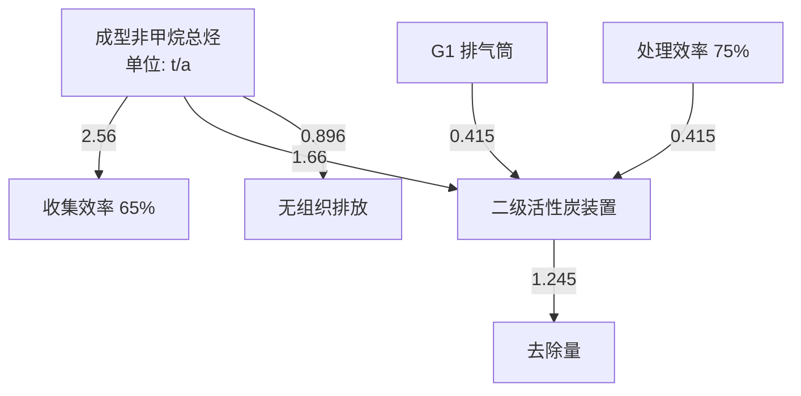
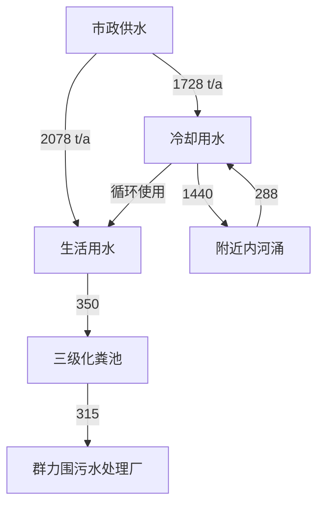
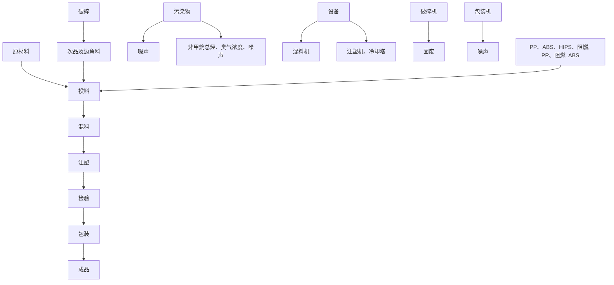
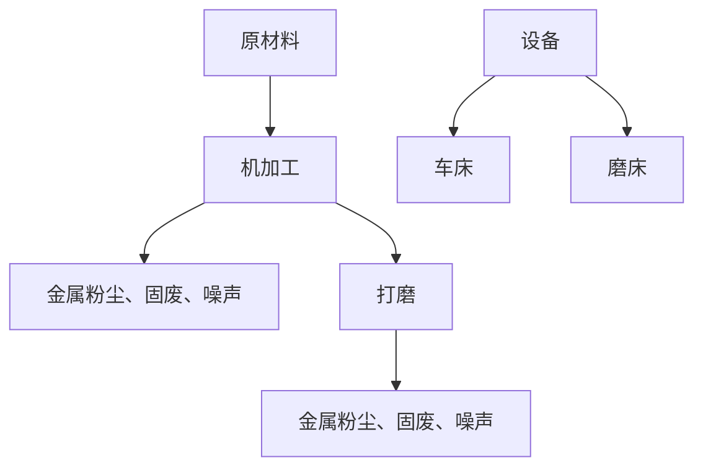
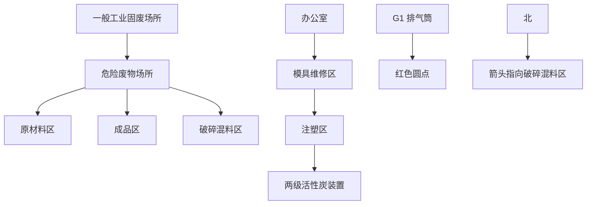

# 建设项目环境影响报告表

（污染影响类）

项目名称：佛山市新志信塑胶制品有限公司新建项目

建设单位（盖章）：佛山市新志信塑胶制品有限公司

编制日期： 2023 年 6 月

中华人民共和国生态环境部制

编制单位和编制人员情况表

<table><tr><td colspan="2">项目编号</td><td colspan="3">thc603</td></tr><tr><td colspan="2">建设项目名称</td><td colspan="3">佛山市新志信塑胶制品有限公司新建项目</td></tr><tr><td colspan="2">建设项目类别</td><td colspan="3">26-053塑料制品业</td></tr><tr><td colspan="2">环境影响评价文件类型</td><td colspan="3">报告表</td></tr><tr><td colspan="5">一、建设单位情况</td></tr><tr><td colspan="2">单位名称(盖章)</td><td colspan="3">佛山市新志信塑胶制品有限公司</td></tr><tr><td colspan="2">统一社会信用代码</td><td colspan="3">91440606MACDG9PP6D</td></tr><tr><td colspan="2">法定代表人(签章)</td><td rowspan="3" colspan="2"></td><td></td></tr><tr><td colspan="2">主要负责人(签字)</td><td></td></tr><tr><td colspan="2">直接负责的主管人员(签字)</td><td></td></tr><tr><td colspan="3">二、编制单位情况</td><td rowspan="4" colspan="2"></td></tr><tr><td colspan="2">单位名称(盖章)</td><td>广州颐晟</td></tr><tr><td colspan="2">统一社会信用代码</td><td>9144010</td></tr><tr><td colspan="3">三、编制人员情况</td></tr><tr><td colspan="5">1.编制主持人</td></tr></table>

text_image

中华人民共和国
环境影响评价工程师
职业资格证书
Professional Organization Certificates
Environmental Assessment Engineer
The People's Republic of China

# 目 录

一、建设项目基本情况..

二、建设项目工程分析... 12

三、区域环境质量现状、环境保护目标及评价标准. 22

四、主要环境影响和保护措施. 29

五、环境保护措施监督检查清单 51

六、结论.... 53

建设项目污染物排放量汇总表.. 54

附件1 企业营业执照

附件2 租赁合同

附件3 法人代表身份证及被委托人身份证

附件4 注塑机设备参数和规格

附件5 环评技术服务合同

附件 6 公示声明

附图1 项目地理位置图

附图2 项目四至卫星图

附图3 项目四至现场图

附图4 项目平面布置图

附图5 项目500米及50米范围内敏感点分布图

附图6 项目所在地大气环境功能区划图

附图7 项目所在地地表水环境功能区划图

附图8 项目所在地声环境功能区划图

附图9 佛山市顺德区环境管控单元图

附图10 项目所在地控制性规划图

# 一、建设项目基本情况

<table><tr><td>建设项目名称</td><td colspan="4">佛山市新志信塑胶制品有限公司新建项目</td></tr><tr><td>项目代码</td><td colspan="4">无</td></tr><tr><td>建设单位联系人</td><td colspan="4"></td></tr><tr><td>建设地点</td><td colspan="4">广东省佛山市顺德区北滘镇碧江社区都宁沙头涌工业区一路7号之二</td></tr><tr><td>地理坐标</td><td colspan="4">(113度14分3.498秒,22度56分1.168秒)</td></tr><tr><td>国民经济行业类别</td><td>C2929塑料零件及其他塑料制品制造</td><td>建设项目行业类别</td><td colspan="2">二十六、橡胶和塑料制品业29-53塑料制品业292其他(年用非溶剂型低VOCs含量涂料10吨以下的除外)</td></tr><tr><td>建设性质</td><td>☑新建(迁建)□改建□扩建□技术改造</td><td>建设项目申报情形</td><td colspan="2">☑首次申报项目□不予批准后再次申报项目□超五年重新审核项目□重大变动重新报批项目</td></tr><tr><td>项目审批(核准/备案)部门(选填)</td><td>无</td><td>项目审批(核准/备案)文号(选填)</td><td colspan="2">无</td></tr><tr><td>总投资(万元)</td><td>150.00</td><td>环保投资(万元)</td><td colspan="2">15.00</td></tr><tr><td>环保投资占比(%)</td><td>10.0</td><td>施工工期</td><td colspan="2">1个月</td></tr><tr><td>是否开工建设</td><td>☑否□是:____</td><td>用地(用海)面积( $m^2$ )</td><td colspan="2">3150</td></tr><tr><td rowspan="6">专项评价设置情况</td><td colspan="4">表1-1专项评价设置原则表</td></tr><tr><td>专项评价类别</td><td>设置原则</td><td>本项目相关情况</td><td>判定结果</td></tr><tr><td>大气</td><td>排放废气含有毒有害污染物、二噁英、苯并芘、氰化物、氯气且厂界外500米范围内有环境空气保护目标的建设项目</td><td>本项目排放不涉及技术指南规定的有毒有害废气污染物</td><td>不需要设置</td></tr><tr><td>地表水</td><td>新增工业废水直排建设项目(槽罐车外送污水处理厂的除外);新增废水直排的污水集中处理厂</td><td>本项目不涉及工业废水直接排放</td><td>不需要设置</td></tr><tr><td>环境风险</td><td>有毒有害和易燃易爆危险物质存储量超过临界量的建设项目</td><td>经分析,本项目危险物质存储量总计未超过临界量</td><td>不需要设置</td></tr><tr><td>生态</td><td>取水口下游500米范围内有重要水生生物的自然产卵场、索饵场、越冬场和洄游通道的新增河道取水的污染类建设项目</td><td>本项目不涉及直接从河道取水</td><td>不需要设置</td></tr><tr><td></td><td>海洋</td><td>直接向海排放污染物的海洋工程建设项目</td><td>本项目污水排放不涉及海洋</td><td>不需要设置</td></tr><tr><td>规划情况</td><td colspan="4">无</td></tr><tr><td>规划环境影响评价情况</td><td colspan="4">无</td></tr><tr><td>规划及规划环境影响评价符合性分析</td><td colspan="4">无</td></tr><tr><td rowspan="4">其他符合性分析</td><td colspan="4">1、建设项目与所在地“三线一单”符合性分析本项目位于广东省佛山市顺德区北滘镇碧江社区都宁沙头涌工业区一路7号之二。根据《广东省人民政府关于印发广东省“三线一单”生态环境分区管控方案的通知》(粤府〔2020〕71号)发布的广东省环境管控单元图,项目所在地属于重点管控单元;根据《佛山市人民政府关于印发佛山市“三线一单”生态环境分区管控方案的通知》(佛府〔2021〕11号)发布的佛山市环境管控单元图和《佛山市顺德区人民政府关于印发佛山市顺德区“三线一单”生态环境分区管控方案的通知》(顺府发〔2021〕11号)发布的顺德区环境管控单元图,项目所在区域为重点管控单元4,环境管控单元编码:ZH44060620004,要素细类为一般生态空间、水环境其他重点管控区、水环境一般管控区、大气环境高排放重点管控区、大气环境受体敏感重点管控区、江河湖库岸线重点管控区、江河湖库岸线一般管控区。项目与管控要求相符性分析如下:表1-2 项目与北滘镇重点管控区管控要求相符性分析</td></tr><tr><td>管控维度</td><td>管控要求</td><td>本项目情况</td><td>相符性分析</td></tr><tr><td rowspan="2">区域布局管控</td><td>1-1.【生态/禁止类】单元内的一般生态空间,主导生态功能为水土保持,禁止在25度以上的陡坡地开垦种植农作物,禁止在崩塌、滑坡危险区、泥石流易发区从事采石、取土、采砂等可能造成水土流失的活动。</td><td>本项目不涉及。</td><td>符合</td></tr><tr><td>1-2.【产业/鼓励引导类】重点发展机器人及配套产业、智能家用电器、高端新型电子信息、新材料等制造业和总部经济、电子商务、工业设计与文化创意、科技金融等现代服务业,打造智能制造和智慧家电示范区。</td><td>本项目属于C2929塑料零件及其他塑料制品制造,不属于《市场准入负面清单(2022年版)》(发改体改规〔2022〕397号)中禁止和许可事项。</td><td>符合</td></tr><tr><td rowspan="4"></td><td rowspan="4"></td><td>1-3.【产业/综合类】产业聚集区所属地块内的工业用地或企业与村庄、学校等环境敏感点之间应设置合理的大气环境防护距离,并通过绿化带进行有效隔离;聚集区规划布局应注重大气污染排放企业应尽量避免布局在居住用地的常年主导风向的上风向。</td><td>本项目排放的有机废气污染物经有效收集处理后达标排放,对周围大气环境影响较小。</td><td>符合</td></tr><tr><td>1-4.【产业/综合类】系统推进村级工业园升级改造,腾出连片空间,布局产业集聚区和主题产业园,推动工业项目入园集聚发展。新增工业制造业用地原则上安排在产业集聚区内,产业集聚区外原则上不鼓励工业及物流仓储用地的新建与改造。</td><td>本项目不属于村改范围,不属于工业及物流仓储用地的新建与改造。</td><td>符合</td></tr><tr><td>1-5.【产业/限制类】受纳水体或监控断面不达标的,不得新建、扩建向河涌直接排放废水的项目。新建、扩建含蚀刻工序的线路板生产项目和化工项目应在配套污水集中处置的工业园区或生活污水管网覆盖区域内建设;纯加工型印花项目,含酸洗、磷化的金属表面处理、金属制品项目(与自身高新技术企业配套的除外),含酸洗、喷涂、化学抛光、电解等涉及废水排放工艺的不锈钢型材加工项目(与自身高新技术企业配套的除外),应进入以此类项目为主导产业、有相应废水集中治理设施的工业园区,实现集中治污。</td><td>本项目生活污水排入群力围污水处理厂,尾水排入潭州水道。参考《佛山市生态环境局顺德分局关于发布2022年度佛山市顺德区生态环境状况公报的通知》(佛环顺函(2023)26号),潭洲水道西海断面监测的水质达到了III类标准要求,潭洲水道潭村断面监测的水质达到了II类标准要求。项目为C2929塑料零件及其他塑料制品制造,不属于线路板生产项目和化工项目;不属于纯加工型印花,含酸洗、磷化的金属表面处理、金属制品项目;不属于含酸洗、喷涂、化学抛光、电解等涉及废水排放工艺的不锈钢型材加工项目。</td><td>符合</td></tr><tr><td>1-6.【产业/综合类】划定家具生产优先发展区域,优先发展区外不再新建涉及涂装工艺的木质家具制造项目。</td><td>本项目不属于木质家具制造项目</td><td>符合</td></tr><tr><td rowspan="8"></td><td rowspan="3"></td><td>1-7.【水/限制类】严格限制在佛山市禅城南庄紫洞水厂、佛山市禅城沙口(石湾)水厂、羊额—北滘水厂、广州市南洲水厂顺德水道取水口饮用水水源保护区上游和周边区域建设列入“高污染、高环境风险”产品名录等可能影响水环境安全的项目。</td><td>本项目建设不在以上水源保护区的范围,不属于高污染、高环境风险的产品名录,本项目属于群力围污水处理厂的纳污范围,不属于影响水环境安全的项目</td><td>符合</td></tr><tr><td>1-8.【大气/限制类】大气环境受体敏感重点管控区内,应严格限制新建储油库项目、产生和排放有毒有害大气污染物的建设项目以及使用溶剂型油墨、涂料、清洗剂、胶黏剂等高挥发性有机物原辅材料项目,鼓励现有该类项目搬迁退出。</td><td>本项目没有使用产生和排放有毒有害大气污染物的建设项目以及使用溶剂型油墨、涂料、清洗剂、胶黏剂等高挥发性有机物的原辅材料</td><td>符合</td></tr><tr><td>1-9.【大气/鼓励引导类】大气环境高排放重点管控区内,应强化达标监管,引导工业项目落地集聚发展,有序推进区域内行业企业提标改造。</td><td>本项目有机废气经“二级活性炭吸附装置”处理后可达标排放。</td><td>符合</td></tr><tr><td rowspan="5">能源资源利用</td><td>2-1【能源/鼓励引导类】推广节能技术,加快发展绿色货运与现代物流。</td><td>本项目使用节能技术,项目不属于绿色货运与现代物流。</td><td>符合</td></tr><tr><td>2-2【能源/鼓励引导类】推广新能源汽车应用和充电基础设施建设,积极推动重卡LNG加气站、充电基础设施、加氢站建设。</td><td>本项目不属于新能源汽车应用和充电基础设施、加氢站建设项目。</td><td>符合</td></tr><tr><td>2-3.【能源/综合类】科学实施能源消费总量和强度“双控”,新建高能耗项目单位产品(产值)能耗达到国际国内先进水平。</td><td>本项目不属于高能耗项目。</td><td>符合</td></tr><tr><td>2-4.【水资源/综合类】贯彻落实“节水优先”方针,实行最严格水资源管理制度,北滘镇万元国内生产总值用水量、万元工业增加值用水量、用水总量、农田灌溉水有效利用系数等用水总量和效率指标达到区下达要求。</td><td>本项目严格贯彻落实“节水优先”方针,实行最严格水资源管理制度,北滘镇万元国内生产总值用水量、万元工业增加值用水量、用水总量、农田灌溉水有效利用系数等用水总量和效率指标达到区下达要求。</td><td>符合</td></tr><tr><td>2-5.【土地资源/限制类】落实单位土地面积投资强度、土地利用强度等建设用地控制性指标要求,提高土地利用效率。</td><td>本项目所在地为工业用地,符合控制性指标要求</td><td>符合</td></tr><tr><td rowspan="5"></td><td></td><td>2-6.【岸线/禁止类】严格水域岸线用途管制,新建项目一律不得违规占用水域。严禁破坏生态的岸线利用行为和不符合其功能定位的开发建设活动,严禁以各种名义侵占河道、围垦湖泊、非法采砂等。</td><td>本项目未违规占用水域,不会破坏生态的岸线利用行为和不符合其功能定位的开发建设活动,不侵占河道、围垦湖泊、非法采砂等</td><td>符合</td></tr><tr><td rowspan="4">污染物排放管控</td><td>3-1.【水/限制类】城镇新区建设实行雨污分流,逐步推进初期雨水收集、处理和资源化利用。住宅、商业体、学校、市场等城镇开发建设项目应当配套或者同步计划建设公共排水设施,公共排水设施或自建排污水设施未能投产运行的,以上涉水项目不得投入使用。新建小区严格实施雨污分流,阳台、露台等污水接入污水收集系统,将生活污水“应截尽截”。做好大型楼盘、集贸市场、餐饮以及学校等4大类排水户污水接入市政管网工作。</td><td>本项目不属于城镇新区建设。</td><td>符合</td></tr><tr><td>3-2.【水/综合类】结合村级工业园改造,全面提升产业层次与集聚度,促进污染集中整治。</td><td>本项目不属于村级工业园改造区。</td><td>符合</td></tr><tr><td>3-3.【水/综合类】稳步推进排水设施“三个一体化”管理模式,补齐城乡污水收集和处理短板,推动群力围污水处理厂提质增效,加快消除城中村、老旧城区、城乡结合部等污水收集管网空白区,逐步实现城乡污水收集处理全覆盖。2025年前完成群力围污水处理厂扩建,尾水应执行《城镇污水处理厂污染物排放标准》(GB18918-2002)一级A标准及《广东省水污染物排放限值》(DB44/26-2001)的较严值。</td><td>本项目位于群力围污水处理厂处理范围,尾水执行《城镇污水处理厂污染物排放标准》(GB18918-2002)一级A标准及《广东省水污染物排放限值》(DB44/26-2001)的较严值。</td><td>符合</td></tr><tr><td>3-4.【水/综合类】近期保留并完善水口村、三桂村、西滘村、马龙村等现状农村污水分散式处理设施,新建莘村、马龙村等分散式污水处理站建设,继续完善污水支管网建设,提高污水收集处理率,其余行政村(社区)继续完善污水管网建设,实现农村污水100%收集进入市政污水系统,有条件的区域实施雨污分流改造,到2030年全面雨污分流,污水纳入北滘城镇污水处理系统。</td><td>本项目不属于污水管网、污水处理设施等建设项目。</td><td>符合</td></tr><tr><td rowspan="6"></td><td rowspan="2"></td><td>3-5.【水/综合类】产业集聚区和主题园区内做好污水管网和污水集中处理设施的配套保障,确保废水收集到城镇污水处理厂、园区污水处理厂或分散式污水处理设施集中处置。</td><td>本项目不属于产业集聚区和主题园区建设项目。</td><td>符合</td></tr><tr><td>3-6.【大气/综合类】大力推进低VOCs含量原辅材料替代,加快涉VOCs重点行业的生产工艺升级改造,推行自动化生产工艺,对达不到要求的VOCs收集及治理设施进行整治提升,逐步淘汰低效VOCs治理设施。</td><td>本项目使用的含VOCs原辅材料均为低挥发原料,VOCs废气经收集后进入“二级活性炭吸附装置”处理。</td><td>符合</td></tr><tr><td rowspan="3">环境风险防控</td><td>4-1.【水/综合类】加强单元内佛山市禅城南庄紫洞水厂、佛山市禅城沙口(石湾)水厂、羊额—北滘水厂、广州市南洲水厂顺德水道取水口饮用水水源保护区周边环境风险源管控,完善突发环境事件应急管理体系。</td><td>本项目不涉及。</td><td>符合</td></tr><tr><td>4-2.【水/综合类】北滘污水处理厂、群力围污水处理厂、工业污水集中处理设施应采取有效措施,防止事故废水直接排入水体。完善污水处理厂在线监控系统联网,实现污水处理厂的实时、动态监管。</td><td>本项目所在地位于群力围污水处理厂纳污范围,污水处理厂已在线监控系统联网,实现污水处理厂的实时、动态监管。</td><td>符合</td></tr><tr><td>4-3.【风险/综合类】加强环境风险分级分类管理,强化金属制品、有色金属和压延加工、化学原料和化学品制造业等涉重金属、化工行业企业及工业园区等重点环境风险源的环境风险防控。</td><td>项目液态原料储存于物料区,控制储存量,现场配置泄漏吸附收集等应急器材;危险废物分类暂存,危险废物暂存间设置有围堰,且做好防渗漏和硬底化处理;当废气收集系统出现故障时,立即停止生产,维修设备,并定期做好废气收集系统的检修和维护;在发生火灾和爆炸事故次生灾害时,采取紧急疏散等措施,加强对环境风险的分级分类管理。</td><td>符合</td></tr><tr><td colspan="4">2、产业政策符合性分析本项目属于《国民经济行业分类》(GB/T4754-2017)及第1号修改单中的C2929塑料零件及其他塑料制品制造,根据《产业结构调整</td></tr></table>

指导目录（2019年本）》的规定，本项目不属于限制类、淘汰类。综上所述，本项目符合国家、广东省的产业政策要求。

根据《环境保护综合名录（2021年版）》，本项目不属于“高污染、高环境风险”产品名录里的产品。

根据广东省发展改革委广东省生态环境厅关于印发《广东省禁止、限制生产、销售和使用的塑料制品目录》（2020年版）的通知（粤发改资环函〔2020〕1747号）中的规定，本项目从事空调塑料配件的生产，不属于禁止、限制生产、销售和使用的塑料制品目录里的类型，因此本项目与《广东省禁止、限制生产、销售和使用的塑料制品目录》要求相符。根据国家发展改革委商务部关于印发《市场准入负面清单（2022年版）》的通知，本项目不属于市场准入负面清单项目。

# 3、与地区有机污染物治理政策相符性分析

本项目与有机污染物治理政策的相符性分析见下表。

表 1-3 本项目与有机污染物治理政策的相符性

<table><tr><td>序号</td><td>政策要求</td><td>工程内容</td><td>判定</td></tr><tr><td colspan="4">1.《佛山市生态环境局顺德分局关于做好重点行业建设项目挥发性有机物总量指标管理工作的通知》(佛顺环函[2019]56号)</td></tr><tr><td>1.1</td><td>VOCs排放项目,实现本行政区域内污染源“点对点”2倍量削减替代,由项目所在镇街分局出具VOCs总量指标来源及替代削减方案的意见,开展总量替代。</td><td>本项目VOCs总量为1.311t/a,由北滘监督管理所划分总量。</td><td>符合</td></tr><tr><td colspan="4">2.《佛山市关于进一步加强塑料污染治理的实施方案》的通知(佛发改资环〔2021〕3号)</td></tr><tr><td>2.1</td><td>禁止生产、销售的塑料制品。全市范围内禁止生产和销售厚度小于0.025毫米的超薄塑料购物袋、厚度小于0.01毫米的聚乙烯农用地膜。禁止以医疗废物为原料制造塑料制品;禁止将回收利用的废塑料输液袋(瓶)用于原用途或用于制造餐饮容器以及玩具等儿童用品。到2020年底,禁止生产和销售一次性发泡塑料餐具、一次性塑料棉签;禁止生产含塑料微珠的日化产品。到2022年底,禁止销售含塑料微珠的日化产品。国家《产业结构调整指导目录》和《市场准入负面清单》明确的属于淘汰类的塑料制品项目,禁止投资;属于限制类项目,禁止新建。</td><td>本项目主要生产塑料配件,不涉及《佛山市关于进一步加强塑料污染治理的实施方案》限制、淘汰的生产产品。</td><td>符合</td></tr></table>

3.《广东省塑料制品与制造业挥发性有机物综合整治技术指南》

<table><tr><td>3.1</td><td>过程控制技术:VOCs物料密闭储存;盛装VOCs物料的容器或包装袋应存放于室内,或存放于设置有雨棚、遮阳和防渗设施的专用场地;盛装VOCs物料的容器或包装袋在非取用状态时加盖、封口,保持密闭。粉状、粒状VOCs物料投加,宜采用气力输送方式或采用密闭固体投料器等给料方式密闭投加。</td><td>本项目使用PP、HIPS、ABS、阻燃PP、阻燃ABS塑料粒(新料),其不含常温下会挥发的物料,在投料过程中使用空压机进行气力运输。</td><td>符合</td></tr><tr><td>3.2</td><td>塑炼/塑化/熔化、挤出、注塑、吹膜等成型工序可采取局部气体收集措施,且满足控制风速不低于0.3m/s的要求</td><td>本项目集气罩控制风速为0.7m/s。</td><td>符合</td></tr><tr><td>3.3</td><td>末端治理:成型工序产生的有机废气经点对点收集后可采用组合技术处理。</td><td>本项目在注塑机的上方设置点对点半密闭集气罩收集,采用二级活性炭吸附装置处理有机废气。</td><td>符合</td></tr><tr><td>3.4</td><td>若采用活性炭吸附技术,采用颗粒活性炭作为吸附剂时,其碘值不宜低于800mg/g;采用蜂窝活性炭作为吸附剂时,其碘值不宜低650mg/g;采用活性炭纤维作为吸附剂时,其比表面积不低于 $1100m^2/g$ (BET法)。工作温度和湿度应符合:温度T&lt;40°C、湿度RH&lt;60%;活性炭表面不应有积尘和积水;活性炭吸附箱是否足额装填活性炭(1吨活性炭通常只能吸附0.1~0.2吨VOCs。</td><td>本项目采用蜂窝状活性炭作为吸附剂进行收集,其碘值为800mg/g。</td><td>符合</td></tr><tr><td>3.5</td><td>车间或生产设施排气筒废气排放浓度不高于《合成树脂工业污染物排放标准》(GB31572-2015)排放限值的50%。</td><td>本项目注塑过程排放的非甲烷总烃浓度为 $6.29mg/m^3$ ,符合车间或生产设施排气筒废气排放浓度不高于《合成树脂工业污染物排放标准》(GB31572-2015)排放限值的50%的要求。</td><td>符合</td></tr><tr><td>3.6</td><td>车间或生产设施排气中NMHC初始排放速率≥3kg/h时,建设VOCs处理设施且处理效率≥80%,采用的原辅材料符合国家有关低VOCs含量产品规定的除外。</td><td>本项目注塑过程非甲烷总烃初始排放速率为0.629kg/h&lt;3kg/h。</td><td>符合</td></tr><tr><td>3.7</td><td>根据《广东省生态环境厅关于实施厂区内挥发性有机物无组织排放监控要求的通告》(粤环发〔2021〕4号),企业厂区内无组织排放监控点浓度执行《挥发性有机物无组织排放控制标准》(GB37822-2019)特别排放限值。</td><td>本项目VOCs企业厂区内无组织排放监控点浓度执行《固定污染源挥发性有机物综合排放标准》(DB44/2367-2022)表3厂区内VOCs无组织排放限值</td><td>符合</td></tr></table>

4.《广东省人民政府办公厅关于印发广东省 2021年大气、水、土壤污染防治工作方案的通知》（粤府〔2021〕58 号）

<table><tr><td>4.1</td><td>严格落实国家产品VOCs含量限值标准要求,除现阶段确无法实施替代的工序外,禁止新建生产和使用高VOCs含量原辅材料项目。鼓励在生产和流通消费环节推广使用低VOCs含量原辅材料。</td><td>本项目生产过程中主要使用的含VOCs原辅材料主要为PP、HIPS、ABS、阻燃PP、阻燃ABS塑料粒,其不含常温下会挥发的物料,属于低挥发性有机物原辅材料。</td><td>符合</td></tr><tr><td>4.2</td><td>涉VOCs重点行业新建、改建和扩建项目不推荐使用光氧化、光催化、低温等离子等低效治理设施,已建项目组淘汰氧化、光催化、低温等离子低效治理设施。</td><td>本项目有机废气治理使用“二级活性炭吸附装置”,不采用低效治理设施。</td><td>符合</td></tr><tr><td>4.3</td><td>着力促进用热企业向园区集聚,在集中供热管网覆盖范围内,禁止新建、扩建燃用煤炭、重油、渣油、生物质等分散供热锅炉。珠三角地区原则上禁止新建燃煤锅炉。</td><td>项目不使用煤炭、重油、渣油、生物质等分散供热锅炉。</td><td>符合</td></tr></table>

5.《固定污染源挥发性有机物综合排放标准》强制性地方标准）》（2022第 4号（总第 222 号）

<table><tr><td>5.1</td><td>粉状、粒状VOCs物料应当采用气力输送方式或者采用密闭固体投料器等给料方式密闭投加。无法密闭投加的,应当在密闭空间内操作,或者进行局部气体收集,废气应当排至除尘设施、VOCs废气收集处理系统;</td><td>本项目PP、HIPS、ABS、阻燃PP、阻燃ABS塑料粒采用气力运输至混料机和注塑机中,注塑废气经集气罩收集通过“二级活性炭箱”处理后引至15m排气筒G1高空排放。</td><td>符合</td></tr><tr><td>5.2</td><td>VOCs物料卸(出、放)料过程应当密闭,卸料废气应当排至VOCs废气收集处理系统;无法密闭的,应当采取局部气体收集措施,废气应当排至VOCs废气收集处理系统。</td><td>本项目PP、HIPS、ABS、阻燃PP、阻燃ABS塑料粒,属于低(无)VOCs含量的原辅材料;注塑废气经集气罩收集通过“二级活性炭箱”处理后引至15m排气筒G1高空排放。</td><td>符合</td></tr></table>

6《. 广东省涉挥发性有机物（VOCs）重点行业治理指引》的通知（粤环办〔2021〕43 号）

<table><tr><td>6.1</td><td>六、橡胶和塑料制品业VOCs治理指引 适用范围:适用于轮胎制造(C2911)、橡胶板、管、带制造(C2912)、橡胶零件制造(C2913)、再生橡胶制造(C2914)、日用及医用橡胶制品制造(C2915)、运动场地用塑胶制造(C2916)、其他橡胶制品制造(C2919)、塑料薄膜制造(C2921)、塑料板、管、型材制造(C2922)、塑料丝、绳及编织品制造(C2923)、泡沫塑料制造(C2924)、塑料人造革、合成革制造(C2925)、塑料包装箱及容</td><td>项目为C2929塑料零件及其他塑料制品制造,属于重点行业。</td><td></td></tr></table>

<table><tr><td rowspan="9"></td><td></td><td>器制造(C2926)、日用塑料制品制造(C2927)、人造草坪制造(C2928)、塑料零件及其他塑料制品制造(C2929)工业企业或生产设施。</td><td></td><td></td></tr><tr><td>6.2</td><td>粉状、粒状VOCs物料采用气力运送设备、管状带式运送机、螺旋输送机等密闭输送方式,或者采用密闭的包装袋、容器或罐车进行物料转移。</td><td>本项目PP、HIPS、ABS、阻燃PP、阻燃ABS塑料粒(新料),其不含常温下会挥发的物料,在投料过程中使用空压机进行气力运输。</td><td>符合</td></tr><tr><td>6.3</td><td>粉状、粒状VOCs物料采用气力输送方式或采用密闭固体投料器等给料方式密闭投加;无法密闭投加的,在密闭空间内操作,或进行局部气体收集,废气排至除尘设施、VOCs废气收集处理系统。</td><td>本项目PP、HIPS、ABS、阻燃PP、阻燃ABS塑料粒塑料粒(新料),其不含常温下会挥发的物料,在投料过程中使用空压机进行气力运输。</td><td>符合</td></tr><tr><td>6.4</td><td>在混合/混炼、塑炼/塑化/熔化、加工成型(挤出、注射、压制、压延、发泡、纺丝等)、硫化等作业中应采用密闭设备或在密闭空间中操作,废气应排至VOCs废气收集处理系统;无法密闭的,应采取局部气体收集措施,废气应排至VOCs废气收集处理系统。</td><td>注塑废气经集气罩收集通过“二级活性炭箱”处理后引至15m排气筒G1高空排放。</td><td>符合</td></tr><tr><td>6.5</td><td>采用外部集气罩的,距集气罩开口面最远处的VOCs无组织排放位置,控制风速不低于0.3m/s。</td><td>本项目控制风速为0.7m/s。</td><td>符合</td></tr><tr><td>6.6</td><td>塑料制品行业:a)有机废气排气筒排放浓度不高于广东省《大气污染物排放限值》(DB4427-2001)第II时段排放限值,若国家和我省出台并实施适用于塑料制品制造业的大气污染物排放标准,则有机废气排气筒排放浓度不高于相应的排放限值;车间或生产设施排气中NMHC初始排放速率≥3kg/h时,建设VOCs处理设施且处理效率≥80%;厂区内无组织排放监控点NMHC的小时平均浓度值不超过6mg/m3,任意一次浓度值不超过 $20mg/m^3$ 。</td><td>本项目非甲烷总烃有组织排放浓度为 $6.29mg/m^3$ ,排放速率为0.173kg/h,满足《合成树脂工业污染物排放标准》(GB31572-2015)排放限值,排放浓度≤ $100mg/m^3$ ,非甲烷总烃初始排放速率为 $0.692kg/h<3kg/h$ 。有机废气厂区内无组织排放满足平均浓度值不超过 $6mg/m^3$ ,任意一次浓度值不超过 $20mg/m^3$ 要求。</td><td>符合</td></tr><tr><td colspan="4">7.佛山市生态环境局关于印发《佛山市重点行业VOCs治理提升工作方案》的通知</td></tr><tr><td>7.1</td><td>2021年底前淘汰光氧化、光催化、低温等离子等低效治理设施。</td><td>本项目注塑废气经集气罩收集通过“二级活性炭箱”处理后引至15m排气筒G1高空排放,未采用淘汰的低效治理设施。</td><td>符合</td></tr><tr><td>7.2</td><td>不外运处理的含VOCs废水须深化处理(包含物化、生化处理工艺),达标排放。</td><td>本项目均不产生含VOCs废水。</td><td>符合</td></tr><tr><td></td><td colspan="4">4、选址合理性分析本项目位于广东省佛山市顺德区北滘镇碧江社区都宁沙头涌工业区一路7号之二,根据《佛山市顺德区SD-E-05-01编制单元(北滘都宁工业区周边片区)控制性详细规划》批后通告,项目所在地用地性质为工业用地,因此,项目选址符合功能规划要求。</td></tr></table>

# 二、建设项目工程分析

# 1、项目由来

佛山市新志信塑胶制品有限公司（简称“建设单位”）广东省佛山市顺德区北滘镇碧江社区都宁沙头涌工业区一路 7 号之二，中心地理坐标为东经 113 度 14 分 3.498 秒，北纬22度56分1.168秒，占地面积约为 3150m2。主要从事空调塑料配件制造，年产空调网罩120吨、空调蜗壳520吨、空调小塑料件320吨。

根据《中华人民共和国环境影响评价法》（2018 年 12 月 29 日修订）、《国务院关于修改〈建设项目环境保护管理条例〉的决定》（国务院令第682号）等法律法规的规定，建设对环境有影响的项目必须进行环境影响评价。参照《建设项目环境影响评价分类管理名录》（2021 年版）（生态环境部令第16号），本项目属于“二十六、橡胶和塑料制品业29-53塑料制品业292”其他（年用非溶剂型低VOCs 含量涂料10吨以下的除外），需编制建设项目环境影响报告表。

受佛山市新志信塑胶制品有限公司委托，广州颐景环保科技有限公司承担了该项目的环境影响评价工作，在组织相关技术人员现场踏勘、调查收集和研究与项目有关的技术资料的基础上，根据《建设项目环境影响报告表编制技术指南（污染影响类）（试行）》，编制了《佛山市新志信塑胶制品有限公司新建项目环境影响报告表》。

# 2、项目组成

具体工程组成见下表：

表 2-1 项目工程组成

<table><tr><td>工程分类</td><td>项目</td><td>建设内容</td><td>依托工程情况</td><td colspan="2">备注</td></tr><tr><td>主体及辅助工程</td><td>主体生产车间</td><td>生产车间1层,建筑面积为3150m2,层高8米,包括破碎混料区、注塑区、原料区、成品区、办公室等</td><td>依托已建成的建筑</td><td colspan="2">主要用于空调塑料配件的生产加工</td></tr><tr><td rowspan="2">储运工程</td><td>仓储方式</td><td>不另外建设单独仓库房,仓储区设置在生产厂房内</td><td>/</td><td colspan="2">/</td></tr><tr><td>运输方式</td><td>原辅料和产品均采用货车运输</td><td>/</td><td colspan="2">/</td></tr><tr><td rowspan="3">公用工程</td><td>配电系统一套</td><td>配电系统一套</td><td rowspan="3">依托所在厂房已有设施</td><td colspan="2">供应生产及办公用电</td></tr><tr><td>供水系统一套</td><td>供水系统一套</td><td colspan="2">市政供水</td></tr><tr><td>雨水排水系统一套</td><td>雨水排水系统一套</td><td colspan="2">采用雨污分流,雨水进入市政雨水管网</td></tr><tr><td></td><td colspan="2">生活污水排水系统一套</td><td>生活污水排水系统一套</td><td>依托所在厂房已有生活污水处理设施</td><td>本项目生活污水经三级化粪池处理设施处理后排入群力围污水处理厂</td></tr><tr><td rowspan="6">环保工程</td><td rowspan="2">废水污染物防治措施</td><td>生活污水</td><td>生活污水经三级化粪池处理设施处理后排入群力围污水处理厂</td><td colspan="2" rowspan="2">依托所在厂房已有生活污水处理设施</td></tr><tr><td>生产废水</td><td>循环冷却水循环使用,作为清净下水定期通过雨水管道排放</td></tr><tr><td colspan="2">废气污染物防治措施</td><td>注塑废气经“二级活性炭吸附装置”处理后通过15米排气筒G1排放;破碎工序产生的颗粒物以无组织的形式排放</td><td colspan="2">/</td></tr><tr><td colspan="2">噪声污染防治措施</td><td>采用低噪声设备、做好设备隔音、减振处理、合理布局车间</td><td colspan="2">/</td></tr><tr><td rowspan="2">固体废物防治措施</td><td>危险废物</td><td>设置危废储存场所,占地面积约为 $5m^{2}$ </td><td colspan="2">危险废物分类收集后储存在危险废物暂存区,交由有危废资质的单位回收处置</td></tr><tr><td>一般工业固废</td><td>设置一般固废暂存间,占地面积约 $5m^{2}$ </td><td colspan="2">分类收集储存在一般工业固体废物暂存间内、妥善处置</td></tr></table>

# 3、主要产品及产能

项目主要从事空调塑料配件的生产，包括空调网罩，空调蜗壳及空调小塑料件，主要生产规模详见下表

表 2-2 项目主要生产规模一览表

<table><tr><td>序号</td><td>名称</td><td>单位</td><td>数量</td></tr><tr><td>1</td><td>空调网罩</td><td>吨/年</td><td>120</td></tr><tr><td>2</td><td>空调蜗壳</td><td>吨/年</td><td>520</td></tr><tr><td>3</td><td>空调小塑料件</td><td>吨/年</td><td>320</td></tr></table>

# 4、主要生产设备

根据建设单位提供的资料，项目主要生产设备详见下表。

表 2-3 项目主要生产设备一览表

<table><tr><td>序号</td><td>设备名称</td><td>设备参数</td><td>单位</td><td>数量</td><td>使用工序</td><td>位置</td></tr><tr><td>1</td><td>混料机</td><td>/</td><td>台</td><td>4</td><td>混料工序</td><td>破碎混料区</td></tr><tr><td>2</td><td rowspan="6">注塑机</td><td>1000T</td><td>台</td><td>2</td><td rowspan="6">注塑工序</td><td rowspan="6">注塑区</td></tr><tr><td>3</td><td>800T</td><td>台</td><td>2</td></tr><tr><td>4</td><td>600T</td><td>台</td><td>6</td></tr><tr><td>5</td><td>350T</td><td>台</td><td>6</td></tr><tr><td>6</td><td>115T</td><td>台</td><td>5</td></tr><tr><td>7</td><td>80T</td><td>台</td><td>9</td></tr><tr><td>8</td><td>破碎机</td><td>0.4t/h</td><td>台</td><td>5</td><td>破碎工序</td><td>破碎混料区</td></tr><tr><td>9</td><td>冷却塔</td><td>10m3/h</td><td>台</td><td>3</td><td>注塑设备冷却</td><td>注塑区</td></tr><tr><td>10</td><td>空压机</td><td>/</td><td>台</td><td>2</td><td>提供动力</td><td>注塑区</td></tr><tr><td>11</td><td>车床</td><td>/</td><td>台</td><td>1</td><td>模具维修</td><td>模具维修区</td></tr><tr><td>12</td><td>磨床</td><td>/</td><td>台</td><td>1</td><td>模具维修</td><td>模具维修区</td></tr></table>

# 5、主要原辅材料

根据建设单位提供的资料，项目外购的原辅材料存放至原料区，项目主要原辅材料及用量见下表。

表 2-4 项目主要原辅材料用量一览表

<table><tr><td>序号</td><td>名称</td><td>单位</td><td>用量</td><td>存放位置</td><td>备注</td></tr><tr><td>1</td><td>PP(新料)</td><td>吨/年</td><td>320</td><td rowspan="6">原料区</td><td>外购,粒状,25kg/袋,最大储存量约为10吨</td></tr><tr><td>2</td><td>HIPS(新料)</td><td>吨/年</td><td>480</td><td>外购,粒状,25kg/袋,最大储存量约为10吨</td></tr><tr><td>3</td><td>ABS(新料)</td><td>吨/年</td><td>64</td><td>外购,粒状,25kg/袋,最大储存量约为5吨</td></tr><tr><td>4</td><td>阻燃 PP(新料)</td><td>吨/年</td><td>48</td><td>外购,粒状,规格:25kg/袋,最大储存量约为2吨</td></tr><tr><td>5</td><td>阻燃 ABS(新料)</td><td>吨/年</td><td>48</td><td>外购,粒状,规格:25kg/袋,最大储存量约为2吨</td></tr><tr><td>13</td><td>机油</td><td>吨/年</td><td>0.2</td><td>外购,25kg/桶,最大储存量约为0.05吨</td></tr></table>

本项目主要涉VOCs 原辅材料情况见下表。

表 2-5 本项目主要涉 VOCs 原辅材料一览表

<table><tr><td>序号</td><td>名称</td><td>理化性质</td><td>VOCs 含量</td><td>国家标准限值</td><td>是否属于低VOCs 原辅材料</td></tr><tr><td>1</td><td>PP</td><td>由丙烯单体聚合成,为无毒、无臭、无味的乳白色高结晶的聚合物,密度只有0.9~0.91g/cm3,化学稳定性很好,除能被浓硫酸、浓硝酸侵蚀外,对其它各种化学试剂都比较稳定,但低分子量的脂肪烃、芳香烃和氯化烃等能使聚丙烯软化和溶胀,同时它的化学稳定性随结晶度的增加还有所提高。PP塑料具有较高的耐热性,连续使用温度可达110-120°C,熔点为160-175°C,分解温度为350°C。</td><td>常温条件下不会产生有机废气,注塑过程有机废气产污参考《广东省塑料制品与制造业、人造石制造业、电子元件制造业挥发性有机化合物排放系数使用指南》中表4-1塑料制品与制造业成型工序VOCs排放系数-2.368kg/t-塑胶原料用量</td><td>/</td><td>是</td></tr><tr><td>2</td><td>HIPS</td><td>又名高抗冲击聚苯乙烯,玻璃化温度80~90°C,非晶态密度1.04~1.06g/cm3,晶体密度1.11~1.12g/cm3,熔融温度240°C,热分解温度&gt;250°C。聚苯乙烯树脂为无毒,无臭,无色的透明颗粒,似玻璃状脆性材料,其制品具有极高的透明度,透光率可达90%以上,电绝缘性能好,易着色,加工流动性好,刚性好及耐化学腐蚀性好</td><td rowspan="4"></td><td rowspan="4"></td><td rowspan="4"></td></tr><tr><td>3</td><td>ABS</td><td>中文名为丙烯腈-丁二烯-苯乙烯共聚物,具有高强度、低重量的特点。不透明,外观呈浅象牙色、无毒、无味,兼有韧、硬、刚的特性,燃烧缓慢,火焰呈黄色,有黑烟,燃烧后塑料软化、烧焦,发出特殊的肉桂气味,但无熔融滴落现象,是常用的一种工程塑料。比重:1.05克/立方厘米,成型收缩率:0.4~0.7%,干燥条件:80~90°C/2小时</td></tr><tr><td>4</td><td>阻燃PP</td><td>阻燃PP为在PP的基础上加入阻燃剂,成为达到阻燃效果的PP塑料。项目外购的阻燃PP为已经加入阻燃剂的。</td></tr><tr><td>5</td><td>阻燃ABS</td><td>阻燃ABS为在ABS的基础上加入阻燃剂,成为达到阻燃效果的ABS塑料,项目外购的阻燃ABS为已经加入阻燃剂的</td></tr><tr><td>6</td><td>机油</td><td>机油一般由基础油和添加剂两部分组成。基础油是机油的主要成分,决定着机油的基本性质,添加剂则可弥补和改善基础油性能方面的不足,赋予某些新的性能,是机油的重要组成部分。机油外观为油状液体,淡黄色至褐色,无气味或略带异味。用于机械的摩擦部分,起润滑、冷却和密封作用。机油为可燃液体,遇明火、高热可燃。</td><td>/</td><td>/</td><td>/</td></tr></table>

# 6、关键设备产能匹配性分析

本项目产品塑料件与关键设备产能匹配情况见下表。

表 2-6 本项目塑料件与关键设备产能匹配性分析表

<table><tr><td>设备</td><td>设备型号</td><td>数量(台)</td><td>射胶量(g)</td><td>注塑成型时间(s)</td><td>每小时生产批次(次)</td><td>年生产时间(h)</td><td>设计产能(t/a)</td><td>实际产能(t/a)</td></tr><tr><td>注塑机</td><td>1000T</td><td>2</td><td>841</td><td>120</td><td>30</td><td>2400</td><td>121</td><td rowspan="6">960</td></tr><tr><td>注塑机</td><td>800T</td><td>2</td><td>700</td><td>110</td><td>33</td><td>2400</td><td>111</td></tr><tr><td>注塑机</td><td>600T</td><td>6</td><td>400</td><td>100</td><td>36</td><td>2400</td><td>207</td></tr><tr><td>注塑机</td><td>350T</td><td>6</td><td>320</td><td>50</td><td>72</td><td>2400</td><td>332</td></tr><tr><td>注塑机</td><td>115T</td><td>5</td><td>116</td><td>40</td><td>90</td><td>2400</td><td>125</td></tr><tr><td>注塑机</td><td>80T</td><td>9</td><td>93</td><td>30</td><td>120</td><td>2400</td><td>241</td></tr><tr><td colspan="7">合计</td><td>1137</td><td>/</td></tr><tr><td colspan="9">备注:项目注塑机的设计产能按同一时间同时运行计,上表为满负荷运行时的产能。</td></tr></table>

根据上表可知，本项目注塑机设计产能合计为 1137a，实际生产产能约为 960t/a，项目设备设计产能满足企业实际产能需求。

# 7、物料平衡

1）VOCs平衡   

flowchart

（2）水平衡  

flowchart

图 2-2 本项目水平衡图

# 8、工作制度和能耗水耗

表 2-7 工作制度一览表

<table><tr><td>序号</td><td>名称</td><td>内容</td></tr><tr><td>1</td><td>劳动定额</td><td>从业人数为35人</td></tr><tr><td>2</td><td>工作制度</td><td>年工作300天,每天8个小时</td></tr><tr><td>3</td><td>食宿情况</td><td>不在厂区内吃宿</td></tr></table>

表 2-8 项目能耗水耗一览表

<table><tr><td>序号</td><td>名称</td><td>单位</td><td>年用量</td><td>用途</td><td>备注</td></tr><tr><td rowspan="2">1</td><td rowspan="2">水</td><td rowspan="2">吨/年</td><td>350</td><td>办公生活</td><td rowspan="2">市政供水</td></tr><tr><td>1728</td><td>注塑机冷却用水</td></tr><tr><td>2</td><td>电</td><td>万度/年</td><td>20</td><td>生产、生活</td><td>市政供电</td></tr></table>

# 9、四至情况

本项目东面为合联拓展金属材料有限公司；南面为永连电脑雕刻厂；西面为铨盈制冷设备有限公司；北面为无名内河涌。项目四至图见附图2。

# 10、项目平面布置

本项目位于已建的 1栋 1 层楼厂房，项目占地面积为 3150m2，建设内容主要为生产车间（包括破碎混料区、注塑区、原料区、成品区、办公室等）。项目厂区具体平面布置见附图4。

# 11、环境保护工程措施投资估算

项目总投资150万元，根据《建设项目环境保护设计规定》中的有关条款和有关环境保护法规，结合环境保护和污染防治工作拟采用一些必要的工程措施，对本环境保护投资进行估算，具体见下表。

表 2-9 建设项目环保投资情况一览表

<table><tr><td colspan="2">项目</td><td>环保设施名称</td><td>资金(万元)</td></tr><tr><td colspan="3">环保投资总概算</td><td>15</td></tr><tr><td rowspan="4">实际总投资</td><td>生活污水</td><td>生活污水三级化粪池预处理设施一套</td><td>2</td></tr><tr><td>废气</td><td>“二级活性炭+15米排气筒G1”1套</td><td>10</td></tr><tr><td>噪声</td><td>采用低噪声设备、做好设备隔声、减振处理、合理布局车间</td><td>2</td></tr><tr><td>固废</td><td>设置危险废物贮存场所、一般固废暂存间</td><td>1</td></tr><tr><td colspan="3">环保投资占总投资的比例(%)</td><td>10</td></tr></table>

# 1、生产工艺流程

1.1本项目空调塑料配件，包括空调网罩，空调蜗壳及空调小塑料件生产工序具体流程见图2-3。

flowchart

图 2-3 本项目空调塑料配件生产工艺流程及产污环节示意图

本项目空调塑料配件生产工艺流程说明：

将PP、ABS、HIPS、阻燃PP、阻燃ABS 人工投入混料机，开启混料机进行混合，把混合均匀的原料通过人工转移到注塑机投料槽中，利用螺杆将原料输送到注塑机进料口，通过电加热至 160-180℃将树脂粒等原材料融化，通过模具注塑成型，然后人工对样品进行检验，将不合格品和边角料进行破碎，回用于生产中。合格品进行包装即得成品。

项目生产过程中注塑过程中温度较高，使用电能，需要使用水对其降温冷却，冷却水用于注塑设备的间接冷却，需适当地加入新鲜水补充因蒸发而损失的水分，循环冷却水循环使用，作为清净下水定期通过雨水管道排放。

1.2本项目模具维修生产工序具体流程见图2-4。

flowchart

图 2-4 项目模具维修生产工艺流程及产污环节示意图

项目模具维修工艺流程说明：

项目注塑过程使用的模具需要定期维修，根据要求对模具进行切割、铣、车等机械加工，然后使用磨床对焊缝处进行打磨平整等即可完成维修。

# 2、本项目产污环节分析

（1）废气：注塑工序产生的非甲烷总烃和臭气浓度；破碎、模具维修工序产生的颗粒物。  
（2）废水：外排废水主要为员工生活污水，循环冷却水循环使用，作为清净下水定期通过雨水管道排放。  
（3）噪声：车间各设备运行时产生的机械噪声。  
（4）固废：职工生活垃圾，一般工业固体废物：次品和边角料，危险废物：废机油、废机油包装桶、废含油抹布、废活性炭。

本项目为新建，租赁已建的工业厂房简单装修后进行生产，没有与项目有关的原有环境污染问题。

# 三、区域环境质量现状、环境保护目标及评价标准

# 1、大气环境

根据《佛山市顺德区生态环境保护“十四五”规划（2021-2025）》，顺德区全境为大气环境二类区，因此本项目所在区域属二类环境空气质量功能区，执行《环境空气质量标准》（GB3095-2012）及2018年修改单二级标准。

# ①基本污染物环境质量现状及达标区判定

根据《环境影响评价技术导则 大气环境》（HJ2.2-2018）第6.4.1.2条规定，国家或地方生态环境主管部门公开发布的城市环境空气质量达标情况，判断项目所在区域是否属于达标区，本报告采用佛山市生态环境局顺德分局关于发布2022年度佛山市顺德区环境质量状况公报的数据，基本污染物环境质量现状评价见表3-1。

表 3-1 基本污染物环境质量现状

<table><tr><td>所在区域</td><td>污染物</td><td>年评价指标</td><td>现状浓度</td><td>标准值</td><td>占标率%</td><td>达标情况</td></tr><tr><td rowspan="6">顺德区</td><td> $SO_{2}$ (ug/m3)</td><td>年平均质量浓度</td><td>5</td><td>60</td><td>8.3</td><td>达标</td></tr><tr><td> $NO_{2}$ (ug/m3)</td><td>年平均质量浓度</td><td>29</td><td>40</td><td>72.5</td><td>达标</td></tr><tr><td> $PM_{10}$ (ug/m3)</td><td>年平均质量浓度</td><td>32</td><td>70</td><td>45.7</td><td>达标</td></tr><tr><td> $PM_{2.5}$ (ug/m3)</td><td>年平均质量浓度</td><td>19</td><td>35</td><td>54.3</td><td>达标</td></tr><tr><td>CO(mg/m3)</td><td>95百分位数日平均质量浓度</td><td>1.1</td><td>4</td><td>27.5</td><td>达标</td></tr><tr><td> $O_{3}$ (ug/m3)</td><td>90百分位数最大8小时平均质量浓度</td><td>190</td><td>160</td><td>119</td><td>不达标</td></tr></table>

由上表可知，2022年全区 $\mathrm { S O } _ { 2 }$ （二氧化硫）、 $\mathrm { N O } _ { 2 }$ （二氧化氮）、 $\mathrm { P M } _ { 1 0 }$ （可吸入颗粒物）、 $\mathrm { P M } _ { 2 . 5 }$ （细颗粒物）平均浓度分别为5、29、32、 $1 9 \mathrm { u g } / \mathrm { m } ^ { 3 } ;$ ，CO（一氧化碳）浓度的第95百分位数为 $1 . 1 \mathrm { u g } / \mathrm { m } ^ { 3 } , \mathrm { O } _ { 3 } ($ （ 臭氧）最大8小时平均值的第90百分位数为 $1 9 0 \mathrm { u g } / \mathrm { m } ^ { 3 }$ ，$\mathrm { S O } _ { 2 }$ （二氧化硫）、 $\Nu { 0 } _ { 2 }$ （二氧化氮）、 $\mathrm { P M } _ { 1 0 }$ （可吸入颗粒物）、 $\mathrm { P M } _ { 2 . }$ 5（细颗粒物）、CO（一氧化碳）五项污染物指标浓度均达到《环境空气质量标准》（GB3095-2012）及2018 年修改单中的二级标准，臭氧 $( \mathrm { O } _ { 3 } )$ 超标。

\*注：表中 CO 为年内日平均浓度第 95 百分位数，O3为年内日最大 8 小时滑动平均浓度第 90 百分位数；2021 年公报与 2022 年公报中的环境空气质量统计分析数据均采用实况数据。  
表 3-22022 年顺德区（国控测点）环境空气污染物浓度水平年度比较

<table><tr><td rowspan="2">污染物</td><td colspan="2">浓度均值</td><td rowspan="2">评价标准</td><td rowspan="2">变化</td></tr><tr><td>2021年</td><td>2022年</td></tr><tr><td> $SO_{2}$ (ug/m3)</td><td>6</td><td>5</td><td>60</td><td>-16.7%</td></tr><tr><td> $NO_{2}$ (ug/m3)</td><td>33</td><td>29</td><td>40</td><td>-12.1%</td></tr><tr><td>PM10(ug/m3)</td><td>42</td><td>32</td><td>70</td><td>-23.8%</td></tr><tr><td>PM2.5(ug/m3)</td><td>22</td><td>19</td><td>35</td><td>-13.6%</td></tr><tr><td>CO*(mg/m3)</td><td>1.0</td><td>1.1</td><td>4</td><td>+10.0%</td></tr><tr><td>O3*(ug/m3)</td><td>173(超标)</td><td>190(超标)</td><td>160</td><td>+9.8%</td></tr></table>

2022年顺德区AQI达标率为 78.8%，较2021年减少5.9个百分点。首要污染物主要为臭氧（占首要污染物比例为 71.4%），其次为NO2（占26.0%）。

根据《2022年度顺德区环境质量状况公报》中的数据和结论，项目所在区域判断为大气环境质量不达标区。

# ②空气质量不达标区规划

《佛山市大气环境质量达标规划》中空气质量达标措施包括：①优化产业布局，科学引导产业合理发展和布局，加快推动重点行业向产业园区聚集，同时加强对重污染企业选址规划的科学论证；有序推进环境敏感区和城市中心城区的工业企业搬迁和环保改造。②大力推进天然气、电等清洁能源及可再生能源发展，加快气源工程和天然气管网项目建设，扩大我市天然气供应范围、规模和供应高保障能力。③深化挥发性有机物治理。鼓励重点行业企业开展生产工艺和设备水性化改造，加大水性涂料、粉末涂料等绿色、低挥发性涂料产品使用，加快涂料水性化进程，将挥发性有机物重点行业企业纳入清洁生产审核行动工作重点。

# 2、声环境质量现状

本项目为新建，项目厂界外 50m 范围内无环境敏感目标。根据《佛山市人民政府关于印发佛山市声环境功能区划分方案的通知》（佛府函〔2015〕72 号），本项目所在区域为2 类区，故执行《声环境质量标准》（GB3096-2008）2 类功能区标准（即昼间≤60dB(A)，夜间≤50dB(A)）。

# 3、生态环境

根据《建设项目环境影响报告表编制技术指南（污染影响类）（试行）》的规定：“生态环境。产业园区外建设项目新增用地且用地范围内含有生态环境保护目标时，应进行生态现状调查。”

本项目选址用地范围不涉及《环境影响评价技术导则—生态环境影响（HJ19-2020）》规定的重要生态敏感区和特殊生态敏感区，也没有涉及生态保护红线确定的其它生态环境保护目标，因此，本项目环境影响报告不需要进行生态环境现状调查。

# 4、电磁辐射

根据《建设项目环境影响报告表编制技术指南（污染影响类）（试行）》的规定：“新建或改建、扩建广播电台、差转台、电视塔台、卫星地球上行站、雷达等电磁辐射类项目，应根据相关技术导则对项目电磁辐射现状开展监测与评价。”

本项目不属于电磁辐射类项目，因此，本项目环境影响报告不需要进行电磁辐射现状调查。

# 5、土壤、地下水环境现状

根据《建设项目环境影响报告表编制技术指南（污染影响类）（试行）》的规定：“原则上不开展环境质量现状调查。建设项目存在土壤、地下水环境污染途径的，应结合污染源、保护目标分布情况开展现状调查以留作背景值。”

本项目厂房的地面已硬化，且建设时不涉及地下工程，正常运营情况下也不存在明显的土壤、地下水环境污染途径，因此，本项目环境影响报告不需要进行地下水、土壤环境质量现状调查。

# 6、地表水环境质量现状

项目生活污水经三级化粪池预处理后排入群力围污水处理厂处理，尾水排入潭洲水道。根据《佛山市顺德区生态环境保护“十四五”规划（2021-2025）》，潭洲水道上游属于地表水II 类功能区，执行《地表水环境质量标准》（GB3838-2002）II 类标准；潭洲水道下游属于地表水Ⅲ类功能区，执行《地表水环境质量标准》（GB3838-2002）Ⅲ类标准。

根据佛山市生态环境局顺德分局关于发布2022年度佛山市顺德区环境质量状况公报的通知，潭洲水道上游-潭村断面2022年河流定类均为II类，符合《地表水环境质量标准》（GB3838-2002）II类标准；潭洲水道下游-西海断面2022年河流定类均为II类，符合《地表水环境质量标准》（GB3838-2002）III类标准。

表 3-3 2022 年度佛山市顺德区环境质量状况公报（节选）

<table><tr><td rowspan="2">序号</td><td rowspan="2">河流名称</td><td rowspan="2">断面</td><td colspan="2">断面定类</td><td rowspan="2">水质评价标准</td><td colspan="2">河流定类</td></tr><tr><td>2022年</td><td>2021年</td><td>2022年</td><td>2021年</td></tr><tr><td>2</td><td>潭洲水道-上游</td><td>潭村</td><td>II</td><td>II</td><td>II</td><td>II</td><td>II</td></tr><tr><td>3</td><td>潭洲水道-下游</td><td>西海</td><td>II</td><td>II</td><td>III</td><td>II</td><td>II</td></tr></table>

#

# 1、大气环境

本项目所在地为大气环境二类功能区，厂界外500米范围内的大气环境保护目标分布情况详见下表所示。

表 3-4项目厂界外 500米范围内主要大气环境敏感点

<table><tr><td>序号</td><td>名称</td><td>保护对象</td><td>保护内容</td><td>环境功能区</td><td>相对厂址方位</td><td>相对厂界距离</td></tr><tr><td>1</td><td>都宁片区</td><td>人群(约 1500 人)</td><td>大气环境</td><td>大气二级</td><td>东北</td><td>295m</td></tr></table>

# 2、声环境

本项目所在地为声环境二类功能区，项目厂界外50 米范围内无声环境保护目标。

# 3、地下水环境

本项目厂界外 500米范围内无地下水集中式饮用水水源和热水、矿泉水、温泉等特殊地下水资源。

# 4、生态环境

本项目用地范围内无生态环境保护目标。

# 1、水污染物排放标准

本项目所在区域属于群力围污水处理厂纳污范围，生活污水经三级化粪池预处理达到广东省地方标准《水污染物排放限值》（DB44/26-2001）第二时段三级标准后排入群力围污水处理厂，尾水执行《城镇污水处理厂污染物排放标准》（GB18918-2002）一级A 标准及广东省地方标准《水污染物排放限值》（DB44/26-2001）第二时段一级标准的较严值。

表 3-5 水污染物排放标准  
（单位：pH 无量纲，其余 mg/L）

<table><tr><td>污染物标准</td><td>pH</td><td> $COD_{Cr}$ </td><td> $BOD_5$ </td><td>SS</td><td>氨氮</td></tr><tr><td>广东省地方标准《水污染物排放限值》(DB44/26-2001)第二时段三级标准</td><td>6~9</td><td>500</td><td>300</td><td>400</td><td>——</td></tr><tr><td>《城镇污水处理厂污染物排放标准》(GB18918-2002)中的一级A标准及广东省地方标准《水污染物排放限值》(DB44/26-2001)第二时段一级标准的较严值</td><td>6~9</td><td>40</td><td>10</td><td>10</td><td>5</td></tr></table>

# 2、大气污染物排放标准

本项目注塑过程会产生有机废气，主要污染因子为非甲烷总烃，执行《合成树脂工业污染物排放标准》（GB31572-2015）中表4 大气污染物排放限值以及表9企业边界大气污染物浓度限值。

本项目在注塑过程中会产生轻微异味，以臭气浓度表征。臭气浓度执行《恶臭污染物排放标准》（GB14554-93）表1恶臭污染物厂界标准值二级新改扩建项目标准限值及表 2恶臭污染物排放标准值。

本项目破碎、模具维修工序会产生粉尘，主要污染因子为颗粒物，执行《合成树脂工业污染物排放标准》（GB31572-2015）中表9企业边界大气污染物浓度限值。

表 3-6 大气污染物排放标准

<table><tr><td rowspan="2">工序</td><td rowspan="2">污染因子</td><td colspan="3">有组织</td><td rowspan="2">无组织排放监控浓度限值(mg/m3)</td></tr><tr><td>排气筒</td><td>最高允许排放浓度(mg/m3)</td><td>排放速率(kg/h)</td></tr><tr><td rowspan="7">注塑</td><td>非甲烷总烃</td><td rowspan="7">G1排气筒(15米)</td><td>100</td><td>——</td><td>4.0</td></tr><tr><td>臭气浓度</td><td>2000(无量纲)</td><td>——</td><td>20(无量纲)</td></tr><tr><td>苯乙烯</td><td>20</td><td>——</td><td>——</td></tr><tr><td>1,3-丁二烯</td><td>1</td><td>——</td><td>——</td></tr><tr><td>丙烯腈</td><td>0.5</td><td>——</td><td>——</td></tr><tr><td>甲苯</td><td>8</td><td>——</td><td>0.8</td></tr><tr><td>乙苯</td><td>50</td><td>——</td><td>——</td></tr><tr><td>破碎、模具维修</td><td>颗粒物</td><td>无组织</td><td>——</td><td>——</td><td>1.0</td></tr></table>

根据广东省地方标准批准发布公告（《固定污染源挥发性有机物综合排放标准》强制性地方标准）（2022第4号（总第222号）），企业厂区内VOCs 无组织排放执行广东省地方标准《固定污染源挥发性有机物综合排放标准》（DB44/2367-2022）表3厂区内VOCs 无组织排放限值要求，详见下表。

表 3-7 厂区内 VOCs无组织排放限值 单位 mg/m3

<table><tr><td>污染物项目</td><td>排放限值</td><td>限值含义</td><td>无组织排放监控位置</td></tr><tr><td rowspan="2">NMHC</td><td>6</td><td>监控点处1h平均浓度</td><td rowspan="2">在厂房外设置监控点</td></tr><tr><td>20</td><td>监控点处任意一次浓度值</td></tr></table>

# 3、噪声排放标准

营运期项目边界噪声执行《工业企业厂界环境噪声排放标准》（GB12348-2008）中的2类标准，详见下表。

表 3-8 噪声排放标准单位：dB（A）

<table><tr><td>类别</td><td>昼间</td><td>夜间</td></tr><tr><td>2类</td><td>60</td><td>50</td></tr></table>

# 4、固体废物

固体废物管理应遵照《中华人民共和国固体废物污染环境防治法》、《广东省固体废物污染环境防治条例》和《固体废物鉴别标准 通则》（GB34330-2017）执行，一般固体废物按照《广东省固体废物污染环境防治条例》的要求；一般固体废物暂存于一般固体废物仓库，仓库应满足防渗漏、防雨淋、防扬尘等要求。一般工业固体废物参照《一般固体废物分类及代码》（GB/T39198-2020）进行鉴别，危险废物执行《国

<table><tr><td></td><td colspan="5">家危险废物名录》(2021版)、《危险废物贮存污染控制标准》(GB18597-2023)(2023年7月1号起实施)以及《危险废物收集贮存运输技术规范》(HJ2025-2012)。</td></tr><tr><td rowspan="6">总量控制指标</td><td colspan="5">(1)废水本项目生活污水排放量为315t/a, $COD_{Cr}$ 的排放量为0.0126t/a,氨氮的排放量为0.00158t/a。根据《佛山市排污权有偿使用和交易管理办法》(佛府办〔2020〕第19号),生活污水的 $COD_{Cr}$ 、氨氮不分配总量。(2)废气本项目VOCs排放量有组织指标为0.415t/a,无组织指标为0.896t/a。表3-9项目废气总量控制指标一览表(单位:t/a)</td></tr><tr><td colspan="3">要素</td><td>排放量</td><td>需分配的总量</td></tr><tr><td rowspan="3">废气</td><td rowspan="3">挥发性有机物(VOCs与非甲烷总烃)</td><td>有组织</td><td>0.415</td><td>0.415</td></tr><tr><td>无组织</td><td>0.896</td><td>0.896</td></tr><tr><td>合计</td><td>1.311</td><td>1.311</td></tr><tr><td colspan="5">根据《广东省生态环境厅关于做好重点行业建设项目挥发性有机物总量指标管理工作的通知》(粤环发〔2019〕2号)和《佛山市生态环境局顺德分局关于做好重点行业建设项目挥发性有机物总量指标管理工作的通知》(佛顺环函〔2019〕56号),本项目挥发性有机物有组织排放量为0.415t/a,无组织排放量为0.896t/a,建议本项目申请挥发性有机物排放总量控指标为1.311t/a,由区镇两级环保主管部门核查总量指标。</td></tr></table>

# 四、主要环境影响和保护措施

#

项目使用已建成厂房，不涉及厂房建设，施工过程主要是简单内部装修和设备安装，没有基建工程，项目施工期主要污染源及采取措施如下：

（1）废水：主要为施工人员的生活污水，依托厂区现有卫生间和生活污水处理设施进行处理。  
（2）废气：主要为运输车辆扬尘、尾气和施工过程产生的粉尘。  
（3）噪声：主要为施工设备、运输车辆产生的噪声，施工期间应合理安排时间，严禁夜间施工，合理布局施工现场，选用低噪声设备进行施工，对产生噪声的施工机械要经常检查和维修；安装过程中对生产设备采取基础减振、设备隔声等综合降噪措施；运输车辆途经居民点时，应采取限时、限速行驶、禁止高音鸣号等措施，确保施工噪声影响降至最低。  
（4）固体废物：主要为施工人员生活垃圾以及建筑垃圾，依托厂区内生活垃圾桶收集，委托环卫部委托环卫部门清运处理；建筑垃圾堆放在指定位置，交由专业单位外运处置。

施工期建设单位应严格遵守有关建筑施工的环境保护条例，建设单位通过采取上述合理措施后，施工过程基本不会对周围环境造成不良影响，且项目施工期较短，上述污染随着施工期的结束而消失。

# 1、大气污染源

# 1.1废气污染物排放源

项目生产过程中主要的大气污染物为破碎工序产生的粉尘；注塑工序产生的非甲烷总烃和臭气浓度。废气产排情况一览表如表4-3。

# 1.2废气源强核算

# 1 非甲烷总烃

项目注塑过程中，使用的塑料原料主要为ABS、HIPS、PP。

根据《ABS树脂热稳定性能评价方法研究Ⅰ.热烘箱法模拟使用环境评价树脂性能》（王宇超、陆书来、曹志臣、陈明、兰苗宇、张扶摇，塑料工业，第四十六卷第12期）：“不添加抗氧剂的ABS树脂试样初始热解温度为273.9℃。”从中可知，ABS未加热到273.9℃时，基本上不会进行热解。

根据《纤维素和聚丙烯共催化热解热重分析及动力学研究》（郭慧敏，李翔宇，王海彦，姚维坤，于艳卿，王玉珏，太阳能学报，第38卷第10期，2017年11月）：“不添加催化剂的PP树脂热解区温度为400-490℃。”由此可知，PP 树脂未加热到400℃时，基本上不会进行热解。

根据《阻燃高抗冲聚苯乙烯热降解研究》（吴中伟，焦清介，臧充光，兰慧，化学通报，2008年第 12期）纯HIPS 在380℃时开始分解。由此可知，HIPS 树脂未加热到380℃时，基本上不会进行热解。

根据《合成树脂工业污染物排放标准》（GB31572-2015），生产过程使用到ABS树脂和HIPS（抗冲击聚苯乙烯）需对苯乙烯、1,3-丁二烯、丙烯腈、甲苯、乙苯类特征排放因子进行识别分析。注塑过程使用的 ABS 和HIPS 热分解温度分别在 273.9℃和380℃以上，本项目注塑工艺温度在160-180℃，均未达到ABS、HIPS、PP的热分解温度，该过程基本上不会产生上述所说的特征排放因子，但树脂在加热过程中可能会导致树脂中其它助剂或辅料挥发，会有少量的有机废气产生，因此本项目有机废气按非甲烷总烃进行分析。

本项目空调塑料配件所用的塑料原料属于无毒无害的新料，在注塑工序中加热挤压的作用下，塑料原料会有少量的低分子量烃类单体释放，主要以非甲烷总烃计。根据《广东省塑料制品与制造业、人造石制造业、电子元件制造业挥发性有机化合物排放系数使用指南 》中表4-1 塑料制品与制造业成型工序 VOCs 排放系数可知，当收集效率为0%，处理效率为0%时，VOCs 排放系数为产生系数，则VOCs 产生系数为2.368kg/t 塑胶原料用量。本项目塑胶原料用量为960t/a，其中次品和边角料回用于生产中，塑胶量为120t/a，总塑胶用量为 1080t/a，则项目注塑工序非甲烷总烃产生量约为2.56t/a，项目年工作300天，每天注塑时间约为8小时，则项目注塑工序非甲烷总烃产生速率为1.07kg/h。项目对注塑工序产生的非甲烷总烃经集气罩收集，收集后引至二级活性炭吸附装置进行处理，处理后通过15米的排气筒（G1）排放，注塑工序非甲烷总烃产排情况见表4-3。

# ②破碎粉尘

本项目在注塑过程中产生的次品、边角料经破碎机破碎后重新投入生产，破碎过程中会产生一定量的粉尘，主要污染因子是颗粒物。项目破碎过程在独立区域进行，破碎过程中旁边有挡板和运作工程设有盖子，粉尘被挡下，破碎粉尘产生量及浓度较低。本项目破碎机生产能力为 0.5t/h，项目设有5 台破碎机，则总生产能力为2.5t/h。破碎机每周工作 1 次，每次工作时间为 1 h，每年工作时间约为 48h，则破碎塑料量为 120t/a。参考《排放源统计调查产排污核算方法和系数手册-42 废弃资源综合利用行业系数手册》中 4220 非金属废料和碎屑加工处理行业-废 PE/PP-“配干法破碎”颗粒物产污系数 375g/t-原料。破碎过程颗粒物产生量为 0.045t/a，产生速率为0.938kg/h，破碎粉尘经车间机械通风后以无组织形式排放至大气环境，破碎工序颗粒物产排情况见表 4-3。

# ③金属粉尘

本项目模具维修过程会产生少量的金属粉尘，主要污染因子为颗粒物。参考《排放源统计调查产排污核算方法和系统手册》“38-40 电子电气行业系统手册”中“机械加工工段”的颗粒物产污系数—2.841×10 -1克/千克-原料，项目模具使用量为2t/a，模具加工量为使用量的 10%，则金属粉尘产生量为 0.0000568t/a，项目模具约每周维修 1 次，每次维修时间约 1 小时，即 48h/a，则项目金属粉尘产生速率为0.00118kg/h。金属粉尘以无组织的形式在车间内排放，再通过车间通排风系统排放到厂界外，则项目金属粉尘无组织排放量约为 0.0000568t/a，排放速率为 0.00118kg/h。

# ④恶臭

本项目注塑过程会产生少量的异味，该异味污染物以臭气浓度为表征。本文引用张欢等在《恶臭污染评价分级方法》中基于韦伯-费希纳公式所建立的臭气强度与臭气浓度的关系，将国外臭气强度6级法与我国《恶臭污染物排放标准》（GB14554-1993）结合，该分级法以臭气强度的嗅觉感觉和实验经验为分级依据，对臭气浓度进行等级划分，提高了分级的准确程度。

表 4-1 与臭气强度相对应的臭气浓度限值

<table><tr><td>分级</td><td>臭气强度(无量纲)</td><td>臭气浓度(无量纲)</td><td>嗅觉感觉</td></tr><tr><td>0</td><td>0</td><td>10</td><td>未闻到有任何气味,无任何反应</td></tr><tr><td>1</td><td>1</td><td>23</td><td>勉强能闻到有气味,但不宜辨认气味性质(感觉阀值)认为无所谓</td></tr><tr><td>2</td><td>2</td><td>51</td><td>能闻到气味,且能辨认气味的性质(识别阀值),但感到很正常</td></tr><tr><td>3</td><td>3</td><td>117</td><td>很容易闻到气味,有所不快,但不反感</td></tr><tr><td>4</td><td>4</td><td>265</td><td>有很强的气味,很反感,想离开</td></tr><tr><td>5</td><td>5</td><td>600</td><td>有极强的气味,无法忍受,立即逃跑</td></tr></table>

类比同类型项目，本项目注塑异味强度一般在 1\~2级，折合臭气浓度为23\~51（无量纲），注塑产生的恶臭随非甲烷总烃一起收集后引至“二级活性炭吸附装置”处理后通过 15 米排气筒（G1）排放，其余未被收集的以无组织的形式排放，预计臭气浓度有组织和无组织排放均可达到《恶臭污染物排放标准》（GB14554-1993）中表 1恶臭污染物厂界标准值的二级新扩改建标准：臭气浓度≤20（无量纲），以及表2恶臭污染物排放标准值：臭气浓度≤2000（无量纲）。

# 集气罩收集风量计算：

本项目拟在注塑机的上方设置点对点半密闭集气罩收集产生的非甲烷总烃，集气罩尺寸均约为长 0.6m\*宽 0.5m，收集后经二级活性炭处理后通过15米排气筒G1 排放。参考《佛山市塑胶行业建设项目环评文件编制技术参考指南（试行）》中附表 5的计算公式：

$$
\mathrm{Q} = \mathrm{F} \times \mathrm{V} \times 3 6 0 0
$$

式中：Q——设计风量（m3/h）

F— 操作口面积m2

Vx— 操作口平均速度 m/s，0.5-1.5m/s，取 Vx=0.7m/s

<table><tr><td>半密闭罩</td><td>通风柜</td><td></td><td></td><td>用于热态时 $Q$  4.86 $\sqrt{hq}f$ 用于冷态时 $Q = Fv$ </td><td>h为操作口高度,m;q为柜内发热量,kw/s; $F$ 为操作口面积, $m^2$ ;v为操作口平均速度,0.5~1.5m/s</td></tr></table>

本项目注塑机的上方一个集气罩风量约 Q=0.6×0.5×0.7×3600 =756 m3/h ，本项目设有注塑机 30 台，将安装 30 个集气罩，通过计算得出注塑机的上方所需集气罩风量 Q=22680m3/h。

综上：排放口 G1 所需风量为 22680m3 /h，根据吸附法工业有机废气治理工程技术规范(HJ 2026—2013)，治理工程的处理能力应根据废气的处理量确定，设计风量宜按照最大废气排放量的 120%进行设计，则项目处理设施处理风量取整数为27500m3/h。

# 项目收集效率：

根据《主要污染物总量减排核算技术指南（2022 年修订）》中表 2-3 废气收集效率和治理设施去除率通用系数，半密闭集气罩收集效率取65%。因此，本项目收集效率取65%。

表 4-2 废气收集集气效率参考值一览表

<table><tr><td rowspan="2">废气收集方式</td><td rowspan="2">密闭管道</td><td colspan="2">密闭空间(含密闭式集气罩)</td><td rowspan="2">半密闭集气罩(含排气柜)</td><td rowspan="2">包围型集气罩(含软帘)</td><td rowspan="2">符合标准要求的外部集气罩</td><td rowspan="2">其他收集方式</td></tr><tr><td>负压</td><td>正压</td></tr><tr><td>废气收集率</td><td>95%</td><td>90%</td><td>80%</td><td>65%</td><td>50%</td><td>30%</td><td>10%</td></tr></table>

# 项目处理效率：

参考《广东省家具制造行业挥发性有机废气治理技术指南》，活性炭吸附装置对有机废气的处理效率约为50%-80%。因此，本次环评考虑最不利因素按活性炭吸附对有机废气的处理效率约为50%，当存在两种治理设施联合治理时，有机废气的处理效率约为1-（1-50%）×（1-50%）=75%。本项目二级活性炭吸附装置串联后处理效率保守取值以75% 计，项目产排情况具体见表4-3。

表4-3 项目大气各污染物产生及排放情况表

<table><tr><td rowspan="2">序号</td><td rowspan="2">产生环节</td><td rowspan="2">污染物种类</td><td rowspan="2">核算方法</td><td colspan="2">污染物产生情况</td><td rowspan="2">排放形式</td><td colspan="5">治理设施</td><td colspan="3">污染物排放情况</td><td colspan="7">排放口情况</td><td rowspan="2">排放时间h/a</td></tr><tr><td>产生量t/a</td><td>产生浓度 $mg/m^3$ </td><td>处理能力 $m^3/h$ </td><td>收集效率</td><td>治理工艺</td><td>处理效率</td><td>是否为可行性技术</td><td>排放浓度 $mg/m^3$ </td><td>排放速率kg/h</td><td>排放量t/a</td><td>高度/m</td><td>内径/m</td><td>温度/°C</td><td>编号</td><td>名称</td><td>类型</td><td>地理坐标</td></tr><tr><td rowspan="2">1</td><td rowspan="4">注塑</td><td rowspan="2">非甲烷总烃</td><td rowspan="2">系数法</td><td>1.66</td><td>25.2</td><td>有组织</td><td>27500</td><td>65%</td><td>二级活性炭吸附装置</td><td>75%</td><td>是</td><td>6.29</td><td>0.173</td><td>0.415</td><td>15</td><td>0.8</td><td>25</td><td>G1</td><td>废气排放口</td><td>一般排放口</td><td>113.23457422.933913</td><td rowspan="2">2400</td></tr><tr><td>0.896</td><td>/</td><td>无组织</td><td>/</td><td>/</td><td>/</td><td>/</td><td>/</td><td>≤4.0</td><td>0.373</td><td>0.896</td><td>/</td><td>/</td><td>/</td><td>/</td><td>/</td><td>/</td><td>/</td></tr><tr><td rowspan="2">2</td><td rowspan="2">臭气浓度</td><td rowspan="2">类比法</td><td>/</td><td>/</td><td>有组织</td><td>27500</td><td>65%</td><td>二级活性炭吸附装置</td><td>75%</td><td>是</td><td colspan="3">≤2000(无量纲)</td><td>15</td><td>0.8</td><td>25</td><td>G1</td><td>废气排放口</td><td>一般排放口</td><td>113.23457422.933913</td><td rowspan="2">2400</td></tr><tr><td>/</td><td>/</td><td>无组织</td><td>/</td><td>/</td><td>/</td><td>/</td><td>/</td><td colspan="3">≤20(无量纲)</td><td>/</td><td>/</td><td>/</td><td>/</td><td>/</td><td>/</td><td>/</td></tr><tr><td>3</td><td>破碎</td><td>颗粒物</td><td>系数法</td><td>0.045</td><td>/</td><td>无组织</td><td>/</td><td>/</td><td>/</td><td>/</td><td>/</td><td>≤1.0</td><td>0.938</td><td>0.045</td><td>/</td><td>/</td><td>/</td><td>/</td><td>/</td><td>/</td><td>/</td><td>48</td></tr><tr><td>4</td><td>模具维修</td><td>颗粒物</td><td>系数法</td><td>0.0000568</td><td>/</td><td>无组织</td><td>/</td><td>/</td><td>/</td><td>/</td><td>/</td><td>≤1.0</td><td>0.00118</td><td>0.0000568</td><td>/</td><td>/</td><td>/</td><td>/</td><td>/</td><td>/</td><td>/</td><td>48</td></tr></table>

# 1.3正常工况下废气达标分析

# （1）排气筒废气达标分析

表 4-4 大气污染物有组织排放量核算表

<table><tr><td>污染源</td><td>污染物</td><td>排放浓度(mg/m3)</td><td>排放速率(kg/h)</td><td>执行标准</td><td>浓度限值(mg/m3)</td><td>速率限值(kg/h)</td><td>达标情况</td><td>排放量(t/a)</td></tr><tr><td rowspan="2">G1排气筒</td><td>非甲烷总烃</td><td>6.29</td><td>0.173</td><td>(GB31572-2015)</td><td>100</td><td>--</td><td>达标</td><td>0.415</td></tr><tr><td>臭气浓度</td><td>23-51(无量纲)</td><td>--</td><td>(GB14554-1993)</td><td>≤2000(无量纲)</td><td>--</td><td>达标</td><td>--</td></tr></table>

本项目注塑工序产生的非甲烷总烃，经收集后引至“二级活性炭装置”处理后通过15米排气筒（G1）排放，可达到《合成树脂工业污染物排放标准》（GB31572-2015）中表4大气污染物排放限值。

本项目注塑工序会产生少量的异味，异味强度一般在 1-2 级，折合臭气浓度为23-51（无量纲），项目异味随有机废气一起收集后引至“二级活性炭吸附装置”处理后通过15米排气筒（G1）排放。可达到《恶臭污染物排放标准》（GB14554-93）臭气浓度排放限值标准，即臭气排气筒排放浓度≤2000（无量纲）。

# （2）厂界达标分析

表 4-5 大气污染物无组织排放量核算表

<table><tr><td rowspan="2">序号</td><td rowspan="2">排放口编号</td><td rowspan="2">产污环节</td><td rowspan="2">污染物</td><td colspan="2">国家或地方污染物排放标准</td><td rowspan="2">排放速率(kg/h)</td><td rowspan="2">年排放量(t/a)</td></tr><tr><td>标准名称</td><td>浓度限值(mg/m3)</td></tr><tr><td>1</td><td rowspan="3">项目厂界</td><td rowspan="3">注塑、破碎、模具维修</td><td>非甲烷总烃</td><td rowspan="2">《合成树脂工业污染物排放标准》(GB315 7-2015)表9企业边界大气污染物浓度限值</td><td>4.0</td><td>0.373</td><td>0.896</td></tr><tr><td>2</td><td>颗粒物</td><td>1.0</td><td>0.939</td><td>0.0451</td></tr><tr><td>3</td><td>臭气浓度</td><td>《恶臭污染物排放标准》(GB14554-1993)中表1恶臭污染物厂界标准值的二级新扩改建标准</td><td>≤20(无量纲)</td><td>--</td><td>--</td></tr></table>

本项目注塑工序产生的非甲烷总烃未被集气罩收集的以无组织的形式排放至大气环境，预计非甲烷总烃可达到《合成树脂工业污染物排放标准》（GB31572-2015）

中表9企业边界大气污染物浓度限值以及广东省地方标准《固定污染源挥发性有机物综合排放标准》（DB44/2367-2022）表3厂区内VOCs无组织排放限值的相关要求。

本项目破碎、模具维修工序产生的颗粒物无组织排放至车间，预计颗粒物可达到《合成树脂工业污染物排放标准》（GB31572-2015）中表 9 企业边界大气污染物浓度限值的相关要求。

本项目注塑工序会产生少量的异味未被集气罩收集的以无组织的形式排放至大气环境，可达到《恶臭污染物排放标准》（GB14554-93）臭气浓度排放限值标准，厂界排放浓度≤20（无量纲）

# 1.4环境监测

为了及时了解和掌握建设项目营运期主要污染源污染物的排放状况，建设单位应定期委托有资质的环境监测部门对本项目主要污染源排放的污染物进行监测。参照《排污单位自行监测技术指南总则》（HJ819-2017）、《排污许可证申请与核发技术规范 橡胶和塑料制品工业》（HJ1122-2020），本工程运行期环境监测计划见表4-6。

表 4-6 废气监测要求一览表

<table><tr><td>监测点位</td><td>监测指标</td><td>监测频次</td><td>执行排放标准</td></tr><tr><td rowspan="2">G1</td><td>非甲烷总烃</td><td>一次/年</td><td>《合成树脂工业污染物排放标准》(GB31572-2015)中表4大气污染物排放限值</td></tr><tr><td>臭气浓度</td><td>一次/年</td><td>《恶臭污染物排放标准》(GB14554-1993)中表2恶臭污染物排放标准值</td></tr><tr><td rowspan="3">厂界主导风向上风向一个监测点、下风向三个监测点</td><td>非甲烷总烃</td><td>一次/年</td><td rowspan="2">《合成树脂工业污染物排放标准》(GB31572-2015)中表9企业边界大气污染物浓度限值</td></tr><tr><td>颗粒物</td><td>一次/年</td></tr><tr><td>臭气浓度</td><td>一次/年</td><td>《恶臭污染物排放标准》(GB14554-1993)中表1恶臭污染物厂界标准值的二级新扩改建标准</td></tr><tr><td>厂房门窗或通风口、其他开口(孔)等排放口外1m,距离地面1.5m以上位置处</td><td>NMHC</td><td>一次/年</td><td>广东省地方标准《固定污染源挥发性有机物综合排放标准》(DB44/2367-2022)表3厂区内VOCs无组织排放限值</td></tr></table>

# 1.5非正常工况下废气达标分析

非正常排放情况下，即生产设施开停炉（机），项目各污染源大气污染物排放情况见下表。

表 4-7 各污染源非正常排放情况表

<table><tr><td rowspan="2">污染源</td><td rowspan="2">非正常排放原因</td><td colspan="4">非正常排放状况</td><td colspan="2">执行标准</td><td rowspan="2">达标分析</td></tr><tr><td>污染物</td><td>非正常排放浓度(mg/m3)</td><td>非正常排放速率(kg/h)</td><td>频次及持续时间</td><td>浓度(mg/m3)</td><td>速率(kg/h)</td></tr><tr><td rowspan="2">G1</td><td rowspan="2">生产设施开停炉(机)</td><td>非甲烷总烃</td><td>25.2</td><td>0.692</td><td>1次/年,0.5h/次</td><td>100</td><td>/</td><td>达标</td></tr><tr><td>臭气浓度</td><td>/</td><td>/</td><td>1次/年,0.5h/次</td><td>2000(无量纲)</td><td>/</td><td>达标</td></tr></table>

由上表可知，在非正常工况下，排气筒G1排放的非甲烷总烃、臭气浓度均可达标，当企业单位废气处理设施故障的情况下应立即停产检修，日常需做好环保设施的巡检维修工作，定期更换活性炭，避免出现尾气处理设施故障或完全失效的情况。

# 1.6 废气治理设施可行性分析

二级活性炭：本项目活性炭通过二级活性炭装置去除，活性炭是一种由含碳材料制成的外观呈黑色，内部孔隙结构发达、比表面积大、吸附能力强的一类微晶质碳素材料。活性炭材料中有大量肉眼看不见的微孔，1克活性炭材料中微孔的总内表面积可高达700-2300m2。正是这些微孔使得活性炭能“捕捉”各种有毒有害气体和杂质。由于气相分子和吸附剂表面分子之间的吸引力，使气相分子吸附在吸附剂表面。吸附剂表面面积愈大、单位质量吸附剂所能吸附的物质愈多。建议项目采用蜂窝状活性碳，碘值在800 以上，比表面积900～1500m2 /g，具有非常良好的吸附特性，其吸附量比活性炭颗粒一般大 20-100 倍，吸附容量为 10-20%，气体流速宜低于 1.20m/s。当吸附载体吸附饱和时，可考虑更换。采用活性炭进行有机尾气的净化，其去除效率会因活性炭吸附废气的饱和程度而不同，净化效率为 45%\~80%。

项目所使用的废气治理设施“二级活性炭吸附装置”为《排污许可证申请与核发技术规范 橡胶和塑料制品工业》（HJ1122-2020）附录A 中表A.2中的可行性技术，故本项目废气治理设施可行。

# 1.7大气环境影响评价结论

本项目产生的大气污染物主要为注塑工序产生的非甲烷总烃、臭气浓度收集后引至“二级活性炭装置”处理后通过15米排气筒（G1）排放；破碎工序产生的颗粒物以无组织的形式排放。污染源排放可达到相应的环境空气质量要求，对周围环境影响较小，项目大气环境影响可接受。

# 2、水污染源

# 2.1废水源强核算

本项目生产过程中废水主要为注塑工序产生的循环冷却水定期排水、员工生活污水。项目废水产排情况见下表。

表 4-8 项目废水产生情况一览表

<table><tr><td colspan="2">污染物产生量</td><td> $COD_{Cr}$ </td><td> $BOD_5$ </td><td>SS</td><td> $NH_3-N$ </td></tr><tr><td rowspan="6">生活污水(315m3/a)</td><td>产生浓度(mg/L)</td><td>250</td><td>150</td><td>150</td><td>40</td></tr><tr><td>产生量(t/a)</td><td>0.0788</td><td>0.0472</td><td>0.0472</td><td>0.00945</td></tr><tr><td>企业排放口排放浓度(mg/L)</td><td>200</td><td>125</td><td>100</td><td>30</td></tr><tr><td>企业排放口排放量(t/a)</td><td>0.063</td><td>0.0394</td><td>0.0315</td><td>0.00945</td></tr><tr><td>污水厂排放浓度(mg/L)</td><td>40</td><td>10</td><td>10</td><td>5</td></tr><tr><td>污水厂排放量(t/a)</td><td>0.0126</td><td>0.00315</td><td>0.00315</td><td>0.00158</td></tr></table>

# ① 生活污水

本项目劳动定员为35人，均不在厂区内食宿。根据广东省地方标准《用水定额 第3部分：生活》（DB44/T1461.3-2021），用水量以“国家行政机构-办公楼”无食堂和浴室，用水量按先进值计算，即10m3 /人·a，则本项目员工生活用水量为350m3/a，排水系数按0.9计算，则项目生活污水排放量为315m3/a。

# ② 循环冷却水

本项目注塑设备需使用冷却水间接冷却，冷却水循环使用，需适当地加入新鲜水补充因蒸发而损失的水分。项目使用 3 台 10m3 /h 的冷却塔，根据《工业循环冷却水处理设计规范》（GB50050-2017）中冷却水系统蒸发水量约占循环水量的 2.0%，排水量约占循环水量的0.4%，补充水量约占循环水量的2.4%。项目生产使用时间8h/d，年工作日300天，则总循环水量为72000m3 /a，蒸发水量为1440m3 /a，排水量为288m3/a，新鲜水补充量为1728m3 /a。循环冷却水循环使用，作为清净下水定期通过雨水管道排放。

# 2.2废水治理措施可行性分析

本项目废水污染防治情况见表4-9，废水类别、污染物及污染治理设施情况见表4-10，废水间接排放口基本情况情况见表4-11。

表 4-9 废水类别、污染物项目、排放去向及污染防治设施等信息一览表

<table><tr><td rowspan="2">废水来源</td><td rowspan="2">污染物项目</td><td rowspan="2">执行标准</td><td colspan="2">污染防治设施</td><td rowspan="2">排放去向</td><td rowspan="2">排放口名称</td><td rowspan="2">排放口类型</td></tr><tr><td>污染防治设施名称及工艺</td><td>是否为可行技术</td></tr><tr><td>生活</td><td> $COD_{Cr}$ 、 $BOD_5$ 、</td><td>DB44/26-2001</td><td>生活污水处理设</td><td>☑是</td><td>群力围</td><td>生活污水</td><td>一般排</td></tr><tr><td>污水</td><td>SS、 $NH_{3}$ -N</td><td>第二时段三级</td><td>施:三级化粪池</td><td>☐否</td><td>污水处理厂</td><td>排放口</td><td>放口</td></tr></table>

表4-10 废水类别、污染物及污染治理设施信息表

<table><tr><td rowspan="2">序号</td><td rowspan="2">废水类别</td><td rowspan="2">污染物种类</td><td rowspan="2">排放去向</td><td rowspan="2">排放规律</td><td colspan="3">污染治理设施</td><td rowspan="2">排放口编号</td><td rowspan="2">排放口设置是否符合要求</td><td rowspan="2">排放口类型</td></tr><tr><td>污染治理设施编号</td><td>污染治理设施名称</td><td>污染治理设施工艺</td></tr><tr><td>1</td><td>员工生活污水</td><td> $COD_{Cr}$ 、 $BOD_5$ 、 $NH_3-N$ 、SS</td><td>进入群力围污水处理厂</td><td>间断排放,排放期间流量不稳定且无规律,但不属于冲击型排放</td><td>TW001</td><td>三级化粪池处理</td><td>厌氧+沉淀</td><td>DW001</td><td>☑是□否</td><td>企业总排☑雨水排放□清净下水排放□温排水排放□车间或车间处理设施排放口□</td></tr><tr><td>2</td><td>冷却水</td><td>/</td><td>附近内河涌</td><td>/</td><td>/</td><td>/</td><td>/</td><td>/</td><td>/</td><td>/</td></tr></table>

表4-11 废水间接排放口基本情况表

<table><tr><td rowspan="2">序号</td><td rowspan="2">排放口编号</td><td rowspan="2">废水排放量/(万t/a)</td><td rowspan="2">排放去向</td><td rowspan="2">排放规律</td><td rowspan="2">间歇排放时段</td><td colspan="3">受纳污水处理厂信息</td></tr><tr><td>名称</td><td>污染物种类</td><td>国家或地方污染物排放标准浓度限值</td></tr><tr><td rowspan="4">1</td><td rowspan="4">DW001</td><td rowspan="4">0.0315</td><td rowspan="4">进入城市污水处理厂</td><td rowspan="4">间断排放,排放期间流量不稳定且无规律,但不属于冲击型排放</td><td rowspan="4">8:00~12:00;14:00~18:00</td><td rowspan="4">群力围污水处理厂</td><td> $COD_{Cr}$ </td><td>40</td></tr><tr><td> $BOD_5$ </td><td>10</td></tr><tr><td> $NH_3-N$ </td><td>5</td></tr><tr><td>SS</td><td>10</td></tr></table>

# ① 生活污水治理设施可行性分析

本项目外排废水仅为员工生活污水，经三级化粪池预处理后，通过厂区的排水设施排入市政污水管网，进入群力围污水处理厂进行深度处理。项目生活污水处理工艺主要为“厌氧+沉淀”，为《排污许可证申请与核发技术规范 橡胶和塑料制品工业》（HJ1122-2020）表A.4的可行技术，故项目生活污水治理设施具有可行性。

# ②生活污水依托群力围污水处理厂的可行性分析

本后项目生活污水经三级化粪池处理后可达到广东省地方标准《水污染物排放限值》（DB44/26-2001）第二时段三级标准，能满足群力围污水处理厂的设计进水水质要求。群力围污水处理厂位于佛山市顺德区潭洲水道东岸、规划工业大道北侧， 总设计规模为6万吨/天，一期建设规模为3万吨/天，目前已投产，其污水处理工艺为

“A/A/O 微曝氧化沟+纤维转盘滤池”工艺，污泥处理工艺采用“污泥调理+厢式隔膜压滤机深度脱水”工艺。本项目属于群力围污水处理厂纳污范围，生活污水产生量为 1.05t/d，污水量较少，项目日排放生活污水量仅占其设计接纳污水总量的0.00175%，不会对群力围污水处理厂处理规模产生冲击。因此，本项目生活污水经三级化粪池处理达到广东省地方标准《水污染物排放限值》（DB44/26-2001）第二时段三级标准后排入群力围污水处理厂处理是可行的。

# 2.3环境监测

参照《排污许可证申请与核发技术规范橡胶和塑料制品工业》（HJ1122-2020）表2中非重点排污单位生活污水间接排放无需进行监测。

# 2.4水环境影响评价结论

本项目外排废水主要为生活污水和循环冷却水，项目不设置员工宿舍和饭堂。项目的从业人员在工作过程中产生生活污水，主要为洗手废水、冲便废水。其主要污染物为 CODCr、BOD5、SS、NH3-N 等。本项目生活污水经三级化粪池处理后可达到广东省地方标准《水污染物排放限值》（DB44/26-2001）第二时段三级标准后排入群力围污水处理厂处理，尾水排入潭洲水道；循环冷却水作为清净下水，定期通过雨水管道排放。生活污水水质简单，在污染物达标排放的前提下，污染物经自然扩散、稀释、降解后，对纳污水体影响较小，本项目排放的生活污水和循环冷却水对纳污水体的影响是可以接受的。

# 3、噪声污染源

# 3.1噪声源强及降噪措施

本项目噪声主要来源于混料机、注塑机、破碎机、冷却塔、空压机等机械设备运行过程中产生，噪声源强约为70-90dB(A)。噪声特征以连续性噪声为主，间歇性噪声为辅，项目生产设备合理布局，钢混结构厂房、门窗密闭，综合隔声量可达22dB(A)以上，项目主要设备噪声源强如下表。

表 4-12 项目主要设备噪声源强一览表

<table><tr><td>序号</td><td>噪声源</td><td>源强 dB(A)</td><td>降噪措施</td><td>排放强度 dB(A)</td><td>持续时间</td></tr><tr><td>1</td><td>注塑机</td><td>75~85</td><td rowspan="5">车间设备合理布局,选用低噪声设备,生产时密闭门窗,必要的隔声、吸声、减振等,厂房建筑隔声可达22 dB(A)以上</td><td>53~63</td><td rowspan="5">2400h/a</td></tr><tr><td>2</td><td>混料机</td><td>70~85</td><td>48~63</td></tr><tr><td>3</td><td>破碎机</td><td>75~90</td><td>53~68</td></tr><tr><td>4</td><td>空压机</td><td>70~90</td><td>48~68</td></tr><tr><td>5</td><td>冷却塔</td><td>75~90</td><td>53~68</td></tr></table>

# 3.2噪声排放定量预测

根据《环境影响评价技术导则（声环境）》(HJ2.4-2021)推荐的方法，在用倍频带声压级计算噪声传播衰减有困难时，可用 A 声级计算噪声影响，分析如下：

①车间内噪声源靠近围护结构处的噪声值预测

计算某一室内声源靠近围护结构处产生的 A 声压级Lp1：

$$
L _ {p 1} = L _ {v} + 1 0 \lg \left(\frac {Q}{4 \pi r ^ {2}} + \frac {4}{R}\right)
$$

式中：

Q－指向性因数：通常对无指向性声源，当声源放在房间中心时，Q=1；当放在一面墙的中心时，Q=2；当放在两面墙夹角时，Q=4；当放在三面墙夹角处时，Q=8。

R－房间常数：R=Sa/(1-a)，S 为房间内表面面积， $\mathrm { m } ^ { 2 } ;$ ；a为平均吸声系数。

r－声源到靠近围护结构某点处的距离，m。

Lw 为设备的A 声功率级。

计算出所有室内声源在围护结构处产生的叠加 A 声压级：

$$
L _ {p 1} (T) = 1 0 \lg (\sum_ {j = 1} ^ {N} 1 0 ^ {0. 1 L _ {\mu_ {f}}})
$$

式中：

Lp1(T)--靠近围护结构处室内N 个声源叠加A声压级，dB(A)；

Lp1j--室内 j 声源的 A 声压级，dB(A)；

根据上述公式，对本项目车间内生产设备产生噪声在各侧围护结构处噪声值进行预测（夜间不生产）：

表 4-13 车间内围护结构处噪声值预测一览表 [单位：dB（A）]

<table><tr><td>车间名称</td><td>车间内东侧</td><td>车间内南侧</td><td>车间内西侧</td><td>车间内北侧</td></tr><tr><td>生产车间</td><td>77.94</td><td>77.01</td><td>76.11</td><td>77.06</td></tr></table>

②车间边界处的噪声值预测

在室内近似为扩散声场地，按下式计算出靠近室外围护结构处的声压级：

$$
L _ {p 2} = L _ {p 1} - (T L + 6)
$$

式中：

$\mathrm { { L } _ { p l } }$ －声源室内声压级，dB(A)；

$\mathrm { L } _ { \mathrm { p } 2 }$ －等效室外声压级，dB(A)；

TL－隔墙（或窗户）倍频带的隔声量，dB(A)。

text_image

声源
l
Lp1
Lp2

图A.1室内声源等效为室外声源图例

根据《噪声污染控制工程》（高等教育出版社，洪宗辉）中资料，本项目砖墙为双面粉刷的墙体，实测的隔声量为49dB（A），考虑到门窗面积和开门开窗对隔声的负面影响，实际隔声量（TL+6）为22dB（A）左右。

根据上述公式，结合各车间内围护结构处噪声值预测结果，对本项目各车间边界处噪声值进行预测（夜间不生产）：

表 4-14 各车间边界噪声值预测一览表 [单位：dB（A）]

<table><tr><td>车间名称</td><td>东边界</td><td>南边界</td><td>西边界</td><td>北边界</td></tr><tr><td>生产车间</td><td>55.94</td><td>55.01</td><td>54.11</td><td>55.06</td></tr></table>

# ③项目厂界处的噪声值预测

项目厂房每一面墙可以当成一个面源,当预测点和面声源中心距离 r 处于以下条件时，可按下述方法近似计算：

r<a/π时（a 为车间这一侧墙面的高度），几乎不衰减（Adiv≈0），即是车间边界与厂界非常接近时，不考虑衰减，直接以该侧车间边界值作为项目厂界预测值。

当a/π<r<b/π（a 为车间这一侧墙面的高度，b为车间这一侧墙面的长度），距离加倍衰减 3dB(A)左右，类似线声源衰减特性（Adiv≈10 lg（r/r0）），即是按照线声源计算公式，计算衰减值。

当 r>b/π时（b 为车间这一侧墙面的长度），距离加倍衰减趋近于 6dB(A)，类似点声源衰减特性（Adiv≈20lg（r/r0）），即是按照点声源计算公式，计算衰减值。

根据上述公式，结合本项目各车间边界处噪声值预测结果，对本项目厂界处噪声值进行预测（本项目夜间不进行生产）：

表 4-15 本项目厂界处噪声值预测一览表 [单位：dB（A）]

<table><tr><td colspan="2">项目</td><td>厂界东边界</td><td>厂界南边界</td><td>厂界西边界</td><td>厂界北边界</td></tr><tr><td colspan="2">生产车间噪声贡献</td><td>55.94</td><td>55.01</td><td>54.11</td><td>55.06</td></tr><tr><td>2类标准</td><td>昼间</td><td>60</td><td>60</td><td>60</td><td>60</td></tr></table>

根据上述预测结果，本项目运营期产生的噪声在厂界处，预测可达到《工业企业厂界环境噪声排放标准》（GB12348-2008）中2类标准要求。

# 3.3噪声影响及达标分析

为了充分减少本项目产生的噪声对周围环境的影响，依据该项目噪声源和车间布置的特点，厂方在设备选型上选用了低噪声的设备，设备合理布置，并采取必要的隔声、吸声、减振等以下措施，其噪声可得到有效控制，加上建筑物阻隔和空间衰减等因素，由预测结果表明，项目建成运行后，东边厂界噪声贡献值为 55.94dB（A），南边厂界噪声贡献值为55.01dB（A），西边厂界噪声贡献值为54.11dB（A），北边厂界噪声贡献值为 55.06dB（A），厂界噪声都能达到《工业企业厂界环境噪声排放标准》（GB12348-2008）中的2类标准，昼间≦60dB（A），本项目夜间不进行生产，预计达标排放的噪声对周围环境影响不大。

# 3.4噪声环境监测

根据《排污单位自行监测技术指南总则》（HJ819-2017），本项目运营期在厂房边界可布设环境噪声监测点，监测边界昼间噪声，项目噪声自行监测计划如下表。

表4-16 噪声监测计划表

<table><tr><td>污染源</td><td>监测位置</td><td>主要监测项目</td><td>监测频率</td><td>执行排放标准名称</td><td>厂界噪声排放限值</td></tr><tr><td>生产设备</td><td>厂界</td><td>等效连续A声级</td><td>每季度一次行</td><td>工业企业厂界环境噪声排放标准》(GB12348-2008)2类标准</td><td>昼间≤60dB(A)</td></tr></table>

# 4、固体废物

# （1）员工生活垃圾

本项目员工人数为 35人，均不在厂区内食宿。根据《社会区域类环境影响评价》（中国环境出版社）中固体废物污染源推荐数据，生活垃圾产生量按 0.5kg/人天计，年工作300天，则项目生活垃圾产生量为 5.25t/a，交由环卫部门回收处置。

# （2）一般工业固体废物

# ① 废包装材料

本项目生产过程中会产生废包装材料，根据建设单位提供的资料，项目废包装材料约占原材料使用量的 0.1%，则项目废包装材料产生量约为 0.48t/a，交由专业回收单位回收处理。

# ② 次品和边角料

本项目注塑过程中会产生少量的次品和边角料，根据建设单位提供的资料，次品和边角料产生量约占原材料使用量的 1%，则项目塑料次品和边角料产生量约为4.8t/a，收集后回用于生产。

# （3）危险废物

本项目产生的危险废物主要为废机油、废机油包装桶、废含油抹布以及废活性炭。

# ① 废机油

本项目生产设备需要定期维修，维修时会产生少量的废机油。对照《国家危险废物名录》（2021 年版），废机油属于危险废物，废物类别为 HW08 废矿物油与含矿物油废物，废物代码为 900-214-08，预计项目废机油产生量为 0.2t/a，建设单位应妥善收集，收集后交由有危废资质单位进行处置。

# ② 废机油包装桶

本项目机油包装桶在使用完后会沾有少量的原材料，对照《国家危险废物名录》（2021 年版），废机油包装桶属于危险废物，废物类别为 HW08废矿物油与含矿物油废物，废物代码为900-249-08。项目机油使用量为0.2t/a，包装规格为25kg/桶，空桶重量约为 0.3kg，则废机油包装桶产生量约为 0.0024t/a，建设单位应妥善收集，收集后交由有危废资质单位进行处置。

# ③废含油抹布

本项目机械设备维修等操作时会产生废含油抹布，根据《国家危险废物名录》（2021年版），废含油抹布混入生活垃圾后全过程豁免，不按照危险废物进行管理。结合顺德区环境保护管理部门要求，企业应做好分类收集与处理处置，不得随意混入生活垃圾，独立分类收集应按照危险废物进行管理，集中收集后定期交给有该类处理能力的单位进行处理。对照《国家危险废物名录》（2021 年版），废含油抹布属于危险废物，废物类别为HW49 其他废物，废物代码为900-041-49，预计项目废含油抹布产生量为0.05t/a，建设单位应妥善收集，收集后交由有危废资质单位进行处置。

# ④废活性炭

根据表4-3 可得，项目G1 经收集的VOCs 量为 1.66t/a，其中二级活性炭吸附处理效率为 75%，则有机废气活性炭吸附量为1.25t/a，有机废气排放量为 0.415t/a。根据《关于指导大气污染治理项目入库工作的通知》（粤环办〔2021〕92 号）中附件1.《广东省工业源挥发性有机物减排量核算方法（试行）》中表 4.5-2 废气收集集气效率参考值，对照表中“活性炭吸附法”：“建议直接将“活性炭年更换量×活性炭吸附比例”（颗粒炭取值10%，纤维状活性炭取值15%；蜂窝状活性炭取值20%）作为废气处理设施VOCs 削减量，并进行复核。本项目建议采用蜂窝状活性炭，因此本项目吸附比例取20%，则本项目废活性炭产生情况见下表。

表 4-17 废气治理设施基本参数表

<table><tr><td colspan="2">设施名称</td><td>参数指标</td><td>主要参数</td></tr><tr><td rowspan="17">二级活性吸附装置</td><td colspan="2">设计风量</td><td>27500</td></tr><tr><td rowspan="8">一级</td><td>装置尺寸</td><td>2500*2200*1500mm</td></tr><tr><td>活性炭尺寸</td><td>2000*2000*300mm</td></tr><tr><td>活性炭类型</td><td>蜂窝</td></tr><tr><td>活性炭密度</td><td>400kg/m3</td></tr><tr><td>炭层数量</td><td>2层</td></tr><tr><td>过滤风速</td><td>0.95m/s</td></tr><tr><td>停留时间</td><td>0.32s</td></tr><tr><td>活性炭数量</td><td>0.96t</td></tr><tr><td rowspan="8">二级</td><td>装置尺寸</td><td>2500*2200*1500mm</td></tr><tr><td>活性炭尺寸</td><td>2000*2000*300mm</td></tr><tr><td>活性炭类型</td><td>蜂窝</td></tr><tr><td>活性炭密度</td><td>400kg/m3</td></tr><tr><td>炭层数量</td><td>2层</td></tr><tr><td>过滤风速</td><td>0.95m/s</td></tr><tr><td>停留时间</td><td></td></tr><tr><td>活性炭数量</td><td>0.96t</td></tr><tr><td colspan="3">二级活性炭箱装炭量</td><td>1.92t</td></tr><tr><td colspan="3">更换频次</td><td>每2个月1次</td></tr><tr><td colspan="3">有机废气吸附量</td><td>1.25 t/a</td></tr><tr><td colspan="3">废活性炭产生量</td><td>12.77t/a</td></tr></table>

表4-18 项目废活性炭产生量分析

<table><tr><td rowspan="2">设备名称</td><td rowspan="2">设计风量( $m^{3}/h$ )</td><td rowspan="2">单级活性炭总装载量</td><td colspan="2">更换周期(次/年)</td><td rowspan="2">活性炭总使用量(t)</td><td rowspan="2">吸附饱和率</td><td rowspan="2">理论废气处理量(t)</td><td rowspan="2">本项目废气处理量(t)</td><td rowspan="2">是否满足处理需求</td><td rowspan="2">废活性炭产生量(t)</td></tr><tr><td>第一级活性炭箱</td><td>第二级活性炭箱</td></tr><tr><td>二级活性炭设施</td><td>27500</td><td>0.96</td><td>6</td><td>6</td><td>11.52</td><td>0.2</td><td>2.30</td><td>1.25</td><td>是</td><td>12.77</td></tr></table>

废活性炭产生量为12.77t/a，对照《国家危险废物名录》（2021版），废活性炭属于危险废物，类别为HW49 其他废物，废物代码为900-039-49，建设单位应妥善收集，收集后交由有危废资质单位进行处置。

项目各类固体废物产生、利用处置方式等情况见表 4-19。

表4-19 本项目固体废物产生及处置情况一览表

<table><tr><td>序号</td><td colspan="2">种类</td><td>产生环节</td><td>数量(t/a)</td><td>废物类别</td><td>废物代码</td><td>形态</td><td>危废成分</td><td>危废特性</td><td>贮存方式</td><td>利用处置方式及去向</td><td>利用或处置量(t/a)</td><td>环境管理要求</td></tr><tr><td>1</td><td rowspan="3">一般固废</td><td>生活垃圾</td><td>员工办公</td><td>5.25</td><td>——</td><td>——</td><td>固体</td><td>——</td><td>——</td><td>垃圾桶</td><td>由环卫部门回收处置</td><td>5.25</td><td>定期由环卫部门清运</td></tr><tr><td>2</td><td>废包装材料</td><td>原辅材料</td><td>0.48</td><td>07 废复合包装</td><td>292-001-07</td><td>固体</td><td>——</td><td>——</td><td>分类集中堆放</td><td>交由相关回收单位回收处理</td><td>0.48</td><td rowspan="2">分类收集储存在一般工业固体废物暂存间</td></tr><tr><td>3</td><td>次品和边角料</td><td>注塑</td><td>4.8</td><td>06 废塑料制品</td><td>292-001-06</td><td>固体</td><td>——</td><td>——</td><td>装袋</td><td>回用于生产</td><td>4.8</td></tr><tr><td colspan="3">一般固废合计</td><td>——</td><td>10.53</td><td>——</td><td>——</td><td>——</td><td>——</td><td>——</td><td>——</td><td>——</td><td>10.53</td><td>——</td></tr><tr><td>4</td><td rowspan="4">危险废物</td><td>废机油</td><td>设备维修</td><td>0.2</td><td>HW08 废矿物油与含矿物油废物</td><td>900-214-08</td><td>液体</td><td>基础油及添加剂</td><td>T, I</td><td>桶装</td><td rowspan="4">分类收集,交由有资质危废单位处理</td><td>0.2</td><td rowspan="4">设置规范的危险废物暂存场所,委托有危废处理资质的单位处理</td></tr><tr><td>5</td><td>废机油包装桶</td><td>机油使用过程</td><td>0.0024</td><td>HW08 废矿物油与含矿物油废物</td><td>900-249-08</td><td>固体</td><td>机油、包装桶</td><td>T, I</td><td>密封储存</td><td>0.0024</td></tr><tr><td>6</td><td>废含油抹布</td><td>设备维修</td><td>0.05</td><td>HW49 其他废物</td><td>900-041-49</td><td>固体</td><td>机油、布料</td><td>T/In</td><td>袋装</td><td>0.05</td></tr><tr><td>7</td><td>废活性炭</td><td>活性炭吸附装置</td><td>12.77</td><td>HW49 其他废物</td><td>900-039-49</td><td>固体</td><td>有机废气、活性炭</td><td>T</td><td>袋装</td><td>12.77</td></tr><tr><td colspan="3">危险废物合计</td><td>——</td><td>13.0224</td><td>——</td><td>——</td><td>——</td><td>——</td><td>——</td><td>——</td><td>——</td><td>13.0224</td><td>——</td></tr><tr><td colspan="14">危险特性:T:毒性、I:易燃性、In:感染性</td></tr></table>

本项目产生的固体废物管理应遵照《中华人民共和国固体废物污染环境防治法》、《广东省固体废物污染环境防治条例》和《固体废物鉴别标准 通则》（GB34330-2017）执行，一般固体废物按照《广东省固体废物污染环境防治条例》的要求；一般固体废物暂存于一般固体废物仓库，仓库应满足防渗漏、防雨淋、防扬尘等要求，加盖雨棚，地面采取水泥面硬化防渗措施等。项目一般固废产生量为10.53t/a，其中生活垃圾交由环卫部门处理，废包装材料定期交由相关回收单位回收处理，次品和边角料回用于生产中。

项目危险废物主要为废机油、废机油包装桶、废含油抹布以及废活性炭，危险废物产生总量约为13.0224t/a。项目建设一个面积约为5m2的危险废物暂存间，暂存间贮存能力可满足危险废物的存储需求。

根据《关于发布《危险废物规范化管理指标体系》的通知》（环办【2015】99号）、《危险废物贮存污染控制标准》（GB18597-2023）（2023年7月1号起实施），建设单位对危险废物的管理应做到：

①建立责任制度，明确负责人及具体管理人员。  
②按照《危险废物贮存污染控制标准》（GB18597-2023）（2023年7月1号起实施）要求，合理、安全贮存危险废物，贮存时限一般不得超过一年。危险废物贮存场所应当有防风、防雨、防渗漏等措施，不同特性废物进行分类收集，且不同类废物间有明显的间隔（如过道、隔墙等）。用以存放装载液体、半固体危险废物容器的地方，必须有耐腐蚀的硬化地面，且表面无裂隙。在收集、贮存、运输、利用、处置危险废物的设施、场所设置规范的警示标志、标识、标牌。  
③制定危险废物管理计划，清晰描述危险废物的产生环节、种类、危害特性、产生量、利用处置方式等。  
④按要求如实申报登记危险废物的种类、产生量、贮存、处置等有关情况。  
⑤建设单位应按照《危险废物转移联单管理办法》的要求，严格执行转移联单制度，除贮存和自行利用处置外，危险废物必须委托给具有相应资质的危险废物经营单位进行处置。  
项目各类固体废物经分类收集储存、妥善处置，对区域环境和周围敏感点影响不大。

表 4-20 项目危险废物贮存场所基本情况表

<table><tr><td>贮存场所名称</td><td>危险废物名称</td><td>危险废物类别</td><td>危险废物代码</td><td>位置</td><td>占地面积</td><td>贮存方式</td><td>贮存能力</td><td>贮存周期</td></tr><tr><td rowspan="4">危险废物暂存区</td><td>废机油</td><td>HW08 废矿物油与含矿物油废物</td><td>900-214-08</td><td rowspan="4">车间</td><td rowspan="4"> $5m^{2}$ </td><td>桶装</td><td>0.3t</td><td>&lt;1 年</td></tr><tr><td>废机油包装桶</td><td>HW08 废矿物油与含矿物油废物</td><td>900-249-08</td><td>密封储存</td><td>0.1t</td><td>&lt;1 年</td></tr><tr><td>废含油抹布</td><td>HW49 其他废物</td><td>900-041-49</td><td>袋装</td><td>0.1t</td><td>&lt;1 年</td></tr><tr><td>废活性炭</td><td>HW49 其他废物</td><td>900-039-49</td><td>袋装</td><td>5t</td><td>&lt;3 个月</td></tr></table>

# 5、地下水、土壤

正常工况下，由于各建筑、设施均已进行混凝土地面硬化，项目不会造成地下水及土壤污染。

# 6、生态

本项目用地范围内不涉及生态环境保护目标。

# 7、环境风险

# 7.1风险调查

本项目使用、贮存过程涉及的原辅材料以及危险废物中，机油、废机油属于《建设项目环境风险评价技术导则》（HJ169-2018）附录B 里的物质，项目使用的风险物质如下表所示。

表4-21 危险物质风险识别表

<table><tr><td>序号</td><td>名称</td><td>最大存储量q(t)</td><td>临界量Q(t)</td><td>q/Q</td></tr><tr><td>1</td><td>机油</td><td>0.05</td><td>2500</td><td>0.00002</td></tr><tr><td>2</td><td>废机油</td><td>0.2</td><td>2500</td><td>0.00008</td></tr><tr><td colspan="4">总计</td><td>0.0001</td></tr></table>

根据上表可知，本项目危险物质数量与临界量比值Q总=0.0001＜1，不需要进行专项评价。

# 7.2环境风险识别

本项目风险源及泄漏途径、后果分析见下表。

表4-22 生产过程环境风险源识别表

<table><tr><td>危险目标</td><td>事故类型</td><td>事故引发可能原因及后果</td></tr><tr><td>危险废物暂存间</td><td>泄漏</td><td>装卸或存储过程中某些危险废物可能会发生泄漏,或可能由于恶劣天气影响,导致雨水渗入等。</td></tr><tr><td>仓库储存点</td><td>泄漏</td><td>项目使用机油时,当其包装容器破损时,化学物质将会外泄,造成水体和土壤环境的污染。</td></tr><tr><td>废气事故排放</td><td>事故排放</td><td>设备操作不当、损坏或失效,污染周围大气环境,并造成敏感点污染物超标。</td></tr><tr><td>生产设备</td><td>火灾</td><td>设备电路老化、短路、超负荷、接触不良等发生电气火灾,导致设备故障、发生火灾。</td></tr></table>

# 7.3环境风险分析

# ① 化学品储存点泄漏环境危害后果分析

化学品泄漏有事故泄漏和非事故泄漏两种。事故泄漏主要指自然灾害造成的化学品泄漏对环境的影响，如地震、洪水等非人为因素。这种由于自然因素引起的环境污染，最坏的设想是项目暂存的所有机油全部进入环境，对河流、土壤、生物造成明显的污染。

非事故渗漏往往最常见，根据分析，项目机油的非事故渗漏主要是在装卸或存储过程中破损及作业人员违反操作规程等原因造成的，其渗漏量很小，在采取相关应急措施的情况下其风险是可控的。

# ② 危险废物暂存点事故风险分析

危险废物暂存间雨水渗漏，随意堆放、盛装容器破裂或人为操作失误导致装卸或储存过程发生泄漏。公司产生的危险废物量不大，要求企业按相关规定设置专门的危险废物暂存场所，储存场所必须采取硬底化处理以及遮雨、防渗、防漏措施。收集的危险废物必须委托有资质单位专门收运和处置。因此发生泄漏对环境产生污染的可能性不大，其风险可控。

# 7.4环境风险防范措施及应急要求

为预防和减少突发环境事件的发生，控制、减轻和消除突发环境事件引起的危害，规范突发环境事件应急管理工作，保障公众生命、环境和财产的安全。针对上述风险，建设单位应该采取以下防范措施：

①公司应严格按照《危险废物贮存污染控制标准》（GB18597-2023）（2023年 7月 1号起实施）对危险废物暂存场进行设计和建设，需符合防风、防雨、防晒、防渗透的要求，按相关法律法规将危险废物交有资质单位处理，做好供应商的管理。同时严格按《危险废物转移联单管理办法》做好转移记录。

②危险废物暂存区处贴有危险废物图片警告标识；包装容器密封、有盖。  
③强化安全生产及环境保护意识的教育，提高职工的素质，加强操作人员的上岗前的培训，进行安全生产、消防、环保、工业卫生等方面的技术培训教育。  
④建立健全环境管理制度，落实安全生产责任制，防止类似事故发生。运营过程中加强监督检查，做到及时发现，立即处理，避免污染。  
⑤必须经常检查安全消防设施的完好性，使其处于即用状态，以备在事故发生时，能及时、高效率的发挥作用。  
⑥存放液体原料的仓库应以混凝土硬化地面作为基础，并做好防渗措施。

⑦可燃原辅料需设置专用场地进行保管，并设置专人管理，原辅料进出厂必须进行核查登记，并定期检查库存；配备消防栓和消防灭火器材等灭火装置，预留安全疏散通道，严禁在车间内吸烟，对电路定期检查，严格控制用电负荷，并严格监督执行，以杜绝火灾隐患。发生安全事故时有相应安全应急措施，企业内部制定严格的管理条例和岗位责任制，加强职工的安全生产教育，提高风险意识。

⑧根据广东省环境保护厅发布《突发环境事件应急预案备案行业名录（指导性意见）》（粤环〔2018〕44 号），本项目不属于名录所列的行业。但根据《佛山市生态环境局关于危险废物产生单位突发环境事件应急预案备案的指导意见（试行）》的通知，项目应按要求实施简化备案程序，向相应生态环境部门备案。建议企业根据项目情况，做好风险防范措施，制定相应的突发环境事件应急工作方案，健全应急组织，落实应急器材，并对预案进行演练。

# 7.5分析结论

本项目环境风险水平较低，在落实相应风险防范和控制措施的情况下，总体环境风险可控。

# 五、环境保护措施监督检查清单

<table><tr><td>要素\内容</td><td colspan="2">排放口(编号、名称)/污染源</td><td>污染物项目</td><td>环境保护措施</td><td>执行标准</td></tr><tr><td rowspan="6">大气环境</td><td colspan="2" rowspan="2">G1</td><td>非甲烷总烃</td><td rowspan="2">收集后引至“二级活性炭吸附装置”处理后通过15米排气筒(G1)排放</td><td>《合成树脂工业污染物排放标准》(GB31572-2015)中表4大气污染物排放限值</td></tr><tr><td>臭气浓度</td><td>《恶臭污染物排放标准》(GB14554-1993)中表2恶臭污染物排放标准值</td></tr><tr><td colspan="2" rowspan="3">无组织</td><td>非甲烷总烃</td><td rowspan="3">加强车间机械通风</td><td>《合成树脂工业污染物排放标准》(GB31572-2015)中表9企业边界大气污染物浓度限值</td></tr><tr><td>臭气浓度</td><td>《恶臭污染物排放标准》(GB14554-1993)中表1恶臭污染物厂界标准值的二级新扩改建标准</td></tr><tr><td>颗粒物</td><td>《合成树脂工业污染物排放标准》(GB31572-2015)中表9企业边界大气污染物浓度限值</td></tr><tr><td colspan="2">厂区内</td><td>NMHC</td><td>/</td><td>广东省地方标准《固定污染源挥发性有机物综合排放标准》(DB44/2367-2022)表3厂区内VOCs无组织排放限值</td></tr><tr><td rowspan="2">地表水环境</td><td colspan="2">生活污水</td><td> $COD_{Cr}$ 、 $BOD_5$ 、SS、氨氮</td><td>经三级化粪池处理后通过市政污水管网排入群力围污水处理厂处理</td><td>广东省地方标准《水污染物排放限值》(DB44/26-2001)第二时段三级标准</td></tr><tr><td>生产废水</td><td>冷却水</td><td>/</td><td>循环冷却水循环使用,作为清净下水定期通过雨水管道排放</td><td>满足环保要求</td></tr><tr><td>声环境</td><td colspan="2">生产设备</td><td>等效连续A声级</td><td>选采用低噪声设备、并进行隔声、减振处理、车间墙体隔声、距离衰减、合理平面布局</td><td>《工业企业厂界环境噪声排放标准》(GB12348-2008)2类标准</td></tr><tr><td>电磁辐射</td><td colspan="2">/</td><td>/</td><td>/</td><td>/</td></tr><tr><td>固体废物</td><td colspan="5">生活垃圾交由环卫部门统一清运处理;次品和边角料、废包装材料暂存于一般工业固废暂存间,废包装材料定期交由回收商回收利用,次品和边角料定期经破碎后回用于生产中;废机油、废机油包装桶、废含油抹布以及废活性炭做好前期分类,在危险废物暂存间内暂存后定期交由具有相应危险废物处理资质的单位进行处理。</td></tr><tr><td>土壤及地下水污染防治措施</td><td colspan="5">由于各建筑、设施均已进行混凝土地面硬化,项目不会造成地下水及土壤污染。</td></tr><tr><td>生态保护措施</td><td colspan="5">1、项目建设过程中无土建工程,不会对植被造成破坏或造成水土流失。2、项目运行过程中所排放的污染物量较少,而且厂区已进行硬底化处理,不存在对土壤、植被等造成危害的污染物,因此项目正常运营对生态基本没有影响。</td></tr><tr><td>环境风险防范措施</td><td colspan="5">1、加强原辅料管理制度,设置专用场地、专人管理,并做好出入库记录;配备齐全的消防装置,并定期检查电路,加强职工安全生产教育;2、危险废物暂存间设置在生产车间内、地面硬化处理、并在周围设置围堰,做到防淋、防渗、防泄漏,防止泄漏下渗污染地下水;3、存放液体原料的仓库应以混凝土硬化地面作为基础,并做好防渗措施;4、建立环境风险应急预案,开展环境应急预案的培训、宣传和必要的应急演练。</td></tr><tr><td>其他环境管理要求</td><td colspan="5">1、建设单位应严格按照国家“三同时”政策及时做好有关工作,保证环保工程与主体工程同时设计、同时施工、同时投入使用,切实履行本评价所提出的各项污染防治对策与建议,保证做到各污染物达标排放。2、项目竣工后,申请竣工环保验收时,按《建设项目竣工环境保护验收技术指南 污染影响类》(生态环境部公告2018年第9号)要求进行监测;项目竣工环保验收合格后,企业应根据监测计划,定期对污染源进行监测,监测结果按排污许可相关管理要求进行公示公开,并根据《固定污染源排污许可分类管理名录》(2019年版),实行排污登记管理,实行登记管理的排污单位,不需要申请取得排污许可证,应当在全国排污许可证管理信息平台填报排污登记表,登记基本信息、污染物排放去向、执行的污染物排放标准以及采取的污染防治措施等信息,填报的信息发生变动的,应当自发生变动之日起20日内进行变更填报。排污单位应当按照生态环境主管部门的规定建设规范化污染物排放口,并设置标志牌。</td></tr></table>

# 六、结论

总体而言，项目符合产业政策，土地功能符合规划要求，所在区域环境容量许可。

如项目在建设和运行期间能够按照本报告的要求落实各项污染控制措施，所产生的污染物能达标排放，则该项目建成及投入运行后对周围环境影响不大，从环境保护角度分析该项目是可行的。

# 附表

建设项目污染物排放量汇总表

<table><tr><td>项目分类</td><td>污染物名称</td><td>现有工程排放量(固体废物产生量)1</td><td>现有工程许可排放量2</td><td>在建工程排放量(固体废物产生量)3</td><td>本项目排放量(固体废物产生量)4</td><td>以新带老削减量(新建项目不填)5</td><td>本项目建成后全厂排放量(固体废物产生量)6</td><td>变化量7</td></tr><tr><td rowspan="3">废气</td><td>非甲烷总烃(有组织)</td><td>/</td><td>/</td><td>/</td><td>0.415</td><td>/</td><td>0.415</td><td>+0.415</td></tr><tr><td>非甲烷总烃(无组织)</td><td>/</td><td>/</td><td>/</td><td>0.896</td><td>/</td><td>0.896</td><td>+0.896</td></tr><tr><td>颗粒物(无组织)</td><td>/</td><td>/</td><td>/</td><td>0.0451</td><td>/</td><td>0.0451</td><td>+0.0451</td></tr><tr><td rowspan="4">废水</td><td> $COD_{Cr}$ </td><td>/</td><td>/</td><td>/</td><td>0.0126</td><td>/</td><td>0.0126</td><td>+0.0126</td></tr><tr><td> $BOD_5$ </td><td>/</td><td>/</td><td>/</td><td>0.00315</td><td>/</td><td>0.00315</td><td>+0.00315</td></tr><tr><td>SS</td><td>/</td><td>/</td><td>/</td><td>0.00315</td><td>/</td><td>0.00315</td><td>+0.00315</td></tr><tr><td>氨氮</td><td>/</td><td>/</td><td>/</td><td>0.00158</td><td>/</td><td>0.00158</td><td>+0.00158</td></tr><tr><td rowspan="3">一般工业固体废物</td><td>生活垃圾</td><td>/</td><td>/</td><td>/</td><td>5.25</td><td>/</td><td>5.25</td><td>+5.25</td></tr><tr><td>废包装材料</td><td>/</td><td>/</td><td>/</td><td>0.48</td><td>/</td><td>0.48</td><td>+0.48</td></tr><tr><td>次品和边角料</td><td>/</td><td>/</td><td>/</td><td>4.8</td><td>/</td><td>4.8</td><td>+4.8</td></tr><tr><td rowspan="4">危险废物</td><td>废机油</td><td>/</td><td>/</td><td>/</td><td>0.2</td><td>/</td><td>0.2</td><td>+0.2</td></tr><tr><td>废机油包装桶</td><td>/</td><td>/</td><td>/</td><td>0.0024</td><td>/</td><td>0.0024</td><td>+0.0024</td></tr><tr><td>废含油抹布</td><td>/</td><td>/</td><td>/</td><td>0.05</td><td>/</td><td>0.05</td><td>+0.05</td></tr><tr><td>废活性炭</td><td>/</td><td>/</td><td>/</td><td>12.77</td><td>/</td><td>12.77</td><td>+12.77</td></tr></table>

注：⑥=①+③+④-⑤；⑦=⑥-① 单位：t/a

# 营业执照

（副本）

扫描二维码登录“国家企业信用信息公示系了解更登记、各案、许可、管信息

统一社会信用代码

91440606MACDG9PP6D

名 称佛山市新志信塑胶制品有限公司

类 型有限责任公司（自然人投资或控股）

法定代表人

经营范围般项目：塑料制品制造：橡胶制品制造：金属制日用品制造：五金产品制造；家用电器制造；电器辅件制造：国内贸易代理。（除依法须经批准的项日外，凭营业执照依法自主开展经营活动）

（副本号：1-1）

注册资本

成立日期2023年03月23日

所广东省佛山市顺德区北滘镇碧江社区都宁沙头涌工业区一路7号之二（住所中报）

登记机关

2023

text_image

山顺德区市场监督管理局
年03月23日

# 租赁合同

出租方（甲方

承租方（乙方

用的有关事宜，双方达成协议并签定合同如下： 工的坐士帆力付共口法有的厉山租绍乙力使

# 一、出租厂房情况

甲方出租给乙方的厂房坐落在佛山市顺德区北滘镇都宁沙头涌工业区一路7号之二，建筑面积为3150平方米，厂房用途为工业生产。

# 二、厂房起付日期和租赁期限

1、厂房装修日期1个月，自2023年4月1日起，至4月30日止。装修期间免收租费。  
2、厂房租赁自2023年5月1日起，至2026年4月30日止。租赁期3年。  
3、租赁期满，甲方有权收回出租厂房，乙方应如期归还，乙方需继续承租的，应于租赁期满前三个月，向甲方提出书面要求，经甲方同意后重新签订租赁合同。

# 三、租金及保证金支付方式

# 四、其他费用

1、租赁期间，使用该厂房所发生的水、电、煤气、电话等通讯的费用由乙方承担，并在收到收据或发票时，应在三天内付款。  
2、租赁期间，乙方应按月缴纳物业管理费，每日每平方米物业管理费为人民币1元。

# 五、厂房使用要求和维修责任

1、租赁期间，乙方发现该厂房及其附属设施有损坏或故障时，应及时通知甲方修复：甲方应在接到乙方通知后的3日内进行维修。逾期不维修的，乙方可代为维修，费用山甲方承担。  
2、租赁期间，乙方应合理使用并爱护该厂房及其附属设施。因乙方使用不当或不合理使用，致使该厂房及其附属设施损坏或发生故障的，乙方应负责维修。乙方拒不维修，甲方可代为维修，费用由乙方承担。  
3、租赁期间，甲方保证该厂房及其附属设施处于正常的可使用和安全的状态。甲方对该厂房进行检查、养护，应提前3日通知乙方。检查养护时，乙方应予以配合。甲方应减少对乙方使用该厂房的影响  
4、乙方另需装修或者增设附属设施和设备的，应事先征得甲方的书面同意，按规定须向有关部门审批的。则还应由甲方报请有关部门批准后，方可进行。

# 六、厂房转租和归还

1、乙方在租赁期间，如将该厂房转租，需事先知会甲方。  
2、租赁期满后，该厂房归还时，应当符合正常使用状态。

# 七、租赁期间其他有关约定

1、租赁期间，甲、乙双方都应遵守国家的法律法规，不得利用厂房租赁进行非法活动。  
2、租赁期间，甲方有权督促并协助乙方做好消防、安全、卫生工作。  
3、租赁期间，厂房因不可抗拒的原因和市政动迁造成本合同无法履行，双方互不承担责任。  
4、租赁期间，乙方可根据自己的经营特点进行装修，但原则上不得破坏原房结构，装修费用由乙方自负，租赁期满后如乙方不再承担，甲方也不作任何补偿。  
5、租赁期间，乙方应及时支付房租及其他应支付的一切费用，如拖欠不付满一个月，甲方有权增收5%滞纳金，并有权终止租赁协议。  
6、租赁期满后，甲方如继续出租该房时，乙方享有优先权；如期满后不再出租，乙方应如期搬迁，否则由此造成一切损失和后果，都由乙方承担。

# 八、其他条款

1、租赁期间，如甲方提前终止合同而违约，应赔偿乙方三个月租金。租赁期间，如乙方提前退租而违约，应赔偿甲方三个月租金。  
2、租赁期间，如因产权证问题而影响乙方正常经营而造成的损失，由甲方负一切责任给予赔偿。  
3、可由甲方代为办理营业执照等有关手续，其费用由乙方承担。  
4、租赁合同签订后，如企业名称变更，可由甲乙双方盖章签字确认，原租赁合同条款不变，继续执行到合同期满。  
5、甲方协助乙方与供水供电部门签署供水供电合同，有关押金由乙方自行缴付，并及时缴付水电费用。合同期满时，乙方有义务结清全部水电费用后将水电合同关系转回给甲方或甲方指定的第三方。合同期满，相关押金，由甲方协助乙方从供电部门退回。

九、本合同未尽事宜，甲、乙双方必须依法共同协商解决。

十、本合同一式两分，双方各执一分，合同经盖章签字后生效。

出

电

签约地点：佛山市顺德区北滘镇

签约日期2023年4月日

附件3 法人代表身份证及被委托人身份证

natural_image

Blank white rectangular frame with a light blue grid pattern on the left edge (no text or symbols)

text_image

中华人民共和国
居民身份证
签发机关 佛山市顺德区公安局
有效期限 2016.07.13-2026.07.13

# 中华人民共和国

# 居民身份证

签发机关佛山市公安局顺德分局

有款期2006.01.16-2026.0116

<table><tr><td>序号</td><td>设备名称</td><td>设备型号</td><td>数量</td><td>额定功率kW</td><td>循环直径/mm</td><td>单芯数粒径/米2</td><td>螺杆孔径比/%</td><td>螺纹孔厚度</td><td>螺纹孔直径/mm</td><td>最小板尺寸/mm</td><td>净荷重量/mm</td><td>预应力kg</td><td>预付方厘</td><td>预付方尺寸/mm</td><td>每芯应力/kW</td><td>自磁性Kw</td><td>寿命功率KW</td><td>重量</td><td>连接容积</td><td></td><td></td></tr><tr><td>1</td><td>注塑机</td><td>1000T</td><td>2</td><td>120</td><td>110</td><td>657</td><td>24.1</td><td>163</td><td>841</td><td>1150</td><td>1100×100</td><td>780×790</td><td>150&quot; 1150</td><td>25</td><td>350</td><td>17</td><td>160</td><td>5+1</td><td>37.24</td><td>66T</td><td></td></tr><tr><td>2</td><td>注塑机</td><td>800T</td><td>2</td><td>110</td><td>100</td><td>2300</td><td>24.2</td><td>140</td><td>700</td><td>850</td><td>900*900</td><td>600*600</td><td>350-900</td><td>180</td><td>20</td><td>13</td><td>140</td><td>5+1</td><td>17</td><td>22</td><td>700</td></tr><tr><td>3</td><td>注塑机</td><td>600T</td><td>6</td><td>60</td><td>90</td><td>1800</td><td>22.5</td><td>140</td><td>400</td><td>780</td><td>850*850</td><td>650*560</td><td>300-880</td><td>160</td><td>30</td><td>13</td><td>160</td><td>5+1</td><td>17</td><td>17.8</td><td>700</td></tr><tr><td>4</td><td>注塑机</td><td>350T</td><td>6</td><td>40</td><td>90</td><td>2000</td><td>23.5</td><td>140</td><td>320</td><td>720</td><td>710*700</td><td>400*400</td><td>191-620</td><td>150</td><td>16.6</td><td>9</td><td>140</td><td>5+1</td><td>17</td><td>11.5</td><td>700</td></tr><tr><td>5</td><td>注塑机</td><td>115T</td><td>5</td><td>15</td><td>33</td><td>192</td><td>23.4</td><td>140</td><td>116</td><td>400</td><td>415*410</td><td>250*250</td><td>145-450</td><td>120</td><td>4.1</td><td>2</td><td>140</td><td>4-1</td><td>9.3</td><td>4.9</td><td>200</td></tr><tr><td>6</td><td>注塑机</td><td>80T</td><td>9</td><td>7.5kW</td><td>35</td><td>120</td><td>21.3</td><td>140</td><td>90</td><td>420</td><td>300*100</td><td>200*200</td><td>120-350</td><td>120</td><td>4.1</td><td>1</td><td>138</td><td>3-1</td><td>7.4</td><td>3.1</td><td>200</td></tr></table>

# 环保服务合同

甲方：佛山市新志信塑胶制品有限公司

乙方：广州颐景环保科技有限公司

# 一、服务范围：

# 二、履行期限

# 三、承诺

# 四、保密职责

合同双方在未经对方同意的情况下，不得以任何方式泄露双方情报和数据给任何第方，但公司发放的资料及国家法律另有要求除外。

五、环评服务费用

元

# 七、甲、乙双方责任：

#

1.甲方应为乙方提供相关技术资料并对所提供资料的可靠性负责；  
2.甲方应积极配合乙方开展相关工作及提供公司有的资源。

#

1、积极与甲方配合，在合同期内协助甲方取得环境影响报告表及环评批复。

八、本合同一式四份，甲、乙双方各执二份，具同等法律效力。

九，本合同如有未尽事，双方协商解决，所达成之作与本合同具同等法律

甲方：佛山市新志信塑胶制品有限公司 请

代表人（签字）

乙方广州颐景环保科技有限公司

签定日期：年月

# 声明

我单位提供的佛山市新志信塑胶制品有限公司新建项目环境影响报告表的

法定代表人签

法定代表人

本声明书原件交环保审批部门，声明单位可保留复印件

text_image

信塑胶制品有限公司
位（盖章）

text_image

广州颐景环保科技有限公司
评价单位（盖章）

text_image

项目所在地
佛山顺德
铂尔曼酒店
佛山顺德
锦山大楼
美的广厦花园
三乐路
三乐路
北滘站
北滘都宁岗
森林公园
京澳线
陈村涌
潭洲水道
陈村公园
京澳线
正泰路
石桥高通
乙烯四线高速
顺德碧桂园西苑
碧江民乐公园
顺德碧桂园花园区
京澳线
屏都路
东新高速
三大山森林公园
三乌岗
Baidu 地图 1 公里

附图 1项目地理位置图

text_image

南北二路
无名内河涌
铨盈制冷设备有限公司
本项目
合联拓展金属材料有限公司
工业区一路
永连电脑雕刻厂
图例
项目所在地
项目四至
50米

附图 2 项目四至卫星图

text_image

Street photo showing a person standing beside a brick building with visible Chinese signage and red banners

项目西面-铨盈制冷设备有限公司

natural_image

Person in yellow shirt holding a card outdoors on grass, with trees and buildings in background (no visible text or symbols)

项目北面-无名内河涌

text_image

Street photo showing a person standing beside a parked car with visible Chinese signage above the building

项目东面-合联拓展金属材料有限公司

natural_image

Person in yellow shirt standing in front of an industrial building with machinery (no visible text or symbols)

项目南面-永连电脑雕刻厂  

natural_image

Person standing in front of a large industrial structure with metal framework and concrete facade (no visible text or symbols)

项目门口  
附图3 项目四至现场图

flowchart

比例尺 1:600

附图 4 项目平面布置图

text_image

都宁村片区
本项目
图例
项目所在地
项目厂界 50 米范围
项目厂界 500 米范围
200米

附图5 项目 500米及 50米范围内敏感点分布图

顺德区环境空气质量功能区划及环境空气监测点分布图  

text_image

0.51 2 3 4
千米
陈村镇
乐从镇
北滘镇
项目所在地
龙江镇
勒流街道
伦敦街道
大良街道
杏坛镇
容柱街道
均安镇
图例
国控监测点
省控监测点
粤港联网监测点
市控监测点
镇街监测点（待核）
优化对照监测点
环境空气质量2类功能区

附图6 项目所在地大气环境功能区划图

text_image

顺德区地表水环境功能区划及水质监控断面分布图
0.51 2 3 4千米
项目所在地
镇街边界	Ⅰ类水环境质量功能区
区控断面	Ⅱ类水环境质量功能区
省控断面	Ⅳ类（内河渠）
市控断面
图例

附图7 项目所在地地表水环境功能区划图

佛山市声环境功能区划分（2012-2020）顺德区  

text_image

项目所在地
图例
1类
2类
3类
4a类 航道
4a类 道路
4b类
建成区
0 2 4千米

附图8 项目所在地声环功能区划图

text_image

图例
地市界
区县界
镇界
优先保护单元
重点管理单元
一般管控单元
南海区
陈村镇 ZH44060620010
ZH44060610002
ZH44060620007
乐从镇
北滘镇 ZH44060620001
项目所在地
广州市
南海区
ZH44060610001
ZH44060620003
ZH44060630001
论教街道
ZH44060620009
勒流街道
ZH44060610009
ZH44060610008
大良街道
ZH44060620002
ZH44060610005
ZH44060610004
杏坛镇 ZH44060620005
ZH44060620011
容桂街道 ZH44060620001
ZH44060610003
均安镇 ZH44060620008
ZH44060610006
ZH44060630002
中山市
江门市
0 1 2 4 6 km
N
W E S
N° 25' 22"
N° 22"
N° 22"
N° 22"
N° 22"
N° 22"
N° 22"
N° 22"
N° 22"
N° 22"
N° 22"
N° 22"
N° 22"
N° 22"
N° 22"
N° 22"
N° 22"
N° 22" 55' 55"
S
W
E
S
N
113° 0' 0"E
113° 5' 5"E
113° 10' 10"E
113° 15' 15"E
113° 20' 20"E
113° 25' 25"E

附图 9 佛山市顺德区环境管控单元图

# 《佛山市顺德区SD-E-05-01编制单元(北滘都宁工业区周边片区)控制性详细规划》（2021年修编）地块开发细则批后公布

批复文号：顺府办函〔2022]490号

审批单位：佛山市顺德区人民政府

批准日期：2022年08月30日

# 规划范围

顺德区SD-E-05-01编制单元，具体为105国道、大捷路、建功路与潭洲水道围合的区域，总用地面积为209.67公顷。

# 发展目标

根据相关规划指引，结合北滘镇产业升级方向及片区的禀赋要素通过完善规划区的产业功能、道路交通及配套服务设施体系，推动都宁工业区的产业转型和升级，打造既具有岭南水乡空间特色，而又具有新时代气息的产业示范区，为北滘村级工业区改造升级树立典范。

# 功能定位

规划区的功能定位为：集工业、生态、休闲于一体的现代复合型产业区、生态休闲区、都宁站点商业服务配套区。

# 发展规模

规划建设用地面积为165.27公顷，规划居住人口规模为0.41万人住宅建筑规模为21.03万平方米（含村民住宅建筑面积7.75万平方米）。

用地布局规划 

<table><tr><td colspan="7">土地利用规划构成表</td></tr><tr><td>序号</td><td colspan="2">用地代码</td><td>用地分类</td><td>用地面积(公顷)</td><td>占建设用地比例</td><td>占规划总用地比例</td></tr><tr><td rowspan="2">1</td><td colspan="2">M</td><td>工业用地</td><td>72.94</td><td>44.15%</td><td>34.78%</td></tr><tr><td>其中</td><td>M1</td><td>一类工业用地</td><td>72.94</td><td>——</td><td>——</td></tr><tr><td rowspan="2">2</td><td colspan="2">R</td><td>居住用地</td><td>1.93</td><td>1.17%</td><td>0.92%</td></tr><tr><td>其中</td><td>R2</td><td>二类居住用地</td><td>1.93</td><td>——</td><td>——</td></tr><tr><td rowspan="5">3</td><td colspan="2">B</td><td>商业服务业设施用地</td><td>19.82</td><td>11.99%</td><td>9.45%</td></tr><tr><td rowspan="4">其中</td><td>B1B:283</td><td>商业混合用地</td><td>5.13</td><td>3.10%</td><td>——</td></tr><tr><td>B1</td><td>商业用地</td><td>3.08</td><td>1.86%</td><td>——</td></tr><tr><td>B41</td><td>加油站产品用地</td><td>0.53</td><td>0.32%</td><td>——</td></tr><tr><td>B9</td><td>其他服务业设施用地</td><td>11.08</td><td>6.70%</td><td>——</td></tr><tr><td rowspan="2">4</td><td colspan="2">S</td><td>道路与交通设施用地</td><td>36.35</td><td>21.99%</td><td>17.34%</td></tr><tr><td>其中</td><td>S1</td><td>城市道路用地</td><td>36.35</td><td>21.99%</td><td>——</td></tr><tr><td rowspan="3">5</td><td colspan="2">G</td><td>绿地与广场用地</td><td>18.40</td><td>11.13%</td><td>8.78%</td></tr><tr><td rowspan="2">其中</td><td>G1</td><td>公园绿地</td><td>7.36</td><td>4.45%</td><td>——</td></tr><tr><td>G2</td><td>防护绿地</td><td>11.04</td><td>6.68%</td><td>——</td></tr><tr><td rowspan="6">6</td><td colspan="2">U</td><td>公园设施用地</td><td>7.69</td><td>4.65%</td><td>3.67%</td></tr><tr><td rowspan="5">其中</td><td>U12</td><td>供电用地</td><td>0.59</td><td>0.36%</td><td>——</td></tr><tr><td>U21</td><td>排水用地</td><td>6.15</td><td>3.72%</td><td>——</td></tr><tr><td>U22</td><td>环卫用地</td><td>0.42</td><td>0.25%</td><td>——</td></tr><tr><td>U31</td><td>消防用地</td><td>0.43</td><td>0.26%</td><td>——</td></tr><tr><td>U32</td><td>防洪用地</td><td>0.10</td><td>0.06%</td><td>——</td></tr><tr><td>7</td><td colspan="2">H11</td><td>城市建设用地</td><td>157.13</td><td>95.08%</td><td>74.94%</td></tr><tr><td>8</td><td colspan="2">H14</td><td>村庄建设用地</td><td>5.16</td><td>3.12%</td><td>2.46%</td></tr><tr><td>9</td><td colspan="2">H2</td><td>区域交通设施用地</td><td>2.98</td><td>1.80%</td><td>1.42%</td></tr><tr><td>10</td><td colspan="2">H</td><td>建设用地</td><td>165.27</td><td>100.00%</td><td>78.82%</td></tr><tr><td rowspan="4">11</td><td colspan="2">E</td><td>非建设用地</td><td>44.40</td><td>——</td><td>21.18%</td></tr><tr><td rowspan="3">其中</td><td>E1</td><td>水域</td><td>15.03</td><td>——</td><td>——</td></tr><tr><td>E11</td><td>自然水域</td><td>5.66</td><td>——</td><td>——</td></tr><tr><td>E2</td><td>农林用地</td><td>23.71</td><td>——</td><td>——</td></tr><tr><td>12</td><td colspan="3">规划总用地</td><td>209.67</td><td>——</td><td>100.00%</td></tr></table>

text_image

项目所在地
SD-E-05-01-02
SD-E-05-01-03
SD-E-05-01-04
南湖大桥
南湖公园
南湖社区
北
东
西
北
南
北
南
北
南
北
南
北
南
北
南
北
南
北
南
北
南
北
南
北
南
北
南
北
南
北
南
北
南
北
南
北
南
北
南
北
南
北
南
北
南
北
南
北
南
北
南
北
南
北
N5V北桂站
污水处理厂
安化镇

区位图  

text_image

SD-D-04-05
SD-D-04-03
SD-E-03-05
SD-E-05-01
SD-E-03-06
SD-E-05-04
SD-E-05-05

指北针  

natural_image

Black-and-white compass rose diagram showing cardinal directions (N, 0 to 600m) with no textual labels or annotations beyond directional markers.

图例

text_image

工程类绿地用地
01 地住建路用地
02 高台居住用地
03 商业用地
04 建筑养护设施用地
05 其他服务设施用地
06 一类工业用地
07 基体用地
08 没水环境
09 双江绿地
10 沿动用地
11 西藏土地
12 西藏道路
13 建设道路
14 建设道路
15 建设道路
16 建设道路
17 建设道路
18 建设道路
19 建设道路
20 建设道路
21 建设道路
22 建设道路
23 建设道路
24 建设道路
25 建设道路
26 建设道路
27 建设道路
28 建设道路
29 建设道路
30 建设道路
31 建设道路
32 建设道路
33 建设道路
34 建设道路
35 建设道路
36 建设道路
37 建设道路
38 建设道路
39 建设道路
40 建设道路
41 建设道路
42 建设道路
43 建设道路
44 建设道路
45 建设道路
46 建设道路
47 建设道路
48 建设道路
49 建设道路
50 建设道路
51 建设道路
52 建设道路
53 建设道路
54 建设道路
55 建设道路
56 建设道路
57 建设道路
58 建设道路
59 建设道路
60 建设道路
61 建设道路
62 建设道路
63 建设道路
64 建设道路
65 建设道路
66 建设道路
67 建设道路
68 建设道路
69 建设道路
70 建设道路
71 建设道路
72 建设道路
73 建设道路
74 建设道路
75 建设道路
76 建设道路
77 建设道路
78 建设道路
79 建设道路
80 建设道路
81 建设道路
82 建设道路
83 建设道路
84 建设道路
85 建设道路
86 建设道路
87 建设道路
88 建设道路
89 建设道路
90 建设道路
91 建设道路
92 建设道路
93 建设道路
94 建设道路
95 建设道路
96 建设道路
97 建设道路
98 建设道路
99 建设道路

附图 10 项目所在地控制规划图