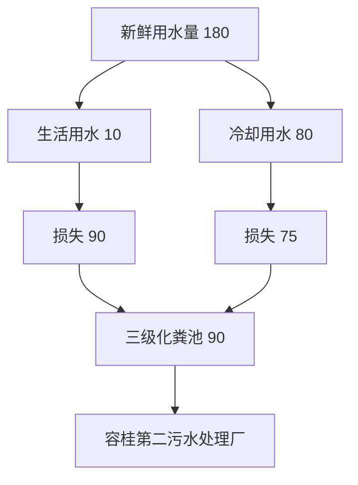
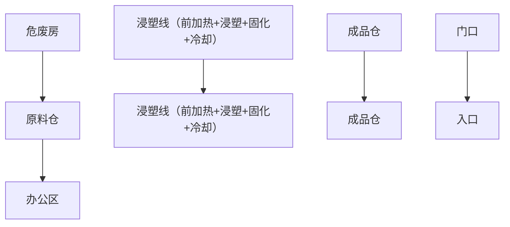

# 建设项目环境影响报告表

# （污染影响类）

项目名称：佛山市顺德区艺百通金制品有限公司新建项目建设单位（盖章）：佛山市顺德区百通五金制品有限公司编制日期： 2023年年

text_image

市南德区汇绿环保服务有限公司
生态环境部制

中华人民共和国生态

编制单位和编制人员情况表

<table><tr><td>项目编号</td><td>y80177</td></tr><tr><td>建设项目名称</td><td>佛山市顺德区艺百通五金制品有限公司新建项目</td></tr><tr><td>建设项目类别</td><td>30-066结构性金属制品制造;金属工具制造;集装箱及金属包装容器制造;金属丝绳及其制品制造;建筑、安全用金属制品制造;搪瓷制品制造;金属制日用品制造</td></tr><tr><td>环境影响评价文件类型</td><td>报告表</td></tr><tr><td colspan="2">一、建设单位情况</td></tr><tr><td>单位名称(盖章)</td><td>佛山市顺德区艺百通五金制品有限公司</td></tr><tr><td>统一社会信用代码</td><td rowspan="4"></td></tr><tr><td>法定代表人(签章)</td></tr><tr><td>主要负责人(签字)</td></tr><tr><td>直接负责的主管人员(签字)</td></tr><tr><td colspan="2">二、编制单位情况</td></tr><tr><td>单位名称(盖章)</td><td>佛山市顺德区汇绩环保服务有限公司</td></tr><tr><td>统一社会信用代码</td><td>91440606MA7K6YQY78</td></tr><tr><td colspan="2">三、编制人员情况</td></tr><tr><td colspan="2">1.编制主持人</td></tr><tr><td colspan="2"></td></tr></table>

# 一、建设项目基本情况

<table><tr><td>建设项目名称</td><td colspan="4">佛山市顺德区艺百通五金制品有限公司新建项目</td></tr><tr><td>项目代码</td><td colspan="4">无</td></tr><tr><td>建设单位联系人</td><td></td><td></td><td colspan="2"></td></tr><tr><td>建设地点</td><td colspan="4">佛山市顺德区容桂街道扁滘社区新有路18号万僖智造园区1栋6楼606</td></tr><tr><td>地理坐标</td><td colspan="4">(113度18分50.8928秒,22度45分16.4636秒)</td></tr><tr><td>国民经济行业类别</td><td>C3351建筑、家具用金属配件制造</td><td>建设项目行业类别</td><td colspan="2">“三十、金属制品业33”中“66建筑、安全用金属制品制造335”中的“其他(仅分割、焊接、组装的除外;年用非溶剂型低VOCs含量涂料10吨以下的除外)”</td></tr><tr><td>建设性质</td><td>√新建(迁建)□改建□扩建□技术改造</td><td>建设项目申报情形</td><td colspan="2">√首次申报项目□不予批准后再次申报项目□超五年重新审核项目□重大变动重新报批项目</td></tr><tr><td>项目审批(核准/备案)部门(选填)</td><td>——</td><td>项目审批(核准/备案)文号(选填)</td><td colspan="2">——</td></tr><tr><td>总投资(万元)</td><td>100</td><td>环保投资(万元)</td><td colspan="2">10</td></tr><tr><td>环保投资占比(%)</td><td>10</td><td>施工工期</td><td colspan="2">1个月</td></tr><tr><td>是否开工建设</td><td>√否□是:____</td><td>用地(用海)面积(m2)</td><td colspan="2">956.35(建筑面积)</td></tr><tr><td>专项评价设置情况</td><td colspan="4">无</td></tr><tr><td>规划情况</td><td colspan="4">审查文件名称:《佛山市顺德区容桂华口扁滘片(SD-B-05-02、SD-B-05-03编制单元)控制性详细规划》SD-B-05-03-01、SD-B-05-03-02、SD-B-05-03-03、SD-B-05-03-04街坊局部调整批后公布审查机关:佛山市人民政府批复文号:佛府办函〔2021〕32号</td></tr><tr><td>规划环境影响评价情况</td><td colspan="4">无</td></tr><tr><td>规划及规划环境影响评价符合性分析</td><td colspan="4">根据《佛山市顺德区容桂华口扁滘片(SD-B-05-02、SD-B-05-03编制单元)控制性详细规划》SD-B-05-03-01、SD-B-05-03-02、SD-B-05-03-03、SD-B-05-03-04街坊局部调整批后公布(附图8)可知,该场址用地性质为工业用地。因此,本项目建设符合规划。</td></tr><tr><td rowspan="4">其他符合性分析</td><td colspan="4">1、与产业政策符合性分析本项目属于“C3351建筑、家具用金属配件制造”行业,主要从事生产五金配件。根据国家发展改革委商务部关于印发《市场准入负面清单(2022年版)》的通知(发改体改规(2022)397号),项目不属于上述目录所列的鼓励类、限制类、禁止(淘汰)类严控类项目,也不属于《市场准入负面清单(2022年版)》所列的禁止准入及需许可准入事项。根据《促进产业结构调整暂行规定》(国发(2005)40号)第十三条,项目符合国家有关法律、法规和政策规定,项目属于允许类。根据《产业结构调整指导目录》(2021年修订)》(中华人民共和国国家发展和改革委员会令第49号),项目属于允许类。因此,本项目的建设符合国家和地方的相关产业政策。2、与《环境保护综合名录(2021年版)》的相符性分析:本项目主要经营五金配件生产,生产的产品及使用的原辅材料均不属于《环境保护综合名录(2021年版)》中“高污染、高环境风险”产品名录,符合要求。3、与《广东省人民政府关于印发广东省“三线一单”生态环境分区管控方案的通知》(粤府(2020)71号)相符性分析根据《广东省人民政府关于印发广东省“三线一单”生态环境分区管控方案的通知》(粤府(2020)71号)的要求,本项目与所在区域的生态保护红线、环境质量底线、资源利用上线和生态环境准入清单(“三线一单”)进行对照分析,见下表:表1“三线一单”相符性</td></tr><tr><td>管控要求</td><td>与本项目有关的相关要求(摘录)</td><td>相符性分析</td><td>符合性</td></tr><tr><td>区域布局管控</td><td>禁止新建、扩建水泥、平板玻璃、化学制浆、生皮制革以及国家规划外的钢铁、原油加工等项目。推广应用低挥发性有机物原辅材料,严格限制新建生产和使用高挥发性有机物原辅材料的项目,鼓励建设挥发性有机物共性工厂</td><td>项目不属于水泥、平板玻璃、化学制浆、生皮制革、钢铁、原油加工等行业。项目使用的原辅材料不属于高挥发性原料。</td><td>符合</td></tr><tr><td>能源资源利用</td><td>科学实施能源消费总量和强度“双控”,新建高能耗项目单位产品(产值)能耗达到国际国内先进水平,实现煤炭消费总量负增长。推进工业节水减排,重点在高耗水行业开展节水改造,提高工业用水效率。加强江河湖库水量调度,保障生态流量。盘活存量建设用地,控制新增建设用地规模。</td><td>项目所属建筑、家具用金属配件制造业,不属于高能耗行业,项目全部生产设备使用电能,生产用水由市政供水,不直接取用江河湖库或地下水水量,不会对项目所在地生态流量造成影响,符合能源利用要求。项目租赁现有厂房,已控制建设用地规模。</td><td>符合</td></tr></table>

<table><tr><td>污染物排放管控</td><td>重点水污染物未达到环境质量改善目标的区域内,新建、改建、扩建项目实施减量替代。大力推进固体废物源头减量化、资源化利用和无害化处置,稳步推进“无废城市”试点建设。</td><td>项目属于新建项目,项目生活污水经三级化粪池预处理达标后汇入市政污水管网排入容桂第二污水处理厂处理,尾水排入鸡鸦水道;容桂第二污水处理厂尾水达到《城镇污水处理厂污染物排放标准(GB18918-2002)一级A标准及广东省地方标准《水污染物排放限值》(DB44/26-2001)第二时段一级标准的较严值,排入鸡鸦水道。项目经营过程产生的固体废弃物分类收集,一般包装废弃物由物资回收公司回收,危险废物交有危废资质单位进行处理。固体废质单位物分类减量化、资源化利用和无害化处置。</td><td>符合</td></tr><tr><td>环境风险管控</td><td>加强惠州大亚湾石化区、广州石化、珠海高栏港、珠西新材料集聚区等石化、化工重点园区环境风险防控,建立完善污染源在线监控系统,开展有毒有害气体监测,落实环境风险应急预案。提升危险废物监管能力,利用信息化手段,推进全过程跟踪管理。</td><td>项目所在地不属于石化、化工重点园区环境风险防控区域。项目产生的危险废物将定期委托有资质的处置公司进行收集处理,并通过信息系统登记转移计划和电子转移联单,符合危险废物全过程跟踪管理的防控要求。</td><td>符合</td></tr></table>

# 4、与《佛山市人民政府关于印发佛山市“三线一单”生态环境分区管控方案的通知》

# （佛府〔2021〕11 号）相符性分析

根据《佛山市人民政府关于印发佛山市“三线一单”生态环境分区管控方案的通知》（佛府〔2021〕11 号）发布的佛山市环境管控单元图，详见附图 3，项目所在为珠三角核心区的重点管控单元。环境管控单元编号为 ZH44060620001，单元名称为容桂街道重点管控区。

表 2“三线一单”相符性

<table><tr><td>管控要求</td><td>与本项目有关的相关要求(摘录)</td><td>相符性分析</td><td>符合性</td></tr><tr><td>区域布局管控</td><td>禁止新建、扩建水泥、平板玻璃、化学制浆、生皮制革以及国家规划外的钢铁、原油加工等项目。专业电镀、印染等项目进入定点园区集中管理。推广应用低挥发性有机物原辅材料,严格限制新建生产和使用高挥发性有机物原辅材料的项目,鼓励建设共性工厂、活性炭集中再生中心等挥发性有机物第三方治理项目,推动挥发性有机物集中高效处理</td><td>项目不属于水泥、平板玻璃、化学制浆、生皮制革、钢铁、原油加工等行业。项目使用的原辅材料不属于高挥发性原料。</td><td>符合</td></tr></table>

<table><tr><td rowspan="3"></td><td>能源资源利用</td><td>科学实施能源消费总量和强度“双控”,新建高能耗项目单位产品(产值)能耗达到国际国内先进水平,实现煤炭消费总量负增长。贯彻落实“节水优先”方针,实行最严格水资源管理制度,提高工业用水效率,加强江河湖库水量调度,保障生态流量。强化自然岸线保护,优化岸线开发利用格局,严格水域岸线用途管制,新建项目一律不得违规占用水域。</td><td>项目所属建筑、家具用金属配件制造业,不属于高能耗行业,项目全部生产设备使用电能,项目用水由市政供水,不直接取用江河湖库或地下水水量,不会对项目所在地生态流量造成影响,符合能源利用要求。</td><td>符合</td></tr><tr><td>污染物排放管控</td><td>上年度重点河涌水质未达到水环境质量目标的管控分区所在镇(街道),须组织编制、系统实施、向社会公开区域重点水污染物减排计划并明确“替代量”,本年度新建、改建、扩建项目新增水环境重点污染物实行区域“减二一”替代(废水集中处理设施、民生项目除外)。推进挥发性有机物源头替代,全面加强无组织排放控制,深入实施精细化治理。推进石化化工溶剂使用及挥发性有机液体储运销的挥发性有机物减排,全过程实施反应活性物质、有毒有害物质、恶臭物质的协同控制。将全面使用低VOCs含量原辅材料的企业纳入正面清单和政府绿色采购清单。开展“无废城市”建设,推动固体废物源头减量、资源化利用和安全处置。</td><td>项目属于新建项目,项目生活污水经三级化粪池预处理达标后汇入市政污水管网排入容桂第二污水处理厂处理,尾水排入鸡鸦水道;容桂第二污水处理厂尾水达到《城镇污水处理厂污染物排放标准(GB18918-2002)一级A标准及广东省地方标准《水污染物排放限值》(DB44/26-2001)第二时段一级标准的较严值,排入鸡鸦水道。项目属于建筑、家具用金属配件制造业,项目使用的原辅材料不属于高挥发性原料。项目经营过程产生的固体废弃物分类收集,一般包装废弃物由物资回收公司回收,危险废物交有危废资质单位进行处理。固体废质单位物分类减量化、资源化利用和无害化处置。</td><td>符合</td></tr><tr><td>环境风险管控</td><td>强化地表水、地下水和土壤污染风险协同防控,建立完善突发环境事件应急管理体系。重点加强环境风险分级分类管理,应用全省环境风险源在线监控预警系统,强化化工企业、涉重金属行业、工业园区等重点环境风险源的环境风险防控。提升危险废物监管能力,利用信息化手段,推动全过程跟踪管理。健全危险废物收集体系,推进危险废物利用处置能力优化提升。全力避免因各类安全事故(事件)引发的次生环境风险事故(事件)。</td><td>项目所在地不属于石化、化工重点园区环境风险防控区域。项目产生的危险废物将定期委托有危废资质单位进行收集处理,并通过信息系统登记转移计划和电子转移联单。</td><td>符合</td></tr><tr><td colspan="5">综上所述,本项目符合《佛山市人民政府关于印发佛山市“三线一单”生态环境分区管控方案的通知》(佛府〔2021〕11号)的要求。5、与《佛山市顺德区人民政府关于印发佛山市顺德区“三线一单”生态环境分区管控方</td></tr></table>

# 案的通知》（顺府发[2021]11号）相符性分析

本项目所在区域属于容桂街道重点管控区，编号：ZH44060620001。根据项目生产产品、原材料、工艺等分析，本项目不属于单元“区域布局管控”中生态/禁止类、产业/限制类、水/限制类等。项目生活污水、雨水分类收集，生活污水经三级化粪池预处理后排至容桂第二污水处理厂，满足水/综合类管控要求。本项目对照分析《佛山市顺德区人民政府关于印发佛山市顺德区“三线一单”生态环境分区管控方案的通知》（顺府发〔2021〕11 号）的相符性，详见表 4，所在环境管控单元见附图 9，符合佛山市顺德区“三线一单”要求。

综上所述，本项目与《佛山市顺德区人民政府关于印发佛山市顺德区“三线一单”生态环境分区管控方案的通知》（顺府发[2021]11号）是相符的。

# 6、挥发性有机物（VOCs）排放符合性分析

表 3 项目与挥发性有机物（VOCs）排放规定相符性分析

<table><tr><td>序号</td><td>政策要求</td><td>工程内容</td><td>符合性</td></tr><tr><td colspan="4">1.佛山市生态环境局顺德分局关于做好重点行业建设项目挥发性有机物总量指标管理工作的通知》(佛顺环函[2019]56号)</td></tr><tr><td>1.1</td><td>涉VOCs排放项目,实现本行政区域内污染源“点对点”2倍量削减替代,由项目所在镇街分局出具VOCs总量指标来源及替代削减方案的意见,开展总量替代。</td><td>项目VOCs排放总量指标(VOCs:0.036t/a)由容桂街道出具VOCs总量指标来源及替代削减方案的意见。</td><td>符合</td></tr><tr><td colspan="4">2.《广东省人民政府办公厅关于印发广东省2021年大气、水、土壤污染防治工作方案的通知》(粤办函〔2021〕58号)</td></tr><tr><td>2.1</td><td>严格落实国家产品VOCs含量限值标准要求,除现阶段确无法实施替代的工序外,禁止新建生产和使用高VOCs含量原辅材料项目。鼓励在生产和流通消费环节推广使用低VOCs含量原辅材料。</td><td>项目使用的原辅料均为不属于高VOCs含量原辅材料。</td><td>符合</td></tr><tr><td colspan="4">3.《关于印发《广东省涉挥发性有机物(VOCs)重点行业治理指引》的通知》(粤环办〔2021〕43号)</td></tr><tr><td>3.1</td><td>VOCs物料储存:油漆、稀释剂、清洗剂等含VOCs物料应储存于密闭的容器、包装袋、储罐、储库、料仓中。油漆、稀释剂、清洗剂等盛装VOCs物料的容器存放于室内,或存放于设置有雨棚、遮阳和防渗设施的专用场地。盛装VOCs物料的容器在非取用状态时应加盖、封口,保持密闭</td><td>盛装VOCs物料的容器或包装袋应存放于室内;盛装VOCs物料的容器在非取用状态时加盖、封口,保持密闭;</td><td>符合</td></tr><tr><td>3.2</td><td>VOCs物料转移和输送:油漆、稀释剂、清洗剂等液体VOCs物料应采用管道密闭输送。采用非管道输送方式转移液态VOCs物料时,应采用密闭容器或罐车。</td><td>项目原料转移过程中均为密闭输送。</td><td>符合</td></tr></table>

<table><tr><td rowspan="7"></td><td>3.3</td><td>工艺过程:调配、电泳、电泳烘干、喷涂(低、中、面、清)、喷涂烘干、修补漆、修补漆烘干等使用VOCs质量占比大于等于10%物料的工艺过程应采用密闭设备或在密闭空间内操作,废气应排至VOCs废气收集处理系统;无法密闭的,应采取局部气体收集措施,废气排至VOCs废气收集处理系统</td><td>项目废气经集气措施收集后通过活性炭吸附后引至32m排气筒排放。</td><td>符合</td></tr><tr><td>3.4</td><td>废气收集:废气收集系统的输送管道应密闭。废气收集系统应在负压下运行,若处于正压状态,应对管道组件的密封点进行泄漏检测,泄漏检测值不应超过500μmol/mol,亦不应有感官可察觉泄漏。</td><td>项目废气收集系统的输送管均密闭,废气收集系统在负压下运行。</td><td>符合</td></tr><tr><td>3.5</td><td>废气收集:采用外部集气罩的,距集气罩开口面最远处的VOCs无组织排放位置,控制风速不低于0.3m/s。</td><td>项目集气罩置于废气产生点的合理位置,保证罩口截面风速大于0.3m/s。</td><td>符合</td></tr><tr><td>3.6</td><td>废气收集:废气收集系统应与生产工艺设备同步运行。废气处理系统发生故障或检修时,对应的生产工艺设备应停止运行,待检修完毕后同步投入使用;生产工艺设备不能停止运行或不能及时停止运行的,应设置废气应急处理设施或采取其他代替措施。</td><td>项目废气系统与生产工艺设备同步运行。发生故障或检修时,对应的生产工艺设备应停止运行,待检修完毕后同步投入使用。</td><td>符合</td></tr><tr><td>3.7</td><td>排放水平:其他表面涂装行业:a)2002年1月1日前的建设项目排放的工艺有机废气排放浓度执行《大气污染物排放限值》(DB4427-2001)第一时段限值;2002年1月1日起的建设项目排放的有机废气排放浓度执行《大气污染物排放限值》(DB4427-2001)第二时段限值;车间或生产设施排气中NMHC初始排放速率≥3kg/h时,建设VOCs处理设施且处理效率≥80%;b)厂区内无组织排放监控点NMHC的小时平均浓度值不超过6mg/m3,任意一次浓度值不超过20mg/m3。</td><td>项目生产过程有机废气达到《固定污染源挥发性有机物综合排放标准》(DB44/2367-2022)相关标准限值;有机废气厂区内无组织排放满足平均浓度值不超过6mg/m3,任意一次浓度值不超过20mg/m3。</td><td>符合</td></tr><tr><td>3.8</td><td>管理台账:建立含VOCs原辅材料台账,记录含VOCs原辅材料的名称及其VOCs含量、采购量、使用量、库存量、含VOCs原辅材料回收方式及回收量。</td><td>建立台账,记录含VOCs原辅材料和含VOCs产品的名称、使用量、回收量、废弃量、去向以及VOCs含量等信息,台账保存期限不少于3年;盛装过VOCs物料的废包装容器应加盖密闭。</td><td>符合</td></tr><tr><td>3.93.10</td><td>管理台账:建立废气收集处理设施台账,记录废气处理设施进出口的监测数据(废气量、浓度、温度、含氧量等)、废气收集与处理设施关键参数、废气处理设施相关耗材(吸收剂、吸附剂、催化剂等)购买和处理记录。管理台账:建立危废台账,整理危废处置合同、转移联单及危废处理方式资质佐证材料。</td><td>项目建立废气收集处理设施台账,根据《排污单位自行监测技术指南总则》(HJ819-2017)等相关要求定期自行监测,并且记录相关监测数据项目建立危险废物台账,定期将废机油、废活性炭等危险废物交给有资质的单位处理,整理危废处理合同、转移联单等资料。</td><td>符合</td></tr><tr><td rowspan="9"></td><td>3.7</td><td>管理台账:台账保存期限不少于3年</td><td>台账保存期限不少于3年</td><td>符合</td></tr><tr><td colspan="4">4.《固定污染源挥发性有机物综合排放标准》(DB44/2367-2022)</td></tr><tr><td>4.1</td><td>VOCs物料储存无组织排放控制要求</td><td rowspan="3">项目含VOCs物料主要为浸塑粉,原料常温下不挥发,储存在仓库内,工艺生产过程产生的有机废气通过设置集气措施并采用活性炭吸附处理后高空排放,减少无组织排放。</td><td>符合</td></tr><tr><td>4.2</td><td>VOCs物料转移和输送无组织排放控制要求</td><td>符合</td></tr><tr><td>4.3</td><td>工艺过程VOCs无组织排放控制要求</td><td>符合</td></tr><tr><td colspan="4">5.关于印发《重点行业挥发性有机物综合治理方案》的通知(环大气[2019]53号)</td></tr><tr><td>5.1</td><td>通过使用水性、粉末、高固体分、无溶剂、辐射固化等低VOCs含量的涂料,水性、辐射固化、植物等低VOCs含量的油墨,水基、热熔、无溶剂、辐射固化、改性、生物降解等低VOCs含量的胶粘剂,以及低VOCs含量、低反应活性的清洗剂等,替代溶剂型涂料、油墨、胶粘剂、清洗剂等,从源头减少VOCs产生。</td><td>本项目使用的原材料为低挥发原料,满足相关标准要求。</td><td>符合</td></tr><tr><td>5.2</td><td>重点对含VOCs物料(包括含VOCs原辅材料、含VOCs产品、含VOCs废料以及有机聚合物材料等)储存、转移和输送、设备与管线组件泄漏、敞开液面逸散以及工艺过程等五类排放源实施管控,通过采取设备与场所密闭、工艺改进、废气有效收集等措施,削减VOCs无组织排放。</td><td>项目废气已设置集气措施收集。集气罩置于废气产生点的合理位置,保证罩口截面风速大于0.3m/s。</td><td>符合</td></tr><tr><td>5.3</td><td>提高废气收集率,遵循“应收尽收、分质收集”的原则,科学设计废气收集系统,将无组织排放转变为有组织排放进行控制。采用全密闭集气罩或密闭空间的,除行业有特殊要求外,应保持微负压状态,并根据相关规范合理设置通风量。采用局部集气罩的,距集气罩开口面最远处的VOCs无组织排放位置,控制风速应不低于0.3米/秒,有行业要求的按相关规定执行。</td><td>项目废气已设置集气措施收集。集气罩置于废气产生点的合理位置,保证罩口截面风速大于0.7m/s。</td><td>符合</td></tr></table>

表 4 本项目与佛山市顺德区“三线一单”生态环境分区管控方案相符性分析

<table><tr><td>管控维度</td><td>管控要求</td><td>本项目情况</td><td>符合性</td></tr><tr><td>区域布局管控</td><td>1-1.【产业/鼓励引导类】重点发展芯片、智能家电、高端装备制造、高端新型电子信息、新材料、生命健康等制造业和金融、科技服务、高端商贸等现代服务业,建设科技研发、创新创业基地、上市企业总部聚集区、企业品牌总部基地。1-2.【产业/综合类】系统推进村级工业园升级改造,腾出连片空间,布局产业集聚区和主题产业园,推动工业项目入园集聚发展。新增工业制造业用地原则上安排在产业集聚区内,产业集聚区外原则上不鼓励工业及物流仓储用地的新建与改造。1-3.【产业/综合类】产业聚集区所属地块内的工业用地或企业与村庄、学校等环境敏感点之间应设置合理的大气环境防护距离,并通过绿化带进行有效隔离;聚集区规划布局应注重大气污染排放企业应尽量避免布局在居住用地的常年主导风向的上风向。1-4.【产业/限制类】受纳水体或监控断面不达标的,不得新建、扩建向河涌直接排放废水的项目。新建、扩建含蚀刻工序的线路板生产项目和化工项目应在配套污水集中处置的工业园区或生活污水管网覆盖区域内建设;纯加工型印花项目,含酸洗、磷化的金属表面处理、金属制品项目(与自身高新技术企业配套的除外),含酸洗、喷涂、化学抛光、电解等涉及废水排放工艺的不锈钢型材加工项目(与自身高新技术企业配套的除外),应进入以此类项目为主导产业、有相应废水集中治理设施的工业园区,实现集中治污。1-5.【产业/综合类】划定家具生产优先发展区域,优先发展区外不再新建涉及涂装工艺的木质家具制造项目。1-6.【大气/限制类】大气环境受体敏感重点管控区内,应严格限制新建储油库项目、产生和排放有毒有害大气污染物的建设项目以及使用溶剂型油墨、涂料、清洗剂、胶黏剂等高挥发性有机物原辅材料项目,鼓励现有该类项目搬迁退出。1-7.【大气/鼓励引导类】大气环境高排放重点管控区内,应强化达标监管,引导工业项目落地集聚发展,有序推进区域内行业企业提标改造。1-8.【土壤/禁止类】禁止新建、扩建增加重点防控的重金属污染物排放的建设项目。</td><td>1-1.本项目不涉及。1-2.项目所在地位于工业园区,符合工业用地规划要求,不属于新建工业及物流仓储用地。1-3.项目与环境敏感点已设置合理的大气环境防护距离。1-4.根据《2022年度佛山市顺德区环境质量状况公报》的评价结果,鸡鸦水道水质满足《地表水环境质量标准》(GB3838-2002)之II类水功能要求,水质较好。项目生活污水经三级化粪预处理达标后排放至容桂第二污水处理厂,尾水排至鸡鸦水道。项目属于C3351建筑、家具用金属配件制造,不涉及使用不锈钢原材料,不属于线路板生产项目和化工项目,不属于含酸洗、喷涂、拉丝、表面抛光等工艺的不锈钢型材加工项目。1-5.项目主要从事建筑、家具用金属配件制造,不属于木质家具制造项目。1-6.项目主要从事建筑、家具用金属配件制造,不属于新建使用溶剂型涂料、清洗剂等高挥发性有机物原辅材料项目。1-7.项目主要从事建筑、家具用金属配件制造,废气经集气措施收集后通过活性炭吸附后引至32m排气筒排放。公司加强废气处理设施的管理,定期进行监测,必要时根据环境监管部门要求安装自动监测设备,确保废气达标排放。1-8.项目主要从事建筑、家具用金属配件制造,不属于重金属污染物排放的建设项目。</td><td>符合</td></tr><tr><td>能源资源利用</td><td>2-1【能源/鼓励引导类】推广节能技术,加快发展绿色货运与现代物流。2-2【能源/鼓励引导类】推广新能源汽车应用和充电基础设施建设,积极推动重卡LNG加气站、充电基础设施、加氢站建设。2-3.【能源/综合类】科学实施能源消费总量和强度“双控”,新建高能耗项目单位产品(产值)能耗达到国际国内先进水平。2-4.【水资源/综合类】贯彻落实“节水优先”方针,实行最严格水资源管理制度,容桂街道万元国内生产总值用水量、万元工业增加值用水量、用水总量、农田灌溉水有效利用系数等用水总量和效率指标达到区下达要求。2-5.【土地资源/限制类】落实单位土地面积投资强度、土地利用强度等建设用地控制性指标要求,提高土地利用效率。2-6.【岸线/禁止类】严格水域岸线用途管制,新建项目一律不得违规占用水域。严禁破坏生态的岸线利用行为和不符合其功能定位的开发建设活动,严禁以各种名义侵占河道、围垦湖泊、非法采砂等。</td><td>2-1.项目推广节能技术,加快发展绿色货运与现代物流。2-2.项目不属于新能源汽车应用和充电基础设施、加氢站建设。2-3.项目科学实施能源消费总量和强度“双控”,不属于新建高能耗项目,单位产品(产值)能耗达到国际国内先进水平。2-4.项目严格贯彻落实“节水优先”方针,实行最严格水资源管理制度,容桂街道万元国内生产总值用水量、万元工业增加值用水量、用水总量、农田灌溉水有效利用系数等用水总量和效率指标达到区下达要求。2-5.项目单位土地面积投资强度、土地利用强度等建设用地控制性指标均满足相关标准要求,土地利用效率较高。2-6.项目属于租用工业厂房新建项目,不占用水域,不会破坏生态的岸线利用和做不符合其功能定位的开发建设活动,不侵占河道、围垦湖泊、非法采砂等</td><td>符合</td></tr><tr><td>污染物排放管控</td><td>3-1.【水/限制类】城镇新区建设实行雨污分流,逐步推进初期雨水收集、处理和资源化利用。住宅、商业体、学校、市场等城镇开发建设项目应当配套或者同步计划建设公共排水设施,公共排水设施或自建排污水设施未能投产运行的,以上涉水项目不得投入使用。新建小区严格实施雨污分流,阳台、露台等污水接入污水收集系统,将生活污水“应截尽截”。做好大型楼盘、集贸市场、餐饮以及学校等4大类排水户污水接入市政管网工作。3-2.【水/综合类】容桂街道重点河涌水质上年度未达到水环境环境质量目标的,需组织编制、系统实施、向社会公开区域重点水污染物减排计划并明确“替代量”,本年度新建、改建、扩建项目新增水环境重点污染物实行区域“减二增一”替代(工业、生活或综合集中废水处理设施、民生项目除外)。3-3.【水/综合类】区域内应合理规划建设工业或综合集中废水处理设施。逐步推进工业集聚区“污水零直排区”建设,开展排水单元工业废水、生活污水、雨水分类收集、分质处理,确保园区“管网全覆盖、雨污全分流、污水全收集、处理全达标”。3-4.【水/综合类】结合村级工业园改造,全面提升产业层次与集聚度,促进污染集中整治。3-5.【水/综合类】稳步推进排水设施“三个一体化”管理模式,补齐城乡污水收集和处理短板,推动容桂第一、第二污水处理厂提质增效,加快消除城中村、老旧城区、城乡结合部等污水收集管网空白区,逐步实现城乡污水收集处理全覆盖。360年前完成容桂第一、第二污水处理厂扩建,尾水应执行《城镇污水处理厂污染物排放标准》(GB18918-2002)一级A标准及《广东省水污染物排放限值》(DB44/26-2001)的较严值。3-6.【水/综合类】近期保留马东、马南两处污水处理站,到2030年将马冈村居污水接入市政污水管网,纳入杏坛城镇污水处理系统;其余行政村(社区)污水均通过市政管网和农村支管纳入容桂城镇污水处理处理系统。3-7.【水/综合类】产业集聚区和主题园区内做好污水管网和污水集中处理设施的配套保障,确保废水收集到城镇污水处理厂、园区污水处理厂或分散式污水处理设施集中处置。3-8.【大气/综合类】大力推进低VOCs含量原辅材料替代,加快涉VOCs重点行业的生产工艺升级改造,推行自动化生产工艺,对达不到要求的VOCs收集及治理设施进行整治提升,逐步淘汰低效VOCs治理设施。3-9.【土壤/限制类】作为重金属污染重点防控区,区域内重点重金属排放总量只减不增。</td><td>3-1.项目不属于城镇新区建设。3-2.项目生活污水经三级化粪预处理达标后排放至容桂第二污水处理厂,尾水排至鸡鸦水道,鸡鸦水道水质2022年达到水环境质量目标,无需实施本年度改建、扩建项目新增水环境重点污染物区域“减二增一”替代。3-3.项目生活污水经三级化粪预处理达标后排放至容桂第二污水处理厂,尾水排至鸡鸦水道。3-4.项目所在地产业层次与集聚度较高,污染集中整治。3-5.项目位于容桂第二污水处理厂处理范围,尾水执行《城镇污水处理厂污染物排放标准》(GB18918-2002)一级A标准及《广东省水污染物排放限值》(DB44/26-2001)的较严值。3-6.项目位于容桂第二污水处理厂处理范围。3-7.项目所在地已经实施雨污分流,污水纳入容桂街道污水处理系统。3-8.项目使用的原辅材料属于低VOCs原辅材料。3-9.项目不属于重金属污染物排放的建设项目。</td><td>符合</td></tr><tr><td>环境风险防控</td><td>4-1【水/综合类】容桂第一、第二污水处理厂、工业污水集中处理设施应采取有效措施,防止事故废水直接排入水体。完善污水处理厂在线监控系统联网,实现污水处理厂的实时、动态监管。4-2【风险/综合类】加强环境风险分级分类管理,强化金属制品、有色金属和压延加工、化学原料和化学品制造业等涉重金属、化工行业企业及工业园区等重点环境风险源的环境风险防控。</td><td>4-1.项目所在地位于容桂第二污水处理厂纳污范围,污水处理厂已在线监控系统联网,实现污水处理厂的实时、动态监管。4-2.项目不属于金属制品、有色金属和压延加工、化学原料和化学品制造业等涉重金属、化工行业企业及工业园区等重点环境风险源,项目不排放重金属。</td><td>符合</td></tr></table>

# 二、建设项目工程分析

# 1. 项目组成

佛山市顺德区艺百通五金制品有限公司新建项目（下称“本项目”）拟选址于佛山市顺德区容桂街道扁滘社区新有路 18号万僖智造园区 1 栋 6 楼 606（地理位置详见附图 1），中心地理坐标为北纬：22°45′16.4636″，东经：113°18′50.8928″，项目主要从事五金配件的生产，年产五金配件 500 吨。

表 5 项目建设内容一览表

<table><tr><td>类别</td><td>工程名称</td><td>面积及内容</td><td colspan="2">备注</td></tr><tr><td colspan="2">占地面积</td><td> $956.35m^{2}$ </td><td rowspan="2" colspan="2">项目所在厂房位于一栋6层建筑物,首层高度为6m,其余楼层高5m,楼层总高31m;项目位于六层。</td></tr><tr><td colspan="2">建筑面积</td><td> $956.35m^{2}$ </td></tr><tr><td>主体工程</td><td>生产车间</td><td> $300m^{2}$ </td><td>用于浸塑工序</td><td>六层</td></tr><tr><td>储运工程</td><td>仓库</td><td> $400m^{2}$ </td><td colspan="2">用于原辅材料、成品的贮存</td></tr><tr><td rowspan="3">辅助工程</td><td>通道</td><td> $151.35m^{2}$ </td><td colspan="2">用于物料运输及人行通道</td></tr><tr><td>卫生间</td><td> $20m^{2}$ </td><td colspan="2">/</td></tr><tr><td>办公室</td><td> $70m^{2}$ </td><td colspan="2">用于员工办公</td></tr><tr><td>依托工程</td><td>生活污水治理</td><td>生活污水经三级化粪池处理后排入容桂第二污水处理厂,尾水排入鸡鸦水道</td><td colspan="2">依托所在厂房已有设施</td></tr><tr><td rowspan="4">公用工程</td><td>供电</td><td>由市政供电系统提供</td><td colspan="2">依托所在厂房已有设施</td></tr><tr><td>供气</td><td>管道运输天然气</td><td colspan="2">依托所在厂房已有设施</td></tr><tr><td>供水</td><td>由市政自来水供给</td><td colspan="2">依托所在厂房已有设施</td></tr><tr><td>排水</td><td>生活污水经三级化粪池处理后排入容桂第二污水处理厂,尾水排入鸡鸦水道</td><td colspan="2">依托所在厂房已有排水系统</td></tr><tr><td rowspan="6">环保工程</td><td>生活污水治理</td><td colspan="3">生活污水经三级化粪池处理后排入容桂第二污水处理厂,尾水排入鸡鸦水道</td></tr><tr><td>噪声治理</td><td colspan="3">选用低噪声设备,并采取减振、隔声、消声、降噪措施</td></tr><tr><td>废气处理</td><td colspan="3">建设单位在浸塑区和烘干区上方设置集气罩收集废气,集气罩外围安装软帘形成局部围闭,加强收集效率。有机废气废气经集气措施收集后通过活性炭吸附装置处理后与燃烧废气一并引至32m排气筒排放</td></tr><tr><td>固体废物治理</td><td colspan="3">生活垃圾委托环卫部门清运处理;一般工业固体废物分类收集外卖给废品回收单位回收利用;危险废物单独收集后放置于厂区危废暂存间,定期交由有资质单位外运处理</td></tr><tr><td>危险废物暂存间</td><td> $约5m^{2}$ </td><td colspan="2">位于厂房内</td></tr><tr><td>一般固废暂存间</td><td> $约10m^{2}$ </td><td colspan="2">位于厂房内</td></tr></table>

# 2. 项目产品和产能

表 6 产品产能一览表

<table><tr><td>产品名称</td><td>单位</td><td>年产量</td><td>备注</td></tr><tr><td>五金配件</td><td>万件/年</td><td>500</td><td>建筑、家用</td></tr></table>

# 3. 项目生产设备

表 7 生产设备一览表

<table><tr><td rowspan="2">主要生产单元</td><td rowspan="2">生产设施名称</td><td rowspan="2">数量</td><td rowspan="2">单位</td><td colspan="3">设施参数</td><td rowspan="2">主要工艺</td></tr><tr><td>参数名称</td><td>设计值</td><td>单位</td></tr><tr><td rowspan="6">浸塑流水线(2条)</td><td>传送驱动</td><td>2</td><td>条</td><td>尺寸</td><td>30</td><td>m</td><td>辅助</td></tr><tr><td>浸塑池</td><td>2</td><td>个</td><td>尺寸</td><td>3×1.2×1.5</td><td>m</td><td>粉末浸塑</td></tr><tr><td>浸塑池风机</td><td>2</td><td>台</td><td>功率</td><td>5.5</td><td>kW</td><td>辅助</td></tr><tr><td>前加热炉</td><td>2</td><td>台</td><td>温度</td><td>320</td><td>°C</td><td>预热、天然气</td></tr><tr><td>固化炉</td><td>2</td><td>台</td><td>温度</td><td>200</td><td>°C</td><td>固化、天然气</td></tr><tr><td>冷却池</td><td>2</td><td>个</td><td>尺寸</td><td>1.5×1.2×1.5</td><td>m</td><td>冷却</td></tr></table>

# 4. 原辅材料及能源消耗

表 8项目原辅材料及能源消耗一览表

<table><tr><td>名称</td><td>单位</td><td>数量</td><td>最大存储量</td><td>包装规格</td><td>备注</td></tr><tr><td>五金半成品件</td><td>万件/年</td><td>500</td><td>10</td><td>/</td><td>企业不进行五金毛坯件物理加工、除油脱脂等工序,项目接收的五金半成品件均为区内五金工件生产企业委托</td></tr><tr><td>浸塑粉</td><td>吨/年</td><td>30</td><td>1</td><td>25kg/袋</td><td>粉状</td></tr><tr><td>机油</td><td>吨/年</td><td>0.08</td><td>0.032</td><td>16kg/桶(18L)</td><td>液体</td></tr><tr><td>天然气</td><td>万立方米/年</td><td>38.3</td><td>管道运输</td><td>管道运输</td><td>气体</td></tr></table>

浸塑粉：由聚乙烯树脂85%，胶合剂8.3%，颜填料5%，其他助剂1.7%组成，具有无臭、无毒和耐低温的特性，化学稳定性好，能耐大多数酸碱的侵蚀（不耐具有氧化性质的酸）。常温下不溶于一般溶剂，吸水性小。参考《低挥发性有机化合物含量涂料产品技术要求》GB/T38597-2020)无溶剂涂料中VOC含量≤60g/L，本项目浸塑粉密度为1000\~2000kg/m3=1000\~2000g/L，根据《排放源统计调查产排污核算方法和系数手册-33-37，431-434机械行业系数手册14涂装喷塑后烘干，挥发性有机物的产污系数为1.2千克/吨-原料可知(即占原料的0.12%)，则本项目粉末涂料挥发系数为1.2\~2.4g/L，符合低VOCs原料要求。

机油：密度约为0.91×103kg/m3，闪点约为180℃，能对机械设备到润滑减磨、辅助冷却降温、密封防漏、防锈防蚀、减震缓冲等作用。机油由基础油和添加剂两部分组成。基础油是机油的主要成分，决定着机油的基本性质，添加剂则可弥补和改善基础油性能方面的不足，赋予某些新的性能，是机油的重要组成部分。

表 9项目原料用量核算表

<table><tr><td>参数\种类</td><td>浸塑粉</td></tr><tr><td>浸塑产品量(万件/年)</td><td>500</td></tr><tr><td>单位产品浸塑面积( $m^{2}$ )</td><td>0.01</td></tr><tr><td>单位产品浸塑厚度( $\mu m$ )</td><td>500</td></tr><tr><td>涂料密度( $kg/m^{3}$ )</td><td>1000~2000,取1500</td></tr><tr><td>附着率</td><td>80%</td></tr><tr><td>涂料用量小计(t/a)</td><td>30</td></tr></table>

表 10项目设备与产能的匹配性

<table><tr><td>生产单元</td><td>设备</td><td>数量(个)</td><td>单批次产量(件/批)</td><td>单批次生产时间(s)</td><td>全年生产批次(次)</td><td>设计产能(万件/a)</td><td>申报产能(万件/a)</td></tr><tr><td>浸塑流水线</td><td>粉体浸塑池</td><td>2</td><td>10</td><td>30</td><td>288000</td><td>576</td><td>500</td></tr><tr><td colspan="8">注:设备设计年产量较申报产能偏大主要受生产过程中设备调试、维护、维修等情况影响,用量偏差在可接受范围内</td></tr></table>

# 5. 公用配套工程

# （1）给水

本项目劳动定员 10 人，员工年工作日为 300天，员工不在厂区内食宿。根据广东省《用水定额 第三部分：生活》（DB44/T 1461.3-2021）表 A.1 中国家机构办公楼无食堂和浴室，生活用水按先进值10 m3 /（人·a）计，则项目生活用水量为 0.333m³/d（100m³/a）。

浸塑线设置 2 个冷却池，单个冷却池尺寸为 1.5×1.2×1.5m，有效容积为 2.5m3，总容积为 5m3，预计工件带走及蒸发损耗为冷却池储水量的 5%，则冷却池损耗补充水量为 5×5%=0.25t/d，75t/a。冷却池全年新鲜水用量为：5m3（初次注水）+75m3（补充新鲜水）=80t/a。

# （2）排水

冷却用水循环使用，不外排。生活污水的排放系数按 90%计，排放量为 0.3m³/d（90m³/a）。生活污水经三级化粪池处理后由市政污水管网排入容桂第二污水处理厂处理。

flowchart

图 1 水平衡图（t/a）

# （3）能源

项目年用电量为 5 万 kw•h，供电由市政电网统一供给。年用天然气 10万立方米。天然气使用管道运输。

# （4）其他

项目不设备用发电机；无其他能耗。

# 6. 劳动动员及工作制度

（1）劳动定员：本项目劳动定员为 10 人，员工不在厂内就餐和住宿。  
（2）工作制度：本项目全年工作 300 天，每天采用 8 小时单班制。

# 7. 总图布置及四至情况

佛山市顺德区艺百通五金制品有限公司新建项目位于佛山市顺德区容桂街道扁滘社区新有路 18号万僖智造园区 1 栋 6 楼 606，项目东面为空地，南面和西面为万僖智造园其他建筑，北面为新有路。

项目所在厂房位于一栋 6 层建筑物，首层高度为 6m，其余楼层高 5m，楼层总高 31m；项目位于六层，厂房内设置浸塑线、原料仓、成品仓、办公室、一般固废暂存间和危险废物暂存间，各生产区相对独立，互不干扰，每个生产区按照工艺流程布置设备，因此，项目平面布置做到了生产、办公分开，车间内布置流畅，总体来说项目平面布置紧凑有序，布局合理。项目平面布置图详见附图 2。

# 8. 环境影响经济损益分析

针对本项目情况，提出如下环保项目和投资：

表 11建设项目环保投资一览表

<table><tr><td colspan="2">污染源</td><td>主要环保措施</td><td>投资金额</td></tr><tr><td colspan="2">废水</td><td>三级化粪池</td><td>0.5万元</td></tr><tr><td colspan="2">废气</td><td>经集气措施收集后引至活性炭处理后通过32m排气筒(DA001)排放</td><td>4.5万元</td></tr><tr><td rowspan="3">固体废物</td><td>生活垃圾</td><td>垃圾桶,环卫部门处理</td><td>0.5万元</td></tr><tr><td>一般工业固废</td><td>固废临时摆放场所,定期交由具有相应处理能力的固废处理单位处理。</td><td>1万元</td></tr><tr><td>危险</td><td>由专门容器收集后暂存于危废贮存池(5m2)内,统一交由取得相应《危</td><td>1.5万元</td></tr></table>

<table><tr><td rowspan="3"></td><td></td><td>废物</td><td>险废物经营许可证》或《危险废物收集中转贮存试点备案证》的单位。</td><td></td></tr><tr><td colspan="2">噪声</td><td>采取墙体隔音、距离衰减,对高噪声设备进行机械阻尼隔振(如在底部安装减震垫座)</td><td>1万元</td></tr><tr><td colspan="3">合计</td><td>10万元</td></tr><tr><td colspan="5"></td></tr><tr><td>工艺流程和产排污环节</td><td colspan="4">1. 工艺流程图2项目工艺流程及产污环节示意图上架:人工手动将五金半成品件挂上传送系统,企业接收的五金工件均已在接收前完成前处理工序,不需要进行打磨清洗等工序;传输带日常维修会产生危废,此过程会产生废机油、废油桶、废含油抹布、噪声。预热:将挂好五金半成品件的送入前加热炉进行预加热处理(根据接收的五金工件种类及材质,加热至150°C~260°C,5~15min),根据预加热处理的温度控制涂层厚度与质量;前加热炉使用天然气燃烧加热。此过程会产生燃烧废气、噪声。浸塑:将预加热处理好的工件需浸塑部分浸入浸塑池,通过热粘附使粉末附着在工件上,同时在浸塑池底部安装风机,在风力的作用下将浸塑池底部的塑粉吹起,保证工件会均匀粘上塑粉,浸塑粉装填量为浸塑池的2/3。此过程会产生有机废气、恶臭、废包装物、噪声。固化:将粘上浸塑粉的工件送进固化炉进行固化,固化炉温度控制在170°C~200°C左右,固化时长约为6-8min。固化炉使用天然气燃烧加热。此过程会产生有机废气、恶臭、燃烧废气、噪声。冷却:取出定型的五金浸塑工件,放进冷却池水冷;工件进入冷却池中3-5s后提出,冷却后的五金浸塑工件风干后装箱暂存,定期外送回委托方。冷却水循环使用不外排,此过程会产生噪声。表12 项目产污环节</td></tr><tr><td rowspan="12"></td><td>名称</td><td>产污环节</td><td>污染源名称</td><td>主要污染物</td></tr><tr><td>废水</td><td>办公生活过程</td><td>办公生活污水</td><td> $COD$ 、氨氮、 $SS$ 、 $BOD_{5}$ </td></tr><tr><td rowspan="3">废气</td><td>投料、浸塑工序</td><td>粉尘</td><td>颗粒物</td></tr><tr><td>浸塑、固化工序</td><td>有机废气、恶臭</td><td>非甲烷总烃、臭气浓度</td></tr><tr><td>预热、固化工序</td><td>燃烧废气</td><td> $SO_{2}$ 、 $NOx$ 、烟尘</td></tr><tr><td rowspan="6">固体废物</td><td>原料使用</td><td>一般工业固体废物</td><td>废包装物</td></tr><tr><td>设备维修</td><td rowspan="4">危险废物</td><td>废机油</td></tr><tr><td>设备维修</td><td>废油桶</td></tr><tr><td>设备维修</td><td>含油废抹布</td></tr><tr><td>废气治理</td><td>废活性炭</td></tr><tr><td>办公生活过程</td><td>生活垃圾</td><td>生活垃圾</td></tr><tr><td>噪声</td><td colspan="2">浸塑池风机、固化炉等设备</td><td> $Leq(dB(A))$ </td></tr><tr><td>与项目有关的原有环境污染问题</td><td colspan="4">本项目为新建项目,租用厂房为新建厂房,故不存在与本项目有关的主要环境问题。</td></tr></table>

# 三、区域环境质量现状、环境保护目标及评价标准

# 1. 环境空气现状调查与评价

根据《关于调整顺德区环境空气质量功能区划的复函》(佛府办函〔2014〕494号)，本项目所在地区域属二类空气环境功能区，执行《环境空气质量标准》(GB3095-2012)及其修改单二级标准。

为评价本项目所在区域的环境空气质量现状，评价引用《佛山市生态环境局顺德分局关于发布 2022 年度佛山市顺德区生态环境状况公报的通知》附件《2022 年度佛山市顺德区环境质量状况公报》中的监测数据，监测项目分别为 $\mathrm { S O _ { 2 } \bullet \ N O _ { 2 } \bullet \ P M _ { 1 0 } \bullet \ P M _ { 2 . 5 \setminus \Omega } C O _ { \sqrt { 3 } } } ,$ 、臭氧，监测结果及评价见下表。

表 13 2022 年顺德区环境空气质量现状统计表

<table><tr><td>所在区域</td><td>污染物</td><td>年评价指标</td><td>现状浓度(ug/m3)</td><td>标准值(ug/m3)</td><td>占标率/%</td><td>达标情况</td></tr><tr><td rowspan="6">顺德区</td><td>SO2</td><td>年平均质量浓度</td><td>5</td><td>60</td><td>8.3</td><td>达标</td></tr><tr><td>NO2</td><td>年平均质量浓度</td><td>29</td><td>40</td><td>72.5</td><td>达标</td></tr><tr><td>PM10</td><td>年平均质量浓度</td><td>32</td><td>70</td><td>45.7</td><td>达标</td></tr><tr><td>PM2.5</td><td>年平均质量浓度</td><td>19</td><td>35</td><td>52.3</td><td>达标</td></tr><tr><td>CO</td><td>95百分位数日平均质量浓度</td><td>1100</td><td>4000</td><td>27.5</td><td>达标</td></tr><tr><td>O3</td><td>90百分位数最大8小时平均质量浓度</td><td>190</td><td>160</td><td>118.7</td><td>不达标</td></tr></table>

监测结果表明，顺德区 2022 年全区 SO2、NO2、PM10、PM2.5年平均质量浓度、CO 95 百分位数年内日平均质量浓度未超出《环境空气质量标准》（GB3095-2012）及 2018修改单二级标准，O3-8h 浓度水平超出日最大 8 小时平均二级浓度限值，则项目所在区域判定为不达标区。

# 2. 地表水环境质量现状

本项目属于容桂第二污水处理厂纳污范围，生活污水经三级化粪池预处理后排入容桂第二污水处理厂处理后尾水排入鸡鸦水道。鸡鸦水道水质执行《地表水环境质量标准》（GB3838-2002）中的Ⅱ类标准。

为评价鸡鸦水道水质，评价引用《佛山市生态环境局顺德分局关于发布 2022 年度佛山市顺德区生态环境状况公报的通知》附件《2022 年度佛山市顺德区环境质量状况公报》对鸡鸦水道细滘大桥水质情况，详见下表。

表 142022 年度佛山市顺德区环境质量状况公报（节选）

<table><tr><td rowspan="2">河流名称</td><td rowspan="2">断面</td><td colspan="2">断面定类</td><td rowspan="2">水质评价标准</td><td colspan="2">河流定类</td></tr><tr><td>2022</td><td>2021</td><td>2022</td><td>2021</td></tr></table>

<table><tr><td rowspan="6"></td><td>鸡鸦水道</td><td>细滘大桥</td><td>II</td><td>II</td><td>II</td><td>II</td><td>II</td></tr><tr><td colspan="7">根据《2022年度佛山市顺德区环境质量状况公报》可知,鸡鸦水道细滘大桥断面满足《地表水环境质量标准》(GB3838-2002)之II类水功能要求,水质优良。</td></tr><tr><td colspan="7">3.声环境质量现状根据《佛山市人民政府关于印发&lt;佛山市声环境功能区划分方案&gt;的通知》(佛府函〔2015〕72号),项目所在地属于3类声环境功能区,声环境质量执行《声环境质量标准》(GB3096-2008)中的3类标准:昼间≤65dB(A)、夜间≤55dB(A)。项目厂界外50m范围内无环境敏感目标。</td></tr><tr><td colspan="7">4.生态环境项目用地范围内无生态环境保护目标,无需开展生态现状调查。</td></tr><tr><td colspan="7">5.电磁辐射项目不涉及电磁辐射,无需开展电磁辐射现状调查。</td></tr><tr><td colspan="7">6.土壤、地下水环境现状本项目租用现有厂房作为生产场所,厂房和周边环境地面已做好水泥面硬化防渗措施,基本不会发生泄漏液下渗污染地下水或土壤的情况,因此项目不存在土壤、地下水环境污染途径,不存在地下水、土壤污染,故不开展土壤、地下水环境质量现状调查。</td></tr><tr><td rowspan="6">环境保护目标</td><td colspan="7">1.环境空气保护目标为建设区域周围空气环境质量,本项目所在地的环境空气质量标准保护级别为《环境空气质量标准》(GB3095-2012)及其修改单二级标准。根据调查,项目厂界外500米范围内的环境空气保护目标如下表所示:表15项目周围主要环境敏感点</td></tr><tr><td>名称</td><td>保护对象</td><td>保护内容</td><td colspan="2">相对厂址方位</td><td colspan="2">相对厂界距离/m</td></tr><tr><td>扁滘居民</td><td>居民</td><td>约5000人</td><td colspan="2">南面</td><td colspan="2">383</td></tr><tr><td colspan="7">2.声环境本项目厂界外50米范围内无声环境保护目标。本项目声环境保护目标为该区域的声环境质量,本项目所在区域保护级别为《声环境质量标准》(GB3096-2008)3类。</td></tr><tr><td colspan="7">3.地下水环境本项目厂界外500米范围内无地下水集中式饮用水水源和热水、矿泉水、温泉等特殊地下水资源。</td></tr><tr><td colspan="7">4.生态环境项目用地范围内无生态环境保护目标。</td></tr></table>

# 1. 水污染物排放标准

项目生活污水经三级化粪预处理后达到广东省地方标准《水污染物排放限值》（DB44/26-2001）第二时段三级标准后排入容桂第二污水处理厂，尾水排入鸡鸦水道。

根据 2013年 7 月 11日颁布的《顺德区环境运输和城市管理局关于全区城镇污水处理厂尾水排放标准执行标准的通知》规定：新、扩和改建城镇污水处理厂尾水应符合《城镇污水处理厂污染物排放标准》（GB18918-2002）一级 A 标准及广东省地方标准《水污染物排放标准》（DB44/26-2001）第二时段一级标准的较严值，具体排放限值见该文件的附件 2《新扩改和已建城镇污水处理厂尾水限值》。具体排放标准如下表。

表 16 水污染物排放标准（单位 mg/L）

<table><tr><td>污染物</td><td>BOD5</td><td>CODcr</td><td>SS</td><td>氨氮</td></tr><tr><td>项目排污口排放标准</td><td>300</td><td>500</td><td>400</td><td>--</td></tr><tr><td>容桂第二污水处理厂排放标准</td><td>10</td><td>40</td><td>10</td><td>5.0</td></tr></table>

# 2. 大气污染物排放标准

（1）项目浸塑和固化会产生有机废气和恶臭，主要污染因子为非甲烷总烃（NMHC）和臭气浓度。根据《广东省地方标准批准发布公告（《固定污染源挥发性有机物综合排放标准》强制性地方标准）》（2022 第 4 号（总第 222 号）），新建项目自 2022 年 9 月 1 日起，在国家和我省现有的大气污染物排放标准体系中，凡是无行业性大气污染物排放标准或者挥发性有机物排放标准控制的污染源，应当执行本文件。国家或我省发布的行业污染物排放标准中对 VOCs无组织排放控制未做规定的，应执行本文件中无组织排放控制要求。故本项目非甲烷总烃执行《固定污染源挥发性有机物综合排放标准》(DB44/ 2367-2022)表 1 挥发性有机物排放限值和表 4企业边界 VOCs 无组织排放限值。厂区内 VOCs 无组织排放监控点浓度执行《固定污染源挥发性有机物综合排放标准》(DB44/ 2367-2022)中表 3 厂区内 VOCs 无组织排放限值。臭气浓度执行《恶臭污染物排放标准》（GB14554-1993）表 1 二级新扩改建恶臭污染物厂界标准值及表 2恶臭污染物排放标准值。由于《固定污染源挥发性有机物综合排放标准》(DB44/ 2367-2022)未列明厂界非甲烷总烃执行标准，因此非甲烷总烃厂界无组织执行广东省地方标准《大气污染物排放限值》（DB44/27-2001）表 2 工艺废气大气污染物排放限值第二时段无组织排放监控浓度限值。

（2）使用浸塑粉投料和浸塑过程会产生粉尘，主要污染因子为颗粒物。颗粒物执行广东省地方标准《大气污染物排放限值》（DB44/27-2001）第二时段二级标准和无组织排放监控浓度限值。  
（3）燃烧废气执行广东省地方标准《锅炉大气污染物排放标准》（DB44/765-2019）表 2新建锅炉大气污染物排放浓度限值。

表 17《固定污染源挥发性有机物综合排放标准》(DB44/ 2367-2022)

<table><tr><td>污染物项目</td><td>有组织最高允许排放浓度(mg/m3)</td><td>无组织排放监测浓度限值(mg/m3)</td><td>执行标准</td></tr><tr><td>NMHC</td><td>80</td><td>/</td><td>DB44/2367-2022</td></tr><tr><td>污染物项目</td><td>特别排放限值(mg/m3)</td><td>限值含义</td><td>无组织排放监控位置</td></tr><tr><td rowspan="2">NMHC</td><td>6</td><td>监控点处1h平均浓度值</td><td rowspan="2">在厂房外设置监控点</td></tr><tr><td>20</td><td>监控点处任意一次浓度值</td></tr><tr><td colspan="2">污染物项目</td><td colspan="2">最高允许浓度限值(mg/m3)</td></tr><tr><td colspan="2">苯</td><td colspan="2">0.1</td></tr><tr><td colspan="2">甲醛</td><td colspan="2">0.1</td></tr><tr><td colspan="2">丙烯醛</td><td colspan="2">0.1</td></tr><tr><td colspan="2">丙烯腈</td><td colspan="2">0.1</td></tr><tr><td colspan="2">硝基苯类</td><td colspan="2">0.01</td></tr></table>

表 18 《恶臭污染物排放标准》（GB14554-1993）

<table><tr><td>污染物名称</td><td>污染物排放标准值</td><td>厂界标准值</td><td>执行标准</td></tr><tr><td>臭气浓度</td><td>15000(无量纲)</td><td>20(无量纲)</td><td>GB14554-93</td></tr></table>

表 19 《大气污染物排放限值》（DB44/27-2001）

<table><tr><td>污染物名称</td><td>最高允许排放浓度(mg/m3)</td><td>无组织排放监测浓度限值(mg/m3)</td><td>执行标准</td></tr><tr><td>颗粒物</td><td>120</td><td>1.0</td><td>DB44/27-2001</td></tr><tr><td>非甲烷总烃</td><td>/</td><td>4.0</td><td>DB44/27-2001</td></tr></table>

表 20 广东省地方标准《锅炉大气污染物排放标准》 （DB44/765-2019）

<table><tr><td rowspan="2">污染物名称</td><td rowspan="2">排气筒高度(m)</td><td colspan="2">有组织</td><td rowspan="2">无组织排放监测浓度限值(mg/m3)</td><td rowspan="2">执行标准</td></tr><tr><td>最高允许排放浓度(mg/m3)</td><td>排放速率(kg/h)</td></tr><tr><td>SO2</td><td>32</td><td>50</td><td>/</td><td>/</td><td>DB44/765-2019</td></tr><tr><td>NOx</td><td>32</td><td>150</td><td>/</td><td>/</td><td>DB44/765-2019</td></tr><tr><td>颗粒物</td><td>32</td><td>20</td><td>/</td><td>/</td><td>DB44/765-2019</td></tr></table>

# 3. 噪声排放标准

厂界噪声排放执行《工业企业厂界环境噪声排放标准》（GB12348-2008）中的 3类标准。

表 21 《工业企业厂界环境噪声排放标准》（GB12348-2008）（摘录）

<table><tr><td rowspan="3"></td><td>类别</td><td>昼间</td><td>夜间</td><td>单位</td></tr><tr><td>3类区</td><td>65</td><td>55</td><td>dB(A)</td></tr><tr><td colspan="4">4.固体废物排放标准固体废物管理应遵照《中华人民共和国固体废物污染环境防治法》、《广东省固体废物污染环境防治条例》中的有关规定,一般工业固体废物在厂内贮存过程应满足相应防渗漏、防雨淋、防扬尘等环境保护要求,危险废物执行《国家危险废物名录》(2021版)以及《危险废物贮存污染控制标准》(GB18597-2001),同时执行《关于发布&lt;一般工业固体废物贮存、处置场污染控制标准&gt;(GB18599-2001)等3项国家污染物控制标准修改单的公告》(2013年第36号)。</td></tr><tr><td>总量控制指标</td><td colspan="4">1.水污染物排放总量控制指标:项目的生活污水经生活污水预处理设施处理后,经市政管网排入容桂第二污水处理厂处理,尾水排入鸡鸦水道。生活污水排放量为90t/a,CODCr排放量为0.0036t/a;NH3-N排放量为0.00045t/a。根据《佛山市人民政府办公室关于印发佛山市排污权有偿使用和交易管理办法的通知》(佛府办〔2020〕19号),生活污水CODCr、NH3-N不单独分配总量。2.大气污染物排放总量控制指标:根据《广东省生态环境厅关于做好重点行业建设项目挥发性有机物总量指标管理工作的通知》(粤环发〔2019〕2号)和结合《佛山市生态环境局顺德分局关于做好重点行业建设项目挥发性有机物总量指标管理工作的通知》(佛顺环函〔2019〕56号)的要求,新、改、扩建排放VOCs的重点行业建设项目应当执行总量替代制度。项目非甲烷总烃有组织排放量为0.053t/a,无组织排放量为0.045t/a,将非甲烷总烃纳入VOCs进行管理,因此建议项目VOCs总量控制指标为0.098t/a,根据《佛山市生态环境局顺德分局关于做好重点行业建设项目挥发性有机物总量指标管理工作的通知》(佛顺环函〔2019〕56号),项目VOCs指标在镇街总量中列支。</td></tr></table>

# 四、主要环境影响和保护措施

<table><tr><td>施工期环境保护措施</td><td colspan="13">本项目依托已建成厂房,不涉及厂房建设,施工过程主要是内部装修和设备安装,无基建工程,因此施工期间基本不存在大型土建工程,施工期间产生的污染源主要是由于设备运输、安装时产生的噪声等,建议建设单位应加强安装调试工作管理,设备搬运尽量轻放,夜间禁止搬运和调试设备。</td></tr><tr><td rowspan="7">运营期环境影响和保护措施</td><td colspan="13">1、废水1.1 废水产排污环节、污染物种类、污染物产排情况及污染防治设施一览表表22 项目废水产排污环节、污染物种类、污染物产排情况及污染防治设施一览表</td></tr><tr><td rowspan="2">产排污环节</td><td rowspan="2">污染源</td><td rowspan="2">污染物种类</td><td colspan="3">产生情况</td><td colspan="4">污染防治设施</td><td colspan="2">排放情况</td><td rowspan="2">排放形式</td></tr><tr><td>废水产生量 $m^3/a$ </td><td>产生浓度 $mg/m^3$ </td><td>产生量t/a</td><td>处理能力 $m^3/a$ </td><td>各级治理工艺</td><td>各级治理工艺治理效率%</td><td>是否可行性技术</td><td>废水排放量 $m^3/a$ </td><td>排放浓度 $mg/m^3$ </td></tr><tr><td rowspan="4">员工生活</td><td rowspan="4">生活污水</td><td>CODcr</td><td rowspan="4">100</td><td>250</td><td>0.0225</td><td rowspan="4">90</td><td rowspan="4">三级化粪池</td><td>20</td><td rowspan="4">是</td><td rowspan="4">90</td><td>200</td><td>0.018</td></tr><tr><td> $BOD_5$ </td><td>100</td><td>0.009</td><td>21</td><td>79</td><td>0.00711</td></tr><tr><td>SS</td><td>200</td><td>0.018</td><td>50</td><td>100</td><td>0.009</td></tr><tr><td> $NH_3-N$ </td><td>30</td><td>0.0027</td><td>3</td><td>29</td><td>0.00261</td></tr></table>

注：根据《排污许可证申请与核发技术规范橡胶及塑料制品工业》（HJ1122-2020）附录 A 表 A.4 塑料制品工业排污单位废水污染防治可行技术参考表可知，生活污水处理设施可行技术有隔油池、化粪池、调节池、厌氧-好氧、兼性-好氧、好氧生物处理，因此，本项目生活污水采用三级化粪池进行预处理属于可行技术。

# 1.2废水排放口基本情况表

表 23 项目废水排放口基本情况表

<table><tr><td>排放口编号</td><td>排放口类型</td><td>排放口地理坐标</td><td>废水排放量(t/a)</td><td>排放去向</td><td>排放规律</td><td>排放标准</td></tr><tr><td>DW001</td><td>一般排放口</td><td>东经 113.314110187°北纬 22.754691284°</td><td>90</td><td>容桂第二污水处理厂</td><td>间断排放,排放期间流量稳定</td><td>广东省地方标准《水污染物排放限值》(DB44/26-2001)的第二时段三级标准</td></tr></table>

# 1.3废水监测计划

项目生活污水经市政污水管道排入容桂第二污水处理厂处理，项目属于非重点排污单位，根据《排污单位自行监测技术指南 橡胶和塑料制品》（HJ 1207-2021）表 2 非重点排污单位间接排放的相关规定，单独排污公共污水处理系统的生活污水无需开展自行监测。

# 1.4 废水排放源强

# （1）冷却水

浸塑线设置 2 个冷却池，单个冷却池尺寸为 1.5×1.2×1.5m，有效容积为 2.5m3，总容积为 5m3，预计工件带走及蒸发损耗为冷却池储水量的 5%，则除油池损耗补充水量为5×5%=0.25t/d，75t/a。冷却池全年新鲜水用量为： $5 \mathrm { m } ^ { 3 }$ （初次注水） $+ 7 5 \mathrm { m } ^ { 3 }$ （补充新鲜水）=80t/a。冷却水循环使用，不外排。

# （2）生活污水

本项目劳动定员 10 人，员工年工作日为 300 天，厂区设有厨房，员工不在厂区内住宿。根据广东省《用水定额 第三部分：生活》（DB44/T 1461.3-2021）表 A.1 中国家机构办公楼无食堂和浴室，生活用水按先进值10 m3（/ 人·a）计，则项目生活用水量为0.3333m³/d（100m³/a）。

生活污水排放量按用水量的 90%计算，则项目生活污水排放量为 0.3m³/d（90m³/a）此类污水主要污染物为 CODCr、BOD5、SS、NH3-N 等。参考《建设项目环境影响评价培训教材》我国城市生活污水水质统计数据和对同类水质类比调查测算，项目生活污水主要污染物产排情况见下表。

表 24 项目生活污水污染物产生及排放情况

<table><tr><td rowspan="2">废水量</td><td rowspan="2">污染物名称</td><td colspan="2">产生情况</td><td colspan="2">三级化粪池预处理后</td><td colspan="2">污水厂处理后</td></tr><tr><td>产生浓度(mg/L)</td><td>产生量(t/a)</td><td>排放浓度(mg/L)</td><td>排放量(t/a)</td><td>排放浓度(mg/L)</td><td>排放量(t/a)</td></tr><tr><td rowspan="4">生活污水90m3/a</td><td> $COD_{Cr}$ </td><td>250</td><td>0.0225</td><td>200</td><td>0.018</td><td>40</td><td>0.0036</td></tr><tr><td> $BOD_5$ </td><td>100</td><td>0.009</td><td>79</td><td>0.00711</td><td>10</td><td>0.0009</td></tr><tr><td>SS</td><td>200</td><td>0.018</td><td>100</td><td>0.009</td><td>10</td><td>0.0009</td></tr><tr><td> $NH_3-N$ </td><td>30</td><td>0.0027</td><td>29</td><td>0.00261</td><td>5</td><td>0.00045</td></tr><tr><td colspan="8">注:项目三级化粪池对各污染物去除效率参照《第一次全国污染源普查城镇生活源产排污系数手册》中“二区一类城市”: $COD_{Cr}$ 为20%、 $BOD_5$ 为21%、氨氮为3%。SS去除效率参考《从污水处理探讨化粪池存在必要性》(程宏伟等),污水经化粪池12h~24h沉淀后,可去除50%~60%的悬浮物,本项目SS去除率取50%。</td></tr></table>

# 1.5 生活污水依托容桂第二污水处理厂的可行性分析：

容桂第二污水处理厂服务范围为眉蕉河与碧桂路连接线以东区域，包括小黄圃、高黎、华口、扁滘四个居委及大汕岛，顺德区高新技术产业开发总公司下辖的碧桂路以东工业区、眉蕉河以北碧桂路以西工业区，东逸湾及美的等新开发的高尚住宅区等。可见，本项目属于容桂第二污水处理厂的服务范围内。

容桂第二污水处理厂选用粗格栅+细格栅+曝气沉砂池+CASS（Cyclic Activated SludgeSystem）+精细格栅+连续流砂滤池+紫外消毒工艺。容桂第二污水处理厂现已建成规模3万t/d，近期建设规模为 5 万 t/d，远期为 8 万 t/d。目前该污水处理厂首期 3万 t/d 已投入运行并完成提标改造工程验收。目前该污水厂实际污水处理量 2.8 万 m³/d，项目年排放生活污水 90m3/a（0.3t/d），约占该污水站日处理量 0.0011%，尚有余量，能够满足本项目废水处理量的要求。

因此本项目生活污水依托容桂第二污水处理厂处理是可行的。本项目生活污水经三级化粪池预处理达到广东省地方标准《水污染物排放限值》（DB44/26-2001）第二时段三级标准后再排至容桂第二污水处理厂处理，满足污水厂的纳管要求，不会对污水厂造成冲击负荷，也不会影响其正常运行，因此本项目生活污水依托容桂第二污水处理厂处理是可行的。

# 2、废气

2.1废气产排污环节、污染物种类、污染物产排情况及污染防治设施一览表

表 25 项目废气产排污环节、污染物种类、污染物产排情况及污染防治设施一览表

<table><tr><td rowspan="2">产排污环节</td><td rowspan="2">排放形式</td><td rowspan="2">污染物种类</td><td colspan="3">产生情况</td><td colspan="4">污染防治设施</td><td colspan="3">排放情况</td></tr><tr><td>产生浓度 $mg/m^3$ </td><td>产生速率kg/h</td><td>产生量t/a</td><td>工艺</td><td>处理能力 $m^3/h$ </td><td>去除效率%</td><td>是否可行性技术</td><td>排放浓度 $mg/m^3$ </td><td>排放速率kg/h</td><td>排放量t/a</td></tr><tr><td rowspan="6">浸塑固化投料</td><td rowspan="3">有组织DA001</td><td>非甲烷总烃</td><td>3.365</td><td>0.044</td><td>0.105</td><td rowspan="3">活性炭吸附</td><td rowspan="3">13000</td><td>50</td><td>是</td><td>1.683</td><td>0.022</td><td>0.053</td></tr><tr><td>颗粒物</td><td>0.269</td><td>0.0035</td><td>0.0084</td><td>/</td><td>/</td><td>0.269</td><td>0.0035</td><td>0.0084</td></tr><tr><td>臭气浓度</td><td colspan="3">&lt;15000(无量纲)</td><td>/</td><td>/</td><td colspan="3">&lt;15000(无量纲)</td></tr><tr><td rowspan="3">无组织</td><td>非甲烷总烃</td><td>/</td><td>0.0187</td><td>0.045</td><td>/</td><td>/</td><td>/</td><td>/</td><td>/</td><td>0.0187</td><td>0.045</td></tr><tr><td>颗粒物</td><td>/</td><td>0.0015</td><td>0.0036</td><td>/</td><td>/</td><td>/</td><td>/</td><td>/</td><td>0.0015</td><td>0.0036</td></tr><tr><td>臭气浓度</td><td colspan="3">&lt;20(无量纲)</td><td>/</td><td>/</td><td>/</td><td>/</td><td colspan="3">&lt;20(无量纲)</td></tr><tr><td rowspan="3">燃烧</td><td rowspan="3">有组织DA001</td><td> $SO_2$ </td><td>0.641</td><td>0.0083</td><td>0.02</td><td>/</td><td>/</td><td>/</td><td>/</td><td>0.641</td><td>0.0083</td><td>0.02</td></tr><tr><td>NOx</td><td>5.994</td><td>0.0779</td><td>0.187</td><td>/</td><td>/</td><td>/</td><td>/</td><td>5.994</td><td>0.0779</td><td>0.187</td></tr><tr><td>颗粒物</td><td>0.917</td><td>0.0119</td><td>0.0286</td><td>/</td><td>/</td><td>/</td><td>/</td><td>0.917</td><td>0.0119</td><td>0.0286</td></tr></table>

2.2废气排放口基本情况表

表 26 项目废气排放口基本情况表

<table><tr><td rowspan="2">排放口编号</td><td rowspan="2">污染物种类</td><td rowspan="2">排放口地理坐标</td><td rowspan="2">排放浓度 $mg/m^3$ </td><td rowspan="2">排放速率kg/h</td><td rowspan="2">排放量t/a</td><td rowspan="2">排气筒高度m</td><td rowspan="2">排气筒出口内径m</td><td rowspan="2">烟气温度°C</td><td rowspan="2">排放口类型</td><td colspan="2">排放标准</td></tr><tr><td>名称</td><td>排放浓度 $mg/m^3$ </td></tr><tr><td>DA001</td><td>非甲烷总烃</td><td>E113.31430°N22.75465°</td><td>1.683</td><td>0.022</td><td>0.053</td><td>32</td><td>0.55</td><td>25</td><td>一般</td><td>《固定污染源挥发性有机物综合排放标准》(DB44/2367-2022)</td><td>80</td></tr><tr><td rowspan="4"></td><td>颗粒物</td><td rowspan="4"></td><td>1.186</td><td>0.0154</td><td>0.037</td><td>32</td><td>0.55</td><td>25</td><td rowspan="4">排放口</td><td>广东省地方标准《大气污染物排放限值》(DB 44/27-2001)第二时段二级标准与《锅炉大气污染物排放标准》(DB44/765-2019)表2新建锅炉大气污染物排放浓度限值两者之间较严值</td><td>20</td></tr><tr><td>臭气浓度</td><td colspan="3">&lt;15000(无量纲)</td><td>32</td><td>0.55</td><td>25</td><td>《恶臭污染物排放标准》(GB14554-93)表2标准</td><td>&lt;15000(无量纲)</td></tr><tr><td> $SO_2$ </td><td>0.641</td><td>0.0083</td><td>0.02</td><td>32</td><td>0.55</td><td>25</td><td rowspan="2">《锅炉大气污染物排放标准》(DB44/765-2019)表2新建锅炉大气污染物排放浓度限值</td><td>50</td></tr><tr><td>NOx</td><td>5.994</td><td>0.0779</td><td>0.187</td><td>32</td><td>0.55</td><td>25</td><td>150</td></tr></table>

# 2.3废气监测计划

项目废气污染源自行监测计划见下表。

表 27 大气污染物自行监测计划

<table><tr><td>监测点位</td><td>监测指标</td><td>监测频次</td><td>排放标准</td></tr><tr><td rowspan="5">废气排放口 DA001</td><td>非甲烷总烃</td><td>半年一次</td><td>《固定污染源挥发性有机物综合排放标准》(DB44/2367-2022)表1挥发性有机物排放限值</td></tr><tr><td>臭气浓度</td><td>每年一次</td><td>《恶臭污染物排放标准》(GB14554-93)表2标准</td></tr><tr><td> $SO_2$ </td><td>每年一次</td><td>《锅炉大气污染物排放标准》(DB44/765-2019)表2新建锅炉大气污染物排放浓度限值</td></tr><tr><td>NOx</td><td>每年一次</td><td>《锅炉大气污染物排放标准》(DB44/765-2019)表2新建锅炉大气污染物排放浓度限值</td></tr><tr><td>颗粒物</td><td>每年一次</td><td>广东省地方标准《大气污染物排放限值》(DB 44/27-2001)第二时段二级标准与《锅炉大气污染物排放标准》(DB44/765-2019)表2新建锅炉大气污染物排放浓度限值两者之间较严值</td></tr><tr><td rowspan="3">厂界外上风向1个点下风向3个点</td><td>颗粒物</td><td>每年一次</td><td>《大气污染物排放限值》(DB44/27-2001)无组织排放监控浓度限值</td></tr><tr><td>非甲烷总烃</td><td>每年一次</td><td>《大气污染物排放限值》(DB44/27-2001)无组织排放监控浓度限值</td></tr><tr><td>臭气浓度</td><td>每年一次</td><td>《恶臭污染物排放标准》(GB14554-93)表1标准</td></tr><tr><td>厂房外</td><td>NMHC</td><td>每年一次</td><td>《固定污染源挥发性有机物综合排放标准》(DB44/2367-2022)中表3厂区内VOCs无组织排放限值</td></tr></table>

# 2.4废气源强核算

# （1）颗粒物

项目经加热后的五金半成品件放入浸塑池内，采用传动系统操作缓慢的放入，避免原料外溢，而且加热后的五金半成品件在进入塑池后通过热粘附使粉末附着在工件上，工件在浸塑后多余的粉末通传动系统传输振动抖落，会产生少量粉尘。项目设置 1 个塑粉浸塑池，浸塑池底部安装风机，将浸塑池底部的塑粉吹起，同时，风机设计风量较小，不会超过浸塑池高度的 2/3，能有效避免原料损失；因此项目产生的粉尘主要为原料投料和浸塑工序。

投料、浸塑过程粉尘排放系数参考《逸散性工业粉尘控制技术》石灰产生的逸散尘排放因子，粉尘排放系数为 0.015\~0.2kg/t，本项目取投料粉尘产物系数取最大值，即 0.2kg/t 物料。项目年用粉料量为 30t/a，由于投料和浸塑为两个工序，因此本项目按原料使用的 2 倍计算粉尘产生量，即本项目产生的投料和浸塑粉尘约为 0.012t/a。根据建设单位提供的资料，投料工序年工作约 150 小时，浸塑工序年工作 2400 小时，则项目塑料粉尘排放速率按 2400小时计算，则排放情况见下表。

表 28塑料粉尘排放情况

<table><tr><td>工序</td><td>粉尘排放速率(kg/h)</td><td>粉尘排放量(t/a)</td></tr><tr><td>投料、浸塑工序</td><td>0.005</td><td>0.012</td></tr></table>

# （2）有机废气

本项目浸塑和加热固化温度在裂化分解温度以下，理论上在浸塑和加热固化温度下不会裂化分解产生游离单体氯化氢废气，预测项目内氯化氢的产生量极少，本评价对氯化氢不做详细量化分析。

粉体浸塑、固化过程为浸塑粉末在高温金属工件上融化并附着在工件表面上，该过程产生少量有机废气（以非甲烷总烃计）。参考《聚乙烯粉末涂料的浸塑》（李山，2003），聚乙烯粉末涂料中不挥发含量≥99.5%，本项目考虑最不利情况，挥发物含量为 0.5%，则非甲烷总烃的产生量以每吨原料 5kg 计，本项目浸塑粉末原材料年消耗量为 30t，非甲烷总烃产生量为0.15t/a。

# （3）恶臭

本项目浸塑、烘干过程会产生少量的异味，其污染因子为臭气浓度。原辅材料挥发产生的异味浓度因用量、生产规模、设备参数等而有较大差异，废气量产生较少，难以定量确定，本报告仅作定性分析。项目产生臭气浓度产生量较小，与废气一起收集后引至 32m 高的排气筒高空排放，未收集的在车间内以无组织形式排放，预计项目臭气浓度有组织排放值≤15000（无量纲），厂界臭气浓度≤20（无量纲）。

# （4）燃烧废气

项目预加热炉和固化炉使用天然气作为燃烧热源。燃烧过程中会产生少量废气，主要成分

为 SO2、NOx和颗粒物。

天然气燃烧废气各污染物产生系数参照《排放源统计调查产排污核算方法和系数手册》33-37,431-434 机械行业系数手册的 14 涂装工序的天然气工业炉窑工艺产污系数：废气量为$1 3 . 6 \mathrm { N m } ^ { 3 } / \mathrm { m } ^ { 3 }$ 原料， $\mathrm { N O } _ { \mathrm { x } }$ 为 $0 . 0 0 1 8 7 \mathrm { k g } / \mathrm { m } ^ { 3 }$ 原料， $\mathrm { S O } _ { 2 }$ 为 $0 . 0 0 0 0 0 2 \mathrm { S k g } / \mathrm { m } ^ { 3 }$ 原料；颗粒物为$0 . 0 0 0 2 8 6 \mathrm { k g } / \mathrm { m } ^ { 3 }$ 原料；其中 S 为燃料中的含硫量。根据《强制性国家标准<天然气>》（GB17820-2018），项目所用天然气（二类）含硫率不高于 100mg/m3，按含 S 量最高不超100mg/m3 计算，则 $\mathrm { S O } _ { 2 }$ 产污系数为 0.0002kg/m3天然气。根据建设单位提供的资料，项目天然气用量为 38.3 万 m3 /a，因此废气量为 136 万立方米/年， $\mathrm { S O } _ { 2 }$ 产生量为 0.02t/a， $\mathrm { N O } _ { \mathrm { x } }$ 产生量为0.187t/a，颗粒物产生量为 0.0286t/a。天然气在设备内部燃烧室燃烧，产生的烟气在燃烧室整室收集后通过排气管排放，燃烧废气收集后通过 32m 排气筒排放。

# （5）废气治理

# ①废气收集风量设计

由于生产车间空间较大，整室密闭负压收集废气所需风量较大，负压收集效果不佳，因此项目不采用整室密闭负压收集废气。项目浸塑池为敞开式生产工位，工件通过传输带下沉至浸塑池，因此拟在浸塑池上方设置集气罩+围蔽帘收集，集气罩为：3.4m\*1.6m。固化工序在相对密闭的固化炉进行，拟在固化炉出入口上方设置集气罩+围蔽帘收集，集气罩尺寸为：1.5m\*0.3m。

参考《佛山市塑胶行业建设项目环评文件编制技术参考指南（试行）》中附表 5 的计算公式：

$$
\mathrm{Q} = \mathrm{W} \times \mathrm{H} \times \mathrm{Vx} \times 3 6 0 0
$$

其中：Q—集气罩排风量，m3/h

W—罩口长度，m，浸塑池取3.4m，固化炉取1.5m

H—污染源至罩口距离，m，浸塑池取 0.5m，固化炉取 0.2m

Vx——截面风速，0.25\~2.5m/s，浸塑池取 0.7m/s，固化炉取 0.5m/s

  
按操作要求

（1）侧面无围挡时

$$
Q = 1. 4 \mathrm{pHv} _ {\mathrm{x}}
$$

（2）两侧有围挡时

$$
Q = (W + B) H v _ {\mathrm{x}}
$$

(3）三侧有围挡时

$$
Q = W H \mathrm{v} _ {\mathrm{x}} \text {或} Q = B H \mathrm{v} _ {\mathrm{x}}
$$

p为罩口周长，m；

W为罩口长度，m；

B为罩口宽度，m；

H为污染源至罩口距离，m；

$$
\mathrm{v} _ {\mathrm{x}} = 0. 2 5 \sim 2. 5 \mathrm{m/s};
$$

$$
\zeta = 0. 2 5
$$

图 3《佛山市塑胶行业建设项目环评文件编制技术参考指南（试行）》-附表 5

由此可以计算 $\mathrm { Q 1 = 3 . 4 { \times } 0 . 5 { \times } 0 . 7 { \times } 3 6 0 0 { = } 4 2 8 4 \mathrm { m } ^ { 3 } / h }$ ，得出单个浸塑池所需风量为 4284m3/h，2个浸塑池的总风量为 8568m3 /h。Q2=1.5×0.2×0.5×3600×2=1080m3 /h，得出单个固化炉所需风量为 1008m3 /h，2 个固化炉的总风量为 2160m3 /h。合计所需总风量为 10728m3/h。

根据《吸附法工业有机废气治理工程技术规范》（HJ2026-2013），设计风量宜按照最大废气排放量的 120%进行设计，按《吸附法工业有机废气治理工程技术规范》（HJ2026-2013）要求的风量为 12873.6m3 /h，取整后建议设计 13000m3/h。

②收集效率分析

根据《佛山市塑胶行业建设项目环评文件编制技术参考指南（试行）》中表 23 废气收集集气效率参考值一览表，如下表。

表 29废气收集集气效率参考值一览表

<table><tr><td>废气收集类型</td><td>废气收集方式</td><td>情况说明</td><td>集气效率%</td></tr><tr><td rowspan="4">全密封设备/空间</td><td>单层密闭负压</td><td>VOCs产生源设置在密闭车间、密闭设备(含反应釜)、密闭管道内,所有开口处,包括人员或物料进出口处呈负压。</td><td>95</td></tr><tr><td>单层密闭正压</td><td>VOCs产生源设置在密闭车间内,所有开口处,包括人员或物料进出口处呈正压,且无明显泄漏点。</td><td>85</td></tr><tr><td>双层密闭空间</td><td>内层空间密闭正压,外层空间密闭负压</td><td>99</td></tr><tr><td>设备废气排口直连</td><td>设备有固定排放管(或口)直接与风管连接,设备整体密闭只留产品进出口,且进出口处有废气收集措施,收集系统运行时周边基本无VOCs散发。</td><td>95</td></tr><tr><td rowspan="6">包围型集气设备</td><td rowspan="3">污染物产生点(或生产设施)四周及上下有围挡设施,符合以下三种情况:1、仅保留1个操作工位面;2、仅保留物料进出通道,通道敞开面小于1个操作工位面。3、通过软质垂帘四周围挡(偶有部分敞开)</td><td>敞开面控制风速不小于0.5m/s</td><td>80</td></tr><tr><td>敞开面控制风速在0.3-0.5m/s之间</td><td>60</td></tr><tr><td>敞开面控制风速小于0.3m/s</td><td>0</td></tr><tr><td rowspan="3">污染物产生点(或生产设施)四周及上下有围挡设施,符合以下情况:通过软质垂帘四周围挡(偶有部分敞开)</td><td>敞开面控制风速不小于0.5m/s</td><td>60</td></tr><tr><td>敞开面控制风速在0.3-0.5m/s之间</td><td>40</td></tr><tr><td>敞开面控制风速小于0.3m/s</td><td>0</td></tr><tr><td rowspan="3">外部型集气设备</td><td rowspan="3">顶式集气罩、槽边抽风、侧式集气罩等</td><td>相应工位所有VOCs逸散点控制风速不小于0.5m/s</td><td>40</td></tr><tr><td>相应工位所有VOCs逸散点控制风速在0.3-0.5m/s之间</td><td>20-40</td></tr><tr><td>相应工位所有VOCs逸散点控制风速小于0.3m/s,或存在强对流干扰</td><td>0</td></tr><tr><td>无集气设施</td><td>/</td><td>1、无集气设施;2、集气设施运行不正常</td><td>0</td></tr><tr><td colspan="4">注:1、摘自《广东省工业源挥发性有机物减排量核算方法(试行)》。根据实际运行情况,环评报告收集集气效率应该预留(10%以上)余量,不宜取理论最高值。2、如果采用多种方式对同一工艺实施废气收集,则取值按最好的集气方式。</td></tr></table>

本项目集气罩采用顶式集气罩，同时在集气罩的四周设置围挡设施并于集气罩形成一体式，出料口工位仅保留 1 个操作工位面，且敞开面控制风速为 0.5\~0.7m/s，则本项目集气罩收集效率取 70%。

③废气治理设施可行性分析

根据《排污许可证申请与核发技术规范橡胶和塑料制品工业（HJ1122—2020）》中的“表A.2塑料制品工业排污单位废气污染防治可行技术参考表”，项目采用的活性炭吸附工艺处理有机废气，符合采用排污许可技术规范中的可行技术。

活性炭吸附的基本原理如下：吸附法是用固体吸附剂吸附处理废气中有害气体的一种方法。选择吸附剂的原则是比表面积大，容易吸附和脱附再生，来源容易，价格较低。有机废气适宜采用活性炭作吸附剂。活性炭是一种由含碳材料制成的外观呈黑色，内部孔隙结构发达、比表面积大、吸附能力强的一类微晶质碳素材料。活性炭材料中有大量肉眼看不见的微孔，1g活性炭材料中微孔的总内表面积可高达 700～2300m2。正是这些微孔使得活性炭能“捕捉”各种有毒有害气体和杂质。由于气相分子和吸附剂表面分子之间的吸引力，使气相分子吸附在吸附剂表面。吸附剂表面积愈大、单位质量吸附剂吸附物质愈多。

项目有机废气治理设施处理风量为 13000m3 /h（折算为 3.61m3 /s），建议项目废气治理设施活性炭吸附装置规格为 1.4m\*1.2m\*1.0m（其中每层活性炭箱尺寸为 1.2m\*1.0m\*0.1m），使用碘值不低于 800mg/g 的蜂窝炭，活性炭碳箱均设置 3 层活性炭层。有机废气进入活性炭箱后分成 3 股尺寸废气，每股废气通过过滤面积 1.2m2厚度 0.1m 的活性炭层，活性炭箱 3 层活性炭，则每个有机废气治理设施活性炭箱过滤面积约为 3.6m2，有机废气治理设施过滤风速=3.61m3 /s÷3.6m2≈0.09m/s。

表 30项目废气治理设施活性炭箱情况一览表

<table><tr><td>废气治理设施</td><td>参数指标</td><td>主要参数</td></tr><tr><td rowspan="11">活性炭吸附装置</td><td>设计风量</td><td> $13000m^{3}/h$ </td></tr><tr><td>装置尺寸</td><td> $1.4m*1.2m*1.0m$ </td></tr><tr><td>每层活性炭尺寸</td><td> $1.2m*1.0m*0.1m$ </td></tr><tr><td>活性炭类型</td><td>蜂窝炭</td></tr><tr><td>活性炭密度</td><td> $0.5g/cm^{3}$ </td></tr><tr><td>炭层数量</td><td>3层</td></tr><tr><td>过滤风速</td><td> $1.003m/s$ </td></tr><tr><td>停留时间</td><td> $0.1s$ </td></tr><tr><td>活性炭数量</td><td> $0.18t$ </td></tr><tr><td>更换频次</td><td>一月一换一炭箱</td></tr><tr><td>废活性炭更换量</td><td> $2.16t/a$ </td></tr></table>

根据《附件 1：广东省工业源挥发性有机物减排量核算方法（试行）》要求，“活性炭年更换量”ד活性炭吸附比例”=VOCs削减量，项目蜂窝炭取值20%作为废气处理设施VOCs削减量，并进行复核。因此，本项目活性炭年更换量（2.16t）可削减 VOCs 的量为 0.432t/a，根据集气罩收集效率 70%计算可知，废气收集量为 0.105t/a，则项目拟设置的活性炭吸附处理效率可达到 411%（0.432/0.105\*100%≈411%）。

根据《广东省家具行业挥发性有机化合物废气治理技术指南》，采用活性炭吸附处理器处理效率为 50%\~90%。因此本项目采用活性炭吸附的综合处理效率为 50%。

# 2.5正常工况下废气达标分析

# （1）排气筒废气达标分析

本项目共设置 1 个排气筒，排气筒污染物排放情况见下表。

表 31 项目排气筒污染物达标情况表

<table><tr><td>排放口编号</td><td>污染物</td><td>排放浓度 $mg/m^3$ </td><td>排放速率kg/h</td><td>年排放量t/a</td><td>执行标准</td><td>浓度限值 $mg/m^3$ </td><td>达标情况</td></tr><tr><td colspan="8">一般排放口</td></tr><tr><td rowspan="5">DA001</td><td>非甲烷总烃</td><td>1.683</td><td>0.022</td><td>0.053</td><td>GB31572-2015</td><td>100</td><td rowspan="5">达标</td></tr><tr><td>臭气浓度</td><td>/</td><td colspan="2">15000(无量纲)</td><td>GB14554-93</td><td>15000(无量纲)</td></tr><tr><td> $SO_2$ </td><td>0.641</td><td>0.0083</td><td>0.02</td><td>DB44/765-2019</td><td>50</td></tr><tr><td>NOx</td><td>5.994</td><td>0.0779</td><td>0.187</td><td>DB44/765-2019</td><td>150</td></tr><tr><td>颗粒物</td><td>1.186</td><td>0.0154</td><td>0.037</td><td>DB44/765-2019与DB 44/27-2001两者较严值</td><td>20</td></tr></table>

从上表可知，非甲烷总烃达到《合成树脂工业污染物排放标准》（GB31572-2015）中表 4大气污染物排放限值；臭气浓度达到《恶臭污染物排放标准》（GB14554-1993）表 2恶臭污染物排放标准值；颗粒物达到。广东省地方标准《大气污染物排放限值》（DB 44/27-2001）第二时段二级标准与《锅炉大气污染物排放标准》 （DB44/765-2019）表 2 新建锅炉大气污染物排放浓度限值两者之间较严值。

# （2）厂界废气达标分析

本项目所在位置属于环境空气二类区，根据 2022 年全区的大气环境质量状况公报，顺德区大气环境质量属不达标区。本项目无组织排放各污染物产生量较少，非甲烷总烃无组织排放浓度可达到《合成树脂工业污染物排放标准》（GB31572-2015）中表 9企业边界大气污染物浓度限值要求。臭气浓度无组织排放浓度可达到《恶臭污染物排放标准》（GB14554-1993）表 1二级新扩改建恶臭污染物厂界标准值。颗粒物无组织排放浓度可达到《合成树脂工业污染物排放标准》（GB31572-2015）表 9 规定的大气污染物排放限值和广东省地方标准《大气污染物排放限值》（DB44/27-2001）表 2 工艺废气大气污染物排放限值第二时段无组织排放监控浓度限值两者之间较严值。

根据《固定污染源挥发性有机物综合排放标准》(DB44/ 2367-2022)中“对于重点地区，收集的废气 NMHC 初始排放速率≥2kg/h 的，应配置 VOCs 处理设施，处理效率不应低于 80%”、“排风罩开口面控制风速不应低于 0.3m/s”的规定，项目产生的有机废气初始排放速率低于 2kg/h，同时通过集气罩（控制风速为 0.7m/s）收集并配套有活性炭对有机废气进行处理，处理效率为75%，综上，本项目采取的措施均符合《固定污染源挥发性有机物综合排放标准》(DB44/2367-2022)相应要求，因此本评价认为厂区内 NMHC 无组织排放可符合《固定污染源挥发性有机物综合排放标准》(DB44/ 2367-2022)中表 3 厂区内 VOCs 无组织排放限值规定。

# 3、噪声

# 3.1噪声源强及降噪措施

项目噪声源主要为生产设备以及废气处理设施运行时产生的机械噪声，其噪声的强度值为65\~75dB(A)。项目生产设备均合理布置在生产车间内，厂房为钢混结构，同时企业加强生产区域门窗的隔声性能，废气处理设施风机外安装隔声罩，下方加装减震垫等，隔声量可达 25dB（A）。

表 32噪声污染源源强核算结果及相关参数一览表

<table><tr><td rowspan="2">噪声源</td><td rowspan="2">数量(台)</td><td rowspan="2">声源类型(偶发、频发等)</td><td colspan="2">噪声源强</td><td colspan="2">降噪措施</td><td colspan="2">噪声排放量</td><td rowspan="2">持续时间(h)</td></tr><tr><td>核算方法</td><td>单台声源值(dB(A))</td><td>工艺</td><td>降噪效果(dB(A))</td><td>核算方法</td><td>声源值(dB(A))</td></tr><tr><td>传送驱动</td><td>2</td><td>频发</td><td>类比</td><td>75</td><td>隔声窗隔声</td><td>25</td><td>类比</td><td>50</td><td>8h/d</td></tr><tr><td>浸塑池</td><td>2</td><td>频发</td><td>类比</td><td>70</td><td>隔声窗隔声</td><td>25</td><td>类比</td><td>45</td><td>8h/d</td></tr><tr><td>浸塑池风机</td><td>2</td><td>频发</td><td>类比</td><td>80</td><td>隔声窗隔声</td><td>25</td><td>类比</td><td>55</td><td>8h/d</td></tr><tr><td>前加热炉</td><td>2</td><td>频发</td><td>类比</td><td>65</td><td>隔声窗隔声</td><td>25</td><td>类比</td><td>40</td><td>8h/d</td></tr><tr><td>固化炉</td><td>2</td><td>频发</td><td>类比</td><td>65</td><td>隔声窗隔声</td><td>25</td><td>类比</td><td>40</td><td>8h/d</td></tr><tr><td>冷却池</td><td>2</td><td>频发</td><td>类比</td><td>85</td><td>隔声窗隔声</td><td>25</td><td>类比</td><td>60</td><td>8h/d</td></tr><tr><td>废气治理设施风机</td><td>1</td><td>频发</td><td>类比</td><td>85</td><td>风机外安装隔声罩,下方加装减震垫</td><td>25</td><td>类比</td><td>60</td><td>8h/d</td></tr></table>

# 3.2噪声影响及达标分析

噪声预测采用 HJ2.4-2021 附录 B.1 工业噪声预测模式，本项目设备声源均为室内声源，本次预测将室内声源等效成室外声源（即声源等效为生产车间），然后按室外声源方法计算预测点处的 A 声级。声环境影响预测模式如下：

①室内声源等效室外声源声功率级计算方法

如下图所示，声源位于室内，室内声源可采用等效室外声源声功率级法进行计算。设靠近开口处（或窗户）室内、室外某倍频带的声压级分别为 $L _ { p 1 } \setminus \ L _ { p 2 }$ 。若声源所在室内声场为近似扩散声场，则室外的倍频带声压级可按下式近似求出：

$$
L _ {P 2} = L _ {p 1} - (T L + 6)
$$

式中：TL——隔墙（或窗户）倍频带的隔声量，dB。

text_image

声源
r
Lp1
Lp2

# 室内声源等效为室外声源图例

也可按下式计算某一室内声源靠近围护结构处产生的倍频带声压级：

$$
L _ {P 1} = L _ {W} + 1 0 \lg \left(\frac {Q}{4 \pi r ^ {2}} + \frac {4}{R}\right)
$$

式中：Q ——指向性因素；通常对无指向性声源，当声源放在房间中心时，Q=1；当放在面墙的中心时，Q=2；当放在两面墙夹角处时，Q=4；当放在三面墙夹角处时，Q=8。

R — —房间常数； $R = S \alpha / ( 1 - \alpha )$ ，S 为房间内表面面积，m2； 为平均吸声系数。

r 声源到靠近维护结构某点处距离，m。

然后按下式计算出所有室内声源在围护结构处产生的 i 倍频带叠加声压级：

$$
L _ {P 1 i} (T) = 1 0 \lg \left(\sum_ {j = 1} ^ {N} 1 0 ^ {0. 1 L _ {P 1 i j}}\right)
$$

式中： $L _ { p 1 i } ( T )$ — 靠近围护结构处室内 N 个声源 i 倍频带的叠加声压级， $\mathrm { d B } ( \mathrm { A } ) { \mathrm { : } }$

$L _ { p 1 i j }$ Lp1i j 室内 j 声源 i 倍频带的声压级， $\mathrm { d B } ( \mathrm { A } )$ ；

N ——室内声源总数。

在室内近似为扩散声场时，按下式计算出靠近室外围护结构处的声压级：

$$
L _ {P 2 i} (T) = L _ {P 1 i} (T) - \left(T L _ {i} + 6\right)
$$

式中： $L _ { p 2 i } ( T )$ — 靠近围护结构处室外 N 个声源 i 倍频带的叠加声压级， $\mathrm { d B } ( \mathrm { A } )$ ；

$T L _ { i }$ — 围护结构 i 倍频带的隔声量， $\mathrm { d B } ( \mathrm { A } )$ 。

然后按下式将室外声源的声压级和透过面积换算成等效的室外声源，计算出中心位置位于透声面积（S）处的等效声源的倍频带声功率级：

$$
L _ {W} = L _ {P 2} (T) + 1 0 \lg s
$$

然后按室外声源预测方法计算预测点处的 A 声级。

（3）对两个以上多个声源同时存在时，多点源叠加计算总源强，采用如下公式：

$$
L _ {e q} = 1 0 \log \sum 1 0 ^ {0. 1 l i}
$$

式中：Leq—预测点的总等效声级，dB(A)；

Li—第 i 个声源对预测点的声级影响，dB(A)；

项目最大噪声源是生产设备和风机运行时产生的噪声，且噪声源均处于生产车间内。因此，本报告将车间内的声源通过叠加后进行预测。在未采取治理措施并同时运行所有设备的情况下，经叠加后生产车间噪声约为 77.58dB(A)，根据点声源距离衰减公式：L2=L1-20lg(r2/r1)，并根据《隔声窗》（HJ/T17-1996），设备降噪及墙体隔声等综合隔声量取 25dB(A)，则噪声源在不同距离处噪声值如下表所示：

表 33噪声源在不同距离处的噪声值 单位：dB(A)

<table><tr><td rowspan="2">叠加后噪声值</td><td colspan="5">距声源不同距离处的噪声值</td></tr><tr><td>5m</td><td>10m</td><td>15m</td><td>20m</td><td>30m</td></tr><tr><td>77.58</td><td>63.60</td><td>57.58</td><td>54.06</td><td>51.56</td><td>48.04</td></tr><tr><td colspan="6">采取设备降噪及墙体隔声等措施后噪声值</td></tr><tr><td>贡献值</td><td>38.60</td><td>32.58</td><td>29.06</td><td>26.56</td><td>23.04</td></tr></table>

根据等效噪声源到四周厂界的距离、并考虑采取隔声降噪措施后，项目夜间不生产，故预测项目运营期昼间噪声贡献值见下表。

表 34等效噪声源对四周厂界噪声贡献值

<table><tr><td>噪声源到厂界距离(m)</td><td>预测点位</td><td>预测时段</td><td>贡献值/dB(A)</td><td>标准限值/dB(A)</td><td>达标情况</td></tr><tr><td>18</td><td>厂界东</td><td>昼间</td><td>27.47</td><td rowspan="4">65</td><td>达标</td></tr><tr><td>14</td><td>厂界南</td><td>昼间</td><td>29.66</td><td>达标</td></tr><tr><td>19</td><td>厂界西</td><td>昼间</td><td>27.01</td><td>达标</td></tr><tr><td>12</td><td>厂界北</td><td>昼间</td><td>31.00</td><td>达标</td></tr></table>

# 3.3噪声影响及达标分析

项目选址位于工业区内，周围主要以工业企业厂房为主，50m范围内没有环境敏感点。建议项目采用低噪声设备，所有设备安装时进行恰当的减振降噪处理，运行过程加强对设备的维护保养，加强车间的密闭性，做好墙体隔声，降低噪声向厂房外的船舶。通过采取以上降噪措施，以及建筑物的阻隔作用和距离的衰减，边界噪声可以达到《工业企业厂界环境噪声排放标准》（GB12348-2008）中的 3 类区标准（昼间等效声级≤65dB（A）），项目噪声对周围环境影响不大。

# 3.4噪声污染防治措施可行性分析

①生产设备噪声源合理布置在生产车间内，同时企业加强生产区域门窗的隔声性能，考虑到车间建筑门窗基本关闭情况，车间的整体降噪能力可到 25dB（A）以上。

②选用低噪声设备，从源头控制噪声。

以上噪声治理措施容易实施，技术成熟可靠，投资费用较少，在经济技术上市可行的。

# 3.5噪声监测计划

项目生产设备每天运行 8 小时，夜间不生产，根据《排污单位自行监测技术指南 橡胶和塑料制品》（HJ1207-2021），项目边界噪声自行监测计划如下表所示。

表 35厂界环境噪声监测计划

<table><tr><td>监测点位</td><td>监测指标</td><td>监测时段</td><td>监测频次</td><td>执行排放标准</td></tr><tr><td>厂界</td><td>Leq(A)</td><td>昼间</td><td>1次/季度</td><td>《工业企业厂界环境噪声排放标准》(GB12348-2008)中的3类标准</td></tr></table>

# 4、固体废物

# （1）生活垃圾

项目共有员工 10 人，不在项目内食宿。根据《社会区域类环境影响评价》（中国环境出版社）中固体服务污染源推荐数据，员工生活垃圾产生量按 0.5kg/（人·d）计算。年工作 300天，则项目生活垃圾产生量为 1.5t/a，生活垃圾定点收集，交由环卫部门处理。

# （2）一般固体废物

◇废包装物

项目原料使用过程中会产生一定量的废包装物。根据下表，废包装物的总产生量为0.12t/a。

表 36 包装固废产生量一览表

<table><tr><td>名称</td><td>单位</td><td>数量</td><td>包装规格</td><td>空袋重量</td><td>个数</td><td>总重量(t)</td></tr><tr><td>浸塑粉</td><td>吨/年</td><td>30</td><td>25kg/袋</td><td>100g</td><td>1200</td><td>0.12</td></tr></table>

# （3）危险废物

◇废机油

项目设备维修会产生一定量的废机油，按照机油损耗量为 50%，项目机油年使用量为0.08t/a，则废机油产生量约为 0.04t/a，属于危险废物，编号为 HW08 废矿物油与含矿物油废物，代码为 900-249-08。

◇废油桶

项目使用机油后会产生一定量的废油桶，本项目机油桶规格为 16kg/桶，空桶重为 0.5kg/个，因此项目废油桶产生量为 0.0025t/a，属于危险废物，编号为 HW08 废矿物油与含矿物油废物，代码为 900-249-08。

◇含油废抹布

因含油废抹布表面残留废油，具有一定危险性，建议企业在前期做好分类，与生活垃圾分开收集，应按照危险废物进行管理，集中收集后定期交有相应危险废物处理资质单位进行处理处置，根据企业提供资料，项目生产设备半年维护清理一次，每次含油废抹布产生量为 0.005t，故含油废抹布产生量为 0.01t/a，属于危险废物，编号为 HW49 其他废物，代码为 900-041-49。

◇废活性炭

本项目有机废气处理设施中活性炭吸附装置在吸附有机废气时，待活性炭吸附饱和，需更换，产生废活性炭。根据废气源强分析表可知，被活性炭吸附装置吸附的有机废气量约为0.052t/a，项目活性炭的年更换量为 2.16t/a，则废活性炭产生量约为 2.212t/a。属于《国家危险废物名录》中的 HW49 其他废物，废物代码为 900-039-49，需委托资质单位处置。

表 37危险废物贮存场所（设施）基本情况一览表

<table><tr><td>贮存场所(设施)名称</td><td>名称</td><td>类别</td><td>代码</td><td>位置</td><td>占地面积</td><td>贮存方式</td><td>贮存能力</td><td>贮存周期</td></tr><tr><td rowspan="4">危废房</td><td>废机油</td><td>HW08</td><td>900-249-08</td><td rowspan="4">厂区西南侧</td><td rowspan="4"> $5m^{2}$ </td><td>18L铁桶</td><td>0.05</td><td>半年</td></tr><tr><td>废油桶</td><td>HW08</td><td>900-249-08</td><td>室内堆放</td><td>0.02</td><td>半年</td></tr><tr><td>废活性炭</td><td>HW49</td><td>900-039-49</td><td>防渗袋</td><td>0.6</td><td>2个月</td></tr><tr><td>废含油抹布</td><td>HW49</td><td>900-041-49</td><td>防渗袋</td><td>0.01</td><td>半年</td></tr></table>

表 38固废产生与处理处置情况一览表

<table><tr><td>名称</td><td>类别</td><td>代码</td><td>产生量t/a</td><td>产生环节</td><td>形态</td><td>主要成分</td><td>有害成分</td><td>危险特性</td><td>污染防治措施</td><td>贮存方式</td><td>自行贮存量t/a</td><td>自行利用t/a</td><td>自行处置t/a</td><td>委外利用t/a</td><td>委外处置t/a</td></tr><tr><td>废机油</td><td>HW08</td><td>900-249-08</td><td>0.04</td><td>机械维修</td><td>液态</td><td>机油</td><td>机油</td><td>T, I</td><td rowspan="4">设专门容器收集后暂存于厂内危废贮存池内,定期交由有相应资质的单位处理处置</td><td>18L铁桶</td><td>0</td><td>0</td><td>0</td><td>0</td><td>0.04</td></tr><tr><td>废油桶</td><td>HW08</td><td>900-249-08</td><td>0.0025</td><td>生产维修</td><td>固态</td><td>机油</td><td>机油</td><td>T/In</td><td>/</td><td>0</td><td>0</td><td>0</td><td>0</td><td>0.0025</td></tr><tr><td>废活性炭</td><td>HW49</td><td>900-039-49</td><td>2.212</td><td>废气治理</td><td>固态</td><td>活性炭</td><td>有机化合物</td><td>T</td><td>防渗袋</td><td>0</td><td>0</td><td>0</td><td>0</td><td>2.212</td></tr><tr><td>废含油抹布</td><td>HW49</td><td>900-041-49</td><td>0.01</td><td>机械维修</td><td>液态</td><td>机油</td><td>机油</td><td>T, I</td><td>防渗袋</td><td>0</td><td>0</td><td>0</td><td>0</td><td>0.01</td></tr><tr><td>废包装物</td><td>/</td><td>/</td><td>0.12</td><td>生产过程</td><td>固态</td><td>浸塑粉</td><td>/</td><td>/</td><td>交给一般固废收集公司外运处置</td><td>捆绑打包</td><td>0</td><td>0</td><td>0</td><td>0</td><td>0.12</td></tr></table>

# 5、固体废物环境管理要求

# （1）生活垃圾

员工生活垃圾应按指定地点堆放，每天由环卫部门清理运走。

# （2）一般工业固废

废包装物交由相关处理能力的单位处理。对周围环境影响不大。根据《中华人民共和国固体废物污染环境防治法》（2020 年 4月 29 日修订），产生工业固体废物的单位应当建立健全工业固体废物产生、收集、贮存、运输、利用、处置全过程的污染环境防治责任制度，建立工业固体废物管理台账，如实记录产生工业固体废物的种类、数量、流向、贮存、利用、处置等信息，实现工业固体废物可追溯、可查询，并采取防治工业固体废物污染环境的措施。

# （3）危险废物

危险废物从产生、收集、贮存、转运、处置等各个环节都可能因管理不善而进入环境，因此在各个环节中抛落、渗漏、丢弃等不完善问题都可能存在。为使各种危险废物能够得到合法合理处置，本评价拟按照《危险废物贮存污染控制标准》（GB18597-2001）及其 2013 年修改单提出相应的治理措施，以进一步规范收集、贮运、处置方式等操作过程。

# ①收集、贮存

危险废物暂存场所设置防风、防雨、防晒、防渗透等防渗漏措施，地面采取防渗措施。危险废物收集后分别临时贮存于收集容器内。根据生产需要合理设置贮存量，尽量减少厂区内的物料贮存量；严禁将危险废物混入生活垃圾；堆放危险废物的地方要有明显的标志，按要求进行包装贮存，符合危险废物的暂存要求。

# ②转移

危险废物的运输要严格按照危险废物运输的管理规定进行，减少运输过程中的二次污染和可能造成的环境风险，运输车辆需有特殊标志。根据《危险废物转移管理办法》，转移危险废物的，应当通过国家危险废物信息管理系统（以下简称信息系统）填写、运行危险废物电子转移联单，并依照国家有关规定公开危险废物转移相关污染环境防治信息。对承运人或者接受人的主体资格和技术能力进行核实，依法签订书面合同，并在合同中约定运输、贮存、利用、处置危险废物的污染防治要求及相关责任；制定危险废物管理计划，明确拟转移危险废物的种类、重量（数量）和流向等信息；建立危险废物管理台账，对转移的危险废物进行计量称重，如实记录、妥善保管转移危险废物的种类、重量（数量）和接受人等相关信息；填写、运行危险废物转移联单，在危险废物转移联单中如实填写移出人、承运人、接受人信息，转移危险废物的种类、重量（数量）、危险特性等信息，以及突发环境事件的防范措施等；及时核实接受人贮存、利用或者处置相关危险废物情况；移出人应当按照国家有关要求开展危险废物鉴别。禁止将危险废物以副产品等名义提供或者委托给无危险废物经营许可证的单位或者其他生产经营者从事收集、贮存、利用、处置活动。

# ③处置

建设单位拟将危险废物交有危废处置资质单位处理。根据《广东省危险废物产生单位危险废物规范化管理工作实施方案》，企业须根据管理台账和近年生产计划制订危险废物管理计划，并报当地环保部门备案。台帐应如实记载产生危险废物的种类、数量、利用、贮存、处置、流向等信息，以此作为向当地环保部门申报危险废物管理计划的编制依据。危险废物分类收集后置于贮存设施内，贮存时限一般不得超过一年，并设专人管理。盛装危险废物的容器和包装物以及产生、收集、贮存、运输、处置危险废物的场所必须依法设置相应标识、警示标志和标签，标签上应注明贮存的废物类别、危害性以及开始贮存时间等内容。企业必须严格执行危险废物转移计划报批、依法运行危险废物转移联单，并通过信息系统登记转移计划和电子转移联单。企业还需健全产生单位内部管理制度，包括落实危险废物产生信息公开制度、建立员工培训和固体废物管理员制度、完善危险废物相关档案管理制度、建立和完善突发危险废物环境应急预案并报当地环保部门备案。根据《中华人民共和国固体废物污染环境防治法》（2020 年 4 月

29日修订）和《广东省固体废物污染环境防治条例》，产生危险废物的单位，应当按照国家有关规定制定危险废物管理计划；建立危险废物管理台账，如实记录有关信息，并通过国家危险废物信息管理系统向所在地生态环境主管部门申报危险废物的种类、产生量、流向、贮存、处置等有关资料。

# 6、环境风险

# （1）风险物质

项目主要原料包括塑料原料、机油等，根据《建设项目环境风险评价技术导则》（HJ169-2018）附录 B，以及项目产品、三废等进行识别可知，机油属于《建设项目环境风险评价技术导则》（HJ169-2018）表 B.1 突发环境事件风险物质中的 381号“油类物质”，因此项目主要危险物质为机油、废机油。经对照《建设项目环境风险评价技术导则》（HJ169-2018）附录 B 中的表 B.1 突发环境事件风险物质及临界量，项目涉及的主要危险化学品最大储存量与临界量见下表所示。

表 39 危险物质风险识别表

<table><tr><td>序号</td><td>化学品</td><td>最大贮存量(t)</td><td>临界量(t)</td><td>q/Q值</td></tr><tr><td>1</td><td>机油</td><td>0.032</td><td>2500</td><td>0.0000128</td></tr><tr><td>2</td><td>废机油</td><td>0.04</td><td>2500</td><td>0.000016</td></tr><tr><td>3</td><td>天然气</td><td>管道运输</td><td>/</td><td>/</td></tr><tr><td colspan="5"> $\sum q/Q=0.0000288$ </td></tr></table>

综上所述，Q＜1，因此判定环境风险潜势为Ⅰ，根据《建设项目环境风险评价技术导则》（HJ169-2018）可知，本项目仅需作简单分析即可。根据《建设项目环境影响报告表编制技术指南（污染影响类）》规定，项目可不开展环境风险专项分析。

# （2）影响途径

本项目风险源及泄漏途径见下表。

表 40 风险分析内容表

<table><tr><td>事故起因</td><td>环境风险描述</td><td>涉及化学品(污染物)</td><td>风险类别</td><td>途径及后果</td><td>位置</td><td>风险防范措施</td></tr><tr><td>原料泄露、危险废物泄漏</td><td>泄露化学品进入水体</td><td>机油、废机油</td><td>水环境、地下水环境</td><td>通过雨水管排放到附近水体,影响内河涌水质,影响水生环境</td><td>原料仓库</td><td>储存在专用仓库,控制储存量。现场配置泄露吸附收集等应急器材,防止泄露范围扩大</td></tr><tr><td>火灾、爆炸</td><td>燃烧烟尘及污染物污染周围大气环境消防废水进入附近水体</td><td>烟尘、CO、NOx、非甲烷总烃 $COD_{Cr}$ 等</td><td>大气环境水环境</td><td>通过燃烧烟气扩散,对周围大气环境造成短时污染通过雨水管对附近内河涌水质造成影响</td><td>生产车间生产车间</td><td>落实防止火灾措施,发生火灾时可封堵雨水井</td></tr><tr><td>环境保护设施失效事故排放</td><td>废气直接进入大气</td><td>非甲烷总烃、臭气浓度</td><td>大气环境</td><td>通过无组织直接排入大气,对周围大气环境造成短时污染</td><td>废气处理设施</td><td>定期维护风机和治理设施</td></tr></table>

# （3）环境风险防范措施及应急要求

①根据关于发布《突发环境事件应急预案备行业名录（指导性意见）》的通知（粤环〔202044号）及佛山市生态环境局顺德分局关于转发《佛山市生态环境局关于危险废物产生单位突发环境事件应急预案备案的指导意见（试行）》的通知，本项目不属于《突发环境事件应急预案备行业名录（指导性意见）》的通知（粤环〔2018〕44号）中编制突发环境事件应急预案并备案的建设项目，属于简化备案项目，向相应生态环境部门备案。

企业需按照《佛山市企业事业单位突发环境事件应急预案备案管理实施办法》（佛环〔2019140号）编制突发环境事件应急预案，健全应急组织，落实应急器材，并对预案进行演练。

组织机构及职责：建立各级风险控制机构，各成员应有明确的分工与职责范围，各级成员的电话 24 小时开通过。

应急设备、材料：仓库和现场应配备必要的应急设备、材料，如砂土、铲、消防水枪等。

应急培训及演练：制定培训计划，对各岗位员工进行应急培训及演练，熟悉各自的职责和职能，熟悉应急设施的使用方法，事故处理方式，以及事故发生时的应急处理技能。

记录和报告：设置应急事故专门记录，建立档案的报告制度，并由专门部门负责管理，以便总结经验，改善应急计划和提高处理应急的综合能力。

# ②风险防范措施

表 41 主要预防措施

<table><tr><td colspan="2">危险源类型</td><td>主要防范措施</td></tr><tr><td rowspan="2">泄漏</td><td>仓库</td><td>1、化学品存放区具有防雷、防静电设施,化学品储存区下方设有防渗漏托盘。2、天然气泄漏主要任务是关掉阀门,切掉气源,如果是阀门损坏,可用麻袋片缠住漏气处,或用大卡箍堵漏,更换阀门。若是管道破裂,可用木楔子堵漏。</td></tr><tr><td>危险废物暂存间</td><td>危险废物暂存间暂存有废机油、废机油桶、含油废抹布、废活性炭等危险废物,危险废物暂存间储存区下方设有防渗涂层;设置围堰,墙面地面做好防渗,可防止外逸。</td></tr><tr><td>事故排放</td><td>废气事故排放</td><td>定期检修废气处理设施,专人维护。</td></tr><tr><td colspan="2">消防废水</td><td>企业总出入口处设置挡板,发生事故时形成一个临时废水暂存池,消防废水可有效收集在临时废水暂存池。</td></tr><tr><td colspan="2">火灾</td><td>1、车间配备各种消防器材;2、加强车间的通风、换气;3、做好生产装置、报警装置等的定期检查和保养维修。</td></tr></table>

# 7、地下水、土壤

本项目，厂房地面已进行硬底化处理，对土壤、地下水无直接影响，故本项目对土壤、地下水不存在地面漫流、垂直入渗的污染途径；本项目产生的大气污染物为颗粒物、非甲烷总烃、臭气浓度，颗粒物、非甲烷总烃、臭气浓度不属于《重金属及有毒害化学物质污染防治“十三五”规划》、《最高人民法院最高人民检察院关于办理环境污染刑事案件适用法律若干问题的解释》(法释(2016)29号)、《有毒有害大气污染物名录(2018年)》的公告(生环部公告 2019年：第 4 号)、《土壤环境质量建设用地士壤污染风险管控标准(试行)》(GB36600-2018)文件标准所述的土壤污染物质，因此，本项目没有地下水、土壤污染源。

# 8、电磁辐射

项目无电磁辐射源。

# 9、生态

本项目在已建成的工业厂房进行建设，无需进行土建施工，厂区占地范围内及管线周边无生态环境保护目标，因此，项目建成投产后对周围生态环境的影响可以满足环境功能要求。

# 五、环境保护措施监督检查清单

<table><tr><td>要素\内容</td><td>排放口(编号、名称)/污染源</td><td>污染物项目</td><td>环境保护措施</td><td>执行标准</td></tr><tr><td rowspan="3">大气环境</td><td>DA001</td><td>非甲烷总烃、臭气浓度、NOx、 $SO_{2}$ 、颗粒物</td><td>浸塑、固化工序产生的废气经集气措施收集后通过活性炭吸附装置处理后与燃烧废气一并引至32m排气筒排放</td><td>非甲烷总烃执行《固定污染源挥发性有机物综合排放标准》(DB44/2367-2022)表1挥发性有机物排放限值;臭气浓度执行《恶臭污染物排放标准》(GB14554-93)中表2中30m高排气筒排放标准值;颗粒物执行广东省地方标准《大气污染物排放限值》(DB44/27-2001)第二时段二级标准与《锅炉大气污染物排放标准》(DB44/765-2019)表2新建锅炉大气污染物排放浓度限值两者之间较严值; $NOx$ 、 $SO_{2}$ 执行《锅炉大气污染物排放标准》(DB44/765-2019)表2新建锅炉大气污染物排放浓度限值</td></tr><tr><td>厂界</td><td>非甲烷总烃、臭气浓度、颗粒物</td><td>加强车间通风换气</td><td>颗粒物和非甲烷总烃执行广东省地方标准《大气污染物排放限值》(DB44/27-2001)表2工艺废气大气污染物排放限值第二时段无组织排放监控浓度限值;臭气浓度执行《恶臭污染物排放标准》(GB14554-93)中表1恶臭污染物厂界标准值</td></tr><tr><td>厂区内</td><td>非甲烷总烃</td><td>加强车间通风换气</td><td>《固定污染源挥发性有机物综合排放标准》(DB44/2367-2022)中表3厂区内VOCs无组织排放限值</td></tr><tr><td rowspan="2">地表水环境</td><td>生活污水DW001</td><td>CODcr、 $BOD_{5}$ 、SS、氨氮</td><td>经三级化粪池处理后排入容桂第二污水处理厂处理</td><td>广东省《水污染物排放限值标准》(DB4426-2001)第二时段三级标准</td></tr><tr><td>冷却水</td><td> $COD_{Cr}$ 、SS</td><td colspan="2">循环使用,不外排</td></tr><tr><td>声环境</td><td>生产过程</td><td>噪声</td><td>加强设备维护、保养;产噪设备安装隔振垫等;高噪声设备远离敏感目标;墙体衰减、距离衰减。</td><td>《工业企业厂界环境噪声排放标准》(GB12348-2008)3类标准</td></tr><tr><td>电磁辐射</td><td>/</td><td>/</td><td>/</td><td>/</td></tr><tr><td>固体废物</td><td colspan="4">生活垃圾交由环卫部门统一清运处理,一般工业固废暂存于一般工业固废暂存间,废包装物交由相关处理能力的单位处理。危险废物做好前期分类,在危险废物暂存间内暂存后定期交由具有相应危险废物处理资质的单位进行处理。</td></tr><tr><td>土壤及地下水污染防治措施</td><td colspan="4">危废暂存间做好防风挡雨、防渗漏、围堰等措施;油类暂存处做好防渗漏、围堰等措施。并配备毛毡、木屑、抹布等吸收材料,液态危险废物少量泄漏采用吸收材料处置。生产运营期间,做好各项防渗措施,并加强维护和厂区环境管理。</td></tr><tr><td>生态保护措施</td><td colspan="4">本项目地块内无珍稀名贵物种,该建设项目的实施不会对生物栖息环境造成敏感影响。建设完毕后产生的各污染物种类废气、噪声经处理后均能达排放,固废交由环卫部门和回收商处理,危险废物交由有资质的危废处理单位处理、生活污水达标排放,项目的建设实施不会对生态环境造成明显影响,周围生态环境基本可维持现状,不会造成区域内生态环境的明显改变,对整个区域生态环境影响不大。</td></tr><tr><td>环境风险防范措施</td><td colspan="4">1泄漏预防措施1)定期检查原料包装桶是否完整,避免包装桶破裂引起易燃液体泄漏。2)严格执行安全和消防规范。车间内合理布置各生产装置,预留足够的安全距离,以利于消防和疏散。3)加强车间通风,避免造成有害物质的聚集。2环境风险应急措施:1)明确泄漏点位和具体泄漏物质,切断污染源;2)立即封堵雨水和污水管道,以防止泄露的泄漏油品进入外部环境;3)采取有效措施妥善收集,规范各项操作要求;4)穿戴必要的防护设备,制定防止发生次生环境污染事件的处置措施;5)明确可能受影响区域及区域环境状况;</td></tr><tr><td></td><td colspan="4">6)制定监测方案,开展应急监测;7)做好现场的清洗工作。</td></tr><tr><td>其他环境管理要求</td><td colspan="4">1、环境管理要求1企业应做好环境教育和技术培训,提高员工的环保意识和技术水平,对员工定期进行环保培训,提高全员的安全和环境保护意识。2建设污染治理设施的管理、运行环境管理记录制度。建立健全岗位责任制,制定正确的操作规程、建立管理台帐,制定环境保护工作的长期规划。3必须确保污染治理设施长期、稳定、有效地运行,不得擅自拆除或者闲置污染治理设施,不得故意不正常使用污染治理设施。定期对污染物处理排放设备进行维修、保养,严格控制污染物的排放。2、排污口及环保图形标识规范设置各污染排放口应按规范实施,遵守《国家环境保护总局办公厅关于印发排放口标志牌技术规格的通知》(环办[2003]第95号)相关规定。明确采样口位置,设立环保图形标志、废气污染治理设施进出口均设置采样孔及采样平台;废水处理设施出口应设置采样点;一般工业固体废物暂存区及危废暂存区设置环保图形标志;设置噪声相关环保图形标志。3、排污许可证制度执行要求本项目属于C3351建筑、家具用金属配件制造,根据《固定污染源排污许可分类管理名录(2019年版)》(部令第11号),项目属于登记管理;建设单位应在全国排污许可证管理信息平台申请排污许可证,填写基本信息、污染物排放去向、执行的污染物排放标准以及采取的污染防治措施等信息。4、竣工验收项目竣工后,建设单位应按环保部规定的标准和程序验收环保设施,自行委托有资质的环境监测单位进行验收监测,编写自主验收监测报告,并向社会公开,验收合格后方可投产使用,同时项目环保措施落实情况受环保主管部门监督检查。5、管理文件记录废气运行设施台账、危废及一般工业固废台账,相关台账保存5年;制定环境管理制度,提高员工环保意识,加强日常维护,落实污染物达标排放监督与考核。</td></tr></table>

# 六、结论

综上所述，项目建设合法且符合佛山市和国家的相关产业政策。项目产生的污染物可以通过污染防治措施进行削减，达到排放标准的要求，对环境可能产生不良的影响较小。只要加强环境管理，严格执行“三同时”制度，落实好相关的环境保护和治理措施，确保污染物达标排放，则项目在正常运营状况下不会对周边环境产生大的污染影响。从环保角度分析，项目的建设是合理可行的。

附表  
建设项目污染物排放量汇总表

<table><tr><td>分类\项目</td><td colspan="2">污染物名称</td><td>现有工程排放量(固体废物产生量)1</td><td>现有工程许可排放量2</td><td>在建工程排放量(固体废物产生量)3</td><td>本项目排放量(固体废物产生量)4</td><td>以新带老削减量(新建项目不填)5</td><td>本项目建成后全厂排放量(固体废物产生量)6</td><td>变化量7</td></tr><tr><td rowspan="8">废气</td><td rowspan="2">非甲烷总烃</td><td>有组织</td><td>0</td><td>0</td><td>0</td><td>0.053</td><td>0</td><td>0.053</td><td>+0.053</td></tr><tr><td>无组织</td><td>0</td><td>0</td><td>0</td><td>0.045</td><td>0</td><td>0.045</td><td>+0.045</td></tr><tr><td rowspan="2">臭气浓度</td><td>有组织</td><td>0</td><td>0</td><td>0</td><td>少量</td><td>0</td><td>少量</td><td>少量</td></tr><tr><td>无组织</td><td>0</td><td>0</td><td>0</td><td>少量</td><td>0</td><td>少量</td><td>少量</td></tr><tr><td> $SO_2$ </td><td>有组织</td><td>0</td><td>0</td><td>0</td><td>0.02</td><td>0</td><td>0.02</td><td>+0.02</td></tr><tr><td>NOx</td><td>有组织</td><td>0</td><td>0</td><td>0</td><td>0.187</td><td>0</td><td>0.187</td><td>+0.187</td></tr><tr><td rowspan="2">颗粒物</td><td>有组织</td><td>0</td><td>0</td><td>0</td><td>0.037</td><td>0</td><td>0.037</td><td>+0.037</td></tr><tr><td>无组织</td><td>0</td><td>0</td><td>0</td><td>0.0036</td><td>0</td><td>0.0036</td><td>+0.0036</td></tr><tr><td rowspan="4">废水</td><td colspan="2"> $COD_{Cr}$ </td><td>0</td><td>0</td><td>0</td><td>0.0036</td><td>0</td><td>0.0036</td><td>+0.0036</td></tr><tr><td colspan="2"> $BOD_5$ </td><td>0</td><td>0</td><td>0</td><td>0.0009</td><td>0</td><td>0.0009</td><td>+0.0009</td></tr><tr><td colspan="2">SS</td><td>0</td><td>0</td><td>0</td><td>0.0009</td><td>0</td><td>0.0009</td><td>+0.0009</td></tr><tr><td colspan="2"> $NH_3-N$ </td><td>0</td><td>0</td><td>0</td><td>0.00045</td><td>0</td><td>0.00045</td><td>+0.00045</td></tr><tr><td rowspan="2">一般工业固体废物</td><td colspan="2">生活垃圾</td><td>0</td><td>0</td><td>0</td><td>1.5</td><td>0</td><td>1.5</td><td>+1.5</td></tr><tr><td colspan="2">废包装物</td><td>0</td><td>0</td><td>0</td><td>0.12</td><td>0</td><td>0.12</td><td>+0.12</td></tr><tr><td rowspan="4">危险废物</td><td colspan="2">废机油</td><td>0</td><td>0</td><td>0</td><td>0.04</td><td>0</td><td>0.04</td><td>+0.04</td></tr><tr><td colspan="2">废油桶</td><td>0</td><td>0</td><td>0</td><td>0.0025</td><td>0</td><td>0.0025</td><td>+0.0025</td></tr><tr><td colspan="2">废活性炭</td><td>0</td><td>0</td><td>0</td><td>2.212</td><td>0</td><td>2.212</td><td>+2.212</td></tr><tr><td colspan="2">废含油抹布</td><td>0</td><td>0</td><td>0</td><td>0.01</td><td>0</td><td>0.01</td><td>+0.01</td></tr></table>

注：⑥=①+③+④-⑤；⑦=⑥-①

附图 1 项目地理位置图  

text_image

东湖公园
顺德尚钢
模具工业城
南宏汽车文化
创意产业园
容边天河工业区
星河路
双超节能
金河路
白马电器
天河路
中之力碧桂
加油站
新日新百货
伊雪化妆品
50米
新发路
天富来国际
工业城八期
顺德区安驰
实业有限公司
顺德华腾工业城
今日电器
佛山市史麦斯卫
厨电器有限公司
佛山市顺德区百德王
厨卫电器有限公司
顺宝包装印刷
实业公司
华仁
卫生
阿婆农家菜
祥记粥店
奥斯特机械厂
福满楼
中山乐巧火盖厂
远成快运 开发商店
兴华百货
中山市飞羚
电器有限公司
德顺家电
公司所在地

附图 2 项目平面布置图  

flowchart

附图 3 佛山市环境管控单元图  

text_image

112°40'0"东
113°0'0"东
113°20'0"东
清远市
23°20'0"北
肇庆市
广州市
23°20'0"北
项目所在地
云浮市
江门市
中山市
0 5 10 20 30 40 50 千米
112°40'0"东
113°0'0"东
113°20'0"东
图例
优先保护单元
重点管控单元
一般管控单元
区县界
镇界
地市界
Z114486730003
Z114486730004
Z114486730005
Z114486730006
Z114486730007
Z114486730008
Z114486730009
Z114486730010
Z114486730011
Z114486730012
Z114486730013
Z114486730014
Z114486730015
Z114486730016
Z114486730017
Z114486730018
Z114486730019
Z114486730020
Z114486730022
Z114486730023
Z114486730024
Z114486730025
Z114486730026
Z114486730027
Z114486730028
Z114486730029
Z114486730030
Z114486730032
Z114486730033
Z114486730034
Z114486730035
Z114486730036
Z114486730037
Z114486730038
Z114486730039
Z114486730040
Z114486730041
Z114486730042
Z114486730043
Z114486730044
Z114486730045
Z114486730046
Z114486730047
Z114486730048
Z114486730049
Z114486730050
Z114486730051
Z114486730052
Z114486730053
Z114486730054
Z114486730055
Z114486730056
Z114486730057
Z114486730058
Z114486730059
Z114486730060
Z114486730061
Z114486730062
Z114486730063
Z114486730064
Z114486730065
Z114486730066
Z114486730067
Z114486730068
Z114486730069
Z114486730070
Z114486730071
Z114486730072
Z114486730073
Z114486730074
Z114486730075
Z114486730076
Z114486730077
Z114486730078
Z114486730079
Z114486730080
Z114486730081
Z114486730082
Z114486730083
Z114486730084
Z114486730085
Z114486730086
Z114486730087
Z114486730088
Z114486730089
Z114486730090
Z114486730091
Z114486730092
Z114486730093
Z114486730094
Z114486730095
Z114486730096
Z114486730097
Z114486730098
Z114486730099
Z1145                                                                                                    <nl>

附图 4 项目四至现状图  

text_image

雄才电器有限公司
万僖智造园其他建筑
万僖智造园
其他建筑
空地
新有路
项目
万僖智造园其他建筑
图例
□ 公司所在地
□ 四至情况
比例：1:1741

附图 5 项目周边环境现状照片

<table><tr><td>项目西面</td><td>项目北面</td></tr></table>

附图 6 项目所在地地表水环境功能区划图  

text_image

顺德区地表水环境功能区划及水质监控断面分布图
0.51 2 3 4 千米
陈村镇
乐从镇
北滘镇
龙江镇
勒流街道
伦敦街道
大良街道
容桂街道
杏坛镇
均安镇
项目所在地
镇街边界
Ⅰ类水环境质量功能区
国控断面
TTT类水环境质量功能区
省控断面
Ⅳ类（内河涌）
市控断面
图例

附图 7 项目所在地大气环境功能区划图  
顺德区环境空气质量功能区划及环境空气监测点分布图  

text_image

N
W E
S
0.51 2 3 4 千米
陈村镇
乐从镇
北滘镇
龙江镇
勒流街道
化教街道
大良街道
容桂街道
杏坛镇
均安镇
项目所在地
图例
● 国控监测点
● 省控监测点
● 粤港联网监测点
◆ 市控监测点
△ 镇街监测点（待核）
◆ 优化对照监测点
环境空气质量2类功能区

#

附图 8 《容桂华口扁滘片（RG-05-04、RG-05-05、RG-05-07）控制性详细规划》  
《容桂华口扁滘片（RG-05-04、RG-05-05、RG-05-07）控制性详细规划》批后通告  
五、土地利用规划  

text_image

容黎工业区
顺鑫科技
创新中心
高黎工业区
天九置工业区
楼桂东侧中心
宝供物流
中山大岑
本项目
规划用地汇总表
名称	绿地代号	用地面积(m²)	占城镇建设用地比例(%)1
瑞生总用地	-	104.39	5.68
二、城乡基础设施用地	81	2186.43	1.06
其中	三类工业用地	81	20.12	1.20
二、公共设施与公共服务设施用地	4	2.08	0.77
三、工业用地	81	8.04
四、交通设施用地	872	8.04
五、 Residential用地	431	2.29
六、医疗用地	82	8.18
七、办公用地	80	8.02
八、商业服务设施用地	8	22.00	4.46
九、工业用地	8	178.96	20.87
十、一类工业用地	81	179.46
十一、建筑与交通设施用地	5	81.06	21.08
其中	城市道路用地	81	87.02
十二、公共交通设施用地	541	8.04
十三、商业停车场用地	542	8.17
十四、公共设施用地	5	3.19	0.27
十五、排水用地	511	8.24
十六、排水设施用地	522	8.14
十七、排水设施用地	533	8.24
十八、绿地与门禁用地	6	50.79	11.27
十九、垃圾填埋地	51	21.91
二十、防护设施地	62	19.83
二、区域交通设施用地	814	62.01	13.99
二、公路用地	812	15.38
二、普通绿地地	8	19.10
二、水域地	81	19.15

text_image

N
0 100m 250m 500m
图例
814 田间镇自宅地
82 美乡自宅地
822 动机房地
83 阿段办公用地
832 工业路西侧
833 中小学用地
83 医疗卫生用地
836 设施数亩用地
84 农业服务和设施用地
85 一类工业用地
86 公共生活场所用地
87 也会体育场地
88 规模绿地用地
89 建筑道路用地
90 建筑交通用地
91 用于城市（东）
92 路径1/1/2及起点
93 有轨客车的出发点
94 土地使用权（垂直线性性质）
95 面可循环利用性土地或环境因素的划分区
96 土地道路用地
97 为居民用房的境内居民用房的面积分布特征，按该宗宗宗地的用途进行分类。该宗宗宗地的用途是以住宅用地为主，其中以商业用地为主，以非商业用地为主，以非商业用地为主。
幼幼人治理
小学
社区规划
文化活动
老年人活动中心
社区管理委员会
社区会议会
社区人事部
社区警务室
公共事务所
公共图书馆
综合市场
人文景观
社会营造面
轨道交通场
社会经济圈
军事经济圈
军事政府局
公共政府局
文化馆
文化馆、文化馆、文化馆、文化馆、文化馆、文化馆、文化馆、文化馆、文化馆、文化馆、文化馆、文化馆、文化馆、文化馆、文化馆、文化馆、文化馆、文化馆、文化馆、文化馆、文化馆、文化馆、文化馆、文化馆、文化馆、文化馆、文化馆、文化馆、文化馆、文化馆、文化馆、文化馆、文化馆、文化馆、文山公园
人文景观
社会营造面
轨道交通场
社会经济圈
军事经济圈
军事政府局
公共政府局
文化馆
文化馆、文化馆、文化馆、文化馆、文化馆、文化馆、文化馆、文化馆、文化馆、文化馆、文化馆、文化馆、文化馆、文化馆、文化馆、文化馆、文化馆、文化馆、文化馆、文化馆、文化馆、文化馆、文山公园

附图 9 佛山市顺德区环境管控单元图  

text_image

图例
地市界
区县界
镇界
优先保护单元
重点管理单元
一般管控单元
ZH44060620010
ZH44060610002
ZH44060610010
乐从镇
北滘镇
ZH44060620004
ZH44060620007
ZH44060620003
ZH44060630001
ZH44060620009
ZH44060610009
ZH44060610008
ZH44060620002
大良街道
ZH44060610007
ZH44060620011
容桂街道
ZH44060620001
ZH44060620005
ZH44060620011
ZH44060620005
ZH44060610003
均安镇 ZH44060620008
ZH44060610006
ZH44060630002
中山市
项目所在地
江南市
南海区
南山区
神城区
W
N
E
S
N
N
N
N
N
N
N
N
N
N
N
N
N
N
N
N
N
N
N
N
N
N
N
N
N
N
N
N
N
N
N
N
N
N
N
N
N
N
N
N
N
N
N
N
N
N
N
N
N
N
O 1 2 4 6 km

附图 10 项目周边主要环境敏感点分布图  

text_image

扁滘社区
(383m)
图例
500m范围
村庄
项目所在地
比例: 1:4162

附图 11 声环境功能区划分  
佛山市声环境功能区划分（2012-2020）顺德区  

text_image

图例
1类
2类
3类
4a类 航道
4b类
建成区
308 南京工业区
310 南京工业区
311 南京工业区
312 南京工业区
313 南京工业区
314 南京工业区
315 南京工业区
316 南京工业区
317 南京工业区
318 南京工业区
319 南京工业区
320 南京工业区
321 南京工业区
322 南京工业区
323 南京工业区
324 南京工业区
325 南京工业区
326 南京工业区
327 南京工业区
328 南京工业区
329 南京工业区
330 南京工业区
331 南京工业区
332 南京工业区
333 南京工业区
334 南京工业区
335 南京工业区
336 南京工业区
337 南京工业区
338 南京工业区
339 南京工业区
340 南京工业区
341 南京工业区
342 南京工业区
343 南京工业区
344 南京工业区
345 南京工业区
346 南京工业区
347 南京工业区
348 南京工业区
349 南京工业区
350 南京工业区
351 南京工业区
352 南京工业区
353 南京工业区
354 南京工业区
355 南京工业区
356 南京工业区
357 南京工业区
358 南京工业区
359 南京工业区
360 南京工业区
361 南京工业区
362 南京工业区
363 南京工业区
364 南京工业区
365 南京工业区
366 南京工业区
367 南京工业区
368 南京工业区
369 南京工业区
370 南京工业区
371 南京工业区
372 南京工业区
373 南京工业区
374 南京工业区
375 南京工业区
376 南京工业区
377 南京工业区
378 南京工业区
379 南京工业区
380 南京工业区
381 南京工业区
382 南京工业区
383 南京工业区
384 南京工业区
385 南京工业区
386 南京工业区
387 南京工业区
388 南京工业区
389 南京工业区
390 南京工业区
图例

# 附件 1 营业执照

# 营业执照

统一社会信用代码

91440606MAC6RX976H

名

类

法定代表人

经营范围

注册资本人民币壹佰万元

成立日期2022年12月30日

住

登记机关

text_image

市顺德区市场监督管理局
2022年12月30日

国家市场监督管理总局监制

# 附件 2 法人身份证

natural_image

Blank white image with no visible content, text, or symbols

U

合同编号：kf2022117-101

# 万僖智造园厂房租赁合同

利的基础上，就乙方承租甲方合法拥有的厂房及相关事宜，经双方友好协商，一致达成本合同条款，

# 一、租赁厂房概况

（一）租赁厂房位置：甲方将位于容桂街道办事处扁滘社区居委会新有路18号万僖智造园区1栋6楼606的厂房（以下简称“该厂房”）按物业现状和法律现状租赁给乙方李春海作使用。经甲、乙双方确认“该厂房”合同租赁面积约为956.35平方米（平面图见本合同附件）。乙方同意按该厂房的物业现状  
（二）租赁厂房的法律现状：租赁厂房为606房。  
（三）租赁厂房用途：乙方向甲方承诺：租赁该厂房作五金加工的生产使用。乙方并承诺，在租赁

# 二、租赁期限

（一）本合同租赁期为5年。满三年开始每月递增10%，自2022年12月1日起。至2027年\_11月  
向甲方提出书面申请，经甲方书面同意后重新签订租赁合同。

# 三、租金、租赁保证金、租金递增及租金支付方式

所有公共分用金为191民（大写：3万方（含物业 金：甲、乙双方约定：该厂房每月每平方米合同面积租金为13.5元/方（不含物业费，不包含其

（二）租赁保证金 双方确认：本合同的租金，不包括政府部门的各种税费等，即如果乙方任要发票，税费由乙方承担。

#

# 四、其他费用

方承担。 上述物业

#

#

#

# 八、乙方权利和义务

# 九、装修；

#

#

#

后果由乙方自负。

万机构征收该

#

#

#

（二）本合同未尽事宜，双方可另行协商进行补充协议，补充协议与本合同具同等法律效力。

#

# 场所使用证明

1、证明单位可以是镇人民政府（街道办事处）或其有关部门、各类经济功能区管委

# 第1部分一化学品及企业标示

PD-03

PD-03

推荐和限制用途

静由喷涂的粉末应用

# 第2部分一危险性

GHS危险性类别

GHS-标签

人员接触后的主要症状及应急综述

# 第3部分一成分/组成信息

# 第4部分一急救措施

皮肤接触

不要使用溶剂或稀释剂立即脱掉污染的衣服和鞋子。用肥皂和水彻底洗涤皮肤或者用有效的皮肤清洗剂。如果皮肤刺激持续

眼睛接触

急性的和延时的最重要症状/影响

可能导致胃肠道不适

皮肤或眼部接触：

# 第5部分一消防措施

# 第6部分一泄漏应急处理

# 第7部分一操作处置与储存

建议在有暴露于此未熟化产品的可能性之前，事先就请有资质的职业健康医生对雇员的皮肤和呼吸方面的疾病做一次评估。

技术操作注意事项

安全操作的注意事项

应采取措施防止形成超过易燃、爆炸或者职业接触限值的灰尘。本产品可能会积累静电，在倾倒容器时必须使用接地夹头。电器和照明设备应按照适当的标准加以保护，防止粉尘接触热的表面、火花或者其他火源。

# 第8部分一接触控制和个人防护

维持粉尘浓度低于OEL，必须佩带呼吸防护设施

<table><tr><td>化学品名称</td><td>最高容许浓度</td><td>法规基准</td></tr><tr><td>硫酸钡</td><td>5 mg/m3 TWA</td><td>GBZ 2.1 工业场所有害因素职业接触限值 化学有害因素(GBZ2.1)</td></tr><tr><td>硅胶</td><td>5 mg/m3 TWA</td><td>GBZ 2.1 工业场所有害因素职业接触限值 化学有害因素(GBZ2.1)</td></tr><tr><td>炭黑</td><td>4 mg/m3 TWA</td><td>GBZ 2.1 工业场所有害因素职业接触限值 化学有害因素(GBZ2.1)</td></tr><tr><td>石蜡和烃蜡</td><td>2mg/m3 TWA</td><td>GBZ 2.1 工业场所有害因 职业接触限值 化学有害因 (GBZ2.1)</td></tr><tr><td>聚乙烯</td><td>5 mg/m3 TWA</td><td>GBZ 2.1 工业场所有害因素职业接触限值 化学有害因素(GBZ2.1)</td></tr><tr><td>己内酰胺</td><td>5 mg/m3 TWA</td><td>GBZ 2.1 工业场所有害因 职业接触限值 化学有害因 (GBZ2.1)</td></tr><tr><td>氧化铝</td><td>4 mg/m3 TWA</td><td>GBZ 2.1 工业场所有害因 职业接触限值 化学有害因 (GBZ2.1)</td></tr><tr><td>二氧化钛</td><td>8mg/m3 TWA</td><td>GBZ 2.1 工业场所有害因 职业接触限值 化学有害因 (GBZ2.1)</td></tr></table>

生物职业暴露极限

对此产品而言手套的破损时间是不知道的.建议根据制剂中的物质的成分来决定手套的材料

<table><tr><td>手套的材料</td><td>手套厚度</td><td>溶剂渗透时间</td></tr><tr><td>丁腈橡胶</td><td>0.33 mm</td><td>&gt;240 min</td></tr></table>

应检查防护手套看其是否具有需要的防护功能，如机械强度，适用范围和抗静电性能。手套污染后必须更换。当用于有尖锐边缘的物体时，应特别小心。此类有尖锐边缘的物体很容易损坏手套使其失去防护效应。应遵守手套供应商提供的手套使用，维务，以避免长时间连续地配戴手套。

眼睛防护

若眼部暴露于粉尘环境中，必须佩戴眼部防护。

# 第9部分一理化特性

外观（物质状态、形状、颜色等）

<table><tr><td>物理状态</td><td>固体</td><td></td></tr><tr><td>形状</td><td>固体</td><td></td></tr><tr><td>颜色</td><td>多色</td><td></td></tr><tr><td>气味</td><td></td><td></td></tr><tr><td>气味临界值</td><td>无数据资料</td><td></td></tr><tr><td>pH值(指明浓度)</td><td>不适用</td><td></td></tr><tr><td>熔点/凝固点</td><td></td><td></td></tr><tr><td>固化点</td><td>不适用。</td><td></td></tr><tr><td>沸点、初沸点和沸程</td><td></td><td></td></tr><tr><td>沸点/沸程</td><td>不适用。</td><td></td></tr><tr><td>闪点</td><td>不适用。</td><td></td></tr><tr><td>分解温度</td><td></td><td></td></tr><tr><td>自燃温度</td><td colspan="2">不适用。 DIN 51794</td></tr><tr><td>爆炸极限</td><td></td><td></td></tr><tr><td>爆炸下限</td><td colspan="2">20-70  $g/m^{3}$ </td></tr><tr><td>蒸汽压</td><td>不适用。</td><td></td></tr><tr><td>相对蒸气密度</td><td>无数据资料</td><td></td></tr><tr><td>密度</td><td colspan="2">1.0-2.0 $g/cm^{3}$  DIN 53217/ISO 2811</td></tr><tr><td>溶解性</td><td></td><td></td></tr><tr><td>水溶性</td><td>中度</td><td></td></tr><tr><td>N-辛醇/水分配系数</td><td>无数据资料</td><td></td></tr><tr><td>蒸发速率</td><td>不适用</td><td></td></tr></table>

# 第10部分一稳定性和反应性

特定条件下的可能发生的危险反应

避免接触的条件

禁配物

远离氧化剂，强碱和强酸，以防止放热反应。

# 第11部分一毒理学信息

皮肤或眼部接触：

毒性数值（急性毒性估计值（ATE）等）

# 第12部分一生态学信息

持久性和降解性

生物富集或生物积累性

# 第13部分一废弃处置

# 第14部分一运输信息

关于LN-6169-J主要成份的说明：

聚乙烯树脂（乳白色颗粒） 85

胶合剂（乳白色颗粒） 8.3

颜填料（粉末状） 5

其他助剂（粉末状） 1.7

合计（Total） 100

黄山华佳表面科技有限公司

zh/CN页码6-6

# 附件 5 环评合同

# 建设项 目

# 技术咨询合同

依据《中华人民共和国合同法》的规定，合同双方就甲方委托乙方对佛山市顺德区艺百通五金制品有限公司新建项目环评进行技术咨询事宜，经双方协商一致，签订本合同。

# 一、咨询内容、形式和要求

佛山市顺德区艺百通五金制品有限公司（甲方）委托佛山市顺德区汇绩环保服务有限公司（乙方）承担该项目环境影响报告表编制。

# 二、双方责任

# 1、甲方责任

（1）甲方负责提供对该项目环境影响报告表编制有关的资料（“资料清单”由乙方向甲方列出）。  
（2）向乙方提供有关该工程技术资料、数据等和必要的工作条件以及审批部门所需其他必要条件。  
（3）对评价过程中，需要整改的地方，需及时完成实施。

# 2、乙方责任

（1）完成该项目环境影响报告表的编制。  
（2）在甲方提供资料齐全后，按相关环评技术导则要求，完成项目环境影响报告表编制。  
（3）对甲方提供的资料负保密责任。  
（4）如乙方环境影响报告表编制因技术原因，需要变更修改，由乙方负责完成，确保评价报告符合环保标准。

# 三、履行期限、地点

本合同有效期为：合同签订之日起至合同费用全部付清时止。履行地点为佛山市顺德区。

# 四、技术情报和资料的保密

双方均对对方提供的技术情报、资料等承担保密义务，不论本合同是否变更、解除、终止，本条款长期有效。

# 五、合同费用及其支付方式

（1）本合同费用为人民币壹万元整（￥10000.00元）。

（2）支付方式：一次性支付

提交生态环境局后5日内，甲方向乙方支付合同金额人民币壹万元整（￥10000.00元）。

# 六、违约责任

违反本合同约定，违约方应当按照《中华人民共和国合同法》有关条款的规定承担违约责任。违约金额上限于合同金额的10%。

七、对本合同任何条款的修改、补充或变更，双方必须签订书面协议并签字盖章后方可生效。

八、其它未尽事宜，双方协商解决。

九、本合同一式贰份，甲方壹份，乙方壹份，均具同等法律效力。

田方：佛山市艺通 1方，佛山市顺镇暖

# 附件 6 声明

# 声明

根据《中华人民共和国环境影响评价法》、《中华人民共和国行政许可法》、《建设项目环境影响评价政府信息公开指南（试行）》（环办（2013）103号）、《环境影响评价公众参与办法》（生态环境部令第4号），特对环境影响评价文件（公开版）作出如下声明：

我单位提供的佛山市顺德区艺百通五金制品有限公司新建项目环境影响报告表（公开版）不含国家秘密、商业秘密和个人隐私，同意按照相关规定予以公开。

建设单位（盖

评价单位（盖章）

山市顺德环保有限公司

本声明书原件交环保审批部门，声明单位可保留复印件