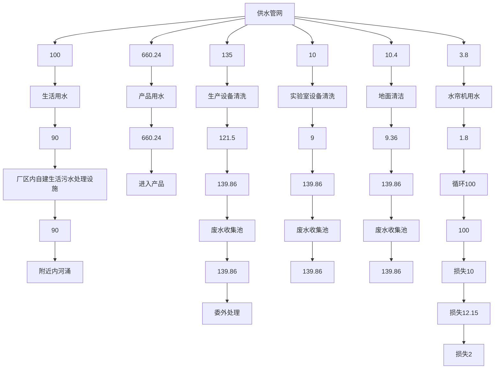
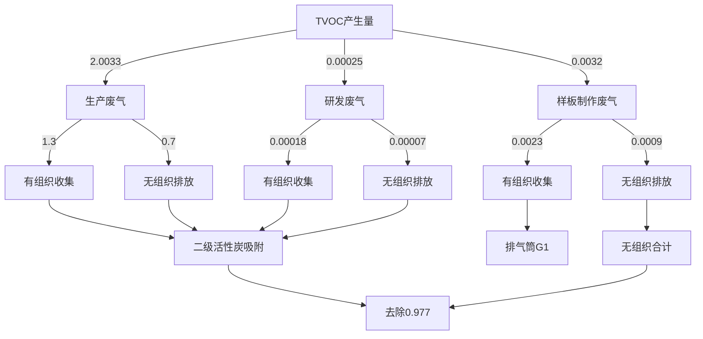
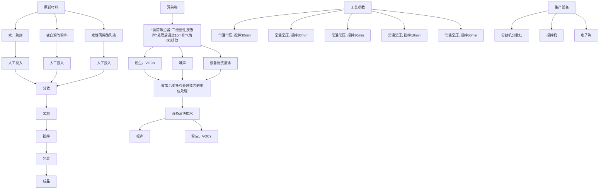

# 建设项目环境影响报告表

# （污染影响类）

项目名称：佛山市纳晶涂料有限公司搬迁项目

建设单位（盖章）：佛山市纳晶涂料有限公司

编制日期： 2023年4月

中华人民共国生态环境部制

打印编号：1683270648000

编制单位和编制人员情况表

<table><tr><td colspan="2">项目编号</td><td colspan="3">896987</td></tr><tr><td colspan="2">建设项目名称</td><td colspan="3">佛山市纳晶涂料有限公司搬迁项目</td></tr><tr><td colspan="2">建设项目类别</td><td colspan="3">23-044基础化学原料制造;农药制造;涂料、油墨、颜料及类似产品制造;合成材料制造;专用化学产品制造;炸药、火工及焰火产品制造</td></tr><tr><td colspan="2">环境影响评价文件类型</td><td colspan="3">报告表</td></tr><tr><td colspan="5">一、建设单位情况</td></tr><tr><td colspan="2">单位名称(盖章)</td><td colspan="3">佛山市纳晶涂料有限公司</td></tr><tr><td colspan="2">统一社会信用代码</td><td rowspan="4" colspan="3"></td></tr><tr><td colspan="2">法定代表人(签章)</td></tr><tr><td colspan="2">主要负责人(签字)</td></tr><tr><td colspan="2">直接负责的主管人员(签字)</td></tr><tr><td colspan="5">二、编制单位情况</td></tr><tr><td colspan="2">单位名称(盖章)</td><td colspan="3">广东顺德环境科学研究院有限公司</td></tr><tr><td colspan="2">统一社会信用代码</td><td colspan="3"></td></tr><tr><td colspan="5">三、编制人员情况</td></tr><tr><td colspan="5">1.编制主持人</td></tr><tr><td>姓名</td><td colspan="2">职业资格证书管理号</td><td>信用编号</td><td>签字</td></tr><tr><td colspan="5"></td></tr><tr><td colspan="5">2.主要编制人员</td></tr><tr><td>姓名</td><td colspan="2">主要编写内容</td><td>信用编号</td><td>签字</td></tr><tr><td colspan="5"></td></tr></table>

本证书由中华人民共和国人事部和国家环境保护总局批准颁发。它表明持证人通过国家统一组织的考试合格，取得环境影响评价工程师的职业资格。

ThisistocertifythatthebeareroftheCertificate has passed national examination organized by the Chinese government departments and has obtained qualifications forEnvironmental Impact Assessment Engine

text_image

中华人民共和国
中華
approved & authorized
by
Ministry of Personnel

The People's Republic ofChina

text_image

家环境保护
国 国
approved & authorized
by
the Environmental Protection Administrat
The People's Republic of China

管理号：

FileNo.

签发日期：

2006年08月16日

Issued on

# 目 录

一、建设项目基本情况.

二、建设项目工程分析.. 8

三、区域环境质量现状、环境保护目标及评价标准. .20

四、主要环境影响和保护措施.. .25

五、环境保护措施监督检查清单. .51

六、结论.. ..53

附表... ..54

附图1 项目地理位置图. .55

附图2 项目平面布置图. .56

附图3 环境保护目标分布图. .57

附图4 项目所在地及四至照片. .58

附图5 项目所在地大气环境功能区划图. .59

附图6 项目所在地水环境功能区划图. .60

附图7 项目所在地声环境功能区划图. .61

附图8 项目所在地“三线一单”环境管控单元图. .62

附件1 营业执照. ..63

附件2 原环评批复.. ..64

附件3 验收批复及验收监测报告（节选） .65

附件4 产品检测报告.. .71

附件5 项目所在地控制性详细规划及用地资料.. .73

附件6 厂房租赁合同.. .78

附件7 法人代表身份证复印件.. .80

附件8 环评编制委托合同.. ..81

附件9 国家排污许可证. ..84

附件10 厂区内配套生活污水处理设施环保手续. .85

# 一、建设项目基本情况

<table><tr><td>建设项目名称</td><td colspan="5">佛山市纳晶涂料有限公司搬迁项目</td></tr><tr><td>项目代码</td><td colspan="5">无</td></tr><tr><td>建设单位联系人</td><td></td><td>联系方式</td><td colspan="3"></td></tr><tr><td>建设地点</td><td colspan="5">佛山市顺德区勒流街道冲鹤村杏良西路1号A5</td></tr><tr><td>地理坐标</td><td colspan="5">(22度47分52.830秒,113度11分6.132秒)</td></tr><tr><td>国民经济行业类别</td><td>C2641涂料制造</td><td>建设项目行业类别</td><td colspan="3">二十三、化学原料和化学制品制造业26,44涂料、油墨、颜料及类似产品制造264,单纯物理分离、物理提纯、混合、分装的(不产生废水或挥发性有机物的除外)</td></tr><tr><td>建设性质</td><td>新建(迁建)改建扩建技术改造</td><td>建设项目申报情形</td><td colspan="3">首次申报项目不予批准后再次申报项目超五年重新审核项目重大变动重新报批项目</td></tr><tr><td>项目审批(核准/备案)部门(选填)</td><td>/</td><td>项目审批(核准/备案)文号(选填)</td><td colspan="3">/</td></tr><tr><td>总投资(万元)</td><td>100</td><td>环保投资(万元)</td><td colspan="3">20</td></tr><tr><td>环保投资占比(%)</td><td>20</td><td>施工工期</td><td colspan="3">1个月</td></tr><tr><td>是否开工建设</td><td>否是:____</td><td>用地(用海)面积( $m^{2}$ )</td><td colspan="3">3160</td></tr><tr><td>专项评价设置情况</td><td colspan="5">无</td></tr><tr><td>规划情况</td><td colspan="5">无</td></tr><tr><td>规划环境影响评价情况</td><td colspan="5">无</td></tr><tr><td>规划及规划环境影响评价符合性分析</td><td colspan="5">无</td></tr><tr><td rowspan="7">其他符合性分析</td><td colspan="5">1、建设项目与所在地“三线一单”符合性分析本项目位于佛山市顺德区勒流街道冲鹤村杏良西路1号A5,根据《广东省人民政府关于印发广东省“三线一单”生态环境分区管控方案的通知》(粤府〔2020〕71号)发布的广东省环境管控单元图,项目所在地属于重点管控单元;根据《佛山市人民政府关于印发佛山市“三线一单”生态环境分区管控方案的通知》(佛府〔2021〕11号)发布的佛山市环境管控单元图和《佛山市顺德区人民政府关于印发佛山市顺德区“三线一单”生态环境分区管控方案的通知》(顺府发〔2021〕11号)发布的顺德区环境管控单元图,项目所在地属于广东省佛山市顺德区重点管控单元2(编码为ZH44060620009,名称为勒流街道重点管控区),属于水环境城镇生活污染重点管控区、水环境一般管控区、大气环境受体敏感重点管控区、大气环境高排放重点管控区、江河湖库岸线重点管控区、江河湖库岸线一般管控区。项目与广东省佛山市顺德区重点管控单元2准入清单的相符性分析如表1-1。表1-1 项目与广东省佛山市顺德区重点管控单元准入清单的相符性分析</td></tr><tr><td>序号</td><td colspan="2">管控要求</td><td>本项目</td><td>符合性</td></tr><tr><td>1.1</td><td rowspan="5">区域布局管控</td><td>【产业/鼓励引导类】重点发展智能家电、家具五金、环保装备、光电照明、装备制造及交通机械产业,引入智能制造服务、电子商务、现代商贸流通产业,重点建设环保产业基地、小家电产业基地和五金产业创业基地。</td><td>本项目属于涂料制造业,不属于产业/鼓励引导类,也不属于《市场准入负面清单(2022年版)》(发改体改规〔2022〕397号)中禁止或许可事项。</td><td>符合</td></tr><tr><td>1.2</td><td>【产业/综合类】系统推进村级工业园升级改造,腾出连片空间,布局产业集聚区和主题产业园,推动工业项目入园集聚发展。新增工业制造业用地原则上安排在产业集聚区内,产业集聚区外原则上不鼓励工业及物流仓储用地的新建与改造。</td><td>本项目不属于工业及物流仓储用地的新建与改造。</td><td>符合</td></tr><tr><td>1.3</td><td>【产业/综合类】产业聚集区所属地块内的工业用地或企业与村庄、学校等环境敏感点之间应设置合理的大气环境防护距离,并通过绿化带进行有效隔离;聚集区规划布局应注重大气污染排放企业应尽量避免布局在居住用地的常年主导风向的上风向。</td><td>项目与周边环境敏感点距离较远,与最近的敏感点杏坛镇马齐村距离600m,中间有其他工业厂房、绿化带、顺德支流隔离。</td><td>符合</td></tr><tr><td>1.4</td><td>【产业/限制类】受纳水体或监控断面不达标的,不得新建、扩建向河涌直接排放废水的项目。新建、扩建含蚀刻工序的线路板生产项目和化工项目应在配套污水集中处置的工业园区或生活污水管网覆盖区域内建设;纯加工型印花项目,含酸洗、磷化的金属表面处理、金属制品项目(与自身高新技术企业配套的除外),含酸洗、喷涂、化学抛光、电解等涉及废水排放工艺的不锈钢型材加工项目(与自身高新技术企业配套的除外),应进入以此类项目为主导产业、有相应废水集中治理设施的工业园区,实现集中治污。</td><td>本项目所属行业为涂料制造业,属于化工项目,项目所在地属于生活污水管网覆盖区域,生活污水经厂区内配套生活污水处理站处理后排至围边涌,生产废水委托有处理能力的单位处理。</td><td>符合</td></tr><tr><td>1.5</td><td>【产业/综合类】划定家具生产优先发展区域,优先发展区外不再新建涉及涂装工艺的木质家具制造项目。</td><td>项目不属于木质家具制造项目。</td><td>符合</td></tr><tr><td rowspan="12"></td><td>1.6</td><td rowspan="3"></td><td>【大气/限制类】严格限制在羊额—北滘水厂饮用水水源保护区上游和周边区域建设列入“高污染、高环境风险”产品名录等可能影响水环境安全的项目。</td><td>项目不属于储油库项目,不产生有毒有害大气污染物,不使用溶剂型油墨、涂料、清洗剂、胶黏剂等高挥发性有机物原辅材料,不属于高污染、高环境等影响水环境安全的项目。</td><td>符合</td></tr><tr><td>1.7</td><td>【大气/鼓励引导类】大气环境布局敏感区重点管控区内,应严格限制新建生产和使用高挥发性有机物原辅材料项目,优先开展低VOCs含量原辅材料替代,强化无组织排放控制。原则上不再新建、扩建新增氮氧化物、烟(粉)尘排放量较大的建设项目。</td><td>项目不使用溶剂型油墨、涂料、清洗剂、胶黏剂等高挥发性有机物原辅材料,使用低VOCs原辅材料,废气经半密闭集气罩收集后通过二级活性炭吸附处理后引至15m排气筒排放。</td><td>符合</td></tr><tr><td>1.8</td><td>【土壤/禁止类】禁止新建、扩建增加重点防控的重金属污染物排放的建设项目</td><td>项目使用的原辅材料不含重金属</td><td>符合</td></tr><tr><td>2.1</td><td rowspan="6">能源资源利用</td><td>【能源/鼓励引导类】推广节能技术,加快发展绿色货运与现代物流。</td><td>项目使用节能技术,项目不属于绿色货运与现代物流。</td><td>符合</td></tr><tr><td>2.2</td><td>【能源/鼓励引导类】推广新能源汽车应用和充电基础设施建设,积极推动重卡LNG加气站、充电基础设施、加氢站建设。</td><td>项目不属于新能源汽车、充电基础设施、加氢站建设项目。</td><td>符合</td></tr><tr><td>2.3</td><td>【能源/综合类】科学实施能源消费总量和强度“双控”,新建高能耗项目单位产品(产值)能耗达到国际国内先进水平。</td><td>项目不属于高能耗项目。</td><td>符合</td></tr><tr><td>2.4</td><td>【水资源/综合类】贯彻落实“节水优先”方针,实行最严格水资源管理制度,勒流街道万元国内生产总值用水量、万元工业增加值用水量、用水总量、农田灌溉水有效利用系数等用水总量和效率指标达到区下达要求。</td><td>要求项目节约用水。</td><td>符合</td></tr><tr><td>2.5</td><td>【土地资源/限制类】落实单位土地面积投资强度、土地利用强度等建设用地控制性指标要求,提高土地利用效率。</td><td>要求项目落实单位土地面积投资强度、土地利用强度。</td><td>符合</td></tr><tr><td>2.6</td><td>【岸线/禁止类】严格水域岸线用途管制,新建项目一律不得违规占用水域。严禁破坏生态的岸线利用行为和不符合其功能定位的开发建设活动,严禁以各种名义侵占河道、围垦湖泊、非法采砂等。</td><td>项目不存在破坏生态的岸线利用的行为和不符合其功能定位的开发建设的活动,不存在侵占河道、围垦湖泊、非法采砂等。</td><td>符合</td></tr><tr><td>3.1</td><td rowspan="3">污染物排放管控</td><td>【水/限制类】城镇新区建设实行雨污分流。住宅、商业体、学校、市场等城镇开发建设项目应当配套或者同步计划建设公共排水设施,公共排水设施或自建排污水设施未能投产运行的,以上涉水项目不得投入使用。新建小区严格实施雨污分流,阳台、露台等污水接入污水收集系统,将生活污水“应截尽截”。做好大型楼盘、集贸市场、餐饮以及学校等4大类排水户污水接入市政管网工作。</td><td>项目不属于住宅、商业体、学校、市场等城镇开发建设项目。</td><td>符合</td></tr><tr><td>3.2</td><td>【水/综合类】结合村级工业园改造,全面提升产业层次与集聚度,促进污染集中整治。</td><td>项目生活污水经厂区内配套的生活污水处理设施处理后排至围边涌。</td><td>符合</td></tr><tr><td>3.3</td><td>【水/综合类】稳步推进排水设施“三个一体化”管理模式,补齐城乡污水收集和处理短板,推动勒流污水处理厂提质增效,加快消除城中村、老旧城区、城乡结合部等污水收集管网空白区,逐步实现城乡污水收集处理全覆盖。2025年前</td><td>项目近期生活污水经厂区内配套的生活污水处理设施处理后排至围边涌,远期生活污水经三级化粪处理后排至勒流</td><td>符合</td></tr></table>

<table><tr><td></td><td rowspan="4"></td><td>完成勒流污水处理厂扩建,尾水应执行《城镇污水处理厂污染物排放标准》(GB18918-2002)一级A标准及《广东省水污染物排放限值》(DB44/26-2001)的较严值。</td><td>污水处理厂</td><td></td></tr><tr><td>3.4</td><td>【水/综合类】保留勒流社区百丈片区分散式农村污水处理设施,其余行政村(社区)通过市政污水管网,配合农村支管网建设,有条件的区域实施雨污分流改造,到2030年实现农村生活污水100%收集进入勒流污水处理系统。</td><td>项目近期生活污水经厂区内配套的生活污水处理设施处理后排至围边涌,远期生活污水经三级化粪处理后排至勒流污水处理厂</td><td>符合</td></tr><tr><td>3.5</td><td>【水/综合类】产业集聚区和主题园区内做好污水管网和污水集中处理设施的配套保障,确保废水收集到城镇污水处理厂、园区污水处理厂或分散式污水处理设施集中处置。</td><td>项目不属于污水管网、污水处理设施等建设项目。</td><td>符合</td></tr><tr><td>3.6</td><td>【土壤/限制类】作为重金属污染重点防控区,区域内重点重金属排放总量只减不增</td><td>项目生产过程不产生及不排放重金属,使用的原辅材料不含重金属。</td><td>符合</td></tr><tr><td>4.1</td><td rowspan="3">环境风险防控</td><td>【水/综合类】加强单元内羊额—北滘水厂饮用水水源保护区周边环境风险源管控,完善突发环境事件应急管理体系。</td><td>项目不设工业污水处理设施,生产废水收集池做好防泄漏处理,事故废水不会直接排入水体。</td><td>符合</td></tr><tr><td>4.2</td><td>【水/综合类】勒流污水处理厂、工业污水集中处理设施应采取有效措施,防止事故废水直接排入水体。完善污水处理厂在线监控系统联网,实现污水处理厂的实时、动态监管</td><td>项目外排废水为生活污水,近期生活污水经厂区内配套的生活污水处理设施处理后排至围边涌,远期生活污水经三级化粪处理后排至勒流污水处理厂</td><td>符合</td></tr><tr><td>4.3</td><td>【风险/综合类】加强环境风险分级分类管理,强化金属制品、有色金属和压延加工、化学原料和化学品制造业等涉重金属、化工行业企业及工业园区等重点环境风险源的环境风险防控。</td><td>本项目所属行业为涂料制造业,属于化学原料和化学品制造业。要求项目按照报告要求落实环境风险防范措施,制定突发环境事件应急预案,健全应急组织,落实应急器材,并对预案进行演练。</td><td>符合</td></tr></table>

综上所述，本项目符合广东省、佛山市、顺德区“三线一单”生态环境分区管控方案的要求。

# 2、项目与有机污染物治理政策的相符性分析

项目与有机污染物治理政策的相符性分析见表 1-2。

表 1-2 项目与有机污染物治理政策的相符性分析

<table><tr><td>序号</td><td>文件</td><td>规定</td><td>项目实际</td><td>符合判定</td></tr><tr><td>1</td><td>《广东省生态环境厅关于做好重点行业建设项目挥发性有机物总量指标管理工作的通知》(粤环发〔2019〕2号)</td><td>各地应当按照“最优的设计、先进的设备、最严的管理”要求对建设项目VOCs排放总量进行管理,并按照“以减量定增量”原则,动态管理VOCs总量指标。新、改、扩建排放VOCs的重点行业建设项目应当执行总量替代制度,重点行业包括炼油与石</td><td>本项目为涂料制造业,属于重点行业,执行总量替代制度,VOCs总量控制指标为1.027t/a。</td><td>符合</td></tr></table>

<table><tr><td rowspan="11"></td><td></td><td></td><td>化、化学原料和化学制品制造、化学药品原料药制造、合成纤维制造、表面涂装、印刷、制鞋、家具制造、人造板制造、电子元件制造、纺织印染、塑料制造及塑料制品等12个行业。</td><td></td><td></td></tr><tr><td rowspan="4">2</td><td rowspan="4">关于印发《重点行业挥发性有机物综合治理方案》的通知(环大气〔2019〕53号)</td><td>化工行业要推广使用低(无)VOCs含量、低反应活性的原辅材料,加快对芳香烃、含卤素有机化合物的绿色替代。</td><td>项目使用低VOCs含量、低反应活性的原辅材料,没有使用芳香烃、含卤素有机化合物。</td><td>符合</td></tr><tr><td>全面加强无组织排放控制。重点对含VOCs物料(包括含VOCs原辅材料、含VOCs产品、含VOCs废料以及有机聚合物材料等)储存、转移和输送、设备与管线组件泄漏、敞开液面逸散以及工艺过程等五类排放源实施管控,通过采取设备与场所密闭、工艺改进、废气有效收集等措施,削减VOCs无组织排放。</td><td>项目VOCs利用半密闭集气罩收集经二级活性炭吸附装置处理后通过15m排气筒G1排放,无组织排放量较少</td><td>符合</td></tr><tr><td>加强设备与场所密闭管理。含VOCs物料应储存于密闭容器、包装袋,高效密封储罐,封闭式储库、料仓等。含VOCs物料生产和使用过程,应采取有效收集措施或在密闭空间中操作。</td><td>项目含VOCs物料利用包装桶密闭储存,生产过程中产生的有机废气利用半密闭集气罩收集经二级活性炭吸附装置处理后通过15m排气筒G1排放</td><td>符合</td></tr><tr><td>加强制药、农药、涂料、油墨、胶粘剂、橡胶和塑料制品等行业VOCs治理力度。重点提高涉VOCs排放主要工序密闭化水平,加强无组织排放收集,加大含VOCs物料储存和装卸治理力度。</td><td>项目生产过半密闭程中产生的有机废气利用集气罩收集经二级活性炭吸附装置处理后通过15m排气筒G1排放</td><td>符合</td></tr><tr><td rowspan="6">3</td><td rowspan="6">关于印发《广东省涉挥发性有机物(VOCs)重点行业治理指引》的通知(粤环办〔2021〕43号)</td><td>液态物料应采用密闭管道,采用非管道输送方式转移液态VOCs物料时,应采用密闭容器、罐车。</td><td>本项目采用密闭容器转移液态VOCs物料</td><td>符合</td></tr><tr><td>粉状、粒状VOCs物料应采用气力输送设备、管状带式输送机、螺旋输送机等密闭输送方式,或者采用密闭的包装袋、容器或罐车进行物料转移。</td><td>本项目采用密闭容器转移液态VOCs物料</td><td>符合</td></tr><tr><td>液态VOCs物料采用密闭管道输送方式或采用高位槽(罐)、桶泵等给料方式密闭投加;无法密闭投加的,在密闭空间内操作,或进行局部气体收集,废气排至VOCs废气收集处理系统。</td><td>本项目物料投加方式为手动投加,本项目生产过程产生的有机废气利用半密闭集气罩收集经二级活性炭吸附装置处理后通过15m排气筒G1排放</td><td>符合</td></tr><tr><td>VOCs物料卸(出、放)料过程密闭,卸料废气排至VOCs废气收集处理系统;无法密闭的,采取局部气体收集措施,废气排至VOCs废气收集处理系统。</td><td>本项目生产过程产生的有机废气利用半密闭集气罩收集经二级活性炭吸附装置处理后通过15m排气筒G1排放</td><td>符合</td></tr><tr><td>采用外部集气罩的,距集气罩开口面最远处的VOCs无组织排放位置,控制风速不低于0.3m/s</td><td>项目有机废气利用半密闭集气罩收集,距集气罩开口面最远处的VOCs无组织排放位置,控制风速不低于0.5m/s</td><td>符合</td></tr><tr><td>废气收集系统的输送管道应密闭。废气收集系统应在负压下运</td><td>废气收集系统的输送管道密闭。废气收集系统在负压下</td><td>符合</td></tr></table>

<table><tr><td></td><td></td><td>行,若处于正压状态,应对管道组件的密封点进行泄漏检测,泄漏检测值不应超过500μmol/mol,亦不应有感官可察觉泄漏。</td><td>运行</td><td></td></tr><tr><td>4</td><td>《低挥发性有机化合物含量涂料产品技术要求》(GBT 38597-2020)</td><td>水性涂料中VOC含量的限量值应符合该文件表1的要求,项目产品属于墙面涂料,VOC最低含量限量值为50g/L。</td><td>项目属于搬迁项目,搬迁前后产品类型一致,根据建设单位提供的现有工程产品检测报告,项目产品VOCs最大挥发量为2.3g/L,符合限值要求</td><td>符合</td></tr><tr><td>5</td><td>《广东省生态环境厅关于印发&lt;广东省生态环境保护“十四五”规划&gt;的通知》(粤环〔2021〕10号)</td><td>大力推进低VOCs含量原辅材料源头替代,严格落实国家和地方产品VOCs含量限值质量标准,禁止建设生产和使用高VOCs含量的溶剂型涂料、油墨、胶粘剂等项目。</td><td>项目从事水性涂料的生产,产品VOCs含量符合《低挥发性有机化合物含量涂料产品技术要求》(GBT 38597-2020)相关要求</td><td>符合</td></tr><tr><td>6</td><td>《佛山市生态环境局关于印发&lt;佛山市生态环境保护“十四五”规划&gt;的通知》佛环[2022]3号</td><td>加强VOCs源头替代和无组织排放管控。大力推进低VOCs含量原辅材料替代,将全面使用低VOCs含量原辅材料的企业纳入正面清单和政府绿色采供清单。鼓励重点行业企业开展生产工艺和设备水性化改造,推广使用水性、高固体分,无溶剂、粉末等低VOCs含量涂料。严格落实《挥发性有机物无组织排放控制标准》,开展厂区无组织排放浓度监测。加强对含VOCs物料储存、转移和运输、设备与管线组件泄漏、敞开页面逸散以及工艺过程等五类排放源的管控。</td><td>项目使用低VOCs含量原辅材料,生产低VOCs含量的水性涂料。VOCs利用半密闭集气罩收集经二级活性炭吸附装置处理后通过15m排气筒G1排放,无组织排放量较少。含VOCs物料要求在储存、转移和运输过程中密封。</td><td>符合</td></tr><tr><td>7</td><td>《广东省人民政府办公厅关于印发广东省2021年大气、水、土壤污染防治工作方案的通知》(粤办函[2021]58号)</td><td>实施低VOCs含量产品源头替代工程。严格落实国家产品VOCs含量限值标准要求,除现阶段确无法实施替代的工序外,禁止新建生产和使用高VOCs含量原辅材料项目。鼓励在生产和流通消费环节推广使用低VOCs含量原辅材料。</td><td>项目从事水性涂料的生产,产品VOCs含量符合《低挥发性有机化合物含量涂料产品技术要求》(GBT 38597-2020)相关要求</td><td>符合</td></tr></table>

# 3、选址符合性分析

根据《顺德西部生态产业新区顺德支流北岸片区（SD-H01-01、SD-H-04-02）控制性详细规划》修编批后公布（佛府办函[2020]167 号），项目所在地为公园绿地，另根据项目所在地房产证（房产证号为粤房地权证佛字第 0312074931 号，见附件5），项目所在地为工业用地。又根据《佛山市生态环境局顺德分局勒流监督管理所关于广东联合创展仓储有限公司规划情况的咨询函》（佛顺环（勒）函[2023]7号）及《佛山市自然资源局顺德分局勒流管理所关于《佛山市生态环境局顺德分局勒流监督管理所关于广东联合创展仓储有限公司规划情况的咨询函》的复函》（见附件5）：项目所在地现状合法工业建筑，在尚不具备按法定规划进行改造前，不影响继续按证载用途使用。因此项目所在地为工业用地，符合规划要求。因此项目

选址合理。

# 4、产业政策符合性分析

项目从事水性涂料的生产，根据《产业结构调整指导目录（2019 年本）》及2021年修改单，项目不属于鼓励类、限制类以及淘汰类。本项目不属于《市场准入负面清单（2022年版）》中规定的禁止和许可准入的行业类别。因此，项目符合相关的产业政策要求。

# 5、其他

本项目产品为水性涂料，属于低 VOCs 含量涂料，不含有毒有害物质，不属于《环境保护综合名录（2021年版）》“高污染、高环境风险”产品名录所列产品。

# 二、建设项目工程分析

<table><tr><td rowspan="12">建设内容</td><td colspan="4">1、项目的工程组成佛山市纳晶涂料有限公司(下称“本项目”)原址位于佛山市顺德区杏坛镇麦村七滘工业区十路50号,项目已于2018年1月12日取得建设项目环境影响报告表批复(批复文号为顺环(杏)审[2017]431号),并于2019年7月通过建设项目废水、废气及噪声的竣工环境保护自主验收手续,于2019年8月16日取得建设项目固体废物防治设施竣工环境保护验收意见的函(批复文号为佛环0310环验[2019]第A122号),于2020年6月12日取得国家排污许可证(证书编号为91440606MA4WXW3W1L001Q)。现由于租约期满及生产发展需要,项目拟搬迁至佛山市顺德区勒流街道冲鹤村杏良西路1号A5,搬迁后占地面积 $3160m^{2}$ ,经营面积 $3160m^{2}$ 。项目工程组成见表2-1。表2-1 项目工程组成</td></tr><tr><td>工程类型</td><td>工程内容</td><td>搬迁前</td><td>搬迁后</td></tr><tr><td>主体工程</td><td>生产车间</td><td>建筑面积约 $1500m^{2}$ ,设有分散、搅拌等工序</td><td>单层厂房,建筑面积约 $2160m^{2}$ ,高6m,设有分散、搅拌等工序</td></tr><tr><td>储运工程</td><td>仓库</td><td>约 $800m^{2}$ ,用于原材料和产品储存</td><td>位于生产车间内</td></tr><tr><td rowspan="2">辅助工程</td><td>实验室</td><td>/</td><td>约 $50m^{2}$ ,用于产品研发、样板制作,样板制作方式为喷涂,新增一台水帘机</td></tr><tr><td>办公室</td><td>办公楼一栋</td><td>办公楼建筑面积约 $950m^{2}$ </td></tr><tr><td rowspan="2">公用工程</td><td>配电系统</td><td>供应生产用电和办公生活用电</td><td>供应生产用电和办公生活用电</td></tr><tr><td>给排水系统</td><td>供水来源为市政自来水,生活污水经独立生活污水处理设施处理后排至附近内河涌</td><td>供水来源为市政自来水,生活污水近期依托厂区内配套的生活污水处理设施处理后排至围边涌,远期经三级化粪处理后通过市政管网排至勒流污水处理厂</td></tr><tr><td rowspan="4">环保工程</td><td>生活污水</td><td>生活污水经独立生活污水处理设施处理后排至附近内河涌</td><td>生活污水近期依托厂区内配套的生活污水处理设施处理后排至围边涌,远期经三级化粪处理后通过市政管网排至勒流污水处理厂</td></tr><tr><td>生产废水</td><td>生产废水委托佛山市顺德区绿点废水回收处理有限公司处理</td><td>生产废水委托有处理能力的单位处理</td></tr><tr><td>投料粉尘、有机废气</td><td>投料粉尘经简易布袋处理后无组织排放,生产过程产生的有机废气利用集气罩收集引至低温等离子+活性炭吸附处理后通过15m排气筒FQ-11516排放</td><td>投料粉尘、生产过程产生的有机废气利用集气罩+围挡收集一并引至“滤筒除尘器+二级活性炭吸附”装置处理,样板制作废气利用水帘机收集处理后与实验室研发废气一并引至二级活性炭吸附装置与生产废气一起处理,以上废气处理后通过15m排气筒G1排放</td></tr><tr><td>一般固体废物</td><td>设有一般固体废物暂存间一个</td><td>设有一般固体废物暂存间一个,面积约 $20m^{2}$ </td></tr></table>

<table><tr><td></td><td>危险废物</td><td>设有危废间1个,危险废物收集暂存于危废间并委托有资质的单位处理</td><td>设有危废间1个,面积约 $10m^{2}$ ,危险废物收集暂存于危废间并委托有资质的单位定期处理</td></tr></table>

# 2、项目概况

项目主要从事水性涂料的生产，主要产品及产能见表 2-2。

表 2-2 产品及产能一览表

<table><tr><td>序号</td><td>名称</td><td>搬迁前数量(t/a)</td><td>增减量(t/a)</td><td>搬迁后数量(t/a)</td><td>包装规格</td><td>最大储存量(t)</td></tr><tr><td>1</td><td>水性金属漆</td><td>1000</td><td>+1000</td><td>2000</td><td>25kg/桶</td><td>5</td></tr><tr><td>2</td><td>质感涂料</td><td>1000</td><td>+1000</td><td>2000</td><td>25kg/桶</td><td>5</td></tr><tr><td colspan="2">合计</td><td>2000</td><td>+2000</td><td>4000</td><td>/</td><td>/</td></tr></table>

# 3、项目设备清单

主要生产单元、主要工艺、生产设施及设施参数见表2-3。

表 2-3 主要生产单元、主要工艺、生产设施及设施参数一览表

<table><tr><td>主要生产单元</td><td>设备名称</td><td>单位</td><td>搬迁前数量</td><td>增减量</td><td>搬迁后数量</td><td>设备参数</td><td>数值</td><td>单位</td><td>工艺</td></tr><tr><td rowspan="6">生产车间</td><td>分散机</td><td>台</td><td>1</td><td>+2</td><td>3</td><td>功率</td><td>5</td><td>kw</td><td>分散</td></tr><tr><td rowspan="2">搅拌机</td><td>台</td><td>4</td><td>0</td><td>4</td><td>容积</td><td>5</td><td> $m^3$ </td><td rowspan="2">搅拌</td></tr><tr><td>台</td><td>1</td><td>0</td><td>1</td><td>容积</td><td>15</td><td> $m^3$ </td></tr><tr><td>分散缸</td><td>个</td><td>10</td><td>0</td><td>10</td><td>容积</td><td>1</td><td> $m^3$ </td><td>分散</td></tr><tr><td>电子称</td><td>台</td><td>1</td><td>+2</td><td>3</td><td>功率</td><td>1</td><td>Kw</td><td>称重</td></tr><tr><td>空压机</td><td>台</td><td>0</td><td>+1</td><td>1</td><td>功率</td><td>4</td><td>Kw</td><td>辅助设备</td></tr><tr><td rowspan="5">实验室</td><td>小型分散机</td><td>台</td><td>0</td><td>+1</td><td>1</td><td>容积</td><td>0.2</td><td> $m^3$ </td><td rowspan="5">测试</td></tr><tr><td>粘度仪</td><td>台</td><td>0</td><td>+1</td><td>1</td><td>功率</td><td>2</td><td>Kw</td></tr><tr><td>电烤箱</td><td>台</td><td>0</td><td>+1</td><td>1</td><td>功率</td><td>15</td><td>Kw</td></tr><tr><td>耐擦性仪</td><td>台</td><td>0</td><td>+1</td><td>1</td><td>功率</td><td>5</td><td>Kw</td></tr><tr><td>喷枪</td><td>支</td><td>0</td><td>+1</td><td>1</td><td>生产能力</td><td>0.2</td><td>t/a</td></tr></table>

# 4、项目原辅材料

主要原辅材料的种类和用量见表 2-4；主要原辅材料理化性质见表 2-5。

表 2-4 主要原辅材料用量

<table><tr><td>序号</td><td>类别</td><td>名称</td><td>配比(%)</td><td>搬迁前用量(t/a)</td><td>增减量(t/a)</td><td>搬迁后用量(t/a)</td><td>性状</td><td>包装规格</td><td>最大储存量(t)</td></tr><tr><td colspan="10">水性金属漆</td></tr><tr><td>1</td><td>成膜物质</td><td>水性丙烯酸乳液</td><td>20</td><td>200</td><td>+200</td><td>400</td><td>液体</td><td>200kg/桶</td><td>20</td></tr><tr><td>2</td><td>填料</td><td>碳酸钙</td><td>20</td><td>200</td><td>+200</td><td>400</td><td>固体粉末</td><td>25kg/袋</td><td>10</td></tr><tr><td>3</td><td>颜料</td><td>钛白粉</td><td>15</td><td>150</td><td>+150</td><td>300</td><td>固体粉末</td><td>25kg/袋</td><td>5</td></tr><tr><td>4</td><td>填料</td><td>高岭土</td><td>6</td><td>60</td><td>+60</td><td>120</td><td>固体粉末</td><td>25kg/袋</td><td>3</td></tr><tr><td>5</td><td>填料</td><td>滑石粉</td><td>5</td><td>50</td><td>+50</td><td>100</td><td>固体粉末</td><td>25kg/袋</td><td>3</td></tr><tr><td>6</td><td>助剂</td><td>分散剂</td><td>0.5</td><td>5</td><td>+5</td><td>10</td><td>液体</td><td>25kg/桶</td><td>1</td></tr><tr><td>7</td><td rowspan="5"></td><td>成膜剂</td><td>1.5</td><td>15</td><td>+15</td><td>30</td><td>液体</td><td>25kg/桶</td><td>1</td></tr><tr><td>8</td><td>增稠剂</td><td>0.5</td><td>6</td><td>+6</td><td>12</td><td>液体</td><td>25kg/桶</td><td>0.5</td></tr><tr><td>9</td><td>消泡剂</td><td>0.3</td><td>4</td><td>+4</td><td>8</td><td>液体</td><td>20kg/桶</td><td>1</td></tr><tr><td>10</td><td>防腐剂</td><td>0.2</td><td>3</td><td>+3</td><td>6</td><td>液体</td><td>25kg/桶</td><td>0.2</td></tr><tr><td>11</td><td>防冻剂</td><td>2</td><td>20</td><td>+20</td><td>40</td><td>液体</td><td>20kg/桶</td><td>2</td></tr><tr><td>12</td><td>溶剂</td><td>自来水</td><td>29</td><td>290.06</td><td>+290.06</td><td>580.12</td><td>液体</td><td colspan="2">市政管网供应</td></tr><tr><td colspan="3">小计</td><td>100</td><td>1003.06</td><td>+1003.06</td><td>2006.12</td><td>/</td><td>/</td><td>/</td></tr><tr><td colspan="10">质感涂料</td></tr><tr><td>1</td><td>成膜物质</td><td>水性丙烯酸乳液</td><td>14.95</td><td>150</td><td>+150</td><td>300</td><td>液体</td><td>200kg/桶</td><td>20</td></tr><tr><td>2</td><td>填料</td><td>石粉</td><td>57.82</td><td>580</td><td>+580</td><td>1160</td><td>固体粉末</td><td>25kg/袋</td><td>20</td></tr><tr><td>3</td><td rowspan="3">助剂</td><td>防冻剂</td><td>1.93</td><td>20</td><td>+20</td><td>40</td><td>液体</td><td>20kg/桶</td><td>2</td></tr><tr><td>4</td><td>成膜剂</td><td>0.8</td><td>8</td><td>+8</td><td>16</td><td>液体</td><td>25kg/桶</td><td>1</td></tr><tr><td>5</td><td>增稠剂</td><td>0.5</td><td>5</td><td>+5</td><td>10</td><td>液体</td><td>25kg/桶</td><td>0.5</td></tr><tr><td>6</td><td>填料</td><td>彩砂</td><td>20</td><td>200</td><td>+200</td><td>400</td><td>固体</td><td>25kg/袋</td><td>10</td></tr><tr><td>7</td><td>溶剂</td><td>自来水</td><td>4</td><td>40.06</td><td>+40.06</td><td>80.12</td><td>液体</td><td colspan="2">市政管网供应</td></tr><tr><td colspan="3">小计</td><td>100</td><td>1003.06</td><td>+1003.06</td><td>2006.12</td><td>/</td><td>/</td><td>/</td></tr><tr><td colspan="10">生产用原辅材料汇总</td></tr><tr><td>1</td><td>成膜物质</td><td>水性丙烯酸乳液</td><td>/</td><td>350</td><td>+350</td><td>700</td><td>液体</td><td>20kg/桶</td><td>20</td></tr><tr><td>2</td><td>填料</td><td>碳酸钙</td><td>/</td><td>200</td><td>+200</td><td>400</td><td>固体粉末</td><td>25kg/袋</td><td>20</td></tr><tr><td>3</td><td>颜料</td><td>钛白粉</td><td>/</td><td>150</td><td>+150</td><td>300</td><td>固体粉末</td><td>25kg/袋</td><td>6</td></tr><tr><td>4</td><td>填料</td><td>高岭土</td><td>/</td><td>60</td><td>+60</td><td>120</td><td>固体粉末</td><td>25kg/袋</td><td>3</td></tr><tr><td>5</td><td>填料</td><td>滑石粉</td><td>/</td><td>50</td><td>+50</td><td>100</td><td>固体粉末</td><td>25kg/袋</td><td>3</td></tr><tr><td>6</td><td>填料</td><td>石粉</td><td>/</td><td>580</td><td>+580</td><td>1160</td><td>固体粉末</td><td>25kg/袋</td><td>3</td></tr><tr><td>7</td><td rowspan="6">助剂</td><td>分散剂</td><td>/</td><td>5</td><td>+5</td><td>10</td><td>液体</td><td>25kg/桶</td><td>1</td></tr><tr><td>8</td><td>增稠剂</td><td>/</td><td>11</td><td>+11</td><td>22</td><td>液体</td><td>25kg/桶</td><td>0.5</td></tr><tr><td>9</td><td>消泡剂</td><td>/</td><td>4</td><td>+4</td><td>8</td><td>液体</td><td>25kg/桶</td><td>1</td></tr><tr><td>10</td><td>成膜剂</td><td>/</td><td>23</td><td>+23</td><td>46</td><td>液体</td><td>200kg/桶</td><td>2</td></tr><tr><td>11</td><td>防腐剂</td><td>/</td><td>3</td><td>+3</td><td>6</td><td>液体</td><td>25kg/桶</td><td>0.2</td></tr><tr><td>12</td><td>防冻剂</td><td>/</td><td>40</td><td>+40</td><td>80</td><td>液体</td><td>20kg/桶</td><td>2</td></tr><tr><td>13</td><td>填料</td><td>彩砂</td><td>/</td><td>200</td><td>+200</td><td>400</td><td>固体</td><td>25kg/袋</td><td>25</td></tr><tr><td>14</td><td>溶剂</td><td>自来水</td><td>/</td><td>330.12</td><td>+330.12</td><td>660.24</td><td>液体</td><td colspan="2">市政管网供应</td></tr><tr><td colspan="3">合计</td><td>/</td><td>2006.12</td><td>+2006.12</td><td>4012.24</td><td>/</td><td>/</td><td>/</td></tr><tr><td colspan="10">设备维修</td></tr><tr><td>1</td><td>/</td><td>机油</td><td>/</td><td>0.2</td><td>0</td><td>0.2</td><td>液体</td><td>25kg/桶</td><td>0.05</td></tr></table>

表 2-5 主要原辅材料理化性质一栏表

<table><tr><td>序号</td><td>原辅材料名称</td><td>理化性质</td></tr><tr><td>1</td><td>水性丙烯酸乳液</td><td>主要成分为丙烯酸共聚物,浅白色半透明乳液,pH值7.5,沸点100°C,粒子直径0.1-0.2μm,粘度300-2000cps,相对密度1.0-1.1</td></tr><tr><td>2</td><td>碳酸钙</td><td>白色粉末、无臭、无味,不溶于水</td></tr><tr><td>3</td><td>钛白粉</td><td>二氧化钛,白色粉末状的两性氧化物,密度约3.8~4.2g/cm3,是一种白色无机颜料,具有无毒、最佳的不透明性、最佳白度和光亮度,被认为是现今世界上性能最好的一种白色颜料。钛白的粘附力强,不易起化学变化。</td></tr><tr><td>4</td><td>高岭土</td><td>粉末状,由高岭石、地开石、珍珠石、埃洛石等高岭石簇矿物组成,主要矿物成分是高岭石,具有良好的可塑性和耐火性等理化性质;多无光泽,质纯时颜白细腻</td></tr><tr><td>5</td><td>滑石粉</td><td>为硅酸镁盐类矿物滑石族滑石,主要成分为含水硅酸镁,经粉碎后,用盐酸处理,水洗,干燥而成。常用于塑料类、纸类产品的填料,橡胶填料和橡胶制品防黏剂,高级油漆涂料等</td></tr><tr><td>6</td><td>分散剂</td><td>聚羧酸钠盐分散剂,淡黄色透明黏稠液体,相对密度为1.2~1.3,pH为5.5~7.5。具有改善涂料的储存稳定性、增加光泽和流平性等特点,广泛用于建筑涂料、各种水性工业漆等,通用性强,对钛白粉、碳酸钙、高岭土等各种无机颜(填)料都具有良好的分散效果。</td></tr><tr><td>7</td><td>增稠剂</td><td>水性涂料增稠剂是一种非离子疏水改性聚氨酯流变增稠剂,白色或乳白色液体,具有明显的的增稠效果以及良好的的流动、流平性</td></tr><tr><td>8</td><td>消泡剂</td><td>一种新型矿物油和聚硅氧烷复合型消泡剂,经过特殊工艺精制而成,为白色至淡黄色乳状液体。具有自乳化、易分散、通用性强、消泡好、抑泡持久等性能。不会产生表面缺陷或影响成膜性,对水性涂料体系有特别效果</td></tr><tr><td>9</td><td>成膜助剂</td><td>能促进高分子化合物塑性流动和弹性变形,改善聚结性能,能在较广泛施工温度范围内成膜的物质,是一种易消失的增塑剂。常用的为醚醇类高聚物的强溶剂,项目主要成膜助剂为醇酯十二,化学名为2,2,4-三甲基-1,3-戊二醇单异丁酸酯</td></tr><tr><td>10</td><td>防腐剂</td><td>项目使用的防腐剂为非农用非医用防腐杀菌剂,主要成分为异噻唑啉酮及其衍生物,广泛用于涂料、水性高聚物、丙烯酸物料、乳胶漆等行业,可以有效杀灭多种细菌、真菌、霉菌、酵母菌、厌氧菌等各种菌类,杀菌防霉效果广谱长效,使用浓度0.1%即可达到良好的抑菌效果。稳定性强,在-2-50°C贮存一年无变化。</td></tr><tr><td>11</td><td>防冻剂</td><td>清澈至混浊,浅黄色液体,是一种能在低温下防止物料中水分结冰的物质,易溶,无毒,使用方便,可以与减水剂、引气剂等复合防冻,效果更好</td></tr><tr><td>12</td><td>彩砂</td><td>石英砂,一种坚硬、耐磨、化学性能稳定的硅酸盐矿物,其主要矿物成分是SiO2,石英砂的颜色为乳白色、或无色半透明状,硬度7,性脆无解理,贝壳状断口,油脂光泽,密度为2.65,其化学、热学和机械性能具有明显的异向性,不溶于酸,微溶于KOH溶液,熔点1750°C</td></tr></table>

# 5、关键设备产能和产品规模匹配性分析

表 2-6 搬迁后关键设备产能一览表

<table><tr><td>设备</td><td>设备数量</td><td>单批次产量(kg/批)</td><td>单批次生产时间(h)</td><td>每天生产时间(h)</td><td>全年生产批次(次)</td><td>关键设备年产量(t/a)</td></tr><tr><td> $1m^{3}$ 分散缸</td><td>10</td><td>2400</td><td>4</td><td>8</td><td>600</td><td>4800</td></tr><tr><td> $5m^{3}$ 搅拌机</td><td>4</td><td>16000</td><td>6</td><td>8</td><td>300</td><td>4800</td></tr><tr><td> $15m^{3}$ 搅拌机</td><td>1</td><td>12000</td><td>14</td><td>8</td><td>100</td><td>1200</td></tr></table>

备注：产能按每台分散缸容积的 80%计算，每批次生产时间包含配料、投料、搅拌、分散、包装、清

洗等环节。项目设有 3 台分散机、5 台搅拌机，10 台分散缸，由于分散机与分散缸配套使用，主要用于生产水性金属漆产品和质感涂料的浆料，其中水性金属漆经分散后可直接包装，质感涂料经分散制成浆料后还需倒入搅拌机进行搅拌，因此影响产能的关键设备为分散缸。按同一时间最多10个分散缸同时运行计，上表为容积最大的分散缸满负荷运行时的产能。

由上表可知，项目关键设备产能为 4800t/a，项目申报产能为 4000t/a，项目设备产能与产品规模是匹配的。

# 6、项目平衡分析

# 1）水平衡

# （1）给水

项目用水由市政给水管网供应，用水主要为员工生活用水和生产用水。

# ①生活用水

搬迁后项目劳动定员 10人，年工作日 300天，项目内不设员工宿舍和食堂。参考广东省地方标准《用水定额 第 3 部分：生活》（DB44/T 1461.3-2021）表 A.1 国家行政机构办公楼（无食堂和浴室）用水定额先进值，生活用水按照 10 m3 /（人·a）计，则搬迁后员工生活用水量约为 100m3/a。

# ②生产用水

搬迁后项目生产用水主要为产品用水、生产设备清洗用水、实验室设备清洗用水、地面清洁用水、水帘机用水等，生产用水量约为 819.44m3/a。

# （2）排水

项目生活污水近期经厂区内配套的生活污水处理设施处理后排至围边涌，远期经三级化粪处理后通过市政管网排至勒流污水处理厂，尾水排至顺德支流。生活污水排污系数取 0.9，则生活污水产生量约为 90m3/a。

设备清洗废水、实验室清洗废水、地面清洁废水、水帘机废水等生产废水收集后定期委托有处理能力的单位处理，不外排。

搬迁后项目水平衡图见图 2-1。

flowchart

图 2-1 搬迁后水平衡图

# 2）物料平衡

项目物料平衡见表 2-7。

备注：外排粉尘为经除尘器处理后有组织排放粉尘和无组织排放粉尘，除尘器收集的粉尘回用于生产  
表 2-7 搬迁后物料平衡一览表

<table><tr><td rowspan="2">产品名称</td><td colspan="2">投入</td><td colspan="3">产出</td></tr><tr><td>原料</td><td>数量(t/a)</td><td>产品及其他</td><td>数量(t/a)</td><td>去向</td></tr><tr><td rowspan="13">水性乳胶漆</td><td>水性丙烯酸乳液</td><td>400</td><td>水性乳胶漆</td><td>2000</td><td>产品出售</td></tr><tr><td>碳酸钙</td><td>400</td><td>外排粉尘</td><td>0.02</td><td>进入大气</td></tr><tr><td>钛白粉</td><td>300</td><td>VOCS</td><td>1.0</td><td>产生量</td></tr><tr><td>高岭土</td><td>120</td><td>滤渣</td><td>2.0</td><td>交有资质单位处理</td></tr><tr><td>滑石粉</td><td>100</td><td>进入废水</td><td>3.0</td><td>交有处理能力单位处理</td></tr><tr><td>分散剂</td><td>10</td><td>制作样板</td><td>0.10</td><td>进入样板</td></tr><tr><td>成膜剂</td><td>30</td><td>/</td><td>/</td><td>/</td></tr><tr><td>增稠剂</td><td>12</td><td>/</td><td>/</td><td>/</td></tr><tr><td>消泡剂</td><td>8</td><td>/</td><td>/</td><td>/</td></tr><tr><td>防腐剂</td><td>6</td><td>/</td><td>/</td><td>/</td></tr><tr><td>防冻剂</td><td>40</td><td>/</td><td>/</td><td>/</td></tr><tr><td>自来水</td><td>580.12</td><td>/</td><td>/</td><td>/</td></tr><tr><td>合计</td><td>2006.12</td><td>合计</td><td>2006.12</td><td>/</td></tr><tr><td rowspan="5">质感漆</td><td>水性丙烯酸乳液</td><td>300</td><td>质感漆</td><td>2000</td><td>产品出售</td></tr><tr><td>石粉</td><td>1160</td><td>外排粉尘</td><td>0.02</td><td>进入大气</td></tr><tr><td>防冻剂</td><td>40</td><td>VOCS</td><td>1.0</td><td>产生量</td></tr><tr><td>成膜剂</td><td>16</td><td>进入废水</td><td>3.0</td><td>交有处理能力单位处理</td></tr><tr><td>增稠剂</td><td>10</td><td>制作样板</td><td>0.1</td><td>进入样板</td></tr><tr><td rowspan="3"></td><td>彩砂</td><td>400</td><td>/</td><td>/</td><td>/</td></tr><tr><td>自来水</td><td>80.12</td><td>/</td><td>/</td><td>/</td></tr><tr><td>合计</td><td>2006.12</td><td>合计</td><td>2006.12</td><td>/</td></tr></table>

# 3）VOCS 平衡

搬迁后，项目 VOCS 平衡如下图所示：

flowchart

图 2-2 搬迁后 VOCs 平衡图

# 7、工作制度和能耗水耗

搬迁前从业人数为 10 人，年工作日 300 天，每天工作 8 小时（8:00\~12:00，14:00\~18:00）；搬迁后从业人数、年工作时间和工作制度不变。

表 2-8 搬迁后工作制度一览表

<table><tr><td>序号</td><td>名称</td><td>内容</td></tr><tr><td>1</td><td>劳动定额</td><td>员工人数 10 人</td></tr><tr><td>2</td><td>工作制度</td><td>年工作日 300 天,每天工作 8 小时(8:00~12:00,14:00~18:00)</td></tr><tr><td>3</td><td>食宿情况</td><td>项目内不设食堂和宿舍</td></tr></table>

表 2-9 搬迁后能耗水耗一览表

<table><tr><td>序号</td><td>名称</td><td>单位</td><td>年用量</td><td>用途</td><td>备注</td></tr><tr><td rowspan="6">1</td><td rowspan="6">水</td><td>吨/年</td><td>100</td><td>办公、生活</td><td rowspan="6">市政供水</td></tr><tr><td>吨/年</td><td>660.24</td><td>产品用水</td></tr><tr><td>吨/年</td><td>135</td><td>设备清洗用水</td></tr><tr><td>吨/年</td><td>10</td><td>地面清洁用水</td></tr><tr><td>吨/年</td><td>10.4</td><td>实验室用水</td></tr><tr><td>吨/年</td><td>3.8</td><td>水帘机用水</td></tr><tr><td>2</td><td>电</td><td>万度/年</td><td>15</td><td>生产、生活</td><td>市政供电</td></tr></table>

# 8、厂区平面布置

项目拟搬迁至佛山市顺德区勒流街道冲鹤村杏良西路 1 号 A5。选址东面为工业厂房，南面为厂区内员工村，西面为饲料厂，北面为空地及办公室。

搬迁后，项目占地面积 3160m2，经营面积 3160m2。搬迁后项目设有 1 个单层生产

<table><tr><td></td><td>车间、1个仓库、1个实验室、1栋办公楼,危废间、废水收集池设置于生产车间东北侧。生产车间高度为6m,废气处理设施及排气筒设置于车间东侧,排气筒高度为15m。搬迁后项目平面布置见附图2。</td></tr><tr><td>工艺流程和产排污环节</td><td>1、工艺流程简述(图示):(1)水性金属漆生产工艺图2-3 水性金属漆生产工艺流程工艺流程说明:将原材料按配比称重,首先将自来水、分散剂、消泡剂、成膜助剂、增稠剂等助剂人工投入到分散缸,常温常压条件下,利用分散机搅拌10min;然后通过人工投入钛白粉、碳酸钙和高岭土等粉料到分散缸中,在常温常压下搅拌30min;最后通过人工投入水性丙烯酸乳液到分散缸中,在常温常压下搅拌30-60min。如产品为白浆,经检测合格后,将分散缸底部出料阀打开,产品经过滤器滤去杂质后包装储存;如产品需要调色,则通过人工添加色浆到分散缸中,在常温常压下搅拌10min分散均匀后再进行过滤包装。(2)质感涂料生产工艺</td></tr></table>

flowchart

图 2-4 质感涂料生产工艺流程

# 工艺流程说明：

质感涂料的生产包括浆料生产和砂料搅拌两部分。其中浆料的生产工艺与水性乳胶漆基本一致，只是原料配比有所不同。浆料生产完成后将盛装浆料的分散缸转移至搅拌机下方，人工投入彩砂到分散缸中，在常温常压下搅拌 60-120min。经检测合格后，将分散缸底部出料阀打开，用包装机将产品包装储存。

本项目质感涂料生产过程均在常温常压下进行，不涉及化学反应，只是简单的物理混合。

项目粉料投料过程会产生少量投料粉尘，主要污染因子为颗粒物；生产过程会产生少量有机废气，主要污染因子为 VOCs；另外，生产过程会产生轻微恶臭，主要污染因子为臭气浓度。粉尘、有机废气和恶臭一并经半密闭集气罩收集后引至一套“滤筒除尘器+二级活性炭吸附”装置处理，最后通过 15m 排气筒 G1 排放。

生产用水全部进入产品，生产过程没有废水产生。项目产品根据颜色可分为白浆涂料产品和有色涂料产品，同一类型白色产品和有色产品生产工艺相似，只是原料颜色不同。生产过程中连续生产同一种涂料时无需清洗设备，按批次直接搅拌即可。但在生产间歇期和更换涂料色浆时，要对分散缸、搅拌机等进行清洗，会产生清洗废水。白浆涂料产品清洗水储存在分散缸中全部回用于下一批次涂料生产中的工艺用水，有色涂料产品的清洗废水经收集后交给有处理能力的单位处理。

水性金属漆产品需要过滤，会产生少量滤渣。要求将滤渣按照危险废物进行管理，收集后交有危险废物处理资质的单位处理。

# （3）实验室

搬迁后项目设有一个实验室，主要用于产品研发和样板制作。样板制作方法为利用喷枪将产品喷涂到板材上，样板制作在水帘机前进行。产品研发过程会产生少量有机废气，主要污染因子为 VOCS，废气经半密闭集气罩收集后引至二级活性炭吸附装置与生产过程产生的废气一起处理，最后通过 15m排气筒 G1 排放。样板制作过程中会产生少量漆雾和有机废气，污染因子为颗粒物、VOCS，废气利用水帘机收集处理后引至二级活性炭吸附装置与生产过程产生的废气一起处理，最后 15m 排气筒 G1 排放。实验室设备清洗废水收集后委托有处理能力的单位处理。产品研发产生的样品回用于生产；制作的样板留在项目内展览或者赠送给客户。

# 2、产排污环节

项目产排污环节汇总如下表所示。

表2-10 项目产排污环节汇总表

<table><tr><td>序号</td><td>污染类别</td><td>污染物名称</td><td>主要污染因子</td><td>产生环节</td><td>处理排放方式</td></tr><tr><td>1</td><td rowspan="3">废气</td><td>生产过程产生的废气</td><td>颗粒物、VOCS、臭气浓度</td><td>投料、分散、搅拌</td><td>半密闭集气罩收集经“滤筒除尘器+二级活性炭吸附”装置处理后通过15m排气筒G1排放</td></tr><tr><td>2</td><td>实验室研发废气</td><td>VOCS</td><td>研发</td><td>半密闭集气罩收集经二级活性炭吸附装置处理后通过15m排气筒G1排放</td></tr><tr><td>3</td><td>样板制作废气</td><td>颗粒物、VOCS</td><td>制作样板</td><td>水帘机收集处理后引至二级活性炭吸附装置处理,最后通过15m排气筒G1排放</td></tr><tr><td>4</td><td rowspan="2">废水</td><td>生活污水</td><td>pH、 $COD_{Cr}$ 、 $BOD_5$ 、 $NH_3-N$ 、SS</td><td>员工生活</td><td>近期:经厂区内配套的生活污水处理设施处理后排至围边涌远期:经三级化粪池预处理后排入勒流污水处理厂</td></tr><tr><td>5</td><td>设备清洗废水、实验室清洗废水、地面清洁废水、水帘机废水</td><td>pH、 $COD_{Cr}$ 、 $BOD_5$ 、SS、色度</td><td>设备清洗、地面清洁、水帘机</td><td>收集后委托有处理能力的单位处理</td></tr><tr><td>6</td><td rowspan="10">固废</td><td>生活垃圾</td><td rowspan="3">一般固废</td><td>员工生活</td><td>集中收集后交由环卫部门处理</td></tr><tr><td>7</td><td>除尘器收集的粉尘</td><td>生产过程</td><td>回用于生产</td></tr><tr><td>8</td><td>废包装袋</td><td>生产过程</td><td>定期交由废品回收商处理</td></tr><tr><td>9</td><td>废机油</td><td rowspan="7">危险废物</td><td>设备维修</td><td rowspan="7">定期交有相应资质的危废单位处理</td></tr><tr><td>10</td><td>含油废抹布</td><td>设备维修</td></tr><tr><td>11</td><td>废机油桶</td><td>设备维修</td></tr><tr><td>12</td><td>滤渣</td><td>生产过程</td></tr><tr><td>13</td><td>漆渣</td><td>废气处理</td></tr><tr><td>14</td><td>废滤网</td><td>生产过程</td></tr><tr><td>15</td><td>废活性炭</td><td>废气处理</td></tr><tr><td>16</td><td>噪声</td><td>噪声</td><td>等效A声级</td><td>设备运行</td><td>设备减振、墙体隔声</td></tr></table>

与项目有关的原有环境污染问题

# 1、现有项目环保手续情况

现有工程位于佛山市顺德区勒流街道冲鹤村杏良西路 1 号 A5，主要从事水性金属漆和质感漆的生产，已于 2018年 1 月 12 日取得建设项目环境影响报告表批复（批复文号为顺环（杏）审[2017]431 号，并于 2019 年 7 月通过建设项目废水、废气及噪声的竣工环境保护自主验收手续，于 2019 年 8 月 16 日取得建设项目固体废物防治设施竣工环境保护验收意见的函（批复文号为佛环 0310 环验[2019]第 A122 号），于 2020 年 6 月 12日取得国家排污许可证（证书编号为 91440606MA4WXW3W1L001Q）（有效期限：自2020 年 6 月 22 日至 2023 年 6 月 21 日止）。

# 2、现有工程污染物产排情况

现有工程主要污染物为员工生活污水、设备清洗废水、实验室清洗废水、地面清洁废水，投料粉尘、生产过程中产生的有机废气、实验室研发废气、样板制作废气，生产噪声，生活垃圾、除尘器收集的粉尘、废包装袋，废机油、含油废抹布、废机油桶、滤渣、废滤网、漆渣等，各污染物产生及排放情况见表 2-11。

备注：废气污染物排放情况现有工程验收监测数据核算  
表 2-11 现有工程污染物排放情况及存在的环境问题

<table><tr><td>序号</td><td>污染工序</td><td>污染因子</td><td>产生量</td><td>排放量</td><td>排放浓度</td><td>排放标准</td><td>污染防治措施</td><td>效果评价</td></tr><tr><td rowspan="6">1</td><td rowspan="5">生活污水 $90m^{3}/a$ </td><td>单位</td><td>kg/a</td><td>kg/a</td><td>mg/L</td><td>mg/L</td><td rowspan="5">经独立生活污水处理设施处理后排至附近内河涌</td><td rowspan="5">厂区排放口达到《城镇污水处理厂污染物排放标准》(GB18918-2002)中的二级标准</td></tr><tr><td> $COD_{Cr}$ </td><td>22.5</td><td>9</td><td>100</td><td>100</td></tr><tr><td> $BOD_{5}$ </td><td>9</td><td>2.7</td><td>30</td><td>30</td></tr><tr><td> $NH_{3}-N$ </td><td>2.7</td><td>1.35</td><td>15</td><td>15</td></tr><tr><td>SS</td><td>13.5</td><td>2.7</td><td>30</td><td>30</td></tr><tr><td>生产废水(设备清洗废水、实验室清洗废水、地面清洁废水) $21.52m^{3}/a$ </td><td>---</td><td>---</td><td>---</td><td>---</td><td>---</td><td>委托佛山市顺德区绿点废水回收处理有限公司处理</td><td>对周围环境无不良影响</td></tr><tr><td rowspan="4">2</td><td>---</td><td>单位</td><td>t/a</td><td>t/a</td><td> $mg/m^3$ </td><td> $mg/m^3$ </td><td>---</td><td>---</td></tr><tr><td rowspan="3">投料粉尘、生产过程中产生的有机废气、实验室研发废气、样板制作废气</td><td>颗粒物(无组织)</td><td>0.028</td><td>0.028</td><td>0.278</td><td>1.0</td><td rowspan="3">投料粉尘经简易布袋处理后无组织排放,生产过程产生的有机废气利用集气罩收集引至低温等离子+活性炭吸附处理后通过15m排气筒FQ-11516排放</td><td rowspan="3">颗粒物达到广东省《大气污染物排放限值》(DB44/27-2001)第二时段标准和无组织排放标准,VOCs有组织达到《涂料、油墨及胶粘剂工业大气污染物排放标准》(GB37824-2019)表2,厂区内无组织达到《挥发性有机物无组织排放控制标准GB37822-2019》。</td></tr><tr><td>VOCS(有组织)</td><td>0.01</td><td>0.006</td><td>0.5</td><td>30</td></tr><tr><td>VOCS(无组织)</td><td>0.44</td><td>0.44</td><td>0.32</td><td>2.0</td></tr><tr><td>3</td><td>设备噪声</td><td>噪声</td><td>70-90dB(A)</td><td>---</td><td>昼间≤65dB(A)夜间≤55dB(A)</td><td>昼间≤65dB(A)夜间≤55dB(A)</td><td>设备减振、墙体隔声</td><td>达到《工业企业厂界环境噪声排放标准》(GB12348-2008)3类标准</td></tr><tr><td rowspan="3">4</td><td rowspan="3">固体废物</td><td>生活垃圾</td><td>1.5 t/a</td><td>0</td><td>---</td><td>---</td><td>交环卫部门处理</td><td>符合要求</td></tr><tr><td>除尘器收集的粉尘</td><td>0.018t/a</td><td>0</td><td>---</td><td>---</td><td>回用于生产</td><td>符合要求</td></tr><tr><td>废包装袋</td><td>4.96 t/a</td><td>0</td><td>---</td><td>---</td><td>外卖给回收商</td><td>符合要求</td></tr><tr><td rowspan="6">5</td><td rowspan="6">危险废物</td><td>废机油</td><td>0.02 t/a</td><td>0</td><td>---</td><td>---</td><td rowspan="6">委托广东省汇泰达环保科技有限公司定期处理</td><td rowspan="6">符合要求</td></tr><tr><td>含油废抹布</td><td>0.01t/a</td><td>0</td><td>---</td><td>---</td></tr><tr><td>废机油桶</td><td>0.008 t/a</td><td>0</td><td>---</td><td>---</td></tr><tr><td>废滤网</td><td>0.3t/a</td><td>0</td><td>---</td><td>---</td></tr><tr><td>废活性炭</td><td>0.144t/a</td><td>0</td><td>---</td><td>---</td></tr><tr><td>滤渣</td><td>2 t/a</td><td>0</td><td>---</td><td>---</td></tr></table>

现有工程实际建设及验收情况见表 2-12。

表 2-12 现有工程实际建设及验收情况与原环评审批情况的相符性

<table><tr><td>内容</td><td>环评报告表及批复要求</td><td>实际建设及验收情况</td><td>是否落实</td></tr><tr><td>水污染</td><td>1、生活污水经独立生活污水处理设施处理后排至附近内河涌。2、生产废水必须妥善收集并定期交有相应处理能力的单位处理,不得随意外排。</td><td>1、生活污水经独立生活污水处理设施处理后排至附近内河涌;2、设备清洗废水、地面清洁废水等生产废水利用废水收集池收集后定期交由佛山市顺德区绿点废水回收处理有限公司处理,不外排。</td><td>是</td></tr><tr><td>大气污染</td><td>生产车间中投料、搅拌分散工序中产生的粉尘经简易布袋设施处理后在车间内无组织排放;生产过程中产生的有机废气收集通过低温等离子+活性炭吸附处理后引至一个不低于15m的排气筒排放。</td><td>投料粉尘经简易布袋处理后无组织排放;生产过程产生的有机废气利用集气罩收集一并引至低温等离子+活性炭吸附处理后通过15m排气筒FQ-11516排放。根据验收监测结果,颗粒物达到广东省《大气污染物排放限值》(DB44/27-2001)第二时段标准和无组织排放标准,VOCS有组织达到《涂料、油墨及胶粘剂工业大气污染物排放标准》(GB37824-2019)表2,厂区内无组织达到《挥发性有机物无组织排放控制标准GB 37822-2019》</td><td>是</td></tr><tr><td>噪声污染</td><td>厂界噪声执行《工业企业厂界环境噪声排放标准》(GB 12348-2008)中的3类标准。</td><td>项目选用低噪声设备,优化了车间布局,落实了设备减震、墙体隔声等措施,定期对设备进行维护保养。根据验收监测结果,厂界噪声达到《工业企业厂界环境噪声排放标准》(GB 12348-2008)中的3类标准。</td><td>是</td></tr><tr><td>固废污染</td><td>一般工业固体废物和危险废物在厂内暂存必须分别符合《一般工业固体废物贮存、处置场污染控制标准》(GB18599-2001)、《危险废物贮存污染控制标准》(GB18597-2001)以及《关于发布〈一般工业固体废物贮存、处置场污染控制标准〉(GB18599-2001)等3项国家污染物控制标准修改单的公告》(环境保护部公告2013年第36号)的要求。</td><td>项目产生的生活垃圾交由环卫部门处理,除尘器收集的粉尘回用于生产,废包装袋外卖给回收商;危险废物分类收集暂存,定期委托有资质单位定期处理。一般固体废物、危险废物贮存场所地面已硬底化,满足防风、防雨、防渗等要求,已设专岗进行危险废物管理和转移记录。</td><td>是</td></tr></table>

通过上述分析可知，项目搬迁前各污染物均落实了相应的防范治理措施，能够达标排放，也未收到环保方面的投诉，未对周围环境造成明显影响。

# 三、区域环境质量现状、环境保护目标及评价标准

# 1、大气环境

根据《关于调整顺德区环境空气质量功能区划的复函》(佛府办函〔2014〕494号)，项目所在地属二类功能区，执行《环境空气质量标准》（GB3095-2012）及 2018年修改单中的二级标准。

根据《佛山市生态环境局顺德分局关于发布 2022 年度佛山市顺德区生态环境状况公报的通知》（佛环顺函〔2023〕26 号），2022 年顺德区空气质量综合指数为 3.27，比 2021年上升 6.0%，在全市五区中排名第二。

2022 年，按照《环境空气质量标准》评价，顺德区二氧化硫 $( \mathsf { S O } _ { 2 } )$ ）、二氧化氮 $\left( \mathbf { N O } _ { 2 } \right)$ 、可吸入颗粒物 $\left( \mathrm { P M } _ { 1 0 } \right)$ 、细颗粒物 $\left( \mathbf { P } \mathbf { M } _ { 2 . 5 } \right)$ 、一氧化碳（CO）五项污染物年评价浓度均达到二级标准，臭氧 $( \mathbf { O } _ { 3 } )$ 超标。

2022 年顺德区 AQI 达标率为 78.8%，较 2021 年减少 5.9 个百分点。首要污染物主要为臭氧（占首要污染物比例为 71.4%），其次为 $\Nu { 0 } _ { 2 }$ （占 26.0%），详见下表。

表3-1 2022年顺德区（国控测点）环境空气污染物达标判定情况

<table><tr><td>污染物</td><td>浓度均值</td><td>评价标准</td><td>达标情况</td></tr><tr><td> $SO_{2}$ (μg/m3)</td><td>5</td><td>60</td><td>达标</td></tr><tr><td> $NO_{2}$ (μg/m3)</td><td>29</td><td>40</td><td>达标</td></tr><tr><td> $PM_{10}$ (μg/m3)</td><td>32</td><td>70</td><td>达标</td></tr><tr><td> $PM_{2.5}$ (μg/m3)</td><td>19</td><td>35</td><td>达标</td></tr><tr><td> $CO^{*}$ (mg/m3)</td><td>1.1</td><td>4</td><td>达标</td></tr><tr><td> $O_{3}-8H^{*}$ (μg/m3)</td><td>190</td><td>160</td><td>超标</td></tr></table>

\*注：表中CO 为年内日平均值的第 95百分位数， ${ { \mathrm O } _ { 3 } }$ 为年内日最大 8 小时平均值的第 90百分位数。

根据 2022 年顺德区区的大气环境质量状况公报， $\mathrm { O } _ { 3 }$ 浓度超过了《环境空气质量标准》（GB3095-2012，2018年修改单）二级标准限值，故顺德区大气环境质量属不达标区。

本项目产生的污染物主要是颗粒物、VOCS。为了解评价区域内 TSP 和 VOCS 的现状，报告引用广东凯恩德环境技术有限公司于 2022年 7 月 5 日\~7 月 11日对裕源村（A2）的现状监测数据（监测报告编号为 Ked22012）进行评价。监测点 A2 与本项目边界最近距离约 750m，监测点位位置说明及监测结果分别见表 3-2 和表 3-3。

表3-2 引用监测点位基本信息

<table><tr><td>监测点名称</td><td>监测因子</td><td>监测时段</td><td>相对厂址方位</td><td>相对厂界距离/m</td></tr><tr><td rowspan="2">A2</td><td>TSP</td><td>24 小时</td><td rowspan="2">北面</td><td rowspan="2">750</td></tr><tr><td>VOCS</td><td>8 小时</td></tr></table>

备注：TSP 每次采样24小时，获得 24小时均值；VOCS每次采样 8小时，获得 8小时均值。

表3-3 TSP和VOCS环境质量监测结果表

<table><tr><td>监测点名称</td><td>监测因子</td><td>监测时段</td><td>评价标准(mg/m3)</td><td>监测浓度范围(mg/m3)</td><td>超标率/%</td><td>达标情况</td></tr><tr><td>A2</td><td>TSP</td><td>24小时</td><td>0.3</td><td>0.011-0.038</td><td>0</td><td>达标</td></tr></table>

<table><tr><td rowspan="7"></td><td>VOCs</td><td>8小时</td><td>0.6</td><td>0.072-0.45</td><td>0</td><td>达标</td></tr><tr><td colspan="6">备注:检测结果低于检出限以“检出限+(L)”表示。根据监测和评价结果,在7天的监测时间内,监测点处TSP监测结果均达到《环境空气质量标准》(GB3095-2012)及其2018年修改单的二级标准,VOCs监测结果均达到《环境影响评价技术导则大气环境》(HJ2.2-2018)附录D中规定的空气质量浓度限值。2、地表水项目生活污水经园区集中配套的生活污水治理设施处理后排入附近的围边涌,最终汇入顺德支流。围边涌执行《地表水环境质量标准》(GB3838-2002)之V类标准。为评价围边涌水质,根据监测站提供的围边涌断面监测情况,2022年溶解氧、氨氮均达到相应的水质目标,纳污水体围边涌断面监测的水质达到了V类标准要求,水质良好。表3-4 勒流街道2022年围边涌水质评价表单位:mg/L</td></tr><tr><td>河涌名称</td><td colspan="5">围边涌</td></tr><tr><td>/</td><td>监测值</td><td colspan="2">达标情况</td><td colspan="2">V类标准值</td></tr><tr><td>溶解氧</td><td>5.26</td><td colspan="2">达标</td><td colspan="2">≥2</td></tr><tr><td>氨氮</td><td>1.89</td><td colspan="2">达标</td><td colspan="2">≤2</td></tr><tr><td colspan="6">3、声环境根据《关于印发佛山市声环境功能区划分方案的通知(佛府函(2015)72号)》,项目所在区域为声环境2类功能区。项目厂界外50m范围内无环境敏感目标。4、生态环境项目用地范围内无生态环境保护目标,无需开展生态现状调查。5、电磁辐射项目不涉及电磁辐射,无需开展电磁辐射现状调查。6、土壤、地下水环境项目不存在土壤、地下水环境污染途径,不开展土壤、地下水环境质量现状调查。</td></tr><tr><td>环境保护目标</td><td colspan="6">1、大气环境本项目所在地为大气环境二类功能区,大气环境保护目标为确保项目所在区域的空气质量不因本项目的建设造成明显不利的影响,不因本项目的建设改变现在的质量等级状况。厂界外500米范围内无住宅、学校等保护目标。2、地表水环境项目所在地距离均安水厂饮用水水源保护区最近距离为4860m。项目生活污水近期经厂区内配套的生活污水处理设施处理后排至围边涌,远期经三级化粪处理后排至勒流污水处理厂,尾水排至顺德支流,围边涌为IV类水体环境功能区,顺德支流为III类水体环境功能区。3、声环境本项目所在地属于2类声环境功能区,厂界外50米范围内无声环境保护目标。4、地下水环境本项目厂界外500米范围内无地下水集中式饮用水水源和热水、矿泉水、温泉等特殊地下水资源。5、生态环境项目用地范围内无生态环境保护目标。</td></tr><tr><td rowspan="4">污染物排放控制标准</td><td colspan="6">1、大气污染物排放标准项目粉料投料过程会产生一定量的粉尘,主要污染因子为颗粒物;生产过程及实验室研发过程会产生少量有机废气,主要污染因子为VOCs;样板喷涂过程会产生少量漆雾和有机废气,污染因子为颗粒物、VOCs;另外,生产过程会产生少量恶臭,污染因子为臭气浓度。投料粉尘、生产过程产生的有机废气和恶臭利用半密闭集气罩收集一并引至一套“滤筒除尘器+二级活性炭吸附”装置处理,样板制作废气利用水帘机收集处理后与实验室研发废气一并引至二级活性炭吸附装置与生产废气一起处理,以上废气处理后一并通过15m排气筒G1排放。本项目属于化工项目,根据《广东省生态环境厅关于化工、有色金属冶炼行业执行大气污染物特别排放限值的公告》(粤环发[2020]2号),本项目需执行大气污染物特别排放限值。有组织排放的颗粒物和VOCs执行《涂料、油墨及胶粘剂工业大气污染物排放标准》(GB37824-2019)表2大气污染物特别排放限值要求。厂界无组织排放的颗粒物参照执行广东省地方标准《大气污染物排放限值》(DB44/27-2001)中第二时段无组织排放监控浓度限值。臭气浓度执行《恶臭污染物排放标准》(GB14554-93)中表1的新扩改建项目二级厂界标准和表2的排放标准值。根据《广东省生态环境厅关于实施厂区内挥发性有机物无组织排放监控要求的通告》(粤环发〔2021〕4号),厂区内挥发性有机物无组织排放监控点浓度应满足《涂料、油墨及胶粘剂工业大气污染排放标准》(GB37824-2019)表B.1规定的特别排放限值。具体排放标准见表3-5~表3-7。表3-5 大气污染物有组织排放标准</td></tr><tr><td rowspan="2">排气筒</td><td rowspan="2">污染源</td><td rowspan="2">污染因子</td><td colspan="2">有组织</td><td rowspan="2">执行标准</td></tr><tr><td>最高允许排放浓度mg/m3</td><td>排放速率kg/h</td></tr><tr><td>G1(15m)</td><td>生产过程产生的</td><td>颗粒物</td><td>20</td><td>---</td><td>GB37824-2019</td></tr></table>

<table><tr><td rowspan="3"></td><td rowspan="3">废气、实验室研发废气、样板制作废气</td><td>NMHC</td><td>60</td><td>---</td><td rowspan="2"></td></tr><tr><td>VOCS</td><td>80</td><td>---</td></tr><tr><td>臭气浓度</td><td>2000(无量纲)</td><td>---</td><td>GB14554-93</td></tr></table>

表 3-6 厂界大气污染物无组织排放标准

<table><tr><td>污染源</td><td>污染因子</td><td>厂界无组织排放监控浓度限值 mg/m3</td><td>执行标准</td></tr><tr><td>投料粉尘、样板制作废气</td><td>颗粒物</td><td>1.0</td><td>DB44/27-2001</td></tr><tr><td>生产过程产生的恶臭</td><td>臭气浓度</td><td>20(无量纲)</td><td>GB14554-93</td></tr></table>

表 3-7 厂区内挥发性有机物无组织排放标准

<table><tr><td>污染因子</td><td>厂区内排放限值 mg/m3</td><td>限值含义</td><td>执行标准</td></tr><tr><td rowspan="2">NMHC</td><td>6</td><td>监控点处 1h 平均浓度值</td><td rowspan="2">GB37824-2019</td></tr><tr><td>20</td><td>监控点处任意一次浓度值</td></tr></table>

# 2、水污染物排放标准

近期：项目生活污水经厂区内配套的 A/O 工艺埋地式生活污水一体化处理设施处理达到《城镇污水处理厂污染物排放标准》（GB18918-2002）二级标准后排至围边涌。

远期：项目生活污水经三级化粪池预处理达到广东省《水污染物排放限值》（DB44/26- 2001）第二时段三级标准后排入勒流污水处理厂处理，尾水排入顺德支流。

勒流污水处理厂完成了提标改造，根据 2013年 7 月 11日颁布的《顺德区环境运输和城市管理局关于全区城镇污水处理厂尾水排放执行标准的通知》规定：新、扩和扩建城镇污水处理厂尾水应符合《城镇污水处理厂污染物排放标准》（GB18918-2002）一级A 标准及广东省地方标准《水污染物排放限值》（DB44/26-2001）第二时段一级标准的较严值；具体排放限值见该文件的附件 2《新扩改和已建城镇污水处理厂尾水限值》。

具体排放标准见表 3-9。

表 3-9 水污染物排放标准限值 单位：pH 无量纲，其余为 mg/L

<table><tr><td>阶段</td><td>污染物</td><td>pH</td><td> $COD_{Cr}$ </td><td> $BOD_5$ </td><td> $NH_3-N$ </td><td>SS</td></tr><tr><td>近期</td><td>厂区排放口执行标准限值</td><td>6-9</td><td>100</td><td>30</td><td>15</td><td>30</td></tr><tr><td rowspan="2">远期</td><td>厂区排放口执行标准限值</td><td>6-9</td><td>500</td><td>300</td><td>--</td><td>400</td></tr><tr><td>勒流污水处理厂排放口执行标准限值</td><td>6-9</td><td>40</td><td>10</td><td>5</td><td>10</td></tr></table>

# 3、噪声排放标准

厂界噪声执行《工业企业厂界环境噪声排放标准》（GB12348-2008）中的 2 类标准：昼间等效声级≤60 dB(A)、夜间等效声级≤50 dB(A)。

# 4、固体废物污染控制标准

<table><tr><td></td><td colspan="6">固体废物管理应遵照《中华人民共和国固体废物污染环境防治法》、《广东省固体废物污染环境防治条例》的要求;一般固体废物暂存于一般固体废物仓库,仓库应满足防渗漏、防雨淋、防扬尘等要求。危险废物执行《国家危险废物名录(2021年版)》以及《危险废物贮存污染控制标准》(GB18597-2023)。</td></tr><tr><td rowspan="9">总量控制指标</td><td colspan="6">(1)生活污水搬迁后,项目生活污水排放量为0.009万t/a, $COD_{Cr}$ 排放量为0.009t/a, $NH_{3}-N$ 排放量为0.00135t/a。生活污水经厂区内配套的生活污水处理设施处理后排至围边涌。根据《佛山市排污权有偿使用和交易管理办法》(佛府办〔2020〕19号),生活污水 $COD_{Cr}$ 、 $NH_{3}.N$ 不分配总量。(2)有机废气根据原环评批复以及国家排污许可证,搬迁前项目VOCs许可排放量为0.018t/a。搬迁后,项目VOCs总排放量为1.027t/a,其中有组织排放量为0.326t/a,无组织排放量为0.701t/a。根据《佛山市生态环境局关于印发《佛山市挥发性有机物排污总量指标精细化管理工作方案(试行)》的函》(佛环函〔2023〕29号),VOCs总量控制指标为有组织排放量与无组织排放量之和,因此搬迁后VOCs总量控制指标为1.027t/a,由生态环境部门根据《关于做好建设项目挥发性有机物(VOCs)排放削减替代工作的补充通知》(粤环函〔2021〕537号)文件要求核定VOCs总量来源。</td></tr><tr><td rowspan="2" colspan="2">要素</td><td colspan="3">排放量</td><td rowspan="2">需分配的总量</td></tr><tr><td>搬迁前</td><td>搬迁后</td><td>增减量</td></tr><tr><td rowspan="3">废水</td><td>废水排放量</td><td>90</td><td>90</td><td>0</td><td>/</td></tr><tr><td>CODcr</td><td>0.009</td><td>0.009</td><td>0</td><td>/</td></tr><tr><td>氨氮</td><td>0.00135</td><td>0.00135</td><td>0</td><td>/</td></tr><tr><td rowspan="3">废气</td><td rowspan="3">挥发性有机物(VOCs与非甲烷总烃)</td><td>有组织</td><td>0.018</td><td>0.326</td><td>+0.308</td></tr><tr><td>无组织</td><td>/</td><td>0.701</td><td>+0.701</td></tr><tr><td>合计</td><td>0.018</td><td>1.027</td><td>+1.009</td></tr></table>

# 四、主要环境影响和保护措施

<table><tr><td>施工期环境保护措施</td><td colspan="8">项目租用已经建设完毕的工业厂房,不涉及厂房建设,仅需要对生产设备进行安装即可。因此施工期间基本不存在大型土建工程,施工期间产生的影响主要是设备运输、安装时产生的噪声。由于本项目施工期比较运营期而言是短期行为,如果项目建设方加强施工管理,那么项目施工时不会对周围环境造成较大的影响。</td></tr><tr><td rowspan="7">运营期环境影响和保护措施</td><td colspan="8">1、废气搬迁后项目废气产污环节、污染物种类、排放形式及污染防治设施如下表所示。表4-1 搬迁后项目废气产污环节、污染物种类、排放形式及污染防治设施一览表</td></tr><tr><td rowspan="2">生产单元</td><td rowspan="2">生产设施</td><td rowspan="2">产排污环节</td><td rowspan="2">污染物种类</td><td rowspan="2">排放形式</td><td colspan="2">污染防治设施</td><td rowspan="2">排放口类型</td></tr><tr><td>污染防治设施名称及工艺</td><td>是否为可行性技术</td></tr><tr><td>生产车间</td><td>分散机、搅拌机、分散缸</td><td>投料、分散、搅拌</td><td>颗粒物、VOCs、臭气浓度</td><td>有组织</td><td>滤筒除尘器+二级活性炭吸附装置(排气筒G1)</td><td>是</td><td>一般排放口</td></tr><tr><td rowspan="2">实验室</td><td>小型分散机</td><td>研发</td><td>VOCs</td><td>有组织</td><td>二级活性炭吸附装置(排气筒G1)</td><td>是</td><td>一般排放口</td></tr><tr><td>喷枪</td><td>制作样板</td><td>颗粒物、VOCs</td><td>有组织</td><td>水帘机+二级活性炭吸附装置(排气筒G1)</td><td>是</td><td>一般排放口</td></tr><tr><td colspan="8">1)污染源强分析(1)投料粉尘、生产过程中产生的有机废气(排气筒G1)项目所使用的碳酸钙、钛白粉、高岭土等原料为固体粉末状,人工投料过程中会产生粉尘,主要污染因子为颗粒物。根据项目所使用的原辅材料性质,粉尘成分简单,基本不含重金属等有毒有害物质。水性金属漆、质感漆生产过程中使用的水性丙烯酸乳液、各种助剂等原料在投料、分散、搅拌等过程中会挥发产生少量有机废气,主要污染因子为VOCs。本项目产品类型为水性建筑涂料,参考《排放源统计调查产排污核算方法和系数手册》(生态环境部公告〔2021〕第24号)中2641涂料制造行业,生产过程中颗粒物产生系数取0.023kg/t产品。根据《涂料油墨工业污染防治可行技术指南》(HJ 1179-2021)附录B,水性建筑涂料单位产品VOCs产生量为0~0.5kg/t产品;按最不利情况考虑,本项目生产过程中VOCs产生系数取0.5kg/t产品。搬迁后项目水性金属漆、质感漆每小时产量约为1.66t,合计年产量为4000t,则生产过程中颗粒物产生速率为0.0382kg/h,年产生量为0.092t/a;VOCs产生速率为0.83kg/h,年产生量为2.0t/a。建议在分散机、搅拌机投料口等废气产生位置上方设置半密闭集气罩对粉尘和有机废气进行收集,废气收集引至一套“滤筒除尘器+二级活性炭吸附”装置处理后通过15m排气筒G1排放。</td></tr></table>

参考《废气处理工程技术手册》（王纯、张殿印主编，化学工业出版社，2013版），集气罩风量 Q（m3 /s）的计算公式如下：

$$
\mathrm{Q} = 1. 4 \mathrm{pHv} _ {\mathrm{x}}
$$

p—罩口周长，m，根据建设单位提供的资料，搬迁后分散缸、搅拌机等生产设备以及实验室设备集气罩（含实验室水帘机），每个设备周长约为 1.2m；

H—污染源至罩口距离，m，取 0.25m；

vx—罩口截面风速，m/s，取 0.5 m/s；

根据核算，每台设备排风量为 756m3 /h，，项目共有 5台搅拌机、10台分散缸，则合计排风量为 11340m3 /h，考虑到风管阻力损失，建议设计风量取 15000 m3 /h。参考《主要污染物总量减排核算技术指南》（2022年修订），半密闭集气罩（敞开面控制风速不小于 0.5m/s）对废气的收集效率取 65%。根据《排放源统计调查产排污核算方法和系数手册》（生态环境部公告〔2021〕第 24 号）中第 2641 涂料制造行业水性建筑涂料的颗粒物采用袋式除尘，处理效率为 90%，因此“滤筒除尘器+二级活性炭吸附”装置对粉尘的处理效率取 90%，对 VOCs 的处理效率取 75%，则投料粉尘、生产过程有机废气产生和排放情况如表 4-2 所示。

# （2）实验室研发废气（排气筒 G1）

项目设有一个实验室，用于产品研发，研发过程中会产生少量有机废气，主要污染因子为 VOCs。研发使用的原料与生产用原料相似，VOCs 产生系数参考生产过程中的产生系数，取 0.5kg/t 产品。根据建设单位提供的资料，每年研发样品量约为 500kg，每小时最大研发量约为 5kg；则研发过程 VOCs 最大产生速率为 0.0025kg/h，年产生量为0.00025t/a。

建议在研发设备小型搅拌机上方设置集气罩对废气进行围敝收集，废气收集后引至二级活性炭吸附装置与生产过程产生的废气一起处理，最后通过 15m 排气筒 G1 排放。则研发有机废气产生和排放情况如表 4-2 所示。

# （3）样板制作废气（排气筒 G1）

项目实验室设有样板制作工序，利用喷枪将产品喷涂到板材上，向客户展示喷涂效果。样板制作过程中会产生少量漆雾和有机废气，污染因子为颗粒物、VOCs。

项目产品为水性金属漆和质感涂料，根据建设单位提供的检测报告，水性金属漆VOCs 挥发量为 2.3g/L，质感涂料 VOCs 挥发量为 36g/L，按最不利情况计算，即 VOCs最大挥发量为 36g/L，产品密度约为 1.1kg/L，则产品 VOCs 产生量约为 3.2%；产品最大固含量约为 50%，涂料附着率取 50%。

样板制作使用的涂料量较少，年使用量约为 100kg，每小时最大用量约为 1kg。则样板制作过程中颗粒物最大产生速率为 0.25kg/h，年产生量为 0.025t/a；VOCs 最大产生速率为 0.032kg/h，年产生量为 0.0032t/a。

实验室设有一台水帘机，样板制作在水帘机前进行，废气经水帘机收集处理后引至二级活性炭吸附装置与生产过程产生的废气一起处理，最后通过 15m 排气筒 G1 排放。废气收集效率取 72%，处理设施对漆雾的处理效率取 70%，对 VOCs 的处理效率取 75%，则样板制作废气产生和排放情况如表 4-2 所示。

# （4）恶臭

项目生产过程中会产生轻微的恶臭，主要污染因子为臭气浓度。由于臭气的发生比例与操作温度、原料性能等诸多因素有关，较难进行准确定量计算，本次评价不做定量分析。恶臭随有机废气一起收集经“滤筒除尘器+二级活性炭吸附”装置处理后通过排气筒 G1 排放。恶臭产生量较少，预计处理后臭气浓度可达到《恶臭污染物排放标准》（GB14554-93）中的相关排放限值。

表4-2 搬迁后废气污染源强核算结果及相关参数一览表

<table><tr><td rowspan="2">工序</td><td rowspan="2">装置</td><td rowspan="2">污染物</td><td rowspan="2">核算方法</td><td rowspan="2">总产生量t/a</td><td rowspan="2">污染源</td><td rowspan="2">收集效率%</td><td colspan="3">产生情况</td><td colspan="2">治理措施</td><td colspan="3">排放情况</td><td rowspan="2">排放时间h/a</td></tr><tr><td>产生速率kg/h</td><td>产生浓度 $mg/m^3$ </td><td>产生量t/a</td><td>工艺</td><td>处理效率%</td><td>排放速率kg/h</td><td>排放浓度 $mg/m^3$ </td><td>排放量t/a</td></tr><tr><td rowspan="4">投料、分散、搅拌</td><td rowspan="4">分散机、搅拌机、分散缸</td><td rowspan="2">颗粒物</td><td rowspan="2">系数法</td><td rowspan="2">0.092</td><td>排气筒G1</td><td>65</td><td>0.0248</td><td>1.66</td><td>0.06</td><td>滤筒除尘器+二级活性炭吸附</td><td>90</td><td>0.0024</td><td>0.166</td><td>0.006</td><td>2400</td></tr><tr><td>无组织</td><td>/</td><td>0.0134</td><td>/</td><td>0.0322</td><td>/</td><td>/</td><td>0.0134</td><td>/</td><td>0.0322</td><td>2400</td></tr><tr><td rowspan="2">VOCs</td><td rowspan="2">系数法</td><td rowspan="2">2.0</td><td>排气筒G1</td><td>65</td><td>0.540</td><td>35.96</td><td>1.30</td><td>滤筒除尘器+二级活性炭吸附</td><td>75</td><td>0.135</td><td>9.0</td><td>0.326</td><td>2400</td></tr><tr><td>无组织</td><td>/</td><td>0.29</td><td>/</td><td>0.70</td><td>/</td><td>/</td><td>0.29</td><td>/</td><td>0.70</td><td>2400</td></tr><tr><td rowspan="2">研发</td><td rowspan="2">小型搅拌机</td><td rowspan="2">VOCs</td><td rowspan="2">系数法</td><td rowspan="2">0.00025</td><td>排气筒G1</td><td>65</td><td>0.0016</td><td>0.108</td><td>0.00016</td><td>二级活性炭吸附</td><td>75</td><td>0.0004</td><td>0.027</td><td>0.00004</td><td>300</td></tr><tr><td>无组织</td><td>/</td><td>0.0009</td><td>/</td><td>0.00009</td><td>/</td><td>/</td><td>0.0009</td><td>/</td><td>0.00009</td><td>300</td></tr><tr><td rowspan="4">样板制作</td><td rowspan="4">喷枪</td><td rowspan="2">颗粒物</td><td rowspan="2">系数法</td><td rowspan="2">0.025</td><td>排气筒G1</td><td>65</td><td>0.163</td><td>10.83</td><td>0.0163</td><td>水帘机+二级活性炭吸附</td><td>70</td><td>0.041</td><td>2.71</td><td>0.0041</td><td>300</td></tr><tr><td>无组织</td><td>/</td><td>0.0875</td><td>/</td><td>0.0087</td><td>/</td><td>/</td><td>0.0875</td><td>/</td><td>0.0087</td><td>300</td></tr><tr><td rowspan="2">VOCs</td><td rowspan="2">系数法</td><td rowspan="2">0.0032</td><td>排气筒G1</td><td>65</td><td>0.021</td><td>1.39</td><td>0.0021</td><td>水帘机+二级活性炭吸附</td><td>75</td><td>0.005</td><td>0.35</td><td>0.0005</td><td>300</td></tr><tr><td>无组织</td><td>/</td><td>0.011</td><td>/</td><td>0.0011</td><td>/</td><td>/</td><td>0.011</td><td>/</td><td>0.0011</td><td>300</td></tr><tr><td rowspan="4">合计</td><td rowspan="4">/</td><td rowspan="2">颗粒物</td><td>/</td><td rowspan="2">0.117</td><td>排气筒G1</td><td>/</td><td>0.1878</td><td>12.52</td><td>0.763</td><td>/</td><td>/</td><td>0.0434</td><td>2.89</td><td>0.0101</td><td>/</td></tr><tr><td>/</td><td>无组织</td><td>/</td><td>0.1009</td><td>/</td><td>0.0409</td><td>/</td><td>/</td><td>0.1009</td><td>/</td><td>0.0409</td><td>/</td></tr><tr><td rowspan="2">VOCs</td><td>/</td><td rowspan="2">2.003</td><td>排气筒G1</td><td>/</td><td>0.5626</td><td>37.51</td><td>1.303</td><td>/</td><td>/</td><td>0.141</td><td>9.38</td><td>0.326</td><td>/</td></tr><tr><td>/</td><td>无组织</td><td>/</td><td>0.302</td><td>/</td><td>0.701</td><td>/</td><td>/</td><td>0.302</td><td>/</td><td>0.701</td><td>/</td></tr></table>

备注：排气筒 G1 的风量为 15000m3/h

# 2）正常工况下废气达标分析

# （1）有组织废气达标分析

项目共设置 1 个排气筒。根据表 4-2，搬迁后项目有组织排放污染物达标情况如下表所示：

表 4-3 搬迁后有组织废气污染物达标情况一览表

<table><tr><td>污染源</td><td>污染物</td><td>排放浓度 $mg/m^3$ </td><td>排放速率kg/h</td><td>执行标准</td><td>浓度限值 $mg/m^3$ </td><td>速率限值kg/h</td><td>达标情况</td></tr><tr><td rowspan="2">排气筒G1</td><td>颗粒物</td><td>2.89</td><td>0.0434</td><td rowspan="2">GB37824-2019</td><td>20</td><td>/</td><td>达标</td></tr><tr><td>VOCs</td><td>9.38</td><td>0.141</td><td>80</td><td>/</td><td>达标</td></tr></table>

由上表以及前文分析可知，搬迁后项目有组织排放的颗粒物、VOCs 和臭气浓度均可达标排放，对周围大气环境和附近敏感点影响不大。

搬迁后项目主要点源正常工况的参数如下表所示：

表4-4 搬迁后主要点源正常工况参数表

<table><tr><td>排放口名称</td><td>排放口编号</td><td>排放口地理坐标</td><td>排气筒高度/m</td><td>排气筒内径/m</td><td>烟气流速/(m/s)</td><td>烟气温度/°C</td><td>类型</td></tr><tr><td>废气排放口(排气筒G1)</td><td>DA001</td><td>北纬22°47&#x27;52.83&quot;东经113°11&#x27;6.13&quot;</td><td>15</td><td>0.5</td><td>14.7</td><td>25</td><td>一般排放口</td></tr></table>

# （2）厂界废气达标分析

根据上述分析，项目各废气污染物均得到有效收集处理，无组织排放量不大，预计颗粒物无组织厂界监控点浓度可达到广东省《大气污染物排放限值》（DB44/27-2001）第二时段无组织排放限值，臭气浓度无组织厂界监控点浓度可达到《恶臭污染物排放标准》（GB14554-93）中表 1 的新扩改建项目二级厂界标准，厂区内挥发性有机物无组织排放监控点浓度可达到《涂料、油墨及胶粘剂工业大气污染排放标准》（GB37824-2019）表 B.1 规定的特别排放限值，对周围大气环境和附近敏感点影响不大。

# 3）非正常工况下废气排放情况

表 4-5 搬迁后项目大气污染物非正常排放量核算表

<table><tr><td>排放口编号</td><td>非正常排放原因</td><td>污染物</td><td>非正常排放浓度 $mg/m^3$ </td><td>非正常排放速率kg/h</td><td>单次持续时间h</td><td>年发生频次(次)</td><td>年排放量t/a</td><td>应对措施</td></tr><tr><td rowspan="2">排气筒G1</td><td rowspan="2">废气处理设施失效</td><td>颗粒物</td><td>12.52</td><td>0.1878</td><td>0.1</td><td>4</td><td>0.763</td><td rowspan="2">马上停工,并对废气处理设置进行维修</td></tr><tr><td>VOCs</td><td>37.51</td><td>0.5626</td><td>0.1</td><td>4</td><td>1.302</td></tr></table>

# 4）废气治理设施可行性分析

项目投料粉尘、生产过程产生的有机废气利用半密闭集气罩收集一并引至一套“滤筒除尘器+二级活性炭吸附”装置处理，样板制作废气利用水帘机收集处理后与实验室研发废气一并引至二级活性炭吸附装置与生产废气一起处理，以上废气处理后一并通过15m 排气筒 G1 排放。滤筒除尘、活性炭吸附技术属于《排污许可证申请与核发技术规范 涂料、油墨、颜料及类似产品制造业》（HJ 1116-2020）表 A3 中推荐的可行技术。

水帘机原理：水喷淋工艺在大气污染处理上有着广泛的应用，在喷涂工艺中也得到应用，水帘机就是一例，其原理是通过水喷洒废气，将废气中的水溶性或者大颗粒沉降下来，达到污染物与洁净气体分离的目的，其特点是水资源易得，同时经过过滤、沉淀后可回用，可大大降低水资源浪费，水喷淋在处理大颗粒成分上有着较高的处理效率。水帘机中的喷淋水循环使用，定期更换，更换出来的废水委托有处理能力的单位处理。

滤筒除尘器是基于过滤原理的过滤式除尘设备，利用有机纤维或无机纤维过滤布将气体中的粉尘过滤出来。除尘器由灰斗、上箱体、中箱体、下箱体等部分组成，上、中、下箱体为分室结构。工作时，含尘气体由进风道进入灰斗，粗尘粒直接落入灰斗底部，细尘粒随气流转折向上进入中、下箱体，粉尘积附在滤袋外表面，过滤后的气体进入上箱体至净气集合管-排风道，经排风机排至大气。清灰过程是先切断该室的净气出口风道，使该室的布袋处于无气流通过的状态。然后开启脉冲阀用压缩空气进行脉冲喷吹清灰，切断阀关闭时间足以保证在喷吹后从滤袋上剥离的粉尘沉降至灰斗，避免了粉尘在脱离滤袋表面后又随气流附集到相邻滤袋表面的现象，使滤袋清灰彻底，并由可编程序控制仪对排气阀、脉冲阀及卸灰阀等进行全自动控制。布袋除尘器一般处理效率可达到 99%以上。经核算，粉尘经过处理后可达标排放。布袋除尘器收集处理粉尘废气处理工艺属于成熟工艺，其工艺简单，安装维修方便，处理效率较高，具有技术经济可行性。

吸附法是用体吸附剂吸附处理废气中有害气体的一种方法。选择吸附剂的原则是比表面积大，容易吸附和脱附再生，来源容易，价格较低。有机废气适宜采用活性炭作吸附剂。活性炭是一种由含碳材料制成的外观呈黑色，内部孔隙结构发达、比表面积大、吸附能力强的一类微晶质碳素材料。活性炭材料中有大量肉眼看不见的微孔，1g 活性炭材料中微孔的总内表面积可高达 700～2300m2。正是这些微孔使得活性炭能“捕捉”各种有毒有害气体和杂质。由于气相分子和吸附剂表面分子之间的吸引力，使气相分子吸附在吸附剂表面。吸附剂表面面积愈大、单位质量吸附剂吸附物质愈多。建议采用蜂窝状活性碳，比表面积 900～1500m2 /g，具有非常良好的吸附特性，其吸附量比活性炭颗粒一般大 20～100倍，吸附容量为 25wt%。采用活性炭进行有机尾气的净化，其去除效率会因活性炭吸附废气的饱和程度而不同，净化效率为 50%\~90%（本报告中二级活性炭吸附净化效率取 75%）。另外，根据关于印发《2020 年挥发性有机物治理攻坚方案》的通知：采用活性炭吸附技术的，应选择碘值不低于 800毫克/克的蜂窝状活性炭，并按设计要求足量添加、及时更换。

项目使用的废气处理措施均为目前普遍使用、技术成熟的废气治理措施。根据前文分析，颗粒物、VOCs 经处理后均可达标排放。因此，项目废气处理设施在技术上是可行的。

# 5）废气污染源监测计划

根据《排污单位自行监测技术指南 涂料油墨制造》（HJ 1087-2020）、《排污许可证申请与核发技术规范 涂料、油墨、颜料及类似产品制造业》（HJ 1116-2020）等相关要求，本项目运营期废气污染源自行监测计划如下表所示。

表 4-6 运营期废气污染源监测计划一览表

<table><tr><td>序号</td><td>监测点位</td><td>监测指标</td><td>最低监测频次</td><td>执行排放标准</td></tr><tr><td colspan="5">有组织废气</td></tr><tr><td rowspan="3">1</td><td rowspan="3">排气筒G1</td><td>颗粒物</td><td>1次/年</td><td rowspan="2">《涂料、油墨及胶粘剂工业大气污染排放标准》(GB37824-2019)中表2大气污染物特别排放限值</td></tr><tr><td>VOCs</td><td>1次/半年</td></tr><tr><td>臭气浓度</td><td>1次/半年</td><td>《恶臭污染物排放标准》(GB14554-1993)表2恶臭污染物排放标准值</td></tr><tr><td colspan="5">无组织废气</td></tr><tr><td rowspan="2">2</td><td rowspan="2">厂界上下风向</td><td>颗粒物</td><td rowspan="2">1次/半年</td><td>《大气污染物排放限值》(DB44/27-2001)中第二时段无组织排放标准</td></tr><tr><td>臭气浓度</td><td>《恶臭污染物排放标准》(GB14554-93)表1中的新扩改建项目二级厂界标准</td></tr><tr><td>3</td><td>厂区内</td><td>NMHC</td><td>1次/年</td><td>《涂料、油墨及胶粘剂工业大气污染排放标准》(GB37824-2019)表B.1规定的特别排放限值</td></tr></table>

# （3）大气环境影响评价结论

根据《涂料、油墨及胶粘剂工业大气污染物排放标准》（GB37824-2019）要求：①项目生产过程必须开启风机，有效减少无组织排放废气。废气收集处理系统发生故障或检修时，生产工序停止运行，待检修完毕后再投入生产；②VOCs 物料应储存于密闭的容器、包装袋、储库、料仓中；盛装 VOCs 物料的容器或包装袋应存放于室内，或存放于设置有雨棚、遮阳和防渗设施的专用场地，在非取用状态时应加盖、封口，保持密闭；③VOCs 物料的投加、搅拌等过程，应采用密闭设备或在密闭空间内操作，废气应排至废气收集处理系统；④合理设计通风系统，加强各生产车间通风换气。企业厂区内有机废气无组织排放监控点浓度应满足《涂料、油墨及胶粘剂工业大气污染物排放标准》（GB37824-2019）表 1 规定的特别排放限值。

根据大气环境质量现状调查，项目排放的各污染因子的现状监测数据均达到相应质量标准要求，项目所在地大气环境质量较好。本项目所在地距离西面杏坛镇马齐村居民约 600m，根据工程分析章节，本项目建成后污染物排放量较少，排放速率及排放浓度均可达到相应的排放标准，各污染物的厂界浓度值较低且可满足相应标准限值，对周围环境影响不明显。

根据《关于印发<广东省涉 VOCs 重点行业治理指引>的通知》（粤环办〔2021〕43号）和《涂料、油墨及胶粘剂工业大气污染物排放标准》（GB37824-2019），项目控制要求如下表所示。

表 4-7 控制要求

<table><tr><td>序号</td><td>环节</td><td>控制要求</td></tr><tr><td>1</td><td>物料储存</td><td>含VOCs 物料应储存于密闭的容器、包装袋、储罐、储库、料仓中盛装VOCs物料的容器存放于室内,或存放于设置有雨棚、遮阳和防渗设施的专用场地。盛装VOCs物料的容器在非取用状态时应加盖、封口,保持密闭</td></tr><tr><td>2</td><td>物料转移和输送</td><td>液体VOCs物料应采用管道密闭输送。采用非管道输送方式转移液态VOCs物料时,应采用密闭容器或罐</td></tr><tr><td>3</td><td>工艺过程</td><td>使用VOCs质量占比大于等于10%物料的工艺过程应采用密闭设备或在密闭空间内操作,废气应排至VOCs废气收集处理系统;无法密闭的,应采取局部气体收集措施,废气排至VOCs废气收集处理系统</td></tr><tr><td rowspan="3">4</td><td rowspan="3">废气收集</td><td>废气收集系统的输送管道应密闭。废气收集系统应在负压下运行,若处于正压状态,应对管道组件的密封点进行泄漏检测,泄漏检测值不应超过500μmol/mol,亦不应有感官可察觉泄漏</td></tr><tr><td>采用外部集气罩的,距集气罩开口面最远处的VOCs无组织排放位置,控制风速不低于0.3m/s,有行业要求的按相关规定执行</td></tr><tr><td>废气收集系统应与生产工艺设备同步运行。废气处理系统发生故障或检修时,对应的生产工艺设备应停止运行,待检修完毕后同步投入使用;生产工艺设备不能停止运行或不能及时停止运行的,应设置废气应急处理设施或采取其他代替措</td></tr><tr><td>5</td><td>非正常排放</td><td>载有VOCs物料的设备及其管道在开停工(车)、检维修和清洗时,应在退料阶段将残存物料退净,并用密闭容器盛装,退料过程废气应排至VOCs废气收集处理系统;清洗及吹扫过程排气应排至VOCs废气收集处理系统</td></tr><tr><td>6</td><td>排放水平</td><td>厂界无组织排放VOCs浓度限值应符合《家具行业挥发性有机物排放标准》(DB44/814-2010);车间或生产设施排气中NMHC初始排放速率≥3kg/h时,建设末端治污设施且处理效率≥80%;厂区内无组织排放监控点NMHC的小时平均浓度值不超过 $6mg/m^3$ ,任意一次浓度值不超过 $20mg/m^3$ </td></tr><tr><td rowspan="3">7</td><td rowspan="3">治理设施设计与运行管理</td><td>VOCs治理设施应与生产工艺设备同步运行,VOCs治理设施发生故障或检修时,对应的生产工艺设备应停止运行,待检修完毕后同步投入使用;生产工艺设备不能停止运行或不能及时停止运行的,应设置废气应急处理设施或采取其他替代措施</td></tr><tr><td>污染治理设施编号可为排污单位内部编号,若无内部编号,则根据《排污单位编码规则》(HJ608)进行编号。有组织排放口编号应填写地方环境保护主管部门现有编号,或根据《排污单位编码规则》(HJ608)进行编号</td></tr><tr><td>设置规范的处理前后采样位置,采样位置应避开对测试人员操作有危险的场所,优先选择在垂直管段,避开烟道弯头和断面急剧变化的部位,应设置在距弯头、阀门、变径管下游方向不小于6倍直径,和距上述部件上游方向不小于3倍直径处</td></tr><tr><td rowspan="4">7</td><td rowspan="4">管理台账</td><td>建立含VOCs原辅材料台账,记录含VOCs原辅材料的名称及其VOCs含量、采购量、使用量、库存量、含VOCs原辅材料回收方式及回收量</td></tr><tr><td>建立废气收集处理设施台账,记录废气处理设施进出口的监测数据(废气量、浓度、温度、含氧量等)、废气收集与处理设施关键参数、废气处理设施相关耗材(吸收剂、吸附剂、催化剂等)购买和处理记录</td></tr><tr><td>建立危废台账,整理危废处置合同、转移联单及危废处理方资质佐证材料</td></tr><tr><td>台账保存期限不少于3年</td></tr><tr><td>8</td><td>自行监测</td><td>至少每半年监测一次挥发性有机物</td></tr><tr><td>9</td><td>危废管理</td><td>工艺过程产生的含VOCs废料(渣、液)应按照相关要求进行储存、转移和输送。盛装过VOCs物料的废包装容器应加盖密闭</td></tr><tr><td rowspan="2">10</td><td rowspan="2">建设项目VOCs总量管理</td><td>新、改、扩建项目应执行总量替代制度,明确VOCs总量指标来源</td></tr><tr><td>新、改、扩建项目和现有企业VOCs基准排放量计算参考《广东省重点行业挥发性有机物排放量计算方法核算》进行核算,若国家和我省出台适用于该行业的VOCs排放量计算方法,则参照其相关规定执行</td></tr></table>

# 2、废水

# 1）污染源强分析

# （1）生活污水

搬迁后项目从业人数为 10人，厂区内不设置食堂和员工宿舍。参考广东省地方标准《用水定额 第 3 部分：生活》（DB44/T1461.3-2021）表 A.1 国家行政机构办公楼（无食堂和浴室）用水定额先进值，生活用水按照 10 m3 /（人·a）计，则员工生活用水约为1000 m3 /a；生活污水产生系数按 90%计，则生活污水产生量约为 90m3 /a，主要污染物因子为 CODCr、BOD5、NH3-N 和 SS 等。参考原环境保护部环境工程技术评估中心编制《环境影响评价（社会区域类）》教材（表 5-18），结合项目实际，搬迁后生活污水污染物产生和排放情况如表 4-7所示。

# （2）生产废水

# ①设备清洗废水

在生产间歇期，要对设备进行清洗，会产生设备清洗废水。每批次水性涂料生产完毕均需清洗，清洗废水收集后交有处理能力的单位处理。

搬迁后项目产品产量、生产工艺等不变，生产同一种涂料时无需清洗，直接连续生产即可。在生产间歇期和更换水性涂料色浆时，要对分散机和搅拌缸等进行清洗，会产生清洗废水。白浆涂料产品清洗水储存在分散缸中全部回用于下一批次涂料生产中的工艺用水，有色涂料产品的清洗废水经收集后交给有该类废水处理能力的单位处理。参考现有工程实际情况，设备清洗用水量约为分散机、搅拌机、分散缸等生产设备容积的 5%，项目共有搅拌机 5 台，其中容积为 5t 的 4 台，年生产批次为 300 批次，容积为 15t的 1台，年生产批次为 100 批次，分散缸 10 台，每台容积为 1t，则合计容积为 45t，则每次清洗用水量为 2.25t，容积负荷率为 80%，年生产批次为 600 批次，清洗次数按总生产批次的 20%计算，搬迁后项目产量为 4000t/a，则清洗废水产生量约为 135m3/a；排污系数取 0.9，则设备清洗废水产生量约为 121.5m3/a。

# ②实验室清洗废水

本项目设有研发实验室一个，实验室用于产品研发检测。搬迁后实验室会检测样品500 批次/年，实验完成后，每天要对各器皿与仪器清洗三遍，会产生一定量的实验室清洗废水，主要污染因子为 CODCr、BOD5、SS、色度，项目使用的实验设备、仪器均为小型设备，清洗产生的废水量较少。根据企业搬迁实际生产情况，平均每批次实验后仪器、器皿清洗用水量约 20L，则项目实验后仪器、器皿清洗用水量约为 10m3/a。废水排放量按用水量 90%计，则清洗废水排放量为 9m3/a。

# ③地面清洁废水

在生产间歇期，需要对生产区地面进行清洁。地面清洁采用吸尘器和拖地清洁相结合的方式，一般每周清洁一次。项目生产区面积不大，清洁用水量较少，根据搬迁前实际生产情况，每次约 0.2 m3 /次，即全年地面清洁用水量约为 10.4m3 /a；排污系数按 0.9计算，则地面清洁废水产生量约为 9.36m3/a。

# ④水帘机废水

搬迁后项目增加一台水帘机用于处理样板制作废气。水帘机喷淋水循环使用，定期补充新鲜水，多次循环后更换；喷淋水按照 1m3 /h 循环。样板制作频次较少，年制作时间约 100h；则循环水流量为 100m3 /a。损失水量按循环水量的 2%计，则年补充水量约为2m3/a。

每次制作样板后及时打捞水帘机循环水池中的漆渣、清理滤网。废水约一个月更换一次，每次更换废水量约为 0.15m3，则废水产生量约 1.8m3/a。

样板制作耗水量 = 补充蒸发损失量 + 废水量 = 2 m3 /a + 1.8 m3/a = 3.8 m3/a。

综上所述，搬迁后生产废水产生量约为 139.86m3 /a。废水中主要污染物为钛白粉、碳酸钙等无机物，以及乳液、增稠剂、分散剂、消泡剂等有机物，根据其组成及理化性质，以上物质均不含重金属。参考现有工程实际情况以及类比同类型项目，生产废水中CODCr、BOD5 和 SS 浓度分别为 800\~1500mg/L、300\~500mg/L、800\~1200mg/L。项目拟设置一个 25 m3的废水收集池，以上生产废水统一收集后定期交有处理能力的单位处理。生产废水污染物产生和排放情况如表 4-7 所示。

根据生产情况，生产废水最大产生量约为 2.5m3 /d，项目拟设置一个容积为 25m3的废水收集池，废水收集池尺寸如表 4-8 所示。

表4-8 废水收集池情况一览表

<table><tr><td rowspan="2">储水设施</td><td colspan="4">水池规格</td><td rowspan="2">储水量 $m^3$ </td><td rowspan="2">更换周期</td></tr><tr><td>长(m)</td><td>宽(m)</td><td>高(m)</td><td>容积( $m^3$ )</td></tr><tr><td>生产废水收集池</td><td>5</td><td>3.5</td><td>1.45</td><td>25</td><td>20</td><td>8天一次</td></tr></table>

<table><tr><td></td><td></td></tr></table>

表4-7 搬迁后废水污染物排放情况一览表

<table><tr><td rowspan="2">产排污环节</td><td rowspan="2">污染源</td><td rowspan="2">污染物</td><td colspan="3">污染物产生</td><td colspan="4">治理措施</td><td colspan="3">污染物排放</td><td rowspan="2">排放形式</td></tr><tr><td>废水产生量(t/a)</td><td>产生浓度(mg/L)</td><td>产生量(kg/a)</td><td>处理能力</td><td>治理工艺</td><td>治理效率(%)</td><td>是否可行技术</td><td>废水排放量(t/a)</td><td>排放浓度(mg/L)</td><td>排放量(kg/a)</td></tr><tr><td rowspan="8">生活办公</td><td rowspan="4">生活污水(近期)</td><td> $COD_{Cr}$ </td><td rowspan="4">90</td><td>250</td><td>22.5</td><td rowspan="4">15t/d</td><td rowspan="4">A/O工艺埋地式生活污水一体化处理设施</td><td rowspan="4">60</td><td rowspan="4">是(生活污水污染物浓度较低,经A/O工艺埋地式生活污水一体化处理设施处理后可达标排放)</td><td rowspan="4">90</td><td>100</td><td>9</td><td rowspan="4">直接排放</td></tr><tr><td> $BOD_5$ </td><td>100</td><td>9</td><td>30</td><td>2.7</td></tr><tr><td> $NH_3-N$ </td><td>30</td><td>2.7</td><td>15</td><td>1.35</td></tr><tr><td>SS</td><td>150</td><td>13.5</td><td>30</td><td>2.7</td></tr><tr><td rowspan="4">生活污水(远期)</td><td> $COD_{Cr}$ </td><td rowspan="4">90</td><td>250</td><td>22.5</td><td rowspan="4">1t/d</td><td rowspan="4">三级化粪</td><td rowspan="4">30</td><td rowspan="4">是(生活污水污染物浓度较低,经三级化粪处理后排至勒流污水处理厂)</td><td rowspan="4">90</td><td>40</td><td>3.6</td><td rowspan="4">间接排放</td></tr><tr><td> $BOD_5$ </td><td>100</td><td>9</td><td>10</td><td>0.9</td></tr><tr><td> $NH_3-N$ </td><td>30</td><td>2.7</td><td>5</td><td>0.45</td></tr><tr><td>SS</td><td>150</td><td>13.5</td><td>10</td><td>0.9</td></tr><tr><td rowspan="3">加工生产</td><td rowspan="3">生产废水</td><td> $COD_{Cr}$ </td><td rowspan="3">139.86</td><td>1500</td><td>209.79</td><td rowspan="3" colspan="4">厂内收集,定期交有处理能力单位处理</td><td rowspan="3">/</td><td>/</td><td>/</td><td rowspan="3">/</td></tr><tr><td> $BOD_5$ </td><td>500</td><td>69.93</td><td>/</td><td>/</td></tr><tr><td>SS</td><td>1200</td><td>167.83</td><td>/</td><td>/</td></tr></table>

<table><tr><td>运营期环境影响和保护措施</td><td>2)废水排放达标分析搬迁后项目外排废水主要为生活污水。项目不设员工饭堂和宿舍,生活污水主要为员工洗手和冲便废水。搬迁后生活污水排放量为 $90m^{3}/a$ ,主要污染因子为 $COD_{Cr}$ 、 $BOD_{5}$ 、 $NH_{3}-N$ 和SS等。生活污水近期依托厂区内配套的A/O工艺埋地式生活污水一体化处理设施预处理达到《城镇污水处理厂污染物排放标准》(GB18918-2002)中表1的二级标准后排至围边涌,远期经三级化粪处理达到广东省《水污染物排放限值》(DB44/26-2001)第二时段三级标准后排入勒流污水处理厂处理,尾水排入顺德支流,对周围水环境影响不大。3)生活污水依托厂区内配套的生活污水处理设施的可行性本项目依托厂区内配套的生活污水处理设施处理,处理工艺为A/O厌氧-好氧活性污泥法,该废水处理设施已于2022年2月13日以建设项目环境影响登记表形式完成备案,备案号为202344060600000021,并于2023年3月投入运行(检测报告见附件10)。A/O工艺即厌氧-好氧活性污泥法,是有厌氧和好氧两部分反应组成的。废水进入厌氧池后与回流污泥混合,活性污泥中的聚磷菌在这一过程中高效降低废水中的BOD,并将污泥中的磷以正磷酸盐的方式释放出来到混合液中,混合液进入好氧池后,有机物被氧化分解的,与此同时聚磷菌大量的吸收混合液中的正磷酸盐到污泥中。聚磷菌在好氧条件下能大量废水的磷,废水经过“厌氧-好氧”的交替作用和二沉池的污泥奋力作用,终达到除磷的目的。选用A/O处理工艺的地埋式一体化污水处理设备,能高效降低有机污染物并能除磷脱氮,运行管理相对简便。因为填料的接触面积大,池内的充氧条件优异,生物接触氧化池内单位容积的生物固体量高,再加上污泥回流,反应池内活性污泥浓度较高,因而兼有活性污泥的特点,具备有较高的容积负荷。因生物固体量多,当有机容积负荷较高时,其F/M比能始终保持在一定的水平,因而污泥产量相当或达不到活性污泥法,是当下相对成熟稳定的生活污水处理工艺,能高效保证废水稳定达标排放。项目生活污水经处理后达到《城镇污水处理厂污染物排放标准》(GB18918-2002)中表1的二级标准后排至围边涌,因此本项目生活污水依托厂区内配套的生活污水处理设施处理是可行的。4)生产废水委外处理可行性项目生产废水属于高浓度有机废水,根据现有佛山市顺德区同类型的企业废水处理情况,佛山市顺德区绿点废水回收处理有限公司(简称“绿点公司”)具有对该类生产废水处理能力,项目生产废水可委托该公司处理。佛山市顺德区绿点废水回收处理有限公司位于佛山市顺德区龙江镇龙江居委会隔高工业区北华路以南龙江生活污水厂以东地块,该公司统一收集顺德区内印刷、家具制造及食品加工等工业企业的高浓度有机废水(不包含镍、铬等一类污染物)。绿点公司总设计处理规模为3000t/d,分两期建设,一期设计处理能力为1500t/d,二期设计处理能力为1500t/d。工程构(建)筑物在一期项目一次性建成,远期只考虑设备安装。</td></tr></table>

该公司的一期工程已建设完成，于 2015 年 4 月投入运营，并于 2016 年取得验收批复，现该公司日处理剩余容量约 500t/d。

项目生产废水产生量为 139.86m3 /a，每次清运量约为 20m3，绿点公司一期日处理量约剩余 500t，项目废水产生量在绿点公司一期工程处理能力之内，不会对其处理水量造成冲击；同时，项目生产废水主要污染物为 CODCr、BOD5、SS 等，不含重金属污染物，符合绿点公司接收污水的要求。

因此项目生产废水经收集后委托佛山市顺德区绿点废水回收处理有限公司处理是可行的。

# 5）废水监测计划

项目生活污水排放口基本情况如下表所示：

表 4-9 废水排放口基本情况一览表

<table><tr><td rowspan="2">排放口编号</td><td rowspan="2">排放口类型</td><td colspan="2">排放口地理坐标</td><td rowspan="2">废水排放量(万t/a)</td><td rowspan="2">排放去向</td><td rowspan="2">排放规律</td><td rowspan="2">排放标准</td></tr><tr><td>东经</td><td>北纬</td></tr><tr><td rowspan="2">DW001</td><td rowspan="2">一般排放口</td><td rowspan="2">113°12&#x27;50.88&quot;</td><td rowspan="2">22°50&#x27;37.78&quot;</td><td rowspan="2">0.009</td><td>围边涌(近期)</td><td>直接排放</td><td>《城镇污水处理厂污染物排放标准》(GB18918-2002)中表1的二级标准</td></tr><tr><td>勒流污水处理厂(远期)</td><td>间断排放,排放期间流量不稳定且无规律,但不属于冲击型排放</td><td>厂区排放口执行广东省《水污染物排放限值》(DB44/26-2001)第二时段三级标准</td></tr></table>

根据《排污单位自行监测技术指南 涂料油墨制造》（HJ 1087-2020）等相关要求，近期生活污水经厂区内配套的 A/O 工艺埋地式生活污水一体化处理设施处理后排至附近围边涌，属于直接排放，自行监测计划见下表，远期经三级化粪处理后排至勒流污水处理厂，属于间接排放，间接排放的生活污水排放口无需开展自行监测。

表 4-10 废水直接排放口监测计划

<table><tr><td>监测点位</td><td>监测指标</td><td>监测频次</td><td>执行标准</td></tr><tr><td rowspan="4">DW001</td><td> $COD_{cr}$ </td><td>1次/月</td><td rowspan="4">《城镇污水处理厂污染物排放标准》(GB18918-2002)中表1的二级标准</td></tr><tr><td> $BOD_5$ </td><td>1次/月</td></tr><tr><td>NH3-N</td><td>1次/月</td></tr><tr><td>SS</td><td>1次/月</td></tr></table>

# 3、噪声

# 1）噪声源强及降噪措施

搬迁后项目噪声源为分散机、搅拌机、空压机等生产设备以及废气处理设施运行时产生的机械噪声，其噪声级约 70～90dB（A）。主要噪声源强见表 4-11。

表 4-11 搬迁后项目主要噪声源及源强一览表

<table><tr><td rowspan="2">声源</td><td colspan="5">噪声产生情况</td><td rowspan="2">持续时间(h/d)</td></tr><tr><td>设备外1m处声源产生强度dB(A)</td><td>数量(台)</td><td>降噪措施</td><td>距厂界距离m</td><td>排放强度dB(A)</td></tr><tr><td>分散机</td><td>80~90</td><td>3</td><td rowspan="6">车间设备合理布局,厂房建筑隔声、加装隔振装置(隔声量20dB(A))</td><td>3</td><td>50~60</td><td>8</td></tr><tr><td>搅拌机</td><td>80~90</td><td>5</td><td>3</td><td>50~60</td><td>8</td></tr><tr><td>分散缸</td><td>80~90</td><td>10</td><td>3</td><td>50~60</td><td>8</td></tr><tr><td>空压机</td><td>70~80</td><td>1</td><td>2</td><td>44~54</td><td>8</td></tr><tr><td>小型分散机</td><td>75~80</td><td>5</td><td>2</td><td>49~54</td><td>2</td></tr><tr><td>喷枪</td><td>70~75</td><td>1</td><td>2</td><td>44~49</td><td>2</td></tr><tr><td>排风机</td><td>75~80</td><td>1</td><td>风机外安装隔声罩,下方加装减振垫等(隔声量20dB(A))</td><td>1</td><td>55~60</td><td>8</td></tr></table>

# 2）噪声影响及达标分析

项目选址位于工业园区内，周围主要以工业企业厂房为主，50m 范围内没有环境敏感点。建议项目采用低噪声设备，所有设备安装时进行恰当的减振降噪处理，运行过程加强对设备的维护保养，加强车间的密闭性，做好墙体隔声，降低噪声向厂房外的传播。通过采取以上降噪措施，以及建筑物的阻隔作用和距离的衰减，边界噪声可以达到《工业企业厂界环境噪声排放标准》（GB12348-2008）中的 2 类区标准（昼间等效声级≤60 dB(A)、夜间等效声级≤50 dB(A)），项目噪声对周围环境影响不大。

# 3）噪声污染防治措施可行性分析

①生产设备噪声源合理布置在生产车间内，加装隔振装置，同时企业加强生产区域门窗的隔声性能，考虑到车间建筑门窗基本关闭情况，降噪能力可达 20 dB(A)以上。

②选用低噪声设备，从源头控制噪声。

以上噪声治理措施容易实施，技术成熟可靠，投资费用较少，在经济技术上是可行的。

# 4）噪声监测计划

项目生产设备每天运行 8 小时，夜间不生产，根据《排污单位自行监测技术指南 涂料油墨制造》（HJ 1087-2020）等相关要求，项目边界噪声自行监测计划如表 4-12 所示。

表4-12 噪声环境监测计划一览表

<table><tr><td>监测点位</td><td>监测指标</td><td>监测时段</td><td>监测频次</td><td>执行排放标准</td></tr><tr><td>厂界</td><td>Leq(A)</td><td>昼间</td><td>1次/季度</td><td>《工业企业厂界环境噪声排放标准》(GB12348-2008)中的2类标准</td></tr></table>

# 4、固体废物

# 1）一般工业固体废物

# （1）员工生活垃圾

搬迁后项目员工人数为 10人，厂区内不设置食堂和员工宿舍。参考现有工程情况，生活垃圾的产生量按人均 0.5 kg/d 计算，员工年工作 300 天，则生活垃圾产生量约 1.5t/a。生活垃圾收集后交由环卫部门处理。

# （2）除尘器收集的粉尘

项目投料粉尘利用滤筒除尘器处理。根据大气污染源强核算结果，搬迁后布袋除尘器收集的粉尘量约为 0.054t/a。粉尘收集后回用于生产。

# （3）废包装袋

项目碳酸钙、钛白粉、高岭土、砂石等固体原料采用袋式包装，生产过程中会产生少量废包装袋。固体原料用量为 2480t/a，包装规格为 25kg/袋，每个包装袋重量约为 0.1kg，则搬迁后废包装袋产生量约为 9.92t/a。

# （4）化工原料包装桶

项目水性丙烯酸乳液、助剂等液体原料包装空桶由供应商回收重新用于原料包装。根据《固体废物鉴别标准 通则》（GB 34330-2017），任何不需要修复和加工即可用于原始用途的物质，或者在产生点经修复和加工后满足国家、地方制定或行业通行的产品质量标准并且用于其原始用途的物质，不作为固体废物管理。则项目液体原料包装桶不属于固体废物，也不属于危险废物。

表 4-13 搬迁后项目一般固体废物一览表

<table><tr><td>序号</td><td>产生环节</td><td>废物名称</td><td>固废属性</td><td>固废代码</td><td>物理性状</td><td>产生量(t/a)</td><td>贮存处置方式</td></tr><tr><td>1</td><td>员工生活</td><td>生活垃圾</td><td>生活垃圾</td><td>---</td><td>固体</td><td>1.5</td><td>垃圾桶收集每天由环卫部门清运处理</td></tr><tr><td>2</td><td>生产过程</td><td>除尘器收集的粉尘</td><td rowspan="2">一般固体废物</td><td>264-001-49</td><td>固体</td><td>0.054</td><td>定期收集回用于生产</td></tr><tr><td>3</td><td>生产过程</td><td>废包装袋</td><td>264-001-07</td><td>固体</td><td>9.92</td><td>收集外卖给回收商</td></tr><tr><td colspan="6">合计</td><td>11.474</td><td>---</td></tr></table>

# 2）危险废物

# （1）废机油

项目生产设备需要定期维护保养，保养过程中会产生少量的废机油，对照《国家危险废物名录》属于危险废物（编号为 HW08 废矿物油，代码为 900-249-08）。设备半年维修1 次，搬迁后废机油每次产生量约 0.01 t，年产生量约 0.02 t。项目废机油采用铁桶储存，定期转移并交给资质单位进行处理。项目应加强管理，防止废机油下渗，对周围内河涌等水体产生威胁。

# （2）含油废抹布

项目机械设备维修时会产生含油废抹布。搬迁后含油废抹布产生量约 0.01t/a。因含油废抹布表面残留机油，具有一定危险性，建议企业在前期做好分类，与生活垃圾分开收集，此时应按照危险废物进行管理，集中收集后定期交资质单位进行处理处置。

# （3）废机油桶

项目机油采用铁桶储存，年用量约 0.2t，包装规格为 25kg/桶，单个包装桶重量约为 1kg，则废包装桶产生量约 0.008t/a。

# （4）滤渣

水性乳胶漆产品包装是需要过滤，会产生少量滤渣。参考现有工程情况，滤渣产生量约为产量的 0.1%，则预计滤渣产生量约为 4t/a。

# （5）废滤网

水性涂料包装过滤会产生废滤网，滤网每年更换 2 次，每次更换量为 0.15t/a，则废滤网产生量约 0.3t/a。如经鉴别不具有危险特性的，则可按一般固体废物处理。

# （6）漆渣

样板制作废气利用水帘机收集处理，会产生少量漆渣。水帘机对漆雾的处理效率约为70%，根据大气污染源强核算结果，漆渣产生量约为 0.01t/a。

# （7）废活性炭

本项目单个活性炭箱内部结构气体流向如下图 4-1。

flowchart

图 4-1单个活性炭箱内部气体流向示意图

搬迁后项目拟增设一套二级活性炭吸附装置对有机废气进行处理，该装置参数如下表所示：

表 4-14 二级活性炭吸附装置参数一览表

<table><tr><td colspan="2">设施名称</td><td>参数指标</td><td>主要参数</td></tr><tr><td rowspan="7">二级活性炭吸附装置</td><td colspan="2">设计风量</td><td>15000m3/h</td></tr><tr><td rowspan="6">一级</td><td>装置尺寸</td><td>2000*1500*1500mm</td></tr><tr><td>活性炭尺寸</td><td>1800*1200*300mm</td></tr><tr><td>活性炭类型</td><td>蜂窝</td></tr><tr><td>填充的活性炭密度</td><td>400kg/m3</td></tr><tr><td>炭层数量</td><td>2层</td></tr><tr><td>过滤风速</td><td>0.96m/s</td></tr></table>

<table><tr><td rowspan="12"></td><td rowspan="10"></td><td rowspan="2"></td><td>停留时间</td><td>0.26s</td></tr><tr><td>活性炭数量</td><td>0.648t</td></tr><tr><td rowspan="8">二级</td><td>装置尺寸</td><td>2000*1500*1500mm</td></tr><tr><td>活性炭尺寸</td><td>1800*1200*300mm</td></tr><tr><td>活性炭类型</td><td>蜂窝</td></tr><tr><td>填充的活性炭密度</td><td> $400kg/m^3$ </td></tr><tr><td>炭层数量</td><td>2层</td></tr><tr><td>过滤风速</td><td>0.96m/s</td></tr><tr><td>停留时间</td><td>0.26s</td></tr><tr><td>活性炭数量</td><td>0.648t</td></tr><tr><td colspan="3">二级活性炭箱装碳量</td><td>1.296t</td></tr><tr><td colspan="3">更换频次</td><td>每三个月更换一次</td></tr><tr><td colspan="5">根据《广东省工业源挥发性有机物减排量核算方法(试行)》,活性炭炭层填料厚度不低于300mm,蜂窝状活性炭过滤风速小于1.2m/s;另本项目产品为水性涂料,活性炭更换频次为三个月一次,每年四次。参照《关于指导大气污染治理项目入库工作的通知》(粤环办〔2021〕92号)中的附件:广东省工业源挥发性有机物减排量核算方法(试行):表4.5-2废气收集治理效率参考值中活性炭吸附法,废气处理设施VOCs最大削减量=活性炭年更换量×活性炭吸附比例(本项目采用蜂窝活性炭,吸附比例取值20%)。本项目所有废气治理系统VOCs削减量=1.296×4×0.2=1.04t/a,本项目所有废气治理设施捕集去除的VOCs量约为0.976t/a,可满足工序废气治理系统吸附有机废气的活性炭需求量。根据大气污染源强核算结果,活性炭吸附有机废气量约为0.976t/a。为确保活性炭吸附效率,每个月需要对活性炭进行更换,要求两级活性炭同时更换;根据上表,二级活性炭箱装碳量为1.296t,则废活性炭产生量约为6.16t/a。运营期间危险废物的具体产生情况如下表所示。</td></tr></table>

表 4-15 搬迁后项目危险废物一览表

<table><tr><td>序号</td><td>危险废物名称</td><td>危险废物类别</td><td>危险废物代码</td><td>产生量(t/a)</td><td>产生工序及装置</td><td>形态</td><td>主要成分</td><td>有害成分</td><td>产废周期</td><td>危险特性*</td><td>污染防治措施</td><td>环境管理要求</td></tr><tr><td>1</td><td>废机油</td><td>HW08</td><td>900-249-08</td><td>0.02</td><td>设备维修,生产设备</td><td>液体</td><td>机油</td><td>机油</td><td>半年</td><td>T,I</td><td rowspan="7">危废间分类暂存并定期交有相应资质的危废单位处理</td><td rowspan="7">根据生产需要合理设置贮存量,尽量减少厂内的物料贮存量;严禁将危险废物混入生活垃圾;堆放危险废物的地方要有明显的标志,堆放点要防雨、防渗、防漏,应按要求进行包装贮存。</td></tr><tr><td>2</td><td>含油废抹布</td><td>HW49</td><td>900-041-49</td><td>0.01</td><td>设备维修,生产设备</td><td>固体</td><td>抹布、机油</td><td>机油</td><td>半年</td><td>T/In</td></tr><tr><td>3</td><td>废机油桶</td><td>HW08</td><td>900-249-08</td><td>0.008</td><td>设备维修,机油桶</td><td>固体</td><td>铁桶、机油</td><td>机油</td><td>半年</td><td>T,I</td></tr><tr><td>4</td><td>滤渣</td><td>HW12</td><td>264-011-12</td><td>4.0</td><td>生产过程,生产设备</td><td>固体</td><td>乳液、助剂、碳酸钙等</td><td>乳液、助剂</td><td>一天</td><td>T</td></tr><tr><td>5</td><td>漆渣</td><td>HW12</td><td>900-252-12</td><td>0.01</td><td>废气处理,水帘机</td><td>固体</td><td>乳液、助剂、碳酸钙等</td><td>乳液、助剂</td><td>一天</td><td>T,I</td></tr><tr><td>6</td><td>废滤网</td><td>HW12</td><td>264-011-12</td><td>0.3</td><td>生产过程</td><td>固体</td><td>涂料</td><td>涂料</td><td>一年</td><td>T、In</td></tr><tr><td>7</td><td>废活性炭</td><td>HW49</td><td>900-039-49</td><td>6.16</td><td>废气处理,活性炭箱</td><td>固体</td><td>活性炭、VOCs</td><td>VOCs</td><td>一个月</td><td>T</td></tr><tr><td colspan="4">危险废物合计</td><td>10.508</td><td>---</td><td>---</td><td>---</td><td>---</td><td>---</td><td>---</td><td>---</td><td>---</td></tr></table>

\*备注：危险特性中 T 表示毒性，I表示易燃性，In表示感染性，C 表示腐蚀性。

表 4-16 搬迁后项目危险废物贮存场所（设施）基本情况一览表

<table><tr><td>序号</td><td>贮存场所(设施)名称</td><td>危险废物名称</td><td>危险废物类别</td><td>危险废物代码</td><td>位置</td><td>占地面积</td><td>贮存方式</td><td>贮存能力</td><td>贮存周期</td></tr><tr><td>1</td><td rowspan="7">危险废物暂存间</td><td>废机油</td><td>HW08</td><td>900-249-08</td><td rowspan="7">生产车间东北面</td><td rowspan="7"> $10m^{2}$ </td><td>铁桶装</td><td>0.2t</td><td>3个月</td></tr><tr><td>2</td><td>含油废抹布</td><td>HW49</td><td>900-041-49</td><td>防渗袋</td><td>0.1t</td><td>3个月</td></tr><tr><td>3</td><td>废机油桶</td><td>HW08</td><td>900-249-08</td><td>---</td><td>0.1t</td><td>3个月</td></tr><tr><td>4</td><td>滤渣</td><td>HW12</td><td>264-011-12</td><td>防渗袋</td><td>0.5t</td><td>2个月</td></tr><tr><td>5</td><td>漆渣</td><td>HW12</td><td>900-252-12</td><td>防渗袋</td><td>0.1t</td><td>3个月</td></tr><tr><td>6</td><td>废滤网</td><td>HW12</td><td>264-011-12</td><td>防渗袋</td><td>0.2t</td><td>3个月</td></tr><tr><td>7</td><td>废活性炭</td><td>HW49</td><td>900-039-49</td><td>防渗袋</td><td>1.5t</td><td>1个月</td></tr></table>

<table><tr><td>运营期环境影响和保护措施</td><td>项目产生的一般工业固废分类收集,固体废物管理应遵照《中华人民共和国固体废物污染环境防治法》、《广东省固体废物污染环境防治条例》的要求;固体废物暂存于一般固体废物仓库,仓库应满足防渗漏、防雨淋、防扬尘等要求。搬迁后项目一般固废产生量为10.508t/a。其中除尘器收集的粉尘回用于生产;废包装袋定期交给废品回收商进行处理;生活垃圾集中堆放,并由环卫部门及时清运。项目设有一个面积约为 $20m^{2}$ 的危险废物暂存间,各类危险废物的产生量为11.474t/a,视情况1-3个月委外处置1次,暂存间贮存能力可满足危险废物的存储需求。根据《关于发布&lt;危险废物规范化管理指标体系&gt;的通知》(环办〔2015〕99号)、《危险废物贮存污染控制标准》(GB18597-2001)及其2013年修改单,建设单位对危险废物的管理应做到:I)、建立责任制度,明确负责人及具体管理人员。II)、按照《危险废物贮存污染控制标准》(GB18597-2001)及其2013年修改单要求,合理、安全贮存危险废物,贮存时限一般不得超过一年。危险废物贮存场所应当有防风、防雨、防渗漏等措施,不同特性废物进行分类收集,且不同类废物间有明显的间隔(如过道、隔墙等)。用以存放装载液体、半固体危险废物容器的地方,必须有耐腐蚀的硬化地面,且表面无裂隙。在收集、贮存、运输、利用、处置危险废物的设施、场所设置规范的警示标志、标识、标牌。III)、制定危险废物管理计划,清晰描述危险废物的产生环节、种类、危害特性、产生量、利用处置方式等。IV)、按要求如实申报登记危险废物的种类、产生量、贮存、处置等有关情况。V)、建设单位应按照《危险废物转移联单管理办法》的要求,严格执行转移联单制度,除贮存和自行利用处置外,危险废物必须委托给具有相应资质的危险废物经营单位进行处置。建设单位作为危险废物移出人,根据《危险废物转移管理办法》(生态环境部、公安部、交通运输部令第23号),应当按照国家有关要求开展危险废物鉴别,禁止将危险废物以副产品等名义提供或者委托给无危险废物经营许可证的单位或者其他生产经营者从事收集、贮存、利用、处置活动,应当履行以下义务:1对承运人或者接受人的主体资格和技术能力进行核实,依法签订书面合同,并在合同中约定运输、贮存、利用、处置危险废物的污染防治要求及相关责任;2制定危险废物管理计划,明确拟转移危险废物的种类、重量(数量)和流向等信息;3建立危险废物管理台账,对转移的危险废物进行计量称重,如实记录、妥善保管转移危险废物的种类、重量(数量)和接受人等相关信息;4填写、运行危险废物转移联单,在危险废物转移联单中如实填写移出人、承运人、</td></tr></table>

接受人信息，转移危险废物的种类、重量（数量）、危险特性等信息，以及突发环境事件的防范措施等；

⑤及时核实接受人贮存、利用或者处置相关危险废物情况；  
⑥法律法规规定的其他义务。

项目各类固体废物经分类收集储存、妥善处置，对区域环境和周围敏感点影响不大。

# 5、地下水、土壤

项目主要从事水性涂料的生产，生活污水近期经厂区内配套的生活污水处理设施处理后排至围边涌，远期经三级化粪池预处理后经市政管网排入勒流污水处理厂处理；生产废水暂存于废水收集池中并委托有处理能力的单位处理，废水收集池做好防渗、防泄漏措施；危废间做好防泄漏、防渗、防雨等措施。

通过以上分析，项目不存在土壤、地下水环境污染途径，不会对地下水及土壤造成影响。

# 6、环境风险简要分析

# 1）风险物质

根据《建设项目环境风险评价技术导则》（HJ169-2018）附录 B，项目机油、废机油属于突发环境事件风险物质，风险识别如下表。

表 4-17 危险物质风险识别表

<table><tr><td>序号</td><td>名称</td><td>有害成分</td><td>危险性类别</td><td>危化品序号</td><td>储存地/储存方式</td><td>最大储存量(t)</td><td>临界量(t)</td><td>q/Q</td></tr><tr><td>1</td><td>机油</td><td>矿物油</td><td>可燃液体</td><td>/</td><td>原料仓库/25kg桶装</td><td>0.05</td><td>2500</td><td>0.00002</td></tr><tr><td>2</td><td>废机油</td><td>矿物油</td><td>可燃液体</td><td>/</td><td>危废暂存间/25kg铁桶</td><td>0.02</td><td>2500</td><td>0.000008</td></tr><tr><td colspan="8">合计 $\sum q/Q$ </td><td>0.000028</td></tr></table>

\*备注：临界量指HJ169附录B中的临界量，机油、废机油参考油类物质的临界量。

# 2）环境风险源分析

本项目风险源及泄漏途径、后果分析见表 4-18。

表 4-18 风险分析内容表

<table><tr><td>事故起因</td><td>环境风险描述</td><td>涉及化学品(污染物)</td><td>风险类别</td><td>途径及后果</td><td>工序</td><td>风险防范措施</td></tr><tr><td rowspan="2">化学品泄漏</td><td>泄露水性丙烯酸乳液等化学品进入大气</td><td rowspan="2">各类液体原辅料</td><td>大气环境</td><td>通过挥发,对车间局部大气环境和厂区附近环境造成瞬时影响</td><td rowspan="2">仓库、生产车间</td><td rowspan="2">化学品储存在专用仓库,控制储存量。现场配置泄漏吸附收集等应急器材,防止泄露物挥发以及泄漏范围扩大</td></tr><tr><td>泄漏水性丙烯酸乳液等化学品通过雨水管进入水体</td><td>水环境</td><td>影响内河涌水质,影响水生环境</td></tr><tr><td>危险废物泄漏</td><td>泄漏废机油、漆渣等危险废物通过雨水管进入水体</td><td>废机油</td><td>水环境</td><td>影响内河涌水质,影响水生环境</td><td>危废间</td><td>危险废物暂存间设置围堰,做好防渗措施</td></tr><tr><td>火灾、爆炸</td><td>燃烧烟尘及污染物污染周围大气环境</td><td>CO、颗粒物等</td><td>大气环境</td><td>对周围大气环境造成短时污染</td><td>仓库、生产车间</td><td>落实防止火灾措施,发生火灾时可封堵雨水井</td></tr><tr><td></td><td>消防废水通过雨水管进入附近水体</td><td> $COD_{Cr}$ 等</td><td>水环境</td><td>对附近内河涌水质造成影响</td><td>仓库、生产车间</td><td></td></tr></table>

# 3）环境风险分析

# ①化学品泄漏风险分析

仓库、生产区出现机油、水性丙烯酸乳液、各种助剂等液态原辅材料泄漏时，泄漏的化学品可能进入水体或大气，对环境造成危害。水性丙烯酸乳液、助剂等泄漏后物质挥发基本控制在车间内，因此对周围大气环境的影响不大。为避免化学品泄漏后进入水体，建议建设单位按规范将液态化学品储存在专用仓库，控制储存量，储存区设置围堰，现场配置泄漏吸附收集等应急器材，将泄漏物控制在储存区范围内，防止泄漏范围扩大，预计泄漏对水环境产生污染可能性不大，其风险可控。

# ②危险废物泄漏风险分析

危险废物暂存处废机油出现大量泄漏时，可能进入水体，对水环境造成危害。考虑到本项目危险废物储存量较少，危险废物分类暂存，危险废物暂存间设置有围堰，且危险废物暂存间做好防渗和硬底化处理，项目的危险废物泄漏风险可控。

# ③废水泄露分析

废水收集池出现泄露时，泄露的废水可能进入水体，对水环境造成危害。要求废水收集池做好防渗、防泄漏措施，定期进行维护。在做好以上措施的情况下，废水发生泄露的可能性不大，其风险可控。

# ④火灾事故后果分析

当机油等可燃原辅材料泄漏，遇明火可能引发火灾甚至爆炸。火灾事故散发的烟气对周围大气直接造成影响。大的火灾扑救产生消防水可能进入内河涌对水体造成危害。消防废水中含有各种化工原材料，但考虑到本项目使用及储存的化工原料量较少，其进入水体后经稀释后，不会造成较大的危害。项目的火灾事故风险可控。

# 4）风险防范措施

# 1）事故应急池容积核算

当厂区发生火灾或爆炸事故时，产生的消防废水含高浓度的原辅材料，因此不能直接排放，需设置消防废水收集池收集厂区灭火时产生的消防废水。参照《事故状态下水体污染的预防与控制技术要求》、《消防给水及消防栓系统技术规范》（GB50974-2014）和《化工建设项目环境保护设计规范》（GB50483-2009），项目需设置符合规范要求的事故储存设施对事故情况下废水进行收集，事故储存设施的总有效容积应满足：

$$
\mathrm{V} _ {\text {总}} = \left(\mathrm{V} _ {1} + \mathrm{V} _ {2} - \mathrm{V} _ {3}\right) _ {\max} + \mathrm{V} _ {4} + \mathrm{V} _ {5}
$$

式中： $\left( \mathrm { { V } _ { 1 } \mathrm { { + } \mathrm { { V } _ { 2 } \mathrm { { - } \mathrm { { V } _ { 3 } } \right) \ \mathrm { { \Omega _ { m a x } } } } } } }$ 是指对收集系统范围内不同罐组或装置分别计算 $\mathrm { V } _ { 1 } { + } \mathrm { V } _ { 2 } { - } \mathrm { V } _ { 3 } ,$ ，取其中最大值（m3）。

$\mathrm { V } _ { 1 }$ 为收集系统范围内发生事故的一个罐组或一套装置的物料量 $( \mathbf { m } ^ { 3 } )$ ，储存相同物料的罐组按一个最大储罐计，装置物料量按存留最大物料量的一台反应器或中间储罐计；

$\mathrm { V } _ { 2 }$ 为发生事故的储罐或装置的消防水量 $( \mathbf { m } ^ { 3 } )$ ， $\mathrm { V } _ { 2 } { = } \Sigma$ （Q 消×t 消），其中，Q消为发生事故的储罐或装置的同时使用的消防设施给水流量 $\mathrm { ( m ^ { 3 } / h ) }$ ，t 消为消防设施对应的设计消防历时（h）；

$\mathrm { V } _ { 3 }$ 为发生事故时可以转输到其他储存或处理设施的物料量 $( \mathbf { m } ^ { 3 } )$ ；

$\mathrm { { V } } _ { 4 }$ 为发生事故时仍必须进入该收集系统的生产废水量 $( \mathbf { m } ^ { 3 } )$ ；

$\mathrm { V } _ { 5 }$ 为发生事故时可能进入该收集系统的降雨量 $( \mathbf { m } ^ { 3 } )$ ）， $\scriptstyle \mathrm { V } _ { \mathrm { \# } } = 1 0 \times { \mathfrak { q } } \times \mathrm { F }$ ，q 为降雨强度（mm），按平均日降雨量计算（q=qa/n，qa 为当地多年平均降雨量，n 为年平均降雨日数），F 为必须进入事故废水收集系统的雨水汇水面积 $( \mathrm { h m } ^ { 2 } )$ 。

根据建设单位提供的资料，综合以上公式要求，具体核算如下：

$\mathrm { V } _ { 1 }$ 为收集系统范围内发生事故的一个罐组或一套装置的物料量，储存相同物料的罐组按一个最大储罐计，装置物料量按存留最大物料量的一台反应器或中间储罐计。本项目搅拌机最大泄漏量的 80%计算，即 $1 2 \mathrm { m } ^ { 3 }$ 。

$\mathrm { V } _ { 2 }$ 为发生事故的储罐或装置的消防水量。

表4-19 各建筑物消防废水量

<table><tr><td>车间名称</td><td>占地面积 $m^2$ </td><td>高度m</td><td>体积 $m^3$ </td><td>耐火等级</td><td>室外消防栓流量L/s</td><td>室内消防栓流量L/s</td><td>持续时间h</td><td>消防用水量 $m^3$ </td></tr><tr><td>生产车间</td><td>2160</td><td>6</td><td>12960</td><td>二级</td><td>15</td><td>10</td><td>3</td><td>270</td></tr></table>

备注：1、依据中华人民共和国住房和城乡建设部第 312号公告公布的《消防给水及消防栓系统技术规范》（GB50974-2014）表 3.3.2 室外消防栓设计流量，20000 m3≥体积＞5000 m3的丁类厂房消防栓最小设计流量是 15L/s；根据《消防给水及消火栓系统技术规范》（GB50974-2014）表 3.5.2建筑物室内消火栓设计流量， $\mathrm { h } { \leq } 2 4 \mathrm { m } \ \mathrm { ( } \mathrm { V } { > } 5 0 0 0 \mathrm { m } ^ { 3 } \mathrm { ) }$ 丁类厂房消防栓最小设计流量是10L/s，火灾持续时间按 3h。

本项目厂房为丁类厂房，占地面积约 $2 1 6 0 \mathrm { m } ^ { 2 }$ ，建筑高度约为 6m，生产车间体积约为 $1 2 9 6 0 \mathrm { m } ^ { 3 }$ 。计算本项目的最大火灾消防用水量约 $2 7 0 \mathrm m ^ { 3 }$ ，因此 V2 为 $2 7 0 \mathrm m ^ { 3 } \mathrm c$ 。

$\mathrm { V } _ { 3 }$ 为发生事故时可以转输到其他储存或处理设施的物料量。故 $\mathrm { V } _ { 3 }$ 为 $0 \mathrm { m } ^ { 3 } .$ 。

$\mathrm { { V } } _ { 4 }$ 为发生事故时仍必须进入该收集系统的生产废水量。本项目废水收集池 $2 5 \mathrm { m } ^ { 3 }$ ，可容纳事故时 8 小时的生产废水， $\mathrm { { V } } _ { 4 }$ 为 $0 .$ 。

V5 为发生事故时可能进入该收集系统的降雨量。项目无露天区域，则 $V _ { 5 } { = } 0 \mathrm { m } ^ { 3 }$

根据以上关于事故储存设施总有效容积计算公式，可以计算得出现有项目事故应急池有效容积最小为： $\scriptstyle \bigsqcup \bigsqcup = 1 2 + 2 7 0 - 0 + 0 = 2 8 2 \mathrm { m } ^ { 3 }$ 。项目在生产车间的出入口设置 0.25m 的漫坡，有效空余面积约为 $1 2 0 0 \mathrm { m } ^ { 2 } ;$ ，则有效收集容积为 $3 0 0 \mathrm { m } ^ { 3 }$ ，可满足发生事故时的要求。事故一旦发生，立即启动应急响应程序，通过在雨水外排口安装可靠的隔断措施，使其可在灭火时将此隔断措施关闭，避免泄漏物料从雨水或清净下水管网直接进入外环境。在场地内预先准备适量的沙包，灭火时堵住场界围墙有泄漏的地方，防止消防废水向场外泄漏。总排口已设置截断阀门，发生火灾时关闭以截断污染物外排途径，杜绝发生泄漏事故时污染物直接排入水体，避免事故废水不外排，事故废水收集后交给有处理能力的单位处理。此外，及时与水利部门联系，关闭内河涌与外河相连的水闸。因此项目消防废水进入水体的可能性较小。

车间出入口设置漫坡或收集沟，防止原辅材料在储存过程中发生泄漏而向四周流淌以及收集消防废水。项目化学品泄漏风险通过采取措施后完全可控，不会对周围水体造成威胁。

2）危废暂存间设置围堰，做好防渗措施；原料和产品储存区在贮存时要严格检查包装，防止泄漏，设置围堰；生产车间设置漫坡，做好防渗措施；应配备灭火器、报警系统等消防设施，以利于及时发现火情，控制火势蔓延等，并采取有效的防泄漏和紧急疏散等措施。在火灾和爆炸事故次生灾害时，可通过封堵雨水井，采取紧急疏散等措施。要求企业在雨水排放口安装闸阀或闸板，配备应急器材，包括仓库化学品泄漏吸附收集器材，应急砂包和堵气袋等。

3）项目应定期做好设备维护保养，严格按照环保要求建立环境风险应急预案，并定期演练，同时应严格按照《危险废物贮存污染控制标准》（（GB18597-2001）及 2013年修改单）对危险废物暂存场进行设计和建设，同时按相关法律法规将危险废物交有相关资质单位处理，做好供应商的管理。

4）公司应当按照安全监督管理部门和消防部门要求，严格按《首批重点监管的危险化学品安全措施和应急处置原则》等相关规范要求落实储存气化区、生产车间使用设备设施和管道的防泄漏、爆炸和中毒等安全风险控制措施。企业应该建立安全操作规程和管理制度，接受安全生产监督管理部门和消防部门的监督管理，杜绝泄漏、爆炸和中毒等安全事故。

5）地面落实硬底化和防渗措施，防止发生泄漏事故、火灾爆炸事故时污染环境。

6）为防止突发事件后的环境风险，企业应制订并落实突发环境事件应急预案，配备应急器材，在发生泄漏等事故时防止泄漏物进入下水道。

# 4）风险控制措施及应急要求

①建议公司根据佛山市生态环境局印发的《佛山市企业事业单位突发环境事件应急预案备案管理实施办法》，编制突发环境事件应急预案，健全应急组织，落实应急器材，并对预案进行演练。

②项目属于涂料制造业，根据关于发布《突发环境事件应急预案备案行业名录（指导性意见）》的通知（粤环〔2018〕44 号），公司突发环境事件应急预案需提交生态环境部门备案。

③公司应严格按照《危险废物贮存污染控制标准》（GB18597-2001）及 2013 年修改单对危险废物暂存场进行设计和建设，同时按相关法律法规将危险废物交给有相关资质的单位处理，做好供应商的管理。同时严格按《危险废物转移联单管理办法》做好转移记录。

# 5）评价小结

项目使用、储存少量风险物质。项目主要风险为机油、废机油等发生泄漏、火灾引起环境次生灾害。通过风险分析，项目发生事故后外排化学品、污染物和消防废水的可能性极小，通过采取风险控制措施和应急响应，其环境风险是可控的。泄漏化学品对周围环境的影响较小，危险废物暂存场风险可控。在落实相应风险防范和控制措施的情况下，项目总体环境风险可控。

表 4-20 建设项目环境风险简单分析内容表

<table><tr><td>建设项目名称</td><td colspan="5">佛山市纳晶涂料有限公司搬迁项目</td></tr><tr><td>建设地点</td><td>(广东)省</td><td>(佛山)市</td><td>(顺德)区</td><td>(勒流)街道</td><td>冲鹤村杏良西路1号A5</td></tr><tr><td>地理坐标</td><td>经度</td><td colspan="2">113度11分6.132秒</td><td>纬度</td><td>22度47分52.830秒</td></tr><tr><td>主要危险物质及分布</td><td colspan="5">机油存放于原料仓库,废机油暂存于危险废物暂存间</td></tr><tr><td>环境影响途径及危害后果(大气、地表水、地下水等)</td><td colspan="5">1当原辅材料使用和管理不善,泄漏物挥发到大气中,污染大气环境;原辅材料或者废水泄露后通过雨水管排放到附近水体,污染水环境;2当危险废物暂存间管理不善,导致危险废物泄漏,可能进入内河涌对水体造成危害;3液态原辅材料或液态危险废物泄漏,遇明火发生火灾甚至爆炸,燃烧烟尘及污染物污染周围大气环境,消防废水进入附近水体,污染水环境。</td></tr><tr><td>风险防范措施要求</td><td colspan="5">1液态原辅材料按规范储存在专用仓库,控制储存量,储存区设置围堰,现场配置泄漏吸附收集等应急器材,防止泄漏范围扩大;2对危险废物进行分类暂存,危险废物暂存间设置围堰,做好防渗措施;3废水收集池做好防渗、防泄漏措施,定期进行维护;4在发生火灾和爆炸事故次生灾害时,可通过封堵雨水井,采取紧急疏散等措施。</td></tr><tr><td colspan="6">填表说明(列出项目相关信息及评价说明):项目使用、储存少量风险物质。项目主要风险为机油、废机油等发生泄漏、火灾引起环境次生灾害。通过风险分析,项目发生事故后外排化学品、污染物和消防废水的可能性极小,通过采取风险控制措施和应急响应,其环境风险是可控的。泄漏化学品对周围环境的影响较小,危险废物暂存场风险可控。在落实相应风险防范和控制措施的情况下,项目总体环境风险可控。</td></tr></table>

# 7、环保投资估算

根据《建设项目环境保护设计规定》中的有关条款和有关环境保护法规，结合本环境保护和污染防治工作拟采用一些必要的工程措施，对本环境保护投资进行了估算，具体结果见表 4-21。

表 4-21 环境保护工程措施投资

<table><tr><td>序号</td><td>工程类别</td><td>环保措施名称</td><td>投资(万元)</td><td>占项目总投资比例(%)</td></tr><tr><td>1</td><td>废气控制工程</td><td>布袋除尘器、二级活性炭吸附装置、水帘机、废气收集排放管道等</td><td>15</td><td>15</td></tr><tr><td>2</td><td>废水控制工程</td><td>三级化粪池、生产废水暂存池</td><td>3</td><td>3</td></tr><tr><td>3</td><td>噪声防治工程</td><td>设备减振、墙体隔声等</td><td>0.5</td><td>0..5</td></tr><tr><td>4</td><td>固废</td><td>危废暂存间</td><td>1.5</td><td>1.5</td></tr><tr><td colspan="3">小计</td><td>20</td><td>占总投资的20%</td></tr></table>

<table><tr><td></td><td></td></tr></table>

# 五、环境保护措施监督检查清单

<table><tr><td>要素\内容</td><td>排放口(编号、名称)/污染源</td><td>污染物项目</td><td>环境保护措施</td><td>执行标准</td></tr><tr><td rowspan="4">大气环境</td><td>排气筒G1</td><td>颗粒物、VOCs、臭气浓度</td><td>投料粉尘、生产过程产生的有机废气和恶臭利用集气罩+围挡收集一并引至“滤筒除尘器+二级活性炭吸附”装置处理,样板制作废气利用水帘机收集处理后与实验室研发废气一并引至二级活性炭吸附装置与生产废气一起处理,以上废气处理后通过15m排气筒G1排放</td><td>颗粒物、VOCs执行《涂料、油墨及胶粘剂工业大气污染排放标准》(GB37824-2019)中表2大气污染物特别排放限值,臭气浓度执行《恶臭污染物排放标准》(GB14554-1993)表2恶臭污染物排放标准值</td></tr><tr><td rowspan="2">厂界无组织</td><td>颗粒物</td><td>加强废气收集效果</td><td>《大气污染物排放限值》(DB44/27-2001)中第二时段无组织排放标准</td></tr><tr><td>臭气浓度</td><td>加强废气收集效果</td><td>《恶臭污染物排放标准》(GB14554-93)表1新扩改建项目二级厂界标准</td></tr><tr><td>厂区内无组织</td><td>NMHC</td><td>加强废气收集效果</td><td>《涂料、油墨及胶粘剂工业大气污染排放标准》(GB37824-2019)表B.1规定的特别排放限值</td></tr><tr><td rowspan="2">地表水环境</td><td>生活污水</td><td> $COD_{Cr}$ 、 $BOD_5$ 、 $NH_3-N$ 、SS</td><td>近期依托厂区内配套的生活污水处理设施处理后排至围边涌;远期经三级化粪处理后排至勒流污水处理厂</td><td>近期:《城镇污水处理厂污染物排放标准》(GB18918-2002)二级标准远期:《水污染物排放限值》(DB44/26-2001)第二时段三级标准</td></tr><tr><td>生产废水</td><td> $COD_{Cr}$ 、 $BOD_5$ 、SS等</td><td>利用废水收集池收集并委托有处理能力的单位处理</td><td>/</td></tr><tr><td>声环境</td><td colspan="2">设备噪声</td><td>使用低噪声设备,设备减振、墙体隔声</td><td>《工业企业厂界环境噪声排放标准》(GB12348-2008)中的2类标准</td></tr><tr><td>电磁辐射</td><td colspan="4">不涉及</td></tr><tr><td>固体废物</td><td colspan="4">除尘器收集的粉尘回用于生产;废包装袋外卖给回收商;生活垃圾集中堆放,并由环卫部门及时清运。危险废物做好前期分类,在危险废物暂存间内暂存后定期交由具有相应危险废物处理资质的单位进行处理。</td></tr><tr><td>土壤及地下水污染防治措施</td><td colspan="4">不涉及</td></tr><tr><td>生态保护措施</td><td colspan="4">不涉及</td></tr><tr><td>环境风险防范措施</td><td colspan="4">液态原辅材料按规范储存在专用仓库,控制储存量,储存区设置围堰,现场配置泄漏吸附收集等应急器材,防止泄漏范围扩大;对危险废物进行分类暂存,危险废物暂存间设置围堰,做好防渗措施;废水收集池做好防渗、防泄漏措施,定期进行维护;在发生火灾和爆炸事故次生灾害时,可通过封堵雨水井,采取紧急疏散等措施。</td></tr><tr><td>其他环境管理要求</td><td colspan="4">1制定各环保设施操作规程,定期维修制度,使各项环保设施在生产过程中处于良好的运行状态,如环保设施出现故障,应立即停产检修,严禁非正常排放。2加强环境监测工作,重点是各污染源的监测,注意做好记录,不弄虚作假。3建立污染事故报告制度。当污染事故发生时,必须在事故发生二十四小时内,向区环境主管部门作出事故发生的时间、地点、类型和排放污染物的数量、经济损失等情况的初步报告,事故查清后,向区环境主管部门报告事故的原因,采取的措施,处理结果,并附有关证明。若发生污染事故,则有责任排除危害,同时对直接受到损害的单位或个人赔偿损失。4根据《固定污染源排污许可分类管理名录》,项目行业类别为“二十一、化学原料和化学制品制造业26,48涂料、油墨、颜料及类似产品制造264,单纯混合或者分装的涂料制造2641”,属于简化管理的排污单位,根据《排污许可证申请与核发技术规范 涂料、油墨、颜料及类似产品制造业》(HJ 1116-2020)申领排污许可证。5项目竣工后,申请竣工环保验收时,按《建设项目竣工环境保护验收技术指南 污染影响类》(生态环境部令第9号)要求进行监测。6项目竣工环保验收合格后,企业应根据监测计划,定期对污染源进行监测,监测结果按排污许可相关管理要求进行公示公开。7企业应将监测数据和报告存档,作为编制排污许可执行报告基础材料。监测数据应长期保存,并定期接受当地环保主管部门的考核。8建立含VOCs原辅材料台账,记录含VOCs原辅材料的名称及其VOCs含量、采购量、使用量、库存量、含VOCs原辅材料回收方式及回收量;建立废气收集处理设施台账,记录废气处理设施进出口的监测数据(废气量、浓度、温度、含氧量等)、废气收集与处理设施关键参数、废气处理设施相关耗材(吸收剂、吸附剂、催化剂等)购买和处理记录;建立危废台账,整理危废处置合同、转移联单及危废处理方资质佐证材料;台账保存期限不少于3年</td></tr></table>

# 六、结论

总体而言，项目符合产业政策，所在区域环境容量许可。如项目在建设和运行期间能够按照本报告的要求落实各项污染控制措施，所产生的污染物能达标排放，则该项目建成及投入运行后对周围环境影响不大，从环境保护角度分析该项目是可行的。

# 附表

建设项目污染物排放量汇总表

<table><tr><td colspan="2">分类\项目</td><td>污染物名称</td><td>现有工程排放量(固体废物产生量)1</td><td>现有工程许可排放量2</td><td>在建工程排放量(固体废物产生量)3</td><td>本项目排放量(固体废物产生量)4</td><td>以新带老削减量(新建项目不填)5</td><td>本项目建成后全厂排放量(固体废物产生量)6</td><td>变化量7</td></tr><tr><td rowspan="4">废气</td><td rowspan="2">有组织</td><td>颗粒物(t/a)</td><td>0</td><td>/</td><td>/</td><td>0.0101</td><td>0</td><td>0.0101</td><td>+0.0101</td></tr><tr><td>VOCs(t/a)</td><td>0.006</td><td>0.018</td><td>/</td><td>0.326</td><td>0.018</td><td>0.326</td><td>+0.308</td></tr><tr><td rowspan="2">无组织</td><td>颗粒物(t/a)</td><td>0.028</td><td>/</td><td>/</td><td>0.0409</td><td>0.028</td><td>0.0409</td><td>+0.0129</td></tr><tr><td>VOCs(t/a)</td><td>0.44</td><td>/</td><td>/</td><td>0.701</td><td>0.44</td><td>0.701</td><td>+0.259</td></tr><tr><td rowspan="4">废水</td><td rowspan="4">生活污水</td><td> $COD_{Cr}(kg/a)$ </td><td>9</td><td>/</td><td>/</td><td>9</td><td>9</td><td>9</td><td>0</td></tr><tr><td> $BOD_5(kg/a)$ </td><td>2.7</td><td>/</td><td>/</td><td>2.7</td><td>2.7</td><td>2.7</td><td>0</td></tr><tr><td> $NH_3-N(kg/a)$ </td><td>1.35</td><td>/</td><td>/</td><td>1.35</td><td>1.35</td><td>1.35</td><td>0</td></tr><tr><td>SS(kg/a)</td><td>2.7</td><td>/</td><td>/</td><td>2.7</td><td>2.7</td><td>2.7</td><td>0</td></tr><tr><td rowspan="3" colspan="2">一般工业固体废物</td><td>生活垃圾(t/a)</td><td>1.5</td><td>/</td><td>/</td><td>1.5</td><td>1.5</td><td>1.5</td><td>0</td></tr><tr><td>除尘器收集的粉尘(t/a)</td><td>0.018</td><td>/</td><td>/</td><td>0.054</td><td>0.018</td><td>0.054</td><td>+0.036</td></tr><tr><td>废包装袋(t/a)</td><td>4.96</td><td>/</td><td>/</td><td>9.92</td><td>4.96</td><td>9.92</td><td>0</td></tr><tr><td rowspan="7" colspan="2">危险废物</td><td>废机油(t/a)</td><td>0.02</td><td>/</td><td>/</td><td>0.02</td><td>0.02</td><td>0.02</td><td>0</td></tr><tr><td>含油废抹布(t/a)</td><td>0.01</td><td>/</td><td>/</td><td>0.01</td><td>0.01</td><td>0.01</td><td>0</td></tr><tr><td>废机油桶(t/a)</td><td>0.008</td><td>/</td><td>/</td><td>0.008</td><td>0.008</td><td>0.008</td><td>0</td></tr><tr><td>滤渣(t/a)</td><td>2.0</td><td>/</td><td>/</td><td>2</td><td>2</td><td>2</td><td>0</td></tr><tr><td>废滤网(t/a)</td><td>0.3</td><td>/</td><td>/</td><td>0.3</td><td>0.3</td><td>0.3</td><td>0</td></tr><tr><td>漆渣(t/a)</td><td>0</td><td>/</td><td>/</td><td>0.01</td><td>0</td><td>0.01</td><td>+0.01</td></tr><tr><td>废活性炭(t/a)</td><td>0.144</td><td>/</td><td>/</td><td>6.16</td><td>0.144</td><td>6.16</td><td>+6.016</td></tr></table>

注：⑥=①+③+④-⑤；⑦=⑥-①

text_image

新港工业区
抚贺农产品
销售中心
重庆公园
重庆红谷
重庆公园
重庆海通
胡家屋置业
技术学校
李家铺国土城建松河
利用新港水利枢纽
泰津水产食品
佛山有限公司
南陵西路
通程南生能源
回收有限公司
联众世缘
仓储物流
广东顺德区首
置业有限公司
佛山市顺德区森水
酒店有限公司
佛山顺德安贸
纺织有限公司
亿鹿来厂
大沙林场
观澜棉业
双达荣厂
新港天桥
厦门港务局
厦门港务局
厦门港务局
厦门港务局
厦门港务局
厦门港务局
厦门港务局
厦门港务局
厦门港务局
厦门港务局
厦门港务局
厦门港务局
厦门港务局
厦门港务局
厦门港务局
厦门港务局
厦门港务局
厦门港务局
厦门港务局
厦门港务局
厦门港务管理局
厦门港务管理局
厦门港务管理局
厦门港务管理局
厦门港务管理局
厦门港务管理局
厦门港务管理局
厦门港务管理局
厦门港务管理局
厦门港务管理局
厦门港务管理局
厦门港务管理局
厦门港务管理局
厦门港务管理局
厦门港务管理局
厦门港务管理局
厦门港务管理局
厦门港务管理局
厦门港务管理局
厦门港务管理局
厦门港务局
厦门港务局
厦门港务局
厦门港务局
厦门港务局
厦门港务局
厦门港务局
厦门港务局
厦门港务局
厦门港务局
厦门港务局
厦门港务局
厦门港务局
厦门港务局
厦门港务局
厦门港务局
厦门港务局
厦门港务局
厦门港务局
厦门港务公司
厦门港务公司
厦门港务公司
厦门港务公司
厦门港务公司
厦门港务公司
厦门港务公司
厦门港务公司
厦门港务公司
厦门港务公司
厦门港务公司
厦门港务公司
厦门港务公司
厦门港务公司
厦门港务公司
厦门港务公司
厦门港务公司
厦门港务公司
厦门港务公司
厦门港务公司
厦门港务公司在建工程有限公司
厦门港务公司
厦门港务公司
厦门港务公司
厦门港务公司
厦门港务公司
厦门港务公司
厦门港务公司
厦门港务公司
厦门港务公司
厦门港务公司
厦门港务公司
厦门港务公司
厦门港务公司
厦门港务公司
厦门港务公司
厦门港务公司
厦门港务公司
厦门港务公司
厦门港务公司
厦门港务公司将建立在厦门市莲前支行的募集资金专户。
项目所在地

附图 1 项目地理位置图

text_image

空地及厂区
办公室
办公室
实验室
成品区
包装区
分散区
搅拌区
原料区
饲料厂
厂区员工楼
危废暂存间
废水收集池
排气筒01
5m
比例尺
工业厂房

附图2 项目平面布置图

text_image

裕源村
730m
顺德支流
840m
冲鹤社区
马齐社区
600m
500m
50m
图例
项目所在地
50m 范围
500m 范围

附图 3 环境保护目标分布图

text_image

禁止吸烟 2

项目所在地

natural_image

Person standing outdoors in front of a building with a large white signboard, palm trees and a red vehicle in the background (no visible text or symbols)

项目东面：工业厂房

natural_image

Exterior view of a multi-story residential building with parked cars and open balconies, no visible text or signage

项目南面：员工楼

text_image

5A
5A

项目西面：广东顺德新复大生物科技有限公司

natural_image

Person standing in front of a building with utility poles and power lines in the background (no visible text or symbols)

项目北面：空地及办公室  
附图4 项目所在地及四至照片

顺德区环境空气质量功能区划及环境空气监测点分布图  

text_image

陈村镇
乐从镇
北滘镇
龙江镇
勒流街道
伦教街道
大良街道
项目所在地
杏坛镇
容桂街道
均安镇
图例
● 国控监测点
○ 省控监测点
● 粤港联网监测点
◆ 市控监测点
△ 镇街监测点（待核）
◆ 优化对照监测点
环境空气质量2类功能区
0.51 2 3 4 千米

附图 5 项目所在地大气环境功能区划图

顺德区地表水环境功能区划及水质监控断面分布图  

text_image

0.51 2 3 4
千米
陈村镇
乐从镇
北滘镇
龙江镇
勒流街道
伦教街道
大良街道
杏坛镇
容桂街道
项目所在地
均安镇
镇街边界
Ⅰ类水环境质量功能区
国控断面
TTT类水环境质量功能区
省控断面
Ⅳ类（内河涌）
市控断面
图例

附图 6 项目所在地水环境功能区划图

佛山市声环境功能区划分（2012-2020）顺德区  

text_image

3308 优化工业区
3309 朝阳工业区
3310 哈尔滨工业园区
3311 郑州工业园区
3312 建筑工业区
3313 联合工业区
3314 大良街1号城南侧地块
3315 城乡市西郊工业区
3316 哈尔滨市西郊工业区
3317 建筑市西郊工业区
3318 城乡市西郊工业区
3319 建筑市西郊工业区
3320 建筑市西郊工业区
3321 建筑市西郊工业区
3322 建筑市西郊工业区
3323 建筑市西郊工业区
3324 建筑市西郊工业区
项目所在地
图例
1类
2类
3类
4a类 航道
4a类 道路
4b类
建成区
0 2 4 千米

附图7 项目所在地声环境功能区划图

佛山市顺德区环境管控单元图  

text_image

图例
地市界
区县界
镇界
优先保护单元
重点管理单元
一般管控单元
南海区
ZH44060620010
ZH44060610002
ZH44060610010
北滘镇
ZH44060620004
陈村镇
ZH44060620007
乐从镇
ZH44060620003
ZH44060630001
ZH44060610001
论教街道
ZH44060620006
勒流街道
ZH44060620002
ZH44060610005
ZH44060610008
大良街道
ZH44060620002
ZH44060610004
杏坛镇
ZH44060620005
ZH44060620011
容桂街道
ZH44060620001
ZH44060610003
均安镇 ZH44060620008
ZH44060610006
ZH44060630002
中山市
江门市
南海区
23° 55' 5' 5' 5' 5' 5' 5' 5' 5' 5' 5' 5' 5' 5' 5' 5' 5' 5' 5' 5' 5' 5' 5' 5' 5' 5' 5' 5' 5' 5' 5' 5' 5' 5' 22° 55' 5" N
W E S
N
S
22° 55' 5" N
22° 55' 5" N
22° 55' 5" N
22° 55' 5" N
22° 55' 5" N
22° 55' 5" N
22° 55' 5" N
22° 55' 5" N
22° 55' 5" N
22. 45' 5" N
22° 45' 5" N
22° 45' 5" N
22° 45' 5" N
22° 45' 5" N
113° 0' 0"E
113° 5' 0"E
113° 10' 0"E
113° 15' 0"E
113° 20' 0"E
113° 25' 0"E
113° 28' 0"E
113° 32' 0"E
113° 36' 0"E
113° 40' 0"E
113° 43' 0"E
113° 46' 0"E
113° 49' 0"E
113° 52' 0"E
113° 55' 0"E
113° 58' 0"E
113° 61' 0"E
113° 64' 0"E
113° 67' 0"E
113° 70' 0"E
113° 73' 0"E
113° 76' 0"E
113° 79' 0"E
113° 82' 0"E
113° 85' 0"E
113° 88' 0"E
113° 91' 0"E
113° 94' 0"E
113° 97' 0"E
113° 100' 0"E
113° 103' 0"E
113° 106' 0"E
113° 109' 0"E
113° 112' 0"E
113° 115' 0"E
113° 118' 0"E
113° 121' 0"E
113° 124' 0"E
113° 127' 0"E
113° 130' 0"E
113° 133' 0"E
113° 136' 0"E
113° 139' 0"E
113° 142' 0"E
113° 145' 0"E
113° 148' 0"E
113° 151' 0"E
113° 154' 0"E
113° 157' 0"E
113° 160' 0"E
113° 163' 0"E
113° 166' 0"E
113° 169' 0"E
113° 172' 0"E
113° 175' 0"E
113° 178' 0"E
113° 181' 0"E
113° 184' 0"E
113° 187' 0"E
113° 190' 0"E
113° 193' 0"E
113° 196' 0"E
113° 199' 0"E
ZH440662888888888888888888888888888888888888888888888888888888888888888888888888888888888888888888888888888

附图8 项目所在地“三线一单”环境管控单元图

统一社会信用代码

# 营业执照

（副本）

（副本号：1-1）

扫描二维码登录“国家企业信用信息公示系统了解更多登记、、许可、监管信

名 称佛山市纳晶涂料有限公司

类 型有限责任公司（自然人独资）

注册资本壹佰万元人民币

成立日期2017年08月03日

法定代表人

经营范围研发、生产、销售：水性涂料：承接室内外装饰工程。（依法须经批准的项目，经相关部门批准后方可开展经营活动。）

住 所广东省佛山市顺德区勒流街道冲鹤村杏良西路1号A5

备迁：此复印件反限用子办理纳晶深料限公习办理环评业所用

登记机关

2023

text_image

佛山市顺德区市场监督管理局
年03月16日

# 附件 2 原环评批复

# 佛山市顺德区环境运输和城市管理局

主动公开

# 顺德区环境运输和城市管理局关于佛山市纳晶涂料有限公司年产2000吨水性涂料建设项目环境影响报告表的批复

佛山市纳晶涂料有限公司：

建设项目环境影响报告表》（以下简称“报告表”）等材料收悉。经研

址位于佛山市顺德区杏坛镇麦村七滘工业区十路50号。主要从事水性涂料的生产制造和经营，计划年产水性涂料2000吨。  
按报告表中所述，在采取了必要的环境保护措施的前提下，项目的各保证环保投资的投入，确保污染物达标排放，则本项目建成投入使用后，对环境的影响是可以接受的。在此前提下，从环境保护角度而言，

本项目的建设是可行的。我局原则通过对报告表的审查。你公司应按照报告表内容组织实施。

三、该项目还应严格执行配套建设的环境保护设施与主体工程同时设计、同时施工、同时投产使用的环境保护“三同时”制度。项目竣工并在配套建设的环境保护设施验收合格后，方可投入生产或者使用。项目应当按照有关规定申请领取排污许可证，按照排污许可证的要求排放污染物，未取得排污许可证不得排放污染物。

佛山市顺德区

2018年

# 佛山市生态环境局

主动公开

佛环0310环验[2019]第A122号

# 佛山市生态环境局关于佛山市纳晶涂料有限公司年产2000吨水性涂料建设项目固体废物污染防治设施竣工环境保护验收意见的函

佛山市纳晶涂料有限公司：

你公司《佛山市纳晶涂料有限公司年产2000吨水性涂料建设项目固体废物污染防治设施竣工环境保护验收申请》及相关材料收悉。经研究，现函复如下：

一、你公司的佛山市纳晶涂料有限公司年产2000吨水性涂料建设项目配套建设的固体废物污染防治设施基本符合环境影响评价文件及其批复的要求我局同意该项目固体废物污染防治设施通过竣工环境保护验收。  
二、项目投入运行后须严格执行《危险废物转移联单管理办法》的有关规定，落实危险废物的处理处置去向，做好日常台账管理；严格落实事故风险防范和应急措施，确保环境安全。  
三、按照国家和省关于信息公开的法律法规及文件要求，做好相关环境信息公开工作。  
四、申请行政复议或提起行政诉讼的途径和期限：如果不服本行政许可，你公司可在接到本行政许可之日起60日内向佛山市人民政府行政复议委员会（地址：佛山市禅城区汾江中路211号市公共法律服务中心，市司法局一楼南侧，电话：83382285，邮编：528000）或广东省生态环境厅提出行政复议申请也可以在接至 月内直接向佛山市顺德区人民法院提起行政诉讼。

text_image

副本决定书之日起六个月
佛山市生态环境局
2019年8月16日
(3)

No.：HB190524

# 检验报告

# TEST REPORT

项目名称：环境验收监测

Project Description

委托单位：佛山市纳晶涂料有限公司

Applicant

受检单位：佛山市纳晶涂料有限公司

Inspected Entity

检验类别：委托检验

Test Type

natural_image

Exterior view of a large, symmetrical institutional building with columns and symmetrical windows, surrounded by trees (no visible text or signage)

广东品质量督检验研究院

# 目 录

报告综述..

监测目的.. 2

处理规模及处理工艺..

监测内容..

监测结果及评价.

监测结论..

监测方法附表.. ..6

Ne:HB190524

# 广东产品质量监督检验研究院

Guangdong Testing Institute of Product Quality Supervision

# 检测报告（TestReport）

共8页第1页

<table><tr><td colspan="2">项目名称Project Description</td><td colspan="3">环境验收监测</td></tr><tr><td colspan="2">委托单位Applicant</td><td>佛山市纳晶涂料有限公司</td><td>检测类别Test Type</td><td>委托检验</td></tr><tr><td colspan="2">受检单位Inspected Entity</td><td>佛山市纳晶涂料有限公司</td><td>受理日期Accepting Date</td><td>2019年06月06日</td></tr><tr><td colspan="2">采样单位Sampling Entity</td><td>广东产品质量监督检验研究院</td><td>采样日期Sampling Date</td><td>2019年06月20日-06月21日</td></tr><tr><td colspan="2">采样地点Sampling Position</td><td>佛山市顺德区杏坛镇麦村村委会七滘工业区十路50号(住所申报)</td><td>验讫日期Tested Date</td><td>2019年07月02日</td></tr><tr><td colspan="5">监测结论(Test Conclusion):见监测结果。</td></tr><tr><td colspan="5">复印报告未重盖红色“检验检测专用章”无效No copy of this report is valid without original red stamp of testing body</td></tr><tr><td>备注Remarks</td><td colspan="4">----</td></tr><tr><td colspan="5">批准:Approved by</td></tr></table>

广东省佛山市顺德区大良新城区德胜东路1号

Tel:0757-22808888

Fax:0757-22802600

No:HB190524

# 广东产品质量监督检验研究院

Guangdong Testing Institute of Product Quality Supervision

# 检测报告（Test Report）

共8页第2页

1监测目的

建设项目环境保护设施竣工验收监测。

2处理规模及处理工艺

2.1企业概况：

企业占地面积2600m，建筑面积2600m2。年生产（产品及产量）研发、生产、销售：水性涂料；承接室内外装饰工程，年生产300日，每日生产8小时。

2.2废气排放情况：

2.2.1配漆（分散）工序工业废气：经过布袋除尘，低温等离子+活性炭吸附处理后，年排放300日，每日排放8小时。

2.2.2配体工序工业废气无组织排放，年排放300日，每日排放8小时。

2.3废水排放情况：

生活废水经三级化粪池处理后排放。

2.4处理设施运行情况：

处理设施均正常运行。

3监测内容

3.1废水监测点位布设及监测时间、工况

<table><tr><td>监测点位</td><td>监测因子</td><td>监测时间</td><td>样品性状描述</td><td>工况</td></tr><tr><td rowspan="8">污水排放口</td><td rowspan="8">pH、化学需氧量、五日生化需氧量、氨氮、总磷(以P计)</td><td>2019-06-20 09:30</td><td>无色、无味、无浮油、微浊</td><td>90%</td></tr><tr><td>2019-06-20 12:20</td><td>无色、无味、无浮油、微浊</td><td>90%</td></tr><tr><td>2019-06-20 14:10</td><td>无色、无味、无浮油、微浊</td><td>90%</td></tr><tr><td>2019-06-20 16:30</td><td>无色、无味、无浮油、微浊</td><td>90%</td></tr><tr><td>2019-06-21 08:40</td><td>无色、无味、无浮油、微浊</td><td>90%</td></tr><tr><td>2019-06-21 10:30</td><td>无色、无味、无浮油、微浊</td><td>90%</td></tr><tr><td>2019-06-21 12:20</td><td>无色、无味、无浮油、微浊</td><td>90%</td></tr><tr><td>2019-06-21 14:50</td><td>无色、无味、无浮油、微浊</td><td>90%</td></tr></table>

广东省佛山市顺德区大良新城区德胜东路1号

Tel:0757-22808888

Fax:0757-22802600

No:HB190524

# 广东产品质量监督检验研究院

Guangdong Testing Institute of Product Quality Supervision

# 检测报告(Test Report）

共8页第3页

3.2废气监测点位布设及监测时间、工况

<table><tr><td>监测点位</td><td>监测因子</td><td>监测时间</td><td>工况</td></tr><tr><td rowspan="2">废气排放口FQ-11516</td><td rowspan="2">总VOCs</td><td>2019-06-2013:40-14:40、14:45-15:45、15:50-16:50</td><td>90%</td></tr><tr><td>2019-06-2109:00-10:00、10:00-11:00、11:00-12:00</td><td>90%</td></tr><tr><td>参照点1#</td><td rowspan="4">总VOCs、颗粒物</td><td rowspan="4">2019-06-20 14:25-15:252019-06-21 09:50-10:50</td><td rowspan="4">90%</td></tr><tr><td>监控点2#</td></tr><tr><td>监控点3#</td></tr><tr><td>监控点4#</td></tr></table>

3.3噪声监测点位布设及监测时间和工况

<table><tr><td>监测点位</td><td>监测因子</td><td>监测时间</td><td>工况</td></tr><tr><td rowspan="4">厂界东外1米处</td><td rowspan="4">厂界噪声</td><td>2019-06-20 14:00-14:05</td><td>90%</td></tr><tr><td>2019-06-20 22:00-22:05</td><td>——</td></tr><tr><td>2019-06-21 11:10-11:15</td><td>90%</td></tr><tr><td>2019-06-21 22:10-22:15</td><td>——</td></tr><tr><td rowspan="4">厂界北外1米处</td><td rowspan="4">厂界噪声</td><td>2019-06-20 14:05-14:10</td><td>90%</td></tr><tr><td>2019-06-20 22:05-22:10</td><td>——</td></tr><tr><td>2019-06-21 11:15-11:20</td><td>90%</td></tr><tr><td>2019-06-21 22:15-22:20</td><td>——</td></tr></table>

（以下空白）

No:HB190524

# 广东产品质量监督检验研究院

Guangdong Testing Institute of Product Quality Supervision

# 检测报告(Test Report)

共8页第4页

4监测结果及评价   
4.1废水

<table><tr><td colspan="2">水体类型</td><td colspan="2">生活污水</td><td colspan="4">处理能力</td><td colspan="3">----</td></tr><tr><td colspan="2">采样方式</td><td colspan="2">瞬时采样</td><td colspan="4">处理措施</td><td colspan="3">三级化粪池</td></tr><tr><td colspan="2">评价依据</td><td colspan="9">氨氮为实测值,其余项目执行《城镇污水处理厂污染物排放标准》(GB18918-2002)二级标准最高允许排放浓度限值</td></tr><tr><td rowspan="2">监测时间</td><td rowspan="2">监测点位</td><td rowspan="2">检验项目</td><td rowspan="2">单位</td><td colspan="5">检验结果</td><td colspan="2">结果评价</td></tr><tr><td>1</td><td>2</td><td>3</td><td>4</td><td>平均值</td><td>标准限值</td><td>评价</td></tr><tr><td rowspan="5">201906-20</td><td rowspan="5">污水排放口</td><td>pH</td><td>无量纲</td><td>8.22</td><td>8.20</td><td>8.18</td><td>8.18</td><td>8.20</td><td>6~9</td><td>达标</td></tr><tr><td>化学需氧量(COD)</td><td>mg/L</td><td>4(L)</td><td>5</td><td>4</td><td>4(L)</td><td>4(L)</td><td>≤100</td><td>达标</td></tr><tr><td>五日生化需氧量(BOD5)</td><td>mg/L</td><td>1.1</td><td>1.6</td><td>1.3</td><td>1.2</td><td>1.3</td><td>≤30</td><td>达标</td></tr><tr><td>氨氮</td><td>mg/L</td><td>0.129</td><td>0.142</td><td>0.134</td><td>0.255</td><td>0.165</td><td>——</td><td>实测值</td></tr><tr><td>总磷(以P计)</td><td>mg/L</td><td>0.08</td><td>0.06</td><td>0.06</td><td>0.07</td><td>0.07</td><td>≤3</td><td>达标</td></tr><tr><td rowspan="5">201906-21</td><td rowspan="5">污水排放口</td><td>pH</td><td>无量纲</td><td>8.11</td><td>8.12</td><td>8.14</td><td>8.13</td><td>8.12</td><td>6~9</td><td>达标</td></tr><tr><td>化学需氧量(COD)</td><td>mg/L</td><td>5</td><td>7</td><td>8</td><td>7</td><td>7</td><td>≤100</td><td>达标</td></tr><tr><td>五日生化需氧量(BOD5)</td><td>mg/L</td><td>1.8</td><td>2.2</td><td>1.9</td><td>2.1</td><td>2.0</td><td>≤30</td><td>达标</td></tr><tr><td>氨氮</td><td>mg/L</td><td>0.532</td><td>0.263</td><td>0.162</td><td>0.184</td><td>0.285</td><td>——</td><td>实测值</td></tr><tr><td>总磷(以P计)</td><td>mg/L</td><td>0.10</td><td>0.08</td><td>0.06</td><td>0.19</td><td>0.11</td><td>≤3</td><td>达标</td></tr></table>

（以下空白）

NQ:HB190524

# 广东产品质量监督检验研究院

Guangdong Testing Institute of Product Quality Supervision

# 检测报告（Test Report）

共8页第5页

单位：废气流量m³/h，浓度mg/m，速率kg/h 

<table><tr><td colspan="2">废气类型</td><td colspan="8">工业废气</td></tr><tr><td colspan="2">排放口高度</td><td colspan="2">15米</td><td colspan="2">处理设施</td><td colspan="4">布袋除尘、低温等离子+活性炭吸附</td></tr><tr><td colspan="2">评价依据</td><td colspan="8">执行《家具制造行业挥发性有机化合物排放标准》(DB44/814-2010)表1排气筒VOCsII时段排放限值</td></tr><tr><td rowspan="2">监测点位</td><td rowspan="2">监测日期</td><td rowspan="2" colspan="2">监测项目</td><td colspan="4">监测结果</td><td colspan="2">结果评价</td></tr><tr><td>1</td><td>2</td><td>3</td><td>平均值</td><td>标准限值</td><td>评价</td></tr><tr><td rowspan="6">废气排放口FQ-11516处理前</td><td rowspan="3">201906-20</td><td colspan="2">废气流量</td><td>5643</td><td>5754</td><td>5635</td><td>5677</td><td>——</td><td>实测值</td></tr><tr><td rowspan="2">总VOCs</td><td>浓度</td><td>0.71</td><td>0.67</td><td>0.62</td><td>0.67</td><td>——</td><td>实测值</td></tr><tr><td>速率</td><td> $4.0 \times 10^{-3}$ </td><td> $3.9 \times 10^{-3}$ </td><td> $3.5 \times 10^{-3}$ </td><td> $3.8 \times 10^{-3}$ </td><td>——</td><td>实测值</td></tr><tr><td rowspan="3">201906-21</td><td colspan="2">废气流量</td><td>5553</td><td>5651</td><td>5539</td><td>5581</td><td>——</td><td>实测值</td></tr><tr><td rowspan="2">总VOCs</td><td>浓度</td><td>0.77</td><td>0.89</td><td>0.59</td><td>0.75</td><td>——</td><td>实测值</td></tr><tr><td>速率</td><td> $4.3 \times 10^{-3}$ </td><td> $5.0 \times 10^{-3}$ </td><td> $3.3 \times 10^{-3}$ </td><td> $4.2 \times 10^{-3}$ </td><td>——</td><td>实测值</td></tr><tr><td rowspan="6">废气排放口FQ-11516</td><td rowspan="3">201906-20</td><td colspan="2">废气流量</td><td>5456</td><td>5557</td><td>5416</td><td>5476</td><td>——</td><td>实测值</td></tr><tr><td rowspan="2">总VOCs</td><td>浓度</td><td>0.66</td><td>0.59</td><td>0.58</td><td>0.61</td><td>≤30</td><td>达标</td></tr><tr><td>速率</td><td> $3.6 \times 10^{-3}$ </td><td> $3.3 \times 10^{-3}$ </td><td> $3.1 \times 10^{-3}$ </td><td> $3.3 \times 10^{-3}$ </td><td>≤2.9</td><td>达标</td></tr><tr><td rowspan="3">201906-21</td><td colspan="2">废气流量</td><td>5300</td><td>5403</td><td>5216</td><td>5306</td><td>——</td><td>实测值</td></tr><tr><td rowspan="2">总VOCs</td><td>浓度</td><td>0.30</td><td>0.31</td><td>0.54</td><td>0.38</td><td>≤30</td><td>达标</td></tr><tr><td>速率</td><td> $1.6 \times 10^{-3}$ </td><td> $1.7 \times 10^{-3}$ </td><td> $2.8 \times 10^{-3}$ </td><td> $2.0 \times 10^{-3}$ </td><td>≤2.9</td><td>达标</td></tr></table>

No:HB190524

# 广东产品质量监督检验研究院

Guangdong Testing Institute ofProduct Quality Supervision

# 检测报告（Test Report)

共8页第6页

<table><tr><td colspan="2">评价依据</td><td colspan="5">颗粒物执行《大气污染物排放限值》(DB44/27-2001)第二时段无组织排放监控浓度限值,总VOCs执行《家具制造行业挥发性有机化合物排放标准》(DB44/814-2010)表2无组织排放监控点浓度限值</td></tr><tr><td rowspan="2">监测日期</td><td rowspan="2">监测点位</td><td rowspan="2">监测因子</td><td rowspan="2">单位</td><td rowspan="2">监测结果</td><td colspan="2">结果评价</td></tr><tr><td>标准限值</td><td>评价</td></tr><tr><td rowspan="8">2019-06-20</td><td>参照点1#</td><td>总VOCs</td><td>mg/m3</td><td>7.3×10-2</td><td rowspan="4">≤2.0</td><td rowspan="4">达标</td></tr><tr><td>监控点2#</td><td>总VOCs</td><td>mg/m3</td><td>0.31</td></tr><tr><td>监控点3#</td><td>总VOCs</td><td>mg/m3</td><td>0.47</td></tr><tr><td>监控点4#</td><td>总VOCs</td><td>mg/m3</td><td>0.30</td></tr><tr><td>参照点1#</td><td>颗粒物</td><td>mg/m3</td><td>0.153</td><td rowspan="4">≤1.0</td><td rowspan="4">达标</td></tr><tr><td>监控点2#</td><td>颗粒物</td><td>mg/m3</td><td>0.233</td></tr><tr><td>监控点3#</td><td>颗粒物</td><td>mg/m3</td><td>0.248</td></tr><tr><td>监控点4#</td><td>颗粒物</td><td>mg/m3</td><td>0.206</td></tr><tr><td rowspan="8">2019-06-21</td><td>参照点1#</td><td>总VOCs</td><td>mg/m3</td><td>0.01(L)</td><td rowspan="4">≤2.0</td><td rowspan="4">达标</td></tr><tr><td>监控点2#</td><td>总VOCs</td><td>mg/m3</td><td>0.19</td></tr><tr><td>监控点3#</td><td>总VOCs</td><td>mg/m3</td><td>0.30</td></tr><tr><td>监控点4#</td><td>总VOCs</td><td>mg/m3</td><td>0.32</td></tr><tr><td>参照点1#</td><td>颗粒物</td><td>mg/m3</td><td>0.150</td><td rowspan="4">≤1.0</td><td rowspan="4">达标</td></tr><tr><td>监控点2#</td><td>颗粒物</td><td>mg/m3</td><td>0.213</td></tr><tr><td>监控点3#</td><td>颗粒物</td><td>mg/m3</td><td>0.235</td></tr><tr><td>监控点4#</td><td>颗粒物</td><td>mg/m3</td><td>0.232</td></tr></table>

备注：1、监控点2#、3#、4#监测结果是未扣除参照值1#之后的结果。  
2、用最高浓度的监控点位来评价。

No:HB190524

# 广东产品质量监督检验研究院

Guangdong Testing Institute of Product Quality Supervision

# 检测报告(Test Report)）

共8页第7页

4.3.噪声

评价依据：评价依据：《工业企业厂界环境噪声排放标准》（GB12348-2008）3类，昼间：65dB(A），夜间：55dB(A)

<table><tr><td>测点编号</td><td>监测日期</td><td>监测点位</td><td>主要声源</td><td colspan="2">监测值Leq, dB(A)</td><td>评价</td></tr><tr><td rowspan="2">1</td><td rowspan="4">2019-06-20</td><td rowspan="2">厂界东外1米处</td><td rowspan="2">生产噪声+交通噪声</td><td>昼间</td><td>60.8</td><td>达标</td></tr><tr><td>夜间</td><td>49.3</td><td>达标</td></tr><tr><td rowspan="2">4</td><td rowspan="2">厂界北外1米处</td><td rowspan="2">生产噪声</td><td>昼间</td><td>59.4</td><td>达标</td></tr><tr><td>夜间</td><td>48.8</td><td>达标</td></tr><tr><td rowspan="2">1</td><td rowspan="4">2019-06-21</td><td rowspan="2">厂界东外1米处</td><td rowspan="2">生产噪声+交通噪声</td><td>昼间</td><td>61.8</td><td>达标</td></tr><tr><td>夜间</td><td>49.5</td><td>达标</td></tr><tr><td rowspan="2">4</td><td rowspan="2">厂界北外1米处</td><td rowspan="2">生产噪声</td><td>昼间</td><td>59.0</td><td>达标</td></tr><tr><td>夜间</td><td>47.6</td><td>达标</td></tr></table>

点位分布示意图：O表示无组织废气监测点，▲表示噪声监测点

text_image

公共墙
粉料存放区
办公区
1#
分散机
主修车间
成品区
大门
2#
3#
公共墙
恒建水业有限公司
搅拌机
搅拌机
搅拌机
搅拌机
搅拌机
①②③④
⑤⑥⑦⑧⑨⑪⑫⑬⑭⑮⑯⑰⑱⑲⑳⑴⑵⑶⑷⑸⑹⑺⑺⑻⑯⑰⑱⑲⑳⑴⑵⑶⑷⑸⑹⑺⑺②③④⑤⑥⑦⑧⑨⑸⑨⑩⑪⑫⑬⑭⑮⑯⑰⑱⑲⑳⑴ 4
#1
#2
#3
#4

No:HB190524

# 广东产品质量监督检验研究院

Guangdong Testing Institute ofProduct Quality Supervision

# 检测报告（Test Report）

共8页第8页

5监测结论

5.1各项目达标情况

5.1.1配漆分散工序工业废气已检项目总VOCs达到《家具制造行业挥发性有机化合物排放标准》（DB44/814-2010）表1排气筒VOCsI时段排放限值要求。  
5.1.2无组织废气已检项目颗粒物达到《大气污染物排放限值》（DB44/27-2001）第二时段无组织排放监控浓度限值，总VOCs达到《家具制造行业挥发性有机化合物排放标准》（DB44/814-2010）表2无组织排放监控点浓度限值要求。  
5.1.3.生活污水排放口已检项目（除氨氮为实测值外）均达到《城镇污水处理厂污染物排放标准》（GB18918-2002）二级标准最高允许排放浓度限值要求。  
5.1.4厂界噪声达到《工业企业厂界环境噪声排放标准》（GB12348-2008）3类排放限值要求。

6监测方法附表

<table><tr><td colspan="2">分析项目</td><td>方法编号(含年号)</td><td>检测标准(方法)名称</td><td>方法检测限</td></tr><tr><td rowspan="6">废水</td><td>pH</td><td>GB/T 6920-1986</td><td>水质 pH值的测定 玻璃电极法</td><td>0.01 (pH)</td></tr><tr><td>化学需氧量(COD)</td><td>HJ 828-2017</td><td>水质 化学需氧量的测定 重铬酸盐法</td><td>4 mg/L</td></tr><tr><td>五日生化需氧量(BOD5)</td><td>HJ 505-2009</td><td>水质 五日生化需氧量(BOD5)的测定 稀释与接种法</td><td>0.5 mg/L</td></tr><tr><td>氨氮</td><td>HJ 535-2009</td><td>水质 氨氮的测定 纳氏试剂分光光度法</td><td>0.025 mg/L</td></tr><tr><td>总磷(以P计)</td><td>GB/T 11893-1989</td><td>水质 总磷的测定 钼酸铵分光光度法</td><td>0.01 mg/L</td></tr><tr><td>样品采集</td><td>HJ/T 91-2002</td><td colspan="2">地表水和污水监测技术规范</td></tr><tr><td rowspan="4">废气</td><td>总VOCs</td><td>DB44/815-2010</td><td>印刷行业挥发性有机化合物排放标准 附录D</td><td>0.01 mg/m3</td></tr><tr><td>颗粒物</td><td>GB/T15432-1995</td><td>环境空气 悬浮颗粒物的测定 重量法</td><td>0.001 mg/m3</td></tr><tr><td rowspan="2">样品采集</td><td>GB/T 16157-1996</td><td colspan="2">固定污染源排气中颗粒物测定与气态污染物采样方法</td></tr><tr><td>HJ/T 55-2000</td><td colspan="2">大气污染物无组织排放监测技术导则</td></tr><tr><td colspan="2">噪声</td><td>GB 12348-2008</td><td>工业企业厂界环境噪声排放标准</td><td>35 dB(A)</td></tr></table>

\*\*报告结束\*\*

# 附件 4 产品检测报告

No:ST1807822

国家涂料产品质量监督检验中心（广东）

China National Quality Supervision and Testing center for Paintings and Dopes(Guangdong)

检验报告（Test Report）

共2页第1页

<table><tr><td rowspan="2" colspan="2">样品名称Sample Description</td><td rowspan="2" colspan="2">水性金属漆</td><td>生产日期Manufactured Date</td><td>2018年11月19日</td></tr><tr><td>生产批号Serial No.</td><td>----</td></tr><tr><td colspan="2">商标、型号Brand、Model</td><td colspan="2">----- ----</td><td>收样单号Voucher No.</td><td>C1805455</td></tr><tr><td colspan="2">受检单位Inspected Entity</td><td colspan="2">-----</td><td>检验类别Test Type</td><td>委托检验</td></tr><tr><td colspan="2">委托单位Applicant</td><td colspan="2">佛山市纳晶涂料有限公司</td><td>样品数量Sample Quantity</td><td>1kg</td></tr><tr><td colspan="2">生产单位Manufacturer</td><td colspan="2">佛山市纳晶涂料有限公司</td><td>抽样基数Sampling Base</td><td>-----</td></tr><tr><td colspan="2">抽样地点Sampling Place</td><td colspan="2">-----</td><td>收样日期Sampling Date</td><td>2018年11月26日</td></tr><tr><td colspan="2">抽样单位Sampling Entity</td><td colspan="2">-----</td><td>验讫日期Tested Date</td><td>2018年12月07日</td></tr><tr><td colspan="3">样品特征和状态Sample Character and State</td><td colspan="3">完好</td></tr><tr><td colspan="3">检验依据Testing reference</td><td colspan="3">见结果页。</td></tr><tr><td colspan="3">判定依据Judging reference</td><td colspan="3">HJ 2537-2014《环境标志产品技术要求 水性涂料》(建筑涂料 内墙涂料 底漆)</td></tr><tr><td colspan="6">检验结论(Test Conclusion):本次委托检验共检6项,所检项目全部符合标准的要求。检验检测专用章Issued by (stamp)2018年12月07日复印报告未重盖红色“检验检测专用章”无效No copy of this report is valid without original red stamp of testing body</td></tr><tr><td>备注Remarks</td><td colspan="5">-----</td></tr><tr><td>批准Approved</td><td colspan="5"></td></tr></table>

广东省佛山市顺德区大良新城区德胜东路1号

Tel:0757-22808888

Fax:0757-22802600

No:ST1807822

国家涂料产品质量监督检验中心（广东）

China National Quality Supervision and Testing center for Paintings and Dopes (Guangdong)

检验报告（TestReport）

共2页第2页

<table><tr><td>序号</td><td>检测项目</td><td>检验依据</td><td>判定依据要求</td><td>单位</td><td>检测结果</td><td>方法检出限</td><td>判定</td></tr><tr><td>1</td><td>挥发性有机化合物(VOC)</td><td>GB/T23986-2009</td><td>≤60</td><td>g/L</td><td>2.3</td><td>2.0</td><td>合格</td></tr><tr><td>2</td><td>游离甲醛</td><td>GB/T23993-2009</td><td>≤50</td><td>mg/kg</td><td>&lt;5</td><td>5</td><td>合格</td></tr><tr><td>3</td><td>可溶性铅</td><td>GB 18582-2008</td><td>≤90</td><td>mg/kg</td><td>&lt;2</td><td>2</td><td>合格</td></tr><tr><td>4</td><td>可溶性镉</td><td>GB 18582-2008</td><td>≤75</td><td>mg/kg</td><td>&lt;0.5</td><td>0.5</td><td>合格</td></tr><tr><td>5</td><td>可溶性铬</td><td>GB 18582-2008</td><td>≤60</td><td>mg/kg</td><td>&lt;1</td><td>1</td><td>合格</td></tr><tr><td>6</td><td>可溶性汞</td><td>GB 18582-2008</td><td>≤60</td><td>mg/kg</td><td>&lt;1</td><td>1</td><td>合格</td></tr></table>

广东省佛山市顺德区大良新城区德胜东路1号

Tel:0757-22808888

Fax:0757-22802600

# 国家涂料产品质量监督检验中心（广东）

China National Quality Supervisionand Testing center for Paintings and Dopes (Guangdong)

# 检验报告（Test Report）

共2页第1页

<table><tr><td rowspan="2">样品名称Sample Description</td><td rowspan="2" colspan="2">质感涂料</td><td>生产日期Manufactured Date</td><td>2018年11月19日</td></tr><tr><td>生产批号Serial No.</td><td>----</td></tr><tr><td>商标、型号Brand、Model</td><td colspan="2">----- ----</td><td>收样单号Voucher No.</td><td>C1805455</td></tr><tr><td>受检单位Inspected Entity</td><td colspan="2">-----</td><td>检验类别Test Type</td><td>委托检验</td></tr><tr><td>委托单位Applicant</td><td colspan="2">佛山市纳晶涂料有限公司</td><td>样品数量Sample Quantity</td><td>1kg</td></tr><tr><td>生产单位Manufacturer</td><td colspan="2">佛山市纳晶涂料有限公司</td><td>抽样基数Sampling Base</td><td>----</td></tr><tr><td>抽样地点Sampling Place</td><td colspan="2">-----</td><td>收样日期Sampling Date</td><td>2018年11月26日</td></tr><tr><td>抽样单位Sampling Entity</td><td colspan="2">-----</td><td>验讫日期Tested Date</td><td>2018年12月07日</td></tr><tr><td colspan="2">样品特征和状态Sample Character and State</td><td colspan="3">完好</td></tr><tr><td colspan="2">检验依据Testing reference</td><td colspan="3">见结果页。</td></tr><tr><td colspan="2">判定依据Judging reference</td><td colspan="3">HJ 2537-2014《环境标志产品技术要求 水性涂料》(建筑涂料 内墙涂料 面漆 光泽(60°) &gt;10)</td></tr></table>

检验结论（TestConclusion）：

本次委托检验共检6项，所检项目全部符合标准的要求。

复印报告未 用章”无效

No copy ofthisreport is va of testing body

<table><tr><td>备注Remarks</td><td>该样品为内墙面漆。</td></tr><tr><td colspan="2"></td></tr></table>

省佛山市顺德区大良新城区德胜东路1号

Tel:0757-22808888

Fax:0757-22802600

No:ST1807821

# 国家涂料产品质量监督检验中心（广东）

China National Quality Supervision and Testing center for Paintings and Dopes (Guangdong)

# 检验报告（Test Report）

共2页第2页

<table><tr><td>序号</td><td>检测项目</td><td>检验依据</td><td>判定依据要求</td><td>单位g/L</td><td>检测结果</td><td>方法检出限</td><td>判定</td></tr><tr><td>1</td><td>挥发性有机化合物(VOC)</td><td>GB/T23986-2009</td><td>≤80</td><td>g/L</td><td>36</td><td>2.0</td><td>合格</td></tr><tr><td>2</td><td>游离甲醛</td><td>GB/T23993-2009</td><td>≤50</td><td>mg/kg</td><td>&lt;5</td><td>5</td><td>合格</td></tr><tr><td>3</td><td>可溶性铅</td><td>GB 18582-2008</td><td>≤90</td><td>mg/kg</td><td>&lt;2</td><td>2</td><td>合格</td></tr><tr><td>4</td><td>可溶性镉</td><td>GB 18582-2008</td><td>≤75</td><td>mg/kg</td><td>&lt;0.5</td><td>0.5</td><td>合格</td></tr><tr><td>5</td><td>可溶性铬</td><td>GB 18582-2008</td><td>≤60</td><td>mg/kg</td><td>&lt;1</td><td>1</td><td>合格</td></tr><tr><td>6</td><td>可溶性汞</td><td>GB 18582-2008</td><td>≤60</td><td>mg/kg</td><td>&lt;1</td><td>1</td><td>合格</td></tr></table>

附件 5 项目所在地控制性详细规划及用地资料  

text_image

项目所在地
SD-H-04-01-02
大良街道
大良街道
SD-H-04-01-03
高安工业园
SD-H-04-01-04
SD-H-04-01-05
SD-H-04-01-06
SD-H-04-01-07
SD-H-04-01-08
SD-H-04-01-09
SD-H-04-01-10
SD-H-04-01-11
SD-H-04-02-01
SD-H-04-02-02
SD-H-04-02-03
SD-H-04-02-04
SD-H-04-02-05
SD-H-04-02-06
SD-H-04-02-07
SD-H-04-02-08
SD-H-04-02-09
SD-H-04-02-10
SD-H-04-02-11
容桂街道
标段名称：大良街道
标段编号：2023-01-01
标段位置：大良街道
标段编号：2023-01-02
标段位置：大良街道
标段编号：2023-01-03
标段位置：大良街道
标段编号：2023-01-04
标段位置：大良街道
标段编号：2023-01-05
标段位置：大良街道
标段编号：2023-01-06
标段位置：大良街道
标段编号：2023-01-07
标段位置：大良街道
标段编号：2023-01-08
标段位置：大良街道
标段编号：2023-01-09
标段位置：大良街道
标段编号：2023-01-10
标段位置：大良街道
标段编号：2023-01-11
标段位置：大良街道
标段编号：2023-01-12
标段位置：大良街道
标段编号：2023-01-13
标段位置：大良街道
标段编号：2023-01-14
标段位置：大良街道
标段编号：2023-01-15
标段位置：大良街道
标段编号：2023-01-16
标段位置：大良街道
标段编号：2023-01-17
标段位置：大良街道
标段编号：2023-01-18
标段位置：大良街道
标段编号：2023-01-19
标段位置：大良街道
标段编号：2023-01-20
标段位置：大良街道
标段编号：2023-01-21
标段位置：大良街道
标段编号：2023-01-22
标段位置：大良街道
标段编号：2023-01-23
标段位置：大良街道
标段编号：2023-01-24
标段位置：大良街道
标段编号：2023-01-25
标段位置：大良街道
标段编号：2023-01-26
标段位置：大良街道
标段编号：2023-01-27
标段位置：大良街道
标段编号：2023-01-28
标段位置：大良街道
标段编号：2023-01-29
标段位置：大良街道
标段编号：2023-01-30
标段位置：大良街道
标段编号：2023-01-31
标段位置：大良街道
标段编号：2023-01-32
标段位置：大良街道
标段编号：2023-01-33
标段位置：大良街道
标段编号：2023-01-34
标段位置：大良街道
标段编号：2023-01-35
标段位置：大良街道
标段编号：2023-01-36
标段位置：大良街道
标段编号：2023-01-37
标段位置：大良街道
标段编号：2023-01-38
标段位置：大良街道
标段编号：2023-01-39
标段位置：大良街道
标段编号：2023-01-40
标段位置：大良街道

区位图  

text_image

勒流
规划区

指北针  

natural_image

Geometric diagram of a star-like shape with a compass rose, no text or symbols present

图例  

text_image

B2 二类居住用地
B3 居住或商业混合用地
B4 文化设施用地
B5 中小学用地
B6 体育用地
B7 医疗设施用地
B8 社会绿地利用用地
B9 商业用地
B10 公用设施营业网点用地
B11 一类工业用地
B12 二类工业用地
B13 工业或商业混合用地
B14 公共交通场用地
B15 供电用地
B16 供燃气地建
B17 规划道路
B18 叉义口控制区
B19 基本农田
B20 城市线级（一级管辖区）
B21 城市沿线（产业用地）
B22 地区医院
B23 社区卫生服务站
B24 文化活动中心
B25 文化活动室
B26 农贸服务中心
B27 社区管理用房
B28 综合体育中心
B29 体育健身场地
B30 派出所
B31 社区居委会
B32 行政服务中心
B33 社区警务室
B34 民警中队
B35 公共场所
B36 空域收集站
B37 空域转运站
B38 九一年贯制学校
B39 小学
B40 动力园
B41 老老所
B42 老年公寓
B43 现状通信基站
B44 规划通信基站
B45 变电站
B46 现状配电房
B47 现状配电网
B48 天然气调压站
B49 消防站
B50 控制网

<table><tr><td colspan="2">房地产权属人</td><td colspan="4">广东联合创展仓储有限公司</td></tr><tr><td colspan="2">身份证明号</td><td colspan="4"></td></tr><tr><td colspan="2">房屋性质</td><td colspan="2"></td><td>规划用途</td><td>房屋:工业土地:工业用地</td></tr><tr><td colspan="2">房屋所有权取得方式</td><td colspan="2">购买</td><td>共有情况</td><td>全部</td></tr><tr><td colspan="2">房屋编号</td><td colspan="2"></td><td>登记时间</td><td>2012年09月27日</td></tr><tr><td rowspan="3">房屋情况</td><td colspan="2">房屋坐落</td><td colspan="3">佛山市顺德区勒流街道办事处冲鹤村委会杏良西路1号</td></tr><tr><td colspan="2">房屋结构</td><td>钢筋混</td><td>层数</td><td>5</td></tr><tr><td colspan="2">建筑面积(m2)</td><td>7439.82</td><td>套内建筑面积(m2)</td><td>7439.82</td></tr><tr><td rowspan="3">土地情况</td><td colspan="2">地号</td><td>112064-006</td><td>土地性质</td><td>国有</td></tr><tr><td colspan="2">共用面积(m2)</td><td></td><td>自用面积(m2)</td><td>11784.13</td></tr><tr><td colspan="2">土地使用权取得方式</td><td>出让</td><td>土地使用年限</td><td>年月日取得使用年限 年至2055年05月09日止</td></tr></table>

<table><tr><td>附记</td></tr><tr><td></td></tr></table>

text_image

市顺德区人民政府
填发单位：（公章）
土地房产权属证书专用章

text_image

德区人民政府
土地房产权属证书专用章

192105-06
地址：上海市浦东新区世纪大道188号
202105-06
202105-06
202105-06
202105-06
202105-06
202105-06
202105-06
202105-06
202105-06
202105-06
202105-07
202105-07
202105-07
202105-07
202105-07
202105-07
202105-07
202105-07
202105-07
202105-07
202105-08
202105-08
202105-08
202105-08
202105-08
202105-08
202105-08
202105-08
202105-08
202105-08
202105-09
202105-09
202105-09
202105-09
202105-09
202105-09
202105-13
202105-13
202105-13
202105-13
202105-13
202105-13
202105-13
202105-13
202105-13
202105-13
202105-14
202105-14
202105-14
202105-14
202105-14
202105-14
202105-14
202105-14
202105-14
202105-14
202105-16
202105-16
202105-16
202105-16
202105-16
202105-16
202105-16
202105-16
202105-16
202105-16
2021                                                                                                    <nl>
<fcel>序号<fcel>人口<fcel>年份<fcel>建筑面积<fcel>用途<fcel>备注<nl>
<fcel>1<fcel>337396.78<fcel>486894.78<ecel><ecel><ecel><nl>
<fcel>2<fcel>337396.86<fcel>486894.68<ecel><ecel><ecel><nl>
<fcel>3<fcel>338944.86<fcel>486894.48<ecel><ecel><ecel><nl>
<fcel>4<fcel>338943.36<fcel>486894.76<ecel><ecel><ecel><nl>
<fcel>5<fcel>338943.73<fcel>486894.98<ecel><ecel><ecel><nl>
<fcel>6<fcel>338943.73<fcel>486894.76<ecel><ecel><ecel><nl>
<fcel>7<fcel>338943.73<fcel>486894.98<ecel><ecel><ecel><nl>
<fcel>8<fcel>338943.73<fcel>486894.68<ecel><ecel><ecel><nl>
<fcel>9<fcel>338943.73<fcel>486894.48<ecel><ecel><ecel><nl>
<fcel>10<fcel>338943.73<fcel>486894.58<ecel><ecel><ecel><nl>
<fcel>11<fcel>338943.73<fcel>486894.76<ecel><ecel><ecel><nl>
<fcel>12<fcel>338943.73<fcel>486894.48<ecel><ecel><ecel><nl>
<fcel>13<fcel>338943.73<fcel>486894.76<ecel><ecel><ecel><nl>
<fcel>14<fcel>338943.73<fcel>486894.76<ecel><ecel><ecel><nl>
<fcel>合计<lcel><lcel><lcel><lcel><lcel><nl>

# 附件6 厂房租赁合同

# 厂房租赁合同

编号：GS202303-02；

出租方（以下简称甲方）：佛山翠汇物业管理有限公司

承租方（以下简称乙方）：佛山市纳晶涂料有限公司

依据《中华人民共和国民法典》及相关法律、法规规定，经甲、乙双方充分友好协商，在平等、自愿的基础上，签订本合同。

第一条租赁标的

# 第三条租赁物交付

1、按照下述1、3、6、7标准将租赁物正式交付乙方使用：

（1）租赁物在移交给乙方时完全处于正常状态（内外墙、天花、地面、门窗、电梯、内部道路等均需完整和清洁，水电安装到门）；

（2）消防验收合格并出具证明文件；

（3）配置了消防栓、墙身抹灰、地面固化平整、公共卫生间；

（4）完成租赁物建筑主体的修复，通水通电到门；

（5）电梯设备正常使用、租赁物安装好消防喷淋设施；

（6）配备200千瓦（不含线损，但包含乙方在同一厂区范围内向甲方租用的其他厂房量）用电容量给乙方使用；乙方应按供电部门要求规范用电，如需增容，可自行向供电部门申请并承担相关费用，甲方应予协助；

（7）其他未明确之处按现状交付（但需符合国家安全标准）。

2.租赁物交付时，双方应当办理书面交接手续，并签字盖章确认。

# 第四条租赁保证金

1、甲方将租赁物交付予乙方的2个工作日内，乙方应向甲方支付租赁保证金人民币63200元，作为双方履行本协议的保证。

2、租赁期限届满或本合同被提前解除/终止的，乙方完好交还租赁物，并完成工商、税务迁移手续后，甲方应当在7个工作日内免息退还租赁保证金全额（或扣减欠付租金、水电费及按本合

#

间约足田刀承的心贝川，

0.1%/天支付利息。

3、乙方无需再向甲方支付其他押金（包括但不限于水电押金、工资保障押金等）。

第五条租金及其支付

3、甲方须于收到相关款项后5个工作日内开具发票。

# 第六条其他费用

1、租赁期间，乙方应承担由其经营使用所引起的一切费用（包括但不限于经营税费、人员工资和社保待遇、水电费、电话费、工业垃圾费、电视收视费、电脑网络费、燃气费、排污费、装修维护费、家私软装等费用）。

# 第七条各方权利义务

1、甲方保证其在本合同约定租赁期限内拥有该租赁物的合法使用权和分租权。租赁期间租赁物产权转移的，应保证受让人履行本合同。因租赁物产权争议和/或租赁物抵押、产权转移以及其他归责于甲方的过错妨碍乙方正常、合法使用租赁物的，由甲方负责解决，否则需赔偿乙方一切相关损失。

2、乙方装修、改造或者增设附属设施的，需符合政府部门有关规范、办理必要的行政审批手续（自行承担相关费用），并书面提供施工图纸及有关审核资料给甲方签收备份备查，如该改造涉及租赁物主体结构或可能影响租赁物安全的，应事先提供施工图纸及有关资料予甲方，并征得甲方书面同意，否则，因该改造造成的一切后果及损失由乙方自行承担。

3、乙方装修期间，严禁拆除楼层的承重结构及构件，各方应确保装修工人及其他第三人的人身及财产安全，装修过程中所造成的一切人身或财产损失由过错方承担责任，乙方承担连带责任。

4、非人为造成的租赁物房屋主体工程（含防漏）由甲方负责维修、维护，其余设备设施（包括但不限于门窗、电梯、电梯机房、消防设备等）如为乙方人为损坏，由乙方负责维修、维护，并承担相关费用。

5、租赁期间，乙方享有租赁物所有设备设施的专用权（并保证本合同终止时专用设备设施正常运行），但应爱护租赁物，并在设计承载力范围之内按照本合同约定用途合理使用租赁物，因乙方故意或使用不当造成租赁物或其邻近设施损坏或发生故障的应负责维修，并承担相关费用（甲方代为维修的，可向乙方追索，乙方应于甲方发出维修款项支付通知之日起两日内向甲方支付完毕，否则视为违约）。

6、甲方向乙方交付的租赁物已通过丁类消防标准验收。租赁区域内消防系统的维护，配置灭火器等日常消防设备、器材等，及乙方经营所需办理二次装修消防报建手续，均由乙方负责，并承担相关费用，甲方应予必要协助。乙方在租赁期间须严格遵守《中华人民共和国消防法》及其他消防规定，严格对经营场所进行消防和安全生产日常管理，无条件服从政府职能部门监管，并积极配合甲方做好消防安全工作，接受甲方监督。同时乙方作为消防安全责任第一人，应自行承担一切相关责任和损失。

7、租赁期间，双方必须严格依照劳动法和相关法律法规依时足额发放劳动报酬，并服从政府职能部门的监管。租赁物内发生劳资纠纷所造成的法律责任和守约方的一切经济损失由违约过错方承担。租赁物实际使用人违反劳动法相关规定所造成的法律责任和甲方的一切经济损失，乙方承担连带责任。

8、租赁期间，租赁物的财产保险（需与租赁物价值足额），由乙方负责投保并承担保费。乙方财产（含装修、改造和添置设施等）的财产保险，由乙方自行负责投保并承担保费。乙方怠于投保的，应承担相应法律和经济赔偿责任。发生保险事故的，双方均应及时提供所需证件、证明和其他材料，尽最大善意协助对方理赔。保险公司理赔款，归财产损失人所有。

9、对乙方自行装修、改造和增设的他物，甲方不承担维修义务。

10、乙方需在租赁物本体或周围设立广告牌的，需经甲方同意，并符合政府有关规范。

11、乙方在征得甲方同意的前提下，乙方可根据需要将租赁物转租（含分租）予其配套的供应商，并且乙方有责任确保新的承租方严格按照本合同履行一切相关责任。

# 第八条合同解除和终止

1、甲乙双方经友好协商一致并签订书面协议，可协商解除本合同。  
2、甲方有下列情形之一，视为根本违约，乙方有权单方解除本合同：

（1）逾期交付租赁物超过15天的；  
（2）失职或违反本合同约定，致使妨碍乙方正常经营，15天后仍不能消除盖妨碍的；  
（3）因租赁物产权争议、租赁物抵押、产权转移或其他归责于甲方的原因妨碍乙方正常、合法使用租赁物（例如被迫停产或搬迁）的。

3、乙方有下列情形之一，视为根本违约，甲方有权单方解除本合同：

（1）逾期交付租金、水电费、租赁保证金及其他应向甲方支付的费用超过15天后经甲方书面催缴仍未缴付的；  
（2）擅自改变租赁物使用功能或超过设计承载力使用租赁物的；  
（3）擅自拆改、变动或损坏房屋主体结构的；  
（4）在承租区域内非法存放危险、易燃易爆物品，或存在危及租赁物安全或者严重损害租赁物价值的其他行为；  
（5）利用租赁物从事违法活动的；  
（6）违反工商、消防、环保等管理部门规定，经主管部门责令整改仍不合格；  
（7）拖欠工人工资（或存在其他违法行为），致使甲方被政府部门追责、处罚（或责令垫付款项）的；  
（8）乙方未按时、足额为租赁物投保财产保险的；  
（9）未经甲方同意将租赁物抵押或转租/分租给第三人。  
（10）违反本合同其他约定内容的。

4、有下列情形之一致使本合同无法继续履行，本合同终止（双方互不承担违约责任）：

（1）因地震、火灾等不可抗力致使房屋毁损、灭失的；  
（2）租赁物占用范围内土地使用权被政府依法提前收回的；  
（3）租赁物因社会公共利益被政府依法征收、征用的；  
（4）租赁物毁损、灭失或者被鉴定为危房的。

# 第九条征收及征用及政策规定

1、本合同未尽之事宜，由甲乙两方签订补充协议约定，补充协议与本合同具同等效力。  
2、本合同一式两份，甲、乙双方各执壹份，自各方签字盖章后生效。  
3、各方确认本合同首部的地址、电话等为各自联络方式，如有变更应及时书面通知对方（乙方搬入承租厂房后，其联系地址变更为租赁物座落地址），否则依此送达依然有效。

甲方（盖

法定或授

签订日期：二0二三年三月日；

乙方（盖章）：

text_image

法定或授权代表（签字）
签订地点：佛山市顺德区。

备注：佛山翠汇物业管理有限公司为产权使用单位“广东联合创展仓储有限公司”的物业管理方。

# 中华人民共和国

# 居民身份证

签发机关阳县公安局

有效期限2016:0516-2036.05.16

合同编号B230068

# 建设项目环境影响报告表编制委托合同

项目名称：佛山市纳晶涂料有限公司搬迁项目

委托单位(甲方)：佛山市纳晶涂料有限公司

受托单位(乙方)：广东顺德环境科学研究院有限公司

签订时间： 年月日

签订地点： 广东省佛山市顺德区

电子旧相：

本合同甲方委托乙方就佛山市纳晶涂料有限公司搬迁项目进行技术咨询，编制完成《佛山市纳晶涂料有限公司搬迁项目环境影响报告表》，并支付技术咨询费用。双方经过平等协商，在真实、充分地表达各自意愿的基础上，根据《中华人民共和国民法典》的规定，达成如下协议，并由双方共同恪守。

第一条乙方进行技术咨询的内容、要求和方式：

1.咨询内容：受甲方的委托，乙方按照国家相关法律、法规、标准，以及地方政府相关法规、标准、规定和要求，编制佛山市纳晶涂料有限公司搬迁项目环境影响报告表（以下简称报告表）。

2.咨询要求和方式：乙方在甲方提供完整资料及本合同生效后，开始编制报告表。乙方编制的报告表应符合：不境影响评价技术导则和相关技术规范，同时满足政府委托的技术评估单位评估要求和政府主管部门的审批要求。

第二条乙方应当按照下列进度要求进行本合同项目的技术咨询工作：自签订合同、收到首期费用且按乙方的资料清单提交相关资料之日起20个工作日内完成报告表编制。

第三条为保证技术咨询工作有效进行，甲方应当向乙方提供下列协作事项

1．提供技术资料：

（1）合同生效五天内按乙方的环评资料清单提交相关资料

（2）提交资料时间延长，则第二条的报告表编制完成日期顺延。

2.提供工作条件：

第五条双方确定因履行本合同应遵守的保密义务如下：

甲方：

1．保密内容(包括技术信息和经营信息)：甲方对乙方提供的咨询报告有保密责任，无乙方许可，不能将乙方相关资料和信息转让或泄露给第三方。

2.涉密人员范围：与乙方接触人员

3.保密期限：永久。

4.泄密责任：按合同法执行。

1.保密内容(包括技术信息和经营信息)：乙方对甲方提供的技术资料、经营信息有保密责任，无甲方许可，不能将甲方的资料转让或泄露给第三方。

2.保密期限：永久。

3．泄密责任：按国家有关规定执行

第六条本合同的变更必须由双方协商一致，并以书面形式确定。一方可以向另一方提出变更合同权利与义务的请求。涉及甲方建设内容变更，导致乙方工作

量增加，乙方可提出变更合同并对合同金额进行相应调整。

第七条双方确定，按以下标准及方式对乙方提交的技术咨询工作成果进行验收：

1.乙方向甲方提交技术咨询工作成果的形式：提交《佛山市纳晶涂料有限公司搬迁项目环境影响报告表》一式伍份。

2.技术咨询工作成果的验收标准：报告表达到了本合同第一条第2款要求。第八条违约责任

1.甲方逾期3个月还未按照合同约定提供或补充必要的数据和资料，导致乙方无法正常完成报告表编制工作，项目终止，所支付的报酬不得追回。

2.甲方逾期3个月不领取报告表成果，所支付的报酬不得追回，未支付的报酬应当如数支付。

3．如甲方拖欠合同进度款项逾3个月，乙方有权单方解除合同，或向人民法院提出诉讼，甲方应承担乙方由此产生的包括诉讼费、律师费等一切费用。

# 第九条转让

未经另一方事先书面同意，甲方和乙方均不得将其合同权利或义务转让或转包给第三方。

# 第十条双方确定：

1.在本合同有效期内，技术咨询成果，归双方所有。

2.若因国家或地方相关政策限制导致建设项目环境影响报表无法审批或甲方提出终止项目时，则合同自然终止，前期甲方支付的费用乙方不予退还。合同签订后，若国家或地方出台有关下境影响评价的新要求或政策，导致该项目环境影响评价工作内容增加，乙方可根据所增加的工作量，向甲方追加相应的费用，并另签订补充协议。

3．甲方知晓《中华人民共和国环境影响评价法》第二十五条内容：“第二十五条建设项目的环境影响评价文件未依法经审批部门审查或者审查后未予批准的，建设单位不得开工建设。”，在报告表审批前擅自开工建设所造成的法律后果由甲方自行负责。

第十一条双方确定，在本合同有效期内，甲方指定柴朵朵为工作联系人，

乙方指定赵崇敬为工作联系人，双方遵守如下事项：

1.双方工作联系人负责协调项目实施过程中所有问题，并向双方单位负责人汇报及时解决有关问题；  
2.一方变更工作联系人的，应当及时以书面形式通知另一方。未及时通知并影响本合同履行或造成损失的，变更方应承担相应的责任。

第十二条双方因履行本合同而发生的争议，应协商、调解解决。协商、调解不成的，同意以乙方所在地的人民法院为管辖法院。

# 第十三条

1．本合同一式肆份，双方各执两份，具有同等法律效力。  
2.本合同若有未尽事宜，甲、乙双方以补充协议另行约定；补充协议与本合同附件为本合同不可分割的部分，与本合同具有相同的法律效力。  
3.本合同经双方授权代表签字并加盖公司公章且甲方支付乙方首期款之日起生效，甲、乙双方履行完规定条款，合同即可终止。

text_image

甲方（盖章）
佛山市纳晶涂料有限公司
代表：
日期： 2014年04月24日

text_image

日期： 年 440月5095日

# 排污许可证

证书编号

单位名称：佛山市纳晶涂料有限公司

注册地址：佛山市顺德区杏坛镇麦村村委会七滘工业区十路50号

法定代表人

生产经营场所地址：佛山市顺德区杏坛镇麦村村委会七滘工业区十路50号

行业类别：涂料制造

统一社会信用代码：91440606MA4WXW3W1L

有效期限：自2020年06月22日至2023年06月21日止

text_image

QR code image containing encoded data, no visible human-readable text

发证机关： 山市生态环境局

发证日期： 月22日

建设项目环境影响登记表

<table><tr><td>项目名称</td><td colspan="3">生活污水处理</td></tr><tr><td>建设地点</td><td>广东省佛山市顺德区广东省佛山市顺德区勒流街道冲鹤村杏良西1路</td><td>建筑面积(m2)</td><td>48000</td></tr><tr><td>建设单位</td><td>佛山市翠汇企业管理有限公司</td><td>法定代表人或者主要负责人</td><td>吴志奋</td></tr><tr><td>联系人</td><td>吴志奋</td><td>联系电话</td><td>13825555301</td></tr><tr><td>项目投资(万元)</td><td></td><td>环保投资(万元)</td><td></td></tr><tr><td>拟投入生产运营日期</td><td colspan="3">2023-02-13</td></tr><tr><td>建设性质</td><td colspan="3">新建</td></tr><tr><td>备案依据</td><td colspan="3">该项目属于《建设项目环境影响评价分类管理名录》中应当填报环境影响登记表的建设项目,属于第95污水处理及其再生利用项中其他(不含提标改造项目;不含化粪池及化粪池处理后中水处理回用;不含仅建设沉淀池处理的)。</td></tr><tr><td>建设内容及规模</td><td colspan="3">建设一个6平方A/O工艺埋地式生活污水一体化治理设施</td></tr><tr><td>主要环境影响</td><td>废水生活污水</td><td>采取的环保措施及排放去向</td><td>生活污水有环保措施:生活污水采取A/O工艺埋地式生活污水一体化治理设施措施后通过管道排放至河涌</td></tr><tr><td colspan="4">承诺:佛山市翠汇企业管理有限公司吴志奋承诺所填写各项内容真实、准确、完整,建设项目符合《建设项目环境影响登记表备案管理办法》的规定。如有存在弄虚作假、隐瞒欺骗等情况及由此导致的一切后果由佛山市翠汇企业管理有限公司吴志奋承担全部责任。</td></tr><tr><td colspan="4">备案回执该项目环境影响登记表已经完成备案,备案号:202344060600000021。</td></tr></table>

#

# 检测报告

报告编号：FW23STH2204G

检测项目名称：生活污水

报告编制日期：2023年03月28日

text_image

佛山市科信检测有限公司(盖章)
检验检测专用章

# 一、检测概况：

表1检测概况一览表

<table><tr><td>单位名称</td><td colspan="3">工业园集中生活污水处理设施</td></tr><tr><td>单位地址</td><td colspan="3">佛山市顺德区勤流街道办事处冲鹤村委会杏良西路1号</td></tr><tr><td>联系人</td><td>曹东宁</td><td>联系电话</td><td>13928240188</td></tr><tr><td>检测类别</td><td>委托检测</td><td>工况</td><td>根据现场确定,运营工况达到70%</td></tr></table>

#

表2检测内容一览表

<table><tr><td>类别</td><td>检测项目</td><td>采样方法</td><td>检测位置</td><td>样品状态</td></tr><tr><td rowspan="2">生活污水</td><td rowspan="2">pH值、悬浮物、动植物油类、石油类、化学需氧量、氨氮、总磷、阴离子表面活性剂、五日生化需氧量、总氮、色度、粪大肠菌群</td><td rowspan="2">污水监测技术规范HJ 91.1-2019</td><td>生活污水处理设施前</td><td>液态、黄色、弱气味、无浮油</td></tr><tr><td>生活污水处理设施排放口</td><td>液态、微黄色、微弱气味、无浮油</td></tr><tr><td>采样日期</td><td colspan="4">2023年03月22日</td></tr><tr><td>采样人员</td><td colspan="4">陆逾焯、卢宇君</td></tr><tr><td>分析日期</td><td colspan="4">2023年03月22日-28日</td></tr></table>

# 三、检测方法、分析仪器及检出限：

<table><tr><td>类别</td><td>项目</td><td>检测方法</td><td>使用仪器</td><td>检出限</td></tr><tr><td rowspan="12">生活污水</td><td>pH值</td><td>水质 pH 值的测定 电极法 HJ 1147-2020</td><td>便携式pH计 S2-T Kit</td><td>/</td></tr><tr><td>悬浮物</td><td>水质 悬浮物的测定 重量法 GB/T 11901-1989</td><td>电子天平 AUW220D</td><td>4mg/L</td></tr><tr><td>化学需氧量</td><td>水质 化学需氧量的测定 快速消解分光光度法 HJ/T 399-2007</td><td>可见分光光度计 WFJ7200</td><td>3.0mg/L</td></tr><tr><td>氨氮</td><td>水质 氨氮的测定 纳氏试剂分光光度法 HJ 535-2009</td><td>紫外分光光度计 UV-2100</td><td>0.025mg/L</td></tr><tr><td>总磷</td><td>水质 总磷的测定 钼酸铵分光光度法 GB/T 11893-1989</td><td>紫外分光光度计 UV-2100</td><td>0.01mg/L</td></tr><tr><td>阴离子表面活性剂</td><td>水质 阴离子表面活性剂的测定 亚甲蓝分光光度法 GB/T 7494-1987</td><td>紫外分光光度计 UV-2100</td><td>0.05mg/L</td></tr><tr><td>五日生化需氧量</td><td>水质 五日生化需氧量(BOD5)的测定 稀释与接种法 HJ 505-2009</td><td>生化培养箱 LRH-70</td><td>0.5mg/L</td></tr><tr><td>总氮</td><td>水质 总氮的测定 碱性过硫酸钾消解紫外分光光度法 HJ 636-2012</td><td>紫外分光光度计 UV-2100</td><td>0.05mg/L</td></tr><tr><td>石油类</td><td rowspan="2">水质 石油类和动植物油类的测定 红外分光光度法 HJ 637-2018</td><td rowspan="2">红外测油仪 OIL-460</td><td>0.06mg/L</td></tr><tr><td>动植物油类</td><td>0.06mg/L</td></tr><tr><td>色度</td><td>水质 色度的测定 稀释倍数法 HJ 1182-2021</td><td>比色管</td><td>2倍</td></tr><tr><td>粪大肠菌群</td><td>水质 粪大肠菌群的测定 多管发酵法 HJ/T 347.2-2018</td><td>超净台 SW-CJ</td><td>20MPN/L</td></tr></table>

text_image

路
空地
本项目
门
邻厂
★生活污水处理设施前
★生活污水处理设施排放口
空地
路

# 四、检测结果：

#

<table><tr><td colspan="2">采样位置</td><td colspan="2">生活污水处理设施</td><td colspan="2">处理能力</td><td colspan="2">15t/d</td></tr><tr><td colspan="2">治理工艺</td><td colspan="2">生活污水收集后经A/O工艺处理后通过生活污水排放口排放</td><td colspan="2">采样方法</td><td colspan="2">瞬时采样</td></tr><tr><td rowspan="2">检测项目</td><td colspan="3">检测结果</td><td rowspan="2">标准限值</td><td rowspan="2" colspan="2">单位</td><td rowspan="2">结论</td></tr><tr><td colspan="2">处理前(样品编号:C2208S0101)</td><td>处理后(样品编号:C2208S0201)</td></tr><tr><td>pH值</td><td colspan="2">7.4</td><td>7.2</td><td>6-9</td><td colspan="2">无量纲</td><td>达标</td></tr><tr><td>悬浮物</td><td colspan="2">46</td><td>20</td><td>30</td><td colspan="2">mg/L</td><td>达标</td></tr><tr><td>化学需氧量</td><td colspan="2">362</td><td>70.2</td><td>100</td><td colspan="2">mg/L</td><td>达标</td></tr><tr><td>氨氮</td><td colspan="2">122</td><td>14.9</td><td>25</td><td colspan="2">mg/L</td><td>达标</td></tr><tr><td>总磷</td><td colspan="2">11.5</td><td>2.14</td><td>3</td><td colspan="2">mg/L</td><td>达标</td></tr><tr><td>阴离子表面活性剂</td><td colspan="2">1.37</td><td>0.891</td><td>2</td><td colspan="2">mg/L</td><td>达标</td></tr><tr><td>五日生化需氧量</td><td colspan="2">96.5</td><td>18.0</td><td>30</td><td colspan="2">mg/L</td><td>达标</td></tr><tr><td>总氮</td><td colspan="2">147</td><td>21.2</td><td>---</td><td colspan="2">mg/L</td><td>—</td></tr><tr><td>色度</td><td colspan="2">10</td><td>8</td><td>40</td><td colspan="2">倍</td><td>达标</td></tr><tr><td>石油类</td><td colspan="2">2.98</td><td>1.85</td><td>5</td><td colspan="2">mg/L</td><td>达标</td></tr><tr><td>动植物油类</td><td colspan="2">3.33</td><td>2.84</td><td>5</td><td colspan="2">mg/L</td><td>达标</td></tr><tr><td>粪大肠菌群</td><td colspan="2"> $2.4 \times 10^{5}$ </td><td>6200</td><td> $10^4$ </td><td colspan="2">MPN/L</td><td>达标</td></tr><tr><td colspan="8">备注:检测项目执行中华人民共和国国家标准《城镇污水处理厂污染物排放标准》(GB 18918-2002)表1基本控制项目最高允许排放浓度(日均值)二级标准。“—”表示不做评价;“——”表示GB 18918-2002执行标准中对该项目未作限制,“L”表示检测结果小于最低检出限。生活污水处理设施运行正常。</td></tr></table>

一报告结束一

# 附件 11 生产废水委外处理合同

# 废水回收处理合同

甲方：佛山市纳晶涂料有限公司

通讯地址：佛山市顺德区杏武镇麦村村委滘工业区十路50号

乙方：佛山市顺德区绿点废求回收处理有限公司

通讯地址：佛山市顺德区龙江镇隔高工业区龙江社区龙江股份社）

鉴于乙方为依法取得顺德区龙江镇工业废水回收处理特许经营权的专

# 一、委托内容

（2）提供装车服务，对符合乙方收取标准范围要求的废水进行收取装

（4）乙方将收集池中处理完毕并经检验合格的水清空排放。

2、双方合作过程中如有超出上述工作内容范围的新增工作项目，双方

# 二、合同期

合同为续签，期限为1年（大写：壹年），自2022年8月日至2023年8月2日止。如需续约，双方应于合同期届满前一个月

数付的用方必须保证乙方所收取的废水符合本合同约定的回收处理条件，与度水超出标准范围的，乙方有权拒绝收取废水，并立即将实际情况上报知似加门处理，由此产生的一切法律责任由甲方自行承担。甲方还需承担乙方由此而产生的出车运输损失费用（500元/车次）。

# 六、双方的权利和义务

（2）甲方具有为装车车辆进场、进行快速测试等行为提供配合和便利的人

（2）用方在合同期间不得擅自将本合同约定范围内的工业废水自行处理处置，挪作他用或转交第三方处理或运输。一经发现，乙方将立刻上报不保部

（4）用方须将废水严格按照不同类型分别注入相应的集水池，以便乙

（5）用方有义务保证提供的废水符合乙方收取处理条件和标准（详见

#

（5）乙方在废水运输及废水处理过程中，应符合相关环保法律法规的

# 七、交接事项

natural_image

Blank white image with no visible content, text, or symbols

# 八、废水的检测化验

甲乙双方若对废水的成分及含量是否超出本合同约定的收取处理标准

理服务费甲方不得以任何名 期损失。   
4、甲方职以为其何名义向乙方工作人员赠送钱财、物品或利益检诺该职，止双为其收取不合标准的废水，违者乙方将立输送，同关系方承止双方后续合同期服务并不作补偿，方艺方方合 失由甲方承担。  
十一、其他

托代理人：

联系人：

电话：

text_image

五绿点废水回收处理有限公司
签约日

#

根据《中华人民共和国环境影响评价法》、《中华人民共和国行政许可法》、《建设项目环境影响评价政府信息公开指南（试行）》（环办（2013）103号）、《环境影响评价公众参与办法》（部令第4号），特对环境影响评价文件（公开版）作出如下声明：

我单位提供的佛山市纳晶涂料有限公司搬迁项目环境影响报告表（公开版）不含国家秘密、商业秘密和个人隐私，同意按照相关规定予以公开。

text_image

涂料有限公司
建设单位（盖章）
佛山市
140606049794

评价单位

text_image

(盖章)
环境科学研究院有限公司
406060936834

年月 日

本声明书原件交环保审批部门，声明单位可保留复印件