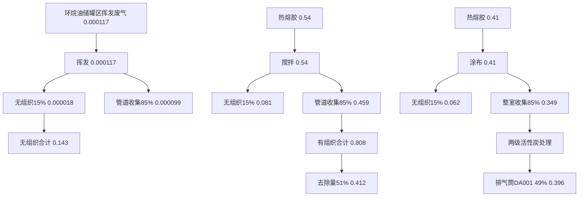
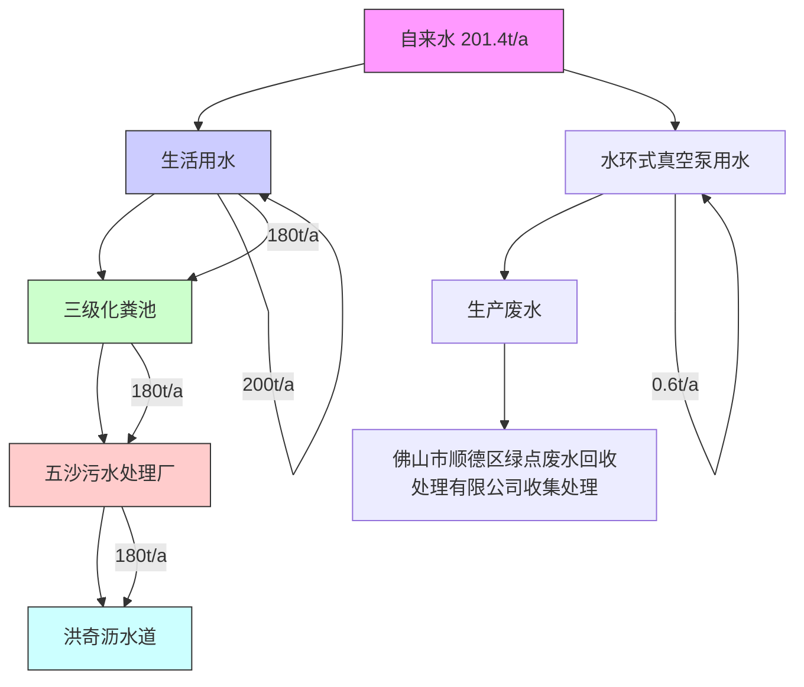
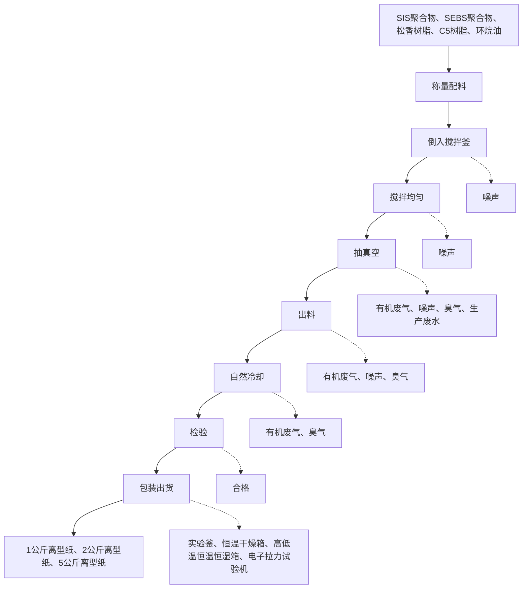
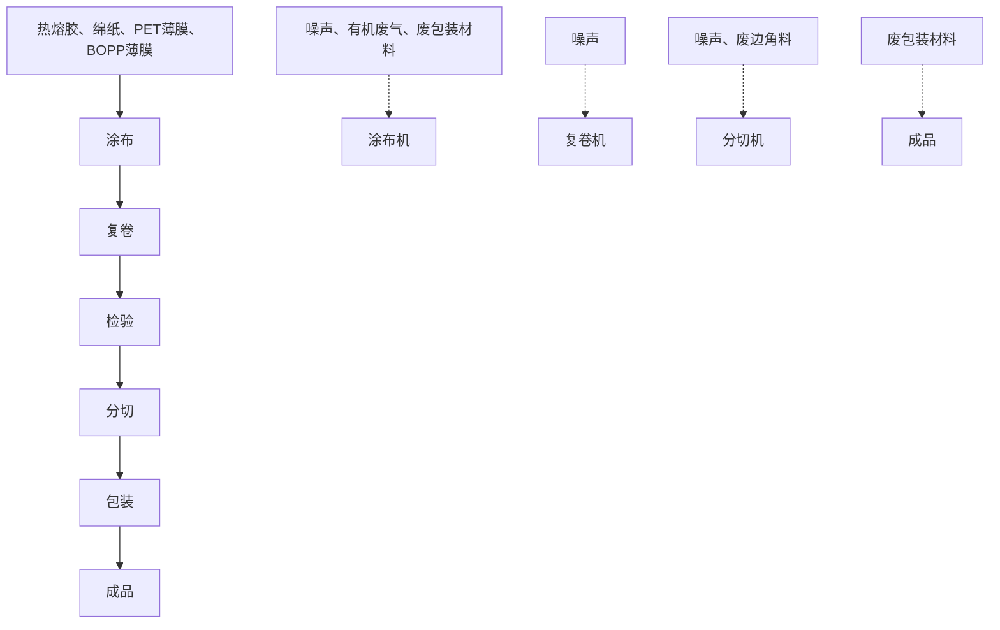

# 建设项目环境影响报告表

# （污染影响类）

限项目名称：佛山天胶新材料有限公司迁扩建项目

建设单位（盖章）：佛山天胶新材料有限公司

编制日期： 2023年7

中华人民共和国生态环境部制

text_image

佛山市怡景环境科技有限公司
406064012044

打印编号：1675408993000

编制单位和编制人员情况表

<table><tr><td>项目编号</td><td colspan="2">0j93t2</td></tr><tr><td>建设项目名称</td><td colspan="2">佛山天胶新材料有限公司迁扩建项目</td></tr><tr><td>建设项目类别</td><td colspan="2">23-044基础化学原料制造;农药制造;涂料、油墨、颜料及类似产品制造;合成材料制造;专用化学产品制造;炸药、火工及焰火产品制造</td></tr><tr><td>环境影响评价文件类型</td><td colspan="2">报告表</td></tr><tr><td colspan="2">一、建设单位情况</td><td rowspan="10"></td></tr><tr><td>单位名称(盖章)</td><td>佛山天胶新材料有</td></tr><tr><td>统一社会信用代码</td><td rowspan="5"></td></tr><tr><td>法定代表人(签章)</td></tr><tr><td>主要负责人(签字)</td></tr><tr><td>直接负责的主管人员(签字)</td></tr><tr><td>二、编制单位情况</td></tr><tr><td>单位名称(盖章)</td><td></td></tr><tr><td>统一社会信用代码</td><td>9</td></tr><tr><td colspan="2">三、编制人员情况</td></tr><tr><td colspan="3">1.编制主持人</td></tr><tr><td colspan="3"></td></tr></table>

本证书由中华人民共和国人事部和四案环境保护总局批准硕发，它表明持证人通过国家统一组织的考试合格，取得环境影响许价工程师的职业资格。

This is tocertifythat thebeareroftheCertificnte hspassed national exainationoganied bythe Chinese government departments and has obtained qualifications for Environmental Impact Assessment Engine

text_image

中华人民共和国
by
My Ministry of Personnel

The People's Republic ofChina

text_image

家环保证
APPHYSCHIN AUTHORIZED
State Environmental Protection Administration
The People's Republic of China

0003560

# 目 录

一、建设项目基本情况.  
二、建设项目工程分析.... 1  
三、区域环境质量现状、环境保护目标及评价标准 . 25  
四、主要环境影响和保护措施. . 31  
五、环境保护措施监督检查清单. 53  
六、结论.. . 55

附图1 项目地理位置图

附图2 项目平面布置图

附图3 项目四至图

附图4 项目敏感点分布图

附图5 项目四至照片

附图6 项目空厂房照片

附图7 项目所在区域的地表水环境功能区划图

附图8 项目所在区域的大气环境功能区划图

附图9 项目所在区域的声环境功能区划图

附图10 佛山市顺德区SD-A-05-01 编制单元（顺德工业园A 区）控制性详细规划局部调整批后公布

附图11 项目所在地环境管控单元图

附图12 项目附近水系及排污水去向图

附件1 营业执照

附件2 法人身份证

附件3 环评技术咨询合同

附件4 原辅材料MSDS

附件5 项目迁扩建前批复及自主验收意见

附件6 项目迁扩建前新建项目 VOCs 总量指标来源说明

附件7 热熔胶VOC 检测报告

附件8 公示声明

附件9 责任声明

# 一、建设项目基本情况

<table><tr><td>建设项目名称</td><td colspan="5">佛山天胶新材料有限公司迁扩建项目</td></tr><tr><td>项目代码</td><td colspan="5">无</td></tr><tr><td>建设单位联系人</td><td>陈**</td><td>联系方式</td><td colspan="3">138255****</td></tr><tr><td>建设地点</td><td colspan="5">广东省佛山市顺德区大良街道五沙社区新凯路8号潮创园厂房5栋102</td></tr><tr><td>地理坐标</td><td colspan="5">北纬22度51分16.801秒,东经113度22分55.76秒</td></tr><tr><td>国民经济行业类别</td><td>C2662专项化学用品制造;C2921塑胶薄膜制造</td><td>建设项目行业类别</td><td colspan="3">二十三、化学原料和化学制品制造业26中的44专用化学产品制造266中单纯物理分离、物理提纯、混合、分装的(不产生废水或挥发性有机物的除外);二十六、橡胶和塑胶制品业29中的53塑胶制品业292中的其他(年用非溶剂型低VOCs含量涂料10吨以下的除外)</td></tr><tr><td>建设性质</td><td>☑新建(迁建)□改建☑扩建□技术改造</td><td>建设项目申报情形</td><td colspan="3">☑首次申报项目□不予批准后再次申报项目□超五年重新审核项目□重大变动重新报批项目</td></tr><tr><td>项目审批(核准/备案)部门(选填)</td><td>无</td><td>项目审批(核准/备案)文号(选填)</td><td colspan="3">无</td></tr><tr><td>总投资(万元)</td><td>100</td><td>环保投资(万元)</td><td colspan="3">20</td></tr><tr><td>环保投资占比(%)</td><td>20</td><td>施工工期</td><td colspan="3">1个月</td></tr><tr><td>是否开工建设</td><td>☑否□是:____</td><td>用地(用海)面积( $m^2$ )</td><td colspan="3">3000</td></tr><tr><td>专项评价设置情况</td><td colspan="5">无</td></tr><tr><td>规划情况</td><td colspan="5">审批文件名称:《佛山市顺德区SD-A-05-01编制单元(顺德工业园A区)控制性详细规划局部调整批后公布》文号:佛府办函〔2021〕139号实施时间:2021年9月10日起</td></tr><tr><td>规划环境影响评价情况</td><td colspan="5">规划环评文件名称:顺德工业园A区发展规划环境影响报告书审批机关:佛山市顺德区环境运输与城市管理局审批文件名称及文号:《关于顺德工业园A区发展规划环境影响报告书审查意见的函》(顺管函〔2010〕186号)</td></tr><tr><td rowspan="3">规划及规划环境影响评价符合性分析</td><td colspan="5">根据《关于顺德科技工业园A区发展规划环境影响报告书审查意见的函》(顺管函〔2010〕186号),项目与审查意见相符性分析见下表:表1-1 项目与顺德科技工业园A区审查意见相符性分析</td></tr><tr><td colspan="2">内容</td><td>符合性分析</td><td colspan="2">相符性</td></tr><tr><td colspan="2">本园区内严禁安排三类工业,包括冶金工业、化学工</td><td>项目属于C2662专项化学</td><td colspan="2">符合</td></tr><tr><td rowspan="4"></td><td>业、造纸工业、制革工业、建材工业、漂染、水洗工业等。对于二类工业应加以严格限制,包括食品工业、医药制造工业、纺织印染工业等对居住和公共设施环境有一定干扰和污染的工业。鼓励高新技术产业、新兴产业和国家鼓励发展的其他项目入园;优先向外向型企业、规模效益型企业、科技型企业、重点企业和产业链企业开放入园。</td><td>用品制造和C2921塑胶薄膜制造,不属于园区严禁的三类工业和严格限制的二类工业。</td><td colspan="3"></td></tr><tr><td>园区内企业必须保证其全部废水预处理达到广东省地方标准《水污染物排放限值》(DB44/26-2001)第二时段三级标准及广东省《水污染物排放限值》(DB44/26-2001)第一类污染物的排放标准后纳入园区污水管道送工业园污水处理厂处理。本园区应按照《报告书》拟定的入园企业类别引进企业项目,并应避免引入生产过程使用和产生含有铬、镉、汞、铅、砷等重金属污染物的行业:若引进此类企业,必须保证这些重金属污染物零排放。</td><td>本项目无生产废水排放,水环式真空泵抽真空过程产生高浓度有机生产废水,暂存在铁桶内,计划由佛山市顺德区绿点废水回收处理有限公司收集处理;项目生活污水经三级化粪处理达到广东省地方标准《水污染排放限值》(DB44/26-2001)第二时段三级标准后排入五沙污水处理厂,尾水排至洪奇沥水道,项目废水中不存在第一类污染物。</td><td colspan="3">符合</td></tr><tr><td>强化园区内企业大气污染物的控制,引进企业应以电、天然气等清洁能源为燃料。</td><td>项目使用的能源均为电能,属于清洁能源。</td><td colspan="3">符合</td></tr><tr><td colspan="5">综上所述,本项目符合顺德科技工业园A区规划环评审核意见内容。</td></tr><tr><td>其他符合性分析</td><td colspan="5">(1)项目选址合理性分析本项目位于广东省佛山市顺德区大良街道五沙社区新凯路8号潮创园厂房5栋102。根据《佛山市顺德区SD-A-05-01编制单元(顺德工业园A区)控制性详细规划局部调整批后公布》,项目所在地用地性质属于一类工业用地,本项目的建设符合用地要求,故项目用地符合当地规划。(2)产业政策相符性分析本项目所属行业为C2662专项化学用品制造和C2921塑胶薄膜制造,经查,本项目不属于《产业结构调整指导目录(2019年本)》鼓励类、限制类和淘汰类项目,属于允许类项目。核查《市场准入负面清单(2022年版)》,项目不属于《市场准入负面清单(2022版)》的禁止准入类项目,与政策不相冲突。项目不涉及《环境保护综合名录(2021年版)》中的“高污染、高环境风险”产品名录中的产品,符合《环境保护综合名录》(2021年版)的相关规定。项目产品为热熔胶及热熔胶带,所属类别及生产产品不属于广东省发展改革委关于印发《广东省“两高”项目管理目录(2022年版)》的通知(粤发改能源函〔2022〕1363号)的附件广东省“两高”项目管理目录中的行业类别或产品,符合广东省发展改革委关于印发《广东省“两高”项目管理目录(2022年版)》的通知(粤发改能源函〔2022〕1363号)的相关规定。</td></tr><tr><td rowspan="7">其他符合性分析</td><td colspan="5">(3)与环境功能区域相符性分析根据《广东省人民政府关于调整佛山市部分饮用水水源保护区的批复》(粤府函〔2018〕426号)和《广东省生态环境厅关于对佛山市人民政府申请校正部分饮用水水源保护区图件的意见的函》(粤环函〔2019〕1167号),项目所在位置不在佛山市一、二级水源保护区范围内,符合饮用水源保护条例的有关要求。根据《佛山市顺德区人民政府办公室关于印发&lt;佛山市顺德区生态环境保护“十四五”规划(2021-2025)&gt;的通知》(顺府办发〔2022〕16号),项目所在区域为环境空气质量二类功能区,不属于环境空气质量一类功能区。根据《佛山市人民政府关于印发佛山市声环境功能区划分方案的通知》(佛府函〔2015〕72号),项目所在区域为声环境3类区,不属于声环境1类区。项目废水、废气、噪声在稳定达标排放的情况下,不改变原有的功能区规划,对周围环境影响较小。(4)与《佛山市人民政府办公室关于印发佛山市危险化学品禁止、限制和控制目录(试行)的通知》(佛府办〔2019〕25号)符合性分析对照《禁止危险化学品目录》,本项目原辅材料均不属于危险化学品,对照《重点监管的危险化工工艺目录》,本项目生产工艺主要是混合搅拌,不属于危险化工工艺,故本项目符合《佛山市人民政府办公室关于印发佛山市危险化学品禁止、限制和控制目录(试行)的通知》(佛府办〔2019〕25号)相关要求。(5)本项目与挥发性有机污染物治理政策的相符性分析本项目与挥发性有机污染物治理政策的相符性分析见下表:表1-2 项目与有机污染物治理政策的相符性</td></tr><tr><td>序号</td><td colspan="2">政策</td><td>工程内容</td><td>符合性</td></tr><tr><td rowspan="5">1</td><td colspan="4">《广东省涉挥发性有机物(VOCs)重点行业治理指引》的通知(粤环办〔2021〕43号)</td></tr><tr><td>产品</td><td>研发和生产低VOCs含量涂料、油墨、胶黏剂等产品。</td><td>本项目生产热熔胶,为低VOCs含量产品。</td><td>符合</td></tr><tr><td>储罐</td><td>固定顶罐:a)罐体应保持完好,不应有孔洞、缝隙;b)储罐附件开口(孔),除采样、计量、例行检查、维护和其他正常活动外,应密闭;c)定期检查呼吸阀的定压是否符合设计要求。</td><td>本项目设置一个 $15m^{3}$ 的立式固定储罐储存环烷油,罐体应保持完好,储罐附件开口(孔)平时密闭,大小呼吸排放的废气收集处理。</td><td>符合</td></tr><tr><td>物料输送</td><td>液态物料应采用密闭管道,采用非管道输送方式转移液态VOCs物料时,应采用密闭容器、罐车。</td><td>项目液态物料采用密闭管道输送。</td><td>符合</td></tr><tr><td>投料和卸</td><td>液态VOCs物料采用密闭管道输送方式或采用高位槽(罐)、桶</td><td>项目液态VOCs物料采用密闭管道输送。</td><td>符合</td></tr><tr><td rowspan="9"></td><td rowspan="6"></td><td>料</td><td>泵等给料方式密闭投加。</td><td></td><td></td></tr><tr><td>反应</td><td>反应设备进料置换废气、挥发排气、反应尾气等排至VOCs废气收集处理系统。</td><td>项目挥发排气等均进入废气收集处理系统。</td><td>符合</td></tr><tr><td>真空设备</td><td>若使用液环(水环)真空泵、水(水蒸气)喷射真空泵等,工作介质的循环槽(罐)密闭,真空排气、循环槽(罐)排气排至VOCs废气收集处理系统。</td><td>项目使用水环式真空泵抽真空,抽出气体直接通向废气治理设施处理。</td><td>符合</td></tr><tr><td>非正常排放</td><td>载有VOCs物料的设备及其管道在开停工(车)、检维修时,在退料阶段将残存物料退净,并用密闭容器盛装,退料过程废气排至VOCs废气收集处理系统。清洗及吹扫过程排气排至VOCs废气收集处理系统。</td><td>项目储罐检修时,废气排至废气收集处理系统。</td><td>符合</td></tr><tr><td>设备与管线组件泄漏</td><td>按下列频次对设备与管线组件的密封点进行VOCs泄漏检测:a)泵、压缩机、搅拌器(机)、阀门、开口阀或开口管线、泄压设备、取样连接系统至少每6个月检测一次;b)法兰及其他连接件、其他密封设备至少每12个月检测一次;c)对于直接排放的泄压设备,在非泄压状态下进行泄漏检测;直接排放的泄压设备泄压后,应在泄压之日起5个工作日之内,对泄压设备进行泄漏检测;d)设备与管线组件初次启用或检维修后,应在90天内进行泄漏检测。</td><td>项目定期对设备与管线组件的密封垫进行VOCs泄漏检测。</td><td>符合</td></tr><tr><td>敞开液面</td><td>对于工艺过程排放的含VOCs废水,集输系统符合下列规定之一:a)采用密闭管道输送,接入口和排出口采取与环境空气隔离的措施;b)采用沟渠输送,若敞开液面上方100mm处VOCs检测浓度≥200μmol/mol,应加盖密闭,接入口和排出口采取与环境空气隔离的措施。</td><td>项目抽真空产生高浓度有机废水,采用密闭管道输送。</td><td>符合</td></tr><tr><td rowspan="3">2</td><td colspan="4">《广东省人民政府办公厅关于印发广东省2021年大气、水、土壤污染防治工作方案的通知》(粤办函〔2021〕58号)</td></tr><tr><td colspan="2">严格落实国家产品VOCs含量限值标准要求,除现阶段确无法实施替代的工序外,禁止新建生产和使用高VOCs含量原辅材料项目。鼓励在生产和流通消费环节推广使用低VOCs含量原辅材料。</td><td>项目不使用高VOCs含量原辅材料。</td><td>符合</td></tr><tr><td colspan="2">涉VOCs重点行业新建、改建和扩建项</td><td>项目有机废气治理采用“二级活性</td><td>符合</td></tr><tr><td rowspan="12"></td><td></td><td>目不推荐使用光氧化、光催化、低温等离子等低效治理设施,已建项目逐步淘汰光氧化、光催化、低温等离子治理设施。指导采用一次性活性炭吸附治理技术的企业,明确活性炭装载量和更换频次,记录更换时间和使用量。</td><td>炭”处理。活性炭装载量和更换频次已在本报告内容中明确。</td><td colspan="2"></td></tr><tr><td rowspan="4">3</td><td colspan="4">《固定污染源挥发性有机物综合排放标准》(DB44/2367-2022)</td></tr><tr><td>VOCs物料储存无组织排放控制要求。</td><td rowspan="3">项目环烷油密封储存在立式固定储罐,大小呼吸产生的有机废气采用二级活性炭吸附处理后高空排放;项目热熔胶生产及热熔胶带生产采用整室负压收集,减少无组织排放。</td><td colspan="2">符合</td></tr><tr><td>VOCs物料转移和输送无组织排放控制要求。</td><td colspan="2">符合</td></tr><tr><td>工艺过程VOCs无组织排放控制要求。</td><td colspan="2">符合</td></tr><tr><td rowspan="4">4</td><td colspan="4">关于印发《重点行业挥发性有机物综合治理方案》的通知(环大气〔2019〕53号)</td></tr><tr><td>通过使用水性、粉末、高固体分、无溶剂、辐射固化等低VOCs含量的涂料,水性、辐射固化、植物等低VOCs含量的油墨,水基、热熔、无溶剂、辐射固化、改性、生物降解等低VOCs含量的胶粘剂,以及低VOCs含量、低反应活性的清洗剂等,替代溶剂型涂料、油墨、胶粘剂、清洗剂等,从源头减少VOCs产生。</td><td>项目含VOCs物料密封储存在铁罐,并放置于仓库内。环烷油密封储存在立式固定储罐。</td><td colspan="2">符合</td></tr><tr><td>重点对含VOCs物料(包括含VOCs原辅材料、含VOCs产品、含VOCs废料以及有机聚合物材料等)储存、转移和输送、设备与管线组件泄漏、敞开液面逸散以及工艺过程等五类排放源实施管控,通过采取设备与场所密闭、工艺改进、废气有效收集等措施,削减VOCs无组织排放。</td><td rowspan="2">项目热熔胶生产废气采用管道收集,热熔胶带生产废气采用整室负压收集,收集效率均为85%。</td><td colspan="2">符合</td></tr><tr><td>提高废气收集率,遵循“应收尽收、分质收集”的原则,科学设计废气收集系统,将无组织排放转变为有组织排放进行控制。采用全密闭集气罩或密闭空间的,除行业有特殊要求外,应保持微负压状态,并根据相关规范合理设置通风量。采用局部集气罩的,距集气罩开口面最远处的VOCs无组织排放位置,控制风速应不低于0.3米/秒,有行业要求的按相关规定执行。</td><td colspan="2">符合</td></tr><tr><td rowspan="2">5</td><td colspan="4">《佛山市生态环境局顺德分局关于做好重点行业建设项目挥发性有机物总量指标管理工作的通知》(佛顺环函〔2019〕56号)</td></tr><tr><td>涉VOCs排放项目,实现本行政区域内污染源“点对点”2倍量削减替代,由项目所在镇街分局出具VOCs总量指标来源及替代削减方案的意见,开展总量替代。</td><td>项目迁扩建后VOCs排放量为0.539t/a,迁扩建前VOCs指标为0.052t/a,新增VOCs总量指标为0.487t/a,由区环保部门分配。</td><td colspan="2">符合</td></tr><tr><td>6</td><td colspan="4">佛山市发展和改革局佛山市生态环境局关于印发《佛山市关于进一步加强塑胶污染治理的实施方案》的通知(2020-年11月09日发布)</td></tr><tr><td rowspan="6"></td><td></td><td>全市范围内禁止生产和销售厚度小于0.025毫米的超薄塑胶购物袋、厚度小于0.01毫米的聚乙烯农用地膜。禁止以医疗废物为原料制造塑胶制品;禁止将回收利用的废塑料输液袋(瓶)用于原用途或用于制造餐饮容器以及玩具等儿童用品。加大禁止“洋垃圾”进口监管和打私力度,确保“全面禁止废塑料进口”落实到位。到2020年底,禁止生产和销售一次性发泡塑胶餐具、一次性塑胶棉签;禁止生产含塑胶微珠的日化产品。到2022年底,禁止销售含塑胶微珠的日化产品。国家《产业结构调整指导目录》和《市场准入负面清单》明确的属于淘汰类的塑胶制品项目,禁止投资;属于限制类项目,禁止新建。</td><td>本项目不属于禁止生产项目及限制类项目。</td><td colspan="2">符合</td></tr><tr><td rowspan="2">7</td><td colspan="4">《广东省塑胶制品与制造业挥发性有机物综合整治技术指南》</td></tr><tr><td>若采用活性炭吸附技术,采用颗粒活性炭作为吸附剂时,其碘值不宜低于800mg/g;采用蜂窝活性炭作为吸附剂时,其碘值不宜低650mg/g;采用活性炭纤维作为吸附剂时,其比表面积不低于 $1100m^{2}/g$ (BET法)。工作温度和湿度应符合:温度T&lt;40°C、湿度RH&lt;60%;活性炭表面不应有积尘和积水;活性炭吸附箱是否足额装填活性炭(1吨活性炭通常只能吸附0.1~0.2吨VOCs。</td><td>本项目采用碘值不宜低于650mg/g的蜂窝活性炭对有机废气进行吸附处理,且1吨活性炭按吸附0.2吨VOCs计算。</td><td colspan="2">符合</td></tr><tr><td rowspan="2">8</td><td colspan="4">《关于做好建设项目挥发性有机物(VOCs)排放削减替代工作的补充通知》(粤环函〔2021〕537号)</td></tr><tr><td>各地生态环境部门要健全建设项目VOCs排放总量管理台账,严格核定VOCs可替代总量指标,重点核查用作替代的削减量是否为企业达标排放后采取治理措施的削减量、或淘汰关停后的削减量,是否有削减量重复使用等情况,进一步规范VOCs削减替代工作。新改扩建项目环评审批时,应逐级出具VOCs总量替代来源审核意见,确保总量指标管理扎实有效。</td><td>待项目审批时由生态环境部门根据《关于做好建设项目挥发性有机物(VOCs)排放削减替代工作的补充通知》(粤环函〔2021〕537号)档要求核定VOCs总量来源。</td><td colspan="2">符合</td></tr><tr><td colspan="5">(6)项目与“三线一单”相符性分析本项目位于广东省佛山市顺德区大良街道五沙社区新凯路8号潮创园厂房5栋102,根据《广东省人民政府关于印发广东省“三线一单”生态环境分区管控方案的通知》(粤府〔2020〕71号)和《佛山市人民政府关于印发佛山市“三线一单”生态环境分区管控方案的通知》(佛府〔2021〕11号),项目符合广东省和佛山市的“三线一单”生态环境分区管控方案要求。根据《佛山市顺德区人民政府关于印发佛山市顺德区“三线一单”生态环境分区管控方案的通知》(顺府发〔2021〕11号)发布的佛山市顺德区环境管控单元图(见附图10),项目所在的佛山市顺德区大良街道为佛山市顺德区重点管控单元2(编码为ZH44060620002,名称为大良街道重点管控区),项目与广东省佛山市顺德区重点管控单元2准入清单相符性分析如下表。</td></tr></table>

# （7）项目经济效益分析

本项目主要从事热熔胶、热熔胶带的生产制造与经营，项目计划投资 100万元，投产后预计可实现年工业增加值（纯收入）50 万元，投资回收期预计为 2 年，具有良好的直接经济效益。项目投产后，项目热熔胶、热熔胶带的购买使用，将扩大市场需求，会带来间接经济效益，同时能为当地带来更大的就业机会。

本项目使用低挥发性原辅材料，不使用高挥发性原辅材料；项目环烷油储罐大小呼吸废气、搅拌废气及涂布废气经收集后引至二级活性炭吸附系统处理后经 43m高排气筒 DA001 排放，项目产生的废气均经过收集处理；有机废气采用二级活性炭吸附装置处理为废气的高效治理技术。

因此该项目选址合理，项目建设符合国家、省、市的产业政策。

表 1-3 项目与佛山市顺德区“三线一单”生态环境分区管控方案相符性分析

<table><tr><td>管控维度</td><td>管控要求</td><td>工程内容</td><td>相符性</td></tr><tr><td rowspan="7">区域布局管控</td><td>1-1.【产业/鼓励引导类】重点发展电子信息、5G设备、装备制造及机器人产业、汽车配件产业,打造顺德智造创新服务中心;重点发展高端商贸、金融、科技服务、文创旅游等现代服务业,建设顺德新城城市CBD。</td><td>本项目不涉及。</td><td>符合</td></tr><tr><td>1-2.【产业/综合类】系统推进村级工业园升级改造,腾出连片空间,布局产业集聚区和主题产业园,推动工业项目入园集聚发展。新增工业制造业用地原则上安排在产业集聚区内,产业集聚区外原则上不鼓励工业及物流仓储用地的新建与改造。</td><td>项目租用已有工业园区厂房,属于新建项目,所在地符合规划要求,不属于新建工业及物流仓储用地。</td><td>符合</td></tr><tr><td>1-3.【产业/综合类】产业聚集区所属地块内的工业用地或企业与村庄、学校等环境敏感点之间应设置合理的大气环境防护距离,并通过绿化带进行有效隔离;聚集区规划布局应注重大气污染排放企业应尽量避免布局在居住用地的常年主导风向的上风向。</td><td>项目周围500m范围最近敏感目标是东南面200米的五沙四村居民点及北面360米的五沙社区居民点,距离厂边界较远,并通过绿化带进行有效隔离。</td><td>符合</td></tr><tr><td>1-4.【产业/限制类】受纳水体或监控断面不达标的,不得新建、扩建向河涌直接排放废水的项目。新建、扩建含蚀刻工序的线路板生产项目和化工项目应在配套污水集中处置的工业园区或生活污水管网覆盖区域内建设;纯加工型印花项目,含酸洗、磷化的金属表面处理、金属制品项目(与自身高新技术企业配套的除外),含酸洗、喷涂、拉丝、表面抛光等工艺的不锈钢型材加工项目,应进入以此类项目为主导产业、有相应废水集中治理设施的工业园区,实现集中治污。</td><td>项目外排废水主要为生活污水,生活污水纳入城市污水处理厂处理,且纳污水体水质达标。项目不涉及酸洗、磷化等工艺,此外,不属于产业限制类项目。</td><td>符合</td></tr><tr><td>1-5.【产业/综合类】划定家具生产优先发展区域,优先发展区外不再新建涉及涂装工艺的木质家具制造项目。</td><td>项目不属于木质家具制造项目。</td><td>符合</td></tr><tr><td>1-6.【大气/限制类】大气环境受体敏感重点管控区内,应严格限制新建储油库项目、产生和排放有毒有害大气污染物的建设项目以及使用溶剂型油墨、涂料、清洗剂、胶黏剂等高挥发性有机物原辅材料项目,鼓励现有该类项目搬迁退出。</td><td>项目生产过程中不使用溶剂型油墨、涂料、清洗剂、胶黏剂等高挥发性有机物原辅材料,项目生产热熔胶带使用本项目生产的热熔胶,该热熔胶属本体型胶粘剂,为低VOC型胶粘剂,故不属于大气限制类,也不产生有毒有害污染物。</td><td>符合</td></tr><tr><td>1-7.【大气/鼓励引导类】大气环境高排放重点管控区内,应强化达标监管,引导工业项目落地集聚发展,有序推进区域内行业企业提标改造。</td><td>本项目废气污染物可达标排放。</td><td>符合</td></tr><tr><td rowspan="6">能源资料利用</td><td>2-1.【能源/鼓励引导类】推广节能技术,加快发展绿色货运与现代物流。</td><td>本项目不属于高耗能项目。</td><td>符合</td></tr><tr><td>2-2.【能源/鼓励引导类】推广新能源汽车应用和充电基础设施、加氢站建设。</td><td>本项目不涉及。</td><td>符合</td></tr><tr><td>2-3.【能源/综合类】科学实施能源消费总量和强度“双控”,新建高耗能项目单位产品(产值)能耗达到国际国内先进水平。</td><td>本项目不属于高耗能项目。</td><td>符合</td></tr><tr><td>2-4.【水资源/综合类】贯彻落实“节水优先”方针,实行最严格水资源管理制度,大良街道万元国内生产总值用水量、万元工业增加值用水量、用水总量、农田灌溉水有效利用系数等用水总量和效率指标达到区下达要求。</td><td>本项目不涉及。</td><td>符合</td></tr><tr><td>2-5.【土地资源/限制类】落实单位土地面积投资强度、土地利用强度等建设用地控制性指标要求,提高土地利用效率。</td><td>项目单位土地面积投资强度、土地利用强度等建设用地控制性指标均满足相关标准要求,土地利用效率较高。</td><td>符合</td></tr><tr><td>2-6.【岸线/禁止类】严格水域岸线用途管制,新建项目一律不得违规占用水域。严禁破坏生态的岸线利用行为和不符合其功能定位的开发建设活动,严禁以各种名义侵占河道、围垦湖泊、非法采砂等。</td><td>项目选址不占用水域,租用已建厂房,不存在基建基础施工,不会破坏生态的岸线利用和做不符合其功能定位的开发建设活动,不侵占河道围垦湖泊、非法采砂等。</td><td>符合</td></tr><tr><td rowspan="3">污染物排放管控</td><td>3-1.【水/限制类】城镇新区建设实行雨污分流。住宅、商业体、学校、市场等城镇开发建设项目应当配套或者同步计划建设公共排水设施,公共排水设施或自建排污水设施未能投产运行的,以上涉水项目不得投入使用。新建社区严格实施雨污分流,阳台、露台等污水接入污水收集系统,将生活污水“应截尽截”。做好大型楼盘、集贸市场、餐饮以及学校等4大类排水户污水接入市政管网工作。</td><td>本项目不涉及。</td><td>符合</td></tr><tr><td>3-2.【水/综合类】大良街道重点河涌水质上年度未达到水环境环境质量目标的,需组织编制、系统实施、向社会公开区域重点水污染物减排计划并明确“替代量”,本年度新建、改建、扩建项目新增水环境重点污染物实行区域“减二增一”替代(工业、生活或综合集中废水处理设施、民生项目除外)。</td><td>项目生活污水经三级化粪池预处理后排入五沙污水处理厂,且属于工业项目,无需实施本年度新建项目新增水环境重点污染物区域“减二增一”替代。</td><td>符合</td></tr><tr><td>3-3.【水/综合类】结合村级工业园改造,全面提升产业层次与集聚度,促进污染集中整治。</td><td>本项目不属于村级工业园改造区。</td><td>符合</td></tr><tr><td rowspan="4"></td><td>3-4.【水/综合类】稳步推进排水设施“三个一体化”管理模式,补齐城乡污水收集和处理短板,推动逢沙污水处理厂、大门污水处理厂提质增效,加快消除城中村、老旧城区、城乡结合部等污水收集管网空白区,逐步实现城乡污水收集处理全覆盖。逢沙污水处理厂根据片区的污水排放收集情况,进行扩建增容工作,尾水应执行《城镇污水处理厂污染物排放标准》(GB18918-2002)一级A标准及《广东省水污染物排放限值》(DB44/26-2001)的较严值。2025年城市生活污水集中收集率达到75%以上。</td><td>本项目为工业型项目,不涉及城镇污水处理厂的建设。项目位于五沙污水处理厂集水范围,尾水执行《城镇污水处理厂污染物排放标准》(GB18918-2002)一级A标准及《广东省水污染物排放限值》(DB44/26-2001)的较严值。</td><td>符合</td></tr><tr><td>3-5.【水/综合类】逢沙村、红岗村、大门村、顺峰村和南江村等行政村(社区)继续完善污水管网建设,实现农村污水100%收集进入市政污水系统,有条件的区域实施雨污分流改造,到2030年全面雨污分流,污水纳入大良街道污水处理系统。</td><td>本项目不涉及。</td><td>符合</td></tr><tr><td>3-6.【水/综合类】产业集聚区和主题园区内做好污水管网和污水集中处理设施的配套保障,确保废水收集到城镇污水处理厂、园区污水处理厂或分散式污水处理设施集中处置。</td><td>项目生活污水经预处理后通过市政污水管网纳入五沙污水处理厂处理。</td><td>符合</td></tr><tr><td>3-7.【大气/综合类】大力推进低VOCs含量原辅材料替代,加快涉VOCs重点行业的生产工艺升级改造,推行自动化生产工艺,对达不到要求的VOCs收集及治理设施进行整治提升,逐步淘汰低效VOCs治理设施。</td><td>本项目不涉及。</td><td>符合</td></tr><tr><td rowspan="2">环境风险防控</td><td>4-1.【水/综合类】大门污水处理厂、逢沙污水处理厂、顺德区科技工业园(五沙)污水处理厂及企业工业污水处理设施应采取有效措施,防止事故废水直接排入水体。完善污水处理厂在线监控系统联网,实现污水处理厂的实时、动态监管。</td><td>项目所在地位于五沙污水处理厂纳污范围,污水处理厂已与在线监控系统联网,实现污水处理厂的实时动态监管。</td><td>符合</td></tr><tr><td>4-2.【风险/综合类】加强环境风险分级分类管理,强化金属制品、有色金属和压延加工、化学原料和化学品制造业等涉重金属、化工行业企业及工业园区等重点环境风险源的环境风险防控。</td><td>项目不属于金属制品、有色金属和压延加工、化学原料和化学品制造业等涉重金属、化工行业企业及工业园区等重点环境风险源,项目运营后日常加强环境风险分级分类管理。</td><td>符合</td></tr></table>

# 二、建设项目工程分析

# 1、项目组成

佛山天胶新材料有限公司原位于佛山市顺德区勒流街道支流北岸片 D-XB-02-02-04-02 号地块（顺德光电产业园东侧）A 栋 1 层 1 号，于 2020 年二月以“佛山天胶新材料有限公司新建项目”进行报批，于 2020年 2 月取得《佛山市生态环境局关于佛山天胶新材料有限公司新建项目建设项目环境影响报告表的批复》（佛环 03 环审〔2020〕第 0021 号）。现佛山天胶新材料有限公司拟迁扩建至广东省佛山市顺德区大良街道五沙社区新凯路 8 号潮创园厂房 5 栋 102 进行生产经营。

项目迁扩建前后工程组成见下表。

表 2-1 项目迁扩建前后工程组成  
建设内容

<table><tr><td colspan="2">项目名称</td><td>迁扩建前</td><td>迁扩建</td><td>迁扩建后</td></tr><tr><td rowspan="2">主体工程</td><td>热熔胶生产车间</td><td>面积1100平方米,一层,层高8米,所在建筑物高30.5米,主要功能包括生产区、成品仓库、原料仓库、辅料仓、危废仓、一般固废仓</td><td>增加400平方米</td><td>面积1500平方米,一层,层高8米,所在建筑物高40米,热熔胶生产车间位于首层,主要功能包括生产区、成品仓库1、原料仓库1、辅料仓、危废仓、一般固废仓、冷却间,其中冷却间尺寸为 $3m \times 3m \times 3m$ ,面积为9平方米</td></tr><tr><td>热熔胶带生产车间</td><td>/</td><td>增加面积1500平方米的热熔胶带生产车间</td><td>面积1500平方米,一层,层高8米,所在建筑物高40米,热熔胶带生产车间位于二层,主要功能包括热熔胶带生产车间、成品仓库2、原料仓库2,其中热熔胶带室尺寸为 $10m \times 4m \times 3m$ ,面积为40平方米</td></tr><tr><td rowspan="2">辅助工程</td><td>办公室</td><td>面积50平方米,一层,层高8米,所在建筑物高30.5米,主要功能包括生产办公</td><td>增加面积50平方米</td><td>面积100平方米,一层,层高8米,所在建筑物高40米,办公室位于一层夹层,主要功能包括生产办公,位于热熔胶生产车间</td></tr><tr><td>实验室</td><td>面积30平方米,一层,层高8米,所在建筑物高30.5米,主要功能包括实验测试</td><td>/</td><td>面积30平方米,一层,层高8米,所在建筑物高40米,实验室位于一层夹层,主要功能包括实验测试,位于热熔胶生产车间</td></tr><tr><td rowspan="5">储运工程</td><td>原料仓库1</td><td>面积100平方米,一层,层高8米,所在建筑物高30.5米,主要功能包括原料储存</td><td>/</td><td>面积100平方米,一层,层高8米,所在建筑物高40米,位于首层,主要功能包括原料储存</td></tr><tr><td>成品仓库1</td><td>面积50平方米,一层,层高8米,所在建筑物高30.5米,主要功能包括成品储存</td><td>/</td><td>面积50平方米,一层,层高8米,所在建筑物高40米,位于首层,主要功能包括成品储存</td></tr><tr><td>原料仓库2</td><td>/</td><td>增加面积100平方米原料仓库2</td><td>面积100平方米,一层,层高8米,所在建筑物高40米,位于二层,主要功能包括原料储存</td></tr><tr><td>成品仓库2</td><td>/</td><td>增加面积50平方米成品仓库2</td><td>面积50平方米,一层,层高8米,所在建筑物高40米,位于二层,主要功能包括成品储存</td></tr><tr><td>一般固</td><td>面积4平方米,一层,层高8米,所</td><td>/</td><td>面积4平方米,一层,层高8米,所在</td></tr></table>

<table><tr><td rowspan="12"></td><td rowspan="2"></td><td>废仓</td><td colspan="2">在建筑物高30.5米,主要功能包括一般固废储存</td><td></td><td>建筑物高40米,位于首层,主要功能包括一般固废储存,位于热熔胶生产车间</td></tr><tr><td>危废仓</td><td colspan="2">面积6平方米,一层,层高8米,所在建筑物高30.5米,主要功能包括危险废物储存</td><td>/</td><td>面积6平方米,一层,层高8米,所在建筑物高40米,位于首层,主要功能包括危险废物储存,位于热熔胶生产车间</td></tr><tr><td rowspan="2">公用工程</td><td>给排水</td><td colspan="2">由市政供水;生活污水经市政管网引至勒流污水处理厂;依托所在厂房已有给排水系统</td><td>/</td><td>由市政供水;生活污水经市政管网引至五沙污水处理厂;依托所在厂房已有给排水系统</td></tr><tr><td>供能</td><td colspan="2">由市政供电,依托所在厂房已有设施</td><td>/</td><td>由市政供电,依托所在厂房已有设施</td></tr><tr><td rowspan="8">环保工程</td><td rowspan="2">废水</td><td>生活污水</td><td>项目生活污水经三级化粪池处理后排入勒流污水处理厂,尾水排至顺德支流</td><td>/</td><td>项目生活污水经三级化粪池处理后排入五沙污水处理厂,尾水排至洪奇沥水道</td></tr><tr><td>生产废水</td><td>水环式真空泵抽真空过程产生高浓度有机生产废水,暂存在铁桶内,由佛山市顺德区绿点废水回收处理有限公司收集处理</td><td>/</td><td>水环式真空泵抽真空过程产生高浓度有机生产废水,暂存在铁桶内,计划由佛山市顺德区绿点废水回收处理有限公司收集处理</td></tr><tr><td rowspan="2">废气</td><td>有机废气</td><td>环烷油储罐大小呼吸废气及搅拌废气经收集后引至“UV光氧催化净化装置+活性炭吸附装置”处理后经31.5m高排气筒DA001排放</td><td>增加涂布废气;UV光氧催化净化装置+活性炭吸附装置更换为二级活性炭吸附系统</td><td>环烷油储罐大小呼吸废气、水环式抽真空废气、搅拌废气经管道收集,冷却废气、涂布废气经整室收集后一并引至二级活性炭吸附系统处理后经43m高排气筒DA001排放</td></tr><tr><td>恶臭气体</td><td>经收集后引至“UV光氧催化净化装置+活性炭吸附装置”处理后经31.5m高排气筒DA001排放</td><td>UV光氧催化净化装置+活性炭吸附装置更换为二级活性炭吸附系统</td><td>经管道收集及整室收集后引至二级活性炭吸附系统处理后经43m高排气筒DA001排放</td></tr><tr><td rowspan="3">固体废物</td><td>危险废物</td><td>1个,存放危险废物;危险废物收集后放置于危险废物暂存间(长×宽×高=3m×2m×2m),再交由有资质的单位进行处置</td><td>/</td><td>1个,存放危险废物;危险废物收集后放置于危险废物暂存间(长×宽×高=3m×2m×2m),再交由有资质的单位进行处置</td></tr><tr><td>一般固体废物</td><td>1个,存放一般工业固体废物;一般工业固废收集后放置于一般固废暂存间(长×宽×高=2m×2m×1m)内,再由回收公司统一回收</td><td>/</td><td>1个,存放一般工业固体废物;一般工业固废收集后放置于一般固废暂存间(长×宽×高=2m×2m×1m)内,再由回收公司统一回收</td></tr><tr><td>生活垃圾</td><td>位于生产车间内,交由环卫部门定期进行统一清理</td><td>/</td><td>位于生产车间内,交由环卫部门定期进行统一清理</td></tr><tr><td>噪声</td><td colspan="2">项目噪声为设备运行产生的噪声,采取选用低噪声设备、车间合理布局、安装减震基础、厂房隔声、距</td><td>/</td><td>项目噪声为设备运行产生的噪声,采取选用低噪声设备、车间合理布局、安装减震基础、厂房隔声、距离衰减</td></tr><tr><td></td><td></td><td>离衰减等措施削减。</td><td></td><td colspan="3">等措施削减。</td></tr></table>

# 2、主要产品及产量

根据建设单位提供资料，迁扩建前后主要产品及产量见下表：

表 2-2 项目迁扩建前后产品方案一览表

<table><tr><td>序号</td><td>产品名称</td><td>迁扩建前/t</td><td>迁扩建/t</td><td>迁扩建后/t</td><td>包装规格</td><td>最大储存量</td></tr><tr><td>1</td><td>热熔胶</td><td>2500</td><td>+2000</td><td>4500</td><td>24kg/箱</td><td>500</td></tr><tr><td>2</td><td>热熔胶带</td><td>0</td><td>+270万平方米</td><td>270万平方米</td><td>3000平方米/袋</td><td>23万平方米</td></tr></table>

表 2-3 主要涉 VOCs产品一览表

<table><tr><td>序号</td><td>名称</td><td>理化性质</td><td>VOCs含量</td><td>国家标准限值</td><td>是否属于低VOCs原辅料</td></tr><tr><td>1</td><td>热熔胶</td><td>本项目热熔胶是以热塑性聚合物为主的胶黏剂,属于SBC类热熔压敏胶,集常规热熔胶和压敏胶的特点于一体,无溶剂,无污染,使用较方便。本项目生产的热熔胶在常温下呈琥珀色透明状半固体块且表面具有一定的粘性,软化点为70摄氏度,闪点大于200°C,密度为0.95g/cm3,无毒、无味、不易燃、无爆炸性。常用于食品包装、一次性卫生制品行业、预涂标签行业、保护性胶膜、电工绝缘胶带、医疗卫生制品行业等。</td><td>3g/kg</td><td>《胶粘剂挥发性有机化合物限量》(GB 33372-2020)中表3其他-热塑类VOCs≤50g/kg</td><td>是</td></tr></table>

注：热熔胶 VOCs 含量见附件 7。

# 3、主要生产设备

根据建设单位提供资料，项目迁扩建前后主要生产设备如下表所示。

表 2-4 项目迁扩建前后主要生产设备一览表

<table><tr><td>生产单元名称</td><td>设备名称</td><td>设施参数</td><td>迁扩建前</td><td>迁扩建</td><td>迁扩建后</td><td>设备参数值</td><td>单位</td><td>能源类型</td><td>工艺</td><td>位置</td></tr><tr><td rowspan="3">热熔胶生产单元</td><td>搅拌釜</td><td>设备容积</td><td>4</td><td>+3</td><td>7</td><td>增加3000L的搅拌釜3个。其中3000L的4个,2200L、1700L、1300L各1个(新增的搅拌釜采用电加热,原有的搅拌釜采用导热油加热)</td><td>台</td><td>电加热或导热油加热</td><td>混合、搅拌</td><td rowspan="4">热熔胶生产车间</td></tr><tr><td>水环式真空泵</td><td>流速</td><td>1</td><td>0</td><td>1</td><td> $0.4m^{3}/min$ </td><td>台</td><td>电</td><td>抽真空</td></tr><tr><td>空压机</td><td>功率</td><td>2</td><td>0</td><td>2</td><td>35KW</td><td>台</td><td>电</td><td>辅助</td></tr><tr><td>物料储存系统</td><td>环烷油油罐</td><td>容积</td><td>1</td><td>0</td><td>1</td><td> $15m^{3}$ </td><td>个</td><td>/</td><td>分装</td></tr><tr><td rowspan="3">热熔胶带生产单元</td><td>涂布机</td><td>生产能力</td><td>0</td><td>+3</td><td>3</td><td> $400m^{2}/h$ </td><td>台</td><td>电</td><td>涂布</td><td rowspan="3">热熔胶带生产</td></tr><tr><td>复卷机</td><td>生产能力</td><td>0</td><td>+4</td><td>4</td><td> $300m^{2}/h$ </td><td>台</td><td>电</td><td>复卷</td></tr><tr><td>分切机</td><td>生产能力</td><td>0</td><td>+4</td><td>4</td><td> $300m^{2}/h$ </td><td>台</td><td>电</td><td>分切</td></tr><tr><td></td><td></td><td></td><td></td><td></td><td></td><td></td><td></td><td></td><td></td><td>车间</td></tr><tr><td rowspan="4">公用单元</td><td>实验釜</td><td>设备容积</td><td>1</td><td>0</td><td>1</td><td>5L</td><td>台</td><td>电</td><td rowspan="4">物化性质分析</td><td rowspan="4">实验室</td></tr><tr><td>恒温干燥箱</td><td>尺寸</td><td>2</td><td>0</td><td>2</td><td>3m*2m*1m</td><td>台</td><td>电</td></tr><tr><td>高低温恒温恒湿箱</td><td>尺寸</td><td>1</td><td>0</td><td>1</td><td>2m*2m*1m</td><td>台</td><td>电</td></tr><tr><td>电子拉力试验机</td><td>功率</td><td>1</td><td>0</td><td>1</td><td>5KW</td><td>台</td><td>电</td></tr></table>

# 4、主要原辅材料

根据建设单位提供资料，项目迁扩建前后主要原辅材料如下表所示。

表 2-5 项目迁扩建前后主要原辅材料消耗量一览表

<table><tr><td>序号</td><td>类别</td><td>名称</td><td>配比/%</td><td>迁扩建前/t</td><td>迁扩建/t</td><td>迁扩建后/t</td><td>最大储存量/t</td><td>形状</td><td>包装规格</td></tr><tr><td colspan="10">热熔胶</td></tr><tr><td>1</td><td>溶质</td><td>SIS 聚合物</td><td>0.17</td><td>425.17</td><td>+340.136</td><td>765.306</td><td>100</td><td>颗粒状</td><td>1000kg/袋</td></tr><tr><td>2</td><td>溶质</td><td>SEBS 聚合物</td><td>0.03</td><td>75.03</td><td>+60.024</td><td>135.054</td><td>20</td><td>颗粒状</td><td>1000kg/袋</td></tr><tr><td>3</td><td>溶质</td><td>松香树脂</td><td>0.34</td><td>850.34</td><td>+680.272</td><td>1530.612</td><td>200</td><td>颗粒状</td><td>1000kg/袋</td></tr><tr><td>4</td><td>溶质</td><td>C5 树脂</td><td>0.12</td><td>300.12</td><td>+240.096</td><td>540.216</td><td>50</td><td>颗粒状</td><td>1000kg/袋</td></tr><tr><td>5</td><td>溶剂</td><td>环烷油</td><td>0.34</td><td>850.34</td><td>+679.012</td><td>1529.352</td><td>13.5</td><td>液态</td><td>环烷油油罐储存</td></tr><tr><td>6</td><td>/</td><td>导热油</td><td>/</td><td>1</td><td>0</td><td>1</td><td>1</td><td>液态</td><td>200kg/桶</td></tr><tr><td>7</td><td>/</td><td>离型纸</td><td>/</td><td>0.55</td><td>+0.45</td><td>1</td><td>0.2</td><td>固态</td><td>分为 1 公斤、2 公斤、5 公斤包装离型纸</td></tr><tr><td colspan="10">热熔胶带</td></tr><tr><td>1</td><td>/</td><td>热熔胶</td><td>/</td><td>0</td><td>+137</td><td>137</td><td>/</td><td>块状</td><td>/</td></tr><tr><td>2</td><td>/</td><td>绵纸</td><td>/</td><td>0</td><td>+91 万平方米</td><td>91 万平方米</td><td>6 万平方米</td><td>固态</td><td>3000 平方米/袋</td></tr><tr><td>3</td><td>/</td><td>PET 薄膜</td><td>/</td><td>0</td><td>+91 万平方米</td><td>91 万平方米</td><td>6 万平方米</td><td>固态</td><td>3000 平方米/袋</td></tr><tr><td>4</td><td>/</td><td>BOPP 薄膜</td><td>/</td><td>0</td><td>+91 万平方米</td><td>91 万平方米</td><td>6 万平方米</td><td>固态</td><td>3000 平方米/袋</td></tr><tr><td>5</td><td>/</td><td>机油</td><td>/</td><td>0.02</td><td>0</td><td>0.02</td><td>0.02</td><td>液态</td><td>20kg/罐</td></tr></table>

注：环烷油由汽车运输，管道输送到项目环烷油油罐储存。导热油为热载体油，非原材料，是一种热量传递介质，主要添加在搅拌釜外侧，主要作用为通过搅拌釜自带发热管电加热之后传热给搅拌釜，能在低蒸气压下产生高温，传热效果好、节能，另本项目迁扩建后改进工序，新增的搅拌釜使用电加热，不需使用导热油传递热量，故导热油迁扩建前后使用量不变。环烷油储存在环烷油油罐，环烷油油罐容积为 15立方米（以满载计算），环烷油密度为 0.9g/cm3，则环烷油最大储存量为 13.5t；项目生产热熔胶带的原材料之一热熔胶为本项目生产的热熔胶。  
根据《危险化学品重大危险源辨识》（GB18218-2014），本项目所使用的原辅材料均未被列入危险化学品。本项目主要原辅材料理化性质如下：

表 2-6 主要原辅材料一览表

<table><tr><td>序号</td><td>名称</td><td>理化性质</td><td>VOCs含量</td><td>国家标准限值</td><td>是否属于低VOCs原辅料</td></tr><tr><td>1</td><td>松香树脂</td><td>本项目所用的松香树脂又称改性松香季戊四醇酯,组成成分为松香季戊四醇酯100%。外观为淡黄色粒状的透明固体,熔点172-175°C,分解温度约300°C,闪点240°C,燃点为350°C,不溶于水、乙醇,但溶于苯、氯仿、乙醚、丙酮、二硫化碳以及稀氢氧化钠水溶液。在胶粘剂行业用于增加粘性、改变胶粘剂持粘性、内聚性能等。</td><td>/</td><td>/</td><td>/</td></tr><tr><td>2</td><td>C5树脂</td><td>全称C5石油树脂,化学名称为EASTOTAC树脂,组成成分为大于99.5%的石油树脂和小于0.5%的添加剂。是石油裂解所副产的C5馏分,经前处理、聚合、蒸馏等工艺生产的一种热塑性树脂。淡黄色或浅棕色片状或粒状固体,相对密度0.97—1.07。外观为浅黄色固体颗粒,熔点为80~150°C,软化点70~140°C,分解温度约460°C。折射率1.512。溶于丙酮、甲乙酮、醋酸乙酯、三氯乙烷、环己烷、甲苯、溶剂汽油等。具有良好的增黏性、耐热性、安定性、耐水性、耐酸碱性。</td><td>/</td><td>/</td><td>/</td></tr><tr><td>3</td><td>SIS聚合物</td><td>本项目所用SIS是一种新型热塑性弹性体,具有高弹性、易加工、易共混和余料可重复利用等特性。根据化学品安全技术说明书,其主要成分为苯乙烯-异戊二烯-苯乙烯嵌段共聚物,外观为白色粒装,比重为0.92,分子量:150000~400000,分解温度约354.93°C,不溶于水,溶于丙酮、己烷等有机溶剂。它的玻璃化转变温度(Tg)低,分子量往往很大,大于几十万。在所有的苯乙烯嵌段共聚物中,SIS聚合物的硬度和粘性是最低的。它适用于压敏胶(如包装带、标签等)、热熔喷涂尿布粘合剂、弹性薄膜以及其他创新应用。</td><td>/</td><td>/</td><td>/</td></tr><tr><td>4</td><td>SEBS聚合物</td><td>本项目所用SEBS聚合物又称热塑性弹性体,指具有可逆形变的高弹性聚合物材料,属于完全无定型聚合物。根据化学品安全技术说明书,SEBS聚合物是以聚苯乙烯为末端段,以聚丁二烯加氢得到的乙烯-丁烯共聚物为中间弹性嵌段的线性三嵌共聚物。外观为白色粒装,比重为0.92,分子量:150000~400000,分解温度约270°C,不溶于水,溶于丙酮、己烷等有机溶剂。它的玻璃化转变温度(Tg)低,分子量往往很大,大于几十万。SEBS聚合物具有优异的耐老化性能,既具有可塑性,又具有高弹性,无需硫化即可加工使用,边角料可重使用,广泛用于生产高档弹性体、塑胶改性、胶粘剂、润滑油增粘剂、电线电缆的填充料和护套料等。主要组成为氢化苯乙烯-丁二烯-苯乙烯嵌段共聚物≥99.5%、亚磷酸酯抗氧剂0.3-0.5%。</td><td>/</td><td>/</td><td>/</td></tr><tr><td>5</td><td>环烷油</td><td>环烷油属于操作油(加工油、填充油)之类,是以环烷烃为主要成分的石油馏分。密度约为0.9g/cm3,酸值&lt;0.15mgKOH/g。流动点-40~-12°C,分解温度约653°C。饱和烃含量87.55%~93.86%,芳烃环烷油含量6.14%~11.96%,沥青质含量0~0.49%。用作橡胶型密封胶和压敏胶的软化剂。</td><td>/</td><td>/</td><td>/</td></tr><tr><td>6</td><td>绵纸</td><td>绵纸,指一种用树木的韧皮纤维制成的纸。</td><td>/</td><td>/</td><td>/</td></tr><tr><td>7</td><td>PET薄膜</td><td>PET是乳白色或浅黄色、高度结晶的聚合物,表面平滑有光泽。在较宽的温度范围内具有优良的物理机械性能,使用温度可达120°C,电绝缘性优良,甚至在高温高频下,其电性能仍较好,但耐电晕性较差,抗蠕变性,耐疲劳性,耐摩擦性、尺寸稳定性都很好。</td><td>/</td><td>/</td><td>/</td></tr><tr><td>8</td><td>BOPP薄膜</td><td>双向拉伸聚丙烯薄膜(BOPP)一般为多层共挤薄膜,是由聚丙烯颗粒经共挤形成片材后,再经纵横两个方向的拉伸而制得。由于拉伸分子定向,所以这种薄膜的物理稳定性、机械强度、气密性较好,透明度和光泽度较高,坚韧耐磨,是应用广泛的印刷薄膜,一般使用厚度为20~40μm,应用最广泛的为20μm。</td><td>/</td><td>/</td><td>/</td></tr></table>

注：项目含 VOCs 的物料为固体颗粒状，主要使用松香树脂、C5 树脂、SIS 聚合物、SEBS 聚合物，常温状态下不挥发 VOCs，不属于高挥发性有机物原辅材料，不作低 VOCs 原辅料判定。上述原材料 MSDS 报告见附件 4。环烷油密封储存于环烷油油罐内，其排放废气污染物主要为储罐大呼吸与小呼吸排放的烃类污染物，排放量较少；热熔胶 VOCs 含量见附件 7。

# 5、原辅材料与设备的匹配性分析

表 2-7 关键设备产能和产品规模匹配性分析一览表

<table><tr><td rowspan="2">生产单元</td><td colspan="2">设备参数</td><td rowspan="2">单批次产量(吨/批)</td><td rowspan="2">单批次生产时间(h)</td><td rowspan="2">每天生产时间(h)</td><td rowspan="2">全年生产批次(次)</td><td rowspan="2">关键设备年产量(t/a)</td><td rowspan="2">申报产能(t/a)</td></tr><tr><td>名称</td><td>有效容积</td></tr><tr><td rowspan="2">生产单元关键设备</td><td>搅拌釜</td><td> $12.9m^{3}$ </td><td>12.255</td><td>6</td><td>8</td><td>400</td><td>4902</td><td>4500</td></tr><tr><td>涂布机</td><td> $400m^{2}/h$ </td><td> $400m^{2}$ </td><td>1</td><td>8</td><td>2400</td><td> $288m^{2}$ </td><td> $270m^{2}$ </td></tr></table>

注：项目迁扩建后配套 7个搅拌缸，其中 3000L 的 4个，2200L、1700L、1300L 各 1个，有效容积按 75%计算。热熔胶密度为 $0 . 9 5 \mathrm { g } / \mathrm { c m } ^ { 3 }$ 。涂布机设备数量为 3 台。

# 6、物料平衡

（1）VOCs 平衡  

flowchart

图 2-1 项目 VOCs 平衡图（单位：t/a）

# （2）物料平衡

表 2-8 项目热熔胶物料平衡一览表

<table><tr><td>原料投入</td><td>消耗量(t/a)</td><td>产出</td><td>产出量(t/a)</td></tr><tr><td>SIS 聚合物</td><td>765.306</td><td>产品</td><td>4500</td></tr><tr><td>SEBS 聚合物</td><td>135.054</td><td>VOCs 排放</td><td>0.54</td></tr><tr><td>松香树脂</td><td>1530.612</td><td>/</td><td>/</td></tr><tr><td>C5 树脂</td><td>540.216</td><td>/</td><td>/</td></tr><tr><td>环烷油</td><td>1529.352</td><td>/</td><td>/</td></tr><tr><td>合计</td><td>4500.54</td><td>合计</td><td>4500.54</td></tr></table>

表 2-9 项目热熔胶带物料平衡一览表

<table><tr><td>原料投入</td><td>消耗量(t/a)</td><td>产出</td><td>产出量(t/a)</td></tr><tr><td>热熔胶</td><td>137</td><td>产品(270万平方米)</td><td>2970</td></tr><tr><td>绵纸(91万平方米)</td><td rowspan="3">2866.5</td><td>边角料(3万平方米)</td><td>33</td></tr><tr><td>PET薄膜(91万平方米)</td><td>VOCs</td><td>0.41</td></tr><tr><td>BOPP薄膜(91万平方米)</td><td>生产过程损失</td><td>0.09</td></tr><tr><td>合计</td><td>3003.5</td><td>合计</td><td>3003.5</td></tr></table>

注：绵纸、PET 薄膜、BOPP 薄膜平均厚度约为 0.1cm，平均密度约为 1.05g/cm3；热熔胶带厚度约为 0.1cm，密度平均为 1.1g/cm3；生产过程损失为生产过程“跑、冒、滴、漏”导致产品或半成品在地上，用抹布进行擦拭作为危废处理。

（3）水平衡  

flowchart

图 2-2 项目用水平衡图（单位：t/a）

# 7、工作制度和能耗水耗

表 2-9 项目劳动定员及工作制度一览表

<table><tr><td>序号</td><td>名称</td><td>内容</td></tr><tr><td>1</td><td>劳动定员</td><td>20人</td></tr><tr><td>2</td><td>工作制度</td><td>年工作300天,每天工作8小时,8:00-12:00,14:00-18:00</td></tr><tr><td>3</td><td>食宿情况</td><td>均不在项目内食宿</td></tr></table>

表 2-10 项目主要能源消耗量一览表

<table><tr><td>序号</td><td>名称</td><td>单位</td><td>年用量</td><td>用途</td><td>备注</td></tr><tr><td rowspan="2">1</td><td rowspan="2">水</td><td>吨/年</td><td>200</td><td>办公生活</td><td rowspan="2">市政供水</td></tr><tr><td>吨/年</td><td>1.4</td><td>生产使用</td></tr><tr><td>2</td><td>电</td><td>万 kW•h/年</td><td>50</td><td>生产、生活</td><td>市政供电</td></tr></table>

# ①生活用水及生活污水

根据建设单位提供资料，项目用水均由市政水管道直接供水，主要用水为职工生活用水。项目共设置职工 20人，均不在厂区内食宿，根据《用水定额 第 3部分：生活》（DB44/T1461.3-2021）不食宿职工生活用水量按 10m3 /（人·a）计，项目新鲜用水量约 200m3 /a（200t/a），排放系数为 0.9，生活污水排放量约180t/a。项目生活污水经三级化粪池处理后排入五沙污水处理厂，尾水排至洪奇沥水道。

# ②生产用水和生产废水

项目水环式真空泵用水循环抽真空，根据本环评对生产废水的分析，需定期补充循环水的损耗量，生产用水量为 1.4m3 /a。生产废水更换频率为半年更换一次，废水总量为 0.8m3 /a。更换出来的废水属于高浓度有机废水，委托有该类废水处理能力的单位处理，建设单位计划委托佛山市顺德区绿点废水回收处理有限公司收运处理。

# 8、项目平面布置

项目总用地面积约 1500 平方米，总建筑面积约 3000 平方米，包括一个 1500 平方米的热熔胶生产车间及一个 1500平方米的热熔胶带生产车间，热熔胶生产车间包括生产区域（位于车间南侧）、事故应急池（位于车间东南侧）、原料仓库 1（位于车间东北侧）、成品仓库 1（位于车间北侧）、办公室及实验室（位于车间北侧夹层）、危废仓（位于原料仓库 1 内）、一般固废仓（位于原料仓库 1 内），热熔胶带生产车间包括生产区域（位于车间南侧）、原料仓库 1（位于车间东北侧）、成品仓库 1（位于车间北侧），项目总平面布置详见附图 2。项目所在建筑物共 5 层，每层高 8米，所在建筑物高 40米，排气筒高出顶楼 3 米，排气筒高度为 43米。

# 9、项目四至情况

本项目位于广东省佛山市顺德区大良街道五沙社区新凯路 8 号潮创园厂房 5 栋 102，项目所在建筑东北面相邻为园区内道路、东南面相邻为吉邦士公司、西北面隔 10 米园区内道路为 1 栋工业厂房、西南面隔5 米园区内道路为工业厂房。本项目租用该工业厂房的一层部分厂房及二层部分厂房，项目一楼所在楼层四至与项目所在建筑一致，项目二楼所在楼层东北面相邻为园区内道路、东南面相邻为空置厂房、西北面隔 10 米为 1栋工业厂房、西南面隔 5 米为工业厂房项目地理位置详见附图 1，四至图详见附图 3。

# 10、环保工程

本项目总投资 100万元，其中环保投资 20 万元，占工程总投资的 20%，项目环保投资情况见下表：

表 2-10 项目环保投资一览表

<table><tr><td>序号</td><td>工程类别</td><td>环保措施名称</td><td>环保投资/万元</td><td>环保占比</td></tr><tr><td>1</td><td>污水处理工程</td><td>三级化粪池(依托所在厂房)</td><td>/</td><td>/</td></tr><tr><td>2</td><td>噪声</td><td>设备防振、消声、隔声等降噪措施</td><td>1</td><td>1%</td></tr><tr><td>3</td><td>废气</td><td>管道收集热熔胶生产废气,整室收集热熔胶带生产废气,二级活性炭吸附处理</td><td>8</td><td>8%</td></tr><tr><td>4</td><td>固废</td><td>一般固废暂存点及委托单位回收处理、危废暂存点及委托有资质单位回收处理</td><td>1</td><td>1%</td></tr><tr><td>5</td><td>事故废水</td><td>事故应急池</td><td>10</td><td>10%</td></tr><tr><td colspan="3">合计</td><td>20</td><td>20%</td></tr></table>

# 1. 工艺流程简述（图示）：

# （1）生产工艺流程图：

本项目迁扩建后热熔胶生产工艺不变，增加热熔胶带生产工艺。热熔胶及热熔胶带生产工艺见下图。

flowchart

图 2-3 产品生产工艺流程简图

项目 SIS 聚合物、SEBS 聚合物、松香树脂、C5 树脂直接汽车运入场存入立体仓库中，环烷油采用油罐车运送至本站，油罐车带有卸油口，与储罐泄油界面通过快速接头软管相连，油体通过油泵泵入项目储罐（地面直立储罐，常温常压）。生产过程为物理混合过程，无化学反应，其主要工艺流程如下：

（1）称量配料：SIS 聚合物、SEBS 聚合物、松香树脂、C5 树脂、环烷油（通过管道输送）根据产品要求按比例称量配料。SIS 聚合物、SEBS 聚合物、松香树脂、C5 树脂通过人工称重配料；环烷油通过管道计量计称重配料。  
（2）倒入搅拌釜：将 SIS 聚合物、SEBS 聚合物、松香树脂、C5 树脂、环烷油（由管道输送）加入搅拌釜，搅拌速度为 60 转/分，搅拌釜密闭作业，因 SIS 聚合物、SEBS 聚合物、松香树脂、C5 树脂均为固体颗粒，通过人工投料，倒入搅拌釜过程不会产生粉尘，此过程产生噪声。

（3）搅拌均匀：将 SIS 聚合物、SEBS 聚合物、松香树脂、C5 树脂、环烷油按照配方比例计量称重，依次倒入搅拌釜中搅拌混合，搅拌釜加热至 170℃加热搅拌，项目加热目的是使各种原材料达到熔融状态，并未达到各种原材料的分解温度，不发生化学反应，熔融状态下各种原材料在搅拌釜中搅拌混合，属单纯物理反应。因搅拌釜是密封搅拌，所以搅拌均匀过程不会产生粉尘，加热搅拌混合过程中产生的有机废气、臭气不会泄漏到大气环境中，此过程主要产生噪声。  
（4）抽真空：经 30 分钟充分混合熔融后，利用水环式真空泵将搅拌釜里的气体抽走，使搅拌釜处于真空状态，作用是去除热熔胶液中的气泡，使产品性能与外观达到要求。水环式真空泵抽真空过程会将搅拌釜中加热搅拌产生的 VOCs 抽出，抽出气体通过水环式真空泵后直接通向废气治理设施处理。水环式真空泵抽真空过程抽取搅拌釜里的 VOCs，VOCs 与水环式真空泵的水箱中的水接触形成高浓度有机废水，抽真空过程会产生有机废气、噪声、臭气、生产废水。  
（5）出料：经过抽真空后的产品（液态）出料到不锈钢模具盒中，之后将产品移到架子上自然冷却，此过程会产生有机废气、噪声、臭气，因项目产品出料后立刻将产品移至架子上自然冷却，出料过程产生废气污染物与自然冷却一并计算。  
（6）自然冷却：设置密闭冷却间，冷却间内放置架子，产品在架子上自然冷却，需冷却约 30分钟，此过程会产生有机废气、臭气。冷却废气采用整室密闭收集，与搅拌废气一并计算产排量。  
（7）检验：使用实验釜、恒温干燥箱、高低温恒温恒湿箱、电子拉力试验机对产品进行检验，主要对其进行物化性质分析，检验过程不产生废气，不合格品将直接放置于搅拌釜回用，合格品进行包装出货。  
（8）包装出货：根据客户需求不同，项目成品包装分为三种：分别使用 1 公斤包装离型纸、2 公斤包装离型纸、5公斤包装离型纸对热熔胶进行包装，之后使用 24kg/箱包装箱包装进行出货。

本项目主要生产工业用的块状热熔胶，热熔胶性能要求较宽松，且项目所用原辅材料不变，仅根据要求调整比例，故不存在交叉污染影响产品质量的情况，故搅拌釜不需要经过清洗便可不断使用；另根据原辅材料理化性质可知，本项目各原材料均不溶于水，故本项目无清洗废水产生。

本项目经检验不合格的产品与试验品将直接放置于搅拌釜回用。通过补充添加各比例的原辅材料使之达到合格的性能要求。故不合格品可通过回用达到生产要求，因此本项目无不合格品产生。

根据建设单位提供资料，本项目导热油为热量传递介质，主要用于罐体蒸汽加热，使用过程因效能下降和损耗需添加导热油和产生废导热油，每季度添加一次和替换产生废导热油，每次添加量为 0.25t，每次替换产生废导热油量约为 0.0625t。

flowchart

图 2-4 本项目热熔胶带生产工艺流程图

（1）涂布：利用涂布机使用热熔胶、绵纸、PET 薄膜、BOPP 薄膜进行涂布工序，主要是通过涂布机加热热熔胶使其达到熔融状态，加热温度约为 50℃，之后分别均匀平铺在绵纸、PET 薄膜、BOPP 薄膜上（按照客户要求，使用绵纸或 PET 薄膜或 BOPP 薄膜），涂胶后，热熔胶自然冷却并粘贴在绵纸、PET 薄膜、BOPP 薄膜上，过程较短，不需对其进行烘干，此过程会产生废气、噪声、固废。  
（2）复卷：使用复卷机对半成品进行复卷工序，主要是冷却后平铺的半成品进行再卷，形成圆柱形状，此过程产生噪声。  
（3）检验：人工对半成品进行物理性状检查，此过程不产生污染物。  
（4）分切：使用分切机对半成品进行分切工序，此过程会产生噪声、废边角料。  
（5）包装：人工对成品进行包装工序，此过程会产生废包装材料，之后即为成品。

表 2-11 产污环节分析

<table><tr><td>序号</td><td colspan="2">类别</td><td>污染源</td><td>主要污染物</td></tr><tr><td rowspan="2">1</td><td rowspan="2">废水</td><td>生活污水</td><td>员工办公</td><td> $COD_{Cr}$ 、 $BOD_5$ 、 $NH_3-N$ 、SS</td></tr><tr><td>生产废水</td><td>水环式真空泵</td><td> $COD_{Cr}$ </td></tr><tr><td rowspan="2">2</td><td rowspan="2">废气</td><td>有机废气</td><td rowspan="2">搅拌、抽真空、出料、冷却、大小呼吸、涂布</td><td>VOCs</td></tr><tr><td>恶臭</td><td>臭气浓度</td></tr><tr><td rowspan="3">3</td><td rowspan="3">固体废物</td><td>废包装材料</td><td>原料包装</td><td>废包装材料</td></tr><tr><td>生活垃圾</td><td>员工办公</td><td>生活垃圾</td></tr><tr><td>废边角料</td><td>分切</td><td>废边角料</td></tr><tr><td rowspan="4">4</td><td rowspan="4">危险废物</td><td>废含油抹布</td><td>设备维护</td><td>废含油抹布</td></tr><tr><td>废机油</td><td>设备维护</td><td>废机油</td></tr><tr><td>废桶罐</td><td>设备维护</td><td>废桶罐</td></tr><tr><td>废抹布</td><td>跑、冒、滴、漏</td><td>废抹布</td></tr></table>

<table><tr><td rowspan="3"></td><td rowspan="2"></td><td rowspan="2"></td><td>废导热油</td><td colspan="2">罐体加热</td><td>废导热油</td></tr><tr><td>废活性炭</td><td colspan="2">废气处理</td><td>废活性炭</td></tr><tr><td>5</td><td>噪声</td><td>噪声</td><td colspan="2">设备工作</td><td>噪声</td></tr><tr><td colspan="7"></td></tr><tr><td rowspan="4">与项目有关的原有环境污染问题</td><td colspan="6">1、现有项目环保审批和验收情况表2-12 公司历年环保手续履行情况表</td></tr><tr><td colspan="2">环评时间</td><td>环评批准号</td><td>项目名称</td><td>验收时间</td><td>验收批准号</td></tr><tr><td colspan="2">2020年2月26日</td><td>佛环03环审(2020)第0021号</td><td>《佛山天胶新材料有限公司新建项目》</td><td>2020年11月3日</td><td>/</td></tr><tr><td colspan="6">根据《固定污染源排放许可分类管理名录》(2019年版)可知,企业属于登记管理类别,已于2021年3月23日取得固定污染源排污登记回执,回执号为:91440606MA52NEPX0U001W,因此项目无排污许可证执行报告和执行报告中无相关内容的。本次环评结合企业原有环评报告和竣工验收检测报告等对现有项目进行阐述。2、现有项目污染物产排情况项目迁扩建前产品为热熔胶,迁扩建前后热熔胶生产工艺不发生改变。根据项目迁扩建前环评报告,各污染物的排放情况见下表所示。</td></tr></table>

表 2-13 项目原有污染源及防治措施效果评价

<table><tr><td>项目</td><td>污染工序</td><td colspan="2">污染因子</td><td>产生量</td><td>排放量</td><td>验收监测排放浓度</td><td>排放标准</td><td>污染防治措施</td><td>评价</td></tr><tr><td rowspan="6">水污染物</td><td rowspan="5">生活污水(180m3/a)</td><td colspan="2">单位</td><td>t/a</td><td>t/a</td><td>mg/L</td><td>mg/L</td><td rowspan="5">经三级化粪池处理后排入了勒流污水处理厂</td><td rowspan="5">广东省地方标准《水污染物排放限值》(DB44/26-2001)第二时段三级标准</td></tr><tr><td colspan="2"> $COD_{Cr}$ </td><td>0.045</td><td>0.007</td><td>≤40</td><td>40</td></tr><tr><td colspan="2"> $BOD_5$ </td><td>0.018</td><td>0.002</td><td>≤10</td><td>10</td></tr><tr><td colspan="2"> $NH_3-N$ </td><td>0.005</td><td>0.001</td><td>≤5</td><td>5</td></tr><tr><td colspan="2">SS</td><td>0.036</td><td>0.002</td><td>≤10</td><td>10</td></tr><tr><td colspan="3">生产废水(0.4m3/a)</td><td>0.4</td><td>0</td><td>/</td><td>/</td><td>由佛山市顺德区绿点废水回收处理有限公司收集处理</td><td>/</td></tr><tr><td rowspan="5">大气污染物</td><td></td><td colspan="2">单位</td><td>t/a</td><td>t/a</td><td>mg/m3</td><td>mg/m3</td><td></td><td></td></tr><tr><td rowspan="4">吸塑</td><td rowspan="2">有组织</td><td>非甲烷总烃</td><td>0.523</td><td>0.052</td><td>≤80</td><td>80</td><td rowspan="2">非甲烷总烃、臭气浓度经集气罩收集后经UV光解净化+活性炭吸附处理后通过31m高排气筒排放</td><td rowspan="2">臭气浓度达到了《恶臭污染物排放标准》(GB14554-93)中表2排气筒恶臭污染物排放限值,非甲烷总烃达到了《涂料、油墨及胶粘剂工业大气污染物排放标准》(GB 37824-2019)中表2大气污染物特别排放限值</td></tr><tr><td>臭气浓度</td><td>/</td><td>/</td><td>≤15000</td><td>15000(无量纲)</td></tr><tr><td rowspan="2">无组织</td><td>非甲烷总烃</td><td>0.058</td><td>0.058</td><td>≤4.0</td><td>4.0</td><td rowspan="2">加强车间通风</td><td rowspan="2">非甲烷总烃达到了广东省《大气污染物排放限值》(DB44/T27-2001)中第二时段非甲烷总烃无组织排放监控浓度限值;臭气浓度达到了《恶臭污染物排放标准》(GB14554-93)中表1恶臭污染物厂界标准值</td></tr><tr><td>臭气浓度</td><td>/</td><td>/</td><td>≤20(无量纲)</td><td>20(无量纲)</td></tr><tr><td>噪声</td><td colspan="3">生产设备</td><td colspan="2">65~80 dB(A)</td><td>昼间≤65dB(A)夜间≤55dB(A)</td><td>昼间≤65dB(A)夜间≤55dB(A)</td><td>选用低噪声设备,厂界均设有围墙</td><td>达到《工业企业厂界环境噪声排放标准》(GB12348-2008)3类标准</td></tr></table>

<table><tr><td rowspan="9">固体废物</td><td>员工生活</td><td>生活垃圾</td><td>3 t/a</td><td>0</td><td>--</td><td>--</td><td>由环卫部门统一收集处理</td></tr><tr><td>一般工业固废</td><td>废包装材料</td><td>2.505 t/a</td><td>0</td><td>--</td><td>--</td><td>收集后外卖给回收商</td></tr><tr><td rowspan="7">危险废物</td><td>废抹布</td><td>0.06t/a</td><td>0</td><td>--</td><td>--</td><td rowspan="7">定期交由有资质的单位处理</td></tr><tr><td>废活性炭</td><td>0.71t/a</td><td>0</td><td>--</td><td>--</td></tr><tr><td>废导热油</td><td>0.25t/a</td><td>0</td><td>--</td><td>--</td></tr><tr><td>废UV灯管</td><td>0.008t/a</td><td>0</td><td>--</td><td>--</td></tr><tr><td>废含油抹布</td><td>0.02t/a</td><td>0</td><td>--</td><td>--</td></tr><tr><td>废机油</td><td>0.01t/a</td><td>0</td><td>--</td><td>--</td></tr><tr><td>废桶罐</td><td>0.0155t/a</td><td>0</td><td>--</td><td>--</td></tr></table>

项目迁扩建前已严格按照相关部门的要求落实好环保设施，生活污水经处理后排至勒流污水处理厂处理，生产废水由佛山市顺德区绿点废水回收处理有限公司收集处理，废气经处理后高空排放，一般固体废物已交由回收单位回收处理、生活垃圾收集后交由环卫部门定期进行统一清理，危险废物按照规范暂存在危废堆放点内，暂未委托有资质单位运走，项目扩建后危险废物需委托有资质单位运走。运营期间未收到环保方面的投诉，未对周围环境造成明显影响。

# 原有项目总量分析：

# 1、水污染物总量控制分析：

项目迁扩建前全厂生活污水排放量为 180m3 /a，COD 排放总量为 0.007t/a，NH -N 排放总量 0.001t/a。迁扩建前生活污水已经三级化粪池处理后排入勒流污水处理厂，尾水排入顺德支流。根据《佛山市排污权有偿使用和交易管理试行办法》（佛府办〔2020〕第 19号），生活污水 CODcr、氨氮不分配总量。

# 2、大气污染物总量控制指标：

本项目迁扩建前有机废气有组织排放量为 0.052吨/年，有机废气无组织排放量为 0.058吨/年，根据《佛山市生态环境局顺德分局关于做好重点行业建设项目挥发性有机物总量指标管理工作的通知》的要求，VOCs 总量控制指标为 0.052吨/年，已在镇街总量中列支，见附件 6 项目迁扩建前新建项目 VOCs 总量指标来源说明。

# 三、区域环境质量现状、环境保护目标及评价标准

<table><tr><td rowspan="9">区域环境质量现状</td><td colspan="6">1、环境空气质量现状根据《佛山市顺德区人民政府办公室关于印发&lt;佛山市顺德区生态环境保护“十四五”规划(2021-2025)&gt;的通知》(顺府办发〔2022〕16号),本项目所在区域属二类环境空气质量功能区,环境空气质量执行《环境空气质量标准》(GB3095-2012)及其2018年修改单二级标准。根据《佛山市生态环境局顺德分局关于发布2022年度佛山市顺德区环境质量状况公报的通知》(佛顺环函〔2023〕26号),2022年全区空气质量综合指数为3.27。2022年全区 $SO_2$ (二氧化硫)、 $NO_2$ (二氧化氮)、 $PM_{10}$ (可吸入颗粒物)、 $PM_{2.5}$ (细颗粒物)平均浓度分别为5、29、32、19微克/立方米, $O_3$ (臭氧)日最大8小时滑动平均( $O_3$ -8h)浓度的第90百分位数为190微克/立方米,CO(一氧化碳)日浓度的第95百分位数为1.1毫克/立方米,二氧化硫( $SO_2$ )、二氧化氮( $NO_2$ )、可吸入颗粒物( $PM_{10}$ )、细颗粒物( $PM_{2.5}$ )、一氧化碳(CO)五项污染物年评价浓度均达到《环境空气质量标准》(GB3095-2012)二级标准限值,臭氧( $O_3$ )超标。2022年度全区环境空气质量优良天数占有效天数的78.8%,同比去年减少5.9个百分点。顺德区(国控测点)环境空气污染物达标判定详见下表。表3-1 2022年顺德区区域空气质量现状评价表</td></tr><tr><td>所在区域</td><td>污染物</td><td>年评价指标</td><td>现状浓度( $μg/m^3$ )</td><td>标准值( $μg/m^3$ )</td><td>达标情况</td></tr><tr><td rowspan="6">顺德区</td><td> $SO_2$ </td><td>年平均质量浓度</td><td>5</td><td>60</td><td>达标</td></tr><tr><td> $NO_2$ </td><td>年平均质量浓度</td><td>29</td><td>40</td><td>达标</td></tr><tr><td> $PM_{10}$ </td><td>年平均质量浓度</td><td>32</td><td>70</td><td>达标</td></tr><tr><td> $PM_{2.5}$ </td><td>年平均质量浓度</td><td>19</td><td>35</td><td>达标</td></tr><tr><td>CO</td><td>95百分位数日平均质量浓度</td><td>1100</td><td>4000</td><td>达标</td></tr><tr><td> $O_3$ </td><td>90百分位数最大8小时平均质量浓度</td><td>190</td><td>160</td><td>超标</td></tr><tr><td colspan="6">根据2022年全区的大气环境质量状况公报,顺德区二氧化硫( $SO_2$ )、二氧化氮( $NO_2$ )、可吸入颗粒物( $PM_{10}$ )、细颗粒物( $PM_{2.5}$ )、一氧化碳(CO)五项污染物年评价浓度均达到《环境空气质量标准》(GB3095-2012)及2018年修改单二级标准限值,臭氧( $O_3$ )超标,故顺德区大气环境质量属不达标区。2、地表水环境质量现状项目生活污水经三级化粪处理后排入市政管道,经市政管道排入五沙污水处理厂处理,污水厂尾水排入洪奇沥水道。根据佛山市顺德区人民政府办公室关于印发《佛山市顺德区生态环境保护“十四五”规划(2021-2025)》的通知,纳污水体洪奇沥水道的水环境功能区等级为III类水质。为评价洪奇沥水道水质,参照《佛山市生态环境局顺德分局关于发布2022年度佛山市顺德区环境质量状况公报的通知》(佛顺环函〔2023〕26号),纳污水体洪奇沥水道监测的水质达到了III类</td></tr></table>

标准要求，水质良好。

<table><tr><td rowspan="2">序号</td><td rowspan="2">河流名称</td><td rowspan="2">断面</td><td colspan="2">断面定类</td><td rowspan="2">水质评价标准</td><td colspan="2">河流定类</td></tr><tr><td>2022年</td><td>2021年</td><td>2022年</td><td>2021年</td></tr><tr><td>8</td><td rowspan="2"></td><td>羊额</td><td>II</td><td>II</td><td>II</td><td rowspan="2"></td><td rowspan="2"></td></tr><tr><td>9</td><td>乌洲</td><td>II</td><td>II</td><td>II</td></tr><tr><td>10</td><td>李家沙水道</td><td>五沙</td><td>II</td><td>III</td><td>III</td><td>II</td><td>III</td></tr><tr><td>11</td><td>西江干流</td><td>甘竹滩</td><td>II</td><td>II</td><td>III</td><td>II</td><td>II</td></tr><tr><td>12</td><td rowspan="2">顺德支流</td><td>新涌</td><td>III</td><td>III</td><td>III</td><td rowspan="2">III</td><td rowspan="2">III</td></tr><tr><td>13</td><td>飞鹅山</td><td>III</td><td>III</td><td>III</td></tr><tr><td>14</td><td rowspan="2">容桂水道</td><td>穗香围</td><td>II</td><td>II</td><td>III</td><td rowspan="2">II</td><td rowspan="2">II</td></tr><tr><td>15</td><td>顺德港</td><td>II</td><td>II</td><td>III</td></tr><tr><td>16</td><td rowspan="3">东海水道</td><td>天连</td><td>II</td><td>II</td><td>III</td><td rowspan="3">II</td><td rowspan="3">II</td></tr><tr><td>17</td><td>海凌</td><td>II</td><td>II</td><td>II</td></tr><tr><td>18</td><td>星槎</td><td>II</td><td>II</td><td>III</td></tr><tr><td>19</td><td>鸡鸦水道</td><td>细滘大桥</td><td>II</td><td>II</td><td>II</td><td>II</td><td>II</td></tr><tr><td>20</td><td>桂州水道</td><td>南头大桥</td><td>II</td><td>II</td><td>III</td><td>II</td><td>II</td></tr><tr><td>21</td><td>洪奇沥</td><td>高黎</td><td>II</td><td>III</td><td>III</td><td>II</td><td>III</td></tr><tr><td>22</td><td>古镇水道</td><td>鹅洋沙</td><td>II</td><td>II</td><td>III</td><td>II</td><td>II</td></tr><tr><td>23</td><td>凫洲河</td><td>均安大桥</td><td>III</td><td>II</td><td>IV</td><td>III</td><td>II</td></tr><tr><td rowspan="4">统计</td><td colspan="2">II类(个)</td><td>18</td><td>17</td><td rowspan="4">—</td><td>12</td><td>11</td></tr><tr><td colspan="2">II类占比</td><td>78%</td><td>74%</td><td>75%</td><td>69%</td></tr><tr><td colspan="2">III类(个)</td><td>5</td><td>6</td><td>4</td><td>5</td></tr><tr><td colspan="2">III类占比</td><td>22%</td><td>26%</td><td>25%</td><td>31%</td></tr></table>

图 3-1 洪奇沥水道水质状况截图

从上图可知，2022 年洪奇沥水道断面水质均能满足《地表水环境质量标准》（GB3838-2002）之Ⅲ类水功能要求，水质较好。

# 3、声环境质量现状

根据《关于印发佛山市声环境功能区划分方案的通知》（佛府函〔2015〕72号），本项目所在区域为 3 类声环境功能区（3301 大良西部工业片区），执行《声环境质量标准》（GB3096-2008）3类标准：昼间≤65dB（A）；夜间≤55dB（A）。项目厂界外 50 米范围内没有声环境保护目标。

# 4、生态环境质量现状

该区域附近以城镇工业区景观为主，处于人类活动频繁区，无原始植被生长和珍贵野生动物活动，无需开展生态现状调查。

# 5、电磁辐射环境质量现状

项目不涉及电磁辐射，无需开展电磁辐射现状调查。

<table><tr><td></td><td colspan="5">6、土壤、地下水环境质量现状项目生产车间应做好硬化措施:一般固废仓应达到防渗漏、防雨淋、防扬尘等环境保护要求;危废仓严格按照《危险废物贮存污染控制标准》(GB18597-2001)及其2013年修订有关规范设计;废气治理措施均按照要求设计,并定期进行维护。在落实好上述措施的情况下,项目不存在土壤、地下水污染途径,故无需开展土壤、地下水跟踪监测。</td></tr><tr><td rowspan="8">环境保护目标</td><td colspan="5">1、环境空气保护目标根据《佛山市顺德区人民政府办公室关于印发&lt;佛山市顺德区生态环境保护“十四五”规划(2021-2025)&gt;的通知》(顺府办发〔2022〕16号),项目所在区域为二类功能区,环境空气质量执行《环境空气质量标准》(GB3095-2012)及其2018年修改单二级标准。环境空气保护目标是确保本项目建成运行不会对周围地区的环境空气质量产生影响。本项目500m范围内主要环境保护目标见下表。表3-2 主要环境保护目标</td></tr><tr><td>序号</td><td>名称</td><td>保护内容</td><td>相对厂址方位</td><td>相对厂界距离/m</td></tr><tr><td>1</td><td>五沙四村居民点</td><td>人群(约1000人)</td><td>西南</td><td>200</td></tr><tr><td>2</td><td>五沙社区居民点</td><td>人群(约300人)</td><td>北</td><td>370</td></tr><tr><td colspan="5">2、声环境保护目标根据《关于印发佛山市声环境功能区划分方案的通知》(佛府函〔2015〕72号),本项目所在区域为3类声环境功能区,执行《声环境质量标准》(GB3096-2008)3类标准。声环境保护目标是确保建设项目建设后其周围的区域有一个安静、舒适的工作及生活环境,使项目四周声环境质量不因项目的运行而受到不良影响。项目厂界外50米范围内没有声环境保护目标。3、地下水环境保护目标项目厂界外500米范围不存在地下水环境环境保护目标(地下水集中式饮用水源和热水、矿泉水、温泉等特殊地下水资源),因此本项目没有地下水主要环境保护目标。4、生态环境保护目标本项目位于广东省佛山市顺德区大良街道五沙社区新凯路8号潮创园厂房5栋102,属于产业园区内建设项目,用地范围内无生态环境保护目标。5、地表水环境保护目标本项目地表水环境保护目标见下表。表3-3 地表水环境保护目标</td></tr><tr><td>序号</td><td>名称</td><td>保护内容</td><td>相对厂址方位</td><td>相对厂界距离/m</td></tr><tr><td>1</td><td>潭洲沥</td><td>河涌</td><td>西南</td><td>80</td></tr><tr><td>2</td><td>洪奇沥水道</td><td>河涌</td><td>西南</td><td>1280</td></tr></table>

# 1、水污染物排放控制标准

生活污水达到广东省地方标准《水污染物排放限值》（DB44/26-2001）第二时段三级标准后排入五沙污水处理厂处理，根据 2013 年 7 月 11日颁布的《顺德区环境运输和城市管理局关于全区城镇污水处理厂尾水排放执行标准的通知》规定在营污水处理厂：污水处理厂的尾水执行《城镇污水处理厂污染物排放标准》（GB18918-2002）已建污水厂一级 A 标准及《水污染物排放限值》（DB44/26-2001））第二时段一级标准的较严值；项目水环式真空泵用水循环抽真空，会产生生产废水，委托佛山市顺德区绿点废水回收处理有限公司收运处理。

表 3-4 污水排放标准（单位：mg/L ，pH 除外）

<table><tr><td>标准</td><td>pH</td><td>CODcr</td><td>BOD5</td><td>氨氮</td><td>悬浮物</td></tr><tr><td>广东省地方标准《水污染物排放限值》(DB44/26-2001)第二时段三级标准</td><td>6~9</td><td>≤500</td><td>≤300</td><td>——</td><td>≤400</td></tr><tr><td>《城镇污水处理厂污染物排放标准》(GB18918-2002)已建污水厂一级A标准及广东省地方标准《水污染物排放限值》(DB44/26-2001)第二时段一级标准的较严值</td><td>6~9</td><td>≤40</td><td>≤10</td><td>≤5</td><td>≤10</td></tr></table>

# 2、大气污染物排放标准

（1）根据《广东省生态环境厅关于化工、有色金属冶炼行业执行大气污染物特别排放限值的公告》（粤环发〔2020〕2 号）本项目排放 VOCs 执行大气污染物特别排放限值。  
项目热熔胶及热熔胶带生产过程会产生有机废气，污染因子为 TVOC，根据《涂料、油墨及胶粘剂工业大气污染物排放标准》（GB 37824-2019），本项目产品为热熔胶，属于胶粘剂，生产过程产生的 VOCs 有组织排放执行《涂料、油墨及胶粘剂工业大气污染物排放标准》（GB 37824-2019）中表 2 大气污染物特别排放限值，厂区内执行《涂料、油墨及胶粘剂工业大气污染物排放标准》（GB37824-2019）中表 B.1 厂区内 VOCs 无组织排放限值。  
（2）项目生产过程会产生臭气，污染因子为臭气浓度，执行《恶臭污染物排放标准》（GB14554-93）恶臭污染物排放标准值：当排气筒高度为 43 米时（按照 40 米排放标准），臭气浓度≤20000（无量纲）；恶臭污染物厂界标准值的二级新扩改建标准：臭气浓度≤20（无量纲）。

表 3-5 废气排放标准摘录（浓度单位：mg/m3，臭气浓度无量纲）

<table><tr><td rowspan="2">污染工序</td><td rowspan="2">污染物因子</td><td colspan="3">有组织</td><td rowspan="2">无组织排放监控浓度限值</td><td rowspan="2">执行标准</td></tr><tr><td>高度m</td><td>最高允许排放浓度</td><td>排放速率kg/h</td></tr><tr><td rowspan="3">搅拌</td><td>VOCs</td><td>43</td><td>80</td><td>——</td><td>——</td><td>GB 37824-2019</td></tr><tr><td rowspan="2">臭气浓度</td><td rowspan="2">43</td><td colspan="2">恶臭污染物排放标准值</td><td>恶臭污染物厂界标准值</td><td rowspan="2">GB14554-93</td></tr><tr><td colspan="2">≤20000</td><td>≤20</td></tr></table>

注：根据《恶臭污染物排放标准》（GB14554-93）6.1.2，凡在表2所列两种高度之间的排气筒，采用四舍五入方法计算其排气筒的高度。故项目恶臭废气执行40m排气筒高度对应排放限值。

<table><tr><td rowspan="8"></td><td colspan="6">表3-6 厂区内VOCs无组织排放限值</td></tr><tr><td>污染物</td><td>排放限值</td><td>限值含义</td><td>无组织排放监控位置</td><td colspan="2">执行标准</td></tr><tr><td rowspan="2">NMHC</td><td>6</td><td>监控点处1小时平均浓度值</td><td rowspan="2">在厂房外设置监控点</td><td colspan="2" rowspan="2">GB 37824-2019</td></tr><tr><td>20</td><td colspan="2">监控点处任意一次浓度值</td></tr><tr><td colspan="6">3、噪声污染物排放标准项目厂界噪声执行《工业企业厂界环境噪声排放标准》(GB12348-2008)3类标准。表3-7 噪声排放标准(单位dB(A))</td></tr><tr><td colspan="2">类别</td><td>昼间</td><td colspan="3">夜间</td></tr><tr><td colspan="2">3类</td><td>≤65</td><td colspan="3">≤55</td></tr><tr><td colspan="6">4、固体废物排放标准固体废物执行《中华人民共和国固体废物污染环境防治法》(2020年修正)、《广东省固体废物污染环境防治条例》(2018年修订)中的有关规定,一般工业固体废物在厂内贮存过程应满足相应防渗漏、防雨淋、防扬尘等环境保护要求。危险废物执行《国家危险废物名录》(2021年)、《建设项目危险废物环境影响评价指南》(环保部公告2017年第43号)、《危险废物贮存污染控制标准》(GB18597-2023)。</td></tr><tr><td>总量控制指标</td><td colspan="6">根据本项目的污染物排放总量,建议本项目的总量控制指标按以下执行:扩建前:1、水污染物总量控制分析:本项目产生的生活污水经三级化粪池预处理后排入市政管网,进入勒流污水处理厂,处理达标后尾水排入顺德支流。项目全厂生活污水排放量为 $180m^{3}/a$ , $COD_{cr}$ 排放总量为0.007t/a, $NH_{3}-N$ 排放总量0.001t/a。废水纳入城镇污水处理厂进行处理,其总量纳入污水处理厂。2、大气污染物总量控制指标:本项目VOCs有组织排放量为0.052吨/年,有机废气无组织排放量为0.058吨/年,VOCs总量指标为0.052t/a,已在镇街总量中列支,见附件6项目迁扩建前新建项目VOCs总量指标来源说明。扩建后:1、水污染物总量控制分析:本项目产生的生活污水经三级化粪池预处理后排入市政管网,进入五沙污水处理厂,处理达标后尾水排入洪奇沥水道。项目全厂生活污水排放量为 $180m^{3}/a$ ,CODcr排放总量为0.007t/a, $NH_{3}-N$ 排放总量0.001t/a。根据《佛山市排污权有偿使用和交易管理试行办法》(佛府办〔2020〕第19号),建议生活污水CODcr、氨氮不分配总量。</td></tr><tr><td rowspan="9">总量控制指标</td><td colspan="6">2、大气污染物总量控制指标:项目VOCs有组织排放量0.396t/a,无组织排放量0.143t/a。根据《佛山市生态环境局顺德分局关于做好重点行业建设项目挥发性有机物总量指标管理工作的通知》(佛顺环函〔2019〕56号)的要求及项目迁扩建前VOCs总量控制指标,建议项目挥发性有机物总量控制指标为0.487t/a。表3-8 总量控制指标一览表 单位:吨/年</td></tr><tr><td colspan="2" rowspan="2">要素</td><td colspan="3">排放量</td><td rowspan="2">需分配的总量</td></tr><tr><td>迁扩建前</td><td>迁扩建后</td><td>增减量</td></tr><tr><td rowspan="3">废水</td><td>废水排放量</td><td>180</td><td>180</td><td>0</td><td rowspan="3">无需分配</td></tr><tr><td> $COD_{cr}$ </td><td>0.007</td><td>0.007</td><td>0</td></tr><tr><td>氨氮</td><td>0.001</td><td>0.001</td><td>0</td></tr><tr><td rowspan="3">废气</td><td rowspan="3">挥发性有机物(VOCs)</td><td>有组织</td><td>0.052</td><td>0.396</td><td>0.344</td></tr><tr><td>无组织</td><td>0.058</td><td>0.143</td><td>0.085</td></tr><tr><td>合计</td><td>0.11</td><td>0.539</td><td>0.429</td></tr><tr><td colspan="7">注:根据附件6项目迁扩建前新建项目VOCs总量指标来源说明,项目新增VOCs需分配总量为0.396t/a+0.143t/a-0.052t/a=0.487t/a。</td></tr></table>

# 四、主要环境影响和保护措施

<table><tr><td>施工期环境保护措施</td><td>本项目厂区为租用已建厂房,项目只是需要在车间内进行机械设备的安装和调试,主要是人工作业,无大型机械入内,施工期无废水、废气、固废产生,机械噪音也较小,可忽略,所以期间基本无污染工序,无需设置施工期环境保护措施。</td></tr><tr><td>运营期环境影响和保护措施</td><td>1、废气1.1 运营期废气污染源分析(1)排气筒风量核算1热熔胶收集风量项目搅拌釜、水环式真空泵、环烷油储罐均采用集气管收集废气。集气管所需风量参考《废气处理工程技术手册》(王纯、张殿印主编,化学工业出版社,2013版)各种排气罩排气量计算公式表中有关冷态半密闭罩的公式,公式如下: $Q=Fv$ 式中:Q-设计风量, $m^{3}/s$ ;F-操作口面积, $m^{2}$ ,操作口半径平均为 $0.2m$ ,则操作口面积约为 $0.1256m^{2}$ ;v-吸入风速,m/s,为 $0.5-1.5m/s$ ,取 $1.5m/s$ ;由此计算得出项目一个集气管道风量约为 $678.24m^{3}/h$ 。本项目拟在搅拌釜(搅拌釜搅拌过程密闭生产,搅拌釜顶盖安装1个集气管,本项目设7个搅拌釜、一个水环式真空泵、一个环烷油储罐,共设9个集气管,则热熔胶收集风量为 $6104.16m^{3}/h$ 。项目热熔胶出料后冷却产生少量废气,于冷却间内进行冷却,采用整室收集冷却废气,冷却间尺寸为 $3m\times3m\times3m$ ,换风次数按20次/h计,则冷却间收集风量为 $3m\times3m\times3m\times20$ 次/ $h=540m^{3}/h$ ;综上,热熔胶收集风量为 $6644.16m^{3}/h$ 。2热熔胶带收集风量热熔胶带生产工序于热熔胶带生产车间设置密闭车间整室收集废气。热熔胶带室风量:通过车间面积、车间高度、换气次数核算本项目印刷室所需新风量,公式为:车间所需新风量=换气次数*车间面积*车间高度热熔胶带室尺寸为 $10m\times4m\times3m$ ,换风次数按20次/h计,则热熔胶带室收集风量为 $10m\times4m\times3m\times20$ 次/ $h=2400m^{3}/h$ ;综上,项目热熔胶产生废气和热熔胶带产生废气经收集后一并经二级活性炭处理后经43m排气筒DA001高空排放。根据《吸附法工业有机废气治理工程技术规范》(HJ2026-2013),设计风量宜按照最</td></tr></table>

大废气排放量的 120%进行设计，按《吸附法工业有机废气治理工程技术规范》（HJ2026-2013）要求的风量为 10853m3 /h，建议设计排风量为 11000m3/h。

收集效率分析

根据《佛山市生态环境局关于印发涉 VOCs 重点行业建设项目环评档编制技术参考指南的通知》中表21 废气收集方式集气效率参考值一览表，如下表。本项目搅拌釜顶盖设计有专用排气口及可以开闭的投料口，生产过程中利用集气管直接接入排气口，即可以形成相对密闭的作业空间。搅拌釜、水环式真空泵和环烷油储罐在专用排气口对接收集管道，连接引风机即可将产生的废气引至废气治理设施。搅拌釜生产时整体密闭；即本项目集气管收集效率对照“全密封设备/空间的设备废气排口直连”对应的废气收集率，故本项目集气管收集效率取 95%。本项目冷却间、热熔胶带室采用整室负压收集，收集效率对照“全密封设备/空间的单层密闭负压”对应的废气收集率，根据《佛山市生态环境局关于印发涉 VOCs 重点行业建设项目环评档编制技术参考指南的通知》收集效率应预留 10%以上，故本项目热熔胶废气收集效率取 85%。热熔胶带废气收集效率取 85%。

表 4-1 废气收集设施收集效率参考值

<table><tr><td>废气收集类型</td><td>废气收集方式</td><td>情况说明</td><td>集气效率(%)</td></tr><tr><td rowspan="4">全密闭设备/空间</td><td>单层密闭负压</td><td>VOCs 产生源设置在密闭车间、密闭设备(含反应釜)、密闭管道内,所有开口处,包括人员或物料进出口呈负压。</td><td>95</td></tr><tr><td>单层密闭正压</td><td>VOCs 产生源设置在密闭车间内,所有开口处,包括人员或物料进出口处呈正压,且无明显泄漏点。</td><td>85</td></tr><tr><td>双层密闭空间</td><td>内层空间密闭正压,外层空间密闭负压。</td><td>99</td></tr><tr><td>设备废气排口直连</td><td>设备有固定排放管(或口)直接与风管连接,设备整体密闭只留产品进出口,且进出口处有废气收集措施,收集系统运行时周边基本无VOCs散发。</td><td>95</td></tr><tr><td rowspan="6">包围型集气设备</td><td rowspan="3">污染物产生点(或生产设施)四周及上下有围挡设施,符合以下两种情况:1、仅保留1个操作工位面;2、仅保留物料进出通道,通道敞开面小于1个操作工位面。</td><td>敞开面控制风速不小于0.5m/s。</td><td>80</td></tr><tr><td>敞开面控制风速在0.3-0.5m/s之间。</td><td>60</td></tr><tr><td>敞开面控制风速小于0.3m/s。</td><td>0</td></tr><tr><td rowspan="3">污染物产生点(或生产设施)四周及上下有围挡设施,符合以下情况:通过软质垂帘四周围挡(偶有部分敞开)</td><td>敞开面控制风速不小于0.5m/s。</td><td>60</td></tr><tr><td>敞开面控制风速在0.3-0.5m/s之间。</td><td>40</td></tr><tr><td>敞开面控制风速小于0.3m/s。</td><td>0</td></tr><tr><td rowspan="3">外部型集气设备</td><td rowspan="3">顶式集气罩、槽边抽风、侧式集气罩等</td><td>相应工位所有VOCs逸散点控制风速不小于0.5m/s。</td><td>40</td></tr><tr><td>相应工位所有VOCs逸散点控制风速在0.3-0.5m/s之间。</td><td>20-40</td></tr><tr><td>相应工位所有VOCs逸散点控制风速小于</td><td>0</td></tr><tr><td></td><td></td><td>0.3m/s,或存在强对流干扰。</td><td></td></tr><tr><td>无集气设施</td><td>/</td><td>1、无集气设施;2、集气设施运行不正常。</td><td>0</td></tr></table>

处理效率分析

项目采用“两级活性炭吸附”处理。参考《2021 年主要污染物总量减排核算技术指南》中表 2-1VOCs废气收集率和治理设施去除率通用系数-“一次性活性炭吸附”的 VOCs 去除率为 30%，活性炭吸附对有机废气的处理效率约为 30%，存在两种或两种以上治理设施联合治理时，治理效率可按以下公式进行计算：因此，二级活性炭吸附处理效率约为：1-（1-30%）×（1-30%）×100%=51%。

# （2）有机废气

# ㈠环烷油储罐挥发废气

项目迁扩建前后均设置 1 个 15m3的立式固定储罐储存环烷油，故环烷油储罐挥发废气参照迁扩建前计算。

项目环烷油油罐为常压罐，储罐区排放废气污染物主要指储罐大呼吸与小呼吸排放的烃类污染物。大呼吸排放是指储罐进行收发液体操作时，向环境排放 VOCs 的过程，一般在收发完成后可以实时进行回收；小呼吸排放则指储罐内化学品静止储存期间，由于温度的变化而引起VOCs排放的过程。项目设置1个15m3的立式固定储罐储存环烷油。

本报告参考固定顶储罐储存有机液体时所产生的呼吸损耗的计算方法(依据美国的研究成果)，具体计算公式如下：

固定顶罐大呼吸损耗计算公式：

$$
\mathrm{LW} = 4. 1 8 8 \times 1 0 ^ {- 7} \times \mathrm{M} \times \mathrm{P} \times \mathrm{KN} \times \mathrm{KC}
$$

式中：LW-固定顶罐的工作损失 $( \mathrm { K g } / \mathrm { m } ^ { 3 }$ 投入量）

KN-周转因子（无量纲），取值按年周转次数（K）确定。

$\mathrm { K < = 3 6 , ~ \ K N = 1 ; ~ } ~ 3 6 \mathrm { < K < = 2 2 0 , ~ \ K N = 1 1 . 4 6 7 \times K ^ { \wedge } - 0 . 7 0 2 6 ; ~ \ K > 2 2 0 , ~ \ K N = 0 . 2 6 } \mathrm { , }$ 。项目周转次数约 80次，取 0.52764。

M-储罐内蒸气的分子量，参照原油 RVP5，取 50；

P-在大量液体状态下，真实的蒸气压力（Pa），参照原油 RVP5，取 5.7；

KC-产品因子（石油原油 KC 取 0.65，其他的有机液体取 1.0），参照原油，取 0.65；

固定顶罐小呼吸损耗计算公式：

$$
\mathrm{LB} = 0. 1 9 1 \times \mathrm{M} (\mathrm{P} / (1 0 0 9 1 0 - \mathrm{P})) ^ {\wedge} 0. 6 8 \times \mathrm{D} ^ {\wedge} 1. 7 3 \times \mathrm{H} ^ {\wedge} 0. 5 1 \times \triangle \mathrm{T} ^ {\wedge} 0. 4 5 \times \mathrm{FP} \times \mathrm{C} \times \mathrm{KC}
$$

式中：LB-固定顶罐的呼吸排放量（Kg/a）；

M-储罐内蒸气的分子量，参照原油 RVP5，取 50；

P-在大量液体状态下，真实的蒸气压力（Pa），参照原油 RVP5，取 5.7；

D-罐的直径（m），取 2.4；

H-平均蒸气空间高度（m），取 1.5；

△T-一天之内的平均温度差（℃），取 10；

FP-涂层因子（无量纲），根据油漆状况取值在 1\~1.5 之间，灌顶和外壳取浅灰色，油漆状况为好，取 1.33；

C-用于小直径罐的调节因子（无量纲）;直径在 0\~9m 之间的罐体，C=1-0.0123(D-9)^2；罐径大于 9m 的 C=1，本项目储罐直径 2.4m，取 0.4642；

KC-产品因子（石油原油 KC 取 0.65，其他的有机液体取 1.0），参照原油，取 0.65；

经计算环烷油固定顶罐大呼吸产生的废气量（投入量约为 944.4m3）为 0.039kg/a，小呼吸产生的废气量为 0.078kg/a，综合计算项目固定顶罐大小呼吸总产生量为 0.117kg/a。

# ㈡搅拌废气

本项目迁扩建前后热熔胶生产工序不变，故搅拌废气参照迁扩建前计算。项目通过搅拌釜生产热熔胶，SIS 聚合物、SEBS聚合物、松香树脂、C5 树脂、环烷油在搅拌釜中加热熔融过程产生有机废气（VOCs），搅拌釜搅拌过程是密封工作，加热搅拌混合过程中产生的有机废气、臭气不会泄漏到大气环境中，有机废气、臭气主要以以下方式排放：水环式真空泵抽真空时将搅拌釜内气体抽至处理设备处理，产品出料过程将搅拌釜顶盖的泄压口打开放出废气，以上生产过程产生的有机废气均为搅拌过程产生的有机废气，设置管道密闭收集处理。项目出料冷却时产生少量废气，与搅拌废气一并计算。根据《排放源统计调查产排污核算方法和系数手册》2669 其他专用化学品制造行业系数手册中的 2669 其他专用化学品制造行业系数表，挥发性有机物产污系数为 0.12 千克/吨-产品，项目迁扩建后热熔胶产量为 4500 吨，则本项目迁扩建后搅拌废气 VOCs 产生量为 0.54t/a。

# ㈢涂布废气

本项目迁扩建后增加热熔胶带生产工序，其中涂布过程会产生有机废气，污染因子为 VOCs，热熔胶使用量为 137t/a，根据项目热熔胶 VOC 检测报告（见附件 7），热熔胶 VOC 含量为 3g/kg，则涂布废气VOCs 产生量为 0.41t/a。

综上所述，项目迁扩建后 VOCs 产生总量为 0.95t/a，日工作时间为 8h，年工作 300 日，则 VOCs 产生速率为 0.396kg/h。

本项目环烷油储罐区挥发废气、搅拌废气、涂布废气汇合在一起，经收集后经两级活性炭处理后通过排气筒 DA001 高空 43m 排放，两级活性炭的综合处理效率为 51%，收集效率按 85%计算，项目有机废气的产生与排放情况见下表。

表 4-2 项目有机废气产生及排放一览表

<table><tr><td rowspan="2">工序/生产线</td><td rowspan="2">产生量t/a</td><td colspan="7">有组织产排情况</td><td colspan="2">无组织排放情况</td></tr><tr><td>产生量t/a</td><td>产生速率kg/h</td><td>产生浓度mg/m3</td><td>处理量t/a</td><td>排放量t/a</td><td>排放速率kg/h</td><td>排放浓度mg/m3</td><td>排放量t/a</td><td>排放速率kg/h</td></tr><tr><td>环烷油储罐区</td><td>0.117kg/a</td><td>0.099kg/a</td><td>/</td><td>/</td><td>0.05kg/a</td><td>0.049kg/a</td><td>/</td><td>/</td><td>0.018kg/a</td><td>/</td></tr><tr><td>搅拌</td><td>0.54</td><td>0.459</td><td>/</td><td>/</td><td>0.234</td><td>0.225</td><td>/</td><td>/</td><td>0.081</td><td>/</td></tr><tr><td>涂布</td><td>0.41</td><td>0.349</td><td>/</td><td>/</td><td>0.178</td><td>0.171</td><td>/</td><td>/</td><td>0.062</td><td>/</td></tr><tr><td>合计</td><td>0.95</td><td>0.808</td><td>0.337</td><td>30.6</td><td>0.412</td><td>0.396</td><td>0.165</td><td>15</td><td>0.143</td><td>0.06</td></tr></table>

注：废气收集效率按 85%计算，风机风量按 11000m3 /h计算，二级活性炭处理效率按 51%计算。

# （3）恶臭气体

本项目臭气主要来自原材料松香树脂自带的松香味及加热过程中原材料产生的异味，污染因子为臭气浓度。松香树脂置于原料仓库，袋装密封保存，日常存放过程仅在袋装原料旁边才能闻到味道。原材料置于搅拌釜中加热（搅拌釜自带发热管电加热）搅拌，搅拌过程搅拌釜保持密闭，仅出料过程及半成品自然冷却过程可以闻到少量异味，影响范围仅在车间内部，本次评价不做定量分析。本项目热熔胶废气采用管道收集、热熔胶带室设置整室负压收集废气，收集后通过二级活性炭吸附装置处理后引至 43m 高排气筒DA001排放，对周边大气环境影响不大。

表 4-3 废气污染物排放情况一览表

<table><tr><td rowspan="2">产排污环节</td><td rowspan="2">生产单元</td><td rowspan="2">污染物种类</td><td colspan="2">污染物产生情况</td><td rowspan="2">排放形式</td><td colspan="5">治理措施</td><td colspan="4">排放情况</td></tr><tr><td>产生量(t/a)</td><td>产生浓度(mg/m3)</td><td>处理能力(m3/h)</td><td>收集率</td><td>处理工艺</td><td>去除率</td><td>是否可行技术</td><td>排放浓度(mg/m3)</td><td>排放速率(kg/h)</td><td>排放量(t/a)</td><td>排放时间/h</td></tr><tr><td rowspan="2">环烷油储罐区</td><td rowspan="2">环烷油储罐</td><td rowspan="2">VOCs</td><td>0.099kg/a</td><td>/</td><td>有组织</td><td>11000</td><td>管道收集85%</td><td>二级活性炭</td><td>51%</td><td>是</td><td>/</td><td>/</td><td>0.049kg/a</td><td rowspan="2">2400</td></tr><tr><td>0.018kg/a</td><td>/</td><td>无组织</td><td>/</td><td>/</td><td>/</td><td>/</td><td>/</td><td>/</td><td>/</td><td>0.018kg/a</td></tr><tr><td rowspan="2">搅拌</td><td rowspan="2">搅拌釜</td><td rowspan="2">VOCs</td><td>0.459</td><td>/</td><td>有组织</td><td>11000</td><td>管道收集85%</td><td>二级活性炭</td><td>51%</td><td>是</td><td>/</td><td>/</td><td>0.225</td><td rowspan="2">2400</td></tr><tr><td>0.081</td><td>/</td><td>无组织</td><td>/</td><td>/</td><td>/</td><td>/</td><td>/</td><td>/</td><td>/</td><td>0.081</td></tr><tr><td rowspan="2">涂布</td><td rowspan="2">涂布机</td><td rowspan="2">VOCs</td><td>0.349</td><td>/</td><td>有组织</td><td>11000</td><td>整室负压收集85%</td><td>二级活性炭</td><td>51%</td><td>是</td><td>/</td><td>/</td><td>0.171</td><td rowspan="2">2400</td></tr><tr><td>0.062</td><td>/</td><td>无组织</td><td>/</td><td>/</td><td>/</td><td>/</td><td>/</td><td>/</td><td>/</td><td>0.062</td></tr><tr><td rowspan="2" colspan="2">合计</td><td rowspan="2">VOCs</td><td>0.808</td><td>30.6</td><td>有组织</td><td>10000</td><td>管道或整室负压收集85%</td><td>二级活性炭</td><td>51%</td><td>是</td><td>15</td><td>0.165</td><td>0.396</td><td rowspan="2">2400</td></tr><tr><td>0.143</td><td></td><td>无组织</td><td>/</td><td>/</td><td>/</td><td>/</td><td>/</td><td>/</td><td>0.06</td><td>0.143</td></tr><tr><td rowspan="2">环烷油储罐区、搅拌、涂布</td><td rowspan="2">环烷油储罐、搅拌釜、涂布机</td><td rowspan="2">臭气浓度</td><td>少量</td><td>/</td><td>有组织</td><td>11000</td><td>管道或整室负压收集85%</td><td>二级活性炭</td><td>51%</td><td>是</td><td>/</td><td>/</td><td>少量</td><td rowspan="2">2400</td></tr><tr><td>少量</td><td>/</td><td>无组织</td><td>/</td><td>/</td><td>/</td><td>/</td><td>/</td><td>/</td><td>/</td><td>少量</td></tr></table>

表 4-4 废气排放口信息一览表

<table><tr><td rowspan="2">排放口编号及名称</td><td colspan="4">排放口基本情况</td><td rowspan="2">地理坐标</td></tr><tr><td>高度</td><td>内径</td><td>温度</td><td>类型</td></tr><tr><td>DA001</td><td>43</td><td>0.5</td><td>25</td><td>一般排放口</td><td>北纬 22 度 51 分 16.801 秒,东经 113 度 22 分 55.76 秒</td></tr></table>

# 1.2大气环境影响分析

# （1）废气达标分析

# ①排气筒废气达标分析

项目环烷油储罐区会挥发有机废气，主要污染因子是 VOCs，搅拌过程会产生有机废气，污染因子为VOCs，涂布过程会产生有机废气，污染因子为 VOCs，热熔胶生产有机废气由管道或整室收集，热熔胶带生产有机废气由整室负压收集后一并通过“两级活性炭吸附”处理设施处理，最后通过 43m 高排气口（DA001）排放。

根据上述分析，本项目主要点源正常工况的参数如下表所示：

表 4-5 项目排气筒污染物排放达标情况一览表

<table><tr><td>污染源</td><td>污染物</td><td>排放浓度</td><td>排放速率</td><td>执行标准</td><td>浓度限值</td><td>速率限值</td><td>达标情况</td></tr><tr><td rowspan="2">排气筒DA001</td><td>VOCs</td><td>15</td><td>0.165</td><td>GB37824-2019</td><td> $80mg/m^3$ </td><td>/</td><td>达标</td></tr><tr><td>臭气浓度</td><td>≤20000(无量纲)</td><td>/</td><td>GB14554-93</td><td>20000(无量纲)</td><td>/</td><td>达标</td></tr></table>

由上表可知，项目排气筒排放的 VOCs 有组织排放浓度可达到《涂料、油墨及胶粘剂工业大气污染物排放标准》（GB 37824-2019）中表 2 大气污染物特别排放限值；臭气浓度可达到《恶臭污染物排放标准》（GB14554-93）中表 2 恶臭污染物排放标准值。

# ②厂界废气达标分析

项目无组织排放 VOCs 经加强车间通风等措施，厂区内执行《涂料、油墨及胶粘剂工业大气污染物排放标准》（GB 37824-2019）中表 B.1 厂区内 VOCs 无组织排放限值；项目无组织排放恶臭废气通过加强车间通风等措施，厂界能达到《恶臭污染物排放标准》（GB14554-93）中表 1 厂界标准值二级标准，对周围大气环境和附近敏感点影响不大。

# （2）非正常工况下废气达标分析

在非正常排放情况下，即废气未经处理直接排放（废气处理设施出现故障或完全失效）， 项目大气污染源污染物排放情况见下表。

表 4-6 项目大气污染源非正常排放量核算表

<table><tr><td>序号</td><td>污染源</td><td>非正常排放原因</td><td>污染物</td><td>非正常排放速率(kg/h)</td><td>非正常排放浓度(mg/m3)</td><td>单次持续时间/h</td><td>年发生频次</td><td>应对措施</td></tr><tr><td>1</td><td>排气筒DA001</td><td>废气处理系统失常</td><td>VOCs</td><td>0.337</td><td>30.6</td><td>1</td><td>1</td><td>立刻停止相关作业,杜绝废气继续产生,避免导致附近大气环境质量的恶化,并立刻对废气收集设施进行维修,直至废气收集设施能有效运行时,才可恢复作业</td></tr><tr><td colspan="9">注:项目设专门人员对废气收集系统进行日常巡查及维修,巡查人员日常检查频率不低于1h/次。当废气处理系统异常时,则立刻反馈信息,故单次持续时间保守按1h计算。</td></tr></table>

# （3）废气收集治理设施可行性分析

项目环烷油储罐挥发废气、水环式真空泵抽真空废气、搅拌废气采取管道密闭收集，冷却废气采用整室收集废气，涂布废气设置于密闭车间整室负压收集废气，根据上文分析，收集效率均为 85%。项目所使用的废气收集设施可有效收集产生的废气，减少废气的无组织排放，故本项目废气收集设施可行。项目所使用的废气治理设施为“两级活性炭吸附”，废气处理设备为《排污许可证申请与核发技术规范 涂料、油墨、颜料及类似产品制造业》（HJ 1116-2020）中“吸附”处理技术，可用来处理生产中产生的 VOCs、臭气浓度等，故本项目废气治理设施可行。活性炭吸附原理：活性炭是一种由含碳材料制成的外观呈黑色，内部孔隙结构发达、比表面积大、吸附能力强的一类微晶质碳素材料。活性炭材料中有大量肉眼看不见的微孔，1g活性炭材料中微孔的总内表面积可高达 700-2300m2。正是这些微孔使得活性炭能“捕捉”各种有毒有害气体和杂质。由于气相分子和吸附剂表面分子之间的吸引力，使气相分子吸附在吸附剂表面。吸附剂表面面积愈大、单位质量吸附剂所能吸附的物质愈多。活性炭是一种具有非极性表面、疏水性、亲有机物的吸附剂，所以活性炭常常被用来吸附回收空气中的有机溶剂和恶臭物质。它可以根据需要制成不同性状和粒度，如粉末活性炭、颗粒活性炭及柱状活性炭。活性炭是由各种含碳物质（如木材、泥煤、果核、椰壳等原料）在高温下炭化后，再用水蒸气或化学药品（如氯化锌、氯化锰、氯化钙和磷酸等）进行活化处理，然后制成的孔隙十分丰富的吸附剂，其孔径平均为（10～40）×10 -8cm，比表面积一般在 600～1500m2/g 范围内，具有优良的吸附能力，吸附容量为 25wt%。气体经管道进入吸收塔后，在两个不同相界面之间产生扩散过程，扩散结束，气体被风机吸出并排放出去，从而达到净化废气的目的。建议项目采用颗粒状、碘值不低于 800mg/g 的活性碳，比表面积 900～1500 m2 /g，具有非常良好的吸附特性，其吸附量比活性炭颗粒一般大 20-100 倍，吸附容量为 15wt%。当吸附载体吸附饱和时，可考虑更换。根据上文分析，处理效率可达51%。

# （4）大气环境影响分析小结

本项目位于大气环境二类区，项目厂界 500m 范围内的大气环境保护目标为南面 200m 的五沙四村居民点及北面 300m 的五沙社区居民点，厂界外 500 米范围内无自然保护区、风景名胜区等大气环境保护目标。项目所在行政区顺德区环境空气质量为不达标区域，项目排放的大气污染物主要是颗粒物、臭气浓度，经收集并处理后污染物的排放均可达到相应排放标准要求，经大气稀释、扩散后对周边环境影响较小，因此，项目的建成对周边大气环境影响是可接受的。

# 1.3废气环境监测计划

项目为登记管理的排污单位，根据《排污许可证申请与核发技术规范 涂料、油墨、颜料及类似产品制造业》（HJ 1116-2020）等相关要求，制定运营期环境自行监测计划。

表 4-7 营运期废气环境监测计划一览表

<table><tr><td>监测点位</td><td>监测指标</td><td>监测频次</td><td>执行排放标准</td></tr><tr><td>排气筒</td><td>VOCs</td><td>1次/半年</td><td>《涂料、油墨及胶粘剂工业大气污染物排放标准》(GB</td></tr><tr><td rowspan="2">DA001</td><td></td><td></td><td>37824-2019)中表2大气污染物特别排放限值</td></tr><tr><td>臭气浓度</td><td>1次/半年</td><td>《恶臭污染物排放标准》(GB14554-93)中表2恶臭污染物排放标准值</td></tr><tr><td>厂界上下风向</td><td>臭气浓度</td><td>1次/年</td><td>《恶臭污染物排放标准》(GB14554-93)表1恶臭污染物厂界标准值中臭气浓度的二级新扩改建标准</td></tr><tr><td>厂区内厂房外</td><td>VOCs(以NMHC表示)</td><td>1次/年</td><td>《涂料、油墨及胶粘剂工业大气污染物排放标准》(GB 37824-2019)中表B.1厂区内VOCs无组织排放限值</td></tr></table>

# 2、废水

# 2.1运营期废水污染源分析

项目废水类别、污染物项目及污染防治设施见下表。

表 4-8 项目废水类型、污染物项目、排放形式及污染防治设施一览表

<table><tr><td rowspan="2">废水类型</td><td rowspan="2">污染物项目</td><td colspan="2">污染防治设施</td><td rowspan="2">排放规律</td><td rowspan="2">流向/排放去向</td><td rowspan="2">排放口编号</td><td rowspan="2">对应排放口</td><td rowspan="2">地理坐标</td><td rowspan="2">排放口类型</td></tr><tr><td>污染防治措施名称及工艺</td><td>是否可行性技术</td></tr><tr><td>生活污水</td><td> $COD_{Cr}$ 、 $BOD_5$ 、 $NH_3-N$ 、SS</td><td>三级化粪池</td><td>是</td><td>间断排放,排放期间流量不稳定且无规律,但不属于冲击型排放</td><td>五沙污水处理厂</td><td>WS-01</td><td>生活污水单独排放口</td><td>北纬22.823209°,东经113.367624°</td><td>企业总排</td></tr></table>

# 2.2废水源强核算

# ①生活污水

项目运营期间外排废水为员工办公产生的生活污水，项目设员工 20 人，均不在厂区内食宿，根据《用水定额 第 3 部分：生活》（DB44/T 1461.3-2021）不食宿职工生活用水量按 10m3 /(人·a)计，项目新鲜用水量约 200m3 /a（200t/a）；排放系数为 0.9，生活污水排放量约 180t/a。生活污水主要污染物有 $\mathrm { C O D } _ { \mathrm { C r } } , \mathrm { B O D } _ { 5 } .$ 、NH3-N、SS 等，经三级化粪池预处理后纳入五沙污水处理厂，其尾水纳入洪奇沥水道，其尾水达到《城镇污水处理厂污染物排放标准》（GB18918-2002）一级 A 标准及《水污染物排放限值》（DB44/26-2001）的第二时段一级标准的较严值排入洪奇沥水道。污染物浓度取值参考环境保护部环境工程技术评估中心编制《环境影响评价（社会区域类）》教材中表 5-18，并结合项目实际与类比同类型项目，一般生活污水中污染物浓度和污染负荷见下表。

表 4-9 生活污水产排放情况一览表

<table><tr><td>废水类型</td><td>污染物</td><td>产生浓度(mg/L)</td><td>产生量(t/a)</td><td>项目排放浓度(mg/L)</td><td>项目排放量(t/a)</td><td>污水厂排放浓度(mg/L)</td><td>污水厂排放量(t/a)</td></tr><tr><td rowspan="4">生活污水(180t/a)</td><td> $COD_{Cr}$ </td><td>250</td><td>0.045</td><td>200</td><td>0.036</td><td>40</td><td>0.007</td></tr><tr><td> $BOD_5$ </td><td>100</td><td>0.018</td><td>80</td><td>0.0144</td><td>10</td><td>0.002</td></tr><tr><td> $NH_3-N$ </td><td>30</td><td>0.0054</td><td>16</td><td>0.003</td><td>5</td><td>0.001</td></tr><tr><td>SS</td><td>200</td><td>0.036</td><td>80</td><td>0.0144</td><td>10</td><td>0.002</td></tr></table>

# ②生产废水

项目水环式真空泵用水循环抽真空，水环式真空泵水箱容积为 1m3，有效容积为 0.4m3，抽真空过程水量按 0.2m3 /h 循环，项目每天抽真空时间约为 1h，折合 300h/a，则最大循环水量为 60m3 /a，根据经验系数，因蒸发的损失量为循环水量的 1%，则损耗水量为 0.6m3 /a，需定期补充循环水的损耗量。另因水环式真空泵抽真空过程 VOCs 与水箱中的水接触，虽 VOCs 不易溶于水，但按最不利影响分析，VOCs 与水接触部分溶于水中，且水箱中的水经过损耗，最终水箱中的水会形成高浓度有机废水。

水环式真空泵循环使用，使用一定时间后需要更换，更换频率约每半年更换一次。按照一个水环式真空泵水箱有效容积为 0.4m3，每半年更换一次废水，则废水总量约 0.8m3/a。

水环式真空泵耗水量=补充蒸发损失量+废水量 ${ \cdot = } 0 . 6 \mathrm { m } ^ { 3 } / \mathrm { a } + 0 . 8 \mathrm { m } ^ { 3 } / \mathrm { a } { = } 1 . 4 \mathrm { m } ^ { 3 } / \mathrm { a }$ 。

# 2.3废水排放达标分析

# ①生活污水

根据前文污染工序分析，项目生活污水排放量为 180t/a。生活污水主要污染物有 CODCr、BOD5、NH3-N、SS 等，项目生活污水经三级化粪池处理后经市政管网排入五沙污水处理厂，处理达到《城镇水处理厂污染物排放标准》（GB18918-2002）一级 A 标准及广东省地方标准《水污染物排放限值》（DB44/26-2001）第二时段一级标准的较严值后，尾水排入洪奇沥水道，对周围水环境影响不大。

# ②生产废水

水环式真空泵循环使用，使用一定时间后需要更换，更换频率约每半年更换一次。更换出来的废水属于高浓度有机废水，项目生产废水计划由佛山市顺德区绿点废水回收处理有限公司收集处理

# 2.4废水治理设施可行性分析

# ①项目使用三级化粪池处理生活污水可行性分析

根据《排污单位自行监测技术指南总则》（HJ819-2017），本项目生活污水采用三级化粪池进行预处理属于可行技术。

# ②依托五沙污水处理厂的可行性分析

五沙污水处理厂位于顺德科技工业园南-6-2 地块，首期污水收集管网纳污面积约为 11.3平方公里，服务范围为顺德科技工业园范围内，即北、东、南至顺德区和广州南沙区的分界线，西至李家沙水道和容桂水道的范围。可见，本项目属于五沙污水处理厂的服务范围内。五沙污水处理厂选用改良型氧化沟+二沉池+高密度澄清池+不锈钢回转过滤器工艺，用于处理顺德科技工业园区内生活污水和生产废水，现状处理规模为 1.5万 m3 /d。五沙污水处理厂首期工程已于 2009年 09月 07日投产试运行，2009 年 12 月 15日通过环保验收，现已经运行且接收处理工业园内企业所排放的生活污水和生产废水，目前处理量在 6000～10000t/d 之间，仍有至少 1/3 的余量，能够满足本项目废水处理量的要求，因此本项目生活污水及生产废水依托五沙污水处理厂处理是可行的。

# ③依托佛山市顺德区绿点废水回收处理有限公司回收生产废水可行性分析

水环式真空泵循环使用，使用一定时间后需要更换，更换频率约每半年更换一次。更换出来的废水属于高浓度有机废水，使用专桶存储，本项目收集后定期交由佛山市顺德区绿点废水回收处理有限公司回收处理。

佛山市顺德区绿点废水回收处理有限公司位于佛山市顺德区龙江镇龙江居委会隔高工业区北华路以南龙江生活污水处理厂以东。项目统一收集处理顺德区内印刷、家具制造及食品加工等工业企业的高浓度有机废水（不含重金属污染物废水及酸碱废水）。项目规划总设计处理规模为 3000 吨/天。目前项目已完成一期建设，一期设计处理能力为 1500 吨/天。项目生产废水总量较少，仅占绿点公司日处理规模的0.0106%，因此项目生产废水计划委托佛山市顺德区绿点废水回收处理有限公司处理是可行的。

佛山市顺德区绿点废水回收处理有限公司利用专用槽车收集各企业工业有机废水（不含重金属污染物废水及酸碱废水）。有机废水经管道从槽车排入废水治理设施格栅池，并经过化学混凝-气浮-水解酸化-生化接触氧化-沉淀过滤处理。处理后的尾水经专管排入龙江大涌。根据佛山市顺德区绿点废水回收处理有限公司建设项目竣工环境保护验收报告，其废水排放口污染物检测浓度符合《水污染物排放限值》（DB44/26-2001）中第二时段一级标准限值要求。

# 2.5废水环境监测计划

项目生活污水排入五沙污水污水处理厂处理，根据《排污单位自行监测技术指南总则》（HJ819-2017）的相关规定单独排向市政污水处理厂的生活污水不要求开展自行监测。

# 3、噪声

# 3.1运营期噪声污染源分析

本项目噪声源为生产设备运行时产生的机械噪声，其噪声级为 75-85dB（A）。项目主要设备噪声源强如下表。

表 4-10 营运期主要噪声源强一览表 单位：dB（A）

<table><tr><td rowspan="2">声源</td><td colspan="4">噪声产生情况</td><td rowspan="2">持续时间(h/d)</td></tr><tr><td>单台设备噪声源强(dB(A))</td><td>数量(台)</td><td>降噪措施</td><td>排放强度 dB(A)</td></tr><tr><td>搅拌釜</td><td>80</td><td>7</td><td rowspan="7">采购低噪声型设备源头降噪,置于生产车间内,车间墙体隔声,底座安装减震垫</td><td>55</td><td rowspan="7">8</td></tr><tr><td>水环式真空泵</td><td>75</td><td>1</td><td>50</td></tr><tr><td>空压机</td><td>85</td><td>2</td><td>60</td></tr><tr><td>涂布机</td><td>75</td><td>3</td><td>50</td></tr><tr><td>复卷机</td><td>75</td><td>4</td><td>50</td></tr><tr><td>分切机</td><td>80</td><td>4</td><td>55</td></tr><tr><td>废气设备风机</td><td>85</td><td>1</td><td>60</td></tr></table>

注：项目实验室内设备因产生噪声较少，本环评仅对生产车间设备（环烷油油罐不进行评价）进行噪声分析。

# 3.2噪声影响及达标分析

将项目生产车间视为一个噪声源，各设备同时使用时噪声的叠加影响值可利用以下公式计算：

$$
L _ {\mathrm{eq}} = 1 0 \log \sum 1 0 ^ {0. 1 L _ {\mathrm{i}}}
$$

式中：Leq—预测点的总等效声级，dB(A)；

Li—第 i 个声源对预测点的声级影响，dB(A)。

通过以上公式计算各噪声源的影响值叠加（所有设备同时运行的情况下），在不考虑墙体隔声、距离衰减的情况下，预测最大叠加结果为：L 总=93.98dB（A）

根据《环境影响评价导则 声环境》（HJ2.4-2021），对室外噪声源主要考虑噪声的几何发散衰减及环境因素衰减：

$$
\mathrm{L} 2 = \mathrm{L} 1 - 2 0 \lg (\mathrm{r} 2 / \mathrm{r} 1) - \triangle \mathrm{L};
$$

式中：L2－点声源在预测点产生的声压级，dB（A）；

L1－点声源在参考点产生的声压级，dB（A）；

r2－预测点距声源的距离，m；

r1－参考点距声源的距离，m；

△L－各种因素引起的衰减量（经墙体隔声后，衰减至边界，衰减量为 25 dB（A）

（参考文献：《环境工作手册》－环境噪声控制卷，高等教育出版社，2000年）。

项目噪声预测见下表：

表 4-11 采取治理措施后噪声源及源强 单位：dB（A）

<table><tr><td>测点编号</td><td>时段</td><td>车间噪声经过墙体隔声后声压级</td><td>厂界距离点源距离</td><td>贡献值</td><td>标准值</td><td>是否达标</td></tr><tr><td>东南厂界</td><td>昼间</td><td>68.98</td><td>3</td><td>59.4</td><td rowspan="4">昼间(6:00-22:00)≤65dB(A)</td><td>达标</td></tr><tr><td>西北厂界</td><td>昼间</td><td>68.98</td><td>2</td><td>63</td><td>达标</td></tr><tr><td>西南厂界</td><td>昼间</td><td>68.98</td><td>5</td><td>55</td><td>达标</td></tr><tr><td>西北厂界</td><td>昼间</td><td>68.98</td><td>3</td><td>59.4</td><td>达标</td></tr></table>

本项目夜间不生产，故本环评只分析昼间噪声影响分析。

项目设备简单，通过对车间设备合理布局，做好厂房及废气处理设施的隔声降噪工作，充分利用距离衰减和屏障效应等措施降低噪声，本项目周围 50m 范围内无环境敏感目标，厂界噪声昼间能达到《工业企业厂界环境噪声排放标准》（GB12348-2008）3 类标准。

# 3.3噪声污染防治措施可行性分析

为进一步减轻本项目运营对周边声环境的影响，本环评要求建设单位采取如下措施。

①尽量选用低噪声的设备从源头控制噪声；  
②设备基础作减振设计；  
③保证设备安装的精确、合理；

④对高噪声设备采取有效的防振隔声措施，优化厂区平面布置；  
⑤定期维护，增强员工环保意识。

综上所述，以上噪声治理措施容易实施，技术成熟可靠，投资费用较少，在经济上是可行的；本项目厂界噪声经过墙体隔声及距离衰减后达到《工业企业厂界环境噪声排放标准》（GB12348-2008）3 类标准：昼间（6:00-22:00）≤65dB（A），对周围声环境的影响不大。

# 3.4环境监测计划

项目生产设备每天运行 8 小时，夜间不生产，根据《排污单位自行监测技术指南总则》，项目边界噪声自行监测计划如下表所示。

表 4-12 营运期噪声环境监测计划一览表

<table><tr><td>监测点位</td><td>监测指标</td><td>监测频次</td><td>执行排放标准</td></tr><tr><td>厂界</td><td>Leq(A)</td><td>每季度一次</td><td>《工业企业厂界环境噪声排放标准》(GB12348-2008)3类标准</td></tr></table>

# 4、固体废物

# 4.1运营期固废污染源分析

本项目产生的固体废物包括生活垃圾、一般固体废物及危险废物。

# ①生活垃圾

员工产生生活垃圾，本项目员工人数为 20人，根据类比产生系统按 0.5kg/人·d计，年工作日 300天，产生量约 3t/a。

# ②一般固体废物

项目环烷油外购，由车辆运输到项目厂区内进行添加至环烷油油罐储存，循环使用，不产生废包装桶。

1）废包装材料：产生的废包装材料主要是原料拆除的包装袋，根据建设单位提供的资料可知，单个1000kg 空袋重约 0.001t，单个 3000平方米空袋重约 0.002t，本项目废包装材料产生情况见下表。

表 4-13 废包装材料产生情况一览表

<table><tr><td>序号</td><td>名称</td><td>年用量(t)</td><td>规格</td><td>包装形式</td><td>包装袋数量(个)</td><td>总重量(t)</td></tr><tr><td>1</td><td>SIS 聚合物</td><td>765.306</td><td>1000kg/袋</td><td>袋装</td><td>766</td><td>0.766</td></tr><tr><td>2</td><td>SEBS 聚合物</td><td>135.054</td><td>1000kg/袋</td><td>袋装</td><td>136</td><td>0.136</td></tr><tr><td>3</td><td>松香树脂</td><td>1530.612</td><td>1000kg/袋</td><td>袋装</td><td>1531</td><td>1.531</td></tr><tr><td>4</td><td>C5 树脂</td><td>540.216</td><td>1000kg/袋</td><td>袋装</td><td>541</td><td>0.541</td></tr><tr><td>5</td><td>绵纸</td><td>91 万平方米</td><td>3000 平方米/袋</td><td>袋装</td><td>304</td><td>0.608</td></tr><tr><td>6</td><td>PET 薄膜</td><td>91 万平方米</td><td>3000 平方米/袋</td><td>袋装</td><td>304</td><td>0.608</td></tr><tr><td>7</td><td>BOPP 薄膜</td><td>91 万平方米</td><td>3000 平方米/袋</td><td>袋装</td><td>304</td><td>0.608</td></tr><tr><td colspan="6">合计</td><td>4.798</td></tr></table>

2）废边角料：项目迁扩建后增加热熔胶带生产工序，热熔胶带分切过程会产生废边角料，根据建设单位提供的资料可知，分切过程约产生3万平方米热熔胶带的损耗，则产生废边角料3万平方米，热熔胶带厚度约为0.1cm，密度平均为1.1g/cm3，则废边角料产生量约为33t/a。

表4-14 本项目一般固体废物一览表

<table><tr><td>序号</td><td>产生环节</td><td>废物名称</td><td>固废属性</td><td>固废代码</td><td>物理形状</td><td>产生量(吨/年)</td><td>贮存处置方式</td></tr><tr><td>1</td><td>生产使用</td><td>废包装材料</td><td>一般固体废物</td><td>266-002-99</td><td>固态</td><td>4.798</td><td rowspan="2">暂存在一般固废暂存点</td></tr><tr><td>2</td><td>生产使用</td><td>废边角料</td><td>一般固体废物</td><td>266-002-06</td><td>固态</td><td>33</td></tr><tr><td>3</td><td>办公生活</td><td>生活垃圾</td><td>生活垃圾</td><td>900-999-99</td><td>固态</td><td>3</td><td>暂存在生活垃圾桶</td></tr></table>

# ③危险废物

1）废含油抹布：根据建设单位提供资料，每个月约产生 0.005t 的废含油抹布，每三月更换一次，则项目废含油抹布产生量为 0.02t/a，废含油抹布交由有相应危废资质的单位回收处理。  
2）废机油：本项目在设备维护会用到机油，根据建设单位提供资料，按照机油损耗量约为 50%，年使用机油 0.02t/a左右，则产生废机油约 0.01t/a，收集后定期交有相应危险废物处理资质的单位处理。  
3）废桶罐：本项目在设备维护会用到机油，生产过程使用导热油，根据建设单位提供资料，项目使用机油 0.02t/a，包装规格为 20kg/罐，单个 20kg 空罐重 0.0005t；使用导热油 1t/a，包装规格为 200kg/桶，单个 200kg 空桶重 0.003t，则项目废桶罐产生量为 0.0155t/a。  
4）废抹布：生产过程“跑、冒、滴、漏”导致产品或半成品在地上，用抹布进行擦拭。根据建设单位提供资料，项目废抹布产生量为 0.09t/a，废抹布交由有相应危废资质的单位回收处理。  
5）废导热油：本项目在罐体蒸汽加热时会用到导热油，导热油使用过程中效能会下降，每季度添加一次和替换产生废导热油，每次添加量为 0.25t，每次替换产生废导热油量约为 0.0625t，则产生废导热油约 0.25t/a，收集后定期交有相应危险废物处理资质的单位处理。  
6）废活性炭：本项目有机废气经收集后引入“二级活性炭吸附装置”处理后通过 43m 高的排气筒（DA001）引至高空排放，本项目有机废气有组织产生量为 0.808t/a，经二级活性炭吸附装置处理后，有机废气有组织总排放量为 0396t/a，则有机废气削减量为 0.412t/a，有机废气削减量均被活性炭吸附，则被吸附的废气量约为 0.412t/a。

本项目活性炭更换周期安装以下公式计算：

$$
\mathrm{T} (\mathrm{d}) = \mathrm{M} ^ {*} \mathrm{S} / \mathrm{C} / 1 0 ^ {- 6} / \mathrm{Q} / \mathrm{t}
$$

T—更换周期，d；M—活性炭的用量，kg； S—动态吸附量，%； C—活性炭削减的 VOCs 浓度，mg/m3；Q—风量，单位 m3 /h； t—运行时间，单位 h/d。

表 4-15 活性炭更换周期计算

<table><tr><td>风量(万Nm3/h)</td><td>动态吸附量(%)</td><td>活性炭削减VOCs浓度(mg/m3)</td><td>活性炭用量(kg)</td><td>运行时间(h/d)</td><td>更换周期(天)</td></tr><tr><td>1.1</td><td>20</td><td>15.6</td><td>572</td><td>8</td><td>83.3</td></tr></table>

为方便建设单位后期管理，取二级活性炭更换周期为 2 个月 1 次。

其中二级活性炭吸附装置使用过程中会产生废活性炭，其设计参数见下表。

表 4-16 废活性炭产生量计算一览表

<table><tr><td colspan="2">设备名称</td><td>参数指标</td><td>主要参数</td></tr><tr><td rowspan="17">二级活性炭吸附装置</td><td colspan="2">设计风量</td><td> $11000\mathrm{m}^{3}/\mathrm{h}$ </td></tr><tr><td rowspan="8">一级</td><td>装置尺寸</td><td> $1.5\mathrm{m} \times 1.3\mathrm{m} \times 1\mathrm{m}$ </td></tr><tr><td>活性炭尺寸</td><td> $1.3\mathrm{m} \times 1.1\mathrm{m} \times 0.2\mathrm{m}$ </td></tr><tr><td>活性炭类型</td><td>蜂窝</td></tr><tr><td>活性炭密度</td><td> $500\mathrm{kg}/\mathrm{m}^{3}$ </td></tr><tr><td>炭层数量</td><td>2层</td></tr><tr><td>过滤风速</td><td>1.07m/s</td></tr><tr><td>停留时间</td><td>0.19s</td></tr><tr><td>活性炭数量</td><td>0.286t</td></tr><tr><td rowspan="8">二级</td><td>装置尺寸</td><td> $1.5\mathrm{m} \times 1.3\mathrm{m} \times 1\mathrm{m}$ </td></tr><tr><td>活性炭尺寸</td><td> $1.3\mathrm{m} \times 1.1\mathrm{m} \times 0.2\mathrm{m}$ </td></tr><tr><td>活性炭类型</td><td>蜂窝</td></tr><tr><td>活性炭密度</td><td> $500\mathrm{g}/\mathrm{m}^{3}$ </td></tr><tr><td>炭层数量</td><td>2层</td></tr><tr><td>过滤风速</td><td>1.07m/s</td></tr><tr><td>停留时间</td><td>0.19s</td></tr><tr><td>活性炭数量</td><td>0.286t</td></tr><tr><td colspan="2">二级活性炭箱装炭量</td><td colspan="2">0.572t</td></tr><tr><td colspan="2">更换频次</td><td colspan="2">2月/次·炭箱</td></tr><tr><td colspan="2">废活性炭产生量</td><td colspan="2">3.844</td></tr></table>

根据《广东省塑胶制品与制造业挥发性有机物综合整治技术指南》可知，“1 吨活性炭通常只能吸附0.1\~0.2 吨 VOCs”，根据《关于指导大气污染治理项目入库工作的通知》（粤环办〔2021〕92 号）附件 1.广东省工业源挥发性有机物减排量核算方法（试行），本项目使用蜂窝状活性炭，取值为 0.2。根据上表可知，本项目活性炭总使用量为 3.432t/a（单级活性炭量×更换频次=0.572×6），故理论废气处理量可达到0.6864t/a，废气实际削减量约为 0.412t/a；理论处理量>削减量，因此本项目的活性炭使用量满足废气处理需求。

表 4-17 本项目危险废物汇总表

<table><tr><td>序号</td><td>危险废物名称</td><td>危险废物类别</td><td>危险废物代码</td><td>产生量(吨/年)</td><td>产生工序及装置</td><td>形态</td><td>主要成分</td><td>有害成分</td><td>产废周期</td><td>危险特性</td><td>污染防治措施</td></tr><tr><td>1</td><td>废含油抹布</td><td>HW49类其他废物</td><td>900-041-49</td><td>0.02</td><td>设备维护</td><td>固态</td><td>废机油、纤维</td><td>废机油</td><td>1个月</td><td>毒性、感染性</td><td rowspan="3">危险废物暂存于厂内危废暂存处,经收集后统一交由有相应危险废物资质单位回收处置</td></tr><tr><td>2</td><td>废机油</td><td>HW08废矿物油与含矿物油废物</td><td>900-249-08</td><td>0.01</td><td>设备维护</td><td>液态</td><td>机油</td><td>机油</td><td>6个月</td><td>毒性、易燃性</td></tr><tr><td>3</td><td>废桶罐</td><td>HW08废矿物油与含矿物油废物</td><td>900-249-08</td><td>0.0155</td><td>设备维护</td><td>固态</td><td>铁、废润滑油</td><td>废润滑油</td><td>12个月</td><td>毒性、感染性</td></tr><tr><td>4</td><td>废抹布</td><td>HW49类其他废物</td><td>900-041-49</td><td>0.09</td><td>生产工序</td><td>固态</td><td>热熔胶、纤维</td><td>热熔胶</td><td>6个月</td><td>毒性、感染性</td><td rowspan="3"></td></tr><tr><td>5</td><td>废导热油</td><td>HW08废矿物油与含矿物油废物</td><td>900-217-08</td><td>0.25</td><td>生产工序</td><td>液态</td><td>导热油</td><td>导热油</td><td>6个月</td><td>毒性、易燃性</td></tr><tr><td>6</td><td>废活性炭</td><td>HW49类其他废物</td><td>900-039-49</td><td>3.844</td><td>废气处理</td><td>固态</td><td>活性炭、有机化合物</td><td>有机化合物</td><td>1个月</td><td>毒性</td></tr></table>

# 4.2运营期固废环境影响分析

生活垃圾：项目生产期间生活垃圾产生量为 3t/a。生活垃圾交由环卫部门定期进行统一清理。

一般工业固废物：项目运营期间产生的固体废物为 4.798t/a 废包装材料、33t/a 废边角料属于一般固体废物，统一收集后由供应商回收。

危险废物：项目运营期间产生的 0.02t/a 废含油抹布、0.01t/a废机油、0.0155t/a 废桶罐、0.09t/a 废抹布、0.25t/a 废导热油、3.844t/a 废活性炭属于危险废物；危险废物经收集后交由有相应危险废物处理资质的单位回收处置。

根据《建设项目危险废物环境影响评价指南》，危险废物从产生、收集、贮运、转运、处置等各个环节都可能因管理不善而进入环境，因此在各个环节中，抛落、渗漏、丢弃等不完善问题都可能存在，为了使各种危险废物能更好的达到合法合理处置的目的，本评价拟按照《危险废物贮存污染控制标准》等国家相关法律，提出相应的治理措施，以进一步规范项目在收集、贮运、处置方式等操作过程。

# ①分类收集、贮存

根据上述分析，项目的危险废物主要为废含油抹布、废机油、废桶罐、废抹布、废导热油、废活性炭，建设单位应根据废物特性设置符合《危险废物贮存污染控制标准》（GB18597-2001）要求的危险废物暂存场所，且在暂存场所上空设有防雨淋设施，地面采取防渗措施，危险废物收集后分别临时贮存于废物储罐内，且危险废物产生量不大，项目危险废物贮存场所占地面积 6m2，能满足 12个月周转一次的要求：根据生产需要合理设置贮存量，合理布局危险废物贮存场所空间，并尽量减少厂内的物料贮存量：严禁将危险废物混入生活垃圾及其他固体废物：堆放危险废物的地方要有明显的标志，堆放点要防雨、防渗、防漏，应按要求进行包装贮存。项目危险废物贮存场所基本情况见下表。

表 4-18 建设项目危险废物贮存场所（设施）基本情况表

<table><tr><td>序号</td><td>贮存场所(设施)名称</td><td>危险废物名称</td><td>危险废物类别</td><td>危险废物代码</td><td>位置</td><td>占地面积</td><td>贮存方式</td><td>贮存能力</td><td>贮存周期</td></tr><tr><td>1</td><td rowspan="2">危险废物贮存场</td><td>废含油抹布</td><td>HW49类其他废物</td><td>900-041-49</td><td rowspan="2">厂内生产车间</td><td rowspan="2"> $6m^{2}$ </td><td rowspan="2">堆放</td><td>0.1t</td><td>12个月</td></tr><tr><td>2</td><td>废机油</td><td>HW08废矿物油与含矿物油废物</td><td>900-249-08</td><td>0.1t</td><td>12个月</td></tr><tr><td>3</td><td rowspan="4"></td><td>废桶罐</td><td>HW08 废矿物油与含矿物油废物</td><td>900-249-08</td><td rowspan="4"></td><td rowspan="4"></td><td rowspan="4"></td><td>0.01t</td><td>12 个月</td></tr><tr><td>4</td><td>废抹布</td><td>HW49 类其他废物</td><td>900-041-49</td><td>0.1t</td><td>12 个月</td></tr><tr><td>5</td><td>废导热油</td><td>HW08 废矿物油与含矿物油废物</td><td>900-217-08</td><td>0.5t</td><td>12 个月</td></tr><tr><td>6</td><td>废活性炭</td><td>HW49 类其他废物</td><td>900-039-49</td><td>10t</td><td>12 个月</td></tr></table>

综上，项目的危险废物贮存场所选址可行，场所贮存能力满足要求。项目危险废物通过各项污染防治措施，贮存符合相关要求，不会对周围环境空气、地表水、地下水、土壤以及环境敏感保护目标造成影响。

②运输

对危险废物的运输要求安全可靠，要严格按照危险废物运输的管理规定进行危险废物的运输，减少运输过程中的二次污染和可能造成的环境风险，运输车辆需有特殊标志。

③处置

建设单位拟将危险废物交由有相应危险废物处理资质的单位处理，项目的危险废物防治措施在技术经济上是可行的。

另外，根据《广东省危险废物产生单位危险废物规范化管理工作实施方案》，企业须根据管理台账和近年生产计划，制订危险废物管理计划，并报当地环保部门备案。台帐应如实记载产生危险废物的种类、数量、利用、贮存、处置、流向等信息，以此作为向当地环保部门申报危险废物管理计划的编制依据。产生的危险废物实行分类收集后置于贮存设施内，贮存时限一般不得超过一年，并设专人管理。盛装危险废物的容器和包装物以及产生、收集、贮存、运输、处置危险废物的场所，必须依法设置相应标识、警示标志和标签，标签上应注明贮存的废物类别、危害性以及开始贮存时间等内容。企业必须严格执行危险废物转移计划报批和依法运行危险废物转移联单，并通过信息系统登记转移计划和电子转移联单。企业还需健全产生单位内部管理制度，包括落实危险废物产生信息公开制度，建立员工培训和固体废物管理员制度，完善危险废物相关档案管理制度。

经过上述处理后，本项目产生的固体废物不会对周围环境造成影响。

# 5、土壤、地下水

# 5.1影响途径

①大气沉降

大气沉降是指大气中的污染物通过一定的途径被沉降至地面或水体的过程，分为干沉降和湿沉降，是土壤污染的重要途径之一，本项目行业类别为 C2662 专项化学用品制造和 C2921 塑胶薄膜制造，根据《农用地土壤污染状况详查点位布设技术规定》，大气沉降影响范围为废气排放源车间、作业区、库区、堆放场边界外一定距离的环形区域，需考虑大气沉降影响的行业包括 08 黑色金属矿采选业、09有色金属矿采选业、25 石油加工、炼焦和核燃料加工业、26 化学原料和化学制品制造业、27 医药制造业、31黑色金属冶炼和压延加工业、32 有色金属冶炼和压延加工业、38 电器机械和器材制造业（电池制造）、77 生态保护和环境治理业（危废、医废处置）、78公共设施管理业（生活垃圾处置）。

本项目为化学原料和化学制品制造业，属于《农用地土壤污染状况详查点位布设技术规定》中所列的10 个行业；项目排放大气污染物为 VOCs，为非持久性污染物，可以在大气中被稀释和降解，且不涉及GB36600-2018 中的管控因子，不含大气污染有毒有害因子，较难发生沉降并对土壤环境造成影响，因此本项目可不考虑大气沉降影响。

②液态物质泄漏

A.废水渗漏分析和影响

一般情况下，废水渗漏主要考虑水池容纳构筑物（如废水处理设施、化粪池等）底部破损渗漏和排水管渗漏两个方面。

本项目生产废水产生量较少，暂存在铁桶内。不考虑水池容纳构筑物底部破损渗漏对地下水及土壤环境的产生影响。建设单位应认真做好管道外观监测和通水试验，检查排水管设计，根据管径尺寸、设定固定垂直、水平支架，避免管道偏心、变形而渗水；地下埋管应设置砖墩支撑，回填土时应两侧同时回填避免管道侧向变形，回填土前必须先做通水试验。只要采用优良质量的管道，在实际生产过程中及时做好排查工作，不会存在排水管道泄漏污染土壤、地下水的情况。

B.固体废物泄漏

项目一般工业固体均不属于存在泄漏风险的物质。项目建设单位的一般工业固体废物暂存间应加盖雨棚，地面采取水泥面硬化防渗措施，一般固体废物及时交由供应商回收，控制厂区储存量；项目危险废物暂存间做好防风、防雨、防渗漏等措施。项目危险废物废机油、废液压油的产生量较少，运营期间需做好巡查工作。且项目车间地面已进行防渗处理，不会存在废机油泄漏污染土壤、地下水的情况。

# 5.2源头控制措施

由于本项目危险废物密封包装，仓库物料贮存。根据危险废物状态和属性，本项目按要求选用高质量标准容器，如带塞钢圆桶、孔塞塑胶桶、带卡箍盖钢圆桶、带卡箍盖塑胶桶、带塞塑胶吨桶等进行密封包装，这些包装桶均为密封型、耐酸碱腐蚀、耐有机溶剂浸渍专用容器，可有效减少渗滤液及物料的泄漏。包装后放置于木质托盘上，非直接接触地面，防止和降低污染物跑、冒、滴、漏，将污染物泄漏的环境风险事故降到最低程度。

生产车间设置环形沟，防止发生泄漏后泄漏物直接从车间内流出，进入雨水管网或者到处漫流。

# 5.3跟踪监测

经上述土壤及地下水环境影响途径分析，项目运行期间对地下水和土壤无污染影响途径，不再布设跟踪监测点。

# 6、生态环境

本项目不属于产业园区外建设项目新增用地且用地范围内含没有生态环境保护目标的。

# 7、环境风险分析

# 7.1评价依据

根据《建设项目环境风险评价技术导则》（HJ169-2018），参考《危险化学品目录（2015）》，国家首批和第二批重点监管危险化学品目录，国家安全监管总局办公厅《关于印发危险化学品目录（2015 版）实施指南（试行）的通知》（安监总厅管三〔2015〕80 号）及附件《危险化学品分类信息表》等，分析项目使用危险化学品类别属性如下：

1）项目原材料及产品不属于危险化学品；  
2）根据 2015 版危险化学品目录，原辅材料无剧毒化学品；  
3）项目的机油、废机油、环烷油、导热油属于《建设项目环境风险评价技术导则》（HJ169-2018）表B.1 突发环境事件风险物质中的油类物质（临界量为 2500t）。

②风险潜势初判

根据导则附录 C 规定，危险物质的总量与其临界量比值，即为 Q。

表 4-19 项目危险化学品 Q 值计算列表

<table><tr><td>危险物质</td><td>q1</td><td>Q1</td><td>Q</td></tr><tr><td>机油</td><td>0.02</td><td>2500</td><td>0.000008</td></tr><tr><td>废机油</td><td>0.01</td><td>50</td><td>0.0002</td></tr><tr><td>环烷油</td><td>13.5</td><td>2500</td><td>0.0054</td></tr><tr><td>导热油</td><td>1</td><td>2500</td><td>0.0004</td></tr><tr><td colspan="3">合计 Q</td><td>0.006008</td></tr></table>

根据导则附录 C.1.1 规定，当 Q＜1时，该项目环境风险潜势为Ⅰ，因此本项目的环境风险潜势为Ⅰ。

③评价等级

根据《建设项目环境风险评价技术导则》（HJ169-2018），风险潜势为Ⅰ，可开展简单分析。因此本报告对本项目开展环境风险简单分析。

# 7.2环境风险识别及可能影响途径

本项目主要为生产区、危废仓库、原料仓库存在环境风险。

表 4-20 生产过程风险源识别

<table><tr><td>危险目标</td><td>事故类型</td><td>事故引发可能原因及后果</td><td>措施</td></tr><tr><td>危废仓库、原料仓库</td><td>泄漏</td><td>装卸或存储过程中化学品可能会发生泄漏造成外环境污染</td><td>储存液体化学品等必须严实包装,储存场地硬底化,设置漫坡围堰,储存场地选择室内或设置遮雨措施</td></tr><tr><td rowspan="2">火灾、爆炸</td><td>燃烧烟尘及污染物污染周围大气环境</td><td>通过燃烧烟气扩散,对周围大气环境造成短时污染</td><td rowspan="2">落实防止火灾措施,发生火灾时可封堵雨水井</td></tr><tr><td>消防废水进入附近水体</td><td>通过雨水管对附近内河涌水质造成影响</td></tr><tr><td>废气治理设施</td><td>废气治理设施故障</td><td>生产废气未处理达标排放</td><td>定期检查废气治理设施,确保正常运行</td></tr></table>

# 7.3环境风险分析

本项目环境风险类型为化学品泄漏、火灾引起的伴生/次生污染物排放。影响途径主要是化学品的泄漏或火灾。当储存容器损坏时，可能会通过车间排水系统进入市政管网或周边雨水管网，有可能对周边的水体造成不良影响。当发生火灾时，所产生的消防废水可能溢出或通过车间排水系统进入市政管网或周边雨水管网，有可能对周边的水体造成不良影响，火灾产生的有毒气体可能对大气环境造成不良影响，因此建设单位必须落实有效的防泄漏、防火措施，降低风险事故发生的概率，同时做好与园区的应急预案联动，避免消防废水进入外环境。

当发生火灾、爆炸等环境风险事故时，消防产生的废水如不及时收集，外排后将对地表水环境构成严重污染的潜存威胁。为此，建设单位应完善厂区应急水池以及配套管网设施。

参考《化工建设项目环境保护设计规范》（GB50483-2009）规定：“化工建设项目应设置应急事故水池”，根据《水体污染防控紧急措施设计导则》中对事故应急池大小的规定：

$$
\mathrm{V} _ {\text {总}} = (\mathrm{V} _ {1} + \mathrm{V} _ {2} - \mathrm{V} _ {3}) _ {\max} + \mathrm{V} _ {4} + \mathrm{V} _ {5}
$$

注： $( \mathrm { V } _ { 1 } + \mathrm { V } _ { 2 } - \mathrm { V } _ { 3 } ) _ { \mathrm { m a x } }$ 是指对收集系统范围内不同桶组或装置分别计算 $\mathrm { \Delta } . \mathrm { V } _ { 1 } \mathrm { + } \mathrm { V } _ { 2 } \mathrm { - } \mathrm { V } _ { 3 }$ ，取其中最大值。

$\mathrm { V } _ { 1 } \mathrm { - }$ ——收集系统范围内发生事故的一个桶组或一套装置的物料量， $\mathrm { m } ^ { 3 } .$ 。本项目环烷油储罐容积主要为 $1 5 \mathrm { m } ^ { 3 }$ ，以最不利的情况计算，环烷油储罐全部泄漏，其泄漏物料体积为 $1 5 \mathrm { m } ^ { 3 }$ （以满载体积计算）。

项目生产过程中，搅拌釜内的液体物料可能会发生泄漏。根据建设单位提供资料，发生事故时按一个搅拌缸全部泄漏计，其泄漏物料体积为 $\mathrm { 5 m } ^ { 3 }$ （按最不利计算，容积最大的搅拌釜泄漏）。储存区、生产区原料泄漏一般不同时发生，泄漏物料量取储存区、生产区原料泄漏量两者的较大值，即 $\mathrm { V } _ { 1 } { = } 1 5 \mathrm { m } ^ { 3 }$ 。

$\mathrm { V } _ { 2 ^ { - } }$ ——发生事故的搅拌缸或装置的消防水量， $\mathrm { m } ^ { 3 } ;$

$$
\mathbf {V} _ {2} = \sum \mathbf {Q} _ {\text {消}} \mathbf {t} _ {\text {消}}
$$

$\mathrm { Q }$ — 发生事故的储桶或装置的同时使用的消防设施给水流量， $\mathrm { m } ^ { 3 } / \mathrm { h }$ ；

$\mathrm { \Delta t _ { \ m } }$ t 消— 消防设施对应的设计消防历时， $\mathrm { h } ;$

根据《消防给水及消防栓系统技术规范》（GB50974-2014），厂区占地面积小于 100 万 $\mathrm { m } ^ { 2 }$ ，同一时间内火灾处数为 1 处。根据《建筑设计防火规范》（GB50016-2014）和《消防给水及消防栓系统技术规范》（GB50974-2014），项目车间的火灾危险性类别为丙类，耐火等级不应低于二级，高度为 $8 \mathrm { m } ~ ( { \leq } 2 4 \mathrm { m } )$ ，可确定室内消防用水量为 10L/s，火灾延续时间为 3h，则消防用水量为 $1 0 8 \mathrm m ^ { 3 }$ ，考虑消防过程高温下的蒸发作用，消防废水产生系数取 0.8，则经核算，消防废水产生量约为 $8 6 . 4 \mathrm { m } ^ { 3 }$ ，即 $\mathrm { V } _ { 2 } { = } 8 6 . 4 \mathrm { m } ^ { 3 }$ 。

$\mathrm { V } _ { 3 ^ { - } }$ ——发生事故时可以转输到其他储存或处理设施的物料量， $\mathbf { m } ^ { 3 } \mathbf { ; }$ ；

项目于环烷油储罐区设置围堰，储罐区的围堰面积为 $2 0 \mathrm { m } ^ { 2 }$ ，围堰高度为 1m，环烷油储罐底面积为$4 . 5 2 \mathrm { m } ^ { 2 }$ ，则储罐区围堰容积为 $2 0 { \times } 1 { - } 4 . 5 2 { \times } 1 { = } 1 5 . 4 8 \mathrm { m } ^ { 3 }$ ，则项目 $\mathrm { V } _ { 3 } { = } 1 5 . 4 8 \mathrm { m } ^ { 3 }$ 。

$\mathrm { V } _ { 4 ^ { - } }$ ——发生事故时仍必须进入该收集系统的生产废水量， $\mathrm { m } ^ { 3 }$ ，按照一个体积最大的搅拌缸满载时

容量，为 3000L，因此 $\mathrm { V } _ { 4 } { = } 3 \mathrm { m } ^ { 3 }$ 。

V5——发生事故时可能进入该收集系统的降雨量，m3项目无露天的生产装置，无露天堆放生产物料及产品，V5=0m3。

# 事故应急池大小计算：

V1=15m3，消防废水量 $\mathrm { V } _ { 2 } { = } 8 6 . 4 \mathrm { m } ^ { 3 }$ ， $\mathrm { V } _ { 3 } { = } 1 5 . 4 8 \mathrm { m } ^ { 3 }$ ，V4=3m3，降雨量 $\mathrm { V } _ { 5 } { = } 0 \mathrm { m } ^ { 3 }$ ，可算得 $\mathrm { ~ V ~ } _ { \check { \Xi } } { = } 8 8 . 9 2 \mathrm { m } ^ { 3 }$ ，因此项目需设置容积大于 88.92m3的事故应急池。本项目设置 90m3的事故应急池，事故池的位置考虑现有厂区平面布局及用地等因素设立地埋式应急事故池，位于项目热熔胶生产车间内部东侧，为地埋式设计，尺寸为 10m\*6m\*1.5m，具体位置见附图 2-1。

参照《化工建设项目环境保护设计规范》（GB50483-2009）的规定，需采取以下措施：

本项目事故应急池采用钢筋混凝土结构，其池底和池壁均均采取防渗处理，不会造成地下水污染。正常生产情况下应急池内保持干燥、无积水、做好封盖围蔽工作，避免初期雨水流入。

当生产区发生火宅，消防废水可能携带有毒有害化学品，同时还可能携带燃烧的产物以及灭火泡沫等排入水体，将对内河涌水质造成威胁。

项目通过设置事故应急池作为消防废水收集及泄漏事故应急池，可满足最大可信事故火宅时的消防废水收集。另外厂区与外界联系的雨水井设置有临时封堵措施。

因此项目消防废水进入水体的可能性较小。

# ①火灾事故后果分析

当原材料、能源使用和管理不善，生产过程中工作人员对生产设备操作不当可能产生火灾、爆炸事故。火灾事故散发的烟气对周围大气直接造成影响。原材料现场火灾扑救主要采用干粉，大的火灾扑救产生消防水可能进入内河涌对水体造成危害。由于本项目使用的环境风险物质在厂区内的储存量不大，其进入水体后经稀释后，不会造成较大的危害。项目的火灾事故风险可控。

# ②原辅材料及成品泄漏风险分析

原料储存区出现泄漏时，泄漏化学品可能进入水体或大气，对环境造成危害，在加强管理和采取措施情况下，风险是可控的。化学品泄漏后物质挥发基本控制在车间内，因此对周围大气环境的影响不大。

为避免液态化学品等泄漏后进入水体，要求在原料储存区设置围堰或漫坡，将泄漏物控制在储存区范围内，不会对周围水体造成威胁。

# ③危险废物泄漏风险分析

建设单位应根据废物特性设置符合《危险废物贮存污染控制标准》（GB18597-2001）要求的危险废物暂存场所，储存场所采取硬底化处理，存放场设置围堰以及遮雨措施。收集的危险废物均委托有资质单位专门收运和处置。根据同类企业危险废物储存场的运营调查，在采取以上措施后很难发生危险废弃物泄漏和污染事故。因此发生泄漏对环境产生污染的可能性不大。其风险可控。

# 7.4环境风险防范措施

①公司应当定期对废气收集排放系统定期进行检修维护。  
②根据关于发布《突发环境事件应急预案备案行业名录（指导性意见）》的通知（粤环〔2018〕44号），以及佛山市生态环境局顺德分局关于转发《佛山市生态环境局关于危险废物产生单位突发环境事件应急预案备案的指导意见（试行）》的通知，本项目为新建项目，不存在近三年内发生过突发环境事件或因违法排放污染物、非法转移处置危险废物等行为受到生态环境部门处罚的情况；项目属于专用化学品制造类别，需向相应生态环境部门专家评审备案。  
③按照《危险废物贮存污染控制标准》（GB18597-2001）及 2013 年修改单对危险废物暂存场进行设计和建设，同时将危险废物交有相关资质单位处理，做好供应商的管理。同时严格按《危险废物转移联单管理办法》做好转移记录。  
④制定严格的生产操作规程，制定严格的管理规定和岗位责任制度，加强职工的安全生产意识，提高风险意识，要求工人搬运及装卸化学品时轻拿轻放，防止撞击，并杜绝工作失误造成的事故。  
⑤原辅材料分类储存，并在液体化学品储存区设置围堰，控制各类原辅材料的储存量。

化学品原料仓现场配备泄漏吸附收集等应急物资，设置灭火器，安排专人管理化学品仓库，做好入库记录，并定期检查材料存储的安全状态，定期检查其包装有无破损，防止泄漏。

⑥原辅材料搬运过程发生泄漏、火灾等事故时应控制化学品、消防废水及事后消洗废物，防止其通过雨水管进入周围水体环境。液体化学品发生少量泄漏时，及时利用车间或仓库内的吸附材料进行吸附收集；发生大量泄漏时，仓库可利用围堰收容泄漏物料；生产车间可通过封堵车间废水口，利用车间围挡/漫坡及地面收容泄漏物料，及时转移泄漏物料并清理地面。

# 8、电磁辐射

本项目不涉及电磁辐射影响，故本项目不进行电磁辐射分析。

五、环境保护措施监督检查清单

<table><tr><td>要素\内容</td><td>排放口(编号、名称)/污染源</td><td>污染物项目</td><td>环境保护措施</td><td>执行标准</td></tr><tr><td rowspan="4">大气环境</td><td rowspan="2">有组织排放DA001</td><td>VOCs</td><td rowspan="2">有机废气及恶臭气体分别经管道收集及整室负压收集后采用“二级活性炭处理系统”治理技术,处理后通过一个43m排气筒DA001排放</td><td>《涂料、油墨及胶粘剂工业大气污染物排放标准》(GB 37824-2019)中表2大气污染物特别排放限值</td></tr><tr><td>臭气浓度</td><td>《恶臭污染物排放标准》(GB14554-93)恶臭污染物排放标准值</td></tr><tr><td rowspan="2">无组织排放(生产车间)</td><td>VOCs</td><td rowspan="2">加强车间通风</td><td>广东省地方标准《固定污染源挥发性有机物综合排放标准》(DB44/2367-2022)</td></tr><tr><td>臭气浓度</td><td>《恶臭污染物排放标准》(GB14554-93)中表1厂界标准值二级标准</td></tr><tr><td rowspan="5">地表水环境</td><td rowspan="4">生活污水</td><td> $COD_{Cr}$ </td><td rowspan="4">三级化粪池</td><td rowspan="4">预处理达到《水污染物排放限值》(DB44/26-2001)第二时段三级标准</td></tr><tr><td> $BOD_5$ </td></tr><tr><td> $NH_3-N$ </td></tr><tr><td>SS</td></tr><tr><td colspan="2">生产废水</td><td>暂存在铁罐内,由佛山市顺德区绿点废水回收处理有限公司收集处理</td><td>/</td></tr><tr><td rowspan="4">声环境</td><td>厂界东北面</td><td rowspan="4">等效A声级</td><td rowspan="4">尽量选用低噪声的设备;设备基础作减振设计;保证设备安装的精确、合理;对高噪声设备采取有效的防振隔声措施,优化厂区平面布置。</td><td rowspan="4">《工业企业厂界环境噪声排放标准》(GB12348-2008)3类标准</td></tr><tr><td>厂界西北面</td></tr><tr><td>厂界东南面</td></tr><tr><td>厂界西南面</td></tr><tr><td>电磁辐射</td><td>/</td><td>/</td><td>/</td><td>/</td></tr><tr><td>固体废物</td><td colspan="4">生活垃圾交由环卫部门定期进行统一清理,一般固体废物统一收集后由供应商回收;危险废物经收集后交由有相应危险废物处理资质的单位回收处置。</td></tr><tr><td>土壤及地下水污染防治措施</td><td colspan="4">生活污水应认真做好管道外观监测和通水试验,检查排水管设计,根据管径尺寸、设定固定垂直、水平支架,避免管道偏心、变形而渗水;地下埋管应设置砖墩支撑,回填土时应两侧同时回填避免管道侧向变形,回填土前必须先做通水试验。只要采用优良质量的管道,在实际生产过程中及时做好排查工作。车间地面做好防渗处理。选用符合标准的容器盛装危险废物,有效减少物料渗漏,危险废物暂存间内设置毛毡、木屑、抹布等应急吸收材料,及时清理泄漏的危险废物,危险废物暂存间内设收集渠或围堰,收集泄漏的危险废物,危险废物暂存间设置漫坡,高20cm,防治仓库内泄漏物料外流,同时防止雨水流入仓库内。</td></tr><tr><td>生态保护措施</td><td colspan="4">不涉及</td></tr><tr><td>环境风险防范措施</td><td colspan="4">危废暂存间地面需采用防渗材料处理,铺设防渗漏的材料。定期检查机油桶是否完整,避免包装桶破裂引起易燃液体泄漏。严格执行安全和消防规范。车间内合理布置各生产装置,预留足够的安全距离,以利于消防和疏散。加强车间通风,避免造成有害物质的聚集。严格按防火、防爆设计规范的要求进行设计,配置相应的灭火装置和设施,设置火灾报警系统,以便自动预警和及时组织灭火扑救。本项目需编制突发环境风险应急预案并报相应生态环境部门专家评审备案。项目于热熔胶生产车间东侧设置容积 $90m^3$ 事故应急池。</td></tr><tr><td>其他环境管理要求</td><td colspan="4">建立环境保护管理组织和机构,指定专人或兼职环保管理人员,落实各级环保责任;制定各环保设施操作规程,定期维修制度,使各项环保设施特别是危险废物收集储存设备,使其处于良好的运行状态;建立污染事故报告制度;建立相关记录台账。根据《排污单位自行监测技术指南总则》(HJ819-2017),制定运营期环境自行监测计划。</td></tr><tr><td></td><td colspan="4">项目竣工后,申请竣工环保验收时,按《建设项目竣工环境保护验收技术指南污染影响类》(生态环境部令第9号)要求进行监测。项目竣工环保验收合格后,企业应根据监测计划,定期对污染源进行监测,监测结果按排污许可相关管理要求进行公示公开。企业应将监测数据和报告存档,作为编制排污许可执行报告基础材料。监测数据应长期保存,并定期接受当地环保主管部门的考核。企业应依据《排污许可管理办法(试行)》(2018年,环境保护部令第48号)及其2019年修改单,并对照《固定污染源排污许可分类管理名录》(2019年版),本项目属于登记管理,投产前应当在全国排污许可证管理信息平台填报排污登记表,登记基本信息、污染物排放去向、执行的污染物排放标准以及采取的污染防治措施等信息。</td></tr></table>

# 六、结论

总体而言，项目符合产业政策，所在区域环境容量许可。

如项目在建设和运行期间能够按照本报告的要求落实各项污染控制措施，所产生的污染物能达标排放，则该项目建成及投入运行后对周围环境影响不大，从环境保护角度分析该项目是可行的。

附表  
建设项目污染物排放量汇总表

<table><tr><td>项目分类</td><td>污染物名称</td><td>现有工程排放量(固体废物产生量)1</td><td>现有工程许可排放量2</td><td>在建工程排放量(固体废物产生量)3</td><td>本项目排放量(固体废物产生量)4</td><td>以新带老削减量(新建项目不填)5</td><td>本项目建成后全厂排放量(固体废物产生量)6</td><td>变化量7</td></tr><tr><td rowspan="2">废气</td><td>VOCs</td><td>0.052t/a</td><td>0.052t/a</td><td>0</td><td>0.539t/a</td><td>0.052t/a</td><td>0.539t/a</td><td>+0.487t/a</td></tr><tr><td>臭气浓度</td><td>少量</td><td>少量</td><td>0</td><td>少量</td><td>少量</td><td>少量</td><td>+少量</td></tr><tr><td rowspan="4">废水</td><td> $COD_{Cr}$ </td><td>0.007t/a</td><td>0.007t/a</td><td>0</td><td>0.007t/a</td><td>0.007t/a</td><td>0.007t/a</td><td>0</td></tr><tr><td> $BOD_5$ </td><td>0.002t/a</td><td>0.002t/a</td><td>0</td><td>0.002t/a</td><td>0.002t/a</td><td>0.002t/a</td><td>0</td></tr><tr><td> $NH_3-N$ </td><td>0.001t/a</td><td>0.001t/a</td><td>0</td><td>0.001t/a</td><td>0.001t/a</td><td>0.001t/a</td><td>0</td></tr><tr><td>SS</td><td>0.002t/a</td><td>0.002t/a</td><td>0</td><td>0.002t/a</td><td>0.002t/a</td><td>0.002t/a</td><td>0</td></tr><tr><td rowspan="3">一般工业固体废物</td><td>生活垃圾</td><td>3t/a</td><td>3t/a</td><td>0</td><td>3t/a</td><td>3t/a</td><td>3t/a</td><td>0</td></tr><tr><td>废包装材料</td><td>2.505t/a</td><td>2.505t/a</td><td>0</td><td>4.798t/a</td><td>2.505t/a</td><td>4.798t/a</td><td>+2.293t/a</td></tr><tr><td>废边角料</td><td>0</td><td>0</td><td>0</td><td>33t/a</td><td>0</td><td>33t/a</td><td>+33t/a</td></tr><tr><td rowspan="7">危险废物</td><td>废含油抹布</td><td>0.02t/a</td><td>0.02t/a</td><td>0</td><td>0.02t/a</td><td>0.02t/a</td><td>0.02t/a</td><td>0</td></tr><tr><td>废机油</td><td>0.01t/a</td><td>0.01t/a</td><td>0</td><td>0.01t/a</td><td>0.01t/a</td><td>0.01t/a</td><td>0</td></tr><tr><td>废桶罐</td><td>0.0155t/a</td><td>0.0155t/a</td><td>0</td><td>0.0155t/a</td><td>0.0155t/a</td><td>0.0155t/a</td><td>0</td></tr><tr><td>废抹布</td><td>0.06t/a</td><td>0.06t/a</td><td>0</td><td>0.09t/a</td><td>0.06t/a</td><td>0.09t/a</td><td>+0.03t/a</td></tr><tr><td>废导热油</td><td>0.25t/a</td><td>0.25t/a</td><td>0</td><td>0.25t/a</td><td>0.25t/a</td><td>0.25t/a</td><td>0</td></tr><tr><td>废活性炭</td><td>0.71t/a</td><td>0.71t/a</td><td>0</td><td>3.844t/a</td><td>0.71t/a</td><td>3.844t/a</td><td>+3.134t/a</td></tr><tr><td>废UV灯管</td><td>0.008t/a</td><td>0.008t/a</td><td>0</td><td>0</td><td>0.008t/a</td><td>0</td><td>-0.008t/a</td></tr></table>

注：⑥=①+③+④-⑤；⑦=⑥-①

顺德区地图  

text_image

佛山市
禅城区
石湾镇街道
钟村街道
五沙
项目所在地
项目所在地
图例
佛山市
顺德区
顺德区
县良街道
镇行政中心
村庄，社区
山桥
火车站
码头
县级行政区界
镇行政区界
镇行政区界
比例尺 1:110 000
高速铁路、城际铁路
普通铁路
高速公路及编号
国道及编号
省道及编号
县道
城市道路
隧道
小榄道
东凤镇
中山
市
三塘镇
横海镇
大同镇
顺德区
九龙江镇
龙江镇
松江镇
杨溪街道
青乐镇
沙坪街道
鹤山市
古劳镇
桃源镇

审图号：粤S（2018）146号  
广东省国土资源厅监制

附图1 项目地理位置图

text_image

DA001 废气
排放口
（搅拌釜放置区域）
环烷油
储罐
厕所
事故应急池
冷却间
热熔胶生产
车间
原料仓库 1
危废仓
一般固
废仓
成品仓
库 1（夹
层为办
公室及
实验室）
大门

附图 2-1 项目一层平面布置图（比例尺：1:200）

text_image

热熔胶带室
（热熔胶带生产区域） DA001 废气排放口
热熔胶带生产车间
原料仓库 2
厕所
成品仓库 2
楼梯/电梯

附图 2-2 项目二层平面布置图（比例尺：1:200）

text_image

广东顺德菲尔特
润滑科技有限公司
顺德科盈
国际工业园
西德装备(广东)
有限公司
佛山高远智能
科技有限公司
佛山西艺家具
有限公司
西北面为1栋工业
厂房
东北面为园区内道路
达
公司
山铭鑫生物
科技有限公司
立盛灯饰
项目所在地
东南面为吉邦士公司
佛山市南海新型建材有限公司
西南面为工业厂房
图例
□ 项目所在地
□ 项目四至
新增地点 百度营销
50米

附图3 项目四至图

text_image

五沙社区
居民点
370m
本项目
200m
五沙四村
居民点
联盛公司
图例
□ 项目所在地
○ 厂界500米范围
● 厂界50米范围
■ 敏感点
新世界路
顺德欧洲工业园
顺城南路
五沙社区
体育公园
大参林
五沙市场
彬记陶瓷
新世界路
科颐园
顺德科盈
国际工业园
彩虹(佛山)平板
显示有限公司
五沙(宽原)
数据中心
五沙口工业园
佛山市顺德区宜顺
包装材料有限公司
佛山市顺德区新益环
保建筑材料有限公司
佛山市顺德区盛源
水务环保有限公司
佛山市顺德区琅美
地毯制品有限公司
大岗净水厂
200米

附图 4 项目敏感点分布图

text_image

经度：113.370195
纬度：22.804728
地址：广东省佛山市顺德区新凯路8号佛山艺
家具有限公司
时间：2023-02-06 10:44:01
备注：长按水印编辑备注

项目东北面-园区内道路

text_image

经度: 113.369920
纬度: 22.804646
地址: 广东省佛山市顺德区新凯路
家具有限公司
时间: 2023-02-06 10:44:50
备注: 长按水印编辑备注

项目西北面-1栋工业厂房

text_image

G-BOX
吉邦士
经度：113.370195
纬度：22.804728
地址：广东省佛山市顺德区新凯家具有限公司
时间：2023-02-06 10:43:52
备注：长按水印编辑备注

项目东南面-吉邦士公司

text_image

经度: 113.369527
纬度: 22.804171
地址: 广东省佛山市
创园
时间: 2023-02-06 10:46:14
备注: 长陵水印编辑备注

项目西南面-工业厂房  
附图5 项目四至照片

text_image

度：113.370107
纬度：22.804534
地址：广东省佛山市顺德区新凯路8
家具有限公司
时间：2023-02-06 10:48:09
备注：长按水印编辑备注

text_image

度：113.370022
度：22.804662
址：广东省佛山市顺德区新凯路8
家具有限公司
时间：2023-02-06 10:48:00
备注：长按水印编辑备注

text_image

度：113.370142
度：22.804707
址：广东省佛山市顺德区新凯路8
具有限公司
时间：2023-02-06 10:47:45
备注：长按水印编辑备注

附图6 项目空厂房照片

text_image

顺德区地表水环境功能区划及水质监控断面分布图
0.51 2 3 4 千米
陈村镇
云从镇
北湾镇
伦教街道
大良街道
容桂街道
项目位置
否塘镇
勒流街道
容桂街道
场安镇
镇街边界
Ⅰ类水环境质量功能区
国控断面
Ⅱ类水环境质量功能区
省控断面
Ⅳ类（内河油）
市控断面
图例

附图7 项目所在区域的地表水环境功能区划图

顺德区环境空气质量功能区划及环境空气监测点分布图  

text_image

陈村镇
乐从镇
北滘镇
龙江镇
勒流街道
伦敦街道
大良街道
容桂街道
杏坛镇
均安镇
项目位置
图例
● 国控监测点
○ 省控监测点
● 粤港联网监测点
◆ 市控监测点
△ 镇街监测点（特核）
◆ 优化对照监测点
环境空气质量2类功能区
0.51 2 3 4 千米

附图8 项目所在区域的大气环境功能区划图

#

佛山市声环境功能区划分（2012-2020）顺德区  

text_image

项目位置
图例
1类
2类
3类
4a类 航道
4a类 道路
4b类
建成区
0 2 4 千米

附图 9 项目所在区域的声环境功能区划图

# 佛山市顺德区SD-A-05-01编制单元

# （顺德工业园A区）控制性详细规划局部调整批后公布

批复文号：佛府办函〔2021]139号

审批单位：佛山市人民政府

批准日期：2021年9月10日

规划范围：

本次调整涉及《原控规》中的D-SD-08-01\~05，以及08-07、0B单元的19个地块，主要沿顺番路、顺诚北路及顺诚南路分布，大部分为工业用地（8处）、商业服务业设施用地（6处）及二类居住用地（1处），总地块用地面积约为90.9公顷。

调整内容：

1道路交通调整  
2编制单元编码更新  
3调整方案一用地协调  
4调整方东地块优化调整   
5调整方案一储备工业地块优化  
6相关指标控制  
7配套设施调整

街坊和地块控制指标表：  

text_image

项目位置

调整前规划示意图

text_image

Architectural site plan with labeled buildings, roads, and water features

调整后细则示意图

区位图  

text_image

大
良
重点区

指北针  

图例  

text_image

行为或应用
中心功能
家庭/土地利用
排水用具
商业用具
三类功能用具
社区建设用具
引水用具
污水用具
消防用具
工业用具
公司用具
建筑用具
水暖
市政公用设施
城市规划与规划
道路、桥梁及交通
垃圾处置
城市绿化（位置规划）
城市绿化（位置规划）
城市绿化
城市绿化
城市绿化的房地产用途
50%绿地方式
50%绿地方式
50%绿地方式
50%绿地方式
50%绿地方式
50%绿地方式
50%绿地方式
50%绿地方式
50%绿地方式
50%绿地方式
50%绿地方式
50%绿地方式
50%绿地方式
50%绿地方式
50%绿地方式
50%绿地方式
50%绿地方式
50%
50%
50%
50%
50%
50%
50%
50%
50%
50%
50%
50%
50%
50%
50%
50%
50%
50%
50%
50%
50%
50%
50%
50%
50%
50%
50%
50%
50%
50%
50%
50%
50%
50%
12月1日
12月1日
12月1日
12月1日
12月1日
12月1日
12月1日
12月1日
12月1日
12月1日
12月1日
12月1日
12月1日
12月1日
12月1日
12月1日
12月1日
12月3日
12月3日
12月3日
12月3日
12月3日
12月3日
12月3日
12月3日
12月3日
12月3日
12月3日
12月3日
12月3日
12月3日
12月3日
12月3日
12月3日
14月3日
14月3日
14月3日
14月3日
14月3日
14月3日
14月3日
14月3日
14月3日
14月3日
14月3日
14月3日
14月3日
14月3日
14月3日
14月3日
14月3日

附图 10 佛山市顺德区 SD-A-05-01 编制单元（顺德工业园 A 区）控制性详细规划局部调整批后公布

text_image

图例
地市界
区县界
镇界
优先保护单元
重点管理单元
一般管控单元
南海区
ZH44060620010
ZH44060610002
ZH44060610010
北滘镇
ZH44060620004
陈村镇
ZH44060620007
乐从镇
ZH44060620003
ZH44060630001
论教街道
ZH44060620009
勒流街道
ZH44060610009
ZH44060610008
大良街道
ZH44060620012
项目位置
ZH44060610011
龙江镇
ZH44060620006
ZH44060610005
ZH44060610004
杏坛镇
ZH44060620005
ZH44060610007
容桂街道
ZH44060620011
ZH44060620001
均安镇 ZH44060620008
ZH44060610006
ZH44060630002
中山市
江门市
22° 55' 22° 55' 22° 55' 22° 55' 22° 55' 22° 55' 22° 55' 22° 55' 22° 55' 22° 55' 22° 55' 22° 55' 22° 55' 22° N
W E S
N
S
113° 0' 0"E
113° 5' 0"E
113° 10' 0"E
113° 15' 0"E
113° 20' 0"E
113° 25' 0"E
22° 45' 0"N
22° 45' 5"N
22° 45' 113° 0' 0"E
113° 5' 0"E
113° 10' 0"E
113° 15' 0"E
113° 20' 0"E
22° 45' 5"N
22° 45' 113° 0' 0"E
113° 5' 113° 1" 1" 1" 1" 1" 1" 1" 1" 1" 1" 1" 1" 1" 1" 1" 1" 1" 1" 1" 1" 1" 1" 1" 1" 1" 1" 1" 1" 1" 1" 1" 1" 1" 1"

附图 11 项目所在地管控单元图

text_image

新荣利百货
新河路
横河
平稳村
橄榄镇平稳
惠万家百货
五沙三村
惠万家百货
五沙三村
中国邮政
沙人家花园
沙坑
沙坑牌坊
众旺百货商店
百业购物商场
昆仑好客
大岗绿庭雅苑
大岗汽车客运站
客家村
大岗城
东湖
西流
灵山
灵山
顺德港
板沙尾
五沙污水处理厂
联九河
与洪奇沥水道相距1280m
最终纳污水体洪奇沥水道

附图 12 项目附近水系及排污水去向图

附件1 营业执照   

text_image

统一社会信用代码
91440606MA52NEPXOU
营业执照
(副本)
(副本号:1-1)
名 称 佛山天胶新材料有限公司
类
法定代表
经 营 范
成材料销售;化工产品销售(不含许可类
化工产品);塑料制品销售;橡胶制品销
售;新材料技术研发;技术服务、技术开
发、技术咨询、技术交流、技术转让、技
术推广;货物进出口;技术进出口。(除
依法须经批准的项目外,凭营业执照依法
自主开展经营活动)
注 册 资 本 壹佰万元人民币
成 立 日 期 2018年12月19日
住 所 广东省佛山市顺德区大良街道五
沙社区新凯路8号潮创园5栋102
(住所申报)
登记机关
2023 年 01 04 日
国家企业信用信息公示系统网址: http://www.gsxt.gov.cn
市场主体应当于每年1月1日至6月30日通过
国家市场监督管理总局监制

附件 2 法人身份证  

text_image

姓名
性别
出生
住址
公民号
中华人民共和国
居民身份证
签发机关 阳新县公安局
有效期限 2006.01.10-长期

# 建设项目环境影响评价委托合同

一、遵照《中华人民共和国环境影响评价法》及有关法律，法规要求，佛山天胶新材料有限公司委托佛山市怡景环境科技有限公司对佛山天胶新材料有限公司迁扩建项目进行环境影响评价。环评文件编制造价根据国家《有关规范环境影响咨询费有关问题的通知》（计价格（2002）125号）标准规定拟定为·10000（壹万）元（不含税）。

二、委托方应积极配合受委托方开展环境影响评价工作，并提供工作所需的有关资料文件和项目位置周围的环境情况。委托方应对所提供的资料文件，说明的真实性、合法性负责，因委托方配合不当、弄虚作假导致受委托方出具的环境影响评价报告表有偏差的，委托方应承担相关法律责任。

三、委托方应安排专人负责现场调查的组织协调和准备工作，协助受委托方做好现场环境影响评价调查。

四、受委托方应充分征询委托方的意见，严格遵循国家有关环境影响评价的有关规定，严谨、正确、客观、真实、科学地展开环境评价工作，并于本协议签订之日起30\_日内完成报批稿，向委托方提供合法有效的环境影响评价报告表。

五、正式的环境影响评价报告表编写完成后，委托方须确认环境影响评价报告表的内容和污染防治措施及其环谣结论。

六、本协议自双方签章后且受委托方收到委托方支付的首款后生效。

七、本协议一式两份，双方热一份。 山委托方：佛山天胶新材料有限公司

受委托方：佛山市怡景

协议签订日期：2022

text_image

景环境科技有限公司
年 月 日
保山市合众环保科技有限公司

文件编号：NBJH/JSBZ-AH-12-2016

文件版本号：0/A版

# 宁波金海晨光化学股份有限公司

# 热塑性弹性体SIS安全技术说明书

# 受控文件

编制：曾飞

审核：俞霖

批准：竺沛弘

2016-09-30发布

2016-09-30实施

# 受控文件

# 化学品安全技术说明书

修订日期：2016年9月30日

产品名称：热塑性弹性体SIS

SDS编号：NBJH/JSBZ-AH-12-2016

# 第一部分化学品及企业标识

化学品中文名：弹性体SIS、热塑性弹性体SIS

化学品英文名：Thermoplastic SIS elastomer，Styrene isoprene block polymer

企业名称：宁波金海晨光化学股份有限公司

企业地址：宁波市宁波化学工业区跃进塘路3555号

邮编：315202

传真：0574-86369000

联系电话：0574-86365520

企业应急电话：0574-86656586

产品推荐及限制用途：用作制鞋、胶黏剂。

# 第二部分危险性概述

紧急情况概述：无

GHS危险性类别：未列入

GHS标记要素，包括预防性的陈述：无

危害类型象形图：

警示词：无

危险信息：无

防范说明：无

预防措施：无

事故响应：不存在相关事项。

安全储存：储存在阴凉干燥处，避免阳光直射，避免热源和火源。

废弃处置：按固体废弃物处理。

物理化学危险：一般化学品，无危险性。

健康危害：

一侵入路径；吸入，接触。

一损害器官：呼吸器官，眼晴。

-影响结果：吸入熔融状态下所产生的气体，会刺激器官；固体状胶粒进入眼晴会产生刺

-症状：有刺激感。

-过分暴露造成的病情恶化：吸入过量气体时，应将病人移至空气清新处，必要时进行人工呼吸，及时采取适宜措施，并接受医生治疗。

致癌性：无

环境危害：固体废弃物污染。

# 第三部分成分/组成信息

物质

混合物

组分

CASNo.

苯乙烯和异戊二烯共聚物

# 第四部分急救措施

急救：

-皮肤接触：一般情况下，对皮肤不产生刺激。

-眼睛接触：固体状或粒子状原料与眼晴接触时会产生刺激。

-吸入：熔融状态下的原料所产生的气体，会诱发对呼吸器官的刺激，必要时需安装空气净化器。

-食入：冲洗口腔，催吐，就医。

# 第五部分消防措施

特别危险性：热分解时有可能放出有毒性或危险性的气体。

灭火方法和灭火剂：粉末灭火剂，二氧化碳，水喷雾及规定泡沫。

灭火注意事项及措施：灭火人员须穿戴防毒面具、头盔、灭火衣、手套及橡胶靴，防止

吸入有毒、有刺激性气体以及热分解所产生的烟雾。

# 第六部分泄漏应急处理

不存在相关事项。

# 第七部分操作处置与储存

储存：储存范围内禁止明火，储存在60℃以下。置于阴凉处。

使用：当作一般可燃固体对待，不要堆积及散布粉尘在其中，以便降低爆炸危险。

特殊注意事项：无特别要求。

# 第八部分接触控制和个体防护

接触限值：无资料。

生物限值：无资料。

监测方法：无资料。

工程控制：常温常压下非常稳定，不需要特别的管理措施。作业场所需安装通风装置。

呼吸保护一般情况：为了防止吸入熔融树脂产生的气体，必要时配备凈化器。

紧急情况：常温常压下非常稳定，不需要特别的管理措施。

防护手套：必要时配备安全手套。

眼睛的保护：必要时配备安全眼镜。

其它防护设备：常温常压下非常稳定，不需要特别的管理措施。

# 第九部分理化特性

外观与性状：白色固体

熔点/凝固点（℃）：无数据

沸点、初沸点和沸程（℃）：无意义

相对蒸气密度（空气=1）：无意义

比重（空气=1）：0.92

分子量：150,000\~400，000

冰点/熔点：180\~200℃

蒸汽压：无意义

水溶性（体积/体积，32F（0℃））：不溶丁水，溶丁丙酮、己烷等有机溶剂。

# 第十部分稳定性和反应活性

稳定性：常温常压下化学性质非常稳定。

禁配物：强氧化剂。

避免接触的条件：避开火源，禁止加热到60℃以上，不易燃烧，不易点着。

危险反应：无。

危险分解产物：常温，大气压下分解不可能；热分解时，可能包含有毒的碳氧化合物。

# 第十一部分毒理学信息

急性毒性：无毒性

皮肤刺激或腐蚀：没有刺激。

眼睛刺激或腐蚀：粉尘可能引起眼晴刺激。

呼吸或皮肤过敏：吸入可能有害。可能引起呼吸道刺激。

生殖细胞突变性：无资料。

致癌性：无资料。

生殖毒性：无资料。

特异性靶器官系统毒性 一次性接触：无资料。

特异性靶器官系统毒性——反复接触：无资料。

吸入危害：无资料。

# 第十二部分生态学信息

生态毒性：无毒。

持久性和降解性：在一般土壤中不分解。

生物富集或生物积累性：无资料。

土壤中的迁移性：无资料。

其他有害作用：无资料。

# 第十三部分废弃处置

废弃处置方法：

-废弃的产品/空容器：因在一般土壤中不分解，应丢弃于指定的场所。

一处理：回收再利用，烧毁或废弃于指定场所。

# 第十四部分运输信息

联合国危险货物编号（UN编号）：未列入

联合国运输名称：Thermoplastic elastomer

联合国危险性分类：未列入

包装类别：

包装标志：无

包装方法：一般袋装

海洋污染物（是/否）：是。

运输注意事项：运输时，运输车辆应配备相应品种和数量的消防器材及泄漏应急处理设备。夏季最好早晚运输。严禁与强氧化剂等危险化学品混装混运。运输途中应防曝晒，防高温。中途停留时应远离火种、热源、高温区。

# 第十五部分法规信息

法规信息：无资料。

# 第十六部分其他信息

最新修订版日期：2016年9月12日

修改说明：本SDS按照《化学品安全技术说明书内容和项目顺序》（GB/T16483-2008）标准编制。

# 缩略语说明：

MAC：指工作地点、在一个工作日内、任何时间有毒化学物质均不应超过的浓

PC-TWA：指以时间为权数规定的8h工作日、40h工作周的平均容许接触浓度。

PC-STEL：指在遵守PC-TWA前提允许短时间（15min）接触的浓度。

TLV-C：瞬时亦不得超过的限值。是专门对某些物质如刺激性气体或以急性作用为主的物质规定的。

TLV-TWA：是指每日工作8小时或每周工作40小时的时间加权平均浓度，在此浓度下终身工作时间反复接触对几乎全部工人都不致产生不良效应。

TLV-STEL：是在保证遵守TLV-TWA的情况下，容许工人连续接触15min的最大浓度。此浓度在每个工作日中不得超过4次，且两次接触间隔至少60min。它是TLV-TWA的一个补充。

IARC：是指国际癌症研究所

RTECS：是指美国国家职业安全和健康研究所的化学物质毒性数据库

HSDB：是指美国国家医学图书馆的危险物质数据库

ACGIH：是指美国政府工业卫生学家会议

# Material SafetyData Sheet

# Section1-IDENTIFICATION OFTHESUBSTANCE/PREPARATIONAND OFTHECOMPANY/UNDERTAKING

IDENTIFICATIONOFTHESUBSTANCEORPREPARATION:

Product Name:SEBS

Chemical Name:Hydrogenated Styrene-Butadiene-Styreneblockcopolymer.

BalingBrandSEBShas sixgrades:YH-501、YH-502、YH-503、YH-504、YH-561、

YH-601、YH-602、YH-603，YH-501、YH-502、YH-503、YH-504arelineartype，theothersareradial type.

CAS#:-66070-58-4

EC#-

USEOFTHESUBSTANCE/PREPARATION:

Thermoplasticelastomer.

COMPANY/UNDERTAKING IDENTIFICATION:

BALING PETROCHEMICALCO.,Ltd

YUNXIDISTRICT,YUEYANG,HU'NANPROVINCE,CHINA,414014

Telephone:0086-730-8499879 Fax:0086-730-8499220

EMERGENCYTELEPHONE:

European Emergency:112

Emergencytelephoneatthecompany:0o86-730-8499208

# Section2-HAZARDSIDENTIFICATION

Classification:

AccordingtoannexIofDIRECTIVE67/548/EEC

Thissubstanceis not classified in the AnnexIof Directive 67/548/EEC

AccordingtoDIRECTIVE67/548/EECcriteria

Physical/Chemical Hazards:None.

Health Hazards:None.

Environmental Hazards:None

Accordingto EUCLP2008

Forphysical-chemical properties:None.

For health hazards:None.

Forenvironmental hazards:None.

Labelling:

Signal word:-

Section3-COMPOSITION/INFORMATION ON INGREDIENTS 

<table><tr><td rowspan="2">Name</td><td rowspan="2">CAS No.</td><td rowspan="2">EC No.</td><td rowspan="2">Conc.</td><td colspan="2">Classification</td></tr><tr><td>CLP</td><td>67/548/EEC</td></tr><tr><td>Hydrogenated Styrene-Butadiene-Styrene block copolymer</td><td>-</td><td>-</td><td> $\geqslant 99.5\%$ </td><td>-</td><td>-</td></tr><tr><td>Antioxidant phosphite</td><td>-</td><td>-</td><td>0.3~0.5%</td><td>-</td><td>-</td></tr></table>

# Section4-FIRSTAIDMEASURES

# EYE

Flusheye with water.Seekmedical attention if necessary.

# SKIN

If contact with hot material,cool the burnarea by flushing with large amounts of water. DONOTattempttoremoveanything from the burn areaorapply bumcreams or ointments.Cover the burnarea looselywithasteriledressing,ifavailableand seek medical attention.

# INHALED

Atambienttemperature inhalation isunlikely becauseofthelowvapourpressureof thesubstance.Iffumes orcombustion productsareinhaledremove fromcontaminated area.Seekmedical attention inevent of iritation.

# SWALLOWED

Immediately givea glass ofwater.First aid isnot generallyrequired.If in doubt, contact a Poisons Information Centre ora doctor.

# NOTESTOPHYSICIAN

Treat symptomatically.

# Section5-FIREFIGHTINGMEASURES

# SUITABLEEXTINGUISHINGMEDIA:

Foam,watersprayor fog,dry chemical powder,carbondioxide,sand or earth.Dry chemical powder,carbondioxide,sand orearthmay be used forsmallfiresonly.

# UNSUITABLEEXTINGUISHINGMEDIA:

None

# SPECIALHAZARDS:

Combustible solid which burns but propagates flame withdifficulty.Slight fire hazard whenexposed to heat or flame.Heatingmaycause expansion ordecomposition leading toviolentruptureof containers.Oncombustion,may emitacrid fumes of carbonmonoxide (CO),carbon dioxide (CO2),other pyrolysis products typical of burning organic material.

# SPECIALPROTECTIVEEQUIPMENTFORFIRE-FIGHTERS.

Glasses:Chemical goggles

Gloves:Chemical protective gloves.

Respirator.Self-sustained breathing apparatus

# Section6-ACCIDENTALRELEASEMEASURES

# PERSONALPRECAUTIONS

Removeignitionsources.Avoid generatingdust.Controlpersonalcontactbyusing protectiveequipment.Personal protective equipmentsrefer to Section8.

# METHODSFORCLEANINGUP

Forsmallspillage,shovel upforsubsequent safedisposal asrequired bylocal, international orcountry specificregulations.

Forlargespillageransfertoalabeled,sealablecontainerforproductrecoveryor safedisposalasrequiredbylocal,international orcountryspecificregulations.

# ENVIRONMENTALPRECAUTIONS

Prevent thematerial orwashing waterenteringwaterenvironment.

# Section7-HANDLING AND STORAGE

# HANDLING

Stack inarowand keepinaspace.Keepcontainerdry.Keepina dry，clean,and wellventilated place.Keepaway from direct sunlightand othersourcesofheat or ignition. Avoidaccumulation of product in air.Avoid storage exceeding guarantee period Incompatibility information as indicated in Section10.

# STORAGE

Avoid generationoraccumulation of dusts.Takeprecautionarymeasuresagainst staticdischarges,earth/ground allequipment.Avoid contactwith heated ormolten product Donot breathedust,fumes or vapors from heated product.Use local exhaust ventilation inprocessingarea.Takeprecautionarymeasuresagainstdirect sunlight and rain drenchingduring transport.Keep transportation vehicleclean.Avoid packaging destructionandkeepaway from impurity.Incompatibilityinformationas indicated in Section 10.

# SPECIFICUSE

None

# SectiOn8-EXPOSURECONTROLS/PERSONALPROTECTION

# EXPOSURELIMITVALUES

ACGIH:None listed

NIOSH:None listed

OSHA:None listed

IOELVs:None listed

WELs:None listed

Rubbermanufacturing and processing givingrise torubberdustand rubber fume.

Rubberfume:MEL/TWA=0.6mg/m3（8h）

Rubberprocessdust:MEL/TWA （8h）=6mg/m3

# ENGINEERINGCONTROLS

General exhaust isadequate under normal operating conditions.Local exhaust ventilationmay berequired inspecificcircumstances.If risk of overexposureexists,wear approved respirator.Correct fitisessential toobtain adequateprotection.Provide adequateventilation inwarehouse orclosed storageareas.Aircontaminantsgenerated in theworkplacepossessvarying"escape"velocitieswhich,in turn，determine the"capture velocities"offresh circulatingairreguired toeffectivelyremove thecontaminant.

# EXPOSURECONTROLS

# RESPIRATORYPROTECTION

UseaEuropean Standard EN149approved respirator ifexposure limitsare exceeded orif irritation orothersymptomsareexperienced.

# HANDPROTECTION

Usechemical protective gloves (polyethylene,PVC).

# EYEPROTECTION

Usechemical goggles

# SKINPROTECTION

Wearappropriateprotective clothing toprevent skin exposure.

# ENVIRONMENTALEXPOSURECONTROLS

Localexhaustventilationusuallyrequired.Asmuchaspossible,keepfrombeing washed into surface waters.

# Section9-PHYSICAL AND CHEMICALPROPERTIES

# GENERALINFORMATION

White solid granular.

# IMPORTANTHEALTH,SAFETYANDENVIRONMENTALINFORMATION

<table><tr><td>pH: Not applicable</td><td>Boiling Point (°C): Not applicable</td></tr><tr><td>Flash Point (°C): Not applicable</td><td>Flammability (solid or gas): Not</td></tr><tr><td>Explosive properties: Not applicable</td><td>Oxidising properties: Not an oxidiser</td></tr><tr><td>Vapour Pressure: Not available</td><td>Relative Density (water=1): 0.90~0.92</td></tr><tr><td>Solubility</td><td></td></tr><tr><td>-water: insoluble</td><td>-fat: -</td></tr><tr><td colspan="2">Partition coefficient (n-octant/water): Not available</td></tr><tr><td>Viscosity: Not applicable</td><td>Vapour density: Not available</td></tr><tr><td>Evaporation rate: Not available</td><td></td></tr><tr><td>Freezing/Melting Point: 170~200°C</td><td></td></tr></table>

# Section10-STABILITYANDREACTIVITY

# Chemical stability:

Stableunder normal temperaturesand pressures.Theproperties of heat-resistance andweather-resistanceof SEBS has been improved forthe hydrogenation of butadiene doublebond,itsdegradationtemperatureisabove255degree.

# CONDITIONSTOAVOID

Incompatiblematerials,excess heat.

# MATERIALSTOAVOID

Strong oxidizingagents

# HAZARDOUSDECOMPOSITIONPRODUCTS

Carbonmonoxide,carbondioxide,acrolein,aldehydesand ketones

# Hazardous Polymerization：

Notreported.

# Section11-TOXICOLOGICALINFORMATION

# ACUTETOXICITY

Oral,rat:LD50>2000mg/kg;

Skin，rat:LD50>2000mg/kg

# SKIN/EYEIRRITATION

Notexpected tobe irritating

# SENSITIZATION

Not expected to bea skin sensitizer.

# MUTAGENICITY

Notavailable.

# CARCINOGENICITY

NotListed byACGIH,NIOSH,IARC,NTP,orOSHA.

# REPRODUCTIVETOXICITY

Not available.

# SPECIFICTARGETORGANTOXICITY-SINGLEEXPOSE

Not available.

# SPECIFICTARGETORGANTOXICITY-REPEATEDEXPOSE

Notavailable.

# ASPIRATIONHAZARD

Notavailable.

# Section12-ECOLOGICALINFORMATION

# ECOTOXICITY

Ecotoxicological data have not been determinated specifically for this product.The informationgivenbelowisbasedonknowledgeof thecomponentsandtheecotoxicology of similar products.

# MOBILITY

Floats on waterand remains on surface of soil.

# PERSISTENCEANDDEGRADABILITY

Expectedtobenotinherentlybiodegradable.Persistsunderanaerobicconditions.

# BIOACCUMULATIVEPOTENTIAL

Notexpected tobe bioaccumulate

# RESULTSOFPBTASSESSMENT

Not classified as PBT or vPvB.

# OTHERADVERSEEFFECTS

Notavailable

# Section13-DISPOSALCONSIDERATIONS

According to the EuropeanWaste CatalogueWaste Codesare not product specific butapplication specific.Waste Codes should be assigned by the User based on the application in which the product is used.

Recycle whereverpossible.Bury or incinerateresidue atan approved site.Dispose of incompliancewith national,regional,and local provisions.

# Section14-TRANSPORTATION INFORMATION

# NOTREGULATED FOR TRANSPORT OF DANGEROUS GOODS:ADR,ADN, IATA, IMDG

# Section15-REGULATORYINFORMATION

Notdangerousasdefinedby 67/548/EEC

RISKPHRASES:-

SAFEPHRASES:-

Notdangerousas defined bythe EU CLP2008.

Lableling:-

Signal Word:-

Hazard Statement:-

Precautionary statements:-

Supplement Hazard statements:

Thissafety data sheetis incompliance with thefollowing EU legislation and its adaptations-asfarasapplicable-:(EC)No.1907/20o6and(EC)No.1272/2008.

# Section16-OTHER INFORMATION

# ABBREVIATION

<table><tr><td>TLV</td><td>Threshold Limit Value</td></tr><tr><td>TWA</td><td>Time Weighted Average</td></tr><tr><td>ES</td><td>Exposure Standard</td></tr><tr><td>IOELVs</td><td>Indicative Occupational Exposure Limit Values</td></tr><tr><td>WELs</td><td>Workplace Exposure Limits</td></tr><tr><td>STEL</td><td>Short Term Exposure Limit</td></tr><tr><td>RTECS</td><td>Registry of Toxic Effects of Chemical Substances</td></tr><tr><td>IARC</td><td>International Agency for Research on Cancer</td></tr><tr><td>NOEL</td><td>No observed effect level</td></tr><tr><td>MEL</td><td>Maximum exposure limit</td></tr></table>

# DISCLAIMER:

Thisinformation is based on our current level ofknowledge and relates to the product in the state in which it isdelivered.It is intended todescribe our products fromthepoint of viewof safetyrequirementsand isnot intended to guaranteeany particularproperties.

Completed on:18/01/2011

Completed by:CJ

# Wuzhou Sun Shine Forestry& Chemicals Co.Ltd.of Guangxi广西梧州日成林产化工股份有限公司

# 物质安全数据表

# 第1部分—化学品及企业标识

产品代码：PER-146E

产品名称：改性松香季戊四醇酯

产品类型：淡黄色粒状、片状或块状固体。该产品是山松香经改性后再与季戊四醇酯化而成的。

推荐应用：这种产品具有颜色浅、耐热性稳定性优良等特点，与EVA/SBS/SIS有较好的相容性，可应用于EVA型热熔胶、卫生制品胶、小敏胶等。

不建议使用：食品类

生产商：广西梧州口成林产化工股份有限公司

地址：广西梧州市龙圩区龙圩镇广信路385号

电话：+86（0）774-2678181/2693681/2666928

传真：+86（0）774-2683737/2686777

网站：http://www.wssfc.com

紧急电话：+86（0）7742678181

# 第2部分-危险性概述

危险性：固休可燃物。燃点：350℃。遇火种，高温，氧化剂都有引起火灾的危险。受过培训的人员通常从事该工业品或商品处理时，危险性较低。

危险象形标记：无

警示词：无

HMIS?危险等级：健康危害-1，燃烧性-1，化学反应性-0。

HMIS@等级包括数据说明可能随公司变化。它们仅供快速、全面识别特殊危险的大小用。为了安全处理本物质，必须考虑MSDS中包含的所有信息。

个体防护措施：避免接触熔融的物料。避免吸入来白加热物质的蒸气。提供适当的通风。操作后彻底清洗。贮存：保持阴凉。

# 第3部分—成分/组分信息

产品属性：一般化学品

CAS编码：8050-26-8

EINECS编码：232-479-9

成分或组分%按重量计：松香季戊四醇酯100%

# 第4部分-急救及抢救措施

吸入：移至空气新鲜处。对症治疗。若症状持续，就医。

眼晴接触：眼晴接触任何物质都应立即用水冲洗。如果容易做到，取出隐形眼镜。如果出现症状，就医。

如果眼晴接触了熔融的物质，立即用大量水冲洗至少15分钟。立即就医。

皮肤接触：用肥皂和清水冲洗。如果出现皮肤刺激或过敏性皮肤反应，就医。如果接触熔融的物质引起灼伤，尽快冷却。不要剥去皮肤上的物质。就医。

医生须知：应按热灼伤处理灼伤。不要立即去掉皮肤上的物质，因为治疗后物质会脱落。

# 第5部分消防措施

灭火剂：消防水、干粉、泥沙等。

特殊火火方法：无

有害燃烧产物：二氧化碳、一氧化碳。

特殊燃爆危险：粉状物料能形成爆炸性粉尘-空气混介物。

对静电放电的敏感度：物质可能积聚起点火源作用的静电荷。

# 第6部分泄漏应急处理

穿戴适当的个休防护设备，扫起或铲起，并分类存放，选择性利用。

# 第7部分操作处置与储存

火灾和爆炸的预防：防止与氧化性物质接触。减少粉尘的产生和积聚。在美国，查阅NFPA?小册子第654号，“化工、染料、制药和塑料工业中火灾和粉尘爆炸的预防”。

储存：保持容器密闭。

# 第8部分接触控制/个体防护

国家明确的接触限值未确定或不适用，除了下面所列出的。

通风：提供良好的通风（典型地，每小时换气10次）。通风速率应与工作状况相匹配。在特殊作业场所如通风不良的区域、加热、大面积液体蒸发、喷雾、机械产生粉尘、固体干燥等，需要辅助的局部排气通风、密闭系统或呼吸系统利眼晴防护。

呼吸防护：当工程控制不能保持空气中浓度低于推荐的接触限值（如果已经确定）或可接受的水平（针对未确定接触限值的国家）时，应佩戴经认可的呼吸器。在美国，如果使用呼吸器，必须建立程序，确保依照1998年1月8口的OSHA标准63FR1152。呼吸器类型：防有机蒸气型。

眼晴防护：有良好的工业卫生规范，以减少眼晴接触。处理熔融物质时应戴面罩。

皮肤防护：有良好的工业卫生规范，以减少皮肤接触。加热物质时，应戴防护手套防止热灼伤。

推荐的除污设施：洗眼器、冲洗设备。

# 第9部分理化特性

外观及气味：淡黄色固休，冷固休有轻微的松香味。

溶解性：不溶丁水，乙醇，但溶丁芳香族和脂防族烃类溶剂如：内酮，苯，甲苯、乙酸乙酯等。

颜色（Fe-Co色号）：3-5

软化点：100-104℃

酸值： 22-28mg KOH/g

溶解性（与甲苯1：1）：清

熔点/凝点：无

闪点：>250℃（闭口，250℃）

蒸汽：无数据

这些物理数据是山产品测试而得出的典型值范围，但会因样品的不同而变化。典型值不可以作为产品任何一个具休批次产品指标的保证分析值，或作为这个产品的规格指标。

# 第10部分稳定性和反应性

稳定性：没有充分评估。含有类似结构的物质通常是稳定的。

禁忌物：与强氧化剂反应。

聚合危害：不发生。

# 第11部分毒理学信息

口服，大鼠，LD50,>5000mg/kg；皮肤，兔子，LD50,>2000mg/kg

# 第12部分生态学信息

本品对环境的影响尚未测试。

# 第13部分废弃处置

排放、处理或废弃处置应服从国家、州或地方法规。烧。

# 第14部分运输信息

重要提示：运输说明因运输方式、数量、包装尺小、来源和H的地的不同而异。咨询公司的危险物质/危险货物专家，以了解更多的特定信总。

海运-IMDG（国际海洋危险货物）：类别没有规定。

空运-ICAO（国际民问航空组织）：类别没有规定。

# 第15部分法规信息

SARA313：无，除了下面列出的

致癌性分类（含量≥0.1%的成分）：无，除了下而列出的

TSCA（美国有毒物质控制法令）：

本品列在TSCA名录中。本品含有的任何杂质都免丁列出。

DSL（加拿大国内物质名录）和CEPA（加拿大环境保护法令）：

本品列在DSL名录中。本品含有的任何杂质都免丁列出。

EINECS（欧洲现有商业化学物质H录）：

本产品列入EINECS中或符介EINECS的要求。

EINECS号：232-479-9

AICS/NICNAS（澳大利业化学物质H录和国家工业化学品通告和评估方案）：

本品列在AICS上或者遵从NICNAS。

MITI（口本现有和新化学物质于册）：

本品已被列入于册中或在口本已通过新物质通告认可。

ECL（韩国毒性物质控制法令）：

本品列在韩国H录中或依从韩国有毒物质控制法。

菲律宾化学物质H录（PICCS）：

本品列在菲律宾化学物质H录上或符合PICCS的规定。

中国现有化学物质H录：

本品的所有成分被列在中国现有化学物质日录上。

# 第16部分其它信息

登录我们的网站www.wssfc.com或打电话+86-774-2678198。

此处包含的信息基于H前的知识和经验；没有责任保证这些信总在所有情况下都足够或正确。用户必须考虑这些资料只能作为对其它信总的补充。用户必须独白判断所有数据源信总的适用性和完整性，确保对这些材料进行适当地使用和处置、雇员和消费者的安全和健康以及环境的保护。

# 化学品安全技术说明书

编制日期：2016年5月09日

产品名称：碳五石油树脂

SDS编号：NBJH/JSBZ-AH-08-2016

版本：0/A

# 第一部分化学品及企业标识

化学品中文名：碳五石油树脂

化学品英文名：HydrocarbonResins

企业名称：宁波金海晨光化学股份有限公司

企业地址：宁波市宁波化学工业区跃进塘路3555号

邮编：315202

传真：0574-86369000

联系电话：0574-86365520

企业应急电话：0574-86656586

产品推荐及限制用途：用于胶黏剂、涂料、橡胶改性等。

# 第二部分危险性概述

# 紧急情况概述：

本品不属于危险化学品。

固体颗粒中存在少量粉末，可能会吹入眼晴，有刺激性，但不会伤害眼晴组织。

在正常工业使用中不会对皮肤产生危害。

在常温下无吸入造成的危害影响，受热时产生的蒸汽或烟雾对眼睛或呼吸道可能产生刺激。

低危害性，本品能生成易燃混合物，或加热超过其闪点时会燃烧，其粉尘会爆炸。

会积累静电，可能会引起静电释放产生的火情。

# GHS危险性类别：

可燃固体（丙类）

急性毒性（无）

皮肤刺激（无）

生殖细胞诱变（无）

致癌性（无）

急性的水体毒性（无）

# GHS标记要素，包括预防性的陈述：

# 危害类型象形图：不适用

警示词：可燃

危险信息：本品能生成易燃混合物，或加热超过其闪点时会燃烧，其粉尘会爆炸。会积累静电，可能会引起静电释放产生的火情。

预防措施：远离热源/火花/明火/热表面。禁止吸烟。采取防止静电放电的措施。避免释放到环境中。戴防护手套/戴防护眼罩。

事故响应：火灾时，用砂子、水、泡沫或干粉灭火器等灭火。

安全储存：保持干燥，在通风良好处储存。避免高温或阳光直晒。

废弃处置：依当地法规处置。

物理化学危险：可燃固体，不容于水。加热至80℃以上软化，继续加热熔融，闪点在200℃以上，不易与酸碱等化学品反应。避免与强氧化剂和高温物体接触。

健康危害：常温时无吸入危害。粉尘可能引起眼晴或呼吸道过敏。受热时产生蒸汽或烟雾，对眼晴或呼吸道可能有刺激。

环境危害：在自然环境下，本品残留在水或土壤中不分解。

第三部分成分/组成信息

<table><tr><td>√物质</td><td colspan="2">混合物</td></tr><tr><td>组分</td><td>浓度或浓度范围</td><td>CAS No.</td></tr><tr><td>石油树脂</td><td>&gt;99.5%</td><td>68527-25-3</td></tr><tr><td>添加剂</td><td>&lt;0.5%</td><td>6683-19-8</td></tr></table>

# 第四部分急救措施

-皮肤接触：用肥皂和大量水冲洗，对于接触到炽热树脂的皮肤，应立即用大量冷水冲洗散热，用洁净的棉布或纱布覆盖患处，并立刻就医。由于受损的皮肤可能撕破，不要试图出去皮肤上的化学品或脱去皮肤上附着的衣物。

-眼睛接触：立即提起眼睑用大量流动的清水或生理盐水彻底冲洗眼晴至少15分钟，并立刻就医。

-吸 入：万一吸入，立即将患者移出危险区域至空气新鲜处，若患者停止呼吸则要 进行人工呼吸，保持休息状态，立刻就医。

-食 入：万一吞入大量树脂，迅速咨询医生，除非在医生指导下禁止催吐，禁止给昏迷不醒者进食，立即就医。

# 第五部分消防措施

特别危险性：本品能生成易燃混合物，或加热超过其闪点时会燃烧，其粉尘会爆炸。会积累静电，可能会引起静电释放产生的火情。

灭火方法和灭火剂：沙土、消防水、干粉、泡沫、二氧化碳。

灭火注意事项及措施：用喷水方式使暴露于火灾的表面降温并保护工作人员，堵住引火源。用消防泡沫、干粉、或喷水灭火。燃烧产生二氧化碳、一氧化碳、可燃烃和浓烟，可以使人室息，因此从上风处进行灭火，根据周边环境采用适宜的灭火方法。

# 第六部分泄漏应急处理

陆地泄露：清理泄露物并将其存放在合适的容器中。相关影响见“急救措施”和“消防措施”。

水体泄露：警告其它船只，如果没有危险可以采取行动组织泄露。如果化学品流入河道或下水道，通知当局可能存在漂浮物。相关影响见“急救措施”和“消防措施”

# 第七部分操作处置与储存

储存温度：常温。

运输温度：常温。

储存运输压力：常压。

静电积累危险：使用合适的接地措施。

储存注意事项：静止靠近明火、热源或火源，避免阳光直晒。防止扬尘，避免静电积累引起火灾。

# 第八部分接触控制和个体防护

接触限值：无资料。

生物限值：无资料。

监测方法：无资料。

工程控制：在操作地点附近安装冲洗眼晴和身体的设施。粉尘颗粒不超过10毫克/立方

呼吸系统防护：如果空气中粉尘浓度超过了上述标准，推荐使用半面式呼吸器防止粉尘吸入。根据处理的数量选取合适的过滤材料，推荐使用P型或类似的过滤材

眼睛防护：防护眼镜。

皮肤和身体防护：一般情况下穿普通防静电工作服，若是炙热的树脂，为防止喷溅到身体，建议穿全套阻燃防防护服。

手防护：一般情况下戴普通橡胶手套，若是炙热的树脂，则戴绝热手套。

其他防护：工作现场严禁烟火；作业后沐浴、更衣。

# 第九部分理化特性

外观与性状：浅黄色固体颗粒。

pH值（指明浓度）：无资料

熔点/凝固点（℃）：80\~150

沸点、初沸点和沸程（℃）：不适用

相对蒸气密度（空气=1）：不适用

相对密度（水=1）：0.9\~1.0

燃烧热（kJ/mol）：无资料

饱和蒸气压（kPa）：不适用

临界压力（MPa）：不适用

临界温度（℃）：不适用

闪点（℃）：>210℃

n-辛醇/水分配系数：不适用

分解温度（℃）：无资料

引燃温度（℃）：无资料

爆炸下限[%（V/V）]：不适用

爆炸上限[%（V/V）]：不适用

易燃性：高温或遇明火可燃。

溶解性：不溶于水，可溶于汽油、柴油、甲苯等有机溶剂。

# 第十部分稳定性和反应活性

稳定性：稳定。

禁配物：强氧化剂、高温物体。

避免接触的条件：明火、高热。

危险反应：不适用。

危险分解产物：一氧化碳、二氧化碳。

# 第十一部分毒理学信息

急性毒性：无数据

皮肤刺激或腐蚀：可能引起皮肤刺激。

眼睛刺激或腐蚀：粉尘或受热产生的蒸汽或烟雾可能引起眼晴刺激。

呼吸或皮肤过敏：粉尘或受热产生的蒸汽或烟雾可能引起呼吸道刺激。

生殖细胞突变性：无数据

致癌性：无数据

生殖毒性：无数据

特异性靶器官系统毒性 —一次性接触：吸入-可能引起呼吸道刺激。

特异性靶器官系统毒性—反复接触：无资料。

吸入危害：无数据

# 第十二部分生态学信息

生态毒性：暂无相关生态毒性报道。

持久性和降解性：在自然环境下，本品残留在水或土壤中不分解。

生物富集或生物积累性：暂无相关报道。

土壤中的迁移性：不迁移。

其他有害作用：暂无。

# 第十三部分废弃处置

废弃处置方法：

-产品：可烧处理，委托有废弃物处理执照的机构来处理。

-不洁的包装：委托经官方授权的工业废弃物处理机构处理。

废弃注意事项：正确穿戴个人防护服。遵循地方和国家规章。

# 第十四部分运输信息

联合国危险货物编号（UN编号）：无，不是危险化学品

联合国运输名称：Hydrocarbon Resin

联合国危险性分类：不适用

包装类别：不适用

包装标志：不适用

包装方法：普通纸塑袋或吨袋

海洋污染物（是/否）：是。

运输注意事项：运输时，运输车辆应配备相应品种和数量的消防器材及泄漏应急处理设备。夏季最好早晚运输。运输车应有接地链。严禁与氧化剂、食用化学品等混装混运。运输途中应防曝晒，防高温。中途停留时应远离火种、热源、高温区。

# 第十五部分法规信息

法规信息：暂无

# 第十六部分其他信息

最新修订版日期：2016年5月9日

修改说明：本SDS按照《化学品安全技术说明书内容和项目顺序》（GB/T16483-2008）标准编制。

缩略语说明：

MAC：指工作地点、在一个工作日内、任何时间有毒化学物质均不应超过的浓

PC-TWA：指以时间为权数规定的8h工作日、40h工作周的平均容许接触浓度。

PC-STEL：指在遵守PC-TWA前提允许短时间（15min）接触的浓度。

TLV-C：瞬时亦不得超过的限值。是专门对某些物质如刺激性气体或以急性作用为主的物质规定的。

TLV-TWA：是指每日工作8小时或每周工作40小时的时间加权平均浓度，在此浓度下终身工作时间反复接触对几乎全部工人都不致产生不良效应。

TLV-STEL：是在保证遵守TLV-TWA的情况下，容许工人连续接触15min的最大浓度。此浓度在每个工作日中不得超过4次，且两次接触间隔至少60min。它是TLV-TWA的一个补充。

IARC：是指国际癌症研究所

RTECS：是指美国国家职业安全和健康研究所的化学物质毒性数据库

HSDB：是指美国国家医学图书馆的危险物质数据库

ACGIH：是指美国政府工业卫生学家会议

# 【化学品安全技术说明书-MSDS】

1）有关化学品和公司方面的信息

<table><tr><td>品名</td><td>L-QB300导热油</td><td></td></tr><tr><td>一般特征</td><td>油溶性液体</td><td></td></tr><tr><td>用途</td><td>L-QB300导热油用于传导热量</td><td></td></tr><tr><td>制造商</td><td>中国石化润滑油有限公司</td><td>服务电话 800-810-9886</td></tr><tr><td>供应商</td><td>中国石化润滑油有限公司</td><td>服务热线 400-810-9886</td></tr><tr><td>生产地</td><td>广东省茂名市红旗北路150号</td><td></td></tr><tr><td>网址</td><td>www.sinolube.com</td><td></td></tr><tr><td>制作日期</td><td>2017-01-16</td><td></td></tr></table>

2）构成成分的名称及含有量

<table><tr><td>化学物质名</td><td>CAS号</td><td>含量,Wt%</td></tr><tr><td>正构烷烃</td><td>64771-72-8</td><td>97-99</td></tr><tr><td>烷基化二苯胺</td><td>68921-45-9</td><td>&lt;2</td></tr></table>

3）危险及有害性

<table><tr><td>危险·有害性信息</td><td>IARC根据动物试验,没有发现有力证据证明该产品致癌。通常情况下本产品不会危害健康,过度接触可能会对眼睛、皮肤、呼吸等产生刺激性。该产品不属于爆炸危险品。该产品不属于易燃危险品。该产品不属于氧化危险品。该产品不属于毒害危险品。该产品不属于放射性危险品。该产品不属于腐蚀危险品。</td></tr></table>

4）应急措施的要领 

<table><tr><td>进入眼睛时</td><td>用洁净流水清洗15分钟以上,接受医生的诊疗</td></tr><tr><td>接触皮肤时</td><td>把沾染的部位擦拭干净后用香皂清洗,必要时就医</td></tr><tr><td>吸入时</td><td>脱离接触区域,吸入新鲜的空气,必要时接受医生的诊断</td></tr><tr><td>食入时</td><td>不要强行呕吐,立即接受医生诊疗</td></tr><tr><td>医生的注意事项</td><td>根据病人症状进行治疗</td></tr></table>

5）发生爆炸火灾时的应对方法

<table><tr><td>灭火剂</td><td>二氧化碳、干粉、泡沫、喷雾灭火器等</td></tr><tr><td>灭火方法</td><td>喷洒</td></tr><tr><td>燃烧时发生的有害物质</td><td>不完全燃烧时产生浓烟、一氧化碳,硫氧化物,醛及其他分解成分</td></tr><tr><td>不可以使用的灭火剂</td><td>水</td></tr></table>

6）发生漏油时的应对方法

<table><tr><td>保护措施</td><td>当发生泄漏时,在清除泄漏的油剂时,采用防护器材来保护人体</td></tr></table>

中国石化润滑油有限公司

泄漏处理

大量泄漏时用真空泵抽到容器中，少量可用粘土、沙子等吸附，装入密封容器中处理掉

7）使用及储存方法

<table><tr><td>储存管理</td><td>禁止储存在敞口容器中。在阴凉、干燥、通风好的地方保存,禁止与火苗,火花,高温物体的接触</td></tr><tr><td>空容器处理</td><td>空容器可能还残留部分产品,勿切割、焊接,勿暴露在高温、火焰中等</td></tr></table>

8）防止泄漏及个人防护器

<table><tr><td>管理方法</td><td>尽量存放在室内,使用后确认封口密封,防止油液泄漏</td></tr><tr><td>对呼吸道的防护</td><td>高浓度区域请使用防毒口罩</td></tr><tr><td>对眼睛防护</td><td>请使用保护眼镜</td></tr><tr><td>对手的防护</td><td>请使用耐油性,耐化学性的防护手套</td></tr><tr><td>对身体保护</td><td>请使用非渗透性的安全服装及安全鞋</td></tr><tr><td>卫生注意事项</td><td>作业后用水清洗,擦拭护肤霜来保护皮肤</td></tr></table>

9）物理化学特性

<table><tr><td>外观</td><td>棕色透明液体</td><td>气味</td><td>无异味</td></tr><tr><td>闪点(开口),°C (GB/T 3536)</td><td>&gt;200</td><td>无特殊异味</td><td></td></tr></table>

典型数据：

<table><tr><td>分析项目</td><td>经验数据</td><td>分析方法</td></tr><tr><td>运动黏度  $\left( {{40}^{ \circ  }\mathrm{C}}\right) ,{\mathrm{{mm}}}^{2}/\mathrm{s}$ </td><td>35.2</td><td>GB/T 265</td></tr><tr><td>倾点, ℃</td><td>-15</td><td>GB/T 3535</td></tr><tr><td>闪点 (开口), ℃</td><td>222</td><td>GB/T 3536</td></tr><tr><td>水分 (质量分数), mg/Kg</td><td>50</td><td>GB/T 11133</td></tr><tr><td>铜片腐蚀(100°C,3h) 级</td><td>1b</td><td>GB/T 5096</td></tr><tr><td>硫(质量分数), %</td><td>0.010</td><td>GB/T 11140</td></tr><tr><td>酸值, mgKOH/g</td><td>0.04</td><td>GB/T 4945</td></tr><tr><td>馏程 2%馏程, ℃</td><td>340</td><td>GB/T 6536</td></tr><tr><td>水溶性酸碱</td><td>合格</td><td>GB/T 259</td></tr></table>

10）安全性及反应性

<table><tr><td>稳定性</td><td>稳定(室温)</td></tr><tr><td>保管要求</td><td>远离强氧化剂,火源等</td></tr><tr><td>有害分解物质</td><td>周围环境温度下不会分解</td></tr><tr><td>聚合反应</td><td>不发生</td></tr></table>

11）有关毒性方面的信息

<table><tr><td>毒害信息</td><td>急性经口毒性实验(一次最大限度试验)雌性、雄性小鼠LD50均大于5000mg/kgBW,为实际低毒。急性吸入毒性实验(一次最大限度试验):雌性、雄性小鼠LC50均大于10000mg/m3,为实际低毒。</td></tr></table>

12）对环境的影响

中国石化润滑油有限公司

# SINOPEC

# 长城润滑油

水性及生态毒性

在长期渗透下，有可能发生生态毒性

移动性

样品排入环境中，会影响到土壤等

残留性及分解性

可期望进行生物降解

生物体内储积的可能性

产品为非水溶性，因此被水中生物吸收的可能性非常低

# 13）废弃时的注意事项

废物排放办法

分类回收，符合相关规定的可进行燃烧处理或重复利用

废弃时的注意事项

请使用个人防护设备（防护眼镜，防护手套，防护口罩等），在空容器里加热有可能发生爆裂

# 14）有关运输方面的信息

运输信息

样品不受限于IATA空运规范，不属于危险品。

运输部门有责任按所有的法律、法规和规定要求来运输货物，

# 15）包装形式

200L铁桶/槽罐车/LAF液袋

# 16）法律规章制度的现况

国家政府规定

中华人民共和国固体废弃物污染环境防治法

当地政府规定

地方政府水污染排放标准

# 17）其他参考事项

其他材料

可通过销售部门和技术服务部门获得其它信息和手册

# 【Material Safety Data Sheet-MSDS】

1）PRODUCT AND COMPANYIDENTIFICATION 

<table><tr><td>Product name</td><td colspan="3">L-QB300 Heat transfer oil</td></tr><tr><td>Common characters</td><td colspan="3">liquid can be dissolved in oil</td></tr><tr><td>Use</td><td colspan="3">Electric heater oil be used for the oil filled heater.</td></tr><tr><td>Producer</td><td>Sinopec Lubricant Co. Ltd.</td><td>Service tel.</td><td>800-810-9886</td></tr><tr><td>Supplier</td><td>Sinopec Lubricant Co. Ltd</td><td>Hot line</td><td>400-810-9886</td></tr><tr><td>Address</td><td colspan="3">No. 150 Hongqibei Road MaoMing, Guangdong</td></tr><tr><td>Website</td><td colspan="3">www.sinolube.com</td></tr><tr><td>Compile Date</td><td colspan="3">2017-01-16</td></tr></table>

2）COMPOSITION/INFORMATION ON INGREDIENTS 

<table><tr><td>Chemical name</td><td>CAS No#</td><td>Content, Wt%</td></tr><tr><td>Normal paraffin</td><td>64771-72-8</td><td>97-99</td></tr><tr><td>alkylated diphenylamines</td><td>68921-45-9</td><td>&lt;2</td></tr></table>

3）HAZARDS IDENTIFICATION 

<table><tr><td>Potential effects</td><td>health</td><td>The International Agency for Research on Cancer (IARC) has determined there is sufficient evidence for the carcinogenicity in experimental animals of used the oil. Under normal conditions of intended use, this product does not pose a risk to health. Excessive exposure may result in eyes, skin or respiratory irritation.This article does not belong to the explosion dangerous goods.This article does not belong to the flammable material.This article does not belong to the oxidation of dangerous goods.This article does not belong to the toxic dangerous goods.This article does not belong to the radiation of dangerous goods.This article does not belong to the corrosion of dangerous goods.</td></tr></table>

4）FIRST AID MEASURES 

<table><tr><td>Eye</td><td>Flush with water for 15 minutes. If irritation occurs, get medical attention.</td></tr><tr><td>Skin</td><td>Flush skin with water, and then wash with soap and water. Get medical attention.</td></tr><tr><td>Inhalation</td><td>Remove victim to fresh air and provide oxygen. Get medical attention.</td></tr><tr><td>Ingestion</td><td>Do not induce vomiting. Get medical attention.</td></tr><tr><td>Note to Physician</td><td>Cure according to symptom</td></tr></table>

5）FIRE FIGHTING MEASURES

<table><tr><td>Extinguishing media</td><td>Carbon dioxide, foam, dry chemical and water fog.</td></tr><tr><td>Extinguishing Method</td><td>spray</td></tr></table>

# 中国石化润滑油有限公司

<table><tr><td>Combustion products</td><td colspan="2">Fumes, smoke, carbon monoxide, sulfur oxides, aldehydes and other decomposition products, in the case of incomplete combustion.</td></tr><tr><td>Forbidden media</td><td colspan="2">water</td></tr><tr><td colspan="3">6) ACCIDENTAL RELEASE MEASURES</td></tr><tr><td>Protective Measures</td><td colspan="2">Wear appropriate personal protective equipment when cleaning up spills.FOR LARGE SPILLS: Remove with vacuum truck or pump to storage/salvage vessels.</td></tr><tr><td>Spill Management</td><td colspan="2">FOR SMALL SPILLS: Soak up residue with an absorbent such as clay, sand or other suitable material. Place in non-leaking container and seal tightly for proper disposal.</td></tr><tr><td colspan="3">7) HANDLING AND STORAGE</td></tr><tr><td>Storage</td><td colspan="2">Do not store in open or unlabeled containers. Store in a cool, dry place with adequate ventilation. Keep away from open flames and high temperatures.</td></tr><tr><td>Empty container waining</td><td colspan="2">Empty containers retain residue (liquid and/or vapor) and can be dangerous. DO NOT PRESSURIZE, CUT, WELD, BRAZE, SOLDER, DRILL, GRIND OR EXPOSE SUCH CONTAINERS TO HEAT, FLAME.</td></tr><tr><td colspan="3">8) EXPOSURE CONTROLS/PERSONAL PROTECTION</td></tr><tr><td>Exposure controls</td><td colspan="2">Provide adequate ventilation to control airborne concentrations below the exposure guidelines/limits.</td></tr><tr><td>Respiratory Protection</td><td colspan="2">If engineering controls do not maintain airborne concentrations to a level which is adequate to protect worker health, an approved respirator must be worn.</td></tr><tr><td>Eye Protection</td><td colspan="2">Chemical Goggles, or Safety glasses with side shields</td></tr><tr><td>Hand Protection</td><td colspan="2">Use protective gloves which is chemically resistant to this material</td></tr><tr><td>Personal protection</td><td colspan="2">Use protective clothing and shoes which are chemically resistant to this material.</td></tr><tr><td>Note to sanitation</td><td colspan="2">Wash hands with water an use cosmetic to protect</td></tr><tr><td colspan="3">9) PHYSICAL AND CHEMICAL PROPERTIES</td></tr><tr><td>Appearance</td><td>Brown and transparent liquid</td><td>Odor No peculiar smell</td></tr><tr><td>Flash point (COC) °C(GB/T 3536)</td><td>&gt;200</td><td></td></tr><tr><td colspan="3">Typical Properties:</td></tr></table>

中国石化润滑油有限公司

<table><tr><td>Items</td><td>Properties</td><td>Test Methods</td></tr><tr><td>Visicosity (40°C),  ${\mathrm{{mm}}}^{2}/\mathrm{s}$ </td><td>35.2</td><td>GB/T 265</td></tr><tr><td>Pour Point, °C</td><td>-15</td><td>GB/T 3535</td></tr><tr><td>Flash Point (COC), °C</td><td>222</td><td>GB/T 3536</td></tr><tr><td>Water, mg/Kg</td><td>50</td><td>GB/T 11133</td></tr><tr><td>Copper Corrosion (100°C, 3h),Level</td><td>1b</td><td>GB/T 5096</td></tr><tr><td>Sulfur %(m/m)</td><td>0.010</td><td>GB/T 11140</td></tr><tr><td>TAN, mgKOH/g</td><td>0.04</td><td>GB/T 4945</td></tr><tr><td>Distillation 2% °C</td><td>340</td><td>GB/T 6536</td></tr><tr><td>Water-soluble Acids and Alkalis</td><td>Pass</td><td>GB/T 259</td></tr></table>

10）REACTIVITY AND STABILITY 

<table><tr><td>Stability</td><td>Stable (at room temperature)</td></tr><tr><td>Conditions and materials to avoid</td><td>Extreme heat and high energy sources of ignition and strong oxidizers</td></tr><tr><td>Hazardous decomposition product</td><td>Product does not decompose at ambient temperatures.</td></tr><tr><td>Hazardous polymerization</td><td>Will not occur.</td></tr></table>

11）TOXICOLOGICAL INFORMATION 

<table><tr><td>Acute Toxicity</td><td>ORAL TOXICITY (RATS): Practically low toxic (LD50: greater than 5000mg/kgBW). —-Based on testing of similar products and/or the components.INHALATION TOXICITY (RATS): Practically low toxic (LC50: greater than 10000mg/m3). —-Based on testing of similar products and/or the components.</td></tr></table>

12）ECOLOGICAL INFORMATION 

<table><tr><td>Ecological toxicity</td><td>Though long time infiltration, it may produce ecological toxicity</td></tr><tr><td>Mobility</td><td>When released into the environment, adsorption to sediment and soil will Be the predominant behavior.</td></tr><tr><td>Persistence and degradability</td><td>This product is expected to be inherently biodegradable</td></tr><tr><td>Bioaccumulative potential:</td><td>Bioaccumulation is unlikely due to the very low water solubility of this product; therefore bioavailability to aquatic organisms is minimal.</td></tr></table>

13）DISPOSAL CONSIDERATIONS 

<table><tr><td>Waste disposal</td><td>Product is suitable for burning in an enclosed, controlled burner for fuel value. In addition, the product is suitable for processing by an approved recycling facility or can be disposed of at an appropriate government waste disposal facility.</td></tr></table>

中国石化润滑油有限公司

# SINOPEC

# 长城润滑油

<table><tr><td>Note to release</td><td>Use protection things ,including protection gloves ,glasses and respirator, because explosion may happen heating in the container</td></tr><tr><td colspan="2">14) TRANSPORT INFORMATION</td></tr><tr><td>Transport</td><td>Samples are not subject to IATA air transport regulations, Not dangerous goods.The transport department work abiding by all the law ,rule and regulations</td></tr><tr><td colspan="2">15) PACKAGE STYLE</td></tr><tr><td colspan="2">200L drum / tankers / LAF fluid bags</td></tr><tr><td colspan="2">16) REGULATORY INFORMATION</td></tr><tr><td>National regulation</td><td>Solid waste pollution prevention and cure law of The People&#x27;s Republic of China</td></tr><tr><td>State Regulation</td><td>Water pollution standard of local government</td></tr><tr><td colspan="2">17) OTHER INFORMATION</td></tr><tr><td>Other data</td><td>Get information and manual from the market department or technology department</td></tr></table>

# 佛山市生态环境局

主动公开

佛环03环审[2020]第0021号

# 佛山市生态环境局关于佛山天胶新材料有限公新建项目建设项目环境影响报告表的批复

佛山天胶新材料有限公司：

你单位报批的《佛山天胶新材料有限公司新建项目建设项目环境影响报告表》（以下简称“报告表”）和区环境运输和城市管理局勒流分局对报告表的初审意见等收悉。经研究，批复如下：

一、你单位对报告表的内容和结论负责，佛山市科正飞工程技术咨询有限公司对报告表承担相应责任。  
二、佛山天胶新材料有限公司新建项目选址位于顺德区勒流街道支流北岸片D-XB-02-02-04-02号地块（顺德光电产业园东侧)A栋1层1号，主要从事热熔胶的生产，预计年产热熔胶2500吨。项目的规模及工艺见报告表内容。

根据报告表的评价结论及广东环境保护工程职业学院对《报牛表》的技术评估结论，结合区环境运输和城市管理局勒流分局对报告表的初审意见，在全面落实报告表提出的各项污染防治和环境风险防范等环境保护措施，并确保污染物排放稳定达标且符合总量控制要求的前提下，项目按照报告表中所列的性质、规模、地点进行建设，从环境保护角度可行。

三、你公司应按照报告表内容组织实施。项目生活污水经处理达到《城镇污水处理厂污染物排放标准》（GB18918-2002）二级标准后排入附近内河涌。生产废水收集后交有处理能力单位回收处理，不外排。工艺废气经处理达到《涂料、油墨及胶粘剂工业大气污染物排放标准》（GB37824-2019）中表2特别排放限值后高空排放。臭气浓度执行《恶臭污染物排放标准》（GB14554-93）相关限值要求。项目VOCs（非甲烷总烃）年排放量为0.052吨。厂界噪声执行《工业企业厂界环境噪声排放标准》（GB12348-2008）3类标准。危险废物、一般工业固废在厂内暂存应分别符合《危险废物贮存污染控制标准》（GB18597-2001）、《一般工业固体废物贮存、处置场污染控制标准》（GB18599-2001）以及《关于发布〈一般工业固体废物贮存、处置场污染控制标准）（GB18599-2001）等3项国家污染物控制标准修改单的公告》（环境保护部公告2013年第36号）的要求。

四、环境影响报告表经批准后，该项目的性质、规模、地点、生产工艺和环境保护措施发生重大变动，且可能导致环境影响显著变化（特别是不利环境影响加重）的，应当重新报批环境影响报告表。自环境影响报告表批复文件批准之日起，项目超过5年方决定开工建设的，环境影响报告表应当报我局重新审核。

五、项目建设应严格执行配套建设的环境保护设施与主体工程同时设计、同时施工、同时投产使用的“三同时”制度。项目竣工后，你公司应当按照有关规定向所在地生态环境部门申请领取排污许可证，并在配套建设的环境保护设施验收合格后，方可投入生产或者使用。

text_image

佛山市生态环境局
2020年2月26日
业务专用章
(3)

抄送：

区环境运输和城市管理局勒流分局、佛山市科正飞工程技术咨询有限公司

# 佛山天胶新材料有限公司新建项目

# 竣工环境保护验收意见

2020年11月3日，佛山天胶新材料有限公司根据《佛山天胶新材料有限公司新建项目竣工环境保护验收监测报告表》并对照《建设项目环境保护验收暂行办法》，严格依照国家有关法律法规、建设项目竣工环境保护验收技术规范/指南、本项目环境影响评价报告表和审批部门审批决定等要求对本项目进行验收，提出意见如下：

# 一、工程建设基本情况

# （一）建设项目地点、规模、主要建设内容

佛山天胶新材料有限公司新建项目（简称“本项目"）位于佛山市顺德区勒流街道支流北岸片D-XB-02-02-04-02号地块（顺德光电产业园东侧）A栋1层1号，其中心地理坐标为北纬22.811662°、东经113.195294°。项目占地面积1350m2，建筑面积1350m2，年产热熔胶2500吨。本项目从业人员为20人，年工作300天，每天工作时间为8小时，项目不设食堂和员工宿舍。

# （二）建设过程及环保审批情况

企业于2020年7月委托佛山市科正飞工程技术咨询有限公司编制《佛山天胶新材料有限公司新建项目环境影响报告表》，并于2020年2月26日，取得了佛山市生态环境局下发的《佛山市生态环境局关于佛山天胶新材料有限公司新建项目环境影响报告表的批复》（佛环03环审[2020]第0021号）。

# （三）投资情况

本项目实际总投资100万元，环保投资10万元，环保投资占总投资比例的10%

# （四）验收范围

现场实际规模：搅拌釜3000L1台、搅拌釜2200L1台、搅拌釜1300L1台、水环式真空泵1台、空压机2台、环烷油油罐1台、实验釜1台、恒温干燥箱2台、高低温恒温恒湿箱1台、电子拉力试验机1台。

# 二、工程变动情况

项目实际生产设备与环评设计数量有略微差异，现场实际生产设备减少了1台搅拌釜1700L，减少的设备不在本次验收范围内，上述情况发生变动后，不会造成环境要素变化，变动后对周边的环境影响无显著变化，且不会使区域环境功能及环境质量下降，可满足环保要求，故判定为非重大变动。除此以外，项目其余实际建设内容与环评报告及其批复内容一致。

# 三、环境保护设施建设情况

# （1）废水

本项目生活污水排放量为0.72m/d（216m/a），经独立的生活污水处理设施处理后达到《城镇污水处理厂污染物排放标准》（GB18918-2002）二级标准后排放至马村内河涌。

本项目水环式真空泵抽真空过程需定时更换用水，循环损耗水量为0.6m/a，项目更换废水量约0.4m/a，定期交由佛山市顺德区绿点废水回收处理有限公司收集处理。

#

本项目于水环式真空泵抽真空时将搅拌釜内有机废气抽至处理设备处、环烷油储罐排料口、热熔胶产品自然冷却处上方各安装1个集气罩收集有机废气，收集后经UV光氧催化净化装置+活性炭吸附装置处理后通过1个31m排气筒排放。

本项目在自然冷却架子处设置集气罩，经和有机废气合并收集后通过UV光氧催化净化装置+活性炭吸附装置处理后引至31m高排气筒排放（集气罩收集效率为90%)，另外10%未经有效收集的臭气直接无组织排放至车间内。

# （3）噪声

本项目的噪声主要为搅拌釜、空压机、水环式真空泵等设备运行时产生的噪声，噪声级约为70\~85dB（A）。项目采用低噪声设备，合理布局厂房，通过设备减震、防震、距离衰减、厂房隔音等措施降低噪声。

# （4）固体废物

项目运营期间产生的固体废物包括2t/a废包装材料属于一般固体废物，0.06t/a废抹布、0.71t/a废活性炭、0.25t/a废导热油、0.008t/a废UV灯管属于危险废物；3t/a生活垃圾。危险废物经收集后交由有相应危险废物处理资质的单位回收处置；生活垃圾交由环卫部门定期进行统一清理。废包装材料收集后由生产商回收。

# 四、环境保护设施调试效果

# 1.监测工况

2020年7月21日-22日生产时间均为8小时/日。7月21日生产热熔胶7466公斤，达到设计生产能力的79%；7月22日生产热熔胶7188公斤，达到设计生产能力的76%，两日生产规模均达到设计生产能力的75%以上。

# 2.废水

生活污水经生活污水经独立的生活污水处理设施处理后达到《城镇污水处理厂污染物排放标准》（GB18918-2002）二级标准后排入马村内河涌。

本项目水环式真空泵抽真空过程需定时更换用水，循环损耗水量为0.6m/a，项目更换废水量约0.4m/a，定期交由佛山市顺德区绿点废水回收处理有限公司收集处理。

项目废水的排放对周围水环境影响不大。

#

经监测。

项目有组织废气非甲烷总烃的排放可达到《涂料、油墨及胶粘剂工业大气污染物排放标准》（GB37824一2019）中表2大气污染物特别排放限值，臭气浓度的排放可达到《恶臭污染物排放标准》（GB14554-93）恶臭污染物排放标准值。

项目无组织废气臭气浓度的排放可达到《恶臭污染物排放标准》

（GB14554-1993）表1中臭气浓度厂界（新扩改建）二级排放标准、项目无组织废气非甲烷总烃可达到《大气污染物排放限值》（DB44/T27-2001）中第二时段非甲烷总烃排放监控浓度限值。

# 4.噪声

经监测，项目所在厂区边界昼夜噪声监测结果皆可达到《工业企业厂界噪声排放标准》（GB12348-2008）中的3类标准要求。

# 5.固体废物

项目生活垃圾收集后交由环卫部门进行处理；废包装材料收集后由生产商回收，废抹布、废活性炭、废导热油、废UV灯管等危险废物，分类暂存在危险暂存场所中，定期交由有资质公司回收处理。

项目产生的固体废物经过上述措施妥善处理后，对周围环境影响不大。

6.总量控制要求：

本项目实际（V0Cs）非甲烷总烃排放量为0.0468t/a，满足总控控制要求。

# 五、验收结论

根据项目验收监测和现场调查结果，项目建设基本按环评及批复要求落实了相关环保措施。项目执行了环保“三同时”制度，环评审批手续齐全，各污染物验收监测结果达标。

综上所述，本项目废水、废气、噪声、固废均符合建设项目竣工环境保护验收的要求，验收组一致同意该项目通过竣工环境保护验收。

# 六、后续要求

1.进一步完善废气收集设施；加强污染防治措施的日常维护工作，确保各污染物稳定达标排放。  
2.生产车间、仓库、废物贮存间应做好防雨、防泄漏、防渗处置。  
3.加强对危险废物的外运处置管理，做好登记转送处置记录。  
4.加强安全生产，防范环境事故，加强应急演练。  
5.加强生活污水的治理及管理。

text_image

佛山天胶新材料有限公司
2020年11月3日

<table><tr><td>序号</td><td>参会单位名称</td><td>参会人员姓名</td><td>参会人员职务</td><td>参会人员身份证号</td><td>参会人员联系电话</td><td>签名</td></tr><tr><td>1</td><td>佛山天胶新材料有限公司</td><td rowspan="5" colspan="5"></td></tr><tr><td>2</td><td>佛山天胶新材料有限公司</td></tr><tr><td>3</td><td>佛山天胶新材料有限公司</td></tr><tr><td>4</td><td>广东企辅健环安检测技术有限公司</td></tr><tr><td></td><td></td></tr><tr><td></td><td></td><td></td><td></td><td></td><td></td><td></td></tr><tr><td></td><td></td><td></td><td></td><td></td><td></td><td></td></tr><tr><td></td><td></td><td></td><td></td><td></td><td></td><td></td></tr><tr><td></td><td></td><td></td><td></td><td></td><td></td><td></td></tr><tr><td></td><td></td><td></td><td></td><td></td><td></td><td></td></tr></table>

text_image

佛山天胶新材料有限公司
2020年11月3日

# 新建项目VOCs总量指标来源说明

<table><tr><td>新改扩建项目名称</td><td>核算的VOCs排放量</td><td colspan="7">VOCs排放总量指标来源</td></tr><tr><td rowspan="2">佛山天胶新材料有限公司</td><td rowspan="2">0.052吨</td><td>企业名称</td><td>所属区县</td><td>具体地址</td><td>VOCs减排量(吨)</td><td>减排方式</td><td>治理完成时间</td><td>其它支撑材料</td></tr><tr><td>佛山市顺德区中麒蜂窝纸制品有限公司</td><td>佛山市顺德区</td><td>富裕工业区</td><td>36.5吨</td><td>关闭</td><td></td><td></td></tr></table>

备注：1、减排方式包括：企业关停、油改水、重点企业“一企一策”综合整治等；

2、支撑材料包括：重点企业“一企一策”治理方案、专家评审意见、验收文件；企业关停证明；油改水技改证明材料等。未开展过VOCs排放调查且在2016年1月1日以后关停的企业，应提供基准年企业存在实际生产经营行为的证明材料及对应核算方法中要求的产品产量、原辅材料使用量、污染物处理前后排放浓度监测报告、VOCs废弃物处理凭证及废弃物VOCs含量检测报告等数据

# 附件 7 热熔胶VOC检测报告

# intertek

Total Quality.Assured.

# TestReport

# 检测报告

Number: GZHH00432006

报告编号：

Date: 09/12/2021

日期：

Applicant:

申请公司：

佛山天胶新材料有限公司

佛山市顺德区勒流街道

富安工业区联首智创产业园A栋1楼

Sample Description:

样品描述：

以下测试样品由申请单位所提供及确认：

One(1) submitted sample said to be：

样品描述

TPR胶

Item Description

产品型号

：308

Itemno

P.O.号码

：216,306

P.O.No

216,306

原产地

Country of Origin

China

收件日期

：06/12/2021

Sample Received Date

Dec06,2021

测试日期

：06/12/2021\~09/12/2021

TestPeriod

Dec06，2021\~Dec09,2021

natural_image

White plastic bag wrapped in paper on a blue surface, with a ruler partially visible below (no text or symbols on the bag itself)

测试执行(Tests Conducted)：

依申请之单位要求，细节请参考附页。

Asrequestedbytheapplicant,refertoattchedpage(s)fordetails.

To be continued

第1页共3页

Intertek Testing Services Shenzhen Limited, Guangzhou Branch

深圳天祥质量技术服务有限公司广州分公司

Block E，No.7-2 Caipin Road,Science City，GETDD，Guangzhou.111，HuiuanKonian，TCLCuturalndustrialko.69Guangpuodictoi广州经济技术开发区科学城彩频路7号之二E栋。广州市黄埔区光谱西路69

Tel +8620 8213 9688 T+862032053537 intertek.com.cn intertek.com

Conclusion：结论

受检样品Tested sample

送检样品的测试部件

Tested component(s) of submitted sample(s)

标准Standard

GB33372-2020胶粘剂挥发性有机化合物限量条款

5.4对挥发性有机化合物含量的要求

GB33372-2020LimitofVolatileOrganic

CompoundsContent in Adhesive Clause5.4on

VolatileOrganicCompoundsContentRequirement

结果Result

符合Pass

批准：

深圳天祥质量技术服务有限公司广州

轻工产品部

副总经理

第2页共3页

Intertek Testing Services Shenzhen Limited,

Guangzhou Branch

深圳天祥质量技术服务有限公司广州分公司

BlockE，No7-2CaipinRoadScienceCityGETDDGuangzhou

11Hu-ti

Guagpuodsct

广州经济技术开发区科学城彩频路7号之二E栋。广州市黄埔区光谱西路69

Tel+862082139688

Fax+862032053537

intertek.com.cn

intertek.com

# 1 挥发性有机化合物(VOC)含量Volatile OrganicCompoundContent

参考GB33372-2020胶粘剂挥发性有机化合物限量附录E，采用重量法进行检测

WithreferencetoGB33372-2020LimitofVolatileOrganicCompoundsContentinAdhesiveAppendixE， andfollowed byGravimetricanalysis

<table><tr><td rowspan="3">测试项目 Test item</td><td>结果(克/千克) Result (g/kg)</td><td rowspan="3">检出限(克/千克)Reporting limit(g/kg)</td><td rowspan="3">限值(克/千克)Limit(g/kg)</td></tr><tr><td>测试部件 Test component</td></tr><tr><td>(1)</td></tr><tr><td>挥发性有机化合物(VOC)Volatile Organic Compound</td><td>3</td><td>1</td><td>≤50</td></tr></table>

测试部件：（1)半透明浅黄的TPR胶。

Testedcomponent(s):(1)Semi-transparent lightyellowTPRplastic.

End ofreport

报告结束

Thestatementffoirsidedtidearofen CalculatedbteaUer regulationortestspecification.Thisdecisionruleonlyappliestothenumerictestresults.

Thpldptiespottite inthieporeatsstdldoedtutf aatoii thetedterereerreioprssit thisreportsaveasprovidforinosetesandcondioWeavemedtoonducthRevieigentandcareuasisanddocepta wifulisi testingdatadsdsatcalodeseadveoee onlyintheterrtoryofthePeople'sRepublicofChina.

他责任，Intetek对客户也只在其向申请人提供服务的条件条款有明确规定的范围承担责任。Intertek不就本报告作出除前述条件条款范围之外的任何明示或隐含形式的担保或陈述。lntertek致力于在勤勉细致的基础上进行审核，不对因本报告引起的或与本报告有关的任何损失承担任何责任，包括合同、侵权、法规或其它责任，除非诉讼结果显示为因lntertek严重疏忽或故意的不当行为而造成，本报告所出具的检测数据及结果在中华人民共和国境内仅供特定委托方用于科研、教学、内部质量控制、产品研发

Intertek Testing Services Shenzhen Limited, Guangzhou Branch

深圳天祥质量技术服务有限公司广州分公司

Block E，No.7-2 Caipin Road，Science City，GETDD，Guangzhou. 111，Huichuang Kongjian，TCLCultural industrialPark，No.69 Guangpu Road，Huangpu istrict,Guangzhou，Guangdong,China. 广州经济技术开发区科学城彩频路7号之二E栋。广州市黄埔区光谱西路69

第3页共3页

Tel+8620,8213.9688 Fax+862032053537 intertek.com.cn intertek.com

# 声明

根据《中华人民共和国环境影响评价法》、《中华人民共和国行政许可法》、《建设项目环境影响评价政府信息公开指南（试行）》（环办（2013）103号）、《环境影响评价公众参与办法》（生态环境部令第4号），特对环境影响评价文件（公开版）作出如下声明：

我单位提供的佛山天胶新材料有限公 影响报告表（公开版）不含国家秘密、商业秘密 照相关规定予以公开。

text_image

公司迁扩建项目环境
和个人隐私，同意按
佛山市顺德区
有限公司

建设单位（盖

法定代表人（

text_image

有限公司
05023409
044605044

2023年4月8日

本声明书原件交环保审批部门，声明单位可保留复印件

# 责任声明

佛山市怡景环境科技有限公司声明：该环评文件由我单位编制完成，环评内容和数据是真实、客观、科学的，我单位对评价内容、评价结论负责并承担相应的法律责任。

佛山市 饲月

text_image

怡景环境科技有限公司
2023年

# 责任声明

佛山天胶新材料有限公司郑重声明：我单位已详细阅读和准确的理解环评内容，并确认环评提出的污染防治措施及其环评结论，承诺将在项目建设和运行过程中严格按环评要求落实各项污染防治和生态保护措施，对项目建设生产的环境影响及相应的环保措施承担法律责任。

text_image

佛山天胶新材料有限公司
2021年4月

