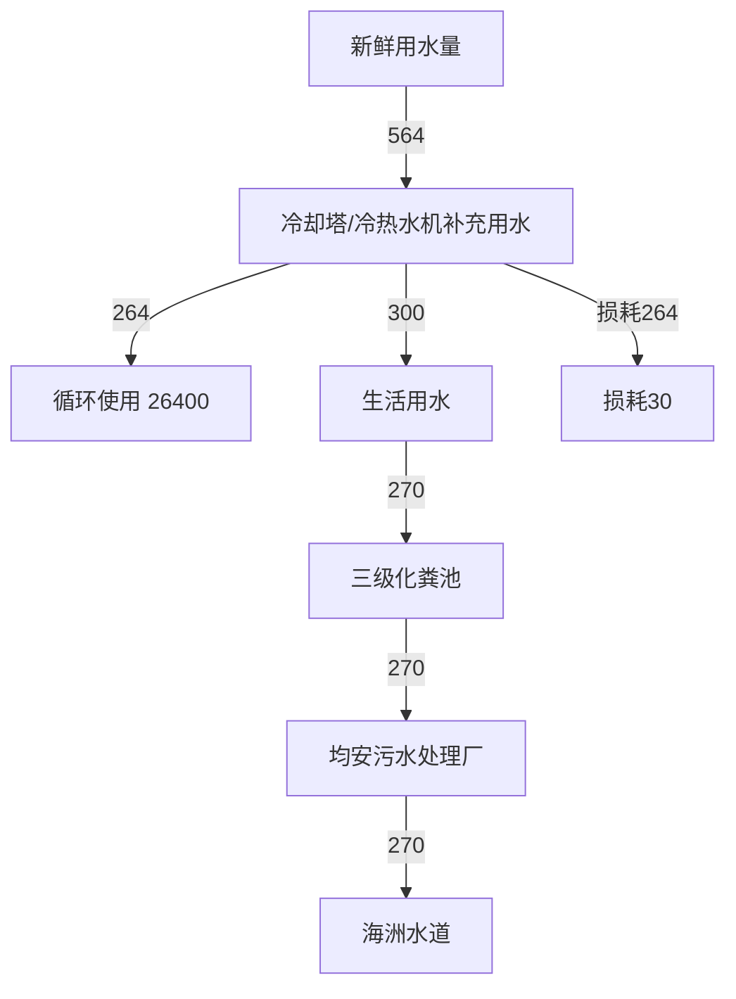
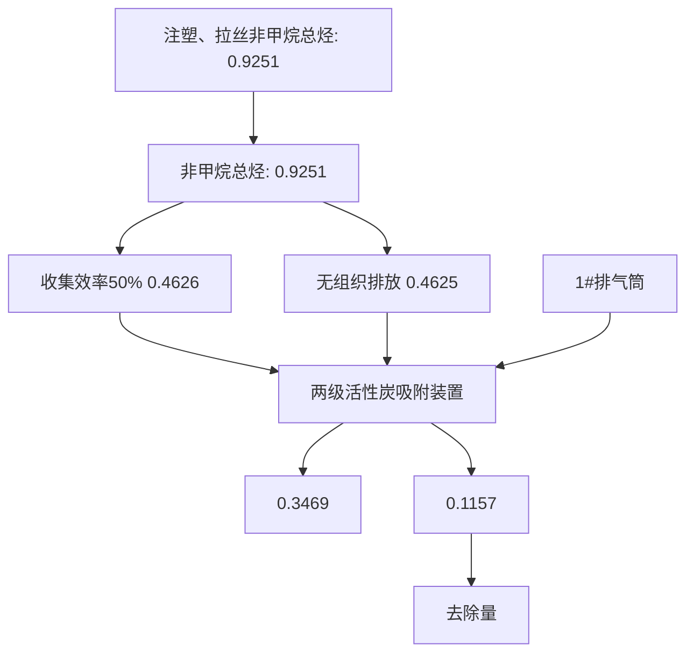
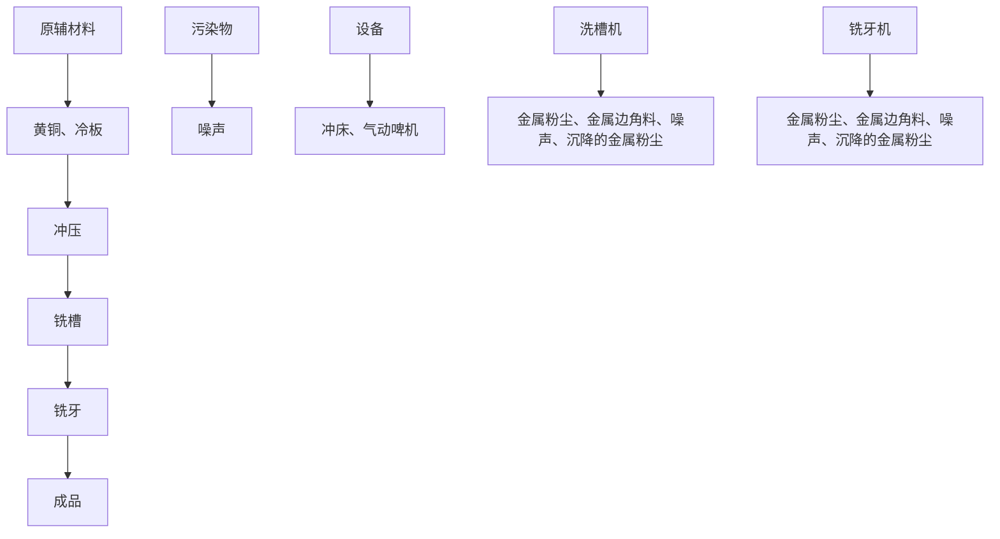
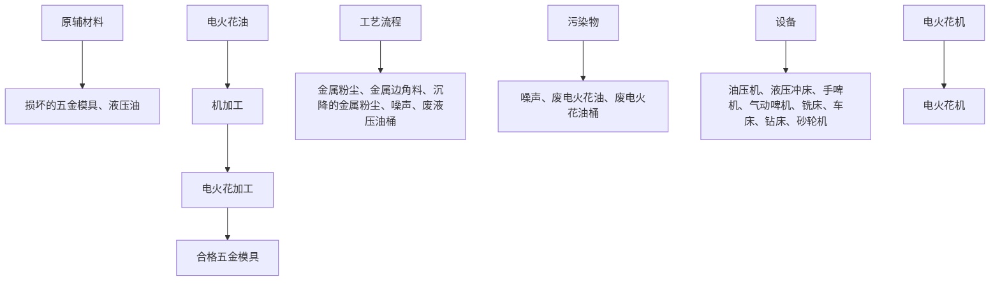

# 建设项目环境影响报告表

# （污染影响类）

项目名称：佛山市远晟塑料实业有限公司新建项目

建设单位（盖章）：佛山市远晟塑料实业有限公司

编制日期： 2023 年 7 月

中华人民共和国生态环境部制

# 一、建设项目基本情况

<table><tr><td>建设项目名称</td><td colspan="3">佛山市远晟塑料实业有限公司新建项目</td></tr><tr><td>项目代码</td><td colspan="3">无</td></tr><tr><td>建设单位联系人</td><td></td><td>联系方式</td><td></td></tr><tr><td>建设地点</td><td colspan="3">广东省佛山市顺德区均安镇沙浦村工业区华乐路2号之二</td></tr><tr><td>地理坐标</td><td colspan="3">(北纬22度43分50.563秒,东经113度7分1.995秒)</td></tr><tr><td>国民经济行业类别</td><td>C2929塑料零件及其他塑料制品制造、C3752摩托车零部件及配件制造</td><td>建设项目行业类别</td><td>二十六、橡胶和塑料制品业29中的53、塑料制品业292中的其他</td></tr><tr><td>建设性质</td><td>新建(迁建)改建扩建技术改造</td><td>建设项目申报情形</td><td>首次申报项目不予批准后再次申报项目超五年重新审核项目重大变动重新报批项目</td></tr><tr><td>项目审批(核准/备案)部门(选填)</td><td>/</td><td>项目审批(核准/备案)文号(选填)</td><td>/</td></tr><tr><td>总投资(万元)</td><td>100</td><td>其中:环保投资(万元)</td><td>20</td></tr><tr><td>环保投资占比(%)</td><td>20</td><td>施工工期</td><td>1个月</td></tr><tr><td>是否开工建设</td><td>否□是:</td><td>用地(用海)面积(m2)</td><td>10470</td></tr><tr><td>专项评价设置情况</td><td colspan="3">无</td></tr><tr><td>规划情况</td><td colspan="3">无</td></tr><tr><td>规划环境影响评价情况</td><td colspan="3">无</td></tr><tr><td>规划及规划环境影响评价符合性分析</td><td colspan="3">无</td></tr><tr><td>其他符合性分析</td><td colspan="3">1、产业政策相符性分析项目主要从事摩托车头盔、摩托车尾箱的生产销售的生产销售,使用的原材料均为外购新料,不涉及有毒有害材料,且厂内无</td></tr></table>

电镀或喷涂工艺；项目不属于《产业结构调整指导目录（2019 年本）》（发展改革委令 2019第29号）及国家发展改革委关于修改《产业结构调整指导目录（2019 年本）》的决定（中华人民共和国国家发展和改革委员会令第 49号，2021年12月27日）中的限制或淘汰类别；根据《促进产业结构调整暂行规定》（国发〔200540 号）第十三条，项目属于允许类；不属于《市场准入负面清单（2022 版）》（发改体改〔2022〕397）中所列行业，则项目符合相关的产业政策要求。

# 2、选址合理性分析

本项目位于广东省佛山市顺德区均安镇沙浦村工业区华乐路2 号之二，根据项目用地证明（详见附件 2），本项目用地为工业用地，用途为工业用途；因此符合当地土地利用规划。

根据纳污水体为海洲水道，根据《关于印发<广东省地表水功能区域>的通知》（粤环[2011]14 号）和《2021年度佛山市顺德区环境质量状况公报》，海洲水道属于Ⅲ类水体，执行《地表水环境质量标准》（GB3838-2002）Ⅲ类标准。根据《佛山市人民政府办公室关于调整顺德区环境空气质量功能区划的复函》（佛府办函[2014]494 号），本项目选址位于二类环境空气质量功能区。根据佛山市声环境功能区划分方案（佛府函[2015]72 号，佛山市人民政府），本项目所在地属于噪声2 类标准适用区。项目的建设与区域水环境功能、空气环境功能、声环境功能区划没有冲突，符合区域环境规划要求。

从区域社会经济、环境功能、城市建设规划要求及项目综合影响判断，该项目在采取相关污染治理措施，加强排污管理之后，选址可行。

# 3、与地区有机污染物治理政策相符性分析

本项目与广东省、顺德区发布的有机污染物治理政策的相符性分析见下表。

表 1-1 项目与地区有机污染物治理政策的相符性

<table><tr><td rowspan="6"></td><td>序号</td><td>政策要求</td><td>工程内容</td><td>符合性</td></tr><tr><td colspan="4">1、《广东省生态环境厅关于做好重点行业建设项目挥发性有机物总量指标管理工作的通知》(粤环发【2019】2号)</td></tr><tr><td>1.1</td><td>各地应当按照“最优的设计、先进的设备、最严的管理”要求对建设项目VOCs排放总量进行管理,并按照“以减量定增量”原则,动态管理VOCs总量指标。新、改、扩建排放VOCs的重点行业建设项目应当执行总量替代制度,重点行业包括炼油与石化、化学原料和化学制品制造、化学药品原料药制造、合成纤维制造、表面涂装、印刷、制鞋、家具制造、人造板制造、电子元件制造、纺织印染、塑料制造及塑料制品等12个行业</td><td>项目为橡胶和塑料制品业,属于重点行业;项目非甲烷总烃的排放量为0.5782t/a;将非甲烷总烃纳入VOCs进行管理,建议对本项目分配VOCs总量控制指标0.5782t/a</td><td>符合</td></tr><tr><td colspan="4">2、《广东省大气污染防治条例》(2019年3月1日起施行)</td></tr><tr><td>2.1</td><td>第十七条 珠江三角洲区域禁止新建、扩建燃煤燃油火电机组或者企业燃煤燃油自备电站。珠江三角洲区域禁止新建、扩建国家规划外的钢铁、原油加工、乙烯生产、造纸、水泥、平板玻璃、除特种陶瓷以外的陶瓷、有色金属冶炼等大气重污染项目。</td><td>项目属于塑料制品业,不属于禁止建设的大气重污染项目</td><td>符合</td></tr><tr><td>2.2</td><td>第二十六条 新建、改建、扩建排放挥发性有机物的建设项目,应当使用污染防治先进可行技术。下列产生含挥发性有机物废气的生产和服务活动,应当优先使用低挥发性有机物含量的原材料和低排放环保工艺,在确保安全条件下,按照规定在密闭空间或者设备中进行,安装、使用满足防爆、防静电要求的治理效率高的污染防治设施;无法密闭或者不适宜密闭的,应当采取有效措施减少废气排放:(一)石油、化工、煤炭加工与转化等含挥发性有机物原料的生产;(二)燃油、溶剂的储存、运输和销售;(三)涂料、油墨、胶粘剂、农药等以挥发性有机物为原料的生产;(四)涂装、印刷、粘合、工业清洗等使用含挥发性有机物产品的生产活动;(五)其他产生挥发性有机物的生产和服务活动。</td><td>项目注塑、拉丝过程产生的非甲烷总烃经“集气罩+软帘”收集后与臭气浓度一起引至“两级活性炭吸附装置”处理后通过15m高的1#排气筒引至高空排放,可有效减少有机废气排放</td><td>符合</td></tr><tr><td rowspan="8"></td><td colspan="4">3.《佛山市顺德区生态环境保护“十四五”规划》(2021-2025)</td></tr><tr><td>3.1</td><td>严格控制“高耗能、高排放”项目盲目发展,禁止新建、扩建水泥、平板玻璃、化学制浆、生皮制革以及国家规划外的钢铁、原油加工等项目;专业电镀、印染等项目进入定点园区集中管理</td><td>项目属于塑料制品业,不属于水泥、平板、玻璃、化学制浆</td><td>符合</td></tr><tr><td>3.2</td><td>大力推进低VOCs含量、低反应活性的原辅材料替代,将全面使用低VOCs含量原辅材料的企业纳入正面清单和政府绿色采购清单。鼓励重点行业企业开展生产工艺和设备水性化改造,推广使用水性、高固体分、无溶剂、粉末等低VOCs含量涂料。严格落实《挥发性有机物无组织排放控制标准》,开展厂区内无组织排放浓度监测,加强对含VOCs物料储存、转移和运输、设备与管线组件泄漏、敞开页面逸散以及工艺过程等五类排放源的管控。加强储油库、加油站等VOCs排放治理,推动油品储运销体系安装油气回收自动监控系统。</td><td>本项目使用的物料不属于禁止使用的高VOCs含量原辅材料,符合政策要求。建设单位严格落实《挥发性有机物无组织排放控制标准》,开展厂区内无组织排放浓度监测</td><td></td></tr><tr><td colspan="4">4.《挥发性有机物无组织排放控制标准》(GB37822-2019)</td></tr><tr><td>4.1</td><td>VOCs物料、工艺过程产生的含VOCs废料应储存于密闭的容器、包装袋、储罐、储库、料仓中;盛装VOCs物料的容器或包装袋应存放于室内,或存放于设置有雨棚、遮阳和防渗设施的专用场地。盛装VOCs物料的容器或包装袋在非取用状态时应加盖、封口,保持密闭</td><td>项目使用的原料常温下不挥发,均采用密封袋存放于生产车间的原材料堆放区</td><td>符合</td></tr><tr><td>4.2</td><td>VOCs物料卸(出、放)料过程密闭,卸料废气应排至VOCs废气收集处理系统;无法密闭的,应采取局部气体收集措施,废气应排至VOCs废气收集处理系统</td><td>项目在设备上方设置“集气罩+软帘”收集有机废气,收集效率为50%</td><td>符合</td></tr><tr><td colspan="4">5.《广东省人民政府办公厅关于印发广东省2021年大气、水、土壤污染防治工作方案的通知》(粤办函[2021]58号)</td></tr><tr><td>5.1</td><td>指导企业使用适宜高效的治理技术,涉VOCs重点行业新建、改建、和扩建项目不推荐使用光氧化、光催化、低温等离子等低效治理设施,已建项目逐步淘汰光氧化、光催化、低温等离子治理设施。</td><td>项目注塑、拉丝过程产生的非甲烷总烃经“集气罩+软帘”收集后与臭气浓度一起引至“两级活性炭吸附装置”处理后通过15m高的1#排气筒引至高空排放,可有效</td><td>符合</td></tr></table>

<table><tr><td></td><td></td><td>减少有机废气排放,收集效率为50%、处理效率为75%</td><td></td></tr><tr><td>5.2</td><td>持续推进挥发性有机物(VOCs)综合治理:实施低VOCs含量产品源头替代工程“严格落实国家产品VOCs含量限值标准要求”,除现阶段无法实施替代的工序外,禁止新建生产和使用高VOCs含量原辅材料项目,鼓励在生产和流通消费环节推广使用低VOCs含量原辅材料</td><td>项目使用的原辅料均为不属于高VOCs含量原辅材料</td><td>符合</td></tr></table>

# 4、“三线一单”符合性分析

（1）项目与《广东省人民政府关于印发广东省“三线一单”生态环境分区管控方案的通知》（粤府[2020]71号）的相符性分析

根据《广东省人民政府关于印发广东省“三线一单”生态环境分区管控方案的通知》（粤府[2020]71 号），广东省将以环境管控单元为基础，实施生态环境分区管控，精细化管理、保护生态环境。本项目与广东省“三线一单”生态环境分区管控方案相符性分析如下：

1）与“一核一带一区”区域管控要求的相符性

①项目位于珠三角核心区，主要从事摩托车头盔、摩托车尾箱的生产销售，不属于区域布局管控要求中的禁止新建、扩建水泥、平板玻璃、化学制浆、生皮制革以及国家规划外的钢铁、原油加工等项目。项目使用的原辅材料不属于使用高 VOCs 含量原辅材料的项目，符合区域布局管控要求。

②项目生产设备仅使用电能，用水全部采用市政直供，不直接取用江河湖库水量，不会对项目所在地生态流量造成影响，符合能源利用要求。

③项目 VOCs 总量控制指标为 0.5782t/a，项目 VOCs 总量实行倍量削减替代（减二增一）；项目水喷淋废水经沉淀并清渣后循环回用，不外排；冷却水经冷却塔/冷热水机冷却后循环使用，不外排；外排废水主要为员工生活污水，生活污水经三级化粪池预处理后经市政污水管网排入均安污水处理厂处理，处理后尾水排入海洲水道，则项目水污染物总量控制指标计入均安污水处理厂的总量控制指标内，不再另设污水总量控制指标，则项目符合污染物排放管控要求。

④项目位于广东省佛山市顺德区均安镇沙浦村工业区华乐路2 号之二，不属于石化、化工重点园区环境风险防控区域。项目生产过程产生的危险废物分类收集后定期交由具有危废处置资质的公司处理，并通过信息系统登记转移计划和电子转移联单，符合危险废物全过程跟踪管理的防控要求。

# 2）与环境管控单元总体管控要求的相符性

根据《广东省人民政府关于印发广东省“三线一单”生态环境分区管控方案的通知》（粤府[2020]71 号）发布的广东省环境管控单元图（见附图 9），项目位于广东省佛山市顺德区均安镇沙浦村工业区华乐路 2 号之二，属于一般管控单元，执行区域生态环境保护的基本要求。

# （2）项目与《佛山市人民政府关于印发佛山市“三线一单”生态环境分区管控方案的通知》（佛府[2021]11 号）的相符性分析

根据《佛山市人民政府关于印发佛山市“三线一单”生态环境分区管控方案的通知》（佛府[2021]11 号），佛山市将以环境管控单元为基础，实施生态环境分区管控，环境管控单元分为优先保护单元、重点管控单元和一般管控单元 3 类。项目位于广东省佛山市顺德区均安镇沙浦村工业区华乐路 2 号之二，属于均安镇重点管控区，环境管控单元编码为 ZH44060620008（详见附图 10）；该单元属于水环境城镇生活污染重点管控区、水环境一般管控区、大气环境受体敏感重点管控区、大气环境高排放重点管控区、江河湖库岸线重点管控区、江河湖库岸线一般管控区，项目与佛山市“三线一单”生态环境分区管控方案相符性分析详见下表。

表 1-2 项目与佛环[2021]11号文件的相符性分析

<table><tr><td>管控维度</td><td>管控要求</td><td>本项目工程内容</td><td>符合性</td></tr><tr><td>区域</td><td>【生态/禁止类】单元内的一般生态空</td><td>项目不在管控要求所</td><td>符合</td></tr></table>

<table><tr><td rowspan="7"></td><td rowspan="5">布局管控</td><td>间,主导生态功能为水土保持,禁止在25度以上的陡坡地开垦种植农作物,禁止在崩塌、滑坡危险区、泥石流易发区从事采石、取土、采砂等可能造成水土流失的活动</td><td>在的区域内</td><td></td></tr><tr><td>【产业/限制类】受纳水体或监控断面不达标的,不得新建、扩建向河涌直接排放废水的项目。新建、扩建含蚀刻工序的线路板生产项目和化工项目应在配套污水集中处置的工业园区或生活污水管网覆盖区域内建设;纯加工型印花项目,含酸洗、磷化的金属表面处理、金属制品项目(与自身高新技术企业配套的除外),含酸洗、喷涂、拉丝、表面抛光等工艺的不锈钢型材加工项目,应进入以此类项目为主导产业、有相应废水集中治理设施的工业园区,实现集中治污。</td><td>项目无生产废水外排,生活污水经三级化粪池预处理后经市政污水管网排入均安污水处理厂处理</td><td>符合</td></tr><tr><td>【水/禁止类】单元内饮用水水源保护区涉及均安水厂水源准保护区,按照《中华人民共和国水污染防治法》、《广东省水污染防治条例》等相关法律法规条例实施管理。禁止在饮用水水源准保护区内新建、扩建对水体污染严重的建设项目</td><td>项目位于广东省佛山市顺德区均安镇沙浦村工业区华乐路2号之二,不在均安水厂水源准保护区内</td><td>符合</td></tr><tr><td>【水/限制类】严格限制在均安水厂饮用水水源保护区上游和周边区域建设列入“高污染、高环境风险”产品名录等可能影响水环境安全的项目</td><td>项目属于C2929塑料零件及其他塑料制品制造、C3752摩托车零部件及配件制造,不在“高污染、高环境风险”产品名录</td><td>符合</td></tr><tr><td>【大气/限制类】大气环境弱扩散重点管控区内,加大区域大气污染物减排力度,严格控制“两高”项目建设</td><td>项目不属于高能耗、高污染产业</td><td>符合</td></tr><tr><td rowspan="2">能源利用</td><td>【能源/综合类】科学实施能源消费总量和强度“双控”,新建高能耗项目单位产品(产值)能耗达到国际国内先进水平</td><td>项目生产设备均使用电能,不属于高能耗项目</td><td>符合</td></tr><tr><td>【水资源/综合类】贯彻落实“节水优先”方针,实行最严格水资源管理制度,均安镇万元国内生产总值用水量、万元工业增加值用水量、用水总量、农田灌溉水有效利用系数等用水总量和效率指标达到区下达要求</td><td>项目用水由市政供水</td><td>符合</td></tr><tr><td rowspan="5"></td><td></td><td>【岸线/禁止类】严格水域岸线用途管制,新建项目一律不得违规占用水域。严禁破坏生态的岸线利用行为和不符合其功能定位的开发建设活动,严禁以各种名义侵占河道、围垦湖泊、非法采砂等</td><td>项目不占用水域</td><td>符合</td></tr><tr><td rowspan="2">污染物排放管控</td><td>【水/综合类】稳步推进排水设施“三个一体化”管理模式,补齐城乡污水收集和处理短板,推动均安污水处理厂提质增效,加快消除城中村、老旧城区、城乡结合部等污水收集管网空白区,逐步实现城乡污水收集处理全覆盖。2025年前完成均安污水处理厂扩建,尾水应执行《城镇污水处理厂污染物排放标准》(GB18918-2002)一级A标准及广东省地方标准《水污染物排放限值》(DB44/26-2001)的较严值。</td><td>项目生活污水经三级化粪池预处理后经市政污水管网排入均安污水处理厂处理</td><td>符合</td></tr><tr><td>【水/综合类】保留并完善星槎村、南浦村、太平村、南沙社区等现状农村污水分散式处理系统,提高污水收集处理率,新建太平村、南沙社区等农村分散式生活污水处理设施,其余行政村(社区)继续完善污水管网建设,实现农村污水100%收集进入市政污水系统,有条件的区域实施雨污分流改造,到2030年除南沙社区保留分散污水处理方式外,其余行政区(社区)污水59纳入均安城镇污水处理系统</td><td>项目生活污水经三级化粪池预处理后经市政污水管网排入均安污水处理厂处理</td><td>符合</td></tr><tr><td>环境风险管控</td><td>【风险/综合类】加强环境风险分级分类管理,强化金属制品、有色金属和压延加工、化学原料和化学品制造业等涉重金属、化工行业企业及工业园区等重点环境风险源的环境风险防控。</td><td>项目危险物质贮存量占临界量比值Q&lt;1,通过严格执行国家的防火安全设计规范,采取合理的风险防范措施,制定完善的环境风险事故应急预案等措施,项目的风险水平是可以接受的</td><td>符合</td></tr><tr><td colspan="4">(3)项目与《佛山市顺德区人民政府关于印发佛山市顺德区“三线一单”生态环境分区管控方案的通知》(顺府发[2021]11</td></tr></table>

# 号）的相符性分析

根据《佛山市顺德区人民政府关于印发佛山市顺德区“三线一单”生态环境分区管控方案的通知》（顺府发[2021]11 号），项目位于均安镇重点管控区（管控单元编码：ZH44060620008），项目与管控要求相符性分析如下：

表 1-3 项目与均安镇重点管控区管控要求相符性分析

<table><tr><td>管控维度</td><td>管控要求</td><td>本项目工程内容</td><td>符合性</td></tr><tr><td rowspan="4">区域布局管控</td><td>【生态/禁止类】单元内的一般生态空间,主导生态功能为水土保持,禁止在25度以上的陡坡地开垦种植农作物,禁止在崩塌、滑坡危险区、泥石流易发区从事采石、取土、采砂等可能造成水土流失的活动</td><td>项目不在管控要求所在的区域内</td><td>符合</td></tr><tr><td>【产业/限制类】受纳水体或监控断面不达标的,不得新建、扩建向河涌直接排放废水的项目。新建、扩建含蚀刻工序的线路板生产项目和化工项目应在配套污水集中处置的工业园区或生活污水管网覆盖区域内建设;纯加工型印花项目,含酸洗、磷化的金属表面处理、金属制品项目(与自身高新技术企业配套的除外),含酸洗、喷涂、拉丝、表面抛光等工艺的不锈钢型材加工项目,应进入以此类项目为主导产业、有相应废水集中治理设施的工业园区,实现集中治污。</td><td>项目无生产废水外排,生活污水经三级化粪池预处理后经市政污水管网排入均安污水处理厂处理</td><td>符合</td></tr><tr><td>【水/禁止类】单元内饮用水水源保护区涉及均安水厂水源准保护区,按照《中华人民共和国水污染防治法》、《广东省水污染防治条例》等相关法律法规条例实施管理。禁止在饮用水水源准保护区内新建、扩建对水体污染严重的建设项目</td><td>项目位于广东省佛山市顺德区均安镇沙浦村工业区华乐路2号之二,不在均安水厂水源准保护区内</td><td>符合</td></tr><tr><td>【水/限制类】严格限制在均安水厂饮用水水源保护区上游和周边区域建设列入“高污染、高环境风险”产品名录等可能影响水环境安全的项目</td><td>项目属于C2929塑料零件及其他塑料制品制造、C3752摩托车零部件及配件制造,不在“高污染、高环境风险”产品名录</td><td>符合</td></tr></table>

<table><tr><td rowspan="6"></td><td></td><td>【大气/限制类】大气环境弱扩散重点管控区内,加大区域大气污染物减排力度,严格控制“两高”项目建设</td><td>项目不属于高能耗、高污染产业</td><td>符合</td></tr><tr><td rowspan="3">能源利用</td><td>【能源/综合类】科学实施能源消费总量和强度“双控”,新建高能耗项目单位产品(产值)能耗达到国际国内先进水平</td><td>项目生产设备均使用电能,不属于高能耗项目</td><td>符合</td></tr><tr><td>【水资源/综合类】贯彻落实“节水优先”方针,实行最严格水资源管理制度,均安镇万元国内生产总值用水量、万元工业增加值用水量、用水总量、农田灌溉水有效利用系数等用水总量和效率指标达到区下达要求</td><td>项目用水由市政供水</td><td>符合</td></tr><tr><td>【岸线/禁止类】严格水域岸线用途管制,新建项目一律不得违规占用水域。严禁破坏生态的岸线利用行为和不符合其功能定位的开发建设活动,严禁以各种名义侵占河道、围垦湖泊、非法采砂等</td><td>项目不占用水域</td><td>符合</td></tr><tr><td rowspan="2">污染物排放管控</td><td>【水/综合类】稳步推进排水设施“三个一体化”管理模式,补齐城乡污水收集和处理短板,推动均安污水处理厂提质增效,加快消除城中村、老旧城区、城乡结合部等污水收集管网空白区,逐步实现城乡污水收集处理全覆盖。2025年前完成均安污水处理厂扩建,尾水应执行《城镇污水处理厂污染物排放标准》(GB18918-2002)一级A标准及广东省地方标准《水污染物排放限值》(DB44/26-2001)的较严值。</td><td>项目生活污水经三级化粪池预处理后经市政污水管网排入均安污水处理厂处理</td><td>符合</td></tr><tr><td>【水/综合类】保留并完善星槎村、南浦村、太平村、南沙社区等现状农村污水分散式处理系统,提高污水收集处理率,新建太平村、南沙社区等农村分散式生活污水处理设施,其余行政村(社区)继续完善污水管网建设,实现农村污水100%收集进入市政污水系统,有条件的区域实施雨污分流改造,到2030年除南沙社区保留分散污水处理方式外,其余行政区(社区)污水59纳入均安城镇污水处理系统</td><td>项目生活污水经三级化粪池预处理后经市政污水管网排入均安污水处理厂处理</td><td>符合</td></tr></table>

<table><tr><td></td><td></td><td>环境风险管控</td><td>【风险/综合类】加强环境风险分级分类管理,强化金属制品、有色金属和压延加工、化学原料和化学品制造业等涉重金属、化工行业企业及工业园区等重点环境风险源的环境风险防控。</td><td>项目危险物质贮存量占临界量比值Q&lt;1,通过严格执行国家的防火安全设计规范,采取合理的风险防范措施,制定完善的环境风险事故应急预案等措施,项目的风险水平是可以接受的</td><td>符合</td></tr></table>

# 二、建设项目工程分析

# 1、建设内容及规模

佛山市远晟塑料实业有限公司新建项目（以下简称“本项目”）位于广东省佛山市顺德区均安镇沙浦村工业区华乐路 2 号之二（其地理位置见附图 1），中心地理坐标：22.730712°N，113.117221°E。项目租赁一栋 3 层的首层、二层建筑物和一栋一层的建筑物作为生产厂房，其占地面积为 10470m2，建筑面积为13350m2；总投资 100 万元，主要从事摩托车头盔、摩托车尾箱的生产销售，年产摩托车头盔12 万件、摩托车尾箱16万件。

# 2、本项目建设内容组成

项目租赁已建成厂房进行生产，该厂房主要包括生产车间、仓库等，项目占地面积为10470m2（项目经营占地面积为 9560m2，其他厂房面积为 910m2），建筑面积为 13350m2（项目经营建筑面积为12440m2，其他厂房面积为910m2）。

项目由主体工程、辅助工程、环保工程、公用工程及配套工程组成，详细工程内容见下表。

表 2-1 项目建设主要组成一览表

<table><tr><td>类别</td><td colspan="3">建设内容</td><td>工程规模</td></tr><tr><td rowspan="3">主体工程</td><td rowspan="3">生产车间</td><td rowspan="2">车间1</td><td>首层</td><td>位于一栋三层建筑物的首层,建筑面积为 $1970m^{2}$ ,高度为7m;设有测试室( $110m^{2}$ )、成品仓库( $968m^{2}$ )</td></tr><tr><td>二层</td><td>位于一栋三层建筑物的二层,建筑面积为 $2880m^{2}$ ,高度为4m;设有尾箱生产区( $206m^{2}$ )、头盔生产区( $392m^{2}$ )、手工组装区( $140m^{2}$ )、五金自动包装区( $30m^{2}$ )、车缝区( $188m^{2}$ )</td></tr><tr><td colspan="2">车间2</td><td>位于一栋一层的建筑物,建筑面积为 $7590m^{2}$ ,高度为7m;设有卸货区( $700m^{2}$ )、注塑区( $1500m^{2}$ )、混料房( $25m^{2}$ )、拉丝区( $10m^{2}$ )、模具堆放区( $90m^{2}$ )、成品堆放区( $650m^{2}$ )、机加工区( $300m^{2}$ )、钥匙生产区( $100m^{2}$ )</td></tr><tr><td rowspan="3">辅助工程</td><td rowspan="2">仓库</td><td colspan="2">车间1</td><td>位于生产车间的首层(设有成品仓库( $968m^{2}$ ))、二层(设有成品仓( $571m^{2}$ )、配件仓( $88m^{2}$ )),用于储存原料和成品</td></tr><tr><td colspan="2">车间2</td><td>位于生产车间的首层(设有仓库( $3400m^{2}$ )、色粉仓( $10m^{2}$ )、原材料仓( $50m^{2}$ )、成品仓库( $500m^{2}$ ))</td></tr><tr><td colspan="3">办公室</td><td>位于车间1的二层,建筑面积为 $31m^{2}$ ;位于车间2的首层,建筑面积为 $73m^{2}$ ,用于供员工办公</td></tr><tr><td rowspan="2">公用工程</td><td colspan="3">给水</td><td>由市政供水管网提供,主要为冷热水机和冷却塔补充用水、职工生活用水</td></tr><tr><td colspan="3">供电</td><td>市政供电</td></tr><tr><td></td><td>排水</td><td colspan="3">冷却水经冷热水机/冷却塔冷却后循环使用,不外排;生活污水经三级化粪池预处理达标后通过市政污水管网排入均安污水处理厂处理达标后排入海洲水道</td></tr><tr><td rowspan="10">环保工程</td><td>生活污水</td><td colspan="3">三级化粪池预处理达标后通过市政污水管网排入均安污水处理厂处理达标后排入海洲水道</td></tr><tr><td>投料粉尘</td><td colspan="3" rowspan="3">无组织排放,通过安装抽排风扇加强车间通风</td></tr><tr><td colspan="3">破碎粉尘</td></tr><tr><td colspan="3">金属粉尘</td></tr><tr><td>非甲烷总烃</td><td colspan="3" rowspan="2">“集气罩+软帘”收集后引至“两级活性炭吸附”通过15m高的1#排气筒引至高空排放</td></tr><tr><td colspan="3">臭气浓度</td></tr><tr><td>噪声治理</td><td colspan="3">选取低噪声型设备;合理布局;加强管理,定期对设备进行检修</td></tr><tr><td>一般工业固废</td><td colspan="3">一般固废场所面积为 $3m^{2}$ ,高度为7m,一般工业固废分类收集后定期交由专业回收公司回收处理</td></tr><tr><td>危险废物</td><td colspan="3">危废暂存场所面积为 $10m^{2}$ ,高度为7m,危险废物收集后交由具有危废处置资质的公司处理</td></tr><tr><td>生活垃圾</td><td colspan="3">收集后交由环卫部门定期清运处理</td></tr></table>

# 3、主要产品及原辅材料

# （1）项目主要产品见下表：

表 2-2 主要产品年产量表

<table><tr><td>序号</td><td colspan="2">名称</td><td>单位</td><td>年产量</td><td>备注</td></tr><tr><td rowspan="2">1</td><td rowspan="2">摩托车头盔</td><td>需委外喷漆的</td><td>万件/年</td><td>8</td><td>外售,单个摩托车头盔重量为1.2kg</td></tr><tr><td>无需喷漆的</td><td>万件/年</td><td>4</td><td>外售,单个摩托车头盔重量为1.2kg</td></tr><tr><td rowspan="2">2</td><td rowspan="2">摩托车尾箱</td><td>需委外喷漆的</td><td>万件/年</td><td>9</td><td>外售,单个摩托车头盔重量为1.7kg</td></tr><tr><td>无需喷漆的</td><td>万件/年</td><td>7</td><td>外售,单个摩托车头盔重量为1.7kg</td></tr><tr><td>3</td><td colspan="2">钥匙</td><td>万把/年</td><td>16</td><td>不外售,用于摩托车尾箱配套</td></tr></table>

# （2）项目主要原辅材料见下表：

注：项目原材料均使用新材料，不涉及废旧料和再生料的使用。  
表 2-3 项目主要原辅材料年用量表

<table><tr><td>序号</td><td>名称</td><td>单位</td><td>年用量</td><td>最大储存量</td><td>性状</td><td>包装规格</td><td>备注</td></tr><tr><td>1</td><td>ABS 塑料粒</td><td>吨</td><td>90</td><td>20</td><td>粒状</td><td>25kg/袋</td><td>外购</td></tr><tr><td>2</td><td>PP 塑料粒</td><td>吨</td><td>300</td><td>50</td><td>粒状</td><td>25kg/袋</td><td>外购</td></tr><tr><td>3</td><td>色粉</td><td>吨</td><td>0.66</td><td>1</td><td>粉状</td><td>25kg/袋</td><td>外购</td></tr><tr><td>4</td><td>黄铜</td><td>吨</td><td>20</td><td>5</td><td>固状</td><td>——</td><td>外购</td></tr><tr><td>5</td><td>冷板</td><td>吨</td><td>20</td><td>6</td><td>固状</td><td>——</td><td>外购</td></tr><tr><td>6</td><td>五金配件</td><td>万套</td><td>28</td><td>6</td><td>固状</td><td>——</td><td>外购</td></tr><tr><td>7</td><td>海绵布</td><td>码</td><td>4386</td><td>400</td><td>固状</td><td>——</td><td>外购</td></tr><tr><td>8</td><td>海绵</td><td>张</td><td>528</td><td>45</td><td>固状</td><td>——</td><td>外购</td></tr><tr><td>9</td><td>软皮</td><td>码</td><td>1500</td><td>130</td><td>固状</td><td>——</td><td>外购</td></tr><tr><td>10</td><td>织带</td><td>万码</td><td>8</td><td>1</td><td>固状</td><td>——</td><td>外购</td></tr><tr><td>11</td><td>缝纫线</td><td>个</td><td>1100</td><td>100</td><td>固状</td><td>——</td><td>外购</td></tr><tr><td>12</td><td>泡沫</td><td>万个</td><td>3</td><td>1</td><td>固状</td><td>——</td><td>外购</td></tr><tr><td>13</td><td>PP胶片</td><td>吨</td><td>7</td><td>1</td><td>固状</td><td>——</td><td>外购</td></tr><tr><td>14</td><td>标签贴纸</td><td>万套</td><td>28</td><td>3</td><td>固状</td><td>——</td><td>外购</td></tr><tr><td>15</td><td>包装胶袋</td><td>万个</td><td>28</td><td>3</td><td>固状</td><td>——</td><td>外购</td></tr><tr><td>16</td><td>包装纸箱</td><td>万个</td><td>28</td><td>5</td><td>固状</td><td>——</td><td>外购</td></tr><tr><td>17</td><td>机油</td><td>吨</td><td>0.3</td><td>0.1</td><td>液体</td><td>25kg/桶</td><td>外购</td></tr><tr><td>18</td><td>火花油</td><td>吨</td><td>0.17</td><td>0.1</td><td>液体</td><td>25kg/桶</td><td>外购</td></tr><tr><td>19</td><td>液压油</td><td>吨</td><td>1.02</td><td>0.1</td><td>液体</td><td>25kg/桶</td><td>外购</td></tr><tr><td>20</td><td>摩托车尾箱底板</td><td>万个</td><td>16</td><td>1</td><td>固状</td><td>——</td><td>外购</td></tr><tr><td>21</td><td>五金模具</td><td>套</td><td>23</td><td>23</td><td>固状</td><td>——</td><td>外购</td></tr></table>

# 主要原辅材料理化性质：

ABS 塑胶粒：丙烯腈-丁二烯-苯乙烯共聚物（简称 ABS）是由丙烯腈、丁二烯和苯乙烯组成的三元共聚物，密度为 1.05-1.18g/cm3，热变形温度 93-118℃，成型温度 190-235℃，热分解温度在 270℃以上。ABS 通常为浅黄色或乳白色的粒料非结晶性树脂，有一定的韧性；其抗冲击性、耐热性、耐低温性、耐化学药品性及电气性能优良，还具有易加工、制品尺寸稳定、表面光泽性好等特点，容易涂装、着色，还可以进行表面喷镀金属、电镀、焊接、热压和粘接等二次加工，广泛应用于机械、汽车、电子电器、仪器仪表、纺织和建筑等工业领域，是一种用途极广的热塑性工程塑料。

PP 塑胶粒：聚丙烯（Polypropylene，简称 PP）是由丙烯聚合而制得的一种热塑性树脂，无毒、无臭、无味的乳白色高结晶的聚合物，密度只有 0.9-0.91g/cm3，成型温度为 165-170℃，热分解温度为 300℃，热变形温度为 100℃；化学稳定性很好，除能被浓硫酸、浓硝酸侵蚀外，对其它各种化学试剂都比较稳定，但低分子量的脂肪烃、芳香烃和氯化烃等能使聚丙烯软化和溶胀，同时它的化学稳定性随结晶度的增加还有所提高。

色粉：是一种有颜色的粉末物质，与塑胶颜料混合后，经加热注塑制成各种不同颜色的塑胶产品。它广泛应用于塑胶着色的工艺中，色粉中不含第一类污染物中的重金属。

机油：密度约为 0.91×10 3kg/m3，闪点约为 170℃，能对机械设备到润滑减磨、辅助冷却降温、密封防漏、防锈防蚀、减震缓冲等作用。机油由基础油和添加剂两部分组成。基础油是机油的主要成分，决定着机油的基本性质，添加剂则可弥补和改善基础油性能方面的不足，赋予某些新的性能，是机油的重要组成部分。

火花油：从煤油组分加氢后的产物，属于二次加氢品；一般通过高压加氢及异构脱蜡技术精练而成，火花又是一种电火花机加工不可缺少的放电介质液体，电火花油能够绝缘消电离、冷却电火花机加工时的高温、排除碳渣。

液压油：外观为淡黄色液体，相对密度：0.871，沸点＞316℃（600F），化学稳定性很高，无爆炸危险性，适用于液压系统润滑；利用液体压力能的液压系统使用的液压介质，在液压系统中起着能量传递、抗磨、系统润滑、防腐、防锈、冷却等作用。

# 4、主要设备

本项目主要设备见下表：

表 2-4 主要设备一览表

<table><tr><td>序号</td><td>设备名称</td><td>数量</td><td>规格参数</td><td>工艺</td><td>位置</td></tr><tr><td>1</td><td>混色机</td><td>6台</td><td>100kg/200kg,单台处理能力:0.032t/h</td><td>混料</td><td>混料房</td></tr><tr><td rowspan="10">2</td><td rowspan="10">注塑机</td><td>4台</td><td>80T,单台处理能力:0.005t/h</td><td rowspan="10">注塑</td><td rowspan="10">注塑区</td></tr><tr><td>4台</td><td>120T,单台处理能力:0.006t/h</td></tr><tr><td>3台</td><td>150T,单台处理能力:0.0065t/h</td></tr><tr><td>1台</td><td>180T,单台处理能力:0.007t/h</td></tr><tr><td>1台</td><td>210T,单台处理能力:0.0075t/h</td></tr><tr><td>1台</td><td>250T,单台处理能力:0.008t/h</td></tr><tr><td>1台</td><td>325T,单台处理能力:0.009t/h</td></tr><tr><td>2台</td><td>400T,单台处理能力:0.01t/h</td></tr><tr><td>4台</td><td>480T,单台处理能力:0.013t/h</td></tr><tr><td>1台</td><td>650T,单台处理能力:0.018t/h</td></tr><tr><td>3</td><td>冷热水机</td><td>3台</td><td>循环水量为 $2m^{3}/h$ </td><td rowspan="2">注塑</td><td rowspan="2">冷却池</td></tr><tr><td>4</td><td>冷却塔</td><td>1台</td><td>循环水量为 $5m^{3}/h$ </td></tr><tr><td>5</td><td>破碎机</td><td>6台</td><td>单台处理能力:0.02t/h</td><td>破碎</td><td rowspan="2">拉丝区</td></tr><tr><td>6</td><td>拉丝机</td><td>1台</td><td>单台处理能力:0.1t/h</td><td>拉丝</td></tr><tr><td>7</td><td>缝纫机</td><td>24台</td><td>/</td><td></td><td>车缝区</td></tr><tr><td rowspan="2">8</td><td rowspan="2">冲床</td><td>2台</td><td>手动</td><td rowspan="2">组装</td><td rowspan="2">手工组装区</td></tr><tr><td>6台</td><td>气动</td></tr></table>

<table><tr><td rowspan="27"></td><td></td><td colspan="2"></td><td>2台</td><td>Y21</td><td>冲压</td><td>钥匙生产区</td></tr><tr><td>9</td><td colspan="2">锅钉机</td><td>8台</td><td>YL-608</td><td rowspan="4">组装</td><td>手工组装区</td></tr><tr><td>10</td><td colspan="2">头盔组装线</td><td>2台</td><td>/</td><td>头盔生产区</td></tr><tr><td>11</td><td colspan="2">尾箱组装线</td><td>1台</td><td>/</td><td>尾箱生产区</td></tr><tr><td>12</td><td colspan="2">电动手钻</td><td>15台</td><td>/</td><td>手工组装区</td></tr><tr><td>13</td><td colspan="2">油压机</td><td>6台</td><td>15w</td><td rowspan="7">机加工</td><td rowspan="8">机加工区</td></tr><tr><td>14</td><td colspan="2">液压冲床</td><td>2台</td><td>Y21</td></tr><tr><td>15</td><td colspan="2">铣床</td><td>6台</td><td>JOINT-3VA</td></tr><tr><td>16</td><td colspan="2">车床</td><td>11台</td><td>CA6140A</td></tr><tr><td>17</td><td colspan="2">手啤机</td><td>3台</td><td>JH40</td></tr><tr><td>18</td><td colspan="2">钻床</td><td>16台</td><td>Z3032</td></tr><tr><td>19</td><td colspan="2">砂轮机</td><td>1台</td><td>M3020</td></tr><tr><td>20</td><td colspan="2">电火花机</td><td>3台</td><td>ZNC-540/ZNC450/MP50</td><td>电火花加工</td></tr><tr><td>21</td><td colspan="2">气动啤机</td><td>4台</td><td>20w</td><td>冲压</td><td rowspan="3">钥匙生产区</td></tr><tr><td>22</td><td colspan="2">铣槽机</td><td>1台</td><td>YX3-10</td><td>铣槽</td></tr><tr><td>23</td><td colspan="2">铣牙机</td><td>2台</td><td>JZ-5.1</td><td>铣牙</td></tr><tr><td rowspan="8">24</td><td colspan="2">测试塑料性能设备</td><td>1套</td><td>——</td><td rowspan="8">检测</td><td rowspan="8">测试室</td></tr><tr><td rowspan="7">包含</td><td>振动测试仪器</td><td>10台</td><td>FT-800T</td></tr><tr><td>盐雾试验仪器</td><td>10台</td><td>KD-60</td></tr><tr><td>EPS密度测试仪器</td><td>10台</td><td>HT-6025-EPS</td></tr><tr><td>佩戴装置强度测试台</td><td>10台</td><td>ZKHW-602B</td></tr><tr><td>视野范围测试台</td><td>10台</td><td>DH-1150</td></tr><tr><td>头盔防脱落试验机</td><td>10台</td><td>XL168-TK-108</td></tr><tr><td>耐穿透性测试架</td><td>10台</td><td>DMS-3305</td></tr><tr><td>25</td><td colspan="2">气动式振盘包装机</td><td>1台</td><td>4kw</td><td>包装</td><td>五金自动包装区</td></tr><tr><td>26</td><td colspan="2">储气罐</td><td>3台</td><td>/</td><td rowspan="2">辅助设备</td><td rowspan="2">——</td></tr><tr><td>27</td><td colspan="2">空压机</td><td>3台</td><td>20P/50P</td></tr></table>

表 2-5 项目注塑机产能一览表  
注：项目注塑过程的实际产能=原材料使用量+边角料、次品回用量-投料粉尘量-破碎粉尘量-非甲烷总烃产生量=390.66t/a+25.8t/a-0.00007t/a-0.011t/a-0.9251t/a≈415.5t/a。根据上表可知，项目注塑机的产能可以满足生产要求。

<table><tr><td>设备名称</td><td>数量(台)</td><td>设备规格</td><td>单台加工量(kg/h)</td><td>年加工时间(h)</td><td>单台加工量(t/a)</td><td>最大生产能力(t/a)</td></tr><tr><td rowspan="10">注塑机</td><td>4</td><td>80T</td><td>5</td><td>2400</td><td>12</td><td>48</td></tr><tr><td>4</td><td>120T</td><td>6</td><td>2400</td><td>14.4</td><td>57.6</td></tr><tr><td>3</td><td>150T</td><td>6.5</td><td>2400</td><td>15.6</td><td>46.8</td></tr><tr><td>1</td><td>180T</td><td>7</td><td>2400</td><td>16.8</td><td>16.8</td></tr><tr><td>1</td><td>210T</td><td>7.5</td><td>2400</td><td>18</td><td>18</td></tr><tr><td>1</td><td>250T</td><td>8</td><td>2400</td><td>19.2</td><td>19.2</td></tr><tr><td>1</td><td>325T</td><td>9</td><td>2400</td><td>21.6</td><td>21.6</td></tr><tr><td>2</td><td>400T</td><td>10</td><td>2400</td><td>24</td><td>48</td></tr><tr><td>4</td><td>480T</td><td>13</td><td>2400</td><td>31.2</td><td>124.8</td></tr><tr><td>1</td><td>650T</td><td>18</td><td>2400</td><td>43.2</td><td>43.2</td></tr><tr><td colspan="6">设计生产能力合计</td><td>444</td></tr></table>

表 2-6 项目拉丝机产能一览表

<table><tr><td>设备名称</td><td>数量(台)</td><td>单台加工量(kg/h)</td><td>年加工时间(h)</td><td>单台加工量(t/a)</td><td>最大生产能力(t/a)</td></tr><tr><td>拉丝机</td><td>1</td><td>100</td><td>300</td><td>30</td><td>30</td></tr></table>

注：项目拉丝过程的实际产能=边角料回用量-破碎粉尘量-非甲烷总烃产生量=25.8t/a-0.011t/a-0.0611t/a=25.73t/a。根据上表可知，项目拉丝机的产能可以满足生产要求。

表 2-7 项目混色机产能一览表

<table><tr><td>设备名称</td><td>数量(台)</td><td>单台加工量(kg/h)</td><td>年加工时间(h)</td><td>单台加工量(t/a)</td><td>最大生产能力(t/a)</td></tr><tr><td>混色机</td><td>6</td><td>32</td><td>2400</td><td>76.8</td><td>460.8</td></tr></table>

注：项目混料过程的实际产能=原材料使用量=390.66t/a；根据上表可知，项目混色机的产能可以满足生产要求。

# 5、工作制度和劳动定员

# （1）工作制度

本项目工作日为300天/年，采取单班 8小时工作制，工作时间为8:00\~12:00，14:00\~18:00。

# （2）劳动定员

本项目劳动定员为30 人，均不在厂内食宿。

# 6、公用、配套工程

# （1）给水

本项目年用水量约为 564t/a，主要用水为员工生活用水 300t/a、冷却塔/冷热

水机补充用水264t/a，由市政自来水公司供给。

# （2）排水

项目外排废水主要为员工生活污水，项目所在区域属于均安污水处理厂纳污范围，项目生活污水经三级化粪池预处理达到广东省地方标准《水污染物排放限值》（DB44/26-2001）第二时段三级标准后，通过市政污水管网排入均安污水处理厂处理，处理后尾水达到《城镇污水处理厂污染物排放标准》（GB18918-2002）一级 A 标准及广东省地方标准《水污染物排放限值》（DB44/26-2001）第二时段一级标准中的较严值后，排入海洲水道。

# （3）供电

本项目用电由市政电网统一供给，年用电量约6万kw•h。

# （4）其他

项目厂内不设宿舍，不设食堂，项目设备不用发电机，无其他能耗。

# 7、水平衡图

flowchart

图 1 项目全厂水平衡图

# 8、VOCs 平衡图

flowchart

图2 项目非甲烷总烃平衡示例图（t/a）

# 9、项目四至情况及平面布局

# 1）项目四至情况

项目东北面为佛山市骏实塑料实业有限公司，东面为佛山市顺德区均安镇瑞

<table><tr><td></td><td>全木器五金工艺厂,南面为佛山市顺德区美侨涂料有限公司和佛山市顺德区丽韵服装有限公司,西北面为爱得乐办公室,北面为华安路;项目四至图见附图4。2)平面布局项目车间2租赁一栋1层建筑物作为生产厂房和车间1租赁一栋3层的首层、二层作为生产厂房,其中一栋1层的车间2建筑物的高度为7m,建设15m高排气筒能到达楼顶。本项目厂区内主要包括车间1设有测试室、成品仓库、尾箱生产区、头盔生产区等,车间2设有混料房、注塑区、拉丝区、模具堆放区等,项目生产车间平面布置图见附图5-6。</td></tr><tr><td>工艺流程和产排污环节</td><td>工艺流程简述(图示):1、工艺流程图项目主要从事摩托车头盔、摩托车尾箱的生产销售,其生产流程分别如下:1)摩托车头盔、摩托车尾箱的生产工艺流程:图3 项目摩托车头盔、摩托车尾箱的生产工艺流程图</td></tr></table>

# 2）钥匙的生产工艺流程：

flowchart

图 4 项目钥匙的生产工艺流程图

# 3）五金模具维修工艺流程

flowchart

图 5 项目五金模具维修工艺流程图

# 2、工艺流程说明：

项目摩托车头盔、摩托车尾箱的生产工艺流程说明：项目将外购的 ABS 塑料粒、PP 塑料粒、色粉按一定的比例通过人工倒入混色机内进行混料，混合均匀后进入注塑机进行热熔（注塑机用电加热，工作温度在 200-220℃），热熔后的物料注入五金模具内并用冷却水间接冷却成型，成型后的产品通过人工对其外观进行检查，检查合格的部分半成品进行委外喷漆，喷漆完毕后返厂，使用缝纫机将海绵布、海绵、软皮、织带依次缝在半成品上，再与外购的五金配件、泡沫、PP胶片、摩托车尾箱底板和自产得到的钥匙进行组装，组装得到的产品使用检测设备对其进行检测（主要检测抗振、视觉质量、密度、头盔佩戴装置强度性能等）；检测合格的产品先贴上标签贴纸后再使用包装胶袋、包装纸箱进行包装得到成品。

注：①项目注塑过程需用水间接冷却模具和设备，避免注塑温度过高影响产品性能及影响设备的运行，该部分冷却水经冷却塔/冷热水机冷却后循环使用，不外排；由于冷却水在高

温下蒸发，需定期补充新鲜水。

②项目检查过程得到的次品与注塑过程产生的边角料使用破碎机破碎后再使用拉丝机对其进行拉丝后回用于注塑过程。项目拉丝过程为破碎机破碎后的物料倒入拉丝机，拉丝机对其热熔（拉丝机电加热，工作温度约 220℃），热熔后经拉丝机配套的拉伸模具进行拉伸得到丝状物料，接着人工将丝状物料卷起来与混料后的新料一起进行注塑。

项目钥匙的生产工艺流程说明：项目将外购符合尺寸的冷板、黄铜使用冲床、气动啤机进行冲压得到所需的钥匙胚后通过铣槽机进行铣槽得到带有钥匙槽的钥匙胚，接着根据钥匙的类型再使用铣牙机进行铣牙得到成品。

项目五金模具维修工艺流程说明：项目将损坏的五金模具油压机、液压冲床、手啤机、气动啤机、铣床、车床、钻床、砂轮机等进行冲压、铣削、车削、钻孔、打磨等一系列机加工，接着使用电火花机加工即成为合格的五金模具，合格的五金模具回用于注塑过程。当五金模具无法再继续使用时，作为废模具交由专业公司回收处理。

注：项目五金模具维修过程使用电火花机加工，电火花机使用电火花油作为放电介质液体，在电火花机内部循环使用并定期更换，定期更换产生的废电火花油、废电火花油桶交由具有危废处置资质的公司处理。

# 3、项目主要产污环节：

表 2-8 项目主要产污工序及污染物一览表

<table><tr><td>项目</td><td>污染物</td><td>排放口</td><td>产污工序</td><td>污染因子</td></tr><tr><td rowspan="2">废水</td><td>冷却水</td><td>/</td><td>注塑过程</td><td>/</td></tr><tr><td>生活污水</td><td>DW001</td><td>员工生活、办公</td><td> $COD_{cr}$ 、 $BOD_5$ 、SS、氨氮</td></tr><tr><td rowspan="4">废气</td><td>投料粉尘</td><td>/</td><td>混料过程</td><td>颗粒物</td></tr><tr><td>破碎粉尘</td><td>/</td><td>破碎过程</td><td>颗粒物</td></tr><tr><td>金属粉尘</td><td>/</td><td>铣槽、铣牙、五金模具维修过程</td><td>颗粒物</td></tr><tr><td>有机废气</td><td>DA001</td><td>注塑、拉丝过程</td><td>非甲烷总烃、臭气浓度</td></tr><tr><td>噪声</td><td>设备噪声</td><td>/</td><td>设备及废气处理设施</td><td>Leq(A)</td></tr><tr><td rowspan="4">固废</td><td>生活垃圾</td><td>/</td><td>员工生活</td><td>生活垃圾</td></tr><tr><td rowspan="3">一般工业固废</td><td>/</td><td>检测过程</td><td>不合格品</td></tr><tr><td>/</td><td>注塑过程</td><td>边角料</td></tr><tr><td>/</td><td>检查过程</td><td>次品</td></tr></table>

<table><tr><td rowspan="8"></td><td rowspan="8"></td><td rowspan="3"></td><td>/</td><td>包装过程</td><td>废标签贴纸</td></tr><tr><td rowspan="2">/</td><td rowspan="2">铣槽、铣牙、机加工过程</td><td>金属边角料</td></tr><tr><td>沉降的金属粉尘</td></tr><tr><td rowspan="5">危险废物</td><td>/</td><td>废气处理设施</td><td>废活性炭</td></tr><tr><td>/</td><td>机加工、设备维修、电火花加工过程</td><td>废矿物油桶</td></tr><tr><td rowspan="2">/</td><td rowspan="2">设备维修</td><td>废矿物油</td></tr><tr><td>废含油抹布</td></tr><tr><td>/</td><td>电火花加工过程</td><td>废矿物油</td></tr><tr><td>与项目有关的原有环境污染问题</td><td colspan="5">无。</td></tr></table>

# 三、区域环境质量现状、环境保护目标及评价标准

# 1、环境空气质量现状

# （1）空气质量达标区判定

根据《佛山市生态环境局顺德分局关于发布2022年度佛山市顺德区环境质量状况公报的通知》（佛环顺涵[2023]26 号）可知，2022 年，按照《环境空气质量标准》评价，顺德区二氧化硫 $( \mathrm { S O } _ { 2 } )$ ）、二氧化氮 $\left( \Nu 0 _ { 2 } \right)$ 、可吸入颗粒物 $\left( \mathrm { P M } _ { 1 0 } \right)$ ）、细颗粒物 $\left( \mathbf { P M } _ { 2 . 5 } \right)$ ）、一氧化碳（CO）五项污染物年评价浓度均达到《环境空气质量标准》（GB3095 -2012）及 2018 年修改单二级标准，臭氧 $\left( \mathbf { O } _ { 3 } \right)$ 超标；具体数据见下表。

因此，项目所在行政区顺德区判定为不达标区。

表 3-1 区域空气质量现状评价表（2022 年）

<table><tr><td>所在区域</td><td>污染物</td><td>年评价指标</td><td>现状浓度(ug/m3)</td><td>标准值(ug/m3)</td><td>占标率(%)</td><td>达标情况</td></tr><tr><td rowspan="6">顺德区</td><td> $SO_2$ </td><td>年平均质量浓度</td><td>5</td><td>60</td><td>10</td><td>达标</td></tr><tr><td> $NO_2$ </td><td>年平均质量浓度</td><td>29</td><td>40</td><td>82.5</td><td>达标</td></tr><tr><td> $PM_{10}$ </td><td>年平均质量浓度</td><td>32</td><td>70</td><td>60</td><td>达标</td></tr><tr><td> $PM_{2.5}$ </td><td>年平均质量浓度</td><td>19</td><td>35</td><td>62.9</td><td>达标</td></tr><tr><td>CO</td><td>95百分位数日平均质量浓度</td><td>1.1</td><td>4</td><td>25</td><td>达标</td></tr><tr><td> $O_3$ </td><td>90百分数最大8小时平均质量浓度</td><td>190</td><td>160</td><td>108</td><td>不达标</td></tr></table>

# 2、地表水环境质量现状

本项目外排废水主要为员工生活污水，项目所在区域属于均安污水处理厂纳污范围，项目生活污水经三级化粪池预处理后通过市政污水管网排入均安污水处理厂处理，处理达标后尾水排入海洲水道。根据《关于印发<广东省地表水功能区划>的通知》（粤环[2011]14 号）和《关于印发<佛山市“十四五”水环境质量排名办法>的通知》（佛环委办[2021]21 号）可知，海洲水道水质执行《地表水环境质量标准》（GB3838-2002）中Ⅲ类标准。项目所在地表水环境功能区划图见附图7。

为评价海洲水道水质，根据《佛山市生态环境局顺德分局关于发布2022年度佛山市顺德区环境质量状况公报的通知》（佛环顺函〔2023〕26号）可知，海洲

<table><tr><td rowspan="5"></td><td colspan="9">水道鹅洋沙断面2022年的水质定类为II类,符合《地表水环境质量标准》(GB3838-2002)III类标准要求,详见下表。表3-2 2022年度佛山市顺德区环境质量状况公报(节选)</td></tr><tr><td rowspan="2">序号</td><td rowspan="2">河流名称</td><td rowspan="2">断面</td><td colspan="2">断面定类</td><td rowspan="2">水质评价标准</td><td colspan="3">河流定类</td></tr><tr><td>2022年</td><td>2021年</td><td>2022年</td><td colspan="2">2021年</td></tr><tr><td>22</td><td>海洲水道</td><td>鹅洋沙</td><td>II</td><td>II</td><td>III</td><td>II</td><td colspan="2">II</td></tr><tr><td colspan="9">根据《2022年度佛山市顺德区环境质量状况公报》的评价结果,海州水道鹅洋沙断面水质满足《地表水环境质量标准》(GB3838-2002)中II类水质功能要求,表明海洲水道水环境质量现状较好。3、声环境质量现状根据《佛山市人民政府关于印发佛山市声环境功能区划分方案的通知》(佛府函[2015]72号),项目所在地属于2类声环境功能区,声环境质量执行《声环境质量标准》(GB3096-2008)中的2类标准:昼间≤60dB(A)、夜间≤50dB(A)。项目厂界外周边50米范围内无声环境保护目标,可不进行保护目标的声环境质量现状监测。4、生态环境质量现状本项目地块处于人类活动频繁区,无原始植被生长和珍贵野生动物活动,区域生态系统敏感程度较低。5、电磁辐射环境质量现状项目不涉及电磁辐射类项目,故不进行电磁辐射现状监测与评价。6、土壤环境、地下水环境项目租赁已建成厂房进行生产,所在场地均已硬底化,项目不存在地下水、土壤环境污染途径,不需要进行地下水、土壤环境质量现状调查。</td></tr><tr><td rowspan="4">环境保护目标</td><td colspan="9">1、环境空气:保护目标为建设区域周围空气环境质量,本项目所在地的环境空气质量标准保护级别为《环境空气质量标准》(GB3095-2012)及其修改单二级标准。根据调查,项目厂界外500米范围内的环境空气保护目标如下表所示:表3-3 项目厂界外500米范围内主要环境空气保护目标</td></tr><tr><td rowspan="2">名称</td><td colspan="2">坐标m</td><td rowspan="2">保护对象</td><td rowspan="2">保护内容</td><td rowspan="2">环境功能区</td><td rowspan="2">相对厂址方位</td><td rowspan="2">相对厂界距离m</td><td rowspan="2">相对车间距离m</td></tr><tr><td>X</td><td>Y</td></tr><tr><td>沙浦村</td><td>-59</td><td>-65</td><td>居民区</td><td>人群(约400人)</td><td>大气二类</td><td>西面</td><td>7</td><td>50</td></tr><tr><td></td><td colspan="9">2、声环境:项目厂界外50米范围内无声环境保护目标。3、地下水:项目厂界外500米范围内无地下水集中式饮用水源和热水、矿泉水、温泉等特殊地下水资源。4、生态环境:项目周边处于人类活动频繁区,无原始植被生长和珍贵野生动物活动,区域生态系统敏感程度较低,项目用地范围内不涉及生态环境保护目标。</td></tr><tr><td rowspan="8">污染物排放控制标准</td><td colspan="9">1、水污染物排放标准项目外排废水主要为员工生活污水,生活污水经三级化粪池预处理达到广东省地方标准《水污染物排放限值》(DB44/26-2001)第二时段三级标准后,通过市政污水管网排入均安生活污水处理厂处理。均安污水处理厂尾水排放执行广东省地方标准《水污染物排放限值》(DB44/26-2001)第二时段一级标准及《城镇污水处理厂污染物排放标准》(GB18918-2002)一级A标准中的较严值后排入海洲水道;项目污染物排放情况具体如下表所示。表3-4 生活污水排放标准(单位:mg/L,pH为无量纲)</td></tr><tr><td colspan="3">污染物执行标准</td><td>pH</td><td>CODcr</td><td>BOD5</td><td>氨氮</td><td colspan="2">SS</td></tr><tr><td colspan="3">DB44/26-2001第二时段三级标准</td><td>6~9</td><td>500</td><td>300</td><td>--</td><td colspan="2">400</td></tr><tr><td colspan="3">污水处理厂尾水</td><td>6~9</td><td>40</td><td>10</td><td>5</td><td colspan="2">10</td></tr><tr><td colspan="9">2、大气污染物排放标准(1)颗粒物项目投料、破碎过程产生的破碎粉尘,其主要污染因子为颗粒物;颗粒物排放执行《合成树脂工业污染物排放标准》(GB31572-2015)表9企业边界大气污染物浓度限值,详见下表。表3-5 项目颗粒物排放执行标准</td></tr><tr><td>序号</td><td colspan="2">污染物名称</td><td colspan="6">无组织排放监控点浓度(mg/m3)</td></tr><tr><td>1</td><td colspan="2">颗粒物</td><td colspan="6">1.0</td></tr><tr><td colspan="9">项目铣槽、铣牙、五金模具维修过程产生的金属粉尘,其主要污染因子为颗粒物;颗粒物排放执行广东省地方标准《大气污染物排放限值》(DB44/27-2001)</td></tr></table>

第二时段二级标准及颗粒物无组织排放监控点浓度限值，详见下表。

表 3-6 广东省地方标准《大气污染物排放限值》（DB 44/27-2001）

<table><tr><td>污染物</td><td>无组织排放监控浓度(mg/m3)</td></tr><tr><td>颗粒物</td><td>1.0</td></tr></table>

# （2）非甲烷总烃

项目注塑、拉丝过程产生的非甲烷总烃执行《合成树脂工业污染物排放标准》（GB31572-2015）表 5 规定的大气污染物特别排放限值、表9企业边界大气污染物浓度限值，详见下表。

表 3-7 项目非甲烷总烃排放执行标准

<table><tr><td>序号</td><td>污染物名称</td><td>特别排放限值(mg/m3)</td><td>排放速率(kg/h)</td><td>企业边界大气污染物浓度(mg/m3)</td></tr><tr><td>1</td><td>非甲烷总烃</td><td>60</td><td>——</td><td>4.0</td></tr></table>

（3）企业厂区内 VOCs 无组织排放监控点浓度执行《固定污染源挥发性有机物综合排放标准》（DB44/2367-2022）表 3 厂区内 VOCs 无组织排放限值。

表3-8 厂区内VOCS无组织特别排放限值

<table><tr><td>污染物项目</td><td>排放限值(mg/m3)</td><td>限值含义</td></tr><tr><td rowspan="2">NMHC</td><td>6</td><td>监控点处1h平均浓度值</td></tr><tr><td>20</td><td>监控点处任意一次浓度值</td></tr></table>

# （4）臭气浓度

项目注塑过程产生的臭气浓度排放执行《恶臭污染物排放标准》（GB14554-93）表1二级新扩改建厂界标准限值和表 2 恶臭污染物排放标准值，详见下表。

表 3-9 项目臭气浓度排放执行标准

<table><tr><td>污染因子</td><td>排气筒</td><td>有组织排放标准值</td><td>厂界标准值</td><td>执行标准</td></tr><tr><td>臭气浓度</td><td>1#(15m)</td><td>2000(无量纲)</td><td>20(无量纲)</td><td>GB14554-93</td></tr></table>

# 3、噪声排放标准

项目营运期间各边界噪声执行《工业企业厂界环境噪声排放标准》（GB12348-2008）中表 1工业企业厂界环境噪声排放限值2类区限值，具体见下表。

$\begin{array} { r l r l r } { \frac { \mathrm { ~ \# ~ } } { \mathrm { ~ \# ~ } } 3 - 1 0 } & { { } } &  \left. \mathbb { L } \operatorname { \tt 1 } [ \chi _ { \hat { \tt 1 } } \operatorname { e x } ] [ \boldsymbol { \jmath } ^ { - } ] \right. \operatorname { \# } \frac { \mathrm { ~ \# ~ } } { \mathrm { ~ \# ~ } } \frac { \mathrm { ~ \# ~ } } { \mathrm { ~ \# ~ } } \frac { \mathrm { ~ \# ~ } } { \mathrm { ~ \# ~ } } \frac { 1 } { \mathrm { ~ \# ~ } } \frac { \mathrm { ~ \# ~ } } { \mathrm { ~ \# ~ } } \frac { \mathrm { ~ \# ~ } } { \mathrm { ~ \# ~ } } \frac { \mathrm { ~ \# ~ } } { \mathrm { ~ \# ~ } } \frac { \mathrm { ~ \# ~ } } { \mathrm { ~ \# ~ } } \frac { \mathrm { ~ \# ~ } } { \mathrm { ~ \# ~ } } \frac { } { \mathrm { ~ \# ~ } } \frac { } { \mathrm { ~ \# ~ } } \frac { } { \mathrm { ~ \# ~ } } \frac { } { \mathrm { ~ \# ~ } } \frac { } { \mathrm { ~ \# ~ } } \frac { } { \mathrm { ~ \# ~ } } \frac { } { \mathrm { ~ \# ~ } } \frac { } { \mathrm { ~ \# ~ } } \frac { } { \mathrm { ~ \# ~ } } \frac { } { \mathrm { ~ \# ~ } } \frac { } { \mathrm { ~ \# ~ } } \frac { } { \mathrm { ~ \# ~ } } \frac { } { \mathrm { ~ \# ~ } } \frac { } { \mathrm { ~ \# ~ } } \frac { } { \mathrm { ~ \# ~ } } \frac { } { \mathrm { ~ \# ~ } } \frac { } { \mathrm { ~ \# ~ } } \frac { } { \mathrm { ~ \# ~ } } \frac { } { \mathrm { ~ \# ~ } } \frac { } { \mathrm { ~ \# ~ } } \frac { } { \mathrm { ~ \# ~ } } \frac { } { \mathrm { ~ \# ~ } } \frac { } { \mathrm { ~ \# ~ } } \frac { } { \mathrm { ~ \# ~ } } \frac { } { \mathrm { ~ \# ~ } } \frac { }  \mathrm \end{array}$ 

<table><tr><td>类别</td><td>昼间(6:00~22:00)</td><td>夜间(22:00~6:00)</td></tr><tr><td>2类</td><td>60dB(A)</td><td>50dB(A)</td></tr></table>

<table><tr><td></td><td>4、固体废物排放标准固体废物管理应遵照《中华人民共和国固体废物污染环境防治法》、《广东省固体废物污染环境防治条例》以及一般工业固体废物在厂内采用库房或包装工具贮存,贮存过程应满足相应防渗漏、防雨淋、防扬尘等环境保护要求及《一般固体废物分类及代码》(GB/T39198-2020)相关要求。危险废物执行《国家危险废物名录》(2021年)以及《危险废物贮存污染控制标准》(GB18597-2023)。</td></tr><tr><td>总量控制指标</td><td>(1)水污染物排放总量控制指标本项目外排废水主要为生活污水,生活污水排放量为270t/a,CODcr排放量为0.0108t/a,氨氮排放量为0.0014t/a。生活污水经三级化粪池预处理达到广东省地方标准《水污染物排放限值》(DB44/26-2001)第二时段三级标准后,通过市政污水管网排入均安污水处理厂处理;则项目水污染物总量控制指标计入均安污水处理厂的总量控制指标内,故本项目不再另设水污染物排放总量控制指标。(2)大气污染物排放总量控制指标根据顺德区生态环境保护委员会办公室关于印发《顺德区重点行业挥发性有机物总量指标管理工作方案》的通知(顺环委办〔2022〕40号),新、改、扩建排放挥发性有机物(VOCs)的重点行业建设项目应当执行总量替代制度,项目挤出、注塑过程非甲烷总烃排放量为0.5782t/a,其中有组织排放量为0.1157t/a,无组织排放量为0.4625t/a;将非甲烷总烃纳入VOCs进行管理。因此,项目生产过程VOCs(非甲烷总烃)的总排放量为0.5782t/a;根据顺德区生态环境保护委员会办公室关于印发《顺德区重点行业挥发性有机物总量指标管理工作方案》的通知(顺环委办〔2022〕40号)可知,VOCs需要“减二增一”替代,由镇街进行分配。</td></tr></table>

# 四、主要环境影响和保护措施

<table><tr><td>施工期环境保护措施</td><td>本项目租赁已经建设完毕的工业厂房,不涉及厂房建设、厂房装修改建。施工内容为设备安装及调试,主要为室内人工作业,无大型机械入内,施工期基本无废水、废气、固废产生,主要的环境影响为设备安装及调试过程中产生的噪声,此类噪声值较小,经距离衰减后及厂房墙壁阻隔后,不会对项目周围环境带来不良影响。</td></tr></table>

# 1、大气污染源

# 1.1大气污染源产排情况汇总

项目具体的大气污染物产排情况详见下表。

表 4-1 项目大气污染物产排情况汇总

<table><tr><td rowspan="2">产排污环节</td><td rowspan="2">污染物种类</td><td rowspan="2">排放形式</td><td colspan="2">污染物产生</td><td colspan="5">治理设施</td><td colspan="3">污染物排放</td></tr><tr><td>产生浓度 $mg/m^3$ </td><td>产生量t/a</td><td>处理能力 $m^3/h$ </td><td>收集效率%</td><td>治理工艺</td><td>去除效率%</td><td>是否可行技术</td><td>排放浓度 $mg/m^3$ </td><td>排放量t/a</td><td>排放速率kg/h</td></tr><tr><td>投料</td><td>颗粒物</td><td>无组织</td><td>/</td><td>0.00007</td><td>/</td><td>/</td><td>加强车间通风</td><td>/</td><td>/</td><td>/</td><td>0.00007</td><td>0.00023</td></tr><tr><td>破碎</td><td>颗粒物</td><td>无组织</td><td>/</td><td>0.011</td><td>/</td><td>/</td><td>加强车间通风</td><td>/</td><td>/</td><td>/</td><td>0.011</td><td>0.037</td></tr><tr><td>钥匙生产、模具维修</td><td>颗粒物</td><td>无组织</td><td>/</td><td>0.04</td><td>/</td><td>/</td><td>加强车间通风</td><td>/</td><td>/</td><td>/</td><td>0.004</td><td>0.0017</td></tr><tr><td rowspan="2">注塑、拉丝</td><td rowspan="2">非甲烷总烃</td><td>有组织</td><td>10.71</td><td>0.4626</td><td>18000</td><td>50</td><td>两级活性炭吸附</td><td>75</td><td>/</td><td>2.68</td><td>0.1157</td><td>0.0482</td></tr><tr><td>无组织</td><td>/</td><td>0.4625</td><td>/</td><td>/</td><td>加强车间通风</td><td>/</td><td>/</td><td>0.113</td><td>0.4625</td><td>0.1927</td></tr><tr><td rowspan="2">注塑、拉丝</td><td rowspan="2">臭气浓度</td><td>有组织</td><td>/</td><td>/</td><td>18000</td><td>50</td><td>两级活性炭吸附</td><td>75</td><td>是</td><td>/</td><td>/</td><td>/</td></tr><tr><td>无组织</td><td>/</td><td>/</td><td>/</td><td>/</td><td>加强车间通风</td><td>/</td><td>/</td><td>/</td><td>/</td><td>/</td></tr></table>

表 4-2 项目废气排放口基本情况汇总

<table><tr><td rowspan="2">产排污环节</td><td rowspan="2">排放口名称</td><td rowspan="2">排放口编号</td><td rowspan="2">排放口类型</td><td rowspan="2">污染物种类</td><td rowspan="2">排放口地理坐标</td><td rowspan="2">排气筒高度m</td><td rowspan="2">排气筒内径m</td><td rowspan="2">出口温度°C</td><td colspan="3">执行标准</td></tr><tr><td>浓度限值mg/m3</td><td>速率限值kg/h</td><td>执行标准</td></tr><tr><td rowspan="2">注塑、拉丝</td><td rowspan="2">1#</td><td rowspan="2">DA001</td><td rowspan="2">一般排放口</td><td>非甲烷总烃</td><td rowspan="2">113°9&#x27;42.32&quot;, 22°41&#x27;5.83&quot;</td><td rowspan="2">15</td><td rowspan="2">0.64</td><td rowspan="2">25</td><td>60</td><td>/</td><td>《合成树脂工业污染物排放标准》(GB31572-2015)中表5规定的大气污染物特别排放限值</td></tr><tr><td>臭气浓度</td><td>2000(无量纲)</td><td>/</td><td>《恶臭污染物排放标准》(GB14554-93)表2恶臭污染物</td></tr></table>

排放标准值

表 4-3 项目废气监测计划一览表

<table><tr><td>项目</td><td>监测点位</td><td>检查指标</td><td>监测频次</td><td>执行排放标准</td><td>排放浓度限值</td></tr><tr><td rowspan="8">废气</td><td rowspan="3">1#排气筒</td><td>颗粒物</td><td>1次/年</td><td>《合成树脂工业污染物排放标准》(GB 31572-2015)中表5大气污染物特别排放限值</td><td> $20mg/m^3$ </td></tr><tr><td>NMHC</td><td>1次/半年</td><td>《合成树脂工业污染物排放标准》(GB 31572-2015)中表5大气污染物特别排放限值</td><td> $60mg/m^3$ </td></tr><tr><td>臭气浓度</td><td>1次/年</td><td>《恶臭污染物排放标准》(GB14554-93)表2恶臭污染物排放标准值</td><td>2000(无量纲)</td></tr><tr><td rowspan="3">厂界</td><td>颗粒物</td><td>1次/年</td><td>《合成树脂工业污染物排放标准》(GB31572-2015)表9企业边界大气污染物浓度限值</td><td> $1.0mg/m^3$ </td></tr><tr><td>非甲烷总烃</td><td>1次/年</td><td>《合成树脂工业污染物排放标准》(GB31572-2015)表9企业边界大气污染物浓度限值</td><td> $4.0mg/m^3$ </td></tr><tr><td>臭气浓度</td><td>1次/年</td><td>《恶臭污染物排放标准》(GB14554-93)表1二级新扩改建厂界标准限值</td><td>20(无量纲)</td></tr><tr><td rowspan="2">厂房外</td><td rowspan="2">NMHC</td><td rowspan="2">1次/年</td><td rowspan="2">《固定污染源挥发性有机物综合排放标准》(DB44/2367-2022)表3厂区内VOCs无组织排放限值</td><td> $6mg/m^3$ (监控点处1h平均浓度值)</td></tr><tr><td> $20mg/m^3$ (监控点处任意一次浓度值)</td></tr></table>

# 1.2废气源强估算

# （1）颗粒物

# 1）投料粉尘

项目生产过程使用的色粉为粉状原料，通过人工倒入混色机时会产生少量的投料粉尘，其主要污染因子为颗粒物。参照《逸散性工业粉尘控制技术》（中国环境科学出版社）中粉料投料的产生系数为 0.1kg/t 原料；根据建设单位提供的资料，项目色粉的使用量为 0.66t/a，则投料粉尘产生量为 0.00007t/a；投料过程年工作 300h，则投料粉尘产生速率为 0.00023kg/h，该类粉尘产生量较少，在车间内以无组织形式排放。

# 2）破碎粉尘

项目生产过程产生的边角料、次品使用破碎机破碎后再使用拉丝机拉丝后再回用于生产，破碎过程会产生少量的破碎粉尘，其主要污染因子为颗粒物。参考《排放源统计调查产排污核算方法和系数手册（公告2021 年 第24号）》C4220非金属废料和碎屑加工处理行业系数表，其产污系数如下：

表 4-4 C4220 非金属废料和碎屑加工处理行业系数表（摘录）

<table><tr><td>工段名称</td><td>原料名称</td><td>工艺名称</td><td>规模等级</td><td>污染物指标</td><td>系数单位</td><td>产污系数</td></tr><tr><td>/</td><td>废 PET</td><td>干法破碎</td><td>所有规模</td><td>颗粒物</td><td>克/吨-原料</td><td>375</td></tr><tr><td>/</td><td>废 PVC</td><td>干法破碎</td><td>所有规模</td><td>颗粒物</td><td>克/吨-原料</td><td>450</td></tr><tr><td>/</td><td>废 PE/PP</td><td>干法破碎</td><td>所有规模</td><td>颗粒物</td><td>克/吨-原料</td><td>375</td></tr><tr><td>/</td><td>废 PS/ABS</td><td>干法破碎</td><td>所有规模</td><td>颗粒物</td><td>克/吨-原料</td><td>425</td></tr></table>

项目边角料、次品的主要成分为PP 塑料粒、ABS 塑料粒，则本次评价选取上表产污系数最大值进行计算，即颗粒物产生量为425g/t-原料。根据建设单位提供的资料，项目边角料、次品的产生量为25.8t/a，则破碎粉尘产生量为0.011t/a。项目破碎过程年工作约 300h，则破碎产生速率为 0.037kg/h；该类粉尘产生量较少，在车间内以无组织形式排放。

# 3）金属粉尘

项目钥匙生产过程使用铣槽机、铣牙机对黄铜、冷板进行铣槽、铣牙过程时会产生少量的金属粉尘，其主要污染因子为颗粒物。参考《湖北大学学报》（自然科学版）2010 年 9 月中第 32 卷第 3 期《机加工行业环境影响评价中常见污染物源强估算及污染治理》有关粉尘计算公式，粉尘的产生量为原材料使用量的千分之一（M=M1/1000）；根据建设单位提供的资料，项目黄铜、冷板的使用量均为20t/a，则金属粉尘产生量为0.04t/a；由于金属颗粒物比重较大，易于沉降，约90%可在操作区域附近沉降，沉降部分及时处理后作为一般固废处理，只有极少部分扩散到大气中形成粉尘，排放量为 0.004t/a，在车间内以无组织形式排放。项目铣槽、铣牙过程年工作 2400h，则金属粉尘排放速率为0.0017kg/h。

另外，项目注塑过程使用的五金模具均为外购，当模具出现损坏时，使用油压机、液压冲床、手啤机、气动啤机等设备进行机加工，维修合格的模具回用于注塑过程。五金模具维修时会产生少量的金属粉尘，其主要污染因子为颗粒物；由于五金模具损坏具有很强的不确定性而且五金模具维修时金属粉尘产生量较小，故本环评不进行定量分析。

综上，项目生产过程的颗粒物总产生量为 0.0511t/a、总产生速率为0.0542kg/h，均在车间内无组织排放，则无组织排放量为 0.0151t/a、无组织排放速率为 0.0389kg/h。为了进一步减少生产过程产生的颗粒物对车间空气环境的影响和保障工人健康，建议建设单位采取下列措施：加强管理及强化员工操作规程，加强生产车间内通风，并设置较强的排风系统；建议操作人员操作时佩戴口罩。采取以上措施，塑料粉尘排放可达到《合成树脂工业污染物排放标准》（GB31572-2015）表 9 企业边界大气污染物浓度限值，金属粉尘排放可达到广东省地方标准《大气污染物排放限值》（DB44/27-2001）第二时段颗粒物无组织排放监控浓度限值。因此，项目生产过程产生的颗粒物对车间工人和大气环境的影响较小。

# （2）有机废气

项目使用注塑机对 PP 塑料粒、ABS 塑料粒进行注塑时的工作温度在200-220℃，拉丝机对破碎后的边角料、次品进行拉丝时的工作温度约 220℃，由于 PP 塑料粒、ABS 塑料粒的热分解温度均在 270℃以上，尚未达到原料的热分解温度；但 PP 塑料粒、ABS 塑料粒在进行注塑时及边角料、次品在进行拉丝时会产生少量的有机废气，其主要污染因子为非甲烷总烃。参考《广东省塑料制品与制造业、人造石制造业、电子元件制造业挥发性有机化合物排放系数使用指南》中塑料制品与制造业成型工序VOCs 产污系数为 2.368kg/t 塑胶原料用量，根据建设单位提供的资料，项目 ABS 塑料粒、PP 塑料粒、色粉的总使用量分别为 90t/a、300t/a、0.66t/a，则注塑、拉丝过程的非甲烷总烃产生量分别为 0.9251t/a；项目生产过程年工作 2400h，则注塑、拉丝过程非甲烷总烃产生速率为 0.3855kg/h。项目注塑、拉丝过程产生的非甲烷总烃经集气罩收集后引至“两级活性炭吸附”处理后通过15m 高的1#排气筒引至高空排放。

# a、风量设计依据

根据建设单位提供的资料，项目设有22 台注塑机、1 台拉丝机，分别在设备产污工位上方设置集气罩且设有软帘，其中每台注塑机的产污工位上方的集气罩设计规格均为 $0 . 5 \times 0 . 3 \mathrm { m } ;$ ；拉丝机设有 2 个集气罩收集废气，其集气罩设计规格为 $1 \times 0 . 9 \mathrm { m } , 0 . 2 5 \times 0 . 2 5 \mathrm { m }$ 。根据《印刷工业污染防治可行技术指南》（HJ1089-2020）可知：

顶吸罩的排风量计算公式为：

$$
\mathrm{L} _ {1} = 3 6 0 0 \times \mathrm{V} _ {1} \times \mathrm{F} _ {1}
$$

其中： $\mathrm { L } _ { 1 ^ { - } }$ —顶吸罩的计算风量， $\mathrm { m } ^ { 3 } / \mathrm { h } ;$ ；

$\mathrm { V } _ { \mathrm { l } } .$ —罩口平均风速，m/s，一般取 0.5-1.25；

$\operatorname { F } _ { 1 } .$ —排风罩开口面面积， $\mathrm { m } ^ { 2 } ;$ ；

根据《印刷工业污染防治可行技术指南》（HJ1089-2020）表 D.1 可知，罩口一边敞开的 $\mathrm { V } _ { 1 }$ 为0.5-0.7，则本环评罩口平均风速 $\mathrm { V } _ { 1 }$ 取 0.6m/s。根据以上公式计算得，各尺寸集气罩收集风量详见下表所示。

表 4-5 项目 1#排气筒收集风量一览表

<table><tr><td>排气筒</td><td>设备</td><td>集气罩尺寸(m)</td><td>集气罩数量(个)</td><td>单个集气罩风量( $m^3/h$ )</td><td>总风量( $m^3/h$ )</td></tr><tr><td rowspan="3">1#</td><td>注塑机</td><td>0.5×0.3</td><td>22</td><td>621</td><td>13662</td></tr><tr><td rowspan="2">拉丝机</td><td>1×0.9</td><td>1</td><td>3726</td><td>3726</td></tr><tr><td>0.25×0.25</td><td>1</td><td>258.75</td><td>258.75</td></tr><tr><td colspan="5">合计</td><td>17646.75</td></tr></table>

根据以上公式计算得，项目集气罩收集风量为17646.75m3 /h；考虑到漏风等损失因素，所以本环评建议 1#排气筒的总收集风量取18000m3 /h。根据《主要污染物总量减排核算技术指南》（2022 年修订）的表 2-3VOCs 废气收集率和治理设施去除率通用系数可知，包围型集气罩（含软帘）且控制风速在 0.3m/s以上的集气效率为 50%；因此，项目集气收集效率按50%计。参考《广东省木质家具制造行业挥发性有机化合物排放系数使用指南》活性炭吸附对有机废气的处理效率约为50%，项目两级活性炭吸附装置总处理效率按75%计算。

综上，项目1#排气筒的非甲烷总烃产排情况详见下表：

表 4-6 项目 1#排气筒非甲烷总烃产排情况

<table><tr><td colspan="2">污染物</td><td colspan="2">产生情况</td><td>处理方式</td><td colspan="2">排放情况</td></tr><tr><td rowspan="7">非甲烷总烃</td><td rowspan="3">有组织排放(收集效率50%)</td><td>产生浓度(mg/m3)</td><td>10.71</td><td rowspan="3">收集后引至“两级活性炭吸附装置”处理后通过15m高的1#排气筒引至高空排放</td><td>排放浓度(mg/m3)</td><td>2.68</td></tr><tr><td>产生速率(kg/h)</td><td>0.1928</td><td>排放速率(kg/h)</td><td>0.0482</td></tr><tr><td>产生量(t/a)</td><td>0.4626</td><td>排放量(t/a)</td><td>0.1157</td></tr><tr><td rowspan="3">无组织排放(50%)</td><td>产生浓度(mg/m3)</td><td>/</td><td rowspan="3">加强车间通风</td><td>排放浓度(mg/m3)</td><td>0.113</td></tr><tr><td>产生量(t/a)</td><td>0.4625</td><td>排放量(t/a)</td><td>0.4625</td></tr><tr><td>产生速率(kg/h)</td><td>0.1927</td><td>排放速率(kg/h)</td><td>0.1927</td></tr><tr><td>合计</td><td>产生量(t/a)</td><td>0.9251</td><td>/</td><td>排放量(kg/a)</td><td>0.5782</td></tr></table>

注：项目生产过程年工作 2400h。根据国家环保局推荐 AERSCREEN 估算模型计算可知，非甲烷总烃无组织排放浓度为 0.113mg/m3。

# b、废气治理技术可行性分析

本项目属于登记管理类别，根据《排污许可证申请与核发技术规范 橡胶和塑料制品工业》（HJ1112-2020）中附录 A 表 A.2 所知，活性炭吸附法为有机废气处理的可行性技术。

项目使用“活性炭吸附+活性炭吸附”设施处理，具体处理工艺原理如下：活性炭吸附原理：吸附法是用固体吸附剂吸附处理废气中有害气体的一种方法。选择吸附剂的原则是比表面积大，容易吸附和脱附再生，来源容易，价格较低。有机废气适宜采用活性炭作吸附剂。活性炭是一种由含碳材料制成的外观呈黑色，内部孔隙结构发达、比表面积大、吸附能力强的一类微晶质碳素材料。活性炭材料中有大量肉眼看不见的微孔，1g 活性炭材料中微孔的总内表面积可高达700～2300m2。正是这些微孔使得活性炭能“捕捉”各种有毒有害气体和杂质。由于气相分子和吸附剂表面分子之间的吸引力，使气相分子吸附在吸附剂表面。

吸附剂表面积愈大、单位质量吸附剂吸附物质愈多。当吸附载体吸附饱和时，可考虑更换。采用活性炭进行有机废气的净化，其去除效率会因活性炭吸附废气的饱和程度而不同，净化效率为 50%\~90%（为保守起见，本报告活性炭吸附效率取 50%）。因此，在保证能耗和停留时间的条件下，项目选用“活性炭吸附+活性炭吸附”装置能够满足处理工艺的要求。

# c、环境影响分析

综上，为了进一步减少生产过程产生的废气对车间空气环境的影响和保障工人健康，建议建设单位采取下列措施：

①加强管理及强化员工操作规程，减少生产过程产生的废气对周边环境的影响；  
②加强生产车间内通风，并设置较强的排风系统；  
③定期维护废气收集设施，保持良好的收集效率。

采取以上措施，项目非甲烷总烃排放达到《合成树脂工业污染物排放标准》（GB31572-2015）中表5大气污染物特别排放限值和表9企业边界大气污染物浓度限值；厂区内有机废气无组织排放满足《固定污染源挥发性有机物综合排放标准》（DB44/2367-2022）表3 厂区内VOCs 无组织排放限值。因此，项目生产过程产生的废气对生产车间的工人及周围敏感点和大气环境的影响较小。

# （3）臭气浓度

项目注塑、拉丝过程产生少量的异味，其污染因子为臭气浓度；原辅材料挥发产生的异味浓度因用量、生产规模、设备参数等而有较大差异，难以定量确定，本报告仅作定性分析。项目注塑、拉丝过程产生的臭气浓度与非甲烷总烃一起经集气罩收集后引至“两级活性炭吸附装置”处理后通过 15m 高的 1#排气筒引至高空排放；未处理的在车间内以无组织形式排放，预计项目臭气浓度有组织排放值≤2000（无量纲），厂界臭气浓度≤20（无量纲）。

# 1.3非正常工况下废气排放情况

根据本项目生产特点，生产设施在开停炉（机）等非正常情况，项目不产生废气污染物，故不考虑非正常情况下废气达标情况。

# 1.4废气环境影响分析小结

根据上述分析可知，非甲烷总烃有组织排放浓度达到《合成树脂工业污染物排放标准》（GB31572-2015）中表 5 规定的大气污染物特别排放限值，臭气浓度有组织排放达到《恶臭污染物排放标准》（GB14554-93）表2 恶臭污染物排放标准值的要求。因此，项目生产过程产生的非甲烷总烃经集气罩收集后与臭气浓度一起引至“两级活性炭吸附”处理后通过 15m 高的 1#排气筒引至高空排放是可行的。

根据《佛山市生态环境局顺德分局关于发布 2022 年度佛山市顺德区环境质量状况公报的通知》（佛环顺涵[2023]26 号）可知，2022 年顺德区空气污染物中臭氧（O3）超标；根据《环境影响评价技术导则-大气环境》（HJ2.2-2018）的规定，判定本项目所在的顺德区为不达标区。

项目无组织排放的颗粒物、非甲烷总烃、臭气浓度通过加强车间通风换气，颗粒物无组织排放可达到《合成树脂工业污染物排放标准》（GB31572-2015）表9 企业边界大气污染物浓度限值，非甲烷总烃无组织排放可达到《合成树脂工业污染物排放标准》（GB31572-2015）中表 9 企业边界大气污染物浓度限值，厂区内有机废气无组织排放满足《固定污染源挥发性有机物综合排放标准》（DB44/2367-2022）表 3 厂区内 VOCs 无组织排放限值，臭气浓度无组织排放可达到《恶臭污染物排放标准》（GB14554-93）表1 二级新扩改建厂界标准限值。总体而言，项目生产过程产生的污染物对周围敏感点的大气环境影响较小。

# 2、水体污染源

# 2.1水体污染源产排情况汇总

表 4-7 项目水体污染物产排情况汇总

<table><tr><td rowspan="2">产排污环节</td><td rowspan="2">废水类别</td><td rowspan="2">污染物种类</td><td colspan="2">污染物产生</td><td colspan="4">治理设施</td><td colspan="2">污染物排放</td><td rowspan="2">排放标准mg/L</td></tr><tr><td>产生浓度mg/L</td><td>产生量t/a</td><td>处理能力t/a</td><td>治理工艺</td><td>治理效率%</td><td>是否可行技术</td><td>排放浓度mg/L</td><td>排放量t/a</td></tr><tr><td rowspan="4">员工生活</td><td rowspan="4">生活污水</td><td>CODcr</td><td>250</td><td>0.0675</td><td rowspan="4">2万</td><td rowspan="4">三级化粪池预处理后排入均安污水处理厂</td><td>86.7</td><td rowspan="4">是</td><td>40</td><td>0.0108</td><td>40</td></tr><tr><td>BOD5</td><td>100</td><td>0.0270</td><td>93.3</td><td>10</td><td>0.0027</td><td>10</td></tr><tr><td>SS</td><td>200</td><td>0.0540</td><td>96</td><td>10</td><td>0.0027</td><td>10</td></tr><tr><td>NH3-N</td><td>30</td><td>0.0081</td><td>68</td><td>5</td><td>0.0014</td><td>5</td></tr><tr><td>注塑</td><td>冷却塔补充用水</td><td>/</td><td>/</td><td>/</td><td>/</td><td>循环使用,不外排</td><td>/</td><td>/</td><td>/</td><td>/</td><td>/</td></tr></table>

表 4-8 项目废水排放口基本情况汇总

<table><tr><td>废水类别</td><td>排放口名称</td><td>排放口编号</td><td>排放口类型</td><td>污染物种类</td><td>排放口地理坐标</td><td>排放去向</td><td>排放方式</td><td>排放规律</td><td>执行标准</td></tr><tr><td rowspan="4">生活污水</td><td rowspan="4">生活污水排放口</td><td rowspan="4">DW001</td><td rowspan="4">一般排放口</td><td>CODcr</td><td rowspan="4">113°9&#x27;40.04&quot;, 22°41&#x27;3.12&quot;</td><td rowspan="4">进入均安污水处理厂</td><td rowspan="4">间接排放</td><td rowspan="4">间断排放,排放期间流量不稳定且无规律,但不属于冲击型排放</td><td rowspan="4">广东省地方标准《水污染物排放限值》(DB44/26-2001)第二时段一级标准及《城镇污水处理厂污染物排放标准》(GB18918-2002)一级A标准中的较严值</td></tr><tr><td>BOD5</td></tr><tr><td>SS</td></tr><tr><td>NH3-N</td></tr></table>

# 2.2水污染源分析

# （1）冷却塔补充用水

根据上述分析，项目为了避免注塑机生产时温度过高影响产品性能及影响设备的运行，其运行时需用水进行冷却，该部分冷却水经冷却塔冷却后循环使用，不外排，只需定期加入新鲜水补充因高温而蒸发的部分冷却水。根据建设单位提供的资料，项目设有 1 台冷却塔、3 台冷热水机，单台冷热水机循环水量为 2m3/h，单台冷却塔循环水量约 5m3 /h，则总循环水量为 $1 1 \mathrm { m } ^ { 3 } / \mathrm { h }$ 。根据《工业循环冷却水处理设计规范》（GB50050-2017）说明，闭式系统的补充水系统设计流量宜为0.5%-1.0%，则项目新鲜水补充量约占循环水量的1%。由于冷却塔作业时间与设备运行时间相同，按设备运行每日工作8小时计算，年工作天数为 300天，则总循环水量为 26400m3 /a，新鲜水补充量为 264m3/a。

# （2）生活污水

根据建设单位提供资料，本项目共有员工 30 人，均不在项目厂内食宿，年工作 300 天。根据《广东省用水定额》（DB44/T1461.3-2021）表 A.1 中国家机构办公楼无食堂和浴室的先进值用水定额可知，项目职工生活用水按10m3/人•a计；则项目生活用水量为 300m3 /a。项目生活污水排污系数按0.9计算，则生活污水产生量约为 270m3 /a；参考环境保护部工程技术评估中心编制《环境影响评价（社会区域类）》教材（表 5-18），结合项目实际并类比同类型项目，该类污水的主要污染物为 CODcr（250mg/L）、BOD5（100mg/L）、SS（200mg/L）、NH3-N（30mg/L）。本项目生活污水经三级化粪池预处理达到广东省地方标准《水污染物排放限值》（DB44/26-2001）第二时段三级标准后，通过市政污水管网排入均安污水处理厂处理，处理后尾水达到《城镇污水处理厂污染物排放标准》（GB18918-2002）一级 A 标准及广东省地方标准《水污染物排放限值》（DB44/26-2001）第二时段一级标准中的较严值后排入海洲水道；则项目生活污水主要污染物产排情况见下表。

表 4-9 本项目生活污水污染物产生及排放情况一览表

<table><tr><td colspan="3">项目</td><td>CODcr</td><td>BOD5</td><td>SS</td><td>NH3-N</td></tr><tr><td rowspan="3">生活污水270m3/a</td><td rowspan="2">产生量</td><td>产生浓度(mg/L)</td><td>250</td><td>100</td><td>200</td><td>30</td></tr><tr><td>年产生量(t/a)</td><td>0.0675</td><td>0.0270</td><td>0.0540</td><td>0.0081</td></tr><tr><td>污水厂尾</td><td>排放浓度(mg/L)</td><td>40</td><td>10</td><td>10</td><td>5</td></tr><tr><td></td><td>水排放量</td><td>年排放量(t/a)</td><td>0.0108</td><td>0.0027</td><td>0.0027</td><td>0.0014</td></tr></table>

生活污水依托均安污水处理厂可行性分析：均安镇污水处理厂位于佛山市顺德区均安镇海洲水道旁边，主要处理新连片区、镇中心、环山西片、镇西片等，目前已建成一期工程，处理规模 2 万 t/d，本项目生活污水排放量（0.9t/d）仅占均安污水处理厂处理能力（2万t/d）的0.0045%，可接纳本项目污水量。现有污水处理工艺流程为污水经收集后采用粗格栅、细格栅、旋流沉淀、AAO 生物反应，二级沉淀、高密度澄清、滤布过滤、紫外消毒等工艺。现状均安污水处理厂出水水质执行相应标准：尾水排放执行广东省地方标准《水污染物排放限值》（DB44/26-2001）第二时段一级标准及《城镇污水处理厂污染物排放标准》（GB18918-2002）一级A标准中的较严值后排入海洲水道。

项目生活污水经三级化粪池预处理达到广东省地方标准《水污染物排放限值》（DB44/26-2001）第二时段三级标准后通过市政污水管网排入均安污水处理厂处理，满足均安污水处理厂的纳管要求，不会对污水厂造成冲击负荷，也不会影响其正常运行，满足依托的环境可行性要求。因此，项目生活污水依托均安污水处理厂处理是可行的。

# 3、噪声

# 3.1噪声排放源强

本项目噪声主要来自注塑机、混色机、冷却塔、拉丝机、冲床、锅钉机等生产设备运行时产生的机械噪声及废气处理设施风机运行时产生的噪声，生产过程中的叠加噪声平均声级为 65-85dB（A）。项目生产设备均放置于生产区域内，车间设备合理布局，厂房建筑隔声量可达 25dB（A）以上，同时项目采取减振处理，降噪效果可达 5\~25dB（A），项目按12dB（A）计。项目主要设备噪声源强详见下表。

表 4-10 主要设备一览表

<table><tr><td>序号</td><td>名称</td><td>单位</td><td>数量</td><td>平均声级dB(A)</td><td>降噪措施</td><td>排放强度</td><td>噪声叠加源强 dB(A)</td><td>持续时间</td></tr><tr><td>1</td><td>混色机</td><td>台</td><td>6</td><td>65-70</td><td rowspan="4">车间设备合理布局,基础减震及厂房建筑隔声(隔</td><td>28-33</td><td rowspan="4">54.46-59.46</td><td>2400</td></tr><tr><td>2</td><td>注塑机</td><td>台</td><td>22</td><td>65-70</td><td>28-33</td><td>2400</td></tr><tr><td>3</td><td>冷却塔</td><td>台</td><td>1</td><td>70-75</td><td>33-38</td><td>2400</td></tr><tr><td>4</td><td>冷热水机</td><td>台</td><td>4</td><td>70-75</td><td>33-38</td><td>2400</td></tr><tr><td>5</td><td>破碎机</td><td>台</td><td>6</td><td>75-80</td><td rowspan="21">声量≥37dB(A),距离衰减</td><td>38--43</td><td rowspan="21"></td><td>300</td></tr><tr><td>6</td><td>拉丝机</td><td>台</td><td>1</td><td>65-70</td><td>28-33</td><td>300</td></tr><tr><td>7</td><td>缝纫机</td><td>台</td><td>24</td><td>65-70</td><td>28-33</td><td>2400</td></tr><tr><td>8</td><td>冲床</td><td>台</td><td>10</td><td>70-75</td><td>33-38</td><td>2400</td></tr><tr><td>9</td><td>锅钉机</td><td>台</td><td>8</td><td>65-70</td><td>28-33</td><td>2400</td></tr><tr><td>10</td><td>电动手钻</td><td>台</td><td>15</td><td>65-70</td><td>28-33</td><td>2400</td></tr><tr><td>11</td><td>油压机</td><td>台</td><td>6</td><td>70-75</td><td>33-38</td><td>300</td></tr><tr><td>12</td><td>液压冲床</td><td>台</td><td>2</td><td>70-75</td><td>33-38</td><td>300</td></tr><tr><td>13</td><td>铣床</td><td>台</td><td>6</td><td>70-75</td><td>33-38</td><td>300</td></tr><tr><td>14</td><td>车床</td><td>台</td><td>11</td><td>70-75</td><td>33-38</td><td>300</td></tr><tr><td>15</td><td>手啤机</td><td>台</td><td>3</td><td>65-70</td><td>28-33</td><td>300</td></tr><tr><td>16</td><td>钻床</td><td>台</td><td>16</td><td>70-75</td><td>33-38</td><td>300</td></tr><tr><td>17</td><td>砂轮机</td><td>台</td><td>1</td><td>70-75</td><td>33-38</td><td>300</td></tr><tr><td>18</td><td>气动啤机</td><td>台</td><td>4</td><td>65-70</td><td>28-33</td><td>2400</td></tr><tr><td>19</td><td>电火花机</td><td>台</td><td>3</td><td>65-70</td><td>28-33</td><td>300</td></tr><tr><td>20</td><td>铣槽机</td><td>台</td><td>1</td><td>65-70</td><td>28-33</td><td>2400</td></tr><tr><td>21</td><td>铣牙机</td><td>台</td><td>2</td><td>65-70</td><td>28-33</td><td>2400</td></tr><tr><td>22</td><td>检测设备</td><td>套</td><td>1</td><td>65-70</td><td>28-33</td><td>2400</td></tr><tr><td>23</td><td>气动式振盘包装机</td><td>台</td><td>1</td><td>65-70</td><td>28-33</td><td>2400</td></tr><tr><td>24</td><td>空压机</td><td>台</td><td>3</td><td>75-80</td><td>38--43</td><td>2400</td></tr><tr><td>25</td><td>废气处理设施风机</td><td>台</td><td>1</td><td>80-85</td><td>43-48</td><td>2400</td></tr></table>

# 3.2噪声影响及达标分析

项目设备简单，通过对车间设备合理布局及做好减振处理，做好厂房及废气收集设施的隔声降噪工作，充分利用距离衰减等措施降低噪声。项目周围50m 范围内无环境敏感目标，在做好噪声防护工作后；根据上表可知，项目边界噪声达到《工业企业厂界环境噪声排放标准》（GB12348-2008）中表 1工业企业厂界环境噪声排放限值 2 类区限值，预计达标排放的噪声对周围敏感点的声环境影响不大。

# 3.3 噪声污染防治措施可行性分析

①生产设备噪声源合理布置在生产车间内，对产生噪声较大的空压机尽量设置单独空压机房，同时企业加强生产区域门窗的隔声性能，考虑到车间建筑门窗基本关闭情况，该车间的整体降噪能力可达 25dB（A）以上；

②对高噪声设备进行机械阻尼隔振（如在底部安装减震垫座）降噪等措施；  
③定期对设备进行检修，防止不良工况下的故障噪声产生；  
④加强厂房的密封性，有效削减噪声对外界的贡献值。

以上噪声治理措施容易实施，技术成熟可靠，投资费用较少，在经济上是可行的。

# 3.4环境噪声监测计划

根据现场勘察情况，项目西南面与隔壁厂房共墙，无法设置噪声监测点位；因此，项目在东南面、西北面、东北面各布设1个环境噪声监测点，监测边界昼、夜间噪声；其噪声自行监测计划详见下表。

表 4-11 项目噪声自行监测计划一览表

<table><tr><td rowspan="2">监测点位</td><td rowspan="2">监测时段</td><td rowspan="2">监测频次</td><td colspan="2">厂界噪声排放限值</td><td rowspan="2">执行标准</td></tr><tr><td>昼间,dB(A)</td><td>夜间,dB(A)</td></tr><tr><td>厂界外东南面1米处</td><td rowspan="3">昼、夜</td><td rowspan="3">1次/季</td><td rowspan="3">60</td><td rowspan="3">50</td><td rowspan="3">《工业企业厂界环境噪声排放标准》(GB12348-2008)中的2类标准</td></tr><tr><td>厂界外西北面1米处</td></tr><tr><td>厂界外东北面1米处</td></tr></table>

# 4、固体废物

项目生产过程产生的固体废物产生情况及排放信息详见下表。

表 4-12 项目固体废物产生情况汇总

<table><tr><td>产生环节</td><td>包装形式</td><td>固体废物名称</td><td colspan="2">固废属性</td><td>产生量</td><td>主要有毒有害物质名称</td><td>物理性状</td><td>环境危险性特性</td><td>贮存方式</td></tr><tr><td rowspan="7">生产过程</td><td>密封袋</td><td>边角料</td><td rowspan="6">一般固废</td><td rowspan="2">06 废塑料制品 357-001-06</td><td rowspan="2">25.8t/a</td><td rowspan="2">/</td><td rowspan="2">固体</td><td rowspan="2">/</td><td rowspan="2">袋装</td></tr><tr><td>密封袋</td><td>次品</td></tr><tr><td>密封袋</td><td>不合格品</td><td>99 其他废物 357-999-99</td><td>1.91t/a</td><td>/</td><td>固体</td><td>/</td><td>袋装</td></tr><tr><td>密封袋</td><td>废标签贴纸</td><td>99 其他废物 357-999-99</td><td>0.3t/a</td><td>/</td><td>固体</td><td>/</td><td>袋装</td></tr><tr><td>密封袋</td><td>金属边角料</td><td rowspan="2">09 废钢铁 357-001-99</td><td>0.2t/a</td><td>/</td><td>固体</td><td>/</td><td>袋装</td></tr><tr><td>密封袋</td><td>沉降的金属粉尘</td><td>0.036t/a</td><td>/</td><td>固体</td><td>/</td><td>袋装</td></tr><tr><td>密封箱</td><td>废活性炭</td><td>危险废物</td><td>HW49 类危险废物900-039-49</td><td>2.7661t/a</td><td>含挥发性有机物</td><td>固体</td><td>T</td><td>桶装</td></tr><tr><td rowspan="3"></td><td>密封箱</td><td>废矿物油</td><td rowspan="3"></td><td>HW08类其他废物900-249-08</td><td>0.04t/a</td><td>含矿物油</td><td>液体</td><td>T, I</td><td>桶装</td></tr><tr><td>/</td><td>废矿物油桶</td><td>HW08类其他废物900-249-08</td><td>0.08t/a</td><td>含矿物油</td><td>固体</td><td>T, I</td><td>桶装</td></tr><tr><td>密封箱</td><td>废含油抹布</td><td>HW49类危险废物900-041-49</td><td>0.03t/a</td><td>含矿物油</td><td>固体</td><td>T/In</td><td>桶装</td></tr><tr><td>生活垃圾</td><td>/</td><td>生活垃圾</td><td colspan="2">生活垃圾</td><td>4.5t/a</td><td>/</td><td>固体</td><td>/</td><td>垃圾桶</td></tr></table>

表 4-13 项目固体废物排放信息一览表

<table><tr><td rowspan="3">固体废物名称</td><td rowspan="3">处置方式</td><td colspan="6">处理去向</td></tr><tr><td rowspan="2">自行贮存量</td><td rowspan="2">自行利用</td><td rowspan="2">自行处置</td><td colspan="2">转移量</td><td rowspan="2">排放量</td></tr><tr><td>委托利用量</td><td>委托处置量</td></tr><tr><td>边角料、次品</td><td>分类收集后经破碎机破碎、拉丝机拉丝后回用于生产</td><td>0</td><td>25.8t/a</td><td>0</td><td>0</td><td>0</td><td>0</td></tr><tr><td>不合格品</td><td rowspan="4">收集后交由专业回收公司回收处理</td><td>0</td><td>0</td><td>0</td><td>0</td><td>1.91t/a</td><td>0</td></tr><tr><td>废标签贴纸</td><td>0</td><td>0</td><td>0</td><td>0</td><td>0.3t/a</td><td>0</td></tr><tr><td>金属边角料</td><td>0</td><td>0</td><td>0</td><td>0</td><td>0.2t/a</td><td>0</td></tr><tr><td>沉降的金属粉尘</td><td>0</td><td>0</td><td>0</td><td>0</td><td>0.036t/a</td><td>0</td></tr><tr><td>废活性炭</td><td rowspan="4">分类收集后定期交由具有危废处置资质的公司处理</td><td>0</td><td>0</td><td>0</td><td>0</td><td>2.7661t/a</td><td>0</td></tr><tr><td>废矿物油</td><td>0</td><td>0</td><td>0</td><td>0</td><td>0.04t/a</td><td>0</td></tr><tr><td>废矿物油桶</td><td>0</td><td>0</td><td>0</td><td>0</td><td>0.08t/a</td><td>0</td></tr><tr><td>废含油抹布</td><td>0</td><td>0</td><td>0</td><td>0</td><td>0.03t/a</td><td>0</td></tr><tr><td>生活垃圾</td><td>交由环卫部门定期清运处理</td><td>0</td><td>0</td><td>0</td><td>0</td><td>4.5t/a</td><td>0</td></tr></table>

# 4.1固体废物产生情况

# （1）员工生活垃圾

根据《社会区域类环境影响评价》（中国环境科学出版社），我国目前城市人均生活垃圾为 0.8\~1.5kg/人·d，办公垃圾为 0.5\~1.0kg/人·d，项目员工均不在厂内住宿。因此本项目中生活垃圾主要为员工的办工、生活垃圾。每人每天生活垃圾产生量按0.5kg计算，本项目共有员工30人，年工作300天，则员工生活垃圾产生量约为4.5t/a；收集后交由环卫部门定期清运处理。

# （2）一般工业固废

项目产生的一般工业固废主要为注塑过程产生的边角料、检查过程产生的次品、检测过程产生的不合格品、包装过程产生的废标签贴纸、铣槽、铣牙、机加工过程产生的金属边角料、沉降的金属粉尘等。

边角料、次品：根据建设单位提供的资料及上述分析可知，项目边角料、次品量为 25.8t/a。根据《一般固体废物分类与代码》（GB/T39198-2020）表 1 一般固体废物分类可知，边角料、次品均属于“废弃资源”中“06废塑料制品”类别，代码为357-001-06；分类收集后经破碎机破碎、拉丝机拉丝后回用于生产。

不合格品：根据上述分析，项目检测过程会产生少量的不合格品；根据建设单位提供的资料，项目不合格品的产生量为1.91t/a。根据《一般固体废物分类与代码》（GB/T39198-2020）表 1一般固体废物分类可知，不合格品属于“废弃资源”中“99其他废物”类别，代码为 357-999-99；收集后交由专业回收公司回收处理。

废标签贴纸：项目使用标签贴纸时会有废标签贴纸的产生，根据建设单位提供的资料，项目废标签贴纸量为 0.3t/a；根据《一般固体废物分类与代码》（GB/T39198-2020）表1一般固体废物分类可知，不合格品属于“废弃资源”中“99 其他废物”类别，代码为 357-999-99；收集后交由专业回收公司回收处理。

金属边角料、沉降的金属粉尘：项目钥匙生产过程以及五金模具维修时会产生少量的金属边角料和沉降的金属粉尘，根据建设单位提供的资料，项目金属边角料产生量为 0.2t/a；根据上述分析可知，沉降的金属粉尘产生量为0.036t/a，根据《一般固体废物分类与代码》（GB/T39198-2020）表1 一般固体废物分类可知，不合格品属于“废弃资源”中“09 废钢铁”类别，代码为357-001-09；收集后交由专业回收公司回收处理。

# （3）危险废物

# ①废活性炭

本次改扩建项目生产过程产生的非甲烷总烃集气罩收集后引至两级活性炭吸附处理，处理废气后的活性炭需要定期更换，更换会产生废活性炭。根据《佛山市塑胶行业建设项目环评文件编制技术参考指南（试行）》的附件四可知，活性炭更换周期的公式为T（d）=M×S÷C÷10-6÷Q÷t

式中T—更换周期（d）；

M—活性炭的用量（kg）；

S—动态吸附量（%），一般取值10%；

C—活性炭削减的 VOCs 浓度（mg/m3）；

Q—风量（m3/h）；

t—运行时间（h/d），项目废气处理设施运行时间为 8h/d。根据上述公式计算可知，项目活性炭更换周期为 52d，生产过程年工作300天，则年更换6次。

表 4-14 项目废活性炭产生情况一览表

<table><tr><td colspan="2">设备名称</td><td>参考指标</td><td>主要参数</td></tr><tr><td rowspan="17">两级活性炭吸附装置</td><td colspan="2">设计风量</td><td> $18000\mathrm{m}^3/\mathrm{h}$ </td></tr><tr><td rowspan="8">一级</td><td>装置尺寸</td><td> $2000\times 1600\times 1200\mathrm{mm}$ </td></tr><tr><td>活性炭尺寸</td><td> $1800\times 1400\times 120\mathrm{mm}$ </td></tr><tr><td>活性炭类型</td><td>蜂窝</td></tr><tr><td>活性炭密度</td><td> $500\mathrm{kg/m^3}$ </td></tr><tr><td>炭层数量</td><td>2层</td></tr><tr><td>过滤风速</td><td>0.99m/s</td></tr><tr><td>停留时间</td><td>0.51s</td></tr><tr><td>活性炭数量</td><td>0.3024t</td></tr><tr><td rowspan="8">二级</td><td>装置尺寸</td><td> $2000\times 1600\times 1200\mathrm{mm}$ </td></tr><tr><td>活性炭尺寸</td><td> $1800\times 1400\times 120\mathrm{mm}$ </td></tr><tr><td>活性炭类型</td><td>蜂窝</td></tr><tr><td>活性炭密度</td><td> $500\mathrm{kg/m^3}$ </td></tr><tr><td>炭屽数量</td><td>2层</td></tr><tr><td>过滤风速</td><td>0.99m/s</td></tr><tr><td>停留时间</td><td>0.51s</td></tr><tr><td>活性炭数量</td><td>0.3024t</td></tr><tr><td colspan="3">两级活性炭</td><td>0.6048t</td></tr><tr><td colspan="3">更换频次</td><td>6次/年</td></tr><tr><td colspan="3">活性炭更换量</td><td>2.4192t/a</td></tr><tr><td colspan="3">废活性炭量(更换量+吸附量)</td><td>2.7661t/a</td></tr></table>

根据《国家危险废物名录》（2021 年版）中相关规定，废活性炭属于危险废物，类别为 HW49 类其他废物，代码为900-039-49，收集后定期交由具有危废处置资质的公司处理。

②废矿物油

根据《国家危险废物名录》（2021 年版）中相关规定，项目废矿物油主要来源于设备维修过程产生的废机油以及电火花加工过程产生的废电火花油，废矿物油属于危险废物，类别为HW08 类危险废物，代码为 900-249-08。根据建设单位提供的资料，废电火花油的产生量为0.02t/a、废机油的产生量为0.02t/a，则废矿物油产生量为0.04t/a；收集后定期交由具有危废处置资质的公司处理。

# ③废矿物油桶

根据《国家危险废物名录》（2021版）中相关规定，项目废矿物油桶主要来源于机加工过程产生的废液压油桶、电火花加工过程产生的废电火花油桶、设备维修过程产生的废机油桶，废矿物油桶属于危险废物，类别为HW08类危险废物，代码为 900-249-08。根据建设单位提供的资料，项目废矿物油桶产生量为0.08t/a；收集后定期交由具有危废处置资质的公司处理。

# ④废含油抹布

根据《国家危险废物名录》（2021版）中相关规定，项目设备维修过程产生废含油抹布属于危险废物，类别为 HW49 类危险废物，代码为900-041-49。根据建设单位提供的资料，项目废含油抹布产生量为0.03t/a；收集后定期交由具有危废处置资质的公司处理。

上述危险废物分别单独收集在厂房内的危废暂存池（位置见附图 5），危险废物暂存场位于室内，设置围堰，避免泄漏；废活性炭、废矿物油、废矿物油桶、废含油抹布分类收集后交由具有危废处置资质的公司处理，运输采用专门的危险废物运输车运输。

本项目危险废物产生情况见下表。

注：危险特性中 T：毒性、I 易燃性、In：感染性  
表 4-15 本项目危险废物产生情况一览表

<table><tr><td>序号</td><td>危险废物名称</td><td>危险废物类别</td><td>危险废物代码</td><td>产生量</td><td>产生工序及装置</td><td>形态</td><td>主要成分</td><td>危险特性</td><td>产废周期</td><td>污染防治措施</td></tr><tr><td>1</td><td>废活性炭</td><td>HW49类危险废物</td><td>900-039-49</td><td>2.7661t/a</td><td>废气处理设施</td><td>固态</td><td>含挥发性有机物</td><td>T</td><td>每年一次</td><td rowspan="3">分类收集于厂内危废暂存池暂存;委托有危废处</td></tr><tr><td>2</td><td>废矿物油</td><td rowspan="2">HW08类其他废物</td><td rowspan="2">900-249-08</td><td>0.04t/a</td><td>设备维修、电火花过程</td><td>液态</td><td>含矿物油</td><td>T, I</td><td>每年一次</td></tr><tr><td>3</td><td>废矿物油桶</td><td>0.08t/a</td><td>机加工、设备维修、电火花过程</td><td>固态</td><td>含矿物油</td><td>T, I</td><td>每年一次</td></tr><tr><td></td><td></td><td></td><td></td><td></td><td></td><td></td><td></td><td></td><td></td><td rowspan="2">置资质的公司处理</td></tr><tr><td>4</td><td>废含油抹布</td><td>HW49类危险废物</td><td>900-041-49</td><td>0.03t/a</td><td>设备维修过程</td><td>固态</td><td>含矿物油</td><td>T/In</td><td>每年一次</td></tr></table>

根据《建设项目危险废物环境影响评价指南》，危险废物从产生、收集、贮运、转运、处置等各个环节都可能因管理不善而进入环境，因此在各个环节中，抛落、渗漏、丢弃等不完善问题都可能存在，为了使各种危险废物能更好的达到合法合理处置的目的，本评价拟按照《危险废物贮存污染控制标准》等国家相关法律，提出相应的治理措施，以进一步规范项目在收集、贮运、处置方式等操作过程。

# （4）固体废物管理要求

项目产生的一般工业固废分类收集，存储于一般固废暂存间内；一般固废暂存 间 的 建 设 应 满 足 《 一 般 工 业固体废物贮存和填埋污染控制标准》（GB18599-2020）相关要求，加盖雨棚，地面采取水泥面硬化防渗措施等。项目生产过程产生的一般工业固废的边角料、次品经破碎机破碎后回用于生产，不外排，一般工业固废的不合格品收集后交由专业回收公司回收处理。项目的危险废物主要为废活性炭收集后交由具有危废处置资质的公司处理；项目建设一个面积约为10m2的危险废物暂存间，各类危险废物的产生量较少，每年委外处置1次，暂存间贮存能力可满足危险废物的存储需求。项目危险废物贮存场所基本情况详见下表。

表 4-16 项目危险废物贮存场所（设施）基本情况

<table><tr><td>序号</td><td>贮存场所(设施)名称</td><td>危险废物名称</td><td>危险废物类别</td><td>危险废物代码</td><td>位置</td><td>占地面积</td><td>贮存方式</td><td>贮存能力</td><td>贮存周期</td></tr><tr><td rowspan="4">1</td><td rowspan="4">危废暂存场所</td><td>废活性炭</td><td>HW49类危险废物</td><td>900-039-49</td><td rowspan="4">危废暂存池位于加工车间内,防雨、防渗、防漏</td><td rowspan="4"> $10m^2$ </td><td>200L/铁桶</td><td>82t</td><td>一年</td></tr><tr><td>废矿物油</td><td rowspan="2">HW08类其他废物</td><td rowspan="2">900-249-08</td><td>200L/铁桶</td><td>0.1t</td><td>一年</td></tr><tr><td>废矿物油桶</td><td>--</td><td>0.1t</td><td>一年</td></tr><tr><td>废含油抹布</td><td>HW49类危险废物</td><td>900-041-49</td><td>--</td><td>0.1t</td><td>一年</td></tr></table>

根据《中华人民共和国固体废物污染环境防治法》（2020年4月29日修订）、《关于发布《危险废物规范化管理指标体系》的通知》（环办【2015】99号）、《危险废物贮存污染控制标准》（GB18597-2023），建设单位对危险废物的管理应做到：

1）建立责任制度，明确负责人及具体管理人员。  
2）按照《危险废物贮存污染控制标准》（GB18597-2023）要求，合理、安全贮存危险废物，贮存时限一般不得超过一年。危险废物贮存场所应当有防风、防雨、防渗漏等措施，不同特性废物进行分类收集，且不同类废物间有明显的间隔（如过道、隔墙等）。用以存放装载液体、半固体危险废物容器的地方，必须有耐腐蚀的硬化地面，且表面无裂隙。在收集、贮存、运输、利用、处置危险废物的设施、场所设置规范的警示标志、标识、标牌。  
3）根据《广东省危险废物产生单位危险废物规范化管理工作实施方案》，企业须根据管理台账和近年生产计划，制订危险废物管理计划，并报当地环保部门备案。企业必须严格执行危险废物转移计划报批和依法运行危险废物转移联单，并通过信息系统登记转移计划和电子转移联单。  
4）根据《危险废物转移管理办法》（生态环境部 公安部 交通运输部 部令第 23 号）可知，①在危险废物转移过程中应当采取防扬散、防流失、防渗漏或者其他防止污染环境的措施，不得擅自倾倒、堆放、丢弃、遗撒危险废物，并对所造成的环境污染及生态破坏依法承担责任。②企业转移危险废物时应该通过国家危险废物信息管理系统填写、运行危险废物电子转移联单并依照国家有关规定公开危险废物转移相关污染环境防治信息。③企业须根据管理要求对承运人或者接受人的主体资格和技术能力进行核实，依法签订书面合同，并在合同中约定运输、贮存、利用、处置危险废物的污染防治要求及相关责任；制定危险废物管理计划，明确拟转移危险废物的种类、重量（数量）和流向等信息；建立危险废物管理台账，对转移的危险废物进行计量称重，如实记录、妥善保管转移危险废物的种类、重量（数量）和接受人等相关信息；填写、运行危险废物转移联单，在危险废物转移联单中如实填写移出人、承运人、接受人信息，转移危险废物的种类、重量（数量）、危险特性等信息，以及突发环境事件的防范措施等；及时核实接受人贮存、利用或者处置相关危险废物情况；禁止将危险废物以副产品等名

义提供或者委托给无危险废物经营许可证的单位或者其他生产经营者从事收集、贮存、利用、处置活动。

综上，项目各类固体废物经分类收集储存、妥善处置，对区域环境和周围敏感点影响不大。

# 5、地下水、土壤

# 5.1污染途径

（1）大气沉降影响途径：本项目属于C2929塑料零件及其他塑料制品制造，均不属于《农用地土壤污染状况详查点位布设技术规定》（环办土壤函[2017]1021号）附件1土壤污染重点行业分类及企业筛选原则，项目不在土壤污染重点行业范围内。故不涉及大气沉降影响途径。项目大气污染因子主要是颗粒物、非甲烷总烃、臭气浓度等，均为非持久性污染物，可以在大气中被稀释和降解；其大气污染物均不涉及《农用地土壤污染状况详查点位布设技术规定》附件 3中“附表3-1 农用地土壤和农产品样品必测项目”中无机及有机污染物，因此不考虑大气沉降的影响。

（2）地面漫流影响途径：项目冷却水经冷热水机/冷却塔冷却后循环使用，不外排；生活污水经三级化粪池处理后排入均安污水厂，不涉及地面漫流影响途径。  
（3）垂直入渗影响途径：项目使用的厂房均硬底化，一般固废仓和危废仓均做好防风挡雨、防渗漏等措施，因此可防止泄漏物料下渗到土壤和地下水；故不涉及垂直入渗影响途径。

本项目不涉及大气沉降、地面漫流和垂直渗入影响途径，且项目所在建筑均已水泥硬底化和防渗处理。即使发生泄漏事故，泄漏的废水均可以控制在建筑范围内，因此项目不存在土壤、地下水环境污染途径。

# 5.2分区防治措施

项目分区保护措施详见下表。

表 4-17 保护地下水、土壤分区防护措施一览表

<table><tr><td colspan="2">序号</td><td>区域</td><td>潜在污染源</td><td>防护措施</td></tr><tr><td>1</td><td>重点防渗区</td><td>危废暂存场所</td><td>危险废物</td><td>危废暂存场所位于生产车间内,选用符合标准的容器盛装危险废物,设置抹布等应急吸收材料,及时清理泄漏的危险废物;做好防风挡雨措施:地面做好防腐、防渗措施;危废暂存场所设置墁坡、围堰。加强厂区检查维护,防治危险废物泄漏;符合《危险废物贮存污染控制标准》(GB18597-2023)</td></tr><tr><td>2</td><td>一般防渗区</td><td>生产区域</td><td>生产车间</td><td>厂房所在地已做硬底化处理,因此无需再做其他防渗措施;定期对生产线员工进行应急泄漏培训,建立各级风险控制机构;对于生活垃圾,建设单位应做到日产日清同时对堆放点做防腐、防渗措施</td></tr></table>

有污染途径及对应措施及时，项目对可能产生地下水、土壤影响的各项途径均进行有效预防，在做好各项防渗措施，并加强维护和厂区环境管理的基础上，可有效控制厂区内的液态危险废物等污染物下渗现象，不会出现污染地下水、土壤的情况。

# 6、环境风险影响分析

# （1）风险识别

根据《建设项目环境风险评价技术导则》（HJ169-2018）附录B、《危险化学品目录（2015）》，本项目采用的原辅材料中涉及的突发环境事件风险物质为机油、火花油、液压油；根据建设单位提供的资料，项目机油、火花油、液压油的最大储存量分别为 0.1t、0.1t、0.1t；则项目突发环境事件风险物质识别详见下表。

表 4-18 突发环境事件风险物质识别表

<table><tr><td>序号</td><td>名称</td><td>危险性类别</td><td>CAS号/危化号</td><td>储存量q(t/a)</td><td>临界量Q(t)</td><td>q/Q</td></tr><tr><td>1</td><td>机油</td><td rowspan="3">油类物质(矿物油类,如石油、汽油、柴油等;生物柴油等)</td><td>/</td><td>0.1</td><td>2500</td><td>0.00004</td></tr><tr><td>2</td><td>火花油</td><td>/</td><td>0.1</td><td>2500</td><td>0.00004</td></tr><tr><td>3</td><td>液压油</td><td>/</td><td>0.1</td><td>2500</td><td>0.00004</td></tr><tr><td colspan="6">合计Σq/Q</td><td>0.00012</td></tr></table>

注：临界量指 HJ169附录 B 中的临界量标准。

综上所述，Q=0.00012＜1。根据《建设项目环境影响报告表编制技术指南（污染影响类）》规定，项目可不开展环境风险专项分析。

# （2）风险源分布情况及可能影响途径

1）项目环境风险识别结果详见下表所示。

表 4-19 环境风险识别表

<table><tr><td>危险单元</td><td>风险源</td><td>环境风险类型</td><td>风险类别</td><td>途径及后果</td><td>防范措施</td></tr><tr><td>废气处</td><td>废气处</td><td>事故排</td><td>大气环</td><td>污染物未经有效收集</td><td>废气处理设施故障,立即</td></tr><tr><td>理设施</td><td>理设施</td><td>放</td><td>境</td><td>排放,对车间及周围大气环境造成瞬时影响</td><td>停止生产,检查或维修设备;废气处理设施定期维护,加强监管监控</td></tr><tr><td>生产车间</td><td>生产设备</td><td>火灾或爆炸</td><td>水环境、大气环境</td><td>燃烧烟气扩散对周围大气环境造成短时污染,消防废水通过雨水管网对附近内河涌水质造成影响</td><td>定期检查设备电路是否老化,对设备进行定期</td></tr><tr><td>原材料区</td><td>液态化学品</td><td>泄漏</td><td>水环境、土壤环境</td><td>通过雨水管排放到附近水体,影响内河涌水质,对周围水环境和土壤环境造成影响</td><td>1.化学品分区存放,在储存区对两种化学品分别设置围堰;加强仓库通风换气;2.仓库附近严禁修建下水道;3.配备消防器材</td></tr><tr><td>危险废物暂存点</td><td>危险废物暂存点</td><td>泄露</td><td>水环境</td><td>通过雨水管道排放到附近水体,影响内河涌水质,影响水生环境</td><td>储存液体危险废物必须严实包装,储存场地硬底化,设置漫坡围堰,储存场地选择室内或设置遮雨措施</td></tr></table>

# 2）环境风险分析

# ①火灾或爆炸事故次生环境影响

当发生火灾或爆炸时，其燃烧产生的二次污染物会对大气环境造成一定的影响，消防产生的事故废水会对地表水环境造成一定的影响。项目厂房须按规范配置相关消防工程并通过主管部门验收，加强消防安全工作。由于消防废水中有机物浓度较高，因此建设单位不具备处理能力，待扑灭火灾，委托有资质的专业处理公司，用槽车将废水运外处理。

# ②废气事故风险影响分析

本项目外排的废气污染物主要为颗粒物、非甲烷总烃、臭气浓度，假定上述废气的所有环保措施均因故障停止运作，各污染物在事故排放时对周边环境的影响很大。由于所有环保措施同时发生故障停止运作的几率极小，因此上述工艺废气事故排放对周边环境造成影响的可能性也比较小。在日常运营期间应加强环保管理工作，杜绝事故排放，以减少大气污染物的排放。废气净化设施一旦出现事故，厂房必须立即停产检修，确保不发生污染事件。

# ③液态化学品泄漏

原材料区储存的液态化学品在运输或储运过程中发生泄露事件，液态化学品会随着地表径流进入地表水和渗入土壤环境，对附近的水体和土壤造成一定的影响。建设单位在原材料区在储存液态化学品的位置设置围堰，将泄漏物控制在储存区范围内，可有效防范液态化学品泄漏事故的发生。

# ④危险废物暂存点泄漏

危险废物暂存间雨水渗漏，随意堆放、盛装容器破裂或人为操作失误导致装卸或储存过程发生泄漏。公司产生的危险废物量不大，要求企业按相关规定设置专门的危险废物暂存场所，储存场所必须采取硬底化处理以及遮雨、防渗、防漏措施；收集的危险废物必须委托有资质单位专门收运和处置。因此发生泄漏对环境产生污染的可能性不大，其风险可控。

综上所述，项目环境风险可控，不会对周围环境和敏感点造成明显威胁。

# （3）风险防范措施

为预防和减少突发环境事件的发生，控制、减轻和消除突发环境事件引起的危害，规范突发环境事件应急管理工作，保障公众生命、环境和财产的安全。针对上述风险，建设单位应该采取以下防范措施：

1）存放原料的仓库应以混凝土硬化地面作为基础，并做好防渗措施；危废暂存间应设置围堰，做好防渗措施；

2）安排专人定期对原料进行排查；

3）车间内准备足够的沙包，以应对突发的泄漏；

4）加强员工的岗前培训，强化安全意识，指定操作规程；

5）定期对生产设备进行检修维护以及废气处理设施进行检修维护；

正常生产情况下，建设单位按照本环评要求加强管理和设备的维护，并设立完善的预防措施和预警系统，并配备必要的设备设施，制定严格的安全操作规程和维修维护措施，本项目的环境风险在可接受范围内。一旦发生事故，因为防护措施得力并反应迅速，可把事故造成的影响降到最小。所以本项目在环境风险方面来说是可行的。

# 7、生态环境影响及保护措施分析

项目选址位于工业园区内，用地范围内无生态环境保护目标，对周边生态环境无明显影响；故项目无需采取生态保护措施。

# 8、电磁辐射

项目不属于电磁辐射类项目无需开展电磁辐射影响评价。

<table><tr><td></td><td></td></tr></table>

# 五、环境保护措施监督检查清单

<table><tr><td>内容要素</td><td colspan="2">排放口(编号、名称)/污染源</td><td>污染物项目</td><td>环境保护措施</td><td>执行标准</td></tr><tr><td rowspan="6">大气环境</td><td rowspan="2">注塑、拉丝</td><td rowspan="2">DA001</td><td>非甲烷总烃</td><td rowspan="2">集气罩+软帘收集后引至“两级活性炭吸附装置”处理后通过15m高的1#排气筒引至高空排放</td><td>达到《合成树脂工业污染物排放标准》(GB31572-2015)中表5大气污染物特别排放限值</td></tr><tr><td>臭气浓度</td><td>达到《恶臭污染物排放标准》(GB14554-93)表2 恶臭污染物排放标准值</td></tr><tr><td>投料、破碎</td><td rowspan="4">无组织</td><td rowspan="2">颗粒物</td><td rowspan="4">加强车间通风</td><td>达到《合成树脂工业污染物排放标准》(GB31572-2015)表9企业边界大气污染物浓度限值</td></tr><tr><td>钥匙生产、模具维修</td><td>达到广东省地方标准《大气污染物排放限值》(DB44/27-2001)第二时段无组织排放监控浓度限值</td></tr><tr><td rowspan="2">注塑、拉丝</td><td>非甲烷总烃</td><td>厂界无组织排放达到《合成树脂工业污染物排放标准》(GB31572-2015)中表9企业边界大气污染物浓度限值,厂区内有机废气无组织排放达到《固定污染源挥发性有机物综合排放标准》(DB44/2367-2022)表3厂区内VOCs无组织排放限值</td></tr><tr><td>臭气浓度</td><td>达到《恶臭污染物排放标准》(GB14554-93)表1二级新扩改建厂界标准限值</td></tr><tr><td rowspan="2">地表水环境</td><td colspan="2">生活污水</td><td>CODcr、BOD5、SS、NH3-N</td><td>经三级化粪池预处理达标后通过市政污水管网排入均安污水处理厂处理,处理达标后尾水排入海洲水道</td><td>预处理达到广东省《水污染物排放限值》(DB44/26-2001)第二时段三级标准;污水处理厂尾水排放执行广东省《水污染物排放限值》(DB44/26-2001)第二时段一级标准和《城镇污水处理厂污染物排放标准》(GB18918-2002)一级A标准中的较严值</td></tr><tr><td colspan="2">冷却塔/冷热水机补充用水</td><td colspan="3">循环使用,不外排</td></tr><tr><td>声环境</td><td colspan="2">设备噪声及废气处理设施噪声</td><td>等效A声级</td><td>首选低噪设备、高噪设备合理布局并机械阻尼隔振</td><td>达到《工业企业厂界环境噪声排放标准》(GB12348-2008)中表1工</td></tr><tr><td></td><td colspan="2"></td><td></td><td>降噪、设备定时维修、加强厂房的密封性、白天生产</td><td>业企业厂界环境噪声排放限值2类区限值</td></tr><tr><td>电磁辐射</td><td colspan="2">/</td><td>/</td><td>/</td><td>/</td></tr><tr><td rowspan="8">固体废物</td><td colspan="2">员工生活</td><td>生活垃圾</td><td>由环卫部门定期清运处理</td><td rowspan="8">减量化、资源化、无害化,一般工业固体废物在厂内采用库房或包装工具贮存,贮存过程应满足相应防渗漏、防雨淋、防扬尘等环境保护要求;危险废物厂内暂存应符合危险废物贮存污染控制标准》(GB18597-2023)和2013年修改单要求</td></tr><tr><td rowspan="6">一般工业固废(一般工业固废场所面积为 $3m^{2}$ )</td><td>边角料</td><td colspan="2" rowspan="2">分类收集后经破碎机破碎、拉丝机拉丝后回用于生产</td></tr><tr><td colspan="2">次品</td></tr><tr><td>不合格品</td><td colspan="2" rowspan="4">收集后交由专业回收公司回收处理</td></tr><tr><td colspan="2">废标签贴纸</td></tr><tr><td colspan="2">金属边角料</td></tr><tr><td colspan="2">沉降的金属粉尘</td></tr><tr><td>危险废物(危废暂存场所面积为 $10m^{2}$ )</td><td>废活性炭、废矿物油、废矿物油桶、废含油抹布</td><td colspan="2">分类收集后交由具有危废处置资质的公司处理</td></tr><tr><td>土壤及地下水防治措施</td><td colspan="5">危废暂存场所位于生产车间内,选用符合标准的容器盛装危险废物,设置抹布等应急吸收材料,及时清理泄漏的危险废物;做好防风挡雨措施:地面做好防腐、防渗措施;危废暂存场所设置墁坡、围堰。加强厂区检查维护,防治危险废物泄漏;符合《危险废物贮存污染控制标准》(GB18597-2023);厂房所在地已做硬底化处理,因此无需再做其他防渗措施;定期对生产线员工进行应急泄漏培训,建立各级风险控制机构;对于生活垃圾,建设单位应做到日产日清同时对堆放点做防腐、防渗措施</td></tr><tr><td>生态保护措施</td><td colspan="5">不涉及</td></tr><tr><td>环境风险防范措施</td><td colspan="5">1存放原料的仓库应以混凝土硬化地面作为基础,并做好防渗措施;危废暂存间应设置围堰,做好防渗措施。2安排专人定期对原料进行排查。3车间内准备足够的沙包,以应对突发的泄漏。4加强员工的岗前培训,强化安全意识,指定操作规程。5定期对生产设备及废气处理设施进行检修维护。</td></tr><tr><td>其他环境管理要求</td><td colspan="5">1、建设单位应严格按照国家“三同时”政策及时做好有关工作,保证环保工程与主体工程同时设计、同时施工、同时投入使用,切实履行本评价所提出的各项污染防治对策与建议,保证做到各污染物达标排放。2、建设项目发生实际排污行为之前,排污单位应当按照国家环境保护相关法律法规先办理排污口规范化,按照生态环境主管部门的规定建设规范化污染物排放口,并设置标志牌;再根据排污许可证申请与核发技术规范要求申请排污许可证,不得无证排污或不按证排污。根据《固定污染源排污许可分类管理名录》(2019年版),项目属于登记管理,实行登记管理的排污单位,不需要申请取得排污许可证,应当在全国排污许可证管理信息平台填报排污登记表,登记基本信息、污染物排放去向、</td></tr><tr><td></td><td colspan="5">执行的污染物排放标准以及采取的污染防治措施等信息,填报的信息发生变动的,应当自发生变动之日起20日内进行变更填报。3、项目竣工后,申请竣工环保验收时,按《建设项目竣工环境保护验收技术指南 污染影响类》(生态环境部公告 2018年第9号)要求进行监测。4、项目竣工环保验收合格后,企业应根据监测计划,定期对污染源进行监测,监测结果按排污许可相关管理要求进行公示公开。5、企业应将监测数据和报告存档,作为编制排污许可执行报告基础材料。监测数据应长期保存,并定期接受当地环保主管部门的考核。</td></tr></table>

# 六、结论

项目建设合法且符合佛山市和国家的相关产业政策。项目产生的污染物（源），可以通过污染防治措施进行削减，达到排放标准的要求，对环境可能产生不良的影响较小。只要加强环境管理，严格执行“三同时”制度，落实好相关的环境保护和治理措施，确保污染物达标排放，则项目在正常运营状况下不会对周边环境产生大的污染影响。从环保角度分析，项目的建设是合理可行的。

建设项目污染物排放量汇总表

<table><tr><td>项目分类</td><td>污染物名称</td><td>现有工程排放量(固体废物产生量)1</td><td>现有工程许可排放量2</td><td>在建工程排放量(固体废物产生量)3</td><td>本项目排放量(固体废物产生量)4</td><td>以新带老削减量(新建项目不填)5</td><td>本项目建成后全厂排放量(固体废物产生量)6</td><td>变化量7</td></tr><tr><td rowspan="2">废气</td><td>颗粒物</td><td>0</td><td>0</td><td>0</td><td>0.01507t/a</td><td>0</td><td>0.01507t/a</td><td>+0.01507t/a</td></tr><tr><td>TVOC</td><td>0</td><td>0</td><td>0</td><td>0.5782t/a</td><td>0</td><td>0.5782t/a</td><td>+0.5782t/a</td></tr><tr><td rowspan="4">废水</td><td>CODcr</td><td>0</td><td>0</td><td>0</td><td>0.0108t/a</td><td>0</td><td>0.0108t/a</td><td>+0.0108t/a</td></tr><tr><td>BOD5</td><td>0</td><td>0</td><td>0</td><td>0.0027t/a</td><td>0</td><td>0.0027t/a</td><td>+0.0027t/a</td></tr><tr><td>SS</td><td>0</td><td>0</td><td>0</td><td>0.0027t/a</td><td>0</td><td>0.0027t/a</td><td>+0.0027t/a</td></tr><tr><td>NH3-N</td><td>0</td><td>0</td><td>0</td><td>0.0014t/a</td><td>0</td><td>0.0014t/a</td><td>+0.0014t/a</td></tr><tr><td rowspan="5">一般工业固体废物</td><td>边角料、次品</td><td>0</td><td>0</td><td>0</td><td>25.8t/a</td><td>0</td><td>25.8t/a</td><td>+25.8t/a</td></tr><tr><td>不合格品</td><td>0</td><td>0</td><td>0</td><td>1.91t/a</td><td>0</td><td>1.91t/a</td><td>+1.91t/a</td></tr><tr><td>废标签贴纸</td><td>0</td><td>0</td><td>0</td><td>0.3t/a</td><td>0</td><td>0.3t/a</td><td>+0.3t/a</td></tr><tr><td>金属边角料</td><td>0</td><td>0</td><td>0</td><td>0.2t/a</td><td>0</td><td>0.2t/a</td><td>+0.2t/a</td></tr><tr><td>沉降的金属粉尘</td><td>0</td><td>0</td><td>0</td><td>0.036t/a</td><td>0</td><td>0.036t/a</td><td>+0.036t/a</td></tr><tr><td rowspan="4">危险废物</td><td>废活性炭</td><td>0</td><td>0</td><td>0</td><td>2.7661t/a</td><td>0</td><td>2.7661t/a</td><td>+2.7661t/a</td></tr><tr><td>废矿物油</td><td>0</td><td>0</td><td>0</td><td>0.04t/a</td><td>0</td><td>0.04t/a</td><td>+0.04t/a</td></tr><tr><td>废含油抹布</td><td>0</td><td>0</td><td>0</td><td>0.08t/a</td><td>0</td><td>0.08t/a</td><td>+0.08t/a</td></tr><tr><td>废矿物油桶</td><td>0</td><td>0</td><td>0</td><td>0.03t/a</td><td>0</td><td>0.03t/a</td><td>+0.03t/a</td></tr><tr><td>生活垃圾</td><td>生活垃圾</td><td>0</td><td>0</td><td>0</td><td>4.5t/a</td><td>0</td><td>4.5t/a</td><td>+4.5t/a</td></tr></table>

注：⑥=①+③+④-⑤；⑦=⑥-①

编制单位和编制人员情况表

<table><tr><td colspan="2">项目编号</td><td colspan="3">vdud61</td></tr><tr><td colspan="2">建设项目名称</td><td colspan="3">佛山市远晟塑料实业有限公司新建项目</td></tr><tr><td colspan="2">建设项目类别</td><td colspan="3">26-053塑料制品业</td></tr><tr><td colspan="2">环境影响评价文件类型</td><td colspan="3">报告表</td></tr><tr><td colspan="5">一、建设单位情况</td></tr><tr><td colspan="2">单位名称(盖章)</td><td colspan="3">佛山市远晟塑料实业有限公司</td></tr><tr><td colspan="2">统一社会信用代码</td><td rowspan="4" colspan="3"></td></tr><tr><td colspan="2">法定代表人(签章)</td></tr><tr><td colspan="2">主要负责人(签字)</td></tr><tr><td colspan="2">直接负责的主管人员(签字)</td></tr><tr><td colspan="5">二、编制单位情况</td></tr><tr><td colspan="2">单位名称(盖章)</td><td colspan="3">广州环业环境服务有限公司</td></tr><tr><td colspan="2">统一社会信用代码</td><td colspan="3">91440114MABMPXTFOH</td></tr><tr><td colspan="5">三、编制人员情况</td></tr><tr><td colspan="5">1.编制主持人</td></tr><tr><td>姓名</td><td colspan="2">职业资格证书管理号</td><td>信用编号</td><td>签字</td></tr></table>

<table><tr><td colspan="4">2 主要编制人员</td></tr><tr><td>姓名</td><td>主要编写内容</td><td>信用编号</td><td>签字</td></tr></table>

natural_image

Portrait photo of a person against a red background (no visible text or symbols)

持证人签名：

Signature of the Bearer

管理号：07351343506130248Fil

本证书由中华人民共和国人事部和国家环境保护总局批准颁发，它表明持证人通过国家统一组织的考试，取得环境影响评价工程师的职业资格。

ThisistocertifythatthebeareroftheCertificate haspassed nationalexaminationorganized bythe Chinese government departments and has obtained qualifications for Environmental Impact Assessment Enginee

text_image

中华人民共和国
中華
approved
by
Ministry of Personnel

The People's Republic of China

姓名：

FullNam

性别：

Sex

出生年月

Date ofB

专业类别

Professio

批准日期

Approval

签发单位盖章：

Issued by

签发日期：07年08月20日

Issued on

text_image

环境保护
approved & authorized
the Environmental Protection Administra
The People's Republic of China

0006401

text_image

车间1
车间2
50m
图例
★ 项目所在地
比例：1:66560

附图1 项目地理位置图

text_image

测量方針
严長、清潔
提供證券產務服務
經度：113.117545°
纬度：22.730934°
地址：佛山市顺德區均安鎮沙浦村委會工
业华乐路2号之一
時間：2023-07-07

东北面：佛山市骏实塑料实业有限公司

text_image

一帆风顺典歌
瑞金木器工
经度：113.117765°
纬度：22.730231°
地址：佛山市顺德区均安镇沙浦新城西路
4号
时间：2023-07-07

东面：佛山市顺德区均安镇瑞全木器五金工艺厂

text_image

经度：113.117143°
纬度：22.729754°
地址：佛山市顺德区均安镇沙浦工业区
时间：2023-07-07

南面：佛山市顺德区美侨涂料有限公司

text_image

经度：113.116665°
纬度：22.729727°
地址：佛山市顺德区均安镇沙浦新城工业
区2号之一
时间：2023-07-07

南面：佛山市顺德区丽韵服装有限公司

text_image

经度: 113.117003°
纬度: 22.731256°
地址: 佛山市顺德区均安镇沙浦村委会工业区华乐路爱得乐办公室
时间: 2023-07-07

西北面：爱得乐办公室

text_image

经度: 113.117733°
纬度: 22.731599°
地址: 佛山市顺德区均安镇沙浦村委会工业区华安路
时间: 2023-07-07

北面：华安路  
附图2 项目周围环境概况图

text_image

华安河
(11m)
里海涌
(24m)
沙浦村
(7m)
项目所在地
图例
内河涌
项目所在地
500m大气环境范围包络线
敏感点
比例：1:8320

附图3 项目敏感点分布图

#

text_image

项目所在地
佛山市顺德区均安镇瑞全木器五金工艺厂
佛山市顺德区美拼涂料有限公司
佛山市顺德区丽韵服装有限公司
项目所在地
佛山市骏实塑料实业有限公司
佛山市骏实塑料实业有限公司
爱得斯办公室
9# 长春路
1#
图例
□ 项目所在地
■ 四至情况
● 声环境监测点
比例：1:2080

附图4 项目四置及噪声监测点位图

radar

| Direction | Value |
|---|---|
| N | 12 |
| NE | 8 |
| E | 6 |
| SE | 4 |
| S | 3 |
| SW | 2 |
| WSW | 1 |
| W | 0 |
| WWW | 2 |
| NW | 8 |
| NWW | 10 |

#

text_image

楼梯
厕所
测试室
门卫
卸货区
办公室
成品堆放区
车间2
注塑区
拉丝区
模具堆放区
模具堆放区
混料房
色粉仓
原材料仓
机加工区
仓库
仓库
危废暂存场所
一般固废场所
厕所
其他厂房
车间1
成品仓库
拉丝区
冷却池
成品仓库
仓库
仓库
危废暂存场所

radar

| Direction | Value |
|---|---|
| N° | 12 |
| NE | 8 |
| FNE | 6 |
| E | 4 |
| SSE | 3 |
| SE | 2 |
| S | 1 |
| SW | 0 |
| WSW | 0 |
| W | 0 |
| WNW | 0 |
| NW | 0 |
| NNW | 0 |
N° | 12 |

附图 5 项目生产车间首层平面布置图

radar

| Direction | Value |
|---|---|
| N°E | 8 |
| NE | 6 |
| ENE | 4 |
| E | 3 |
| SSE | 5 |
| S | 7 |
| SW | 9 |
| WSW | 10 |
| W | 12 |
| WINW | 14 |
| NWW | 16 |
| NDW | 18 |
| NNW | 20 |

text_image

楼梯
厕所 货梯
办公室
配件仓
尾箱生产区
头盔生产区
手工组装区
尾箱生产区
五金自动
包装区
车缝区
成品仓
楼梯
货梯 厕所
10m

附图 6 项目车间2二层平面布置图

顺德区地表水环境功能区划及水质监控断面分布图  

text_image

0.51 2 3 4
千米
陈村镇
乐从镇
北滘镇
伦教街道
龙江镇
勒流街道
大良街道
容桂街道
杏坛镇
项目所在地
均安镇
镇街边界
Ⅰ类水环境质量功能区
国控断面
ITT类水环境质量功能区
省控断面
Ⅳ类（内河涌）
市控断面
图例

附图 7 地表水环境功能区划图

佛山市声环境功能区划分（2012-2020）顺德区  

text_image

项目所在地
图例
1类
2类
3类
4a类 航道
4a类 道路
4b类
建成区
0 2 4 千米
项目所在地
图例
★ 项目所在地

附图8 声环境功能区划图

广东省环境管控单元图  

text_image

图例
● 广州市 省级行政中心
○ 东莞市 地级行政中心
● 黄城区 县级行政中心
● 机场
□ 河山市
山峰及高程
—— 省级行政区界线
—— 特别行政区界线
—— 地级行政区界线
—— 县级行政区界线
—— 理斑礁
①河流②水库
陆域管控单元
优先保护单元
重点管控单元
一般管控单元
海域管控单元
优先保护单元
重点管控单元
一般管控单元
注：本图所线不作为权属争议的依据。
贵港市 110°
玉林市
江
龙溪县
柳州市
胶泉市
云海市
罗定区
新余市
石家庄
龙虎区
龙虎区
龙虎区
龙虎区
龙虎区
龙虎区
龙虎区
龙虎区
龙虎区
龙虎区
龙虎区
龙虎区
龙虎区
龙虎区
龙虎区
龙虎区
龙虎区
龙虎区
龙虎区
龙虎区
龙虎区
龙虎区
龙虎区
龙虎区
龙虎区
龙虎县
龙虎县
龙虎县
龙虎县
龙虎县
龙虎县
龙虎县
龙虎县
龙虎县
龙虎县
龙虎县
龙虎县
龙虎县
龙虎县
龙虎县
龙虎县
龙虎县
龙虎县
龙虎县
龙虎县
龙虎县
龙虎县
龙虎县
龙虎县
龙虎县
龙虎县城 38.3 科峰 祥城区 番禺区 鹤山市 蓬江区 海南 海口省 110° 112° 113° 114° 115° 116° 117° 118° 119° 120° 121° 122° 123° 124° 125° 126° 127° 128° 129° 130° 131° 132° 133° 134° 135° 136° 137° 138° 139° 140° 141° 142° 143° 144° 145° 146° 147° 148° 149° 150° 151° 152° 153° 154° 155° 156° 157° 158° 159° 160° 161° 162° 163° 164° 165° 166° 167° 168° 169° 170° 171° 172° 173° 174° 175° 176° 177° 178° 179° 180° 181° 182° 183° 184° 185° 186° 187° 188° 189° 190° 191° 192° 193° 194° 195° 196° 197° 198° 199° 200° 201° 202° 203° 204° 205° 206° 207° 208° 209° 210° 211° 212° 213° 214° 215° 216° 217° 218° 219° 220° 221° 222° 223° 224° 225° 226° 227° 228° 229° 230° 231° 232° 233° 234° 235° 236° 237° 238° 239° 240° 241° 242° 243° 244° 245° 246° 247° 248° 249° 250° 251° 252° 253° 254° 255° 256° 257° 258° 259° 260° 261° 262° 263° 264° 265° 266° 267° 268° 269° 270° 271° 272° 273° 274° 275° 276° 277° 278° 279° 280° 281° 282° 283° 284° 285° 286° 287° 288° 289° 290° 291° 292° 293° 294° 295° 296° 297° 298° 299° 300°C 福建省
比例尺 \( { \begin{array}{lll} { \frac{ } & { \frac{ } & { \frac{ } & { \frac{ } & { \frac{ } & { \frac{ } & { \frac{ } & { \frac{ } & { \frac{ } & { \frac{ } & { \frac{ } & { \frac{ } & { \frac{ } & { \frac{ } & { \frac{ } & { \frac{ } & { \frac{ } & { \frac{\ } & { \frac{ } & { \frac{ } & { \frac{ } & { \frac{ } & { \frac{ } & { \frac{ } & { \frac{ } & { \frac{ } & { \frac{ } & { \frac{ } & { \frac{ } & { \frac{ } & { \frac{ } & { \frac{ } & { \frac{ } & { \frac{ } & { }\textcircled{~}}{\textcircled{~}}}}{\textcircled{~}}}}{\textcircled{~}}}}\\ \end{array} } \)
本图陆域管控单元、海域管控单元资料截止时间为2020年12月 审图号：粤S(2020)49号
广东省地图出版社 制作

附图 9 项目所在地单元管控图

佛山市环境管控单元图  

text_image

112°40'0"东
113°0'0"东
113°20'0"东
图例
优先保护单元
重点管控单元
一般管控单元
区县界
镇界
地市界
清远市
23°20'0"北
肇庆市
广州市
23°00'0"北
项目所在地
江门市
中山市
项目所在地
项目所在地
113°0'0"东
113°20'0"东
30 40 50 千米
22°40'0"北

附图10 佛山市环境管控单元图

佛山市顺德区环境管控单元图  

text_image

图例
地市界
区县界
镇界
优先保护单元
重点管理单元
一般管控单元
南海区
ZH44060620010
ZH44060610002
ZH44060610010
乐从镇
北滘镇
ZH44060620004
ZH44060610001
ZH44060630001
伦敦街道
ZH44060620003
ZH44060620009
ZH44060610009
ZH44060610008
大良街道
ZH44060620002
ZH44060610011
龙江镇
ZH44060620006
勒波街道
ZH44060620005
ZH44060610005
ZH44060610004
香坛镇
ZH44060620005
容桂街道
ZH44060610007
ZH44060620012
项目所在地
项目所在地
均安镇 ZH44060620008
ZH44060610006
ZH44060630002
ZH44060610003
ZH4406062
406061000
江门市
113° 0' 0"E 113° 5' 0"E 113° 10' 0"E 113° 15' 0"E 113° 20' 0"E 113° 25' 0"E 22° 45' 0"N 22° 55' 0"N 22° 55' 22° 55' 22° 55' 22° 55' 22° 55' 22° 55' 22° 55' 22° 55' 22° 55' 22° 55' 22° 55' 22° 55' 22° 55' 22. 45' 0"N
ZH4406061003
ZH44060620011
ZH4406061111
ZH4406063111
ZH4406063311
ZH4406063333333333333333333333333333333333333333333333333333333333333333333333333333333

附图11 佛山市顺德区环境管控单元图

natural_image

Official emblem of the People's Republic of China featuring a central building with stars and two smaller wings (no text or symbols visible)

# 营业执照

（副本）

（副本号：1-1）

扫描二维码登录“国家企业信用信息公示系统了解更多登记、备案、许可、监管信息。

统一社会信用代码

91440606MABW121N1R

名

称佛山市远晟塑料实业有限公司

类

型有限责任公司（自然人投资或控股）

注册资本壹佰万元人民币

成立日期2022年08月04日

经营期限长期

住 所广东省佛山市顺德区均安镇沙浦村工业区华乐路2号之二（住所申报）

登记机关

2022

text_image

順德區市場
年 月 日

关于《佛山市顺德区均安N-JA-01-02单元（沙浦片区）控制性详细规划》的批后通告

五、土地利用规划图  

text_image

东
N
50 200 300m
0 100
百
星槎村
安
公
路
星槎
长安
东
路
动力路
山
北
路
沙
河
南浦村
华安浦
荷
路
爱得乐路
沙浦村
环
路
南浦村
项目所在地
图例
二类居住用地
行政办公用地
文化设施用地
中小学用地
体育用地
医疗卫生用地
文物古迹用地
宗教设施用地
商业服务业设施用地
娱乐康体用地
加油加气站用地
一类工业用地
公园绿地
防护绿地
广场用地
村庄建设用地
社会停车场库用地
道路
规划范围

# 租赁合同

第三条乙方有如下情况之一的，甲方有权单方终止本合同：

1、擅自将商铺转租、转让或转借的；  
2、利用商铺来进行非法活动或损害公共利益的；  
3、拖欠租金达30天的。

第四条乙方在经营期间，需按国家管理部门有关规定领取有关企业执证，并负责缴交各项费用，并按国家政策、法律和地方政府规定合法经营，若有违反，一切责任由乙方承担。

第五条乙方在租赁期间要保持所属周边环境清洁，做好一切防火、防毒、防疫安全工作，并承担一切安全责任。

第六条任何一方违反本合同的约定必须承担违约责任，赔偿另一方的经济损失。如因本合同发生争议协商不成的，应向顺德人民法院提起诉讼。

第七条本合同一式两份，甲乙双方各执一份，本合同自签订之日起生效。

# 建设项目环境影响评价委托合同

一、遵照“中华人民共和国环境影响评价法”及有关法律，法规要求，佛山市远晟塑料实业有限公司委托广州环业环境服务有限公司对佛山市远晟塑料实业有限公司新建项目进行环境影响评价。环评文件编制造价根据国家《关于规范环境影响咨询费有关问题的通知》（计价格【2002】125号）标准规定拟定为1万元。

二、委托方应积极配合受委托方开展环境影响评价工作，并提供工作所需的有关资料文件和项目位置周围的环境情况。委托方应对所提供的资料文件，说明的真实性、合法性负责，因委托方配合不当、弄虚作假导致受委托方出具的环境影响评价报告表有偏差的，委托方应承担相关法律责任。

三、委托方应安排专人负责现场调查的组织协调和准备工作，协助受委托方做好现场环境影响评价调查。

四、受委托方应充分征询委托方的意见，严格遵循国家关于环境影响评价的有关规定，严谨、正确、客观、真实、科学地开展环境评价工作，并于本协议签订之日起60日内完成报批稿，向委托方提供合法有效的环境影响评价报告表。

五、正式的环境影响评价报告表编写完成后，委托方须确认环境影响评价报告表的内容和污染防治措施及其环评结论。

六、本协议自章后自受委托方收到委托方支付的首款后生效.

# 建设项目环境影响报告表编制情况承诺书

本单位广州环业环境服务有限公司（统一社会信用代码91440114MABMPXTFOH郑重承诺：本单位符合《建设项目环境影响报告书（表）编制监督管理办法》第九条第一款规定，无该条第三款所列情形，不属于（属于／不属于）该条第二款所列单位：本次在环境影响评价信用平台提交的由本单位主持编制的佛山市远晟塑料实业有限公司新建项目环境影响报告表基本情况信息真实准确、完整有效，不涉及国家秘密；该项目环境影响报告表的编制主持人为赵秀梅（环境影响评价工程师职业资格证书管理号07351343506130248，信用编号BH061720），主要编制人员包括赵秀梅（信用编号BH061720（依次全部列出）等1人，上述人员均为本单位全职人员；本单位和上述编制人员未被列入《建设项目环境影响报告表编制监督管理办法》规定的限期整改名单、环境影响评价失信“黑名单” 。

承诺单位（公章）

2023年7月18

text_image

州环境服务有限公司
4401140238365

# 责任声明

广州环业环境服务有限公司声明：该环评文件由我单位编制完成，环评内容和数据是真实、客观、科学的，我单位对评价内容、评价结论负责并承担相应的法律责任。

广州环业环境服务有限公司

2年7月

text_image

远晟塑料实业有限公司
佛山市远晟塑料实业有限
2023年7

# 责任声明

佛山市远晟塑料实业有限公司郑重声明：我单位已详细阅读和准确的理解环评内容，并确认环评提出的污染防治措施及其环评结论，承诺将在项目建设和运行过程中严格按环评要求落实各项污染防治和生态保护措施，对项目建设生产的环境影响及相应的环保措施承担法律责任。

公司

7月

# 声明

根据《中华人民共和国环境影响评价法》、《中华人民共和国行政许可法》、《建设项目环境影响评价政府信息公开指南（试行）》（环办（2013）103号）、《环境影响评价公众参与办法》（生态环境部令第4号），特对环境影响评价文件（公开版）作出如下声明：

我单位提供的佛山市远晟塑料实业有限公司新建项目环境影响报告表（公开版）不含国家秘密、商业秘密和个人隐私。同意按照相关规定予以公开。

建设单

text_image

塑料实业有限公司
单位（盖章）

评价单位（盖章

text_image

新业环境服务有限公司

