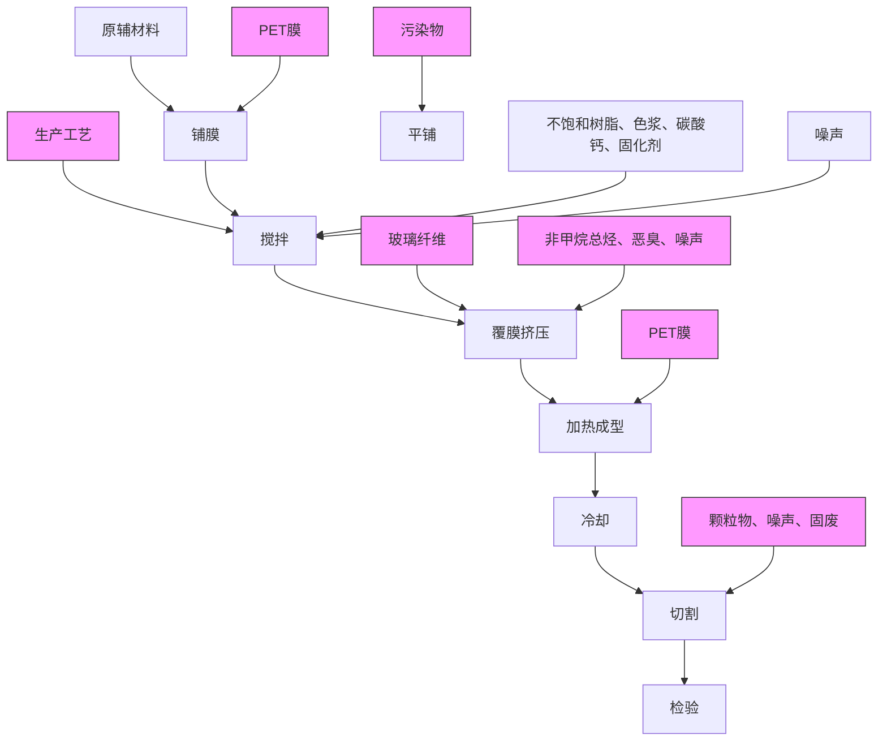
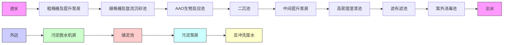

# 建设项目环境影响报告表

（污染影响类）

项目名称：佛山市顺德区昊亨建材有限公司新建项目建设单位（盖章）：佛山市顺德区昊亨建材有限公司

中华人民和国生态环境部制

# 一、建设项目基本情况

<table><tr><td colspan="2">建设项目名称</td><td colspan="3">佛山市顺德区昊亨建材有限公司新建项目</td></tr><tr><td colspan="2">项目代码</td><td colspan="3">无</td></tr><tr><td colspan="2">建设单位联系人</td><td>胡**</td><td>联系方式</td><td>137*********</td></tr><tr><td colspan="2">建设地点</td><td colspan="3">广东省佛山市顺德区杏坛镇昌教村工业园九路6号之二</td></tr><tr><td colspan="2">地理坐标</td><td colspan="3">(113度9分56.833秒,22度46分1.689秒)</td></tr><tr><td colspan="2">国民经济行业类别</td><td>C3062玻璃纤维增强塑料制品制造</td><td>建设项目行业类别</td><td>二十七、非金属矿物制品业30玻璃纤维和玻璃纤维增强塑料制品制造306</td></tr><tr><td colspan="2">建设性质</td><td>☑新建(迁建)□改建□扩建□技术改造</td><td>建设项目申报情形</td><td>☑首次申报项目□不予批准后再次申报项目□超五年重新审核项目□重大变动重新报批项目</td></tr><tr><td colspan="2">项目审批(核准/备案)部门(选填)</td><td>无</td><td>项目审批(核准/备案)文号(选填)</td><td>无</td></tr><tr><td colspan="2">总投资(万元)</td><td>100</td><td>环保投资(万元)</td><td>10</td></tr><tr><td colspan="2">环保投资占比(%)</td><td>10%</td><td>施工工期</td><td>1个月</td></tr><tr><td colspan="2">是否开工建设</td><td>☑否□是: _</td><td>用地(用海)面积(m2)</td><td>建筑面积2000m2</td></tr><tr><td colspan="2">专项评价设置情况</td><td colspan="3">无</td></tr><tr><td colspan="2">规划情况</td><td colspan="3">无</td></tr><tr><td colspan="2">规划环境影响评价情况</td><td colspan="3">无</td></tr><tr><td colspan="2">规划及规划环境影响评价符合性分析</td><td colspan="3">无</td></tr><tr><td>其他符合性分析</td><td colspan="4">(1)产业政策相符性本项目主要从事玻璃纤维增强塑料制品的生产和销售,属于C3062玻璃</td></tr></table>

纤维增强塑料制品制造。根据生态环境部办公室发布的《环境保护综合名录（2021 年版）》，项目产品不属于上述目录所列出的“高污染、高环境风险”产品。项目生产产品、生产工艺和生产设备均不属于《产业结构调整指导目录（2019 年本）》（国家发展和改革委员会令第 29号，2020 年 1 月 1 日起施行）中的限制或禁止类别，也不属于国家发展改革委商务部《关于印发＜市场准入负面清单（2022 年版）的通知＞》（发改体改规〔2022〕397号）“禁止准入类”。因此，项目符合相关的产业政策要求。

# （2）选址合理性分析

根据项目所在地用地规划，《顺德区产业发展保护区划定方案》，项目属于，项目位于产业发展保护区——XT6吕地昌教产业发展保护区（详见附件3）。因此项目用地符合当地规划。

# （3）项目与“三线一单”生态环境分区管控方案相符性分析

根据《广东省人民政府关于印发广东省“三线一单”生态环境分区管控方案的通知》（粤府〔2020〕71号）发布的广东省环境管控单元图，项目所在地属于重点管控单元；根据《佛山市人民政府关于印发佛山市“三线一单”生态环境分区管控方案的通知》（佛府〔2021〕11号）发布的佛山市环境管控单元图和《佛山市顺德区人民政府关于印发佛山市顺德区“三线一单”生态环境分区管控方案的通知》（顺府发〔2021〕11号）发布的顺德区环境管控单元图，项目所在地属于广东省佛山市顺德区重点管控单元（编码为ZH44060620005，名称为杏坛镇重点管控区）。项目与广东省佛山市顺德区重点管控单元准入清单的相符性分析如表1-1。

表1-1 项目与广东省佛山市顺德区重点管控单元准入清单的相符性分析

<table><tr><td>序号</td><td colspan="2">管控要求</td><td>本项目</td><td>符合性</td></tr><tr><td>1.1</td><td>区域布局管控</td><td>1-1.【生态/禁止类】单元内的一般生态空间,主导生态功能为水土保持,禁止在25度以上的陡坡地开垦种植农作物,禁止在崩塌、滑坡危险区、泥石流易发区从事采石、取土、采砂等可能造成水土流失的活动。</td><td>本项目不涉及生态禁止类活动</td><td>符合</td></tr></table>

<table><tr><td rowspan="6"></td><td>1.2</td><td rowspan="6"></td><td>1-2.【产业/鼓励引导类】重点发展新材料、智能家居、先进装备制造业、汽车配件等产业以及军民融合产业,提升发展塑料专业市场,培育智能家居创新创业产业链,依托顺德新港发展临港加工和物流产业,发展现代农业。</td><td>本项目不属于产业鼓励引导类。</td><td>符合</td></tr><tr><td>1.3</td><td>1-3.【产业/综合类】系统推进村级工业园升级改造,腾出连片空间,布局产业集聚区和主题产业园,推动工业项目入园集聚发展。新增工业制造业用地原则上安排在产业集聚区内,产业集聚区外原则上不鼓励工业及物流仓储用地的新建与改造。</td><td>本项目所在地不属于村级工业园升级改造。本项目位于广东省佛山市顺德区杏坛镇昌教村工业园九路6号之二,位于产业聚集区。</td><td>符合</td></tr><tr><td>1.4</td><td>1-4.【产业/综合类】产业聚集区所属地块内的工业用地或企业与村属地块内的工业用地或企业与设置合理的大气环境防护距离,并通过绿化带进行有效隔离;聚集区规划布局应注重大气污染排放企业应尽量避免布局在居住用地的常年主导风向的上风向。</td><td>本项目与最近敏感点距离为470m(昌教村),项目对周围环境和敏感点的影响不大。</td><td>符合</td></tr><tr><td>1.5</td><td>1-5.【产业/限制类】受纳水体或监控断面不达标的,不得新建、扩建向河涌直接排放废水的项目。新建、扩建含蚀刻工序的线路板生产项目和化工项目应在配套污水集中处置的工业园区或生活污水管网覆盖区域内建设;纯加工型印花项目,含酸洗、磷化的金属表面处理、金属制品项目(与自身高新技术企业配套的除外),含酸洗、喷涂、化学抛光、电解等涉及废水排放工艺的不锈钢型材加工项目(与自身高新技术企业配套的除外),应进入以此类项目为主导产业、有相应废水集中治理设施的工业园区,实现集中治污。</td><td>项目属于玻璃纤维增强塑料制品,不属于家具制造项目。</td><td>符合</td></tr><tr><td>1.6</td><td>1-6.【产业/综合类】划定家具生产优先发展区域,优先发展区外不再新建涉及涂装工艺的木质家具制造项目。</td><td>本项目属于玻璃纤维增强塑料制品,项目不属于木质家具制造项目。</td><td>符合</td></tr><tr><td>1.7</td><td>1-7.【水/限制类】严格限制在右滩水厂、均安水厂饮用水水源保护区上游和周边区域建设列入“高污染、高环境风险”产品名录等可能影响水环境安全的项目。</td><td>项目属于玻璃纤维增强塑料制品。项目生活污水经三级化粪池预处理后由市政污水管网引入杏坛污水处理厂处理。</td><td>符合</td></tr><tr><td rowspan="7"></td><td>1.8</td><td></td><td>1-8.【土壤/禁止类】禁止新建、扩建增加重点防控的重金属污染物排放的建设项目。</td><td>本项目属于玻璃纤维增强塑料制品生产,项目不属于储油库项目、也不属于产生和排放有毒有害大气污染物的建设项目以及使用溶剂型油墨、涂料、清洗剂、胶黏剂等高挥发性有机物原辅材料项目。</td><td>符合</td></tr><tr><td>2.1</td><td rowspan="6">能源资源利用</td><td>【能源/鼓励引导类】推广节能技术,加快发展绿色货运与现代物流。</td><td>项目使用节能技术,项目不属于绿色货运与现代物流。</td><td>符合</td></tr><tr><td>2.2</td><td>【能源/鼓励引导类】推广新能源汽车应用和充电基础设施、加氢站建设。</td><td>项目不属于新能源汽车、充电基础设施、加氢站建设项目。</td><td>符合</td></tr><tr><td>2.3</td><td>【能源/综合类】科学实施能源消费总量和强度“双控”,新建高能耗项目单位产品(产值)能耗达到国际国内先进水平。</td><td>项目不属于高能耗项目。</td><td>符合</td></tr><tr><td>2.4</td><td>【水资源/综合类】贯彻落实“节水优先”方针,实行最严格水资源管理制度,大良街道万元国内生产总值用水量、万元工业增加值用水量、用水总量、农田灌溉水有效利用系数等用水总量和效率指标达到区下达要求。</td><td>要求项目节约用水。</td><td>符合</td></tr><tr><td>2.5</td><td>【土地资源/限制类】落实单位土地面积投资强度、土地利用强度等建设用地控制性指标要求,提高土地利用效率。</td><td>要求项目落实单位土地面积投资强度、土地利用强度。</td><td>符合</td></tr><tr><td>2.6</td><td>【岸线/禁止类】严格水域岸线用途管制,新建项目一律不得违规占用水域。严禁破坏生态的岸线利用行为和不符合其功能定位的开发建设活动,严禁以各种名义侵占河道、围垦湖泊、非法采砂等。</td><td>项目不存在破坏生态的岸线利用的行为和不符合其功能定位的开发建设的活动,不存在侵占河道、围垦湖泊、非法采砂等。</td><td>符合</td></tr><tr><td rowspan="5"></td><td>3.1</td><td rowspan="5">污染物排放管控</td><td>【水/限制类】城镇新区建设实行雨污分流。住宅、商业体、学校、市场等城镇开发建设项目应当配套或者同步计划建设公共排水设施,公共排水设施或自建排污水设施未能投产运行的,以上涉水项目不得投入使用。新建小区严格实施雨污分流,阳台、露台等污水接入污水收集系统,将生活污水“应截尽截”做好大型楼盘、集贸市场、餐饮以及学校等4大类排水户污水接入市政管网工作。</td><td>项目不属于住宅、商业体、学校、市场等城镇开发建设项目。</td><td>符合</td></tr><tr><td>3.2</td><td>【水/综合类】杏坛镇重点河涌水质上年度未达到水环境质量目标的,需组织编制、系统实施、向社会公开区域重点水污染物减排计划并明确“替代量”,本年度新建、改建、扩建项目新增水环境重点污染物实行区域“减二增一”替代(工业、生活或综合集中废水处理设施、民生项目除外)。</td><td>项目生活污水经三级化粪池预处理后排入杏坛污水处理厂,且属于工业项目,无需实施本年度新建项目新增水环境重点污染物区域“减二增一”替代。</td><td>符合</td></tr><tr><td>3.3</td><td>【水/综合类】结合村级工业园改造,全面提升产业层次与集聚度,促进污染集中整治。</td><td>项目不属于村级工业园改造区,位于工业聚居区。</td><td>符合</td></tr><tr><td>3.4</td><td>【水/综合类】稳步推进排水设施“三个一体化”管理模式,补齐城乡污水收集和处理短板,推动逢沙污水处理厂、杏坛污水处理厂提质增效,加快消除城中村、老旧城区、城乡结合部等污水收集管网空白区,逐步实现城乡污水收集处理全覆盖。逢沙污水处理厂根据片区的污水排放收集情况,推进扩建增容工作,尾水应执行《城镇污水处理厂污染物排放标准》(GB18918-2002)一级A标准及《广东省水污染物排放限值》(DB44/26-2001)的较严值。2025年城市生活污水集中收集率达到75%以上。</td><td>项目不属于污水管网、污水处理设施等建设项目。</td><td>符合</td></tr><tr><td>3.5</td><td>【水/综合类】近期保留桑麻村、逢简村、吉祐村、安富村等现状农村污水分散式处理设施,继续完善污水支管网建设,提高污水收集处理率,新建龙潭村、吉祐村、右滩村、南朗村、光华村、东村、北水村等农村分散式生活污水处理设施,其余行政村(社区)继续完善污水管网建设,收集农村污水进入市政污水系统,有条件的区域实施雨污分流改造,到2030年全面雨污分流,污水纳入杏坛城镇污水处理系统。</td><td>本项目不涉及。</td><td>符合</td></tr><tr><td rowspan="4"></td><td>3.6</td><td rowspan="2"></td><td>【水/综合类】产业集聚区和主题园区内做好污水管网和污水集中处理设施的配套保障,确保废水收集到城镇污水处理厂、园区污水处理厂或分散式污水处理设施集中处置。</td><td>项目不属于产业集聚区和主题园区建设项目。</td><td>符合</td></tr><tr><td>3.7</td><td>【大气/综合类】大力推进低VOCs含量原辅材料替代,加快涉VOCs重点行业的生产工艺升级改造,推行自动化生产工艺,对达不到要求的VOCs收集及治理设施进行整治提升,逐步淘汰低效VOCs治理设施。</td><td>项目不使用高VOCs含量原辅材料,不使用低效VOCs治理设施。</td><td>符合</td></tr><tr><td>4.1</td><td rowspan="2">环境风险防控</td><td>【水/综合类】近期保留桑麻村、逢简村、吉祐村、安富村等现状农村污水分散式处理设施,继续完善污水支管网建设,提高污水收集处理率,新建龙潭村、吉祐村、右滩村、南朗村、光华村、东村、北水村等农村分散式生活污水处理设施,其余行政村(社区)继续完善污水管网建设,收集农村污水进入市政污水系统,有条件的区域实施雨污分流改造,到2030年全面雨污分流,污水纳入杏坛城镇污水处理系统。</td><td>本项目不涉及。</td><td>符合</td></tr><tr><td>4.2</td><td>【风险/综合类】加强环境风险分级分类管理,强化金属制品、有色金属和压延加工、化学原料和化学品制造业等涉重金属、化工行业企业及工业园区等重点环境风险源的环境风险防控。</td><td>本项目所属行业为玻璃纤维增强塑料制品制造,不属于重点环境风险源。</td><td>符合</td></tr><tr><td colspan="6">(4)与VOCs控制政策文件相符性分析项目与国家、广东省、佛山市、顺德区政府有关VOCs污染控制政策文件的相符性分析如下表所示。表1-2 项目与有机污染物治理政策的相符性</td></tr><tr><td>序号</td><td colspan="2">政策要求</td><td colspan="2">工程内容</td><td>符合性</td></tr><tr><td colspan="6">1、《中华人民共和国大气污染防治法》(2018年10月26日修正)</td></tr><tr><td>1.1</td><td colspan="2">第四十四条 生产、进口、销售和使用含挥发性有机物的原材料和产品</td><td colspan="2">项目使用物料为低VOCs含量原辅材料。</td><td>符合</td></tr></table>

<table><tr><td rowspan="7"></td><td></td><td>的,其挥发性有机物含量应当符合质量标准或者要求。国家鼓励生产、进口、销售和使用低毒、低挥发性有机溶剂。</td><td></td><td></td></tr><tr><td>1.2</td><td>第四十五条 产生含挥发性有机物废气的生产和服务活动,应当在密闭空间或者设备中进行,并按照规定安装、使用污染防治设施;无法密闭的,应当采取措施减少废气排放。</td><td>有机废气经负压密闭收集,通过“二级活性炭吸附”装置处理后引至15m排气筒高空排放,可有效减少废气排放。</td><td>符合</td></tr><tr><td colspan="4">2、《广东省大气污染防治条例》(2019年3月1日起施行)</td></tr><tr><td>2.1</td><td>第十七条 珠江三角洲区域禁止新建、扩建燃煤燃油火电机组或者企业燃煤燃油自备电站。珠江三角洲区域禁止新建、扩建国家规划外的钢铁、原油加工、乙烯生产、造纸、水泥、平板玻璃、除特种陶瓷以外的陶瓷、有色金属冶炼等大气重污染项目。</td><td>本项目属于玻璃纤维增强塑料制品制造,不属于禁止建设的大气重污染项目。</td><td>符合</td></tr><tr><td>2.2</td><td>第二十六条 新建、改建、扩建排放挥发性有机物的建设项目,应当使用污染防治先进可行技术。下列产生含挥发性有机物废气的生产和服务活动,应当优先使用低挥发性有机物含量的原材料和低排放环保工艺,在确保安全条件下,按照规定在密闭空间或者设备中进行,安装、使用满足防爆、防静电要求的治理效率高的污染防治设施;无法密闭或者不适宜密闭的,应当采取有效措施减少废气排放:(一)石油、化工、煤炭加工与转化等含挥发性有机物原料的生产;(二)燃油、溶剂的储存、运输和销售;(三)涂料、油墨、胶粘剂、农药等以挥发性有机物为原料的生产;(四)涂装、印刷、粘合、工业清洗等使用含挥发性有机物产品的生产活动;(五)其他产生挥发性有机物的生产和服务活动。</td><td>有机废气经负压密闭收集,通过“二级活性炭吸附”装置处理后引至15m排气筒高空排放,可有效减少有机废气排放,减少异味影响。</td><td>符合</td></tr><tr><td colspan="4">3、《广东省生态环境厅关于做好重点行业建设项目挥发性有机物总量指标管理工作的通知》(粤环发〔2019〕2号)</td></tr><tr><td>3.1</td><td>新、改、扩建排放VOCs的重点行业建设项目应当执行总量替代制度,重点行业包括炼油与石化、化学原料和化学制品制造、化学药品原料药制造、合成纤维制造、表面涂装、印刷、制鞋、家具制造、人造板制造、电子元件制造、纺织印、塑料制造及塑料制品等12个行业。</td><td>项目属于玻璃纤维增强塑料制品制造,属于重点管理行业。项目挥发性有机物总量指标为2.0013t/a</td><td>符合</td></tr><tr><td rowspan="9"></td><td colspan="4">4、关于印发《广东省涉挥发性有机物(VOCs)重点行业治理指引》的通知(粤环办〔2021〕43号)</td></tr><tr><td>4.1</td><td>粉状、粒状VOCs物料采用气力输送设备、管状带式输送机、螺旋输送机等密闭输送方式,或者采用密闭的包装袋、容器或罐车进行物料转移。</td><td>原辅材料采用密封包装袋进行运输与储存。</td><td>符合</td></tr><tr><td>4.2</td><td>VOCs治理设施应与生产工艺设备同步运行,VOCs治理设施发生故障或检修时,对应的生产工艺设备应停止运行,待检修完毕后同步投入使用;生产工艺设备不能停止运行或不能及时停止运行的,应设置废气应急处理设施或采取其他替代措施。</td><td>已要求企业VOCs治理设施应与生产工艺设备同步运行,日常安排专门人员对治理设备进行定期巡查和检修,避免故障情况的出现。</td><td>符合</td></tr><tr><td>4.3</td><td>建立废气收集处理设施台账,记录废气处理设施进出口的监测数据(废气量、浓度、温度、含氧量等)、废气收集与处理设施关键参数、废气处理设施相关耗材(吸收剂、吸附剂、催化剂等)购买和处理记录。</td><td>项目废气治理设施安排专人维护并定期建立台账,记录相关废气数据。</td><td>符合</td></tr><tr><td>4.4</td><td>建立危废台账,整理危废处置合同、转移联单及危废处理方资质佐证材料。</td><td>企业严格执行危险废物转移计划报批、依法建立危险废物转移联单,并通过信息系统登记转移计划和电子转移联单。</td><td>符合</td></tr><tr><td>4.5</td><td>要求建设单位需对有机废气有组织和无组织废气、噪声每年监测1次。</td><td>已要求企业对项目废气、噪声进行自行检查。</td><td>符合</td></tr><tr><td colspan="4">5、《广东省人民政府办公厅关于印发广东省2021年大气、水、土壤污染防治工作方案的通知》(粤办函〔2021〕58号)</td></tr><tr><td>5.1</td><td>严格落实国家产品VOCs含量限值标准要求,除现阶段确无法实施替代的工序外,禁止新建生产和使用高VOCs含量原辅材料项目。鼓励在生产和流通消费环节推广使用低VOCs含量原辅材料。</td><td>本项目使用的物料不属于禁止使用的高VOCs含量原辅材料,符合政策要求。</td><td>符合</td></tr><tr><td>5.2</td><td>指导企业使用适宜高效的治理技术,涉VOCs重点行业新建、改建和扩建项目不推荐使用光氧化、光催化、低温等离子等低效治理设施,已建项目逐步淘汰光氧化、光催化、低温等离子治理设施。</td><td>有机废气经负压密闭收集,通过“二级活性炭吸附”装置处理后引至15m排气筒高空排放。</td><td>符合</td></tr></table>

（5）项目与省、市、区生态环境保护“十四五”规划相符性分析

<table><tr><td>序号</td><td>政策要求</td><td>工程内容</td><td>符合性</td></tr><tr><td colspan="4">1.《广东省生态环境保护“十四五”规划》</td></tr><tr><td>1.1</td><td>珠三角地区禁止新建、扩建水泥、平板玻璃、化学制浆、生皮制革以及国家规划外的钢铁、原油加工等项目</td><td>项目属于C3062玻璃纤维增强塑料制品制造,不属于水泥、平板玻璃、化学制浆、生皮制革以及国家规划外的钢铁、原油加工等项目</td><td>符合</td></tr><tr><td>1.2</td><td>大力推进低VOCs含量原辅材料源头替代,严格落实国家和地方产品VOCs含量限值质量标准,禁止建设生产和使用高VOCs含量的溶剂型涂料、油墨、胶粘剂等项目</td><td>项目使用的原辅材料均为低VOCs含量原辅材料</td><td>符合</td></tr><tr><td>1.3</td><td>强化对企业涉VOCs生产车间/工序废气的收集管理,推动企业开展治理设施升级改造</td><td>搅拌、平铺、覆膜挤压、加热成型废气整室负压收集后经一套“二级活性炭吸附”处理后排气筒排放</td><td>符合</td></tr><tr><td colspan="4">2.《佛山市生态环境保护“十四五”规划》</td></tr><tr><td>2.1</td><td>新建、扩建项目需符合环境质量改善要求。严格控制“高耗能、高排放”项目盲目发展,禁止新建、扩建水泥、平板玻璃、化学制浆、生皮制革以及国家规划外的钢铁、原油加工等项目</td><td>项目属于C3062玻璃纤维增强塑料制品制造,不属于水泥、平板玻璃、化学制浆、生皮制革以及国家规划外的钢铁、原油加工等项目</td><td>符合</td></tr><tr><td>2.2</td><td>严格限制新建生产和使用高挥发性有机物原辅材料的项目</td><td>项目使用的原辅材料均为低VOCs含量原辅材料</td><td>符合</td></tr><tr><td>2.3</td><td>严格执行相关行业企业布局选址要求,在重金属镉累积性较高的区域禁止新建、扩建排放重金属污染物的建设项目。</td><td>项目无重金属产生</td><td>符合</td></tr><tr><td colspan="4">3.《佛山市顺德区生态环境保护》“十四五”规划(2021-2025)</td></tr><tr><td>3.1</td><td>禁止新建、扩建水泥、平板玻璃、化学制浆、生皮制革以及国家规划外的钢铁、原油加工等项目;专业电镀、印染等项目进入定点园区集中管理</td><td>项目属于C3062玻璃纤维增强塑料制品制造,不属于水泥、平板玻璃、化学制浆、生皮制革以及国家规划外的钢铁、原油加工等项目</td><td>符合</td></tr></table>

# 二、建设项目工程分析

<table><tr><td rowspan="18">建设内容</td><td colspan="5">1、项目组成佛山市顺德区昊亨建材有限公司选址于广东省佛山市顺德区杏坛镇昌教村工业园九路6号之二:北纬22°46′1.689′′,东经113°9′56.833′′,项目租赁所在厂房为生产,建筑面积共2000m2,主要设FRP生产线、原料搅拌区、检验区和仓库等,项目地理位置图见附图1。项目东北面为空地块、西南面为东海大涌,西北面为广东顺德昌盛实业有限公司,东南面为佛山市赣昌钢化玻璃有限公司。项目最近敏感点西南面470m处的昌教村。本项目主要为经营范围为从事FRP采光瓦的生产,年产FRP采光瓦150吨。项目组成详见下表2-1。表2-1 主要建设内容表</td></tr><tr><td>类别</td><td>工程名称</td><td colspan="3">备注</td></tr><tr><td>主体工程</td><td>生产厂房</td><td colspan="3">占地面积约2000m2,设有FRP生产线、原料搅拌区、检验区和仓库等;</td></tr><tr><td rowspan="2">公共工程</td><td>供水</td><td colspan="3">由市政供水管网供给,主要为生活用水。</td></tr><tr><td>供电</td><td colspan="3">由市政供电管网供给,项目内不设备用发电机。</td></tr><tr><td rowspan="4">环保工程</td><td>污水治理工程</td><td colspan="3">三级化粪池</td></tr><tr><td>废气治理工程</td><td colspan="3">有机废气:委托有工程资质单位落实有机废气治理,采用“二级活性炭吸附”处理后经15m排气筒排放;</td></tr><tr><td>噪声治理工程</td><td colspan="3">置于车间内,利用车间墙壁的阻隔作用降噪;严格管理工作时间;调整设备布局;加强设备日常维护与保养;</td></tr><tr><td>固废处理工程</td><td colspan="3">生活垃圾统一收集后交由环卫部门处理;设有危险废物暂存点、固体废物暂存点</td></tr><tr><td colspan="5">2、生产规模及主要原辅材料本项目的主要生产原辅材料和产品方案详见下表2-2和表2-3;表2-2 本项目主要原辅材料及其用量</td></tr><tr><td>序号</td><td>原辅材料名称</td><td>年用量</td><td>最大存储量</td><td>备注</td></tr><tr><td>1</td><td>不饱和树脂</td><td>80吨</td><td>10吨</td><td>主要原料</td></tr><tr><td>2</td><td>玻璃纤维</td><td>25吨</td><td>5吨</td><td>平铺工序</td></tr><tr><td>3</td><td>碳酸钙</td><td>39吨</td><td>5吨</td><td>平铺工序</td></tr><tr><td>4</td><td>PET膜</td><td>10吨</td><td>0.5吨</td><td>覆膜工序</td></tr><tr><td>5</td><td>色浆</td><td>1吨</td><td>0.1吨</td><td>用于原辅材料混合</td></tr><tr><td>6</td><td>固化剂</td><td>1吨</td><td>0.2吨</td><td>用于原辅材料混合</td></tr><tr><td>7</td><td>机油</td><td>0.05吨</td><td>0.05吨</td><td>用于设备维护保养</td></tr></table>

注释：

不饱和树脂：不饱和树为淡黄色透明液体，具有芳香气味，主要成分为乙烯基甲苯（35%）、邻苯型不饱和聚酯（65%），其密度为 1.11-1.13g/cm³之间，沸点为 171.45℃，闪点＞52.78℃，引燃温度＞200℃，部分溶于水，乙烯基甲苯又名甲基苯乙烯，其熔点为约为 77℃，其化学品安全技术说明书详见附件 5。

固化剂：固化剂的主要成分为 2 一甲基咪唑（59%）、炭黑（10%）、碳酸钙（10%）、助剂（0.035%）、硅粉（20.965%），其密度为 0.86（水=1），蒸汽密度为 3.1（空气=1），爆炸界限为 1.2\~7.1%，沸点为 110.6℃，熔点为-95℃。促进或调节固化反应的物质，是使物质凝固的加工助剂，不饱和聚酯树脂固化物必需的原料之一，否则不饱和聚酯树脂就不会固化。

碳酸钙：碳酸钙是一种无机化合物，俗称：灰石、石灰石、石粉、大理石等。主要成分：方解石，化学式是 CaCO3，呈中性，基本上不溶于水，溶于盐酸。它是地球上常见物质，存在于霰石、方解石、白垔、石灰岩、大理石、石灰华等岩石内，亦为动物骨骼或外壳的主要成分。碳酸钙是重要的建筑材料，工业上用途甚广。碳酸钙是由钙离子和碳酸根离子结合生成的，所以既是钙盐也是碳酸盐。

表 2-3 本项目主要产品年产量

<table><tr><td>序号</td><td>产品名称</td><td>年产量</td><td>备注</td></tr><tr><td>1</td><td>FRP 采光瓦</td><td>150 吨</td><td>每片 FRP 采光瓦厚度为3mm,长约 50cm,宽约 30cm,每米采光瓦重量约为 3kg</td></tr></table>

# 3、主要生产设备

项目主要生产设备见表 2-4；

表 2-4 本项目主要设备或设施

<table><tr><td>序号</td><td>设备名称</td><td>设备数量</td><td>备注</td></tr><tr><td>1</td><td>FRP板材生产线</td><td>3条</td><td>主要生产线</td></tr><tr><td>2</td><td>空压机</td><td>3台</td><td>辅助设备</td></tr><tr><td>3</td><td>凸轮比例泵</td><td>3台</td><td>抽料设备</td></tr><tr><td>4</td><td>树脂抽料泵</td><td>3台</td><td>抽料设备</td></tr><tr><td>5</td><td>搅拌缸</td><td>8个</td><td rowspan="2">原辅材料搅拌、分散</td></tr><tr><td>6</td><td>高速分散机</td><td>3台</td></tr><tr><td>7</td><td>3吨叉车</td><td>1台</td><td>辅助设备</td></tr><tr><td>8</td><td>吊机</td><td>1台</td><td>辅助设备</td></tr><tr><td>9</td><td>液压机</td><td>2台</td><td>辅助设备</td></tr><tr><td>10</td><td>吸尘机</td><td>5台</td><td>清扫设备</td></tr><tr><td colspan="4">注:搅拌设备为生产线上设备,连续生产,不饱和树脂搅拌后不加热不固化,只能粘附在搅拌缸和分散机上,故无需对搅拌缸和分散机进行清洗,故不产生清洗废水</td></tr></table>

表 2-5 项目关键设备产能匹配性分析表

<table><tr><td>设备名称</td><td>设备数量</td><td>生产能力(kg/h)</td><td>工作时间(h/a)</td><td>单台年生产能力(t/a)</td><td>合计年生产能力(t/a)</td><td>产能要求(t/a)</td></tr><tr><td>FRP板材生产线</td><td>3条</td><td>25</td><td>2400</td><td>60</td><td>180</td><td>150</td></tr></table>

根据表 2-5 可知，项目关键设备产能为：FRP 板材生产线 180t/a，本项目申报产能为 150t/a，项目设备产能与产品规模相匹配

# 4、劳动定员和生产天数

（1）工作制度：项目年生产时间 300天，每天工作 8 小时，工作制为一班制。  
（2）劳动定员：项目拟定员工 20 人，均不在项目内食宿。

# 5、公用工程

# （1）给排水

本项目的用水均全部由市政自来水公司供给，具体给排水情况如下：

根据建设单位提供的资料，项目用水主要为员工生活用水，生活用水量约为 200/a，排放系数按 0.9 计算，生活污水排放量约为 180t/a，项目生活污水三级化粪池预处理后由市政管网排放至杏坛污水处理厂进行处理。

# （2）供电

本项目用电由当地市政电网供应，根据建设单位提供资料，本项目年用电量约为10万千瓦时，项目内不设备用发电机。

# 6、厂区平面布置

项目已租用广东省佛山市顺德区杏坛镇昌教村工业园九路 6 号之二为生产厂房，项目占地面积 2000㎡，生产车间设有 FRP 生产线（位于厂区东面），原料搅拌区（位于厂区西面），加热成型区（位于厂区东面），办公室（位于厂区南面）和仓库（位于厂区西面）等，具体厂区平面布置图见附图。

本项目主要从 FRP 采光瓦的加工生产，具体生产工艺及产污流程如下图所示。

flowchart

图2-1 生产工艺流程图

# 生产工艺流程说明

（1）铺膜：将外购的塑料薄膜平铺在生产线上，通过牵引机匀速运动。  
（2）搅拌：将不饱和聚酯树脂、碳酸钙、固化剂及色浆按照生产配方比例添加至搅拌机和分散机中进行搅拌、分散，在搅拌桶中搅拌均匀，搅拌过程中产生噪声和废气。  
（3）平铺：将搅拌均匀的混合料利用泵抽至生产线模具上的薄膜中，塑料薄膜经牵引机匀速运动，通过刮刀控制附着物料的厚度，使混合物料均匀涂在塑料薄膜上，铺膜厚度约为 3mm，制成树脂基层。将切碎的玻璃纤维丝均匀地洒落在树脂基层上，平铺过程均在 FRP 生产线上密闭操作，不会产生逸散粉尘，平铺的过程中产生噪声和废气。  
（4）覆膜挤压：在洒落玻璃纤维的树脂基层上再平铺一层玻璃纤维，通过生产线挤压排出物料中的气泡，控制板材厚度，最后加盖一层塑料薄膜，使之原辅材料粘附在上下两层薄膜中，半成品具有一定粘度，粘附在薄膜中，薄膜和生产线上的模具使树脂

基层固定形状。覆膜挤压过程无需加热，覆膜挤压过程中产生噪声、废气。

（5）加热成型：定型后的半成品输送至烘干隧道炉进行固化成型采用电加热（第一阶段加热温度约为 70℃，第二阶段加热温度为 60℃），加速固化。加热后得到半成品，固化成型过程中产生噪声和废气。  
（6）冷却：加热后的半成品已完全固化，通过小型风扇自然冷却只对其温度进行降温，提高板材的固化度，此工序无废气产生。  
（7）切割：将冷却好的成品切割，得到相应规格的成品，产品宽度均约为 30cm，长度根据产品需求进行切割，约为 50cm，此工序会产生噪声。  
（8）检验：切割完成后的产品进行人工检验，该工序会产生不合格品。

注：①加热过程中不饱和树脂中的乙烯基甲苯不产生分解，乙烯基甲苯的分解温度为 77℃，固化过程中第一阶段温度为 70℃，第二阶段温度为 60℃，故不饱和树脂中的乙烯基甲苯不产生分解；②生产线为非连续挤出生产，平铺固定长度后再进行覆膜挤压。

主要污染源  
表2-5 本项目产污环节分析

<table><tr><td>序号</td><td colspan="2">类别</td><td>污染源</td><td>主要污染物</td></tr><tr><td>1</td><td rowspan="5">废气</td><td rowspan="4">有机废气</td><td>搅拌工序</td><td>非甲烷总烃、臭气浓度</td></tr><tr><td>2</td><td>平铺工序</td><td>非甲烷总烃、臭气浓度</td></tr><tr><td>3</td><td>覆膜挤压</td><td>非甲烷总烃、臭气浓度</td></tr><tr><td>4</td><td>加热成型</td><td>非甲烷总烃、臭气浓度</td></tr><tr><td>5</td><td>颗粒物</td><td>切割</td><td>颗粒物</td></tr><tr><td>6</td><td>废水</td><td>生活污水</td><td>员工办公</td><td> $COD_{cr}$ 、 $BOD_5$ 、 $NH_3-N$ 、SS</td></tr><tr><td>7</td><td rowspan="3">一般固体废物</td><td>废包装材料</td><td>原料拆除</td><td>废包装材料</td></tr><tr><td>8</td><td>边角料</td><td>切割</td><td>边角料</td></tr><tr><td>9</td><td>废包装袋</td><td>原料拆除</td><td>废包装袋</td></tr><tr><td>10</td><td>生活垃圾</td><td>生活垃圾</td><td>员工办公</td><td>生活垃圾</td></tr><tr><td>11</td><td rowspan="5">危险废物</td><td>含油废抹布</td><td>设备保养</td><td>含油废抹布</td></tr><tr><td>12</td><td>废机油</td><td>设备保养</td><td>废机油</td></tr><tr><td>13</td><td>废机油桶</td><td>设备保养</td><td>废机油桶</td></tr><tr><td>14</td><td>废活性炭</td><td>废气治理设备</td><td>废活性炭</td></tr><tr><td>15</td><td>废原料桶</td><td>原辅材料使用</td><td>废原料桶</td></tr></table>

与项目有关的原有环境污染问题

本项目为新建项目，无与本项目有关的原有污染问题。项目所在区域存在主要污染物 为附近企业在生产运营过程中产生的废气、噪声、废水、固废。

# 三、区域环境质量现状、环境保护目标及评价标准

区域 环境 质量 现状

# 1、环境空气质量现状

根据《佛山市人民政府办公室关于调整顺德区环境空气质量功能区划的功能》（佛府办函〔2014〕494号）和《顺德区生态环境规划（2011～2020年）》（顺府办函〔201341号），顺德区全境为大气环境二类区，因此本项目所在区域属二类环境空气质量功能区，执行《环境空气质量标准》（GB3095-2012）二级标准及其2018年修改单的要求。

根据《佛山市生态环境局顺德分局关于发布2022年度佛山市顺德区生态环境状况公报的通知》（佛环顺函〔2023〕26号），2022年全区空气质量综合指数为3.27，比2021年下降6.0%。2022年全区二氧化硫 $( \mathrm { S O } _ { 2 } )$ 、二氧化氮 $\left( \mathrm { N O } _ { 2 } \right)$ 、可吸入颗粒物 $\left( \mathrm { P M } _ { 1 0 } \right) .$ 、细颗粒物 $\left( \mathbf { P M } _ { 2 . 5 } \right)$ 平均浓度分别为5、29、32、19微克/立方米，臭氧日最大8小时滑动平均（O3-8h）浓度的第90百分位数为190微克/立方米，一氧化碳（CO）日浓度的第95百分位数为1.1毫克/立方米，六项污染物除 $\mathrm { \Phi } \mathrm { \Phi } \mathrm { O } _ { 3 } { - } 8 \mathrm { h } .$ 外指标浓度均达到《环境空气质量标准》（GB3095-2012）二级标准限值。2022年顺德区（国控测点）环境空气污染物浓度及达标评价情况见下表。

表 3-1 2022 年顺德区（国控测点）环境空气污染物浓度及达标评价情况

<table><tr><td rowspan="2">污染物</td><td>浓度均质</td><td rowspan="2">评价标准</td><td rowspan="2">占标率</td><td rowspan="2">达标情况</td></tr><tr><td>2022年</td></tr><tr><td> $SO_{2}$ (μg/m3)</td><td>5</td><td>60</td><td>-16.7%</td><td>达标</td></tr><tr><td> $NO_{2}$ (μg/m3)</td><td>29</td><td>40</td><td>-12.1%</td><td>达标</td></tr><tr><td> $PM_{10}$ (μg/m3)</td><td>32</td><td>70</td><td>-23.8%</td><td>达标</td></tr><tr><td> $PM_{2.5}$ (μg/m3)</td><td>19</td><td>35</td><td>-13.6%</td><td>达标</td></tr><tr><td> $CO^{*}$ (μg/m3)</td><td>1.1</td><td>4</td><td>+10.0%</td><td>达标</td></tr><tr><td> $O_{3}-8H$ (μg/m3)</td><td>190</td><td>160</td><td>+9.8%</td><td>不达标</td></tr><tr><td colspan="5">*注:(1)表中CO为年内日平均浓度第95百分位数, $O_{3}$ 为年内日最大8小时滑动平均浓度第90百分位数</td></tr></table>

根据表3-1可知，2022年顺德区空气污染物浓度除臭氧超标外，其余均达标，根据《环境影响评价技术导则－大气环境》（HJ2.2-2018）的规定，判定本项目所在的顺德区为不达标区。

# （2）特征污染物环境质量现状

本项目产生的其他污染物为 TVOC，为评价本项目所在区域的其他污染物现状，数据引用《佛山市佳创汇德复合材料有限公司年产玻璃钢制品 450万件、五金件 2万件新建项目》（佛环 0310 环审（2020）第 0288号）委托广东顺德环境科学研究院有限公司分析测试中心于 2020年 6月 5 日-6 月 11日对光辉村的相关现状监测数据，检测报告编号是（顺）研测字（2020）第 W061502号。TVOC 引用检测报告（华清）环境检测（2021）第 01444 号，监测时间 2020 年 6月 5 日-6 月 11日，对光辉村的相关现状监测数据。监测点光辉村距离本项目边界最近距离约 1.6km，在本项目 3km 范围内，监测点位说明如下表 3-2。

表 3-2 其他污染物监测结果

<table><tr><td rowspan="2">监测点位</td><td colspan="2">监测点坐标/m</td><td rowspan="2">污染物</td><td rowspan="2">平均时间</td><td rowspan="2">评价标准/ $(mg/m^3)$ </td><td rowspan="2">监测浓度范围 $(mg/m^3)$ </td><td rowspan="2">最大浓度占标率%</td><td rowspan="2">超标率%</td><td rowspan="2">达标情况</td></tr><tr><td>X</td><td>Y</td></tr><tr><td rowspan="2">G1光辉村</td><td rowspan="2">1190</td><td rowspan="2">1195</td><td>TSP</td><td>24小时</td><td>300</td><td>0.082-0.135 $mg/m^3$ </td><td>29</td><td>/</td><td>达标</td></tr><tr><td>TVOC</td><td>8小时</td><td>1200</td><td>46.7-184 μ $g/m^3$ </td><td>15.3</td><td>/</td><td>达标</td></tr></table>

在 7 天的监测时间内，监测点 G1 处 TSP 监测结果达到了《环境空气质量标准》（GB3095-2012）的二级标准要求；TVOC 监测结果均满足《环境影响评价技术导则大气环境》（HJ2.2-2018）附录 D 中规定的空气质量浓度限值。

# 2、地表水环境质量现状

项目生活污水经三级化粪池预处理后经市政管网排放至杏坛污水处理厂进行处理，处理后排入顺德支流。根据《佛山市生态环境局顺德分局关于发布 2022 年度佛山市顺德区环境质量状况公报的通知》（佛环顺函〔2023〕26 号），顺德支流环境质量达标情况如下表所示。

根据《2021年 1-12 月市控考核断面水质情况》可知，由 2021 年顺德区顺德支流飞鹅山断面质量评价及年度对比可知，顺德支流飞鹅山断面水质现状可达到《地表水环境质量标准》（GB3838-2002）中的Ⅲ类标准要求，水质良好。

<table><tr><td rowspan="22"></td><td rowspan="2">序号</td><td rowspan="2">河流名称</td><td rowspan="2">断面</td><td colspan="2">断面定类</td><td rowspan="2">水质评价标准</td><td colspan="2">河流定类</td></tr><tr><td>2022年</td><td>2021年</td><td>2022年</td><td>2021年</td></tr><tr><td>8</td><td rowspan="2"></td><td>羊额</td><td>II</td><td>II</td><td>II</td><td rowspan="2"></td><td rowspan="2"></td></tr><tr><td>9</td><td>乌洲</td><td>II</td><td>II</td><td>II</td></tr><tr><td>10</td><td>李家沙水道</td><td>五沙</td><td>II</td><td>III</td><td>III</td><td>II</td><td>III</td></tr><tr><td>11</td><td>西江干流</td><td>甘竹滩</td><td>II</td><td>II</td><td>III</td><td>II</td><td>II</td></tr><tr><td>12</td><td rowspan="2">顺德支流</td><td>新涌</td><td>III</td><td>III</td><td>III</td><td rowspan="2">III</td><td rowspan="2">III</td></tr><tr><td>13</td><td>飞鹅山</td><td>III</td><td>III</td><td>III</td></tr><tr><td>14</td><td rowspan="2">容桂水道</td><td>穗香围</td><td>II</td><td>II</td><td>III</td><td rowspan="2">II</td><td rowspan="2">II</td></tr><tr><td>15</td><td>顺德港</td><td>II</td><td>II</td><td>III</td></tr><tr><td>16</td><td rowspan="3">东海水道</td><td>天连</td><td>II</td><td>II</td><td>III</td><td rowspan="3">II</td><td rowspan="3">II</td></tr><tr><td>17</td><td>海凌</td><td>II</td><td>II</td><td>II</td></tr><tr><td>18</td><td>星槎</td><td>II</td><td>II</td><td>III</td></tr><tr><td>19</td><td>鸡鸦水道</td><td>细滘大桥</td><td>II</td><td>II</td><td>II</td><td>II</td><td>II</td></tr><tr><td>20</td><td>桂州水道|</td><td>南头大桥</td><td>II</td><td>II</td><td>III</td><td>II</td><td>II</td></tr><tr><td>21</td><td>洪奇沥</td><td>高黎</td><td>II</td><td>III</td><td>III</td><td>II</td><td>III</td></tr><tr><td>22</td><td>古镇水道</td><td>鹅洋沙</td><td>II</td><td>II</td><td>III</td><td>II</td><td>II</td></tr><tr><td>23</td><td>凫洲河</td><td>均安大桥</td><td>III</td><td>II</td><td>IV</td><td>III</td><td>II</td></tr><tr><td rowspan="4">统计</td><td colspan="2">II类(个)</td><td>18</td><td>17</td><td rowspan="4">-</td><td>12</td><td>11</td></tr><tr><td colspan="2">II类占比</td><td>78%</td><td>74%</td><td>75%</td><td>69%</td></tr><tr><td colspan="2">III类(个)</td><td>5</td><td>6</td><td>4</td><td>5</td></tr><tr><td colspan="2">III类占比</td><td>22%</td><td>26%</td><td>25%</td><td>31%</td></tr><tr><td colspan="9">图3-1 2022年度佛山市顺德区生态环境状况公报情况图3、声环境现状项目厂界外周边50米范围内不存在声环境保护目标,无需监测声环境质量现状并评价达标情况,无需测厂界噪声。4、生态环境现状该项目地块处于人类活动频繁区,无原始植被生长和珍贵野生动物活动,区域生态系统敏感程度较低。5、地下水、土壤本项目不存在土壤、地下水环境污染途径。根据《建设项目环境影响报告表编制技术指南(污染影响类)》,原则上不开展环境质量现状调查。</td></tr><tr><td rowspan="2">环境保护目标</td><td colspan="8">1、大气环境项目厂界外500米范围内存在自然保护区、风景名胜区、居住区、文化区和农村地区中人群较集中的区域等保护目标。表3-3 主要大气环境保护目标</td></tr><tr><td>名称</td><td>保护对象</td><td>保护内容</td><td colspan="2">环境功能区</td><td>影响规模/人</td><td>相对厂址方位</td><td>相对厂界距离(m)</td></tr><tr><td rowspan="2"></td><td>昌教村</td><td>居住区</td><td>人群</td><td>大气二类</td><td>200</td><td>西南</td><td colspan="2">470</td></tr><tr><td colspan="8">2、地表水项目生活污水经三级化粪池处理后,排入杏坛污水处理厂进行处理,尾水处理达标后排入顺德支流。故项目影响河流为顺德支流,保护目标为顺德支流,保护级别为《地表水环境质量标准》(GB3838-2002)中的III类。3、声环境项目厂界外50米范围内不存在声环境保护目标。4、地下水环境项目厂界外500米范围内的不存在地下水集中式饮用水水源和热水、矿泉水、温泉等特殊地下水资源。5、生态环境本项目用地范围内无生态环境保护目标。</td></tr><tr><td rowspan="6">污染物排放控制标准</td><td colspan="8">1、水污染物排放标准本项目所在片区属于杏坛污水处理厂的纳污范围。项目外排废水主要为员工生活污水,经三级化粪池预处理后排入杏坛污水处理厂处理,尾水排入顺德支流。生活污水执行广东省《水污染物排放限值》(DB44/26-2001)第二时段三级标准。本项目排放标准见表3-5。项目生活污水由工业区污水管网汇入杏坛污水处理厂集中处理。根据《佛山市顺德区杏坛镇污水处理厂(一期)提标改造工程建设项目环境影响报告表》污水处理厂的尾水执行《城镇污水处理厂污染物排放标准》(GB18918-2002)一级A标准及广东省地方标准《水污染物排放限值》(DB44/26-2001)第二时段一级标准的较严值。项目污染物排放情况具体如下表所示。表3-4 废水排放标准(单位:mg/L)</td></tr><tr><td colspan="3">项目</td><td>CODcr</td><td>BOD5</td><td>NH3-N</td><td colspan="2">SS</td></tr><tr><td colspan="3">厂区排放口排放标准</td><td>500</td><td>300</td><td>—</td><td colspan="2">400</td></tr><tr><td colspan="3">杏坛污水处理厂排放标准</td><td>40</td><td>10</td><td>5</td><td colspan="2">10</td></tr><tr><td colspan="8">注:括号外数值为水温&gt;12°C时的控制指标,括号内数值为水温≤12°C时的控制值。</td></tr><tr><td colspan="8">2、大气污染物排放标准(1)项目有机废气参照执行《合成树脂工业污染物排放标准》(GB 31572-2015)表5大气污染物特别排放限值:非甲烷总烃最高允许排放浓度60mg/m3,无组织排放执行该标准表9企业边界大气污染物浓度限值,非甲烷总烃无组织排放监控浓度限值为4.0mg/m3。</td></tr></table>

<table><tr><td colspan="5">表3-5 项目废气执行标准</td></tr><tr><td>污染源</td><td>污染物</td><td>排放方式</td><td>最高允许排放浓度</td><td>执行标准</td></tr><tr><td rowspan="3">生产废气</td><td rowspan="3">非甲烷总烃</td><td>有组织</td><td> $\leq 60mg/m^{3}$ </td><td rowspan="2">《合成树脂工业污染物排放标准》(GB 31572-2015)</td></tr><tr><td>无组织</td><td> $\leq 4.0mg/m^{3}$ </td></tr><tr><td>无组织</td><td> $6mg/m^{3}$ (1h平均)/20(一次)</td><td>《挥发性有机物无组织排放控制标准》(GB37822-2019)</td></tr></table>

（2）项目颗粒物执行《合成树脂工业污染物排放标准》（GB31572-2015）中表9企业边界大气污染物浓度限度限值。

表 3- 6 项目粉尘污染物排放标准

<table><tr><td rowspan="2">污染源</td><td rowspan="2">污染物</td><td colspan="2">无组织排放监控浓度</td></tr><tr><td>监控点</td><td>mg/m3</td></tr><tr><td>切割</td><td>颗粒物</td><td>周界外浓度最高点</td><td>1.0</td></tr></table>

（3）厂区内非甲烷总烃无组织排放监控点浓度应符合《挥发性有机物无组织排放控制标准》（GB37822-2019）表 A.1 规定的特别排放限值。

表 3-7厂区内无组织排放限值

<table><tr><td>标准名称</td><td>污染物项目</td><td>限值含义</td><td>特别排放限值</td><td>无组织排放监控位置</td></tr><tr><td rowspan="2">《挥发性有机物无组织排放控制标准》(GB37822-2019)</td><td rowspan="2">NMHC</td><td>监控点处1h平均浓度值</td><td>6</td><td rowspan="2">厂房外设置监控点浓度限值</td></tr><tr><td>监控点处任意一次浓度值1h</td><td>20</td></tr></table>

（4）项目生产过程中产生恶臭，执行《恶臭污染物排放标准》（GB14554-93）中表 1 恶臭污染物厂界标准值的二级新扩改建标准和表 2 恶臭污染物排放标准值。

表 3-8 项目恶臭污染物排放标准

<table><tr><td>污染源</td><td>污染物</td><td>排放方式</td><td>最高允许排放浓度</td><td>执行标准</td></tr><tr><td rowspan="2">生产废气</td><td rowspan="2">臭气浓度</td><td>有组织</td><td>2000无量纲</td><td rowspan="2">《恶臭污染物排放标准》(GB14554-93)</td></tr><tr><td>无组织</td><td>20无量纲</td></tr></table>

# 3、噪声排放标准

本项目边界噪声执行《工业企业厂界环境噪声排放标准》（GB12348-2008）中的 2类标准。

表 3-9 《工业企业厂界环境噪声排放标准》 （GB12348-2008）

<table><tr><td>执行方位</td><td>类别</td><td>昼间(6:00~22:00)</td><td>夜间(22:00~6:00)</td></tr></table>

<table><tr><td rowspan="2"></td><td>厂界噪声</td><td>2类</td><td>60dB(A)</td><td>50dB(A)</td></tr><tr><td colspan="4">4、固体废物污染控制固体废物管理应遵照《中华人民共和国固体废物污染环境防治法》、《广东省固体废物污染环境防治条例》、《一般固体废物贮存和填埋污染物控制标准》(GB18599-2020),《国家危险废物名录》(2021版)、《危险废物贮存污染控制标准》(GB18597-2023)及其2013年修改单。</td></tr><tr><td>总量控制指标</td><td colspan="4">(1)水污染物总量控制指标本项目生活污水排放量为 $180m^{3}/a$ , $COD_{Cr}$ 总量约为0.0072t/a, $NH_{3}-N$ 总量约为0.0009t/a,经三级化粪池处理后排入杏坛污水处理厂,根据《佛山市排污权有偿使用和交易管理试行办法》(佛府办2016第63号),生活污水 $COD_{Cr}$ 、 $NH_{3}-N$ 不单独分配总量。(2)大气污染物总量控制指标。项目挥发性有机物(非甲烷总烃)有组织排放为1.0676t/a,无组织排放量为0.9337t/a,共2.0013t/a。根据《佛山市生态环境局顺德分局关于做好重点行业建设项目挥发性有机物总量指标管理工作的通知》及佛山市生态环境局挥发性有机物排污总量指标精细化管理的要求,建议项目VOCs总量控制指标为2.0013t/a。</td></tr></table>

# 四、主要环境影响和保护措施

<table><tr><td>施工期环境保护措施</td><td colspan="7">本项目租用已建成厂房进行生产,简单装修后进行设备安装和调试,故施工期无环境影响问题。</td></tr><tr><td rowspan="12">运营期环境影响和保护措施</td><td colspan="7">1、废水1)生活污水本项目不设饭堂和宿舍,根据《用水定额 第3部分:生活》(DB44/T 1461.3-2021)表A.1国家行政机构中办公楼(无食堂和浴室)的先进值用水定额为 $10m^{3}/a$ ,本项目生活用水定额按 $10m^{3}/a$ 计,本项目共有员20人,生活用水量约为200t/a,年工作日以300天计,生活污水产生系数按90%计,生活污水产生量为 $180m^{3}/a$ 。生活污水的主要污染物因子为 $COD_{cr}$ 、 $BOD_{5}$ 、SS、氨氮等。本项目生活污水经三级化粪池处理后经市政管网排至杏坛污水处理厂处理。生活污水污染物浓度取值依据描述:参考环境保护部环境工程技术评估中心编制《环境影响评价(社会区域类)》教材,结合项目实际,污染物产排放浓度计算如下表:表4-1项目生活污水的产生及排放情况</td></tr><tr><td>废水量</td><td>阶段</td><td>污染物</td><td> $COD_{Cr}$ </td><td> $BOD_{5}$ </td><td>SS</td><td> $NH_{3}-N$ </td></tr><tr><td rowspan="6"> $180m^{3}/a$ </td><td rowspan="2">处理前</td><td>产生浓度(mg/L)</td><td>250</td><td>100</td><td>100</td><td>30</td></tr><tr><td>年产生量(t/a)</td><td>0.045</td><td>0.018</td><td>0.018</td><td>0.0054</td></tr><tr><td rowspan="2">三级化粪池处理后</td><td>产生浓度(mg/L)</td><td>230</td><td>130</td><td>130</td><td>28</td></tr><tr><td>年产生量(t/a)</td><td>0.0414</td><td>0.0234</td><td>0.0234</td><td>0.00504</td></tr><tr><td rowspan="2">处理后</td><td>排放浓度(mg/L)</td><td>40</td><td>10</td><td>10</td><td>5</td></tr><tr><td>年排放量(t/a)</td><td>0.0072</td><td>0.0018</td><td>0.0018</td><td>0.0009</td></tr><tr><td colspan="7">表4-2项目废水污染物排放情况一览表</td></tr><tr><td colspan="2">产排污环节</td><td colspan="5">员工生活、办公</td></tr><tr><td colspan="2">类别</td><td colspan="5">生活污水</td></tr><tr><td colspan="2">污染物种类及其产生</td><td>污染物</td><td colspan="2">产生浓度</td><td colspan="2">产生量</td></tr><tr><td rowspan="29"></td><td colspan="2" rowspan="4">情况</td><td>CODcr</td><td>250 mg/L</td><td colspan="3">0.0450t/a</td></tr><tr><td>BOD5</td><td>100 mg/L</td><td colspan="3">0.0180 t/a</td></tr><tr><td>SS</td><td>100 mg/L</td><td colspan="3">0.0180 t/a</td></tr><tr><td>氨氮</td><td>30mg/L</td><td colspan="3">0.0054t/a</td></tr><tr><td rowspan="5">处理设施基本情况</td><td>名称</td><td colspan="5">本项目生活污水经三级化粪池处理后依托封杏坛污水处理厂进行处理</td></tr><tr><td>处理能力</td><td colspan="5">1000t/d</td></tr><tr><td>处理工艺</td><td colspan="5">水解酸化+接触氧化法</td></tr><tr><td>处理效率</td><td colspan="5">CODcr: &gt;84.0%; BOD5: &gt;86.7%; SS: &gt;86.7%; 氨氮: &gt;73.3%</td></tr><tr><td>技术是否可行</td><td colspan="5">可行</td></tr><tr><td colspan="2">废水排放量</td><td colspan="5">180t/a</td></tr><tr><td colspan="2" rowspan="5">污染物种类及其排放情况</td><td>污染物</td><td>产生浓度</td><td colspan="3">产生量</td></tr><tr><td>CODcr</td><td>40mg/L</td><td colspan="3">0.0072 t/a</td></tr><tr><td>BOD5</td><td>10mg/L</td><td colspan="3">0.0018t/a</td></tr><tr><td>SS</td><td>10mg/L</td><td colspan="3">0.0018 t/a</td></tr><tr><td>氨氮</td><td>5mg/L</td><td colspan="3">0.0009 t/a</td></tr><tr><td colspan="2">排放方式</td><td colspan="5">间接排放</td></tr><tr><td colspan="2">排放去向</td><td colspan="5">进入杏坛污水处理厂</td></tr><tr><td colspan="2">排放规律</td><td colspan="5">无固定时段间断排放,排放期间流量不稳定且无规律,但不属于冲击型排放</td></tr><tr><td rowspan="4">排放口基本情况</td><td>编号</td><td colspan="5">DW001</td></tr><tr><td>名称</td><td colspan="5">生活污水预处理排放口</td></tr><tr><td>类型</td><td colspan="5">生活污水单独排放口,一般排放口</td></tr><tr><td>地理坐标</td><td colspan="5">113.186008°; 22.774259°</td></tr><tr><td colspan="2" rowspan="5">排放标准</td><td>污染物</td><td>排放限值</td><td colspan="3">执行标准</td></tr><tr><td>CODcr</td><td>500 mg/L</td><td colspan="3" rowspan="4">广东省地方标准《水污染物排放限值》(DB44/26-2001)第二时段三级标准</td></tr><tr><td>BOD5</td><td colspan="3">300mg/L</td></tr><tr><td>SS</td><td colspan="3">400mg/L</td></tr><tr><td>氨氮</td><td colspan="3">—</td></tr><tr><td rowspan="2">监测要求</td><td>监测点位</td><td colspan="5" rowspan="2">生活污水经预处理达标后经市政污水管网引入杏坛污水处理厂处理,尾监测因子水排入顺德支流,无需进行自行监测</td></tr><tr><td colspan="3">监测因子</td></tr></table>

监测频次

# 2）依托污水处理设施环境可行性分析

杏坛生活污水处理厂一期服务范围为杏坛镇区，包括齐杏、雁园、马齐、杏坛、吕地、罗水六个居委会的全部用地和桑麻、西北、龙潭三个村的部分用地；二期扩建完成后污水收集范围为以下几大区域的生活污水及经过预处理的工业废水：①顺德浦项钢板有限公司片区；②美的工业园片区；③大型村居片区，包括高赞村、上地村、昌教村、光辉村、西登村和河北路以北河涌收纳的村庄；④杏坛工业园二期片区；⑤大型楼盘片区，包括金海岸、佳兆业、中博兆业、银座、海俊达上苑和敬老院东侧地块等。本项目位于杏坛生活污水处理厂的服务范围，且已接通市政管网。

污水处理工艺为“改良A2/O处理工艺”，该工艺是近年来国际公认的处理生活污水及工业废水的先进工艺，污水能够稳定达标排放。杏坛生活污水处理厂一期工程日处理规模2万吨/日，二期工程日处理规模为4万吨/日，合计6万吨/日，尚有余量，能够满足本项目废水处理量的要求。污水厂具体处理工艺见下图：

flowchart

图4-1 杏坛污水处理厂污水处理工艺

项目生活污水经三级化粪处理达到广东省地方标准《水污染物排放限值》（DB44/26-2001）第二时段三级标准后再排至杏坛生活污水处理厂处理，满足污水厂的纳管要求，不会对污水厂造成冲击负荷，也不会影响其正常运行，因此本项目生活污水依托杏坛生活污水处理厂处理是可行的。

# 4）地表水环境影响分析

本项目外排废水主要为员工生活污水，生活污水经三级化粪池预处理后达到《水污染物排放限值》(DB44/26-2001)第二时段三级标准后排入杏坛污水处理厂，污水处理厂处理后尾水达到《城镇污水处理厂污染物排放标准》（GB18918-2002）一级 A 标准及广东省地方标准《水污染物排放限值》（DB44/26-2001）第二时段一级标准的较严值后排入顺德支流，则本项目水污染物经上述水污染控制措施后，可将废水排放对周围环境产生的影响减少到最低限度，不会对周围环境产生明显的影响。

# 5）地表水环境影响评价结论

本项目外排废水为员工生活污水，排放量为 180t/a，生活污水经三级化粪池处理后的达到广东省地方标准《水污染物排放限值》(DB44/26-2001)第二时段三级标准后，排入杏坛污水处理厂处理，尾水排入顺德支流。综合以上分析，项目由于排放生活污水量不大，生活污水达标排放，通过区域水污染防治计划和方案实施后，对纳污水体的水质影响很小。

# 2、废气

# （1）大气污染源强分析

# 有机废气（非甲烷总烃）

根据不饱和树脂成分报告可知项目所使用的不饱和树脂其挥发性有机化合物含量为 43g/L，其密度为 1.11-1.13g/cm³（本报告取中间值 1.12g/cm³），则其 VOCs 含量百分数为 3.84%，本项目使用不饱和树脂 80 吨，则挥发出的有机废气量为 3.072t/a。

根据色浆成分报告可知项目所使用的色浆醇类助溶剂含量为 2%～4%，本环评取最大值 4%进行计算，项目生产使用色浆年用量为 1 吨/年，则挥发的有机废气量为 0.04t/a，全部以非甲烷总烃计。

根据固化剂的成分检测报告可知，其混合物为 2一甲基咪唑（59%）、炭黑（10%）、碳酸钙（10%）、助剂（0.035%）、硅粉（20.965%），按最不利情况计算，助剂全部挥发，则固化剂的挥发性为 0.035%，本项目使用固化剂为 1 吨/年，则挥发出的有机废气量为 0.00035t/a。

因项目 FPR 生产线上原辅材料挥发和加热成型工序均会产生有机废气；根据生产实践并类比同类型行业分析可知，项目搅拌、平铺、覆膜挤压工序挥发量相对较少，挥发量约 50%，因产品经过覆膜后烘干，挥发比例少，剩余 50%加热成型时挥发，则挥发比例详见下表所示。

表4-3 项目产生的有机污染物比例一览表

<table><tr><td rowspan="2">污染因子</td><td rowspan="2">产生量</td><td rowspan="2">产生速率</td><td colspan="3">搅拌、平铺、覆膜挤压</td><td colspan="3">加热成型工序</td></tr><tr><td>比例</td><td>产生量t/a</td><td>产生速率kg/h</td><td>比例</td><td>产生量t/a</td><td>产生速率kg/h</td></tr><tr><td>非甲烷总烃</td><td>3.1124</td><td>1.2968</td><td>50%</td><td>1.5562</td><td>0.6484</td><td>50%</td><td>1.5562</td><td>0.6484</td></tr><tr><td colspan="9">备注:搅拌、平铺、覆膜挤压、加热成型工序年工作300天,每天工作8小时</td></tr></table>

# 颗粒物

项目产品经过加热成型后需要进行切割，此工序会产生一定的粉尘，根据《排放源统计调查产排污核算方法和系数手册》中的《3062玻璃纤维增强塑料制品制造行业系数手册》，玻璃钢制品切割打磨工序粉尘产生系数为 3.78kg/t-产品。本项目产品产量为 150吨/年，则项目切割废气颗粒物产生量为 0.567t/a，产生速率为 0.2363kg/h。

# 臭气浓度

本项目生产过程产生少量的异味，其污染因子为臭气浓度。原辅材料挥发产生的异味浓度因用量、生产规模、设备参数等而有较大差异，难以定量确定，本报告仅作定性分析。类比同类型项目，项目产生臭气浓度产生量较小，与非甲烷总烃一起经收集后通过15m的（G1）排气筒引至高空排放，未收集的在车间内以无组织形式排放，预计项目臭气浓度有组织排放值≤2000（无量纲），厂界臭气浓度≤20（无量纲）。

# 治理措施

项目应委托有资质的环境工程单位落实产气产生的有机废气治理，本项目对废气采用“二级活性炭吸附”的工艺方式对其进行治理，在风机的作用下，废气经引风管进入净化设备进行处理，经过处理达标后的气体通过引风机由 15 米排气筒引至高空排放。

活性炭吸附对有机废气的处理效率约为 30%，存在两种或两种以上治理设施联合治理时，治理效率可按以下公式进行计算：

$$
\eta = 1 - (1 - \eta 1) * (1 - \eta 2) * (1 - \eta 3) * (1 - \eta 4)
$$

$$
= 1 - (1 - 30\%) * (1 - 30\%) = 51 \%
$$

式中i——某种治理设施的治理效率。

因此，本项目采用的“二级活性炭吸附”废气处理设备对有机废气的净化效率按 51%计算，活性炭过滤风速为 0.839m/s，停留时间约 0.714s。

本项目有3条FRP板材生产线、3台高速分散机，项目FRP生产线和原辅材料混合区拟对废气进行密闭负压收集，有机废气经密闭收集后，统一收集到废气治理设施处理。

FPR生产线风量设计：根据建设单位提供的资料，FRP生产线大小尺寸见下表，参照《废气处理工程技术手册》（化学工业出版社，2012 年 11 月）中表17-1中工厂-涂装室中的换气次数，换气次数按20次/小时。FPR生产线包含铺膜→调配搅拌→平铺→覆膜挤压→冷却工序，产品加热固化成型后，于生产线末端进行自然冷却，故自然冷却工序也密闭收集。

表4-4 FRP生产线风量计算一览表

<table><tr><td>污染物</td><td colspan="2">位置</td><td>有组织收集方式</td><td>整室体积</td><td>数量</td><td>换气次数</td><td>理论所需风量( $m^{3}/h$ )</td></tr><tr><td>生产废气</td><td>FPR生产</td><td>铺膜</td><td>密闭收集</td><td> $1m \times 1.8m \times 2m = 3.6m^{3}$ </td><td>3</td><td>20次/h</td><td> $3.6m^{3} \times 20次/h \times 3 = 216m^{3}/h$ </td></tr><tr><td rowspan="4"></td><td rowspan="4">线</td><td>调配搅拌</td><td>密闭收集</td><td> $5m \times 1.8m \times 2m=18m^{3}$ </td><td>3</td><td>20次/h</td><td> $28.8m^{3} \times 20次/h \times 3=1080m^{3}/h$ </td></tr><tr><td>平铺</td><td>密闭收集</td><td> $8m \times 1.8m \times 2m=28.8m^{3}$ </td><td>3</td><td>20次/h</td><td> $28.8m^{3} \times 20次/h \times 3=1728m^{3}/h$ </td></tr><tr><td>覆膜挤压</td><td>密闭收集</td><td> $16m \times 1.8m \times 2m=57.6m^{3}$ </td><td>3</td><td>20次/h</td><td> $57.6m^{3} \times 20次/h \times 3=3456m^{3}/h$ </td></tr><tr><td>冷却</td><td>密闭收集</td><td> $6m \times 1.8m \times 2m=21.6m^{3}$ </td><td>3</td><td>20次/h</td><td> $21.6m^{3} \times 20次/h \times 3=1296m^{3}/h$ </td></tr><tr><td colspan="4">合计</td><td></td><td>3</td><td>20次/h</td><td>7776</td></tr></table>

项目加热成型工序出入口设置包围型集气罩，按照《废气处理工程技术手册》（化学工业出版社，2012 年 11 月），项目加热成型废气产生设备主要为：FPR生产线上的烘干隧道炉，每条生产线上有2个烘干隧道炉，隧道炉分别独立，需在其设备产生废气区域进出口设置集气罩的方式收集，则每个烘干隧道炉出入口均设置集气罩的情况下，需共设12个集气罩，按照以下经验公式计算得出各设备所需的风量L。

风量计算公式：

$$
\mathrm{Q} = 1 6 7 \mathrm{D} ^ {2. 3 3} (\triangle \mathrm{t}) ^ {5 / 1 2} \left(\mathrm{m} ^ {3} / \mathrm{h}\right)
$$

其中：D—罩子实际罩口直径；

△t—热源与周围温度差；

<table><tr><td>名称</td><td>型式</td><td>罩形</td><td>罩子尺寸比例</td><td>排气量计算公式Q/(m3/s)</td><td>备注</td></tr><tr><td rowspan="2">上部伞形罩</td><td rowspan="2">热态</td><td rowspan="2"></td><td>低悬罩(H&lt;1.5√f)圆形D=d+0.5H矩形A=a+0.5HB=b+0.5H</td><td>圆形罩Q=167D2.33(△t)5/12(m3/h)矩形罩Q=221B3/4(△t)5/12[m3/(h·m长罩子)]</td><td>D为罩子实际罩径,m;△t为热源与温度差,℃;f为热平投影面积,m2;B子实际罩口宽度,为实际罩口长度,nb分别为热源长度、</td></tr><tr><td>高悬罩(H&gt;1.5√f)圆形D = D0+0.8H</td><td>Q=v0F0+v'(F-F0)v0=0.087f1/3(△t)5/12(H')1/4F0=πD02/4D0=0.433(H')0.88H'=H+2dF=πD2/4</td><td>F为实际罩口面m2;F0为罩口处热断面积,m2;v'为通口过剩面积的气度,0.5~0.75m/s;热源直径,m;f为的水平面积,m2;Δ热源与周围空气差,℃;D0为罩口气流的直径,m</td></tr><tr><td>工序名称</td><td>D(m)</td><td> $\Delta t$ (°C)</td><td>单个集气罩风量</td><td>数量</td><td>总风量</td></tr><tr><td>固化</td><td>1</td><td>32</td><td>707.70</td><td>12</td><td>8492.46</td></tr></table>

图4-1 《废气处理工程技术手册》-机选  
表4-5 烘干固化所需风量表

根据《吸附法工业有机废气治理工程技术规范》（HJ2026-2013），治理工程的处理能力应根据废气的处理量确定，设计风量宜按照最大废气排放量的约120%进行设计，考虑漏风等损失因素，设计总集气风量为20000m3 /h，主要污染物总量减排核算技术指南（2022 年修订），中表2-3VOCs废气收集率和治理措施去除率通用系数表中，密闭空间（含密闭式集气罩）和包围型集气罩（含软帘）的集气效率和包围型集气罩的收集效率，如下表。

表 4-6 VOCs 废气收集率和治理措施去除率通用系数表

<table><tr><td rowspan="2">废气收集方式</td><td rowspan="2">密闭管道</td><td colspan="2">密闭空间(含密闭式集气罩)</td><td rowspan="2">半密闭集气罩(含排气柜)</td><td rowspan="2">包围型集气罩(含软帘)</td><td rowspan="2">复合标准要求的外部集气罩</td><td rowspan="2">其他收集方式</td></tr><tr><td>负压</td><td>正压</td></tr><tr><td>废气收集率</td><td>95%</td><td>90%</td><td>80%</td><td>65%</td><td>50%</td><td>30%</td><td>10%</td></tr></table>

本项目集气方式采用负压密闭空间收集，则本项目收集效率对照“密闭空间负压”对应的集气效率，即 90%；固化成型工序产集气方式采用包围型集气罩收集，则本项目收集效率对照“包围型集气罩，敞开面控制风速不小于 0.5m/s”对应的集气效率，即 50%。

项目有机废气产生及排放情况如下表所示。

表 4-7 有机废气产生及排放情况

<table><tr><td rowspan="2">污染物</td><td colspan="2">总产生量</td><td colspan="5">有组织</td><td colspan="2">无组织</td></tr><tr><td>产生量 t/a</td><td>产生速率 kg/h</td><td>收集量 t/a</td><td>处理效率</td><td>排放量 t/a</td><td>排放速率 kg/h</td><td>排放浓度 mg/m3</td><td>排放量 t/a</td><td>排放速率 kg/h</td></tr><tr><td>搅拌、平铺、覆膜挤压 TVOC</td><td>1.5562</td><td>0.6484</td><td>1.4006</td><td rowspan="2">51%</td><td>0.6863</td><td>0.2859</td><td>14.30</td><td>0.1556</td><td>0.0648</td></tr><tr><td>加热成型 TVOC</td><td>1.5562</td><td>0.6484</td><td>0.7781</td><td>0.3813</td><td>0.1589</td><td>7.94</td><td>0.7781</td><td>0.3242</td></tr><tr><td>合计 TVOC</td><td>3.1124</td><td>1.2968</td><td>2.1787</td><td>/</td><td>1.0676</td><td>0.4448</td><td>22.24</td><td>0.9337</td><td>0.409</td></tr></table>

表 4-8 项目废气污染源强核算结果及相关参数一览表

<table><tr><td rowspan="3">工序</td><td rowspan="3">装置</td><td rowspan="3">污染物</td><td rowspan="3">核算方法</td><td rowspan="2">总产生量</td><td rowspan="3">污染源</td><td rowspan="2">收集效率</td><td colspan="3">产生情况</td><td colspan="2">治理措施</td><td colspan="3">排放情况</td><td rowspan="2">风量</td><td rowspan="2">排放时间</td></tr><tr><td>产生量</td><td>产生浓度</td><td>产生速率</td><td rowspan="2">工艺</td><td>处理效率</td><td>排放量</td><td>排放浓度</td><td>排放速率</td></tr><tr><td>t/a</td><td>%</td><td>t/a</td><td> $mg/m^3$ </td><td>kg/h</td><td>%</td><td>t/a</td><td> $mg/m^3$ </td><td>kg/h</td><td> $m^3/h$ </td><td>h</td></tr><tr><td>搅拌、平铺、覆膜挤压</td><td>分散机、FPR生产线</td><td>非甲烷总烃</td><td>系数法</td><td>1.5562</td><td>G1</td><td>90</td><td>1.4006</td><td>29.18</td><td>0.5836</td><td>二级活性炭吸附</td><td>51</td><td>0.6863</td><td>14.30</td><td>0.2859</td><td>20000</td><td>2400</td></tr><tr><td></td><td></td><td></td><td></td><td></td><td>无组织</td><td>/</td><td>0.1556</td><td>/</td><td>0.0648</td><td>/</td><td>/</td><td>0.1556</td><td>/</td><td>0.0648</td><td>/</td><td rowspan="3"></td></tr><tr><td rowspan="2">加热成型</td><td rowspan="2">FPR生产线</td><td rowspan="2">非甲烷总烃</td><td rowspan="2">系数法</td><td rowspan="2">1.5562</td><td>G1</td><td>50</td><td>0.7781</td><td>16.21</td><td>0.3242</td><td>二级活性炭吸附</td><td>51</td><td>0.3813</td><td>7.94</td><td>0.1589</td><td>20000</td></tr><tr><td>无组织</td><td>/</td><td>0.7781</td><td>/</td><td>0.3242</td><td>/</td><td>/</td><td>0.7781</td><td>/</td><td>0.3242</td><td>/</td></tr><tr><td>切割工序</td><td>生产线</td><td>颗粒物</td><td>系数法</td><td>0.567</td><td>无组织</td><td>/</td><td>0.567</td><td>/</td><td>0.2363</td><td>/</td><td>/</td><td>0.567</td><td>/</td><td>0.2363</td><td>/</td><td>2400</td></tr></table>

# （2）正常工况下废气达标分析

# 1）排气筒废气达标分析

本项目共设置 1 个排气筒，高度约 15m，排气筒污染物排放情况见表 4-9。

表 4-9 项目排气筒污染物排放达标情况一览表

<table><tr><td rowspan="2">污染源</td><td rowspan="2">污染物</td><td>排放浓度</td><td>排放速率</td><td rowspan="2">执行标准</td><td>浓度限值</td><td>速率限值</td><td rowspan="2">达标情况</td></tr><tr><td> $mg/m^3$ </td><td>kg/h</td><td> $mg/m^3$ </td><td>kg/h</td></tr><tr><td>G1 排气筒</td><td>非甲烷总烃</td><td>22.24</td><td>0.4448</td><td>GB31572-2015</td><td>60</td><td>/</td><td>达标</td></tr></table>

由上表可知，项目G1排气筒排放的非甲烷总烃可达到《合成树脂工业污染物排放标准》（GB 31572-2015）表 5 大气污染物特别排放限值要求。

# （3）非正常工况下废气达标分析

项目在非正常排放情况下，即废气未经处理直接排放（二级活性炭吸附处理设施出现故障或完全失效），项目大气污染物有组织排放量核算情况详见下表 4-10。

表4-10 污染源非正常排放量核算表

<table><tr><td>序号</td><td>污染源</td><td>非正常排放原因</td><td>污染物</td><td>非正常排放浓度(mg/m3)</td><td>非正常排放速率(kg/h)</td><td>单次持续时间/h</td><td>年发生频次/次</td><td>应对措施</td></tr><tr><td>1</td><td>G1排气筒</td><td>废气处理设施出现故</td><td>非甲烷总烃</td><td>45.39</td><td>0.9078</td><td>1</td><td>1</td><td>马上停止生产</td></tr></table>

<table><tr><td></td><td></td><td></td><td>障或完全失效</td><td></td><td></td><td></td><td></td><td></td><td>作业</td></tr><tr><td colspan="10">(4)废气治理设施可行性分析A.有机废气治理措施多方案比选现有常用有机废气处理措施主要有等离子净化法、UV光解净化法、吸附法、燃烧法、生物法等。虽然催化燃烧法和生物法处理效果优,但其投资较大,且催化燃烧法催化剂价格高,需考虑催化剂中毒和催化剂寿命,生物法反应条件不易控制,对进气浓度波动适应能力差,占地大,或剩余污泥须处理,启动过程复杂等缺点。经过方案比选,本环评推荐使用以两级活性炭吸附法的组合工艺来处理本项目产生的有机废气。活性炭吸附有机废气的工作原理:当气体分子运动到固体表面时,由于气体分子与固体表面分子之间相互作用,使气体分子暂时停留在固体表面,形成气体分子在固体表面浓度增大,这种现象称为气体在固体表面上的吸附。被吸附物质称为吸附质,吸附质的固体物质称为吸附剂。而活性炭吸附法是以活性炭作为吸附剂,把废气中有机物溶剂的蒸汽吸附到固相表面进行吸附浓缩,从而达到净化废气的方法。活性炭是一种具有非极性表面、疏水性、亲有机物的吸附剂。所以活性炭常常被用来吸附回收空气中的有机溶剂和恶臭物质,它可以根据需要制成不同性状和粒度,如粉末活性炭、颗粒活性炭及柱状活性炭。活性炭是由各种含碳物质(如木材、泥煤、果核、椰壳等原料)在高温下炭化后,再用水蒸气或化学药品(如氯化锌、氯化锰、氯化钙和磷酸等)进行活化处理,然后制成的孔隙十分丰富的吸附剂,其孔径平均为(10~40)×10-8cm,比表面积一般在600~1500m2/g范围内,具有优良的吸附能力。B.本项目有机废气治理措施可行性分析本项目的有机废气浓度较低,热值较低,难于直接燃烧,若添加助燃剂,则会产生二次污染,本项目无燃烧装置,建设独立燃烧室成本较高;若采用吸收法,则需采用较高浓度的有机溶剂作为吸收液,存在一定的风险。根据《2012年国家先进污染防治示范技术名录》和类似工程的实际处理经验,采用两级活性炭吸附的组合工艺,活性炭处理设施对有机废气的处理效率约为30%,则“两级活性炭吸附”工艺对有机废气综合处理效率为51%。由表4-6可知,本项目有机废气经收集处理后引至约15m高排气筒G1排放,同时通过加强车间通风、大气扩散吸收后,有组织排放浓度、厂界浓度均达到标准浓度限值,对周围的环境影响很小,故本项目有机废气采用两级活性炭吸附法的组合工艺在技术上是可行的。(5)环境监测</td></tr></table>

为了及时了解和掌握建设项目主要污染源的污染物排放状况，建设单位必须定期委托有资质的环境监测部门对所在区域质量及各污染源主要污染物的排放源强进行监测。其监测计划详见下表。

表4-11 项目大气排放口基本情况表

<table><tr><td rowspan="2">序号</td><td rowspan="2">排放口编号</td><td rowspan="2">排放口名称</td><td rowspan="2">污染物种类</td><td colspan="2">排放口地理坐标</td><td rowspan="2">排气筒高度/m</td><td rowspan="2">排气筒出口内径/m</td><td rowspan="2">排气筒温度/°C</td><td rowspan="2">其他信息</td></tr><tr><td>经度</td><td>纬度</td></tr><tr><td>1</td><td>DA001</td><td>有机废气排放口G1</td><td>非甲烷总烃、臭气浓度</td><td>113.165907°</td><td>22.767334°</td><td>15</td><td>0.6</td><td>常温/25</td><td>一般排放口</td></tr></table>

表4-12 运营期大气环境自行监测计划一览表

<table><tr><td rowspan="3">序号</td><td rowspan="3">监测点位</td><td rowspan="3">监测因子</td><td rowspan="3">监测频次</td><td colspan="3">排放标准</td></tr><tr><td rowspan="2">名称</td><td>浓度限值</td><td>速率限值</td></tr><tr><td> $mg/m^3$ </td><td>kg/h</td></tr><tr><td>1</td><td rowspan="2">DA001</td><td>非甲烷总烃</td><td>1次/年</td><td>《合成树脂工业污染物排放标准》(GB31572-2015)表5大气污染物特别排放限值</td><td>60</td><td>/</td></tr><tr><td>2</td><td>臭气浓度</td><td>1次/年</td><td>恶臭达到《恶臭污染物排放标准》(GB14554-93)相应标准</td><td>2000无量纲</td><td>/</td></tr><tr><td>3</td><td rowspan="3">厂界上下风向</td><td>非甲烷总烃</td><td>1次/年</td><td rowspan="2">《合成树脂工业污染物排放标准》(GB31572-2015)表9企业边界大气污染物浓度限度限值</td><td>4.0</td><td>/</td></tr><tr><td>4</td><td>颗粒物</td><td>1次/年</td><td>1.0</td><td>/</td></tr><tr><td>5</td><td>臭气浓度</td><td>1次/年</td><td>恶臭达到《恶臭污染物排放标准》(GB14554-93)相应标准</td><td>20无量纲</td><td>/</td></tr><tr><td>6</td><td rowspan="2">厂区内</td><td rowspan="2">NMHC</td><td rowspan="2">1次/年</td><td rowspan="2">《挥发性有机物无组织控制标准》(GB37822-2019)</td><td>6,监控点处1h平均浓度值</td><td>/</td></tr><tr><td>7</td><td>20,监控点处任意一次浓度值</td><td>/</td></tr></table>

# 3、噪声

# （1）噪声源强及降噪措施

项目噪声主要为各生产设备运转时产生的噪声，根据类比调查分析，这些设备声级范围在 70-85dB(A)之间。项目生产设备均放置于生产区域内，钢混结构厂房、门窗密闭，综合隔声量可达 25dB(A)以上；

项目主要设备噪声源强如下表 4-13。

表 4-13 项目主要声源及噪声源强一览表

<table><tr><td>序号</td><td>噪声源</td><td>源强 dB(A)</td><td>降噪措施</td><td>排放强度 dB(A)</td><td>持续时间</td></tr><tr><td>1</td><td>FRP 板材生产线、凸轮比例泵、树脂抽料泵、高速分散机</td><td>60~75</td><td rowspan="2">车间设备合理布局,厂房建筑隔声(隔声量≥25dB(A))</td><td>45~60</td><td>昼间</td></tr><tr><td>2</td><td>空压机、3吨叉车、吊机、液压机、吸尘机</td><td>70~85</td><td>45~60</td><td>昼间</td></tr></table>

# （2）噪声影响及达标分析

项目设备简单，通过对车间设备合理布局，做好厂房及废气处理设施的隔声降噪工作，充分利用距离衰减和屏障效应等措施降低噪声。本项目距离昌教村的最近距离为470m（周围 50m 范围内无环境敏感目标），相对较远，中间有其他厂房相隔，在做好噪声防护工作后，能使项目厂界噪声达到《工业企业厂界环境噪声排放标准》（GB12348-2008）中的 2类标准，预计达标排放的噪声对周围环境影响不大。

# （3）噪声污染防治措施可行性分析

①生产设备噪声源合理布置在生产车间内，对产生噪声较大的设备尽量布置于远敏感点的一侧，同时企业加强生产区域门窗的隔声性能，考虑到车间建筑门窗基本关闭情况，该车间的整体降噪能力可达 25dB(A)以上。

②选用低噪声设备，从源头控制噪声。

以上噪声治理措施容易实施，技术成熟可靠，投资费用较少，在经济上是可行的。

# （4）厂界达标情况

根据项目噪声污染源的特征，按照《环境影响评价技术导则 声环境》（HJ2.4-2009）要求，采用多声源叠加综合预测模式对项目产生噪声的发散衰减进行模拟预测。

# 1） 点声源在预测点的噪声强度采用几何发散衰减计算式：

$$
L _ {p} = L _ {p 0} - 2 0 \lg \left(\frac {r}{r _ {0}}\right) - \Delta L
$$

式中：Lp——距声源 r 米处的噪声预测值， dB（A） ；

Lp0——参考位置 r0 处的声级， dB（A） ；

——预测点位置与点声源之间的距离，m；

r0——参考位置处于点声源之间的距离；

ΔL——预测点至参考点之间的各种附加衰减修正量。

# 2） 多点声源理论总等效声压级[Leq(总)]的估算方法：

多个设备同时运行时在预测点产生的总等声级贡献值（Leqg）的计算公式为

$$
L _ {e q g} = 1 0 \lg \left(\frac {1}{T} \sum_ {i} t _ {i} 1 0 ^ {0. 1 L _ {A i}}\right)
$$

式中：Leqg— 建设项目声源在预测点的等效声级贡献值，dB(A)；

L Ai——i 声源在预测点产生的 A 声级，dB(A)；

T——预测计算的时间段，s；

ti——i 声源在 T 时段内的运行时间，s。

本项目选取生产线主要生产设备同时运行进行预测，以项目四周边界作为预测点。根据《噪声污染控制工程》（高等教育出版社，洪宗辉）中资料，本项目隔声量取 20dB(A)，采取减振措施后，可降噪约 5dB（A），综合降噪效果约 25dB（A）四周边界噪声源强距离敏感点受声点的噪声预测结果见下表：

表 4-14 项目合成噪声距离厂界受声预测结果 单位 dB（A）

<table><tr><td rowspan="2">车间合成噪声</td><td rowspan="2">隔声量</td><td colspan="4">与各边界距离(m)</td><td colspan="4">厂界噪声贡献值</td></tr><tr><td>东</td><td>南</td><td>西</td><td>北</td><td>东</td><td>南</td><td>西</td><td>北</td></tr><tr><td>75.8</td><td>25</td><td>7</td><td>20</td><td>20</td><td>6</td><td>25</td><td>31</td><td>25</td><td>31</td></tr></table>

项目夜间不生产，预测结果表明，项目产生噪声经过墙体隔声、设备采取减震措施后，项目厂界噪声达到《工业企业厂界环境噪声排放标准》（GB12348—2008）中 2 类区标准，即昼间≤60dB(A)。最近敏感点为西南面 470m 处的昌教村，几乎不对其周边声环境产生影响。

为了进一步减少本项目产生的噪声对周围环境的影响，建设单位可对本项目的噪声源采取以下措施：采用低噪声设备，并加强设备日常维护与保养；合理布局噪声源，尽量不要将噪声源设于本项目边界附近；合理安排生产时间，避免在午间（12:00\~14:00）和夜间（22:00\~06:00）休息的时候进行生产。

# （5）环境监测

运营期项目可布设 1 个环境噪声监测点，监测边界昼、夜间噪声。项目生产设备每天运行 8小时，夜间不生产，故不作监测，噪声自行监测计划如表 4-15。

表 4-15 项目噪声自行监测计划一览表

<table><tr><td rowspan="2">监测点位</td><td rowspan="2">监测时段</td><td rowspan="2">监测频次</td><td rowspan="2">执行排放标准名称</td><td>厂界噪声排放限值</td></tr><tr><td>昼间 dB(A)</td></tr><tr><td>厂界东面 N1</td><td rowspan="4">昼</td><td rowspan="4">1 次/季度</td><td rowspan="4">《工业企业厂界环境噪声排放标准》(GB12348-2008)中的 2 类标准</td><td rowspan="4">60</td></tr><tr><td>厂界南面 N1</td></tr><tr><td>厂界西面 N1</td></tr><tr><td>厂界西面 N1</td></tr></table>

# 4、固体废物

项目运营期主要固体废物为员工生活垃圾、一般固体废物和危险废物。

# （1）生活垃圾

本项目定员 20 人，员工均不在厂内住宿。根据《社会区域类环境影响评价》（中国环境科学出版社），我国目前城市人均生活垃圾为 0.8～1.5kg/人·d，办公垃圾为 0.5～1.0kg/人·d，项目员工每人每天生活垃圾产生量按 0.5kg 计算，年工作 300 天，则项目内产生的生活垃圾约为 3t/a，统一由环卫部门清运处理。

# （2）一般固体废物

边角料：项目在检验过程中会产生边角料，根据建设单位提供的资料约占成品的1%，则项目次品和边角料的产生量约为1.5t/a，边角料收集后外售给资源回收单位。

废包装材料：项目在包装过程中会产生废包装材料，其产生量为0.1t/a。

废原料袋：项目在玻璃纤维、碳酸钙使用过程中会产生废原料袋，其包装规格为25kg/袋，每个废原料袋重量为 0.1kg，项目玻璃纤维使用量为 25t/a、碳酸钙 39t/a，则废原料袋产生量为 2.56t/a。

# （3）危险废物

本项目产生的危险废物主要为含油废抹布、废机油、废机油桶、废活性炭、废原料桶。

# 1 废机油

根据《国家危险废物名录》（2021年）中相关规定，项目机械维修过程产生的废机油属于危险废物，废机油类别均为HW08类危险废物，代码为900-217-08，废机油的产生量按照损耗量50%计算，项目机油使用量为0.05t/a，则废机油产生量为0.025t/a；分类收集后定期交由具有危废处置资质的公司处理。

# 2 含油废抹布

含油废抹布类别为 HW49，代码为 900-041-49，根据建设单位提供的资料，含油废抹布的产生量为 0.01t/a

# 3 废机油桶

根据《国家危险废物名录》（2021年）中相关规定，废机油桶属于危险废物，类别为HW08其他废物，代码为900-249-08。根据上述工艺分析，废机油桶机械日常维护过程产生的废机油桶。根据建设单位提供的资料，废机油桶的产生量为0.003t/a，分类收集后定期交由具有危废处置资质的公司处理。

# 4 废原料桶

项目在原料使用过程中会产生原料桶，项目使用不饱和树脂80吨/年、色浆1吨/年，固化剂1吨/年，每桶原料约20kg，则项目使用原料约4100桶，单个包装桶重量约1kg，包装桶总量约4100个，则废包装桶产生量为4.1t/a。

# 5 废活性炭

根据工程分析可知，项目有机废气有组织收集总量为2.1787t/a，废气处理后有机废气的有组织排放总量为1.0676t/a，活性炭吸附去除效率按51%计，则活性炭吸附的有机废气的量约为1.1111t/a。项目废气处理设施装填的活性炭采用蜂窝状、碘值不低于800mg/g的活性炭，比表面积900～1500m2/g，堆积密度0.5g/cm3，根据《佛山市塑胶行业建设项目环评文件编制技术参考指南（试行）》，蜂窝炭取值20%作为废气处理设施VOCs削减量计算。本项目“二级活性炭吸附”装置拟吸附去除非甲烷总烃的量为1.1111t/a，即项目活性炭使用量的理论值应不小于：1.1111t/a÷0.2=5.5555t/a。

表4-16 活性炭箱设置情况一览表

<table><tr><td rowspan="2" colspan="2">设施名称</td><td>参数指标</td><td>主要参数</td></tr><tr><td>设计风量</td><td> $20000m^{3}/h$ </td></tr><tr><td rowspan="6">二级活性炭吸附</td><td rowspan="6">一级</td><td>装置尺寸(m)</td><td> $2.4 \times 2.0 \times 1.0$ </td></tr><tr><td>活性炭填充尺寸(mm)</td><td> $1.8 \times 1.3 \times 0.3$ </td></tr><tr><td>活性炭种类</td><td>蜂窝</td></tr><tr><td>活性炭密度( $g/cm^{3}$ )</td><td>0.5</td></tr><tr><td>碳层数量(层)</td><td>2</td></tr><tr><td>过滤风速(m/s)</td><td>1.18</td></tr></table>

<table><tr><td rowspan="13"></td><td rowspan="10"></td><td rowspan="2"></td><td>停留时间(s)</td><td>0.254</td></tr><tr><td>活性炭装载量(t)</td><td>0.702</td></tr><tr><td rowspan="8">二级</td><td>装置尺寸(mm)</td><td> $2.4 \times 2.0 \times 1.0$ </td></tr><tr><td>活性炭填充尺寸(mm)</td><td> $1.8 \times 1.3 \times 0.3$ </td></tr><tr><td>活性炭种类</td><td>蜂窝</td></tr><tr><td>活性炭密度(g/cm3)</td><td>0.5</td></tr><tr><td>碳层数量(层)</td><td>2</td></tr><tr><td>过滤风速(m/s)</td><td>1.18</td></tr><tr><td>停留时间(s)</td><td>0.254</td></tr><tr><td>活性炭装载量(t)</td><td>0.702</td></tr><tr><td colspan="3">二级活性炭装载量(t)</td><td>1.404</td></tr><tr><td colspan="3">更换频次(次/年)</td><td>4</td></tr><tr><td colspan="3">活性炭更换量(t/a)</td><td>5.616</td></tr><tr><td colspan="5">本项目有机废气处理风量为 $20000m^{3}/h$ ,项目拟设置2个活性炭箱,每个活性炭箱尺寸为: $2.4m \times 2.0m \times 1.0m$ ,内置2层活性炭层(单层厚度为0.3m),活性炭层尺寸约为 $1.8m \times 1.3m \times 0.3m$ ,活性炭填充密度取值为 $0.5g/cm^{3}$ ,则每个活性炭箱的装炭量为0.702t,项目共设2个活性炭箱,则活性炭填装量共计为1.404t,填充蜂窝状活性炭。项目有机废气治理设施处理风量为 $20000m^{3}/h$ (折算为 $5.55m^{3}/s$ ),建议项目废气治理设施每级活性炭吸规格为 $1.8m \times 1.3m \times 0.1m$ ,有机废气进入每个活性炭箱后分成2股尺寸废气,有机废气每股废气通过过滤面积约 $2.34m^{2}$ ,厚度约0.3m的活性炭层,每个活性炭箱2层活性炭,则每个有机废气治理设施活性炭箱过滤面积约 $4.68m^{2}$ ,有机废气治理设施过滤风速= $5.55m^{3}/s \div 4.68m^{2} \approx 1.18m/s$ ,活性炭停留时间=碳层厚度÷设计吸附速率= $0.3m \div 1.18m/s = 0.254s$ ,则两级活性炭可达到0.51s,达到设计要求。根据《吸附法工业有机废气治理工程技术规范》6.3.3.3可知,采取蜂窝状活性炭吸附剂时,气体流速低于1.2m/s,项目气体流速为1.18m/s,低于1.2m/s,故是符合技术规范要求的。在运行过程中,为保证活性炭的稳定吸附效果,需定期对活性炭进行更换。项目拟每年进行4次更换(每季度1次),每次更换量为1.404t,年更换5.616t大于理论需求量,故该措施可行。废活性炭=更换的活性炭量+吸附的有机废气= $5.616t/a + 1.2301t/a = 6.7271t/a$ 。项目更换出来的废活性炭属于《国家危险废物名录》(2021年版)中的“HW49其他废物”,废物代码为900-039-49的危险废物,应委托有危险废物处置资质的单位进行处理。表4-17般固体废物产生情况表</td></tr></table>

<table><tr><td rowspan="12"></td><td colspan="2">废物来源</td><td colspan="2">固体废物名称</td><td colspan="3">一般固体废物代码</td><td colspan="2">单位</td><td colspan="3">产生量</td></tr><tr><td colspan="2">办公生活</td><td colspan="2">生活垃圾</td><td colspan="3">900-999-99(非特定行业生产过程中产生的其他废物)</td><td colspan="2">t/a</td><td colspan="3">3</td></tr><tr><td rowspan="3" colspan="2">一般固废</td><td colspan="2">废包装材料</td><td colspan="3">900-999-99(非特定行业生产过程中产生的其他废物)</td><td colspan="2">t/a</td><td colspan="3">0.1</td></tr><tr><td colspan="2">边角料</td><td colspan="3">300-001-46非金属矿物制品制造过程中产生的矿物型废物</td><td colspan="2">t/a</td><td colspan="3">1.5</td></tr><tr><td colspan="2">废原料袋</td><td colspan="3">300-001-46非金属矿物制品制造过程中产生的矿物型废物</td><td colspan="2">t/a</td><td colspan="3">2.56</td></tr><tr><td colspan="12">表4-18项目危险废物产生情况表</td></tr><tr><td>序号</td><td>危险废物名称</td><td>危险废物类别</td><td>危险废物代码</td><td>产生量(t/a)</td><td>产生工序</td><td>形态</td><td>主要成分</td><td>有害成分</td><td>产废周期</td><td>危险特性</td><td>污染防治措施</td></tr><tr><td>1</td><td>废机油</td><td>HW08</td><td>900-217-08</td><td>0.025</td><td>设备维修</td><td>液态</td><td>机油</td><td>机油</td><td>12个月</td><td>T,I</td><td rowspan="5">交由有相应危废处理资质的单位处置</td></tr><tr><td>2</td><td>废含油废抹布</td><td>HW49</td><td>900-041-49</td><td>0.01</td><td>设备维修</td><td>固态</td><td>机油、布</td><td>机油</td><td>12个月</td><td>T,In</td></tr><tr><td>3</td><td>废机油桶</td><td>HW08</td><td>900-249-08</td><td>0.003</td><td>包装物</td><td>固态</td><td>机油</td><td>机油</td><td>12个月</td><td>T,In</td></tr><tr><td>4</td><td>废原料桶</td><td>HW49</td><td>900-041-49</td><td>4.1</td><td>包装物</td><td>固态</td><td>不饱和树脂、色浆</td><td>不饱和树脂、色浆</td><td>12个月</td><td>T,In</td></tr><tr><td>5</td><td>废活性</td><td>HW49</td><td>900-039-49</td><td>6.7271</td><td>废气治</td><td>固体</td><td>有机物</td><td>有机物</td><td>12个月</td><td>T,I</td></tr></table>

<table><tr><td></td><td>炭</td><td></td><td></td><td></td><td>理</td><td></td><td></td><td></td><td></td><td></td><td rowspan="2"></td></tr><tr><td colspan="2">危险废物量合计</td><td>--</td><td>--</td><td>10.8651</td><td>--</td><td>--</td><td>--</td><td>--</td><td>--</td><td>--</td></tr></table>

# 危险废物影响分析

根据工程分析，项目产生的危险废物主要是废机油、含油废抹布、废活性炭、废机油桶、废原料桶，产生总量为10.8651t/a，危险废物从产生、收集、贮运、转运、处置等各个环节都可能因管理不善而进入环境，因此在各个环节中，抛落、渗漏、丢弃等不完善问题都可能存在，为了使各种危险废物能更好地达到合理合法处置的目的，本评价拟按照《危险废物贮存污染控制标准》（GB18597-2023）提出相应的治理措施，以进一步规范项目在收集、贮运、处置方式等操作过程。

# （1）危险废物的收集、贮存

建议建设单位根据废物特性设置符合《危险废物贮存污染控制标准》（GB18597-2023）要求的危险废物暂存场所，且在暂存场所上空设有防雨淋设施，地面采取防渗措施；根据生产需要设置贮存量，尽量减少厂内的物料贮存量；严禁将危险废物混入生活垃圾；堆放废物的地方要有明显的标志，堆放点要防风、防雨、防渗、防漏，按要求进行包装贮存。

本项目应根据需要，建设一个危险废物暂存场所，位于车间西南边，占地面积为15m2，堆放场地基础防渗。设计建造径流疏导系统，堆场内设计雨水收集池。暂存场所的危险废物的贮存必须按照《危险废物贮存污染控制标准》（GB18579-2001）的设计要求建设，具体要求如下：

①禁止将相互反应的危险废物在同一容器内混装；装载液体、半固体危险废物的容器内需留有足够的空间，容器顶部距页面之间的距离不得小于 100mm。  
②应当使用符合标准的容器盛装危险废物，其材质强度应满足贮存要求，同时，选用的材质必须不能与危险废物产生化学反应。  
③危险废物贮存场所的建设要求：

a.地面与墙角应采用坚固、防渗材料建造，同时材料不能与废物产生化学反应；  
b.贮存场所四周应设置废液收集池，以便收集贮存过程中泄漏的液体，防止其污染周边的环境和地下水源，该泄漏液体须做危险废物处理；  
c.贮存库上方应设有排气系统，以保证贮存间内的空气质量；  
d.设施内要有安全照明设施和观察窗口；  
e.用于存放装载液体、半固体危险废物容器的地方，必须有耐腐蚀的硬化地面，且

表面无裂隙。

f.应设计堵截泄漏的裙脚，地面与裙脚所围建的容积不低于堵截最大容器的最大储量或总储量的 1/5。

g.不相容的危险废物必须分开存放，并设有隔离间隔段。

④应加强危险废物贮存设施的运行管理，做好危险废物的出入库管理记录和标识，定期检查危险废物包装容器的完好性，发现破损，应及时采取措施。

只要建设单位认真按《危险废物贮存污染控制标准》（GB18579-2001）的要求。进行危险废物贮存场所及贮存措施的建设、运行管理，本项目危险废物的贮存对环境的影响可得到有效的控制。

本项目危险废物贮存场所（设施）基本情况见下表4-19。

表4-19 项目危险废物贮存场所（设施）基本情况一览表

<table><tr><td>序号</td><td>贮存场所(设施)名称</td><td>危险废物名称</td><td>危险废物类别</td><td>危险废物代码</td><td>位置</td><td>占地面积</td><td>贮存方式</td><td>贮存能力</td><td>贮存周期</td></tr><tr><td>1</td><td>危废暂存间</td><td>废机油</td><td>HW08</td><td>900-217-08</td><td rowspan="5">车间东南边</td><td rowspan="5"> $15m^2$ </td><td rowspan="5">桶装</td><td>0.025t</td><td>12个月</td></tr><tr><td>2</td><td>危废暂存间</td><td>含油废抹布</td><td>HW49</td><td>900-041-49</td><td>0.01t</td><td>12个月</td></tr><tr><td>3</td><td>危废暂存间</td><td>废机油桶</td><td>HW08</td><td>900-249-08</td><td>0.003</td><td>12个月</td></tr><tr><td>4</td><td>危废暂存间</td><td>废活性炭</td><td>HW49</td><td>900-039-49</td><td>6.7271</td><td>12个月</td></tr><tr><td>5</td><td>危废暂存间</td><td>废原料桶</td><td>HW49</td><td>900-041-49</td><td>4.1</td><td>12个月</td></tr></table>

# （2）危险废物的运输

对危险废物的运输要求安全可靠，要严格按照危险废物运输的管理规定进行危险废物的运输，减少运输过程中的二次污染和可能造成的环境风险，运输车辆需有特殊标志。

# （3）危险废物的处置

建设单位拟将危险废物委托具有危险废物处理资质的单位处理。类比同类型项目情况可知，本项目危险废物防治措施在技术经济上是可行的。

根据《广东省危险废物产生单位危险废物规范化管理工作实施方案》，企业需根据管理台账和近年生产计划，制订危险废物管理计划，并报当地环保部门备案。台账应如实记载产生危险废物的种类、数量、利用、贮存、处置、流向等信息，以此作为向当地环保部门申报危险废物管理计划的编制依据。产生的危险废物实行分类收集后置于贮存设施内，贮存时限一般不得超过一年，并设专人管理。盛装危险废物的容器和包装物以及产生、收集、贮存、运输、处置危险废物的场所，必须依法设置相应标识、警示标志和标签，标签上应注明贮存的废物类别、危害性已经开始贮存时间等内容。企业必须严格执行危险废物转移计划报批和依法进行危险废物转移联单，并通过信息系统登记转移计划和电子转移联单。企业还需健全生产单位内部管理制度，包括落实危险废物产生信息公开制度，建立员工培训和固体废物管理员制度，完善危险废物相关档案管理制度。

因此本项目产生的危险废物经以上措施妥善处理后，对环境的影响不明显。

综上所述，经过上述措施处理后，本项目产生的固体废物不会对周围环境造成影响。

# 5、环境风险影响分析

# （1）评价依据

# 1）风险调查

根据《建设项目环境风险评价技术导则》（HJ169-2018）附录B，本项目原辅材料机油、危废中的废机油属于HJ169中附录B所列突发环境事件风险物质。

表 4-20 突发环境事件风险物质识别表

<table><tr><td>序号</td><td>危险物质名称</td><td>储存方式</td><td>储存位置</td><td>最大存在总量qn/t</td><td>临界值Qn/t</td><td>该种危险物质Q值</td></tr><tr><td>1</td><td>废机油</td><td>20kg/桶</td><td>危险废物暂存间</td><td>0.025</td><td>2500</td><td>0.00001</td></tr><tr><td>2</td><td>机油</td><td>20kg/桶</td><td>原辅材料仓库</td><td>0.05</td><td>2500</td><td>0.00002</td></tr><tr><td>3</td><td>不饱和树脂</td><td>20kg/桶</td><td>原辅材料仓库</td><td>10</td><td>50</td><td>0.2</td></tr><tr><td>4</td><td>固化剂</td><td>20kg/桶</td><td>原辅材料仓库</td><td>1</td><td>50</td><td>0.02</td></tr><tr><td colspan="6">项目Q值Σ</td><td>0.22003</td></tr></table>

# 2）风险潜势初判

根据《建设项目环境风险评价技术导则》（HJ169-2018）附录C危险物质数量与临界量比值（Q）计算方法进行计算。

当只涉及一种危险物质时，计算该物质的总量与其临界量比值，即为 Q；

当存在多种危险物质时，则按式（C.1）计算物质总量与其临界量比值（Q）；

$$
Q = \frac {q _ {1}}{Q _ {1}} + \frac {q _ {2}}{Q _ {2}} + \dots \frac {q _ {n}}{Q _ {n}} \tag {C.1}
$$

式中：q1，q2，…，qn——每种危险物质的最大存在总量，t；

Q1，Q2，…，Qn——每种危险物质的临界量，t。

当Q＜1时，该项目环境风险潜势为Ⅰ。

当 Q≥1 时，将 Q 值划分为：（1）1≤Q＜10；（2）10≤Q＜100；（3）Q≥100。

根据《建设项目环境风险评价技术导则》（HJ169-2018）附录A和《危险化学品重大危险源辨识》（GB18218-2018）中所规定的危险化学品物质，本项目原辅材料的主要成分不涉及危险化学品，不构成重大危险源。此外，项目所在区域不属于环境敏感区。本项目不存在重大危险源，所以Q=0.22003＜1，本项目风险潜势为Ⅰ。

# 3）评价等级

根据《建设项目环境风险评价技术导则》（HJ/T169-2018），环境风险评价工作等级划分见下表。

表 4-21 评价工作等级划分表

<table><tr><td>环境风险潜势</td><td>IV、IV+</td><td>III</td><td>II</td><td>I</td></tr><tr><td>评价工作等级</td><td>一</td><td>二</td><td>三</td><td>简单分析a</td></tr><tr><td colspan="5">a是相对于详细评价工作内容而言,在描述危险物质、环境影响途径、环境危害后果、风险防范措施等方面给出定性的说明,见附录A。</td></tr></table>

该项目风险潜势为Ⅰ，因此本次评价只需进行简单分析。根据《建设项目环境风险评价技术导则》（HJ/T169-2018）中的有关规定，确定本项目风险评价工作等级为简单分析，大气环境不需风险设置评价范围。

# （2）环境敏感目标概况

该项目所在地周围主要环境敏感点为西南面470米处的昌教地村，环境敏感目标主要为居民区。

# （1）生产过程风险识别

本项目环境风险识别如下表所示。

表 4-22 生产过程环境风险源识别

<table><tr><td>危险目标</td><td>事故类型</td><td>事故引发可能原因</td><td>环境污染及后果</td></tr><tr><td>生产车间</td><td>火灾、爆炸、泄漏</td><td>1、原材料包装不密,泄漏或溶剂蒸发挥发空间在爆炸极限遇到明火或者高热引起爆炸,木材遇到明火;2、不注意用电安全引起的短路</td><td>1、燃烧产生的烟气逸散到大气对环境造成影响;2、当泄漏未发生火灾或爆炸时,燃烧废气挥发到大气环境</td></tr><tr><td>危险废物暂存间</td><td>泄漏</td><td>装卸或存储过程中某些危险废物可能会发生泄漏可能污染地下水,或可能由于恶劣天气影响,导致雨水渗入等</td><td>可能污染地下水、土壤环境</td></tr></table>

<table><tr><td rowspan="2"></td><td>原料仓库</td><td>火灾</td><td>外界火灾或爆炸引起</td><td>1、燃烧产生的烟气逸散到大气对环境造成影响;2、消防废水未能收集后可能污染地表水和地下水</td></tr><tr><td colspan="4">(2)环境风险分析火灾引发次生灾害,主要为燃烧产生的烟气散逸到大气中,对环境造成影响。公司火灾时产生消防废水,可以在车间设置漫坡、围堰,事故时可采取封闭厂区与市政雨水井或关闭雨水管阀,消防废水完全可控制在厂内,不会对周围水体造成明显污染。公司产生的危险废物必须按规范设置专门废包装容器和专门的储存场所,储存场所采取硬底化处理,存放场设置围堰。收集的危险废物定期交有资质危废单位处置。参照同类企业危险废物储存场所的运营调查,在采取以上措施后很难发生危险废物泄漏和污染事故。(3)环境风险防范措施及应急要求A.风险事故发生对地表水环境的影响及应急处理措施项目一旦发生火灾事故时,在火灾、爆炸的灭火过程中,消防喷水、泡沫喷淋等均会产生废水,以上消防废水含有大量的废渣,若直接经过市政雨水或污水管网进入纳污水体或市政污水处理厂,含高浓度污染物的消防排水势必对地面水体造成极为不利的影响,进入污水厂则可能因冲击负荷过大,造成污水厂处理设施的瘫痪,导致严重的危害后果。因此,建设单位必须对消防废水设计合理的处置方案。建议风险事故发生时的废水应急处理措施如下:1 设立相关突发环境事故应急处理组织机构,人员的组成和职责从公司的现状出发,建立健全的公司突发环境事故应急组织机构。2 建议建设单位在雨水管网、污水管网的厂区出口处设置一个闸门,发生事故时及时关闭闸门,防止消防废水流出厂区,将其可能产生的环境影响控制在厂区之内。3 发生火灾事故时,在事故发生位置四周用装满沙土的袋子围成围堰拦截消防废液,并在厂内采取导流方式将消防废液、泡沫等统一收集,集中处理,消除安全隐患后交由有资质单位处理。4 车间地面必须作水泥硬底化防渗处理,发生泄漏时,泄漏液体不会通过地面渗入地下而污染地下水。5 事故发生后,相关部门要制定污染监测计划,对可能污染进行监测,根据现场</td></tr></table>

监测结果，直至无异常方可停止监测工作。

B.风险事故发生对大气环境的影响及应急处理措施

项目一旦发生火灾事故时，火灾会伴随释放大量的一氧化碳、二氧化碳等大气污染物。当在一定的气象条件如无风、逆温现象情况下，污染物不能在大气中及时扩散、稀释时，大气污染物的浓度会积累甚至超过一定的伤害阈值，会对火灾发生区域或项目周围的工业企业员工及村庄村民的人体健康产生较大危害。

风险事故发生时的废气应急处理措施如下：

① 项目生产车间、办公室及宿舍等各建筑物均应严格按照消防要求进行规划设计，配置相应的灭火器、消防栓等设施。发生火灾时，应及时采取相应的灭火措施，应及时采取相应的灭火措施并疏散厂内员工，必要时启动突发事故应急预案，及时疏散最近环境敏感点周围的居民。  
② 事故发生后，相关部门要制定污染监测计划，对可能污染进行监测，根据现场监测结果，直至无异常方可停止监测工作。

由于本项目环境风险主要是人为事件，通过制定严格的管理规定和岗位责任制、加强职工的安全生产教育、提高风险意识，能最大限度减少可能发生的环境风险。通过实施严格的防范措施并制定完善的应急方案，本项目的环境风险可接受。

# （4）评价小结

项目产品不属于危险化学品；原辅材料无危险化学品。通过风险分析，项目发生事故后外排污染物和消防废水的可能性极小，通过采取风险控制措施和应急响应，其环境风险是可控的。

项目通过落实本报告提出的控制措施，项目总体环境风险可接受。

# 五、环境保护措施监督检查清单

<table><tr><td>要素\内容</td><td colspan="2">排放口(编号、名称)/污染源</td><td>污染物项目</td><td>环境保护措施</td><td>执行标准</td></tr><tr><td rowspan="6">大气环境</td><td rowspan="2">有组织</td><td rowspan="2">DA001(排气筒G1)</td><td>非甲烷总烃</td><td rowspan="2">FPR生产线和原辅材料混合区采取密闭收集方式收集废气,加热成型工序采用包围型集气罩对进出口废气进行收集,有机废气经密闭收集后经过一套“二级活性炭吸附设施”处理后经15m排气筒排放</td><td>达到《合成树脂工业污染物排放标准》(GB31572-2015)表5大气污染物特别排放限值(即非甲烷总烃最高允许排放浓度60mg/m3)</td></tr><tr><td>臭气浓度</td><td>《恶臭污染物排放标准》(GB14554-93)中表2恶臭污染物排放标准值</td></tr><tr><td>无组织</td><td>厂界</td><td>非甲烷总烃</td><td>加强车间通风</td><td>无组织排放执行《合成树脂工业污染物排放标准》(GB31572-2015)表9企业边界大气污染物浓度限值(即非甲烷总烃无组织排放监控浓度限值4.0mg/m3)</td></tr><tr><td>无组织</td><td>厂界</td><td>颗粒物</td><td>加强车间通风,及时清理车间内的粉尘</td><td>无组织排放执行《合成树脂工业污染物排放标准》(GB31572-2015)表9企业边界大气污染物浓度限值</td></tr><tr><td>无组织</td><td>厂界</td><td>恶臭</td><td>加强车间通风</td><td>《恶臭污染物排放标准》(GB14554-93)中限值要求</td></tr><tr><td colspan="2">厂区内</td><td>NMHC</td><td>/</td><td>《挥发性有机物无组织排放控制标准》(GB37822-2019)表A.1规定的特别排放限值</td></tr><tr><td rowspan="4">地表水环境</td><td colspan="2" rowspan="4">生活污水</td><td> $COD_{Cr}$ </td><td rowspan="4">经三级化粪处理后由园区污水管网排至杏坛污水处理厂集中处理</td><td rowspan="4">广东省地方标准《水污染物排放限值》(DB44/26-2001)第二时段三级标准</td></tr><tr><td> $BOD_5$ </td></tr><tr><td> $NH_3-N$ </td></tr><tr><td>SS</td></tr><tr><td>声环境</td><td colspan="2">生产设备</td><td>噪声</td><td>隔声、减震、消音、距离衰减等综合措施</td><td>项目厂界噪声达到《工业企业厂界环境噪声排放标准》(GB12348-2008)中的2标准</td></tr><tr><td>电磁辐射</td><td colspan="2">/</td><td>/</td><td>/</td><td>/</td></tr><tr><td>固体废物</td><td colspan="5">员工生产过程中产生的生活垃圾定期由环卫部门清运处理;废包装材、边角料和废原料袋料分类收集后外售给资源回收商处理,危险废物于厂内危险废物暂存点暂存后定期交有处理资质的单位回收外运处理。</td></tr><tr><td>土壤及地下水污染防治措施</td><td colspan="5">1)液态原料储存区及危废间1选用符合标准的容器盛装液态原辅材料,有效减少物料的泄漏。2液态原料储存区及危废间设有地下水重点防治区,地面进行防渗处理,防渗层采用2mm厚高密度聚乙烯,或至少2mm厚的其他人工材料,渗透系数≤10-10cm/s,可避免泄漏液态危险废物下渗,避免对地下水的影响。2)办公区域等对于办公等区域,按简单防渗区要求进行管理,采取粘土铺底,再在上层铺水泥进行硬化。3)对于生活垃圾,建设单位日产日清,同时对堆放点做防腐、防渗措施,则生活垃圾不会对地下水产生污染。4)加强厂区危险废物的检查和维护,防止危险废物泄漏渗漏引起地下水污染。由污染途径及对应措施分析可知,项目对可能产生地下水影响的各项途径均进行有效预防,在做好各项防渗措施,并加强维护和厂区环境管理的基础上,可有效控制厂区内的废水污染物下渗现象,避免污染地下水,因此本项目不会对区域地下水产生明显的影响。</td></tr><tr><td>生态保护措施</td><td colspan="5">建设项目新增用地范围不含有生态环境保护目标</td></tr><tr><td>环境风险防范措施</td><td colspan="5">项目严格落实安监、消防部门对原料贮存的相关要求、生产过程风险防范与管理的要求,同时自觉接受安监、消防部门的监督管理;置雨水外排口截断阀,在火灾、泄漏等事故情况下关闭截断阀门,防止消防废水通过雨水管道排入外环境;制定切实可行的风险事故应急预案,以便事故发生时,通过事故鉴别,能及时分别采取针对性措施。</td></tr><tr><td>其他环境管理要求</td><td colspan="5">建设项目发生实际排污行为之前,排污单位应当按照国家环境保护相关法律法规以及排污许可证申请与核发技术规范要求申请排污许可证,不得无证排污或不按证排污。排污许可证执行报告、台账记录以及自行监测执行情况等应作为开展建设项目环境影响后评价的重要依据。项目竣工后,建设单位按验收暂行办法和验收技术规范自主开展环保验收,验收过程中发现存在问题应在整改完成后再通过验收,验收完成后,继续做好日常经营的环保管理,保持各项环保设施正常使用,达标排放。</td></tr></table>

# 六、结论

建设单位应严格执行环保法规，按本报告表中所述，对可能影响环境的污染因素采取合理、有效的治理措施，确保污染物的达标排放。在项目运营时，建设单位要负责维持环保设施的正常运行，确保防范措施的落实，保证废水的正常处理，把项目对环境的影响控制在最低的限度。则项目将不会对周围环境产生明显的不良影响，从环境保护角度而言，本项目环境影响是可行的。

建设项目污染物排放量汇总表

<table><tr><td>项目分类</td><td colspan="2">污染物名称</td><td>现有工程排放量(固体废物产生量)1</td><td>现有工程许可排放量2</td><td>在建工程排放量(固体废物产生量)3</td><td>本项目排放量(固体废物产生量)4</td><td>以新带老削减量(新建项目不填)5</td><td>本项目建成后全厂排放量(固体废物产生量)6</td><td>变化量7</td></tr><tr><td rowspan="3">废气</td><td rowspan="2">非甲烷总烃</td><td>有组织</td><td>0</td><td>0</td><td>0</td><td>1.0676t/a</td><td>0</td><td>1.0676t/a</td><td>+1.0676t/a</td></tr><tr><td>无组织</td><td>0</td><td>0</td><td>0</td><td>0.9337t/a</td><td>0</td><td>0.9337t/a</td><td>+0.9337t/a</td></tr><tr><td>颗粒物</td><td>无组织</td><td>0</td><td>0</td><td>0</td><td>0.567t/a</td><td>0</td><td>0.567t/a</td><td>+0.567t/a</td></tr><tr><td rowspan="4">废水</td><td rowspan="4">生活污水</td><td> $COD_{Cr}$ </td><td>0</td><td>0</td><td>0</td><td>0.0072t/a</td><td>0</td><td>0.0072t/a</td><td>+0.0072t/a</td></tr><tr><td> $BOD_5$ </td><td>0</td><td>0</td><td>0</td><td>0.0018t/a</td><td>0</td><td>0.0018t/a</td><td>+0.0018t/a</td></tr><tr><td> $NH_3-N$ </td><td>0</td><td>0</td><td>0</td><td>0.0009t/a</td><td>0</td><td>0.0009t/a</td><td>+0.0009t/a</td></tr><tr><td>SS</td><td>0</td><td>0</td><td>0</td><td>0.0018t/a</td><td>0</td><td>0.0018t/a</td><td>+0.0018t/a</td></tr><tr><td rowspan="4">一般工业固体废物</td><td colspan="2">生活垃圾</td><td>0</td><td>0</td><td>0</td><td>3t/a</td><td>0</td><td>3t/a</td><td>+3t/a</td></tr><tr><td colspan="2">边角料</td><td>0</td><td>0</td><td>0</td><td>1.5t/a</td><td>0</td><td>1.5t/a</td><td>+1.5t/a</td></tr><tr><td colspan="2">废包装材料</td><td>0</td><td>0</td><td>0</td><td>0.1t/a</td><td>0</td><td>0.1t/a</td><td>+0.1t/a</td></tr><tr><td colspan="2">废原料袋</td><td>0</td><td>0</td><td>0</td><td>2.56t/a</td><td>0</td><td>2.56t/a</td><td>+2.56t/a</td></tr><tr><td rowspan="5">危险废物</td><td colspan="2">废机油</td><td>0</td><td>0</td><td>0</td><td>0.025 t/a</td><td>0</td><td>0.025 t/a</td><td>+0.025 t/a</td></tr><tr><td colspan="2">废机油桶</td><td>0</td><td>0</td><td>0</td><td>0.003 t/a</td><td>0</td><td>0.003 t/a</td><td>+0.003 t/a</td></tr><tr><td colspan="2">含油废抹布</td><td>0</td><td>0</td><td>0</td><td>0.01 t/a</td><td>0</td><td>0.01 t/a</td><td>+0.01 t/a</td></tr><tr><td colspan="2">废原料桶</td><td>0</td><td>0</td><td>0</td><td>4.1t/a</td><td>0</td><td>4.1t/aa</td><td>+4.1t/a</td></tr><tr><td colspan="2">废活性炭</td><td>0</td><td>0</td><td>0</td><td>6.7271t/a</td><td>0</td><td>6.7271t/a</td><td>+6.7271t/a</td></tr></table>

注：⑥=①+③+④-⑤；⑦=⑥-①

text_image

项目所在位置
当前坐标: 经度 113.155413919 纬度 22.780939436
影像级别: 14级 分前率: 8.81米/像素 当前图层类型: 天地图-地图(无偏移-经纬度投影)

附图1 项目地理位置图

顺德生态环境保护规划（2011\~2020年）  
水环境功能区划图  

text_image

1050601
1050602
吉利涌
1039301
海河
文
1050603
潭
洲
陈村
陈村
1054203
水
道
1054201
水
道
1054204
1054202
1054201
1054203
1054201
1054202
1054203
1054204
1054205
1054206
控制单元编号
项目所在位置
新
东
西
江
海
洲
洲
1054201
1054202
1054203
1054204
1054205
1054206
1054207
1054208
1054209
1054210
1054211
1054212
1054213
1054214
1054215
1054216
1054217
1054218
1054219
1054220
1054221
1054222
987022
987023
987024
987025
987026
987027
987028
987029
987030
987031
987032
987033
987034
987035
987036
987037
987038
987039
987040
987041
987042
987043
987044
987045
987046
987047
987048
987049
987050
987051
987052
987053
987054
987055
987056
987057
987058
987059
987060

附图 2 项目水环境功能区划图

佛山市环境空气质量功能区划分图  

text_image

项目所在位置

图 1类区  
2类区   
例 1、2类区缓冲带  
佛山市环境保护局  
2007.12

附图 3 项目大气环境功能区划图

附图 4 项目声环境功能区划  
佛山市声环境功能区划分（2012-2020）顺德区  

text_image

3308 郑北工业区
3310 广西工业区
3306 青州工业区
3307 青州工业区
3306 青州工业区
3305 青州工业区
3304 青州工业区
3303 青州工业区
3302 大良东部工业片区
3301 大良东部工业片区
3300 吉海东部工业片区
3318 重庆西部工业片区
3304 重庆西部工业片区
3317 杨兴工业园重庆产业片区
项目所在位置
图例
1类
2类
3类
4a类 航道
4a类 道路
4b类
建成区
0 2 4 千米

text_image

图例
优先保护单元
重点管控单元
一般管控单元
区县界
镇界
地市界
清远市
23°20'0"北
肇庆市
广州市
23°20'0"北
23°20'0"北
23°20'0"北
项目所在位置
云浮市
江门市
中山市
112°40'0"东
113°0'0"东
113°20'0"东
0 5 10 20 30 40 50 千米
112°40'0"北
113°0'0"东
113°20'0"东

附图 5 佛山市环境管控单元图

text_image

图例
● 广州市 省级行政中心
○ 东莞市 地级行政中心
● 黄浦区 县级行政中心
● 机场
武汉山梨园 山峰及高程
—— 省级行政区界线
—— 特别行政区界线
—— 地级行政区界线
—— 县级行政区界线
—— 愿端港
①河池②水库
陆域管控单元
优先保护单元
重点管控单元
一般管控单元
海域管控单元
优先保护单元
重点管控单元
一般管控单元
注：本图层级不作为权属争议的依据。
项目所在位置
贵港市
黄海 海南 海口省
比例尺 1:2 400 000 0 21 48 72 km
本图陆域管控单元、海域管控单元资料截止时间为2020年12月 审图号：粤S(2020)149号
广东省地图出版社 制作

附图6 广东省环境管控单元图

附图7 项目四至分布图  

text_image

空地
注塑厂
空置厂房
项目所在位置
图例
□ 本项目边界
□ 敏感点分布

附图8 项目敏感点分布图  

text_image

项目所在位置
昌教村

text_image

废气排放口G1
搅拌区
切割区
FPR生产线
原辅材料仓库
加热成型区
危废仓
办公室

附图 9 平面布置图

附图10 项目四周现状图  

natural_image

Rice field with green vegetation under cloudy sky, person standing beside a white rectangular marker (no text or symbols visible)

项目东北面

text_image

Street photo with visible store signboards and a person standing beside a pond, surrounded by trees and greenery.

项目西南面

text_image

经度：113.165308
纬度：22.766591
地址：广东省佛山市顺德区东海大道
号昌盛实业
时间：2023-07-01 10:14:59
备注：长按水印编辑备注

项目西北面

text_image

经度：113.165751
纬度：22.767501
地址：广东省佛山市顺德区东海
号顺德赣昌钢化玻璃有限公司
时间：2023-07-01 10:10:23
备注：长按水印编辑备注

项目东南面

市场主体应当于每年1月1日至6月30日通过国家企业信用信息公示系统报送公示年度报告

国家市场监督管理总局监制

text_image

山市顺德区市场监督管理
年06月05日

2023

登记机关

（依法须经批准的项目， ，经相关部门批准后方可开展经营活动。）

法定代表人

米

成立日期2018年03月26日

注册资本陆拾万元人民币

开

广东省佛山市顺德区杏坛镇昌教

（副本号：1-1）

案、许可、监管信

解更多登记、备

信息公示系统”了

录“国家企业信用

扫描二维码登用

（副本）

#

附件2 法人身份证  

text_image

姓名
性别
出生
住址
公民
仅供办理评审
中华人民共和国
居民身份证
签发机关
有效期限

附件3 项目所在地用规划  

text_image

顺德区产业保护区规划
顺德区产业发展保护区划定方案
XT6
项目所在位置
项目所在位置
图例
镇街行政边界
顺德区行政边界
道路用地
产业发展保护区
产业发展集聚区
佛山市顺德区人民政府 中国科学院地理科学与资源研究所 2017.12 06

# 东顺德环境科学研究院有限公司

# 检测报告

# （顺）研测字（2020）第W061502号

检测项目名称：环境空气、噪声检测

被测单位名称：佛山市佳创汇德复合材料有限公司

佛山市顺德区杏坛镇齐杏社区居民委员会杏坛工被测单位地址：业区科技八路1号车间四6楼601

委托单位名称：佛山市佳创汇德复合材料有限公司

检测类别：委托检测

报告编制日期：2020年06月15日

编 制

复

核

发

签发人职

text_image

环境科学研究
检验检测专用章

广东顺德环 院有限公司

（顺）研测字（2020）第W061502号

# 一、委托单位信息

<table><tr><td>单位名称</td><td>佛山市佳创汇德复合材料有限公司</td></tr><tr><td>联系人</td><td></td></tr><tr><td>联系电话</td><td></td></tr><tr><td>单位地址</td><td>佛山市顺德区杏坛镇齐杏社区居民委员会杏坛工业区科技八路1号车间四6楼601</td></tr></table>

# 二、检测目的

了解佛山市佳创汇德复合材料有限公司周边环境质量现状。

# 三、检测内容（见表1，表2） 。

表1环境空气质量现状检测内容一览表

<table><tr><td>检测项目</td><td>采样点位</td><td>采样日期和频次</td><td>采样设备</td><td>采样人员</td><td>检测日期</td></tr><tr><td>总挥发性有机物</td><td rowspan="4">G1(具体检测点位见图1)。</td><td rowspan="4">2020-06-05至2020-06-11/频次:1次/天。</td><td rowspan="3">大气/颗粒物综合采样器YLB-2700E</td><td rowspan="4">李嘉俊、黄晓东。</td><td rowspan="4">2020-06-05至2020-06-13</td></tr><tr><td>总悬浮颗粒物</td></tr><tr><td>苯乙烯</td></tr><tr><td>非甲烷总烃</td><td>1)大气/颗粒物综合采样器YLB-2700E;2)真空采样箱。</td></tr></table>

表2噪声检测内容一览表

<table><tr><td>检测项目</td><td>检测点位</td><td>检测日期和频次</td><td>检测设备</td><td>检测人员</td></tr><tr><td rowspan="4">环境噪声</td><td>▲#1-项目西北面地面</td><td rowspan="4">2020-06-05/频次:2次/天,分昼夜时段检测。</td><td rowspan="4">多功能声级计AWA5688</td><td rowspan="4">李嘉俊、黄晓东。</td></tr><tr><td>▲#2-项目西南面地面</td></tr><tr><td>▲#3-项目东南面地面</td></tr><tr><td>▲#4-项目东北面地面</td></tr></table>

附：现场采样照片  

natural_image

Outdoor scene with a tripod-mounted instrument on a paved path, buildings and trees in the background (no visible text or symbols)

G1-环境空气检测点位

natural_image

Exterior view of a modern sedan parked on a rooftop with a camera mounted on the roof (no visible text or symbols)

▲#1-噪声检测点位

natural_image

Outdoor scene with a tripod-mounted instrument on a paved area, no visible text or symbols

#2-噪声检测点位

natural_image

Outdoor scene with a tripod-mounted surveying instrument on a concrete wall, adjacent to buildings and a tiled wall (no visible text or symbols)

▲#3-噪声检测点位

natural_image

Outdoor scene with a tripod-mounted camera on a paved area, no visible text or symbols

▲#4-噪声检测点位

# 四、检测方法、使用仪器及检出限（见表3）

表3检测方法、使用仪器及检出限一览表

<table><tr><td>类别</td><td>检测项目</td><td>检测方法</td><td>使用仪器</td><td>检出限</td></tr><tr><td rowspan="4">空气和废气</td><td>总悬浮颗粒物</td><td>《环境空气 总悬浮颗粒物的测定 重量法》GB/T 15432-1995及其修改单(生态环境部公告 2018年第31号)(2020年1月实施)</td><td>电子天平FA2204N</td><td> $0.001mg/m^{3}$ </td></tr><tr><td>非甲烷总烃</td><td>HJ 604-2017</td><td>气相色谱仪GC9790II型</td><td> $0.07mg/m^{3}$ </td></tr><tr><td>总挥发性有机物</td><td>GB/T 18883-2002 附录C</td><td rowspan="2">气相色谱仪SP-3420A</td><td> $0.0005mg/m^{3}$ </td></tr><tr><td>苯乙烯</td><td>HJ 583-2010</td><td> $0.0005mg/m^{3}$ </td></tr><tr><td>噪声</td><td>环境噪声</td><td>GB 3096-2008</td><td>多功能声级计AWA5688</td><td>—</td></tr></table>

# 五、检测结果，检测点位（见图1） 。

1.环境空气质量检测结果（见表4-1、4-2）。

表4-1G1-环境空气检测结果  
单位：mg/m，单位注明者除外

<table><tr><td rowspan="2">采样时间\检测项目</td><td>总悬浮颗粒物 $\left( {\mu \mathrm{g}/{\mathrm{m}}^{3}}\right)$ </td><td>非甲烷总烃</td><td>总挥发性有机物</td><td>苯乙烯</td></tr><tr><td>日均值</td><td>1小时均值</td><td>1小时均值</td><td>1小时均值</td></tr><tr><td>2020-06-05</td><td>135</td><td>0.07(L)</td><td>0.110</td><td>0.0005(L)</td></tr><tr><td>2020-06-06</td><td>107</td><td>0.07(L)</td><td>0.0686</td><td>0.0005(L)</td></tr><tr><td>2020-06-07</td><td>126</td><td>0.07(L)</td><td>0.0820</td><td>0.0005(L)</td></tr><tr><td>2020-06-08</td><td>90</td><td>0.07(L)</td><td>0.134</td><td>0.0005(L)</td></tr><tr><td>2020-06-09</td><td>113</td><td>0.07(L)</td><td>0.0875</td><td>0.0005(L)</td></tr><tr><td>2020-06-10</td><td>105</td><td>0.07(L)</td><td>0.116</td><td>0.0005(L)</td></tr><tr><td>2020-06-11</td><td>82</td><td>0.07(L)</td><td>0.245</td><td>0.0005(L)</td></tr></table>

备注：检测结果低于检出限以“检出限+（L）”表示。

表4-2 气象参数

<table><tr><td>采样时间</td><td>天气</td><td>温度°C</td><td>大气压kPa</td><td>最大风速 m/s</td><td>风向</td></tr><tr><td>2020-06-05</td><td>阴</td><td>30.8</td><td>101.42</td><td>2.3</td><td>西南</td></tr><tr><td>2020-06-06</td><td>阴</td><td>29.6</td><td>101.03</td><td>2.1</td><td>西南</td></tr><tr><td>2020-06-07</td><td>阴</td><td>27.4</td><td>101.55</td><td>2.2</td><td>南</td></tr><tr><td>2020-06-08</td><td>阴</td><td>30.1</td><td>100.54</td><td>1.7</td><td>南</td></tr><tr><td>2020-06-09</td><td>阴</td><td>29.5</td><td>101.00</td><td>1.8</td><td>南</td></tr><tr><td>2020-06-10</td><td>阴</td><td>32.6</td><td>99.83</td><td>2.1</td><td>西南</td></tr><tr><td>2020-06-11</td><td>晴</td><td>31.4</td><td>100.13</td><td>1.9</td><td>西南</td></tr></table>

# 附件5 原辅材料成分报告

# （1）不饱和树脂

# 化学品安全技术说明书

填表时间2020/3/12

3608ASF不饱和聚酯树脂

此安全技术说明书符合中国的标准和法规，但可能不符合其它国家的要求。

# 第1部分——化学品及企业标示

化学品中文名称：3608ASF不饱和聚酯树脂

化学品英文名称：3608ASF Unsaturated Polyester Resin

生产者或供应商的详情：

公司：广东晨宝复合材料股份有限公司

地址：广东省佛山市三水区大塘镇大塘工业园兴唐路5号

电话：0757 87278878

传真：0757 87270368

企业应急电话：053283889090

# 第2部分—一危险性概述

GHS 危险性类别

易燃液体：类别4

急性毒性 (经口)：类别4

急性毒性 (经皮)：类别5

急性毒性(吸入)：类别2

皮肤腐蚀/刺激：类别2

严重眼睛损伤/眼睛刺激性：类别2A

急性水生生物毒性：类别3

慢性水生生物毒性：类别2

GHS标签要素

text_image

Three red diamond-shaped warning symbols: flame, skull cross-section, and tree with a dog

危害类型象形图：

警示词：危险。

危险性说明：可燃液体。吞咽对人体有害。皮肤接触可能有害。造成皮肤刺激。吸入致命。对水生生物有毒并有长期持续的影响。

危害防范措施：远离热源、火花和明火/热表面，禁止吸烟。不要吸入粉尘、烟、气体、烟雾、蒸汽、喷雾。操作后彻底清洗双手。使用该产品时，不得进食、饮水或吸烟。

只能在室外或通风良好的环境操作。避免释放到环境中。戴防护手套、穿防护服，并带眼罩、面罩。带呼吸防护装置。

如误吞咽：立即呼叫中毒控制中心或就医。

如皮肤接触：用大量肥皂水和水清清洗。

如误吸入：将患者转移到新鲜空气气处，保持呼吸舒适的姿势休息。

# 化学品安全技术说明书

填表时间2020/3/12

# 3608ASF不饱和聚酯树脂

如进入眼睛：用水小小心清洗数分钟。如戴隐形眼眼镜并可方便取出，取出隐形眼眼镜，继续冲洗，立即呼叫中毒控制中心或就医。

如发生皮肤刺激：立即就医。

如果眼刺激持续，立即就医。

脱掉被污染的衣服，洗净后方可重新使用。

火灾时，使用干粉灭火器、二氧化碳、水喷淋、泡沫灭火。

收集泄漏物。

将容器密封后置于通风良好处储存。

存放于凉爽通风处。

根据当地的法规处理内装物/容器。

人员接触后的主要症状及应应急综述：

参阅本物质的化学品安全技术说明书第4节，接触本物质后的症状，危害和治疗信息。

# 第3部分——成分/组成信息

化学性质：混合物

<table><tr><td>成分化学品名称</td><td>化学文摘编号(CAS No.)</td><td>浓度</td></tr><tr><td>乙烯基甲苯</td><td>25013-15-4</td><td>35%</td></tr><tr><td>邻苯型不饱和聚酯</td><td>保密</td><td>65%</td></tr></table>

# 第4部分——急救措施

立即脱掉所有污染的衣服。

吸入：假如需要，吸氧或进行人工呼吸。让患者保持暖和和休息。请教医生。

皮肤接触：立即用肥皂盒大量的水冲洗。如果皮肤刺激持续，请就医。

眼睛接触：用大量水彻底冲洗，包括眼睑。如果眼睛刺激持续，请就医。

食入：立即呼叫医生。

急性的和延时的最重要症状/影响：头痛，头晕，肠胃不适，不舒服，咳嗽，失去知觉，抽搐和痉挛。

急救人员的防护：无资料。

给医治人员的提示：控制血液循环系统。

# 第5部分——消防措施

灭火方法和灭火剂：水喷淋，化学干粉，耐醇泡沫，二氧化碳。

不适合的灭火剂：大体积水喷射。

特别的危险性：暴露于分解产物，可能对健康有危险。火舌回闪可能有相当的距离。蒸汽比空气重，可能沿着地面漫延。

特殊灭火方法及保护消防人员的特殊防护装备：佩戴自给式呼吸防护器和防护服。根据当时情况和周围环境采用合适的灭火措施。

防止消防水污染地表和地下水系统。

# 化学品安全技术说明书

填表时间2020/3/12

3608ASF不饱和聚酯树脂

# 第6部分——泄漏应急处理

作业人员防护措施、防护装备和应急处置程序：带呼吸防护装置。配备个人防护装备。使人员远离泄漏的地区并位于上风方向。

环境保护措施：不要冲洗到表层水和下水道系统去。如果产品污染了河流、湖泊或阴沟，请告知当局。

泄漏化学品的收容、清除方法及所使用的处置材料：用惰性吸附物质吸收（如沙子、硅胶、酸性粘合剂、通用粘合剂、锯木屑)。扫掉和真空吸掉溢出物并收集在适当的容器中以便处理。

防范二次危害：如在“处理方法”部分中描述的那样处理再生物。

# 第7部分——操作处置与贮存

操作处置

技术操作注意事项：防止吸入蒸汽和烟雾。在工作室内提供充足的空气流通和/或排风。远离火源（禁止吸烟）。防止气溶胶生成。

安全操作的注意事项：切勿靠近火源。严禁烟火。采取防静电生成的措施。

卫生措施：远离食品和饮料。休息以前和工作结束时洗手。避免接触皮肤和眼睛。不要呼吸蒸汽或喷雾。受污染衣服再次使用前要洗涤。

贮存

合适的贮存条件：不要受阳光直接照射。切勿接近食物、饮品及动物饲料。紧盖盖子，置于干燥和良好通风处。

# 第8部分——接触控制和个人防护

工程技术控制：保证充分的通风、特别在封闭区内。

最高容许浓度：无资料

生物职业暴露极限：无资料。

人身保护设备

呼吸系统防护：在有蒸汽生成的情况下使用有合格过滤器的呼吸器。带有有机蒸汽过滤的呼吸器 有A1/P2 (EN141)过滤器的半面罩。

手部防护：

材料：丁腈橡胶

渗透速率：480min

手套厚度：>0.55mm

请注意阅读手套供应商提供的关于手套的渗透性和溶剂穿透时间的说明。同时考虑使用场合的具体情况，例如危险的切割，砂磨和接触时间等。

此关于穿透时间/强度的资料只是标准值。材料的准确的穿透时间/强度必须从手套生产商处获得。

选择合适的手套不仅要根据它的材料，还要根据其它的质量特征，这些情况各个供应商是不同的。

# 化学品安全技术说明书

填表时间2020/3/12

3608ASF不饱和聚酯树脂

不要戴棉的或皮的手套。

眼睛防护：紧密装配的防护眼镜。

皮肤防护：耐溶剂的围裙和靴子。

# 第9部分——理化特性

外观（物质状态、形状、颜色等）橘黄色透明液体。

物理状态：液体。

形状：液体。

颜色：淡黄色透明。

气味：芳香的。

pH值（指明浓度）：无数据资料。

熔点/凝固点：无数据资料。

沸点：171.45℃

闪点：>52.78℃。

分解温度：无数据资料。

引燃温度：>200℃。

爆炸极限：无数据资料。

蒸汽压：无数据资料。

相对蒸汽密度：无数据资料。

密度：1.11-1.13g/cm3(20℃）。

溶解性

水溶性：部分混溶。

在其他溶剂中的溶解度：无数据资料。

N-辛醇/水分配系数：无数据资料。

其他理化性质：粘度，运动粘度<2000mPa/s。

# 第10部分——稳定性和反应性

稳定性：在推荐的贮存条件下是稳定的。

特定条件下的可能发生的危险反应：无资料。

避免接触的条件：极端的温度和直接日光。

禁配物：强氧化剂。

有害分解产物：在着火的情况下，可能会产生危险的分解产物，例如：一氧化碳，二氧化碳。

# 第11部分——毒理学信息

急性毒性

亚毒性和慢性毒性：无资料。

皮肤腐蚀/刺激：无资料。

眼睛刺激或腐蚀：无资料。

# 化学品安全技术说明书

填表时间2020/3/12

3608ASF不饱和聚酯树脂

刺激性：无资料。

致突变性：无资料。

其他：无资料。

# 第12部分—一生态学信息

生态毒性

对鱼类的毒性：无资料。

其它：对水生生物有害。

持久性和降解性：无资料。

生物富集或生物积累性：无资料。

土壤中的迁移：无资料。

其它不利的影响：无资料。

# 第13部分——废弃处置

废弃处置方法：符合当地和国家的规定。使用过的包装物如回收再生不可行，按当地规定处理。

# 第14部分——运输信息

从运输法规的意义上看，属于乙类危险化学品。

可以根据IMDG特殊条款909进行分类。，可以根据IATA特殊条款A97进行分类。

# 第15部分一法规信息

危险化学品安全管理条例

中华人民共和国安全生产法

中华人民共和国职业病防治法

中华人民共和国环境保护法

中华人民共和国大气污染防治法

中华人民共和国海洋环境保护法

中华人民共和国消防法

中华人民共和国固体废物污染环境防治法

工业场所有害因素职业接触限值化学有害因素(GBZ2.1)

工业场所有害因素职业接触限值物理因素(GBZ2.2)

化学品分类和危险性公示通则(GB13690)

国家危险废物名录

# 第16部分一其他信息

其他信息：信息来源于参考书和文献资料。

# 化学品安全技术说明书

填表时间2020/3/12

3608ASF不饱和聚酯树脂

此化学品安全技术说明书提供的信息就本公司所知在其发布之日是准确无误的。该信息仅作为安全操作处置，使用，加工，储存，运输，废弃与泄漏等的指导，而不能被作为担保和品质的指标。以上的信息资料只适用于此处所指定的特定物质。对于与其它物质混合使用或此物质被加工过或改变过了的情况，均不适用，除非特别指明。

# 测试报告

No.C220608043001-1

日期：2022年06月11日

第1页，共3页

申请公司：广东晨宝复合材料股份有限公司

申请公司地址：佛山市三水区大塘镇大塘工业区兴唐路5号

以下测试之样品是由申请者所提供及确认

样品名称： 不饱和聚酯树脂

CPST参考编号： C220608043

收样日期: 2022年06月08日

测试周期： 2022年06月08日至2022年06月11日

测试方法： 请参见下一页

测试结果： 请参见下一页

测试样品 测试项且

不饱和聚酯树脂 1.挥发性有机化合物（VOC)含量-GB33372-2020 《胶粘剂挥发性有机化合物限量》

结果

合格

text_image

EURONES PRODUCTS
CPST
* 谨代表
* 欧冠检测技术服务有
* ESTING

# 东莞市 有限公司

Fair2u

卢剑飞，Fair

报告编写员

Sunshine Liu

刘小芳，Sunshine

报告审核员

wMPon

潘坚定，Will

技术总监

说明：报告未盖本机构"检测专用章”无效。报告只对委托之样品负责。报告涂改、自行增删无效。未经本机构批准，不得复制（全文复制除外）本报告。未经授权对本报告的内容或外观进行任何更改、伪造或篡改均属于违法行为，违者将受到法律起诉。如果客户对本报告有异议，请于报告发出之日起15日内提出，逾期不予受理。

400 1116218

东莞市欧冠检测技术服务有限公司

电话：（86-769)38937858

传真：（86-769)38937859

网址：Http://www.cpstlab.com

邮编：523945

邮箱：service@cpstlab.com

# 送检样品照片

text_image

不饱和聚酯
树脂
CPST

说明：报告未盖本机构"检测专用章”无效。报告只对委托之样品负责。报告涂改、自行增删无效。未经本机构批准，不得复制（全文复制除外）本报告。未经授权对本报告的内容或外观进行任何更改、伪造或篡改均属于违法行为，违者将受到法律起诉。如果客户对本报告有异议，请于报告发出之日起15日内提出，逾期不予受理。

# 测试报告

No.C220608043001-1

日期：2022年06月11日

第3页，共3页

# 测试结果：

样品描述：透明液体

# 1.挥发性有机化合物(VOC)含量-GB33372-2020《胶粘剂挥发性有机化合物限量》

测试方法：参考GB33372-2020附录A，使用天平，烘箱和卡尔费休水分仪进行分析。

<table><tr><td>测试项目</td><td>单位</td><td>MDL</td><td>结果</td><td>限值*</td></tr><tr><td>挥发性有机化合物(VOC)含量</td><td>g/L</td><td>1</td><td>43</td><td>≤50</td></tr></table>

注释：1.g/L=克每升

2.MDL=方法检测限

备注：根据申请人的要求，对提交样品所选的材料进行检测。测试结果仅对提交的样品负责。本检测报告仅用于客户科研、教学、内部质量控制、产品研发等目的，仅供参考。

\*\*报告结束\*\*\*

说明：报告未盖本机构“检测专用章”无效。报告只对委托之样品负责。报告涂改、自行增删无效。未经本机构批准，不得复制（全文复制除外）本报告。未经授权对本报告的内容或外观进行任何更改、伪造或篡改均属于违法行为，违者将受到法律起诉。如果客户对本报告有异议，请于报告发出之日起15日内提出，逾期不予受理。

400 1116218

<table><tr><td>东莞市欧冠检测技术服务有限公司</td><td>电话:(86-769)38937858</td><td>传真:(86-769)38937859</td><td>网址:http://www.cpstlab.com</td></tr><tr><td colspan="2">中国.广东.东莞.厚街镇厚街大道东12号1092室</td><td>邮编:523945</td><td>邮箱:service@cpstlab.com</td></tr></table>

# （2）固化剂

# 安全資料表

WT-702

页

第1页/5

# 一、化学品与厂商数据

化学品名称：过氧化甲乙酮（固化剂）

其他名称：白水固化剂

用途和限制使用：工业涂料及聚酯树脂

企业名称：东莞市淮源新材料有限公司

地址：东莞市桥头镇桥光大道581号40

text_image

(MSDS)
固化剂
1室

# 二、危害辨识数据

分类：易燃性液体第3级、急毒性物质第4级（吞食）、

刺激眼睛物质第2B级、吸入性危害物质第2级

危险类别：第3.2类

侵入途径：吸入、皮肤、眼、误服

健康危害：眼接触：可引起眼睛刺激、发红、流泪、视力模糊。

吸入：吸入蒸气可引起鼻和呼吸道刺激、头昏、虚弱、疲倦、恶心、

头痛，严重者意识丧失。

皮肤：可引起皮肤刺激、皮炎、持续接触可引起皮肤皸裂和脱脂。

误服：可引起胃肠道刺激、恶心、呕吐、腹泻。

环境危害：该物质对环境有危害，应特别注意对水体的污染。

燃爆危害：易燃，遇明火、高热有燃烧危险

其他危害：

<table><tr><td>第二部分</td><td>纯品</td><td>混合物√</td></tr><tr><td>主要成分</td><td>CAS</td><td>含量</td></tr><tr><td>2一甲基咪唑</td><td></td><td>59%</td></tr><tr><td>炭黑</td><td></td><td>10%</td></tr><tr><td>碳酸钙</td><td></td><td>10%</td></tr><tr><td>助剂</td><td></td><td>0.035%</td></tr><tr><td>硅粉</td><td></td><td>20.965%</td></tr></table>

# 四、急救措施

不同暴露途徑之急救方法：

吸入：1.此化合物是可燃的，採取適當的措施（如移除任何引燃源）。2.立即就醫。

皮膚接觸：1.儘快脫去受污染的衣物、鞋子和皮製品（如手、皮帶）。2.儘快擦掉或吸掉多餘的化學

# 安全資料表

WT-702

第2頁5頁

<table><tr><td>眼睛接觸:1.立即將眼皮撐開,用流動的溫水緩和沖洗20分鐘或直到污染物除去。3.立即就醫。</td></tr><tr><td>食入:1.若患者即將失去意識或已無意識或痙攣時,不可餵食任何東西。2.不可催吐。3.給患者喝下240~300毫升的水以稀釋胃中的化合物。若患者有自發性嘔吐時,應使患者身體向前傾以減低吸入的危險,並讓其漱口以及反覆給水。5.立即就醫。</td></tr><tr><td>最重要症狀及危害效應:蒸氣會刺激眼睛、黏膜和皮膚;高濃度會引起麻痺。</td></tr><tr><td>對急救人員之防護:戴防護手套,以免接觸污染物。對醫師之指示:-</td></tr></table>

# 五、滅火措施

<table><tr><td>適用滅火劑:二氧化碳、化學乾粉、泡沫、水霧。</td></tr><tr><td>滅火時可能遭遇之特殊危害:1.滅火前先停止溢漏,若無法停止溢漏且周圍無危險物,就讓溢漏燒完。2.若滅火而沒有停止溢漏,蒸氣可能與空氣形成爆炸性混合物而再引燃。</td></tr><tr><td>特殊滅火程序:1.在安全情況下將容器搬離火場。2.用水霧滅火無效,但可用霧來冷卻暴露火場的容器。3.如果溢漏未引燃,噴水霧以分散蒸氣並保護嘗試停止溢漏的人員。4.大區域之大型火災,使用無人操作之水霧控制架或自動搖擺消防水瞄,若不可行則必須撤離並允許火燒完。5.若貯槽之閥以響起或貯槽已變色,立即撤離。6.消防人員需著化學防護衣和正壓空氣呼吸器(自攜式空氣面具)</td></tr><tr><td>消防人員之特殊防護裝備:消防人員必須配戴空氣呼吸器、消防衣及防護手套。</td></tr></table>

# 六、洩漏處理方法

<table><tr><td>個人應注意事項:1.限制人員進入,直至外溢區完全清乾淨為止。2.確定是由受過訓之人員負責清理之工作。3.穿戴適當的個人防護裝備。</td></tr><tr><td>環境注意事項:1.對洩漏區通風換氣。2.移開所有引燃源。3.通知政府職業安全衛生與環保相關單位。</td></tr><tr><td>清理方式:1.不要碰觸外洩物。2.避免外洩物進入下水道或狹隘的空間內。3.在安全許可的情形下,設法阻止或減少溢漏。4.用不會和外洩物反應之泥土、沙或類似穩定且不可燃的物質圍堵外洩物。5.少量溢漏時,用不會和外洩物反應之吸收劑吸收。已污染的吸收劑和外洩物具有同樣的危害性,需置於加蓋並標示的適當容器裡。用水沖洗溢漏區域。6.大量溢漏時:聯絡消防、緊急處理單位及供應商以尋求協助。</td></tr></table>

# 七、安全處置與儲存方法

虚置：

1.此物質是易燃性和毒性液體，處置時工程控制應運轉及善用個人防護設備；工作人員應受適當有關物質之危險性及安全使用法之訓練。2.除去所有發火源並遠離熱及不相容物。3.工作區應有一禁止抽煙標詩。4液體會累積電荷，考慮額外之設計以增加電導性。如所有桶槽、轉装容器和管線都要接地，接地時必須接觸到裸金屬，輸送操作中，應降低流速，增加操作時間，增加液體留在管線中之時間或低溫操作。5當調配之操作不是在密閉系統進行時，確保调配的容器和接收的輸送設備和容器要等電位連接。6空的桶槽、容器和管線可能仍有具危害的殘留物，未清理前不得從事任何焊接、切割、孔或其它熱的工作進行。7桶槽或貯存容器可充填惰性氣體以減少火災和爆炸的危險。8.作業場所使用不產生火花的通風系統，設備應為防爆型。9.保持走道和出口暢通無阻。10.貯存區和大量操作的區域，考慮安裝溢漏和火災偵測系統及適常的自動消防系統或足夠且可用的緊急處理設備。11.作業避免產生霧滴和蒸氣，在通風良好

# 安全資料表

WT-702

第3真5頁

<table><tr><td>的指定區內操作並採最小使用量,操作區與貯存區分開。12.必要時穿戴適當的個人防護設備以避免與此化學品或受污染的設備接觸。13.不要與不相容物一起使用(如強氧化劑)以避免增加火災和爆炸的危險。14.使用的相容物質製成的貯存容器,分裝時小心不要噴灑出來。15.不要以空氣或惰性氣將液體自容器中加壓而輸送出來。16.除非調配區以耐火結構隔離,否則不要在貯存區進行調配工作。17.使用經認可的易燃性液體貯存容器和調配設備。18.不要將受污染的液體倒回原貯存容器。19.容器要標示,不使用時保持緊密並避免受損。</td></tr><tr><td>儲存:1.貯存在陰涼、乾燥、通風良好以及陽光無法直接照射的地方,遠離熱源、發火源及不相容物。2.貯存設備應以耐火材料構築。3.地板應以不滲透性材料構築以免自地板吸收。4.門口設斜坡或門檻或挖溝槽使洩漏物可排放至安全的地方。5.貯存區應標示清楚,無障礙物,並允許指定或受過訓的人員進入。6.貯存區與工作區應分開;遠離升降機、建築物、房間出口或主要通道貯存。7.貯存區附近應有適當的滅火器和清理設備。8.定期檢查貯存容器是否破損或溢漏。9.檢查所有新進容器是否適當標示並無破損。10.限量貯存。11.以相容物質製成的貯存容器裝溢漏物。12.貯桶接地並與其它設備等電位連接。13.貯存易燃液體的所有桶子應安裝釋壓閥和真空釋放閥。14.依化學品製造商或供應商所建議之貯存溫度貯存,必要時可安裝偵溫警報器,以警示溫度是否過高或過低。15.避免大量貯存於室內,儘可能貯存於隔離的防火建築。16.貯槽之排氣管應加裝滅焰器。17.貯槽須為地面貯槽,底部整個區域應封住以防滲漏,周圍須有能圍堵整個容量之防溢堤。</td></tr></table>

# 八、暴露預防措施

<table><tr><td colspan="4">工程控制:1.單獨使用不產生火花、接地的通風系統。2.排氣口直接通到室外,並採取保護環境的重要措施。3.大量使用此物質時,可能需要局部排氣裝置和製程密閉。4.供給充份新鮮空氣以補充排氣系統抽出的空氣。</td></tr><tr><td colspan="4">控制參數:</td></tr><tr><td>八小時日時量平均容許濃度TWA</td><td>短時間時量平均容許濃度STEL</td><td>最高容許濃度CEILING</td><td>生物指標BEI</td></tr><tr><td>100ppm(皮膚)</td><td>125ppm(皮膚)</td><td>—</td><td>—</td></tr><tr><td colspan="4">個人防護設備:呼吸防護:500ppm以下:含有機蒸氣濾罐之化學濾罐式、動力型空氣淨化式、供氣式、自攜式呼吸防護具未知濃度:正壓自攜式呼吸防護具、正壓全面型供氣式呼吸防護具輔以正壓自攜式呼吸防護具。逃生:含有機蒸氣濾罐之氣體面罩、逃生型自攜式呼吸防護具。手部防護:手部防護:防滲手套材質以聚氯乙烯、Teflon、Viton、4H、Barricade、Responder為佳。眼睛防護:1.化學安全護目境。2.面罩。皮膚及身體防護:1.連身式防護衣。2.工作鞋。3.工作區要有淋浴/沖眼設備。</td></tr><tr><td colspan="4">衛生措施:1.工作後儘速脫掉污染之衣物,洗淨後才可再穿戴或丟棄,且須告知洗衣人員污染物之危害性。2.工作場所嚴禁抽煙或飲食。3.處理此物後,須徹底洗手。4.維持作業場所清潔。</td></tr></table>

# 九、物理及化學性質

<table><tr><td>外觀:液體</td><td>氣味:芳香族的特性味道</td></tr><tr><td>嗅覺閾值:0.16-37ppm(偵測)、1.9-69ppm(覺察)、100ppm(刺激)</td><td>熔點:-95°C</td></tr><tr><td>Ph值:2.8~4.0</td><td>沸點/沸點範圍:110.6°C</td></tr><tr><td>易燃性(固體,氣體):</td><td>閃火點:195.4°C</td></tr><tr><td>分解溫度:—</td><td>測試方法:閉杯</td></tr><tr><td>自燃溫度:—</td><td>爆炸界限:1.2~7.1%</td></tr><tr><td>蒸氣壓:22mmHg@20°C</td><td>蒸氣密度:3.1(空氣=1)</td></tr><tr><td>密度:0.86(水=1)</td><td>溶解度:54~58g/100ml 水</td></tr><tr><td>辛醇/水分配係數(log Kow):2.73</td><td>揮發速率:2.24(乙酸丁酯=1)</td></tr></table>

# 安全资料表

WT-702

第4頁5頁

# 十、安定性及反應性

<table><tr><td>安定性:常溫常壓下安定</td></tr><tr><td>特殊狀況下可能危害之反應:1.避免加熱、靜電、火花、火焰和其他引火源。2.強氧化劑:可能引起火災和爆炸。3.二甲苯會侵蝕某些塑膠、橡膠和襯裡</td></tr><tr><td>應避免之狀況:避免加熱和靜電、火花、火焰產生,隔絕各種發火源。</td></tr><tr><td>應避免之物質:1.強氧化劑。2.羰基鎳+氧。</td></tr><tr><td>危害分解物:熱分解會釋出毒氮化物,如一氧化碳。</td></tr></table>

text_image

新材料有限公司
东莞市

# 十一、毒性资料

<table><tr><td>暴露途徑:吸入、食入、皮膚接觸、眼睛接觸</td></tr><tr><td>症狀:刺激感、頭痛、疲倦、噁心</td></tr><tr><td>急毒性:吸入:暴露於高濃度易造成頭痛、頭昏眼花、困倦、上呼吸道的刺激。皮膚:1.短暫接觸不會有刺激感,長期接觸會引起皮膚炎。2.蒸氣會刺激皮膚。眼睛:1.其蒸氣和液體會刺激眼睛。2.高濃度易造成角膜炎、視覺模糊、流淚 $LD_{50}$ (測試動物、吸收途徑):&lt;870mg/kg(大鼠、吞食) $LC_{50}$ (測試動物、吸收途徑):6000ppm/m3/30min(大鼠、吸入)</td></tr><tr><td>慢毒性或長期毒性:1.反覆或長期暴露可能引起皮膚炎(乾燥、龜裂)。2.肝臟和腎臟損害易可能造成骨骼之功能異常。3.當劑量對母體導致毒性時會有畸型可能發生。</td></tr></table>

# 十二、生態資料

<table><tr><td>生態毒性: LC50(魚類): -EC50(水中無脊椎動物): —生物濃縮係數(BCF):-</td></tr><tr><td>持久性及解降性: 1.當甲苯是放置空氣中後,可經與光化作用產生氫氧基反應而快速第分解凍。2.其半衰期範圍由三小時至一天不等。但此物質一經雨水沖洗既可被清除。3.在各種不同的標準生物分解性試驗中發現,甲苯可以很快地被分解。4.甲苯在魚體集水中的無脊推動體內無名顯的生物濃縮作用。半衰期(空氣):-半衰期(水表面):-半衰期(地下水):-半衰期(土壤):-</td></tr><tr><td>生物蓄積性:-</td></tr><tr><td>土壤中流動性: —</td></tr><tr><td>其他不良效應: —</td></tr></table>

# 十三、廢棄處置方法

<table><tr><td>廢棄處置方法:1.參考相關法規處理。2.依照倉儲條件貯存待處理的廢棄物。3.可採用特定的焚化或衛生掩埋法處理。</td></tr></table>

# 十四、運送资料

<table><tr><td>主危險性:第3類危險物質---易燃液體正式運輸名稱:樹脂溶液,易燃的聯合國編號:UN1866</td></tr></table>

# 安全資料表

WT-702

第5頁5頁

聯合國運輸名稱：丙烯酸樹脂

包装類别：

海洋污染物（是/否）：否

特殊運送方法及注意事项：-

# 十五、法規资料

適用法规：

勞工安全衛生設施規則

有機溶劑中毒預防規則

特定化學物質危害防預標準

道路交通安全規則

危險物及有害物通識規則

努工作業環境空氣中有害物質容許濃度標準

事業廢棄物貯存清除處理方法及設施標準

# 十六、其他资料

<table><tr><td>參考文獻</td><td colspan="2">1.CHEMINFO 資料庫,CCINFO 光碟,98-22.HAZARDTEXT 資料庫,TOMES PLUS 光碟,Vol.41,19993.RTECS 資料庫,TOMES PLUS 光碟,Vol.41,19994.HSDB 資料庫,TOMES PLUS 光碟,Vol.41,19995.危害化學物質中文資料庫,環保署。</td></tr><tr><td>製表者單位</td><td colspan="2">名稱:东莞市淮源新材料有限公司</td></tr><tr><td>製表人</td><td>職稱:工安主任</td><td>姓名(簽章):梁荣刚</td></tr><tr><td>製表日期</td><td colspan="2">2021年 3月 10日</td></tr><tr><td>備註</td><td colspan="2">上述資料中符號——代表目前查無相關資料,而符號—代表此欄位對該物質並不適用。</td></tr></table>

※本公司對上述資料已力求正確，但錯誤恐仍難免，各項數據與資料僅供參考，使用者請依應用需求，自行負責判斷其可用性。

# Sigma-Aldrich。

www.sigmaaldrich.com

# 化学品安全技术说明书按照GB/T 16483、

GB/T17519编制

版本6.7

修订日期14.10.2022

打印日期12.07.2023

最初编制日期26.05.2017

SDS编号Aldrich-522864

产品编号Aldrich-522864

# 甲基苯乙烯

# 第1部分：化学品及企业标识

# 1.1产品标识

产品名称

甲基苯乙烯

Methylstyrene

产品编号

522864

品牌

Aldrich

CAS No.

：25013-15-4

# 1.2安全技术说明书提供者的详情

制造商或供应商名称

Sigma-Aldrich (Shanghai) Trading Co.Ltd.

509 Renqing Road

Zhangjiang High Tech East Park,Pudong

SHANGHAI

201201SHANGHAI

CHINA

西格玛奥德里奇（上海）贸易有限公司

上海市浦东新区仁庆路509号10幢

邮政编码：201201

默克股份两合公司

64271达姆施塔特

德国

Phone:+49(0)615172-2440

Aldrich-522864

页码1的15

The life science business of Merck operates as MiliporeSigma in the Us and Canada

MeRCK

（3）

电话号码 +86216141-5566

传真 ：+86 216141-5567

# 1.3应急咨询电话

紧急联系电话 +86 532 83889090

# 1.4物质或混合物的推荐用途和限制用途

已确认的各用途 ：仅用于研发。不作为药品、家庭或其它用途。

# 第2部分：危险性概述

# 紧急情况概述

无色易燃液体和蒸气。，吞咽或皮肤接触可能有害。，吞咽及进入呼吸道可能致命。，造成皮肤刺激。，造成严重眼刺激。，吸入有害。，可能造成呼吸道刺激。，可能造成昏昏欲睡或眩晕。，怀疑可造成遗传性缺陷。，长期或反复接触会对器官造成损害。，对水生生物有毒。，对水生生物有害并具有长期持续影响。请教医生。，向到现场的医生出示此安全技术说明书。如果吸入，请将患者移到新鲜空气处。，如呼吸停止，进行人工呼吸。，请教医生。用肥皂和大量的水冲洗。，请教医生。用大量水彻底冲洗至少15分钟并请教医生。禁止催吐。，切勿给失去知觉者喂食任何东西。，用水漱口。，请教医生。

# 2.1GHS危险性类别

易燃液体（类别3），H226

急性毒性，经口（类别5)，H303

急性毒性，吸入（类别4)，H332

急性毒性，经皮（类别5），H313

皮肤腐蚀/刺激（类别2)，H315

严重眼睛损伤/眼睛刺激性（类别2A)，H319

生殖细胞致突变性（类别2)，H341

特异性靶器官系统毒性（一次接触）（类别3)，呼吸道刺激，麻醉效应，H335，H336

特异性靶器官系统毒性（反复接触）（类别1)，H372

吸入危害（类别1)，H304

急性（短期）水生危害（类别2)，H401

长期水生危害（类别3)，H412

本部分提及的健康说明（H-)全文请见第16部分。

# 2.2GHS标签要素，包括防范说明

象形图

信号词

危险

危险申明

H226

易燃液体和蒸气。

Aldrich-522864

页码2的15

The life science business of Merck operates as MillporeSigma in the Us and Canada

MERCK

<table><tr><td>H303 + H313</td><td>吞咽或皮肤接触可能有害。</td></tr><tr><td>H304</td><td>吞咽及进入呼吸道可能致命。</td></tr><tr><td>H315</td><td>造成皮肤刺激。</td></tr><tr><td>H319</td><td>造成严重眼刺激。</td></tr><tr><td>H332</td><td>吸入有害。</td></tr><tr><td>H335</td><td>可能造成呼吸道刺激。</td></tr><tr><td>H336</td><td>可能造成昏昏欲睡或眩晕。</td></tr><tr><td>H341</td><td>怀疑可造成遗传性缺陷。</td></tr><tr><td>H372</td><td>长期或反复接触会对器官造成损害。</td></tr><tr><td>H401</td><td>对水生生物有毒。</td></tr><tr><td>H412</td><td>对水生生物有害并具有长期持续影响。</td></tr></table>

警告申明

预防措施

<table><tr><td>P201</td><td>使用前取得专用说明。</td></tr><tr><td>P202</td><td>在阅读并明了所有安全措施前切勿搬动。</td></tr><tr><td>P210</td><td>远离热源/火花/明火/热表面。禁止吸烟。</td></tr><tr><td>P233</td><td>保持容器密闭。</td></tr><tr><td>P240</td><td>容器和装载设备接地/等势联接。</td></tr><tr><td>P241</td><td>使用防爆的电气/通风/照明设备。</td></tr><tr><td>P242</td><td>只能使用不产生火花的工具。</td></tr><tr><td>P243</td><td>采取防止静电放电的措施。</td></tr><tr><td>P260</td><td>不要吸入粉尘/烟/气体/烟雾/蒸气/喷雾。</td></tr><tr><td>P264</td><td>作业后彻底清洗皮肤。</td></tr><tr><td>P270</td><td>使用本产品时不要进食、饮水或吸烟。</td></tr><tr><td>P271</td><td>只能在室外或通风良好之处使用。</td></tr><tr><td>P273</td><td>避免释放到环境中。</td></tr><tr><td>P280</td><td>戴防护手套/穿防护服/戴防护眼罩/戴防护面具。</td></tr></table>

事故响应

<table><tr><td>P301 + P310</td><td>如误吞咽:立即呼叫急救中心/医生。</td></tr><tr><td>P303 + P361 + P353</td><td>如皮肤(或头发)沾染:立即脱掉所有沾污的衣物。用水清洗皮肤/淋浴。</td></tr><tr><td>P304 + P340 + P312</td><td>如误吸入:将人转移到空气新鲜处,保持呼吸舒适体位。如感觉不适,呼叫急救中心/医生。</td></tr><tr><td>P305 + P351 + P338</td><td>如进入眼睛:用水小心冲洗几分钟。如戴隐形眼镜并可方便地取出,取出隐形眼镜。继续冲洗。</td></tr><tr><td>P312</td><td>如感觉不适,呼叫急救中心/医生。</td></tr><tr><td>P331</td><td>不得诱导呕吐。</td></tr><tr><td>P332 + P313</td><td>如发生皮肤刺激:求医/就诊。</td></tr></table>

Aldrich-522864

页码3的15

The life science business of Merck operates as MilliporeSigma in the Us and Canada

MERCK

<table><tr><td>P337 + P313</td><td>如仍觉眼刺激:求医/就诊。</td></tr><tr><td>P370 + P378</td><td>火灾时:使用干砂、干粉或抗醇泡沫灭火。</td></tr></table>

储存

P403+P233 存放在通风良好的地方。保持容器密闭。

P403+P235 存放在通风良好的地方。保持低温。

P405 存放处须加锁。

废弃处置

P501 将内装物/容器送到批准的废物处理厂处理。

简化了的小包装标签（<=125ml)

象形图

信号词

危险

危险申明

H226 易燃液体和蒸气。

H303+H313 吞咽或皮肤接触可能有害。

H304 吞咽及进入呼吸道可能致命。

H315 造成皮肤刺激。

H319 造成严重眼刺激。

H332 吸入有害。

H335 可能造成呼吸道刺激。

H336 可能造成昏昏欲睡或眩晕。

H341 怀疑可造成遗传性缺陷。

H372 长期或反复接触会对器官造成损害。

H401 对水生生物有毒。

H412 对水生生物有害并具有长期持续影响。

警告申明 无

2.3物理和化学危险

H226 易燃液体和蒸气。

2.4健康危害

<table><tr><td>H303</td><td>吞咽可能有害。</td></tr><tr><td>H332</td><td>吸入有害。</td></tr><tr><td>H313</td><td>皮肤接触可能有害。</td></tr><tr><td>H315</td><td>造成皮肤刺激。</td></tr><tr><td>H319</td><td>造成严重眼刺激。</td></tr><tr><td>H341</td><td>怀疑可造成遗传性缺陷。</td></tr></table>

Aldrich- 522864

页码4的15

The life science business of Merck operates as MilliporeSigma in the Us and Canada

MERCK

<table><tr><td>H335, H336</td><td>可能造成呼吸道刺激。,可能造成昏昏欲睡或眩晕。</td></tr><tr><td>H372</td><td>长期或反复接触会对器官造成损害。</td></tr><tr><td>H304</td><td>吞咽及进入呼吸道可能致命。</td></tr></table>

# 2.5环境危害

<table><tr><td>H401</td><td>对水生生物有毒。</td></tr><tr><td>H412</td><td>对水生生物有害并具有长期持续影响。</td></tr></table>

# 2.6其它危害物-无

第3部分：成分/组成信息

<table><tr><td>物质/混合物</td><td>: 物质</td></tr></table>

# 3.1物质

<table><tr><td>俗名</td><td>:Vinyltoluene</td></tr><tr><td>分子式</td><td>:  $C_{9}H_{10}$ </td></tr><tr><td>分子量</td><td>: 118.18 g/mo</td></tr><tr><td>CAS No.</td><td>: 25013-15-4</td></tr><tr><td>EC-编号</td><td>: 246-562-2</td></tr></table>

危险组分

<table><tr><td>组分</td><td>分类</td><td>浓度或浓度范围</td></tr><tr><td colspan="3">乙烯基甲基苯Vinyltoluene</td></tr><tr><td></td><td>易燃液体类别3;急性毒性类别5;急性毒性类别4;急性毒性类别5;皮肤腐蚀/刺激类别2;严重眼睛损伤/眼睛刺激性类别2A;生殖细胞致突变性类别2;特异性靶器官系统毒性(一次接触)类别3;特异性靶器官系统毒性(反复接触)类别1;吸入危害类别1;急性(短期)水生危害类别2;长期水生危害类别3;H226,H303,H332,H313,H315,H319,H341,H335,H336,H372,H304,H401,H412</td><td>&lt;= 100 %</td></tr></table>

本部分提及的健康说明（H-)全文请见第16部分。

Aldrich-522864

页码5的15

The life science business of Merck operates as MillporeSigma in the US and Canada

MERCK

# 第4部分：急救措施

# 4.1必要的急救措施描述

# 一般的建议

请教医生。向到现场的医生出示此安全技术说明书。

# 吸入

如果吸入，请将患者移到新鲜空气处。如呼吸停止，进行人工呼吸。请教医生。

# 皮肤接触

用肥皂和大量的水冲洗。请教医生。

# 眼睛接触

用大量水彻底冲洗至少15分钟并请教医生。

# 食入

禁止催吐。切勿给失去知觉者喂食任何东西。用水漱口。请教医生。

# 4.2最重要的症状和健康影响

最重要的已知症状及作用已在标签（参见章节2.2）和/或章节11中介绍

# 4.3及时的医疗处理和所需的特殊处理的说明和指示

无数据资料

# 4.4对医生的特别提示

无数据资料

# 第5部分：消防措施

# 5.1灭火介质

灭火方法及灭火剂

干粉干砂

不合适的灭火剂

不要用水喷射。

# 5.2源于此物质或混合物的特别的危害

碳氧化物

# 5.3灭火注意事项及保护措施

如有必要，佩戴自给式呼吸器进行消防作业。

喷水冷却未打开的容器。

Aldrich-522864

页码6的15

The life science business of Merck operates as MilliporeSigma in the Us and Canada

MERCK

# 第6部分：泄露应急处理

# 6.1人员防护措施、防护装备和应急处置程序

使用个人防护装备。避免吸入蒸气、气雾或气体。保证充分的通风。消除所有火源。将人员疏散到安全区域。注意蒸气积累达到可爆炸的浓度，蒸气可蓄积在地面低洼处。

有关个人防护，请看第8部分。

# 6.2环境保护措施

如能确保安全，可采取措施防止进一步的泄漏或溢出。不要让产品进入下水道。避免排放到周围环境中。

# 6.3泄漏化学品的收容、清除方法及所使用的处置材料

围堵溢出物，用非可燃性材料（如砂子、泥土、硅藻土、蛭石)吸收溢出物，将其收集到容器中，根据当地的或国家的规定处理(见第13部分)。

# 6.4参考其他部分

丢弃处理请参阅第13节。

# 第7部分：操作处置与储存

# 7.1安全操作的注意事项

安全处置注意事项

避免接触皮肤和眼睛。避免吸入蒸气或雾滴。

防火防爆的建议

切勿靠近火源。-严禁烟火。采取措施防止静电积聚。

卫生措施

按照良好的工业卫生和安全规范进行操作。休息前及工作结束时洗手。

有关预防措施，请参见章节2.2。

# 7.2安全储存的条件，包括任何不兼容性

储存条件

使容器保持密闭，储存在干燥通风处。打开了的容器必须仔细重新封口并保持竖放位置以防止泄漏。

贮存稳定性

建议的贮存温度

2-8℃

VCI储存等级

德国贮藏等级（TRGS510)：3:易燃液体

Aldrich-522864

页码7的15

The life science business of Merck operates as MillporeSigma inthe Us and Canada

MERCK

第8部分：接触控制/个体防护

# 8.1控制参数

危害组成及职业接触限值

<table><tr><td>组分</td><td>CAS No.</td><td>值</td><td>控制参数</td><td>依据</td></tr><tr><td>乙烯基甲基苯</td><td>25013-15-4</td><td>TWA</td><td>50 ppm</td><td>美国。ACGIH 阈限值 (TLV)</td></tr><tr><td></td><td>备注</td><td colspan="3">不能归类为人类致癌物</td></tr><tr><td></td><td></td><td>STEL</td><td>100 ppm</td><td>美国。ACGIH 阈限值 (TLV)</td></tr><tr><td></td><td></td><td colspan="3">不能归类为人类致癌物</td></tr><tr><td></td><td></td><td>TWA</td><td>100 ppm480 mg/m3</td><td>美国。NIOSH 推荐的接触限值</td></tr><tr><td></td><td></td><td>TWA</td><td>100 ppm480 mg/m3</td><td>美国。职业接触限值(OSHA)-表 Z-1 空气污染物限值</td></tr><tr><td></td><td></td><td>PEL</td><td>50 ppm240 mg/m3</td><td>加州化学污染物的允许暴露极限(第 107 条第 8 款)</td></tr></table>

# 8.2 暴露控制

# 适当的技术控制

按照良好的工业卫生和安全规范进行操作。休息前及工作结束时洗手。

# 个体防护装备

# 眼面防护

面罩與安全眼鏡请使用经官方标准如NIOSH（美国）或EN166（欧盟）检测与批准的设备防护眼部。

# 皮肤保护

戴手套取手套在使用前必须受检查。请使用合适的方法脱除手套(不要接触手套外部表面).避免任何皮肤部位接触此产品.使用后请将被污染过的手套根据相关法律法规和有效的实验室规章程序谨慎处理.请清洗并吹干双手

所选择的保护手套必须符合法规(EU)2016/425和从它衍生出来的EN374标准所给出的规格。

# 身体保护

全套防化学试剂工作服，阻燃防静电防护服。，防护设备的类型必须根据特定工作场所中的危险物的浓度和数量来选择。

# 呼吸系统防护

如危险性评测显示需要使用空气净化的防毒面具，请使用全面罩式多功能防毒面具（US）或ABEK型（EN14387）防毒面具筒作为工程控制的候补。如果防毒面具是保护的唯一方式，则使

Aldrich-522864

页码8的15

The life science business of Merck operates as MillporeSigma in the US and Canada

用全面罩式送风防毒面具。呼吸器使用经过测试并通过政府标准如NIOSH（US）或CEN（EU）的呼吸器和零件。

# 环境暴露的控制

如能确保安全，可采取措施防止进一步的泄漏或溢出。不要让产品进入下水道。避免排放到周围环境中。

# 第9部分：理化特性

# 9.1基本的理化特性的信息

a）物态 液体  
b）颜色 无色  
c）气味 无数据资料  
d）熔点/凝固点 大约-77.0℃在1.013百帕  
e）初沸点和沸程 168C-lit.   
f）易燃性(固体,气体) 无数据资料  
g）高的/低的燃烧性或爆炸 爆炸上限：5.2%(V)性限度 爆炸下限：1.1%(V)  
h）闪点 52℃-闭杯   
i）自燃温度 无数据资料  
j）分解温度 无数据资料  
k）pH值 无数据资料  
1）黏度 运动黏度：大约0.93mm2/s在20℃

动力黏度：无数据资料

m）水溶性 大约0.089g/在25℃

n）正辛醇/水分配系数 logPow:3.35在25℃

0）蒸气压 大约1.5mmHg在20℃

p）密度 0.893克/cm3在25℃-lit.

密度/相对密度 无数据资料

q）蒸气密度 无数据资料

r）粒子特性 无数据资料

Aldrich-522864

页码9的15

The life science business of Merck operates as MillporeSigma in the US and Canada

MERCK

S）爆炸特性 无数据资料

t）氧化性 无数据资料

# 9.2其他安全信息

表面张力 大约31.66mN/m在 ${ 2 0 \ ^ { \circ } \mathsf C }$

# 第10部分：稳定性和反应性

# 10.1稳定性

在建议的贮存条件下是稳定的。

含有下列稳定剂：

叔丁基儿茶酚 (0.005 %)

# 10.2危险反应

无数据资料

# 10.3应避免的条件

热、火焰和火花。

# 10.4禁配物

强氧化剂，强酸

# 10.5危险的分解产物

當起火时：見第5節滅火措施

# 第11部分：毒理学信息

# 11.1毒理学影响的信息

# 急性毒性

急性毒性估计值经口－3,275mg/kg

（计算方法）

LD50经口－大鼠－3,275mg/kg

急性毒性估计值吸入-4h-16.89mg/l-蒸气(计算方法）

LC50吸入-大鼠-4h-16.891mg/l-蒸气

Aldrich-522864

页码10的15

The life science business of Merck operates as MillporeSigma in the Us and Canada

MERCK

急性毒性估计值经皮-2.500mg/kg

（计算方法）

LD50经皮-家兔->4,400mg/kg

# 皮肤腐蚀/刺激

皮肤-家兔

结果：皮肤刺激

# 严重眼睛损伤/眼刺激

眼睛-家兔

结果：眼睛刺激

（眼刺激试验(Draize Test)）

# 呼吸或皮肤过敏

无数据资料

# 生殖细胞致突变性

测试类型：小鼠

测试系统：淋巴细胞

备注：哺乳动物体细胞突变

种属：小鼠

细胞类型：淋巴细胞

染毒途径：腹膜内的

备注：微核测试

# 致癌性

无数据资料

# 生殖毒性

无数据资料

# 特异性靶器官系统毒性（一次接触）

此物质或混合物被分类为特异性靶器官系统毒物，一次性暴露，类别3对呼吸道有刺激。

# 特异性靶器官系统毒性（反复接触）

无数据资料

# 吸入危害

吞咽及进入呼吸道可能致命。

Aldrich-522864

页码11的15

The life science business of Merck operates as MilliporeSigma in the Us and Canada

MERCK

# 11.2附加说明

可能引起发炎：，眼睛，皮肤，食入可能会引起肠胃刺激、恶心、呕吐和腹泻。，外周神经病，中枢神经系统，据我们所知，此化学，物理和毒性性质尚未经完整的研究。

# 第12部分：生态学信息

# 12.1生态毒性

<table><tr><td>对鱼类的毒性</td><td>静态试验 LC50 - Pimephales promelas (肥头鲦鱼) - 5.2 mg/l - 96 h(OECD测试导则203)</td></tr><tr><td>对水溞和其他水生无脊椎动物的毒性</td><td>活动抑制 EC50 - Daphnia magna (水溞) - 1.3 mg/l - 48 h(OECD测试导则202)</td></tr><tr><td>对藻类的毒性</td><td>生长抑制 EC50 - Selenastrum capricornutum (绿藻) - 2.6 mg/l - 72 h(OECD测试导则201)</td></tr></table>

# 12.2持久性和降解性

无数据资料

# 12.3生物蓄积潜力

<table><tr><td>生物蓄积</td><td>Lepomis macrochirus (蓝鳃太阳鱼) - 30 d- 0.25 mg/l(乙烯基甲基苯)</td></tr><tr><td></td><td>生物富集系数(BCF): 96</td></tr></table>

# 12.4土壤中的迁移性

无数据资料

# 12.5PBT和vPvB的结果评价

由于化学品安全评估未要求/未开展，因此PBT/vPvB评估不可用

# 12.6内分泌干扰特性

无数据资料

# 12.7其他环境有害作用

对水生生物有毒。

Aldrich-522864

页码12的15

The life science business of Merck operates as MillporeSigma in the US and Canada

MERCK

# 第13部分：废弃处置

# 13.1废物处理方法

产品

将剩余的和不可回收的溶液交给有许可证的公司处理。在装备有加力燃烧室和洗刷设备的化学焚烧炉内燃烧处理，特别在点燃的时候要注意，因为此物质是高度易燃性物质

污染包装物

按未用产品处置。

# 第14部分：运输信息

# 14.1联合国编号/UNnumber

欧洲陆运危规/ADR/RID：2618国际海运危规/IMDG:2618 国际空运危规/IATA-DGR:

2618

# 14.2联合国运输名称/UNpropershippingname

欧洲陆运危规：乙烯基甲苯，稳定的

ADR/RID: VINYLTOLUENES,STABILIZED

国际海运危规：乙烯基甲苯，稳定的

IMDG: VINYLTOLUENES,STABILIZED

国际空运危规：乙烯基甲苯，稳定的

IATA-DGR:Vinyltoluenes, stabilized

# 14.3运输危险类别/Transport hazard class(es)

欧洲陆运危规/ADR/RID:3 国际海运危规/IMDG:3 国际空运危规/IATA-DGR:3

# 14.4 包裹组/Packaging group

欧洲陆运危规/ADR/RID：:I 国际海运危规/IMDG：:I 国际空运危规/IATA-DGR：

# 14.5环境危害/Environmental hazards

ADR/RID负责公路运输的机构/欧洲国际海运危险货物规则（IMDG）海国际空运危规：否

负责铁路运输的机构：否 洋污染物（是/否）：否

# 14.6 特殊防范措施/Special precautions for user

请根据化学品性质选择合适的运输工具及相应的运输储存条件。运输工具应配备相应品种和数量的消防材料及泄露应急处理设备。如选择公路运输，请按规定路线行驶。

# 14.7禁配物/Incompatible materials

强氧化剂，强酸

Aldrich-522864

页码13的15

The life science business of Merck operates as MillporeSigma in the US and Canada

MERCK

# 第15部分：法规信息

# 15.1专门对此物质或混合物的安全，健康和环境的规章/法规

适用法规

职业病防治法

危险化学品安全管理条例

危险化学品目录

：已列入

其它的规定

请注意废物处理也应该满足当地法规的要求。

# 第16部分：其他信息

安全技术说明书第2、3部分提及的危险性说明的全文

<table><tr><td>H226</td><td>易燃液体和蒸气。</td></tr><tr><td>H303</td><td>吞咽可能有害。</td></tr><tr><td>H304</td><td>吞咽及进入呼吸道可能致命。</td></tr><tr><td>H313</td><td>皮肤接触可能有害。</td></tr><tr><td>H315</td><td>造成皮肤刺激。</td></tr><tr><td>H319</td><td>造成严重眼刺激。</td></tr><tr><td>H332</td><td>吸入有害。</td></tr><tr><td>H335</td><td>可能造成呼吸道刺激。</td></tr><tr><td>H336</td><td>可能造成昏昏欲睡或眩晕。</td></tr><tr><td>H341</td><td>怀疑可造成遗传性缺陷。</td></tr><tr><td>H372</td><td>长期或反复接触会对器官造成损害。</td></tr><tr><td>H401</td><td>对水生生物有毒。</td></tr><tr><td>H412</td><td>对水生生物有害并具有长期持续影响。</td></tr></table>

# 其他信息

版权所有：2020Sigma-AldrichCo.LLC.公司。许可无限制纸张拷贝，仅限于内部使用。

上述信息视为正确，但不包含所有的信息，仅作为指引使用。本文件中的信息是基于我们目前所知，就正确的安全提示来说适用于本品。该信息不代表对此产品性质的保证。Sigma-Aldrich公司及其附属公司对任何操作或者接触上述产品而引起的损害不负有任何责任，。更多使用条款，参见发票或包装条的反面。更多销售条款及条件请参见www.sigma-aldrich.com以及/或发票或装箱单的背面。

本文件页眉和/或页脚上的商标可能暂时在视觉上与所购买的产品不符，因为我们正在过渡我们的品牌。然而，文中关于产品的所有信息都保持不变，并与所订购的产品相符。欲悉详情，请联系：mlsbranding@sial.com.

Aldrich-522864

页码14的15

The life science business of Merck operates as MillporeSigma in the Us and Canada

MERCK