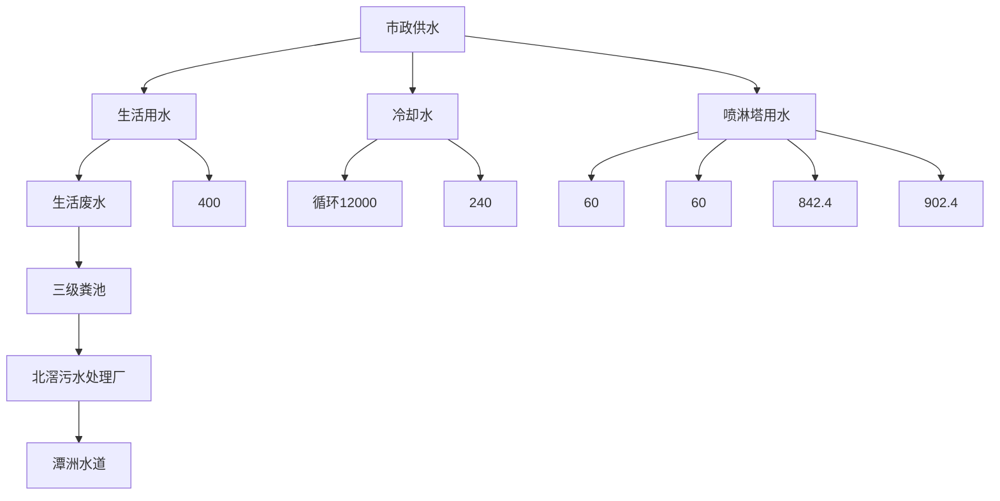
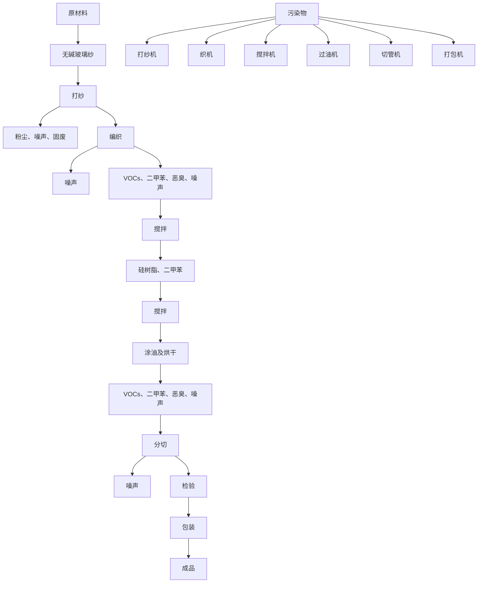
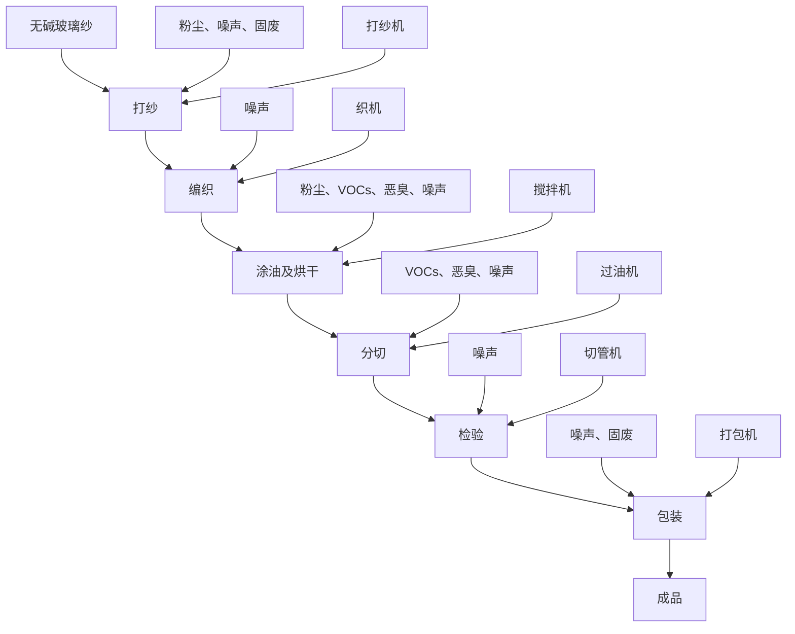
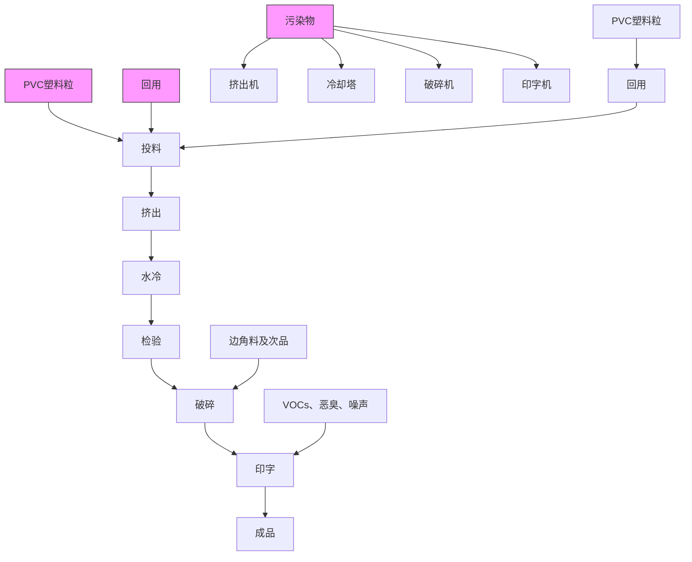
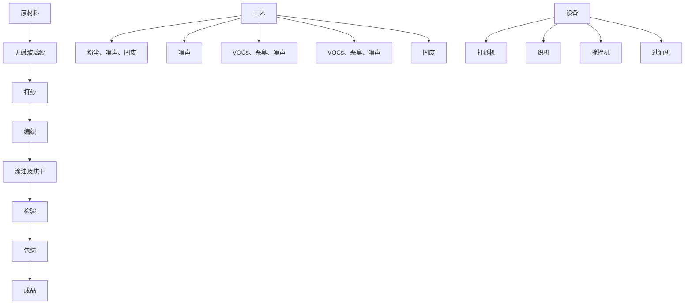
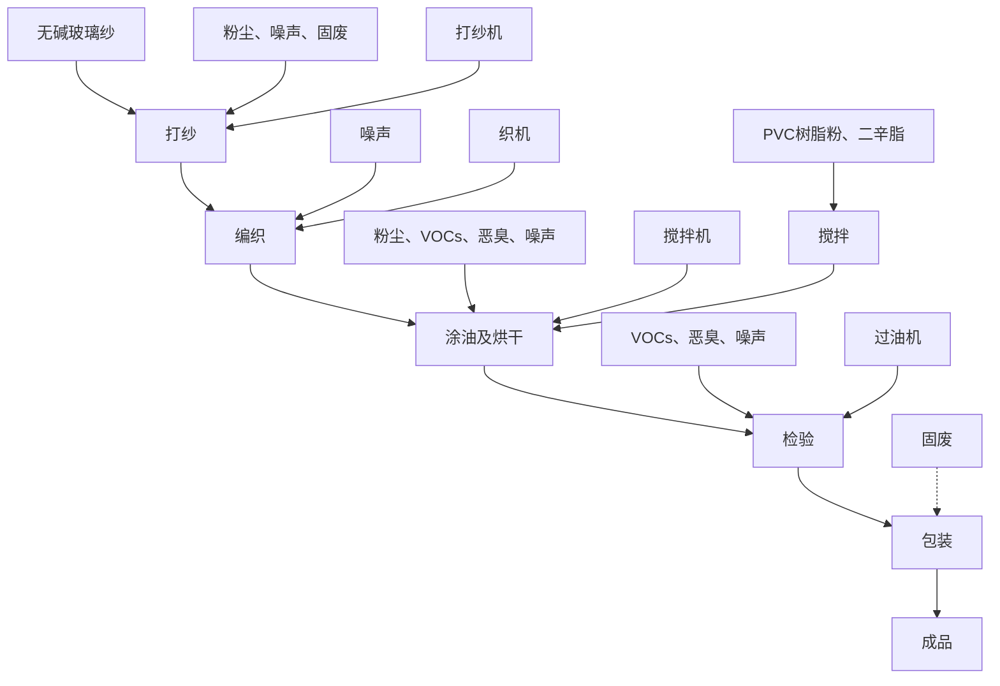
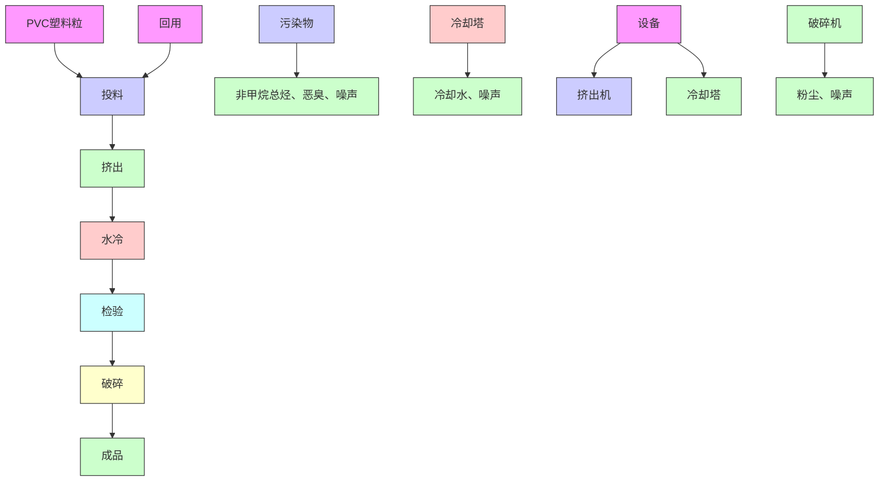
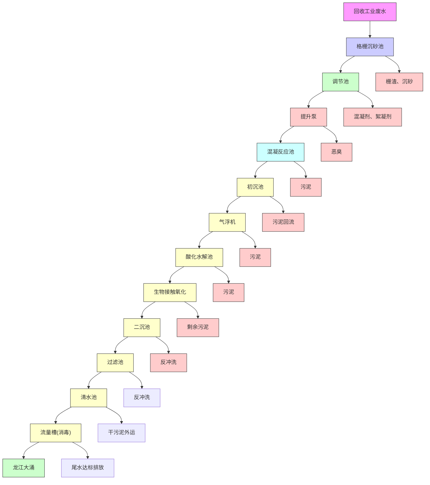
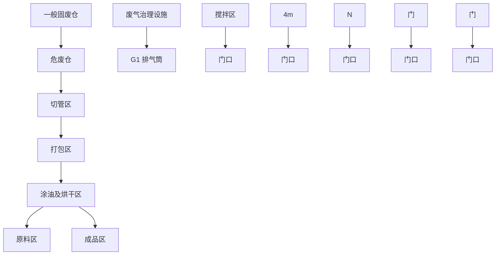
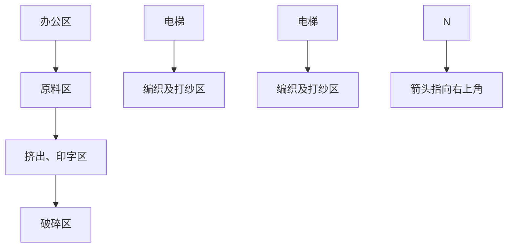

# 建设项目环境影响报告表

# （污染影响类）

项目名称：佛山市顺德区北滘镇恒汇昌绝缘材料有限公司迁扩建项目

建设单位（盖章）：佛山市顺德区北滘镇恒汇昌绝缘材料有限公司

编制日期：2023年 6月

中华人民共和国生态环境部制

编制单位和编制人员情况表

<table><tr><td colspan="2">项目编号</td><td colspan="3">pqu644</td></tr><tr><td colspan="2">建设项目名称</td><td colspan="3">佛山市顺德区北滘镇恒汇昌绝缘材料有限公司迁扩建项目</td></tr><tr><td colspan="2">建设项目类别</td><td colspan="3">26-053塑料制品业</td></tr><tr><td colspan="2">环境影响评价文件类型</td><td colspan="3">报告表</td></tr><tr><td colspan="3">一、建设单位情况</td><td rowspan="6" colspan="2"></td></tr><tr><td colspan="2">单位名称(盖章)</td><td>佛山市顺德区北滘镇</td></tr><tr><td colspan="2">统一社会信用代码</td><td>9144060674448137XN</td></tr><tr><td colspan="2">法定代表人(签章)</td><td>梁耀泉</td></tr><tr><td colspan="2">主要负责人(签字)</td><td>梁耀泉</td></tr><tr><td colspan="2">直接负责的主管人员(签字)</td><td>梁耀泉</td></tr><tr><td colspan="5">二、编制单位情况</td></tr><tr><td colspan="2">单位名称(盖章)</td><td>广州颐景环</td><td rowspan="2" colspan="2"></td></tr><tr><td colspan="2">统一社会信用代码</td><td>91440101M</td></tr><tr><td colspan="3">三、编制人员情况</td><td colspan="2"></td></tr><tr><td colspan="3">1.编制主持人</td><td colspan="2"></td></tr><tr><td>姓名</td><td colspan="2">职业资格证书管理号</td><td>信用编号</td><td>签字</td></tr><tr><td>潘宏忠</td><td colspan="2">2014035440352013449914000290</td><td>BH003161</td><td></td></tr><tr><td colspan="5">2.主要编制人员</td></tr><tr><td>姓名</td><td colspan="2">主要编写内容</td><td>信用编号</td><td>签字</td></tr><tr><td>潘宏忠</td><td colspan="2">报告全本</td><td>BH003161</td><td>潘宏忠</td></tr></table>

natural_image

Official emblem of Tiananmen Gate with national stars and decorative border (no text or symbols)

环境影响评价工程师

Professional Qualification Certificate

Environmental Impact Assessment Engincer

natural_image

Portrait photo of a man wearing a sweater over a collared shirt (no text or symbols visible)

Signature of the Bearer

潘宏忠

管理号：2014035440352013449914000290

FileNo.

潘宏忠

FullName潘宏忠

性别：

男

Sex

专业类别： Professional Type

批准日期：2014年05月25日Approval Da

签发单位盖

Issued by

Issued on

text_image

章：
山东省人力资源和社会保障厅
2014年 09月10日

# 目 录

一、建设项目基本情况.

二、建设项目工程分析..

三、区域环境质量现状、环境保护目标及评价标准.. . 44

四、主要环境影响和保护措施. . 54

五、环境保护措施监督检查清单. . 85

六、结论... .. 87

建设项目污染物排放量汇总表

附件1 企业营业执照

附件2 法人代表身份证

附件3 被委托人身份证

附件4 商品房买卖合同（节选）

附件5 原项目环保批准证

附件6 原项目验收资料

附件7 原项目固定污染源排污登记回执

附件8 原项目监测报告

附件 9 原辅材料 MSDS及 VOCs 检测报告

附件10 环评技术服务合同

附件11 公示声明

附图1 项目地理位置图

附图2 项目四至卫星图

附图3 项目四至现场图

附图4 项目平面布置图

附图5 项目厂界50米及500米范围图

附图6 项目所在地大气环境功能区划图

附图7 项目所在地地表水环境功能区划图

附图8 项目所在地声环境功能区划图

附图9 项目所在地控制性规划图

附图10 顺德区环境管控单元图

# 一、建设项目基本情况

<table><tr><td>建设项目名称</td><td colspan="4">佛山市顺德区北滘镇恒汇昌绝缘材料有限公司迁扩建项目</td></tr><tr><td>项目代码</td><td colspan="4">无</td></tr><tr><td>建设单位联系人</td><td></td><td>联系方式</td><td colspan="2"></td></tr><tr><td>建设地点</td><td colspan="4">广东省佛山市顺德区北滘镇顺江社区三乐东路28号华智科创中心15栋101-104室、201-204室</td></tr><tr><td>地理坐标</td><td colspan="4">东经:113度14分43.949秒,北纬:22度54分20.389秒</td></tr><tr><td>国民经济行业类别</td><td>C2922塑料板、管、型材制造;C2929塑料零件及其他塑料制品制造</td><td>建设项目行业类别</td><td colspan="2">二十六、橡胶和塑料制品业29中的“53、塑料制品业292—其他(年用非溶剂型低VOCs含量涂料10吨以下的除外)”</td></tr><tr><td>建设性质</td><td>☑新建(迁建)□改建☑扩建□技术改造</td><td>建设项目申报情形</td><td colspan="2">☑首次申报项目□不予批准后再次申报项目□超五年重新审核项目□重大变动重新报批项目</td></tr><tr><td>项目审批(核准/备案)部门(选填)</td><td>无</td><td>项目审批(核准/备案)文号(选填)</td><td colspan="2">无</td></tr><tr><td>总投资(万元)</td><td>250</td><td>环保投资(万元)</td><td colspan="2">15</td></tr><tr><td>环保投资占比(%)</td><td>6</td><td>施工工期</td><td colspan="2">1个月</td></tr><tr><td>是否开工建设</td><td>☑否□是:____</td><td>用地(用海)面积(m2)</td><td colspan="2">建筑面积:5876.97</td></tr><tr><td rowspan="5">专项评价设置情况</td><td colspan="4">根据《建设项目环境影响报告表编制技术指南(污染影响类)(试行)》,项目无需设置专项评价,具体分析如下:表1-1 专项评价设置原则表</td></tr><tr><td>专项评价类别</td><td>设置原则</td><td>本项目相关情况</td><td>判定结果</td></tr><tr><td>大气</td><td>排放废气含有毒有害污染物、二噁英、苯并芘、氰化物、氯气且厂界外500米范围内有环境空气保护目标的建设项目。</td><td>本项目排放不涉及技术指南规定的有毒有害废气污染物。</td><td>不需要设置</td></tr><tr><td>地表水</td><td>新增工业废水直排建设项目(槽罐车外送污水处理厂的除外);新增废水直排的污水集中处理厂。</td><td>本项目不涉及工业废水直接排放。</td><td>不需要设置</td></tr><tr><td>环境风险</td><td>有毒有害和易燃易爆危险物质存储量超过临界量的建设项目。</td><td>经分析,本项目危险物质存储量总计未超过临界量。</td><td>不需要设置</td></tr><tr><td rowspan="2"></td><td>生态</td><td>取水口下游500米范围内有重要水生生物的自然产卵场、索饵场、越冬场和洄游通道的新增河道取水的污染类建设项目。</td><td>本项目不涉及直接从河道取水。</td><td>不需要设置</td></tr><tr><td>海洋</td><td>直接向海排放污染物的海洋工程建设项目。</td><td>本项目污水排放不涉及海洋。</td><td>不需要设置</td></tr><tr><td>规划情况</td><td colspan="4">规划名称:佛山市顺德高新技术产业开发区扩区规划编制单位:佛山市顺德高新技术产业开发区管理委员会</td></tr><tr><td>规划环境影响评价情况</td><td colspan="4">规划环境影响评价文件名称:佛山市顺德高新技术产业开发区扩区规划环境影响报告书(2022年2月)召集审查机关:佛山市生态环境局顺德分局审查文件名称:关于佛山市顺德高新技术产业开发区扩区规划环境影响报告书审查情况的复函</td></tr><tr><td>规划及规划环境影响评价符合性分析</td><td colspan="4">项目位于广东省佛山市顺德区北滘镇顺江社区三乐东路28号华智科创中心15栋101-104室、201-204室,属于佛山市顺德高新技术产业开发区扩区规划中的扩区东北组团(编号为E-3)。项目与佛山市顺德高新技术产业开发区扩区规划环境影响报告书相符性分析具体见下表。</td></tr></table>

表 1-2 与佛山市顺德高新技术产业开发区扩区规划环境影响报告书有关准入的条件相符性分析

<table><tr><td>清单类型</td><td>准入要求</td><td>项目情况</td><td>相符性</td></tr><tr><td rowspan="7">空间布局约束</td><td>引入产业应符合现行有效的《产业结构调整指导目录》、《市场准入负面清单》等相关产业政策的要求。</td><td>本项目属于C2922塑料板、管、型材制造及C2929塑料零件及其他塑料制品制造,主要从事硅树脂玻璃纤维套管、黄腊管、PVC管的生产,符合《产业结构调整指导目录》、《市场准入负面清单》等相关产业政策的要求。</td><td>符合</td></tr><tr><td>禁止引入新增排放重点防控重金属污染物(铅(Pb)、汞(Hg)、镉(Cd)、铬(Cr)和类金属砷(As))、持久性有机污染物的项目。</td><td>本项目不排放重金属污染物。</td><td>符合</td></tr><tr><td>饮用水源准保护区内不得新建、扩建对水体污染严重、排放一类水污染物和持久性有机污染物的项目,改扩建项目不得新增水污染物。</td><td>本项目不在饮用水源准保护区内。</td><td>符合</td></tr><tr><td>禁止引入达不到清洁生产国际先进水平的企业。</td><td>本项目能达到清洁生产国际先进水平</td><td>符合</td></tr><tr><td>在污水管网建设滞后或所依托的污水处理厂处理能力不能满足废水处理需求的区域,不应引入废水排放量较大的项目。扩区南片区在纳污水体水质稳定达标前,应合理控制涉水排放企业规模,优先引入无生产废水或生产废水排放量较小的项目;扩区东北组团应控制废水排放量较大企业的引入,引入涉水排放企业的规模应与区域污水处理厂处理能力相匹配,严格控制废水排放量较大的项目及新增一类水污染物排放项目的引入,避免对下游饮用水源保护区产生不良影响;扩区西北组团在乐从污水处理厂扩容前,应合理控制涉水排放企业引入规模和时序,尤其严格控制废水排放量较大的企业,确保区域污水得到有效收集和处理。</td><td>本项目属于扩区东北组团,项目外排废水仅为生活污水,生活污水经三级化粪池预处理后经过市政管网排入北滘污水处理厂处理。</td><td>符合</td></tr><tr><td>禁止新建、扩建燃煤燃油火电机组和企业自备电站,逐步淘汰生物质锅炉、集中供热管网覆盖区域内的分散供热锅炉,集中供热管网覆盖地区禁止新建、扩建分散供热锅炉,规划区应全部按高污染燃料禁燃区进行管理;禁止新建、扩建水泥、平板玻璃、化学制浆、炼化、炼钢炼铁、电解铝、焦炭、金属冶炼、制浆造纸、鞣革、铅酸蓄电池、专业电镀、木质家具涂装、印染项目;不再新建陶瓷厂(新型特种陶瓷项目除外)。化工项目按照“入园管理”原则合理布局,提高准入门槛,不得新建、扩建纳入国家“高污染、高环境风险”产品名录的生产项目。</td><td>本项目属于C2922塑料板、管、型材制造及C2929塑料零件及其他塑料制品制造,主要从事硅树脂玻璃纤维套管、黄腊管、PVC管的生产,无燃煤燃油火电机组和企业自备电站、供热锅炉。本项目不属于禁止类等“高污染、高环境风险”项目。</td><td>符合</td></tr><tr><td>严格控制日用玻璃制造、家具制造、废塑料回收加工再生(列入国家“城市矿产”示范基地项目除外)、专业金属表面处理(铝及铝合金的阳极氧化、铝的表面铬酸盐转化、锌的铬酸盐钝化和金属酸洗、磷化、喷漆、喷涂)等项目建设;严格限制新建生产和使用高挥发性有机物原辅材料的项目,鼓励建设挥发性有机物共性工厂。</td><td>本项目不属于日用玻璃制造、家具制造、废塑料回收加工再生、专业金属表面处理等项目,项目使用的油墨、PVC树脂粉与偏苯三酸三辛酯、硅树脂与二甲苯混合使用状态下均为低VOCs原料。</td><td>符合</td></tr><tr><td rowspan="6"></td><td>8.工业企业禁止选址城镇生活空间,生产空间禁止建设居民住宅等敏感建筑;园区工业用地或企业与村庄、学校等环境敏感点之间应设置合理的防护距离,并通过绿化带进行有效隔离,该距离内不得规划新建居民点、办公楼和学校等环境敏感目标。</td><td>项目所在地用地性质为工业用地,项目500m范围内不涉及居民点、办公楼和学校等环境敏感目标。</td><td>符合</td></tr><tr><td>9.现有及规划居住区、学校、医院等敏感用地周边50米范围内禁止新建、扩建高噪声排放生产项目;现有及规划居住区、学校、医院等敏感用地周边100米范围内禁止新建、扩建纳入国家“高污染、高环境风险”产品名录的生产项目,不引入酸洗、涂装、注塑、排放恶臭气味的生产工艺和生产设施。</td><td>项目50m、100m范围内无居民区、学校、医院等环境敏感目标。本项目不属于国家“高污染、高环境风险”产品名录的生产项目。</td><td>符合</td></tr><tr><td>10.结合《顺德区高质量推动村级工业园升级改造总体规划》,推进区域村级工业园改造工作,禁止重复低水平建设。</td><td>本项目不属于村级工业园改造范围。</td><td>符合</td></tr><tr><td>11.南片区按照《广东省重金属污染综合防治“十三五”规划》、《佛山市重金属污染综合防治“十三五”规划》的要求,禁止新建、扩建增加重点防控的重金属污染物排放的建设项目,现有技术改造项目应通过实施“区域削减”,实现增产减污;其它区域新、改扩建重金属排放项目,应严格落实重金属总量替代与削减要求,严格控制重点行业发展规模。</td><td>本项目属于东北组团。</td><td>符合</td></tr><tr><td>12.按规划用地布局未来退出的工业企业用地,应严格按照《中华人民共和国土壤污染防治法》开展必要的调查、评估和修复工作,符合要求后,方可用于居住、教育教研、办公等第三产业类用地。</td><td>根据《&lt;佛山市顺德区SD-E-04-02-08、09、12街坊(北滘工业园潭洲水道西片区)控制性详细规划&gt;局部调整》批后公布,项目所在地为工业用地。</td><td>符合</td></tr><tr><td>13.其它:符合《佛山市人民政府关于印发佛山市“三线一单”生态环境分区管控方案的通知》(佛府〔2020〕11号)相关管控要求。</td><td>本项目符合《佛山市人民政府关于印发佛山市“三线一单”生态环境分区管控方案的通知》(佛府〔2020〕11号)相关管控要求。</td><td>符合</td></tr><tr><td>污染物排放管控</td><td>1.污染物排放总量不得突破“污染物排放总量管控限值清单”的总量管控要求;重点对重点污染物(重点污染物包括化学需氧量、氨氮、氮氧化物及挥发性有机物等)实施总量控制;上年度重点河涌水质未达到水环境质量目标的管控分区所在镇(街道),须组织编制、系统实施、向社会公开区域重点水污染物减排计划并明确“替代量”,本年度新建、改建、扩建项目新增水环境重点污染物实行区域“减二增一”替代(废水集中处理设施、民生项目除外);在可核查、可监管的基础上,全区新建、改建、扩建项目新增大气重点污染物实行“减二增一”替代。</td><td>项目无新增大气重点污染物,项目挥发性有机物排放量由生态环境主管部门划拨,无需实施等量替代或两倍削减量替代,总量由佛山市生态环境局顺德分局调剂。</td><td>符合</td></tr><tr><td rowspan="4"></td><td>2.未完成环境质量改善目标的区域,新改扩建项目重点污染物实施减量替代。</td><td>本项目所在区域大气环境质量除臭氧浓度不达标外,其余污染物指标浓度均达到《环境空气质量标准》(GB3095-2012)及2018年修改单中的二级标准,本项目地表水环境属于达标区。</td><td>符合</td></tr><tr><td>3.未接入污水管网的新建建筑小区或公共建筑,不得交付使用。新建城区生活污水收集处理设施要与城市发展同步规划、同步建设。</td><td>本项目位于北滘污水处理厂纳污范围。</td><td>符合</td></tr><tr><td>4.规划区内建设项目废污水原则上应接入各片区集中式污水处理厂进行集中处理、达标排放;受纳水体或监控断面不达标的,不得新建、扩建向河涌直接排放废水的项目;对于暂时无法接入市政污水管网、且废水量较少的项目,生活污水处理后立足回用,不能回用的,应处理达到《城镇污水处理厂污染物排放标准》(GB18918-2002)后排入政策法规允许排放且有环境容量的水域;生产废水应立足于回用,不能回用的,可考虑委外处置,确需要外排的,应处理达到行业直接排放标准或广东省《水污染物排放限值》(DB44/26-2001)后排入政策法规允许排放且有环境容量的水域。</td><td>项目外排废水仅为生活污水,项目生活污水经三级化粪处理达标后排至北滘污水处理厂处理,尾水排入潭洲水道。参考《佛山市生态环境局顺德分局关于发布2022年度佛山市顺德区生态环境状况公报的通知》(佛环顺函〔2023〕26号),潭洲水道西海断面监测的水质达到了III类标准要求,潭洲水道潭洲断面监测的水质达到了II类标准要求。</td><td>符合</td></tr><tr><td>5.向工业集聚区污水集中处理设施或者城镇污水集中处理设施排放工业废水的,应当按照有关规定进行预处理,达到集中处理设施处理工艺要求后方可以排入市政管网进入各片区污水处理厂。企业生活污水达到广东省《水污染物排放限值》(DB44/26-2001)第二时段三级标准后通过污水管线进入各片区所依托的城镇污水处理厂;扩区南片区企业生产废水预处理达到广东省《水污染物排放限值》(DB44/26-2001)第二时段二级标准、行业间接排放要求(有行业间接排放标准要求的)、杏坛污水处理厂接管要求后通过污水管线排入杏坛污水处理厂处理;扩区西北组团企业生产废水预处理达到广东省《水污染物排放限值》(DB44/26-2001)第二时段二级标准、行业间接排放要求(有行业间接排放标准要求的)、乐从污水处理厂接管要求后通过污水管线排入乐从污水处理厂处理;扩区西北组团企业生产废水预处理达到广东省《水污染物排放限值》(DB44/26-2001)第二时段三级标准、行业间接排放要求(有行业间接排放标准要求的)、北滘污水处理厂接管要求后通过污水管线排入北滘污水处理厂处理。6.规划区依托的集中式污水处理设施排放标准应达到或优于《城镇污水处理厂污染物排放标准》(GB18918-2002)一级标准的A标准和广东省《水污染物排放限值》(DB44/26-2001)第二时段一级标准的较严者。</td><td>本项目属于扩区东北组团,生活污水经三级化粪池处理达到广东省地方标准《水污染物排放限值》(DB44/26-2001)中的第二时段三级标准后通过污水管网排至北滘污水处理厂处理,北滘污水处理厂的尾水执行《城镇污水处理厂污染物排放标准》(GB18918-2002)一级A标准及《水污染物排放限值》(DB44/26-2001)第二时段一级标准的较严值。本项目生活污水经三级化粪池处理达到广东省地方标准《水污染物排放限值》(DB44/26-2001)中的第二时段三级标准后通过污水管网排至北滘污水处理厂处理,北滘污水处理厂的尾水执行《城镇污水处理厂污染物排放标准》(GB18918-2002)一级A标准及《水污染物排放限值》(DB44/26-2001)第二时段一级标准的较严值。</td><td>符合符合</td></tr><tr><td></td><td>7.根据《广东省生态环境厅关于2021年工业炉窑、锅炉综合整治重点工作的通知》(粤环函〔2021〕461号)要求,高新区现有燃气锅炉执行《锅炉大气污染物排放标准》(DB44/765-2019)表2排放标准,新建燃气锅炉废气中氮氧化物执行《锅炉大气污染物排放标准》(DB44/765-2019)表3大气污染物特别排放限值,颗粒物、二氧化硫指标特别排放标准(表3)的执行范围、时间按区域正式发布方案执行;新改建的工业窑炉,如烘干炉、加热炉等,有行业标准或地方排放标准的执行相关行业标准或地方标准,未制订行业排放标准的,参照《广东省关于贯彻落实&lt;工业炉窑大气污染综合治理方案&gt;的实施意见》(粤环函〔2019〕1112号),颗粒物、二氧化硫、氮氧化物排放限值分别不高于30、200、300毫克/立方米;家居涂装工艺废气应该执行《家具制造行业挥发性有机化合物排放标准》(DB44814-2010)第II时段限值;无行业排放标准的企业,为严格控制区域VOCs排放量,在国家、省未出台行业标准前,金属制品、铝型材、设备制造行业参照执行《表面涂装(汽车制造业)挥发性有机化合物排放标准》(DB44/816-2010);其他行业参照执行《家具制造行业挥发性有机化合物排放标准(DB44/814-2010));涉及VOCs无组织排放的企业,除有行业标准的执行相关行业标准之外,其余工业企业VOCs物料储存、转移和输送、工艺工程、设备与管线组件VOCs泄漏,敞开液面等VOCs无组织排放控制要求,以及VOCs无组织排放废气收集处理系统要求执行《挥发性有机物无组织排放控制标准》(GB37822-2019)要求,厂区内VOCs无组织排放监控点浓度应符合GB37822-2019中表A.1规定的特别排放限值;涉及铸造工艺的,新建企业自2021年1月1日起,现有企业自2023年7月1日起,铸造生产工艺环节和生产设备执行《铸造工业大气污染物排放标准》(GB39726—2020)表1规定的大气污染物排放限值、企业边界大气污染物浓度限值及其他污染控制要求;制药工业企业执行《制药工业大气污染物排放标准》(GB37823-2019)表1规定的大气污染物排放限值、企业边界大气污染物浓度限值及其他污染控制要求;注塑等合成树脂加工生产环节和生产设备其执行《合成树脂工业污染物排放标准》(GB31572-2015)表5规定的大气污染物特别排放限值(涉及PVC树脂的不执行)、合成树脂工业污染物排放标准及其他污染控制要求;分布式能源站项目锅炉烟气执行《火电厂大气污染物排放标准》(GB13223-2011)“表2大气污染物特别排放标准”中所列的燃气轮机组排放浓度限值。</td><td>本项目挤出工序产生的非甲烷总烃执行《合成树脂工业污染物排放标准》(GB31572-2015)中表5规定的大气污染物特别排放限值以及表9企业边界大气污染物浓度限值;印字、搅拌、涂油及烘干过程产生的VOCs执行广东省地方标准《固定污染源挥发性有机物综合排放标准》(DB44/2367-2022)中表1挥发性有机物排放限值以及广东省地方标准《印刷行业挥发性有机化合物排放标准》(DB44/815-2010)表2凹版印刷、凸版印刷、丝网印刷、平板印刷中第II时段标准限值、表3无组织排放监控点浓度限值的较严值;企业厂区内有机废气无组织排放监控点浓度执行广东省地方标准《固定污染源挥发性有机物综合排放标准》(DB44/2367-2022)表3厂区内VOCs无组织排放限值。</td><td>符合</td></tr><tr><td rowspan="2"></td><td>8.重点加强涉VOCs排放的工业项目的挥发性有机物的源头替代和无组织排放管控,大力推进低VOCs含量原辅材料替代。木制家具制造行业应全面使用水性胶粘剂,替代比例达到100%。家具制造及其他工业涂装项目的水性涂料等低排放VOCs含量涂料占总涂料使用量比例应至少不低于50%。产生VOCs的生产车间须配置废气收集净化装置。排放挥发性有机物的车间必须安装废气收集、回收净化装置,收集率应大于90%;使用溶剂型涂料涂装工艺的VOCs去除率达到90%;家具制造行业有机废气净化率达到80%以上。逐步淘汰单纯活性炭吸附、水喷淋+活性炭吸附等排放状况不稳定的治理技术。</td><td>项目使用的油墨、PVC树脂粉与偏苯三酸三辛酯、硅树脂与二甲苯混合使用状态下均为低VOCs原料。项目有机废气经收集通过“水喷淋+干式过滤+两级活性炭吸附”设施处理后通过72米排气筒(G1)排放。</td><td>符合</td></tr><tr><td>9.其它:符合《佛山市人民政府关于印发佛山市“三线一单”生态环境分区管控方案的通知》(佛府〔2020〕11号)相关管控要求。</td><td>本项目符合《佛山市人民政府关于印发佛山市“三线一单”生态环境分区管控方案的通知》(佛府〔2020〕11号)相关管控要求。</td><td>符合</td></tr><tr><td rowspan="2">环境风险防控</td><td>1.制定园区环境风险事故防范和应急预案。完善区域—园区—工业企业多级联动环境突发事件应急预案,建立预防、应急响应机制和后评估机制,定期开展应急演练,提高区域环境风险防范能力。</td><td>项目拟建立健全的事故应急体系并与区域、园区进行多级联动,并根据要求编制环境风险应急预案,定期演练。</td><td>符合</td></tr><tr><td>2.污水处理厂应采取有效措施,防止事故废水直接排入水体;完善污水处理厂在线监控系统联网,实现污水处理厂的实时、动态监管。</td><td>本项目位于北滘污水处理厂纳污范围。污水处理厂安排专人管理废水处理设施,定期巡视及保养,一旦发现废水外漏,关闭相应阀门并采取应急封堵措施,防止废水通过已破裂的水管外泄;联络相关部门进行维修,若短时间内无法修复,应通知生产现场停止废水的继续排放。同时立即用挡板或沙子将泄露的废水围起来,防止废水的扩散,戴好安全防护用品将废水收集到相应的废水暂存池中;立即堵住所有可能导致废水直接进入纳污水体的污水管口。</td><td>符合</td></tr><tr><td rowspan="2"></td><td>3.生产性废水较多的企业需配套有效措施,防止事故废水和第一类污染物直排污染地表水体,防止因渗漏污染地下水。</td><td>项目产生的喷淋塔废水交给有该类废水处理能力的单位进行处理,不外排。</td><td>符合</td></tr><tr><td>4.其它:符合《佛山市人民政府关于印发佛山市“三线一单”生态环境分区管控方案的通知》(佛府〔2020〕11号)相关管控要求。</td><td>本项目符合《佛山市人民政府关于印发佛山市“三线一单”生态环境分区管控方案的通知》(佛府〔2020〕11号)相关管控要求。</td><td>符合</td></tr><tr><td rowspan="3">资源开发利用要求</td><td>1.禁止使用高污染燃料。</td><td>本项目不使用高污染燃料。</td><td>符合</td></tr><tr><td>2.新建高能耗项目单位产品(产值)能耗达到国际国内先进水平。</td><td>本项目不属于高能耗项目。</td><td>符合</td></tr><tr><td>3.其它:符合《佛山市人民政府关于印发佛山市“三线一单”生态环境分区管控方案的通知》(佛府〔2020〕11号)相关管控要求。</td><td>本项目符合《佛山市人民政府关于印发佛山市“三线一单”生态环境分区管控方案的通知》(佛府〔2020〕11号)相关管控要求。</td><td>符合</td></tr></table>

<table><tr><td rowspan="6">其他符合性分析</td><td colspan="4">1、建设项目与所在地“三线一单”符合性分析本项目位于广东省佛山市顺德区北滘镇顺江社区三乐东路28号华智科创中心15栋101-104室、201-204室。根据《广东省人民政府关于印发广东省“三线一单”生态环境分区管控方案的通知》(粤府〔2020〕71号)发布的广东省环境管控单元图,项目所在地属于重点管控单元。根据《佛山市人民政府关于印发佛山市“三线一单”生态环境分区管控方案的通知》(佛府〔2021〕11号)发布的佛山市环境管控单元图和《佛山市顺德区人民政府关于印发佛山市顺德区“三线一单”生态环境分区管控方案的通知》(顺府发〔2021〕11号)发布的顺德区环境管控单元图,项目所在地属于广东省佛山市顺德区重点管控单元4,环境管控单元编码为ZH44060620004,名称为北滘镇重点管控区,要素细类为一般生态空间、水环境其他重点管控区、水环境一般管控区、大气环境高排放重点管控区、大气环境受体敏感重点管控区、江河湖库岸线重点管控区、江河湖库岸线一般管控区。项目与顺德区重点管控单元4准入清单的相符性分析如下表所示。表1-3 项目与顺德区“三线一单”生态环境分区管控符合性分析表</td></tr><tr><td colspan="2">管控要求</td><td>本项目</td><td>符合性</td></tr><tr><td rowspan="4">区域布局管控</td><td>1-1.【生态/禁止类】单元内的一般生态空间,主导生态功能为水土保持和生物多样性维护。水土保持生态功能区内,禁止在25度以上的陡坡地开垦种植农作物,禁止在崩塌、滑坡危险区、泥石流易发区从事采石、取土、采砂等可能造成水土流失的活动。</td><td>本项目不涉及。</td><td>符合</td></tr><tr><td>1-2.【产业/鼓励引导类】重点发展机器人及配套产业、智能家用电器、高端新型电子信息、新材料等制造业和总部经济、电子商务、工业设计与文化创意、科技、金融等现代服务业,打造智能制造和智慧家电示范区。</td><td>本项目不涉及。</td><td>符合</td></tr><tr><td>1-3.【产业/综合类】产业聚集区所属地块内的工业用地或企业与村庄、学校等环境敏感点之间应设置合理的大气环境防护距离,并通过绿化带进行有效隔离;聚集区规划布局应注重大气污染排放企业应尽量避免布局在居住用地的常年主导风向的上风向。</td><td>项目500m范围内无敏感点目标,项目产生的有机废气经处理设施处理后达标排放,对周边敏感点影响较小。</td><td>符合</td></tr><tr><td>1-4.【产业/综合类】系统推进村级工业园升级改造,腾出连片空间,布局产业集聚区和主题产业园,推动工业项目入园集聚发展。新增工业制造业用地原则上安排在产业集聚区内,产业集聚区外原则上不鼓励工业及物流仓储用地的新建与改造。</td><td>本项目用地不属于村级工业园改造范围,项目建设符合规划要求。</td><td>符合</td></tr><tr><td rowspan="5"></td><td rowspan="5"></td><td>1-5.【产业/限制类】受纳水体或监控断面不达标的,不得新建、扩建向河涌直接排放废水的项目。新建、扩建含蚀刻工序的线路板生产项目和化工项目应在配套污水集中处置的工业园区或生活污水管网覆盖区域内建设;纯加工型印花项目,含酸洗、磷化的金属表面处理、金属制品项目(与自身高新技术企业配套的除外),含酸洗、喷涂、化学抛光、电解等涉及废水排放工艺的不锈钢型材加工项目(与自身高新技术企业配套的除外),应进入以此类项目为主导产业、有相应废水集中治理设施的工业园区,实现集中治污。</td><td>项目生活污水属于间接排放,生活污水经三级化粪处理达标后排至北滘污水处理厂处理,尾水排入潭洲水道。参考《佛山市生态环境局顺德分局关于发布2022年度佛山市顺德区生态环境状况公报的通知》(佛环顺函〔2023〕26号),潭洲水道西海断面监测的水质达到了III类标准要求,潭洲水道潭洲断面监测的水质达到了II类标准要求;项目行业类别为C3399其他未列明金属制品制造,不属于含蚀刻工序的线路板生产项目、化工项目及纯加工印花项目;不属于含酸洗、磷化的金属表面处理、金属制品项目;不属于酸洗、喷涂、化学抛光、电解等涉及废水排放工艺的不锈钢型材加工项目。</td><td>符合</td></tr><tr><td>1-6.【产业/综合类】划定家具生产优先发展区域,优先发展区外不再新建涉及涂装工艺的木质家具制造项目。</td><td>项目不涉及。</td><td>符合</td></tr><tr><td>1-7.【水/限制类】严格限制在佛山市禅城南庄紫洞水厂、佛山市禅城沙口(石湾)水厂、羊额—北滘水厂、广州市南洲水厂顺德水道取水口饮用水水源保护区上游和周边区域建设列入“高污染、高环境风险”产品名录等可能影响水环境安全的项目。</td><td>项目产品不属于“高污染、高环境风险”产品名录所列产品。</td><td>符合</td></tr><tr><td>1-8.【大气/限制类】大气环境受体敏感重点管控区内,应严格限制新建储油库项目、产生和排放有毒有害大气污染物的建设项目以及使用溶剂型油墨、涂料、清洗剂、胶黏剂等高挥发性有机物原辅材料项目,鼓励现有该类项目搬迁退出。</td><td>项目不属于新建储油库项目、产生和排放有毒有害大气污染物的建设项目;不属于使用溶剂型油墨、涂料、清洗剂、胶黏剂等高挥发性有机物原辅材料项目。</td><td>符合</td></tr><tr><td>1-9.【大气/鼓励引导类】大气环境高排放重点管控区内,应强化达标监管,引导工业项目落地集聚发展,有序推进区域内行业企业提标改造。</td><td>本项目位于大气环境高排放重点管控区,项目废气经收集处理后可达标排放。</td><td>符合</td></tr><tr><td rowspan="9"></td><td rowspan="6">能源资源利用</td><td>2-1.【能源/鼓励引导类】推广节能技术,加快发展绿色货运与现代物流。</td><td>本项目不涉及。</td><td>符合</td></tr><tr><td>2-2.【能源/鼓励引导类】推广新能源汽车应用和充电基础设施建设,积极推动重卡LNG加气站、充电基础设施、加氢站建设。</td><td>本项目不涉及。</td><td>符合</td></tr><tr><td>2-3.【能源/综合类】科学实施能源消费总量和强度“双控”,新建高能耗项目单位产品(产值)能耗达到国际国内先进水平。</td><td>本项目不属于高耗能项目。</td><td>符合</td></tr><tr><td>2-4.【水资源/综合类】贯彻落实“节水优先”方针,实行最严格水资源管理制度,北滘镇万元国内生产总值用水量、万元工业增加值用水量、用水总量、农田灌溉水有效利用系数等用水总量和效率指标达到区下达要求。</td><td>本项目不涉及。</td><td>符合</td></tr><tr><td>2-5.【土地资源/限制类】落实单位土地面积投资强度、土地利用强度等建设用地控制性指标要求,提高土地利用效率。</td><td>项目使用已建成工业厂房,不涉及土地开发建设。</td><td>符合</td></tr><tr><td>2-6.【岸线/禁止类】严格水域岸线用途管制,新建项目一律不得违规占用水域。严禁破坏生态的岸线利用行为和不符合其功能定位的开发建设活动,严禁以各种名义侵占河道、围垦湖泊、非法采砂等。</td><td>项目使用已建成工业厂房,不占用水域、无破坏生态岸线利用行为和不符合其功能定位的开发建设活动。</td><td>符合</td></tr><tr><td rowspan="3">污染物排放管控</td><td>3-1.【水/限制类】城镇新区建设实行雨污分流,逐步推进初期雨水收集、处理和资源化利用。住宅、商业体、学校、市场等城镇开发建设项目应当配套或者同步计划建设公共排水设施,公共排水设施或自建排污水设施未能投产运行的,以上涉水项目不得投入使用。新建小区严格实施雨污分流,阳台、露台等污水接入污水收集系统,将生活污水“应截尽截”。做好大型楼盘、集贸市场、餐饮以及学校等4大类排水户污水接入市政管网工作。</td><td>项目产生的生活污水经处理达标后排放至北滘污水处理厂,尾水排入潭洲水道。</td><td>符合</td></tr><tr><td>3-2.【水/综合类】结合村级工业园改造,全面提升产业层次与集聚度,促进污染集中整治。</td><td>本项目不涉及。</td><td>符合</td></tr><tr><td>3-3.【水/综合类】稳步推进排水设施“三个一体化”管理模式,补齐城乡污水收集和处理短板,推动群力围污水处理厂提质增效,加快消除城中村、老旧城区、城乡结合部等污水收集管网空白区,逐步实现城乡污水收集处理全覆盖。2025年前完成群力围污水处理厂扩建,尾水应执行《城镇污水处理厂污染物排放标准》(GB18918-2002)一级A标准及《广东省水污染物排放限值》(DB44/26-2001)的较严值。3-4.【水/综合类】近期保留并完善水口村、三桂村、西滘村、马龙村等现状农村污水分散式处理设施,新建莘村、马龙村等分散式污水处理站建设,继续完善污水支管网建设,提高污水收集处理率,其余行政村(社区)继续完善污水管网建设,实现农村污水100%收集进入市政污水系统,有条件的区域实施雨污分流改造,到2030年全面雨污分流,污水纳入北滘城镇污水处理系统。</td><td>本项目不涉及。本项目属于北滘污水厂纳污范围。</td><td>符合符合</td></tr><tr><td rowspan="5"></td><td rowspan="2"></td><td>3-5.【水/综合类】产业集聚区和主题园区内做好污水管网和污水集中处理设施的配套保障,确保废水收集到城镇污水处理厂、园区污水处理厂或分散式污水处理设施集中处置。</td><td>本项目不涉及。</td><td>符合</td></tr><tr><td>3-6.【大气/综合类】大力推进低VOCs含量原辅材料替代,加快涉VOCs重点行业的生产工艺升级改造,推行自动化生产工艺,对达不到要求的VOCs收集及治理设施进行整治提升,逐步淘汰低效VOCs治理设施。</td><td>项目使用的油墨、PVC树脂粉与偏苯三酸三辛酯、硅树脂与二甲苯混合使用状态下均为低VOCs原料。项目有机废气经收集通过“水喷淋+干式过滤+两级活性炭吸附”设施处理后通过72米排气筒(G1)排放。</td><td>符合</td></tr><tr><td rowspan="3">环境风险防控</td><td>4-1.【水/综合类】加强单元内佛山市禅城南庄紫洞水厂、佛山市禅城沙口(石湾)水厂、羊额—北滘水厂、广州市南洲水厂顺德水道取水口饮用水水源保护区周边环境风险源管控,完善突发环境事件应急管理体系。</td><td>本项目生活污水经市政污水管网排入北滘污水处理厂,项目不属于水源保护区范围。</td><td>符合</td></tr><tr><td>4-2.【水/综合类】北滘污水处理厂、群力围污水处理厂、工业污水集中处理设施应采取有效措施,防止事故废水直接排入水体。完善污水处理厂在线监控系统联网,实现污水处理厂的实时、动态监管。</td><td>本项目不设工业污水处理设施,不会产生事故废水。</td><td>符合</td></tr><tr><td>4-3.【风险/综合类】加强环境风险分级分类管理,强化金属制品、有色金属和压延加工、化学原料和化学品制造业等涉重金属、化工行业企业及工业园区等重点环境风险源的环境风险防控。</td><td>项目不涉及重金属、化工行业。</td><td>符合</td></tr><tr><td colspan="5">2、与地区有机污染物治理政策相符性分析本项目与有机污染物治理政策的相符性分析见下表。</td></tr></table>

表 1-4 本项目与有机污染物治理政策的相符性

<table><tr><td>序号</td><td>政策要求</td><td>工程内容</td><td>符合性</td></tr><tr><td colspan="4">1、《广东省生态环境厅关于做好重点行业建设项目挥发性有机物总量指标管理工作的通知》(粤环发〔2019〕2号)</td></tr><tr><td>1.1</td><td>对VOCs排放量大于300公斤/年的新、改、扩建项目,进行总量替代,按照要求填报VOCs指标来源说明。其他排放量规模需要总量替代的,由本级生态环境主管部门自行确定范围,并按照要求审核总量指来源,填写VOCs总量指标来源说明。</td><td>迁扩建后项目有机废气总排放量为4.5698t/a,其中有组织排放总量为2.4188t/a,无组织排放总量为2.1510t/a,迁扩建前项目VOCs总量控制指标为1.28t/a,建议本次项目VOCs控制总量指标为3.2898t/a,根据《关于做好建设项目挥发性有机物(VOCs)排放削减替代工作的补充通知》(粤环函〔2021〕537号)文件要求,待项目审批时由生态环境部门核定VOCs总量来源。</td><td>符合</td></tr><tr><td colspan="4">2、《关于印发《广东省涉挥发性有机物(VOCs)重点行业治理指引》的通知》(粤环办〔2021〕43号)</td></tr><tr><td colspan="4">橡胶和塑料制品业VOCs治理指引</td></tr><tr><td>2.1</td><td>38-VOCs物料储存-VOCs物料应储存于密闭的容器、包装袋、储罐、储库、料仓中。</td><td>项目VOCs物料储存于密闭的容器内。</td><td>符合</td></tr><tr><td>2.2</td><td>39-VOCs物料储存-盛装VOCs物料的容器是否存放于室内,或存放于设置有雨棚、遮阳和防渗设施的专用场地。盛装VOCs物料的容器在非取用状态时应加盖、封口,保持密闭。</td><td>项目盛装VOCs物料的容器存放于室内,盛装VOCs物料的容器在非取用状态时应加盖、封口,保持密闭。</td><td>符合</td></tr><tr><td>2.3</td><td>42-VOCs物料转移和输送-液体VOCs物料应采用管道密闭输送。采用非管道输送方式转移液态VOCs物料时,应采用密闭容器或罐车。</td><td>项目液态VOCs物料采用密闭容器转移。</td><td>符合</td></tr><tr><td>2.4</td><td>43-VOCs物料转移和输送-粉状、粒状VOCs物料采用气力输送设备、管状带式输送机、螺旋输送机等密闭输送方式,或者采用密闭的包装袋、容器或罐车进行物料转移。</td><td>项目使用的PVC塑料为固态,常温条件下不会产生有机废气;项目VOCs物料转移过程中均使用密闭的容器。</td><td>符合</td></tr><tr><td>2.5</td><td>45-工艺过程-在混合/混炼、塑炼/塑化/熔化、加工成型(挤出、注射、压制、压延、发泡、纺丝等)、硫化等作用中应采用密闭设备或在密闭空间中操作,废气应排至VOCs废气收集处理系统;无法密闭的,应采取局部气体收集措施,废气排至VOCs废气收集处理系统。</td><td rowspan="2">项目有机废气分别采用集气罩+局部围蔽以及整体密闭罩进行收集,废气收集后采用二级活性炭吸附技术,满足《吸附法工业有机废气治理工程技术规范》要求。</td><td>符合</td></tr><tr><td>2.6</td><td>46-工艺过程-浸胶、胶浆喷涂、涂胶、</td><td>符合</td></tr></table>

<table><tr><td rowspan="9"></td><td></td><td>喷漆、印刷、清洗等工序使用VOCs质量占比大于等于10%的原辅材料时,其使用过程应采用密闭设备或在密闭空间内操作,废气应排至VOCs废气收集处理系统;无法密闭的,应采取局部气体收集措施,废气应排至VOCs废气收集处理系统。</td><td></td><td></td></tr><tr><td>2.7</td><td>50-废气收集-废气收集系统的输送管道应项目废气收集系统的输送管道均密闭。废气收集系统应在负压下运行,若处于正压状态,应对管道组件的密封垫进行泄漏检测,泄漏检测值不应超过500μmol/mol,亦不应有感官可察觉泄漏。</td><td>项目废气收集系统的输送管道均密闭,废气收集系统在负压下运行。</td><td>符合</td></tr><tr><td colspan="4">3、《广东省人民政府办公厅关于印发广东省2021年大气、水、土壤污染防治工作方案的通知》(粤府〔2021〕58号)</td></tr><tr><td>3.1</td><td>严格落实国家产品VOCs含量限值标准要求,除现阶段确无法实施替代的工序外,禁止新建生产和使用高VOCs含量原辅材料项目。鼓励在生产和流通消费环节推广使用低VOCs含量原辅材料。</td><td>项目使用的油墨、PVC树脂粉与偏苯三酸三辛酯、硅树脂与二甲苯混合使用状态下均为低VOCs原料。</td><td>符合</td></tr><tr><td>3.2</td><td>涉VOCs重点行业新建、改建和扩建项目不推荐使用光氧化、光催化、低温等离子等低效治理设施,已建项目组淘汰氧化、光催化、低温等离子低效治理设施。</td><td>本项目未采用光氧化、光催化、低温等离子等低效治理设施,有机废气处理工艺均为“二级活性炭吸附装置”。</td><td>符合</td></tr><tr><td>3.3</td><td>着力促进用热企业向园区集聚,在集中供热管网覆盖范围内,禁止新建、扩建燃用煤炭、重油、渣油、生物质等分散供热锅炉。珠三角地区原则上禁止新建燃煤锅炉。</td><td>本项目不涉及新建、扩建燃用煤炭、重油、渣油、生物质等分散供热锅炉。</td><td>符合</td></tr><tr><td colspan="4">4、关于印发《重点行业挥发性有机物综合治理方案》的通知(环大气〔2019〕53号)</td></tr><tr><td>4.1</td><td>大力推进源头替代。通过使用水性、粉末、高固体分、无溶剂、辐射固化等低VOCs含量的涂料,水性、辐射固化、植物基等低VOCs含量的油墨,水基、热熔、无溶剂、辐射固化、改性、生物降解等低VOCs含量的胶粘剂,以及低VOCs含量、低反应活性的清洗剂等,替代溶剂型涂料、油墨、胶粘剂、清洗剂等,从源头减少VOCs产生。</td><td>本项目使用油墨、PVC树脂粉与偏苯三酸三辛酯、硅树脂与二甲苯混合使用状态下均为低VOCs原料。</td><td>符合</td></tr><tr><td>4.2</td><td>重点对含VOCs物料(包括含VOCs原辅材料、含VOCs产品、含VOCs废料以及有机聚合物材料等)储存、转移和输送、设备与管线组件泄漏、敞开液面逸散以及工艺过程等五类排放源实施管控,通过采取设备与场所密闭、工艺改进、废气有效收集等措施,削减VOCs无组织排放。</td><td>项目有机废气分别采用集气罩+局部围蔽以及整体密闭罩进行收集,提高废气收集效率。</td><td>符合</td></tr><tr><td rowspan="8"></td><td>4.3</td><td>提高废气收集率。遵循“应收尽收、分质收集”的原则,科学设计废气收集系统,将无组织排放转变为有组织排放进行控制。采用全密闭集气罩或密闭空间的,除行业有特殊要求外,应保持微负压状态,并根据相关规范合理设置通风量。</td><td>项目有机废气废气分别采用集气罩+局部围蔽以及整体密闭罩进行收集,废气经收集后引至“水喷淋+干式过滤+两级活性炭吸附”设施处理后通过72米排气筒(G1)排放。</td><td>符合</td></tr><tr><td>4.4</td><td>加强设备与场所密闭管理。含VOCs物料应储存于密闭容器、包装袋,高效密封储罐,封闭式储库、料仓等。含VOCs物料转移和输送,应采用密闭管道或密闭容器、罐车等。</td><td>项目含VOCs物料使用密闭容器储存、转移和输送。</td><td>符合</td></tr><tr><td>4.5</td><td>鼓励企业采用多种技术的组合工艺,提高VOCs治理效率。低浓度、大风量废气,宜采用沸石转轮吸附、活性炭吸附、减风增浓等浓缩技术,提高VOCs浓度后净化处理;高浓度废气,优先进行溶剂回收,难以回收的,宜采用高温焚烧、催化燃烧等技术。</td><td>项目采用二级活性炭吸附装置处理,尾气可稳定达标排放。</td><td>符合</td></tr><tr><td colspan="4">5.《固定污染源挥发性有机物综合排放标准》(DB44/2367-2022)</td></tr><tr><td>5.1</td><td>物料储存:VOCs物料应储存于密闭的容器、包装袋、储罐、储库、料仓中。盛装VOCs物料的容器或包装袋应存放于室内,或存放于设置有雨棚、遮阳和防渗设施的专用场地。盛装VOCs物料的容器或包装袋在非取用状态时应加盖、封口,保持密闭。VOCs物料储罐应密封良好,其中挥发性有机液体储罐应符合5.2条规定。VOCs物料储库、料仓应满足3.6条对密闭空间的要求。</td><td>VOCs物料储存于密闭的容器且存放在厂内;厂房为已建成,拥有完整的围护结构,地面已经全部混凝土硬化,采取防腐防渗处理。</td><td>符合</td></tr><tr><td>5.2</td><td>转移和输送:液态VOCs物料应采用密闭管道输送。采用非管道输送方式转移液态VOCs物料时,应采用密闭容器、罐车。粉状、粒状VOCs物料应采用气力输送设备、管状带式输送机、螺旋输送机等密闭输送方式,或采用密闭的包装袋、容器或罐车进行物料转移。</td><td>项目使用的含VOCs物料采用密闭容器进行转移。</td><td>符合</td></tr><tr><td>5.3</td><td>工艺过程:VOCs物料卸(出、放)料过程应密闭,卸料废气应排至VOCs废气收集处理系统;无法密闭的,应采取局部气体收集措施,废气应排至VOCs废气收集处理系统。</td><td>项目有机废气分别采用集气罩+局部围蔽以及整体密闭罩进行收集,废气经收集后引至“水喷淋+干式过滤+两级活性炭吸附”设施处理后通过72米排气筒(G1)排放。</td><td>符合</td></tr><tr><td>5.4</td><td>VOCs排放控制要求:收集的废气中NMHC初始排放速率≥3kg/h时,应配置VOCs处理设施。</td><td>项目产生的有机废气初始排放速率小于3kg/h,项目设置二级活性炭吸附装置处理有机废气,处理效率为75%。</td><td>符合</td></tr><tr><td rowspan="3"></td><td colspan="4">6.《佛山市生态环境保护委员会关于印发佛山市深入打好污染防治攻坚战三年行动方案(2021年-2023年)的通知》(佛环委〔2021〕10号)</td></tr><tr><td>6.1</td><td>鼓励重点行业企业开展生产工艺和设备水性化改造,推广使用水性、高固体分、无溶剂、粉末等低VOCs含量涂料。实施重点企业分级管理,在典型行业建立治理样板并推广实施。加强企业末端治理设施升级改造和管理提效。规范VOCs治理设施管理,对采用“水喷淋+活性碳”工艺治理VOCs的表面喷涂、印刷、化工等行业,强化漆渣去除和水雾分离。涉VOCs重点行业新建、改建和扩建项目不推荐使用光氧化、光催化、低温等离子等低效治理设施,已建项目逐步淘汰光氧化、光催化、低温等离子治理设施。对家具、凹版印刷行业(除瓦楞纸印刷)、铝型材(氟碳喷涂)等VOCs排放重点行业进行严格监管,2021年年底前建立污染治理定量化监管机制。2022年年底前完成VOCs排放量大的企业治理设施提升改造。</td><td>本项目使用油墨、PVC树脂粉与偏苯三酸三辛酯、硅树脂与二甲苯混合使用状态下均为低VOCs原料。项目对有机废气废气分别采用集气罩+局部围蔽以及整体密闭罩进行收集,废气处理工艺为“水喷淋+干式过滤+两级活性炭吸附”设施。</td><td>符合</td></tr><tr><td colspan="4">3、项目与产业政策相符性分析根据国家发展和改革委员会2019第29号令《产业结构调整指导目录(2019年本)》及《国家发展改革委关于修改&lt;产业结构调整指导目录(2019年本)&gt;的决定》(国家发改委第49号令),项目不属于以上目录所列的“鼓励类”或“淘汰类”项目。根据国家发展改革委商务部关于印发《市场准入负面清单(2022年版)》的通知(发改体改规〔2022〕397号),项目不属于市场准入负面清单禁止准入类。根据广东省发展改革委关于印发《广东省“两高”项目管理目录(2022年版)》的通知(粤发改能源函〔2022〕1363号),项目不属于“两高”企业。综上所述,项目符合国家、广东省、佛山市以及顺德区产业政策和相关规范的要求,土地功能符合规划要求。4、项目与《环境保护综合名录(2021年版)》相符性分析本项目产品为硅树脂玻璃纤维套管、PVC管、黄腊管及硅胶套管,不属于《环境保护综合名录(2021年版)》中“高污染、高环境风险产品”,符合</td></tr></table>

相关规定。

# 5、与《佛山市顺德区生态环境保护“十四五”规划》相符性分析

根据佛山市顺德区人民政府办公室关于印发《佛山市顺德区生态环境保护“十四五”规划（2021-2025）》的通知（顺府办发〔2022〕16号）：

优化空间开发布局。以新一轮国土空间规划为契机，统筹城市建设、主题产业园区和美丽乡村的有机结合，重构城乡、产业、生态等空间布局和风貌形态。调整优化产业集群发展空间布局，环境质量不达标区域，新建、扩建项目需符合环境质量改善要求；严格控制“高耗能、高排放”项目盲目发展，禁止新建、扩建水泥、平板玻璃、化学制浆、生皮制革以及国家规划外的钢铁、原油加工等项目；专业电镀、印染等项目进入定点园区集中管理。

实施产业结构优化升级行动。聚焦发展新一代信息技术、高端装备制造、绿色低碳、生物制药、数字经济、新材料等战略性新兴产业，推进资源节约利用和循环利用，打造具有世界影响力的战略性产业集群；建设一批产业高度集聚、高效协作、生态和谐的特色产业园，发展珠宝、家具、五金、纺织服装四大特色产业，促进特色产业高端化。

持续推进重点行业 VOCs 整治。持续开展挥发性有机物专项整治，继续推进重点行业企业开展销号式综合整治，建立VOC 重点监管企业名单并动态更新，督促企业建立 VOCs 管控台账清单；持续探寻高效节能的 VOCs 治理技术，对采用低温等离子、光氧化、光催化等低效治理工艺的企业在臭氧污染天气应对期间实施停限产或错峰生产，并推动企业逐步淘汰低效治理工艺。

加强 VOCs 源头替代和无组织排放管控。大力推进低 VOCs 含量、低反应活性的原辅材料替代，将全面使用低 VOCs 含量原辅材料的企业纳入正面清单和政府绿色采购清单。鼓励重点行业企业开展生产工艺和设备水性化改造，推广使用水性、高固体分、无溶剂、粉末等低 VOCs 含量涂料。严格落实《挥发性有机物无组织排放控制标准》，开展厂区内无组织排放浓度监测，加强对含 VOCs 物料储存、转移和运输、设备与管线组件泄漏、敞开页面逸散以及工艺过程等五类排放源的管控。加强储油库、加油站等 VOCs 排放治理，推动油品储运销体系安装油气回收自动监控系统。

本项目不属于禁止新建、扩建水泥、平板玻璃、化学制浆、生皮制革以及国家规划外的钢铁、原油加工等项目。本项目从源头上控制VOCs 的产生，项目使用的油墨、PVC 树脂粉与偏苯三酸三辛酯、硅树脂与二甲苯混合使用状态下均为低 VOCs 原料。项目不使用低温等离子、光氧化、光催化等低效治理工艺，项目有机废气处理工艺为“水喷淋+干式过滤+两级活性炭吸附”设施。本项目含 VOCs 的原料密封储存，存放于室内，非取用时封口保持密闭，项目产生有机废气的工序均在相对密闭的空间内进行，提高了有机废气的收集，并通过有效处理后可达标排放。

因此，项目符合《佛山市顺德区生态环境保护“十四五”规划》的相关要求。

# 6、选址合理性分析

本项目位于广东省佛山市顺德区北滘镇顺江社区三乐东路28号华智科创中心15栋101-104 室、201-204 室，根据关于《北滘镇工业园（潭洲水道西）控制性详细规划（修编）》的批后通告，项目所在地为工业用地。因此，项目选址符合功能规划要求。

# 二、建设项目工程分析

# 1、项目组成

佛山市顺德区北滘镇恒汇昌绝缘材料有限公司（简称“建设单位”）原址位于佛山市顺德区北滘镇高村工业区 5路，建设单位已于 2004 年1月14日取得《顺德区建设项目环境影响报告批准证》，批准证号为 20040422。因建设单位发展需求，于 2014 年以《佛山市顺德区北滘镇恒汇昌绝缘材料有限公司扩建项目环境影响报告表》报批，于2014年12月16日取得《顺德区建设项目环境影响报告批准证》，批准证号为北20140202，审批规模为年产绝缘套管 4200 万米、PVC 管100 万米，建设单位于2016年12月13日通过了原顺德区环境运输和城市管理局北滘分局的竣工保护验收（编号：北［2016］A150），建设单位于 2020 年 6 月 4 日完成固定污染源排污登记（编号：9144060674448137XN001Z）。现因公司发展需求，建设单位拟搬迁至广东省佛山市顺德区北滘镇顺江社区三乐东路 28号华智科创中心 15栋101-104 室、201-204 室，搬迁后项目经营范围不变，并扩大原有产品绝缘套管产能及生产规模，原有产品PVC管产能不变，预计搬迁后项目年产硅树脂玻璃纤维套管 6480 万米、黄腊管4320万米、PVC管100万米。

根据《中华人民共和国环境影响评价法》（2018年12月29日修订）、《国务院关于修改〈建设项目环境保护管理条例〉的决定》（国务院令第682号）等法律法规的规定，建设对环境有影响的项目必须进行环境影响评价。参照《建设项目环境影响评价分类管理名录》（2021年版）（生态环境部令第16号），本项目属于“二十六、橡胶和塑料制品业29”中的“53 塑料制品业292”中的“其他（年用非溶剂型低VOCs含量涂料10吨以下的除外）”，需编制建设项目环境影响报告表。受建设单位委托，广州颐景环保科技有限公司承担了该项目的环境影响评价工作，在组织相关技术人员现场踏勘、调查收集和研究与项目有关的技术资料的基础上，根据《建设项目环境影响报告表编制技术指南（污染影响类）（试行）》，编制了《佛山市顺德区北滘镇恒汇昌绝缘材料有限公司迁扩建项目环境影响报告表》。

迁扩建后项目经营场所位于华智科创中心的第 15栋工业标准厂房内，该栋厂房高度约71.4米，其中第1层高度约8.4米，第2\~10 层每层高约7米，项目位于该栋厂房的第1层和第2层，迁扩建后项目建筑面积为5876.97m2，主体工程包括1F生产车间、2F 生产车间并在车间内配有原料区、成品区以及办公室等辅助工程，并建设生活污水预处理设施、废气治理设施、危险废物暂存间等环保工程，项目内部不设置员工饭堂和宿舍，具体工程组成见下表。

表 2-1 项目工程组成

<table><tr><td rowspan="2">类别</td><td colspan="2" rowspan="2">工程名称</td><td rowspan="2">迁扩建前工程内容</td><td colspan="2">迁扩建后工程内容</td></tr><tr><td>工程内容</td><td>备注</td></tr><tr><td rowspan="2">主体工程</td><td colspan="2" rowspan="2">主体生产车间</td><td rowspan="2">单层,层高6m,包含搅拌区、挤出区、破碎区、涂油及烘干区、编织及打纱区等</td><td>1层,层高8.4m,包含搅拌区、切管区、打包区、涂油及烘干区等</td><td rowspan="2">主要用于产品的生产</td></tr><tr><td>2层,层高7m,包含编织及打纱区、挤出及印字区、破碎区等</td></tr><tr><td>储运工程</td><td colspan="2">仓储方式</td><td>车间内设置原材料存放区、成品区</td><td>1层车间设置原料区、成品区;2层车间设置原料区</td><td>主要用于储存原材料与产品</td></tr><tr><td>辅助工程</td><td colspan="2">办公室</td><td>办公区1个</td><td>1层车间设置办公区1个</td><td>主要用于员工日常办公</td></tr><tr><td rowspan="2">公用工程</td><td colspan="2">供能</td><td>配电系统一套</td><td>配电系统一套</td><td>供电来源为市政供电,供应生产及办公用电</td></tr><tr><td colspan="2">给排水</td><td>供水系统一套、雨水排水系统一套、生活污水排水系统一套</td><td>供水系统一套、雨水排水系统一套、生活污水排水系统一套</td><td>供水来源为市政自来水,采用雨污分流,雨水进入市政雨水管网;生活污水经三级化粪池处理设施处理后排入北滘污水处理厂,尾水排入潭洲水道</td></tr><tr><td rowspan="5">环保工程</td><td colspan="2">废水</td><td>迁扩建前项目生活污水经独立的生活污水处理设施处理后排入附近内河涌</td><td>三级化粪池1套</td><td>迁扩建后项目生活污水经三级化粪池预处理后排入北滘污水处理厂</td></tr><tr><td colspan="2" rowspan="2">废气</td><td>迁扩建前项目挤出产生的有机废气及恶臭经收集后通过15米排气筒(1#)排放</td><td rowspan="2">“水喷淋+干式过滤+两级活性炭吸附”设施1套+72米排气筒1根</td><td rowspan="2">迁扩建后项目有机废气及恶臭经收集后引至“水喷淋+干式过滤+两级活性炭吸附”设施处理后通过72米排气筒(G1)排放</td></tr><tr><td>迁扩建前项目搅拌、涂油及烘干产生的有机废气及恶臭经收集后一并引至“水喷淋+两级活性炭吸附”设施处理后经15m排气筒(FQ-02094)排放</td></tr><tr><td colspan="2">噪声</td><td>采用低噪声设备、做好设备隔音、减振处理、合理布局车间</td><td>采用低噪声设备、做好设备隔音、减振处理、合理布局车间</td><td>/</td></tr><tr><td>固体</td><td>生活</td><td>设置垃圾桶</td><td>设置垃圾桶</td><td>定期由环卫部门清运</td></tr><tr><td rowspan="3"></td><td rowspan="3">废物</td><td>垃圾</td><td></td><td></td><td></td></tr><tr><td>一般工业固废</td><td>设置一般固废暂存间</td><td>设置一般固废暂存间,占地面积约为 $10m^{2}$ </td><td>分类收集储存在一般工业固体废物暂存间内、妥善处置</td></tr><tr><td>危险废物</td><td>设置危险废物贮存场所一间,占地面积约为 $10m^{2}$ </td><td>设置危险废物贮存场所一间,占地面积约为 $20m^{2}$ </td><td>危险废物分类收集后储存在危险废物暂存区,交由有资质的单位回收处置</td></tr></table>

# 2、主要产品及产能

迁扩建前后项目主要生产规模详见下表。

表 2-2 项目主要生产规模一览表

<table><tr><td>序号</td><td>产品名称</td><td>单位</td><td>迁扩建前年产量</td><td>迁扩建后年产量</td><td>变化情况</td><td>备注</td></tr><tr><td>1</td><td>硅树脂玻璃纤维套管</td><td>万米/年</td><td>2100</td><td>6480</td><td>+4380</td><td rowspan="2">原环评产品名称统称为“绝缘套管”,现根据企业实际情况,按具体产品细化名称</td></tr><tr><td>2</td><td>黄腊管</td><td>万米/年</td><td>2100</td><td>4320</td><td>+2220</td></tr><tr><td>3</td><td>PVC管</td><td>万米/年</td><td>100</td><td>100</td><td>0</td><td>产能不变</td></tr></table>

# 3、主要生产设备

根据建设单位提供的资料，项目主要生产设备详见下表。

表 2-3 项目主要生产设备一览表

<table><tr><td>序号</td><td>设备</td><td>单位</td><td>迁扩建前数量</td><td>变化情况</td><td>迁扩建后数量</td><td>工艺</td><td>位置</td></tr><tr><td>1</td><td>织机</td><td>台</td><td>180</td><td>+420</td><td>600</td><td>编织</td><td rowspan="2">2层车间编织及打纱区</td></tr><tr><td>2</td><td>打纱机</td><td>台</td><td>20</td><td>+5</td><td>25</td><td>打纱</td></tr><tr><td>3</td><td>槽罐</td><td>个</td><td>2</td><td>-2</td><td>0</td><td>/</td><td>/</td></tr><tr><td>4</td><td>搅拌机</td><td>台</td><td>3</td><td>+3</td><td>6</td><td>涂料搅拌</td><td>1层车间搅拌区</td></tr><tr><td>5</td><td>过油机</td><td>台</td><td>8</td><td>0</td><td>8</td><td>涂油</td><td>1层车间涂油及烘干区</td></tr><tr><td>6</td><td>印字机</td><td>台</td><td>0</td><td>+8</td><td>8</td><td>印字</td><td rowspan="2">2层车间挤出、印字区</td></tr><tr><td>7</td><td>挤出机</td><td>台</td><td>8</td><td>0</td><td>8</td><td>挤出</td></tr><tr><td>8</td><td>破碎机</td><td>台</td><td>1</td><td>0</td><td>1</td><td>破碎</td><td>2层车间破碎区</td></tr><tr><td>9</td><td>打包机</td><td>台</td><td>0</td><td>+10</td><td>10</td><td>打包</td><td>1层车间打包区</td></tr><tr><td>10</td><td>切管机</td><td>台</td><td>0</td><td>+10</td><td>10</td><td>切管</td><td>1层车间切管区</td></tr><tr><td>11</td><td>冷却塔</td><td>台</td><td>1</td><td>0</td><td>1</td><td>挤出冷却</td><td>1层生产车间</td></tr><tr><td>12</td><td>空压机</td><td>台</td><td>2</td><td>0</td><td>2</td><td>辅助气动设备</td><td>1层生产车间</td></tr><tr><td colspan="8">备注:1因迁扩建后项目更新了织机的款式,其设备运行、生产能力等与原项目的大大不同,故设备数量</td></tr></table>

与原项目对比差异较大，但生产能力符合产品产能的要求。

②根据已批的生产工艺及现有企业生产实际情况，挤出过程需要使用冷却塔进行冷却降温，但原有环评遗漏了申报，本次环评补充列出。

# 4、主要原辅材料

根据建设单位提供的资料，项目迁扩建前后主要原辅材料及用量见下表。

表 2-4 项目主要原辅材料用量一览表

<table><tr><td rowspan="2">序号</td><td rowspan="2">名称</td><td rowspan="2">单位</td><td rowspan="2">迁扩建前用量</td><td rowspan="2">变化情况</td><td colspan="4">迁扩建后</td></tr><tr><td>用量</td><td>日常最大储存量</td><td>性状</td><td>包装规格</td></tr><tr><td>1</td><td>无碱玻璃纱</td><td>吨/年</td><td>504</td><td>+696</td><td>1200</td><td>80</td><td>固体</td><td>捆扎</td></tr><tr><td>2</td><td>PVC 树脂粉</td><td>吨/年</td><td>31.5</td><td>+31.9</td><td>63.4</td><td>10</td><td>固体</td><td>25kg/袋</td></tr><tr><td>3</td><td>偏苯三酸三辛酯</td><td>吨/年</td><td>0</td><td>+52.8</td><td>52.8</td><td>5</td><td>油状物</td><td>200kg/桶</td></tr><tr><td>4</td><td>硅树脂</td><td>吨/年</td><td>26.3</td><td>+55.5</td><td>81.8</td><td>18</td><td>液体</td><td>180kg/桶</td></tr><tr><td>5</td><td>二甲苯</td><td>吨/年</td><td>0</td><td>+3.3</td><td>3.3</td><td>0.2</td><td>液体</td><td>10kg/桶</td></tr><tr><td>6</td><td>PVC 塑料粒</td><td>吨/年</td><td>50</td><td>0</td><td>50</td><td>10</td><td>固体粒状,新料</td><td>25kg/袋</td></tr><tr><td>7</td><td>油墨</td><td>吨/年</td><td>0</td><td>+0.03</td><td>0.03</td><td>0.02</td><td>液体</td><td>10kg/桶</td></tr><tr><td>8</td><td>机油</td><td>吨/年</td><td>0.01</td><td>+0.04</td><td>0.05</td><td>0.02</td><td>液体</td><td>10kg/桶</td></tr><tr><td>9</td><td>二辛脂</td><td>吨/年</td><td>26</td><td>-26</td><td>0</td><td>/</td><td>/</td><td>/</td></tr><tr><td>10</td><td>溶剂油</td><td>吨/年</td><td>1.05</td><td>-1.05</td><td>0</td><td>/</td><td>/</td><td>/</td></tr></table>

迁扩建后项目主要原辅材料理化性质见下表。

表 2-5 迁扩建后项目主要原辅材料理化性质一览表

<table><tr><td>序号</td><td>名称</td><td>理化性质</td></tr><tr><td>1</td><td>无碱玻璃纱</td><td>无碱玻璃纱是一种性能优异的无机非金属材料,成分为二氧化硅、氧化铝、氧化钙、氧化硼、氧化镁、氧化钠等。无碱玻璃纱比有机纤维耐温高,不燃,抗腐,隔热、隔音性好,抗拉强度高,电绝缘性好。</td></tr><tr><td>2</td><td>PVC 树脂粉</td><td>外观为纯白色粉末状固体,溶解温度为 160°C,密度为 0.3g/cm3。</td></tr><tr><td>3</td><td>偏苯三酸三辛酯</td><td>外观为无色至淡黄色油状物,无味,沸点为 430°C,凝固点为-38°C,相对密度(20°C)为 0.990,闪点为 240°C。</td></tr><tr><td>4</td><td>硅树脂</td><td>外观为流动白色微黄液体,pH 为 7.5,不溶于水,密封状态下稳定。</td></tr><tr><td>5</td><td>二甲苯</td><td>无色透明液体,分子式: C8H10,相对分子质量为 106.17,熔点为-25.5°C,相对密度为 0.86g/mL,闪点为 25°C,不溶于水,可混容于乙醇,乙醚,氯仿等多数有机溶剂。</td></tr><tr><td>6</td><td>PVC 塑料粒</td><td>又名聚氯乙烯,聚氯乙烯 PVC 本色为微黄色半透明状,有光泽。,是氯乙烯单体(VCM)在过氧化物、偶氮化合物等引发剂或在光、热作用下按自由基聚合反应机理聚合而成的聚合物。工业生产的 PVC 分子量一般在 5 万~11 万范围内,具有较大的多分散性,分子量随聚合温度的降低而增加,无固定熔点,80~85°C开始软化,130°C变为粘弹态,160~180°C开始转变为粘流态;有较好的机械性能,抗张强度60MPa左右,冲击强度5~10kJ/m2;有优异的介电性能。</td></tr><tr><td>7</td><td>油墨</td><td>稠浆状物质,有芳香气味,沸点180°C~220°C,闪点46°C~200°C,密度0.9°C~1.2°C,不溶于水,常温下在密闭容器中稳定。</td></tr><tr><td>8</td><td>机油</td><td>外观为油状液体,淡黄色至褐色,无气味或略带异味,用于机械的摩擦部分,起润滑、冷却和密封作用,机油为可燃液体,遇明火、高热可燃。</td></tr></table>

迁扩建后项目主要涉 VOCs 原辅材料情况见下表。

表 2-6 迁扩建后项目主要涉 VOCs 原辅材料一览表

<table><tr><td>序号</td><td>名称</td><td>成分组成</td><td>含量</td><td>VOCs含量</td><td>国家标准限值</td><td>是否属于低VOCs原辅材料</td></tr><tr><td>1</td><td>PVC树脂粉</td><td>聚氯乙烯</td><td>99.9%</td><td rowspan="2">PVC树脂粉与偏苯三酸三辛酯调配的比例为6:5,则PVC树脂粉、偏苯三酸三辛酯混合后VOCs含量为3.1g/L</td><td rowspan="2">60g/L</td><td rowspan="2">符合</td></tr><tr><td>2</td><td>偏苯三酸三辛酯</td><td> $C_{33}H_{54}O_{6}$ </td><td>99%</td></tr><tr><td rowspan="5">3</td><td rowspan="5">硅树脂</td><td>聚硅氧烷</td><td>65%~80%</td><td rowspan="6">硅树脂与二甲苯调配的比例为25:1,则硅树脂与二甲苯混合后VOCs含量为76.3g/L</td><td rowspan="6">420g/L</td><td rowspan="6">符合</td></tr><tr><td>白炭黑</td><td>10%~15%</td></tr><tr><td>MQ树脂</td><td>5%~10%</td></tr><tr><td>增粘剂</td><td>0.5%~1%</td></tr><tr><td>抑制剂</td><td>2%~4%</td></tr><tr><td>4</td><td>二甲苯</td><td> $C_8H_{10}$ </td><td>100%</td></tr><tr><td>5</td><td>PVC塑料粒</td><td>聚氯乙烯</td><td>100%</td><td>2.368kg/t-塑胶原料用量</td><td>/</td><td>/</td></tr><tr><td rowspan="5">6</td><td rowspan="5">油墨</td><td>异佛尔酮</td><td>5%~10%</td><td rowspan="5">取异佛尔酮、环己酮含量最大值合计为18%</td><td rowspan="5">75%</td><td rowspan="5">符合</td></tr><tr><td>环己酮</td><td>6%~8%</td></tr><tr><td>二元酯</td><td>3%~5%</td></tr><tr><td>有机树脂、环氧树脂、羟基树脂</td><td>28%~70%</td></tr><tr><td>颜料、钛白粉、色粉、填充料</td><td>6%~40%</td></tr></table>

# 备注：

1、根据 PVC 树脂粉、偏苯三酸三辛酯的 VOCs 含量检测报告，项目使用的 PVC 树脂粉及偏苯三酸三辛酯的 VOCs 含量检测结果均为 ND（未检出），本项目以其检出限的 50%进行计算，则 PVC树脂粉 VOCs 含量为 0.5%，密度为 0.3g/cm3，即 VOCs 含量为 1.5g/L；偏苯三酸三辛酯 VOCs 含量为 5g/L。项目 PVC 树脂粉与偏苯三酸三辛酯调配的比例为 6:5，则 PVC 树脂粉、偏苯三酸三辛酯混合后 VOCs 含量为 3.1g/L，符合《低挥发性有机化合物含量涂料技术规范》（GB/T38597-2020）无溶剂涂料中 VOC 含量≤60g/L 的要求。

2、根据硅树脂的 VOCs 含量检测报告，其 VOCs 含量检测结果为 45g/L，项目二甲苯密度为0.86g/mL，二甲苯全挥发，则 VOCs 含量为 860g/L，项目硅树脂与二甲苯调配的比例为 25:1，则硅树脂与二甲苯混合后 VOCs 含量为 76.3g/L，符合《低挥发性有机化合物含量涂料技术规范》（GB/T38597-2020）溶剂型涂料中 VOC 含量-防火涂料限量值≤420g/L 的要求。  
3、PVC 塑料粒常温条件下不会产生有机废气，挤出过程有机废气产污参考《广东省塑料制品与制造业、人造石制造业、电子元件制造业挥发性有机化合物排放系数使用指南》中表 4-1 塑料制品与制造业成型工序 VOCs 排放系数-2.368kg/t-塑胶原料用量。  
4、根据油墨 MSDS，VOCs 挥发量取异佛尔酮、环已酮含量最大值合计为 18%，符合《油墨中可挥发性有机化合物（VOCs）含量的限值》（GB38507-2020）表 1 溶剂油墨-网印油墨的 VOCs 限值 75%。

迁扩建后项目主要涉 VOCs 原辅材料用量核算如下：

# （1）油墨

迁扩建后项目油墨主要使用在 PVC管表面的印刷，迁扩建后项目油墨用量核算见下表。

表 2-7 项目油墨用量核算表

<table><tr><td>原料名称</td><td>印刷厚度(mm)</td><td>密度( $t/m^{3}$ )</td><td>油墨利用率</td><td>固体份</td><td>印刷面积( $m^{2}$ )</td><td>油墨消耗量(t/a)</td></tr><tr><td>油墨</td><td>0.035</td><td>1.2</td><td>95%</td><td>82%</td><td>560</td><td>0.03</td></tr><tr><td colspan="7">备注:1根据油墨MSDS,其VOCs挥发量为18%,则固含率为100%-18%=82%。2油墨理论用量=印刷面积×印刷厚度×密度/(利用率×固体份)。3PVC管直径约为125mm,长度为100万米,印刷面积约为 $0.00056m^{2}/m$ ,则总印刷面积约为 $560m^{2}$ 。</td></tr></table>

# （2）PVC树脂粉、偏苯三酸三辛酯

迁扩建后项目PVC树脂粉、偏苯三酸三辛酯主要使用于黄腊管产品，迁扩建后项目PVC树脂粉、偏苯三酸三辛酯用量核算见下表。

表 2-8 项目 PVC 树脂粉、偏苯三酸三辛酯用量核算表

<table><tr><td>产品名称</td><td>产品涂覆面积(m2)</td><td>涂覆厚度(mm)</td><td>涂层密度(t/m3)</td><td>固含率</td><td>附着率(%)</td><td>核算用量(t/a)</td></tr><tr><td>黄腊管</td><td>1492128</td><td>0.12</td><td>0.6136</td><td>99.5%</td><td>95%</td><td>116.2</td></tr><tr><td colspan="7">备注:1根据PVC树脂粉、偏苯三酸三辛酯的VOCs含量检测报告,项目使用的PVC树脂粉及偏苯三酸三辛酯的VOCs含量检测结果均为ND(未检出),本项目以其检出限的50%进行计算,则PVC树脂粉VOCs含量为0.5%,密度为0.3g/cm3,即VOCs含量为1.5g/L;偏苯三酸三辛酯VOCs含</td></tr></table>

量为 5g/L，密度为 0.990g/cm3，项目 PVC 树脂粉与偏苯三酸三辛酯调配的比例为 6:5，则 PVC 树脂粉、偏苯三酸三辛酯混合后密度为 613.6g/L，VOCs 含量为 3.1g/L，即 VOCs 挥发占比约为 0.5%，则固含率为 100%-0.5%=99.5%。

② 项 目 黄 腊 管 内 径 尺 寸 平 均 为 11mm ， 年 产 量 为 4320 万 米 ， 则 产 品 涂 覆 面 积 为3.14\*0.011\*4320\*10000=1492128m2。  
③本项目用量为 PVC 树脂粉与偏苯三酸三辛酯的合计使用量。  
④理论用量=产品涂覆面积×涂覆厚度×涂层密度/（附着率×固含率）。

# （3）硅树脂、二甲苯

迁扩建后项目硅树脂、二甲苯主要使用于硅树脂玻璃纤维套管产品，迁扩建后项目硅树脂、二甲苯用量核算见下表。

表 2-9 项目硅树脂、二甲苯用量核算表

<table><tr><td>产品名称</td><td>产品涂覆面积(m2)</td><td>涂覆厚度(mm)</td><td>涂层密度(t/m3)</td><td>固含率</td><td>附着率(%)</td><td>核算用量(t/a)</td></tr><tr><td>硅树脂玻璃纤维套管</td><td>1220832</td><td>0.06</td><td>1.021</td><td>92.5%</td><td>95%</td><td>85.1</td></tr><tr><td colspan="7">备注:1根据硅树脂的VOCs含量检测报告,其VOCs含量检测结果为45g/L,密度为1.03g/cm3,项目二甲苯密度为0.86g/mL,二甲苯全挥发,则VOCs含量为860g/L,项目硅树脂与二甲苯调配的比例为25:1,则硅树脂与二甲苯混合后密度为1021g/L,VOCs含量为76.3g/L,即VOCs挥发占比约为7.5%,则固含率为100%-7.5%=92.5%。2项目硅树脂玻璃纤维套管内径尺寸平均为6mm,年产量为6480万米,则产品涂覆面积为3.14*0.006*6480*10000=1220832m2。3本项目用量为硅树脂与二甲苯的合计使用量。4理论用量=产品涂覆面积×涂覆厚度×涂层密度/(附着率×固含率)。</td></tr></table>

# 5、关键设备产能匹配性分析

# （1）PVC 管

迁扩建后项目产品 PVC管与关键设备产能匹配情况见下表。

表 2-10 迁扩建后项目 PVC 管与关键设备产能匹配性分析表

<table><tr><td>设备名称</td><td>螺杆直径</td><td>数量(台)</td><td>生产能力(kg/h)</td><td>年生产时间(h)</td><td>产能(t/a)</td><td>原料消耗量(t/a)</td></tr><tr><td>挤出机</td><td>30mm</td><td>8</td><td>2.5</td><td>2400</td><td>48</td><td>50</td></tr><tr><td colspan="7">备注:1项目挤出机的设计产能按同一时间同时运行计,上表为满负荷运行时的产能。2项目原料使用过程会有气体挥发和损耗,故核算的产能和原料消耗量会有偏差。</td></tr></table>

# （2）黄腊管、硅树脂玻璃纤维套管

迁扩建后项目产品黄腊管和硅树脂玻璃纤维套管均需要涂油及烘干，产品产能的关

键设备主要为过油机，其设备产能匹配情况见下表。

表 2-11 迁扩建后项目黄腊管、硅树脂玻璃纤维套管与关键设备产能匹配性分析表

<table><tr><td>产品</td><td>设备名称</td><td>数量</td><td>每台设备上件量(条)</td><td>过油及烘干线走速(m/min)</td><td>上件间隔时间(min)</td><td>工作时间(h/a)</td><td>设计产能(万米/年)</td></tr><tr><td>黄腊管</td><td>过油机</td><td>4</td><td>50</td><td>8</td><td>12</td><td>5400</td><td>4320</td></tr><tr><td>硅树脂玻璃纤维套管</td><td>过油机</td><td>4</td><td>75</td><td>8</td><td>12</td><td>5400</td><td>6480</td></tr><tr><td colspan="8">备注:项目过油机的设计产能按同一时间同时运行计,上表为满负荷运行时的产能。</td></tr></table>

# 6、给水与排水

# （1）给水及排水系统

迁扩建前后项目用水由市政供水系统提供，用水主要为员工生活用水及生产用水。

# ①生活污水

迁扩建前后项目内不设置员工饭堂和宿舍，项目办公生活用水根据《广东省地方标准用水定额 第三部分：生活》（DB44/T1461.3-2021）规定，机关事业单位无食堂和浴室用水定额先进值按 10m3 /人·a 计。迁扩建前项目员工人数为 33 人，生活用水量为330m3 /a；迁扩建后项目员工人数为 40 人，生活用水量为 400m3/a。

本项目生活污水排污系数取0.9，迁扩建前项目生活污水排放量为297m3/a，生活污水经独立的生活污水处理设施处理达标后排入附近内河涌；迁扩建后项目生活污水排放量为 360m3 /a，生活污水经三级化粪池处理设施预处理达标后排入北滘污水处理厂，尾水排入潭洲水道。

# ②冷却水

迁扩建前后项目需要使用冷却水对挤出成品进行接触冷却，并需适当地加入新鲜水补充因蒸发而损失的水分，项目冷却水循环使用，不外排。

迁扩建前项目冷却塔新鲜水补充量为 240m3 /a，迁扩建后项目冷却塔新鲜水补充量不变为 288m3/a。

# ②喷淋塔废水

项目设有一套水喷淋设施对有机废气进行降温处理。迁扩建前项目水喷淋塔循环水量约为30m3 /h（72000m3 /a），喷淋塔损耗水量为216m3 /a，废水产生量为36m3/a，则年用水量为252m3 /a。迁扩建后项目水喷淋塔循环水量约为52m3 /h（280800m3 /a），喷淋塔损耗水量为842.4m3 /a，废水产生量为60m3 /a，则年用水量为902.4m3 /a。项目喷淋塔更换的废水交给有该类废水处理能力的单位处理。

迁扩建后项目水平衡图如下所示：

flowchart

图2-1 迁扩建后项目水平衡图（单位：t/a）

# 7、工作制度与能耗水耗

表 2-12 项目工作制度一览表

<table><tr><td>序号</td><td>名称</td><td>迁扩建前内容</td><td>迁扩建后内容</td></tr><tr><td>1</td><td>劳动定员</td><td>员工人数为33人</td><td>员工人数为40人</td></tr><tr><td>2</td><td>工作制度</td><td>年工作日300天,每天工作8小时(8:00-12:00、14:00-18:00)</td><td>年工作日300天,每天工作18小时,三班制(7:00-13:00、13:00-19:00、19:00-次日1:00)</td></tr><tr><td>3</td><td>食宿情况</td><td>不设员工宿舍与饭堂</td><td>不设员工宿舍与饭堂</td></tr></table>

表 2-13 项目能耗水耗一览表

<table><tr><td rowspan="2">序号</td><td rowspan="2">名称</td><td rowspan="2">单位</td><td colspan="2">年用量</td><td rowspan="2">用途</td><td rowspan="2">备注</td></tr><tr><td>迁扩建前</td><td>迁扩建后</td></tr><tr><td rowspan="3">1</td><td rowspan="3">水</td><td rowspan="3">吨/年</td><td>330</td><td>400</td><td>办公生活</td><td rowspan="3">市政供水</td></tr><tr><td>240</td><td>240</td><td>挤出冷却用水</td></tr><tr><td>252</td><td>902.4</td><td>喷淋塔用水</td></tr><tr><td>2</td><td>电</td><td>万度/年</td><td>50</td><td>80</td><td>生产、办公生活</td><td>市政供电</td></tr></table>

# 8、厂区平面布置及四至情况

迁扩建后项目经营场所为已建1栋10层的标准厂房，项目位于该栋厂房的第一、二层，建设内容主要包括主体生产车间、办公室、原料区、成品区、危废仓等。项目各生产区相对独立，互不干扰，每个生产区按照工艺流程布置设备，因此，项目平面布置做到了生产、办公分开，车间内布置流畅，总体来说项目平面布置紧凑有序，布局合理。项目

<table><tr><td rowspan="9"></td><td colspan="4">厂区具体平面布置见附图4。本项目位于广东省佛山市顺德区北滘镇顺江社区三乐东路28号华智科创中心15栋101-104室、201-204室,项目北面为在建工地、项目东面为华智科创中心16栋厂房、南面为华智科创中心18栋厂房,西面为华智科创中心14栋厂房,详见附图2,项目四至现场照片详见附图3。9、环境保护工程措施投资估算项目总投资250万元,根据《建设项目环境保护设计规定》中的有关条款和有关环境保护法规,结合环境保护和污染防治工作拟采用一些必要的工程措施,对本环境保护投资进行估算,具体见下表。表2-14建设项目环保投资情况一览表</td></tr><tr><td colspan="2">项目</td><td>环保设施名称</td><td>资金(万元)</td></tr><tr><td colspan="3">环保投资总概算</td><td>15</td></tr><tr><td rowspan="5">实际总投资</td><td>生活污水</td><td>生活污水三级化粪池预处理设施1套</td><td>1</td></tr><tr><td>水喷淋废水</td><td>委外处置费用</td><td>2</td></tr><tr><td>废气</td><td>“水喷淋+干式过滤+二级活性炭吸附装置”1套</td><td>10</td></tr><tr><td>噪声</td><td>采用低噪声设备、做好设备隔声、减振处理、合理布局车间</td><td>1</td></tr><tr><td>固废</td><td>设置危险废物贮存场所、一般固废暂存间</td><td>1</td></tr><tr><td colspan="3">环保投资占总投资的比例(%)</td><td>6</td></tr><tr><td colspan="5"></td></tr><tr><td>工艺流程和产排污环节</td><td colspan="4">1、生产工艺流程迁扩建后项目经营范围不变,主要从事绝缘套管(硅树脂玻璃纤维套管、黄腊管)、PVC管的生产。具体工艺流程见图2-2~图2-4。(1)硅树脂玻璃纤维套管</td></tr></table>

flowchart

图2-2 迁扩建后项目硅树脂玻璃纤维套管生产工艺流程及产污环节示意图生产工艺说明：

打纱：项目使用外购无碱玻璃纱，利用打纱机进行打纱，即将无碱玻璃纱由大线轴转移至小线轴。

编织：通过编织机将无碱玻璃纱编织成套管。

搅拌：因项目产品要求的调整，迁扩建后项目更换了涂料的配方。项目涂油前的涂料需先进行调配，将外购的硅树脂、二甲苯按25:1 的比例投入搅拌机中，搅拌过程在密闭状态下进行混合调配，搅拌桶为专桶专用，无需清洗。

涂油及烘干：为使套管起到绝缘、防腐等作用，编织后的套管进入过油机在其表面涂上涂料，涂油后的套管经过过油机自带的烘干功能将涂料烘干，烘干温度控制为100\~120℃，烘干时间约为1\~2 分钟，烘干工序使用电能。

分切：烘干后的套管通过切管机分切成产品要求的尺寸。

检验、包装：检验合格后经过包装即为成品。

（2）黄腊管

flowchart

图2-3 迁扩建后项目黄腊管生产工艺流程及产污环节示意图

生产工艺说明：

迁扩建后项目黄腊管的生产工艺流程与硅树脂玻璃纤维套管的生产工艺基本一致，区别在于涂油时使用的涂料配方不同，涂料配方为 PVC树脂粉与偏苯三酸三辛酯以6:5的比例搅拌混合。

（3）PVC管  

flowchart

图2-4 迁扩建后项目 PVC 管生产工艺流程及产污环节示意图

生产工艺说明：

迁扩建后项目将外购的 PVC塑料粒投入挤出机的进料口内，然后经电加热的方式通过挤出机挤出成型，挤出加热温度为160℃左右，挤出后的PVC管需要使用冷却水接触冷却，冷却后的 PVC管进入印字机上印上字符后即为成品，印刷过程使用油墨。

①项目 PVC 塑料粒原料为粒状，故在投料过程基本不会产生粉尘。  
②项目挤出、检验过程会产生塑料边角料及次品，进行破碎后回用于投料工序。项目破碎过程在破碎机中密闭进行，出料时会有少量粉尘溢出。  
③项目需要使用冷却水对挤出成品进行接触冷却，冷却循环水为直接冷却方式，需适当地加入新鲜水补充因蒸发而损失的水分，冷却水循环使用不外排。

# 2、本项目产污环节分析

表 2-15 项目产污环节一览表

<table><tr><td>序号</td><td>污染类别</td><td>产污环节</td><td>污染物名称</td><td>主要污染因子</td><td>处理排放方式</td></tr><tr><td rowspan="9">1</td><td rowspan="9">废气</td><td rowspan="3">搅拌、涂油及烘干</td><td>有机废气</td><td>VOCs</td><td rowspan="6">收集后引至“水喷淋+干式过滤+两级活性炭吸附”设施处理后通过72米排气筒(G1)排放</td></tr><tr><td>有机废气</td><td>二甲苯</td></tr><tr><td>恶臭</td><td>臭气浓度</td></tr><tr><td>挤出</td><td>有机废气</td><td>非甲烷总烃</td></tr><tr><td rowspan="2">印字</td><td>有机废气</td><td>VOCs</td></tr><tr><td>恶臭</td><td>臭气浓度</td></tr><tr><td>破碎</td><td>塑料粉尘</td><td>颗粒物</td><td rowspan="3">通过车间通排风系统无组织排放</td></tr><tr><td>打纱</td><td>粉尘</td><td>颗粒物</td></tr><tr><td>投料</td><td>粉尘</td><td>颗粒物</td></tr><tr><td rowspan="3">2</td><td rowspan="3">废水</td><td>员工办公生活</td><td>生活污水</td><td> $COD_{Cr}$ 、 $BOD_5$ 、 $NH_3-N$ 、SS等</td><td>经三级化粪池处理后通过市政污水管网排入北滘污水处理厂</td></tr><tr><td>冷却塔</td><td>冷却水</td><td>pH、SS、CODcr</td><td>循环使用不外排</td></tr><tr><td>喷淋塔</td><td>喷淋塔废水</td><td>pH、SS、CODcr</td><td>交给有该类废水处理能力的单位处理</td></tr><tr><td>3</td><td>噪声</td><td>机械设备运行</td><td colspan="2">生产噪声</td><td>使用低噪声设备,通过距离的衰减和厂房的声屏障效应</td></tr><tr><td rowspan="4">4</td><td rowspan="4">一般工业固废</td><td>员工办公生活</td><td colspan="2">生活垃圾</td><td>收集交环卫部门处理</td></tr><tr><td>包装</td><td colspan="2">废包装材料</td><td rowspan="2">定期交由废品回收商处理</td></tr><tr><td>打纱</td><td colspan="2">无碱纱边角碎料</td></tr><tr><td>挤出、检验</td><td colspan="2">塑料边角料及次品</td><td>经破碎后回用于生产</td></tr><tr><td rowspan="4"></td><td rowspan="4">5</td><td rowspan="4">危险废物</td><td>设备维修</td><td>废机油、含油废包装桶、废含油抹布</td><td rowspan="4">交由有危险废物处理资质单位处理</td></tr><tr><td>偏苯三酸三辛酯、硅树脂、二甲苯、油墨使用</td><td>含化工原料废包装桶</td></tr><tr><td>废气处理设施</td><td>废活性炭</td></tr><tr><td>印字</td><td>废网版</td></tr><tr><td colspan="6"></td></tr></table>

项目迁扩建前地址位于佛山市顺德区北滘镇高村工业区 5路，本次评价结合迁扩建前项目环评、验收资料、建设单位提供资料和实际情况等对迁扩建前项目进行阐述。

# 1、迁扩建前项目环保手续情况

迁扩建前项目环保手续办理情况详见下表。

表 2-16 迁扩建前项目环保手续办理情况表

<table><tr><td>类别</td><td>内容</td></tr><tr><td rowspan="2">环评批复情况</td><td>2004年1月14日取得《顺德区建设项目环境影响报告批准证》,批准证号为20040422</td></tr><tr><td>2014年12月16日取得《顺德区建设项目环境影响报告批准证》,批准证号为北20140202</td></tr><tr><td>验收情况</td><td>2016年12月13日通过了原顺德区环境运输和城市管理局北滘分局的竣工保护验收(编号:北[2016]A150)</td></tr><tr><td>排污许可情况</td><td>2020年6月4日完成固定污染源排污登记(编号:9144060674448137XN001Z)</td></tr></table>

# 2、迁扩建前项目生产规模情况

迁扩建前项目生产规模为年产绝缘套管 4200万米（硅树脂玻璃纤维套管2100万米/年、黄腊管2100万米/年）、PVC 管100万米。

# 3、迁扩建前项目生产工艺情况

迁扩建前项目具体工艺流程见下图 2-5\~图2-7。

（1）硅树脂玻璃纤维套管  

flowchart

图2-5 迁扩建前项目硅树脂玻璃纤维套管生产工艺流程及产污环节示意图

（2）黄腊管  

flowchart

图2-6 迁扩建前项目黄腊管生产工艺流程及产污环节示意图

迁扩建前项目硅树脂玻璃纤维套管、黄腊管生产工艺说明：

项目使用外购无碱玻璃纱，利用打纱机进行打纱，即将无碱玻璃纱由大线轴转移至小线轴，然后通过编织机将无碱玻璃纱编织成套管。为使套管起到绝缘、防腐等作用，编织后的套管进入过油机在其表面涂上涂料，涂油后的套管经过过油机自带的烘干功能将涂料烘干，烘干温度控制为 100\~120℃，烘干后的套管检验合格后经过包装即为成品。

项目涂油前需先对涂料进行调配，迁扩建前项目硅树脂玻璃纤维套管产品使用的涂料由硅树脂、溶剂油进行混合调配，黄腊管产品使用的涂料由PVC 树脂粉、二辛脂进行混合调配。

（3）PVC管  

flowchart

图2-7迁扩建前项目 PVC管生产工艺流程及产污环节示意图

# 生产工艺说明：

迁扩建前项目将外购的 PVC塑料粒投入挤出机的进料口内，然后经电加热的方式通过挤出机挤出成型，挤出加热温度为 $1 6 0 ^ { \circ } \mathrm { C }$ 左右，挤出后的PVC管需要使用冷却水接触冷却，冷却后的 PVC管经检验合格后即为成品。

①PVC塑料粒原料为粒状，故在投料过程基本不会产生粉尘。  
②挤出、检验过程会产生塑料边角料及次品，进行破碎后回用于投料工序。项目破碎过程在破碎机中密闭进行，出料时会有少量粉尘溢出。  
③挤出后需要使用冷却水对挤出成品进行接触冷却，冷却循环水为直接冷却方式，需适当地加入新鲜水补充因蒸发而损失的水分，冷却水循环使用不外排。

# 4、迁扩建前项目污染物源强分析

现有项目没有排污许可证执行报告，现根据相关产污系数法或现有监测数据等对现有项目水、大气污染源进行分析和核算。

# （1）水污染源

# ①生活污水

迁扩建前项目从业人数为33人，不设员工饭堂和宿舍，生活用水量参照广东省地方标准《用水定额 第3 部分：生活》（DB44/T1461.3-2021），国家行政机构办公楼（无食堂和浴室）中的先进值计算，即 10m3 /人·a，则迁扩建前项目员工生活用水量为330m3/a。迁扩建前项目生活污水经独立的生活污水处理设施处理后排入附近内河涌，生活废水排污系数取0.9，则迁扩建前项目生活废水排放量为297m3 /a。迁扩建前项目生活废水产生和排放情况见下表。

表 2-17 迁扩建前项目生活废水产排情况表

<table><tr><td colspan="2">污染物产生量</td><td> $COD_{Cr}$ </td><td> $BOD_5$ </td><td>SS</td><td> $NH_3-N$ </td></tr><tr><td rowspan="4">生活污水(297m3/a)</td><td>产生浓度(mg/L)</td><td>250</td><td>150</td><td>150</td><td>40</td></tr><tr><td>产生量(t/a)</td><td>0.0743</td><td>0.0446</td><td>0.0446</td><td>0.0119</td></tr><tr><td>企业排放口排放浓度(mg/L)</td><td>100</td><td>30</td><td>30</td><td>25</td></tr><tr><td>企业排放口排放量(t/a)</td><td>0.0297</td><td>0.0089</td><td>0.0089</td><td>0.0074</td></tr></table>

迁扩建前项目生活废水排放可达到城镇污水处理厂污染物排放标准》（GB18918-2002）的二级标准，对周围环境影响较小。

# ②冷却水

迁扩建前项目需要使用冷却水对挤出成品进行接触冷却，冷却用水循环利用。迁扩建前项目设有 1 台 5m3 /h 的冷却塔。根据《工业循环冷却水处理设计规范》（GB/T50050-2017）中循环冷却水系统蒸发水量约占循环水量的2.0%，迁扩建前项目生产使用时间为 8h/d，年工作日 300 天，则总循环水量为 12000m3 /a，冷却塔新鲜水补充量为240m3 /a，损耗水量为240m3 /a，项目冷却水循环使用不外排。

# ③喷淋塔废水

迁扩建前项目设有一套水喷淋设施对有机废气进行降温处理。水喷淋用水为普通自来水，不添加任何药剂。迁扩建前项目水喷淋塔循环水量约为30m3 /h（72000m3/a），水喷淋设施的水循环使用，考虑长期运行循环水水质变差，水箱内的水需半个月更换一次，更换的废水交给有该类废水处理能力的单位处理，根据建设单位提供的资料，喷淋水箱的有效容积为1.5m3，则废水量为36m3 /a。另外，水分在循环过程中会由于蒸发等因素损耗，水喷淋塔需定期补充新鲜水，损耗量参考《民用建筑供暖通风与空气调节设计规范》（GB50736-2012）中喷淋循环的补充系数为循环水量的0.1%\~0.3%，项目每小时的损耗量按循环水量的0.3%计，则喷淋塔损耗水量为216m3 /a，年用水量为252m3/a。

# （2）大气污染源

# ①打纱粉尘

迁扩建前项目打纱过程会产生轻微的粉尘，其主要污染因子为颗粒物，其产生量极少，通过车间通排风系统可无组织达标排放，迁扩建前项目不对打纱产生的粉尘进行定量分析，预计打纱粉尘排放可达到广东省地方标准《大气污染物排放限值》（DB44/27-2001）第二时段无组织排放监控浓度限值，对周围环境影响较小。

# ②破碎粉尘

迁扩建前项目破碎过程在破碎机中密闭进行，出料时会有少量粉尘溢出，主要污染因子为颗粒物。参考《排放源统计调查产排污核算方法和系数手册》的废弃资源综合利用行业系数手册—4220 非金属废料和碎屑加工处理行业系数表中参考原料为“废 PET、废PVC、废PE/PP、废PS/ABS”，工艺为干法破碎的颗粒物产污系数，按最不利情况考虑，塑料破碎工艺产污系数取 450 克/吨-原料。根据建设单位提供的资料，挤出后产生的边角料及次品约占原材料使用量的 5%，则迁扩建前项目边角料及次品产生量约为2.5t/a，破碎粉尘产生量为0.0011t/a，按每天破碎1次，每次1小时计算，年工作300天，则产生速率为 0.0037kg/h。迁扩建前项目破碎粉尘以无组织的形式在车间内排放，再通过车间通排风系统排放到厂界外，则迁扩建前项目破碎粉尘无组织排放量约为0.0011t/a，排放速率为 0.0037kg/h。

# ③投料粉尘

迁扩建前项目 PVC 树脂粉投料过程中会有少量的粉尘产生，主要污染因子为颗粒物。参考《逸散性工业粉尘控制技术》（中国环境科学出版社）中的产生系数0.1kg/t 进行估算。迁扩建前项目PVC 树脂粉使用量为 31.5t/a，则投料粉尘产生量为 0.003t/a，按每天投料 2 次，每次 5 分钟计算，年工作 300 天，则产生速率为 0.06kg/h。迁扩建前项目投料粉尘以无组织的形式在车间内排放，再通过车间通排风系统排放到厂界外，则迁扩建前项目投料粉尘无组织排放量约为 0.003t/a，排放速率为0.06kg/h。

# ④有机废气

# 1）非甲烷总烃

迁扩建前项目挤出过程中会产生一定量的有机废气，主要以非甲烷总烃计。参考《广东省塑料制品与制造业、人造石制造业、电子元件制造业挥发性有机化合物排放系数使用指南》中表4-1塑料制品与制造业成型工序VOCs排放系数—2.368kg/t-塑胶原料用量，迁扩建前项目塑料原料用量为50t/a，则非甲烷总烃产生量为0.1184t/a。迁扩建前项目产生的非甲烷总烃经集气罩收集后通过15米排气筒（1#）排放，废气收集效率为40%，根据建设单位提供的资料，风机风量为3000m3 /h，其产排情况详见下表。

表2-18 迁扩建前项目非甲烷总烃产排情况表

<table><tr><td rowspan="2">污染物</td><td rowspan="2">产生量(t/a)</td><td colspan="5">有组织情况</td><td colspan="2">无组织情况</td></tr><tr><td>收集量(t/a)</td><td>产生浓度(mg/m3)</td><td>排放量(t/a)</td><td>排放速率(kg/h)</td><td>排放浓度(mg/m3)</td><td>排放量(t/a)</td><td>排放速率(kg/h)</td></tr><tr><td>非甲烷总烃</td><td>0.1184</td><td>0.0474</td><td>6.5778</td><td>0.0474</td><td>0.0197</td><td>6.5778</td><td>0.0710</td><td>0.0296</td></tr><tr><td colspan="9">备注:迁扩建前项目年工作300天,每天工作8小时。</td></tr></table>

# 2）VOCs

迁扩建前项目搅拌、涂油及烘干过程会挥发有机废气，主要污染因子为 VOCs。迁扩建前项目产生的 VOCs 经集气罩收集后一并引至“水喷淋+两级活性炭吸附”设施处理后经15m排气筒（FQ-02094）排放。根据建设单位提供的监测报告（编号：N-B230329-16），迁扩建前项目VOCs 监测结果见表 2-19，其产排情况见表2-20。

表2-19 迁扩建前项目VOCs监测结果情况表

<table><tr><td rowspan="2">生产工序</td><td rowspan="2">监测点位名称</td><td rowspan="2">标杆流量( $m^3/h$ )</td><td rowspan="2">监测项目</td><td colspan="2">监测结果</td><td colspan="2">排放限值</td><td rowspan="2">达标情况</td></tr><tr><td>排放浓度( $mg/m^3$ )</td><td>排放速率(kg/h)</td><td>排放浓度( $mg/m^3$ )</td><td>排放速率(kg/h)</td></tr><tr><td>搅拌、涂油及烘干</td><td>排气筒(FQ-02094)监测口</td><td>4245</td><td>VOCs</td><td>29.2</td><td>0.124</td><td>150</td><td>--</td><td>达标</td></tr></table>

表2-20 迁扩建前项目VOCs产排情况表

<table><tr><td rowspan="2">污染物</td><td rowspan="2">产生量(t/a)</td><td colspan="5">有组织情况</td><td colspan="2">无组织情况</td></tr><tr><td>收集量(t/a)</td><td>产生浓度(mg/m3)</td><td>排放量(t/a)</td><td>排放速率(kg/h)</td><td>排放浓度(mg/m3)</td><td>排放量(t/a)</td><td>排放速率(kg/h)</td></tr><tr><td>VOCs</td><td>2.976</td><td>1.1904</td><td>116.8</td><td>0.2976</td><td>0.124</td><td>29.2</td><td>1.7856</td><td>0.744</td></tr><tr><td colspan="9">备注:迁扩建前项目按每天8小时,年工作300天计算,废气收集效率取40%,“水喷淋+两级活性炭吸附”处理效率取75%。</td></tr></table>

# ⑤恶臭

迁扩建前项目在挤出、搅拌、涂油及烘干过程中会产生少量的异味（以臭气浓度表征），异味主要伴随着挥发性有机物的产生而产生。迁扩建前项目挤出过程产生的恶臭收集后通过15米排气筒（1#）排放；搅拌、涂油及烘干过程产生的恶臭收集后一并引至“水喷淋+两级活性炭吸附”设施处理后经15m排气筒（FQ-02094）排放。根据建设单位提供的监测报告（编号：N-B230329-16），迁扩建前项目臭气浓度监测结果见下表。

表2-21 迁扩建前项目臭气浓度监测结果情况表

<table><tr><td>生产工序</td><td>监测点位名称</td><td>标杆流量 $(m^3/h)$ </td><td>监测项目</td><td>监测结果</td><td>排放限值</td><td>达标情况</td></tr><tr><td>搅拌、涂油及烘干</td><td>排气筒(FQ-02094)监测口</td><td>4245</td><td>臭气浓度</td><td>1738(无量纲)</td><td>≤2000(无量纲)</td><td>达标</td></tr></table>

迁扩建前项目废气各污染物的产生及排放情况见下表。

表 2-22 迁扩建前项目废气各污染物的产生及排放情况表

<table><tr><td rowspan="2">污染源</td><td rowspan="2">污染因子</td><td rowspan="2">产生量(t/a)</td><td rowspan="2">排放量(t/a)</td><td rowspan="2">排放速率(kg/h)</td><td rowspan="2">排放浓度(mg/m3)</td><td colspan="2">排放限值</td><td rowspan="2">执行标准</td></tr><tr><td>浓度(mg/m3)</td><td>速率(kg/h)</td></tr><tr><td rowspan="2">排气筒(FQ-02094)</td><td>VOCs</td><td>1.1904</td><td>0.2976</td><td>0.124</td><td>29.2</td><td>150</td><td>--</td><td>《合成革与人造革工业污染物排放标准》(GB21902-2008)中表5新建企业大气污染物排放浓度限值</td></tr><tr><td>臭气浓度</td><td>--</td><td>--</td><td>--</td><td>1738(无量纲)</td><td>2000(无量纲)</td><td>--</td><td>《恶臭污染物排放标准》(GB14554-93)中表2恶臭污染物排放标准值</td></tr><tr><td rowspan="2">排气筒(1#)</td><td>非甲烷总烃</td><td>0.0474</td><td>0.0474</td><td>0.0197</td><td>6.5778</td><td>60</td><td>--</td><td>《合成树脂工业污染物排放标准》(GB31572-2015)中表5规定的大气污染物特别排放限值</td></tr><tr><td>臭气浓度</td><td>--</td><td>--</td><td>--</td><td>≤2000(无量纲)</td><td>2000(无量纲)</td><td>--</td><td>《恶臭污染物排放标准》(GB14554-93)中表2恶臭污染物排放标准值</td></tr><tr><td rowspan="4">厂界无组织</td><td>VOCs</td><td>1.7856</td><td>1.7856</td><td>0.744</td><td>≤10</td><td>10</td><td>--</td><td>《合成革与人造革工业污染物排放标准》(GB21902-2008)中表6厂界无组织排放限值</td></tr><tr><td>非甲烷总烃</td><td>0.0710</td><td>0.0710</td><td>0.0296</td><td>≤4.0</td><td>4.0</td><td>--</td><td>《合成树脂工业污染物排放标准》(GB31572-2015)中表9企业边界大气污染物浓度限值</td></tr><tr><td>颗粒物</td><td>0.0041</td><td>0.0041</td><td>0.0637</td><td>≤1.0</td><td>1.0</td><td>--</td><td>广东省地方标准《大气污染物排放限值》(DB44/27-2001)第二时段无组织排放监控浓度限值</td></tr><tr><td>臭气浓度</td><td>--</td><td>--</td><td>--</td><td>≤20(无量纲)</td><td>20(无量纲)</td><td>--</td><td>《恶臭污染物排放标准》(GB14554-93)中表1恶臭污染物厂界标准值的二级新扩改建</td></tr><tr><td></td><td></td><td></td><td></td><td></td><td></td><td></td><td></td><td>标准</td></tr></table>

# （3）噪声污染源

迁扩建前项目噪声主要来自各生产设备运行时产生的机械噪声，噪声源强约为60-85dB(A)。根据迁扩建前项目验收监测结果，迁扩建前项目厂界噪声可达到《工业企业厂界环境噪声排放标准》（GB12348-2008）中2类标准。

# （4）固体废物

# ①生活垃圾

迁扩建前项目员工人数为 33人，年工作 300天，根据《社会区域类环境影响评价》（中国环境出版社）中固体废物污染源推荐数据，生活垃圾产生量按 0.5kg/人天计，则生活垃圾产生量为 4.95t/a，交由环卫部门回收处置。

# ②塑料边角料及次品

迁扩建前项目挤出过程中会产生一定量的边角料和次品。迁扩建前项目塑料边角料和次品产生量约为2.5t/a，经破碎后回用于生产。

# ③废包装材料

迁扩建前项目生产过程中会产生废包装材料，根据建设单位提供的资料，废包装材料产生量约为0.01t/a，经收集后交由专业回收单位回收处理。

# ④无碱纱边角碎料

迁扩建前项目在打纱过程中会产生少量的无碱纱边角碎料，根据建设单位提供的资料，其边角碎料产生量约为原料量的0.1%，迁扩建前项目无碱玻璃纱加工量约为504t/a，则迁扩建前项目无碱纱边角碎料产生量为 0.504t/a，经收集后交由专业回收单位回收处理。

# ⑤废机油

迁扩建前项目生产设备需要定期维修，维修时会产生少量的废机油，迁扩建前项目废机油产生量约为0.005t/a，经收集后委托有危废处理资质的单位处理。

# ⑥废含油抹布

迁扩建前项目机械设备维修等操作时会产生废含油抹布，迁扩建前项目废含油抹布产生量约为0.005t/a，经收集后委托有危废处理资质的单位处理。

# ⑦含油废包装桶

迁扩建前项目机油桶在使用完后会沾有少量的原材料，产生含油废包装桶，迁扩建前项目含油废包装桶产生量约为0.00025t/a，经收集后委托有危废处理资质的单位处理。

# ⑧含化工原料废包装桶

迁扩建前项目各液体原料使用完会产生废包装桶，根据建设单位提供的资料，迁扩建前项目含化工原料废包装桶产生量约为1.2t/a。

# ⑨废活性炭

迁扩建前项目使用两级活性炭吸附装置处理有机废气后会产生废活性炭，根据建设单位提供的资料，迁扩建前项目废活性炭产生量约为16.28t/a。

迁扩建前项目生活垃圾定期交由环卫部门统一清运处理；塑料边角料及次品经破碎后回用于生产；一般工业固废（废包装材料、无碱纱边角碎料）定期交由回收商回收利用；危险废物分类收集后储存在危险废物暂存区，定期交由有资质的危险废物单位处理。迁扩建前项目固体废物产生情况见下表。

表 2-23 迁扩建前项目固体废物产生情况表

<table><tr><td>序号</td><td colspan="2">种类</td><td>产生环节</td><td>数量(t/a)</td><td>形态</td><td>利用处置方式及去向</td><td>利用或处置量(t/a)</td><td>环境管理要求</td></tr><tr><td>1</td><td rowspan="4">一般固废</td><td>生活垃圾</td><td>员工办公</td><td>4.95</td><td>固体</td><td>由环卫部门回收处置</td><td>4.95</td><td>定期由环卫部门清运</td></tr><tr><td>2</td><td>塑料边角料及次品</td><td>挤出、检验</td><td>2.5</td><td>固体</td><td>经破碎后回用于生产</td><td>2.5</td><td>/</td></tr><tr><td>3</td><td>废包装材料</td><td>生产过程</td><td>0.01</td><td>固体</td><td rowspan="2">交由相关回收单位回收处理</td><td>0.01</td><td rowspan="2">分类收集储存在一般工业固体废物暂存间内、妥善处置</td></tr><tr><td>4</td><td>无碱纱边角碎料</td><td>打纱</td><td>0.504</td><td>固体</td><td>0.504</td></tr><tr><td>5</td><td rowspan="5">危险废物</td><td>废机油</td><td>设备维修</td><td>0.005</td><td>液体</td><td rowspan="5">分类收集,交由有资质危废单位处理</td><td>0.005</td><td rowspan="5">设置规范的危险废物暂存场所,委托有危废处理资质的单位处理</td></tr><tr><td>6</td><td>废含油抹布</td><td>设备维修</td><td>0.005</td><td>固体</td><td>0.005</td></tr><tr><td>7</td><td>含油废包装桶</td><td>设备维修</td><td>0.00025</td><td>固体</td><td>0.00025</td></tr><tr><td>8</td><td>含化工原料废包装桶</td><td>液体化工原料使用</td><td>1.2</td><td>固体</td><td>2.1</td></tr><tr><td>9</td><td>废活性炭</td><td>两级活性炭吸附设施</td><td>16.28</td><td>固体</td><td>16.28</td></tr></table>

根据迁扩建前项目环评报告、竣工验收资料及现场勘察实际等情况，迁扩建前项目环评报告和审批意见与实际落实情况见下表。

表 2-24 迁扩建前项目环评报告和审批意见与实际落实情况一览表

<table><tr><td>编号</td><td>环评报告和审批意见</td><td>实际污染防治措施</td><td>落实情况</td></tr><tr><td>1</td><td>生活污水经独立的生活污水处理设施处理后排入附近内河涌,执行城镇污水处理厂污染物排放标准》(GB18918-2002)的二级标准。</td><td>生活污水经独立的生活污水处理设施处理后排入附近内河涌,达到城镇污水处理厂污染物排放标准》(GB18918-2002)的二级标准。</td><td>已落实</td></tr><tr><td>2</td><td>涂油及烘干工序产生的VOCs通过静电除油装置+低温等离子+活性炭吸附设施处理后通过15米排气筒排放,执行《合成革与人造革工业污染物排放标准》(GB21902-2008)中表5新建企业大气污染物排放浓度限值。</td><td>涂油及烘干工序产生的VOCs经收集后引至“水喷淋+两级活性炭吸附”设施处理后经15m排气筒(FQ-02094)排放,排放浓度达到《合成革与人造革工业污染物排放标准》(GB21902-2008)中表5新建企业大气污染物排放浓度限值。</td><td>已落实,更换了废气治理设施,提高了废气处理效率。</td></tr><tr><td>3</td><td>挤出工序产生的非甲烷总烃经收集后通过15米排气筒排放,执行《合成树脂工业污染物排放标准》(GB31572-2015)相关排放限值。</td><td>挤出工序产生的非甲烷总烃经收集后通过15米排气筒排放,排放浓度达到《合成树脂工业污染物排放标准》(GB31572-2015)相关排放限值。</td><td>已落实</td></tr><tr><td>4</td><td>粉尘以无组织的形式排放,颗粒物无组织排放浓度执行广东省地方标准《大气污染物排放限值》(DB44/27-2001)第二时段无组织排放监控浓度限值。</td><td>粉尘以无组织的形式排放,颗粒物无组织排放浓度达到广东省地方标准《大气污染物排放限值》(DB44/27-2001)第二时段无组织排放监控浓度限值。</td><td>已落实</td></tr><tr><td>5</td><td>选用低噪声设备,车间隔声、设备防震、减震措施、合理布局、距离衰减等措施减少对外环境影响。</td><td>优化车间布局,使用低噪声的生产设备,墙体隔音、距离衰减及减震等措施,厂界噪声可达到《工业企业厂界环境噪声排放标准》(GB12348-2008)2类标准。</td><td>已落实</td></tr><tr><td>6</td><td>固废废物实施分类收集和合理利用、处置,其中危险废物必须规范储存,统一交给有资质的危险废物单位处理。</td><td>生活垃圾统一收集后交由环卫部门清运处理;一般工业固体废物(废包装材料、无碱纱边角碎料)交由相关回收单位回收处理,塑料边角料及次品经破碎后回用于生产;危险废物分类收集后储存在危险废物暂存区,定期交由有资质的危险废物单位处理。</td><td>已落实</td></tr></table>

迁扩建前项目已于2016年12月13日通过了原顺德区环境运输和城市管理局北滘分局的竣工保护验收（编号：北［2016］A150），建设单位于 2020 年 6 月 4 日完成固定污染源排污登记（编号：9144060674448137XN001Z）。迁扩建前项目各项环保措施均符合环评建设要求，污染物均能达标排放，未对周围环境造成明显影响，也未收到环保方面的投诉。

# 5、现有项目总量控制情况

根据现有项目环评批复，现有项目总量控制情况见下表。

表 2-25 现有项目总量控制情况表

<table><tr><td>污染物类型</td><td>污染物名称</td><td>实际排放量(t/a)</td><td>许可排放量(t/a)</td></tr><tr><td rowspan="2">有机废气</td><td>VOCs(有组织)</td><td>0.2976</td><td>1.28</td></tr><tr><td>VOCs(无组织)</td><td>1.7856</td><td>/</td></tr><tr><td colspan="4">备注:因原环评审批时间较早,无组织排放量未计入总量指标。</td></tr></table>

根据上表可知，现有项目有机废气 VOCs 实际排放量未超过许可排放量，满足总量控制要求。

# 6、现有工程存在的主要环境问题和以新带老措施

通过对企业现有厂区的现场调查以及建设单位提供的资料，项目在生产过程中产生的污染物种类较多，包括废水、废气、生产噪声、固体废物等。现有项目的环境污染防治措施基本得到落实，由有关监测报告和项目工程分析可知，本现有工程的污染防治措施整体来说是合理有效的，主要污染物可以保证达标排放。现有工程存在的主要环境问题以及以新带老整改计划如下表。

表 2-26 现有工程存在的主要环境问题以及以新带老整改计划表

<table><tr><td>分类</td><td>存在问题</td><td>以新带老整改计划</td></tr><tr><td>废气</td><td>现有项目挤出过程中产生的有机废气仅收集后排放,未设置废气处理设施。</td><td>根据《关于印发《广东省涉挥发性有机物(VOCs)重点行业治理指引》的通知》(粤环办〔2021〕43号)中“橡胶和塑料制品业VOCs治理指引”提出:“工艺过程-在混合/混炼、塑炼/塑化/熔化、加工成型(挤出、注射、压制、压延、发泡、纺丝等)、硫化等作用中应采用密闭设备或在密闭空间中操作,废气应排至VOCs废气收集处理系统;无法密闭的,应采取局部气体收集措施,废气排至VOCs废气收集处理系统。”迁扩建后项目拟将挤出产生的有机废气引至“水喷淋+干式过滤+两级活性炭吸附”进行处理后高空排放。</td></tr></table>

# 三、区域环境质量现状、环境保护目标及评价标准

# 1、大气环境

根据佛山市顺德区人民政府办公室关于印发《佛山市顺德区生态环境保护“十四五” 规划（2021-2025）》的通知（顺府办发〔2022〕16号），顺德区全境为大气环境二类区，因此本项目所在区域属二类环境空气质量功能区，执行《环境空气质量标准》（GB3095-2012）及 2018 年修改单二级标准。

# ①基本污染物环境质量现状及达标区判定

本项目所在区域基本污染物 $( \mathrm { S O _ { 2 } } \mathrm { \Delta \ N O _ { 2 } } \mathrm { \Delta \ C O } , \mathrm { \Delta O _ { 3 } } \mathrm { \Delta \ P M _ { 1 0 } } \mathrm { \Delta \ P M _ { 2 . 5 } ) }$ ）环境质量现状直接引用《佛山市生态环境局顺德分局关于发布2021年度佛山市顺德区环境质量状况公报的通知》（佛顺环函〔2022〕13号）的数据。

根据《环境影响评价技术导则 大气环境》（HJ2.2-2018）第6.4.1.2条规定，国家或地方生态环境主管部门公开发布的城市环境空气质量达标情况，判断项目所在区域是否属于达标区，因此本报告采用佛山市生态环境局顺德分局关于发布2022年度佛山市顺德区生态环境状况公报的数据，基本污染物环境质量现状评价见表3-1。

表 3-1 基本污染物环境质量现状

<table><tr><td>所在区域</td><td>污染物</td><td>年评价指标</td><td>现状浓度</td><td>标准值</td><td>占标率/%</td><td>达标情况</td></tr><tr><td rowspan="6">顺德区</td><td> $SO_{2}$ (ug/m3)</td><td>年平均质量浓度</td><td>5</td><td>60</td><td>8.33</td><td>达标</td></tr><tr><td> $NO_{2}$ (ug/m3)</td><td>年平均质量浓度</td><td>29</td><td>40</td><td>72.50</td><td>达标</td></tr><tr><td> $PM_{10}$ (ug/m3)</td><td>年平均质量浓度</td><td>32</td><td>70</td><td>45.71</td><td>达标</td></tr><tr><td> $PM_{2.5}$ (ug/m3)</td><td>年平均质量浓度</td><td>19</td><td>35</td><td>54.29</td><td>达标</td></tr><tr><td>CO(mg/m3)</td><td>95百分位数日平均质量浓度</td><td>1.1</td><td>4</td><td>27.50</td><td>达标</td></tr><tr><td> $O_{3}$ (ug/m3)</td><td>90百分位数最大8小时平均质量浓度</td><td>190</td><td>160</td><td>118.75</td><td>不达标</td></tr></table>

由表 3-1 可知，2022 年顺德区二氧化硫 $\left( \operatorname { S O } _ { 2 } \right)$ 、二氧化氮 $\left( \mathsf { N O } _ { 2 } \right)$ 、可吸入颗粒物 $\left( \mathrm { P M } _ { 1 0 } \right)$ 、细颗粒物 $\left( \mathrm { P M } _ { 2 . 5 } \right)$ 、一氧化碳（CO）五项污染物年评价浓度均达到《环境空气质量标准》（GB3095-2012）及2018年修改单中的二级标准，臭氧 $\left( \mathbf { O } _ { 3 } \right)$ 超标。

表 3-2 2022 年顺德区（国控测点）环境空气污染物浓度水平年度比较

<table><tr><td rowspan="2">污染物</td><td colspan="2">浓度均值</td><td rowspan="2">评价标准</td><td rowspan="2">变化</td></tr><tr><td>2021年</td><td>2022年</td></tr><tr><td> $SO_{2}$ (ug/m3)</td><td>6</td><td>5</td><td>60</td><td>-16.7%</td></tr><tr><td> $NO_{2}$ (ug/m3)</td><td>33</td><td>29</td><td>40</td><td>-12.1%</td></tr><tr><td> $PM_{10}$ (ug/m3)</td><td>42</td><td>32</td><td>70</td><td>-23.8%</td></tr><tr><td> $PM_{2.5}$ (ug/m3)</td><td>22</td><td>19</td><td>35</td><td>-13.6%</td></tr><tr><td> $CO^{*}$ (mg/m3)</td><td>1.0</td><td>1.1</td><td>4</td><td>+10.0%</td></tr><tr><td> $O_{3}^{*}$ (ug/m3)</td><td>173</td><td>190</td><td>160</td><td>+9.8%</td></tr></table>

\*注：表中 CO 为年内日平均浓度第 95 百分位数， $\mathrm { O } _ { 3 }$ 为年内日最大 8 小时平均浓度第 90 百分位数；2021年公报与 2022年公报中的环境空气质量统计分析数据均采用实况数据。

2022年顺德区AQI 达标率为78.8%，较2021年减少5.9个百分点。首要污染物主要为臭氧（占首要污染物天数比例为71.4%），其次为 $\Nu { 0 } _ { 2 }$ （占 26.0%）。2022 年全区 $\mathrm { S O } _ { 2 }$ 年平均浓度较2021年下降16.7%， $\mathrm { N O } _ { 2 }$ 年平均浓度较2021年下降12.1%，$\mathrm { P M } _ { 1 0 }$ 年平均浓度较 2021 年下降 23.8%， $\mathrm { P M } _ { 2 . 5 }$ 年平均浓度较2021年下降13.6%， $\mathrm { O } _ { 3 }$ 年评价浓度较 2021 年上升 9.8%，CO 年评价浓度较 2021 年上升 10.0%。

根据《环境影响评价技术导则 大气环境》（HJ2.2-2018）的规定，判定本项目所在的顺德区为大气环境质量不达标区。

# ②达标规划

$\mathrm { O } _ { 3 }$ 的主要来源分为天然来源（平流层 $\mathrm { O } _ { 3 }$ 的注入）和人为来源（机动车尾气、天然气燃烧等排放的 $\mathrm { N O x }$ 与 $\mathrm { V O C s }$ 等污染物反应产生）， $\mathrm { O } _ { 3 }$ 的浓度是逐年升高的，每年大约升高 1.6%， $\mathrm { O } _ { 3 }$ 环境浓度升高的原因是 NOx 与VOCs 等污染物的浓度增加。为实现佛山市区域内 $\mathrm { O } _ { 3 }$ 达到《环境空气质量标准》（GB3095-2012）2018 年修改单二级标准限值，佛山市近年有序推进环境敏感区和城市中心城区的工业企业搬迁和环保改造；大力推进天然气、电等清洁能源及可再生能源发展，加快气源工程和天然气管网项目建设，扩大我市天然气供应范围、规模和供应高保障能力；深化挥发性有机物治理。鼓励重点行业企业开展生产工艺和设备水性化改造，加大水性涂料、粉末涂料等绿色、低挥发性涂料产品使用，加快涂料水性化进程，将挥发性有机物重点行业企业纳入清洁生产审核行动工作重点。

# ③其他污染物环境质量现状

为了解本项目所在区域非甲烷总烃、VOCs、二甲苯、TSP、臭气浓度的环境质量现状，本报告引用《佛山市顺德区美的电热电器制造有限公司改扩建项目环境影响评价报告书》对该区域范围内的非甲烷总烃、VOCs、二甲苯、TSP、臭气浓度环境空气质量现状调查数据作为补充监测资料。

其补充监测点位基本信息见表 3-3、污染物环境质量现状监测结果表3-4。

表 3-3 污染物补充监测点位基本信息

<table><tr><td>监测点位</td><td>监测因子</td><td>监测时段</td><td>相对厂址方位</td><td>相对厂址距离 m</td></tr><tr><td rowspan="5">佛山市顺德区美的电热电器制造有限公司</td><td>非甲烷总烃</td><td rowspan="5">2020.8.4~2020.8.10</td><td rowspan="5">西北</td><td rowspan="5">1793</td></tr><tr><td>VOCs</td></tr><tr><td>二甲苯</td></tr><tr><td>TSP</td></tr><tr><td>臭气浓度</td></tr></table>

表 3-4 污染物环境质量现状监测结果表

<table><tr><td rowspan="2">监测点位</td><td colspan="2">监测点坐标</td><td rowspan="2">监测因子</td><td rowspan="2">平均时间</td><td rowspan="2">评价标准(mg/m3)</td><td rowspan="2">监测浓度范围(mg/m3)</td><td rowspan="2">最大浓度占标率/%</td><td rowspan="2">超标率/%</td><td rowspan="2">达标情况</td></tr><tr><td>经度</td><td>纬度</td></tr><tr><td rowspan="5">佛山市顺德区美的电热电器制造有限公司</td><td rowspan="5">113.230978</td><td rowspan="5">22.811946</td><td>非甲烷总烃</td><td>1h均值</td><td>2.0</td><td>0.46~0.92</td><td>46</td><td>0</td><td>达标</td></tr><tr><td>VOCs</td><td>8h均值</td><td>0.6</td><td>0.0502~0.247</td><td>41.2</td><td>0</td><td>达标</td></tr><tr><td>二甲苯</td><td>1h均值</td><td>0.2</td><td>0.0005(L)</td><td>0.25</td><td>0</td><td>达标</td></tr><tr><td>TSP</td><td>24h均值</td><td>0.3</td><td>0.206~0.267</td><td>89</td><td>0</td><td>达标</td></tr><tr><td>臭气浓度</td><td>1h均值</td><td>20(无量纲)</td><td>10(L)~11(无量纲)</td><td>55</td><td>0</td><td>达标</td></tr></table>

根据上表可知，项目所在区域非甲烷总烃可达到《大气污染物综合排放标准详解》的小时浓度标准；VOCs、二甲苯可达到《环境影响评价技术导则 大气环境》（HJ2.2-2018）附录 D 中参考限值的要求；TSP 可达到《环境空气质量标准》（GB3095-2012）及2018年修改单的二级标准；臭气浓度可达到《恶臭污染物排放标准》（GB14554-93）的要求。

# 2、声环境质量现状

根据《佛山市人民政府关于印发佛山市声环境功能区划分方案的通知》（佛府函〔2015〕72号），项目所在地属于3类声环境功能区，声环境质量执行《声环境质量标准》（GB3096-2008）3 类标准。根据《2022 年度佛山市顺德区环境质量状况公报》对于顺德区声环境质量的总结，2022 年顺德区功能区噪声昼间达标率为 96.4%，较2021 年提高 7.1 个百分点；夜间达标率为 64.3%，较 2021 年提高了 10.7 个百分点。根据《建设项目环境影响报告表编制技术指南（污染影响类）（试行）》的规定：“声环境。厂界外周边50米范围内存在声环境保护目标的建设项目，应监测保护目标声环境质量现状并评价达标情况。各点位应监测昼夜间噪声，监测时间不少于1天，项目夜间不生产则仅监测昼间噪声。”经现场勘查，项目厂界外50m范围不存在声环境保护目标。

# 3、生态环境

根据《建设项目环境影响报告表编制技术指南（污染影响类）（试行）》的规定：“生态环境。产业园区外建设项目新增用地且用地范围内含有生态环境保护目标时，应进行生态现状调查。”

本项目选址用地范围不涉及《环境影响评价技术导则 生态影响（HJ19-2022）》规定的重要生态敏感区和特殊生态敏感区，也没有涉及生态保护红线确定的其它生态环境保护目标，因此，本项目环境影响报告不需要进行生态环境现状调查。

# 4、电磁辐射

根据《建设项目环境影响报告表编制技术指南（污染影响类）（试行）》的规定：“新建或改建、扩建广播电台、差转台、电视塔台、卫星地球上行站、雷达等电磁辐射类项目，应根据相关技术导则对项目电磁辐射现状开展监测与评价。”

本项目不属于电磁辐射类项目，因此，本项目环境影响报告不需要进行电磁辐射现状调查。

# 5、土壤、地下水环境现状

根据《建设项目环境影响报告表编制技术指南（污染影响类）（试行）》的规定：“原则上不开展环境质量现状调查。建设项目存在土壤、地下水环境污染途径的，应结合污染源、保护目标分布情况开展现状调查以留作背景值。”

本项目厂房的地面已硬化，且建设时不涉及地下工程，正常运营情况下也不存在明显的土壤、地下水环境污染途径，因此，本项目环境影响报告不需要进行地下水、土壤环境质量现状调查。

# 6、地表水环境质量现状

本项目属于北滘污水处理厂纳污范围。项目生活污水经三级化粪池预处理后排入北滘污水处理厂处理，尾水排入潭洲水道。根据佛山市生态环境局顺德分局关于发布2022 年度佛山市顺德区生态环境状况公报的通知，潭洲水道上游-潭村断面2022年河流定类均为 II 类，符合《地表水环境质量标准》（GB3838-2002）II 类标准；潭洲水道下游-西海断面2022年河流定类均为 II 类，符合《地表水环境质量标准》（GB3838-2002）III 类标准，故潭洲水道水质较好。

表 3-5 2022年度佛山市顺德区环境质量状况公报（节选）

<table><tr><td rowspan="2">序号</td><td rowspan="2">河流名称</td><td rowspan="2">断面</td><td colspan="2">断面定类</td><td rowspan="2">水质评价标准</td><td colspan="2">河流定类</td></tr><tr><td>2022年</td><td>2021年</td><td>2022年</td><td>2021年</td></tr><tr><td>2</td><td>潭洲水道上游</td><td>潭村</td><td>II</td><td>II</td><td>II</td><td>II</td><td>II</td></tr><tr><td>3</td><td>潭洲水道下游</td><td>西海</td><td>II</td><td>II</td><td>III</td><td>II</td><td>II</td></tr></table>

#

# 1、地表水环境

本项目生活污水经三级化粪池预处理后排入北滘污水处理厂，尾水排入潭洲水道。严格控制本项目外排污水中主要污染物 $\mathrm { C O D } _ { \mathrm { C r } }$ 、 $\mathrm { N H } _ { 3 ^ { - } } \mathrm { N }$ 、 $\mathrm { B O D } _ { 5 }$ 等的排放，确保项目所有污水排放使评价区内的地面水环境质量不因本项目的建设而变差。保护项目纳污水体潭洲水道保护级别为《地表水环境质量标准》（GB3838-2002）中的Ⅲ类标准。

# 2、大气环境

本项目所在地为大气环境二类功能区，厂界外500 米范围内没有大气环境保护目标。

# 3、声环境

本项目所在地为声环境3类功能区，厂界外 50m 范围内无声环境保护目标。

# 4、地下水环境

本项目厂界外500米范围内无地下水集中式饮用水水源和热水、矿泉水、温泉等特殊地下水资源。

# 5、生态环境

本项目用地范围内无生态环境保护目标。

# 1、水污染物排放标准

项目冷却水循环使用，不外排；喷淋塔更换的废水交给有该类废水处理能力的单位处理。项目外排废水主要为员工生活污水。

项目所在区域属于北滘污水处理厂纳污范围，生活污水经三级化粪池预处理达到广东省地方标准《水污染物排放限值》（DB44/26-2001）第二时段三级标准后排入北滘污水处理厂，尾水执行《城镇污水处理厂污染物排放标准》（GB18918-2002）一级A标准及广东省地方标准《水污染物排放限值》（DB44/26-2001）第二时段一级标准的较严值。

表 3-6 水污染物排放标准  
（单位：pH 无量纲，其余 mg/L）

<table><tr><td>污染物标准</td><td>pH</td><td> $COD_{Cr}$ </td><td> $BOD_5$ </td><td>SS</td><td>氨氮</td></tr><tr><td>广东省地方标准《水污染物排放限值》(DB44/26-2001)第二时段三级标准</td><td>6~9</td><td>500</td><td>300</td><td>400</td><td>——</td></tr><tr><td>《城镇污水处理厂污染物排放标准》(GB18918-2002)中的一级A标准及广东省地方标准《水污染物排放限值》(DB44/26-2001)第二时段一级标准的较严值</td><td>6~9</td><td>40</td><td>10</td><td>10</td><td>5</td></tr></table>

# 2、大气污染物排放标准

（1）项目挤出过程会产生有机废气，主要污染因子为非甲烷总烃，经收集后引至“水喷淋+干式过滤+两级活性炭吸附”设施处理后通过72米排气筒（G1）排放，执行《合成树脂工业污染物排放标准》（GB31572-2015）中表5规定的大气污染物特别排放限值以及表9企业边界大气污染物浓度限值。  
（2）项目印字、搅拌、涂油及烘干过程会产生有机废气，主要污染因子均为VOCs，其中硅树脂玻璃纤维套管生产过程中搅拌、过油及烘干会挥发少量的二甲苯，项目产生的VOCs、二甲苯经收集后引至“水喷淋+干式过滤+两级活性炭吸附”设施处理后通过 72 米排气筒（G1）排放。本项目 VOCs、二甲苯排放浓度执行广东省地方标准《固定污染源挥发性有机物综合排放标准》（DB44/2367-2022）中表1挥发性有机物排放限值以及广东省地方标准《印刷行业挥发性有机化合物排放标准》（DB44/815-2010）表 2 凹版印刷、凸版印刷、丝网印刷、平板印刷中第Ⅱ时段标准

限值、表3无组织排放监控点浓度限值的较严值。

（3）项目挤出、印字、搅拌、涂油及烘干工序均有挥发性有机物排放，并伴随有异味产生，以臭气浓度表征，执行《恶臭污染物排放标准》（GB14554-93）中表1恶臭污染物厂界标准值的二级新扩改建标准及表 2恶臭污染物排放标准值。  
（4）项目打纱、破碎工序会产生少量的粉尘，主要污染因子均为颗粒物，通过车间通排风系统无组织排放，执行广东省地方标准《大气污染物排放限值》（DB44/27-2001）第二时段无组织排放监控浓度限值。

项目各大气污染物排放执行标准如下表。

表 3-7 大气污染物排放标准

<table><tr><td rowspan="2">工序</td><td rowspan="2">污染因子</td><td colspan="3">有组织</td><td rowspan="2">无组织排放监控浓度限值(mg/m3)</td></tr><tr><td>排气筒(m)</td><td>最高允许排放浓度(mg/m3)</td><td>排放速率(kg/h)</td></tr><tr><td>挤出</td><td>非甲烷总烃</td><td rowspan="5">G1排气筒(72米)</td><td>60</td><td>——</td><td>4.0</td></tr><tr><td rowspan="2">印字、搅拌、涂油及烘干</td><td>TVOC $^{\text{1}}$ </td><td>100</td><td>2.55 $^{\text{2}}$ </td><td>2.0</td></tr><tr><td>NMHC $^{\text{1}}$ </td><td>80</td><td>——</td><td>——</td></tr><tr><td>搅拌、涂油及烘干(硅树脂玻璃纤维套管生产)</td><td>二甲苯</td><td>15</td><td>1.0</td><td>0.2</td></tr><tr><td>挤出、印字、搅拌、涂油及烘干</td><td>臭气浓度</td><td>60000(无量纲)</td><td>——</td><td>20(无量纲)</td></tr><tr><td>打纱、破碎</td><td>颗粒物</td><td>——</td><td>——</td><td>——</td><td>1.0</td></tr><tr><td colspan="6">备注:1待国家污染物监测方法标准发布后实施TVOC限值,TVOC限值未实施前执行NMHC的排放限值。2根据广东省地方标准《印刷行业挥发性有机化合物排放标准》(DB44/815-2010),项目G1排气筒未能达到高出周围200m半径范围建筑5m以上的要求,应按最高允许排放速率限值的50%执行。</td></tr></table>

表 3-8 厂区内 VOCs无组织排放限值（单位 mg/m3）

<table><tr><td>污染物项目</td><td>排放限值</td><td>限值含义</td><td>无组织排放监控位置</td></tr><tr><td rowspan="2">NMHC</td><td>6</td><td>监控点处1h平均浓度</td><td rowspan="2">在厂房外设置监控点</td></tr><tr><td>20</td><td>监控点处任意一次浓度值</td></tr></table>

# 3、噪声排放标准

营运期项目边界噪声执行《工业企业厂界环境噪声排放标准》（GB12348-2008）中的3类标准，详见下表。

表 3-9 噪声排放标准单位：dB（A）

<table><tr><td>类别</td><td>昼间</td><td>夜间</td></tr><tr><td>3类</td><td>65</td><td>55</td></tr></table>

# 4、固体废物

固体废物管理应遵照《中华人民共和国固体废物污染环境防治法》（2020年修订版）、《广东省固体废物污染环境防治条例》的要求；一般固体废物暂存于一般固体废物仓库，仓库应满足防渗漏、防雨淋、防扬尘等要求。危险废物执行《国家危险废物名录》（2021 版）、危险废物收集 贮存 运输技术规范（HJ 2025-2012）。自2023年7月1日起，危险废物执行《危险废物贮存污染控制标准》（GB 18597-2023）。

# （1）废水

迁扩建后项目生活污水排放量为 360t/a， $\mathrm { C O D } _ { \mathrm { C r } }$ 的排放量为 0.0144 t/a，氨氮的排放量为0.0018t/a。生活污水经三级化粪池处理后通过市政污水管网排入北滘污水处理厂处理，尾水排入潭洲水道，总量纳入污水处理厂总量指标。根据《佛山市排污权有偿使用和交易管理办法》（佛府办〔2020〕第 19 号），生活污水的 $\mathrm { C O D } _ { \mathrm { C r } }$ 、氨氮不分配总量。

# （2）废气

项目大气污染物总量控制指标情况见下表。

表 3-10 项目废气总量控制指标一览表（单位：t/a）

<table><tr><td rowspan="2" colspan="3">要素</td><td colspan="3">排放量</td><td rowspan="2">需分配总量</td></tr><tr><td>迁扩建前</td><td>迁扩建后</td><td>增减量</td></tr><tr><td rowspan="3">废气</td><td rowspan="3">挥发性有机物</td><td>有组织</td><td>1.28</td><td>2.4188</td><td>1.1388</td><td rowspan="3">3.2898</td></tr><tr><td>无组织</td><td>/</td><td>2.1510</td><td>2.151</td></tr><tr><td>合计</td><td>1.28</td><td>4.5698</td><td>3.2898</td></tr><tr><td colspan="7">备注:因原环评审批时间较早,无组织排放量未计入总量指标。</td></tr></table>

根据《佛山市生态环境局顺德分局关于做好重点行业建设项目挥发性有机物总量指标管理工作的通知》（佛顺环函〔2019〕56号），迁扩建前项目VOCs已核定总量指标为1.28t/a，则本项目VOCs新增总量控制指标为3.2898t/a，由区、镇两级主管部门核发。

# 四、主要环境影响和保护措施

#

项目搬迁过程中施工过程主要是设备的搬运，不存在土建工程，搬迁过程施工期主要污染源及采取措施如下：

（1）废水：主要为施工人员的生活污水，依托现有卫生间和生活污水处理设施进行处理。  
（2）废气：主要为设备运输车辆扬尘以及尾气，搬迁过程施工期应在现场周围设置密闭围挡或围墙，适时洒水抑尘；及时清运建筑垃圾，无法及时清运的，采用封闭式防尘网遮盖，并定时洒水；运输车辆禁止超载，不得使用劣质燃料，设备搬运通道适当洒水抑尘。

（3）噪声：主要为设备拆卸搬运过程产生的噪声，搬迁过程施工期间应合理安排设备搬运时间，严禁夜间搬运，选用低噪声搬运设备，运输车辆途经居民点时，应采取限时、限速行驶、禁止高音鸣号等措施，确保施工噪声影响降至最低。

（4）固体废物：主要为施工人员生活垃圾、搬运过程产生的拆迁废物、搬迁前项目产生的危险废物，生活垃圾依托厂区内生活垃圾桶收集，委托环卫部委托环卫部门清运处理；拆迁废物堆放在指定位置，交由专业单位外运处置；搬迁前项目产生的危险废物应规范储存在危险废物暂存区，搬迁前全部要交由有资质的单位回收处置。

综上，建设单位通过采取上述合理措施后，搬迁施工过程基本不会对周围环境造成不良影响。

搬迁后项目使用已建成厂房，不涉及厂房建设，施工过程主要是简单内部装修和设备安装，没有基建工程，搬迁后项目施工期主要污染源及采取措施如下：

（1）废水：主要为施工人员的生活污水，依托厂区现有卫生间和生活污水处理设施进行处理。  
（2）废气：主要为运输车辆扬尘、尾气和施工过程产生的粉尘，搬迁后施工期应在现场周围设置密闭围挡或围墙，适时洒水抑尘；在施工工地堆放的砂石等工程材料密闭存放或者覆盖，及时清运建筑垃圾，无法及时清运的，采用封闭式防尘网遮盖，并定时洒水；运输车辆禁止超载，不得使用劣质燃料，物料运输通道适当洒水抑尘。

（3）噪声：主要为施工设备、运输车辆产生的噪声，施工期间应合理安排时间，严禁夜间施工，合理布局施工现场，选用低噪声设备进行施工，对产生噪声的施工机械要经常检查和维修；安装过程中对生产设备采取基础减振、设备隔声等综合降噪措施；运输车辆途经居民点时，应采取限时、限速行驶、禁止高音鸣号等措施，确保施工噪声影响降至最低。

（4）固体废物：主要为施工人员生活垃圾以及建筑垃圾，依托厂区内生活垃圾桶收集，委托环卫部委托环卫部门清运处理；建筑垃圾堆放在指定位置，交由专业单位外运处置。

施工期建设单位应严格遵守有关建筑施工的环境保护条例，建设单位通过采取上述合理措施后，施工过程基本不会对周围环境造成不良影响，且项目施工期较短，上述污染随着施工期的结束而消失。

# 1、大气污染源

表 4-1 项目废气产污环节、污染物种类、排放形式及污染防治设施一览表

<table><tr><td rowspan="2">主要生产单元</td><td rowspan="2">生产工艺</td><td rowspan="2">产排污环节</td><td rowspan="2">污染物种类</td><td rowspan="2">排放形式</td><td colspan="2">污染防治设施</td><td rowspan="2">排放口类型</td></tr><tr><td>名称及工艺</td><td>是否为可行性技术</td></tr><tr><td>硅树脂玻璃纤维套管</td><td colspan="2">搅拌、涂油及烘干</td><td>VOCs、二甲苯、臭气浓度</td><td>有组织</td><td rowspan="3">“水喷淋+干式过滤+两级活性炭吸附”设施</td><td rowspan="3">☑是□否</td><td rowspan="3">一般排放口</td></tr><tr><td>黄腊管</td><td colspan="2">搅拌、涂油及烘干</td><td>VOCs、臭气浓度</td><td>有组织</td></tr><tr><td>PVC管</td><td colspan="2">挤出、印字</td><td>VOCs、非甲烷总烃、臭气浓度</td><td>有组织</td></tr></table>

表 4-2 项目废气排放口信息表

<table><tr><td rowspan="2">排放口编号及名称</td><td colspan="4">排放口基本情况</td><td rowspan="2">地理坐标</td></tr><tr><td>高度(m)</td><td>内径(m)</td><td>温度(°C)</td><td>类型</td></tr><tr><td>G1排气筒</td><td>72</td><td>0.8</td><td>常温</td><td>一般排放口</td><td>113.239790, 22.908613</td></tr></table>

# （1）废气源强核算

# ①有机废气

# 1）非甲烷总烃

项目挤出过程中，使用的塑料原料主要为PVC原料，属于无毒无害的新料。根据《PVC热解过程中HCl的生成及其影响因素》（任浩华，王帅，王芳杰，关杰，付晓恒；201209）、《聚氯乙烯热降解机理的理论研究》（潘桂英；201906）、《聚氯乙烯等塑料废弃物热解特性及动力学研究》（韩斌，封伟；201205），PVC热解起始温度约在200℃左右。本项目PVC制品的加工温度在160℃左右进行的，未达到PVC的分解温度，但考虑树脂在加热过程中可能会导致树脂中其它助剂或辅料挥发，会有少量的有机废气产生，因此本项目挤出有机废气按非甲烷总烃进行分析。

参考《广东省塑料制品与制造业、人造石制造业、电子元件制造业挥发性有机化合物排放系数使用指南》中表4-1塑料制品与制造业成型工序VOCs排放系数—2.368kg/t-塑胶原料用量，迁扩建前后项目塑料原料用量不变为50t/a，则非甲烷总烃产生量为0.1184t/a。项目年工作300天，挤出工序每天工作8小时，则产生速率为0.0493kg/h。迁扩建后项目对挤出工序产生的有机废气进行收集，收集后引至“水喷淋+干式过滤+两级活性炭吸附”设

施处理后通过72米排气筒（G1）排放。

# 2）VOCs、二甲苯

迁扩建后项目印字过程会挥发有机废气，主要污染因子为VOCs；项目搅拌、涂油及烘干过程均会挥发有机废气，主要污染因子均为 VOCs、二甲苯。迁扩建后项目 VOCs、二甲苯产生情况见下表。

表 4-3 迁扩建后项目 VOCs、二甲苯产生情况一览表

<table><tr><td>生产工序</td><td>污染源</td><td>使用量(t/a)</td><td>产生依据</td><td>产生量(t/a)</td></tr><tr><td>印字</td><td>油墨</td><td>0.03</td><td>根据油墨MSDS,VOCs挥发量取异佛尔酮、环已酮含量最大值合计为18%</td><td>0.0054</td></tr><tr><td rowspan="4">搅拌、涂油及烘干</td><td>PVC树脂粉</td><td>63.4</td><td rowspan="2">根据PVC树脂粉、偏苯三酸三辛酯的VOCs含量检测报告,项目使用的PVC树脂粉及偏苯三酸三辛酯的VOCs含量检测结果均为ND(未检出),本项目以其检出限的50%进行计算,则PVC树脂粉VOCs含量为0.5%,密度为 $0.3g/cm^{3}$ ,即VOCs含量为1.5g/L;偏苯三酸三辛酯VOCs含量为5g/L,密度为 $0.990g/cm^{3}$ ,项目PVC树脂粉与偏苯三酸三辛酯调配的比例为6:5,则PVC树脂粉、偏苯三酸三辛酯混合后密度为613.6g/L,VOCs含量为3.1g/L,即VOCs挥发占比约为0.5%。</td><td rowspan="2">0.581</td></tr><tr><td>偏苯三酸三辛酯</td><td>52.8</td></tr><tr><td>硅树脂</td><td>81.8</td><td rowspan="2">根据硅树脂的VOCs含量检测报告,其VOCs含量检测结果为45g/L,密度为 $1.03g/cm^{3}$ ,项目二甲苯密度为0.86g/mL,二甲苯全挥发,则VOCs含量为860g/L,项目硅树脂与二甲苯调配的比例为25:1,则硅树脂与二甲苯混合后密度为1021g/L,VOCs含量为76.3g/L,即VOCs挥发占比约为7.5%。</td><td rowspan="2">6.3825(其中二甲苯产生量为3.3t/a)</td></tr><tr><td>二甲苯</td><td>3.3</td></tr><tr><td colspan="4">VOCs 合计</td><td>6.9689</td></tr></table>

根据上表核算，迁扩建后项目印字VOCs 产生量为0.0054t/a，搅拌、涂油及烘干VOCs总产生量为6.9635t/a，二甲苯产生量为3.3t/a，其中约20%的VOCs 在搅拌工序中挥发，其余 80%的 VOCs 在涂油及烘干工段挥发，即搅拌 VOCs 产生量约为 1.3927t/a，二甲苯产生量约为 0.66t/a；涂油及烘干 VOCs 产生量约为 5.5708t/a，二甲苯产生量约为 2.64t/a。迁扩建后项目对印字、搅拌、涂油及烘干工序产生的废气进行收集，收集后一并引至“水喷淋+干式过滤+两级活性炭吸附”设施处理后通过72米排气筒（G1）排放。

# ②恶臭

项目挤出、印字、搅拌、涂油及烘干过程会产生一定的异味（以臭气浓度表征），异味主要伴随着挥发性有机物的产生而产生。项目臭气浓度产生值较小，覆盖范围仅限于车间边界。异味通过废气收集系统收集后经“水喷淋+干式过滤+两级活性炭吸附”设施处理后通过72米排气筒（G1）排放，可以满足《恶臭污染物排放标准》（GB14554-93）中表1恶臭污染物厂界标准值的二级标准新扩改建（臭气浓度）及表2恶臭污染物排放标准（臭气浓度）。

# ③打纱粉尘

项目打纱过程会产生轻微的粉尘，其主要污染因子为颗粒物，其产生量极少，通过车间通排风系统可无组织达标排放，项目不对打纱产生的粉尘进行定量分析，预计打纱粉尘排放可达到广东省地方标准《大气污染物排放限值》（DB44/27-2001）第二时段无组织排放监控浓度限值，对周围环境影响较小。

# ④破碎粉尘

项目在挤出、检验过程中产生的边角料及次品需经破碎机破碎后回用于生产，破碎过程在破碎机中密闭进行，出料时会有少量粉尘溢出，主要污染因子为颗粒物。迁扩建后项目塑料原料量不变，迁扩建前后项目破碎粉尘无组织排放量不变约为0.0011t/a，排放速率不变为 0.0037kg/h。迁扩建后项目破碎过程在独立区域进行，破碎过程中旁边有挡板和运作工程设有盖子，粉尘被挡下，破碎粉尘产生量及浓度较低，项目破碎粉尘以无组织的形式在车间内排放，再通过车间通排风系统排放到厂界外。

# ⑤投料粉尘

项目PVC树脂粉投料过程中会有少量的粉尘产生，主要污染因子为颗粒物。参考《逸散性工业粉尘控制技术》（中国环境科学出版社）中的产生系数 0.1kg/t 进行估算。迁扩建后项目 PVC 树脂粉使用量为 60t/a，则投料粉尘产生量为 0.006t/a，按每天投料 3 次，每次5分钟计算，年工作300天，则产生速率为0.08kg/h。迁扩建后项目投料粉尘以无组织的形式在车间内排放，再通过车间通排风系统排放到厂界外。

# （2）废气风量核算

为了改善项目车间大气环境，且不影响项目实际生产，要求项目对产污设备进行废气收集。

# ①集气罩+局部围蔽

项目拟在挤出机、印字机、搅拌机产污工序上方设置点对点局部围蔽集气罩对废气进行收集，即集气罩四周设置围挡设施，仅保留1个操作工位面，在不妨碍工艺操作的情况下，集气罩口应尽量靠近废气污染发生源，同时，集气罩罩口的大小应明显覆盖废气污染发生源区域，尽可能收集废气产生源产生的废气，减少无组织排放。

项目拟在挤出工位上方均设置集气罩尺寸约为0.2m\*0.2m，印字工位上方均设置集气罩尺寸约为0.4m\*0.3m，搅拌工位上方均设置集气罩尺寸约为0.4m\*0.4m。依据《简明通风设计手册》[主编：孙一坚（湖南大学），中国建筑工业出版社出版]，上吸式集气罩的排风量计算公式为：

$$
\mathrm{Q} = 3 6 0 0 ^ {*} \mathrm{K} ^ {*} \mathrm{P} ^ {*} \mathrm{H} ^ {*} \mathrm{Vx}
$$

式中：Q-风量，m3/h

K-常数，考虑沿高度分布不均匀的安全系数，通常取1.4

P-罩口截面周长，m

H-有害物至罩口的距离，m，本项目取0.2m

Vx-控制风速，m/s，按照《环境工程设计手册》（湖南科学技术出版社），在较稳定状态下，产生较低扩散速度有害气体的集气罩风速可取0.5m/s\~1.5m/s，本项目集气罩进口风速取0.5m/s。

# ②整体密闭罩

项目拟在过油机中涂油工位及烘干工位分别设置整体密闭罩进行废气收集，涂油工位设置密闭罩尺寸均为 2.3m\*0.48m\*1.2m，烘干工位设置密闭罩尺寸均为 2.3m\*0.55m\*0.8m，

依据《废气处理工程技术手册》（王纯、张殿印主编，化学工业出版社，2013 版），密闭罩的排风量计算公式为：

$$
\mathrm{Q} = \mathrm{Fv}
$$

式中：Q-风量，m3/h

F-工作孔及不严密缝隙面积，m2；本项目涂油工位缝隙面积取0.46m2，烘干工位缝隙面积取0.085m2；

v-缝隙风速，m/s，本项目取0.5m/s

迁扩建后项目废气风量核算情况具体见下表。

表 4-5 迁扩建后项目废气收集所需风量一览表

<table><tr><td rowspan="2">设备/工序</td><td rowspan="2">收集方式</td><td colspan="2">集气罩尺寸(m)</td><td rowspan="2">缝隙面积( $m^2$ )</td><td rowspan="2">有害物至罩口的距离(m)</td><td rowspan="2">风速m/s</td><td rowspan="2">数量</td><td rowspan="2">理论所需风量 $m^3/h$ </td><td rowspan="2">设计风量 $m^3/h$ </td><td rowspan="2">对应排气筒</td></tr><tr><td>长</td><td>宽</td></tr><tr><td>挤出</td><td>集气罩</td><td>0.2</td><td>0.2</td><td>/</td><td>0.2</td><td>0.5</td><td>8</td><td>3225.6</td><td>/</td><td>G1</td></tr><tr><td>印字</td><td rowspan="2">+局部围蔽</td><td>0.4</td><td>0.3</td><td>/</td><td>0.2</td><td>0.5</td><td>8</td><td>5644.8</td><td>/</td><td rowspan="5">排气筒</td></tr><tr><td>搅拌</td><td>0.4</td><td>0.4</td><td>/</td><td>0.2</td><td>0.5</td><td>6</td><td>4838.4</td><td>/</td></tr><tr><td>涂油</td><td rowspan="2">密闭罩</td><td>/</td><td>/</td><td>0.46</td><td>/</td><td>0.5</td><td>8</td><td>6624</td><td>/</td></tr><tr><td>烘干</td><td>/</td><td>/</td><td>0.085</td><td>/</td><td>0.5</td><td>8</td><td>1224</td><td>/</td></tr><tr><td colspan="8">合计</td><td>21556.8</td><td>26000</td></tr></table>

根据以上公式计算项目废气收集所需设计风量为 21556.8m3 /h，根据《吸附法工业有机废气治理工程技术规范》（HJ2026-2013），按照最大废气排放量的120%进行设计，则本项目设计风量取整为 26000m3 /h。项目有机废气经收集后一并引至“水喷淋+干式过滤+两级活性炭吸附”设施处理后通过72米排气筒（G1）排放。

# （3）废气收集效率

根据《关于指导大气污染治理项目入库工作的通知》（粤环办〔2021〕92号）附件1广东省工业源挥发性有机物减排量核算方法（试行）中废气收集集气效率参考值，本项目废气的收集效率参照如下表。

表 4-6 废气收集集气效率参考值

<table><tr><td>废气收集类型</td><td>废气收集方式</td><td>情况说明</td><td>集气效率</td></tr><tr><td rowspan="4">全密封设备/空间</td><td>单层密闭负压</td><td>VOCs产生源设置在密闭车间、密闭设备(含反应釜)、密闭管道内,所有开口处,包括人员或物料进出口处呈负压</td><td>95%</td></tr><tr><td>单层密闭正压</td><td>VOCs产生源设置在密闭车间内,所有开口处,包括人员或物料进出口处呈正压,且无明显泄漏点</td><td>85%</td></tr><tr><td>双层密闭空间</td><td>内层空间密闭正压,外层空间密闭负压</td><td>99%</td></tr><tr><td>设备废气排口直连</td><td>设备有固定排放管(或口)直接与风管连接,设备整体密闭只留产品进出口,且进出口处有废气收集措施,收集系统运行时周边基本无VOCs散发</td><td>95%</td></tr><tr><td rowspan="6">包围型集气设备</td><td rowspan="3">污染物产生点(或生产设施)四周及上下有围挡设施,符合以下三种情况:1、仅保留1个操作工位面;2、仅保留物料进出通道,通道敞开面小于1个操作工位面</td><td>敞开面控制风速不小于0.5m/s</td><td>80%</td></tr><tr><td>敞开面控制风速在0.3~0.5m/s之间</td><td>60%</td></tr><tr><td>敞开面控制风速小于0.3m/</td><td>0</td></tr><tr><td rowspan="3">污染物产生点(或生产设施)四周及上下有围挡设施,符合以下情况:通过软质垂帘四周围挡(偶有部分敞开)</td><td>敞开面控制风速不小于0.5m/s</td><td>60%</td></tr><tr><td>敞开面控制风速在0.3~0.5m/s之间</td><td>40%</td></tr><tr><td>敞开面控制风速小于0.3m/s</td><td>0</td></tr><tr><td rowspan="3">外部型集气设备</td><td rowspan="3">顶式集气罩、槽边抽风、侧式集气罩等</td><td>相应工位所有VOCs逸散点控制风速不小于0.5m/s</td><td>40%</td></tr><tr><td>相应工位所有VOCs逸散点控制风速在0.3~0.5m/s之间</td><td>20-40%</td></tr><tr><td>相应工位所有VOCs逸散点控制风速小于0.3m/s,或存在强对流干扰</td><td>0</td></tr><tr><td>无集气设施</td><td>/</td><td>1、无集气设施;2、集气设施运行不正常</td><td>0</td></tr></table>

项目挤出、印字、搅拌工位上方设置包围型集气设备，污染物产生点四周有围挡设施，仅保留物料进出通道，通道敞开面小于1个操作工位面，敞开面控制风速为0.5m/s；项目涂油、烘干工段设置整体密闭罩，在正常工作时为全封闭状态。根据实际运行情况，收集集气效率应当预留10%以上余量，不宜取理论最高值，则综合考虑实际能够取得的收集效率，本项目集气罩+局部围蔽收集效率取50%，整体密闭罩收集效率取75%。

# （4）废气处理效率

参考《2021年主要污染物总量减排核算技术指南》表2-1VOCs废气收集率和治理设施去除率通用系数一级-一次性活性炭吸附效率为30%。当存在两种治理设施联合治理时，有机废气的处理效率约为1-（1-30%）×（1-30%）=51%。本项目二级活性炭吸附装置串联后处理效率取值以51%计。

迁扩建后项目各废气污染物产排情况具体见表4-7。

表4-7 迁扩建后项目大气各污染物产生及排放情况表

<table><tr><td rowspan="2">产污工序</td><td rowspan="2">生产设备</td><td rowspan="2">污染物</td><td rowspan="2">核算方法</td><td rowspan="2">产生总量t/a</td><td rowspan="2">污染源</td><td rowspan="2">收集方式</td><td rowspan="2">收集效率</td><td colspan="3">污染物产生情况</td><td colspan="3">治理设施</td><td colspan="3">污染物排放情况</td><td rowspan="2">排放时间h/a</td></tr><tr><td>产生量t/a</td><td>产生速率kg/h</td><td>产生浓度mg/m3</td><td>风量m3/h</td><td>治理工艺</td><td>处理效率</td><td>排放量t/a</td><td>排放速率kg/h</td><td>排放浓度mg/m3</td></tr><tr><td rowspan="2">挤出</td><td rowspan="2">挤出机</td><td rowspan="2">非甲烷总烃</td><td rowspan="2">产污系数法</td><td rowspan="2">0.1184</td><td>G1排气筒</td><td>集气罩+局部围蔽</td><td>50%</td><td>0.0592</td><td>0.0247</td><td>0.9487</td><td>26000</td><td>水喷淋+干式过滤+两级活性炭吸附</td><td>51%</td><td>0.0290</td><td>0.0121</td><td>0.4649</td><td rowspan="2">2400</td></tr><tr><td>无组织</td><td>/</td><td>/</td><td>0.0592</td><td>0.0247</td><td>/</td><td>/</td><td>/</td><td>/</td><td>0.0592</td><td>0.0247</td><td>/</td></tr><tr><td rowspan="2">印字</td><td rowspan="2">印字机</td><td rowspan="2">VOCs</td><td rowspan="2">产污系数法</td><td rowspan="2">0.0054</td><td>G1排气筒</td><td>集气罩+局部围蔽</td><td>50%</td><td>0.0027</td><td>0.0011</td><td>0.0433</td><td>26000</td><td>水喷淋+干式过滤+两级活性炭吸附</td><td>51%</td><td>0.0013</td><td>0.0006</td><td>0.0212</td><td rowspan="2">2400</td></tr><tr><td>无组织</td><td>/</td><td>/</td><td>0.0027</td><td>0.0011</td><td>/</td><td>/</td><td>/</td><td>/</td><td>0.0027</td><td>0.0011</td><td>/</td></tr><tr><td rowspan="4">搅拌</td><td rowspan="4">搅拌机</td><td rowspan="2">VOCs</td><td rowspan="2">产污系数法</td><td rowspan="2">1.3927</td><td>G1排气筒</td><td>集气罩+局部围蔽</td><td>50%</td><td>0.6964</td><td>0.1290</td><td>4.9598</td><td>26000</td><td>水喷淋+干式过滤+两级活性炭吸附</td><td>51%</td><td>0.3412</td><td>0.0632</td><td>2.4303</td><td rowspan="2">5400</td></tr><tr><td>无组织</td><td>/</td><td>/</td><td>0.6964</td><td>0.1290</td><td>/</td><td>/</td><td>/</td><td>/</td><td>0.6964</td><td>0.1290</td><td>/</td></tr><tr><td rowspan="2">二甲苯</td><td rowspan="2">产污系数法</td><td rowspan="2">0.66</td><td>G1排气筒</td><td>集气罩+局部围蔽</td><td>50%</td><td>0.3300</td><td>0.0611</td><td>2.3504</td><td>26000</td><td>水喷淋+干式过滤+两级活性炭吸附</td><td>51%</td><td>0.1617</td><td>0.0299</td><td>1.1517</td><td rowspan="2">5400</td></tr><tr><td>无组织</td><td>/</td><td>/</td><td>0.3300</td><td>0.0611</td><td>/</td><td>/</td><td>/</td><td>/</td><td>0.3300</td><td>0.0611</td><td>/</td></tr><tr><td rowspan="4">涂油及烘干</td><td rowspan="4">过油机</td><td rowspan="2">VOCs</td><td rowspan="2">产污系数法</td><td rowspan="2">5.5708</td><td>G1排气筒</td><td>整体密闭罩</td><td>75%</td><td>4.1781</td><td>0.7737</td><td>29.7585</td><td>26000</td><td>水喷淋+干式过滤+两级活性炭吸附</td><td>51%</td><td>2.0473</td><td>0.3791</td><td>14.5817</td><td rowspan="2">5400</td></tr><tr><td>无组织</td><td></td><td>/</td><td>1.3927</td><td>0.2579</td><td>/</td><td>/</td><td>/</td><td>/</td><td>1.3927</td><td>0.2579</td><td>/</td></tr><tr><td rowspan="2">二甲苯</td><td rowspan="2">产污系数法</td><td rowspan="2">2.64</td><td>G1排气筒</td><td>整体密闭罩</td><td>75%</td><td>1.9800</td><td>0.3667</td><td>14.1026</td><td>26000</td><td>水喷淋+干式过滤+两级活性炭吸附</td><td>51%</td><td>0.9702</td><td>0.1797</td><td>6.9103</td><td rowspan="2">5400</td></tr><tr><td>无组织</td><td>/</td><td>/</td><td>0.6600</td><td>0.1222</td><td>/</td><td>/</td><td>/</td><td>/</td><td>0.6600</td><td>0.1222</td><td>/</td></tr><tr><td>破碎</td><td>破碎机</td><td>颗粒物</td><td>产污系数法</td><td>0.0011</td><td>无组织</td><td>/</td><td>/</td><td>0.0011</td><td>0.0037</td><td>/</td><td>/</td><td>/</td><td>/</td><td>0.0011</td><td>0.0037</td><td>/</td><td>300</td></tr><tr><td>投料</td><td>投料工序</td><td>颗粒物</td><td>产污系数法</td><td>0.006</td><td>无组织</td><td>/</td><td>/</td><td>0.006</td><td>0.0800</td><td>/</td><td>/</td><td>/</td><td>/</td><td>0.0060</td><td>0.0800</td><td>/</td><td>75</td></tr><tr><td rowspan="9">合计</td><td rowspan="4">G1排气筒</td><td>非甲烷总烃</td><td>/</td><td>/</td><td>/</td><td>/</td><td>/</td><td>0.0592</td><td>0.0247</td><td>0.9487</td><td>/</td><td>/</td><td>/</td><td>0.0290</td><td>0.0121</td><td>0.4649</td><td>/</td></tr><tr><td>VOCs</td><td>/</td><td>/</td><td>/</td><td>/</td><td>/</td><td>4.8772</td><td>0.9038</td><td>34.7616</td><td>/</td><td>/</td><td>/</td><td>2.3898</td><td>0.4429</td><td>17.0332</td><td>/</td></tr><tr><td>二甲苯</td><td>/</td><td>/</td><td>/</td><td>/</td><td>/</td><td>2.3100</td><td>0.4278</td><td>16.4530</td><td>/</td><td>/</td><td>/</td><td>1.1319</td><td>0.2096</td><td>8.0620</td><td>/</td></tr><tr><td>臭气浓度</td><td>/</td><td>/</td><td>/</td><td>/</td><td>/</td><td>/</td><td>/</td><td>/</td><td>/</td><td>/</td><td>/</td><td colspan="3">&lt;60000(无量纲)</td><td>/</td></tr><tr><td rowspan="5">厂界无组织</td><td>非甲烷总烃</td><td>/</td><td>/</td><td>/</td><td>/</td><td>/</td><td>0.0592</td><td>0.0247</td><td>/</td><td>/</td><td>/</td><td>/</td><td>0.0592</td><td>0.0247</td><td>&lt;4.0</td><td>/</td></tr><tr><td>VOCs</td><td>/</td><td>/</td><td>/</td><td>/</td><td>/</td><td>2.0918</td><td>0.3880</td><td>/</td><td>/</td><td>/</td><td>/</td><td>2.0918</td><td>0.3880</td><td>&lt;2.0</td><td>/</td></tr><tr><td>二甲苯</td><td>/</td><td>/</td><td>/</td><td>/</td><td>/</td><td>0.9900</td><td>0.1833</td><td>/</td><td>/</td><td>/</td><td>/</td><td>0.9900</td><td>0.1833</td><td>&lt;0.2</td><td>/</td></tr><tr><td>颗粒物</td><td>/</td><td>/</td><td>/</td><td>/</td><td>/</td><td>0.0071</td><td>0.0837</td><td>/</td><td>/</td><td>/</td><td>/</td><td>0.0071</td><td>0.0837</td><td>&lt;1.0</td><td>/</td></tr><tr><td>臭气浓度</td><td>/</td><td>/</td><td>/</td><td>/</td><td>/</td><td>/</td><td>/</td><td>/</td><td>/</td><td>/</td><td>/</td><td colspan="3">&lt;20(无量纲)</td><td>/</td></tr></table>

# （5）正常工况废气达标分析

# ①有组织废气达标分析

项目挤出、印字、搅拌、涂油及烘干工序产生的有机废气和恶臭经收集后一并引至“水喷淋+干式过滤+两级活性炭吸附”设施处理后通过72米排气筒（G1）排放。项目有组织排放污染物达标情况详见下表。

表4-8 项目有组织废气污染物达标情况表

<table><tr><td rowspan="2">污染源</td><td rowspan="2">污染物</td><td rowspan="2">排放浓度 mg/m3</td><td rowspan="2">排放速率kg/h</td><td colspan="3">执行标准</td></tr><tr><td>标准</td><td>浓度限值mg/m3</td><td>速率限值kg/h</td></tr><tr><td rowspan="4">G1排气筒</td><td>非甲烷总烃</td><td>0.4649</td><td>0.0121</td><td>《合成树脂工业污染物排放标准》(GB31572-2015)中表5规定的大气污染物特别排放限值</td><td>60</td><td>--</td></tr><tr><td>VOCs</td><td>17.0332</td><td>0.4429</td><td rowspan="2">广东省地方标准《固定污染源挥发性有机物综合排放标准》(DB44/2367-2022)中表1挥发性有机物排放限值以及广东省地方标准《印刷行业挥发性有机化合物排放标准》(DB44/815-2010)表2凹版印刷、凸版印刷、丝网印刷、平板印刷中第II时段标准限值的较严值</td><td>TVOC: 100;NMHC: 80</td><td>2.55</td></tr><tr><td>二甲苯</td><td>8.0620</td><td>0.2096</td><td>15</td><td>1.0</td></tr><tr><td>臭气浓度</td><td colspan="2">&lt;60000(无量纲)</td><td>《恶臭污染物排放标准》(GB14554-93)中表2恶臭污染物排放标准值</td><td>&lt;60000(无量纲)</td><td>--</td></tr></table>

由上表可知，项目G1排气筒中非甲烷总烃有组织排放浓度可达到《合成树脂工业污染物排放标准》（GB31572-2015）中表5规定的大气污染物特别排放限值；VOCs及二甲苯有组织排放浓度可达到广东省地方标准《固定污染源挥发性有机物综合排放标准》（DB44/2367-2022）中表1挥发性有机物排放限值以及广东省地方标准《印刷行业挥发性有机化合物排放标准》（DB44/815-2010）表2凹版印刷、凸版印刷、丝网印刷、平板印刷中第Ⅱ时段标准限值的较严值；臭气浓度排放可达到《恶臭污染物排放标准》（GB14554-93）中表2恶臭污染物排放标准值，对周围环境影响不大。

# ②厂界废气达标分析

项目未被收集的非甲烷总烃、VOCs、二甲苯、臭气浓度以及颗粒物以无组织的形式排放。项目废气污染物无组织排放情况见下表。

表4-9 项目废气污染物无组织排放情况表

<table><tr><td rowspan="2">污染物</td><td rowspan="2">无组织排放浓度 mg/m3</td><td colspan="2">执行标准</td></tr><tr><td>标准</td><td>厂界监控浓度限值 mg/m3</td></tr><tr><td>非甲烷总烃</td><td>&lt;4.0</td><td>《合成树脂工业污染物排放标准》(GB31572-2015)中表9企业边界大气污染物浓度限值</td><td>4.0</td></tr><tr><td>VOCs</td><td>&lt;2.0</td><td rowspan="2">广东省地方标准《印刷行业挥发性有机化合物排放标准》(DB44/815-2010)中表3无组织排放监控点浓度限值的较严值</td><td>2.0</td></tr><tr><td>二甲苯</td><td>&lt;0.2</td><td>0.2</td></tr><tr><td>颗粒物</td><td>&lt;1.0</td><td>广东省地方标准《大气污染物排放限值》(DB44/27-2001)第二时段无组织排放监控浓度限值的较严值</td><td>1.0</td></tr><tr><td>臭气浓度</td><td>&lt;20(无量纲)</td><td>《恶臭污染物排放标准》(GB14554-93)中表1恶臭污染物厂界标准值的二级新扩改建标准</td><td>20(无量纲)</td></tr></table>

项目非甲烷总烃无组织排放浓度可达到《合成树脂工业污染物排放标准》（GB31572-2015）中表9企业边界大气污染物浓度限值；VOCs及二甲苯无组织排放浓度可达到广东省地方标准《印刷行业挥发性有机化合物排放标准》（DB44/815-2010）中表3无组织排放监控点浓度限值；臭气浓度无组织排放浓度可达到《恶臭污染物排放标准》（GB14554-93）中表1恶臭污染物厂界标准值的二级新扩改建标准；颗粒物无组织排放浓度可达到广东省地方标准《大气污染物排放限值》（DB44/27-2001）第二时段无组织排放监控浓度限值，对周围环境影响较小。

项目盛装VOCs物料的容器存放于室内，在非取用状态时加盖、封口，保持密闭，VOCs物料输送时采用密闭容器，预计项目厂区内挥发性有机物无组织排放可达到广东省地方标准《固定污染源挥发性有机物综合排放标准》（DB44/2367-2022）表3厂区内VOCs无组织排放限值，对周围环境影响不大。

# （6）非正常工况下废气达标分析

非正常排放是指生产过程中如开停车（工、炉），设备检修，工艺设备运转异常等非正常工况下的污染物排放，以及污染物排放控制措施达不到应有效率等情况下的排放。结合本项目特点，项目非正常工况主要考虑二级活性炭不能正常运行的情况，按废气处理设施完全失效来核算非正常工况时有组织废气污染物排放，具体结果见下表。

表4-10 项目废气污染源非正常排放量核算表

<table><tr><td>非正常排放源</td><td>非正常排放原因</td><td>污染物</td><td>非正常排放速率(kg/h)</td><td>非正常排放浓度(mg/m3)</td><td>单次持续时间</td><td>年发生频率</td><td>应对措施</td></tr><tr><td rowspan="3">G1排气筒</td><td rowspan="3">二级活性炭吸附装置故障或完全失效</td><td>非甲烷总烃</td><td>0.0247</td><td>0.9487</td><td rowspan="3">1h</td><td rowspan="3">1次</td><td rowspan="3">立即停止生产,并进行废气设备检修</td></tr><tr><td>VOCs</td><td>0.9038</td><td>34.7616</td></tr><tr><td>二甲苯</td><td>0.4278</td><td>16.4530</td></tr></table>

非正常工况下，由于有机废气未经处理直接排放至大气环境，可能对区域大气环境有一定的影响，因此，当周边有机废气浓度短时间内明显增加时，企业应立即停产并检修，短时间内对区域大气环境影响是可接受的。

# （7）废气治理设施可行性分析

迁扩建后项目废气治理设施为“水喷淋+干式过滤+两级活性炭吸附”，水喷淋对有机废气起到降温作用，由于经过水喷淋设施的废气会带有水汽，若未经去除直接进入吸附装置，极易造成吸附材料（活性炭）的微孔堵塞，严重影响吸附效果、增加系统阻力、影响通风效果甚至给系统造成安全隐患，因此本工艺在活性炭吸附箱前设置干式过滤器作为预处理器，对水汽进行去除，可以有效提升吸附箱中活性炭的使用寿命。

项目所使用的废气治理设施为两级活性炭吸附装置，活性炭是一种由含碳材料制成的外观呈黑色，内部孔隙结构发达、比表面积大、吸附能力强的一类微晶质碳素材料。活性炭材料中有大量肉眼看不见的微孔，1克活性炭材料中微孔的总内表面积可高达700-2300m2。正是这些微孔使得活性炭能“捕捉”各种有毒有害气体和杂质。由于气相分子和吸附剂表面分子之间的吸引力，使气相分子吸附在吸附剂表面。吸附剂表面面积愈大、单位质量吸附剂所能吸附的物质愈多。建议项目采用蜂窝状活性炭，其碘值不低于800mg/g，当吸附载体吸附饱和时，可考虑更换。采用活性炭进行有机尾气的净化，其去除效率会因活性炭吸附废气的饱和程度而不同，净化效率一般可达到30%。

项目使用的废气治理设施主体设备的部分参数如下：

表 4-11 项目废气治理设施主体设备参数

<table><tr><td>序号</td><td>项目</td><td>单位</td><td>设计参数</td></tr><tr><td>1</td><td>过滤风速</td><td>m/s</td><td>&lt;1.2</td></tr><tr><td>2</td><td>活性炭箱外形体积</td><td> $m^3$ /万  $m^3$  风量</td><td>&gt;2.8</td></tr><tr><td>3</td><td>活性炭装填厚度</td><td>mm</td><td>≥300</td></tr><tr><td>4</td><td>入口废气温度</td><td>°C</td><td>&lt;40</td></tr><tr><td>5</td><td>入口废气湿度</td><td>%</td><td>&lt;80</td></tr><tr><td>6</td><td>碘值</td><td>mg/g</td><td>&gt;800</td></tr></table>

参考《排污许可证申请与核发技术规范 橡胶和塑料制品工业》（HJ1122-2020），项目所使用的两级活性炭吸附设施为附录A中表A.2中的可行性技术，故该废气治理设施具有可行性。

# （8）环境监测

为了及时了解和掌握建设项目营运期主要污染源污染物的排放状况，建设单位应定期委托有资质的环境监测部门对本项目主要污染源排放的污染物进行监测。参照《排污单位自行监测技术指南总则》（HJ819-2017）、《排污许可证申请与核发技术规范 橡胶和塑料制品工业》（HJ1122-2020）、《固定污染源挥发性有机物综合排放标准》（DB44/ 2367-2022），本项目制定了废气污染源环境自行监测计划，详见下表。

表 4-12 废气监测要求一览表

<table><tr><td>监测点位</td><td>监测指标</td><td>监测频次</td><td>执行排放标准</td></tr><tr><td rowspan="3">G1排气筒</td><td>非甲烷总烃</td><td rowspan="7">1次/年</td><td>《合成树脂工业污染物排放标准》(GB31572-2015)中表5规定的大气污染物特别排放限值</td></tr><tr><td>VOCs、二甲苯</td><td>广东省地方标准《固定污染源挥发性有机物综合排放标准》(DB44/2367-2022)中表1挥发性有机物排放限值以及广东省地方标准《印刷行业挥发性有机化合物排放标准》(DB44/815-2010)表2凹版印刷、凸版印刷、丝网印刷、平板印刷中第II时段标准限值的较严值</td></tr><tr><td>臭气浓度</td><td>《恶臭污染物排放标准》(GB14554-1993)中表2恶臭污染物排放标准值</td></tr><tr><td rowspan="4">厂界主导风向上风向一个监测点、下风向三个监测点</td><td>臭气浓度</td><td>《恶臭污染物排放标准》(GB14554-93)中表1恶臭污染物厂界标准值的二级新扩改建标准</td></tr><tr><td>非甲烷总烃</td><td>《合成树脂工业污染物排放标准》(GB31572-2015)中表9企业边界大气污染物浓度限值</td></tr><tr><td>颗粒物</td><td>广东省地方标准《大气污染物排放限值》(DB44/27-2001)第二时段无组织排放监控浓度限值</td></tr><tr><td>VOCs、二甲苯</td><td>广东省地方标准《印刷行业挥发性有机化合物排放标准》(DB44/815-2010)表3无组织排放监控点浓度限值的较严值</td></tr><tr><td>厂房门窗或通风口、其他开口(孔)等排放口外1m,距离地面1.5m以上位置处</td><td>NMHC</td><td>1次/年</td><td>《固定污染源挥发性有机物综合排放标准》(DB44/2367-2022)无组织排放限值</td></tr></table>

# （9）大气环境影响分析

本项目位于大气环境二类区，厂界外500米范围内无自然保护区、风景名胜区等保护目标。

项目所在行政区顺德区环境空气质量为不达标区域，项目排放的大气污染物主要为非甲烷总烃、VOCs、二甲苯、臭气浓度、颗粒物，经收集并处理后污染物的排放均可达到相应排放标准要求，经大气稀释、扩散后对周边环境影响较小，因此，项目的建成对周边大气环境影响是可接受的。

# 2、水污染源

迁扩建后项目废水主要为员工办公生活产生的生活污水、水喷淋塔产生的喷淋废水。挤出工序冷却水循环使用不外排。项目废水类别、污染物项目及污染防治设施见下表。

表 4-13 项目废水类别、污染物项目及污染防治设施一览表

<table><tr><td rowspan="2">序号</td><td rowspan="2">废水类别</td><td rowspan="2">污染物种类</td><td rowspan="2">排放去向</td><td rowspan="2">排放规律</td><td colspan="3">污染物治理设施</td><td rowspan="2">排放口编号</td><td rowspan="2">排放口设置是否符合要求</td><td rowspan="2">排放口类型</td></tr><tr><td>污染治理设施编号</td><td>污染治理设施名称</td><td>污染治理设施工艺</td></tr><tr><td>1</td><td>生活污水</td><td> $COD_{cr}$ 、 $BOD_5$ 、SS、氨氮</td><td>进入城市污水处理厂</td><td>间断排放,排放期间流量不稳定且无规律,但不属于冲击型排放</td><td>TW001</td><td>三级化粪池</td><td>厌氧+沉淀</td><td>WS-01</td><td>☑是☐否</td><td>☑企业总排☐雨水排放☐清净下水排放☐温排水排放☐车间或车间处理设施排放口</td></tr><tr><td>2</td><td>冷却水</td><td>pH、SS</td><td colspan="5">循环使用,不外排。</td><td>/</td><td>/</td><td>/</td></tr><tr><td>3</td><td>喷淋塔废水</td><td>pH、SS、CODcr</td><td colspan="5">交给有该类废水处理能力的单位处理,不外排</td><td>/</td><td>/</td><td>/</td></tr></table>

# （1）废水源强核算

# ①生活污水

迁扩建后项目从业人数为40人，不设员工饭堂和宿舍，生活用水量参照广东省地方标准《用水定额 第3部分：生活》（DB44/T1461.3-2021），国家行政机构办公楼（无食堂和浴室）中的先进值计算，即10m3 /人·a，则迁扩建后项目员工生活用水量为400m3 /a，排污系数取0.9，则生活废水排放量为360m3 /a。生活污水中的污染物主要为CODCr、BOD5、SS、NH3-N等，迁扩建后项目生活污水经三级化粪池预处理达标后排入北滘污水处理厂。参考环境保护部环境工程技术评估中心编制《环境影响评价（社会区域类）》教材，结合项目实际，迁扩建后项目生活污水产生和排放情况见下表。

表 4-14 项目废水产生情况一览表

<table><tr><td colspan="2">污染物产生量</td><td> $COD_{Cr}$ </td><td> $BOD_5$ </td><td>SS</td><td> $NH_3-N$ </td></tr><tr><td rowspan="6">生活污水(360m3/a)</td><td>产生浓度(mg/L)</td><td>250</td><td>150</td><td>150</td><td>25</td></tr><tr><td>产生量(t/a)</td><td>0.0900</td><td>0.0540</td><td>0.0540</td><td>0.0090</td></tr><tr><td>企业排放口排放浓度(mg/L)</td><td>200</td><td>125</td><td>100</td><td>20</td></tr><tr><td>企业排放口排放量(t/a)</td><td>0.0720</td><td>0.0450</td><td>0.0360</td><td>0.0072</td></tr><tr><td>污水厂排放浓度(mg/L)</td><td>40</td><td>10</td><td>10</td><td>5</td></tr><tr><td>污水厂排放量(t/a)</td><td>0.0144</td><td>0.0036</td><td>0.0036</td><td>0.0018</td></tr></table>

# ②冷却水

项目需要使用冷却水对挤出成品进行接触冷却，冷却用水循环利用。迁扩建后项目冷却塔循环水量不变为12000m3 /a，冷却塔新鲜水补充量为240m3 /a，损耗水量为240m3 /a，迁扩建后项目冷却水循环使用不外排。

# ③喷淋塔废水

迁扩建后项目设有一套水喷淋设施对有机废气进行降温处理。水喷淋用水为普通自来水，不添加任何药剂。迁扩建后项目水喷淋装置设计风量约为26000m3/h，液气比为2L/m3，则水喷淋塔循环水量约为52m3 /h（280800m3 /a），水喷淋设施的水循环使用，考虑长期运行循环水水质变差，水箱内的水需半个月更换一次，更换的废水交给有该类废水处理能力的单位处理，根据建设单位提供的资料，喷淋水箱的有效容积为2.5m3，则废水量为60m3 /a。另外，水分在循环过程中会由于蒸发等因素损耗，水喷淋塔需定期补充新鲜水，损耗量参考《民用建筑供暖通风与空气调节设计规范》（GB50736-2012）中喷淋循环的补充系数为循环水量的0.1%\~0.3%，项目每小时的损耗量按循环水量的

0.3%计，则喷淋塔损耗水量为0.156m3 /h（842.4m3 /a），年用水量为902.4m3/a

# （2）废水处理可行性分析

①生活污水依托北滘污水处理厂的可行性分析

迁扩建后生活污水经三级化粪池处理后可达到广东省地方标准《水污染物排放限值》（DB44/26-2001）第二时段三级标准，能满足北滘污水处理厂的设计进水水质要求。北滘污水处理厂位于北滘镇东南部大沙围，北滘污水处理厂总占地面积 83000平方米，北滘污水处理厂已建成一期工程、二期一阶段工程和二期二阶段工程。一期工程于2004 年建成，处理规模为3万t/d，采用微曝氧化沟工艺；二期一阶段工程于2010年建成，处理规模为 3 万 t/d，采用微曝氧化沟工艺；二期二阶段工程于2014年建成，处理规模为 3万t/d，采用CAST工艺。北滘污水处理厂目前总的处理规模为 9万t/d，一期、二期一阶段工程纳污水量合计为6万t/d，出水水质执行国家标准《城镇污水处理厂污染物排放标准》（GB18918-2002）一级A 标准和广东省地标《水污染物排放限值》（DB44/26-2001）第二时段一级标准的较严值，经过处理达标后的尾水排入潭洲水道；二期二阶段工程纳污水量合计为3万t/d，出水水质执行国家标准《城镇污水处理厂污染物排放标准》（GB18918-2002）一级A 标准和广东省地标《水污染物排放限值》（DB44/26-2001）第二时段一级标准的较严值，经过处理达标后的尾水排入潭洲水道。项目生活污水排放量较少，能够满足北滘污水处理厂废水处理量的要求。

综上，从北滘污水处理厂的服务范围、处理规模、处理工艺和水质要求来说，项目生活污水排入北滘污水处理厂处理是可行的。

②喷淋塔废水交由佛山市顺德区绿点废水回收处理有限公司处理的可行性分析

佛山市顺德区绿点废水回收处理有限公司高浓度有机工业废水回收处理项目（以下简称龙江工业废水集中处理项目）位于佛山市顺德区龙江镇龙江居委会隔高工业区（北华路南侧，龙江生活污水处理厂东侧地块）。龙江工业废水集中处理项目环评文件已通过顺德区环境运输和城市管理局审批（顺管环审〔2014〕271 号），龙江工业废水集中处理项目分两期建设，一期设计日处理高浓度有机废水 1500 吨，一期工程正试运营，服务年限为 25 年。主要服务对象为顺德区内印刷、家具制造及食品加工等工业企业的高浓度有机废水（不含镍、铬等一类污染物）。

龙江工业废水集中处理项目采用标准防渗防腐罐式槽车收集和运输，采用“混凝沉淀—气浮—水解酸化—生物接触氧化—沉淀过滤”组合工艺。如下图所示。

flowchart

图4-1 龙江工业废水集中处理项目处理工艺

该污水处理项目设计进水和出水水质如下表所示。项目废水处理达到广东省地方标准《水污染物排放限值》（DB44/26-2001）第二时段一级标准后通过专用管道排入龙江大涌。

表4-15 佛山市顺德区绿点废水回收处理有限公司设计进水和出水水质一览表

<table><tr><td>项目</td><td>PH</td><td> $COD_{Cr}$ </td><td> $BOD_5$ </td><td>SS</td><td>色度</td><td>石油类</td></tr><tr><td>单位</td><td>无量纲</td><td>mg/L</td><td>mg/L</td><td>mg/L</td><td>倍</td><td>mg/L</td></tr><tr><td>设计进水</td><td>8-9</td><td>≤3800</td><td>≤850</td><td>≤200</td><td>≤50000</td><td>≤120</td></tr><tr><td>设计出水</td><td>6-9</td><td>≤90</td><td>≤20</td><td>≤60</td><td>≤40</td><td>≤5.0</td></tr></table>

本项目污染物浓度低于龙江工业废水集中处理项目的设计进水水质，不含一类污染物，符合其进水水质要求。项目水喷淋废水年产生量约 60m3，废水量不大，处理成本及日后运行费用较高，管理也较困难；龙江工业废水集中处理项目一期设计日处理高浓度有机废水 1500吨，现剩余容量约500吨，能够满足本项目废水量处理的要求。

项目可将喷淋塔废水定期收集，再委托佛山市顺德区绿点废水回收处理有限公司通过槽车运输至龙江工业废水集中处理项目处理，可以减少污水处理设施建设和运行管理费用，运输路线不经过水源保护区，运输过程环境风险可控。废水经上述处理后，对环境影响不明显。

在考虑区（流）域环境质量改善目标要求、削减替代源的基础上，同时满足水污染控制和水环境影响减缓措施有效性评价、水环境影响评价的情况下，认为地表水环境影响可以接受。

# （3）废水排放达标分析

项目生活污水经三级化粪池预处理达到广东省地方标准《水污染物排放限值》（DB44/26-2001）第二时段三级标准后，排至北滘污水处理厂处理，尾水排入潭洲水道，对周围水环境影响不大。

表4-16 废水间接排放口基本情况表

<table><tr><td rowspan="2">序号</td><td rowspan="2">排放口编号</td><td rowspan="2">废水排放量/(万t/a)</td><td rowspan="2">排放去向</td><td rowspan="2">排放规律</td><td rowspan="2">间歇排放时段</td><td colspan="3">受纳污水处理厂信息</td></tr><tr><td>名称</td><td>污染物种类</td><td>国家或地方污染物排放标准浓度限值</td></tr><tr><td rowspan="4">1</td><td rowspan="4">DW001</td><td rowspan="4">0.036</td><td rowspan="4">进入城市污水处理厂</td><td rowspan="4">间断排放,排放期间流量不稳定且无规律,但不属于冲击型排放</td><td rowspan="4">7:00-13:00、13:00-19:00、19:00-次日1:00</td><td rowspan="4">北滘污水处理厂</td><td> $COD_{Cr}$ </td><td>40</td></tr><tr><td> $BOD_5$ </td><td>10</td></tr><tr><td> $NH_3-N$ </td><td>5</td></tr><tr><td>SS</td><td>10</td></tr></table>

# （3）环境监测

参考《排污单位自行监测技术指南 橡胶和塑料制品》（HJ 1207-2021）中规定：单独排入公共污水处理系统的生活污水无需开展自行监测。

# （4）水环境影响评价结论

项目冷却水循环使用不外排，喷淋塔废水交给有该类废水处理能力的单位处理，对周围环境影响较小。

项目不设置员工宿舍和饭堂。项目的从业人员在工作过程中产生生活污水，主要为洗手废水、冲便废水。其主要污染物为 CODCr、BOD5、SS、NH3-N 等。本项目生活污水经三级化粪池处理后可达到广东省地方标准《水污染物排放限值》（DB44/26-2001）第二时段三级标准后排入北滘污水处理厂处理，尾水排入潭洲水道。

生活污水水质简单，在污染物达标排放的前提下，污染物经自然扩散、稀释、降解后，对纳污水体影响较小，本项目排放的生活污水对纳污水体的影响是可以接受的。

# 3、噪声污染源

# （1）噪声源强及降噪措施

项目噪声主要由生产设备以及废气处理设施运行时产生，噪声源强约为60\~85dB（A）。噪声特征以连续性噪声为主，间歇性噪声为辅，项目生产设备均合理布置在生产车间内，厂房为钢混结构，同时企业加强生产区域门窗的隔声性能，废气处理设施风机外安装隔声罩，下方加装减震垫等，综合隔声量可达 22 dB(A) 以上，项目主要设备噪声源强如下表。

表 4-17 项目主要设备噪声源强一览表

<table><tr><td>序号</td><td>噪声源</td><td>设备名称</td><td>数量(台)</td><td>核算方法</td><td>单台噪声源强[dB(A)]</td><td>降噪措施</td><td>降噪效果</td><td>持续时间(h/a)</td></tr><tr><td>1</td><td rowspan="12">生产车间</td><td>织机</td><td>600</td><td rowspan="12">类比法</td><td>65~75</td><td rowspan="12">车间设备合理布局,厂房建筑隔声,使用低噪声设备,对产生机械噪声的生产设备应采用减振、隔音等措施进行降噪。</td><td rowspan="12">通过采取相应的降噪措施,营运产生的噪声对评价区声环境质量影响不大,实际隔声量为22dB(A)</td><td>5400</td></tr><tr><td>2</td><td>打纱机</td><td>25</td><td>60-70</td><td>5400</td></tr><tr><td>3</td><td>搅拌机</td><td>6</td><td>65~70</td><td>5400</td></tr><tr><td>4</td><td>过油机</td><td>8</td><td>60-70</td><td>5400</td></tr><tr><td>5</td><td>印字机</td><td>8</td><td>60~65</td><td>2400</td></tr><tr><td>6</td><td>挤出机</td><td>8</td><td>70~80</td><td>2400</td></tr><tr><td>7</td><td>破碎机</td><td>1</td><td>75~85</td><td>300</td></tr><tr><td>8</td><td>打包机</td><td>10</td><td>60~65</td><td>5400</td></tr><tr><td>9</td><td>切管机</td><td>10</td><td>60~70</td><td>5400</td></tr><tr><td>10</td><td>冷却塔</td><td>1</td><td>70~80</td><td>2400</td></tr><tr><td>11</td><td>空压机</td><td>2</td><td>70~75</td><td>5400</td></tr><tr><td>12</td><td>风机</td><td>3</td><td>75~80</td><td>5400</td></tr></table>

# （2）噪声排放定量预测

根据《环境影响评价技术导则（声环境）》（HJ 2.4-2021）推荐的方法，在用倍频带声压级计算噪声传播衰减有困难时，可用A声级计算噪声影响，分析如下：

# ①车间内噪声源靠近围护结构处的噪声值预测

计算某一室内声源靠近围护结构处产生的A声压级Lp1：

$$
L _ {p 1} = L _ {w} + 1 0 \lg (\frac {Q}{4 \pi r ^ {2}} + \frac {4}{R})
$$

式中：Q－指向性因数：通常对无指向性声源，当声源放在房间中心时，Q=1；当放在一面墙的中心时，Q=2；当放在两面墙夹角时， $\mathrm { Q } { = } 4 ;$ ；当放在三面墙夹角处时，Q=8。

R－房间常数： $\mathrm { R { = } S a / ( 1 { - } a ) } .$ ，S 为房间内表面面积， $\mathrm { m } ^ { 2 } ;$ ；a 为平均吸声系数。

r－声源到靠近围护结构某点处的距离，m。

Lw 为设备的A 声功率级。

计算出所有室内声源在围护结构处产生的叠加A声压级：

$$
L _ {p 1} (T) = 1 0 \lg (\sum_ {j = 1} ^ {N} 1 0 ^ {0. 1 L _ {A _ {f}}})
$$

式中： $\mathrm { { L } _ { p l } ( T ) . }$ --靠近围护结构处室内N个声源叠加A声压级， $\mathrm { d B } ( \mathrm { A } ) $ ；

$\mathrm { L _ { p l j } } \mathrm { - }$ 室内 j 声源的A声压级， $\mathrm { d B } ( \mathrm { A } ) { \mathrm { ; } }$ ；

根据上述公式，对本项目车间内生产设备产生噪声在各侧围护结构处噪声值进行预测：

表 4-18 车间内围护结构处噪声值预测一览表 [单位：dB（A）]

<table><tr><td>车间名称</td><td>车间内东侧</td><td>车间内南侧</td><td>车间内西侧</td><td>车间内北侧</td></tr><tr><td>一层生产车间</td><td>72.82</td><td>72.63</td><td>72.85</td><td>72.45</td></tr><tr><td>二层生产车间</td><td>72.96</td><td>72.41</td><td>72.58</td><td>72.36</td></tr></table>

# ②车间边界处的噪声值预测

在室内近似为扩散声场地，按下式计算出靠近室外围护结构处的声压级：

$$
L _ {p 2} = L _ {p 1} - (T L + 6)
$$

式中： $\mathrm { { L } _ { p l } }$ －声源室内声压级， $\mathrm { d B } ( \mathrm { A } ) { \mathrm { : } }$ ；

$\mathrm { L } _ { \mathrm { p } 2 }$ －等效室外声压级，dB(A)；

$\mathrm { T L }$ －隔墙（或窗户）倍频带的隔声量，dB(A)。

text_image

声源
r
Lp1
Lp2

图A.1室内声源等效为室外声源图例

根据《噪声污染控制工程》（高等教育出版社，洪宗辉）中资料，本项目砖墙为双面粉刷的墙体，实测的隔声量为 49dB（A），考虑到门窗面积和开门开窗对隔声的负面影响，实际隔声量（TL+6）为22dB（A）左右。

根据上述公式，结合各车间内围护结构处噪声值预测结果，对本项目各车间边界处噪声值进行预测：

表 4-19 各车间边界噪声值预测一览表 [单位：dB（A）]

<table><tr><td>车间名称</td><td>东边界</td><td>南边界</td><td>西边界</td><td>北边界</td></tr><tr><td>一层生产车间</td><td>50.82</td><td>50.63</td><td>50.85</td><td>50.45</td></tr><tr><td>二层生产车间</td><td>50.96</td><td>50.41</td><td>50.58</td><td>50.36</td></tr></table>

# ③项目厂界处的噪声值预测

项目厂房每一面墙可以当成一个面源,当预测点和面声源中心距离 r 处于以下条件时，可按下述方法近似计算：

r<a/π时（a 为车间这一侧墙面的高度），几乎不衰减（Adiv≈0），即是车间边界与厂界非常接近时，不考虑衰减，直接以该侧车间边界值作为项目厂界预测值。

当 a/π<r<b/π（a 为车间这一侧墙面的高度，b 为车间这一侧墙面的长度），距离加倍衰减 3dB(A)左右，类似线声源衰减特性（Adiv≈10lg（r/r0）），即是按照线声源计算公式，计算衰减值。

当 r>b/π时（b 为车间这一侧墙面的长度），距离加倍衰减趋近于 6dB(A)，类似点声源衰减特性（Adiv≈20lg（r/r0）），即是按照点声源计算公式，计算衰减值。

根据上述公式，结合本项目各车间边界处噪声值预测结果，对本项目厂界处噪声值进行预测（本项目夜间不进行生产）：

表 4-20 本项目厂界处噪声值预测一览表 [单位：dB（A）]

<table><tr><td colspan="2">项目</td><td>厂界东边界</td><td>厂界南边界</td><td>厂界西边界</td><td>厂界北边界</td></tr><tr><td colspan="2">一层车间噪声贡献</td><td>50.82</td><td>50.63</td><td>50.85</td><td>50.45</td></tr><tr><td colspan="2">二层车间噪声贡献</td><td>50.96</td><td>50.41</td><td>50.58</td><td>50.36</td></tr><tr><td colspan="2">最终叠加</td><td>53.9</td><td>53.53</td><td>53.73</td><td>53.41</td></tr><tr><td rowspan="2">3类标准</td><td>昼间</td><td>65</td><td>65</td><td>65</td><td>65</td></tr><tr><td>夜间</td><td>55</td><td>55</td><td>55</td><td>55</td></tr></table>

根据上述预测结果，本项目运营期产生的噪声在厂界处预测可达到《工业企业厂界环境噪声排放标准》（GB12348-2008）中3类标准要求。

# （3）噪声防治措施及达标分析

鉴于噪声受障碍物及随距离衰减明显，应对高噪声设备采取有效的防振隔声措施，优化厂区平面布置，建议该项目采取从声源上控制、从传播途径上控制以及从总平面布置上控制等综合措施对设备运行噪声加以控制。防治措施有：

1）在设备选型上，优先选择先进的、高效节能、低噪声设备以及加强对设备的维护管理，从源头上控制噪声的产生。  
2）生产期间尽可能关闭门窗，加强人员管理，禁止员工大声喧哗。在生产过程中加强设备的维修和保养，降低噪声源的发生量。  
3）对噪声较大的生产设备进行减振、消声、隔音、密闭等综合治理措施。合理布局并进行必要的减振、消声、隔声等治理，经过治理后的生产设备噪声减少对周围环境造成影响。  
4）加强对作业人员的个体防护，如佩戴耳塞或减少作业时间等最大限度地降低噪声危害。  
5）采用“闹静分开”和“合理布局”的设计原则，在厂区内布局设计时，应将噪声大的车间设置在厂中心，这样可阻挡主产噪区域的噪声传播，把车间的噪声影响限制在厂区范围内，降低噪声对外界的影响，确保厂界噪声符合标准要求。

项目选址位于工业区内，周围主要以工业企业厂房为主，50m 范围内没有环境敏感点，预计项目厂界噪声能达到《工业企业厂界环境噪声排放标准》（GB12348-2008）中的3类标准，对周围环境影响不大。

# （4）噪声环境监测

根据《排污单位自行监测技术指南总则》（HJ819-2017）、《排污单位自行监测技术指南 橡胶和塑料制品》（HJ 1207-2021），项目运营期在厂房边界可布设环境噪声监测点，监测边界昼夜间噪声，项目噪声自行监测计划如下表。

表4-21 噪声监测计划表

<table><tr><td>监测位置</td><td>主要监测项目</td><td>监测频率</td><td>执行排放标准名称</td><td>厂界噪声排放限值</td></tr><tr><td>厂界</td><td>等效连续A声级</td><td>每季度一次,昼间检测</td><td>工业企业厂界环境噪声排放标准》(GB12348-2008)3类标准</td><td>昼间≤65dB(A)夜间≤55dB(A)</td></tr></table>

# 4、固体废物

# （1）员工生活垃圾

迁扩建后项目员工人数为 40 人，均不在厂区内食宿。根据《社会区域类环境影响评价》（中国环境出版社）中固体废物污染源推荐数据，生活垃圾产生量按 0.5kg/人天计，年工作 300 天，则迁扩建后项目生活垃圾产生量为 6t/a，交由环卫部门回收

处置。

# （2）一般工业固体废物

①塑料边角料及次品

迁扩建后项目塑料边角料和次品产生量不变。为2.5t/a，经破碎后回用于生产。

②废包装材料

迁扩建后项目生产过程中会产生废包装材料，根据建设单位提供的资料，迁扩建后项目废包装材料产生量约为 0.025t/a，经收集后交由专业回收单位回收处理。

③无碱纱边角碎料

迁扩建后项目在打纱过程中会产生少量的无碱纱边角碎料，根据建设单位提供的资料，其边角碎料产生量约为原料量的 0.1%，迁扩建后项目无碱玻璃纱加工量约为1200t/a，则迁扩建后项目无碱纱边角碎料产生量为 1.2t/a，经收集后交由专业回收单位回收处理。

# （3）危险废物

①废机油

项目生产设备需要定期维修，维修时会产生少量的废机油。对照《国家危险废物名录》（2021年版），废机油属于危险废物，废物类别为HW08废矿物油与含矿物油废物，废物代码为900-214-08，预计项目机油损耗量为50%，则迁扩建后项目废机油产生量约为 0.025t/a，收集后定期交有相应危险废物处理资质的单位处理。

②含油废包装桶

项目机油桶在使用完后会沾有少量的原材料，产生含油废包装桶，对照《国家危险废物名录》（2021年版），含油废包装桶属于危险废物，废物类别为HW08废矿物油与含矿物油废物，废物代码为 900-249-08。项目机油包装规格为10kg/桶，包装空桶重约0.25kg/个，则含油废包装桶产生量约为0.0013t/a，收集后定期交有相应危险废物处理资质的单位处理。

③废含油抹布

项目机械设备维修等操作时会产生废含油抹布，根据《国家危险废物名录》（2021年版），废含油抹布混入生活垃圾后全过程豁免，不按照危险废物进行管理。结合顺德区环境保护管理部门要求，企业应做好分类收集与处理处置，不得随意混入生活垃圾，独立分类收集应按照危险废物进行管理，集中收集后定期交给有该类处理能力的单位进行处理。对照《国家危险废物名录》（2021 年版），废含油抹布属于危险废物，废物类别为 HW49 其他废物，废物代码为 900-041-49，项目废含油抹布产生量约为0.01t/a。

④含化工原料废包装桶

项目各液体化工原料使用完会产生废包装桶，对照《国家危险废物名录》（2021年版），含化工原料废包装桶属于危险废物，废物类别为HW49其他废物，废物代码为900-041-49。迁扩建后项目使用的液体原料主要有偏苯三酸三辛酯、硅树脂、二甲苯、油墨，根据核算，迁扩建后项目含化工原料废包装桶产生量约为 3.2t/a，详见下表。

表 4-22 项目含化工原料废包装桶产生情况表

<table><tr><td>原料名称</td><td>用量(t/a)</td><td>包装规格(kg/桶)</td><td>空桶数量(个)</td><td>空桶重量(kg/个)</td><td>废包装桶产生量(kg)</td></tr><tr><td>偏苯三酸三辛酯</td><td>52.8</td><td>200</td><td>264</td><td>5</td><td>1320</td></tr><tr><td>硅树脂</td><td>81.8</td><td>180</td><td>454</td><td>4</td><td>1818</td></tr><tr><td>二甲苯</td><td>3.3</td><td>10</td><td>330</td><td>0.25</td><td>82.5</td></tr><tr><td>油墨</td><td>0.03</td><td>10</td><td>3</td><td>0.25</td><td>0.75</td></tr><tr><td colspan="5">合计</td><td>3221.03</td></tr></table>

⑤废活性炭

项目采用“二级活性炭吸附”治理设施处理有机废气，根据工程分析结果可知，迁扩建后项目有机废气有组织收集量约为4.936t/a，两级活性炭吸附处理效率为51%，则经过“二级活性炭吸附”治理设施处理的有机废气量约为 2.517t/a。参考《关于指导大气污染治理项目入库工作的通知》（粤环办〔2021〕92号）附件1—广东省工业源挥发性有机物减排量核算方法（试行），蜂窝状活性炭取20%的吸附效率，则两级活性炭装置中活性炭的最低用量约为12.585t/a。由于长时间运行活性炭的吸附性能容易受到影响，为保证活性炭吸附装置的运行效果，建议建设单位每月每级活性炭吸附装置均更换一次新鲜活性炭，项目废活性炭产生量约为 32.66t/a。对照《国家危险废物名录》（2021 年版），废活性炭属于危险废物，类别为 HW49 其他废物，代码为900-039-49。

表 4-23 吸附装置活性炭装填参数

<table><tr><td colspan="2">设施名称</td><td>参数指标</td><td>主要参数</td></tr><tr><td rowspan="17">二级活性吸附装置</td><td colspan="2">设计风量</td><td>26000m3/h</td></tr><tr><td rowspan="8">一级</td><td>装置尺寸</td><td>2800*2500*1300mm</td></tr><tr><td>活性炭尺寸</td><td>2600*2300*300mm</td></tr><tr><td>活性炭类型</td><td>蜂窝</td></tr><tr><td>活性炭密度</td><td>350kg/m3</td></tr><tr><td>炭层数量</td><td>2层</td></tr><tr><td>过滤风速</td><td>0.6m/s</td></tr><tr><td>停留时间</td><td>0.50s</td></tr><tr><td>活性炭数量</td><td>1.2558t</td></tr><tr><td rowspan="8">二级</td><td>装置尺寸</td><td>2800*2500*1300mm</td></tr><tr><td>活性炭尺寸</td><td>2600*2300*300mm</td></tr><tr><td>活性炭类型</td><td>蜂窝</td></tr><tr><td>活性炭密度</td><td>350kg/m3</td></tr><tr><td>炭层数量</td><td>2层</td></tr><tr><td>过滤风速</td><td>0.6m/s</td></tr><tr><td>停留时间</td><td>0.50s</td></tr><tr><td>活性炭数量</td><td>1.2558t</td></tr><tr><td colspan="3">二级活性炭箱装炭量</td><td>2.5116t</td></tr><tr><td colspan="3">更换频次</td><td>1月/1次</td></tr><tr><td colspan="3">有机废气吸附量</td><td>2.517 t/a</td></tr><tr><td colspan="3">废活性炭产生量</td><td>32.66 t/a</td></tr></table>

# ⑥废网版

项目印字工序需要定期更换网版，对照《国家危险废物名录》（2021年版），废网版属于危险废物，废物类别为 HW49 其他废物，废物代码为900-041-49。根据建设单位提供的资料，项目网版约一年更换 2 次，每次更换量约为 0.001t，则废网版产生量约为 0.002t/a。

迁扩建后项目各类固体废物产生、利用处置方式等情况见下表。

表4-24 迁扩建后项目固体废物产生及处置情况一览表

<table><tr><td>序号</td><td colspan="2">种类</td><td>产生环节</td><td>数量(t/a)</td><td>废物类别</td><td>废物代码</td><td>形态</td><td>危废成分</td><td>危废特性</td><td>贮存方式</td><td>利用处置方式及去向</td><td>利用或处置量</td><td>环境管理要求</td></tr><tr><td>1</td><td rowspan="4">一般固废</td><td>生活垃圾</td><td>员工办公</td><td>6</td><td>——</td><td>——</td><td>固体</td><td>——</td><td>——</td><td>垃圾桶</td><td>由环卫部门回收处置</td><td>6</td><td>定期由环卫部门清运</td></tr><tr><td>2</td><td>塑料边角料及次品</td><td>挤出、检验</td><td>2.5</td><td>06 废塑料制品</td><td>292-002-06</td><td>固体</td><td>——</td><td>——</td><td>——</td><td>经破碎后回用于生产</td><td>2.5</td><td>——</td></tr><tr><td>3</td><td>废包装材料</td><td>生产过程</td><td>0.025</td><td>07 废复合包装</td><td>291-009-07</td><td>固体</td><td>——</td><td>——</td><td rowspan="2">分类集中堆放</td><td rowspan="2">交由专业回收单位回收处理</td><td>0.025</td><td rowspan="2">分类收集储存在一般工业固体废物暂存间</td></tr><tr><td>4</td><td>无碱纱边角碎料</td><td>打纱</td><td>1.2</td><td>09 废钢铁</td><td>291-009-99</td><td>固体</td><td>——</td><td>——</td><td>1.2</td></tr><tr><td colspan="3">一般固废合计</td><td>——</td><td>9.725</td><td>——</td><td>——</td><td>——</td><td>——</td><td>——</td><td>——</td><td>——</td><td>9.725</td><td>——</td></tr><tr><td>5</td><td rowspan="6">危险废物</td><td>废机油</td><td>设备维修</td><td>0.025</td><td>HW08 废矿物油与含矿物油废物</td><td>900-214-08</td><td>液体</td><td>基础油及添加剂</td><td>T, I</td><td>桶装</td><td rowspan="6">分类收集,交由有资质危废单位处理</td><td>0.025</td><td rowspan="6">设置规范的危险废物暂存场所,委托有危废处理资质的单位处理</td></tr><tr><td>6</td><td>含油废包装桶</td><td>设备维修</td><td>0.0013</td><td>HW08 废矿物油与含矿物油废物</td><td>900-249-08</td><td>固体</td><td>机油、包装桶</td><td>T, I</td><td>密封储存</td><td>0.0013</td></tr><tr><td>7</td><td>废含油抹布</td><td>设备维修</td><td>0.01</td><td>HW49 其他废物</td><td>900-041-49</td><td>固体</td><td>机油、布料</td><td>T/In</td><td>袋装</td><td>0.01</td></tr><tr><td>8</td><td>含化工原料废包装桶</td><td>液体化工原料使用</td><td>3.2</td><td>HW49 其他废物</td><td>900-041-49</td><td>固体</td><td>化工原料、包装桶</td><td>T/In</td><td>密封储存</td><td>3.2</td></tr><tr><td>9</td><td>废活性炭</td><td>活性炭吸附装置</td><td>32.66</td><td>HW49 其他废物</td><td>900-039-49</td><td>固体</td><td>有机废气、活性炭</td><td>T</td><td>袋装</td><td>32.66</td></tr><tr><td>10</td><td>废网版</td><td>印字</td><td>0.002</td><td>HW49 其他废物</td><td>900-041-49</td><td>固体</td><td>油墨、网版</td><td>T/In</td><td>袋装</td><td>0.002</td></tr><tr><td colspan="3">危险废物合计</td><td>——</td><td>35.9</td><td>——</td><td>——</td><td>——</td><td>——</td><td>——</td><td>——</td><td>——</td><td>35.9</td><td>——</td></tr><tr><td colspan="14">危险特性:T:毒性、I:易燃性、In:感染性</td></tr></table>

项目产生的固体废物管理应遵照《中华人民共和国固体废物污染环境防治法》、《广东省固体废物污染环境防治条例》和《固体废物鉴别标准 通则》（GB34330-2017）执行，一般固体废物按照《广东省固体废物污染环境防治条例》的要求；一般固体废物暂存于一般固体废物仓库，仓库应满足防渗漏、防雨淋、防扬尘等要求，加盖雨棚，地面采取水泥面硬化防渗措施等。项目一般固废收集后定期交给废品回收商进行回收处理；塑料边角料及次品经破碎后回用于生产；生活垃圾集中堆放，并由环卫部门及时清运。

项目危险废物产生总量约为35.9t/a。项目建设一个面积约为20m2的危险废物暂存间，暂存间贮存能力可满足危险废物的存储需求。

根据《关于发布《危险废物规范化管理指标体系》的通知》（环办〔2015〕99号）、《危险废物贮存污染控制标准》（GB 18597-2023），危险废物收集 贮存 运输技术规范（HJ 2025-2012），建设单位对危险废物的管理应做到：

①建立责任制度，明确负责人及具体管理人员。  
②按照《危险废物贮存污染控制标准》（GB18597-2023）要求如下：  
1）贮存设施应根据危险废物的形态、物理化学性质、包装形式和污染物迁移途径，采取必要的防风、防晒、防雨、防漏、防渗、防腐以及其他环境污染防治措施，不应露天堆放危险废物。  
2）贮存设施应根据危险废物的类别、数量、形态、物理化学性质和污染防治等要求设置必要的贮存分区，避免不相容的危险废物接触、混合。  
3）贮存设施或贮存分区内地面、墙面裙脚、堵截泄漏的围堰、接触危险废物的隔板和墙体等应采用坚固的材料建造，表面无裂缝。  
4）应定期检查危险废物的贮存状况，及时清理贮存设施地面，更换破损泄漏的危险废物贮存容器和包装物，保证堆存危险废物的防雨、防风、防扬尘等设施功能完好。  
5）贮存设施运行期间，应按国家有关标准和规定建立危险废物管理台账并保存。  
6）贮存设施所有者或运营者应建立贮存设施环境管理制度、管理人员岗位职责制度、设施运行操作制度、人员岗位培训制度等。  
③制定危险废物管理计划，清晰描述危险废物的产生环节、种类、危害特性、产生量、利用处置方式等。

④按要求如实申报登记危险废物的种类、产生量、贮存、处置等有关情况。  
⑤建设单位应按照《危险废物转移联单管理办法》的要求，严格执行转移联单制度，除贮存和自行利用处置外，危险废物必须委托给具有相应资质的危险废物经营单位进行处置。

项目各类固体废物经分类收集储存、妥善处置，对区域环境和周围敏感点影响不大。

表 4-25 项目危险废物贮存场所基本情况表

<table><tr><td>贮存场所名称</td><td>危险废物名称</td><td>危险废物类别</td><td>危险废物代码</td><td>位置</td><td>占地面积</td><td>贮存方式</td><td>贮存能力</td><td>贮存周期</td></tr><tr><td rowspan="6">危险废物暂存区</td><td>废机油</td><td>HW08 废矿物油与含矿物油废物</td><td>900-214-08</td><td rowspan="6">车间</td><td rowspan="6"> $20m^{2}$ </td><td>桶装</td><td>0.05t</td><td>&lt;1 年</td></tr><tr><td>含油废包装桶</td><td>HW08 废矿物油与含矿物油废物</td><td>900-249-08</td><td>密封储存</td><td>0.005t</td><td>&lt;1 年</td></tr><tr><td>废含油抹布</td><td>HW49 其他废物</td><td>900-041-49</td><td>袋装</td><td>0.02t</td><td>&lt;1 年</td></tr><tr><td>含化工原料废包装桶</td><td>HW49 其他废物</td><td>900-041-49</td><td>密封储存</td><td>3.6t</td><td>&lt;1 年</td></tr><tr><td>废活性炭</td><td>HW49 其他废物</td><td>900-039-49</td><td>袋装</td><td>4.2t</td><td>&lt;1 月</td></tr><tr><td>废网版</td><td>HW49 其他废物</td><td>900-041-49</td><td>袋装</td><td>0.01t</td><td>&lt;1 年</td></tr></table>

# 5、地下水、土壤

项目厂房为已建标准厂房，厂房和周边环境地面已做好水泥面硬化防渗措施，生产设备进行简单安装后可直接生产，大气污染物无法通过大气沉降渗透入土壤环境，且不会对周边土壤环境造成盐化、酸化、碱化等生态影响，不存在地下水、土壤污染途径。

# 6、生态

本项目用地范围内不涉及生态环境保护目标。

# 7、环境风险

# （1）风险调查

对照《建设项目环境风险评价技术导则》（HJ 169-2018）附录B，项目使用、贮存过程涉及的原辅材料以及危险废物中，机油、废机油属于《建设项目环境风险评价技术导则》（HJ169-2018）附录B 油类物质；二甲苯属于《建设项目环境风险评价技术导则》（HJ169-2018）中的风险物质。

根据导则附录 C 规定，当存在多种危险物质时，则按下式计算物质总量与其临

界量比值。项目使用的风险物质如下表所示。

$$
Q = \frac {q _ {1}}{Q _ {1}} + \frac {q _ {2}}{Q _ {2}} + \dots \frac {q _ {n}}{Q _ {n}}
$$

式中：q1，q2，....，qn——每种危险物质的最大存在总量，t；

Q1，Q2，....，Qn——每种危险物质的临界量，t。

表4-26 危险物质风险识别表

<table><tr><td>序号</td><td>名称</td><td>最大存储量q(t)</td><td>临界量Q(t)</td><td>q/Q</td></tr><tr><td>1</td><td>机油</td><td>0.02</td><td>2500</td><td>0.000008</td></tr><tr><td>2</td><td>废机油</td><td>0.025</td><td>2500</td><td>0.00001</td></tr><tr><td>3</td><td>二甲苯</td><td>0.2</td><td>10</td><td>0.02</td></tr><tr><td colspan="4">总计</td><td>0.02</td></tr></table>

根据上表可知，本项目危险物质数量与临界量比值Q=0.02＜1，风险潜势为Ⅰ。根据《建设项目环境影响报告表编制技术指南（污染影响类）》规定，可不进行专项分析。

# （2）环境风险识别

本项目风险源及泄漏途径、后果分析见下表。

表4-27 生产过程环境风险源识别表

<table><tr><td>危险目标</td><td>事故类型</td><td>事故引发可能原因及后果</td></tr><tr><td>危险废物暂存间</td><td>泄漏</td><td>装卸或存储过程中某些危险废物可能会发生泄漏,或可能由于恶劣天气影响,导致雨水渗入等。</td></tr><tr><td>原材料仓库</td><td>泄漏、火灾</td><td>化学品原材料等包装物破损造成水体和土壤环境的污染;当化学品原辅料贮运过程和生产操作过程不规范导致发生火灾时,其燃烧产生的二次污染物会对大气环境造成一定的影响。</td></tr><tr><td>废气事故排放</td><td>故障</td><td>设备操作不当、损坏或失效,污染周围大气环境,并造成敏感点污染物超标。</td></tr><tr><td>生产车间</td><td>火灾</td><td>设备电路老化、短路、超负荷、接触不良等发生电气火灾,导致设备故障、发生火灾。</td></tr></table>

# （3）环境风险分析

①原材料仓库储存点泄漏环境危害后果分析

化学品原材料泄漏有事故泄漏和非事故泄漏两种。事故泄漏主要指自然灾害造成的化学品原材料泄漏对环境的影响，如地震、洪水等非人为因素。这种由于自然因素引起的环境污染，最坏的设想是项目暂存的所有化工原料全部进入环境，对河流、土

壤、生物造成明显的污染。

非事故渗漏往往最常见，根据分析，项目化学品原材料的非事故渗漏主要是在装卸或存储过程中破损及作业人员违反操作规程等原因造成的，其渗漏量很小，在采取相关应急措施的情况下其风险是可控的。

②危险废物暂存点事故风险分析

危险废物暂存间雨水渗漏，随意堆放、盛装容器破裂或人为操作失误导致装卸或储存过程发生泄漏。废机油出现大量泄漏时，可能进入水体，对水环境造成危害。考虑到本项目危险废物储存量较少，危险废物分类暂存，危险废物暂存间设置有围堰，且危险废物暂存间做好硬底化处理及遮雨、防渗、防漏措施，收集的危险废物必须委托有资质单位专门收运和处置。发生泄漏对环境产生污染的可能性不大，其风险可控。项目的危险废物泄漏风险可控。

③废气处理设施事故故障排放风险分析

废气处理设施故障或停电导致废气超标排放。建设单位应加强废气处理设备的检修维护，并加强车间的通风换气。在采取以上措施后可以有效防止出现废气事故排放的可能。因此发生废气故障排放对环境产生污染的可能性低，其风险可控。

④生产车间火灾事故性风险分析

当化学品发生时泄漏，遇明火可能引发火灾甚至爆炸。火灾事故散发的烟气对周围大气直接造成影响。大的火灾扑救产生消防水可能进入内河涌对水体造成危害。消防废水中含有各种化工原材料，但考虑到本项目使用及储存的化工原料量较少，其进入水体后经稀释后，不会造成较大的危害。项目的火灾事故风险可控。其次项目可能会因生产设备电路老化、短路、超负荷等，造成设备电路烧坏，发生火灾，对周围的环境和人群身体造成伤害。建议生产车间内严禁携带火种、定期检查生产设备，避免火灾事故的发生。因此生产车间发生火灾事故的可能性不大，其风险是可控的。

# （4）环境风险防范措施及应急要求

为预防和减少突发环境事件的发生，控制、减轻和消除突发环境事件引起的危害，规范突发环境事件应急管理工作，保障公众生命、环境和财产的安全。针对上述风险，建设单位应该采取以下防范措施：

①公司应严格按照《危险废物贮存污染控制标准》（GB 18597-2023）对危险废物暂存场进行设计和建设，需符合防风、防雨、防晒、防渗透的要求，按相关法律法规将危险废物交有资质单位处理，做好供应商的管理。同时严格按《危险废物转移联单管理办法》做好转移记录。

②危险废物暂存区处贴有危险废物图片警告标识；包装容器密封、有盖。  
③强化安全生产及环境保护意识的教育，提高职工的素质，加强操作人员的上岗前的培训，进行安全生产、消防、环保、工业卫生等方面的技术培训教育。  
④建立健全环境管理制度，落实安全生产责任制，防止类似事故发生。运营过程中加强监督检查，做到及时发现，立即处理，避免污染。  
⑤必须经常检查安全消防设施的完好性，使其处于即用状态，以备在事故发生时，能及时、高效率的发挥作用。  
⑥存放液体原料的仓库应以混凝土硬化地面作为基础，并做好防渗措施。

⑦可燃原辅料需设置专用场地进行保管，并设置专人管理，原辅料进出厂必须进行核查登记，并定期检查库存；配备消防栓和消防灭火器材等灭火装置，预留安全疏散通道，严禁在车间内吸烟，对电路定期检查，严格控制用电负荷，并严格监督执行，以杜绝火灾隐患。发生安全事故时有相应安全应急措施，企业内部制定严格的管理条例和岗位责任制，加强职工的安全生产教育，提高风险意识。

⑧根据广东省环境保护厅发布《突发环境事件应急预案备案行业名录（指导性意见）》（粤环〔2018〕44 号），本项目不属于名录所列的行业。但根据《佛山市生态环境局关于危险废物产生单位突发环境事件应急预案备案的指导意见（试行）》的通知，项目应按要求实施简化备案程序，向相应生态环境部门备案。建议企业根据项目情况，做好风险防范措施，制定相应的突发环境事件应急工作方案，健全应急组织，落实应急器材，并对应急预案进行演练。

# （5）分析结论

本项目环境风险水平较低，在落实相应风险防范和控制措施的情况下，总体环境风险可控。

# 8.电磁辐射

无。

# 五、环境保护措施监督检查清单

<table><tr><td>要素\内容</td><td>排放口(编号、名称)/污染源</td><td>污染物项目</td><td>环境保护措施</td><td>执行标准</td></tr><tr><td rowspan="10">大气环境</td><td rowspan="2">挤出</td><td>非甲烷总烃(有组织)</td><td>收集后引至“水喷淋+干式过滤+两级活性炭吸附”设施处理后通过72米排气筒(G1)排放</td><td rowspan="2">《合成树脂工业污染物排放标准》(GB31572-2015)中表5规定的大气污染物特别排放限值以及表9企业边界大气污染物浓度限值</td></tr><tr><td>非甲烷总烃(无组织)</td><td>加强车间机械通风</td></tr><tr><td rowspan="2">印字</td><td>VOCs(有组织)</td><td>收集后引至“水喷淋+干式过滤+两级活性炭吸附”设施处理后通过72米排气筒(G1)排放</td><td rowspan="4">广东省地方标准《固定污染源挥发性有机物综合排放标准》(DB44/2367-2022)中表1挥发性有机物排放限值以及广东省地方标准《印刷行业挥发性有机化合物排放标准》(DB44/815-2010)表2凹版印刷、凸版印刷、丝网印刷、平板印刷中第II时段标准限值、表3无组织排放监控点浓度限值的较严值</td></tr><tr><td>VOCs(无组织)</td><td>加强车间机械通风</td></tr><tr><td rowspan="2">搅拌、涂油及烘干</td><td>VOCs、二甲苯(有组织)</td><td>收集后引至“水喷淋+干式过滤+两级活性炭吸附”设施处理后通过72米排气筒(G1)排放</td></tr><tr><td>VOCs、二甲苯(无组织)</td><td>加强车间机械通风</td></tr><tr><td rowspan="2">挤出、印字、搅拌、涂油及烘干</td><td>臭气浓度(有组织)</td><td>随有机废气一起收集引至“水喷淋+干式过滤+两级活性炭吸附”设施处理后通过72米排气筒(G1)排放</td><td rowspan="2">《恶臭污染物排放标准》(GB14554-93)中表1恶臭污染物厂界标准值的二级新扩改建标准及表2恶臭污染物排放标准值</td></tr><tr><td>臭气浓度(无组织)</td><td>加强车间机械通风</td></tr><tr><td>打纱、破碎、投料</td><td>颗粒物(无组织)</td><td>加强车间机械通风</td><td>广东省地方标准《大气污染物排放限值》(DB44/27-2001)第二时段无组织排放监控浓度限值</td></tr><tr><td>厂区内无组织</td><td>NMHC</td><td>盛装VOCs物料的容器存放于室内,在非取用状态时应加盖、封口,保持密闭,VOCs物料输送时应采用密闭容器</td><td>广东省地方标准《固定污染源挥发性有机物综合排放标准》(DB44/2367-2022)表3厂区内VOCs无组织排放限值</td></tr><tr><td rowspan="2">地表水环境</td><td>生活污水</td><td> $COD_{Cr}$ 、 $BOD_{5}$ 、SS、氨氮</td><td>经三级化粪池处理后通过市政污水管网排入北滘污水处理厂处理</td><td>广东省地方标准《水污染物排放限值》(DB44/26-2001)第二时段三级标准</td></tr><tr><td>冷却水</td><td>pH、SS</td><td>循环使用不外排</td><td>/</td></tr><tr><td></td><td>喷淋塔废水</td><td>pH、SS、CODcr</td><td>交给有该类废水处理能力的单位处理,不外排</td><td>/</td></tr><tr><td>声环境</td><td>生产设备</td><td>等效连续A声级</td><td>选采用低噪声设备、并进行隔声、减振处理、车间墙体隔声、距离衰减、合理平面布局</td><td>《工业企业厂界环境噪声排放标准》(GB12348-2008)3类标准</td></tr><tr><td>电磁辐射</td><td>/</td><td>/</td><td>/</td><td>/</td></tr><tr><td>固体废物</td><td colspan="4">生活垃圾交由环卫部门统一清运处理;塑料边角料及次品经破碎后回用于生产;废包装材料、无碱纱边角碎料暂存于一般工业固废暂存间,定期交由相关回收单位回收处理;废机油、含油废包装桶、废含油抹布、含化工原料废包装桶、废活性炭、废网版做好前期分类,在危险废物暂存间内暂存后定期交由具有相应危险废物处理资质的单位进行处理。</td></tr><tr><td>土壤及地下水污染防治措施</td><td colspan="4">由于各建筑、设施均已进行混凝土地面硬化,项目不会造成地下水及土壤污染。</td></tr><tr><td>生态保护措施</td><td colspan="4">1、项目建设过程中无土建工程,不会对植被造成破坏或造成水土流失。2、项目运行过程中所排放的污染物量较少,而且厂区已进行硬底化处理,不存在对土壤、植被等造成危害的污染物,因此项目正常运营对生态基本没有影响。</td></tr><tr><td>环境风险防范措施</td><td colspan="4">1、加强原辅料管理制度,设置专用场地、专人管理,并做好出入库记录;配备齐全的消防装置,并定期检查电路,加强职工安全生产教育;2、危险废物暂存间设置在生产车间内、地面硬化处理、并在周围设置围堰,做到防淋、防渗、防泄漏,防止泄漏下渗污染地下水;3、存放液体原料的仓库应以混凝土硬化地面作为基础,并做好防渗措施;4、定期对废气处理设施进行检修维护,降低因设备故障造成的事故排放的概率,制定事故应急处置方案,一旦发生设备故障,生产线立即停机,直到故障点完成维修为止;5、建立环境风险应急预案,开展环境应急预案的培训、宣传和必要的应急演练。</td></tr><tr><td>其他环境管理要求</td><td colspan="4">1、建设单位应严格按照国家“三同时”政策及时做好有关工作,保证环保工程与主体工程同时设计、同时施工、同时投入使用,切实履行本评价所提出的各项污染防治对策与建议,保证做到各污染物达标排放。2、项目需根据《竣工环境保护验收暂行办法》(国环规环评[2017]4号、《竣工环境保护验收管理办法》(第13号令,2002年2月1日)以及《关于印发&lt;佛山市过渡期间建设单位自主开展项目竣工环境保护验收工作指引(暂行)&gt;通知》(佛环函[2017]1321号)落实竣工自主验收工作;根据《排污许可证申请与核发技术规范总则》和《固定污染源排污许可分类管理名录(2019版)》落实排污许可证申报手续,并进行环境监测。</td></tr></table>

# 六、结论

总体而言，项目符合产业政策，土地功能符合规划要求，所在区域环境容量许可。

如项目在建设和运行期间能够按照本报告的要求落实各项污染控制措施，所产生的污染物能达标排放，则该项目建成及投入运行后对周围环境影响不大，从环境保护角度分析该项目是可行的。

# 附表

建设项目污染物排放量汇总表  
注：⑥=①+③+④-⑤；⑦=⑥-① 单位：t/a

<table><tr><td>项目分类</td><td colspan="2">污染物名称</td><td>现有工程排放量(固体废物产生量)1</td><td>现有工程许可排放量2</td><td>在建工程排放量(固体废物产生量)3</td><td>本项目排放量(固体废物产生量)4</td><td>以新带老削减量(新建项目不填)5</td><td>本项目建成后全厂排放量(固体废物产生量)6</td><td>变化量7</td></tr><tr><td rowspan="7">废气</td><td colspan="2">非甲烷总烃(有组织)</td><td>0.0474</td><td>0.0474</td><td>/</td><td>0.0290</td><td>0.0474</td><td>0.0290</td><td>-0.0184</td></tr><tr><td colspan="2">非甲烷总烃(无组织)</td><td>0.0710</td><td>0.0710</td><td>/</td><td>0.0592</td><td>0.0710</td><td>0.0592</td><td>-0.0118</td></tr><tr><td colspan="2">VOCs(有组织)</td><td>0.2976</td><td>1.28</td><td>/</td><td>2.0922</td><td>0</td><td>2.3898</td><td>+2.0922</td></tr><tr><td colspan="2">VOCs(无组织)</td><td>1.7856</td><td>1.7856</td><td>/</td><td>0.3062</td><td>0</td><td>2.0918</td><td>+0.3062</td></tr><tr><td colspan="2">二甲苯(有组织)</td><td>0</td><td>0</td><td>/</td><td>1.1319</td><td>0</td><td>1.1319</td><td>+1.1319</td></tr><tr><td colspan="2">二甲苯(无组织)</td><td>0</td><td>0</td><td>/</td><td>0.9900</td><td>0</td><td>0.9900</td><td>+0.9900</td></tr><tr><td colspan="2">颗粒物(无组织)</td><td>0.0041</td><td>0.0041</td><td>/</td><td>0.0030</td><td>0</td><td>0.0071</td><td>+0.0030</td></tr><tr><td rowspan="4">废水</td><td rowspan="4">生活污水</td><td>CODcr</td><td>0.0297</td><td>0.0297</td><td>/</td><td>0.0144</td><td>0.0297</td><td>0.0144</td><td>-0.0153</td></tr><tr><td>BOD5</td><td>0.0089</td><td>0.0089</td><td>/</td><td>0.0036</td><td>0.0089</td><td>0.0036</td><td>-0.0053</td></tr><tr><td>SS</td><td>0.0089</td><td>0.0089</td><td>/</td><td>0.0036</td><td>0.0089</td><td>0.0036</td><td>-0.0053</td></tr><tr><td>氨氮</td><td>0.0074</td><td>0.0074</td><td>/</td><td>0.0018</td><td>0.0074</td><td>0.0018</td><td>-0.0056</td></tr><tr><td rowspan="3">一般工业固体废物</td><td colspan="2">生活垃圾</td><td>4.95</td><td>0</td><td>/</td><td>1.05</td><td>0</td><td>6</td><td>+1.05</td></tr><tr><td colspan="2">塑料边角料及次品</td><td>2.5</td><td>0</td><td>/</td><td>0</td><td>0</td><td>2.5</td><td>0</td></tr><tr><td colspan="2">废包装材料</td><td>0.01</td><td>0</td><td>/</td><td>0.015</td><td>0</td><td>0.025</td><td>+0.015</td></tr><tr><td>分类\项目</td><td>污染物名称</td><td>现有工程排放量(固体废物产生量)1</td><td>现有工程许可排放量2</td><td>在建工程排放量(固体废物产生量)3</td><td>本项目排放量(固体废物产生量)4</td><td>以新带老削减量(新建项目不填)5</td><td>本项目建成后全厂排放量(固体废物产生量)6</td><td colspan="2">变化量7</td></tr><tr><td></td><td>无碱纱边角碎料</td><td>0.504</td><td>0</td><td>/</td><td>0.696</td><td>0</td><td>1.2</td><td colspan="2">+0.696</td></tr><tr><td rowspan="6">危险废物</td><td>废机油</td><td>0.005</td><td>0</td><td>/</td><td>0.02</td><td>0</td><td>0.025</td><td colspan="2">+0.02</td></tr><tr><td>废含油抹布</td><td>0.005</td><td>0</td><td>/</td><td>0.005</td><td>0</td><td>0.01</td><td colspan="2">+0.005</td></tr><tr><td>含油废包装桶</td><td>0.00025</td><td>0</td><td>/</td><td>0.00105</td><td>0</td><td>0.0013</td><td colspan="2">+0.00105</td></tr><tr><td>含化工原料废包装桶</td><td>1.2</td><td>0</td><td>/</td><td>2</td><td>0</td><td>3.2</td><td colspan="2">+2</td></tr><tr><td>废活性炭</td><td>16.28</td><td>0</td><td>/</td><td>16.38</td><td>0</td><td>32.66</td><td colspan="2">+16.38</td></tr><tr><td>废网版</td><td>0</td><td>0</td><td>/</td><td>0.002</td><td>0</td><td>0.002</td><td colspan="2">+0.002</td></tr></table>

natural_image

Black-and-white illustration of a circular object with intricate patterns and no visible text or symbols

# 营业执照

# 统一社会信用代码9144060674448137XN

名 称佛山市顺德区北滘镇恒汇昌绝缘材料有限公司

类 型有限责任公司(自然人投资或控股)

住 所 佛山市顺德区北滘镇高村工业区

法定代表人

注册资本人民币伍拾万元

成立日期2002年11月06日

营业期限长期

经营范围 般经营项目制：料电器线、不含法律、行政法规和国务院决定禁止或应经许可的项目）。许可经营项目：无。（一般经营项目可以自主经营：许可经营项目凭批准文件、证件经营）（依法须经批准的项目，经相关部门批准后方可开展经营活动。）

登记机关2015附件2法人代表身份证

附件3被委托人身份证  

text_image

Two blank rectangular fields with faint watermark text, likely a form or template sheet.

GF-2014-0172

单元编号：173087-054F00170001

合同编号：X20230228046003

版本编号：2023030100830

房屋坐落：广东省佛山市顺德区北滘镇

顺江社区三乐东路28号华智科创中心15

栋101室

# 商品房买卖合同（现售）

出卖人：佛山市盈富科技有限公司

买受人：佛山市顺德区北滘镇恒汇昌绝缘材料有限公司

中华人民共和国住房和城乡建设部

中华人民共和国国家工商行政管理总局

二〇一四年四月

制定

# 商品房买卖合同

出生日期：区性别：×

通讯地址，

西

长。

用

科

可

房

为

顶

发

实

有

台

抵押权人：区，抵押登记机构：区

GF-2014-0171

单元编号：173087-054F00170002

合同编号：Y20230106009203

版本编号：2023010600477

房屋坐落：佛山市顺德区北滘镇顺江

社区三乐东路28号华智科创中心15栋102室

# 商品房买卖合同（预售）

出卖人：佛山市盈富科技有限公司

买受人：佛山市顺德区北滘镇恒汇昌绝缘材料有限公司

中华人民共和国住房和城乡建设部

中华人民共和国国家工商行政管理总局

二〇一四年四月

制定

□

IHHH/HK

抵押类型：×，抵押人：×。

抵押权人：×，抵押登记机构：区。

GF-2014-0171

单元编号：173087-054F00170003

合同编号：Y20230106009903

版本编号：2023010600493

房屋坐落：佛山市顺德区北滘镇顺江

社区三乐东路28号华智科创中心15栋103室

# 商品房买卖合同（预售）

出卖人：佛山市盈富科技有限公司

买受人：佛山市顺德区北滘镇恒汇昌绝缘材料有限公司

中华人民共和国住房和城乡建设部

中华人民共和国国家工商行政管理总局

二〇一四年四月

制定

抵押类型：×，抵押人：×。

抵押权人：×，抵押登记机构：×。

GF-2014-0171

单元编号：173087-054F00170004

合同编号：Y20230106012903

版本编号：2023010600588

房屋坐落：佛山市顺德区北滘镇顺江

社区三乐东路28号华智科创中心15栋104室

# 商品房买卖合同（预售

出卖人：佛山市盈富科技有限公司

买受人：佛山市顺德区北滘镇恒汇昌绝缘材料有限公司

中华人民共和国住房和城乡建设部

中华人民共和国国家工商行政管理总局

二〇一四年四月

制定

姓名：区

与该商品房有关的抵押情况为。

抵押类型：×，抵押人：×。

抵押权人：×，抵押登记机构：×。

GF-2014-0172

单元编号：173087-054F00170005

合同编号：X20230228047103

版本编号：2023030100857

房屋坐落：广东省佛山市顺德区北滘镇

顺江社区三乐东路28号华智科创中心15栋201室

# 商品房买卖合同（现售）

出卖人：佛山市盈富科技有限公司

买受人：佛山市顺德区北滘镇恒汇昌绝缘材料有限公司

中华人民共和国住房和城乡建设部

中华人民共和国国家工商行政管理总局

二〇一四年四月

制定

抵押权人：×，抵押登记机构：区。

GF-2014-0172

单元编号：173087-054F00170006

合同编号：X20230228047603

版本编号：2023030100862

房屋坐落：广东省佛山市顺德区北滘镇

顺江社区三乐东路28号华智科创中心15

栋202室

# 商品房买卖合同（现售）

出卖人：佛山市盈富科技有限公司

买受人：佛山市顺德区北滘镇恒汇昌绝缘材料有限公司

中华人民共和国住房和城乡建设部

中华人民共和国国家工商行政管理总局

二〇一四年四月

制定

1

GF-2014-0172

单元编号：173087-054F00170007

合同编号：X20230228048403

版本编号：2023030100864

房屋坐落：广东省佛山市顺德区北滘镇

顺江社区三乐东路28号华智科创中心15

栋203室

# 商品房买卖合同（现售）

出卖人：佛山市盈富科技有限公司

买受人：佛山市顺德区北滘镇恒汇昌绝缘材料有限公司

中华人民共和国住房和城乡建设部

中华人民共和国国家工商行政管理总局

二〇一四年四月

制定

GF-2014-0172

单元编号：173087-054F00170008

合同编号：X20230228049203

版本编号：2023030100872

房屋坐落：广东省佛山市顺德区北滘镇

顺江社区三乐东路28号华智科创中心15

栋204室

# 商品房买卖合同（现售）

出卖人：佛山市盈富科技有限公司

买受人：佛山市顺德区北滘镇恒汇昌绝缘材料有限公司

中华人民共和国住房和城乡建设部

中华人民共和国国家工商行政管理总局

二〇一四年四月

制定

雁德区建设项环境影响银咨批雅证（副术）

<table><tr><td>项目名称</td><td colspan="5">佛山市顺德区北滘镇恒汇昌绝缘材料有限公司</td></tr><tr><td>选址地点</td><td colspan="5">北滘高村工业区5路</td></tr><tr><td rowspan="2">四至情况</td><td>东</td><td>奇毅龙塑料厂</td><td colspan="2">南</td><td>招利包装有限公司</td></tr><tr><td>西</td><td>路、桔地</td><td colspan="2">北</td><td>高村工业区五路、鱼塔</td></tr><tr><td>投资总额</td><td colspan="2">50.00万元</td><td>经营方式</td><td colspan="2">产销、加工</td></tr><tr><td colspan="3"></td><td>联工证</td><td colspan="2"></td></tr><tr><td colspan="3"></td><td>经济性质</td><td colspan="2">有限公司</td></tr><tr><td>审批意见</td><td colspan="5">编号:北20140202要求按《北管环审[2014]17号》文件批复执行。月16日</td></tr><tr><td>经营范围</td><td colspan="5">制造:绝缘材料。</td></tr><tr><td rowspan="2">规模</td><td>占地面积</td><td>6600 m2</td><td colspan="2">经营面积</td><td>5000 m2</td></tr><tr><td colspan="5">原有:织机180台,打纱机2台,压缩机20台。新增:打纱机18台。槽罐2个,搅拌机3台,过油机8台,挤出机8台,破碎机1台。淘汰:压缩机18台。</td></tr></table>

顺德区建设项目试产投产环境保护批准表

<table><tr><td>试产批注</td><td>(盖章) 年 月 日</td></tr><tr><td>投产批注</td><td>同意项目正式投入生产。日</td></tr></table>

# 建设项目竣工环境保护验收申请

text_image

北深镇恒汇昌绝缘
七景镇恒汇昌绝缘

项目名称佛山市顺德区北 材料有限公司扩建

建设单位佛山市顺德区北滘镇恒汇昌绝缘材料有限公司

法定代表人

联系人

联系电话

邮政编码 528000

邮寄地址佛山市顺德区龙江镇生力太道8号永冠环保

中华人民共和国环境保护部制

表一基本信息

<table><tr><td>建设项目名称(验收申请)</td><td>佛山市顺德区北滘镇恒汇昌绝缘材料有限公司扩建</td></tr><tr><td>建设项目名称(环评批复)</td><td>佛山市顺德区北滘镇恒汇昌绝缘材料有限公司扩建</td></tr><tr><td>建设地点</td><td>佛山市顺德区北滘镇高村工业区5路</td></tr><tr><td>行业主管部门或隶属集团</td><td></td></tr><tr><td>建设项目性质(新建、改扩建、技术改造)</td><td>改扩建</td></tr><tr><td>环境影响报告书(表)审批机关及批准文号、时间</td><td>佛山市顺德区环境运输和城市管理局北滘分局,北管环审【2014】17号,2014年12月8日</td></tr><tr><td>审批、核准、备案机关及批准文号、时间</td><td>佛山市顺德区环境运输和城市管理局北滘分局,北管环审【2014】17号,2014年12月8日</td></tr><tr><td>环境影响报告书(表)编制单位</td><td>佛山市顺德区环境科学研究所有限公司</td></tr><tr><td>项目设计单位</td><td>佛山市顺德区永冠环保实业发展有限公司</td></tr><tr><td>环境监理单位</td><td>无</td></tr><tr><td>环保验收调查或监测单位</td><td>佛山市顺德区科信检测有限公司</td></tr><tr><td>工程实际总投资(万元)</td><td>200</td></tr><tr><td>环保投资(万元)</td><td>总投资: 20 万元;其中废水治理 1.5万元、废气治理 15万元、噪声治理 1万元、固废治理 1.5万元、绿化生态 1万元;其他 0万元</td></tr><tr><td>建设项目开工日期</td><td></td></tr><tr><td>同意试生产(试运行)的环境保护行政主管部门及审查决定文号、日期</td><td></td></tr><tr><td>建设项目投入试生产(试运行)日期</td><td></td></tr></table>

表二环境保护执行情况

<table><tr><td></td><td>环评及其批复情况</td><td>实际执行情况</td><td>备注</td></tr><tr><td>建设内容(地点、规模、性质等)</td><td>项目选址:佛山市顺德区北滘镇高村工业区5路,占地面积6600平方米,经营面积5000平方米。所在地中心位置地理坐标:北纬22.939936°,东经113.186611°。企业主要生产销售绝缘材料,主要设备包括:织机180台,打纱机20台,压缩机2台,槽罐2台,搅拌机3台,过油机8台,挤出机8台,破碎机1台。主要产量:绝缘套管4200万米/年,PVC管100万米/年。</td><td>基本落实。企业主要生产销售绝缘材料,主要设备包括:织机180台,打纱机20台,压缩机2台,槽罐2台,搅拌机3台,过油机8台,挤出机8台,破碎机1台。主要产量:绝缘套管4200万米/年,PVC管100万米/年。</td><td></td></tr><tr><td>生态保护设施和措施</td><td>落实污水出路设施、危险废物暂存场所、生产车间地面等的基础防渗、防漏措施,避免污染土壤和地下水。</td><td>已落实。落实污水出路设施、危险废物暂存场所、生产车间地面等的基础防渗、防漏措施,避免污染土壤和地下水。</td><td></td></tr><tr><td>污染防治设施和措施</td><td>一、施工期项目施工期主要是针对项目所在大楼内进行内部装修与装饰、废水处理设施的施工等。施工期属于短期行为,加强施工期环境管理,对建筑垃圾及时收运,严格施工时间管理,尽量减少施工废水、粉尘、噪声和固体废物的排放量。二、运营期1、废水 营运期间项目部排放生产性废水,生活污水排放执行《城镇污水处理厂污染物排放标准》(GB18918-2002)二级标准,在北滘镇剩余中路中列支。</td><td>一、施工期已落实。项目施工期主要是针对项目所在大楼内进行内部装修与装饰、废水处理设施的施工等。项目在装修工程施工过程严格按建筑施工的有关规定进行装修,对建筑垃圾及时收运,严格施工时间管理,减少施工废水、粉尘、噪声和固体废物的排放量。二、运营期1、已落实。生活污水经过生化处理后外排。经检测达到排放标准。</td><td></td></tr></table>

<table><tr><td></td><td>2、废气 营运期项目必须配套有效的废气处理设施,确保达标排放。涂油工序产生颗粒物、VOCs执行《合成革与人造革污染物排放标准》(GB21902-2008),通过静电除油装置+低温等离子+活性炭吸附装置处理后通过15米排气筒排放;塑料热熔工序产生VOCs参照执行《家具制造行业挥发性有机化合物排放标准》(DB44/814-2010),经过收集处理后通过15米排气筒排放;编织工序外排颗粒物执行《大气污染物排放限值》(DB44/27-2001)标准。本项目VOCs总量排放控制指标为1.28t/a,在北滘镇剩余总量中列支。项目应按报告表论证结果,设置一定的防护距离。3、噪声 营运期必须对车间生产设备等可能产生噪声的设备配套有效的降噪、减振设施,确保项目符合《工业企业厂界环境噪声排放标准》(GB12348-2008)中的2类标准要求,即昼间≤60dB(A),夜间≤50dB(A)4、项目产生的危险废物须严格执行国家和省危险废物管理的有关规定,委托有资质的单位处理处置。一般工业固体废物须综合利用或妥善处理处置。生活立即由环卫部门同意处理。危险废物、一般工业固废在厂区内暂存应符合《危险废物贮存污染控制标准》(GB18537-2001)(含修改单)、《一般工业固体废物贮存、处置场污染控制标准》(GB18599-2001)(含修改单)等要求。</td><td>2、已落实。涂油工序产生颗粒物、VOCs通过静电除油装置+低温等离子+活性炭吸附装置处理后通过15米排气筒排放;塑料热熔工序产生VOCs,经过收集处理后通过15米排气筒排放;编织工序外排颗粒物执行《大气污染物排放限值》(DB44/27-2001)标准。本项目VOCs总量排放控制指标为1.28t/a,在北滘镇剩余总量中列支。废气经检测,达到排放标准。3、已落实。营运期必须对车间生产设备等可能产生噪声的设备配套有效的降噪、减振设施,确保项目符合《工业企业厂界环境噪声排放标准》(GB12348-2008)中的2类标准要求,即昼间≤60dB(A),夜间≤50dB(A)4、已落实。项目产生的危险废物须严格执行国家和省危险废物管理的有关规定,委托有资质的单位处理处置。一般工业固体废物须综合利用或妥善处理处置。生活立即由环卫部门同意处理。危险废物、一般工业固废在厂区内暂存应符合《危险废物贮存污染控制标准》(GB18537-2001)(含</td></tr></table>

<table><tr><td></td><td></td><td>修改单)、《一般工业固体废物贮存、处置场污染控制标准》(GB18599-2001)(含修改单)等要求。</td><td></td></tr><tr><td>其他相关环保要求</td><td>1、制定环境风险应急预案;2、完善环境管理工作;3、落实环境监理。</td><td>1、已落实。我司已委托资质单位已编制了环境风险应急预案,并通过评审备案;2、已落实。我司已制定相关环境管理人员责任制度,治理设施操作运行管理制度(相关操作人员经已培训熟悉治理日常运行工作);建立治理设施运行台账、危险废物转移台账,完善环保档案;3、已落实。我司已按要求在项目建设阶段委托环境监理单位开展施工期环境监理工作。</td><td></td></tr></table>

注，表二由建设单位对照环评及其批复，就项目设计、施工和试运行期间的环保设施和措施落实情况予以介绍。

# 表三验收组意见

根据佛山市顺德区北滘镇恒汇昌绝缘材料有限公司的申请，2016年12月6日，顺德区环境运输和城市管理局北滘分局组织验收组对佛山市顺德区北滘镇恒汇昌绝缘材料有限公司进行环境保护竣工验收，参加验收的单位还有项目建设单位佛山市顺德区北滘镇恒汇昌绝缘材料有限公司，以及废气治理单位佛山市顺德区永冠环保实业发展有限公司。验收组听取了项目建设方和治理方的汇报，现场检查了项目经营状况，审阅并核实了相关资料。经研究讨论，形成意见如下：

# 一、项目基本情况

佛山市顺德区北滘镇恒汇昌绝缘材料有限公司位于北滘镇高村工业区5路，主要从事制造：绝缘材料。占地面积6600平方米，经营面积5000平方米。现场生产规模为：织机180台，打纱机20台，压缩机2台，槽罐2个，搅拌机3台，过油机8台，挤出机8台，破碎机1台。

# 二、环保执行情况

、项目涂油工序产生的有机废气集中收集，通过静电除油+低温等离子+活性炭吸附处理后通过15米高排气筒排放，设计处理风量20000立方米/小时；塑料热熔工序产生的有机废气集中收集，通过15米排气筒排放，设计处理风量3000立方米/小时；危险废物规范贮存，交有资质单位处理。

# 三、验收监测结果

验收监测期间，项目正常生产负荷达到生产能力75%以上，符合验收监测要求。经监测，该项目涂油产生的有机废气符合《合成革与人造革污染物排放标准》（GB21902-2008)表5新建企业大气污染物排放限值标准；塑料热熔产生的有机废气符合广东省《家具制造行业挥发性有机化合物排放标准》（DB44/814-2010)第2时段排放标准；噪声符合《工业企业广界环境噪声排放标准》（GB12348-2008）2类标准。

# 四、检查结论

该项目执行了环境影响评价制度，基本落实了环评批复文件要求，符合竣工环境保护验收条件，建议该项目通过环保竣工验收。

# 五、建议和要求

（一）加强日常环保管理，严格按照环评文件及批复要求落实好各项环保工作。危险废物必须规范存贮，定期交有资质单位处置。完善治理设施运行台账。

（二）不得擅自扩大生产规模，如因生产需要扩建，需重新报批建设项目环境影响评价文件。

（以下空白）

组长：（签字）也

表四验收组名单

<table><tr><td></td><td>姓名</td><td>单位</td><td>职务/职称</td><td>签名</td></tr><tr><td>组长</td><td></td><td></td><td></td><td></td></tr><tr><td>(副组长)</td><td></td><td></td><td></td><td></td></tr><tr><td rowspan="10">成员</td><td></td><td></td><td></td><td></td></tr><tr><td></td><td></td><td></td><td></td></tr><tr><td></td><td></td><td></td><td></td></tr><tr><td></td><td></td><td></td><td></td></tr><tr><td></td><td></td><td></td><td></td></tr><tr><td></td><td></td><td></td><td></td></tr><tr><td></td><td></td><td></td><td></td></tr><tr><td></td><td></td><td></td><td></td></tr><tr><td></td><td></td><td></td><td></td></tr><tr><td></td><td></td><td></td><td></td></tr></table>

表五.环境行政主管部门验收意见

北2016A140 号

回意路.

经办人（签字）：

text_image

唐山市源德区环境运输和城市道路建设
建设专用章（公章）
年月日

# 固定污染源排污登记回执

登记编号：9144060674448137XN001Z

排污单位名称：佛山市顺德区北滘镇恒汇昌绝缘材料有限

生产经营场所地址：佛山市顺德区北滘镇高村工业区

统一社会信用代码：9144060674448137XN

登记类型：首次口延续口变更

登记日期：2020年06月04日

有效期：2020年06月04日至2025年06月03日

注意事项：

（一）你单位应当遵守生态环境保护法律法规、政策、标准等，依法履行生态环境保护责任和义务，采取措施防治环境污染，做到污染物稳定达标排放。  
（二）你单位对排污登记信息的真实性、准确性和完整性负责，依法接受生态环境保护检查和社会公众监督。  
（三）排污登记表有效期内，你单位基本情况、污染物排放去向、污染物排放执行标准以及采取的污染防治措施等信息发生变动的，应当自变动之日起二十日内进行变更登记。  
（四）你单位若因关闭等原因不再排污，应及时注销排污登记表。  
（五）你单位因生产规模扩大、污染物排放量增加等情况需要申领排污许可证的，应按规定及时提交排污许可证申请表，并同时注销排污登记表。  
（六）若你单位在有效期满后继续生产运营，应于有效期满前二十日内进行延续登记。

# 广东中蓝检测技术有限公司

# 检测报告

报告编号： N-B230329-16

委托单位： 佛山市顺德区北滘镇恒汇昌绝缘材料有限公司

单位地址： 佛山市顺德区北滘镇高村工业区5路

检测类型： 委托检测（废气）

编制日期： 2023年04月06日

广东中蓝 公司

text_image

蓝检测技术有限公司
第1页共5页

# 一、检测目的

受佛山市顺德区北滘镇恒汇昌绝缘材料有限公司委托，按该单位要求对该单位正常生产期间产生的废气进行检测，为了解其排放状况提供参考依据。

# 二、检测内容

检测内容见表2-1。

表2-1检测内容一览表

<table><tr><td>类别</td><td>检测项目</td><td>点位名称/编号</td><td>频次</td><td>采样日期</td><td>分析日期</td></tr><tr><td>有组织废气</td><td>烟气参数、总VOCs、臭气浓度</td><td>涂油工序废气处理后排放口/1◎(FQ-02094)</td><td>1次/天1天</td><td>2023-03-29</td><td>2023-03-29~2023-03-30</td></tr></table>

# 三、检测项目、方法依据、使用仪器、检出限

检测项目、方法依据、使用仪器、检出限见表3-1。

表3-1检测项目、方法依据、使用仪器、检出限一览表

<table><tr><td>类别</td><td>检测项目</td><td>方法依据</td><td>使用仪器</td><td>检出限</td></tr><tr><td rowspan="3">有组织废气</td><td>烟气参数</td><td>《固定污染源排气中颗粒物测定与气态污染物采样方法》GB/T 16157-1996</td><td>崂应3060-A型一体式烟气流速监测仪</td><td>--</td></tr><tr><td>总VOCs</td><td>《家具制造行业挥发性有机化合物排放标准》DB 44/814-2010附录D</td><td>QCS-6000型肆气路大气采样器GC-2014C气相色谱仪</td><td>0.001mg/m3(每种组分)</td></tr><tr><td>臭气浓度</td><td>《环境空气和废气臭气的测定三点比较式臭袋法》HJ 1262-2022</td><td>采气袋</td><td>10(无量纲)</td></tr></table>

# 四、检测结果

# （一）废气检测结果

1、样品状态见表4-1。

表4-1样品状态一览表

<table><tr><td>采样日期</td><td>检测项目</td><td>样品状态</td></tr><tr><td rowspan="2">2023-03-29</td><td>总VOCs</td><td>TENAX吸附管:标识清楚、密封完好、数量齐全</td></tr><tr><td>臭气浓度</td><td>采气袋:标识清楚、无破损、密封完好、数量齐全</td></tr></table>

2、有组织废气检测结果见表4-2。

表4-2有组织废气检测结果一览表  
单位：标干流量：m3/h；排放浓度：mg/m3；排放速率：kg/h；臭气浓度：无量纲

<table><tr><td>处理设施</td><td>点位名称/编号</td><td colspan="2">检测项目</td><td>检测结果</td><td>标准限值</td><td>评价</td></tr><tr><td rowspan="4">气旋喷淋塔+二级活性炭吸附</td><td rowspan="4">涂油工序废气处理后排放口/1◎(FQ-02094)</td><td>烟气参数</td><td>标干流量</td><td>4245</td><td>--</td><td>--</td></tr><tr><td rowspan="2">总VOCs</td><td>排放浓度</td><td>29.2</td><td>150</td><td>达标</td></tr><tr><td>排放速率</td><td>0.124</td><td>--</td><td>--</td></tr><tr><td colspan="2">臭气浓度</td><td>1738</td><td>2000</td><td>达标</td></tr><tr><td>采样期间气象条件</td><td colspan="6">阴,气温:16.0°C,气压:101.70kPa</td></tr><tr><td>参照标准</td><td colspan="6">总VOCs参照《合成革与人造革工业污染物排放标准》(GB 21902-2008)表5新建企业大气污染物排放限值;臭气浓度参照《恶臭污染物排放标准》(GB 14554-1993)表2恶臭污染物排放标准值。</td></tr><tr><td>备注</td><td colspan="6">1. 表中“--”表示无此项。2. 排气筒1◎高度为15米。3. 点位分布见图5-1。</td></tr></table>

# 五、点位分布示意图

text_image

工业大道
华盈祥筛网
华盈祥筛网
本项目
1©
工业厂房
住宅房
N
图例及其说明
© 有组织废气点位

图5-1废气点位分布示意图

# 六、结论

该企业涂油工序经有组所排放的总VOCs符合《合成革与人造革工业污染物排放标准》（GB21902-2008）表5新建企业大气污染物排放限值要求；臭气浓度符合《恶臭污染物排放标准》（GB14554-1993）表2恶臭污染物排放标准值要求。

编制：赵云欣走你 审核：黄舒婷黄 签发： 陈永锐永锐签发日期：2023年4月6日

# 现场采样照片

natural_image

Worker in safety vest and reflective jacket inspecting industrial equipment beside a large cylindrical tank (no visible text or symbols)

涂油工序废气处理后排放口

text_image

废气排放口
单位名称
唐山市朝阳区北屯街西汇机电科技有限公司
排放口编号
FQ-02094
污染物种类
颗粒物、VOC
投诉电话: 12369
国家环境保护总局

排放口编号

“本报告结束”

# 物料安全资料卡（MSDS）

# 一、物品名称：PVC糊树脂

制造商或供应商名称：中盐吉兰泰高分子材料有限公司

地址：中国内蒙古阿拉善盟经济开发区中盐吉兰泰盐化集团有限公司科技楼

紧急联系电话/传真号码：0483-8182988/0483-8182892

# 二、成分辨别资料

纯物质：PVC糊树脂

中英文名称：PVC 糊树脂 polyvinylchloride

分子式：-(CH2-CHC1)n-(n 为平均聚合度)

物质成分（成分百分比）：99.9%

# 三、危害识别资料

健康危害效应：不会对健康造成危害

环境影响：该物质对环境无害

物理性及化学性危害：该物质不燃烧

特殊危害：无特殊危害

物品危害分类：不属于危险化学品

灭火措施：-

# 四、急救措施

不会造成健康危害，所以不需要采取急救措施。

# 五、灭火措施

灭火方法及灭火剂：-

# 六、泄露应急处理

本品为粉末状固体，没有毒害性，不需要采取特俗的措施进行处理。

# 七、安全处置与储存方法

储存注意事项：防吸潮，防破，防洒漏。

# 八、暴露预防措施

防雨淋、防止大风吹拂。

九、物理化学性质

<table><tr><td>物质状态:固态</td><td>形状:粉末状</td></tr><tr><td>颜色:纯白色</td><td>气味:无</td></tr><tr><td>PH值:—</td><td>沸点范围:—</td></tr><tr><td>溶解温度:160°C</td><td>闪点:—</td></tr><tr><td>自燃温度:—</td><td>爆炸极限:—</td></tr><tr><td>密度:0.3</td><td>溶解度:—</td></tr></table>

# 十、安定性和反应性

稳定性：稳定

# 十一、毒性资料

毒性：无毒性

# 十二、生态资料

对环境的影响：不会对环境造成不良影响

# 十三、废弃处置方法

不会对环境造成不良影响，故可任意处置，不需要特殊处理。

# 十四、运输资料

物质属于不燃粉末固体，包装为纸袋、运输过程中应注意防潮，防穿刺，防破损。

text_image

中盐吉
分子株造有限公司
吉兰股份有限公司

# 检测报告

（授权签字人）

检测专用章

本文件不可复制，未得到NTEK的书面许可，任何未经授权的更改、改或伪造本文件的内容及外观都是违法的，NTEK将依法追究其法律责任。除非另作说明，此检测报告的检测结果仅对送测样品负责，送测样品保留时间为30天，本报告不作为国内社会公正性证明数据。

1

（1

（2

（3）MDL=方法检测极限：  
（4）检测结果是根据GB/T23986-2009章节10.2计算所得。

本文件不可复制，未得到NTEK的节面许可，任何未经授权的更改、改或伪造木文件的内容及外观都是违法的，NTEK将依法迫究其法律责任，除非另作说明，此检测报告的检测结果仅对送测样品负责，送测样品保留时间为30天，本报告不作为国内社会公正性证明数据。

东莞市北测标准技术服务有限公司

地址：中国广东省东苑松山捌高新技术产业开发区科技八路！号美娄达欣园区3号楼

电话：（+86-769)23301666

传真：（+86-769）23301600

邮：servicedntekcn

http://www.dgntekorg.cn

# 检测报告

报告编号：DGC230330025ZC01

样品照片：

text_image

DGC230330025-1
单位:CM
NTEK
10

1

报告完

本文件不可复制，未得到NTEK的书面许可，任何末经授权的更改。改或伪造本文件的内容及外观都是违法的，NTEK将依法追究其法律责任，除非另作说明，此检测报告的检测结果仅对送测样品负责，送测样品保留时间为30天，本报告不作为国内社会公正性证明数据。

# 珠海市斗门联合新材料有限公司

# ZhuhaiDoumenUnitedNewMaterialCo.,LTD.

# 物质安全资料表

# 一、生产商资料

<table><tr><td colspan="2">名称:珠海市斗门联合新材料有限公司</td></tr><tr><td colspan="2">地址:珠海市斗门区六乡螺洲工业区</td></tr><tr><td colspan="2">联系电话:0756-5232668</td></tr><tr><td>紧急联系电话:13902873813</td><td>传真:0756-6210366</td></tr></table>

# 二、辨识资料

<table><tr><td colspan="9">物品中(英)文名称:偏苯三酸三辛酯(Tri-Octyl Trimellitate)</td></tr><tr><td colspan="9">同义名称:</td></tr><tr><td colspan="3">危害性成份</td><td colspan="2">化学文摘社</td><td colspan="2">容许浓度</td><td>LD 50</td><td>LC 50</td></tr><tr><td>中(英)名称</td><td>化学式</td><td>含(%)量</td><td>登记号码CAS.MO</td><td>TWA</td><td>STEL</td><td>CIELING</td><td>测试动物吸收途径</td><td>测试动物吸收途径</td></tr><tr><td>TOTM</td><td>C33H54O6</td><td>99</td><td>3319-31-1</td><td></td><td></td><td></td><td></td><td></td></tr></table>

# 三、物理及化学特性

<table><tr><td rowspan="3">物质状态: ■油状物 □粉末□固体 □液体 □气体</td><td>PH值</td></tr><tr><td>外观: 无色至淡黄</td></tr><tr><td>气味: 无味</td></tr><tr><td>沸点: 430°C</td><td>凝固点: -38°C</td></tr><tr><td>相对密度(20°C):0.990</td><td>黏度(20°C):100~300mPa·s。</td></tr><tr><td>比重:(水=1)0.985±0.005</td><td>溶解度:δ=9.0</td></tr></table>

# 四、火灾及爆炸危害资料

<table><tr><td>闪点:240°C</td><td></td><td>测试方法:■开杯□闭杯</td></tr></table>

# 五、反应特性

<table><tr><td rowspan="2">安定性</td><td>安定</td><td>安定</td><td>应避免之状况:</td></tr><tr><td>不安定</td><td></td><td>危害分解物: $CO_2$ </td></tr><tr><td rowspan="2">危害之聚合</td><td>可能发生</td><td></td><td>应避免之状况:</td></tr><tr><td>不会发生</td><td>不会发生</td><td></td></tr><tr><td>不相容性</td><td colspan="3">应避免之物质:强氧化剂、强酸、强碱</td></tr></table>

# 六、健康危害及急救措施

<table><tr><td>进入人体途径:■吸入 □皮肤接触 □吞食</td></tr><tr><td>健康危害效应:由于TOTM有极低蒸汽压,除非高温加热否则不会引起急性呼吸系统的危害。</td></tr><tr><td>紧急处理及急救措施:◆1. 眼睛接触时,使用清水冲洗至少15分钟。◆2. 皮肤接触时,使用肥皂水及清水清洗暴露部位,脱掉被污染的衣物。◆3. 吸入时应移至新鲜空气处,必要时使用呼吸器及药物治疗,保持身体休息。</td></tr></table>

# 七、暴露預防措施

<table><tr><td>个人防护</td><td>眼部:安全护目镜。呼吸系统防护:有机滤毒罐口罩。</td></tr><tr><td>设备</td><td>手套:橡胶手套其他:</td></tr><tr><td>通风设备</td><td>局部排气通风或一般稀释通风。</td></tr><tr><td>操作与储存</td><td>储存地点应避免与氧化剂、热源及火源接近。</td></tr><tr><td>个人卫生</td><td>操作应穿着清洁工作服,不得抽烟、饮食,工作后应清洁身体暴露部分。</td></tr></table>

# 八、泄露及废弃处理

<table><tr><td>泄露紧急应变</td><td>使用沙土吸收泄漏物,或木屑吸收后收集焚化,污染的地面用水或清洁剂清洗,废水收集于废水处理场处理。</td></tr><tr><td>废弃处理方法</td><td>焚化处理。</td></tr></table>

# 九、运送资料

<table><tr><td>联合国编号( UN NO)</td><td>危害性分类</td><td>3</td><td>所需图式种类(Hazard labels)</td></tr></table>

# 十、制表者资料

<table><tr><td rowspan="3">制表单位</td><td>名称:珠海市斗门联合新材料有限公司</td></tr><tr><td>地址:珠海市斗门区六乡螺洲工业区</td></tr><tr><td>電話:0756-5232668</td></tr><tr><td>制表人</td><td>职称:董事长 姓名:黄涛(签章)</td></tr><tr><td>制表日期</td><td>2013年04月06日</td></tr></table>

# 检测报告

本文件不可复制，未得到NTEK的书面许可，任何未经授权的更改、改或伪造本文件的内容及外观都是违法的，NTEK将依法追究其法律责任。除非另作说明，此检测报告的检测结果仅对送测样品负责，送测样品保留时间为30天，本报告不作为国内社会公正性证明数据。

# 检测报告

页

检

检

检

1

备

（1

（2

3

（4

（5

（6）客户指定条件：105℃，1h；  
（7）检测结果是根据GB/T23985-2009章节8.4计算所得

本文件不可复制，未得到NTEK的书面许可，任何未经授权的更改，篡改或伪造本文件的内容及外观都是违法的，NTEK将依法追究其法律责任，除非另作说明，此检测报告的检测结果仅对送测样品负责，送测样品保留时网为30天，本报告不作为国内社会公正性证明数据。

# 检测报告

报告编号：DGC230330025ZC02

第3页共3页

样品照片：

text_image

DGC230330025-2
单位:cm NTEK

1

报告完

本文件不可发制，未得到NTEK的书面许可，任何未经授权的更改、改或伪造本文件的内容及外观都是违法的，NTEK将依法追究其法律责任，除非另作说明，此检测报告的检测结果仅对送测样品负责，送测样品保留时为30天，本报告不作为国内社会公正性证明数据。

# MSDS报告

# 产品安全使用数据

# 1、产品和公司识别

产品名称：升诠硅胶 代码：SC-8-2046

用途：电子、电器及一般工业产品的粘接、密封、耐热、耐寒、固定、绝缘

公司：东莞市升诠新材料科技有限公司

地址：东莞市大岭山镇杨屋村古察岭东盛科技园二区厂房 A 栋一楼

邮编：523839

电话：0769-82936316

2、产品的成分

<table><tr><td>成分</td><td>化学名称</td><td>含量</td></tr><tr><td>聚硅氧烷</td><td>乙烯甲基聚硅氧烷</td><td>65%-80%</td></tr><tr><td>白炭黑</td><td>气相二氧化硅</td><td>10%-15%</td></tr><tr><td>MQ树脂</td><td>MQ树脂</td><td>5%-10%</td></tr><tr><td>增粘剂</td><td></td><td>0.5%-1%</td></tr><tr><td>抑制剂</td><td>炔醇</td><td>2‰-4‰</td></tr></table>

除了可以免列的部分，该产品的其它部分均已列入EIMEOS《欧洲现行化学品目录》或 ELINOS《欧洲化学品目录》中。

有关职业性的浓度限制，可参阅第8部分。

# 3、危险性鉴定

该产品不归入危险品类。

# 4、急救措施

眼睛：立即用水冲洗15分钟，若有持续刺激感，就医。

皮肤：用毛巾擦拭后，冲洗即可。

吸入：急需就医。

摄入：急需就医。

# 5、消防措施

适用的灭火剂：水、二氧化碳、干粉。

特别暴露危险：无

特别防护机器：无

# 6、意外泄露措施

环境预防措施：防止进入排水管、阴沟、水道。

净化措施：用碎布擦拭干净。

# 7、处理和储存

处理；避免摄入和接触眼睛。

储存：室温密封保存，防止暴晒、水淋。

# 8、暴露控制/个人防护

# 东莞市升诠新材料科技有限公司

职业性暴露限制：无

工程防护措施：在通风良好的工用场所。

个人防护措施：安全眼镜，手套，口罩。

# 9、物理和化学性能

物理状态：流动白色微黄液体

颜色：透明

PH（工业浓度）：7.5

水溶性：不溶于水

# 10、稳定性和活性

稳定性：密封状态下稳定，保存期6个月。

避免的环境：避免暴露于空气中。

避免的物料：无

危险的分解物：无

# 11、毒性资料

对健康的影响：可能造成短暂刺激。

吸入：对呼吸道和鼻子有一定的刺激。

慢性病：未知

其它：未知

# 12、生态学资料

环境评定：保存期限内使用不会对环境造成有害影响。

流动性：流动液体状、不溶解于水、不挥发。

持久性和降解性：固化为惰性弹性体。

生物累积的可能性：未知

生态毒性：无

# 13、排放处理

必须按照国家和当地法规进行处理

未用过的产品：由国家和当地政府许可的废料承包商进行处理。

用过的/受污染的产品：由国家和当地政府许可的废料承包商进行处理。可烧弃。

包装：由国家和当地政府许可的废料承包商进行处理。

# 14、运输资料

该产品不归入运输危险品类。

# 15、其它数据

本数据用于规定用途和用法进行产品销售。该产品的销售不适用于任何其它用途，否则有可能发生该安全使用数据上没有提及的一定危险。请按规定使用该产品（从我处另行得到建议的除外）。

如果您也购买本产品并提供给第三方使用，您有责任采取所有步骤以做保证使用人按照本数据提供的信息处理和使用产品。

如果你是一名雇主，您有责任将本数据所描述的危险以及应采取的预防措施告诉您的员工和有可能受到影响的其他人。

通标标准技术服务有限公司广州分公司授权签名

在婷

AnnieRen任婷批准签署人

scan to see the repo

  
2609823

dr

5中国·广东·广州新技术产业开发区科学城路155号邮编：510663

16-20215585 www.sggoup.com.cn 1-20182155555 sgs.chings.com

Member of the SGSGroup(SGSSA)

# 检测报告

编号：CANEC23001353402

日期：2023年04月10日

样品照片：

text_image

CANEC23001353402
升诠
产品名称：
批号：
SC-B-2046透析
数量：
250G/瓶
包装型号：
SC230327

CAN23-0013534-0001.C001

此照片仅限于随SGS正本报告使用

报告结束\*

UettpntAy

中国·广东·广州新技术产业开发区科学城路198号邮：510663

1-2215555 www.goup.o.cn

-202 ss.chiasos.com

Member ofthe SGS Group（SGS SA）

<table><tr><td rowspan="2"></td><td rowspan="2">中山市南亚化工有限公司ZhongshanSouthAsiaChemicalLtd.</td><td>编号</td><td>F-QEP-27-01 B1</td></tr><tr><td>页数</td><td>第1页,共6页</td></tr></table>

# 化学品安全技术说明书(MSDS)

# 1.化学品及企业标识

产品编码：215

化学品名：二甲苯

企业名称：中山市南亚化工有限公司

企业地址：广东省中山市三角镇迪源路27号

邮政编码：528445

电话号码：0760-85544111

传真号码：0760-85544113

修订日期：2020年11月10日

# 2.危险性概述

GHS分类

物理性危害

易燃液体 (类别3)

健康危害

急性毒性,经口 (类别5)

急性毒性,吸入(类别4)

皮肤腐蚀/刺激 (类别2)

严重眼睛损伤/眼睛刺激性 (类别2A)

特异性靶器官系统毒性（一次接触） (类别3),呼吸系统

特异性靶器官系统毒性(反复接触） (类别2)

特异性靶器官系统毒性（反复接触），吸入(类别2),中枢神经系统，肝，肾

吸入危害 (类别1)

环境危害

急性水生毒性(类别2)

慢性水生毒性(类别3)

GHS标签元素

图标或危害标志

信号词

危险

危险描述

H226易燃液体和蒸气。

H303吞咽可能有害。

H304吞咽及进入呼吸道可能致命。

H315造成皮肤刺激。

H319造成严重眼刺激。

H332吸入有害。

H335可能造成呼吸道刺激。

H373长期或反复接触可能损害器官。

H373长期吸入或反复接触可能损害(中枢神经系统,肝，肾)器官。

H401对水生生物有毒。

H412对水生生物有害并具有长期持续影响。

防范说明

预防措施

P210 远离热源/火花/明火。禁止吸烟。

P233保持容器密闭。

P240容器和装载设备接地/等势联接。

P241使用防爆的电气/通风/照明设备。

P242只能使用不产生火花的工具。

P243采取防止静电放电的措施。

P260 不要吸入粉尘/烟/气体/烟雾/蒸气/喷雾。

P264作业后彻底清洗皮肤。

P271只能在室外或通风良好之处使用。

P273避免释放到环境中。

P280戴防护手套/戴防护眼罩/戴防护面具。

事故响应

P301+P310如误吞咽：立即呼叫解毒中心或医生。

P303 + P361 + P353

如果皮肤（或头发）接触：立即除去／脱掉所有沾污的衣物。用水清洗皮肤／淋浴。

P304+P340+P312如果吸入：将受害人移至空气新鲜处并保持呼吸舒适的姿势休息。

如觉不适，呼叫解毒中心或就医。

P305 + P351 + P338

如进入眼睛：用水小心冲洗几分钟。如戴隐形眼镜并可方便地取出，取出隐形眼镜。继续冲洗。

P312如感觉不适，呼叫解毒中心或医生。

P331不得诱导呕吐。

P332+P313如发生皮肤刺激：求医/就诊。

P337+P313如仍觉眼刺激：求医/就诊。

P370+P378在发生火灾时：用干砂，干粉或抗溶性泡沫扑灭。

储存

P403+P233存放在通风良好的地方。保持容器密闭。

P403+ P235存放在通风良好的地方。保持低温。

P405 存放处须加锁。

废弃处置

P501将内装物/容器送到批准的废物处理厂处理。

# 3.成分/组成信息

化学名(中文名)：二甲苯

CAS编码：1330-20-7

分子式： ${ \mathsf { C } } _ { 8 } { \mathsf { H } } _ { 1 0 }$

# 4.急救措施

4.1必要的急救措施描述

一般的建议

请教医生。向到现场的医生出示此安全技术说明书。

吸入

如果吸入,请将患者移到新鲜空气处。如呼吸停止，进行人工呼吸。请教医生。

皮肤接触

用肥皂和大量的水冲洗。请教医生。

眼睛接触

用大量水彻底冲洗至少15分钟并请教医生。

禁止催吐。切勿给失去知觉者喂食任何东西。用水漱口。请教医生。

4.2最重要的症状和健康影响

据我们所知，此化学，物理和毒性性质尚未经完整的研究。

4.3及时的医疗处理和所需的特殊处理的说明和指示

无数据资料

# 5.消防措施

5.1灭火介质

灭火方法及灭火剂

用水雾，耐醇泡沫，干粉或二氧化碳灭火。

# 5.2源于此物质或混合物的特别的危害

无数据资料

# 5.3给消防员的建议

如有必要，佩戴自给式呼吸器进行消防作业。

# 5.4进一步信息

喷水冷却未打开的容器。

# 6.泄漏应急处理

# 6.1人员防护措施、防护装备和应急处置程序

使用个人防护装备。 避免吸入蒸气、气雾或气体。 保证充分的通风。 消除所有火源。

将人员疏散到安全区域。注意蒸气积累达到可爆炸的浓度，蒸气可蓄积在地面低洼处。

# 6.2环境保护措施

如能确保安全，可采取措施防止进一步的泄漏或溢出。 不要让产品进入下水道。

避免排放到周围环境中。

# 6.3泄漏化学品的收容、清除方法及所使用的处置材料

围堵溢出，用防电真空清洁器或湿刷子将溢出物收集起来，并放置到容器中去,根据当地规定处理(见第13部分）。

# 6.4参考其他部分

丢弃处理请参阅第13节。

# 7.操作处置与储存

# 处理

# 7.1安全操作的注意事项

避免接触皮肤和眼睛。避免吸入蒸气或雾滴。

切勿靠近火源。－严禁烟火。采取措施防止静电积聚。

# 贮存

# 7.2安全储存的条件,包括任何不兼容性

贮存在阴凉处。 使容器保持密闭，储存在干燥通风处。

打开了的容器必须仔细重新封口并保持竖放位置以防止泄漏。

# 7.3特定用途

无数据资料

# 8.接触控制和个体防护

# 8.1控制参数

职业接触限值

二甲苯PCTWA50mg/m3工作场所有害因素职业接触限值-化学有害因素

PCSTEL100mg/m3工作场所有害因素职业接触限值-化学有害因素

乙基苯PCTWA100mg/m3工作场所有害因素职业接触限值-化学有害因素

备注G2B-可疑人类致癌物PCSTEL

150mg/m3工作场所有害因素职业接触限值-化学有害因素

G2B-可疑人类致癌物

# 8.2暴露控制

适当的技术控制

按照良好的工业卫生和安全规范进行操作。休息前及工作结束时洗手。

# 个人防护用品

眼面防护

面罩與安全眼鏡请使用经官方标准如NIOSH(美国)或EN166(欧盟)检测与批准的设备防护眼部。

皮肤保护

戴手套取手套在使用前必须受检查。请使用合适的方法脱除手套(不要接触手套外部表面)避免任何皮肤部位接触此产品.使用后请将被污染过的手套根据相关法律法规和有效的实验室规章程序谨慎处理.

请清洗并吹干双手

所选择的保护手套必须符合EU的89/686/EEC规定和从它衍生出来的EN376标准。

# 完全接触

材料：氟橡胶

最小的层厚度0.7mm

溶剂渗透时间:480min

测试过的物质Vitoject? (KCL890/Aldrich Z677698,规格 M)

飞溅保护

材料：氟橡胶

最小的层厚度0.7mm

溶剂渗透时间:480min

测试过的物质Vitoject?(KCL890/Aldrich Z677698,规格 M)

数据来源 KCL GmbH,D-36124 Eichenzell,电话号码 +49 (0)6659 87300,e-mail sales@kcl.de,测试方法EN374

如果以溶剂形式应用或与其它物质混合应用，或在不同于EN

374规定的条件下应用，请与EC批准的手套的供应商联系。

这个推荐只是建议性的，并且务必让熟悉我们客户计划使用的特定情况的工业卫生学专家评估确认才可，

这不应该解释为在提供对任何特定使用情况方法的批准。

身体保护

全套防化学试剂工作服，

阻燃防静电防护服。防护设备的类型必须根据特定工作场所中的危险物的浓度和数量来选择。

呼吸系统防护

如危险性评测显示需要使用空气净化的防毒面具，请使用全面罩式多功能防毒面具（US）或ABEK型

（EN14387）防毒面具筒作为工程控制的候补。如果防毒面具是保护的唯一方式，则使用全面罩式送风防毒面具。呼吸器使用经过测试并通过政府标准如NIOSH（US）或CEN（EU）的呼吸器和零件。

# 9.理化特性

a)外观与性状形状:澄清,液体

颜色：无色

b)气味无数据资料

c)气味阀值无数据资料

d)pH值无数据资料

e)熔点/凝固点<0℃

f)初沸点和沸程137-140C-lit.

g闪点25C-闭杯

h)蒸发速率无数据资料

i)易燃性(固体,气体)无数据资料

i)高的/低的燃烧性或爆炸性限度

爆炸上限：7%(V)

爆炸下限:1.1%(V)

k)蒸气压24hPa在37.70C

I)蒸气密度3.67-(空气=1.0)

m)密度/相对密度0.86g/mL在25C

n)水溶性无数据资料

0)正辛醇/水分配系数无数据资料

p)自燃温度无数据资料

q)分解温度无数据资料

r)黏度无数据资料

# 10.稳定性和反应性

10.1反应性

无数据资料

10.2稳定性

无数据资料

10.3危险反应

无数据资料

10.4应避免的条件

热、火焰和火花。

10.5禁配物

# 强氧化剂

# 10.6危险的分解产物

在着火情况下，会分解生成有害物质。-碳氧化物

其他分解产物-无数据资料

# 11.毒理学信息

# 急性毒性

# 无数据资料

# 皮肤腐蚀/刺激

# 无数据资料

# 严重眼睛损伤/眼刺激

# 无数据资料

# 呼吸或皮肤过敏

# 无数据资料

# 生殖细胞致突变性

# 无数据资料

# 致癌性

IARC:2B-第2B组：可能对人类致癌(乙基苯)

# 生殖毒性

# 无数据资料

特异性靶器官系统毒性（一次接触）

# 无数据资料

特异性靶器官系统毒性（反复接触）

# 无数据资料

# 吸入危害

# 无数据资料

# 潜在的健康影响

吸入吸入有害。引起呼吸道刺激。

食入吞咽有害。摄入有吸入危害-能进入肺部并引起损伤。

皮肤通过皮肤吸收有害。引起皮肤刺激。

眼睛造成严重眼刺激。

接触后的征兆和症状

据我们所知，此化学，物理和毒性性质尚未经完整的研究。

# 附加说明

化学物质毒性作用登记：无数据资料

# 12.生态学信息

# 12.1生态毒性

# 无数据资料

# 12.2持久性和降解性

# 无数据资料

# 12.3潜在的生物累积性

# 无数据资料

# 12.4土壤中的迁移性

# 无数据资料

# 12.5PBT和vPvB的结果评价

# 无数据资料

# 12.6其他环境有害作用

# 对水生生物有毒。

# 13.废弃处置

# 废物处理方法

# 产品

在装备有加力燃烧室和洗刷设备的化学焚烧炉内燃烧处理，特别在点燃的时候要注意因为此物质是高度易燃性物质将剩余的和不可回收的溶液交给有许可证的公司处理。

# 污染包装物

# 按未用产品处置。

# 14.运输信息

14.1联合国编号UN编码：1307

欧洲陆运危规：1307国际海运危规:1307国际空运危规：1307

14.2联合国运输名称

欧洲陆运危规:XYLENES

国际海运危规：XYLENES

国际空运危规：Xylenes

14.3运输危险类别

欧洲陆运危规:3国际海运危规:3国际空运危规：3

14.4包裹组

欧洲陆运危规:III国际海运危规:III国际空运危规:III

14.5环境危害

欧洲陆运危规:否国际海运危规海洋污染物（是/否）：否国际空运危规：否

14.6特殊防范措施

无数据资料

# 15.法规信息

专门对此物质或混合物的安全，健康和环境的规章／法规

适用法规

请注意废物处理也应该满足当地法规的要求。

若适用，该化学品满足《危险化学品安全管理条例》（2002年1月9号国务院通过）的要求。

# 16.其他信息

该化学品安全技术说明书基于我们能收集到的信息编制而成，然而，关于数据和对危害和毒性的评估不作保证。使用前，请调查危害和毒性信息，并优先考虑使用该产品的组织、地区和国家的法律法规。考虑到安全问题，产品购买后应该立即使用。一些新信息或修正会后续加上。如果该产品在远超出预期使用时间后使用或者您有任何问题，请和我们联系。所陈述的警告仅仅适用于普通使用情况。如果是特殊使用情况，在普通安全措施外必须做好额外的安全防护措施。应该注意到所有化学品都具有"未知的危害和毒性”，在不同使用条件、储存条件下会差异很大。该产品从开封到储存到废弃整个过程须由熟悉专业知识、有经验的操作人员使用或在专家指导下使用。每位使用者都有责任建立安全的使用环境。

#

<table><tr><td>化学品中文名称</td><td>丝印移印油墨</td></tr><tr><td>化学品英文名称</td><td>Screen and Pad Printing-ink</td></tr><tr><td>企业名称</td><td>佛山市顺德区杰深实业有限公司</td></tr><tr><td>企业地址</td><td>佛山市顺德区龙江镇苏溪工业区 </td></tr><tr><td>E-mail</td><td>fsjieshen@163.com</td></tr><tr><td>办公电话/传真电话</td><td>0757-23392655 传真:0757-23368_</td></tr><tr><td>企业应急电话</td><td>0757-23392655</td></tr><tr><td>说明书生效日期</td><td>2016年9月22日</td></tr></table>

2危险性概述（hazards summarizing)

<table><tr><td rowspan="7">危险品类别</td><td>易燃液体</td><td>类别2</td></tr><tr><td>对皮肤的腐蚀、刺激</td><td>类别2</td></tr><tr><td>急性毒性,口服</td><td>类别4</td></tr><tr><td>对眼有严重的损伤、刺激</td><td>类别2</td></tr><tr><td>对靶器官、全身毒害性(多次/反复接触)</td><td>类别2</td></tr><tr><td>吸入性呼吸器官毒害性</td><td>类别1</td></tr><tr><td>急性危害水生环境</td><td>类别3</td></tr><tr><td>侵入途径</td><td colspan="2">呼吸道吸入,飞溅到眼睛,食入,皮肤吸收。</td></tr><tr><td>健康危害</td><td colspan="2">长时间接触会刺激眼、皮肤和粘膜,皮肤干燥,神经中枢麻醉,使人昏睡及晕眩。</td></tr><tr><td>环境危害</td><td colspan="2">对环境有危害,对水体可造成污染。</td></tr><tr><td>安全危害</td><td colspan="2">在在闪点或闪点以上温度时,泄漏的气体或液体很容易形成可燃性混合物,有燃烧爆炸危险。</td></tr></table>

<table><tr><td>吸入</td><td>迅速脱离现场至空气新鲜处。保持呼吸道通畅。如呼吸困难,给输氧。如呼吸停止,立即进行人工呼吸。就医。</td></tr><tr><td>食入</td><td>饮足量温水,催吐。就医。</td></tr></table>

<table><tr><td>危险特性</td><td>遇明火、高热可燃。遇水、潮气、触媒和高热易发生聚合。受高热分解放出有毒的气体。</td></tr><tr><td>灭火方法及灭火剂</td><td>泡沫灭火剂,C02 灭火剂;卤化物灭火器,对大火可用消防泡沫;如果都没有,可以使用水。1. 保护人员安全撤离。2. 使用灭火器灭火并搬走末燃之危险品。</td></tr><tr><td>不适合的灭火物</td><td>不宜用水</td></tr><tr><td>消防人员个体防护</td><td>消防人员必须佩戴过滤式防毒面具(全面罩)或隔离式呼吸器、穿全身防火防毒服,在上风向灭火。</td></tr><tr><td>有害燃烧产物</td><td>CO,C02</td></tr></table>

<table><tr><td>作业人员防护措施</td><td>切断火源,迅速撤离泄漏污染区人员至安全地带,并进行隔离,严格限制出入。应急处理人员配戴空气呼吸防护罩。尽可能切断泄漏源。</td></tr><tr><td>消除方法/处置程序</td><td>小量泄漏:尽可能将溢漏液收在密闭容器里,用沙土,活性碳,碎棉布或其它性材料吸收残液。大量泄漏:构筑围堤或挖坑收容。用泡沫覆盖,降低蒸气灾害,喷雾状水冷却和稀蒸气,保护现场人员。用防爆泵转移全车或专用收集器内,回收或运至处理场所处理。远离火源,保持通风,避免皮肤接触,避免吸入蒸汽。不能倒入河道或者下水道,蒸汽比空气重,危害底层空气,并与空气形成爆炸性混合物。</td></tr></table>

7操作处置与储存(handling and storage) 

<table><tr><td>操作注意事项</td><td>1.工作人员应受安全便用训练。2.安装消防系统及泄漏应争处理设施,远离火种,热源,工作现场严禁烟。3.有危险易燃标示。4.有接地装置。</td></tr><tr><td></td><td>5.防止蒸汽泄漏到工作现场的空气中。6.避免与氧化接触。7.灌装时应注意流速(〈5米/秒〉)。8.搬时轻拿轻放。9.倒空的容器可能残留有危害物。</td></tr><tr><td>搬运注意事项</td><td>搬运时要轻装轻卸,防止包装及容器损坏。配备相应品种和数量的消防器材及泄漏应急处理设备。倒空的容器可能残留有害物。</td></tr><tr><td>储存注意事项</td><td>1.贮存在阴凉,干燥,通风良好的地方,远离火种,热源,仓温不宜过高。2.贮存装置应用防火材料,保持容器密封。3.禁止使用易产生火花的机械设备和工。4.贮存区应有应急处理设施和收容器。</td></tr><tr><td>推荐使用/不适用盛装容器</td><td>避免使用高温容器</td></tr></table>

8 接触控制和个体防护（exposure controis-personal protection)

<table><tr><td>最高容许浓度</td><td>八小时日时量平均允许浓度 25PPM短时间时量平均允许浓度 50PPM最高允许浓度 100PPM</td></tr><tr><td>工程控制方法</td><td>生产过程密闭,加强通风。</td></tr><tr><td>呼吸系统防护</td><td>空气中浓度超标时,佩戴自吸过滤式防毒面具(半面罩)。紧急事态抢救或撤离时,应该佩戴空气呼吸器或氧气呼吸器。</td></tr><tr><td>身体防护(手、眼睛、皮肤等)</td><td>1. 呼吸防护:在通风不良好的场所应佩戴防化学品口罩;2. 手部防护:使用PE或其它耐化学品手套;3. 眼睛防护:佩戴耐化学品之安全防护眼镜;4. 皮肤及身体防护:使用PE或其客它耐化学品保护用具或使用保护膏。</td></tr><tr><td>其它防护</td><td>其他防护:工作现场禁止吸烟、进食和饮水。工作完毕,淋浴更衣。保持良好的卫生习惯。</td></tr></table>

#

<table><tr><td>稳定性</td><td>常温下在密闭容器中稳定</td></tr><tr><td>禁配物</td><td>避免与强氧化剂接触</td></tr><tr><td>应避免接触的条件</td><td>明火及发热体</td></tr><tr><td>分解产物</td><td>CO(一氧化碳)、CO2</td></tr></table>

在制备中产生的溶剂烟雾超过极限值，会对健康产生影响，例如：

12生态学信息（ecological information）

<table><tr><td>生物效应(如 LD50、LD50)、生物降解性、生物富集、环境迁移及其他有害的环境影响等</td><td>该物质对环境有严重危害,对空气、水环境及水源可造成污染,对鱼类和哺乳动物应给予特别注意。可被生物和微生物氧化降解。</td></tr></table>

13废弃处置（disposal）

<table><tr><td>废物性质</td><td>危险废弃物</td></tr><tr><td>废弃处置方法</td><td>回收利用或在控制状态下焚烧。空桶应由合格的或执许证的机构回收,再生或废弃处理。</td></tr><tr><td>注意事项</td><td>该产品不适合通过深埋废弃处理,也不适合排放至公共下水道、排水系统、或天然河流中。</td></tr></table>

14.运输信息（transport information)

<table><tr><td>危险货物编号</td><td>1210(联合国UN) IATA/ICAO</td></tr><tr><td>运输名称</td><td>印刷油墨相关材料 Printing ink related material</td></tr><tr><td>包装类别</td><td>II类包装</td></tr><tr><td>包装标志</td><td>3易燃(国际航运组织)</td></tr><tr><td>包装方法</td><td>铁罐包装</td></tr><tr><td>运输注意事项</td><td>本品铁路运输时限使用钢制企业自备罐车装运,装运前需报有关部门批准。运输时运输车辆应配备相应品种和数量的消防器材及泄漏应急处理设备。夏季最好早晚运输。运输时所用的槽(罐)车应有接地链,槽内可设孔隔板以减少震荡产生静电。严禁与氧化剂、食用化学品等混装混运。运输途中应防曝晒、雨淋,防高温。中途停留时应远离火种、热源、高温区。装运该物品的车辆排气管必须配备阻火装置,禁止使用易产生火花的机械设备和工具装卸。公路运输时要按规定路线行驶,勿在居民区和人口稠密区停留。铁路运输时要禁止溜放。严禁用木船、水泥船散装运输。</td></tr></table>

15 法规信息（regulatory information）

# 免责申明DISCLAIMER

# 环保服务合同

# 甲方：佛山市顺德区北滘镇恒汇昌绝缘材料有限公司

# 乙方：广州颐景环保科技有限公司

根据《中华人民共和国环境保护法》和《中华人民共和国合同法》中的有关规定，甲方委托乙方承担佛山市顺德区北滘镇恒汇昌绝缘材料有限公司迁扩建项且环境影响评价工作。为保证工作保质保量完成，双方经充分协商，订立此合同，共同执行。

# 一、服务范围：

负责项目环境影响报告表的编制，工作结果提交环境影响报告表；协助项目环保报批及过程技术沟通，最终取得环评审批批复文件。

# 二、履行期限

本合同自2023年5月15日开始至甲方取得环评审批批复文件止。

# 三、承诺

双方共同努力，甲方保证所提供资料的真实性和完整性，乙方保证所提交的环评报告满足环境保护相关法律法规、技术规范以及当地环保主管部门的环保审批要求。

# 四、保密职责

合同双方在未经对方同意的情况下，不得以任何方式泄露双方情报和数据给任何第三方，但公司发放的资料及国家法律另有要求除外。

# 五、环评服务费用

本项目工作经费为：人民币壹万贰任元整（￥12000.0元），不含税费。

# 六、付款方式：

合同签订时，甲方向乙方支付工作经费的100%，即人民币壹万贰任元整（￥12000.0元）。

# 七、甲、乙双方责任：

# (一)甲方责任：

1.甲方应为乙方提供相关技术资料并对所提供资料的可靠性负责；  
2.甲方应积极配合乙方开展相关工作及提供公司有的资源。

# （二）乙方责任：

1、积极与甲方配合，在合同期内协助甲方取得环境影响报告表及环评批复。

# 八、本合同一式四份，甲、乙双方各执二份，具同等法律效力

# 九、本合同如有未尽事宜，由双方协商解决，所达成之条款作 具同等法律

力。

甲方：佛山市顺德区 料有限公司

乙方：广州 司

G

代

text_image

北滘镇恒汇昌绝缘材料
北滘镇恒汇昌绝缘材

text_image

本合同的附件，与本合同具
广州颐景环保科技有限公司

# 声明

根据《中华人民共和国环境影响评价法》、《中华人民共和国行政许可法》、《建设项目环境影响评价政府信息公开指南（试行）》（环办（2013）103号）、《环境影响评价公众参与办法》（生态环境部令第4号），特对环境影响评价文件（公开版）作出如下声明：

我单位提供的佛山市顺德区北滘镇恒汇昌绝缘材料有限公司迁扩建项目环境影响报告表（公开版）不含国家秘密、商业秘密和个人隐私，同意按照相关规定予以公开。

text_image

建设单位（盖章）
广州颐景环保有限公司
评价单位（盖章）

年月日

本声明书原件交环保审批部门，声明单位可保留复印件

text_image

项目所在地
项目所在地
碧江火车站
广东碧桂园
学校
利安围
大乌岗
沙头街道
横江
南山峡
东新高速
滴水岩
森林公园
S39
S39
市良路
西滘村
高村
佛陈路
陈村镇
陈村总商会大厦
胜威保安大厦
图 胜威保安大厦
图 珠珠线高速
下涌
桃西中学
大沙围
顺德北滘店
禄洲 柏高商务酒店
三洪奇立交桥
图 尚弘工业大厦
图 好劲风大厦
顺德水道
碧桂路
四村
华海大厦
图 新海岸大厦
金泰豪商务酒店
图 顺德·乐汇公馆
伦教中学
顺德翁佑中学
图 神洲大厦
图 苏地坊
上河
合安
甘岗村
顺德东应交
永丰村
顺德东应交
2公里
上涌村
江义湿地公园
大窝沙
乐安新才
华海大厦
图 羊额村
图 新海岸大厦
图 霞石村
图 顺德·乐汇公馆
图 神洲大道
图 神洲大道
图 神洲大道
图 神洲大道
图 神洲大道
图 神洲大道
图 神洲大道
图 神洲大道
图 神洲大道
图 神洲大道
图 神洲大道
图 神洲大道
图 神洲大道
图 神洲大道
图 神洲大道
②公里

附图1 项目地理位置图

text_image

在建工地
14栋
16栋
18栋
图例
项目所在地
项目四至范围
50米
影像拍摄日期 2023/09/25

附图2 项目四至卫星图

<table><tr><td colspan="2"></td><td colspan="2"></td></tr><tr><td colspan="2">项目西面-华智科创中心14栋厂房</td><td colspan="2">项目南面-华智科创中心18栋厂房</td></tr><tr><td colspan="2"></td><td colspan="2"></td></tr><tr><td colspan="2">项目东面-华智科创中心16栋厂房</td><td colspan="2">项目北面-在建工地</td></tr><tr><td></td><td colspan="2"></td><td></td></tr><tr><td colspan="4">项目所在地-15栋</td></tr></table>

附图 3 项目四至现场图

flowchart

一层

flowchart

  
二层  
附图4 项目平面布置图

text_image

项目最近二十年向新草地计划
(2001-2003)
(超风速率: 4.5%) 
图例
□ 项目所在地
■ 项目 50 米范围
□ 项目 500 米范围
200米

附图 5 项目厂界 50米及 500米范围图

顺德区环境空气质量功能区划及环境空气监测点分布图  

text_image

N
W E
S
0.51 2 3 4
千米
陈村镇
乐从镇
北滘镇
项目所在地
伦教街道
龙江镇
勒流街道
大良街道
杏坛镇
容桂街道
均安镇
图例
● 国控监测点
● 省控监测点
● 粤港联网监测点
◆ 市控监测点
△ 镇街监测点（待核）
◆ 优化对照监测点
环境空气质量2类功能区

附图6 项目所在地大气环境功能区划图

#

text_image

顺德区地表水环境功能区划及水质监控断面分布图
0.51 2 3 4 千米
陈村镇
乐从镇
北滘镇
项目所在地
龙江镇
勒流街道
伦敦街道
大良街道
容桂街道
杏坛镇
均安镇
镇街边界
Ⅰ类水环境质量功能区
国控断面
Ⅱ类水环境质量功能区
Ⅲ类（内河涌）
省控断面
市控断面
图例

附图7 项目所在地地表水环境功能区划图

佛山市声环境功能区划分（2012-2020）顺德区  

text_image

项目所在地
图例
1类
2类
3类
4a类 航道
4a类 道路
4b类
建成区
308 南京工业区
3305 海阳工业区
3306 海阳工业区
3307 东庆南侧工业片区
3308 北京北侧工业片区
3309 北京北侧工业片区
3310 北京北侧工业片区
3311 北京北侧工业片区
3312 北京北侧工业片区
3313 北京北侧工业片区
3314 北京北侧工业片区
3315 北京北侧工业片区
3316 北京北侧工业片区
3317 北京北侧工业片区
3318 北京北侧工业片区
3319 北京北侧工业片区
3320 北京北侧工业片区
3321 北京北侧工业片区
3322 北京北侧工业片区
3323 北京北侧工业片区
3324 北京北侧工业片区
3325 北京北侧工业片区
3326 北京北侧工业片区
3327 北京北侧工业片区
3328 北京北侧工业片区
3329 北京北侧工业片区
3330 北京北侧工业片区
3331 北京北侧工业片区
3332 北京北侧工业片区
3333 北京北侧工业片区
3334 北京北侧工业片区
3335 北京北侧工业片区
3336 北京北侧工业片区
3337 北京北侧工业片区
3338 北京北侧工业片区
3339 北京北侧工业片区
3340 北京北侧工业片区
3341 北京北侧工业片区
3342 北京北侧工业片区
3343 北京北侧工业片区
3344 北京北侧工业片区
3345 北京北侧工业片区
3346 北京北侧工业片区
3347 北京北侧工业片区
3348 北京北侧工业片区
3349 北京北侧工业片区
3350 北京北侧工业片区
3351 北京北侧工业片区
3352 北京北侧工业片区
3353 北京北侧工业片区
3354 北京北侧工业片区
3355 北京北侧工业片区
3356 北京北侧工业片区
3357 北京北侧工业片区
3358 北京北侧工业片区
3359 北京北侧工业片区
3360 北京北侧工业片区
3361 北京北侧工业片区
402.0 均安镇1号标准适用区
402.0 均安镇2号标准适用区
402.0 均安镇1号标准适用区
402.0 均安镇2号标准适用区
402.0 均安镇1号标准适用区
402.0 均安镇2号标准适用区
402.0 均安镇1号标准适用区
402.0 均安镇2号标准适用区
400.0 均安镇1号标准适用区
400.0 均安镇2号标准适用区
400.0 均安镇1号标准适用区
400.0 均安镇2号标准适用区
400.0 均安镇1号标准适用区
400.0 均安镇2号标准适用区
400.0 均安镇1号标准适用区
400.0 垂安镇1号标准适用区
400.0 垂安镇2号标准适用区
400.0 垂安镇1号标准适用区
400.0 垂安镇2号标准适用区
400.0 垂安镇1号标准适用区
400.0 垂安镇2号标准适用区
400.0 垂安镇1号标准适用区
400.0 垂安镇2号标准适用证
400.0 垂安镇1号标准适用证
400.0 垂安镇2号标准适用证
400.0 垂安镇1号标准适用证
400.0 垂安镇2号标准适用证
400.0 垂安镇1号标准适用证
400.0 垂安镇2号标准适用证
400.0 垂安镇1号标准适用证
402.0 垂安镇1号标准适用证
402.0 垂安镇2号标准适用证
402.0 垂安镇1号标准适用证
402.0 垂安镇2号标准适用证
402.0 垂安镇1号标准适用证
402.0 垂安镇2号标准适用证
402.0 垂安镇1号标准适用证
402.0 垂安镇2号标准适用区

附图8 项目所在地声环功能区划图

# 《佛山市顺德区SD-E-04-02-08、09、12街坊

# （北滘工业园潭洲水道西片区）控制性详细规划》局部调整批后公布

批复文号：佛府办函〔2022〕143号

审批单位：佛山市人民政府

批准日期：2022年8月15日

项目范围：

本次调整范围具体为：东至潭洲水道、西至林港路，北至三乐路，南至北滘与伦教交界处，总用地面积为298.75公顷。

调整内容：

1、街坊界线及编码调整  
2、地块指标调整  
3、道路交通调整  
4、用地布局调整   
5、控制线调整

街坊和地块控制指标表：  

text_image

SD-E-04-02-08
SD-E-04-02-09
SD-E-04-02-12
0 100m 200m 500m
瑞德水坑

调整前规划示意图  

text_image

SD-E-04-02-08
SD-E-04-02-09
SD-E-04-02-12

调整后细则示意图

区位图  

指北针  
  
图例

text_image

M1 一类工业用地
E1 供水用地
E2 供电用地
E3 供用电
E4 供用电
E5 供用电
E6 供用电
E7 供用电
E8 供用电
E9 供用电
E10 供用电
E11 供用电
E12 供用电
E13 供用电
E14 供用电
E15 供用电
E16 供用电
E17 供用电
E18 供用电
E19 供用电
E20 供用电
E21 供用电
E22 供用电
E23 供用电
E24 供用电
E25 供用电
E26 供用电
E27 供用电
E28 供用电
E29 供用电
E30 供用电
E31 供用电
E32 供用电
E33 供用电
E34 供用电
E35 供用电
E36 供用电
E37 供用电
E38 供用电
E39 供用电
E40 供用电
E41 供用电
E42 供用电
E43 供用电
E44 供用电
E45 供用电
E46 供用电
E47 供用电
E48 供用电
E49 供用电
E50 供用电
E51 供用电
E52 供用电
E53 供用电
E54 供用电
E55 供用电
E56 供用电
E57 供用电
E58 供用电
E59 供用电
E60 供用电
E61 供用电
E62 供用电
E63 供用电
E64 供用电
E65 供用电
E66 供用电
E67 供用电
E68 供用电
E69 供用电
E70 供用电
E71 供用电
E72 供用电
E73 供用电
E74 供用电
E75 供用电
E76 供用电
E77 供用电
E78 供用电
E79 供用电
E80 供用电
E81 供用电
E82 供用电
E83 供用电
E84 供用电
E85 供用电
E86 供用电
E87 供用电
E88 供用电
E89 供用电
E90 供用电
E91 供用电
E92 供用电
E93 供用电
E94 供用电
E95 供用电
E96 供用电
E97 供用电
E98 供用电
E99 供用电
F1 公共停车场(座)
F2 立体过街通道
F3 坚级收费站
F4 公共厕所

text_image

SD-E-04-02-08
项目所在地
SD-E-04-02-12
0 100m 200m 500m
顺 德 水 道
西 海
南
林
50
环
镜
G1
G2
G3
G4
G5
G6
G7
G8
G9
G10
G11
G12
G13
G14
G15
G16
G17
G18
G19
G20
G21
G22
G23
G24
G25
G26
G27
G28
G29
G30
G31
G32
G33
G34
G35
G36
G37
G38
G39
G40
G41
G42
G43
G44
G45
G46
G47
G48
G49
G50
G51
G52
G53
G54
G55
G56
G57
G58
G59
G60
G61
G62
G63
G64
G65
G66
G67
G68
G69
G70
G71
G72
G73
G74
G75
G76
G77
G78
G79
G80
G81
G82
G83
G84
G85
G86
G87
G88
G89
G90
G91
G92
G93
G94
G95
G96
G97
G98
G99
S100m 200m 500m

附图9 项目所在地控制性规划图

text_image

图例
地市界
区县界
镇界
优先保护单元
重点管理单元
一般管控单元
南海区
ZH44060620010
ZH44060610002
ZH44060620007
乐从镇
北滘镇
ZH44060620004
项目所在地
广州市
ZH44060610001
ZH44060620003
ZH44060630001
ZH44060620009
ZH44060610009
ZH44060610008
大良街道
ZH44060620002
ZH44060610005
ZH44060620005
ZH44060620011
容桂街道
ZH44060620001
ZH44060610003
ZH44060620008
ZH44060610006
ZH44060630002
中山市
江门市
均安镇
ZH44060620008
ZH44060610006
ZH44060630002
22° 55' 0"N
22° 50' 0"N
22° 45' 0"N
22° 40' 0"N
113° 0' 0"E
113° 5' 0"E
113° 10' 0"E
113° 15' 0"E
113° 20' 0"E
113° 25' 0"E
N
W E S
23° 5' 0"N
22° 55' 0"N
22° 50' 0"N
22° 45' 0"N
22° 40' 0"N
22° 35' 0"N
22° 30' 0"N
22° 25' 0"N

附图 10 顺德区环境管控单元图