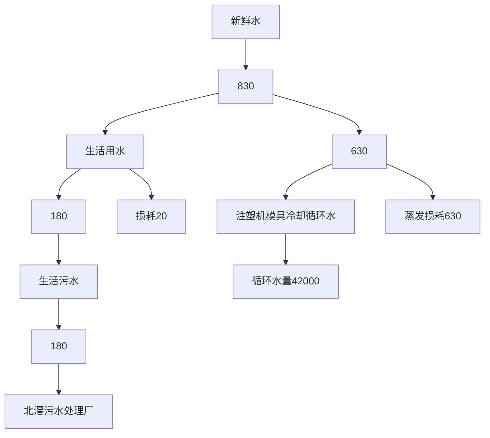
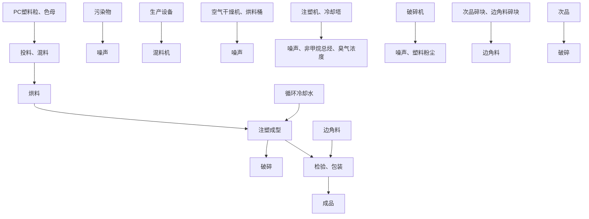
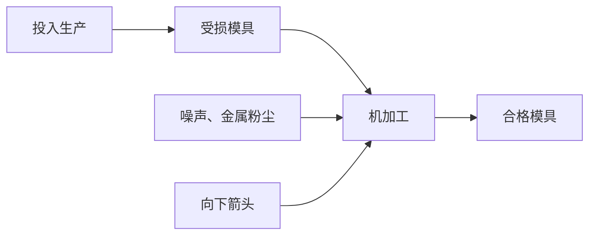

# 建设项目环境影响报告表

（污染影响类）

text_image

大型胶模具有限公司
三
限公司建设项目

项目名称：佛山董大塑胶模具有

建设单位（盖章）：佛山董大塑胶模具有限公司

编制日期： 2023年6月

中华人民共

text_image

和国生态环境部制
生态环境科技有限公司
（一）
4408084863164

# 目 录

一、建设项目基本情况..  
二、建设项目工程分析.. .22  
三、区域环境质量现状、环境保护目标及评价标准. .33  
四、主要环境影响和保护措施... . 39  
五、环境保护措施监督检查清单. .. 63  
六、结论... ..65

建设项目污染物排放量汇总表（单位：t/a）

附图 1 项目地理位置图

附图 2 项目四至图

附图 3 项目周边环境敏感点分布图

附图 4 项目四至实景图

附图 5 项目平面布置图

附图 6 顺德区环境空气质量功能区划分图

附图 7 顺德区水环境功能区划分图

附图 8 声环境功能区划分图

附图 9 《北滘镇工业园（潭洲水道西）控制性详细规划（修编）》：

附图 10 顺德区环境管控单元图

附图 11 佛山市环境管控单元图

附图 12 广东省“三线一单”数据管理及应用平台位置截图

附图 13 项目与最近水源保护区的位置图

附件 1 营业执照

附件 2 法人代表身份证

附件 3 租赁合同

附件 4 环评文件同意公示声明

附件 5 环评咨询技术合同

# 一、建设项目基本情况

<table><tr><td>建设项目名称</td><td colspan="3">佛山董大塑胶模具有限公司建设项目</td></tr><tr><td>项目代码</td><td colspan="3">无</td></tr><tr><td>建设单位联系人</td><td></td><td>联系方式</td><td></td></tr><tr><td>建设地点</td><td colspan="3">广东省佛山市顺德区北滘镇顺江社区三乐东路28号华智科创中心15栋501和502室</td></tr><tr><td>地理坐标</td><td colspan="3">东经113°14&#x27;24.773&quot;,北纬22°54&#x27;30.533&quot;</td></tr><tr><td>国民经济行业类别</td><td>C2929塑料零件及其他塑料制品制造;</td><td>建设项目行业类别</td><td>二十六、橡胶和塑料制品业29,53、塑料制品业292,其他(年用非溶剂型低VOCs含量涂料10吨以下的除外)</td></tr><tr><td>建设性质</td><td>☑新建(迁建)□改建□扩建□技术改造</td><td>建设项目申报情形</td><td>☑首次申报项目□不予批准后再次申报项目□超五年重新审核项目□重大变动重新报批项目</td></tr><tr><td>项目审批(核准/备案)部门(选填)</td><td>无</td><td>项目审批(核准/备案)文号(选填)</td><td>无</td></tr><tr><td>总投资(万元)</td><td>100</td><td>环保投资(万元)</td><td>10</td></tr><tr><td>环保投资占比(%)</td><td>10</td><td>施工工期</td><td>/</td></tr><tr><td>是否开工建设</td><td>☑否□是: _</td><td>用地(用海)面积(m2)</td><td>3153.31</td></tr><tr><td>专项评价设置情况</td><td colspan="3">无</td></tr><tr><td>规划情况</td><td colspan="3">佛山市顺德高新技术产业开发区扩区规划</td></tr><tr><td>规划环境影响评价情况</td><td colspan="3">规划环境影响评价文件名称:佛山市顺德高新技术产业开发区扩区规划环境影响报告书审查机关:佛山市生态环境局顺德分局。审查文件名称:佛山市生态环境局顺德分局关于佛山市顺德高新技术产业开发区扩区规划环境影响报告书审查情况的复函。</td></tr><tr><td>规划及规划环境影响评价符合性分析</td><td colspan="3">根据《佛山市顺德高新技术产业开发区扩区规划环境影响报告书》,项目与规划及审查意见的相符性分析见表1-1。</td></tr></table>

表 1-1 与佛山市顺德高新技术产业开发区扩区规划环境影响报告书有关准入的条件相符性分析

<table><tr><td>清单类型</td><td>准入要求</td><td>项目情况</td><td>符合性</td></tr><tr><td colspan="4">高新区总体生态环境准入清单</td></tr><tr><td rowspan="6">空间布局约束</td><td>1、引入产业应符合现行有效的《产业结构调整指导目录》、《市场准入负面清单》等相关产业政策的要求。</td><td>根据《市场准入负面清单》,项目不在负面清单内;根据国家发改委《产业结构调整指导目录》、《珠江三角洲地区产业结构调整优化和产业导向目录》的规定,项目不属于上述目录所列的鼓励类、限制类和禁止(淘汰)类项目,根据《促进产业结构调整暂行规定》(国发[2005]40号)第十三条,项目属于允许类,且符合国家有关法律、法规和政策规定。因此,本项目符合《产业结构调整指导目录》、《市场准入负面清单》等相关产业政策的要求。</td><td>符合</td></tr><tr><td>2、禁止引入新增排放重点防控重金属污染物(铅(Pb)、汞(Hg)、镉(Cd)、铬(Cr)和类金属砷(As))、持久性有机污染物的项目。</td><td>项目主要产生的是非甲烷总烃,不属于新增排放重点防控重金属污染物(铅(Pb)、汞(Hg)、镉(Cd)、铬(Cr)和类金属砷(As))、持久性有机污染物的项目。</td><td>符合</td></tr><tr><td>3、饮用水源准保护区内不得新建、扩建对水体污染严重、排放一类水污染物和持久性有机污染物的项目,改扩建项目不得新增水污染物。</td><td>项目不在饮用水源准保护区内。</td><td>符合</td></tr><tr><td>4、禁止引入达不到清洁生产国际先进水平的企业。</td><td>本项目不涉及。</td><td>符合</td></tr><tr><td>5、在污水管网建设滞后或所依托的污水处理厂处理能力不能满足废水处理需求的区域,不应引入废水排放量较大的项目。扩区南片区在纳污水体水质稳定达标前,应合理控制涉水排放企业规模,优先引入无生产废水或生产废水排放量较小的项目;扩区东北组团应控制废水排放量较大企业的引入,引入涉水排放企业的规模应与区域污水处理厂处理能力相匹配,严格控制废水排放量较大的项目及新增一类水污染物排放项目的引入,避免对下游饮用水源保护区产生不良影响;扩区西北组团在乐从污水处理厂扩容前,应合理控制涉水排放企业引入规模和时序,尤其严格控制废水排放量较大的企业,确保区域污水得到有效收集和处理。</td><td>本项目不涉及。</td><td>符合</td></tr><tr><td>6、禁止新建、扩建燃煤燃油火电机组和企业自备电站,逐步淘汰生物质锅炉、集中供热管网覆盖区域内的分散供热锅炉,集中供热管网覆盖地区禁止新建、扩建分散供热锅炉,规划区应全部按高污染燃料禁燃区进行管理;禁止新建、扩建水泥、平板玻璃、化学制浆、炼化、炼钢炼铁、电解铝、焦炭、金属冶炼、制浆造纸、鞣革、铅酸蓄电池、专业电镀、木质家具涂装、印染项目;不再新建陶瓷厂(新型特种陶瓷项目除外)。化工项目按照“入园管理”原则合理布局,提高准入门槛,不得新建、扩建纳入国家“高污染、高环境风险”产品名录的生产项目。</td><td>本项目属于C2929塑料零件及其他塑料制品制造,不涉及新建、扩建燃煤燃油火电机组和企业自备电站;不属于新建、扩建水泥、平板玻璃、化学制浆、炼化、炼钢炼铁、电解铝、焦炭、金属冶炼、制浆造纸、鞣革、铅酸蓄电池、专业电镀、木质家具涂装、印染项目;项目不属于“高污染、高环境风险”产品名录的生产项目。</td><td>符合</td></tr><tr><td rowspan="7"></td><td>7、严格控制日用玻璃制造、家具制造、废塑料回收加工再生(列入国家“城市矿产”示范基地项目除外)、专业金属表面处理(铝及铝合金的阳极氧化、铝的表面铬酸盐转化、锌的铬酸盐钝化和金属酸洗、磷化、喷漆、喷涂)等项目建设;严格限制新建生产和使用高挥发性有机物原辅材料的项目,鼓励建设挥发性有机物共性工厂。</td><td>本项目不涉及日用玻璃制造、家具制造、废塑料回收加工再生(列入国家“城市矿产”示范基地项目除外)、专业金属表面处理(铝及铝合金的阳极氧化、铝的表面铬酸盐转化、锌的铬酸盐钝化和金属酸洗、磷化、喷漆、喷涂)等项目建设,且不属于生产和使用高挥发性有机物原辅材料的项目。</td><td>符合</td></tr><tr><td>8、工业企业禁止选址城镇生活空间,生产空间禁止建设居民住宅等敏感建筑;园区工业用地或企业与村庄、学校等环境敏感点之间应设置合理的防护距离,并通过绿化带进行有效隔离,该距离内不得规划新建居民点、办公楼和学校等环境敏感目标。</td><td>本项目选址位于工业用地。</td><td>符合</td></tr><tr><td>9、现有及规划居住区、学校、医院等敏感用地周边50米范围内禁止新建、扩建高噪声排放生产项目;现有及规划居住区、学校、医院等敏感用地周边100米范围内禁止新建、扩建纳入国家“高污染、高环境风险”产品名录的生产项目,不引入酸洗、涂装、注塑、排放恶臭气味的生产工艺和生产设施。</td><td>项目100m内没有敏感点。</td><td>符合</td></tr><tr><td>10、结合《顺德区高质量推动村级工业园升级改造总体规划》,推进区域村级工业园改造工作,禁止重复低水平建设。</td><td>本项目不涉及。</td><td>符合</td></tr><tr><td>11、南片区按照《广东省重金属污染综合防治“十三五”规划》、《佛山市重金属污染综合防治“十三五”规划》的要求,禁止新建、扩建增加重点防控的重金属污染物排放的建设项目,现有技术改造项目应通过实施“区域削减”,实现增产减污;其它区域新、改扩建重金属排放项目。应严格落实重金属总量替代与削减要求,严格控制重点行业发展规模。</td><td>本项目无重金属污染物排放。</td><td>符合</td></tr><tr><td>12、按规划用地布局未来退出的工业企业用地,应严格按照《中华人民共和国土壤污染防治法》开展必要的调查、评估和修复工作,符合要求后,方可用于居住、教育教研、办公等第三产业类用地。</td><td>本项目不涉及。</td><td>符合</td></tr><tr><td>13、其它:符合《佛山市人民政府关于印发佛山市“三线一单”生态环境分区管控方案的通知》(佛府〔2021〕11号)相关管控要求。</td><td>具体见表1-2。</td><td>符合</td></tr><tr><td>污染物排放管控</td><td>1、污染物排放总量不得突破“污染物排放总量管控限值清单”的总量管控要求;重点对重点污染物(重点污染物包括化学需氧量、氨氮、氮氧化物及挥发性有机物等)实施总量控制;上年度重点河涌水质未达到水环境质量目标的管控分区所在镇(街道),须组织编制、系统实施、向社会公开区域重点水污染物减排计划并明确“替代量”,本年度新建、改建、扩建项目新增水环境重点污染物实行区域“减二增一”替代(废水集中处理设施、民生项目除外);在可核查、可监管的基础上,全区新建、改建、扩建项目新增大气重点污染物实行“减二增一”替代。</td><td>本项目不涉及。</td><td>符合</td></tr><tr><td rowspan="4"></td><td>2、未完成环境质量改善目标的区域,新改扩建项目重点污染物实施减量替代。</td><td>待项目审批时由生态环境部门根据《关于做好建设项目挥发性有机物(VOCs)排放削减替代工作的补充通知》(粤环函〔2021〕537号)文件要求核定VOCs总量来源。</td><td>符合</td></tr><tr><td>3、未接入污水管网的新建建筑小区或公共建筑,不得交付使用。新建城区生活污水收集处理设施要与城市发展同步规划、同步建设。</td><td>本项目不涉及。</td><td>符合</td></tr><tr><td>4、规划区内建设项目废污水原则上应接入各片区集中式污水处理厂进行集中处理、达标排放;受纳水体或监控断面不达标的,不得新建、扩建向河涌直接排放废水的项目;对于暂时无法接入市政污水管网、且废水量较少的项目,生活污水处理后立足回用,不能回用的,应处理达到《城镇污水处理厂污染物排放标准》(GB18918-2002)后排入政策法规允许排放且有环境容量的水域;生产废水应立足于回用,不能回用的,可考虑委外处置,确需要外排的,应处理达到行业直接排放标准或广东省《水污染物排放限值》(DB44/26-2001)后排入政策法规允许排放且有环境容量的水域。</td><td>项目生活污水经三级化粪处理达标后排至北滘污水处理厂处理。</td><td>符合</td></tr><tr><td>5、向工业集聚区污水集中处理设施或者城镇污水集中处理设施排放工业废水的,应当按照有关规定进行预处理,达到集中处理设施处理工艺要求后方可以排入市政管网进入各片区污水处理厂。企业生活污水达到广东省《水污染物排放限值》(DB44/26-2001)第二时段三级标准后通过污水管线进入各片区所依托的城镇污水处理厂;扩区南片区企业生产废水预处理达到广东省《水污染物排放限值》(DB44/26-2001)第二时段二级标准、行业间接排放要求(有行业间接排放标准要求的)、杏坛污水处理厂接管要求后通过污水管线排入杏坛污水处理厂处理;扩区西北组团企业生产废水预处理达到广东省《水污染物排放限值》(DB44/26-2001)第二时段二级标准、行业间接排放要求(有行业间接排放标准要求的)、乐从污水处理厂接管要求后通过污水管线排入乐从污水处理厂处理;扩区西北组团企业生产废水预处理达到广东省《水污染物排放限值》(DB44/26-2001)第二时段三级标准、行业间接排放要求(有行业间接排放标准要求的)、北滘污水处理厂接管要求后通过污水管线排入北滘污水处理厂处理。6、规划区依托的集中式污水处理设施排放标准应达到或优于《城镇污水处理厂污染物排放标准》(GB18918-2002)一级标准的A标准和广东省《水污染物排放限值》(DB44/26-2001)第二时段一级标准的较严者。</td><td>项目生活污水达到广东省《水污染物排放限值》(DB44/26-2001)第二时段三级标准后排放至北滘污水处理厂处理。北滘污水处理厂尾水达到《城镇污水处理厂污染物排放标准》(GB18918-2002)一级A标准及广东省地方标准《水污染物排放限值》(DB44/26-2001)第二时段一级标准的较严值。</td><td>符合</td></tr><tr><td></td><td>7、根据《广东省生态环境厅关于2021年工业炉窑、锅炉综合整治重点工作的通知》(粤环函〔2021〕461号)要求,高新区现有燃气锅炉执行《锅炉大气污染物排放标准》(DB 44/765-2019)表2排放标准,新建燃气锅炉废气中氮氧化物执行《锅炉大气污染物排放标准》(DB44/765-2019)表3大气污染物特别排放限值,颗粒物、二氧化硫指标特别排放标准(表3)的执行范围、时间按区域正式发布方案执行;新改建的工业窑炉,如烘干炉、加热炉等,有行业标准或地方排放标准的执行相关行业标准或地方标准,未制订行业排放标准的,参照《广东省关于贯彻落实&lt;工业炉窑大气污染综合治理方案&gt;的实施意见》(粤环函〔2019〕1112号),颗粒物、二氧化硫、氮氧化物排放限值分别不高于30、200、300毫克/立方米;家居涂装工艺废气应该执行《家具制造行业挥发性有机化合物排放标准》(DB44 814-2010)第II时段限值;无行业排放标准的企业,为严格控制区域VOCs排放量,在国家、省未出台行业标准前,金属制品、铝型材、设备制造行业参照执行《表面涂装(汽车制造业)挥发性有机化合物排放标准》(DB44/816-2010);其他行业参照执行《家具制造行业挥发性有机化合物排放标准(DB44/814-2010)》;涉及VOCs无组织排放的企业,除有行业标准的执行相关行业标准之外,其余工业企业VOCs物料储存、转移和输送、工艺工程、设备与管线组件VOCs泄漏,敞开液面等VOCs无组织排放控制要求,以及VOCs无组织排放废气收集处理系统要求执行《挥发性有机物无组织排放控制标准》(GB 37822-2019)要求,厂区内VOCs无组织排放监控点浓度应符合GB37822-2019中表A.1规定的特别排放限值;涉及铸造工艺的,新建企业自2021年1月1日起,现有企业自2023年7月1日起,铸造生产工艺环节和生产设备执行《铸造工业大气污染物排放标准》第II时段限值;无行业排放标准的企业,为严格控制区域VOCs排放量,在国家、省未出台行业标准前,金属制品、铝型材、设备制造行业参照执行《表面涂装(汽车制造业)挥发性有机化合物排放标准》(DB44/816-2010);其他行业参照执行《家具制造行业挥发性有机化合物排放标准(DB44/814-2010));涉及VOCs无组织排放的企业,除有行业标准的执行相关行业标准之外,其余工业企业VOCs物料储存、转移和输送、工艺工程、设备与管线组件VOCs泄漏,敞开液面等VOCs无组织排放控制要求,以及VOCs无组织排放废气收集处理系统要求执行《挥发性有机物无组织排放控制标准》(GB 37822-2019)要求,厂区内VOCs无组织排放监控点浓度应符合GB37822-2019中表A.1规定的特别排放限值;涉及铸造工艺的,新建企业自2021年1月1日起,现有企业自2023年7月1日起,铸造生产工艺环节和生产设备执行《铸造工业大气污染物排放标准》(GB39726—2020)表1规定的大气污染物排放限值、企业边界大气污染物浓度限值及其他污染控制要求;制药工业企业执行《制药工业大气污染物排放标准》(GB 37823-2019)表1规定的大气污染物排放限值、企业边界大气污染物浓度限值及其他污染控制要求;注塑等合成树脂加工生产环节和生产设备其执行《合成树脂工业污染物排放标准》(GB 31572-2015)表5规定的大气污染物特别排放限值(涉及PVC树脂的不执行)、合成树脂工业污染物排放标准及其他污染控制要求;分布式能源站项目锅炉烟气执行《火电厂大气污染物排放标准》(GB13223-2011)“表2大气污染物特别排放标准”中所列的燃气轮机组排放浓度限值。</td><td>本项目注塑成型工序排放的非甲烷总烃执行《合成树脂工业污染物排放限值》(GB31572-2015)表5和表9企业边界排放限值,项目厂区内挥发性有机物无组织排放监控点浓度满足《固定污染源挥发性有机物综合排放标准》(DB44-2367—2022)表3厂区内VOCs无组织排放限值。本项目颗粒物排放执行《合成树脂工业污染物排放限值》(GB31572-2015)表9企业边界排放限值。本项目注塑工序的臭气浓度排放执行国家《恶臭污染物排放标准》(GB14554-93)表1新改扩建二级及表2臭气浓度排放标准。</td><td>符合</td></tr><tr><td rowspan="2"></td><td>8、重点加强涉VOCs排放的工业项目的挥发性有机物的源头替代和无组织排放管控,大力推进低VOCs含量原辅材料替代。木制家具制造行业应全面使用水性胶粘剂,替代比例达到100%。家具制造及其他工业涂装项目的水性涂料等低排放VOCs含量涂料占总涂料使用量比例应至少不低于50%。产生VOCs的生产车间须配置废气收集净化装置。排放挥发性有机物的车间必须安装废气收集、回收净化装置,收集率应大于90%;使用溶剂型涂料涂装工艺的VOCs去除率达到90%;家具制造行业有机废气净化率达到80%以上。逐步淘汰单纯一级活性炭吸附、水喷淋+一级活性炭吸附等排放状况不稳定的治理技术。</td><td>项目注塑成型工序产生的有机废气经“二级活性炭吸附”装置处理后再通过63m高排气筒高空排放。</td><td>符合</td></tr><tr><td>9、其它:符合《佛山市人民政府关于印发佛山市“三线一单”生态环境分区管控方案的通知》(佛府〔2021〕11号)相关管控要求。</td><td>具体见表1-2。</td><td>符合</td></tr><tr><td rowspan="4">环境风险防控</td><td>1、制定园区环境风险事故防范和应急预案。完善区域—园区—工业企业多级联动环境突发事件应急预案,建立预防、应急响应机制和后评估机制,定期开展应急演练,提高区域环境风险防范能力。</td><td>本项目不涉及。</td><td>符合</td></tr><tr><td>2、污水处理厂应采取有效措施,防止事故废水直接排入水体;完善污水处理厂在线监控系统联网,实现污水处理厂的实时、动态监管。</td><td>本项目不涉及。</td><td>符合</td></tr><tr><td>3、生产性废水较多的企业需配套有效措施,防止事故废水和第一类污染物直排污染地表水体,防止因渗漏污染地下水。</td><td>本项目不涉及。</td><td>符合</td></tr><tr><td>4、其它:符合《佛山市人民政府关于印发佛山市“三线一单”生态环境分区管控方案的通知》(佛府〔2021〕11号)相关管控要求。</td><td>具体见表1-2。</td><td>符合</td></tr><tr><td>资源</td><td>1、禁止使用高污染燃料。</td><td>本项目不涉及。</td><td>符合</td></tr><tr><td rowspan="3">开发利用要求</td><td>2、工业项目原则上单位GDP能耗要低于0.38吨标煤/万元,单位工业增加值新鲜水耗要低于10立方米/万元。</td><td>本项目不涉及。</td><td>符合</td></tr><tr><td>3、新建高能耗项目单位产品(产值)能耗达到国际国内先进水平。</td><td>本项目不涉及。</td><td>符合</td></tr><tr><td>4、其它:符合《佛山市人民政府关于印发佛山市“三线一单”生态环境分区管控方案的通知》(佛府〔2021〕11号)相关管控要求。</td><td>具体见表1-2。</td><td>符合</td></tr><tr><td colspan="4">扩区东北组团E-3生态环境准入要求</td></tr><tr><td colspan="2">1、结合《顺德区高质量推动村级工业园升级改造总体规划》,推进区域村级工业园改造工作,禁止重复低水平建设。按现行有效的用地规划方案进行建设,非工业用地禁止引入工业生产项目。规划拟由现状工业用地转变为商住用地的区域,原则上禁止引入新的工业生产项目,现有工业项目改扩建须做到减污;对由工业性质转变为居住、教育教研、办公等的地块,应严格按照《中华人民共和国土壤污染防治法》开展必要的调查、评估和修复工作。</td><td>本项目不涉及。</td><td>符合</td></tr><tr><td colspan="2">2、现状已建工业生产区域应优先完善市政污水管网;污水管网建设滞后或所依托的污水处理厂处理能力不能满足废水处理需求的区域,不应引入废水排放量较大的项目。</td><td>本项目不涉及。</td><td>符合</td></tr><tr><td colspan="2">3、禁止引入新增排放重点防控重金属污染物(铅(Pb)、汞(Hg)、镉(Cd)、铬(Cr)和类金属砷(As))、持久性有机污染物的项目。</td><td>本项目不涉及。</td><td>符合</td></tr><tr><td colspan="2">4、临近居住用地等敏感用地的区域应布置轻污染项目,合理控制污染工序规模、适当提高工业生产相关的非生产设施比例。其它临近居住用地等敏感用地、排放废气的项目应严格落实高效的废气治理措施,避免对敏感建筑产生不良影响。如引入废水排放量较大、使用有毒有害物质的项目,应配置有足够的环境风险应急设施,确保生产废水及有毒有害物质不进入饮用水源保护区;园中园项目必须设置足够容量的应急池,以应对内部事故废水及消防废水。</td><td>项目注塑成型工序产生的有机废气经“二级活性炭吸附”装置处理后再通过63m高排气筒高空排放。</td><td>符合</td></tr><tr><td colspan="2">5、提高企业VOCs治理效率,逐步淘汰单纯一级活性炭吸附、水喷淋+一级活性炭吸附等排放状况不稳定的治理技术,升级现有低效的有机废气处理措施(如单纯或单级低温等离子体、UV光解等)。</td><td>项目注塑成型工序产生的有机废气经“二级活性炭吸附”装置处理后再通过63m高排气筒高空排放。</td><td>符合</td></tr><tr><td colspan="2">6、推广新能源汽车和充电基础设施,积极推动重卡LNG加气站、充电基础设施、加氢站建设。新建高能耗项目单位产品(产值)能耗达到国际国内先进水平。7、新建、扩建含蚀刻工序的线路板生产项目和化工项目应在配套污水集中处置的工业园区或生活污水管网覆盖区域内建设。含酸洗、磷化的金属表面处理、金属制品项目(与自身高新技术企业配套的除外),含酸洗、喷涂、拉丝、表面抛光等工艺的不锈钢型材加工项目,应进入以此类项目为主导产业、有相应废水集中治理设施的工业园区,实现集中治污。</td><td>本项目不涉及。</td><td>符合</td></tr><tr><td colspan="2">8、原则上禁止引入列入“高污染、高环境风险”产品名录等可能影响水环境安全的项目。</td><td>本项目不涉及。</td><td>符合</td></tr><tr><td colspan="2">9、城镇新区建设实行雨污分流,逐步推进初期雨水收集、处理和资源化利用。住宅、商业体、学校、市场等城镇开发建设项目应当配套或者同步计划建设公共排水设施,公共排水设施或自建排污水设施未能投产运行的,以上涉水项目不得投入使用。</td><td>本项目不涉及。</td><td>符合</td></tr><tr><td colspan="2">10、北滘污水处理厂应适时启动扩建工程。</td><td>生活污水经处理后排放至北滘污水处理厂处理。</td><td>符合</td></tr><tr><td colspan="2">11、大力推进低VOCs含量原辅材料替代,加快涉VOCs重点行业的生产工艺升级改造,推行自动化生产工艺,对达不到要求的VOCs收集及治理设施进行整治提升,逐步淘汰低效VOCs治理设施。</td><td>本项目不涉及。</td><td>符合</td></tr><tr><td colspan="2">12、其它应符合佛府(2020)11号中ZH44060620004北滘镇重点管控区的相关管控要求。</td><td>具体见表1-2。</td><td>符合</td></tr></table>

<table><tr><td>其他符合性分析</td><td>1、选址合理性分析本项目位于广东省佛山市顺德区北滘镇顺江社区三乐东路28号华智科创中心15栋501和502室,根据北滘镇工业园(潭洲水道西)控制性详细规划(修编)图(详见附图9),项目所在地属于工业用地,本项目未改变用地性质。因此,项目用地符合当地规划。2、产业政策相符性分析本项目主要从事塑料件的注塑加工,项目生产产品、生产工艺和生产设备均不属于《产业结构调整指导目录(2019年本)》(国家发展和改革委员会令第29号,2020年1月1日起施行)中的限制或禁止类别,也不属于国家发展改革委商务部《关于印发&lt;市场准入负面清单(2022年版)的通知&gt;》(发改体改规[2022]397号)“禁止准入类”。3、相关生态环境保护法律法规政策、生态环境保护规划的相符性(1)项目与《环境保护综合名录》(2021年版)相符性分析项目不涉及《环境保护综合名录(2021年版)》中的“高污染、高环境风险”产品名录中的产品,符合《环境保护综合名录》(2021年版)的相关规定。(2)关于《广东省人民政府关于印发广东省“三线一单”生态环境分区管控方案的通知》(粤府[2020]71号)符合性分析1)生态保护红线本项目位于广东省佛山市顺德区北滘镇顺江社区三乐东路28号华智科创中心15栋501和502室,根据《广东省人民政府关于印发广东省“三线一单”生态环境分区管控方案的通知》(粤府[2020]71号),项目所在地不属于生态优先保护区、水环境优先保护区、大气环境优先保护区等优先保护单元,因此项目不涉及生态保护红线。2)环境质量底线根据《广东省人民政府关于印发广东省“三线一单”生态环境分区管控方案的通知》(粤府[2020]71号),全省水环境质量持续改善,国考、省考断面优良水质比例稳步提升,全面消除劣V类水体。大气环境质量继续领跑先行,PM2.5年均浓度率先达到世界卫生组织过渡期二阶段目标值(25微克/立方米),臭氧污染得到有效遏制。土壤环境质量稳中向好,土壤环境风险得到管控。近岸海域水体质量稳步提升。根据佛山市生态环境局顺德分局发布的《2022年佛山市顺德区环境质量状况公报》中的数据和结论,本项目所在区域顺德区2022年度的二氧化硫( $SO_2$ )、</td></tr></table>

二氧化氮（NO2）、可吸入颗粒物（PM10）、细颗粒物（PM2.5）、一氧化碳（CO）五项污染物年评价浓度均达到二级标准，臭氧（O3）超标，本项目无 O3污染物排放。本项目所在区域现状地表水水质符合相应质量标准要求。项目产生的有机废气经集气罩点对点局部密闭收集至“二级活性炭装置”处理后再通过排气筒 DA001 高空排放，对周边环境影响较小；生活污水经三级化粪池预处理达标后排入北滘污水处理厂，对周围环境影响较小，本项目排放的污染物不会导致区域环境质量超标，符合环境质量底线要求。

# 3）资源利用上线

强化节约集约利用，持续提升资源能源利用效率，水资源、土地资源、岸线资源、能源消耗等达到或优于国家下达的总量和强度符合控制目标。本项目不属于高耗能、污染资源型企业，用水来自市政管网，用电来自市政供电。本项目建成后通过内部管理、设备选择、原辅材料的选用和管理、废物回收利用、污染治理等方面采取可行的防治措施，以“节能、降耗、减污”为目标，有效的控制污染。项目的水、电等资源利用不会突破区域上线。

# 4）环保准入清单

根据《广东省人民政府关于印发广东省“三线一单”生态环境分区管控方案的通知》（粤府[2020]71 号），从区域布局管控、能源资源利用、污染物排放管控和环境风险防控等方面明确准入要求，建立“1+3+N”三级生态环境准入清单体系。“1”为全省总体管控要求，“3”为“一核一带一区”区域管控要求，“N”为 1912 个陆域环境管控单元和 471 个海域环境管控单元的管控要求。本项目不属于区域布局管控、能源资源利用、污染物排放管控和环境风险防控等方面明确禁止准入项目。

# 5）与“一核一带一区”区域管控要求的相符性

项目位于珠三角核心区，主要进行塑料制品的制造，不属于区域布局管控要求中的禁止新建、扩建燃煤燃油火电机组和企业自备电站和禁止新建、扩建水泥、平板玻璃、化学制浆、生皮制革以及国家规划外的钢铁、原油加工等项目。项目不涉及使用高挥发性原辅材料，不属于新建生产和使用高挥发性有机物原辅材料的项目，符合区域布局管控要求。

# 6）与环境管控单元总体管控要求的相符性

根据《广东省人民政府关于印发广东省“三线一单”生态环境分区管控方案的通知》（粤府[2020]）71号）发布的广东省环境管控单元图，项目所在区域为重点管控单元，执行区域生态环境保护的基本要求。

# （3）项目与《佛山市人民政府关于印发佛山市“三线一单”生态环境分区管控方案的通知》（佛府〔2021〕11号）相符性分析

# 1）生态保护红线

本项目位于广东省佛山市顺德区北滘镇顺江社区三乐东路 28 号华智科创中心 15 栋 501 和 502 室，根据《佛山市人民政府关于印发佛山市“三线一单”生态环境分区管控方案的通知》（佛府〔2021〕11 号），项目所在地不属于生态优先保护区、水环境优先保护区、大气环境优先保护区等优先保护单元，因此项目不涉及生态保护红线。

# 2）环境质量底线

根据《佛山市人民政府关于印发佛山市“三线一单”生态环境分区管控方案的通知》（佛府〔2021〕11 号），水环境质量持续改善，国考、省考、水功能区断面达到国家和省下达的水质目标要求；市控断面全面消除劣 V 类，力争达到我市确定的水质目标要求；乡镇级及以上集中式饮用水水源地水质稳定达标。空气质量持续改善，细颗粒物 $\left( \mathbf { P M } _ { 2 . 5 } \right)$ ）年均浓度、空气质量优良天数比例（AQI）主要指标达到省下达的目标要求，臭氧污染得到有效遏制。土壤环境质量稳中向好，土壤环境风险得到管控。

根据佛山市生态环境局顺德分局发布的《2022年佛山市顺德区环境质量状况公报》中的数据和结论，本项目所在区域顺德区 2022年度的二氧化硫 $( \mathsf { S O } _ { 2 } )$ ）、二氧化氮 $\left( \mathbf { N O } _ { 2 } \right)$ ）、可吸入颗粒物 $\left( \mathrm { P M } _ { 1 0 } \right)$ ）、细颗粒物 $\left( \mathbf { P } \mathbf { M } _ { 2 . 5 } \right)$ ）、一氧化碳（CO）五项污染物年评价浓度均达到二级标准，臭氧 $( \mathbf { O } _ { 3 } )$ ）超标，本项目无 O 污染物排放。本项目所在区域现状地表水水质符合相应质量标准要求。项目产生的有机废气经集气罩点对点局部密闭收集至“二级活性炭装置”处理后再通过排气筒 DA001 高空排放，对周边环境影响较小；生活污水经三级化粪池预处理达标后排入北滘污水处理厂，对周围环境影响较小，本项目排放的污染物不会导致区域环境质量超标，符合环境质量底线要求。

# 3）资源利用上线

本项目营运过程中消耗一定量的电能、水资源，项目资源消耗量相对区域资源利用总量较少，符合资源利用上限的要求。

# 4）环保准入清单

根据《佛山市人民政府关于印发佛山市“三线一单”生态环境分区管控方案的通知》（佛府〔2021〕11 号），从区域布局管控、能源资源利用、污染物排放管控和环境风险防控等方面明确准入要求，建立“1+3+96+N”生态环境准入清单体系。“1”为全市总体管控要求，“3”为优先保护单元、重点管控单元、一般管控单元总体管控要求，“96” 为各个环境管控单元的差异性准入清单，“N”为对应生态、水、大气、土壤等生态环境要素及自然资源管控分区的具体管控要求清单。

本项目不属于区域布局管控、能源资源利用、污染物排放管控和环境风险防控等方面明确禁止准入项目。

# 5）环境管控单元总体管控要求

根据《佛山市人民政府关于印发佛山市“三线一单”生态环境分区管控方案的通知》（佛府〔2021〕11 号），项目所在区域为重点管控单元 4，环境管控单元编码：ZH44060620004，要素细类为一般生态空间、水环境城镇生活污染重点管控区、水环境工业—城镇污染重点管控区、水环境其他重点管控区、大气环境一般管控区、江河湖库岸线重点管控区。

①受纳水体或监控断面不达标的，不得新建、扩建向河涌直接排放废水的项目。新建、扩建含蚀刻工序的线路板生产项目和化工项目应在配套污水集中处置的工业园区或生活污水管网覆盖区域内建设；纯加工型印花项目，含酸洗、磷化的金属表面处理、金属制品项目（与自身高新技术企业配套的除外），含酸洗、喷涂、拉丝、表面抛光等工艺的不锈钢型材加工项目，应进入以此类项目为主导产业、有相应废水集中治理设施的工业园区，实现集中治污。

②大气环境受体敏感重点管控区内，应严格限制新建储油库项目、产生和排放有毒有害大气污染物的建设项目以及使用溶剂型油墨、涂料、清洗剂、胶黏剂等高挥发性有机物原辅材料项目，鼓励现有该类项目搬迁退出。

③严格水域岸线用途管制，新建项目一律不得违规占用水域。严禁破坏生态的岸线利用行为和不符合其功能定位的开发建设活动，严禁以各种名义侵占河道、围垦湖泊、非法采砂等。

本项目不属于文件中提及的严格限制类项目，符合《佛山市人民政府关于印发佛山市“三线一单”生态环境分区管控方案的通知》（佛府〔2021〕11 号）的管控要求。

# 6）与“一核一带一区”区域管控要求的相符性

# ①区域布局管控要求

项目位于珠三角核心区，项目主要从事塑料制品，不属于区域布局管控要求中的禁止新建、扩建水泥、平板玻璃、化学制浆、生皮制革以及国家规划外的钢铁、原油加工等项目。项目使用的原辅材料不属于生产和使用高挥发性有机物原辅材料的项目，符合区域布局管控要求。

②能源资源利用要求

项目所属塑料制品业，不属于高能耗行业。项目生产设备均使用电能，生产用水由市政供水，不直接取用江河湖库水量，不会对项目所在地生态流量造成影响，符合能源利用要求。

③污染物排放管控要求

本项目属于新建项目，总量指标由镇街分配；项目生活污水经三级化粪池处理设施处理达标后排放至北滘污水处理厂。

④环境风险防控要求

本项目位于广东省佛山市顺德区北滘镇顺江社区三乐东路 28 号华智科创中心 15 栋 501 和 502 室，不属于石化、化工重点园区环境风险防控区域。项目产生的危险废物拟定期委托有资质的处置公司进行收集处理，并通过信息系统登记转移计划和电子转移联单，符合危险废物全过程跟踪管理的防控要求。

# （4）项目与《佛山市顺德区人民政府关于印发佛山市顺德区“三线一单”生态环境分区管控方案的通知》（顺府发〔2021〕11号）相符性分析

根据《佛山市顺德区人民政府关于印发佛山市顺德区“三线一单”生态环境分区管控方案的通知》（顺府发〔2021〕11号），项目位于北滘镇重点管控区（管控单元编码：ZH44060620004），详情见附图 10。项目与管控要求相符性分析如下：

表1-2 项目与北滘镇重点管控区管控要求相符性分析

<table><tr><td>管控维度</td><td>管控要求</td><td>本项目情况</td><td>相符性</td></tr><tr><td rowspan="3">区域布局管控</td><td>1-1.【生态/禁止类】单元内的一般生态空间,主导生态功能为水土保持,禁止在25度以上的陡坡地开垦种植农作物,禁止在崩塌、滑坡危险区、泥石流易发区从事采石、取土、采砂等可能造成水土流失的活动。</td><td>本项目不涉及生态禁止类活动。</td><td>符合</td></tr><tr><td>1-2.【产业/鼓励引导类】重点发展机器人及配套产业、智能家用电器、高端新型电子信息、新材料等制造业和总部经济、电子商务、工业设计与文化创意、科技金融等现代服务业,打造智能制造和智慧家电示范区。</td><td>本项目不属于产业/鼓励引导类。</td><td>符合</td></tr><tr><td>1-3.【产业/综合类】产业聚集区所属地块内的工业用地或企业与村</td><td>本项目周边500米范围内无大气环境敏感</td><td>符合</td></tr></table>

<table><tr><td rowspan="5"></td><td rowspan="5"></td><td>庄、学校等环境敏感点之间应设置合理的大气环境防护距离,并通过绿化带进行有效隔离;聚集区规划布局应注重大气污染排放企业应尽量避免布局在居住用地的常年主导风向的上风向。</td><td>点。</td><td colspan="2"></td></tr><tr><td>1-4.【产业/综合类】系统推进村级工业园升级改造,腾出连片空间,布局产业集聚区和主题产业园,推动工业项目入园集聚发展。新增工业制造业用地原则上安排在产业集聚区内,产业集聚区外原则上不鼓励工业及物流仓储用地的新建与改造。</td><td>本项目所在地不属于村级工业园升级改造。本项目位于广东省佛山市顺德区北滘镇顺江社区三乐东路28号华智科创中心15栋501和502室,位于产业聚集区。</td><td colspan="2">符合</td></tr><tr><td>1-5.【产业/限制类】受纳水体或监控断面不达标的,不得新建、扩建向河涌直接排放废水的项目。新建、扩建含蚀刻工序的线路板生产项目和化工项目应在配套污水集中处置的工业园区或生活污水管网覆盖区域内建设;纯加工型印花项目,含酸洗、磷化的金属表面处理、金属制品项目(与自身高新技术企业配套的除外),含酸洗、喷涂、化学抛光、电解等涉及废水排放工艺的不锈钢型材加工项目(与自身高新技术企业配套的除外),应进入以此类项目为主导产业、有相应废水集中治理设施的工业园区,实现集中治污。</td><td>项目属于C2929塑料零件及其他塑料制品制造,项目冷却水全部循环使用,不外排。项目生活污水经三级化粪池预处理后由市政污水管网引入北滘污水处理厂处理。</td><td colspan="2">符合</td></tr><tr><td>1-6.【产业/综合类】划定家具生产优先发展区域,优先发展区外不再新建涉及涂装工艺的木质家具制造项目。</td><td>本项目属于C2929塑料零件及其他塑料制品制造,项目不属于木质家具制造项目。</td><td colspan="2">符合</td></tr><tr><td>1-7.【水/限制类】严格限制在佛山市禅城南庄紫洞水厂、佛山市禅城沙口(石湾)水厂、羊额—北滘水厂、广州市南洲水厂顺德水道取水口饮用水水源保护区上游和周边区域建设列入“高污染、高环境风险”产品名录等可能影响水环境安全的项目。1-8.【大气/限制类】大气环境受体敏感重点管控区内,应严格限制新建储油库项目、产生和排放有毒有害大气污染物的建设项目以及使用溶剂型油墨、涂料、清洗剂、胶黏剂等高挥发性有机物原辅材料项目,鼓励现有该类项目搬迁退出。</td><td>项目属于C2929塑料零件及其他塑料制品制造,项目冷却水全部循环使用,不外排。项目生活污水经三级化粪池预处理后由市政污水管网引入北滘污水处理厂处理。本项目不属于储油库项目、也不属于产生和排放有毒有害大气污染物的建设项目以及使用溶剂型油墨、涂料、清洗剂、胶黏剂等高挥发性有机物原辅材料项目。</td><td colspan="2">符合符合</td></tr><tr><td rowspan="8"></td><td></td><td>1-9.【大气/鼓励引导类】大气环境高排放重点管控区内,应强化达标监管,引导工业项目落地集聚发展,有序推进区域内行业企业提标改造。</td><td>本项目不属于大气环境高排放重点管控区内项目。</td><td colspan="2">符合</td></tr><tr><td rowspan="6">能源资源利用</td><td>2-1【能源/鼓励引导类】推广节能技术,加快发展绿色货运与现代物流。</td><td>本项目不属于能源/鼓励引导类。</td><td colspan="2">符合</td></tr><tr><td>2-2【能源/鼓励引导类】推广新能源汽车应用和充电基础设施建设,积极推动重卡LNG加气站、充电基础设施、加氢站建设。</td><td>本项目不属于能源/鼓励引导类。</td><td colspan="2">符合</td></tr><tr><td>2-3.【能源/综合类】科学实施能源消费总量和强度“双控”,新建高能耗项目单位产品(产值)能耗达到国际国内先进水平。</td><td>本项目不属于高能耗项目。</td><td colspan="2">符合</td></tr><tr><td>2-4.【水资源/综合类】贯彻落实“节水优先”方针,实行最严格水资源管理制度,北滘镇万元国内生产总值用水量、万元工业增加值用水量、用水总量、农田灌溉水有效利用系数等用水总量和效率指标达到区下达要求。</td><td>本项目冷却水全部循环使用,不外排。项目用水量较少,符合要求。</td><td colspan="2">符合</td></tr><tr><td>2-5.【土地资源/限制类】落实单位土地面积投资强度、土地利用强度等建设用地控制性指标要求,提高土地利用效率。</td><td>本项目租用已建成厂房作为经营场所,与本项目实际用途相符合。</td><td colspan="2">符合</td></tr><tr><td>2-6.【岸线/禁止类】严格水域岸线用途管制,新建项目一律不得违规占用水域。严禁破坏生态的岸线利用行为和不符合其功能定位的开发建设活动,严禁以各种名义侵占河道、围垦湖泊、非法采砂等。</td><td>项目位于工业区内,不在水域岸线范围内。</td><td colspan="2">符合</td></tr><tr><td>污染物排放管控</td><td>3-1.【水/限制类】城镇新区建设实行雨污分流,逐步推进初期雨水收集、处理和资源化利用。住宅、商业体、学校、市场等城镇开发建设项目应当配套或者同步计划建设公共排水设施,公共排水设施或自建排污水设施未能投产运行的,以上涉水项目不得投入使用。新建小区严格实施雨污分流,阳台、露台等污水接入污水收集系统,将生活污水“应截尽截”。做好大型楼盘、集贸市场、餐饮以及学校等4大类排水户污水接入市政管网工作。</td><td>项目冷却水全部循环使用,不外排。项目生活污水经三级化粪池预处理后由市政污水管网引入北滘污水处理理厂处理。</td><td colspan="2">符合</td></tr><tr><td rowspan="5"></td><td rowspan="5"></td><td>3-2.【水/综合类】结合村级工业园改造,全面提升产业层次与集聚度,促进污染集中整治。</td><td>本项目所在地不属于村级工业园。</td><td colspan="2">符合</td></tr><tr><td>3-3.【水/综合类】稳步推进排水设施“三个一体化”管理模式,补齐城乡污水收集和处理短板,推动北滘污水处理厂提质增效,加快消除城中村、老旧城区、城乡结合部等污水收集管网空白区,逐步实现城乡污水收集处理全覆盖。2025年前完成北滘污水处理厂扩建,尾水应执行《城镇污水处理厂污染物排放标准》(GB18918-2002)一级A标准及《广东省水污染物排放限值》(DB44/26-2001)的较严值。</td><td>本项目不适用。</td><td colspan="2">符合</td></tr><tr><td>3-4.【水/综合类】近期保留并完善水口村、三桂村、西滘村、马龙村等现状农村污水分散式处理设施,新建莘村、马龙村等分散式污水处理站建设,继续完善污水支管网建设,提高污水收集处理率,其余行政村(社区)继续完善污水管网建设,实现农村污水100%收集进入市政污水系统,有条件的区域实施雨污分流改造,到2030年全面雨污分流,污水纳入北滘城镇污水处理系统。</td><td>本项目不适用。</td><td colspan="2">符合</td></tr><tr><td>3-5.【水/综合类】产业集聚区和主题园区内做好污水管网和污水集中处理设施的配套保障,确保废水收集到城镇污水处理厂、园区污水处理厂或分散式污水处理设施集中处置。</td><td>本项目实行雨污分流。生活污水纳入北滘污水处理厂处理系统。</td><td colspan="2">符合</td></tr><tr><td>3-6.【大气/综合类】大力推进低VOCs含量原辅材料替代,加快涉VOCs重点行业的生产工艺升级改造,推行自动化生产工艺,对达不到要求的VOCs收集及治理设施进行整治提升,逐步淘汰低效VOCs治理设施。</td><td>项目不涉及使用高挥发性有机物原辅材料,生产过程产生的有机废气产生量较少,项目产生的有机废气经集气罩点对点局部密闭收集至一套“二级活性炭吸附”装置处理后再通过63m高排气筒DA001排放。</td><td colspan="2">符合</td></tr><tr><td rowspan="9"></td><td rowspan="3">环境风险防控</td><td>4-1.【水/综合类】加强单元内佛山市禅城南庄紫洞水厂、佛山市禅城沙口(石湾)水厂、羊额—北滘水厂、广州市南洲水厂顺德水道取水口饮用水水源保护区周边环境风险源管控,完善突发环境事件应急管理体系。</td><td>项目环境风险事故发生概率较低,在落实相关防范措施后,运营过程中的环境风险是可控的。</td><td colspan="2">符合</td></tr><tr><td>4-2.【水/综合类】北滘污水处理厂、北滘污水处理厂、工业污水集中处理设施应采取有效措施,防止事故废水直接排入水体。完善污水处理厂在线监控系统联网,实现污水处理厂的实时、动态监管。</td><td>本项目不适用</td><td colspan="2">符合</td></tr><tr><td>4-3.【风险/综合类】加强环境风险分级分类管理,强化金属制品、有色金属和压延加工、化学原料和化学品制造业等涉重金属、化工行业企业及工业园区等重点环境风险源的环境风险防控。</td><td>本项目属于C2929塑料零件及其他塑料制品制造,项目不属于金属制品、有色金属和压延加工、化学原料和化学品制造业等涉重金属、化工行业企业。</td><td colspan="2">符合</td></tr><tr><td colspan="5">4、项目挥发性有机物污染物治理政策的相符性分析本项目与挥发性有机污染物治理政策的相符性分析详见下表:表1-3 项目与有机污染物治理政策的相符性</td></tr><tr><td>序号</td><td>政策要求</td><td>工程内容</td><td colspan="2">符合性</td></tr><tr><td colspan="5">1.《广东省涉挥发性有机物(VOCs)重点行业治理指引》的通知(粤环办[2021]43号)</td></tr><tr><td>1.1</td><td>采用外部集气罩的,距集气罩开口面最远处的VOCs无组织排放位置,控制风速不低于0.3m/s。</td><td>项目注塑废气,通过集气罩点对点局部密闭收集,收集效率为70%。集气罩置于废气产生点的合理位置,保证罩口截面风速为0.5m/s。</td><td colspan="2">符合</td></tr><tr><td>1.2</td><td>废气收集系统的输送管道应密闭。废气收集系统应在负压下运行,若处于正压状态,应对管道组件的密封点进行泄漏检测,泄漏检测值不应超过500μmol/mol,亦不应有感官可察觉泄漏。</td><td>项目废气收集系统在负压下运行。</td><td colspan="2">符合</td></tr><tr><td>1.3</td><td>VOCs治理设施应与生产工艺设备同步运行,VOCs治理设施发生故障或检修时,对应的生产工艺设备应停止运行,待检修完毕</td><td>项目生产必须开启风机,有效减少无组织排放废气。废气收集处理系统发生故障或检修时,所有产</td><td colspan="2">符合</td></tr><tr><td rowspan="4"></td><td></td><td colspan="2">后同步投入使用;生产工艺设备不能停止运行或不能及时停止运行的,应设置废气应急处理设施或采取其他替代措施。</td><td>生废气的工序停止运行,待检修完毕后再投入生产。</td><td></td></tr><tr><td rowspan="2">1.4</td><td rowspan="2">工艺过程</td><td>粉状、粒状VOCs物料采用气力输送方式或采用密闭固体投料器等给料方式密闭投加;无法密闭投加的,在密闭空间内操作,或进行局部气体收集,废气排至除尘设施、VOCs废气收集处理系统。</td><td>项目使用的塑料粒和色母均为固态,常温条件下不会产生有机废气。在转移过程中均使用密闭的包装袋封装。</td><td rowspan="2">符合</td></tr><tr><td>在混合/混炼、塑炼/塑化/熔化、加工成型(挤出、注射、压制、压延、发泡、纺丝等)、硫化等作业中应采用密闭设备或在密闭空间中操作,废气应排至VOCs废气收集处理系统;无法密闭的,应采取局部气体收集措施,废气应排至VOCs废气收集处理系统。</td><td>项目注塑废气通过集气罩点对点局部密闭收集,经二级活性炭吸附装置处理后通过63m排气筒达标排放</td></tr><tr><td>1.5</td><td>排放水平</td><td>塑料制品行业:a)有机废气排气筒排放浓度不高于广东省《大气污染物排放限值》(DB4427-2001)第II时段排放限值,合成革和人造革制造企业排放浓度不高于《合成革与人造革工业污染物排放标准》(GB21902-2008)排放限值,若国家和我省出台并实施适用于塑料制品制造业的大气污染物排放标准,则有机废气排气筒排放浓度不高于相应的排放限值;车间或生产设施排气中NMHC初始排放速率≥3kg/h时,建设VOCs处理设施且处理效率≥80%;b)厂区内无组织排放监控点NMHC的小时平均浓度值不超过 $6mg/m^3$ 任意一次浓度值不超过 $20mg/m^3$ 。</td><td>a、本项目非甲烷总烃有组织排放执行《合成树脂工业污染物排放限值》(GB31572-2015)表5限值(非甲烷总烃≤ $60mg/m^3$ )不高于广东省《大气污染物排放限值》(DB4427-2001)第II时段排放限值(非甲烷总烃≤ $120mg/m^3$ );本项目非甲烷总烃的最大产生速率小3kg/h。b、项目生产过程有机废气达到《合成树脂工业污染物排放限值》(GB31572-2015);有机废气厂区内无组织排放满足平均浓度值不超过 $6mg/m^3$ 任意一次浓度值不超过 $20mg/m^3$ 。</td><td>符合</td></tr><tr><td rowspan="2"></td><td>1.6</td><td rowspan="2">管理台账</td><td>建立废气收集处理设施台账,记录废气处理设施进出口的监测数据(废气量、浓度、温度、含氧量等)、废气收集与处理设施关键参数、废气处理设施相关耗材(吸收剂、吸附剂、催化剂等)购买和处理记录。</td><td>企业拟建立废气收集处理设施台账,根据《排污单位自行监测技术指南橡胶和塑料制品》(HJ1207-2021)等相关要求定期自行监测,并且记录相关监测数据和废气处理设施中活性炭的购买量和处理记录。</td><td>符合</td></tr><tr><td>1.7</td><td>建立危废台账,整理危废处置合同、转移联单及危废处理方式资质佐证材料。</td><td>企业拟建立危险废物台账,定期将危险废物交给有资质的单位处理,整理危废处理合同、转移联单等资料。</td><td>符合</td></tr><tr><td colspan="6">2.《广东省人民政府办公厅关于印发广东省2021年大气、水、土壤污染防治工作方案的通知》(粤办函〔2021〕58号)</td></tr><tr><td colspan="2">2.1</td><td colspan="2">严格落实国家产品VOCs含量限值标准要求,除现阶段确无法实施替代的工序外,禁止新建生产和使用高VOCs含量原辅材料项目。鼓励在生产和流通消费环节推广使用低VOCs含量原辅材料。</td><td>项目不使用高VOCs含量原辅材料,本项目VOCs的产生来源于固体塑料在作业过程产生。</td><td>符合</td></tr><tr><td colspan="2">2.2</td><td colspan="2">涉VOCs重点行业新建、改建和扩建项目不推荐使用光氧化、光催化、低温等离子等低效治理设施,已建项目逐步淘汰光氧化、光催化、低温等离子治理设施。指导采用一次性活性炭吸附治理技术的企业,明确活性炭装载量和更换频次,记录更换时间和使用量。</td><td>项目有机废气治理采用“二级活性炭”处理。活性炭装载量和更换频次已在本报告内容中明确。</td><td>符合</td></tr><tr><td colspan="6">3.《固定污染源挥发性有机物综合排放标准》(DB44/2367-2022)</td></tr><tr><td colspan="2">3.1</td><td colspan="2">VOCs物料储存无组织排放控制要求</td><td rowspan="3">项目含VOCs物料主要为塑料粒,常温下不挥发,储存在仓库内;工艺生产过程产生的有机废气通过设置集气罩点对点局部密闭收集并采用二级活性炭吸附处理后高空排放,减少无组织排放。</td><td>符合</td></tr><tr><td colspan="2">3.2</td><td colspan="2">VOCs物料转移和输送无组织排放控制要求</td><td>符合</td></tr><tr><td colspan="2">3.3</td><td colspan="2">工艺过程VOCs无组织排放控制要求</td><td>符合</td></tr><tr><td colspan="6">4.关于印发《重点行业挥发性有机物综合治理方案》的通知(环大气[2019]53号)</td></tr><tr><td colspan="2">4.1</td><td colspan="2">通过使用水性、粉末、高固体分、无溶剂、辐射固化等低VOCs含量的涂料,水性、辐射固化、植物等低VOCs含量的油墨,水基、</td><td>本项目使用的原材料无自然状态下可挥发性的物料,满足相关标准要求。</td><td>符合</td></tr></table>

<table><tr><td rowspan="7"></td><td></td><td>热熔、无溶剂、辐射固化、改性、生物降解等低VOCs含量的胶粘剂,以及低VOCs含量、低反应活性的清洗剂等,替代溶剂型涂料、油墨、胶粘剂、清洗剂等,从源头减少VOCs产生。</td><td></td><td></td></tr><tr><td>4.2</td><td>重点对含VOCs物料(包括含VOCs原辅材料、含VOCs产品、含VOCs废料以及有机聚合物材料等)储存、转移和输送、设备与管线组件泄漏、敞开液面逸散以及工艺过程等五类排放源实施管控,通过采取设备与场所密闭、工艺改进、废气有效收集等措施,削减VOCs无组织排放。</td><td>项目注塑过程产生的废气,通过集气罩点对点局部密闭收集,收集效率为70%。集气罩置于废气产生点的合理位置,保证罩口截面风速为0.5m/s。</td><td>符合</td></tr><tr><td>4.3</td><td>提高废气收集率,遵循“应收尽收、分质收集”的原则,科学设计废气收集系统,将无组织排放转变为有组织排放进行控制。采用全密闭集气罩或密闭空间的,除行业有特殊要求外,应保持微负压状态,并根据相关规范合理设置通风量。采用局部集气罩的,距集气罩开口面最远处的VOCs无组织排放位置,控制风速应不低于0.3米/秒,有行业要求的按相关规定执行。</td><td>项目注塑过程产生的有废气,通过集气罩点对点局部密闭收集,收集效率为70%,集气罩置于废气产生点的合理位置,保证罩口截面风速为0.5m/s。</td><td>符合</td></tr><tr><td colspan="4">5.《佛山市生态环境局顺德分局关于做好重点行业建设项目挥发性有机物总量指标管理工作的通知》(佛顺环函[2019]56号)</td></tr><tr><td>5.1</td><td>涉VOCs排放项目,实现本行政区域内污染源“点对点”2倍量削减替代,由项目所在镇街分局出具VOCs总量指标来源及替代削减方案的意见,开展总量替代。</td><td>项目VOCs排放总量指标为1.181t/a,由北滘镇出具VOCs总量指标来源及替代削减方案的意见。</td><td>符合</td></tr><tr><td colspan="4">6.佛山市发展和改革局 佛山市生态环境局关于印发《佛山市关于进一步加强塑料污染治理的实施方案》的通知(2020-年11月09日发布)</td></tr><tr><td>6.1</td><td>全市范围内禁止生产和销售厚度小于0.025毫米的超薄塑料购物袋、厚度小于0.01毫米的聚乙烯农用地膜。禁止以医疗废物为原料制造塑料制品;禁止将回收利用的废塑料输液袋(瓶)用于原用途或用于制造餐饮容器以及玩具等儿童用品。加大禁止“洋垃圾”进口监管和打私力度,确保“全面禁止废塑料进口”落实到位。到2020年底,禁止生产和销售一次性发泡塑料餐具、一次性塑料棉签;禁止生产含塑料微珠的日化产品。到2022年底,禁止销售含塑料微珠的日化产品。国家《产业结构调整指导目录》和《市场准入负面清单》明确的属于淘汰类的塑料制品项目,禁止投资;属于限制类项目,禁止新建。</td><td>本项目产品为塑料件,不属于禁止生产项目及限制类项目。</td><td>符合</td></tr><tr><td rowspan="5"></td><td colspan="4">7、《广东省塑料制品与制造业挥发性有机物综合整治技术指南》</td></tr><tr><td>7.1</td><td>粉状、粒状VOCs物料投加,宜采用气力输送方式或采用密闭固体投料器等给料方式密闭投加。</td><td>本项目塑料投料采用气力输送方式密闭投加。</td><td>符合</td></tr><tr><td>7.2</td><td>塑炼/塑化/熔化、挤出、注塑、吹膜等成型工序可采取局部气体收集措施,且满足控制风速不低于0.3m/s的要求。</td><td>项目注塑废气,通过集气罩点对点局部密闭收集,收集效率为70%。集气罩置于废气产生点的合理位置,保证罩口截面风速为0.5m/s。</td><td>符合</td></tr><tr><td>7.3</td><td>若采用活性炭吸附技术,采用颗粒活性炭作为吸附剂时,其碘值不宜低于800mg/g;采用蜂窝活性炭作为吸附剂时,其碘值不宜低650mg/g;采用活性炭纤维作为吸附剂时,其比表面积不低于 $1100m^{2}/g$ (BET法)。工作温度和湿度应符合:温度T&lt;40°C、湿度RH&lt;60%;活性炭表面不应有积尘和积水;活性炭吸附箱是否足额装填活性炭(1吨活性炭通常只能吸附0.1~0.2吨VOCs。</td><td>本项目采用碘值不宜低于800mg/g的活性炭对有机废气进行吸附处理,能满足1吨活性炭最少吸附0.2吨有机废气。</td><td>符合</td></tr><tr><td colspan="4">综上分析,项目总体符合相关挥发性有机废气文件要求。</td></tr></table>

# 二、建设项目工程分析

<table><tr><td rowspan="10">建设内容</td><td colspan="3">1、项目概况佛山董大塑胶模具有限公司建设项目(以下简称本项目)选址于广东省佛山市顺德区北滘镇顺江社区三乐东路28号华智科创中心15栋501和502室,(厂址中心卫星坐标:东经113°14&#x27;24.773&quot;,北纬22°54&#x27;30.533&quot;),项目占地面积和建筑面积约为3153.31m2,总投资100万元,其中拟用于污染防治资金10万元。项目主要从事手机保护壳的加工生产,预计年产PC手机保护壳1000万个、二合一手机保护壳2500万个。根据《中华人民共和国环境影响评价法》(2018年12月29日修订)、《建设项目环境影响评价分类管理名录》(2021年1月1日起实施行)和《建设项目环境保护管理条例》(2017年10月1日施行)等有关建设项目环境保护管理的规定,本项目属于“二十六、橡胶和塑料制品业29,53、塑料制品业292”中的“其他”类别,因此,本项目应编制环境影响报告表。受佛山董大塑胶模具有限公司的委托,我司组织环评工作人员勘查项目拟建场地,考察项目周边地区情况,并收集相关资料,根据环境影响评价技术导则及其他有关文件要求,编制完成该项目的环境影响报告表。2、项目组成项目的主要建设组成见表2-1。表2-1 项目建设组成一览表</td></tr><tr><td>类别</td><td>工程名称</td><td>工程内容</td></tr><tr><td rowspan="2">主体工程</td><td>502车间</td><td>面积为1578m2,位于5楼,层高6米,所在建筑物总高约60米,主要功能包括投料和混料、烘料、注塑成型、次品破碎等生产工序和注塑机模具维修区。</td></tr><tr><td>501车间</td><td>面积为1575.31m2,位于5楼,层高6米,所在建筑物总高约60米,主要功能为仓库,用于存储原料和产品。</td></tr><tr><td>辅助工程</td><td>办公室</td><td>面积约30m2,位于502车间。</td></tr><tr><td rowspan="3">储运工程</td><td>原料、产品仓库</td><td>位于501车间,面积1575.31m2。</td></tr><tr><td>危废暂存间</td><td>位于502车间,面积5m2。</td></tr><tr><td>一般固废存放区</td><td>位于502车间,面积5m2。</td></tr><tr><td rowspan="2">公用工程</td><td>供水</td><td>主要为生活用水和注塑机冷却用水,均由市政自来水公司提供。</td></tr><tr><td>排水</td><td>项目注塑机模具冷却水全部循环使用,不外排,定期补充蒸发损耗。生活污水经三级化粪池预处理后再通过市政污水管网引入北滘污水处理厂处理。</td></tr></table>

<table><tr><td></td><td colspan="2">供电</td><td>由当地变电所供电,不设有备用发电机。</td></tr><tr><td rowspan="7">环保工程</td><td rowspan="2">废气</td><td>注塑成型工序</td><td>废气经集气罩点对点局部密闭收集至一套“二级活性炭吸附”装置处理后再通过63m高排气筒DA001排放。</td></tr><tr><td>投料和混料、破碎工序、注塑机模具维修</td><td>颗粒物经加强车间通风排气后以无组织形式排放。</td></tr><tr><td rowspan="2">废水</td><td>循环冷却水</td><td>全部循环使用,不外排,定期补充蒸发损耗。</td></tr><tr><td>生活污水</td><td>生活污水经三级化粪池预处理后排入北滘污水处理厂处理。</td></tr><tr><td colspan="2">噪声</td><td>选用低噪声设备、基础减震、合理布局。</td></tr><tr><td rowspan="2">固废</td><td>危险废物</td><td>暂存危废暂存间,定期交由持有相应危险废物处理资质的单位处理。</td></tr><tr><td>一般固体废物</td><td>暂存一般固废存放区,交资源回收公司回收处理。</td></tr></table>

# 3、主要产品及产能

项目产品规模情况如下表所示：

表 2-2 项目产品产能一览表

<table><tr><td>序号</td><td>产品名称</td><td>规格尺寸</td><td>年产量</td><td>单个产品重量(克)</td><td>产品总重量(吨)</td></tr><tr><td>1</td><td>PC 手机保护壳</td><td>75mm*155mm</td><td>1000 万个</td><td>18</td><td>180</td></tr><tr><td>2</td><td>二合一手机保护壳</td><td>75mm*155mm</td><td>2500 万个</td><td>20</td><td>500</td></tr><tr><td colspan="5">合计</td><td>680</td></tr></table>

# 4、主要原辅材料

项目原辅材料表详见下表：

表 2-3 主要原辅材料一览表

<table><tr><td>序号</td><td>名称</td><td>年用量</td><td>包装规格</td><td>最大储存量</td><td>备注</td></tr><tr><td>1</td><td>TPU塑料</td><td>400吨</td><td>25kg/袋,粒状</td><td>10吨</td><td rowspan="3">外购新料,用于注塑成型工序</td></tr><tr><td>2</td><td>PC塑料</td><td>281.5吨</td><td>25kg/袋,粒状</td><td>2吨</td></tr><tr><td>3</td><td>色母</td><td>0.6吨</td><td>10kg/袋,粉末状</td><td>0.1吨</td></tr><tr><td>4</td><td>模具</td><td>120套</td><td>/</td><td>60套</td><td>用于注塑机模具</td></tr><tr><td>5</td><td>机油</td><td>0.03吨</td><td>15kg/桶</td><td>0.03吨</td><td>用于设备维修、保养,</td></tr></table>

<table><tr><td rowspan="13"></td><td>6</td><td>液压油</td><td>0.5</td><td colspan="2">170kg/桶</td><td>0.17吨</td><td colspan="2">储存于车间仓库</td></tr><tr><td colspan="8">项目主要原辅材料理化性质详见下表:表2-4 原辅材料理化性质</td></tr><tr><td>序号</td><td>名称</td><td colspan="6">理化性质</td></tr><tr><td>1</td><td>TPU塑料</td><td colspan="6">TPU(Thermoplastic polyurethanes)名称为热塑性聚氨酯弹性体橡胶。主要分为聚酯型和聚醚型,它硬度范围宽(60HA-85HD)、耐磨、耐油,透明,弹性好,在日用品、体育用品、玩具、装饰材料等领域得到广泛应用,无卤阻燃TPU还可以代替软质PVC以满足越来越多领域的环保要求。成型温度一般在200°C---220°C。</td></tr><tr><td>2</td><td>PC塑料</td><td colspan="6">聚碳酸酯(英文简称PC)是分子链中含有碳酸酯基的高分子聚合物,熔点:220-230°C,密度:1.18-1.22g/cm3,热变形温度:135°C,低温-45°C,超过340°C会出现分解。聚碳酸酯无色透明,耐热,抗冲击,阻燃BI级,在普通使用温度内都有良好的机械性能。同性能接近聚甲基丙烯酸甲酯相比,聚碳酸酯的耐冲击性能好,折射率高,加工性能好,不需要添加剂就具有UL94V-2级阻燃性能。但是聚甲基丙烯酸甲酯相对聚碳酸酯价格较低,并可通过本体聚合的方法生产大型的器件。</td></tr><tr><td>3</td><td>色母</td><td colspan="6">由树脂和颜料或染料配制成高浓度颜色的混合物。色母又名色种,是一种把超常量的颜料或染料均匀载附于树脂之中而制得的聚集体。加工时用少量色母粒和未着色树脂掺混,就可达到设计颜料浓度的着色树脂或塑胶制品。</td></tr><tr><td>4</td><td>机油</td><td colspan="6">用于日常设备的维护,密度约为0.91×103(kg/m3),能对发动机起到润滑减磨、辅助冷却降温、密封防漏、防锈防蚀、减震缓冲等作用。</td></tr><tr><td>5</td><td>液压油</td><td colspan="6">液压油就是利用液体压力能的液压系统使用的液压介质,在液压系统中起着能量传递、抗磨、系统润滑、防腐、防锈、冷却等作用。其具有适宜的粘度及良好的粘温性能,以确保在工作温度发生变化的条件下能准确、灵敏地传递动力,并能保证液压元件的正常润滑。具有良好的防锈性及抗氧化安定性,在高温高压条件下不易氧化变质,使用寿命长。具有良好的抗泡沫性,使油品在受机械不断搅拌的工作条件下,产生的泡沫易于消失以使动力传递稳定,避免液压油的加速氧化。</td></tr><tr><td colspan="8">5、主要生产工艺、生产设施及设施参数表2-5 项目主要生产设备或设施</td></tr><tr><td>序号</td><td>设备</td><td colspan="2">规格参数</td><td>数量</td><td>单位</td><td>工艺</td><td>位置</td></tr><tr><td>1</td><td>混料机</td><td colspan="2">文穗WSQB-100</td><td>3</td><td>台</td><td>混料</td><td>混料区</td></tr><tr><td rowspan="2">2</td><td rowspan="2">空气干燥机</td><td colspan="2">ANNK-75AC</td><td>1</td><td>台</td><td rowspan="2">烘料</td><td rowspan="2">注塑区</td></tr><tr><td colspan="2">FL-30HP NTX</td><td>1</td><td>台</td></tr><tr><td rowspan="20"></td><td rowspan="2">3</td><td rowspan="2">烘料桶</td><td>文穗 WSDJ-50</td><td>30</td><td>个</td><td rowspan="2">烘料</td><td colspan="2" rowspan="2">注塑区,配套于注塑机</td></tr><tr><td>金穗 JS-50E</td><td>20</td><td colspan="2">个</td></tr><tr><td rowspan="6">4</td><td rowspan="6">注塑机</td><td>伊之密 120T,螺杆直径35mm</td><td>25</td><td>台</td><td rowspan="6">注塑</td><td colspan="2" rowspan="6">注塑区</td></tr><tr><td>伊之密 120T,螺杆直径38mm</td><td>5</td><td colspan="2">台</td></tr><tr><td>伊之密 120T,螺杆直径30mm</td><td>5</td><td colspan="2">台</td></tr><tr><td>伊之密 120T,螺杆直径26mm</td><td>5</td><td colspan="2">台</td></tr><tr><td>海天 130T,螺杆直径28mm</td><td>10</td><td colspan="2">台</td></tr><tr><td>佳明 128T,螺杆直径30mm</td><td>10</td><td colspan="2">台</td></tr><tr><td>5</td><td>冷却塔</td><td>龍河 50T</td><td>1</td><td>台</td><td>循环水冷却</td><td colspan="2">车间南侧</td></tr><tr><td rowspan="2">6</td><td rowspan="2">破碎机</td><td>文穗 WSGP-400</td><td>2</td><td>台</td><td rowspan="2">破碎</td><td colspan="2" rowspan="2">破碎区</td></tr><tr><td>龍河 PC-400A</td><td>2</td><td colspan="2">台</td></tr><tr><td>7</td><td>铣床</td><td>旭德 XD-4S</td><td>3</td><td>台</td><td rowspan="7">注塑机模具维修</td><td colspan="2" rowspan="7">模具维修区</td></tr><tr><td rowspan="2">8</td><td rowspan="2">磨床</td><td>旭德 GY-618</td><td>3</td><td colspan="2">台</td></tr><tr><td>炬翔 618</td><td>4</td><td colspan="2">台</td></tr><tr><td rowspan="4">9</td><td rowspan="4">电脑锣</td><td>炬翔 JX-850VP</td><td>1</td><td colspan="2">台</td></tr><tr><td>旭德 TOM-855</td><td>1</td><td colspan="2">台</td></tr><tr><td>TFDC-650</td><td>1</td><td colspan="2">台</td></tr><tr><td>佳浦斯 EM650</td><td>1</td><td colspan="2">台</td></tr><tr><td rowspan="2">10</td><td rowspan="2">空压机</td><td>艾凌风 螺杆式空压机 永磁变频 50A</td><td>1</td><td>台</td><td rowspan="2">辅助设备</td><td colspan="2" rowspan="2">车间北侧</td></tr><tr><td>澳德风 螺杆式空压机 永磁变频 50A</td><td>1</td><td colspan="2">台</td></tr></table>

表2-6 本项目注塑机产能核算  
备注：①、次品、边角料约占塑胶原料使用量的 1%，即为：（400t/a+281.5t/a+0.6t/a）×5%=6.821t/a；

<table><tr><td>设备名称</td><td>型号</td><td>数量(台)</td><td>单台设备每小时生产能力(kg/h)</td><td>实际年加工时间(小时/年)</td><td>单台设备设计年产能(t/a)</td><td>设计生产能力合计(t/a)</td><td>产品</td></tr><tr><td>注塑机</td><td>伊之密 120T,螺杆直径35mm</td><td>25</td><td>6.2</td><td>2100</td><td>13.02</td><td>325.5</td><td>手机壳</td></tr><tr><td rowspan="5"></td><td>伊之密 120T,螺杆直径38mm</td><td>5</td><td>6.5</td><td>2100</td><td>13.65</td><td>68.25</td><td rowspan="6"></td></tr><tr><td>伊之密 120T,螺杆直径30mm</td><td>5</td><td>6</td><td>2100</td><td>12.6</td><td>63</td></tr><tr><td>伊之密 120T,螺杆直径26mm</td><td>5</td><td>6</td><td>2100</td><td>12.6</td><td>63</td></tr><tr><td>海天 130T,螺杆直径28mm</td><td>10</td><td>6.5</td><td>2100</td><td>13.65</td><td>136.5</td></tr><tr><td>佳明 128T,螺杆直径30mm</td><td>10</td><td>6</td><td>2100</td><td>12.6</td><td>126</td></tr><tr><td colspan="6">合计</td><td>782.25</td></tr></table>

②、注塑机实际产能=外购塑料原料（400t/a+281.5t/a+0.6t/a）+破碎回用部分（6.821t/a）=688.921t/a；  
③、项目注塑机实际产能（688.921t/a）约占设计最大产能（782.25t/a）的 88.1%，符合生产要求；  
④、项目年工作日 300 天，注塑机每天约注塑 7 小时。

# 6、公用工程

# （1）给排水

给水：项目用水主要为注塑机模具的冷却用水和员工生活用水，均由市政自来水公司提供。

排水：冷却水循环使用，不外排，定期补充蒸发损耗。项目生活污水经三级化粪池处理达标后通过工业区污水管网排入北滘污水处理厂集中处理。

# （2）能耗

本项目供电由市政电网统一供给，预计年用电量 50 万 kw•h。

# 7、劳动定员及工作制度

本项目员工总数为 20人，均不在厂内食宿，项目年工作日 300天，每天工作 8 小时（8：30\~12：00，13：30\~18:00）。

# 8、厂区平面布置及四至情况

项目租用已建成厂房作为生产经营场所，所在厂房共 10 层，总高约 60米。项目租用第 5层的 501室和 502室作为经营场所，本项目占地面积及建筑面积均为 3153.31m2，项目 501 车间主要功能为仓库，用于存储原料和产品，502 车间内主要设有投料和混料工序、注塑成型工序、次品破碎工序、注塑机模具维修区、仓库和办公区等等。项目总体布置较为简单，功能分区明确，平面布置基本合理。项目平面布置详见附图 5。

本项目位于广东省佛山市顺德区北滘镇顺江社区三乐东路 28 号华智科创中心 15栋

502室，项目东面、南面、西面和北面均为华智科创中心的其它工厂。

9、项目水平衡图  

flowchart

图2-1 项目水平衡图（单位：t/a）

<table><tr><td>工艺流程和产排污环节</td><td>1、工艺流程及污环节(图示):图2-2 项目二合一手机保护壳生产工艺流程及产污环节图</td></tr></table>

flowchart

图 2-2 项目 PC 手机保护壳生产工艺流程及产污环节图

flowchart

图 2-3 模具维修工艺流程

# 2、生产工艺流程简述：

# （1）项目二合一手机保护壳生产工艺流程简述：

投料、混料：项目将外购的 TPU 塑料粒（新料）、PC 塑料粒（新料）和色母按比例混合后投入混料机进行混料均匀。项目利用空压机为辅助设备，塑料投料采用气力输送方式密闭投加，且混料过程为加盖密闭搅拌。此过程会产生噪声和少量的粉尘。

烘料：项目利用空气干燥机和烘料桶将混料后的原材料进行烘干，使用电加热，加热温度约 80\~90℃，此过程会产生噪声。备注：项目烘干工序加热的温度还达不到塑料原料的熔点（200\~220℃），此过程无有机废气排放。

注塑成型：项目将混合均匀和烘干后的塑料粒投入注塑机加热注塑成型，使用电加热，加热温度约 220℃，此过程会产生噪声、少量非甲烷总烃换人臭气浓度。注塑工序产生的边角料全部经过破碎机破碎并与塑料粒新料混合后重新回用于注塑成型工序，不外排。

循环冷却水：本项目设置 1 台冷却塔为注塑机模具提供冷却水，冷却水对模具进行冷却，属于间接冷却塑料产品，冷却水循环使用，定期补充蒸发损耗。

破碎：次品及边角料全部经过破碎机破碎并与塑料粒新料混合后重新回用于注塑成型工序，不外排，此过程会产生噪声、少量塑料粉尘、次品碎块和边角料碎块。

检验、包装：经人工检验，合格的产品经人工包装后即可得到塑料件成品。产生的次品全部经过破碎机破碎并与塑料粒新料混合后重新回用于注塑成型工序，不外排。

# （2）项目项目 PC 手机保护壳生产工艺流程简述：

投料、混料：项目将外购的 PC 塑料粒（新料）和色母按比例混合后投入混料机进行混料均匀。项目利用空压机为辅助设备，塑料投料采用气力输送方式密闭投加，且混料过程为加盖密闭搅拌。此过程会产生噪声和少量的粉尘。

烘料：项目利用空气干燥机和烘料桶将混料后的原材料进行烘干，使用电加热，加热温度约 80\~90℃，此过程会产生噪声。备注：项目烘干工序加热的温度还达不到塑料原料的熔点（200\~220℃），此过程无有机废气排放。

注塑成型：项目将混合均匀和烘干后的塑料粒投入注塑机加热注塑成型，使用电加热，加热温度约 230℃，此过程会产生噪声、少量非甲烷总烃换人臭气浓度。注塑工序产生的边角料全部经过破碎机破碎并与塑料粒新料混合后重新回用于注塑成型工序，不外排。

循环冷却水：本项目设置 1 台冷却塔为注塑机模具提供冷却水，冷却水对模具进行冷却，属于间接冷却塑料产品，冷却水循环使用，定期补充蒸发损耗。

破碎：次品及边角料全部经过破碎机破碎并与塑料粒新料混合后重新回用于注塑成型工序，不外排，此过程会产生噪声、少量塑料粉尘、次品碎块和边角料碎块。

检验、包装：经人工检验，合格的产品经人工包装后即可得到塑料件成品。产生的次品全部经过破碎机破碎并与塑料粒新料混合后重新回用于注塑成型工序，不外排。

# （3）项目注塑机模具维修工艺流程简述

本项目外购的注塑机模具使用一定时间后需进行维修，项目将旧的模具经过铣床、磨床和电脑锣等设备进行维修后，即可再次投入生产。此过程会产生噪声、少量的金属粉尘。

# 3、产污节点：

根据工程分析，主要生产工艺为混料、注塑、破碎等，主要污染源产污环节情况分析见表 2-7 所示。

表 2-7 项目主要产污环节一览表

<table><tr><td>序号</td><td colspan="2">类别</td><td>污染源</td><td>主要污染物</td></tr><tr><td rowspan="2">1</td><td rowspan="2">废水</td><td>生活污水</td><td>职工生活</td><td> $COD_{Cr}$ 、 $NH_{3}-N$ 、SS、 $BOD_{5}$ 等</td></tr><tr><td>循环冷却用水</td><td>注塑冷却</td><td>/</td></tr><tr><td>2</td><td rowspan="3">废气</td><td>破碎粉尘</td><td>破碎</td><td>颗粒物</td></tr><tr><td>3</td><td>注塑机模具维修废气</td><td>注塑机模具维修</td><td>颗粒物</td></tr><tr><td>4</td><td>注塑废气</td><td>注塑</td><td>非甲烷总烃、臭气浓度</td></tr><tr><td>5</td><td>噪声</td><td>设备噪声</td><td>机械设备运行</td><td>Leq(A)</td></tr><tr><td>6</td><td rowspan="7">固废</td><td>生活垃圾</td><td>职工生活</td><td>/</td></tr><tr><td>7</td><td>废包装物</td><td>原料包装袋</td><td>/</td></tr><tr><td>8</td><td>塑料次品、边角料</td><td>注塑、冲孔</td><td>/</td></tr><tr><td>9</td><td>废液压油、废机油</td><td>机修保养、设备运营</td><td>/</td></tr><tr><td>10</td><td>废液压油罐、废机油罐</td><td>机修保养</td><td>/</td></tr><tr><td>11</td><td>废含油抹布</td><td>机修保养</td><td>/</td></tr><tr><td>12</td><td>废活性炭</td><td>有机废气处理</td><td>/</td></tr></table>

<table><tr><td>与项目有关的原有环境污染问题</td><td>本项目为新建项目,无与本项目有关的原有污染问题。项目所在区域存在主要污染物为附近企业在生产运营过程中产生的废气、噪声、废水、固废。</td></tr></table>

# 三、区域环境质量现状、环境保护目标及评价标准

# 1、环境空气质量现状

本项目位于广东省佛山市顺德区北滘镇顺江社区三乐东路 28 号华智科创中心 15 栋 501和 502 室，根据《佛山市人民政府办公室关于调整顺德区环境空气质量功能区划的复函》（佛府办函[2014]494 号，2014 年 8 月）和佛山市顺德区人民政府办公室关于印发《佛山市顺德区生态环境保护“十四五”规划（2021-2025）》的通知，顺德区全境为大气环境二类区，因此本项目所在区域属二类环境空气质量功能区，执行《环境空气质量标准》（GB3095-2012）二级标准及其 2018 年修改单的要求。

根据佛山市生态环境局顺德分局发布的《2022 年佛山市顺德区环境质量状况公报》中的数据和结论，2022 年顺德区空气质量综合指数为 3.27，比 2021 年下降6.0%，在全市五区中排名第二。

2022 年，按照《环境空气质量标准》 评价，顺德区二氧化硫 $( \mathsf { S O } _ { 2 } )$ 、二氧化氮 $\left( \mathbf { N O } _ { 2 } \right)$ ）、可吸入颗粒物 $\left( \mathrm { { P M } _ { 1 0 } } \right)$ 、细颗粒物 $\left( \mathbf { P M } _ { 2 . 5 } \right)$ 、一氧化碳（CO）五项污染物年评价浓度均达到二级标准，臭氧 $( \mathbf { O } _ { 3 } )$ ）超标。项目所在区域环境空气为不达标区。

2022年顺德区AQI达标率为78.8%，较 2021 年减少5.9个百分点。首要污染物主要为臭氧（占首要污染物天数比例为71.4%），其次为二氧化氮（占 26.0%）。

2022 年全区 $\mathrm { S O } _ { 2 }$ 年平均浓度为5 微克/立方米，较2021年下降 16.7%。 $\mathrm { N O } _ { 2 }$ 年平均浓度为29 微克/立方米，较 2021 年下降 12.1%。 $\mathrm { P M } _ { 1 0 }$ 年平均浓度为 32 微克/立方米，较 2021 年下降 23.8%。 $\mathrm { P M } _ { 2 . 5 }$ 年平均浓度为19 微克/立方米，较 2021 年下降 13.6%。 $\mathrm { O } _ { 3 }$ 年评价浓度为190微克/立方米，较 2021 年上升9.8%。CO 年评价浓度为 1.1 毫克/立方米，较 2021年上升10.0%。

表 3-1 2022年顺德区（国控测点）环境空气污染物浓度水平年度比较一览表

<table><tr><td rowspan="2">污染物</td><td colspan="2">浓度均值</td><td rowspan="2">评价标准</td><td rowspan="2">变化</td></tr><tr><td>2021年</td><td>2022年</td></tr><tr><td> $SO_{2}$ (μg/m3)</td><td>6</td><td>5</td><td>60</td><td>16.7%</td></tr><tr><td> $NO_{2}$ (μg/m3)</td><td>33</td><td>29</td><td>40</td><td>12.1%</td></tr><tr><td> $PM_{10}$ (μg/m3)</td><td>42</td><td>32</td><td>70</td><td>23.8%</td></tr><tr><td> $PM_{2.5}$ (μg/m3)</td><td>22</td><td>19</td><td>35</td><td>13.6%</td></tr><tr><td> $CO^{*}$ (mg/m3)</td><td>1.0</td><td>1.1</td><td>4</td><td>10.0%</td></tr><tr><td> $O_{3}-8H^{*}$ (μg/m3)</td><td>173(超标)</td><td>190</td><td>160</td><td>9.8%</td></tr></table>

bar

| Category | 2021年 | 2022年 |
|---|---|---|
| SO2 | 6 | 5 |
| NO2 | 33 | 29 |
| PM10 | 42 | 32 |
| PM2.5 | 22 | 19 |
| O3 | 173 | 190 |
| CO | 1.0 | 1.1 |

图3-1 2022 年顺德区（国控测点） 环境空气污染物浓度水平年度比较图

佛山市将通过优化产业结构和布局，推进能源结构调整，不断巩固火电行业超低排放和工业锅炉整治成果，深化机动车船等移动污染源污染控制，加快推进挥发性有机物综合整治，提高扬尘、餐饮业管理水平，促进多污染物协同控制及区域联 防联控，提升大气污染精细化防控能力。届时，佛山市顺德区的环境空气质量将得到极大的改善。

# 2、地表水环境质量现状

项目生活污水经三级化粪预处理后排至北滘污水处理厂处理，污水处理厂尾水排入潭洲水道。本项目纳污水体为潭洲水道（林头桥至西海段），根据《佛山市顺德区人民政府办公室关于印发<佛山市顺德区生态环境保护“十四五”规划（2021-2025）>的通知》（顺府办发〔2022〕16 号），潭洲水道（林头桥至西海段）为Ⅲ类水体功能，水质执行《地表水环境质量标准》（GB3838-2002）中的Ⅲ类标准。

为评价潭洲水道水质，参照《佛山市生态环境局顺德分局关于发布 2022 年度佛山市顺德区环境质量状况公报的通知》（佛环顺函〔2023〕26号），2022年顺德区 2 个国控断面（乌洲、顺德港）、3 个省控断面（杨滘、海凌、飞鹅山）均达到相应的水质目标，水质优良率（Ⅰ～Ⅲ类）为 100%，与 2021年持平。

表3-2 2022年度佛山市顺德区环境质量状况公报（节选）

<table><tr><td rowspan="2">序号</td><td rowspan="2">河流名称</td><td rowspan="2">断面</td><td colspan="2">断面定类</td><td rowspan="2">水质评价标准</td><td colspan="2">河流定类</td></tr><tr><td>2022年</td><td>2021年</td><td>2022年</td><td>2021年</td></tr><tr><td>1</td><td>潭洲水道上游</td><td>潭村</td><td>II</td><td>II</td><td>II</td><td>II</td><td>II</td></tr><tr><td>2</td><td>潭洲水道下游</td><td>西海</td><td>II</td><td>II</td><td>III</td><td>II</td><td>II</td></tr></table>

<table><tr><td></td><td>根据上表可知,潭洲水道(林头桥至西海段)2022年的水质符合《地表水环境质量标准》(GB3838-2002)III类标准的要求,则本项目地表水环境属于达标区,水环境质量良好。3、声环境质量现状根据《佛山市人民政府关于印发佛山市声环境功能区划分方案的通知》(佛府函[2015]72号),项目所在地属于3类声环境功能区,声环境质量执行《声环境质量标准》(GB3096-2008)中的3类标准:昼间≤65dB(A)、夜间≤55dB(A)。本项目为新建,项目厂界外50m范围内无环境敏感目标可不进行保护目标的声环境质量现状监测。4、生态环境项目用地范围内无生态环境保护目标,无需开展生态现状调查。5、电磁辐射项目不涉及电磁辐射,无需开展电磁辐射现状调查。6、土壤、地下水环境项目不存在土壤、地下水环境污染途径,不开展土壤、地下水环境质量现状调查。</td></tr><tr><td>环境保护目标</td><td>1、大气环境本项目位于广东省佛山市顺德区北滘镇顺江社区三乐东路28号华智科创中心15栋501和502室,项目厂界外500米范围内无自然保护区、风景名胜区、居住区、文化区和农村地区中人群较集中的区域等环境保护目标。距离项目最近的大气环境敏感点为西海社区,距离大约750米。2、声环境本项目厂界外50米范围内无声环境保护目标。3、地下水环境本项目厂界外500米范围内无地下水集中式饮用水水源和热水、矿泉水、温泉等特殊地下水资源。4、生态环境项目位于工业区内,无生态环境保护目标,无需开展生态现状调查。</td></tr></table>

# 1、水污染物排放标准

本项目无生产废水外排。项目生活污水经三级化粪池处理达到广东省地方标准《水污染物排放限值》（DB44/26-2001）第二时段三级标准后通过市政管网汇入北滘污水处理厂，北滘污水处理厂出水执行广东省地方标准《水污染物排放限值》(DB44/26-2001)“城镇二级污水处理厂”第二时段一级标准和《城镇污水处理厂污染物排放标准》（GB18918－2002）一级 A标准这两者中的较严值，尾水排入潭州水道，具体指标详见下表：

表 3-3 水污染物排放标准限值摘录（单位：mg/L）

<table><tr><td>污染物类别</td><td> $COD_{Cr}$ </td><td> $BOD_5$ </td><td> $NH_3-N$ </td><td>SS</td></tr><tr><td>DB44/26-2001 第二时段三级标准</td><td>≤500</td><td>≤300</td><td>--</td><td>≤400</td></tr><tr><td>污水处理厂尾水执行标准</td><td>≤40</td><td>≤10</td><td>≤5(8)</td><td>≤10</td></tr><tr><td colspan="5">备注:括号外数值为水温&gt;12°C时的控制指标,括号内数值为水温≤12°C时的控制指标。</td></tr></table>

# 2、大气污染物排放标准

项目注塑废气主要污染因子为非甲烷总烃及臭气浓度，非甲烷总烃的排放参照执行《合成树脂工业污染物排放标准》（GB31572-2015）表 5 和表 9 排放限值；臭气浓度的排放执行《恶臭污染物排放标准》（GB14554-93）表 1新扩改建二级及表 2排放标准。

厂区内有机废气应执行《固定污染源挥发性有机物综合排放标准》（DB44/2367-2022）表 3 厂区内 VOCs 无组织排放限值规定。

模具维修和破碎工序粉尘主要污染因子为颗粒物，以无组织形式排放，颗粒物排放执行《合成树脂工业污染物排放限值》（GB31572-2015）表 9 排放限值和《大气污染物排放限值》（DB4427-2001）第二时段无组织排放监控浓度限值的较严值。

综上所述，本项目废气具体排放限值见下表 3-4 及表 3-5。

表 3-4 项目废气有组织排放标准

<table><tr><td rowspan="2">污染源</td><td rowspan="2">污染因子</td><td rowspan="2">排气筒编号</td><td rowspan="2">排气筒高度</td><td colspan="2">有组织</td><td rowspan="2">执行标准</td></tr><tr><td>最高允许排放浓度</td><td>排放速率</td></tr><tr><td rowspan="4">注塑</td><td>非甲烷总烃</td><td rowspan="4">DA001</td><td rowspan="4">60米</td><td> $60mg/m^3$ </td><td>/</td><td rowspan="4">GB31572-2015</td></tr><tr><td>酚类</td><td> $15mg/m^3$ </td><td>/</td></tr><tr><td>甲苯二异氰酸酯</td><td> $1mg/m^3$ </td><td>/</td></tr><tr><td>二苯基甲烷二异氰酸酯</td><td> $1mg/m^3$ </td><td>/</td></tr><tr><td rowspan="5"></td><td>异佛尔酮二异氰酸酯</td><td rowspan="5"></td><td rowspan="5"></td><td> $1mg/m^{3}$ </td><td>/</td><td rowspan="4"></td></tr><tr><td>多亚甲基多苯基异氰酸酯</td><td> $1mg/m^{3}$ </td><td>/</td></tr><tr><td>氯苯类</td><td> $20mg/m^{3}$ </td><td>/</td></tr><tr><td>二氯甲烷</td><td> $50mg/m^{3}$ </td><td>/</td></tr><tr><td>臭气浓度</td><td colspan="2">60000(无量纲)</td><td>GB14554-93</td></tr></table>

表 3-5 项目废气无组织排放标准

<table><tr><td>污染物项目</td><td>排放限值</td><td>限值含义</td><td>无组织排放监控位置</td><td>执行标准</td></tr><tr><td rowspan="2">NMHC</td><td> $6mg/m^{3}$ </td><td>监控点处1h平均浓度值</td><td rowspan="2">在厂房外设置监控点</td><td rowspan="2">DB44/2367-2022</td></tr><tr><td> $20mg/m^{3}$ </td><td>监控点处任意一次浓度值</td></tr><tr><td>颗粒物</td><td> $1mg/m^{3}$ </td><td>/</td><td rowspan="3">厂界</td><td>GB31572-2015</td></tr><tr><td>臭气浓度</td><td>20(无量纲)</td><td>/</td><td>GB14554-93</td></tr><tr><td>非甲烷总烃</td><td> $4mg/m^{3}$ </td><td>/</td><td>GB31572-2015</td></tr></table>

# 3、噪声排放标准

本项目噪声执行《工业企业厂界环境噪声排放标准》（GB12348-2008）3 类标准（昼间≤65dB(A)，夜间≤55dB(A)）。

# 4、固体废物控制标准

固体废物管理应遵照《中华人民共和国固体废物污染环境防治法》、《广东省固体废物污染环境防治条例》的要求。

危险废物在厂内暂存应符合《危险废物贮存污染控制标准》（GB 18597-2023）以及《关于发布〈一般工业固体废物贮存、处置场污染控制标准〉（GB18599-2001）等 3 项国家污染物控制标准修改单的公告》（环境保护部公告 2013 年第 36 号）的要求。

# 1、水污染物排放总量控制：

本项目外排废水主要为生活污水，年排水量为 180t/a，水污染物总量控制指标：CODCr排放量为 0.007t/a；氨氮排放量为 0.001t/a。根据《佛山市人民政府办公室关于印发佛山市排污权有偿使用和交易管理办法的通知》（佛府办〔2020〕19号），生活污水 CODCr、NH3-N不分配总量，不纳入建设项目主要污染物排放总量指标管理范围。

# 2、大气污染物排放总量控制：

根据《广东省生态环境厅关于做好重点行业建设项目挥发性有机物总量指标管理工作的通知》（粤环发〔2019〕2 号）和结合《佛山市生态环境局顺德分局关于做好重点行业建设项目挥发性有机物总量指标管理工作的通知》（佛顺环函〔2019〕56 号）的要求，新、改、扩建排放 VOCs 的重点行业建设项目应当执行总量替代制度。

项目非甲烷总烃有组织排放量 0.630 t/a，无组织排放量 0.551 t/a，总计 1.181 t/a。项目挥发性有机物总量控制指标为 1.181t/a。

综上所述，本项目总量控制指标如下表所示：

表 3-6 总量控制指标一览表（ 单位：吨/年）

<table><tr><td colspan="3">要素</td><td>排放量</td><td>需分配的总量</td></tr><tr><td rowspan="3">废水</td><td colspan="2">废水排放量</td><td>0</td><td>0</td></tr><tr><td colspan="2">CODcr</td><td>0</td><td>0</td></tr><tr><td colspan="2">氨氮</td><td>0</td><td>0</td></tr><tr><td rowspan="5">废气</td><td colspan="2">二氧化硫</td><td>0</td><td>0</td></tr><tr><td colspan="2">氮氧化物</td><td>0</td><td>0</td></tr><tr><td rowspan="3">挥发性有机物(VOCs)</td><td>有组织</td><td>0.630</td><td>0.630</td></tr><tr><td>无组织</td><td>0.551</td><td>0.551</td></tr><tr><td>合计</td><td>1.181</td><td>1.181</td></tr></table>

# 四、主要环境影响和保护措施

<table><tr><td>施工期环境保护措施</td><td colspan="6">本项目依托已建成厂房,不涉及厂房建设,施工过程主要是内部装修和设备安装,无基建工程,因此施工期间基本不存在大型土建工程,施工期间产生的污染源主要是由于设备运输、安装时产生的噪声等,建议建设单位应加强安装调试工作管理,设备搬运尽量轻放,夜间禁止搬运和调试设备。</td></tr><tr><td rowspan="19">运营期环境影响和保护措施</td><td colspan="6">1、废水本项目废水类别、污染物种类及污染防治设施见下表。表4-1 项目废水类别、污染物种类、排放形式及污染防治设施一览表</td></tr><tr><td colspan="2">产排污环节</td><td colspan="4">职工生活</td></tr><tr><td colspan="2">装置</td><td colspan="4">—</td></tr><tr><td colspan="2">类别</td><td colspan="4">生活污水</td></tr><tr><td colspan="2">污染物种类</td><td> $COD_{Cr}$ </td><td> $BOD_5$ </td><td>SS</td><td> $NH_3-N$ </td></tr><tr><td rowspan="4">污染物产生情况</td><td>核算方法</td><td colspan="4">类比法</td></tr><tr><td>产生废水量 $m^3/a$ </td><td colspan="4">180</td></tr><tr><td>产生浓度mg/L</td><td>250</td><td>100</td><td>200</td><td>30</td></tr><tr><td>产生量t/a</td><td>0.045</td><td>0.018</td><td>0.036</td><td>0.005</td></tr><tr><td rowspan="2">收集措施</td><td>方式</td><td colspan="4">管道</td></tr><tr><td>效率</td><td colspan="4">100%</td></tr><tr><td rowspan="3">治理措施</td><td>处理能力</td><td colspan="4">/</td></tr><tr><td>工艺</td><td colspan="4">三级化粪池</td></tr><tr><td>效率</td><td>20%</td><td>21%</td><td>50%</td><td>3%</td></tr><tr><td colspan="2">是否为可行技术</td><td colspan="4">是</td></tr><tr><td rowspan="4">污染物排放</td><td>核算方法</td><td colspan="4">类比法</td></tr><tr><td>排放废水量 $m^3/a$ </td><td colspan="4">180</td></tr><tr><td>排放浓度mg/L</td><td>200</td><td>79</td><td>100</td><td>29</td></tr><tr><td>排放量t/a</td><td>0.036</td><td>0.014</td><td>0.018</td><td>0.005</td></tr><tr><td rowspan="13"></td><td colspan="2">排放时间/h</td><td>2400</td><td>2400</td><td>2400</td><td>2400</td></tr><tr><td colspan="2">排放方式</td><td colspan="4">间接排放</td></tr><tr><td colspan="2">排放去向</td><td colspan="4">北滘污水处理厂</td></tr><tr><td colspan="2">排放规律</td><td colspan="4">间断排放,排放期间流量不稳定且无规律,但不属于冲击型排放</td></tr><tr><td colspan="2">达标分析</td><td colspan="4">达标,生活污水经三级化粪池预处理后可达到广东省地方标准《水污染物排放限值》(DB44/26-2001)的第二时段三级标准。</td></tr><tr><td rowspan="4">排放口基本情况</td><td>编号</td><td colspan="4">DW001</td></tr><tr><td>名称</td><td colspan="4">生活污水排放口</td></tr><tr><td>类型</td><td colspan="4">企业总排</td></tr><tr><td>地理坐标</td><td colspan="4">东经113°14'24.778",北纬22°54'30.535"</td></tr><tr><td rowspan="2">排放标准</td><td>纳管标准</td><td colspan="4">广东省地方标准《水污染物排放限值》(DB44/26-2001)的第二时段三级标准</td></tr><tr><td>最终标准</td><td colspan="4">广东省地方标准《水污染物排放限值》(DB44/26-2001)第二时段一级标准及《城镇污水处理厂污染物排放标准》(GB18918-2002)一级A类标准中较严者</td></tr><tr><td colspan="6">备注:1、根据《排污许可证申请与核发技术规范 橡胶及塑料制品工业》(HJ1122-2020)附录A表A.4塑料制品工业排污单位废水污染防治可行技术参考表可知,生活污水处理设施可行技术有隔油池、化粪池、调节池、厌氧-好氧、兼性-好氧、好氧生物处理,因此,本项目生活污水采用三级化粪池进行预处理属于可行技术。2、项目三级化粪池对各污染物去除效率参照《第一次全国污染源普查城镇生活源产排污系数手册》中“二区一类城市”: $COD_{Cr}$ 为20%、 $BOD_{5}$ 为21%、氨氮为3%。SS去除效率参考《从污水处理探讨化粪池存在必要性》(程宏伟等),污水经化粪池12h~24h沉淀后,可去除50%~60%的悬浮物,本项目SS去除率取50%。</td></tr><tr><td colspan="6">(1)废水源强分析1)冷却循环水本项目设置1台冷却塔为注塑机模具提供冷却水,冷却水对模具进行冷却,属于间接冷却塑料产品,冷却水全部循环使用,不外排,定期补充蒸发损耗。参考《工业循环冷却水处理设计规范》(GB/T50050-2017),开式系统蒸发水量计算公式为: $Q_e = k \cdot \Delta t \cdot Q_r$ 式中: $Q_e$ ——蒸发水量( $m^3/h$ )。</td></tr></table>

k——蒸发损失系数（1/℃），需根据进塔大气温度取值。

Δt——循环冷却水进出冷却塔温差（℃），项目进出冷却塔温差约 10℃。

Qr——循环冷却水量（m3/h）。

项目冷却塔参照开式系统，进塔大气温度平均约 30℃，根据《工业循环冷却水处理设计规范》（GB/T50050-2017）表 5.0.6，冷却塔的蒸发损耗系数取值 0.0015。项目设置 1 台冷却塔为注塑机模具提供冷却水，配置的水泵流量约 20m3 /h，项目年工作日 300天，冷却塔每天约运行 7 小时，则年循环水量约 42000m3 /a，因此，项目冷却水蒸发水量为：0.0015×10×42000m3 /a=630m3 /a。即项目新鲜水补充用量约为 630t/a。

# 2）生活污水

根据建设单位提供的资料，本项目共有员工为 20 人，均不在厂内食宿。因此，本项目员工生活用水参考广东省地方标准《用水定额 第 3 部分：生活》（DB44/T 1461.3-2021）国家行政机构（办公楼且无食堂和浴室）的用水量（先进值）取 10m3 /人·a 计算，则项目生活用水量为 200t/a。项目生活用水排污系数以 0.9 计，则项目生活污水排放量约为 180t/a。此类污水主要污染物为 CODCr、BOD5、SS、NH3-N 等。参考《建设项目环境影响评价培训教材》我国城市生活污水水质统计数据和对同类水质类比调查测算，本项目生活污水产排情况见表 4-2。

表4-2 生活污水产排情况一览表

<table><tr><td rowspan="2">污染物</td><td colspan="2">生活污水处理前(污水量180t/a)</td><td colspan="2">三级化粪池处理后(污水量180t/a)</td><td colspan="2">北滘污水处理厂处理后(污水量180t/a)</td></tr><tr><td>产生浓度(mg/L)</td><td>产生量(t/a)</td><td>排放浓度(mg/L)</td><td>排放量(t/a)</td><td>排放浓度(mg/L)</td><td>排放量(t/a)</td></tr><tr><td> $COD_{Cr}$ </td><td>250</td><td>0.045</td><td>200</td><td>0.036</td><td>≤40</td><td>≤0.007</td></tr><tr><td> $BOD_5$ </td><td>100</td><td>0.018</td><td>79</td><td>0.014</td><td>≤10</td><td>≤0.002</td></tr><tr><td>SS</td><td>200</td><td>0.036</td><td>100</td><td>0.018</td><td>≤10</td><td>≤0.002</td></tr><tr><td>氨氮</td><td>30</td><td>0.005</td><td>29</td><td>0.005</td><td>≤5</td><td>≤0.001</td></tr></table>

本项目生活污水经三级化粪池预处理达到广东省《水污染物排放限值》（DB44/26-2001）第二时段三级标准后由市政污水管网引至北滘污水处理厂深化处理，北滘污水处理厂出水执行广东省《水污染物排放限值》（DB44/26-2001）第二时段一级标准及《城镇污水处理厂污染物排放标准》（GB18918-2002）一级A标准较严值，尾水排入潭州水道。

# （2）生活污水依托北滘污水处理厂进行处理的可行性分析

北滘污水处理厂位于北滘镇东南部大沙围，北滘污水处理厂总占地面积 83000 平方米，北滘污水处理厂已建成一期工程、二期一阶段工程和二期二阶段工程。一期工程于 2004年建成，处理规模为 3万 t/d，采用微曝氧化沟工艺；二期一阶段工程于 2010 年建成，处理规模为 3 万 t/d，采用微曝氧化沟工艺；二期二阶段工程于 2014年建成，处理规模为 3万 t/d，采用 CAST 工艺。北滘污水处理厂目前总的处理规模为 9 万 t/d，工业污水及生活污水分别从厂外引入厂内，经污水井至进水泵房，工业污水经气浮池预处理后，再与生活污水混合后进入均衡池，分流进入一期工程、二期一阶段和二期二阶段工程，经处理后最终出水排入潭洲水道。

项目生活污水经三级化粪池处理后能达到广东省地方标准《水污染物排放限值》（DB44/26-2001）第二时段三级标准排至北滘污水处理厂处理，满足污水厂的纳管要求，并且项目废水排放量远远低于现有的处理规模，不会对北滘污水处理厂的处理规模造成冲击。

# （3）废水监测计划

项目生活污水经市政污水管道排入北滘污水处理厂处理，根据《排污单位自行监测技术指南 橡胶和塑料制品》（HJ1207-2021）表 2非重点排污单位间接排放的相关规定，生活污水无需开展自行监测。

# 2、废气

# （1）项目废气产排污环节、污染物种类、污染物产排情况及污染防治设施一览表

表 4-3 废气产污排环节、污染物种类、污染物产排情况及污染防治设施一览表  
运营期环境影响和保护措施

<table><tr><td rowspan="2">产排污环节</td><td rowspan="2">污染物种类</td><td rowspan="2">总产生量(t/a)</td><td rowspan="2">收集效率%</td><td rowspan="2">排放方式</td><td colspan="3">污染物产生</td><td colspan="4">治理措施</td><td colspan="3">污染物排放</td></tr><tr><td>产生浓度(mg/m3)</td><td>产生速率(kg/h)</td><td>产生量(t/a)</td><td>工艺</td><td>处理能力(m3/h)</td><td>去除效率%</td><td>是否为可行技术</td><td>排放浓度(mg/m3)</td><td>排放速率(kg/h)</td><td>排放量(t/a)</td></tr><tr><td rowspan="4">注塑成型工序</td><td rowspan="2">非甲烷总烃</td><td rowspan="2">1.836</td><td>70</td><td>有组织DA001</td><td>27.8</td><td>0.612</td><td>1.285</td><td>二级活性炭吸附装置</td><td>22000</td><td>51</td><td>是</td><td>13.6</td><td>0.300</td><td>0.630</td></tr><tr><td>/</td><td>无组织</td><td>/</td><td>0.262</td><td>0.551</td><td></td><td>/</td><td>/</td><td>/</td><td>/</td><td>0.262</td><td>0.551</td></tr><tr><td rowspan="2">臭气浓度</td><td rowspan="2">/</td><td>/</td><td>有组织DA001</td><td>&lt;60000(无量纲)</td><td>/</td><td>/</td><td>/</td><td>/</td><td>/</td><td>/</td><td>&lt;60000(无量纲)</td><td>/</td><td>/</td></tr><tr><td>/</td><td>无组织</td><td>&lt;20(无量纲)</td><td>/</td><td>/</td><td>/</td><td>/</td><td>/</td><td>/</td><td>&lt;20(无量纲)</td><td>/</td><td>/</td></tr><tr><td>投料、混料工序</td><td>塑料粉尘</td><td>0.204</td><td>/</td><td>无组织</td><td>/</td><td>0.097</td><td>0.204</td><td>/</td><td>/</td><td>/</td><td>/</td><td>/</td><td>0.097</td><td>0.204</td></tr><tr><td>破碎工序</td><td>塑料粉尘</td><td>0.003</td><td>/</td><td>无组织</td><td>/</td><td>0.003</td><td>0.003</td><td>/</td><td>/</td><td>/</td><td>/</td><td>/</td><td>0.003</td><td>0.003</td></tr><tr><td>模具维修</td><td>金属粉尘</td><td>0.025</td><td>/</td><td>无组织</td><td>/</td><td>0.052</td><td>0.025</td><td>/</td><td>/</td><td>/</td><td>/</td><td>/</td><td>0.052</td><td>0.025</td></tr></table>

备注：臭气浓度单位：无量纲。

# （2）废气排放口基本情况

本项目废气排放口基本情况见下表：

表 4-4 项目废气排放口基本情况表

<table><tr><td rowspan="2">排放口编号</td><td rowspan="2">工序</td><td rowspan="2">污染物种类</td><td rowspan="2">排放口地理坐标</td><td rowspan="2">排放浓度(mg/m3)</td><td rowspan="2">排放速率(kg/h)</td><td rowspan="2">排放量(t/a)</td><td rowspan="2">排气筒高度/m</td><td rowspan="2">排气筒出口内径/m</td><td rowspan="2">烟气温度/°C</td><td rowspan="2">排放口类型</td><td colspan="3">排放标准</td></tr><tr><td>名称</td><td>排放浓度(mg/m3)</td><td>排放速率(kg/h)</td></tr><tr><td rowspan="2">DA001</td><td rowspan="2">注塑成型工序</td><td>非甲烷总烃</td><td rowspan="2">东经113°14&#x27;24.775&quot;,北纬22°54&#x27;30.530&quot;</td><td>13.6</td><td>0.300</td><td>0.630</td><td rowspan="2">63</td><td rowspan="2">0.7</td><td rowspan="2">25</td><td rowspan="2">一般排放口</td><td>《合成树脂工业污染物排放限值》(GB31572-2015)表5排放限值</td><td>60</td><td>/</td></tr><tr><td>臭气浓度</td><td>&lt;60000(无量纲)</td><td>/</td><td>/</td><td>《恶臭污染物排放标准》(GB14554-93)表2臭气浓度排放标准</td><td>60000(无量纲)</td><td>/</td></tr></table>

备注：臭气浓度单位：无量纲。

# （3）废气监测计划

项目废气自行监测因子及频次根据《排污单位自行监测技术指南 橡胶和塑料制品》（HJ1207-2021）表 4 对照“非重点排污单位使用除聚氯乙烯以外的树脂生产的塑料零件及其他塑料制品制造”及表 6 的相关规定。项目废气污染源自行监测计划见下表。

表 4-5 大气污染物自行监测计划

<table><tr><td>项目</td><td>监测点位</td><td>监测指标</td><td>监测频次</td><td>排放标准</td></tr><tr><td rowspan="6">废气</td><td rowspan="2">废气排放口DA001</td><td>非甲烷总烃</td><td>半年一次</td><td>《合成树脂工业污染物排放限值》(GB31572-2015)表5排放限值(非甲烷总烃≤ $100mg/m^3$ )</td></tr><tr><td>臭气浓度</td><td rowspan="5">每年一次</td><td>《恶臭污染物排放标准》(GB14554-93)表2标准[臭气浓度有组织排放≤60000(无量纲)]</td></tr><tr><td rowspan="3">厂界外上风向1个点下风向3个点</td><td>颗粒物</td><td>《合成树脂工业污染物排放限值》(GB31572-2015)表9排放限值和《大气污染物排放限值》(DB4427-2001)第二时段无组织排放监控浓度限值的较严值。</td></tr><tr><td>非甲烷总烃</td><td>《合成树脂工业污染物排放限值》(GB31572-2015)表9企业边界排放限值(非甲烷总烃≤ $4mg/m^3$ )。</td></tr><tr><td>臭气浓度</td><td>《恶臭污染物排放标准》(GB14554-93)表1标准[厂界臭气浓度≤20(无量纲)]。</td></tr><tr><td>厂房外</td><td>NMHC</td><td>《固定污染源挥发性有机物综合排放标准》(DB44/2367-2022)表3厂区内VOCs无组织排放限值。</td></tr></table>

备注：臭气浓度单位：无量纲。

<table><tr><td rowspan="3">运营期环境影响和保护措施</td><td colspan="4">(4)废气源强核算过程1)注塑成型工序1污染物产生量计算本项目注塑成型工序会产生少量的有机废气,以非甲烷总烃计。参考关于发布《排放源统计调查产排污核算方法和系数手册》的公告(环境部公告2021年第24号)中的《292塑料制品行业系数手册》中的“2929塑料零件及其他塑料制品制造行业系数表”的挥发性有机物产污系数为2.70千克/吨-产品,本项目年产PC手机保护壳1000万个(约180t/a)、二合一手机保护壳2500万个(约500t/a),则项目非甲烷总烃产生量为:680t/a×2.70kg/t=1.836t/a。2废气收集风量设计建设单位拟将注塑成型工序产生的有机废气经点对点局部密闭集气罩收集至一套“二级活性炭吸附”装置处理后再通过63m高排气筒DA001排放。项目拟在注塑机上方安装局部密闭集气罩进行点对点收集废气,共设60个集气罩,尺寸为:0.3m(长)*0.3m(宽)。根据《通风设计手册》,集气罩口排风量确定计算公式:L=1.4*p*h*Vk*3600式中:L----集气罩排风量,m/s;p----集气罩周长,m,本项目单个罩口周长为1.2m;h----污染物产生点至罩口的距离,m,本项目拟设0.1m;Vk---集气罩截面风速,m/s,因项目集气罩比较多,为确保距离风机最远处罩口风速,本项目截面风速取0.5m/s。L=1.4×1.2×0.1×0.5×3600=302.4m3/h经计算,60个集气罩总风量为18144m3/h,按照《吸附法工业有机废气治理工程技术规范》(HJ 2026-2013),设计风量宜按照最大废气排放量的120%进行设计,则总风量为21772.8m3/h,因风机抽风过程可能会有损失,为保证集气罩收集效率,项目风机设计总风量为22000m3/h。3收集效率分析根据《广东省工业源挥发性有机物减排量核算方法(试行)》(2021年12月27日)中P8-9表4.5-1废气收集集气效率参考值,如下表所示:表4-6 废气收集集气效率参考值</td></tr><tr><td>废气收集类型</td><td>废气收集方式</td><td>情况说明</td><td>集气效率(%)</td></tr><tr><td>全密封设备/空间</td><td>单层密闭负压</td><td>VOCs产生源设置在密闭车间、密闭设备(含反应釜)、密闭管道内,所有开口处,包括人员或物料进出口处呈负压。</td><td>95</td></tr><tr><td rowspan="3"></td><td>单层密闭正压</td><td>VOCs产生源设置在密闭车间内,所有开口处,包括人员或物料进出口处呈正压,且无明显泄漏点。</td><td>85</td></tr><tr><td>双层密闭空间</td><td>内层空间密闭正压,外层空间密闭负压。</td><td colspan="2">99</td></tr><tr><td>设备废气排口直连</td><td>设备有固定排放管(或口)直接与风管连接,设备整体密闭只留产品进出口,且进出口处有废气收集措施,收集系统运行时周边基本无VOCs散发。</td><td colspan="2">95</td></tr><tr><td rowspan="6">包围型集气设备</td><td rowspan="3">污染物产生点(或生产设施)四周及上下有围挡设施,符合以下两种情况:1、仅保留1个操作工位面;2、仅保留物料进出通道,通道敞开面小于1个操作工位面。</td><td>敞开面控制风速不小于0.5m/s;</td><td>80</td></tr><tr><td>敞开面控制风速在0.3~0.5m/s之间</td><td colspan="2">60</td></tr><tr><td>敞开面控制风速小于0.3m/s</td><td colspan="2">0</td></tr><tr><td rowspan="3">污染物产生点(或生产设施)四周及上下有围挡设施,符合以下情况:通过软质垂帘四周围挡(偶有部分敞开)。</td><td>敞开面控制风速不小于0.5m/s</td><td colspan="2">60</td></tr><tr><td>敞开面控制风速在0.3~0.5m/s之间</td><td colspan="2">40</td></tr><tr><td>敞开面控制风速小于0.3m/s</td><td colspan="2">0</td></tr><tr><td rowspan="3">外部型集气设备</td><td rowspan="3">顶式集气罩、槽边抽风、侧式集气罩等</td><td>相应工位所有VOCs逸散点控制风速不小于0.5m/s</td><td>40</td></tr><tr><td>相应工位所有VOCs逸散点控制风速在0.3~0.5m/s之间</td><td colspan="2">20~40</td></tr><tr><td>相应工位所有VOCs逸散点控制风速小于0.3m/s,或存在强对流干扰。</td><td colspan="2">0</td></tr><tr><td>无集气设施</td><td></td><td>1、无集气设施;2、集气设施运行不正常</td><td>0</td></tr><tr><td colspan="5">备注:1结合实际运行情况,本环评报告收集集气效率应当预留10%余量。2如果采用多种方式对同一工艺实施废气收集,则取值按最好的集气方式;企业在确保安全生产的情况下,选择规范、适用的废气收集和治理措施。本项目集气罩采用顶式集气罩,同时在集气罩的四周设置围挡设施并于集气罩形成一体式,每台设备进料口进料后为密闭操作,出料口工位仅保留1个操作工位面,且敞开面控制风速为0.7m/s,大于0.5m/s,则集气罩收集效率对照“包围型集气罩设备中敞开面控制风速不小于0.5m/s”对应的集气效率,即80%。因此,本环评的废气收集效率约为:80%-10%=70%。4废气治理设施可行性分析根据《排污许可证申请与核发技术规范橡胶和塑料制品工业(HJ1122-2020)》中的“表A.2塑料制品工业排污单位废气污染防治可行技术参考表”,项目采用的活性炭吸附工艺处理有机废气,符合采用排污许可技术规范中的可行技术。</td></tr></table>

活性炭吸附的基本原理如下：吸附法是用固体吸附剂吸附处理废气中有害气体的一种方法。选择吸附剂的原则是比表面积大，容易吸附和脱附再生，来源容易，价格较低。有机废气适宜采用活性炭作吸附剂。活性炭是一种由含碳材料制成的外观呈黑色，内部孔隙结构发达、比表面积大、吸附能力强的一类微晶质碳素材料。活性炭材料中有大量肉眼看不见的微孔，1g 活性炭材料中微孔的总内表面积可高达 700～2300m2。正是这些微孔使得活性炭能“捕捉”各种有毒有害气体和杂质。由于气相分子和吸附剂表面分子之间的吸引力，使气相分子吸附在吸附剂表面。吸附剂表面积愈大、单位质量吸附剂吸附物质愈多。本项目采用颗粒状活性炭，具有巨大的比表面积和发达的孔结构，以及机械强度高、耐酸耐碱、性质稳定等优势特征，吸附容量为0.2g/g。当吸附载体吸附饱和时，可考虑更换。

参考《主要污染物总量减排核算技术指南》（2022 年修订）中的一次性活性炭吸附效率为30%，项目按“第一级活性炭吸附装置”的处理效率为30%，“第二级活性炭吸附装置”的处理效率为30%计算，则“二级活性炭吸附”装置处理有机废气的处理效率约为1-（1-30%）×（1-30%）=51%。

# ⑤废气排放情况

综上所述，本项目拟将注塑成型工序产生的有机废气经点对点局部密闭集气罩收集至一套“二级活性炭吸附”装置处理后再通过 63m高排气筒 DA001排放，废气收集效率为 70%，处理效率为 51%。项目年工作 300天，每天工作 8小时，其中注塑机每天工作 7小时，则废气产生与排放情况详见下表：

表 4-7 项目注塑成型工序废气污染物产排情况

<table><tr><td rowspan="2">污染物种类</td><td rowspan="2">总产生量(t/a)</td><td rowspan="2">收集效率%</td><td rowspan="2">排放方式</td><td rowspan="2">收集风量( $m^3/h$ )</td><td colspan="3">产生情况</td><td rowspan="2">处理效率%</td><td colspan="4">排放情况</td></tr><tr><td>产生浓度(mg/ $m^3$ )</td><td>产生速率(kg/h)</td><td>产生量(t/a)</td><td>排气筒高度(m)</td><td>排放浓度(mg/ $m^3$ )</td><td>排放速率(kg/h)</td><td>排放量(t/a)</td></tr><tr><td rowspan="2">非甲烷总烃</td><td rowspan="2">1.836</td><td rowspan="2">70</td><td>有组织</td><td rowspan="2">22000</td><td>27.8</td><td>0.612</td><td>1.285</td><td>51</td><td>63</td><td>13.6</td><td>0.300</td><td>0.630</td></tr><tr><td>无组织</td><td>/</td><td>0.262</td><td>0.551</td><td>/</td><td>/</td><td>/</td><td>0.262</td><td>0.551</td></tr></table>

# 2）投料、混料工序

本项目投料、混料工序会产生少量的塑料粉尘，参考《排放源统计调查产排污核算方法和系数手册》（公告 2021 年第 24 号）中“2922塑料板、管、型材制造行业系数表”提供的数据，配料、混合工艺颗粒物产物系数为 6.00 千克/吨-产品。本项目年产 PC 手机保护壳 1000 万个（约 180t/a）、二合一手机保护壳 2500 万个（约 500t/a），则项目非甲烷总烃产生量为：680t/a×6.00 千克/吨=4.08t/a。

项目利用空压机为辅助设备，塑料投料采用气力输送方式密闭投加，且混料过程为加盖密闭搅拌，整系统密闭性不低于 95%。因此，项目混料粉尘排放量较少，约为产生量（4.08t/a）的 5%，即约为 0.204t/a。项目沉降在混料罐的粉尘作为塑料原料用于注塑成型工序，不外排。项目年工作 300天，每天工作 8小时，其中混料机约每天工作 7 小时，则项目塑料粉尘排放情况见下表：

表4-8 塑料粉尘排放情况

<table><tr><td>类型\内容</td><td>粉尘排放速率(kg/h)</td><td>粉尘排放量(t/a)</td></tr><tr><td>投料、混料工序</td><td>0.097</td><td>0.204</td></tr></table>

# 2）破碎工序

本项目检验工序产生的次品全部经过破碎机破碎并与塑料粒新料混合后重新回用于注塑成型工序，不外排。项目破碎工序会产生少量的塑料粉尘，参考《排放源统计调查产排污核算方法和系数手册》42 废弃资源综合利用行业系数手册中，见下表：

表4-9 C4220 非金属废料和碎屑加工处理行业系数表（摘录）

<table><tr><td rowspan="5">工段名称</td><td>原料名称</td><td>工艺名称</td><td>规模等级</td><td>污染物指标</td><td>系数单位</td><td>产污系数</td></tr><tr><td>废 PET</td><td>干法破碎</td><td>所以规模</td><td>颗粒物</td><td>克/吨-原料</td><td>375</td></tr><tr><td>废 PVC</td><td>干法破碎</td><td>所以规模</td><td>颗粒物</td><td>克/吨-原料</td><td>450</td></tr><tr><td>废 PE/PP</td><td>干法破碎</td><td>所以规模</td><td>颗粒物</td><td>克/吨-原料</td><td>375</td></tr><tr><td>废 PS/ABS</td><td>干法破碎</td><td>所以规模</td><td>颗粒物</td><td>克/吨-原料</td><td>425</td></tr></table>

本项目注塑工序的次品产生量约为原料使用量的 1%，项目 TPU 塑料用量为 400t/a，PC 塑料用量为 281.5t/a，色母用量为 0.6t/a，则注塑次品产生量为：（400t/a+281.5t/a+0.6t/a）×5%=6.821t/a。按最不利因素分析，项目破碎工序的粉尘产污系数统一取 450克/吨-原料计算。则项目破碎工序粉尘的产生量为：6.821t/a×450 克/吨≈0.003t/a，呈无组织排放。根据建设单位提供的资料，项目年工作日 300 天，每天工作 8 小时，其中破碎机每天约工作 4 小时，则项目塑料粉尘排放情况见下表：

表4-10 破碎工序塑料粉尘排放情况

<table><tr><td>类型\内容</td><td>粉尘排放速率(kg/h)</td><td>粉尘排放量(t/a)</td></tr><tr><td>破碎工序</td><td>0.003</td><td>0.003</td></tr></table>

# 3）注塑机模具维修

本项目利用铣床、磨床和电脑锣对旧模具进行维修，项目模具维修过程会产生少量的金属粉尘。根据建设单位提供的资料，项目持续生产情况下，大约一个月更换 120套模具进行维修，每月更换维修量约 4t，则项目年维修模具的总量为 48t/a。

参考《排放源统计调查产排污核算方法和系数手册》的公告（公告 2021年第 24 号）中《33-37，431-434机械行业系数手册》04 下料表中在锯床、砂轮切割机切割工艺的颗粒物产污系数 5.30kg/t-原料，则项目金属粉尘产生量为：48t/a×5.30kg/t=0.254t/a。

根据《大气污染物综合排放标准》（GB16297-1996）复核调研和国家环保总局《大气污染物排放达标技术指南》课题调查资料表明，金属粉尘等质量较大的颗粒物，沉降较快，即使较细小的金属粉尘随机械运动，在空气中停留暂短时间后也将沉降于地面。项目预计 90%的金属粉尘直接沉降至工位附近，其余 10%飘逸至车间外环境中，则金属粉尘的排放量约为 0.025t/a，呈无组织排放。

项目大约一个月更换 120 套模具进行维修，每 120套模具维修所用的时间约为 8 天，每天用时 5 小时，则项目模具维修所用的时间为：12×8×5=480h，则项目金属粉尘排放情况见下表：

表 4-11 金属粉尘排放情况

<table><tr><td>类型\内容</td><td>粉尘排放速率(kg/h)</td><td>粉尘排放量(t/a)</td></tr><tr><td>注塑机模具维修</td><td>0.052</td><td>0.025</td></tr></table>

# 4）恶臭

项目注塑过程中，塑料热熔会产生轻微的恶臭，其污染因子为臭气浓度。由于臭气的发生比例与操作温度、原料性能等诸多因素有关，较难进行准确定量计算，本次评价不做定量分析。本文引用张欢在《恶臭污染评价分级方法》中基于韦伯-费希纳公式所建立的臭气强度与臭气浓度的关系，将国外臭气强度 6 级法与我国《恶臭污染物排放标准》（GB14554-1993）结合，详见表 4-12，该分级法以臭气强度的嗅觉感觉和实验 经验为分级依据，对臭气浓度进行等级划分，提高了分级的准确程度。

表4-12 与臭气强度相对应的臭气浓度限值

<table><tr><td>分级</td><td>臭气强度(无量纲)</td><td>臭气浓度(无量纲)</td><td>嗅觉感觉</td></tr><tr><td>0</td><td>0</td><td>10</td><td>未闻到有任何气味,无任何反应。</td></tr><tr><td>1</td><td>1</td><td>23</td><td>勉强能闻到有气味,但不宜辨认气味性质(感觉阀值)认为无所谓。</td></tr><tr><td>2</td><td>2</td><td>51</td><td>能闻到气味,且能辨认气味的性质(识别阀值),但感到很正常。</td></tr><tr><td>3</td><td>3</td><td>117</td><td>很容易闻到气味,有所不快,但不反感。</td></tr><tr><td>4</td><td>4</td><td>265</td><td>感有很强的气味,很反感,想离开。</td></tr><tr><td>5</td><td>5</td><td>600</td><td>有极强的气味,无法忍受,立即逃跑。</td></tr></table>

本项目在注塑所产生的的异味强度一般在 1\~2 级，这和臭气浓度为 23\~51（无量纲），注塑异味随着集气罩收集处理后，通过 63m 高的排气筒 DA001 排放，其余无组织排放。臭气浓度的有组织和无组织排放均能达到《恶臭污染物排放标准》（GB14554-1993）表 1 恶臭污染物厂界标准值的二级新扩改建标准：臭气浓度≤20（无量纲），以及表 2恶臭污染物排放标准值：臭气浓度≤60000（无量纲）。项目所在地通风条件良好，加强车间通风换气，逸散的少量恶臭经扩散、稀释，不会对周边环境造成恶臭污染。

# （5）大气环境影响达标分析

# 1）正常工况下有组织废气达标分析

本项目排气筒 DA001 排放的污染物达标，对周围大气环境影响较小，如下表所示：

表4-13 项目废气排放情况

<table><tr><td rowspan="2">排放口编号</td><td rowspan="2">工序</td><td rowspan="2">污染物种类</td><td rowspan="2">排放浓度(mg/m3)</td><td rowspan="2">排放速率(kg/h)</td><td rowspan="2">排放量(t/a)</td><td colspan="3">排放标准</td></tr><tr><td>名称</td><td>排放浓度(mg/m3)</td><td>排放速率(kg/h)</td></tr><tr><td rowspan="2">DA001</td><td rowspan="2">注塑成型工序</td><td>非甲烷总烃</td><td>13.6</td><td>0.300</td><td>0.630</td><td>《合成树脂工业污染物排放限值》(GB31572-2015)表5排放限值</td><td>60</td><td>/</td></tr><tr><td>臭气浓度</td><td>&lt;60000(无量纲)</td><td>/</td><td>/</td><td>《恶臭污染物排放标准》(GB14554-93)表2臭气浓度排放标准</td><td>60000(无量纲)</td><td>/</td></tr></table>

备注：臭气浓度单位：无量纲。

本项目无组织废气排放量较少，非甲烷总烃无组织排放量共为 0.551t/a、排放速率为 0.262kg/h，颗粒物无组织排放量为 0.232t/a、排放速率为 0.152kg/h；项目周边 500 米范围内无大气环境敏感点，项目所在地冬季风向为西北风、夏季风向为东南风，项目废气采用环保防治措施后，满足相应标准要求，对周围大气环境影响较小。

# 3）非正常排放情况下废气影响分析

非正常排放情况主要包括非正常工况和污染控制措施达不到应有效率，本项目不涉及开停车（工、炉）、主要生产设备检修或工艺设备运转异常排放废气污染物。项目的非正常排放主要考虑环保处理设备出现故障完全失效，但废气收集系统可以正常运行，废气通过排气筒排放等情况，废气处理设施出现故障不能正常运行时，应立即停产进行维修，避免对周围环境造成污染。

备注：本环评非正常排放按处理效率为 0%计算。  
表4-14 污染源非正常排放核算表

<table><tr><td>序号</td><td>污染源</td><td>非正常排放原因</td><td>污染物</td><td>非正常排放浓度(mg/m3)</td><td>非正常排放速率(kg/h)</td><td>单次持续时间(h)</td><td>年发生频次(次)</td><td>应对措施</td></tr><tr><td>1</td><td>DA001</td><td>废气处理设备故障</td><td>非甲烷总烃</td><td>27.8</td><td>0.612</td><td>0.5</td><td>1</td><td>停止生产并修复废气处理设备</td></tr></table>

非正常工况下，由于有机废气未经有效收集、处理直接排放至大气环境，可能对区域大气环境有一定的影响，由上表可知，非正常工况下，排气筒排放的污染物排放浓度和排放速率均可达标，因此，当周边有机废气浓度短时间内明显增加时，企业应立即停产并检修，短时间内对区域大气环境影响是可接受的。

# 2、噪声

# （1）源强分析

本项目噪声主要来自生产设备，生产过程叠加噪声平均声级为70-85dB(A)。根据建设单位提供的资料，本项目采用 8 小时工作制度（8：30\~12：00，13：30\~18:00），夜间时间（22:00\~6:00）不进行生产，则夜间时间不产生噪声污染，夜间时间不会对敏感点及周围环境造成影响，因此本报告仅对项目在昼间生产加工时段内进行噪声预测。

将项目各设备噪声作点源处理，本报告评价采用点源噪声距离衰减公式和噪声叠加公式预测各主要设备噪声对环境的影响。

点源衰减公式：

$$
L _ {2} = L _ {1} - 2 0 \lg \left(\frac {r _ {2}}{r _ {1}}\right) - \Delta L
$$

噪声叠加公式：

$$
L _ {e q s} = 1 0 \lg \left(\sum_ {i = 1} ^ {n} 1 0 ^ {0. 1 L e q i}\right)
$$

式中：L1、L2—— r1、 r2处的噪声值，dB(A)；

r1、r2— 距噪声源的距离，m；

L ——房屋、树木等对噪声的衰减值，dB(A)； Leqs——预测点处的等效声级，dB(A)；

Leqi——第 i 个点声源对预测点的等效声级，dB(A)。

建设单位拟划分生产区，同种设备置于同一生产区内生产，因此本环评拟将各生产区内的设备叠加后作为源强进行估算。项目各生产区噪声源强噪声值见下表：

表 4-15 本项目主要噪声源强一览表

<table><tr><td>噪声源</td><td>位置</td><td>数量</td><td>单台噪声源强(dB(A))</td></tr><tr><td>混料机</td><td rowspan="11">生产车间内部</td><td>3台</td><td>70~80</td></tr><tr><td>空气干燥机</td><td>2台</td><td>70~75</td></tr><tr><td>烘料桶</td><td>50台</td><td>70~75</td></tr><tr><td>注塑机</td><td>60台</td><td>70~80</td></tr><tr><td>冷却塔</td><td>1台</td><td>70~80</td></tr><tr><td>破碎机</td><td>4台</td><td>70~80</td></tr><tr><td>铣床</td><td>3台</td><td>80~85</td></tr><tr><td>磨床</td><td>7台</td><td>80~85</td></tr><tr><td>电脑锣</td><td>4台</td><td>80~85</td></tr><tr><td>空压机</td><td>1台</td><td>80~85</td></tr><tr><td>风机</td><td>1台</td><td>70~80</td></tr></table>

表4-16 生产区域拟采取的降噪措施及降噪后噪声源强

<table><tr><td>生产区域</td><td>设备/工序名称</td><td>距声源1m处声级值dB(A)</td><td>拟采用的降噪措施</td><td>降噪效果dB(A)</td><td>采取降噪措施后距声源1m处声级值dB(A)</td><td>设备数量</td><td>采取降噪措施后分区设备叠加噪声源强dB(A)</td><td>排放时间(h/a)</td></tr><tr><td rowspan="11">生产车间</td><td>混料机</td><td>70~80</td><td rowspan="11">选用低噪声设备,设备基础减震,合理布局</td><td>5</td><td>75</td><td>3台</td><td rowspan="11">96.2</td><td>2100</td></tr><tr><td>空气干燥机</td><td>70~80</td><td>5</td><td>70</td><td>2台</td><td>2100</td></tr><tr><td>烘料桶</td><td>70~80</td><td>5</td><td>70</td><td>50台</td><td>2100</td></tr><tr><td>注塑机</td><td>70~80</td><td>5</td><td>75</td><td>60台</td><td>2100</td></tr><tr><td>冷却塔</td><td>70~80</td><td>5</td><td>75</td><td>1台</td><td>2100</td></tr><tr><td>破碎机</td><td>70~80</td><td>5</td><td>75</td><td>4台</td><td>1200</td></tr><tr><td>铣床</td><td>80~85</td><td>5</td><td>80</td><td>3台</td><td>480</td></tr><tr><td>磨床</td><td>80~85</td><td>5</td><td>80</td><td>7台</td><td>480</td></tr><tr><td>电脑锣</td><td>80~85</td><td>5</td><td>80</td><td>4台</td><td>480</td></tr><tr><td>空压机</td><td>80~85</td><td>5</td><td>80</td><td>1台</td><td>2100</td></tr><tr><td>风机</td><td>70~80</td><td>5</td><td>75</td><td>1台</td><td>2100</td></tr></table>

# （2）降噪措施

项目选址位于工业园区内，周围主要以工业企业厂房为主，项目周边 500米范围内无声环境敏感点，项目距离敏感点保护目标较远。建议项目选用低噪声设备、对高噪音设备采取隔声消声、防振措施；合理生产布局；在生产时项目将车间门窗关闭；使用中要加强维修保养；加强职工环保意识教育，提倡文明生产，防止人为噪声。

# （3）噪声达标情况分析

表4-17 采取降噪措施及考虑墙体隔声情况下厂界噪声预测贡献值

<table><tr><td rowspan="2">生产区域</td><td rowspan="2">采取降噪措施后设备叠加噪声源强dB(A)</td><td colspan="4">与项目边界最近距离(m)</td><td colspan="4">距离衰减至厂界室内噪声预测贡献值 dB(A)</td><td colspan="4">考虑墙体隔声后厂界室外噪声预测贡献值dB(A)</td></tr><tr><td>东</td><td>南</td><td>西</td><td>北</td><td>东</td><td>南</td><td>西</td><td>北</td><td>东</td><td>南</td><td>西</td><td>北</td></tr><tr><td>生产厂房</td><td>96.2</td><td>5</td><td>2.5</td><td>3</td><td>4</td><td>82.2</td><td>88.2</td><td>86.7</td><td>84.1</td><td>57.2</td><td>63.2</td><td>61.7</td><td>59.1</td></tr></table>

备注：本项目墙体主要为单层墙，根据《噪声污染控制工程》（高等教育出版社，洪宗辉）中资料，单层墙实测的隔声量为 49dB（A），考虑到门窗面积和开门开窗对隔声的负面影响，实际隔声量为25dB左右。

项目夜间（22:00\~6:00）不进行生产，从预测结果可知，项目运营期的昼间，设备采取降噪措施后，边界外噪声贡献值均能够达到《工业企业厂界环境噪声排放标准》（GB12348-2008）中 3 类排放标准。对项目内员工、周围声环境及敏感点影响较小。

# （4）噪声监测计划

本项目正常投产后，在营运期应根据《排污单位自行监测技术指南 橡胶和塑料制品》（HJ1207-2021）来组织开展厂区内污染源监测，具体要求参考下表：

表 4-18 营运期污染源监测要求一览表

<table><tr><td>类别</td><td>监测点位</td><td>监测指标</td><td>监测频次</td><td>执行排放标准</td></tr><tr><td>噪声</td><td>东、南、西和北侧厂界外1米处</td><td>厂界环境噪声</td><td>每季度1次</td><td>《工业企业厂界环境噪声排放标准》(GB12348-2008)3类标准要求</td></tr></table>

# 4、固体废物

本项目产生的固体废物主要为员工生活垃圾、一般工业固废和危险废物。

# （1）生活垃圾

根据建设单位提供的资料，项目共有员工 20 人，均不在厂内食宿。根据《社会区域类环境影响评价》（中国环境科学出版社），我国目前城市人均生活垃圾为 0.8\~1.5kg/人•d，本项目员工每人每天生活垃圾产生量按 1kg 计，项目年工作 300 天，则预计该部分生活垃圾产生量约为 10kg/d，合 6t/a。生活垃圾分类收集后由环卫部门运走处理。

# （2）一般工业固废

根据建设单位提供的资料，本项目检验工序产生的次品全部经过破碎机破碎并与塑料粒新料混合后重新回用于注塑成型工序，不外排。项目塑料粒、色母的包装袋规格分别为 25kg/袋、10kg/袋，每个包装袋重量约 0.03kg、0.01kg，根据核算共产生 27260 个塑料粒包装袋、60 个色母包装袋，则项目产生的废包装袋约0.818t/a；根据前文分析，项目沉降的金属粉尘量为：0.254t/a×90%≈0.229t/a。项目废包装袋和沉降的金属粉尘收集后外卖给资源回收公司回收处理。

根据《一般固体废物分类与代码》（GB/T 39198-2020），项目一般固废类汇总情况见下表：

表 4-19 固体废物污染源源强核算结果及相关参数一览表

<table><tr><td>序号</td><td colspan="2">种类</td><td>产生环节</td><td>数量(t/a)</td><td>废物类别</td><td>废物代码</td><td>形态</td><td>危险成分</td><td>危险特性</td><td>贮存方式</td><td>利用处置方式及去向</td><td>利用或处置量(t/a)</td><td>环节管理要求</td></tr><tr><td>1</td><td colspan="2">生活垃圾</td><td>员工生活</td><td>6</td><td>/</td><td>/</td><td>固态</td><td>/</td><td>/</td><td>垃圾桶</td><td>由环卫部门处置</td><td>6</td><td>分类收集</td></tr><tr><td>2</td><td rowspan="3">一般工业固体废物</td><td>废包装袋</td><td>包装</td><td>0.818</td><td>06</td><td>292-001-07</td><td>固态</td><td>/</td><td>/</td><td>/</td><td>定期交由资源回收公司回收处理</td><td>0.818</td><td rowspan="3">分类收集储存在一般工业固体废物暂存间内、妥善处置</td></tr><tr><td>3</td><td>次品及边角料</td><td>注塑</td><td>6.821</td><td>06</td><td>292-002-06</td><td>固态</td><td>/</td><td>/</td><td>/</td><td>均回用到项目生产中利用</td><td>6.821</td></tr><tr><td>4</td><td>金属粉尘</td><td>模具维修</td><td>0.229</td><td>09</td><td>292-003-09</td><td>固态</td><td>/</td><td>/</td><td>/</td><td>定期交由资源回收公司回收处理</td><td>0.229</td></tr></table>

# （3）危险废物

本项目的危险废物主要为废气治理设施更换的废活性炭，设备维修、保养产生的废机油，废机油罐和废含油抹布。

# 1）废活性炭：

本项目“二级活性炭吸附”装置拟去除有机废气的量为 0.655t/a。根据《关于指导大气污染治理项目入库工作的通知》（粤环办[2021]92号）附件 1.广东省工业源挥发性有机物减排量核算方法（试行）中活性炭（蜂窝状）的吸附比例为 20%，则项目活性炭使用量至少为 3.275t/a。参考活性炭吸附装置基本参数要求，活性炭碘值＞800mg/g，蜂窝状活性炭过滤风速＜1.2m/s，活性炭填装厚度≥300mm，活性炭箱外形体积＞$2 . 8 \mathrm { m } ^ { 3 } / \mathcal { F } \mathrm { ~ m } ^ { 3 }$ 风量。

本项目拟使用碘值不低于 800mg/g 的活性炭（蜂窝状），蜂窝活性炭密度取 $0 . 4 \mathrm { t } / \mathrm { m } ^ { 3 } .$ 。项目有机废气治理设施处理风量为 22000m3 /h，即项目活性炭箱外形体积应大于 $6 . 1 6 \mathrm { m } ^ { 3 } ;$ ，建议项目废气治理设施每级活性炭箱体积为 $6 . 2 7 \mathrm { m } ^ { 3 }$ （规格均为 $2 . 2 \mathrm { m } ^ { * } 1 . 9 \mathrm { m } ^ { * } 1 . 5 \mathrm { m } )$ ，每个活性炭炭箱均设置 2 层活性炭吸附层（规格均为： $2 . 1 \mathrm { m } ^ { * } 1 . 8 5 \mathrm { m } ^ { * } 0 . 3 \mathrm { m } )$ ，则每级活性炭的过滤风速均为： $2 2 0 0 0 { \div } 3 6 0 0 { \div } \ : ( 2 . 1 { \times } 1 . 8 5 { \times } 2 ) \approx 0 . 8 \mathrm { m / s } ,$ ，有机废气治理设施每级活性炭的停留时间约为：0.3m÷0.8≈0.4s，达到设计要求。

表 4-20 项目废气治理设施活性炭箱情况一览表

<table><tr><td>废气治理设施</td><td>处理风量 (m3/h)</td><td>参数指标</td><td>主要参数</td></tr><tr><td>二级活性炭吸附</td><td colspan="2">设计风量</td><td>22000m3/h</td></tr></table>

<table><tr><td rowspan="14"></td><td rowspan="14">装置</td><td rowspan="8">一级</td><td>装置尺寸</td><td>2.2m*1.9m*1.5m</td></tr><tr><td>活性炭尺寸</td><td>2.1m*1.85m*0.3m</td></tr><tr><td>活性炭类型</td><td>蜂窝活性炭</td></tr><tr><td>活性炭密度</td><td>0.4g/cm3</td></tr><tr><td>炭层数量</td><td>2层</td></tr><tr><td>过滤风速</td><td>0.8m/s</td></tr><tr><td>停留时间</td><td>0.4s</td></tr><tr><td>活性炭数量</td><td>0.932t</td></tr><tr><td rowspan="6">二级</td><td>装置尺寸</td><td>2.2m*1.9m*1.5m</td></tr><tr><td>活性炭尺寸</td><td>2.1m*1.85m*0.3m</td></tr><tr><td>活性炭类型</td><td>蜂窝活性炭</td></tr><tr><td>活性炭密度</td><td>0.4g/cm3</td></tr><tr><td>炭层数量</td><td>2层</td></tr><tr><td>过滤风速</td><td>0.8m/s</td></tr><tr><td colspan="4">二级活性炭箱装炭量</td><td>1.864</td></tr><tr><td colspan="4">更换频次</td><td>每个季度换一次</td></tr><tr><td colspan="4">年使用活性炭的量</td><td>7.456t</td></tr><tr><td colspan="5">综上所述,本项目活性炭年使用量约7.456t/a&gt;3.275t/a(理论值),项目的活性炭使用量充足、且活性炭箱设计符合停留时间和过滤风速(蜂窝活性炭过滤风速要求少于1.2m/s)等设计规范的要求。加上被吸附的有机废气量0.655t/a,则本项目废活性炭产生量为8.111t/a,项目废活性炭经收集后交由有危废资质的单位回收处理。2)废机油:项目在设备保养维修时更换产生的废机油约为机油使用量(0.03t/a)的95%,即约0.029t/a。3)废机油罐:根据建设单位提供的资料,项目机油使用量为0.03t/a,包装规格为15kg/桶,每个桶重约为1kg,则废机油罐产生量约为0.002t/a。4)废液压油:项目注塑机在维护时更换产生的废液压油约为液压油使用量(0.5t/a)的95%,即约0.475t/a。5)废液压油罐:根据建设单位提供的资料,项目液压油使用量为0.5t/a,包装规格为170kg/桶,每个桶</td></tr></table>

重约为 10kg，则废液压油罐产生量约为 0.03t/a。

6）废含油抹布：项目营运的设备维修、保养过程会产生少量含机油和液压油的废抹布，含油废抹布产生量约为 0.005t/a。

根据《国家危险废物名录》（2021年 1 月 1 日起施行）：废活性炭和废含油抹布属于 HW49 其他废物，其中废活性炭的废物代码为 900-039-49，废含油抹布的废物代码为 900-041-49；废液压油、废机油、废液压油罐和废机油罐均属于 HW08 废矿物油与含矿物油废物，其中废液压油的废物代码为 900-218-08，废机油的废物代码为 900-249-08，废液压油罐和废机油罐的废物代码为 900-249-08。

建设方必须严格按照《危险废物转移联单管理办法》的规定对危险废物进行转移，每年转移一次给危废公司处理，并对危险废物的产生与转移做好台账登记。

表 4-19 工程分析中危险废物汇总表

<table><tr><td>序号</td><td>危险废物名称</td><td>危险废物类别</td><td>危险废物代码</td><td>产生量(吨/年)</td><td>产生工序及装置</td><td>形态</td><td>主要成分</td><td>有害成分</td><td>贮存方式</td><td>产废周期</td><td>危险特性</td><td>污染防治措施</td></tr><tr><td>1</td><td>废活性炭</td><td rowspan="2">HW49其他废物</td><td>900-039-49</td><td>8.111</td><td>废气治理设施</td><td>固体</td><td>活性炭、有机化合物</td><td>有机化合物</td><td>密封袋装</td><td>每月/次</td><td>T、In</td><td rowspan="6">交由有相应危险废物处理资质单位回收处理</td></tr><tr><td>2</td><td>废含油抹布</td><td>900-041-49</td><td>0.005</td><td rowspan="5">设备维护、保养</td><td>固体</td><td>抹布、矿物油</td><td>矿物油</td><td>密封袋装</td><td>每年/次</td><td>T、In</td></tr><tr><td>3</td><td>废机油</td><td rowspan="4">HW08废矿物油与含矿物油废物</td><td>900-249-08</td><td>0.029</td><td>液态</td><td>矿物油</td><td>矿物油</td><td>密封桶装</td><td>每年/次</td><td rowspan="4">T、I</td></tr><tr><td>4</td><td>废液压油</td><td>900-218-08</td><td>0.475</td><td>液态</td><td>矿物油</td><td>矿物油</td><td>密封桶装</td><td>每年/次</td></tr><tr><td>5</td><td>废机油罐</td><td rowspan="2">900-249-08</td><td>0.002</td><td>固体</td><td>矿物油、罐</td><td>矿物油</td><td>密封袋装</td><td>每年/次</td></tr><tr><td>6</td><td>废液压油罐</td><td>0.03</td><td>固体</td><td>矿物油、罐</td><td>矿物油</td><td>密封袋装</td><td>每年/次</td></tr></table>

# （4）项目固体废物在厂区暂存管理要求

# 1）项目一般工业固体废物的贮存注意事项如下：

①企业需自觉履行固体废物申报登记制度。一般工业固体申报管理应认真落实《中华人民共和国固体废物污染环境防治法》第三十二条规定；国家实行工业固体废物申报登记制度。产生工业固体废物的单位必须按照国务院保护行政主管部门的规定，向所在地县级以上人民政府环境保护行政主管部门提供工业固体废物

的种类、产生量、流向、贮存、处置等有关资料。

②一般固体废物分类集中收集暂存于厂房内，采用包装袋、包装桶包装，储存场所地面采取水泥面硬化防渗措施等，固废定期清运。  
③一般工业固体废物产生单位必须如实申报正常作业条件下工业固体废物的种类、产生量、流向、贮存、利用、处置状况等有关资料，以及执行有关法律、法规的真实情况，不得隐瞒不报或者虚报、谎报。一般工业固体废物产生单位应于网上申报登记上一年度的信息，通过省固体废物管理信息平台依法申报固体废物的种类、产生量、流向、交接、贮存、利用、处置情况；申报企业要签署承诺书，依法向县级环保部门申报登记信息，确保申报数据的真实性、准确性和完整性。

④一般工业固体废物在厂区采用库房或包装工具贮存，包装工具贮存设施或库房必须采取防渗漏、防雨淋、防扬尘或者其他防止污染环境的措施，必须符合国家环境保护标准， 并对未处理的固体废物做出妥善处理，安全存放。对暂时不利用或者不能回收利用的一般工业固体废物，必须配套建设防渗漏、防雨淋、防扬尘、易识别等符合环境保护标准和管理要求的贮存设施或场所，以及足够的流转空间，按国家环境保护的技术和管理要求，有专人看管，建立便于核查的进、出物料的台账记录和固体废物明细表。

# 2）项目危险废物暂存注意事项如下：

①根据《危险废物贮存污染控制标准》（GB 18597-2023）的要求，项目危险废物堆放场位于项目内危险废物仓库，且对地面进行防渗透处理，满足“四防”的要求，且远离易燃、易爆的原料仓库，远离环境敏感点，故本项目危险废物堆放场的选择是符合要求的。  
②根据危险废物产生量、贮存期限等，项目拟将危险废物储于危险废物仓库，定期委托有资质的公司进行拉运处理，并执行危险废物转移联单。  
③项目对危险废物进行密封处理，对地面进行防滲透处理以及设置引流沟，且远离环境敏感点，危险废物在日常储存过程中不会对环境空气、地表水、地下水、土壤以及环境敏感保护目标造成影响。  
④对于危险废物储存间，项目拟在储存间周围设置 0.2m 高的围堰，危险废物装入胶桶内密封，暂存于危废储存间，不会发现泄漏，但需对地面水泥砂浆抹面，找平、压实、抹光。项目运营期产生的危险废物应委托具有危险废物经营资质的单位统一收集并妥善处置，同时，需设置专门的危险固废收集设施，与普通的城市生活垃圾区别开来。危险废物临时贮存设施要符合《危险废物贮存污染控制标准》（GB 18597-2023）的有关规定。  
⑤建设单位应按照《危险废物转移管理办法》（2021年版，部令第 23号）的要求，严格执行转移联单制度，除贮存和自行利用处置外，危险废物必须委托给具有相应资质的危险废物经营单位进行处置。跨省、自治区、直辖市转移处置危险废物的，应当以转移至相邻或者开展区域合作的省、自治区、直辖市的危险废物处置设施，以及全国统筹布局的危险废物处置设施为主。

# 3）项目危险废物贮存场所（设施）基本情况表

本项目危险废物贮存场所（设施）基本情况如下表所示：

表 4-20 建设项目危险废物贮存场所（设施）基本情况表

<table><tr><td>序号</td><td>贮存场所名称</td><td>危险废物名称</td><td>危险废物类别</td><td>危险废物代码</td><td>位置</td><td>占地面积</td><td>贮存方式</td><td>贮存能力(t)</td><td>贮存周期</td></tr><tr><td>1</td><td rowspan="6">危废暂存间</td><td>废活性炭</td><td rowspan="2">HW49其他废物</td><td>900-039-49</td><td rowspan="6">车间北侧</td><td rowspan="6"> $5m^{2}$ </td><td>密封袋装</td><td>4.5</td><td>半年</td></tr><tr><td>2</td><td>废含油抹布</td><td>900-041-49</td><td>密封袋装</td><td>0.15</td><td rowspan="5">1年</td></tr><tr><td>3</td><td>废机油</td><td rowspan="4">HW08废矿物油与含矿物油废物</td><td>900-249-08</td><td>密封桶装</td><td>0.15</td></tr><tr><td>4</td><td>废液压油</td><td>900-218-08</td><td>密封桶装</td><td>0.65</td></tr><tr><td>5</td><td>废机油罐</td><td rowspan="2">900-249-08</td><td>密封桶装</td><td>0.15</td></tr><tr><td>6</td><td>废液压油罐</td><td>密封桶装</td><td>0.1</td></tr></table>

# 5、地下水、土壤

# （1）污染源分析

本项目无生产废水外排。项目生活污水经三级化粪池预处理后排入北滘污水处理厂处理。项目厂区内的生活污水管网和三级化粪池均已经做好底部硬底化措施，污水在管道中流动，不与场地土壤接触，可有效防止污水下渗到土壤和地下水。项目产生的废气经过有效处理后可达标排放，且排放量不大，不属于重金属等有毒有害物质。本项目生产车间位于 5 楼，生产车间对土壤、地下水没有直接影响途径。

综上所述，本项目所在厂房建筑物已建成，用地范围内的厂区地面已全部采用水泥硬化地面，并做好各类防腐防渗措施，因此，项目用地范围内基本不存在地下水、土壤环境污染途径污染源，不会对地下水、土壤环境造成明显影响。

# （2）防控措施

根据建设项目可能泄漏至地面区域污染物的性质和生产单元的构筑方式，将建设场地划分为一般污染防治区和简单防渗区。按照一般污染防治区和简单防渗区对建设场地采取防渗措施，应切实加强对项目的危险废物的管理，按照有关的规范要求对场址采取防渗、防漏、防雨等安全措施，可以避免项目对周边土壤和地下水产生明显影响。

本项目具体划分详见下表：

表 4-21 项目防渗区划分一览表

<table><tr><td>序号</td><td>分区类别</td><td>名称</td><td>防渗区域</td><td>措施要求</td></tr><tr><td>1</td><td>一般污染防治区</td><td>危废房化学品存放区</td><td>地面地面</td><td>等效黏土防渗层 Mb≥1.5m, K≤1.0×10-7cm/s;或参照 GB 16889 执行</td></tr><tr><td rowspan="3">2</td><td rowspan="3">简单防渗区</td><td>一般固废房</td><td>地面</td><td rowspan="3">一般地面硬化</td></tr><tr><td>生活区</td><td>化粪池</td></tr><tr><td>生产车间</td><td>地面</td></tr></table>

# （3）监测要求

项目所在厂房建筑物已建成，用地范围内的厂区地面已全部采用水泥硬化地面，并且按照以上规范要求对场址采取防渗、防漏、防雨等安全措施的前提下，可以避免项目对周边土壤和地下水产生明显影响，则项目用地范围内基本不存在地下水、土壤环境污染途径、污染源，因此可不进行地下水、土壤环境污染排放跟踪监测。

# 6、环境风险

# （1）项目与环境风险专项评价设置原则相关性分析

根据《建设项目环境风险评价技术导则》（HJ169-2018）附录 B，本项目使用的机油、液压油和生产设备保养和维修产生的废机油、废液压油属于《建设项目环境风险评价技术导则》（HJ169-2018）、《危险化学品重大危险源辨识》（GB18218-2018）和《危险化学品名录（2018 版）》中的危险物质或危险化学品，根据《建设项目环境风险评价技术导则》（HJ169-2018）表 B.1 突发环境事件风险物质中：项目液压油、废液压油、机油和废机油为风险物质中的油类物质（临界量为 2500t）。

根据《建设项目环境风险评价技术导则》（HJ169-2018），建设项目环境风险潜势划分为Ⅰ、Ⅱ、Ⅲ、Ⅳ/Ⅳ+级。根据建设项目涉及的物质和工艺系统的危险性（P）及其所在地的环境敏感程度（E），结合事故情形下环境影响途径，对建设项目潜在环境危害程度进行概化分析，并确定环境风险潜势。其中危险物质及工艺系统危险性（P）等级由危险物质数量与临界量的比值（Q）和所属行业及生产工艺特点（M）。

根据导则附录 C 规定，当存在多种危险物质时，则按式（1）计算物质总量与其临界量比值（Q）：

$$
\mathrm{q} 1 / \mathrm{Q} 1 + \mathrm{q} 2 / \mathrm{Q} 2 + \dots + \mathrm{qn} / \mathrm{Qn} \geq 1 (1)
$$

式中：q1，q2，…，qn——每种危险化学品实际存在量，单位为吨（t）；

Q1，Q2，…，Qn——与各危险化学品相对应的临界量，单位为吨（t）。

表4-22 贮存量占临界量比值Q

<table><tr><td>序号</td><td>危险品名称</td><td>临界量(吨)</td><td>最大储存量(吨)</td><td>贮存量占临界量比值Q</td></tr><tr><td>1</td><td>机油</td><td>2500</td><td>0.03</td><td>0.000012</td></tr><tr><td>2</td><td>废机油</td><td>2500</td><td>0.029</td><td>0.0000116</td></tr><tr><td>3</td><td>液压油</td><td>2500</td><td>0.17</td><td>0.000068</td></tr><tr><td>4</td><td>废液压油</td><td>2500</td><td>0.475</td><td>0.00019</td></tr><tr><td colspan="4">合计</td><td>0.0002816</td></tr></table>

根据建设项目环境影响报告表编制技术指南（污染影响类）（试行），有毒有害和易燃易爆危险物质存储量不超过临界量的建设项目不需要设置环境风险专项评价，因此，本项目不需要设置环境风险专项评价。

# （2）环境风险识别

项目风险物质可能影响的途径主要是废液压油、液压油、机油、废机油因泄漏通过垂直入渗和地表漫流污染土壤环境以及水环境；泄漏的易燃液体遇到明火而产生火灾进而影响大气环境和地表水环境。

表 4-23 风险物质可能影响途径及防范措施

<table><tr><td>可能影响途径</td><td>环境风险描述</td><td>涉及的风险物质(污染物)</td><td>风险类型</td><td>途径及后果</td><td>发生位置</td><td>风险防范措施</td></tr><tr><td>发生泄漏,通过漫流和垂直下渗,影响地下水、土壤和地表水</td><td>装卸或存储过程中废机油和机油等因容器倾倒、破裂等发生物料泄漏,通过垂直下渗或者厂区雨水排放口污染土壤、地下水和地表水等</td><td>废机油、机油、废液压油、液压油</td><td>水环境、土壤环境和土壤环境</td><td>影响内河涌和地下水水质,影响水生环境和土壤环境</td><td>危废暂存间、机油和液压油存放区</td><td>危险废物暂存间和原料仓库设置围堰,做好防渗措施</td></tr><tr><td rowspan="2">泄漏的机油、液压油遇到明火发生火灾,影响环境</td><td>燃烧烟尘及污染物污染周围大气环境</td><td>CO、烟尘</td><td>大气环境</td><td>对周围大气环境造成短时污染</td><td>生产车间</td><td rowspan="2">落实防止火灾措施,设置雨水闸,发生火灾时可封堵雨水井,同时配备足够的干粉灭火器</td></tr><tr><td>消防废水通过雨水管进入附近水体</td><td>COD等</td><td>水环境</td><td>对附近内河涌水质造成影响</td><td>生产车间</td></tr></table>

# （2）环境风险防范措施

为预防和减少突发环境事件的发生，控制、减轻和消除突发环境事件引起的危害，规范突发环境事件应急管理工作，保障公众生命、环境和财产的安全。针对上述风险源，建设单位应该采取以下防范措施：

①制定严格的生产操作规程，加强作业工人的安全教育，杜绝工作失误造成泄漏、火灾事故。  
②存放液体原料的仓库应以混凝土硬化地面作为基础，并做好防腐防渗等措施。  
③存放液体原料的仓库或存放废危废的危废暂存间应设置围堰、漫坡、托盘或导流沟等，同时危废暂存间、机油和液压油存放区附近，应放置吸收棉、应急泵、吨桶等应急救援物资，确保发生泄漏事故后能将泄漏液体拦截在危废暂存间或化学品仓内，并能及时通过吸收棉、应急泵转移至吨桶内，减少机油等风险物质下渗的时间。  
④车间内应设置足量的移动式干粉灭火器，并设置消防沙箱，厂区出入口可设置 10cm-15cm 高的漫坡，拦截消防废水流出厂区。同时，厂区雨水井设置截止阀，当发生火灾时，通过及时关闭雨水截止阀，避免消防废水通过雨水井流出厂区外，对周边的水环境造成影响。

⑤厂房内粘贴告示：禁止吸烟、禁用明火，物料储存区域附近应注意防火等。  
⑥车间应安排专人管理，做好入库记录，并定期检查材料存储的安全状态，定期检查其包装有无破损，以防止泄漏。  
⑦储存辅助材料的桶上应注明物质的名称、危险特性、安全使用说明以及事故应对措施等内容。

# （3）分析结论

本项目为塑料手机壳的加工生产项目，对照风险导则附录 B 中的危险物名称及临界量，项目有毒有害和易燃易爆危险物质存储量没有超过临界量 ，因此不需要进行环境风险专项评价。危废仓库内应设置围堰或托盘，事故情况下泄漏的物料经围堰/托盘收集至桶内，送至有资质单位处置，企业不得自行处理。公司实施环境风险事故值班制度，建议在公司设置仓库值班室。经采取提出的风险防范措施后，该项目风险可以得到有效控制。

# 7、生态影响分析

项目占地类型为工业用地，根据工程分析，项目排放的各类废气污染物均可达到相应排放标准，厂区占地范围内及管线周边无生态环境保护目标，因此，项目建成投产后对周围生态环境的影响可以满足环境功能要求。

# 8、电磁辐射影响分析

本项目不属于新建或改建、扩建广播电台、差转台、电视塔台、卫星地球上行站、雷达等电磁辐射类项目，不需开展电磁辐射影响评价。

# 五、环境保护措施监督检查清单

<table><tr><td>要素\内容</td><td>排放口(编号、名称)/污染源</td><td colspan="2">污染物项目</td><td>环境保护措施</td><td>执行标准</td></tr><tr><td rowspan="7">大气环境</td><td>投料、混料、破碎工序</td><td colspan="2">塑料粉尘(无组织)</td><td>加强车间通风</td><td rowspan="2">《合成树脂工业污染物排放限值》(GB31572-2015)表9排放限值。</td></tr><tr><td>注塑机模具维修</td><td colspan="2">金属粉尘(无组织)</td><td>加强车间通风</td></tr><tr><td rowspan="5">注塑成型工序</td><td rowspan="2">排气筒DA001</td><td>非甲烷总烃</td><td rowspan="2">经集气罩点对点局部密闭收集至一套“二级活性炭吸附”装置处理后再通过63m高排气筒DA001排放。</td><td>《合成树脂工业污染物排放限值》(GB31572-2015)表5排放限值。</td></tr><tr><td>臭气浓度</td><td>《恶臭污染物排放标准》(GB14554-93)表2标准[臭气浓度有组织排放≤60000(无量纲)]。</td></tr><tr><td rowspan="3">无组织</td><td>非甲烷总烃(厂界)</td><td rowspan="3">加强车间通风</td><td>《合成树脂工业污染物排放限值》(GB31572-2015)表9企业边界排放限值。</td></tr><tr><td>非甲烷总烃(厂区内)</td><td>《固定污染源挥发性有机物综合排放标准》(DB44/2367-2022)表3厂区内VOCs无组织排放限值规定。</td></tr><tr><td>臭气浓度(厂界)</td><td>《恶臭污染物排放标准》(GB14554-93)表1新改扩建二级标准[厂界臭气浓度≤20(无量纲)]。</td></tr><tr><td rowspan="2">地表水环境</td><td>生活污水</td><td colspan="2"> $COD_{Cr}$ 、 $BOD_{5}$ 、SS、 $NH_{3}-N$ </td><td>经三级化粪池预处理后由市政污水管网引入北滘污水处理厂处理。</td><td>广东省地方标准《水污染物排放限值》(DB44/26-2001)第二时段三级标准。</td></tr><tr><td>冷却水</td><td colspan="3">冷却水全部循环使用,不外排,定期补充蒸发损耗。</td><td>符合环保要求</td></tr><tr><td>声环境</td><td>生产设备</td><td colspan="2">噪声</td><td>选用低噪声设备,设备基础减震,合理布局</td><td>《工业企业厂界环境噪声排放标准》(GB12348—2008)3类标准。</td></tr><tr><td>电磁辐射</td><td>无</td><td colspan="2">无</td><td>无</td><td>无</td></tr></table>

<table><tr><td>固体废物</td><td>1项目生活垃圾交环卫部门运走处理;废包装物外卖给资源回收公司回收处理;废气治理设施更换的废活性炭,设备维修、保养产生的废机油、废机油罐、废液压油、废液压油罐和废含油抹布交由持有相应危险废物处理资质的单位处理。建设单位必须严格按照《危险废物转移联单管理办法》的规定对危险废物进行转移,每年转移一次给危废公司处理,并对危险废物的产生与转移做好台账登记。2本项目固体废物管理应遵照《中华人民共和国固体废物污染环境防治法》、《广东省固体废物污染环境防治条例》的要求。危险废物在厂内暂存应符合《危险废物贮存污染控制标准》(GB 18597-2023)以及《关于发布〈一般工业固体废物贮存、处置场污染控制标准〉(GB18599-2001)等3项国家污染物控制标准修改单的公告》(环境保护部公告2013年第36号)的要求。</td></tr><tr><td>土壤及地下水污染防治措施</td><td>本项目危险废物暂存场所、机油和液压油存放区进行防腐、防渗漏处理,并设置相应的围堰,确保液压油、废液压油、机油和废机油在储存过程中不会对周围地下水和土壤造成不良影响。</td></tr><tr><td>生态保护措施</td><td>无</td></tr><tr><td>环境风险防范措施</td><td>1危险废物暂存场所、机油和液压油存放区设置漫坡围堰;2危险废物暂存场所、机油和液压油存放区附近严禁修建下水道;3项目生产车间、办公室等各建筑物均应严格按照消防要求进行规划设计,配置相应的灭火器、消防栓等设施;4设立相关突发环境事故应急处理组织机构,同时加强员工相关知识培训、提高安全意识;制定具体的事故应急预案;定期组织应急演练,确保事故万一发生时无人员伤亡。5加强废气、废水收集、处理、排放系统的监管,以便及时发现和处理可能出现的风险事故。</td></tr><tr><td>其他环境管理要求</td><td>1企业应依据《排污许可管理办法(试行)》(2018年,环境保护部令第48号)及其2019年修改单,并对照《固定污染源排污许可分类管理名录》(2019年版),本项目属于登记管理,投产前应当在全国排污许可证管理信息平台填报排污登记表,登记基本信息、污染物排放去向、执行的污染物排放标准以及采取的污染防治措施等信息。2项目竣工后,建设单位按验收暂行办法和验收技术规范自主开展环保验收,验收过程中发现存在问题应在整改完成后再通过验收,验收完成后,继续做好日常经营的环保管理,保持各项环保设施正常使用,达标排放。3项目废气处理设施管理要求:项目安排专人定期检查维修保养废气处理设施;当发现废气处理设施有破损时,应当立即停止生产并维修。4固废处理要求:项目需建立工业固体废物管理台账,如实记录产生工业固体废物的种类、数量、流向、贮存、利用、处置等信息。</td></tr></table>

# 六、结论

本项目符合国家及地方的产业政策以及所在区域相关规划的要求。本项目在严格遵守国家及地方相关法律、法规的要求，认真落实报告表中所提出的各项环境保护措施和风险防范措施，并遵循“三同时”的前提下，本项目达标排放的各种污染物对周围环境影响较小，环境风险水平可接受。因此，从环保角度分析，佛山董大塑胶模具有限公司建设项目的建设是可行的。

# 附表

建设项目污染物排放量汇总表（单位：t/a）

<table><tr><td>分类\项目</td><td colspan="2">污染物名称</td><td>现有工程排放量(固体废物产生量)1</td><td>现有工程许可排放量2</td><td>在建工程排放量(固体废物产生量)3</td><td>本项目排放量(固体废物产生量)4</td><td>以新带老削减量(新建项目不填)5</td><td>本项目建成后全厂排放量(固体废物产生量)6</td><td>变化量7</td></tr><tr><td rowspan="3">废气</td><td colspan="2">颗粒物(无组织)</td><td>0</td><td>0</td><td>0</td><td>0.232</td><td>0</td><td>0.232</td><td>0.232</td></tr><tr><td rowspan="2">非甲烷总烃</td><td>有组织</td><td>0</td><td>0</td><td>0</td><td>0.630</td><td>0</td><td>0.630</td><td>0.630</td></tr><tr><td>无组织</td><td>0</td><td>0</td><td>0</td><td>0.551</td><td>0</td><td>0.551</td><td>0.551</td></tr><tr><td rowspan="4">废水</td><td rowspan="4">生活污水</td><td> $COD_{Cr}$ </td><td>0</td><td>0</td><td>0</td><td>0.007</td><td>0</td><td>0.007</td><td>0.007</td></tr><tr><td> $BOD_5$ </td><td>0</td><td>0</td><td>0</td><td>0.002</td><td>0</td><td>0.002</td><td>0.002</td></tr><tr><td>SS</td><td>0</td><td>0</td><td>0</td><td>0.002</td><td>0</td><td>0.002</td><td>0.002</td></tr><tr><td>氨氮</td><td>0</td><td>0</td><td>0</td><td>0.001</td><td>0</td><td>0.001</td><td>0.001</td></tr><tr><td rowspan="3">一般工业固体废物</td><td colspan="2">生活垃圾</td><td>0</td><td>0</td><td>0</td><td>6</td><td>0</td><td>6</td><td>6</td></tr><tr><td colspan="2">废包装袋</td><td>0</td><td>0</td><td>0</td><td>0.818</td><td>0</td><td>0.818</td><td>0.818</td></tr><tr><td colspan="2">金属粉尘</td><td>0</td><td>0</td><td>0</td><td>0.229</td><td>0</td><td>0.229</td><td>0.229</td></tr><tr><td rowspan="6">危险废物</td><td colspan="2">废活性炭</td><td>0</td><td>0</td><td>0</td><td>8.111</td><td>0</td><td>8.111</td><td>8.111</td></tr><tr><td colspan="2">废含油抹布</td><td>0</td><td>0</td><td>0</td><td>0.005</td><td>0</td><td>0.005</td><td>0.005</td></tr><tr><td colspan="2">废机油</td><td>0</td><td>0</td><td>0</td><td>0.029</td><td>0</td><td>0.029</td><td>0.029</td></tr><tr><td colspan="2">废液压油</td><td>0</td><td>0</td><td>0</td><td>0.475</td><td>0</td><td>0.475</td><td>0.475</td></tr><tr><td colspan="2">废机油罐</td><td>0</td><td>0</td><td>0</td><td>0.002</td><td>0</td><td>0.002</td><td>0.002</td></tr><tr><td colspan="2">废液压油罐</td><td>0</td><td>0</td><td>0</td><td>0.03</td><td>0</td><td>0.03</td><td>0.03</td></tr></table>

注：⑥=①+③+④-⑤；⑦=⑥-①

text_image

经度: 113.240578
纬度: 22.908521
地址: 广东省佛山市顺德区骏
业路7号大沙大桥
时间: 2023-06-02 16:30:02
海拔: 7.4米
天气: ▲ 36 - 35℃ 南风
备注: 长按水印编辑备注
经度: 113.239954
纬度: 22.908012
地址: 广东省佛山市顺德区兴
业东路3号华智科创中心
时间: 2023-06-02 16:27:26!
海拔: 24.3米
天气: ▲ 36 - 35℃ 南风
备注: 长按水印编辑备注

东面：华智科创中心的16栋厂房  
南面：华智科创中心的18栋  

text_image

经度: 113.239550
纬度: 22.908447
地址: 广东省佛山市顺德区兴
业东路3号华智科创中心
时间: 2023-06-02 16:28:17
海拔: 6.4米
天气: 36~35℃ 南风
备注: 长按水印编辑备注
经度: 113.237655
纬度: 22.907495
地址: 广东省佛山市顺德区兴
业东路3号伊立德(二分厂)
时间: 2023-06-02 16:41:19
海拔: 18.3米
天气: 36~35℃ 南风
备注: 长按水印编辑备注

西面：华智科创中心的 14栋  
北面：华智科创中心的其它工厂  

text_image

经度: 113.239567
纬度: 22.908415
地址: 广东省佛山市顺德区兴
业东路3号华智科创中心
时间: 2023-06-02 16:25:07
海拔: 141.4米
天气: 36 ~ 35℃ 南风
备注: 长按水印编辑备注
501
502
经度: 113.239567
纬度: 22.908415
地址: 广东省佛山市顺德区兴
业东路3号华智科创中心
时间: 2023-06-02 16:24:54
海拔: 141.6米
天气: 36 ~ 35℃ 南风
备注: 长按水印编辑备注

本项目正门  
附图4 项目四至实景图

text_image

混料区、破碎区
危废暂存间
注塑区
办公区
原料堆放区
一般固废
暂存区
客梯、步梯
货梯
502车间
注塑区
客梯、步梯
货梯
模具维修区

text_image

排气筒 DA001

text_image

501车间 仓库

比例尺：

5m

<table><tr><td>备注:☐:本项目</td><td>方向标:</td><td>图例</td></tr></table>

附图5 项目平面布置图

# 声 明

根据《中华人民共和国环境影响评价法》、《中华人民共和国行政许可法》、《建设项目环境影响评价政府信息公开指南（试行）》（环办（2013）103号）、《环境影响评价公众参与办法》（生态环境部令第4号），特对环境影响评价文件（公开版）做出如下声明：

我单位提供的佛山董大塑胶模具有限公司建设项目环境影响报告表（公开版）不含国家秘密、商业秘密和个人隐私。同意按照相关规定予以公开。