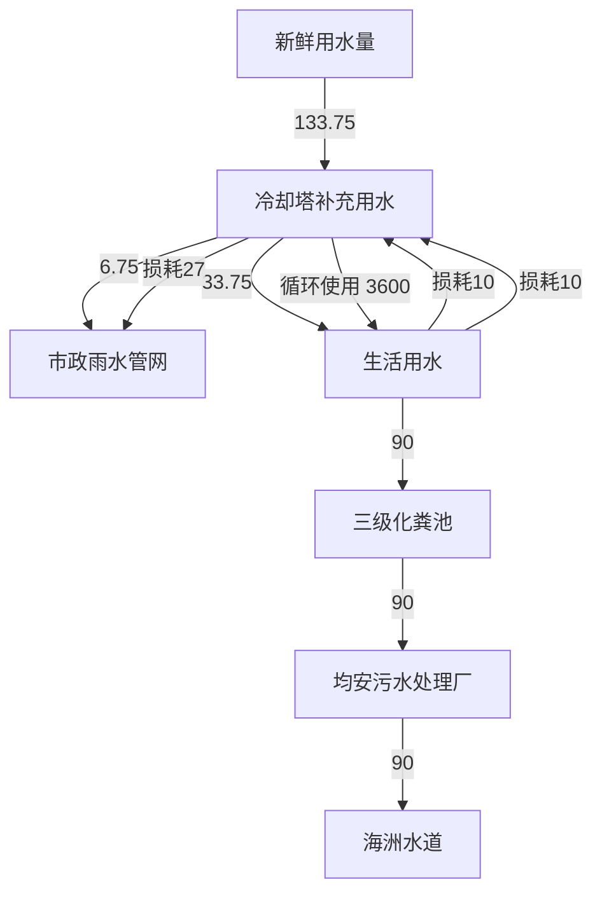
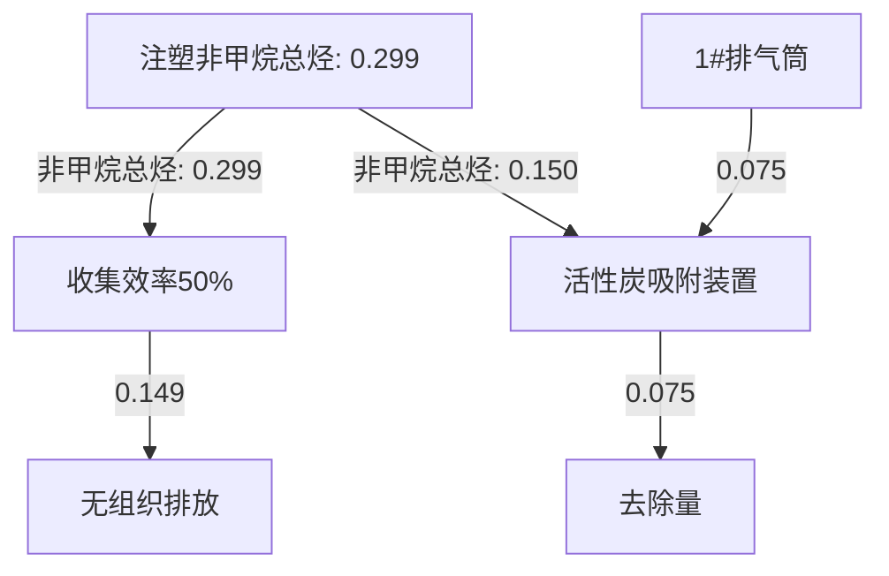
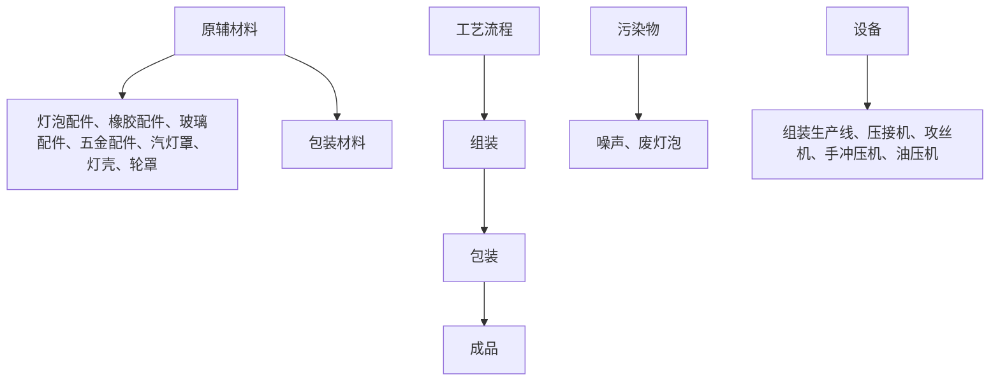
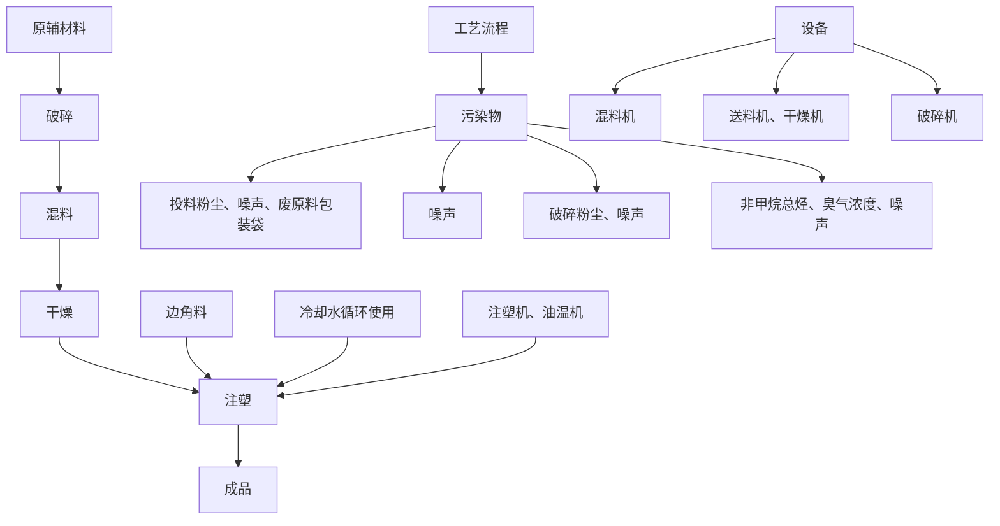
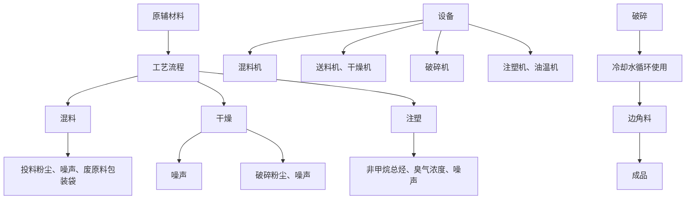
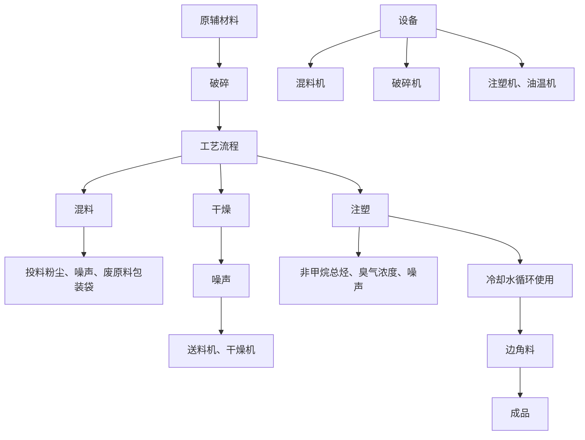
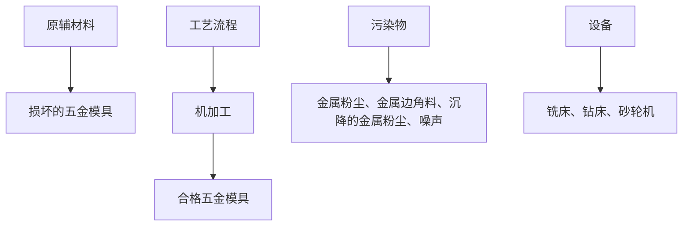

# 建设项目环境影响报告表

# （污染影响类）

text_image

山市顺德区途亮汽车灯具有限公司新建项目
06064108271

项目名称：佛山市顺德区途亮汽车灯具有

建设单位（盖章）：佛山市顺德区途亮汽车灯具有限公司

编制日期：2024年9月

中华人民共和国生态环境部制

# 一、建设项目基本情况

<table><tr><td>建设项目名称</td><td colspan="3">佛山市顺德区途亮汽车灯具有限公司新建项目</td></tr><tr><td>项目代码</td><td colspan="3">无</td></tr><tr><td>建设单位联系人</td><td>欧阳**</td><td>联系方式</td><td>134******60</td></tr><tr><td>建设地点</td><td colspan="3">广东省佛山市顺德区均安镇均安社区畅兴工业园益安路193号世友北园厂房1-101之二、301-303之二</td></tr><tr><td>地理坐标</td><td colspan="3">(北纬22度41分35.184秒,东经113度8分44.963秒)</td></tr><tr><td>国民经济行业类别</td><td>C3670汽车零部件及配件制造</td><td>建设项目行业类别</td><td>三十三、汽车制造业36中的71、汽车零部件及配件制造367中的其他</td></tr><tr><td>建设性质</td><td>☑新建(迁建)□改建□扩建□技术改造</td><td>建设项目申报情形</td><td>☑首次申报项目□不予批准后再次申报项目□超五年重新审核项目□重大变动重新报批项目</td></tr><tr><td>项目审批(核准/备案)部门(选填)</td><td>/</td><td>项目审批(核准/备案)文号(选填)</td><td>/</td></tr><tr><td>总投资(万元)</td><td>100</td><td>其中:环保投资(万元)</td><td>10</td></tr><tr><td>环保投资占比(%)</td><td>10</td><td>施工工期</td><td>1个月</td></tr><tr><td>是否开工建设</td><td>☑否□是:</td><td>用地(用海)面积( $m^{2}$ )</td><td>3098</td></tr><tr><td>专项评价设置情况</td><td colspan="3">无</td></tr><tr><td>规划情况</td><td colspan="3">无</td></tr><tr><td>规划环境影响评价情况</td><td colspan="3">无</td></tr><tr><td>规划及规划环境影响评价符合性分析</td><td colspan="3">无</td></tr><tr><td>其他符合性分析</td><td colspan="3">1、产业政策相符性分析项目主要从事汽灯的生产销售,使用的原材料均为外购新料,不涉及有毒有害材料,且厂内无电镀或喷涂工艺;项目不属于《产业结构调整指导目录(2024年本)》中所列的鼓励类、限制类、</td></tr></table>

禁止（淘汰）类项目，属于允许类；根据《市场准入负面清单（2022版）》（发改体改〔2022〕397），项目不属于其中的禁止准入类。

另外，项目所属类别及生产得到的产品均不属于广东省发展改革委关于印发《广东省“两高”项目管理目录（2022 年版）》的通知（粤发改能源函〔2022〕1363 号）的附件广东省“两高”项目管理目录中的行业类别或产品，符合相关规定。

# 2、选址合理性分析

本项目位于广东省佛山市顺德区均安镇均安社区畅兴工业园益安路 193 号世友北园厂房 1-101 之二、301-303 之二，根据项目用地资料可知（详见附件2），本项目用地为工业用地，用途为工业用途。

根据《顺德区高质量推动村级工业园升级改造总体规划-产业集聚区和主题园区划定图》（见附图 12）可知，项目位于产业集聚区 20 中，符合《广东省“节地提质”攻坚行动方案》（2023-2025）年里的“在符合国土空间规划的前提下，新建工业项目和经批准实施异地搬迁的工业项目，除因安全生产、工艺技术等特殊要求外，应一律安排进入开发区（产业园区）生产建设”的要求。

# 3、与地区有机污染物治理政策相符性分析

本项目与广东省、顺德区发布的有机污染物治理政策的相符性分析见下表。

表 1-1 项目与地区有机污染物治理政策的相符性

<table><tr><td>序号</td><td>政策要求</td><td>工程内容</td><td>符合性</td></tr><tr><td colspan="4">1、《广东省生态环境厅关于做好重点行业建设项目挥发性有机物总量指标管理工作的通知》(粤环发【2019】2号)</td></tr><tr><td>1.1</td><td>各地应当按照“最优的设计、先进的设备、最严的管理”要求对建设项目VOCs排放总量进行管理,并按照“以减量定增量”原则,动态管理VOCs总量指标。新、改、扩建排放VOCs的重点行业建设项目应当执行总量替代制度,重点行业包括炼油与石化、化学原料和化学制品制</td><td>项目为汽车制造业,不属于重点行业;项目非甲烷总烃的排放量为0.224t/a;将非甲烷总烃纳入VOCs进行管理,建议对本项目分配VOCs总量控</td><td>符合</td></tr></table>

<table><tr><td rowspan="7"></td><td></td><td>造、化学药品原料药制造、合成纤维制造、表面涂装、印刷、制鞋、家具制造、人造板制造、电子元件制造、纺织印染、塑料制造及塑料制品等12个行业</td><td>制指标0.224t/a</td><td colspan="2"></td></tr><tr><td colspan="5">2、《广东省大气污染防治条例》(2019年3月1日起施行)</td></tr><tr><td>2.1</td><td>第十七条 珠江三角洲区域禁止新建、扩建燃煤燃油火电机组或者企业燃煤燃油自备电站。珠江三角洲区域禁止新建、扩建国家规划外的钢铁、原油加工、乙烯生产、造纸、水泥、平板玻璃、除特种陶瓷以外的陶瓷、有色金属冶炼等大气重污染项目。</td><td>项目属于汽车制造业,不属于禁止建设的大气重污染项目</td><td colspan="2">符合</td></tr><tr><td>2.2</td><td>第二十六条 新建、改建、扩建排放挥发性有机物的建设项目,应当使用污染防治先进可行技术。下列产生含挥发性有机物废气的生产和服务活动,应当优先使用低挥发性有机物含量的原材料和低排放环保工艺,在确保安全条件下,按照规定在密闭空间或者设备中进行,安装、使用满足防爆、防静电要求的治理效率高的污染防治设施;无法密闭或者不适宜密闭的,应当采取有效措施减少废气排放:(一)石油、化工、煤炭加工与转化等含挥发性有机物原料的生产;(二)燃油、溶剂的储存、运输和销售;(三)涂料、油墨、胶粘剂、农药等以挥发性有机物为原料的生产;(四)涂装、印刷、粘合、工业清洗等使用含挥发性有机物产品的生产活动;(五)其他产生挥发性有机物的生产和服务活动。</td><td>项目注塑过程产生的非甲烷总烃、臭气浓度经包围型集气罩收集后一起引至“活性炭吸附装置”处理后通过35m高的1#排气筒引至高空排放,可有效减少有机废气排放</td><td colspan="2">符合</td></tr><tr><td colspan="5">3.《佛山市顺德区生态环境保护“十四五”规划》(2021-2025)</td></tr><tr><td>3.1</td><td>严格控制“高耗能、高排放”项目盲目发展,禁止新建、扩建水泥、平板玻璃、化学制浆、生皮制革以及国家规划外的钢铁、原油加工等项目;专业电镀、印染等项目进入定点园区集中管理</td><td>项目属于汽车制造业,不属于水泥、平板、玻璃、化学制浆</td><td colspan="2">符合</td></tr><tr><td>3.2</td><td>大力推进低VOCs含量、低反应活性的原辅材料替代,将全面使用低VOCs含量原辅材料的企业纳入正面清单和政府绿色采购清单。鼓励重点行业企业开展生产工艺和设备水性化改造,推广使用</td><td>本项目使用的物料使用的原料常温下不挥发,不属于禁止使用的高VOCs含量原辅材料,符合政策要求。</td><td colspan="2"></td></tr><tr><td rowspan="9"></td><td></td><td colspan="2">水性、高固体分、无溶剂、粉末等低VOCs含量涂料。严格落实《挥发性有机物无组织排放控制标准》,开展厂区内无组织排放浓度监测,加强对含VOCs物料储存、转移和运输、设备与管线组件泄漏、敞开页面逸散以及工艺过程等五类排放源的管控。加强储油库、加油站等VOCs排放治理,推动油品储运销体系安装油气回收自动监控系统。</td><td>建设单位严格落实《挥发性有机物无组织排放控制标准》,开展厂区内无组织排放浓度监测</td><td></td></tr><tr><td colspan="5">4.《挥发性有机物无组织排放控制标准》(GB37822-2019)</td></tr><tr><td>4.1</td><td colspan="2">VOCs物料、工艺过程产生的含VOCs废料应储存于密闭的容器、包装袋、储罐、储库、料仓中;盛装VOCs物料的容器或包装袋应存放于室内,或存放于设置有雨棚、遮阳和防渗设施的专用场地。盛装VOCs物料的容器或包装袋在非取用状态时应加盖、封口,保持密闭</td><td>项目使用的原料常温下不挥发,均采用密封袋存放于生产车间的原材料堆放区</td><td>符合</td></tr><tr><td>4.2</td><td colspan="2">VOCs物料卸(出、放)料过程密闭,卸料废气应排至VOCs废气收集处理系统;无法密闭的,应采取局部气体收集措施,废气应排至VOCs废气收集处理系统</td><td>项目使用的原料常温下不挥发</td><td>符合</td></tr><tr><td colspan="5">5.《广东省人民政府办公厅关于印发广东省2021年大气、水、土壤污染防治工作方案的通知》(粤办函[2021]58号)</td></tr><tr><td>5.1</td><td colspan="2">指导企业使用适宜高效的治理技术,涉VOCs重点行业新建、改建、和扩建项目不推荐使用光氧化、光催化、低温等离子等低效治理设施,已建项目逐步淘汰光氧化、光催化、低温等离子治理设施。</td><td>项目注塑过程产生的非甲烷总烃、臭气浓度经包围型集气罩收集后一起引至“活性炭吸附装置”处理后通过35m高的1#排气筒引至高空排放,收集效率为50%、处理效率为50%;</td><td>符合</td></tr><tr><td>5.2</td><td colspan="2">持续推进挥发性有机物(VOCs)综合治理:实施低VOCs含量产品源头替代工程“严格落实国家产品VOCs含量限值标准要求”,除现阶段无法实施替代的工序外,禁止新建生产和使用高VOCs含量原辅材料项目,鼓励在生产和流通消费环节推广使用低VOCs含量原辅材料</td><td>项目使用的塑料粒、色粉均为固态,常温下不会产生有机废气</td><td>符合</td></tr><tr><td colspan="5">6.关于印发《广东省涉挥发性有机物(VOCs)重点行业治理指引》的通知(粤环办[2021]43号)(参照其中塑料制品行业)</td></tr><tr><td>6.1</td><td>VOCs物料储存</td><td>VOCs物料应储存于密闭的容器、包装袋、储罐、储库、料仓中</td><td>项目塑料粒、色粉储存于密封包装袋中</td><td>符合</td></tr><tr><td rowspan="6"></td><td></td><td></td><td>装VOCs物料的容器是否存放于室内,或存放于设置有雨棚、遮阳和防渗设施的专用场地。盛装VOCs物料的容器在非取用状态时应加盖、封口,保持密闭。</td><td>项目塑料粒、色粉储存于密封包装袋中,仓库设置防雨、防渗漏措施</td><td>符合</td></tr><tr><td>6.2</td><td>VOCs物料转移和输送</td><td>粉状、粒状VOCs物料采用气力输送设备、管状带式输送机、螺旋输送机等密闭输送方式,或者采用密闭的包装袋、容器或罐车进行物料转移。</td><td>项目塑料粒、色粉转移过程包装均处于密闭状态</td><td>符合</td></tr><tr><td>6.3</td><td>工艺过程</td><td>粉状、粒状VOCs物料采用气力输送方式或采用密闭固体投料器等给料方式密闭投加;无法密闭投加的,在密闭空间内操作,或进行局部气体收集,废气排至除尘设施、VOCs废气收集处理系统。</td><td>项目注塑过程产生的有机废气经包围型集气罩收集后一起引至“活性炭吸附装置”处理后通过35m高的1#排气筒引至高空排放,收集效率为50%</td><td>符合</td></tr><tr><td rowspan="2">6.4</td><td rowspan="2">废气收集</td><td>采用外部集气罩的,距集气罩开口面最远处的VOCs无组织排放位置,控制风速不低于0.3m/s。</td><td>项目注塑过程产生的有机废气经包围型集气罩收集,收集效率为50%,收集风速为0.5m/s,大于0.3m/s</td><td>符合</td></tr><tr><td>废气收集系统的输送管道应密闭。废气收集系统应在负压下运行,若处于正压状态,应对管道组件的密封点进行泄漏检测,泄漏检测值不应超过500μmol/mol,亦不应有感官可察觉泄漏。</td><td>项目废气收集系统在负压状态下运行</td><td>符合</td></tr><tr><td>6.5</td><td>治理技术</td><td>吸附床(含活性炭吸附法):a)预处理设备应根据废气的成分、性质和影响吸附过程的物质性质及含量进行选择;b)吸附床层的吸附剂用量应根据废气处理量、污染物浓度和吸附剂的动态吸附量确定;c)吸附剂应及时更换或有效再生。</td><td>项目非甲烷总烃通过活性炭吸附装置进行处理,项目选用颗粒状活性炭,需要处理非甲烷总烃量为0.075t/a,设计单级活性炭吸附装置填装0.412t活性炭,每3个月更换一次,满足废气处理要求</td><td>符合</td></tr></table>

<table><tr><td>6.6</td><td>建设项目VOCs总量管理</td><td>新、改、扩建项目应执行总量替代制度,明确VOCs总量指标来源。</td><td>建议挥发性有机物排放总量控制指标为0.224t/a,由区、镇两级环保主管部门核查总量指标</td><td>符合</td></tr></table>

# 4、“三线一单”符合性分析

（1）项目与《广东省人民政府关于印发广东省“三线一单”生态环境分区管控方案的通知》（粤府[2020]71号）的相符性分析

根据《广东省人民政府关于印发广东省“三线一单”生态环境分区管控方案的通知》（粤府[2020]71 号），广东省将以环境管控单元为基础，实施生态环境分区管控，精细化管理、保护生态环境。本项目与广东省“三线一单”生态环境分区管控方案相符性分析如下：

1）与“一核一带一区”区域管控要求的相符性

①项目位于珠三角核心区，主要从事汽灯的生产销售，不属于区域布局管控要求中的禁止新建、扩建水泥、平板玻璃、化学制浆、生皮制革以及国家规划外的钢铁、原油加工等项目。项目使用的原辅材料不属于使用高 VOCs 含量原辅材料的项目，符合区域布局管控要求。

②项目生产设备仅使用电能，用水全部采用市政直供，不直接取用江河湖库水量，不会对项目所在地生态流量造成影响，符合能源利用要求。

③项目 VOCs 总量控制指标为 0.224t/a，项目 VOCs 总量实行倍量削减替代（减二增一）；项目冷却水作为清净下水经市政雨水管网排入西线河；外排废水主要为员工生活污水，生活污水经三级化粪池预处理后经市政污水管网排入均安污水处理厂处理，处理后尾水排入海洲水道，则项目水污染物总量控制指标计入均安污水处理厂的总量控制指标内，不再另设污水总量控制指标，则项目符合污染物排放管控要求。

④项目位于广东省佛山市顺德区均安镇均安社区畅兴工业园益安路 193 号世友北园厂房 1-101 之二、301-303 之二，不属于石化、化工重点园区环境风险防控区域。项目生产过程产生的危险废物分类收集后定期交由具有危废处置资质的公司处理，并通过信息系统登记转移计划和电子转移联单，符合危险废物全过程跟踪管理的防控要求。

# 2）与环境管控单元总体管控要求的相符性

根据《广东省人民政府关于印发广东省“三线一单”生态环境分区管控方案的通知》（粤府[2020]71 号）发布的广东省环境管控单元图（见附图 11），项目位于广东省佛山市顺德区均安镇均安社区畅兴工业园益安路 193 号世友北园厂房 1-101 之二、301-303之二，属于一般管控单元 2，环境管控单元编码：ZH44060630002，执行区域生态环境保护的基本要求。

# （2）项目与《佛山市生态环境局关于印发佛山市“三线一单”生态环境分区管控方案方案》（2024年版）的相符性分析

# 1）与全市总体管控要求的相符性

①项目所用能源均为电能，不涉及高污染燃料的使用，项目主要从事汽灯的生产销售，不属于区域布局管控要求中的禁止新建、扩建水泥、平板玻璃、化学制浆、生皮制革以及国家规划外的钢铁、原油加工等项目，不属于限制行业；项目使用的涉VOCs 原辅材料常温下不挥发，均不属于高VOCs 含量原辅材料，符合区域布局管控要求。

②项目所用能源均为电能，不属于“高污染、高能耗”项目；项目用水全部采用市政直供，不直接取用江河湖库水量，不会对项目所在地生态流量造成影响，符合能源资源利用要求。

③项目 VOCs 总量控制指标为 0.224t/a，项目 VOCs 总量实行倍量削减替代（减二增一）；项目冷却水作为清净下水经市政雨水管网排入西线河；外排废水主要为员工生活污水，生活污水经三级化粪池预处理后经市政污水管网排入均安污水处理厂处理，处理后尾水排入海洲水道，则项目水污染物总量控制指标计入均安污水处理厂的总量控制指标内，不再另设污水总量控制指标。项目不排放重金属固污染物，不属于陶瓷、有色金属等重点能源消耗行业，则项目符合污染物排放管控要求。

④项目注塑过程产生的非甲烷总烃、臭气浓度经包围型集气罩收集后一起引至“活性炭吸附装置”处理后通过35m 高的1#排气筒引至高空排放，不采用低温等离子、UV光解、RTO燃烧炉等有机废气治理设施，风险较低，符合要求。

⑤项目位于广东省佛山市顺德区均安镇均安社区畅兴工业园益安路 193 号世友北园厂房 1-101 之二、301-303 之二，不属于石化、化工重点园区环境风险防控区域。项目生产过程产生的危险废物分类收集后定期交由具有危废处置资质的公司处理，并通过信息系统登记转移计划和电子转移联单，符合危险废物全过程跟踪管理的防控要求。

# 2）环境管控单元总体管控要求

根据《佛山市生态环境局关于印发佛山市“三线一单”生态环境分区管控方案方案》（2024 年版）发布的佛山市环境管控单元图（见附图 10），项目位于广东省佛山市顺德区均安镇均安社区畅兴工业园益安路 193 号世友北园厂房1-101之二、301-303 之二，属于一般管控单元，执行区域生态环境保护的基本要求。

# （3）项目与《佛山市顺德区人民政府关于印发佛山市顺德区“三线一单”生态环境分区管控方案的通知》（顺府发[2021]11号）的相符性分析

根据《佛山市顺德区人民政府关于印发佛山市顺德区“三线一单”生态环境分区管控方案的通知》（顺府发[2021]11 号），属于一般管控单元 2，环境管控单元编码：ZH44060630002，项目与管控要求相符性分析如下：

表 1-2 项目与均安镇一般管控单元管控要求相符性分析

<table><tr><td>管控要求</td><td>与项目有关的相关要求</td><td>工程内容</td><td>符合性</td></tr><tr><td>区域</td><td>【其他/综合类】根据资源环境承载能</td><td>项目生活污水经三</td><td>符合</td></tr></table>

<table><tr><td rowspan="6"></td><td rowspan="4">布局管控</td><td>力,引导产业科学布局,合理控制开发强度,维护生态环境功能稳定</td><td>级化粪池预处理后排入均安污水处理厂处理,处理后尾水排入海洲水道,不在地表水I、II类水域新建排污口,不产生和排放有毒有害大气污染物,符合其环境准入及管控要求</td><td></td></tr><tr><td>【大气/限制类】大气环境弱扩散重点管控区内,加大区域大气污染物减排力度,严格控制“两高”项目建设</td><td>项目生产设备均使用电能,不属于高能耗、高污染产业</td><td>符合</td></tr><tr><td>【产业/限制类】受纳水体或监控断面不达标的,不得新建、扩建向河涌直接排放废水的项目。新建、扩建含蚀刻工序的线路板生产项目和化工项目应在配套污水集中处置的工业园区或生活污水管网覆盖区域内建设;纯加工型印花项目,含酸洗、磷化的金属表面处理、金属制品项目(与自身高新技术企业配套的除外),含酸洗、喷涂、化学抛光、电解等涉及废水排放工艺的不锈钢型材加工项目(与自身高新技术企业配套的除外),应进入以此类项目为主导产业、有相应废水集中治理设施的工业园区,实现集中治污</td><td>项目生活污水经三级化粪池预处理后排入均安污水处理厂处理,处理后尾水排入海洲水道;项目外排废水不向河涌直接排水</td><td>符合</td></tr><tr><td>【产业/综合类】划定家具生产优先发展区域,优先发展区外不再新建涉及涂装工艺的木质家具制造项目</td><td>项目不属于木质家具制造项目</td><td>符合</td></tr><tr><td>能源资源利用</td><td>【岸线/禁止类】严格水域岸线用途管制,新建项目一律不得违规占用水域。严禁破坏生态的岸线利用行为和不符合其功能定位的开发建设活动,严禁以各种名义侵占河道、围垦湖泊、非法采砂等</td><td>项目位于广东省佛山市顺德区均安镇均安社区畅兴工业园益安路193号世友北园厂房1-101之二、301-303之二,不占用水域,不在水域岸线范围内</td><td>符合</td></tr><tr><td>污染物排放管控</td><td>【水/综合类】产业集聚区和主题园区内做好污水管网和污水集中处理设施的配套保障,确保废水收集到城镇污水处理厂、园区污水处理厂或分散式污水处理设施集中处置</td><td>项目生活污水经三级化粪池预处理后排入均安污水处理厂处理,处理后尾水排入海洲水道</td><td>符合</td></tr></table>

# 二、建设项目工程分析

# 1、建设内容及规模

佛山市顺德区途亮汽车灯具有限公司新建项目（以下简称“本项目”）位于广东省佛山市顺德区均安镇均安社区畅兴工业园益安路 193 号世友北园厂房1-101 之二、301-303 之二（其地理位置见附图 1），中心地理坐标：22.693106°N，113.145823°E。项目租赁一栋 6 层建筑物的首层和第三层作为生产车间，主要为1-101、1-301、1-302、1-303，共 4 个单元，其中 1-101 的占地面积为 821m2，1-301、1-302、1-303 的占地面积分别为 1708m2、701m2、689m2；总投资 100 万元，主要从事汽灯的生产销售，年产汽灯5万套。

# 2、本项目建设内容组成

项目租赁已建成厂房进行生产，该厂房主要包括生产车间、办公室和仓库。

项目由主体工程、辅助工程、环保工程、公用工程及配套工程组成，详细工程内容见下表。

表 2-1 项目建设主要组成一览表

<table><tr><td>类别</td><td colspan="2">建设内容</td><td>工程规模</td></tr><tr><td rowspan="2">主体工程</td><td rowspan="2">生产车间</td><td>首层</td><td>主要为1-101,高度为8m,建筑面积为 $821m^{2}$ ,设有注塑区( $434m^{2}$ )、混料区( $434m^{2}$ )、破碎区( $434m^{2}$ )、模具维修区( $434m^{2}$ )、模具摆放区( $53m^{2}$ )等</td></tr><tr><td>第三层</td><td>主要为1-301、1-302、1-303,高度为5m,总建筑面积为 $3098m^{2}$ ,设有组装区( $96m^{2}$ )</td></tr><tr><td rowspan="2">辅助工程</td><td colspan="2">办公室</td><td>位于第三层的1-301内,建筑面积为 $169m^{2}$ ,用于供员工办公</td></tr><tr><td colspan="2">仓库</td><td>位于首层的夹层,建筑面积为 $140m^{2}$ ;位于第三层的1-301、1-303内,建筑面积为 $2000m^{2}$ ;主要用于储存原辅料和成品</td></tr><tr><td rowspan="3">公用工程</td><td colspan="2">给水</td><td>市政供水,主要为生活用水、冷却塔补充用水</td></tr><tr><td colspan="2">供电</td><td>市政供电</td></tr><tr><td colspan="2">排水</td><td>生活污水经三级化粪池预处理达标后通过市政污水管网排入均安污水处理厂处理达标后排入海洲水道;项目冷却水作为清净下水经市政雨水管网排入西线河</td></tr><tr><td rowspan="5">环保工程</td><td colspan="2">生活污水</td><td>三级化粪池预处理达标后通过市政污水管网排入均安污水处理厂处理达标后排入海洲水道</td></tr><tr><td colspan="2">投料粉尘</td><td rowspan="3">加强生产车间通风换气</td></tr><tr><td colspan="2">破碎粉尘</td></tr><tr><td colspan="2">金属粉尘</td></tr><tr><td colspan="2">非甲烷总烃</td><td>注塑过程产生的非甲烷总烃和臭气浓度经包围型集气罩收集后引至</td></tr><tr><td rowspan="5"></td><td>臭气浓度</td><td colspan="2">“活性炭吸附装置”处理后通过35m的1#排气筒引至高空排放</td></tr><tr><td>噪声治理</td><td colspan="2">选取低噪声型设备;高噪设备合理布局并机械阻尼隔振降噪、设备定时维修、加强厂房的密封性、白天生产</td></tr><tr><td>一般工业固废</td><td colspan="2">位于首层生产车间内,一般固废场所面积为 $7m^{2}$ ,高度为4m,一般工业固废分类收集后定期交由专业回收公司回收处理</td></tr><tr><td>危险废物</td><td colspan="2">位于首层生产车间内,危废暂存场所面积为 $9m^{2}$ ,高度为4m,危险废物收集后交由具有危废处置资质的公司处理</td></tr><tr><td>生活垃圾</td><td colspan="2">收集后交由环卫部门定期清运处理</td></tr></table>

表 2-2 项目主要设备占地面积

<table><tr><td colspan="2">设备名称</td><td>数量</td><td>尺寸</td><td>设备占地面积</td><td>设备所在区域面积</td></tr><tr><td colspan="2">混料机</td><td>3台</td><td>0.8×0.8m</td><td>1.92m2</td><td>混料区9.2m2</td></tr><tr><td colspan="2">送料机</td><td>8台</td><td>0.5×0.5m</td><td>2m2</td><td rowspan="9">注塑区176m2</td></tr><tr><td rowspan="2" colspan="2">烘干机</td><td>15台</td><td>0.6×0.6m</td><td>5.4m2</td></tr><tr><td>1台</td><td>1×0.9m</td><td>0.9m2</td></tr><tr><td colspan="2">油温机</td><td>4台</td><td>0.8×0.3m</td><td>0.96m2</td></tr><tr><td rowspan="5">注塑机</td><td>500t</td><td>1台</td><td>8.5×3m</td><td rowspan="5">151m2</td></tr><tr><td>400t</td><td>2台</td><td>8.5×3m</td></tr><tr><td>260t</td><td>1台</td><td>6.5×3m</td></tr><tr><td>160t</td><td>2台</td><td>5.5×2.5m</td></tr><tr><td>120t</td><td>2台</td><td>5.5×2.5m</td></tr><tr><td colspan="2">破碎机</td><td>3台</td><td>1.2×1.3m</td><td>4.68m2</td><td rowspan="2">破碎区42.6m2</td></tr><tr><td colspan="2">空压机</td><td>1台</td><td>1.4×3m</td><td>4.2m2</td></tr><tr><td colspan="2">冷却塔</td><td>1台</td><td>2.2×1.4m</td><td>3.08m2</td><td>——</td></tr><tr><td colspan="2">铣床</td><td>1台</td><td>1.2×1.4m</td><td rowspan="3">2.28m2</td><td rowspan="3">模具维修区20m2</td></tr><tr><td colspan="2">钻床</td><td>2台</td><td>0.6×0.4m</td></tr><tr><td colspan="2">砂轮机</td><td>1台</td><td>0.4×0.3m</td></tr><tr><td colspan="2">组装生产线</td><td>1条</td><td>12×1.5m</td><td>18m2</td><td rowspan="6">组装区96m2</td></tr><tr><td colspan="2">压接机</td><td>1台</td><td>1×1m</td><td>1m2</td></tr><tr><td colspan="2">攻丝机</td><td>1台</td><td>0.4×0.4m</td><td>0.16m2</td></tr><tr><td colspan="2">手冲压机</td><td>2台</td><td>0.4×0.4m</td><td>0.32m2</td></tr><tr><td colspan="2">油压机</td><td>1台</td><td>0.4×0.4m</td><td>0.16m2</td></tr><tr><td colspan="2">空压机</td><td>1台</td><td>0.4×0.4m</td><td>0.16m2</td></tr></table>

注：首层生产车间占地面积为 821m2，生产设备区域总占地面积为 247.8m2，模具摆放区占地面积、一般固废场所、危废暂存场所占地面积分别为 $5 3 \mathrm { m } ^ { 2 } \setminus 7 \mathrm { m } ^ { 2 } \setminus 9 \mathrm { m } ^ { 2 }$ ，剩余区域主要为楼梯、通道、厕所等。第三层生产车间的总占地面积为 3098m2，生产设备区域占地面积为${ \bf 9 6 m ^ { 2 } } ,$ ，办公室、仓库占地面积分别为 169m2、2000m2，剩余区域主要为通道、楼梯、货梯、

厕所等。根据上表可知，项目生产车间面积满足设备的放置。

# 3、主要产品及原辅材料

# （1）项目主要产品见下表：

表 2-3 主要产品年产量表

<table><tr><td>序号</td><td>名称</td><td>单位</td><td>年产量</td><td>备注</td></tr><tr><td>1</td><td>汽灯</td><td>万套</td><td>5</td><td>外售</td></tr><tr><td>2</td><td>汽灯罩</td><td>万套</td><td>5</td><td rowspan="3">不外售,全部用于生产汽灯</td></tr><tr><td>3</td><td>灯壳</td><td>万套</td><td>5</td></tr><tr><td>4</td><td>轮罩</td><td>万套</td><td>5</td></tr></table>

# （2）项目主要原辅材料见下表：

表 2-4 项目主要原辅材料年用量表

<table><tr><td>序号</td><td>名称</td><td>单位</td><td>年用量</td><td>最大储存量</td><td>性状</td><td>包装规格</td><td>备注</td></tr><tr><td>1</td><td>PMMA塑料粒</td><td>t</td><td>20</td><td>5</td><td>粒状</td><td>25kg/袋</td><td rowspan="5">外购,生产汽灯罩</td></tr><tr><td>2</td><td>PBT塑料粒</td><td>t</td><td>20</td><td>5</td><td>粒状</td><td>25kg/袋</td></tr><tr><td>3</td><td>PA6</td><td>t</td><td>5</td><td>1</td><td>粒状</td><td>25kg/袋</td></tr><tr><td>4</td><td>PA66</td><td>t</td><td>5</td><td>1</td><td>粒状</td><td>25kg/袋</td></tr><tr><td>5</td><td>色粉</td><td>t</td><td>0.01</td><td>0.01</td><td>粉状</td><td>25kg/袋</td></tr><tr><td>6</td><td>ABS塑料粒</td><td>t</td><td>10</td><td>2.5</td><td>粒状</td><td>25kg/袋</td><td rowspan="4">外购,生产灯壳</td></tr><tr><td>7</td><td>PC塑料粒</td><td>t</td><td>10</td><td>2.5</td><td>粒状</td><td>25kg/袋</td></tr><tr><td>8</td><td>AS塑料粒</td><td>t</td><td>10</td><td>2.5</td><td>粒状</td><td>25kg/袋</td></tr><tr><td>9</td><td>色粉</td><td>t</td><td>0.01</td><td>0.01</td><td>粉状</td><td>25kg/袋</td></tr><tr><td>10</td><td>ABS塑料粒</td><td>t</td><td>15</td><td>4</td><td>粒状</td><td>25kg/袋</td><td rowspan="3">外购,生产轮罩</td></tr><tr><td>11</td><td>PC塑料粒</td><td>t</td><td>15</td><td>4</td><td>粒状</td><td>25kg/袋</td></tr><tr><td>12</td><td>色粉</td><td>t</td><td>0.01</td><td>0.01</td><td>粉状</td><td>25kg/袋</td></tr><tr><td>13</td><td>五金模具</td><td>t</td><td>10</td><td>10</td><td>固状</td><td>/</td><td>50套,客户提供</td></tr><tr><td>14</td><td>灯泡配件</td><td>万套</td><td>5</td><td>1</td><td>固状</td><td>/</td><td rowspan="4">外购,全部用于生产汽灯</td></tr><tr><td>15</td><td>橡胶配件</td><td>万套</td><td>5</td><td>1</td><td>固状</td><td>/</td></tr><tr><td>16</td><td>玻璃配件</td><td>万套</td><td>5</td><td>1</td><td>固状</td><td>/</td></tr><tr><td>17</td><td>五金配件</td><td>万套</td><td>5</td><td>1</td><td>固状</td><td>/</td></tr><tr><td>18</td><td>包装材料</td><td>t</td><td>0.6</td><td>0.2</td><td>固状</td><td>/</td><td>主要为纸箱和包装袋</td></tr></table>

注：项目原材料不涉及再生塑料、废旧塑料的使用。  
主要原辅材料理化性质：

PMMA 塑料粒：聚甲基丙烯酸甲酯（（poly methylmethacrylate），简称 PMMA），又称做压克力、亚克力（英文 Acrylic）或有机玻璃、Lucite（商品名称），具有高透明度、低价格、易于机械加工等优点，是平常经常使用的玻璃替代材料。PMMA 塑料粒具有较高透明度和光亮度，耐热性好，并有坚韧，质硬，刚性特点，热变形温度 $8 0 ^ { \circ } \mathrm { C } ,$ ，弯曲强度 110Mpa，密度为 1.15-1.19g/cm3，熔点为 $1 3 0 { - } 1 4 0 ^ { \circ } \mathrm { C } .$ ，比玻璃约 1000 度的高温低很多，热分解温度＞270°C。PMMA 在有氧的情况下，PMMA 在 458°C 开始燃烧，燃烧后生成二氧化碳、水、一氧化碳及包括甲醛在内的一些低分子化合物。

ABS 塑胶粒：丙烯腈-丁二烯-苯乙烯共聚物（简称 ABS）是由丙烯腈、丁二烯和苯乙烯组成的三元共聚物，密度为 1.05-1.18g/cm3，热变形温度 93-118℃，成型温度 190-235℃，热分解温度在 270℃以上。ABS 通常为浅黄色或乳白色的粒料非结晶性树脂，有一定的韧性；其抗冲击性、耐热性、耐低温性、耐化学药品性及电气性能优良，还具有易加工、制品尺寸稳定、表面光泽性好等特点，容易涂装、着色，还可以进行表面喷镀金属、电镀、焊接、热压和粘接等二次加工，广泛应用于机械、汽车、电子电器、仪器仪表、纺织和建筑等工业领域，是一种用途极广的热塑性工程塑料。

PC 塑料粒：聚碳酸酯（Polycarbonate，简称 PC）为非结晶性热塑性塑料，比重：1.18-1.20g/cm3，成型收缩率：0.5-0.8%，热变形温度：135℃，成型温度 215-225℃，热分解温度为：340℃。它无色透明，耐热，抗冲击，阻燃，在普通使用温度内都有良好的机械性能。同性能接近聚甲基丙烯酸甲酯相比，聚碳酸酯的耐冲击性能好，折射率高，加工性能好，不需要添加剂就具有 UL94V-0 级阻燃性能。

PA6 塑料粒：名称聚酰胺 6，CAS 号：25038-54-4，为乳白色或微黄色透明到不透明角质状结晶性聚合物，无毒性，密度为 1.13-1.15g/cm3，熔化温度为 223°C，热分解温度在325°C-350°C；可自由着色，韧性、耐磨性、自润滑性好等特点，成型加工性极好。

PA66 塑料粒：又名聚酰胺 66，是半透明或不透明乳白色颗粒，熔点：250°C，热分解温度＞340°C，具有可塑性，密度：1.10-1.14g/cm3，能耐酸、碱、大多数无机盐水溶液、卤代烷、烃类、酯类、酮类等腐蚀，但易容于苯酚、甲酸等极性溶剂；具有优良的耐磨性、自润滑性，机械强度较高。但吸水性较大，因而尺寸稳定性较差；广泛用于制造机械、汽车、化学与电气装置的零件，如齿轮、滚子、滑轮、辊轴、泵体中叶轮、风扇叶片、高压密封围、阀座、垫片、衬套、各种把手、支撑架、电线包内层。

PBT 塑料粒：是通过对苯二甲酸和 1，4-丁二醇缩聚制成的聚酯，为乳白色半透明到不透明、结晶型热塑性聚酯，无毒、无味，密度为 1.31g/cm3，CAS 号为 26062-94-2，是五大工程塑料之一；具有高耐温性、可以在 140℃下长期工作，韧性、耐疲劳性，自润滑、低摩擦系数，不耐强酸、强碱，能耐有机溶剂，可燃，熔点为 224℃，高温下分解，热分解温度为280℃。

AS 塑料粒：苯乙烯-丙烯腈共聚物（简称 AS），是一种坚硬、透明的材料，具有很强的承受载荷能力、抗化学反应能力、抗热变形特性和几何稳定性，加入玻璃纤维添加剂可以增加强度和抗热变形能力，减小热膨胀系数。AS 塑料粒的密度为 1.06g/cm3，热变形温度82-105℃，成型温度为 200-240℃，热分解温度在 270℃以上，维卡软化温度约为 110℃，载荷下挠曲变形温度约为 100℃，收缩率约为 0.3-0.7%。

色粉：是一种有颜色的粉末物质，与塑胶颜料混合后，经加热注塑制成各种不同颜色的塑胶产品。它广泛应用于塑胶着色工艺中。色粉中不含第一类污染物中的重金属。

液压油：外观为淡黄色液体，相对密度：0.871，沸点＞316℃（600F），化学稳定性很高，无爆炸危险性，适用于液压系统润滑；利用液体压力能的液压系统使用的液压介质，在液压系统中起着能量传递、抗磨、系统润滑、防腐、防锈、冷却等作用。

# 4、主要设备

本项目主要设备见下表：

表 2-5 主要设备一览表

<table><tr><td colspan="2">设备名称</td><td>数量</td><td>规格参数</td><td>工艺</td><td>位置</td></tr><tr><td colspan="2">混料机</td><td>3台</td><td>1.5kw,单台处理能力:0.025kg/h</td><td>混料</td><td>混料区</td></tr><tr><td colspan="2">送料机</td><td>8台</td><td>单台处理能力:0.007kg/h</td><td>送料</td><td rowspan="8">注塑区</td></tr><tr><td colspan="2">干燥机</td><td>16台</td><td>1.5kw,单台处理能力:0.012kg/h</td><td>干燥</td></tr><tr><td colspan="2">油温机</td><td>4台</td><td>0.75kw</td><td>加热模具至恒定温度</td></tr><tr><td rowspan="5">注塑机</td><td>500t</td><td>1台</td><td>单台最大射胶量:250g</td><td rowspan="5">注塑辅助设备</td></tr><tr><td>400t</td><td>2台</td><td>单台最大射胶量:200g</td></tr><tr><td>260t</td><td>1台</td><td>单台最大射胶量:100g</td></tr><tr><td>160t</td><td>2台</td><td>单台最大射胶量:35g</td></tr><tr><td>120t</td><td>2台</td><td>单台最大射胶量:20g</td></tr><tr><td colspan="2">破碎机</td><td>3台</td><td>单台处理能力:1.3kg/h</td><td>破碎</td><td rowspan="2">破碎区</td></tr><tr><td colspan="2">空压机</td><td>1台</td><td>10P</td><td>辅助设备</td></tr><tr><td colspan="2">冷却塔</td><td>1台</td><td>循环水量: $2m^{3}/h$ </td><td>冷却水循环使用</td><td>——</td></tr><tr><td colspan="2">铣床</td><td>1台</td><td>2.2kw</td><td rowspan="3">机加工</td><td rowspan="3">模具维修区</td></tr><tr><td colspan="2">钻床</td><td>1台</td><td>0.55kw</td></tr><tr><td colspan="2">砂轮机</td><td>1台</td><td>0.75kw</td></tr><tr><td colspan="2">组装生产线</td><td>1条</td><td>——</td><td rowspan="7">组装</td><td rowspan="8">组装区</td></tr><tr><td rowspan="2">包含</td><td>风批</td><td>4把</td><td>——</td></tr><tr><td>检测设备</td><td>4台</td><td>——</td></tr><tr><td colspan="2">压接机</td><td>1台</td><td>1kw</td></tr><tr><td colspan="2">攻丝机</td><td>1台</td><td>0.6kw</td></tr><tr><td colspan="2">手冲压机</td><td>2台</td><td>2.2kw</td></tr><tr><td colspan="2">油压机</td><td>1台</td><td>2.2kw</td></tr><tr><td colspan="2">空压机</td><td>1台</td><td>10P</td><td>辅助设备</td></tr></table>

表 2-6 项目注塑机产能一览表

<table><tr><td colspan="2">设备名称</td><td>数量(台)</td><td>最大射胶量(g)</td><td>实际射出量(g)</td><td>对应出模周期(s)</td><td>年加工时间(h)</td><td>单台全年生产模次</td><td>单台加工量(t/a)</td><td>最大生产能力(t/a)</td></tr><tr><td rowspan="5">注塑机</td><td>500t</td><td>1</td><td>250</td><td>212.5</td><td>75</td><td rowspan="5">1800</td><td>115200</td><td>24.48</td><td>24.48</td></tr><tr><td>400t</td><td>2</td><td>200</td><td>170</td><td>60</td><td>144000</td><td>24.48</td><td>48.96</td></tr><tr><td>260t</td><td>1</td><td>100</td><td>85</td><td>45</td><td>192000</td><td>16.32</td><td>16.32</td></tr><tr><td>160t</td><td>2</td><td>35</td><td>29.8</td><td>25</td><td>345600</td><td>10.3</td><td>20.60</td></tr><tr><td>120t</td><td>2</td><td>20</td><td>17</td><td>20</td><td>432000</td><td>7.34</td><td>14.68</td></tr><tr><td colspan="9">合计</td><td>125.04</td></tr></table>

注：项目原材料每天需要进行干燥 2 小时，干燥的同时需使用油温机对注塑机的五金模具进行升温（约 1h），则项目注塑过程每天工作时间为 6h，年工作 300d，则年工作 1800h。根据《注塑成型实用手册》（刘朝福编著 化学工业出版社），一般注射量设定在注塑机额定注射量的 30\~85%之间（取最大值 85%）。  
项目注塑机的实际产能=原材料使用量+边角料回用量-投料粉尘产生量-破碎粉尘产生量-非甲烷总烃产生量=110.03t/a+1.1t/a-0.00012t/a-0.00047t/a-0.299t/a≈110.83t/a；根据上表可知，项目注塑机的产能可以满足生产要求。

表 2-7 项目混料机产能一览表

<table><tr><td>设备名称</td><td>数量(台)</td><td>单台加工量(kg/h)</td><td>年加工时间(h)</td><td>单台加工量(t/a)</td><td>最大生产能力(t/a)</td></tr><tr><td>混料机</td><td>3</td><td>0.025</td><td>1800</td><td>45</td><td>135</td></tr></table>

注：项目混料过程的实际产能=原材料使用量+边角料回用量=110.03t/a+1.1t/a≈111.13t/a；根据上表可知，项目混料机的产能可以满足生产要求。

# 5、工作制度和劳动定员

# （1）工作制度

本项目工作日为 300 天/年，采取单班8 小时工作制，工作时间为8:00\~12:00，

14:00\~18:00。

# （2）劳动定员

本项目劳动定员为10人，均不在厂内食宿。

# 6、公用、配套工程

# （1）给水

本项目年用水量约为 133.75t/a，主要用水为员工生活用水 100t/a、冷却塔补充用水33.75t/a，由市政自来水公司供给。

# （2）排水

项目冷却水冷却水作为清净下水经市政雨水管网排入西线河，故外排废水主要为员工生活污水，项目所在区域属于均安污水处理厂纳污范围，项目生活污水经三级化粪池预处理达到广东省地方标准《水污染物排放限值》（DB44/26-2001）第二时段三级标准后，通过市政污水管网排入均安污水处理厂处理，处理后尾水达到《城镇污水处理厂污染物排放标准》（GB18918-2002）一级A标准及广东省地方标准《水污染物排放限值》（DB44/26-2001）第二时段一级标准中的较严值后，排入海洲水道。

# （3）供电

本项目用电由市政电网统一供给，年用电量约8万kw•h。

# （4）其他

项目厂内不设宿舍，不设食堂，项目设备不用发电机，无其他能耗。

# 7、水平衡图

flowchart

图 1 项目全厂水平衡图

# 8、VOCs 平衡图

flowchart

图2 项目非甲烷总烃平衡示例图（t/a）

# 9、项目四至情况及平面布局

# 1）项目四至情况

项目东南面为空厂房，西南面为 12 栋厂房，西北面为停车梯，东北面为停车楼；项目四至图见附图 4。另外，项目位于一栋 6 层建筑物的首层和第三层，其中首层、第二层、第四层、第五层、第六层均为空厂房。

# 2）平面布局

项目租赁一栋 6 层建筑物的首层和第三层作为生产车间，其中首层高度为8m，2 层至 6 层的高度为 5m，则楼层总高度为 33m，建设 35m 高排气筒能到达楼顶。本项目首层生产车间设有注塑区、混料区、破碎区、模具维修区、模具摆放区和夹层等，第三层生产车间设有组装区、办公室、仓库等，项目生产车间平面布置图见附图5、6。

# 工艺流程简述（图示）：

# 1、工艺流程图

项目主要从事汽灯、汽灯罩、灯壳、轮罩的生产销售，其生产流程分别如下：

flowchart

图3 项目汽灯生产工艺流程图

flowchart

图4 项目汽灯罩生产工艺流程图  

flowchart

图5 项目灯壳生产工艺流程图  

flowchart

图6 项目轮罩生产工艺流程图

flowchart

图7 项目五金模具维修工艺流程图

# 2、工艺流程说明：

汽灯生产工艺流程说明：项目将外购的灯泡配件先使用组装生产线上的检测设备进行通电检测，检测合格后再与外购的橡胶配件、玻璃配件、五金配件以及自产得到的汽灯罩、灯壳、轮罩进行组装，组装完毕后人工使用包装材料进行包装得到成品。

汽灯罩生产工艺流程说明：项目将外购的PMMA塑料粒、PBT 塑料粒、PA6塑料粒、PA66塑料粒和色粉按一定比例人工倒入混料机内进行混合，混合均匀后的物料通过送料机送入干燥机内进行干燥（电加热，加热温度为80℃）；干燥后的塑料粒送入注塑机机筒内，经螺杆的旋转和机筒外壁加热（电加热，加热温度在 235-250℃），物料在加热和螺杆的双重作用下逐渐塑化、熔融和均化。接着，在活塞推力下，机筒内内熔融的物料通过喷嘴注射到配套的五金模具腔中（五金模具提前使用油温机加热到工作温度并保持恒定温度），然后通过循环的冷却水（间接冷却）对注塑件进行降温和固化定型，最后取出即为成品。

灯壳生产工艺流程说明：项目将外购的ABS 塑料粒、PC塑料粒、AS 塑料粒和色粉按一定比例人工倒入混料机内进行混合，混合均匀后的物料通过送料机送入干燥机内进行干燥（电加热，加热温度为80℃）；干燥后的塑料粒送入注塑机机筒内，经螺杆的旋转和机筒外壁加热（电加热，加热温度在235-250℃），物料在加热和螺杆的双重作用下逐渐塑化、熔融和均化。接着，在活塞推力下，机筒内内熔融的物料通过喷嘴注射到配套的五金模具腔中（五金模具提前使用油温机加热到工作温度并保持恒定温度），然后通过循环的冷却水（间接冷却）对注塑件进行降温和固化定型，最后取出即为成品。

轮罩生产工艺流程说明：项目将外购的ABS 塑料粒、PC塑料粒和色粉按一定比例人工倒入混料机内进行混合，混合均匀后的物料通过送料机送入干燥机内进行干燥（电加热，加热温度为 80℃）；干燥后的塑料粒送入注塑机机筒内，经螺杆的旋转和机筒外壁加热（电加热，加热温度在235-250℃），物料在加热和螺杆的双重作用下逐渐塑化、熔融和均化。接着，在活塞推力下，机筒内内熔融的物料通过喷嘴注射到配套的五金模具腔中（五金模具提前使用油温机加热到工作温度并保持恒定温度），然后通过循环的冷却水（间接冷却）对注塑件进行降温和固化定型，最后取出即为成品。

注：①项目外购的塑料粒由于存放或运输时受潮而含有些许水分，需要干燥后才能使用，使用干燥机进行干燥，该温度为 80℃，工作温度较低且仅对原料带有的水分进行干燥，尚未达到塑料粒的熔融温度，故不会产生挥发性有机废气。

②项目注塑过程需用水间接对注塑件进行降温和固化定型，该部分冷却水经冷却塔冷却后循环使用，定期排水作为清净下水经市政雨水管网排入西线河；由于冷却水在高温下蒸发和定期排水，需定期补充新鲜水。另外，项目注塑过程产生的边角料收集后经破碎机破碎后回用于混料过程。

五金模具维修工艺流程说明：项目注塑过程使用的五金模具经长时间使用后会出现磨损，使用铣床、钻床、砂轮机对磨损的五金模具进行机加工后得到合格的模具，合格的五金模具回用于注塑过程。根据建设单位提供的资料，项目五金模具由客户提供，当五金模具无法再继续使用时交还给客户，故项目无废五金模具产生。

# 3、项目主要产污环节：

表 2-8 项目主要产污工序及污染物一览表

<table><tr><td>项目</td><td>污染物</td><td>排放口</td><td>产污工序</td><td>污染因子</td></tr><tr><td rowspan="2">废水</td><td>冷却废水</td><td>/</td><td>注塑过程</td><td>/</td></tr><tr><td>生活污水</td><td>DW001</td><td>员工生活、办公</td><td> $CODcr$ 、 $BOD_5$ 、SS、氨氮</td></tr><tr><td rowspan="4">废气</td><td>有机废气</td><td>DA001</td><td>注塑过程</td><td>非甲烷总烃、臭气浓度</td></tr><tr><td>投料粉尘</td><td>/</td><td>混料过程</td><td>颗粒物</td></tr><tr><td>破碎粉尘</td><td>/</td><td>破碎过程</td><td>颗粒物</td></tr><tr><td>金属粉尘</td><td>/</td><td>机加工过程</td><td>颗粒物</td></tr><tr><td>噪声</td><td>设备噪声</td><td>/</td><td>设备及废气处理设施</td><td>Leq(A)</td></tr><tr><td rowspan="4">固废</td><td>生活垃圾</td><td>/</td><td>员工生活</td><td>生活垃圾</td></tr><tr><td rowspan="3">一般工业固废</td><td>/</td><td>注塑过程</td><td>边角料</td></tr><tr><td>/</td><td>混料过程</td><td>废原料包装袋</td></tr><tr><td>/</td><td>机加工过程</td><td>沉降的金属粉尘</td></tr></table>

<table><tr><td rowspan="5"></td><td rowspan="5"></td><td></td><td></td><td></td><td>金属边角料</td></tr><tr><td rowspan="4">危险废物</td><td>/</td><td>废气处理设施</td><td>废活性炭</td></tr><tr><td rowspan="3">/</td><td rowspan="3">设备维修过程</td><td>废液压油</td></tr><tr><td>废液压油桶</td></tr><tr><td>废含油抹布</td></tr><tr><td>与项目有关的原有环境污染问题</td><td colspan="5">无。</td></tr></table>

# 三、区域环境质量现状、环境保护目标及评价标准

# 1、环境空气质量现状

# （1）空气质量达标区判定

根据佛山市生态环境局顺德分局关于发布《2023年度佛山市顺德区生态环境状况公报》的通知（佛环顺涵[2024]44 号）可知，2023 年，按照《环境空气质量标准》（GB3095-2012）评价，顺德区二氧化硫（SO2）、二氧化氮 $\left( \mathrm { N O } _ { 2 } \right)$ ）、可吸入颗粒物 $\left( \mathrm { P M } _ { 1 0 } \right)$ ）、细颗粒物 $\left( \mathbf { P M } _ { 2 . 5 } \right)$ ）、一氧化碳（CO）五项污染物年评价浓度均符合二级浓度限值，臭氧 $( \mathrm { O } _ { 3 } )$ 超二级浓度限值；具体数据见下表。

因此，项目所在行政区顺德区判定为不达标区。

表 3-1 区域空气质量现状评价表（2023 年）

<table><tr><td>所在区域</td><td>污染物</td><td>年评价指标</td><td>现状浓度(ug/m3)</td><td>标准值(ug/m3)</td><td>达标情况</td></tr><tr><td rowspan="6">顺德区</td><td> $SO_{2}$ </td><td>年平均质量浓度</td><td>6</td><td>60</td><td>达标</td></tr><tr><td> $NO_{2}$ </td><td>年平均质量浓度</td><td>28</td><td>40</td><td>达标</td></tr><tr><td> $PM_{10}$ </td><td>年平均质量浓度</td><td>35</td><td>70</td><td>达标</td></tr><tr><td> $PM_{2.5}$ </td><td>年平均质量浓度</td><td>20</td><td>35</td><td>达标</td></tr><tr><td>CO</td><td>95 百分位数日平均质量浓度</td><td>1.0</td><td>4</td><td>达标</td></tr><tr><td> $O_{3}$ </td><td>90 百分数最大 8 小时平均质量浓度</td><td>164</td><td>160</td><td>不达标</td></tr></table>

# 2、地表水环境质量现状

本项目外排废水主要为员工生活污水，项目所在区域属于均安污水处理厂纳污范围，项目生活污水经三级化粪池预处理后通过市政污水管网排入均安污水处理厂处理，处理达标后尾水排入海洲水道。根据《关于印发<广东省地表水功能区划>的通知》（粤环[2011]14号）和《关于印发<佛山市“十四五”水环境质量排名办法>的通知》（佛环委办[2021]21 号）可知，海洲水道水质执行《地表水环境质量标准》（GB3838-2002）中Ⅲ类标准。项目所在地表水环境功能区划图见附图7。

为评价海洲水道水质，根据佛山市生态环境局顺德分局关于发布《2023年度佛山市顺德区生态环境状况公报》的通知（佛环顺涵[2024]44 号）可知，海洲水道鹅洋沙断面 2023 年的水质定类为Ⅱ类，符合《地表水环境质量标准》（GB3838-2002）Ⅲ类标准要求，详见下表。

表 3-2 2023 年度佛山市顺德区环境质量状况公报（节选）

<table><tr><td rowspan="2">序号</td><td rowspan="2">河流名称</td><td rowspan="2">断面</td><td colspan="2">断面定类</td><td rowspan="2">水质评价标准</td><td colspan="2">河流定类</td></tr><tr><td>2023年</td><td>2022年</td><td>2023年</td><td>2022年</td></tr><tr><td>23</td><td>海洲水道</td><td>鹅洋沙</td><td>II</td><td>II</td><td>III</td><td>II</td><td>II</td></tr></table>

根据《2023年度佛山市顺德区生态环境状况公报》的评价结果，海州水道鹅洋沙断面水质满足《地表水环境质量标准》（GB3838-2002）中Ⅱ类水质功能要求，表明海洲水道水环境质量现状较好。

# 3、声环境质量现状

根据佛山市生态环境局关于印发《佛山市声环境功能区划》的通知（佛环[2024]1 号），项目所在地属于 3 类声环境功能区，声环境质量执行《声环境质量标准》（GB3096-2008）中的 3 类标准：昼间≤65dB（A）、夜间≤55dB（A）。项目厂界外周边 50 米范围内无声环境保护目标，可不进行保护目标的声环境质量现状监测。

# 4、生态环境质量现状

本项目地块处于人类活动频繁区，无原始植被生长和珍贵野生动物活动，区域生态系统敏感程度较低。

# 5、电磁辐射环境质量现状

项目不涉及电磁辐射类项目，故不进行电磁辐射现状监测与评价。

# 6、土壤环境、地下水环境

项目租赁已建成厂房进行生产，所在场地均已硬底化，项目不存在地下水、土壤环境污染途径，不需要进行地下水、土壤环境质量现状调查。

# 环目标

1、环境空气：保护目标为建设区域周围空气环境质量，本项目所在地的环境空气质量标准保护级别为《环境空气质量标准》（GB3095-2012）及其修改单二级标准。根据调查，项目厂界外500米范围内的环境空气保护目标如下表所示：

表 3-3 项目厂界外 500米范围内主要环境空气保护目标

<table><tr><td rowspan="2">名称</td><td colspan="2">坐标 m</td><td rowspan="2">保护对象</td><td rowspan="2">保护内容</td><td rowspan="2">环境功能区</td><td rowspan="2">相对厂址方位</td><td rowspan="2">相对厂界距离 m</td></tr><tr><td>X</td><td>Y</td></tr><tr><td>仓门村</td><td>233</td><td>277</td><td>居民区</td><td>人群(约 700 人)</td><td>大气二类</td><td>东北面</td><td>327</td></tr></table>

<table><tr><td></td><td colspan="6">2、声环境:项目厂界外50米范围内无声环境保护目标。3、地下水:项目厂界外500米范围内无地下水集中式饮用水源和热水、矿泉水、温泉等特殊地下水资源。4、生态环境:项目周边处于人类活动频繁区,无原始植被生长和珍贵野生动物活动,区域生态系统敏感程度较低,项目用地范围内不涉及生态环境保护目标。</td></tr><tr><td rowspan="5">污染物排放控制标准</td><td colspan="6">1、水污染物排放标准项目外排废水主要为员工生活污水,生活污水经三级化粪池预处理达到广东省地方标准《水污染物排放限值》(DB44/26-2001)第二时段三级标准后,通过市政污水管网排入均安生活污水处理厂处理。均安污水处理厂尾水排放执行广东省地方标准《水污染物排放限值》(DB44/26-2001)第二时段一级标准及《城镇污水处理厂污染物排放标准》(GB18918-2002)一级A标准中的较严值后排入海洲水道;项目污染物排放情况具体如下表所示。表3-4 生活污水排放标准(单位:mg/L,pH为无量纲)</td></tr><tr><td>污染物执行标准</td><td>pH</td><td>CODcr</td><td>BOD5</td><td>氨氮</td><td>SS</td></tr><tr><td>DB44/26-2001第二时段三级标准</td><td>6~9</td><td>500</td><td>300</td><td>--</td><td>400</td></tr><tr><td>污水处理厂尾水</td><td>6~9</td><td>40</td><td>10</td><td>5</td><td>10</td></tr><tr><td colspan="6">2、大气污染物排放标准(1)颗粒物项目投料粉尘、破碎粉尘、金属粉尘的污染因子均为颗粒物,颗粒物排放执行颗粒物废气执行广东省《大气污染物排放限值》(DB44/27—2001)表2无组</td></tr></table>

织排放监控浓度限值，详见下表。

表 3-5 《大气污染物排放限值》（DB 44/27—2001）

<table><tr><td>序号</td><td>污染物名称</td><td>企业边界大气污染物浓度(mg/m3)</td></tr><tr><td>1</td><td>颗粒物</td><td>1.0</td></tr></table>

# （2）非甲烷总烃

项目注塑过程产生的有机废气，其主要污染因子为非甲烷总烃；其有组织排放执行《合成树脂工业污染物排放标准》（GB 31572-2015，含 2024年修改单）表 4 大气污染物排放限值，无组织排放执行广东省《固定污染源挥发性有机物综合排放标准》（DB44/2367-2022）表 3 厂区内VOCs 无组织排放限值，具体见下表。

表 3-6 项目非甲烷总烃有组织排放执行标准

<table><tr><td>排气筒</td><td>污染物名称</td><td>排放限值(mg/m3)</td><td>排放速率(kg/h)</td></tr><tr><td>1#(35m)</td><td>非甲烷总烃</td><td>100</td><td>——</td></tr></table>

表3-7 厂区内VOCs无组织特别排放限值

<table><tr><td>污染物项目</td><td>排放限值(mg/m3)</td><td>限值含义</td></tr><tr><td rowspan="2">NMHC</td><td>6</td><td>监控点处1h平均浓度值</td></tr><tr><td>20</td><td>监控点处任意一次浓度值</td></tr></table>

# （3）臭气浓度

项目注塑过程产生的臭气浓度排放执行《恶臭污染物排放标准》（GB14554-93）表2恶臭污染物排放标准值和表 1二级新扩改建厂界标准限值，详见下表。

表 3-8 项目臭气浓度排放执行标准

<table><tr><td>污染因子</td><td>排气筒</td><td>有组织排放标准值</td><td>厂界标准值</td><td>执行标准</td></tr><tr><td>臭气浓度</td><td>1#(35m)</td><td>15000(无量纲)</td><td>20(无量纲)</td><td>GB14554-93</td></tr></table>

# 3、噪声排放标准

项目营运期间各边界噪声执行《工业企业厂界环境噪声排放标准》（GB12348-2008）中表1工业企业厂界环境噪声排放限值3类区限值，具体见下表。

$\$ 323,456,7$ 

<table><tr><td>类别</td><td>昼间(6:00~22:00)</td><td>夜间(22:00~6:00)</td></tr><tr><td>3类</td><td>65dB(A)</td><td>55dB(A)</td></tr></table>

<table><tr><td></td><td>4、固体废物排放标准固体废物管理应遵照《中华人民共和国固体废物污染环境防治法》、《广东省固体废物污染环境防治条例》以及一般工业固体废物在厂内采用库房或包装工具贮存,贮存过程应满足相应防渗漏、防雨淋、防扬尘等环境保护要求及《固体废物分类与代码目录》(生态环境部2024年第4号)相关要求。危险废物执行《国家危险废物名录》(2021年)以及《危险废物贮存污染控制标准》(GB18597-2023)。</td></tr><tr><td>总量控制指标</td><td>(1)水污染物排放总量控制指标本项目外排废水主要为生活污水,生活污水排放量为90t/a,CODcr排放量为0.0036t/a,氨氮排放量为0.0004t/a。生活污水经三级化粪池预处理达到广东省地方标准《水污染物排放限值》(DB44/26-2001)第二时段三级标准后,通过市政污水管网排入均安污水处理厂处理;则项目水污染物总量控制指标计入均安污水处理厂的总量控制指标内,故本项目不再另设水污染物排放总量控制指标。(2)大气污染物排放总量控制指标根据《广东省生态环境厅关于做好重点行业建设项目挥发性有机物总量指标管理工作的通知》(粤环发〔2019〕2号),新、改、扩建排放挥发性有机物(VOCs)的重点行业建设项目应当执行总量替代制度,项目注塑过程非甲烷总烃排放量为0.224t/a,其中有组织排放量为0.075t/a,无组织排放量为0.149t/a;将非甲烷总烃纳入VOCs进行管理。因此,项目生产过程VOCs(非甲烷总烃)的总排放量为0.224t/a;根据《关于做好建设项目挥发性有机物(VOCs)排放削减替代工作的补充通知》(粤环函[2021]537号)文件要求可知,待项目审批时由生态环境部门核定VOCs总量来源。</td></tr></table>

# 四、主要环境影响和保护措施

<table><tr><td>施工期环境保护措施</td><td>本项目租赁已经建设完毕的工业厂房,不涉及厂房建设、厂房装修改建。施工内容为设备安装及调试,主要为室内人工作业,无大型机械入内,施工期基本无废水、废气、固废产生,主要的环境影响为设备安装及调试过程中产生的噪声,此类噪声值较小,经距离衰减后及厂房墙壁阻隔后,不会对项目周围环境带来不良影响。</td></tr></table>

# 1、大气污染源

# 1.1大气污染源产排情况汇总

项目具体的大气污染物产排情况详见下表。

表 4-1 项目大气污染物产排情况汇总

<table><tr><td rowspan="2">产排污环节</td><td rowspan="2">生产单元</td><td rowspan="2">污染物种类</td><td colspan="2">污染物产生</td><td rowspan="2">排放形式</td><td colspan="5">治理设施</td><td colspan="4">污染物排放</td></tr><tr><td>产生浓度 $mg/m^3$ </td><td>产生量t/a</td><td>处理能力 $m^3/h$ </td><td>收集效率%</td><td>处理工艺</td><td>去除效率%</td><td>是否可行技术</td><td>排放浓度 $mg/m^3$ </td><td>排放速率kg/h</td><td>排放量t/a</td><td>排放时间h</td></tr><tr><td>混料</td><td>投料</td><td rowspan="3">颗粒物</td><td>/</td><td>0.00012</td><td rowspan="3">无组织</td><td>/</td><td>/</td><td>/</td><td>/</td><td>/</td><td>/</td><td>0.00005</td><td>0.00012</td><td>2400</td></tr><tr><td>破碎</td><td>破碎</td><td>/</td><td>0.00047</td><td>/</td><td>/</td><td>/</td><td>/</td><td>/</td><td>/</td><td>0.0016</td><td>0.00047</td><td>300</td></tr><tr><td>机加工</td><td>机加工</td><td>/</td><td>少量</td><td>/</td><td>/</td><td>/</td><td>/</td><td>/</td><td>/</td><td>/</td><td>少量</td><td>/</td></tr><tr><td rowspan="4">注塑</td><td rowspan="4">注塑</td><td rowspan="2">非甲烷总烃</td><td>14.82</td><td>0.150</td><td>有组织</td><td>5600</td><td>50</td><td>包围型集气罩收集后引至活性炭吸附</td><td>50</td><td>是</td><td>7.41</td><td>0.042</td><td>0.075</td><td rowspan="4">1800</td></tr><tr><td>/</td><td>0.149</td><td>无组织</td><td>/</td><td>/</td><td>/</td><td>/</td><td>/</td><td>/</td><td>0.083</td><td>0.149</td></tr><tr><td rowspan="2">臭气浓度</td><td>/</td><td>/</td><td>有组织</td><td>5600</td><td>50</td><td>包围型集气罩收集后引至活性炭吸附</td><td>/</td><td>是</td><td>/</td><td>/</td><td>/</td></tr><tr><td>/</td><td>/</td><td>无组织</td><td>/</td><td>/</td><td>/</td><td>/</td><td>/</td><td>/</td><td>/</td><td>/</td></tr></table>

表 4-2 项目废气排放口基本情况汇总

<table><tr><td rowspan="2">产排污环节</td><td rowspan="2">排放口名称</td><td rowspan="2">排放口编号</td><td rowspan="2">排放口类型</td><td rowspan="2">污染物种类</td><td rowspan="2">排放口地理坐标</td><td rowspan="2">排气筒高度m</td><td rowspan="2">排气筒内径m</td><td rowspan="2">出口温度°C</td><td colspan="3">执行标准</td></tr><tr><td>浓度限值mg/m3</td><td>速率限值kg/h</td><td>执行标准</td></tr><tr><td rowspan="2">注塑过程</td><td rowspan="2">1#</td><td rowspan="2">DA001</td><td rowspan="2">一般排放口</td><td>非甲烷总烃</td><td rowspan="2">113°8'43.74",22°41'35.53"</td><td rowspan="2">35</td><td rowspan="2">0.39</td><td rowspan="2">25</td><td>100</td><td>/</td><td>《合成树脂工业污染物排放标准》(GB 31572-2015,含2024年修改单)表4大气污染物排放限值</td></tr><tr><td>臭气浓</td><td>15000(无量</td><td>/</td><td>《恶臭污染物排放标准》</td></tr><tr><td></td><td></td><td></td><td></td><td>度</td><td></td><td></td><td></td><td></td><td>纲)</td><td></td><td>(GB14554-93)表2恶臭污染物排放标准值</td></tr></table>

表 4-3 项目废气监测计划一览表

<table><tr><td>项目</td><td>监测点位</td><td>检查指标</td><td>监测频次</td><td>执行排放标准</td><td>排放浓度限值</td></tr><tr><td rowspan="6">废气</td><td rowspan="2">1#排气筒</td><td>NMHC</td><td>1次/半年</td><td>《合成树脂工业污染物排放标准》(GB 31572-2015,含2024年修改单)表4大气污染物排放限值</td><td> $100mg/m^3$ </td></tr><tr><td>臭气浓度</td><td>1次/年</td><td>《恶臭污染物排放标准》(GB14554-93)表2恶臭污染物排放标准值</td><td>15000(无量纲)</td></tr><tr><td rowspan="2">厂界</td><td>颗粒物</td><td>1次/年</td><td>《大气污染物排放限值》(DB 44/27—2001)表9企业边界大气污染物浓度限值</td><td> $1.0mg/m^3$ </td></tr><tr><td>臭气浓度</td><td>1次/年</td><td>《恶臭污染物排放标准》(GB14554-93)表1二级新扩改建厂界标准限值</td><td>20(无量纲)</td></tr><tr><td rowspan="2">厂房外</td><td rowspan="2">NMHC</td><td rowspan="2">1次/年</td><td rowspan="2">《固定污染源挥发性有机物综合排放标准》(DB44/2367-2022)表3厂区内VOCs无组织排放限值</td><td> $6mg/m^3$ (监控点处1h平均浓度值)</td></tr><tr><td> $20mg/m^3$ (监控点处任意一次浓度值)</td></tr></table>

# 1.2废气源强估算

# （1）颗粒物

# 1）投料粉尘

项目生产过程使用的色粉为粉状原料，通过人工倒入混料机时会产生少量的投料粉尘，其主要污染因子为颗粒物。参考《环境影响评价实用技术指南》（李爱贞等编著）：“四、无组织排放源强的确定（一）估算法：投料粉尘产生量按粉状原料用量 0.1-0.4%计算”，项目按粉状原料用量的0.4%计算；根据建设单位提供的资料，项目色粉的使用量为 0.03t/a，则投料粉尘产生量为 0.00012t/a。项目混料过程年工作 2400h，则投料粉尘产生速率为0.00005kg/h，该类粉尘产生量较少，在车间内以无组织形式排放。

# 2）破碎粉尘

项目使用破碎机对注塑过程产生的边角料进行破碎时会产生少量的破碎粉尘，其主要污染因子为颗粒物。参考《排放源统计调查产排污核算方法和系数手册（公告 2021 年 第 24 号）》C4220 非金属废料和碎屑加工处理行业系数表，其产污系数如下：

表 4-4 C4220非金属废料和碎屑加工处理行业系数表（摘录）

<table><tr><td>工段名称</td><td>原料名称</td><td>工艺名称</td><td>规模等级</td><td>污染物指标</td><td>系数单位</td><td>产污系数</td></tr><tr><td>/</td><td>废 PET</td><td>干法破碎</td><td>所有规模</td><td>颗粒物</td><td>克/吨-原料</td><td>375</td></tr><tr><td>/</td><td>废 PVC</td><td>干法破碎</td><td>所有规模</td><td>颗粒物</td><td>克/吨-原料</td><td>450</td></tr><tr><td>/</td><td>废 PE/PP</td><td>干法破碎</td><td>所有规模</td><td>颗粒物</td><td>克/吨-原料</td><td>375</td></tr><tr><td>/</td><td>废 PS/ABS</td><td>干法破碎</td><td>所有规模</td><td>颗粒物</td><td>克/吨-原料</td><td>425</td></tr></table>

本项目边角料的主要成分为 ABS 塑料粒、PMMA塑料粒、PC塑料粒、PBT塑料粒、PA6 塑料粒、PA66 塑料粒、AS 塑料粒，则本次评价选取粉尘产生最高值废 ABS 破碎颗粒物 425g/t-原料计。根据建设单位提供的资料，项目注塑过程产生的边角料量为 1.1t/a，则破碎粉尘产生量为0.00047t/a。项目破碎过程年工作300h，则破碎粉尘产生速率为 0.0016kg/h；该类粉尘产生量较少，在车间内以无组织形式排放。

# 3）金属粉尘

项目生产过程使用的模具均由客户提供，当模具出现损坏时，使用铣床、钻床、砂轮机进行维修，维修合格的模具回用于注塑过程；另外，无法再继续使用的五金模具交还给客户。五金模具在维修时会产生少量金属粉尘，其污染因子为颗粒物；由于五金模具损坏具有很强的不确定性而且五金模具维修时金属粉尘产生量较小，故本环评不进行定量分析。

综 上 ， 项 目 生 产 过 程 颗 粒 物的总产生量为 0.00059t/a，产生速率为0.00165kg/h，均在车间内无组织排放；无组织排放量为 0.00059t/a，无组织排放速率为 0.00165kg/h。为了进一步减少生产过程产生的颗粒物对车间空气环境的影响和保障工人健康，建议建设单位采取下列措施：

①加强管理及强化员工操作规程，减少生产过程产生的颗粒物对周边环境的影响；  
②加强生产车间内通风，并设置较强的排风系统；  
③建议操作人员操作时佩戴口罩。

采取以上措施，项目生产过程产生的颗粒物排放达到广东省地方标准《大气污染物排放限值》（DB 44/27—2001）表2 无组织排放监控浓度限值。因此，生产过程产生的颗粒物对车间工人和大气环境的影响较小。

# （2）有机废气

项目注塑机工作温度在 235-250℃，由于 ABS 塑料粒、PMMA塑料粒、PC塑料粒、PBT 塑料粒、PA6 塑料粒、PA66 塑料粒、AS 塑料粒的热分解温度均在270℃以上，尚未达到塑料粒的热分解温度；但塑料粒在进行注塑时会产生少量的有机废气，其主要污染因子为非甲烷总烃。参考《排放源统计调查产排污核算方法和系数手册（公告 2021 年第 24 号）》2929 塑料零件及其他塑料制品制造行业系数表中注塑过程挥发性有机物的产污系数为 2.7kg/t 产品；根据上述分析可知，项目注塑过程生产得到的产品量为110.83t/a，则注塑过程的非甲烷总烃产生量为 0.299t/a；项目注塑过程年工作 1800h，则注塑过程的非甲烷总烃产生速率为0.166kg/h。

根据建设单位提供的资料，项目拟对注塑过程产生的非甲烷总烃采取包围型集气罩收集后引至“活性炭吸附装置”处理，处理后通过 35m 高的 1#排气筒引至高空排放。

# a、风量设计依据

根据建设单位提供的资料，项目设有8 台注塑机，注塑机的产污位置均为长方形，在注塑机的产污位置上方设置包围型集气罩，其集气罩设计规格分别为1个 0.7×0.3m、1 个 0.75×0.3m、1 个 0.45×0.3m、5 个 0.4×0.3m。根据《废气处理工程技术手册》（王纯、张殿印主编，化学工业出版社，2013版）可知，上部伞型罩且三侧有围挡的排风量计算公式为：

$$
\mathrm{Q} = 3 6 0 0 \times \mathrm{W} \times \mathrm{H} \times \mathrm{Vx}
$$

其中：Q—上部伞型罩的计算风量，m3/h；

W—罩口长度，m；

H—为污染源至罩口的距离，m；

Vx—控制风速，取值范围为 0.2-2.5m/s，项目取 0.5m/s；

根据以上公式计算得，项目排气筒的收集风量详见下表所示。

表 4-5 项目排气筒收集风量一览表

<table><tr><td>排气筒</td><td>设备</td><td>集气罩尺寸(m)</td><td>污染源至罩口的距离(m)</td><td>集气罩数量(个)</td><td>单个集气罩风量( $m^3/h$ )</td><td>总风量( $m^3/h$ )</td></tr><tr><td rowspan="5">1#</td><td rowspan="5">注塑机</td><td>0.7×0.3</td><td>0.75</td><td>1</td><td>945</td><td>945</td></tr><tr><td>0.75×0.3</td><td>0.75</td><td>1</td><td>1012.5</td><td>1012.5</td></tr><tr><td>0.45×0.3</td><td>0.65</td><td>1</td><td>526.5</td><td>526.5</td></tr><tr><td>0.4×0.3</td><td>0.55</td><td>1</td><td>396</td><td>396</td></tr><tr><td>0.4×0.3</td><td>0.6</td><td>4</td><td>432</td><td>1728</td></tr><tr><td colspan="6">合计</td><td>4608</td></tr></table>

根据以上公式计算得，1#排气筒的总收集风量为4608m3 /h。参考《吸附法工业有机废气治理工程技术规范（HJ 2026-2013）》可知，吸附法设计风量应该取120%且考虑到收集管道和截口的损失，额定风机风量应稍大于所需新风量，本报告设计风量按照所需风量的 120%进行设计，故建议 1#排气筒的总收集风量取5600m3 /h。根据《广东省工业源挥发性有机物减排量核算方法》（2023年修订版）的表 3.3-2 废气收集集气效率参考值可知，包围型集气罩（注塑机通过不锈钢板四周围挡）且敞开面控制风速不小于 0.3m/s 以上的集气效率为50%；则项目包围型集气罩的收集效率按50%计。

# b、处理效率

参考《广东省家具行业挥发性有机化合物废气治理技术指南》（粤环[2013]79号）可知，活性炭吸附法对有机废气处理效率为 50-80%，则项目活性炭吸附装置处理效率按50%计算。

综上，项目非甲烷总烃产排情况详见下表：

表 4-6 项目 1#排气筒非甲烷总烃产排情况

<table><tr><td colspan="2">污染物</td><td colspan="2">产生情况</td><td>处理方式</td><td colspan="2">排放情况</td></tr><tr><td rowspan="7">非甲烷总烃</td><td rowspan="3">有组织排放(收集效率50%)</td><td>产生浓度(mg/m3)</td><td>14.82</td><td rowspan="3">收集后引至“活性炭吸附装置”处理后通过35m高的1#排气筒引至高空排放</td><td>排放浓度(mg/m3)</td><td>7.41</td></tr><tr><td>产生速率(kg/h)</td><td>0.083</td><td>排放速率(kg/h)</td><td>0.042</td></tr><tr><td>产生量(t/a)</td><td>0.150</td><td>排放量(t/a)</td><td>0.075</td></tr><tr><td rowspan="3">无组织排放(50%)</td><td>产生浓度(mg/m3)</td><td>/</td><td rowspan="3">加强车间通风</td><td>排放浓度(mg/m3)</td><td>/</td></tr><tr><td>产生量(t/a)</td><td>0.149</td><td>排放量(t/a)</td><td>0.149</td></tr><tr><td>产生速率(kg/h)</td><td>0.083</td><td>排放速率(kg/h)</td><td>0.083</td></tr><tr><td>合计</td><td>产生量(t/a)</td><td>0.299</td><td>/</td><td>排放量(t/a)</td><td>0.224</td></tr></table>

注：项目注塑过程年工作 1800h，根据国家环保局推荐 AERSCREEN 估算模型计算可知，非甲烷总烃无组织排放浓度为 0.108mg/m3。

# c、废气治理技术可行性分析

本项目属于登记管理类别，根据《排污许可证申请与核发技术规范 橡胶和塑料制品工业》（HJ1112-2020）中附录 A 表 A.2 所知，非甲烷总烃的活性炭吸附属于可行性技术。因此，本项目废气治理设施是可行的。

表 4-7 活性炭吸附装置基本参数要求

<table><tr><td>序号</td><td>工艺环节</td><td>设计参数或规范管理要求</td><td>依据</td></tr><tr><td>1</td><td>治理设施设计</td><td>1本公司生产过程属于间歇式生产,总收集风量为 $5600m^{3}/h<30000m^{3}/h$ ;根据表4-6可知,本公司挥发性有机物进口浓度为 $14.82mg/m^{3}<300mg/m^{3}$ ,且进入活性炭吸附装置的挥发性有机物不含有低沸点、易溶于水等物质组分。2本公司进入活性炭吸附装置的废气只有挥发性有机物,无颗粒物进入活性炭吸附装置,故无需设置预处理设备。</td><td>《佛山市生态环境局关于加强活性炭吸附工艺规范化设计建设与运行管理的通知》(佛环函[2024]70号)</td></tr><tr><td>2</td><td>废气收集</td><td>本公司采用包围型集气罩收集有机废气,控制风速为 $0.5m/s>0.3m/s$ </td><td>《挥发性有机物无组织排放控制标准》(GB 38722-2019)</td></tr></table>

<table><tr><td rowspan="6"></td><td>3</td><td colspan="2">预处理设施</td><td>本公司进入活性炭吸附装置的废气只有挥发性有机物,无颗粒物进入活性炭吸附装置,故无需设置预处理设施</td><td>/</td></tr><tr><td rowspan="5">4</td><td rowspan="5">活性炭吸附设施</td><td>进入活性炭箱废气基本要求</td><td>本公司无颗粒物进入活性炭吸附装置,则废气颗粒物含量&lt;1mg/m3,入口废气温度为35°C&lt;40°C,入口废气湿度为60°C&lt;70%。</td><td rowspan="3">《吸附法工业有机废气治理工程技术规范》(HJ2026-2013)、根据《佛山市生态环境局关于加强活性炭吸附工艺规范化设计建设与运行管理的通知》(佛环函[2024]70号)</td></tr><tr><td>气体流速及活性炭填装厚度</td><td>本公司采用颗粒状活性炭箱处理有机废气,其气体流速&lt;0.5m/s,装填厚度为320mm≥300mm</td></tr><tr><td>活性炭箱体设计</td><td>1所需过炭面积:S=Q÷V÷3600=5600m3/h÷0.5m/s÷3600=3.11m2;2炭箱抽屉个数(设抽屉长×宽=600mm×670mm):3.11m2÷600mm÷670mm×10^6≈7.7个,则项目的炭箱抽屉个数为8个;3按8个抽屉排布,炭层厚度按320mm设计,炭箱外形尺寸参考:L(1300+300)mm×B1400mm×H1440mm;4活性炭箱占地面积为(1300+300)mm×1400mm÷10^-6=2.24m2;5实际过滤风速:V=Q÷S实=5600m3/h÷3600÷(8×600mm×670mm×10^-6)≈0.48m/s;</td></tr><tr><td>活性炭填装量</td><td>1炭箱体积:(1300+300)mm×1400mm×1440mm×10^-9=3.22m3;2活性炭箱装填体积:8×600mm×670mm×320mm×10^-9=1.03m3;3颗粒状活性炭密度按400kg/m3计算,则单级活性炭装填量=1.03m3×400kg/m3=412kg,按25kg/箱计,约17箱;</td><td></td></tr><tr><td>活性炭更换周期</td><td>1活性炭更换周期的公式:T(d)=M×S÷C÷10^-6÷Q÷t,式中T—更换周期(d);M—活性炭的用量(kg);S—动态吸附量(%),一般取值15%;C—活性炭削减的VOCs浓度(mg/m3);Q—风量(m3/h);t—运行时间(h/d),项目废气处理设施运行时间为8h/d。根据上述计算可知,风量为5600m3/h的活性炭更换周期为186d,项目生产过程年工作300d,计算得出年更换2次。但根据《佛山市生态环境局关于加强活性炭吸附工艺规范化设计建设与运行管理的通知》(佛环函[2024]70号)可知,颗粒状活性炭可3个月更换1次,故本项目颗粒状活性炭更换频次为年更换4次。2本项目应定期检测活性炭吸附装置废气出口VOCs浓度,当出口污染物浓度超过规定排放限值的70%时,应及时更换新活性炭。</td><td>《佛山市生态环境局关于加强活性炭吸附工艺规范化设计建设与运行管理的通知》(佛环函[2024]70号)</td></tr><tr><td rowspan="5"></td><td rowspan="2"></td><td rowspan="2"></td><td>活性炭质量</td><td>本公司采用的颗粒活性炭的碘值&gt;800mg/g,BET比表面积应不低于 $850m^{2}/g$ ,这在选择活性炭供应商时要求供应商提供由国家相应检验机构出具的带有产品碘值、比表面积等性能参数的质量证明文件。</td><td></td></tr><tr><td>采样口</td><td>1在活性炭吸附装置进气和出气管道上设置采样口,采样口设置应符合相关技术规范要求,便于日常监测活性炭吸附效率;2采样位置设置在距弯头、阀门、变径管下游方向不小于6倍直径,上述部件上游方向不小于3倍直径处;3采样平台高于地面时,有通往平台的Z字梯/旋梯/升降梯等易于人员到达的监测安全通道。</td><td>《环境保护产品技术要求工业废气吸附净化装置》(HJT3862007);《排污口规范化整治技术要求(试行)》《广东省污染源排污口规范化设置导则》</td></tr><tr><td>5</td><td colspan="2">安全生产设施</td><td>1须在每个活性炭箱体安装一个压差计,当压力差增大到限值,提醒更换活性炭;2每个活性炭箱体安装一个温度传感器,活性炭箱体要求进气温度不大于40°C、温度达到83°C开始报警;3单独活性炭吸附工艺的防火阀(安全阀)必须安装在进风风管当活性炭箱内部温度正常时,防火阀常开;当通过活性炭箱的气体温度升高至防火阀限值(65-80°C),防火阀关闭。防火阀为一次性保护措施,如使用应及时更换。</td><td>《佛山市生态环境局关于加强活性炭吸附工艺规范化设计建设与运行管理的通知》(佛环函[2024]70号)</td></tr><tr><td>6</td><td colspan="2">活性炭更换操作</td><td>1活性炭更换前应关闭整套废气处理系统,将系统的压力降为零;必要时应结合活性炭更换对废气收集处理系统进行检修;2取出活性炭时,观察设备内部是否积水、积尘、破损,活性炭表面是否覆盖粉尘等情况,如有,应尽快对预处理系统进行保养;3颗粒活性炭应装填齐整,避免气流短路;4活性炭装填完毕后,连接部位必须拧紧,并应进行气密性检查。</td><td rowspan="2">《吸附法工业有机废气治理工程技术规范》(HJ2026—2013)、《佛山市生态环境局关于加强活性炭吸附工艺规范化设计建设与运行管理的通知》(佛环函[2024]70号)</td></tr><tr><td>7</td><td colspan="2">运行与维护</td><td>1应做好活性炭吸附装置运行状况、设施维护、活性炭更换记录,建立管理台账,相关记录至少保存三年,现场保留不少于一个月的台账记录。主要记录内容包括:a)活性炭吸附装置的启动、停止时间;b)活性炭的质量分析数据、采购量、使用量、更换</td></tr><tr><td></td><td></td><td>量与更换时间;喷淋水、过滤棉等预处理材料使用量、更换量与更换时时间。c)活性炭吸附装置运行工艺控制参数,至少包括设备进、出口浓度和吸附装置内温度;d)主要设备维修情况,运行事故及维修情况;e)定期检验、评价及评估情况。2企业应当按照排污许可证和排污单位自行监测技术指南中监测位置、指标和频次的要求定期对活性炭吸附装置进行自行监测,相关记录至少保存三年。3维护人员应根据计划定期检查、维护和更换必要的部件和材料,保障活性炭在低颗粒物、低含水率条件下使用。4更换下来的活性炭应装入闭口容器或包装物内贮存,并按要按照危险废物有关要求进行管理处置。5操作及维护人员应按照安全操作规程正确使用及维护活性炭吸附装置,并熟悉活性炭吸附装置突发安全事故应对措施,保证装置的安全性。</td><td colspan="3"></td></tr></table>

表 4-8 项目废气处理设施情况一览表

<table><tr><td>设备名称</td><td>参考指标</td><td>主要参数</td><td>设计参数要求</td><td>是否符合要求</td></tr><tr><td rowspan="11">活性炭吸附装置</td><td>设计风量</td><td> $5600m^{3}/h$ </td><td>/</td><td>/</td></tr><tr><td>装置尺寸</td><td> $1600\times1400\times1440mm$ </td><td>/</td><td rowspan="11">符合</td></tr><tr><td>活性炭尺寸2</td><td>抽屉:8个,每个尺寸 $600\times670\times320mm$ </td><td>/</td></tr><tr><td>活性炭类型</td><td>颗粒</td><td>/</td></tr><tr><td>活性炭密度</td><td> $400kg/m^{3}$ </td><td>/</td></tr><tr><td>活性炭装填厚度</td><td>320mm</td><td> $\geqslant300mm$ </td></tr><tr><td>碘值</td><td>840mg/g</td><td> $>800mg/g$ </td></tr><tr><td>入口废气温度</td><td> $35^{\circ}C$ </td><td> $<40^{\circ}C$ </td></tr><tr><td>过滤面积</td><td> $3.11m^{2}$ </td><td>/</td></tr><tr><td>停留时间</td><td>0.65s</td><td>0.5-1s</td></tr><tr><td>活性炭数量</td><td>0.412t</td><td>/</td></tr><tr><td colspan="2">更换频次</td><td>4次/年</td><td>3个月换一次</td></tr><tr><td colspan="2">活性炭更换量</td><td>1.648t/a</td><td></td><td></td></tr><tr><td colspan="2">废活性炭量(更换量+吸附量)</td><td>1.723t/a</td><td></td><td></td></tr></table>

# c、环境影响分析

综上，为了进一步减少生产过程产生的废气对车间空气环境的影响和保障工人健康，建议建设单位采取下列措施：

①加强管理及强化员工操作规程，减少生产过程产生的废气对周边环境的影

响；

②加强生产车间内通风，并设置较强的排风系统；  
③定期维护废气收集/处理设施，保持良好的收集/处理效率。

采取以上措施，项目非甲烷总烃有组织排放达到《合成树脂工业污染物排放标准》（GB 31572-2015，含 2024 年修改单）表4 大气污染物排放限值，无组织排放达到广东省《固定污染源挥发性有机物综合排放标准》（DB44/2367-2022）表 3 厂区内 VOCs 无组织排放限值。因此，项目生产过程产生的废气对生产车间的工人及周围敏感点和大气环境的影响较小。

# （3）臭气浓度

项目注塑过程产生少量的异味，其污染因子为臭气浓度；原辅材料挥发产生的异味浓度因用量、生产规模、设备参数等而有较大差异，难以定量确定，本报告仅作定性分析。项目注塑过程产生的臭气浓度经包围型集气罩收集后与非甲烷总烃一起引至“活性炭吸附装置”处理后通过35m 高的1#排气筒引至高空排放，未处理的在车间内以无组织形式排放。

# 1.3非正常工况下废气排放情况

根据本项目生产特点，生产设施在开停炉（机）等非正常情况，项目不产生废气污染物，故不考虑非正常情况下废气达标情况。

# 1.4 废气环境影响分析小结

根据上述分析可知，非甲烷总烃有组织排放达到《合成树脂工业污染物排放标准》（GB 31572-2015，含 2024 年修改单）表4 大气污染物排放限值，臭气浓度有组织排放达到《恶臭污染物排放标准》（GB14554-93）表2恶臭污染物排放标准值的要求。因此，项目注塑过程产生的非甲烷总烃、臭气浓度经包围型集气罩收集后引至“活性炭吸附装置”处理后通过 35m 高的 1#排气筒引至高空排放是可行的。

根据佛山市生态环境局顺德分局关于发布《2023年度佛山市顺德区生态环境状况公报》的通知（佛环顺涵[2024]44 号）可知，2023 年顺德区空气污染物中臭氧 $( \mathrm { O } _ { 3 } )$ 超标；根据《环境影响评价技术导则-大气环境》（HJ2.2-2018）的规定，判定本项目所在的顺德区为不达标区。

项目无组织排放的颗粒物、非甲烷总烃、臭气浓度通过加强车间通风换气，颗粒物无组织排放可达到广东省《大气污染物排放限值》（DB 44/27—2001）表2 无组织排放监控浓度限值，非甲烷总烃无组织排放可达到广东省《固定污染源挥发性有机物综合排放标准》（DB44/2367-2022）表 3 厂区内 VOCs 无组织排放限值，臭气浓度无组织排放可达到《恶臭污染物排放标准》（GB14554-93）表1二级新扩改建厂界标准限值。总体而言，项目生产过程产生的污染物对周围敏感点的大气环境影响较小。

#

# 2、水体污染源

# 2.1水体污染源产排情况汇总

表 4-9 项目水体污染物产排情况汇总

<table><tr><td rowspan="2">产排污环节</td><td rowspan="2">废水类别</td><td rowspan="2">污染物种类</td><td colspan="2">污染物产生</td><td colspan="4">治理设施</td><td colspan="2">污染物排放</td><td rowspan="2">排放标准mg/L</td></tr><tr><td>产生浓度mg/L</td><td>产生量t/a</td><td>处理能力t/a</td><td>治理工艺</td><td>治理效率%</td><td>是否可行技术</td><td>排放浓度mg/L</td><td>排放量t/a</td></tr><tr><td rowspan="4">员工生活</td><td rowspan="4">生活污水</td><td>CODcr</td><td>250</td><td>0.0225</td><td rowspan="4">2万</td><td rowspan="4">格栅-沉淀池-AAO-UCT改良工艺-高密度澄清-不锈钢回转过滤</td><td>86.7</td><td rowspan="4">是</td><td>40</td><td>0.0036</td><td>40</td></tr><tr><td>BOD5</td><td>100</td><td>0.0090</td><td>93.3</td><td>10</td><td>0.0009</td><td>10</td></tr><tr><td>SS</td><td>200</td><td>0.0180</td><td>96</td><td>10</td><td>0.0009</td><td>10</td></tr><tr><td>NH3-N</td><td>30</td><td>0.0027</td><td>68</td><td>5</td><td>0.0004</td><td>5</td></tr><tr><td>注塑</td><td>冷却塔补充用水</td><td>/</td><td>/</td><td>/</td><td>/</td><td>循环使用,定期排水经市政雨水管网作为清净下水排入西线河</td><td>/</td><td>/</td><td>/</td><td>/</td><td>/</td></tr></table>

表 4-10 项目废水排放口基本情况汇总

<table><tr><td>废水类别</td><td>排放口名称</td><td>排放口编号</td><td>排放口类型</td><td>污染物种类</td><td>排放口地理坐标</td><td>排放去向</td><td>排放方式</td><td>排放规律</td><td>执行标准</td></tr><tr><td rowspan="4">生活污水</td><td rowspan="4">生活污水排放口</td><td rowspan="4">DW001</td><td rowspan="4">一般排放口</td><td>CODcr</td><td rowspan="4">113°8&#x27;44.05&quot;, 22°41&#x27;36.60&quot;</td><td rowspan="4">进入均安污水处理厂</td><td rowspan="4">间接排放</td><td rowspan="4">间断排放,排放期间流量不稳定且无规律,但不属于冲击型排放</td><td rowspan="4">广东省地方标准《水污染物排放限值》(DB44/26-2001)第二时段一级标准及《城镇污水处理厂污染物排放标准》(GB18918-2002)一级A标准中的较严值</td></tr><tr><td>BOD5</td></tr><tr><td>SS</td></tr><tr><td>NH3-N</td></tr></table>

<table><tr><td>运营期环境影响和保护措施</td><td>2.2水污染源分析(1)冷却水根据上述分析,项目注塑机需用水对注塑件进行降温和固化成型,为间接冷却,该部分冷却水经冷却塔冷却后循环使用,该部分冷却水不添加任何药剂,循环一定时间后可作为清净下水通过市政雨水管网排入西线河,不计入污水总量;但冷却塔需定期加入新鲜水补充因高温而蒸发的部分冷却水。项目设有1台冷却塔,循环水量为 $2m^{3}/h$ ,年工作300天,每天工作6h,则项目循环水流量为 $9600m^{3}/a$ 。1)根据《工业循环冷却水处理设计规范》(GB50050-2017)中的公式: $Qe=k\times\Delta t\times Qr$  $Qe—蒸发水量(m^{3}/h)$ ; $Qr—循环冷却水量(m^{3}/h)$ ; $\Delta t—循环冷却水进、出冷却塔温差(°C)$ ,项目设计循环冷却水进塔温度为 $25°C$ ,出塔温度为 $30°C$ ,则 $\Delta t=5°C$ ; $k—蒸发损失系数(1/°C)$ ,进塔大气温度取 $30°C$ ,则 $k=0.0015$ 。根据公式核算可知,冷却塔蒸发水量 $Qe$ 为 $0.015m^{3}/h$ (即 $27m^{3}/a$ )。2)项目冷却系统定期外排水量:根据《工业循环冷却水处理设计规范》(GB50050-2017),开式系统补充水量计算公式为: $Qm=Qe\times N/(N-1)$ 式中: $Qm—补充水量(m^{3}/h)$ ; $Qe—蒸发水量(m^{3}/h)$ , $Qe=72m^{3}/a$ 。 $N—浓缩倍数$ ;根据《工业循环冷却水处理设计规范》(GB50050-2017)3.1.11,间冷开式系统的设计浓缩倍数不宜小于5.0。根据公式核算出补充水量为33.75t/a,而定期外排冷却水=补充水量-蒸发水量=6.75t/a。(2)生活污水根据建设单位提供资料,本项目共有员工10人,均不在项目厂内食宿,年工作300天。根据《广东省用水定额》(DB44/T1461.3-2021)表A.1中国家机构办公楼无食堂和浴室的先进值用水定额可知,项目职工生活用水按 $10m^{3}/人·a$ 计;则项目生活用水量为 $100m^{3}/a$ 。项目生活污水排污系数按0.9计算,则生活污水产</td></tr></table>

生量为90m3 /a；参考环境保护部工程技术评估中心编制《环境影响评价（社会区域类）》教材（表 5-18），结合项目实际并类比同类型项目，该类污水的主要污染物为 CODcr（250mg/L）、BOD5（100mg/L）、SS（200mg/L）、NH3-N（30mg/L）。本项目生活污水经三级化粪池预处理达到广东省地方标准《水污染物排放限值》（DB44/26-2001）第二时段三级标准后，通过市政污水管网排入均安污水处理厂处理，处理后尾水达到《城镇污水处理厂污染物排放标准》（GB18918-2002）一级 A 标准及广东省地方标准《水污染物排放限值》（DB44/26-2001）第二时段一级标准中的较严值后排入海洲水道；则项目生活污水主要污染物产排情况见下表。

表 4-11 本项目生活污水污染物产生及排放情况一览表

<table><tr><td colspan="3">项目</td><td>CODcr</td><td>BOD5</td><td>SS</td><td>NH3-N</td></tr><tr><td rowspan="4">生活污水90m3/a</td><td rowspan="2">产生量</td><td>产生浓度(mg/L)</td><td>250</td><td>100</td><td>200</td><td>30</td></tr><tr><td>年产生量(t/a)</td><td>0.0225</td><td>0.0090</td><td>0.0180</td><td>0.0027</td></tr><tr><td rowspan="2">污水厂尾水排放量</td><td>排放浓度(mg/L)</td><td>40</td><td>10</td><td>10</td><td>5</td></tr><tr><td>年排放量(t/a)</td><td>0.0036</td><td>0.0009</td><td>0.0009</td><td>0.0004</td></tr></table>

# 生活污水依托均安污水处理厂可行性分析

均安镇污水处理厂选址于均安镇畅兴工业园 D区西园，与均安工业污水处理厂相邻，总用地面积约 56000 多平方米，主要处理新连片区、镇中心、环山西片、镇西片等，规划日处理规模为6 万 t/d，目前日处理规模为 4 万t/d，本项目生活污水排放量（0.3t/d）仅占均安污水处理厂处理能力（4 万 t/d）的 0.00075%，可接纳项目污水量。均安污水处理厂提标改造后，废水处理工艺为“格栅-沉淀池-AAO-UCT 改良工艺-高密度澄清-不锈钢回转过滤”。现状均安污水处理厂出水水质执行相应标准：尾水排放执行广东省地方标准《水污染物排放限值》（DB44/26-2001）第二时段一级标准及《城镇污水处理厂污染物排放标准》（GB18918-2002）一级A 标准中的较严值后排入海洲水道。

项目生活污水经三级化粪池预处理达到广东省地方标准《水污染物排放限值》（DB44/26-2001）第二时段三级标准后通过市政污水管网排入均安污水处理厂处理，满足均安污水处理厂的纳管要求，不会对污水厂造成冲击负荷，也不会影响其正常运行，满足依托的环境可行性要求。因此，项目生活污水依托均安污水处理厂处理是可行的。

# 3、噪声

# 3.1噪声排放源强

本项目噪声主要来自混料机、送料机、干燥机、油温机、注塑机、破碎机、冷却塔、空压机等生产设备运行时产生的机械噪声及废气处理设施风机运行时产生的噪声，生产过程中的叠加噪声平均声级为 65-85dB（A）。项目生产设备均放置于生产区域内，车间设备合理布局，厂房建筑隔声量可达 25dB（A）以上，同时项目采取减振处理，降噪效果可达 5\~25dB（A），项目按10dB（A）计。项目主要设备噪声源强详见下表。

表 4-12 主要设备一览表

<table><tr><td>序号</td><td>名称</td><td>单位</td><td>数量</td><td>平均声级dB(A)</td><td>降噪措施</td><td>排放强度</td><td>噪声叠加源强 dB(A)</td><td>持续时间</td></tr><tr><td>1</td><td>混料机</td><td>台</td><td>3</td><td>65-70</td><td rowspan="12">首层车间设备合理布局,基础减震及厂房建筑隔声(隔声量≥35dB(A)),距离衰减</td><td>30-35</td><td rowspan="12">51.14-56.14</td><td>2400</td></tr><tr><td>2</td><td>送料机</td><td>台</td><td>8</td><td>65-70</td><td>30-35</td><td>2400</td></tr><tr><td>3</td><td>干燥机</td><td>台</td><td>16</td><td>65-70</td><td>30-35</td><td>600</td></tr><tr><td>4</td><td>油温机</td><td>台</td><td>4</td><td>65-70</td><td>30-35</td><td>1800</td></tr><tr><td>5</td><td>注塑机</td><td>台</td><td>8</td><td>65-70</td><td>30-35</td><td>1800</td></tr><tr><td>6</td><td>破碎机</td><td>台</td><td>3</td><td>75-80</td><td>40-45</td><td>300</td></tr><tr><td>7</td><td>冷却塔</td><td>台</td><td>1</td><td>75-80</td><td>40-45</td><td>1800</td></tr><tr><td>8</td><td>空压机</td><td>台</td><td>1</td><td>75-80</td><td>40-45</td><td>2400</td></tr><tr><td>9</td><td>铣床</td><td>台</td><td>1</td><td>70-75</td><td>35-40</td><td rowspan="3">不定时</td></tr><tr><td>10</td><td>砂轮机</td><td>台</td><td>1</td><td>70-75</td><td>35-40</td></tr><tr><td>11</td><td>钻床</td><td>台</td><td>1</td><td>70-75</td><td>35-40</td></tr><tr><td>12</td><td>废气处理设施风机</td><td>台</td><td>1</td><td>80-85</td><td>45-50</td><td>1800</td></tr><tr><td>13</td><td>压接机</td><td>台</td><td>1</td><td>65-70</td><td rowspan="5">第三层车间设备合理布局,基础减震及厂房建筑隔声(隔声量≥35dB(A)),距离衰减</td><td>30-35</td><td rowspan="5">37.78-42.78</td><td>2400</td></tr><tr><td>14</td><td>攻丝机</td><td>台</td><td>1</td><td>65-70</td><td>30-35</td><td>2400</td></tr><tr><td>15</td><td>手冲压机</td><td>台</td><td>2</td><td>65-70</td><td>30-35</td><td>2400</td></tr><tr><td>16</td><td>油压机</td><td>台</td><td>1</td><td>65-70</td><td>30-35</td><td>2400</td></tr><tr><td>17</td><td>空压机</td><td>台</td><td>1</td><td>65-70</td><td>30-35</td><td>2400</td></tr></table>

# 3.2噪声影响及达标分析

根据《环境影响评价技术导则—声环境》（HJ2.4-2021），在用倍频带声压

级计算噪声传播衰减有困难时，可用 A声级计算噪声影响分析如下：

①将项目生产车间视为一个噪声源，设备全部开动时的噪声源强计算公式如下：

$$
\mathrm{Lr} = 1 0 \lg \sum_ {\mathrm{i} = 1} ^ {\mathrm{n}} 1 0 ^ {0. 1 \mathrm{Li}}
$$

式中：Lr—噪声源叠加A声级，dB（A）；

Li—每台设备最大A声级，dB（A）；

n—设备总台数。

通过以上公式计算各噪声源的影响值叠加（所有设备取噪声最大值并同时运行的情况下），在不考虑墙体隔声、距离衰减的情况下，计算结果详见下表所示。

表 4-13 噪声在没有治理措施情况下的预测结果（dB（A））

<table><tr><td>噪声源</td><td>位置</td><td>叠加噪声源强 dB(A)</td></tr><tr><td>设备</td><td>首层生产车间</td><td>91.14</td></tr><tr><td>设备</td><td>第三层生产车间</td><td>77.78</td></tr></table>

根据《环境影响评价技术导则—声环境》（HJ2.4-2021），对室外噪声源主要考虑噪声的几何发散衰减及环境因素衰减：

$$
\mathrm{Lp} (\mathrm{r}) = \mathrm{Lp} (r _ {0}) - 2 0 \lg (\mathrm{r} / r _ {0})
$$

根据上述分析可知，项目基础减震及厂房建筑的隔声量≥35dB（A），项目夜间不运营，采用项目边界噪声现状值（取昼间噪声监测数据的数值），利用噪声叠加公式及噪声衰减公式对项目边界噪声进行预测，本次预测以最大噪声级进行预测，预测结果见下表。

表 4-14 生产车间各区噪声在有治理措施情况下的预测结果（dB（A））

<table><tr><td>厂界</td><td>设备</td><td>离厂界最近距离(m)</td><td>经距离衰减后最大噪声预测值 dB(A)</td><td>墙体及减振对噪声的衰减值 dB(A)</td><td>设备贡献值dB(A)</td><td>厂界预测值dB(A)</td><td>标准值(昼间)dB(A)</td><td>是否达标</td></tr><tr><td>东南</td><td rowspan="4">首层生产车间</td><td>1</td><td>91.14</td><td rowspan="4">35</td><td>56.14</td><td>56.14</td><td>65</td><td>是</td></tr><tr><td>西南</td><td>2.6</td><td>82.84</td><td>47.84</td><td>47.84</td><td>65</td><td>是</td></tr><tr><td>西北</td><td>1</td><td>91.14</td><td>56.14</td><td>56.14</td><td>65</td><td>是</td></tr><tr><td>东北</td><td>1</td><td>91.14</td><td>56.14</td><td>56.14</td><td>65</td><td>是</td></tr><tr><td>东南</td><td rowspan="2">第三层生</td><td>23.5</td><td>50.36</td><td rowspan="2">35</td><td>15.36</td><td>15.36</td><td>65</td><td>是</td></tr><tr><td>西南</td><td>5.7</td><td>62.66</td><td>27.66</td><td>27.66</td><td>65</td><td>是</td></tr><tr><td>西北</td><td rowspan="2">产车间</td><td>58</td><td>42.5</td><td rowspan="2"></td><td>7.5</td><td>7.5</td><td>65</td><td>是</td></tr><tr><td>东北</td><td>5</td><td>63.8</td><td>28.8</td><td>28.8</td><td>65</td><td>是</td></tr></table>

项目设备简单，通过对车间设备合理布局及做好减振处理，做好厂房及废气收集设施的隔声降噪工作，充分利用距离衰减等措施降低噪声。项目周围50m 范围内无环境敏感目标，在做好噪声防护工作后；根据上表可知，项目边界噪声达到《工业企业厂界环境噪声排放标准》（GB12348-2008）中表1工业企业厂界环境噪声排放限值3类区限值，预计达标排放的噪声对周围敏感点的声环境影响不大。

# 3.3噪声污染防治措施可行性分析

①生产设备噪声源合理布置在生产车间内，对产生噪声较大的空压机尽量设置单独空压机房，同时企业加强生产区域门窗的隔声性能，考虑到车间建筑门窗基本关闭情况，该车间的整体降噪能力可达25dB（A）以上；②对高噪声设备进行机械阻尼隔振（如在底部安装减震垫座）降噪等措施；③定期对设备进行检修，防止不良工况下的故障噪声产生；④加强厂房的密封性，有效削减噪声对外界的贡献值。以上噪声治理措施容易实施，技术成熟可靠，投资费用较少，在经济上是可行的。

# 3.4环境噪声监测计划

根据现场勘察情况，项目东南面与隔壁厂房共墙，无法设置噪声监测点位；因此，项目在西南面、西北面、东北面各布设1 个环境噪声监测点，监测边界昼、夜间噪声；其噪声自行监测计划详见下表。

表 4-15 项目噪声自行监测计划一览表

<table><tr><td rowspan="2">监测点位</td><td rowspan="2">监测时段</td><td rowspan="2">监测频次</td><td colspan="2">厂界噪声排放限值</td><td rowspan="2">执行标准</td></tr><tr><td>昼间,dB(A)</td><td>夜间,dB(A)</td></tr><tr><td>厂界外西南面1米处</td><td rowspan="3">昼、夜</td><td rowspan="3">1次/季</td><td rowspan="3">65</td><td rowspan="3">55</td><td rowspan="3">《工业企业厂界环境噪声排放标准》(GB12348-2008)中的3类标准</td></tr><tr><td>厂界外西北面1米处</td></tr><tr><td>厂界外东北面1米处</td></tr></table>

# 4、固体废物

项目生产过程产生的固体废物产生情况及排放信息详见下表。

表 4-16 项目固体废物产生情况汇总

<table><tr><td>产生</td><td>包装</td><td>固体废物</td><td colspan="2">固废属性</td><td>产生量</td><td>主要有毒有</td><td>物理</td><td>环境危险</td><td>贮存方</td></tr><tr><td>环节</td><td>形式</td><td>名称</td><td colspan="2"></td><td></td><td>害物质名称</td><td>性状</td><td>性特性</td><td>式</td></tr><tr><td rowspan="7">生产过程</td><td>密封袋</td><td>边角料</td><td rowspan="3">一般固废</td><td>SW17可再生类废900-003-S17</td><td>1.1t/a</td><td>/</td><td>固体</td><td>/</td><td>袋装</td></tr><tr><td>密封袋</td><td>废原料包装袋</td><td>SW17可再生类废900-099-S17</td><td>0.11t/a</td><td>/</td><td>固体</td><td>/</td><td>袋装</td></tr><tr><td>密封袋</td><td>金属边角料、沉降的金属粉尘</td><td>SW59其他工业固体废物900-099-S59</td><td>0.1t/a</td><td>/</td><td>固体</td><td>/</td><td>袋装</td></tr><tr><td>密封桶</td><td>废活性炭</td><td rowspan="4">危险废物</td><td>HW49类其他废物900-039-49</td><td>1.723t/a</td><td>含挥发性有机物</td><td>固体</td><td>T</td><td>桶装</td></tr><tr><td>密封桶</td><td>废液压油</td><td rowspan="2">HW08类废矿物油与含矿物油废物900-249-08</td><td>0.05t/a</td><td rowspan="2">矿物油</td><td>液体</td><td rowspan="2">T, I</td><td>桶装</td></tr><tr><td>——</td><td>废液压油桶</td><td>0.02t/a</td><td>固体</td><td>——</td></tr><tr><td>密封桶</td><td>废含油抹布</td><td>HW49类其他废物900-041-49</td><td>0.02t/a</td><td>矿物油、布</td><td>固体</td><td>T/In</td><td>桶装</td></tr><tr><td>生活垃圾</td><td>/</td><td>生活垃圾</td><td colspan="2">生活垃圾</td><td>1.5t/a</td><td>/</td><td>固体</td><td>/</td><td>垃圾桶</td></tr></table>

表 4-17 项目固体废物排放信息一览表

<table><tr><td rowspan="3">固体废物名称</td><td rowspan="3">处置方式</td><td colspan="6">处理去向</td></tr><tr><td rowspan="2">自行贮存量</td><td rowspan="2">自行利用</td><td rowspan="2">自行处置</td><td colspan="2">转移量</td><td rowspan="2">排放量</td></tr><tr><td>委托利用量</td><td>委托处置量</td></tr><tr><td>边角料</td><td>收集后经破碎机破碎后回用于生产</td><td>0</td><td>1.1t/a</td><td>0</td><td>0</td><td>0</td><td>0</td></tr><tr><td>废原料包装袋</td><td rowspan="2">分类收集后交由专业回收公司回收处理</td><td>0</td><td>0</td><td>0</td><td>0</td><td>0.11t/a</td><td>0</td></tr><tr><td>金属边角料、沉降的金属粉尘</td><td>0</td><td>0</td><td>0</td><td>0</td><td>0.1t/a</td><td>0</td></tr><tr><td>废活性炭</td><td rowspan="4">分类收集后定期交由具有危废处置资质的公司处理</td><td>0</td><td>0</td><td>0</td><td>0</td><td>1.723t/a</td><td>0</td></tr><tr><td>废液压油</td><td>0</td><td>0</td><td>0</td><td>0</td><td>0.05t/a</td><td>0</td></tr><tr><td>废液压油桶</td><td>0</td><td>0</td><td>0</td><td>0</td><td>0.02t/a</td><td>0</td></tr><tr><td>废含油抹布</td><td>0</td><td>0</td><td>0</td><td>0</td><td>0.02t/a</td><td>0</td></tr><tr><td>生活垃圾</td><td>交由环卫部门定期清运处理</td><td>0</td><td>0</td><td>0</td><td>0</td><td>1.5t/a</td><td>0</td></tr></table>

# 4.1固体废物产生情况

# （1）员工生活垃圾

根据《社会区域类环境影响评价》（中国环境科学出版社），我国目前城市人均生活垃圾为 0.8\~1.5kg/人·d，办公垃圾为 0.5\~1.0kg/人·d，项目员工均不在厂内住宿。因此本项目中生活垃圾主要为员工的办工、生活垃圾。每人每天生活垃圾产生量按0.5kg计算，本项目共有员工10人，年工作300天，则员工生活垃圾产生量约为1.5t/a；收集后交由环卫部门定期清运处理。

# （2）一般工业固废

本项目产生的一般工业固废主要为注塑过程产生的边角料、混料过程产生的废原料包装袋、机加工过程产生的金属边角料和沉降的金属粉尘。

边角料：根据上述分析，项目注塑过程会产生少量的边角料；根据建设单位提供的资料，项目边角料的产生量为 1.1t/a。根据《固体废物分类与代码目录》（生态环境部 2024 年第 4 号）可知，边角料为 SW17 可再生类废物，代码为900-003-S17；收集后经破碎机破碎后回用于生产，不外排。

废原料包装袋：根据上述分析，项目使用的原辅料使用袋装，混料后会产生少量的废原料包装袋；根据建设单位提供的资料，废原料包装袋的产生量约占原辅料使用量的0.1%，项目原辅料的总使用量为110.03t/a，则废原料包装袋产生量为0.11t/a。根据《固体废物分类与代码目录》（生态环境部 2024年第4 号）可知，废原料包装袋为 SW17 可再生类废物，代码为 900-099-S17；收集后交由专业回收公司回收处理。

金属边角料、沉降的金属粉尘：根据上述分析可知，项目使用机加工设备对模具进行维修时会产生少量的金属边角料和沉降的金属粉尘，根据建设单位提供的资料，金属边角料和沉降的金属粉尘的产生总量为 0.1t/a，根据《固体废物分类与代码目录》（生态环境部 2024 年第4 号）可知，金属边角料、沉降的金属粉尘均为 SW59 其他工业固体废物，代码为 900-099-S59，收集后交由专业回收公司回收处理。

# （3）危险废物

# 1）废活性炭

项目注塑过程产生的非甲烷总烃经包围型集气罩收集后引至“活性炭吸附装置”处理，处理废气后的活性炭需要定期更换，更换会产生废活性炭。根据《国家危险废物名录》（2021 年版）中相关规定，废活性炭属于危险废物，类别为HW49 类其他废物，代码为 900-039-49，根据上述分析可知，项目废活性炭产生量为1.723t/a，收集后定期交由具有危废处置资质的公司处理。

# 2）废矿物油桶

根据《国家危险废物名录》（2021版）中相关规定，项目设备在日常维护过程产生的废液压油、废含油抹布、废液压油桶均属于危险废物；废液压油、废液压油桶类别均为 HW08 类危险废物，代码为900-249-08；废含油抹布类别为HW49其他废物，代码为 900-041-49；根据建设单位提供的资料，项目废液压油年产生量为 0.05t，废含油抹布年产生量为 0.02t，废液压油桶年产生量为0.02t；分类收集后定期交由具有危废处置资质的公司处理。

上述危险废物分别单独收集在厂房内的危废暂存池（位置见附图 8），危险废物暂存场位于室内，设置围堰，避免泄漏；废活性炭、废液压油、废液压油桶、废含油抹布分类收集后交由具有危废处置资质的公司处理，运输采用专门的危险废物运输车运输。

本项目危险废物产生情况见下表。

表 4-18 本项目危险废物产生情况一览表

<table><tr><td>序号</td><td>危险废物名称</td><td>危险废物类别</td><td>危险废物代码</td><td>产生量</td><td>产生工序及装置</td><td>形态</td><td>主要成分</td><td>危险特性</td><td>产废周期</td><td>污染防治措施</td></tr><tr><td>1</td><td>废活性炭</td><td>HW49类其他废物</td><td>900-039-49</td><td>1.723t/a</td><td>废气处理设施</td><td>固态</td><td>含挥发性有机物</td><td>T</td><td>每三个月一次</td><td rowspan="4">分类收集于厂内危废暂存池暂存;委托有危废处置资质的公司处理。</td></tr><tr><td>2</td><td>废液压油</td><td rowspan="2">HW08类废矿物油与含矿物油废物</td><td rowspan="2">900-249-08</td><td>0.05t/a</td><td rowspan="3">设备维护过程</td><td>液态</td><td rowspan="2">矿物油</td><td rowspan="2">T, I</td><td rowspan="3">每年一次</td></tr><tr><td>3</td><td>废液压油桶</td><td>0.02t/a</td><td>固态</td></tr><tr><td>4</td><td>废含油抹布</td><td>HW49类其他废物</td><td>900-041-49</td><td>0.02t/a</td><td>固态</td><td>矿物油、布</td><td>T/In</td></tr></table>

注：危险特性中 T：毒性、I 易燃性、In：感染性

根据《建设项目危险废物环境影响评价指南》，危险废物从产生、收集、贮运、转运、处置等各个环节都可能因管理不善而进入环境，因此在各个环节中，抛落、渗漏、丢弃等不完善问题都可能存在，为了使各种危险废物能更好的达到合法合理处置的目的，本评价拟按照《危险废物贮存污染控制标准》等国家相关法律，提出相应的治理措施，以进一步规范项目在收集、贮运、处置方式等操作过程。

# （4）固体废物管理要求

项目产生的一般工业固废分类收集，存储于一般固废暂存间内；一般固废暂存 间 的 建 设 应 满 足 《 一 般 工 业固体废物贮存和填埋污染控制标准》（GB18599-2020）相关要求，加盖雨棚，地面采取水泥面硬化防渗措施等。项目生产过程产生的一般工业固废的边角料收集后经破碎机破碎后回用于混料过程，一般工业固废的废原料包装袋、金属边角料和沉降的金属粉尘分类收集后交由专业回收公司回收处理。项目的危险废物主要为废活性炭、废液压油、废液压油桶、废含油抹布分类收集后交由具有危废处置资质的公司处理；项目建设一个面积约为5m2的危险废物暂存间，各类危险废物的产生量较少，每年委外处置1次，暂存间贮存能力可满足危险废物的存储需求。项目危险废物贮存场所基本情况详见下表。

表 4-19 项目危险废物贮存场所（设施）基本情况

<table><tr><td>序号</td><td>贮存场所(设施)名称</td><td>危险废物名称</td><td>危险废物类别</td><td>危险废物代码</td><td>位置</td><td>占地面积</td><td>贮存方式</td><td>贮存能力</td><td>贮存周期</td></tr><tr><td>1</td><td rowspan="4">危废暂存场所</td><td>废活性炭</td><td>HW49类其他废物</td><td>900-039-49</td><td rowspan="4">危废暂存池位于加工车间内,防雨、防渗、防漏</td><td rowspan="4"> $5m^{2}$ </td><td>--</td><td>2t</td><td>一年</td></tr><tr><td>2</td><td>废液压油</td><td rowspan="2">HW08类废矿物油与含矿物油废物</td><td rowspan="2">900-249-08</td><td>200L/铁桶</td><td>0.1t</td><td>一年</td></tr><tr><td>3</td><td>废液压油桶</td><td>--</td><td>0.1t</td><td>一年</td></tr><tr><td>4</td><td>废含油抹布</td><td>HW49类其他废物</td><td>900-041-49</td><td>200L/铁桶</td><td>0.1t</td><td>一年</td></tr></table>

根据《中华人民共和国固体废物污染环境防治法》（2020年4月29日修订）、《关于发布《危险废物规范化管理指标体系》的通知》（环办【2015】99号）、《危险废物贮存污染控制标准》（GB18597 -2023），建设单位对危险废物的管理应做到：

1）建立责任制度，明确负责人及具体管理人员。

2）按照《危险废物贮存污染控制标准》（GB18597 -2023）要求，合理、安全贮存危险废物，贮存时限一般不得超过一年。危险废物贮存场所应当有防风、防雨、防渗漏等措施，不同特性废物进行分类收集，且不同类废物间有明显的间隔（如过道、隔墙等）。用以存放装载液体、半固体危险废物容器的地方，必须有耐腐蚀的硬化地面，且表面无裂隙。在收集、贮存、运输、利用、处置危险废物的设施、场所设置规范的警示标志、标识、标牌。

3）根据《广东省危险废物产生单位危险废物规范化管理工作实施方案》，企业须根据管理台账和近年生产计划，制订危险废物管理计划，并报当地环保部门备案。企业必须严格执行危险废物转移计划报批和依法运行危险废物转移联单，并通过信息系统登记转移计划和电子转移联单。

4）根据《危险废物转移管理办法》（生态环境部 公安部 交通运输部 部令第 23 号）可知，①在危险废物转移过程中应当采取防扬散、防流失、防渗漏或者其他防止污染环境的措施，不得擅自倾倒、堆放、丢弃、遗撒危险废物，并对所造成的环境污染及生态破坏依法承担责任。②企业转移危险废物时应该通过国家危险废物信息管理系统填写、运行危险废物电子转移联单并依照国家有关规定公开危险废物转移相关污染环境防治信息。③企业须根据管理要求对承运人或者接受人的主体资格和技术能力进行核实，依法签订书面合同，并在合同中约定运输、贮存、利用、处置危险废物的污染防治要求及相关责任；制定危险废物管理计划，明确拟转移危险废物的种类、重量（数量）和流向等信息；建立危险废物管理台账，对转移的危险废物进行计量称重，如实记录、妥善保管转移危险废物的种类、重量（数量）和接受人等相关信息；填写、运行危险废物转移联单，在危险废物转移联单中如实填写移出人、承运人、接受人信息，转移危险废物的种类、重量（数量）、危险特性等信息，以及突发环境事件的防范措施等；及时核实接受人贮存、利用或者处置相关危险废物情况；禁止将危险废物以副产品等名义提供或者委托给无危险废物经营许可证的单位或者其他生产经营者从事收集、贮存、利用、处置活动。

综上，项目各类固体废物经分类收集储存、妥善处置，对区域环境和周围敏感点影响不大。

# 5、地下水、土壤

# 5.1污染途径

（1）大气沉降影响途径：本项目属于 C3670 汽车零部件及配件制造，均不属于《农用地土壤污染状况详查点位布设技术规定》（环办土壤函[2017]1021号）附件 1 土壤污染重点行业分类及企业筛选原则，项目不在土壤污染重点行业范围内。故不涉及大气沉降影响途径。项目大气污染因子主要是颗粒物、非甲烷总烃、臭气浓度等，均为非持久性污染物，可以在大气中被稀释和降解；其大气污染物均不涉及《农用地土壤污染状况详查点位布设技术规定》附件 3中“附表3-1 农用地土壤和农产品样品必测项目”中无机及有机污染物，因此不考虑大气沉降的影响。

（2）地面漫流影响途径：项目冷却水作为清净下水经市政雨水管网排入西线河；生活污水经三级化粪池处理后排入均安污水厂，不涉及地面漫流影响途径。  
（3）垂直入渗影响途径：项目使用的厂房均硬底化，一般固废仓和危废仓均做好防风挡雨、防渗漏等措施，因此可防止泄漏物料下渗到土壤和地下水；故不涉及垂直入渗影响途径。

本项目不涉及大气沉降、地面漫流和垂直渗入影响途径，且项目所在建筑均已水泥硬底化和防渗处理。即使发生泄漏事故，泄漏的废水均可以控制在建筑范围内，因此项目不存在土壤、地下水环境污染途径。

# 5.2分区防治措施

项目分区保护措施详见下表。

表 4-20 保护地下水、土壤分区防护措施一览表

<table><tr><td colspan="2">序号</td><td>区域</td><td>潜在污染源</td><td>防护措施</td></tr><tr><td>1</td><td>重点防渗区</td><td>危废暂存场所</td><td>危险废物</td><td>危废暂存场所位于生产车间内,选用符合标准的容器盛装危险废物,设置抹布等应急吸收材料,及时清理泄漏的危险废物;做好防风挡雨措施:地面做好防腐、防渗措施;危废暂存场所设置墁坡、围堰。加强厂区检查维护,防治危险废物泄漏;符合《危险废物贮存污染控制标准》(GB18597-2023)的要求</td></tr><tr><td>2</td><td>一般防渗区</td><td>生产区域</td><td>生产车间</td><td>厂房所在地已做硬底化处理,因此无需再做其他防渗措施;定期对生产线员工进行应急泄漏培训,建立各级风险控制机构;对于生活垃圾,建设单位应做到日产日清同时对堆放点做防腐、防渗措施</td></tr></table>

有污染途径及对应措施及时，项目对可能产生地下水、土壤影响的各项途径均进行有效预防，在做好各项防渗措施，并加强维护和厂区环境管理的基础上，可有效控制厂区内的液态危险废物等污染物下渗现象，不会出现污染地下水、土

壤的情况。

# 6、环境风险影响分析

# （1）风险识别

根据《建设项目环境风险评价技术导则》（HJ169-2018）附录B、《危险化学品目录（2015）》，本项目采用的原辅材料中液压油属于风险物质，根据建设单位提供的资料，液压油的最大储存量为0.16t/a，则项目突发环境事件风险物质识别详见下表。

表 4-21 突发环境事件风险物质识别表

<table><tr><td>序号</td><td>名称</td><td>危险性类别</td><td>CAS号/危化号</td><td>储存量q(t/a)</td><td>临界量Q(t)</td><td>q/Q</td></tr><tr><td>1</td><td>液压油</td><td>油类物质</td><td>/</td><td>0.16</td><td>2500</td><td>0.000064</td></tr><tr><td colspan="6">合计Σq/Q</td><td>0.000064</td></tr></table>

注：临界量指 HJ169附录 B 中的临界量标准。

综上所述，Q=0.000064＜1，因此判定环境风险潜势为Ⅰ，根据《建设项目环境风险评价技术导则》（HJ169-2018）可知，本项目仅需作简单分析即可。根据《建设项目环境影响报告表编制技术指南（污染影响类）》规定，项目可不开展环境风险专项分析。

# （2）风险源分布情况及可能影响途径

1）项目环境风险识别结果详见下表所示。

表 4-22 环境风险识别表

<table><tr><td>危险单元</td><td>风险源</td><td>环境风险类型</td><td>风险类别</td><td>途径及后果</td><td>防范措施</td></tr><tr><td>废气处理设施</td><td>废气处理设施</td><td>事故排放</td><td>大气环境</td><td>污染物未经有效处理排放,对车间及周围大气环境造成瞬时影响</td><td>废气处理设施故障,立即停止生产,检查或维修设备;同时定期维护,加强监管监控</td></tr><tr><td>生产车间</td><td>生产设备</td><td>火灾或爆炸</td><td>水环境、大气环境</td><td>燃烧烟气扩散对周围大气环境造成短时污染,消防废水通过雨水管网对西线河水质造成影响</td><td>定期检查设备电路是否老化,对设备进行定期</td></tr><tr><td>危险废物暂存点</td><td>危险废物暂存点</td><td>泄露</td><td>水环境</td><td>通过雨水管道排放到附近水体,影响内河涌水质,影响水生环境</td><td>储存液体危险废物必须严实包装,储存场地硬底化,设置漫坡围堰,储存场地选择室内或设置遮雨措施</td></tr></table>

# 2）环境风险分析

①火灾或爆炸事故次生环境影响

当发生火灾或爆炸时，其燃烧产生的二次污染物会对大气环境造成一定的影响，消防产生的事故废水会对地表水环境造成一定的影响。项目厂房须按规范配置相关消防工程并通过主管部门验收，加强消防安全工作。由于消防废水中有机物浓度较高，因此建设单位不具备处理能力，待扑灭火灾，委托有资质的专业处理公司，用槽车将废水运外处理。

②废气事故风险影响分析

本项目外排的废气污染物主要为颗粒物、非甲烷总烃、臭气浓度，假定上述废气的所有环保措施均因故障停止运作，各污染物在事故排放时对周边环境的影响很大。由于所有环保措施同时发生故障停止运作的几率极小，因此上述工艺废气事故排放对周边环境造成影响的可能性也比较小。在日常运营期间应加强环保管理工作，杜绝事故排放，以减少大气污染物的排放。废气净化设施一旦出现事故，厂房必须立即停产检修，确保不发生污染事件。

③危险废物暂存点泄漏

危险废物暂存间雨水渗漏，随意堆放、盛装容器破裂或人为操作失误导致装卸或储存过程发生泄漏。公司产生的危险废物量不大，要求企业按相关规定设置专门的危险废物暂存场所，储存场所必须采取硬底化处理以及遮雨、防渗、防漏措施；收集的危险废物必须委托有资质单位专门收运和处置。因此发生泄漏对环境产生污染的可能性不大，其风险可控。

综上所述，项目环境风险可控，不会对周围环境和敏感点造成明显威胁。

# （3）风险防范措施

为预防和减少突发环境事件的发生，控制、减轻和消除突发环境事件引起的危害，规范突发环境事件应急管理工作，保障公众生命、环境和财产的安全。针对上述风险，建设单位应该采取以下防范措施：

1）存放原料的仓库应以混凝土硬化地面作为基础，并做好防渗措施；危废暂存间应设置围堰，做好防渗措施；  
2）安排专人定期对原料进行排查；  
3）车间内准备足够的沙包，以应对突发的泄漏；

4）加强员工的岗前培训，强化安全意识，指定操作规程；  
5）定期对生产设备进行检修维护以及废气处理设施进行检修维护；  
6）为加强建设项目的环境管理，建设单位应编制突发环境事件应急预案，根据关于发布《突发环境事件应急预案备行业名录（指导性意见）》的通知（粤环【2018】44 号）及佛山市生态环境局顺德分局关于转发《佛山市生态环境局关于危险废物产生单位突发环境事件应急预案备案的指导意见（试行）》的通知，本项目不属于《突发环境事件应急预案备行业名录（指导性意见）》的通知（粤环【2018】44 号）中需要备案的行业，属于《佛山市生态环境局关于危险废物产生单位突发环境事件应急预案备案的指导意见（试行）》的通知中的简化备案程序，应向佛山市生态环境局顺德分局均安监督管理所备案。

正常生产情况下，建设单位按照本环评要求加强管理和设备的维护，并设立完善的预防措施和预警系统，并配备必要的设备设施，制定严格的安全操作规程和维修维护措施，本项目的环境风险在可接受范围内。一旦发生事故，因为防护措施得力并反应迅速，可把事故造成的影响降到最小。所以本项目在环境风险方面来说是可行的。

# 7、电磁辐射

项目不属于电磁辐射类项目无需开展电磁辐射影响评价。

# 五、环境保护措施监督检查清单

<table><tr><td>内容要素</td><td colspan="2">排放口(编号、名称)/污染源</td><td>污染物项目</td><td>环境保护措施</td><td>执行标准</td></tr><tr><td rowspan="5">大气环境</td><td rowspan="2">注塑</td><td rowspan="2">DA001</td><td>非甲烷总烃</td><td rowspan="2">包围型集气罩收集后引至“活性炭吸附装置”处理后通过35m高的1#排气筒引至高空排放</td><td>达到《合成树脂工业污染物排放标准》(GB 31572-2015,含2024年修改单)表4大气污染物排放限值</td></tr><tr><td>臭气浓度</td><td>达到《恶臭污染物排放标准》(GB14554-93)表2恶臭污染物排放标准值</td></tr><tr><td>搅拌、混料</td><td rowspan="3">无组织</td><td>颗粒物</td><td>加强车间通风</td><td>达到广东省《大气污染物排放限值》(DB 44/27—2001)表2无组织排放监控浓度限值</td></tr><tr><td rowspan="2">注塑</td><td>非甲烷总烃</td><td rowspan="2">加强车间通风</td><td>厂区内有机废气无组织排放达到《固定污染源挥发性有机物综合排放标准》(DB44/2367-2022)表3厂区内VOCs无组织排放限值</td></tr><tr><td>臭气浓度</td><td>达到《恶臭污染物排放标准》(GB14554-93)表1二级新扩改建厂界标准限值</td></tr><tr><td rowspan="2">地表水环境</td><td colspan="2">生活污水</td><td>CODcr、BOD5、SS、NH3-N</td><td>经三级化粪池预处理达标后通过市政污水管网排入均安污水处理厂处理,处理达标后尾水排入海洲水道</td><td>预处理达到广东省《水污染物排放限值》(DB44/26-2001)第二时段三级标准;污水处理厂尾水排放执行广东省《水污染物排放限值》(DB44/26-2001)第二时段一级标准和《城镇污水处理厂污染物排放标准》(GB18918-2002)一级A标准中的较严值</td></tr><tr><td colspan="2">冷却水</td><td colspan="3">作为清净下水经市政雨水管网排入西线河</td></tr><tr><td>声环境</td><td colspan="2">设备噪声及废气处理设施噪声</td><td>等效A声级</td><td>首选低噪设备、高噪设备合理布局并机械阻尼隔振降噪、设备定时维修、加强厂房的密封性、白天生产</td><td>达到《工业企业厂界环境噪声排放标准》(GB12348-2008)中表1工业企业厂界环境噪声排放限值3类区限值</td></tr><tr><td>电磁辐射</td><td colspan="2">/</td><td>/</td><td>/</td><td>/</td></tr><tr><td rowspan="2">固体废物</td><td colspan="2">员工生活</td><td>生活垃圾</td><td>由环卫部门定期清运处理</td><td rowspan="2">减量化、资源化、无害化,一般工业固体废物在厂内采用库房或包装工具贮存,贮存过程应满足相应防渗漏、防雨</td></tr><tr><td colspan="2">一般工业固废(一般工业固</td><td>边角料</td><td>收集后经破碎机破碎后回用于生产</td></tr><tr><td rowspan="6"></td><td rowspan="2">废场所面积为 $7m^{2}$ </td><td>废原料包装袋</td><td rowspan="2">分类收集后交由专业回收公司回收处理</td><td colspan="2" rowspan="6">淋、防扬尘等环境保护要求;危险废物厂内暂存应符合危险废物贮存污染控制标准》(GB18597-2023)</td></tr><tr><td colspan="2">金属边角料、沉降的金属粉尘</td></tr><tr><td rowspan="4">危险废物(危废暂存场所面积为 $9m^{2}$ )</td><td>废活性炭</td><td colspan="2" rowspan="4">分类收集后交由具有危废处置资质的公司处理</td></tr><tr><td colspan="2">废液压油</td></tr><tr><td colspan="2">废液压油桶</td></tr><tr><td colspan="2">废含油抹布</td></tr><tr><td>土壤及地下水防治措施</td><td colspan="5">危废暂存场所位于生产车间内,选用符合标准的容器盛装危险废物,设置抹布等应急吸收材料,及时清理泄漏的危险废物;做好防风挡雨措施:地面做好防腐、防渗措施;危废暂存场所设置墁坡、围堰。加强厂区检查维护,防治危险废物泄漏;符合《危险废物贮存污染控制标准》(GB18597-2023)的要求;厂房所在地已做硬底化处理,因此无需再做其他防渗措施;定期对生产线员工进行应急泄漏培训,建立各级风险控制机构;对于生活垃圾,建设单位应做到日产日清同时对堆放点做防腐、防渗措施</td></tr><tr><td>生态保护措施</td><td colspan="5">不涉及</td></tr><tr><td>环境风险防范措施</td><td colspan="5">1存放原料的仓库应以混凝土硬化地面作为基础,并做好防渗措施;危废暂存间应设置围堰,做好防渗措施。2安排专人定期对原料进行排查。3车间内准备足够的沙包,以应对突发的泄漏。4加强员工的岗前培训,强化安全意识,指定操作规程。5定期对生产设备及废气处理设施进行检修维护。6加强建设项目的环境管理,建设单位应编制突发环境事件应急预案,根据关于发布《突发环境事件应急预案备行业名录(指导性意见)》的通知(粤环【2018】44号)及佛山市生态环境局顺德分局关于转发《佛山市生态环境局关于危险废物产生单位突发环境事件应急预案备案的指导意见(试行)》的通知,本项目不属于《突发环境事件应急预案备行业名录(指导性意见)》的通知(粤环【2018】44号)中需要备案的行业,属于《佛山市生态环境局关于危险废物产生单位突发环境事件应急预案备案的指导意见(试行)》的通知中的简化备案程序,应向佛山市生态环境局顺德分局均安监督管理所备案。</td></tr><tr><td>其他环境管理要求</td><td colspan="5">1、建设单位应严格按照国家“三同时”政策及时做好有关工作,保证环保工程与主体工程同时设计、同时施工、同时投入使用,切实履行本评价所提出的各项污染防治对策与建议,保证做到各污染物达标排放。2、建设项目发生实际排污行为之前,排污单位应当按照国家环境保护相关法律法规先办理排污口规范化,按照生态环境主管部门的规定建设规范化污染物排放口,并设置标志牌。根据《固定污染源排污许可分类管理名录》(2019年版),项目属于登记管理,实行登记管理的排污单位,不需要申请取得排污许可证,应当在全国排污许可证管理信息平台填报排污登记表,登记基本信息、污染物排放去向、执行的污染物排放标准以及采取的污染防治措施等信息,填报的信息发生变动的,应当自发生变动之日起20日内进行变更填报。</td></tr><tr><td></td><td colspan="5">3、项目竣工后,申请竣工环保验收时,按《建设项目竣工环境保护验收技术指南污染影响类》(生态环境部公告2018年第9号)要求进行监测。4、项目竣工环保验收合格后,企业应根据监测计划,定期对污染源进行监测,监测结果按排污许可相关管理要求进行公示公开。5、企业应将监测数据和报告存档。监测数据应长期保存,并定期接受当地环保主管部门的考核。</td></tr></table>

# 六、结论

项目建设合法且符合佛山市和国家的相关产业政策。项目产生的污染物（源），可以通过污染防治措施进行削减，达到排放标准的要求，对环境可能产生不良的影响较小。只要加强环境管理，严格执行“三同时”制度，落实好相关的环境保护和治理措施，确保污染物达标排放，则项目在正常运营状况下不会对周边环境产生大的污染影响。从环保角度分析，项目的建设是合理可行的。

建设项目污染物排放量汇总表

<table><tr><td>项目分类</td><td>污染物名称</td><td>现有工程排放量(固体废物产生量)1</td><td>现有工程许可排放量2</td><td>在建工程排放量(固体废物产生量)3</td><td>本项目排放量(固体废物产生量)4</td><td>以新带老削减量(新建项目不填)5</td><td>本项目建成后全厂排放量(固体废物产生量)6</td><td>变化量7</td></tr><tr><td rowspan="2">废气</td><td>颗粒物</td><td>0</td><td>0</td><td>0</td><td>0.00059t/a</td><td>0</td><td>0.00059t/a</td><td>+0.00059t/a</td></tr><tr><td>TVOC</td><td>0</td><td>0</td><td>0</td><td>0.224t/a</td><td>0</td><td>0.224t/a</td><td>+0.224t/a</td></tr><tr><td rowspan="4">废水</td><td>CODcr</td><td>0</td><td>0</td><td>0</td><td>0.0036t/a</td><td>0</td><td>0.0036t/a</td><td>+0.0036t/a</td></tr><tr><td>BOD5</td><td>0</td><td>0</td><td>0</td><td>0.0009t/a</td><td>0</td><td>0.0009t/a</td><td>+0.0009t/a</td></tr><tr><td>SS</td><td>0</td><td>0</td><td>0</td><td>0.0009t/a</td><td>0</td><td>0.0009t/a</td><td>+0.0009t/a</td></tr><tr><td>NH3-N</td><td>0</td><td>0</td><td>0</td><td>0.0004t/a</td><td>0</td><td>0.0004t/a</td><td>+0.0004t/a</td></tr><tr><td rowspan="3">一般工业固体废物</td><td>边角料</td><td>0</td><td>0</td><td>0</td><td>1.1t/a</td><td>0</td><td>1.1t/a</td><td>+1.1t/a</td></tr><tr><td>废原料包装袋</td><td>0</td><td>0</td><td>0</td><td>0.11t/a</td><td>0</td><td>0.11t/a</td><td>+0.11t/a</td></tr><tr><td>金属边角料、沉降的金属粉尘</td><td>0</td><td>0</td><td>0</td><td>0.1t/a</td><td>0</td><td>0.1t/a</td><td>+0.1t/a</td></tr><tr><td rowspan="4">危险废物</td><td>废活性炭</td><td>0</td><td>0</td><td>0</td><td>1.723t/a</td><td>0</td><td>1.723t/a</td><td>+1.723t/a</td></tr><tr><td>废液压油</td><td>0</td><td>0</td><td>0</td><td>0.05t/a</td><td>0</td><td>0.05t/a</td><td>+0.05t/a</td></tr><tr><td>废液压油桶</td><td>0</td><td>0</td><td>0</td><td>0.02t/a</td><td>0</td><td>0.02t/a</td><td>+0.02t/a</td></tr><tr><td>废含油抹布</td><td>0</td><td>0</td><td>0</td><td>0.02t/a</td><td>0</td><td>0.02t/a</td><td>+0.02t/a</td></tr><tr><td>生活垃圾</td><td>生活垃圾</td><td>0</td><td>0</td><td>0</td><td>1.5t/a</td><td>0</td><td>1.5t/a</td><td>+1.5t/a</td></tr></table>

注：⑥=①+③+④-⑤；⑦=⑥-①

编制单位和编制人员情况表

<table><tr><td colspan="2">项目编号</td><td colspan="3">r0n9vm</td></tr><tr><td colspan="2">建设项目名称</td><td colspan="3">佛山市顺德区途亮汽车灯具有限公司新建项目</td></tr><tr><td colspan="2">建设项目类别</td><td colspan="3">33--071汽车整车制造;汽车用发动机制造;改装汽车制造;低速汽车制造;电车制造;汽车车身、挂车制造;汽车零部件及配件制造</td></tr><tr><td colspan="2">环境影响评价文件类型</td><td colspan="3">报告表</td></tr><tr><td colspan="3">一、建设单位情况</td><td colspan="2"></td></tr><tr><td colspan="2">单位名称(盖章)</td><td colspan="2">佛山市顺</td><td>公司</td></tr><tr><td colspan="2">统一社会信用代码</td><td rowspan="4" colspan="2"></td><td></td></tr><tr><td colspan="2">法定代表人(签章)</td><td></td></tr><tr><td colspan="2">主要负责人(签字)</td><td></td></tr><tr><td colspan="2">直接负责的主管人员(签字)</td><td></td></tr><tr><td colspan="2">二、编制单位情况</td><td colspan="2">W832</td><td></td></tr><tr><td colspan="2">单位名称(盖章)</td><td colspan="2">广州</td><td></td></tr><tr><td colspan="2">统一社会信用代码</td><td colspan="2">9144</td><td></td></tr><tr><td colspan="4">三、编制人员情况</td><td></td></tr><tr><td colspan="5">1.编制主持人</td></tr><tr><td>姓名</td><td colspan="2">职业资格证书管理号</td><td>信用编号</td><td>签字</td></tr></table>

# 工营

text_image

壹心环保技术
的考试，
业水平和

text_image

中华人民共和国环境保护部
中华人民共和国
环境保护部

text_image

中华人民共和国人力资源和社会保障部
中华人民共和国
人力资源和社会保障部

natural_image

Portrait of a woman wearing glasses and a white shirt (no text or symbols visible)

<table><tr><td>姓名:</td><td>唐慧</td></tr><tr><td>证件号码:</td><td></td></tr><tr><td>性别:</td><td>女</td></tr><tr><td>出生年月:</td><td>1988年01月</td></tr><tr><td>批准日期:</td><td>2017年05月21日</td></tr><tr><td>管理号:</td><td>20170354403520164499010</td></tr></table>

text_image

本证书由中华人民共和国人力资源和社会保障部，环境保护部批准颁发。它表明持证人通过国家统一组织的考试，取得环境影响评价工程师的职业资格。
This is to certify that the bearer of the Certificate has passed national examination organized by the Chinese government departments and has obtained qualifications for Environmental Impact Assessment Engineer.
Ministry of Human Resources and Social Security
The People's Republic of China
中华人民共和国人力资源和社会保障部
Approved A. S. P. R. U. T. E.
My
Ministry of Environmental Protection
The People's Republic of China
编号：HP 00014761
No.

text_image

中华人民共和国人力资源和社会保障部
approval: 6. authorized by
ry of Human Resources and Social S

text_image

中华人民共和国环境保护部
Ministry of Environmental Protection
The People's Republic of China

text_image

环保技术有限公司
地址：中国
440114 100
姓名：
ED Nam
性别：
Sex

natural_image

Portrait of a person wearing a scarf (no visible text or symbols)

Signature of the Bearer

e

DateofBirth

Professional Type

批准日期：

Approval Date

2014408月25日

Issued on

text_image

新联村
Y802
叶山
海心沙
新庙
30m
S271
S268
河滨公园
洪恩
南沙大
S47
S271
外村
图三华商业楼
良村公园
图兆海大厦
佛江高速
S20
S20
S268
项目所在地
S2
S20
S268
S47
G1517
一村公园仔
龙田二村
塔岗村
长生公园
洪圣公园
元君公园
华伦公园
华光公园
协天公园
名龟广
图例
★ 项目所在地
比例：1:66560

附图 1 项目地理位置图

text_image

经度：113.146263°
纬度：22.692723°
地址：佛山市顺德区均安镇均安社区畅兴
工业园益安路193号世友北园103空厂房
时间：2024-09-18

东南面：空厂房

text_image

创2栋
经度：113.145507°
纬度：13.692951°
地址：佛山市顺德区均安镇均安社区畅
兴工业园益文路193号世友北园12栋厂房
时间：2024-09-18

西南面：12栋厂房

text_image

经度：113.145378°
纬度：22.693493°
地址：佛山市顺德区均安镇均安社区畅
兴工业园益安路193号世友北园停车楼
时间：2024-09-18

西北面：停车梯

text_image

经办：13.146070°
时间：28.693442°
地址：佛山市顺德区均安镇均安社区畅
兴工业园益安路193号世友北园停车楼
时间：2024-09-18

东北面：停车楼  
附图2 项目周围环境概况图

text_image

西铁河
(48m)
项目所在地
洋洲水道
(382m)
图例
内河涌/水道
项目所在地
敏感点
500m大气环境范围包络线
比例：1:8320

附图3 项目敏感点分布图

#

text_image

停车场
项目所在地
1#
1#
2#
空广场
12栋厂房
图例
项目所在地
四至情况
声环境监测点
比例：1:2080

附图4 项目四置及噪声监测点位图

radar

| Direction | Value |
|---|---|
| N | 12 |
| NE | 8 |
| ENE | 6 |
| E | 4 |
| SE | 3 |
| SSE | 2 |
| S | 1 |
| SW | 0 |
| WSW | 0 |
| W | 0 |
| WWW | 0 |
| NW | 0 |
| NWW | 0 |

#

text_image

生活污水排放口
破碎区
[模具维修区]
[混料区]
[模具摆放区]
注塑区
DA001
5m
实层库（仓）
楼梯
顶坡场所
厕所
楼梯
圆所
楼梯
货梯
二般固废场所
冷却塔

附图 5 项目生产车间首层平面布置图

text_image

仓库
楼阁
厕所
办公室
办公室
仓库
楼阁
区群组
楼阁
区群组
仓库
楼阁
通道

radar

| Direction | Value |
|---|---|
| N1 | 22 |
| NE | 8 |
| E | 10 |
| S | 15 |
| SE | 12 |
| SSE | 10 |
| SW | 5 |
| SWA | 3 |
| W | 4 |
| MWW | 6 |
| MWW | 7 |
| NOW | 9 |

10m

附图 6 项目生产车间三楼平面布置图

顺德区地表水环境功能区划及水质监控断面分布图  

text_image

0.51 2 3 4
千米
陈村镇
乐从镇
北滘镇
伦教街道
龙江镇
勒流街道
大良街道
容桂街道
杏坛镇
均安镇
项目所在地
镇街边界
II类水环境质量功能区
国控断面
ITT类水环境质量功能区
省控断面
IV类（内河涌）
市控断面
图例

附图 7 地表水环境功能区划图

佛山市顺德区声环境功能区划图  

text_image

图例
水体
1类区
2类区
3类区
4a类区
4b类区
3305
3305
3305
3305
3305
3305
3305
3305
3305
3305
3305
3305
3305
3305
3305
3305
3305
3305
3305
3305
3306A
3306B
3306C
3306D
3306E
3306F
3306G
3306H
3306I
3306J
3306K
3306L
3306M
3306N
3307A
3312A
3312B
3312C
3312D
3312E
3312F
3312G
3312H
3312I
3312J
3312K
3312L
3312M
3312N
3312O
3312P
3312Q
3312R
3312S
3312T
3312U
3312V
3312W
3312X
项目所在地

附图 8 声环境功能区划图

广东省环境管控单元图  

text_image

图例
● 广州市 省级行政中心
○ 东莞市 地级行政中心
● 黄城区 县级行政中心
机场
○ 山峰及高程
—— 省级行政区界线
—— 特别行政区界线
—— 地级行政区界线
县级行政区界线
珊瑚礁
①河流②水库
陆域管控单元
优先保护单元
重点管控单元
一般管控单元
海域管控单元
优先保护单元
重点管控单元
一般管控单元
注：本图界线不作为权属争议的依据。
费港市○ 110°
佛山市 38.3 伊越秀区
科峰 祥城区 番禺区
顺德区
鹤山市 蓬江区
项目所在地
广东省地图出版社 制作
比例尺 1:2 400 000 73 km
本图陆域管控单元、海域管控单元资料截止时间为2020年12月 审图号：粤S(2020)149号

附图 9 项目所在地单元管控图

附件1

佛山市环境管控单元图  

text_image

图例
优先保护单元
重点管控单元
一般管控单元
清远市
江大坑水库
江谷水库
何礼河
龙江
水河
三水区
南海区
荆门峡
石头沟
石井河
广州市
肇庆市
洋洞湘水
阳水天溪
大湾水星湖
双金河
杨梅新云路金龙高水库
刘村水
江宁市
中山市
项目所在地
项目所在地
江门市
桃树
金峡水库
沙道
小榄水道

附图10 佛山市环境管控单元图

佛山市顺德区环境管控单元图  

text_image

图例
地市界
区县界
镇界
优先保护单元
重点管理单元
一般管控单元
南海区
23° 0'0"N
22° 55'0"N
南海区
ZH44060620007
乐从镇
ZH44060620004
北滘镇
ZH44060620001
ZH44060610001
ZH44060620003
ZH44060630001
ZH44060610009
ZH44060610008
ZH44060620002
ZH44060610005
ZH44060610004
ZH44060620005
ZH44060620011
ZH44060620012
ZH44060610003
ZH44060610002
ZH44060610006
ZH44060630002
ZH44060630002
ZH44060610011
龙江镇
ZH44060620006
勒流街道
ZH44060620009
ZH44060610011
ZH440610011
ZH440610011
ZH440610011
ZH440610011
ZH440610011
ZH440610011
ZH440610011
ZH440610011
ZH440615°E
113° 5°E
113° 15°E
113° 25°E
113° 5°E
113° 15°E
113° 25°E
广州市
项目所在地
项目所在地
均安镇 ZH44060620
ZH44060610006
ZH4406063002
Jiangmen
江门市
22° 45'N"
22° 55'N"
22° 6N"
22° 12'N"
22° 18'N"
22° 25'N"
22° 35'N"
22° 45'N"
22° 55'N"
22° 6N"
22° 75'N"
22° 85'N"
22° 95'N"
22° 1Q N"
1Q E
W N S N N N N N N N N N N N N N N N N N N N N N N N N N N N N N N N N N N N N N N N N N N N N N N N N N N N N N N N N N N N N N N N N N N N N N N N N N N N N N N N N N N N N N N N N N N N N N N N N N N N N-N
113° 5'Q"E
113° 15'Q"E
113° 25'Q"E
113° 5'Q"E
113° 15'Q"E
113° 25'Q"E
113° 5'Q"E
113° 15'Q"E
113° 25'Q"E

附图11 佛山市顺德区环境管控单元图

# 顺德区高质量推动村级工业园升级改造总体规划

# -产业集聚区和主题园区划定图

  
附图12 产业集聚区和主题园区划定图

natural_image

Official emblem featuring a central Tiananmen Gate with surrounding stars and decorative border (no text or symbols)

统一社会信用代码

91440606MA541X2R9B

# 营业执照

（副本）

（副本号：1-1）

扫描二维码登录“国家企业信用信息公示系统了解更多登记、备案、许可、监管信息。

名 称佛山市顺德区途亮汽车灯具有限公司

类 型有限责任公司（自然人投资或控股）

法定代表人

经营范围一般项目：照明器具制造；照明器具销售；汽车零部件及配件制造；汽车零配件零售；国内贸易代理；货物进出口；技术进出口；进出口代理。（除依法须经批准的项目外，凭营业执照依法自主开展经营活动）

注册资本壹佰万元人民币

成立日期2019年11月14日

住 所广东省佛山市顺德区均安镇均安社区畅兴工业园益安路193号世友北园厂房1-101之二、301-303之二（住所申报）

text_image

市顺德区金亮汽车灯具有限公司
440606410627
登记

登记机关

2024

text_image

山市顺德区市场监督管理局
年09月29日

附件2 用地证明   

text_image

均安镇畅兴工业园西园(二期)控制性详细规划
地块指标控制图
1:3000
图例
工业用地
市政用地
居民用地
已建成地
绿化用地
城镇水源
规划区绿地
建筑设施红线
仓门
天湖
沙头
海
洲
项目所在地
地块指标控制表
佛山市顺德区规划设计院有限公司
A# 12# 1# 1# 1# 1# 1# 1# 1# 1# 1# 1# 1# 1# 1# 1# 1# 1# 1# 1# 1# 1# 1# 1# 1# 1# 1# 1# 1# 1# 1# 1# 1# 1# 1# 1#
B# 12# 1# 1# 1# 1# 1# 1# 1# 1# 1# 1# 1# 1# 1# 1# 1# 1# 1#
C# 12# 1# 1# 1# 1# 1# 1# 1# 1# 1# 1# 1# 1#
D# 12# 1# 1# 1# 1# 1# 1# 1# 1# 1# 1# 1#
E# 12# 1# 1# 1# 1# 1# 1# 1# 1# 1#
F#
G#
H#
I#
J#
K#
L#
M#
N#
O#
P#
Q#
R#
S#
T#
U#
V#
W#
X#
Y#
Z#
A#
B#
C#
D#
E#
F#
G#
H#
I#
J#
K#
L#
M#
N#
O#
P#
Q#
R#
S#
T#
U#
V#
W#
X#
Y#
Z#
A#
B#
C#
D#
E#
F#
G#
H#
I#
J#
K#
L#
M#
N#
O#
P#
Q#
R#
S#
T#
U#
V#
W#
X#
Y#
Z#
A#
B#
G#
H#
I#
J#
K#
L#
M#
N#
O#
P#
Q#
R#
S#
T#
U#
V#
W#
X#
Y#
Z#
A#
B#
G#
H#
I#
J#
K#
L#
M#
N#
O#
P#
Q#
R#
S#
T#
U#
V#
W#
X#
Y#
Z#
A#
B#
G#
H#
I#
J#
K#
I#
J#
K##
N##
O##
P##
Q##
R##
S##
T##
U##
V##
W##
X##
Y##
Z##
A##
B##
G##
H##
I##
J##
K##
L##
M##
N##
O##
P##
Q##
R##
S##
T##
U##
V##
W##
X##
Y##
Z##
A##
B##
G##
H##
I##
J##
K##
L##
M##
N##
O##
P##
Q##
R##
S##
T##
U##
V##
W##
X##
Y##
Z##
A##
B##
G##
H##
I##
J##
K##
L##
M##
N##
O##
P##
Q##
R##
s
A## B## C## D## E## F## G## H## I## J## K## L## M## N## O## P## Q## R## S## T## U## V## W## X## Y## Z## A
A## B## C## D## E## F## G## H## I## J## K## L## M## N## O## P## Q## R## S## T## U## V## W## X## Y## Z## A
A## B## C## D## E## F## G## H## I## J## K## L## M## N## O## P## Q## R## S## T## U## V##W ##E ##E ##E ##E ##E ##E ##E ##E ##E ##E ##E ##E ##E ##E ##E ##E ##E ##E ##E ##E ##E ##E ##E ##E ##E ##E ##E ##E ##E ##E ##E ##E ##E ##E ##E ##E ##E ##E ##E ##E ##E ##E ##E ##E ##E ##E ##E ##E ##E ##E ##A
A## B## C##D ### ### ### ### ### ### ### ### ### ### ### ### ### ### ### ### ### ### ### ### ### ### ### ### ### ### ### ### ### ### ### ### ### ### ### ### ### ### ### ### ### ### ### ### ### ### ### ### ### ### ### ### ### ### ### ### ### ### ### 
A## B### D### E### E### E### E### E### E### E### E### E### E### E### E### E### E### E### E### E### E### E### E### E### E### E### E### E### E### E### E### E### E### E### E### E### E### E### E### E### E### E### E### E### E### E### E### E### E### E### E### E### E###<nl>
佛山市顺德区规划设计院有限公司
佛山市顺德区规划设计院有限公司
佛山市顺德区规划设计院有限公司

# 租赁合同

出租方（简称甲方）：佛山市顺德区世友工业城有限公司

承租方（简称乙方）：佛山市顺德区途亮汽车灯具有限公司

经协商，甲、乙双方就乙方租赁佛山市顺德区世友北园厂房1部分单元一事达成一致意见，具体如下：

一.甲方同意向乙方出租世友北园厂房1部分单元（具体为1-101.1-301/1-302/1-303，共4个单元），总面积（含公共分摊面积）为3919平方米（其中1-101单元821平方米，1-301单元1708平方米，1-302单元701平方米，1-303单元689平方米）。双方约定租赁期限为：2024年9月1日开始到2033年4月30日至，但是乙方如有需要可以要求甲方在2024年5月1号（如甲方在该日期前已经完成本合同对应租赁物业的竣工备案手续，否则相应延后）开始提供相应厂房单元投入使用，且在2024年9月1日前乙方不需要缴交租金。

二，双方约定租金为：首层单元21.5元（人民币，含税，下同）／平方米／月，非首层单元10.5元/平方米/月，该租金已经包含物业管理费（该物业管理费为1.5元／平方米/月，包括清洁、保安、园区出入及园区内部管理、常规电梯月度维护费用）；乙方需承担公共水电分摊费用和电梯、消防系统等设备的维修费用。双方约定上述租金（含物业管理费）按照以下标准进行递增：

1.2027年9月1号起按照；首层单元23.5元/平方米/月，非首层11.4元/平方米/月。

2.2030年9月1日起按照：首层单元25.7元/平方米/月，非首层12.4元/平方米/月。

三.本租赁物所在的【世友北园】项目由甲方指定的物业管理公司进行管理，乙方及其分租方（如有）应服从物管公司的合理管理要求，对于不按时缴费（包括租金、水电费、维修费、停车费等）、乱停乱放以及影响其他单元（包括临近的生活区宿舍楼）正常使用、生产的行为（包括且不限于噪音、气味、震动等）以及故意破坏等情况，甲方或物管公司在告知、劝阻无效后可以采取包括停水、停电在内的强制措施。

# 四.关于租赁物使用的约定

1．本租赁物临近生活区宿舍楼，有可能不能通过相关职能部门的环评等审批，乙方已经知晓上述情况。

2.乙方有权在不违反环保、安全生产管理等前提下将本租赁物分租，但是必须提前告知甲方，而且乙方的分租合同期限必须在本合同期限内。

3．无论是乙方自己使用还是分租给第三方使用本租赁物，使用过程中必须控制噪音、气味、震动等方面不影响上述临近宿舍楼的正常居住使用，原则上本租赁物的使用方应在21:30-8:00时间段内停止生产及各种作业；如需在该时间段内生产作业的，必须提前与甲方商讨，落实具体措施解决噪音、气味、震动等影响因素，并获得甲

方同意。

4．乙方不遵守上述约定，且不能在甲方要求的合理时间内解决的，视为乙方违约，甲方可以单方面终止本合同并要求乙方在一个月时间内退场，甲方没收押金，不需要退回给乙方。

五.本租赁物所在的【世友北园】项目园区采用封闭式管理，全园区只设置三个进出口，具体为：1号厂房与4号厂房之间，4号厂房与5号厂房之间，5号厂房旁边（靠近横九路）。园区内实行停车收费管理，具体为：

1.园区共有露天停车位（含1、3、4号厂房天面停车位）316个，该部分露天停车位按照建筑面积比例进行分配免费停放，即乙方所租赁的面积可以分配得到12个露天停车位的免费使用权，乙方可以向物业管理公司提交12个免费停放车辆的车牌号码，录入登记后免费停放于露天车位上，但是不指定专用车位。

2.其他非免费停放的车辆进出本园区时，享受3小时免费停放，超出时间按照3元/小时的标准收费；同时乙方或其分租方对应企业或员工车辆也可以向物业管理公司申请露天车位（含天面停车位）月租（100元/月）方式解决停车问题。

3.甲方计划在1号楼二层设置室内停车场，乙方或其分租方对应企业或员工车辆可以申请该停车场月租（150元/月）方式解决停车问题。

4.以上停车收费标准都为暂定，日后甲方或物业管理公司根据实际情况进行调整，同时该停车费收入归甲方。

5.所有车辆（包括免费停放车辆）必须按照划线车位进行停放，不得以任何理由乱停乱放。违反规定停放经提示、警告后无效的，甲方或物业管理公司可以将该车辆列入黑名单禁止进入本园区。

# 六.关于水电费的约定：

1.本园区采用转供电和转供水方式，即由供电（供水）部门直对甲方或物管公司收费，甲方或物管公司垫付水、电费后再向各厂房单元业主或租赁使用方收取。

2.甲方或物管公司向乙方收取水电费的标准为：单价按照供电、供水规定标准，数量按照具体抄表用量加损耗（电损耗为3%，水损耗为5%)，以上述标准计算本合同乙方租赁的厂房单元的应交水、电费，其中基本电价由本合同对应乙方租赁面积对应总设计配置容量（285KW）按照供电部门公布的大工业用电基本电价单价计算，从2024年8月1日起向乙方收取（如果在该日期前乙方已经要求向具体厂房单元通电的，从该单元通电之日起计算并收取该单元的基本电价)。

3.乙方可以根据具体情况向甲方申请减少本合同对应租赁单元的设计配电容量，经甲方同意后乙方负责安装符合甲方要求的限流开关进行供电容量改造，验收合格后从下一个月开始甲方按照调整后配电容量计算并收取基本电价，但是该配电容量一旦减少后甲方有权不再为乙方恢复提供。

4.乙方也根据具体情况向甲方申请增加本合同对应租赁单元的设计配电容量，经甲方同意后以借用配电容量的方式为乙方解决增容问题，双方签订借用配电协议。

# 七.关于押金、租金（含物业管理费）缴交的约定

开户银行：广东顺德农村商业银行股份有限公司均安支行

4.乙方不按约定时间缴交押金超过三天的，视为乙方违约，合同自动作废；乙方不按约定时间缴交租金（含物业管理费）累计次数达到三次的，视为乙方违约，甲方可以单方面终止合同，乙方所缴交的押金不予退回，乙方所分租出去的分租方自动由甲方（或甲方所指定的第三方）对接更改、延续租赁使用关系。

八.本租赁合同到期前30天，双方应落实是否续签。如乙方没有获得甲方同意续签的，应在合同期满后10天内将租赁物清理完毕交还给甲方，乙方及其分租方在租赁使用期间进行的一切改造、搭建、装修等固定构件除甲方同意外不能拆除、破坏，应随同租赁物一起无偿交给甲方。租赁期满且双方没有续签租赁合同的，双方对租赁物进行检查确定是否存在损坏等需要乙方处理、维修的情况，如果有的话双方可以在10天内约定合理的处理费用并从押金中扣除，不足的由乙方补足；如双无法达成一致意见的，由乙方负责修理，甲方验收后退还押金，但是相关需要修理的厂房单元修理期间需要计算租金（含物管费）并由乙方承担。

九.甲乙双方均应遵守本协议内容，如有纠纷应尽量协商解决，协商不成的向本租赁物所在地人民法院提起诉讼。

十.本协议一式四份，甲乙方各持有两份，经双方盖章、签名后生效。合同附件：

1.甲方营业执照复印件  
2.租赁物所在园区项目的规划许可及施工许可证复印件  
3.乙方营业执照复印件

甲方（盖章）：佛山市顺德区世代表人签名（章）

text_image

友工业城有限公司
64316706

乙方（盖章）：佛山市顺德区途亮汽车灯具有限公司代表人签名（章）：

日 期：2024年4月12号

text_image

顺德区瓷壳汽车红瓶有限公司
上海市黄浦区

# 《建设项目环境影响报告表》编写协议书

# 订立协议双方：

甲方：佛山市顺德区途亮汽车灯具有限公司

乙方：广州壹心环保技术有限公司

根据《中华人民共和国环境保护法》、《建设项目环境保护管理条例》、《中华人民共和国合同法》和省、市对环境保护的有关规定，结合本项目的具体情况，甲乙双方经充分协商、签订本协议，共同遵守。

1、甲方委托乙方编写《佛山市顺德区途亮汽车灯具有限公司新建项目环境影响报告表》，甲方应提供该建设项目的相关资料并对资料真实性有效性负责，资料包括：

a.建设项目性质及名称，建设地点，建设规模，项目总平面布置图，项目总管道布置图，给排水情况，供电，供热，水、电、燃油、燃煤消耗总量等；

b.主要建设内容和规模，主要污染物排放及治理情况，员工人数，企业营业执照，用地证明和租赁合同等。甲方提供上述资料，并加盖印章。若资料须更改或资料有所变动，应及时通知乙方更正。甲方提供的资料必须真实有效，不得弄虚造假，否则应赔偿因此而造成乙方的经济损失，包括但不限于行政单位对乙方的处罚、扣分、罚款。

2、本项目环评编写经费为人民币（不含税）：壹万贰仟元整（￥12000.00），不含技术评估费、监测费、公众参与调查费、建造费等。协议生效后10天内，甲方支付全部环评费用给乙方。

3、乙方接到甲方的委托后，在甲方提供《佛山市顺德区途亮汽车灯具有限公司新建项目环境影响报告表》所需的上述相关资料后90个工作日内，完成报告表编写任务，并负责上网填写 传环保局。甲方如未能按时提供环评所需上述资料，则乙 延。

本协议正本两份；用乙双方 方签字之日起正式生效。未尽事方协商解

甲方章）

代表：

text_image

本项目相关环评资料上
乙方递交报告表时间顺延
方各执一份。本协议自
乙方（盖章）广州
代表

代表：

签订日期：2年9月日

# 建设项目环境影响报告书（表）编制情况承诺书

本单位广州壹心环保技术有限公司信用代码91440101MA9YA9WFXH ）郑重承诺：本单位符合《建设项目环境影响报告书（表）编制监督管理办法》第九条第一款规定，无该条第三款所列情形，不属于）该条第二款所列单位；本次在环境影响评价信用平台提交的由本单位主持编制的佛山市顺德区途亮汽车灯具有限公司新建项目 项目环境影响报告书（表）基本情况信息真实准确、完整有效，不涉及国家秘密；该项目环境影响报告书（表）的编制主持人为唐慧（环境影响评价工程师2017035440352016449901000064 ，信用编号BH020050），主要编制人员包括唐慧（信用编号BH020050）、左静（信用编号BH002116）、郑莹莹（信用编号BH020142）（依次全部列出）等3人，上述人员均为本单位全职人员；本单位和上述编制人员未被列入《建设项目环境影响报告书（表）编制监督管理办法》规定的限期整改名单、环境影响

text_image

评价失信“黑名单”
承诺单位(公章):
2024年9月2

# 责任声明

广州壹心环保技术有限公司声明：该环评文件由我单位编制完成，环评内容和数据是真实、客观、科学的，我单位对评价内容、评价结论负责并承担相应的法律责任。

text_image

广州壹心环保技术有限公司
2020年9月

# 责任声明

佛山市顺德区途亮汽车灯具有限公司郑重声明：我单位已详细阅读和准确的理解环评内容，并确认环评提出的污染防治措施及其环评结论，承诺将在项目建设和运行过程中严格按环评要求落实各项污染防治和生态保护措施，对项目建设生产的环境影响及相应的环保措施承担法律责任。

佛山市顺德区途

text_image

亮汽车灯具有限公司
2016年9月

# 声 明

根据《中华人民共和国环境影响评价法》、《中华人民共和国行政许可法》、《建设项目环境影响评价政府信息公开指南（试行）》（环办[2013]103号）、《环境影响评价公众参与办法》（生态环境部令第4号），特对环境影响评价文件（公开版）作出如下声明：

我单位提供的佛山市顺德区途亮汽车灯具有限公司新建项目（公开版）不含国家秘密、商业秘密和个人隐私，同意按照相关规定予以公开。

建设单位（盖

text_image

406064198271
章）

text_image

评价单位（盖章）
环保技术

法定代表人（签名）：：

法定代表人（签名）：

本声明书原件交环保审批部门，声明单位可保留复印件