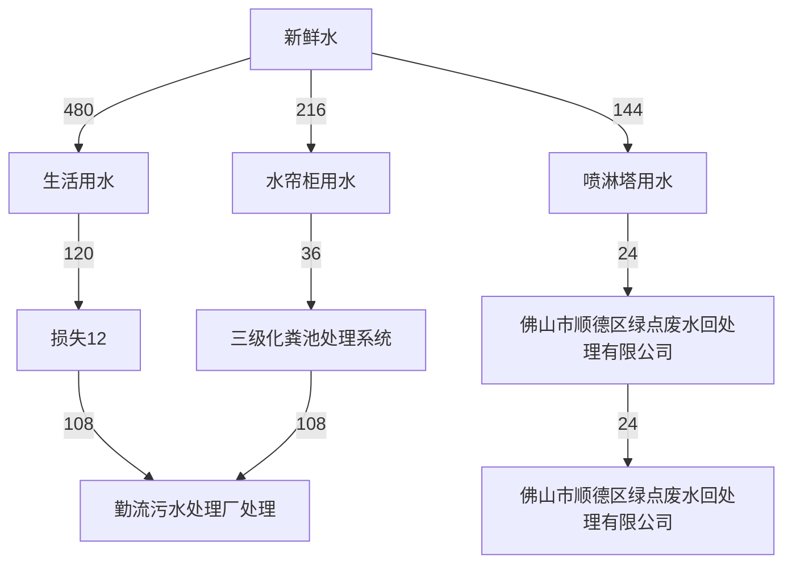
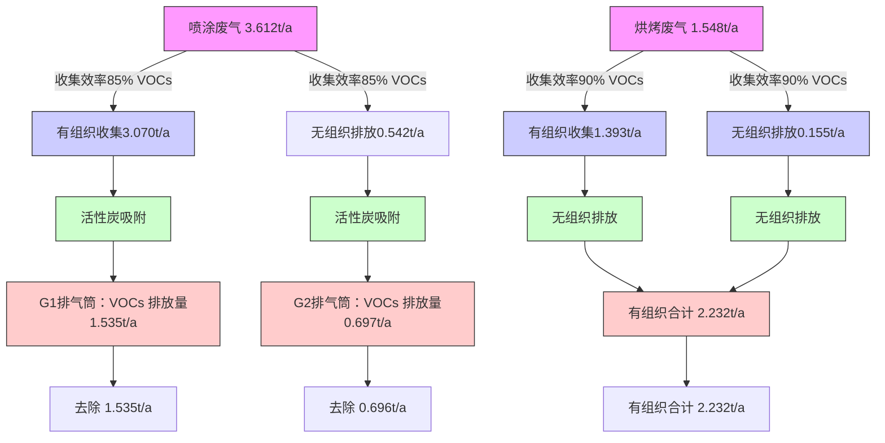
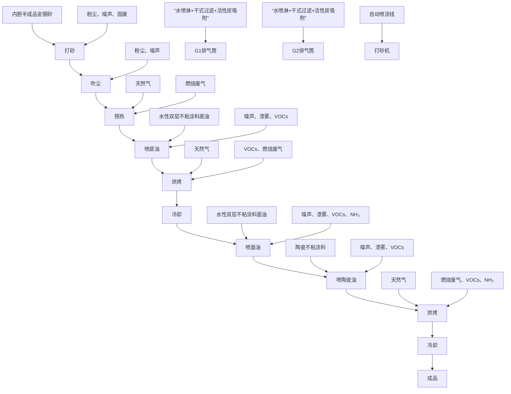
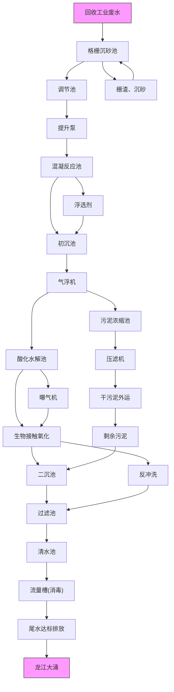

# 建设项目环境影响报告表

（污染影响类）

项目名称：佛山顺德镁厨电器制造有限公司新建项目

建设单位（盖章）：佛山顺德镁厨电器制造有限公司

编制日期：24年9月

中华人 境部制

text_image

万企乐企业咨询服务有
民共和国生态环境

编制单位和编制人员情况表

<table><tr><td colspan="2">项目编号</td><td colspan="3">30hu90</td></tr><tr><td colspan="2">建设项目名称</td><td colspan="3">佛山顺德镁厨电器制造有限公司新建项目</td></tr><tr><td colspan="2">建设项目类别</td><td colspan="3">30--007金属表面处理及热处理加工</td></tr><tr><td colspan="2">环境影响评价文件类型</td><td colspan="3">报告表</td></tr><tr><td colspan="5">一、建设单位情况</td></tr><tr><td colspan="2">单位名称(盖章)</td><td colspan="3">佛山顺德镁厨电器制造有限公司</td></tr><tr><td colspan="2">统一社会信用代码</td><td rowspan="4" colspan="3"></td></tr><tr><td colspan="2">法定代表人(签章)</td></tr><tr><td colspan="2">主要负责人(签字)</td></tr><tr><td colspan="2">直接负责的主管人员(签字)</td></tr><tr><td colspan="5">二、编制单位情况</td></tr><tr><td colspan="2">单位名称(盖章)</td><td colspan="3">佛山市万企乐企业咨询服务有限公司</td></tr><tr><td colspan="2">统一社会信用代码</td><td colspan="3">91440606MA5JYLP256</td></tr><tr><td colspan="5">三、编制人员情况</td></tr><tr><td colspan="5">1.编制主持人</td></tr><tr><td>姓名</td><td colspan="2">职业资格证书管理号</td><td>信用编号</td><td>签字</td></tr><tr><td rowspan="5">2</td><td rowspan="5" colspan="4"></td></tr><tr></tr><tr></tr><tr></tr><tr></tr></table>

text_image

中华人民共和国人力资源和社会保障部
2019.04.06 1833.04.06

text_image

中华人民共和国环境保护部
Approved or authorized
Ministry of Environmental Protection

Mi

本证书由中华人民共和四人力资和社会保障部、环境保护都批准领发，它衣明特证人通过国家现一组织的考试，取得环境影的评工程师的职业资格

This is tocertifythat thebeareroftheCertificate has passed natjonal examination organized by-the Chinese governinent departments and has oblained qualfctionsfor EvironmentalImpactAssesent Engineer.

text_image

人民共和国人力资源和社会保

text_image

中华人民共和国环境保护部
apinozara&authorized

# 目录

一、建设项目基本情况...

二、建设项目工程分析... .10

三、区域环境质量现状、环境保护目标及评价标准. 17

四、主要环境影响和保护措施. .23

五、环境保护措施监督检查清单.. .. 48

六、结论... .. 50

附表 建设项目污染物排放量汇总表.. 51

附件 1 营业执照复印件

附件2 用地资料

附件3 法人身份证

附件4 环评合同

附件5 化工原料成份

附图1 项目地理位置图

附图2 项目周围环境图

附图3 项目平面布置图

附图4 项目四至图片

附图5 项目所在区域水环境功能区划图

附图6 项目所在区域大气环境功能区划图

附图7 项目所在区域声环境功能区划图

附图8 项目所在区域于广东省三线一单管理平台分析截图

# 一、建设项目基本情况

<table><tr><td>建设项目名称</td><td colspan="3">佛山顺德镁厨电器制造有限公司新建项目</td></tr><tr><td>项目代码</td><td colspan="3">无</td></tr><tr><td>建设单位联系人</td><td>***</td><td>联系方式</td><td>***</td></tr><tr><td>建设地点</td><td colspan="3">佛山市顺德区勒流街道江村慧商四路5号5楼之二</td></tr><tr><td>地理坐标</td><td colspan="3">(22度51分5.098秒,113度10分6.704秒)</td></tr><tr><td>国民经济行业类别</td><td>C3360金属表面处理及热处理加工</td><td>建设项目行业类别</td><td>三十、金属制品业67、金属表面处理及热处理加工--其他(年用非溶剂型低VOCs含量涂料10吨以下的除外)</td></tr><tr><td>建设性质</td><td>☑新建(迁建)□改建□扩建□技术改造</td><td>建设项目申报情形</td><td>☑首次申报项目□不予批准后再次申报项目□超五年重新审核项目□重大变动重新报批项目</td></tr><tr><td>项目审批(核准/备案)部门(选填)</td><td>/</td><td>项目审批(核准/备案)文号(选填)</td><td>/</td></tr><tr><td>总投资(万元)</td><td>100</td><td>环保投资(万元)</td><td>31</td></tr><tr><td>环保投资占比(%)</td><td>31%</td><td>施工工期</td><td>1个月</td></tr><tr><td>是否开工建设</td><td>☑否□是:</td><td>用地(用海)面积( $m^{2}$ )</td><td>1830</td></tr><tr><td>专项评价设置情况</td><td colspan="3">无</td></tr><tr><td>规划情况</td><td colspan="3">无</td></tr><tr><td>规划环境影响评价情况</td><td colspan="3">无</td></tr><tr><td>规划及规划环境影响评价符合性分析</td><td colspan="3">无</td></tr><tr><td>其他符合性分析</td><td colspan="3">一、生态环境保护法律法规相符性1、与《广东省人民政府关于印发广东省“三线一单”生态环境分区管控方案的通知》(粤府〔2020〕71号)相符性分析根据《广东省人民政府关于印发广东省“三线一单”生态环境分区管控方案的通知》(粤府〔2020〕71号)的要求,本项目与所在区域的生态保护红线、环境质量底线、资源利用上线和生态环境准入清单(“三线一单”)进行对照分析,见下表:</td></tr></table>

表1-1 “三线一单”符合性分析

<table><tr><td colspan="2">粤府(2020)71号的相关规定</td><td>本项目情况</td><td>相符性</td></tr><tr><td>生态保护红线</td><td>在生态空间范围内具有特殊重要生态功能、必须强制性严格保护的区域,是保障和维护国家生态安全底线和生命线,通常包括具有重要水源涵养、生物多样性维护、水土保持、防风固沙、海岸生态稳定等功能的生态功能重要区域,以及水土流失、土地沙化、石漠化、盐渍化等生态环境敏感脆弱区域。按“生态功能不降低、面积不减少、性质不改变”基本要求,实施严格管控。</td><td>本项目位于广东省佛山市顺德区勒流街道江村慧商四路5号5楼之二所在区域属于工业用地,项目用地不涉及划定的生态红线区域,项目周边无自然保护区、饮用水源保护区等生态保护目标,符合生态保护红线要求。</td><td>相符</td></tr><tr><td>环境质量底线</td><td>指按照自然资源资产“只能增值、不能贬值”的原则,以保障生态安全和改善环境质量为目的,利用自然资源资产负债表,结合自然资源开发管控,提出的分区域分阶段的资源开发利用总量、强度、效率等上线管控要求。</td><td>根据环境质量现状监测数据项目区大气环境、地表水环境、声环境质量均能满足相应标准要求,项目排放各项污染物经相应措施处理后均达标对环境影响很小,环境风险可控,未超出环境质量底线,项目建设基本符合环境质量底线要求。</td><td>相符</td></tr><tr><td>资源利用上线</td><td>强化节约集约循环利用,持续提升资源能源利用效率,水资源、土地资源、岸线资源、能源消耗达到或优于国家和省下达总量、强度等目标要求,按省规定年限实现碳达峰。</td><td>项目生产过程中的电能、自来水等消耗量较少,区域水、电资源较充足,项目消耗量没有超出资源负荷,没有超出资源利用上线。</td><td>相符</td></tr><tr><td>生态环境准入清单</td><td>《市场准入负面清单(2020年版)》(发改体改规〔2020〕1880号)</td><td>本项目不属于禁止准入事项。</td><td>相符</td></tr></table>

# 2、《佛山市“三线一单”生态环境分区管控方案（2024 年版）》的通知》（佛环〔2024〕20 号）相符性分析

① 根据《佛山市生态环境局关于印发《佛山市“三线一单”生态环境分区管控方案（2024 年版）》的通知》（佛环〔2024〕20 号）的要求，本项目与所在区域的生态保护红线、环境质量底线、资源利用上线和生态环境准入清单（“三线一单”）进行对照分析，见下表：

表1-2 “三线一单”符合性分析

<table><tr><td colspan="2">佛环(2024)20号的相关规定</td><td>本项目情况</td><td>相符性</td></tr><tr><td>生态保护红线</td><td>环境管控单元分为优先保护、重点管控和一般管控单元三类。重点管控单元:以推动产业转型升级、强化污染减排、提升资源利用效率为重点,加快解决资源环境负荷大、局部区域生态环境质量差、生态环境风险高等问题。</td><td>本项目位于广东省佛山市顺德区勒流街道江村慧商四路5号5楼之二,所在区域属于工业用地,项目用地不涉及划定生态红线区域,项目周边无自然保护区、饮用水源保护区等生态保护目标,符合生态保护红线要求。</td><td>相符</td></tr><tr><td>环境质量底线</td><td>地表水环境质量持续改善,乡镇级及以上集中式饮用水水源地水质100%达标,国考、省考断面地表水质量达到或优于III类水体比例不低于85.7%,劣V类水体比例为0%,市考断面基本消除劣V类断面;全面消除黑臭水体。空气质量持续改善,细颗粒物(PM2.5)年均浓度、空气质量优良天数比例(AQI)主要指标达到省下达的目标要求,臭氧污染得到遏制。土壤环境质量总体保持稳定,土壤环境风险得到管控,受污染耕地安全利用率不低于93%,重点建设用地安全利用得到有效保障。地下水国控区域点位V类水比例完成省下达任务,地下水饮用水源点位和污染风险监控点位水质总体保持稳定。</td><td>根据环境质量现状监测数据,项目区大气环境、地表水环境、声环境质量均能满足相应标准要求,项目排放的各项污染物经相应措施处理后均能达标,对环境影响很小,环境风险可控,未超出环境质量底线,项目的建设基本符合环境质量底线要求。</td><td>相符</td></tr><tr><td>资源利用上线</td><td>强化节约集约循环利用,持续提升资源能源利用效率,水资源、土地资源、岸线资源、能源消耗等达到或优于国家和省下达的总量、强度等目标要求,按省规定年限实现碳达峰。</td><td>项目生产过程中的电能、天然气、自来水等消耗量较少,区域水、电资源较充足,项目消耗量没有超出资源负荷,没有超出资源利用上线。</td><td>相符</td></tr><tr><td>生态环境准入清单</td><td>《市场准入负面清单(2020年版)》(发改体改规〔2020〕1880号)</td><td>本项目不属于禁止准入事项。</td><td>相符</td></tr></table>

综上所述，本项目符合佛环〔2024〕20 号的要求。

② 与《佛山市顺德区人民政府关于印发佛山市顺德区“三线一单”生态环境分区管控方案的通知》相符性；项目位于广东省佛山市顺德区勒流街道江村慧商四路5号5楼之二，对照《佛山市“三线一单”生态环境分区管控方案（2024年版）》的通知》（佛环〔2024〕20 号）的附件1佛山市顺德区环境管控单元图，项目所在地属于重点管控单元。对照（佛环〔2024〕20 号）的附件4佛山市顺德区环境管控单元准入清单的“广东省佛山市顺德区重点管控单元准入清单”，项目位于勒流，属于重点管控区（环境管控单元编码：ZH44060620009）。

表 1-3 项目与广东省佛山市顺德区重点管控单元 9 准入清单的相符性分析

<table><tr><td rowspan="2">环境管控单元编码</td><td rowspan="2">管控单元名称</td><td colspan="3">行政区划</td><td rowspan="2">管控单元分类</td><td rowspan="2" colspan="2">要素细类</td></tr><tr><td>省</td><td>市</td><td>区</td></tr><tr><td>ZH44060620009</td><td>勒流街道重点管控区</td><td>广东省</td><td>佛山市</td><td>顺德区</td><td>重点管控单元9</td><td colspan="2">水环境工业-城镇生活重点管控区、大气环境布局敏感重点管控区、江河湖库岸线重点管控区</td></tr><tr><td>管控维度</td><td colspan="5">管控要求</td><td rowspan="2">工程内容</td><td rowspan="2">符合性</td></tr><tr><td>共性要求</td><td colspan="5">单元内各环境要素细类管控区内,按该环境要素细类管控要求执行。</td></tr><tr><td rowspan="3">区域布局管控</td><td colspan="5">1-1.【产业/鼓励引导类】重点发展智能家电、家具五金、环保装备、光电照明、装备制造及交通机械产业,引入智能制造服务、电子商务、现代商贸流通产业,重点建设环保产业基地、小家电和五金产业创业基地。</td><td>项目租用已建成的工业厂房,项目所在地符合规划要求,不属于新建工业及物流仓储用地</td><td>符合</td></tr><tr><td colspan="5">1-2.【产业/综合类】系统推进村级工业园升级改造,腾出连片空间,布局产业集聚区和主题产业园,推动工业项目入园集聚发展。</td><td>项目选址位于广东省佛山市顺德区勒流街道江村慧商四路5号5楼之二,位于华南环境科技产业园内。</td><td>符合</td></tr><tr><td colspan="5">1-3.【产业/限制类】受纳水体或监控断面不达标且未“以新带老”制定区域达标方案的河涌,不得新建、扩建向河涌直接排放废水的项目。新建、扩建含蚀刻工序的线路板生产项目和化工项目应在配套污水集中处置的工业园区或生活污水管网覆盖区域内建设;纯加工型印花项目,含酸洗、磷化的金属表面处理、金属制品项目(与自身高新技术企业配套的和区级及以上重点项目除外),含酸洗、喷涂、化学抛光、电解等涉及废水排放工艺的不锈钢型材加工项目(与自身高新技术企业配套的和区级及以上重点项目除外),应进入以此类项目为主导产业、有相应废水集中治理设施的工业园区,实现集中治污。</td><td>本项目生活污水处理达标后排入勒流污水厂处理,尾水排入顺德支流。本项目只使用打砂机清洁表面,不属于含酸洗、磷化的金属表面处理、金属制品项目,不属于含酸洗、喷涂、化学抛光、电解等涉及废水排放工艺的不锈钢型材加工项目。</td><td>符合</td></tr></table>

<table><tr><td rowspan="11"></td><td>管控维度</td><td>管控要求</td><td>工程内容</td><td>符合性</td></tr><tr><td rowspan="3">区域布局管控</td><td>1-4.【产业/综合类】划定家具生产优先发展区域,优先发展区外不再新建涉及涂装工艺木质家具制造项目。优先发展区范围根据家具产业发展规划及其规划环评文件确定。</td><td>本项目为金属表面处理及热处理加工,不属木质家具制造项目</td><td>符合</td></tr><tr><td>1-5.【水/限制类】严格限制在羊额—北滘水厂饮用水水源保护区上游和周边区域建设列入“高污染、高环境风险”产品名录等可能影响水环境安全的项目。</td><td>项目不属于羊额—北滘水厂饮用水水源保护区上游和周边区域。</td><td>符合</td></tr><tr><td>1-6.【大气/限制类】大气环境布局敏感区重点管控区内,应严格限制新建生产和使用高挥发性有机物原辅材料项目,优先开展低VOCs含量原辅材料替代,强化无组织排放控制。原则上不再新建、扩建新增氮氧化物、烟(粉)尘排放量较大的建设项目。</td><td>项目位于大气环境受体敏感重点管控区内,为新建项目,不属于新建使用溶剂型涂料、清洗剂等高挥发性有机物原辅材料项目。公司加强废气处理设施的管理,定期进行监测,必要时根据环境监管部门要求安装自动监测设备,确保废气达标排放。</td><td>符合</td></tr><tr><td rowspan="5">能源资源利用</td><td>2-1【能源/鼓励引导类】推广节能技术,加快发展绿色货运与现代物流。</td><td>项目使用电、用气,严控控制生产过程消耗,针对并对喷涂、烘烤、燃烧产生的废气分别经2套“水喷淋+干式过滤+活性炭吸附”废气处理设施处理后引至40m高排气筒G1、G2高空排放。</td><td>符合</td></tr><tr><td>2-2【能源/鼓励引导类】推广新能源汽车应用和充电基础设施建设,积极推动重卡LNG加气站、充电基础设施、加氢站建设。</td><td>项目不属于2-2规定的鼓励引导类</td><td>符合</td></tr><tr><td>2-3.【能源/综合类】科学实施能源消费总量和强度“双控”,新建高能耗项目单位产品(产值)能耗达到国际国内先进水平。</td><td>项目使用低VOCs原料不属于新建的高能耗项目。</td><td>符合</td></tr><tr><td>2-4.【水资源/综合类】贯彻落实“节水优先”方针,实行最严格水资源管理制度,勒流街道万元国内生产总值用水量、万元工业增加值用水量、用水总量、农田灌溉水有效利用系数等用水总量和效率指标达到区下达要求。</td><td>生产过程中严格控制生产用水量,减少水资源浪费,建议水资源管理制度。</td><td>符合</td></tr><tr><td>2-5.【土地资源/限制类】落实单位土地面积投资强度、土地利用强度等建设用地控制性指标要求,提高土地利用效率。</td><td>项目使用已建成的集约化多层厂房,不涉及新增用地,符合相关要求。</td><td>符合</td></tr><tr><td>能源资源利用</td><td>2-6.【岸线/禁止类】严格水域岸线用途管制,新建项目一律不得违规占用水域。严禁破坏生态的岸线利用行为和不符合其功能定位的开发建设活动,严禁以各种名义侵占河道、围垦湖泊、非法采砂等。</td><td>项目用地为工业用地,租用已建成的厂房。</td><td>符合</td></tr><tr><td>污染物排放管控</td><td>3-1.【水/限制类】城镇新区建设实行雨污分流。住宅、商业体、学校、市场等城镇开发建设项目应当配套或者同步计划建设公共排水设施,公共排水设施或自建排污水设施未能投产运行的,以上涉水项目不得投入使用。新建小区严格实施雨污分流,阳台、露台等污水接入污水收集系统,将生活污水“应截尽截”。做好大型楼盘、集贸市场、餐饮以及学校等4大类排水户污水接入市政管网工作。3-2【水/综合类】结合村级工业园改造,全面提升产业层次与集聚度,促进污染集中整治。3-3.【水/综合类】稳步推进排水设施“三个一体化”管理模式,补齐城乡污水收集和处理短板,推动勒流污水处理厂提质增效,加快消除城中村、老旧城区、城乡结合部等污水收集管网空白区,逐步实现城乡污水收集处理全覆盖。2025年</td><td>项目租用已建成的工业厂房,不属于城镇新区建设,且项目租用园区内污水管网已完成雨污分流;项目生活污水经三级化粪池预处理后排入勒流污水处理厂处理,尾水排入顺德支流。且本项目不涉及金属污染物的排放,故本项目的水环境影响不大,符合污染物排放管控要求。</td><td>符合</td></tr></table>

<table><tr><td>管控维度</td><td>管控要求</td><td>工程内容</td><td>符合性</td></tr><tr><td rowspan="2">污染物排放管控</td><td>前完成勒流污水处理厂扩建,尾水应执行《城镇污水处理厂污染物排放标准》(GB18918-2002)一级A标准及《广东省水污染物排放限值》(DB44/26-2001)的较严值。</td><td rowspan="2">项目租用已建成的工业厂房,不属于城镇新区建设,且项目租用园区内污水管网已完成雨污分流;项目生活污水经三级化粪池预处理后排入勒流污水处理厂处理,尾水排入顺德支流。且本项目不涉及金属污染物的排放,故本项目的水环境影响不大,符合污染物排放管控要求。</td><td>符合</td></tr><tr><td>3-4.【水/综合类】保留勒流社区百丈片区分散式农村污水处理设施,其余行政村(社区)通过市政污水管网,配合农村支管网建设,有条件的区域实施雨污分流改造,到2030年实现农村生活污水100%收集进入勒流污水处理系统。3-5.【土壤/限制类】严格重金属重点行业企业准入管理。新、改、扩建重点行业建设项目应遵循重点重金属污染物排放“等量替代”原则。</td><td>符合</td></tr><tr><td>环境风险防控</td><td>4-1.【水/综合类】加强单元内羊额—北滘水厂饮用水水源保护区周边环境风险源管控,完善突发环境事件应急管理体系。4-2.【水/综合类】勒流污水处理厂、工业污水集中处理设施应采临取有效措施,防止事故废水直接排入水体。完善污水处理厂在线监控系统联网,实现污水处理厂的实时、动态监管。4-3.【风险/综合类】加强环境风险分级分类管理,强化金属制品、有色金属和压延加工、化学原料和化学品制造业等涉重金属、化工行业企业及工业园区等重点环境风险源的环境风险防控。</td><td>选址不在水源保护区范围,与水源保护区的距离相对较远。项目不涉及重金属排放,故未涉及重点防控的重金属污染源。本项目危险物质与临界量比值Q&lt;1,通过采取合理的风险防范措施,制定完善的环境风险事故应急预案等措施,本项目环境风险在可控范围内。</td><td>符合</td></tr></table>

# 3、与污染物治理政策相符性分析

本项目与国家、广东省、顺德区发布的有机污染物治理政策的相符性分析见下表。

表 1-4 项目与有机污染物治理政策的相符性

<table><tr><td>序号</td><td>政策要求</td><td>工程内容</td><td>符合性</td></tr><tr><td colspan="4">1.《珠江三角洲地区严格控制工业企业挥发性有机物(VOCs)排放的意见》(粤环[2012]18号)</td></tr><tr><td>1.1</td><td>在自然保护区、水源保护区、风景名胜区、森林公园、重要湿地、生态敏感区和其他重生态功能区实行强制性保护,禁止新建VOCs污染企业。</td><td>选址不在规定区域</td><td>符合</td></tr><tr><td>1.2</td><td>新建皮革及皮鞋制造业、人造板制造业、家具制造业、印刷业、硅胶制品业、集装箱制造业、汽车制造与船舶制造业等排放VOCs的使用性行业,在建设项目环境影响评价文件报批时,附项目VOCs减排量来源说明,按项目“点对点”总量调剂的方式,落实新建项目VOCs排放总量指标来源,确保区域内工业VOCs排放的总量控制。</td><td>项目有机废气总排放量为2.929t/a,建议VOCs总量控制指标为2.929t/a,从勒流街道总量中列支。</td><td></td></tr><tr><td colspan="4">2.《中华人民共和国大气污染防治法》(2015.8.29修订,2016.1.1实施)</td></tr><tr><td>2.1</td><td>第四十五条产生含挥发性有机物废气的生产和服务活动,应当在密闭空间或者设备中进行,并按照规定安装、使用污染防治设施;无法密闭的,应当采取措施减少废气排放</td><td>本项目喷涂、烘烤有机废气通过整室收集,整室收集效率为85%、90%,处理效率可达50%</td><td>符合</td></tr><tr><td colspan="4">3.《挥发性有机物无组织排放控制标准》(GB 37822—2019)</td></tr><tr><td>3.1</td><td>VOCs质量占比大于等于10%的含VOCs产品,其使用过程应采用密闭设备或在密闭空间内操作,废气应排至VOCs废气处理收集系统;无法密闭的,应采取局部收集措施,废气应排至VOCs废气收集处理系统。</td><td>项目有机废气通过整室罩收集后经“水喷淋+干式过滤+活性炭吸附”废气处理设施处理后引至40m高排气筒高空排放。整室收集效率为85%、90%。</td><td>符合</td></tr></table>

<table><tr><td rowspan="9"></td><td>序号</td><td>政策要求</td><td>工程内容</td><td>符合性</td></tr><tr><td>3.2</td><td>VOCs废气收集处理系统应与生产工艺设备同步运行。VOCs废气收集处理系统发生故障或检修时,对应的生产工艺设备应停止运行,待检修完毕后同步投入使用。</td><td>项目喷涂,烘烤工序过程必须开启风机,有效减少无组织排放废气。废气收集处理系统发生故障或检修时,喷涂,烘烤工序停止运行,待检修完毕后再投入生产。</td><td>符合</td></tr><tr><td colspan="4">3.《挥发性有机物无组织排放控制标准》(GB 37822-2019)</td></tr><tr><td>3.3</td><td>1、VOCs物料应储存于密闭的容器、包装袋、储罐、储库、料仓中。2、盛装VOCs物料的容器或包装袋应存放于室内,或存放于设置有雨棚、遮阳和防渗设施的专用。场地。盛装VOCs物料的容器或包装袋在非取用状态时应加盖、封口,保持密闭。3、VOCs物料储库、料仓应满足3.6条对密闭空间的要求。4、液态VOCs物料应采用密闭管道输送。采用非管道输送方式转移液态VOCs物料时,应采用密闭容器、罐车。5、粉状、粒状VOCs物料应采用气力输送设备、管状带式输送机、螺旋输送机等密闭输送方式,或者采用密闭的包装袋、容器或罐车进行物料转移。6、含VOCs产品的使用过程,VOCs质量占比大于等于10%的含VOCs产品,其使用过程应采用密闭设备或在密闭空间内操作,废气应排至VOCs废气收集处理系统;无法密闭的,应采取局部气体收集措施,废气应排至VOCs废气收集处理系统。7、企业应建立台账,记录含VOCs原辅材料和含VOCs产品的名称、使用量、回收量、废弃量、去向以及VOCs含量等信息。台账保存期限不少于3年。</td><td>1、项目均储存于密闭的容器内;2、盛装VOCs物料的容器或包装袋应存放于室内;盛装VOCs物料的容器在非取用状态时加盖、封口,保持密闭;3、VOCs物料仓为单独封闭式房间;4、VOCs物料于密闭容器内运送;5、项目为VOCs物料采用密闭运输;6、项目有机废气、恶臭经整室收集,收集效率为85%、90%,再经“水喷淋+干式过滤+活性炭吸附”废气处理设施处理后引至40米高排气筒高空排放。7、建立台账,记录含VOCs原辅材料和含VOCs产品的名称、使用量、回收量、废弃量、去向以及VOCs含量等信息,台账保存期限不少于3年;盛装过VOCs物料的废包装容器应加盖密闭。</td><td>符合</td></tr><tr><td colspan="4">4.佛山市生态环境局顺德分局关于做好重点行业建设项目挥发性有机物总量指标管理工作的通知(佛顺环函〔2019〕56号)</td></tr><tr><td>4.1</td><td>涉VOCs排放项目,实现本行政区域内污染源“点对点”2倍量削减替代,由项目所在镇街分局出具VOCs总量指标来源及替代削减方案的意见,开展总量替代。</td><td>项目VOCs排放总量指标由所在镇街的分局出具VOCs总量指标来源及替代削减方案的意见。</td><td>符合</td></tr><tr><td colspan="4">5.关于印发《重点行业挥发性有机物综合治理方案》的通知(环大气[2019]53号)</td></tr><tr><td>5.1</td><td>含VOCs物料应储存于密闭容器、包装袋,高效密封储罐,封闭式储库、料仓等。含VOCs物料转移和输送,应采用密闭管道或密闭容器、罐车等。</td><td>本项目VOCs的物料均储存在密封的包装内安全运输。</td><td>符合</td></tr><tr><td>5.2</td><td>有机聚合物产品用于制品生产的过程,在混合/混炼、塑炼/塑化/熔化、加工成型(挤出、注射、压制、压延、发泡、纺丝等)等作业中应采用密闭设备或在密闭空间内操作,废气应排至VOCs废气收集处理系统;无法密闭的,应采取局部气体收集措施,废气应排至VOCs废气收集处理系统提高废气收集率。遵循“应收尽收、分质收集”的原则,科学设计废气收集系统,将无组织排放转变为有组织排放进行控制。采用全密闭集气罩或密闭空间的,除行业有特殊要求外,应保持微负压状态,并根据相关规范合理设置通风量。采用局部集气罩的,距集气罩开口面最远处的VOCs无组织排放位置,控制风速应不低于0.3米/秒,有行业要求的按相关规定执行。</td><td>项目喷涂、烘烤工序产生的有机废气、恶臭由整室收集经“水喷淋+干式过滤+活性炭吸附”装置处理,废气收集率为85%、90%,废气处理效率达到50%。</td><td>符合</td></tr></table>

<table><tr><td>序号</td><td>政策要求</td><td>工程内容</td><td>符合性</td></tr><tr><td>6.7</td><td>建立废气收集处理设施台账,记录废气处理设施进出口的监测数据(废气量、浓度、温度、含氧量等)、废气收集与处理设施关键参数、废气处理设施相关耗材(吸收剂、吸附剂、催化剂等)购买和处理记录。</td><td>企业建设后废气治理设施安排专人维护并定期建立台账,记录相关废气数据。</td><td>符合</td></tr><tr><td colspan="4">7.佛山市顺德区人民政府办公室关于印发《佛山市顺德区生态环境保护“十四五”规划、(2021-2025)》的通知</td></tr><tr><td>7.1</td><td>持续推进重点行业VOCs整治。持续开展挥发性有机物专项整治,继续推进重点行业企业开展销号式综合整治,建立VOC重点监管企业名单并动态更新,督促企业建立VOCs管控台账清单;持续探寻高效节能的VOCs治理技术,对采用低温等离子、光氧化、光催化等低效治理工艺的企业在臭氧污染天气应对期间实施停限产或错峰生产,并推动企业逐步淘汰低效治理工艺。</td><td>本项目不使用溶剂型涂料、清洗剂、胶黏剂等高挥发性有机物原辅材料。本项目喷涂、烘烤废气经整室收集后通过“水喷淋+干式过滤+活性炭吸附”废气处理设施进行处理,处理达标后通过排气筒引至楼顶高空排放。</td><td>符合</td></tr><tr><td>7.2</td><td>加强VOCs源头替代和无组织排放管控。大力推进低VOCs含量、低反应活性的原辅材料替代,将全面使用低VOCs含量原辅材料的企业纳入正面清单和政府绿色采购清单。鼓励重点行业企业开展生产工艺和设备水性化改造,推广使用水性、高固体分、无溶剂、粉末等低VOCs含量涂料。严格落实《挥发性有机物无组织排放控制标准》,开展厂区内无组织排放浓度监测,加强对含VOCs物料储存、转移和运输、设备与管线组件泄漏、敞开页面逸散以及工艺过程等五类排放源的管控。</td><td>本项目不使用溶剂型涂料、清洗剂、胶黏剂等高挥发性有机物原辅材料。本项目喷涂、烘烤废气经整室收集后通过“水喷淋+干式过滤+活性炭吸附”废气处理设施进行处理,处理达标后通过排气筒引至楼顶高空排放。</td><td>符合</td></tr></table>

# 4、项目与涉水排放政策的相符性分析

本项目与佛山市、顺德区发布的涉水排放政策的相符性分析见下表：

表 1-5 项目与涉水排放准入政策的相符性

<table><tr><td>序号</td><td>政策要求</td><td>本项目</td><td>符合性</td></tr><tr><td colspan="4">1.《佛山市顺德区环境保护委员会办公室关于对涉水排放的建设项目加强环境管理的通知》(顺环委[2020]44号文)</td></tr><tr><td>1.1</td><td>严格按照环评导则对涉水排放建设项目的废水(包括生活污水、生产废水)、环境风险等要素开展环境影响评价,结合受纳水体水质状况和环境基础设施配套情况进行审批。审批时应重点核查项目的受纳水体达标情况,受纳水体不达标的,不得通过审批。</td><td>项目生活污水经三级化粪处理后排放至勒流污水处理厂处理;</td><td>符合</td></tr><tr><td>1.2</td><td>涉水排放建设项目的排水系统必须严格执行“雨污分流、清污分流”原则,按照《佛山市环境保护局关于印发佛山市工业企业污水治理设施规范化整治技术要求和指南的通知》(佛环函〔2015〕324号)要求进行建设。</td><td>项目市政管网已按佛环函[2015]324号要求明管设置</td><td>符合</td></tr><tr><td colspan="4">2.佛山市生态环境局佛山市水利局关于进一步加强工业企业废水污染防治的函(2023-0031(水))</td></tr><tr><td>2.1</td><td>工业企业排放有含重金属、难生化降解、有生物毒性、易燃易爆、高盐分、重油脂等超城镇生活污水处理厂接收能力的生产废水,以及间接冷却的清净下水等过低浓度生产废水,原则上不得排入城镇生活污水处理厂,已进入的,各区要制定限期退出计划并实施。受纳城镇生活污水处理厂已满负荷的,限制审批新增废水排入城镇生活污水处理厂的工业项目。</td><td>项目不涉及</td><td>符合</td></tr></table>

<table><tr><td rowspan="3"></td><td>序号</td><td>政策要求</td><td>本项目</td><td>符合性</td></tr><tr><td>2.2</td><td>零散废水转运处置方式为解决历史问题的过渡阶段措施,村级工业园、老旧工业区已完成“工改工”改造重建,以及新规划建设的工业园区、工业集聚区,原则上应自建工业废水处理设施或通过管网纳入集中处理设施处理排放,不再审批以零散废水形式外运处置(VOCs 喷淋废水除外)。</td><td>项目喷淋塔废水和水帘柜喷淋废水,收集后定期交由佛山市顺德区绿点废水回收处理有限公司处理。</td><td>符合</td></tr><tr><td>2.3</td><td>重点对表面处理涉水项目、涉工业涂装废水项目、大比例“回用”、“零排放”项目等开展环评抽查复核。严格落实排污许可制度。</td><td>项目不涉及</td><td>符合</td></tr></table>

# 二、建设项目工程分析

# 1、项目工程组成

项目租用佛山市顺德区勒流街道江村慧商四路 5 号 5 楼之二，已建成的工业厂房，所在楼层高6层，其中首层层高7.95m，其余楼层高5.95米，总高度约为37.7m，占地面积为1830m2，经营面积为1830 m2。项目从业人数为12人，年工作天数300 天，每天工作10小时，每天工作时间为 8:00-12:00、13:30-19:30 厂内均不设员工宿舍和饭堂。

项目工程组成见表 2-1。

表 2-1 项目工程组成

<table><tr><td>项目</td><td>内容</td><td>建设规模</td><td>用途</td></tr><tr><td>主体工程</td><td>生产车间</td><td>5楼(约1830m2),设有自动喷涂线1条(包括:吹尘区,底油、面油、陶瓷油喷油房、冷却线,烧结区、固化区、预热区)、打砂区1个</td><td>用于喷涂、烘烤、打砂</td></tr><tr><td>辅助工程</td><td>办公室</td><td>设于生产车间内</td><td>供日常办公使用</td></tr><tr><td>仓储工程</td><td>仓库</td><td>设于生产车间内</td><td>主要用于原料、成品储存</td></tr><tr><td rowspan="2">公用工程</td><td>配电系统</td><td>一套</td><td>供应生产用电和办公生活用电</td></tr><tr><td>给排水系统</td><td>一套</td><td>供水来源为市政自来水,生活污水经三级化粪池预处理后排入勒流污水处理厂处理</td></tr><tr><td rowspan="5">环保工程</td><td>废水收集设施</td><td>一套</td><td>喷淋废水、水帘柜废水收集后储存于塑料桶,定期交由佛山市顺德区绿点废水回处理有限公司</td></tr><tr><td>生活污水处理设施</td><td>一套</td><td>生活污水经三级化粪池预处理后排入勒流污水处理厂处理,尾水排入顺德支流</td></tr><tr><td>危废物暂存间</td><td>一套</td><td>一间约5m2用于危险废物的暂存</td></tr><tr><td>一般固体废物暂存</td><td>一套</td><td>一间用于一般固体废物的暂存</td></tr><tr><td>废气收集处理设施</td><td>一套</td><td>共2套,喷涂废气,烘烤、天然气燃烧废气分别经2套“水喷淋+干式过滤+活性炭吸附”处理达标后经40米高的排气筒(G1、G2)排放;打砂废气经自带布袋除尘器处理后于车间内排放。</td></tr></table>

# 2、主要产品及产能

项目主要从事厨房电器内胆的加工，主要产品及产能见表2-2。

表 2-2 产品及产能一览表

<table><tr><td>序号</td><td>名称</td><td>单位</td><td>数量</td><td>主要产品规格尺寸</td></tr><tr><td>1</td><td>电煮锅内胆</td><td>万个/年</td><td>200</td><td> $\Phi 20cm*高 3cm, 约重 0.2kg$ </td></tr><tr><td>2</td><td>压力锅内胆</td><td>万个/年</td><td>40</td><td> $\Phi 21.5cm*高 11cm, 约重 0.5kg$ </td></tr></table>

# 3、项目设备清单

主要生产单元、主要工艺、生产设施及设施参数见表2-3。

表 2-3 主要生产单元、主要工艺、生产设施一览表

<table><tr><td>主要生产单元</td><td>主要工艺</td><td>生产设施名称</td><td>单位</td><td>数量</td><td>设备参数</td><td>备注</td></tr><tr><td colspan="3">喷涂自动线</td><td>条</td><td>1</td><td>/</td><td>/</td></tr><tr><td rowspan="3">喷涂</td><td rowspan="2">吹尘</td><td>吹尘房</td><td>个</td><td>1</td><td>尺寸: 1.5*1.8*1.8m</td><td>除尘</td></tr><tr><td>风枪</td><td>支</td><td>4</td><td>0.5kw</td><td>清洁</td></tr><tr><td>预热</td><td>预热炉</td><td>个</td><td>1</td><td>尺寸: 6*2.1*1m</td><td>天然气加热烘</td></tr><tr><td rowspan="12">喷涂</td><td rowspan="3">喷底油</td><td>底油房</td><td>个</td><td>1</td><td>尺寸: 10*4.4*2.5m</td><td>喷涂</td></tr><tr><td>喷枪</td><td>把</td><td>8</td><td>100g/min</td><td>4用4备</td></tr><tr><td>水帘柜</td><td>个</td><td>1</td><td>尺寸: 6*2.3m</td><td>水池有效容积约 $4{\mathrm{\;m}}^{3}$ </td></tr><tr><td>烘烤</td><td>烧结炉</td><td>个</td><td>1</td><td>尺寸: 10*2.8*0.85m</td><td>天然气烘烤</td></tr><tr><td>冷却</td><td>冷却线</td><td>条</td><td>1</td><td>尺寸: 33*0.8*1.5m</td><td>冷却</td></tr><tr><td rowspan="3">喷面油</td><td>面油房</td><td>个</td><td>1</td><td>尺寸: 6*4.4*2.5m</td><td>喷涂</td></tr><tr><td>喷枪</td><td>把</td><td>8</td><td>170g/min</td><td>4用4备</td></tr><tr><td>水帘柜</td><td>个</td><td>1</td><td>尺寸: 4*2.3m</td><td>水池有效容积约 $4{\mathrm{\;m}}^{3}$ </td></tr><tr><td rowspan="3">喷陶瓷油</td><td>陶瓷油房</td><td>个</td><td>1</td><td>尺寸: 8*4.4*2.5m</td><td>喷涂</td></tr><tr><td>喷枪</td><td>把</td><td>8</td><td>100g/min</td><td>4用4备</td></tr><tr><td>水帘柜</td><td>个</td><td>1</td><td>尺寸: 5*2.3m</td><td>水池有效容积约 $4{\mathrm{\;m}}^{3}$ </td></tr><tr><td>烘烤</td><td>固化炉</td><td>条</td><td>1</td><td>尺寸: 40*1.2*0.85m</td><td>天然气隧道烘烤</td></tr><tr><td>冷却、包装</td><td>冷却、包装</td><td>冷却、包装线</td><td>条</td><td>1</td><td>尺寸: 10*2m</td><td>包装</td></tr><tr><td>打砂</td><td>打砂</td><td>打砂机</td><td>台</td><td>2</td><td>5kw</td><td>打砂</td></tr><tr><td>冷却</td><td>冷却</td><td>冷却塔</td><td>台</td><td>1</td><td> $4{\mathrm{\;m}}^{3}/\mathrm{h}$ </td><td>冷却</td></tr></table>

# 4、项目原辅材料

主要原辅材料及燃料的种类和用量见表2-4。

表 2-4 主要原辅材料及燃料参数一览表

<table><tr><td>序号</td><td>名称</td><td>单位</td><td>数量</td><td>备注</td></tr><tr><td>1</td><td>内胆半成品</td><td>万个/年</td><td>240</td><td>先用打砂机加工处理后再进行喷涂加工</td></tr><tr><td>2</td><td>水性双层不粘涂料底油</td><td>吨/年</td><td>30.3</td><td>20 kg/桶,最大存量5吨</td></tr><tr><td>3</td><td>水性双层不粘涂料面油</td><td>吨/年</td><td>54.7</td><td>20 kg/桶,最大存量5吨</td></tr><tr><td>4</td><td>陶瓷不粘涂料</td><td>吨/年</td><td>34.3</td><td>20 kg/桶,最大存量5吨</td></tr><tr><td>5</td><td>天然气</td><td>万 $m^3$ /年</td><td>21</td><td>预热炉用2万 $m^3$ ,烧结、固化炉各用9.5万 $m^3$ </td></tr><tr><td>6</td><td>机油</td><td>吨/年</td><td>0.15</td><td>25kg/桶,最大储存量为0.15t,用于设备维修</td></tr><tr><td>7</td><td>金钢砂</td><td>吨/年</td><td>2</td><td>打砂用</td></tr></table>

表2-5项目VOCs原辅材料一览表

<table><tr><td>物料名称</td><td>主要成分</td><td>理化性质及相关说明</td><td>VOCs含量(g/L)</td><td>VOCs产生系数</td><td>VOCs含量限值*(g/L)</td><td>是否属低VOCs原料</td></tr><tr><td>水性双层不粘涂料底油</td><td>聚酰胺酰亚胺+N-甲基吡咯烷酮(8%),聚全氟乙丙烯+水(61%),聚醚砜+环丁砜(9%),二甲基乙酰胺3%,聚乙二醇辛基苯基醚+聚氧乙烯(2%),碳化硅2%,二氧化硅3%,防锈颜料1%,增稠剂3%,乙二醇+(2,4,7,9-tetramethyl-5-decynne,7-diol2,4,7,9-四甲基-5-癸炔-4,7-二醇)为2%,助剂2%,分散剂2%,炭黑2%。</td><td>液体,常态下稳定,密度约 $1.15 \text{ g/cm}^{3}$ </td><td>118</td><td>10.26%</td><td>≤420</td><td>是</td></tr><tr><td>水性双层不粘涂料面油</td><td>聚四氟乙烯+表面活性剂+氨水0.2%+水(71%),增稠剂4%,分散剂4%,聚乙二醇辛基苯基醚+聚氧乙烯(2%),炭黑7%,乙二醇+(2,4,7,9-tetramethyl-5-decynne,7-diol2,4,7,9-四甲基-5-癸炔-4,7-二醇)为3%,Ethoxylated 2,4,7,9-tetramethyl-5-decynne 4,7-diol乙氧基化2,4,7,9-四甲基-5-癸炔-4,7-二醇4%,云母+二氧化钛+二氧化锡(5%)。</td><td>液体,常态下稳定,密度约 $1.2 \text{ g/cm}^{3}$ </td><td>7.9</td><td>0.658%</td><td>≤270</td><td>是</td></tr><tr><td>陶瓷不粘涂料</td><td>纳米级二氧化硅30-35%、硅烷交联剂(甲基硅烷三醇三乙酸酯)25-30%、蒸馏水20-25%、铜铬黑色粉15%、醇类溶剂3-5%。</td><td>液体,密度纳米级二氧化硅为2,硅烷交联剂:1.17,混合密度约 $1.5 \text{ g/cm}^{3}$ 。</td><td>74</td><td>4.93%</td><td>≤270</td><td>是</td></tr></table>

备注：\*各原辅材料成分及 VOCs 含量数据均来源企业提供资料及检测报告（见附件 5）。

各原辅材料是否属于低 VOCs 判断参照《低挥发性有机化合物含量涂料产品技术要求》（GB/T38597-2020）表1 中“工业防护涂料—包装涂料（不粘涂料）”限值数据。

# （1）项目喷涂线涂料用量核算

根据根据《佛山市铝型材涉表面处理建设项目环评文件编制技术参考指南（试行）》中涂料用量核算采用方法：《涂装工艺与设备》，如果可获得涂膜厚度、涂膜密度、涂料利用率、原涂料固体分、涂装面积等参数数据时，可按以下公式核算涂料用量。

$$
\mathrm{A} = \mathrm{B} \times \mathrm{C} \div (\mathrm{E} \times \mathrm{F}) \times \mathrm{G}
$$

公式1

公式中：A——涂料的消耗量，g；

B— —涂膜厚度，um；

C——涂膜密度，g/cm；

E——各涂装方法的涂料利用率，%；

F——原涂料固体分，%；

G——涂装面积，m2。

项目内胆配件涂料用量核算如下表所示。

表 2-6 项目金属喷涂面积核算表

<table><tr><td>名称</td><td>数量</td><td>相关参数</td><td>取值</td><td>产品图片</td></tr><tr><td rowspan="2">电煮锅内胆</td><td rowspan="2">200万个/a</td><td>规格尺寸</td><td> $\Phi 20cm*高3cm$ </td><td rowspan="2"></td></tr><tr><td>喷涂面积</td><td>面积约 $0.1005m^{2}/个$ [(内侧 $3.14*10*10*+3.14*20*3$ )+(外侧 $3.14*10*10*+3.14*20*3$ )= $0.1005m^{2}$ ]</td></tr><tr><td rowspan="2">压力锅内胆</td><td rowspan="2">40万个/a</td><td>规格尺寸</td><td> $\Phi 21.5cm*高11cm$ </td><td rowspan="2"></td></tr><tr><td>喷涂面积</td><td>面积约 $0.222m^{2}/个$ [(内侧 $3.14*10.75*10.75$ )+ $3.14*21.5*11$ )+(外侧 $3.14*10.75*10.75$ )+ $3.14*21.5*11$ )= $0.221122m^{2}$ ]</td></tr></table>

表2-7 项目产品产量与涂料用量核算表

<table><tr><td rowspan="4">参数\种类</td><td colspan="6">喷涂线</td></tr><tr><td colspan="6">涂料</td></tr><tr><td colspan="3">电煮锅内胆</td><td colspan="3">压力锅内胆</td></tr><tr><td>底油</td><td>面油</td><td>陶瓷涂料</td><td>底油</td><td>面油</td><td>陶瓷涂料</td></tr><tr><td>喷涂产品量(套/年)</td><td>200万</td><td>200万</td><td>200万</td><td>40万</td><td>40万</td><td>40万</td></tr><tr><td>单位产品喷涂面积( $m^2$ )</td><td>0.1005</td><td>0.1005</td><td>0.1005</td><td>0.222</td><td>0.222</td><td>0.222</td></tr><tr><td>单位产品喷涂干膜厚度(m)</td><td>0.000006</td><td>0.00001</td><td>0.00003</td><td>0.000006</td><td>0.00001</td><td>0.00003</td></tr><tr><td>涂料干膜密度( $kg/m^3$ )</td><td>4001</td><td>4230</td><td>2141</td><td>4001</td><td>4230</td><td>2141</td></tr><tr><td>固含率</td><td>28.74%</td><td>28.372%</td><td>70.07%</td><td>28.74%</td><td>28.372%</td><td>70.07%</td></tr><tr><td>附着率或使用率</td><td>80%</td><td>80%</td><td>80%</td><td>80%</td><td>80%</td><td>80%</td></tr><tr><td>单位产品喷涂量(kg)</td><td>0.0105</td><td>0.019</td><td>0.012</td><td>0.0232</td><td>0.0414</td><td>0.0255</td></tr><tr><td>涂料用量小计(t/a)</td><td>21</td><td>38</td><td>24</td><td>9.28</td><td>16.56</td><td>10.2</td></tr><tr><td>合计(t/a)</td><td colspan="6">底油30.28+面油54.56+陶瓷涂料34.2=119.04.</td></tr></table>

备注：1、根据《佛山市铝型材涉表面处理建设项目环评文件编制技术参考指南（试行）》可知，采用静电喷涂技术的单位产品涂料利用率原则在80%-90%之间，故本项目喷涂附着率取80%。

2、固含率=100%－VOCs含量-水分含量，水分含量按最大取值，则固含率分别为，

底油：1-10.26%-61%=28.74%；面油：1-0.628%-71%=28.372%；陶瓷不粘涂料：1-4.93%-25%=70.07%。

3、涂料干膜密度分别为，底油：1.15/28.74%=4001kg/m3；面油：1.2/28.372%=4230kg/m3；

陶瓷不粘涂料：1.5/70.07%=2141kg/m3。

表 2-8 项目喷涂原辅材料或设备产能匹配合理性分析一览表

<table><tr><td>生产工序</td><td>生产设备</td><td>数量(支/台)</td><td>使用原料</td><td>单台设备设计参数</td><td>生产周期(h)</td><td>物料设计加工</td><td>物料实际使用量</td><td>设计最大加工量</td><td>申报加工量</td></tr><tr><td>喷底油</td><td>喷枪</td><td>4(同时使用)</td><td>底油</td><td>加工量3kg/h</td><td>3000</td><td>36t</td><td>30.3t</td><td>36t</td><td>30.3t</td></tr><tr><td>喷面油</td><td>喷枪</td><td>4(同时使用)</td><td>面油</td><td>加工量5.1kg/h</td><td>3000</td><td>60t</td><td>54.7t</td><td>60t</td><td>54.7t</td></tr><tr><td>喷陶瓷油</td><td>喷枪</td><td>4(同时使用)</td><td>陶瓷油</td><td>加工量3kg/h</td><td>3000</td><td>36t</td><td>34.3t</td><td>36t</td><td>34.3t</td></tr><tr><td>烘烤</td><td>固化炉</td><td>1</td><td>--</td><td>加工量960个/h</td><td>3000</td><td>288万个</td><td>240万个</td><td>288万个</td><td>240万个</td></tr><tr><td colspan="10">备注:1、根据上表可知项目喷枪设备设计加工量为132吨涂料约288万个工件,实际加工为119.3吨涂料约240万个工件,达产比为90%和83%,因此物料用量及设备设计产能匹配。2、项目高温固化炉设计线速为1.5米/分钟,固化炉长约40米,宽约1.2米,每平方米可摆放10个工作,每次可放件480个,烘烤时长约30分钟,则每小时可处理960个工件,处理能力为288万个每年,申报产量为240万套每年,达产比为83%,因此申报产能与设备设计产能匹配。</td></tr></table>

# 5、水平衡与物料平衡

# 1）水平衡

# （1）给水：

项目用水由市政给水管网供应。用水主要为喷淋塔用水、水帘柜用水、员工生活用水。

# ① 生活用水

项目从业人数为 12 人，年工作日 300 天每天 10 小时，工作时间为 8:00-12:00、13:30-19:30。内部均不设饭堂和员工宿舍。生活用水根据《广东省用水定额 第 3 部分：生活》（DB44 /T 1461.3- 2021），“办公楼-无食堂和浴室（先进值）”按 10m3/人·a 计，则项目员工生活用水为 120m3/a。

# ② 喷淋塔喷淋用水

项目使用 2 套“水喷淋+干式过滤+活性炭吸附”废气治理设施对废气处理，根据工程核算，项目喷淋塔用水量为144m3/a。

# ③ 水帘柜喷淋用水

项目喷油工序采用“水喷淋”方式去除漆雾，水帘柜用水量为216 m3/a。

# （2）排水：

项目生活污水经三级化粪池处理后排入市政污水管道，引至勒流生活污水处理厂进行处理，最终排至顺德支流。生活污水排污系数取0.9，生活污水产生量为108m3/a。

喷淋塔废水、水帘柜废水经收集后储存于塑料桶，定期交由佛山市顺德区绿点废水回处理有限公司处理，不外排。

项目水平衡图：  

flowchart

单位：m3/a

# 2）有机废气平衡（图）：

flowchart

# 6、劳动动员及工作制度

项目从业人数为12人，年工作日300天每天10小时，工作时间为 8:00-12:00、13:30-19:30。内部均不设饭堂和员工宿舍。

# 7、厂区平面布置

项目所在建筑为6层工业厂房，项目租用5楼部分厂房。项目占地面积为1830平方米，经营面积为1830平方米，设有生产车间、办公室、仓库。G1、G2排气筒设施设置于车间厂房楼顶，危废间设置于厂房东面。

项目主要从事电器内胆加工生产，其生产工艺和流程如下。

（一） 内胆工艺流程简述（图示）  

flowchart

图 2-1 项目工艺流程图

# 2、工艺如下：

项目客户提供内胆半成品回厂，经打砂、喷涂、烘烤、冷却后即可成为内胆成品。项目共设置1条自动喷涂生产线，具体说明如下：

打砂：为增加油漆在工件表面的附着力和达到清理或修饰加工目的，项目使用打砂机喷砂使内胆工件表面粗糙、清洁。打砂使用金钢砂磨料对工件表面的冲击和切削作用，使工件表面的力学性能得到改善，因此提高了工件的抗疲劳性，增大了它和涂层之间的附着力，延长了涂层的使用寿命，也有利于涂料的平整和装饰。

吹尘：工件喷涂前需要进入除尘房以清除表面粘附的少量灰尘，利用除尘枪高速的压缩气流还可将物体上的灰尘吹走。工件经打砂处理后残留粉尘极少，故吹尘粉尘忽略不计。

预热：项目将需要喷涂的工件使用天然气燃烧预热炉预热，温度约 150℃，时间约6min，使后续涂料层厚度均匀，获得致密的涂料层。燃烧废气通过管网收集经“水喷淋+干式过滤+活性炭吸附”设施后通过40m 高的排气筒 G2 排放。

喷底油：对预热后的内胆工件进行喷底油处理，喷涂在喷漆房中进行。喷涂即利用气压将涂料雾化喷出，从而使涂料均匀地涂覆在工件表面。喷底油过程中，含气溶胶（漆雾）的废气经水帘柜除漆雾后，再通过管网收集经“水喷淋+干式过滤+活性炭吸附”处理装置处理后通过40m 高的排气筒 G1 排放。

烘烤：工件经喷底油后进入烧结炉烘烤处理，其过程使用天然气燃烧加热烘烤，烘烤温度为200℃，烘烤时间为10min，让油漆烧结形成一层保护膜。烘烤过程中会产生有机废气、燃烧废气，废气通过管道收集经“水喷淋+干式过滤+活性炭吸附”处理装置处理后通过 40m高的排气筒G2排放。

冷却：工件烘烤后输送到下一工序，输送过程进行通风冷却。

喷面油：对表干后的内胆工件进行喷面油处理，喷涂在喷漆房中进行。喷涂即利用气压将涂料雾化喷出，从而使涂料均匀地涂覆在工件表面。喷面油过程中，含气溶胶（漆雾）的废气经水帘柜除漆雾后，再通过管网收集经“水喷淋+干式过滤+活性炭吸附”处理装置处理后通过40m 高的排气筒 G1 排放。

喷陶瓷油：内胆工件经喷底油、面油后最后进行喷陶瓷油处理，喷涂在喷漆房中进行。喷涂即利用气压将涂料雾化喷出，从而使涂料均匀地涂覆在工件表面。喷陶瓷油过程中，含气溶胶（漆雾）的废气经水帘柜除漆雾后，再通过管网收集经“水喷淋+干式过滤+活性炭吸附”处理装置处理后通过40m 高的排气筒 G1 排放。

烘烤：工件经喷面油、陶瓷油后进入高温固化炉烘烤处理，其过程使用天然气燃烧加热烘烤，烘烤温度为 430℃，烘烤时间约为 30min，让油漆烘干固化形成一层保护膜。烘烤过程中会产生有机废气、燃烧废气，废气通过管道收集经“水喷淋+干式过滤+活性炭吸附”处理装置处理后通过 40m 高的排气筒G2排放。

冷却、成品包装：内胆工件高温烘烤处理，经通风冷却包装后即为成品。

产污分析：项目打砂机自带配套“布袋除尘器”，打砂机产生的粉尘经打砂机配套的布袋除尘器处理后于车间内排放。工件喷涂过程会产生少量的有机废气、NH3，预热过程使用天然气加热会产生燃烧废气，喷涂废气收集并通过“水喷淋+干式过滤+活性炭吸附”处理后经40m高G1排气筒排放；工件烘烤过程（烧结炉烘烤、固化炉烘烤）会产生少量的有机废气、NH3，烘烤过程使用天然气加热会产生燃烧废气，烘烤废气收集并通过“水喷淋+干式过滤+活性炭吸附”处理后经 40m高 G2排气筒排放。喷淋塔废水、水帘柜废水经收集后储存于塑料桶，定期交由佛山市顺德区绿点废水回处理有限公司处理，不外排。

# （二）主要产污工序

表 2-9 项目产污环节汇总表

<table><tr><td>序号</td><td>污染物类别</td><td>污染物名称</td><td>主要污染因子</td><td>产生环节</td><td>处理排放方式</td></tr><tr><td>1</td><td rowspan="3">废气</td><td>打砂粉尘</td><td>颗粒物</td><td>打砂</td><td>经打砂机配套的布袋除尘器处理后于车间内排放。</td></tr><tr><td>2</td><td>喷涂废气</td><td>VOCs、 $NH_3$ 、颗粒物、臭气浓度</td><td>喷涂</td><td>整室收集后经“水喷淋+干式过滤+活性炭吸附”处理后通过40米高的排气筒(G1)排放。</td></tr><tr><td>3</td><td>烘烤废气、天然气燃烧废气</td><td>VOCs、颗粒物、 $SO_2$ 、 $NO_x\text{、}NH_3$ 、臭气浓度</td><td>预热、烧结、固化、天然气燃烧</td><td>整室收集后经“水喷淋+干式过滤+活性炭吸附”处理后通过40米高的排气筒(G2)排放。</td></tr><tr><td>4</td><td rowspan="2">废水</td><td>生活污水</td><td> $COD_{Cr}$ 、 $BOD_5$ 、 $NH_3-N$ 、SS等</td><td>员工生活</td><td>经三级化粪预处理后排入勒流污水处理站处理。</td></tr><tr><td>5</td><td>生产废水</td><td>SS、 $NH_3-N$ 、石油类、 $COD_{cr}$ 等</td><td>废气处理、水帘柜喷淋</td><td>收集后储存于塑料桶,定期交由佛山市顺德区绿点废水回处理有限公司处理</td></tr><tr><td>6</td><td rowspan="9">固废</td><td>生活垃圾</td><td>生活垃圾</td><td>员工生活</td><td>每天由环卫部门集中处理</td></tr><tr><td>7</td><td>废包装材料</td><td rowspan="3">一般工业固体废物</td><td>原料使用</td><td rowspan="3">打包放置、定期交由废品回收商处理</td></tr><tr><td>8</td><td>漆渣</td><td rowspan="2">废气处理</td></tr><tr><td>9</td><td>布袋收集粉尘</td></tr><tr><td>10</td><td>废机油</td><td rowspan="5">危险废物</td><td rowspan="2">设备维修</td><td rowspan="5">定期交有相应资质的危废单位回收处理。</td></tr><tr><td>11</td><td>废抹布和手套</td></tr><tr><td>12</td><td>废活性炭</td><td>废气处理</td></tr><tr><td>13</td><td>废化学原料包装桶</td><td>生产</td></tr><tr><td>14</td><td>废矿物油桶</td><td>设备维修</td></tr><tr><td>15</td><td>噪声</td><td>噪声</td><td>等效A声级</td><td>全厂设备</td><td>合理安排生产时间;车间设备合理布局,选用低噪声设备,从源头控制噪声;厂房建筑隔声;设备下方加装减振垫。</td></tr></table>

与
项
目
有
关
的
原
有
环
境
污
染
问
题

本项目为新建项目，租用现有厂房进行建设，故无原有污染问题。

# 三、区域环境质量现状、环境保护目标及评价标准

# 1、大气环境：

# （1）空气质量达标区判定

根据《关于调整顺德区环境空气质量功能区划的复函》(佛府办函〔2014〕494号)，项目所在地属二类功能区，执行《环境空气质量标准》（GB3095-2012）及 2018年修改单中的二级标准。

根据《佛山市生态环境局顺德分局关于发布 2023年度佛山市顺德区生态环境状况 公报》的通知（佛环顺函〔2024〕44号），2023年顺德区空气质量综合指数为3.14，比2022年下降4.0%，在全市五区中排名第二。

2023年，按照《环境空气质量标准》（GB 3095--2012）评价，顺德区二氧化硫 $( \mathsf { S O } _ { 2 } )$ 、二氧化氮（NO ）、可吸入颗粒物 $\left( \mathbf { P M } _ { 1 0 } \right)$ 、细颗粒物 $\left( \mathbf { P M } _ { 2 . 5 } \right)$ 、 一氧化碳（CO）五项污染物年评价浓度符合二级浓度限值，臭氧 $\left( \mathbf { O } _ { 3 } \right)$ 超二级浓度限值。

2023年顺德区AQI达标率为87.4%，与上年相比增加8.6个百分点。首要污染物主要为臭氧（占首要污染物天数比例为73.8%），其次为二氧化氮（占14.4%）。

2023年全区 $S \mathrm { O } _ { 2 } .$ 年平均浓度为6微克/立方米，与上年相比上升20.0%。

NO2年平均浓度为28微克/立方米，与上年相比下降3.4%。

$\mathrm { P M } _ { 1 0 } { \mathrm { : } }$ 年平均浓度为35微克/立方米，与上年相比上升9.4%。

$\mathrm { P M } _ { 2 . . }$ 5年平均浓度为20微克/立方米，与上年相比上升5.3%。

${ { \mathrm O } _ { 3 } }$ 年评价浓度为164微克/立方米，与上年相比下降13.7%。

CO年评价浓度为1.0毫克/立方米，与上年相比下降9.1%

pie

| Category | Percentage (%) |
| :--- | :--- |
| O3 | 73.8 |
| NO2 | 14.4 |
| PM10 | 9.1 |
| PM2.5 | 2.7 |

图 3-1 2023 年顺德区大气首要污染物天数占比  

bar

| 污染物 | 2022年 (微克/立方米) | 2023年 (微克/立方米) | CO (毫克/立方米) |
| :--- | :--- | :--- | :--- |
| SO2 | 5 | 6 | |
| NO2 | 29 | 28 | |
| PM10 | 32 | 35 | |
| PM2.5 | 19 | 20 | |
| O3 | 190 | 164 | |
| CO | 1 | 1.0 | (CO 单位为毫克/立方米, 其余为微克/立方米)

图 3-2 顺德区城市空气各项污染物年评价浓度

表3-1 2023年顺德区（国控测点）环境空气污染物达标判定情况

<table><tr><td>污染物</td><td>浓度均值</td><td>评价标准</td><td>达标情况</td></tr><tr><td> $SO_{2}$ (μg/m3)</td><td>6</td><td>60</td><td>达标</td></tr><tr><td> $NO_{2}$ (μg/m3)</td><td>28</td><td>40</td><td>达标</td></tr><tr><td> $PM_{10}$ (μg/m3)</td><td>35</td><td>70</td><td>达标</td></tr><tr><td> $PM_{2.5}$ (μg/m3)</td><td>20</td><td>35</td><td>达标</td></tr><tr><td> $CO^{*}$ (mg/m3)</td><td>1.0</td><td>4</td><td>达标</td></tr><tr><td> $O_{3}-8H^{*}$ (μg/m3)</td><td>164</td><td>160</td><td>不达标</td></tr></table>

根据 2023 年顺德区的大气环境质量状况公报，O 浓度超过了《环境空气质量标准》（GB3095-2012，2018 年修改单）二级标准限值，故顺德区大气环境质量属不达标区。

# （2）其他污染物

为了解评价区域内 TSP、NH3的现状情况，本报告 引用《广东富华机械装备制造有限公司集装箱及配套锁杆二次改扩建项目环境影响报告书》中的环境质量现状检测报告中 TSP、NH3数 据，本项目引用众涌村大气环境质量监测点的现状监测数据进行评价。监测点 G2 众涌村距离本项目边界最近距离约 1600m，检测报告编号： ZY2022090699H-01、ZY2022100943H，监测时间为 2022 年 9 月 13 日-9 月 19 日、 2022 年 10 月 28 日-2022年 11 月 3 日。监测点位于本项目 5 公里范围内，且数据在 3 年有效期内，因此本报告引用上述监测点的环境空气质量监测数据评价本项目所 在区域环境空气现状质量具有合理性，具体数据及统计结果见下表：

表3-2 监测点位基本信息

<table><tr><td rowspan="2">监测点名称</td><td colspan="2">监测点坐标/m</td><td rowspan="2">监测因子</td><td rowspan="2">监测时间</td><td rowspan="2">相对厂址方位</td><td rowspan="2">相对厂界距离/m</td></tr><tr><td>X</td><td>Y</td></tr><tr><td>G2</td><td>-822</td><td>-1442</td><td>TSP、NH3</td><td>2022年9月3日至2022年9月19日,共7天</td><td>西南面</td><td>1660</td></tr></table>

表3-3 监测结果统计表

<table><tr><td rowspan="2">监测点名称</td><td colspan="2">监测点坐标/m</td><td rowspan="2">监测因子</td><td rowspan="2">监测时段</td><td rowspan="2">评价标准(mg/m3)</td><td rowspan="2">监测浓度范围(mg/m3)</td><td rowspan="2">最大浓度占标率/%</td><td rowspan="2">超标率/%</td><td rowspan="2">达标情况</td></tr><tr><td>X</td><td>Y</td></tr><tr><td rowspan="2">G2</td><td rowspan="2">-822</td><td rowspan="2">-1442</td><td>TSP</td><td>24小时</td><td>0.3</td><td>0.087-0.132</td><td>44</td><td>0</td><td>达标</td></tr><tr><td>NH3</td><td>1小时</td><td>0.2</td><td>0.06-0.13</td><td>65</td><td>0</td><td>达标</td></tr></table>

从监测数据结果分析，监测点众涌村 TSP 监测结果达到了《环境空气质量标准》（GB3095-2012）及其 2018 年修改单的二级标准要求；NH 满足《环境影响评价技术导则 大气环境》（HJ2.2-2018）中附录D 中的浓度限值要求。

# 2、地表水

本项目生活污水经三级化粪池处理后，排入市政管网进入勒流污水处理厂处理，尾水排入顺德支流。顺德支流水质执行《地表水环境质量标准》(GB3838-2002)之Ⅲ类标准。

为评价顺德支流水质，根据《佛山市生态环境局顺德分局关于发布2023年度佛山市顺德区环境质量状况公报》的通知（佛环顺函〔2024〕44号），2023年顺德区2个国控断面（乌洲、顺德港）、3个省控断面 （杨滘、海凌、飞鹅山）均符合相应的水质目标，水质优良率为100%，与2022年持平。

流经我区及周边城市交界水域的16条主要河流、24个功能区监测断面水质状况均为优良，全年平均值达标率为100%。 24个断面中，II 类和III类分别占比为79%、21%。与上年相比，II类比例上升了1个百分点，III类比例下降了1个百分点。

表3-4 2023年顺德区主河道质量评价及年度对比

<table><tr><td rowspan="2">序号</td><td rowspan="2">河流名称</td><td rowspan="2">断面</td><td colspan="2">断面定类</td><td rowspan="2">水质评价标准</td><td colspan="2">河流定类</td></tr><tr><td>2023年</td><td>2022年</td><td>2023年</td><td>2022年</td></tr><tr><td>1</td><td>吉利涌</td><td>平步</td><td>II</td><td>II</td><td>III</td><td>II</td><td>II</td></tr><tr><td>2</td><td>潭洲水道上游</td><td>潭村</td><td>II</td><td>II</td><td>II</td><td>II</td><td>II</td></tr><tr><td>3</td><td>潭洲水道下游</td><td>西海</td><td>II</td><td>II</td><td>III</td><td>II</td><td>II</td></tr><tr><td>4</td><td>陈村水道</td><td>江口</td><td>III</td><td>III</td><td>III</td><td>III</td><td>III</td></tr><tr><td>5</td><td>陈村涌</td><td>四方磨</td><td>III</td><td>III</td><td>III</td><td>III</td><td>III</td></tr><tr><td>6</td><td rowspan="3">顺德水道</td><td>杨滘</td><td>II</td><td>II</td><td>II</td><td rowspan="3">II</td><td rowspan="3">II</td></tr><tr><td>7</td><td>大闸</td><td>II</td><td>II</td><td>II</td></tr><tr><td>8</td><td>羊额</td><td>II</td><td>II</td><td>II</td></tr><tr><td>9</td><td rowspan="2"></td><td>乌洲</td><td>II</td><td>II</td><td>II</td><td rowspan="2"></td><td></td></tr><tr><td>10</td><td>南洲水厂</td><td>II</td><td>—</td><td>II</td><td>—</td></tr><tr><td>11</td><td>李家沙水道</td><td>五沙</td><td>II</td><td>II</td><td>III</td><td>II</td><td>II</td></tr><tr><td>12</td><td>西江干流</td><td>甘竹滩</td><td>II</td><td>II</td><td>III</td><td>II</td><td>II</td></tr><tr><td>13</td><td rowspan="2">顺德支流</td><td>新涌</td><td>III</td><td>III</td><td>III</td><td rowspan="2">III</td><td rowspan="2">III</td></tr><tr><td>14</td><td>飞鹅山</td><td>III</td><td>III</td><td>III</td></tr><tr><td>15</td><td rowspan="2">容桂水道</td><td>穗香围</td><td>II</td><td>II</td><td>III</td><td rowspan="2">II</td><td rowspan="2">II</td></tr><tr><td>16</td><td>顺德港</td><td>II</td><td>II</td><td>III</td></tr><tr><td>17</td><td rowspan="3">东海水道</td><td>天连</td><td>II</td><td>II</td><td>III</td><td rowspan="3">II</td><td rowspan="3">II</td></tr><tr><td>18</td><td>海凌</td><td>II</td><td>II</td><td>II</td></tr><tr><td>19</td><td>星槎</td><td>II</td><td>II</td><td>III</td></tr><tr><td>20</td><td>鸡鸦水道</td><td>细滘大桥</td><td>II</td><td>II</td><td>II</td><td>II</td><td>II</td></tr><tr><td>21</td><td>桂州水道</td><td>南头大桥</td><td>II</td><td>II</td><td>III</td><td>II</td><td>II</td></tr><tr><td>22</td><td>洪奇沥</td><td>高黎</td><td>II</td><td>II</td><td>III</td><td>II</td><td>II</td></tr><tr><td>23</td><td>古镇水道</td><td>鹅洋沙</td><td>II</td><td>II</td><td>III</td><td>II</td><td>II</td></tr><tr><td>24</td><td>凫洲河</td><td>均安大桥</td><td>III</td><td>III</td><td>IV</td><td>III</td><td>III</td></tr><tr><td rowspan="4">统计</td><td colspan="2">II类(个)</td><td>19</td><td>18</td><td rowspan="4">—</td><td>12</td><td>12</td></tr><tr><td colspan="2">II类占比</td><td>79%</td><td>78%</td><td>75%</td><td>75%</td></tr><tr><td colspan="2">III类(个)</td><td>5</td><td>5</td><td>4</td><td>4</td></tr><tr><td colspan="2">III类占比</td><td>21%</td><td>22%</td><td>25%</td><td>25%</td></tr></table>

# 3、声环境

本项目为新建，项目厂界外50m范围内无环境敏感目标。根据《佛环〔2024〕1 号佛山市生态环境局关于印发《佛山市声环境功能区划》的通知》，项目所在地属3类功能区，执行《声环境质量标准》（GB3096-2008）3类标准，即昼间≤65dB(A)，夜间≤55dB(A)。

# 4、生态环境

项目用地范围内无生态环境保护目标，无需开展生态现状调查。

# 5、土壤、地下水环境

项目不存在土壤、地下水环境污染途径，不开展土壤、地下水环境质量现状调查。

# 6、电磁辐射

项目不涉及电磁辐射，无需开展电磁辐射现状调查。

# 1、大气环境

项目厂界外 500 米范围内主要环境保护目标为居住区，无内无自然保护区、风景名胜区、居住区、文化区和农村地区中人群较集中的区域等保护目标，具体见下表：

表 3-5主要环境保护目标

<table><tr><td>名称</td><td>保护对象</td><td>保护内容</td><td>环境功能区</td><td>相对选址方位</td><td>相对厂界距离/m</td></tr><tr><td rowspan="2">江村村委会居民</td><td rowspan="2">居住区</td><td rowspan="2">人群健康</td><td rowspan="2">大气环境二类区</td><td>西南面</td><td>239</td></tr><tr><td>南面</td><td>148</td></tr></table>

# 2、声环境

本项目所在地属于3类声环境功能区，厂界外 50米范围内无声环境保护目标。

<table><tr><td></td><td>3、地下水环境本项目厂界外500米范围内无地下水集中式饮用水水源和热水、矿泉水、温泉等特殊地下水资源。4、生态环境项目用地范围内无生态环境保护目标。</td></tr><tr><td>污染物排放控制标准</td><td>1、大气污染物排放标准项目产生的大气污染物主要为:打砂粉尘、喷涂废气、烘烤废气、天然气燃烧废气等,污染因子主要包括颗粒物、TVOC、NMHC、 $SO_{2}$ 、 $NOx$ 、 $NH_{3}$ 、臭气浓度等。(1)打砂废气(颗粒物)--无组织项目打砂过程会产生一定量粉尘,污染因子为颗粒物。打砂工序产生的粉尘通过设备自身配套的“布袋除尘器”处理后于车间排放。颗粒物无组织排放执行广东省地方标准《大气污染物排放限值》(DB44/27-2001)第二时段无组织排放监控点浓度限值标准。(2)喷涂废气(VOCs、恶臭、颗粒物)--G1排气筒◇喷涂废气(TVOC、NMHC、颗粒物、 $NH_{3}$ 、臭气浓度)项目喷油工序会产生漆雾(颗粒物)和有机废气(TVOC、NMHC)。有机废气执行广东省地方标准《固定污染源挥发性有机物综合排放标准》(DB44/2367-2022)表1挥发性有机物排放限值标准。颗粒物执行《大气污染物排放限值》(DB44/27-2001)第二时段二级标准。喷涂产生恶臭污染因子主要为 $NH_{3}$ 、臭气浓度,执行《恶臭污染物排放标准》(GB14554-1993)表1恶臭污染物厂界二级新扩改建标准值和表2恶臭污染物排放标准值。喷涂废气收集后经“水喷淋+干式过滤+活性炭吸附”处理后经40米高的G1排气筒排放。(3)烘烤、天然气燃烧废气(VOCs、恶臭、颗粒物、 $SO_{2}$ 、 $NO_{x}$ )--G2排气筒◇烘烤废气(TVOC、NMHC、 $NH_{3}$ 、臭气浓度)项目烘烤(烧结、固化)工序会产生有机废气(TVOC、NMHC)、 $NH_{3}$ 、臭气浓度。有机废气执行广东省地方标准《固定污染源挥发性有机物综合排放标准》(DB44/2367-2022)表1挥发性有机物排放限值标准。烘烤产生恶臭污染因子主要为 $NH_{3}$ 、臭气浓度,执行《恶臭污染物排放标准》(GB14554-1993)表1恶臭污染物厂界二级新扩改建标准值和表2恶臭污染物排放标准值。◇天然气燃烧废气(颗粒物、 $SO_{2}$ 、 $NO_{x}$ )项目烧结、固化、预热工序天然气燃烧会产生少量的燃烧废气,污染因子主要为颗粒物、 $SO_{2}$ 和 $NO_{x}$ 。颗粒物、二氧化硫、氮氧化物执行《关于印发《工业炉窑大气污染综合治理方案》的通知》(环大气[2019]56号)、广东省关于贯彻落实《工业炉窑大气污染综合治理方案》的实施意见(粤环函[2019]1112号)规定限值,珠三角地区原则上颗粒物、二氧化硫、氮氧化物排放限值分别不高于30、200、300毫克/立方米。烘烤废气和天然气燃烧废气经“水喷淋+干式过滤+活性炭吸附”处理后经40米高的G2排气筒排放。厂区内有机废气无组织排放监控点浓度应满足《固定污染源挥发性有机物综合排放标准》</td></tr></table>

（DB44/2367-2022）表 3 规定的排放限值。

表 3-6项目废气排放标准

<table><tr><td rowspan="2">项目</td><td rowspan="2">排气筒(m)</td><td rowspan="2">污染因子</td><td colspan="2">有组织</td><td rowspan="2">无组织排放浓度限值(mg/m3)</td><td rowspan="2">执行标准</td></tr><tr><td>最高允许排放浓度(mg/m3)</td><td>最高允许排放速率(kg/h)*</td></tr><tr><td>打砂</td><td>/</td><td>颗粒物</td><td>--</td><td>--</td><td>1.0</td><td>DB44/27-2001</td></tr><tr><td rowspan="4">喷涂</td><td rowspan="4">G1(40m)</td><td>TVOC/NMHC</td><td>100/80</td><td>--</td><td>--</td><td>DB44/2367-2022</td></tr><tr><td> $NH_3$ </td><td>-</td><td>17.5</td><td>1.5</td><td rowspan="2">GB 14554-1993</td></tr><tr><td>臭气浓度</td><td>20000(无量纲)</td><td>--</td><td>20(无量纲)</td></tr><tr><td>颗粒物</td><td>120</td><td>16</td><td>1.0</td><td>DB44/27-2001</td></tr><tr><td rowspan="6">烘烤、天然气燃烧</td><td rowspan="6">G2(40m)</td><td>TVOC、NMHC</td><td>100</td><td>--</td><td>--</td><td>DB44/2367-2022</td></tr><tr><td> $NH_3$ </td><td>-</td><td>17.5</td><td>1.5</td><td rowspan="2">GB 14554-1993</td></tr><tr><td>臭气浓度</td><td>20000(无量纲)</td><td>--</td><td>20(无量纲)</td></tr><tr><td>颗粒物</td><td>30</td><td>/</td><td>/</td><td rowspan="3">环大气[2019]56号</td></tr><tr><td> $SO_2$ </td><td>200</td><td>/</td><td>/</td></tr><tr><td>NOx</td><td>300</td><td>/</td><td>/</td></tr></table>

注： “\*”表示排气筒未高于周围200m范围内建筑物5m以上，污染物排放速率按排气筒对应排放速率限值的50%执行；

表 3-7区内 VOCs无组织排放限值

<table><tr><td>工序</td><td>污染因子</td><td>特别排放限值 $mg/m^3$ </td><td>限值意义</td><td>执行标准</td></tr><tr><td rowspan="2">味涂、烘烤</td><td rowspan="2">NMHC</td><td>6</td><td>监控点处1h平均浓度值</td><td rowspan="2">DB44/2367-2022</td></tr><tr><td>20</td><td>监控点处任意一次浓度值</td></tr></table>

# 2、水污染物排放标准

项目生活污水经三级化粪预处理后达到广东省地方标准《水污染排放限值》（DB44/26-2001）第二时段三级标准后，通过市政管网排到勒流污水处理厂处理，尾水排入顺德支流。

勒流污水处理厂已完成升级改造，勒流污水处理厂出水执行《城镇污水处理厂污染物排放标准》（GB18918-2002）一级A 标准及广东省地方标准《水污染物排放限值》（DB44/26-2001）第二时段一级标准的较严值。

表3-8污染物排放标准  
单位：pH无量纲，其余mg/L

<table><tr><td>项目</td><td>pH值</td><td> $COD_{cr}$ </td><td> $BOD_5$ </td><td> $NH_3-N$ </td><td>SS</td><td>--</td><td>---</td></tr><tr><td>项目生活污水排放口</td><td>6~9</td><td>500</td><td>300</td><td>--</td><td>400</td><td>--</td><td>--</td></tr><tr><td rowspan="2">污水厂排放口</td><td>pH值</td><td> $COD_{cr}$ </td><td> $BOD_5$ </td><td> $NH_3-N$ </td><td>SS</td><td>--</td><td>--</td></tr><tr><td>6~9</td><td>40</td><td>10</td><td>5</td><td>10</td><td>1</td><td>10</td></tr></table>

# 3、噪声排放标准

项目边界执行《工业企业厂界环境噪声排放标准》（GB12348-2008）中的 3 类标准：昼间等效声级≤65dB(A)、夜间等效声级≤55dB(A)。

# 4、固体废物污染控制标准

一般固废执行《固体废物鉴别标准 通则》（GB34330-2017）、《固体废物分类与代码目录》（2024 年第 4 号），遵照《中华人民共和国固体废物污染环境防治法》、《广东省固体废物污染环境防治条例》的要求，且在一般固体废物暂存间上空设有防雨淋设施，地面采取硬底化防渗和放扬尘措施。

危险废物执行《国家危险废物名录》（2021年）、《危险废物贮存污染控制标准》（GB18597—2023）、《固体废物鉴别标准 通则》（GB34330-2017）。

# （1）生活污水

项目生活污水经三级化粪处理后排入勒流污水处理厂处理，尾水排入顺德支流。生活污水最终排放量为108t/a， $\mathrm { C O D } _ { \mathrm { C r } }$ 排放量为 0.004t/a， $\mathrm { N H } _ { 3 ^ { - } } \mathrm { N }$ 排放量为 0.001/a。根据《佛山市排污权有偿使用和交易管理办法》（佛府办〔2020〕19号），生活污水 $\mathrm { C O D } _ { \mathrm { C r } }$ 、 $\mathrm { N H } _ { 3 ^ { - } } \mathrm { N }$ 不单独分配总量。

# （3）VOCs

项目 VOCs 有组织排放量为 2.232t/a，无组织排放量为 0.697t/a；计算新增 VOCs 总量为2.929t/a。根据《关于做好建设项目挥发性有机物（VOCs）排放削减替代工作的补充通知》（粤环函〔2021〕537 号）文件要求，待项目审批时由生态环境部门核定 VOCs 总量来源，建议本项目设置 VOCs 控制总量指标为 2.929t/a。

# （4）燃烧废气

项目天然气燃烧废气中 $\mathrm { { S O } } _ { 2 }$ 有组织排放量为 0.042t/a，NOx 有组织排放量为 0.333t/a。项目建议分配 $\mathrm { S O } _ { 2 }$ 总量为 0.042 t/a，NOx 总量为 0.333t/a。 $\mathrm { { S O } } _ { 2 }$ 和NOx 环评获批后排污许可申领（变更）前通过向佛山市公共资源交易中心申请排污权受让获得。

# 四、主要环境影响和保护措施

<table><tr><td>施工期环境保护措施</td><td colspan="8">本项目使用已建成厂房,不涉及厂房建设,施工过程主要是内部装修和设备安装,没有基建工程,因此施工期间不存在大型土建工程,施工期间产生的影响主要是由于设备运输、安装时产生的噪声等。施工期较短,因此如果项目建设方加强施工管理,那么项目施工时不会对周围环境造成较大的影响。</td></tr><tr><td rowspan="7">运营期环境影响和保护措施</td><td colspan="8">1、废气表4-1 项目废气产污环节、污染物种类、排放形式及污染防治设施一览表</td></tr><tr><td rowspan="2">主要生产单元</td><td rowspan="2">生产工艺</td><td rowspan="2">产排污环节</td><td rowspan="2">污染物种类</td><td rowspan="2">排放形式</td><td colspan="2">污染防治设施</td><td rowspan="2">排放口类型</td></tr><tr><td>污染防治设施名称及工艺</td><td>是否为可行性技术</td></tr><tr><td>喷涂</td><td>喷涂</td><td>喷油房</td><td>VOCs、颗粒物、氨、臭气浓度</td><td>有组织</td><td>“水喷淋+干式过滤+活性炭吸附”(排气筒G1)</td><td>☑是☐否</td><td>一般排放口</td></tr><tr><td>烘烤</td><td>烘烤</td><td>烧结炉、固化炉、预热炉天然气燃烧</td><td>VOCs、颗粒物、 $SO_2$ 、 $NO_x$ 、氨、臭气浓度</td><td>有组织</td><td>“水喷淋+干式过滤+活性炭吸附”(排气筒G2)</td><td>☑是☐否</td><td>一般排放口</td></tr><tr><td>打砂</td><td>打砂</td><td>打砂机</td><td>颗粒物</td><td>无组织</td><td>布袋除尘器</td><td>☑是☐否</td><td>/</td></tr><tr><td colspan="8">1.1 废气源强核算(1)无组织废气◇打砂粉尘项目打砂工序会产生少量的金属粉尘,其主要成分为颗粒物。参考《排放源统计调查产排污核算方法和系数手册》(公告2021年第24号)33机械行业系数手册,项目金属粉尘产生量按干式预处理件机械加工的金属粉尘产污系数按2.19kg/t-原料计。打砂机运行过程封闭,并内置布袋除尘装置。粉尘经布袋除尘后再通过车间内的换气系统无组织排放到厂界外。粉尘收集效率按95%计、布袋除尘器处理效率按99%。除尘器收集的金刚砂回收利用,金属屑则作为一般固废处置。根据建设单位提供的资料,项目喷砂加工的内胆件总重约600t/a,需要喷砂的部分约占二分之一,则金属粉尘的产生量为:300t/a×2.19千克/吨=0.657t/a。打砂工序年工作300天,每天工作10h。◇吹尘粉尘项目工件经打砂处理后残留粉尘极少,故本项目吹尘粉尘不作定量分析。(2)喷涂、烘烤废气(有组织)项目喷涂和烘烤过程会产生有机废气,参考《污染源源强核算技术指南汽车制造》(HJ1097-2020)附录E,水性涂料静电喷涂零部件时喷涂工序物料中挥发性有机物挥发量占比70%,热流平、烘干工序物料中挥发性有机物挥发量占比30%。根据建设单位提供的检测报告,水性双层不粘涂料底油VOCs含量为118g/L(10.26%),年用量30.3t;则VOCs产生量约为3.109t/a(喷涂2.176t/a、烘烤0.933t/a),最大产生速率</td></tr></table>

约为 1.231kg/h（喷涂 0.862kg/h、烘烤 0.369kg/h）。

水性双层不粘涂料面油 VOCs 含量为 7.9g/L（0.658%），年用量 54.7t；则 VOCs 产生量约为 0.360t/a（喷涂 0.252 t/a、烘烤 0.108 t/a），最大产生速率约为 0.134kg/h（喷涂 0.094 kg/h、烘烤 0.04kg/h）。

陶瓷不粘涂料 VOCs 含量为 74g/L（4.93%），年用量 34.3t；则 VOCs 产生量约为 1.691t/a（喷涂 1.184t/a、烘烤 0.507t/a），最大产生速率约为 0.592kg/h（喷涂 0.414kg/h、烘烤 0.178kg/h）。

综上：项目喷涂、烘烤VOCs共产生量为5.16 t/a，最大产生速率约为 1.957kg/h。其中：喷涂 VOCs 产生量为 3.612 t/a，最大产生速率约为 1.370kg/h；烘烤 VOCs 产生量为 1.548 t/a，最大产生速率约为 0.587kg/h。

◇喷涂废气（排气筒G1：VOCs、漆雾、氨、臭气浓度、颗粒物）

◆有机废气

根据上文分析，项目喷涂 VOCs 产生量为 3.612 t/a，最大产生速率约为 1.370kg/h。

◆漆雾

项目喷涂加工设有 3个喷油房，根据表 2-3可知，项目采用低压环保型喷枪，涂料选用水性涂料，环保型喷枪的油漆附着率约 80%，水性双层不粘涂料底油固含量约为28.74%，年用量30.3t；水性双层不粘涂料面油固含量约为 28.372%，年用量54.7t；陶瓷不粘涂料固含量约为70.07%，年用量 34.3t。根据建设单位提供的设计方案，项目单个喷漆房设有 8把喷枪，4备4用，生产时实际使用4 把喷枪，喷枪流量约为 100/170/100g/min，一般 1小时有1/2的时间在使用喷枪，则单把喷枪每小时最大喷漆量约为3/5.1/3kg/h。漆雾产生量=油漆量×固含量×（1-附着率），根据上述参数计算得出，漆雾产生量约为：

30.3\*28.74%\*20%+54.7\*28.372%\*20%+34.3\*70.07%\*20%=9.652t/a，最大产生速率约为： 3\*4\*28.74%\*20%+5.1\*4\*28.372%\*20%+3\*4\*70.07%\*20%=3.529kg/h。

◆氨

项目水性双层不粘涂料面油含有氨水，用于保持粘度平衡，喷涂、烘烤生产过程中会产生一定量的氨气，氨气在各工序占比参考《污染源源强核算技术指南 汽车制造》

（HJ1097-2020）附录 E，水性涂料静电喷涂零部件时喷涂工序物料中挥发性有机物挥发量占比70%，热流平、烘干工序物料中挥发性有机物挥发量占比 30%。氨水含量0.2%，涂料年用量 34.3t，则氨气产生量为 0.069 t/a（喷涂 0.048 t/a、烘烤 0.021 t/a），最大产生速率约为 0.041kg/h（喷涂 0.029kg/h、烘烤 0.012kg/h）。

◆臭气浓度

项目喷涂过程中，会产生轻微的恶臭，其污染因子为臭气浓度。由于臭气的发生比例与操作温度、原料性能等诸多因素有关，较难进行准确定量计算，本次评价不做定量分析。恶臭经收集后并分别经 “水喷淋+干式过滤+活性炭吸附”处理后引至 40m高G1 排气筒排放。项目所在地通风条件良好，加强车间通风换气，逸散的少量恶臭经扩 散、稀释，不会对周边环境造成恶臭污染。

◇烘烤废气（排气筒G2：VOCs、氨、臭气浓度、颗粒物、SO2、NOX）

◆有机废气

根据上文分析，项目烘烤VOCs产生量为1.548t/a，最大产生速率约为 0.587kg/h。

◆氨

根据上文分析，项目烘烤氨产生量为 0.021 t/a，最大产生速率约为 0.012kg/h。

◆臭气浓度

项目烘烤过程中，会产生轻微的恶臭，其污染因子为臭气浓度。由于臭气的发生比例与操作温度、原料性能等诸多因素有关，较难进行准确定量计算，本次评价不做定量分析。恶臭经收集后并分别经 “水喷淋+干式过滤+活性炭吸附”处理后引至 40m高G2 排气筒排放。项目所在地通风条件良好，加强车间通风换气，逸散的少量恶臭经扩散、稀释，不会对周边环境造成恶臭污染。

◆烧结、固化、预热炉天然气燃烧废气

项目烧结、固化、预热炉配套燃烧机，采用天然气燃烧直热式加温。天然气燃烧过程会产生燃烧废气，污染因子包括颗粒物、 $\mathrm { S O } _ { 2 }$ 和 $\mathrm { N O x } \mathrm { } \mathrm { } \mathrm { } \mathrm { }$ 。参照《排污许可证申请与核发技术规范 锅炉》（HJ953-2018），污染物中颗粒物的产生系数是2.86kg/万 m3 原料；参照《排放源统计调查产排污核算方法和系数手册》（公告 2021年第 24号）中4430工业锅炉（热力供应）行业系数手册的产物系数，天然气燃烧产生的工业废气量为 107753 N m3/万 m3 原料，NOx 的产生系数是15.87 kg/万 m3原料（低氮燃烧-国内一般）， $\mathrm { S O } _ { 2 }$ 的产生系数为0.02S，其中S 为燃料中的含硫量，根据《天然气》（GB17820-2018）中的二类标准含 S 量最高不超 100 mg/ m3 计算，折合得到 $\mathrm { { S O } } _ { 2 }$ 的排放系数为 2 kg/万 m3 燃料。根据建设单位提供的资料，预热炉天然气总用量约为21万 m3/a。经计算，本项目天然气燃烧污染物产生情况见下表。

表 4-2 烧结、固化燃烧废气污染物产生情况表

<table><tr><td rowspan="2">生产线/排气筒</td><td rowspan="2">燃气类别</td><td rowspan="2">燃烧年用量</td><td colspan="4">污染物产生情况</td></tr><tr><td>废气产生量</td><td>污染物</td><td>产污系数</td><td>产生量(t/a)</td></tr><tr><td rowspan="3">烧结、固化、预热(G2)</td><td rowspan="3">天然气</td><td rowspan="3">21万 $m^3$ </td><td rowspan="3">2262813 $Nm^3$ /a</td><td>颗粒物</td><td>2.86千克/万 $m^3$ </td><td>0.060</td></tr><tr><td> $SO_2$ </td><td>2.0千克/万 $m^3$ </td><td>0.042</td></tr><tr><td>NOx</td><td>15.87千克/万 $m^3$ </td><td>0.333</td></tr></table>

# （3）排气筒风量核算

根据《广东省生态环境厅关于印发工业源挥发性有机物和氮氧化物减排量核算方法的通知（省生态环境厅大气处）》表 3.3-2 废气收集集气效率参考值一览表和顺德区执行《广东省生态环境厅关于印发工业源挥发性有机物和氮氧化物减排量核算方法的通知》（粤环函〔2023〕538 号）。

表 4-3 废气收集集气效率参考值

<table><tr><td>废气收集类型</td><td>废气收集方式</td><td>情况说明</td><td>集气效率%</td></tr><tr><td rowspan="3">全密封设备/空间</td><td>单层密闭负压</td><td>VOCs产生源设置在密闭车间、密闭设备(含反应釜)、密闭管道内,所有开口处,包括人员或物料进出口处呈负压。</td><td>90</td></tr><tr><td>单层密闭正压</td><td>VOCs产生源设置在密闭车间内,所有开口处,包括人员或物料进出口处呈正压,且无明显泄漏点。</td><td>80</td></tr><tr><td>双层密闭空间</td><td>内层空间密闭正压,外层空间密闭负压</td><td>98</td></tr><tr><td>废气收集类型</td><td>废气收集方式</td><td>情况说明</td><td>集气效率%</td></tr><tr><td>全密封设备/空间</td><td>设备废气排口直连</td><td>设备有固定排放管(或口)直接与风管连接,设备整体密闭只留产品进出口,且进出口处有废气收集措施,收集系统运行时周边基本无VOCs散发。</td><td>95</td></tr><tr><td rowspan="2">半密闭型集气设备(含排气柜)</td><td rowspan="2">污染物产生点(或生产设施)四周及上下有围挡设施,符合以下两种情况:1、仅保留1个操作工位面;2、仅保留物料进出通道,通道敞开面小于1个操作工位面。</td><td>敞开面控制风速不小于0.3m/s</td><td>65</td></tr><tr><td>敞开面控制风速小于0.3m/s</td><td>0</td></tr><tr><td rowspan="2">包围型集气设备</td><td rowspan="2">通过软质垂帘四周围挡(偶有部分敞开)</td><td>敞开面控制风速不小于0.3m/s</td><td>50</td></tr><tr><td>敞开面控制风速小于0.3m/s</td><td>0</td></tr><tr><td rowspan="2">外部型集气设备</td><td rowspan="2">/</td><td>相应工位所有VOCs逸散点控制风速不小于0.3m/s</td><td>30</td></tr><tr><td>相应工位所有VOCs逸散点控制风速小于0.3m/s,或存在强对流干扰</td><td>0</td></tr><tr><td>无集气设施</td><td>/</td><td>1、无集气设施;2、集气设施运行不正常</td><td>0</td></tr><tr><td colspan="4">备注:同一工序具有多种废气收集类型的,该工序按照废气收集效率最高的类型取值。</td></tr></table>

本项目喷涂和烘烤分别采用单层密闭负压、设备废气排口直连方式整室收集有机废气。其中喷涂区拟设置整室负压收集系统对废气进行收集，集气效率为 90%，本项目保守取值收集效率取85%；烘烤区（烧结炉、固化炉）处设置集气管收集，属于上表废气收集方式中设备废气排口直连，集气效率为95%，本项目保守取值收集效率取90%。

预热炉、固化炉、烧结炉在相对独立的的燃烧室里燃烧，燃烧废气通过燃烧室烟气出口接入管道收集，收集效率为 100%。

# ◇G1排气筒风量

本项目设置喷涂区工序设置整室负压收集系统对废气进行收集。项目设置 3 个喷涂房。根据《三废处理工程技术手册废气卷》第十七章净化系统的设计可知，密闭车间会产生有机废气，涂装室换气次数 60 次/h，故整室收集的换气次数按 60 次/小时设计，密闭车间风量计算公式如下：

车间所需新风量=换气次数×车间面积×车间高度

表 4-4 G1 风量设置情况表

<table><tr><td>产生源</td><td>面积( $m^2$ )</td><td>高度(m)</td><td>换风次数(次/小时)</td><td>风量设计( $m^3/h$ )</td></tr><tr><td>底油房</td><td>10*4.4</td><td>2.5</td><td>60</td><td>6600</td></tr><tr><td>面油房</td><td>6*4.4</td><td>2.5</td><td>60</td><td>3960</td></tr><tr><td>陶瓷油房</td><td>8*4.4</td><td>2.5</td><td>60</td><td>5280</td></tr><tr><td>合计</td><td>--</td><td>--</td><td>--</td><td>15840</td></tr></table>

根据《吸附法工业有机废气治理工程技术规范》（HJ2026-2013），设计风量宜按照最大废气排放量的 120%进行设计，则 G1 排气筒风量 19008 m3/h，取整数值为 20000 m3/h。

# ◇G2排气筒风量

本项目烘烤废气（烧结炉、固化炉）使用集气管进行收集，收集部位集气管属于支管，所有工业炉窑对工件的加热方式均为工业炉窑内对工件进行间接烘干加热。参考《简明通风设计手册》中“一般通风系统风管内的风速-钢板及塑料风管-支管取值范围为 2-8m/s”，本报告集气管管道截面风速取值选 8m/s 进行计算。根据《通风设计手册》，管道排风量 Q 的计算公式如下：

$$
\mathrm{Q} = 3 6 0 0 \pi \mathrm{R} ^ {2} \mathrm{V} _ {\text {管道}}
$$

式中：Q---管道排风量，m3/h；

R——管道半径，m；

V 管道——管道内截面风速，m/s。

根据表4-2可知烧结炉、固化炉、预热炉燃烧废气量为2262813Nm3/a，则小时废气量为943 m3/h。

表 4-5 G2 风量设置情况表

<table><tr><td>产生源</td><td>数量</td><td>管道半径(m)</td><td>管道截面积( $m^2$ )</td><td>管道截面风速(m/s)</td><td>风量设计( $m^3/h$ )</td></tr><tr><td>烧结炉</td><td>1</td><td>0.26</td><td>0.212264</td><td>8</td><td>6113.2</td></tr><tr><td>固化炉</td><td>1</td><td>0.26</td><td>0.212264</td><td>8</td><td>6113.2</td></tr><tr><td>烧结炉、固化炉、预热炉天然气燃烧</td><td>-</td><td>--</td><td>--</td><td>--</td><td>943</td></tr><tr><td>合计</td><td>--</td><td>--</td><td>--</td><td></td><td>13169.4</td></tr></table>

根据《吸附法工业有机废气治理工程技术规范》（HJ2026-2013），设计风量宜按照最大废气排放量的 120%进行设计，则 G2 排气筒风量 15803.3 m3/h，取整数值为 16000 m3/h。

# （4）处理效率

项目喷涂废气废气，烘烤、天然气燃烧废气整室收集后分别经 2 套“水喷淋+干式过滤+活性炭吸附”处理达标后经 40米高的排气筒（G1、G2）排放; 打砂废气经自带布袋除尘器处理后于车间内排放。

根据生态环境部《2022年主要污染物总量减排核算技术指南》文件，活性炭吸附对有机废气去除率取50%。水喷淋对漆雾颗粒物去除率取 80%；由于氨气可溶于水，采用水喷淋处理，喷淋吸收效率取 75%。打砂机布袋除尘器对粉尘去除率为99%。

表 4-6 项目点源排放参数表

<table><tr><td>点源名称</td><td>地理坐标</td><td>排气筒高度/m</td><td>排气筒内径/m</td><td>烟气流速(m/s)</td><td>烟气温度[°C]</td><td>烟气排气量 $m^3/h$ </td></tr><tr><td>G1 排气筒</td><td>22度51分5.165秒,113度10分5.758秒</td><td>40</td><td>0.7</td><td>14.4</td><td>25</td><td>20000</td></tr><tr><td>G2 排气筒</td><td>22度51分4.712秒,113度10分5.735秒</td><td>40</td><td>0.7</td><td>11.6</td><td>25</td><td>16000</td></tr></table>

表 4-7 项目废气污染源强核算结果及相关参数一览表

<table><tr><td rowspan="2">工序</td><td rowspan="2">装置</td><td rowspan="2">污染物</td><td rowspan="2">核算方法</td><td rowspan="2">总产生量t/a</td><td rowspan="2">风量</td><td rowspan="2">污染源</td><td rowspan="2">收集效率</td><td colspan="3">产生情况</td><td colspan="2">治理措施</td><td colspan="3">排放情况</td><td rowspan="2">排放时间(h)</td></tr><tr><td>产生速率kg/h</td><td>产生浓度mg/m3</td><td>产生量t/a</td><td>工艺</td><td>处理效率</td><td>排放速率kg/h</td><td>排放浓度mg/m3</td><td>排放量t/a</td></tr><tr><td>打砂</td><td>打砂机</td><td>颗粒物</td><td>产污系数法</td><td>0.657</td><td>--</td><td>无组织</td><td>95%</td><td>0.208</td><td>/</td><td>0.624</td><td>布袋除尘器</td><td>99%</td><td>0.013</td><td>/</td><td>0.039</td><td>3000</td></tr><tr><td rowspan="6">喷油</td><td rowspan="6">喷油房</td><td rowspan="2">颗粒物(漆雾)</td><td rowspan="2">产污系数法</td><td rowspan="2">9.652</td><td>20000</td><td>G1</td><td>85%</td><td>3.000</td><td>150</td><td>8.204</td><td>水喷淋+干式过滤+活性炭吸附</td><td>80%</td><td>0.6</td><td>30</td><td>1.641</td><td rowspan="6">3000</td></tr><tr><td>--</td><td>无组织</td><td>/</td><td>0.529</td><td>/</td><td>1.448</td><td>/</td><td>/</td><td>0.529</td><td>/</td><td>1.448</td></tr><tr><td rowspan="2">VOCs</td><td rowspan="2">产污系数法</td><td rowspan="2">3.612</td><td>20000</td><td>G1</td><td>85%</td><td>1.165</td><td>58.25</td><td>3.070</td><td>水喷淋+干式过滤+活性炭吸附</td><td>50%</td><td>0.583</td><td>29.125</td><td>1.535</td></tr><tr><td>--</td><td>无组织</td><td>/</td><td>0.205</td><td>/</td><td>0.542</td><td>/</td><td>/</td><td>0.205</td><td>/</td><td>0.542</td></tr><tr><td rowspan="2">NH3</td><td rowspan="2">产污系数法</td><td rowspan="2">0.048</td><td>20000</td><td>G1</td><td>85%</td><td>0.025</td><td>1.25</td><td>0.041</td><td>水喷淋+干式过滤+活性炭吸附</td><td>75%</td><td>0.006</td><td>0.313</td><td>0.010</td></tr><tr><td>--</td><td>无组织</td><td>/</td><td>0.004</td><td>/</td><td>0.007</td><td>/</td><td>/</td><td>0.004</td><td>/</td><td>0.007</td></tr><tr><td rowspan="3">预热炉、烧结炉、固化炉天然气燃烧</td><td rowspan="3">预热炉、烧结炉、固化炉</td><td>颗粒物</td><td rowspan="3">产污系数法</td><td>0.060</td><td rowspan="3">16000</td><td rowspan="3">G2</td><td>100%</td><td>0.002</td><td>0.125</td><td>0.060</td><td rowspan="3">水喷淋+干式过滤+活性炭吸附</td><td>80%</td><td>0.0004</td><td>0.025</td><td>0.012</td><td rowspan="3">3000</td></tr><tr><td>SO2</td><td>0.042</td><td>100%</td><td>0.014</td><td>0.875</td><td>0.042</td><td>/</td><td>0.014</td><td>0.875</td><td>0.042</td></tr><tr><td>NOx</td><td>0.333</td><td>100%</td><td>0.111</td><td>6.938</td><td>0.333</td><td>/</td><td>0.111</td><td>6.938</td><td>0.333</td></tr><tr><td rowspan="4">烘烤</td><td rowspan="4">烧结炉、固化炉</td><td rowspan="2">VOCs</td><td rowspan="2">产污系数法</td><td rowspan="2">1.548</td><td>16000</td><td>G2</td><td>90%</td><td>0.528</td><td>33</td><td>1.393</td><td>水喷淋+干式过滤+活性炭吸附</td><td>50%</td><td>0.264</td><td>16.5</td><td>0.697</td><td rowspan="4">3000</td></tr><tr><td>--</td><td>无组织</td><td>/</td><td>0.059</td><td>/</td><td>0.155</td><td>/</td><td>/</td><td>0.059</td><td>/</td><td>0.155</td></tr><tr><td rowspan="2">NH3</td><td rowspan="2">产污系数法</td><td rowspan="2">0.021</td><td>16000</td><td>G2</td><td>90%</td><td>0.011</td><td>0.688</td><td>0.019</td><td>水喷淋+干式过滤+活性炭吸附</td><td>75%</td><td>0.003</td><td>0.172</td><td>0.005</td></tr><tr><td>--</td><td>无组织</td><td>/</td><td>0.001</td><td>/</td><td>0.002</td><td>/</td><td>/</td><td>0.001</td><td>/</td><td>0.002</td></tr><tr><td rowspan="3">合计</td><td rowspan="3">有组织</td><td>颗粒物</td><td>/</td><td>/</td><td rowspan="3">20000</td><td rowspan="3">G1</td><td>/</td><td>3.000</td><td>150</td><td>8.204</td><td>/</td><td>80%</td><td>0.6</td><td>30</td><td>1.641</td><td rowspan="3">3000</td></tr><tr><td>VOCs</td><td>/</td><td>/</td><td>/</td><td>1.165</td><td>58.25</td><td>3.070</td><td>/</td><td>50%</td><td>0.583</td><td>29.125</td><td>1.535</td></tr><tr><td>NH3</td><td>/</td><td>/</td><td>/</td><td>0.025</td><td>1.25</td><td>0.041</td><td>/</td><td>75%</td><td>0.006</td><td>0.313</td><td>0.010</td></tr><tr><td rowspan="8">合计</td><td rowspan="5">有组织</td><td>VOCs</td><td>/</td><td>/</td><td rowspan="5">16000</td><td rowspan="5">G2</td><td>/</td><td>0.528</td><td>33</td><td>1.393</td><td>/</td><td>50%</td><td>0.264</td><td>16.5</td><td>0.697</td><td rowspan="8">3000</td></tr><tr><td>NH3</td><td>/</td><td>/</td><td>/</td><td>0.011</td><td>0.688</td><td>0.019</td><td>/</td><td>75%</td><td>0.003</td><td>0.172</td><td>0.005</td></tr><tr><td>颗粒物</td><td>/</td><td>/</td><td>/</td><td>0.002</td><td>0.125</td><td>0.060</td><td>/</td><td>80%</td><td>0.0004</td><td>0.025</td><td>0.012</td></tr><tr><td>SO2</td><td>/</td><td>/</td><td>/</td><td>0.014</td><td>0.875</td><td>0.042</td><td>/</td><td>/</td><td>0.014</td><td>0.875</td><td>0.042</td></tr><tr><td>NOx</td><td>/</td><td>/</td><td>/</td><td>0.111</td><td>6.938</td><td>0.333</td><td>/</td><td>/</td><td>0.111</td><td>6.938</td><td>0.333</td></tr><tr><td rowspan="3">无组织</td><td>颗粒物</td><td>/</td><td>/</td><td></td><td>/</td><td>/</td><td>0.737</td><td>/</td><td>2.072</td><td>/</td><td>/</td><td>0.542</td><td>/</td><td>1.487</td></tr><tr><td>VOCs</td><td>/</td><td>/</td><td>/</td><td>/</td><td>/</td><td>0.264</td><td>/</td><td>0.697</td><td>/</td><td>/</td><td>0.264</td><td>/</td><td>0.697</td></tr><tr><td>NH3</td><td>/</td><td>/</td><td>/</td><td>/</td><td>/</td><td>0.005</td><td>/</td><td>0.009</td><td>/</td><td>/</td><td>0.005</td><td>/</td><td>0.009</td></tr></table>

# 1.2 正常工况下废气达标分析

# （1）排气筒废气达标分析

本项目共设置1个排气筒，设在车间厂房楼顶，高度约40m，排气筒污染物排放情况见下表。

表 4-8 项目排气筒污染物排放达标情况一览表

<table><tr><td>污染源</td><td>污染物</td><td>排放浓度 $mg/m^3$ </td><td>排放速率kg/h</td><td>执行标准</td><td>浓度限值 $mg/m^3$ </td><td>速率限值*kg/h</td><td>达标情况</td></tr><tr><td rowspan="4">排气筒G1</td><td>颗粒物</td><td>30</td><td>0.6</td><td>DB44/27-2001</td><td>120</td><td>16</td><td rowspan="4">达标</td></tr><tr><td>TVOC/NMHC</td><td>29.125</td><td>0.583</td><td>DB44/2367-2022</td><td>100/80</td><td>--</td></tr><tr><td> $NH_3$ </td><td>0.313</td><td>0.006</td><td>GB 14554-1993</td><td>--</td><td>17.5</td></tr><tr><td>臭气浓度</td><td>少量</td><td>少量</td><td>GB 14554-1993</td><td>20000(无量纲)</td><td>--</td></tr><tr><td rowspan="6">排气筒G2</td><td>TVOC/NMHC</td><td>16.5</td><td>0.264</td><td>DB44/2367-2022</td><td>100/80</td><td>--</td><td rowspan="6">达标</td></tr><tr><td> $NH_3$ </td><td>0.172</td><td>0.003</td><td>GB 14554-1993</td><td>--</td><td>17.5</td></tr><tr><td>臭气浓度</td><td>少量</td><td>少量</td><td>GB 14554-1993</td><td>20000(无量纲)</td><td>--</td></tr><tr><td>颗粒物</td><td>0.025</td><td>0.0004</td><td rowspan="3">环大气[2019]56号</td><td>30</td><td>-</td></tr><tr><td> $SO_2$ </td><td>0.875</td><td>0.014</td><td>200</td><td>--</td></tr><tr><td>NOx</td><td>6.938</td><td>0.111</td><td>300</td><td>-</td></tr></table>

由上表可知，项目G1排气筒排放的TVOC、NMHC可达到《固定污染源挥发性有机物综合排放标准》（DB44/2367-2022）表 1 挥发性有机物排放限值标准；颗粒物可达到《大气污染物排放限值》（DB44/27-2001)第二时段二级标准；NH3、臭气浓度，可达到《恶臭污染物排放标准》（GB14554-1993）表 2恶臭污染物排放标准值要求。

项目 G2 排气筒排放的 TVOC、NMHC 可达到《固定污染源挥发性有机物综合排放标准》（DB44/2367-2022）表1挥发性有机物排放限值标准； NH 、臭气浓度，可达到《恶臭污染物排放标准》（GB14554-1993）表 2恶臭污染物排放标准值要求；燃烧废气产生的二氧化硫、颗粒物、氮氧化物可达到《关于印发《工业炉窑大气污染综合治理方案》的通知》（环大气[2019]56号）规定限值。

# 等效排气筒：

等效排气筒污染物排放速率计算：

$$
\mathrm{Q} = \mathrm{Q} 1 + \mathrm{Q} 2
$$

式中：

Q—等效排气筒污染物排放速率，kg/h；

Q1，Q2—排气筒1和排气筒2的污染物排放速率，kg/h。

等效排气筒高度计算：

$$
h = \sqrt {\frac {1}{2} \left(h _ {1} ^ {2} + h _ {2} ^ {2}\right)}
$$

式中：

h—等效排气筒高度，m；

h1，h2——排气筒1和排气筒2的高度，m。

表 4-9 项目等效排气筒源强汇总表

<table><tr><td>排气筒</td><td>污染物</td><td>排放速率kg/h</td><td>等效排气筒</td><td>最高允许排放速率kg/h</td><td>等效排气筒高度m</td></tr><tr><td rowspan="3">G1</td><td>颗粒物</td><td>0.6</td><td rowspan="8">P1:颗粒物0.6004kg/h, NH3.0.009kg/h。</td><td>16</td><td rowspan="3">40</td></tr><tr><td>TVOC/NMHC</td><td>0.583</td><td>--</td></tr><tr><td>NH3</td><td>0.006</td><td>17.5</td></tr><tr><td rowspan="5">G2</td><td>TVOC/NMHC</td><td>0.264</td><td>--</td><td rowspan="5">40</td></tr><tr><td>NH3</td><td>0.003</td><td>17.5</td></tr><tr><td>颗粒物</td><td>0.0004</td><td>16</td></tr><tr><td>SO2</td><td>0.014</td><td>--</td></tr><tr><td>NOx</td><td>0.111</td><td>--</td></tr></table>

对照排放标准可知，按照最不利的情况考虑，将排气筒全部进行等效后，等效排气筒排放高度、排放速率仍然满足相应的标准限值。

# （2）厂界废气达标分析

根据上述分析，本项目各污染物无组织排放量较少， VOCs的厂区内无组织排放监控点浓度达到广东省《固定污染源挥发性有机物综合排放标准》（DB44/2367-2022）表 3厂区内 VOCs无组织排放限值，监控点处 1h平均浓度值≤6mg/m3，监控点处任意一次浓度值≤20mg/m3。颗粒物监控点浓度达到《大气污染物排放限值》（DB 44/27—2001）表 2工艺废气大气污染物排放限值第二时段无组织排放监控浓度限值。氨、臭气浓度达到了《恶臭污染物排放标准》（GB14554-1993）表 1二级新扩改建恶臭污染物厂界标准值。

为了进一步减少厂界无组织颗粒物、VOCs、臭气浓度、氨对车间空气环境的影响和保障工人健康，建议建设单位采取下列措施：

①提高项目废气收集效率，减少废气逸散；  
②企业应在发展中不断提高工艺技术，以及设备水平，从源头上减少车间无组织废气的排放量；  
③加强运行管理和环境管理，提高工人操作水平，通过宣传增强职工环保意识，积极推行清洁生产，节能降耗，多种措施并举，减少污染物排放；  
④尽量减少原料、产品转移、输送的中间环节，将物料暴露的几率降至最低。采取以上措施。

根据分析，项目无组织排放颗粒物、臭气浓度、氨经加强车间通风等措施，颗粒物无组织排能达到广东省《大气污染物排放限值》（DB44/27-2001）无组织排放监控点浓度限值；臭气浓度、氨达到《恶臭污染物排放标准》（GB14554-93）中表1 恶臭污染物厂界标准的二级新扩改建标准。

根据《固定污染源挥发性有机物综合排放标准》(DB44/ 2367-2022)中“对于重点地区，收集的废气NMHC 初始排放速率≥2kg/h 的，应配置VOCs 处理设施，处理效率不应低于80%”、“排风罩开口面控制风速不应低于0.3m/s”的规定，项目产生的有机废气初始排放速率低于2kg/h，同时通过管道（控制风速为 0.5m/s）收集并配套有“水喷淋+干式过滤+活性炭吸附”对有机废气进行处理，处理效率为50%，综上，本项目采取的措施均符合《固定污染源挥发性有机物综合排放标准》（DB44/2367-2022）相应要求，因此本评价认为厂区内NMHC 无组织排放可符合《固定污染源挥发性有机物综合排放标准》（DB44/ 2367-2022）中表3 厂区内VOCs无组织排放限值规定。

# 1.3非正常工况下废气达标分析

本项目无生产设施开停机等非正常工况。

# 1.4废气治理设施可行性分析

# 1、水喷淋+干式过滤+活性炭吸附原理

①水喷淋：通过水喷洒，可去除颗粒物和氨气，同时使废气温度降低，有利于保证后续活性炭吸附效率。  
②干式过滤：干式过滤棉可以吸收水喷淋产生的水分，保证活性炭不会被水汽湿润而失去处理作用。  
③活性炭吸附：吸附法是用固体吸附剂吸附处理废气中有害气体的一种方法。选择吸附剂的原则是比表面积大，容易吸附和脱附再生，来源容易，价格较低。有机废气适宜采用活性炭作吸附剂。活性炭是一种由含碳材料制成的外观呈黑色，内部孔隙结构发达、比表面积大、吸附能力强的一类微晶质碳素材料。活性炭材料中有大量肉眼看不见的微孔，1g 活性炭材料中微孔的总内表面积可高达700～2300m2。正是这些微孔使得活性炭能“捕捉”各种有毒有害气体和杂质。由于气相分子和吸附剂表面分子之间的吸引力，使气相分子吸附在吸附剂表面。吸附剂表面面积愈大、单位质量吸附剂吸附物质愈多。建议采用颗粒状活性炭，当吸附载体吸附饱和时，可考虑更换。采用活性炭进行有机尾气的净化，其去除效率会因活性炭吸附废气的饱和程度而不同，本项目设置活性炭吸附，活性炭吸附对 VOCs 的处理效率取50%。

项目所使用的废气治理设施参考《排污许可证申请与核发技术规范 铁路、船舶、航空航天和其他运输设备 制造业》（HJ1124—2020）中表A.6废气污染防治推荐可行技术中“活性炭吸附”为有机废气治理可行性技术；和《第二次全国污染源普查产排污核算系数手册》中“33金属制品业”颗粒物的末端治理技术“袋式除尘”可有效除尘，为可行性技术。

由于氨气可溶于水，采用水喷淋处理，参照《注册环保工程师专业考试复习教材》(第一分册，中国环境出版社，P507)，废气喷淋洗涤塔吸收效率在 75%\~95%，本项目取喷淋吸收效率75%，在喷淋塔结构、喷淋头等设计上充分考虑废气中氨气与水的接触，则可以达到很好的吸收效果。

综上,本项目废气治理设施可行。

# 1.5废气环境监测计划

根据《排污单位自行监测技术指南总则》（HJ 519—2017）和《环境影响评价技术导则-大气环境》（HJ2.2-2018）的要求，结合项目实际情况制定了废气污染源环境自行监测计划，详见下表。

表 4-10 废气污染源环境监测计划一览表

<table><tr><td>序号</td><td>监测点位</td><td>监测指标</td><td>监测频次</td><td>执行排放标准</td></tr><tr><td colspan="5">有组织排放</td></tr><tr><td>1</td><td rowspan="4">排气筒G1</td><td>TVOC、NMHC</td><td rowspan="8">每年1次</td><td>DB44/2367-2022</td></tr><tr><td>2</td><td>颗粒物</td><td>DB44/27-2001</td></tr><tr><td>3</td><td>NH3</td><td rowspan="2">GB 14554-1993</td></tr><tr><td>4</td><td>臭气浓度</td></tr><tr><td>5</td><td rowspan="4">排气筒G2</td><td>颗粒物、NOx、SO2</td><td>环大气[2019]56号</td></tr><tr><td>6</td><td>TVOC、NMHC</td><td>DB44/2367-2022</td></tr><tr><td>7</td><td>NH3</td><td rowspan="2">GB 14554-1993</td></tr><tr><td>8</td><td>臭气浓度</td></tr><tr><td colspan="5">无组织排放</td></tr><tr><td rowspan="2">9</td><td rowspan="2">厂界上下风向</td><td>颗粒物</td><td rowspan="2">每年1次</td><td>《大气污染物排放限值》(DB44/27-2001)第二时段标准</td></tr><tr><td>臭气浓度、 $NH_3$ </td><td>《恶臭污染物排放标准》(GB 14554-93)中表1</td></tr><tr><td>10</td><td>厂区内</td><td>NMHC</td><td>每年1次</td><td>DB44/2367-2022</td></tr></table>

# 2、废水

表 4-11 项目废水类别、污染物种类、排放形式及污染防治设施一览表

<table><tr><td rowspan="2">废水类别</td><td rowspan="2">污染物种类</td><td colspan="2">污染防治设施</td><td rowspan="2">排放去向</td><td rowspan="2">排放方式</td><td rowspan="2">排放规律</td><td rowspan="2">排放口名称</td><td rowspan="2">排放口类型</td></tr><tr><td>污染防治设施名称工艺</td><td>是否为可行性技术</td></tr><tr><td>生活污水</td><td> $COD_{Cr}$ 、 $BOD_5$ 、 $NH_3-N$ 、SS</td><td>三级化粪预处理设施*</td><td>☑是□否</td><td>勒流污水处理厂</td><td>间接排放</td><td>间歇</td><td>水-01</td><td>/</td></tr><tr><td>喷淋塔废水、水帘柜废水</td><td> $COD_{Cr}$ 、SS、、石油类、 $NH_3-N$ </td><td>生产废水暂存于废水暂存桶中,定期交由有处理能力的单位处理,不外排</td><td>☑是□否</td><td>佛山市顺德区绿点废水回收处理有限公司</td><td>//</td><td></td><td>/</td><td>/</td></tr></table>

\*项目生活污水使用的化粪池为《排污许可证申请与核发技术规范 专用化学产品制造工业》（HJ1103-2020）中表 C.2 废水污染防治可行技术参数表中的预处理工艺，故本项目废水治理设施可行。

# 2.1 废水排放源强

# （1）生活污水

项目不设置宿舍和员工饭堂，其废水主要来源于员工生活污水，员工人数 12人。

项目生活用水量为120m3/a，生活污水排放量按用水量90%计，生活污水排放量为 $1 0 8 \mathrm { m } ^ { 3 } / \mathrm { a } .$ 。

生活污水主要污染物为 $\mathrm { C O D } _ { \mathrm { C r } } , \ \mathrm { B O D } _ { 5 } , \ \mathrm { N H } _ { 3 - } \mathrm { N }$ 等，项目生活污水经三级化粪池预处理达标后由市政污水管网引至勒流污水处理厂处理，参考环境保护部环境工程技术评估中心编制的《环境影响评价（社会区域类）》教材（表 5-18），结合项目实际，其污染物产生及排放情况见下表。

表 4-12 项目生活污水产生排放情况

<table><tr><td>项目</td><td>污染物</td><td>产生浓度(mg/L)</td><td>产生量(t/a)</td><td>排放浓度(mg/L)</td><td>排放量(t/a)</td></tr><tr><td rowspan="4">生活污水 $108m^{3}/a$ </td><td> $COD_{Cr}$ </td><td>250</td><td>0.027</td><td>40</td><td>0.004</td></tr><tr><td> $BOD_5$ </td><td>100</td><td>0.011</td><td>10</td><td>0.001</td></tr><tr><td>SS</td><td>100</td><td>0.011</td><td>10</td><td>0.001</td></tr><tr><td> $NH_{3}-N$ </td><td>30</td><td>0.003</td><td>5</td><td>0.001</td></tr></table>

由上表可知，项目生活污水经三级化粪池预处理设施处理后能够达到广东省地方标准《水污染物排放限值》（DB44/26-2001）第二时段三级标准。

# ⑵生产废水

◇喷淋塔废水

本项目设2套废气处理设施，共设置2 台水喷淋设备进行去除颗粒物和降温，使用自来水进行冷却，冷却用水通过冷却塔冷却后循环使用，需适当地加入新鲜水补充因蒸发而损失的水分。项目使用 1 台冷却塔，循环水流量为 4m3/h。根据《工业循环冷却水处理设计规范》

（GB50050-2017）说明，循环冷却水系统蒸发水量约占循环水量的 1.0%，生产使用时间约10h/d，年工作日 300 天，总循环水量为 12000m3/a，新鲜水补充量为 120m3/a。喷淋塔冷却水循环使用，每天捞渣频次不低于 2次，每半个月全部排放一次，冷却塔单次排放量合计为1 m3，年排放量为24m3/a，合计用水量为 $1 2 0 { + } 2 4 { = } 1 4 4 \ \mathrm { m } ^ { 3 } / \mathrm { a }$ 。喷淋水污染物主要为 CODcr、SS、NH3-N、石油类。

喷淋废水收集后定期交由佛山市顺德区绿点废水回收处理有限公司回收处理处理。

# ◇水帘柜废水

本项目在每个喷涂房内设有 1台水帘柜对喷涂过程中产生的漆雾进行处理，项目共3台水帘柜，每个水帘柜循环水池的容积约为长6m×宽2.3m×0.36m=5m3，有效容积约为5×80%=4m3，则总容量约为 12m3。根据企业资料提供，每个水帘柜循环水量约为 1m3/h，项目工作时间为300天，每天工作为10小时，则项目水帘柜循环水量为9000m3/a，参考《工业循环冷却水处理设计规范》（GB50050-2007），循环水系统蒸发水量约占循环水量的2%，则总循环水损耗量为180m3/a，不外排，需定期加入新鲜水以补充损耗量。

随着生产进行，水帘柜设备内循环用水因有机物和盐度升高达到饱和，需定期更换，确保废水对污染物的去除效率。水帘柜的储水量约为 12m3。根据企业资料提供，水帘柜废水更换频率为每四个月 1 次，每次更换量为 12m3，故水帘柜废水产生量为 36m3/a，合计用水量为$1 8 0 + 3 6 { = } 2 1 6 \mathrm { m } ^ { 3 } \mathrm { a }$ 。水污染物主要为CODcr、SS、NH3-N、石油类，废水不外排，暂存后交由佛山市顺德区绿点废水回收处理有限公司回收处理。

# 2.2生活废水依托勒流污水处理厂的可行性分析

本项目选址属于勒流污水处理厂的集水范围，目前顺德区勒流污水处理厂一期、二期、三期位于佛山市顺德区勒流街道中城路与海港路交汇处，勒流污水处理厂的中心位置地理坐标为北纬 22.838506°，东经 113.138480°。顺德区勒流污水处理厂由佛山市顺德区南和环保水务有限公司投资建设，其纳污范围为勒流街道，纳污范围 29.72km2，管网建设长度 56.27km，污水厂处理纳污范围内的生活污水。勒流污水处理厂设计处理规模为9.0万m3/d，即3285.0万m3/a，尾水出水水质需满足《城镇污水处理厂污染物排放标准》。（GB18918-2002）一级 A 标准和广东省地方标准《水污染物排放限值》（DB44/26-2001） 第二时段一级标准的较严值。

处理工艺：污水采取的核心处理工艺为改良型氧化沟工艺，运行过程产生的污泥经浓缩脱水后，交给具有相应处理能力的单位进行无害化处理。

项 目 生活 污水 经三 级化 粪 池处 理后达到 广东 省 地方 标准 《水 污染 排 放限 值》（DB44/26-2001）第二时段三级标准后排至勒流污水处理厂处理。根据《顺德区勒流污水处理厂一期、二期、三期提标改造工程建设项目竣工环境保护验收公示》可知，勒流污水厂进水标准为《污水排入城市下水道水质标准》CJ3028-1999的限值。本项目的生活污水经勒流污水处理厂处理后能够达到《城镇污水处理厂污染物排放标准》（GB18918-2002）一级 A 标准和广东省地方标准《水污染物排放限值》（DB44/26-2001）第二时段一级标准的较严值。

本项目生活污水经三级化粪池处理后达到广东省地方标准《水污染排放限值》

（DB44/26-2001）第二时段三级标准后排至勒流污水处理厂处理。本项目的生活污水经污水处理厂处理后能够达到《城镇污水处理厂污染物排放标准》（GB18918-2002）一级 A 标准和广东省地方标准《水污染物排放限值》（DB44/26-2001）第二时段一级标准的较严值。

本项目污水排放量为 108m3/a（0.36 m3/d），占勒流污水处理厂总处理规模 9.0 万 m3/d 的0.0004%，所占比例相对较小，污水厂可容纳本项目产生的生活污水。因此本项目污水排入市政污水官网，进入勒流污水处理厂处理是可行的。

# 2.3 喷淋塔废水和水帘柜废水委外处置可行性分析

本项目喷淋塔废水和水帘柜废水年产生量约 60m3/a，废水量不大，废水中污染物主要是高浓度有机物，不含重金属等污染物建设废水治理设施不太实际，处理成本及日后运行费用较高，管理也较困难，建议企业将喷淋废水和水帘柜废水委外处置，减少污水处理设施建设和运行管理费用。项目喷淋废水和水帘柜废水定期委托佛山市顺德区绿点废水回收处理有限公司处理，佛山市顺德区绿点废水回收处理有限公司高浓度有机工业废水回收处理项目（以下简称龙江工业废水集中处理项目）位于佛山市顺德区龙江镇龙江居委会隔高工业区（北华路南侧，龙江生活污水处理厂东侧地块）。龙江工业废水集中处理项目环评文件已通过顺德区环境运输和城市管理局审批（顺管环审〔2014〕271 号），龙江工业废水集中处理项目分两期建设，一期设计日处理高浓度有机废水 1500 吨，一期工程正试运营，服务年限为 25 年。主要服务对象为顺德区内印刷、家具制造及食品加工等工业企业的高浓度有机废水（不含镍、铬等一类污染物）。

龙江工业废水集中处理项目采用标准防渗防腐罐式槽车收集和运输，采用“混凝沉淀—气浮—水解酸化—生物接触氧化—沉淀过滤”组合工艺。如下图所示：

flowchart

龙江工业废水集中处理项目处理工艺

该污水处理项目设计进水和出水水质如下表所示。项目废水处理达到广东省地方标准《水污染物排放限值》（DB44/26-2001）第二时段一级标准后通过专用管道排入龙江大涌。

表 4-13 佛山市顺德区绿点废水回收处理有限公司设计进水和出水水质一览表

<table><tr><td>项目</td><td>PH</td><td>CODcr</td><td>BOD5</td><td>SS</td><td>色度</td><td>石油类</td></tr><tr><td>单位</td><td>无量纲</td><td>mg/L</td><td>mg/L</td><td>mg/L</td><td>倍</td><td>mg/L</td></tr><tr><td>设计进水</td><td>8-9</td><td>≤3800</td><td>≤850</td><td>≤200</td><td>≤50000</td><td>≤120</td></tr><tr><td>设计出水</td><td>6-9</td><td>≤90</td><td>≤20</td><td>≤60</td><td>≤40</td><td>≤5.0</td></tr></table>

项目喷淋废水和水帘柜废水污染物浓度低于龙江工业废水集中处理项目的设计进水水质，不含一类污染物，符合其进水水质要求。龙江工业废水集中处理项目一期设计日处理高浓度有机废水1500吨，现剩余容量约 500吨，能够满足本项目废水量处理的要求。

# 2.4地表水环境影响评价结论

本项目不设员工宿舍和食堂，产生的生活污水主要为员工冲厕废水、洗手废水，排放量为108m3/a，平均每天排水 0.36 m3这部分生活污水的污染因子主要为 CODCr、BOD5、NH3-N、SS 等，污染物浓度不高；项目生活污水排入勒流生活污水处理厂处理，尾水排入顺德支流。对地表水环境的影响不大。喷淋废水和水帘柜废水委托佛山市顺德区绿点废水回收处理有限公司处理项目废水，处理达到广东省地方标准《水污染物排放限值》（DB44/26-2001）第二时段一级标准后通过专用管道排入龙江大涌。

本项目生活污水经三级化粪池处理后，排放浓度可满足勒流污水处理厂设计进水水质的要求。因此本项目的水污染控制措施具有有效性；本项目位于勒流污水处理厂纳污范围内，排放的生活污水水量较少，不会对勒流污水处理厂的处理规模造成冲击；统计数据显示，勒流污水处理厂现有工艺处理污水后，尾水污染物排放浓度均低于排放标准，经处理达标后的废水稳定达标排放，因此本项目外排生活污水依托勒流污水处理厂处理具有环境可行性。

本项目喷淋废水和水帘柜废水委托佛山市顺德区绿点废水回收处理有限公司处理是可行的。

# 2.5废水环境监测计划

根据《排污许可证申请与核发技术规范铁路、船舶、航空航天和其他运输设备制造业》（HJ1124—2020）表A9中规定：生活污水单独排放口排入公共污水处理系统的，为间接排放口无需开展自行监测。

# 3、噪声

# （1） 噪声源强及降噪措施

本项目噪声源为生产设备、废水/废气治理设施及抽排风系统运行时产生的噪声，源强为70\~85 dB(A)。项目生产设备均放置于生产区域内，钢混结构厂房、门窗密闭，综合隔声量可达30 dB(A)以上；废气处理设施风机外安装隔声罩，下方加装减振垫等，隔声量可达30 dB(A)。主要噪声源强见

下表。

表 4-14 项目主要噪声源及源强一览表

<table><tr><td>序号</td><td>噪声源</td><td>源强(dB(A))</td><td>降噪设施</td><td>排放强度(dB(A))</td><td>持续时间</td></tr><tr><td>1</td><td>喷涂线1条</td><td>70~75</td><td rowspan="2">车间设备合理布局,厂房建筑隔声(隔声量≥30dB(A))</td><td>40~45</td><td rowspan="4">昼间</td></tr><tr><td>2</td><td>打砂机2台</td><td>75~85</td><td>45~55</td></tr><tr><td>3</td><td>废气处理设施2套</td><td>75~85</td><td>风机外安装隔声罩,下方加装减振垫等,隔声量不小于30dB(A)</td><td>45~55</td></tr><tr><td>4</td><td>冷却塔</td><td>75~85</td><td>下方加装减振垫等,隔声量不小于30dB(A)</td><td>45~55</td></tr></table>

项目噪声级约 70dB～85dB(A)。项目所在地属于工业区，与江村村委会居民住宅的最近距离约148m，项目设备简单，属于非高噪声污染项目，通过车间设备合理的布局，设备安装时进行恰当的减振降噪处理，做好设备减震处理。生产设备运行噪声经距离衰减后，能使边界噪声达到《工业企业厂界环境噪声排放标准》（GB12348-2008）中的 3 类区标准（昼间等效声级≤65B(A)、夜间等效声级≤55 dB(A)）。鉴于噪声受障碍物及随距离衰减明显，预计达标排放的噪声对周围环境影响不大。

噪声污染防治措施可行性分析

①生产设备噪声源合理布置在生产车间内，对产生噪声较大的空压机等尽量布置于远离南侧的江村委会居民住宅，同时选用低噪声设备并基础减震，企业加强生产区域门窗的隔声性能，考虑到车间建筑门窗基本关闭情况，该车间的整体降噪能力可达30 dB(A)以上。  
②废气处理风机设置于厂房楼顶，风机外安装隔声罩，下方加装减振垫。   
③选用低噪声设备，从源头控制噪声。

以上噪声治理措施容易实施，技术成熟可靠，投资费用较少，在经济上是可行的。

# （2）监测计划

根据《排污单位自行监测技术指南总则》（HJ819-2017）的相关要求，本项目运营期环境自行监测计划如下表所示。

表 4-15 噪声监测计划一览表

<table><tr><td>监测点位</td><td>监测指标</td><td>监测频次</td><td>执行排放标准</td></tr><tr><td>厂界</td><td>等效连续A声级</td><td>1次/每季度</td><td>《工业企业厂界环境噪声排放标准》(GB12348-2008)中的3类区标准</td></tr></table>

# 4、固体废物

# （1）一般工业固体废物

◇员工生活垃圾

项目员工人数为12人，厂区内不设置食堂和宿舍，主要为员工的办公产生的生活垃圾，根据《社会区域类环境影响评价》（中国环境出版社）中固体废物污染源推荐数据，生活垃圾的产生量按人均产生量 0.5 kg/d计算，员工年工作 300 天，故生活垃圾产生量约1.8t/a。

◇布袋收集粉尘

项目打砂粉尘经自带布袋除尘器处理后于车间内排放，根据源强分析布袋收集粉尘量为0.618t/a，收集到的粉尘交由专业单位回收处理。

◇漆渣

项目喷涂工艺使用水性涂料喷涂，使用水帘机喷淋对喷涂房漆雾进行处理，根据工程分析可知定期清渣量为 6.563t/a，对照《国家危险废物名录》(2021年版)HW12涂料染料规定，与水性漆相关的上漆时产生的废物不属于危险废物，按一般工业固体废物进行管理。

◇喷淋塔冷却池沉渣

项目喷淋塔冷却水循环使用，每天捞渣频次不低于2次，沉渣收集量为0.048t /a，定期交由专业单位回收处理。

# （2）危险废物

项目产生的危险废物主要包括化工原料废包装桶、废活性炭、废机油、废矿物油桶和含油废抹布和手套等。

◇废矿物油桶

项目使用完的机油桶属危险废物，定期交给危险废物资质单位进行处理。对照《国家危险废物名录》（2021 年版）（编号为HW08 其他废物，代码为 900-249-08）。根据企业提供废矿物油桶产生量为 0.005t/a

◇废机油（编号为：HW08废矿物油与含矿物油废物，代码为900-214-08）

项目的设备需要定期维护保养，保养过程中会产生少量的废机油，对照《国家危险废物名录》属于危险废物（编号为 HW08 废矿物油，代码为 900-249-08）。半年维修 1 次，废机油每次产生量 0.04t，年产生量是 0.08t。

◇废含油抹布和手套（编号为：HW49 其他废物，代码为900-041-49）

项目设备维修时会产生废抹布，定期交给危险废物资质单位进行处理。对照《国家危险废物名录》属于危险废物（编号为 HW12 其他废物，代码为 900-218-08）。废含油抹布产生量约 0.08t/a。

◇化工原料废包装桶（编号为：HW49 其他废物，代码为900-041-49）

本项目涂料使用完后会产生废原料包装桶，包装规格为 20 kg/桶，根据项目生产实际经验，包装桶一般由厂家回收重复利用，少部分因损坏不能回收的约占 2%。根据项目原料的使用量推算，年约产生 120 个废包装桶，单个包装桶质量约 0.4 kg，则不可回收的废包装桶量约 0.048t/a。

◇废活性炭（编号为 HW49 其他废物，代码为 900-41-49）

本项目采用2 套“活性炭吸附”治理设施处理有机废气，根据工程分析结果可知， 本项目G1、G2排气筒VOCs 有组织收集量分别约为 3.070t/a和 1.393t/a，经过“活性炭吸附”治理设施处理后VOCs排放量分别约为 1.535t/a和 0.697t/a，则经活性炭吸附的有机废气量分别约为G1--1.535t/a和G2—0.696t/a。根据顺德区执行《广东省生态环境厅关于印发工业源挥发性有机物和氮氧化物减排量核算方法的通知》（粤环函〔2023〕538 号）的具体规定活性炭吸附暂按照50%处理效率计算，同时需满足活性炭吸附比例取值不高于 15%。本环评按1吨颗粒状活性炭吸附0.15吨VOCs计，则项目运营期间所需理论活性炭的量分别约为10.233t/a和4.64t/a。

根据《佛山市生态环境局关于加强活性炭吸附工艺规范化设计建设与运行管理的通知》“（二）颗粒活性炭吸附设备设计要求：设计依据：《吸附法工业有机废气治理工程技术规范》（HJ 2026-2013）中6.3.3.3 采用颗粒状吸附剂时，气体流速宜低于0.60m/s；废气停留时间保持0.5-1s；装填厚度不宜低于300mm。根据处理风量与活性炭填装量关系表可知：

①单个炭箱所需过炭面积：S=Q÷v÷3600其中，

其中Q-风量，m3/h，

v-风速，m/s（颗粒状活性炭取0.6）

$\downarrow \downarrow \downarrow \downarrow \downarrow \downarrow \downarrow \downarrow \downarrow \downarrow \downarrow \downarrow \downarrow \downarrow \downarrow \downarrow \downarrow \downarrow \downarrow \downarrow \downarrow \downarrow \downarrow \downarrow \downarrow \downarrow \downarrow \downarrow \downarrow \downarrow \downarrow \downarrow \downarrow \downarrow \downarrow \downarrow \downarrow \downarrow \downarrow \downarrow \downarrow \uparrow \downarrow \downarrow \uparrow \downarrow \uparrow \downarrow \uparrow \downarrow \uparrow \uparrow \uparrow \uparrow \uparrow \uparrow \uparrow \uparrow \uparrow \uparrow \uparrow \uparrow \uparrow \uparrow \uparrow \uparrow \uparrow \uparrow \uparrow \uparrow \uparrow \uparrow \uparrow \uparrow \uparrow \uparrow \uparrow \uparrow \uparrow \uparrow \uparrow \uparrow \uparrow \uparrow \uparrow \uparrow \uparrow \uparrow \uparrow \uparrow \uparrow \uparrow \uparrow \uparrow \uparrow \uparrow \uparrow \uparrow \uparrow \uparrow \uparrow \uparrow \uparrow \uparrow \uparrow \uparrow \uparrow \uparrow \uparrow \uparrow \uparrow \uparrow \uparrow \uparrow \uparrow \uparrow \uparrow \uparrow \uparrow \uparrow \uparrow \uparrow \uparrow \uparrow \uparrow \uparrow \uparrow \uparrow \uparrow \uparrow \uparrow \uparrow \uparrow \uparrow \uparrow \uparrow \uparrow \uparrow \uparrow \uparrow \uparrow \uparrow \uparrow \uparrow \uparrow \uparrow \uparrow \uparrow \uparrow \uparrow \uparrow \uparrow \uparrow \uparrow \uparrow \uparrow \uparrow \uparrow \uparrow \uparrow \uparrow \uparrow \uparrow \uparrow \uparrow \uparrow \uparrow \uparrow \uparrow \uparrow \uparrow \uparrow \uparrow \uparrow \uparrow \uparrow \uparrow \uparrow \uparrow \uparrow \uparrow \uparrow \uparrow \uparrow \uparrow \uparrow \uparrow \uparrow \uparrow \uparrow \uparrow \uparrow \uparrow \uparrow \uparrow \uparrow \uparrow \uparrow \uparrow \uparrow \uparrow \uparrow \uparrow \uparrow \uparrow \uparrow \uparrow \uparrow \uparrow \uparrow \uparrow \uparrow \uparrow \uparrow \uparrow \uparrow \uparrow \uparrow \uparrow \uparrow \uparrow \uparrow \uparrow \uparrow \uparrow \uparrow \uparrow \uparrow \uparrow \uparrow \uparrow \uparrow \uparrow \uparrow \uparrow \uparrow \uparrow \uparrow \uparrow \uparrow \uparrow \uparrow \uparrow \uparrow \uparrow \uparrow \uparrow \uparrow \uparrow \uparrow \uparrow \uparrow \uparrow \uparrow \uparrow \uparrow \uparrow \uparrow \uparrow \uparrow \uparrow \uparrow \uparrow \uparrow \uparrow \uparrow \uparrow \uparrow \uparrow \uparrow \uparrow \uparrow \uparrow \uparrow \uparrow \uparrow \uparrow \uparrow \uparrow \uparrow \uparrow \uparrow \uparrow \uparrow \uparrow \uparrow \uparrow \uparrow \uparrow \uparrow \uparrow \uparrow \uparrow \uparrow \uparrow \uparrow \uparrow \uparrow \uparrow \uparrow \uparrow \uparrow \uparrow \uparrow \uparrow \uparrow \uparrow \uparrow \uparrow \uparrow \uparrow \uparrow \uparrow \uparrow \uparrow \uparrow \uparrow \uparrow \uparrow \uparrow \uparrow \uparrow \uparrow \uparrow \uparrow \uparrow \uparrow \uparrow \uparrow \uparrow \uparrow \uparrow \uparrow \uparrow \uparrow \uparrow \uparrow \uparrow \uparrow \uparrow \downarrow \downarrow \downarrow \downarrow \downarrow \downarrow \downarrow \downarrow \downarrow \downarrow \downarrow \downarrow \downarrow \downarrow \downarrow \downarrow \downarrow \downarrow \downarrow \downarrow \downarrow \downarrow \downarrow \downarrow \downarrow \downarrow \downarrow \downarrow \downarrow \downarrow \downarrow \downarrow \downarrow \downarrow \downarrow \downarrow \downarrow \downarrow \downarrow \downarrow \downarrow \downarrow \downarrow \downarrow$

③ 碳箱抽屉个数（假设抽屉长×宽=600\*500mm）：9.26、7.41㎡÷0.5÷0.6≈31、25个抽屉，  
④ G1按32个抽屉排布，炭层厚度按300mm设计，炭箱外形尺寸参考：

G1—L2950×B1895×H1800mm(两边侧门)；G2按30个抽屉排布，炭层厚度按300mm设计，炭箱外形尺寸参考：G2—L3600×B1895×H1300mm(两边侧门)；

⑤ G1、G2炭箱装炭量分别为：0.6×0.5×0.3×32（30）=2.88m³和2.7 m³；  
⑥ 颗粒炭密度按400kg/m³计算，则单级炭箱装炭重量分别为G1：2.88×400=1152kg，G2：2.7×400=1080kg；按25kg/箱计，分别约47箱和44箱。

根据《佛山市生态环境局关于加强活性炭吸附工艺规范化设计建设与运行管理的通知》活性炭吸附处理工艺常见问题参考手册中活性炭更换周期参照以下公式计算：

$$
\mathrm{T} (\mathrm{d}) = \mathrm{M} \times \mathrm{S} / \mathrm{C} / 1 0 ^ {- 6} / \mathrm{Q} / \mathrm{t} 。
$$

其中，T—更换周期，d；

M—活性炭的用量，kg；

S—动态吸附量，%（一般取值15%）；

C—活性炭削减的VOCs浓度，mg/m3；

Q—风量，单位m3/h；

t—喷涂工序作业时间，单位 h/d。

表 4-16 活性炭更换频次核算表

<table><tr><td>排气筒</td><td>风量(Q) $m^3/h$ </td><td>动态吸附量(%)</td><td>活性炭削减VOCs浓度 $(mg/m^3)$ </td><td>活性炭用量(kg)</td><td>运行时间(h/d)</td><td>更换周期(天)</td><td>建议更换频次次/年</td></tr><tr><td>G1</td><td>20000</td><td>15</td><td>29.125</td><td>1152</td><td>10</td><td>30</td><td>(300÷30)10</td></tr><tr><td>G2</td><td>16000</td><td>15</td><td>16.5</td><td>1080</td><td>10</td><td>61.4</td><td>(300÷61.4)4.9</td></tr></table>

活性炭每个更换周期内应当予以全部更换。采用活性炭吸附技术的，应选择碘值不低于800毫克/克的活性炭，并按设计要求足量添加、及时更换。

项目使用的废气治理设施主体设备的部分参数如下：

表 4-17 项目 G1 废活性炭产生量计算一栏表

<table><tr><td colspan="2">设施名称</td><td>参数指标</td><td>主要参数</td></tr><tr><td colspan="2">风机风量</td><td> $m^{3}/h$ </td><td>20000</td></tr><tr><td rowspan="9">G1活性炭吸附装置</td><td>活性炭箱材质</td><td>/</td><td>不锈钢 201</td></tr><tr><td>外形尺寸</td><td>L*W*H(m)</td><td>2.95*1.895*1.8</td></tr><tr><td>装炭抽屉尺寸</td><td>L*W*H(m)</td><td>0.6*0.5*0.3</td></tr><tr><td>抽屉个数</td><td>个</td><td>32</td></tr><tr><td>过滤面积</td><td> $m^{2}$ </td><td>9.6</td></tr><tr><td>活性炭状态</td><td>/</td><td>颗粒活性炭</td></tr><tr><td>炭箱装炭量</td><td> $m^{3}$ </td><td>0.6×0.5×0.3×32=2.88</td></tr><tr><td>活性炭密度</td><td> $kg/m^{3}$ </td><td>400</td></tr><tr><td>单级活性炭装填量</td><td>t</td><td>1.152</td></tr><tr><td colspan="2">活性炭设定更换周期</td><td>/</td><td>10次/年</td></tr><tr><td colspan="2">活性炭装填量</td><td>t</td><td>1.152</td></tr><tr><td colspan="2">活性炭更换量(新鲜活性炭量)</td><td>t/a</td><td>11.52&gt;10.233</td></tr><tr><td colspan="2">活性炭碘值</td><td>mg/g</td><td>800</td></tr><tr><td colspan="2">吸附的有机气体</td><td>t/a</td><td>1.535</td></tr><tr><td colspan="2">废活性炭产生量(含吸附的有机废气量)</td><td>t/a</td><td>13.055</td></tr></table>

表 4-18 项目 G2 废活性炭产生量计算一栏表

<table><tr><td colspan="2">设施名称</td><td>参数指标</td><td>主要参数</td></tr><tr><td colspan="2">风机风量</td><td> $m^{3}/h$ </td><td>16000</td></tr><tr><td rowspan="9">G2活性炭吸附装置</td><td>活性炭箱材质</td><td>/</td><td>不锈钢 201</td></tr><tr><td>外形尺寸</td><td>L*W*H (m)</td><td>3.6*1.895*1.3</td></tr><tr><td>装炭抽屉尺寸</td><td>L*W*H (m)</td><td>0.6*0.5*0.3</td></tr><tr><td>抽屉个数</td><td>个</td><td>30</td></tr><tr><td>过滤面积</td><td> $m^{2}$ </td><td>9</td></tr><tr><td>活性炭状态</td><td>/</td><td>颗粒活性炭</td></tr><tr><td>炭箱装炭量</td><td> $m^{3}$ </td><td>0.6×0.5×0.3×30=2.7</td></tr><tr><td>活性炭密度</td><td> $kg/m^{3}$ </td><td>400</td></tr><tr><td>单级活性炭装填量</td><td>t</td><td>1.08</td></tr><tr><td colspan="2">活性炭设定更换周期</td><td>/</td><td>5次/年</td></tr><tr><td colspan="2">活性炭装填量</td><td>t</td><td>1.08</td></tr><tr><td colspan="2">活性炭更换量(新鲜活性炭量)</td><td>t/a</td><td>5.4&gt;4.64</td></tr><tr><td colspan="2">活性炭碘值</td><td>mg/g</td><td>800</td></tr><tr><td colspan="2">吸附的有机气体</td><td>t/a</td><td>0.696</td></tr><tr><td colspan="2">废活性炭产生量(含吸附的有机废气量)</td><td>t/a</td><td>6.096</td></tr></table>

经计算，项目废活性炭产生量为 19.151t/a。对照《国家危险废物名录》（2021 年版）属于危险废物（编号为 HW49 其他废物，代码为 900-039-49）。

运营期间固体废物的具体产生情况如下表所示。

表 4-19 项目固体废物产生情况

<table><tr><td>产污环节</td><td>固体废物名称</td><td>固废类别</td><td>危险废物类别</td><td>危险废物代码</td><td>主要有毒有害成份</td><td>物理性状</td><td>危险特性</td><td>产生量(t)</td><td>贮存方式</td><td>处理方式</td><td>利用或处置</td><td>污染防治措施</td></tr><tr><td>设备维修</td><td>废机油</td><td rowspan="5">危险废物</td><td>HW08类</td><td>900-214-08</td><td>机油</td><td>液体</td><td>T, I</td><td>0.08</td><td>桶装</td><td rowspan="5">委托处置</td><td>处置</td><td rowspan="5">装入胶桶内密封,暂存于危废储存间,定期交有危废处置公司处理,并执行危险废物转移联单</td></tr><tr><td>设备维修</td><td>含油废抹布和手套</td><td>HW49类</td><td>900-041-49</td><td>机油</td><td>固体</td><td>T/In</td><td>0.08</td><td>桶装</td><td>处置</td></tr><tr><td>喷涂线</td><td>化工原料废包装桶</td><td>HW49类</td><td>900-041-49</td><td>涂料</td><td>固体</td><td>T/In</td><td>0.048</td><td>桶装</td><td>处置</td></tr><tr><td>废气处理</td><td>废活性炭</td><td>HW49类</td><td>900-039-49</td><td>活性炭、有机组分</td><td>固体</td><td>T</td><td>19.151</td><td>桶装</td><td>处置</td></tr><tr><td>设备维修</td><td>废矿物油桶</td><td>HW08类</td><td>900-214-08</td><td>矿物油</td><td>固体</td><td>T, I</td><td>0.005</td><td>桶装</td><td>处置</td></tr><tr><td>打砂</td><td>布袋收集粉尘</td><td rowspan="3">一般工业固体废物</td><td>SW59</td><td>900-099-S59</td><td>/</td><td>固体</td><td>/</td><td>0.618</td><td>袋装</td><td rowspan="3">委托处理</td><td rowspan="2">处理</td><td rowspan="2">交回收商处理</td></tr><tr><td>水喷淋</td><td>水喷淋沉渣</td><td>SW59</td><td>900-099-S59</td><td>/</td><td>固体</td><td>/</td><td>0.048</td><td>桶装</td></tr><tr><td>水帘柜喷淋</td><td>漆渣</td><td>SW59</td><td>900-099-S59</td><td>/</td><td>固体</td><td>/</td><td>6.563</td><td>桶装</td><td>处理</td><td>交回收商处理</td></tr><tr><td>员工生活</td><td>生活垃圾</td><td>生活垃圾</td><td>SW64</td><td>900-099-S64</td><td>/</td><td>固体</td><td>/</td><td>1.8</td><td>桶装</td><td>委托处理</td><td>处理</td><td>交环卫部门处理</td></tr></table>

注：危险特性中：T：毒性、I：易燃性；In：感染性；C：腐蚀性。

危险废物、一般工业固废在厂内暂存应分别符合《危险废物贮存污染控制标准》（GB 18597—2023）、《一般工业固体废物贮存和填埋污染控制标准》（GB 18599-2020）；固体废物暂存于一般固体废物仓库，仓库应满足防渗漏、防雨淋、防扬尘等要求。生活垃圾交由环卫部门处理，次品及边角料经破碎后回用到生产过程。项目拟建一个危险废物暂存间，各类危险废物的产生，视情况定期委外处置，暂存间贮存能力可满足危险废物的存储需求。

危险废物收集贮存措施

危险废物从产生、收集、贮存、转运、处置等各个环节都可能因管理不善而进入环境，因此在各个环节中抛落、渗漏、丢弃等不完善问题都可能存在。为使各种危险废物能够得到合法合理处置，本评价拟按照《危险废物贮存污染控制标准》（GB18597-2023）提出相应的治理措施，以进一步规范收集、贮运、处置方式等操作过程。

# ①收集、贮存

危险废物暂存场所设置防风、防雨、防晒、防渗透等防渗漏措施，地面采取防渗措施。危险废物收集后分别临时贮存于收集容器内。根据生产需要合理设置贮存量，尽量减少厂区内的物料贮存量；严禁将危险废物混入生活垃圾；堆放危险废物的地方要有明显的标志，按要求进行包装贮存，符合危险废物的暂存要求。

# ②转移

危险废物的运输要严格按照危险废物运输的管理规定进行，减少运输过程中的二次污染和可能造成的环境风险，运输车辆需有特殊标志。根据《危险废物转移管理办法》，转移危险废物的，应当通过国家危险废物信息管理系统（以下简称信息系统）填写、运行危险废物电子转移联单，并依照国家有关规定公开危险废物转移相关污染环境防治信息。对承运人或者接受人的主体资格和技术能力进行核实，依法签订书面合同，并在合同中约定运输、贮存、利用、处置危险废物的污染防治要求及相关责任；制定危险废物管理计划，明确拟转移危险废物的种类、重量（数量）和流向等信息；建立危险废物管理台账，对转移的危险废物进行计量称重，如实记录、妥善保管转移危险废物的种类、重量（数量）和接受人等相关信息；填写、运行危险废物转移联单，在危险废物转移联单中如实填写移出人、承运人、接受人信息，转移危险废物的种类、重量（数量）、危险特性等信息，以及突发环境事件的防范措施等；及时核实接受人贮存、利用或者处置相关危险废物情况；移出人应当按照国家有关要求开展危险废物鉴别。禁止将危险废物以副产品等名义提供或者委托给无危险废物经营许可证的单位或者其他生产经营者从事收集、贮存、利用、处置活动。

# ③处置

建设单位拟将危险废物交有危废处置资质单位处理。根据《广东省危险废物产生单位危险废物规范化管理工作实施方案》，企业须根据管理台账和近年生产计划制订危险废物管理计划，并报当地环保部门备案。台账应如实记载产生危险废物的种类、数量、利用、贮存、处置、流向等信息，以此作为向当地环保部门申报危险废物管理计划的编制依据。危险废物分类收集后置于贮存设施内，贮存时限一般不得超过一年，并设专人管理。盛装危险废物的容器和包装物以及产生、收集、贮存、运输、处置危险废物的场所必须依法设置相应标识、警示标志和标签，标签上应注明贮存的废物类别、危害性以及开始贮存时间等内容。企业必须严格执行危险废物转移计划报批、依法运行危险废物转移联单，并通过信息系统登记转移计划和电子转移联单。企业还需健全产生单位内部管理制度，包括落实危险废物产生信息公开制度、建立员工培训和固体废物管理员制度、完善危险废物相关档案管理制度、建立和完善突发危险废物环境应急预案并报当地环保部门备案。根据《中华人民共和国固体废物污染环境防治法》（2020 年 4 月29 日修订）和《广东省固体废物污染环境防治条例》，产生危险废物的单位，应当按照国家有关规定制定危险废物管理计划；建立危险废物管理台账，如实记录有关信息，并通过国家危险废物信息管理系统向所在地生态环境主管部门申报危险废物的种类、产生量、流向、贮存、处置等有关资料。

# 5、环境风险

# （1）风险物质

根据《建设项目环境风险评价技术导则》（HJ169-2018）附录 B，识别项目使用的危险化学品和风险物质如下表所示。

表 4-20 险物质风险识别表

<table><tr><td>序号</td><td>名称</td><td>别名</td><td>有害成分</td><td>危险性类别</td><td>危化品序号</td><td>储存地/储存方式</td><td>使用量(t/a)</td><td>最大储存量q(t)</td><td>临界量Q(t)</td></tr><tr><td>1</td><td>机油</td><td>/</td><td>机油</td><td>可燃液体</td><td>/</td><td>原辅材料储存区/200kg/桶</td><td>0.15</td><td>0.15</td><td>2500</td></tr><tr><td>2</td><td>废机油</td><td>/</td><td>机油</td><td>可燃液体</td><td>/</td><td>危险废物暂存间/25kg/桶</td><td>0.08</td><td>0.08</td><td>2500</td></tr><tr><td>3</td><td>天然气</td><td>/</td><td>甲烷</td><td>易燃气体</td><td>/</td><td>/</td><td>21万 $m^{3}$ -</td><td>0.03*</td><td>10</td></tr><tr><td>4</td><td>水性双层不粘涂料底油</td><td>/</td><td>/</td><td rowspan="3">危害水环境物质(慢性毒性类别:慢性2)</td><td>/</td><td>原辅材料储存区/20kg/桶</td><td>30.3</td><td>5</td><td>200</td></tr><tr><td>5</td><td>水性双层不粘涂料面油</td><td>/</td><td>/</td><td>/</td><td>原辅材料储存区/20kg/桶</td><td>54.7</td><td>5</td><td>200</td></tr><tr><td>6</td><td>陶瓷不粘涂料</td><td>/</td><td>/</td><td>/</td><td>原辅材料储存区/20kg/桶</td><td>34.3</td><td>5</td><td>200</td></tr><tr><td>7</td><td>氨气</td><td>/</td><td>氨气</td><td>易燃气体,类别2</td><td>7664-41-7</td><td>面油,原辅材料储存区/20kg/桶</td><td>0.109(54.7*0.2%)</td><td>0.01(5*0.2%)</td><td>5</td></tr><tr><td colspan="10"> $\sum q/Q=0.080092<1$ ,该项目环境风险潜势为I,简单分析。</td></tr><tr><td colspan="10">备注:*项目生产车间管道天然气在线量约为 $0.03m^{3}$ -(天然气管道半径约为2cm,车间天然气管道约长200m)。</td></tr></table>

# （2）风险敏感目标

本项目风险敏感目标见表表3-5

# （3）环境风险分析

本项目风险源及泄漏途径、后果分析见下表。

表4-21 项目风险源分布情况及可能影响途径

<table><tr><td>事故起因</td><td>环境风险描述</td><td>涉及化学品(污染物)</td><td>风险类别</td><td>途径及后果</td><td>工序</td><td>风险防范措施</td></tr><tr><td rowspan="2">化学品泄漏</td><td>泄漏有毒有害化学品进入大气</td><td rowspan="2">机油、废机油、水性涂料等</td><td>大气环境</td><td>通过挥发,对车间局部大气环境和厂区附近环境造成瞬时影响</td><td>生产、设备维修</td><td rowspan="2">化学品储存在专用储存柜里,控制储存量。现场配置泄漏吸附收集等应急器材,防止泄漏物挥发</td></tr><tr><td>泄漏化学品进入水体</td><td>水环境、地下水环境</td><td>通过雨水管排放到附近水体,影响内河涌水质,</td><td>生产、设备维修</td></tr><tr><td>危险废物泄漏</td><td>泄漏危险废物污染地表水及地下水</td><td></td><td></td><td>影响水生环境</td><td>危废间</td><td>危险废物暂存间设置围堰,做好防渗措施</td></tr><tr><td>废水/桶液泄漏</td><td>泄漏废水/槽液通过雨水管进入水体</td><td> $COD_{Cr}$ 、氨氮、SS、石油类等</td><td>水环境</td><td>影响内河涌水质,影响水生环境</td><td>水喷淋、水帘柜水池</td><td>废水处理设施、收集池、生产车间做好防渗漏措施</td></tr><tr><td>天然气泄漏</td><td>泄漏的天然气进入大气环境,遇明火发生火灾甚至爆炸</td><td>甲烷等</td><td>大气环境、水环境</td><td>对周围大气环境、水环境造成污染</td><td>固化、烘干</td><td>做好管道、生产装置、各种检测、报警装置等定期检查和保养维修;对天然气使用单元及设备定期检查</td></tr><tr><td rowspan="2">火灾、爆炸</td><td>燃烧烟尘及污染物污染周围大气环境</td><td>CO、非甲烷总烃、VOCs</td><td>大气环境</td><td>通过燃烧烟气扩散,对周围大气环境造成短时污染</td><td>生产车间</td><td rowspan="2">落实防止火灾措施,发生火灾时可封堵雨水井</td></tr><tr><td>消防废水进入附近水体</td><td>COD等</td><td>水环境</td><td>通过雨水管对附近内河涌水质造成影响。</td><td>生产车间</td></tr></table>

◇风险影响分析

①化学品泄漏风险分析

化学品涂料泄漏时，将泄漏的废液使用废水桶收集。非易燃非危化品的液态原料泄漏时，可用水冲洗或用砂吸附收容，冲洗废水汇流至污水站。

为避免液态化工原料泄漏后进入水体，要求在储存区设置围堰，将泄漏物控制在储存区范围内，不会对周围水体造成威胁。同时，由于车间内部贮存的危化品量不大，假如发生危化品泄漏事故，泄漏的危化品可引到废水处理设施进行处理。在加强管理和采取措施情况下，本项目化学品泄漏风险是可控的。

②危险废物泄漏风险分析

项目废机油的产生量不大，定期委托有资质的单位处理，在厂区的储存量不大。要求企业按规范设置专门收集容器和专门的储存场所，储存场所采取硬底化处理，危险废物暂存间设置围堰以及遮雨措施。收集的危险废物均委托有资质单位专门收运和处置。根据同类企业危险废物储存场的运营调查，在采取以上措施后很难发生危险废弃物泄漏和污染事故。因此发生泄漏对环境产生污染的可能性不大，其风险可控。危险废物暂存处危险废物出现大量泄漏时，可能进入水体，对环境造成危害。类比顺德同类型的企业安全管理，在加强管理和采取措施情况下是风险是可控的。

④ 生产废水储存桶泄漏风险分析

生产废水储存桶泄漏时，可用水冲洗或用砂吸附收容，大量泄漏时应立即将泄漏池封堵，将泄漏物及时收集。车间废水事故排放时，对周围环境有一定影响，但只要厂区加强监管监控，发生废水处理设施故障时立即停止生产，关闭排放口，其风险是可以控制的。

④天然气泄漏风险分析

天然气发生泄漏时，会污染大气环境，遇明火发生火灾甚至爆炸。建议企业做好管道、生产装置、各种检测、报警装置等的定期检查和保养维修，对天然气使用单元及设备定期检查。在加强管理和采取措施情况下，项目天然气泄漏风险可控。

⑤火灾、爆炸次生灾害风险分析

粉尘聚集达到爆炸浓度，存在引爆火源，粉尘爆炸时造成设施损坏或人员伤害，或引发火灾等次生灾害对大气环境造成影响。若发生该类事故，可以马上停止喷粉生产作业，则可控制事故的进一步恶化。平时加强除尘设备维护保养和巡视，及时清理集尘器收集的粉尘。当项目管理不善时，可能产生火灾。火灾事故散发的烟气对周围大气直接造成影响。原材料现场火灾扑救主要采用干粉，大的火灾扑救产生消防水可能进入附近内河涌对水体造成危害。建议在车间门口设置曼坡，将消防废水控制在车间内部，然后将消防废水收集引到废水处理设施进行处理，处理达标后排排放，不会造成较大的危害。项目的火灾事故风险可控。

# （4）环境风险防范措施

①公司应当严格按相关规范落实生产车间使用等生产场所和设备设施管道的防泄漏、火灾和爆炸等风险控制措施，成立专门环保小组，协调、调度相关工作，杜绝泄漏、火灾和爆炸等事故。  
②运营期间，做好产品和原材料的存放。液态物质存放区设置围堰；产品和原材料应正确 标识，分类存放。车间内严禁烟火。   
③项目应安排人员及时清扫粉尘，加强车间的通风换气和管理，使粉尘不在车间内聚集，降低事故发生风险。同时加强废气治理设施的维护与检修，做好设施运行记录。  
④公司应严格按照《危险废物贮存污染控制标准》（GB 18597—2023）对危险废物暂存场进行设计和建设，同时按相关法律法规将危险废物交有相关资质单位处理，做好供应商的管理。同时严格按《危险废物转移联单管理办法》做好转移记录。  
⑤为防止突发事件后的环境风险，企业应根据搬迁后情况重新建立突发环境事件应急预案，配备应急器材，在发生泄漏、火灾和爆炸等事故时控制泄漏物和消防废水进入下水道。

# （5）评价小结

本项目天然气、机油、废机油、涂料均属于突发环境事件风险物质，储存量较少。本项目生产过程风险主要包括车间废水储存桶破裂造成生产废水泄漏；危废仓发生液体危险废物泄漏；天然气等泄漏或生产设备管理不当等引发火灾、爆炸次生灾害。其中火灾、爆炸造成的次生灾害可能造成大气污染和水污染，危害较为严重，为最大可信事故。通过简单分析，项目周围环境敏感程度一般，通过采取设置围堰或漫坡、配备吸附材料等环境风险防范措施，不会对周围环境造成大的影响。在发生火灾事故时，可采取封堵雨水井，紧急疏散等措施。项目的环境风险总体是可控的。

# 6、地下水和土壤

# 6.1影响途径

# （1）大气沉降

大气沉降是指大气中的污染物通过一定的途径被沉降至地面或水体的过程，分为干沉降和湿沉降，是土壤污染的重要途径之一。本项目属于金属表面处理及热处理加工，根据《农用地土壤污染状况详查点位布设技术规定》附件 1 土壤污染重点行业分类及企业筛选原则，本项目不在土壤污染重点行业范围内。本项目大气污染因子主要是颗粒物、NOx、SO 、VOCs等，均为非持久性污染物，可以在大气中被稀释和降解。项目不排放易在土壤中累积的重金属等污染物，主要废气经采取集中收集后通过有针对性的废气治理措施处理后，污染物排放量较小，不存在大气沉降对项目所在区域的土壤造成影响。因此，可不需进行土壤环境影响预测工作。

# （2）垂直渗漏和地面径流

项目地面已做好硬底化，且该项目在6楼，生活污水和生产废水经处理后达标排向勒流污水处理厂，危废暂存间已做好防腐防渗措施，生产车间已做好相应的密闭设施。因此不涉及地面径流和垂直渗漏的影响。

# 6.2针对防渗分区的划分，主要采取以下措施：

# 1）液态原料储存区及危废间

①选用符合标准的容器盛装液态原辅材料，有效减少物料的泄漏。

②液态原料储存区及危废间设有地下水重点防治区，地面进行防渗处理，防渗层采用 2mm厚高密度聚乙烯，或至少 2mm 厚的其它人工材料，渗透系数≤10-10cm/s，可避免泄漏液态危险废物下渗，避免对地下水的影响。

据调查，一般情况下一旦发现物料泄漏时及时进行处理，污染源的存在只是短时的间断存在，只要及时发现，及时处理，污染物作用时间短，很难穿透基础防渗层，因此，其对地下水影响较小。

# 2）生产车间

①在喷涂、喷漆塔现场设置废水空收集桶，一旦发生废水现场泄漏，可将废水收集后抽至废水桶暂存。  
②车间地面进行防渗处理，防渗层渗透系数建议≤10-7cm/s，同时设置防渗墙裙、门口设漫坡。  
③定期对生产线员工进行应急泄漏培训，建立各级风险控制机构，各成员应有明确的分工与职责范围。

# 3）办公区域等

对于办公等区域，按简单防渗区要求进行管理，采取粘土铺底，再在上层铺水泥进行硬化。

3）对于生活垃圾，建设单位日产日清，同时对堆放点做防腐、防渗措施，则生活垃圾不会对地下水产生污染。  
4）加强厂区危险废物的检查和维护，防止危险废物泄漏渗漏引起地下水污染。

由污染途径及对应措施分析可知，项目对可能产生地下水影响的各项途径均进行有效预防，在做好各项防渗措施，并加强维护和厂区环境管理的基础上，可有效控制厂区内的废水污染物下渗现象，避免污染地下水，因此本项目不会对区域地下水产生明显的影响。

# 7、项目环境保护工程投资

根据《建设项目环境保护设计规定》中的有关条款和有关环境保护法规，结合本环境保护和污染防

治工作拟采用一些必要的工程措施，对本环境保护投资进行估算，具体结果见下表。

表4-23 环境保护工程措施投资

<table><tr><td>序号</td><td>工程类别</td><td>环保措施名称</td><td>投资(万元)</td><td>投资占比(%)</td></tr><tr><td>1</td><td>污水处理工程</td><td>三级化粪池、生产废水收集桶</td><td>5</td><td>5</td></tr><tr><td>2</td><td>地下水污染防治措施</td><td>化学品仓库所在地及周边的防渗层设置</td><td>2</td><td>2</td></tr><tr><td>3</td><td>废气处理设施</td><td>“水喷淋+干式过滤+活性炭吸附”处理设施、排气筒及管道等</td><td>20</td><td>20</td></tr><tr><td>4</td><td>噪声防治措施</td><td>厂房的隔声降噪</td><td>1</td><td>1</td></tr><tr><td>5</td><td>固废</td><td>危险废物暂存间及防渗措施</td><td>2</td><td>2</td></tr><tr><td>6</td><td>环境风险</td><td>生产车间、化学品储存区等地方防渗措施、围堰、阀门等</td><td>1</td><td>1</td></tr><tr><td colspan="3">小计</td><td>31</td><td>31</td></tr></table>

# 五、环境保护措施监督检查清单

<table><tr><td>要素\内容</td><td colspan="2">排放口(编号、名称)/污染源</td><td>污染物项目</td><td>环境保护措施</td><td>执行标准</td></tr><tr><td rowspan="6">大气环境</td><td colspan="2">喷涂废气(G1排气筒)</td><td>TVOC、NMHC、颗粒物、 $NH_3$ 、臭气浓度</td><td>喷涂废气整室收集后通过“水喷淋+干式过滤+活性炭吸附”废气处理设施处理后,尾气引至楼顶40m排气筒G1排放</td><td>TVOC、NMHC执行《固定污染源挥发性有机物综合排放标准》DB44/2367-2022)表1挥发性有机物排放限值标准:颗粒物执行《大气污染物排放限值》(DB44/27-2001)第二时段二级标准; $NH_3$ 、臭气浓度执行《恶臭污染物排放标准》(GB14554-1993)表2恶臭污染物排放标准值。</td></tr><tr><td colspan="2">烘烤废气、天然气燃烧废气(G2排气筒)</td><td>TVOC、NMHC、 $NH_3$ 、臭气浓度、颗粒物、NOx、 $SO_2$ </td><td>烘烤废气、天然气燃烧废气整室收集后通过“水喷淋+干式过滤+活性炭吸附”废气处理设施处理后,尾气引至楼顶40m排气筒G2排放</td><td>TVOC、NMHC执行《固定污染源挥发性有机物综合排放标准》DB44/2367-2022)表1挥发性有机物排放限值标准:颗粒物执行《大气污染物排放限值》(DB44/27-2001)第二时段二级标准; $NH_3$ 、臭气浓度执行《恶臭污染物排放标准》(GB14554-1893)表2恶臭污染物排放标准值。</td></tr><tr><td rowspan="3">无组织</td><td>打砂粉尘</td><td>颗粒物</td><td>布袋除尘器</td><td rowspan="2">达到《大气污染物排放限值》(DB44/27-2001)第二时段无组织排放监控点浓度限值标准</td></tr><tr><td>喷涂(漆雾)</td><td>颗粒物</td><td>喷涂未被收集的颗粒物,通过车间内的换气系统无组织排放到厂界外</td></tr><tr><td>喷涂、烘烤</td><td>臭气浓度、氨</td><td>喷涂、烘烤未被收集的废气,通过车间内的换气系统无组织排放到厂界外</td><td>执行《恶臭污染物排放标准》(14554-93)表1恶臭污染物厂界标准值的二级新扩改建标准。</td></tr><tr><td colspan="2">厂区内</td><td>VOCs(以NMHC表示)</td><td>/</td><td>执行《固定污染源挥发性有机物综合排放标准(DB44/2367-2022)表3规定的排放限值。</td></tr><tr><td rowspan="2">地表水环境</td><td colspan="2">水-01(生活污水)</td><td> $COD_{Cr}$ 、 $BOD_5$ 、 $NH_3-N$ 、SS</td><td>生活污水经三级化粪池预处理后通过市政管道排入勒流污水处理厂,尾水排至顺德支流</td><td>《水污染物排放限值》(DB44/26-2001)第二时段三级标准</td></tr><tr><td colspan="2">水-02(喷淋塔废水、水帘柜废水)</td><td> $COD_{Cr}$ 、 $NH_3-N$ 、SS、石油类</td><td>委托有处理能力的单位进行处理</td><td>/</td></tr></table>

<table><tr><td>声环境</td><td>设备噪声</td><td>生产设备做减振处理,墙体隔音、距离衰减</td><td>《工业企业厂界环境噪声排放标准》(GB12348-2008)中的3类标准</td></tr><tr><td>电磁辐射</td><td colspan="3">不涉及</td></tr><tr><td>固体废物</td><td colspan="3">生产过程中布袋收集的打砂粉尘定期交由回收商处理;员工的生活垃圾交由环卫部门处理;建议企业对危险废物做好前期分类,危险废物废机油、废含油抹布、废化学原料包装桶、废矿物油桶、废活性炭暂存后定期交由具有相应危险废物处理资质的单位进行处理,则项目固体废物对区域环境和敏感目标影响不大。</td></tr><tr><td>土壤及地下水污染防治措施</td><td colspan="3">采取分区防渗措施,液态原料储存区、成品仓库进行重点防渗处理,并配备应急吸收材料;液态原料储存区、成品仓库内设置防泄漏围堰或漫坡,收集泄漏的液态化学品;一般固体废物暂存间边界设置围堰或漫坡,防雨水流入,地面做硬化处理;生产车间作为一般防渗区,建议地面进行防渗处理。</td></tr><tr><td>生态保护措施</td><td colspan="3">不涉及</td></tr><tr><td>环境风险防范措施</td><td colspan="3">项目使用风险物质机油、天然气,储存量较少,Q值为0.080092。通过简单风险分析,项目主要风险为危险化学品机油、废机油、天然气、涂料、氨气、危险废物泄漏,其泄漏量后果影响较轻,不会对周边大气和水环境造成明显威胁。项目通过采取防止泄漏措施,在火灾和爆炸事故次生灾害时,可通过封堵雨水井,采取紧急疏散等措施,其环境风险总体是可控的。</td></tr><tr><td>其他环境管理要求</td><td colspan="3">根据《固定污染源排污许可分类管理名录(2019年版)》,本项目属于“三十、金属制品业33-67金属表面处理及热处理加工-其他”,需实行排污登记管理。根据《排污单位自行监测技术指南总则》(HJ 519—2017),制定运营期环境自行监测计划。建立环境保护管理组织和机构,指定专人或兼职环保管理人员,落实各级环保责任;制定各环保设施操作规程,定期维修制度,使各项环保设施特别是危险废物收集储存设备,使其处于良好的运行状态;建立污染事故报告制度;建立相关记录台账。规范活性炭安全生产管理,每个活性炭箱体应安装1个压差计,测量活性炭箱体两侧压力差距,当压力差增大到限值,应更换活性炭;每个活性炭箱体应安装1个温度传感器,检测进气温度(活性炭箱体要求进气温度不大于40°C)。在进风风管必须安装防火阀(安全阀),当活性炭箱的气体温度升高至防火阀限值(65-80°C),防火阀关闭。进入活性炭吸附装置的废气中有机物的浓度应低于其爆炸极限下限的25%。项目竣工后,申请竣工环保验收时,按《建设项目竣工环境保护验收技术指南污染影响类》(生态环境部令第9号)要求进行监测。项目竣工环保验收合格后,企业应根据监测计划,定期对污染源进行监测,监测结果按排污许可相关管理要求进行公示公开。</td></tr></table>

# 六、结论

总体而言，项目符合产业政策，项目的建设符合相关环保法律法规要求，污染防治措施可行，环境风险总体可控，如项目在建设和运行期间能够按照本报告的要求落实各项污染控制措施，所产生的污染物能达标排放，则该项目建成及投入运行后对周围环境影响不大，从环境保护角度分析该项目是可行的。

附表  
建设项目污染物排放量汇总表

<table><tr><td colspan="2">分类\项目</td><td>污染物名称</td><td>现有工程排放量(固体废物产生量)1</td><td>现有工程许可排放量2</td><td>在建工程排放量(固体废物产生量)3</td><td>本项目排放量(固体废物产生量)4</td><td>以新带老削减量(新建项目不填)5</td><td>本项目建成后全厂排放量(固体废物产生量)6</td><td>变化量7</td></tr><tr><td rowspan="5" colspan="2">废气(有组织排放)(t/a)</td><td>VOCs</td><td>/</td><td>/</td><td>/</td><td>2.232</td><td>/</td><td>2.232</td><td>+2.232</td></tr><tr><td>NH3</td><td>/</td><td>/</td><td>/</td><td>0.015</td><td>/</td><td>0.015</td><td>+0.015</td></tr><tr><td>颗粒物</td><td>/</td><td>/</td><td>/</td><td>1.653</td><td>/</td><td>1.653</td><td>+1.653</td></tr><tr><td>SO2</td><td>/</td><td>/</td><td>/</td><td>0.042</td><td>/</td><td>0.042</td><td>+0.042</td></tr><tr><td>NOx</td><td>/</td><td>/</td><td>/</td><td>0.333</td><td>/</td><td>0.333</td><td>+0.333</td></tr><tr><td rowspan="3" colspan="2">废气(无组织排放)(t/a)</td><td>颗粒物</td><td>/</td><td>/</td><td>/</td><td>1.487</td><td>/</td><td>1.487</td><td>+1.487</td></tr><tr><td>VOCs</td><td>/</td><td>/</td><td>/</td><td>0.697</td><td>/</td><td>0.697</td><td>+0.697</td></tr><tr><td>NH3</td><td>/</td><td>/</td><td>/</td><td>0.009</td><td>/</td><td>0.009</td><td>+0.009</td></tr><tr><td rowspan="4">废水</td><td rowspan="4">生活污水(t/a)</td><td>CODCr</td><td>/</td><td>/</td><td>/</td><td>0.004</td><td>/</td><td>0.004</td><td>+0.004</td></tr><tr><td>BOD5</td><td>/</td><td>/</td><td>/</td><td>0.001</td><td>/</td><td>0.001</td><td>+0.001</td></tr><tr><td>NH3-N</td><td>/</td><td>/</td><td>/</td><td>0.001</td><td>/</td><td>0.001</td><td>+0.001</td></tr><tr><td>SS</td><td>/</td><td>/</td><td>/</td><td>0.001</td><td>/</td><td>0.001</td><td>+0.001</td></tr><tr><td rowspan="4" colspan="2">一般工业固体废物(t/a)</td><td>生活垃圾</td><td>/</td><td>/</td><td>/</td><td>1.8</td><td>/</td><td>1.8</td><td>+1.8</td></tr><tr><td>布袋收集粉尘</td><td>/</td><td>/</td><td>/</td><td>0.618</td><td>/</td><td>0.618</td><td>+0.618</td></tr><tr><td>水喷淋沉渣</td><td>/</td><td>/</td><td>/</td><td>0.048</td><td>/</td><td>0.048</td><td>+0.048</td></tr><tr><td>漆渣</td><td>/</td><td>/</td><td>/</td><td>6.563</td><td>/</td><td>6.563</td><td>+6.563</td></tr><tr><td rowspan="5" colspan="2">危险废物(t/a)</td><td>废机油</td><td>/</td><td>/</td><td>/</td><td>0.08</td><td>/</td><td>0.08</td><td>+0.08</td></tr><tr><td>含油废抹布和手套</td><td>/</td><td>/</td><td>/</td><td>0.08</td><td>/</td><td>0.08</td><td>+0.08</td></tr><tr><td>化工原料废包装桶</td><td>/</td><td>/</td><td>/</td><td>0.048</td><td>/</td><td>0.048</td><td>+0.048</td></tr><tr><td>废活性炭</td><td>/</td><td>/</td><td>/</td><td>19.151</td><td>/</td><td>19.151</td><td>+19.151</td></tr><tr><td>废矿物油桶</td><td>/</td><td>/</td><td>/</td><td>0.005</td><td>/</td><td>0.005</td><td>+0.005</td></tr></table>

注：⑥=①+③+④-⑤；⑦=⑥-①

text_image

项目所在地
勒流立交
顺德西互通
顺德东立交
顺德东升路
顺德东升路
顺德东升路
顺德东升路
顺德东升路
顺德东升路
顺德东升路
顺德东升路
顺德东升路
顺德东升路
顺德东升路
顺德东升路
顺德东升路
顺德东升路
顺德东升路
顺德东升路
顺德东升路
顺德东升路
顺德东升路
顺德东升路
顺德东升路径
18号线
2号线
3号线
4号线
5号线
6号线
7号线
8号线
9号线
10号线
11号线
12号线
13号线
14号线
15号线
16号线
17号线
18号线
19号线
20号线
21号线
22号线
23号线
24号线
25号线
26号线
27号线
28号线
29号线
30号线
31号线
32号线
33号线
34号线
35号线
36号线
37号线
38号线
39号线
40号线
41号线
42号线
43号线
44号线
45号线
46号线
47号线
48号线
49号线
50号线
51号线
52号线
53号线
54号线
55号线
56号线
57号线
58号线
59号线
60号线
61号线
62号线
63号线
64号线
65号线
66号线
67号线
68号线
69号线
70号线
71号线
72号线
73号线
74号线
75号线
76号线
77号线
78号线
79号线
80号线
81号线
82号线
83号线
84号线
85号线
86号线
87号线
88号线
89号线
90号线
91号线
92号线
93号线
94号线
95号线
96号线
97号线
98号线
99号线
100号线

附图 1 项目地理位置图

text_image

江村
村委会民居
上
江
线
工业厂房
500米
239米
工业厂房
148米
500米
江村
村委会民居
图例
项目所在地
500m范围
50m范围

附图 2 项目周围环境图

text_image

包装平拉
高温线 交换器 长40M 交换器 交换器
冷却×3.3M
面油
陶瓷油
底油
预热6M
吹尘
危险废物
暂存间
仓
库
打砂房
办公室
4880
515
515
200℃
G2排气筒-
水喷淋+干式过滤+活性炭吸附
G2排气筒-
水喷淋+干式过滤+活性炭吸附

附图 3 项目平面布置图

text_image

经度: 113.679386
纬度: 22.651241
地址: 广东省南山区紫薇区工业大道东七路1号广安顺鑫装饰天印刷有限公司
时间: 2024-07-03 14:28:03
海拔: 1.0米
天气: 33~35℃南风
备注: 长按水印编辑备注

东面：工业厂房

text_image

经度: 113.169454
纬度: 22.851183
地址: 广东省佛山市顺德区工业大道东七路1号广东顺德普天印刷有限公司
时间: 2024-07-03 14:28:21
海拔: 5.1米
天气: 33 ~ 35℃南风
备注: 长按水印编辑备注

南面：工业厂房

text_image

经度: 113.168160
纬度: 22.851578
地址: 广东省佛山市顺德区工业大道东七路1号东域·华南环境科技城一期(装修中)
时间: 2024-07-03 14:25:24
海拔: 6.7米
天气: -33~35℃南风
备注: 长按水印编辑备注

西面：上江线

text_image

经度: 113.168767
纬度: 22.851595
地址: 广东省佛山市顺德区工业大道东七路1号东域·华南环境科技城一期(装修中)
时间: 2024-07-03 14:26:35
海拔: 2.5米
天气: 33~35℃南风
备注: 长按水印编辑备注

北面：内部道路  
附图 4 项目四至图片

顺德区地表水环境功能区划及水质监控断面分布图  

text_image

0.51 2 3 4
千米
陈村镇
乐从镇
北湾镇
项目所在地
龙江镇
勒流街道
伦敦街道
大良街道
杏坛镇
容桂街道
均安镇
镇街边界
Ⅰ类水环境质量功能区
国控断面
ITT类水环境质量功能区
省控断面
Ⅳ类（内河涌）
市控断面
图例

附图 5 项目所在区域水环境功能区划图

顺德区环境空气质量功能区划及环境空气监测点分布图  

text_image

陈村镇
乐从镇
北滘镇
龙江镇
化教街道
勒流街道
大良街道
杏坛镇
容桂街道
均安镇
项目所在地
图例
● 国控监测点
● 省控监测点
○ 粤港联网监测点
◆ 市控监测点
△ 镇街监测点（待核）
◆ 优化对照监测点
环境空气质量2类功能区
0.51 2 3 4 千米

附图 6 项目所在区域大气环境功能区划图

佛山市顺德区声环境功能区划图  

text_image

项目所在地
0 5 10
千米
图例
水体
1类区
2类区
3类区
4a类区
4b类区

附图 7 项目所在区域声环境功能区划图

text_image

广东省"三线一单"应用平台
成果数据查询
自定义选址分析
展开 >
准入分析
本系统分析结果仅供参考
生态环境分区管控识别
● 共涉及 5 个单元，根据单元准入要求分析，总计发现 需关注的准入要求 4 条，其他准入要求 32 条。
ZH44060620009(勒流街道重点管控区)
陆域环境管控单元
重点管控单元
广东省佛山市顺德区
YS4406063110001(顺德区一般管控区)
生态空间一般管控区
一般管控区
广东省佛山市顺德区
YS4406062220010(扶安河佛山市勒流街道控制单元)
水环境城镇生活污染重点管控区
重点管控区
广东省佛山市顺德区
YS4406062320002(勒流街道布局敏感重点管控单元)
大气环境布局敏感重点管控区
重点管控区
广东省佛山市顺德区
项目所在地
目 涉及法律法规政策

附图 8 项目所在区域于广东省三线一单管理平台分析截图

# 声明

根据《中华人民共和国环境影响评价法》、《中华人民共和国行政许可法》、《建设项目环境影响评价政府信息公开指南（试行）》（环办（2013）103号）、《环境影响评价公众参与办法》（2018生态环境部令第4号），特对环境影响评价文件（公开版）作出如下声明：

我单位提供的佛山顺德镁厨电器制造有限公司新建项目环境影响评价报告表（公开版）不含国家秘密、商业秘密和个人隐私，同意按照相关规定予以公开。

本声明书原件交环保审批部门，声明单位可保留复印件