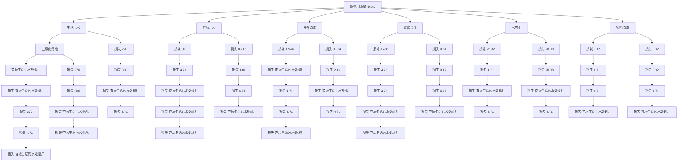
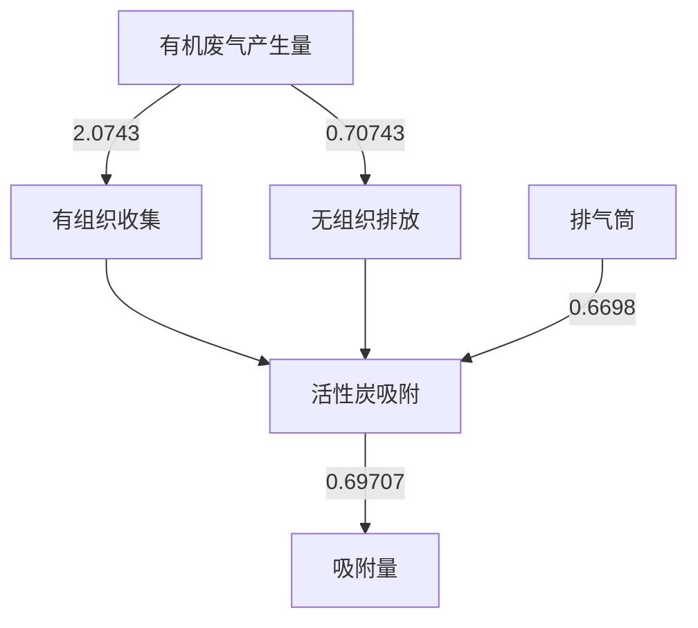
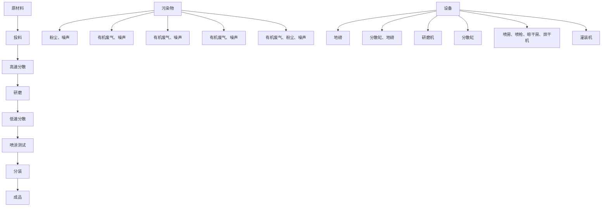

# 建设项目环境影响报告表

# （污染影响类）

项目名称：佛山市伯丁克材料科技有限公司新建项目

建设单位（盖章）：佛山市伯丁克材料科技有限公司

2024年7月编制日期：

中华人民共和国生态环境部制

编制单位和编制人员情况表

<table><tr><td>项目编号</td><td>pw49g3</td></tr><tr><td>建设项目名称</td><td>佛山市伯丁克材料科技有限公司新建项目</td></tr><tr><td>建设项目类别</td><td>23—044基础化学原料制造;农药制造;涂料、油墨、颜料及类似产品制造;合成材料制造;专用化学产品制造;炸药、火工及焰火产品制造</td></tr><tr><td>环境影响评价文件类型</td><td>报告表</td></tr><tr><td colspan="2">一、建设单位情况</td></tr><tr><td>单位名称(盖章)</td><td>佛山市伯丁克材料科技有限公司</td></tr><tr><td>统一社会信用代码</td><td>91440606MA4UHNGF16</td></tr></table>

# 目 录

一、建设项目基本情况..

二、建设项目工程分析.. 13

三、区域环境质量现状、环境保护目标及评价标准. 23

四、 主要环境影响和保护措施. .28

五、环境保护措施监督检查清单 51

六、结论... . 54

建设项目污染物排放量汇总表..... .55

附图1 项目地理位置图. 56

附图2 项目平面布置图. . 57

附图3 项目500m敏感点图. . 58

附图4 佛山市环境管控单元图. . 59

附图5 项目四至现状图. . 60

附图6 项目周边环境现状照片. . 61

附图7 项目所在区域地表水环境功能区划图. . 62

附图8 项目所在区域大气环境功能区划图. . 63

附图9 项目所在区域声环境功能区划图 . 64

附图 10 《顺德西部生态产业新区杏坛北片区控制性详细规划（漂染城片区）技术修正批后公布》 ... 65

附图11 佛山市顺德区环境管控单元图. ..66

附图12 广东省“三线一单”平台. . 67

附件1 营业执照. . 68

附件2 法人身份证. . 69

附件3 用地证明.. . 70

附件4 成分报告及VOCs 检测报告. . 72

附件5 环评合同. 117

附件6 声明.. 118

# 一、建设项目基本情况

<table><tr><td>建设项目名称</td><td colspan="3">佛山市伯丁克材料科技有限公司新建项目</td></tr><tr><td>项目代码</td><td colspan="3">无</td></tr><tr><td>建设单位联系人</td><td>吴延安</td><td>联系方式</td><td></td></tr><tr><td>建设地点</td><td colspan="3">广东省佛山市顺德区杏坛镇齐杏社区杏坛工业区科技五路1号华康楼11栋104</td></tr><tr><td>地理坐标</td><td colspan="3">(东经113度10分45.217秒,北纬22度46分55.782秒)</td></tr><tr><td>国民经济行业类别</td><td>C2641涂料制造</td><td>建设项目行业类别</td><td>二十三、化学原料和化学制品制造业-44、涂料、油墨、颜料及类似产品制造264-单纯物理分离、物理提纯、混合、分装的(不产生废水或挥发性有机物的除外)</td></tr><tr><td>建设性质</td><td>√新建(迁建)□改建□扩建□技术改造</td><td>建设项目申报情形</td><td>√首次申报项目□不予批准后再次申报项目□超五年重新审核项目□重大变动重新报批项目</td></tr><tr><td>项目审批(核准/备案)部门(选填)</td><td>——</td><td>项目审批(核准/备案)文号(选填)</td><td>——</td></tr><tr><td>总投资(万元)</td><td>150</td><td>环保投资(万元)</td><td>15</td></tr><tr><td>环保投资占比(%)</td><td>10</td><td>施工工期</td><td>1个月</td></tr><tr><td>是否开工建设</td><td>√否□是: _</td><td>用地(用海)面积(m2)</td><td>917.82</td></tr><tr><td>专项评价设置情况</td><td colspan="3">无</td></tr><tr><td>规划情况</td><td colspan="3">无</td></tr><tr><td>规划环境影响评价情况</td><td colspan="3">规划环境影响评价文件名称:《佛山市顺德高新技术产业开发区扩区规划环境影响报告书》审查机关:佛山市生态环境局顺德分局审查文件名称:佛山市生态环境局顺德分局关于佛山市顺德高新技术产业开发区扩区规划环境影响报告书审查情况的复函</td></tr><tr><td>规划及规划环境影响评价符合性分析</td><td colspan="3">根据《佛山市顺德高新技术产业开发区扩区规划环境影响报告书》,项目与规划及审查意见的相符性分析见下表1。</td></tr></table>

表 1 与佛山市顺德高新技术产业开发区扩区规划环境影响报告书有关准入的条件相符性分析

<table><tr><td>清单类型</td><td>准入要求</td><td>本项目情况</td><td>符合性</td></tr><tr><td colspan="4">高新区总体生态环境准入清单</td></tr><tr><td>空间布局约束</td><td>1、引入产业应符合现行有效的《产业结构调整指导目录》、《市场准入负面清单》等相关产业政策的要求。2、禁止引入新增排放重点防控重金属污染物(铅(Pb)、汞(Hg)、(Cd)铬(Cr)和类金属砷(As))、持久性有机污染物的项目。3、饮用水源准保护区内不得新建、扩建对水体污染严重、排放一类水污染物和持久性有机污染物的项目,改扩建项目不得新增水污染物。4、禁止引入达不到清洁生产国际先进水平的企业。5、在污水管网建设滞后或所依托的污水处理厂处理能力不能满足废水处理需求的区域,不应引入废水排放量较大的项目。应控制废水排放量较大企业的引入,引入涉水排放企业的规模应与区域污水处理厂处理能力相匹配,严格控制废水排放量较大的项目及新增一类水污染物排放项目的引入,避免对下游饮用水源保护区产生不良影响。6、禁止新建、扩建燃煤燃油火电机组和企业自备电站,逐步淘汰生物质锅炉、集中供热管网覆盖区域内的分散供热锅炉,集中供热管网覆盖地区禁止新建、扩建分散供热锅炉,规划区应全部按高污染燃料禁燃区进行管理:禁止新建、扩建水泥、平板玻璃、化学制浆、炼化炼钢炼铁、电解铝、焦炭、金属冶炼、制浆造纸、糅革、铅酸蓄电池、专业电镀、木质家具涂装、印染项目:不再新建陶瓷厂(新型特种陶瓷项目除外)。化工项目按照“入园管理”原则合理布局,提高准入门槛,不得新建、扩建纳入国家“高污染、高环境风险”产品名录的生产项目。7、严格控制日用玻璃制造、家具制造、废塑料回收加工再生(列入国家“城市矿产”示范基地项目除外)、专业金属表面处理铝及铝合金的阳极氧化、铝的表面铬酸盐转化、锌的铬酸盐钝化和金属酸洗、磷化、喷漆、喷涂)等项目建设,严格限制新建生产和使用高挥发性有机物原辅材料的项目,鼓励建设挥发性有机物共性工厂。8、工业企业禁止选址城镇生活空间,生产空间禁止建设居民住宅等敏感建筑;园区工业用地或企业与村庄、学校等环境敏感点之间应设置合理的防护距离,并通过绿化带进行有效隔离,该距离内不得规划新建居民点、办公楼和学校等环境敏感目标。9、现有及规划居住区、学校、医院等敏感用地周边50米范围内禁止新建、扩建高噪声排放生产项目;现有及规划居住区、学校、医院等敏感用地周边100米范围内禁止新建、扩建纳入国家“高污染高环境风险”产品名录的生产项目,不引入酸洗、涂装、注塑、排放恶臭气味的生产工艺和生产设施。10、结合《顺德区高质量推动村级工业园升级改造总体规划》,推进区域村级工业园改造工作,禁止重复低水平建设。11、南片区按照《广东省重金属污染综合防治“十三五”规划》、《佛山市重金属污染综合防治“十三五”规划》的要求,禁止新建、扩建增加重点防控的重金属污染物排放的建设项目,现有技术改造项目应通过实施“区域削减”,实现增产减污;其它区域新、改扩建重金属排放项目。应严格落实重金属总量替代与削减要求,严格控制重点行业发展规模。12、按规划用地布局未来退出的工业企业用地,应严格按照《中华人民共和国土壤污染防治法》开展必要的调查、评估和修复工作,符合要求后,方可用于居住、教育教研、办公等第三产业类用地。13、其它:符合《佛山市人民政府关于印发佛山市“三线一单”生态环境分区管控方案的通知》(佛府〔2021〕11号)相关管控要求。</td><td>1、本项目属于C2641涂料制造,不属于《市场准入负面清单(2022年版)》(发改体改规[2022]397号)中禁止和许可事项。2、本项目不涉及重金属污染物和持久性有机污染物排放。3、本项目选址不在饮用水源保护区范围。4、本项目能达到清洁生产国际先进水平。5、本项目生活污水排入杏坛污水处理厂处理,污水量较少,水质较为简单且污染程度低,可生化性好,不会对污水处理厂的运行造成冲击。6、本项目生产过程使用电能,不使用高污染燃料,不属于“高污染、高环境风险”行业。7、本项目属于C2641涂料制造,使用原料不属于高挥发性有机物原辅材料使用。8、本项目选址位于工业区,距离项目最近的敏感点为西南面212m处的杏坛社区卫生服务中心,距离项目较远。9、本项目50米范围内无声环境敏感点,100米范围内无居住区、学校、医院等敏感用地。10、项目选址属于村级工业园升级改造后的产业集聚区。11、本项目无重金属污染物排放。12、本项目选址在规划工业企业用地内。13、见表2。</td><td>符合</td></tr><tr><td>污染物排放管控</td><td>1、污染物排放总量不得突破“污染物排放总量管控限值清单”的总量管控要求:重点对重点污染物(重点污染物包括化学需氧量、氨氮、氮氧化物及挥发性有机物等)实施总量控制;上年度重点河涌水质未达到水环境质量目标的管控分区所在镇(街道),须组织编制、系统实施、向社会公开区域重点水污染物减排计划并明确“替代量”,本年度新建、改建、扩建项目新增水环境重点污染物实行区域“减二增一”替代(废水集中处理设施、民生项目除外);在可核查、可监管的基础上,全区新建、改建、扩建项目新增大气重点污染物实行“减二增一”替代。2、未完成环境质量改善目标的区域,新改扩建项目重点污染物实施减量替代。3、未接入污水管网的新建建筑小区或公共建筑,不得交付使用。新建城区生活污水收集处理设施要与城市发展同步规划、同步建设。4、规划区内建设项目废污水原则上应接入各片区集中式污水处理厂进行集中处理、达标排放;受纳水体或监控断面不达标的,不得新建、扩建向河涌直接排放废水的项目;对于暂时无法接入市政污水管网、且废水量较少的项目,生活污水处理后立足回用,不能回用的,应处理达到《城镇污水处理厂污染物排放标准》(GB18918-2002)后排入政策法规允许排放且有环境容量的水域;生产废水应立足于回用,不能回用的,可考虑委外处置,确需要外排的,应处理达到行业直接排放标准或广东省《水污染物排放限值》(DB44/26-2001)后排入政策法规允许排放且有环境容量的水域。5、向工业集聚区污水集中处理设施或者城镇污水集中处理设施排放工业废水的,应当按照有关规定进行预处理,达到集中处理设施处理工艺要求后方可以排入市政管网进入各片区污水处理厂。企业生活污水达到广东省《水污染物排放限值》(DB44/26-2001)第二时段三级标准后通过污水管线进入各片区所依托的城镇污水处理厂。6、规划区依托的集中式污水处理设施排放标准应达到或优于《城镇污水处理厂污染物排放标准》(GB18918-2002)级标准的A标准和广东省《水污染物排放限值》(DB44/26-2001)第二时段一级标准的较严者。7、挤出等合成树脂加工生产环节和生产设备其执行《合成树脂工业污染物排放标准》(GB31572-2015)表5规定的大气污染物特别排放限值(涉及PVC树脂的不执行)、合成树脂工业污染物排放标准及其他污染控制要求;厂区内VOCs无组织排放监控点浓度应符合GB37822-2019中表A.1规定的特别排放限值。8、重点加强涉VOCs排放的工业项目的挥发性有机物的源头替代和无组织排放管控,大力推进低VOCs含量原辅材料替代。9、其它:符合《佛山市人民政府关于印发佛山市“三线一单”生态环境分区管控方案的通知》(佛府〔2021〕11号)相关管控要求</td><td>1、项目生活污水经三级化粪池处理后排入杏坛污水处理厂,《佛山市排污权有偿使用和交易管理试行办法》(佛府办2020第19号),生活污水的CODcr、氨氮不分配总量,其总量纳入杏坛污水处理厂。2、项目VOCs排放量为1.377t/a,VOCs总量在所在街道中列支。3、项目所在位置为杏坛污水处理厂纳污范围。4、项目已做好“雨污分流、清污分流”,生活污水排入杏坛污水处理厂处理,纳污水体顺德支流达标。5、项目没有生产废水外排。6、杏坛污水处理厂尾水排放执行《水污染物排放限值》(DB44/26-2001)中的第二时段一级标准和《城镇污水处理厂污染物排放标准》(GB18918-2002)中一级标准的A标准中的较严值。7、项目不涉及挤出等合成树脂加工生产环节和生产设备。8、本项目使用的原料不属于高VOCs含量原辅材料。9、见表2。</td><td>符合</td></tr><tr><td>环境风险防控</td><td>1、制定园区环境风险事故防范和应急预案。完善区域—园区—工业企业多级联动环境突发事件应急预案,建立预防、应急响应机制和后评估机制,定期开展应急演练,提高区域环境风险防范能力。2、污水处理厂应采取有效措施,防止事故废水直接排入水体;完善污水处理厂在线监控系统联网,实现污水处理厂的实时、动态监管。3、生产性废水较多的企业需配套有效措施,防止事故废水和第一类污染物直排污染地表水体,防止因渗漏污染地下水。4、其它:符合《佛山市人民政府关于印发佛山市“三线一单”生态环境分区管控方案的通知》(佛府〔2021〕11号)相关管控要求。</td><td>1、本项目制定应急预案并定期开展应急演练,建立预防、应急响应机制,与园区联动。2、本项目不属于污水处理厂。3、本项目没有生产废水外排。4、见表2。</td><td>符合</td></tr><tr><td>资源开发利用要求</td><td>1、禁止使用高污染燃料。2、工业项目原则上单位GDP能耗要低于0.38吨标煤/万元,单位工业增加值新鲜水耗要低于10立方米/万元。3、新建高能耗项目单位产品(产值)能耗达到国际国内先进水平。4、其它:符合《佛山市人民政府关于印发佛山市“三线一单”生态环境分区管控方案的通知》(佛府〔2021〕11号)相关管控要求。</td><td>1、本项目不使用高污染燃料。2、本项目不涉及。3、本项目不属于高能耗项目。4、见表2。</td><td>符合</td></tr></table>

<table><tr><td rowspan="2">其他符合性分析</td><td colspan="4">1、与产业政策符合性分析(1)环保准入清单根据国家发展改革委商务部关于印发《市场准入负面清单(2022年版)》(发改体改规〔2022〕397号)可知,清单之外的行业、领域、业务等,各类市场主体皆可依法平等进入,项目不在市场准入负面清单禁止和许可两类项目范围内,可依法平等进入。(2)产业政策相符性本项目属于C2641涂料制造,不在《产业结构调整指导目录(2024年本)》中的限制类、淘汰类之列;本项目产品不属于《促进产业结构调整暂行规定》中限制类、淘汰类之列,符合规定要求。综上,本项目符合国家的产业政策,符合产业结构调整、升级要求,符合国家产业政策发展规划要求。2、与《环境保护综合名录(2021年版)》的相符性分析:本项目主要经营水性木器漆生产,生产的产品及使用的原辅材料均不属于《环境保护综合名录(2021年版)》中“高污染、高环境风险”产品名录,符合要求。3、与《广东省发展改革委关于印发〈广东省“两高”项目管理目录(2022年版)〉的通知(粤发改能源函〔2022〕1363号)》相符性分析:项目主要从事水性木器漆的生产销售,本项目所属类别及生产产品不属于广东省发展改革委关于印发《广东省“两高”项目管理目录(2022年版)》的通知(粤发改能源函〔2022〕1363号)的附件 广东省“两高”项目管理目录中的行业类别或产品,符合《广东省发展改革委关于印发〈广东省“两高”项目管理目录(2022年版)〉的通知(粤发改能源函〔2022〕1363号)》的相关规定。4、项目与“三线一单”生态环境分区管控方案相符性分析项目位于广东省佛山市顺德区杏坛镇齐杏社区杏坛工业区科技五路1号华康楼11栋104。根据《广东省人民政府关于印发&lt;广东省“三线一单”生态环境分区管控方案&gt;的通知》(粤府〔2020〕71号)发布的广东省环境管控单元图,项目所在地属于重点管控单元;根据《佛山市生态环境局关于印发&lt;佛山市“三线一单”生态环境分区管控方案(2024年版)&gt;》的通知(佛环〔2024〕20号)发布的佛山市环境管控单元图和《佛山市顺德区人民政府关于印发&lt;佛山市顺德区“三线一单”生态环境分区管控方案&gt;的通知》(顺府发〔2021〕11号)发布的顺德区环境管控单元图,项目所在地属于广东省佛山市顺德区重点管控单元10(编码为ZH44060620011,名称为顺德高新技术产业开发区)。项目与广东省佛山市重点管控单元2准入清单的相符性分析如表3。5、挥发性有机物(VOCs)排放符合性分析表2 项目与挥发性有机物(VOCs)排放规定相符性分析</td></tr><tr><td>序号</td><td>政策要求</td><td>工程内容</td><td>符合性</td></tr></table>

<table><tr><td colspan="4">1.《广东省生态环境保护“十四五”规划》</td></tr><tr><td>1.1</td><td>大力推进低VOCs含量原辅材料源头替代,严格落实国家和地方产品VOCs含量限值质量标准,禁止建设生产和使用高VOCs含量的溶剂型涂料、油墨、胶粘剂等项目。</td><td>本项目生产的水性木器漆属于低VOCs含量涂料。</td><td>符合</td></tr><tr><td>1.2</td><td>珠三角地区禁止新建、扩建水泥、平板玻璃、化学制浆、生皮制革以及国家规划外的钢铁、原油加工等项目</td><td>本项目不属于禁止类行业</td><td>符合</td></tr><tr><td>1.3</td><td>强化对企业涉VOCs生产车间/工序废气的收集管理,推动企业开展治理设施升级改造。</td><td>本项目分散工序废气和实验室废气采用集气罩收集,测试工序废气采用整室收集,收集后经活性炭吸附装置处理后排放。</td><td>符合</td></tr><tr><td colspan="4">2.《佛山市生态环境保护“十四五”规划》</td></tr><tr><td>2.1</td><td>鼓励重点行业企业开展生产工艺和设备水性化改造,推广使用水性、高固体份、无溶剂、粉末等低VOCs含量涂料。</td><td>本项目原料均为低VOCs含量涂料,生产的涂料为水性木器漆,属于低VOCs含量涂料</td><td>符合</td></tr><tr><td>2.2</td><td>新建、扩建项目需符合环境质量改善要求。严格控制“高耗能、高排放”项目盲目发展,禁止新建、扩建水泥、平板玻璃、化学制浆、生皮制革以及国家规划外的钢铁、原油加工等项目。</td><td>本项目不属于“高耗能、高排放”项目,也不属于规划禁止类行业。</td><td>符合</td></tr><tr><td>2.3</td><td>严格限制新建生产和使用高挥发性有机物原辅材料的项目。</td><td>本项目不涉及生产和使用高挥发性有机物原辅材料</td><td>符合</td></tr><tr><td>2.4</td><td>化工、有色金属冶炼等行业严格执行大气污染物特别排放限值</td><td>本项目属于C2641涂料制造,废气收集后由活性炭吸附装置处理后引至51m高排气筒DA001排放。非甲烷总烃的排放浓度执行《涂料、油墨及胶粘剂工业大气污染物排放标准》(GB37824-2019)表2大气污染物特别排放限值。</td><td>符合</td></tr><tr><td>2.5</td><td>严格执行相关行业企业布局选址要求,在重金属镉累积性较高的区域禁止新建、扩建排放重金属污染物的建设项目。</td><td>本项目不涉及重金属。</td><td>符合</td></tr><tr><td colspan="4">3.《佛山市顺德区生态环境保护“十四五”规划(2021-2025)》(顺府办发(2022)16号)</td></tr><tr><td>3.1</td><td>加强VOCs源头替代和无组织排放管控。大力推进低VOCs含量、低反应活性的原辅材料替代,将全面使用低VOCs含量原辅材料的企业纳入正面清单和政府绿色采购清单。鼓励重点行业企业开展生产工艺和设备水性化改造,推广使用水性、高固体分、无溶剂、粉末等低VOCs含量涂料。严格落实《挥发性有机物无组织排放控制</td><td>本项目不属于储油库、加油站,生产过程不使用高挥发性有机物原辅材料;废气收集后由活性炭吸附装置处理后引至51m高排气筒DA001排放。</td><td>符合</td></tr></table>

<table><tr><td rowspan="12"></td><td></td><td>标准》,开展厂区内无组织排放浓度监测,加强对含VOCs物料储存、转移和运输、设备与管线组件泄漏、敞开液面逸散以及工艺过程等五类排放源的管控。加强储油库、加油站等VOCs排放治理,推动油品储运销体系安装油气回收自动监控系统。</td><td></td><td></td></tr><tr><td colspan="4">4.《关于做好建设项目挥发性有机物(VOCs)排放削减替代工作的补充通知》(粤环函〔2021〕537号)</td></tr><tr><td>4.1</td><td>各地生态环境部门要健全建设项目VOCs排放总量管理台账,严格核定VOCs可替代总量指标,重点核查用作替代的削减量是否为企业达标排放后采取治理措施的削减量,或淘汰关停后的削减量,是否有削减量重复使用等情况,进一步规范VOCs削减替代工作。新改扩建项目环评审批时,应逐级出具VOCs总量替代来源审核意见,确保总量指标管理扎实有效</td><td>项目审批时当地生态环境部门将根据《关于做好建设项目挥发性有机物(VOCs)排放削减替代工作的补充通知》(粤环函〔2021〕537号)文件要求核定VOCs总量来源。</td><td>符合</td></tr><tr><td colspan="4">5、《广东省人民政府办公厅关于印发广东省2021年大气、水、土壤污染防治工作方案的通知》(粤办函〔2021〕58号)</td></tr><tr><td>5.1</td><td>严格落实国家产品VOCs含量限值标准要求,除现阶段确无法实施替代的工序外,禁止新建生产和使用高VOCs含量原辅材料项目。鼓励在生产和流通消费环节推广使用低VOCs含量原辅材料。</td><td>本项目生产满足《低挥发性有机化合物含量涂料产品技术要求》(GBT38597-2020)要求的水性木器漆,不使用高VOCs含量原辅材料。</td><td>符合</td></tr><tr><td colspan="4">6.关于印发《广东省涉挥发性有机物(VOCs)重点行业治理指引》的通知(粤环办〔2021〕43号)</td></tr><tr><td>6.1</td><td>研发和生产低VOCs含量涂料、油墨、胶粘剂等产品。</td><td>项目生产水性木器漆满足《低挥发性有机化合物含量涂料产品技术要求》(GBT38597-2020)要求。</td><td>符合</td></tr><tr><td>6.2</td><td>液态物料应采用密闭管道,采用非管道输送方式转移液态VOCs物料时,应采用密闭容器、罐车。</td><td>项目使用的含VOCs的原辅料均密闭包装、储存和运输。</td><td>符合</td></tr><tr><td>6.3</td><td>VOCs物料卸(出、放)料过程密闭,卸料废气排至VOCs废气收集处理系统;无法密闭的,采取局部气体收集措施,废气排至VOCs废气收集处理系统。</td><td>本项目分散工序废气和实验室废气采用集气罩收集,测试工序废气采用整室收集,收集后经活性炭吸附装置处理后排放。</td><td>符合</td></tr><tr><td>6.4</td><td>涂料、油墨及胶粘剂工业移动缸及设备零件清洗时,采用密闭系统或在密闭空间内操作,废气排至VOCs废气收集处理系统。</td><td>本项目清洗主要是使用自来水清洗缸体,在收集罩下方进行清洗。</td><td>符合</td></tr><tr><td>6.5</td><td>采用外部集气罩的,距集气罩开口面最远处的VOCs无组织排放位置,控制风速不低于0.3m/s。</td><td>采用集气罩收集,风速不低于0.3m/s。</td><td>符合</td></tr><tr><td>6.6</td><td>废气收集系统的输送管道应密闭。废气收集系统应在负压下运行,若处于正压状态,应对管道组件的密封点进行泄漏检测,泄漏检测值不应超过500μmol/mol,亦不应有感官可察觉泄漏。</td><td>项目废气收集系统的输送管道密闭,废气收集系统在负压下运行。</td><td>符合</td></tr><tr><td rowspan="9"></td><td>6.7</td><td>VOCs治理设施应与生产工艺设备同步运行,VOCs治理设施发生故障或检修时,对应的生产工艺设备应停止运行,待检修完毕后同步投入使用;生产工艺设备不能停止运行或不能及时停止运行的,应设置废气应急处理设施或采取其他替代措施。</td><td>项目VOCs治理设施需与生产工艺设备同步运行。当废气收集处理系统发生故障或检修时,所有工序将停止运行,待检修完毕后再投入生产。</td><td>符合</td></tr><tr><td>6.8</td><td>1、涂料、油墨及胶粘剂工业企业有机废气排气筒排放浓度不高于《涂料、油墨及胶粘剂工业大气污染物排放标准》(GB37824-2019)排放限值要求,其他无行业标准的企业有机废气排气筒排放浓度不高于广东省《大气污染物排放限值》(DB4427-2001)第II时段排放限值,若国家和我省出台并实施使用于该行业的大气污染物排放标准,则有机废气排气筒排放浓度不高于相应的排放限值;若收集的废气中NMHC初始排放速率≥3kg/h,处理效率≥80%;2、厂区内无组织排放监控点NMHC的小时平均浓度值不超过 $6mg/m^3$ ,任意一次浓度值不超过 $20mg/m^3$ 。</td><td>项目废气经收集处理后能够达标排放。</td><td>符合</td></tr><tr><td colspan="4">7.广东省《固定污染源挥发性有机物综合排放标准》(DB44/2367-2022)</td></tr><tr><td>7.1</td><td>排气筒高度不低于15m(因安全考虑或者有特殊工艺要求的除外),具体高度以及与周围建筑物的相对高度关系应当根据环境影响评价文件确定。</td><td>本项目废气收集后由“活性炭”处理后引至51m高排气筒DA001排放。</td><td>符合</td></tr><tr><td>7.2</td><td>企业应当建立台账,记录废气收集系统、VOCs处理设施的主要运行和维护信息,如运行时间、废气处理量、操作温度、停留时间、吸附剂再生/更换周期和更换量、催化剂更换周期和更换量、吸收液pH值等关键运行参数。台账保存期限不少于3年。</td><td>项目运营期废气治理设施拟安排专人维护并定期建立台账,记录相关废气数据;台账保存期限不少于3年。</td><td>符合</td></tr><tr><td>7.3</td><td>VOCs物料应当储存于密闭的容器、储罐、储库、料仓中;盛装VOCs物料的容器应当存放于室内,或者存放于设置有雨棚、遮阳和防渗设施的专用场地。盛装VOCs物料的容器或者包装袋在非取用状态时应当加盖、封口,保持密闭。</td><td>本项目VOCs物料包装方式为密闭桶装,储存于原料区内(室内)。</td><td>符合</td></tr><tr><td>7.4</td><td>废气收集系统排风罩(集气罩)的设置应当符合GB/T16758的规定。采用外部排风罩的,应当按GB/T16758、WS/T757—2016规定的方法测量控制风速,测量点应当选取在距排风罩开口面最远处的VOCs无组织排放位置,控制风速不应当低于0.3m/s(行业相关规范有具体规定的,按相关规定执行)。</td><td>本项目分散工序的废气通过集气罩收集,测试工序和实验室废气通过整室收集,一并收集后由活性炭吸附装置处理后引至一根51m高排气筒DA001排放。</td><td>符合</td></tr><tr><td colspan="4">8.关于印发《重点行业挥发性有机物综合治理方案》的通知(环大气〔2019〕53号)</td></tr><tr><td>8.1</td><td>通过使用水性、粉末、高固体分、无溶剂、辐射固化等低VOCs含量的涂料,水性、辐射固化、植物等低VOCs含量的油墨,水基、</td><td>本项目使用的原材料属于低挥发性的物料,满足相关标准要求。</td><td>符合</td></tr></table>

<table><tr><td></td><td>热熔、无溶剂、辐射固化、改性、生物降解等低VOCs含量的胶粘剂,以及低VOCs含量、低反应活性的清洗剂等,替代溶剂型涂料、油墨、胶粘剂、清洗剂等,从源头减少VOCs产生。</td><td></td><td></td></tr><tr><td>8.2</td><td>重点对含VOCs物料(包括含VOCs原辅材料、含VOCs产品、含VOCs废料以及有机聚合物材料等)储存、转移和输送、设备与管线组件泄漏、敞开液面逸散以及工艺过程等五类排放源实施管控,通过采取设备与场所密闭、工艺改进、废气有效收集等措施,削减VOCs无组织排放。</td><td>项目分散工序和实验工序产生的有机废气通过“点对点”进行收集,收集效率为65%。喷涂和烘干产生的有机废气通过整室收集后处理,收集效率为90%。</td><td>符合</td></tr><tr><td>8.3</td><td>提高废气收集率,遵循“应收尽收、分质收集”的原则,科学设计废气收集系统,将无组织排放转变为有组织排放进行控制。采用全密闭集气罩或密闭空间的,除行业有特殊要求外,应保持微负压状态,并根据相关规范合理设置通风量。采用局部集气罩的,距集气罩开口面最远处的VOCs无组织排放位置,控制风速应不低于0.3米/秒,有行业要求的按相关规定执行。</td><td>项目分散工序和实验工序产生的有机废气通过“点对点”进行收集,收集效率为65%。喷涂和烘干产生的有机废气通过整室收集后处理,收集效率为90%。</td><td>符合</td></tr><tr><td colspan="4">9.《佛山市顺德区强化大气污染防治行动方案(2024年)》</td></tr><tr><td>9.1</td><td>按照《佛山市安全生产委员会办公室关于印发佛山市有机废气治理设施安全专项整治工作方案的通知》(佛安办(2020)246号)部署,符合要求已登记造册的仍在使用低温等离子、UV低光解设备设施的企业,2024年底基本完成光氧化、光催化、低温等离子等低效治理设施淘汰。</td><td>项目有机废气治理设施为“活性炭吸附”装置。不属于上述效治理设施。</td><td>符合</td></tr><tr><td colspan="4">10.《涂料、油墨及胶粘剂工业大气污染物排放标准》(GB37824-2019)</td></tr><tr><td>10.1</td><td>车间或生产设施排气中NMHC初始排放速率≥3kg/h时,应配置VOCs处理设施,处理效率不应低于80%。对于重点地区,车间或生产设施排气中NMHC初始排放速率≥2kg/h时,应配置VOCs处理设施,处理效率不应低于80%。</td><td>项目车间或生产设施排气中的NMHC初始排放速率&lt;2kg/h。</td><td>符合</td></tr><tr><td>10.2</td><td>废气收集处理系统应与生产工艺设备同步运行。废气收集处理系统发生故障或检修时,对应的生产工艺设备应停止运行,待检修完毕后同步投入使用;生产工艺设备不能停止运行或不能及时停止运行的,应设置废气应急处理设施或采取其他替代措施。</td><td>项目废气收集处理系统与生产设备同步运行,废气收集处理系统发生故障或检修时,对应的生产设备停止运行。</td><td>符合</td></tr><tr><td colspan="4">6、项目与《佛山市人民政府办公室关于印发佛山市危险化学品禁止、限制和控制目录(试行)的通知》(佛府办(2023)10号)的相符性分析本项目属于C2641涂料制造,主要从事水性木器漆的加工生产,项目所使用的原材料主要为水性丙烯酸乳液、AMP、二氧化硅、硫酸钡、分散剂、流平剂、消泡剂、增稠</td></tr></table>

<table><tr><td></td><td>剂、钛白粉、水性色浆等,均不属于《附件1:禁止危险化学品目录》、《附件2:严格限制控制区域限制和控制危险化学品目录》、《附件3:其他区域限制和控制危险化学品目录》中的危险化学品,且原材料均储放在原料堆放区中,并做好相应的措施,与《佛山市人民政府办公室关于印发佛山市危险化学品禁止、限制和控制目录(试行)的通知》相符合。7、项目与控制性规划的相符性分析根据《顺德西部生态产业新区杏坛北片区控制性详细规划(漂染城片区)技术修正批后公布》(批复文号:佛府办函[2020]25号)(详见附图10),项目选址用地性质为工业用地。因此本项目的选址符合佛山市顺德区总体规划的要求,符合所在地块的土地利用性质,选址合理。</td></tr></table>

表 3 本项目与佛山市顺德区“三线一单”生态环境分区管控方案相符性分析

<table><tr><td>管控维度</td><td>管控要求</td><td>本项目情况</td><td>符合性</td></tr><tr><td>区域布局管控</td><td>1-1【产业/鼓励引导类】园区重点发展家用电器具制造、装备制造等产业。1-2.【产业/禁止类】新入园项目不得引入专业电镀、印染等污染物排放量大或排放一类水污染物、持久性有机污染物的项目,不得引进园区规划环评及批复(审查意见)禁止引进项目。1-3.【产业/禁止类】严格生产空间和生活空间管控,工业企业原则上禁止选址生活空间,生产空间原则上禁止建设居民住宅等敏感建筑。1-4.【产业/综合类】园区工业用地或企业与村庄、学校等环境敏感点之间的区域应合理设置控制开发区域(产业控制带),产业控制带内优先引进无污染的生产性服务业,或可适当布置废气排放量小、工业噪声影响小的产业。1-5.【产业/限制类】严格限制不符合园区发展定位的项目入驻。1-6.【产业/限制类】受纳水体或监控断面不达标的,不得新建、扩建向河涌直接排放废水的项目。新建、扩建含蚀刻工序的线路板生产项目和化工项目应在配套污水集中处置的工业园区或生活污水管网覆盖区域内建设;纯加工型印花项目,含酸洗、磷化的金属表面处理、金属制品项目(与自身高新技术企业配套的除外),含酸洗、喷涂、化学抛光、电解等涉及废水排放工艺的不锈钢型材加工项目(与自身高新技术企业配套的除外),应进入以此类项目为主导产业、有相应废水集中治理设施的工业园区,实现集中治污。1-7.【产业/综合类】划定家具生产优先发展区域,优先发展区外不再新建涉及涂装工艺的木质家具制造项目。1-8.【产业/综合类】系统推进村级工业园升级改造,腾出连片空间,布局产业集聚区和主题产业园,推动工业项目入园集聚发展。新增工业制造业用地原则上安排在产业集聚区内,产业集聚区外原则上不鼓励工业及物流仓储用地的新建与改造。</td><td>1-1.项目不涉及。1-2 项目不属于专业电镀、印染等污染物排放量大或排放一类水污染物、持久性有机污染物的项目。1-3.项目选址用地为工业用地。1-4.距离项目最近的敏感点为西南面212m处的杏坛社区卫生服务中心,距离项目较远。1-5.项目符合园区发展定位。1-6.项目已做好“雨污分流、清污分流”,生活污水排入杏坛污水处理厂处理,纳污水体顺德支流达标。1-7.项目不涉及。1-8.项目选址属于村级工业园升级改造后的产业集聚区。</td><td>符合</td></tr><tr><td>能源资源利用</td><td>2-1.【能源/综合类】科学实施能源消费总量和强度“双控”,新建高能耗项目单位产品(产值)能耗达到国际国内先进水平。2-2.【水资源/综合类】提高园区水资源利用效率,提升污水回用比例。2-3.【土地资源/综合类】落实单位土地面积投资强度、土地利用强度等建设用地控制性指标要求,提高土地利用效率。2-4.【其他/综合类】有行业清洁生产标准的新引进项目清洁生产水平须达到本行业国际先进水平。</td><td>2-1.项目不属于高能耗项目。2-2.本项目设备清洗废水、实验仪器清洗废水、水帘柜废水和喷枪清洗废水暂存在废水桶中,定期委托佛山市顺德区绿点废水回收处理有限公司清运处理。2-3.项目单位土地面积投资强度、土地利用强度等建设用地控制性指标均满足相关标准要求,土地利用效率较高。2-4 项目不涉及。</td><td>符合</td></tr><tr><td>污染物排放管控</td><td>3-1.【其他/综合类】园区各项污染物排放总量不得突破规划环评核定的污染物排放总量管控要求。3-2.【水/综合类】完善污水管网建设,有条件的区域实施雨污分流改造。</td><td>3-1.项目污染物排放量较少,不会突破污染物排放总量管控要求。3-2.项目已做好“雨污分流、清污分流”,生活污水排入杏坛污水处理厂处理。</td><td>符合</td></tr><tr><td>环境风险防控</td><td>4-1.【风险/综合类】园区应建立企业、园区、区域三级环境风险防控体系,加强园区及入园企业环境应急设施整合共享,建立有效的拦截、降污、导流、暂存等工程措施,防止泄漏物、消防废水等进入园区外环境。建立园区环境应急监测机制,强化园区风险防控。</td><td>项目运营过程会落实各项风险控制措施,加强监督检查,做到及时发现,立即处理,避免污染。</td><td>符合</td></tr></table>

# 二、建设项目工程分析

# 1. 项目组成

佛山市伯丁克材料科技有限公司新建项目（以下简称“本项目”）位于广东省佛山市顺德区杏坛镇齐杏社区杏坛工业区科技五路 1 号华康楼 11栋 104，其地理位置见附图 1，中心地理坐标：E113°10′45.217″，N22°46′55.782″。本项目为新建项目，选址位于一栋 9 层建筑物，该建筑物首层高度为7.9m，二层至四层高度均为5.8m，五层至六层高度均为5.4m，七层至九层高度均为4.5m，总楼高 49.6m。项目占地面积为 917.82m2，建筑面积为 917.82m2，主要从事涂料的生产制造，总投资 150万元，其中环保投资为 15 万元，建成后设计年产水性木器漆 2000吨。

表 4项目所属行业分析表

<table><tr><td rowspan="13">行业类别</td><td colspan="3">类别</td><td>项目情况</td></tr><tr><td colspan="3">《国民经济行业分类》(GB/T 4754-2017)(2019年修订)</td><td rowspan="4">项目主要从事水性木器漆的生产和制造,属于C2641涂料制造。</td></tr><tr><td colspan="3">C制造业</td></tr><tr><td>大类</td><td>中类</td><td>小类</td></tr><tr><td>26化学原料和化学制品制造业</td><td>264涂料、油墨、颜料及类似产品制造</td><td>2641涂料制造</td></tr><tr><td colspan="3">《建设项目环境影响评价分类管理名录》(2021年版)</td><td rowspan="4">项目主要从事水性木器漆的生产和制造,本项目工艺为单纯混合、分装,不涉及化学反应,故应编制报告表。</td></tr><tr><td colspan="3">二十三、化学原料和化学制品制造业26-44、涂料、油墨、颜料及类似产品制造264</td></tr><tr><td>报告书</td><td>报告表</td><td>登记表</td></tr><tr><td>全部(含研发中试;不含单纯物理分离、物理提纯、混合、分装的)</td><td>单纯物理分离、物理提纯、混合、分装的(不产生废水或挥发性有机物的除外)</td><td>/</td></tr><tr><td colspan="3">《固定污染源排污许可分类管理名录(2019年版)》</td><td rowspan="4">本项目主要从事水性木器漆的生产和制造,本项目属于单纯混合、分装的涂料制造,故本项目应进行简化管理。</td></tr><tr><td colspan="3">二十一、化学原料和化学制品制造业26-50涂料、油墨、颜料及类似产品制造264</td></tr><tr><td>重点管理</td><td>简化管理</td><td>登记管理</td></tr><tr><td>涂料制造2641,油墨及类似产品制造2642,工业颜料制造2643,工艺美术颜料制造2644,染料制造2645,以上均不含单纯混合或者分装的</td><td>单纯混合或者分装的涂料制造2641、油墨及类似产品制造2642,密封用填料及类似品制造2646(不含单纯混合或者分装的)</td><td>其他</td></tr></table>

本项目由主体工程、辅助工程、环保工程、公用工程及配套工程组成，其具体工程组成见下表：

表 5 项目建设内容一览表

<table><tr><td>项目</td><td colspan="2">内容</td><td>建设内容</td></tr><tr><td rowspan="4">主体工程</td><td rowspan="4">生产车间</td><td>分散区</td><td>面积占 $47.8m^{2}$ ,层高4.5m,所在建筑高49.6m,主要功能为分散</td></tr><tr><td>称重区</td><td>面积占 $70.63m^{2}$ ,层高4.5m,所在建筑高49.6m,主要功能为称重</td></tr><tr><td>测试区</td><td>面积占 $46.08m^{2}$ ,层高4.5m,所在建筑高49.6m,设有打板区、喷房和晾干房,主要功能为产品检验测试</td></tr><tr><td>实验区</td><td>面积占 $35.64m^{2}$ ,层高4.5m,所在建筑高49.6m,主要功能为小试</td></tr><tr><td>辅助工程</td><td colspan="2">办公区</td><td>面积占 $40.24m^{2}$ ,层高4.5m,所在建筑高49.6m,供日常办公使用</td></tr><tr><td rowspan="2">仓储工程</td><td colspan="2">仓库(成品区、原料区)</td><td>面积占 $275.73m^{2}$ ,层高4.5m,所在建筑高49.6m,要功能为储存产品、原辅材料</td></tr><tr><td colspan="2">通道及电梯</td><td>面积占 $401.7m^{2}$ ,主要为道路、物料转运电梯、辅助设备</td></tr><tr><td>依托工程</td><td colspan="2">废水治理</td><td>生活污水经三级化粪池处理后排入杏坛污水处理厂,尾水排入顺德支流</td></tr><tr><td rowspan="2">公用工程</td><td colspan="2">给排水系统</td><td>依托所在厂房已有的设施:市政供水,生活污水经三级化粪池处理后排入杏坛污水处理厂,尾水排入顺德支流</td></tr><tr><td colspan="2">供电系统</td><td>配电系统一套,供应生产用电和办公生活用电</td></tr><tr><td rowspan="7">环保工程</td><td colspan="2">生活污水</td><td>生活污水预处理设施一套,处理职工生活污水</td></tr><tr><td rowspan="2">废气</td><td>正式分散和实验分散工序</td><td>分散过程产生的废气经集气罩点对点收集后引至活性炭吸附装置(TA001)处理后通过51m排气筒DA001排放</td></tr><tr><td>喷涂工序</td><td>喷涂废气经水帘柜处理后和晾干废气一并经整室收集引至活性炭吸附装置(TA001)处理后通过51m排气筒DA001排放</td></tr><tr><td colspan="2">噪声</td><td>合理安排加工作业区,墙体隔音、距离衰减</td></tr><tr><td colspan="2">固体废物</td><td>生活垃圾交由环卫站处理。一般固体废物交由回收公司回用;危险废弃物设立危废暂存间,危险废物集中收集后交由有危废处理资质的公司进行处理</td></tr><tr><td colspan="2">危废暂存间</td><td>面积占 $5m^{2}$ ,用于暂存危险废物,位于厂房内</td></tr><tr><td colspan="2">一般固废暂存间</td><td>面积占 $7m^{2}$ ,用于暂存一般固废,位于厂房内</td></tr></table>

# 2. 项目产品和产能

表 6 产品产能一览表

<table><tr><td>产品名称</td><td>单位</td><td>年产量</td><td>最大储存量</td><td>备注</td></tr><tr><td>水性木器漆</td><td>吨</td><td>2000</td><td>20</td><td>20kg/桶</td></tr><tr><td colspan="5">注:根据附件产品送检的VOCs检测报告,项目产品中挥发性有机化合物(VOCs)含量为26g/L,满足《低挥发性有机化合物含量涂料产品技术要求》(GB-T38597-2020)中木器涂料-色漆VOC含量≤220g/L的限值要求。</td></tr></table>

# 3. 项目生产设备

表 7 生产设备一览表

<table><tr><td rowspan="2">主要生产单元</td><td rowspan="2">主要工艺</td><td rowspan="2">生产设施名称</td><td rowspan="2">数量</td><td rowspan="2">单位</td><td colspan="3">设计参数</td><td rowspan="2">位置</td></tr><tr><td>参数名称</td><td>设计值</td><td>单位</td></tr><tr><td rowspan="8">生产</td><td>称重</td><td>电子秤</td><td>2</td><td>台</td><td>功率</td><td>0.25</td><td>kW</td><td>称重区</td></tr><tr><td>投料</td><td>投料泵</td><td>4</td><td>台</td><td>功率</td><td>0.75</td><td>kW</td><td>分散区</td></tr><tr><td rowspan="4">分散</td><td rowspan="4">分散缸</td><td>5</td><td>台</td><td>容积</td><td>50</td><td>L</td><td>分散区</td></tr><tr><td>4</td><td>台</td><td>容积</td><td>500</td><td>L</td><td>分散区</td></tr><tr><td>2</td><td>台</td><td>容积</td><td>1000</td><td>L</td><td>分散区</td></tr><tr><td>2</td><td>台</td><td>容积</td><td>1500</td><td>L</td><td>分散区</td></tr><tr><td>研磨</td><td>研磨机</td><td>2</td><td>台</td><td>功率</td><td>1.5</td><td>kW</td><td>分散区</td></tr><tr><td>灌装</td><td>灌装机</td><td>6</td><td>台</td><td>功率</td><td>0.75</td><td>kW</td><td>分散区</td></tr><tr><td rowspan="6">测试</td><td rowspan="6">喷涂测试</td><td>喷房</td><td>1</td><td>间</td><td>面积</td><td>17.82</td><td> $m^2$ </td><td>检验区</td></tr><tr><td>水帘柜</td><td>1</td><td>台</td><td>有效容积</td><td>0.54</td><td> $m^3$ </td><td>检验区</td></tr><tr><td>喷枪</td><td>4</td><td>支</td><td>压力</td><td>2</td><td>bar</td><td>检验区</td></tr><tr><td>晾干房</td><td>1</td><td>间</td><td>面积</td><td>17.82</td><td> $m^2$ </td><td>检验区</td></tr><tr><td>烘干机</td><td>1</td><td>台</td><td>温度</td><td>150</td><td>°C</td><td>检验区</td></tr><tr><td>空压机</td><td>1</td><td>台</td><td>容量</td><td>1.6</td><td> $m^3/min$ </td><td>检验区</td></tr><tr><td rowspan="13">实验</td><td rowspan="13">实验小试</td><td>分散机</td><td>2</td><td>台</td><td>容积</td><td>1</td><td>L</td><td>实验区</td></tr><tr><td>烘箱</td><td>2</td><td>个</td><td>温度</td><td>150</td><td>°C</td><td>实验区</td></tr><tr><td>粘度计</td><td>2</td><td>个</td><td>测量范围</td><td>1-10</td><td>万mPa.s</td><td>实验区</td></tr><tr><td>细度计</td><td>2</td><td>个</td><td>量程</td><td>0~50</td><td>μm</td><td>实验区</td></tr><tr><td>电子天平</td><td>4</td><td>个</td><td>功率</td><td>0.25</td><td>kW</td><td>实验区</td></tr><tr><td>冰柜</td><td>1</td><td>台</td><td>功率</td><td>200</td><td>W</td><td>实验区</td></tr><tr><td>酸度计</td><td>1</td><td>台</td><td>测量范围</td><td>0~14</td><td>pH</td><td>实验区</td></tr><tr><td>湿膜制备器</td><td>2</td><td>台</td><td>分辨率</td><td>0.01</td><td>MPa1psi</td><td>实验区</td></tr><tr><td>硬度计</td><td>2</td><td>台</td><td>分辨率</td><td>0.5</td><td>HR</td><td>实验区</td></tr><tr><td>漆膜冲击器</td><td>1</td><td>台</td><td>质量</td><td>1000</td><td>g</td><td>实验区</td></tr><tr><td>漆膜柔韧性测定器</td><td>1</td><td>台</td><td>轴棒尺寸</td><td>50-100</td><td>mm</td><td>实验区</td></tr><tr><td>光泽仪</td><td>1</td><td>台</td><td>测量范围</td><td>0-200</td><td>GU</td><td>实验区</td></tr><tr><td>水浴锅</td><td>1</td><td>台</td><td>功率</td><td>1000</td><td>W</td><td>实验区</td></tr><tr><td rowspan="8"></td><td rowspan="8"></td><td>座式涂四杯</td><td>1</td><td>套</td><td>测量范围</td><td>30-100</td><td>MPA.s</td><td>实验区</td></tr><tr><td>便携式涂四杯</td><td>1</td><td>套</td><td>测量范围</td><td>30-100</td><td>MPA.s</td><td>实验区</td></tr><tr><td>机械秒表</td><td>1</td><td>台</td><td>最小读数值</td><td>0.1</td><td>s</td><td>实验区</td></tr><tr><td>黑白格板</td><td>1</td><td>台</td><td>/</td><td>/</td><td>/</td><td>实验区</td></tr><tr><td>漆膜划格仪</td><td>1</td><td>台</td><td>/</td><td>/</td><td>/</td><td>实验区</td></tr><tr><td>湿膜厚度仪</td><td>2</td><td>台</td><td>精度</td><td>0.1</td><td>μm</td><td>实验区</td></tr><tr><td>毛发温湿度表</td><td>2</td><td>台</td><td>测量范围</td><td>-20~+50</td><td>°C</td><td>实验区</td></tr><tr><td>涂料比重杯</td><td>1</td><td>套</td><td>/</td><td>/</td><td>/</td><td>实验区</td></tr></table>

# 4. 原辅材料及能源消耗

表 8 项目原、辅料及能源消耗一览表

<table><tr><td>类别</td><td>名称</td><td>单位</td><td>年用量</td><td>配比%</td><td>最大存储量</td><td>包装规格</td><td>性状</td></tr><tr><td>成膜物质</td><td>水性丙烯酸乳液</td><td>吨</td><td>1603</td><td>80</td><td>20</td><td>125kg/桶装</td><td>液态</td></tr><tr><td>助剂</td><td>AMP</td><td>吨</td><td>4</td><td>0.2</td><td>0.5</td><td>25kg/桶装</td><td>液态</td></tr><tr><td>助剂</td><td>钛白粉</td><td>吨</td><td>200</td><td>10</td><td>10</td><td>25kg/袋装</td><td>粉状</td></tr><tr><td>助剂</td><td>二氧化硅</td><td>吨</td><td>10</td><td>0.5</td><td>1</td><td>25kg/袋装</td><td>粉状</td></tr><tr><td>助剂</td><td>分散剂</td><td>吨</td><td>20</td><td>1</td><td>2</td><td>25kg/桶装</td><td>液态</td></tr><tr><td>助剂</td><td>流平剂</td><td>吨</td><td>10</td><td>0.5</td><td>1</td><td>25kg/桶装</td><td>液态</td></tr><tr><td>助剂</td><td>消泡剂</td><td>吨</td><td>10</td><td>0.5</td><td>1</td><td>25kg/桶装</td><td>液态</td></tr><tr><td>助剂</td><td>增稠剂</td><td>吨</td><td>10</td><td>0.5</td><td>1</td><td>25kg/桶装</td><td>液态</td></tr><tr><td>助剂</td><td>水性色浆</td><td>吨</td><td>6</td><td>0.3</td><td>1</td><td>25kg/桶装</td><td>液态</td></tr><tr><td>溶剂</td><td>自来水</td><td>吨</td><td>130</td><td>6.5</td><td>管道运输</td><td>管道运输</td><td>液态</td></tr><tr><td>设备维护</td><td>润滑油</td><td>吨</td><td>0.18</td><td>/</td><td>0.18</td><td>200L铁桶</td><td>液态</td></tr><tr><td>测试</td><td>木板</td><td>吨</td><td>0.1</td><td>/</td><td>0.05</td><td>/</td><td>固态</td></tr><tr><td colspan="8">注:项目所用原材料均不属于应急管理部等公告2022年第8号《危险化学品目录》(2022调整版)中的危险化学品,且互相混合不发生化学反应。</td></tr></table>

物料的理化性质：

水性丙烯酸乳液：半透明乳液，由丙烯酸（酯）类共聚物 40%-42%、水 58%-60%、有机氨类<0.5%组成。pH 值为 6-8，沸点为 100℃，闪点>100℃，属于水性木器涂料的主要成膜物。

钛白粉：白色无定形粉末，CAS No：13463-67-7。不溶于水、盐酸、稀硫酸、醇。熔点(℃)：1860（分解）。沸点(℃)：2900。是重要的白色颜料如瓷器釉药，也用于冶金工业制造金属钛及其合金；并用于橡胶，造纸和人造纤维等工业。

二氧化硅：二氧化硅是一种坚硬、脆性、不溶的无色透明的固体，具有高的熔点和沸点，低的热膨胀系数，高度绝缘，耐腐蚀，压电效应，谐振效应以及其独特的光学特性。

分散剂：淡棕色液体，pH 为 5.9，熔点<20℃，初沸点>200℃，密度 1.05，通过空间位阻使颜料解絮凝。由于解絮凝的颜料颗粒很小，从而获得高光泽、增进颜色强度、此外，增加了透明度和遮盖力，降低粘度，因而改进了流平性，并能提高颜料的含量。

流平剂：主要成分为聚醚改性聚二甲基硅氧烷，淡棕色液体，熔点<0℃，初沸点>200℃，闪点：101℃，密度 1.04，提高基材润湿，促进流平性，较高的化学与热稳定性，能在范围内控制泡沫，降低表面张力，改善流平性。

消泡剂：主要成分为改性聚硅氧烷、聚醚和疏水颗粒的混合物，灰色-浅黄色液体，pH为 7，闪点>100℃，密度 0.995，它对颜色接受性和光泽无影响，在加入时，需要足够高剪切力以避免缩孔，有优异的长效稳定性且对微泡极有效力。

增稠剂：聚氨酯溶液，澄清半透明液体，pH 为 6.5-9，闪点约为 100℃，密度 1.06。特点：增加在低剪切范围内显著增加粘度，同时保持非常好的流平。加入时无需调节 pH 值或控制温度。由于自流平和高抗流挂性，可获得最佳施工性能。

润滑油：淡黄色液体，相对密度（水=1g/cm3）0.87g/cm3，闪点224℃，无爆炸危险，遇明火、高热可燃，燃烧产物为CO、CO 等有毒有害气体，燃烧时使用泡沫、干粉、二氧化碳、砂土进行灭火；常温环境下储存不分解，禁配物为酸、碱及强氧化剂。

# 5. 原辅材料用量与设备的匹配性分析

表 9项目原辅材料用量与设备的匹配性

<table><tr><td rowspan="3">生产设备</td><td colspan="3">设备参数</td><td rowspan="3">单批次产量L</td><td rowspan="3">单批次投料时间h</td><td rowspan="3">单批次搅拌时间h</td><td rowspan="3">单批次分装时间h</td><td rowspan="3">单批次发货、收货、整理生产区时间h</td><td rowspan="3">设计每天最多能生产批次</td><td rowspan="3">年生产天数</td><td rowspan="3">设计全年生产批次</td><td rowspan="3">关键设备年产量t/a</td><td rowspan="3">申报产能t/a</td><td rowspan="3">达产比%</td></tr><tr><td rowspan="2">数量</td><td>容积</td><td>有效容积</td></tr><tr><td colspan="2">L/个</td></tr><tr><td rowspan="3">分散缸</td><td>5</td><td>50</td><td>40</td><td>200</td><td>1</td><td>1</td><td>2</td><td>4</td><td>1</td><td>300</td><td>300</td><td>60</td><td rowspan="3">2000</td><td rowspan="3">90</td></tr><tr><td>4</td><td>500</td><td>400</td><td>1600</td><td>1</td><td>2</td><td>2</td><td>3</td><td>2</td><td>300</td><td>600</td><td>960</td></tr><tr><td>2</td><td>1000</td><td>800</td><td>1600</td><td>1</td><td>3</td><td>2</td><td>2</td><td>1</td><td>300</td><td>300</td><td>480</td></tr><tr><td></td><td>2</td><td>1500</td><td>1200</td><td>2400</td><td>1</td><td>4</td><td>2</td><td>1</td><td>1</td><td>300</td><td>300</td><td>720</td><td></td><td></td></tr></table>

# 6. 物料平衡

表 10项目物料平衡表

<table><tr><td>原料投入</td><td>消耗量(t/a)</td><td>产出</td><td>产出量(t/a)</td></tr><tr><td>水性丙烯酸乳液</td><td>1603</td><td>产品</td><td>2000</td></tr><tr><td>AMP</td><td>4</td><td>非甲烷总烃</td><td>2</td></tr><tr><td>钛白粉</td><td>200</td><td>设备残留量</td><td>0.754</td></tr><tr><td>二氧化硅</td><td>10</td><td>粉尘量</td><td>0.046</td></tr><tr><td>分散剂</td><td>20</td><td>废弃样品</td><td>0.2</td></tr><tr><td>流平剂</td><td>10</td><td>/</td><td>/</td></tr><tr><td>消泡剂</td><td>10</td><td>/</td><td>/</td></tr><tr><td>增稠剂</td><td>10</td><td>/</td><td>/</td></tr><tr><td>水性色浆</td><td>6</td><td>/</td><td>/</td></tr><tr><td>水</td><td>130</td><td>/</td><td>/</td></tr><tr><td>合计</td><td>2003</td><td>合计</td><td>2003</td></tr></table>

flowchart

图 1水平衡图（t/a）

flowchart

图 2 有机废气平衡图（t/a）

# 7. 公用配套工程

# （1）给水

# ①生活用水

本项目劳动定员 30人，年工作 300天，均不在厂区内食宿。根据广东省《用水定额 第三部分：生活》（DB44/T 1461.3-2021）表 A.1中国家机构办公楼无食堂和浴室，生活用水按先进值10 m3 /（人·a）计，则项目生活用水量为 1m³/d（300m³/a）。

# ②生产用水

根据原、辅料及能源消耗一览表和第四章 1.4废水排放源强可知，生产用水主要为产品用水、设备清洗用水、实验仪器清洗用水、水帘柜用水、喷枪清洗用水，合计用水量为 158.74吨。

# （2）排水

# ①生产排水

根据第四章 1.4废水排放源强可知，项目设备清洗废水、实验仪器清洗废水、水帘柜废水、喷枪清洗废水不外排，定期委托佛山市顺德区绿点废水回收处理有限公司外运处理。

# ②生活污水

本项目生活污水的排放系数按 90%计，排放量为 0.9m³/d（270m³/a）。生活污水经三级化粪池处理后由市政污水管网排入杏坛生活污水处理厂处理。

# （3）能源

项目年用电量为 20万 kw•h，供电由市政电网统一供给。

# （4）其他

项目不设员工宿舍和食堂、不设备用发电机；无其他能耗。

# 8. 劳动动员及工作制度

（1）劳动定员：本项目劳动定员为 30人，均不在厂内食宿。  
（2）工作制度：本项目全年工作 300天，每天采用 8小时，工时为 8:00-12:00，14:00-18:00。

# 9. 总图布置及四至情况

佛山市伯丁克材料科技有限公司新建项目位于广东省佛山市顺德区杏坛镇齐杏社区杏坛工

<table><tr><td rowspan="9"></td><td colspan="4">业区科技五路1号华康楼11栋104,项目东南面为园区自编10栋厂房,西北面为园区自编12栋厂房,西南为共墙的空厂房,东北面为南横一路。项目主体工程设有分散区、称重区、测试区、试验区、仓库、办公区。DA001排气筒设置于车间厂房楼顶。各生产区相对独立,互不干扰,每个生产区按照工艺流程布置设备,因此,项目平面布置做到了生产、办公分开,车间内布置流畅,总体来说项目平面布置紧凑有序,布局合理。项目平面布置图详见附图2。10.环境影响经济损益分析针对本项目情况,提出如下环保项目和投资:表11建设项目环保投资一览表</td></tr><tr><td>污染源</td><td colspan="2">主要环保措施</td><td>投资金额(万元)</td></tr><tr><td>废水</td><td colspan="2">三级化粪池</td><td>0.3万元</td></tr><tr><td>废气</td><td colspan="2">分散过程产生的废气经集气罩点对点收集后与喷涂晾干废气一并引至活性炭吸附装置(TA001)处理后通过51m排气筒DA001排放</td><td>12万元</td></tr><tr><td rowspan="3">固体废物</td><td>生活垃圾</td><td>垃圾桶,环卫部门处理</td><td>0.2万元</td></tr><tr><td>一般工业固废</td><td>固废临时摆放场所,定期交由具有相应处理能力的固废处理单位处理。</td><td>0.5万元</td></tr><tr><td>危险废物</td><td>由专门容器收集后暂存于危废贮存间(5m2)内,统一交由取得相应《危险废物经营许可证》的单位处置。</td><td>1.5万元</td></tr><tr><td>噪声</td><td colspan="2">对高噪声设备进行机械阻尼隔振(如在底部安装减震垫座)</td><td>0.5万元</td></tr><tr><td colspan="3">合计</td><td>15万元</td></tr><tr><td rowspan="2">工艺流程和产排污环节</td><td colspan="4">1.工艺流程原材料工艺污染物设备水性丙烯酸乳液、AMP、钛白粉、二氧化硅、分散剂、流平剂、消泡剂、增稠剂、水性色浆、水→投料粉尘、噪声电子天平分散有机废气、噪声分散机检验有机废气、噪声烘箱、粘度计、细度计、喷枪、冰柜、酸度计、湿膜制备器、硬度计、漆膜冲击器、漆膜柔韧性测定器、光泽仪、水浴锅、座式涂四杯、便携式涂四杯、机械秒表、黑白格板、漆膜划格仪、湿膜厚度仪、毛发温湿度表、涂料比重杯</td></tr><tr><td colspan="4">图3项目实验小试生产工艺流程及产污环节示意图</td></tr></table>

项目产品在投入车间生产前会根据研发配方在实验室进行小样生产，将原料按比例投入分散机进行分散后进行成分检测、喷漆测试与烘干测试，由实验人员对实验现象进行记录以及编制测试实验结果报告。项目测试所使用的木板经过喷漆、烘干测试后作为样品交由客户保存或自行保留做样品。此过程会产生噪声、投料粉尘、喷漆测试漆雾、有机废气、恶臭、废弃样品、实验仪器清洗废水。

flowchart

图 4项目产品工艺流程及产污环节示意图

投料：按照产品配方，将物料投入分散缸。项目固体物料投料方式均为人工倾倒，液体物料投料方式均采用泵和密闭管道输送。此过程会产生噪声、粉尘。

高速分散：在常温常压条件下，利用分散缸内的螺桨对物料进行充分搅拌，使物料产生一定的粘稠度后留待后续工序使用，此过程会产生噪声、有机废气、恶臭。

研磨：分散后的物料经密闭管道输送至研磨机内，在剪切力作用下，将团块及团块本身凝结及包含的空气泡撕碎排出，将较大的粉料颗粒研磨成所规定的细度，由此获得分散均匀细微的涂料，此过程会产生噪声、有机废气、恶臭。

低速分散：将物料继续搅拌混合调匀色彩，混合均匀后分散缸内的过滤片、过滤袋对成品进行过滤。此过程会产生噪声、有机废气、恶臭。

喷涂测试：分散搅拌的样品使用烘箱、喷枪对其进行测试。此过程会产生噪声、有机废气、恶臭。

分装：抽样测试符合要求后将产品经过灌装机灌入包装桶中，再装箱入库。

本项目生产过程为原辅材料按照一定比例混合搅拌而成，加工过程无需加热。根据原辅材

<table><tr><td rowspan="19"></td><td colspan="4">料理化性质,原辅材料性质稳定,不含可反应的物质且项目生产过程在常温常压下进行,因此本项目只是简单的物理混合过程,不会发生化学反应。由上述生产工艺流程及产污环节及建设单位提供的资料可知,项目营运期主要产污环节包括:表12 项目产污环节</td></tr><tr><td>名称</td><td>产污环节</td><td>污染源名称</td><td>主要污染物</td></tr><tr><td rowspan="5">废水</td><td>办公生活过程</td><td>办公生活污水</td><td> $COD_{Cr}$ 、氨氮、SS、 $BOD_5$ </td></tr><tr><td rowspan="3">清洗</td><td>设备清洗废水</td><td> $COD_{Cr}$ 、SS、氨氮等</td></tr><tr><td>实验仪器清洗废水</td><td> $COD_{Cr}$ 、SS、氨氮等</td></tr><tr><td>喷枪清洗废水</td><td> $COD_{Cr}$ 、SS、氨氮等</td></tr><tr><td>废气治理</td><td>水帘柜废水</td><td> $COD_{Cr}$ 、SS、氨氮等</td></tr><tr><td rowspan="3">废气</td><td>投料</td><td>粉尘</td><td>颗粒物</td></tr><tr><td>分散</td><td>有机废气、恶臭</td><td>非甲烷总烃、恶臭</td></tr><tr><td>检验</td><td>粉尘、有机废气、恶臭</td><td>颗粒物、非甲烷总烃、恶臭</td></tr><tr><td rowspan="8">固体废物</td><td>检验</td><td rowspan="2">一般工业固体废物</td><td>废弃样品</td></tr><tr><td>原料使用</td><td>废包装物</td></tr><tr><td>设备维修</td><td rowspan="5">危险废物</td><td>废润滑油</td></tr><tr><td>废气治理</td><td>漆渣</td></tr><tr><td>设备维修</td><td>废油桶</td></tr><tr><td>设备维修</td><td>含油废抹布</td></tr><tr><td>废气治理</td><td>废活性炭</td></tr><tr><td>办公生活过程</td><td>生活垃圾</td><td>生活垃圾</td></tr><tr><td>噪声</td><td colspan="2">分散机、喷枪、水帘柜、空压机等设备</td><td>Leq(dB(A))</td></tr><tr><td>与项目有关的原有环境污染问题</td><td colspan="4">本项目为新建项目,租用厂房为新建厂房,故不存在与本项目有关的主要环境问题。</td></tr></table>

# 三、区域环境质量现状、环境保护目标及评价标准

# 1. 环境空气现状调查与评价

根据《佛山市人民政府办公室关于调整顺德区环境空气质量功能区划的复函》（佛府办函〔2014〕494号，2014年 8 月）和《佛山市顺德区生态环境保护“十四五”规划（2021-2025）》，顺德区全境为大气环境二类区，因此本项目所在区域属二类环境空气质量功能区，执行《环境空气质量标准》（GB3095-2012）及 2018年修改单二级标准。

为评价本项目所在区域的环境空气质量现状，评价引用《佛山市生态环境局顺德分局关于发布 2023 年度佛山市顺德区生态环境状况公报的通知》附件《2023 年度佛山市顺德区环境质量状况公报》中的监测数据，监测项目分别为 $\mathrm { S O _ { 2 } \cdot \ N O _ { 2 } \cdot \ P M _ { 1 0 } \cdot \ P M _ { 2 . 5 \setminus \Omega } C O } .$ 、臭氧，监测结果及评价见下表。

表 13 2023 年顺德区环境空气质量现状统计表

<table><tr><td>所在区域</td><td>污染物</td><td>年评价指标</td><td>现状浓度(ug/m3)</td><td>标准值(ug/m3)</td><td>达标情况</td></tr><tr><td rowspan="6">顺德区</td><td> $SO_2$ </td><td>年平均质量浓度</td><td>6</td><td>60</td><td>达标</td></tr><tr><td> $NO_2$ </td><td>年平均质量浓度</td><td>28</td><td>40</td><td>达标</td></tr><tr><td> $PM_{10}$ </td><td>年平均质量浓度</td><td>35</td><td>70</td><td>达标</td></tr><tr><td> $PM_{2.5}$ </td><td>年平均质量浓度</td><td>20</td><td>35</td><td>达标</td></tr><tr><td>CO</td><td>95百分位数日平均质量浓度</td><td>1000</td><td>4000</td><td>达标</td></tr><tr><td> $O_3$ </td><td>90百分位数最大8小时平均质量浓度</td><td>164</td><td>160</td><td>不达标</td></tr></table>

监测结果表明，顺德区 2023 年全区 $\mathrm { S O _ { 2 } \cdot \ N O _ { 2 } \cdot \ P M _ { 1 0 } \cdot \ P M _ { 2 . 5 } }$ 年平均质量浓度、CO 95 百分位数年内日平均质量浓度未超出《环境空气质量标准》（GB3095-2012）及 2018修改单二级标准， $\mathrm { O } _ { 3 ^ { - } } 8 \mathrm { h }$ 浓度水平超出日最大 8 小时平均二级浓度限值，则项目所在区域判定为不达标区。

# （2）达标规划

以臭氧和 $\mathrm { P M } _ { 2 . }$ 5协同控制为重点，聚焦大气环境质量改善。深化和巩固重点行业大气污染防治工作，深化产业结构调整，持续推进和开展重点行业 VOCs 专项综合整治、铝材行业低氮燃烧工艺改造或脱硝治理、燃煤供热锅炉整治。深化移动源排气污染防治，加大高排放车辆治理、大力推广新能源汽车、加强高排放非道路移动机械查处、加强对成品油质量的监管。提高扬尘污染防治精细管理水平，督促各类扬尘源严格落实扬尘管控措施。

# 2. 地表水环境质量现状

项目纳污水体为顺德支流，根据《佛山市顺德区生态环境保护“十四五”规划（2021-2025）》要求，顺德支流水质执行《地表水环境质量标准》（GB3838-2002）Ⅲ类标准。

为评价顺德支流水质，评价引用《佛山市生态环境局顺德分局关于发布 2023 年度佛山市顺

<table><tr><td rowspan="6"></td><td colspan="8">德区生态环境状况公报的通知》附件《2023年度佛山市顺德区环境质量状况公报》对顺德支流新涌、飞鹅山断面的水质情况,详见下表。表14 2023年度佛山市顺德区环境质量状况公报(节选)</td></tr><tr><td rowspan="2">河流名称</td><td rowspan="2">断面</td><td colspan="2">断面定类</td><td rowspan="2">水质评价标准</td><td colspan="3">河流定类</td></tr><tr><td>2023</td><td>2022</td><td>2023</td><td colspan="2">2022</td></tr><tr><td rowspan="2">顺德支流</td><td>新涌</td><td>III</td><td>III</td><td>III</td><td rowspan="2">III</td><td colspan="2" rowspan="2">III</td></tr><tr><td>飞鹅山</td><td>III</td><td>III</td><td>III</td></tr><tr><td colspan="8">根据《2023年度佛山市顺德区环境质量状况公报》可知,顺德支流新涌断面和飞鹅山断面满足《地表水环境质量标准》(GB3838-2002)之III类水功能要求,水质优良。3.声环境质量现状根据佛山市生态环境局关于印发《佛山市声环境功能区划》的通知(佛环〔2024〕1号),项目所在地属于3类声环境功能区,声环境质量执行《声环境质量标准》(GB3096-2008)中的3类标准:昼间≤65dB(A)、夜间≤55dB(A)。项目厂界外周边50米范围内无声环境保护目标,无需开展保护目标的声环境质量现状监测。4.生态环境项目用地范围内无生态环境保护目标,无需开展生态现状调查。5.电磁辐射项目不涉及电磁辐射,无需开展电磁辐射现状调查。6.土壤、地下水环境现状本项目租用现有厂房作为生产场所,厂房和周边环境地面已做好水泥面硬化防渗措施,基本不会发生泄漏液下渗污染地下水或土壤的情况,因此项目不存在土壤、地下水环境污染途径,不存在地下水、土壤污染,故不开展土壤、地下水环境质量现状调查。</td></tr><tr><td rowspan="6">环境保护目标</td><td colspan="8">1.大气环境根据调查,项目厂界外500米范围内的环境空气保护目标如下表所示:表15项目周边环境空气保护目标</td></tr><tr><td rowspan="2">名称</td><td rowspan="2">保护对象</td><td colspan="2">坐标(以项目为原点)</td><td rowspan="2">规模(人)</td><td rowspan="2">保护功能区</td><td rowspan="2">方位</td><td rowspan="2">距离/m</td></tr><tr><td>X</td><td>Y</td></tr><tr><td>光辉村</td><td>居民区</td><td>74</td><td>-214</td><td>20000</td><td rowspan="2">环境空气二类区</td><td>东南</td><td>227</td></tr><tr><td>杏坛社区卫生服务中心</td><td>医院</td><td>-173</td><td>-132</td><td>100</td><td>西南</td><td>212</td></tr><tr><td colspan="8">2.声环境本项目厂界外50米范围内无声环境保护目标。3.地下水环境</td></tr><tr><td></td><td colspan="8">本项目厂界外500米范围内无地下水集中式饮用水水源和热水、矿泉水、温泉等特殊地下水资源。4.地表水环境地表水保护目标为东北面距离项目1044m的顺德支流,保护级别为《地表水环境质量标准》(GB3838-2002)中III类标准。5.生态环境项目用地范围内无生态环境保护目标。</td></tr><tr><td rowspan="5">污染物排放控制标准</td><td colspan="8">1.水污染物排放标准项目生活污水经三级化粪预处理后达到广东省地方标准《水污染物排放限值》(DB44/26-2001)第二时段三级标准后排入杏坛生活污水处理厂,尾水排入顺德支流。根据2013年7月11日颁布的《顺德区环境运输和城市管理局关于全区城镇污水处理厂尾水排放标准执行标准的通知》规定:新、扩和改建城镇污水处理厂尾水应符合《城镇污水处理厂污染物排放标准》(GB18918-2002)一级A标准及广东省地方标准《水污染物排放标准》(DB44/26-2001)第二时段一级标准的较严值,具体排放限值见该文件的附件2《新扩改和已建城镇污水处理厂尾水限值》。具体排放标准如下表。表16 水污染物排放标准(单位mg/L)</td></tr><tr><td>污染物</td><td>BOD5</td><td>CODcr</td><td>SS</td><td colspan="4">氨氮</td></tr><tr><td>项目排污口排放标准</td><td>300</td><td>500</td><td>400</td><td colspan="4">--</td></tr><tr><td>杏坛生活污水处理厂排放标准</td><td>10</td><td>40</td><td>10</td><td colspan="4">5.0</td></tr><tr><td colspan="8">2.大气污染物排放标准根据《广东省生态环境厅关于化工、有色金属冶炼行业执行大气污染物特别排放限值的公告》(粤环发〔2020〕2号)中全省域执行大气污染物特别排放限值。(1)项目分散工序产生的非甲烷总烃执行《涂料、油墨及胶粘剂工业大气污染物排放标准》(GB37824-2019)表2特别排放限值。(2)项目喷涂检测工序产生的VOCs执行广东省地方标准《固定污染源挥发性有机物综合排放标准》(DB44/2367-2022)中表1挥发性有机物排放限值。(3)臭气浓度执行《恶臭污染物排放标准》(GB14554-93)表2恶臭污染物排放标准值;无组织排放执行表1恶臭污染物厂界标准值二级新扩建标准。(4)项目投料产生的颗粒物有组织排放浓度执行《涂料、油墨及胶粘剂工业大气污染物排放标准》(GB37824-2019)表2特别排放限值。颗粒物厂界无组织排放浓度参照执行广东省地方标准《大气污染物排放限值》(DB44/27-2001)第二时段无组织排放监控浓度限值。(5)喷涂工序产生的漆雾(颗粒物)排放浓度执行广东省地方标准《大气污染物排放限值》</td></tr></table>

（DB44/27-2001）第二时段二级标准及无组织排放监控浓度限值。

（6）厂区内 NMHC 无组织排放监控点浓度执行《涂料、油墨及胶粘剂工业大气污染排放标准》（GB37824-2019）表 B.1规定的特别排放限值。

表 17 项目大气污染物排放标准

<table><tr><td rowspan="2">污染物名称</td><td rowspan="2">排气筒高度(m)</td><td>有组织</td><td rowspan="2">无组织 $(mg/m^3)$ </td><td rowspan="2">执行标准</td></tr><tr><td>最高允许排放浓度 $(mg/m^3)$ </td></tr><tr><td>VOCs</td><td>51</td><td>80</td><td>/</td><td>广东省地方标准《固定污染源挥发性有机物综合排放标准》(DB44/2367-2022)中表1挥发性有机物排放限值</td></tr><tr><td>非甲烷总烃</td><td>51</td><td>60</td><td>/</td><td>《涂料、油墨及胶粘剂工业大气污染物排放标准》(GB37824-2019)表2特别排放限值</td></tr><tr><td>颗粒物</td><td>51</td><td>20</td><td>1.0</td><td>《涂料、油墨及胶粘剂工业大气污染物排放标准》(GB37824-2019)表2特别排放限值</td></tr><tr><td>臭气浓度</td><td>51</td><td>40000(无量纲)</td><td>20(无量纲)</td><td>《恶臭污染物排放标准》(GB14554-93)表2恶臭污染物排放标准值;无组织排放执行表1恶臭污染物厂界标准值二级新扩建标准</td></tr></table>

表 18 《涂料、油墨及胶粘剂工业大气污染物排放标准》（GB37824—2019）节选

<table><tr><td>污染物名称</td><td>特别排放限值(mg/m3)</td><td>限值含义</td><td>无组织排放监控位置</td></tr><tr><td rowspan="2">NMHC</td><td>6</td><td>监控点处1h平均浓度值</td><td rowspan="2">在厂房外设置监控点</td></tr><tr><td>20</td><td>监控点处任意一次浓度值</td></tr></table>

# 3. 噪声排放标准

厂界噪声排放执行《工业企业厂界环境噪声排放标准》（GB12348-2008）中的 3类标准。

表 19 《工业企业厂界环境噪声排放标准》（GB12348-2008）（摘录）

<table><tr><td>类别</td><td>昼间</td><td>夜间</td><td>单位</td></tr><tr><td>3类区</td><td>65</td><td>55</td><td>dB(A)</td></tr></table>

# 4. 固体废物排放标准

固体废物执行《中华人民共和国固体废物污染环境防治法》（2020 年修正）、《广东省固体废物污染环境防治条例》（2018 年修订）中的有关规定，一般工业固体废物在厂内贮存过程应满足相应防渗漏、防雨淋、防扬尘等环境保护要求。

危险废物执行《国家危险废物名录》（2021 年）、《建设项目危险废物环境影响评价指南》（环保部公告 2017 年第 43 号）、《危险废物贮存污染控制标准》（GB18597-2023）。

总

1、水污染物总量控制分析

#

本项目生活污水经三级化粪池预处理后，通过污水管网排入杏坛生活污水处理厂，经杏坛生活污水处理厂处理达标后，尾水排入顺德支流；本项目生活污水排放量为 270m3/a，CODCr排放量为 0.011t/a，氨氮排放量为 0.001t/a。根据《佛山市排污权有偿使用和交易管理办法》（佛府办〔2020〕19号），生活污水的 CODCr、氨氮不分配总量。冷却水定期通过市政雨水管网排入内河涌。

# 2、大气污染物总量控制分析

本项目非甲烷总烃有组织排放量为 0.637t/a，无组织排放量为 0.7t/a，VOCs 有组织排放量为 0.033t/a，无组织排放量为 0.007t/a，VOCs（含非甲烷总烃）合计排放量为 1.377t/a。根据《顺德区重点行业挥发性有机物总量指标管理工作方案（2023年修订）》（顺环委办〔2023〕19 号），新、改、扩建排放挥发性有机物（VOCs）的重点行业建设项目应当执行总量替代制度。建议本项目挥发性有机物（VOCs）总量控制指标为 1.377t/a，由区镇两级环保主管部门核查分配总量指标。

表 20 总量控制指标一览表  
单位：t/a 

<table><tr><td colspan="3">要素</td><td>本项目排放量</td><td>本项目建议分配量</td><td>新增总量指标来源</td></tr><tr><td rowspan="3">废水</td><td colspan="2">排放量</td><td>270</td><td rowspan="3" colspan="2">无需分配总量</td></tr><tr><td colspan="2">CODcr</td><td>0.011</td></tr><tr><td colspan="2">NH3-N</td><td>0.001</td></tr><tr><td rowspan="3">废气</td><td rowspan="3">挥发性有机物(VOCs与非甲烷总烃)</td><td>有组织</td><td>0.67</td><td>0.67</td><td rowspan="3">由生态环境部门核定</td></tr><tr><td>无组织</td><td>0.707</td><td>0.707</td></tr><tr><td>合计</td><td>1.377</td><td>1.377</td></tr></table>

# 四、主要环境影响和保护措施

<table><tr><td>施工期环境保护措施</td><td colspan="13">本项目依托已建成厂房,不涉及厂房建设,施工过程主要是内部装修和设备安装,无基建工程,因此施工期间基本不存在大型土建工程,施工期间产生的污染源主要是由于设备运输、安装时产生的噪声等,建议建设单位应加强安装调试工作管理,设备搬运尽量轻放,夜间禁止搬运和调试设备。</td></tr><tr><td rowspan="7">运营期环境影响和保护措施</td><td colspan="13">1、废水1.1 废水产排污环节、污染物种类、污染物产排情况及污染防治设施一览表表21 项目废水产排污环节、污染物种类、污染物产排情况及污染防治设施一览表</td></tr><tr><td rowspan="2">产排污环节</td><td rowspan="2">污染源</td><td rowspan="2">污染物种类</td><td colspan="3">产生情况</td><td colspan="4">污染防治设施</td><td colspan="2">排放情况</td><td rowspan="2">排放形式</td></tr><tr><td>废水产生量 $m^3/a$ </td><td>产生浓度 $mg/m^3$ </td><td>产生量t/a</td><td>处理能力 $m^3/a$ </td><td>各级治理工艺</td><td>各级治理工艺治理效率%</td><td>是否可行性技术</td><td>废水排放量 $m^3/a$ </td><td>排放浓度 $mg/m^3$ </td></tr><tr><td rowspan="4">生活污水</td><td rowspan="4">生活废水</td><td>CODcr</td><td rowspan="4">270</td><td>250</td><td>0.068</td><td rowspan="4">180</td><td rowspan="4">三级化粪池</td><td>20</td><td rowspan="4">是</td><td rowspan="4">270</td><td>200</td><td>0.054</td></tr><tr><td> $BOD_5$ </td><td>100</td><td>0.027</td><td>21</td><td>79</td><td>0.021</td></tr><tr><td>SS</td><td>200</td><td>0.054</td><td>50</td><td>100</td><td>0.027</td></tr><tr><td> $NH_3-N$ </td><td>30</td><td>0.008</td><td>3</td><td>29</td><td>0.008</td></tr></table>

注：根据《排污许可证申请与核发技术规范 涂料、油墨、颜料及类似产品制造业》（HJ1116-2020）附录 A 表 A.4 排污单位废水污染防治可行技术可知，生活污水处理设施可行技术有格栅、沉淀（沉砂、初沉）、调节、缺氧-好氧、厌氧缺氧好氧、序批式活性污泥、氧化沟、曝气生物滤池、移动生物床反应器、膜生物反应器、消毒（次氯酸钠、臭氧、紫外、二氧化氯），因此，本项目生活污水采用三级化粪池进行预处理属于可行技术。

# 1.2废水排放口基本情况表

表 22 项目废水排放口基本情况表

<table><tr><td>排放口编号</td><td>排放口类型</td><td>排放口地理坐标</td><td>废水排放量(t/a)</td><td>排放去向</td><td>排放规律</td><td>排放标准</td></tr><tr><td>DW001</td><td>一般排放口</td><td>东经 113.179°北纬 22.785°</td><td>270</td><td>杏坛生活污水处理厂</td><td>间断排放,排放期间流量稳定</td><td>广东省地方标准《水污染物排放限值》(DB44/26-2001)的第二时段三级标准</td></tr></table>

# 1.3废水监测计划

项目生活污水经市政污水管道排入杏坛生活污水处理厂处理，项目属于非重点排污单位，根据《排污单位自行监测技术指南 涂料油墨制造》（HJ 1087—2020）表 1的相关规定，单独排污公共污水处理系统的生活污水无需开展自行监测。

# 1.4 废水排放源强

# （1）生活污水

本项目劳动定员 30 人，员工年工作日为 300天，员工均不在厂区内食宿。根据广东省《用水定额 第三部分：生活》（DB44/T 1461.3-2021）表 A.1 中国家机构办公楼无食堂和浴室，生活用水按先进值 10 m3 /（人·a）计，则项目生活用水量为 1m³/d（300m³/a）。

生活污水排放量按用水量的 90%计算，则项目生活污水排放量为 0.9m³/d（270m³/a）。此类污水主要污染物为 CODcr、BOD5、SS、NH3-N 等。参考《建设项目环境影响评价培训教材》我国城市生活污水水质统计数据和对同类水质类比调查测算，项目生活污水主要污染物产排情况见下表。

表 23 项目生活污水污染物产生及排放情况

<table><tr><td rowspan="2">废水量</td><td rowspan="2">污染物名称</td><td colspan="2">产生情况</td><td colspan="2">三级化粪池预处理后</td><td colspan="2">污水厂处理后</td></tr><tr><td>产生浓度(mg/L)</td><td>产生量(t/a)</td><td>排放浓度(mg/L)</td><td>排放量(t/a)</td><td>排放浓度(mg/L)</td><td>排放量(t/a)</td></tr><tr><td rowspan="4">生活污水270m3/a</td><td> $COD_{Cr}$ </td><td>250</td><td>0.068</td><td>200</td><td>0.054</td><td>40</td><td>0.011</td></tr><tr><td> $BOD_5$ </td><td>100</td><td>0.027</td><td>79</td><td>0.021</td><td>10</td><td>0.003</td></tr><tr><td>SS</td><td>200</td><td>0.054</td><td>100</td><td>0.027</td><td>10</td><td>0.003</td></tr><tr><td> $NH_3-N$ </td><td>30</td><td>0.008</td><td>29</td><td>0.008</td><td>5</td><td>0.001</td></tr><tr><td colspan="8">注:项目三级化粪池对各污染物去除效率参照《第一次全国污染源普查城镇生活源产排污系数手册》中“二区一类城市”: $COD_{Cr}$ 为20%、 $BOD_5$ 为21%、氨氮为3%。SS去除效率参考《从污水处理探讨化粪池存在必要性》(程宏伟等),污水经化粪池12h~24h沉淀后,可去除50%~60%的悬浮物,本项目SS去除率取50%。</td></tr></table>

# （2）生产废水

# 1）设备清洗废水

项目生产间歇对分散缸进行清洗，员工利用高压水枪冲洗分散缸内壁上的残留物（CODCr、$\mathrm { B O D } _ { 5 \setminus } \ \mathrm { N H } _ { 3 \overline { { \cdot } } \mathrm { N } \setminus } , \ \mathrm { S S } )$ ，根据建设单位提供资料可知，50L 分散缸用水量约为 5kg/次，500L 分散缸用水量约为 10kg/次，1000L-1500L 分散缸用水量约为 15kg/次。项目分散缸每 1 个月清洗 4次，年冲洗 48 次，则清洗用水合计使用量为 2.16t/a；设备清洗废水产生系数按 90%计，则设备清洗废水产生量为 1.944t/a。该部分设备清洗废水暂存在废水吨桶中，经吨桶收集后定期委托佛山市顺德区绿点废水回收处理有限公司清运处理。

# 2）实验仪器清洗废水

根据建设单位提供资料可知，项目实验室主要为仪器操作。根据建设单位提供资料可知，项目每天清洗实验仪器共 3 次，使用自来水清洗，每次用水量约 0.6 公斤，项目实验室年开工300 天，年用水量约 0.54 吨。一般情况下，生产废水的产污系数按 90%算，因此该类废水产生量约为 0.486t/a，经吨桶收集后定期委托佛山市顺德区绿点废水回收处理有限公司外运处理。

# 3）水帘柜废水

本项目喷漆房设 1 台水帘柜用于处理漆雾，水帘柜水池尺寸为 1.5m×1.5m×0.3m，有效容积为 0.54m3，水帘柜用水按照 0.54m3 /h 循环，该部分水因蒸发有 2%损失，则其年损耗水量为25.92t/a。根据生产时间，水帘柜的水因盐度升高达到饱和，需要定期更换，确保废水对喷雾的去除效率，否则水质恶化不仅影响喷雾净化效果，更影响车间环境卫生。建设单位每个季度更换一次废水，年更换 4 次。水帘柜储水量约为 0.54m3，水帘柜更换废水量为 2.16m3/a，该类废水不外排，委托佛山市顺德区绿点废水回收处理有限公司外运处理。综上所述，水帘柜用水量为 28.08m3 /a，需要更换委外处理的废水量为 2.16m3/a。

# 4）喷枪清洗废水

项目喷枪（4 支）清洗过程需要使用自来水清洗，每支喷枪每次清洗用水量约 0.1kg，喷枪每天清洗一次，清洗喷枪用水量为 0.1kg×4×300=0.12t/a。由于喷枪在清洗桶中自然滴干，喷枪带走的水量较少，故损耗量忽略不计。喷枪清洗废水经吨桶贮存后委托佛山市顺德区绿点废水回收处理有限公司外运处理。

# 1.5 废水去向可行性分析

# （1）生活污水依托杏坛生活污水处理厂的可行性分析

# ①杏坛镇污水处理厂概况

杏坛污水处理厂一期服务范围为杏坛镇区，包括齐杏、雁园、马齐、杏坛、吕地、罗水六个居委会的全部用地和桑麻、西北、龙潭三个村的部分用地；二期扩建完成后污水收集范围为以下几大区域的生活污水及经过预处理的工业废水：①顺德浦项钢板有限公司片区；②美的工业园片区；③大型村居片区，包括高赞村、上地村、昌教村、光辉村、西登村和河北路以北河涌收纳的村庄；④杏坛工业园二期片区；⑤大型楼盘片区，包括金海岸、佳兆业、中博兆业、银座、海俊达上苑和敬老院东侧地块等。一期工程日处理规模 2 万吨/日，二期工程日处理规模为 4 万吨/日，合计 6万吨/日。现有污水处理工艺流程为污水经收集后采用粗格栅、细格栅、旋流沉淀、AAO 生物反应、二级沉淀、高密度澄清、滤布过滤、紫外消毒等工艺。现状杏坛镇污水处理厂出水水质执行广东省《水污染物排放限值》（DB44/26-2001）第二时段一级标准及《城镇污水处理厂污染物排放标准》（GB18918-2002）一级 A 标准中的较严者，经处理达标后的尾水排入顺德支流。

# ②杏坛镇污水处理厂接纳本项目废水的可行性分析

本项目属于杏坛镇污水处理厂纳污范围，总的污水排放量为 0.9m3 /d，远远低于杏坛镇污水处理厂现有的处理规模，不会对杏坛镇污水处理厂的处理规模造成冲击。本项目生活污水经园区内的三级化粪池处理后，排放浓度达到杏坛镇污水处理厂设计进水水质要求，不会对杏坛镇污水处理厂的处理工艺造成冲击。根据《佛山市顺德区杏坛镇污水处理厂（一期）提标改造工程项目环境影响报告表》（广东顺德环境科学研究院有限公司，2018 年 2 月），经杏坛镇污水处理厂现有工艺处理后，尾水污染物排放浓度均低于广东省《水污染物排放限值》（DB44/26-2001）第二时段一级标准及《城镇污水处理厂污染物排放标准》（GB18918-2002）一级 A 标准中的较严者，表明杏坛镇污水处理厂的尾水稳定达标排放，不会对顺德支流造成很大冲击。因此，本项目投入运营以后，在污水处理设施正常运行，确保所排污水达标排放的情况下，各污染物浓度得到大幅度降低，不会对受附近内河涌的水环境质量造成明显的影响。

# （2）生产废水外运处理的可行性分析

①佛山市顺德区绿点废水回收处理有限公司概况

佛山市顺德区绿点废水回收处理有限公司位于佛山市顺德区龙江镇龙江居委会隔高工业区（北华路以南龙江生活污水厂以东地块）。佛山市顺德区绿点废水回收有限公司建设项目环评文件己通过顺德区环境运输和城市管理局审批(顺管环审(2014)271 号)，该项目规划设计处理规模为 3000t/d，分两期，一期设计处理能力为 1500t/d，二期设计处理能力为 1500t/d。一期工程正式运营，服务年限为 25 年。主要服务对象顺德区内印刷、家具制造及食品加工等工业企业的高浓度有机废水（不包含镍、铬等一类污染物）。

②佛山市顺德区绿点废水回收处理有限公司接纳本项目生产废水量的可行性

本项目外运的废水量为 4.71t/a（0.0157t/d），委托佛山市顺德区绿点废水回收处理有限公司回收处理。佛山市顺德区绿点废水回收处理有限公司工业废水集中处理项目一期设计日处理高浓度有机废水 1500 吨，占佛山市顺德区绿点废水回收处理有限公司处理余量（500t/d）的0.00314%，远远低于佛山市顺德区绿点废水回收处理有限公司现有的处理规模，占处理余量的比例较少，不会对佛山市顺德区绿点废水回收处理有限公司的处理规模造成影响。另外，项目产生的生产废水不含镍、铬等一类污染物，主要含 BOD5、NH3-N、溶解性固体、LAS 等污染因子，属于有机废水，符合佛山市顺德区绿点废水回收处理有限公司接收的废水类型。本项目生产废水贮存于吨桶内，更换产生的生产废水交由佛山市顺德区绿点废水回收处理有限公司回收处理，不外排。建设单位对吨桶存放区安排专人管理、定期巡视及保养；一旦发现外漏，将及时联络相关部门进行修补或转移，若在短时间内无法修复，应通知现场停止废水的排放，防止废水外漏。同时立即用挡板或沙子将渗漏的废水围起来，防止废水的扩散，戴好安全防护用品将废水收集到其他容器中。立即堵住所有可能导致废水直接进入纳污水体的污水管口。项目运输路线通过不经过水源保护区，运输过程环境风险可控。废水经上述处理后，项目生产废水泄漏、渗漏的风险极低，对环境影响不明显。故本项目产生的生产废水不外排，是可行的。

# 1.6 结论

本项目生活污水经三级化粪预处理可达到《水污染物排放限值》（DB44/26-2001）第二时段三级标准，达标后通过市政污水管网排入杏坛生活污水处理厂，尾水排至顺德支流。此外，建设单位计划将项目产生的生产废水委托佛山市顺德区绿点废水回收处理有限公司处理，决不直接排入自然水体或者市政管网中，以免对周边环境造成污染。综上，采取有效的污染治理措施后，本项目对地表水环境的影响是可以接受的。

# 2、废气

2.1废气产排污环节、污染物种类、污染物产排情况及污染防治设施一览表

表 24 项目废气产排污环节、污染物种类、污染物产排情况及污染防治设施一览表

<table><tr><td rowspan="2">产排污环节</td><td rowspan="2">排放形式</td><td rowspan="2">污染物种类</td><td rowspan="2">收集效率%</td><td colspan="3">产生情况</td><td colspan="4">污染防治设施</td><td colspan="3">排放情况</td><td rowspan="2">排放时间(h)</td></tr><tr><td>产生浓度 $mg/m^3$ </td><td>产生速率kg/h</td><td>产生量t/a</td><td>工艺</td><td>处理能力 $m^3/h$ </td><td>去除效率%</td><td>是否可行性技术</td><td>排放浓度 $mg/m^3$ </td><td>排放速率kg/h</td><td>排放量t/a</td></tr><tr><td rowspan="8">分散喷涂烘干</td><td rowspan="4">有组织DA001</td><td>非甲烷总烃</td><td>50</td><td>29.762</td><td>0.417</td><td>1</td><td rowspan="2">活性炭吸附</td><td rowspan="4">14000</td><td rowspan="2">50</td><td rowspan="2">是</td><td>14.88</td><td>0.21</td><td>0.5</td><td>2400</td></tr><tr><td>VOCs</td><td>90</td><td>1.99</td><td>0.028</td><td>0.067</td><td>0.99</td><td>0.014</td><td>0.033</td><td>2400</td></tr><tr><td>颗粒物</td><td>90</td><td>10.714</td><td>0.15</td><td>0.36</td><td>水帘柜</td><td>85</td><td>是</td><td>1.607</td><td>0.023</td><td>0.054</td><td>2400</td></tr><tr><td>臭气浓度</td><td>-</td><td colspan="3">&lt;40000(无量纲)</td><td></td><td>/</td><td>/</td><td colspan="3">&lt;40000(无量纲)</td><td>2400</td></tr><tr><td rowspan="4">无组织</td><td>非甲烷总烃</td><td rowspan="4">/</td><td>/</td><td>0.417</td><td>1</td><td>/</td><td>/</td><td>/</td><td>/</td><td>/</td><td>0.417</td><td>1</td><td>2400</td></tr><tr><td>VOCs</td><td>/</td><td>0.003</td><td>0.007</td><td>/</td><td>/</td><td>/</td><td>/</td><td>/</td><td>0.003</td><td>0.007</td><td>2400</td></tr><tr><td>颗粒物</td><td>/</td><td>0.017</td><td>0.04</td><td></td><td></td><td></td><td></td><td>/</td><td>0.017</td><td>0.04</td><td>2400</td></tr><tr><td>臭气浓度</td><td colspan="3">&lt;20(无量纲)</td><td>/</td><td>/</td><td>/</td><td>/</td><td colspan="3">&lt;20(无量纲)</td><td>2400</td></tr><tr><td>投料</td><td>无组织</td><td>颗粒物</td><td>0</td><td>/</td><td>0.077</td><td>0.046</td><td>/</td><td>/</td><td>/</td><td>/</td><td>/</td><td>0.077</td><td>0.046</td><td>600</td></tr></table>

2.2废气排放口基本情况表

表 25 项目废气排放口基本情况表

<table><tr><td rowspan="2">排放口编号</td><td rowspan="2">工序</td><td rowspan="2">污染物种类</td><td rowspan="2">排放口地理坐标</td><td rowspan="2">排放浓度 $mg/m^3$ </td><td rowspan="2">排放速率kg/h</td><td rowspan="2">排放量t/a</td><td rowspan="2">排气筒高度m</td><td rowspan="2">排气筒出口内径m</td><td rowspan="2">管道流速m/s</td><td rowspan="2">排放口类型</td><td colspan="2">排放标准</td></tr><tr><td>名称</td><td>排放浓度 $mg/m^3$ </td></tr><tr><td>DA001</td><td>分散喷涂烘干</td><td>非甲烷总烃VOCs</td><td>E113.17917°N22.78227°</td><td>14.880.99</td><td>0.210.014</td><td>0.50.033</td><td>51</td><td>0.5</td><td>20</td><td>一般排放口</td><td>《涂料、油墨及胶粘剂工业大气污染物排放标准》(GB37824-2019)《固定污染源挥发性有机物综合排放标准》(DB44/2367-2022)</td><td>100100</td></tr><tr><td rowspan="2"></td><td rowspan="2"></td><td>颗粒物</td><td rowspan="2"></td><td>1.607</td><td>0.023</td><td>0.054</td><td rowspan="2"></td><td rowspan="2"></td><td rowspan="2"></td><td rowspan="2"></td><td>广东省地方标准《大气污染物排放限值》(DB44/27-2001)第二时段二级标准</td><td>120</td></tr><tr><td>臭气浓度</td><td colspan="3">&lt;40000(无量纲)</td><td>《恶臭污染物排放标准》(GB14554-93)表2标准</td><td>&lt;40000(无量纲)</td></tr></table>

# 2.3废气监测计划

项目废气自行监测因子及频次根据《排污单位自行监测技术指南 涂料油墨制造》（HJ1087-2020）的相关规定，见下表。

表 26 大气污染物自行监测计划

<table><tr><td>项目</td><td>监测点位</td><td>监测指标</td><td>监测频次</td><td>排放标准</td></tr><tr><td rowspan="7">废气</td><td rowspan="4">废气排放口DA001</td><td>非甲烷总烃</td><td>1次/月</td><td>《涂料、油墨及胶粘剂工业大气污染物排放标准》(GB37824-2019)</td></tr><tr><td>VOCs</td><td>1次/半年</td><td>《固定污染源挥发性有机物综合排放标准》(DB44/2367-2022)</td></tr><tr><td>颗粒物</td><td>1次/季度</td><td>广东省地方标准《大气污染物排放限值》(DB44/27-2001)第二时段二级标准</td></tr><tr><td>臭气浓度</td><td>1次/半年</td><td>《恶臭污染物排放标准》(GB14554-93)表2标准</td></tr><tr><td rowspan="2">厂界外上风向1个点下风向3个点</td><td>颗粒物</td><td>每年一次</td><td>广东省地方标准《大气污染物排放限值》(DB44/27-2001)表2工艺废气大气污染物排放限值第二时段无组织排放监控浓度限值</td></tr><tr><td>臭气浓度</td><td>每年一次</td><td>《恶臭污染物排放标准》(GB14554-93)表1标准</td></tr><tr><td>厂房外</td><td>NMHC</td><td>每年一次</td><td>《涂料、油墨及胶粘剂工业大气污染排放标准》(GB37824-2019)表B.1规定的特别排放限值</td></tr></table>

# 2.4废气源强核算

# （1）颗粒物

# ①投料工序

项目投料工序会产生少量的粉尘，其主要污染因子为颗粒物。参照《排放源统计调查产排污核算方法和系数手册》（生态环境部，2021 年 6 月发布）中 2641 涂料制造行业系数手册可知，水性建筑涂料生产过程中颗粒物产生量按 2.30×10 -2kg/t-产品计算。项目水性木器漆年产量为 2000吨，则投料过程中颗粒物产生量为 0.046t/a，按年生产 600h（每天 2小时，年工作 300天）计算，投料过程颗粒物产生速率为 0.077kg/h，通过加强车间通风换气后在车间无组织排放。

# ②喷涂工序

项目喷涂过程中，涂料在高压作用下雾化成颗粒，均匀喷涂在木板表面。由于喷涂时，涂料未能完全附着，部分未能附着到木板表面的涂料逸散到空气中形成漆雾。根据《佛山市家具制造业涉工业涂装建设项目环评文件编制技术参考指南（试行）》可知，采用手动喷枪人工喷涂的，单位产品涂料附着率原则上不高于 50%，本项目附着率按 50%计算。项目生产和小试的水性木器漆需要对其进行喷涂并测试性能，项目水性木器漆年产量为 2000 吨，其中 0.15%用于喷涂后性能测试，根据企业提供资料，项目产品固含量按《室内装饰装修用水性木器涂料》（GB/T 23999-2009）执行，产品固含量取 30%，则喷涂过程漆雾的产生量为 0.4t/a，喷涂工序年工作 300 天，每天工作 2 小时算，喷涂过程漆雾产生速率为 0.667kg/h。

# （2）有机废气

# ①分散工序

项目主要产品为水性木器漆，生产时仅是不同物料间的物理混合，无需加热，不发生化学反应。项目使用乳液和助剂在分散过程中会挥发少量的有机废气，污染因子主要为非甲烷总烃，年作业时间为 2400h。参照《排放源统计调查产排污核算方法和系数手册》（生态环境部，2021年 6 月发布）中 2641 涂料制造行业系数手册可知，水性建筑涂料生产过程中挥发性有机物产生量按 1kg/t-产品计算，本项目年生产水性木器漆约 2000t，则产生的非甲烷总烃量为 2t/a，年工作 300天，每天工作 8小时算，非甲烷总烃产生速率为 0.833kg/h。

# ②喷涂烘干工序

项目喷涂、烘干过程会产生少量的有机废气，其主要污染因子为 VOCs。根据企业提供的产品 VOCs 检测报告，项目生产的水性木器漆 VOCs 含量为 26g/L，密度约 1.05g/cm3，结合上文分析可知，项目喷涂、烘干工序年使用水性木器漆 3 吨，则喷涂、烘干工序 VOCs 产生量约为 0.074t/a，年运行时间为 600h，VOCs 产生速率为 0.123kg/h。

# （3）臭气浓度

本项目分散、喷涂烘干过程产生少量的异味，其污染因子为臭气浓度。原辅材料挥发产生的异味浓度因用量、生产规模、设备参数等而有较大差异，难以定量确定，本报告仅作定性分析。项目产生臭气浓度产生量较小，与废气一起收集后通过活性炭吸附处理后引至 51m 高的排气筒高空排放，未收集的在车间内以无组织形式排放，预计项目臭气浓度有组织排放值≤40000（无量纲），厂界臭气浓度≤20（无量纲）。

# （4）废气治理

# ①废气收集风量设计

生产工序：项目拟在分散缸上方安装集气罩进行点对点收集废气，共设 13 个点对点集气罩。根据《佛山市涂料油墨行业建设项目环评文件编制技术参考指南（试行）》中计算公式：

$$
\mathrm{Q} = \mathrm{W} \times \mathrm{H} \times \mathrm{V} _ {\mathrm{x}}
$$

其中：Q—集气罩排风量，m3/h

W—集气罩长度，m；

H—污染物产生点至罩口的距离，m；

Vx—集气罩截面风速，0.25\~2.5m/s；

表 27项目分散缸所需风量一览表

<table><tr><td>工位</td><td>集气罩尺寸(m)</td><td>W(m)</td><td>H(m)</td><td> $V_x$ (m/s)</td><td>数量(个)</td><td>所需风量( $m^3/h$ )</td></tr><tr><td>50L分散缸</td><td>0.5×0.5</td><td>2</td><td>0.2</td><td>0.7</td><td>5</td><td>1260</td></tr><tr><td>500L分散缸</td><td>1×0.95</td><td>3.9</td><td>0.2</td><td>0.7</td><td>4</td><td>2016</td></tr><tr><td>1000L分散缸</td><td>1.2×1</td><td>4.4</td><td>0.2</td><td>0.7</td><td>2</td><td>1209.6</td></tr><tr><td>1500L分散缸</td><td>1.4×1</td><td>4.8</td><td>0.2</td><td>0.7</td><td>2</td><td>1411.2</td></tr><tr><td colspan="6">合计</td><td>5896.8</td></tr></table>

测试工序：项目拟将喷房和晾干房设置成密闭空间，在形成负压环境的密闭车间内对有机废气进行整室收集废气。参考《三废处理工程技术手册-废气卷》（化学工业出版社，1999.5）第十七章净化系统的设计可知，涂装室换气次数不低于 20 次/小时，设计按照空间体积 60 次/小时换次数计算新风量，风量计算如下：

表 28项目测试工序所需风量一览表

<table><tr><td>区域</td><td>房间面积(m2)</td><td>高度(m)</td><td>换气次数(次/小时)</td><td>数量(个)</td><td>所需风量(m3/h)</td></tr><tr><td>喷房</td><td>17.82</td><td>2</td><td>60</td><td>1</td><td>2138.4</td></tr><tr><td>晾干房</td><td>17.82</td><td>2</td><td>60</td><td>1</td><td>2138.4</td></tr><tr><td colspan="5">合计</td><td>4276.8</td></tr></table>

实验工序：项目拟在实验室分散机处设置万向罩收集废气，共设置 5 个万向罩收集废气。根据《佛山市涂料油墨行业建设项目环评文件编制技术参考指南（试行）》中计算公式：

$$
\mathrm{Q} = \mathrm{W} \times \mathrm{H} \times \mathrm{V} _ {\mathrm{x}}
$$

其中：Q—集气罩排风量，m3/h

W—集气罩长度，m；

H—污染物产生点至罩口的距离，m；

Vx—集气罩截面风速，0.25\~2.5m/s；

表 29项目万向罩所需风量一览表

<table><tr><td>工位</td><td>集气罩尺寸(m)</td><td>W(m)</td><td>h</td><td>Vx(m/s)</td><td>数量(个)</td><td>所需风量(m3/h)</td></tr><tr><td>万向罩</td><td>Φ0.3</td><td>0.3</td><td>0.2</td><td>0.7</td><td>5</td><td>756</td></tr></table>

根据以上公式计算得，项目车间总风量合计为 10929.6m3 /h。根据《吸附法工业有机废气治理工程技术规范》（HJ2026-2013），设计风量宜按照最大废气排放量的 120%进行设计，按《吸附法工业有机废气治理工程技术规范》（HJ2026-2013）要求的风量为 13115.52m3/h，取整后建议设计 14000m3/h。

# ②收集效率分析

《广东省工业源挥发性有机物减排量核算方法（2023年修订版）》中表 3.3-2 废气收集集气效率参考值一览表，如下表。

表 30废气收集集气效率参考值一览表

<table><tr><td>废气收集类型</td><td>废气收集方式</td><td>情况说明</td><td>集气效率%</td></tr><tr><td rowspan="4">全密封设备/空间</td><td>单层密闭负压</td><td>VOCs产生源设置在密闭车间、密闭设备(含反应釜)、密闭管道内,所有开口处,包括人员或物料进出口处呈负压。</td><td>90</td></tr><tr><td>单层密闭正压</td><td>VOCs产生源设置在密闭车间内,所有开口处,包括人员或物料进出口处呈正压,且无明显泄漏点。</td><td>80</td></tr><tr><td>双层密闭空间</td><td>内层空间密闭正压,外层空间密闭负压</td><td>98</td></tr><tr><td>设备废气排口直连</td><td>设备有固定排放管(或口)直接与风管连接,设备整体密闭只留产品进出口,且进出口处有废气收集措施,收集系统运行时周边基本无VOCs散发。</td><td>95</td></tr><tr><td rowspan="2">半密闭型集气设备(含排气柜)</td><td rowspan="2">污染物产生点(或生产设施)四周及上下有围挡设施,符合以下两种情况:1.仅保留1个操作工位面;2.仅保留物料进出通道,通道敞开面小于1个操作工位面。</td><td>敞开面控制风速不小于0.3m/s</td><td>65</td></tr><tr><td>敞开面控制风速小于0.3m/s</td><td>0</td></tr><tr><td rowspan="2">包围型集气罩</td><td rowspan="2">通过软质垂帘四周围挡(偶有部分敞开)</td><td>敞开面控制风速不小于0.3m/s</td><td>50</td></tr><tr><td>敞开面控制风速小于0.3m/s</td><td>0</td></tr><tr><td>外部型集气设备</td><td>---</td><td>相应工位所有VOCs逸散点控制风速不小于0.3m/s</td><td>30</td></tr><tr><td></td><td></td><td>相应工位所有VOCs逸散点控制风速小于0.3m/s,或存在强对流干扰</td><td>0</td></tr><tr><td>无集气设施</td><td>/</td><td>1、无集气设施;2、集气设施运行不正常</td><td>0</td></tr><tr><td colspan="4">备注:同一工序具有多种废气收集类型的,该工序按照废气收集效率最高的类型取值。</td></tr></table>

项目在分散缸上方设置集气罩收集废气，实验室采用万向罩收集废气，集气罩外围安装软帘形成局部围闭，风速为 0.7m/s，加强收集效率。喷房和晾干房采用单层密闭负压废气收集方式。因此可认为本项目废气得到有效收集，分散缸和万向罩的收集效率按 50%计算、喷房和晾干房的收集效率按 90%计算。

③废气治理设施可行性分析

根据《排污许可证申请与核发技术规范 涂料、油墨、颜料及类似产品制造业（ HJ1116—2020）》，项目采用的活性炭吸附工艺处理有机废气符合采用排污许可技术规范中的可行技术。

活性炭吸附的基本原理如下：吸附法是用固体吸附剂吸附处理废气中有害气体的一种方法。选择吸附剂的原则是比表面积大，容易吸附和脱附再生，来源容易，价格较低。有机废气适宜采用活性炭作吸附剂。活性炭是一种由含碳材料制成的外观呈黑色，内部孔隙结构发达、比表面积大、吸附能力强的一类微晶质碳素材料。活性炭材料中有大量肉眼看不见的微孔，1g活性炭材料中微孔的总内表面积可高达 700～2300m2。正是这些微孔使得活性炭能“捕捉”各种有毒有害气体和杂质。由于气相分子和吸附剂表面分子之间的吸引力，使气相分子吸附在吸附剂表面。吸附剂表面积愈大、单位质量吸附剂吸附物质愈多。

根据生态环境部部《2022年主要污染物总量减排核算技术指南 》文件，再生活性炭去除率取 50%，因此，项目活性炭吸附处理效率取 50%。

参考《污染源源强核算技术指南 汽车制造》（HJ1097-2020），水帘柜（水帘湿式漆雾净化工艺）对漆雾的治理效率按 85%计算。

④废气治理设施运行管理要求

表 31 项目废气治理设施运行管理要求一览表

<table><tr><td rowspan="4">安全生产设施</td><td>压差计</td><td>须每个活性炭箱体安装一个。当压力差增大到限值,提醒更换活性炭。</td></tr><tr><td>温度传感器</td><td>每个活性炭箱体安装一个,活性炭箱体要求进气温度不大于40°C、温度83°C开始报警。当进气温度异常时,强制措施一般包括:停止风机、关闭炭箱口、废气紧急排放启动、冷却风补风机启动等。</td></tr><tr><td>防火阀(安全阀)</td><td>单独活性炭吸附工艺必须安装在进风风管。当活性炭箱内部温度正常时,防常开;当通过活性炭箱的气体温度升高至防火阀限值(65-80°C),防火阀关闭火阀为一次性保护措施,如使用应及时更换。</td></tr><tr><td>其他</td><td>有条件的排污单位还可选择活性炭箱冷风补风机、喷淋、换热器以及警报装远程控制等安全措施。</td></tr><tr><td rowspan="9"></td><td rowspan="4">活性炭更换操作</td><td>活性炭更换前应关闭整套废气处理系统,将系统的压力降为零。必要时应结性炭更换对废气收集处理系统进行检修。</td></tr><tr><td>取出活性炭时,观察设备内部是否积水、积尘、破损,活性炭表面是否覆盖等情况,如有,应尽快对预处理系统进行保养。</td></tr><tr><td>颗粒活性炭应装填齐整,避免气流短路,蜂窝活性炭应装填紧密,减少空隙性炭纤维毡与支撑骨架的接触部位应紧密贴合,相邻活性炭纤维毡层之间应紧合,活性炭纤维毡最外层应采用金属丝网固定。</td></tr><tr><td>活性炭装填完毕后,连接部位必须拧紧,并应进行气密性检查。</td></tr><tr><td rowspan="5">运行与维护</td><td>应做好活性炭吸附装置运行状况、设施维护、活性炭更换记录,建立管理台相关记录至少保存三年,现场保留不少于一个月的台账记录。主要记录内容包括活性炭吸附装置的启动、停止时间;b)活性炭的质量分析数据、采购量、使用更换量与更换时间;喷淋水、过滤棉等预处理材料使用量、更换量与更换时时间活性炭吸附装置运行工艺控制参数,至少包括设备进、出口浓度和吸附装置内d)主要设备维修情况,运行事故及维修情况;e)定期检验、评价及评估情况。</td></tr><tr><td>企业应当按照排污许可证和排污单位自行监测技术指南中监测位置、指标和的要求定期对活性炭吸附装置进行自行监测,相关记录至少保存三年。</td></tr><tr><td>维护人员应根据计划定期检查、维护和更换必要的部件和材料,保障活性炭颗粒物、低含水率条件下使用。</td></tr><tr><td>更换下来的活性炭应装入闭口容器或包装物内贮存,并按要按照危险废物有求进行管理处置。</td></tr><tr><td>操作及维护人员应按照安全操作规程正确使用及维护活性炭吸附装置,并熟性炭吸附装置突发安全事故应对措施,保证装置的安全性。</td></tr><tr><td colspan="3">2.5正常工况下废气达标分析(1)排气筒废气达标分析从上表25可知,非甲烷总烃达到《涂料、油墨及胶粘剂工业大气污染物排放标准》(GB37824-2019)表1大气污染物排放限值;VOCs达到广东省地方标准《固定污染源挥发性有机物综合排放标准》(DB44/2367-2022)中表1挥发性有机物排放限值,颗粒物达到广东省地方标准《大气污染物排放限值》(DB44/27-2001)第二时段二级标准,臭气浓度达到《恶臭污染物排放标准》(GB14554-1993)表2恶臭污染物排放标准值。(2)厂界废气达标分析本项目所在位置属于环境空气二类区,根据2023年全区的大气环境质量状况公报,顺德区大气环境质量属不达标区。本项目无组织排放各污染物产生量较少。臭气浓度达到《恶臭污染物排放标准》(GB14554-1993)表1二级新扩改建恶臭污染物厂界标准值。颗粒物达到广东省地方标准《大气污染物排放限值》(DB44/27-2001)表2工艺废气大气污染物排放限值第二时段无组织排放监控浓度限值,厂区内NMHC无组织排放可符合《涂料、油墨及胶粘剂工业大气污染排放标准》(GB37824-2019)表B.1规定的特别排放限值。2.6非正常工况下废气达标分析本项目无生产设施开停机等非正常工况。3、噪声</td></tr></table>

# 3.1噪声源强

项目噪声源主要为生产设备以及废气处理设施运行时产生的机械噪声，其噪声的强度值为65\~85dB(A)。项目生产设备均合理布置在生产车间内，厂房为钢混结构，同时企业加强生产区域门窗的隔声性能，设备通过隔声窗隔声，隔声量可达 15dB（A），废气处理设施风机外安装隔声罩，下方加装减震垫等，隔声量可达 25dB（A）。

表 32噪声污染源源强核算结果及相关参数一览表

<table><tr><td rowspan="2">噪声源</td><td rowspan="2">数量</td><td rowspan="2">声源类型(偶发、频发等)</td><td colspan="2">噪声源强</td><td colspan="2">降噪措施</td><td colspan="2">噪声排放量</td><td rowspan="2">持续时间(h)</td></tr><tr><td>核算方法</td><td>单台声源值(dB(A))</td><td>工艺</td><td>降噪效果(dB(A))</td><td>核算方法</td><td>声源值(dB(A))</td></tr><tr><td>电子秤</td><td>2</td><td>频发</td><td>类比</td><td>70</td><td>隔声窗隔声</td><td>25</td><td>类比</td><td>45</td><td>8h/d</td></tr><tr><td>投料泵</td><td>4</td><td>频发</td><td>类比</td><td>80</td><td>隔声窗隔声</td><td>25</td><td>类比</td><td>55</td><td>8h/d</td></tr><tr><td rowspan="4">分散缸</td><td>5</td><td>频发</td><td>类比</td><td>75</td><td>隔声窗隔声</td><td>25</td><td>类比</td><td>50</td><td>8h/d</td></tr><tr><td>4</td><td>频发</td><td>类比</td><td>75</td><td>隔声窗隔声</td><td>25</td><td>类比</td><td>50</td><td>8h/d</td></tr><tr><td>2</td><td>频发</td><td>类比</td><td>75</td><td>隔声窗隔声</td><td>25</td><td>类比</td><td>50</td><td>8h/d</td></tr><tr><td>2</td><td>频发</td><td>类比</td><td>75</td><td>隔声窗隔声</td><td>25</td><td>类比</td><td>50</td><td>8h/d</td></tr><tr><td>研磨机</td><td>2</td><td>频发</td><td>类比</td><td>80</td><td>隔声窗隔声</td><td>25</td><td>类比</td><td>55</td><td>8h/d</td></tr><tr><td>灌装机</td><td>6</td><td>频发</td><td>类比</td><td>80</td><td>隔声窗隔声</td><td>25</td><td>类比</td><td>55</td><td>8h/d</td></tr><tr><td>喷房</td><td>1</td><td>频发</td><td>类比</td><td>85</td><td>隔声窗隔声</td><td>25</td><td>类比</td><td>60</td><td>2h/d</td></tr><tr><td>水帘柜</td><td>1</td><td>频发</td><td>类比</td><td>85</td><td>隔声窗隔声</td><td>25</td><td>类比</td><td>60</td><td>2h/d</td></tr><tr><td>喷枪</td><td>2</td><td>频发</td><td>类比</td><td>85</td><td>隔声窗隔声</td><td>25</td><td>类比</td><td>60</td><td>2h/d</td></tr><tr><td>晾干房</td><td>1</td><td>频发</td><td>类比</td><td>80</td><td>隔声窗隔声</td><td>25</td><td>类比</td><td>55</td><td>2h/d</td></tr><tr><td>烘干机</td><td>1</td><td>频发</td><td>类比</td><td>80</td><td>隔声窗隔声</td><td>25</td><td>类比</td><td>55</td><td>8h/d</td></tr><tr><td>空压机</td><td>1</td><td>频发</td><td>类比</td><td>85</td><td>隔声窗隔声</td><td>25</td><td>类比</td><td>60</td><td>8h/d</td></tr><tr><td>分散机</td><td>2</td><td>频发</td><td>类比</td><td>70</td><td>隔声窗隔声</td><td>25</td><td>类比</td><td>45</td><td>8h/d</td></tr><tr><td>烘箱</td><td>2</td><td>频发</td><td>类比</td><td>65</td><td>隔声窗隔声</td><td>25</td><td>类比</td><td>40</td><td>8h/d</td></tr><tr><td>粘度计</td><td>2</td><td>偶发</td><td>类比</td><td>70</td><td>隔声窗隔声</td><td>25</td><td>类比</td><td>45</td><td>2h/d</td></tr><tr><td>细度计</td><td>2</td><td>偶发</td><td>类比</td><td>70</td><td>隔声窗隔声</td><td>25</td><td>类比</td><td>45</td><td>2h/d</td></tr><tr><td>电子天平</td><td>4</td><td>偶发</td><td>类比</td><td>70</td><td>隔声窗隔声</td><td>25</td><td>类比</td><td>45</td><td>2h/d</td></tr><tr><td>冰柜</td><td>1</td><td>频发</td><td>类比</td><td>70</td><td>隔声窗隔声</td><td>25</td><td>类比</td><td>45</td><td>2h/d</td></tr><tr><td>酸度计</td><td>1</td><td>偶发</td><td>类比</td><td>65</td><td>隔声窗隔声</td><td>25</td><td>类比</td><td>40</td><td>2h/d</td></tr><tr><td>湿膜制备器</td><td>2</td><td>偶发</td><td>类比</td><td>65</td><td>隔声窗隔声</td><td>25</td><td>类比</td><td>40</td><td>2h/d</td></tr><tr><td>硬度计</td><td>2</td><td>偶发</td><td>类比</td><td>65</td><td>隔声窗隔声</td><td>25</td><td>类比</td><td>40</td><td>2h/d</td></tr><tr><td>漆膜冲击器</td><td>1</td><td>偶发</td><td>类比</td><td>65</td><td>隔声窗隔声</td><td>25</td><td>类比</td><td>40</td><td>2h/d</td></tr><tr><td>漆膜柔韧性测定器</td><td>1</td><td>偶发</td><td>类比</td><td>65</td><td>隔声窗隔声</td><td>25</td><td>类比</td><td>40</td><td>2h/d</td></tr><tr><td>光泽仪</td><td>1</td><td>偶发</td><td>类比</td><td>65</td><td>隔声窗隔声</td><td>25</td><td>类比</td><td>40</td><td>2h/d</td></tr><tr><td>水浴锅</td><td>1</td><td>偶发</td><td>类比</td><td>65</td><td>隔声窗隔声</td><td>25</td><td>类比</td><td>40</td><td>2h/d</td></tr><tr><td>座式涂四杯</td><td>1</td><td>偶发</td><td>类比</td><td>65</td><td>隔声窗隔声</td><td>25</td><td>类比</td><td>40</td><td>2h/d</td></tr><tr><td>便携式涂四杯</td><td>1</td><td>偶发</td><td>类比</td><td>65</td><td>隔声窗隔声</td><td>25</td><td>类比</td><td>40</td><td>2h/d</td></tr><tr><td>机械秒表</td><td>1</td><td>偶发</td><td>类比</td><td>65</td><td>隔声窗隔声</td><td>25</td><td>类比</td><td>40</td><td>2h/d</td></tr><tr><td>黑白格板</td><td>1</td><td>偶发</td><td>类比</td><td>65</td><td>隔声窗隔声</td><td>25</td><td>类比</td><td>40</td><td>2h/d</td></tr><tr><td>漆膜划格仪</td><td>1</td><td>偶发</td><td>类比</td><td>65</td><td>隔声窗隔声</td><td>25</td><td>类比</td><td>40</td><td>2h/d</td></tr><tr><td>湿膜厚度仪</td><td>2</td><td>偶发</td><td>类比</td><td>65</td><td>隔声窗隔声</td><td>25</td><td>类比</td><td>40</td><td>2h/d</td></tr><tr><td>毛发温湿度表</td><td>2</td><td>偶发</td><td>类比</td><td>65</td><td>隔声窗隔声</td><td>25</td><td>类比</td><td>40</td><td>2h/d</td></tr><tr><td>涂料比重杯</td><td>1</td><td>偶发</td><td>类比</td><td>65</td><td>隔声窗隔声</td><td>25</td><td>类比</td><td>40</td><td>2h/d</td></tr><tr><td>废气治理风机</td><td>1</td><td>频发</td><td>类比</td><td>85</td><td>风机外安装隔声罩,下方加装减震垫</td><td>25</td><td>类比</td><td>60</td><td>2h/d</td></tr></table>

# 3.2噪声影响及达标分析

噪声预测采用 HJ2.4-2021 附录 B.1 工业噪声预测模式，本项目设备声源均为室内声源，本次预测将室内声源等效成室外声源（即声源等效为生产车间），然后按室外声源方法计算预测点处的 A 声级。声环境影响预测模式如下：

①室内声源等效室外声源声功率级计算方法

如下图所示，声源位于室内，室内声源可采用等效室外声源声功率级法进行计算。设靠近开口处（或窗户）室内、室外某倍频带的声压级分别为 $L _ { p 1 } \setminus \ L _ { p 2 }$ 。若声源所在室内声场为近似扩散声场，则室外的倍频带声压级可按下式近似求出：

$$
L _ {P 2} = L _ {p 1} - (T L + 6)
$$

式中：TL——隔墙（或窗户）倍频带的隔声量，dB。

text_image

声源
r
Lp1
Lp2

# 室内声源等效为室外声源图例

也可按下式计算某一室内声源靠近围护结构处产生的倍频带声压级：

$$
L _ {P 1} = L _ {W} + 1 0 \lg \left(\frac {Q}{4 \pi r ^ {2}} + \frac {4}{R}\right)
$$

式中：Q——指向性因素；通常对无指向性声源，当声源放在房间中心时，Q=1；当放在一面墙的中心时，Q=2；当放在两面墙夹角处时，Q=4；当放在三面墙夹角处时，Q=8。

R——房间常数； $R = S \alpha / ( 1 - \alpha )$ ，S 为房间内表面面积，m2； 为平均吸声系数。

声源到靠近维护结构某点处距离，m。

然后按下式计算出所有室内声源在围护结构处产生的 i 倍频带叠加声压级：

$$
L _ {P 1 i} (T) = 1 0 \lg \left(\sum_ {j = 1} ^ {N} 1 0 ^ {0. 1 L _ {P 1 i j}}\right)
$$

式中： $L _ { p 1 i } ( T )$ ——靠近围护结构处室内 N 个声源 i 倍频带的叠加声压级，dB(A)；

$L _ { p 1 i j }$ Lp1i j — 室内 j 声源 i 倍频带的声压级，dB(A)；

N ——室内声源总数。

在室内近似为扩散声场时，按下式计算出靠近室外围护结构处的声压级：

$$
L _ {P 2 i} (T) = L _ {P 1 i} (T) - \left(T L _ {i} + 6\right)
$$

式中： $L _ { p 2 i } ( T )$ ——靠近围护结构处室外 N 个声源 i 倍频带的叠加声压级，dB(A)；

$T L _ { i } .$ ——围护结构 i 倍频带的隔声量，dB(A)。

然后按下式将室外声源的声压级和透过面积换算成等效的室外声源，计算出中心位置位于透声面积（S）处的等效声源的倍频带声功率级：

$$
L _ {W} = L _ {P 2} (T) + 1 0 \lg s
$$

然后按室外声源预测方法计算预测点处的 A 声级。

（3）对两个以上多个声源同时存在时，多点源叠加计算总源强，采用如下公式：

$$
L _ {e q} = 1 0 \log \sum 1 0 ^ {0. 1 l i}
$$

式中：Leq—预测点的总等效声级，dB(A)；

Li—第 i 个声源对预测点的声级影响，dB(A)；

项目最大噪声源是生产设备和风机运行时产生的噪声，且噪声源均处于生产车间内。因此，本报告将车间内的声源通过叠加后进行预测。在未采取治理措施并同时运行所有设备的情况下，经叠加后生产车间噪声约为 95.92dB(A)，根据点声源距离衰减公式：L2=L1-20lg(r2/r1)，并根据《隔声窗》（HJ/T17-1996），设备降噪及墙体隔声等综合隔声量取 25dB(A)，则噪声源在不同距离处噪声值如下表所示：

表 33噪声源在不同距离处的噪声值单位：dB(A)

<table><tr><td rowspan="2">叠加后噪声值</td><td colspan="5">距声源不同距离处的噪声值</td></tr><tr><td>5m</td><td>10m</td><td>15m</td><td>20m</td><td>30m</td></tr><tr><td>95.92</td><td>81.94</td><td>75.92</td><td>72.39</td><td>69.90</td><td>66.37</td></tr><tr><td colspan="6">采取设备降噪及墙体隔声等措施后噪声值</td></tr><tr><td>贡献值</td><td>56.94</td><td>50.92</td><td>47.39</td><td>44.90</td><td>41.37</td></tr></table>

根据等效噪声源到四周厂界的距离、并考虑采取隔声降噪措施后，项目夜间不生产，故预测项目运营期昼间噪声贡献值见下表。

表 34等效噪声源对四周厂界噪声贡献值

<table><tr><td>噪声源到厂界距离(m)</td><td>预测点位</td><td>预测时段</td><td>贡献值/dB(A)</td><td>标准限值/dB(A)</td><td>达标情况</td></tr><tr><td>14</td><td>厂界东北</td><td>昼间</td><td>47.99</td><td rowspan="4">65</td><td>达标</td></tr><tr><td>19</td><td>厂界东南</td><td>昼间</td><td>45.34</td><td>达标</td></tr><tr><td>20</td><td>厂界西北</td><td>昼间</td><td>44.90</td><td>达标</td></tr><tr><td>15</td><td>厂界西南</td><td>昼间</td><td>47.39</td><td>达标</td></tr></table>

# 3.3噪声影响及达标分析

项目选址位于工业区内，周围主要以工业企业厂房为主，50m 范围内没有环境敏感点。建议项目采用低噪声设备，所有设备安装时进行恰当的减振降噪处理，运行过程加强对设备的维护保养，加强车间的密闭性，做好墙体隔声，降低噪声向厂房外的传播。通过采取以上降噪措施，以及建筑物的阻隔作用和距离的衰减，边界噪声可以达到《工业企业厂界环境噪声排放标准》（GB12348-2008）中的 3 类区标准（昼间等效声级≤65dB（A）），项目噪声对周围环境影响不大。

# 3.4噪声污染防治措施可行性分析

（1）在噪声源控制方面，优先选用低噪声设备，在技术协议中对厂家产品的噪声指标提出要求，使之满足噪声的有关标准。在设备选型上，尽量采用低噪声设备。另外，由于设备的特性和生产的需要，建议业主将所有转动机械部位加装减振固肋装置，减轻振动引起的噪声，以尽量减小这些设备的运行噪声对周边环境的影响。  
（2）在传播途径控制方面，应尽量把噪声控制在生产车间内，可在生产车间安装隔声门窗，隔声量可达 20-35dB(A)。  
（3）加强设备维护，确保设备处于良好的运转状态，保持机械转动传送带运转顺畅，杜绝因设备不正常运转时产生的高噪声现象。  
（4）加强职工环保意识教育，提倡文明生产，防止人为噪声；强化行车管理制度，设置降噪标准，严禁鸣号，进入厂区应低速行驶，最大限度减少流动噪声源。

以上噪声治理措施容易实施，技术成熟可靠，投资费用较少，在经济技术上是可行的。

# 3.5噪声监测计划

项目生产设备每天运行 8 小时，夜间不生产，根据《排污单位自行监测技术指南 涂料油墨制造》（HJ1087-2020），项目边界噪声自行监测计划如下表所示。

表 35厂界环境噪声监测计划

<table><tr><td>监测点位</td><td>监测指标</td><td>监测时段</td><td>监测频次</td><td>执行排放标准</td></tr><tr><td>厂界</td><td>Leq(A)</td><td>昼间</td><td>1次/季度</td><td>《工业企业厂界环境噪声排放标准》(GB12348-2008)中的3类标准</td></tr></table>

# 4、固体废物

# （1）生活垃圾

项目共有员工 30 人，不在项目内食宿。根据《社会区域类环境影响评价》（中国环境出版社）中固体服务污染源推荐数据，员工生活垃圾产生量按 0.5kg/（人·d）计算。年工作 300天，则项目生活垃圾产生量为 4.5t/a，生活垃圾定点收集，交由环卫部门处理。

# （2）一般固体废物

# ①废弃样品

项目在检测分析、测试后均有一定量的废弃样品产生，根据建设单位提供资料，废弃样品产生量约0.2t/a，收集后交废品回收单位处理，编号为900-001-S92。

# ②废包装物

项目固态原料使用后会产生废包装物，主要为废塑料袋。项目固态物料的包装规格均为

25kg/袋，根据下表，项目废包装物产生量为0.84t/a，收集后交废品回收单位处理，编号为900-003-S17。

表 36废包装物产生量一览表

<table><tr><td>名称</td><td>年用量(t)</td><td>包装规格</td><td>空包装材料重量(g)</td><td>个数(个)</td><td>总重量(t)</td></tr><tr><td>钛白粉</td><td>200</td><td>25kg/袋</td><td>100</td><td>8000</td><td>0.8</td></tr><tr><td>二氧化硅</td><td>10</td><td>25kg/袋</td><td>100</td><td>400</td><td>0.04</td></tr></table>

# （3）危险废物

# ①漆渣

本项目水帘柜处理漆雾过程会产生漆渣，根据工程分析，漆渣产生量为 0.241t/a，属于危险废物，编号为HW12染料、涂料废物，代码为900-252-12。

# ②废包装桶

项目生产过程中会产生一定量的废包装桶，根据下表可知，项目废包装桶的产生量为67t/a。根据《固体废物鉴别标准通则》（GB34330-2017）第6.1 条的a 类，任何不需要修复和加工即可用于其原始用途的物质，或者在产生点经过修复和加工后满足国家、地方制定或行业通行的产品质量标准并用于原始用途的物质不作为固体废物管理，因此本项目生产过程中产生的废包装桶可交由供应商回收利用，属于不需要修复和加工即可用于其原始用途的物质，不属于固体废物，但是包装桶沾染化工原料，必须按危险废物进行管理。

表 37废包装物产生量一览表

<table><tr><td>名称</td><td>年用量(t)</td><td>包装规格</td><td>空包装材料重量(g)</td><td>个数(个)</td><td>总重量(t)</td></tr><tr><td>水性丙烯酸乳液</td><td>1603</td><td>125kg/桶</td><td>9000</td><td>12824</td><td>64.12</td></tr><tr><td>AMP</td><td>4</td><td>25kg/桶装</td><td>1200</td><td>160</td><td>0.192</td></tr><tr><td>分散剂</td><td>20</td><td>25kg/桶装</td><td>1200</td><td>800</td><td>0.96</td></tr><tr><td>流平剂</td><td>10</td><td>25kg/桶装</td><td>1200</td><td>400</td><td>0.48</td></tr><tr><td>消泡剂</td><td>10</td><td>25kg/桶装</td><td>1200</td><td>400</td><td>0.48</td></tr><tr><td>增稠剂</td><td>10</td><td>25kg/桶装</td><td>1200</td><td>400</td><td>0.48</td></tr><tr><td>水性色浆</td><td>6</td><td>25kg/桶装</td><td>1200</td><td>240</td><td>0.288</td></tr></table>

# ③废润滑油

项目设备维修会产生一定量的废润滑油，按照润滑油损耗量为 50%，项目润滑油年使用量为 0.18t/a，则废润滑油产生量约为 0.09t/a，属于危险废物，编号为 HW08 废矿物油与含矿物油废物，代码为 900-249-08。

# ④废油桶

项目使用润滑油后会产生一定量的废油桶，本项目油桶规格为 200L/桶（180kg），200L空桶重 19kg/个，因此项目废油桶产生量为 0.019t/a，属于危险废物，编号为 HW08 废矿物油与含矿物油废物，代码为 900-249-08。

# ⑤含油废抹布

因含油废抹布表面残留废油，具有一定危险性，建议企业在前期做好分类，与生活垃圾分开收集，将含油废抹布按照危险废物进行管理，集中收集后定期交有相应危险废物处理资质单位进行处理处置。根据企业提供资料，项目生产设备半年维护清理一次，每次含油废抹布产生量为 0.01t，故含油废抹布产生量为 0.02t/a，属于危险废物，编号为 HW49 其他废物，代码为900-041-49。

⑥废活性炭

根据《佛山市生态环境局关于加强活性炭吸附工艺规范化设计建设与运行管理的通知》附件 1 活性炭吸附工艺规范化建设及运行管理工作指引中活性炭吸附设施基本参数要求，项目废气治理设施设计如下。

表 38 项目活性炭吸附设备设计表

<table><tr><td>炭箱处理风量( $m^3/h$ )</td><td>14000</td></tr><tr><td>所需过炭面积( $m^2$ )</td><td> $14000m^3/h\div 1.2m/s\div 3600=3.24m^2$ ,风速宜低于1.2m/s</td></tr><tr><td>抽屉尺寸(mm)</td><td>长×宽=600*500</td></tr><tr><td>炭层厚度(mm)</td><td>600</td></tr><tr><td>炭箱抽屉个数(个)</td><td> $3.24m^2\div 0.5\div 0.6\approx 11$ 个,按18个抽屉排布,一层9个抽屉,共2层</td></tr><tr><td>炭箱外形尺寸(mm)</td><td>L(1950+1000)×B1860×H2300</td></tr><tr><td>实际吸附截面积( $m^2$ )</td><td> $0.6m*0.5m*18=5.4$ </td></tr><tr><td>实际过滤风速(m/s)</td><td> $14000m^3/h\div 5.4m^2\div 3600=0.72$ </td></tr><tr><td>实际停留时间(s)</td><td> $0.72m/s\div 0.6m=1.2$ </td></tr><tr><td>装填量( $m^3$ )</td><td> $0.6m*0.5m*0.6m*18=3.24$ </td></tr><tr><td>活性炭类型</td><td>碘值≥800mg/g蜂窝炭,密度 $0.35g/cm^3$ </td></tr><tr><td>装炭重量(t)</td><td> $3.24*0.35=1.134$ </td></tr><tr><td>更换频次</td><td>一季度一换</td></tr><tr><td>活性炭更换量(t)</td><td> $1.134*4=4.536$ </td></tr></table>

为保证活性炭的吸附效果，活性炭需要定期更换，活性炭更换周期按照以下公式计算：

$$
\mathrm{T} (\mathrm{d}) = \mathrm{M} ^ {*} \mathrm{S} / \mathrm{C} / 1 0 ^ {- 6} / \mathrm{Q} / \mathrm{t}
$$

T—更换周期，d；

M—活性炭的用量，kg；

S—动态吸附量，%；（一般取值 15%）

C—活性炭削减的 VOCs 浓度，mg/m3；

Q—风量，单位 m3/h；

t—运行时间，单位 h/d。

根据计算，更换周期=1134kg\*15%/15.882mg/m3 /10-6 / 14000m3 /h / 8h/d=95 天。

综上所述，项目活性炭采取两个月（60日）更换一次是可行的。

根据《广东省工业源挥发性有机物减排量核算方法（2023年修订版）》表 3.3-3 废气治理效率参考值，活性炭吸附比例取值 15%，本项目吸附的有机废气量为 0.534t/a，则理论需要的活性炭量为 3.56t/a。项目活性炭更换量为 4.536t/a＞3.56t/a（理论需要的活性炭量），满足活性炭吸附要求。

本项目有机废气处理设施中活性炭吸附装置在吸附有机废气时，待活性炭吸附饱和，需更换，产生废活性炭。根据废气源强分析表可知，被活性炭吸附装置吸附的有机废气量约为0.534t/a，活性炭的年更换量为 4.536t/a，则废活性炭产生量约为 5.07t/a。属于《国家危险废物名录》中的 HW49 其他废物，废物代码为 900-039-49，需委托资质单位处置。

表 39危险废物贮存场所（设施）基本情况一览表

<table><tr><td>贮存场所(设施)名称</td><td>名称</td><td>类别</td><td>代码</td><td>位置</td><td>占地面积</td><td>贮存方式</td><td>贮存能力</td><td>贮存周期</td></tr><tr><td rowspan="6">危废房</td><td>漆渣</td><td>HW12</td><td>900-252-12</td><td rowspan="6">厂区西北侧</td><td rowspan="6"> $5m^{2}$ </td><td>防渗袋</td><td>0.2</td><td>半年</td></tr><tr><td>废包装桶</td><td>HW08</td><td>900-218-08</td><td>/</td><td>0.2</td><td>一周</td></tr><tr><td>废润滑油</td><td>HW08</td><td>900-249-08</td><td>200L铁桶</td><td>0.18</td><td>半年</td></tr><tr><td>废油桶</td><td>HW08</td><td>900-249-08</td><td>室内堆放</td><td>0.19</td><td>半年</td></tr><tr><td>废活性炭</td><td>HW49</td><td>900-039-49</td><td>防渗袋</td><td>2.2</td><td>3个月</td></tr><tr><td>废含油抹布</td><td>HW49</td><td>900-041-49</td><td>防渗袋</td><td>0.01</td><td>半年</td></tr></table>

表 40固废产生与处理处置情况一览表

<table><tr><td>名称</td><td>类别</td><td>代码</td><td>产生量t/a</td><td>产生环节</td><td>形态</td><td>主要成分</td><td>有害成分</td><td>危险特性</td><td>污染防治措施</td><td>贮存方式</td><td>自行贮存量t/a</td><td>自行利用t/a</td><td>自行处置t/a</td><td>委外利用t/a</td><td>委外处置t/a</td></tr><tr><td>漆渣</td><td>HW12</td><td>900-252-12</td><td>0.241</td><td>机械维修</td><td>液态</td><td>涂料</td><td>涂料</td><td>T, I</td><td rowspan="5">设专门容器收集后暂存于危废贮存间内,定期交由有相应资质的单位处理处置</td><td>200L铁桶</td><td>0</td><td>0</td><td>0</td><td>0</td><td>0.241</td></tr><tr><td>废润滑油</td><td>HW09</td><td>900-249-08</td><td>0.09</td><td>维修</td><td>液态</td><td>润滑油</td><td>润滑油</td><td>T</td><td>200L铁桶</td><td>0</td><td>0</td><td>0</td><td>0</td><td>0.09</td></tr><tr><td>废油桶</td><td>HW08</td><td>900-249-08</td><td>0.019</td><td>维修</td><td>固态</td><td>润滑油</td><td>润滑油</td><td>T/I n</td><td>/</td><td>0</td><td>0</td><td>0</td><td>0</td><td>0.019</td></tr><tr><td>废活性炭</td><td>HW49</td><td>900-039-49</td><td>5.07</td><td>废气治理</td><td>固态</td><td>活性炭</td><td>有机化合物</td><td>T</td><td>防渗袋</td><td>0</td><td>0</td><td>0</td><td>0</td><td>5.07</td></tr><tr><td>废含油抹布</td><td>HW49</td><td>900-041-49</td><td>0.02</td><td>机械维修</td><td>液态</td><td>润滑油</td><td>润滑油</td><td>T, I</td><td>防渗袋</td><td>0</td><td>0</td><td>0</td><td>0</td><td>0.02</td></tr><tr><td>废包装桶</td><td>HW08</td><td>900-218-08</td><td>67</td><td>维修</td><td>液态</td><td>涂料</td><td>涂料原料</td><td>T</td><td>交供应商回收</td><td>/</td><td>0</td><td>0</td><td>0</td><td>0</td><td>67</td></tr><tr><td>废弃样品</td><td colspan="2">900-001-S92</td><td>0.2</td><td>生产</td><td>固态</td><td>有机物</td><td>/</td><td>/</td><td rowspan="2">交给一般固废收集公司外运</td><td>/</td><td>0</td><td>0</td><td>0</td><td>0</td><td>0.2</td></tr><tr><td>废包</td><td colspan="2">900-003-S17</td><td>0.84</td><td>生产</td><td>固</td><td>塑料袋</td><td>/</td><td>/</td><td>袋装</td><td>0</td><td>0</td><td>0</td><td>0</td><td>0.84</td></tr><tr><td>装物</td><td></td><td></td><td></td><td>态</td><td></td><td></td><td></td><td>处置</td><td></td><td></td><td></td><td></td><td></td><td colspan="2"></td></tr></table>

# 5、固体废物环境管理要求

# （1）生活垃圾

员工生活垃圾应按指定地点堆放，每天由环卫部门清理运走。

# （2）一般工业固废

废弃样品和废包装物交由相关处理能力的单位处理。对周围环境影响不大。根据《中华人民共和国固体废物污染环境防治法》（2020年 4 月 29日修订），产生工业固体废物的单位应当建立健全工业固体废物产生、收集、贮存、运输、利用、处置全过程的污染环境防治责任制度，建立工业固体废物管理台账，如实记录产生工业固体废物的种类、数量、流向、贮存、利用、处置等信息，实现工业固体废物可追溯、可查询，并采取防治工业固体废物污染环境的措施。

# （3）危险废物

危险废物从产生、收集、贮存、转运、处置等各个环节都可能因管理不善而进入环境，因此在各个环节中抛落、渗漏、丢弃等不完善问题都可能存在。为使各种危险废物能够得到合法合理处置，本评价拟按照《危险废物贮存污染控制标准》（GB18597-2023）提出相应的治理措施，以进一步规范收集、贮运、处置方式等操作过程。

# ①收集、贮存

危险废物暂存场所设置防风、防雨、防晒、防渗透等防渗漏措施，地面采取防渗措施。危险废物收集后分别临时贮存于收集容器内。根据生产需要合理设置贮存量，尽量减少厂区内的物料贮存量；严禁将危险废物混入生活垃圾；堆放危险废物的地方要有明显的标志，按要求进行包装贮存，符合危险废物的暂存要求。

# ②转移

危险废物的运输要严格按照危险废物运输的管理规定进行，减少运输过程中的二次污染和可能造成的环境风险，运输车辆需有特殊标志。根据《危险废物转移管理办法》，转移危险废物的，应当通过国家危险废物信息管理系统（以下简称信息系统）填写、运行危险废物电子转移联单，并依照国家有关规定公开危险废物转移相关污染环境防治信息。对承运人或者接收人的主体资格和技术能力进行核实，依法签订书面合同，并在合同中约定运输、贮存、利用、处置危险废物的污染防治要求及相关责任；制定危险废物管理计划，明确拟转移危险废物的种类、重量（数量）和流向等信息；建立危险废物管理台账，对转移的危险废物进行计量称重，如实记录、妥善保管转移危险废物的种类、重量（数量）和接收人等相关信息；填写、运行危险废物转移联单，在危险废物转移联单中如实填写移出人、承运人、接收人信息，转移危险废物的种类、重量（数量）、危险特性等信息，以及突发环境事件的防范措施等；及时核实接收人贮存、利用或者处置相关危险废物情况；移出人应当按照国家有关要求开展危险废物鉴别。禁止将危险废物以副产品等名义提供或者委托给无危险废物经营许可证的单位或者其他生产经营者从事收集、贮存、利用、处置活动。

# ③处置

建设单位拟将危险废物交有危废处置资质单位处理。根据《广东省危险废物产生单位危险废物规范化管理工作实施方案》，企业须根据管理台账和近年生产计划制订危险废物管理计划，并报当地环保部门备案。台帐应如实记载产生危险废物的种类、数量、利用、贮存、处置、流向等信息，以此作为向当地环保部门申报危险废物管理计划的编制依据。危险废物分类收集后置于贮存设施内，贮存时限一般不得超过一年，并设专人管理。盛装危险废物的容器和包装物以及产生、收集、贮存、运输、处置危险废物的场所必须依法设置相应标识、警示标志和标签，标签上应注明贮存的废物类别、危害性以及开始贮存时间等内容。企业必须严格执行危险废物转移计划报批、依法运行危险废物转移联单，并通过信息系统登记转移计划和电子转移联单。企业还需健全产生单位内部管理制度，包括落实危险废物产生信息公开制度、建立员工培训和固体废物管理员制度、完善危险废物相关档案管理制度、建立和完善突发危险废物环境应急预案并报当地环保部门备案。根据《中华人民共和国固体废物污染环境防治法》（2020 年 4 月29 日修订）和《广东省固体废物污染环境防治条例》，产生危险废物的单位，应当按照国家有关规定制定危险废物管理计划；建立危险废物管理台账，如实记录有关信息，并通过国家危险废物信息管理系统向所在地生态环境主管部门申报危险废物的种类、产生量、流向、贮存、处置等有关资料。

# 6、环境风险

# 6.1风险物质

根据《危险化学品目录（2015版）》和《危险化学品分类信息表》可知，项目不使用危险化学品；根据《建设项目环境风险评价技术导则》（HJ169-2018）附录 B，项目风险识别如下表所示。

表 41 危险物质风险识别表

<table><tr><td>名称</td><td>有害成分</td><td>危险性类别</td><td>危化品序号</td><td>储存地/储存方式</td><td>最大储存量(t)</td><td>临界量(t)</td><td>q/Q</td></tr><tr><td>产品</td><td>有机物</td><td>危害水环境</td><td>/</td><td>仓库/20kg/桶</td><td>20</td><td>100</td><td>0.2</td></tr><tr><td>润滑油</td><td>油类</td><td>易燃液体</td><td>/</td><td>仓库/200L铁桶</td><td>0.18</td><td>2500</td><td>0.000072</td></tr><tr><td>废润滑油</td><td>油类</td><td>易燃液体</td><td>/</td><td>危废暂存间/200L铁桶</td><td>0.19</td><td>2500</td><td>0.000076</td></tr><tr><td colspan="7">合计Σq/Q</td><td>0.200148</td></tr></table>

\*备注：临界量指 HJ169附录 B 中的临界量，废润滑油参考油类物质的临界量。

从上表可得 Q＜1，因此判定环境风险潜势为Ⅰ，根据《建设项目环境风险评价技术导则》（HJ169-2018）可知，本项目仅需作简单分析即可。根据《建设项目环境影响报告表编制技术指南（污染影响类）》规定，项目可不开展环境风险专项分析。

# 6.2环境风险源分析

本项目风险源及泄漏途径、后果分析见下表。

表 42 风险分析内容表

<table><tr><td>事故起因</td><td>环境风险描述</td><td>涉及化学品(污染物)</td><td>风险类别</td><td>途径及后果</td><td>工序</td><td>风险防范措施</td></tr><tr><td>原料泄漏</td><td>泄漏原料通过雨水管进入水体</td><td>润滑油、生产原料</td><td>水环境</td><td>影响内河涌水质,影响水生环境</td><td>仓库、生产车间</td><td>原料储存在仓库,控制储存量。现场配置泄漏吸附收集等应急器材,防止泄漏物挥发</td></tr><tr><td>危险废物泄漏</td><td>泄漏危险废物通过雨水管进入水体</td><td>废润滑油等</td><td>水环境</td><td>影响内河涌水质,影响水生环境</td><td>危废暂存间</td><td>危险废物暂存间设置围堰,做好防渗措施</td></tr><tr><td>废气事故排放</td><td>非甲烷总烃、臭气未经收集直接进入大气</td><td>非甲烷总烃、臭气等</td><td>大气环境</td><td>废气收集系统出现故障,非甲烷总烃和臭气未经收集直接无组织进入大气,对环境及人群健康造成危害</td><td>废气收集系统</td><td>定期做好废气处理设施的检修和维护,事故发生后停止生产,维修设备</td></tr><tr><td rowspan="2">火灾、爆炸</td><td>燃烧烟尘及污染物污染周围大气环境</td><td>CO、颗粒物等</td><td>大气环境</td><td>对周围大气环境造成短时污染</td><td>仓库、生产车间</td><td rowspan="2">落实防止火灾措施,发生火灾时可封堵雨水井</td></tr><tr><td>消防废水通过雨水管进入附近水体</td><td> $COD_{Cr}$ 等</td><td>水环境</td><td>对附近内河涌水质造成影响</td><td>仓库、生产车间</td></tr></table>

# 6.3环境风险分析

# ①原料泄漏后果分析

项目使用的原辅材料一部分为固体，一部分为液体。液体原料存于仓库中，并且做好防渗处理，防止其通过雨水管排放到附近水体、污染水环境和土壤环境的泄露情况，其风险可控。

# ②危险废物泄漏风险分析

危险废物暂存间废机油出现大量泄漏时，可能进入水体，对水环境造成危害。考虑到本项目危险废物储存量较少，危险废物分类暂存，危险废物暂存间设置有围堰，且危险废物暂存间做好防渗和硬底化处理，项目的危险废物泄漏风险可控。

# ③废气事故排放风险分析

项目废气收集系统出现故障，导致非甲烷总烃和臭气未经收集直接无组织进入大气，对环境及人群健康造成危害。定期做好废气收集系统的检修和维护，事故发生后停止生产，维修设备，使污染源不再排放大气污染物，其风险是可控的，因此对周围大气环境的影响不大。

# ④火灾、爆炸事故后果分析

当机油等泄漏，遇明火可能引发火灾甚至爆炸。火灾事故散发的烟气对周围大气直接造成影响。扑灭火灾时产生的消防废水通过雨水管进入附近水体，对附近内河涌水质、土壤环境造成影响。在发生火灾和爆炸事故次生灾害时，可采取紧急疏散等措施，其环境风险是可控的。

综合以上分析，项目通过采取措施后总体风险可控，不会对周围大气、水体和土壤环境造成明显威胁。

# 6.4风险控制措施及应急要求

①为防止突发事件后的环境风险，建议企业编制突发环境事件应急预案，健全应急组织，落实应急器材，并对预案进行演练。  
②定期做好废气处理设施的检修和维护，对操作人员进行定期培训。  
③根据关于发布《突发环境事件应急预案备案行业名录（指导性意见）》的通知（粤环【2018】44号），项目属于涂料制造，故属于需要突发环境事件应急预案备案的行业。  
④公司应严格按照《危险废物贮存污染控制标准》（（GB18597-2023）对危险废物暂存场进行设计和建设，同时按相关法律法规将危险废物交给有相关资质的单位处理，做好供应商的管理，并严格按《危险废物转移联单管理办法》做好转移记录。

# 7、地下水、土壤影响分析

生产过程中各环节液体物料的“跑、冒、滴、漏”渗入地下污染地下水；液体物料储存区（原辅材料存放区）的渗漏，尤其危险废物渗液（如被雨淋等情况）渗漏进入地下污染地下水。

项目租用已建成标准化工业厂房，厂区地面全部采用混凝土硬化；运营期项目产生的生活垃圾交由环卫部门清理运走处理，一般工业固体废物外售给物资回收单位回收处理，危险废物分类收集，妥善存放于危险废物暂存间内，定期委托资质单位处理。危废暂存间拟设置于车间内，并做好防渗、防风及防雨等措施，故本项目不会产生液体物料或废液进入含水层的情况，不存在地下水污染途径。因此，本项目造成地下水污染的风险较小，可以忽略不计。

项目生产过程中不涉及电镀、磷化、钝化、氧化等工序，也不涉及《土壤环境质量建设用地土壤污染风险管控标准（试行）》（GB36600-2018）中表 1 所列物质，对环境生态危害较小。项目厂区周边以工业用地和道路为主，且已进行硬化处理，土壤环境敏感程度为不敏感。根据编制指南，可不开展土壤环境影响评价工作。

# 9、生态

本项目在已建成的工业厂房进行建设，无需进行土建施工，厂区占地范围内无生态环境保护目标，因此，项目建成投产后对周围生态环境的影响可以满足环境功能要求。

# 10、电磁辐射影响分析

本项目不属于新建或改建、扩建广播电台、差转台、电视塔台、卫星地球上行站、雷达等电磁辐射类项目，不需开展电磁辐射影响评价。

# 五、环境保护措施监督检查清单

<table><tr><td>要素\内容</td><td>排放口(编号、名称)/污染源</td><td>污染物项目</td><td>环境保护措施</td><td>执行标准</td></tr><tr><td rowspan="4">大气环境</td><td rowspan="2">分散喷涂烘干DA001</td><td>非甲烷总烃、臭气浓度</td><td>分散工序产生的废气经集气措施收集后引至一套“活性炭吸附装置”(TA001)处理后通过51m排气筒排放</td><td>非甲烷总烃执行《涂料、油墨及胶粘剂工业大气污染物排放标准》(GB37824-2019);臭气浓度执行《恶臭污染物排放标准》(GB14554-93)中表2排放标准值</td></tr><tr><td>VOCs、颗粒物、臭气浓度</td><td>喷涂烘干产生的废气经整室收集后引至一套“活性炭吸附装置”(TA001)处理后通过51m排气筒排放</td><td>VOCs执行《固定污染源挥发性有机物综合排放标准》(DB44/2367-2022);颗粒物执行广东省地方标准《大气污染物排放限值》(DB44/27-2001)第二时段二级标准;臭气浓度执行《恶臭污染物排放标准》(GB14554-93)中表2排放标准值;</td></tr><tr><td>厂界</td><td>臭气浓度、颗粒物</td><td>加强车间通风换气</td><td>臭气浓度执行《恶臭污染物排放标准》(GB14554-93)中表1恶臭污染物厂界标准值;颗粒物排放执行广东省地方标准《大气污染物排放限值》(DB44/27-2001)表2工艺废气大气污染物排放限值第二时段无组织排放监控浓度限值</td></tr><tr><td>厂区内</td><td>非甲烷总烃</td><td>加强车间通风换气</td><td>《涂料、油墨及胶粘剂工业大气污染排放标准》(GB37824-2019)表B.1规定的特别排放限值</td></tr><tr><td rowspan="2">地表水环境</td><td>生活污水DW001</td><td>CODcr、 $BOD_{5}$ 、SS、氨氮</td><td>经三级化粪池处理后排入杏坛生活污水处理厂处理</td><td>广东省《水污染物排放限值标准》(DB4426-2001)第二时段三级标准</td></tr><tr><td>生产废水</td><td> $COD_{Cr}$ 、SS</td><td colspan="2">设备清洗废水、实验仪器清洗废水、水帘柜废水和喷枪清洗废水暂存在废水桶中,经储罐收集后定期委托佛山市顺德区绿点废水回收处理有限公司清运处理。</td></tr><tr><td>声环境</td><td>生产过程</td><td>噪声</td><td>加强设备维护、保养;产噪设备安装隔振垫等;高噪声设备远离敏感目标;墙体衰减、距离衰减。</td><td>《工业企业厂界环境噪声排放标准》(GB12348-2008)3类标准</td></tr><tr><td>电磁辐射</td><td>/</td><td>/</td><td>/</td><td>/</td></tr><tr><td>固体废物</td><td colspan="4">生活垃圾交由环卫部门统一清运处理,一般工业固废暂存于一般工业固废暂存间;危险废物做好前期分类,暂存于危险废物暂存间内后,定期交由具有相应危险废物处理资质的单位进行处理。</td></tr><tr><td>土壤及地下水污染防治措施</td><td colspan="4">危废暂存间做好防风挡雨、防渗漏、围堰等措施,液体原料和油类暂存处做好防渗漏、围堰等措施,并配备毛毡、木屑、抹布等吸收材料,液态危险废物少量泄漏采用吸收材料处置。生产运营期间,做好各项防渗措施,并加强维护和厂区环境管理。</td></tr><tr><td>生态保护措施</td><td colspan="4">本项目地块内无珍稀名贵物种,该建设项目的实施不会对生物栖息环境造成敏感影响。建设完毕后产生的各污染物种类废气、噪声经处理后均能达排放,固废交由环卫部门和回收商处理,危险废物交由有资质的危废处理单位处理、生活污水达标排放,项目的建设实施不会对生态环境造成明显影响,周围生态环境基本可维持现状,不会造成区域内生态环境的明显改变,对整个区域生态环境影响不大。</td></tr><tr><td>环境风险防范措施</td><td colspan="4">1泄漏预防措施1)定期检查原料包装桶是否完整,避免包装桶破裂引起易燃液体泄漏。2)严格执行安全和消防规范。车间内合理布置各生产装置,预留足够的安全距离,以利于消防和疏散。3)加强车间通风,避免造成有害物质的聚集。2环境风险应急措施:1)明确泄漏点位和具体泄漏物质,切断污染源;2)立即封堵雨水和污水管道,以防止泄露的泄漏油品进入外部环境;3)采取有效措施妥善收集,规范各项操作要求;4)穿戴必要的防护设备,制定防止发生次生环境污染事件的处置措施;5)明确可能受影响区域及区域环境状况;6)制定监测方案,开展应急监测;7)做好现场的清洗工作。</td></tr><tr><td>其他环境管理要求</td><td colspan="4">1、环境管理要求1企业应做好环境教育和技术培训,提高员工的环保意识和技术水平,对员工定期进行环保培训,提高全员的安全和环境保护意识。2建设污染治理设施的管理、运行环境管理记录制度。建立健全岗位责任制,制定正确的操作规程、建立管理台帐,制定环境保护工作的长期规划。3必须确保污染治理设施长期、稳定、有效地运行,不得擅自拆除或者闲置污染治理设施,不得故意不正常使用污染治理设施。定期对污染物处理排放设备进行维修、保养,严格控制污染物的排放。2、排污口及环保图形标识规范设置各污染排放口应按规范实施,遵守《国家环境保护总局办公厅关于印发排放口标志牌技术规格的通知》(环办[2003]第95号)相关规定。明确采样口位置,设立环保图形标志、废气污染治理设施进出口均设置采样孔及采样平台;废水处理设施出口应设置采样点;一般工业固体废物暂存区及危废暂存区设置环保图形标志;设置噪声相关环保图形标志。3、排污许可证制度执行要求本项目属于C2641涂料制造,根据《固定污染源排污许可分类管理名录(2019年版)》(部令第11号),项目属于“二十一、化学原料和化学制品制造业26-50涂料、油墨、颜料及类似产品制造264-单纯混合或者分装的涂料制造2641”,应实行排污许可简化管理;项目在通过审批后应进行排污许可简化管理手续,填写基本信息、污染物排放去向、执行的污染物排放标准以及采取的污染防治措施等信息。4、竣工验收项目竣工后,建设单位应按环保部规定的标准和程序验收环保设施,自行委托有资质的环境监测单位进行验收监测,编写自主验收监测报告,并向社会公开,验收合格后方可投产使用,同时项目环保措施落实情况受环保主管部门监督检查。5、管理文件记录废气运行设施台账、危废及一般工业固废台账,相关台账保存5年;制定环境管理制度,提高员工环保意识,加强日常维护,落实污染物达标排放监督与考核。</td></tr></table>

# 六、结论

综上所述，项目建设合法且符合佛山市和国家的相关产业政策。项目产生的污染物可以通过污染防治措施进行削减，达到排放标准的要求，对环境可能产生不良的影响较小。只要加强环境管理，严格执行“三同时”制度，落实好相关的环境保护和治理措施，确保污染物达标排放，则项目在正常运营状况下不会对周边环境产生大的污染影响。从环保角度分析，项目的建设是合理可行的。

附表  
建设项目污染物排放量汇总表

<table><tr><td>分类\项目</td><td colspan="2">污染物名称</td><td>现有工程排放量(固体废物产生量)1</td><td>现有工程许可排放量2</td><td>在建工程排放量(固体废物产生量)3</td><td>本项目排放量(固体废物产生量)4</td><td>以新带老削减量(新建项目不填)5</td><td>本项目建成后全厂排放量(固体废物产生量)6</td><td>变化量7</td></tr><tr><td rowspan="8">废气</td><td rowspan="2">非甲烷总烃</td><td>有组织</td><td>0</td><td>0</td><td>0</td><td>0.5</td><td>0</td><td>0.5</td><td>+0.5</td></tr><tr><td>无组织</td><td>0</td><td>0</td><td>0</td><td>1</td><td>0</td><td>1</td><td>+1</td></tr><tr><td rowspan="2">VOCs</td><td>有组织</td><td>0</td><td>0</td><td>0</td><td>0.033</td><td>0</td><td>0.033</td><td>+0.033</td></tr><tr><td>无组织</td><td>0</td><td>0</td><td>0</td><td>0.007</td><td>0</td><td>0.007</td><td>+0.007</td></tr><tr><td rowspan="2">颗粒物</td><td>有组织</td><td>0</td><td>0</td><td>0</td><td>0.054</td><td>0</td><td>0.054</td><td>+0.054</td></tr><tr><td>无组织</td><td>0</td><td>0</td><td>0</td><td>0.086</td><td>0</td><td>0.086</td><td>+0.086</td></tr><tr><td rowspan="2">臭气浓度</td><td>有组织</td><td>0</td><td>0</td><td>0</td><td>少量</td><td>0</td><td>少量</td><td>少量</td></tr><tr><td>无组织</td><td>0</td><td>0</td><td>0</td><td>少量</td><td>0</td><td>少量</td><td>少量</td></tr><tr><td rowspan="4">废水</td><td colspan="2"> $COD_{Cr}$ </td><td>0</td><td>0</td><td>0</td><td>0.011</td><td>0</td><td>0.011</td><td>+0.011</td></tr><tr><td colspan="2"> $BOD_5$ </td><td>0</td><td>0</td><td>0</td><td>0.003</td><td>0</td><td>0.003</td><td>+0.003</td></tr><tr><td colspan="2">SS</td><td>0</td><td>0</td><td>0</td><td>0.003</td><td>0</td><td>0.003</td><td>+0.003</td></tr><tr><td colspan="2"> $NH_3-N$ </td><td>0</td><td>0</td><td>0</td><td>0.001</td><td>0</td><td>0.001</td><td>+0.001</td></tr><tr><td rowspan="3">一般工业固体废物</td><td colspan="2">生活垃圾</td><td>0</td><td>0</td><td>0</td><td>4.5</td><td>0</td><td>4.5</td><td>+4.5</td></tr><tr><td colspan="2">废弃样品</td><td>0</td><td>0</td><td>0</td><td>0.2</td><td>0</td><td>0.2</td><td>+0.2</td></tr><tr><td colspan="2">废包装物</td><td>0</td><td>0</td><td>0</td><td>0.84</td><td>0</td><td>0.84</td><td>+0.84</td></tr><tr><td rowspan="6">危险废物</td><td colspan="2">漆渣</td><td>0</td><td>0</td><td>0</td><td>0.241</td><td>0</td><td>0.241</td><td>+0.241</td></tr><tr><td colspan="2">废包装桶</td><td>0</td><td>0</td><td>0</td><td>67</td><td>0</td><td>67</td><td>+67</td></tr><tr><td colspan="2">废润滑油</td><td>0</td><td>0</td><td>0</td><td>0.09</td><td>0</td><td>0.09</td><td>+0.09</td></tr><tr><td colspan="2">废油桶</td><td>0</td><td>0</td><td>0</td><td>0.019</td><td>0</td><td>0.019</td><td>+0.019</td></tr><tr><td colspan="2">废活性炭</td><td>0</td><td>0</td><td>0</td><td>5.07</td><td>0</td><td>5.07</td><td>+5.07</td></tr><tr><td colspan="2">废含油抹布</td><td>0</td><td>0</td><td>0</td><td>0.02</td><td>0</td><td>0.02</td><td>+0.02</td></tr></table>

注：⑥=①+③+④-⑤；⑦=⑥-①

附图 1 项目地理位置图  
顺德区地图  

text_image

佛山市
禅城区
石湾镇街道
石壁街道
钟村街道
东环街道
市桥街道
沙头街道
香南街道
石巷镇
南
西樵镇
龙江镇
龙江镇
沙湾街道
松北街道
大良街道
顾德区
沙
沙
九丘镇
沙坪街道
鹤山市
图例
佛山市 地级行政中心 高速铁路、城际铁路
顺德区 岁级行政中心 青通铁路
大连街道 铁级行政中心 高速公路及编号
*全性 村性、社区 国建及编号
# 岩峰 0199 青道及编号
# 大车站 0200 铁道
# 线无 0300 铁道
# 地级行政区界 城市道路
# 地级行政区界 端道
比例尺 1:110 000 日，本周各线技术为地基平面的线路，每班通过网架为2019年5月8日。
S112
雁园
吕地
光辉

审图号：粤S（2018）146号  
广东省国土资源厅监制

附图 2 项目平面布置图  

text_image

危废暂存场所
卫生间
一般固废场所
称重
排放口
废气治理设施
分散区
分散区
仓库
仓库
喷房
晾干房
实验室
仓库
仓库
办公室
办公室
门口
2m
北

附图 3 项目 500m敏感点图  

text_image

项目所在地
50m
卫生站
(212m)
500m
光辉村
(227m)
图例
敏感点
50m/500m范围
项目所在地
比例：1:4162

附图 4 佛山市环境管控单元图  

text_image

图例
优先保护单元
重点管控单元
一般管控单元
清远市
大白河
燕河
银河
迎河
咀河
福源水库
九湾潭水库
江大坑水库
江谷水库
何礼河
龙江
水河
中山市
广州市
肇庆市
石井河
木根水库
洋洞湘
天马河
新街河
溪河
三水区
南海区
灵水镇
南湖
罗山镇
大颂镇
珠江
洋湖区
桂城街道
石海镇街道
陈村镇
乐从镇
北滘镇
娄底街道
松陵街道
石海镇街道
杨梅新
云路金龙高水库
刘村水
百塘镇
丹灶镇
南海区
祥城区
南庄镇
百林镇
丹尾镇
百塘镇
丹灶镇
丹尾镇
丹灶镇
丹灶镇
丹灶镇
丹灶镇
丹灶镇
丹灶镇
丹灶镇
丹灶镇
丹灶镇
丹灶镇
丹灶镇
丹灶镇
丹灶镇
丹灶镇
丹灶镇
丹灶镇
丹灶镇
丹灶镇
丹灶镇
丹灶镇
丹灶镇
丹灶镇
丹灶镇
丹灶镇
丹灶镇
丹站县
沙坪河
桃源沟
金峡水库
鹤城
平水河
四堡水库
金台镇
云浮市
云浮市镇
中山市道道水道道水道道水道道水道道水道道水道道水道道水道道水道道水道道水道道水道道水道道水道道水道道水道道水道道水道道水道道水道道水道道水道道水道道水道道水道道水道道水道道水道道水道道水道道水道道水道道水道道水通通通通通通通通通通通通通通通通通通通通通通通通通通通通通通通通通通通通通通通通通通通通通通通通通通通通通通通通通通通通通通通通通通通通通通通通通通通通通通通通通通通通通通通通通通通通通通通通通通通通通道水道水道水道水道水道水道水道水道水道水道水道水道水道水道水道水道水道水道水道水道水道水道水道水道水道水道水道水道水道水道水道水道水道水道水道水道水道水道水道水道水道水道水道水道水道水道水道水道水道水道路

附图 5 项目四至现状图  

text_image

南横一路
12栋
项目
11栋
其他厂房
10栋
图例
□ 公司所在地
□ 四至情况
比例：1:2080

附图 6 项目周边环境现状照片

<table><tr><td></td><td></td></tr><tr><td>项目东面：10栋</td><td>项目西面：12栋</td></tr></table>

附图 7 项目所在区域地表水环境功能区划图  

text_image

顺德区地表水环境功能区划及水质监控断面分布图
0.51 2 3 4 千米
陈村镇
乐从镇
北滘镇
伦敖街道
龙江镇
勒流街道
大良街道
杏坛镇
容桂街道
项目所在地
图例
□ 桥街边界
□ 国控断面
■ 省控断面
◆ 市控断面
Ⅰ类水环境质量功能区
Ⅱ类水环境质量功能区
Ⅲ类水环境质量功能区
IV类（内河涌）

附图 8 项目所在区域大气环境功能区划图  
顺德区环境空气质量功能区划及环境空气监测点分布图  

text_image

陈村镇
乐从镇
北滘镇
龙江镇
勒流街道
伦敦街道
大良街道
项目所在地
杏坛镇
容桂街道
均安镇
图例
● 国控监测点
● 省控监测点
● 粤港联网监测点
● 市控监测点
△ 镇街监测点（待核）
◆ 优化对照监测点
环境空气质量2类功能区
0.51 2 3 4 千米

#

附图 9 项目所在区域声环境功能区划图  

text_image

佛山市顺德区声环境功能区划图
N
3310
3312
3311A 3311B
水
陈
村涌
3314
3316A
3313A
3313B
3317
3308A
3306A
3306B
3307
项目所在地
3309
3301
3101
3321
3329A
3329B
3329C
3303
3322
3305
均容
桂
江
河
洲
道
水
道
3326
3325A
3325B
竹
溪
西
湘
湘
湘
湘
湘
湘
湘
湘
湘
湘
湘
湘
湘
湘
湘
湘
湘
湘
湘
湘
湘
湘
湘
湘
湘
湘
湘
湘
湘
湘
湘
湘
湘
湘
湘
湘
湘
湘
湘
湘
湘
湘
湘
湘
湘
湘
湘
湘
湘
湘
粤
粤
粤
粤
粤
粤
粤
粤
粤
粤
粤
粤
粤
粤
粤
粤
粤
粤
粤
粤
粤
粤
粤
粤
粤
粤
粤
粤
粤
粤
粤
粤
粤
粤
粤
粤

附图 10 《顺德西部生态产业新区杏坛北片区控制性详细规划（漂染城片区）技术修正批后公布》

# 顺德西部生态产业新区杏坛北片区控制性详细规划

# （漂染城片区）技术修正批后公布

批复文号：佛府办函〔2020〕25号

审批单位：佛山市人民政府

批准日期：2020年3月10日

# 调整内容：

1.用地性质、控制指标的修正

（1）工业地块优化结合实际需求，优化控制指标

（2)公共服务设施优化一正原控规表达，修正医疗卫生设施建设要求。

(3）市政公用设施优化

A.预留弹性空间，修正排水用地设计规模

B.根据实际建设，优花排水用地控制指标：

c.完善配套设施，增加环卫用地。

2.建设规模、人口规模的修

（1）建设规模

建设用地规模：修正后，建设用地规模为168.07，较原控规减少14.72公顷。住宅建筑规模：本次修正前

浩玛不涉笈佳宅建筑规模

本次修正前后均不涉及居住人口。

3.公共设施的修]

本次规划按照配套标准要求，依据原控规、上层次规划、现状建设，以不减少原控规配套设施规模为原则

点增加了环节设施，对医疗设施的配建形式做了优化。

4.绿地总量的修正

本次修正在延续原控规绿地系统的基础上，因道路修正、上位规划衔接需对防护绿地进行优化。

5新增控制线的修定

原控增于2012年制，2013年获准实施。2018年，佛山市政府印发《佛山市城市蓝线划定规划》，并要求

应在成果年以落。年获准在符合上位规的前提下，需佛山市篮线规划》管要求

地块规划控制指标表：  

text_image

修正前控制图则

text_image

项目所在地
修正后控制图则

区位图  

text_image

大南中心区
紫金山城
紫江工业区
黄浦工业园区
中金社区
黄浦县东侧社区
黄浦县东侧社区
黄浦县东侧社区
黄浦县东侧社区
黄浦县东侧社区
黄浦县东侧社区
黄浦县东侧社区
黄浦县东侧社区
黄浦县东侧社区
黄浦县东侧社区
黄浦县东侧社区
黄浦县东侧社区
黄浦县东侧社区
黄浦县东侧社区
黄浦县东侧社区

指北针  

图例  

text_image

M1 一类工业用地
L21 排水用地
L22 环卫用地
L34 防护绿地
H14 村庄建设用地
E1 水域
E2 农林用地
附属绿地
现状110kV架空高压线
建筑退让红线
P-380 平曲线半径
地块出入口
禁止机动车开口线
编制单元划分线
街坊划分线
起退界线
B-38-05-02-04-06 M1 地块编码
地块用地性质
规划道路
弹性道路
道路宽度标注
生态控制线（二级管制区）
城市绿线（防护绿地）
城市蓝线
城市棕线
城市黄线
内轮廓辅助线
蓝线退让距离标注
原控规范范围
技术修正范围界线
城市直线范围内
现状已建用地
垃圾收集站
社区卫生服务中心
水闸
立体过街通道
污水处理厂
公共停车靠站
排涝泵站

附图 11 佛山市顺德区环境管控单元图  

text_image

图例
地市界
区县界
镇界
优先保护单元
重点管理单元
一般管控单元
南海区
ZH44060620010
ZH44060610002
ZH44060610010
北滘镇
ZH44060620004
ZH44060610001
ZH44060620003
ZH44060630001
伦敦街道
ZH44060620009
ZH44060610009.
ZH44060610008
ZH44060620002
大良街道
ZH44060620005
ZH44060610007
项目所在地
ZH44060620011
容桂街道
ZH44060620001
ZH44060610003
均安镇 ZH44060620008
ZH44060610006
ZH44060630002
中山市
江门市
南海区
龙江镇
ZH44060620006
ZH44060610011
ZH44060610012
ZH44060620012
ZH44060620011
ZH44060620012
ZH44060630012
ZH44060620011
ZH44060620012
ZH44060620012
ZH44060620011
ZH44060620012
ZH44060620012
ZH44060620011
ZH44060620012
ZH44060620012
ZH44060625°E
113° 5' 5"E
113° 15' 5'E
113° 25' 5'E
N
W E S
S
23° 5' 5"E
22° 55' 5"E
22° 59' 5"E
22° 5' 5"E
22° 5' 5"E
22° 5' 5"E
22° 5' 5"E
22° 5' 5"E
22° 5' 5"E
22° 5' 5"E
22° 5' 5"E
22° 5' 5"E
22° 5' 5"E
22° 113° 5' 5"E
113° 15' 5'E
113° 13' 5'E
113° 113° 5'E
113° 13' 5'E
113° 113° 5'E
113° 13' 5'E
113° 13' 5'E
113° 13' 5'E
113° 13' 5'E
113° 13' 5'E
113° 13' 5'E
113° 13' 5'E
113° 13' 5'E
113° 13' 5'E

附图 12 广东省“三线一单”平台  

text_image

广东省"三线一单"应用平台
成果数据查询
自定义选址分析
展开 >
准入分析
本系统分析结果仅供参考
生态环境分区管控识别
共涉及 5 个单元, 根据单元准入要求分析, 总计发现 需关注的准入要求 10 条, 其他准入要求 31 条。
ZH44060620011(顺德高新技术产业开发区)
陆域环境管控单元
重点管控单元
广东省佛山市顺德区
关注
YS4406063110001(顺德区一般管控区)
生态空间一般管控区
一般管控区
广东省佛山市顺德区
关注
YS4406062220011(顺德支流佛山市吉坛镇控制单元)
水环境城镇生活污染重点管控区
重点管控区
广东省佛山市顺德区
其他
YS4406062310004(吉坛镇高排放重点管控单元)
大气环境高排放重点管控区
重点管控区
广东省佛山市顺德区
其他
ZH44060620011 顺德高新技术产业开发区
涉及法律法规政策
©广东省 业务咨询热线: 020-83624139 技术服务热线: 020-85557970

# 附件 1 营业执照

natural_image

Vertical decorative pattern with wavy, wavy lines and a grid of dots (no text or symbols)

国家

# 附件 2 法人身份证

# 附件 3 用地证明

# 租赁合同

出租方：刘杨

（甲方）

承租方：佛山市伯丁克材料科技有限公司

1、乙方向甲方承租位于佛山市顺德区杏坛镇齐杏社区杏坛工业区科技五路华康楼11栋104单元作经营之用，面积917.82平方米，出租时间由\_2023年12月20日至2025年12月19日止。  
2、在租期内，乙方向甲方每月支付租金9200元.  
3、在承租期内，乙方自行负责该物业的租赁税及工商管理费、水电费、电话费、垃圾费、治安费、管理费等一切费用。  
5、承租方须交保证金10000元正，承租方如在所订租期未满前退租时，乙方自知中途毁约，自愿放弃回收此项保证金，乙方在租约期满时，该物业租金，水电费，电话费及其它一切费用付清后，上项保证金才得领回。  
交租时间，则甲方在催促交租后每日加收人民币50元为滞纳金。如有欠租超过10天，出租方有权立即收回该商铺，同时乙方即丧失租权，并视乙方违约处理。  
7、该物业内之一切原来设备及间隔，乙方必须得甲方同意，方可更改或增减。  
8、未经出租方同意，承租方不得分租或转租别人，否则视承租方违约处理。  
9、租约期满，承租方应立即将自己的物件搬走，超过5天，该物业内的所有物品即属出租方所有。  
10、由于不可抗拒的原因导致物业严重损毁，或政府要拆迁或征用，租期即自行终止，出租方要如数退还保证金，出租方有权向政府及有关部门追付承租方的损失给承租方，如因承租方使用不当造成物业及原来设备损毁，一切责任由承租方负责。  
  
12、在租期内，出租方违约不出租该物业，除将所收保证金双倍退还给承租方外，另赔偿给承租方装修

甲方：

text_image

效。
方：
甲
丁
克
材
科
技
有
司
14406062902418

<table><tr><td>权利人</td><td>刘杨</td></tr><tr><td>共有情况</td><td>单独所有</td></tr><tr><td>坐落</td><td>广东省佛山市顺德区杏坛镇齐杏社区杏坛工业区科技五路1号华康楼11栋104</td></tr><tr><td>不动产单元号</td><td>440606 105224 GB00025 F00110004</td></tr><tr><td>权利类型</td><td>国有建设用地使用权/房屋所有权</td></tr><tr><td>权利性质</td><td>出让/市场化商品房</td></tr><tr><td>用途</td><td>工业用地(工业用地)/工业</td></tr><tr><td>面积</td><td>共有宗地面积: $88221.67m^{2}$ /房屋建筑面积: $917.82m^{2}$ </td></tr><tr><td>使用期限</td><td>国有建设用地使用权2007年07月05日起,2057年07月04日止;</td></tr><tr><td>权利其他状况</td><td>房屋结构:钢筋混凝土结构;独用土地面积: $0m^{2}$ ;共有土地面积: $88221.67m^{2}$ ;分摊土地面积: $109.62m^{2}$ ;专有建筑面积: $837.4m^{2}$ ;分摊建筑面积: $80.42m^{2}$ ;总层数:9层;房屋所在层数:1层;房屋取得方式:购买证件类型:身份证证件号码:420983199801011738</td></tr></table>

  
房产分岛登记实现单

text_image

测绘宗地号
103062-001
测绘宗地版本号
3-6
专有建筑面积
837.40m²
自然幢号
F0011
总层数
分摊建筑面积
80.42m²
户号
0004
所在层次
1
建筑面积
917.82m²
单元名称
11栋104
结构
钢筋混凝土结构
用地分摊面积
109.62m²
坐落
广东省佛山市顺德区西坛镇齐齐社区西坛工业区科技五路1号华康
建11栋104
自有用地面积
0.00m²
编号：4406061052246800025F00110004 房屋唯一码：103062-001F00110004
位置示意图
7.80
7.80
15.80
118/104
25.80
佛山市顺德区测绘地质工程专业
测绘成果审核专用章
注:面积计算层(佛山市建筑工程建筑面积计算标准)执行。
图中收藏界技术关注度的:阳台保护为自墙,踏实率为围墙。
部位、单位为无墙、窗墙、住宅等其他功能为应填。
2023年01月04日

# 附件 4 成分报告及 VOCs 检测报告

# （1）流平剂

化学品安全技术说明书

按照GB/T16483、GB/T17519编制

BYK-333

产品代码：000000000000105169

版本1.2SDS\_CN

修订日期2019/12/27

打印日期2021/03/25

# 1.化学品及企业标识

BYK-333

:聚醚改性聚二甲基硅氧烷

制造商或供应商信息

紧急情况概述

<table><tr><td>外观与性状</td><td>:液体</td></tr><tr><td>颜色</td><td>:淡棕</td></tr><tr><td>气味</td><td>:不明显</td></tr><tr><td colspan="2">非危险物质或混合物。</td></tr></table>

GHS危险性类别

非危险物质或混合物。

GHS标签要素

非危险物质或混合物。

物理和化学危险

根据现有信息无需进行分类。

健康危害

根据现有信息无需进行分类。

环境危害

根据现有信息无需进行分类。

GHS未包括的其他危害

无适用资料。

# 3.成分/组成信息

BYK-333   
产品代码：000000000000105169

<table><tr><td>版本 1.2 SDS_CN</td><td>修订日期 2019/12/27</td><td>打印日期 2021/03/25</td></tr><tr><td>物质/混合物</td><td>: 混合物</td><td></td></tr><tr><td>危险组分</td><td></td><td></td></tr><tr><td>不含有害成分</td><td></td><td></td></tr></table>

4.急救措施

<table><tr><td>一般的建议</td><td>:不要离开无人照顾的患者。</td></tr><tr><td>吸入</td><td>:如失去知觉,使患者处于复原体位并就医。如果症状持续,请就医。</td></tr><tr><td>眼睛接触</td><td>:取下隐形眼镜。保护未受伤害的眼睛。如果眼睛刺激持续,就医。</td></tr><tr><td>食入</td><td>:保持呼吸道通畅。不要服用牛奶和含酒精饮料。切勿给失去知觉者喂食任何东西。如果症状持续,请就医。</td></tr><tr><td>最重要的症状和健康影响</td><td>:未见报道。</td></tr></table>

5.消防措施

<table><tr><td>特殊灭火方法</td><td>:化学火灾的标准程序。根据当时情况和周围环境采用适合的灭火措施。</td></tr><tr><td>消防人员的特殊保护装备</td><td>:如有必要,佩戴自给式呼吸器进行消防作业。</td></tr></table>

6.泄漏应急处理

<table><tr><td>环境保护措施</td><td>:设法防止进入下水道和河道。</td></tr><tr><td>泄漏化学品的收容、清除方法及所使用的处置材料</td><td>:用吸附性材料擦拭,揩去(如织物、毛绒)。放入合适的封闭的容器中待处理。</td></tr></table>

7.操作处置与储存

操作处置 

<table><tr><td>防火防爆的建议</td><td>: 一般性的防火保护措施。</td></tr><tr><td>安全处置注意事项</td><td>: 有关个人防护,请看第8部分。操作现场不得进食、饮水或吸烟。</td></tr></table>

BYK-333   
产品代码：000000000000105169

<table><tr><td>版本 1.2 SDS_CN</td><td>修订日期 2019/12/27</td><td>打印日期 2021/03/25</td></tr></table>

储存 

<table><tr><td>安全储存条件</td><td>: 电器安装/施工材料必须符合技术安全标准。</td></tr><tr><td>禁配物</td><td>: 没有特别提及的物料。</td></tr></table>

8.接触控制和个体防护

危害组成及职业接触限值  
不含有职业接触限值的物质。  
个体防护装备 

<table><tr><td>呼吸系统防护</td><td>:一般来说无需个人呼吸防护设备。</td></tr><tr><td>眼面防护</td><td>:安全眼镜</td></tr><tr><td>皮肤和身体防护</td><td>:防护服</td></tr></table>

<table><tr><td>材料</td><td>: PVC 可处理手套</td></tr><tr><td>溶剂渗透时间</td><td>: 120.00 min</td></tr></table>

9.理化特性

<table><tr><td>外观与性状</td><td>:液体</td></tr><tr><td>颜色</td><td>:淡棕</td></tr><tr><td>气味</td><td>:不明显</td></tr><tr><td>气味阈值</td><td>:无数据资料</td></tr><tr><td>pH值</td><td>:无数据资料</td></tr><tr><td>熔点/熔点范围</td><td>:&lt;0°C</td></tr><tr><td>初沸点</td><td>:&gt;200.00°C</td></tr><tr><td>闪点</td><td>:101.00°C方法:49 (Pensky-Martens)</td></tr><tr><td>蒸发速率</td><td>:无数据资料</td></tr></table>

BYK-333   
产品代码：000000000000105169

<table><tr><td>版本1.2 SDS_CN</td><td>修订日期2019/12/27</td><td>打印日期2021/03/25</td></tr><tr><td>爆炸上限</td><td>:无数据资料</td><td></td></tr><tr><td>爆炸下限</td><td>:无数据资料</td><td></td></tr><tr><td>蒸气压</td><td>:&lt;1.0000000 百帕(20.00°C)方法: calculated</td><td></td></tr><tr><td>蒸气密度</td><td>:无数据资料</td><td></td></tr><tr><td>密度/相对密度</td><td>:无数据资料</td><td></td></tr><tr><td>密度</td><td>:1.0400 g/cm3 (20.00°C)方法: 4 (20°C oscillating U-tube)</td><td></td></tr><tr><td>堆密度</td><td>:不适用</td><td></td></tr><tr><td>溶解性</td><td></td><td></td></tr><tr><td>水溶性</td><td>:完全混溶</td><td></td></tr><tr><td>其它溶剂中的溶解度</td><td>:无数据资料</td><td></td></tr><tr><td>正辛醇/水分配系数</td><td>:无数据资料</td><td></td></tr><tr><td>点火温度</td><td>:&gt;200°C方法:DIN 51 794/DIN prEN 14 522</td><td></td></tr><tr><td>分解温度</td><td>:无数据资料</td><td></td></tr><tr><td>黏度</td><td></td><td></td></tr><tr><td>动力黏度</td><td>:无数据资料</td><td></td></tr></table>

10.稳定性和反应性

<table><tr><td>反应性</td><td>: 按指导方法贮存和使用不会产生分解。</td></tr><tr><td>稳定性</td><td>: 按指导方法贮存和使用不会产生分解。</td></tr><tr><td>危险反应</td><td>: 在建议的贮存条件下是稳定的。无特别提及的危险。</td></tr><tr><td>应避免的条件</td><td>: 无数据资料</td></tr></table>

11.毒理学信息

急性毒性  
产品：

<table><tr><td>急性经口毒性</td><td>LD50(大鼠,雄性和雌性):&gt;8,000 mg/kg</td></tr></table>

BYK-333   
产品代码：000000000000105169

<table><tr><td>版本 1.2 SDS_CN</td><td>修订日期 2019/12/27</td><td>打印日期 2021/03/25</td></tr></table>

方法：OBCD测试导则401

良好的实验室操作：是

# 皮肤腐蚀/刺激

# 产品：

种属：家兔

方法：OBCD测试导则404

结果：无皮肤刺激

良好的实验室操作：是

# 严重眼睛损伤/眼刺激

# 产品：

种属：家兔

结果：无眼睛刺激

评估：无眼睛刺激

方法：OBCD测试导则405

良好的实验室操作：是

# 呼吸或皮肤过敏

# 产品：

备注：无数据资料

# 重复染毒毒性

# 产品：

备注：无数据资料

# 其他信息

# 产品：

备注：无数据资料

# 12.生态学信息

# 生态毒性

# 产品：

<table><tr><td>对鱼类的毒性</td><td>:</td></tr><tr><td></td><td>备注:无数据资料</td></tr></table>

<table><tr><td>对水蚤和其他水生无脊椎动物:的毒性</td><td>备注:无数据资料</td></tr></table>

BYK-333   
产品代码：000000000000105169

<table><tr><td>版本 1.2 SDS_CN</td><td>修订日期 2019/12/27</td><td>打印日期 2021/03/25</td></tr></table>

# 持久性和降解性

产品：

<table><tr><td rowspan="4">生物降解性</td><td>:结果:不易快速生物降解的。</td></tr><tr><td>生物降解性:0%</td></tr><tr><td>暴露时间:28天</td></tr><tr><td>方法:OECD测试导则301F</td></tr></table>

# 生物蓄积潜力

产品：

<table><tr><td>生物蓄积</td><td>: 备注:无数据资料</td></tr></table>

# 土壤中的迁移性

无数据资料

# 其他环境有害作用

产品：

<table><tr><td>PBT和vPvB的结果评价</td><td>:此物质/混合物不含有大于0.1%持久性、生物蓄积性和毒性物质(PBT)或高持久性和高生物蓄积性物质(vPvB)。</td></tr><tr><td>其它生态信息</td><td>:无数据资料</td></tr></table>

# 13.废弃处置

处置方法

<table><tr><td>污染包装物</td><td>:应将空容器送至许可的废弃物处理场所循环利用或处置。</td></tr></table>

# 14.运输信息

国际法规

陆运（UNRTDG）

不作为危险品管理

空运（IATA-DGR）

不作为危险品管理

海运（IMDG-Code）

不作为危险品管理

按《MARPOL73/78公约》附则II和IBC规则

# BYK-333

产品代码：000000000000105169

版本1.2SDS\_CN

修订日期2019/12/27

打印日期2021/03/25

# 国内法规

GB6944/12268

不作为危险品管理

# 15.法规信息

# 适用法规

# 16.其他信息

# 缩略语和首字母缩写

AICS-澳大利亚化学物质名录：ANTT-巴西国家陆路运输机构：ASTM-美国材料实验协会：bw−体重：CMR-致癌、致突变性或生殖毒性物质：CPR−受管制产品法规:DIN-德国标准化学会;DSL-加拿大国内化学物质名录:BCx−引起x%效应的浓度；ELx-引起x%效应的负荷率:BmS-应急措施：ENCS-日本现有和新化学物质名录:ErCx−引起x%生长效应的浓度:ERG-应急指南:GHS-全球化学品统一分类和标签制度：GLP-合格实验室规范:IARC−国际癌症研究机构:IATA-国际航空运输协会：IBC−国际散装运输危险化学品船舶构造和设备规则：IC50-半抑制浓度：ICAO−国际民用航空组织：IBCSC-中国现有化学物质名录；IMDG-国际海运危险货物：IMO-国际海事组织：ISHL-日本工业安全和健康法案：ISO-国际标准化组织：KECI-韩国现有化学物质名录:LC50−测试人群半数致死浓度；LD50-测试人群半数致死量（半数致死量）;MARPOL−国际防止船舶造成污染公约:n.○.s.−未另列明的：Nch−智利认证：NO(A)BC-无可见（有害）作用浓度:NO(A)EL−无可见（有害）作用剂量:NOELR−无可见作用负荷率:NOM−墨西哥安全认证：NTP-国家毒理学规划处：NZIoC-新西兰化学物质名录：OECD-经济合作与发展组织：OPPTS-污染防治、杀虫剂和有毒物质办公室：PBT-持久性、生物累积性和毒性的物质：PICCS−菲律宾化学品与化学物质名录:（Q）SAR−（定量）结构一活性关系：RBACH−欧洲议会和理事会关于化学品的注册、评估、授权和限制法规（EC）1907/2006号；SADT-自加速分解温度：SDS−安全技术说明书:TCSI-台湾既有化学物质清册;TDG−危险货物运输:TSCA-美国有毒物质控制法：UN−联合国：UNRTDG-联合国关于危险货物运输的建议书:VPVB-高持久性和高生物累积性物质：WHMIS-工作场所危险品信息系统

日期格式

# 免责声明

此处的信息是根据我们现有的知识，因而不能对某些特性作出保证。

BYK-022   
产品代码：000000000000104373

<table><tr><td>版本 2.1 SDS_CN</td><td>修订日期 2022/04/26</td><td>打印日期 2023/03/23</td></tr></table>

1.化学品及企业标识

<table><tr><td>产品名称</td><td>BYK-022</td></tr><tr><td>应用(使用)类型</td><td>消泡剂</td></tr><tr><td>化学性质</td><td>改性聚硅氧烷、聚醚和疏水颗粒的混合物</td></tr></table>

紧急情况概述

<table><tr><td>外观与性状</td><td>: 分散剂</td></tr><tr><td>颜色</td><td>: 灰色-浅黄色,浑浊</td></tr><tr><td>气味</td><td>: 不明显</td></tr><tr><td colspan="2">非危险物质或混合物。</td></tr></table>

GHS危险性类别

非危险物质或混合物。

GHS标签要素

非危险物质或混合物。

物理和化学危险

根据现有信息无需进行分类。

健康危害

根据现有信息无需进行分类。

环境危害

根据现有信息无需进行分类。

GHS未包括的其他危害

3.成分/组成信息

BYK-022   
产品代码：000000000000104373

<table><tr><td>版本 2.1 SDS_CN</td><td>修订日期 2022/04/26</td><td>打印日期 2023/03/23</td></tr><tr><td>物质/混合物</td><td>: 混合物</td><td></td></tr><tr><td>危险组分</td><td></td><td></td></tr><tr><td>不含有害成分</td><td></td><td></td></tr></table>

4.急救措施

<table><tr><td>一般的建议</td><td>: 不要离开无人照顾的患者。</td></tr><tr><td>吸入</td><td>: 如失去知觉,使患者处于复原体位并就医。如果症状持续,请就医。</td></tr><tr><td>眼睛接触</td><td>: 取下隐形眼镜。保护未受伤害的眼睛。如果眼睛刺激持续,就医。</td></tr><tr><td>食入</td><td>: 保持呼吸道通畅。不要服用牛奶和含酒精饮料。切勿给失去知觉者喂食任何东西。如果症状持续,请就医。</td></tr><tr><td>最重要的症状和健康影响</td><td>: 无适用资料。无适用资料。</td></tr><tr><td>对医生的特别提示</td><td>: 无适用资料。</td></tr></table>

5.消防措施

<table><tr><td>灭火方法及灭火剂</td><td>:泡沫二氧化碳(CO2)化学干粉</td></tr><tr><td>不合适的灭火剂</td><td>:大量水喷射</td></tr><tr><td>有害燃烧产物</td><td>:碳氧化物氮氧化物</td></tr><tr><td>特殊灭火方法</td><td>:化学火灾的标准程序。根据当时情况和周围环境采用适合的灭火措施。</td></tr><tr><td>消防人员的特殊保护装备</td><td>:如有必要,佩戴自给式呼吸器进行消防作业。</td></tr></table>

6.泄漏应急处理

<table><tr><td>人员防护措施、防护装备和应:使用个人防护装备。急处置程序</td></tr></table>

BYK-022   
产品代码：000000000000104373

<table><tr><td>版本2.1 SDS_CN</td><td>修订日期2022/04/26</td><td>打印日期2023/03/23</td></tr><tr><td>环境保护措施</td><td colspan="2">:不要排入地表水或下水道系统。</td></tr><tr><td>泄漏化学品的收容、清除方法及所使用的处置材料</td><td colspan="2">:用吸附性材料擦拭,揩去(如织物、毛绒)。放入合适的封闭的容器中待处理。</td></tr></table>

7.操作处置与储存

操作处置 

<table><tr><td>防火防爆的建议</td><td>:一般性的防火保护措施。</td></tr><tr><td>安全处置注意事项</td><td>:有关个人防护,请看第8部分。操作现场不得进食、饮水或吸烟。</td></tr><tr><td>防止接触禁配物</td><td>:酸强氧化剂</td></tr></table>

储存 

<table><tr><td>安全储存条件</td><td>: 电器安装/施工材料必须符合技术安全标准。</td></tr><tr><td>禁配物</td><td>: 没有特别提及的物料。</td></tr></table>

8.接触控制和个体防护

危害组成及职业接触限值  
不含有职业接触限值的物质。  
个体防护装备 

<table><tr><td>呼吸系统防护</td><td>:一般来说无需个人呼吸防护设备。</td></tr><tr><td>眼面防护</td><td>:安全眼镜</td></tr><tr><td>皮肤和身体防护</td><td>:防护服</td></tr></table>

<table><tr><td>材料</td><td>: PVC 可处理手套</td></tr><tr><td>溶剂渗透时间</td><td>: 120.00 min</td></tr></table>

<table><tr><td>备注</td><td>:戴好适当的手套。</td></tr><tr><td>主措施</td><td>:常规的工业卫生操作。</td></tr></table>

9.理化特性

<table><tr><td>外观与性状</td><td>: 分散剂</td></tr></table>

BYK-022   
产品代码：000000000000104373

<table><tr><td>版本2.1 SDS_CN</td><td>修订日期2022/04/26</td><td>打印日期2023/03/23</td></tr><tr><td>颜色</td><td>灰色-浅黄色,浑浊</td><td></td></tr><tr><td>气味</td><td>不明显</td><td></td></tr><tr><td>气味阈值</td><td>无数据资料</td><td></td></tr><tr><td>pH值</td><td>7(20°C)浓度或浓度范围:1%方法:Universal pH-value indicator</td><td></td></tr><tr><td>熔点/熔点范围</td><td>无数据资料</td><td></td></tr><tr><td>初沸点</td><td>无数据资料</td><td></td></tr><tr><td>闪点</td><td>&gt;100°C方法:49(Pensky-Martens)</td><td></td></tr><tr><td>蒸发速率</td><td>无数据资料</td><td></td></tr><tr><td>易燃性(液体)</td><td>助燃</td><td></td></tr><tr><td>爆炸上限</td><td>无数据资料</td><td></td></tr><tr><td>爆炸下限</td><td>无数据资料</td><td></td></tr><tr><td>蒸气压</td><td>&lt;1百帕(20.00°C)方法:衍生的</td><td></td></tr><tr><td>蒸气密度</td><td>无数据资料</td><td></td></tr><tr><td>密度/相对密度</td><td>无数据资料</td><td></td></tr><tr><td>密度</td><td>0.9950 g/cm3(20.00°C)方法:4(20°C oscillating U-tube)</td><td></td></tr><tr><td>堆密度</td><td>不适用</td><td></td></tr><tr><td>溶解性</td><td></td><td></td></tr><tr><td>水溶性</td><td>不溶</td><td></td></tr><tr><td>其它溶剂中的溶解度</td><td>无数据资料</td><td></td></tr><tr><td>正辛醇/水分配系数</td><td>无数据资料</td><td></td></tr><tr><td>点火温度</td><td>&gt;200°C方法:DIN 51794</td><td></td></tr><tr><td>分解温度</td><td>无数据资料</td><td></td></tr></table>

BYK-022   
产品代码：00000000000104373

<table><tr><td>版本2.1 SDS_CN</td><td>修订日期2022/04/26</td><td>打印日期2023/03/23</td></tr><tr><td>黏度</td><td></td><td></td></tr><tr><td>动力黏度</td><td>:无数据资料</td><td></td></tr><tr><td>运动黏度</td><td>:无数据资料</td><td></td></tr><tr><td>表面张力</td><td>:无数据资料</td><td></td></tr><tr><td>粒径</td><td>:不适用</td><td></td></tr><tr><td colspan="3">10. 稳定性和反应性</td></tr><tr><td>反应性</td><td colspan="2">:按指导方法贮存和使用不会产生分解。</td></tr><tr><td>稳定性</td><td colspan="2">:按指导方法贮存和使用不会产生分解。</td></tr><tr><td>危险反应</td><td colspan="2">:在建议的贮存条件下是稳定的。无特别提及的危险。</td></tr><tr><td>应避免的条件</td><td colspan="2">:无数据资料</td></tr><tr><td>禁配物</td><td colspan="2">:酸强氧化剂</td></tr><tr><td>危险的分解产物</td><td colspan="2">:按指导方法贮存和使用不会产生分解。</td></tr></table>

# 11.毒理学信息

急性毒性

产品：

急性经口毒性 ：备注：无数据资料

皮肤腐蚀/刺激

产品：

备注：无数据资料

严重眼睛损伤/眼刺激

产品：

备注：无数据资料

呼吸或皮肤过敏

产品：

备注：无数据资料

# BYK-022

产品代码：00000000000104373

版本2.1SDS\_CN

修订日期2022/04/26

打印日期2023/03/23

# 生殖细胞致突变性

# 产品：

体外基因毒性

体内基因毒性

# 致癌性

# 产品：

备注：无数据资料

# 生殖毒性

# 产品：

对繁殖性的影响

# 特异性靶器官系统毒性-一次接触

# 产品：

备注：无数据资料

# 特异性靶器官系统毒性-反复接触

# 产品：

备注：无数据资料

# 重复染毒毒性

# 产品：

备注：无数据资料

# 吸入危害

# 产品：

无数据资料

# 其他信息

# 产 品：

备注：无数据资料

BYK-022   
产品代码：000000000000104373

<table><tr><td>版本 2.1 SDS_CN</td><td>修订日期 2022/04/26</td><td>打印日期 2023/03/23</td></tr></table>

12.生态学信息  
生态毒性  
无数据资料

持久性和降解性  
无数据资料  
生物蓄积潜力  
产品：

<table><tr><td>生物蓄积</td><td>: 备注:无数据资料</td></tr></table>

土壤中的迁移性  
无数据资料

其他环境有害作用  
产品：

<table><tr><td>PBT和vPvB的结果评价</td><td>:此物质/混合物不含有大于0.1%持久性、生物蓄积性和毒性物质(PBT)或高持久性和高生物蓄积性物质(vPvB)。</td></tr><tr><td>其它生态信息</td><td>:无数据资料</td></tr></table>

13.废弃处置

处置方法

<table><tr><td>污染包装物</td><td>:应将空容器送至许可的废弃物处理场所循环利用或处置。</td></tr></table>

14.运输信息

国际法规  
陆运（UNRTDG）

<table><tr><td>联合国编号</td><td>:</td><td>不适用</td></tr><tr><td>联合国运输名称</td><td>:</td><td>不适用</td></tr><tr><td>类别</td><td>:</td><td>不适用</td></tr><tr><td>次要危险性</td><td>:</td><td>不适用</td></tr><tr><td>包装类别</td><td>:</td><td>不适用</td></tr><tr><td>标签</td><td>:</td><td>不适用</td></tr><tr><td colspan="3">空运(IATA-DGR)</td></tr><tr><td>UN/ID 编号</td><td>:</td><td>不适用</td></tr><tr><td>联合国运输名称</td><td>:</td><td>不适用</td></tr><tr><td>类别</td><td>:</td><td>不适用</td></tr><tr><td>次要危险性</td><td>:</td><td>不适用</td></tr></table>

BYK-022   
产品代码：00000000000104373

<table><tr><td>版本2.1 SDS_CN</td><td>修订日期2022/04/26</td><td>打印日期2023/03/23</td></tr><tr><td>包装类别</td><td>: 不适用</td><td></td></tr><tr><td>标签</td><td>: 不适用</td><td></td></tr><tr><td>包装说明(货运飞机)</td><td>: 不适用</td><td></td></tr><tr><td>包装说明(客运飞机)</td><td>: 不适用</td><td></td></tr><tr><td colspan="3">海运(IMDG-Code)</td></tr><tr><td>联合国编号</td><td>: 不适用</td><td></td></tr><tr><td>联合国运输名称</td><td>: 不适用</td><td></td></tr><tr><td>类别</td><td>: 不适用</td><td></td></tr><tr><td>次要危险性</td><td>: 不适用</td><td></td></tr><tr><td>包装类别</td><td>: 不适用</td><td></td></tr><tr><td>标签</td><td>: 不适用</td><td></td></tr><tr><td>EmS表号</td><td>: 不适用</td><td></td></tr><tr><td>海洋污染物(是/否)</td><td>: 不适用</td><td></td></tr><tr><td colspan="3">按《MARPOL73/78公约》附则II和IBC规则不适用于供应的产品。</td></tr><tr><td colspan="3">国内法规</td></tr><tr><td colspan="3">GB 6944/12268</td></tr><tr><td>联合国编号</td><td>: 不适用</td><td></td></tr><tr><td>联合国运输名称</td><td>: 不适用</td><td></td></tr><tr><td>类别</td><td>: 不适用</td><td></td></tr><tr><td>次要危险性</td><td>: 不适用</td><td></td></tr><tr><td>包装类别</td><td>: 不适用</td><td></td></tr><tr><td>标签</td><td>: 不适用</td><td></td></tr><tr><td colspan="3">特殊防范措施</td></tr><tr><td colspan="3">不适用</td></tr></table>

# 15.法规信息

# 适用法规

# 16.其他信息

# 缩略语和首字母缩写

AIIC-澳大利亚工业化学品清单：ANTT-巴西国家陆路运输机构：ASTM-美国材料实验协会：bw-体重：CMR-致癌、致突变性或生殖毒性物质：DIN-德国标准化学会：DSL-加拿大国内化学物质名录；ECx−引起x%效应的浓度:BLx−引起x%效应的负荷率：EmS−应急措施:BNCS−日本现有和新化学物质名录：ErCx−引起x%生长效应的浓度;ERG−应急指南：GHS−全球化学品统一分类和标签制度：GLP-良好实验室规范：IARC-国际癌症研究机构：IATA-国际航空运输协会：IBC-国际散装运输危险化学品船舶构造和设备规则：IC50-半抑制浓度：ICAO-国际民用航空组织：IECSC-中国现有化学物质名录；IMDG-国际海运危险货物：IMO-国际海事组织：ISHL-日本工业安全和健康法案：ISO-国际标准化组织：KBCI-韩国现有化学物质名录：LC50-测试人群半数致死浓度；LD50−测试人群半数致死量（半数致死量）：MARPOL-国际防止船舶造成污染公约：n.○.s.-未另列明的：Nch-智利认证；NO(A)EC−无可见（有害）作用浓度：NO(A)EL−无可见（有害）作用剂量：NOELR-无可见作用负荷率：NOM−墨西哥安全认证;

# BYK-022

产品代码：00000000000104373

版本2.1SDS\_CN

修订日期2022/04/26

打印日期2023/03/23

NTP-国家毒理学规划处：NZIoC-新西兰化学物质名录：OECD-经济合作与发展组织：OPPTS-污染防治、杀虫剂和有毒物质办公室：PBT-持久性、生物累积性和毒性的物质:PICCS−菲律宾化学品与化学物质名录：（QSAR-（定量）结构一活性关系：RBACH−欧洲议会和理事会关于化学品的注册、评估、授权和限制法规（BC）1907/2006号:SADT-自加速分解温度；SDS−安全技术说明书：TCSI-台湾既有化学物质清册：TDG-危险货物运输：TECI-泰国既有化学物质清单；TSCA−美国有毒物质控制法：UN-联合国；UNRTDG-联合国关于危险货物运输的建议书；VPVB-高持久性和高生物累积性物质；WHMIS-工作场所危险品信息系统

# 免责声明

此处的信息是根据我们现有的知识，因而不能对某些特性作出保证。

# （3）分散剂

# 化学品安全技术说明书

按照GB/T16483、GB/T17519编制

# DISPERBYK-192

产品代码：000000000000106321

版本1.1SDS\_CN

修订日期2019/07/22

打印日期2021/03/25

# 1.化学品及企业标识

DISPERBYK-192

：改性聚醚

2.

紧急情况概述

<table><tr><td>外观与性状</td><td>:液体</td></tr><tr><td>颜色</td><td>:淡棕</td></tr><tr><td>气味</td><td>:不明显</td></tr><tr><td colspan="2">非危险物质或混合物。</td></tr></table>

GHS危险性类别

非危险物质或混合物。

GHS标签要素

非危险物质或混合物。

物理和化学危险

根据现有信息无需进行分类。

健康危害

根据现有信息无需进行分类

环境危害

根据现有信息无需进行分类

GHS未包括的其他危害

无适用资料：

# 3.成分/组成信息

DISPERBYK-192   
产品代码：000000000000106321

<table><tr><td>版本 1.1 SDS_CN</td><td>修订日期 2019/07/22</td><td>打印日期 2021/03/25</td></tr><tr><td>物质/混合物</td><td>: 物质</td><td></td></tr><tr><td>危险组分</td><td></td><td></td></tr><tr><td>不含有害成分</td><td></td><td></td></tr></table>

4.急救措施

<table><tr><td>一般的建议</td><td>: 不要离开无人照顾的患者。</td></tr><tr><td>吸入</td><td>: 如失去知觉,使患者处于复原体位并就医。如果症状持续,请就医。</td></tr><tr><td>眼睛接触</td><td>: 取下隐形眼镜。保护未受伤害的眼睛。如果眼睛刺激持续,就医。</td></tr><tr><td>食入</td><td>: 保持呼吸道通畅。不要服用牛奶和含酒精饮料。切勿给失去知觉者喂食任何东西。如果症状持续,请就医。</td></tr><tr><td>最重要的症状和健康影响</td><td>: 未见报道。</td></tr></table>

5.消防措施

<table><tr><td>灭火方法及灭火剂</td><td>泡沫二氧化碳(CO2)化学干粉</td></tr><tr><td>不合适的灭火剂</td><td>大量水喷射</td></tr><tr><td>有害燃烧产物</td><td>碳氧化物硫氧化物</td></tr><tr><td>特殊灭火方法</td><td>化学火灾的标准程序。根据当时情况和周围环境采用适合的灭火措施。</td></tr><tr><td>消防人员的特殊保护装备</td><td>如有必要,佩戴自给式呼吸器进行消防作业。</td></tr></table>

6.泄漏应急处理

<table><tr><td>泄漏化学品的收容、清除方法:及所使用的处置材料</td><td>用吸附性材料擦拭,揩去(如织物、毛绒)。放入合适的封闭的容器中待处理。</td></tr></table>

DISPERBYK-192   
产品代码：000000000000106321

<table><tr><td>版本 1.1 SDS_CN</td><td>修订日期 2019/07/22</td><td>打印日期 2021/03/25</td></tr></table>

7.操作处置与储存

操作处置 

<table><tr><td>防火防爆的建议</td><td>: 一般性的防火保护措施。</td></tr><tr><td>安全处置注意事项</td><td>: 有关个人防护,请看第8部分。操作现场不得进食、饮水或吸烟。</td></tr><tr><td>储存</td><td></td></tr><tr><td>安全储存条件</td><td>: 电器安装/施工材料必须符合技术安全标准。</td></tr><tr><td>禁配物</td><td>: 没有特别提及的物料。</td></tr></table>

8.接触控制和个体防护

危害组成及职业接触限值  
不含有职业接触限值的物质。  
个体防护装备 

<table><tr><td>呼吸系统防护</td><td>:一般来说无需个人呼吸防护设备。</td></tr><tr><td>眼面防护</td><td>:安全眼镜</td></tr><tr><td>皮肤和身体防护</td><td>:防护服</td></tr><tr><td>手防护</td><td></td></tr><tr><td>材料</td><td>:PVC可处理手套</td></tr><tr><td>溶剂渗透时间</td><td>:120.00 min</td></tr><tr><td>备注</td><td>:戴好适当的手套。</td></tr><tr><td>卫生措施</td><td>:常规的工业卫生操作。</td></tr></table>

9.理化特性

<table><tr><td>外观与性状</td><td>:液体</td></tr><tr><td>颜色</td><td>:淡棕</td></tr><tr><td>气味</td><td>:不明显</td></tr><tr><td>气味阈值</td><td>:无数据资料</td></tr><tr><td>pH值</td><td>:5.9(20°C)</td></tr></table>

DISPERBYK-192   
产品代码：00000000000106321

<table><tr><td>版本1.1 SDS_CN</td><td>修订日期2019/07/22</td><td>打印日期2021/03/25</td></tr><tr><td></td><td>方法:26(1% in water)</td><td></td></tr><tr><td>熔点/熔点范围</td><td>&lt;20°C</td><td></td></tr><tr><td>初沸点</td><td>&gt;200°C</td><td></td></tr><tr><td>闪点</td><td>无闪火</td><td></td></tr><tr><td>蒸发速率</td><td>无数据资料</td><td></td></tr><tr><td>爆炸上限</td><td>无数据资料</td><td></td></tr><tr><td>爆炸下限</td><td>无数据资料</td><td></td></tr><tr><td>蒸气压</td><td>&lt;1.0000000百帕(20.00°C)方法:calculated</td><td></td></tr><tr><td>蒸气密度</td><td>无数据资料</td><td></td></tr><tr><td>密度/相对密度</td><td>无数据资料</td><td></td></tr><tr><td>密度</td><td>1.0500g/cm3(20.00°C,1,013百帕)方法:4(20°C oscillating U-tube)</td><td></td></tr><tr><td>堆密度</td><td>不适用</td><td></td></tr><tr><td>溶解性</td><td></td><td></td></tr><tr><td>水溶性</td><td>完全混溶</td><td></td></tr><tr><td>其它溶剂中的溶解度</td><td>无数据资料</td><td></td></tr><tr><td>正辛醇/水分配系数</td><td>无数据资料</td><td></td></tr><tr><td>点火温度</td><td>&gt;200°C方法:DIN 51794</td><td></td></tr><tr><td>分解温度</td><td>无数据资料</td><td></td></tr></table>

10.稳定性和反应性

<table><tr><td>反应性</td><td>: 按指导方法贮存和使用不会产生分解。</td></tr><tr><td>稳定性</td><td>: 按指导方法贮存和使用不会产生分解。</td></tr><tr><td>危险反应</td><td>: 在建议的贮存条件下是稳定的。无特别提及的危险。</td></tr><tr><td>应避免的条件</td><td>: 无数据资料</td></tr></table>

DISPERBYK-192   
产品代码：000000000000106321

<table><tr><td>版本 1.1 SDS_CN</td><td>修订日期 2019/07/22</td><td>打印日期 2021/03/25</td></tr><tr><td>危险的分解产物</td><td colspan="2">: 按指导方法贮存和使用不会产生分解。</td></tr></table>

# 11.毒理学信息

急性毒性

产品：

急性经口毒性 LD50（大鼠）：>5,000.000000mg/kg方法：OECD测试导则401

# 皮肤腐蚀/刺激

产品：

种属：家兔

方法：OBCD测试导则404

结果：无皮肤刺激

# 严重眼睛损伤/眼刺激

产品：

种属：家兔

结果：无眼睛刺激

方法：OBCD测试导则405

# 呼吸或皮肤过敏

产品：

备注：无数据资料

# 重复染毒毒性

产品：

备注：无数据资料

# 其他信息

产品：

备注：无数据资料

DISPERBYK-192   
产品代码：000000000000106321

<table><tr><td>版本 1.1 SDS_CN</td><td>修订日期 2019/07/22</td><td>打印日期 2021/03/25</td></tr></table>

# 12.生态学信息

生态毒性

产品：

<table><tr><td>对鱼类的毒性</td><td>: LC50 (Leuciscus idus (高体雅罗鱼)): 112.000000 mg/l暴露时间: 48.0 h</td></tr></table>

<table><tr><td>对水蚤和其他水生无脊椎动物:的毒性</td><td>备注:无数据资料</td></tr></table>

持久性和降解性

产品：

<table><tr><td>生物降解性</td><td>: 备注:无数据资料</td></tr></table>

生物蓄积潜力

产品：

<table><tr><td>生物蓄积</td><td>: 备注:无数据资料</td></tr></table>

土壤中的迁移性

无数据资料

其他环境有害作用

产品：

<table><tr><td>PBT和vPvB的结果评价</td><td>:此物质/混合物不含有大于0.1%持久性、生物蓄积性和毒性物质(PBT)或高持久性和高生物蓄积性物质(vPvB)。</td></tr></table>

<table><tr><td>其它生态信息</td><td>: 无数据资料</td></tr></table>

# 13.废弃处置

处置方法

<table><tr><td>污染包装物</td><td>:应将空容器送至许可的废弃物处理场所循环利用或处置。</td></tr></table>

# 14.运输信息

国际法规

陆运（UNRTDG）

不作为危险品管理

空运（IATA-DGR）

# DISPERBYK-192

产品代码：00000000000106321

版本1.1SDS\_CN

修订日期2019/07/22

打印日期2021/03/25

不作为危险品管理

海运（IMDG-Code）

不作为危险品管理

按《MARPOL73/78公约》附则II和IBC规则

国内法规

GB6944/12268

不作为危险品管理

# 15.法规信息

适用法规

# 16.其他信息

# 缩略语和首字母缩写

AICS−澳大利亚化学物质名录：ANTT−巴西国家陆路运输机构:ASTM–美国材料实验协会:bw−体重:CMR−致癌、致突变性或生殖毒性物质;CPR−受管制产品法规:DIN−德国标准化学会:DSL−加拿大国内化学物质名录;BCx-引起x%效应的浓度；ELx−引起x%效应的负荷率:BmS−应急措施：ENCS-日本现有和新化学物质名录:BrCx-引起x%生长效应的浓度:ERG-应急指南：GHS-全球化学品统一分类和标签制度：GLP-合格实验室规范；IARC-国际癌症研究机构：IATA-国际航空运输协会：IBC-国际散装运输危险化学品船舶构造和设备规则：IC50-半抑制浓度：ICAO-国际民用航空组织：IBCSC-中国现有化学物质名录：IMDG-国际海运危险货物：IMO-国际海事组织:ISHL-日本工业安全和健康法案：ISO−国际标准化组织:KECI−韩国现有化学物质名录：LC50-测试人群半数致死浓度：LD50-测试人群半数致死量（半数致死量）：MARPOL−国际防止船舶造成污染公约:n.○．s．−未另列明的;Nch−智利认证;NO(A)BC−无可见（有害）作用浓度：NO（A)EL-无可见（有害）作用剂量：NOELR-无可见作用负荷率；NOM-墨西哥安全认证：NTP-国家毒理学规划处：NZIoC-新西兰化学物质名录：OECD-经济合作与发展组织：OPPTS-污染防治、杀虫剂和有毒物质办公室：PBT-持久性、生物累积性和毒性的物质:PICCS−菲律宾化学品与化学物质名录:（Q)SAR−（定量）结构一活性关系:RBACH−欧洲议会和理事会关于化学品的注册、评估、授权和限制法规(EC）1907/2006号：SADT−自加速分解温度：SDS-安全技术说明书:TCSI-台湾既有化学物质清册：TDG-危险货物运输：TSCA-美国有毒物质控制法：UN-联合国：UNRTDG-联合国关于危险货物运输的建议书：VPVB-高持久性和高生物累积性物质;WHMIS-工作场所危险品信息系统

# 免责声明

此处的信息是根据我们现有的知识，因而不能对某些特性作出保证。

# （4）增稠剂

# 化学品安全技术说明书

按照GB/T16483、GB/T17519编制

# RHEOBYK-H 3300VF

产品代码：000000000000130019

版本1.3SDS\_CN

修订日期2023/01/03

打印日期2023/01/03

# 1.化学品及企业标识

RHEOBYK-H3300VF

<table><tr><td>颜色</td><td>:澄清,半透明</td></tr><tr><td>气味</td><td>:无臭</td></tr><tr><td colspan="2">非危险物质或混合物。</td></tr></table>

GHS危险性类别

非危险物质或混合物。

GHS标签要素

非危险物质或混合物。

物理和化学危险

根据现有信息无需进行分类。

健康危害

根据现有信息无需进行分类。

环境危害

根据现有信息无需进行分类。

GHS未包括的其他危害

# 3.成分/组成信息

RHEOBYK-H3300VF

产品代码：0000000000130019

<table><tr><td>版本 1.3 SDS_CN</td><td>修订日期 2023/01/03</td><td>打印日期 2023/01/03</td></tr></table>

危险组分

化学品名称

<table><tr><td>化学品名称</td><td>化学文摘登记号 (CAS No.)</td><td>GHS危险性类别</td><td>浓度或浓度范围(% w/w)</td></tr><tr><td>脂肪族聚醚</td><td>-</td><td>Acute Tox. 4; H332</td><td>&gt;-20 -&lt;25</td></tr></table>

4.急救措施

<table><tr><td>一般的建议</td><td>:不要离开无人照顾的患者。</td></tr><tr><td>吸入</td><td>:如失去知觉,使患者处于复原体位并就医。如果症状持续,请就医。</td></tr><tr><td>皮肤接触</td><td>:用肥皂和大量的水冲洗。如果皮肤刺激持续,请就医。沾染的衣服清洗后方可重新使用。</td></tr><tr><td>眼睛接触</td><td>:取下隐形眼镜。保护未受伤害的眼睛。如果眼睛刺激持续,就医。</td></tr><tr><td>食入</td><td>:保持呼吸道通畅。不要服用牛奶和含酒精饮料。切勿给失去知觉者喂食任何东西。如果症状持续,请就医。</td></tr><tr><td>最重要的症状和健康影响</td><td>:无适用资料。无适用资料。</td></tr><tr><td>对医生的特别提示</td><td>:对症治疗。</td></tr></table>

5.消防措施

<table><tr><td rowspan="3">灭火方法及灭火剂</td><td>:水喷雾</td></tr><tr><td>泡沫</td></tr><tr><td>二氧化碳(CO2)干粉</td></tr><tr><td>不合适的灭火剂</td><td>:大量水喷射</td></tr><tr><td>有害燃烧产物</td><td>:碳氧化物氮氧化物</td></tr><tr><td>特殊灭火方法</td><td>:化学火灾的标准程序。</td></tr></table>

RHEOBYK-H 3300VF   
产品代码：000000000000130019

<table><tr><td>版本 1.3 SDS_CN</td><td>修订日期 2023/01/03</td><td>打印日期 2023/01/03</td></tr><tr><td></td><td colspan="2">根据当时情况和周围环境采用适合的灭火措施。</td></tr><tr><td>消防人员的特殊保护装备</td><td colspan="2">: 如有必要,佩戴自给式呼吸器进行消防作业。</td></tr></table>

6.泄漏应急处理

<table><tr><td>人员防护措施、防护装备和应急处置程序</td><td>:使用个人防护装备。</td></tr><tr><td>环境保护措施</td><td>:防止产品进入下水道。如能确保安全,可采取措施防止进一步的泄漏或溢出。如果产品污染了河流、湖泊或下水道,请告知有关当局。</td></tr><tr><td>泄漏化学品的收容、清除方法及所使用的处置材料</td><td>:用吸附性材料擦拭,措去(如织物、毛绒)。放入合适的封闭的容器中待处理。</td></tr></table>

7.操作处置与储存 

<table><tr><td colspan="2">操作处置</td></tr><tr><td>防火防爆的建议</td><td>: 一般性的防火保护措施。</td></tr><tr><td>安全处置注意事项</td><td>: 有关个人防护,请看第8部分。操作现场不得进食、饮水或吸烟。</td></tr><tr><td>防止接触禁配物</td><td>: 强氧化剂强酸和强碱</td></tr><tr><td colspan="2">储存</td></tr><tr><td>安全储存条件</td><td>: 电器安装/施工材料必须符合技术安全标准。</td></tr><tr><td>禁配物</td><td>: 没有特别提及的物料。</td></tr></table>

8.接触控制和个体防护

<table><tr><td colspan="2">危害组成及职业接触限值</td></tr><tr><td colspan="2">不含有职业接触限值的物质:</td></tr><tr><td colspan="2">个体防护装备</td></tr><tr><td>呼吸系统防护</td><td>一般来说无需个人呼吸防护设备。</td></tr><tr><td>眼面防护</td><td>安全眼镜</td></tr><tr><td>皮肤和身体防护</td><td>防护服</td></tr><tr><td colspan="2">手防护</td></tr></table>

RHEOBYK-H3300 VF   
产品代码：000000000000130019

<table><tr><td>版本 1.3 SDS_CN</td><td>修订日期 2023/01/03</td><td>打印日期 2023/01/03</td></tr><tr><td>材料</td><td>:丁基橡胶</td><td></td></tr><tr><td>溶剂渗透时间</td><td>:&gt;120 min</td><td></td></tr><tr><td>备注</td><td>:戴好适当的手套。</td><td></td></tr><tr><td>卫生措施</td><td>:常规的工业卫生操作。</td><td></td></tr></table>

9.理化特性

<table><tr><td>外观与性状</td><td>:水溶液</td></tr><tr><td>颜色</td><td>:澄清,半透明</td></tr><tr><td>气味</td><td>:无臭</td></tr><tr><td>气味阈值</td><td>:不适用</td></tr><tr><td>pH值</td><td>:6.5-9.5(20°C)浓度或浓度范围:10%方法:Universal pH-value indicator</td></tr><tr><td>熔点/凝固点</td><td>:大约&lt;0°C</td></tr><tr><td>沸点/沸程</td><td>:大约100°C</td></tr><tr><td>闪点</td><td>:不适用</td></tr><tr><td>蒸发速率</td><td>:不适用</td></tr><tr><td>易燃性(液体)</td><td>:不会燃烧</td></tr><tr><td>爆炸上限</td><td>:不适用</td></tr><tr><td>爆炸下限</td><td>:不适用</td></tr><tr><td>蒸气压</td><td>:大约25百帕</td></tr><tr><td>蒸气密度</td><td>:无数据资料</td></tr><tr><td>密度/相对密度</td><td>:无数据资料</td></tr><tr><td>密度</td><td>:大约1.06g/cm3(20°C)方法:4(20°C oscillating U-tube)</td></tr><tr><td>溶解性</td><td></td></tr><tr><td>水溶性</td><td>:完全混溶</td></tr></table>

RHEOBYK-H3300 VF   
产品代码：000000000000130019

<table><tr><td>版本 1.3 SDS_CN</td><td>修订日期 2023/01/03</td><td>打印日期 2023/01/03</td></tr><tr><td>其它溶剂中的溶解度</td><td>:无数据资料</td><td></td></tr><tr><td>正辛醇/水分配系数</td><td>:无数据资料</td><td></td></tr><tr><td>点火温度</td><td>:&gt;200°C方法:DIN 51 794/DIN prBN 14 522</td><td></td></tr><tr><td>自燃温度</td><td>:不适用</td><td></td></tr><tr><td>分解温度</td><td>:无数据资料</td><td></td></tr><tr><td>黏度</td><td></td><td></td></tr><tr><td>动力黏度</td><td>:无数据资料</td><td></td></tr><tr><td>运动黏度</td><td>:无数据资料</td><td></td></tr></table>

10.稳定性和反应性

<table><tr><td>反应性</td><td>: 按指导方法贮存和使用不会产生分解。</td></tr><tr><td>稳定性</td><td>: 按指导方法贮存和使用不会产生分解。</td></tr><tr><td>危险反应</td><td>: 在建议的贮存条件下是稳定的。无特别提及的危险。</td></tr><tr><td>应避免的条件</td><td>: 无数据资料</td></tr><tr><td>禁配物</td><td>: 强氧化剂强酸和强碱</td></tr><tr><td>危险的分解产物</td><td>: 按指导方法贮存和使用不会产生分解。</td></tr></table>

# 11.毒理学信息

# 急性毒性

产品：

<table><tr><td>急性经口毒性</td><td>:备注:无数据资料</td></tr><tr><td>急性吸入毒性</td><td>:急性毒性估计值:&gt;40mg/l暴露时间:4h测试环境:蒸气方法:计算方法</td></tr></table>

# RHEOBYK-H3300 VF

产品代码：000000000000130019

版本1.3SDS\_CN

修订日期2023/01/03

打印日期2023/01/03

皮肤腐蚀/刺激

产品：

备注：无数据资料

严重眼睛损伤/眼刺激

产品：

备注：无数据资料

呼吸或皮肤过敏

产品：

备注：无数据资料

生殖细胞致突变性

产品：

体外基因毒性

体内基因毒性

致癌性

产品：

备注：无数据资料

生殖毒性

产品：

对繁殖性的影响

对胎儿发育的影响

特异性靶器宫系统毒性-一次接触

产品：

备注：无数据资料

特异性靶器官系统毒性-反复接触

产品：

备注：无数据资料

RHEOBYK-H3300 VF   
产品代码：000000000000130019

<table><tr><td>版本 1.3 SDS_CN</td><td>修订日期 2023/01/03</td><td>打印日期 2023/01/03</td></tr></table>

重复染毒毒性

产品：

备注：无数据资料

吸入危害

产品：

无数据资料

其他信息

产品：

备注：无数据资料

# 12.生态学信息

生态毒性

产品：

对鱼类的毒性

备注：无数据资料

对水泽和其他水生无脊椎动物：

的毒性 备注：无数据资料

持久性和降解性

产品：

生物降解性

生物蓄积潜力

产品：

生物蓄积

土壤中的迁移性

无数据资料

其他环境有害作用

产品：

RHEOBYK-H3300 VF   
产品代码：000000000000130019

<table><tr><td>版本 1.3 SDS_CN</td><td>修订日期 2023/01/03</td><td>打印日期 2023/01/03</td></tr></table>

# 13.废弃处置

处置方法

<table><tr><td>污染包装物</td><td>:应将空容器送至许可的废弃物处理场所循环利用或处置。</td></tr></table>

# 14.运输信息

国际法规

<table><tr><td colspan="2">陆运(UNRTDG)</td></tr><tr><td>联合国编号</td><td>: 不适用</td></tr><tr><td>联合国运输名称</td><td>: 不适用</td></tr><tr><td>类别</td><td>: 不适用</td></tr><tr><td>次要危险性</td><td>: 不适用</td></tr><tr><td>包装类别</td><td>: 不适用</td></tr><tr><td>标签</td><td>: 不适用</td></tr></table>

空运（IATA-DGR）

<table><tr><td>UN/ID编号</td><td>:</td><td>不适用</td></tr><tr><td>联合国运输名称</td><td>:</td><td>不适用</td></tr><tr><td>类别</td><td>:</td><td>不适用</td></tr><tr><td>次要危险性</td><td>:</td><td>不适用</td></tr><tr><td>包装类别</td><td>:</td><td>不适用</td></tr><tr><td>标签</td><td>:</td><td>不适用</td></tr><tr><td>包装说明(货运飞机)</td><td>:</td><td>不适用</td></tr><tr><td>包装说明(客运飞机)</td><td>:</td><td>不适用</td></tr></table>

海运（IMDG-Code）

<table><tr><td>联合国编号</td><td>:</td><td>不适用</td></tr><tr><td>联合国运输名称</td><td>:</td><td>不适用</td></tr><tr><td>类别</td><td>:</td><td>不适用</td></tr><tr><td>次要危险性</td><td>:</td><td>不适用</td></tr><tr><td>包装类别</td><td>:</td><td>不适用</td></tr><tr><td>标签</td><td>:</td><td>不适用</td></tr><tr><td>BmS 表号</td><td>:</td><td>不适用</td></tr><tr><td>海洋污染物(是/否)</td><td>:</td><td>不适用</td></tr></table>

按《MARPOL73/78公约》附则II和IBC规则

国内法规

<table><tr><td colspan="2">GB 6944/12268</td></tr><tr><td>联合国编号</td><td>: 不适用</td></tr><tr><td>联合国运输名称</td><td>: 不适用</td></tr><tr><td>类别</td><td>: 不适用</td></tr><tr><td>次要危险性</td><td>: 不适用</td></tr><tr><td>包装类别</td><td>: 不适用</td></tr></table>

RHEOBYK-H3300 VF   
产品代码：000000000000130019

<table><tr><td>版本 1.3 SDS_CN</td><td>修订日期 2023/01/03</td><td>打印日期 2023/01/03</td></tr><tr><td>标签</td><td>: 不适用</td><td></td></tr><tr><td>特殊防范措施</td><td></td><td></td></tr><tr><td>不适用</td><td></td><td></td></tr></table>

# 15.法规信息

适用法规

# 16.其他信息

# H-说明的全文

# 缩略语和首字母缩写

AIIC−澳大利亚工业化学品清单;ANTT−巴西国家陆路运输机构：ASTM-美国材料实验协会;bw−体重:CMR−致癌、致突变性或生殖毒性物质:DIN−德国标准化学会;DSL−加拿大国内化学物质名录：ECx-引起x%效应的浓度:BLx-引起x%效应的负荷率；EmS−应急措施:BNCS−日本现有和新化学物质名录；ErCx−引起x%生长效应的浓度；ERG−应急指南；GHS−全球化学品统一分类和标签制度：GLP-良好实验室规范：IARC-国际癌症研究机构：IATA-国际航空运输协会：IBC-国际散装运输危险化学品船舶构造和设备规则：IC50-半抑制浓度：ICAO-国际民用航空组织：IECSC-中国现有化学物质名录：IMDG-国际海运危险货物：IMO-国际海事组织：ISHL-日本工业安全和健康法案:ISO-国际标准化组织：KBCI-韩国现有化学物质名录LC50-测试人群半数致死浓度：LD50−测试人群半数致死量（半数致死量）：MARPOL-国际防浓度;NO(A)EL−无可见（有害）作用剂量；NOELR−无可见作用负荷率;NOM−墨西哥安全认证;NTP-国家毒理学规划处：NZIoC-新西兰化学物质名录：OECD-经济合作与发展组织：OPPTS-污染防治、杀虫剂和有毒物质办公室:PBT−持久性、生物累积性和毒性的物质:PICCS−菲律宾化学品与化学物质名录:(Q)SAR−（定量）结构一活性关系:REACH−欧洲议会和理事会关于化学品的注册、评估、授权和限制法规（EC）1907/2006号:SADT−自加速分解温度；SDS−安全技术说明书：TCSI-台湾既有化学物质清册：TDG-危险货物运输：TECI-泰国既有化学物质清单；TSCA-美国有毒物质控制法：UN-联合国：UNRTDG-联合国关于危险货物运输的建议书；vPvB−高持久性和高生物累积性物质;WHMIS−工作场所危险品信息系统

日期格式 $: ~ \mathrm { F } / \mathrm { A } / \mathrm { E }$

# 免责声明

此处的信息是根据我们现有的知识，因而不能对某些特性作出保证。

# （5）水性丙烯酸乳液

# 化学品安全技术说明书

# 参照GB/T17519-2013编制

版本1.0

修订日期：2020-6-20

# 第一部分 化学品及企业标识

# 产品名称

化学品中文名称： Houxian3120羟丙乳液

推荐用途： 水性木器涂料主要成膜物

不建议的用途：

# 第二部分危险性概述

# 化学品安全技术说明书

# 照GB/T17519-2013编制

# 应急综述

无资料

# GHS分类

依据法规(EC)1272/2008[CLP/GHS]的分类

无规定

按照指令1999/45/EC分类[DPD]

欧洲

本品依据指令1999/45/EC及其修正版的规定不被分为危险品

# 标签元素

符号/象形图

危险性说明

防范说明

# 物理危害

无可用信息

# 健康危害

无可用信息

# 环境危害

对水体、土壤可能会有一定的危害。

# 其他危害

无可用信息

# 化学品安全技术说明书

# 照GB/T17519-2013编制

# 第三部分 成分/组成信息

描述  
物质/混合物

<table><tr><td>化学名称</td><td>CAS编号</td><td>重量%</td></tr><tr><td>丙烯酸(酯)类共聚物</td><td>25035-69-2</td><td>40-42%</td></tr><tr><td>水</td><td>7732-18-5</td><td>58-60%</td></tr><tr><td>有机氨类</td><td>1336-21-6</td><td>&lt;0.5%</td></tr></table>

# 第四部分 急救措施

# 急救措施描述

# 一般建议

脱下受污染的衣帽和鞋子，如果症状持续，请呼叫医生。

# 吸入

如吸入，将受害者移到空气新鲜处，保持利于呼吸的姿势休息，如感觉不适寻求医疗建议/就医。

# 皮肤接触

立即用肥皂和大量清水清洗，同时脱下受污染的衣物和鞋子，受沾染的衣物清洗后方可重新使用。如果皮肤刺激症状持续，请呼叫医生。

# 眼睛接触

如进入眼睛，用水小心清洗几分钟，如戴有形眼镜可方便取下，取出隐形眼镜，继续冲洗；如眼睛刺激继续，请就医。

# 摄入

漱口，就医治疗，不可对无意识患者经由嘴巴喂服任何东西。

# 化学品安全技术说明书

# 照GB/T17519-2013编制

# 急救人员的自我防护

根据要求使用个人防护设备。

# 对医生的提示

对症治疗。

# 第五部分 消防措施

# 灭火剂

合适的灭火剂 喷水或水雾。泡沫。干粉。二氧化碳。

# 热分解

热分解可产生丙烯酸单体。

# 消防员特殊防护设备

消防员应穿戴自给式呼吸器和全套消防衣装备服，将人员疏散至安全地带，确保足够的通风，尤其在密闭区域中，消除所有火源避免接触皮肤、眼睛和吸入蒸气使用第8部分推荐的个人防护设备。

# 第六部分 泄漏应急处理

# 环境保护措施

如果有大量溢出物无法被控制，则应通知地方当局，防止进入水道、下水道、水源供应地等限制性区域与使用的呼吸防护系统相配，冲眼站应可用。

# 围堵与清理的方法及材料

用化学吸收材料或必要时用干沙收集与转移到适当标签的容器中。

# 第七部分 操作处置和储存

# 化学品安全技术说明书

# 照GB/T17519-2013编制

# 操作

依照良好的工业卫生和安全实践进行操作：确保足够的通风，尤其在密闭区域中：避免接触皮肤、眼睛或衣物；受污染的衣物清洗后才能重新使用；不要吸入烟气\气体\烟雾\蒸气\喷雾：使用本品时不得进食\饮水\吸烟；操作后彻底清洗：在操作中，加热材料是可能产生单体蒸气使用第8部分推荐的个人防护设备。

# 储存

保存在儿童接触不到的地方：远离饮料、食物和动物饲料：避免冷冻，否则产品稳定性可能会受到影响；使用前应当搅匀：贮存温度在5-35℃或根据当地法规进行储存。

# 第八部分 接触控制与个体防护

# 工程控制

使用局部排风通风，确保足够的通风，尤其在局部密闭区域中。

# 个人防护设备

# 呼吸设备

避免过长或重复呼吸其蒸气或烟雾，若超过职业暴露限制，请佩戴NIOSH确认的呼吸器。

# 眼睛/面部防护

佩戴有护边的安全眼镜（护目镜），所戴眼镜防护装置必须与使用的呼吸防护系统相配。冲眼站应可用。

# 皮肤和身体防护

合适的防护服。

# 手部防护

氯丁橡胶手套。

# 化学品安全技术说明书

# 参照GB/T17519-2013编制

# 第九部分 物化特性

外观 半透明乳液

气味 轻微气味

气味阙值 无数据

PH值

沸点/沸程（℃）

闪点（℃） >100℃

蒸发率 无数据

易燃性（固体/气体） 无数据

空气中的易燃极限 无数据

蒸气压 无数据

蒸气密度 无数据

水溶性 可稀释于水

爆炸性 非爆炸物

说明：以上数据仅为我司测试的典型数据，不作为保证和规范。

# 第十部分 稳定性和反应活性

稳定性 在说明书要求的储存条件下6个月。

禁配物 在已知材料中未发现与本品不相容的。

应该避免的情况 强烈光照、热，高、低温。

聚合危書 不发生聚合。

# 化学品安全技术说明书

# 照GB/T17519-2013编制

# 第十一部分 毒理学资料

急性毒性

无可用信息

皮肤腐蚀/刺激

不导致皮肤刺激

严重眼损伤/眼刺激

不导致眼睛刺激

致敏性

未观察到致敏反应

生殖细胞致突变性

无可用信息

致痛性

无可用信息

生殖毒性

无可用信息

STOT-一次接触

无可用信息

STOT-反复接触

无可用信息

吸入危害

无可用信息

# 第十二部分 生态学资料

生态毒性

无可用信息

持久性和降解性

无可用信息

生物累积性

无可用信息

迁移性

无可用信息

其它不利影响

无可用信息

# 第十三部分 废弃处理

废弃处理方法

# 化学品安全技术说明书

# 照GB/T17519-2013编制

# 残留物/未使用产品带来的废物：

废弃处置依照适用的地区、国家和当地的法律规。受沾染的包装容器： 废弃处置依照适用的地区、国家和当地的法律法规。废弃注意事项： 逐步加入含铁氯化物和石灰，以此凝结乳剂，清除上层清夜，冲入化学污水池。若要处理，应按照国家，地方或省的法规在许可的设施中烧或填埋。

# 第十四部分 运输信息

<table><tr><td>联合国编号</td><td>未受管制</td></tr><tr><td>正确的运输名称</td><td>未受管制</td></tr><tr><td>危害类别</td><td>未受管制</td></tr><tr><td>包装组</td><td>未受管制</td></tr><tr><td>环境危害</td><td>不适用</td></tr><tr><td>特殊预防措施</td><td>无可用信息</td></tr></table>

# 散装运输依据MARPOL73/78 附件ⅡI及IBC规则

不适用

包装 125Kg塑料桶内衬塑料袋或定制

# 运输注意事项

起运时装载应稳妥，运输过程中要确保包装不漏、不倒塌、不坠落、不损坏：运输途中应防曝晒、防冻、防高温，最好储运温度在5-35℃之间。

# 第十五部分法规信息

# 中国法规信息

# 化学品安全技术说明书

# 照GB/T17519-2013编制

下列法律法规和标准，对化学品的安全使用、储存、运输、装卸、分类和标志等方面做了相应的规定：

1、危险品化学品安全管理条例（中华人民共和国国务院令第591号）：  
2、化学品分类、警示标签和警示性说明（GB20576-2006---GB20602-2006)：  
3、化学品分类和危险性公示-通则（GB13690-2009）：

《中国现有化学品名录》：各组分均列入：

《危险化学品名录》：非危险品，未列入；

《剧毒化学品名录》：非剧毒品，未列入；

《危险货物品名录》：非危险货物，未受管制。

# 第十六部分 其他信息

# 修订说明

按照《化学品安全技术说明书内容和项目顺序》（GB/T16483-2008）标准，对前版本说明书进行修订。

# 免责声明

本说明书全面真实地提供了所有相关资料，但我们并不能保证其绝对性和精确性。本说明书只为那些受过适当专业训练并使用该产品的有关人员提供对该产品的安全预防资料。获取该说明书的个人使用者，在特殊的使用条件下，必须对本说明书的适用性作出独立的判断。在特殊的使用条件下，由于使用本说明书所导致的伤害，广东花果山环保科技有限公司将不负任何责任。

# 填表部门

广东花果山环保科技有限公司技术部

中国认可国际互认检测TESTINGCNASL7791

报告编号：WT-2022-A-1348任务编号：T2022ELP-R-2700718本报告页数：3

# 环境标志产品认证检验检测报告

中国人民解放一二O五检测中心

签发日期2022年8月1日

地址：北京市海淀区北三环中路甲69号12厂二房

电话：010-62010331

邮箱：junjiance@163.com

邮编：100088

传真：010-62010331

扫描全能王创建

报告编号：WT-2022-A-1348

# 环境标志产品认证检验检测报告

检验检测单位名称：中国人民解放军一二〇五检测中心

样品照片：

text_image

产品名称：天然水蒸馏罐
产品编号：2023-016
包装编码：2023-017
包装地址：2023-018
包装日期：2023-019
包装期限：2023-020
包装地点：新疆维吾尔自治区乌鲁木齐市高新区
包装人：新疆维吾尔自治区乌鲁木齐市高新区
包装日期：2023-021
包装地址：新疆维吾尔自治区乌鲁木齐市高新区
包装人：新疆维吾尔自治区乌鲁木齐市高新区
包装日期：2023-022
包装地址：新疆维吾尔自治区乌鲁木齐市高新区
包装人：新疆维吾尔自治区乌鲁木齐市高新区
包装日期：2023-023
包装地址：新疆维吾尔自治区乌鲁木齐市高新区
包装人：新疆维吾尔自治区乌鲁木齐市高新区
包装日期：2023-024
包装地址：新疆维吾尔自治区乌鲁木齐市高新区
包装人：新疆维吾尔自治区乌鲁木齐市高新区
包装日期：2023-025
包装地址：新疆维吾尔自治区乌鲁木齐市高新区
包装人：新疆维吾尔自治区乌鲁木齐市高新区
包装日期：2023-026
包装地址：新疆维吾尔自治区乌鲁木齐市高新区
包装人：新疆维吾尔自治区乌鲁木齐市高新区
包装日期：2023-027
包装地址：新疆维吾尔自治区乌鲁木齐市高新区
包装人：新疆维吾尔自治区乌鲁木齐市高新区
包装日期：2023-028
包装地址：新疆维吾尔自治区乌鲁木齐市高新区
包装人：新疆维吾尔自治区乌鲁木齐市高新区
包装日期：2023-029
包装地址：新疆维吾尔自治区乌鲁木齐市高新区
包装人：新疆维吾尔自治区乌鲁木齐市高新区
包装日期：2023-030
包装地址：新疆维吾尔自治区乌鲁木齐市高新区
包装人：新疆维吾尔自治区乌鲁木齐市高新区
包装日期：2023-031
包装地址：新疆维吾尔自治区乌鲁木齐市高新区
包装人：新疆维吾尔自治区乌鲁木齐市高新区
包装日期：2023-032
包装地址：新疆维吾尔自治区乌鲁木齐市高新区
包装人：新疆维吾尔自治区乌鲁木齐市高新区
包装日期：2023-033
包装地址：新疆维吾尔自治区乌鲁木齐市高新区
包装人：新疆维吾尔自治区乌鲁木齐市高新区
包装日期：2023-034
包装地址：新疆维吾尔自治区乌鲁木齐市高新区
包装人：新疆维吾尔自治区乌鲁木齐市高新区
包装日期：2023-035
包装地址：新疆维吾尔自治区乌鲁木齐市高新区
包装人：新疆维吾尔自治区乌鲁木齐市高新区
包装日期：2023-036
包装地址：新疆维吾尔自治区乌鲁木齐市高新区
包装人：新疆维吾尔自治区乌鲁木齐市高新区
包装日期：2023-037
包装地址：新疆维吾尔自治区乌鲁木齐市高新区
包装人：新疆维吾尔自治区乌鲁木齐市高新区
包装日期：2023-038
包装地址：新疆维吾尔自治区乌鲁木齐市高新区
包装人：新疆维吾尔自治区乌鲁木齐市高新区
包装日期：2023-039
包装地址：新疆维吾尔自治区乌鲁木齐市高新区
包装人：新疆维吾尔自治区乌鲁木齐市高新区
包装日期：2023-040
包装地址：新疆维吾尔自治区乌鲁木齐市高新区
包装人：新疆维吾尔自治区乌鲁木齐市高新区
包装日期：2023-041
包装地址：新疆维吾尔自治区乌鲁木齐市高新区
包装人：新疆维吾尔自治区乌鲁木齐市高新区
包装日期：2023-042
包装地址：新疆维吾尔自治区乌鲁木齐市高新区
包装人：新疆维吾尔自治区乌鲁木齐市高新区
包装日期：2023-043
包装地址：新疆维吾尔自治区乌鲁木齐市高新区
包装人：新疆维吾尔自治区乌鲁木齐市高新区
包装日期：2023-044
包装地址：新疆维吾尔自治区乌鲁木齐市高新区
包装人：新疆维吾尔自治区乌鲁木齐市高新区
包装日期：2023-045
包装地址：新疆维吾尔自治区乌鲁木齐市高新区
包装人：新疆维吾尔自治区乌鲁木齐市高新区
包装日期：2023-046
包装地址：新疆维吾尔自治区乌鲁木齐市高新区
包装人：新疆维吾尔自治区乌鲁木齐市高新区
包装日期：2023-047
包装地址：新疆维吾尔自治区乌鲁木齐市高新区
包装人：新疆维吾尔自治区乌鲁木齐市高新区
包装日期：2023-048
包装地址：新疆维吾尔自治区乌鲁木齐市高新区
包装人：新疆维吾尔自治区乌鲁木齐市高新区
包装日期：2023-049
包装地址：新疆维吾尔自治区乌鲁木齐市高新区
包装人：新疆维吾尔自治区乌鲁木齐市高新区
包装日期：2023-050
包装地址：新疆维吾尔自治区乌鲁木齐市高新区

\*\*\*报告完\*\*

# 《建设项目环境影响报告表》编写协议书

订立协议双方：

甲方：佛山市伯丁克材料科技有限公司

乙方：广州壹心环保技术有限公司

根据《中华人民共和国环境保护法》、《建设项目环境保护管理条例》、《中华人民共和国合同法》和省、市对环境保护的有关规定，结合本项目的具体情况，甲乙双方经充分协商、签订本协议，共同遵守。

1、甲方委托乙方编写《佛山市伯丁克材料科技有限公司新建项目环境影响报告表》，甲方应提供该建设项目的相关资料并对资料真实性有效性负责，资料包括：  
a.建设项目性质及名称，建设地点，建设规模，项目总平面布置图，项目总管道布置图，给排水情况，供电，供热，水、电、燃油、燃煤消耗总量等；  
b.主要建设内容和规模，主要污染物排放及治理情况，员工人数，企业营业执照，用地证明和租赁合同等。甲方提供上述资料，并加盖印章。若资料须更改或资料有所变动，应及时通知乙方更正。甲方提供的资料必须真实有效，不得弄虚造假，否则应赔偿因此而造成乙方的经济损失，包括但不限于行政单位对乙方的处罚、扣分、罚款。  
2、本项目环评编写经费为人民币（不含税）：壹万贰仟元整（￥12000.00），不含技术评估费、监测费、公众参与调查费、建造费等。协议生效后10天内，甲方支付全部环评费用给乙方。  
3、乙方接到甲方的委托后，在甲方提供《佛山市伯丁克材料科技有限公司新建项目环境影响报告表》所需的上述相关资料后90个工作日内，完成报告表编写任务，并负责上网填写本项目相关环评资料上传环保局。甲方如末能按时提供环评所需上述资料，则乙方递交报告表时间顺延。

本协议正本两份，用乙双方各执一份。本协议自双未尽事宜由双方协商解决

甲方

乙方（盖章）广州

text_image

方签字之日起正式生效
壹心环保技术有限公司

# 声 明

根据《中华人民共和国环境影响评价法》、《中华人民共和国行政许可法》、《建设项目环境影响评价政府信息公开指南（试行》（环办[2013]103号）、《环境影响评价公众参与办法》（生态环境部令第4号)，特对环境影响评价文件（公开版）作出如下声明：

我单位提供的佛山市伯丁克材料科技有限公司新建项目（公开版）不含国家秘密、商业秘密和个人隐私，同意按照相关规定予以公开。

建设单位

text_image

(盖章):

评

text_image

环保技术有限公司
价单位（盖章）

